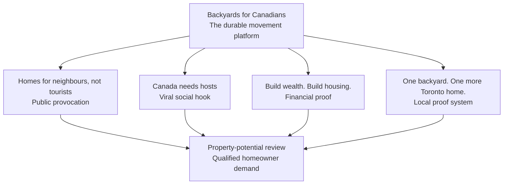

# Backyards for Canadians

## Comprehensive campaign brief

> **Core provocation:** Your backyard could house a neighbour—not another tourist.

This is the strategic navigation layer for the complete campaign proposal that follows. It preserves the proposal’s full campaign architecture, the role of each creative concept, the channel system, physical-media opportunities, conversion logic, launch sequence, and compliance constraints. The second document in this edition is the complete source-ordered proposal rather than a condensed appendix.

## Executive recommendation

Launch **one integrated campaign, not five disconnected slogans**. The creative concepts are strongest as a coordinated architecture in which each line performs a different job:

| Campaign layer | Recommended line | Strategic job |
| --- | --- | --- |
| Master platform | **Backyards for Canadians** | Names the movement, gives it longevity, and supports partnerships, public reporting, events, and homeowner participation. |
| Public provocation | **Homes for neighbours, not tourists.** | Creates tension, press value, instant comprehension, and the moral permission to advertise aggressively. |
| Viral hook | **Canada needs hosts. Just not the Airbnb kind.** | Subverts familiar language, invites sharing, and recasts hosting as a durable contribution to community. |
| Financial proof | **Build wealth. Build housing.** | Converts moral attention into homeowner self-interest without making the campaign sound like charity. |
| Local proof | **One backyard. One more Toronto home.** | Makes every project visible, countable, neighbourhood-specific, and cumulative. |
| Homeowner identity | **I’m putting my backyard to work for Toronto.** | Turns participation into a visible badge of civic contribution and creates a repeatable social object. |

## The strategic proposition

Toronto homeowners can turn underused land behind an existing home into a legal, income-producing rental without becoming a developer or independently coordinating the entire property review, design, permitting, builder, construction-financing, draw, and takeout process.

The campaign should position a garden suite as the more mature, stable, community-minded way to monetize underused land. The moral proposition earns attention; the durable-income proposition earns action. FairLend makes the homeowner proposition concrete by connecting property potential, a coordinated delivery path, specialized financing, and eligible takeout—subject to property fit, borrower qualification, program rules, and available capital.

> **Central promise:** You shouldn’t have to choose between doing well and doing good. A garden suite lets you do both.

### What success looks like

- Toronto homeowners begin to see a garden suite as a socially respected alternative to short-term rental income.
- The campaign produces qualified-property reviews—not merely impressions, outrage, or petitions.
- Every live project becomes media: lawn signs, progress stories, neighbourhood proof, and a growing housing counter.
- FairLend owns a distinctive cultural position where housing supply, homeowner wealth, and practical execution meet.

## Priority audiences and the barrier each message must remove

| Audience | Primary barrier | Message that moves them |
| --- | --- | --- |
| Equity-rich homeowners | Do not know where to start | No development experience is required; begin with a property review and a coordinated plan. |
| Would-be Airbnb hosts | Assume short-term rental is the obvious income path | Compare durable local housing with operational churn, turnover, cleaning, platform dependency, and constant management. |
| Civic-minded owners | Want to help but will not accept charity framing | Do well and do good: build a valuable asset while creating someone’s home. |
| Multi-generational families | Need flexibility for family now and rental use later | Create a legal, self-contained home with long-term optionality. |
| Neighbourhood influencers | Fear density will damage community character | One carefully designed backyard home adds housing gently, visibly, and locally. |

## Viral mechanics

- **Conflict:** neighbours versus tourists is immediately debatable and press-friendly.
- **Identity:** the homeowner becomes a city-builder rather than merely a landlord.
- **Participation:** pledges, property reviews, lawn signs, share cards, and milestones give people something concrete to do.
- **Visible proof:** every construction site, permit milestone, and completed suite increases campaign credibility.
- **Utility:** calculators, financing education, property-fit checks, and project roadmaps turn attention into qualified demand.

---

# Concept-by-concept campaign system

## Concept 1 — Homes for neighbours, not tourists.

**Strategic role:** The high-contrast launch idea. Use it to earn attention, discussion, and media coverage. It should open the door, then move immediately into the complete homeowner economics and execution path.

**Primary audience:** Toronto homeowners considering rental income, plus the broader public whose reaction creates cultural momentum.

**Message system:**

- Homes for neighbours, not tourists.
- Don’t Airbnb your spare space. House someone who lives here.
- Toronto doesn’t need more places to visit. It needs more places to live.
- Competitive income without the vacancies, guest turnover, cleaning, platform dependency, or constant management of short-term rentals.

### Channel strategy

| Channel | Role and execution |
| --- | --- |
| Owned web and conversion | Open with the moral contrast, then answer the homeowner’s financial questions. Place a property-potential check and consultation CTA above the fold. Compare long-term garden-suite economics with short-term-rental operations using transparent, property-specific assumptions. Retarget visitors with the rational line **Build wealth. Build housing.** |
| Organic social | Turn the contrast into a participatory civic debate. Use short videos, neighbour-versus-tourist visual contrasts, street interviews, construction stories, and calls for neighbourhood associations to host a backyard-housing forum. |
| Paid social and video | Separate softer homeowner-economic creative from direct Airbnb provocation. Use 15-second comparison units for homeowners and longer proof-led video showing the process, a real suite, and a tenant or household outcome. |
| Search and intent capture | Capture garden-suite financing, Toronto laneway-suite financing, Airbnb alternative, backyard-rental income, and secondary-suite refinance demand. Keep the provocation in the ad and the proof on the landing page. |
| Earned media and community | Frame the campaign as a public call to redirect homeowner entrepreneurship toward long-term housing supply. Lead with the question: **What if Toronto’s next housing program started in its backyards?** |
| Email, CRM, and partners | Move quickly from curiosity to feasibility and financing. Use subject lines such as **Your backyard could house a neighbour—and pay you every month.** Give builders, brokers, realtors, and mortgage professionals a compliant referral kit. |

### Physical advertising opportunities

- TTC shelters and bus tails in homeowner-dense neighbourhoods: **Homes for neighbours, not tourists.** QR: **See what your backyard could become.**
- Split-panel street posters: a rolling suitcase on one side and a front-door key on the other.
- Oversized door-hanger direct mail: **Your backyard has another front door in it.**
- Community-newspaper and real-estate-window creative with a property-review CTA.
- Construction hoarding: **This backyard is becoming a home for a neighbour.** Add the live campaign counter and a stage-specific QR code.

**Primary conversion:** See what your backyard could become → property check → consultation booking.

**Watch-out:** Do not imply that every garden suite will outperform an Airbnb. Any comparison must disclose property-specific assumptions and distinguish gross revenue from net operating effort and cost.

## Concept 2 — Canada needs hosts. Just not the Airbnb kind.

**Strategic role:** The most inherently shareable line. Use it for social-first creative, earned media, creator commentary, and cultural conversation.

**Primary audience:** Homeowners, younger family members who influence them, housing advocates, urbanists, and local media.

**Message system:**

- Canada needs hosts. Just not the Airbnb kind.
- Host a household. Grow a neighbourhood.
- Be the reason someone can live closer to work.
- Build wealth. House a neighbour.

### Channel strategy

| Channel | Role and execution |
| --- | --- |
| Owned web and conversion | Build a social-native campaign page with a pledge, share card, and immediate property-review path. Visitors generate a **I’d host a neighbour in my backyard** card and move from symbolic participation into eligible next steps. |
| Organic social | Use repeatable host-redefinition formats: **Host Wanted** creator prompts, street interviews, comment-friendly static posts, milestone stories, and homeowner profiles. Keep the line large and the explanation light. |
| Paid social and video | Treat the hook as a pattern interrupt, then qualify through six-second bumper, creator whitelisting, and sequential retargeting from host provocation to property potential. |
| Search and intent capture | Do not force the joke into every high-intent ad. Use it as a recognisable brand asset after intent is captured, while retargeting social-engaged audiences with feasibility content. |
| Earned media and community | Stage a public redefinition of hosting. Recruit a founding cohort of **Toronto’s new hosts**, publish their pledged backyards, and pitch the language plus real homeowners to morning radio and local television. |
| Email, CRM, and partners | Give advocates a line they will forward. Use **Canada needs a different kind of host**, one-click referral tools, and co-branded partner education for the process behind the idea. |

### Physical advertising opportunities

- **HOST WANTED** wild-posting series; the reveal below is **Backyard required. Tourism experience not necessary.**
- Coffee sleeves and takeout bags: **A different kind of host keeps Toronto running.**
- Corridor ads near commuter routes: **Host someone closer to work.**
- Neighbourhood event placards and photo walls: **Toronto’s new hosts.**
- Realtor open-house inserts: **The next income suite may be behind this house.**

**Primary conversion:** Become a different kind of host → pledge/share → homeowner stories → property review.

**Watch-out:** Keep the word *Canada* inclusive. Stories and casting should visibly include newcomers, long-time residents, different household types, and different parts of the city.

## Concept 3 — Backyards for Canadians

**Strategic role:** The durable campaign platform. Use it to organise pledges, partnerships, public reporting, project stories, events, and the housing counter.

**Primary audience:** Civic-minded homeowners, neighbourhood leaders, employers, builders, realtors, brokers, and public-interest partners.

**Message system:**

- Backyards for Canadians.
- I’m putting my backyard to work for Toronto.
- Your backyard can help solve the housing crisis.
- A backyard shouldn’t sit empty during a housing crisis.
- Build wealth. House a neighbour.

### Channel strategy

| Channel | Role and execution |
| --- | --- |
| Owned web and conversion | Build a movement dashboard, not a conventional product page. Map pledged, reviewed, financed, under-construction, and completed backyards; show live counts; and route every participant to the next project stage. |
| Organic social | Make participation visible through weekly **Backyard of the Week** stories, milestone posts, and an **I’m putting my backyard to work for…** template completed with Toronto, family, neighbour, or next generation. |
| Paid social and video | Reduce perceived novelty through neighbourhood proximity. Use **Three backyards in East York are already in review**, verified counts, real stories, founder-style proof, and retargeting based on process milestones. |
| Search and intent capture | Own the movement phrase and connect broad housing interest to concrete action. Publish feasibility, permitting, draw, takeout, and landlord-readiness guides, with structured FAQ content around property fit. |
| Earned media and community | Give media a measurable movement with recurring milestones. Publish an annual report based on verified pipeline data and host builder, planner, financing, and neighbourhood clinics. |
| Email, CRM, and partners | Give each eligible partner a QR code, toolkit, and dashboard attribution. Run neighbourhood referral loops when properties enter review and share education across builders, realtors, brokers, and community groups. |

### Physical advertising opportunities

- Signature lawn sign during construction: **Another Toronto home is being built here.** Include the campaign mark, project counter, QR code, and project stage.
- Permanent completion plaque: **One backyard. One more Toronto home.**
- Neighbourhood counter boards at events, builder showrooms, and partner offices.
- Branded project fencing and construction-site signage that evolves at each milestone.
- A mobile **Backyard Housing Lab** pop-up for street festivals with parcel sketches, financing education, and on-site property-review booking.

**Primary conversion:** Put your backyard to work for Toronto → pledge → property review → project-stage updates.

**Watch-out:** A pledge counter without completed projects becomes empty virtue signalling. Publish stage definitions, verified counts, and dates; never imply that a pledge equals a financed or completed home.

## Concept 4 — Build wealth. Build housing.

**Strategic role:** The financial conversion idea. Use it wherever homeowner economics, financing, process clarity, and partner credibility matter most.

**Primary audience:** Equity-rich homeowners, financially motivated households, mortgage clients, real-estate investors, and referral professionals.

**Message system:**

- Build wealth. Build housing.
- Your property can do more than appreciate.
- Turn unused land into someone’s first home.
- Create reliable, long-term income—and one more place to live.
- You do not need to be a developer. You need the right team and a viable property.

### Channel strategy

| Channel | Role and execution |
| --- | --- |
| Owned web and conversion | Lead with a transparent project equation and an easy first step. Use an interactive property-potential tool, explain the coordinated feasibility-to-takeout workstream, and show anonymised project scenarios rather than simple-point income promises. |
| Organic social | Teach the economics in plain language while preserving the social outcome. Use process carousels, whiteboard videos, construction-draw explanations, and before/after parcel sketches. |
| Paid social and video | Generate qualified leads with homeowner self-interest while the civic line differentiates. Use **Could your backyard support a long-term rental home?**, finance explainers, and process-reassurance retargeting. |
| Search and intent capture | Own matched-page demand for garden-suite financing, laneway-suite financing, secondary-suite refinance, and construction draws. Use compliant amortisation, loan-to-value, approval, and eligibility qualifiers. |
| Earned media and community | Contribute useful homeowner economics to housing coverage. Publish anonymised project scenarios with viability variables and host clinics with builders and mortgage professionals. |
| Email, CRM, and partners | Run a staged education sequence: property fit → project budget → financing path → permits/build → long-term rental readiness. Provide partner decks explaining who is and is not a good fit. |

### Physical advertising opportunities

- Parcel-sketch direct mail: **There may be another income-producing home behind yours.**
- Home-improvement retail and design-centre placements: **You renovate rooms. What if you built an address?**
- Mortgage and realtor office displays with a take-one project checklist and trackable QR code.
- Neighbourhood seminar posters: **Garden suite feasibility + financing clinic.**
- Construction-vehicle and trailer graphics: **Build wealth. Build housing.** paired with a completed-suite image.

**Primary conversion:** Check your property’s potential → viability education → transparent project equation → consultation.

**Watch-out:** **Financing available over 30 years** is too broad as public copy. Safer language is **Eligible financing may amortise up to 30 years, subject to approval and program requirements.** Never imply a guaranteed structure.

## Concept 5 — One backyard. One more Toronto home.

**Strategic role:** The local proof and neighbourhood platform. Use it to make gentle density tangible, neighbourhood-specific, and cumulative.

**Primary audience:** Homeowners who need social proof, neighbours worried about change, municipal and community stakeholders, and local press.

**Message system:**

- One backyard. One more Toronto home.
- One lot can hold more possibility.
- Another Toronto home is being built here.
- Turn unused land into someone’s first home.
- Small build. Real home. Lasting impact.

### Channel strategy

| Channel | Role and execution |
| --- | --- |
| Owned web and conversion | Organise proof geographically and by project stage. Use neighbourhood pages, local case studies, process timelines, and a counter that distinguishes reviews, financed builds, starts, and completed homes. |
| Organic social | Use progress content rather than repeatedly explaining the campaign. Publish monthly local reveals, useful lessons at milestones, and stories about who a garden suite can serve. |
| Paid social and video | Use nearby proof to reduce perceived risk. Geo-target **See how one East York backyard became one more home**, case-study ads, and sequential empty-yard → construction → completed-home creative. |
| Search and intent capture | Connect neighbourhood proof with high-intent feasibility queries. Use local pages only when examples are genuinely distinct, case-study schema, financing links, and a direct search CTA. |
| Earned media and community | Create recurring, evidence-led local moments: project milestones, quarterly counters with methodology, small open-house tours, and builder/community events. |
| Email, CRM, and partners | Use completed proof to move cautious homeowners through the funnel. Segment by lot type, motivation, project stage, neighbourhood, and proximity to a verified project. |

### Physical advertising opportunities

- Numbered lawn signs only after the counting methodology is established: **Toronto home #__ is being built here.**
- Construction-fence progress panels that change at feasibility, permit, build, and completion.
- Hyperlocal mail around consenting project sites: **One more home is coming to the neighbourhood. Here’s how it works.**
- TTC platform sequence: **One backyard** → **One more Toronto home** → **See the property-review CTA.**
- Permanent or semi-permanent completion markers that homeowners can opt into as a civic badge.

**Primary conversion:** Create one more Toronto home → local proof → verified case study → property review.

**Watch-out:** Count only legal, self-contained long-term homes that reach the published project stage. Do not use a tenant’s identity, occupation, or personal story without informed consent and fair compensation where appropriate.

---

# Integrated channel and physical-media operating model

## Every channel gets one primary job

| Channel | Primary job | Recommended campaign layer | Primary conversion |
| --- | --- | --- | --- |
| PR / earned | Create debate and legitimacy | Homes for neighbours / Canada needs hosts | Campaign-hub visits |
| Organic social | Earn shares and participation | Canada needs hosts / homeowner pledge | Pledge or property check |
| Paid social / video | Qualify and retarget | Provocation → wealth/housing proof | Property review |
| Search | Capture active demand | Build wealth. Build housing. | Consultation booking |
| Email / CRM | Educate and progress | One team / first review to takeout | Documents and appointment |
| Partners | Borrow trust and referrals | Backyards for Canadians | Trackable referral |
| Physical / OOH | Make the movement locally visible | One backyard. One more home. | QR scan or event attendance |

## The conversion spine

1. **Attention:** Encounter the provocation in social, press, transit, direct mail, or the street.
2. **Identification:** See a homeowner, lot, neighbourhood, or project that feels familiar.
3. **Utility:** Complete a property-potential check or download the planning checklist.
4. **Qualification:** Book a review and provide the inputs needed to assess fit.
5. **Progression:** Receive a clear roadmap for feasibility, capital, permits, construction, draws, and eligible takeout.
6. **Advocacy:** Share the pledge, lawn sign, referral, or verified project milestone.

## Physical-media master plan

Physical media is not an accessory to this campaign. It is the proof layer. Prioritise placements that either sit on the property itself or reach homeowners in a geographically accountable way.

| Medium | Best concept | Execution | Why it earns its keep |
| --- | --- | --- | --- |
| Lawn signs | One more Toronto home | Milestone-based sign on consenting project sites | Every project becomes a local endorsement and lead source. |
| Construction hoarding | Backyards for Canadians | Progress story, live counter, QR code | Long dwell time and immediate proof. |
| TTC / shelter | Neighbours, not tourists | Minimal copy, visual contrast, short URL | Creates cultural reach and debate. |
| Direct mail | Build wealth. Build housing. | Parcel-sketch mailer to selected postal walks | Reaches property owners with enough room to explain the offer. |
| Door hangers | One backyard | Neighbour information and event invite | Useful around active sites when handled transparently. |
| Retail / showroom | Build wealth | Checklist racks at builders, design centres, and realtor offices | Catches homeowners during renovation and property decisions. |
| Community events | Backyards for Canadians | Mobile housing lab and on-site booking | Converts abstract interest into practical review. |
| Completion plaques | One more Toronto home | Optional permanent marker | Creates enduring recognition and neighbourhood proof. |

### Placement principles

- Choose homeowner-dense postal walks and neighbourhoods based on property fit, project capacity, and serviceability—not broad citywide reach alone.
- Keep provocative OOH copy extremely short; use the QR destination to add nuance.
- Treat active sites as community communications: identify what is happening, expected stages, and where neighbours can learn more.
- Obtain owner and site permissions, comply with municipal sign rules, and avoid any suggestion of government endorsement.
- Use distinct tracking for every medium so physical spend is evaluated against qualified reviews rather than scans alone.

## 90-day launch strategy

| Phase | Weeks | What ships | Decision gate |
| --- | --- | --- | --- |
| 1. Prove | 1–2 | Claim substantiation, identity, landing prototype, property checker, CRM/QR instrumentation, founding-homeowner recruitment | Can FairLend responsibly support the offer and measure qualified demand? |
| 2. Pilot | 3–6 | Three social concepts, search capture, targeted mail, first lawn signs, one community clinic | Which message produces viable properties—not only engagement? |
| 3. Activate | 7–10 | PR launch, creator content, transit test, partner toolkit, public counter, project stories | Does the architecture improve branded search and review volume? |
| 4. Scale | 11–13 | Shift spend to winning neighbourhoods and creative; expand site signage and referrals | Can operations absorb the pipeline without degrading the experience? |

## Minimum viable launch package

- Campaign hub with property-potential intake, transparent stage definitions, and compliant financing language.
- Three launch films: provocation, homeowner story, and rational process/economics.
- Six static/social units across the campaign architecture.
- Four-stage lawn-sign system plus one targeted direct-mail piece.
- Partner referral kit for builders, realtors, brokers, and mortgage professionals.
- Founding-homeowner cohort with consented stories and a clear operational path.
- Measurement dashboard from impression and QR scan through viable property and completed home.

## Measurement infrastructure

- Unique QR codes by physical placement, partner, neighbourhood, and creative concept.
- Consistent UTMs and CRM source fields through property review, consultation, viability, and application stages.
- Separate counters for pledges, reviews, financed projects, starts, and completed homes.
- Creative-level sentiment tracking so provocation is evaluated against qualified demand—not engagement alone.
- Call tracking and self-reported attribution for events, direct mail, and partner referrals.

## Claims, compliance, and brand safety

> **Operating principle:** The campaign can be morally bold without being financially sloppy.

- Do not publicly promise that every garden suite will make **just as good an income as Airbnb**. The defensible proposition is stable, potentially competitive long-term income with less turnover and platform dependency.
- Any numeric comparison must disclose property-specific assumptions, rate, amortisation, mortgage amount, insurance, taxes, utilities, maintenance, vacancy, contingency, management, and short-term-rental operating costs.
- Preserve **No development experience required** as a process-reassurance claim; never imply that FairLend eliminates owner responsibilities or guarantees execution.
- Replace broad public statements such as **Financing available over 30 years** with **Eligible financing may amortise up to 30 years with qualified language tied to the applicable eligible program.**
- Do not combine maximum loan-to-value and maximum amortisation figures from different eligibility paths as if both are guaranteed together.
- All financing remains subject to property fit, borrower qualification, underwriting, approval, program rules, and available capital.
- Financial comparisons require a compliance review before publication, and campaign assets must carry appropriate advertising, licensing, disclosure, date, and channel information.
- Use *affordable* only when the campaign defines and substantiates the standard. Otherwise prefer **high-quality long-term housing** or **a home closer to work and community**.
- Stories must represent the full reality of Toronto and Canada without introducing illegal or irrelevant tenant-selection preferences.

## Decision requested

Approve the integrated architecture and pilot it against **qualified-property outcomes**, not applause alone.

1. Select **Backyards for Canadians** as the master public name, with **Backyards for Toronto** as the local activation variant.
2. Approve **Homes for neighbours, not tourists** and **Canada needs hosts** for controlled creative testing.
3. Commission claim substantiation and compliance review before producing financial comparison assets.
4. Recruit three to five founding homeowners or active projects that can supply authentic proof.
5. Build the campaign hub, property checker, CRM attribution, and stage-based public counter.
6. Produce launch creative and the physical lawn-sign system as one coherent identity.
7. Run the 90-day pilot, then scale according to viable-property rate, project capacity, and brand sentiment.

> **Final line:** Build wealth. Build housing. House a neighbour.
