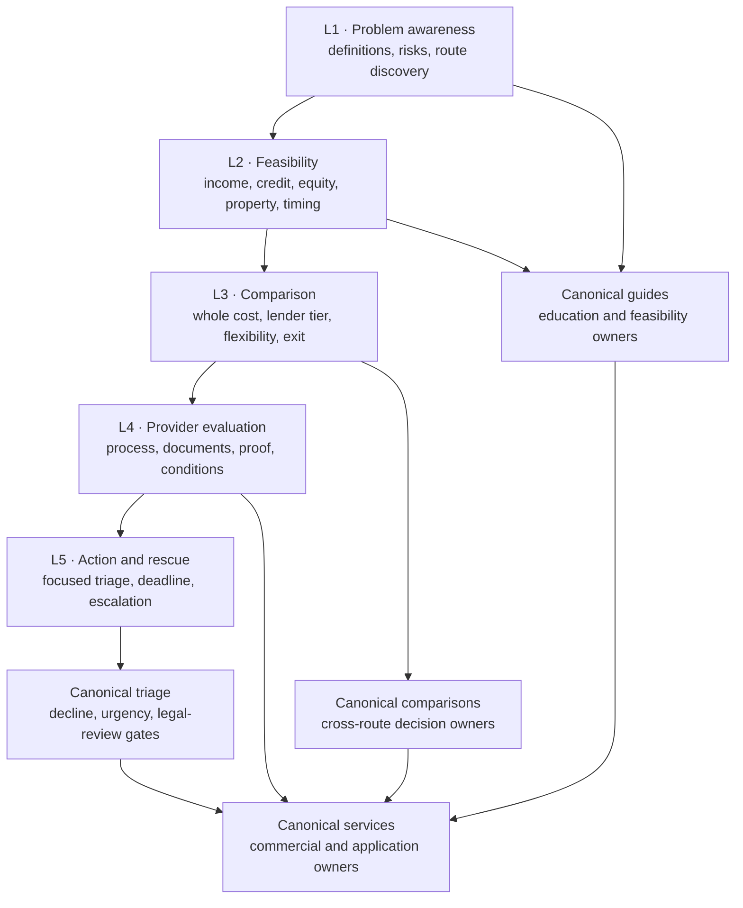
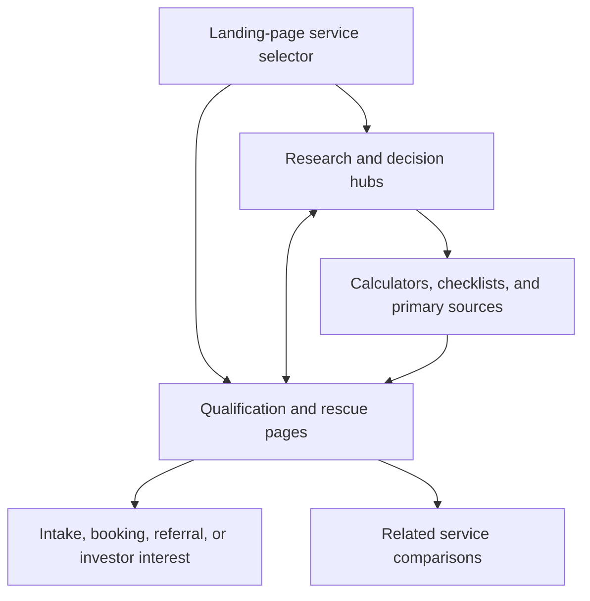

# FairLend SEO master report: keyword intelligence, five-layer funnel, competitive landscape, and content production system

**Research period:** 2026-07-19 to 2026-07-20  
**Market:** Ontario mortgage borrowers with Canada/Ontario/Toronto query localization  
**First-party account used:** c.beleznay@humanfeedback.com  
**Corpus contract:** One authoritative, row-complete edition of the service-funnel, clustering, GSC/GA4 validation, borrower-keyword, live-SERP, competitor, and per-keyword outranking artifacts generated in this workstream.

This is the report—not a summary. Every substantive Markdown finding, every CSV record, and every JSON payload from the three research packages is embedded below. The earlier HTML presentation artifact is inventoried by hash while its canonical findings are preserved through the underlying Markdown, CSV, and JSON sources. Blank market-volume, CPC, difficulty, traffic, and backlink fields mean **unavailable—not zero**.

## Report contract and corpus integrity

| Measure | Complete value |
|---|---:|
| Source artifacts inventoried | 38 |
| Source artifacts embedded in full | 37 |
| Presentation derivatives hash-inventoried | 1 |
| Total source bytes inventoried | 2,415,716 |
| Parsed CSV records embedded | 1,357 |
| Service-funnel keywords | 160 |
| Landing-service page clusters | 32 |
| Borrower keywords | 160 |
| Borrower canonical page owners | 18 |
| Per-keyword outranking strategies | 160 |
| Captured live SERP result references | 800 |
| Unique observed ranking domains | 221 |
| Borrower questions | 120 |
| Production-ready page outlines | 18 |

### Source manifest

| sourcePath | format | bytes | sha256 | recordsOrTopLevelKeys | bodyDisposition |
| --- | --- | --- | --- | --- | --- |
| docs/SEO/research/keyword-and-funnel/landing-services-funnel-2026-07-19/README.md | md | 3183 | 51c39351f58c33bf6c7f12256b17b0fa8ab40b849243d45df1a56a95d85d97d1 | — | Embedded in full below. |
| docs/SEO/research/keyword-and-funnel/landing-services-funnel-2026-07-19/answer-socrates-observations.csv | csv | 13712 | 340b41cdeee1e34fa309ffbec27ed57a92505782ba136291716edb2707d8a459 | 64 | Embedded in full below. |
| docs/SEO/research/keyword-and-funnel/landing-services-funnel-2026-07-19/coverage-qa.csv | csv | 1546 | b4806f85bc184efef246cdc9335cb78341eac48bf066fff1c351a0a960163555 | 16 | Embedded in full below. |
| docs/SEO/research/keyword-and-funnel/landing-services-funnel-2026-07-19/executive-findings.md | md | 4998 | 5e9edd9cf0a5d8b5c8d299ee96c411d124a2c14c36c50af40b61a4c2756d7ff4 | — | Embedded in full below. |
| docs/SEO/research/keyword-and-funnel/landing-services-funnel-2026-07-19/first-party-evidence.csv | csv | 6927 | 794617db6170622b4bd6c73a1c35520803471b457b766993c58c60579de247e0 | 48 | Embedded in full below. |
| docs/SEO/research/keyword-and-funnel/landing-services-funnel-2026-07-19/keyword-universe.csv | csv | 113798 | 9737d895ac4517c043ee15e5ff4e74040c6e1f5d2037623a1e317056d9cac1fe | 160 | Embedded in full below. |
| docs/SEO/research/keyword-and-funnel/landing-services-funnel-2026-07-19/methodology-and-limitations.md | md | 4495 | 7969cb6fa4ebf89dd40e259f44a6dbeb6d097a5b934ffe5aebe7576a8974b096 | — | Embedded in full below. |
| docs/SEO/research/keyword-and-funnel/landing-services-funnel-2026-07-19/question-bank.csv | csv | 19722 | 5ae307add9b4ce8862243285e9e8471cca597390f3a39d0af90123d1df26b1bb | 68 | Embedded in full below. |
| docs/SEO/research/keyword-and-funnel/landing-services-funnel-2026-07-19/research-summary.json | json | 1874 | c4fb443e6b61bb6e6741a4cae6098ccba96824acaccf700501008fa53f054e04 | 11 | Embedded in full below. |
| docs/SEO/research/keyword-and-funnel/landing-services-funnel-2026-07-19/run-manifest.json | json | 5701 | f66b691cef241c451aa913565ccfb6951d5f91b7e43778dfa578bde0b7cac668 | 6 | Embedded in full below. |
| docs/SEO/research/keyword-and-funnel/landing-services-funnel-2026-07-19/serp-evidence.csv | csv | 5332 | e8ea70cada23e86652d51d80ebfbd7fce9f8a0f72021c2114123337c84da7009 | 16 | Embedded in full below. |
| docs/SEO/research/keyword-and-funnel/landing-services-funnel-2026-07-19/service-opportunities.csv | csv | 7544 | ee8d76ef94b42fa239ab2f362469bca6ce6da84287809cd62b6e8fa2e4e75a71 | 16 | Embedded in full below. |
| docs/SEO/research/keyword-and-funnel/keyword-cluster-validation-2026-07-20/cluster-summary.json | json | 56792 | 19d77fec74cd94a9e40188d5c3c66c7b162884b6a5d2de5a76236f7aab67c125 | 6 | Embedded in full below. |
| docs/SEO/research/keyword-and-funnel/keyword-cluster-validation-2026-07-20/fairlend-keyword-research-and-cluster-report.md | md | 63924 | b7be345af0ece8d9c3773e1ad9a98fe8dfef7cae2aa21ab3b9d3173b5a8f7ac9 | — | Embedded in full below. |
| docs/SEO/research/keyword-and-funnel/keyword-cluster-validation-2026-07-20/google-cluster-validation-2026-07-20.csv | csv | 21330 | b8a52b1b4df0a6b996a159cbf1c6052f13f145d55e511a989e948cffda34c533 | 32 | Embedded in full below. |
| docs/SEO/research/keyword-and-funnel/keyword-cluster-validation-2026-07-20/google-validation-report-2026-07-20.md | md | 16343 | cd05d1e62b901b99a68ec784e023c4fd67072a338e1d7be729d65d95be7c1ea3 | — | Embedded in full below. |
| docs/SEO/research/keyword-and-funnel/keyword-cluster-validation-2026-07-20/google-validation-summary-2026-07-20.json | json | 35888 | 79f26dd1dbe23227ffd54e6b24c8ffe17a4e93165d10e202609a5761cfba1d9b | 13 | Embedded in full below. |
| docs/SEO/research/keyword-and-funnel/keyword-cluster-validation-2026-07-20/page-cluster-map.csv | csv | 32861 | 5f11c32debebcfa672f48d8d1664dfd4a26c6eda9b5b7750c5cc820da61d3578 | 32 | Embedded in full below. |
| docs/SEO/research/keyword-and-funnel/mortgage-borrower-strategy-2026-07-20/90-day-roadmap.md | md | 1793 | a70ea5338e5e2b46a6fa0e195344d06732e581c4121854ec0428e16a1d2273f5 | — | Embedded in full below. |
| docs/SEO/research/keyword-and-funnel/mortgage-borrower-strategy-2026-07-20/README.md | md | 1636 | 572ccd0c77585e0fc4a62e46d3e63d50217ba7961f972d951f10407213d5baba | — | Embedded in full below. |
| docs/SEO/research/keyword-and-funnel/mortgage-borrower-strategy-2026-07-20/competitive-cluster-landscape.csv | csv | 27879 | d882fd9eb6281ec4fc4ffa1121313f5bfa627f70da23f6bafbea55b8c0cb8c0b | 18 | Embedded in full below. |
| docs/SEO/research/keyword-and-funnel/mortgage-borrower-strategy-2026-07-20/competitive-coverage-qa.csv | csv | 860 | 02db73f575236856f96c9fc9eb256e7bc0b1e4eddb0bc9c1a1ea8c25b871174f | 10 | Embedded in full below. |
| docs/SEO/research/keyword-and-funnel/mortgage-borrower-strategy-2026-07-20/competitive-keyword-outranking-strategy.csv | csv | 517082 | cccec21c395999c525cfa5d4b4fd86a1471546f65ba502d9990d83f9652a9d62 | 160 | Embedded in full below. |
| docs/SEO/research/keyword-and-funnel/mortgage-borrower-strategy-2026-07-20/competitive-landscape-and-outranking-strategy.md | md | 243069 | 8239946b71e8ab6bb3e6e27a8e0449fcd2bcd538efae61fc41aa7450aef89c94 | — | Embedded in full below. |
| docs/SEO/research/keyword-and-funnel/mortgage-borrower-strategy-2026-07-20/competitive-landscape-summary.json | json | 25866 | 8ddec21a3bb30f6d08f06c560565220b64aa6b6e3855ea5efbe62e445c2c0378 | 5 | Embedded in full below. |
| docs/SEO/research/keyword-and-funnel/mortgage-borrower-strategy-2026-07-20/competitor-domain-landscape.csv | csv | 118493 | 420b42144b667aa361b9d143367bd9899d9e86a7bc9b356e8823c9853daf8283 | 221 | Embedded in full below. |
| docs/SEO/research/keyword-and-funnel/mortgage-borrower-strategy-2026-07-20/coverage-qa.csv | csv | 1211 | 5a3f87f539c39f83982a6e06f7b59481a15880496350da1a119193031f6a362d | 14 | Embedded in full below. |
| docs/SEO/research/keyword-and-funnel/mortgage-borrower-strategy-2026-07-20/evidence-ledger.csv | csv | 7507 | 4628fa45c9fa701a26fdace203ed1c7cdafff96e74e33522db2f95d357efb0c0 | 16 | Embedded in full below. |
| docs/SEO/research/keyword-and-funnel/mortgage-borrower-strategy-2026-07-20/fairlend-competitive-outranking-strategy.html | html | 394974 | e800bf9579bb77e9de083dd6e9d21bfefb482648a95b357e49e3fd23f237c2d5 | — | Presentation derivative inventoried; its underlying findings are embedded from the canonical Markdown/CSV/JSON sources. |
| docs/SEO/research/keyword-and-funnel/mortgage-borrower-strategy-2026-07-20/keyword-demand-and-ranking-validation.csv | csv | 107360 | 3f58f0ac72fd37dab332aa604b8b72d778bde695c5b10a414090f7bcce494616 | 160 | Embedded in full below. |
| docs/SEO/research/keyword-and-funnel/mortgage-borrower-strategy-2026-07-20/keyword-universe.csv | csv | 184387 | 98deb2944ca760890f8aeb5e5693361380bec6539b181300438e18e25b177a66 | 160 | Embedded in full below. |
| docs/SEO/research/keyword-and-funnel/mortgage-borrower-strategy-2026-07-20/live-serp-scan-2026-07-20.json | json | 251543 | b3a477c00ae3e31bbbc0b4f8e3750b32441e3285c5915fe31c98af80dc453b7b | 160 | Embedded in full below. |
| docs/SEO/research/keyword-and-funnel/mortgage-borrower-strategy-2026-07-20/mortgage-borrower-keyword-research-and-strategy.md | md | 36805 | 32a4b64f986be19c63ea309bee51f0bfad46c4d147851ceedcfb2aa42d1c551d | — | Embedded in full below. |
| docs/SEO/research/keyword-and-funnel/mortgage-borrower-strategy-2026-07-20/page-cluster-map.csv | csv | 15870 | 4ea758b9ad8b8fda8be41a295dc69f57bdb634cab9299ad7b064b0b0a206d818 | 18 | Embedded in full below. |
| docs/SEO/research/keyword-and-funnel/mortgage-borrower-strategy-2026-07-20/question-bank.csv | csv | 51379 | 9277cc4e8d7d86f8afdfbda0353d7e6798ed8674055e29e3384eb86dd94fe18e | 120 | Embedded in full below. |
| docs/SEO/research/keyword-and-funnel/mortgage-borrower-strategy-2026-07-20/research-summary.json | json | 6413 | 196363dea2db1ca6f3cd5e4ff4a8f31bdf3f029f0a2d180a88fbd8380600e434 | 9 | Embedded in full below. |
| docs/SEO/research/keyword-and-funnel/mortgage-borrower-strategy-2026-07-20/run-manifest.json | json | 1685 | 96e3d683ab92c1cff7b0e8cdf4d272ff698c47d60f7c081eae5873a9258f0785 | 7 | Embedded in full below. |
| docs/SEO/research/keyword-and-funnel/mortgage-borrower-strategy-2026-07-20/service-opportunity-matrix.csv | csv | 3934 | 11c35ad4f07fd1b1c0a6528a3330cd8bde8887e6289735e69a79b35c2a271713 | 8 | Embedded in full below. |

### Evidence rules carried throughout the report

- GSC and GA4 metrics are first-party observations for FairLend, not market-demand estimates.
- Live search results identify currently ranking pages and observable content patterns; they do not provide traffic, backlink authority, or exact local rank guarantees.
- Answer Socrates contributes question and phrasing discovery, not authoritative market-volume metrics.
- Search volume, CPC, difficulty, competitor traffic, and backlink strength remain blank or explicitly unavailable where no credentialed provider was callable.
- Mortgage, rate, qualification, enforcement, and legal content must expose dates, assumptions, evidence, geography, and confidence.
- FairLend’s commercial differentiation must be tied to verifiable licensing, principal-broker experience, transparent underwriting logic, whole-cost disclosure, original decision tools, and a defensible exit—not generic “fast approval” language.

# Content and SEO production proposal

## Portfolio architecture and publishing sequence

The 18 borrower page owners below are the canonical production system. Existing service URLs are updated rather than displaced; proposed guides and service pages fill distinct intents; comparison pages own cross-product decisions; the power-of-sale guide stays on hold until Ontario legal review. Priority is inherited from the validated cluster maps and per-keyword strategy, not re-scored here.



### Complete canonical cluster control plane

| clusterId | pageOwner | canonicalPath | status | priority | pageType | funnelLayers | segments | primaryKeyword | canonicalBoundary |
| --- | --- | --- | --- | --- | --- | --- | --- | --- | --- |
| residential-guide | Ontario residential mortgage guide | /resources/ontario-residential-mortgage-guide | proposed-create | P2 | Evergreen guide | L1-L3 | residential | how do mortgages work in Ontario | Broad residential education only; A/B/private pages own lender-tier qualification and rescue intent. |
| residential-service | Residential mortgage financing | /borrowers/residential-mortgage-financing | proposed-create | P2 | Service page | L4-L5 | residential | residential mortgage broker Ontario | Owns generic residential commercial intent; does not target A, B, private, HELOC, bridge, or rescue head terms. |
| a-guide | A-lender requirements guide | /resources/a-lender-mortgage-requirements-ontario | proposed-create | P1 | Qualification guide | L1-L2 | prime-a | A lender mortgage requirements Ontario | Prime-policy education; residential guide remains broad and B/private pages own non-prime routes. |
| a-service | Institutional mortgage service | /borrowers/institutional-mortgage | existing-update | P1 | Service page | L4-L5 | prime-a | institutional mortgage lenders Ontario | Prime institutional owner. Alternative B and private commercial intent must not be blended into the title/H1. |
| b-guide | B-lender mortgage guide | /resources/b-lender-mortgage-ontario | proposed-create | P1 | Qualification guide | L1-L2 | alternative-b | B lender mortgage requirements Ontario | Institutional alternative only; no equity-first private promises or generic residential head terms. |
| b-service | Alternative mortgage service | /borrowers/alternative-mortgage | proposed-create | P1 | Service page | L4-L5 | alternative-b | B lender mortgage broker Ontario | Owns B-lender commercial intent. Bank-declined private/rescue terms route to private service. |
| private-guide | Private mortgage costs and fit guide | /resources/private-mortgage-costs-ontario | hold-until-service-strengthened | Hold | Evergreen guide | L1-L2 | private | private mortgage costs Ontario | Publish only after the existing service owner is strengthened; never compete for “private mortgage lenders Ontario.” |
| private-service | Private mortgage financing | /borrowers/private-mortgage-financing | existing-update | P0 | Service / urgent assessment page | L4-L5 | private\|rescue | private mortgage lenders Ontario | Single commercial owner for private and urgent bank-declined intent; rescue guide educates and triages, never duplicates the service pitch. |
| renovation-guide | Renovation financing options guide | /resources/renovation-financing-ontario | proposed-create | P1 | Decision guide | L1-L2 | renovation | home renovation financing options Canada | Existing dwelling improvements only; ground-up builds and major construction draws belong to construction financing. |
| renovation-service | Renovation financing service | /borrowers/renovation-financing | proposed-create | P1 | Service page | L4-L5 | renovation | renovation financing lender Ontario | Commercial renovation intent; no ground-up construction or general revolving-equity head terms. |
| bridge-guide | Ontario bridge financing guide | /resources/bridge-financing-ontario | proposed-create | P1 | Decision guide | L1-L3 | bridge | how does a bridge loan work Ontario | Temporary closing/liquidity gap only; ongoing equity borrowing belongs to HELOC and broad private needs belong to private. |
| bridge-service | Bridge financing service | /borrowers/bridge-financing | proposed-create | P1 | Service page | L4-L5 | bridge | bridge mortgage lender Ontario | Owns bridge commercial terms; “no firm sale” is a subsection/variant, not a duplicate private-bridge page. |
| heloc-guide | HELOC and home-equity guide | /resources/heloc-ontario-guide | proposed-create | P1 | Evergreen guide | L1-L2 | heloc-equity | what is a HELOC in Canada | Revolving home-equity education; refinance and renovation pages own their distinct outcomes. |
| heloc-service | HELOC / home-equity financing | /borrowers/heloc | proposed-create | P1 | Service page | L4-L5 | heloc-equity | HELOC lender Ontario | Owns HELOC/home-equity commercial intent; urgent bad-credit second-mortgage variants link to private rather than spawning duplicates. |
| rescue-guide | Mortgage declined in Ontario: recovery plan | /resources/mortgage-declined-ontario | proposed-create | P0 | Triage guide | L1-L4 | rescue | mortgage declined Ontario options | Educational triage owner only; all commercial “private lender” intent belongs to the existing private service. |
| rescue-legal | Power-of-sale options guide | /resources/power-of-sale-options-ontario | hold-pending-legal-review | Hold | Legal-reviewed guide | L1-L5 | rescue | options before power of sale Ontario | Legal/enforcement intent only. Requires Ontario-law review and must never promise to “stop” enforcement. |
| lender-comparison | A vs B vs private mortgage comparison | /resources/a-vs-b-vs-private-mortgage | proposed-create | P0 | Comparison / decision page | L3 | prime-a\|alternative-b\|private | A lender vs B lender vs private mortgage Ontario | Sole A/B/private comparison owner; individual service pages explain their tier but do not recreate the full matrix. |
| equity-comparison | HELOC vs refinance vs renovation financing | /resources/heloc-vs-refinance-vs-renovation | proposed-create | P1 | Comparison / calculator brief | L3 | heloc-equity\|renovation | HELOC vs refinance for renovations | Sole cross-option equity comparison owner; service pages answer provider/qualification intent. |

### Publishing waves

1. **P0 existing-owner and decision pages:** strengthen the existing private and institutional owners, publish the mortgage-declined triage owner and A/B/private comparison, and preserve every canonical boundary.
2. **P1 route-expansion pages:** complete alternative, residential, renovation, bridge, HELOC/equity, private-cost/qualification, and cross-option comparison coverage with original tools and internal links.
3. **P2 depth page:** publish the private exit-strategy guide after the core private service and cost/qualification pages can link into it.
4. **Hold:** do not publish the power-of-sale owner until Ontario-law review, dated citations, disclaimers, escalation language, and non-guarantee gates are signed off.

### Page system shared by every owner

- Answer the exact query in the opening 40–60 words.
- Mirror the current winning format where it serves the borrower, then add a decision tool, transparent Ontario scenario, complete cost/qualification logic, and a route beyond one product.
- Keep service pages commercial and guides educational; comparison pages own full matrices; urgent/legal content owns triage and escalation.
- Put the focused CTA after material query satisfaction. The default offer is a free 30-minute borrower scenario triage with no application, credit inquiry, or obligation.
- Use original calculators and decision aids as linkable assets, not decorative widgets. Record assumptions, explain results, and prevent misleading precision.
- Instrument organic landing sessions, engaged sessions, qualified CTA events, completed triage requests, and GSC page/query performance; the current GA4 baseline has no key events and cannot yet validate lead quality.

## Measurement and iteration specification

| Layer | Primary user state | Search/content job | Core measurement | Optimization decision |
|---|---|---|---|---|
| L1 | Unaware / problem-aware | Define the problem and the relevant mortgage route in Ontario terms. | GSC impressions, non-brand queries, engaged organic entrances, scroll/search engagement. | Expand answer coverage and clarify the canonical route; do not force a commercial conversion. |
| L2 | Solution-aware / feasibility | Help the borrower determine whether income, credit, equity, property, or timing could fit. | Qualified calculator/checklist engagement, return visits, assisted CTA events. | Improve decision rules, assumptions, examples, and document readiness. |
| L3 | Comparison / decision | Compare A, B, private, HELOC, refinance, renovation, and bridge routes on whole cost and exit. | Comparison interactions, next-page progression, assisted triage requests. | Strengthen matrices, break-even logic, scenario coverage, and canonical linking. |
| L4 | Provider / application | Prove expertise, process, documents, pricing logic, and responsible fit. | Focused CTA starts/completions, engaged service sessions, GSC commercial-query movement. | Reduce ambiguity, disclose conditions, and align the handoff with the verified file. |
| L5 | Urgent action / rescue | Triage deadlines and preserve responsible options without guarantees. | Time-sensitive triage events, legal-referral/escalation interactions, qualified outcomes. | Improve deadline clarity, sober risk language, required evidence, and escalation paths. |

### Reporting cadence

- **Weekly for the first 30 days:** indexation, canonical status, coverage, internal links, structured data, event firing, and obvious query mismatch.
- **At 28 and 56 days:** GSC page/query discovery, intent coverage, CTR, position distribution, and cannibalization review; treat small samples as directional.
- **At 90 days:** compare organic entrances, engaged sessions, qualified CTA events, and assisted conversions against the pre-launch baseline; decide whether to refine, consolidate, expand, or hold.
- **Quarterly or on material change:** re-scan live winners for rate, fee, legal, enforcement, qualification, and policy-sensitive clusters. Re-validate all calculator inputs and reviewed claims.

# Complete page-by-page content recommendations and outlines

## 1. Ontario residential mortgage guide

### Page control

| Field | Production specification |
|---|---|
| Canonical owner | `/resources/ontario-residential-mortgage-guide` |
| Status | proposed-create |
| Priority | P2 |
| Page type | Evergreen guide |
| Borrower segments | residential |
| Funnel ownership | L1-L3 |
| Primary keyword | how do mortgages work in Ontario |
| Search problem | Understand affordability, qualification, product structure, and the broker-vs-bank decision. |
| Borrower outcome | Choose the right residential path before submitting an application. |
| Canonical boundary | Broad residential education only; A/B/private pages own lender-tier qualification and rescue intent. |
| Evidence confidence | directional — current SERP pattern, no first-party cluster signal |
| Market metrics | unavailable-not-zero |
| Ranking-validation scope | representative cluster-primary SERP; exact long-tail rank not claimed |

### Current winning landscape

| Competitive signal | Finding |
|---|---|
| Live result references | 60 |
| Recurring ranking domains | fsrao.ca (15) | ratehub.ca (6) | wealthnorth.ca (5) | canada.ca (4) | mortgagesquad.ca (3) | firsthomeontario.ca (2) | insightscpa.ca (2) | lendtoday.ca (2) |
| Top-one domains | fsrao.ca (5) | ratehub.ca (3) | canada.ca (1) | insightscpa.ca (1) | nerdwallet.com (1) |
| Dominant winner types | direct lender, brokerage, or specialist (30) | government / regulator (20) | comparison publisher / finance media (9) | bank / institutional product provider (1) |
| Winning formats | comparison / decision guide (4) | calculator / interactive tool (2) | commercial service / product page (2) | consumer guidance (2) | evergreen explainer / guide (1) |
| What must be matched | Answer-first structure; exact intent; Ontario/Canada language; primary-source citations; scannable decision support; visible risks and next step. |
| What can be improved | Add what the dominant government / regulator results omit: borrower-specific decision logic, transparent assumptions, a worked Ontario scenario, all-in economics, document requirements, failure modes, and a route beyond the current product. |
| FairLend opening | Combine regulator-grade education with a real lender-tier decision path, a no-obligation/no-credit discovery call, focused document list, and an explicit statement when the file or structure is not yet responsible. |
| Proof gate | Cite FSRA/FCAC/CMHC or Ontario primary sources; show brokerage #13827 and administrator #13828; attribute 28+ years and $1B+ funded to the principal broker with the July 14, 2026 methodology. Add one anonymized borrower scenario and a named editorial reviewer. |

### Search snippet and opening recommendation

- **Recommended title tag:** residential mortgage guide | FairLend
- **Recommended H1:** Ontario residential mortgage guide for Ontario borrowers
- **Recommended meta description:** Choose the right residential path before submitting an application. Compare realistic Ontario mortgage routes, total costs, requirements, risks, and next step
- **Answer-first opening:** In 40–60 words, answer “how do mortgages work in Ontario” in Ontario terms. State the practical borrower fit, the central trade-off, and the next decision. Do not begin with FairLend history or a generic mortgage definition.
- **Core editorial thesis:** Open with a 40–60 word answer to “how do mortgages work in Ontario”; follow with answer-first explainer + route selector + annotated example; layer in combine regulator-grade education with a real lender-tier decision path, a no-obligation/no-credit discovery call, focused document list, and an explicit statement when the file or structure is not yet responsible. Support every material claim, answer the visible follow-up questions, and keep the full commercial pitch on /resources/ontario-residential-mortgage-guide.
- **Primary CTA:** Build my mortgage plan

### Detailed content outline

#### H2.1 — Mortgage fundamentals

Answer the section question directly, add Ontario-specific evidence, show one decision rule or example, and end with the next logical action—not a generic sales claim.

- **Evidence treatment:** Cite the relevant FSRA, FCAC, CMHC, Ontario, lender, or first-party source inline and display its review date.
- **Decision support:** Add a concise rule, checklist, comparison row, timeline step, or worked scenario that helps the borrower act.
- **Conversion handoff:** Keep the page educational until the section has answered the query; then point to `/resources/ontario-residential-mortgage-guide` or the next canonical owner without duplicating another page’s intent.

#### H2.2 — affordability and stress test

Answer the section question directly, add Ontario-specific evidence, show one decision rule or example, and end with the next logical action—not a generic sales claim.

- **Evidence treatment:** Cite the relevant FSRA, FCAC, CMHC, Ontario, lender, or first-party source inline and display its review date.
- **Decision support:** Add a concise rule, checklist, comparison row, timeline step, or worked scenario that helps the borrower act.
- **Conversion handoff:** Keep the page educational until the section has answered the query; then point to `/resources/ontario-residential-mortgage-guide` or the next canonical owner without duplicating another page’s intent.

#### H2.3 — down payment

Disclose the all-in economics, date every assumption, provide a worked example, and state that actual pricing depends on the verified file.

- **Evidence treatment:** Cite the relevant FSRA, FCAC, CMHC, Ontario, lender, or first-party source inline and display its review date.
- **Decision support:** Add a concise rule, checklist, comparison row, timeline step, or worked scenario that helps the borrower act.
- **Conversion handoff:** Keep the page educational until the section has answered the query; then point to `/resources/ontario-residential-mortgage-guide` or the next canonical owner without duplicating another page’s intent.

#### H2.4 — product types

Answer the section question directly, add Ontario-specific evidence, show one decision rule or example, and end with the next logical action—not a generic sales claim.

- **Evidence treatment:** Cite the relevant FSRA, FCAC, CMHC, Ontario, lender, or first-party source inline and display its review date.
- **Decision support:** Add a concise rule, checklist, comparison row, timeline step, or worked scenario that helps the borrower act.
- **Conversion handoff:** Keep the page educational until the section has answered the query; then point to `/resources/ontario-residential-mortgage-guide` or the next canonical owner without duplicating another page’s intent.

#### H2.5 — broker vs bank

Show the realistic routes in one comparison structure, including when each route does not fit and what evidence changes the decision.

- **Evidence treatment:** Cite the relevant FSRA, FCAC, CMHC, Ontario, lender, or first-party source inline and display its review date.
- **Decision support:** Add a concise rule, checklist, comparison row, timeline step, or worked scenario that helps the borrower act.
- **Conversion handoff:** Keep the page educational until the section has answered the query; then point to `/resources/ontario-residential-mortgage-guide` or the next canonical owner without duplicating another page’s intent.

#### H2.6 — documents

Give a scenario-specific checklist and explain why each item matters to underwriting, timing, valuation, or the exit plan.

- **Evidence treatment:** Cite the relevant FSRA, FCAC, CMHC, Ontario, lender, or first-party source inline and display its review date.
- **Decision support:** Add a concise rule, checklist, comparison row, timeline step, or worked scenario that helps the borrower act.
- **Conversion handoff:** Keep the page educational until the section has answered the query; then point to `/resources/ontario-residential-mortgage-guide` or the next canonical owner without duplicating another page’s intent.

#### H2.7 — next steps

Answer the section question directly, add Ontario-specific evidence, show one decision rule or example, and end with the next logical action—not a generic sales claim.

- **Evidence treatment:** Cite the relevant FSRA, FCAC, CMHC, Ontario, lender, or first-party source inline and display its review date.
- **Decision support:** Add a concise rule, checklist, comparison row, timeline step, or worked scenario that helps the borrower act.
- **Conversion handoff:** Keep the page educational until the section has answered the query; then point to `/resources/ontario-residential-mortgage-guide` or the next canonical owner without duplicating another page’s intent.

#### Closing decision module

- Restate who the page is for and who should choose a different route.
- Show the focused document list needed for a meaningful review.
- Offer the page CTA—**Build my mortgage plan**—as a free 30-minute scenario triage with no application, credit inquiry, or obligation.
- Disclose that financing depends on the verified borrower, property, documents, appraisal, lender criteria, costs, and exit plan; never promise approval, funding speed, or a recovery outcome.

### Original assets and interactive content

- Original comparison matrix + scenario calculator (4 keywords)
- Answer-first section + worked scenario + focused CTA (3 keywords)
- Answer-first explainer + route selector + annotated example (2 keywords)
- All-in cost calculator + worked Ontario examples (2 keywords)
- Document-readiness checklist + qualification decision tree (1 keyword)
- Reuse FairLend’s existing calculator and decision-asset library where it fits: private mortgage cost, exit runway, blended second, refinance vs second, equity/LTV cushion, renew or exit, commitment comparator, document readiness, power-of-sale sensitivity, and debt-consolidation horizon.
- Expose every calculator assumption, date variable market inputs, and give the result a non-advisory interpretation plus a clear “what changes this result?” note.

### Proof, expertise, and compliance package

- Display FairLend brokerage licence **#13827** and administrator licence **#13828** where commercial intent is present.
- Attribute **28+ years** and **$1B+ funded** to the principal broker and link to the methodology reviewed **July 14, 2026**; do not turn either claim into an approval or outcome guarantee.
- Show the route-selection expertise across private, institutional, bridge, refinance, equity take-out, purchase, and construction only where it changes the borrower’s decision.
- Include whole-cost disclosure: rate, lender fee, brokerage fee, legal, appraisal, conditions, renewal/extension exposure, and exit costs.
- For project financing, cover scope, budget, permits, contractor evidence, draws, working capital, valuation, contingency, and takeout.
- For arrears or enforcement content, require Ontario legal review, distinguish mortgage guidance from legal advice, and avoid “stop power of sale” or similar guaranteed-outcome language.
- **Page-specific proof requirement:** Cite FSRA/FCAC/CMHC or Ontario primary sources; show brokerage #13827 and administrator #13828; attribute 28+ years and $1B+ funded to the principal broker with the July 14, 2026 methodology. Add one anonymized borrower scenario and a named editorial reviewer.

### Internal-link architecture

- **Required links:** `/borrowers/residential-mortgage-financing`, `/resources/a-vs-b-vs-private-mortgage`
- Link back to this canonical owner from every supporting question answer and relevant service/guide page using intent-specific anchor text.
- Do not recreate the full A/B/private matrix, HELOC/refinance comparison, bridge mechanics, or rescue/legal explanation on adjacent pages; excerpt the decision and link to its sole owner.
- Add contextual links to the next lower- and higher-intent funnel layer so an L1 reader can progress without forcing a lead form.

### Structured data and on-page implementation

- **Primary structured data:** Article/Service as appropriate + visible FAQPage
- Use FAQPage only for questions visibly answered on the page and only when current Google policy permits; never generate hidden FAQ markup.
- Add BreadcrumbList, Organization/MortgageBroker identity where eligible, author/reviewer, datePublished/dateModified, and calculator WebApplication markup only for functioning visible tools.
- Keep one descriptive H1, descriptive H2/H3 hierarchy, indexable answer copy, self-referencing canonical, shareable calculator states where feasible, and accessible table labels.

### Full keyword-to-section coverage

| keywordId | query | funnelLayer | intent | priority | recommendedSectionOrAsset | winner1 |
| --- | --- | --- | --- | --- | --- | --- |
| KW-061 | how do mortgages work in Ontario | L1 — awareness-education | informational | P2 | Answer-first explainer + route selector + annotated example | https://www.fsrao.ca/consumers/mortgage-brokering/mortgage-application-process |
| KW-062 | mortgage on residential property Ontario | L1 — awareness-education | informational | P2 | Answer-first section + worked scenario + focused CTA | https://www.fsrao.ca/consumers/mortgage-brokering/mortgage-application-process |
| KW-063 | first time home buyer mortgage Ontario | L1 — awareness-education | informational | P2 | Answer-first section + worked scenario + focused CTA | https://www.ratehub.ca/ontario-first-time-home-buyer |
| KW-064 | residential mortgage types Canada | L1 — awareness-education | informational | P2 | Answer-first explainer + route selector + annotated example | https://www.nerdwallet.com/ca/p/article/mortgages/types-of-mortgages |
| KW-065 | how much mortgage can I afford Ontario | L2 — problem-project-feasibility | informational-feasibility | P2 | All-in cost calculator + worked Ontario examples | https://wealthnorth.ca/mortgages/mortgage-affordability-calculator/ontario/ |
| KW-066 | Ontario mortgage down payment requirements | L2 — problem-project-feasibility | informational-feasibility | P2 | All-in cost calculator + worked Ontario examples | https://www.fsrao.ca/consumers/mortgage-brokering/mortgage-application-process |
| KW-067 | mortgage stress test Ontario calculator | L2 — problem-project-feasibility | informational-feasibility | P2 | Answer-first section + worked scenario + focused CTA | https://insightscpa.ca/tools/mortgage-calculator/ |
| KW-068 | income needed for mortgage Ontario | L2 — problem-project-feasibility | informational-feasibility | P2 | Document-readiness checklist + qualification decision tree | https://www.fsrao.ca/consumers/mortgage-brokering/mortgage-application-process |
| KW-069 | mortgage broker vs bank Ontario | L3 — evaluation-planning-comparison | commercial-comparison | P2 | Original comparison matrix + scenario calculator | https://www.ratehub.ca/bank-vs-mortgage-broker |
| KW-070 | fixed vs variable mortgage Ontario | L3 — evaluation-planning-comparison | commercial-comparison | P2 | Original comparison matrix + scenario calculator | https://www.fsrao.ca/consumers/mortgage-brokering/shopping-mortgage |
| KW-071 | open vs closed mortgage Canada | L3 — evaluation-planning-comparison | commercial-comparison | P2 | Original comparison matrix + scenario calculator | https://www.canada.ca/en/financial-consumer-agency/services/mortgages/choose-mortgage.html |
| KW-072 | insured vs uninsured mortgage Canada | L3 — evaluation-planning-comparison | commercial-comparison | P2 | Original comparison matrix + scenario calculator | https://www.ratehub.ca/mortgages/insured-insurable-uninsured-mortgage |

### Full question and FAQ candidate set

| questionId | question | layer | answerFormat | schemaCandidate |
| --- | --- | --- | --- | --- |
| Q-046 | What is a residential mortgage, and how does it work in Ontario? | L1 | concise answer + evidence + next step | FAQPage only when visibly answered and policy-compliant |
| Q-047 | Who is a residential mortgage designed for? | L1 | concise answer + evidence + next step | FAQPage only when visibly answered and policy-compliant |
| Q-048 | What are the main risks and benefits of a residential mortgage? | L1 | concise answer + evidence + next step | FAQPage only when visibly answered and policy-compliant |
| Q-049 | Can I qualify for a residential mortgage with my income, credit, and equity? | L2 | concise answer + evidence + next step | FAQPage only when visibly answered and policy-compliant |
| Q-050 | How much could I borrow through a residential mortgage? | L2 | concise answer + evidence + next step | FAQPage only when visibly answered and policy-compliant |
| Q-051 | What property, appraisal, or project conditions affect a residential mortgage? | L2 | concise answer + evidence + next step | FAQPage only when visibly answered and policy-compliant |
| Q-052 | How does a residential mortgage compare with the next-best financing option? | L3 | comparison table | FAQPage only when visibly answered and policy-compliant |
| Q-053 | What is the total cost of a residential mortgage, including fees and penalties? | L3 | comparison table | FAQPage only when visibly answered and policy-compliant |
| Q-054 | Which lender or structure is the better fit for my scenario? | L3 | comparison table | FAQPage only when visibly answered and policy-compliant |

### Publication acceptance checklist

- Every retained keyword above appears once in a relevant heading, answer, example, comparison, FAQ, or asset—without keyword stuffing.
- The 40–60 word primary answer is accurate, Ontario-aware, and independently useful before the CTA.
- Current winner strengths are matched, and the documented FairLend improvement is visibly present.
- All material financial, qualification, legal, timing, and performance claims have an attributable source and review date.
- Every number has an assumption and date; unavailable search-volume/CPC/difficulty values remain unavailable—not zero.
- The original asset is functional, accessible, mobile-safe, and instrumented.
- Internal links obey the canonical boundary and do not create a competing page for the same intent.
- GSC page/query performance, GA4 organic landing sessions, engaged sessions, qualified CTA events, and key events are measured after launch.
- Review cadence: Semiannual


---

## 2. Residential mortgage financing

### Page control

| Field | Production specification |
|---|---|
| Canonical owner | `/borrowers/residential-mortgage-financing` |
| Status | proposed-create |
| Priority | P2 |
| Page type | Service page |
| Borrower segments | residential |
| Funnel ownership | L4-L5 |
| Primary keyword | residential mortgage broker Ontario |
| Search problem | Secure an ordinary residential mortgage with a documented plan and closing timeline. |
| Borrower outcome | Submit a financeable application and close. |
| Canonical boundary | Owns generic residential commercial intent; does not target A, B, private, HELOC, bridge, or rescue head terms. |
| Evidence confidence | directional — current SERP pattern, no first-party cluster signal |
| Market metrics | unavailable-not-zero |
| Ranking-validation scope | representative cluster-primary SERP; exact long-tail rank not claimed |

### Current winning landscape

| Competitive signal | Finding |
|---|---|
| Live result references | 40 |
| Recurring ranking domains | fsrao.ca (11) | legalclarity.org (3) | lendworth.ca (3) | ontariolend.ca (2) | ratecore.ca (2) | turnedaway.ca (2) | wealthnorth.ca (2) | 360lending.ca (1) |
| Top-one domains | fsrao.ca (5) | insightlawfirm.ca (1) | legalclarity.org (1) | ontariolend.ca (1) |
| Dominant winner types | direct lender, brokerage, or specialist (20) | government / regulator (12) | legal / professional authority (5) | bank / institutional product provider (2) | comparison publisher / finance media (1) |
| Winning formats | commercial service / product page (4) | qualification process / checklist (2) | evergreen explainer / guide (1) | legal / rescue guide (1) |
| What must be matched | Answer-first structure; exact intent; Ontario/Canada language; primary-source citations; scannable decision support; visible risks and next step. |
| What can be improved | Add what the dominant direct lender, brokerage, or specialist results omit: borrower-specific decision logic, transparent assumptions, a worked Ontario scenario, all-in economics, document requirements, failure modes, and a route beyond the current product. |
| FairLend opening | Combine regulator-grade education with a real lender-tier decision path, a no-obligation/no-credit discovery call, focused document list, and an explicit statement when the file or structure is not yet responsible. |
| Proof gate | Cite FSRA/FCAC/CMHC or Ontario primary sources; show brokerage #13827 and administrator #13828; attribute 28+ years and $1B+ funded to the principal broker with the July 14, 2026 methodology. Add one anonymized borrower scenario and a named editorial reviewer. |

### Search snippet and opening recommendation

- **Recommended title tag:** Residential mortgage financing | FairLend
- **Recommended H1:** Residential mortgage financing
- **Recommended meta description:** Submit a financeable application and close. Compare realistic Ontario mortgage routes, total costs, requirements, risks, and next steps with FairLend.
- **Answer-first opening:** In 40–60 words, answer “residential mortgage broker Ontario” in Ontario terms. State the practical borrower fit, the central trade-off, and the next decision. Do not begin with FairLend history or a generic mortgage definition.
- **Core editorial thesis:** Open with a 40–60 word answer to “residential mortgage broker Ontario”; follow with service decision module + lender-tier route selector + focused intake; layer in combine regulator-grade education with a real lender-tier decision path, a no-obligation/no-credit discovery call, focused document list, and an explicit statement when the file or structure is not yet responsible. Support every material claim, answer the visible follow-up questions, and keep the full commercial pitch on /borrowers/residential-mortgage-financing.
- **Primary CTA:** Get a residential mortgage assessment

### Detailed content outline

#### H2.1 — Who it is for

Use specific residential borrower scenarios, not demographic generalizations; include both fit and non-fit examples.

- **Evidence treatment:** Cite the relevant FSRA, FCAC, CMHC, Ontario, lender, or first-party source inline and display its review date.
- **Decision support:** Add a concise rule, checklist, comparison row, timeline step, or worked scenario that helps the borrower act.
- **Conversion handoff:** Keep the page educational until the section has answered the query; then point to `/borrowers/residential-mortgage-financing` or the next canonical owner without duplicating another page’s intent.

#### H2.2 — purchase and renewal scenarios

Answer the section question directly, add Ontario-specific evidence, show one decision rule or example, and end with the next logical action—not a generic sales claim.

- **Evidence treatment:** Cite the relevant FSRA, FCAC, CMHC, Ontario, lender, or first-party source inline and display its review date.
- **Decision support:** Add a concise rule, checklist, comparison row, timeline step, or worked scenario that helps the borrower act.
- **Conversion handoff:** Keep the page educational until the section has answered the query; then point to `/borrowers/residential-mortgage-financing` or the next canonical owner without duplicating another page’s intent.

#### H2.3 — qualification

Explain each underwriting input, identify which inputs are lender-specific, and pair the prose with a scenario checklist rather than an approval promise.

- **Evidence treatment:** Cite the relevant FSRA, FCAC, CMHC, Ontario, lender, or first-party source inline and display its review date.
- **Decision support:** Add a concise rule, checklist, comparison row, timeline step, or worked scenario that helps the borrower act.
- **Conversion handoff:** Keep the page educational until the section has answered the query; then point to `/borrowers/residential-mortgage-financing` or the next canonical owner without duplicating another page’s intent.

#### H2.4 — document checklist

Answer the section question directly, add Ontario-specific evidence, show one decision rule or example, and end with the next logical action—not a generic sales claim.

- **Evidence treatment:** Cite the relevant FSRA, FCAC, CMHC, Ontario, lender, or first-party source inline and display its review date.
- **Decision support:** Add a concise rule, checklist, comparison row, timeline step, or worked scenario that helps the borrower act.
- **Conversion handoff:** Keep the page educational until the section has answered the query; then point to `/borrowers/residential-mortgage-financing` or the next canonical owner without duplicating another page’s intent.

#### H2.5 — process

Use a step-by-step timeline with evidence gates, responsible party, typical dependency, and what can delay the file.

- **Evidence treatment:** Cite the relevant FSRA, FCAC, CMHC, Ontario, lender, or first-party source inline and display its review date.
- **Decision support:** Add a concise rule, checklist, comparison row, timeline step, or worked scenario that helps the borrower act.
- **Conversion handoff:** Keep the page educational until the section has answered the query; then point to `/borrowers/residential-mortgage-financing` or the next canonical owner without duplicating another page’s intent.

#### H2.6 — FAQs

Answer the section question directly, add Ontario-specific evidence, show one decision rule or example, and end with the next logical action—not a generic sales claim.

- **Evidence treatment:** Cite the relevant FSRA, FCAC, CMHC, Ontario, lender, or first-party source inline and display its review date.
- **Decision support:** Add a concise rule, checklist, comparison row, timeline step, or worked scenario that helps the borrower act.
- **Conversion handoff:** Keep the page educational until the section has answered the query; then point to `/borrowers/residential-mortgage-financing` or the next canonical owner without duplicating another page’s intent.

#### Closing decision module

- Restate who the page is for and who should choose a different route.
- Show the focused document list needed for a meaningful review.
- Offer the page CTA—**Get a residential mortgage assessment**—as a free 30-minute scenario triage with no application, credit inquiry, or obligation.
- Disclose that financing depends on the verified borrower, property, documents, appraisal, lender criteria, costs, and exit plan; never promise approval, funding speed, or a recovery outcome.

### Original assets and interactive content

- Deadline triage flow + evidence checklist + sober risk notice (4 keywords)
- Service decision module + lender-tier route selector + focused intake (3 keywords)
- Document-readiness checklist + qualification decision tree (1 keyword)
- Reuse FairLend’s existing calculator and decision-asset library where it fits: private mortgage cost, exit runway, blended second, refinance vs second, equity/LTV cushion, renew or exit, commitment comparator, document readiness, power-of-sale sensitivity, and debt-consolidation horizon.
- Expose every calculator assumption, date variable market inputs, and give the result a non-advisory interpretation plus a clear “what changes this result?” note.

### Proof, expertise, and compliance package

- Display FairLend brokerage licence **#13827** and administrator licence **#13828** where commercial intent is present.
- Attribute **28+ years** and **$1B+ funded** to the principal broker and link to the methodology reviewed **July 14, 2026**; do not turn either claim into an approval or outcome guarantee.
- Show the route-selection expertise across private, institutional, bridge, refinance, equity take-out, purchase, and construction only where it changes the borrower’s decision.
- Include whole-cost disclosure: rate, lender fee, brokerage fee, legal, appraisal, conditions, renewal/extension exposure, and exit costs.
- For project financing, cover scope, budget, permits, contractor evidence, draws, working capital, valuation, contingency, and takeout.
- For arrears or enforcement content, require Ontario legal review, distinguish mortgage guidance from legal advice, and avoid “stop power of sale” or similar guaranteed-outcome language.
- **Page-specific proof requirement:** Cite FSRA/FCAC/CMHC or Ontario primary sources; show brokerage #13827 and administrator #13828; attribute 28+ years and $1B+ funded to the principal broker with the July 14, 2026 methodology. Add one anonymized borrower scenario and a named editorial reviewer.

### Internal-link architecture

- **Required links:** `/resources/ontario-residential-mortgage-guide`, `/borrowers/institutional-mortgage`
- Link back to this canonical owner from every supporting question answer and relevant service/guide page using intent-specific anchor text.
- Do not recreate the full A/B/private matrix, HELOC/refinance comparison, bridge mechanics, or rescue/legal explanation on adjacent pages; excerpt the decision and link to its sole owner.
- Add contextual links to the next lower- and higher-intent funnel layer so an L1 reader can progress without forcing a lead form.

### Structured data and on-page implementation

- **Primary structured data:** Article/Service as appropriate + visible FAQPage
- Use FAQPage only for questions visibly answered on the page and only when current Google policy permits; never generate hidden FAQ markup.
- Add BreadcrumbList, Organization/MortgageBroker identity where eligible, author/reviewer, datePublished/dateModified, and calculator WebApplication markup only for functioning visible tools.
- Keep one descriptive H1, descriptive H2/H3 hierarchy, indexable answer copy, self-referencing canonical, shareable calculator states where feasible, and accessible table labels.

### Full keyword-to-section coverage

| keywordId | query | funnelLayer | intent | priority | recommendedSectionOrAsset | winner1 |
| --- | --- | --- | --- | --- | --- | --- |
| KW-073 | residential mortgage broker Ontario | L4 — qualification-commercial-investigation | commercial-investigation | P2 | Service decision module + lender-tier route selector + focused intake | https://www.fsrao.ca/consumers/mortgage-brokering/working-mortgage-professional |
| KW-074 | mortgage pre approval Ontario | L4 — qualification-commercial-investigation | commercial-investigation | P2 | Service decision module + lender-tier route selector + focused intake | https://www.fsrao.ca/consumers/mortgage-brokering/mortgage-application-process |
| KW-075 | home mortgage lenders Ontario | L4 — qualification-commercial-investigation | commercial-investigation | P2 | Service decision module + lender-tier route selector + focused intake | https://www.ontariolend.ca/ |
| KW-076 | mortgage application documents Ontario | L4 — qualification-commercial-investigation | commercial-investigation | P2 | Document-readiness checklist + qualification decision tree | https://www.fsrao.ca/consumers/mortgage-brokering/mortgage-application-process |
| KW-077 | mortgage declined Ontario options | L5 — transaction-urgency-rescue | transactional-urgent | P2 | Deadline triage flow + evidence checklist + sober risk notice | https://www.fsrao.ca/privatemortgage |
| KW-078 | urgent mortgage approval Ontario | L5 — transaction-urgency-rescue | transactional-urgent | P2 | Deadline triage flow + evidence checklist + sober risk notice | https://www.fsrao.ca/consumers/mortgage-brokering/mortgage-application-process |
| KW-079 | mortgage closing shortfall Ontario | L5 — transaction-urgency-rescue | transactional-urgent | P2 | Deadline triage flow + evidence checklist + sober risk notice | https://insightlawfirm.ca/mortgage-instruction-lawyer/ |
| KW-080 | mortgage approval before closing date | L5 — transaction-urgency-rescue | transactional-urgent | P2 | Deadline triage flow + evidence checklist + sober risk notice | https://legalclarity.org/how-many-days-before-closing-do-you-get-mortgage-approval/ |

### Full question and FAQ candidate set

| questionId | question | layer | answerFormat | schemaCandidate |
| --- | --- | --- | --- | --- |
| Q-055 | What documents do I need to apply for a residential mortgage? | L4 | concise answer + evidence + next step | FAQPage only when visibly answered and policy-compliant |
| Q-056 | How long does approval and funding take for a residential mortgage? | L4 | concise answer + evidence + next step | FAQPage only when visibly answered and policy-compliant |
| Q-057 | What rates, fees, term, and exit plan should I expect? | L4 | concise answer + evidence + next step | FAQPage only when visibly answered and policy-compliant |
| Q-058 | What should I do if I need a residential mortgage before a closing or enforcement deadline? | L5 | triage checklist | FAQPage only when visibly answered and policy-compliant |
| Q-059 | Can a residential mortgage work after a bank decline or arrears? | L5 | triage checklist | FAQPage only when visibly answered and policy-compliant |
| Q-060 | Who should I contact first when the financing problem is urgent? | L5 | triage checklist | FAQPage only when visibly answered and policy-compliant |

### Publication acceptance checklist

- Every retained keyword above appears once in a relevant heading, answer, example, comparison, FAQ, or asset—without keyword stuffing.
- The 40–60 word primary answer is accurate, Ontario-aware, and independently useful before the CTA.
- Current winner strengths are matched, and the documented FairLend improvement is visibly present.
- All material financial, qualification, legal, timing, and performance claims have an attributable source and review date.
- Every number has an assumption and date; unavailable search-volume/CPC/difficulty values remain unavailable—not zero.
- The original asset is functional, accessible, mobile-safe, and instrumented.
- Internal links obey the canonical boundary and do not create a competing page for the same intent.
- GSC page/query performance, GA4 organic landing sessions, engaged sessions, qualified CTA events, and key events are measured after launch.
- Review cadence: Semiannual


---

## 3. A-lender requirements guide

### Page control

| Field | Production specification |
|---|---|
| Canonical owner | `/resources/a-lender-mortgage-requirements-ontario` |
| Status | proposed-create |
| Priority | P1 |
| Page type | Qualification guide |
| Borrower segments | prime-a |
| Funnel ownership | L1-L2 |
| Primary keyword | A lender mortgage requirements Ontario |
| Search problem | Know whether credit, income, down payment, and debt service meet prime policy. |
| Borrower outcome | Identify gaps before a prime application. |
| Canonical boundary | Prime-policy education; residential guide remains broad and B/private pages own non-prime routes. |
| Evidence confidence | directional — current SERP pattern, no first-party cluster signal |
| Market metrics | unavailable-not-zero |
| Ranking-validation scope | representative cluster-primary SERP; exact long-tail rank not claimed |

### Current winning landscape

| Competitive signal | Finding |
|---|---|
| Live result references | 40 |
| Recurring ranking domains | fsrao.ca (10) | canada.ca (4) | ratehub.ca (4) | wealthnorth.ca (4) | ontario.ca (3) | nerdwallet.com (2) | bankofcanada.ca (1) | bips.ca (1) |
| Top-one domains | fsrao.ca (2) | canada.ca (1) | circlemortgage.ca (1) | fidelity.ca (1) | ontario.ca (1) |
| Dominant winner types | government / regulator (18) | direct lender, brokerage, or specialist (13) | comparison publisher / finance media (6) | legal / professional authority (3) |
| Winning formats | commercial service / product page (4) | evergreen explainer / guide (2) | consumer guidance (1) | qualification process / checklist (1) |
| What must be matched | Answer-first structure; exact intent; Ontario/Canada language; primary-source citations; scannable decision support; visible risks and next step. |
| What can be improved | Add what the dominant government / regulator results omit: borrower-specific decision logic, transparent assumptions, a worked Ontario scenario, all-in economics, document requirements, failure modes, and a route beyond the current product. |
| FairLend opening | Show the full A-lender route and the fallback/return path across institutional, B, and private capital using 28+ years and $1B+ funded principal-broker experience; start with a free, no-credit-inquiry scenario triage. |
| Proof gate | Cite FSRA/FCAC/CMHC or Ontario primary sources; show brokerage #13827 and administrator #13828; attribute 28+ years and $1B+ funded to the principal broker with the July 14, 2026 methodology. Add one anonymized borrower scenario and a named editorial reviewer. |

### Search snippet and opening recommendation

- **Recommended title tag:** A-lender requirements guide | FairLend
- **Recommended H1:** A-lender requirements guide for Ontario borrowers
- **Recommended meta description:** Identify gaps before a prime application. Compare realistic Ontario mortgage routes, total costs, requirements, risks, and next steps with FairLend.
- **Answer-first opening:** In 40–60 words, answer “A lender mortgage requirements Ontario” in Ontario terms. State the practical borrower fit, the central trade-off, and the next decision. Do not begin with FairLend history or a generic mortgage definition.
- **Core editorial thesis:** Open with a 40–60 word answer to “A lender mortgage requirements Ontario”; follow with document-readiness checklist + qualification decision tree; layer in show the full A-lender route and the fallback/return path across institutional, B, and private capital using 28+ years and $1B+ funded principal-broker experience; start with a free, no-credit-inquiry scenario triage. Support every material claim, answer the visible follow-up questions, and keep the full commercial pitch on /resources/a-lender-mortgage-requirements-ontario.
- **Primary CTA:** Check prime eligibility

### Detailed content outline

#### H2.1 — What A means

Answer the section question directly, add Ontario-specific evidence, show one decision rule or example, and end with the next logical action—not a generic sales claim.

- **Evidence treatment:** Cite the relevant FSRA, FCAC, CMHC, Ontario, lender, or first-party source inline and display its review date.
- **Decision support:** Add a concise rule, checklist, comparison row, timeline step, or worked scenario that helps the borrower act.
- **Conversion handoff:** Keep the page educational until the section has answered the query; then point to `/resources/a-lender-mortgage-requirements-ontario` or the next canonical owner without duplicating another page’s intent.

#### H2.2 — credit

Explain each underwriting input, identify which inputs are lender-specific, and pair the prose with a scenario checklist rather than an approval promise.

- **Evidence treatment:** Cite the relevant FSRA, FCAC, CMHC, Ontario, lender, or first-party source inline and display its review date.
- **Decision support:** Add a concise rule, checklist, comparison row, timeline step, or worked scenario that helps the borrower act.
- **Conversion handoff:** Keep the page educational until the section has answered the query; then point to `/resources/a-lender-mortgage-requirements-ontario` or the next canonical owner without duplicating another page’s intent.

#### H2.3 — income

Explain each underwriting input, identify which inputs are lender-specific, and pair the prose with a scenario checklist rather than an approval promise.

- **Evidence treatment:** Cite the relevant FSRA, FCAC, CMHC, Ontario, lender, or first-party source inline and display its review date.
- **Decision support:** Add a concise rule, checklist, comparison row, timeline step, or worked scenario that helps the borrower act.
- **Conversion handoff:** Keep the page educational until the section has answered the query; then point to `/resources/a-lender-mortgage-requirements-ontario` or the next canonical owner without duplicating another page’s intent.

#### H2.4 — debt service

Explain each underwriting input, identify which inputs are lender-specific, and pair the prose with a scenario checklist rather than an approval promise.

- **Evidence treatment:** Cite the relevant FSRA, FCAC, CMHC, Ontario, lender, or first-party source inline and display its review date.
- **Decision support:** Add a concise rule, checklist, comparison row, timeline step, or worked scenario that helps the borrower act.
- **Conversion handoff:** Keep the page educational until the section has answered the query; then point to `/resources/a-lender-mortgage-requirements-ontario` or the next canonical owner without duplicating another page’s intent.

#### H2.5 — stress test

Answer the section question directly, add Ontario-specific evidence, show one decision rule or example, and end with the next logical action—not a generic sales claim.

- **Evidence treatment:** Cite the relevant FSRA, FCAC, CMHC, Ontario, lender, or first-party source inline and display its review date.
- **Decision support:** Add a concise rule, checklist, comparison row, timeline step, or worked scenario that helps the borrower act.
- **Conversion handoff:** Keep the page educational until the section has answered the query; then point to `/resources/a-lender-mortgage-requirements-ontario` or the next canonical owner without duplicating another page’s intent.

#### H2.6 — property

Answer the section question directly, add Ontario-specific evidence, show one decision rule or example, and end with the next logical action—not a generic sales claim.

- **Evidence treatment:** Cite the relevant FSRA, FCAC, CMHC, Ontario, lender, or first-party source inline and display its review date.
- **Decision support:** Add a concise rule, checklist, comparison row, timeline step, or worked scenario that helps the borrower act.
- **Conversion handoff:** Keep the page educational until the section has answered the query; then point to `/resources/a-lender-mortgage-requirements-ontario` or the next canonical owner without duplicating another page’s intent.

#### H2.7 — documents

Give a scenario-specific checklist and explain why each item matters to underwriting, timing, valuation, or the exit plan.

- **Evidence treatment:** Cite the relevant FSRA, FCAC, CMHC, Ontario, lender, or first-party source inline and display its review date.
- **Decision support:** Add a concise rule, checklist, comparison row, timeline step, or worked scenario that helps the borrower act.
- **Conversion handoff:** Keep the page educational until the section has answered the query; then point to `/resources/a-lender-mortgage-requirements-ontario` or the next canonical owner without duplicating another page’s intent.

#### H2.8 — graduation plan

Answer the section question directly, add Ontario-specific evidence, show one decision rule or example, and end with the next logical action—not a generic sales claim.

- **Evidence treatment:** Cite the relevant FSRA, FCAC, CMHC, Ontario, lender, or first-party source inline and display its review date.
- **Decision support:** Add a concise rule, checklist, comparison row, timeline step, or worked scenario that helps the borrower act.
- **Conversion handoff:** Keep the page educational until the section has answered the query; then point to `/resources/a-lender-mortgage-requirements-ontario` or the next canonical owner without duplicating another page’s intent.

#### Closing decision module

- Restate who the page is for and who should choose a different route.
- Show the focused document list needed for a meaningful review.
- Offer the page CTA—**Check prime eligibility**—as a free 30-minute scenario triage with no application, credit inquiry, or obligation.
- Disclose that financing depends on the verified borrower, property, documents, appraisal, lender criteria, costs, and exit plan; never promise approval, funding speed, or a recovery outcome.

### Original assets and interactive content

- Answer-first explainer + route selector + annotated example (4 keywords)
- Document-readiness checklist + qualification decision tree (3 keywords)
- Service decision module + lender-tier route selector + focused intake (1 keyword)
- Reuse FairLend’s existing calculator and decision-asset library where it fits: private mortgage cost, exit runway, blended second, refinance vs second, equity/LTV cushion, renew or exit, commitment comparator, document readiness, power-of-sale sensitivity, and debt-consolidation horizon.
- Expose every calculator assumption, date variable market inputs, and give the result a non-advisory interpretation plus a clear “what changes this result?” note.

### Proof, expertise, and compliance package

- Display FairLend brokerage licence **#13827** and administrator licence **#13828** where commercial intent is present.
- Attribute **28+ years** and **$1B+ funded** to the principal broker and link to the methodology reviewed **July 14, 2026**; do not turn either claim into an approval or outcome guarantee.
- Show the route-selection expertise across private, institutional, bridge, refinance, equity take-out, purchase, and construction only where it changes the borrower’s decision.
- Include whole-cost disclosure: rate, lender fee, brokerage fee, legal, appraisal, conditions, renewal/extension exposure, and exit costs.
- For project financing, cover scope, budget, permits, contractor evidence, draws, working capital, valuation, contingency, and takeout.
- For arrears or enforcement content, require Ontario legal review, distinguish mortgage guidance from legal advice, and avoid “stop power of sale” or similar guaranteed-outcome language.
- **Page-specific proof requirement:** Cite FSRA/FCAC/CMHC or Ontario primary sources; show brokerage #13827 and administrator #13828; attribute 28+ years and $1B+ funded to the principal broker with the July 14, 2026 methodology. Add one anonymized borrower scenario and a named editorial reviewer.

### Internal-link architecture

- **Required links:** `/borrowers/institutional-mortgage`, `/resources/a-vs-b-vs-private-mortgage`
- Link back to this canonical owner from every supporting question answer and relevant service/guide page using intent-specific anchor text.
- Do not recreate the full A/B/private matrix, HELOC/refinance comparison, bridge mechanics, or rescue/legal explanation on adjacent pages; excerpt the decision and link to its sole owner.
- Add contextual links to the next lower- and higher-intent funnel layer so an L1 reader can progress without forcing a lead form.

### Structured data and on-page implementation

- **Primary structured data:** Article/Service as appropriate + visible FAQPage
- Use FAQPage only for questions visibly answered on the page and only when current Google policy permits; never generate hidden FAQ markup.
- Add BreadcrumbList, Organization/MortgageBroker identity where eligible, author/reviewer, datePublished/dateModified, and calculator WebApplication markup only for functioning visible tools.
- Keep one descriptive H1, descriptive H2/H3 hierarchy, indexable answer copy, self-referencing canonical, shareable calculator states where feasible, and accessible table labels.

### Full keyword-to-section coverage

| keywordId | query | funnelLayer | intent | priority | recommendedSectionOrAsset | winner1 |
| --- | --- | --- | --- | --- | --- | --- |
| KW-001 | what is an A lender mortgage in Canada | L1 — awareness-education | informational | P1 | Answer-first explainer + route selector + annotated example | https://www.canada.ca/en/financial-consumer-agency/services/mortgages/choose-mortgage.html |
| KW-002 | how A lender mortgages work Ontario | L1 — awareness-education | informational | P1 | Answer-first explainer + route selector + annotated example | https://www.fsrao.ca/consumers/mortgage-brokering/mortgage-application-process |
| KW-003 | prime mortgage lender meaning Canada | L1 — awareness-education | informational | P1 | Answer-first explainer + route selector + annotated example | https://circlemortgage.ca/resources/mortgage-glossary |
| KW-004 | institutional mortgage explained Ontario | L1 — awareness-education | informational | P1 | Answer-first explainer + route selector + annotated example | https://www.ontario.ca/laws/regulation/r09237 |
| KW-005 | A lender mortgage requirements Ontario | L2 — problem-project-feasibility | informational-feasibility | P1 | Document-readiness checklist + qualification decision tree | https://www.fsrao.ca/consumers/mortgage-brokering/mortgage-application-process |
| KW-006 | minimum credit score for A lender mortgage Canada | L2 — problem-project-feasibility | informational-feasibility | P1 | Document-readiness checklist + qualification decision tree | https://www.fidelity.ca/en/insights/articles/minimum-credit-score-mortgage-canada/?language=en |
| KW-007 | A lender debt service ratios Canada | L2 — problem-project-feasibility | informational-feasibility | P1 | Document-readiness checklist + qualification decision tree | https://wealthnorth.ca/mortgages/debt-service-ratios-gds-tds-explained/ |
| KW-008 | self employed A lender mortgage Ontario | L2 — problem-project-feasibility | informational-feasibility | P1 | Service decision module + lender-tier route selector + focused intake | https://ratecore.ca/self-employed/ |

### Full question and FAQ candidate set

| questionId | question | layer | answerFormat | schemaCandidate |
| --- | --- | --- | --- | --- |
| Q-001 | What is an A-lender mortgage, and how does it work in Ontario? | L1 | concise answer + evidence + next step | FAQPage only when visibly answered and policy-compliant |
| Q-002 | Who is an A-lender mortgage designed for? | L1 | concise answer + evidence + next step | FAQPage only when visibly answered and policy-compliant |
| Q-003 | What are the main risks and benefits of an A-lender mortgage? | L1 | concise answer + evidence + next step | FAQPage only when visibly answered and policy-compliant |
| Q-004 | Can I qualify for an A-lender mortgage with my income, credit, and equity? | L2 | concise answer + evidence + next step | FAQPage only when visibly answered and policy-compliant |
| Q-005 | How much could I borrow through an A-lender mortgage? | L2 | concise answer + evidence + next step | FAQPage only when visibly answered and policy-compliant |
| Q-006 | What property, appraisal, or project conditions affect an A-lender mortgage? | L2 | concise answer + evidence + next step | FAQPage only when visibly answered and policy-compliant |

### Publication acceptance checklist

- Every retained keyword above appears once in a relevant heading, answer, example, comparison, FAQ, or asset—without keyword stuffing.
- The 40–60 word primary answer is accurate, Ontario-aware, and independently useful before the CTA.
- Current winner strengths are matched, and the documented FairLend improvement is visibly present.
- All material financial, qualification, legal, timing, and performance claims have an attributable source and review date.
- Every number has an assumption and date; unavailable search-volume/CPC/difficulty values remain unavailable—not zero.
- The original asset is functional, accessible, mobile-safe, and instrumented.
- Internal links obey the canonical boundary and do not create a competing page for the same intent.
- GSC page/query performance, GA4 organic landing sessions, engaged sessions, qualified CTA events, and key events are measured after launch.
- Review cadence: Semiannual


---

## 4. Institutional mortgage service

### Page control

| Field | Production specification |
|---|---|
| Canonical owner | `/borrowers/institutional-mortgage` |
| Status | existing-update |
| Priority | P1 |
| Page type | Service page |
| Borrower segments | prime-a |
| Funnel ownership | L4-L5 |
| Primary keyword | institutional mortgage lenders Ontario |
| Search problem | Place a bank-grade or monoline mortgage and plan a return from alternative financing. |
| Borrower outcome | Close with the strongest institutional option the borrower can support. |
| Canonical boundary | Prime institutional owner. Alternative B and private commercial intent must not be blended into the title/H1. |
| Evidence confidence | low-medium — existing owner, limited query evidence |
| Market metrics | unavailable-not-zero |
| Ranking-validation scope | representative cluster-primary SERP; exact long-tail rank not claimed |

### Current winning landscape

| Competitive signal | Finding |
|---|---|
| Live result references | 40 |
| Recurring ranking domains | fsrao.ca (5) | legalclarity.org (3) | ratehub.ca (3) | switchmortgages.ca (3) | bestratesgta.ca (2) | canada.ca (2) | ratecore.ca (2) | stonefieldcapital.ca (2) |
| Top-one domains | fsrao.ca (2) | bestratesgta.ca (1) | canada.ca (1) | cornellmortgages.ca (1) | ratecore.ca (1) |
| Dominant winner types | direct lender, brokerage, or specialist (24) | government / regulator (7) | comparison publisher / finance media (5) | legal / professional authority (4) |
| Winning formats | commercial service / product page (6) | evergreen explainer / guide (1) | qualification process / checklist (1) |
| What must be matched | Answer-first structure; exact intent; Ontario/Canada language; primary-source citations; scannable decision support; visible risks and next step. |
| What can be improved | Add what the dominant direct lender, brokerage, or specialist results omit: borrower-specific decision logic, transparent assumptions, a worked Ontario scenario, all-in economics, document requirements, failure modes, and a route beyond the current product. |
| FairLend opening | Show the full A-lender route and the fallback/return path across institutional, B, and private capital using 28+ years and $1B+ funded principal-broker experience; start with a free, no-credit-inquiry scenario triage. |
| Proof gate | Cite FSRA/FCAC/CMHC or Ontario primary sources; show brokerage #13827 and administrator #13828; attribute 28+ years and $1B+ funded to the principal broker with the July 14, 2026 methodology. Add one anonymized borrower scenario and a named editorial reviewer. |

### Search snippet and opening recommendation

- **Recommended title tag:** Institutional mortgage service | FairLend
- **Recommended H1:** Institutional mortgage service
- **Recommended meta description:** Close with the strongest institutional option the borrower can support. Compare realistic Ontario mortgage routes, total costs, requirements, risks, and next 
- **Answer-first opening:** In 40–60 words, answer “institutional mortgage lenders Ontario” in Ontario terms. State the practical borrower fit, the central trade-off, and the next decision. Do not begin with FairLend history or a generic mortgage definition.
- **Core editorial thesis:** Open with a 40–60 word answer to “institutional mortgage lenders Ontario”; follow with service decision module + lender-tier route selector + focused intake; layer in show the full A-lender route and the fallback/return path across institutional, B, and private capital using 28+ years and $1B+ funded principal-broker experience; start with a free, no-credit-inquiry scenario triage. Support every material claim, answer the visible follow-up questions, and keep the full commercial pitch on /borrowers/institutional-mortgage.
- **Primary CTA:** Review institutional options

### Detailed content outline

#### H2.1 — Prime fit

Answer the section question directly, add Ontario-specific evidence, show one decision rule or example, and end with the next logical action—not a generic sales claim.

- **Evidence treatment:** Cite the relevant FSRA, FCAC, CMHC, Ontario, lender, or first-party source inline and display its review date.
- **Decision support:** Add a concise rule, checklist, comparison row, timeline step, or worked scenario that helps the borrower act.
- **Conversion handoff:** Keep the page educational until the section has answered the query; then point to `/borrowers/institutional-mortgage` or the next canonical owner without duplicating another page’s intent.

#### H2.2 — institutional lender types

Answer the section question directly, add Ontario-specific evidence, show one decision rule or example, and end with the next logical action—not a generic sales claim.

- **Evidence treatment:** Cite the relevant FSRA, FCAC, CMHC, Ontario, lender, or first-party source inline and display its review date.
- **Decision support:** Add a concise rule, checklist, comparison row, timeline step, or worked scenario that helps the borrower act.
- **Conversion handoff:** Keep the page educational until the section has answered the query; then point to `/borrowers/institutional-mortgage` or the next canonical owner without duplicating another page’s intent.

#### H2.3 — qualification

Explain each underwriting input, identify which inputs are lender-specific, and pair the prose with a scenario checklist rather than an approval promise.

- **Evidence treatment:** Cite the relevant FSRA, FCAC, CMHC, Ontario, lender, or first-party source inline and display its review date.
- **Decision support:** Add a concise rule, checklist, comparison row, timeline step, or worked scenario that helps the borrower act.
- **Conversion handoff:** Keep the page educational until the section has answered the query; then point to `/borrowers/institutional-mortgage` or the next canonical owner without duplicating another page’s intent.

#### H2.4 — switch/graduation

Answer the section question directly, add Ontario-specific evidence, show one decision rule or example, and end with the next logical action—not a generic sales claim.

- **Evidence treatment:** Cite the relevant FSRA, FCAC, CMHC, Ontario, lender, or first-party source inline and display its review date.
- **Decision support:** Add a concise rule, checklist, comparison row, timeline step, or worked scenario that helps the borrower act.
- **Conversion handoff:** Keep the page educational until the section has answered the query; then point to `/borrowers/institutional-mortgage` or the next canonical owner without duplicating another page’s intent.

#### H2.5 — documents

Give a scenario-specific checklist and explain why each item matters to underwriting, timing, valuation, or the exit plan.

- **Evidence treatment:** Cite the relevant FSRA, FCAC, CMHC, Ontario, lender, or first-party source inline and display its review date.
- **Decision support:** Add a concise rule, checklist, comparison row, timeline step, or worked scenario that helps the borrower act.
- **Conversion handoff:** Keep the page educational until the section has answered the query; then point to `/borrowers/institutional-mortgage` or the next canonical owner without duplicating another page’s intent.

#### H2.6 — process

Use a step-by-step timeline with evidence gates, responsible party, typical dependency, and what can delay the file.

- **Evidence treatment:** Cite the relevant FSRA, FCAC, CMHC, Ontario, lender, or first-party source inline and display its review date.
- **Decision support:** Add a concise rule, checklist, comparison row, timeline step, or worked scenario that helps the borrower act.
- **Conversion handoff:** Keep the page educational until the section has answered the query; then point to `/borrowers/institutional-mortgage` or the next canonical owner without duplicating another page’s intent.

#### H2.7 — FAQs

Answer the section question directly, add Ontario-specific evidence, show one decision rule or example, and end with the next logical action—not a generic sales claim.

- **Evidence treatment:** Cite the relevant FSRA, FCAC, CMHC, Ontario, lender, or first-party source inline and display its review date.
- **Decision support:** Add a concise rule, checklist, comparison row, timeline step, or worked scenario that helps the borrower act.
- **Conversion handoff:** Keep the page educational until the section has answered the query; then point to `/borrowers/institutional-mortgage` or the next canonical owner without duplicating another page’s intent.

#### Closing decision module

- Restate who the page is for and who should choose a different route.
- Show the focused document list needed for a meaningful review.
- Offer the page CTA—**Review institutional options**—as a free 30-minute scenario triage with no application, credit inquiry, or obligation.
- Disclose that financing depends on the verified borrower, property, documents, appraisal, lender criteria, costs, and exit plan; never promise approval, funding speed, or a recovery outcome.

### Original assets and interactive content

- Service decision module + lender-tier route selector + focused intake (6 keywords)
- Document-readiness checklist + qualification decision tree (1 keyword)
- Deadline triage flow + evidence checklist + sober risk notice (1 keyword)
- Reuse FairLend’s existing calculator and decision-asset library where it fits: private mortgage cost, exit runway, blended second, refinance vs second, equity/LTV cushion, renew or exit, commitment comparator, document readiness, power-of-sale sensitivity, and debt-consolidation horizon.
- Expose every calculator assumption, date variable market inputs, and give the result a non-advisory interpretation plus a clear “what changes this result?” note.

### Proof, expertise, and compliance package

- Display FairLend brokerage licence **#13827** and administrator licence **#13828** where commercial intent is present.
- Attribute **28+ years** and **$1B+ funded** to the principal broker and link to the methodology reviewed **July 14, 2026**; do not turn either claim into an approval or outcome guarantee.
- Show the route-selection expertise across private, institutional, bridge, refinance, equity take-out, purchase, and construction only where it changes the borrower’s decision.
- Include whole-cost disclosure: rate, lender fee, brokerage fee, legal, appraisal, conditions, renewal/extension exposure, and exit costs.
- For project financing, cover scope, budget, permits, contractor evidence, draws, working capital, valuation, contingency, and takeout.
- For arrears or enforcement content, require Ontario legal review, distinguish mortgage guidance from legal advice, and avoid “stop power of sale” or similar guaranteed-outcome language.
- **Page-specific proof requirement:** Cite FSRA/FCAC/CMHC or Ontario primary sources; show brokerage #13827 and administrator #13828; attribute 28+ years and $1B+ funded to the principal broker with the July 14, 2026 methodology. Add one anonymized borrower scenario and a named editorial reviewer.

### Internal-link architecture

- **Required links:** `/resources/a-lender-mortgage-requirements-ontario`, `/resources/a-vs-b-vs-private-mortgage`
- Link back to this canonical owner from every supporting question answer and relevant service/guide page using intent-specific anchor text.
- Do not recreate the full A/B/private matrix, HELOC/refinance comparison, bridge mechanics, or rescue/legal explanation on adjacent pages; excerpt the decision and link to its sole owner.
- Add contextual links to the next lower- and higher-intent funnel layer so an L1 reader can progress without forcing a lead form.

### Structured data and on-page implementation

- **Primary structured data:** Article/Service as appropriate + visible FAQPage
- Use FAQPage only for questions visibly answered on the page and only when current Google policy permits; never generate hidden FAQ markup.
- Add BreadcrumbList, Organization/MortgageBroker identity where eligible, author/reviewer, datePublished/dateModified, and calculator WebApplication markup only for functioning visible tools.
- Keep one descriptive H1, descriptive H2/H3 hierarchy, indexable answer copy, self-referencing canonical, shareable calculator states where feasible, and accessible table labels.

### Full keyword-to-section coverage

| keywordId | query | funnelLayer | intent | priority | recommendedSectionOrAsset | winner1 |
| --- | --- | --- | --- | --- | --- | --- |
| KW-013 | A lender mortgage broker Ontario | L4 — qualification-commercial-investigation | commercial-investigation | P1 | Service decision module + lender-tier route selector + focused intake | https://www.fsrao.ca/consumers/mortgage-brokering/working-mortgage-professional |
| KW-014 | institutional mortgage lenders Ontario | L4 — qualification-commercial-investigation | commercial-investigation | P1 | Service decision module + lender-tier route selector + focused intake | https://www.cornellmortgages.ca/ |
| KW-015 | prime mortgage pre approval Ontario | L4 — qualification-commercial-investigation | commercial-investigation | P1 | Service decision module + lender-tier route selector + focused intake | https://www.fsrao.ca/consumers/mortgage-brokering/mortgage-application-process |
| KW-016 | documents for A lender mortgage Canada | L4 — qualification-commercial-investigation | commercial-investigation | P1 | Document-readiness checklist + qualification decision tree | https://www.canada.ca/en/financial-consumer-agency/services/mortgages/preapproval-qualify-mortgage.html |
| KW-017 | switch private mortgage to A lender Ontario | L5 — transaction-urgency-rescue | transactional-urgent | P1 | Service decision module + lender-tier route selector + focused intake | https://switchmortgages.ca/ |
| KW-018 | urgent institutional mortgage closing Ontario | L5 — transaction-urgency-rescue | transactional-urgent | P1 | Deadline triage flow + evidence checklist + sober risk notice | https://bestratesgta.ca/bridge-mortgage-service-ontario |
| KW-019 | move from B lender to bank mortgage | L5 — transaction-urgency-rescue | transactional-urgent | P1 | Service decision module + lender-tier route selector + focused intake | https://ratecore.ca/blog/switch-b-lender-back-to-bank/ |
| KW-020 | A lender mortgage renewal denied options | L5 — transaction-urgency-rescue | transactional-urgent | P1 | Service decision module + lender-tier route selector + focused intake | https://www.ratehub.ca/mortgage-renewal-denied |

### Full question and FAQ candidate set

| questionId | question | layer | answerFormat | schemaCandidate |
| --- | --- | --- | --- | --- |
| Q-010 | What documents do I need to apply for an A-lender mortgage? | L4 | concise answer + evidence + next step | FAQPage only when visibly answered and policy-compliant |
| Q-011 | How long does approval and funding take for an A-lender mortgage? | L4 | concise answer + evidence + next step | FAQPage only when visibly answered and policy-compliant |
| Q-012 | What rates, fees, term, and exit plan should I expect? | L4 | concise answer + evidence + next step | FAQPage only when visibly answered and policy-compliant |
| Q-013 | What should I do if I need an A-lender mortgage before a closing or enforcement deadline? | L5 | triage checklist | FAQPage only when visibly answered and policy-compliant |
| Q-014 | Can an A-lender mortgage work after a bank decline or arrears? | L5 | triage checklist | FAQPage only when visibly answered and policy-compliant |
| Q-015 | Who should I contact first when the financing problem is urgent? | L5 | triage checklist | FAQPage only when visibly answered and policy-compliant |

### Publication acceptance checklist

- Every retained keyword above appears once in a relevant heading, answer, example, comparison, FAQ, or asset—without keyword stuffing.
- The 40–60 word primary answer is accurate, Ontario-aware, and independently useful before the CTA.
- Current winner strengths are matched, and the documented FairLend improvement is visibly present.
- All material financial, qualification, legal, timing, and performance claims have an attributable source and review date.
- Every number has an assumption and date; unavailable search-volume/CPC/difficulty values remain unavailable—not zero.
- The original asset is functional, accessible, mobile-safe, and instrumented.
- Internal links obey the canonical boundary and do not create a competing page for the same intent.
- GSC page/query performance, GA4 organic landing sessions, engaged sessions, qualified CTA events, and key events are measured after launch.
- Review cadence: Semiannual


---

## 5. B-lender mortgage guide

### Page control

| Field | Production specification |
|---|---|
| Canonical owner | `/resources/b-lender-mortgage-ontario` |
| Status | proposed-create |
| Priority | P1 |
| Page type | Qualification guide |
| Borrower segments | alternative-b |
| Funnel ownership | L1-L2 |
| Primary keyword | B lender mortgage requirements Ontario |
| Search problem | Understand when an alternative institutional lender fits and what it costs. |
| Borrower outcome | Determine whether B financing is feasible before moving private. |
| Canonical boundary | Institutional alternative only; no equity-first private promises or generic residential head terms. |
| Evidence confidence | directional — current SERP pattern, no first-party cluster signal |
| Market metrics | unavailable-not-zero |
| Ranking-validation scope | representative cluster-primary SERP; exact long-tail rank not claimed |

### Current winning landscape

| Competitive signal | Finding |
|---|---|
| Live result references | 40 |
| Recurring ranking domains | fsrao.ca (6) | wealthnorth.ca (5) | nerdwallet.com (4) | guide-selling.fanniemae.com (2) | lendsimpl.ca (2) | nesto.ca (2) | 360lending.ca (1) | creditreboot.ca (1) |
| Top-one domains | fsrao.ca (2) | creditreboot.ca (1) | guide-selling.fanniemae.com (1) | legalclarity.org (1) | lendsimpl.ca (1) |
| Dominant winner types | direct lender, brokerage, or specialist (21) | comparison publisher / finance media (8) | government / regulator (8) | legal / professional authority (3) |
| Winning formats | commercial service / product page (5) | consumer guidance (1) | evergreen explainer / guide (1) | qualification process / checklist (1) |
| What must be matched | Answer-first structure; exact intent; Ontario/Canada language; primary-source citations; scannable decision support; visible risks and next step. |
| What can be improved | Add what the dominant government / regulator results omit: borrower-specific decision logic, transparent assumptions, a worked Ontario scenario, all-in economics, document requirements, failure modes, and a route beyond the current product. |
| FairLend opening | Explain why the bank box failed, compare B versus private on all-in cost and exit, and provide a documented graduation path back to A instead of selling “approval” as the outcome. |
| Proof gate | Cite FSRA/FCAC/CMHC or Ontario primary sources; show brokerage #13827 and administrator #13828; attribute 28+ years and $1B+ funded to the principal broker with the July 14, 2026 methodology. Add one anonymized borrower scenario and a named editorial reviewer. |

### Search snippet and opening recommendation

- **Recommended title tag:** B-lender mortgage guide | FairLend
- **Recommended H1:** B-lender mortgage guide for Ontario borrowers
- **Recommended meta description:** Determine whether B financing is feasible before moving private. Compare realistic Ontario mortgage routes, total costs, requirements, risks, and next steps w
- **Answer-first opening:** In 40–60 words, answer “B lender mortgage requirements Ontario” in Ontario terms. State the practical borrower fit, the central trade-off, and the next decision. Do not begin with FairLend history or a generic mortgage definition.
- **Core editorial thesis:** Open with a 40–60 word answer to “B lender mortgage requirements Ontario”; follow with document-readiness checklist + qualification decision tree; layer in explain why the bank box failed, compare B versus private on all-in cost and exit, and provide a documented graduation path back to A instead of selling “approval” as the outcome. Support every material claim, answer the visible follow-up questions, and keep the full commercial pitch on /resources/b-lender-mortgage-ontario.
- **Primary CTA:** Check alternative eligibility

### Detailed content outline

#### H2.1 — What B means

Answer the section question directly, add Ontario-specific evidence, show one decision rule or example, and end with the next logical action—not a generic sales claim.

- **Evidence treatment:** Cite the relevant FSRA, FCAC, CMHC, Ontario, lender, or first-party source inline and display its review date.
- **Decision support:** Add a concise rule, checklist, comparison row, timeline step, or worked scenario that helps the borrower act.
- **Conversion handoff:** Keep the page educational until the section has answered the query; then point to `/resources/b-lender-mortgage-ontario` or the next canonical owner without duplicating another page’s intent.

#### H2.2 — borrower profiles

Use specific alternative-b borrower scenarios, not demographic generalizations; include both fit and non-fit examples.

- **Evidence treatment:** Cite the relevant FSRA, FCAC, CMHC, Ontario, lender, or first-party source inline and display its review date.
- **Decision support:** Add a concise rule, checklist, comparison row, timeline step, or worked scenario that helps the borrower act.
- **Conversion handoff:** Keep the page educational until the section has answered the query; then point to `/resources/b-lender-mortgage-ontario` or the next canonical owner without duplicating another page’s intent.

#### H2.3 — income

Explain each underwriting input, identify which inputs are lender-specific, and pair the prose with a scenario checklist rather than an approval promise.

- **Evidence treatment:** Cite the relevant FSRA, FCAC, CMHC, Ontario, lender, or first-party source inline and display its review date.
- **Decision support:** Add a concise rule, checklist, comparison row, timeline step, or worked scenario that helps the borrower act.
- **Conversion handoff:** Keep the page educational until the section has answered the query; then point to `/resources/b-lender-mortgage-ontario` or the next canonical owner without duplicating another page’s intent.

#### H2.4 — credit

Explain each underwriting input, identify which inputs are lender-specific, and pair the prose with a scenario checklist rather than an approval promise.

- **Evidence treatment:** Cite the relevant FSRA, FCAC, CMHC, Ontario, lender, or first-party source inline and display its review date.
- **Decision support:** Add a concise rule, checklist, comparison row, timeline step, or worked scenario that helps the borrower act.
- **Conversion handoff:** Keep the page educational until the section has answered the query; then point to `/resources/b-lender-mortgage-ontario` or the next canonical owner without duplicating another page’s intent.

#### H2.5 — equity

Explain each underwriting input, identify which inputs are lender-specific, and pair the prose with a scenario checklist rather than an approval promise.

- **Evidence treatment:** Cite the relevant FSRA, FCAC, CMHC, Ontario, lender, or first-party source inline and display its review date.
- **Decision support:** Add a concise rule, checklist, comparison row, timeline step, or worked scenario that helps the borrower act.
- **Conversion handoff:** Keep the page educational until the section has answered the query; then point to `/resources/b-lender-mortgage-ontario` or the next canonical owner without duplicating another page’s intent.

#### H2.6 — rates and fees

Show the whole cost stack: lender rate, lender fee, brokerage fee, legal, appraisal, discharge/break costs, and any extension or renewal exposure.

- **Evidence treatment:** Cite the relevant FSRA, FCAC, CMHC, Ontario, lender, or first-party source inline and display its review date.
- **Decision support:** Add a concise rule, checklist, comparison row, timeline step, or worked scenario that helps the borrower act.
- **Conversion handoff:** Keep the page educational until the section has answered the query; then point to `/resources/b-lender-mortgage-ontario` or the next canonical owner without duplicating another page’s intent.

#### H2.7 — terms

Map dates, dependencies, verification gates, delays, and the contingency plan; distinguish desired speed from a fundable timeline.

- **Evidence treatment:** Cite the relevant FSRA, FCAC, CMHC, Ontario, lender, or first-party source inline and display its review date.
- **Decision support:** Add a concise rule, checklist, comparison row, timeline step, or worked scenario that helps the borrower act.
- **Conversion handoff:** Keep the page educational until the section has answered the query; then point to `/resources/b-lender-mortgage-ontario` or the next canonical owner without duplicating another page’s intent.

#### H2.8 — exit strategy

Treat the exit as an underwriting requirement: source, date, conditions, fallback, and cost if the planned exit slips.

- **Evidence treatment:** Cite the relevant FSRA, FCAC, CMHC, Ontario, lender, or first-party source inline and display its review date.
- **Decision support:** Add a concise rule, checklist, comparison row, timeline step, or worked scenario that helps the borrower act.
- **Conversion handoff:** Keep the page educational until the section has answered the query; then point to `/resources/b-lender-mortgage-ontario` or the next canonical owner without duplicating another page’s intent.

#### Closing decision module

- Restate who the page is for and who should choose a different route.
- Show the focused document list needed for a meaningful review.
- Offer the page CTA—**Check alternative eligibility**—as a free 30-minute scenario triage with no application, credit inquiry, or obligation.
- Disclose that financing depends on the verified borrower, property, documents, appraisal, lender criteria, costs, and exit plan; never promise approval, funding speed, or a recovery outcome.

### Original assets and interactive content

- Answer-first explainer + route selector + annotated example (3 keywords)
- Document-readiness checklist + qualification decision tree (3 keywords)
- Service decision module + lender-tier route selector + focused intake (2 keywords)
- Reuse FairLend’s existing calculator and decision-asset library where it fits: private mortgage cost, exit runway, blended second, refinance vs second, equity/LTV cushion, renew or exit, commitment comparator, document readiness, power-of-sale sensitivity, and debt-consolidation horizon.
- Expose every calculator assumption, date variable market inputs, and give the result a non-advisory interpretation plus a clear “what changes this result?” note.

### Proof, expertise, and compliance package

- Display FairLend brokerage licence **#13827** and administrator licence **#13828** where commercial intent is present.
- Attribute **28+ years** and **$1B+ funded** to the principal broker and link to the methodology reviewed **July 14, 2026**; do not turn either claim into an approval or outcome guarantee.
- Show the route-selection expertise across private, institutional, bridge, refinance, equity take-out, purchase, and construction only where it changes the borrower’s decision.
- Include whole-cost disclosure: rate, lender fee, brokerage fee, legal, appraisal, conditions, renewal/extension exposure, and exit costs.
- For project financing, cover scope, budget, permits, contractor evidence, draws, working capital, valuation, contingency, and takeout.
- For arrears or enforcement content, require Ontario legal review, distinguish mortgage guidance from legal advice, and avoid “stop power of sale” or similar guaranteed-outcome language.
- **Page-specific proof requirement:** Cite FSRA/FCAC/CMHC or Ontario primary sources; show brokerage #13827 and administrator #13828; attribute 28+ years and $1B+ funded to the principal broker with the July 14, 2026 methodology. Add one anonymized borrower scenario and a named editorial reviewer.

### Internal-link architecture

- **Required links:** `/borrowers/alternative-mortgage`, `/resources/a-vs-b-vs-private-mortgage`
- Link back to this canonical owner from every supporting question answer and relevant service/guide page using intent-specific anchor text.
- Do not recreate the full A/B/private matrix, HELOC/refinance comparison, bridge mechanics, or rescue/legal explanation on adjacent pages; excerpt the decision and link to its sole owner.
- Add contextual links to the next lower- and higher-intent funnel layer so an L1 reader can progress without forcing a lead form.

### Structured data and on-page implementation

- **Primary structured data:** Article/Service as appropriate + visible FAQPage
- Use FAQPage only for questions visibly answered on the page and only when current Google policy permits; never generate hidden FAQ markup.
- Add BreadcrumbList, Organization/MortgageBroker identity where eligible, author/reviewer, datePublished/dateModified, and calculator WebApplication markup only for functioning visible tools.
- Keep one descriptive H1, descriptive H2/H3 hierarchy, indexable answer copy, self-referencing canonical, shareable calculator states where feasible, and accessible table labels.

### Full keyword-to-section coverage

| keywordId | query | funnelLayer | intent | priority | recommendedSectionOrAsset | winner1 |
| --- | --- | --- | --- | --- | --- | --- |
| KW-021 | what is a B lender mortgage in Canada | L1 — awareness-education | informational | P1 | Answer-first explainer + route selector + annotated example | https://www.nerdwallet.com/ca/p/article/mortgages/understanding-b-lender-mortgages |
| KW-022 | how alternative mortgages work Ontario | L1 — awareness-education | informational | P1 | Answer-first explainer + route selector + annotated example | https://www.fsrao.ca/privatemortgage |
| KW-023 | alternative institutional lender meaning | L1 — awareness-education | informational | P1 | Answer-first explainer + route selector + annotated example | https://legalclarity.org/what-is-an-institutional-lender/ |
| KW-024 | who are B mortgage lenders in Ontario | L1 — awareness-education | informational | P1 | Service decision module + lender-tier route selector + focused intake | https://www.creditreboot.ca/blog/b-lender-mortgages-ontario/ |
| KW-025 | B lender mortgage requirements Ontario | L2 — problem-project-feasibility | informational-feasibility | P1 | Document-readiness checklist + qualification decision tree | https://www.fsrao.ca/consumers/mortgage-brokering/mortgage-application-process |
| KW-026 | minimum credit score for B lender mortgage | L2 — problem-project-feasibility | informational-feasibility | P1 | Document-readiness checklist + qualification decision tree | https://guide-selling.fanniemae.com/sel/b3-5.1-01/general-requirements-credit-scores |
| KW-027 | B lender self employed mortgage Ontario | L2 — problem-project-feasibility | informational-feasibility | P1 | Service decision module + lender-tier route selector + focused intake | https://lendsimpl.ca/self-employed-mortgage-ontario |
| KW-028 | B lender debt service ratios Canada | L2 — problem-project-feasibility | informational-feasibility | P1 | Document-readiness checklist + qualification decision tree | https://wowa.ca/b-lender-mortgages |

### Full question and FAQ candidate set

| questionId | question | layer | answerFormat | schemaCandidate |
| --- | --- | --- | --- | --- |
| Q-016 | What is a B-lender or alternative mortgage, and how does it work in Ontario? | L1 | concise answer + evidence + next step | FAQPage only when visibly answered and policy-compliant |
| Q-017 | Who is a B-lender or alternative mortgage designed for? | L1 | concise answer + evidence + next step | FAQPage only when visibly answered and policy-compliant |
| Q-018 | What are the main risks and benefits of a B-lender or alternative mortgage? | L1 | concise answer + evidence + next step | FAQPage only when visibly answered and policy-compliant |
| Q-019 | Can I qualify for a B-lender or alternative mortgage with my income, credit, and equity? | L2 | concise answer + evidence + next step | FAQPage only when visibly answered and policy-compliant |
| Q-020 | How much could I borrow through a B-lender or alternative mortgage? | L2 | concise answer + evidence + next step | FAQPage only when visibly answered and policy-compliant |
| Q-021 | What property, appraisal, or project conditions affect a B-lender or alternative mortgage? | L2 | concise answer + evidence + next step | FAQPage only when visibly answered and policy-compliant |

### Publication acceptance checklist

- Every retained keyword above appears once in a relevant heading, answer, example, comparison, FAQ, or asset—without keyword stuffing.
- The 40–60 word primary answer is accurate, Ontario-aware, and independently useful before the CTA.
- Current winner strengths are matched, and the documented FairLend improvement is visibly present.
- All material financial, qualification, legal, timing, and performance claims have an attributable source and review date.
- Every number has an assumption and date; unavailable search-volume/CPC/difficulty values remain unavailable—not zero.
- The original asset is functional, accessible, mobile-safe, and instrumented.
- Internal links obey the canonical boundary and do not create a competing page for the same intent.
- GSC page/query performance, GA4 organic landing sessions, engaged sessions, qualified CTA events, and key events are measured after launch.
- Review cadence: Semiannual


---

## 6. Alternative mortgage service

### Page control

| Field | Production specification |
|---|---|
| Canonical owner | `/borrowers/alternative-mortgage` |
| Status | proposed-create |
| Priority | P1 |
| Page type | Service page |
| Borrower segments | alternative-b |
| Funnel ownership | L4-L5 |
| Primary keyword | B lender mortgage broker Ontario |
| Search problem | Recover a financeable institutional path after bank policy rejection. |
| Borrower outcome | Place a B mortgage with a documented route back to prime. |
| Canonical boundary | Owns B-lender commercial intent. Bank-declined private/rescue terms route to private service. |
| Evidence confidence | directional — current SERP pattern, no first-party cluster signal |
| Market metrics | unavailable-not-zero |
| Ranking-validation scope | representative cluster-primary SERP; exact long-tail rank not claimed |

### Current winning landscape

| Competitive signal | Finding |
|---|---|
| Live result references | 40 |
| Recurring ranking domains | nerdwallet.com (4) | turnedaway.ca (4) | wealthnorth.ca (4) | bestrates.ca (3) | lendworth.ca (2) | mortgagewars.ca (2) | ratecore.ca (2) | 360lending.ca (1) |
| Top-one domains | turnedaway.ca (2) | blackbear.ca (1) | canada.ca (1) | chase.com (1) | mortgagewars.ca (1) |
| Dominant winner types | direct lender, brokerage, or specialist (27) | comparison publisher / finance media (8) | government / regulator (3) | bank / institutional product provider (1) | legal / professional authority (1) |
| Winning formats | commercial service / product page (6) | qualification process / checklist (2) |
| What must be matched | Answer-first structure; exact intent; Ontario/Canada language; primary-source citations; scannable decision support; visible risks and next step. |
| What can be improved | Add what the dominant direct lender, brokerage, or specialist results omit: borrower-specific decision logic, transparent assumptions, a worked Ontario scenario, all-in economics, document requirements, failure modes, and a route beyond the current product. |
| FairLend opening | Explain why the bank box failed, compare B versus private on all-in cost and exit, and provide a documented graduation path back to A instead of selling “approval” as the outcome. |
| Proof gate | Cite FSRA/FCAC/CMHC or Ontario primary sources; show brokerage #13827 and administrator #13828; attribute 28+ years and $1B+ funded to the principal broker with the July 14, 2026 methodology. Add one anonymized borrower scenario and a named editorial reviewer. |

### Search snippet and opening recommendation

- **Recommended title tag:** Alternative mortgage service | FairLend
- **Recommended H1:** Alternative mortgage service
- **Recommended meta description:** Place a B mortgage with a documented route back to prime. Compare realistic Ontario mortgage routes, total costs, requirements, risks, and next steps with Fai
- **Answer-first opening:** In 40–60 words, answer “B lender mortgage broker Ontario” in Ontario terms. State the practical borrower fit, the central trade-off, and the next decision. Do not begin with FairLend history or a generic mortgage definition.
- **Core editorial thesis:** Open with a 40–60 word answer to “B lender mortgage broker Ontario”; follow with service decision module + lender-tier route selector + focused intake; layer in explain why the bank box failed, compare B versus private on all-in cost and exit, and provide a documented graduation path back to A instead of selling “approval” as the outcome. Support every material claim, answer the visible follow-up questions, and keep the full commercial pitch on /borrowers/alternative-mortgage.
- **Primary CTA:** Get an alternative mortgage assessment

### Detailed content outline

#### H2.1 — Fit

Answer the section question directly, add Ontario-specific evidence, show one decision rule or example, and end with the next logical action—not a generic sales claim.

- **Evidence treatment:** Cite the relevant FSRA, FCAC, CMHC, Ontario, lender, or first-party source inline and display its review date.
- **Decision support:** Add a concise rule, checklist, comparison row, timeline step, or worked scenario that helps the borrower act.
- **Conversion handoff:** Keep the page educational until the section has answered the query; then point to `/borrowers/alternative-mortgage` or the next canonical owner without duplicating another page’s intent.

#### H2.2 — common bank-policy mismatches

Answer the section question directly, add Ontario-specific evidence, show one decision rule or example, and end with the next logical action—not a generic sales claim.

- **Evidence treatment:** Cite the relevant FSRA, FCAC, CMHC, Ontario, lender, or first-party source inline and display its review date.
- **Decision support:** Add a concise rule, checklist, comparison row, timeline step, or worked scenario that helps the borrower act.
- **Conversion handoff:** Keep the page educational until the section has answered the query; then point to `/borrowers/alternative-mortgage` or the next canonical owner without duplicating another page’s intent.

#### H2.3 — lender options

Show the realistic routes in one comparison structure, including when each route does not fit and what evidence changes the decision.

- **Evidence treatment:** Cite the relevant FSRA, FCAC, CMHC, Ontario, lender, or first-party source inline and display its review date.
- **Decision support:** Add a concise rule, checklist, comparison row, timeline step, or worked scenario that helps the borrower act.
- **Conversion handoff:** Keep the page educational until the section has answered the query; then point to `/borrowers/alternative-mortgage` or the next canonical owner without duplicating another page’s intent.

#### H2.4 — pricing

Answer the section question directly, add Ontario-specific evidence, show one decision rule or example, and end with the next logical action—not a generic sales claim.

- **Evidence treatment:** Cite the relevant FSRA, FCAC, CMHC, Ontario, lender, or first-party source inline and display its review date.
- **Decision support:** Add a concise rule, checklist, comparison row, timeline step, or worked scenario that helps the borrower act.
- **Conversion handoff:** Keep the page educational until the section has answered the query; then point to `/borrowers/alternative-mortgage` or the next canonical owner without duplicating another page’s intent.

#### H2.5 — documents

Give a scenario-specific checklist and explain why each item matters to underwriting, timing, valuation, or the exit plan.

- **Evidence treatment:** Cite the relevant FSRA, FCAC, CMHC, Ontario, lender, or first-party source inline and display its review date.
- **Decision support:** Add a concise rule, checklist, comparison row, timeline step, or worked scenario that helps the borrower act.
- **Conversion handoff:** Keep the page educational until the section has answered the query; then point to `/borrowers/alternative-mortgage` or the next canonical owner without duplicating another page’s intent.

#### H2.6 — exit plan

Treat the exit as an underwriting requirement: source, date, conditions, fallback, and cost if the planned exit slips.

- **Evidence treatment:** Cite the relevant FSRA, FCAC, CMHC, Ontario, lender, or first-party source inline and display its review date.
- **Decision support:** Add a concise rule, checklist, comparison row, timeline step, or worked scenario that helps the borrower act.
- **Conversion handoff:** Keep the page educational until the section has answered the query; then point to `/borrowers/alternative-mortgage` or the next canonical owner without duplicating another page’s intent.

#### H2.7 — timeline

Map dates, dependencies, verification gates, delays, and the contingency plan; distinguish desired speed from a fundable timeline.

- **Evidence treatment:** Cite the relevant FSRA, FCAC, CMHC, Ontario, lender, or first-party source inline and display its review date.
- **Decision support:** Add a concise rule, checklist, comparison row, timeline step, or worked scenario that helps the borrower act.
- **Conversion handoff:** Keep the page educational until the section has answered the query; then point to `/borrowers/alternative-mortgage` or the next canonical owner without duplicating another page’s intent.

#### Closing decision module

- Restate who the page is for and who should choose a different route.
- Show the focused document list needed for a meaningful review.
- Offer the page CTA—**Get an alternative mortgage assessment**—as a free 30-minute scenario triage with no application, credit inquiry, or obligation.
- Disclose that financing depends on the verified borrower, property, documents, appraisal, lender criteria, costs, and exit plan; never promise approval, funding speed, or a recovery outcome.

### Original assets and interactive content

- Service decision module + lender-tier route selector + focused intake (3 keywords)
- Deadline triage flow + evidence checklist + sober risk notice (3 keywords)
- Document-readiness checklist + qualification decision tree (2 keywords)
- Reuse FairLend’s existing calculator and decision-asset library where it fits: private mortgage cost, exit runway, blended second, refinance vs second, equity/LTV cushion, renew or exit, commitment comparator, document readiness, power-of-sale sensitivity, and debt-consolidation horizon.
- Expose every calculator assumption, date variable market inputs, and give the result a non-advisory interpretation plus a clear “what changes this result?” note.

### Proof, expertise, and compliance package

- Display FairLend brokerage licence **#13827** and administrator licence **#13828** where commercial intent is present.
- Attribute **28+ years** and **$1B+ funded** to the principal broker and link to the methodology reviewed **July 14, 2026**; do not turn either claim into an approval or outcome guarantee.
- Show the route-selection expertise across private, institutional, bridge, refinance, equity take-out, purchase, and construction only where it changes the borrower’s decision.
- Include whole-cost disclosure: rate, lender fee, brokerage fee, legal, appraisal, conditions, renewal/extension exposure, and exit costs.
- For project financing, cover scope, budget, permits, contractor evidence, draws, working capital, valuation, contingency, and takeout.
- For arrears or enforcement content, require Ontario legal review, distinguish mortgage guidance from legal advice, and avoid “stop power of sale” or similar guaranteed-outcome language.
- **Page-specific proof requirement:** Cite FSRA/FCAC/CMHC or Ontario primary sources; show brokerage #13827 and administrator #13828; attribute 28+ years and $1B+ funded to the principal broker with the July 14, 2026 methodology. Add one anonymized borrower scenario and a named editorial reviewer.

### Internal-link architecture

- **Required links:** `/resources/b-lender-mortgage-ontario`, `/resources/a-vs-b-vs-private-mortgage`, `/borrowers/private-mortgage-financing`
- Link back to this canonical owner from every supporting question answer and relevant service/guide page using intent-specific anchor text.
- Do not recreate the full A/B/private matrix, HELOC/refinance comparison, bridge mechanics, or rescue/legal explanation on adjacent pages; excerpt the decision and link to its sole owner.
- Add contextual links to the next lower- and higher-intent funnel layer so an L1 reader can progress without forcing a lead form.

### Structured data and on-page implementation

- **Primary structured data:** Article/Service as appropriate + visible FAQPage
- Use FAQPage only for questions visibly answered on the page and only when current Google policy permits; never generate hidden FAQ markup.
- Add BreadcrumbList, Organization/MortgageBroker identity where eligible, author/reviewer, datePublished/dateModified, and calculator WebApplication markup only for functioning visible tools.
- Keep one descriptive H1, descriptive H2/H3 hierarchy, indexable answer copy, self-referencing canonical, shareable calculator states where feasible, and accessible table labels.

### Full keyword-to-section coverage

| keywordId | query | funnelLayer | intent | priority | recommendedSectionOrAsset | winner1 |
| --- | --- | --- | --- | --- | --- | --- |
| KW-033 | B lender mortgage broker Ontario | L4 — qualification-commercial-investigation | commercial-investigation | P1 | Service decision module + lender-tier route selector + focused intake | https://mortgagewars.ca/home |
| KW-034 | alternative mortgage lenders Ontario | L4 — qualification-commercial-investigation | commercial-investigation | P1 | Service decision module + lender-tier route selector + focused intake | https://www.turnedaway.ca/ |
| KW-035 | B lender mortgage qualification Canada | L4 — qualification-commercial-investigation | commercial-investigation | P1 | Document-readiness checklist + qualification decision tree | https://wealthnorth.ca/mortgages/best-b-lender-mortgages-canada/ |
| KW-036 | documents for B lender mortgage | L4 — qualification-commercial-investigation | commercial-investigation | P1 | Document-readiness checklist + qualification decision tree | https://www.chase.com/personal/mortgage/education/financing-a-home/documents-needed-for-mortgage |
| KW-037 | mortgage declined by bank B lender Ontario | L5 — transaction-urgency-rescue | transactional-urgent | P1 | Deadline triage flow + evidence checklist + sober risk notice | https://www.turnedaway.ca/ |
| KW-038 | urgent B lender mortgage Ontario | L5 — transaction-urgency-rescue | transactional-urgent | P1 | Deadline triage flow + evidence checklist + sober risk notice | https://www.blackbear.ca/ |
| KW-039 | renew B lender mortgage after decline | L5 — transaction-urgency-rescue | transactional-urgent | P1 | Deadline triage flow + evidence checklist + sober risk notice | https://www.canada.ca/en/financial-consumer-agency/services/mortgages/renew-mortgage.html |
| KW-040 | move from private mortgage to B lender | L5 — transaction-urgency-rescue | transactional-urgent | P1 | Service decision module + lender-tier route selector + focused intake | https://ratecore.ca/blog/switch-b-lender-back-to-bank/ |

### Full question and FAQ candidate set

| questionId | question | layer | answerFormat | schemaCandidate |
| --- | --- | --- | --- | --- |
| Q-025 | What documents do I need to apply for a B-lender or alternative mortgage? | L4 | concise answer + evidence + next step | FAQPage only when visibly answered and policy-compliant |
| Q-026 | How long does approval and funding take for a B-lender or alternative mortgage? | L4 | concise answer + evidence + next step | FAQPage only when visibly answered and policy-compliant |
| Q-027 | What rates, fees, term, and exit plan should I expect? | L4 | concise answer + evidence + next step | FAQPage only when visibly answered and policy-compliant |
| Q-028 | What should I do if I need a B-lender or alternative mortgage before a closing or enforcement deadline? | L5 | triage checklist | FAQPage only when visibly answered and policy-compliant |
| Q-029 | Can a B-lender or alternative mortgage work after a bank decline or arrears? | L5 | triage checklist | FAQPage only when visibly answered and policy-compliant |
| Q-030 | Who should I contact first when the financing problem is urgent? | L5 | triage checklist | FAQPage only when visibly answered and policy-compliant |

### Publication acceptance checklist

- Every retained keyword above appears once in a relevant heading, answer, example, comparison, FAQ, or asset—without keyword stuffing.
- The 40–60 word primary answer is accurate, Ontario-aware, and independently useful before the CTA.
- Current winner strengths are matched, and the documented FairLend improvement is visibly present.
- All material financial, qualification, legal, timing, and performance claims have an attributable source and review date.
- Every number has an assumption and date; unavailable search-volume/CPC/difficulty values remain unavailable—not zero.
- The original asset is functional, accessible, mobile-safe, and instrumented.
- Internal links obey the canonical boundary and do not create a competing page for the same intent.
- GSC page/query performance, GA4 organic landing sessions, engaged sessions, qualified CTA events, and key events are measured after launch.
- Review cadence: Semiannual


---

## 7. Private mortgage costs and fit guide

### Page control

| Field | Production specification |
|---|---|
| Canonical owner | `/resources/private-mortgage-costs-ontario` |
| Status | hold-until-service-strengthened |
| Priority | Hold |
| Page type | Evergreen guide |
| Borrower segments | private |
| Funnel ownership | L1-L2 |
| Primary keyword | private mortgage costs Ontario |
| Search problem | Understand equity-led underwriting, appraisals, fees, risks, and exit requirements. |
| Borrower outcome | Decide whether private financing is proportionate and viable. |
| Canonical boundary | Publish only after the existing service owner is strengthened; never compete for “private mortgage lenders Ontario.” |
| Evidence confidence | directional — current SERP pattern, no first-party cluster signal |
| Market metrics | unavailable-not-zero |
| Ranking-validation scope | representative cluster-primary SERP; exact long-tail rank not claimed |

### Current winning landscape

| Competitive signal | Finding |
|---|---|
| Live result references | 40 |
| Recurring ranking domains | fsrao.ca (13) | lendworth.ca (3) | federalreserve.gov (2) | law.cornell.edu (2) | circlemortgage.ca (1) | fca.gov (1) | finder.com (1) | goodhomecapital.ca (1) |
| Top-one domains | fsrao.ca (5) | finder.com (1) | law.cornell.edu (1) | nerdwallet.com (1) |
| Dominant winner types | government / regulator (16) | direct lender, brokerage, or specialist (14) | legal / professional authority (6) | comparison publisher / finance media (4) |
| Winning formats | commercial service / product page (4) | evergreen explainer / guide (2) | consumer guidance (1) | qualification process / checklist (1) |
| What must be matched | Answer-first structure; exact intent; Ontario/Canada language; primary-source citations; scannable decision support; visible risks and next step. |
| What can be improved | Add what the dominant direct lender, brokerage, or specialist results omit: borrower-specific decision logic, transparent assumptions, a worked Ontario scenario, all-in economics, document requirements, failure modes, and a route beyond the current product. |
| FairLend opening | Turn private lending into a transparent short-term plan using whole-cost disclosure, LTV/equity stress testing, appraisal context, commitment comparison, an exit-runway calculator, licensed brokerage/administration, and recovery-aware underwriting. |
| Proof gate | Cite FSRA/FCAC/CMHC or Ontario primary sources; show brokerage #13827 and administrator #13828; attribute 28+ years and $1B+ funded to the principal broker with the July 14, 2026 methodology. Add anonymized underwriting example, all-in cost assumptions, appraisal/LTV inputs, and exit evidence; no approval or recovery guarantees. |

### Search snippet and opening recommendation

- **Recommended title tag:** Private mortgage costs and fit guide | FairLend
- **Recommended H1:** Private mortgage costs and fit guide for Ontario borrowers
- **Recommended meta description:** Decide whether private financing is proportionate and viable. Compare realistic Ontario mortgage routes, total costs, requirements, risks, and next steps with
- **Answer-first opening:** In 40–60 words, answer “private mortgage costs Ontario” in Ontario terms. State the practical borrower fit, the central trade-off, and the next decision. Do not begin with FairLend history or a generic mortgage definition.
- **Core editorial thesis:** Open with a 40–60 word answer to “private mortgage costs Ontario”; follow with all-in cost calculator + worked ontario examples; layer in turn private lending into a transparent short-term plan using whole-cost disclosure, LTV/equity stress testing, appraisal context, commitment comparison, an exit-runway calculator, licensed brokerage/administration, and recovery-aware underwriting. Support every material claim, answer the visible follow-up questions, and keep the full commercial pitch on /resources/private-mortgage-costs-ontario.
- **Primary CTA:** Review a private mortgage scenario

### Detailed content outline

#### H2.1 — How it works

Give the mechanism in chronological order, show who does what, and distinguish conditional approval from funded completion.

- **Evidence treatment:** Cite the relevant FSRA, FCAC, CMHC, Ontario, lender, or first-party source inline and display its review date.
- **Decision support:** Add a concise rule, checklist, comparison row, timeline step, or worked scenario that helps the borrower act.
- **Conversion handoff:** Keep the page educational until the section has answered the query; then point to `/resources/private-mortgage-costs-ontario` or the next canonical owner without duplicating another page’s intent.

#### H2.2 — first vs second

Show the realistic routes in one comparison structure, including when each route does not fit and what evidence changes the decision.

- **Evidence treatment:** Cite the relevant FSRA, FCAC, CMHC, Ontario, lender, or first-party source inline and display its review date.
- **Decision support:** Add a concise rule, checklist, comparison row, timeline step, or worked scenario that helps the borrower act.
- **Conversion handoff:** Keep the page educational until the section has answered the query; then point to `/resources/private-mortgage-costs-ontario` or the next canonical owner without duplicating another page’s intent.

#### H2.3 — equity and appraisal

Explain current/as-is value, as-improved value where relevant, appraisal independence, LTV implications, and valuation uncertainty.

- **Evidence treatment:** Cite the relevant FSRA, FCAC, CMHC, Ontario, lender, or first-party source inline and display its review date.
- **Decision support:** Add a concise rule, checklist, comparison row, timeline step, or worked scenario that helps the borrower act.
- **Conversion handoff:** Keep the page educational until the section has answered the query; then point to `/resources/private-mortgage-costs-ontario` or the next canonical owner without duplicating another page’s intent.

#### H2.4 — rates and fees

Show the whole cost stack: lender rate, lender fee, brokerage fee, legal, appraisal, discharge/break costs, and any extension or renewal exposure.

- **Evidence treatment:** Cite the relevant FSRA, FCAC, CMHC, Ontario, lender, or first-party source inline and display its review date.
- **Decision support:** Add a concise rule, checklist, comparison row, timeline step, or worked scenario that helps the borrower act.
- **Conversion handoff:** Keep the page educational until the section has answered the query; then point to `/resources/private-mortgage-costs-ontario` or the next canonical owner without duplicating another page’s intent.

#### H2.5 — term

Map dates, dependencies, verification gates, delays, and the contingency plan; distinguish desired speed from a fundable timeline.

- **Evidence treatment:** Cite the relevant FSRA, FCAC, CMHC, Ontario, lender, or first-party source inline and display its review date.
- **Decision support:** Add a concise rule, checklist, comparison row, timeline step, or worked scenario that helps the borrower act.
- **Conversion handoff:** Keep the page educational until the section has answered the query; then point to `/resources/private-mortgage-costs-ontario` or the next canonical owner without duplicating another page’s intent.

#### H2.6 — risks

Name downside cases, extension risk, enforcement risk, rate/reset risk, valuation risk, and exit-plan failure without fear-based sales copy.

- **Evidence treatment:** Cite the relevant FSRA, FCAC, CMHC, Ontario, lender, or first-party source inline and display its review date.
- **Decision support:** Add a concise rule, checklist, comparison row, timeline step, or worked scenario that helps the borrower act.
- **Conversion handoff:** Keep the page educational until the section has answered the query; then point to `/resources/private-mortgage-costs-ontario` or the next canonical owner without duplicating another page’s intent.

#### H2.7 — exit

Treat the exit as an underwriting requirement: source, date, conditions, fallback, and cost if the planned exit slips.

- **Evidence treatment:** Cite the relevant FSRA, FCAC, CMHC, Ontario, lender, or first-party source inline and display its review date.
- **Decision support:** Add a concise rule, checklist, comparison row, timeline step, or worked scenario that helps the borrower act.
- **Conversion handoff:** Keep the page educational until the section has answered the query; then point to `/resources/private-mortgage-costs-ontario` or the next canonical owner without duplicating another page’s intent.

#### H2.8 — alternatives

Show the realistic routes in one comparison structure, including when each route does not fit and what evidence changes the decision.

- **Evidence treatment:** Cite the relevant FSRA, FCAC, CMHC, Ontario, lender, or first-party source inline and display its review date.
- **Decision support:** Add a concise rule, checklist, comparison row, timeline step, or worked scenario that helps the borrower act.
- **Conversion handoff:** Keep the page educational until the section has answered the query; then point to `/resources/private-mortgage-costs-ontario` or the next canonical owner without duplicating another page’s intent.

#### Closing decision module

- Restate who the page is for and who should choose a different route.
- Show the focused document list needed for a meaningful review.
- Offer the page CTA—**Review a private mortgage scenario**—as a free 30-minute scenario triage with no application, credit inquiry, or obligation.
- Disclose that financing depends on the verified borrower, property, documents, appraisal, lender criteria, costs, and exit plan; never promise approval, funding speed, or a recovery outcome.

### Original assets and interactive content

- Answer-first explainer + route selector + annotated example (4 keywords)
- Document-readiness checklist + qualification decision tree (2 keywords)
- All-in cost calculator + worked Ontario examples (1 keyword)
- Answer-first section + worked scenario + focused CTA (1 keyword)
- Reuse FairLend’s existing calculator and decision-asset library where it fits: private mortgage cost, exit runway, blended second, refinance vs second, equity/LTV cushion, renew or exit, commitment comparator, document readiness, power-of-sale sensitivity, and debt-consolidation horizon.
- Expose every calculator assumption, date variable market inputs, and give the result a non-advisory interpretation plus a clear “what changes this result?” note.

### Proof, expertise, and compliance package

- Display FairLend brokerage licence **#13827** and administrator licence **#13828** where commercial intent is present.
- Attribute **28+ years** and **$1B+ funded** to the principal broker and link to the methodology reviewed **July 14, 2026**; do not turn either claim into an approval or outcome guarantee.
- Show the route-selection expertise across private, institutional, bridge, refinance, equity take-out, purchase, and construction only where it changes the borrower’s decision.
- Include whole-cost disclosure: rate, lender fee, brokerage fee, legal, appraisal, conditions, renewal/extension exposure, and exit costs.
- For project financing, cover scope, budget, permits, contractor evidence, draws, working capital, valuation, contingency, and takeout.
- For arrears or enforcement content, require Ontario legal review, distinguish mortgage guidance from legal advice, and avoid “stop power of sale” or similar guaranteed-outcome language.
- **Page-specific proof requirement:** Cite FSRA/FCAC/CMHC or Ontario primary sources; show brokerage #13827 and administrator #13828; attribute 28+ years and $1B+ funded to the principal broker with the July 14, 2026 methodology. Add anonymized underwriting example, all-in cost assumptions, appraisal/LTV inputs, and exit evidence; no approval or recovery guarantees.

### Internal-link architecture

- **Required links:** `/borrowers/private-mortgage-financing`, `/resources/a-vs-b-vs-private-mortgage`
- Link back to this canonical owner from every supporting question answer and relevant service/guide page using intent-specific anchor text.
- Do not recreate the full A/B/private matrix, HELOC/refinance comparison, bridge mechanics, or rescue/legal explanation on adjacent pages; excerpt the decision and link to its sole owner.
- Add contextual links to the next lower- and higher-intent funnel layer so an L1 reader can progress without forcing a lead form.

### Structured data and on-page implementation

- **Primary structured data:** Article + WebApplication + visible FAQPage
- Use FAQPage only for questions visibly answered on the page and only when current Google policy permits; never generate hidden FAQ markup.
- Add BreadcrumbList, Organization/MortgageBroker identity where eligible, author/reviewer, datePublished/dateModified, and calculator WebApplication markup only for functioning visible tools.
- Keep one descriptive H1, descriptive H2/H3 hierarchy, indexable answer copy, self-referencing canonical, shareable calculator states where feasible, and accessible table labels.

### Full keyword-to-section coverage

| keywordId | query | funnelLayer | intent | priority | recommendedSectionOrAsset | winner1 |
| --- | --- | --- | --- | --- | --- | --- |
| KW-041 | what is a private mortgage in Ontario | L1 — awareness-education | informational | Hold | Answer-first explainer + route selector + annotated example | https://www.fsrao.ca/privatemortgage |
| KW-042 | how private mortgage lending works Ontario | L1 — awareness-education | informational | Hold | Answer-first explainer + route selector + annotated example | https://www.fsrao.ca/privatemortgage |
| KW-043 | private mortgage lender meaning Canada | L1 — awareness-education | informational | Hold | Answer-first explainer + route selector + annotated example | https://www.nerdwallet.com/ca/p/article/mortgages/what-is-a-private-mortgage |
| KW-044 | when to use a private mortgage Ontario | L1 — awareness-education | informational | Hold | Answer-first explainer + route selector + annotated example | https://www.fsrao.ca/privatemortgage |
| KW-045 | private mortgage costs Ontario | L2 — problem-project-feasibility | informational-feasibility | Hold | All-in cost calculator + worked Ontario examples | https://www.fsrao.ca/privatemortgage |
| KW-046 | private mortgage appraisal requirements Ontario | L2 — problem-project-feasibility | informational-feasibility | Hold | Document-readiness checklist + qualification decision tree | https://www.fsrao.ca/industry/mortgage-brokering/regulatory-framework/guidance-mortgage-brokering/detecting-and-preventing-mortgage-fraud |
| KW-047 | how much equity for a private mortgage | L2 — problem-project-feasibility | informational-feasibility | Hold | Document-readiness checklist + qualification decision tree | https://www.finder.com/home-equity/calculate-home-equity |
| KW-048 | fair market value appraisal for private lending | L2 — problem-project-feasibility | informational-feasibility | Hold | Answer-first section + worked scenario + focused CTA | https://www.law.cornell.edu/cfr/text/7/4279.144 |

### Full question and FAQ candidate set

| questionId | question | layer | answerFormat | schemaCandidate |
| --- | --- | --- | --- | --- |
| Q-031 | What is a private mortgage, and how does it work in Ontario? | L1 | concise answer + evidence + next step | FAQPage only when visibly answered and policy-compliant |
| Q-032 | Who is a private mortgage designed for? | L1 | concise answer + evidence + next step | FAQPage only when visibly answered and policy-compliant |
| Q-033 | What are the main risks and benefits of a private mortgage? | L1 | concise answer + evidence + next step | FAQPage only when visibly answered and policy-compliant |
| Q-034 | Can I qualify for a private mortgage with my income, credit, and equity? | L2 | concise answer + evidence + next step | FAQPage only when visibly answered and policy-compliant |
| Q-035 | How much could I borrow through a private mortgage? | L2 | concise answer + evidence + next step | FAQPage only when visibly answered and policy-compliant |
| Q-036 | What property, appraisal, or project conditions affect a private mortgage? | L2 | concise answer + evidence + next step | FAQPage only when visibly answered and policy-compliant |

### Publication acceptance checklist

- Every retained keyword above appears once in a relevant heading, answer, example, comparison, FAQ, or asset—without keyword stuffing.
- The 40–60 word primary answer is accurate, Ontario-aware, and independently useful before the CTA.
- Current winner strengths are matched, and the documented FairLend improvement is visibly present.
- All material financial, qualification, legal, timing, and performance claims have an attributable source and review date.
- Every number has an assumption and date; unavailable search-volume/CPC/difficulty values remain unavailable—not zero.
- The original asset is functional, accessible, mobile-safe, and instrumented.
- Internal links obey the canonical boundary and do not create a competing page for the same intent.
- GSC page/query performance, GA4 organic landing sessions, engaged sessions, qualified CTA events, and key events are measured after launch.
- Review cadence: Quarterly and after material policy/rate change


---

## 8. Private mortgage financing

### Page control

| Field | Production specification |
|---|---|
| Canonical owner | `/borrowers/private-mortgage-financing` |
| Status | existing-update |
| Priority | P0 |
| Page type | Service / urgent assessment page |
| Borrower segments | private, rescue |
| Funnel ownership | L4-L5 |
| Primary keyword | private mortgage lenders Ontario |
| Search problem | Solve an equity-supported financing need outside institutional policy or against a deadline. |
| Borrower outcome | Reach a defensible approval and exit plan quickly. |
| Canonical boundary | Single commercial owner for private and urgent bank-declined intent; rescue guide educates and triages, never duplicates the service pitch. |
| Evidence confidence | medium — direct page signal, small sample |
| Market metrics | unavailable-not-zero |
| Ranking-validation scope | representative cluster-primary SERP; exact long-tail rank not claimed |

### Current winning landscape

| Competitive signal | Finding |
|---|---|
| Live result references | 70 |
| Recurring ranking domains | fsrao.ca (10) | turnedaway.ca (8) | ratecore.ca (5) | stonefieldcapital.ca (5) | blackbear.ca (4) | bestratesgta.ca (3) | lendsimpl.ca (3) | lendworth.ca (3) |
| Top-one domains | blackbear.ca (4) | fsrao.ca (4) | bestrates.ca (1) | lendtoday.ca (1) | lighthouselending.ca (1) |
| Dominant winner types | direct lender, brokerage, or specialist (49) | government / regulator (13) | legal / professional authority (4) | comparison publisher / finance media (2) | bank / institutional product provider (1) |
| Winning formats | commercial service / product page (10) | legal / rescue guide (3) | qualification process / checklist (1) |
| What must be matched | Answer-first structure; exact intent; Ontario/Canada language; primary-source citations; scannable decision support; visible risks and next step. |
| What can be improved | Add what the dominant direct lender, brokerage, or specialist results omit: borrower-specific decision logic, transparent assumptions, a worked Ontario scenario, all-in economics, document requirements, failure modes, and a route beyond the current product. |
| FairLend opening | Turn private lending into a transparent short-term plan using whole-cost disclosure, LTV/equity stress testing, appraisal context, commitment comparison, an exit-runway calculator, licensed brokerage/administration, and recovery-aware underwriting. |
| Proof gate | Cite FSRA/FCAC/CMHC or Ontario primary sources; show brokerage #13827 and administrator #13828; attribute 28+ years and $1B+ funded to the principal broker with the July 14, 2026 methodology. Add anonymized underwriting example, all-in cost assumptions, appraisal/LTV inputs, and exit evidence; no approval or recovery guarantees. |

### Search snippet and opening recommendation

- **Recommended title tag:** Private mortgage financing | FairLend
- **Recommended H1:** Private mortgage financing
- **Recommended meta description:** Reach a defensible approval and exit plan quickly. Compare realistic Ontario mortgage routes, total costs, requirements, risks, and next steps with FairLend.
- **Answer-first opening:** In 40–60 words, answer “private mortgage lenders Ontario” in Ontario terms. State the practical borrower fit, the central trade-off, and the next decision. Do not begin with FairLend history or a generic mortgage definition.
- **Core editorial thesis:** Open with a 40–60 word answer to “private mortgage lenders Ontario”; follow with service decision module + lender-tier route selector + focused intake; layer in turn private lending into a transparent short-term plan using whole-cost disclosure, LTV/equity stress testing, appraisal context, commitment comparison, an exit-runway calculator, licensed brokerage/administration, and recovery-aware underwriting. Support every material claim, answer the visible follow-up questions, and keep the full commercial pitch on /borrowers/private-mortgage-financing.
- **Primary CTA:** Request an urgent private mortgage assessment

### Detailed content outline

#### H2.1 — Scenarios

Answer the section question directly, add Ontario-specific evidence, show one decision rule or example, and end with the next logical action—not a generic sales claim.

- **Evidence treatment:** Cite the relevant FSRA, FCAC, CMHC, Ontario, lender, or first-party source inline and display its review date.
- **Decision support:** Add a concise rule, checklist, comparison row, timeline step, or worked scenario that helps the borrower act.
- **Conversion handoff:** Keep the page educational until the section has answered the query; then point to `/borrowers/private-mortgage-financing` or the next canonical owner without duplicating another page’s intent.

#### H2.2 — equity and appraisal

Explain current/as-is value, as-improved value where relevant, appraisal independence, LTV implications, and valuation uncertainty.

- **Evidence treatment:** Cite the relevant FSRA, FCAC, CMHC, Ontario, lender, or first-party source inline and display its review date.
- **Decision support:** Add a concise rule, checklist, comparison row, timeline step, or worked scenario that helps the borrower act.
- **Conversion handoff:** Keep the page educational until the section has answered the query; then point to `/borrowers/private-mortgage-financing` or the next canonical owner without duplicating another page’s intent.

#### H2.3 — first/second position

Answer the section question directly, add Ontario-specific evidence, show one decision rule or example, and end with the next logical action—not a generic sales claim.

- **Evidence treatment:** Cite the relevant FSRA, FCAC, CMHC, Ontario, lender, or first-party source inline and display its review date.
- **Decision support:** Add a concise rule, checklist, comparison row, timeline step, or worked scenario that helps the borrower act.
- **Conversion handoff:** Keep the page educational until the section has answered the query; then point to `/borrowers/private-mortgage-financing` or the next canonical owner without duplicating another page’s intent.

#### H2.4 — rates and fees

Show the whole cost stack: lender rate, lender fee, brokerage fee, legal, appraisal, discharge/break costs, and any extension or renewal exposure.

- **Evidence treatment:** Cite the relevant FSRA, FCAC, CMHC, Ontario, lender, or first-party source inline and display its review date.
- **Decision support:** Add a concise rule, checklist, comparison row, timeline step, or worked scenario that helps the borrower act.
- **Conversion handoff:** Keep the page educational until the section has answered the query; then point to `/borrowers/private-mortgage-financing` or the next canonical owner without duplicating another page’s intent.

#### H2.5 — exit

Treat the exit as an underwriting requirement: source, date, conditions, fallback, and cost if the planned exit slips.

- **Evidence treatment:** Cite the relevant FSRA, FCAC, CMHC, Ontario, lender, or first-party source inline and display its review date.
- **Decision support:** Add a concise rule, checklist, comparison row, timeline step, or worked scenario that helps the borrower act.
- **Conversion handoff:** Keep the page educational until the section has answered the query; then point to `/borrowers/private-mortgage-financing` or the next canonical owner without duplicating another page’s intent.

#### H2.6 — bank decline

Answer the section question directly, add Ontario-specific evidence, show one decision rule or example, and end with the next logical action—not a generic sales claim.

- **Evidence treatment:** Cite the relevant FSRA, FCAC, CMHC, Ontario, lender, or first-party source inline and display its review date.
- **Decision support:** Add a concise rule, checklist, comparison row, timeline step, or worked scenario that helps the borrower act.
- **Conversion handoff:** Keep the page educational until the section has answered the query; then point to `/borrowers/private-mortgage-financing` or the next canonical owner without duplicating another page’s intent.

#### H2.7 — arrears triage

Answer the section question directly, add Ontario-specific evidence, show one decision rule or example, and end with the next logical action—not a generic sales claim.

- **Evidence treatment:** Cite the relevant FSRA, FCAC, CMHC, Ontario, lender, or first-party source inline and display its review date.
- **Decision support:** Add a concise rule, checklist, comparison row, timeline step, or worked scenario that helps the borrower act.
- **Conversion handoff:** Keep the page educational until the section has answered the query; then point to `/borrowers/private-mortgage-financing` or the next canonical owner without duplicating another page’s intent.

#### H2.8 — timeline

Map dates, dependencies, verification gates, delays, and the contingency plan; distinguish desired speed from a fundable timeline.

- **Evidence treatment:** Cite the relevant FSRA, FCAC, CMHC, Ontario, lender, or first-party source inline and display its review date.
- **Decision support:** Add a concise rule, checklist, comparison row, timeline step, or worked scenario that helps the borrower act.
- **Conversion handoff:** Keep the page educational until the section has answered the query; then point to `/borrowers/private-mortgage-financing` or the next canonical owner without duplicating another page’s intent.

#### H2.9 — risks

Name downside cases, extension risk, enforcement risk, rate/reset risk, valuation risk, and exit-plan failure without fear-based sales copy.

- **Evidence treatment:** Cite the relevant FSRA, FCAC, CMHC, Ontario, lender, or first-party source inline and display its review date.
- **Decision support:** Add a concise rule, checklist, comparison row, timeline step, or worked scenario that helps the borrower act.
- **Conversion handoff:** Keep the page educational until the section has answered the query; then point to `/borrowers/private-mortgage-financing` or the next canonical owner without duplicating another page’s intent.

#### Closing decision module

- Restate who the page is for and who should choose a different route.
- Show the focused document list needed for a meaningful review.
- Offer the page CTA—**Request an urgent private mortgage assessment**—as a free 30-minute scenario triage with no application, credit inquiry, or obligation.
- Disclose that financing depends on the verified borrower, property, documents, appraisal, lender criteria, costs, and exit plan; never promise approval, funding speed, or a recovery outcome.

### Original assets and interactive content

- Deadline triage flow + evidence checklist + sober risk notice (9 keywords)
- Service decision module + lender-tier route selector + focused intake (3 keywords)
- All-in cost calculator + worked Ontario examples (1 keyword)
- Document-readiness checklist + qualification decision tree (1 keyword)
- Reuse FairLend’s existing calculator and decision-asset library where it fits: private mortgage cost, exit runway, blended second, refinance vs second, equity/LTV cushion, renew or exit, commitment comparator, document readiness, power-of-sale sensitivity, and debt-consolidation horizon.
- Expose every calculator assumption, date variable market inputs, and give the result a non-advisory interpretation plus a clear “what changes this result?” note.

### Proof, expertise, and compliance package

- Display FairLend brokerage licence **#13827** and administrator licence **#13828** where commercial intent is present.
- Attribute **28+ years** and **$1B+ funded** to the principal broker and link to the methodology reviewed **July 14, 2026**; do not turn either claim into an approval or outcome guarantee.
- Show the route-selection expertise across private, institutional, bridge, refinance, equity take-out, purchase, and construction only where it changes the borrower’s decision.
- Include whole-cost disclosure: rate, lender fee, brokerage fee, legal, appraisal, conditions, renewal/extension exposure, and exit costs.
- For project financing, cover scope, budget, permits, contractor evidence, draws, working capital, valuation, contingency, and takeout.
- For arrears or enforcement content, require Ontario legal review, distinguish mortgage guidance from legal advice, and avoid “stop power of sale” or similar guaranteed-outcome language.
- **Page-specific proof requirement:** Cite FSRA/FCAC/CMHC or Ontario primary sources; show brokerage #13827 and administrator #13828; attribute 28+ years and $1B+ funded to the principal broker with the July 14, 2026 methodology. Add anonymized underwriting example, all-in cost assumptions, appraisal/LTV inputs, and exit evidence; no approval or recovery guarantees.

### Internal-link architecture

- **Required links:** `/resources/private-mortgage-costs-ontario`, `/resources/mortgage-declined-ontario`, `/resources/a-vs-b-vs-private-mortgage`
- Link back to this canonical owner from every supporting question answer and relevant service/guide page using intent-specific anchor text.
- Do not recreate the full A/B/private matrix, HELOC/refinance comparison, bridge mechanics, or rescue/legal explanation on adjacent pages; excerpt the decision and link to its sole owner.
- Add contextual links to the next lower- and higher-intent funnel layer so an L1 reader can progress without forcing a lead form.

### Structured data and on-page implementation

- **Primary structured data:** Article/Service as appropriate + visible FAQPage
- Use FAQPage only for questions visibly answered on the page and only when current Google policy permits; never generate hidden FAQ markup.
- Add BreadcrumbList, Organization/MortgageBroker identity where eligible, author/reviewer, datePublished/dateModified, and calculator WebApplication markup only for functioning visible tools.
- Keep one descriptive H1, descriptive H2/H3 hierarchy, indexable answer copy, self-referencing canonical, shareable calculator states where feasible, and accessible table labels.

### Full keyword-to-section coverage

| keywordId | query | funnelLayer | intent | priority | recommendedSectionOrAsset | winner1 |
| --- | --- | --- | --- | --- | --- | --- |
| KW-053 | private mortgage lenders Ontario | L4 — qualification-commercial-investigation | commercial-investigation | P0 | Service decision module + lender-tier route selector + focused intake | https://www.blackbear.ca/ |
| KW-054 | private mortgage broker Ontario | L4 — qualification-commercial-investigation | commercial-investigation | P0 | Service decision module + lender-tier route selector + focused intake | https://www.stonefieldcapital.ca/ |
| KW-055 | private mortgage rates and fees Ontario | L4 — qualification-commercial-investigation | commercial-investigation | P0 | All-in cost calculator + worked Ontario examples | https://bestrates.ca/private-mortgage-rates-ontario |
| KW-056 | private mortgage qualification Ontario | L4 — qualification-commercial-investigation | commercial-investigation | P0 | Document-readiness checklist + qualification decision tree | https://www.fsrao.ca/privatemortgage |
| KW-057 | bank declined mortgage private lender Ontario | L5 — transaction-urgency-rescue | transactional-urgent | P0 | Deadline triage flow + evidence checklist + sober risk notice | https://ratecore.ca/private-lenders/ |
| KW-058 | urgent private mortgage Ontario | L5 — transaction-urgency-rescue | transactional-urgent | P0 | Deadline triage flow + evidence checklist + sober risk notice | https://www.blackbear.ca/ |
| KW-059 | private mortgage for arrears Ontario | L5 — transaction-urgency-rescue | transactional-urgent | P0 | Deadline triage flow + evidence checklist + sober risk notice | https://www.fsrao.ca/industry/pensions/pensions-all-forms/2026-user-guide-financial-hardship-unlocking-form-fhu-2-application-arrears-rent-or-default-secured-debt |
| KW-060 | private mortgage closing in days Ontario | L5 — transaction-urgency-rescue | transactional-urgent | P0 | Deadline triage flow + evidence checklist + sober risk notice | https://www.lighthouselending.ca/blog/how-long-does-it-take-to-close-a-mortgage |
| KW-154 | rescue mortgage lender Ontario | L4 — qualification-commercial-investigation | commercial-investigation | P0 | Service decision module + lender-tier route selector + focused intake | https://www.blackbear.ca/ |
| KW-155 | mortgage arrears refinancing Ontario | L4 — qualification-commercial-investigation | commercial-investigation | P0 | Deadline triage flow + evidence checklist + sober risk notice | https://www.fsrao.ca/industry/pensions/pensions-all-forms/2026-user-guide-financial-hardship-unlocking-form-fhu-2-application-arrears-rent-or-default-secured-debt |
| KW-156 | private lender after bank decline Ontario | L4 — qualification-commercial-investigation | commercial-investigation | P0 | Deadline triage flow + evidence checklist + sober risk notice | https://www.lendtoday.ca/ |
| KW-157 | urgent mortgage rescue Ontario | L5 — transaction-urgency-rescue | transactional-urgent | P0 | Deadline triage flow + evidence checklist + sober risk notice | https://www.blackbear.ca/ |
| KW-159 | mortgage maturity default help Ontario | L5 — transaction-urgency-rescue | transactional-urgent | P0 | Deadline triage flow + evidence checklist + sober risk notice | https://www.fsrao.ca/industry/pensions/pensions-all-forms/2026-user-guide-financial-hardship-unlocking-form-fhu-2-application-arrears-rent-or-default-secured-debt |
| KW-160 | closing tomorrow mortgage declined Ontario | L5 — transaction-urgency-rescue | transactional-urgent | P0 | Deadline triage flow + evidence checklist + sober risk notice | https://www.reddit.com/r/MortgagesCanada/comments/1622hic/if_i_get_a_mortgage_right_now_and_the_closing_is/ |

### Full question and FAQ candidate set

| questionId | question | layer | answerFormat | schemaCandidate |
| --- | --- | --- | --- | --- |
| Q-040 | What documents do I need to apply for a private mortgage? | L4 | concise answer + evidence + next step | FAQPage only when visibly answered and policy-compliant |
| Q-041 | How long does approval and funding take for a private mortgage? | L4 | concise answer + evidence + next step | FAQPage only when visibly answered and policy-compliant |
| Q-042 | What rates, fees, term, and exit plan should I expect? | L4 | concise answer + evidence + next step | FAQPage only when visibly answered and policy-compliant |
| Q-043 | What should I do if I need a private mortgage before a closing or enforcement deadline? | L5 | triage checklist | FAQPage only when visibly answered and policy-compliant |
| Q-044 | Can a private mortgage work after a bank decline or arrears? | L5 | triage checklist | FAQPage only when visibly answered and policy-compliant |
| Q-045 | Who should I contact first when the financing problem is urgent? | L5 | triage checklist | FAQPage only when visibly answered and policy-compliant |
| Q-118 | What should I do if I need mortgage-decline or rescue financing before a closing or enforcement deadline? | L5 | triage checklist | FAQPage only when visibly answered and policy-compliant |
| Q-119 | Can mortgage-decline or rescue financing work after a bank decline or arrears? | L5 | triage checklist | FAQPage only when visibly answered and policy-compliant |
| Q-120 | Who should I contact first when the financing problem is urgent? | L5 | triage checklist | FAQPage only when visibly answered and policy-compliant |

### Publication acceptance checklist

- Every retained keyword above appears once in a relevant heading, answer, example, comparison, FAQ, or asset—without keyword stuffing.
- The 40–60 word primary answer is accurate, Ontario-aware, and independently useful before the CTA.
- Current winner strengths are matched, and the documented FairLend improvement is visibly present.
- All material financial, qualification, legal, timing, and performance claims have an attributable source and review date.
- Every number has an assumption and date; unavailable search-volume/CPC/difficulty values remain unavailable—not zero.
- The original asset is functional, accessible, mobile-safe, and instrumented.
- Internal links obey the canonical boundary and do not create a competing page for the same intent.
- GSC page/query performance, GA4 organic landing sessions, engaged sessions, qualified CTA events, and key events are measured after launch.
- Review cadence: Semiannual


---

## 9. Renovation financing options guide

### Page control

| Field | Production specification |
|---|---|
| Canonical owner | `/resources/renovation-financing-ontario` |
| Status | proposed-create |
| Priority | P1 |
| Page type | Decision guide |
| Borrower segments | renovation |
| Funnel ownership | L1-L2 |
| Primary keyword | home renovation financing options Canada |
| Search problem | Match an existing-home improvement scope to an appropriate funding structure. |
| Borrower outcome | Choose HELOC, refinance, purchase-plus-improvements, or other financing. |
| Canonical boundary | Existing dwelling improvements only; ground-up builds and major construction draws belong to construction financing. |
| Evidence confidence | directional — current SERP pattern, no first-party cluster signal |
| Market metrics | unavailable-not-zero |
| Ranking-validation scope | representative cluster-primary SERP; exact long-tail rank not claimed |

### Current winning landscape

| Competitive signal | Finding |
|---|---|
| Live result references | 40 |
| Recurring ranking domains | renfi.ca (4) | buildmyhomeltd.ca (3) | cmhc-schl.gc.ca (3) | canada.ca (2) | nbc.ca (2) | ratehub.ca (2) | wealthnorth.ca (2) | 360lending.ca (1) |
| Top-one domains | renfi.ca (3) | bankrate.com (1) | buildmyhomeltd.ca (1) | cmhc-schl.gc.ca (1) | manulifebank.ca (1) |
| Dominant winner types | direct lender, brokerage, or specialist (27) | government / regulator (6) | bank / institutional product provider (3) | comparison publisher / finance media (3) | community / forum (1) |
| Winning formats | commercial service / product page (4) | evergreen explainer / guide (3) | qualification process / checklist (1) |
| What must be matched | Answer-first structure; exact intent; Ontario/Canada language; primary-source citations; scannable decision support; visible risks and next step. |
| What can be improved | Add what the dominant direct lender, brokerage, or specialist results omit: borrower-specific decision logic, transparent assumptions, a worked Ontario scenario, all-in economics, document requirements, failure modes, and a route beyond the current product. |
| FairLend opening | Underwrite the property and project together: scope, budget, contractor evidence, as-improved value, permits, working capital, draw timing, contingencies, and takeout—not merely a list of loan products. |
| Proof gate | Cite FSRA/FCAC/CMHC or Ontario primary sources; show brokerage #13827 and administrator #13828; attribute 28+ years and $1B+ funded to the principal broker with the July 14, 2026 methodology. Add a worked Ontario file with assumptions, timeline, verification points, contingency, and takeout source. |

### Search snippet and opening recommendation

- **Recommended title tag:** Renovation financing options guide | FairLend
- **Recommended H1:** Renovation financing options guide for Ontario borrowers
- **Recommended meta description:** Choose HELOC, refinance, purchase-plus-improvements, or other financing. Compare realistic Ontario mortgage routes, total costs, requirements, risks, and next
- **Answer-first opening:** In 40–60 words, answer “home renovation financing options Canada” in Ontario terms. State the practical borrower fit, the central trade-off, and the next decision. Do not begin with FairLend history or a generic mortgage definition.
- **Core editorial thesis:** Open with a 40–60 word answer to “home renovation financing options Canada”; follow with service decision module + lender-tier route selector + focused intake; layer in underwrite the property and project together: scope, budget, contractor evidence, as-improved value, permits, working capital, draw timing, contingencies, and takeout—not merely a list of loan products. Support every material claim, answer the visible follow-up questions, and keep the full commercial pitch on /resources/renovation-financing-ontario.
- **Primary CTA:** Choose a renovation financing route

### Detailed content outline

#### H2.1 — Project scope

Answer the section question directly, add Ontario-specific evidence, show one decision rule or example, and end with the next logical action—not a generic sales claim.

- **Evidence treatment:** Cite the relevant FSRA, FCAC, CMHC, Ontario, lender, or first-party source inline and display its review date.
- **Decision support:** Add a concise rule, checklist, comparison row, timeline step, or worked scenario that helps the borrower act.
- **Conversion handoff:** Keep the page educational until the section has answered the query; then point to `/resources/renovation-financing-ontario` or the next canonical owner without duplicating another page’s intent.

#### H2.2 — options

Show the realistic routes in one comparison structure, including when each route does not fit and what evidence changes the decision.

- **Evidence treatment:** Cite the relevant FSRA, FCAC, CMHC, Ontario, lender, or first-party source inline and display its review date.
- **Decision support:** Add a concise rule, checklist, comparison row, timeline step, or worked scenario that helps the borrower act.
- **Conversion handoff:** Keep the page educational until the section has answered the query; then point to `/resources/renovation-financing-ontario` or the next canonical owner without duplicating another page’s intent.

#### H2.3 — budgets and quotes

Answer the section question directly, add Ontario-specific evidence, show one decision rule or example, and end with the next logical action—not a generic sales claim.

- **Evidence treatment:** Cite the relevant FSRA, FCAC, CMHC, Ontario, lender, or first-party source inline and display its review date.
- **Decision support:** Add a concise rule, checklist, comparison row, timeline step, or worked scenario that helps the borrower act.
- **Conversion handoff:** Keep the page educational until the section has answered the query; then point to `/resources/renovation-financing-ontario` or the next canonical owner without duplicating another page’s intent.

#### H2.4 — appraisal

Explain current/as-is value, as-improved value where relevant, appraisal independence, LTV implications, and valuation uncertainty.

- **Evidence treatment:** Cite the relevant FSRA, FCAC, CMHC, Ontario, lender, or first-party source inline and display its review date.
- **Decision support:** Add a concise rule, checklist, comparison row, timeline step, or worked scenario that helps the borrower act.
- **Conversion handoff:** Keep the page educational until the section has answered the query; then point to `/resources/renovation-financing-ontario` or the next canonical owner without duplicating another page’s intent.

#### H2.5 — draw mechanics

Answer the section question directly, add Ontario-specific evidence, show one decision rule or example, and end with the next logical action—not a generic sales claim.

- **Evidence treatment:** Cite the relevant FSRA, FCAC, CMHC, Ontario, lender, or first-party source inline and display its review date.
- **Decision support:** Add a concise rule, checklist, comparison row, timeline step, or worked scenario that helps the borrower act.
- **Conversion handoff:** Keep the page educational until the section has answered the query; then point to `/resources/renovation-financing-ontario` or the next canonical owner without duplicating another page’s intent.

#### H2.6 — cost overruns

Disclose the all-in economics, date every assumption, provide a worked example, and state that actual pricing depends on the verified file.

- **Evidence treatment:** Cite the relevant FSRA, FCAC, CMHC, Ontario, lender, or first-party source inline and display its review date.
- **Decision support:** Add a concise rule, checklist, comparison row, timeline step, or worked scenario that helps the borrower act.
- **Conversion handoff:** Keep the page educational until the section has answered the query; then point to `/resources/renovation-financing-ontario` or the next canonical owner without duplicating another page’s intent.

#### H2.7 — construction boundary

Answer the section question directly, add Ontario-specific evidence, show one decision rule or example, and end with the next logical action—not a generic sales claim.

- **Evidence treatment:** Cite the relevant FSRA, FCAC, CMHC, Ontario, lender, or first-party source inline and display its review date.
- **Decision support:** Add a concise rule, checklist, comparison row, timeline step, or worked scenario that helps the borrower act.
- **Conversion handoff:** Keep the page educational until the section has answered the query; then point to `/resources/renovation-financing-ontario` or the next canonical owner without duplicating another page’s intent.

#### Closing decision module

- Restate who the page is for and who should choose a different route.
- Show the focused document list needed for a meaningful review.
- Offer the page CTA—**Choose a renovation financing route**—as a free 30-minute scenario triage with no application, credit inquiry, or obligation.
- Disclose that financing depends on the verified borrower, property, documents, appraisal, lender criteria, costs, and exit plan; never promise approval, funding speed, or a recovery outcome.

### Original assets and interactive content

- Service decision module + lender-tier route selector + focused intake (3 keywords)
- Answer-first explainer + route selector + annotated example (2 keywords)
- Answer-first section + worked scenario + focused CTA (2 keywords)
- Document-readiness checklist + qualification decision tree (1 keyword)
- Reuse FairLend’s existing calculator and decision-asset library where it fits: private mortgage cost, exit runway, blended second, refinance vs second, equity/LTV cushion, renew or exit, commitment comparator, document readiness, power-of-sale sensitivity, and debt-consolidation horizon.
- Expose every calculator assumption, date variable market inputs, and give the result a non-advisory interpretation plus a clear “what changes this result?” note.

### Proof, expertise, and compliance package

- Display FairLend brokerage licence **#13827** and administrator licence **#13828** where commercial intent is present.
- Attribute **28+ years** and **$1B+ funded** to the principal broker and link to the methodology reviewed **July 14, 2026**; do not turn either claim into an approval or outcome guarantee.
- Show the route-selection expertise across private, institutional, bridge, refinance, equity take-out, purchase, and construction only where it changes the borrower’s decision.
- Include whole-cost disclosure: rate, lender fee, brokerage fee, legal, appraisal, conditions, renewal/extension exposure, and exit costs.
- For project financing, cover scope, budget, permits, contractor evidence, draws, working capital, valuation, contingency, and takeout.
- For arrears or enforcement content, require Ontario legal review, distinguish mortgage guidance from legal advice, and avoid “stop power of sale” or similar guaranteed-outcome language.
- **Page-specific proof requirement:** Cite FSRA/FCAC/CMHC or Ontario primary sources; show brokerage #13827 and administrator #13828; attribute 28+ years and $1B+ funded to the principal broker with the July 14, 2026 methodology. Add a worked Ontario file with assumptions, timeline, verification points, contingency, and takeout source.

### Internal-link architecture

- **Required links:** `/borrowers/renovation-financing`, `/resources/heloc-vs-refinance-vs-renovation`
- Link back to this canonical owner from every supporting question answer and relevant service/guide page using intent-specific anchor text.
- Do not recreate the full A/B/private matrix, HELOC/refinance comparison, bridge mechanics, or rescue/legal explanation on adjacent pages; excerpt the decision and link to its sole owner.
- Add contextual links to the next lower- and higher-intent funnel layer so an L1 reader can progress without forcing a lead form.

### Structured data and on-page implementation

- **Primary structured data:** Article/Service as appropriate + visible FAQPage
- Use FAQPage only for questions visibly answered on the page and only when current Google policy permits; never generate hidden FAQ markup.
- Add BreadcrumbList, Organization/MortgageBroker identity where eligible, author/reviewer, datePublished/dateModified, and calculator WebApplication markup only for functioning visible tools.
- Keep one descriptive H1, descriptive H2/H3 hierarchy, indexable answer copy, self-referencing canonical, shareable calculator states where feasible, and accessible table labels.

### Full keyword-to-section coverage

| keywordId | query | funnelLayer | intent | priority | recommendedSectionOrAsset | winner1 |
| --- | --- | --- | --- | --- | --- | --- |
| KW-081 | home renovation financing options Canada | L1 — awareness-education | informational | P1 | Service decision module + lender-tier route selector + focused intake | https://www.cmhc-schl.gc.ca/consumers/home-buying/mortgage-loan-insurance-for-consumers/cmhc-home-renovation-financing-options |
| KW-082 | how renovation loans work Ontario | L1 — awareness-education | informational | P1 | Answer-first explainer + route selector + annotated example | https://renfi.ca/ |
| KW-083 | ways to finance home improvements Ontario | L1 — awareness-education | informational | P1 | Answer-first section + worked scenario + focused CTA | https://buildmyhomeltd.ca/blog.php?article=renovation-financing-options-ontario |
| KW-084 | renovation mortgage explained Canada | L1 — awareness-education | informational | P1 | Answer-first explainer + route selector + annotated example | https://www.manulifebank.ca/personal-banking/plan-and-learn/home-ownership/renovation-mortgage-financing.html |
| KW-085 | home renovation financing Ontario | L2 — problem-project-feasibility | informational-feasibility | P1 | Service decision module + lender-tier route selector + focused intake | https://renfi.ca/ |
| KW-086 | renovation loan eligibility Ontario | L2 — problem-project-feasibility | informational-feasibility | P1 | Document-readiness checklist + qualification decision tree | https://renfi.ca/ |
| KW-087 | how much can I borrow for renovations | L2 — problem-project-feasibility | informational-feasibility | P1 | Answer-first section + worked scenario + focused CTA | https://www.bankrate.com/mortgages/mortgages-pay-home-renovations/ |
| KW-088 | renovation financing contractor quotes | L2 — problem-project-feasibility | informational-feasibility | P1 | Service decision module + lender-tier route selector + focused intake | https://www.renofi.com/contractors/ |

### Full question and FAQ candidate set

| questionId | question | layer | answerFormat | schemaCandidate |
| --- | --- | --- | --- | --- |
| Q-061 | What is renovation financing, and how does it work in Ontario? | L1 | concise answer + evidence + next step | FAQPage only when visibly answered and policy-compliant |
| Q-062 | Who is renovation financing designed for? | L1 | concise answer + evidence + next step | FAQPage only when visibly answered and policy-compliant |
| Q-063 | What are the main risks and benefits of renovation financing? | L1 | concise answer + evidence + next step | FAQPage only when visibly answered and policy-compliant |
| Q-064 | Can I qualify for renovation financing with my income, credit, and equity? | L2 | concise answer + evidence + next step | FAQPage only when visibly answered and policy-compliant |
| Q-065 | How much could I borrow through renovation financing? | L2 | concise answer + evidence + next step | FAQPage only when visibly answered and policy-compliant |
| Q-066 | What property, appraisal, or project conditions affect renovation financing? | L2 | concise answer + evidence + next step | FAQPage only when visibly answered and policy-compliant |

### Publication acceptance checklist

- Every retained keyword above appears once in a relevant heading, answer, example, comparison, FAQ, or asset—without keyword stuffing.
- The 40–60 word primary answer is accurate, Ontario-aware, and independently useful before the CTA.
- Current winner strengths are matched, and the documented FairLend improvement is visibly present.
- All material financial, qualification, legal, timing, and performance claims have an attributable source and review date.
- Every number has an assumption and date; unavailable search-volume/CPC/difficulty values remain unavailable—not zero.
- The original asset is functional, accessible, mobile-safe, and instrumented.
- Internal links obey the canonical boundary and do not create a competing page for the same intent.
- GSC page/query performance, GA4 organic landing sessions, engaged sessions, qualified CTA events, and key events are measured after launch.
- Review cadence: Semiannual


---

## 10. Renovation financing service

### Page control

| Field | Production specification |
|---|---|
| Canonical owner | `/borrowers/renovation-financing` |
| Status | proposed-create |
| Priority | P1 |
| Page type | Service page |
| Borrower segments | renovation |
| Funnel ownership | L4-L5 |
| Primary keyword | renovation financing lender Ontario |
| Search problem | Finance a defined renovation, acquisition-plus-improvements, or cost overrun. |
| Borrower outcome | Fund the work with clear conditions and release mechanics. |
| Canonical boundary | Commercial renovation intent; no ground-up construction or general revolving-equity head terms. |
| Evidence confidence | directional — current SERP pattern, no first-party cluster signal |
| Market metrics | unavailable-not-zero |
| Ranking-validation scope | representative cluster-primary SERP; exact long-tail rank not claimed |

### Current winning landscape

| Competitive signal | Finding |
|---|---|
| Live result references | 40 |
| Recurring ranking domains | cmhc-schl.gc.ca (3) | 360lending.ca (2) | federalreserve.gov (2) | news.ontario.ca (2) | renfi.ca (2) | bestratesgta.ca (1) | canada.ca (1) | csgrenovation.ca (1) |
| Top-one domains | cmhc-schl.gc.ca (2) | 360lending.ca (1) | merriam-webster.com (1) | news.ontario.ca (1) | renfi.ca (1) |
| Dominant winner types | direct lender, brokerage, or specialist (27) | government / regulator (7) | comparison publisher / finance media (2) | legal / professional authority (2) | bank / institutional product provider (1) |
| Winning formats | commercial service / product page (6) | consumer guidance (1) | qualification process / checklist (1) |
| What must be matched | Answer-first structure; exact intent; Ontario/Canada language; primary-source citations; scannable decision support; visible risks and next step. |
| What can be improved | Add what the dominant direct lender, brokerage, or specialist results omit: borrower-specific decision logic, transparent assumptions, a worked Ontario scenario, all-in economics, document requirements, failure modes, and a route beyond the current product. |
| FairLend opening | Underwrite the property and project together: scope, budget, contractor evidence, as-improved value, permits, working capital, draw timing, contingencies, and takeout—not merely a list of loan products. |
| Proof gate | Cite FSRA/FCAC/CMHC or Ontario primary sources; show brokerage #13827 and administrator #13828; attribute 28+ years and $1B+ funded to the principal broker with the July 14, 2026 methodology. Add a worked Ontario file with assumptions, timeline, verification points, contingency, and takeout source. |

### Search snippet and opening recommendation

- **Recommended title tag:** Renovation financing service | FairLend
- **Recommended H1:** Renovation financing service
- **Recommended meta description:** Fund the work with clear conditions and release mechanics. Compare realistic Ontario mortgage routes, total costs, requirements, risks, and next steps with Fa
- **Answer-first opening:** In 40–60 words, answer “renovation financing lender Ontario” in Ontario terms. State the practical borrower fit, the central trade-off, and the next decision. Do not begin with FairLend history or a generic mortgage definition.
- **Core editorial thesis:** Open with a 40–60 word answer to “renovation financing lender Ontario”; follow with service decision module + lender-tier route selector + focused intake; layer in underwrite the property and project together: scope, budget, contractor evidence, as-improved value, permits, working capital, draw timing, contingencies, and takeout—not merely a list of loan products. Support every material claim, answer the visible follow-up questions, and keep the full commercial pitch on /borrowers/renovation-financing.
- **Primary CTA:** Finance my renovation

### Detailed content outline

#### H2.1 — Eligible projects

Explain each underwriting input, identify which inputs are lender-specific, and pair the prose with a scenario checklist rather than an approval promise.

- **Evidence treatment:** Cite the relevant FSRA, FCAC, CMHC, Ontario, lender, or first-party source inline and display its review date.
- **Decision support:** Add a concise rule, checklist, comparison row, timeline step, or worked scenario that helps the borrower act.
- **Conversion handoff:** Keep the page educational until the section has answered the query; then point to `/borrowers/renovation-financing` or the next canonical owner without duplicating another page’s intent.

#### H2.2 — financing structures

Answer the section question directly, add Ontario-specific evidence, show one decision rule or example, and end with the next logical action—not a generic sales claim.

- **Evidence treatment:** Cite the relevant FSRA, FCAC, CMHC, Ontario, lender, or first-party source inline and display its review date.
- **Decision support:** Add a concise rule, checklist, comparison row, timeline step, or worked scenario that helps the borrower act.
- **Conversion handoff:** Keep the page educational until the section has answered the query; then point to `/borrowers/renovation-financing` or the next canonical owner without duplicating another page’s intent.

#### H2.3 — qualification

Explain each underwriting input, identify which inputs are lender-specific, and pair the prose with a scenario checklist rather than an approval promise.

- **Evidence treatment:** Cite the relevant FSRA, FCAC, CMHC, Ontario, lender, or first-party source inline and display its review date.
- **Decision support:** Add a concise rule, checklist, comparison row, timeline step, or worked scenario that helps the borrower act.
- **Conversion handoff:** Keep the page educational until the section has answered the query; then point to `/borrowers/renovation-financing` or the next canonical owner without duplicating another page’s intent.

#### H2.4 — quote/budget pack

Answer the section question directly, add Ontario-specific evidence, show one decision rule or example, and end with the next logical action—not a generic sales claim.

- **Evidence treatment:** Cite the relevant FSRA, FCAC, CMHC, Ontario, lender, or first-party source inline and display its review date.
- **Decision support:** Add a concise rule, checklist, comparison row, timeline step, or worked scenario that helps the borrower act.
- **Conversion handoff:** Keep the page educational until the section has answered the query; then point to `/borrowers/renovation-financing` or the next canonical owner without duplicating another page’s intent.

#### H2.5 — appraisal

Explain current/as-is value, as-improved value where relevant, appraisal independence, LTV implications, and valuation uncertainty.

- **Evidence treatment:** Cite the relevant FSRA, FCAC, CMHC, Ontario, lender, or first-party source inline and display its review date.
- **Decision support:** Add a concise rule, checklist, comparison row, timeline step, or worked scenario that helps the borrower act.
- **Conversion handoff:** Keep the page educational until the section has answered the query; then point to `/borrowers/renovation-financing` or the next canonical owner without duplicating another page’s intent.

#### H2.6 — draws

Show inspection, progress, holdback, contractor, contingency, and working-capital implications at each draw.

- **Evidence treatment:** Cite the relevant FSRA, FCAC, CMHC, Ontario, lender, or first-party source inline and display its review date.
- **Decision support:** Add a concise rule, checklist, comparison row, timeline step, or worked scenario that helps the borrower act.
- **Conversion handoff:** Keep the page educational until the section has answered the query; then point to `/borrowers/renovation-financing` or the next canonical owner without duplicating another page’s intent.

#### H2.7 — timeline

Map dates, dependencies, verification gates, delays, and the contingency plan; distinguish desired speed from a fundable timeline.

- **Evidence treatment:** Cite the relevant FSRA, FCAC, CMHC, Ontario, lender, or first-party source inline and display its review date.
- **Decision support:** Add a concise rule, checklist, comparison row, timeline step, or worked scenario that helps the borrower act.
- **Conversion handoff:** Keep the page educational until the section has answered the query; then point to `/borrowers/renovation-financing` or the next canonical owner without duplicating another page’s intent.

#### H2.8 — FAQs

Answer the section question directly, add Ontario-specific evidence, show one decision rule or example, and end with the next logical action—not a generic sales claim.

- **Evidence treatment:** Cite the relevant FSRA, FCAC, CMHC, Ontario, lender, or first-party source inline and display its review date.
- **Decision support:** Add a concise rule, checklist, comparison row, timeline step, or worked scenario that helps the borrower act.
- **Conversion handoff:** Keep the page educational until the section has answered the query; then point to `/borrowers/renovation-financing` or the next canonical owner without duplicating another page’s intent.

#### Closing decision module

- Restate who the page is for and who should choose a different route.
- Show the focused document list needed for a meaningful review.
- Offer the page CTA—**Finance my renovation**—as a free 30-minute scenario triage with no application, credit inquiry, or obligation.
- Disclose that financing depends on the verified borrower, property, documents, appraisal, lender criteria, costs, and exit plan; never promise approval, funding speed, or a recovery outcome.

### Original assets and interactive content

- Service decision module + lender-tier route selector + focused intake (3 keywords)
- Answer-first section + worked scenario + focused CTA (2 keywords)
- Document-readiness checklist + qualification decision tree (1 keyword)
- All-in cost calculator + worked Ontario examples (1 keyword)
- Deadline triage flow + evidence checklist + sober risk notice (1 keyword)
- Reuse FairLend’s existing calculator and decision-asset library where it fits: private mortgage cost, exit runway, blended second, refinance vs second, equity/LTV cushion, renew or exit, commitment comparator, document readiness, power-of-sale sensitivity, and debt-consolidation horizon.
- Expose every calculator assumption, date variable market inputs, and give the result a non-advisory interpretation plus a clear “what changes this result?” note.

### Proof, expertise, and compliance package

- Display FairLend brokerage licence **#13827** and administrator licence **#13828** where commercial intent is present.
- Attribute **28+ years** and **$1B+ funded** to the principal broker and link to the methodology reviewed **July 14, 2026**; do not turn either claim into an approval or outcome guarantee.
- Show the route-selection expertise across private, institutional, bridge, refinance, equity take-out, purchase, and construction only where it changes the borrower’s decision.
- Include whole-cost disclosure: rate, lender fee, brokerage fee, legal, appraisal, conditions, renewal/extension exposure, and exit costs.
- For project financing, cover scope, budget, permits, contractor evidence, draws, working capital, valuation, contingency, and takeout.
- For arrears or enforcement content, require Ontario legal review, distinguish mortgage guidance from legal advice, and avoid “stop power of sale” or similar guaranteed-outcome language.
- **Page-specific proof requirement:** Cite FSRA/FCAC/CMHC or Ontario primary sources; show brokerage #13827 and administrator #13828; attribute 28+ years and $1B+ funded to the principal broker with the July 14, 2026 methodology. Add a worked Ontario file with assumptions, timeline, verification points, contingency, and takeout source.

### Internal-link architecture

- **Required links:** `/resources/renovation-financing-ontario`, `/resources/heloc-vs-refinance-vs-renovation`, `/borrowers/heloc`
- Link back to this canonical owner from every supporting question answer and relevant service/guide page using intent-specific anchor text.
- Do not recreate the full A/B/private matrix, HELOC/refinance comparison, bridge mechanics, or rescue/legal explanation on adjacent pages; excerpt the decision and link to its sole owner.
- Add contextual links to the next lower- and higher-intent funnel layer so an L1 reader can progress without forcing a lead form.

### Structured data and on-page implementation

- **Primary structured data:** Article/Service as appropriate + visible FAQPage
- Use FAQPage only for questions visibly answered on the page and only when current Google policy permits; never generate hidden FAQ markup.
- Add BreadcrumbList, Organization/MortgageBroker identity where eligible, author/reviewer, datePublished/dateModified, and calculator WebApplication markup only for functioning visible tools.
- Keep one descriptive H1, descriptive H2/H3 hierarchy, indexable answer copy, self-referencing canonical, shareable calculator states where feasible, and accessible table labels.

### Full keyword-to-section coverage

| keywordId | query | funnelLayer | intent | priority | recommendedSectionOrAsset | winner1 |
| --- | --- | --- | --- | --- | --- | --- |
| KW-093 | renovation financing lender Ontario | L4 — qualification-commercial-investigation | commercial-investigation | P1 | Service decision module + lender-tier route selector + focused intake | https://www.cmhc-schl.gc.ca/consumers/home-buying/mortgage-loan-insurance-for-consumers/cmhc-home-renovation-financing-options |
| KW-094 | purchase plus improvements mortgage Ontario | L4 — qualification-commercial-investigation | commercial-investigation | P1 | Answer-first section + worked scenario + focused CTA | https://www.sagen.ca/products-and-services/purchase-plus-improvements/ |
| KW-095 | home improvement loan broker Ontario | L4 — qualification-commercial-investigation | commercial-investigation | P1 | Service decision module + lender-tier route selector + focused intake | https://www.360lending.ca/products/home-improvement |
| KW-096 | renovation mortgage appraisal requirements | L4 — qualification-commercial-investigation | commercial-investigation | P1 | Document-readiness checklist + qualification decision tree | https://selling-guide.fanniemae.com/sel/b5-3.2-03/homestyle-renovation-mortgages-collateral-considerations |
| KW-097 | renovation cost overrun financing Ontario | L5 — transaction-urgency-rescue | transactional-urgent | P1 | All-in cost calculator + worked Ontario examples | https://www.cmhc-schl.gc.ca/consumers/home-buying/mortgage-loan-insurance-for-consumers/cmhc-home-renovation-financing-options |
| KW-098 | urgent home improvement loan Ontario | L5 — transaction-urgency-rescue | transactional-urgent | P1 | Deadline triage flow + evidence checklist + sober risk notice | https://www.merriam-webster.com/dictionary/urgent |
| KW-099 | unfinished renovation financing Ontario | L5 — transaction-urgency-rescue | transactional-urgent | P1 | Service decision module + lender-tier route selector + focused intake | https://renfi.ca/ |
| KW-100 | renovation draw funding delay Ontario | L5 — transaction-urgency-rescue | transactional-urgent | P1 | Answer-first section + worked scenario + focused CTA | https://news.ontario.ca/en/release/1007531/ontario-and-canada-open-applications-for-new-development-charge-reduction-program |

### Full question and FAQ candidate set

| questionId | question | layer | answerFormat | schemaCandidate |
| --- | --- | --- | --- | --- |
| Q-070 | What documents do I need to apply for renovation financing? | L4 | concise answer + evidence + next step | FAQPage only when visibly answered and policy-compliant |
| Q-071 | How long does approval and funding take for renovation financing? | L4 | concise answer + evidence + next step | FAQPage only when visibly answered and policy-compliant |
| Q-072 | What rates, fees, term, and exit plan should I expect? | L4 | concise answer + evidence + next step | FAQPage only when visibly answered and policy-compliant |
| Q-073 | What should I do if I need renovation financing before a closing or enforcement deadline? | L5 | triage checklist | FAQPage only when visibly answered and policy-compliant |
| Q-074 | Can renovation financing work after a bank decline or arrears? | L5 | triage checklist | FAQPage only when visibly answered and policy-compliant |
| Q-075 | Who should I contact first when the financing problem is urgent? | L5 | triage checklist | FAQPage only when visibly answered and policy-compliant |

### Publication acceptance checklist

- Every retained keyword above appears once in a relevant heading, answer, example, comparison, FAQ, or asset—without keyword stuffing.
- The 40–60 word primary answer is accurate, Ontario-aware, and independently useful before the CTA.
- Current winner strengths are matched, and the documented FairLend improvement is visibly present.
- All material financial, qualification, legal, timing, and performance claims have an attributable source and review date.
- Every number has an assumption and date; unavailable search-volume/CPC/difficulty values remain unavailable—not zero.
- The original asset is functional, accessible, mobile-safe, and instrumented.
- Internal links obey the canonical boundary and do not create a competing page for the same intent.
- GSC page/query performance, GA4 organic landing sessions, engaged sessions, qualified CTA events, and key events are measured after launch.
- Review cadence: Semiannual


---

## 11. Ontario bridge financing guide

### Page control

| Field | Production specification |
|---|---|
| Canonical owner | `/resources/bridge-financing-ontario` |
| Status | proposed-create |
| Priority | P1 |
| Page type | Decision guide |
| Borrower segments | bridge |
| Funnel ownership | L1-L3 |
| Primary keyword | how does a bridge loan work Ontario |
| Search problem | Understand how to cover a temporary property transaction timing gap. |
| Borrower outcome | Choose bank bridge, private bridge, HELOC, or another structure. |
| Canonical boundary | Temporary closing/liquidity gap only; ongoing equity borrowing belongs to HELOC and broad private needs belong to private. |
| Evidence confidence | directional — current SERP pattern, no first-party cluster signal |
| Market metrics | unavailable-not-zero |
| Ranking-validation scope | representative cluster-primary SERP; exact long-tail rank not claimed |

### Current winning landscape

| Competitive signal | Finding |
|---|---|
| Live result references | 60 |
| Recurring ranking domains | hassann.ca (6) | bestrates.ca (5) | bankrate.com (3) | chase.com (3) | chip.ca (3) | cmsmortgages.ca (3) | lendworth.ca (3) | ratecore.ca (3) |
| Top-one domains | mortgagesquad.ca (2) | bestrates.ca (1) | fsrao.ca (1) | hassann.ca (1) | legalclarity.org (1) |
| Dominant winner types | direct lender, brokerage, or specialist (37) | comparison publisher / finance media (14) | bank / institutional product provider (4) | government / regulator (3) | legal / professional authority (2) |
| Winning formats | comparison / decision guide (4) | evergreen explainer / guide (4) | commercial service / product page (3) | qualification process / checklist (1) |
| What must be matched | Answer-first structure; exact intent; Ontario/Canada language; primary-source citations; scannable decision support; visible risks and next step. |
| What can be improved | Add what the dominant direct lender, brokerage, or specialist results omit: borrower-specific decision logic, transparent assumptions, a worked Ontario scenario, all-in economics, document requirements, failure modes, and a route beyond the current product. |
| FairLend opening | Model the actual closing gap, firm-sale status, available equity, carrying cost, term, payout source, and failure modes; compare bank bridge, HELOC, refinance, and private bridge as one capital decision. |
| Proof gate | Cite FSRA/FCAC/CMHC or Ontario primary sources; show brokerage #13827 and administrator #13828; attribute 28+ years and $1B+ funded to the principal broker with the July 14, 2026 methodology. Add a worked Ontario file with assumptions, timeline, verification points, contingency, and takeout source. |

### Search snippet and opening recommendation

- **Recommended title tag:** bridge financing guide | FairLend
- **Recommended H1:** Ontario bridge financing guide for Ontario borrowers
- **Recommended meta description:** Choose bank bridge, private bridge, HELOC, or another structure. Compare realistic Ontario mortgage routes, total costs, requirements, risks, and next steps w
- **Answer-first opening:** In 40–60 words, answer “how does a bridge loan work Ontario” in Ontario terms. State the practical borrower fit, the central trade-off, and the next decision. Do not begin with FairLend history or a generic mortgage definition.
- **Core editorial thesis:** Open with a 40–60 word answer to “how does a bridge loan work Ontario”; follow with answer-first explainer + route selector + annotated example; layer in model the actual closing gap, firm-sale status, available equity, carrying cost, term, payout source, and failure modes; compare bank bridge, HELOC, refinance, and private bridge as one capital decision. Support every material claim, answer the visible follow-up questions, and keep the full commercial pitch on /resources/bridge-financing-ontario.
- **Primary CTA:** Map my closing gap

### Detailed content outline

#### H2.1 — How it works

Give the mechanism in chronological order, show who does what, and distinguish conditional approval from funded completion.

- **Evidence treatment:** Cite the relevant FSRA, FCAC, CMHC, Ontario, lender, or first-party source inline and display its review date.
- **Decision support:** Add a concise rule, checklist, comparison row, timeline step, or worked scenario that helps the borrower act.
- **Conversion handoff:** Keep the page educational until the section has answered the query; then point to `/resources/bridge-financing-ontario` or the next canonical owner without duplicating another page’s intent.

#### H2.2 — firm-sale requirement

Answer the section question directly, add Ontario-specific evidence, show one decision rule or example, and end with the next logical action—not a generic sales claim.

- **Evidence treatment:** Cite the relevant FSRA, FCAC, CMHC, Ontario, lender, or first-party source inline and display its review date.
- **Decision support:** Add a concise rule, checklist, comparison row, timeline step, or worked scenario that helps the borrower act.
- **Conversion handoff:** Keep the page educational until the section has answered the query; then point to `/resources/bridge-financing-ontario` or the next canonical owner without duplicating another page’s intent.

#### H2.3 — amount

Answer the section question directly, add Ontario-specific evidence, show one decision rule or example, and end with the next logical action—not a generic sales claim.

- **Evidence treatment:** Cite the relevant FSRA, FCAC, CMHC, Ontario, lender, or first-party source inline and display its review date.
- **Decision support:** Add a concise rule, checklist, comparison row, timeline step, or worked scenario that helps the borrower act.
- **Conversion handoff:** Keep the page educational until the section has answered the query; then point to `/resources/bridge-financing-ontario` or the next canonical owner without duplicating another page’s intent.

#### H2.4 — term

Map dates, dependencies, verification gates, delays, and the contingency plan; distinguish desired speed from a fundable timeline.

- **Evidence treatment:** Cite the relevant FSRA, FCAC, CMHC, Ontario, lender, or first-party source inline and display its review date.
- **Decision support:** Add a concise rule, checklist, comparison row, timeline step, or worked scenario that helps the borrower act.
- **Conversion handoff:** Keep the page educational until the section has answered the query; then point to `/resources/bridge-financing-ontario` or the next canonical owner without duplicating another page’s intent.

#### H2.5 — costs

Use a worked Ontario example and a transparent assumptions panel; never convert unavailable keyword metrics into invented market claims.

- **Evidence treatment:** Cite the relevant FSRA, FCAC, CMHC, Ontario, lender, or first-party source inline and display its review date.
- **Decision support:** Add a concise rule, checklist, comparison row, timeline step, or worked scenario that helps the borrower act.
- **Conversion handoff:** Keep the page educational until the section has answered the query; then point to `/resources/bridge-financing-ontario` or the next canonical owner without duplicating another page’s intent.

#### H2.6 — bank vs private

Explain the firm-sale, timing, property, and underwriting differences; show the decision criteria in a visible matrix.

- **Evidence treatment:** Cite the relevant FSRA, FCAC, CMHC, Ontario, lender, or first-party source inline and display its review date.
- **Decision support:** Add a concise rule, checklist, comparison row, timeline step, or worked scenario that helps the borrower act.
- **Conversion handoff:** Keep the page educational until the section has answered the query; then point to `/resources/bridge-financing-ontario` or the next canonical owner without duplicating another page’s intent.

#### H2.7 — alternatives

Show the realistic routes in one comparison structure, including when each route does not fit and what evidence changes the decision.

- **Evidence treatment:** Cite the relevant FSRA, FCAC, CMHC, Ontario, lender, or first-party source inline and display its review date.
- **Decision support:** Add a concise rule, checklist, comparison row, timeline step, or worked scenario that helps the borrower act.
- **Conversion handoff:** Keep the page educational until the section has answered the query; then point to `/resources/bridge-financing-ontario` or the next canonical owner without duplicating another page’s intent.

#### H2.8 — risks

Name downside cases, extension risk, enforcement risk, rate/reset risk, valuation risk, and exit-plan failure without fear-based sales copy.

- **Evidence treatment:** Cite the relevant FSRA, FCAC, CMHC, Ontario, lender, or first-party source inline and display its review date.
- **Decision support:** Add a concise rule, checklist, comparison row, timeline step, or worked scenario that helps the borrower act.
- **Conversion handoff:** Keep the page educational until the section has answered the query; then point to `/resources/bridge-financing-ontario` or the next canonical owner without duplicating another page’s intent.

#### H2.9 — examples

Use anonymized scenarios with assumptions, dates, property/equity inputs, costs, decision, and exit. Never imply representative outcomes without evidence.

- **Evidence treatment:** Cite the relevant FSRA, FCAC, CMHC, Ontario, lender, or first-party source inline and display its review date.
- **Decision support:** Add a concise rule, checklist, comparison row, timeline step, or worked scenario that helps the borrower act.
- **Conversion handoff:** Keep the page educational until the section has answered the query; then point to `/resources/bridge-financing-ontario` or the next canonical owner without duplicating another page’s intent.

#### Closing decision module

- Restate who the page is for and who should choose a different route.
- Show the focused document list needed for a meaningful review.
- Offer the page CTA—**Map my closing gap**—as a free 30-minute scenario triage with no application, credit inquiry, or obligation.
- Disclose that financing depends on the verified borrower, property, documents, appraisal, lender criteria, costs, and exit plan; never promise approval, funding speed, or a recovery outcome.

### Original assets and interactive content

- Original comparison matrix + scenario calculator (4 keywords)
- Answer-first explainer + route selector + annotated example (3 keywords)
- Service decision module + lender-tier route selector + focused intake (3 keywords)
- Document-readiness checklist + qualification decision tree (1 keyword)
- All-in cost calculator + worked Ontario examples (1 keyword)
- Reuse FairLend’s existing calculator and decision-asset library where it fits: private mortgage cost, exit runway, blended second, refinance vs second, equity/LTV cushion, renew or exit, commitment comparator, document readiness, power-of-sale sensitivity, and debt-consolidation horizon.
- Expose every calculator assumption, date variable market inputs, and give the result a non-advisory interpretation plus a clear “what changes this result?” note.

### Proof, expertise, and compliance package

- Display FairLend brokerage licence **#13827** and administrator licence **#13828** where commercial intent is present.
- Attribute **28+ years** and **$1B+ funded** to the principal broker and link to the methodology reviewed **July 14, 2026**; do not turn either claim into an approval or outcome guarantee.
- Show the route-selection expertise across private, institutional, bridge, refinance, equity take-out, purchase, and construction only where it changes the borrower’s decision.
- Include whole-cost disclosure: rate, lender fee, brokerage fee, legal, appraisal, conditions, renewal/extension exposure, and exit costs.
- For project financing, cover scope, budget, permits, contractor evidence, draws, working capital, valuation, contingency, and takeout.
- For arrears or enforcement content, require Ontario legal review, distinguish mortgage guidance from legal advice, and avoid “stop power of sale” or similar guaranteed-outcome language.
- **Page-specific proof requirement:** Cite FSRA/FCAC/CMHC or Ontario primary sources; show brokerage #13827 and administrator #13828; attribute 28+ years and $1B+ funded to the principal broker with the July 14, 2026 methodology. Add a worked Ontario file with assumptions, timeline, verification points, contingency, and takeout source.

### Internal-link architecture

- **Required links:** `/borrowers/bridge-financing`, `/borrowers/private-mortgage-financing`, `/borrowers/heloc`
- Link back to this canonical owner from every supporting question answer and relevant service/guide page using intent-specific anchor text.
- Do not recreate the full A/B/private matrix, HELOC/refinance comparison, bridge mechanics, or rescue/legal explanation on adjacent pages; excerpt the decision and link to its sole owner.
- Add contextual links to the next lower- and higher-intent funnel layer so an L1 reader can progress without forcing a lead form.

### Structured data and on-page implementation

- **Primary structured data:** Article/Service as appropriate + visible FAQPage
- Use FAQPage only for questions visibly answered on the page and only when current Google policy permits; never generate hidden FAQ markup.
- Add BreadcrumbList, Organization/MortgageBroker identity where eligible, author/reviewer, datePublished/dateModified, and calculator WebApplication markup only for functioning visible tools.
- Keep one descriptive H1, descriptive H2/H3 hierarchy, indexable answer copy, self-referencing canonical, shareable calculator states where feasible, and accessible table labels.

### Full keyword-to-section coverage

| keywordId | query | funnelLayer | intent | priority | recommendedSectionOrAsset | winner1 |
| --- | --- | --- | --- | --- | --- | --- |
| KW-101 | what is bridge financing in Canada | L1 — awareness-education | informational | P1 | Answer-first explainer + route selector + annotated example | https://www.mortgagesquad.ca/blog/what-is-bridge-financing-in-canada |
| KW-102 | how does a bridge loan work Ontario | L1 — awareness-education | informational | P1 | Answer-first explainer + route selector + annotated example | https://bestrates.ca/ontario-bridge-financing-guide |
| KW-103 | bridge mortgage explained Canada | L1 — awareness-education | informational | P1 | Answer-first explainer + route selector + annotated example | https://wealthnorth.ca/mortgages/bridge-financing-explained-canada/ |
| KW-104 | when do you need bridge financing | L1 — awareness-education | informational | P1 | Service decision module + lender-tier route selector + focused intake | https://www.xero.com/us/guides/bridge-loan/ |
| KW-105 | bridge loan eligibility Ontario | L2 — problem-project-feasibility | informational-feasibility | P1 | Document-readiness checklist + qualification decision tree | https://www.ontario.ca/page/ontario-bridging-participant-assistance-program |
| KW-106 | bridge financing cost Ontario | L2 — problem-project-feasibility | informational-feasibility | P1 | All-in cost calculator + worked Ontario examples | https://www.mortgagesquad.ca/bridge-loan-calculator |
| KW-107 | how much bridge financing can I get | L2 — problem-project-feasibility | informational-feasibility | P1 | Service decision module + lender-tier route selector + focused intake | https://www.moneysavingexpert.com/loans/bridge-loans/ |
| KW-108 | bridge loan with firm sale Ontario | L2 — problem-project-feasibility | informational-feasibility | P1 | Service decision module + lender-tier route selector + focused intake | https://www.stonefieldcapital.ca/services/bridge-loan |
| KW-109 | bridge loan vs HELOC Ontario | L3 — evaluation-planning-comparison | commercial-comparison | P1 | Original comparison matrix + scenario calculator | https://hassann.ca/blog/bridge-financing-ontario |
| KW-110 | bridge loan vs private mortgage Ontario | L3 — evaluation-planning-comparison | commercial-comparison | P1 | Original comparison matrix + scenario calculator | https://www.fsrao.ca/privatemortgage |
| KW-111 | bridge financing vs refinance Ontario | L3 — evaluation-planning-comparison | commercial-comparison | P1 | Original comparison matrix + scenario calculator | https://lesolace.com/bridge-financing-vs-refinance-explained/ |
| KW-112 | bank bridge loan vs private bridge loan | L3 — evaluation-planning-comparison | commercial-comparison | P1 | Original comparison matrix + scenario calculator | https://legalclarity.org/what-banks-and-lenders-offer-bridge-loans/ |

### Full question and FAQ candidate set

| questionId | question | layer | answerFormat | schemaCandidate |
| --- | --- | --- | --- | --- |
| Q-076 | What is bridge financing, and how does it work in Ontario? | L1 | concise answer + evidence + next step | FAQPage only when visibly answered and policy-compliant |
| Q-077 | Who is bridge financing designed for? | L1 | concise answer + evidence + next step | FAQPage only when visibly answered and policy-compliant |
| Q-078 | What are the main risks and benefits of bridge financing? | L1 | concise answer + evidence + next step | FAQPage only when visibly answered and policy-compliant |
| Q-079 | Can I qualify for bridge financing with my income, credit, and equity? | L2 | concise answer + evidence + next step | FAQPage only when visibly answered and policy-compliant |
| Q-080 | How much could I borrow through bridge financing? | L2 | concise answer + evidence + next step | FAQPage only when visibly answered and policy-compliant |
| Q-081 | What property, appraisal, or project conditions affect bridge financing? | L2 | concise answer + evidence + next step | FAQPage only when visibly answered and policy-compliant |
| Q-082 | How does bridge financing compare with the next-best financing option? | L3 | comparison table | FAQPage only when visibly answered and policy-compliant |
| Q-083 | What is the total cost of bridge financing, including fees and penalties? | L3 | comparison table | FAQPage only when visibly answered and policy-compliant |
| Q-084 | Which lender or structure is the better fit for my scenario? | L3 | comparison table | FAQPage only when visibly answered and policy-compliant |

### Publication acceptance checklist

- Every retained keyword above appears once in a relevant heading, answer, example, comparison, FAQ, or asset—without keyword stuffing.
- The 40–60 word primary answer is accurate, Ontario-aware, and independently useful before the CTA.
- Current winner strengths are matched, and the documented FairLend improvement is visibly present.
- All material financial, qualification, legal, timing, and performance claims have an attributable source and review date.
- Every number has an assumption and date; unavailable search-volume/CPC/difficulty values remain unavailable—not zero.
- The original asset is functional, accessible, mobile-safe, and instrumented.
- Internal links obey the canonical boundary and do not create a competing page for the same intent.
- GSC page/query performance, GA4 organic landing sessions, engaged sessions, qualified CTA events, and key events are measured after launch.
- Review cadence: Semiannual


---

## 12. Bridge financing service

### Page control

| Field | Production specification |
|---|---|
| Canonical owner | `/borrowers/bridge-financing` |
| Status | proposed-create |
| Priority | P1 |
| Page type | Service page |
| Borrower segments | bridge |
| Funnel ownership | L4-L5 |
| Primary keyword | bridge mortgage lender Ontario |
| Search problem | Close a purchase or transaction before expected proceeds arrive. |
| Borrower outcome | Fund the verified gap on the required timeline. |
| Canonical boundary | Owns bridge commercial terms; “no firm sale” is a subsection/variant, not a duplicate private-bridge page. |
| Evidence confidence | directional — current SERP pattern, no first-party cluster signal |
| Market metrics | unavailable-not-zero |
| Ranking-validation scope | representative cluster-primary SERP; exact long-tail rank not claimed |

### Current winning landscape

| Competitive signal | Finding |
|---|---|
| Live result references | 40 |
| Recurring ranking domains | rashidcapital.com (3) | bestratesgta.ca (2) | cmsmortgages.ca (2) | hassann.ca (2) | legalclarity.org (2) | lendworth.ca (2) | stonefieldcapital.ca (2) | wealthnorth.ca (2) |
| Top-one domains | ahlend.com (1) | bestratesgta.ca (1) | blackbear.ca (1) | itbsolutions.ca (1) | mortgagesquad.ca (1) |
| Dominant winner types | direct lender, brokerage, or specialist (34) | comparison publisher / finance media (3) | legal / professional authority (2) | bank / institutional product provider (1) |
| Winning formats | commercial service / product page (6) | evergreen explainer / guide (1) | qualification process / checklist (1) |
| What must be matched | Answer-first structure; exact intent; Ontario/Canada language; primary-source citations; scannable decision support; visible risks and next step. |
| What can be improved | Add what the dominant direct lender, brokerage, or specialist results omit: borrower-specific decision logic, transparent assumptions, a worked Ontario scenario, all-in economics, document requirements, failure modes, and a route beyond the current product. |
| FairLend opening | Model the actual closing gap, firm-sale status, available equity, carrying cost, term, payout source, and failure modes; compare bank bridge, HELOC, refinance, and private bridge as one capital decision. |
| Proof gate | Cite FSRA/FCAC/CMHC or Ontario primary sources; show brokerage #13827 and administrator #13828; attribute 28+ years and $1B+ funded to the principal broker with the July 14, 2026 methodology. Add a worked Ontario file with assumptions, timeline, verification points, contingency, and takeout source. |

### Search snippet and opening recommendation

- **Recommended title tag:** Bridge financing service | FairLend
- **Recommended H1:** Bridge financing service
- **Recommended meta description:** Fund the verified gap on the required timeline. Compare realistic Ontario mortgage routes, total costs, requirements, risks, and next steps with FairLend.
- **Answer-first opening:** In 40–60 words, answer “bridge mortgage lender Ontario” in Ontario terms. State the practical borrower fit, the central trade-off, and the next decision. Do not begin with FairLend history or a generic mortgage definition.
- **Core editorial thesis:** Open with a 40–60 word answer to “bridge mortgage lender Ontario”; follow with service decision module + lender-tier route selector + focused intake; layer in model the actual closing gap, firm-sale status, available equity, carrying cost, term, payout source, and failure modes; compare bank bridge, HELOC, refinance, and private bridge as one capital decision. Support every material claim, answer the visible follow-up questions, and keep the full commercial pitch on /borrowers/bridge-financing.
- **Primary CTA:** Get a bridge financing assessment

### Detailed content outline

#### H2.1 — Use cases

Use specific bridge borrower scenarios, not demographic generalizations; include both fit and non-fit examples.

- **Evidence treatment:** Cite the relevant FSRA, FCAC, CMHC, Ontario, lender, or first-party source inline and display its review date.
- **Decision support:** Add a concise rule, checklist, comparison row, timeline step, or worked scenario that helps the borrower act.
- **Conversion handoff:** Keep the page educational until the section has answered the query; then point to `/borrowers/bridge-financing` or the next canonical owner without duplicating another page’s intent.

#### H2.2 — firm sale vs no firm sale

Show the realistic routes in one comparison structure, including when each route does not fit and what evidence changes the decision.

- **Evidence treatment:** Cite the relevant FSRA, FCAC, CMHC, Ontario, lender, or first-party source inline and display its review date.
- **Decision support:** Add a concise rule, checklist, comparison row, timeline step, or worked scenario that helps the borrower act.
- **Conversion handoff:** Keep the page educational until the section has answered the query; then point to `/borrowers/bridge-financing` or the next canonical owner without duplicating another page’s intent.

#### H2.3 — collateral

Answer the section question directly, add Ontario-specific evidence, show one decision rule or example, and end with the next logical action—not a generic sales claim.

- **Evidence treatment:** Cite the relevant FSRA, FCAC, CMHC, Ontario, lender, or first-party source inline and display its review date.
- **Decision support:** Add a concise rule, checklist, comparison row, timeline step, or worked scenario that helps the borrower act.
- **Conversion handoff:** Keep the page educational until the section has answered the query; then point to `/borrowers/bridge-financing` or the next canonical owner without duplicating another page’s intent.

#### H2.4 — amount and term

Map dates, dependencies, verification gates, delays, and the contingency plan; distinguish desired speed from a fundable timeline.

- **Evidence treatment:** Cite the relevant FSRA, FCAC, CMHC, Ontario, lender, or first-party source inline and display its review date.
- **Decision support:** Add a concise rule, checklist, comparison row, timeline step, or worked scenario that helps the borrower act.
- **Conversion handoff:** Keep the page educational until the section has answered the query; then point to `/borrowers/bridge-financing` or the next canonical owner without duplicating another page’s intent.

#### H2.5 — documents

Give a scenario-specific checklist and explain why each item matters to underwriting, timing, valuation, or the exit plan.

- **Evidence treatment:** Cite the relevant FSRA, FCAC, CMHC, Ontario, lender, or first-party source inline and display its review date.
- **Decision support:** Add a concise rule, checklist, comparison row, timeline step, or worked scenario that helps the borrower act.
- **Conversion handoff:** Keep the page educational until the section has answered the query; then point to `/borrowers/bridge-financing` or the next canonical owner without duplicating another page’s intent.

#### H2.6 — fees

Disclose the all-in economics, date every assumption, provide a worked example, and state that actual pricing depends on the verified file.

- **Evidence treatment:** Cite the relevant FSRA, FCAC, CMHC, Ontario, lender, or first-party source inline and display its review date.
- **Decision support:** Add a concise rule, checklist, comparison row, timeline step, or worked scenario that helps the borrower act.
- **Conversion handoff:** Keep the page educational until the section has answered the query; then point to `/borrowers/bridge-financing` or the next canonical owner without duplicating another page’s intent.

#### H2.7 — process

Use a step-by-step timeline with evidence gates, responsible party, typical dependency, and what can delay the file.

- **Evidence treatment:** Cite the relevant FSRA, FCAC, CMHC, Ontario, lender, or first-party source inline and display its review date.
- **Decision support:** Add a concise rule, checklist, comparison row, timeline step, or worked scenario that helps the borrower act.
- **Conversion handoff:** Keep the page educational until the section has answered the query; then point to `/borrowers/bridge-financing` or the next canonical owner without duplicating another page’s intent.

#### H2.8 — urgent timeline

Separate what can be assessed quickly from what still requires documents, appraisal, lender approval, legal work, and funding logistics.

- **Evidence treatment:** Cite the relevant FSRA, FCAC, CMHC, Ontario, lender, or first-party source inline and display its review date.
- **Decision support:** Add a concise rule, checklist, comparison row, timeline step, or worked scenario that helps the borrower act.
- **Conversion handoff:** Keep the page educational until the section has answered the query; then point to `/borrowers/bridge-financing` or the next canonical owner without duplicating another page’s intent.

#### Closing decision module

- Restate who the page is for and who should choose a different route.
- Show the focused document list needed for a meaningful review.
- Offer the page CTA—**Get a bridge financing assessment**—as a free 30-minute scenario triage with no application, credit inquiry, or obligation.
- Disclose that financing depends on the verified borrower, property, documents, appraisal, lender criteria, costs, and exit plan; never promise approval, funding speed, or a recovery outcome.

### Original assets and interactive content

- Service decision module + lender-tier route selector + focused intake (4 keywords)
- Deadline triage flow + evidence checklist + sober risk notice (3 keywords)
- Document-readiness checklist + qualification decision tree (1 keyword)
- Reuse FairLend’s existing calculator and decision-asset library where it fits: private mortgage cost, exit runway, blended second, refinance vs second, equity/LTV cushion, renew or exit, commitment comparator, document readiness, power-of-sale sensitivity, and debt-consolidation horizon.
- Expose every calculator assumption, date variable market inputs, and give the result a non-advisory interpretation plus a clear “what changes this result?” note.

### Proof, expertise, and compliance package

- Display FairLend brokerage licence **#13827** and administrator licence **#13828** where commercial intent is present.
- Attribute **28+ years** and **$1B+ funded** to the principal broker and link to the methodology reviewed **July 14, 2026**; do not turn either claim into an approval or outcome guarantee.
- Show the route-selection expertise across private, institutional, bridge, refinance, equity take-out, purchase, and construction only where it changes the borrower’s decision.
- Include whole-cost disclosure: rate, lender fee, brokerage fee, legal, appraisal, conditions, renewal/extension exposure, and exit costs.
- For project financing, cover scope, budget, permits, contractor evidence, draws, working capital, valuation, contingency, and takeout.
- For arrears or enforcement content, require Ontario legal review, distinguish mortgage guidance from legal advice, and avoid “stop power of sale” or similar guaranteed-outcome language.
- **Page-specific proof requirement:** Cite FSRA/FCAC/CMHC or Ontario primary sources; show brokerage #13827 and administrator #13828; attribute 28+ years and $1B+ funded to the principal broker with the July 14, 2026 methodology. Add a worked Ontario file with assumptions, timeline, verification points, contingency, and takeout source.

### Internal-link architecture

- **Required links:** `/resources/bridge-financing-ontario`, `/borrowers/private-mortgage-financing`
- Link back to this canonical owner from every supporting question answer and relevant service/guide page using intent-specific anchor text.
- Do not recreate the full A/B/private matrix, HELOC/refinance comparison, bridge mechanics, or rescue/legal explanation on adjacent pages; excerpt the decision and link to its sole owner.
- Add contextual links to the next lower- and higher-intent funnel layer so an L1 reader can progress without forcing a lead form.

### Structured data and on-page implementation

- **Primary structured data:** Article/Service as appropriate + visible FAQPage
- Use FAQPage only for questions visibly answered on the page and only when current Google policy permits; never generate hidden FAQ markup.
- Add BreadcrumbList, Organization/MortgageBroker identity where eligible, author/reviewer, datePublished/dateModified, and calculator WebApplication markup only for functioning visible tools.
- Keep one descriptive H1, descriptive H2/H3 hierarchy, indexable answer copy, self-referencing canonical, shareable calculator states where feasible, and accessible table labels.

### Full keyword-to-section coverage

| keywordId | query | funnelLayer | intent | priority | recommendedSectionOrAsset | winner1 |
| --- | --- | --- | --- | --- | --- | --- |
| KW-113 | bridge financing real estate Canada | L4 — qualification-commercial-investigation | commercial-investigation | P1 | Service decision module + lender-tier route selector + focused intake | https://wahi.com/ca/en/learning-centre/real-estate-101/buy/bridge-financing/ |
| KW-114 | bridge mortgage lender Ontario | L4 — qualification-commercial-investigation | commercial-investigation | P1 | Service decision module + lender-tier route selector + focused intake | https://www.blackbear.ca/ |
| KW-115 | bridge loan broker Toronto | L4 — qualification-commercial-investigation | commercial-investigation | P1 | Service decision module + lender-tier route selector + focused intake | https://www.itbsolutions.ca/companies/bridge-financing/ |
| KW-116 | documents needed for bridge financing | L4 — qualification-commercial-investigation | commercial-investigation | P1 | Document-readiness checklist + qualification decision tree | https://ahlend.com/docs/bridge-loan-documentation/ |
| KW-117 | urgent bridge financing Ontario | L5 — transaction-urgency-rescue | transactional-urgent | P1 | Deadline triage flow + evidence checklist + sober risk notice | https://bestratesgta.ca/bridge-mortgage-service-ontario |
| KW-118 | bridge loan without firm sale Ontario | L5 — transaction-urgency-rescue | transactional-urgent | P1 | Service decision module + lender-tier route selector + focused intake | https://www.stonefieldcapital.ca/services/bridge-loan |
| KW-119 | bridge financing for closing gap | L5 — transaction-urgency-rescue | transactional-urgent | P1 | Deadline triage flow + evidence checklist + sober risk notice | https://www.mortgagesquad.ca/bridge-loan-calculator |
| KW-120 | same week bridge loan Ontario | L5 — transaction-urgency-rescue | transactional-urgent | P1 | Deadline triage flow + evidence checklist + sober risk notice | https://www.richviewcapital.com/ |

### Full question and FAQ candidate set

| questionId | question | layer | answerFormat | schemaCandidate |
| --- | --- | --- | --- | --- |
| Q-085 | What documents do I need to apply for bridge financing? | L4 | concise answer + evidence + next step | FAQPage only when visibly answered and policy-compliant |
| Q-086 | How long does approval and funding take for bridge financing? | L4 | concise answer + evidence + next step | FAQPage only when visibly answered and policy-compliant |
| Q-087 | What rates, fees, term, and exit plan should I expect? | L4 | concise answer + evidence + next step | FAQPage only when visibly answered and policy-compliant |
| Q-088 | What should I do if I need bridge financing before a closing or enforcement deadline? | L5 | triage checklist | FAQPage only when visibly answered and policy-compliant |
| Q-089 | Can bridge financing work after a bank decline or arrears? | L5 | triage checklist | FAQPage only when visibly answered and policy-compliant |
| Q-090 | Who should I contact first when the financing problem is urgent? | L5 | triage checklist | FAQPage only when visibly answered and policy-compliant |

### Publication acceptance checklist

- Every retained keyword above appears once in a relevant heading, answer, example, comparison, FAQ, or asset—without keyword stuffing.
- The 40–60 word primary answer is accurate, Ontario-aware, and independently useful before the CTA.
- Current winner strengths are matched, and the documented FairLend improvement is visibly present.
- All material financial, qualification, legal, timing, and performance claims have an attributable source and review date.
- Every number has an assumption and date; unavailable search-volume/CPC/difficulty values remain unavailable—not zero.
- The original asset is functional, accessible, mobile-safe, and instrumented.
- Internal links obey the canonical boundary and do not create a competing page for the same intent.
- GSC page/query performance, GA4 organic landing sessions, engaged sessions, qualified CTA events, and key events are measured after launch.
- Review cadence: Semiannual


---

## 13. HELOC and home-equity guide

### Page control

| Field | Production specification |
|---|---|
| Canonical owner | `/resources/heloc-ontario-guide` |
| Status | proposed-create |
| Priority | P1 |
| Page type | Evergreen guide |
| Borrower segments | heloc-equity |
| Funnel ownership | L1-L2 |
| Primary keyword | what is a HELOC in Canada |
| Search problem | Understand revolving equity credit, qualification, costs, and risks. |
| Borrower outcome | Know whether HELOC or lump-sum financing fits the use case. |
| Canonical boundary | Revolving home-equity education; refinance and renovation pages own their distinct outcomes. |
| Evidence confidence | directional — current SERP pattern, no first-party cluster signal |
| Market metrics | unavailable-not-zero |
| Ranking-validation scope | representative cluster-primary SERP; exact long-tail rank not claimed |

### Current winning landscape

| Competitive signal | Finding |
|---|---|
| Live result references | 40 |
| Recurring ranking domains | canada.ca (12) | ratehub.ca (9) | bills.com (2) | chip.ca (2) | consumerfinance.gov (2) | ratescout.ca (2) | turnedaway.ca (2) | chase.com (1) |
| Top-one domains | canada.ca (4) | consumerfinance.gov (2) | ratehub.ca (1) | turnedaway.ca (1) |
| Dominant winner types | government / regulator (16) | comparison publisher / finance media (12) | direct lender, brokerage, or specialist (10) | bank / institutional product provider (2) |
| Winning formats | evergreen explainer / guide (3) | qualification process / checklist (3) | commercial service / product page (2) |
| What must be matched | Answer-first structure; exact intent; Ontario/Canada language; primary-source citations; scannable decision support; visible risks and next step. |
| What can be improved | Add what the dominant government / regulator results omit: borrower-specific decision logic, transparent assumptions, a worked Ontario scenario, all-in economics, document requirements, failure modes, and a route beyond the current product. |
| FairLend opening | Use an equity/LTV cushion model and refinance-vs-second-mortgage break-even tool to compare flexibility, payment relief, total debt, fees, and exit instead of ranking products by headline rate. |
| Proof gate | Cite FSRA/FCAC/CMHC or Ontario primary sources; show brokerage #13827 and administrator #13828; attribute 28+ years and $1B+ funded to the principal broker with the July 14, 2026 methodology. Add one anonymized borrower scenario and a named editorial reviewer. |

### Search snippet and opening recommendation

- **Recommended title tag:** HELOC and home-equity guide | FairLend
- **Recommended H1:** HELOC and home-equity guide for Ontario borrowers
- **Recommended meta description:** Know whether HELOC or lump-sum financing fits the use case. Compare realistic Ontario mortgage routes, total costs, requirements, risks, and next steps with F
- **Answer-first opening:** In 40–60 words, answer “what is a HELOC in Canada” in Ontario terms. State the practical borrower fit, the central trade-off, and the next decision. Do not begin with FairLend history or a generic mortgage definition.
- **Core editorial thesis:** Open with a 40–60 word answer to “what is a HELOC in Canada”; follow with answer-first explainer + route selector + annotated example; layer in use an equity/LTV cushion model and refinance-vs-second-mortgage break-even tool to compare flexibility, payment relief, total debt, fees, and exit instead of ranking products by headline rate. Support every material claim, answer the visible follow-up questions, and keep the full commercial pitch on /resources/heloc-ontario-guide.
- **Primary CTA:** Estimate my equity options

### Detailed content outline

#### H2.1 — HELOC mechanics

Answer the section question directly, add Ontario-specific evidence, show one decision rule or example, and end with the next logical action—not a generic sales claim.

- **Evidence treatment:** Cite the relevant FSRA, FCAC, CMHC, Ontario, lender, or first-party source inline and display its review date.
- **Decision support:** Add a concise rule, checklist, comparison row, timeline step, or worked scenario that helps the borrower act.
- **Conversion handoff:** Keep the page educational until the section has answered the query; then point to `/resources/heloc-ontario-guide` or the next canonical owner without duplicating another page’s intent.

#### H2.2 — available equity

Explain each underwriting input, identify which inputs are lender-specific, and pair the prose with a scenario checklist rather than an approval promise.

- **Evidence treatment:** Cite the relevant FSRA, FCAC, CMHC, Ontario, lender, or first-party source inline and display its review date.
- **Decision support:** Add a concise rule, checklist, comparison row, timeline step, or worked scenario that helps the borrower act.
- **Conversion handoff:** Keep the page educational until the section has answered the query; then point to `/resources/heloc-ontario-guide` or the next canonical owner without duplicating another page’s intent.

#### H2.3 — credit and income

Explain each underwriting input, identify which inputs are lender-specific, and pair the prose with a scenario checklist rather than an approval promise.

- **Evidence treatment:** Cite the relevant FSRA, FCAC, CMHC, Ontario, lender, or first-party source inline and display its review date.
- **Decision support:** Add a concise rule, checklist, comparison row, timeline step, or worked scenario that helps the borrower act.
- **Conversion handoff:** Keep the page educational until the section has answered the query; then point to `/resources/heloc-ontario-guide` or the next canonical owner without duplicating another page’s intent.

#### H2.4 — rates

Disclose the all-in economics, date every assumption, provide a worked example, and state that actual pricing depends on the verified file.

- **Evidence treatment:** Cite the relevant FSRA, FCAC, CMHC, Ontario, lender, or first-party source inline and display its review date.
- **Decision support:** Add a concise rule, checklist, comparison row, timeline step, or worked scenario that helps the borrower act.
- **Conversion handoff:** Keep the page educational until the section has answered the query; then point to `/resources/heloc-ontario-guide` or the next canonical owner without duplicating another page’s intent.

#### H2.5 — repayment

Disclose the all-in economics, date every assumption, provide a worked example, and state that actual pricing depends on the verified file.

- **Evidence treatment:** Cite the relevant FSRA, FCAC, CMHC, Ontario, lender, or first-party source inline and display its review date.
- **Decision support:** Add a concise rule, checklist, comparison row, timeline step, or worked scenario that helps the borrower act.
- **Conversion handoff:** Keep the page educational until the section has answered the query; then point to `/resources/heloc-ontario-guide` or the next canonical owner without duplicating another page’s intent.

#### H2.6 — readvanceable products

Answer the section question directly, add Ontario-specific evidence, show one decision rule or example, and end with the next logical action—not a generic sales claim.

- **Evidence treatment:** Cite the relevant FSRA, FCAC, CMHC, Ontario, lender, or first-party source inline and display its review date.
- **Decision support:** Add a concise rule, checklist, comparison row, timeline step, or worked scenario that helps the borrower act.
- **Conversion handoff:** Keep the page educational until the section has answered the query; then point to `/resources/heloc-ontario-guide` or the next canonical owner without duplicating another page’s intent.

#### H2.7 — risks

Name downside cases, extension risk, enforcement risk, rate/reset risk, valuation risk, and exit-plan failure without fear-based sales copy.

- **Evidence treatment:** Cite the relevant FSRA, FCAC, CMHC, Ontario, lender, or first-party source inline and display its review date.
- **Decision support:** Add a concise rule, checklist, comparison row, timeline step, or worked scenario that helps the borrower act.
- **Conversion handoff:** Keep the page educational until the section has answered the query; then point to `/resources/heloc-ontario-guide` or the next canonical owner without duplicating another page’s intent.

#### H2.8 — alternatives

Show the realistic routes in one comparison structure, including when each route does not fit and what evidence changes the decision.

- **Evidence treatment:** Cite the relevant FSRA, FCAC, CMHC, Ontario, lender, or first-party source inline and display its review date.
- **Decision support:** Add a concise rule, checklist, comparison row, timeline step, or worked scenario that helps the borrower act.
- **Conversion handoff:** Keep the page educational until the section has answered the query; then point to `/resources/heloc-ontario-guide` or the next canonical owner without duplicating another page’s intent.

#### Closing decision module

- Restate who the page is for and who should choose a different route.
- Show the focused document list needed for a meaningful review.
- Offer the page CTA—**Estimate my equity options**—as a free 30-minute scenario triage with no application, credit inquiry, or obligation.
- Disclose that financing depends on the verified borrower, property, documents, appraisal, lender criteria, costs, and exit plan; never promise approval, funding speed, or a recovery outcome.

### Original assets and interactive content

- Document-readiness checklist + qualification decision tree (5 keywords)
- Answer-first explainer + route selector + annotated example (2 keywords)
- Answer-first section + worked scenario + focused CTA (1 keyword)
- Reuse FairLend’s existing calculator and decision-asset library where it fits: private mortgage cost, exit runway, blended second, refinance vs second, equity/LTV cushion, renew or exit, commitment comparator, document readiness, power-of-sale sensitivity, and debt-consolidation horizon.
- Expose every calculator assumption, date variable market inputs, and give the result a non-advisory interpretation plus a clear “what changes this result?” note.

### Proof, expertise, and compliance package

- Display FairLend brokerage licence **#13827** and administrator licence **#13828** where commercial intent is present.
- Attribute **28+ years** and **$1B+ funded** to the principal broker and link to the methodology reviewed **July 14, 2026**; do not turn either claim into an approval or outcome guarantee.
- Show the route-selection expertise across private, institutional, bridge, refinance, equity take-out, purchase, and construction only where it changes the borrower’s decision.
- Include whole-cost disclosure: rate, lender fee, brokerage fee, legal, appraisal, conditions, renewal/extension exposure, and exit costs.
- For project financing, cover scope, budget, permits, contractor evidence, draws, working capital, valuation, contingency, and takeout.
- For arrears or enforcement content, require Ontario legal review, distinguish mortgage guidance from legal advice, and avoid “stop power of sale” or similar guaranteed-outcome language.
- **Page-specific proof requirement:** Cite FSRA/FCAC/CMHC or Ontario primary sources; show brokerage #13827 and administrator #13828; attribute 28+ years and $1B+ funded to the principal broker with the July 14, 2026 methodology. Add one anonymized borrower scenario and a named editorial reviewer.

### Internal-link architecture

- **Required links:** `/borrowers/heloc`, `/resources/heloc-vs-refinance-vs-renovation`
- Link back to this canonical owner from every supporting question answer and relevant service/guide page using intent-specific anchor text.
- Do not recreate the full A/B/private matrix, HELOC/refinance comparison, bridge mechanics, or rescue/legal explanation on adjacent pages; excerpt the decision and link to its sole owner.
- Add contextual links to the next lower- and higher-intent funnel layer so an L1 reader can progress without forcing a lead form.

### Structured data and on-page implementation

- **Primary structured data:** Article/Service as appropriate + visible FAQPage
- Use FAQPage only for questions visibly answered on the page and only when current Google policy permits; never generate hidden FAQ markup.
- Add BreadcrumbList, Organization/MortgageBroker identity where eligible, author/reviewer, datePublished/dateModified, and calculator WebApplication markup only for functioning visible tools.
- Keep one descriptive H1, descriptive H2/H3 hierarchy, indexable answer copy, self-referencing canonical, shareable calculator states where feasible, and accessible table labels.

### Full keyword-to-section coverage

| keywordId | query | funnelLayer | intent | priority | recommendedSectionOrAsset | winner1 |
| --- | --- | --- | --- | --- | --- | --- |
| KW-121 | what is a HELOC in Canada | L1 — awareness-education | informational | P1 | Answer-first explainer + route selector + annotated example | https://www.canada.ca/en/financial-consumer-agency/services/mortgages/home-equity-line-credit.html |
| KW-122 | how does a HELOC work Ontario | L1 — awareness-education | informational | P1 | Answer-first explainer + route selector + annotated example | https://www.consumerfinance.gov/ask-cfpb/what-is-a-home-equity-line-of-credit-heloc-en-107/ |
| KW-123 | home equity line of credit explained | L1 — awareness-education | informational | P1 | Document-readiness checklist + qualification decision tree | https://www.consumerfinance.gov/ask-cfpb/what-is-a-home-equity-line-of-credit-heloc-en-107/ |
| KW-124 | borrowing against home equity Canada | L1 — awareness-education | informational | P1 | Document-readiness checklist + qualification decision tree | https://www.canada.ca/en/financial-consumer-agency/services/mortgages/borrow-home-equity.html |
| KW-125 | how much HELOC can I get Ontario | L2 — problem-project-feasibility | informational-feasibility | P1 | Answer-first section + worked scenario + focused CTA | https://www.ratehub.ca/best-ontario-mortgage-rates/heloc |
| KW-126 | HELOC equity requirements Ontario | L2 — problem-project-feasibility | informational-feasibility | P1 | Document-readiness checklist + qualification decision tree | https://www.canada.ca/en/financial-consumer-agency/services/mortgages/home-equity-line-credit.html |
| KW-127 | HELOC credit score requirements Canada | L2 — problem-project-feasibility | informational-feasibility | P1 | Document-readiness checklist + qualification decision tree | https://www.canada.ca/en/financial-consumer-agency/services/mortgages/home-equity-line-credit.html |
| KW-128 | home equity loan eligibility Ontario | L2 — problem-project-feasibility | informational-feasibility | P1 | Document-readiness checklist + qualification decision tree | https://www.turnedaway.ca/home-equity-loans/ |

### Full question and FAQ candidate set

| questionId | question | layer | answerFormat | schemaCandidate |
| --- | --- | --- | --- | --- |
| Q-091 | What is a HELOC or home-equity loan, and how does it work in Ontario? | L1 | concise answer + evidence + next step | FAQPage only when visibly answered and policy-compliant |
| Q-092 | Who is a HELOC or home-equity loan designed for? | L1 | concise answer + evidence + next step | FAQPage only when visibly answered and policy-compliant |
| Q-093 | What are the main risks and benefits of a HELOC or home-equity loan? | L1 | concise answer + evidence + next step | FAQPage only when visibly answered and policy-compliant |
| Q-094 | Can I qualify for a HELOC or home-equity loan with my income, credit, and equity? | L2 | concise answer + evidence + next step | FAQPage only when visibly answered and policy-compliant |
| Q-095 | How much could I borrow through a HELOC or home-equity loan? | L2 | concise answer + evidence + next step | FAQPage only when visibly answered and policy-compliant |
| Q-096 | What property, appraisal, or project conditions affect a HELOC or home-equity loan? | L2 | concise answer + evidence + next step | FAQPage only when visibly answered and policy-compliant |

### Publication acceptance checklist

- Every retained keyword above appears once in a relevant heading, answer, example, comparison, FAQ, or asset—without keyword stuffing.
- The 40–60 word primary answer is accurate, Ontario-aware, and independently useful before the CTA.
- Current winner strengths are matched, and the documented FairLend improvement is visibly present.
- All material financial, qualification, legal, timing, and performance claims have an attributable source and review date.
- Every number has an assumption and date; unavailable search-volume/CPC/difficulty values remain unavailable—not zero.
- The original asset is functional, accessible, mobile-safe, and instrumented.
- Internal links obey the canonical boundary and do not create a competing page for the same intent.
- GSC page/query performance, GA4 organic landing sessions, engaged sessions, qualified CTA events, and key events are measured after launch.
- Review cadence: Semiannual


---

## 14. HELOC / home-equity financing

### Page control

| Field | Production specification |
|---|---|
| Canonical owner | `/borrowers/heloc` |
| Status | proposed-create |
| Priority | P1 |
| Page type | Service page |
| Borrower segments | heloc-equity |
| Funnel ownership | L4-L5 |
| Primary keyword | HELOC lender Ontario |
| Search problem | Access home equity when a bank HELOC or conventional route does not fit. |
| Borrower outcome | Secure suitable revolving or lump-sum equity financing. |
| Canonical boundary | Owns HELOC/home-equity commercial intent; urgent bad-credit second-mortgage variants link to private rather than spawning duplicates. |
| Evidence confidence | directional — current SERP pattern, no first-party cluster signal |
| Market metrics | unavailable-not-zero |
| Ranking-validation scope | representative cluster-primary SERP; exact long-tail rank not claimed |

### Current winning landscape

| Competitive signal | Finding |
|---|---|
| Live result references | 40 |
| Recurring ranking domains | turnedaway.ca (7) | bankrate.com (4) | ratehub.ca (4) | 360lending.ca (3) | homeequityloans.ca (2) | lendworth.ca (2) | apply.advancemortgages.ca (1) | apply.helocrate.ca (1) |
| Top-one domains | turnedaway.ca (3) | apply.helocrate.ca (1) | bankrate.com (1) | consumerfinance.gov (1) | lendworth.ca (1) |
| Dominant winner types | direct lender, brokerage, or specialist (24) | comparison publisher / finance media (12) | bank / institutional product provider (2) | community / forum (1) | government / regulator (1) |
| Winning formats | commercial service / product page (7) | evergreen explainer / guide (1) |
| What must be matched | Answer-first structure; exact intent; Ontario/Canada language; primary-source citations; scannable decision support; visible risks and next step. |
| What can be improved | Add what the dominant direct lender, brokerage, or specialist results omit: borrower-specific decision logic, transparent assumptions, a worked Ontario scenario, all-in economics, document requirements, failure modes, and a route beyond the current product. |
| FairLend opening | Use an equity/LTV cushion model and refinance-vs-second-mortgage break-even tool to compare flexibility, payment relief, total debt, fees, and exit instead of ranking products by headline rate. |
| Proof gate | Cite FSRA/FCAC/CMHC or Ontario primary sources; show brokerage #13827 and administrator #13828; attribute 28+ years and $1B+ funded to the principal broker with the July 14, 2026 methodology. Add one anonymized borrower scenario and a named editorial reviewer. |

### Search snippet and opening recommendation

- **Recommended title tag:** HELOC / home-equity financing | FairLend
- **Recommended H1:** HELOC / home-equity financing
- **Recommended meta description:** Secure suitable revolving or lump-sum equity financing. Compare realistic Ontario mortgage routes, total costs, requirements, risks, and next steps with FairL
- **Answer-first opening:** In 40–60 words, answer “HELOC lender Ontario” in Ontario terms. State the practical borrower fit, the central trade-off, and the next decision. Do not begin with FairLend history or a generic mortgage definition.
- **Core editorial thesis:** Open with a 40–60 word answer to “HELOC lender Ontario”; follow with service decision module + lender-tier route selector + focused intake; layer in use an equity/LTV cushion model and refinance-vs-second-mortgage break-even tool to compare flexibility, payment relief, total debt, fees, and exit instead of ranking products by headline rate. Support every material claim, answer the visible follow-up questions, and keep the full commercial pitch on /borrowers/heloc.
- **Primary CTA:** Review my home-equity options

### Detailed content outline

#### H2.1 — Use cases

Use specific heloc-equity borrower scenarios, not demographic generalizations; include both fit and non-fit examples.

- **Evidence treatment:** Cite the relevant FSRA, FCAC, CMHC, Ontario, lender, or first-party source inline and display its review date.
- **Decision support:** Add a concise rule, checklist, comparison row, timeline step, or worked scenario that helps the borrower act.
- **Conversion handoff:** Keep the page educational until the section has answered the query; then point to `/borrowers/heloc` or the next canonical owner without duplicating another page’s intent.

#### H2.2 — HELOC vs home equity loan

Contrast revolving versus lump-sum access, payment structure, combined LTV, re-borrowing, fees, and exit.

- **Evidence treatment:** Cite the relevant FSRA, FCAC, CMHC, Ontario, lender, or first-party source inline and display its review date.
- **Decision support:** Add a concise rule, checklist, comparison row, timeline step, or worked scenario that helps the borrower act.
- **Conversion handoff:** Keep the page educational until the section has answered the query; then point to `/borrowers/heloc` or the next canonical owner without duplicating another page’s intent.

#### H2.3 — qualification

Explain each underwriting input, identify which inputs are lender-specific, and pair the prose with a scenario checklist rather than an approval promise.

- **Evidence treatment:** Cite the relevant FSRA, FCAC, CMHC, Ontario, lender, or first-party source inline and display its review date.
- **Decision support:** Add a concise rule, checklist, comparison row, timeline step, or worked scenario that helps the borrower act.
- **Conversion handoff:** Keep the page educational until the section has answered the query; then point to `/borrowers/heloc` or the next canonical owner without duplicating another page’s intent.

#### H2.4 — combined LTV

Explain each underwriting input, identify which inputs are lender-specific, and pair the prose with a scenario checklist rather than an approval promise.

- **Evidence treatment:** Cite the relevant FSRA, FCAC, CMHC, Ontario, lender, or first-party source inline and display its review date.
- **Decision support:** Add a concise rule, checklist, comparison row, timeline step, or worked scenario that helps the borrower act.
- **Conversion handoff:** Keep the page educational until the section has answered the query; then point to `/borrowers/heloc` or the next canonical owner without duplicating another page’s intent.

#### H2.5 — documents

Give a scenario-specific checklist and explain why each item matters to underwriting, timing, valuation, or the exit plan.

- **Evidence treatment:** Cite the relevant FSRA, FCAC, CMHC, Ontario, lender, or first-party source inline and display its review date.
- **Decision support:** Add a concise rule, checklist, comparison row, timeline step, or worked scenario that helps the borrower act.
- **Conversion handoff:** Keep the page educational until the section has answered the query; then point to `/borrowers/heloc` or the next canonical owner without duplicating another page’s intent.

#### H2.6 — rates and fees

Show the whole cost stack: lender rate, lender fee, brokerage fee, legal, appraisal, discharge/break costs, and any extension or renewal exposure.

- **Evidence treatment:** Cite the relevant FSRA, FCAC, CMHC, Ontario, lender, or first-party source inline and display its review date.
- **Decision support:** Add a concise rule, checklist, comparison row, timeline step, or worked scenario that helps the borrower act.
- **Conversion handoff:** Keep the page educational until the section has answered the query; then point to `/borrowers/heloc` or the next canonical owner without duplicating another page’s intent.

#### H2.7 — bank-declined options

Show the realistic routes in one comparison structure, including when each route does not fit and what evidence changes the decision.

- **Evidence treatment:** Cite the relevant FSRA, FCAC, CMHC, Ontario, lender, or first-party source inline and display its review date.
- **Decision support:** Add a concise rule, checklist, comparison row, timeline step, or worked scenario that helps the borrower act.
- **Conversion handoff:** Keep the page educational until the section has answered the query; then point to `/borrowers/heloc` or the next canonical owner without duplicating another page’s intent.

#### Closing decision module

- Restate who the page is for and who should choose a different route.
- Show the focused document list needed for a meaningful review.
- Offer the page CTA—**Review my home-equity options**—as a free 30-minute scenario triage with no application, credit inquiry, or obligation.
- Disclose that financing depends on the verified borrower, property, documents, appraisal, lender criteria, costs, and exit plan; never promise approval, funding speed, or a recovery outcome.

### Original assets and interactive content

- Document-readiness checklist + qualification decision tree (4 keywords)
- Service decision module + lender-tier route selector + focused intake (2 keywords)
- All-in cost calculator + worked Ontario examples (1 keyword)
- Deadline triage flow + evidence checklist + sober risk notice (1 keyword)
- Reuse FairLend’s existing calculator and decision-asset library where it fits: private mortgage cost, exit runway, blended second, refinance vs second, equity/LTV cushion, renew or exit, commitment comparator, document readiness, power-of-sale sensitivity, and debt-consolidation horizon.
- Expose every calculator assumption, date variable market inputs, and give the result a non-advisory interpretation plus a clear “what changes this result?” note.

### Proof, expertise, and compliance package

- Display FairLend brokerage licence **#13827** and administrator licence **#13828** where commercial intent is present.
- Attribute **28+ years** and **$1B+ funded** to the principal broker and link to the methodology reviewed **July 14, 2026**; do not turn either claim into an approval or outcome guarantee.
- Show the route-selection expertise across private, institutional, bridge, refinance, equity take-out, purchase, and construction only where it changes the borrower’s decision.
- Include whole-cost disclosure: rate, lender fee, brokerage fee, legal, appraisal, conditions, renewal/extension exposure, and exit costs.
- For project financing, cover scope, budget, permits, contractor evidence, draws, working capital, valuation, contingency, and takeout.
- For arrears or enforcement content, require Ontario legal review, distinguish mortgage guidance from legal advice, and avoid “stop power of sale” or similar guaranteed-outcome language.
- **Page-specific proof requirement:** Cite FSRA/FCAC/CMHC or Ontario primary sources; show brokerage #13827 and administrator #13828; attribute 28+ years and $1B+ funded to the principal broker with the July 14, 2026 methodology. Add one anonymized borrower scenario and a named editorial reviewer.

### Internal-link architecture

- **Required links:** `/resources/heloc-ontario-guide`, `/resources/heloc-vs-refinance-vs-renovation`, `/borrowers/private-mortgage-financing`
- Link back to this canonical owner from every supporting question answer and relevant service/guide page using intent-specific anchor text.
- Do not recreate the full A/B/private matrix, HELOC/refinance comparison, bridge mechanics, or rescue/legal explanation on adjacent pages; excerpt the decision and link to its sole owner.
- Add contextual links to the next lower- and higher-intent funnel layer so an L1 reader can progress without forcing a lead form.

### Structured data and on-page implementation

- **Primary structured data:** Article/Service as appropriate + visible FAQPage
- Use FAQPage only for questions visibly answered on the page and only when current Google policy permits; never generate hidden FAQ markup.
- Add BreadcrumbList, Organization/MortgageBroker identity where eligible, author/reviewer, datePublished/dateModified, and calculator WebApplication markup only for functioning visible tools.
- Keep one descriptive H1, descriptive H2/H3 hierarchy, indexable answer copy, self-referencing canonical, shareable calculator states where feasible, and accessible table labels.

### Full keyword-to-section coverage

| keywordId | query | funnelLayer | intent | priority | recommendedSectionOrAsset | winner1 |
| --- | --- | --- | --- | --- | --- | --- |
| KW-133 | HELOC lender Ontario | L4 — qualification-commercial-investigation | commercial-investigation | P1 | Service decision module + lender-tier route selector + focused intake | https://www.turnedaway.ca/home-equity-loans/ |
| KW-134 | home equity loan broker Ontario | L4 — qualification-commercial-investigation | commercial-investigation | P1 | Document-readiness checklist + qualification decision tree | https://www.turnedaway.ca/ |
| KW-135 | apply for HELOC Ontario | L4 — qualification-commercial-investigation | commercial-investigation | P1 | Service decision module + lender-tier route selector + focused intake | https://apply.helocrate.ca/ |
| KW-136 | HELOC rates and fees Ontario | L4 — qualification-commercial-investigation | commercial-investigation | P1 | All-in cost calculator + worked Ontario examples | https://www.ratehub.ca/best-ontario-mortgage-rates/heloc |
| KW-137 | urgent home equity loan Ontario | L5 — transaction-urgency-rescue | transactional-urgent | P1 | Document-readiness checklist + qualification decision tree | https://www.lendworth.ca/home-equity-line |
| KW-138 | HELOC declined by bank options | L5 — transaction-urgency-rescue | transactional-urgent | P1 | Deadline triage flow + evidence checklist + sober risk notice | https://www.bankrate.com/home-equity/what-to-do-if-denied-a-heloc/ |
| KW-139 | home equity loan with bad credit Ontario | L5 — transaction-urgency-rescue | transactional-urgent | P1 | Document-readiness checklist + qualification decision tree | https://www.turnedaway.ca/home-equity-loans/ |
| KW-140 | fast second mortgage using home equity | L5 — transaction-urgency-rescue | transactional-urgent | P1 | Document-readiness checklist + qualification decision tree | https://www.consumerfinance.gov/ask-cfpb/what-is-a-second-mortgage-loan-or-junior-lien-en-105/ |

### Full question and FAQ candidate set

| questionId | question | layer | answerFormat | schemaCandidate |
| --- | --- | --- | --- | --- |
| Q-100 | What documents do I need to apply for a HELOC or home-equity loan? | L4 | concise answer + evidence + next step | FAQPage only when visibly answered and policy-compliant |
| Q-101 | How long does approval and funding take for a HELOC or home-equity loan? | L4 | concise answer + evidence + next step | FAQPage only when visibly answered and policy-compliant |
| Q-102 | What rates, fees, term, and exit plan should I expect? | L4 | concise answer + evidence + next step | FAQPage only when visibly answered and policy-compliant |
| Q-103 | What should I do if I need a HELOC or home-equity loan before a closing or enforcement deadline? | L5 | triage checklist | FAQPage only when visibly answered and policy-compliant |
| Q-104 | Can a HELOC or home-equity loan work after a bank decline or arrears? | L5 | triage checklist | FAQPage only when visibly answered and policy-compliant |
| Q-105 | Who should I contact first when the financing problem is urgent? | L5 | triage checklist | FAQPage only when visibly answered and policy-compliant |

### Publication acceptance checklist

- Every retained keyword above appears once in a relevant heading, answer, example, comparison, FAQ, or asset—without keyword stuffing.
- The 40–60 word primary answer is accurate, Ontario-aware, and independently useful before the CTA.
- Current winner strengths are matched, and the documented FairLend improvement is visibly present.
- All material financial, qualification, legal, timing, and performance claims have an attributable source and review date.
- Every number has an assumption and date; unavailable search-volume/CPC/difficulty values remain unavailable—not zero.
- The original asset is functional, accessible, mobile-safe, and instrumented.
- Internal links obey the canonical boundary and do not create a competing page for the same intent.
- GSC page/query performance, GA4 organic landing sessions, engaged sessions, qualified CTA events, and key events are measured after launch.
- Review cadence: Semiannual


---

## 15. Mortgage declined in Ontario: recovery plan

### Page control

| Field | Production specification |
|---|---|
| Canonical owner | `/resources/mortgage-declined-ontario` |
| Status | proposed-create |
| Priority | P0 |
| Page type | Triage guide |
| Borrower segments | rescue |
| Funnel ownership | L1-L4 |
| Primary keyword | mortgage declined Ontario options |
| Search problem | Diagnose why financing failed and choose a proportionate recovery route. |
| Borrower outcome | Move from decline to a documented A, B, private, equity, or sale plan. |
| Canonical boundary | Educational triage owner only; all commercial “private lender” intent belongs to the existing private service. |
| Evidence confidence | directional — current SERP pattern, no first-party cluster signal |
| Market metrics | unavailable-not-zero |
| Ranking-validation scope | representative cluster-primary SERP; exact long-tail rank not claimed |

### Current winning landscape

| Competitive signal | Finding |
|---|---|
| Live result references | 55 |
| Recurring ranking domains | consumerfinance.gov (6) | experian.com (5) | fsrao.ca (4) | consumer.ftc.gov (3) | canada.ca (2) | lendworth.ca (2) | moneyhelper.org.uk (2) | redfin.com (2) |
| Top-one domains | consumerfinance.gov (2) | experian.com (2) | consumer.ftc.gov (1) | fsrao.ca (1) | lendworth.ca (1) |
| Dominant winner types | direct lender, brokerage, or specialist (27) | government / regulator (17) | comparison publisher / finance media (8) | bank / institutional product provider (1) | community / forum (1) |
| Winning formats | commercial service / product page (3) | comparison / decision guide (3) | legal / rescue guide (3) | consumer guidance (1) | evergreen explainer / guide (1) |
| What must be matched | Answer-first structure; exact intent; Ontario/Canada language; primary-source citations; scannable decision support; visible risks and next step. |
| What can be improved | Add what the dominant direct lender, brokerage, or specialist results omit: borrower-specific decision logic, transparent assumptions, a worked Ontario scenario, all-in economics, document requirements, failure modes, and a route beyond the current product. |
| FairLend opening | Provide fast but sober triage grounded in recovery experience: diagnose the deadline, equity, documents, arrears, legal stage, and viable exits; cite Ontario sources, involve legal counsel, and never promise to stop enforcement or guarantee approval. |
| Proof gate | Cite FSRA/FCAC/CMHC or Ontario primary sources; show brokerage #13827 and administrator #13828; attribute 28+ years and $1B+ funded to the principal broker with the July 14, 2026 methodology. Require Ontario legal review for enforcement claims, display dates, and distinguish financing guidance from legal advice. |

### Search snippet and opening recommendation

- **Recommended title tag:** Mortgage declined in : recovery plan | FairLend
- **Recommended H1:** Mortgage declined in Ontario: recovery plan
- **Recommended meta description:** Move from decline to a documented A, B, private, equity, or sale plan. Compare realistic Ontario mortgage routes, total costs, requirements, risks, and next s
- **Answer-first opening:** In 40–60 words, answer “mortgage declined Ontario options” in Ontario terms. State the practical borrower fit, the central trade-off, and the next decision. Do not begin with FairLend history or a generic mortgage definition.
- **Core editorial thesis:** Open with a 40–60 word answer to “why was my mortgage declined Ontario”; follow with deadline triage flow + evidence checklist + sober risk notice; layer in provide fast but sober triage grounded in recovery experience: diagnose the deadline, equity, documents, arrears, legal stage, and viable exits; cite Ontario sources, involve legal counsel, and never promise to stop enforcement or guarantee approval. Support every material claim, answer the visible follow-up questions, and keep the full commercial pitch on /resources/mortgage-declined-ontario.
- **Primary CTA:** Triage my mortgage decline

### Detailed content outline

#### H2.1 — Immediate steps

Lead with a calm first-24-hours checklist: identify the deadline, preserve notices, gather documents, contact legal counsel where appropriate, and avoid unverifiable promises.

- **Evidence treatment:** Cite the relevant FSRA, FCAC, CMHC, Ontario, lender, or first-party source inline and display its review date.
- **Decision support:** Add a concise rule, checklist, comparison row, timeline step, or worked scenario that helps the borrower act.
- **Conversion handoff:** Keep the page educational until the section has answered the query; then point to `/resources/mortgage-declined-ontario` or the next canonical owner without duplicating another page’s intent.

#### H2.2 — decline reasons

Answer the section question directly, add Ontario-specific evidence, show one decision rule or example, and end with the next logical action—not a generic sales claim.

- **Evidence treatment:** Cite the relevant FSRA, FCAC, CMHC, Ontario, lender, or first-party source inline and display its review date.
- **Decision support:** Add a concise rule, checklist, comparison row, timeline step, or worked scenario that helps the borrower act.
- **Conversion handoff:** Keep the page educational until the section has answered the query; then point to `/resources/mortgage-declined-ontario` or the next canonical owner without duplicating another page’s intent.

#### H2.3 — documents

Give a scenario-specific checklist and explain why each item matters to underwriting, timing, valuation, or the exit plan.

- **Evidence treatment:** Cite the relevant FSRA, FCAC, CMHC, Ontario, lender, or first-party source inline and display its review date.
- **Decision support:** Add a concise rule, checklist, comparison row, timeline step, or worked scenario that helps the borrower act.
- **Conversion handoff:** Keep the page educational until the section has answered the query; then point to `/resources/mortgage-declined-ontario` or the next canonical owner without duplicating another page’s intent.

#### H2.4 — A vs B vs private

Use one side-by-side lender-tier matrix covering qualification, speed, rate, fees, term, flexibility, and the route back to lower-cost capital.

- **Evidence treatment:** Cite the relevant FSRA, FCAC, CMHC, Ontario, lender, or first-party source inline and display its review date.
- **Decision support:** Add a concise rule, checklist, comparison row, timeline step, or worked scenario that helps the borrower act.
- **Conversion handoff:** Keep the page educational until the section has answered the query; then point to `/resources/mortgage-declined-ontario` or the next canonical owner without duplicating another page’s intent.

#### H2.5 — closing deadlines

Map dates, dependencies, verification gates, delays, and the contingency plan; distinguish desired speed from a fundable timeline.

- **Evidence treatment:** Cite the relevant FSRA, FCAC, CMHC, Ontario, lender, or first-party source inline and display its review date.
- **Decision support:** Add a concise rule, checklist, comparison row, timeline step, or worked scenario that helps the borrower act.
- **Conversion handoff:** Keep the page educational until the section has answered the query; then point to `/resources/mortgage-declined-ontario` or the next canonical owner without duplicating another page’s intent.

#### H2.6 — arrears

Answer the section question directly, add Ontario-specific evidence, show one decision rule or example, and end with the next logical action—not a generic sales claim.

- **Evidence treatment:** Cite the relevant FSRA, FCAC, CMHC, Ontario, lender, or first-party source inline and display its review date.
- **Decision support:** Add a concise rule, checklist, comparison row, timeline step, or worked scenario that helps the borrower act.
- **Conversion handoff:** Keep the page educational until the section has answered the query; then point to `/resources/mortgage-declined-ontario` or the next canonical owner without duplicating another page’s intent.

#### H2.7 — decision tree

Answer the section question directly, add Ontario-specific evidence, show one decision rule or example, and end with the next logical action—not a generic sales claim.

- **Evidence treatment:** Cite the relevant FSRA, FCAC, CMHC, Ontario, lender, or first-party source inline and display its review date.
- **Decision support:** Add a concise rule, checklist, comparison row, timeline step, or worked scenario that helps the borrower act.
- **Conversion handoff:** Keep the page educational until the section has answered the query; then point to `/resources/mortgage-declined-ontario` or the next canonical owner without duplicating another page’s intent.

#### H2.8 — escalation

Answer the section question directly, add Ontario-specific evidence, show one decision rule or example, and end with the next logical action—not a generic sales claim.

- **Evidence treatment:** Cite the relevant FSRA, FCAC, CMHC, Ontario, lender, or first-party source inline and display its review date.
- **Decision support:** Add a concise rule, checklist, comparison row, timeline step, or worked scenario that helps the borrower act.
- **Conversion handoff:** Keep the page educational until the section has answered the query; then point to `/resources/mortgage-declined-ontario` or the next canonical owner without duplicating another page’s intent.

#### Closing decision module

- Restate who the page is for and who should choose a different route.
- Show the focused document list needed for a meaningful review.
- Offer the page CTA—**Triage my mortgage decline**—as a free 30-minute scenario triage with no application, credit inquiry, or obligation.
- Disclose that financing depends on the verified borrower, property, documents, appraisal, lender criteria, costs, and exit plan; never promise approval, funding speed, or a recovery outcome.

### Original assets and interactive content

- Deadline triage flow + evidence checklist + sober risk notice (6 keywords)
- Original comparison matrix + scenario calculator (3 keywords)
- Document-readiness checklist + qualification decision tree (1 keyword)
- Answer-first section + worked scenario + focused CTA (1 keyword)
- Reuse FairLend’s existing calculator and decision-asset library where it fits: private mortgage cost, exit runway, blended second, refinance vs second, equity/LTV cushion, renew or exit, commitment comparator, document readiness, power-of-sale sensitivity, and debt-consolidation horizon.
- Expose every calculator assumption, date variable market inputs, and give the result a non-advisory interpretation plus a clear “what changes this result?” note.

### Proof, expertise, and compliance package

- Display FairLend brokerage licence **#13827** and administrator licence **#13828** where commercial intent is present.
- Attribute **28+ years** and **$1B+ funded** to the principal broker and link to the methodology reviewed **July 14, 2026**; do not turn either claim into an approval or outcome guarantee.
- Show the route-selection expertise across private, institutional, bridge, refinance, equity take-out, purchase, and construction only where it changes the borrower’s decision.
- Include whole-cost disclosure: rate, lender fee, brokerage fee, legal, appraisal, conditions, renewal/extension exposure, and exit costs.
- For project financing, cover scope, budget, permits, contractor evidence, draws, working capital, valuation, contingency, and takeout.
- For arrears or enforcement content, require Ontario legal review, distinguish mortgage guidance from legal advice, and avoid “stop power of sale” or similar guaranteed-outcome language.
- **Page-specific proof requirement:** Cite FSRA/FCAC/CMHC or Ontario primary sources; show brokerage #13827 and administrator #13828; attribute 28+ years and $1B+ funded to the principal broker with the July 14, 2026 methodology. Require Ontario legal review for enforcement claims, display dates, and distinguish financing guidance from legal advice.

### Internal-link architecture

- **Required links:** `/borrowers/alternative-mortgage`, `/borrowers/private-mortgage-financing`, `/resources/power-of-sale-options-ontario`
- Link back to this canonical owner from every supporting question answer and relevant service/guide page using intent-specific anchor text.
- Do not recreate the full A/B/private matrix, HELOC/refinance comparison, bridge mechanics, or rescue/legal explanation on adjacent pages; excerpt the decision and link to its sole owner.
- Add contextual links to the next lower- and higher-intent funnel layer so an L1 reader can progress without forcing a lead form.

### Structured data and on-page implementation

- **Primary structured data:** Article/Service as appropriate + visible FAQPage
- Use FAQPage only for questions visibly answered on the page and only when current Google policy permits; never generate hidden FAQ markup.
- Add BreadcrumbList, Organization/MortgageBroker identity where eligible, author/reviewer, datePublished/dateModified, and calculator WebApplication markup only for functioning visible tools.
- Keep one descriptive H1, descriptive H2/H3 hierarchy, indexable answer copy, self-referencing canonical, shareable calculator states where feasible, and accessible table labels.

### Full keyword-to-section coverage

| keywordId | query | funnelLayer | intent | priority | recommendedSectionOrAsset | winner1 |
| --- | --- | --- | --- | --- | --- | --- |
| KW-141 | why was my mortgage declined Ontario | L1 — awareness-education | informational | P0 | Deadline triage flow + evidence checklist + sober risk notice | https://www.reddit.com/r/MortgagesCanada/comments/1l9c81s/mortgage_denied_after_approval/ |
| KW-142 | what happens after a mortgage decline | L1 — awareness-education | informational | P0 | Deadline triage flow + evidence checklist + sober risk notice | https://consumer.ftc.gov/trouble-paying-your-mortgage-or-facing-foreclosure |
| KW-143 | mortgage arrears options Ontario | L1 — awareness-education | informational | P0 | Deadline triage flow + evidence checklist + sober risk notice | https://www.fsrao.ca/industry/pensions/pensions-all-forms/2026-user-guide-financial-institutions-financial-hardship-unlocking |
| KW-145 | can I get a mortgage after bank decline | L2 — problem-project-feasibility | informational-feasibility | P0 | Deadline triage flow + evidence checklist + sober risk notice | https://www.experian.com/blogs/ask-experian/can-i-buy-home-after-foreclosure/ |
| KW-146 | how to stop mortgage arrears getting worse | L2 — problem-project-feasibility | informational-feasibility | P0 | Deadline triage flow + evidence checklist + sober risk notice | https://www.consumerfinance.gov/consumer-tools/mortgages/how-to-avoid-foreclosure/ |
| KW-147 | equity needed for rescue mortgage Ontario | L2 — problem-project-feasibility | informational-feasibility | P0 | Document-readiness checklist + qualification decision tree | https://www.ontario.ca/page/shared-equity-homeownership |
| KW-149 | B lender vs private lender after decline | L3 — evaluation-planning-comparison | commercial-comparison | P0 | Original comparison matrix + scenario calculator | https://wealthnorth.ca/mortgages/subprime-mortgage-canada/ |
| KW-150 | refinance vs private mortgage for arrears | L3 — evaluation-planning-comparison | commercial-comparison | P0 | Original comparison matrix + scenario calculator | https://www.experian.com/blogs/ask-experian/cant-pay-mortgage/ |
| KW-151 | consumer proposal mortgage options Ontario | L3 — evaluation-planning-comparison | commercial-comparison | P0 | Answer-first section + worked scenario + focused CTA | https://www.lendworth.ca/blog/lendworth-blog-1/consumer-proposal-mortgage-options-in-ontario-774 |
| KW-152 | sell home vs refinance mortgage arrears | L3 — evaluation-planning-comparison | commercial-comparison | P0 | Original comparison matrix + scenario calculator | https://www.consumerfinance.gov/ask-cfpb/what-happens-if-i-have-reverse-mortgage-and-i-want-sell-my-home-en-2095/ |
| KW-153 | mortgage declined broker Ontario | L4 — qualification-commercial-investigation | commercial-investigation | P0 | Deadline triage flow + evidence checklist + sober risk notice | https://www.turnedaway.ca/ |

### Full question and FAQ candidate set

| questionId | question | layer | answerFormat | schemaCandidate |
| --- | --- | --- | --- | --- |
| Q-106 | What is mortgage-decline or rescue financing, and how does it work in Ontario? | L1 | concise answer + evidence + next step | FAQPage only when visibly answered and policy-compliant |
| Q-107 | Who is mortgage-decline or rescue financing designed for? | L1 | concise answer + evidence + next step | FAQPage only when visibly answered and policy-compliant |
| Q-108 | What are the main risks and benefits of mortgage-decline or rescue financing? | L1 | concise answer + evidence + next step | FAQPage only when visibly answered and policy-compliant |
| Q-109 | Can I qualify for mortgage-decline or rescue financing with my income, credit, and equity? | L2 | concise answer + evidence + next step | FAQPage only when visibly answered and policy-compliant |
| Q-110 | How much could I borrow through mortgage-decline or rescue financing? | L2 | concise answer + evidence + next step | FAQPage only when visibly answered and policy-compliant |
| Q-111 | What property, appraisal, or project conditions affect mortgage-decline or rescue financing? | L2 | concise answer + evidence + next step | FAQPage only when visibly answered and policy-compliant |
| Q-112 | How does mortgage-decline or rescue financing compare with the next-best financing option? | L3 | comparison table | FAQPage only when visibly answered and policy-compliant |
| Q-113 | What is the total cost of mortgage-decline or rescue financing, including fees and penalties? | L3 | comparison table | FAQPage only when visibly answered and policy-compliant |
| Q-114 | Which lender or structure is the better fit for my scenario? | L3 | comparison table | FAQPage only when visibly answered and policy-compliant |
| Q-115 | What documents do I need to apply for mortgage-decline or rescue financing? | L4 | concise answer + evidence + next step | FAQPage only when visibly answered and policy-compliant |
| Q-116 | How long does approval and funding take for mortgage-decline or rescue financing? | L4 | concise answer + evidence + next step | FAQPage only when visibly answered and policy-compliant |
| Q-117 | What rates, fees, term, and exit plan should I expect? | L4 | concise answer + evidence + next step | FAQPage only when visibly answered and policy-compliant |

### Publication acceptance checklist

- Every retained keyword above appears once in a relevant heading, answer, example, comparison, FAQ, or asset—without keyword stuffing.
- The 40–60 word primary answer is accurate, Ontario-aware, and independently useful before the CTA.
- Current winner strengths are matched, and the documented FairLend improvement is visibly present.
- All material financial, qualification, legal, timing, and performance claims have an attributable source and review date.
- Every number has an assumption and date; unavailable search-volume/CPC/difficulty values remain unavailable—not zero.
- The original asset is functional, accessible, mobile-safe, and instrumented.
- Internal links obey the canonical boundary and do not create a competing page for the same intent.
- GSC page/query performance, GA4 organic landing sessions, engaged sessions, qualified CTA events, and key events are measured after launch.
- Review cadence: Semiannual


---

## 16. Power-of-sale options guide

### Page control

| Field | Production specification |
|---|---|
| Canonical owner | `/resources/power-of-sale-options-ontario` |
| Status | hold-pending-legal-review |
| Priority | Hold |
| Page type | Legal-reviewed guide |
| Borrower segments | rescue |
| Funnel ownership | L1-L5 |
| Primary keyword | options before power of sale Ontario |
| Search problem | Understand time-sensitive options when mortgage enforcement has started or is imminent. |
| Borrower outcome | Preserve optionality and obtain legal/financing advice without false guarantees. |
| Canonical boundary | Legal/enforcement intent only. Requires Ontario-law review and must never promise to “stop” enforcement. |
| Evidence confidence | directional — current SERP pattern, no first-party cluster signal |
| Market metrics | unavailable-not-zero |
| Ranking-validation scope | representative cluster-primary SERP; exact long-tail rank not claimed |

### Current winning landscape

| Competitive signal | Finding |
|---|---|
| Live result references | 15 |
| Recurring ranking domains | powerofsalesontario.ca (10) | davedubbin.com (1) | insightlawfirm.ca (1) | mortgagesquad.ca (1) | powerofsalelistings.com (1) | turnedaway.ca (1) |
| Top-one domains | powerofsalesontario.ca (3) |
| Dominant winner types | legal / professional authority (12) | direct lender, brokerage, or specialist (3) |
| Winning formats | legal / rescue guide (3) |
| What must be matched | Answer-first structure; exact intent; Ontario/Canada language; primary-source citations; scannable decision support; visible risks and next step. |
| What can be improved | Add what the dominant legal / professional authority results omit: borrower-specific decision logic, transparent assumptions, a worked Ontario scenario, all-in economics, document requirements, failure modes, and a route beyond the current product. |
| FairLend opening | Provide fast but sober triage grounded in recovery experience: diagnose the deadline, equity, documents, arrears, legal stage, and viable exits; cite Ontario sources, involve legal counsel, and never promise to stop enforcement or guarantee approval. |
| Proof gate | Cite FSRA/FCAC/CMHC or Ontario primary sources; show brokerage #13827 and administrator #13828; attribute 28+ years and $1B+ funded to the principal broker with the July 14, 2026 methodology. Require Ontario legal review for enforcement claims, display dates, and distinguish financing guidance from legal advice. |

### Search snippet and opening recommendation

- **Recommended title tag:** Power-of-sale options guide | FairLend
- **Recommended H1:** Power-of-sale options guide for Ontario borrowers
- **Recommended meta description:** Preserve optionality and obtain legal/financing advice without false guarantees. Compare realistic Ontario mortgage routes, total costs, requirements, risks, 
- **Answer-first opening:** In 40–60 words, answer “options before power of sale Ontario” in Ontario terms. State the practical borrower fit, the central trade-off, and the next decision. Do not begin with FairLend history or a generic mortgage definition.
- **Core editorial thesis:** Open with a 40–60 word answer to “options before power of sale Ontario”; follow with deadline triage flow + evidence checklist + sober risk notice; layer in provide fast but sober triage grounded in recovery experience: diagnose the deadline, equity, documents, arrears, legal stage, and viable exits; cite Ontario sources, involve legal counsel, and never promise to stop enforcement or guarantee approval. Support every material claim, answer the visible follow-up questions, and keep the full commercial pitch on /resources/power-of-sale-options-ontario.
- **Primary CTA:** Request a time-sensitive assessment

### Detailed content outline

#### H2.1 — What power of sale is

Use Ontario terminology, date the legal review, cite primary law/regulator sources, and state clearly that the page is financing information—not legal advice.

- **Evidence treatment:** Cite the relevant FSRA, FCAC, CMHC, Ontario, lender, or first-party source inline and display its review date.
- **Decision support:** Add a concise rule, checklist, comparison row, timeline step, or worked scenario that helps the borrower act.
- **Conversion handoff:** Keep the page educational until the section has answered the query; then point to `/resources/power-of-sale-options-ontario` or the next canonical owner without duplicating another page’s intent.

#### H2.2 — notices and timing

Map dates, dependencies, verification gates, delays, and the contingency plan; distinguish desired speed from a fundable timeline.

- **Evidence treatment:** Cite the relevant FSRA, FCAC, CMHC, Ontario, lender, or first-party source inline and display its review date.
- **Decision support:** Add a concise rule, checklist, comparison row, timeline step, or worked scenario that helps the borrower act.
- **Conversion handoff:** Keep the page educational until the section has answered the query; then point to `/resources/power-of-sale-options-ontario` or the next canonical owner without duplicating another page’s intent.

#### H2.3 — cure/refinance/sale paths

Answer the section question directly, add Ontario-specific evidence, show one decision rule or example, and end with the next logical action—not a generic sales claim.

- **Evidence treatment:** Cite the relevant FSRA, FCAC, CMHC, Ontario, lender, or first-party source inline and display its review date.
- **Decision support:** Add a concise rule, checklist, comparison row, timeline step, or worked scenario that helps the borrower act.
- **Conversion handoff:** Keep the page educational until the section has answered the query; then point to `/resources/power-of-sale-options-ontario` or the next canonical owner without duplicating another page’s intent.

#### H2.4 — documents

Give a scenario-specific checklist and explain why each item matters to underwriting, timing, valuation, or the exit plan.

- **Evidence treatment:** Cite the relevant FSRA, FCAC, CMHC, Ontario, lender, or first-party source inline and display its review date.
- **Decision support:** Add a concise rule, checklist, comparison row, timeline step, or worked scenario that helps the borrower act.
- **Conversion handoff:** Keep the page educational until the section has answered the query; then point to `/resources/power-of-sale-options-ontario` or the next canonical owner without duplicating another page’s intent.

#### H2.5 — lender communication

Answer the section question directly, add Ontario-specific evidence, show one decision rule or example, and end with the next logical action—not a generic sales claim.

- **Evidence treatment:** Cite the relevant FSRA, FCAC, CMHC, Ontario, lender, or first-party source inline and display its review date.
- **Decision support:** Add a concise rule, checklist, comparison row, timeline step, or worked scenario that helps the borrower act.
- **Conversion handoff:** Keep the page educational until the section has answered the query; then point to `/resources/power-of-sale-options-ontario` or the next canonical owner without duplicating another page’s intent.

#### H2.6 — legal help

Answer the section question directly, add Ontario-specific evidence, show one decision rule or example, and end with the next logical action—not a generic sales claim.

- **Evidence treatment:** Cite the relevant FSRA, FCAC, CMHC, Ontario, lender, or first-party source inline and display its review date.
- **Decision support:** Add a concise rule, checklist, comparison row, timeline step, or worked scenario that helps the borrower act.
- **Conversion handoff:** Keep the page educational until the section has answered the query; then point to `/resources/power-of-sale-options-ontario` or the next canonical owner without duplicating another page’s intent.

#### H2.7 — urgent assessment

Answer the section question directly, add Ontario-specific evidence, show one decision rule or example, and end with the next logical action—not a generic sales claim.

- **Evidence treatment:** Cite the relevant FSRA, FCAC, CMHC, Ontario, lender, or first-party source inline and display its review date.
- **Decision support:** Add a concise rule, checklist, comparison row, timeline step, or worked scenario that helps the borrower act.
- **Conversion handoff:** Keep the page educational until the section has answered the query; then point to `/resources/power-of-sale-options-ontario` or the next canonical owner without duplicating another page’s intent.

#### Closing decision module

- Restate who the page is for and who should choose a different route.
- Show the focused document list needed for a meaningful review.
- Offer the page CTA—**Request a time-sensitive assessment**—as a free 30-minute scenario triage with no application, credit inquiry, or obligation.
- Disclose that financing depends on the verified borrower, property, documents, appraisal, lender criteria, costs, and exit plan; never promise approval, funding speed, or a recovery outcome.

### Original assets and interactive content

- Deadline triage flow + evidence checklist + sober risk notice (3 keywords)
- Reuse FairLend’s existing calculator and decision-asset library where it fits: private mortgage cost, exit runway, blended second, refinance vs second, equity/LTV cushion, renew or exit, commitment comparator, document readiness, power-of-sale sensitivity, and debt-consolidation horizon.
- Expose every calculator assumption, date variable market inputs, and give the result a non-advisory interpretation plus a clear “what changes this result?” note.

### Proof, expertise, and compliance package

- Display FairLend brokerage licence **#13827** and administrator licence **#13828** where commercial intent is present.
- Attribute **28+ years** and **$1B+ funded** to the principal broker and link to the methodology reviewed **July 14, 2026**; do not turn either claim into an approval or outcome guarantee.
- Show the route-selection expertise across private, institutional, bridge, refinance, equity take-out, purchase, and construction only where it changes the borrower’s decision.
- Include whole-cost disclosure: rate, lender fee, brokerage fee, legal, appraisal, conditions, renewal/extension exposure, and exit costs.
- For project financing, cover scope, budget, permits, contractor evidence, draws, working capital, valuation, contingency, and takeout.
- For arrears or enforcement content, require Ontario legal review, distinguish mortgage guidance from legal advice, and avoid “stop power of sale” or similar guaranteed-outcome language.
- **Page-specific proof requirement:** Cite FSRA/FCAC/CMHC or Ontario primary sources; show brokerage #13827 and administrator #13828; attribute 28+ years and $1B+ funded to the principal broker with the July 14, 2026 methodology. Require Ontario legal review for enforcement claims, display dates, and distinguish financing guidance from legal advice.

### Internal-link architecture

- **Required links:** `/resources/mortgage-declined-ontario`, `/borrowers/private-mortgage-financing`
- Link back to this canonical owner from every supporting question answer and relevant service/guide page using intent-specific anchor text.
- Do not recreate the full A/B/private matrix, HELOC/refinance comparison, bridge mechanics, or rescue/legal explanation on adjacent pages; excerpt the decision and link to its sole owner.
- Add contextual links to the next lower- and higher-intent funnel layer so an L1 reader can progress without forcing a lead form.

### Structured data and on-page implementation

- **Primary structured data:** Article/Service as appropriate + visible FAQPage
- Use FAQPage only for questions visibly answered on the page and only when current Google policy permits; never generate hidden FAQ markup.
- Add BreadcrumbList, Organization/MortgageBroker identity where eligible, author/reviewer, datePublished/dateModified, and calculator WebApplication markup only for functioning visible tools.
- Keep one descriptive H1, descriptive H2/H3 hierarchy, indexable answer copy, self-referencing canonical, shareable calculator states where feasible, and accessible table labels.

### Full keyword-to-section coverage

| keywordId | query | funnelLayer | intent | priority | recommendedSectionOrAsset | winner1 |
| --- | --- | --- | --- | --- | --- | --- |
| KW-144 | power of sale process Ontario homeowner | L1 — awareness-education | informational | Hold | Deadline triage flow + evidence checklist + sober risk notice | https://powerofsalesontario.ca/power-of-sale-process-in-ontario/ |
| KW-148 | options before power of sale Ontario | L2 — problem-project-feasibility | informational-feasibility | Hold | Deadline triage flow + evidence checklist + sober risk notice | https://powerofsalesontario.ca/stop-foreclosure-in-ontario/ |
| KW-158 | stop power of sale financing Ontario | L5 — transaction-urgency-rescue | transactional-urgent | Hold | Deadline triage flow + evidence checklist + sober risk notice | https://powerofsalesontario.ca/stop-power-of-sale-in-ontario/ |

### Full question and FAQ candidate set

_No dedicated question-bank rows were assigned to this cluster; use the keyword strategy rows and visible SERP follow-ups as the question source._

### Publication acceptance checklist

- Every retained keyword above appears once in a relevant heading, answer, example, comparison, FAQ, or asset—without keyword stuffing.
- The 40–60 word primary answer is accurate, Ontario-aware, and independently useful before the CTA.
- Current winner strengths are matched, and the documented FairLend improvement is visibly present.
- All material financial, qualification, legal, timing, and performance claims have an attributable source and review date.
- Every number has an assumption and date; unavailable search-volume/CPC/difficulty values remain unavailable—not zero.
- The original asset is functional, accessible, mobile-safe, and instrumented.
- Internal links obey the canonical boundary and do not create a competing page for the same intent.
- GSC page/query performance, GA4 organic landing sessions, engaged sessions, qualified CTA events, and key events are measured after launch.
- Review cadence: Quarterly and after material policy/rate change


---

## 17. A vs B vs private mortgage comparison

### Page control

| Field | Production specification |
|---|---|
| Canonical owner | `/resources/a-vs-b-vs-private-mortgage` |
| Status | proposed-create |
| Priority | P0 |
| Page type | Comparison / decision page |
| Borrower segments | prime-a, alternative-b, private |
| Funnel ownership | L3 |
| Primary keyword | A lender vs B lender vs private mortgage Ontario |
| Search problem | Choose the least-cost lender tier that can actually approve the scenario. |
| Borrower outcome | Understand qualification, speed, pricing, term, and exit trade-offs. |
| Canonical boundary | Sole A/B/private comparison owner; individual service pages explain their tier but do not recreate the full matrix. |
| Evidence confidence | directional — current SERP pattern, no first-party cluster signal |
| Market metrics | unavailable-not-zero |
| Ranking-validation scope | representative cluster-primary SERP; exact long-tail rank not claimed |

### Current winning landscape

| Competitive signal | Finding |
|---|---|
| Live result references | 60 |
| Recurring ranking domains | lendworth.ca (8) | ratecore.ca (6) | cmsmortgages.ca (4) | fsrao.ca (4) | bankrate.com (3) | wowa.ca (3) | bestrates.ca (2) | bips.ca (2) |
| Top-one domains | lendworth.ca (3) | fsrao.ca (2) | altrua.ca (1) | bankofamerica.com (1) | bankrate.com (1) |
| Dominant winner types | direct lender, brokerage, or specialist (42) | comparison publisher / finance media (12) | government / regulator (4) | bank / institutional product provider (1) | legal / professional authority (1) |
| Winning formats | comparison / decision guide (11) | commercial service / product page (1) |
| What must be matched | Answer-first structure; exact intent; Ontario/Canada language; primary-source citations; scannable decision support; visible risks and next step. |
| What can be improved | Add what the dominant direct lender, brokerage, or specialist results omit: borrower-specific decision logic, transparent assumptions, a worked Ontario scenario, all-in economics, document requirements, failure modes, and a route beyond the current product. |
| FairLend opening | Show the full A-lender route and the fallback/return path across institutional, B, and private capital using 28+ years and $1B+ funded principal-broker experience; start with a free, no-credit-inquiry scenario triage. |
| Proof gate | Cite FSRA/FCAC/CMHC or Ontario primary sources; show brokerage #13827 and administrator #13828; attribute 28+ years and $1B+ funded to the principal broker with the July 14, 2026 methodology. Add one anonymized borrower scenario and a named editorial reviewer. |

### Search snippet and opening recommendation

- **Recommended title tag:** A vs B vs private mortgage comparison | FairLend
- **Recommended H1:** A vs B vs private mortgage comparison
- **Recommended meta description:** Understand qualification, speed, pricing, term, and exit trade-offs. Compare realistic Ontario mortgage routes, total costs, requirements, risks, and next ste
- **Answer-first opening:** In 40–60 words, answer “A lender vs B lender vs private mortgage Ontario” in Ontario terms. State the practical borrower fit, the central trade-off, and the next decision. Do not begin with FairLend history or a generic mortgage definition.
- **Core editorial thesis:** Open with a 40–60 word answer to “A lender vs B lender mortgage Ontario”; follow with original comparison matrix + scenario calculator; layer in show the full A-lender route and the fallback/return path across institutional, B, and private capital using 28+ years and $1B+ funded principal-broker experience; start with a free, no-credit-inquiry scenario triage. Support every material claim, answer the visible follow-up questions, and keep the full commercial pitch on /resources/a-vs-b-vs-private-mortgage.
- **Primary CTA:** Find my lender tier

### Detailed content outline

#### H2.1 — Side-by-side matrix

Present exact comparison dimensions and end each row with the borrower condition that changes the answer.

- **Evidence treatment:** Cite the relevant FSRA, FCAC, CMHC, Ontario, lender, or first-party source inline and display its review date.
- **Decision support:** Add a concise rule, checklist, comparison row, timeline step, or worked scenario that helps the borrower act.
- **Conversion handoff:** Keep the page educational until the section has answered the query; then point to `/resources/a-vs-b-vs-private-mortgage` or the next canonical owner without duplicating another page’s intent.

#### H2.2 — qualification

Explain each underwriting input, identify which inputs are lender-specific, and pair the prose with a scenario checklist rather than an approval promise.

- **Evidence treatment:** Cite the relevant FSRA, FCAC, CMHC, Ontario, lender, or first-party source inline and display its review date.
- **Decision support:** Add a concise rule, checklist, comparison row, timeline step, or worked scenario that helps the borrower act.
- **Conversion handoff:** Keep the page educational until the section has answered the query; then point to `/resources/a-vs-b-vs-private-mortgage` or the next canonical owner without duplicating another page’s intent.

#### H2.3 — income

Explain each underwriting input, identify which inputs are lender-specific, and pair the prose with a scenario checklist rather than an approval promise.

- **Evidence treatment:** Cite the relevant FSRA, FCAC, CMHC, Ontario, lender, or first-party source inline and display its review date.
- **Decision support:** Add a concise rule, checklist, comparison row, timeline step, or worked scenario that helps the borrower act.
- **Conversion handoff:** Keep the page educational until the section has answered the query; then point to `/resources/a-vs-b-vs-private-mortgage` or the next canonical owner without duplicating another page’s intent.

#### H2.4 — credit

Explain each underwriting input, identify which inputs are lender-specific, and pair the prose with a scenario checklist rather than an approval promise.

- **Evidence treatment:** Cite the relevant FSRA, FCAC, CMHC, Ontario, lender, or first-party source inline and display its review date.
- **Decision support:** Add a concise rule, checklist, comparison row, timeline step, or worked scenario that helps the borrower act.
- **Conversion handoff:** Keep the page educational until the section has answered the query; then point to `/resources/a-vs-b-vs-private-mortgage` or the next canonical owner without duplicating another page’s intent.

#### H2.5 — equity

Explain each underwriting input, identify which inputs are lender-specific, and pair the prose with a scenario checklist rather than an approval promise.

- **Evidence treatment:** Cite the relevant FSRA, FCAC, CMHC, Ontario, lender, or first-party source inline and display its review date.
- **Decision support:** Add a concise rule, checklist, comparison row, timeline step, or worked scenario that helps the borrower act.
- **Conversion handoff:** Keep the page educational until the section has answered the query; then point to `/resources/a-vs-b-vs-private-mortgage` or the next canonical owner without duplicating another page’s intent.

#### H2.6 — speed

Answer the section question directly, add Ontario-specific evidence, show one decision rule or example, and end with the next logical action—not a generic sales claim.

- **Evidence treatment:** Cite the relevant FSRA, FCAC, CMHC, Ontario, lender, or first-party source inline and display its review date.
- **Decision support:** Add a concise rule, checklist, comparison row, timeline step, or worked scenario that helps the borrower act.
- **Conversion handoff:** Keep the page educational until the section has answered the query; then point to `/resources/a-vs-b-vs-private-mortgage` or the next canonical owner without duplicating another page’s intent.

#### H2.7 — costs

Use a worked Ontario example and a transparent assumptions panel; never convert unavailable keyword metrics into invented market claims.

- **Evidence treatment:** Cite the relevant FSRA, FCAC, CMHC, Ontario, lender, or first-party source inline and display its review date.
- **Decision support:** Add a concise rule, checklist, comparison row, timeline step, or worked scenario that helps the borrower act.
- **Conversion handoff:** Keep the page educational until the section has answered the query; then point to `/resources/a-vs-b-vs-private-mortgage` or the next canonical owner without duplicating another page’s intent.

#### H2.8 — term

Map dates, dependencies, verification gates, delays, and the contingency plan; distinguish desired speed from a fundable timeline.

- **Evidence treatment:** Cite the relevant FSRA, FCAC, CMHC, Ontario, lender, or first-party source inline and display its review date.
- **Decision support:** Add a concise rule, checklist, comparison row, timeline step, or worked scenario that helps the borrower act.
- **Conversion handoff:** Keep the page educational until the section has answered the query; then point to `/resources/a-vs-b-vs-private-mortgage` or the next canonical owner without duplicating another page’s intent.

#### H2.9 — exit

Treat the exit as an underwriting requirement: source, date, conditions, fallback, and cost if the planned exit slips.

- **Evidence treatment:** Cite the relevant FSRA, FCAC, CMHC, Ontario, lender, or first-party source inline and display its review date.
- **Decision support:** Add a concise rule, checklist, comparison row, timeline step, or worked scenario that helps the borrower act.
- **Conversion handoff:** Keep the page educational until the section has answered the query; then point to `/resources/a-vs-b-vs-private-mortgage` or the next canonical owner without duplicating another page’s intent.

#### H2.10 — scenarios

Answer the section question directly, add Ontario-specific evidence, show one decision rule or example, and end with the next logical action—not a generic sales claim.

- **Evidence treatment:** Cite the relevant FSRA, FCAC, CMHC, Ontario, lender, or first-party source inline and display its review date.
- **Decision support:** Add a concise rule, checklist, comparison row, timeline step, or worked scenario that helps the borrower act.
- **Conversion handoff:** Keep the page educational until the section has answered the query; then point to `/resources/a-vs-b-vs-private-mortgage` or the next canonical owner without duplicating another page’s intent.

#### Closing decision module

- Restate who the page is for and who should choose a different route.
- Show the focused document list needed for a meaningful review.
- Offer the page CTA—**Find my lender tier**—as a free 30-minute scenario triage with no application, credit inquiry, or obligation.
- Disclose that financing depends on the verified borrower, property, documents, appraisal, lender criteria, costs, and exit plan; never promise approval, funding speed, or a recovery outcome.

### Original assets and interactive content

- Original comparison matrix + scenario calculator (11 keywords)
- All-in cost calculator + worked Ontario examples (1 keyword)
- Reuse FairLend’s existing calculator and decision-asset library where it fits: private mortgage cost, exit runway, blended second, refinance vs second, equity/LTV cushion, renew or exit, commitment comparator, document readiness, power-of-sale sensitivity, and debt-consolidation horizon.
- Expose every calculator assumption, date variable market inputs, and give the result a non-advisory interpretation plus a clear “what changes this result?” note.

### Proof, expertise, and compliance package

- Display FairLend brokerage licence **#13827** and administrator licence **#13828** where commercial intent is present.
- Attribute **28+ years** and **$1B+ funded** to the principal broker and link to the methodology reviewed **July 14, 2026**; do not turn either claim into an approval or outcome guarantee.
- Show the route-selection expertise across private, institutional, bridge, refinance, equity take-out, purchase, and construction only where it changes the borrower’s decision.
- Include whole-cost disclosure: rate, lender fee, brokerage fee, legal, appraisal, conditions, renewal/extension exposure, and exit costs.
- For project financing, cover scope, budget, permits, contractor evidence, draws, working capital, valuation, contingency, and takeout.
- For arrears or enforcement content, require Ontario legal review, distinguish mortgage guidance from legal advice, and avoid “stop power of sale” or similar guaranteed-outcome language.
- **Page-specific proof requirement:** Cite FSRA/FCAC/CMHC or Ontario primary sources; show brokerage #13827 and administrator #13828; attribute 28+ years and $1B+ funded to the principal broker with the July 14, 2026 methodology. Add one anonymized borrower scenario and a named editorial reviewer.

### Internal-link architecture

- **Required links:** `/borrowers/institutional-mortgage`, `/borrowers/alternative-mortgage`, `/borrowers/private-mortgage-financing`
- Link back to this canonical owner from every supporting question answer and relevant service/guide page using intent-specific anchor text.
- Do not recreate the full A/B/private matrix, HELOC/refinance comparison, bridge mechanics, or rescue/legal explanation on adjacent pages; excerpt the decision and link to its sole owner.
- Add contextual links to the next lower- and higher-intent funnel layer so an L1 reader can progress without forcing a lead form.

### Structured data and on-page implementation

- **Primary structured data:** Article + WebApplication + visible FAQPage
- Use FAQPage only for questions visibly answered on the page and only when current Google policy permits; never generate hidden FAQ markup.
- Add BreadcrumbList, Organization/MortgageBroker identity where eligible, author/reviewer, datePublished/dateModified, and calculator WebApplication markup only for functioning visible tools.
- Keep one descriptive H1, descriptive H2/H3 hierarchy, indexable answer copy, self-referencing canonical, shareable calculator states where feasible, and accessible table labels.

### Full keyword-to-section coverage

| keywordId | query | funnelLayer | intent | priority | recommendedSectionOrAsset | winner1 |
| --- | --- | --- | --- | --- | --- | --- |
| KW-009 | A lender vs B lender mortgage Ontario | L3 — evaluation-planning-comparison | commercial-comparison | P0 | Original comparison matrix + scenario calculator | https://bips.ca/resources/blog/a-lender-vs-b-lender-canada |
| KW-010 | bank vs monoline mortgage lender Canada | L3 — evaluation-planning-comparison | commercial-comparison | P0 | Original comparison matrix + scenario calculator | https://www.bankofamerica.com/ |
| KW-011 | institutional vs private mortgage Ontario | L3 — evaluation-planning-comparison | commercial-comparison | P0 | Original comparison matrix + scenario calculator | https://www.fsrao.ca/privatemortgage |
| KW-012 | fixed vs variable prime mortgage Ontario | L3 — evaluation-planning-comparison | commercial-comparison | P0 | Original comparison matrix + scenario calculator | https://www.summitly.ca/news/advice-financing/fixed-vs-variable-mortgage-ontario-2026 |
| KW-029 | B lender vs A lender mortgage Ontario | L3 — evaluation-planning-comparison | commercial-comparison | P0 | Original comparison matrix + scenario calculator | https://www.lendworth.ca/blog/lendworth-blog-1/private-vs-b-lender-in-ontario-what-s-the-difference-and-which-one-is-right-for-you-880 |
| KW-030 | B lender vs private mortgage Ontario | L3 — evaluation-planning-comparison | commercial-comparison | P0 | Original comparison matrix + scenario calculator | https://ratecore.ca/blog/b-lender-vs-private-lender-ontario/ |
| KW-031 | alternative lender vs bank mortgage | L3 — evaluation-planning-comparison | commercial-comparison | P0 | Original comparison matrix + scenario calculator | https://www.bankrate.com/mortgages/bank-vs-mortgage-lender/ |
| KW-032 | B lender mortgage rates and fees Ontario | L3 — evaluation-planning-comparison | commercial-comparison | P0 | All-in cost calculator + worked Ontario examples | https://altrua.ca/b-lender-mortgage-rates/ |
| KW-049 | private mortgage vs B lender Ontario | L3 — evaluation-planning-comparison | commercial-comparison | P0 | Original comparison matrix + scenario calculator | https://www.lendworth.ca/blog/lendworth-blog-1/private-vs-b-lender-in-ontario-what-s-the-difference-and-which-one-is-right-for-you-880 |
| KW-050 | private mortgage vs second mortgage Ontario | L3 — evaluation-planning-comparison | commercial-comparison | P0 | Original comparison matrix + scenario calculator | https://www.fsrao.ca/privatemortgage |
| KW-051 | private mortgage vs HELOC Ontario | L3 — evaluation-planning-comparison | commercial-comparison | P0 | Original comparison matrix + scenario calculator | https://wealthnorth.ca/mortgages/refinancing-and-home-equity/mortgage-vs-home-equity-loan-vs-heloc/ |
| KW-052 | first vs second private mortgage Ontario | L3 — evaluation-planning-comparison | commercial-comparison | P0 | Original comparison matrix + scenario calculator | https://www.lendworth.ca/blog/lendworth-blog-1/first-mortgage-vs-second-mortgage-ontario-homeowner-guide-1215 |

### Full question and FAQ candidate set

| questionId | question | layer | answerFormat | schemaCandidate |
| --- | --- | --- | --- | --- |
| Q-007 | How does an A-lender mortgage compare with the next-best financing option? | L3 | comparison table | FAQPage only when visibly answered and policy-compliant |
| Q-008 | What is the total cost of an A-lender mortgage, including fees and penalties? | L3 | comparison table | FAQPage only when visibly answered and policy-compliant |
| Q-009 | Which lender or structure is the better fit for my scenario? | L3 | comparison table | FAQPage only when visibly answered and policy-compliant |
| Q-022 | How does a B-lender or alternative mortgage compare with the next-best financing option? | L3 | comparison table | FAQPage only when visibly answered and policy-compliant |
| Q-023 | What is the total cost of a B-lender or alternative mortgage, including fees and penalties? | L3 | comparison table | FAQPage only when visibly answered and policy-compliant |
| Q-024 | Which lender or structure is the better fit for my scenario? | L3 | comparison table | FAQPage only when visibly answered and policy-compliant |
| Q-037 | How does a private mortgage compare with the next-best financing option? | L3 | comparison table | FAQPage only when visibly answered and policy-compliant |
| Q-038 | What is the total cost of a private mortgage, including fees and penalties? | L3 | comparison table | FAQPage only when visibly answered and policy-compliant |
| Q-039 | Which lender or structure is the better fit for my scenario? | L3 | comparison table | FAQPage only when visibly answered and policy-compliant |

### Publication acceptance checklist

- Every retained keyword above appears once in a relevant heading, answer, example, comparison, FAQ, or asset—without keyword stuffing.
- The 40–60 word primary answer is accurate, Ontario-aware, and independently useful before the CTA.
- Current winner strengths are matched, and the documented FairLend improvement is visibly present.
- All material financial, qualification, legal, timing, and performance claims have an attributable source and review date.
- Every number has an assumption and date; unavailable search-volume/CPC/difficulty values remain unavailable—not zero.
- The original asset is functional, accessible, mobile-safe, and instrumented.
- Internal links obey the canonical boundary and do not create a competing page for the same intent.
- GSC page/query performance, GA4 organic landing sessions, engaged sessions, qualified CTA events, and key events are measured after launch.
- Review cadence: Semiannual


---

## 18. HELOC vs refinance vs renovation financing

### Page control

| Field | Production specification |
|---|---|
| Canonical owner | `/resources/heloc-vs-refinance-vs-renovation` |
| Status | proposed-create |
| Priority | P1 |
| Page type | Comparison / calculator brief |
| Borrower segments | heloc-equity, renovation |
| Funnel ownership | L3 |
| Primary keyword | HELOC vs refinance for renovations |
| Search problem | Choose between revolving equity, replacing the first mortgage, and project-specific financing. |
| Borrower outcome | Match cost, flexibility, timeline, and project scope to one route. |
| Canonical boundary | Sole cross-option equity comparison owner; service pages answer provider/qualification intent. |
| Evidence confidence | directional — current SERP pattern, no first-party cluster signal |
| Market metrics | unavailable-not-zero |
| Ranking-validation scope | representative cluster-primary SERP; exact long-tail rank not claimed |

### Current winning landscape

| Competitive signal | Finding |
|---|---|
| Live result references | 40 |
| Recurring ranking domains | wealthnorth.ca (7) | canada.ca (3) | ratehub.ca (3) | bankrate.com (2) | consumerfinance.gov (2) | experian.com (2) | finder.com (2) | lendworth.ca (2) |
| Top-one domains | canada.ca (2) | consumerfinance.gov (2) | amannanda.com (1) | experian.com (1) | ratehub.ca (1) |
| Dominant winner types | direct lender, brokerage, or specialist (21) | comparison publisher / finance media (11) | government / regulator (5) | bank / institutional product provider (2) | legal / professional authority (1) |
| Winning formats | comparison / decision guide (8) |
| What must be matched | Answer-first structure; exact intent; Ontario/Canada language; primary-source citations; scannable decision support; visible risks and next step. |
| What can be improved | Add what the dominant direct lender, brokerage, or specialist results omit: borrower-specific decision logic, transparent assumptions, a worked Ontario scenario, all-in economics, document requirements, failure modes, and a route beyond the current product. |
| FairLend opening | Use an equity/LTV cushion model and refinance-vs-second-mortgage break-even tool to compare flexibility, payment relief, total debt, fees, and exit instead of ranking products by headline rate. |
| Proof gate | Cite FSRA/FCAC/CMHC or Ontario primary sources; show brokerage #13827 and administrator #13828; attribute 28+ years and $1B+ funded to the principal broker with the July 14, 2026 methodology. Add a worked Ontario file with assumptions, timeline, verification points, contingency, and takeout source. |

### Search snippet and opening recommendation

- **Recommended title tag:** HELOC vs refinance vs renovation financing | FairLend
- **Recommended H1:** HELOC vs refinance vs renovation financing
- **Recommended meta description:** Match cost, flexibility, timeline, and project scope to one route. Compare realistic Ontario mortgage routes, total costs, requirements, risks, and next steps
- **Answer-first opening:** In 40–60 words, answer “HELOC vs refinance for renovations” in Ontario terms. State the practical borrower fit, the central trade-off, and the next decision. Do not begin with FairLend history or a generic mortgage definition.
- **Core editorial thesis:** Open with a 40–60 word answer to “HELOC vs refinance for renovations”; follow with original comparison matrix + scenario calculator; layer in underwrite the property and project together: scope, budget, contractor evidence, as-improved value, permits, working capital, draw timing, contingencies, and takeout—not merely a list of loan products. Support every material claim, answer the visible follow-up questions, and keep the full commercial pitch on /resources/heloc-vs-refinance-vs-renovation.
- **Primary CTA:** Compare my financing options

### Detailed content outline

#### H2.1 — Decision matrix

Turn the comparison into a decision tool with borrower-fit criteria, disqualifiers, total-cost factors, and escalation prompts.

- **Evidence treatment:** Cite the relevant FSRA, FCAC, CMHC, Ontario, lender, or first-party source inline and display its review date.
- **Decision support:** Add a concise rule, checklist, comparison row, timeline step, or worked scenario that helps the borrower act.
- **Conversion handoff:** Keep the page educational until the section has answered the query; then point to `/resources/heloc-vs-refinance-vs-renovation` or the next canonical owner without duplicating another page’s intent.

#### H2.2 — total cost

Disclose the all-in economics, date every assumption, provide a worked example, and state that actual pricing depends on the verified file.

- **Evidence treatment:** Cite the relevant FSRA, FCAC, CMHC, Ontario, lender, or first-party source inline and display its review date.
- **Decision support:** Add a concise rule, checklist, comparison row, timeline step, or worked scenario that helps the borrower act.
- **Conversion handoff:** Keep the page educational until the section has answered the query; then point to `/resources/heloc-vs-refinance-vs-renovation` or the next canonical owner without duplicating another page’s intent.

#### H2.3 — flexibility

Answer the section question directly, add Ontario-specific evidence, show one decision rule or example, and end with the next logical action—not a generic sales claim.

- **Evidence treatment:** Cite the relevant FSRA, FCAC, CMHC, Ontario, lender, or first-party source inline and display its review date.
- **Decision support:** Add a concise rule, checklist, comparison row, timeline step, or worked scenario that helps the borrower act.
- **Conversion handoff:** Keep the page educational until the section has answered the query; then point to `/resources/heloc-vs-refinance-vs-renovation` or the next canonical owner without duplicating another page’s intent.

#### H2.4 — qualification

Explain each underwriting input, identify which inputs are lender-specific, and pair the prose with a scenario checklist rather than an approval promise.

- **Evidence treatment:** Cite the relevant FSRA, FCAC, CMHC, Ontario, lender, or first-party source inline and display its review date.
- **Decision support:** Add a concise rule, checklist, comparison row, timeline step, or worked scenario that helps the borrower act.
- **Conversion handoff:** Keep the page educational until the section has answered the query; then point to `/resources/heloc-vs-refinance-vs-renovation` or the next canonical owner without duplicating another page’s intent.

#### H2.5 — appraisal

Explain current/as-is value, as-improved value where relevant, appraisal independence, LTV implications, and valuation uncertainty.

- **Evidence treatment:** Cite the relevant FSRA, FCAC, CMHC, Ontario, lender, or first-party source inline and display its review date.
- **Decision support:** Add a concise rule, checklist, comparison row, timeline step, or worked scenario that helps the borrower act.
- **Conversion handoff:** Keep the page educational until the section has answered the query; then point to `/resources/heloc-vs-refinance-vs-renovation` or the next canonical owner without duplicating another page’s intent.

#### H2.6 — draws

Show inspection, progress, holdback, contractor, contingency, and working-capital implications at each draw.

- **Evidence treatment:** Cite the relevant FSRA, FCAC, CMHC, Ontario, lender, or first-party source inline and display its review date.
- **Decision support:** Add a concise rule, checklist, comparison row, timeline step, or worked scenario that helps the borrower act.
- **Conversion handoff:** Keep the page educational until the section has answered the query; then point to `/resources/heloc-vs-refinance-vs-renovation` or the next canonical owner without duplicating another page’s intent.

#### H2.7 — break penalties

Disclose the all-in economics, date every assumption, provide a worked example, and state that actual pricing depends on the verified file.

- **Evidence treatment:** Cite the relevant FSRA, FCAC, CMHC, Ontario, lender, or first-party source inline and display its review date.
- **Decision support:** Add a concise rule, checklist, comparison row, timeline step, or worked scenario that helps the borrower act.
- **Conversion handoff:** Keep the page educational until the section has answered the query; then point to `/resources/heloc-vs-refinance-vs-renovation` or the next canonical owner without duplicating another page’s intent.

#### H2.8 — examples

Use anonymized scenarios with assumptions, dates, property/equity inputs, costs, decision, and exit. Never imply representative outcomes without evidence.

- **Evidence treatment:** Cite the relevant FSRA, FCAC, CMHC, Ontario, lender, or first-party source inline and display its review date.
- **Decision support:** Add a concise rule, checklist, comparison row, timeline step, or worked scenario that helps the borrower act.
- **Conversion handoff:** Keep the page educational until the section has answered the query; then point to `/resources/heloc-vs-refinance-vs-renovation` or the next canonical owner without duplicating another page’s intent.

#### Closing decision module

- Restate who the page is for and who should choose a different route.
- Show the focused document list needed for a meaningful review.
- Offer the page CTA—**Compare my financing options**—as a free 30-minute scenario triage with no application, credit inquiry, or obligation.
- Disclose that financing depends on the verified borrower, property, documents, appraisal, lender criteria, costs, and exit plan; never promise approval, funding speed, or a recovery outcome.

### Original assets and interactive content

- Original comparison matrix + scenario calculator (8 keywords)
- Reuse FairLend’s existing calculator and decision-asset library where it fits: private mortgage cost, exit runway, blended second, refinance vs second, equity/LTV cushion, renew or exit, commitment comparator, document readiness, power-of-sale sensitivity, and debt-consolidation horizon.
- Expose every calculator assumption, date variable market inputs, and give the result a non-advisory interpretation plus a clear “what changes this result?” note.

### Proof, expertise, and compliance package

- Display FairLend brokerage licence **#13827** and administrator licence **#13828** where commercial intent is present.
- Attribute **28+ years** and **$1B+ funded** to the principal broker and link to the methodology reviewed **July 14, 2026**; do not turn either claim into an approval or outcome guarantee.
- Show the route-selection expertise across private, institutional, bridge, refinance, equity take-out, purchase, and construction only where it changes the borrower’s decision.
- Include whole-cost disclosure: rate, lender fee, brokerage fee, legal, appraisal, conditions, renewal/extension exposure, and exit costs.
- For project financing, cover scope, budget, permits, contractor evidence, draws, working capital, valuation, contingency, and takeout.
- For arrears or enforcement content, require Ontario legal review, distinguish mortgage guidance from legal advice, and avoid “stop power of sale” or similar guaranteed-outcome language.
- **Page-specific proof requirement:** Cite FSRA/FCAC/CMHC or Ontario primary sources; show brokerage #13827 and administrator #13828; attribute 28+ years and $1B+ funded to the principal broker with the July 14, 2026 methodology. Add a worked Ontario file with assumptions, timeline, verification points, contingency, and takeout source.

### Internal-link architecture

- **Required links:** `/borrowers/heloc`, `/borrowers/renovation-financing`, `/borrowers/private-mortgage-financing`
- Link back to this canonical owner from every supporting question answer and relevant service/guide page using intent-specific anchor text.
- Do not recreate the full A/B/private matrix, HELOC/refinance comparison, bridge mechanics, or rescue/legal explanation on adjacent pages; excerpt the decision and link to its sole owner.
- Add contextual links to the next lower- and higher-intent funnel layer so an L1 reader can progress without forcing a lead form.

### Structured data and on-page implementation

- **Primary structured data:** Article + WebApplication + visible FAQPage
- Use FAQPage only for questions visibly answered on the page and only when current Google policy permits; never generate hidden FAQ markup.
- Add BreadcrumbList, Organization/MortgageBroker identity where eligible, author/reviewer, datePublished/dateModified, and calculator WebApplication markup only for functioning visible tools.
- Keep one descriptive H1, descriptive H2/H3 hierarchy, indexable answer copy, self-referencing canonical, shareable calculator states where feasible, and accessible table labels.

### Full keyword-to-section coverage

| keywordId | query | funnelLayer | intent | priority | recommendedSectionOrAsset | winner1 |
| --- | --- | --- | --- | --- | --- | --- |
| KW-089 | HELOC vs refinance for renovations | L3 — evaluation-planning-comparison | commercial-comparison | P1 | Original comparison matrix + scenario calculator | https://www.experian.com/blogs/ask-experian/how-to-use-home-equity-for-remodeling/ |
| KW-090 | renovation loan vs construction mortgage | L3 — evaluation-planning-comparison | commercial-comparison | P1 | Original comparison matrix + scenario calculator | https://www.consumerfinance.gov/ask-cfpb/what-is-a-construction-loan-en-108/ |
| KW-091 | purchase plus improvements vs HELOC | L3 — evaluation-planning-comparison | commercial-comparison | P1 | Original comparison matrix + scenario calculator | https://www.amannanda.com/mortgage/purchase-plus-improvements/ |
| KW-092 | personal loan vs home equity for renovation | L3 — evaluation-planning-comparison | commercial-comparison | P1 | Original comparison matrix + scenario calculator | https://www.ratehub.ca/blog/should-you-use-a-personal-loan-for-renovations/ |
| KW-129 | HELOC vs refinance Ontario | L3 — evaluation-planning-comparison | commercial-comparison | P1 | Original comparison matrix + scenario calculator | https://wealthnorth.ca/mortgages/refinancing-and-home-equity/mortgage-vs-home-equity-loan-vs-heloc/ |
| KW-130 | HELOC vs home equity loan Canada | L3 — evaluation-planning-comparison | commercial-comparison | P1 | Original comparison matrix + scenario calculator | https://www.canada.ca/en/financial-consumer-agency/services/mortgages/home-equity-line-credit.html |
| KW-131 | HELOC vs second mortgage Ontario | L3 — evaluation-planning-comparison | commercial-comparison | P1 | Original comparison matrix + scenario calculator | https://www.canada.ca/en/financial-consumer-agency/services/mortgages/borrow-home-equity.html |
| KW-132 | HELOC vs personal line of credit | L3 — evaluation-planning-comparison | commercial-comparison | P1 | Original comparison matrix + scenario calculator | https://www.consumerfinance.gov/ask-cfpb/what-is-a-home-equity-line-of-credit-heloc-en-107/ |

### Full question and FAQ candidate set

| questionId | question | layer | answerFormat | schemaCandidate |
| --- | --- | --- | --- | --- |
| Q-067 | How does renovation financing compare with the next-best financing option? | L3 | comparison table | FAQPage only when visibly answered and policy-compliant |
| Q-068 | What is the total cost of renovation financing, including fees and penalties? | L3 | comparison table | FAQPage only when visibly answered and policy-compliant |
| Q-069 | Which lender or structure is the better fit for my scenario? | L3 | comparison table | FAQPage only when visibly answered and policy-compliant |
| Q-097 | How does a HELOC or home-equity loan compare with the next-best financing option? | L3 | comparison table | FAQPage only when visibly answered and policy-compliant |
| Q-098 | What is the total cost of a HELOC or home-equity loan, including fees and penalties? | L3 | comparison table | FAQPage only when visibly answered and policy-compliant |
| Q-099 | Which lender or structure is the better fit for my scenario? | L3 | comparison table | FAQPage only when visibly answered and policy-compliant |

### Publication acceptance checklist

- Every retained keyword above appears once in a relevant heading, answer, example, comparison, FAQ, or asset—without keyword stuffing.
- The 40–60 word primary answer is accurate, Ontario-aware, and independently useful before the CTA.
- Current winner strengths are matched, and the documented FairLend improvement is visibly present.
- All material financial, qualification, legal, timing, and performance claims have an attributable source and review date.
- Every number has an assumption and date; unavailable search-volume/CPC/difficulty values remain unavailable—not zero.
- The original asset is functional, accessible, mobile-safe, and instrumented.
- Internal links obey the canonical boundary and do not create a competing page for the same intent.
- GSC page/query performance, GA4 organic landing sessions, engaged sessions, qualified CTA events, and key events are measured after launch.
- Review cadence: Semiannual


# Complete live SERP result ledger

This normalized table exposes all 800 captured result references from the live scan in one searchable view. The exact source JSON is also embedded later in the source-artifact corpus.

| keywordId | query | segmentId | layer | clusterId | targetPath | priority | rank | title | url | domain | observedAt |
| --- | --- | --- | --- | --- | --- | --- | --- | --- | --- | --- | --- |
| KW-001 | what is an A lender mortgage in Canada | prime-a | L1 | a-guide | /resources/a-lender-mortgage-requirements-ontario | P1 | 1 | Choosing a mortgage that is right for you - Canada.ca | https://www.canada.ca/en/financial-consumer-agency/services/mortgages/choose-mortgage.html | canada.ca | 2026-07-20 |
| KW-001 | what is an A lender mortgage in Canada | prime-a | L1 | a-guide | /resources/a-lender-mortgage-requirements-ontario | P1 | 2 | What's the difference between A lenders and Private Mortgage Lenders in Canada? \| Ratehub.ca | https://www.ratehub.ca/blog/whats-the-difference-between-a-lenders-and-private-mortgage-lenders-in-canada/ | ratehub.ca | 2026-07-20 |
| KW-001 | what is an A lender mortgage in Canada | prime-a | L1 | a-guide | /resources/a-lender-mortgage-requirements-ontario | P1 | 3 | How to Choose the Right Mortgage Lender - NerdWallet Canada | https://www.nerdwallet.com/ca/p/article/mortgages/how-to-choose-a-mortgage-lender | nerdwallet.com | 2026-07-20 |
| KW-001 | what is an A lender mortgage in Canada | prime-a | L1 | a-guide | /resources/a-lender-mortgage-requirements-ontario | P1 | 4 | Types of lenders \| OACIQ | https://www.oaciq.com/en/broker/professional-practices-guides/guide-mortgage-financing/mortgage-products/types-of-lenders/ | oaciq.com | 2026-07-20 |
| KW-001 | what is an A lender mortgage in Canada | prime-a | L1 | a-guide | /resources/a-lender-mortgage-requirements-ontario | P1 | 5 | Interest on mortgages - Canada.ca | https://www.canada.ca/en/financial-consumer-agency/services/mortgages/interest-on-mortgages.html | canada.ca | 2026-07-20 |
| KW-002 | how A lender mortgages work Ontario | prime-a | L1 | a-guide | /resources/a-lender-mortgage-requirements-ontario | P1 | 1 | Mortgage Application Process \| Financial Services Regulatory Authority of Ontario | https://www.fsrao.ca/consumers/mortgage-brokering/mortgage-application-process | fsrao.ca | 2026-07-20 |
| KW-002 | how A lender mortgages work Ontario | prime-a | L1 | a-guide | /resources/a-lender-mortgage-requirements-ontario | P1 | 2 | Signing a Mortgage Contract \| Financial Services Regulatory Authority of Ontario | https://www.fsrao.ca/consumers/mortgage-brokering/signing-mortgage-contract | fsrao.ca | 2026-07-20 |
| KW-002 | how A lender mortgages work Ontario | prime-a | L1 | a-guide | /resources/a-lender-mortgage-requirements-ontario | P1 | 3 | Mortgage Brokering \| Financial Services Regulatory Authority of Ontario | https://www.fsrao.ca/consumers/mortgage-brokering | fsrao.ca | 2026-07-20 |
| KW-002 | how A lender mortgages work Ontario | prime-a | L1 | a-guide | /resources/a-lender-mortgage-requirements-ontario | P1 | 4 | Working with a Mortgage Professional \| Financial Services Regulatory Authority of Ontario | https://www.fsrao.ca/consumers/mortgage-brokering/working-mortgage-professional | fsrao.ca | 2026-07-20 |
| KW-002 | how A lender mortgages work Ontario | prime-a | L1 | a-guide | /resources/a-lender-mortgage-requirements-ontario | P1 | 5 | Shopping for a Mortgage \| Financial Services Regulatory Authority of Ontario | https://www.fsrao.ca/consumers/mortgage-brokering/shopping-mortgage | fsrao.ca | 2026-07-20 |
| KW-003 | prime mortgage lender meaning Canada | prime-a | L1 | a-guide | /resources/a-lender-mortgage-requirements-ontario | P1 | 1 | Circle Mortgage Group \| Mortgage Broker Burlington Ontario | https://circlemortgage.ca/resources/mortgage-glossary | circlemortgage.ca | 2026-07-20 |
| KW-003 | prime mortgage lender meaning Canada | prime-a | L1 | a-guide | /resources/a-lender-mortgage-requirements-ontario | P1 | 2 | Interest on mortgages - Canada.ca | https://www.canada.ca/en/financial-consumer-agency/services/mortgages/interest-on-mortgages.html | canada.ca | 2026-07-20 |
| KW-003 | prime mortgage lender meaning Canada | prime-a | L1 | a-guide | /resources/a-lender-mortgage-requirements-ontario | P1 | 3 | Prime Rate in Canada \| Ratehub.ca | https://www.ratehub.ca/prime-rate | ratehub.ca | 2026-07-20 |
| KW-003 | prime mortgage lender meaning Canada | prime-a | L1 | a-guide | /resources/a-lender-mortgage-requirements-ontario | P1 | 4 | Canadian Mortgage Glossary \| GDS, TDS, LTV, CMHC Definitions \| BIPS | https://bips.ca/resources/glossary | bips.ca | 2026-07-20 |
| KW-003 | prime mortgage lender meaning Canada | prime-a | L1 | a-guide | /resources/a-lender-mortgage-requirements-ontario | P1 | 5 | Canada Prime Rate Explained: What It Is, How It Works & History \| WealthNorth | https://wealthnorth.ca/mortgages/rates/canada-prime-rate-explained/ | wealthnorth.ca | 2026-07-20 |
| KW-004 | institutional mortgage explained Ontario | prime-a | L1 | a-guide | /resources/a-lender-mortgage-requirements-ontario | P1 | 1 | O. Reg. 237/09: GENERAL" | https://www.ontario.ca/laws/regulation/r09237 | ontario.ca | 2026-07-20 |
| KW-004 | institutional mortgage explained Ontario | prime-a | L1 | a-guide | /resources/a-lender-mortgage-requirements-ontario | P1 | 2 | Private Mortgages \| Financial Services Regulatory Authority of Ontario | https://www.fsrao.ca/privatemortgage | fsrao.ca | 2026-07-20 |
| KW-004 | institutional mortgage explained Ontario | prime-a | L1 | a-guide | /resources/a-lender-mortgage-requirements-ontario | P1 | 3 | Signing a Mortgage Contract \| Financial Services Regulatory Authority of Ontario | https://www.fsrao.ca/consumers/mortgage-brokering/signing-mortgage-contract | fsrao.ca | 2026-07-20 |
| KW-004 | institutional mortgage explained Ontario | prime-a | L1 | a-guide | /resources/a-lender-mortgage-requirements-ontario | P1 | 4 | Mortgage Brokerages, Lenders and Administrators Act, 2006, S.O. 2006, c. 29 - Bill 65" | https://www.ontario.ca/laws/statute/s06029 | ontario.ca | 2026-07-20 |
| KW-004 | institutional mortgage explained Ontario | prime-a | L1 | a-guide | /resources/a-lender-mortgage-requirements-ontario | P1 | 5 | What is an Institutional Mortgage? - Jahanshahi Law Firm | https://jahanlaw.ca/client-resources/real-estate-law-insights/what-is-an-institutional-mortgage/ | jahanlaw.ca | 2026-07-20 |
| KW-005 | A lender mortgage requirements Ontario | prime-a | L2 | a-guide | /resources/a-lender-mortgage-requirements-ontario | P1 | 1 | Mortgage Application Process \| Financial Services Regulatory Authority of Ontario | https://www.fsrao.ca/consumers/mortgage-brokering/mortgage-application-process | fsrao.ca | 2026-07-20 |
| KW-005 | A lender mortgage requirements Ontario | prime-a | L2 | a-guide | /resources/a-lender-mortgage-requirements-ontario | P1 | 2 | Working with a Mortgage Professional \| Financial Services Regulatory Authority of Ontario | https://www.fsrao.ca/consumers/mortgage-brokering/working-mortgage-professional | fsrao.ca | 2026-07-20 |
| KW-005 | A lender mortgage requirements Ontario | prime-a | L2 | a-guide | /resources/a-lender-mortgage-requirements-ontario | P1 | 3 | Due Diligence in Mortgage or Loan Transactions - Lawyer \| Law Society of Ontario | https://lso.ca/lawyers/practice-supports-and-resources/practice-area/real-estate-law/due-diligence-in-mortgage-or-loan-transactions?lang=en-ca | lso.ca | 2026-07-20 |
| KW-005 | A lender mortgage requirements Ontario | prime-a | L2 | a-guide | /resources/a-lender-mortgage-requirements-ontario | P1 | 4 | Attention Mortgage professionals: You need a licence for that \| Financial Services Regulatory Authority of Ontario | https://www.fsrao.ca/licensing/licensing-updates/attention-mortgage-professionals-you-need-licence | fsrao.ca | 2026-07-20 |
| KW-005 | A lender mortgage requirements Ontario | prime-a | L2 | a-guide | /resources/a-lender-mortgage-requirements-ontario | P1 | 5 | Ontario Gazette Volume 140 Issue 32, La Gazette de l'Ontario Volume 140 numéro 32 | https://www.ontario.ca/files/2026-03/140-32.pdf | ontario.ca | 2026-07-20 |
| KW-006 | minimum credit score for A lender mortgage Canada | prime-a | L2 | a-guide | /resources/a-lender-mortgage-requirements-ontario | P1 | 1 | What is the minimum credit score needed for a mortgage in Canada? | https://www.fidelity.ca/en/insights/articles/minimum-credit-score-mortgage-canada/?language=en | fidelity.ca | 2026-07-20 |
| KW-006 | minimum credit score for A lender mortgage Canada | prime-a | L2 | a-guide | /resources/a-lender-mortgage-requirements-ontario | P1 | 2 | Minimum Credit Score for a Mortgage: Depends on the Lender - NerdWallet Canada | https://www.nerdwallet.com/ca/p/article/mortgages/minimum-credit-score-for-mortgage-canada?msockid=1ca58e9dbc5669b82b8498c4bd3a68ec | nerdwallet.com | 2026-07-20 |
| KW-006 | minimum credit score for A lender mortgage Canada | prime-a | L2 | a-guide | /resources/a-lender-mortgage-requirements-ontario | P1 | 3 | credit score for mortgage loan in Canada \| RateFinder Canada | https://www.theratefinder.ca/credit-score-for-mortgage-loan-in-canada | theratefinder.ca | 2026-07-20 |
| KW-006 | minimum credit score for A lender mortgage Canada | prime-a | L2 | a-guide | /resources/a-lender-mortgage-requirements-ontario | P1 | 4 | Credit Score Needed for a Mortgage in Canada 2026: Minimums by Lender (680 vs 500) \| WealthNorth | https://wealthnorth.ca/mortgages/credit-score-needed-for-mortgage/ | wealthnorth.ca | 2026-07-20 |
| KW-006 | minimum credit score for A lender mortgage Canada | prime-a | L2 | a-guide | /resources/a-lender-mortgage-requirements-ontario | P1 | 5 | What Credit Score Do You Need for a Mortgage in Canada? (2026) \| WealthNorth | https://wealthnorth.ca/banking/what-credit-score-do-you-need-for-mortgage-canada/ | wealthnorth.ca | 2026-07-20 |
| KW-007 | A lender debt service ratios Canada | prime-a | L2 | a-guide | /resources/a-lender-mortgage-requirements-ontario | P1 | 1 | GDS and TDS Ratios Explained for Canadian Mortgages 2026: Formulas & Limits \| WealthNorth | https://wealthnorth.ca/mortgages/debt-service-ratios-gds-tds-explained/ | wealthnorth.ca | 2026-07-20 |
| KW-007 | A lender debt service ratios Canada | prime-a | L2 | a-guide | /resources/a-lender-mortgage-requirements-ontario | P1 | 2 | Calculating GDS / TDS \| CMHC | https://www.cmhc-schl.gc.ca/professionals/project-funding-and-mortgage-financing/mortgage-loan-insurance/calculating-gds-tds | cmhc-schl.gc.ca | 2026-07-20 |
| KW-007 | A lender debt service ratios Canada | prime-a | L2 | a-guide | /resources/a-lender-mortgage-requirements-ontario | P1 | 3 | Preparing to get a mortgage - Canada.ca | https://www.canada.ca/en/financial-consumer-agency/services/mortgages/preparing-mortgage.html | canada.ca | 2026-07-20 |
| KW-007 | A lender debt service ratios Canada | prime-a | L2 | a-guide | /resources/a-lender-mortgage-requirements-ontario | P1 | 4 | Debt Service Ratios \| GDS and TDS \| Ratehub.ca | https://www.ratehub.ca/debt-service-ratios | ratehub.ca | 2026-07-20 |
| KW-007 | A lender debt service ratios Canada | prime-a | L2 | a-guide | /resources/a-lender-mortgage-requirements-ontario | P1 | 5 | Financial stability indicators - Bank of Canada | https://www.bankofcanada.ca/rates/indicators/financial-stability-indicators/?chart6=2 | bankofcanada.ca | 2026-07-20 |
| KW-008 | self employed A lender mortgage Ontario | prime-a | L2 | a-guide | /resources/a-lender-mortgage-requirements-ontario | P1 | 1 | Self-Employed Mortgage Guide Ontario 2026 — Get Approved With Business Income \| RATECORE Mortgage | https://ratecore.ca/self-employed/ | ratecore.ca | 2026-07-20 |
| KW-008 | self employed A lender mortgage Ontario | prime-a | L2 | a-guide | /resources/a-lender-mortgage-requirements-ontario | P1 | 2 | Stated Income Self Employed Home Mortgage Financing Options \| Home Mortgage Ontario | https://homemortgageontario.ca/getting-started/mortgage-possibilities/self-employed/ | homemortgageontario.ca | 2026-07-20 |
| KW-008 | self employed A lender mortgage Ontario | prime-a | L2 | a-guide | /resources/a-lender-mortgage-requirements-ontario | P1 | 3 | Self-Employed Mortgage Ontario \| Business-for-Self Approvals \| Garry Sidhu Mortgages | https://garrysidhu.ca/programs/self-employed/ | garrysidhu.ca | 2026-07-20 |
| KW-008 | self employed A lender mortgage Ontario | prime-a | L2 | a-guide | /resources/a-lender-mortgage-requirements-ontario | P1 | 4 | Self-Employed Mortgage \| What are the Requirements? \| Ratehub.ca | https://www.ratehub.ca/self-employed-mortgage | ratehub.ca | 2026-07-20 |
| KW-008 | self employed A lender mortgage Ontario | prime-a | L2 | a-guide | /resources/a-lender-mortgage-requirements-ontario | P1 | 5 | Self-Employed Mortgage Ontario \| Business Owners & Incorporated \| Paul Hunjan — Mortgage Broker | https://gtamortgagesolutions.ca/self-employed-mortgage-ontario | gtamortgagesolutions.ca | 2026-07-20 |
| KW-009 | A lender vs B lender mortgage Ontario | prime-a | L3 | lender-comparison | /resources/a-vs-b-vs-private-mortgage | P0 | 1 | A-Lender vs B-Lender Mortgages in Canada: When to Use Each (Broker Guide) \| bips | https://bips.ca/resources/blog/a-lender-vs-b-lender-canada | bips.ca | 2026-07-20 |
| KW-009 | A lender vs B lender mortgage Ontario | prime-a | L3 | lender-comparison | /resources/a-vs-b-vs-private-mortgage | P0 | 2 | B Lender vs Private Lender: Which Is Cheaper, and When? \| RATECORE Mortgage | https://ratecore.ca/blog/b-lender-vs-private-lender-ontario/ | ratecore.ca | 2026-07-20 |
| KW-009 | A lender vs B lender mortgage Ontario | prime-a | L3 | lender-comparison | /resources/a-vs-b-vs-private-mortgage | P0 | 3 | Private vs B Lender Ontario \| Lendworth | https://www.lendworth.ca/blog/lendworth-blog-1/private-vs-b-lender-in-ontario-what-s-the-difference-and-which-one-is-right-for-you-880 | lendworth.ca | 2026-07-20 |
| KW-009 | A lender vs B lender mortgage Ontario | prime-a | L3 | lender-comparison | /resources/a-vs-b-vs-private-mortgage | P0 | 4 | B Lenders Ontario: Alt Mortgage Lenders Explained \| Greenhouse | https://greenhousemortgage.ca/education/alt-lenders-b-lenders-ontario | greenhousemortgage.ca | 2026-07-20 |
| KW-009 | A lender vs B lender mortgage Ontario | prime-a | L3 | lender-comparison | /resources/a-vs-b-vs-private-mortgage | P0 | 5 | Private Mortgage Lenders in Ontario (2026 Guide) \| WOWA.ca | https://wowa.ca/private-mortgage-lenders-ontario | wowa.ca | 2026-07-20 |
| KW-010 | bank vs monoline mortgage lender Canada | prime-a | L3 | lender-comparison | /resources/a-vs-b-vs-private-mortgage | P0 | 1 | Bank of America - Banking, Credit Cards, Loans and Merrill ... | https://www.bankofamerica.com/ | bankofamerica.com | 2026-07-20 |
| KW-010 | bank vs monoline mortgage lender Canada | prime-a | L3 | lender-comparison | /resources/a-vs-b-vs-private-mortgage | P0 | 2 | U.S. Bank: Personal Banking, Credit Cards, Loans & Investing | https://www.usbank.com/index.html | usbank.com | 2026-07-20 |
| KW-010 | bank vs monoline mortgage lender Canada | prime-a | L3 | lender-comparison | /resources/a-vs-b-vs-private-mortgage | P0 | 3 | Bank | https://en.wikipedia.org/wiki/Bank | en.wikipedia.org | 2026-07-20 |
| KW-010 | bank vs monoline mortgage lender Canada | prime-a | L3 | lender-comparison | /resources/a-vs-b-vs-private-mortgage | P0 | 4 | Bank of San Francisco: Home | https://www.bankbsf.com/ | bankbsf.com | 2026-07-20 |
| KW-010 | bank vs monoline mortgage lender Canada | prime-a | L3 | lender-comparison | /resources/a-vs-b-vs-private-mortgage | P0 | 5 | Premier Banking & Lending \| BANK | https://www.bank.bank/ | bank.bank | 2026-07-20 |
| KW-011 | institutional vs private mortgage Ontario | prime-a | L3 | lender-comparison | /resources/a-vs-b-vs-private-mortgage | P0 | 1 | Private Mortgages \| Financial Services Regulatory Authority of Ontario | https://www.fsrao.ca/privatemortgage | fsrao.ca | 2026-07-20 |
| KW-011 | institutional vs private mortgage Ontario | prime-a | L3 | lender-comparison | /resources/a-vs-b-vs-private-mortgage | P0 | 2 | Ontario Private Mortgage Guide 2026 \| Rates, Rules & How to Qualify | https://www.lendworth.ca/blog/lendworth-blog-1/the-2026-ontario-private-mortgage-guide-rates-rules-risks-how-to-qualify-764 | lendworth.ca | 2026-07-20 |
| KW-011 | institutional vs private mortgage Ontario | prime-a | L3 | lender-comparison | /resources/a-vs-b-vs-private-mortgage | P0 | 3 | Private Mortgages - Record Keeping - Lawyer \| Law Society of Ontario | https://lso.ca/getdoc/42fa10b2-9920-4f51-9278-7d76d99a2a15/Private-Mortgages-Record-Keeping | lso.ca | 2026-07-20 |
| KW-011 | institutional vs private mortgage Ontario | prime-a | L3 | lender-comparison | /resources/a-vs-b-vs-private-mortgage | P0 | 4 | Private Lending in Ontario: What Borrowers and Investors Need to Know \| Yield The North | https://yieldthenorth.ca/articles/private-lending-ontario-guide-2026 | yieldthenorth.ca | 2026-07-20 |
| KW-011 | institutional vs private mortgage Ontario | prime-a | L3 | lender-comparison | /resources/a-vs-b-vs-private-mortgage | P0 | 5 | B Lender vs Private Lender: Which Is Cheaper, and When? \| RATECORE Mortgage | https://ratecore.ca/blog/b-lender-vs-private-lender-ontario/ | ratecore.ca | 2026-07-20 |
| KW-012 | fixed vs variable prime mortgage Ontario | prime-a | L3 | lender-comparison | /resources/a-vs-b-vs-private-mortgage | P0 | 1 | Fixed vs Variable Mortgage in Ontario — Which Wins in 2026? \| Summitly News \| Summitly | https://www.summitly.ca/news/advice-financing/fixed-vs-variable-mortgage-ontario-2026 | summitly.ca | 2026-07-20 |
| KW-012 | fixed vs variable prime mortgage Ontario | prime-a | L3 | lender-comparison | /resources/a-vs-b-vs-private-mortgage | P0 | 2 | Fixed vs. variable rate mortgages: which is right for you? | https://www.ig.ca/en/insights/fixed-vs-variable-mortgage | ig.ca | 2026-07-20 |
| KW-012 | fixed vs variable prime mortgage Ontario | prime-a | L3 | lender-comparison | /resources/a-vs-b-vs-private-mortgage | P0 | 3 | Variable vs Fixed Mortgage Rate Ontario 2026 — Which Is Better? \| RATECORE Mortgage | https://ratecore.ca/variable-vs-fixed/ | ratecore.ca | 2026-07-20 |
| KW-012 | fixed vs variable prime mortgage Ontario | prime-a | L3 | lender-comparison | /resources/a-vs-b-vs-private-mortgage | P0 | 4 | Fixed vs. Variable: The 2026 Ontario Market Outlook - Mrates | https://mrates.ca/fixed-vs-variable-the-2026-ontario-market-outlook/ | mrates.ca | 2026-07-20 |
| KW-012 | fixed vs variable prime mortgage Ontario | prime-a | L3 | lender-comparison | /resources/a-vs-b-vs-private-mortgage | P0 | 5 | Fixed vs Variable Rate Mortgage in Canada \| The Housing Market \| The Housing Market | https://thehousingmarket.ca/guides/buyers/fixed-vs-variable-mortgage | thehousingmarket.ca | 2026-07-20 |
| KW-013 | A lender mortgage broker Ontario | prime-a | L4 | a-service | /borrowers/institutional-mortgage | P1 | 1 | Working with a Mortgage Professional \| Financial Services Regulatory Authority of Ontario | https://www.fsrao.ca/consumers/mortgage-brokering/working-mortgage-professional | fsrao.ca | 2026-07-20 |
| KW-013 | A lender mortgage broker Ontario | prime-a | L4 | a-service | /borrowers/institutional-mortgage | P1 | 2 | Stonefield Capital — Private Mortgage Lender Ontario | https://www.stonefieldcapital.ca/ | stonefieldcapital.ca | 2026-07-20 |
| KW-013 | A lender mortgage broker Ontario | prime-a | L4 | a-service | /borrowers/institutional-mortgage | P1 | 3 | Mortgage Application Process \| Financial Services Regulatory Authority of Ontario | https://www.fsrao.ca/consumers/mortgage-brokering/mortgage-application-process | fsrao.ca | 2026-07-20 |
| KW-013 | A lender mortgage broker Ontario | prime-a | L4 | a-service | /borrowers/institutional-mortgage | P1 | 4 | Paul Sawhney — Realtor & Mortgage Broker \| GTA Ontario | https://www.paulsawhney.ca/ | paulsawhney.ca | 2026-07-20 |
| KW-013 | A lender mortgage broker Ontario | prime-a | L4 | a-service | /borrowers/institutional-mortgage | P1 | 5 | Award-Winning Online Mortgage Brokerage Ontario \| 360Lending | https://www.360lending.ca/ | 360lending.ca | 2026-07-20 |
| KW-014 | institutional mortgage lenders Ontario | prime-a | L4 | a-service | /borrowers/institutional-mortgage | P1 | 1 | Commercial Real Estate Mortgage Solutions in Ontario | https://www.cornellmortgages.ca/ | cornellmortgages.ca | 2026-07-20 |
| KW-014 | institutional mortgage lenders Ontario | prime-a | L4 | a-service | /borrowers/institutional-mortgage | P1 | 2 | Mortgage Agency with History of Excellence \| Money Solutions | https://www.money-solutions.ca/about/ | money-solutions.ca | 2026-07-20 |
| KW-014 | institutional mortgage lenders Ontario | prime-a | L4 | a-service | /borrowers/institutional-mortgage | P1 | 3 | Stonefield Capital — Private Mortgage Lender Ontario | https://www.stonefieldcapital.ca/ | stonefieldcapital.ca | 2026-07-20 |
| KW-014 | institutional mortgage lenders Ontario | prime-a | L4 | a-service | /borrowers/institutional-mortgage | P1 | 4 | Keystone Commercial Mortgage Brokers Ltd \| Construction Financing | https://www.keystonecmb.ca/about | keystonecmb.ca | 2026-07-20 |
| KW-014 | institutional mortgage lenders Ontario | prime-a | L4 | a-service | /borrowers/institutional-mortgage | P1 | 5 | ABOUT BROKERAGE – Epireon Capital Group | https://epireon.com/brokerage-about-us/ | epireon.com | 2026-07-20 |
| KW-015 | prime mortgage pre approval Ontario | prime-a | L4 | a-service | /borrowers/institutional-mortgage | P1 | 1 | Mortgage Application Process \| Financial Services Regulatory Authority of Ontario | https://www.fsrao.ca/consumers/mortgage-brokering/mortgage-application-process | fsrao.ca | 2026-07-20 |
| KW-015 | prime mortgage pre approval Ontario | prime-a | L4 | a-service | /borrowers/institutional-mortgage | P1 | 2 | Mortgage Pre-Approval Ontario 2026 — What It Is, How to Get It Fast \| RATECORE Mortgage | https://ratecore.ca/pre-approval/ | ratecore.ca | 2026-07-20 |
| KW-015 | prime mortgage pre approval Ontario | prime-a | L4 | a-service | /borrowers/institutional-mortgage | P1 | 3 | Getting preapproved for a mortgage - Canada.ca | https://www.canada.ca/en/financial-consumer-agency/services/mortgages/preapproval-qualify-mortgage.html | canada.ca | 2026-07-20 |
| KW-015 | prime mortgage pre approval Ontario | prime-a | L4 | a-service | /borrowers/institutional-mortgage | P1 | 4 | The Best Mortgage Broker \| Prime Mortgage \| Ontario | https://www.prime-mortgage.ca/ | prime-mortgage.ca | 2026-07-20 |
| KW-015 | prime mortgage pre approval Ontario | prime-a | L4 | a-service | /borrowers/institutional-mortgage | P1 | 5 | TD Bank Mortgage Pre-Approval \| Ratehub.ca | https://www.ratehub.ca/banks/td-bank-mortgage-pre-approval | ratehub.ca | 2026-07-20 |
| KW-016 | documents for A lender mortgage Canada | prime-a | L4 | a-service | /borrowers/institutional-mortgage | P1 | 1 | Getting preapproved for a mortgage - Canada.ca | https://www.canada.ca/en/financial-consumer-agency/services/mortgages/preapproval-qualify-mortgage.html | canada.ca | 2026-07-20 |
| KW-016 | documents for A lender mortgage Canada | prime-a | L4 | a-service | /borrowers/institutional-mortgage | P1 | 2 | Mortgage Application Process \| Financial Services Regulatory Authority of Ontario | https://www.fsrao.ca/consumers/mortgage-brokering/mortgage-application-process | fsrao.ca | 2026-07-20 |
| KW-016 | documents for A lender mortgage Canada | prime-a | L4 | a-service | /borrowers/institutional-mortgage | P1 | 3 | Mortgage Document Checklist Canada: Everything You Need to Apply (2026) \| WealthNorth | https://wealthnorth.ca/mortgages/mortgage-document-checklist/ | wealthnorth.ca | 2026-07-20 |
| KW-016 | documents for A lender mortgage Canada | prime-a | L4 | a-service | /borrowers/institutional-mortgage | P1 | 4 | Mortgage Documents Checklist Canada 2026: Everything You Need For Your Application | https://loanscanada.ca/mortgage/mortgage-documents-checklist/ | loanscanada.ca | 2026-07-20 |
| KW-016 | documents for A lender mortgage Canada | prime-a | L4 | a-service | /borrowers/institutional-mortgage | P1 | 5 | What Documents Do You Need for a Mortgage \| Mortgage Squad | https://www.mortgagesquad.ca/blog/what-documents-do-you-need-for-a-mortgage-in-canada | mortgagesquad.ca | 2026-07-20 |
| KW-017 | switch private mortgage to A lender Ontario | prime-a | L5 | a-service | /borrowers/institutional-mortgage | P1 | 1 | Making It Easier for You to Get a Private Mortgage | https://switchmortgages.ca/ | switchmortgages.ca | 2026-07-20 |
| KW-017 | switch private mortgage to A lender Ontario | prime-a | L5 | a-service | /borrowers/institutional-mortgage | P1 | 2 | Responses to Frequently Asked Questions on Loans | https://switchmortgages.ca/faq/ | switchmortgages.ca | 2026-07-20 |
| KW-017 | switch private mortgage to A lender Ontario | prime-a | L5 | a-service | /borrowers/institutional-mortgage | P1 | 3 | Mortgage Switch / Transfer Program - Mortgage Broker in Ontario | https://www.ontariolend.ca/mortgage-switch-transfer-program/ | ontariolend.ca | 2026-07-20 |
| KW-017 | switch private mortgage to A lender Ontario | prime-a | L5 | a-service | /borrowers/institutional-mortgage | P1 | 4 | Your Trusted Provider of Real Estate Solutions | https://switchmortgages.ca/about/ | switchmortgages.ca | 2026-07-20 |
| KW-017 | switch private mortgage to A lender Ontario | prime-a | L5 | a-service | /borrowers/institutional-mortgage | P1 | 5 | Holding an agent or broker licence does not make you an exempt private lender \| Financial Services Regulatory Authority of Ontario | https://www.fsrao.ca/industry/mortgage-brokering/regulatory-framework/supervision/holding-agent-or-broker-licence-does-not-make-you-exempt-private-lender | fsrao.ca | 2026-07-20 |
| KW-018 | urgent institutional mortgage closing Ontario | prime-a | L5 | a-service | /borrowers/institutional-mortgage | P1 | 1 | Private Bridge Mortgage Services in Ontario \| Trillium Mortgage | https://bestratesgta.ca/bridge-mortgage-service-ontario | bestratesgta.ca | 2026-07-20 |
| KW-018 | urgent institutional mortgage closing Ontario | prime-a | L5 | a-service | /borrowers/institutional-mortgage | P1 | 2 | Mortgage Transactions in Electronic Registration - Lawyer \| Law Society of Ontario | https://lso.ca/lawyers/practice-supports-and-resources/practice-area/real-estate-law/electronic-registration-of-title-documents/mortgage-transactions-in-electronic-registration | lso.ca | 2026-07-20 |
| KW-018 | urgent institutional mortgage closing Ontario | prime-a | L5 | a-service | /borrowers/institutional-mortgage | P1 | 3 | Mortgage Agent In Ontario \| Toronto Mortgage Broker \| Mortgage Agent | https://equitymainlymatters.ca/?v=e2ggdh4zt14e6el | equitymainlymatters.ca | 2026-07-20 |
| KW-018 | urgent institutional mortgage closing Ontario | prime-a | L5 | a-service | /borrowers/institutional-mortgage | P1 | 4 | Emergency Mortgage – Crown Mortgage Corp. | https://crownmortgagecorp.ca/services/emergency-mortgage/ | crownmortgagecorp.ca | 2026-07-20 |
| KW-018 | urgent institutional mortgage closing Ontario | prime-a | L5 | a-service | /borrowers/institutional-mortgage | P1 | 5 | Stop Power Sale in Ontario \| Trillium Mortgage | https://bestratesgta.ca/stop-power-of-sale-ontario | bestratesgta.ca | 2026-07-20 |
| KW-019 | move from B lender to bank mortgage | prime-a | L5 | a-service | /borrowers/institutional-mortgage | P1 | 1 | Can You Switch From a B Lender Back to a Bank? The 12–24 Month Exit Plan \| RATECORE Mortgage | https://ratecore.ca/blog/switch-b-lender-back-to-bank/ | ratecore.ca | 2026-07-20 |
| KW-019 | move from B lender to bank mortgage | prime-a | L5 | a-service | /borrowers/institutional-mortgage | P1 | 2 | B Lender Mortgages in Canada - NerdWallet Canada | https://www.nerdwallet.com/ca/p/article/mortgages/understanding-b-lender-mortgages | nerdwallet.com | 2026-07-20 |
| KW-019 | move from B lender to bank mortgage | prime-a | L5 | a-service | /borrowers/institutional-mortgage | P1 | 3 | Product transfer mortgages - MoneySavingExpert | https://www.moneysavingexpert.com/mortgages/product-transfers/ | moneysavingexpert.com | 2026-07-20 |
| KW-019 | move from B lender to bank mortgage | prime-a | L5 | a-service | /borrowers/institutional-mortgage | P1 | 4 | Should I Go With a Mortgage Broker or a Bank? | https://www.experian.com/blogs/ask-experian/is-it-better-to-use-a-mortgage-broker-or-bank/ | experian.com | 2026-07-20 |
| KW-019 | move from B lender to bank mortgage | prime-a | L5 | a-service | /borrowers/institutional-mortgage | P1 | 5 | Can I Move My Mortgage to Another Bank? How It Works - LegalClarity | https://legalclarity.org/can-i-move-my-mortgage-to-another-bank-how-it-works/ | legalclarity.org | 2026-07-20 |
| KW-020 | A lender mortgage renewal denied options | prime-a | L5 | a-service | /borrowers/institutional-mortgage | P1 | 1 | Mortgage Renewal Denied \| Options If Denied by Lenders \| Ratehub.ca | https://www.ratehub.ca/mortgage-renewal-denied | ratehub.ca | 2026-07-20 |
| KW-020 | A lender mortgage renewal denied options | prime-a | L5 | a-service | /borrowers/institutional-mortgage | P1 | 2 | Mortgage Renewal Denied in Canada? Here's What to Do Next \| Flow Mortgage Co. | https://www.getflowmortgage.ca/guides/mortgage-renewal-denied | getflowmortgage.ca | 2026-07-20 |
| KW-020 | A lender mortgage renewal denied options | prime-a | L5 | a-service | /borrowers/institutional-mortgage | P1 | 3 | Can You Be Denied a Mortgage Renewal: What to Do - LegalClarity | https://legalclarity.org/can-you-be-denied-a-mortgage-renewal-what-to-do/ | legalclarity.org | 2026-07-20 |
| KW-020 | A lender mortgage renewal denied options | prime-a | L5 | a-service | /borrowers/institutional-mortgage | P1 | 4 | What happens if your mortgage renewal is denied? \| Ratehub.ca | https://www.ratehub.ca/blog/what-happens-if-your-mortgage-renewal-is-denied/ | ratehub.ca | 2026-07-20 |
| KW-020 | A lender mortgage renewal denied options | prime-a | L5 | a-service | /borrowers/institutional-mortgage | P1 | 5 | Can Your Mortgage Renewal Be Denied? What to Do Next - LegalClarity | https://legalclarity.org/can-your-mortgage-renewal-be-denied-what-to-do-next/ | legalclarity.org | 2026-07-20 |
| KW-021 | what is a B lender mortgage in Canada | alternative-b | L1 | b-guide | /resources/b-lender-mortgage-ontario | P1 | 1 | B Lender Mortgages in Canada - NerdWallet Canada | https://www.nerdwallet.com/ca/p/article/mortgages/understanding-b-lender-mortgages | nerdwallet.com | 2026-07-20 |
| KW-021 | what is a B lender mortgage in Canada | alternative-b | L1 | b-guide | /resources/b-lender-mortgage-ontario | P1 | 2 | B-Lender Mortgages Canada 2026 \| Alternative Lending \| WealthNorth | https://wealthnorth.ca/mortgages/b-lender-mortgage-canada/ | wealthnorth.ca | 2026-07-20 |
| KW-021 | what is a B lender mortgage in Canada | alternative-b | L1 | b-guide | /resources/b-lender-mortgage-ontario | P1 | 3 | B Lenders in Canada | https://rates.ca/guides/mortgage/b-lenders | rates.ca | 2026-07-20 |
| KW-021 | what is a B lender mortgage in Canada | alternative-b | L1 | b-guide | /resources/b-lender-mortgage-ontario | P1 | 4 | What is a B Lender Mortgage in Canada? \| 360Lending | https://www.360lending.ca/blog/what-is-a-b-lender-mortgage-canada | 360lending.ca | 2026-07-20 |
| KW-021 | what is a B lender mortgage in Canada | alternative-b | L1 | b-guide | /resources/b-lender-mortgage-ontario | P1 | 5 | B Lender \| Mortgage terms - nesto.ca | https://www.nesto.ca/glossary/b-lender/ | nesto.ca | 2026-07-20 |
| KW-022 | how alternative mortgages work Ontario | alternative-b | L1 | b-guide | /resources/b-lender-mortgage-ontario | P1 | 1 | Private Mortgages \| Financial Services Regulatory Authority of Ontario | https://www.fsrao.ca/privatemortgage | fsrao.ca | 2026-07-20 |
| KW-022 | how alternative mortgages work Ontario | alternative-b | L1 | b-guide | /resources/b-lender-mortgage-ontario | P1 | 2 | Mortgage Brokering \| Financial Services Regulatory Authority of Ontario | https://www.fsrao.ca/consumers/mortgage-brokering | fsrao.ca | 2026-07-20 |
| KW-022 | how alternative mortgages work Ontario | alternative-b | L1 | b-guide | /resources/b-lender-mortgage-ontario | P1 | 3 | Mortgage Application Process \| Financial Services Regulatory Authority of Ontario | https://www.fsrao.ca/consumers/mortgage-brokering/mortgage-application-process | fsrao.ca | 2026-07-20 |
| KW-022 | how alternative mortgages work Ontario | alternative-b | L1 | b-guide | /resources/b-lender-mortgage-ontario | P1 | 4 | Shopping for a Mortgage \| Financial Services Regulatory Authority of Ontario | https://www.fsrao.ca/consumers/mortgage-brokering/shopping-mortgage | fsrao.ca | 2026-07-20 |
| KW-022 | how alternative mortgages work Ontario | alternative-b | L1 | b-guide | /resources/b-lender-mortgage-ontario | P1 | 5 | Alternative Lending \| Mortgage Broker in Ontario | https://www.ontariolend.ca/alternative-lending/ | ontariolend.ca | 2026-07-20 |
| KW-023 | alternative institutional lender meaning | alternative-b | L1 | b-guide | /resources/b-lender-mortgage-ontario | P1 | 1 | What Is an Institutional Lender? - LegalClarity | https://legalclarity.org/what-is-an-institutional-lender/ | legalclarity.org | 2026-07-20 |
| KW-023 | alternative institutional lender meaning | alternative-b | L1 | b-guide | /resources/b-lender-mortgage-ontario | P1 | 2 | Institutional lender Definition \| Legal Glossary \| LexisNexis | https://www.lexisnexis.co.uk/legal/glossary/institutional-lender | lexisnexis.co.uk | 2026-07-20 |
| KW-023 | alternative institutional lender meaning | alternative-b | L1 | b-guide | /resources/b-lender-mortgage-ontario | P1 | 3 | What Is an Alternative Mortgage Lender? - NerdWallet Canada | https://www.nerdwallet.com/ca/p/article/mortgages/what-is-an-alternative-mortgage-lender | nerdwallet.com | 2026-07-20 |
| KW-023 | alternative institutional lender meaning | alternative-b | L1 | b-guide | /resources/b-lender-mortgage-ontario | P1 | 4 | Definition: lender from 42 USC § 16371(6) \| LII / Legal Information Institute | https://www.law.cornell.edu/definitions/uscode.php?def_id=42-USC-1106367012-833677514&height=800&iframe=true&term_occur=999&term_src=title%3A42%3Achapter%3A149%3Asubchapter%3AIX%3Apart%3AJ%3Asection%3A16371&width=840 | law.cornell.edu | 2026-07-20 |
| KW-023 | alternative institutional lender meaning | alternative-b | L1 | b-guide | /resources/b-lender-mortgage-ontario | P1 | 5 | What's an alternative or B lender? \| True North Mortgage | https://www.truenorthmortgage.ca/blog/alternative-b-lender | truenorthmortgage.ca | 2026-07-20 |
| KW-024 | who are B mortgage lenders in Ontario | alternative-b | L1 | b-guide | /resources/b-lender-mortgage-ontario | P1 | 1 | B-Lender Mortgages in Ontario: Your Alternative to the Big Banks - CreditReboot Mortgages | https://www.creditreboot.ca/blog/b-lender-mortgages-ontario/ | creditreboot.ca | 2026-07-20 |
| KW-024 | who are B mortgage lenders in Ontario | alternative-b | L1 | b-guide | /resources/b-lender-mortgage-ontario | P1 | 2 | B Lenders Ontario: Alt Mortgage Lenders Explained \| Greenhouse | https://greenhousemortgage.ca/education/alt-lenders-b-lenders-ontario | greenhousemortgage.ca | 2026-07-20 |
| KW-024 | who are B mortgage lenders in Ontario | alternative-b | L1 | b-guide | /resources/b-lender-mortgage-ontario | P1 | 3 | Bank-Alternative “B” Mortgage Broker in Ontario \| Mortgage Wars | https://mortgagewars.ca/home | mortgagewars.ca | 2026-07-20 |
| KW-024 | who are B mortgage lenders in Ontario | alternative-b | L1 | b-guide | /resources/b-lender-mortgage-ontario | P1 | 4 | Mortgage Lenders and lending in Ontario | https://remic.ca/lenders/ | remic.ca | 2026-07-20 |
| KW-024 | who are B mortgage lenders in Ontario | alternative-b | L1 | b-guide | /resources/b-lender-mortgage-ontario | P1 | 5 | Types of lenders \| OACIQ | https://www.oaciq.com/en/broker/professional-practices-guides/guide-mortgage-financing/mortgage-products/types-of-lenders/ | oaciq.com | 2026-07-20 |
| KW-025 | B lender mortgage requirements Ontario | alternative-b | L2 | b-guide | /resources/b-lender-mortgage-ontario | P1 | 1 | Mortgage Application Process \| Financial Services Regulatory Authority of Ontario | https://www.fsrao.ca/consumers/mortgage-brokering/mortgage-application-process | fsrao.ca | 2026-07-20 |
| KW-025 | B lender mortgage requirements Ontario | alternative-b | L2 | b-guide | /resources/b-lender-mortgage-ontario | P1 | 2 | Working with a Mortgage Professional \| Financial Services Regulatory Authority of Ontario | https://www.fsrao.ca/consumers/mortgage-brokering/working-mortgage-professional | fsrao.ca | 2026-07-20 |
| KW-025 | B lender mortgage requirements Ontario | alternative-b | L2 | b-guide | /resources/b-lender-mortgage-ontario | P1 | 3 | Best B-Lender Mortgages in Canada (2026) \| WealthNorth | https://wealthnorth.ca/mortgages/best-b-lender-mortgages-canada/ | wealthnorth.ca | 2026-07-20 |
| KW-025 | B lender mortgage requirements Ontario | alternative-b | L2 | b-guide | /resources/b-lender-mortgage-ontario | P1 | 4 | O. Reg. 407/07: EXEMPTIONS FROM THE REQUIREMENTS TO BE LICENSED" | https://www.ontario.ca/laws/regulation/070407 | ontario.ca | 2026-07-20 |
| KW-025 | B lender mortgage requirements Ontario | alternative-b | L2 | b-guide | /resources/b-lender-mortgage-ontario | P1 | 5 | B Lender Mortgages in Canada - NerdWallet Canada | https://www.nerdwallet.com/ca/p/article/mortgages/understanding-b-lender-mortgages | nerdwallet.com | 2026-07-20 |
| KW-026 | minimum credit score for B lender mortgage | alternative-b | L2 | b-guide | /resources/b-lender-mortgage-ontario | P1 | 1 | General Requirements for Credit Scores \| Fannie Mae | https://guide-selling.fanniemae.com/sel/b3-5.1-01/general-requirements-credit-scores | guide-selling.fanniemae.com | 2026-07-20 |
| KW-026 | minimum credit score for B lender mortgage | alternative-b | L2 | b-guide | /resources/b-lender-mortgage-ontario | P1 | 2 | How to Get a Mortgage with Bad Credit in Canada 2026 \| WealthNorth | https://wealthnorth.ca/mortgages/mortgage-bad-credit-canada/ | wealthnorth.ca | 2026-07-20 |
| KW-026 | minimum credit score for B lender mortgage | alternative-b | L2 | b-guide | /resources/b-lender-mortgage-ontario | P1 | 3 | Determining the Credit Score for a Mortgage Loan \| Fannie Mae | https://guide-selling.fanniemae.com/sel/b3-5.1-02/determining-credit-score-mortgage-loan | guide-selling.fanniemae.com | 2026-07-20 |
| KW-026 | minimum credit score for B lender mortgage | alternative-b | L2 | b-guide | /resources/b-lender-mortgage-ontario | P1 | 4 | Credit Score for a Mortgage in Canada 2026 \| lendsimpl | https://lendsimpl.ca/blog/credit-score-needed-mortgage-canada | lendsimpl.ca | 2026-07-20 |
| KW-026 | minimum credit score for B lender mortgage | alternative-b | L2 | b-guide | /resources/b-lender-mortgage-ontario | P1 | 5 | Best Mortgage Lenders for Bad Credit in Canada (2026) \| WealthNorth | https://wealthnorth.ca/mortgages/best-mortgage-lenders-for-bad-credit/ | wealthnorth.ca | 2026-07-20 |
| KW-027 | B lender self employed mortgage Ontario | alternative-b | L2 | b-guide | /resources/b-lender-mortgage-ontario | P1 | 1 | Self-Employed Mortgage Ontario \| NOA, Bank Statements, Stated Income \| lendsimpl | https://lendsimpl.ca/self-employed-mortgage-ontario | lendsimpl.ca | 2026-07-20 |
| KW-027 | B lender self employed mortgage Ontario | alternative-b | L2 | b-guide | /resources/b-lender-mortgage-ontario | P1 | 2 | Self-Employed Mortgage Ontario \| Business Owners & Incorporated \| Paul Hunjan — Mortgage Broker | https://gtamortgagesolutions.ca/self-employed-mortgage-ontario | gtamortgagesolutions.ca | 2026-07-20 |
| KW-027 | B lender self employed mortgage Ontario | alternative-b | L2 | b-guide | /resources/b-lender-mortgage-ontario | P1 | 3 | Self-Employed Mortgage Guide Ontario 2026 — Get Approved With Business Income \| RATECORE Mortgage | https://ratecore.ca/self-employed/ | ratecore.ca | 2026-07-20 |
| KW-027 | B lender self employed mortgage Ontario | alternative-b | L2 | b-guide | /resources/b-lender-mortgage-ontario | P1 | 4 | Self-Employed Mortgages Ontario — Get Approved Without Income | https://www.lendworth.ca/self-employed | lendworth.ca | 2026-07-20 |
| KW-027 | B lender self employed mortgage Ontario | alternative-b | L2 | b-guide | /resources/b-lender-mortgage-ontario | P1 | 5 | Best Mortgage Lenders for Self-Employed Canadians (2026) \| WealthNorth | https://wealthnorth.ca/mortgages/best-mortgage-lenders-for-self-employed/ | wealthnorth.ca | 2026-07-20 |
| KW-028 | B lender debt service ratios Canada | alternative-b | L2 | b-guide | /resources/b-lender-mortgage-ontario | P1 | 1 | B Lender Mortgages in Canada | https://wowa.ca/b-lender-mortgages | wowa.ca | 2026-07-20 |
| KW-028 | B lender debt service ratios Canada | alternative-b | L2 | b-guide | /resources/b-lender-mortgage-ontario | P1 | 2 | B Lender Mortgages in Canada | https://www.nerdwallet.com/ca/p/article/mortgages/understanding-b-lender-mortgages | nerdwallet.com | 2026-07-20 |
| KW-028 | B lender debt service ratios Canada | alternative-b | L2 | b-guide | /resources/b-lender-mortgage-ontario | P1 | 3 | Alternative Lending: Intro to B-Lending | https://mortgages.ca/b-lending-alternative-lending/ | mortgages.ca | 2026-07-20 |
| KW-028 | B lender debt service ratios Canada | alternative-b | L2 | b-guide | /resources/b-lender-mortgage-ontario | P1 | 4 | A Lender vs B Lender Mortgages | https://www.nesto.ca/mortgage-basics/a-lender-vs-b-lender-mortgages-in-canada/ | nesto.ca | 2026-07-20 |
| KW-028 | B lender debt service ratios Canada | alternative-b | L2 | b-guide | /resources/b-lender-mortgage-ontario | P1 | 5 | OSFI's response to Guideline B-20 initial consultation ... | https://www.osfi-bsif.gc.ca/en/guidance/guidance-library/osfis-response-guideline-b-20-initial-consultation-feedback-debt-serviceability-measures | osfi-bsif.gc.ca | 2026-07-20 |
| KW-029 | B lender vs A lender mortgage Ontario | alternative-b | L3 | lender-comparison | /resources/a-vs-b-vs-private-mortgage | P0 | 1 | Private vs B Lender Ontario \| Lendworth | https://www.lendworth.ca/blog/lendworth-blog-1/private-vs-b-lender-in-ontario-what-s-the-difference-and-which-one-is-right-for-you-880 | lendworth.ca | 2026-07-20 |
| KW-029 | B lender vs A lender mortgage Ontario | alternative-b | L3 | lender-comparison | /resources/a-vs-b-vs-private-mortgage | P0 | 2 | B Lender vs Private Lender: Which Is Cheaper, and When? \| RATECORE Mortgage | https://ratecore.ca/blog/b-lender-vs-private-lender-ontario/ | ratecore.ca | 2026-07-20 |
| KW-029 | B lender vs A lender mortgage Ontario | alternative-b | L3 | lender-comparison | /resources/a-vs-b-vs-private-mortgage | P0 | 3 | B Lenders Ontario: Alt Mortgage Lenders Explained \| Greenhouse | https://greenhousemortgage.ca/education/alt-lenders-b-lenders-ontario | greenhousemortgage.ca | 2026-07-20 |
| KW-029 | B lender vs A lender mortgage Ontario | alternative-b | L3 | lender-comparison | /resources/a-vs-b-vs-private-mortgage | P0 | 4 | A-Lender vs B-Lender Mortgages in Canada: When to Use Each (Broker Guide) \| bips | https://bips.ca/resources/blog/a-lender-vs-b-lender-canada | bips.ca | 2026-07-20 |
| KW-029 | B lender vs A lender mortgage Ontario | alternative-b | L3 | lender-comparison | /resources/a-vs-b-vs-private-mortgage | P0 | 5 | B-Lender Mortgages Canada 2026 \| Alternative Lending \| WealthNorth | https://wealthnorth.ca/mortgages/alternative-mortgages/b-lender-mortgage-canada/ | wealthnorth.ca | 2026-07-20 |
| KW-030 | B lender vs private mortgage Ontario | alternative-b | L3 | lender-comparison | /resources/a-vs-b-vs-private-mortgage | P0 | 1 | B Lender vs Private Lender: Which Is Cheaper, and When? \| RATECORE Mortgage | https://ratecore.ca/blog/b-lender-vs-private-lender-ontario/ | ratecore.ca | 2026-07-20 |
| KW-030 | B lender vs private mortgage Ontario | alternative-b | L3 | lender-comparison | /resources/a-vs-b-vs-private-mortgage | P0 | 2 | Private vs B Lender Ontario \| Lendworth | https://www.lendworth.ca/blog/lendworth-blog-1/private-vs-b-lender-in-ontario-what-s-the-difference-and-which-one-is-right-for-you-880 | lendworth.ca | 2026-07-20 |
| KW-030 | B lender vs private mortgage Ontario | alternative-b | L3 | lender-comparison | /resources/a-vs-b-vs-private-mortgage | P0 | 3 | Private Mortgage vs Bank vs B-Lender \| Ontario Guide | https://privatemortgagescanada.com/insights/private-mortgage-vs-bank-vs-b-lender/ | privatemortgagescanada.com | 2026-07-20 |
| KW-030 | B lender vs private mortgage Ontario | alternative-b | L3 | lender-comparison | /resources/a-vs-b-vs-private-mortgage | P0 | 4 | Private Mortgage Lenders in Ontario (2026 Guide) \| WOWA.ca | https://wowa.ca/private-mortgage-lenders-ontario | wowa.ca | 2026-07-20 |
| KW-030 | B lender vs private mortgage Ontario | alternative-b | L3 | lender-comparison | /resources/a-vs-b-vs-private-mortgage | P0 | 5 | Private Mortgages \| Financial Services Regulatory Authority of Ontario | https://www.fsrao.ca/privatemortgage | fsrao.ca | 2026-07-20 |
| KW-031 | alternative lender vs bank mortgage | alternative-b | L3 | lender-comparison | /resources/a-vs-b-vs-private-mortgage | P0 | 1 | Mortgage Lenders Vs. Banks: Which is Best? \| Bankrate | https://www.bankrate.com/mortgages/bank-vs-mortgage-lender/ | bankrate.com | 2026-07-20 |
| KW-031 | alternative lender vs bank mortgage | alternative-b | L3 | lender-comparison | /resources/a-vs-b-vs-private-mortgage | P0 | 2 | Mortgage Lenders Vs. Banks: Which is Best? \| Bankrate | https://www.bankrate.com/mortgages/bank-vs-mortgage-lender/?_brprt=rr-055 | bankrate.com | 2026-07-20 |
| KW-031 | alternative lender vs bank mortgage | alternative-b | L3 | lender-comparison | /resources/a-vs-b-vs-private-mortgage | P0 | 3 | What Is an Alternative Mortgage Lender? - NerdWallet Canada | https://www.nerdwallet.com/ca/p/article/mortgages/what-is-an-alternative-mortgage-lender | nerdwallet.com | 2026-07-20 |
| KW-031 | alternative lender vs bank mortgage | alternative-b | L3 | lender-comparison | /resources/a-vs-b-vs-private-mortgage | P0 | 4 | Should I Go With a Mortgage Broker or a Bank? | https://www.experian.com/blogs/ask-experian/is-it-better-to-use-a-mortgage-broker-or-bank/ | experian.com | 2026-07-20 |
| KW-031 | alternative lender vs bank mortgage | alternative-b | L3 | lender-comparison | /resources/a-vs-b-vs-private-mortgage | P0 | 5 | What Are Mortgage Lenders? \| Bankrate | https://www.bankrate.com/mortgages/what-are-mortgage-lenders/ | bankrate.com | 2026-07-20 |
| KW-032 | B lender mortgage rates and fees Ontario | alternative-b | L3 | lender-comparison | /resources/a-vs-b-vs-private-mortgage | P0 | 1 | B Lender Mortgage Rates in Ontario | https://altrua.ca/b-lender-mortgage-rates/ | altrua.ca | 2026-07-20 |
| KW-032 | B lender mortgage rates and fees Ontario | alternative-b | L3 | lender-comparison | /resources/a-vs-b-vs-private-mortgage | P0 | 2 | Mortgage Rates Ontario \| Prime & B-Lender Rates \| 360Lending | https://www.360lending.ca/rates/mortgage-rates-ontario-canada | 360lending.ca | 2026-07-20 |
| KW-032 | B lender mortgage rates and fees Ontario | alternative-b | L3 | lender-comparison | /resources/a-vs-b-vs-private-mortgage | P0 | 3 | Alternative Lending Solutions in Ontario \| B-Lender Options | https://mortgagewars.ca/alternative-mortgage-solutions | mortgagewars.ca | 2026-07-20 |
| KW-032 | B lender mortgage rates and fees Ontario | alternative-b | L3 | lender-comparison | /resources/a-vs-b-vs-private-mortgage | P0 | 4 | Mortgage Broker Toronto, ON \| Mortgage Rates \| lendsimpl | https://lendsimpl.ca/ | lendsimpl.ca | 2026-07-20 |
| KW-032 | B lender mortgage rates and fees Ontario | alternative-b | L3 | lender-comparison | /resources/a-vs-b-vs-private-mortgage | P0 | 5 | Ontario Mortgage Rates This Week: Banks, B-Lenders & Private \| CMS | https://cmsmortgages.ca/mortgage-rates-ontario/ | cmsmortgages.ca | 2026-07-20 |
| KW-033 | B lender mortgage broker Ontario | alternative-b | L4 | b-service | /borrowers/alternative-mortgage | P1 | 1 | Bank-Alternative “B” Mortgage Broker in Ontario \| Mortgage Wars | https://mortgagewars.ca/home | mortgagewars.ca | 2026-07-20 |
| KW-033 | B lender mortgage broker Ontario | alternative-b | L4 | b-service | /borrowers/alternative-mortgage | P1 | 2 | Alternative Mortgage Broker in Ontario \| Turnedaway.ca | https://www.turnedaway.ca/ | turnedaway.ca | 2026-07-20 |
| KW-033 | B lender mortgage broker Ontario | alternative-b | L4 | b-service | /borrowers/alternative-mortgage | P1 | 3 | Mortgage Broker Ontario \| 360Lending | https://www.360lending.ca/mortgage-broker/ontario | 360lending.ca | 2026-07-20 |
| KW-033 | B lender mortgage broker Ontario | alternative-b | L4 | b-service | /borrowers/alternative-mortgage | P1 | 4 | Meyer Mortgages \| Jacob Meyer Snitman, Toronto Mortgage Broker | https://meyermortgages.ca/ | meyermortgages.ca | 2026-07-20 |
| KW-033 | B lender mortgage broker Ontario | alternative-b | L4 | b-service | /borrowers/alternative-mortgage | P1 | 5 | B Lender in Ontario - Mortgage Squad Advisors (Ontario) Inc | https://mortgagesquad.ca/b-lender-ontario/ | mortgagesquad.ca | 2026-07-20 |
| KW-034 | alternative mortgage lenders Ontario | alternative-b | L4 | b-service | /borrowers/alternative-mortgage | P1 | 1 | Alternative Mortgage Broker in Ontario \| Turnedaway.ca | https://www.turnedaway.ca/ | turnedaway.ca | 2026-07-20 |
| KW-034 | alternative mortgage lenders Ontario | alternative-b | L4 | b-service | /borrowers/alternative-mortgage | P1 | 2 | Alternative Mortgage Lenders in Canada When Banks Say No | https://www.turnedaway.ca/alternative-a-lenders/ | turnedaway.ca | 2026-07-20 |
| KW-034 | alternative mortgage lenders Ontario | alternative-b | L4 | b-service | /borrowers/alternative-mortgage | P1 | 3 | Home \| Brightpath Capital Corporation | https://www.brightpathcapital.ca/ | brightpathcapital.ca | 2026-07-20 |
| KW-034 | alternative mortgage lenders Ontario | alternative-b | L4 | b-service | /borrowers/alternative-mortgage | P1 | 4 | Private Mortgages \| Financial Services Regulatory Authority of Ontario | https://www.fsrao.ca/privatemortgage | fsrao.ca | 2026-07-20 |
| KW-034 | alternative mortgage lenders Ontario | alternative-b | L4 | b-service | /borrowers/alternative-mortgage | P1 | 5 | Alternative Mortgage Lenders in Ontario: Your Complete Guide | https://bestrates.ca/alternative-mortgage-lenders-ontario-guide | bestrates.ca | 2026-07-20 |
| KW-035 | B lender mortgage qualification Canada | alternative-b | L4 | b-service | /borrowers/alternative-mortgage | P1 | 1 | Best B-Lender Mortgages in Canada (2026) \| WealthNorth | https://wealthnorth.ca/mortgages/best-b-lender-mortgages-canada/ | wealthnorth.ca | 2026-07-20 |
| KW-035 | B lender mortgage qualification Canada | alternative-b | L4 | b-service | /borrowers/alternative-mortgage | P1 | 2 | B Lender Mortgages in Canada - NerdWallet Canada | https://www.nerdwallet.com/ca/p/article/mortgages/understanding-b-lender-mortgages | nerdwallet.com | 2026-07-20 |
| KW-035 | B lender mortgage qualification Canada | alternative-b | L4 | b-service | /borrowers/alternative-mortgage | P1 | 3 | B-Lender Mortgages Canada 2026 \| Alternative Lending \| WealthNorth | https://wealthnorth.ca/mortgages/b-lender-mortgage-canada/ | wealthnorth.ca | 2026-07-20 |
| KW-035 | B lender mortgage qualification Canada | alternative-b | L4 | b-service | /borrowers/alternative-mortgage | P1 | 4 | A-Lender vs B-Lender Mortgages in Canada: When to Use Each (Broker Guide) \| bips | https://bips.ca/resources/blog/a-lender-vs-b-lender-canada | bips.ca | 2026-07-20 |
| KW-035 | B lender mortgage qualification Canada | alternative-b | L4 | b-service | /borrowers/alternative-mortgage | P1 | 5 | Final Revised Guideline B-20: Residential Mortgage Underwriting Practices and Procedures - Office of the Superintendent of Financial Institutions | https://www.osfi-bsif.gc.ca/en/guidance/guidance-library/final-revised-guideline-b-20-residential-mortgage-underwriting-practices-procedures | osfi-bsif.gc.ca | 2026-07-20 |
| KW-036 | documents for B lender mortgage | alternative-b | L4 | b-service | /borrowers/alternative-mortgage | P1 | 1 | Mortgage Documents: The Ultimate Guide \| Chase | https://www.chase.com/personal/mortgage/education/financing-a-home/documents-needed-for-mortgage | chase.com | 2026-07-20 |
| KW-036 | documents for B lender mortgage | alternative-b | L4 | b-service | /borrowers/alternative-mortgage | P1 | 2 | Documents you need to apply for a mortgage \| Fannie Mae | https://yourhome.fanniemae.com/buy/home-loan-documents | yourhome.fanniemae.com | 2026-07-20 |
| KW-036 | documents for B lender mortgage | alternative-b | L4 | b-service | /borrowers/alternative-mortgage | P1 | 3 | Best B-Lender Mortgages in Canada (2026) \| WealthNorth | https://wealthnorth.ca/mortgages/best-b-lender-mortgages-canada/ | wealthnorth.ca | 2026-07-20 |
| KW-036 | documents for B lender mortgage | alternative-b | L4 | b-service | /borrowers/alternative-mortgage | P1 | 4 | Application Package Documentation \| Fannie Mae | https://selling-guide.fanniemae.com/sel/b1-1/application-package-documentation | selling-guide.fanniemae.com | 2026-07-20 |
| KW-036 | documents for B lender mortgage | alternative-b | L4 | b-service | /borrowers/alternative-mortgage | P1 | 5 | Mortgage Processing Checklist: Documents and Steps - LegalClarity | https://legalclarity.org/mortgage-processing-checklist-documents-and-steps/ | legalclarity.org | 2026-07-20 |
| KW-037 | mortgage declined by bank B lender Ontario | alternative-b | L5 | b-service | /borrowers/alternative-mortgage | P1 | 1 | Alternative Mortgage Broker in Ontario \| Turnedaway.ca | https://www.turnedaway.ca/ | turnedaway.ca | 2026-07-20 |
| KW-037 | mortgage declined by bank B lender Ontario | alternative-b | L5 | b-service | /borrowers/alternative-mortgage | P1 | 2 | Alternative Lending Solutions in Ontario \| B-Lender Options | https://mortgagewars.ca/alternative-mortgage-solutions | mortgagewars.ca | 2026-07-20 |
| KW-037 | mortgage declined by bank B lender Ontario | alternative-b | L5 | b-service | /borrowers/alternative-mortgage | P1 | 3 | Mortgage Declined on a Good Property in Ontario? | https://www.lendworth.ca/blog/lendworth-blog-1/why-good-properties-still-get-bad-mortgage-answers-from-banks-1147 | lendworth.ca | 2026-07-20 |
| KW-037 | mortgage declined by bank B lender Ontario | alternative-b | L5 | b-service | /borrowers/alternative-mortgage | P1 | 4 | Why Banks Decline Mortgages — And Private Lenders Don’t \| Lendworth | https://www.lendworth.ca/blog/lendworth-blog-1/why-banks-decline-mortgages-and-private-lenders-don-t-461 | lendworth.ca | 2026-07-20 |
| KW-037 | mortgage declined by bank B lender Ontario | alternative-b | L5 | b-service | /borrowers/alternative-mortgage | P1 | 5 | B Lender Mortgages in Canada - NerdWallet Canada | https://www.nerdwallet.com/ca/p/article/mortgages/understanding-b-lender-mortgages | nerdwallet.com | 2026-07-20 |
| KW-038 | urgent B lender mortgage Ontario | alternative-b | L5 | b-service | /borrowers/alternative-mortgage | P1 | 1 | Black Bear Capital \| Ontario Private Mortgage Lender | https://www.blackbear.ca/ | blackbear.ca | 2026-07-20 |
| KW-038 | urgent B lender mortgage Ontario | alternative-b | L5 | b-service | /borrowers/alternative-mortgage | P1 | 2 | Bad Credit Mortgage Ontario \| Stop Power of Sale \| MyMortgageFinder.CA | https://www.mymortgagefinder.ca/ | mymortgagefinder.ca | 2026-07-20 |
| KW-038 | urgent B lender mortgage Ontario | alternative-b | L5 | b-service | /borrowers/alternative-mortgage | P1 | 3 | B-Lender Mortgages in Ontario: Your Alternative to the Big Banks - CreditReboot Mortgages | https://www.creditreboot.ca/blog/b-lender-mortgages-ontario/ | creditreboot.ca | 2026-07-20 |
| KW-038 | urgent B lender mortgage Ontario | alternative-b | L5 | b-service | /borrowers/alternative-mortgage | P1 | 4 | Stop Power Sale in Ontario \| Trillium Mortgage | https://bestratesgta.ca/stop-power-of-sale-ontario | bestratesgta.ca | 2026-07-20 |
| KW-038 | urgent B lender mortgage Ontario | alternative-b | L5 | b-service | /borrowers/alternative-mortgage | P1 | 5 | Mortgage Approval Even if Bank Said No in Niagara Falls \| Alternative Mortgage Lender in Ontario \| Chausse Mortgage Group | https://chaussemortgages.ca/b-lending | chaussemortgages.ca | 2026-07-20 |
| KW-039 | renew B lender mortgage after decline | alternative-b | L5 | b-service | /borrowers/alternative-mortgage | P1 | 1 | Renewing your mortgage - Canada.ca | https://www.canada.ca/en/financial-consumer-agency/services/mortgages/renew-mortgage.html | canada.ca | 2026-07-20 |
| KW-039 | renew B lender mortgage after decline | alternative-b | L5 | b-service | /borrowers/alternative-mortgage | P1 | 2 | B Lender Mortgages in Canada - NerdWallet Canada | https://www.nerdwallet.com/ca/p/article/mortgages/understanding-b-lender-mortgages | nerdwallet.com | 2026-07-20 |
| KW-039 | renew B lender mortgage after decline | alternative-b | L5 | b-service | /borrowers/alternative-mortgage | P1 | 3 | B-Lender Mortgage Renewal Exit Strategy \| Mortgages Lab \| Mortgages Lab | https://mortgageslab.ca/learn/surviving-renewal-a-lenders-vs-b-lenders | mortgageslab.ca | 2026-07-20 |
| KW-039 | renew B lender mortgage after decline | alternative-b | L5 | b-service | /borrowers/alternative-mortgage | P1 | 4 | What happens if your mortgage renewal is denied? \| Ratehub.ca | https://www.ratehub.ca/blog/what-happens-if-your-mortgage-renewal-is-denied/ | ratehub.ca | 2026-07-20 |
| KW-039 | renew B lender mortgage after decline | alternative-b | L5 | b-service | /borrowers/alternative-mortgage | P1 | 5 | Mortgage Renewal: Common Questions, Answered - NerdWallet Canada | https://www.nerdwallet.com/ca/p/article/mortgages/how-mortgage-renewal-works | nerdwallet.com | 2026-07-20 |
| KW-040 | move from private mortgage to B lender | alternative-b | L5 | b-service | /borrowers/alternative-mortgage | P1 | 1 | Can You Switch From a B Lender Back to a Bank? The 12–24 Month Exit Plan \| RATECORE Mortgage | https://ratecore.ca/blog/switch-b-lender-back-to-bank/ | ratecore.ca | 2026-07-20 |
| KW-040 | move from private mortgage to B lender | alternative-b | L5 | b-service | /borrowers/alternative-mortgage | P1 | 2 | How to Get Out of a Private Mortgage in Ontario \| Exit Guide | https://bestrates.ca/exit-private-mortgage-ontario | bestrates.ca | 2026-07-20 |
| KW-040 | move from private mortgage to B lender | alternative-b | L5 | b-service | /borrowers/alternative-mortgage | P1 | 3 | Private Mortgage vs B-Lender \| Which Is Right for You? | https://bestrates.ca/private-mortgage-vs-b-lender | bestrates.ca | 2026-07-20 |
| KW-040 | move from private mortgage to B lender | alternative-b | L5 | b-service | /borrowers/alternative-mortgage | P1 | 4 | B Lender vs Private Lender: Which Is Cheaper, and When? \| RATECORE Mortgage | https://ratecore.ca/blog/b-lender-vs-private-lender-ontario/ | ratecore.ca | 2026-07-20 |
| KW-040 | move from private mortgage to B lender | alternative-b | L5 | b-service | /borrowers/alternative-mortgage | P1 | 5 | B-Lender Mortgages Canada 2026 \| Alternative Lending \| WealthNorth | https://wealthnorth.ca/mortgages/b-lender-mortgage-canada/ | wealthnorth.ca | 2026-07-20 |
| KW-041 | what is a private mortgage in Ontario | private | L1 | private-guide | /resources/private-mortgage-costs-ontario | Hold | 1 | Private Mortgages \| Financial Services Regulatory Authority of Ontario | https://www.fsrao.ca/privatemortgage | fsrao.ca | 2026-07-20 |
| KW-041 | what is a private mortgage in Ontario | private | L1 | private-guide | /resources/private-mortgage-costs-ontario | Hold | 2 | Ontario Private Mortgage Guide 2026 \| Rates, Rules & How to Qualify | https://www.lendworth.ca/blog/lendworth-blog-1/the-2026-ontario-private-mortgage-guide-rates-rules-risks-how-to-qualify-764 | lendworth.ca | 2026-07-20 |
| KW-041 | what is a private mortgage in Ontario | private | L1 | private-guide | /resources/private-mortgage-costs-ontario | Hold | 3 | Private Mortgages - Record Keeping - Lawyer \| Law Society of Ontario | https://lso.ca/getdoc/42fa10b2-9920-4f51-9278-7d76d99a2a15/Private-Mortgages-Record-Keeping | lso.ca | 2026-07-20 |
| KW-041 | what is a private mortgage in Ontario | private | L1 | private-guide | /resources/private-mortgage-costs-ontario | Hold | 4 | What is a Private Mortgage? - Jahanshahi Law Firm | https://jahanlaw.ca/client-resources/real-estate-law-insights/what-is-a-private-mortgage/ | jahanlaw.ca | 2026-07-20 |
| KW-041 | what is a private mortgage in Ontario | private | L1 | private-guide | /resources/private-mortgage-costs-ontario | Hold | 5 | What Is Private Mortgage? \| Mortgage Glossary \| Good Home Capital | https://www.goodhomecapital.ca/glossary/private-mortgage | goodhomecapital.ca | 2026-07-20 |
| KW-042 | how private mortgage lending works Ontario | private | L1 | private-guide | /resources/private-mortgage-costs-ontario | Hold | 1 | Private Mortgages \| Financial Services Regulatory Authority of Ontario | https://www.fsrao.ca/privatemortgage | fsrao.ca | 2026-07-20 |
| KW-042 | how private mortgage lending works Ontario | private | L1 | private-guide | /resources/private-mortgage-costs-ontario | Hold | 2 | Mortgage Application Process \| Financial Services Regulatory Authority of Ontario | https://www.fsrao.ca/consumers/mortgage-brokering/mortgage-application-process | fsrao.ca | 2026-07-20 |
| KW-042 | how private mortgage lending works Ontario | private | L1 | private-guide | /resources/private-mortgage-costs-ontario | Hold | 3 | Private Lending in Ontario: What Borrowers and Investors Need to Know \| Yield The North | https://yieldthenorth.ca/articles/private-lending-ontario-guide-2026 | yieldthenorth.ca | 2026-07-20 |
| KW-042 | how private mortgage lending works Ontario | private | L1 | private-guide | /resources/private-mortgage-costs-ontario | Hold | 4 | Private Lending in Ontario: Definition, Benefits and Risks | https://insightlawfirm.ca/private-lending-ontario/ | insightlawfirm.ca | 2026-07-20 |
| KW-042 | how private mortgage lending works Ontario | private | L1 | private-guide | /resources/private-mortgage-costs-ontario | Hold | 5 | Circle Mortgage Group \| Mortgage Broker Burlington Ontario | https://circlemortgage.ca/resources/private-mortgages-explained | circlemortgage.ca | 2026-07-20 |
| KW-043 | private mortgage lender meaning Canada | private | L1 | private-guide | /resources/private-mortgage-costs-ontario | Hold | 1 | How Private Mortgages Work In Canada | https://www.nerdwallet.com/ca/p/article/mortgages/what-is-a-private-mortgage | nerdwallet.com | 2026-07-20 |
| KW-043 | private mortgage lender meaning Canada | private | L1 | private-guide | /resources/private-mortgage-costs-ontario | Hold | 2 | Private Mortgage Lenders in Canada (2026 Guide) | https://wowa.ca/private-mortgage-lender | wowa.ca | 2026-07-20 |
| KW-043 | private mortgage lender meaning Canada | private | L1 | private-guide | /resources/private-mortgage-costs-ontario | Hold | 3 | Should you use a private lender? | https://www.truenorthmortgage.ca/blog/private-lender | truenorthmortgage.ca | 2026-07-20 |
| KW-043 | private mortgage lender meaning Canada | private | L1 | private-guide | /resources/private-mortgage-costs-ontario | Hold | 4 | What you need to know about alternate/private mortgages | https://www.fsrao.ca/privatemortgage | fsrao.ca | 2026-07-20 |
| KW-043 | private mortgage lender meaning Canada | private | L1 | private-guide | /resources/private-mortgage-costs-ontario | Hold | 5 | What Is a Private Mortgage? | https://www.nesto.ca/mortgage-basics/what-is-a-private-mortgage/ | nesto.ca | 2026-07-20 |
| KW-044 | when to use a private mortgage Ontario | private | L1 | private-guide | /resources/private-mortgage-costs-ontario | Hold | 1 | Private Mortgages \| Financial Services Regulatory Authority of Ontario | https://www.fsrao.ca/privatemortgage | fsrao.ca | 2026-07-20 |
| KW-044 | when to use a private mortgage Ontario | private | L1 | private-guide | /resources/private-mortgage-costs-ontario | Hold | 2 | Mortgage Application Process \| Financial Services Regulatory Authority of Ontario | https://www.fsrao.ca/consumers/mortgage-brokering/mortgage-application-process | fsrao.ca | 2026-07-20 |
| KW-044 | when to use a private mortgage Ontario | private | L1 | private-guide | /resources/private-mortgage-costs-ontario | Hold | 3 | More Ontarians Expected to Get into Private Mortgages \| Financial Services Regulatory Authority of Ontario | https://www.fsrao.ca/announcements/more-ontarians-expected-get-private-mortgages | fsrao.ca | 2026-07-20 |
| KW-044 | when to use a private mortgage Ontario | private | L1 | private-guide | /resources/private-mortgage-costs-ontario | Hold | 4 | What could happen if you don’t leave a private mortgage \| Financial Services Regulatory Authority of Ontario | https://www.fsrao.ca/consumers/how-fsra-protects-consumers/mortgage-brokering/private-mortgages-scenario | fsrao.ca | 2026-07-20 |
| KW-044 | when to use a private mortgage Ontario | private | L1 | private-guide | /resources/private-mortgage-costs-ontario | Hold | 5 | Canada's Private Lending Rules Every Ontario Borrower Should Know (2026) \| RATECORE Mortgage | https://ratecore.ca/blog/private-lending-rules-canada-2026/ | ratecore.ca | 2026-07-20 |
| KW-045 | private mortgage costs Ontario | private | L2 | private-guide | /resources/private-mortgage-costs-ontario | Hold | 1 | Private Mortgages \| Financial Services Regulatory Authority of Ontario | https://www.fsrao.ca/privatemortgage | fsrao.ca | 2026-07-20 |
| KW-045 | private mortgage costs Ontario | private | L2 | private-guide | /resources/private-mortgage-costs-ontario | Hold | 2 | True Cost of Private Mortgage Ontario \| Full Fee Breakdown | https://privatemortgagescanada.com/insights/true-cost-private-mortgage-ontario/ | privatemortgagescanada.com | 2026-07-20 |
| KW-045 | private mortgage costs Ontario | private | L2 | private-guide | /resources/private-mortgage-costs-ontario | Hold | 3 | Lending Guidelines & Pricing \| Mortgage Broker Store | https://mortgagebrokerstore.com/lending-guidelines-pricing | mortgagebrokerstore.com | 2026-07-20 |
| KW-045 | private mortgage costs Ontario | private | L2 | private-guide | /resources/private-mortgage-costs-ontario | Hold | 4 | Ontario Mortgage Calculator \| WealthNorth | https://wealthnorth.ca/mortgages/mortgage-calculator/ontario/ | wealthnorth.ca | 2026-07-20 |
| KW-045 | private mortgage costs Ontario | private | L2 | private-guide | /resources/private-mortgage-costs-ontario | Hold | 5 | Private Mortgage Rates in Toronto & Ontario (2026) \| The Private Mortgages | https://theprivatemortgages.ca/blog/private-mortgage-rates-toronto-ontario-2026 | theprivatemortgages.ca | 2026-07-20 |
| KW-046 | private mortgage appraisal requirements Ontario | private | L2 | private-guide | /resources/private-mortgage-costs-ontario | Hold | 1 | Detecting and Preventing Mortgage Fraud \| Financial Services Regulatory Authority of Ontario | https://www.fsrao.ca/industry/mortgage-brokering/regulatory-framework/guidance-mortgage-brokering/detecting-and-preventing-mortgage-fraud | fsrao.ca | 2026-07-20 |
| KW-046 | private mortgage appraisal requirements Ontario | private | L2 | private-guide | /resources/private-mortgage-costs-ontario | Hold | 2 | Mortgage Application Process \| Financial Services Regulatory Authority of Ontario | https://www.fsrao.ca/consumers/mortgage-brokering/mortgage-application-process | fsrao.ca | 2026-07-20 |
| KW-046 | private mortgage appraisal requirements Ontario | private | L2 | private-guide | /resources/private-mortgage-costs-ontario | Hold | 3 | Working with a Mortgage Professional \| Financial Services Regulatory Authority of Ontario | https://www.fsrao.ca/consumers/mortgage-brokering/working-mortgage-professional | fsrao.ca | 2026-07-20 |
| KW-046 | private mortgage appraisal requirements Ontario | private | L2 | private-guide | /resources/private-mortgage-costs-ontario | Hold | 4 | Watch Out for Mortgage Fraud \| Financial Services Regulatory Authority of Ontario | https://www.fsrao.ca/consumers/mortgage-brokering/watch-out-mortgage-fraud | fsrao.ca | 2026-07-20 |
| KW-046 | private mortgage appraisal requirements Ontario | private | L2 | private-guide | /resources/private-mortgage-costs-ontario | Hold | 5 | O. Reg. 188/08: MORTGAGE BROKERAGES: STANDARDS OF PRACTICE" | https://www.ontario.ca/laws/regulation/080188/v8 | ontario.ca | 2026-07-20 |
| KW-047 | how much equity for a private mortgage | private | L2 | private-guide | /resources/private-mortgage-costs-ontario | Hold | 1 | How to calculate your home equity (2026) | https://www.finder.com/home-equity/calculate-home-equity | finder.com | 2026-07-20 |
| KW-047 | how much equity for a private mortgage | private | L2 | private-guide | /resources/private-mortgage-costs-ontario | Hold | 2 | How Much Equity Can You Borrow Against Your House? - LegalClarity | https://legalclarity.org/how-much-equity-can-you-borrow-against-your-house/ | legalclarity.org | 2026-07-20 |
| KW-047 | how much equity for a private mortgage | private | L2 | private-guide | /resources/private-mortgage-costs-ontario | Hold | 3 | How Much Equity Do You Need for a Private Mortgage in Ontario? | https://www.lendworth.ca/blog/lendworth-blog-1/how-much-equity-do-you-really-need-for-a-private-mortgage-in-ontario-731 | lendworth.ca | 2026-07-20 |
| KW-047 | how much equity for a private mortgage | private | L2 | private-guide | /resources/private-mortgage-costs-ontario | Hold | 4 | How Much Equity Do I Need to Refinance? \| TransUnion | https://www.transunion.com/blog/home-buying/how-much-equity-do-i-need-to-refinance | transunion.com | 2026-07-20 |
| KW-047 | how much equity for a private mortgage | private | L2 | private-guide | /resources/private-mortgage-costs-ontario | Hold | 5 | How Much Equity Do You Need for a Private Mortgage in Ontario? | https://www.lendworth.ca/blog/lendworth-blog-1/how-much-equity-do-you-need-for-a-private-mortgage-in-ontario-940 | lendworth.ca | 2026-07-20 |
| KW-048 | fair market value appraisal for private lending | private | L2 | private-guide | /resources/private-mortgage-costs-ontario | Hold | 1 | 7 CFR § 4279.144 - Appraisals. \| Electronic Code of Federal Regulations (e-CFR) \| US Law \| LII / Legal Information Institute | https://www.law.cornell.edu/cfr/text/7/4279.144 | law.cornell.edu | 2026-07-20 |
| KW-048 | fair market value appraisal for private lending | private | L2 | private-guide | /resources/private-mortgage-costs-ontario | Hold | 2 | Interagency Appraisal and Evaluation Guidelines | https://www.federalreserve.gov/frrs/guidance/interagency-appraisal-and-evaluation-guidelines.htm | federalreserve.gov | 2026-07-20 |
| KW-048 | fair market value appraisal for private lending | private | L2 | private-guide | /resources/private-mortgage-costs-ontario | Hold | 3 | 7 CFR § 3560.752 - Appraisal use, request, review, and release. \| Electronic Code of Federal Regulations (e-CFR) \| US Law \| LII / Legal Information Institute | https://www.law.cornell.edu/cfr/text/7/3560.752 | law.cornell.edu | 2026-07-20 |
| KW-048 | fair market value appraisal for private lending | private | L2 | private-guide | /resources/private-mortgage-costs-ontario | Hold | 4 | Interagency Guidance on Reconsiderations of Value of Residential Real Estate Valuations | https://www.federalreserve.gov/frrs/guidance/interagency-guidance-on-reconsiderations-of-value-of-residential-real-estate-valuations.htm | federalreserve.gov | 2026-07-20 |
| KW-048 | fair market value appraisal for private lending | private | L2 | private-guide | /resources/private-mortgage-costs-ontario | Hold | 5 | Collateral evaluations \| Farm Credit Administration | https://www.fca.gov/bank-oversight/guidance-faqs/collateral-evaluations | fca.gov | 2026-07-20 |
| KW-049 | private mortgage vs B lender Ontario | private | L3 | lender-comparison | /resources/a-vs-b-vs-private-mortgage | P0 | 1 | Private vs B Lender Ontario \| Lendworth | https://www.lendworth.ca/blog/lendworth-blog-1/private-vs-b-lender-in-ontario-what-s-the-difference-and-which-one-is-right-for-you-880 | lendworth.ca | 2026-07-20 |
| KW-049 | private mortgage vs B lender Ontario | private | L3 | lender-comparison | /resources/a-vs-b-vs-private-mortgage | P0 | 2 | B Lender vs Private Lender: Which Is Cheaper, and When? \| RATECORE Mortgage | https://ratecore.ca/blog/b-lender-vs-private-lender-ontario/ | ratecore.ca | 2026-07-20 |
| KW-049 | private mortgage vs B lender Ontario | private | L3 | lender-comparison | /resources/a-vs-b-vs-private-mortgage | P0 | 3 | Private Mortgage vs Bank vs B-Lender \| Ontario Guide | https://privatemortgagescanada.com/insights/private-mortgage-vs-bank-vs-b-lender/ | privatemortgagescanada.com | 2026-07-20 |
| KW-049 | private mortgage vs B lender Ontario | private | L3 | lender-comparison | /resources/a-vs-b-vs-private-mortgage | P0 | 4 | Private Mortgage vs B-Lender \| Which Is Right for You? | https://bestrates.ca/private-mortgage-vs-b-lender | bestrates.ca | 2026-07-20 |
| KW-049 | private mortgage vs B lender Ontario | private | L3 | lender-comparison | /resources/a-vs-b-vs-private-mortgage | P0 | 5 | Private Mortgage Lenders in Ontario (2026 Guide) \| WOWA.ca | https://wowa.ca/private-mortgage-lenders-ontario | wowa.ca | 2026-07-20 |
| KW-050 | private mortgage vs second mortgage Ontario | private | L3 | lender-comparison | /resources/a-vs-b-vs-private-mortgage | P0 | 1 | Private Mortgages \| Financial Services Regulatory Authority of Ontario | https://www.fsrao.ca/privatemortgage | fsrao.ca | 2026-07-20 |
| KW-050 | private mortgage vs second mortgage Ontario | private | L3 | lender-comparison | /resources/a-vs-b-vs-private-mortgage | P0 | 2 | First Mortgage vs Second Mortgage Ontario Guide | https://www.lendworth.ca/blog/lendworth-blog-1/first-mortgage-vs-second-mortgage-ontario-homeowner-guide-1215 | lendworth.ca | 2026-07-20 |
| KW-050 | private mortgage vs second mortgage Ontario | private | L3 | lender-comparison | /resources/a-vs-b-vs-private-mortgage | P0 | 3 | Roger Carroll - Real Mortgage Associates Inc. | https://www.mortgageontario.ca/second-mortgages | mortgageontario.ca | 2026-07-20 |
| KW-050 | private mortgage vs second mortgage Ontario | private | L3 | lender-comparison | /resources/a-vs-b-vs-private-mortgage | P0 | 4 | First/Second Mortgages Ontario \| Canadian Mortgage Services | https://cmsmortgages.ca/solutions/first-second-mortgages/ | cmsmortgages.ca | 2026-07-20 |
| KW-050 | private mortgage vs second mortgage Ontario | private | L3 | lender-comparison | /resources/a-vs-b-vs-private-mortgage | P0 | 5 | Second Mortgage Solutions Ontario: Debt Consolidation, Arrears, And More - LendToday.ca | https://www.lendtoday.ca/2026/06/second-mortgage-solutions/ | lendtoday.ca | 2026-07-20 |
| KW-051 | private mortgage vs HELOC Ontario | private | L3 | lender-comparison | /resources/a-vs-b-vs-private-mortgage | P0 | 1 | Mortgage vs Home Equity Loan vs HELOC: Which Is Right for You? \| WealthNorth | https://wealthnorth.ca/mortgages/refinancing-and-home-equity/mortgage-vs-home-equity-loan-vs-heloc/ | wealthnorth.ca | 2026-07-20 |
| KW-051 | private mortgage vs HELOC Ontario | private | L3 | lender-comparison | /resources/a-vs-b-vs-private-mortgage | P0 | 2 | HELOC vs Second Mortgage 2026 \| Ontario Home Equity Guide | https://www.lendworth.ca/blog/lendworth-blog-1/second-mortgage-vs-heloc-what-s-better-in-2026-569 | lendworth.ca | 2026-07-20 |
| KW-051 | private mortgage vs HELOC Ontario | private | L3 | lender-comparison | /resources/a-vs-b-vs-private-mortgage | P0 | 3 | Private Mortgages \| Financial Services Regulatory Authority of Ontario | https://www.fsrao.ca/privatemortgage | fsrao.ca | 2026-07-20 |
| KW-051 | private mortgage vs HELOC Ontario | private | L3 | lender-comparison | /resources/a-vs-b-vs-private-mortgage | P0 | 4 | Home Equity Loan vs HELOC Canada 2026: Which Is Right for You? | https://bestrates.ca/home-equity-loan-vs-heloc-guide | bestrates.ca | 2026-07-20 |
| KW-051 | private mortgage vs HELOC Ontario | private | L3 | lender-comparison | /resources/a-vs-b-vs-private-mortgage | P0 | 5 | Best HELOC Rates in Ontario - Ratehub.ca | https://www.ratehub.ca/best-ontario-mortgage-rates/heloc | ratehub.ca | 2026-07-20 |
| KW-052 | first vs second private mortgage Ontario | private | L3 | lender-comparison | /resources/a-vs-b-vs-private-mortgage | P0 | 1 | First Mortgage vs Second Mortgage Ontario Guide | https://www.lendworth.ca/blog/lendworth-blog-1/first-mortgage-vs-second-mortgage-ontario-homeowner-guide-1215 | lendworth.ca | 2026-07-20 |
| KW-052 | first vs second private mortgage Ontario | private | L3 | lender-comparison | /resources/a-vs-b-vs-private-mortgage | P0 | 2 | First/Second Mortgages Ontario \| Canadian Mortgage Services | https://cmsmortgages.ca/solutions/first-second-mortgages/ | cmsmortgages.ca | 2026-07-20 |
| KW-052 | first vs second private mortgage Ontario | private | L3 | lender-comparison | /resources/a-vs-b-vs-private-mortgage | P0 | 3 | Private Mortgage Lender Ontario \| Canadian Mortgage Services | https://cmsmortgages.ca/solutions/windsor/privately-funded-mortgages/ | cmsmortgages.ca | 2026-07-20 |
| KW-052 | first vs second private mortgage Ontario | private | L3 | lender-comparison | /resources/a-vs-b-vs-private-mortgage | P0 | 4 | Roger Carroll - Real Mortgage Associates Inc. | https://www.mortgageontario.ca/second-mortgages | mortgageontario.ca | 2026-07-20 |
| KW-052 | first vs second private mortgage Ontario | private | L3 | lender-comparison | /resources/a-vs-b-vs-private-mortgage | P0 | 5 | First, Second, and Third Mortgages Explained \| FinanceVine | https://financevine.ca/mortgage/first-second-and-third-mortgages-explained/ | financevine.ca | 2026-07-20 |
| KW-053 | private mortgage lenders Ontario | private | L4 | private-service | /borrowers/private-mortgage-financing | P0 | 1 | Black Bear Capital \| Ontario Private Mortgage Lender | https://www.blackbear.ca/ | blackbear.ca | 2026-07-20 |
| KW-053 | private mortgage lenders Ontario | private | L4 | private-service | /borrowers/private-mortgage-financing | P0 | 2 | Stonefield Capital — Private Mortgage Lender Ontario | https://www.stonefieldcapital.ca/ | stonefieldcapital.ca | 2026-07-20 |
| KW-053 | private mortgage lenders Ontario | private | L4 | private-service | /borrowers/private-mortgage-financing | P0 | 3 | Private Mortgage Lenders Ontario 2026 — Access Financing Banks Won't Offer \| RATECORE Mortgage | https://ratecore.ca/private-lenders/ | ratecore.ca | 2026-07-20 |
| KW-053 | private mortgage lenders Ontario | private | L4 | private-service | /borrowers/private-mortgage-financing | P0 | 4 | Private Mortgage Lenders in Ontario (2026 Guide) \| WOWA.ca | https://wowa.ca/private-mortgage-lenders-ontario | wowa.ca | 2026-07-20 |
| KW-053 | private mortgage lenders Ontario | private | L4 | private-service | /borrowers/private-mortgage-financing | P0 | 5 | Home \| Brightpath Capital Corporation | https://www.brightpathcapital.ca/ | brightpathcapital.ca | 2026-07-20 |
| KW-054 | private mortgage broker Ontario | private | L4 | private-service | /borrowers/private-mortgage-financing | P0 | 1 | Stonefield Capital — Private Mortgage Lender Ontario | https://www.stonefieldcapital.ca/ | stonefieldcapital.ca | 2026-07-20 |
| KW-054 | private mortgage broker Ontario | private | L4 | private-service | /borrowers/private-mortgage-financing | P0 | 2 | Private Mortgage Lender & Broker Advisory Firm \| DV Capital | https://dvcapitalcorp.com/ | dvcapitalcorp.com | 2026-07-20 |
| KW-054 | private mortgage broker Ontario | private | L4 | private-service | /borrowers/private-mortgage-financing | P0 | 3 | Private Mortgage Toronto, ON 2026 \| Approved in 48h \| lendsimpl | https://lendsimpl.ca/private-mortgage | lendsimpl.ca | 2026-07-20 |
| KW-054 | private mortgage broker Ontario | private | L4 | private-service | /borrowers/private-mortgage-financing | P0 | 4 | Private Mortgage Lending Toronto \| Private Mortgage Broker | https://privatemortgagelending.ca/ | privatemortgagelending.ca | 2026-07-20 |
| KW-054 | private mortgage broker Ontario | private | L4 | private-service | /borrowers/private-mortgage-financing | P0 | 5 | Trillium Mortgage \| Ontario's Choice For Private Mortgages Since 1989 | https://bestratesgta.ca/ | bestratesgta.ca | 2026-07-20 |
| KW-055 | private mortgage rates and fees Ontario | private | L4 | private-service | /borrowers/private-mortgage-financing | P0 | 1 | Private Mortgage Rates Ontario 2026 \| Current Rates & Fees | https://bestrates.ca/private-mortgage-rates-ontario | bestrates.ca | 2026-07-20 |
| KW-055 | private mortgage rates and fees Ontario | private | L4 | private-service | /borrowers/private-mortgage-financing | P0 | 2 | Private Mortgage Rates in Toronto & Ontario (2026) \| The Private Mortgages | https://theprivatemortgages.ca/blog/private-mortgage-rates-toronto-ontario-2026 | theprivatemortgages.ca | 2026-07-20 |
| KW-055 | private mortgage rates and fees Ontario | private | L4 | private-service | /borrowers/private-mortgage-financing | P0 | 3 | Private Mortgage Rates in Ontario (2026) \| The Private Mortgages | https://theprivatemortgages.ca/blog/private-mortgage-rates-ontario-2026 | theprivatemortgages.ca | 2026-07-20 |
| KW-055 | private mortgage rates and fees Ontario | private | L4 | private-service | /borrowers/private-mortgage-financing | P0 | 4 | Private Mortgages \| Financial Services Regulatory Authority of Ontario | https://www.fsrao.ca/privatemortgage | fsrao.ca | 2026-07-20 |
| KW-055 | private mortgage rates and fees Ontario | private | L4 | private-service | /borrowers/private-mortgage-financing | P0 | 5 | Mortgage Broker Toronto, ON \| Mortgage Rates \| lendsimpl | https://lendsimpl.ca/ | lendsimpl.ca | 2026-07-20 |
| KW-056 | private mortgage qualification Ontario | private | L4 | private-service | /borrowers/private-mortgage-financing | P0 | 1 | Private Mortgages \| Financial Services Regulatory Authority of Ontario | https://www.fsrao.ca/privatemortgage | fsrao.ca | 2026-07-20 |
| KW-056 | private mortgage qualification Ontario | private | L4 | private-service | /borrowers/private-mortgage-financing | P0 | 2 | Become a mortgage broker \| Financial Services Regulatory Authority of Ontario | https://www.fsrao.ca/licensing/mortgage-broker/become-mortgage-broker | fsrao.ca | 2026-07-20 |
| KW-056 | private mortgage qualification Ontario | private | L4 | private-service | /borrowers/private-mortgage-financing | P0 | 3 | Mortgage Application Process \| Financial Services Regulatory Authority of Ontario | https://www.fsrao.ca/consumers/mortgage-brokering/mortgage-application-process | fsrao.ca | 2026-07-20 |
| KW-056 | private mortgage qualification Ontario | private | L4 | private-service | /borrowers/private-mortgage-financing | P0 | 4 | Private Mortgage Frequently Asked Questions for Borrowers, Brokers and Investors \| Stonefield Capital | https://www.stonefieldcapital.ca/faq | stonefieldcapital.ca | 2026-07-20 |
| KW-056 | private mortgage qualification Ontario | private | L4 | private-service | /borrowers/private-mortgage-financing | P0 | 5 | Become A Mortgage Agent Level 2 \| Financial Services Regulatory Authority of Ontario | https://www.fsrao.ca/licensing/mortgage-agent-level-1/become-mortgage-agent-level-2 | fsrao.ca | 2026-07-20 |
| KW-057 | bank declined mortgage private lender Ontario | private | L5 | private-service | /borrowers/private-mortgage-financing | P0 | 1 | Private Mortgage Lenders Ontario 2026 — Access Financing Banks Won't Offer \| RATECORE Mortgage | https://ratecore.ca/private-lenders/ | ratecore.ca | 2026-07-20 |
| KW-057 | bank declined mortgage private lender Ontario | private | L5 | private-service | /borrowers/private-mortgage-financing | P0 | 2 | Alternative Mortgage Broker in Ontario \| Turnedaway.ca | https://www.turnedaway.ca/ | turnedaway.ca | 2026-07-20 |
| KW-057 | bank declined mortgage private lender Ontario | private | L5 | private-service | /borrowers/private-mortgage-financing | P0 | 3 | Why Banks Decline Mortgages — And Private Lenders Don’t \| Lendworth | https://www.lendworth.ca/blog/lendworth-blog-1/why-banks-decline-mortgages-and-private-lenders-don-t-461 | lendworth.ca | 2026-07-20 |
| KW-057 | bank declined mortgage private lender Ontario | private | L5 | private-service | /borrowers/private-mortgage-financing | P0 | 4 | Private Mortgage Toronto, ON 2026 \| Approved in 48h \| lendsimpl | https://lendsimpl.ca/private-mortgage | lendsimpl.ca | 2026-07-20 |
| KW-057 | bank declined mortgage private lender Ontario | private | L5 | private-service | /borrowers/private-mortgage-financing | P0 | 5 | Can I Get a Second Mortgage If the Bank Said No? | https://www.lendworth.ca/blog/lendworth-blog-1/can-i-get-a-second-mortgage-if-the-bank-said-no-1228 | lendworth.ca | 2026-07-20 |
| KW-058 | urgent private mortgage Ontario | private | L5 | private-service | /borrowers/private-mortgage-financing | P0 | 1 | Black Bear Capital \| Ontario Private Mortgage Lender | https://www.blackbear.ca/ | blackbear.ca | 2026-07-20 |
| KW-058 | urgent private mortgage Ontario | private | L5 | private-service | /borrowers/private-mortgage-financing | P0 | 2 | Stop Power Sale in Ontario \| Trillium Mortgage | https://bestratesgta.ca/stop-power-of-sale-ontario | bestratesgta.ca | 2026-07-20 |
| KW-058 | urgent private mortgage Ontario | private | L5 | private-service | /borrowers/private-mortgage-financing | P0 | 3 | Bad Credit Mortgage Ontario \| Stop Power of Sale \| MyMortgageFinder.CA | https://www.mymortgagefinder.ca/ | mymortgagefinder.ca | 2026-07-20 |
| KW-058 | urgent private mortgage Ontario | private | L5 | private-service | /borrowers/private-mortgage-financing | P0 | 4 | Transparent Private Mortgages for Borrowers in Ontario \| Stonefield Capital \| Stonefield Capital | https://www.stonefieldcapital.ca/borrowers | stonefieldcapital.ca | 2026-07-20 |
| KW-058 | urgent private mortgage Ontario | private | L5 | private-service | /borrowers/private-mortgage-financing | P0 | 5 | Private Mortgage Lenders Ontario 2026 — Access Financing Banks Won't Offer \| RATECORE Mortgage | https://ratecore.ca/private-lenders/ | ratecore.ca | 2026-07-20 |
| KW-059 | private mortgage for arrears Ontario | private | L5 | private-service | /borrowers/private-mortgage-financing | P0 | 1 | 2026 User Guide for - Financial Hardship Unlocking Form FHU 2 – Application for Arrears of Rent or Default on Secured Debt \| Financial Services Regulatory Authority of Ontario | https://www.fsrao.ca/industry/pensions/pensions-all-forms/2026-user-guide-financial-hardship-unlocking-form-fhu-2-application-arrears-rent-or-default-secured-debt | fsrao.ca | 2026-07-20 |
| KW-059 | private mortgage for arrears Ontario | private | L5 | private-service | /borrowers/private-mortgage-financing | P0 | 2 | Private Mortgage Lenders Ontario \| Bad Credit & No Income OK | https://www.turnedaway.ca/private-mortgages/ | turnedaway.ca | 2026-07-20 |
| KW-059 | private mortgage for arrears Ontario | private | L5 | private-service | /borrowers/private-mortgage-financing | P0 | 3 | Alternative Mortgage Broker in Ontario \| Turnedaway.ca | https://www.turnedaway.ca/ | turnedaway.ca | 2026-07-20 |
| KW-059 | private mortgage for arrears Ontario | private | L5 | private-service | /borrowers/private-mortgage-financing | P0 | 4 | Private Mortgages \| Financial Services Regulatory Authority of Ontario | https://www.fsrao.ca/privatemortgage | fsrao.ca | 2026-07-20 |
| KW-059 | private mortgage for arrears Ontario | private | L5 | private-service | /borrowers/private-mortgage-financing | P0 | 5 | Stop Power Sale in Ontario \| Trillium Mortgage | https://bestratesgta.ca/stop-power-of-sale-ontario | bestratesgta.ca | 2026-07-20 |
| KW-060 | private mortgage closing in days Ontario | private | L5 | private-service | /borrowers/private-mortgage-financing | P0 | 1 | Close Your Mortgage Faster with a Broker | https://www.lighthouselending.ca/blog/how-long-does-it-take-to-close-a-mortgage | lighthouselending.ca | 2026-07-20 |
| KW-060 | private mortgage closing in days Ontario | private | L5 | private-service | /borrowers/private-mortgage-financing | P0 | 2 | Worst Days to Close a Home in Ontario: How to Avoid Them | https://insightlawfirm.ca/worst-days-to-close-a-home/ | insightlawfirm.ca | 2026-07-20 |
| KW-060 | private mortgage closing in days Ontario | private | L5 | private-service | /borrowers/private-mortgage-financing | P0 | 3 | How long does a real estate closing take in Ontario? \| Ownright Blog | https://ownright.com/blog/buying-real-estate/how-long-does-a-real-estate-closing-take-in-ontario | ownright.com | 2026-07-20 |
| KW-060 | private mortgage closing in days Ontario | private | L5 | private-service | /borrowers/private-mortgage-financing | P0 | 4 | What Happens on Closing Day in Ontario? - LegalClarity | https://legalclarity.org/what-happens-on-closing-day-in-ontario/ | legalclarity.org | 2026-07-20 |
| KW-060 | private mortgage closing in days Ontario | private | L5 | private-service | /borrowers/private-mortgage-financing | P0 | 5 | How Long Does a Real Estate Closing Actually Take in Ontario? | https://busseyainsworth.ca/blog/how-long-real-estate-closing-ontario/ | busseyainsworth.ca | 2026-07-20 |
| KW-061 | how do mortgages work in Ontario | residential | L1 | residential-guide | /resources/ontario-residential-mortgage-guide | P2 | 1 | Mortgage Application Process \| Financial Services Regulatory Authority of Ontario | https://www.fsrao.ca/consumers/mortgage-brokering/mortgage-application-process | fsrao.ca | 2026-07-20 |
| KW-061 | how do mortgages work in Ontario | residential | L1 | residential-guide | /resources/ontario-residential-mortgage-guide | P2 | 2 | Shopping for a Mortgage \| Financial Services Regulatory Authority of Ontario | https://www.fsrao.ca/consumers/mortgage-brokering/shopping-mortgage | fsrao.ca | 2026-07-20 |
| KW-061 | how do mortgages work in Ontario | residential | L1 | residential-guide | /resources/ontario-residential-mortgage-guide | P2 | 3 | Signing a Mortgage Contract \| Financial Services Regulatory Authority of Ontario | https://www.fsrao.ca/consumers/mortgage-brokering/signing-mortgage-contract | fsrao.ca | 2026-07-20 |
| KW-061 | how do mortgages work in Ontario | residential | L1 | residential-guide | /resources/ontario-residential-mortgage-guide | P2 | 4 | Mortgage Types — Ontario Real Estate Glossary | https://examace.ca/glossary/mortgage-types | examace.ca | 2026-07-20 |
| KW-061 | how do mortgages work in Ontario | residential | L1 | residential-guide | /resources/ontario-residential-mortgage-guide | P2 | 5 | Mortgage Brokering \| Financial Services Regulatory Authority of Ontario | https://www.fsrao.ca/consumers/mortgage-brokering | fsrao.ca | 2026-07-20 |
| KW-062 | mortgage on residential property Ontario | residential | L1 | residential-guide | /resources/ontario-residential-mortgage-guide | P2 | 1 | Mortgage Application Process \| Financial Services Regulatory Authority of Ontario | https://www.fsrao.ca/consumers/mortgage-brokering/mortgage-application-process | fsrao.ca | 2026-07-20 |
| KW-062 | mortgage on residential property Ontario | residential | L1 | residential-guide | /resources/ontario-residential-mortgage-guide | P2 | 2 | Shopping for a Mortgage \| Financial Services Regulatory Authority of Ontario | https://www.fsrao.ca/consumers/mortgage-brokering/shopping-mortgage | fsrao.ca | 2026-07-20 |
| KW-062 | mortgage on residential property Ontario | residential | L1 | residential-guide | /resources/ontario-residential-mortgage-guide | P2 | 3 | Understanding Title insurance \| Financial Services Regulatory Authority of Ontario | https://www.fsrao.ca/consumers/property-and-other-insurance/understanding-title-insurance | fsrao.ca | 2026-07-20 |
| KW-062 | mortgage on residential property Ontario | residential | L1 | residential-guide | /resources/ontario-residential-mortgage-guide | P2 | 4 | Signing a Mortgage Contract \| Financial Services Regulatory Authority of Ontario | https://www.fsrao.ca/consumers/mortgage-brokering/signing-mortgage-contract | fsrao.ca | 2026-07-20 |
| KW-062 | mortgage on residential property Ontario | residential | L1 | residential-guide | /resources/ontario-residential-mortgage-guide | P2 | 5 | Private Mortgages \| Financial Services Regulatory Authority of Ontario | https://www.fsrao.ca/privatemortgage | fsrao.ca | 2026-07-20 |
| KW-063 | first time home buyer mortgage Ontario | residential | L1 | residential-guide | /resources/ontario-residential-mortgage-guide | P2 | 1 | Ontario First-Time Homebuyers \| Ratehub.ca | https://www.ratehub.ca/ontario-first-time-home-buyer | ratehub.ca | 2026-07-20 |
| KW-063 | first time home buyer mortgage Ontario | residential | L1 | residential-guide | /resources/ontario-residential-mortgage-guide | P2 | 2 | Ontario New Home Buyer Timeline: Step-by-Step Guide for 2026 \| Ontario 2026 Legislative Update \| First Home Ontario | https://www.firsthomeontario.ca/blog/guides/ontario-first-time-buyer-timeline | firsthomeontario.ca | 2026-07-20 |
| KW-063 | first time home buyer mortgage Ontario | residential | L1 | residential-guide | /resources/ontario-residential-mortgage-guide | P2 | 3 | First-Time Home Buyer Guide: Ontario 2026 \| Mortgage Squad | https://www.mortgagesquad.ca/blog/first-time-home-buyer-guide-ontario-2026 | mortgagesquad.ca | 2026-07-20 |
| KW-063 | first time home buyer mortgage Ontario | residential | L1 | residential-guide | /resources/ontario-residential-mortgage-guide | P2 | 4 | Mortgage Application Process \| Financial Services Regulatory Authority of Ontario | https://www.fsrao.ca/consumers/mortgage-brokering/mortgage-application-process | fsrao.ca | 2026-07-20 |
| KW-063 | first time home buyer mortgage Ontario | residential | L1 | residential-guide | /resources/ontario-residential-mortgage-guide | P2 | 5 | First-Time Home Buyer FAQ — Ontario & GTA \| Tej Thakor | https://tejthakor.ca/first-time-buyer-faq-ontario/ | tejthakor.ca | 2026-07-20 |
| KW-064 | residential mortgage types Canada | residential | L1 | residential-guide | /resources/ontario-residential-mortgage-guide | P2 | 1 | Types of Mortgages in Canada: Which One's a Fit? | https://www.nerdwallet.com/ca/p/article/mortgages/types-of-mortgages | nerdwallet.com | 2026-07-20 |
| KW-064 | residential mortgage types Canada | residential | L1 | residential-guide | /resources/ontario-residential-mortgage-guide | P2 | 2 | Choosing a mortgage that is right for you | https://www.canada.ca/en/financial-consumer-agency/services/mortgages/choose-mortgage.html | canada.ca | 2026-07-20 |
| KW-064 | residential mortgage types Canada | residential | L1 | residential-guide | /resources/ontario-residential-mortgage-guide | P2 | 3 | Different Types of Mortgages \| RBC Royal Bank of Canada | https://www.rbcroyalbank.com/mortgages/mortgage-types.html | rbcroyalbank.com | 2026-07-20 |
| KW-064 | residential mortgage types Canada | residential | L1 | residential-guide | /resources/ontario-residential-mortgage-guide | P2 | 4 | Different Types of Mortgages in Canada | https://mortgageproscan.ca/homebuyers/mortgage-types | mortgageproscan.ca | 2026-07-20 |
| KW-064 | residential mortgage types Canada | residential | L1 | residential-guide | /resources/ontario-residential-mortgage-guide | P2 | 5 | Types of mortgages in Canada: How to choose the one ... | https://wise.com/us/blog/mortgage-types-canada | wise.com | 2026-07-20 |
| KW-065 | how much mortgage can I afford Ontario | residential | L2 | residential-guide | /resources/ontario-residential-mortgage-guide | P2 | 1 | Ontario Mortgage Affordability Calculator \| WealthNorth | https://wealthnorth.ca/mortgages/mortgage-affordability-calculator/ontario/ | wealthnorth.ca | 2026-07-20 |
| KW-065 | how much mortgage can I afford Ontario | residential | L2 | residential-guide | /resources/ontario-residential-mortgage-guide | P2 | 2 | Mortgage Application Process \| Financial Services Regulatory Authority of Ontario | https://www.fsrao.ca/consumers/mortgage-brokering/mortgage-application-process | fsrao.ca | 2026-07-20 |
| KW-065 | how much mortgage can I afford Ontario | residential | L2 | residential-guide | /resources/ontario-residential-mortgage-guide | P2 | 3 | Mortgage Affordability Calculator Ontario \| New Home Buyer Tool \| First Home Ontario | https://www.firsthomeontario.ca/tools/mortgage-affordability | firsthomeontario.ca | 2026-07-20 |
| KW-065 | how much mortgage can I afford Ontario | residential | L2 | residential-guide | /resources/ontario-residential-mortgage-guide | P2 | 4 | Mortgage Affordability Calculator Canada 2026 \| Mortgage Squad | https://www.mortgagesquad.ca/mortgage-affordability-calculator | mortgagesquad.ca | 2026-07-20 |
| KW-065 | how much mortgage can I afford Ontario | residential | L2 | residential-guide | /resources/ontario-residential-mortgage-guide | P2 | 5 | Mortgage Affordability Calculator Ontario \| 2026 CMHC Rules - Insight Accounting CPA | https://insightscpa.ca/tools/mortgage-calculator/ | insightscpa.ca | 2026-07-20 |
| KW-066 | Ontario mortgage down payment requirements | residential | L2 | residential-guide | /resources/ontario-residential-mortgage-guide | P2 | 1 | Mortgage Application Process \| Financial Services Regulatory Authority of Ontario | https://www.fsrao.ca/consumers/mortgage-brokering/mortgage-application-process | fsrao.ca | 2026-07-20 |
| KW-066 | Ontario mortgage down payment requirements | residential | L2 | residential-guide | /resources/ontario-residential-mortgage-guide | P2 | 2 | Working with a Mortgage Professional \| Financial Services Regulatory Authority of Ontario | https://www.fsrao.ca/consumers/mortgage-brokering/working-mortgage-professional | fsrao.ca | 2026-07-20 |
| KW-066 | Ontario mortgage down payment requirements | residential | L2 | residential-guide | /resources/ontario-residential-mortgage-guide | P2 | 3 | How much you need for a down payment - Canada.ca | https://www.canada.ca/en/financial-consumer-agency/services/mortgages/down-payment.html | canada.ca | 2026-07-20 |
| KW-066 | Ontario mortgage down payment requirements | residential | L2 | residential-guide | /resources/ontario-residential-mortgage-guide | P2 | 4 | Shared equity homeownership \| ontario.ca | https://www.ontario.ca/page/shared-equity-homeownership | ontario.ca | 2026-07-20 |
| KW-066 | Ontario mortgage down payment requirements | residential | L2 | residential-guide | /resources/ontario-residential-mortgage-guide | P2 | 5 | Down Payment & CMHC Insurance in Ontario, Explained \| Summitly | https://www.summitly.ca/guides/down-payment-cmhc-insurance-ontario | summitly.ca | 2026-07-20 |
| KW-067 | mortgage stress test Ontario calculator | residential | L2 | residential-guide | /resources/ontario-residential-mortgage-guide | P2 | 1 | Mortgage Affordability Calculator Ontario \| 2026 CMHC Rules - Insight Accounting CPA | https://insightscpa.ca/tools/mortgage-calculator/ | insightscpa.ca | 2026-07-20 |
| KW-067 | mortgage stress test Ontario calculator | residential | L2 | residential-guide | /resources/ontario-residential-mortgage-guide | P2 | 2 | Free Mortgage Calculators Ontario 2026 \| Canadian Math \| RATECORE Mortgage | https://ratecore.ca/calculators/ | ratecore.ca | 2026-07-20 |
| KW-067 | mortgage stress test Ontario calculator | residential | L2 | residential-guide | /resources/ontario-residential-mortgage-guide | P2 | 3 | Mortgage Stress Test Calculator Canada (2026) \| Mortgage Squad | https://www.mortgagesquad.ca/mortgage-stress-test-calculator | mortgagesquad.ca | 2026-07-20 |
| KW-067 | mortgage stress test Ontario calculator | residential | L2 | residential-guide | /resources/ontario-residential-mortgage-guide | P2 | 4 | ClearKey — Free Canadian Mortgage Calculator \| Stress Test, CMHC & GDS/TDS for Ontario | https://clearkey.ca/ | clearkey.ca | 2026-07-20 |
| KW-067 | mortgage stress test Ontario calculator | residential | L2 | residential-guide | /resources/ontario-residential-mortgage-guide | P2 | 5 | Ontario Mortgage Calculator 2026 \| Paul Sawhney | https://www.paulsawhney.ca/calculator/ | paulsawhney.ca | 2026-07-20 |
| KW-068 | income needed for mortgage Ontario | residential | L2 | residential-guide | /resources/ontario-residential-mortgage-guide | P2 | 1 | Mortgage Application Process \| Financial Services Regulatory Authority of Ontario | https://www.fsrao.ca/consumers/mortgage-brokering/mortgage-application-process | fsrao.ca | 2026-07-20 |
| KW-068 | income needed for mortgage Ontario | residential | L2 | residential-guide | /resources/ontario-residential-mortgage-guide | P2 | 2 | Income Needed to Buy a Home in Ontario in 2026 \| WealthNorth | https://wealthnorth.ca/mortgages/income-needed-buy-home/ontario/ | wealthnorth.ca | 2026-07-20 |
| KW-068 | income needed for mortgage Ontario | residential | L2 | residential-guide | /resources/ontario-residential-mortgage-guide | P2 | 3 | Canada housing affordability \| Ratehub.ca | https://www.ratehub.ca/mortgages/canada-housing-affordability | ratehub.ca | 2026-07-20 |
| KW-068 | income needed for mortgage Ontario | residential | L2 | residential-guide | /resources/ontario-residential-mortgage-guide | P2 | 4 | How Much Income Do You Need for a Mortgage in Canada? (2026) \| WealthNorth | https://wealthnorth.ca/mortgages/income-required-for-mortgage-canada/ | wealthnorth.ca | 2026-07-20 |
| KW-068 | income needed for mortgage Ontario | residential | L2 | residential-guide | /resources/ontario-residential-mortgage-guide | P2 | 5 | Ontario Mortgage Affordability Calculator \| WealthNorth | https://wealthnorth.ca/mortgages/mortgage-affordability-calculator/ontario/ | wealthnorth.ca | 2026-07-20 |
| KW-069 | mortgage broker vs bank Ontario | residential | L3 | residential-guide | /resources/ontario-residential-mortgage-guide | P2 | 1 | Mortgage Broker vs. Bank \| What is a Mortgage Broker? \| Ratehub.ca | https://www.ratehub.ca/bank-vs-mortgage-broker | ratehub.ca | 2026-07-20 |
| KW-069 | mortgage broker vs bank Ontario | residential | L3 | residential-guide | /resources/ontario-residential-mortgage-guide | P2 | 2 | Mortgage Broker vs Bank in Canada: Which Is Better for Your Mortgage? \| Hafeez Imran, Bay Street Group Inc., Brokerage* | https://www.realtorimran.ca/Mortgage_Broker_vs_Bank_in-Canada | realtorimran.ca | 2026-07-20 |
| KW-069 | mortgage broker vs bank Ontario | residential | L3 | residential-guide | /resources/ontario-residential-mortgage-guide | P2 | 3 | Mortgage Broker vs. Bank: Which Is Best? - NerdWallet Canada | https://www.nerdwallet.com/ca/p/article/mortgages/mortgage-broker-vs-bank | nerdwallet.com | 2026-07-20 |
| KW-069 | mortgage broker vs bank Ontario | residential | L3 | residential-guide | /resources/ontario-residential-mortgage-guide | P2 | 4 | Mortgage Broker vs Bank in Ontario \| Ontario House Partners | https://ontariohousepartners.ca/mortgage-broker-vs-bank-which-is-better-in-ontario | ontariohousepartners.ca | 2026-07-20 |
| KW-069 | mortgage broker vs bank Ontario | residential | L3 | residential-guide | /resources/ontario-residential-mortgage-guide | P2 | 5 | Choosing a Mortgage Provider \| Banks vs. Brokers \| Ratehub.ca | https://www.ratehub.ca/choosing-a-provider | ratehub.ca | 2026-07-20 |
| KW-070 | fixed vs variable mortgage Ontario | residential | L3 | residential-guide | /resources/ontario-residential-mortgage-guide | P2 | 1 | Shopping for a Mortgage \| Financial Services Regulatory Authority of Ontario | https://www.fsrao.ca/consumers/mortgage-brokering/shopping-mortgage | fsrao.ca | 2026-07-20 |
| KW-070 | fixed vs variable mortgage Ontario | residential | L3 | residential-guide | /resources/ontario-residential-mortgage-guide | P2 | 2 | Fixed vs. variable rate mortgages: which is right for you? | https://www.ig.ca/en/insights/fixed-vs-variable-mortgage | ig.ca | 2026-07-20 |
| KW-070 | fixed vs variable mortgage Ontario | residential | L3 | residential-guide | /resources/ontario-residential-mortgage-guide | P2 | 3 | Variable vs Fixed Mortgage Rate Ontario 2026 — Which Is Better? \| RATECORE Mortgage | https://ratecore.ca/variable-vs-fixed/ | ratecore.ca | 2026-07-20 |
| KW-070 | fixed vs variable mortgage Ontario | residential | L3 | residential-guide | /resources/ontario-residential-mortgage-guide | P2 | 4 | Fixed vs Variable Rate Mortgage in Canada \| The Housing Market \| The Housing Market | https://thehousingmarket.ca/guides/buyers/fixed-vs-variable-mortgage | thehousingmarket.ca | 2026-07-20 |
| KW-070 | fixed vs variable mortgage Ontario | residential | L3 | residential-guide | /resources/ontario-residential-mortgage-guide | P2 | 5 | Fixed vs. Variable Mortgage Rates \| Comparing Pros and Cons \| Ratehub.ca | https://www.ratehub.ca/variable-or-fixed-mortgage | ratehub.ca | 2026-07-20 |
| KW-071 | open vs closed mortgage Canada | residential | L3 | residential-guide | /resources/ontario-residential-mortgage-guide | P2 | 1 | Choosing a mortgage that is right for you - Canada.ca | https://www.canada.ca/en/financial-consumer-agency/services/mortgages/choose-mortgage.html | canada.ca | 2026-07-20 |
| KW-071 | open vs closed mortgage Canada | residential | L3 | residential-guide | /resources/ontario-residential-mortgage-guide | P2 | 2 | Breaking your mortgage contract - Canada.ca | https://www.canada.ca/en/financial-consumer-agency/services/mortgages/break-mortgage-contract.html | canada.ca | 2026-07-20 |
| KW-071 | open vs closed mortgage Canada | residential | L3 | residential-guide | /resources/ontario-residential-mortgage-guide | P2 | 3 | Open vs Closed Mortgage in Canada: The Difference | https://www.getadvantage.ca/learning-centre/open-vs-closed-mortgage-canada | getadvantage.ca | 2026-07-20 |
| KW-071 | open vs closed mortgage Canada | residential | L3 | residential-guide | /resources/ontario-residential-mortgage-guide | P2 | 4 | Open Vs. Closed Mortgages: The Critical Difference Most Canadians Overlook | https://www.lendtoday.ca/2026/04/open-vs-closed-mortgages/ | lendtoday.ca | 2026-07-20 |
| KW-071 | open vs closed mortgage Canada | residential | L3 | residential-guide | /resources/ontario-residential-mortgage-guide | P2 | 5 | open mortgage vs closed mortgage in Canada \| RateFinder Canada | https://www.theratefinder.ca/open-mortgage-vs-closed-mortgage-in-canada | theratefinder.ca | 2026-07-20 |
| KW-072 | insured vs uninsured mortgage Canada | residential | L3 | residential-guide | /resources/ontario-residential-mortgage-guide | P2 | 1 | Insured vs. uninsured mortgages \| Ratehub.ca | https://www.ratehub.ca/mortgages/insured-insurable-uninsured-mortgage | ratehub.ca | 2026-07-20 |
| KW-072 | insured vs uninsured mortgage Canada | residential | L3 | residential-guide | /resources/ontario-residential-mortgage-guide | P2 | 2 | insured vs uninsured mortgage in Canada \| RateFinder Canada | https://www.theratefinder.ca/insured-vs-uninsured-mortgage-in-canada | theratefinder.ca | 2026-07-20 |
| KW-072 | insured vs uninsured mortgage Canada | residential | L3 | residential-guide | /resources/ontario-residential-mortgage-guide | P2 | 3 | Insured vs uninsured mortgage rates — Canadian Rates | https://canadianrates.ca/guides/insured-vs-uninsured | canadianrates.ca | 2026-07-20 |
| KW-072 | insured vs uninsured mortgage Canada | residential | L3 | residential-guide | /resources/ontario-residential-mortgage-guide | P2 | 4 | Insured vs Uninsured vs Uninsurable Mortgage in Canada 2026 \| WealthNorth | https://wealthnorth.ca/mortgages/mortgage-types/insured-vs-uninsured-mortgage/ | wealthnorth.ca | 2026-07-20 |
| KW-072 | insured vs uninsured mortgage Canada | residential | L3 | residential-guide | /resources/ontario-residential-mortgage-guide | P2 | 5 | Insured Mortgage, Uninsured Mortgage, Insurable Mortgage: Which Category Are You In? - LendToday.ca | https://www.lendtoday.ca/2026/04/insured-mortgage-uninsured-mortgage-insurable-mortgage/ | lendtoday.ca | 2026-07-20 |
| KW-073 | residential mortgage broker Ontario | residential | L4 | residential-service | /borrowers/residential-mortgage-financing | P2 | 1 | Working with a Mortgage Professional \| Financial Services Regulatory Authority of Ontario | https://www.fsrao.ca/consumers/mortgage-brokering/working-mortgage-professional | fsrao.ca | 2026-07-20 |
| KW-073 | residential mortgage broker Ontario | residential | L4 | residential-service | /borrowers/residential-mortgage-financing | P2 | 2 | Home - Mortgage Broker in Ontario | https://www.ontariolend.ca/ | ontariolend.ca | 2026-07-20 |
| KW-073 | residential mortgage broker Ontario | residential | L4 | residential-service | /borrowers/residential-mortgage-financing | P2 | 3 | Ontario Mortgage Broker \| Private, Refinance, HELOC, Commercial Mortgages & Business Loans | https://www.hopewellmortgages.ca/ | hopewellmortgages.ca | 2026-07-20 |
| KW-073 | residential mortgage broker Ontario | residential | L4 | residential-service | /borrowers/residential-mortgage-financing | P2 | 4 | Parkwood Mortgage \| Financing Solutions for Homeowners and Developers in Ontario | https://parkwoodmortgage.com/ | parkwoodmortgage.com | 2026-07-20 |
| KW-073 | residential mortgage broker Ontario | residential | L4 | residential-service | /borrowers/residential-mortgage-financing | P2 | 5 | Award-Winning Online Mortgage Brokerage Ontario \| 360Lending | https://www.360lending.ca/ | 360lending.ca | 2026-07-20 |
| KW-074 | mortgage pre approval Ontario | residential | L4 | residential-service | /borrowers/residential-mortgage-financing | P2 | 1 | Mortgage Application Process \| Financial Services Regulatory Authority of Ontario | https://www.fsrao.ca/consumers/mortgage-brokering/mortgage-application-process | fsrao.ca | 2026-07-20 |
| KW-074 | mortgage pre approval Ontario | residential | L4 | residential-service | /borrowers/residential-mortgage-financing | P2 | 2 | Getting preapproved for a mortgage - Canada.ca | https://www.canada.ca/en/financial-consumer-agency/services/mortgages/preapproval-qualify-mortgage.html | canada.ca | 2026-07-20 |
| KW-074 | mortgage pre approval Ontario | residential | L4 | residential-service | /borrowers/residential-mortgage-financing | P2 | 3 | Mortgage Pre-Approval Ontario 2026 — What It Is, How to Get It Fast \| RATECORE Mortgage | https://ratecore.ca/pre-approval/ | ratecore.ca | 2026-07-20 |
| KW-074 | mortgage pre approval Ontario | residential | L4 | residential-service | /borrowers/residential-mortgage-financing | P2 | 4 | Working with a Mortgage Professional \| Financial Services Regulatory Authority of Ontario | https://www.fsrao.ca/consumers/mortgage-brokering/working-mortgage-professional | fsrao.ca | 2026-07-20 |
| KW-074 | mortgage pre approval Ontario | residential | L4 | residential-service | /borrowers/residential-mortgage-financing | P2 | 5 | Get Pre-approved for a Mortgage - Desjardins | https://www.desjardins.com/en/mortgage/pre-approval.html | desjardins.com | 2026-07-20 |
| KW-075 | home mortgage lenders Ontario | residential | L4 | residential-service | /borrowers/residential-mortgage-financing | P2 | 1 | Home - Mortgage Broker in Ontario | https://www.ontariolend.ca/ | ontariolend.ca | 2026-07-20 |
| KW-075 | home mortgage lenders Ontario | residential | L4 | residential-service | /borrowers/residential-mortgage-financing | P2 | 2 | Working with a Mortgage Professional \| Financial Services Regulatory Authority of Ontario | https://www.fsrao.ca/consumers/mortgage-brokering/working-mortgage-professional | fsrao.ca | 2026-07-20 |
| KW-075 | home mortgage lenders Ontario | residential | L4 | residential-service | /borrowers/residential-mortgage-financing | P2 | 3 | Find the Best Ontario Mortgage Brokers on Rates.ca | https://rates.ca/mortgage-rates/mortgage-brokers-ontario | rates.ca | 2026-07-20 |
| KW-075 | home mortgage lenders Ontario | residential | L4 | residential-service | /borrowers/residential-mortgage-financing | P2 | 4 | Magellan Capital Network \| Ontario Mortgage Brokers, 30+ Lenders | https://mcnetwork.ca/ | mcnetwork.ca | 2026-07-20 |
| KW-075 | home mortgage lenders Ontario | residential | L4 | residential-service | /borrowers/residential-mortgage-financing | P2 | 5 | Ontario Mortgage Broker \| Fast Pre-Approvals & Great Rates | https://www.riofinancial.ca/ | riofinancial.ca | 2026-07-20 |
| KW-076 | mortgage application documents Ontario | residential | L4 | residential-service | /borrowers/residential-mortgage-financing | P2 | 1 | Mortgage Application Process \| Financial Services Regulatory Authority of Ontario | https://www.fsrao.ca/consumers/mortgage-brokering/mortgage-application-process | fsrao.ca | 2026-07-20 |
| KW-076 | mortgage application documents Ontario | residential | L4 | residential-service | /borrowers/residential-mortgage-financing | P2 | 2 | Working with a Mortgage Professional \| Financial Services Regulatory Authority of Ontario | https://www.fsrao.ca/consumers/mortgage-brokering/working-mortgage-professional | fsrao.ca | 2026-07-20 |
| KW-076 | mortgage application documents Ontario | residential | L4 | residential-service | /borrowers/residential-mortgage-financing | P2 | 3 | Mortgage Documents Needed: Complete Checklist for Every Application Type (2026) \| WealthNorth | https://wealthnorth.ca/mortgages/home-buying-process/mortgage-documents-needed-checklist/ | wealthnorth.ca | 2026-07-20 |
| KW-076 | mortgage application documents Ontario | residential | L4 | residential-service | /borrowers/residential-mortgage-financing | P2 | 4 | Mortgage Document Checklist Canada: Everything You Need to Apply (2026) \| WealthNorth | https://wealthnorth.ca/mortgages/mortgage-document-checklist/ | wealthnorth.ca | 2026-07-20 |
| KW-076 | mortgage application documents Ontario | residential | L4 | residential-service | /borrowers/residential-mortgage-financing | P2 | 5 | Le processus de demande de prêt hypothécaire \| Autorité ontarienne de réglementation des services financiers | https://www.fsrao.ca/fr/pour-les-consommateurs/courtage-hypothecaire/le-processus-de-demande-de-pret-hypothecaire | fsrao.ca | 2026-07-20 |
| KW-077 | mortgage declined Ontario options | residential | L5 | residential-service | /borrowers/residential-mortgage-financing | P2 | 1 | Private Mortgages \| Financial Services Regulatory Authority of Ontario | https://www.fsrao.ca/privatemortgage | fsrao.ca | 2026-07-20 |
| KW-077 | mortgage declined Ontario options | residential | L5 | residential-service | /borrowers/residential-mortgage-financing | P2 | 2 | Shopping for a Mortgage \| Financial Services Regulatory Authority of Ontario | https://www.fsrao.ca/consumers/mortgage-brokering/shopping-mortgage | fsrao.ca | 2026-07-20 |
| KW-077 | mortgage declined Ontario options | residential | L5 | residential-service | /borrowers/residential-mortgage-financing | P2 | 3 | Alternative Mortgage Broker in Ontario \| Turnedaway.ca | https://www.turnedaway.ca/ | turnedaway.ca | 2026-07-20 |
| KW-077 | mortgage declined Ontario options | residential | L5 | residential-service | /borrowers/residential-mortgage-financing | P2 | 4 | Homeowners With Equity Declined? Mortgage Options Ontario | https://www.lendworth.ca/blog/lendworth-blog-1/your-home-has-equity-so-why-is-the-bank-still-saying-no-1214 | lendworth.ca | 2026-07-20 |
| KW-077 | mortgage declined Ontario options | residential | L5 | residential-service | /borrowers/residential-mortgage-financing | P2 | 5 | Can I Get a Second Mortgage If the Bank Said No? | https://www.lendworth.ca/blog/lendworth-blog-1/can-i-get-a-second-mortgage-if-the-bank-said-no-1228 | lendworth.ca | 2026-07-20 |
| KW-078 | urgent mortgage approval Ontario | residential | L5 | residential-service | /borrowers/residential-mortgage-financing | P2 | 1 | Mortgage Application Process \| Financial Services Regulatory Authority of Ontario | https://www.fsrao.ca/consumers/mortgage-brokering/mortgage-application-process | fsrao.ca | 2026-07-20 |
| KW-078 | urgent mortgage approval Ontario | residential | L5 | residential-service | /borrowers/residential-mortgage-financing | P2 | 2 | Power of Sale Help Ontario — Stop the Sale, Keep Home | https://www.mortgagesquad.ca/power-of-sale-mortgage | mortgagesquad.ca | 2026-07-20 |
| KW-078 | urgent mortgage approval Ontario | residential | L5 | residential-service | /borrowers/residential-mortgage-financing | P2 | 3 | Bad Credit Mortgage Ontario \| Stop Power of Sale \| MyMortgageFinder.CA | https://www.mymortgagefinder.ca/ | mymortgagefinder.ca | 2026-07-20 |
| KW-078 | urgent mortgage approval Ontario | residential | L5 | residential-service | /borrowers/residential-mortgage-financing | P2 | 4 | Alternative Mortgage Broker in Ontario \| Turnedaway.ca | https://www.turnedaway.ca/ | turnedaway.ca | 2026-07-20 |
| KW-078 | urgent mortgage approval Ontario | residential | L5 | residential-service | /borrowers/residential-mortgage-financing | P2 | 5 | Mortgage Pre-Approval Ontario 2026 — What It Is, How to Get It Fast \| RATECORE Mortgage | https://ratecore.ca/pre-approval/ | ratecore.ca | 2026-07-20 |
| KW-079 | mortgage closing shortfall Ontario | residential | L5 | residential-service | /borrowers/residential-mortgage-financing | P2 | 1 | What Happens if Mortgage Instructions Arrive Late? | https://insightlawfirm.ca/mortgage-instruction-lawyer/ | insightlawfirm.ca | 2026-07-20 |
| KW-079 | mortgage closing shortfall Ontario | residential | L5 | residential-service | /borrowers/residential-mortgage-financing | P2 | 2 | Bank Reduced My Mortgage Amount — Ontario Options \| Lendworth | https://www.lendworth.ca/blog/lendworth-blog-1/bank-reduced-my-mortgage-amount-at-the-last-minute-now-what-676 | lendworth.ca | 2026-07-20 |
| KW-079 | mortgage closing shortfall Ontario | residential | L5 | residential-service | /borrowers/residential-mortgage-financing | P2 | 3 | We Bought the House. The Seller Can’t Close. Now What? – Rabideau Law | https://rabideaulaw.ca/the-seller-cant-close-now-what/ | rabideaulaw.ca | 2026-07-20 |
| KW-079 | mortgage closing shortfall Ontario | residential | L5 | residential-service | /borrowers/residential-mortgage-financing | P2 | 4 | Ontario's 2026 Appraisal Gap Problem: Why More Buyers Are Losing Their Deposits (And A Lot More) \| Deeded | https://www.deeded.ca/blog/ontarios-2026-appraisal-gap-problem-why-more-buyers-are-losing-their-deposits-and-a-lot-more | deeded.ca | 2026-07-20 |
| KW-079 | mortgage closing shortfall Ontario | residential | L5 | residential-service | /borrowers/residential-mortgage-financing | P2 | 5 | Shopping for a Mortgage \| Financial Services Regulatory Authority of Ontario | https://www.fsrao.ca/consumers/mortgage-brokering/shopping-mortgage | fsrao.ca | 2026-07-20 |
| KW-080 | mortgage approval before closing date | residential | L5 | residential-service | /borrowers/residential-mortgage-financing | P2 | 1 | How Many Days Before Closing Do You Get Mortgage Approval? - LegalClarity | https://legalclarity.org/how-many-days-before-closing-do-you-get-mortgage-approval/ | legalclarity.org | 2026-07-20 |
| KW-080 | mortgage approval before closing date | residential | L5 | residential-service | /borrowers/residential-mortgage-financing | P2 | 2 | How Long Does Mortgage Approval Take After Pre-Approval? - LegalClarity | https://legalclarity.org/how-long-does-mortgage-approval-take-after-pre-approval/ | legalclarity.org | 2026-07-20 |
| KW-080 | mortgage approval before closing date | residential | L5 | residential-service | /borrowers/residential-mortgage-financing | P2 | 3 | Clear To Close: What To Expect and What Happens Next \| Chase | https://www.chase.com/personal/mortgage/education/buying-a-home/clear-to-close | chase.com | 2026-07-20 |
| KW-080 | mortgage approval before closing date | residential | L5 | residential-service | /borrowers/residential-mortgage-financing | P2 | 4 | How Long Does Mortgage Pre-Approval Take? - Redfin | https://www.redfin.com/blog/how-long-does-mortgage-pre-approval-take/ | redfin.com | 2026-07-20 |
| KW-080 | mortgage approval before closing date | residential | L5 | residential-service | /borrowers/residential-mortgage-financing | P2 | 5 | When to Apply for a Mortgage: Pre-Approval to Closing - LegalClarity | https://legalclarity.org/when-to-apply-for-a-mortgage-pre-approval-to-closing/ | legalclarity.org | 2026-07-20 |
| KW-081 | home renovation financing options Canada | renovation | L1 | renovation-guide | /resources/renovation-financing-ontario | P1 | 1 | Financing Options for Home Renovations \| CMHC | https://www.cmhc-schl.gc.ca/consumers/home-buying/mortgage-loan-insurance-for-consumers/cmhc-home-renovation-financing-options | cmhc-schl.gc.ca | 2026-07-20 |
| KW-081 | home renovation financing options Canada | renovation | L1 | renovation-guide | /resources/renovation-financing-ontario | P1 | 2 | Home Renovation Financing Options in Canada (2026) \| WealthNorth | https://wealthnorth.ca/mortgages/refinancing-and-home-equity/home-renovation-financing/ | wealthnorth.ca | 2026-07-20 |
| KW-081 | home renovation financing options Canada | renovation | L1 | renovation-guide | /resources/renovation-financing-ontario | P1 | 3 | How can I finance the purchase of a home that needs renovations? \| National Bank | https://www.nbc.ca/personal/help-centre/mortgage/loan-application/how-to-finance-renovations-on-new-property.html | nbc.ca | 2026-07-20 |
| KW-081 | home renovation financing options Canada | renovation | L1 | renovation-guide | /resources/renovation-financing-ontario | P1 | 4 | Home Renovation Loans in Canada: Best Options (2026) \| WealthNorth | https://wealthnorth.ca/mortgages/home-renovation-loan-canada/ | wealthnorth.ca | 2026-07-20 |
| KW-081 | home renovation financing options Canada | renovation | L1 | renovation-guide | /resources/renovation-financing-ontario | P1 | 5 | Should you use a personal loan for renovations? \| Ratehub.ca | https://www.ratehub.ca/blog/should-you-use-a-personal-loan-for-renovations/ | ratehub.ca | 2026-07-20 |
| KW-082 | how renovation loans work Ontario | renovation | L1 | renovation-guide | /resources/renovation-financing-ontario | P1 | 1 | Ontario Home Renovation Loans, Financing & Debt Consolidation Loan Company | https://renfi.ca/ | renfi.ca | 2026-07-20 |
| KW-082 | how renovation loans work Ontario | renovation | L1 | renovation-guide | /resources/renovation-financing-ontario | P1 | 2 | Your rights when starting home renovations or repairs \| ontario.ca | https://www.ontario.ca/page/your-rights-when-starting-home-renovations-or-repairs | ontario.ca | 2026-07-20 |
| KW-082 | how renovation loans work Ontario | renovation | L1 | renovation-guide | /resources/renovation-financing-ontario | P1 | 3 | How to Finance Your Home Renovation in Ontario: 6 Options (2026) — Build My Home Ltd | https://buildmyhomeltd.ca/blog.php?article=renovation-financing-options-ontario | buildmyhomeltd.ca | 2026-07-20 |
| KW-082 | how renovation loans work Ontario | renovation | L1 | renovation-guide | /resources/renovation-financing-ontario | P1 | 4 | Renovation Financing Ontario \| Pro Pretty Reno's | https://propretty.ca/faq/ | propretty.ca | 2026-07-20 |
| KW-082 | how renovation loans work Ontario | renovation | L1 | renovation-guide | /resources/renovation-financing-ontario | P1 | 5 | Should you use a personal loan for renovations? \| Ratehub.ca | https://www.ratehub.ca/blog/should-you-use-a-personal-loan-for-renovations/ | ratehub.ca | 2026-07-20 |
| KW-083 | ways to finance home improvements Ontario | renovation | L1 | renovation-guide | /resources/renovation-financing-ontario | P1 | 1 | How to Finance Your Home Renovation in Ontario: 6 Options (2026) — Build My Home Ltd | https://buildmyhomeltd.ca/blog.php?article=renovation-financing-options-ontario | buildmyhomeltd.ca | 2026-07-20 |
| KW-083 | ways to finance home improvements Ontario | renovation | L1 | renovation-guide | /resources/renovation-financing-ontario | P1 | 2 | Home Improvement Loans And 5 Borrowing Options In Ontario - LendToday.ca | https://www.lendtoday.ca/2025/04/home-improvement-loans-and-5-borrowing-options-in-ontario/ | lendtoday.ca | 2026-07-20 |
| KW-083 | ways to finance home improvements Ontario | renovation | L1 | renovation-guide | /resources/renovation-financing-ontario | P1 | 3 | Fig Support | https://support.fig.ca/en/support/solutions/articles/151000211759-how-to-finance-your-home-improvement | support.fig.ca | 2026-07-20 |
| KW-083 | ways to finance home improvements Ontario | renovation | L1 | renovation-guide | /resources/renovation-financing-ontario | P1 | 4 | Financing Options for Home Renovations \| CMHC | https://www.cmhc-schl.gc.ca/consumers/home-buying/mortgage-loan-insurance-for-consumers/cmhc-home-renovation-financing-options | cmhc-schl.gc.ca | 2026-07-20 |
| KW-083 | ways to finance home improvements Ontario | renovation | L1 | renovation-guide | /resources/renovation-financing-ontario | P1 | 5 | Ontario Home Renovation Loans, Financing & Debt Consolidation Loan Company | https://renfi.ca/ | renfi.ca | 2026-07-20 |
| KW-084 | renovation mortgage explained Canada | renovation | L1 | renovation-guide | /resources/renovation-financing-ontario | P1 | 1 | What is renovation mortgage financing? \| Manulife Bank | https://www.manulifebank.ca/personal-banking/plan-and-learn/home-ownership/renovation-mortgage-financing.html | manulifebank.ca | 2026-07-20 |
| KW-084 | renovation mortgage explained Canada | renovation | L1 | renovation-guide | /resources/renovation-financing-ontario | P1 | 2 | Financing Options for Home Renovations \| CMHC | https://www.cmhc-schl.gc.ca/consumers/home-buying/mortgage-loan-insurance-for-consumers/cmhc-home-renovation-financing-options | cmhc-schl.gc.ca | 2026-07-20 |
| KW-084 | renovation mortgage explained Canada | renovation | L1 | renovation-guide | /resources/renovation-financing-ontario | P1 | 3 | Renewing your mortgage - Canada.ca | https://www.canada.ca/en/financial-consumer-agency/services/mortgages/renew-mortgage.html | canada.ca | 2026-07-20 |
| KW-084 | renovation mortgage explained Canada | renovation | L1 | renovation-guide | /resources/renovation-financing-ontario | P1 | 4 | How can I finance the purchase of a home that needs renovations? \| National Bank | https://www.nbc.ca/personal/help-centre/mortgage/loan-application/how-to-finance-renovations-on-new-property.html | nbc.ca | 2026-07-20 |
| KW-084 | renovation mortgage explained Canada | renovation | L1 | renovation-guide | /resources/renovation-financing-ontario | P1 | 5 | Choosing a mortgage that is right for you - Canada.ca | https://www.canada.ca/en/financial-consumer-agency/services/mortgages/choose-mortgage.html | canada.ca | 2026-07-20 |
| KW-085 | home renovation financing Ontario | renovation | L2 | renovation-guide | /resources/renovation-financing-ontario | P1 | 1 | Ontario Home Renovation Loans, Financing & Debt Consolidation Loan Company | https://renfi.ca/ | renfi.ca | 2026-07-20 |
| KW-085 | home renovation financing Ontario | renovation | L2 | renovation-guide | /resources/renovation-financing-ontario | P1 | 2 | Finance - PD Home Renovations, Inc. | https://pdrenovations.ca/finance/ | pdrenovations.ca | 2026-07-20 |
| KW-085 | home renovation financing Ontario | renovation | L2 | renovation-guide | /resources/renovation-financing-ontario | P1 | 3 | How to Finance Your Home Renovation in Ontario: 6 Options (2026) — Build My Home Ltd | https://buildmyhomeltd.ca/blog.php?article=renovation-financing-options-ontario | buildmyhomeltd.ca | 2026-07-20 |
| KW-085 | home renovation financing Ontario | renovation | L2 | renovation-guide | /resources/renovation-financing-ontario | P1 | 4 | HOME \| My Site | https://www.advantecredit.com/ | advantecredit.com | 2026-07-20 |
| KW-085 | home renovation financing Ontario | renovation | L2 | renovation-guide | /resources/renovation-financing-ontario | P1 | 5 | Home Improvement Loan for Renovations Canada \| 360Lending | https://www.360lending.ca/products/home-improvement | 360lending.ca | 2026-07-20 |
| KW-086 | renovation loan eligibility Ontario | renovation | L2 | renovation-guide | /resources/renovation-financing-ontario | P1 | 1 | Ontario Home Renovation Loans, Financing & Debt Consolidation Loan Company | https://renfi.ca/ | renfi.ca | 2026-07-20 |
| KW-086 | renovation loan eligibility Ontario | renovation | L2 | renovation-guide | /resources/renovation-financing-ontario | P1 | 2 | ORProgram | https://www.countyofrenfrew.on.ca/en/community-services/resources/Community-Housing/2024OntarioRenovates-application.pdf | countyofrenfrew.on.ca | 2026-07-20 |
| KW-086 | renovation loan eligibility Ontario | renovation | L2 | renovation-guide | /resources/renovation-financing-ontario | P1 | 3 | Ontario Renovates Program \| HNHSS | https://www.hnhss.ca/housing-and-homelessness-services/housing-services/ontario-renovates-program/ | hnhss.ca | 2026-07-20 |
| KW-086 | renovation loan eligibility Ontario | renovation | L2 | renovation-guide | /resources/renovation-financing-ontario | P1 | 4 | Funding for Home Repairs and Home Ownership \| City of Brantford | https://www.brantford.ca/living-here/housing-and-homeless-services/funding-for-home-repairs-and-home-ownership/ | brantford.ca | 2026-07-20 |
| KW-086 | renovation loan eligibility Ontario | renovation | L2 | renovation-guide | /resources/renovation-financing-ontario | P1 | 5 | Multi-Tenant Houses Renovation & Repair Program – City of Toronto | https://www.toronto.ca/community-people/housing-shelter/rental-housing-rights-information/multi-tenant-rooming-houses/multi-tenant-house-owners-operators/multi-tenant-house-renovation-repair-program/ | toronto.ca | 2026-07-20 |
| KW-087 | how much can I borrow for renovations | renovation | L2 | renovation-guide | /resources/renovation-financing-ontario | P1 | 1 | Mortgages And Loans For Home Renovations | https://www.bankrate.com/mortgages/mortgages-pay-home-renovations/ | bankrate.com | 2026-07-20 |
| KW-087 | how much can I borrow for renovations | renovation | L2 | renovation-guide | /resources/renovation-financing-ontario | P1 | 2 | Home Improvement loan calculator \| Home remodeling cost | https://www.usbank.com/home-loans/home-improvement-loan-calculator.html | usbank.com | 2026-07-20 |
| KW-087 | how much can I borrow for renovations | renovation | L2 | renovation-guide | /resources/renovation-financing-ontario | P1 | 3 | How do you finance a major home renovation? | https://www.reddit.com/r/personalfinance/comments/1m7a3o3/how_do_you_finance_a_major_home_renovation/ | reddit.com | 2026-07-20 |
| KW-087 | how much can I borrow for renovations | renovation | L2 | renovation-guide | /resources/renovation-financing-ontario | P1 | 4 | How Much Can You Qualify for in a Renovation Mortgage? | https://www.loandepot.com/learning-center/home-renovation/how-much-can-you-borrow-renovation-loan | loandepot.com | 2026-07-20 |
| KW-087 | how much can I borrow for renovations | renovation | L2 | renovation-guide | /resources/renovation-financing-ontario | P1 | 5 | Fixing Up Your Home and How to Finance It | https://www.hud.gov/hud-partners/single-family-fixing-home | hud.gov | 2026-07-20 |
| KW-088 | renovation financing contractor quotes | renovation | L2 | renovation-guide | /resources/renovation-financing-ontario | P1 | 1 | RenoFi for Contractors \| RenoFi | https://www.renofi.com/contractors/ | renofi.com | 2026-07-20 |
| KW-088 | renovation financing contractor quotes | renovation | L2 | renovation-guide | /resources/renovation-financing-ontario | P1 | 2 | How to Finance Home Renovations: 7 Options \| Angi | https://www.angi.com/articles/how-to-finance-home-renovations-with-affirm.htm | angi.com | 2026-07-20 |
| KW-088 | renovation financing contractor quotes | renovation | L2 | renovation-guide | /resources/renovation-financing-ontario | P1 | 3 | Philadelphia Contractor Financing (2026): Offer Monthly Payments, Close More Jobs \| Hearth | https://gethearth.com/philadelphia-financing/ | gethearth.com | 2026-07-20 |
| KW-088 | renovation financing contractor quotes | renovation | L2 | renovation-guide | /resources/renovation-financing-ontario | P1 | 4 | Contractor financing for home improvements (2026 guide) · reviewbook | https://reviewbook.app/guides/contractor-financing-for-home-improvements | reviewbook.app | 2026-07-20 |
| KW-088 | renovation financing contractor quotes | renovation | L2 | renovation-guide | /resources/renovation-financing-ontario | P1 | 5 | Contractor Financing Widget \| Embed Financing in Every Quote | https://build-folio.com/features/contractor-financing-widget/ | build-folio.com | 2026-07-20 |
| KW-089 | HELOC vs refinance for renovations | renovation | L3 | equity-comparison | /resources/heloc-vs-refinance-vs-renovation | P1 | 1 | How to Use Home Equity for Remodeling | https://www.experian.com/blogs/ask-experian/how-to-use-home-equity-for-remodeling/ | experian.com | 2026-07-20 |
| KW-089 | HELOC vs refinance for renovations | renovation | L3 | equity-comparison | /resources/heloc-vs-refinance-vs-renovation | P1 | 2 | HELOC vs Home Equity Loan vs Refinance: Which One Fits Your Renovation Plan? - Homeowner.ca | https://www.homeowner.ca/a/heloc-vs-home-equity-loan-vs-refinance-which-one-fits-your-renovation-plan | homeowner.ca | 2026-07-20 |
| KW-089 | HELOC vs refinance for renovations | renovation | L3 | equity-comparison | /resources/heloc-vs-refinance-vs-renovation | P1 | 3 | Cash-Out Refinance vs HELOC - Which Equity Option Is Best? \| Zillow | https://www.zillow.com/learn/cash-out-refinance-vs-heloc/ | zillow.com | 2026-07-20 |
| KW-089 | HELOC vs refinance for renovations | renovation | L3 | equity-comparison | /resources/heloc-vs-refinance-vs-renovation | P1 | 4 | HELOC vs refinancing: Which option makes sense for you? \| Achieve | https://www.achieve.com/learn/home-equity-loans/heloc-vs-cash-out-refinance | achieve.com | 2026-07-20 |
| KW-089 | HELOC vs refinance for renovations | renovation | L3 | equity-comparison | /resources/heloc-vs-refinance-vs-renovation | P1 | 5 | HELOC vs. cash-out refinance \| Rocket Mortgage | https://www.rocketmortgage.com/learn/cash-out-refinance-vs-heloc | rocketmortgage.com | 2026-07-20 |
| KW-090 | renovation loan vs construction mortgage | renovation | L3 | equity-comparison | /resources/heloc-vs-refinance-vs-renovation | P1 | 1 | What is a construction loan? \| Consumer Financial Protection Bureau | https://www.consumerfinance.gov/ask-cfpb/what-is-a-construction-loan-en-108/ | consumerfinance.gov | 2026-07-20 |
| KW-090 | renovation loan vs construction mortgage | renovation | L3 | equity-comparison | /resources/heloc-vs-refinance-vs-renovation | P1 | 2 | What Are Construction Loans And How Do They Work? \| Bankrate | https://www.bankrate.com/mortgages/construction-loans-explained/ | bankrate.com | 2026-07-20 |
| KW-090 | renovation loan vs construction mortgage | renovation | L3 | equity-comparison | /resources/heloc-vs-refinance-vs-renovation | P1 | 3 | What Is a Construction Loan and How Does it Work? - NerdWallet | https://www.nerdwallet.com/mortgages/learn/construction-loans | nerdwallet.com | 2026-07-20 |
| KW-090 | renovation loan vs construction mortgage | renovation | L3 | equity-comparison | /resources/heloc-vs-refinance-vs-renovation | P1 | 4 | Renovation Loan vs Construction Loan \| MIDFLORIDA Credit Union | https://www.midflorida.com/resources/insights-and-blogs/insights/mortgage/construction/what-is-the-difference-between-a-renovation-loan-a | midflorida.com | 2026-07-20 |
| KW-090 | renovation loan vs construction mortgage | renovation | L3 | equity-comparison | /resources/heloc-vs-refinance-vs-renovation | P1 | 5 | Home construction loans: What to expect \| finder.com | https://www.finder.com/mortgages/construction-loans | finder.com | 2026-07-20 |
| KW-091 | purchase plus improvements vs HELOC | renovation | L3 | equity-comparison | /resources/heloc-vs-refinance-vs-renovation | P1 | 1 | Purchase Plus Improvements — BC \| Aman Nanda | https://www.amannanda.com/mortgage/purchase-plus-improvements/ | amannanda.com | 2026-07-20 |
| KW-091 | purchase plus improvements vs HELOC | renovation | L3 | equity-comparison | /resources/heloc-vs-refinance-vs-renovation | P1 | 2 | Purchase Plus Improvements Mortgage Canada: Buy and Renovate With One Loan (2026) \| WealthNorth | https://wealthnorth.ca/mortgages/purchase-plus-improvements-mortgage/ | wealthnorth.ca | 2026-07-20 |
| KW-091 | purchase plus improvements vs HELOC | renovation | L3 | equity-comparison | /resources/heloc-vs-refinance-vs-renovation | P1 | 3 | Application Purpose - Purchase Plus Improvements | https://elearning.dhltd.com/expert_help/expert_en/Application_Purpose/Application_Purpose_-_Purchase_Plus_Improvements.htm | elearning.dhltd.com | 2026-07-20 |
| KW-091 | purchase plus improvements vs HELOC | renovation | L3 | equity-comparison | /resources/heloc-vs-refinance-vs-renovation | P1 | 4 | What is a Purchase Plus Improvements Mortgage? \| Ratehub.ca | https://www.ratehub.ca/blog/purchase-plus-improvements-mortgage// | ratehub.ca | 2026-07-20 |
| KW-091 | purchase plus improvements vs HELOC | renovation | L3 | equity-comparison | /resources/heloc-vs-refinance-vs-renovation | P1 | 5 | Purchase Plus Improvements Mortgage Canada: Buy and Renovate With One Loan (2026) \| WealthNorth | https://wealthnorth.ca/mortgages/mortgage-types/purchase-plus-improvements-mortgage/ | wealthnorth.ca | 2026-07-20 |
| KW-092 | personal loan vs home equity for renovation | renovation | L3 | equity-comparison | /resources/heloc-vs-refinance-vs-renovation | P1 | 1 | Should you use a personal loan for renovations? \| Ratehub.ca | https://www.ratehub.ca/blog/should-you-use-a-personal-loan-for-renovations/ | ratehub.ca | 2026-07-20 |
| KW-092 | personal loan vs home equity for renovation | renovation | L3 | equity-comparison | /resources/heloc-vs-refinance-vs-renovation | P1 | 2 | Personal Loan Vs. Home Equity Loan: Which Is Better? \| Bankrate | https://www.bankrate.com/loans/personal-loans/personal-loans-vs-home-equity-loans/ | bankrate.com | 2026-07-20 |
| KW-092 | personal loan vs home equity for renovation | renovation | L3 | equity-comparison | /resources/heloc-vs-refinance-vs-renovation | P1 | 3 | Personal Loan vs. Home Equity Loan: Which Is Best? - NerdWallet | https://www.nerdwallet.com/personal-loans/learn/home-equity-loan-vs-personal-loan | nerdwallet.com | 2026-07-20 |
| KW-092 | personal loan vs home equity for renovation | renovation | L3 | equity-comparison | /resources/heloc-vs-refinance-vs-renovation | P1 | 4 | Home Equity Loan vs. HELOC vs. Personal Loan: Which Is Best? \| Navy Federal Credit Union | https://www.navyfederal.org/makingcents/home-ownership/heloc-home-equity-loan-vs-personal-loan.html | navyfederal.org | 2026-07-20 |
| KW-092 | personal loan vs home equity for renovation | renovation | L3 | equity-comparison | /resources/heloc-vs-refinance-vs-renovation | P1 | 5 | Home Equity Loans vs. Personal Loans \| Citi.com | https://www.citi.com/personal-loans/learning-center/basics/home-equity-loans-vs-personal-loans | citi.com | 2026-07-20 |
| KW-093 | renovation financing lender Ontario | renovation | L4 | renovation-service | /borrowers/renovation-financing | P1 | 1 | Financing Options for Home Renovations | https://www.cmhc-schl.gc.ca/consumers/home-buying/mortgage-loan-insurance-for-consumers/cmhc-home-renovation-financing-options | cmhc-schl.gc.ca | 2026-07-20 |
| KW-093 | renovation financing lender Ontario | renovation | L4 | renovation-service | /borrowers/renovation-financing | P1 | 2 | Home Improvement Loans - RBC Royal Bank | https://www.rbcroyalbank.com/loans-line-of-credit/home-improvement-loans.html | rbcroyalbank.com | 2026-07-20 |
| KW-093 | renovation financing lender Ontario | renovation | L4 | renovation-service | /borrowers/renovation-financing | P1 | 3 | Home Renovation Loan Options in Canada | https://wowa.ca/home-renovation-loan | wowa.ca | 2026-07-20 |
| KW-093 | renovation financing lender Ontario | renovation | L4 | renovation-service | /borrowers/renovation-financing | P1 | 4 | Home Renovation Loans Ontario | https://www.tembofinancial.com/services/home-renovation-loans/ | tembofinancial.com | 2026-07-20 |
| KW-093 | renovation financing lender Ontario | renovation | L4 | renovation-service | /borrowers/renovation-financing | P1 | 5 | Ontario Home Renovation Loans, Financing & Debt ... | https://renfi.ca/ | renfi.ca | 2026-07-20 |
| KW-094 | purchase plus improvements mortgage Ontario | renovation | L4 | renovation-service | /borrowers/renovation-financing | P1 | 1 | Purchase Plus Improvements Program | https://www.sagen.ca/products-and-services/purchase-plus-improvements/ | sagen.ca | 2026-07-20 |
| KW-094 | purchase plus improvements mortgage Ontario | renovation | L4 | renovation-service | /borrowers/renovation-financing | P1 | 2 | Q: Why won't most/all lenders allow for some 'Home ... | https://www.reddit.com/r/MortgagesCanada/comments/1e4x8k8/q_why_wont_mostall_lenders_allow_for_some_home/ | reddit.com | 2026-07-20 |
| KW-094 | purchase plus improvements mortgage Ontario | renovation | L4 | renovation-service | /borrowers/renovation-financing | P1 | 3 | Understanding Purchase Plus Improvements Mortgages for ... | https://www.gertmartens.ca/post/understanding-purchase-plus-improvements-mortgages-for-home-renovations-in-canada | gertmartens.ca | 2026-07-20 |
| KW-094 | purchase plus improvements mortgage Ontario | renovation | L4 | renovation-service | /borrowers/renovation-financing | P1 | 4 | CMHC Improvement | https://www.cmhc-schl.gc.ca/professionals/project-funding-and-mortgage-financing/mortgage-loan-insurance/mortgage-loan-insurance-homeownership-programs/improvement | cmhc-schl.gc.ca | 2026-07-20 |
| KW-094 | purchase plus improvements mortgage Ontario | renovation | L4 | renovation-service | /borrowers/renovation-financing | P1 | 5 | Purchase Plus Improvement Mortgage | https://www.nesto.ca/purchase-plus-improvement/ | nesto.ca | 2026-07-20 |
| KW-095 | home improvement loan broker Ontario | renovation | L4 | renovation-service | /borrowers/renovation-financing | P1 | 1 | Home Improvement Loan for Renovations Canada \| 360Lending | https://www.360lending.ca/products/home-improvement | 360lending.ca | 2026-07-20 |
| KW-095 | home improvement loan broker Ontario | renovation | L4 | renovation-service | /borrowers/renovation-financing | P1 | 2 | Alternative Mortgage Broker in Ontario \| Turnedaway.ca | https://www.turnedaway.ca/ | turnedaway.ca | 2026-07-20 |
| KW-095 | home improvement loan broker Ontario | renovation | L4 | renovation-service | /borrowers/renovation-financing | P1 | 3 | Award-Winning Online Mortgage Brokerage Ontario \| 360Lending | https://www.360lending.ca/ | 360lending.ca | 2026-07-20 |
| KW-095 | home improvement loan broker Ontario | renovation | L4 | renovation-service | /borrowers/renovation-financing | P1 | 4 | Fast Mortgages | https://fastmortgages.ca/ | fastmortgages.ca | 2026-07-20 |
| KW-095 | home improvement loan broker Ontario | renovation | L4 | renovation-service | /borrowers/renovation-financing | P1 | 5 | Trillium Mortgage \| Ontario's Choice For Private Mortgages Since 1989 | https://bestratesgta.ca/ | bestratesgta.ca | 2026-07-20 |
| KW-096 | renovation mortgage appraisal requirements | renovation | L4 | renovation-service | /borrowers/renovation-financing | P1 | 1 | HomeStyle Renovation Mortgages: Collateral Considerations \| Fannie Mae | https://selling-guide.fanniemae.com/sel/b5-3.2-03/homestyle-renovation-mortgages-collateral-considerations | selling-guide.fanniemae.com | 2026-07-20 |
| KW-096 | renovation mortgage appraisal requirements | renovation | L4 | renovation-service | /borrowers/renovation-financing | P1 | 2 | Interagency Appraisal and Evaluation Guidelines | https://www.federalreserve.gov/frrs/guidance/interagency-appraisal-and-evaluation-guidelines.htm | federalreserve.gov | 2026-07-20 |
| KW-096 | renovation mortgage appraisal requirements | renovation | L4 | renovation-service | /borrowers/renovation-financing | P1 | 3 | APPENDIX N—Higher-Priced Mortgage Loan Appraisal Safe Harbor Review | https://www.federalreserve.gov/frrs/regulations/appendix-n-higher-priced-mortgage-loan-appraisal-safe-harbor-review-reg-z.htm | federalreserve.gov | 2026-07-20 |
| KW-096 | renovation mortgage appraisal requirements | renovation | L4 | renovation-service | /borrowers/renovation-financing | P1 | 4 | 12 CFR Appendix A to Subpart G of Part 34 - Higher-Priced Mortgage Loan Appraisal Safe Harbor Review \| Electronic Code of Federal Regulations (e-CFR) \| US Law \| LII / Legal Information Institute | https://www.law.cornell.edu/cfr/text/12/appendix-A_to_subpart_G_of_part_34 | law.cornell.edu | 2026-07-20 |
| KW-096 | renovation mortgage appraisal requirements | renovation | L4 | renovation-service | /borrowers/renovation-financing | P1 | 5 | Renovation Mortgage Loans \| Fannie Mae | https://servicing-guide.fanniemae.com/svc/d1-2-01/renovation-mortgage-loans | servicing-guide.fanniemae.com | 2026-07-20 |
| KW-097 | renovation cost overrun financing Ontario | renovation | L5 | renovation-service | /borrowers/renovation-financing | P1 | 1 | Financing Options for Home Renovations | https://www.cmhc-schl.gc.ca/consumers/home-buying/mortgage-loan-insurance-for-consumers/cmhc-home-renovation-financing-options | cmhc-schl.gc.ca | 2026-07-20 |
| KW-097 | renovation cost overrun financing Ontario | renovation | L5 | renovation-service | /borrowers/renovation-financing | P1 | 2 | 2025 Long-Term Care Home Capital Funding Policy | https://www.ontario.ca/page/2025-long-term-care-home-capital-funding-policy | ontario.ca | 2026-07-20 |
| KW-097 | renovation cost overrun financing Ontario | renovation | L5 | renovation-service | /borrowers/renovation-financing | P1 | 3 | Financing Options For Home Renovation In Toronto | https://csgrenovation.ca/our-services/renovation-financing-toronto/ | csgrenovation.ca | 2026-07-20 |
| KW-097 | renovation cost overrun financing Ontario | renovation | L5 | renovation-service | /borrowers/renovation-financing | P1 | 4 | Making it easier for homeowners to build secondary suites | https://www.canada.ca/en/department-finance/news/2024/12/2024-fall-economic-statement-making-it-easier-for-homeowners-to-build-secondary-suites.html | canada.ca | 2026-07-20 |
| KW-097 | renovation cost overrun financing Ontario | renovation | L5 | renovation-service | /borrowers/renovation-financing | P1 | 5 | ONTARIO RENOVATES PROGRAM | https://simcoe.ca/wp-content/uploads/2024/01/Fact-Sheet-Ontario-Renovates-Repairs-2023-2024.pdf | simcoe.ca | 2026-07-20 |
| KW-098 | urgent home improvement loan Ontario | renovation | L5 | renovation-service | /borrowers/renovation-financing | P1 | 1 | URGENT Definition & Meaning | https://www.merriam-webster.com/dictionary/urgent | merriam-webster.com | 2026-07-20 |
| KW-098 | urgent home improvement loan Ontario | renovation | L5 | renovation-service | /borrowers/renovation-financing | P1 | 2 | Urgent - song and lyrics by Foreigner | https://open.spotify.com/track/08onVqQ8YicJ98Ycm1qoLf | open.spotify.com | 2026-07-20 |
| KW-098 | urgent home improvement loan Ontario | renovation | L5 | renovation-service | /borrowers/renovation-financing | P1 | 3 | URGENT Synonyms & Antonyms - 95 words | https://www.thesaurus.com/browse/urgent | thesaurus.com | 2026-07-20 |
| KW-098 | urgent home improvement loan Ontario | renovation | L5 | renovation-service | /borrowers/renovation-financing | P1 | 4 | urgent | https://en.wiktionary.org/wiki/urgent | en.wiktionary.org | 2026-07-20 |
| KW-098 | urgent home improvement loan Ontario | renovation | L5 | renovation-service | /borrowers/renovation-financing | P1 | 5 | URGENT \| definition in the Cambridge English Dictionary | https://dictionary.cambridge.org/us/dictionary/english/urgent | dictionary.cambridge.org | 2026-07-20 |
| KW-099 | unfinished renovation financing Ontario | renovation | L5 | renovation-service | /borrowers/renovation-financing | P1 | 1 | Ontario Home Renovation Loans, Financing & Debt Consolidation Loan Company | https://renfi.ca/ | renfi.ca | 2026-07-20 |
| KW-099 | unfinished renovation financing Ontario | renovation | L5 | renovation-service | /borrowers/renovation-financing | P1 | 2 | Finance - PD Home Renovations, Inc. | https://pdrenovations.ca/finance/ | pdrenovations.ca | 2026-07-20 |
| KW-099 | unfinished renovation financing Ontario | renovation | L5 | renovation-service | /borrowers/renovation-financing | P1 | 3 | Finance Your Home Renovation \| Yorkland Homes | https://www.yorklandhomes.ca/financing/ | yorklandhomes.ca | 2026-07-20 |
| KW-099 | unfinished renovation financing Ontario | renovation | L5 | renovation-service | /borrowers/renovation-financing | P1 | 4 | Renovation Financing Options in Toronto | https://www.leoconstra.com/financing | leoconstra.com | 2026-07-20 |
| KW-099 | unfinished renovation financing Ontario | renovation | L5 | renovation-service | /borrowers/renovation-financing | P1 | 5 | Construction Financing Ontario – Build & Renovate Smart | https://monstermortgage.ca/service/renovation-construction-financing/ | monstermortgage.ca | 2026-07-20 |
| KW-100 | renovation draw funding delay Ontario | renovation | L5 | renovation-service | /borrowers/renovation-financing | P1 | 1 | Ontario and Canada Open Applications for New Development Charge Reduction Program \| Ontario Newsroom | https://news.ontario.ca/en/release/1007531/ontario-and-canada-open-applications-for-new-development-charge-reduction-program | news.ontario.ca | 2026-07-20 |
| KW-100 | renovation draw funding delay Ontario | renovation | L5 | renovation-service | /borrowers/renovation-financing | P1 | 2 | Private Construction and Renovation Loan Ontario | https://www.lendworth.ca/blog/lendworth-blog-1/private-construction-and-renovation-loan-ontario-655 | lendworth.ca | 2026-07-20 |
| KW-100 | renovation draw funding delay Ontario | renovation | L5 | renovation-service | /borrowers/renovation-financing | P1 | 3 | Ontario Rewards Thunder Bay With More Than $700,000 Through the Building Faster Fund \| Ontario Newsroom | https://news.ontario.ca/en/release/1007716/ontario-rewards-thunder-bay-with-more-than-700000-through-the-building-faster-fund | news.ontario.ca | 2026-07-20 |
| KW-100 | renovation draw funding delay Ontario | renovation | L5 | renovation-service | /borrowers/renovation-financing | P1 | 4 | 502 to 508 Parliament Street Construction Delays | https://www.toronto.ca/legdocs/mmis/2025/ia/bgrd/backgroundfile-259266.pdf | toronto.ca | 2026-07-20 |
| KW-100 | renovation draw funding delay Ontario | renovation | L5 | renovation-service | /borrowers/renovation-financing | P1 | 5 | Construction Draw Mortgage in Ontario: Advantages & Process | https://insightlawfirm.ca/construction-draw-mortgage-in-ontario/ | insightlawfirm.ca | 2026-07-20 |
| KW-101 | what is bridge financing in Canada | bridge | L1 | bridge-guide | /resources/bridge-financing-ontario | P1 | 1 | What Is Bridge Financing in Canada? \| Mortgage Squad | https://www.mortgagesquad.ca/blog/what-is-bridge-financing-in-canada | mortgagesquad.ca | 2026-07-20 |
| KW-101 | what is bridge financing in Canada | bridge | L1 | bridge-guide | /resources/bridge-financing-ontario | P1 | 2 | Bridge Financing \| Ratehub.ca | https://www.ratehub.ca/bridge-financing | ratehub.ca | 2026-07-20 |
| KW-101 | what is bridge financing in Canada | bridge | L1 | bridge-guide | /resources/bridge-financing-ontario | P1 | 3 | Bridge Financing Canada \| HomeEquity Bank | https://www.chip.ca/reverse-mortgage-resources/retirement-planning/bridge-financing-canada/ | chip.ca | 2026-07-20 |
| KW-101 | what is bridge financing in Canada | bridge | L1 | bridge-guide | /resources/bridge-financing-ontario | P1 | 4 | Bridge Financing in Canada: Buy Your Next Home Easily | https://wahi.com/ca/en/learning-centre/real-estate-101/buy/bridge-financing/ | wahi.com | 2026-07-20 |
| KW-101 | what is bridge financing in Canada | bridge | L1 | bridge-guide | /resources/bridge-financing-ontario | P1 | 5 | Bridge Financing \| TD Canada Trust | https://www.td.com/ca/en/personal-banking/products/mortgages/financing-between-homes | td.com | 2026-07-20 |
| KW-102 | how does a bridge loan work Ontario | bridge | L1 | bridge-guide | /resources/bridge-financing-ontario | P1 | 1 | Ontario Bridge Financing: Buying Before Selling \| Best Rates | https://bestrates.ca/ontario-bridge-financing-guide | bestrates.ca | 2026-07-20 |
| KW-102 | how does a bridge loan work Ontario | bridge | L1 | bridge-guide | /resources/bridge-financing-ontario | P1 | 2 | Bridge Financing in Ontario: Buying Before You've Sold \| Hassan Nouman | https://hassann.ca/blog/bridge-financing-ontario | hassann.ca | 2026-07-20 |
| KW-102 | how does a bridge loan work Ontario | bridge | L1 | bridge-guide | /resources/bridge-financing-ontario | P1 | 3 | Bridge Financing Explained — How Bridge Loans Work in Canada \| WealthNorth | https://wealthnorth.ca/mortgages/bridge-financing-explained-canada/ | wealthnorth.ca | 2026-07-20 |
| KW-102 | how does a bridge loan work Ontario | bridge | L1 | bridge-guide | /resources/bridge-financing-ontario | P1 | 4 | Bridge Financing Canada \| HomeEquity Bank | https://www.chip.ca/reverse-mortgage-resources/retirement-planning/bridge-financing-canada/ | chip.ca | 2026-07-20 |
| KW-102 | how does a bridge loan work Ontario | bridge | L1 | bridge-guide | /resources/bridge-financing-ontario | P1 | 5 | Bridge Loans Ontario — Close On Time with Fast Equity-Based Funding | https://www.lendworth.ca/bridge-loans | lendworth.ca | 2026-07-20 |
| KW-103 | bridge mortgage explained Canada | bridge | L1 | bridge-guide | /resources/bridge-financing-ontario | P1 | 1 | Bridge Financing Explained — How Bridge Loans Work in Canada \| WealthNorth | https://wealthnorth.ca/mortgages/bridge-financing-explained-canada/ | wealthnorth.ca | 2026-07-20 |
| KW-103 | bridge mortgage explained Canada | bridge | L1 | bridge-guide | /resources/bridge-financing-ontario | P1 | 2 | Getting a Bridge Loan In Canada - NerdWallet Canada | https://www.nerdwallet.com/ca/p/article/mortgages/what-is-bridge-loan | nerdwallet.com | 2026-07-20 |
| KW-103 | bridge mortgage explained Canada | bridge | L1 | bridge-guide | /resources/bridge-financing-ontario | P1 | 3 | Bridge Financing Canada \| HomeEquity Bank | https://www.chip.ca/reverse-mortgage-resources/retirement-planning/bridge-financing-canada/ | chip.ca | 2026-07-20 |
| KW-103 | bridge mortgage explained Canada | bridge | L1 | bridge-guide | /resources/bridge-financing-ontario | P1 | 4 | Need a Bridge Loan? Everything You Need to Know about Bridge Financing in Canada | https://money.ca/mortgages/homebuying/bridge-financing-loan | money.ca | 2026-07-20 |
| KW-103 | bridge mortgage explained Canada | bridge | L1 | bridge-guide | /resources/bridge-financing-ontario | P1 | 5 | Bridge Financing in Canada: Complete Guide to Bridge Loans | https://bestrates.ca/bridge-financing-explained-canada | bestrates.ca | 2026-07-20 |
| KW-104 | when do you need bridge financing | bridge | L1 | bridge-guide | /resources/bridge-financing-ontario | P1 | 1 | What is a bridge loan and how does it work for businesses \| Xero US | https://www.xero.com/us/guides/bridge-loan/ | xero.com | 2026-07-20 |
| KW-104 | when do you need bridge financing | bridge | L1 | bridge-guide | /resources/bridge-financing-ontario | P1 | 2 | What Is a Bridge Loan? | https://www.experian.com/blogs/ask-experian/what-is-a-bridge-loan/ | experian.com | 2026-07-20 |
| KW-104 | when do you need bridge financing | bridge | L1 | bridge-guide | /resources/bridge-financing-ontario | P1 | 3 | What Is A Bridge Loan And How Does It Work? \| Bankrate | https://www.bankrate.com/mortgages/bridge-loan/ | bankrate.com | 2026-07-20 |
| KW-104 | when do you need bridge financing | bridge | L1 | bridge-guide | /resources/bridge-financing-ontario | P1 | 4 | Bridge Loans: What They Are and How They Work \| Chase | https://www.chase.com/personal/mortgage/education/financing-a-home/what-is-a-bridge-loan | chase.com | 2026-07-20 |
| KW-104 | when do you need bridge financing | bridge | L1 | bridge-guide | /resources/bridge-financing-ontario | P1 | 5 | What is a bridge loan & how does it work? \| Rocket Mortgage | https://www.rocketmortgage.com/learn/bridge-loan | rocketmortgage.com | 2026-07-20 |
| KW-105 | bridge loan eligibility Ontario | bridge | L2 | bridge-guide | /resources/bridge-financing-ontario | P1 | 1 | Ontario Bridging Participant Assistance Program \| ontario.ca | https://www.ontario.ca/page/ontario-bridging-participant-assistance-program | ontario.ca | 2026-07-20 |
| KW-105 | bridge loan eligibility Ontario | bridge | L2 | bridge-guide | /resources/bridge-financing-ontario | P1 | 2 | Adult learning: Ontario Bridge Training Program \| ontario.ca | https://www.ontario.ca/page/adult-learning-ontario-bridge-training-program | ontario.ca | 2026-07-20 |
| KW-105 | bridge loan eligibility Ontario | bridge | L2 | bridge-guide | /resources/bridge-financing-ontario | P1 | 3 | Ontario Bridge Financing: Buying Before Selling \| Best Rates | https://bestrates.ca/ontario-bridge-financing-guide | bestrates.ca | 2026-07-20 |
| KW-105 | bridge loan eligibility Ontario | bridge | L2 | bridge-guide | /resources/bridge-financing-ontario | P1 | 4 | Bridge Financing in Ontario: Buying Before You've Sold \| Hassan Nouman | https://hassann.ca/blog/bridge-financing-ontario | hassann.ca | 2026-07-20 |
| KW-105 | bridge loan eligibility Ontario | bridge | L2 | bridge-guide | /resources/bridge-financing-ontario | P1 | 5 | Bridge Loans Ontario — Close On Time with Fast Equity-Based Funding | https://www.lendworth.ca/bridge-loans | lendworth.ca | 2026-07-20 |
| KW-106 | bridge financing cost Ontario | bridge | L2 | bridge-guide | /resources/bridge-financing-ontario | P1 | 1 | Bridge Loan Calculator Canada 2026 — Financing Cost \| Mortgage Squad | https://www.mortgagesquad.ca/bridge-loan-calculator | mortgagesquad.ca | 2026-07-20 |
| KW-106 | bridge financing cost Ontario | bridge | L2 | bridge-guide | /resources/bridge-financing-ontario | P1 | 2 | Bridge Financing in Ontario 2026 — How It Works, What It Costs, Who Qualifies — ClearKey | https://clearkey.ca/blog-bridge-financing-ontario.html | clearkey.ca | 2026-07-20 |
| KW-106 | bridge financing cost Ontario | bridge | L2 | bridge-guide | /resources/bridge-financing-ontario | P1 | 3 | Bridge Financing Ontario \| Canadian Mortgage Services | https://cmsmortgages.ca/solutions/bridge-financing/ | cmsmortgages.ca | 2026-07-20 |
| KW-106 | bridge financing cost Ontario | bridge | L2 | bridge-guide | /resources/bridge-financing-ontario | P1 | 4 | Ontario Bridge Financing: Buying Before Selling \| Best Rates | https://bestrates.ca/ontario-bridge-financing-guide | bestrates.ca | 2026-07-20 |
| KW-106 | bridge financing cost Ontario | bridge | L2 | bridge-guide | /resources/bridge-financing-ontario | P1 | 5 | Bridge Financing in Ontario: Buying Before You've Sold \| Hassan Nouman | https://hassann.ca/blog/bridge-financing-ontario | hassann.ca | 2026-07-20 |
| KW-107 | how much bridge financing can I get | bridge | L2 | bridge-guide | /resources/bridge-financing-ontario | P1 | 1 | Bridging loans – MSE | https://www.moneysavingexpert.com/loans/bridge-loans/ | moneysavingexpert.com | 2026-07-20 |
| KW-107 | how much bridge financing can I get | bridge | L2 | bridge-guide | /resources/bridge-financing-ontario | P1 | 2 | Bridge Loans: What They Are and How They Work \| Chase | https://www.chase.com/personal/mortgage/education/financing-a-home/what-is-a-bridge-loan | chase.com | 2026-07-20 |
| KW-107 | how much bridge financing can I get | bridge | L2 | bridge-guide | /resources/bridge-financing-ontario | P1 | 3 | What Is A Bridge Loan And How Does It Work? \| Bankrate | https://www.bankrate.com/mortgages/bridge-loan/ | bankrate.com | 2026-07-20 |
| KW-107 | how much bridge financing can I get | bridge | L2 | bridge-guide | /resources/bridge-financing-ontario | P1 | 4 | Getting a Bridge Loan In Canada - NerdWallet Canada | https://www.nerdwallet.com/ca/p/article/mortgages/what-is-bridge-loan | nerdwallet.com | 2026-07-20 |
| KW-107 | how much bridge financing can I get | bridge | L2 | bridge-guide | /resources/bridge-financing-ontario | P1 | 5 | What Is a Bridge Loan? | https://www.experian.com/blogs/ask-experian/what-is-a-bridge-loan/ | experian.com | 2026-07-20 |
| KW-108 | bridge loan with firm sale Ontario | bridge | L2 | bridge-guide | /resources/bridge-financing-ontario | P1 | 1 | Bridge Loans Ontario When the Sale is Not Yet Firm \| Stonefield Capital \| Stonefield Capital | https://www.stonefieldcapital.ca/services/bridge-loan | stonefieldcapital.ca | 2026-07-20 |
| KW-108 | bridge loan with firm sale Ontario | bridge | L2 | bridge-guide | /resources/bridge-financing-ontario | P1 | 2 | Bridge Financing in Ontario: Buying Before You've Sold \| Hassan Nouman | https://hassann.ca/blog/bridge-financing-ontario | hassann.ca | 2026-07-20 |
| KW-108 | bridge loan with firm sale Ontario | bridge | L2 | bridge-guide | /resources/bridge-financing-ontario | P1 | 3 | Bridge financing in Ontario: how to buy before you sell \| Ownright Blog | https://ownright.com/blog/home-finance/bridge-financing-in-ontario-how-to-buy-before-you-sell | ownright.com | 2026-07-20 |
| KW-108 | bridge loan with firm sale Ontario | bridge | L2 | bridge-guide | /resources/bridge-financing-ontario | P1 | 4 | Fisgard Asset Management \| Bridge Financing for Ontario | https://www.fisgard.com/on-mortgage-products/bridge-financing-on/ | fisgard.com | 2026-07-20 |
| KW-108 | bridge loan with firm sale Ontario | bridge | L2 | bridge-guide | /resources/bridge-financing-ontario | P1 | 5 | Bridge Financing Ontario \| Canadian Mortgage Services | https://cmsmortgages.ca/solutions/bridge-financing/ | cmsmortgages.ca | 2026-07-20 |
| KW-109 | bridge loan vs HELOC Ontario | bridge | L3 | bridge-guide | /resources/bridge-financing-ontario | P1 | 1 | Bridge Financing in Ontario: Buying Before You've Sold \| Hassan Nouman | https://hassann.ca/blog/bridge-financing-ontario | hassann.ca | 2026-07-20 |
| KW-109 | bridge loan vs HELOC Ontario | bridge | L3 | bridge-guide | /resources/bridge-financing-ontario | P1 | 2 | Choosing a bridge loan vs. a HELOC \| Rocket Mortgage | https://www.rocketmortgage.com/learn/bridge-loan-vs-heloc | rocketmortgage.com | 2026-07-20 |
| KW-109 | bridge loan vs HELOC Ontario | bridge | L3 | bridge-guide | /resources/bridge-financing-ontario | P1 | 3 | Bridge Loan vs HELOC: What’s the Difference? \| SoFi | https://www.sofi.com/learn/content/bridge-loan-vs-heloc/ | sofi.com | 2026-07-20 |
| KW-109 | bridge loan vs HELOC Ontario | bridge | L3 | bridge-guide | /resources/bridge-financing-ontario | P1 | 4 | Bridge Loan vs. HELOC: Which Do You Need? | https://smartasset.com/mortgage/bridge-loan-vs-heloc | smartasset.com | 2026-07-20 |
| KW-109 | bridge loan vs HELOC Ontario | bridge | L3 | bridge-guide | /resources/bridge-financing-ontario | P1 | 5 | Bridge loans vs. HELOCs: How to buy before you sell | https://better.com/content/bridge-loan-vs-heloc | better.com | 2026-07-20 |
| KW-110 | bridge loan vs private mortgage Ontario | bridge | L3 | bridge-guide | /resources/bridge-financing-ontario | P1 | 1 | Private Mortgages \| Financial Services Regulatory Authority of Ontario | https://www.fsrao.ca/privatemortgage | fsrao.ca | 2026-07-20 |
| KW-110 | bridge loan vs private mortgage Ontario | bridge | L3 | bridge-guide | /resources/bridge-financing-ontario | P1 | 2 | B Lender vs Private Lender: Which Is Cheaper, and When? \| RATECORE Mortgage | https://ratecore.ca/blog/b-lender-vs-private-lender-ontario/ | ratecore.ca | 2026-07-20 |
| KW-110 | bridge loan vs private mortgage Ontario | bridge | L3 | bridge-guide | /resources/bridge-financing-ontario | P1 | 3 | Canada's Private Lending Rules Every Ontario Borrower Should Know (2026) \| RATECORE Mortgage | https://ratecore.ca/blog/private-lending-rules-canada-2026/ | ratecore.ca | 2026-07-20 |
| KW-110 | bridge loan vs private mortgage Ontario | bridge | L3 | bridge-guide | /resources/bridge-financing-ontario | P1 | 4 | Private Mortgage Lenders Ontario 2026 — Access Financing Banks Won't Offer \| RATECORE Mortgage | https://ratecore.ca/private-lenders/ | ratecore.ca | 2026-07-20 |
| KW-110 | bridge loan vs private mortgage Ontario | bridge | L3 | bridge-guide | /resources/bridge-financing-ontario | P1 | 5 | Private Mortgage Toronto, ON 2026 \| Approved in 48h \| lendsimpl | https://lendsimpl.ca/private-mortgage | lendsimpl.ca | 2026-07-20 |
| KW-111 | bridge financing vs refinance Ontario | bridge | L3 | bridge-guide | /resources/bridge-financing-ontario | P1 | 1 | Bridge Financing vs Refinance Explained - LeSolace Corporation | https://lesolace.com/bridge-financing-vs-refinance-explained/ | lesolace.com | 2026-07-20 |
| KW-111 | bridge financing vs refinance Ontario | bridge | L3 | bridge-guide | /resources/bridge-financing-ontario | P1 | 2 | Bridge Financing in Ontario: Buying Before You've Sold \| Hassan Nouman | https://hassann.ca/blog/bridge-financing-ontario | hassann.ca | 2026-07-20 |
| KW-111 | bridge financing vs refinance Ontario | bridge | L3 | bridge-guide | /resources/bridge-financing-ontario | P1 | 3 | Ontario Bridge Financing: Buying Before Selling \| Best Rates | https://bestrates.ca/ontario-bridge-financing-guide | bestrates.ca | 2026-07-20 |
| KW-111 | bridge financing vs refinance Ontario | bridge | L3 | bridge-guide | /resources/bridge-financing-ontario | P1 | 4 | Purchases & Refinances Ontario \| Canadian Mortgage Services | https://cmsmortgages.ca/solutions/purchases-refinances/ | cmsmortgages.ca | 2026-07-20 |
| KW-111 | bridge financing vs refinance Ontario | bridge | L3 | bridge-guide | /resources/bridge-financing-ontario | P1 | 5 | Second Mortgage vs Refinance Ontario \| Which Is Better? | https://www.lendworth.ca/blog/lendworth-blog-1/second-mortgage-vs-refinance-which-one-makes-more-sense-for-ontario-homeowners-1139 | lendworth.ca | 2026-07-20 |
| KW-112 | bank bridge loan vs private bridge loan | bridge | L3 | bridge-guide | /resources/bridge-financing-ontario | P1 | 1 | What Banks Do Bridge Loans: Lenders, Rates & Risks - LegalClarity | https://legalclarity.org/what-banks-and-lenders-offer-bridge-loans/ | legalclarity.org | 2026-07-20 |
| KW-112 | bank bridge loan vs private bridge loan | bridge | L3 | bridge-guide | /resources/bridge-financing-ontario | P1 | 2 | What Is A Bridge Loan And How Does It Work? \| Bankrate | https://www.bankrate.com/mortgages/bridge-loan/ | bankrate.com | 2026-07-20 |
| KW-112 | bank bridge loan vs private bridge loan | bridge | L3 | bridge-guide | /resources/bridge-financing-ontario | P1 | 3 | Bridge Loans: What They Are and How They Work \| Chase | https://www.chase.com/personal/mortgage/education/financing-a-home/what-is-a-bridge-loan | chase.com | 2026-07-20 |
| KW-112 | bank bridge loan vs private bridge loan | bridge | L3 | bridge-guide | /resources/bridge-financing-ontario | P1 | 4 | Bridging loans – MSE | https://www.moneysavingexpert.com/loans/bridge-loans/ | moneysavingexpert.com | 2026-07-20 |
| KW-112 | bank bridge loan vs private bridge loan | bridge | L3 | bridge-guide | /resources/bridge-financing-ontario | P1 | 5 | Is a Bridge Loan a Conventional Loan? Key Differences - LegalClarity | https://legalclarity.org/is-a-bridge-loan-a-conventional-loan-key-differences/ | legalclarity.org | 2026-07-20 |
| KW-113 | bridge financing real estate Canada | bridge | L4 | bridge-service | /borrowers/bridge-financing | P1 | 1 | Bridge Financing in Canada: Buy Your Next Home Easily | https://wahi.com/ca/en/learning-centre/real-estate-101/buy/bridge-financing/ | wahi.com | 2026-07-20 |
| KW-113 | bridge financing real estate Canada | bridge | L4 | bridge-service | /borrowers/bridge-financing | P1 | 2 | Bridge Financing \| TD Canada Trust | https://www.td.com/ca/en/personal-banking/products/mortgages/financing-between-homes | td.com | 2026-07-20 |
| KW-113 | bridge financing real estate Canada | bridge | L4 | bridge-service | /borrowers/bridge-financing | P1 | 3 | Bridge Financing Canada \| HomeEquity Bank | https://www.chip.ca/reverse-mortgage-resources/retirement-planning/bridge-financing-canada/ | chip.ca | 2026-07-20 |
| KW-113 | bridge financing real estate Canada | bridge | L4 | bridge-service | /borrowers/bridge-financing | P1 | 4 | Bridge Financing \| Ratehub.ca | https://www.ratehub.ca/bridge-financing | ratehub.ca | 2026-07-20 |
| KW-113 | bridge financing real estate Canada | bridge | L4 | bridge-service | /borrowers/bridge-financing | P1 | 5 | Bridge Loans in Canada: How They Work and When to Use Them (2026) \| WealthNorth | https://wealthnorth.ca/mortgages/bridge-loan-canada/ | wealthnorth.ca | 2026-07-20 |
| KW-114 | bridge mortgage lender Ontario | bridge | L4 | bridge-service | /borrowers/bridge-financing | P1 | 1 | Black Bear Capital \| Ontario Private Mortgage Lender | https://www.blackbear.ca/ | blackbear.ca | 2026-07-20 |
| KW-114 | bridge mortgage lender Ontario | bridge | L4 | bridge-service | /borrowers/bridge-financing | P1 | 2 | Mortgage for Self Employed, Private Mortgage Lender Ontario | https://www.tembofinancial.com/ | tembofinancial.com | 2026-07-20 |
| KW-114 | bridge mortgage lender Ontario | bridge | L4 | bridge-service | /borrowers/bridge-financing | P1 | 3 | Private Bridge Mortgage Services in Ontario \| Trillium Mortgage | https://bestratesgta.ca/bridge-mortgage-service-ontario | bestratesgta.ca | 2026-07-20 |
| KW-114 | bridge mortgage lender Ontario | bridge | L4 | bridge-service | /borrowers/bridge-financing | P1 | 4 | Rashid Capital - Made to fit your deal, not fight it. | https://rashidcapital.com/ | rashidcapital.com | 2026-07-20 |
| KW-114 | bridge mortgage lender Ontario | bridge | L4 | bridge-service | /borrowers/bridge-financing | P1 | 5 | Bridge Mortgage Ontario \| From 7.99% \| Funded 24–48h \| lendsimpl | https://lendsimpl.ca/bridge-mortgage-ontario | lendsimpl.ca | 2026-07-20 |
| KW-115 | bridge loan broker Toronto | bridge | L4 | bridge-service | /borrowers/bridge-financing | P1 | 1 | Bridge Financing, Debt, Loan, Capital Markets, Stock Exchanges \| ITB Solutions Incorporated | https://www.itbsolutions.ca/companies/bridge-financing/ | itbsolutions.ca | 2026-07-20 |
| KW-115 | bridge loan broker Toronto | bridge | L4 | bridge-service | /borrowers/bridge-financing | P1 | 2 | Bridge Loans \| Bridge Financing Toronto, Ontario \| Burke Financial | https://burkefinancial.ca/bridge-financing-ontario/ | burkefinancial.ca | 2026-07-20 |
| KW-115 | bridge loan broker Toronto | bridge | L4 | bridge-service | /borrowers/bridge-financing | P1 | 3 | Rashid Capital - Made to fit your deal, not fight it. | https://rashidcapital.com/ | rashidcapital.com | 2026-07-20 |
| KW-115 | bridge loan broker Toronto | bridge | L4 | bridge-service | /borrowers/bridge-financing | P1 | 4 | Bridge Financing Toronto \| Canadian Mortgage Services | https://cmsmortgages.ca/solutions/toronto/bridge-financing/ | cmsmortgages.ca | 2026-07-20 |
| KW-115 | bridge loan broker Toronto | bridge | L4 | bridge-service | /borrowers/bridge-financing | P1 | 5 | Commercial Mortgage Broker \| The Mortgage World | https://themortgageworld.ca/ | themortgageworld.ca | 2026-07-20 |
| KW-116 | documents needed for bridge financing | bridge | L4 | bridge-service | /borrowers/bridge-financing | P1 | 1 | What Documentation Do Lenders Need for a Bridge Loan? - American Heritage Lending | https://ahlend.com/docs/bridge-loan-documentation/ | ahlend.com | 2026-07-20 |
| KW-116 | documents needed for bridge financing | bridge | L4 | bridge-service | /borrowers/bridge-financing | P1 | 2 | Documentation Required for a Bridging Loan | https://www.bridgingloan.org.uk/guide/bridging-loan-documents | bridgingloan.org.uk | 2026-07-20 |
| KW-116 | documents needed for bridge financing | bridge | L4 | bridge-service | /borrowers/bridge-financing | P1 | 3 | How Commercial Bridge Financing Works: Rates, Fees and Terms - LegalClarity | https://legalclarity.org/how-commercial-bridge-financing-works-rates-fees-and-terms/ | legalclarity.org | 2026-07-20 |
| KW-116 | documents needed for bridge financing | bridge | L4 | bridge-service | /borrowers/bridge-financing | P1 | 4 | How to Get a Bridge Loan: Steps, Costs, and Requirements - LegalClarity | https://legalclarity.org/how-to-get-a-bridge-loan-steps-costs-and-requirements/ | legalclarity.org | 2026-07-20 |
| KW-116 | documents needed for bridge financing | bridge | L4 | bridge-service | /borrowers/bridge-financing | P1 | 5 | Bridge loan: Meaning, types & benefits \| Tata Capital | https://www.tatacapital.com/blog/personal-use-loan/bridge-loan-in-india/ | tatacapital.com | 2026-07-20 |
| KW-117 | urgent bridge financing Ontario | bridge | L5 | bridge-service | /borrowers/bridge-financing | P1 | 1 | Private Bridge Mortgage Services in Ontario \| Trillium Mortgage | https://bestratesgta.ca/bridge-mortgage-service-ontario | bestratesgta.ca | 2026-07-20 |
| KW-117 | urgent bridge financing Ontario | bridge | L5 | bridge-service | /borrowers/bridge-financing | P1 | 2 | Rashid Capital - Made to fit your deal, not fight it. | https://rashidcapital.com/ | rashidcapital.com | 2026-07-20 |
| KW-117 | urgent bridge financing Ontario | bridge | L5 | bridge-service | /borrowers/bridge-financing | P1 | 3 | Bridge Financing Ontario \| Short-Term Real Estate Loan | https://pcbcanada.ca/bridge-financing | pcbcanada.ca | 2026-07-20 |
| KW-117 | urgent bridge financing Ontario | bridge | L5 | bridge-service | /borrowers/bridge-financing | P1 | 4 | Ontario Bridge Financing: Buying Before Selling \| Best Rates | https://bestrates.ca/ontario-bridge-financing-guide | bestrates.ca | 2026-07-20 |
| KW-117 | urgent bridge financing Ontario | bridge | L5 | bridge-service | /borrowers/bridge-financing | P1 | 5 | Bridge Financing for Short Term Financial Needs - Graysbrook Capital | https://graysbrookcapital.ca/lending-solutions/bridge-financing/ | graysbrookcapital.ca | 2026-07-20 |
| KW-118 | bridge loan without firm sale Ontario | bridge | L5 | bridge-service | /borrowers/bridge-financing | P1 | 1 | Bridge Loans Ontario When the Sale is Not Yet Firm \| Stonefield Capital \| Stonefield Capital | https://www.stonefieldcapital.ca/services/bridge-loan | stonefieldcapital.ca | 2026-07-20 |
| KW-118 | bridge loan without firm sale Ontario | bridge | L5 | bridge-service | /borrowers/bridge-financing | P1 | 2 | Bridge Financing in Ontario: Buying Before You've Sold \| Hassan Nouman | https://hassann.ca/blog/bridge-financing-ontario | hassann.ca | 2026-07-20 |
| KW-118 | bridge loan without firm sale Ontario | bridge | L5 | bridge-service | /borrowers/bridge-financing | P1 | 3 | Bridge Loans Ontario — Close On Time with Fast Equity-Based Funding | https://www.lendworth.ca/bridge-loans | lendworth.ca | 2026-07-20 |
| KW-118 | bridge loan without firm sale Ontario | bridge | L5 | bridge-service | /borrowers/bridge-financing | P1 | 4 | Bridge Loan in Ontario \| Pathway Lending | https://pathwaylending.ca/services/bridge-loan/ | pathwaylending.ca | 2026-07-20 |
| KW-118 | bridge loan without firm sale Ontario | bridge | L5 | bridge-service | /borrowers/bridge-financing | P1 | 5 | Bridge Financing Ontario \| Canadian Mortgage Services | https://cmsmortgages.ca/solutions/bridge-financing/ | cmsmortgages.ca | 2026-07-20 |
| KW-119 | bridge financing for closing gap | bridge | L5 | bridge-service | /borrowers/bridge-financing | P1 | 1 | Bridge Loan Calculator Canada 2026 — Financing Cost \| Mortgage Squad | https://www.mortgagesquad.ca/bridge-loan-calculator | mortgagesquad.ca | 2026-07-20 |
| KW-119 | bridge financing for closing gap | bridge | L5 | bridge-service | /borrowers/bridge-financing | P1 | 2 | What Is A Bridge Loan And How Does It Work? \| Bankrate | https://www.bankrate.com/mortgages/bridge-loan/ | bankrate.com | 2026-07-20 |
| KW-119 | bridge financing for closing gap | bridge | L5 | bridge-service | /borrowers/bridge-financing | P1 | 3 | Bridge Financing in Canada \| Mortgage Gap Funding | https://pragmatic.mortgage/products/bridge-financing | pragmatic.mortgage | 2026-07-20 |
| KW-119 | bridge financing for closing gap | bridge | L5 | bridge-service | /borrowers/bridge-financing | P1 | 4 | What is a bridge loan and how does it work for businesses \| Xero US | https://www.xero.com/us/guides/bridge-loan/ | xero.com | 2026-07-20 |
| KW-119 | bridge financing for closing gap | bridge | L5 | bridge-service | /borrowers/bridge-financing | P1 | 5 | Bridge Financing Explained — How Bridge Loans Work in Canada \| WealthNorth | https://wealthnorth.ca/mortgages/bridge-financing-explained-canada/ | wealthnorth.ca | 2026-07-20 |
| KW-120 | same week bridge loan Ontario | bridge | L5 | bridge-service | /borrowers/bridge-financing | P1 | 1 | Private Mortgage Lending & Construction Financing in Ontario \| Richview Capital MIC | https://www.richviewcapital.com/ | richviewcapital.com | 2026-07-20 |
| KW-120 | same week bridge loan Ontario | bridge | L5 | bridge-service | /borrowers/bridge-financing | P1 | 2 | Bridge Loans Ontario — Close On Time with Fast Equity-Based Funding | https://www.lendworth.ca/bridge-loans | lendworth.ca | 2026-07-20 |
| KW-120 | same week bridge loan Ontario | bridge | L5 | bridge-service | /borrowers/bridge-financing | P1 | 3 | Bridge Financing in Ontario: Buying Before You've Sold \| Hassan Nouman | https://hassann.ca/blog/bridge-financing-ontario | hassann.ca | 2026-07-20 |
| KW-120 | same week bridge loan Ontario | bridge | L5 | bridge-service | /borrowers/bridge-financing | P1 | 4 | ONTARIO | https://documentcentre.ey.com/api/Document/download?docId=34063&language=EN | documentcentre.ey.com | 2026-07-20 |
| KW-120 | same week bridge loan Ontario | bridge | L5 | bridge-service | /borrowers/bridge-financing | P1 | 5 | Ontario Brokers - Submit Your Private Mortgage Files \| Stonefield Capital \| Stonefield Capital | https://www.stonefieldcapital.ca/brokers | stonefieldcapital.ca | 2026-07-20 |
| KW-121 | what is a HELOC in Canada | heloc-equity | L1 | heloc-guide | /resources/heloc-ontario-guide | P1 | 1 | Home equity lines of credit - Canada.ca | https://www.canada.ca/en/financial-consumer-agency/services/mortgages/home-equity-line-credit.html | canada.ca | 2026-07-20 |
| KW-121 | what is a HELOC in Canada | heloc-equity | L1 | heloc-guide | /resources/heloc-ontario-guide | P1 | 2 | Home equity lines of credit: Consumer knowledge and behaviour - Canada.ca | https://www.canada.ca/en/financial-consumer-agency/programs/research/home-equity-lines-credit-consumer-knowledge-behaviour.html | canada.ca | 2026-07-20 |
| KW-121 | what is a HELOC in Canada | heloc-equity | L1 | heloc-guide | /resources/heloc-ontario-guide | P1 | 3 | What Can You Use a HELOC For in Canada? \| HomeEquity Bank | https://www.chip.ca/reverse-mortgage-resources/retirement-planning/what-can-you-use-a-heloc-for/ | chip.ca | 2026-07-20 |
| KW-121 | what is a HELOC in Canada | heloc-equity | L1 | heloc-guide | /resources/heloc-ontario-guide | P1 | 4 | Lines of credit - Canada.ca | https://www.canada.ca/en/financial-consumer-agency/services/loans/loans-lines-credit.html | canada.ca | 2026-07-20 |
| KW-121 | what is a HELOC in Canada | heloc-equity | L1 | heloc-guide | /resources/heloc-ontario-guide | P1 | 5 | Borrowing against home equity - Canada.ca | https://www.canada.ca/en/financial-consumer-agency/services/mortgages/borrow-home-equity.html | canada.ca | 2026-07-20 |
| KW-122 | how does a HELOC work Ontario | heloc-equity | L1 | heloc-guide | /resources/heloc-ontario-guide | P1 | 1 | What is a home equity line of credit (HELOC)? \| Consumer Financial Protection Bureau | https://www.consumerfinance.gov/ask-cfpb/what-is-a-home-equity-line-of-credit-heloc-en-107/ | consumerfinance.gov | 2026-07-20 |
| KW-122 | how does a HELOC work Ontario | heloc-equity | L1 | heloc-guide | /resources/heloc-ontario-guide | P1 | 2 | Home equity lines of credit - Canada.ca | https://www.canada.ca/en/financial-consumer-agency/services/mortgages/home-equity-line-credit.html | canada.ca | 2026-07-20 |
| KW-122 | how does a HELOC work Ontario | heloc-equity | L1 | heloc-guide | /resources/heloc-ontario-guide | P1 | 3 | Home Equity Line of Credit \| HELOC \| Ratehub.ca | https://www.ratehub.ca/home-equity-line-of-credit | ratehub.ca | 2026-07-20 |
| KW-122 | how does a HELOC work Ontario | heloc-equity | L1 | heloc-guide | /resources/heloc-ontario-guide | P1 | 4 | Understanding HELOCs in Ontario: Your Ultimate Guide to Home Equity Lines of Credit - Turned Away | https://www.turnedaway.ca/2025/03/understanding-helocs-in-ontario-your-ultimate-guide-to-home-equity-lines-of-credit/ | turnedaway.ca | 2026-07-20 |
| KW-122 | how does a HELOC work Ontario | heloc-equity | L1 | heloc-guide | /resources/heloc-ontario-guide | P1 | 5 | HELOC Rates Ontario 2026 \| Home Equity Guide \| RateScout | https://ratescout.ca/blog/heloc-rates-ontario | ratescout.ca | 2026-07-20 |
| KW-123 | home equity line of credit explained | heloc-equity | L1 | heloc-guide | /resources/heloc-ontario-guide | P1 | 1 | What is a home equity line of credit (HELOC)? \| Consumer Financial Protection Bureau | https://www.consumerfinance.gov/ask-cfpb/what-is-a-home-equity-line-of-credit-heloc-en-107/ | consumerfinance.gov | 2026-07-20 |
| KW-123 | home equity line of credit explained | heloc-equity | L1 | heloc-guide | /resources/heloc-ontario-guide | P1 | 2 | Home equity line of credit (HELOC): What it is and how it works \| Rocket Mortgage | https://www.rocketmortgage.com/learn/home-equity-line-of-credit | rocketmortgage.com | 2026-07-20 |
| KW-123 | home equity line of credit explained | heloc-equity | L1 | heloc-guide | /resources/heloc-ontario-guide | P1 | 3 | Home Equity Loans and Home Equity Lines of Credit \| Consumer Advice | https://consumer.ftc.gov/articles/home-equity-loans-and-home-equity-lines-credit | consumer.ftc.gov | 2026-07-20 |
| KW-123 | home equity line of credit explained | heloc-equity | L1 | heloc-guide | /resources/heloc-ontario-guide | P1 | 4 | What Is a Home Equity Line of Credit (HELOC)? | https://www.experian.com/blogs/ask-experian/what-is-a-home-equity-line-of-credit-heloc/?intcmp=Insightsblog-080725-the-heloc-revival-why-home-equity-lending-is-shaping-the-financial-future-of-2025 | experian.com | 2026-07-20 |
| KW-123 | home equity line of credit explained | heloc-equity | L1 | heloc-guide | /resources/heloc-ontario-guide | P1 | 5 | What Is a HELOC \| Bills.com | https://www.bills.com/learn/home-equity/what-is-a-heloc | bills.com | 2026-07-20 |
| KW-124 | borrowing against home equity Canada | heloc-equity | L1 | heloc-guide | /resources/heloc-ontario-guide | P1 | 1 | Borrowing against home equity - Canada.ca | https://www.canada.ca/en/financial-consumer-agency/services/mortgages/borrow-home-equity.html | canada.ca | 2026-07-20 |
| KW-124 | borrowing against home equity Canada | heloc-equity | L1 | heloc-guide | /resources/heloc-ontario-guide | P1 | 2 | Home equity lines of credit - Canada.ca | https://www.canada.ca/en/financial-consumer-agency/services/mortgages/home-equity-line-credit.html | canada.ca | 2026-07-20 |
| KW-124 | borrowing against home equity Canada | heloc-equity | L1 | heloc-guide | /resources/heloc-ontario-guide | P1 | 3 | Home Equity Line of Credit \| HELOC \| Ratehub.ca | https://www.ratehub.ca/home-equity-line-of-credit | ratehub.ca | 2026-07-20 |
| KW-124 | borrowing against home equity Canada | heloc-equity | L1 | heloc-guide | /resources/heloc-ontario-guide | P1 | 4 | When to Tap Your Home Equity With A HELOC - NerdWallet Canada | https://www.nerdwallet.com/ca/p/article/mortgages/home-equity-heres-how-and-when-to-tap-it | nerdwallet.com | 2026-07-20 |
| KW-124 | borrowing against home equity Canada | heloc-equity | L1 | heloc-guide | /resources/heloc-ontario-guide | P1 | 5 | What Can You Use a HELOC For in Canada? \| HomeEquity Bank | https://www.chip.ca/reverse-mortgage-resources/retirement-planning/what-can-you-use-a-heloc-for/ | chip.ca | 2026-07-20 |
| KW-125 | how much HELOC can I get Ontario | heloc-equity | L2 | heloc-guide | /resources/heloc-ontario-guide | P1 | 1 | Best HELOC Rates in Ontario - Ratehub.ca | https://www.ratehub.ca/best-ontario-mortgage-rates/heloc | ratehub.ca | 2026-07-20 |
| KW-125 | how much HELOC can I get Ontario | heloc-equity | L2 | heloc-guide | /resources/heloc-ontario-guide | P1 | 2 | HELOC rates Canada - Best Home Equity Line of Credit rates - Ratehub.ca | https://www.ratehub.ca/best-mortgage-rates/heloc | ratehub.ca | 2026-07-20 |
| KW-125 | how much HELOC can I get Ontario | heloc-equity | L2 | heloc-guide | /resources/heloc-ontario-guide | P1 | 3 | Home equity lines of credit - Canada.ca | https://www.canada.ca/en/financial-consumer-agency/services/mortgages/home-equity-line-credit.html | canada.ca | 2026-07-20 |
| KW-125 | how much HELOC can I get Ontario | heloc-equity | L2 | heloc-guide | /resources/heloc-ontario-guide | P1 | 4 | Home Equity Line of Credit \| HELOC \| Ratehub.ca | https://www.ratehub.ca/home-equity-line-of-credit | ratehub.ca | 2026-07-20 |
| KW-125 | how much HELOC can I get Ontario | heloc-equity | L2 | heloc-guide | /resources/heloc-ontario-guide | P1 | 5 | HELOC Rates Ontario 2026 \| Home Equity Guide \| RateScout | https://ratescout.ca/blog/heloc-rates-ontario | ratescout.ca | 2026-07-20 |
| KW-126 | HELOC equity requirements Ontario | heloc-equity | L2 | heloc-guide | /resources/heloc-ontario-guide | P1 | 1 | Home equity lines of credit - Canada.ca | https://www.canada.ca/en/financial-consumer-agency/services/mortgages/home-equity-line-credit.html | canada.ca | 2026-07-20 |
| KW-126 | HELOC equity requirements Ontario | heloc-equity | L2 | heloc-guide | /resources/heloc-ontario-guide | P1 | 2 | Home Equity Line of Credit \| HELOC \| Ratehub.ca | https://www.ratehub.ca/home-equity-line-of-credit | ratehub.ca | 2026-07-20 |
| KW-126 | HELOC equity requirements Ontario | heloc-equity | L2 | heloc-guide | /resources/heloc-ontario-guide | P1 | 3 | HELOC Requirements \| Bills.com | https://www.bills.com/learn/home-equity/heloc-requirements | bills.com | 2026-07-20 |
| KW-126 | HELOC equity requirements Ontario | heloc-equity | L2 | heloc-guide | /resources/heloc-ontario-guide | P1 | 4 | Capped fees may | https://www.equitablebank.ca/docs/default-source/alternative-mortgages-library/feature-sheets/feature-sheet---ontario.pdf?sfvrsn=5a2ad531_4 | equitablebank.ca | 2026-07-20 |
| KW-126 | HELOC equity requirements Ontario | heloc-equity | L2 | heloc-guide | /resources/heloc-ontario-guide | P1 | 5 | HELOC Requirements For 2026: A Complete Guide – Forbes Advisor | https://www.forbes.com/advisor/home-equity/heloc-requirements/ | forbes.com | 2026-07-20 |
| KW-127 | HELOC credit score requirements Canada | heloc-equity | L2 | heloc-guide | /resources/heloc-ontario-guide | P1 | 1 | Home equity lines of credit - Canada.ca | https://www.canada.ca/en/financial-consumer-agency/services/mortgages/home-equity-line-credit.html | canada.ca | 2026-07-20 |
| KW-127 | HELOC credit score requirements Canada | heloc-equity | L2 | heloc-guide | /resources/heloc-ontario-guide | P1 | 2 | HELOC rates Canada - Best Home Equity Line of Credit rates - Ratehub.ca | https://www.ratehub.ca/best-mortgage-rates/heloc | ratehub.ca | 2026-07-20 |
| KW-127 | HELOC credit score requirements Canada | heloc-equity | L2 | heloc-guide | /resources/heloc-ontario-guide | P1 | 3 | Home Equity Line of Credit \| HELOC \| Ratehub.ca | https://www.ratehub.ca/home-equity-line-of-credit | ratehub.ca | 2026-07-20 |
| KW-127 | HELOC credit score requirements Canada | heloc-equity | L2 | heloc-guide | /resources/heloc-ontario-guide | P1 | 4 | HELOC Requirements: Minimum Credit Score, Equity and Income Needed \| LendingTree | https://www.lendingtree.com/home/home-equity/heloc/requirements/ | lendingtree.com | 2026-07-20 |
| KW-127 | HELOC credit score requirements Canada | heloc-equity | L2 | heloc-guide | /resources/heloc-ontario-guide | P1 | 5 | Credit Score Needed for a Home Equity Loan or HELOC \| Chase | https://www.chase.com/personal/mortgage/education/financing-a-home/credit-score-needed-for-home-equity-loan | chase.com | 2026-07-20 |
| KW-128 | home equity loan eligibility Ontario | heloc-equity | L2 | heloc-guide | /resources/heloc-ontario-guide | P1 | 1 | Home Equity Loan \| Ontario, Canada \| Get Approved! | https://www.turnedaway.ca/home-equity-loans/ | turnedaway.ca | 2026-07-20 |
| KW-128 | home equity loan eligibility Ontario | heloc-equity | L2 | heloc-guide | /resources/heloc-ontario-guide | P1 | 2 | Shared equity homeownership \| ontario.ca | https://www.ontario.ca/page/shared-equity-homeownership | ontario.ca | 2026-07-20 |
| KW-128 | home equity loan eligibility Ontario | heloc-equity | L2 | heloc-guide | /resources/heloc-ontario-guide | P1 | 3 | Borrowing against home equity - Canada.ca | https://www.canada.ca/en/financial-consumer-agency/services/mortgages/borrow-home-equity.html | canada.ca | 2026-07-20 |
| KW-128 | home equity loan eligibility Ontario | heloc-equity | L2 | heloc-guide | /resources/heloc-ontario-guide | P1 | 4 | Home equity lines of credit - Canada.ca | https://www.canada.ca/en/financial-consumer-agency/services/mortgages/home-equity-line-credit.html | canada.ca | 2026-07-20 |
| KW-128 | home equity loan eligibility Ontario | heloc-equity | L2 | heloc-guide | /resources/heloc-ontario-guide | P1 | 5 | Home Equity Line of Credit \| HELOC \| Ratehub.ca | https://www.ratehub.ca/home-equity-line-of-credit | ratehub.ca | 2026-07-20 |
| KW-129 | HELOC vs refinance Ontario | heloc-equity | L3 | equity-comparison | /resources/heloc-vs-refinance-vs-renovation | P1 | 1 | Mortgage vs Home Equity Loan vs HELOC: Which Is Right for You? \| WealthNorth | https://wealthnorth.ca/mortgages/refinancing-and-home-equity/mortgage-vs-home-equity-loan-vs-heloc/ | wealthnorth.ca | 2026-07-20 |
| KW-129 | HELOC vs refinance Ontario | heloc-equity | L3 | equity-comparison | /resources/heloc-vs-refinance-vs-renovation | P1 | 2 | HELOC vs Refinance in Canada: Which One Should You Choose? (2026) \| WealthNorth | https://wealthnorth.ca/mortgages/refinancing-and-home-equity/heloc-vs-refinance-canada/ | wealthnorth.ca | 2026-07-20 |
| KW-129 | HELOC vs refinance Ontario | heloc-equity | L3 | equity-comparison | /resources/heloc-vs-refinance-vs-renovation | P1 | 3 | HELOC or home equity loan vs. cash-out refinance (2026) | https://www.finder.com/home-equity/cash-out-refinance-vs-home-equity-loan | finder.com | 2026-07-20 |
| KW-129 | HELOC vs refinance Ontario | heloc-equity | L3 | equity-comparison | /resources/heloc-vs-refinance-vs-renovation | P1 | 4 | HELOC vs Refinance Ontario 2026 \| Which Saves More? \| lendsimpl | https://lendsimpl.ca/heloc-vs-refinance-ontario | lendsimpl.ca | 2026-07-20 |
| KW-129 | HELOC vs refinance Ontario | heloc-equity | L3 | equity-comparison | /resources/heloc-vs-refinance-vs-renovation | P1 | 5 | HELOC vs Refinance in Canada: Which Option Is Right for You | https://lendinghub.ca/blog/heloc-vs-refinance-in-canada-which-option-is-right-for-you | lendinghub.ca | 2026-07-20 |
| KW-130 | HELOC vs home equity loan Canada | heloc-equity | L3 | equity-comparison | /resources/heloc-vs-refinance-vs-renovation | P1 | 1 | Home equity lines of credit - Canada.ca | https://www.canada.ca/en/financial-consumer-agency/services/mortgages/home-equity-line-credit.html | canada.ca | 2026-07-20 |
| KW-130 | HELOC vs home equity loan Canada | heloc-equity | L3 | equity-comparison | /resources/heloc-vs-refinance-vs-renovation | P1 | 2 | Borrowing against home equity - Canada.ca | https://www.canada.ca/en/financial-consumer-agency/services/mortgages/borrow-home-equity.html | canada.ca | 2026-07-20 |
| KW-130 | HELOC vs home equity loan Canada | heloc-equity | L3 | equity-comparison | /resources/heloc-vs-refinance-vs-renovation | P1 | 3 | Home Equity Line of Credit \| HELOC \| Ratehub.ca | https://www.ratehub.ca/home-equity-line-of-credit | ratehub.ca | 2026-07-20 |
| KW-130 | HELOC vs home equity loan Canada | heloc-equity | L3 | equity-comparison | /resources/heloc-vs-refinance-vs-renovation | P1 | 4 | Mortgage vs Home Equity Loan vs HELOC: Which Is Right for You? \| WealthNorth | https://wealthnorth.ca/mortgages/refinancing-and-home-equity/mortgage-vs-home-equity-loan-vs-heloc/ | wealthnorth.ca | 2026-07-20 |
| KW-130 | HELOC vs home equity loan Canada | heloc-equity | L3 | equity-comparison | /resources/heloc-vs-refinance-vs-renovation | P1 | 5 | How to choose between a home equity loan or home equity line of credit \| Posts | https://www.scotiabank.com/ca/en/personal/advice-plus/features/posts.how-canadians-can-use-home-equity.html | scotiabank.com | 2026-07-20 |
| KW-131 | HELOC vs second mortgage Ontario | heloc-equity | L3 | equity-comparison | /resources/heloc-vs-refinance-vs-renovation | P1 | 1 | Borrowing against home equity - Canada.ca | https://www.canada.ca/en/financial-consumer-agency/services/mortgages/borrow-home-equity.html | canada.ca | 2026-07-20 |
| KW-131 | HELOC vs second mortgage Ontario | heloc-equity | L3 | equity-comparison | /resources/heloc-vs-refinance-vs-renovation | P1 | 2 | Roger Carroll - Real Mortgage Associates Inc. | https://www.mortgageontario.ca/second-mortgages | mortgageontario.ca | 2026-07-20 |
| KW-131 | HELOC vs second mortgage Ontario | heloc-equity | L3 | equity-comparison | /resources/heloc-vs-refinance-vs-renovation | P1 | 3 | HELOC vs Second Mortgage 2026 \| Ontario Home Equity Guide | https://www.lendworth.ca/blog/lendworth-blog-1/second-mortgage-vs-heloc-what-s-better-in-2026-569 | lendworth.ca | 2026-07-20 |
| KW-131 | HELOC vs second mortgage Ontario | heloc-equity | L3 | equity-comparison | /resources/heloc-vs-refinance-vs-renovation | P1 | 4 | Mortgage vs Home Equity Loan vs HELOC: Which Is Right for You? \| WealthNorth | https://wealthnorth.ca/mortgages/refinancing-and-home-equity/mortgage-vs-home-equity-loan-vs-heloc/ | wealthnorth.ca | 2026-07-20 |
| KW-131 | HELOC vs second mortgage Ontario | heloc-equity | L3 | equity-comparison | /resources/heloc-vs-refinance-vs-renovation | P1 | 5 | Second Mortgage vs Refinance Ontario \| Which Is Better? | https://www.lendworth.ca/blog/lendworth-blog-1/second-mortgage-vs-refinance-which-one-makes-more-sense-for-ontario-homeowners-1139 | lendworth.ca | 2026-07-20 |
| KW-132 | HELOC vs personal line of credit | heloc-equity | L3 | equity-comparison | /resources/heloc-vs-refinance-vs-renovation | P1 | 1 | What is a home equity line of credit (HELOC)? \| Consumer Financial Protection Bureau | https://www.consumerfinance.gov/ask-cfpb/what-is-a-home-equity-line-of-credit-heloc-en-107/ | consumerfinance.gov | 2026-07-20 |
| KW-132 | HELOC vs personal line of credit | heloc-equity | L3 | equity-comparison | /resources/heloc-vs-refinance-vs-renovation | P1 | 2 | Personal Line of Credit vs. HELOC \| SoFi | https://www.sofi.com/learn/content/personal-line-of-credit-vs.-heloc/ | sofi.com | 2026-07-20 |
| KW-132 | HELOC vs personal line of credit | heloc-equity | L3 | equity-comparison | /resources/heloc-vs-refinance-vs-renovation | P1 | 3 | HELOC vs Personal Line of Credit in Canada 2026 \| WealthNorth | https://wealthnorth.ca/banking/heloc-vs-personal-line-of-credit/ | wealthnorth.ca | 2026-07-20 |
| KW-132 | HELOC vs personal line of credit | heloc-equity | L3 | equity-comparison | /resources/heloc-vs-refinance-vs-renovation | P1 | 4 | HELOC vs. Personal Loan: What’s the Difference? | https://www.experian.com/blogs/ask-experian/heloc-vs-personal-loan-which-is-better/ | experian.com | 2026-07-20 |
| KW-132 | HELOC vs personal line of credit | heloc-equity | L3 | equity-comparison | /resources/heloc-vs-refinance-vs-renovation | P1 | 5 | HELOC vs. Personal Loans, Credit Cards, and Unsecured Lines - LegalClarity | https://legalclarity.org/heloc-vs-personal-loans-credit-cards-and-unsecured-lines/ | legalclarity.org | 2026-07-20 |
| KW-133 | HELOC lender Ontario | heloc-equity | L4 | heloc-service | /borrowers/heloc | P1 | 1 | Home Equity Loan \| Ontario, Canada \| Get Approved! | https://www.turnedaway.ca/home-equity-loans/ | turnedaway.ca | 2026-07-20 |
| KW-133 | HELOC lender Ontario | heloc-equity | L4 | heloc-service | /borrowers/heloc | P1 | 2 | Best HELOC Rates in Ontario - Ratehub.ca | https://www.ratehub.ca/best-ontario-mortgage-rates/heloc | ratehub.ca | 2026-07-20 |
| KW-133 | HELOC lender Ontario | heloc-equity | L4 | heloc-service | /borrowers/heloc | P1 | 3 | Home Equity Loans & HELOCs in Ontario \| HomeEquityLoans.ca | https://www.homeequityloans.ca/ | homeequityloans.ca | 2026-07-20 |
| KW-133 | HELOC lender Ontario | heloc-equity | L4 | heloc-service | /borrowers/heloc | P1 | 4 | Home Equity Loans Ontario \| Trusted Loan Solutions \| 360Lending | https://www.360lending.ca/products/home-equity-loan | 360lending.ca | 2026-07-20 |
| KW-133 | HELOC lender Ontario | heloc-equity | L4 | heloc-service | /borrowers/heloc | P1 | 5 | Home - Homebase Mortgages | https://homebasemortgages.ca/ | homebasemortgages.ca | 2026-07-20 |
| KW-134 | home equity loan broker Ontario | heloc-equity | L4 | heloc-service | /borrowers/heloc | P1 | 1 | Alternative Mortgage Broker in Ontario \| Turnedaway.ca | https://www.turnedaway.ca/ | turnedaway.ca | 2026-07-20 |
| KW-134 | home equity loan broker Ontario | heloc-equity | L4 | heloc-service | /borrowers/heloc | P1 | 2 | Home Equity Loans Ontario \| Trusted Loan Solutions \| 360Lending | https://www.360lending.ca/products/home-equity-loan | 360lending.ca | 2026-07-20 |
| KW-134 | home equity loan broker Ontario | heloc-equity | L4 | heloc-service | /borrowers/heloc | P1 | 3 | Award-Winning Online Mortgage Brokerage Ontario \| 360Lending | https://www.360lending.ca/ | 360lending.ca | 2026-07-20 |
| KW-134 | home equity loan broker Ontario | heloc-equity | L4 | heloc-service | /borrowers/heloc | P1 | 4 | Fast Mortgages | https://fastmortgages.ca/ | fastmortgages.ca | 2026-07-20 |
| KW-134 | home equity loan broker Ontario | heloc-equity | L4 | heloc-service | /borrowers/heloc | P1 | 5 | Home Equity Loan \| Ontario, Canada \| Get Approved! | https://www.turnedaway.ca/home-equity-loans/ | turnedaway.ca | 2026-07-20 |
| KW-135 | apply for HELOC Ontario | heloc-equity | L4 | heloc-service | /borrowers/heloc | P1 | 1 | HELOCRATE.CA | https://apply.helocrate.ca/ | apply.helocrate.ca | 2026-07-20 |
| KW-135 | apply for HELOC Ontario | heloc-equity | L4 | heloc-service | /borrowers/heloc | P1 | 2 | HELOC Rate | https://helocrate.ca/ | helocrate.ca | 2026-07-20 |
| KW-135 | apply for HELOC Ontario | heloc-equity | L4 | heloc-service | /borrowers/heloc | P1 | 3 | Get a HELOC without leaving your home - Advance Mortgages | https://apply.advancemortgages.ca/ | apply.advancemortgages.ca | 2026-07-20 |
| KW-135 | apply for HELOC Ontario | heloc-equity | L4 | heloc-service | /borrowers/heloc | P1 | 4 | Home Equity Loans in Monroe, Ontario and Wayne County - Reliant Credit Union | https://www.reliantcu.com/personal/loans/home/equity/ | reliantcu.com | 2026-07-20 |
| KW-135 | apply for HELOC Ontario | heloc-equity | L4 | heloc-service | /borrowers/heloc | P1 | 5 | Home Equity Loans & HELOCs in Ontario \| HomeEquityLoans.ca | https://www.homeequityloans.ca/ | homeequityloans.ca | 2026-07-20 |
| KW-136 | HELOC rates and fees Ontario | heloc-equity | L4 | heloc-service | /borrowers/heloc | P1 | 1 | Best HELOC Rates in Ontario - Ratehub.ca | https://www.ratehub.ca/best-ontario-mortgage-rates/heloc | ratehub.ca | 2026-07-20 |
| KW-136 | HELOC rates and fees Ontario | heloc-equity | L4 | heloc-service | /borrowers/heloc | P1 | 2 | Home Equity Line of Credit (HELOC) Rates in Canada - nesto.ca | https://www.nesto.ca/mortgage-rates/heloc-mortgage-rates/ | nesto.ca | 2026-07-20 |
| KW-136 | HELOC rates and fees Ontario | heloc-equity | L4 | heloc-service | /borrowers/heloc | P1 | 3 | Best Canada HELOC Rates - 4.45% \| WOWA.ca | https://wowa.ca/heloc-rates | wowa.ca | 2026-07-20 |
| KW-136 | HELOC rates and fees Ontario | heloc-equity | L4 | heloc-service | /borrowers/heloc | P1 | 4 | HELOC rates Canada - Best Home Equity Line of Credit rates - Ratehub.ca | https://www.ratehub.ca/best-mortgage-rates/heloc | ratehub.ca | 2026-07-20 |
| KW-136 | HELOC rates and fees Ontario | heloc-equity | L4 | heloc-service | /borrowers/heloc | P1 | 5 | Home Equity Line of Credit \| HELOC \| Ratehub.ca | https://www.ratehub.ca/home-equity-line-of-credit | ratehub.ca | 2026-07-20 |
| KW-137 | urgent home equity loan Ontario | heloc-equity | L5 | heloc-service | /borrowers/heloc | P1 | 1 | Home Equity Loans Ontario — Access Your Equity Fast (All Credit) | https://www.lendworth.ca/home-equity-line | lendworth.ca | 2026-07-20 |
| KW-137 | urgent home equity loan Ontario | heloc-equity | L5 | heloc-service | /borrowers/heloc | P1 | 2 | Emergency Home Equity Loans Ontario — Get Cash Fast | https://www.lendworth.ca/emergency-loans | lendworth.ca | 2026-07-20 |
| KW-137 | urgent home equity loan Ontario | heloc-equity | L5 | heloc-service | /borrowers/heloc | P1 | 3 | Home Equity Loan \| Ontario, Canada \| Get Approved! | https://www.turnedaway.ca/home-equity-loans/ | turnedaway.ca | 2026-07-20 |
| KW-137 | urgent home equity loan Ontario | heloc-equity | L5 | heloc-service | /borrowers/heloc | P1 | 4 | Bad Credit Mortgage Ontario \| Stop Power of Sale \| MyMortgageFinder.CA | https://www.mymortgagefinder.ca/ | mymortgagefinder.ca | 2026-07-20 |
| KW-137 | urgent home equity loan Ontario | heloc-equity | L5 | heloc-service | /borrowers/heloc | P1 | 5 | Alternative Mortgage Broker in Ontario \| Turnedaway.ca | https://www.turnedaway.ca/ | turnedaway.ca | 2026-07-20 |
| KW-138 | HELOC declined by bank options | heloc-equity | L5 | heloc-service | /borrowers/heloc | P1 | 1 | What to do if you are denied a HELOC or home equity loan | https://www.bankrate.com/home-equity/what-to-do-if-denied-a-heloc/ | bankrate.com | 2026-07-20 |
| KW-138 | HELOC declined by bank options | heloc-equity | L5 | heloc-service | /borrowers/heloc | P1 | 2 | Whelp I got denied a HELOC to consolidate my debt | https://www.reddit.com/r/personalfinance/comments/13csun7/whelp_i_got_denied_a_heloc_to_consolidate_my_debt/ | reddit.com | 2026-07-20 |
| KW-138 | HELOC declined by bank options | heloc-equity | L5 | heloc-service | /borrowers/heloc | P1 | 3 | The Top 4 Reasons People Get Denied a HELOC | https://mtg-specialists.com/top-4-reasons-people-get-denied-heloc/ | mtg-specialists.com | 2026-07-20 |
| KW-138 | HELOC declined by bank options | heloc-equity | L5 | heloc-service | /borrowers/heloc | P1 | 4 | Home Equity Line of Credit (HELOC) from ... | https://www.bankofamerica.com/home-equity/ | bankofamerica.com | 2026-07-20 |
| KW-138 | HELOC declined by bank options | heloc-equity | L5 | heloc-service | /borrowers/heloc | P1 | 5 | Can the bank freeze my HELOC because the value of ... | https://www.helpwithmybank.gov/help-topics/mortgages-home-equity/home-equity-loans-lines-of-credit/heloc-freeze.html | helpwithmybank.gov | 2026-07-20 |
| KW-139 | home equity loan with bad credit Ontario | heloc-equity | L5 | heloc-service | /borrowers/heloc | P1 | 1 | Home Equity Loan \| Ontario, Canada \| Get Approved! | https://www.turnedaway.ca/home-equity-loans/ | turnedaway.ca | 2026-07-20 |
| KW-139 | home equity loan with bad credit Ontario | heloc-equity | L5 | heloc-service | /borrowers/heloc | P1 | 2 | Bad Credit Mortgages in Ontario and Canada \| TurnedAway | https://www.turnedaway.ca/bad-credit-mortgages/ | turnedaway.ca | 2026-07-20 |
| KW-139 | home equity loan with bad credit Ontario | heloc-equity | L5 | heloc-service | /borrowers/heloc | P1 | 3 | Can You Get a Home Equity Loan With Bad Credit? \| LendingTree | https://www.lendingtree.com/home/home-equity/home-equity-loan-bad-credit/ | lendingtree.com | 2026-07-20 |
| KW-139 | home equity loan with bad credit Ontario | heloc-equity | L5 | heloc-service | /borrowers/heloc | P1 | 4 | How to Get a Home Equity Loan with Bad Credit (2026) | https://www.finder.com/home-equity/home-equity-loan-bad-credit | finder.com | 2026-07-20 |
| KW-139 | home equity loan with bad credit Ontario | heloc-equity | L5 | heloc-service | /borrowers/heloc | P1 | 5 | How To Get a Home Equity Loan With Bad Credit \| Bankrate | https://www.bankrate.com/home-equity/home-equity-loan-bad-credit/ | bankrate.com | 2026-07-20 |
| KW-140 | fast second mortgage using home equity | heloc-equity | L5 | heloc-service | /borrowers/heloc | P1 | 1 | What is a second mortgage loan or "junior-lien"? \| Consumer Financial Protection Bureau | https://www.consumerfinance.gov/ask-cfpb/what-is-a-second-mortgage-loan-or-junior-lien-en-105/ | consumerfinance.gov | 2026-07-20 |
| KW-140 | fast second mortgage using home equity | heloc-equity | L5 | heloc-service | /borrowers/heloc | P1 | 2 | Can You Use Home Equity to Buy a Second Home? | https://www.experian.com/blogs/ask-experian/home-equity-to-buy-second-home/ | experian.com | 2026-07-20 |
| KW-140 | fast second mortgage using home equity | heloc-equity | L5 | heloc-service | /borrowers/heloc | P1 | 3 | Can You Use Home Equity to Buy a Second House? \| Chase | https://www.chase.com/personal/mortgage/education/buying-a-home/home-equity-to-buy-second-house | chase.com | 2026-07-20 |
| KW-140 | fast second mortgage using home equity | heloc-equity | L5 | heloc-service | /borrowers/heloc | P1 | 4 | What Is A Second Mortgage And How Does It Work? \| Bankrate | https://www.bankrate.com/home-equity/what-is-a-second-mortgage/ | bankrate.com | 2026-07-20 |
| KW-140 | fast second mortgage using home equity | heloc-equity | L5 | heloc-service | /borrowers/heloc | P1 | 5 | Can You Use Home Equity To Buy Another House? \| Bankrate | https://www.bankrate.com/home-equity/home-equity-to-buy-second-home/ | bankrate.com | 2026-07-20 |
| KW-141 | why was my mortgage declined Ontario | rescue | L1 | rescue-guide | /resources/mortgage-declined-ontario | P0 | 1 | Mortgage Denied after Approval : r/MortgagesCanada | https://www.reddit.com/r/MortgagesCanada/comments/1l9c81s/mortgage_denied_after_approval/ | reddit.com | 2026-07-20 |
| KW-141 | why was my mortgage declined Ontario | rescue | L1 | rescue-guide | /resources/mortgage-declined-ontario | P0 | 2 | What to do when your mortgage application is declined | https://www.moneyhelper.org.uk/en/homes/buying-a-home/why-mortgage-applications-are-declined | moneyhelper.org.uk | 2026-07-20 |
| KW-141 | why was my mortgage declined Ontario | rescue | L1 | rescue-guide | /resources/mortgage-declined-ontario | P0 | 3 | Your Mortgage Application Was Denied: Here's What to Do | https://www.equifax.com/personal/education/loans/articles/-/learn/what-to-do-after-mortage-application-denied/ | equifax.com | 2026-07-20 |
| KW-141 | why was my mortgage declined Ontario | rescue | L1 | rescue-guide | /resources/mortgage-declined-ontario | P0 | 4 | What to Do When Your Mortgage Application Gets Denied | https://www.nesto.ca/mortgage-basics/mortgage-application-denied/ | nesto.ca | 2026-07-20 |
| KW-141 | why was my mortgage declined Ontario | rescue | L1 | rescue-guide | /resources/mortgage-declined-ontario | P0 | 5 | What to do if You Are Denied a Mortgage - Morcan Financial | https://www.morcan.ca/index.php/blog/post/163/what-to-do-if-you-are-denied-a-mortgage | morcan.ca | 2026-07-20 |
| KW-142 | what happens after a mortgage decline | rescue | L1 | rescue-guide | /resources/mortgage-declined-ontario | P0 | 1 | Trouble Paying Your Mortgage or Facing Foreclosure? \| Consumer Advice | https://consumer.ftc.gov/trouble-paying-your-mortgage-or-facing-foreclosure | consumer.ftc.gov | 2026-07-20 |
| KW-142 | what happens after a mortgage decline | rescue | L1 | rescue-guide | /resources/mortgage-declined-ontario | P0 | 2 | What to do when your mortgage application is declined \| MoneyHelper | https://www.moneyhelper.org.uk/en/homes/buying-a-home/why-mortgage-applications-are-declined?source=mas | moneyhelper.org.uk | 2026-07-20 |
| KW-142 | what happens after a mortgage decline | rescue | L1 | rescue-guide | /resources/mortgage-declined-ontario | P0 | 3 | Mortgage Declined on Affordability: What to Do Next - LegalClarity | https://legalclarity.org/mortgage-declined-on-affordability-what-to-do-next/ | legalclarity.org | 2026-07-20 |
| KW-142 | what happens after a mortgage decline | rescue | L1 | rescue-guide | /resources/mortgage-declined-ontario | P0 | 4 | What Is Loss Mitigation? | https://www.experian.com/blogs/ask-experian/what-is-loss-mitigation/ | experian.com | 2026-07-20 |
| KW-142 | what happens after a mortgage decline | rescue | L1 | rescue-guide | /resources/mortgage-declined-ontario | P0 | 5 | What To Do If You’re Declined A Mortgage \| Experian | https://www.experian.co.uk/consumer/mortgages/guides/refused-mortgage.html | experian.co.uk | 2026-07-20 |
| KW-143 | mortgage arrears options Ontario | rescue | L1 | rescue-guide | /resources/mortgage-declined-ontario | P0 | 1 | 2026 User Guide for Financial Institutions - Financial Hardship Unlocking \| Financial Services Regulatory Authority of Ontario | https://www.fsrao.ca/industry/pensions/pensions-all-forms/2026-user-guide-financial-institutions-financial-hardship-unlocking | fsrao.ca | 2026-07-20 |
| KW-143 | mortgage arrears options Ontario | rescue | L1 | rescue-guide | /resources/mortgage-declined-ontario | P0 | 2 | 2026 User Guide for - Financial Hardship Unlocking Form FHU 2 – Application for Arrears of Rent or Default on Secured Debt \| Financial Services Regulatory Authority of Ontario | https://www.fsrao.ca/industry/pensions/pensions-all-forms/2026-user-guide-financial-hardship-unlocking-form-fhu-2-application-arrears-rent-or-default-secured-debt | fsrao.ca | 2026-07-20 |
| KW-143 | mortgage arrears options Ontario | rescue | L1 | rescue-guide | /resources/mortgage-declined-ontario | P0 | 3 | Mortgage Arrears Ontario: What Are Your Options? - CreditReboot Mortgages | https://www.creditreboot.ca/blog/mortgage-arrears-options-ontario/ | creditreboot.ca | 2026-07-20 |
| KW-143 | mortgage arrears options Ontario | rescue | L1 | rescue-guide | /resources/mortgage-declined-ontario | P0 | 4 | Mortgage relief options - Canada.ca | https://www.canada.ca/en/financial-consumer-agency/services/mortgages/relief-options.html | canada.ca | 2026-07-20 |
| KW-143 | mortgage arrears options Ontario | rescue | L1 | rescue-guide | /resources/mortgage-declined-ontario | P0 | 5 | Mortgage Arrears in Ontario: What Are Your Options? \| Lendworth Financial | https://www.lendworth.ca/blog/lendworth-financial-1/mortgage-arrears-in-ontario-what-are-your-options-381 | lendworth.ca | 2026-07-20 |
| KW-144 | power of sale process Ontario homeowner | rescue | L1 | rescue-legal | /resources/power-of-sale-options-ontario | Hold | 1 | Power of Sale Process in Ontario \| PoSO | https://powerofsalesontario.ca/power-of-sale-process-in-ontario/ | powerofsalesontario.ca | 2026-07-20 |
| KW-144 | power of sale process Ontario homeowner | rescue | L1 | rescue-legal | /resources/power-of-sale-options-ontario | Hold | 2 | What is a Notice of Sale? \| Power of Sale Ontario | https://powerofsalesontario.ca/what-is-a-notice-of-sale/ | powerofsalesontario.ca | 2026-07-20 |
| KW-144 | power of sale process Ontario homeowner | rescue | L1 | rescue-legal | /resources/power-of-sale-options-ontario | Hold | 3 | What Happens After Power of Sale \| Power of Sale Ontario | https://powerofsalesontario.ca/blog/what-happens-after-power-of-sale-your-options-explained/ | powerofsalesontario.ca | 2026-07-20 |
| KW-144 | power of sale process Ontario homeowner | rescue | L1 | rescue-legal | /resources/power-of-sale-options-ontario | Hold | 4 | Stop Power of Sale in Ontario \| Power of Sale Ontario | https://powerofsalesontario.ca/stop-power-of-sale-in-ontario/ | powerofsalesontario.ca | 2026-07-20 |
| KW-144 | power of sale process Ontario homeowner | rescue | L1 | rescue-legal | /resources/power-of-sale-options-ontario | Hold | 5 | Power of Sale: How It Works, Pros, Cons and Buyer Tips | https://insightlawfirm.ca/power-of-sale/ | insightlawfirm.ca | 2026-07-20 |
| KW-145 | can I get a mortgage after bank decline | rescue | L2 | rescue-guide | /resources/mortgage-declined-ontario | P0 | 1 | Can I Buy a Home After Foreclosure? | https://www.experian.com/blogs/ask-experian/can-i-buy-home-after-foreclosure/ | experian.com | 2026-07-20 |
| KW-145 | can I get a mortgage after bank decline | rescue | L2 | rescue-guide | /resources/mortgage-declined-ontario | P0 | 2 | Can You Get a Mortgage If You’ve Been Declined by a Bank? \| Expert Advice from Mortgage Bridge | https://mortgagebridge.co.uk/2025/11/10/mortgage-after-being-declined-by-a-bank/ | mortgagebridge.co.uk | 2026-07-20 |
| KW-145 | can I get a mortgage after bank decline | rescue | L2 | rescue-guide | /resources/mortgage-declined-ontario | P0 | 3 | If I lose my home to foreclosure, can I ever buy a home again? What impact will a foreclosure have on my credit report? \| Consumer Financial Protection Bureau | https://www.consumerfinance.gov/ask-cfpb/if-i-lose-my-home-to-foreclosure-can-i-ever-buy-a-home-again-what-impact-will-a-foreclosure-have-on-my-credit-report-en-326/ | consumerfinance.gov | 2026-07-20 |
| KW-145 | can I get a mortgage after bank decline | rescue | L2 | rescue-guide | /resources/mortgage-declined-ontario | P0 | 4 | Can I get a mortgage after a default? \| MoneySuperMarket | https://www.moneysupermarket.com/mortgages/guides/mortgage-after-default/ | moneysupermarket.com | 2026-07-20 |
| KW-145 | can I get a mortgage after bank decline | rescue | L2 | rescue-guide | /resources/mortgage-declined-ontario | P0 | 5 | Reasons Mortgage Applications Get Denied \| Chase | https://www.chase.com/personal/mortgage/education/financing-a-home/reasons-a-mortgage-gets-denied | chase.com | 2026-07-20 |
| KW-146 | how to stop mortgage arrears getting worse | rescue | L2 | rescue-guide | /resources/mortgage-declined-ontario | P0 | 1 | How to avoid foreclosure \| Consumer Financial Protection Bureau | https://www.consumerfinance.gov/consumer-tools/mortgages/how-to-avoid-foreclosure/ | consumerfinance.gov | 2026-07-20 |
| KW-146 | how to stop mortgage arrears getting worse | rescue | L2 | rescue-guide | /resources/mortgage-declined-ontario | P0 | 2 | Trouble Paying Your Mortgage or Facing Foreclosure? \| Consumer Advice | https://consumer.ftc.gov/trouble-paying-your-mortgage-or-facing-foreclosure | consumer.ftc.gov | 2026-07-20 |
| KW-146 | how to stop mortgage arrears getting worse | rescue | L2 | rescue-guide | /resources/mortgage-declined-ontario | P0 | 3 | If I can’t pay my mortgage loan, what are my options? \| Consumer Financial Protection Bureau | https://www.consumerfinance.gov/ask-cfpb/if-i-cant-pay-my-mortgage-loan-what-are-my-options-en-268/ | consumerfinance.gov | 2026-07-20 |
| KW-146 | how to stop mortgage arrears getting worse | rescue | L2 | rescue-guide | /resources/mortgage-declined-ontario | P0 | 4 | Manage your money during forbearance \| Consumer Financial Protection Bureau | https://www.consumerfinance.gov/housing/housing-insecurity/help-for-homeowners/manage-your-money-during-forbearance/ | consumerfinance.gov | 2026-07-20 |
| KW-146 | how to stop mortgage arrears getting worse | rescue | L2 | rescue-guide | /resources/mortgage-declined-ontario | P0 | 5 | What is mortgage forbearance? \| Consumer Financial Protection Bureau | https://www.consumerfinance.gov/ask-cfpb/what-is-mortgage-forbearance-en-289/ | consumerfinance.gov | 2026-07-20 |
| KW-147 | equity needed for rescue mortgage Ontario | rescue | L2 | rescue-guide | /resources/mortgage-declined-ontario | P0 | 1 | Shared equity homeownership \| ontario.ca | https://www.ontario.ca/page/shared-equity-homeownership | ontario.ca | 2026-07-20 |
| KW-147 | equity needed for rescue mortgage Ontario | rescue | L2 | rescue-guide | /resources/mortgage-declined-ontario | P0 | 2 | Borrowing against home equity - Canada.ca | https://www.canada.ca/en/financial-consumer-agency/services/mortgages/borrow-home-equity.html | canada.ca | 2026-07-20 |
| KW-147 | equity needed for rescue mortgage Ontario | rescue | L2 | rescue-guide | /resources/mortgage-declined-ontario | P0 | 3 | Power of Sale Rescue & Help Ontario \| Stop Power of Sale Fast | https://www.centumcf.com/power-of-sale-rescue | centumcf.com | 2026-07-20 |
| KW-147 | equity needed for rescue mortgage Ontario | rescue | L2 | rescue-guide | /resources/mortgage-declined-ontario | P0 | 4 | Mortgage financing options for people 55+ \| CMHC | https://www.cmhc-schl.gc.ca/consumers/owning-a-home/aging-in-place/mortgage-financing-options-for-people-55-and-above | cmhc-schl.gc.ca | 2026-07-20 |
| KW-147 | equity needed for rescue mortgage Ontario | rescue | L2 | rescue-guide | /resources/mortgage-declined-ontario | P0 | 5 | What is a reverse mortgage? \| Ratehub.ca | https://www.ratehub.ca/reverse-mortgage | ratehub.ca | 2026-07-20 |
| KW-148 | options before power of sale Ontario | rescue | L2 | rescue-legal | /resources/power-of-sale-options-ontario | Hold | 1 | Stop Foreclosure in Ontario \| Power of Sales Ontario | https://powerofsalesontario.ca/stop-foreclosure-in-ontario/ | powerofsalesontario.ca | 2026-07-20 |
| KW-148 | options before power of sale Ontario | rescue | L2 | rescue-legal | /resources/power-of-sale-options-ontario | Hold | 2 | What is a Notice of Sale? \| Power of Sale Ontario | https://powerofsalesontario.ca/what-is-a-notice-of-sale/ | powerofsalesontario.ca | 2026-07-20 |
| KW-148 | options before power of sale Ontario | rescue | L2 | rescue-legal | /resources/power-of-sale-options-ontario | Hold | 3 | Stop Power of Sale in Ontario \| Power of Sale Ontario | https://powerofsalesontario.ca/stop-power-of-sale-in-ontario/ | powerofsalesontario.ca | 2026-07-20 |
| KW-148 | options before power of sale Ontario | rescue | L2 | rescue-legal | /resources/power-of-sale-options-ontario | Hold | 4 | How to Stop a Power of Sale in Ontario (2 Options That Work) - Power of Sale Listings | https://powerofsalelistings.com/guides/how-to-stop-power-of-sale-in-ontario | powerofsalelistings.com | 2026-07-20 |
| KW-148 | options before power of sale Ontario | rescue | L2 | rescue-legal | /resources/power-of-sale-options-ontario | Hold | 5 | Power of Sale Ontario - A Homeowner's Guide to Your Options \| Dave Dubbin & Associates \| Dave Dubbin | https://davedubbin.com/blog/behind-on-your-mortgage-what-etobicoke-homeowners-should-know-about-power-of-sale | davedubbin.com | 2026-07-20 |
| KW-149 | B lender vs private lender after decline | rescue | L3 | rescue-guide | /resources/mortgage-declined-ontario | P0 | 1 | Subprime Mortgages in Canada: B-Lenders, Private Lenders & Alternative Lending (2026) \| WealthNorth | https://wealthnorth.ca/mortgages/subprime-mortgage-canada/ | wealthnorth.ca | 2026-07-20 |
| KW-149 | B lender vs private lender after decline | rescue | L3 | rescue-guide | /resources/mortgage-declined-ontario | P0 | 2 | B Lender vs Private Lender: Which Is Cheaper, and When? \| RATECORE Mortgage | https://ratecore.ca/blog/b-lender-vs-private-lender-ontario/ | ratecore.ca | 2026-07-20 |
| KW-149 | B lender vs private lender after decline | rescue | L3 | rescue-guide | /resources/mortgage-declined-ontario | P0 | 3 | B-Lending in BC: The Complete Guide for Homeowners in Spring 2026 | https://www.kraftmortgages.ca/blog/b-lending-bc-alternative-mortgage-guide-2026 | kraftmortgages.ca | 2026-07-20 |
| KW-149 | B lender vs private lender after decline | rescue | L3 | rescue-guide | /resources/mortgage-declined-ontario | P0 | 4 | Private Mortgage vs B-Lender in Alberta: Which Is Right? | https://redkeymortgage.ca/blog/private-mortgage-vs-b-lender-alberta/ | redkeymortgage.ca | 2026-07-20 |
| KW-149 | B lender vs private lender after decline | rescue | L3 | rescue-guide | /resources/mortgage-declined-ontario | P0 | 5 | Bad Credit Mortgages — Canada \| Aman Nanda | https://www.amannanda.com/mortgage/bad-credit/ | amannanda.com | 2026-07-20 |
| KW-150 | refinance vs private mortgage for arrears | rescue | L3 | rescue-guide | /resources/mortgage-declined-ontario | P0 | 1 | Options if You Can’t Pay Your Mortgage | https://www.experian.com/blogs/ask-experian/cant-pay-mortgage/ | experian.com | 2026-07-20 |
| KW-150 | refinance vs private mortgage for arrears | rescue | L3 | rescue-guide | /resources/mortgage-declined-ontario | P0 | 2 | Mortgage Recasting vs. Refinancing: Which Is Better? - Experian | https://www.experian.com/blogs/ask-experian/mortgage-recasting-vs-refinancing/ | experian.com | 2026-07-20 |
| KW-150 | refinance vs private mortgage for arrears | rescue | L3 | rescue-guide | /resources/mortgage-declined-ontario | P0 | 3 | Can I Refinance if I’m Behind on Mortgage Payments? - Experian | https://www.experian.com/blogs/ask-experian/can-i-refinance-if-behind-on-mortgage-payments/ | experian.com | 2026-07-20 |
| KW-150 | refinance vs private mortgage for arrears | rescue | L3 | rescue-guide | /resources/mortgage-declined-ontario | P0 | 4 | Mortgage forbearance and refinancing \| Rocket Mortgage | https://www.rocketmortgage.com/learn/mortgage-forbearance-affect-refinancing | rocketmortgage.com | 2026-07-20 |
| KW-150 | refinance vs private mortgage for arrears | rescue | L3 | rescue-guide | /resources/mortgage-declined-ontario | P0 | 5 | Loan Modification Vs. Refinance \| Bankrate | https://www.bankrate.com/mortgages/loan-modification-or-refinance-whats-better-for-borrowers/ | bankrate.com | 2026-07-20 |
| KW-151 | consumer proposal mortgage options Ontario | rescue | L3 | rescue-guide | /resources/mortgage-declined-ontario | P0 | 1 | Consumer Proposal Mortgage Options Ontario | https://www.lendworth.ca/blog/lendworth-blog-1/consumer-proposal-mortgage-options-in-ontario-774 | lendworth.ca | 2026-07-20 |
| KW-151 | consumer proposal mortgage options Ontario | rescue | L3 | rescue-guide | /resources/mortgage-declined-ontario | P0 | 2 | Can You Get a Mortgage with a Consumer Proposal in Ontario | https://www.optimalfinance.ca/index.php/blog/post/152/can-you-get-a-mortgage-with-a-consumer-proposal-in-ontario | optimalfinance.ca | 2026-07-20 |
| KW-151 | consumer proposal mortgage options Ontario | rescue | L3 | rescue-guide | /resources/mortgage-declined-ontario | P0 | 3 | Keep Your House During A Consumer Proposal: What Ontario Homeowners Need To Know - LendToday.ca | https://www.lendtoday.ca/2026/06/keep-your-house-during-a-consumer-proposal/ | lendtoday.ca | 2026-07-20 |
| KW-151 | consumer proposal mortgage options Ontario | rescue | L3 | rescue-guide | /resources/mortgage-declined-ontario | P0 | 4 | Home Equity Loan, Consumer Proposal \| Fast 24-Hour Approval | https://www.turnedaway.ca/home-equity-loans-while-in-consumer-proposal-or-bankruptcy/ | turnedaway.ca | 2026-07-20 |
| KW-151 | consumer proposal mortgage options Ontario | rescue | L3 | rescue-guide | /resources/mortgage-declined-ontario | P0 | 5 | You Owe Money — Consumer proposals | https://ised-isde.canada.ca/site/office-superintendent-bankruptcy/en/you-owe-money/you-owe-money-consumer-proposals | ised-isde.canada.ca | 2026-07-20 |
| KW-152 | sell home vs refinance mortgage arrears | rescue | L3 | rescue-guide | /resources/mortgage-declined-ontario | P0 | 1 | What happens if I have a reverse mortgage and I want to sell my home? \| Consumer Financial Protection Bureau | https://www.consumerfinance.gov/ask-cfpb/what-happens-if-i-have-reverse-mortgage-and-i-want-sell-my-home-en-2095/ | consumerfinance.gov | 2026-07-20 |
| KW-152 | sell home vs refinance mortgage arrears | rescue | L3 | rescue-guide | /resources/mortgage-declined-ontario | P0 | 2 | Trouble Paying Your Mortgage or Facing Foreclosure? \| Consumer Advice | https://consumer.ftc.gov/trouble-paying-your-mortgage-or-facing-foreclosure | consumer.ftc.gov | 2026-07-20 |
| KW-152 | sell home vs refinance mortgage arrears | rescue | L3 | rescue-guide | /resources/mortgage-declined-ontario | P0 | 3 | What if there is a federal tax lien on my home? \| Internal Revenue Service | https://www.irs.gov/newsroom/what-if-there-is-a-federal-tax-lien-on-my-home | irs.gov | 2026-07-20 |
| KW-152 | sell home vs refinance mortgage arrears | rescue | L3 | rescue-guide | /resources/mortgage-declined-ontario | P0 | 4 | Can You Sell a House With a Mortgage? \| Redfin | https://www.redfin.com/blog/selling-a-house-with-a-mortgage/ | redfin.com | 2026-07-20 |
| KW-152 | sell home vs refinance mortgage arrears | rescue | L3 | rescue-guide | /resources/mortgage-declined-ontario | P0 | 5 | Can I Sell My House While In Forbearance? \| Redfin | https://www.redfin.com/blog/can-i-sell-my-house-while-in-forbearance/ | redfin.com | 2026-07-20 |
| KW-153 | mortgage declined broker Ontario | rescue | L4 | rescue-guide | /resources/mortgage-declined-ontario | P0 | 1 | Alternative Mortgage Broker in Ontario \| Turnedaway.ca | https://www.turnedaway.ca/ | turnedaway.ca | 2026-07-20 |
| KW-153 | mortgage declined broker Ontario | rescue | L4 | rescue-guide | /resources/mortgage-declined-ontario | P0 | 2 | Mortgage Agent Ontario \| Hugo Rossel – Get Approved Fast - Mortgage Agent in Ontario \| Get Approved Even If Banks Say No \| Hugo Rossel | https://mortgageagentontario.ca/ | mortgageagentontario.ca | 2026-07-20 |
| KW-153 | mortgage declined broker Ontario | rescue | L4 | rescue-guide | /resources/mortgage-declined-ontario | P0 | 3 | Private Mortgage Toronto, ON 2026 \| Approved in 48h \| lendsimpl | https://lendsimpl.ca/private-mortgage | lendsimpl.ca | 2026-07-20 |
| KW-153 | mortgage declined broker Ontario | rescue | L4 | rescue-guide | /resources/mortgage-declined-ontario | P0 | 4 | Mortgage Brokering \| Financial Services Regulatory Authority of Ontario | https://www.fsrao.ca/consumers/mortgage-brokering | fsrao.ca | 2026-07-20 |
| KW-153 | mortgage declined broker Ontario | rescue | L4 | rescue-guide | /resources/mortgage-declined-ontario | P0 | 5 | Working with a Mortgage Professional \| Financial Services Regulatory Authority of Ontario | https://www.fsrao.ca/consumers/mortgage-brokering/working-mortgage-professional | fsrao.ca | 2026-07-20 |
| KW-154 | rescue mortgage lender Ontario | rescue | L4 | private-service | /borrowers/private-mortgage-financing | P0 | 1 | Black Bear Capital \| Ontario Private Mortgage Lender | https://www.blackbear.ca/ | blackbear.ca | 2026-07-20 |
| KW-154 | rescue mortgage lender Ontario | rescue | L4 | private-service | /borrowers/private-mortgage-financing | P0 | 2 | Mortgage Solutions Ontario \| Good Home Capital | https://www.goodhomecapital.ca/ | goodhomecapital.ca | 2026-07-20 |
| KW-154 | rescue mortgage lender Ontario | rescue | L4 | private-service | /borrowers/private-mortgage-financing | P0 | 3 | Smart 2nd Mortgage Options for Homeowners \| Prompt Financial Solutions | https://www.promptfinancial.ca/ | promptfinancial.ca | 2026-07-20 |
| KW-154 | rescue mortgage lender Ontario | rescue | L4 | private-service | /borrowers/private-mortgage-financing | P0 | 4 | Lending Solutions for Borrowers & Mortgage Brokers \| Kokanee Mortgage | https://kokaneemortgage.com/ | kokaneemortgage.com | 2026-07-20 |
| KW-154 | rescue mortgage lender Ontario | rescue | L4 | private-service | /borrowers/private-mortgage-financing | P0 | 5 | Alternative Mortgage Broker in Ontario \| Turnedaway.ca | https://www.turnedaway.ca/ | turnedaway.ca | 2026-07-20 |
| KW-155 | mortgage arrears refinancing Ontario | rescue | L4 | private-service | /borrowers/private-mortgage-financing | P0 | 1 | 2026 User Guide for - Financial Hardship Unlocking Form FHU 2 – Application for Arrears of Rent or Default on Secured Debt \| Financial Services Regulatory Authority of Ontario | https://www.fsrao.ca/industry/pensions/pensions-all-forms/2026-user-guide-financial-hardship-unlocking-form-fhu-2-application-arrears-rent-or-default-secured-debt | fsrao.ca | 2026-07-20 |
| KW-155 | mortgage arrears refinancing Ontario | rescue | L4 | private-service | /borrowers/private-mortgage-financing | P0 | 2 | 2026 User Guide for Financial Institutions - Financial Hardship Unlocking \| Financial Services Regulatory Authority of Ontario | https://www.fsrao.ca/industry/pensions/pensions-all-forms/2026-user-guide-financial-institutions-financial-hardship-unlocking | fsrao.ca | 2026-07-20 |
| KW-155 | mortgage arrears refinancing Ontario | rescue | L4 | private-service | /borrowers/private-mortgage-financing | P0 | 3 | Mortgage Refinancing Ontario: Guide & Legal Considerations | https://insightlawfirm.ca/mortgage-refinancing/ | insightlawfirm.ca | 2026-07-20 |
| KW-155 | mortgage arrears refinancing Ontario | rescue | L4 | private-service | /borrowers/private-mortgage-financing | P0 | 4 | Mortgage Refinancing Guide Ontario 2026 — When It Pays to Refinance \| RATECORE Mortgage | https://ratecore.ca/refinance/ | ratecore.ca | 2026-07-20 |
| KW-155 | mortgage arrears refinancing Ontario | rescue | L4 | private-service | /borrowers/private-mortgage-financing | P0 | 5 | Mortgage Refinance Ontario \| Bad Credit Approved | https://www.turnedaway.ca/mortgage-refinance/ | turnedaway.ca | 2026-07-20 |
| KW-156 | private lender after bank decline Ontario | rescue | L4 | private-service | /borrowers/private-mortgage-financing | P0 | 1 | LendToday \| Ontario Mortgage Solutions Even When Banks Say No | https://www.lendtoday.ca/ | lendtoday.ca | 2026-07-20 |
| KW-156 | private lender after bank decline Ontario | rescue | L4 | private-service | /borrowers/private-mortgage-financing | P0 | 2 | Mortgage Declined Ontario? Get Approved Using Your Equity Fast | https://www.lendworth.ca/mortgage-declined | lendworth.ca | 2026-07-20 |
| KW-156 | private lender after bank decline Ontario | rescue | L4 | private-service | /borrowers/private-mortgage-financing | P0 | 3 | Private Mortgage Lenders Ontario 2026 — Access Financing Banks Won't Offer \| RATECORE Mortgage | https://ratecore.ca/private-lenders/ | ratecore.ca | 2026-07-20 |
| KW-156 | private lender after bank decline Ontario | rescue | L4 | private-service | /borrowers/private-mortgage-financing | P0 | 4 | Alternative Mortgage Broker in Ontario \| Turnedaway.ca | https://www.turnedaway.ca/ | turnedaway.ca | 2026-07-20 |
| KW-156 | private lender after bank decline Ontario | rescue | L4 | private-service | /borrowers/private-mortgage-financing | P0 | 5 | Private Mortgage Services in Ontario \| Stonefield Capital \| Stonefield Capital | https://www.stonefieldcapital.ca/services | stonefieldcapital.ca | 2026-07-20 |
| KW-157 | urgent mortgage rescue Ontario | rescue | L5 | private-service | /borrowers/private-mortgage-financing | P0 | 1 | Black Bear Capital \| Ontario Private Mortgage Lender | https://www.blackbear.ca/ | blackbear.ca | 2026-07-20 |
| KW-157 | urgent mortgage rescue Ontario | rescue | L5 | private-service | /borrowers/private-mortgage-financing | P0 | 2 | Mortgage Solutions Ontario \| Good Home Capital | https://www.goodhomecapital.ca/ | goodhomecapital.ca | 2026-07-20 |
| KW-157 | urgent mortgage rescue Ontario | rescue | L5 | private-service | /borrowers/private-mortgage-financing | P0 | 3 | Stop Foreclosure & Power of Sale in Ontario, Fast Help | https://www.turnedaway.ca/stop-foreclosure-in-canada/ | turnedaway.ca | 2026-07-20 |
| KW-157 | urgent mortgage rescue Ontario | rescue | L5 | private-service | /borrowers/private-mortgage-financing | P0 | 4 | Alternative Mortgage Broker in Ontario \| Turnedaway.ca | https://www.turnedaway.ca/ | turnedaway.ca | 2026-07-20 |
| KW-157 | urgent mortgage rescue Ontario | rescue | L5 | private-service | /borrowers/private-mortgage-financing | P0 | 5 | Bad Credit Mortgage Ontario \| Stop Power of Sale \| MyMortgageFinder.CA | https://www.mymortgagefinder.ca/ | mymortgagefinder.ca | 2026-07-20 |
| KW-158 | stop power of sale financing Ontario | rescue | L5 | rescue-legal | /resources/power-of-sale-options-ontario | Hold | 1 | Stop Power of Sale in Ontario \| Power of Sale Ontario | https://powerofsalesontario.ca/stop-power-of-sale-in-ontario/ | powerofsalesontario.ca | 2026-07-20 |
| KW-158 | stop power of sale financing Ontario | rescue | L5 | rescue-legal | /resources/power-of-sale-options-ontario | Hold | 2 | Stop Foreclosure in Ontario \| Power of Sales Ontario | https://powerofsalesontario.ca/stop-foreclosure-in-ontario/ | powerofsalesontario.ca | 2026-07-20 |
| KW-158 | stop power of sale financing Ontario | rescue | L5 | rescue-legal | /resources/power-of-sale-options-ontario | Hold | 3 | Power of Sale Help Ontario — Stop the Sale, Keep Home | https://www.mortgagesquad.ca/power-of-sale-mortgage | mortgagesquad.ca | 2026-07-20 |
| KW-158 | stop power of sale financing Ontario | rescue | L5 | rescue-legal | /resources/power-of-sale-options-ontario | Hold | 4 | Stop Power of Sale in Toronto, Ontario | https://powerofsalesontario.ca/ | powerofsalesontario.ca | 2026-07-20 |
| KW-158 | stop power of sale financing Ontario | rescue | L5 | rescue-legal | /resources/power-of-sale-options-ontario | Hold | 5 | Stop Foreclosure & Power of Sale in Ontario, Fast Help | https://www.turnedaway.ca/stop-foreclosure-in-canada/ | turnedaway.ca | 2026-07-20 |
| KW-159 | mortgage maturity default help Ontario | rescue | L5 | private-service | /borrowers/private-mortgage-financing | P0 | 1 | 2026 User Guide for - Financial Hardship Unlocking Form FHU 2 – Application for Arrears of Rent or Default on Secured Debt \| Financial Services Regulatory Authority of Ontario | https://www.fsrao.ca/industry/pensions/pensions-all-forms/2026-user-guide-financial-hardship-unlocking-form-fhu-2-application-arrears-rent-or-default-secured-debt | fsrao.ca | 2026-07-20 |
| KW-159 | mortgage maturity default help Ontario | rescue | L5 | private-service | /borrowers/private-mortgage-financing | P0 | 2 | Mortgages Act, R.S.O. 1990, c. M.40" | https://www.ontario.ca/laws/statute/90m40/v6 | ontario.ca | 2026-07-20 |
| KW-159 | mortgage maturity default help Ontario | rescue | L5 | private-service | /borrowers/private-mortgage-financing | P0 | 3 | Pay back OSAP \| ontario.ca | https://www.ontario.ca/page/pay-back-osap | ontario.ca | 2026-07-20 |
| KW-159 | mortgage maturity default help Ontario | rescue | L5 | private-service | /borrowers/private-mortgage-financing | P0 | 4 | Mortgages Act, R.S.O. 1990, c. M.40" | https://www.ontario.ca/laws/statute/90m40?search=Landlord+and+Tenant+Act | ontario.ca | 2026-07-20 |
| KW-159 | mortgage maturity default help Ontario | rescue | L5 | private-service | /borrowers/private-mortgage-financing | P0 | 5 | What if you default on your mortgage? - FREE Legal Information \| Legal Line | https://www.legalline.ca/legal-answers/what-if-you-default-on-your-mortgage/ | legalline.ca | 2026-07-20 |
| KW-160 | closing tomorrow mortgage declined Ontario | rescue | L5 | private-service | /borrowers/private-mortgage-financing | P0 | 1 | If I get a mortgage right now and the closing is 1 month ... | https://www.reddit.com/r/MortgagesCanada/comments/1622hic/if_i_get_a_mortgage_right_now_and_the_closing_is/ | reddit.com | 2026-07-20 |
| KW-160 | closing tomorrow mortgage declined Ontario | rescue | L5 | private-service | /borrowers/private-mortgage-financing | P0 | 2 | Your mortgage fell through on closing day? What to do now | https://www.rocketmortgage.com/learn/mortgage-fell-through-on-closing-day | rocketmortgage.com | 2026-07-20 |
| KW-160 | closing tomorrow mortgage declined Ontario | rescue | L5 | private-service | /borrowers/private-mortgage-financing | P0 | 3 | How to avoid closing day problems - Mortgages | https://www.cibc.com/en/personal-banking/mortgages/resource-centre/closing-day.html | cibc.com | 2026-07-20 |
| KW-160 | closing tomorrow mortgage declined Ontario | rescue | L5 | private-service | /borrowers/private-mortgage-financing | P0 | 4 | Is it normal to apply for a mortgage close to the closing date? | https://www.facebook.com/groups/delhiitesintoronto/posts/3926287387607980/ | facebook.com | 2026-07-20 |
| KW-160 | closing tomorrow mortgage declined Ontario | rescue | L5 | private-service | /borrowers/private-mortgage-financing | P0 | 5 | Your Mortgage Application Was Denied: Here's What to Do | https://www.equifax.com/personal/education/loans/articles/-/learn/what-to-do-after-mortage-application-denied/ | equifax.com | 2026-07-20 |

# Complete source-artifact corpus

The following sections preserve every substantive source artifact generated by the service-funnel, cluster-validation, and borrower/competitive workstreams. Markdown is reproduced verbatim. CSVs appear first as complete accessible tables and then as exact raw source. JSON appears as exact raw source. The earlier HTML derivative is identified by its content hash while its canonical data and findings are included through the underlying sources.

## 1. README

**Canonical artifact:** `docs/SEO/research/keyword-and-funnel/landing-services-funnel-2026-07-19/README.md`  
**Format:** MD · **Bytes:** 3,183 · **SHA-256:** `51c39351f58c33bf6c7f12256b17b0fa8ab40b849243d45df1a56a95d85d97d1`

# FairLend landing-service keyword and five-layer funnel research

Run date: **2026-07-19**  
Market: **Ontario, with Toronto/GTA modifiers where the service is locally constrained**  
Property: **fairlend.ca**  
Status: **Research complete; no production pages or analytics settings changed.**

## Deliverable

This package inventories every offer exposed by the current landing page, deduplicates overlapping UI labels into **16 service lanes**, validates available demand against authenticated Google Search Console and GA4 data, adds Answer Socrates question discovery, checks representative live SERPs, and maps **160 retained keywords** to the repository's established five-stage funnel.

| File | Purpose |
|---|---|
| `executive-findings.md` | Decision-ready priorities and interpretation |
| `keyword-universe.csv` | 160 service keywords with funnel, evidence, scores, and data-state fields |
| `service-opportunities.csv` | One prioritized content opportunity per service |
| `question-bank.csv` | 68 service questions, including four observed Answer Socrates PAA questions |
| `first-party-evidence.csv` | Traceable GSC, GA4, Answer Socrates, and Keyword Planner observations |
| `answer-socrates-observations.csv` | Raw alphabet/PAA observations with retain/exclude decisions |
| `serp-evidence.csv` | Representative result type and URL for all 16 services |
| `coverage-qa.csv` | Mechanical proof that every service and every funnel stage is covered |
| `methodology-and-limitations.md` | Source hierarchy, scoring rubric, exclusions, and constraints |
| `research-summary.json` | Machine-readable counts, priorities, and limitations |
| `run-manifest.json` | Source dates, property IDs, and mutation audit |

## Service inventory

The landing page contains a 10-item financing catalog, an interactive route selector with additional products and audiences, and a dedicated Builder Consulting section. Overlapping labels such as Residential Mortgages/Private Mortgage/Institutional Mortgage/HELOC and Garden Suites/Backyard Rental were normalized into distinct, non-duplicative intent lanes.

1. Residential Mortgages
2. Private Mortgages
3. Institutional Mortgages
4. Home Equity Line of Credit (HELOC)
5. Bridge Loans
6. Residential Refinancing
7. Renovation Financing
8. Construction Financing / DrawFlow
9. Multi-plex Financing
10. Garden & Laneway Suite Financing
11. MLI Select Insured Housing
12. Existing Rental Property Acquisition Financing
13. Existing Rental Property Refinancing
14. Private Mortgage Investing
15. Partner / Referral Program
16. Builder Consulting

## Five-layer funnel

1. `awareness-education` — definitions, programs, concepts, and basic options.
2. `project-feasibility` — cost, eligibility, equity, unit count, rent, and viability.
3. `planning-comparison` — structures, providers, costs, risks, timelines, and next steps.
4. `financing-qualification` — requirements, product/lender selection, application, and take-out.
5. `immediate-transaction-problem` — live property, decline, stopped draw, funding gap, or deadline.

Every keyword has exactly one funnel assignment. Every service has two retained keywords in each stage.


---

## 2. Answer Socrates Observations

**Canonical artifact:** `docs/SEO/research/keyword-and-funnel/landing-services-funnel-2026-07-19/answer-socrates-observations.csv`  
**Format:** CSV · **Bytes:** 13,712 · **SHA-256:** `340b41cdeee1e34fa309ffbec27ed57a92505782ba136291716edb2707d8a459`

| observationId | sourceSurface | query | normalizedQuery | disposition | mappedServiceId | funnelStage | exclusionReason | observedAt | seed | country | language |
| --- | --- | --- | --- | --- | --- | --- | --- | --- | --- | --- | --- |
| AS-001 | Alphabet expansion | Real Estate Finance Jobs Ontario | real estate finance jobs ontario | exclude | — | — | Employment intent | 2026-07-19 | Ontario real estate financing | Canada | English |
| AS-002 | Alphabet expansion | Ontario Real Estate Interest Rates | ontario real estate interest rates | retain-supporting | residential-mortgages | awareness-education | — | 2026-07-19 | Ontario real estate financing | Canada | English |
| AS-003 | Alphabet expansion | Ontario Real Estate Financing Condition | ontario real estate financing condition | exclude | — | — | Malformed, vague, or insufficiently aligned phrase | 2026-07-19 | Ontario real estate financing | Canada | English |
| AS-004 | Alphabet expansion | Ontario Real Estate Fund | ontario real estate fund | exclude | — | — | Organization/entity intent | 2026-07-19 | Ontario real estate financing | Canada | English |
| AS-005 | Alphabet expansion | Ontario Real Estate Finders Fee | ontario real estate finders fee | exclude | — | — | Legal, tax, or compliance intent outside the service scope | 2026-07-19 | Ontario real estate financing | Canada | English |
| AS-006 | Alphabet expansion | Ontario Real Estate Jobs | ontario real estate jobs | exclude | — | — | Employment intent | 2026-07-19 | Ontario real estate financing | Canada | English |
| AS-007 | Alphabet expansion | Ontario Real Estate Offer | ontario real estate offer | exclude | — | — | Listings, location, brand, or non-service intent | 2026-07-19 | Ontario real estate financing | Canada | English |
| AS-008 | Alphabet expansion | Real Estate Financing Toronto | real estate financing toronto | retain-supporting | residential-mortgages | financing-qualification | Broad modifier; use only as supporting copy. | 2026-07-19 | Ontario real estate financing | Canada | English |
| AS-009 | Alphabet expansion | Real Estate Financing Canada | real estate financing canada | retain-supporting | residential-mortgages | awareness-education | Broad modifier; use only as supporting copy. | 2026-07-19 | Ontario real estate financing | Canada | English |
| AS-010 | Alphabet expansion | Ontario Construction Financing | ontario construction financing | retain-primary | construction-financing | financing-qualification | — | 2026-07-19 | Ontario real estate financing | Canada | English |
| AS-011 | Alphabet expansion | Real Estate Financing Program | real estate financing program | exclude | — | — | Malformed, vague, or insufficiently aligned phrase | 2026-07-19 | Ontario real estate financing | Canada | English |
| AS-012 | Alphabet expansion | Ontario Real Estate Foundation | ontario real estate foundation | exclude | — | — | Organization/entity intent | 2026-07-19 | Ontario real estate financing | Canada | English |
| AS-013 | Alphabet expansion | Ontario Real Estate Conditions | ontario real estate conditions | exclude | — | — | Malformed, vague, or insufficiently aligned phrase | 2026-07-19 | Ontario real estate financing | Canada | English |
| AS-014 | Alphabet expansion | Real Estate Financing Conditions | real estate financing conditions | exclude | — | — | Malformed, vague, or insufficiently aligned phrase | 2026-07-19 | Ontario real estate financing | Canada | English |
| AS-015 | Alphabet expansion | Ontario Real Estate Offers | ontario real estate offers | exclude | — | — | Listings, location, brand, or non-service intent | 2026-07-19 | Ontario real estate financing | Canada | English |
| AS-016 | Alphabet expansion | X Realty Inc | x realty inc | exclude | — | — | Listings, location, brand, or non-service intent | 2026-07-19 | Ontario real estate financing | Canada | English |
| AS-017 | Alphabet expansion | Real Estate Financing Condition | real estate financing condition | exclude | — | — | Malformed, vague, or insufficiently aligned phrase | 2026-07-19 | Ontario real estate financing | Canada | English |
| AS-018 | Alphabet expansion | Bridge Financing Real Estate Canada | bridge financing real estate canada | retain-primary | bridge-loans | financing-qualification | — | 2026-07-19 | Ontario real estate financing | Canada | English |
| AS-019 | Alphabet expansion | Commercial Real Estate Financing Canada | commercial real estate financing canada | retain-supporting | rental-acquisition | planning-comparison | Broader than FairLend's named rental services. | 2026-07-19 | Ontario real estate financing | Canada | English |
| AS-020 | Alphabet expansion | Ontario Real Estate Down Payment | ontario real estate down payment | retain-primary | residential-mortgages | project-feasibility | — | 2026-07-19 | Ontario real estate financing | Canada | English |
| AS-021 | Alphabet expansion | Ontario Real Estate Deposit | ontario real estate deposit | exclude | — | — | Listings, location, brand, or non-service intent | 2026-07-19 | Ontario real estate financing | Canada | English |
| AS-022 | Alphabet expansion | Financing Land Ontario | financing land ontario | exclude | — | — | Listings, location, brand, or non-service intent | 2026-07-19 | Ontario real estate financing | Canada | English |
| AS-023 | Alphabet expansion | Fintrac Ontario Real Estate | fintrac ontario real estate | exclude | — | — | Legal, tax, or compliance intent outside the service scope | 2026-07-19 | Ontario real estate financing | Canada | English |
| AS-024 | Alphabet expansion | Granton Ontario Real Estate | granton ontario real estate | exclude | — | — | Listings, location, brand, or non-service intent | 2026-07-19 | Ontario real estate financing | Canada | English |
| AS-025 | Alphabet expansion | Gananoque Ontario Real Estate | gananoque ontario real estate | exclude | — | — | Listings, location, brand, or non-service intent | 2026-07-19 | Ontario real estate financing | Canada | English |
| AS-026 | Alphabet expansion | Home Renovation Financing Ontario | home renovation financing ontario | retain-primary | renovation-financing | project-feasibility | — | 2026-07-19 | Ontario real estate financing | Canada | English |
| AS-027 | Alphabet expansion | Financing On Home Purchase | financing on home purchase | retain-supporting | residential-mortgages | financing-qualification | Awkward phrasing; normalize before targeting. | 2026-07-19 | Ontario real estate financing | Canada | English |
| AS-028 | Alphabet expansion | Hst Ontario Real Estate | hst ontario real estate | exclude | — | — | Legal, tax, or compliance intent outside the service scope | 2026-07-19 | Ontario real estate financing | Canada | English |
| AS-029 | Alphabet expansion | Financing Land In Ontario | financing land in ontario | exclude | — | — | Listings, location, brand, or non-service intent | 2026-07-19 | Ontario real estate financing | Canada | English |
| AS-030 | Alphabet expansion | Land Financing Ontario | land financing ontario | exclude | — | — | Listings, location, brand, or non-service intent | 2026-07-19 | Ontario real estate financing | Canada | English |
| AS-031 | Alphabet expansion | Land For Sale Owner Financing Canada | land for sale owner financing canada | exclude | — | — | Listings, location, brand, or non-service intent | 2026-07-19 | Ontario real estate financing | Canada | English |
| AS-032 | Alphabet expansion | Real Estate Financing Montreal | real estate financing montreal | exclude | — | — | Listings, location, brand, or non-service intent | 2026-07-19 | Ontario real estate financing | Canada | English |
| AS-033 | Alphabet expansion | Mortgage On Residential Property | mortgage on residential property | retain-primary | residential-mortgages | awareness-education | — | 2026-07-19 | Ontario real estate financing | Canada | English |
| AS-034 | Alphabet expansion | New Ontario Real Estate Law | new ontario real estate law | exclude | — | — | Legal, tax, or compliance intent outside the service scope | 2026-07-19 | Ontario real estate financing | Canada | English |
| AS-035 | Alphabet expansion | Owner Financing Ontario | owner financing ontario | exclude | — | — | Financing product not listed on the landing page | 2026-07-19 | Ontario real estate financing | Canada | English |
| AS-036 | Alphabet expansion | Ontario Home Financing | ontario home financing | retain-supporting | residential-mortgages | financing-qualification | — | 2026-07-19 | Ontario real estate financing | Canada | English |
| AS-037 | Alphabet expansion | Q5 For Sale Ontario | q5 for sale ontario | exclude | — | — | Listings, location, brand, or non-service intent | 2026-07-19 | Ontario real estate financing | Canada | English |
| AS-038 | Alphabet expansion | R Ontario Real Estate | r ontario real estate | exclude | — | — | Malformed, vague, or insufficiently aligned phrase | 2026-07-19 | Ontario real estate financing | Canada | English |
| AS-039 | Alphabet expansion | Real Estate Interest Rate Ontario | real estate interest rate ontario | retain-supporting | residential-mortgages | awareness-education | — | 2026-07-19 | Ontario real estate financing | Canada | English |
| AS-040 | Alphabet expansion | Seller Financing Ontario Real Estate | seller financing ontario real estate | exclude | — | — | Financing product not listed on the landing page | 2026-07-19 | Ontario real estate financing | Canada | English |
| AS-041 | Alphabet expansion | Seller Financing Properties Ontario | seller financing properties ontario | exclude | — | — | Financing product not listed on the landing page | 2026-07-19 | Ontario real estate financing | Canada | English |
| AS-042 | Alphabet expansion | Vtb Ontario Real Estate | vtb ontario real estate | exclude | — | — | Financing product not listed on the landing page | 2026-07-19 | Ontario real estate financing | Canada | English |
| AS-043 | Alphabet expansion | Ontario Real Estate Under 500k | ontario real estate under 500k | exclude | — | — | Listings, location, brand, or non-service intent | 2026-07-19 | Ontario real estate financing | Canada | English |
| AS-044 | Alphabet expansion | Ontario Real Estate Under 300k | ontario real estate under 300k | exclude | — | — | Listings, location, brand, or non-service intent | 2026-07-19 | Ontario real estate financing | Canada | English |
| AS-045 | Alphabet expansion | U Of T Real Estate | u of t real estate | exclude | — | — | Listings, location, brand, or non-service intent | 2026-07-19 | Ontario real estate financing | Canada | English |
| AS-046 | Alphabet expansion | Vendor Financing Real Estate Canada | vendor financing real estate canada | exclude | — | — | Financing product not listed on the landing page | 2026-07-19 | Ontario real estate financing | Canada | English |
| AS-047 | Alphabet expansion | Vendor Financing Real Estate | vendor financing real estate | exclude | — | — | Financing product not listed on the landing page | 2026-07-19 | Ontario real estate financing | Canada | English |
| AS-048 | Alphabet expansion | Ontario Real Estate Working Group | ontario real estate working group | exclude | — | — | Organization/entity intent | 2026-07-19 | Ontario real estate financing | Canada | English |
| AS-049 | Alphabet expansion | Windsor Ontario Real Estate For Sale | windsor ontario real estate for sale | exclude | — | — | Listings, location, brand, or non-service intent | 2026-07-19 | Ontario real estate financing | Canada | English |
| AS-050 | Alphabet expansion | Windsor Ontario Real Estate Board | windsor ontario real estate board | exclude | — | — | Listings, location, brand, or non-service intent | 2026-07-19 | Ontario real estate financing | Canada | English |
| AS-051 | Alphabet expansion | Ontario Real Estate Youtube | ontario real estate youtube | exclude | — | — | Listings, location, brand, or non-service intent | 2026-07-19 | Ontario real estate financing | Canada | English |
| AS-052 | Alphabet expansion | Zillow Ontario Land | zillow ontario land | exclude | — | — | Listings, location, brand, or non-service intent | 2026-07-19 | Ontario real estate financing | Canada | English |
| AS-053 | People Also Ask | How much do you need to make to afford a $500,000 house in Ontario? | how much do you need to make to afford a 500 000 house in ontario | retain-supporting | residential-mortgages | project-feasibility | — | 2026-07-19 | Ontario real estate financing | Canada | English |
| AS-054 | People Also Ask | How much mortgage can I get with a $70,000 salary in Canada? | how much mortgage can i get with a 70 000 salary in canada | retain-supporting | residential-mortgages | project-feasibility | — | 2026-07-19 | Ontario real estate financing | Canada | English |
| AS-055 | People Also Ask | How much do you have to make a year to afford a $1,000,000 house in Canada? | how much do you have to make a year to afford a 1 000 000 house in canada | retain-supporting | residential-mortgages | project-feasibility | — | 2026-07-19 | Ontario real estate financing | Canada | English |
| AS-056 | People Also Ask | What income do you need for a $500,000 mortgage in Canada? | what income do you need for a 500 000 mortgage in canada | retain-supporting | residential-mortgages | project-feasibility | — | 2026-07-19 | Ontario real estate financing | Canada | English |
| AS-057 | People Also Ask | What is the minimum income to buy a $500,000 house? | what is the minimum income to buy a 500 000 house | retain-supporting | residential-mortgages | project-feasibility | — | 2026-07-19 | Ontario real estate financing | Canada | English |
| AS-058 | People Also Ask | What income is needed for a $1 million mortgage in Canada? | what income is needed for a 1 million mortgage in canada | retain-supporting | residential-mortgages | project-feasibility | — | 2026-07-19 | Ontario real estate financing | Canada | English |
| AS-059 | People Also Ask | What is the monthly payment on a $400,000 mortgage at 7%? | what is the monthly payment on a 400 000 mortgage at 7 | retain-supporting | residential-mortgages | project-feasibility | — | 2026-07-19 | Ontario real estate financing | Canada | English |
| AS-060 | People Also Ask | How can I cut 10 years off a 30-year mortgage? | how can i cut 10 years off a 30 year mortgage | retain-supporting | residential-mortgages | project-feasibility | — | 2026-07-19 | Ontario real estate financing | Canada | English |
| AS-061 | People Also Ask | What is the 2-2-2 rule for mortgages? | what is the 2 2 2 rule for mortgages | retain-supporting | residential-mortgages | planning-comparison | — | 2026-07-19 | Ontario real estate financing | Canada | English |
| AS-062 | People Also Ask | What is the 20-30-40 rule for mortgages? | what is the 20 30 40 rule for mortgages | retain-supporting | residential-mortgages | planning-comparison | — | 2026-07-19 | Ontario real estate financing | Canada | English |
| AS-063 | People Also Ask | What should you not tell a mortgage lender? | what should you not tell a mortgage lender | retain-supporting | residential-mortgages | planning-comparison | — | 2026-07-19 | Ontario real estate financing | Canada | English |
| AS-064 | People Also Ask | What is the difference between a mortgage lender and a bank? | what is the difference between a mortgage lender and a bank | retain-supporting | residential-mortgages | planning-comparison | — | 2026-07-19 | Ontario real estate financing | Canada | English |

<details>
<summary>Exact raw CSV source — 13,712 bytes · SHA-256 340b41cdeee1e34fa309ffbec27ed57a92505782ba136291716edb2707d8a459</summary>

```csv
observationId,sourceSurface,query,normalizedQuery,disposition,mappedServiceId,funnelStage,exclusionReason,observedAt,seed,country,language
AS-001,Alphabet expansion,Real Estate Finance Jobs Ontario,real estate finance jobs ontario,exclude,,,Employment intent,2026-07-19,Ontario real estate financing,Canada,English
AS-002,Alphabet expansion,Ontario Real Estate Interest Rates,ontario real estate interest rates,retain-supporting,residential-mortgages,awareness-education,,2026-07-19,Ontario real estate financing,Canada,English
AS-003,Alphabet expansion,Ontario Real Estate Financing Condition,ontario real estate financing condition,exclude,,,"Malformed, vague, or insufficiently aligned phrase",2026-07-19,Ontario real estate financing,Canada,English
AS-004,Alphabet expansion,Ontario Real Estate Fund,ontario real estate fund,exclude,,,Organization/entity intent,2026-07-19,Ontario real estate financing,Canada,English
AS-005,Alphabet expansion,Ontario Real Estate Finders Fee,ontario real estate finders fee,exclude,,,"Legal, tax, or compliance intent outside the service scope",2026-07-19,Ontario real estate financing,Canada,English
AS-006,Alphabet expansion,Ontario Real Estate Jobs,ontario real estate jobs,exclude,,,Employment intent,2026-07-19,Ontario real estate financing,Canada,English
AS-007,Alphabet expansion,Ontario Real Estate Offer,ontario real estate offer,exclude,,,"Listings, location, brand, or non-service intent",2026-07-19,Ontario real estate financing,Canada,English
AS-008,Alphabet expansion,Real Estate Financing Toronto,real estate financing toronto,retain-supporting,residential-mortgages,financing-qualification,Broad modifier; use only as supporting copy.,2026-07-19,Ontario real estate financing,Canada,English
AS-009,Alphabet expansion,Real Estate Financing Canada,real estate financing canada,retain-supporting,residential-mortgages,awareness-education,Broad modifier; use only as supporting copy.,2026-07-19,Ontario real estate financing,Canada,English
AS-010,Alphabet expansion,Ontario Construction Financing,ontario construction financing,retain-primary,construction-financing,financing-qualification,,2026-07-19,Ontario real estate financing,Canada,English
AS-011,Alphabet expansion,Real Estate Financing Program,real estate financing program,exclude,,,"Malformed, vague, or insufficiently aligned phrase",2026-07-19,Ontario real estate financing,Canada,English
AS-012,Alphabet expansion,Ontario Real Estate Foundation,ontario real estate foundation,exclude,,,Organization/entity intent,2026-07-19,Ontario real estate financing,Canada,English
AS-013,Alphabet expansion,Ontario Real Estate Conditions,ontario real estate conditions,exclude,,,"Malformed, vague, or insufficiently aligned phrase",2026-07-19,Ontario real estate financing,Canada,English
AS-014,Alphabet expansion,Real Estate Financing Conditions,real estate financing conditions,exclude,,,"Malformed, vague, or insufficiently aligned phrase",2026-07-19,Ontario real estate financing,Canada,English
AS-015,Alphabet expansion,Ontario Real Estate Offers,ontario real estate offers,exclude,,,"Listings, location, brand, or non-service intent",2026-07-19,Ontario real estate financing,Canada,English
AS-016,Alphabet expansion,X Realty Inc,x realty inc,exclude,,,"Listings, location, brand, or non-service intent",2026-07-19,Ontario real estate financing,Canada,English
AS-017,Alphabet expansion,Real Estate Financing Condition,real estate financing condition,exclude,,,"Malformed, vague, or insufficiently aligned phrase",2026-07-19,Ontario real estate financing,Canada,English
AS-018,Alphabet expansion,Bridge Financing Real Estate Canada,bridge financing real estate canada,retain-primary,bridge-loans,financing-qualification,,2026-07-19,Ontario real estate financing,Canada,English
AS-019,Alphabet expansion,Commercial Real Estate Financing Canada,commercial real estate financing canada,retain-supporting,rental-acquisition,planning-comparison,Broader than FairLend's named rental services.,2026-07-19,Ontario real estate financing,Canada,English
AS-020,Alphabet expansion,Ontario Real Estate Down Payment,ontario real estate down payment,retain-primary,residential-mortgages,project-feasibility,,2026-07-19,Ontario real estate financing,Canada,English
AS-021,Alphabet expansion,Ontario Real Estate Deposit,ontario real estate deposit,exclude,,,"Listings, location, brand, or non-service intent",2026-07-19,Ontario real estate financing,Canada,English
AS-022,Alphabet expansion,Financing Land Ontario,financing land ontario,exclude,,,"Listings, location, brand, or non-service intent",2026-07-19,Ontario real estate financing,Canada,English
AS-023,Alphabet expansion,Fintrac Ontario Real Estate,fintrac ontario real estate,exclude,,,"Legal, tax, or compliance intent outside the service scope",2026-07-19,Ontario real estate financing,Canada,English
AS-024,Alphabet expansion,Granton Ontario Real Estate,granton ontario real estate,exclude,,,"Listings, location, brand, or non-service intent",2026-07-19,Ontario real estate financing,Canada,English
AS-025,Alphabet expansion,Gananoque Ontario Real Estate,gananoque ontario real estate,exclude,,,"Listings, location, brand, or non-service intent",2026-07-19,Ontario real estate financing,Canada,English
AS-026,Alphabet expansion,Home Renovation Financing Ontario,home renovation financing ontario,retain-primary,renovation-financing,project-feasibility,,2026-07-19,Ontario real estate financing,Canada,English
AS-027,Alphabet expansion,Financing On Home Purchase,financing on home purchase,retain-supporting,residential-mortgages,financing-qualification,Awkward phrasing; normalize before targeting.,2026-07-19,Ontario real estate financing,Canada,English
AS-028,Alphabet expansion,Hst Ontario Real Estate,hst ontario real estate,exclude,,,"Legal, tax, or compliance intent outside the service scope",2026-07-19,Ontario real estate financing,Canada,English
AS-029,Alphabet expansion,Financing Land In Ontario,financing land in ontario,exclude,,,"Listings, location, brand, or non-service intent",2026-07-19,Ontario real estate financing,Canada,English
AS-030,Alphabet expansion,Land Financing Ontario,land financing ontario,exclude,,,"Listings, location, brand, or non-service intent",2026-07-19,Ontario real estate financing,Canada,English
AS-031,Alphabet expansion,Land For Sale Owner Financing Canada,land for sale owner financing canada,exclude,,,"Listings, location, brand, or non-service intent",2026-07-19,Ontario real estate financing,Canada,English
AS-032,Alphabet expansion,Real Estate Financing Montreal,real estate financing montreal,exclude,,,"Listings, location, brand, or non-service intent",2026-07-19,Ontario real estate financing,Canada,English
AS-033,Alphabet expansion,Mortgage On Residential Property,mortgage on residential property,retain-primary,residential-mortgages,awareness-education,,2026-07-19,Ontario real estate financing,Canada,English
AS-034,Alphabet expansion,New Ontario Real Estate Law,new ontario real estate law,exclude,,,"Legal, tax, or compliance intent outside the service scope",2026-07-19,Ontario real estate financing,Canada,English
AS-035,Alphabet expansion,Owner Financing Ontario,owner financing ontario,exclude,,,Financing product not listed on the landing page,2026-07-19,Ontario real estate financing,Canada,English
AS-036,Alphabet expansion,Ontario Home Financing,ontario home financing,retain-supporting,residential-mortgages,financing-qualification,,2026-07-19,Ontario real estate financing,Canada,English
AS-037,Alphabet expansion,Q5 For Sale Ontario,q5 for sale ontario,exclude,,,"Listings, location, brand, or non-service intent",2026-07-19,Ontario real estate financing,Canada,English
AS-038,Alphabet expansion,R Ontario Real Estate,r ontario real estate,exclude,,,"Malformed, vague, or insufficiently aligned phrase",2026-07-19,Ontario real estate financing,Canada,English
AS-039,Alphabet expansion,Real Estate Interest Rate Ontario,real estate interest rate ontario,retain-supporting,residential-mortgages,awareness-education,,2026-07-19,Ontario real estate financing,Canada,English
AS-040,Alphabet expansion,Seller Financing Ontario Real Estate,seller financing ontario real estate,exclude,,,Financing product not listed on the landing page,2026-07-19,Ontario real estate financing,Canada,English
AS-041,Alphabet expansion,Seller Financing Properties Ontario,seller financing properties ontario,exclude,,,Financing product not listed on the landing page,2026-07-19,Ontario real estate financing,Canada,English
AS-042,Alphabet expansion,Vtb Ontario Real Estate,vtb ontario real estate,exclude,,,Financing product not listed on the landing page,2026-07-19,Ontario real estate financing,Canada,English
AS-043,Alphabet expansion,Ontario Real Estate Under 500k,ontario real estate under 500k,exclude,,,"Listings, location, brand, or non-service intent",2026-07-19,Ontario real estate financing,Canada,English
AS-044,Alphabet expansion,Ontario Real Estate Under 300k,ontario real estate under 300k,exclude,,,"Listings, location, brand, or non-service intent",2026-07-19,Ontario real estate financing,Canada,English
AS-045,Alphabet expansion,U Of T Real Estate,u of t real estate,exclude,,,"Listings, location, brand, or non-service intent",2026-07-19,Ontario real estate financing,Canada,English
AS-046,Alphabet expansion,Vendor Financing Real Estate Canada,vendor financing real estate canada,exclude,,,Financing product not listed on the landing page,2026-07-19,Ontario real estate financing,Canada,English
AS-047,Alphabet expansion,Vendor Financing Real Estate,vendor financing real estate,exclude,,,Financing product not listed on the landing page,2026-07-19,Ontario real estate financing,Canada,English
AS-048,Alphabet expansion,Ontario Real Estate Working Group,ontario real estate working group,exclude,,,Organization/entity intent,2026-07-19,Ontario real estate financing,Canada,English
AS-049,Alphabet expansion,Windsor Ontario Real Estate For Sale,windsor ontario real estate for sale,exclude,,,"Listings, location, brand, or non-service intent",2026-07-19,Ontario real estate financing,Canada,English
AS-050,Alphabet expansion,Windsor Ontario Real Estate Board,windsor ontario real estate board,exclude,,,"Listings, location, brand, or non-service intent",2026-07-19,Ontario real estate financing,Canada,English
AS-051,Alphabet expansion,Ontario Real Estate Youtube,ontario real estate youtube,exclude,,,"Listings, location, brand, or non-service intent",2026-07-19,Ontario real estate financing,Canada,English
AS-052,Alphabet expansion,Zillow Ontario Land,zillow ontario land,exclude,,,"Listings, location, brand, or non-service intent",2026-07-19,Ontario real estate financing,Canada,English
AS-053,People Also Ask,"How much do you need to make to afford a $500,000 house in Ontario?",how much do you need to make to afford a 500 000 house in ontario,retain-supporting,residential-mortgages,project-feasibility,,2026-07-19,Ontario real estate financing,Canada,English
AS-054,People Also Ask,"How much mortgage can I get with a $70,000 salary in Canada?",how much mortgage can i get with a 70 000 salary in canada,retain-supporting,residential-mortgages,project-feasibility,,2026-07-19,Ontario real estate financing,Canada,English
AS-055,People Also Ask,"How much do you have to make a year to afford a $1,000,000 house in Canada?",how much do you have to make a year to afford a 1 000 000 house in canada,retain-supporting,residential-mortgages,project-feasibility,,2026-07-19,Ontario real estate financing,Canada,English
AS-056,People Also Ask,"What income do you need for a $500,000 mortgage in Canada?",what income do you need for a 500 000 mortgage in canada,retain-supporting,residential-mortgages,project-feasibility,,2026-07-19,Ontario real estate financing,Canada,English
AS-057,People Also Ask,"What is the minimum income to buy a $500,000 house?",what is the minimum income to buy a 500 000 house,retain-supporting,residential-mortgages,project-feasibility,,2026-07-19,Ontario real estate financing,Canada,English
AS-058,People Also Ask,What income is needed for a $1 million mortgage in Canada?,what income is needed for a 1 million mortgage in canada,retain-supporting,residential-mortgages,project-feasibility,,2026-07-19,Ontario real estate financing,Canada,English
AS-059,People Also Ask,"What is the monthly payment on a $400,000 mortgage at 7%?",what is the monthly payment on a 400 000 mortgage at 7,retain-supporting,residential-mortgages,project-feasibility,,2026-07-19,Ontario real estate financing,Canada,English
AS-060,People Also Ask,How can I cut 10 years off a 30-year mortgage?,how can i cut 10 years off a 30 year mortgage,retain-supporting,residential-mortgages,project-feasibility,,2026-07-19,Ontario real estate financing,Canada,English
AS-061,People Also Ask,What is the 2-2-2 rule for mortgages?,what is the 2 2 2 rule for mortgages,retain-supporting,residential-mortgages,planning-comparison,,2026-07-19,Ontario real estate financing,Canada,English
AS-062,People Also Ask,What is the 20-30-40 rule for mortgages?,what is the 20 30 40 rule for mortgages,retain-supporting,residential-mortgages,planning-comparison,,2026-07-19,Ontario real estate financing,Canada,English
AS-063,People Also Ask,What should you not tell a mortgage lender?,what should you not tell a mortgage lender,retain-supporting,residential-mortgages,planning-comparison,,2026-07-19,Ontario real estate financing,Canada,English
AS-064,People Also Ask,What is the difference between a mortgage lender and a bank?,what is the difference between a mortgage lender and a bank,retain-supporting,residential-mortgages,planning-comparison,,2026-07-19,Ontario real estate financing,Canada,English

```

</details>

---

## 3. Coverage Qa

**Canonical artifact:** `docs/SEO/research/keyword-and-funnel/landing-services-funnel-2026-07-19/coverage-qa.csv`  
**Format:** CSV · **Bytes:** 1,546 · **SHA-256:** `b4806f85bc184efef246cdc9335cb78341eac48bf066fff1c351a0a960163555`

| serviceId | serviceName | landingSource | keywordCount | funnelStagesCovered | questionCount | serpValidated | gscPageEvidence | status |
| --- | --- | --- | --- | --- | --- | --- | --- | --- |
| residential-mortgages | Residential Mortgages | FairlendLandingOverviewSection + route selector | 10 | 5 | 8 | yes | 0 | PASS |
| private-mortgages | Private Mortgages | route selector subservice | 10 | 5 | 4 | yes | 14 | PASS |
| institutional-mortgages | Institutional Mortgages | route selector subservice | 10 | 5 | 4 | yes | 0 | PASS |
| heloc | Home Equity Line of Credit (HELOC) | overview catalog + route selector subservice | 10 | 5 | 4 | yes | 0 | PASS |
| bridge-loans | Bridge Loans | overview catalog | 10 | 5 | 4 | yes | 0 | PASS |
| residential-refinancing | Residential Refinancing | overview catalog | 10 | 5 | 4 | yes | 0 | PASS |
| renovation-financing | Renovation Financing | overview catalog | 10 | 5 | 4 | yes | 0 | PASS |
| construction-financing | Construction Financing / DrawFlow | route selector service | 10 | 5 | 4 | yes | 3 | PASS |
| multiplex-financing | Multi-plex Financing | overview catalog | 10 | 5 | 4 | yes | 0 | PASS |
| garden-laneway-suites | Garden & Laneway Suite Financing | overview catalog + backyard-rental route | 10 | 5 | 4 | yes | 13 | PASS |
| mli-select | MLI Select Insured Housing | overview catalog | 10 | 5 | 4 | yes | 0 | PASS |
| rental-acquisition | Existing Rental Property Acquisition Financing | overview catalog | 10 | 5 | 4 | yes | 0 | PASS |
| rental-refinancing | Existing Rental Property Refinancing | overview catalog | 10 | 5 | 4 | yes | 0 | PASS |
| private-mortgage-investing | Private Mortgage Investing | route selector service | 10 | 5 | 4 | yes | 14 | PASS |
| partner-program | Partner / Referral Program | route selector service | 10 | 5 | 4 | yes | 5 | PASS |
| builder-consulting | Builder Consulting | dedicated homepage section | 10 | 5 | 4 | yes | 0 | PASS |

<details>
<summary>Exact raw CSV source — 1,546 bytes · SHA-256 b4806f85bc184efef246cdc9335cb78341eac48bf066fff1c351a0a960163555</summary>

```csv
serviceId,serviceName,landingSource,keywordCount,funnelStagesCovered,questionCount,serpValidated,gscPageEvidence,status
residential-mortgages,Residential Mortgages,FairlendLandingOverviewSection + route selector,10,5,8,yes,0,PASS
private-mortgages,Private Mortgages,route selector subservice,10,5,4,yes,14,PASS
institutional-mortgages,Institutional Mortgages,route selector subservice,10,5,4,yes,0,PASS
heloc,Home Equity Line of Credit (HELOC),overview catalog + route selector subservice,10,5,4,yes,0,PASS
bridge-loans,Bridge Loans,overview catalog,10,5,4,yes,0,PASS
residential-refinancing,Residential Refinancing,overview catalog,10,5,4,yes,0,PASS
renovation-financing,Renovation Financing,overview catalog,10,5,4,yes,0,PASS
construction-financing,Construction Financing / DrawFlow,route selector service,10,5,4,yes,3,PASS
multiplex-financing,Multi-plex Financing,overview catalog,10,5,4,yes,0,PASS
garden-laneway-suites,Garden & Laneway Suite Financing,overview catalog + backyard-rental route,10,5,4,yes,13,PASS
mli-select,MLI Select Insured Housing,overview catalog,10,5,4,yes,0,PASS
rental-acquisition,Existing Rental Property Acquisition Financing,overview catalog,10,5,4,yes,0,PASS
rental-refinancing,Existing Rental Property Refinancing,overview catalog,10,5,4,yes,0,PASS
private-mortgage-investing,Private Mortgage Investing,route selector service,10,5,4,yes,14,PASS
partner-program,Partner / Referral Program,route selector service,10,5,4,yes,5,PASS
builder-consulting,Builder Consulting,dedicated homepage section,10,5,4,yes,0,PASS

```

</details>

---

## 4. Executive Findings

**Canonical artifact:** `docs/SEO/research/keyword-and-funnel/landing-services-funnel-2026-07-19/executive-findings.md`  
**Format:** MD · **Bytes:** 4,998 · **SHA-256:** `5e9edd9cf0a5d8b5c8d299ee96c411d124a2c14c36c50af40b61a4c2756d7ff4`

# Executive findings

## The decision in one page

FairLend should not publish sixteen disconnected generic service pages. The strongest plan is a service-page spine supported by feasibility, comparison, and urgent-problem content, with sequencing driven by the small but concrete first-party signals below.

### P0 — act first

1. **Garden & laneway suite financing:** `/garden-suite` recorded 13 impressions at average position **2.9** and no clicks. This is already-visible demand. Tighten the title/meta promise around financing, add a financing-first FAQ, and connect the page to cost/feasibility content before broadening the cluster.
2. **Private mortgages:** `/borrowers/private-mortgage-financing` recorded 14 impressions at average position **10.1** and no clicks. Expand qualification, appraisal, cost, exit-strategy, and bank-decline passages; the page is much closer to useful visibility than a greenfield page.
3. **Construction financing / DrawFlow:** “construction loan draw schedule” recorded 3 impressions at position **91.3**, exactly matching the existing construction page's visibility. Publish the definitive Ontario draw-schedule resource, link it to DrawFlow, and include stopped-draw/lender-replacement recovery content.
4. **Private mortgage investing:** the investor page recorded 14 impressions at position **39.4**. Query variants “private mortgage investment” (position 47), “invest in private mortgages” (53), “private mortgage investing” (90), and “private mortgage fund” (84.5) prove entity-level discovery. Build a direct-vs-MIC/fund decision guide and a due-diligence checklist.
5. **MLI Select:** earlier repository research observed an estimated Canada-level volume of **1,600** for “MLI Select.” Current live SERPs are anchored by CMHC documentation. Build the program entity hub around points, requirements, affordability, energy/accessibility, and approved-lender workflow; do not paraphrase CMHC rules without primary-source citations.

### P1 — build the missing commercial architecture

HELOC, bridge, refinancing, renovation, multiplex, rental acquisition/refinance, partner, and builder-consulting queries are served by dedicated product pages or hybrid service/guides in current results. FairLend's landing-page labels do not substitute for indexable, intent-specific destinations. Create one canonical money page per lane, supported by feasibility and comparison modules.

### P2 — consolidate broad mortgage intent carefully

Residential and institutional mortgage terms are broad and highly competitive. They belong in the architecture, but should route users into differentiated decisions: bank vs broker, institutional vs private, pre-approval, graduation from alternative credit, and live-deal recovery. Avoid an undifferentiated “Ontario mortgage broker” publishing sprint.

## Evidence strength

- **GSC:** 2 clicks, 67 impressions, 3% CTR, average position 31.2. Only July 14–17, 2026 is visible, so all conclusions are low-sample observations.
- **GA4:** 14 sessions and 5 active users in the last 28 days. Organic Search contributed 2 sessions, 1 engaged session, 3 seconds average engagement, 8 events, and 0 key events.
- **GA4 linked Search Console report:** 2 clicks, 114 impressions, 1.75% CTR, average position 19.61. It differs from direct GSC because the report uses a different date range plus thresholding/anonymization.
- **Answer Socrates:** one Canada/English seed (“Ontario real estate financing”) produced 59 questions after PAA expansion and a directional +44% monthly Google Trends card. Only a small subset mapped cleanly to FairLend; the broad seed was noisy and cannot validate all 16 services.
- **Fresh keyword metrics:** unavailable. Google Ads Keyword Planner redirected the account to campaign/payment onboarding. No campaign or billing mutation was authorized. Blank volume, CPC, competition, and difficulty cells mean **unknown, not zero**.
- **Historical metrics:** five exact-match estimates from the July 16–17 repository package are retained with their original observation date. They are not represented as fresh measurements.

## Measurement blocker

GA4 records **0 key events**. That makes traffic-to-lead validation impossible. Before judging SEO commercial performance, define and mark the form-submit, application-start, booked-call, partner-referral, and investor-interest events that represent real outcomes.

## Recommended publishing sequence

1. Refresh Garden Suite and Private Mortgage pages for snippet fit, qualification depth, and conversion path.
2. Publish Construction Draw Schedule and Private Mortgage Investing decision content.
3. Launch the MLI Select pillar/service pair using CMHC citations.
4. Build HELOC, Bridge, Renovation, Multiplex, and Rental Acquisition/Refinance money pages.
5. Add Partner and Builder Consulting B2B clusters.
6. Add broad Residential and Institutional hubs after differentiated service architecture is in place.


---

## 5. First Party Evidence

**Canonical artifact:** `docs/SEO/research/keyword-and-funnel/landing-services-funnel-2026-07-19/first-party-evidence.csv`  
**Format:** CSV · **Bytes:** 6,927 · **SHA-256:** `794617db6170622b4bd6c73a1c35520803471b457b766993c58c60579de247e0`

| source | dimension | item | clicks | impressions | ctr | averagePosition | sessions | engagedSessions | engagementRate | averageEngagementTime | events | keyEvents | dateRange | note |
| --- | --- | --- | --- | --- | --- | --- | --- | --- | --- | --- | --- | --- | --- | --- |
| GSC | property-total | sc-domain:fairlend.ca | 2 | 67 | 3% | 31.2 | — | — | — | — | — | — | 2026-07-14 to 2026-07-17 | New property; four days of visible search data. |
| GSC | query | fairlend | 1 | 2 | 50% | 1 | — | — | — | — | — | — | 2026-07-14 to 2026-07-17 | Direct Search Console UI; retain misspellings only as evidence, not target keywords. |
| GSC | query | construction loan draw schedule | 0 | 3 | 0% | 91.3 | — | — | — | — | — | — | 2026-07-14 to 2026-07-17 | Direct Search Console UI; retain misspellings only as evidence, not target keywords. |
| GSC | query | elie soberano | 0 | 2 | 0% | 7 | — | — | — | — | — | — | 2026-07-14 to 2026-07-17 | Direct Search Console UI; retain misspellings only as evidence, not target keywords. |
| GSC | query | fairm | 0 | 2 | 0% | 29.5 | — | — | — | — | — | — | 2026-07-14 to 2026-07-17 | Direct Search Console UI; retain misspellings only as evidence, not target keywords. |
| GSC | query | fairview loans | 0 | 2 | 0% | 37.5 | — | — | — | — | — | — | 2026-07-14 to 2026-07-17 | Direct Search Console UI; retain misspellings only as evidence, not target keywords. |
| GSC | query | frendel | 0 | 2 | 0% | 49.5 | — | — | — | — | — | — | 2026-07-14 to 2026-07-17 | Direct Search Console UI; retain misspellings only as evidence, not target keywords. |
| GSC | query | flent | 0 | 2 | 0% | 50.5 | — | — | — | — | — | — | 2026-07-14 to 2026-07-17 | Direct Search Console UI; retain misspellings only as evidence, not target keywords. |
| GSC | query | private mortgage fund | 0 | 2 | 0% | 84.5 | — | — | — | — | — | — | 2026-07-14 to 2026-07-17 | Direct Search Console UI; retain misspellings only as evidence, not target keywords. |
| GSC | query | fair market value appraisal for private lending | 0 | 2 | 0% | 96.5 | — | — | — | — | — | — | 2026-07-14 to 2026-07-17 | Direct Search Console UI; retain misspellings only as evidence, not target keywords. |
| GSC | query | fairloans apply online | 0 | 1 | 0% | 41 | — | — | — | — | — | — | 2026-07-14 to 2026-07-17 | Direct Search Console UI; retain misspellings only as evidence, not target keywords. |
| GSC | query | firl | 0 | 1 | 0% | 43 | — | — | — | — | — | — | 2026-07-14 to 2026-07-17 | Direct Search Console UI; retain misspellings only as evidence, not target keywords. |
| GSC | query | private mortgage investment | 0 | 1 | 0% | 47 | — | — | — | — | — | — | 2026-07-14 to 2026-07-17 | Direct Search Console UI; retain misspellings only as evidence, not target keywords. |
| GSC | query | splend | 0 | 1 | 0% | 50 | — | — | — | — | — | — | 2026-07-14 to 2026-07-17 | Direct Search Console UI; retain misspellings only as evidence, not target keywords. |
| GSC | query | invest in private mortgages | 0 | 1 | 0% | 53 | — | — | — | — | — | — | 2026-07-14 to 2026-07-17 | Direct Search Console UI; retain misspellings only as evidence, not target keywords. |
| GSC | query | vierendeels | 0 | 1 | 0% | 63 | — | — | — | — | — | — | 2026-07-14 to 2026-07-17 | Direct Search Console UI; retain misspellings only as evidence, not target keywords. |
| GSC | query | fingler | 0 | 1 | 0% | 75 | — | — | — | — | — | — | 2026-07-14 to 2026-07-17 | Direct Search Console UI; retain misspellings only as evidence, not target keywords. |
| GSC | query | northlend financial | 0 | 1 | 0% | 76 | — | — | — | — | — | — | 2026-07-14 to 2026-07-17 | Direct Search Console UI; retain misspellings only as evidence, not target keywords. |
| GSC | query | feilding | 0 | 1 | 0% | 77 | — | — | — | — | — | — | 2026-07-14 to 2026-07-17 | Direct Search Console UI; retain misspellings only as evidence, not target keywords. |
| GSC | query | fruend | 0 | 1 | 0% | 78 | — | — | — | — | — | — | 2026-07-14 to 2026-07-17 | Direct Search Console UI; retain misspellings only as evidence, not target keywords. |
| GSC | query | halfern | 0 | 1 | 0% | 83 | — | — | — | — | — | — | 2026-07-14 to 2026-07-17 | Direct Search Console UI; retain misspellings only as evidence, not target keywords. |
| GSC | query | fairmile | 0 | 1 | 0% | 84 | — | — | — | — | — | — | 2026-07-14 to 2026-07-17 | Direct Search Console UI; retain misspellings only as evidence, not target keywords. |
| GSC | query | private mortgage investing | 0 | 1 | 0% | 90 | — | — | — | — | — | — | 2026-07-14 to 2026-07-17 | Direct Search Console UI; retain misspellings only as evidence, not target keywords. |
| GSC | query | vriend engineering | 0 | 1 | 0% | 96 | — | — | — | — | — | — | 2026-07-14 to 2026-07-17 | Direct Search Console UI; retain misspellings only as evidence, not target keywords. |
| GSC | page | https://www.fairlend.ca/ | 2 | 32 | 6.3% | 10 | — | — | — | — | — | — | 2026-07-14 to 2026-07-17 | Direct Search Console UI. |
| GSC | page | https://fairlend.ca/ | 0 | 21 | 0% | 40.8 | — | — | — | — | — | — | 2026-07-14 to 2026-07-17 | Direct Search Console UI. |
| GSC | page | /borrowers/private-mortgage-financing | 0 | 14 | 0% | 10.1 | — | — | — | — | — | — | 2026-07-14 to 2026-07-17 | Direct Search Console UI. |
| GSC | page | /investing/private-mortgage-lending | 0 | 14 | 0% | 39.4 | — | — | — | — | — | — | 2026-07-14 to 2026-07-17 | Direct Search Console UI. |
| GSC | page | /garden-suite | 0 | 13 | 0% | 2.9 | — | — | — | — | — | — | 2026-07-14 to 2026-07-17 | Direct Search Console UI. |
| GSC | page | /disclosures | 0 | 11 | 0% | 2.4 | — | — | — | — | — | — | 2026-07-14 to 2026-07-17 | Direct Search Console UI. |
| GSC | page | /partners | 0 | 5 | 0% | 5.4 | — | — | — | — | — | — | 2026-07-14 to 2026-07-17 | Direct Search Console UI. |
| GSC | page | /construction-draw-financing | 0 | 3 | 0% | 91.3 | — | — | — | — | — | — | 2026-07-14 to 2026-07-17 | Direct Search Console UI. |
| GSC | page | /investing | 0 | 1 | 0% | 1 | — | — | — | — | — | — | 2026-07-14 to 2026-07-17 | Direct Search Console UI. |
| GA4 | property-total | fairlend-root (property 502729166) | — | — | — | — | 14 | 10 | 71.43% | 31s | 79 | 0 | 2026-06-21 to 2026-07-18 | Five active users; no configured/recorded key events. |
| GA4 | session-default-channel-group | Direct | — | — | — | — | 5 | 5 | 100% | 1m05s | — | 0 | 2026-06-21 to 2026-07-18 | Traffic acquisition report. |
| GA4 | session-default-channel-group | Unassigned | — | — | — | — | 4 | 2 | 50% | 28s | — | 0 | 2026-06-21 to 2026-07-18 | Traffic acquisition report. |
| GA4 | session-default-channel-group | Referral | — | — | — | — | 3 | 2 | 66.67% | 0s | — | 0 | 2026-06-21 to 2026-07-18 | Traffic acquisition report. |
| GA4 | session-default-channel-group | Organic Search | — | — | — | — | 2 | 1 | 50% | 3s | — | 0 | 2026-06-21 to 2026-07-18 | Traffic acquisition report. |
| GA4+GSC | linked-search-total | Google organic search traffic | 2 | 114 | 1.75% | 19.61 | 3 | 4 | 66.67% | 41s | 35 | 0 | 2026-06-21 to 2026-07-18 | Linked report differs from direct GSC because of date range, reporting thresholds, and anonymization. |
| Answer Socrates | question-discovery | Ontario real estate financing | — | — | — | — | — | — | — | — | — | — | 2026-07-19 | Canada/English; 59 questions after PAA expansion; Google Trends card +44% this month; directional only. |
| Answer Socrates | retained-query | Ontario construction financing | — | — | — | — | — | — | — | — | — | — | 2026-07-19 | Retained as construction-financing discovery term. |
| Answer Socrates | retained-query | Bridge financing real estate Canada | — | — | — | — | — | — | — | — | — | — | 2026-07-19 | Retained as bridge-financing discovery term. |
| Answer Socrates | retained-query | Home renovation financing Ontario | — | — | — | — | — | — | — | — | — | — | 2026-07-19 | Retained as renovation-financing discovery term. |
| Answer Socrates | retained-query | Mortgage on residential property | — | — | — | — | — | — | — | — | — | — | 2026-07-19 | Retained as residential-mortgage discovery term. |
| Answer Socrates | retained-query | Ontario home financing | — | — | — | — | — | — | — | — | — | — | 2026-07-19 | Retained as residential-mortgage discovery term. |
| Answer Socrates | retained-query | Real estate financing Toronto | — | — | — | — | — | — | — | — | — | — | 2026-07-19 | Broad supporting term; not assigned as a primary keyword. |
| Answer Socrates | retained-query | Real estate financing Canada | — | — | — | — | — | — | — | — | — | — | 2026-07-19 | Broad supporting term; not assigned as a primary keyword. |
| Google Ads | keyword-planner | FairLend account 359-082-4317 | — | — | — | — | — | — | — | — | — | — | 2026-07-19 | Unavailable: account redirects to campaign/payment onboarding. No campaign was created and no billing state was changed. |

<details>
<summary>Exact raw CSV source — 6,927 bytes · SHA-256 794617db6170622b4bd6c73a1c35520803471b457b766993c58c60579de247e0</summary>

```csv
source,dimension,item,clicks,impressions,ctr,averagePosition,sessions,engagedSessions,engagementRate,averageEngagementTime,events,keyEvents,dateRange,note
GSC,property-total,sc-domain:fairlend.ca,2,67,3%,31.2,,,,,,,2026-07-14 to 2026-07-17,New property; four days of visible search data.
GSC,query,fairlend,1,2,50%,1,,,,,,,2026-07-14 to 2026-07-17,"Direct Search Console UI; retain misspellings only as evidence, not target keywords."
GSC,query,construction loan draw schedule,0,3,0%,91.3,,,,,,,2026-07-14 to 2026-07-17,"Direct Search Console UI; retain misspellings only as evidence, not target keywords."
GSC,query,elie soberano,0,2,0%,7,,,,,,,2026-07-14 to 2026-07-17,"Direct Search Console UI; retain misspellings only as evidence, not target keywords."
GSC,query,fairm,0,2,0%,29.5,,,,,,,2026-07-14 to 2026-07-17,"Direct Search Console UI; retain misspellings only as evidence, not target keywords."
GSC,query,fairview loans,0,2,0%,37.5,,,,,,,2026-07-14 to 2026-07-17,"Direct Search Console UI; retain misspellings only as evidence, not target keywords."
GSC,query,frendel,0,2,0%,49.5,,,,,,,2026-07-14 to 2026-07-17,"Direct Search Console UI; retain misspellings only as evidence, not target keywords."
GSC,query,flent,0,2,0%,50.5,,,,,,,2026-07-14 to 2026-07-17,"Direct Search Console UI; retain misspellings only as evidence, not target keywords."
GSC,query,private mortgage fund,0,2,0%,84.5,,,,,,,2026-07-14 to 2026-07-17,"Direct Search Console UI; retain misspellings only as evidence, not target keywords."
GSC,query,fair market value appraisal for private lending,0,2,0%,96.5,,,,,,,2026-07-14 to 2026-07-17,"Direct Search Console UI; retain misspellings only as evidence, not target keywords."
GSC,query,fairloans apply online,0,1,0%,41,,,,,,,2026-07-14 to 2026-07-17,"Direct Search Console UI; retain misspellings only as evidence, not target keywords."
GSC,query,firl,0,1,0%,43,,,,,,,2026-07-14 to 2026-07-17,"Direct Search Console UI; retain misspellings only as evidence, not target keywords."
GSC,query,private mortgage investment,0,1,0%,47,,,,,,,2026-07-14 to 2026-07-17,"Direct Search Console UI; retain misspellings only as evidence, not target keywords."
GSC,query,splend,0,1,0%,50,,,,,,,2026-07-14 to 2026-07-17,"Direct Search Console UI; retain misspellings only as evidence, not target keywords."
GSC,query,invest in private mortgages,0,1,0%,53,,,,,,,2026-07-14 to 2026-07-17,"Direct Search Console UI; retain misspellings only as evidence, not target keywords."
GSC,query,vierendeels,0,1,0%,63,,,,,,,2026-07-14 to 2026-07-17,"Direct Search Console UI; retain misspellings only as evidence, not target keywords."
GSC,query,fingler,0,1,0%,75,,,,,,,2026-07-14 to 2026-07-17,"Direct Search Console UI; retain misspellings only as evidence, not target keywords."
GSC,query,northlend financial,0,1,0%,76,,,,,,,2026-07-14 to 2026-07-17,"Direct Search Console UI; retain misspellings only as evidence, not target keywords."
GSC,query,feilding,0,1,0%,77,,,,,,,2026-07-14 to 2026-07-17,"Direct Search Console UI; retain misspellings only as evidence, not target keywords."
GSC,query,fruend,0,1,0%,78,,,,,,,2026-07-14 to 2026-07-17,"Direct Search Console UI; retain misspellings only as evidence, not target keywords."
GSC,query,halfern,0,1,0%,83,,,,,,,2026-07-14 to 2026-07-17,"Direct Search Console UI; retain misspellings only as evidence, not target keywords."
GSC,query,fairmile,0,1,0%,84,,,,,,,2026-07-14 to 2026-07-17,"Direct Search Console UI; retain misspellings only as evidence, not target keywords."
GSC,query,private mortgage investing,0,1,0%,90,,,,,,,2026-07-14 to 2026-07-17,"Direct Search Console UI; retain misspellings only as evidence, not target keywords."
GSC,query,vriend engineering,0,1,0%,96,,,,,,,2026-07-14 to 2026-07-17,"Direct Search Console UI; retain misspellings only as evidence, not target keywords."
GSC,page,https://www.fairlend.ca/,2,32,6.3%,10,,,,,,,2026-07-14 to 2026-07-17,Direct Search Console UI.
GSC,page,https://fairlend.ca/,0,21,0%,40.8,,,,,,,2026-07-14 to 2026-07-17,Direct Search Console UI.
GSC,page,/borrowers/private-mortgage-financing,0,14,0%,10.1,,,,,,,2026-07-14 to 2026-07-17,Direct Search Console UI.
GSC,page,/investing/private-mortgage-lending,0,14,0%,39.4,,,,,,,2026-07-14 to 2026-07-17,Direct Search Console UI.
GSC,page,/garden-suite,0,13,0%,2.9,,,,,,,2026-07-14 to 2026-07-17,Direct Search Console UI.
GSC,page,/disclosures,0,11,0%,2.4,,,,,,,2026-07-14 to 2026-07-17,Direct Search Console UI.
GSC,page,/partners,0,5,0%,5.4,,,,,,,2026-07-14 to 2026-07-17,Direct Search Console UI.
GSC,page,/construction-draw-financing,0,3,0%,91.3,,,,,,,2026-07-14 to 2026-07-17,Direct Search Console UI.
GSC,page,/investing,0,1,0%,1,,,,,,,2026-07-14 to 2026-07-17,Direct Search Console UI.
GA4,property-total,fairlend-root (property 502729166),,,,,14,10,71.43%,31s,79,0,2026-06-21 to 2026-07-18,Five active users; no configured/recorded key events.
GA4,session-default-channel-group,Direct,,,,,5,5,100%,1m05s,,0,2026-06-21 to 2026-07-18,Traffic acquisition report.
GA4,session-default-channel-group,Unassigned,,,,,4,2,50%,28s,,0,2026-06-21 to 2026-07-18,Traffic acquisition report.
GA4,session-default-channel-group,Referral,,,,,3,2,66.67%,0s,,0,2026-06-21 to 2026-07-18,Traffic acquisition report.
GA4,session-default-channel-group,Organic Search,,,,,2,1,50%,3s,,0,2026-06-21 to 2026-07-18,Traffic acquisition report.
GA4+GSC,linked-search-total,Google organic search traffic,2,114,1.75%,19.61,3,4,66.67%,41s,35,0,2026-06-21 to 2026-07-18,"Linked report differs from direct GSC because of date range, reporting thresholds, and anonymization."
Answer Socrates,question-discovery,Ontario real estate financing,,,,,,,,,,,2026-07-19,Canada/English; 59 questions after PAA expansion; Google Trends card +44% this month; directional only.
Answer Socrates,retained-query,Ontario construction financing,,,,,,,,,,,2026-07-19,Retained as construction-financing discovery term.
Answer Socrates,retained-query,Bridge financing real estate Canada,,,,,,,,,,,2026-07-19,Retained as bridge-financing discovery term.
Answer Socrates,retained-query,Home renovation financing Ontario,,,,,,,,,,,2026-07-19,Retained as renovation-financing discovery term.
Answer Socrates,retained-query,Mortgage on residential property,,,,,,,,,,,2026-07-19,Retained as residential-mortgage discovery term.
Answer Socrates,retained-query,Ontario home financing,,,,,,,,,,,2026-07-19,Retained as residential-mortgage discovery term.
Answer Socrates,retained-query,Real estate financing Toronto,,,,,,,,,,,2026-07-19,Broad supporting term; not assigned as a primary keyword.
Answer Socrates,retained-query,Real estate financing Canada,,,,,,,,,,,2026-07-19,Broad supporting term; not assigned as a primary keyword.
Google Ads,keyword-planner,FairLend account 359-082-4317,,,,,,,,,,,2026-07-19,Unavailable: account redirects to campaign/payment onboarding. No campaign was created and no billing state was changed.

```

</details>

---

## 6. Keyword Universe

**Canonical artifact:** `docs/SEO/research/keyword-and-funnel/landing-services-funnel-2026-07-19/keyword-universe.csv`  
**Format:** CSV · **Bytes:** 113,798 · **SHA-256:** `9737d895ac4517c043ee15e5ff4e74040c6e1f5d2037623a1e317056d9cac1fe`

| id | serviceId | serviceName | query | normalizedQuery | clusterId | persona | financingTrigger | lifecycleStage | funnelHeadline | funnelStage | geography | intent | relevanceDisposition | dataStatus | monthlySearches | trendSeasonality | cpc | paidCompetition | difficulty | gscClicks | gscImpressions | gscCtr | gscPosition | answerSocratesObserved | serpValidated | observedAt | leadCaptureScore | authorityBuildScore | confidence | recommendedPageType | targetPath | sourceObservationRefs | evidenceNote |
| --- | --- | --- | --- | --- | --- | --- | --- | --- | --- | --- | --- | --- | --- | --- | --- | --- | --- | --- | --- | --- | --- | --- | --- | --- | --- | --- | --- | --- | --- | --- | --- | --- | --- |
| KW-001 | residential-mortgages | Residential Mortgages | how do mortgages work in Ontario | how do mortgages work in ontario | residential-mortgages-awareness-education | Ontario homeowner or homebuyer | purchase, first home, or equity access | awareness-education | Research | awareness-education | Ontario; Toronto/GTA where explicit | informational | retain | unavailable-not-zero | — | Unavailable at query level | Unavailable | Unavailable | Unavailable | — | — | — | — | no | representative-serp | 2026-07-19 | 20 | 92 | directional | guide-or-tool | /borrowers/residential-mortgage-financing | landing-page-inventory\|serp-residential-mortgages | No fresh volume/CPC/KD available; blank means unknown, not zero. |
| KW-002 | residential-mortgages | Residential Mortgages | mortgage on residential property | mortgage on residential property | residential-mortgages-awareness-education | Ontario homeowner or homebuyer | purchase, first home, or equity access | awareness-education | Research | awareness-education | Ontario; Toronto/GTA where explicit | informational | retain | unavailable-not-zero | — | Unavailable at query level | Unavailable | Unavailable | Unavailable | — | — | — | — | yes | representative-serp | 2026-07-19 | 23 | 95 | medium-for-intent-direction | guide-or-tool | /borrowers/residential-mortgage-financing | landing-page-inventory\|serp-residential-mortgages\|answer-socrates-2026-07-19 | No fresh volume/CPC/KD available; blank means unknown, not zero. Observed in broad Answer Socrates seed; discovery signal only. |
| KW-003 | residential-mortgages | Residential Mortgages | how much mortgage can I afford in Ontario | how much mortgage can i afford in ontario | residential-mortgages-project-feasibility | Ontario homeowner or homebuyer | purchase, first home, or equity access | project-feasibility | Research | project-feasibility | Ontario; Toronto/GTA where explicit | informational | retain | unavailable-not-zero | — | Unavailable at query level | Unavailable | Unavailable | Unavailable | — | — | — | — | no | representative-serp | 2026-07-19 | 38 | 80 | directional | guide-or-tool | /borrowers/residential-mortgage-financing | landing-page-inventory\|serp-residential-mortgages | No fresh volume/CPC/KD available; blank means unknown, not zero. |
| KW-004 | residential-mortgages | Residential Mortgages | Ontario mortgage down payment requirements | ontario mortgage down payment requirements | residential-mortgages-project-feasibility | Ontario homeowner or homebuyer | purchase, first home, or equity access | project-feasibility | Research | project-feasibility | Ontario; Toronto/GTA where explicit | informational | retain | unavailable-not-zero | — | Unavailable at query level | Unavailable | Unavailable | Unavailable | — | — | — | — | yes | representative-serp | 2026-07-19 | 41 | 83 | medium-for-intent-direction | guide-or-tool | /borrowers/residential-mortgage-financing | landing-page-inventory\|serp-residential-mortgages\|answer-socrates-2026-07-19 | No fresh volume/CPC/KD available; blank means unknown, not zero. Observed in broad Answer Socrates seed; discovery signal only. |
| KW-005 | residential-mortgages | Residential Mortgages | mortgage broker vs bank Ontario | mortgage broker vs bank ontario | residential-mortgages-planning-comparison | Ontario homeowner or homebuyer | purchase, first home, or equity access | planning-comparison | Research | planning-comparison | Ontario; Toronto/GTA where explicit | commercial-investigation | retain | unavailable-not-zero | — | Unavailable at query level | Unavailable | Unavailable | Unavailable | — | — | — | — | no | representative-serp | 2026-07-19 | 55 | 68 | directional | comparison-guide | /borrowers/residential-mortgage-financing | landing-page-inventory\|serp-residential-mortgages | No fresh volume/CPC/KD available; blank means unknown, not zero. |
| KW-006 | residential-mortgages | Residential Mortgages | fixed vs variable mortgage Ontario | fixed vs variable mortgage ontario | residential-mortgages-planning-comparison | Ontario homeowner or homebuyer | purchase, first home, or equity access | planning-comparison | Research | planning-comparison | Ontario; Toronto/GTA where explicit | commercial-investigation | retain | unavailable-not-zero | — | Unavailable at query level | Unavailable | Unavailable | Unavailable | — | — | — | — | no | representative-serp | 2026-07-19 | 55 | 68 | directional | comparison-guide | /borrowers/residential-mortgage-financing | landing-page-inventory\|serp-residential-mortgages | No fresh volume/CPC/KD available; blank means unknown, not zero. |
| KW-007 | residential-mortgages | Residential Mortgages | residential mortgage broker Ontario | residential mortgage broker ontario | residential-mortgages-financing-qualification | Ontario homeowner or homebuyer | purchase, first home, or equity access | financing-qualification | Buying-signal | financing-qualification | Ontario; Toronto/GTA where explicit | transactional | retain | unavailable-not-zero | — | Unavailable at query level | Unavailable | Unavailable | Unavailable | — | — | — | — | yes | representative-serp | 2026-07-19 | 81 | 51 | medium-for-intent-direction | service-money-page | /borrowers/residential-mortgage-financing | landing-page-inventory\|serp-residential-mortgages\|answer-socrates-2026-07-19 | No fresh volume/CPC/KD available; blank means unknown, not zero. Observed in broad Answer Socrates seed; discovery signal only. |
| KW-008 | residential-mortgages | Residential Mortgages | mortgage pre approval Ontario | mortgage pre approval ontario | residential-mortgages-financing-qualification | Ontario homeowner or homebuyer | purchase, first home, or equity access | financing-qualification | Buying-signal | financing-qualification | Ontario; Toronto/GTA where explicit | transactional | retain | unavailable-not-zero | — | Unavailable at query level | Unavailable | Unavailable | Unavailable | — | — | — | — | no | representative-serp | 2026-07-19 | 78 | 48 | directional | service-money-page | /borrowers/residential-mortgage-financing | landing-page-inventory\|serp-residential-mortgages | No fresh volume/CPC/KD available; blank means unknown, not zero. |
| KW-009 | residential-mortgages | Residential Mortgages | mortgage declined Ontario options | mortgage declined ontario options | residential-mortgages-immediate-transaction-problem | Ontario homeowner or homebuyer | purchase, first home, or equity access | immediate-transaction-problem | Buying-signal | immediate-transaction-problem | Ontario; Toronto/GTA where explicit | urgent-transactional | retain | unavailable-not-zero | — | Unavailable at query level | Unavailable | Unavailable | Unavailable | — | — | — | — | no | representative-serp | 2026-07-19 | 94 | 30 | directional | urgent-problem-landing-page | /borrowers/residential-mortgage-financing | landing-page-inventory\|serp-residential-mortgages | No fresh volume/CPC/KD available; blank means unknown, not zero. |
| KW-010 | residential-mortgages | Residential Mortgages | urgent mortgage approval Ontario | urgent mortgage approval ontario | residential-mortgages-immediate-transaction-problem | Ontario homeowner or homebuyer | purchase, first home, or equity access | immediate-transaction-problem | Buying-signal | immediate-transaction-problem | Ontario; Toronto/GTA where explicit | urgent-transactional | retain | unavailable-not-zero | — | Unavailable at query level | Unavailable | Unavailable | Unavailable | — | — | — | — | no | representative-serp | 2026-07-19 | 94 | 30 | directional | urgent-problem-landing-page | /borrowers/residential-mortgage-financing | landing-page-inventory\|serp-residential-mortgages | No fresh volume/CPC/KD available; blank means unknown, not zero. |
| KW-011 | private-mortgages | Private Mortgages | what is a private mortgage in Ontario | what is a private mortgage in ontario | private-mortgages-awareness-education | Equity-rich borrower outside bank policy | bank decline, speed, credit, income, or property complexity | awareness-education | Research | awareness-education | Ontario; Toronto/GTA where explicit | informational | retain | unavailable-not-zero | — | Unavailable at query level | Unavailable | Unavailable | Unavailable | — | — | — | — | no | representative-serp | 2026-07-19 | 20 | 92 | directional | guide-or-tool | /borrowers/private-mortgage-financing | landing-page-inventory\|serp-private-mortgages | No fresh volume/CPC/KD available; blank means unknown, not zero. |
| KW-012 | private-mortgages | Private Mortgages | how private mortgage lending works Ontario | how private mortgage lending works ontario | private-mortgages-awareness-education | Equity-rich borrower outside bank policy | bank decline, speed, credit, income, or property complexity | awareness-education | Research | awareness-education | Ontario; Toronto/GTA where explicit | informational | retain | unavailable-not-zero | — | Unavailable at query level | Unavailable | Unavailable | Unavailable | — | — | — | — | no | representative-serp | 2026-07-19 | 20 | 92 | directional | guide-or-tool | /borrowers/private-mortgage-financing | landing-page-inventory\|serp-private-mortgages | No fresh volume/CPC/KD available; blank means unknown, not zero. |
| KW-013 | private-mortgages | Private Mortgages | private mortgage costs Ontario | private mortgage costs ontario | private-mortgages-project-feasibility | Equity-rich borrower outside bank policy | bank decline, speed, credit, income, or property complexity | project-feasibility | Research | project-feasibility | Ontario; Toronto/GTA where explicit | informational | retain | unavailable-not-zero | — | Unavailable at query level | Unavailable | Unavailable | Unavailable | — | — | — | — | no | representative-serp | 2026-07-19 | 38 | 80 | directional | guide-or-tool | /borrowers/private-mortgage-financing | landing-page-inventory\|serp-private-mortgages | No fresh volume/CPC/KD available; blank means unknown, not zero. |
| KW-014 | private-mortgages | Private Mortgages | private mortgage appraisal requirements Ontario | private mortgage appraisal requirements ontario | private-mortgages-project-feasibility | Equity-rich borrower outside bank policy | bank decline, speed, credit, income, or property complexity | project-feasibility | Research | project-feasibility | Ontario; Toronto/GTA where explicit | informational | retain | observed-first-party-low-sample | — | Unavailable at query level | Unavailable | Unavailable | Unavailable | 0 | 2 | 0% | 96.5 | no | representative-serp | 2026-07-19 | 42 | 84 | medium-for-intent-direction | guide-or-tool | /borrowers/private-mortgage-financing | landing-page-inventory\|serp-private-mortgages\|gsc-query-2026-07-19 | Observed query: fair market value appraisal for private lending No fresh volume/CPC/KD available; blank means unknown, not zero. GSC sample covers only four reporting days. |
| KW-015 | private-mortgages | Private Mortgages | private mortgage vs B lender Ontario | private mortgage vs b lender ontario | private-mortgages-planning-comparison | Equity-rich borrower outside bank policy | bank decline, speed, credit, income, or property complexity | planning-comparison | Research | planning-comparison | Ontario; Toronto/GTA where explicit | commercial-investigation | retain | unavailable-not-zero | — | Unavailable at query level | Unavailable | Unavailable | Unavailable | — | — | — | — | no | representative-serp | 2026-07-19 | 55 | 68 | directional | comparison-guide | /borrowers/private-mortgage-financing | landing-page-inventory\|serp-private-mortgages | No fresh volume/CPC/KD available; blank means unknown, not zero. |
| KW-016 | private-mortgages | Private Mortgages | private mortgage vs second mortgage Ontario | private mortgage vs second mortgage ontario | private-mortgages-planning-comparison | Equity-rich borrower outside bank policy | bank decline, speed, credit, income, or property complexity | planning-comparison | Research | planning-comparison | Ontario; Toronto/GTA where explicit | commercial-investigation | retain | unavailable-not-zero | — | Unavailable at query level | Unavailable | Unavailable | Unavailable | — | — | — | — | no | representative-serp | 2026-07-19 | 55 | 68 | directional | comparison-guide | /borrowers/private-mortgage-financing | landing-page-inventory\|serp-private-mortgages | No fresh volume/CPC/KD available; blank means unknown, not zero. |
| KW-017 | private-mortgages | Private Mortgages | private mortgage lenders Ontario | private mortgage lenders ontario | private-mortgages-financing-qualification | Equity-rich borrower outside bank policy | bank decline, speed, credit, income, or property complexity | financing-qualification | Buying-signal | financing-qualification | Ontario; Toronto/GTA where explicit | transactional | retain | unavailable-not-zero | — | Unavailable at query level | Unavailable | Unavailable | Unavailable | — | — | — | — | no | representative-serp | 2026-07-19 | 78 | 48 | directional | service-money-page | /borrowers/private-mortgage-financing | landing-page-inventory\|serp-private-mortgages | No fresh volume/CPC/KD available; blank means unknown, not zero. |
| KW-018 | private-mortgages | Private Mortgages | private mortgage broker Ontario | private mortgage broker ontario | private-mortgages-financing-qualification | Equity-rich borrower outside bank policy | bank decline, speed, credit, income, or property complexity | financing-qualification | Buying-signal | financing-qualification | Ontario; Toronto/GTA where explicit | transactional | retain | unavailable-not-zero | — | Unavailable at query level | Unavailable | Unavailable | Unavailable | — | — | — | — | no | representative-serp | 2026-07-19 | 78 | 48 | directional | service-money-page | /borrowers/private-mortgage-financing | landing-page-inventory\|serp-private-mortgages | No fresh volume/CPC/KD available; blank means unknown, not zero. |
| KW-019 | private-mortgages | Private Mortgages | bank declined mortgage private lender Ontario | bank declined mortgage private lender ontario | private-mortgages-immediate-transaction-problem | Equity-rich borrower outside bank policy | bank decline, speed, credit, income, or property complexity | immediate-transaction-problem | Buying-signal | immediate-transaction-problem | Ontario; Toronto/GTA where explicit | urgent-transactional | retain | unavailable-not-zero | — | Unavailable at query level | Unavailable | Unavailable | Unavailable | — | — | — | — | no | representative-serp | 2026-07-19 | 94 | 30 | directional | urgent-problem-landing-page | /borrowers/private-mortgage-financing | landing-page-inventory\|serp-private-mortgages | No fresh volume/CPC/KD available; blank means unknown, not zero. |
| KW-020 | private-mortgages | Private Mortgages | urgent private mortgage Ontario | urgent private mortgage ontario | private-mortgages-immediate-transaction-problem | Equity-rich borrower outside bank policy | bank decline, speed, credit, income, or property complexity | immediate-transaction-problem | Buying-signal | immediate-transaction-problem | Ontario; Toronto/GTA where explicit | urgent-transactional | retain | unavailable-not-zero | — | Unavailable at query level | Unavailable | Unavailable | Unavailable | — | — | — | — | no | representative-serp | 2026-07-19 | 94 | 30 | directional | urgent-problem-landing-page | /borrowers/private-mortgage-financing | landing-page-inventory\|serp-private-mortgages | No fresh volume/CPC/KD available; blank means unknown, not zero. |
| KW-021 | institutional-mortgages | Institutional Mortgages | what is an institutional mortgage Canada | what is an institutional mortgage canada | institutional-mortgages-awareness-education | Qualifying borrower seeking bank or monoline pricing | purchase, renewal, refinance, or graduation from alternative credit | awareness-education | Research | awareness-education | Ontario; Toronto/GTA where explicit | informational | retain | unavailable-not-zero | — | Unavailable at query level | Unavailable | Unavailable | Unavailable | — | — | — | — | no | representative-serp | 2026-07-19 | 20 | 92 | directional | guide-or-tool | /borrowers/institutional-mortgage-financing | landing-page-inventory\|serp-institutional-mortgages | No fresh volume/CPC/KD available; blank means unknown, not zero. |
| KW-022 | institutional-mortgages | Institutional Mortgages | institutional mortgage lenders Ontario | institutional mortgage lenders ontario | institutional-mortgages-awareness-education | Qualifying borrower seeking bank or monoline pricing | purchase, renewal, refinance, or graduation from alternative credit | awareness-education | Research | awareness-education | Ontario; Toronto/GTA where explicit | informational | retain | unavailable-not-zero | — | Unavailable at query level | Unavailable | Unavailable | Unavailable | — | — | — | — | no | representative-serp | 2026-07-19 | 20 | 92 | directional | guide-or-tool | /borrowers/institutional-mortgage-financing | landing-page-inventory\|serp-institutional-mortgages | No fresh volume/CPC/KD available; blank means unknown, not zero. |
| KW-023 | institutional-mortgages | Institutional Mortgages | A lender mortgage requirements Ontario | a lender mortgage requirements ontario | institutional-mortgages-project-feasibility | Qualifying borrower seeking bank or monoline pricing | purchase, renewal, refinance, or graduation from alternative credit | project-feasibility | Research | project-feasibility | Ontario; Toronto/GTA where explicit | informational | retain | unavailable-not-zero | — | Unavailable at query level | Unavailable | Unavailable | Unavailable | — | — | — | — | no | representative-serp | 2026-07-19 | 38 | 80 | directional | guide-or-tool | /borrowers/institutional-mortgage-financing | landing-page-inventory\|serp-institutional-mortgages | No fresh volume/CPC/KD available; blank means unknown, not zero. |
| KW-024 | institutional-mortgages | Institutional Mortgages | institutional mortgage qualification Canada | institutional mortgage qualification canada | institutional-mortgages-project-feasibility | Qualifying borrower seeking bank or monoline pricing | purchase, renewal, refinance, or graduation from alternative credit | project-feasibility | Research | project-feasibility | Ontario; Toronto/GTA where explicit | informational | retain | unavailable-not-zero | — | Unavailable at query level | Unavailable | Unavailable | Unavailable | — | — | — | — | no | representative-serp | 2026-07-19 | 38 | 80 | directional | guide-or-tool | /borrowers/institutional-mortgage-financing | landing-page-inventory\|serp-institutional-mortgages | No fresh volume/CPC/KD available; blank means unknown, not zero. |
| KW-025 | institutional-mortgages | Institutional Mortgages | institutional vs private mortgage Ontario | institutional vs private mortgage ontario | institutional-mortgages-planning-comparison | Qualifying borrower seeking bank or monoline pricing | purchase, renewal, refinance, or graduation from alternative credit | planning-comparison | Research | planning-comparison | Ontario; Toronto/GTA where explicit | commercial-investigation | retain | unavailable-not-zero | — | Unavailable at query level | Unavailable | Unavailable | Unavailable | — | — | — | — | no | representative-serp | 2026-07-19 | 55 | 68 | directional | comparison-guide | /borrowers/institutional-mortgage-financing | landing-page-inventory\|serp-institutional-mortgages | No fresh volume/CPC/KD available; blank means unknown, not zero. |
| KW-026 | institutional-mortgages | Institutional Mortgages | bank vs monoline mortgage lender Canada | bank vs monoline mortgage lender canada | institutional-mortgages-planning-comparison | Qualifying borrower seeking bank or monoline pricing | purchase, renewal, refinance, or graduation from alternative credit | planning-comparison | Research | planning-comparison | Ontario; Toronto/GTA where explicit | commercial-investigation | retain | unavailable-not-zero | — | Unavailable at query level | Unavailable | Unavailable | Unavailable | — | — | — | — | no | representative-serp | 2026-07-19 | 55 | 68 | directional | comparison-guide | /borrowers/institutional-mortgage-financing | landing-page-inventory\|serp-institutional-mortgages | No fresh volume/CPC/KD available; blank means unknown, not zero. |
| KW-027 | institutional-mortgages | Institutional Mortgages | institutional mortgage broker Ontario | institutional mortgage broker ontario | institutional-mortgages-financing-qualification | Qualifying borrower seeking bank or monoline pricing | purchase, renewal, refinance, or graduation from alternative credit | financing-qualification | Buying-signal | financing-qualification | Ontario; Toronto/GTA where explicit | transactional | retain | unavailable-not-zero | — | Unavailable at query level | Unavailable | Unavailable | Unavailable | — | — | — | — | no | representative-serp | 2026-07-19 | 78 | 48 | directional | service-money-page | /borrowers/institutional-mortgage-financing | landing-page-inventory\|serp-institutional-mortgages | No fresh volume/CPC/KD available; blank means unknown, not zero. |
| KW-028 | institutional-mortgages | Institutional Mortgages | best institutional mortgage options Ontario | best institutional mortgage options ontario | institutional-mortgages-financing-qualification | Qualifying borrower seeking bank or monoline pricing | purchase, renewal, refinance, or graduation from alternative credit | financing-qualification | Buying-signal | financing-qualification | Ontario; Toronto/GTA where explicit | transactional | retain | unavailable-not-zero | — | Unavailable at query level | Unavailable | Unavailable | Unavailable | — | — | — | — | no | representative-serp | 2026-07-19 | 78 | 48 | directional | service-money-page | /borrowers/institutional-mortgage-financing | landing-page-inventory\|serp-institutional-mortgages | No fresh volume/CPC/KD available; blank means unknown, not zero. |
| KW-029 | institutional-mortgages | Institutional Mortgages | switch private mortgage to institutional lender | switch private mortgage to institutional lender | institutional-mortgages-immediate-transaction-problem | Qualifying borrower seeking bank or monoline pricing | purchase, renewal, refinance, or graduation from alternative credit | immediate-transaction-problem | Buying-signal | immediate-transaction-problem | Ontario; Toronto/GTA where explicit | urgent-transactional | retain | unavailable-not-zero | — | Unavailable at query level | Unavailable | Unavailable | Unavailable | — | — | — | — | no | representative-serp | 2026-07-19 | 94 | 30 | directional | urgent-problem-landing-page | /borrowers/institutional-mortgage-financing | landing-page-inventory\|serp-institutional-mortgages | No fresh volume/CPC/KD available; blank means unknown, not zero. |
| KW-030 | institutional-mortgages | Institutional Mortgages | institutional mortgage closing deadline Ontario | institutional mortgage closing deadline ontario | institutional-mortgages-immediate-transaction-problem | Qualifying borrower seeking bank or monoline pricing | purchase, renewal, refinance, or graduation from alternative credit | immediate-transaction-problem | Buying-signal | immediate-transaction-problem | Ontario; Toronto/GTA where explicit | urgent-transactional | retain | unavailable-not-zero | — | Unavailable at query level | Unavailable | Unavailable | Unavailable | — | — | — | — | no | representative-serp | 2026-07-19 | 94 | 30 | directional | urgent-problem-landing-page | /borrowers/institutional-mortgage-financing | landing-page-inventory\|serp-institutional-mortgages | No fresh volume/CPC/KD available; blank means unknown, not zero. |
| KW-031 | heloc | Home Equity Line of Credit (HELOC) | what is a HELOC in Canada | what is a heloc in canada | heloc-awareness-education | Ontario homeowner with usable equity | renovation, investment, consolidation, or flexible cash access | awareness-education | Research | awareness-education | Ontario; Toronto/GTA where explicit | informational | retain | unavailable-not-zero | — | Unavailable at query level | Unavailable | Unavailable | Unavailable | — | — | — | — | no | representative-serp | 2026-07-19 | 20 | 92 | directional | guide-or-tool | /borrowers/heloc | landing-page-inventory\|serp-heloc | No fresh volume/CPC/KD available; blank means unknown, not zero. |
| KW-032 | heloc | Home Equity Line of Credit (HELOC) | how does a HELOC work in Ontario | how does a heloc work in ontario | heloc-awareness-education | Ontario homeowner with usable equity | renovation, investment, consolidation, or flexible cash access | awareness-education | Research | awareness-education | Ontario; Toronto/GTA where explicit | informational | retain | unavailable-not-zero | — | Unavailable at query level | Unavailable | Unavailable | Unavailable | — | — | — | — | no | representative-serp | 2026-07-19 | 20 | 92 | directional | guide-or-tool | /borrowers/heloc | landing-page-inventory\|serp-heloc | No fresh volume/CPC/KD available; blank means unknown, not zero. |
| KW-033 | heloc | Home Equity Line of Credit (HELOC) | how much HELOC can I get Ontario | how much heloc can i get ontario | heloc-project-feasibility | Ontario homeowner with usable equity | renovation, investment, consolidation, or flexible cash access | project-feasibility | Research | project-feasibility | Ontario; Toronto/GTA where explicit | informational | retain | unavailable-not-zero | — | Unavailable at query level | Unavailable | Unavailable | Unavailable | — | — | — | — | no | representative-serp | 2026-07-19 | 38 | 80 | directional | guide-or-tool | /borrowers/heloc | landing-page-inventory\|serp-heloc | No fresh volume/CPC/KD available; blank means unknown, not zero. |
| KW-034 | heloc | Home Equity Line of Credit (HELOC) | HELOC equity requirements Ontario | heloc equity requirements ontario | heloc-project-feasibility | Ontario homeowner with usable equity | renovation, investment, consolidation, or flexible cash access | project-feasibility | Research | project-feasibility | Ontario; Toronto/GTA where explicit | informational | retain | unavailable-not-zero | — | Unavailable at query level | Unavailable | Unavailable | Unavailable | — | — | — | — | no | representative-serp | 2026-07-19 | 38 | 80 | directional | guide-or-tool | /borrowers/heloc | landing-page-inventory\|serp-heloc | No fresh volume/CPC/KD available; blank means unknown, not zero. |
| KW-035 | heloc | Home Equity Line of Credit (HELOC) | HELOC vs refinance Ontario | heloc vs refinance ontario | heloc-planning-comparison | Ontario homeowner with usable equity | renovation, investment, consolidation, or flexible cash access | planning-comparison | Research | planning-comparison | Ontario; Toronto/GTA where explicit | commercial-investigation | retain | unavailable-not-zero | — | Unavailable at query level | Unavailable | Unavailable | Unavailable | — | — | — | — | no | representative-serp | 2026-07-19 | 55 | 68 | directional | comparison-guide | /borrowers/heloc | landing-page-inventory\|serp-heloc | No fresh volume/CPC/KD available; blank means unknown, not zero. |
| KW-036 | heloc | Home Equity Line of Credit (HELOC) | HELOC vs home equity loan Canada | heloc vs home equity loan canada | heloc-planning-comparison | Ontario homeowner with usable equity | renovation, investment, consolidation, or flexible cash access | planning-comparison | Research | planning-comparison | Ontario; Toronto/GTA where explicit | commercial-investigation | retain | unavailable-not-zero | — | Unavailable at query level | Unavailable | Unavailable | Unavailable | — | — | — | — | no | representative-serp | 2026-07-19 | 55 | 68 | directional | comparison-guide | /borrowers/heloc | landing-page-inventory\|serp-heloc | No fresh volume/CPC/KD available; blank means unknown, not zero. |
| KW-037 | heloc | Home Equity Line of Credit (HELOC) | HELOC broker Ontario | heloc broker ontario | heloc-financing-qualification | Ontario homeowner with usable equity | renovation, investment, consolidation, or flexible cash access | financing-qualification | Buying-signal | financing-qualification | Ontario; Toronto/GTA where explicit | transactional | retain | unavailable-not-zero | — | Unavailable at query level | Unavailable | Unavailable | Unavailable | — | — | — | — | no | representative-serp | 2026-07-19 | 78 | 48 | directional | service-money-page | /borrowers/heloc | landing-page-inventory\|serp-heloc | No fresh volume/CPC/KD available; blank means unknown, not zero. |
| KW-038 | heloc | Home Equity Line of Credit (HELOC) | home equity line of credit lender Ontario | home equity line of credit lender ontario | heloc-financing-qualification | Ontario homeowner with usable equity | renovation, investment, consolidation, or flexible cash access | financing-qualification | Buying-signal | financing-qualification | Ontario; Toronto/GTA where explicit | transactional | retain | unavailable-not-zero | — | Unavailable at query level | Unavailable | Unavailable | Unavailable | — | — | — | — | no | representative-serp | 2026-07-19 | 78 | 48 | directional | service-money-page | /borrowers/heloc | landing-page-inventory\|serp-heloc | No fresh volume/CPC/KD available; blank means unknown, not zero. |
| KW-039 | heloc | Home Equity Line of Credit (HELOC) | HELOC declined alternatives Ontario | heloc declined alternatives ontario | heloc-immediate-transaction-problem | Ontario homeowner with usable equity | renovation, investment, consolidation, or flexible cash access | immediate-transaction-problem | Buying-signal | immediate-transaction-problem | Ontario; Toronto/GTA where explicit | urgent-transactional | retain | unavailable-not-zero | — | Unavailable at query level | Unavailable | Unavailable | Unavailable | — | — | — | — | no | representative-serp | 2026-07-19 | 94 | 30 | directional | urgent-problem-landing-page | /borrowers/heloc | landing-page-inventory\|serp-heloc | No fresh volume/CPC/KD available; blank means unknown, not zero. |
| KW-040 | heloc | Home Equity Line of Credit (HELOC) | urgent home equity financing Ontario | urgent home equity financing ontario | heloc-immediate-transaction-problem | Ontario homeowner with usable equity | renovation, investment, consolidation, or flexible cash access | immediate-transaction-problem | Buying-signal | immediate-transaction-problem | Ontario; Toronto/GTA where explicit | urgent-transactional | retain | unavailable-not-zero | — | Unavailable at query level | Unavailable | Unavailable | Unavailable | — | — | — | — | no | representative-serp | 2026-07-19 | 94 | 30 | directional | urgent-problem-landing-page | /borrowers/heloc | landing-page-inventory\|serp-heloc | No fresh volume/CPC/KD available; blank means unknown, not zero. |
| KW-041 | bridge-loans | Bridge Loans | what is bridge financing in Canada | what is bridge financing in canada | bridge-loans-awareness-education | Buyer, seller, or investor bridging two transactions | purchase before sale, acquisition gap, or delayed proceeds | awareness-education | Research | awareness-education | Ontario; Toronto/GTA where explicit | informational | retain | unavailable-not-zero | — | Unavailable at query level | Unavailable | Unavailable | Unavailable | — | — | — | — | no | representative-serp | 2026-07-19 | 20 | 92 | directional | guide-or-tool | /borrowers/bridge-financing | landing-page-inventory\|serp-bridge-loans | No fresh volume/CPC/KD available; blank means unknown, not zero. |
| KW-042 | bridge-loans | Bridge Loans | how does a bridge loan work Ontario | how does a bridge loan work ontario | bridge-loans-awareness-education | Buyer, seller, or investor bridging two transactions | purchase before sale, acquisition gap, or delayed proceeds | awareness-education | Research | awareness-education | Ontario; Toronto/GTA where explicit | informational | retain | unavailable-not-zero | — | Unavailable at query level | Unavailable | Unavailable | Unavailable | — | — | — | — | no | representative-serp | 2026-07-19 | 20 | 92 | directional | guide-or-tool | /borrowers/bridge-financing | landing-page-inventory\|serp-bridge-loans | No fresh volume/CPC/KD available; blank means unknown, not zero. |
| KW-043 | bridge-loans | Bridge Loans | bridge loan eligibility Ontario | bridge loan eligibility ontario | bridge-loans-project-feasibility | Buyer, seller, or investor bridging two transactions | purchase before sale, acquisition gap, or delayed proceeds | project-feasibility | Research | project-feasibility | Ontario; Toronto/GTA where explicit | informational | retain | unavailable-not-zero | — | Unavailable at query level | Unavailable | Unavailable | Unavailable | — | — | — | — | no | representative-serp | 2026-07-19 | 38 | 80 | directional | guide-or-tool | /borrowers/bridge-financing | landing-page-inventory\|serp-bridge-loans | No fresh volume/CPC/KD available; blank means unknown, not zero. |
| KW-044 | bridge-loans | Bridge Loans | bridge financing cost Ontario | bridge financing cost ontario | bridge-loans-project-feasibility | Buyer, seller, or investor bridging two transactions | purchase before sale, acquisition gap, or delayed proceeds | project-feasibility | Research | project-feasibility | Ontario; Toronto/GTA where explicit | informational | retain | unavailable-not-zero | — | Unavailable at query level | Unavailable | Unavailable | Unavailable | — | — | — | — | no | representative-serp | 2026-07-19 | 38 | 80 | directional | guide-or-tool | /borrowers/bridge-financing | landing-page-inventory\|serp-bridge-loans | No fresh volume/CPC/KD available; blank means unknown, not zero. |
| KW-045 | bridge-loans | Bridge Loans | bridge loan vs HELOC Ontario | bridge loan vs heloc ontario | bridge-loans-planning-comparison | Buyer, seller, or investor bridging two transactions | purchase before sale, acquisition gap, or delayed proceeds | planning-comparison | Research | planning-comparison | Ontario; Toronto/GTA where explicit | commercial-investigation | retain | unavailable-not-zero | — | Unavailable at query level | Unavailable | Unavailable | Unavailable | — | — | — | — | no | representative-serp | 2026-07-19 | 55 | 68 | directional | comparison-guide | /borrowers/bridge-financing | landing-page-inventory\|serp-bridge-loans | No fresh volume/CPC/KD available; blank means unknown, not zero. |
| KW-046 | bridge-loans | Bridge Loans | bridge loan vs private mortgage Ontario | bridge loan vs private mortgage ontario | bridge-loans-planning-comparison | Buyer, seller, or investor bridging two transactions | purchase before sale, acquisition gap, or delayed proceeds | planning-comparison | Research | planning-comparison | Ontario; Toronto/GTA where explicit | commercial-investigation | retain | unavailable-not-zero | — | Unavailable at query level | Unavailable | Unavailable | Unavailable | — | — | — | — | no | representative-serp | 2026-07-19 | 55 | 68 | directional | comparison-guide | /borrowers/bridge-financing | landing-page-inventory\|serp-bridge-loans | No fresh volume/CPC/KD available; blank means unknown, not zero. |
| KW-047 | bridge-loans | Bridge Loans | bridge financing real estate Canada | bridge financing real estate canada | bridge-loans-financing-qualification | Buyer, seller, or investor bridging two transactions | purchase before sale, acquisition gap, or delayed proceeds | financing-qualification | Buying-signal | financing-qualification | Ontario; Toronto/GTA where explicit | transactional | retain | unavailable-not-zero | — | Unavailable at query level | Unavailable | Unavailable | Unavailable | — | — | — | — | yes | representative-serp | 2026-07-19 | 81 | 51 | medium-for-intent-direction | service-money-page | /borrowers/bridge-financing | landing-page-inventory\|serp-bridge-loans\|answer-socrates-2026-07-19 | No fresh volume/CPC/KD available; blank means unknown, not zero. Observed in broad Answer Socrates seed; discovery signal only. |
| KW-048 | bridge-loans | Bridge Loans | bridge mortgage lender Ontario | bridge mortgage lender ontario | bridge-loans-financing-qualification | Buyer, seller, or investor bridging two transactions | purchase before sale, acquisition gap, or delayed proceeds | financing-qualification | Buying-signal | financing-qualification | Ontario; Toronto/GTA where explicit | transactional | retain | unavailable-not-zero | — | Unavailable at query level | Unavailable | Unavailable | Unavailable | — | — | — | — | no | representative-serp | 2026-07-19 | 78 | 48 | directional | service-money-page | /borrowers/bridge-financing | landing-page-inventory\|serp-bridge-loans | No fresh volume/CPC/KD available; blank means unknown, not zero. |
| KW-049 | bridge-loans | Bridge Loans | urgent bridge financing Ontario | urgent bridge financing ontario | bridge-loans-immediate-transaction-problem | Buyer, seller, or investor bridging two transactions | purchase before sale, acquisition gap, or delayed proceeds | immediate-transaction-problem | Buying-signal | immediate-transaction-problem | Ontario; Toronto/GTA where explicit | urgent-transactional | retain | unavailable-not-zero | — | Unavailable at query level | Unavailable | Unavailable | Unavailable | — | — | — | — | no | representative-serp | 2026-07-19 | 94 | 30 | directional | urgent-problem-landing-page | /borrowers/bridge-financing | landing-page-inventory\|serp-bridge-loans | No fresh volume/CPC/KD available; blank means unknown, not zero. |
| KW-050 | bridge-loans | Bridge Loans | bridge loan without firm sale Ontario | bridge loan without firm sale ontario | bridge-loans-immediate-transaction-problem | Buyer, seller, or investor bridging two transactions | purchase before sale, acquisition gap, or delayed proceeds | immediate-transaction-problem | Buying-signal | immediate-transaction-problem | Ontario; Toronto/GTA where explicit | urgent-transactional | retain | unavailable-not-zero | — | Unavailable at query level | Unavailable | Unavailable | Unavailable | — | — | — | — | no | representative-serp | 2026-07-19 | 94 | 30 | directional | urgent-problem-landing-page | /borrowers/bridge-financing | landing-page-inventory\|serp-bridge-loans | No fresh volume/CPC/KD available; blank means unknown, not zero. |
| KW-051 | residential-refinancing | Residential Refinancing | how mortgage refinancing works Ontario | how mortgage refinancing works ontario | residential-refinancing-awareness-education | Homeowner changing debt structure or accessing equity | renewal, consolidation, cash-out, or rate/term change | awareness-education | Research | awareness-education | Ontario; Toronto/GTA where explicit | informational | retain | unavailable-not-zero | — | Unavailable at query level | Unavailable | Unavailable | Unavailable | — | — | — | — | no | representative-serp | 2026-07-19 | 20 | 92 | directional | guide-or-tool | /borrowers/residential-refinancing | landing-page-inventory\|serp-residential-refinancing | No fresh volume/CPC/KD available; blank means unknown, not zero. |
| KW-052 | residential-refinancing | Residential Refinancing | what is cash out refinance Canada | what is cash out refinance canada | residential-refinancing-awareness-education | Homeowner changing debt structure or accessing equity | renewal, consolidation, cash-out, or rate/term change | awareness-education | Research | awareness-education | Ontario; Toronto/GTA where explicit | informational | retain | unavailable-not-zero | — | Unavailable at query level | Unavailable | Unavailable | Unavailable | — | — | — | — | no | representative-serp | 2026-07-19 | 20 | 92 | directional | guide-or-tool | /borrowers/residential-refinancing | landing-page-inventory\|serp-residential-refinancing | No fresh volume/CPC/KD available; blank means unknown, not zero. |
| KW-053 | residential-refinancing | Residential Refinancing | mortgage refinance break even Ontario | mortgage refinance break even ontario | residential-refinancing-project-feasibility | Homeowner changing debt structure or accessing equity | renewal, consolidation, cash-out, or rate/term change | project-feasibility | Research | project-feasibility | Ontario; Toronto/GTA where explicit | informational | retain | unavailable-not-zero | — | Unavailable at query level | Unavailable | Unavailable | Unavailable | — | — | — | — | no | representative-serp | 2026-07-19 | 38 | 80 | directional | guide-or-tool | /borrowers/residential-refinancing | landing-page-inventory\|serp-residential-refinancing | No fresh volume/CPC/KD available; blank means unknown, not zero. |
| KW-054 | residential-refinancing | Residential Refinancing | how much equity to refinance Ontario | how much equity to refinance ontario | residential-refinancing-project-feasibility | Homeowner changing debt structure or accessing equity | renewal, consolidation, cash-out, or rate/term change | project-feasibility | Research | project-feasibility | Ontario; Toronto/GTA where explicit | informational | retain | unavailable-not-zero | — | Unavailable at query level | Unavailable | Unavailable | Unavailable | — | — | — | — | no | representative-serp | 2026-07-19 | 38 | 80 | directional | guide-or-tool | /borrowers/residential-refinancing | landing-page-inventory\|serp-residential-refinancing | No fresh volume/CPC/KD available; blank means unknown, not zero. |
| KW-055 | residential-refinancing | Residential Refinancing | refinance vs renew mortgage Ontario | refinance vs renew mortgage ontario | residential-refinancing-planning-comparison | Homeowner changing debt structure or accessing equity | renewal, consolidation, cash-out, or rate/term change | planning-comparison | Research | planning-comparison | Ontario; Toronto/GTA where explicit | commercial-investigation | retain | unavailable-not-zero | — | Unavailable at query level | Unavailable | Unavailable | Unavailable | — | — | — | — | no | representative-serp | 2026-07-19 | 55 | 68 | directional | comparison-guide | /borrowers/residential-refinancing | landing-page-inventory\|serp-residential-refinancing | No fresh volume/CPC/KD available; blank means unknown, not zero. |
| KW-056 | residential-refinancing | Residential Refinancing | refinance vs HELOC Ontario | refinance vs heloc ontario | residential-refinancing-planning-comparison | Homeowner changing debt structure or accessing equity | renewal, consolidation, cash-out, or rate/term change | planning-comparison | Research | planning-comparison | Ontario; Toronto/GTA where explicit | commercial-investigation | retain | unavailable-not-zero | — | Unavailable at query level | Unavailable | Unavailable | Unavailable | — | — | — | — | no | representative-serp | 2026-07-19 | 55 | 68 | directional | comparison-guide | /borrowers/residential-refinancing | landing-page-inventory\|serp-residential-refinancing | No fresh volume/CPC/KD available; blank means unknown, not zero. |
| KW-057 | residential-refinancing | Residential Refinancing | mortgage refinance broker Ontario | mortgage refinance broker ontario | residential-refinancing-financing-qualification | Homeowner changing debt structure or accessing equity | renewal, consolidation, cash-out, or rate/term change | financing-qualification | Buying-signal | financing-qualification | Ontario; Toronto/GTA where explicit | transactional | retain | unavailable-not-zero | — | Unavailable at query level | Unavailable | Unavailable | Unavailable | — | — | — | — | no | representative-serp | 2026-07-19 | 78 | 48 | directional | service-money-page | /borrowers/residential-refinancing | landing-page-inventory\|serp-residential-refinancing | No fresh volume/CPC/KD available; blank means unknown, not zero. |
| KW-058 | residential-refinancing | Residential Refinancing | residential refinance lender Ontario | residential refinance lender ontario | residential-refinancing-financing-qualification | Homeowner changing debt structure or accessing equity | renewal, consolidation, cash-out, or rate/term change | financing-qualification | Buying-signal | financing-qualification | Ontario; Toronto/GTA where explicit | transactional | retain | unavailable-not-zero | — | Unavailable at query level | Unavailable | Unavailable | Unavailable | — | — | — | — | no | representative-serp | 2026-07-19 | 78 | 48 | directional | service-money-page | /borrowers/residential-refinancing | landing-page-inventory\|serp-residential-refinancing | No fresh volume/CPC/KD available; blank means unknown, not zero. |
| KW-059 | residential-refinancing | Residential Refinancing | urgent mortgage refinance Ontario | urgent mortgage refinance ontario | residential-refinancing-immediate-transaction-problem | Homeowner changing debt structure or accessing equity | renewal, consolidation, cash-out, or rate/term change | immediate-transaction-problem | Buying-signal | immediate-transaction-problem | Ontario; Toronto/GTA where explicit | urgent-transactional | retain | unavailable-not-zero | — | Unavailable at query level | Unavailable | Unavailable | Unavailable | — | — | — | — | no | representative-serp | 2026-07-19 | 94 | 30 | directional | urgent-problem-landing-page | /borrowers/residential-refinancing | landing-page-inventory\|serp-residential-refinancing | No fresh volume/CPC/KD available; blank means unknown, not zero. |
| KW-060 | residential-refinancing | Residential Refinancing | refinance after bank decline Ontario | refinance after bank decline ontario | residential-refinancing-immediate-transaction-problem | Homeowner changing debt structure or accessing equity | renewal, consolidation, cash-out, or rate/term change | immediate-transaction-problem | Buying-signal | immediate-transaction-problem | Ontario; Toronto/GTA where explicit | urgent-transactional | retain | unavailable-not-zero | — | Unavailable at query level | Unavailable | Unavailable | Unavailable | — | — | — | — | no | representative-serp | 2026-07-19 | 94 | 30 | directional | urgent-problem-landing-page | /borrowers/residential-refinancing | landing-page-inventory\|serp-residential-refinancing | No fresh volume/CPC/KD available; blank means unknown, not zero. |
| KW-061 | renovation-financing | Renovation Financing | home renovation financing options Canada | home renovation financing options canada | renovation-financing-awareness-education | Homeowner or buyer funding improvements | planned renovation, purchase-plus-improvements, or cost overrun | awareness-education | Research | awareness-education | Ontario; Toronto/GTA where explicit | informational | retain | unavailable-not-zero | — | Unavailable at query level | Unavailable | Unavailable | Unavailable | — | — | — | — | no | representative-serp | 2026-07-19 | 20 | 92 | directional | guide-or-tool | /borrowers/renovation-financing | landing-page-inventory\|serp-renovation-financing | No fresh volume/CPC/KD available; blank means unknown, not zero. |
| KW-062 | renovation-financing | Renovation Financing | how renovation loans work Ontario | how renovation loans work ontario | renovation-financing-awareness-education | Homeowner or buyer funding improvements | planned renovation, purchase-plus-improvements, or cost overrun | awareness-education | Research | awareness-education | Ontario; Toronto/GTA where explicit | informational | retain | unavailable-not-zero | — | Unavailable at query level | Unavailable | Unavailable | Unavailable | — | — | — | — | no | representative-serp | 2026-07-19 | 20 | 92 | directional | guide-or-tool | /borrowers/renovation-financing | landing-page-inventory\|serp-renovation-financing | No fresh volume/CPC/KD available; blank means unknown, not zero. |
| KW-063 | renovation-financing | Renovation Financing | home renovation financing Ontario | home renovation financing ontario | renovation-financing-project-feasibility | Homeowner or buyer funding improvements | planned renovation, purchase-plus-improvements, or cost overrun | project-feasibility | Research | project-feasibility | Ontario; Toronto/GTA where explicit | informational | retain | unavailable-not-zero | — | Unavailable at query level | Unavailable | Unavailable | Unavailable | — | — | — | — | yes | representative-serp | 2026-07-19 | 41 | 83 | medium-for-intent-direction | guide-or-tool | /borrowers/renovation-financing | landing-page-inventory\|serp-renovation-financing\|answer-socrates-2026-07-19 | No fresh volume/CPC/KD available; blank means unknown, not zero. Observed in broad Answer Socrates seed; discovery signal only. |
| KW-064 | renovation-financing | Renovation Financing | renovation loan eligibility Ontario | renovation loan eligibility ontario | renovation-financing-project-feasibility | Homeowner or buyer funding improvements | planned renovation, purchase-plus-improvements, or cost overrun | project-feasibility | Research | project-feasibility | Ontario; Toronto/GTA where explicit | informational | retain | unavailable-not-zero | — | Unavailable at query level | Unavailable | Unavailable | Unavailable | — | — | — | — | no | representative-serp | 2026-07-19 | 38 | 80 | directional | guide-or-tool | /borrowers/renovation-financing | landing-page-inventory\|serp-renovation-financing | No fresh volume/CPC/KD available; blank means unknown, not zero. |
| KW-065 | renovation-financing | Renovation Financing | HELOC vs refinance for renovations | heloc vs refinance for renovations | renovation-financing-planning-comparison | Homeowner or buyer funding improvements | planned renovation, purchase-plus-improvements, or cost overrun | planning-comparison | Research | planning-comparison | Ontario; Toronto/GTA where explicit | commercial-investigation | retain | unavailable-not-zero | — | Unavailable at query level | Unavailable | Unavailable | Unavailable | — | — | — | — | no | representative-serp | 2026-07-19 | 55 | 68 | directional | comparison-guide | /borrowers/renovation-financing | landing-page-inventory\|serp-renovation-financing | No fresh volume/CPC/KD available; blank means unknown, not zero. |
| KW-066 | renovation-financing | Renovation Financing | renovation loan vs construction mortgage | renovation loan vs construction mortgage | renovation-financing-planning-comparison | Homeowner or buyer funding improvements | planned renovation, purchase-plus-improvements, or cost overrun | planning-comparison | Research | planning-comparison | Ontario; Toronto/GTA where explicit | commercial-investigation | retain | unavailable-not-zero | — | Unavailable at query level | Unavailable | Unavailable | Unavailable | — | — | — | — | no | representative-serp | 2026-07-19 | 55 | 68 | directional | comparison-guide | /borrowers/renovation-financing | landing-page-inventory\|serp-renovation-financing | No fresh volume/CPC/KD available; blank means unknown, not zero. |
| KW-067 | renovation-financing | Renovation Financing | renovation financing lender Ontario | renovation financing lender ontario | renovation-financing-financing-qualification | Homeowner or buyer funding improvements | planned renovation, purchase-plus-improvements, or cost overrun | financing-qualification | Buying-signal | financing-qualification | Ontario; Toronto/GTA where explicit | transactional | retain | unavailable-not-zero | — | Unavailable at query level | Unavailable | Unavailable | Unavailable | — | — | — | — | no | representative-serp | 2026-07-19 | 78 | 48 | directional | service-money-page | /borrowers/renovation-financing | landing-page-inventory\|serp-renovation-financing | No fresh volume/CPC/KD available; blank means unknown, not zero. |
| KW-068 | renovation-financing | Renovation Financing | purchase plus improvements mortgage Ontario | purchase plus improvements mortgage ontario | renovation-financing-financing-qualification | Homeowner or buyer funding improvements | planned renovation, purchase-plus-improvements, or cost overrun | financing-qualification | Buying-signal | financing-qualification | Ontario; Toronto/GTA where explicit | transactional | retain | unavailable-not-zero | — | Unavailable at query level | Unavailable | Unavailable | Unavailable | — | — | — | — | no | representative-serp | 2026-07-19 | 78 | 48 | directional | service-money-page | /borrowers/renovation-financing | landing-page-inventory\|serp-renovation-financing | No fresh volume/CPC/KD available; blank means unknown, not zero. |
| KW-069 | renovation-financing | Renovation Financing | renovation cost overrun financing Ontario | renovation cost overrun financing ontario | renovation-financing-immediate-transaction-problem | Homeowner or buyer funding improvements | planned renovation, purchase-plus-improvements, or cost overrun | immediate-transaction-problem | Buying-signal | immediate-transaction-problem | Ontario; Toronto/GTA where explicit | urgent-transactional | retain | unavailable-not-zero | — | Unavailable at query level | Unavailable | Unavailable | Unavailable | — | — | — | — | no | representative-serp | 2026-07-19 | 94 | 30 | directional | urgent-problem-landing-page | /borrowers/renovation-financing | landing-page-inventory\|serp-renovation-financing | No fresh volume/CPC/KD available; blank means unknown, not zero. |
| KW-070 | renovation-financing | Renovation Financing | urgent home improvement loan Ontario | urgent home improvement loan ontario | renovation-financing-immediate-transaction-problem | Homeowner or buyer funding improvements | planned renovation, purchase-plus-improvements, or cost overrun | immediate-transaction-problem | Buying-signal | immediate-transaction-problem | Ontario; Toronto/GTA where explicit | urgent-transactional | retain | unavailable-not-zero | — | Unavailable at query level | Unavailable | Unavailable | Unavailable | — | — | — | — | no | representative-serp | 2026-07-19 | 94 | 30 | directional | urgent-problem-landing-page | /borrowers/renovation-financing | landing-page-inventory\|serp-renovation-financing | No fresh volume/CPC/KD available; blank means unknown, not zero. |
| KW-071 | construction-financing | Construction Financing / DrawFlow | how construction financing works Ontario | how construction financing works ontario | construction-financing-awareness-education | Builder, developer, or owner-builder | land, construction draws, inspection release, or take-out | awareness-education | Research | awareness-education | Ontario; Toronto/GTA where explicit | informational | retain | unavailable-not-zero | — | Unavailable at query level | Unavailable | Unavailable | Unavailable | — | — | — | — | no | representative-serp | 2026-07-19 | 20 | 92 | directional | guide-or-tool | /construction-draw-financing | landing-page-inventory\|serp-construction-financing | No fresh volume/CPC/KD available; blank means unknown, not zero. |
| KW-072 | construction-financing | Construction Financing / DrawFlow | what is a construction draw mortgage | what is a construction draw mortgage | construction-financing-awareness-education | Builder, developer, or owner-builder | land, construction draws, inspection release, or take-out | awareness-education | Research | awareness-education | Ontario; Toronto/GTA where explicit | informational | retain | unavailable-not-zero | — | Unavailable at query level | Unavailable | Unavailable | Unavailable | — | — | — | — | no | representative-serp | 2026-07-19 | 20 | 92 | directional | guide-or-tool | /construction-draw-financing | landing-page-inventory\|serp-construction-financing | No fresh volume/CPC/KD available; blank means unknown, not zero. |
| KW-073 | construction-financing | Construction Financing / DrawFlow | construction loan draw schedule | construction loan draw schedule | construction-financing-project-feasibility | Builder, developer, or owner-builder | land, construction draws, inspection release, or take-out | project-feasibility | Research | project-feasibility | Ontario; Toronto/GTA where explicit | informational | retain | observed-historical-third-party | 10 | Unavailable at query level | Unavailable | Unavailable | Unavailable | 0 | 3 | 0% | 91.3 | no | representative-serp | 2026-07-17 | 45 | 87 | high-for-observation-not-forecast | guide-or-tool | /construction-draw-financing | landing-page-inventory\|serp-construction-financing\|gsc-query-2026-07-19\|prior-open-seo-live-metric | Historical Canada-level estimate from 2026-07-17; not refreshed. GSC sample covers only four reporting days. |
| KW-074 | construction-financing | Construction Financing / DrawFlow | construction financing equity requirements Ontario | construction financing equity requirements ontario | construction-financing-project-feasibility | Builder, developer, or owner-builder | land, construction draws, inspection release, or take-out | project-feasibility | Research | project-feasibility | Ontario; Toronto/GTA where explicit | informational | retain | unavailable-not-zero | — | Unavailable at query level | Unavailable | Unavailable | Unavailable | — | — | — | — | no | representative-serp | 2026-07-19 | 38 | 80 | directional | guide-or-tool | /construction-draw-financing | landing-page-inventory\|serp-construction-financing | No fresh volume/CPC/KD available; blank means unknown, not zero. |
| KW-075 | construction-financing | Construction Financing / DrawFlow | construction loan vs conventional mortgage | construction loan vs conventional mortgage | construction-financing-planning-comparison | Builder, developer, or owner-builder | land, construction draws, inspection release, or take-out | planning-comparison | Research | planning-comparison | Ontario; Toronto/GTA where explicit | commercial-investigation | retain | unavailable-not-zero | — | Unavailable at query level | Unavailable | Unavailable | Unavailable | — | — | — | — | no | representative-serp | 2026-07-19 | 55 | 68 | directional | comparison-guide | /construction-draw-financing | landing-page-inventory\|serp-construction-financing | No fresh volume/CPC/KD available; blank means unknown, not zero. |
| KW-076 | construction-financing | Construction Financing / DrawFlow | private vs institutional construction financing | private vs institutional construction financing | construction-financing-planning-comparison | Builder, developer, or owner-builder | land, construction draws, inspection release, or take-out | planning-comparison | Research | planning-comparison | Ontario; Toronto/GTA where explicit | commercial-investigation | retain | unavailable-not-zero | — | Unavailable at query level | Unavailable | Unavailable | Unavailable | — | — | — | — | no | representative-serp | 2026-07-19 | 55 | 68 | directional | comparison-guide | /construction-draw-financing | landing-page-inventory\|serp-construction-financing | No fresh volume/CPC/KD available; blank means unknown, not zero. |
| KW-077 | construction-financing | Construction Financing / DrawFlow | construction financing Ontario | construction financing ontario | construction-financing-financing-qualification | Builder, developer, or owner-builder | land, construction draws, inspection release, or take-out | financing-qualification | Buying-signal | financing-qualification | Ontario; Toronto/GTA where explicit | transactional | retain | observed-historical-third-party | 10 | Unavailable at query level | Unavailable | Unavailable | Unavailable | — | — | — | — | yes | representative-serp | 2026-07-17 | 84 | 54 | medium-for-intent-direction | service-money-page | /construction-draw-financing | landing-page-inventory\|serp-construction-financing\|answer-socrates-2026-07-19\|prior-open-seo-live-metric | Historical Canada-level estimate from 2026-07-17; not refreshed. Observed in broad Answer Socrates seed; discovery signal only. |
| KW-078 | construction-financing | Construction Financing / DrawFlow | construction mortgage lender Toronto | construction mortgage lender toronto | construction-financing-financing-qualification | Builder, developer, or owner-builder | land, construction draws, inspection release, or take-out | financing-qualification | Buying-signal | financing-qualification | Ontario; Toronto/GTA where explicit | transactional | retain | unavailable-not-zero | — | Unavailable at query level | Unavailable | Unavailable | Unavailable | — | — | — | — | no | representative-serp | 2026-07-19 | 78 | 48 | directional | service-money-page | /construction-draw-financing | landing-page-inventory\|serp-construction-financing | No fresh volume/CPC/KD available; blank means unknown, not zero. |
| KW-079 | construction-financing | Construction Financing / DrawFlow | stopped construction draw financing Ontario | stopped construction draw financing ontario | construction-financing-immediate-transaction-problem | Builder, developer, or owner-builder | land, construction draws, inspection release, or take-out | immediate-transaction-problem | Buying-signal | immediate-transaction-problem | Ontario; Toronto/GTA where explicit | urgent-transactional | retain | unavailable-not-zero | — | Unavailable at query level | Unavailable | Unavailable | Unavailable | — | — | — | — | no | representative-serp | 2026-07-19 | 94 | 30 | directional | urgent-problem-landing-page | /construction-draw-financing | landing-page-inventory\|serp-construction-financing | No fresh volume/CPC/KD available; blank means unknown, not zero. |
| KW-080 | construction-financing | Construction Financing / DrawFlow | construction lender replacement Ontario | construction lender replacement ontario | construction-financing-immediate-transaction-problem | Builder, developer, or owner-builder | land, construction draws, inspection release, or take-out | immediate-transaction-problem | Buying-signal | immediate-transaction-problem | Ontario; Toronto/GTA where explicit | urgent-transactional | retain | unavailable-not-zero | — | Unavailable at query level | Unavailable | Unavailable | Unavailable | — | — | — | — | no | representative-serp | 2026-07-19 | 94 | 30 | directional | urgent-problem-landing-page | /construction-draw-financing | landing-page-inventory\|serp-construction-financing | No fresh volume/CPC/KD available; blank means unknown, not zero. |
| KW-081 | multiplex-financing | Multi-plex Financing | what is multiplex financing Ontario | what is multiplex financing ontario | multiplex-financing-awareness-education | Small developer or investor adding two to six units | acquisition, conversion, construction, or take-out | awareness-education | Research | awareness-education | Ontario; Toronto/GTA where explicit | informational | retain | unavailable-not-zero | — | Unavailable at query level | Unavailable | Unavailable | Unavailable | — | — | — | — | no | representative-serp | 2026-07-19 | 20 | 92 | directional | guide-or-tool | /multiplex-financing | landing-page-inventory\|serp-multiplex-financing | No fresh volume/CPC/KD available; blank means unknown, not zero. |
| KW-082 | multiplex-financing | Multi-plex Financing | how to finance a fourplex in Toronto | how to finance a fourplex in toronto | multiplex-financing-awareness-education | Small developer or investor adding two to six units | acquisition, conversion, construction, or take-out | awareness-education | Research | awareness-education | Ontario; Toronto/GTA where explicit | informational | retain | unavailable-not-zero | — | Unavailable at query level | Unavailable | Unavailable | Unavailable | — | — | — | — | no | representative-serp | 2026-07-19 | 20 | 92 | directional | guide-or-tool | /multiplex-financing | landing-page-inventory\|serp-multiplex-financing | No fresh volume/CPC/KD available; blank means unknown, not zero. |
| KW-083 | multiplex-financing | Multi-plex Financing | Toronto multiplex financing feasibility | toronto multiplex financing feasibility | multiplex-financing-project-feasibility | Small developer or investor adding two to six units | acquisition, conversion, construction, or take-out | project-feasibility | Research | project-feasibility | Ontario; Toronto/GTA where explicit | informational | retain | unavailable-not-zero | — | Unavailable at query level | Unavailable | Unavailable | Unavailable | — | — | — | — | no | representative-serp | 2026-07-19 | 38 | 80 | directional | guide-or-tool | /multiplex-financing | landing-page-inventory\|serp-multiplex-financing | No fresh volume/CPC/KD available; blank means unknown, not zero. |
| KW-084 | multiplex-financing | Multi-plex Financing | sixplex financing requirements Ontario | sixplex financing requirements ontario | multiplex-financing-project-feasibility | Small developer or investor adding two to six units | acquisition, conversion, construction, or take-out | project-feasibility | Research | project-feasibility | Ontario; Toronto/GTA where explicit | informational | retain | unavailable-not-zero | — | Unavailable at query level | Unavailable | Unavailable | Unavailable | — | — | — | — | no | representative-serp | 2026-07-19 | 38 | 80 | directional | guide-or-tool | /multiplex-financing | landing-page-inventory\|serp-multiplex-financing | No fresh volume/CPC/KD available; blank means unknown, not zero. |
| KW-085 | multiplex-financing | Multi-plex Financing | fourplex vs five unit financing Canada | fourplex vs five unit financing canada | multiplex-financing-planning-comparison | Small developer or investor adding two to six units | acquisition, conversion, construction, or take-out | planning-comparison | Research | planning-comparison | Ontario; Toronto/GTA where explicit | commercial-investigation | retain | unavailable-not-zero | — | Unavailable at query level | Unavailable | Unavailable | Unavailable | — | — | — | — | no | representative-serp | 2026-07-19 | 55 | 68 | directional | comparison-guide | /multiplex-financing | landing-page-inventory\|serp-multiplex-financing | No fresh volume/CPC/KD available; blank means unknown, not zero. |
| KW-086 | multiplex-financing | Multi-plex Financing | multiplex construction loan vs MLI Select | multiplex construction loan vs mli select | multiplex-financing-planning-comparison | Small developer or investor adding two to six units | acquisition, conversion, construction, or take-out | planning-comparison | Research | planning-comparison | Ontario; Toronto/GTA where explicit | commercial-investigation | retain | unavailable-not-zero | — | Unavailable at query level | Unavailable | Unavailable | Unavailable | — | — | — | — | no | representative-serp | 2026-07-19 | 55 | 68 | directional | comparison-guide | /multiplex-financing | landing-page-inventory\|serp-multiplex-financing | No fresh volume/CPC/KD available; blank means unknown, not zero. |
| KW-087 | multiplex-financing | Multi-plex Financing | multiplex financing Toronto | multiplex financing toronto | multiplex-financing-financing-qualification | Small developer or investor adding two to six units | acquisition, conversion, construction, or take-out | financing-qualification | Buying-signal | financing-qualification | Ontario; Toronto/GTA where explicit | transactional | retain | unavailable-not-zero | — | Unavailable at query level | Unavailable | Unavailable | Unavailable | — | — | — | — | no | representative-serp | 2026-07-19 | 78 | 48 | directional | service-money-page | /multiplex-financing | landing-page-inventory\|serp-multiplex-financing | No fresh volume/CPC/KD available; blank means unknown, not zero. |
| KW-088 | multiplex-financing | Multi-plex Financing | fourplex mortgage lender Ontario | fourplex mortgage lender ontario | multiplex-financing-financing-qualification | Small developer or investor adding two to six units | acquisition, conversion, construction, or take-out | financing-qualification | Buying-signal | financing-qualification | Ontario; Toronto/GTA where explicit | transactional | retain | unavailable-not-zero | — | Unavailable at query level | Unavailable | Unavailable | Unavailable | — | — | — | — | no | representative-serp | 2026-07-19 | 78 | 48 | directional | service-money-page | /multiplex-financing | landing-page-inventory\|serp-multiplex-financing | No fresh volume/CPC/KD available; blank means unknown, not zero. |
| KW-089 | multiplex-financing | Multi-plex Financing | multiplex construction financing gap Ontario | multiplex construction financing gap ontario | multiplex-financing-immediate-transaction-problem | Small developer or investor adding two to six units | acquisition, conversion, construction, or take-out | immediate-transaction-problem | Buying-signal | immediate-transaction-problem | Ontario; Toronto/GTA where explicit | urgent-transactional | retain | unavailable-not-zero | — | Unavailable at query level | Unavailable | Unavailable | Unavailable | — | — | — | — | no | representative-serp | 2026-07-19 | 94 | 30 | directional | urgent-problem-landing-page | /multiplex-financing | landing-page-inventory\|serp-multiplex-financing | No fresh volume/CPC/KD available; blank means unknown, not zero. |
| KW-090 | multiplex-financing | Multi-plex Financing | urgent fourplex acquisition financing | urgent fourplex acquisition financing | multiplex-financing-immediate-transaction-problem | Small developer or investor adding two to six units | acquisition, conversion, construction, or take-out | immediate-transaction-problem | Buying-signal | immediate-transaction-problem | Ontario; Toronto/GTA where explicit | urgent-transactional | retain | unavailable-not-zero | — | Unavailable at query level | Unavailable | Unavailable | Unavailable | — | — | — | — | no | representative-serp | 2026-07-19 | 94 | 30 | directional | urgent-problem-landing-page | /multiplex-financing | landing-page-inventory\|serp-multiplex-financing | No fresh volume/CPC/KD available; blank means unknown, not zero. |
| KW-091 | garden-laneway-suites | Garden & Laneway Suite Financing | what is a garden suite Toronto | what is a garden suite toronto | garden-laneway-suites-awareness-education | Toronto homeowner adding a backyard rental | feasibility, construction, equity access, or draw funding | awareness-education | Research | awareness-education | Ontario; Toronto/GTA where explicit | informational | retain | unavailable-not-zero | — | Unavailable at query level | Unavailable | Unavailable | Unavailable | — | — | — | — | no | representative-serp | 2026-07-19 | 20 | 92 | directional | guide-or-tool | /garden-suite | landing-page-inventory\|serp-garden-laneway-suites | No fresh volume/CPC/KD available; blank means unknown, not zero. |
| KW-092 | garden-laneway-suites | Garden & Laneway Suite Financing | can I build a garden suite Toronto | can i build a garden suite toronto | garden-laneway-suites-awareness-education | Toronto homeowner adding a backyard rental | feasibility, construction, equity access, or draw funding | awareness-education | Research | awareness-education | Ontario; Toronto/GTA where explicit | informational | retain | unavailable-not-zero | — | Unavailable at query level | Unavailable | Unavailable | Unavailable | — | — | — | — | no | representative-serp | 2026-07-19 | 20 | 92 | directional | guide-or-tool | /garden-suite | landing-page-inventory\|serp-garden-laneway-suites | No fresh volume/CPC/KD available; blank means unknown, not zero. |
| KW-093 | garden-laneway-suites | Garden & Laneway Suite Financing | garden suites Toronto | garden suites toronto | garden-laneway-suites-project-feasibility | Toronto homeowner adding a backyard rental | feasibility, construction, equity access, or draw funding | project-feasibility | Research | project-feasibility | Ontario; Toronto/GTA where explicit | informational | retain | observed-historical-third-party | 590 | Unavailable at query level | Unavailable | Unavailable | Unavailable | — | — | — | — | no | representative-serp | 2026-07-16 | 41 | 83 | medium-for-intent-direction | guide-or-tool | /garden-suite | landing-page-inventory\|serp-garden-laneway-suites\|prior-open-seo-live-metric | Historical Canada-level estimate from 2026-07-16; not refreshed. |
| KW-094 | garden-laneway-suites | Garden & Laneway Suite Financing | garden suite cost Toronto | garden suite cost toronto | garden-laneway-suites-project-feasibility | Toronto homeowner adding a backyard rental | feasibility, construction, equity access, or draw funding | project-feasibility | Research | project-feasibility | Ontario; Toronto/GTA where explicit | informational | retain | unavailable-not-zero | — | Unavailable at query level | Unavailable | Unavailable | Unavailable | — | — | — | — | no | representative-serp | 2026-07-19 | 38 | 80 | directional | guide-or-tool | /garden-suite | landing-page-inventory\|serp-garden-laneway-suites | No fresh volume/CPC/KD available; blank means unknown, not zero. |
| KW-095 | garden-laneway-suites | Garden & Laneway Suite Financing | garden suite vs laneway house Toronto | garden suite vs laneway house toronto | garden-laneway-suites-planning-comparison | Toronto homeowner adding a backyard rental | feasibility, construction, equity access, or draw funding | planning-comparison | Research | planning-comparison | Ontario; Toronto/GTA where explicit | commercial-investigation | retain | unavailable-not-zero | — | Unavailable at query level | Unavailable | Unavailable | Unavailable | — | — | — | — | no | representative-serp | 2026-07-19 | 55 | 68 | directional | comparison-guide | /garden-suite | landing-page-inventory\|serp-garden-laneway-suites | No fresh volume/CPC/KD available; blank means unknown, not zero. |
| KW-096 | garden-laneway-suites | Garden & Laneway Suite Financing | HELOC vs construction loan for garden suite | heloc vs construction loan for garden suite | garden-laneway-suites-planning-comparison | Toronto homeowner adding a backyard rental | feasibility, construction, equity access, or draw funding | planning-comparison | Research | planning-comparison | Ontario; Toronto/GTA where explicit | commercial-investigation | retain | unavailable-not-zero | — | Unavailable at query level | Unavailable | Unavailable | Unavailable | — | — | — | — | no | representative-serp | 2026-07-19 | 55 | 68 | directional | comparison-guide | /garden-suite | landing-page-inventory\|serp-garden-laneway-suites | No fresh volume/CPC/KD available; blank means unknown, not zero. |
| KW-097 | garden-laneway-suites | Garden & Laneway Suite Financing | garden suite financing Toronto | garden suite financing toronto | garden-laneway-suites-financing-qualification | Toronto homeowner adding a backyard rental | feasibility, construction, equity access, or draw funding | financing-qualification | Buying-signal | financing-qualification | Ontario; Toronto/GTA where explicit | transactional | retain | unavailable-not-zero | — | Unavailable at query level | Unavailable | Unavailable | Unavailable | — | — | — | — | no | representative-serp | 2026-07-19 | 78 | 48 | directional | service-money-page | /garden-suite | landing-page-inventory\|serp-garden-laneway-suites | No fresh volume/CPC/KD available; blank means unknown, not zero. |
| KW-098 | garden-laneway-suites | Garden & Laneway Suite Financing | laneway suite construction loan Toronto | laneway suite construction loan toronto | garden-laneway-suites-financing-qualification | Toronto homeowner adding a backyard rental | feasibility, construction, equity access, or draw funding | financing-qualification | Buying-signal | financing-qualification | Ontario; Toronto/GTA where explicit | transactional | retain | unavailable-not-zero | — | Unavailable at query level | Unavailable | Unavailable | Unavailable | — | — | — | — | no | representative-serp | 2026-07-19 | 78 | 48 | directional | service-money-page | /garden-suite | landing-page-inventory\|serp-garden-laneway-suites | No fresh volume/CPC/KD available; blank means unknown, not zero. |
| KW-099 | garden-laneway-suites | Garden & Laneway Suite Financing | garden suite financing shortfall Toronto | garden suite financing shortfall toronto | garden-laneway-suites-immediate-transaction-problem | Toronto homeowner adding a backyard rental | feasibility, construction, equity access, or draw funding | immediate-transaction-problem | Buying-signal | immediate-transaction-problem | Ontario; Toronto/GTA where explicit | urgent-transactional | retain | unavailable-not-zero | — | Unavailable at query level | Unavailable | Unavailable | Unavailable | — | — | — | — | no | representative-serp | 2026-07-19 | 94 | 30 | directional | urgent-problem-landing-page | /garden-suite | landing-page-inventory\|serp-garden-laneway-suites | No fresh volume/CPC/KD available; blank means unknown, not zero. |
| KW-100 | garden-laneway-suites | Garden & Laneway Suite Financing | urgent laneway house financing Toronto | urgent laneway house financing toronto | garden-laneway-suites-immediate-transaction-problem | Toronto homeowner adding a backyard rental | feasibility, construction, equity access, or draw funding | immediate-transaction-problem | Buying-signal | immediate-transaction-problem | Ontario; Toronto/GTA where explicit | urgent-transactional | retain | unavailable-not-zero | — | Unavailable at query level | Unavailable | Unavailable | Unavailable | — | — | — | — | no | representative-serp | 2026-07-19 | 94 | 30 | directional | urgent-problem-landing-page | /garden-suite | landing-page-inventory\|serp-garden-laneway-suites | No fresh volume/CPC/KD available; blank means unknown, not zero. |
| KW-101 | mli-select | MLI Select Insured Housing | MLI Select | mli select | mli-select-awareness-education | Multi-unit rental developer or owner | insured construction, acquisition, refinance, or take-out | awareness-education | Research | awareness-education | Ontario; Toronto/GTA where explicit | informational | retain | observed-historical-third-party | 1600 | Unavailable at query level | Unavailable | Unavailable | Unavailable | — | — | — | — | no | representative-serp | 2026-07-17 | 23 | 95 | medium-for-intent-direction | guide-or-tool | /mli-select | landing-page-inventory\|serp-mli-select\|prior-open-seo-live-metric | Historical Canada-level estimate from 2026-07-17; not refreshed. |
| KW-102 | mli-select | MLI Select Insured Housing | MLI Select points system | mli select points system | mli-select-awareness-education | Multi-unit rental developer or owner | insured construction, acquisition, refinance, or take-out | awareness-education | Research | awareness-education | Ontario; Toronto/GTA where explicit | informational | retain | unavailable-not-zero | — | Unavailable at query level | Unavailable | Unavailable | Unavailable | — | — | — | — | no | representative-serp | 2026-07-19 | 20 | 92 | directional | guide-or-tool | /mli-select | landing-page-inventory\|serp-mli-select | No fresh volume/CPC/KD available; blank means unknown, not zero. |
| KW-103 | mli-select | MLI Select Insured Housing | MLI Select requirements | mli select requirements | mli-select-project-feasibility | Multi-unit rental developer or owner | insured construction, acquisition, refinance, or take-out | project-feasibility | Research | project-feasibility | Ontario; Toronto/GTA where explicit | informational | retain | unavailable-not-zero | — | Unavailable at query level | Unavailable | Unavailable | Unavailable | — | — | — | — | no | representative-serp | 2026-07-19 | 38 | 80 | directional | guide-or-tool | /mli-select | landing-page-inventory\|serp-mli-select | No fresh volume/CPC/KD available; blank means unknown, not zero. |
| KW-104 | mli-select | MLI Select Insured Housing | MLI Select affordability criteria | mli select affordability criteria | mli-select-project-feasibility | Multi-unit rental developer or owner | insured construction, acquisition, refinance, or take-out | project-feasibility | Research | project-feasibility | Ontario; Toronto/GTA where explicit | informational | retain | unavailable-not-zero | — | Unavailable at query level | Unavailable | Unavailable | Unavailable | — | — | — | — | no | representative-serp | 2026-07-19 | 38 | 80 | directional | guide-or-tool | /mli-select | landing-page-inventory\|serp-mli-select | No fresh volume/CPC/KD available; blank means unknown, not zero. |
| KW-105 | mli-select | MLI Select Insured Housing | MLI Select vs conventional financing | mli select vs conventional financing | mli-select-planning-comparison | Multi-unit rental developer or owner | insured construction, acquisition, refinance, or take-out | planning-comparison | Research | planning-comparison | Ontario; Toronto/GTA where explicit | commercial-investigation | retain | unavailable-not-zero | — | Unavailable at query level | Unavailable | Unavailable | Unavailable | — | — | — | — | no | representative-serp | 2026-07-19 | 55 | 68 | directional | comparison-guide | /mli-select | landing-page-inventory\|serp-mli-select | No fresh volume/CPC/KD available; blank means unknown, not zero. |
| KW-106 | mli-select | MLI Select Insured Housing | MLI Select vs standard rental housing insurance | mli select vs standard rental housing insurance | mli-select-planning-comparison | Multi-unit rental developer or owner | insured construction, acquisition, refinance, or take-out | planning-comparison | Research | planning-comparison | Ontario; Toronto/GTA where explicit | commercial-investigation | retain | unavailable-not-zero | — | Unavailable at query level | Unavailable | Unavailable | Unavailable | — | — | — | — | no | representative-serp | 2026-07-19 | 55 | 68 | directional | comparison-guide | /mli-select | landing-page-inventory\|serp-mli-select | No fresh volume/CPC/KD available; blank means unknown, not zero. |
| KW-107 | mli-select | MLI Select Insured Housing | MLI Select financing | mli select financing | mli-select-financing-qualification | Multi-unit rental developer or owner | insured construction, acquisition, refinance, or take-out | financing-qualification | Buying-signal | financing-qualification | Ontario; Toronto/GTA where explicit | transactional | retain | observed-historical-third-party | 20 | Unavailable at query level | Unavailable | Unavailable | Unavailable | — | — | — | — | no | representative-serp | 2026-07-17 | 81 | 51 | medium-for-intent-direction | service-money-page | /mli-select | landing-page-inventory\|serp-mli-select\|prior-open-seo-live-metric | Historical Canada-level estimate from 2026-07-17; not refreshed. |
| KW-108 | mli-select | MLI Select Insured Housing | CMHC MLI Select lender Ontario | cmhc mli select lender ontario | mli-select-financing-qualification | Multi-unit rental developer or owner | insured construction, acquisition, refinance, or take-out | financing-qualification | Buying-signal | financing-qualification | Ontario; Toronto/GTA where explicit | transactional | retain | unavailable-not-zero | — | Unavailable at query level | Unavailable | Unavailable | Unavailable | — | — | — | — | no | representative-serp | 2026-07-19 | 78 | 48 | directional | service-money-page | /mli-select | landing-page-inventory\|serp-mli-select | No fresh volume/CPC/KD available; blank means unknown, not zero. |
| KW-109 | mli-select | MLI Select Insured Housing | urgent MLI Select financing review | urgent mli select financing review | mli-select-immediate-transaction-problem | Multi-unit rental developer or owner | insured construction, acquisition, refinance, or take-out | immediate-transaction-problem | Buying-signal | immediate-transaction-problem | Ontario; Toronto/GTA where explicit | urgent-transactional | retain | unavailable-not-zero | — | Unavailable at query level | Unavailable | Unavailable | Unavailable | — | — | — | — | no | representative-serp | 2026-07-19 | 94 | 30 | directional | urgent-problem-landing-page | /mli-select | landing-page-inventory\|serp-mli-select | No fresh volume/CPC/KD available; blank means unknown, not zero. |
| KW-110 | mli-select | MLI Select Insured Housing | MLI Select takeout financing deadline | mli select takeout financing deadline | mli-select-immediate-transaction-problem | Multi-unit rental developer or owner | insured construction, acquisition, refinance, or take-out | immediate-transaction-problem | Buying-signal | immediate-transaction-problem | Ontario; Toronto/GTA where explicit | urgent-transactional | retain | unavailable-not-zero | — | Unavailable at query level | Unavailable | Unavailable | Unavailable | — | — | — | — | no | representative-serp | 2026-07-19 | 94 | 30 | directional | urgent-problem-landing-page | /mli-select | landing-page-inventory\|serp-mli-select | No fresh volume/CPC/KD available; blank means unknown, not zero. |
| KW-111 | rental-acquisition | Existing Rental Property Acquisition Financing | how rental property financing works Ontario | how rental property financing works ontario | rental-acquisition-awareness-education | Landlord or investor acquiring a rental asset | purchase, portfolio expansion, or bridge-to-term financing | awareness-education | Research | awareness-education | Ontario; Toronto/GTA where explicit | informational | retain | unavailable-not-zero | — | Unavailable at query level | Unavailable | Unavailable | Unavailable | — | — | — | — | no | representative-serp | 2026-07-19 | 20 | 92 | directional | guide-or-tool | /borrowers/rental-property-acquisition-financing | landing-page-inventory\|serp-rental-acquisition | No fresh volume/CPC/KD available; blank means unknown, not zero. |
| KW-112 | rental-acquisition | Existing Rental Property Acquisition Financing | investment property mortgage rules Ontario | investment property mortgage rules ontario | rental-acquisition-awareness-education | Landlord or investor acquiring a rental asset | purchase, portfolio expansion, or bridge-to-term financing | awareness-education | Research | awareness-education | Ontario; Toronto/GTA where explicit | informational | retain | unavailable-not-zero | — | Unavailable at query level | Unavailable | Unavailable | Unavailable | — | — | — | — | no | representative-serp | 2026-07-19 | 20 | 92 | directional | guide-or-tool | /borrowers/rental-property-acquisition-financing | landing-page-inventory\|serp-rental-acquisition | No fresh volume/CPC/KD available; blank means unknown, not zero. |
| KW-113 | rental-acquisition | Existing Rental Property Acquisition Financing | rental property down payment Ontario | rental property down payment ontario | rental-acquisition-project-feasibility | Landlord or investor acquiring a rental asset | purchase, portfolio expansion, or bridge-to-term financing | project-feasibility | Research | project-feasibility | Ontario; Toronto/GTA where explicit | informational | retain | unavailable-not-zero | — | Unavailable at query level | Unavailable | Unavailable | Unavailable | — | — | — | — | no | representative-serp | 2026-07-19 | 38 | 80 | directional | guide-or-tool | /borrowers/rental-property-acquisition-financing | landing-page-inventory\|serp-rental-acquisition | No fresh volume/CPC/KD available; blank means unknown, not zero. |
| KW-114 | rental-acquisition | Existing Rental Property Acquisition Financing | rental income mortgage qualification Ontario | rental income mortgage qualification ontario | rental-acquisition-project-feasibility | Landlord or investor acquiring a rental asset | purchase, portfolio expansion, or bridge-to-term financing | project-feasibility | Research | project-feasibility | Ontario; Toronto/GTA where explicit | informational | retain | unavailable-not-zero | — | Unavailable at query level | Unavailable | Unavailable | Unavailable | — | — | — | — | no | representative-serp | 2026-07-19 | 38 | 80 | directional | guide-or-tool | /borrowers/rental-property-acquisition-financing | landing-page-inventory\|serp-rental-acquisition | No fresh volume/CPC/KD available; blank means unknown, not zero. |
| KW-115 | rental-acquisition | Existing Rental Property Acquisition Financing | commercial vs residential rental property mortgage | commercial vs residential rental property mortgage | rental-acquisition-planning-comparison | Landlord or investor acquiring a rental asset | purchase, portfolio expansion, or bridge-to-term financing | planning-comparison | Research | planning-comparison | Ontario; Toronto/GTA where explicit | commercial-investigation | retain | unavailable-not-zero | — | Unavailable at query level | Unavailable | Unavailable | Unavailable | — | — | — | — | no | representative-serp | 2026-07-19 | 55 | 68 | directional | comparison-guide | /borrowers/rental-property-acquisition-financing | landing-page-inventory\|serp-rental-acquisition | No fresh volume/CPC/KD available; blank means unknown, not zero. |
| KW-116 | rental-acquisition | Existing Rental Property Acquisition Financing | rental property mortgage vs HELOC | rental property mortgage vs heloc | rental-acquisition-planning-comparison | Landlord or investor acquiring a rental asset | purchase, portfolio expansion, or bridge-to-term financing | planning-comparison | Research | planning-comparison | Ontario; Toronto/GTA where explicit | commercial-investigation | retain | unavailable-not-zero | — | Unavailable at query level | Unavailable | Unavailable | Unavailable | — | — | — | — | no | representative-serp | 2026-07-19 | 55 | 68 | directional | comparison-guide | /borrowers/rental-property-acquisition-financing | landing-page-inventory\|serp-rental-acquisition | No fresh volume/CPC/KD available; blank means unknown, not zero. |
| KW-117 | rental-acquisition | Existing Rental Property Acquisition Financing | rental property financing Ontario | rental property financing ontario | rental-acquisition-financing-qualification | Landlord or investor acquiring a rental asset | purchase, portfolio expansion, or bridge-to-term financing | financing-qualification | Buying-signal | financing-qualification | Ontario; Toronto/GTA where explicit | transactional | retain | unavailable-not-zero | — | Unavailable at query level | Unavailable | Unavailable | Unavailable | — | — | — | — | no | representative-serp | 2026-07-19 | 78 | 48 | directional | service-money-page | /borrowers/rental-property-acquisition-financing | landing-page-inventory\|serp-rental-acquisition | No fresh volume/CPC/KD available; blank means unknown, not zero. |
| KW-118 | rental-acquisition | Existing Rental Property Acquisition Financing | investment property mortgage broker Ontario | investment property mortgage broker ontario | rental-acquisition-financing-qualification | Landlord or investor acquiring a rental asset | purchase, portfolio expansion, or bridge-to-term financing | financing-qualification | Buying-signal | financing-qualification | Ontario; Toronto/GTA where explicit | transactional | retain | unavailable-not-zero | — | Unavailable at query level | Unavailable | Unavailable | Unavailable | — | — | — | — | no | representative-serp | 2026-07-19 | 78 | 48 | directional | service-money-page | /borrowers/rental-property-acquisition-financing | landing-page-inventory\|serp-rental-acquisition | No fresh volume/CPC/KD available; blank means unknown, not zero. |
| KW-119 | rental-acquisition | Existing Rental Property Acquisition Financing | rental property closing financing Ontario | rental property closing financing ontario | rental-acquisition-immediate-transaction-problem | Landlord or investor acquiring a rental asset | purchase, portfolio expansion, or bridge-to-term financing | immediate-transaction-problem | Buying-signal | immediate-transaction-problem | Ontario; Toronto/GTA where explicit | urgent-transactional | retain | unavailable-not-zero | — | Unavailable at query level | Unavailable | Unavailable | Unavailable | — | — | — | — | no | representative-serp | 2026-07-19 | 94 | 30 | directional | urgent-problem-landing-page | /borrowers/rental-property-acquisition-financing | landing-page-inventory\|serp-rental-acquisition | No fresh volume/CPC/KD available; blank means unknown, not zero. |
| KW-120 | rental-acquisition | Existing Rental Property Acquisition Financing | urgent rental acquisition bridge loan | urgent rental acquisition bridge loan | rental-acquisition-immediate-transaction-problem | Landlord or investor acquiring a rental asset | purchase, portfolio expansion, or bridge-to-term financing | immediate-transaction-problem | Buying-signal | immediate-transaction-problem | Ontario; Toronto/GTA where explicit | urgent-transactional | retain | unavailable-not-zero | — | Unavailable at query level | Unavailable | Unavailable | Unavailable | — | — | — | — | no | representative-serp | 2026-07-19 | 94 | 30 | directional | urgent-problem-landing-page | /borrowers/rental-property-acquisition-financing | landing-page-inventory\|serp-rental-acquisition | No fresh volume/CPC/KD available; blank means unknown, not zero. |
| KW-121 | rental-refinancing | Existing Rental Property Refinancing | how to refinance a rental property Ontario | how to refinance a rental property ontario | rental-refinancing-awareness-education | Landlord or portfolio owner restructuring existing debt | renewal, cash-out, portfolio consolidation, or lender replacement | awareness-education | Research | awareness-education | Ontario; Toronto/GTA where explicit | informational | retain | unavailable-not-zero | — | Unavailable at query level | Unavailable | Unavailable | Unavailable | — | — | — | — | no | representative-serp | 2026-07-19 | 20 | 92 | directional | guide-or-tool | /borrowers/rental-property-refinancing | landing-page-inventory\|serp-rental-refinancing | No fresh volume/CPC/KD available; blank means unknown, not zero. |
| KW-122 | rental-refinancing | Existing Rental Property Refinancing | cash out refinance rental property Canada | cash out refinance rental property canada | rental-refinancing-awareness-education | Landlord or portfolio owner restructuring existing debt | renewal, cash-out, portfolio consolidation, or lender replacement | awareness-education | Research | awareness-education | Ontario; Toronto/GTA where explicit | informational | retain | unavailable-not-zero | — | Unavailable at query level | Unavailable | Unavailable | Unavailable | — | — | — | — | no | representative-serp | 2026-07-19 | 20 | 92 | directional | guide-or-tool | /borrowers/rental-property-refinancing | landing-page-inventory\|serp-rental-refinancing | No fresh volume/CPC/KD available; blank means unknown, not zero. |
| KW-123 | rental-refinancing | Existing Rental Property Refinancing | rental property refinance equity requirements | rental property refinance equity requirements | rental-refinancing-project-feasibility | Landlord or portfolio owner restructuring existing debt | renewal, cash-out, portfolio consolidation, or lender replacement | project-feasibility | Research | project-feasibility | Ontario; Toronto/GTA where explicit | informational | retain | unavailable-not-zero | — | Unavailable at query level | Unavailable | Unavailable | Unavailable | — | — | — | — | no | representative-serp | 2026-07-19 | 38 | 80 | directional | guide-or-tool | /borrowers/rental-property-refinancing | landing-page-inventory\|serp-rental-refinancing | No fresh volume/CPC/KD available; blank means unknown, not zero. |
| KW-124 | rental-refinancing | Existing Rental Property Refinancing | rental income refinance qualification Ontario | rental income refinance qualification ontario | rental-refinancing-project-feasibility | Landlord or portfolio owner restructuring existing debt | renewal, cash-out, portfolio consolidation, or lender replacement | project-feasibility | Research | project-feasibility | Ontario; Toronto/GTA where explicit | informational | retain | unavailable-not-zero | — | Unavailable at query level | Unavailable | Unavailable | Unavailable | — | — | — | — | no | representative-serp | 2026-07-19 | 38 | 80 | directional | guide-or-tool | /borrowers/rental-property-refinancing | landing-page-inventory\|serp-rental-refinancing | No fresh volume/CPC/KD available; blank means unknown, not zero. |
| KW-125 | rental-refinancing | Existing Rental Property Refinancing | rental mortgage renewal vs refinance | rental mortgage renewal vs refinance | rental-refinancing-planning-comparison | Landlord or portfolio owner restructuring existing debt | renewal, cash-out, portfolio consolidation, or lender replacement | planning-comparison | Research | planning-comparison | Ontario; Toronto/GTA where explicit | commercial-investigation | retain | unavailable-not-zero | — | Unavailable at query level | Unavailable | Unavailable | Unavailable | — | — | — | — | no | representative-serp | 2026-07-19 | 55 | 68 | directional | comparison-guide | /borrowers/rental-property-refinancing | landing-page-inventory\|serp-rental-refinancing | No fresh volume/CPC/KD available; blank means unknown, not zero. |
| KW-126 | rental-refinancing | Existing Rental Property Refinancing | rental property refinance vs HELOC | rental property refinance vs heloc | rental-refinancing-planning-comparison | Landlord or portfolio owner restructuring existing debt | renewal, cash-out, portfolio consolidation, or lender replacement | planning-comparison | Research | planning-comparison | Ontario; Toronto/GTA where explicit | commercial-investigation | retain | unavailable-not-zero | — | Unavailable at query level | Unavailable | Unavailable | Unavailable | — | — | — | — | no | representative-serp | 2026-07-19 | 55 | 68 | directional | comparison-guide | /borrowers/rental-property-refinancing | landing-page-inventory\|serp-rental-refinancing | No fresh volume/CPC/KD available; blank means unknown, not zero. |
| KW-127 | rental-refinancing | Existing Rental Property Refinancing | refinance rental property Ontario | refinance rental property ontario | rental-refinancing-financing-qualification | Landlord or portfolio owner restructuring existing debt | renewal, cash-out, portfolio consolidation, or lender replacement | financing-qualification | Buying-signal | financing-qualification | Ontario; Toronto/GTA where explicit | transactional | retain | unavailable-not-zero | — | Unavailable at query level | Unavailable | Unavailable | Unavailable | — | — | — | — | no | representative-serp | 2026-07-19 | 78 | 48 | directional | service-money-page | /borrowers/rental-property-refinancing | landing-page-inventory\|serp-rental-refinancing | No fresh volume/CPC/KD available; blank means unknown, not zero. |
| KW-128 | rental-refinancing | Existing Rental Property Refinancing | rental portfolio refinance lender Ontario | rental portfolio refinance lender ontario | rental-refinancing-financing-qualification | Landlord or portfolio owner restructuring existing debt | renewal, cash-out, portfolio consolidation, or lender replacement | financing-qualification | Buying-signal | financing-qualification | Ontario; Toronto/GTA where explicit | transactional | retain | unavailable-not-zero | — | Unavailable at query level | Unavailable | Unavailable | Unavailable | — | — | — | — | no | representative-serp | 2026-07-19 | 78 | 48 | directional | service-money-page | /borrowers/rental-property-refinancing | landing-page-inventory\|serp-rental-refinancing | No fresh volume/CPC/KD available; blank means unknown, not zero. |
| KW-129 | rental-refinancing | Existing Rental Property Refinancing | urgent rental property refinance Ontario | urgent rental property refinance ontario | rental-refinancing-immediate-transaction-problem | Landlord or portfolio owner restructuring existing debt | renewal, cash-out, portfolio consolidation, or lender replacement | immediate-transaction-problem | Buying-signal | immediate-transaction-problem | Ontario; Toronto/GTA where explicit | urgent-transactional | retain | unavailable-not-zero | — | Unavailable at query level | Unavailable | Unavailable | Unavailable | — | — | — | — | no | representative-serp | 2026-07-19 | 94 | 30 | directional | urgent-problem-landing-page | /borrowers/rental-property-refinancing | landing-page-inventory\|serp-rental-refinancing | No fresh volume/CPC/KD available; blank means unknown, not zero. |
| KW-130 | rental-refinancing | Existing Rental Property Refinancing | rental mortgage lender replacement Ontario | rental mortgage lender replacement ontario | rental-refinancing-immediate-transaction-problem | Landlord or portfolio owner restructuring existing debt | renewal, cash-out, portfolio consolidation, or lender replacement | immediate-transaction-problem | Buying-signal | immediate-transaction-problem | Ontario; Toronto/GTA where explicit | urgent-transactional | retain | unavailable-not-zero | — | Unavailable at query level | Unavailable | Unavailable | Unavailable | — | — | — | — | no | representative-serp | 2026-07-19 | 94 | 30 | directional | urgent-problem-landing-page | /borrowers/rental-property-refinancing | landing-page-inventory\|serp-rental-refinancing | No fresh volume/CPC/KD available; blank means unknown, not zero. |
| KW-131 | private-mortgage-investing | Private Mortgage Investing | how private mortgage investing works Ontario | how private mortgage investing works ontario | private-mortgage-investing-awareness-education | Qualified investor seeking mortgage-backed yield | portfolio diversification, direct mortgage, or fund allocation | awareness-education | Research | awareness-education | Ontario; Toronto/GTA where explicit | informational | retain | unavailable-not-zero | — | Unavailable at query level | Unavailable | Unavailable | Unavailable | — | — | — | — | no | representative-serp | 2026-07-19 | 20 | 92 | directional | guide-or-tool | /investing/private-mortgage-lending | landing-page-inventory\|serp-private-mortgage-investing | No fresh volume/CPC/KD available; blank means unknown, not zero. |
| KW-132 | private-mortgage-investing | Private Mortgage Investing | private mortgage investment risks Canada | private mortgage investment risks canada | private-mortgage-investing-awareness-education | Qualified investor seeking mortgage-backed yield | portfolio diversification, direct mortgage, or fund allocation | awareness-education | Research | awareness-education | Ontario; Toronto/GTA where explicit | informational | retain | unavailable-not-zero | — | Unavailable at query level | Unavailable | Unavailable | Unavailable | — | — | — | — | no | representative-serp | 2026-07-19 | 20 | 92 | directional | guide-or-tool | /investing/private-mortgage-lending | landing-page-inventory\|serp-private-mortgage-investing | No fresh volume/CPC/KD available; blank means unknown, not zero. |
| KW-133 | private-mortgage-investing | Private Mortgage Investing | private mortgage investment returns Ontario | private mortgage investment returns ontario | private-mortgage-investing-project-feasibility | Qualified investor seeking mortgage-backed yield | portfolio diversification, direct mortgage, or fund allocation | project-feasibility | Research | project-feasibility | Ontario; Toronto/GTA where explicit | informational | retain | unavailable-not-zero | — | Unavailable at query level | Unavailable | Unavailable | Unavailable | — | — | — | — | no | representative-serp | 2026-07-19 | 38 | 80 | directional | guide-or-tool | /investing/private-mortgage-lending | landing-page-inventory\|serp-private-mortgage-investing | No fresh volume/CPC/KD available; blank means unknown, not zero. |
| KW-134 | private-mortgage-investing | Private Mortgage Investing | private mortgage due diligence checklist | private mortgage due diligence checklist | private-mortgage-investing-project-feasibility | Qualified investor seeking mortgage-backed yield | portfolio diversification, direct mortgage, or fund allocation | project-feasibility | Research | project-feasibility | Ontario; Toronto/GTA where explicit | informational | retain | unavailable-not-zero | — | Unavailable at query level | Unavailable | Unavailable | Unavailable | — | — | — | — | no | representative-serp | 2026-07-19 | 38 | 80 | directional | guide-or-tool | /investing/private-mortgage-lending | landing-page-inventory\|serp-private-mortgage-investing | No fresh volume/CPC/KD available; blank means unknown, not zero. |
| KW-135 | private-mortgage-investing | Private Mortgage Investing | direct private mortgage vs MIC | direct private mortgage vs mic | private-mortgage-investing-planning-comparison | Qualified investor seeking mortgage-backed yield | portfolio diversification, direct mortgage, or fund allocation | planning-comparison | Research | planning-comparison | Ontario; Toronto/GTA where explicit | commercial-investigation | retain | unavailable-not-zero | — | Unavailable at query level | Unavailable | Unavailable | Unavailable | — | — | — | — | no | representative-serp | 2026-07-19 | 55 | 68 | directional | comparison-guide | /investing/private-mortgage-lending | landing-page-inventory\|serp-private-mortgage-investing | No fresh volume/CPC/KD available; blank means unknown, not zero. |
| KW-136 | private-mortgage-investing | Private Mortgage Investing | private mortgage fund vs direct lending | private mortgage fund vs direct lending | private-mortgage-investing-planning-comparison | Qualified investor seeking mortgage-backed yield | portfolio diversification, direct mortgage, or fund allocation | planning-comparison | Research | planning-comparison | Ontario; Toronto/GTA where explicit | commercial-investigation | retain | unavailable-not-zero | — | Unavailable at query level | Unavailable | Unavailable | Unavailable | — | — | — | — | no | representative-serp | 2026-07-19 | 55 | 68 | directional | comparison-guide | /investing/private-mortgage-lending | landing-page-inventory\|serp-private-mortgage-investing | No fresh volume/CPC/KD available; blank means unknown, not zero. |
| KW-137 | private-mortgage-investing | Private Mortgage Investing | private mortgage investing Ontario | private mortgage investing ontario | private-mortgage-investing-financing-qualification | Qualified investor seeking mortgage-backed yield | portfolio diversification, direct mortgage, or fund allocation | financing-qualification | Buying-signal | financing-qualification | Ontario; Toronto/GTA where explicit | transactional | retain | observed-first-party-low-sample | — | Unavailable at query level | Unavailable | Unavailable | Unavailable | 0 | 1 | 0% | 90 | no | representative-serp | 2026-07-19 | 82 | 52 | medium-for-intent-direction | service-money-page | /investing/private-mortgage-lending | landing-page-inventory\|serp-private-mortgage-investing\|gsc-query-2026-07-19 | Observed query: private mortgage investing Ontario-normalized No fresh volume/CPC/KD available; blank means unknown, not zero. GSC sample covers only four reporting days. |
| KW-138 | private-mortgage-investing | Private Mortgage Investing | invest in private mortgages Ontario | invest in private mortgages ontario | private-mortgage-investing-financing-qualification | Qualified investor seeking mortgage-backed yield | portfolio diversification, direct mortgage, or fund allocation | financing-qualification | Buying-signal | financing-qualification | Ontario; Toronto/GTA where explicit | transactional | retain | observed-first-party-low-sample | — | Unavailable at query level | Unavailable | Unavailable | Unavailable | 0 | 1 | 0% | 53 | no | representative-serp | 2026-07-19 | 82 | 52 | medium-for-intent-direction | service-money-page | /investing/private-mortgage-lending | landing-page-inventory\|serp-private-mortgage-investing\|gsc-query-2026-07-19 | Observed query: invest in private mortgages Ontario-normalized No fresh volume/CPC/KD available; blank means unknown, not zero. GSC sample covers only four reporting days. |
| KW-139 | private-mortgage-investing | Private Mortgage Investing | private mortgage investment opportunities Ontario | private mortgage investment opportunities ontario | private-mortgage-investing-immediate-transaction-problem | Qualified investor seeking mortgage-backed yield | portfolio diversification, direct mortgage, or fund allocation | immediate-transaction-problem | Buying-signal | immediate-transaction-problem | Ontario; Toronto/GTA where explicit | urgent-transactional | retain | observed-first-party-low-sample | — | Unavailable at query level | Unavailable | Unavailable | Unavailable | 0 | 1 | 0% | 47 | no | representative-serp | 2026-07-19 | 98 | 34 | medium-for-intent-direction | urgent-problem-landing-page | /investing/private-mortgage-lending | landing-page-inventory\|serp-private-mortgage-investing\|gsc-query-2026-07-19 | Observed query: private mortgage investment No fresh volume/CPC/KD available; blank means unknown, not zero. GSC sample covers only four reporting days. |
| KW-140 | private-mortgage-investing | Private Mortgage Investing | private mortgage fund opportunities Canada | private mortgage fund opportunities canada | private-mortgage-investing-immediate-transaction-problem | Qualified investor seeking mortgage-backed yield | portfolio diversification, direct mortgage, or fund allocation | immediate-transaction-problem | Buying-signal | immediate-transaction-problem | Ontario; Toronto/GTA where explicit | urgent-transactional | retain | observed-first-party-low-sample | — | Unavailable at query level | Unavailable | Unavailable | Unavailable | 0 | 2 | 0% | 84.5 | no | representative-serp | 2026-07-19 | 98 | 34 | medium-for-intent-direction | urgent-problem-landing-page | /investing/private-mortgage-lending | landing-page-inventory\|serp-private-mortgage-investing\|gsc-query-2026-07-19 | Observed query: private mortgage fund No fresh volume/CPC/KD available; blank means unknown, not zero. GSC sample covers only four reporting days. |
| KW-141 | partner-program | Partner / Referral Program | how mortgage referral programs work Ontario | how mortgage referral programs work ontario | partner-program-awareness-education | Realtor, broker, lawyer, accountant, builder, or advisor | client referral, co-brokering, or difficult-file placement | awareness-education | Research | awareness-education | Ontario; Toronto/GTA where explicit | informational | retain | unavailable-not-zero | — | Unavailable at query level | Unavailable | Unavailable | Unavailable | — | — | — | — | no | representative-serp | 2026-07-19 | 20 | 92 | directional | guide-or-tool | /partners | landing-page-inventory\|serp-partner-program | No fresh volume/CPC/KD available; blank means unknown, not zero. |
| KW-142 | partner-program | Partner / Referral Program | who can refer a mortgage client Ontario | who can refer a mortgage client ontario | partner-program-awareness-education | Realtor, broker, lawyer, accountant, builder, or advisor | client referral, co-brokering, or difficult-file placement | awareness-education | Research | awareness-education | Ontario; Toronto/GTA where explicit | informational | retain | unavailable-not-zero | — | Unavailable at query level | Unavailable | Unavailable | Unavailable | — | — | — | — | no | representative-serp | 2026-07-19 | 20 | 92 | directional | guide-or-tool | /partners | landing-page-inventory\|serp-partner-program | No fresh volume/CPC/KD available; blank means unknown, not zero. |
| KW-143 | partner-program | Partner / Referral Program | mortgage referral program requirements Ontario | mortgage referral program requirements ontario | partner-program-project-feasibility | Realtor, broker, lawyer, accountant, builder, or advisor | client referral, co-brokering, or difficult-file placement | project-feasibility | Research | project-feasibility | Ontario; Toronto/GTA where explicit | informational | retain | unavailable-not-zero | — | Unavailable at query level | Unavailable | Unavailable | Unavailable | — | — | — | — | no | representative-serp | 2026-07-19 | 38 | 80 | directional | guide-or-tool | /partners | landing-page-inventory\|serp-partner-program | No fresh volume/CPC/KD available; blank means unknown, not zero. |
| KW-144 | partner-program | Partner / Referral Program | mortgage referral fee rules Ontario | mortgage referral fee rules ontario | partner-program-project-feasibility | Realtor, broker, lawyer, accountant, builder, or advisor | client referral, co-brokering, or difficult-file placement | project-feasibility | Research | project-feasibility | Ontario; Toronto/GTA where explicit | informational | retain | unavailable-not-zero | — | Unavailable at query level | Unavailable | Unavailable | Unavailable | — | — | — | — | no | representative-serp | 2026-07-19 | 38 | 80 | directional | guide-or-tool | /partners | landing-page-inventory\|serp-partner-program | No fresh volume/CPC/KD available; blank means unknown, not zero. |
| KW-145 | partner-program | Partner / Referral Program | mortgage referral program vs co brokering | mortgage referral program vs co brokering | partner-program-planning-comparison | Realtor, broker, lawyer, accountant, builder, or advisor | client referral, co-brokering, or difficult-file placement | planning-comparison | Research | planning-comparison | Ontario; Toronto/GTA where explicit | commercial-investigation | retain | unavailable-not-zero | — | Unavailable at query level | Unavailable | Unavailable | Unavailable | — | — | — | — | no | representative-serp | 2026-07-19 | 55 | 68 | directional | comparison-guide | /partners | landing-page-inventory\|serp-partner-program | No fresh volume/CPC/KD available; blank means unknown, not zero. |
| KW-146 | partner-program | Partner / Referral Program | construction financing referral partner | construction financing referral partner | partner-program-planning-comparison | Realtor, broker, lawyer, accountant, builder, or advisor | client referral, co-brokering, or difficult-file placement | planning-comparison | Research | planning-comparison | Ontario; Toronto/GTA where explicit | commercial-investigation | retain | unavailable-not-zero | — | Unavailable at query level | Unavailable | Unavailable | Unavailable | — | — | — | — | no | representative-serp | 2026-07-19 | 55 | 68 | directional | comparison-guide | /partners | landing-page-inventory\|serp-partner-program | No fresh volume/CPC/KD available; blank means unknown, not zero. |
| KW-147 | partner-program | Partner / Referral Program | mortgage broker referral program Ontario | mortgage broker referral program ontario | partner-program-financing-qualification | Realtor, broker, lawyer, accountant, builder, or advisor | client referral, co-brokering, or difficult-file placement | financing-qualification | Buying-signal | financing-qualification | Ontario; Toronto/GTA where explicit | transactional | retain | unavailable-not-zero | — | Unavailable at query level | Unavailable | Unavailable | Unavailable | — | — | — | — | no | representative-serp | 2026-07-19 | 78 | 48 | directional | service-money-page | /partners | landing-page-inventory\|serp-partner-program | No fresh volume/CPC/KD available; blank means unknown, not zero. |
| KW-148 | partner-program | Partner / Referral Program | mortgage referral partner Ontario | mortgage referral partner ontario | partner-program-financing-qualification | Realtor, broker, lawyer, accountant, builder, or advisor | client referral, co-brokering, or difficult-file placement | financing-qualification | Buying-signal | financing-qualification | Ontario; Toronto/GTA where explicit | transactional | retain | unavailable-not-zero | — | Unavailable at query level | Unavailable | Unavailable | Unavailable | — | — | — | — | no | representative-serp | 2026-07-19 | 78 | 48 | directional | service-money-page | /partners | landing-page-inventory\|serp-partner-program | No fresh volume/CPC/KD available; blank means unknown, not zero. |
| KW-149 | partner-program | Partner / Referral Program | refer a declined mortgage client Ontario | refer a declined mortgage client ontario | partner-program-immediate-transaction-problem | Realtor, broker, lawyer, accountant, builder, or advisor | client referral, co-brokering, or difficult-file placement | immediate-transaction-problem | Buying-signal | immediate-transaction-problem | Ontario; Toronto/GTA where explicit | urgent-transactional | retain | unavailable-not-zero | — | Unavailable at query level | Unavailable | Unavailable | Unavailable | — | — | — | — | no | representative-serp | 2026-07-19 | 94 | 30 | directional | urgent-problem-landing-page | /partners | landing-page-inventory\|serp-partner-program | No fresh volume/CPC/KD available; blank means unknown, not zero. |
| KW-150 | partner-program | Partner / Referral Program | urgent construction financing referral | urgent construction financing referral | partner-program-immediate-transaction-problem | Realtor, broker, lawyer, accountant, builder, or advisor | client referral, co-brokering, or difficult-file placement | immediate-transaction-problem | Buying-signal | immediate-transaction-problem | Ontario; Toronto/GTA where explicit | urgent-transactional | retain | unavailable-not-zero | — | Unavailable at query level | Unavailable | Unavailable | Unavailable | — | — | — | — | no | representative-serp | 2026-07-19 | 94 | 30 | directional | urgent-problem-landing-page | /partners | landing-page-inventory\|serp-partner-program | No fresh volume/CPC/KD available; blank means unknown, not zero. |
| KW-151 | builder-consulting | Builder Consulting | what does a builder financing consultant do | what does a builder financing consultant do | builder-consulting-awareness-education | Builder or developer preparing a financeable project | feasibility, pro forma, budget, capital stack, or project rescue | awareness-education | Research | awareness-education | Ontario; Toronto/GTA where explicit | informational | retain | unavailable-not-zero | — | Unavailable at query level | Unavailable | Unavailable | Unavailable | — | — | — | — | no | representative-serp | 2026-07-19 | 20 | 92 | directional | guide-or-tool | /builder-consulting | landing-page-inventory\|serp-builder-consulting | No fresh volume/CPC/KD available; blank means unknown, not zero. |
| KW-152 | builder-consulting | Builder Consulting | construction finance advisory Ontario | construction finance advisory ontario | builder-consulting-awareness-education | Builder or developer preparing a financeable project | feasibility, pro forma, budget, capital stack, or project rescue | awareness-education | Research | awareness-education | Ontario; Toronto/GTA where explicit | informational | retain | unavailable-not-zero | — | Unavailable at query level | Unavailable | Unavailable | Unavailable | — | — | — | — | no | representative-serp | 2026-07-19 | 20 | 92 | directional | guide-or-tool | /builder-consulting | landing-page-inventory\|serp-builder-consulting | No fresh volume/CPC/KD available; blank means unknown, not zero. |
| KW-153 | builder-consulting | Builder Consulting | development feasibility consultant Toronto | development feasibility consultant toronto | builder-consulting-project-feasibility | Builder or developer preparing a financeable project | feasibility, pro forma, budget, capital stack, or project rescue | project-feasibility | Research | project-feasibility | Ontario; Toronto/GTA where explicit | informational | retain | unavailable-not-zero | — | Unavailable at query level | Unavailable | Unavailable | Unavailable | — | — | — | — | no | representative-serp | 2026-07-19 | 38 | 80 | directional | guide-or-tool | /builder-consulting | landing-page-inventory\|serp-builder-consulting | No fresh volume/CPC/KD available; blank means unknown, not zero. |
| KW-154 | builder-consulting | Builder Consulting | construction budget review for financing | construction budget review for financing | builder-consulting-project-feasibility | Builder or developer preparing a financeable project | feasibility, pro forma, budget, capital stack, or project rescue | project-feasibility | Research | project-feasibility | Ontario; Toronto/GTA where explicit | informational | retain | unavailable-not-zero | — | Unavailable at query level | Unavailable | Unavailable | Unavailable | — | — | — | — | no | representative-serp | 2026-07-19 | 38 | 80 | directional | guide-or-tool | /builder-consulting | landing-page-inventory\|serp-builder-consulting | No fresh volume/CPC/KD available; blank means unknown, not zero. |
| KW-155 | builder-consulting | Builder Consulting | builder financing consultant vs mortgage broker | builder financing consultant vs mortgage broker | builder-consulting-planning-comparison | Builder or developer preparing a financeable project | feasibility, pro forma, budget, capital stack, or project rescue | planning-comparison | Research | planning-comparison | Ontario; Toronto/GTA where explicit | commercial-investigation | retain | unavailable-not-zero | — | Unavailable at query level | Unavailable | Unavailable | Unavailable | — | — | — | — | no | representative-serp | 2026-07-19 | 55 | 68 | directional | comparison-guide | /builder-consulting | landing-page-inventory\|serp-builder-consulting | No fresh volume/CPC/KD available; blank means unknown, not zero. |
| KW-156 | builder-consulting | Builder Consulting | development capital stack consultant Ontario | development capital stack consultant ontario | builder-consulting-planning-comparison | Builder or developer preparing a financeable project | feasibility, pro forma, budget, capital stack, or project rescue | planning-comparison | Research | planning-comparison | Ontario; Toronto/GTA where explicit | commercial-investigation | retain | unavailable-not-zero | — | Unavailable at query level | Unavailable | Unavailable | Unavailable | — | — | — | — | no | representative-serp | 2026-07-19 | 55 | 68 | directional | comparison-guide | /builder-consulting | landing-page-inventory\|serp-builder-consulting | No fresh volume/CPC/KD available; blank means unknown, not zero. |
| KW-157 | builder-consulting | Builder Consulting | builder financing consultant Toronto | builder financing consultant toronto | builder-consulting-financing-qualification | Builder or developer preparing a financeable project | feasibility, pro forma, budget, capital stack, or project rescue | financing-qualification | Buying-signal | financing-qualification | Ontario; Toronto/GTA where explicit | transactional | retain | unavailable-not-zero | — | Unavailable at query level | Unavailable | Unavailable | Unavailable | — | — | — | — | no | representative-serp | 2026-07-19 | 78 | 48 | directional | service-money-page | /builder-consulting | landing-page-inventory\|serp-builder-consulting | No fresh volume/CPC/KD available; blank means unknown, not zero. |
| KW-158 | builder-consulting | Builder Consulting | construction financing strategy consultant Ontario | construction financing strategy consultant ontario | builder-consulting-financing-qualification | Builder or developer preparing a financeable project | feasibility, pro forma, budget, capital stack, or project rescue | financing-qualification | Buying-signal | financing-qualification | Ontario; Toronto/GTA where explicit | transactional | retain | unavailable-not-zero | — | Unavailable at query level | Unavailable | Unavailable | Unavailable | — | — | — | — | no | representative-serp | 2026-07-19 | 78 | 48 | directional | service-money-page | /builder-consulting | landing-page-inventory\|serp-builder-consulting | No fresh volume/CPC/KD available; blank means unknown, not zero. |
| KW-159 | builder-consulting | Builder Consulting | stalled construction project financing consultant | stalled construction project financing consultant | builder-consulting-immediate-transaction-problem | Builder or developer preparing a financeable project | feasibility, pro forma, budget, capital stack, or project rescue | immediate-transaction-problem | Buying-signal | immediate-transaction-problem | Ontario; Toronto/GTA where explicit | urgent-transactional | retain | unavailable-not-zero | — | Unavailable at query level | Unavailable | Unavailable | Unavailable | — | — | — | — | no | representative-serp | 2026-07-19 | 94 | 30 | directional | urgent-problem-landing-page | /builder-consulting | landing-page-inventory\|serp-builder-consulting | No fresh volume/CPC/KD available; blank means unknown, not zero. |
| KW-160 | builder-consulting | Builder Consulting | urgent builder capital shortfall Ontario | urgent builder capital shortfall ontario | builder-consulting-immediate-transaction-problem | Builder or developer preparing a financeable project | feasibility, pro forma, budget, capital stack, or project rescue | immediate-transaction-problem | Buying-signal | immediate-transaction-problem | Ontario; Toronto/GTA where explicit | urgent-transactional | retain | unavailable-not-zero | — | Unavailable at query level | Unavailable | Unavailable | Unavailable | — | — | — | — | no | representative-serp | 2026-07-19 | 94 | 30 | directional | urgent-problem-landing-page | /builder-consulting | landing-page-inventory\|serp-builder-consulting | No fresh volume/CPC/KD available; blank means unknown, not zero. |

<details>
<summary>Exact raw CSV source — 113,798 bytes · SHA-256 9737d895ac4517c043ee15e5ff4e74040c6e1f5d2037623a1e317056d9cac1fe</summary>

```csv
id,serviceId,serviceName,query,normalizedQuery,clusterId,persona,financingTrigger,lifecycleStage,funnelHeadline,funnelStage,geography,intent,relevanceDisposition,dataStatus,monthlySearches,trendSeasonality,cpc,paidCompetition,difficulty,gscClicks,gscImpressions,gscCtr,gscPosition,answerSocratesObserved,serpValidated,observedAt,leadCaptureScore,authorityBuildScore,confidence,recommendedPageType,targetPath,sourceObservationRefs,evidenceNote
KW-001,residential-mortgages,Residential Mortgages,how do mortgages work in Ontario,how do mortgages work in ontario,residential-mortgages-awareness-education,Ontario homeowner or homebuyer,"purchase, first home, or equity access",awareness-education,Research,awareness-education,Ontario; Toronto/GTA where explicit,informational,retain,unavailable-not-zero,,Unavailable at query level,Unavailable,Unavailable,Unavailable,,,,,no,representative-serp,2026-07-19,20,92,directional,guide-or-tool,/borrowers/residential-mortgage-financing,landing-page-inventory|serp-residential-mortgages,"No fresh volume/CPC/KD available; blank means unknown, not zero."
KW-002,residential-mortgages,Residential Mortgages,mortgage on residential property,mortgage on residential property,residential-mortgages-awareness-education,Ontario homeowner or homebuyer,"purchase, first home, or equity access",awareness-education,Research,awareness-education,Ontario; Toronto/GTA where explicit,informational,retain,unavailable-not-zero,,Unavailable at query level,Unavailable,Unavailable,Unavailable,,,,,yes,representative-serp,2026-07-19,23,95,medium-for-intent-direction,guide-or-tool,/borrowers/residential-mortgage-financing,landing-page-inventory|serp-residential-mortgages|answer-socrates-2026-07-19,"No fresh volume/CPC/KD available; blank means unknown, not zero. Observed in broad Answer Socrates seed; discovery signal only."
KW-003,residential-mortgages,Residential Mortgages,how much mortgage can I afford in Ontario,how much mortgage can i afford in ontario,residential-mortgages-project-feasibility,Ontario homeowner or homebuyer,"purchase, first home, or equity access",project-feasibility,Research,project-feasibility,Ontario; Toronto/GTA where explicit,informational,retain,unavailable-not-zero,,Unavailable at query level,Unavailable,Unavailable,Unavailable,,,,,no,representative-serp,2026-07-19,38,80,directional,guide-or-tool,/borrowers/residential-mortgage-financing,landing-page-inventory|serp-residential-mortgages,"No fresh volume/CPC/KD available; blank means unknown, not zero."
KW-004,residential-mortgages,Residential Mortgages,Ontario mortgage down payment requirements,ontario mortgage down payment requirements,residential-mortgages-project-feasibility,Ontario homeowner or homebuyer,"purchase, first home, or equity access",project-feasibility,Research,project-feasibility,Ontario; Toronto/GTA where explicit,informational,retain,unavailable-not-zero,,Unavailable at query level,Unavailable,Unavailable,Unavailable,,,,,yes,representative-serp,2026-07-19,41,83,medium-for-intent-direction,guide-or-tool,/borrowers/residential-mortgage-financing,landing-page-inventory|serp-residential-mortgages|answer-socrates-2026-07-19,"No fresh volume/CPC/KD available; blank means unknown, not zero. Observed in broad Answer Socrates seed; discovery signal only."
KW-005,residential-mortgages,Residential Mortgages,mortgage broker vs bank Ontario,mortgage broker vs bank ontario,residential-mortgages-planning-comparison,Ontario homeowner or homebuyer,"purchase, first home, or equity access",planning-comparison,Research,planning-comparison,Ontario; Toronto/GTA where explicit,commercial-investigation,retain,unavailable-not-zero,,Unavailable at query level,Unavailable,Unavailable,Unavailable,,,,,no,representative-serp,2026-07-19,55,68,directional,comparison-guide,/borrowers/residential-mortgage-financing,landing-page-inventory|serp-residential-mortgages,"No fresh volume/CPC/KD available; blank means unknown, not zero."
KW-006,residential-mortgages,Residential Mortgages,fixed vs variable mortgage Ontario,fixed vs variable mortgage ontario,residential-mortgages-planning-comparison,Ontario homeowner or homebuyer,"purchase, first home, or equity access",planning-comparison,Research,planning-comparison,Ontario; Toronto/GTA where explicit,commercial-investigation,retain,unavailable-not-zero,,Unavailable at query level,Unavailable,Unavailable,Unavailable,,,,,no,representative-serp,2026-07-19,55,68,directional,comparison-guide,/borrowers/residential-mortgage-financing,landing-page-inventory|serp-residential-mortgages,"No fresh volume/CPC/KD available; blank means unknown, not zero."
KW-007,residential-mortgages,Residential Mortgages,residential mortgage broker Ontario,residential mortgage broker ontario,residential-mortgages-financing-qualification,Ontario homeowner or homebuyer,"purchase, first home, or equity access",financing-qualification,Buying-signal,financing-qualification,Ontario; Toronto/GTA where explicit,transactional,retain,unavailable-not-zero,,Unavailable at query level,Unavailable,Unavailable,Unavailable,,,,,yes,representative-serp,2026-07-19,81,51,medium-for-intent-direction,service-money-page,/borrowers/residential-mortgage-financing,landing-page-inventory|serp-residential-mortgages|answer-socrates-2026-07-19,"No fresh volume/CPC/KD available; blank means unknown, not zero. Observed in broad Answer Socrates seed; discovery signal only."
KW-008,residential-mortgages,Residential Mortgages,mortgage pre approval Ontario,mortgage pre approval ontario,residential-mortgages-financing-qualification,Ontario homeowner or homebuyer,"purchase, first home, or equity access",financing-qualification,Buying-signal,financing-qualification,Ontario; Toronto/GTA where explicit,transactional,retain,unavailable-not-zero,,Unavailable at query level,Unavailable,Unavailable,Unavailable,,,,,no,representative-serp,2026-07-19,78,48,directional,service-money-page,/borrowers/residential-mortgage-financing,landing-page-inventory|serp-residential-mortgages,"No fresh volume/CPC/KD available; blank means unknown, not zero."
KW-009,residential-mortgages,Residential Mortgages,mortgage declined Ontario options,mortgage declined ontario options,residential-mortgages-immediate-transaction-problem,Ontario homeowner or homebuyer,"purchase, first home, or equity access",immediate-transaction-problem,Buying-signal,immediate-transaction-problem,Ontario; Toronto/GTA where explicit,urgent-transactional,retain,unavailable-not-zero,,Unavailable at query level,Unavailable,Unavailable,Unavailable,,,,,no,representative-serp,2026-07-19,94,30,directional,urgent-problem-landing-page,/borrowers/residential-mortgage-financing,landing-page-inventory|serp-residential-mortgages,"No fresh volume/CPC/KD available; blank means unknown, not zero."
KW-010,residential-mortgages,Residential Mortgages,urgent mortgage approval Ontario,urgent mortgage approval ontario,residential-mortgages-immediate-transaction-problem,Ontario homeowner or homebuyer,"purchase, first home, or equity access",immediate-transaction-problem,Buying-signal,immediate-transaction-problem,Ontario; Toronto/GTA where explicit,urgent-transactional,retain,unavailable-not-zero,,Unavailable at query level,Unavailable,Unavailable,Unavailable,,,,,no,representative-serp,2026-07-19,94,30,directional,urgent-problem-landing-page,/borrowers/residential-mortgage-financing,landing-page-inventory|serp-residential-mortgages,"No fresh volume/CPC/KD available; blank means unknown, not zero."
KW-011,private-mortgages,Private Mortgages,what is a private mortgage in Ontario,what is a private mortgage in ontario,private-mortgages-awareness-education,Equity-rich borrower outside bank policy,"bank decline, speed, credit, income, or property complexity",awareness-education,Research,awareness-education,Ontario; Toronto/GTA where explicit,informational,retain,unavailable-not-zero,,Unavailable at query level,Unavailable,Unavailable,Unavailable,,,,,no,representative-serp,2026-07-19,20,92,directional,guide-or-tool,/borrowers/private-mortgage-financing,landing-page-inventory|serp-private-mortgages,"No fresh volume/CPC/KD available; blank means unknown, not zero."
KW-012,private-mortgages,Private Mortgages,how private mortgage lending works Ontario,how private mortgage lending works ontario,private-mortgages-awareness-education,Equity-rich borrower outside bank policy,"bank decline, speed, credit, income, or property complexity",awareness-education,Research,awareness-education,Ontario; Toronto/GTA where explicit,informational,retain,unavailable-not-zero,,Unavailable at query level,Unavailable,Unavailable,Unavailable,,,,,no,representative-serp,2026-07-19,20,92,directional,guide-or-tool,/borrowers/private-mortgage-financing,landing-page-inventory|serp-private-mortgages,"No fresh volume/CPC/KD available; blank means unknown, not zero."
KW-013,private-mortgages,Private Mortgages,private mortgage costs Ontario,private mortgage costs ontario,private-mortgages-project-feasibility,Equity-rich borrower outside bank policy,"bank decline, speed, credit, income, or property complexity",project-feasibility,Research,project-feasibility,Ontario; Toronto/GTA where explicit,informational,retain,unavailable-not-zero,,Unavailable at query level,Unavailable,Unavailable,Unavailable,,,,,no,representative-serp,2026-07-19,38,80,directional,guide-or-tool,/borrowers/private-mortgage-financing,landing-page-inventory|serp-private-mortgages,"No fresh volume/CPC/KD available; blank means unknown, not zero."
KW-014,private-mortgages,Private Mortgages,private mortgage appraisal requirements Ontario,private mortgage appraisal requirements ontario,private-mortgages-project-feasibility,Equity-rich borrower outside bank policy,"bank decline, speed, credit, income, or property complexity",project-feasibility,Research,project-feasibility,Ontario; Toronto/GTA where explicit,informational,retain,observed-first-party-low-sample,,Unavailable at query level,Unavailable,Unavailable,Unavailable,0,2,0%,96.5,no,representative-serp,2026-07-19,42,84,medium-for-intent-direction,guide-or-tool,/borrowers/private-mortgage-financing,landing-page-inventory|serp-private-mortgages|gsc-query-2026-07-19,"Observed query: fair market value appraisal for private lending No fresh volume/CPC/KD available; blank means unknown, not zero. GSC sample covers only four reporting days."
KW-015,private-mortgages,Private Mortgages,private mortgage vs B lender Ontario,private mortgage vs b lender ontario,private-mortgages-planning-comparison,Equity-rich borrower outside bank policy,"bank decline, speed, credit, income, or property complexity",planning-comparison,Research,planning-comparison,Ontario; Toronto/GTA where explicit,commercial-investigation,retain,unavailable-not-zero,,Unavailable at query level,Unavailable,Unavailable,Unavailable,,,,,no,representative-serp,2026-07-19,55,68,directional,comparison-guide,/borrowers/private-mortgage-financing,landing-page-inventory|serp-private-mortgages,"No fresh volume/CPC/KD available; blank means unknown, not zero."
KW-016,private-mortgages,Private Mortgages,private mortgage vs second mortgage Ontario,private mortgage vs second mortgage ontario,private-mortgages-planning-comparison,Equity-rich borrower outside bank policy,"bank decline, speed, credit, income, or property complexity",planning-comparison,Research,planning-comparison,Ontario; Toronto/GTA where explicit,commercial-investigation,retain,unavailable-not-zero,,Unavailable at query level,Unavailable,Unavailable,Unavailable,,,,,no,representative-serp,2026-07-19,55,68,directional,comparison-guide,/borrowers/private-mortgage-financing,landing-page-inventory|serp-private-mortgages,"No fresh volume/CPC/KD available; blank means unknown, not zero."
KW-017,private-mortgages,Private Mortgages,private mortgage lenders Ontario,private mortgage lenders ontario,private-mortgages-financing-qualification,Equity-rich borrower outside bank policy,"bank decline, speed, credit, income, or property complexity",financing-qualification,Buying-signal,financing-qualification,Ontario; Toronto/GTA where explicit,transactional,retain,unavailable-not-zero,,Unavailable at query level,Unavailable,Unavailable,Unavailable,,,,,no,representative-serp,2026-07-19,78,48,directional,service-money-page,/borrowers/private-mortgage-financing,landing-page-inventory|serp-private-mortgages,"No fresh volume/CPC/KD available; blank means unknown, not zero."
KW-018,private-mortgages,Private Mortgages,private mortgage broker Ontario,private mortgage broker ontario,private-mortgages-financing-qualification,Equity-rich borrower outside bank policy,"bank decline, speed, credit, income, or property complexity",financing-qualification,Buying-signal,financing-qualification,Ontario; Toronto/GTA where explicit,transactional,retain,unavailable-not-zero,,Unavailable at query level,Unavailable,Unavailable,Unavailable,,,,,no,representative-serp,2026-07-19,78,48,directional,service-money-page,/borrowers/private-mortgage-financing,landing-page-inventory|serp-private-mortgages,"No fresh volume/CPC/KD available; blank means unknown, not zero."
KW-019,private-mortgages,Private Mortgages,bank declined mortgage private lender Ontario,bank declined mortgage private lender ontario,private-mortgages-immediate-transaction-problem,Equity-rich borrower outside bank policy,"bank decline, speed, credit, income, or property complexity",immediate-transaction-problem,Buying-signal,immediate-transaction-problem,Ontario; Toronto/GTA where explicit,urgent-transactional,retain,unavailable-not-zero,,Unavailable at query level,Unavailable,Unavailable,Unavailable,,,,,no,representative-serp,2026-07-19,94,30,directional,urgent-problem-landing-page,/borrowers/private-mortgage-financing,landing-page-inventory|serp-private-mortgages,"No fresh volume/CPC/KD available; blank means unknown, not zero."
KW-020,private-mortgages,Private Mortgages,urgent private mortgage Ontario,urgent private mortgage ontario,private-mortgages-immediate-transaction-problem,Equity-rich borrower outside bank policy,"bank decline, speed, credit, income, or property complexity",immediate-transaction-problem,Buying-signal,immediate-transaction-problem,Ontario; Toronto/GTA where explicit,urgent-transactional,retain,unavailable-not-zero,,Unavailable at query level,Unavailable,Unavailable,Unavailable,,,,,no,representative-serp,2026-07-19,94,30,directional,urgent-problem-landing-page,/borrowers/private-mortgage-financing,landing-page-inventory|serp-private-mortgages,"No fresh volume/CPC/KD available; blank means unknown, not zero."
KW-021,institutional-mortgages,Institutional Mortgages,what is an institutional mortgage Canada,what is an institutional mortgage canada,institutional-mortgages-awareness-education,Qualifying borrower seeking bank or monoline pricing,"purchase, renewal, refinance, or graduation from alternative credit",awareness-education,Research,awareness-education,Ontario; Toronto/GTA where explicit,informational,retain,unavailable-not-zero,,Unavailable at query level,Unavailable,Unavailable,Unavailable,,,,,no,representative-serp,2026-07-19,20,92,directional,guide-or-tool,/borrowers/institutional-mortgage-financing,landing-page-inventory|serp-institutional-mortgages,"No fresh volume/CPC/KD available; blank means unknown, not zero."
KW-022,institutional-mortgages,Institutional Mortgages,institutional mortgage lenders Ontario,institutional mortgage lenders ontario,institutional-mortgages-awareness-education,Qualifying borrower seeking bank or monoline pricing,"purchase, renewal, refinance, or graduation from alternative credit",awareness-education,Research,awareness-education,Ontario; Toronto/GTA where explicit,informational,retain,unavailable-not-zero,,Unavailable at query level,Unavailable,Unavailable,Unavailable,,,,,no,representative-serp,2026-07-19,20,92,directional,guide-or-tool,/borrowers/institutional-mortgage-financing,landing-page-inventory|serp-institutional-mortgages,"No fresh volume/CPC/KD available; blank means unknown, not zero."
KW-023,institutional-mortgages,Institutional Mortgages,A lender mortgage requirements Ontario,a lender mortgage requirements ontario,institutional-mortgages-project-feasibility,Qualifying borrower seeking bank or monoline pricing,"purchase, renewal, refinance, or graduation from alternative credit",project-feasibility,Research,project-feasibility,Ontario; Toronto/GTA where explicit,informational,retain,unavailable-not-zero,,Unavailable at query level,Unavailable,Unavailable,Unavailable,,,,,no,representative-serp,2026-07-19,38,80,directional,guide-or-tool,/borrowers/institutional-mortgage-financing,landing-page-inventory|serp-institutional-mortgages,"No fresh volume/CPC/KD available; blank means unknown, not zero."
KW-024,institutional-mortgages,Institutional Mortgages,institutional mortgage qualification Canada,institutional mortgage qualification canada,institutional-mortgages-project-feasibility,Qualifying borrower seeking bank or monoline pricing,"purchase, renewal, refinance, or graduation from alternative credit",project-feasibility,Research,project-feasibility,Ontario; Toronto/GTA where explicit,informational,retain,unavailable-not-zero,,Unavailable at query level,Unavailable,Unavailable,Unavailable,,,,,no,representative-serp,2026-07-19,38,80,directional,guide-or-tool,/borrowers/institutional-mortgage-financing,landing-page-inventory|serp-institutional-mortgages,"No fresh volume/CPC/KD available; blank means unknown, not zero."
KW-025,institutional-mortgages,Institutional Mortgages,institutional vs private mortgage Ontario,institutional vs private mortgage ontario,institutional-mortgages-planning-comparison,Qualifying borrower seeking bank or monoline pricing,"purchase, renewal, refinance, or graduation from alternative credit",planning-comparison,Research,planning-comparison,Ontario; Toronto/GTA where explicit,commercial-investigation,retain,unavailable-not-zero,,Unavailable at query level,Unavailable,Unavailable,Unavailable,,,,,no,representative-serp,2026-07-19,55,68,directional,comparison-guide,/borrowers/institutional-mortgage-financing,landing-page-inventory|serp-institutional-mortgages,"No fresh volume/CPC/KD available; blank means unknown, not zero."
KW-026,institutional-mortgages,Institutional Mortgages,bank vs monoline mortgage lender Canada,bank vs monoline mortgage lender canada,institutional-mortgages-planning-comparison,Qualifying borrower seeking bank or monoline pricing,"purchase, renewal, refinance, or graduation from alternative credit",planning-comparison,Research,planning-comparison,Ontario; Toronto/GTA where explicit,commercial-investigation,retain,unavailable-not-zero,,Unavailable at query level,Unavailable,Unavailable,Unavailable,,,,,no,representative-serp,2026-07-19,55,68,directional,comparison-guide,/borrowers/institutional-mortgage-financing,landing-page-inventory|serp-institutional-mortgages,"No fresh volume/CPC/KD available; blank means unknown, not zero."
KW-027,institutional-mortgages,Institutional Mortgages,institutional mortgage broker Ontario,institutional mortgage broker ontario,institutional-mortgages-financing-qualification,Qualifying borrower seeking bank or monoline pricing,"purchase, renewal, refinance, or graduation from alternative credit",financing-qualification,Buying-signal,financing-qualification,Ontario; Toronto/GTA where explicit,transactional,retain,unavailable-not-zero,,Unavailable at query level,Unavailable,Unavailable,Unavailable,,,,,no,representative-serp,2026-07-19,78,48,directional,service-money-page,/borrowers/institutional-mortgage-financing,landing-page-inventory|serp-institutional-mortgages,"No fresh volume/CPC/KD available; blank means unknown, not zero."
KW-028,institutional-mortgages,Institutional Mortgages,best institutional mortgage options Ontario,best institutional mortgage options ontario,institutional-mortgages-financing-qualification,Qualifying borrower seeking bank or monoline pricing,"purchase, renewal, refinance, or graduation from alternative credit",financing-qualification,Buying-signal,financing-qualification,Ontario; Toronto/GTA where explicit,transactional,retain,unavailable-not-zero,,Unavailable at query level,Unavailable,Unavailable,Unavailable,,,,,no,representative-serp,2026-07-19,78,48,directional,service-money-page,/borrowers/institutional-mortgage-financing,landing-page-inventory|serp-institutional-mortgages,"No fresh volume/CPC/KD available; blank means unknown, not zero."
KW-029,institutional-mortgages,Institutional Mortgages,switch private mortgage to institutional lender,switch private mortgage to institutional lender,institutional-mortgages-immediate-transaction-problem,Qualifying borrower seeking bank or monoline pricing,"purchase, renewal, refinance, or graduation from alternative credit",immediate-transaction-problem,Buying-signal,immediate-transaction-problem,Ontario; Toronto/GTA where explicit,urgent-transactional,retain,unavailable-not-zero,,Unavailable at query level,Unavailable,Unavailable,Unavailable,,,,,no,representative-serp,2026-07-19,94,30,directional,urgent-problem-landing-page,/borrowers/institutional-mortgage-financing,landing-page-inventory|serp-institutional-mortgages,"No fresh volume/CPC/KD available; blank means unknown, not zero."
KW-030,institutional-mortgages,Institutional Mortgages,institutional mortgage closing deadline Ontario,institutional mortgage closing deadline ontario,institutional-mortgages-immediate-transaction-problem,Qualifying borrower seeking bank or monoline pricing,"purchase, renewal, refinance, or graduation from alternative credit",immediate-transaction-problem,Buying-signal,immediate-transaction-problem,Ontario; Toronto/GTA where explicit,urgent-transactional,retain,unavailable-not-zero,,Unavailable at query level,Unavailable,Unavailable,Unavailable,,,,,no,representative-serp,2026-07-19,94,30,directional,urgent-problem-landing-page,/borrowers/institutional-mortgage-financing,landing-page-inventory|serp-institutional-mortgages,"No fresh volume/CPC/KD available; blank means unknown, not zero."
KW-031,heloc,Home Equity Line of Credit (HELOC),what is a HELOC in Canada,what is a heloc in canada,heloc-awareness-education,Ontario homeowner with usable equity,"renovation, investment, consolidation, or flexible cash access",awareness-education,Research,awareness-education,Ontario; Toronto/GTA where explicit,informational,retain,unavailable-not-zero,,Unavailable at query level,Unavailable,Unavailable,Unavailable,,,,,no,representative-serp,2026-07-19,20,92,directional,guide-or-tool,/borrowers/heloc,landing-page-inventory|serp-heloc,"No fresh volume/CPC/KD available; blank means unknown, not zero."
KW-032,heloc,Home Equity Line of Credit (HELOC),how does a HELOC work in Ontario,how does a heloc work in ontario,heloc-awareness-education,Ontario homeowner with usable equity,"renovation, investment, consolidation, or flexible cash access",awareness-education,Research,awareness-education,Ontario; Toronto/GTA where explicit,informational,retain,unavailable-not-zero,,Unavailable at query level,Unavailable,Unavailable,Unavailable,,,,,no,representative-serp,2026-07-19,20,92,directional,guide-or-tool,/borrowers/heloc,landing-page-inventory|serp-heloc,"No fresh volume/CPC/KD available; blank means unknown, not zero."
KW-033,heloc,Home Equity Line of Credit (HELOC),how much HELOC can I get Ontario,how much heloc can i get ontario,heloc-project-feasibility,Ontario homeowner with usable equity,"renovation, investment, consolidation, or flexible cash access",project-feasibility,Research,project-feasibility,Ontario; Toronto/GTA where explicit,informational,retain,unavailable-not-zero,,Unavailable at query level,Unavailable,Unavailable,Unavailable,,,,,no,representative-serp,2026-07-19,38,80,directional,guide-or-tool,/borrowers/heloc,landing-page-inventory|serp-heloc,"No fresh volume/CPC/KD available; blank means unknown, not zero."
KW-034,heloc,Home Equity Line of Credit (HELOC),HELOC equity requirements Ontario,heloc equity requirements ontario,heloc-project-feasibility,Ontario homeowner with usable equity,"renovation, investment, consolidation, or flexible cash access",project-feasibility,Research,project-feasibility,Ontario; Toronto/GTA where explicit,informational,retain,unavailable-not-zero,,Unavailable at query level,Unavailable,Unavailable,Unavailable,,,,,no,representative-serp,2026-07-19,38,80,directional,guide-or-tool,/borrowers/heloc,landing-page-inventory|serp-heloc,"No fresh volume/CPC/KD available; blank means unknown, not zero."
KW-035,heloc,Home Equity Line of Credit (HELOC),HELOC vs refinance Ontario,heloc vs refinance ontario,heloc-planning-comparison,Ontario homeowner with usable equity,"renovation, investment, consolidation, or flexible cash access",planning-comparison,Research,planning-comparison,Ontario; Toronto/GTA where explicit,commercial-investigation,retain,unavailable-not-zero,,Unavailable at query level,Unavailable,Unavailable,Unavailable,,,,,no,representative-serp,2026-07-19,55,68,directional,comparison-guide,/borrowers/heloc,landing-page-inventory|serp-heloc,"No fresh volume/CPC/KD available; blank means unknown, not zero."
KW-036,heloc,Home Equity Line of Credit (HELOC),HELOC vs home equity loan Canada,heloc vs home equity loan canada,heloc-planning-comparison,Ontario homeowner with usable equity,"renovation, investment, consolidation, or flexible cash access",planning-comparison,Research,planning-comparison,Ontario; Toronto/GTA where explicit,commercial-investigation,retain,unavailable-not-zero,,Unavailable at query level,Unavailable,Unavailable,Unavailable,,,,,no,representative-serp,2026-07-19,55,68,directional,comparison-guide,/borrowers/heloc,landing-page-inventory|serp-heloc,"No fresh volume/CPC/KD available; blank means unknown, not zero."
KW-037,heloc,Home Equity Line of Credit (HELOC),HELOC broker Ontario,heloc broker ontario,heloc-financing-qualification,Ontario homeowner with usable equity,"renovation, investment, consolidation, or flexible cash access",financing-qualification,Buying-signal,financing-qualification,Ontario; Toronto/GTA where explicit,transactional,retain,unavailable-not-zero,,Unavailable at query level,Unavailable,Unavailable,Unavailable,,,,,no,representative-serp,2026-07-19,78,48,directional,service-money-page,/borrowers/heloc,landing-page-inventory|serp-heloc,"No fresh volume/CPC/KD available; blank means unknown, not zero."
KW-038,heloc,Home Equity Line of Credit (HELOC),home equity line of credit lender Ontario,home equity line of credit lender ontario,heloc-financing-qualification,Ontario homeowner with usable equity,"renovation, investment, consolidation, or flexible cash access",financing-qualification,Buying-signal,financing-qualification,Ontario; Toronto/GTA where explicit,transactional,retain,unavailable-not-zero,,Unavailable at query level,Unavailable,Unavailable,Unavailable,,,,,no,representative-serp,2026-07-19,78,48,directional,service-money-page,/borrowers/heloc,landing-page-inventory|serp-heloc,"No fresh volume/CPC/KD available; blank means unknown, not zero."
KW-039,heloc,Home Equity Line of Credit (HELOC),HELOC declined alternatives Ontario,heloc declined alternatives ontario,heloc-immediate-transaction-problem,Ontario homeowner with usable equity,"renovation, investment, consolidation, or flexible cash access",immediate-transaction-problem,Buying-signal,immediate-transaction-problem,Ontario; Toronto/GTA where explicit,urgent-transactional,retain,unavailable-not-zero,,Unavailable at query level,Unavailable,Unavailable,Unavailable,,,,,no,representative-serp,2026-07-19,94,30,directional,urgent-problem-landing-page,/borrowers/heloc,landing-page-inventory|serp-heloc,"No fresh volume/CPC/KD available; blank means unknown, not zero."
KW-040,heloc,Home Equity Line of Credit (HELOC),urgent home equity financing Ontario,urgent home equity financing ontario,heloc-immediate-transaction-problem,Ontario homeowner with usable equity,"renovation, investment, consolidation, or flexible cash access",immediate-transaction-problem,Buying-signal,immediate-transaction-problem,Ontario; Toronto/GTA where explicit,urgent-transactional,retain,unavailable-not-zero,,Unavailable at query level,Unavailable,Unavailable,Unavailable,,,,,no,representative-serp,2026-07-19,94,30,directional,urgent-problem-landing-page,/borrowers/heloc,landing-page-inventory|serp-heloc,"No fresh volume/CPC/KD available; blank means unknown, not zero."
KW-041,bridge-loans,Bridge Loans,what is bridge financing in Canada,what is bridge financing in canada,bridge-loans-awareness-education,"Buyer, seller, or investor bridging two transactions","purchase before sale, acquisition gap, or delayed proceeds",awareness-education,Research,awareness-education,Ontario; Toronto/GTA where explicit,informational,retain,unavailable-not-zero,,Unavailable at query level,Unavailable,Unavailable,Unavailable,,,,,no,representative-serp,2026-07-19,20,92,directional,guide-or-tool,/borrowers/bridge-financing,landing-page-inventory|serp-bridge-loans,"No fresh volume/CPC/KD available; blank means unknown, not zero."
KW-042,bridge-loans,Bridge Loans,how does a bridge loan work Ontario,how does a bridge loan work ontario,bridge-loans-awareness-education,"Buyer, seller, or investor bridging two transactions","purchase before sale, acquisition gap, or delayed proceeds",awareness-education,Research,awareness-education,Ontario; Toronto/GTA where explicit,informational,retain,unavailable-not-zero,,Unavailable at query level,Unavailable,Unavailable,Unavailable,,,,,no,representative-serp,2026-07-19,20,92,directional,guide-or-tool,/borrowers/bridge-financing,landing-page-inventory|serp-bridge-loans,"No fresh volume/CPC/KD available; blank means unknown, not zero."
KW-043,bridge-loans,Bridge Loans,bridge loan eligibility Ontario,bridge loan eligibility ontario,bridge-loans-project-feasibility,"Buyer, seller, or investor bridging two transactions","purchase before sale, acquisition gap, or delayed proceeds",project-feasibility,Research,project-feasibility,Ontario; Toronto/GTA where explicit,informational,retain,unavailable-not-zero,,Unavailable at query level,Unavailable,Unavailable,Unavailable,,,,,no,representative-serp,2026-07-19,38,80,directional,guide-or-tool,/borrowers/bridge-financing,landing-page-inventory|serp-bridge-loans,"No fresh volume/CPC/KD available; blank means unknown, not zero."
KW-044,bridge-loans,Bridge Loans,bridge financing cost Ontario,bridge financing cost ontario,bridge-loans-project-feasibility,"Buyer, seller, or investor bridging two transactions","purchase before sale, acquisition gap, or delayed proceeds",project-feasibility,Research,project-feasibility,Ontario; Toronto/GTA where explicit,informational,retain,unavailable-not-zero,,Unavailable at query level,Unavailable,Unavailable,Unavailable,,,,,no,representative-serp,2026-07-19,38,80,directional,guide-or-tool,/borrowers/bridge-financing,landing-page-inventory|serp-bridge-loans,"No fresh volume/CPC/KD available; blank means unknown, not zero."
KW-045,bridge-loans,Bridge Loans,bridge loan vs HELOC Ontario,bridge loan vs heloc ontario,bridge-loans-planning-comparison,"Buyer, seller, or investor bridging two transactions","purchase before sale, acquisition gap, or delayed proceeds",planning-comparison,Research,planning-comparison,Ontario; Toronto/GTA where explicit,commercial-investigation,retain,unavailable-not-zero,,Unavailable at query level,Unavailable,Unavailable,Unavailable,,,,,no,representative-serp,2026-07-19,55,68,directional,comparison-guide,/borrowers/bridge-financing,landing-page-inventory|serp-bridge-loans,"No fresh volume/CPC/KD available; blank means unknown, not zero."
KW-046,bridge-loans,Bridge Loans,bridge loan vs private mortgage Ontario,bridge loan vs private mortgage ontario,bridge-loans-planning-comparison,"Buyer, seller, or investor bridging two transactions","purchase before sale, acquisition gap, or delayed proceeds",planning-comparison,Research,planning-comparison,Ontario; Toronto/GTA where explicit,commercial-investigation,retain,unavailable-not-zero,,Unavailable at query level,Unavailable,Unavailable,Unavailable,,,,,no,representative-serp,2026-07-19,55,68,directional,comparison-guide,/borrowers/bridge-financing,landing-page-inventory|serp-bridge-loans,"No fresh volume/CPC/KD available; blank means unknown, not zero."
KW-047,bridge-loans,Bridge Loans,bridge financing real estate Canada,bridge financing real estate canada,bridge-loans-financing-qualification,"Buyer, seller, or investor bridging two transactions","purchase before sale, acquisition gap, or delayed proceeds",financing-qualification,Buying-signal,financing-qualification,Ontario; Toronto/GTA where explicit,transactional,retain,unavailable-not-zero,,Unavailable at query level,Unavailable,Unavailable,Unavailable,,,,,yes,representative-serp,2026-07-19,81,51,medium-for-intent-direction,service-money-page,/borrowers/bridge-financing,landing-page-inventory|serp-bridge-loans|answer-socrates-2026-07-19,"No fresh volume/CPC/KD available; blank means unknown, not zero. Observed in broad Answer Socrates seed; discovery signal only."
KW-048,bridge-loans,Bridge Loans,bridge mortgage lender Ontario,bridge mortgage lender ontario,bridge-loans-financing-qualification,"Buyer, seller, or investor bridging two transactions","purchase before sale, acquisition gap, or delayed proceeds",financing-qualification,Buying-signal,financing-qualification,Ontario; Toronto/GTA where explicit,transactional,retain,unavailable-not-zero,,Unavailable at query level,Unavailable,Unavailable,Unavailable,,,,,no,representative-serp,2026-07-19,78,48,directional,service-money-page,/borrowers/bridge-financing,landing-page-inventory|serp-bridge-loans,"No fresh volume/CPC/KD available; blank means unknown, not zero."
KW-049,bridge-loans,Bridge Loans,urgent bridge financing Ontario,urgent bridge financing ontario,bridge-loans-immediate-transaction-problem,"Buyer, seller, or investor bridging two transactions","purchase before sale, acquisition gap, or delayed proceeds",immediate-transaction-problem,Buying-signal,immediate-transaction-problem,Ontario; Toronto/GTA where explicit,urgent-transactional,retain,unavailable-not-zero,,Unavailable at query level,Unavailable,Unavailable,Unavailable,,,,,no,representative-serp,2026-07-19,94,30,directional,urgent-problem-landing-page,/borrowers/bridge-financing,landing-page-inventory|serp-bridge-loans,"No fresh volume/CPC/KD available; blank means unknown, not zero."
KW-050,bridge-loans,Bridge Loans,bridge loan without firm sale Ontario,bridge loan without firm sale ontario,bridge-loans-immediate-transaction-problem,"Buyer, seller, or investor bridging two transactions","purchase before sale, acquisition gap, or delayed proceeds",immediate-transaction-problem,Buying-signal,immediate-transaction-problem,Ontario; Toronto/GTA where explicit,urgent-transactional,retain,unavailable-not-zero,,Unavailable at query level,Unavailable,Unavailable,Unavailable,,,,,no,representative-serp,2026-07-19,94,30,directional,urgent-problem-landing-page,/borrowers/bridge-financing,landing-page-inventory|serp-bridge-loans,"No fresh volume/CPC/KD available; blank means unknown, not zero."
KW-051,residential-refinancing,Residential Refinancing,how mortgage refinancing works Ontario,how mortgage refinancing works ontario,residential-refinancing-awareness-education,Homeowner changing debt structure or accessing equity,"renewal, consolidation, cash-out, or rate/term change",awareness-education,Research,awareness-education,Ontario; Toronto/GTA where explicit,informational,retain,unavailable-not-zero,,Unavailable at query level,Unavailable,Unavailable,Unavailable,,,,,no,representative-serp,2026-07-19,20,92,directional,guide-or-tool,/borrowers/residential-refinancing,landing-page-inventory|serp-residential-refinancing,"No fresh volume/CPC/KD available; blank means unknown, not zero."
KW-052,residential-refinancing,Residential Refinancing,what is cash out refinance Canada,what is cash out refinance canada,residential-refinancing-awareness-education,Homeowner changing debt structure or accessing equity,"renewal, consolidation, cash-out, or rate/term change",awareness-education,Research,awareness-education,Ontario; Toronto/GTA where explicit,informational,retain,unavailable-not-zero,,Unavailable at query level,Unavailable,Unavailable,Unavailable,,,,,no,representative-serp,2026-07-19,20,92,directional,guide-or-tool,/borrowers/residential-refinancing,landing-page-inventory|serp-residential-refinancing,"No fresh volume/CPC/KD available; blank means unknown, not zero."
KW-053,residential-refinancing,Residential Refinancing,mortgage refinance break even Ontario,mortgage refinance break even ontario,residential-refinancing-project-feasibility,Homeowner changing debt structure or accessing equity,"renewal, consolidation, cash-out, or rate/term change",project-feasibility,Research,project-feasibility,Ontario; Toronto/GTA where explicit,informational,retain,unavailable-not-zero,,Unavailable at query level,Unavailable,Unavailable,Unavailable,,,,,no,representative-serp,2026-07-19,38,80,directional,guide-or-tool,/borrowers/residential-refinancing,landing-page-inventory|serp-residential-refinancing,"No fresh volume/CPC/KD available; blank means unknown, not zero."
KW-054,residential-refinancing,Residential Refinancing,how much equity to refinance Ontario,how much equity to refinance ontario,residential-refinancing-project-feasibility,Homeowner changing debt structure or accessing equity,"renewal, consolidation, cash-out, or rate/term change",project-feasibility,Research,project-feasibility,Ontario; Toronto/GTA where explicit,informational,retain,unavailable-not-zero,,Unavailable at query level,Unavailable,Unavailable,Unavailable,,,,,no,representative-serp,2026-07-19,38,80,directional,guide-or-tool,/borrowers/residential-refinancing,landing-page-inventory|serp-residential-refinancing,"No fresh volume/CPC/KD available; blank means unknown, not zero."
KW-055,residential-refinancing,Residential Refinancing,refinance vs renew mortgage Ontario,refinance vs renew mortgage ontario,residential-refinancing-planning-comparison,Homeowner changing debt structure or accessing equity,"renewal, consolidation, cash-out, or rate/term change",planning-comparison,Research,planning-comparison,Ontario; Toronto/GTA where explicit,commercial-investigation,retain,unavailable-not-zero,,Unavailable at query level,Unavailable,Unavailable,Unavailable,,,,,no,representative-serp,2026-07-19,55,68,directional,comparison-guide,/borrowers/residential-refinancing,landing-page-inventory|serp-residential-refinancing,"No fresh volume/CPC/KD available; blank means unknown, not zero."
KW-056,residential-refinancing,Residential Refinancing,refinance vs HELOC Ontario,refinance vs heloc ontario,residential-refinancing-planning-comparison,Homeowner changing debt structure or accessing equity,"renewal, consolidation, cash-out, or rate/term change",planning-comparison,Research,planning-comparison,Ontario; Toronto/GTA where explicit,commercial-investigation,retain,unavailable-not-zero,,Unavailable at query level,Unavailable,Unavailable,Unavailable,,,,,no,representative-serp,2026-07-19,55,68,directional,comparison-guide,/borrowers/residential-refinancing,landing-page-inventory|serp-residential-refinancing,"No fresh volume/CPC/KD available; blank means unknown, not zero."
KW-057,residential-refinancing,Residential Refinancing,mortgage refinance broker Ontario,mortgage refinance broker ontario,residential-refinancing-financing-qualification,Homeowner changing debt structure or accessing equity,"renewal, consolidation, cash-out, or rate/term change",financing-qualification,Buying-signal,financing-qualification,Ontario; Toronto/GTA where explicit,transactional,retain,unavailable-not-zero,,Unavailable at query level,Unavailable,Unavailable,Unavailable,,,,,no,representative-serp,2026-07-19,78,48,directional,service-money-page,/borrowers/residential-refinancing,landing-page-inventory|serp-residential-refinancing,"No fresh volume/CPC/KD available; blank means unknown, not zero."
KW-058,residential-refinancing,Residential Refinancing,residential refinance lender Ontario,residential refinance lender ontario,residential-refinancing-financing-qualification,Homeowner changing debt structure or accessing equity,"renewal, consolidation, cash-out, or rate/term change",financing-qualification,Buying-signal,financing-qualification,Ontario; Toronto/GTA where explicit,transactional,retain,unavailable-not-zero,,Unavailable at query level,Unavailable,Unavailable,Unavailable,,,,,no,representative-serp,2026-07-19,78,48,directional,service-money-page,/borrowers/residential-refinancing,landing-page-inventory|serp-residential-refinancing,"No fresh volume/CPC/KD available; blank means unknown, not zero."
KW-059,residential-refinancing,Residential Refinancing,urgent mortgage refinance Ontario,urgent mortgage refinance ontario,residential-refinancing-immediate-transaction-problem,Homeowner changing debt structure or accessing equity,"renewal, consolidation, cash-out, or rate/term change",immediate-transaction-problem,Buying-signal,immediate-transaction-problem,Ontario; Toronto/GTA where explicit,urgent-transactional,retain,unavailable-not-zero,,Unavailable at query level,Unavailable,Unavailable,Unavailable,,,,,no,representative-serp,2026-07-19,94,30,directional,urgent-problem-landing-page,/borrowers/residential-refinancing,landing-page-inventory|serp-residential-refinancing,"No fresh volume/CPC/KD available; blank means unknown, not zero."
KW-060,residential-refinancing,Residential Refinancing,refinance after bank decline Ontario,refinance after bank decline ontario,residential-refinancing-immediate-transaction-problem,Homeowner changing debt structure or accessing equity,"renewal, consolidation, cash-out, or rate/term change",immediate-transaction-problem,Buying-signal,immediate-transaction-problem,Ontario; Toronto/GTA where explicit,urgent-transactional,retain,unavailable-not-zero,,Unavailable at query level,Unavailable,Unavailable,Unavailable,,,,,no,representative-serp,2026-07-19,94,30,directional,urgent-problem-landing-page,/borrowers/residential-refinancing,landing-page-inventory|serp-residential-refinancing,"No fresh volume/CPC/KD available; blank means unknown, not zero."
KW-061,renovation-financing,Renovation Financing,home renovation financing options Canada,home renovation financing options canada,renovation-financing-awareness-education,Homeowner or buyer funding improvements,"planned renovation, purchase-plus-improvements, or cost overrun",awareness-education,Research,awareness-education,Ontario; Toronto/GTA where explicit,informational,retain,unavailable-not-zero,,Unavailable at query level,Unavailable,Unavailable,Unavailable,,,,,no,representative-serp,2026-07-19,20,92,directional,guide-or-tool,/borrowers/renovation-financing,landing-page-inventory|serp-renovation-financing,"No fresh volume/CPC/KD available; blank means unknown, not zero."
KW-062,renovation-financing,Renovation Financing,how renovation loans work Ontario,how renovation loans work ontario,renovation-financing-awareness-education,Homeowner or buyer funding improvements,"planned renovation, purchase-plus-improvements, or cost overrun",awareness-education,Research,awareness-education,Ontario; Toronto/GTA where explicit,informational,retain,unavailable-not-zero,,Unavailable at query level,Unavailable,Unavailable,Unavailable,,,,,no,representative-serp,2026-07-19,20,92,directional,guide-or-tool,/borrowers/renovation-financing,landing-page-inventory|serp-renovation-financing,"No fresh volume/CPC/KD available; blank means unknown, not zero."
KW-063,renovation-financing,Renovation Financing,home renovation financing Ontario,home renovation financing ontario,renovation-financing-project-feasibility,Homeowner or buyer funding improvements,"planned renovation, purchase-plus-improvements, or cost overrun",project-feasibility,Research,project-feasibility,Ontario; Toronto/GTA where explicit,informational,retain,unavailable-not-zero,,Unavailable at query level,Unavailable,Unavailable,Unavailable,,,,,yes,representative-serp,2026-07-19,41,83,medium-for-intent-direction,guide-or-tool,/borrowers/renovation-financing,landing-page-inventory|serp-renovation-financing|answer-socrates-2026-07-19,"No fresh volume/CPC/KD available; blank means unknown, not zero. Observed in broad Answer Socrates seed; discovery signal only."
KW-064,renovation-financing,Renovation Financing,renovation loan eligibility Ontario,renovation loan eligibility ontario,renovation-financing-project-feasibility,Homeowner or buyer funding improvements,"planned renovation, purchase-plus-improvements, or cost overrun",project-feasibility,Research,project-feasibility,Ontario; Toronto/GTA where explicit,informational,retain,unavailable-not-zero,,Unavailable at query level,Unavailable,Unavailable,Unavailable,,,,,no,representative-serp,2026-07-19,38,80,directional,guide-or-tool,/borrowers/renovation-financing,landing-page-inventory|serp-renovation-financing,"No fresh volume/CPC/KD available; blank means unknown, not zero."
KW-065,renovation-financing,Renovation Financing,HELOC vs refinance for renovations,heloc vs refinance for renovations,renovation-financing-planning-comparison,Homeowner or buyer funding improvements,"planned renovation, purchase-plus-improvements, or cost overrun",planning-comparison,Research,planning-comparison,Ontario; Toronto/GTA where explicit,commercial-investigation,retain,unavailable-not-zero,,Unavailable at query level,Unavailable,Unavailable,Unavailable,,,,,no,representative-serp,2026-07-19,55,68,directional,comparison-guide,/borrowers/renovation-financing,landing-page-inventory|serp-renovation-financing,"No fresh volume/CPC/KD available; blank means unknown, not zero."
KW-066,renovation-financing,Renovation Financing,renovation loan vs construction mortgage,renovation loan vs construction mortgage,renovation-financing-planning-comparison,Homeowner or buyer funding improvements,"planned renovation, purchase-plus-improvements, or cost overrun",planning-comparison,Research,planning-comparison,Ontario; Toronto/GTA where explicit,commercial-investigation,retain,unavailable-not-zero,,Unavailable at query level,Unavailable,Unavailable,Unavailable,,,,,no,representative-serp,2026-07-19,55,68,directional,comparison-guide,/borrowers/renovation-financing,landing-page-inventory|serp-renovation-financing,"No fresh volume/CPC/KD available; blank means unknown, not zero."
KW-067,renovation-financing,Renovation Financing,renovation financing lender Ontario,renovation financing lender ontario,renovation-financing-financing-qualification,Homeowner or buyer funding improvements,"planned renovation, purchase-plus-improvements, or cost overrun",financing-qualification,Buying-signal,financing-qualification,Ontario; Toronto/GTA where explicit,transactional,retain,unavailable-not-zero,,Unavailable at query level,Unavailable,Unavailable,Unavailable,,,,,no,representative-serp,2026-07-19,78,48,directional,service-money-page,/borrowers/renovation-financing,landing-page-inventory|serp-renovation-financing,"No fresh volume/CPC/KD available; blank means unknown, not zero."
KW-068,renovation-financing,Renovation Financing,purchase plus improvements mortgage Ontario,purchase plus improvements mortgage ontario,renovation-financing-financing-qualification,Homeowner or buyer funding improvements,"planned renovation, purchase-plus-improvements, or cost overrun",financing-qualification,Buying-signal,financing-qualification,Ontario; Toronto/GTA where explicit,transactional,retain,unavailable-not-zero,,Unavailable at query level,Unavailable,Unavailable,Unavailable,,,,,no,representative-serp,2026-07-19,78,48,directional,service-money-page,/borrowers/renovation-financing,landing-page-inventory|serp-renovation-financing,"No fresh volume/CPC/KD available; blank means unknown, not zero."
KW-069,renovation-financing,Renovation Financing,renovation cost overrun financing Ontario,renovation cost overrun financing ontario,renovation-financing-immediate-transaction-problem,Homeowner or buyer funding improvements,"planned renovation, purchase-plus-improvements, or cost overrun",immediate-transaction-problem,Buying-signal,immediate-transaction-problem,Ontario; Toronto/GTA where explicit,urgent-transactional,retain,unavailable-not-zero,,Unavailable at query level,Unavailable,Unavailable,Unavailable,,,,,no,representative-serp,2026-07-19,94,30,directional,urgent-problem-landing-page,/borrowers/renovation-financing,landing-page-inventory|serp-renovation-financing,"No fresh volume/CPC/KD available; blank means unknown, not zero."
KW-070,renovation-financing,Renovation Financing,urgent home improvement loan Ontario,urgent home improvement loan ontario,renovation-financing-immediate-transaction-problem,Homeowner or buyer funding improvements,"planned renovation, purchase-plus-improvements, or cost overrun",immediate-transaction-problem,Buying-signal,immediate-transaction-problem,Ontario; Toronto/GTA where explicit,urgent-transactional,retain,unavailable-not-zero,,Unavailable at query level,Unavailable,Unavailable,Unavailable,,,,,no,representative-serp,2026-07-19,94,30,directional,urgent-problem-landing-page,/borrowers/renovation-financing,landing-page-inventory|serp-renovation-financing,"No fresh volume/CPC/KD available; blank means unknown, not zero."
KW-071,construction-financing,Construction Financing / DrawFlow,how construction financing works Ontario,how construction financing works ontario,construction-financing-awareness-education,"Builder, developer, or owner-builder","land, construction draws, inspection release, or take-out",awareness-education,Research,awareness-education,Ontario; Toronto/GTA where explicit,informational,retain,unavailable-not-zero,,Unavailable at query level,Unavailable,Unavailable,Unavailable,,,,,no,representative-serp,2026-07-19,20,92,directional,guide-or-tool,/construction-draw-financing,landing-page-inventory|serp-construction-financing,"No fresh volume/CPC/KD available; blank means unknown, not zero."
KW-072,construction-financing,Construction Financing / DrawFlow,what is a construction draw mortgage,what is a construction draw mortgage,construction-financing-awareness-education,"Builder, developer, or owner-builder","land, construction draws, inspection release, or take-out",awareness-education,Research,awareness-education,Ontario; Toronto/GTA where explicit,informational,retain,unavailable-not-zero,,Unavailable at query level,Unavailable,Unavailable,Unavailable,,,,,no,representative-serp,2026-07-19,20,92,directional,guide-or-tool,/construction-draw-financing,landing-page-inventory|serp-construction-financing,"No fresh volume/CPC/KD available; blank means unknown, not zero."
KW-073,construction-financing,Construction Financing / DrawFlow,construction loan draw schedule,construction loan draw schedule,construction-financing-project-feasibility,"Builder, developer, or owner-builder","land, construction draws, inspection release, or take-out",project-feasibility,Research,project-feasibility,Ontario; Toronto/GTA where explicit,informational,retain,observed-historical-third-party,10,Unavailable at query level,Unavailable,Unavailable,Unavailable,0,3,0%,91.3,no,representative-serp,2026-07-17,45,87,high-for-observation-not-forecast,guide-or-tool,/construction-draw-financing,landing-page-inventory|serp-construction-financing|gsc-query-2026-07-19|prior-open-seo-live-metric,Historical Canada-level estimate from 2026-07-17; not refreshed. GSC sample covers only four reporting days.
KW-074,construction-financing,Construction Financing / DrawFlow,construction financing equity requirements Ontario,construction financing equity requirements ontario,construction-financing-project-feasibility,"Builder, developer, or owner-builder","land, construction draws, inspection release, or take-out",project-feasibility,Research,project-feasibility,Ontario; Toronto/GTA where explicit,informational,retain,unavailable-not-zero,,Unavailable at query level,Unavailable,Unavailable,Unavailable,,,,,no,representative-serp,2026-07-19,38,80,directional,guide-or-tool,/construction-draw-financing,landing-page-inventory|serp-construction-financing,"No fresh volume/CPC/KD available; blank means unknown, not zero."
KW-075,construction-financing,Construction Financing / DrawFlow,construction loan vs conventional mortgage,construction loan vs conventional mortgage,construction-financing-planning-comparison,"Builder, developer, or owner-builder","land, construction draws, inspection release, or take-out",planning-comparison,Research,planning-comparison,Ontario; Toronto/GTA where explicit,commercial-investigation,retain,unavailable-not-zero,,Unavailable at query level,Unavailable,Unavailable,Unavailable,,,,,no,representative-serp,2026-07-19,55,68,directional,comparison-guide,/construction-draw-financing,landing-page-inventory|serp-construction-financing,"No fresh volume/CPC/KD available; blank means unknown, not zero."
KW-076,construction-financing,Construction Financing / DrawFlow,private vs institutional construction financing,private vs institutional construction financing,construction-financing-planning-comparison,"Builder, developer, or owner-builder","land, construction draws, inspection release, or take-out",planning-comparison,Research,planning-comparison,Ontario; Toronto/GTA where explicit,commercial-investigation,retain,unavailable-not-zero,,Unavailable at query level,Unavailable,Unavailable,Unavailable,,,,,no,representative-serp,2026-07-19,55,68,directional,comparison-guide,/construction-draw-financing,landing-page-inventory|serp-construction-financing,"No fresh volume/CPC/KD available; blank means unknown, not zero."
KW-077,construction-financing,Construction Financing / DrawFlow,construction financing Ontario,construction financing ontario,construction-financing-financing-qualification,"Builder, developer, or owner-builder","land, construction draws, inspection release, or take-out",financing-qualification,Buying-signal,financing-qualification,Ontario; Toronto/GTA where explicit,transactional,retain,observed-historical-third-party,10,Unavailable at query level,Unavailable,Unavailable,Unavailable,,,,,yes,representative-serp,2026-07-17,84,54,medium-for-intent-direction,service-money-page,/construction-draw-financing,landing-page-inventory|serp-construction-financing|answer-socrates-2026-07-19|prior-open-seo-live-metric,Historical Canada-level estimate from 2026-07-17; not refreshed. Observed in broad Answer Socrates seed; discovery signal only.
KW-078,construction-financing,Construction Financing / DrawFlow,construction mortgage lender Toronto,construction mortgage lender toronto,construction-financing-financing-qualification,"Builder, developer, or owner-builder","land, construction draws, inspection release, or take-out",financing-qualification,Buying-signal,financing-qualification,Ontario; Toronto/GTA where explicit,transactional,retain,unavailable-not-zero,,Unavailable at query level,Unavailable,Unavailable,Unavailable,,,,,no,representative-serp,2026-07-19,78,48,directional,service-money-page,/construction-draw-financing,landing-page-inventory|serp-construction-financing,"No fresh volume/CPC/KD available; blank means unknown, not zero."
KW-079,construction-financing,Construction Financing / DrawFlow,stopped construction draw financing Ontario,stopped construction draw financing ontario,construction-financing-immediate-transaction-problem,"Builder, developer, or owner-builder","land, construction draws, inspection release, or take-out",immediate-transaction-problem,Buying-signal,immediate-transaction-problem,Ontario; Toronto/GTA where explicit,urgent-transactional,retain,unavailable-not-zero,,Unavailable at query level,Unavailable,Unavailable,Unavailable,,,,,no,representative-serp,2026-07-19,94,30,directional,urgent-problem-landing-page,/construction-draw-financing,landing-page-inventory|serp-construction-financing,"No fresh volume/CPC/KD available; blank means unknown, not zero."
KW-080,construction-financing,Construction Financing / DrawFlow,construction lender replacement Ontario,construction lender replacement ontario,construction-financing-immediate-transaction-problem,"Builder, developer, or owner-builder","land, construction draws, inspection release, or take-out",immediate-transaction-problem,Buying-signal,immediate-transaction-problem,Ontario; Toronto/GTA where explicit,urgent-transactional,retain,unavailable-not-zero,,Unavailable at query level,Unavailable,Unavailable,Unavailable,,,,,no,representative-serp,2026-07-19,94,30,directional,urgent-problem-landing-page,/construction-draw-financing,landing-page-inventory|serp-construction-financing,"No fresh volume/CPC/KD available; blank means unknown, not zero."
KW-081,multiplex-financing,Multi-plex Financing,what is multiplex financing Ontario,what is multiplex financing ontario,multiplex-financing-awareness-education,Small developer or investor adding two to six units,"acquisition, conversion, construction, or take-out",awareness-education,Research,awareness-education,Ontario; Toronto/GTA where explicit,informational,retain,unavailable-not-zero,,Unavailable at query level,Unavailable,Unavailable,Unavailable,,,,,no,representative-serp,2026-07-19,20,92,directional,guide-or-tool,/multiplex-financing,landing-page-inventory|serp-multiplex-financing,"No fresh volume/CPC/KD available; blank means unknown, not zero."
KW-082,multiplex-financing,Multi-plex Financing,how to finance a fourplex in Toronto,how to finance a fourplex in toronto,multiplex-financing-awareness-education,Small developer or investor adding two to six units,"acquisition, conversion, construction, or take-out",awareness-education,Research,awareness-education,Ontario; Toronto/GTA where explicit,informational,retain,unavailable-not-zero,,Unavailable at query level,Unavailable,Unavailable,Unavailable,,,,,no,representative-serp,2026-07-19,20,92,directional,guide-or-tool,/multiplex-financing,landing-page-inventory|serp-multiplex-financing,"No fresh volume/CPC/KD available; blank means unknown, not zero."
KW-083,multiplex-financing,Multi-plex Financing,Toronto multiplex financing feasibility,toronto multiplex financing feasibility,multiplex-financing-project-feasibility,Small developer or investor adding two to six units,"acquisition, conversion, construction, or take-out",project-feasibility,Research,project-feasibility,Ontario; Toronto/GTA where explicit,informational,retain,unavailable-not-zero,,Unavailable at query level,Unavailable,Unavailable,Unavailable,,,,,no,representative-serp,2026-07-19,38,80,directional,guide-or-tool,/multiplex-financing,landing-page-inventory|serp-multiplex-financing,"No fresh volume/CPC/KD available; blank means unknown, not zero."
KW-084,multiplex-financing,Multi-plex Financing,sixplex financing requirements Ontario,sixplex financing requirements ontario,multiplex-financing-project-feasibility,Small developer or investor adding two to six units,"acquisition, conversion, construction, or take-out",project-feasibility,Research,project-feasibility,Ontario; Toronto/GTA where explicit,informational,retain,unavailable-not-zero,,Unavailable at query level,Unavailable,Unavailable,Unavailable,,,,,no,representative-serp,2026-07-19,38,80,directional,guide-or-tool,/multiplex-financing,landing-page-inventory|serp-multiplex-financing,"No fresh volume/CPC/KD available; blank means unknown, not zero."
KW-085,multiplex-financing,Multi-plex Financing,fourplex vs five unit financing Canada,fourplex vs five unit financing canada,multiplex-financing-planning-comparison,Small developer or investor adding two to six units,"acquisition, conversion, construction, or take-out",planning-comparison,Research,planning-comparison,Ontario; Toronto/GTA where explicit,commercial-investigation,retain,unavailable-not-zero,,Unavailable at query level,Unavailable,Unavailable,Unavailable,,,,,no,representative-serp,2026-07-19,55,68,directional,comparison-guide,/multiplex-financing,landing-page-inventory|serp-multiplex-financing,"No fresh volume/CPC/KD available; blank means unknown, not zero."
KW-086,multiplex-financing,Multi-plex Financing,multiplex construction loan vs MLI Select,multiplex construction loan vs mli select,multiplex-financing-planning-comparison,Small developer or investor adding two to six units,"acquisition, conversion, construction, or take-out",planning-comparison,Research,planning-comparison,Ontario; Toronto/GTA where explicit,commercial-investigation,retain,unavailable-not-zero,,Unavailable at query level,Unavailable,Unavailable,Unavailable,,,,,no,representative-serp,2026-07-19,55,68,directional,comparison-guide,/multiplex-financing,landing-page-inventory|serp-multiplex-financing,"No fresh volume/CPC/KD available; blank means unknown, not zero."
KW-087,multiplex-financing,Multi-plex Financing,multiplex financing Toronto,multiplex financing toronto,multiplex-financing-financing-qualification,Small developer or investor adding two to six units,"acquisition, conversion, construction, or take-out",financing-qualification,Buying-signal,financing-qualification,Ontario; Toronto/GTA where explicit,transactional,retain,unavailable-not-zero,,Unavailable at query level,Unavailable,Unavailable,Unavailable,,,,,no,representative-serp,2026-07-19,78,48,directional,service-money-page,/multiplex-financing,landing-page-inventory|serp-multiplex-financing,"No fresh volume/CPC/KD available; blank means unknown, not zero."
KW-088,multiplex-financing,Multi-plex Financing,fourplex mortgage lender Ontario,fourplex mortgage lender ontario,multiplex-financing-financing-qualification,Small developer or investor adding two to six units,"acquisition, conversion, construction, or take-out",financing-qualification,Buying-signal,financing-qualification,Ontario; Toronto/GTA where explicit,transactional,retain,unavailable-not-zero,,Unavailable at query level,Unavailable,Unavailable,Unavailable,,,,,no,representative-serp,2026-07-19,78,48,directional,service-money-page,/multiplex-financing,landing-page-inventory|serp-multiplex-financing,"No fresh volume/CPC/KD available; blank means unknown, not zero."
KW-089,multiplex-financing,Multi-plex Financing,multiplex construction financing gap Ontario,multiplex construction financing gap ontario,multiplex-financing-immediate-transaction-problem,Small developer or investor adding two to six units,"acquisition, conversion, construction, or take-out",immediate-transaction-problem,Buying-signal,immediate-transaction-problem,Ontario; Toronto/GTA where explicit,urgent-transactional,retain,unavailable-not-zero,,Unavailable at query level,Unavailable,Unavailable,Unavailable,,,,,no,representative-serp,2026-07-19,94,30,directional,urgent-problem-landing-page,/multiplex-financing,landing-page-inventory|serp-multiplex-financing,"No fresh volume/CPC/KD available; blank means unknown, not zero."
KW-090,multiplex-financing,Multi-plex Financing,urgent fourplex acquisition financing,urgent fourplex acquisition financing,multiplex-financing-immediate-transaction-problem,Small developer or investor adding two to six units,"acquisition, conversion, construction, or take-out",immediate-transaction-problem,Buying-signal,immediate-transaction-problem,Ontario; Toronto/GTA where explicit,urgent-transactional,retain,unavailable-not-zero,,Unavailable at query level,Unavailable,Unavailable,Unavailable,,,,,no,representative-serp,2026-07-19,94,30,directional,urgent-problem-landing-page,/multiplex-financing,landing-page-inventory|serp-multiplex-financing,"No fresh volume/CPC/KD available; blank means unknown, not zero."
KW-091,garden-laneway-suites,Garden & Laneway Suite Financing,what is a garden suite Toronto,what is a garden suite toronto,garden-laneway-suites-awareness-education,Toronto homeowner adding a backyard rental,"feasibility, construction, equity access, or draw funding",awareness-education,Research,awareness-education,Ontario; Toronto/GTA where explicit,informational,retain,unavailable-not-zero,,Unavailable at query level,Unavailable,Unavailable,Unavailable,,,,,no,representative-serp,2026-07-19,20,92,directional,guide-or-tool,/garden-suite,landing-page-inventory|serp-garden-laneway-suites,"No fresh volume/CPC/KD available; blank means unknown, not zero."
KW-092,garden-laneway-suites,Garden & Laneway Suite Financing,can I build a garden suite Toronto,can i build a garden suite toronto,garden-laneway-suites-awareness-education,Toronto homeowner adding a backyard rental,"feasibility, construction, equity access, or draw funding",awareness-education,Research,awareness-education,Ontario; Toronto/GTA where explicit,informational,retain,unavailable-not-zero,,Unavailable at query level,Unavailable,Unavailable,Unavailable,,,,,no,representative-serp,2026-07-19,20,92,directional,guide-or-tool,/garden-suite,landing-page-inventory|serp-garden-laneway-suites,"No fresh volume/CPC/KD available; blank means unknown, not zero."
KW-093,garden-laneway-suites,Garden & Laneway Suite Financing,garden suites Toronto,garden suites toronto,garden-laneway-suites-project-feasibility,Toronto homeowner adding a backyard rental,"feasibility, construction, equity access, or draw funding",project-feasibility,Research,project-feasibility,Ontario; Toronto/GTA where explicit,informational,retain,observed-historical-third-party,590,Unavailable at query level,Unavailable,Unavailable,Unavailable,,,,,no,representative-serp,2026-07-16,41,83,medium-for-intent-direction,guide-or-tool,/garden-suite,landing-page-inventory|serp-garden-laneway-suites|prior-open-seo-live-metric,Historical Canada-level estimate from 2026-07-16; not refreshed.
KW-094,garden-laneway-suites,Garden & Laneway Suite Financing,garden suite cost Toronto,garden suite cost toronto,garden-laneway-suites-project-feasibility,Toronto homeowner adding a backyard rental,"feasibility, construction, equity access, or draw funding",project-feasibility,Research,project-feasibility,Ontario; Toronto/GTA where explicit,informational,retain,unavailable-not-zero,,Unavailable at query level,Unavailable,Unavailable,Unavailable,,,,,no,representative-serp,2026-07-19,38,80,directional,guide-or-tool,/garden-suite,landing-page-inventory|serp-garden-laneway-suites,"No fresh volume/CPC/KD available; blank means unknown, not zero."
KW-095,garden-laneway-suites,Garden & Laneway Suite Financing,garden suite vs laneway house Toronto,garden suite vs laneway house toronto,garden-laneway-suites-planning-comparison,Toronto homeowner adding a backyard rental,"feasibility, construction, equity access, or draw funding",planning-comparison,Research,planning-comparison,Ontario; Toronto/GTA where explicit,commercial-investigation,retain,unavailable-not-zero,,Unavailable at query level,Unavailable,Unavailable,Unavailable,,,,,no,representative-serp,2026-07-19,55,68,directional,comparison-guide,/garden-suite,landing-page-inventory|serp-garden-laneway-suites,"No fresh volume/CPC/KD available; blank means unknown, not zero."
KW-096,garden-laneway-suites,Garden & Laneway Suite Financing,HELOC vs construction loan for garden suite,heloc vs construction loan for garden suite,garden-laneway-suites-planning-comparison,Toronto homeowner adding a backyard rental,"feasibility, construction, equity access, or draw funding",planning-comparison,Research,planning-comparison,Ontario; Toronto/GTA where explicit,commercial-investigation,retain,unavailable-not-zero,,Unavailable at query level,Unavailable,Unavailable,Unavailable,,,,,no,representative-serp,2026-07-19,55,68,directional,comparison-guide,/garden-suite,landing-page-inventory|serp-garden-laneway-suites,"No fresh volume/CPC/KD available; blank means unknown, not zero."
KW-097,garden-laneway-suites,Garden & Laneway Suite Financing,garden suite financing Toronto,garden suite financing toronto,garden-laneway-suites-financing-qualification,Toronto homeowner adding a backyard rental,"feasibility, construction, equity access, or draw funding",financing-qualification,Buying-signal,financing-qualification,Ontario; Toronto/GTA where explicit,transactional,retain,unavailable-not-zero,,Unavailable at query level,Unavailable,Unavailable,Unavailable,,,,,no,representative-serp,2026-07-19,78,48,directional,service-money-page,/garden-suite,landing-page-inventory|serp-garden-laneway-suites,"No fresh volume/CPC/KD available; blank means unknown, not zero."
KW-098,garden-laneway-suites,Garden & Laneway Suite Financing,laneway suite construction loan Toronto,laneway suite construction loan toronto,garden-laneway-suites-financing-qualification,Toronto homeowner adding a backyard rental,"feasibility, construction, equity access, or draw funding",financing-qualification,Buying-signal,financing-qualification,Ontario; Toronto/GTA where explicit,transactional,retain,unavailable-not-zero,,Unavailable at query level,Unavailable,Unavailable,Unavailable,,,,,no,representative-serp,2026-07-19,78,48,directional,service-money-page,/garden-suite,landing-page-inventory|serp-garden-laneway-suites,"No fresh volume/CPC/KD available; blank means unknown, not zero."
KW-099,garden-laneway-suites,Garden & Laneway Suite Financing,garden suite financing shortfall Toronto,garden suite financing shortfall toronto,garden-laneway-suites-immediate-transaction-problem,Toronto homeowner adding a backyard rental,"feasibility, construction, equity access, or draw funding",immediate-transaction-problem,Buying-signal,immediate-transaction-problem,Ontario; Toronto/GTA where explicit,urgent-transactional,retain,unavailable-not-zero,,Unavailable at query level,Unavailable,Unavailable,Unavailable,,,,,no,representative-serp,2026-07-19,94,30,directional,urgent-problem-landing-page,/garden-suite,landing-page-inventory|serp-garden-laneway-suites,"No fresh volume/CPC/KD available; blank means unknown, not zero."
KW-100,garden-laneway-suites,Garden & Laneway Suite Financing,urgent laneway house financing Toronto,urgent laneway house financing toronto,garden-laneway-suites-immediate-transaction-problem,Toronto homeowner adding a backyard rental,"feasibility, construction, equity access, or draw funding",immediate-transaction-problem,Buying-signal,immediate-transaction-problem,Ontario; Toronto/GTA where explicit,urgent-transactional,retain,unavailable-not-zero,,Unavailable at query level,Unavailable,Unavailable,Unavailable,,,,,no,representative-serp,2026-07-19,94,30,directional,urgent-problem-landing-page,/garden-suite,landing-page-inventory|serp-garden-laneway-suites,"No fresh volume/CPC/KD available; blank means unknown, not zero."
KW-101,mli-select,MLI Select Insured Housing,MLI Select,mli select,mli-select-awareness-education,Multi-unit rental developer or owner,"insured construction, acquisition, refinance, or take-out",awareness-education,Research,awareness-education,Ontario; Toronto/GTA where explicit,informational,retain,observed-historical-third-party,1600,Unavailable at query level,Unavailable,Unavailable,Unavailable,,,,,no,representative-serp,2026-07-17,23,95,medium-for-intent-direction,guide-or-tool,/mli-select,landing-page-inventory|serp-mli-select|prior-open-seo-live-metric,"Historical Canada-level estimate from 2026-07-17; not refreshed."
KW-102,mli-select,MLI Select Insured Housing,MLI Select points system,mli select points system,mli-select-awareness-education,Multi-unit rental developer or owner,"insured construction, acquisition, refinance, or take-out",awareness-education,Research,awareness-education,Ontario; Toronto/GTA where explicit,informational,retain,unavailable-not-zero,,Unavailable at query level,Unavailable,Unavailable,Unavailable,,,,,no,representative-serp,2026-07-19,20,92,directional,guide-or-tool,/mli-select,landing-page-inventory|serp-mli-select,"No fresh volume/CPC/KD available; blank means unknown, not zero."
KW-103,mli-select,MLI Select Insured Housing,MLI Select requirements,mli select requirements,mli-select-project-feasibility,Multi-unit rental developer or owner,"insured construction, acquisition, refinance, or take-out",project-feasibility,Research,project-feasibility,Ontario; Toronto/GTA where explicit,informational,retain,unavailable-not-zero,,Unavailable at query level,Unavailable,Unavailable,Unavailable,,,,,no,representative-serp,2026-07-19,38,80,directional,guide-or-tool,/mli-select,landing-page-inventory|serp-mli-select,"No fresh volume/CPC/KD available; blank means unknown, not zero."
KW-104,mli-select,MLI Select Insured Housing,MLI Select affordability criteria,mli select affordability criteria,mli-select-project-feasibility,Multi-unit rental developer or owner,"insured construction, acquisition, refinance, or take-out",project-feasibility,Research,project-feasibility,Ontario; Toronto/GTA where explicit,informational,retain,unavailable-not-zero,,Unavailable at query level,Unavailable,Unavailable,Unavailable,,,,,no,representative-serp,2026-07-19,38,80,directional,guide-or-tool,/mli-select,landing-page-inventory|serp-mli-select,"No fresh volume/CPC/KD available; blank means unknown, not zero."
KW-105,mli-select,MLI Select Insured Housing,MLI Select vs conventional financing,mli select vs conventional financing,mli-select-planning-comparison,Multi-unit rental developer or owner,"insured construction, acquisition, refinance, or take-out",planning-comparison,Research,planning-comparison,Ontario; Toronto/GTA where explicit,commercial-investigation,retain,unavailable-not-zero,,Unavailable at query level,Unavailable,Unavailable,Unavailable,,,,,no,representative-serp,2026-07-19,55,68,directional,comparison-guide,/mli-select,landing-page-inventory|serp-mli-select,"No fresh volume/CPC/KD available; blank means unknown, not zero."
KW-106,mli-select,MLI Select Insured Housing,MLI Select vs standard rental housing insurance,mli select vs standard rental housing insurance,mli-select-planning-comparison,Multi-unit rental developer or owner,"insured construction, acquisition, refinance, or take-out",planning-comparison,Research,planning-comparison,Ontario; Toronto/GTA where explicit,commercial-investigation,retain,unavailable-not-zero,,Unavailable at query level,Unavailable,Unavailable,Unavailable,,,,,no,representative-serp,2026-07-19,55,68,directional,comparison-guide,/mli-select,landing-page-inventory|serp-mli-select,"No fresh volume/CPC/KD available; blank means unknown, not zero."
KW-107,mli-select,MLI Select Insured Housing,MLI Select financing,mli select financing,mli-select-financing-qualification,Multi-unit rental developer or owner,"insured construction, acquisition, refinance, or take-out",financing-qualification,Buying-signal,financing-qualification,Ontario; Toronto/GTA where explicit,transactional,retain,observed-historical-third-party,20,Unavailable at query level,Unavailable,Unavailable,Unavailable,,,,,no,representative-serp,2026-07-17,81,51,medium-for-intent-direction,service-money-page,/mli-select,landing-page-inventory|serp-mli-select|prior-open-seo-live-metric,Historical Canada-level estimate from 2026-07-17; not refreshed.
KW-108,mli-select,MLI Select Insured Housing,CMHC MLI Select lender Ontario,cmhc mli select lender ontario,mli-select-financing-qualification,Multi-unit rental developer or owner,"insured construction, acquisition, refinance, or take-out",financing-qualification,Buying-signal,financing-qualification,Ontario; Toronto/GTA where explicit,transactional,retain,unavailable-not-zero,,Unavailable at query level,Unavailable,Unavailable,Unavailable,,,,,no,representative-serp,2026-07-19,78,48,directional,service-money-page,/mli-select,landing-page-inventory|serp-mli-select,"No fresh volume/CPC/KD available; blank means unknown, not zero."
KW-109,mli-select,MLI Select Insured Housing,urgent MLI Select financing review,urgent mli select financing review,mli-select-immediate-transaction-problem,Multi-unit rental developer or owner,"insured construction, acquisition, refinance, or take-out",immediate-transaction-problem,Buying-signal,immediate-transaction-problem,Ontario; Toronto/GTA where explicit,urgent-transactional,retain,unavailable-not-zero,,Unavailable at query level,Unavailable,Unavailable,Unavailable,,,,,no,representative-serp,2026-07-19,94,30,directional,urgent-problem-landing-page,/mli-select,landing-page-inventory|serp-mli-select,"No fresh volume/CPC/KD available; blank means unknown, not zero."
KW-110,mli-select,MLI Select Insured Housing,MLI Select takeout financing deadline,mli select takeout financing deadline,mli-select-immediate-transaction-problem,Multi-unit rental developer or owner,"insured construction, acquisition, refinance, or take-out",immediate-transaction-problem,Buying-signal,immediate-transaction-problem,Ontario; Toronto/GTA where explicit,urgent-transactional,retain,unavailable-not-zero,,Unavailable at query level,Unavailable,Unavailable,Unavailable,,,,,no,representative-serp,2026-07-19,94,30,directional,urgent-problem-landing-page,/mli-select,landing-page-inventory|serp-mli-select,"No fresh volume/CPC/KD available; blank means unknown, not zero."
KW-111,rental-acquisition,Existing Rental Property Acquisition Financing,how rental property financing works Ontario,how rental property financing works ontario,rental-acquisition-awareness-education,Landlord or investor acquiring a rental asset,"purchase, portfolio expansion, or bridge-to-term financing",awareness-education,Research,awareness-education,Ontario; Toronto/GTA where explicit,informational,retain,unavailable-not-zero,,Unavailable at query level,Unavailable,Unavailable,Unavailable,,,,,no,representative-serp,2026-07-19,20,92,directional,guide-or-tool,/borrowers/rental-property-acquisition-financing,landing-page-inventory|serp-rental-acquisition,"No fresh volume/CPC/KD available; blank means unknown, not zero."
KW-112,rental-acquisition,Existing Rental Property Acquisition Financing,investment property mortgage rules Ontario,investment property mortgage rules ontario,rental-acquisition-awareness-education,Landlord or investor acquiring a rental asset,"purchase, portfolio expansion, or bridge-to-term financing",awareness-education,Research,awareness-education,Ontario; Toronto/GTA where explicit,informational,retain,unavailable-not-zero,,Unavailable at query level,Unavailable,Unavailable,Unavailable,,,,,no,representative-serp,2026-07-19,20,92,directional,guide-or-tool,/borrowers/rental-property-acquisition-financing,landing-page-inventory|serp-rental-acquisition,"No fresh volume/CPC/KD available; blank means unknown, not zero."
KW-113,rental-acquisition,Existing Rental Property Acquisition Financing,rental property down payment Ontario,rental property down payment ontario,rental-acquisition-project-feasibility,Landlord or investor acquiring a rental asset,"purchase, portfolio expansion, or bridge-to-term financing",project-feasibility,Research,project-feasibility,Ontario; Toronto/GTA where explicit,informational,retain,unavailable-not-zero,,Unavailable at query level,Unavailable,Unavailable,Unavailable,,,,,no,representative-serp,2026-07-19,38,80,directional,guide-or-tool,/borrowers/rental-property-acquisition-financing,landing-page-inventory|serp-rental-acquisition,"No fresh volume/CPC/KD available; blank means unknown, not zero."
KW-114,rental-acquisition,Existing Rental Property Acquisition Financing,rental income mortgage qualification Ontario,rental income mortgage qualification ontario,rental-acquisition-project-feasibility,Landlord or investor acquiring a rental asset,"purchase, portfolio expansion, or bridge-to-term financing",project-feasibility,Research,project-feasibility,Ontario; Toronto/GTA where explicit,informational,retain,unavailable-not-zero,,Unavailable at query level,Unavailable,Unavailable,Unavailable,,,,,no,representative-serp,2026-07-19,38,80,directional,guide-or-tool,/borrowers/rental-property-acquisition-financing,landing-page-inventory|serp-rental-acquisition,"No fresh volume/CPC/KD available; blank means unknown, not zero."
KW-115,rental-acquisition,Existing Rental Property Acquisition Financing,commercial vs residential rental property mortgage,commercial vs residential rental property mortgage,rental-acquisition-planning-comparison,Landlord or investor acquiring a rental asset,"purchase, portfolio expansion, or bridge-to-term financing",planning-comparison,Research,planning-comparison,Ontario; Toronto/GTA where explicit,commercial-investigation,retain,unavailable-not-zero,,Unavailable at query level,Unavailable,Unavailable,Unavailable,,,,,no,representative-serp,2026-07-19,55,68,directional,comparison-guide,/borrowers/rental-property-acquisition-financing,landing-page-inventory|serp-rental-acquisition,"No fresh volume/CPC/KD available; blank means unknown, not zero."
KW-116,rental-acquisition,Existing Rental Property Acquisition Financing,rental property mortgage vs HELOC,rental property mortgage vs heloc,rental-acquisition-planning-comparison,Landlord or investor acquiring a rental asset,"purchase, portfolio expansion, or bridge-to-term financing",planning-comparison,Research,planning-comparison,Ontario; Toronto/GTA where explicit,commercial-investigation,retain,unavailable-not-zero,,Unavailable at query level,Unavailable,Unavailable,Unavailable,,,,,no,representative-serp,2026-07-19,55,68,directional,comparison-guide,/borrowers/rental-property-acquisition-financing,landing-page-inventory|serp-rental-acquisition,"No fresh volume/CPC/KD available; blank means unknown, not zero."
KW-117,rental-acquisition,Existing Rental Property Acquisition Financing,rental property financing Ontario,rental property financing ontario,rental-acquisition-financing-qualification,Landlord or investor acquiring a rental asset,"purchase, portfolio expansion, or bridge-to-term financing",financing-qualification,Buying-signal,financing-qualification,Ontario; Toronto/GTA where explicit,transactional,retain,unavailable-not-zero,,Unavailable at query level,Unavailable,Unavailable,Unavailable,,,,,no,representative-serp,2026-07-19,78,48,directional,service-money-page,/borrowers/rental-property-acquisition-financing,landing-page-inventory|serp-rental-acquisition,"No fresh volume/CPC/KD available; blank means unknown, not zero."
KW-118,rental-acquisition,Existing Rental Property Acquisition Financing,investment property mortgage broker Ontario,investment property mortgage broker ontario,rental-acquisition-financing-qualification,Landlord or investor acquiring a rental asset,"purchase, portfolio expansion, or bridge-to-term financing",financing-qualification,Buying-signal,financing-qualification,Ontario; Toronto/GTA where explicit,transactional,retain,unavailable-not-zero,,Unavailable at query level,Unavailable,Unavailable,Unavailable,,,,,no,representative-serp,2026-07-19,78,48,directional,service-money-page,/borrowers/rental-property-acquisition-financing,landing-page-inventory|serp-rental-acquisition,"No fresh volume/CPC/KD available; blank means unknown, not zero."
KW-119,rental-acquisition,Existing Rental Property Acquisition Financing,rental property closing financing Ontario,rental property closing financing ontario,rental-acquisition-immediate-transaction-problem,Landlord or investor acquiring a rental asset,"purchase, portfolio expansion, or bridge-to-term financing",immediate-transaction-problem,Buying-signal,immediate-transaction-problem,Ontario; Toronto/GTA where explicit,urgent-transactional,retain,unavailable-not-zero,,Unavailable at query level,Unavailable,Unavailable,Unavailable,,,,,no,representative-serp,2026-07-19,94,30,directional,urgent-problem-landing-page,/borrowers/rental-property-acquisition-financing,landing-page-inventory|serp-rental-acquisition,"No fresh volume/CPC/KD available; blank means unknown, not zero."
KW-120,rental-acquisition,Existing Rental Property Acquisition Financing,urgent rental acquisition bridge loan,urgent rental acquisition bridge loan,rental-acquisition-immediate-transaction-problem,Landlord or investor acquiring a rental asset,"purchase, portfolio expansion, or bridge-to-term financing",immediate-transaction-problem,Buying-signal,immediate-transaction-problem,Ontario; Toronto/GTA where explicit,urgent-transactional,retain,unavailable-not-zero,,Unavailable at query level,Unavailable,Unavailable,Unavailable,,,,,no,representative-serp,2026-07-19,94,30,directional,urgent-problem-landing-page,/borrowers/rental-property-acquisition-financing,landing-page-inventory|serp-rental-acquisition,"No fresh volume/CPC/KD available; blank means unknown, not zero."
KW-121,rental-refinancing,Existing Rental Property Refinancing,how to refinance a rental property Ontario,how to refinance a rental property ontario,rental-refinancing-awareness-education,Landlord or portfolio owner restructuring existing debt,"renewal, cash-out, portfolio consolidation, or lender replacement",awareness-education,Research,awareness-education,Ontario; Toronto/GTA where explicit,informational,retain,unavailable-not-zero,,Unavailable at query level,Unavailable,Unavailable,Unavailable,,,,,no,representative-serp,2026-07-19,20,92,directional,guide-or-tool,/borrowers/rental-property-refinancing,landing-page-inventory|serp-rental-refinancing,"No fresh volume/CPC/KD available; blank means unknown, not zero."
KW-122,rental-refinancing,Existing Rental Property Refinancing,cash out refinance rental property Canada,cash out refinance rental property canada,rental-refinancing-awareness-education,Landlord or portfolio owner restructuring existing debt,"renewal, cash-out, portfolio consolidation, or lender replacement",awareness-education,Research,awareness-education,Ontario; Toronto/GTA where explicit,informational,retain,unavailable-not-zero,,Unavailable at query level,Unavailable,Unavailable,Unavailable,,,,,no,representative-serp,2026-07-19,20,92,directional,guide-or-tool,/borrowers/rental-property-refinancing,landing-page-inventory|serp-rental-refinancing,"No fresh volume/CPC/KD available; blank means unknown, not zero."
KW-123,rental-refinancing,Existing Rental Property Refinancing,rental property refinance equity requirements,rental property refinance equity requirements,rental-refinancing-project-feasibility,Landlord or portfolio owner restructuring existing debt,"renewal, cash-out, portfolio consolidation, or lender replacement",project-feasibility,Research,project-feasibility,Ontario; Toronto/GTA where explicit,informational,retain,unavailable-not-zero,,Unavailable at query level,Unavailable,Unavailable,Unavailable,,,,,no,representative-serp,2026-07-19,38,80,directional,guide-or-tool,/borrowers/rental-property-refinancing,landing-page-inventory|serp-rental-refinancing,"No fresh volume/CPC/KD available; blank means unknown, not zero."
KW-124,rental-refinancing,Existing Rental Property Refinancing,rental income refinance qualification Ontario,rental income refinance qualification ontario,rental-refinancing-project-feasibility,Landlord or portfolio owner restructuring existing debt,"renewal, cash-out, portfolio consolidation, or lender replacement",project-feasibility,Research,project-feasibility,Ontario; Toronto/GTA where explicit,informational,retain,unavailable-not-zero,,Unavailable at query level,Unavailable,Unavailable,Unavailable,,,,,no,representative-serp,2026-07-19,38,80,directional,guide-or-tool,/borrowers/rental-property-refinancing,landing-page-inventory|serp-rental-refinancing,"No fresh volume/CPC/KD available; blank means unknown, not zero."
KW-125,rental-refinancing,Existing Rental Property Refinancing,rental mortgage renewal vs refinance,rental mortgage renewal vs refinance,rental-refinancing-planning-comparison,Landlord or portfolio owner restructuring existing debt,"renewal, cash-out, portfolio consolidation, or lender replacement",planning-comparison,Research,planning-comparison,Ontario; Toronto/GTA where explicit,commercial-investigation,retain,unavailable-not-zero,,Unavailable at query level,Unavailable,Unavailable,Unavailable,,,,,no,representative-serp,2026-07-19,55,68,directional,comparison-guide,/borrowers/rental-property-refinancing,landing-page-inventory|serp-rental-refinancing,"No fresh volume/CPC/KD available; blank means unknown, not zero."
KW-126,rental-refinancing,Existing Rental Property Refinancing,rental property refinance vs HELOC,rental property refinance vs heloc,rental-refinancing-planning-comparison,Landlord or portfolio owner restructuring existing debt,"renewal, cash-out, portfolio consolidation, or lender replacement",planning-comparison,Research,planning-comparison,Ontario; Toronto/GTA where explicit,commercial-investigation,retain,unavailable-not-zero,,Unavailable at query level,Unavailable,Unavailable,Unavailable,,,,,no,representative-serp,2026-07-19,55,68,directional,comparison-guide,/borrowers/rental-property-refinancing,landing-page-inventory|serp-rental-refinancing,"No fresh volume/CPC/KD available; blank means unknown, not zero."
KW-127,rental-refinancing,Existing Rental Property Refinancing,refinance rental property Ontario,refinance rental property ontario,rental-refinancing-financing-qualification,Landlord or portfolio owner restructuring existing debt,"renewal, cash-out, portfolio consolidation, or lender replacement",financing-qualification,Buying-signal,financing-qualification,Ontario; Toronto/GTA where explicit,transactional,retain,unavailable-not-zero,,Unavailable at query level,Unavailable,Unavailable,Unavailable,,,,,no,representative-serp,2026-07-19,78,48,directional,service-money-page,/borrowers/rental-property-refinancing,landing-page-inventory|serp-rental-refinancing,"No fresh volume/CPC/KD available; blank means unknown, not zero."
KW-128,rental-refinancing,Existing Rental Property Refinancing,rental portfolio refinance lender Ontario,rental portfolio refinance lender ontario,rental-refinancing-financing-qualification,Landlord or portfolio owner restructuring existing debt,"renewal, cash-out, portfolio consolidation, or lender replacement",financing-qualification,Buying-signal,financing-qualification,Ontario; Toronto/GTA where explicit,transactional,retain,unavailable-not-zero,,Unavailable at query level,Unavailable,Unavailable,Unavailable,,,,,no,representative-serp,2026-07-19,78,48,directional,service-money-page,/borrowers/rental-property-refinancing,landing-page-inventory|serp-rental-refinancing,"No fresh volume/CPC/KD available; blank means unknown, not zero."
KW-129,rental-refinancing,Existing Rental Property Refinancing,urgent rental property refinance Ontario,urgent rental property refinance ontario,rental-refinancing-immediate-transaction-problem,Landlord or portfolio owner restructuring existing debt,"renewal, cash-out, portfolio consolidation, or lender replacement",immediate-transaction-problem,Buying-signal,immediate-transaction-problem,Ontario; Toronto/GTA where explicit,urgent-transactional,retain,unavailable-not-zero,,Unavailable at query level,Unavailable,Unavailable,Unavailable,,,,,no,representative-serp,2026-07-19,94,30,directional,urgent-problem-landing-page,/borrowers/rental-property-refinancing,landing-page-inventory|serp-rental-refinancing,"No fresh volume/CPC/KD available; blank means unknown, not zero."
KW-130,rental-refinancing,Existing Rental Property Refinancing,rental mortgage lender replacement Ontario,rental mortgage lender replacement ontario,rental-refinancing-immediate-transaction-problem,Landlord or portfolio owner restructuring existing debt,"renewal, cash-out, portfolio consolidation, or lender replacement",immediate-transaction-problem,Buying-signal,immediate-transaction-problem,Ontario; Toronto/GTA where explicit,urgent-transactional,retain,unavailable-not-zero,,Unavailable at query level,Unavailable,Unavailable,Unavailable,,,,,no,representative-serp,2026-07-19,94,30,directional,urgent-problem-landing-page,/borrowers/rental-property-refinancing,landing-page-inventory|serp-rental-refinancing,"No fresh volume/CPC/KD available; blank means unknown, not zero."
KW-131,private-mortgage-investing,Private Mortgage Investing,how private mortgage investing works Ontario,how private mortgage investing works ontario,private-mortgage-investing-awareness-education,Qualified investor seeking mortgage-backed yield,"portfolio diversification, direct mortgage, or fund allocation",awareness-education,Research,awareness-education,Ontario; Toronto/GTA where explicit,informational,retain,unavailable-not-zero,,Unavailable at query level,Unavailable,Unavailable,Unavailable,,,,,no,representative-serp,2026-07-19,20,92,directional,guide-or-tool,/investing/private-mortgage-lending,landing-page-inventory|serp-private-mortgage-investing,"No fresh volume/CPC/KD available; blank means unknown, not zero."
KW-132,private-mortgage-investing,Private Mortgage Investing,private mortgage investment risks Canada,private mortgage investment risks canada,private-mortgage-investing-awareness-education,Qualified investor seeking mortgage-backed yield,"portfolio diversification, direct mortgage, or fund allocation",awareness-education,Research,awareness-education,Ontario; Toronto/GTA where explicit,informational,retain,unavailable-not-zero,,Unavailable at query level,Unavailable,Unavailable,Unavailable,,,,,no,representative-serp,2026-07-19,20,92,directional,guide-or-tool,/investing/private-mortgage-lending,landing-page-inventory|serp-private-mortgage-investing,"No fresh volume/CPC/KD available; blank means unknown, not zero."
KW-133,private-mortgage-investing,Private Mortgage Investing,private mortgage investment returns Ontario,private mortgage investment returns ontario,private-mortgage-investing-project-feasibility,Qualified investor seeking mortgage-backed yield,"portfolio diversification, direct mortgage, or fund allocation",project-feasibility,Research,project-feasibility,Ontario; Toronto/GTA where explicit,informational,retain,unavailable-not-zero,,Unavailable at query level,Unavailable,Unavailable,Unavailable,,,,,no,representative-serp,2026-07-19,38,80,directional,guide-or-tool,/investing/private-mortgage-lending,landing-page-inventory|serp-private-mortgage-investing,"No fresh volume/CPC/KD available; blank means unknown, not zero."
KW-134,private-mortgage-investing,Private Mortgage Investing,private mortgage due diligence checklist,private mortgage due diligence checklist,private-mortgage-investing-project-feasibility,Qualified investor seeking mortgage-backed yield,"portfolio diversification, direct mortgage, or fund allocation",project-feasibility,Research,project-feasibility,Ontario; Toronto/GTA where explicit,informational,retain,unavailable-not-zero,,Unavailable at query level,Unavailable,Unavailable,Unavailable,,,,,no,representative-serp,2026-07-19,38,80,directional,guide-or-tool,/investing/private-mortgage-lending,landing-page-inventory|serp-private-mortgage-investing,"No fresh volume/CPC/KD available; blank means unknown, not zero."
KW-135,private-mortgage-investing,Private Mortgage Investing,direct private mortgage vs MIC,direct private mortgage vs mic,private-mortgage-investing-planning-comparison,Qualified investor seeking mortgage-backed yield,"portfolio diversification, direct mortgage, or fund allocation",planning-comparison,Research,planning-comparison,Ontario; Toronto/GTA where explicit,commercial-investigation,retain,unavailable-not-zero,,Unavailable at query level,Unavailable,Unavailable,Unavailable,,,,,no,representative-serp,2026-07-19,55,68,directional,comparison-guide,/investing/private-mortgage-lending,landing-page-inventory|serp-private-mortgage-investing,"No fresh volume/CPC/KD available; blank means unknown, not zero."
KW-136,private-mortgage-investing,Private Mortgage Investing,private mortgage fund vs direct lending,private mortgage fund vs direct lending,private-mortgage-investing-planning-comparison,Qualified investor seeking mortgage-backed yield,"portfolio diversification, direct mortgage, or fund allocation",planning-comparison,Research,planning-comparison,Ontario; Toronto/GTA where explicit,commercial-investigation,retain,unavailable-not-zero,,Unavailable at query level,Unavailable,Unavailable,Unavailable,,,,,no,representative-serp,2026-07-19,55,68,directional,comparison-guide,/investing/private-mortgage-lending,landing-page-inventory|serp-private-mortgage-investing,"No fresh volume/CPC/KD available; blank means unknown, not zero."
KW-137,private-mortgage-investing,Private Mortgage Investing,private mortgage investing Ontario,private mortgage investing ontario,private-mortgage-investing-financing-qualification,Qualified investor seeking mortgage-backed yield,"portfolio diversification, direct mortgage, or fund allocation",financing-qualification,Buying-signal,financing-qualification,Ontario; Toronto/GTA where explicit,transactional,retain,observed-first-party-low-sample,,Unavailable at query level,Unavailable,Unavailable,Unavailable,0,1,0%,90,no,representative-serp,2026-07-19,82,52,medium-for-intent-direction,service-money-page,/investing/private-mortgage-lending,landing-page-inventory|serp-private-mortgage-investing|gsc-query-2026-07-19,"Observed query: private mortgage investing Ontario-normalized No fresh volume/CPC/KD available; blank means unknown, not zero. GSC sample covers only four reporting days."
KW-138,private-mortgage-investing,Private Mortgage Investing,invest in private mortgages Ontario,invest in private mortgages ontario,private-mortgage-investing-financing-qualification,Qualified investor seeking mortgage-backed yield,"portfolio diversification, direct mortgage, or fund allocation",financing-qualification,Buying-signal,financing-qualification,Ontario; Toronto/GTA where explicit,transactional,retain,observed-first-party-low-sample,,Unavailable at query level,Unavailable,Unavailable,Unavailable,0,1,0%,53,no,representative-serp,2026-07-19,82,52,medium-for-intent-direction,service-money-page,/investing/private-mortgage-lending,landing-page-inventory|serp-private-mortgage-investing|gsc-query-2026-07-19,"Observed query: invest in private mortgages Ontario-normalized No fresh volume/CPC/KD available; blank means unknown, not zero. GSC sample covers only four reporting days."
KW-139,private-mortgage-investing,Private Mortgage Investing,private mortgage investment opportunities Ontario,private mortgage investment opportunities ontario,private-mortgage-investing-immediate-transaction-problem,Qualified investor seeking mortgage-backed yield,"portfolio diversification, direct mortgage, or fund allocation",immediate-transaction-problem,Buying-signal,immediate-transaction-problem,Ontario; Toronto/GTA where explicit,urgent-transactional,retain,observed-first-party-low-sample,,Unavailable at query level,Unavailable,Unavailable,Unavailable,0,1,0%,47,no,representative-serp,2026-07-19,98,34,medium-for-intent-direction,urgent-problem-landing-page,/investing/private-mortgage-lending,landing-page-inventory|serp-private-mortgage-investing|gsc-query-2026-07-19,"Observed query: private mortgage investment No fresh volume/CPC/KD available; blank means unknown, not zero. GSC sample covers only four reporting days."
KW-140,private-mortgage-investing,Private Mortgage Investing,private mortgage fund opportunities Canada,private mortgage fund opportunities canada,private-mortgage-investing-immediate-transaction-problem,Qualified investor seeking mortgage-backed yield,"portfolio diversification, direct mortgage, or fund allocation",immediate-transaction-problem,Buying-signal,immediate-transaction-problem,Ontario; Toronto/GTA where explicit,urgent-transactional,retain,observed-first-party-low-sample,,Unavailable at query level,Unavailable,Unavailable,Unavailable,0,2,0%,84.5,no,representative-serp,2026-07-19,98,34,medium-for-intent-direction,urgent-problem-landing-page,/investing/private-mortgage-lending,landing-page-inventory|serp-private-mortgage-investing|gsc-query-2026-07-19,"Observed query: private mortgage fund No fresh volume/CPC/KD available; blank means unknown, not zero. GSC sample covers only four reporting days."
KW-141,partner-program,Partner / Referral Program,how mortgage referral programs work Ontario,how mortgage referral programs work ontario,partner-program-awareness-education,"Realtor, broker, lawyer, accountant, builder, or advisor","client referral, co-brokering, or difficult-file placement",awareness-education,Research,awareness-education,Ontario; Toronto/GTA where explicit,informational,retain,unavailable-not-zero,,Unavailable at query level,Unavailable,Unavailable,Unavailable,,,,,no,representative-serp,2026-07-19,20,92,directional,guide-or-tool,/partners,landing-page-inventory|serp-partner-program,"No fresh volume/CPC/KD available; blank means unknown, not zero."
KW-142,partner-program,Partner / Referral Program,who can refer a mortgage client Ontario,who can refer a mortgage client ontario,partner-program-awareness-education,"Realtor, broker, lawyer, accountant, builder, or advisor","client referral, co-brokering, or difficult-file placement",awareness-education,Research,awareness-education,Ontario; Toronto/GTA where explicit,informational,retain,unavailable-not-zero,,Unavailable at query level,Unavailable,Unavailable,Unavailable,,,,,no,representative-serp,2026-07-19,20,92,directional,guide-or-tool,/partners,landing-page-inventory|serp-partner-program,"No fresh volume/CPC/KD available; blank means unknown, not zero."
KW-143,partner-program,Partner / Referral Program,mortgage referral program requirements Ontario,mortgage referral program requirements ontario,partner-program-project-feasibility,"Realtor, broker, lawyer, accountant, builder, or advisor","client referral, co-brokering, or difficult-file placement",project-feasibility,Research,project-feasibility,Ontario; Toronto/GTA where explicit,informational,retain,unavailable-not-zero,,Unavailable at query level,Unavailable,Unavailable,Unavailable,,,,,no,representative-serp,2026-07-19,38,80,directional,guide-or-tool,/partners,landing-page-inventory|serp-partner-program,"No fresh volume/CPC/KD available; blank means unknown, not zero."
KW-144,partner-program,Partner / Referral Program,mortgage referral fee rules Ontario,mortgage referral fee rules ontario,partner-program-project-feasibility,"Realtor, broker, lawyer, accountant, builder, or advisor","client referral, co-brokering, or difficult-file placement",project-feasibility,Research,project-feasibility,Ontario; Toronto/GTA where explicit,informational,retain,unavailable-not-zero,,Unavailable at query level,Unavailable,Unavailable,Unavailable,,,,,no,representative-serp,2026-07-19,38,80,directional,guide-or-tool,/partners,landing-page-inventory|serp-partner-program,"No fresh volume/CPC/KD available; blank means unknown, not zero."
KW-145,partner-program,Partner / Referral Program,mortgage referral program vs co brokering,mortgage referral program vs co brokering,partner-program-planning-comparison,"Realtor, broker, lawyer, accountant, builder, or advisor","client referral, co-brokering, or difficult-file placement",planning-comparison,Research,planning-comparison,Ontario; Toronto/GTA where explicit,commercial-investigation,retain,unavailable-not-zero,,Unavailable at query level,Unavailable,Unavailable,Unavailable,,,,,no,representative-serp,2026-07-19,55,68,directional,comparison-guide,/partners,landing-page-inventory|serp-partner-program,"No fresh volume/CPC/KD available; blank means unknown, not zero."
KW-146,partner-program,Partner / Referral Program,construction financing referral partner,construction financing referral partner,partner-program-planning-comparison,"Realtor, broker, lawyer, accountant, builder, or advisor","client referral, co-brokering, or difficult-file placement",planning-comparison,Research,planning-comparison,Ontario; Toronto/GTA where explicit,commercial-investigation,retain,unavailable-not-zero,,Unavailable at query level,Unavailable,Unavailable,Unavailable,,,,,no,representative-serp,2026-07-19,55,68,directional,comparison-guide,/partners,landing-page-inventory|serp-partner-program,"No fresh volume/CPC/KD available; blank means unknown, not zero."
KW-147,partner-program,Partner / Referral Program,mortgage broker referral program Ontario,mortgage broker referral program ontario,partner-program-financing-qualification,"Realtor, broker, lawyer, accountant, builder, or advisor","client referral, co-brokering, or difficult-file placement",financing-qualification,Buying-signal,financing-qualification,Ontario; Toronto/GTA where explicit,transactional,retain,unavailable-not-zero,,Unavailable at query level,Unavailable,Unavailable,Unavailable,,,,,no,representative-serp,2026-07-19,78,48,directional,service-money-page,/partners,landing-page-inventory|serp-partner-program,"No fresh volume/CPC/KD available; blank means unknown, not zero."
KW-148,partner-program,Partner / Referral Program,mortgage referral partner Ontario,mortgage referral partner ontario,partner-program-financing-qualification,"Realtor, broker, lawyer, accountant, builder, or advisor","client referral, co-brokering, or difficult-file placement",financing-qualification,Buying-signal,financing-qualification,Ontario; Toronto/GTA where explicit,transactional,retain,unavailable-not-zero,,Unavailable at query level,Unavailable,Unavailable,Unavailable,,,,,no,representative-serp,2026-07-19,78,48,directional,service-money-page,/partners,landing-page-inventory|serp-partner-program,"No fresh volume/CPC/KD available; blank means unknown, not zero."
KW-149,partner-program,Partner / Referral Program,refer a declined mortgage client Ontario,refer a declined mortgage client ontario,partner-program-immediate-transaction-problem,"Realtor, broker, lawyer, accountant, builder, or advisor","client referral, co-brokering, or difficult-file placement",immediate-transaction-problem,Buying-signal,immediate-transaction-problem,Ontario; Toronto/GTA where explicit,urgent-transactional,retain,unavailable-not-zero,,Unavailable at query level,Unavailable,Unavailable,Unavailable,,,,,no,representative-serp,2026-07-19,94,30,directional,urgent-problem-landing-page,/partners,landing-page-inventory|serp-partner-program,"No fresh volume/CPC/KD available; blank means unknown, not zero."
KW-150,partner-program,Partner / Referral Program,urgent construction financing referral,urgent construction financing referral,partner-program-immediate-transaction-problem,"Realtor, broker, lawyer, accountant, builder, or advisor","client referral, co-brokering, or difficult-file placement",immediate-transaction-problem,Buying-signal,immediate-transaction-problem,Ontario; Toronto/GTA where explicit,urgent-transactional,retain,unavailable-not-zero,,Unavailable at query level,Unavailable,Unavailable,Unavailable,,,,,no,representative-serp,2026-07-19,94,30,directional,urgent-problem-landing-page,/partners,landing-page-inventory|serp-partner-program,"No fresh volume/CPC/KD available; blank means unknown, not zero."
KW-151,builder-consulting,Builder Consulting,what does a builder financing consultant do,what does a builder financing consultant do,builder-consulting-awareness-education,Builder or developer preparing a financeable project,"feasibility, pro forma, budget, capital stack, or project rescue",awareness-education,Research,awareness-education,Ontario; Toronto/GTA where explicit,informational,retain,unavailable-not-zero,,Unavailable at query level,Unavailable,Unavailable,Unavailable,,,,,no,representative-serp,2026-07-19,20,92,directional,guide-or-tool,/builder-consulting,landing-page-inventory|serp-builder-consulting,"No fresh volume/CPC/KD available; blank means unknown, not zero."
KW-152,builder-consulting,Builder Consulting,construction finance advisory Ontario,construction finance advisory ontario,builder-consulting-awareness-education,Builder or developer preparing a financeable project,"feasibility, pro forma, budget, capital stack, or project rescue",awareness-education,Research,awareness-education,Ontario; Toronto/GTA where explicit,informational,retain,unavailable-not-zero,,Unavailable at query level,Unavailable,Unavailable,Unavailable,,,,,no,representative-serp,2026-07-19,20,92,directional,guide-or-tool,/builder-consulting,landing-page-inventory|serp-builder-consulting,"No fresh volume/CPC/KD available; blank means unknown, not zero."
KW-153,builder-consulting,Builder Consulting,development feasibility consultant Toronto,development feasibility consultant toronto,builder-consulting-project-feasibility,Builder or developer preparing a financeable project,"feasibility, pro forma, budget, capital stack, or project rescue",project-feasibility,Research,project-feasibility,Ontario; Toronto/GTA where explicit,informational,retain,unavailable-not-zero,,Unavailable at query level,Unavailable,Unavailable,Unavailable,,,,,no,representative-serp,2026-07-19,38,80,directional,guide-or-tool,/builder-consulting,landing-page-inventory|serp-builder-consulting,"No fresh volume/CPC/KD available; blank means unknown, not zero."
KW-154,builder-consulting,Builder Consulting,construction budget review for financing,construction budget review for financing,builder-consulting-project-feasibility,Builder or developer preparing a financeable project,"feasibility, pro forma, budget, capital stack, or project rescue",project-feasibility,Research,project-feasibility,Ontario; Toronto/GTA where explicit,informational,retain,unavailable-not-zero,,Unavailable at query level,Unavailable,Unavailable,Unavailable,,,,,no,representative-serp,2026-07-19,38,80,directional,guide-or-tool,/builder-consulting,landing-page-inventory|serp-builder-consulting,"No fresh volume/CPC/KD available; blank means unknown, not zero."
KW-155,builder-consulting,Builder Consulting,builder financing consultant vs mortgage broker,builder financing consultant vs mortgage broker,builder-consulting-planning-comparison,Builder or developer preparing a financeable project,"feasibility, pro forma, budget, capital stack, or project rescue",planning-comparison,Research,planning-comparison,Ontario; Toronto/GTA where explicit,commercial-investigation,retain,unavailable-not-zero,,Unavailable at query level,Unavailable,Unavailable,Unavailable,,,,,no,representative-serp,2026-07-19,55,68,directional,comparison-guide,/builder-consulting,landing-page-inventory|serp-builder-consulting,"No fresh volume/CPC/KD available; blank means unknown, not zero."
KW-156,builder-consulting,Builder Consulting,development capital stack consultant Ontario,development capital stack consultant ontario,builder-consulting-planning-comparison,Builder or developer preparing a financeable project,"feasibility, pro forma, budget, capital stack, or project rescue",planning-comparison,Research,planning-comparison,Ontario; Toronto/GTA where explicit,commercial-investigation,retain,unavailable-not-zero,,Unavailable at query level,Unavailable,Unavailable,Unavailable,,,,,no,representative-serp,2026-07-19,55,68,directional,comparison-guide,/builder-consulting,landing-page-inventory|serp-builder-consulting,"No fresh volume/CPC/KD available; blank means unknown, not zero."
KW-157,builder-consulting,Builder Consulting,builder financing consultant Toronto,builder financing consultant toronto,builder-consulting-financing-qualification,Builder or developer preparing a financeable project,"feasibility, pro forma, budget, capital stack, or project rescue",financing-qualification,Buying-signal,financing-qualification,Ontario; Toronto/GTA where explicit,transactional,retain,unavailable-not-zero,,Unavailable at query level,Unavailable,Unavailable,Unavailable,,,,,no,representative-serp,2026-07-19,78,48,directional,service-money-page,/builder-consulting,landing-page-inventory|serp-builder-consulting,"No fresh volume/CPC/KD available; blank means unknown, not zero."
KW-158,builder-consulting,Builder Consulting,construction financing strategy consultant Ontario,construction financing strategy consultant ontario,builder-consulting-financing-qualification,Builder or developer preparing a financeable project,"feasibility, pro forma, budget, capital stack, or project rescue",financing-qualification,Buying-signal,financing-qualification,Ontario; Toronto/GTA where explicit,transactional,retain,unavailable-not-zero,,Unavailable at query level,Unavailable,Unavailable,Unavailable,,,,,no,representative-serp,2026-07-19,78,48,directional,service-money-page,/builder-consulting,landing-page-inventory|serp-builder-consulting,"No fresh volume/CPC/KD available; blank means unknown, not zero."
KW-159,builder-consulting,Builder Consulting,stalled construction project financing consultant,stalled construction project financing consultant,builder-consulting-immediate-transaction-problem,Builder or developer preparing a financeable project,"feasibility, pro forma, budget, capital stack, or project rescue",immediate-transaction-problem,Buying-signal,immediate-transaction-problem,Ontario; Toronto/GTA where explicit,urgent-transactional,retain,unavailable-not-zero,,Unavailable at query level,Unavailable,Unavailable,Unavailable,,,,,no,representative-serp,2026-07-19,94,30,directional,urgent-problem-landing-page,/builder-consulting,landing-page-inventory|serp-builder-consulting,"No fresh volume/CPC/KD available; blank means unknown, not zero."
KW-160,builder-consulting,Builder Consulting,urgent builder capital shortfall Ontario,urgent builder capital shortfall ontario,builder-consulting-immediate-transaction-problem,Builder or developer preparing a financeable project,"feasibility, pro forma, budget, capital stack, or project rescue",immediate-transaction-problem,Buying-signal,immediate-transaction-problem,Ontario; Toronto/GTA where explicit,urgent-transactional,retain,unavailable-not-zero,,Unavailable at query level,Unavailable,Unavailable,Unavailable,,,,,no,representative-serp,2026-07-19,94,30,directional,urgent-problem-landing-page,/builder-consulting,landing-page-inventory|serp-builder-consulting,"No fresh volume/CPC/KD available; blank means unknown, not zero."
```

</details>

---

## 7. Methodology And Limitations

**Canonical artifact:** `docs/SEO/research/keyword-and-funnel/landing-services-funnel-2026-07-19/methodology-and-limitations.md`  
**Format:** MD · **Bytes:** 4,495 · **SHA-256:** `7969cb6fa4ebf89dd40e259f44a6dbeb6d097a5b934ffe5aebe7576a8974b096`

# Methodology and limitations

## Scope resolution

The current home page was traced through `src/app/(home)/page.tsx`, `FairlendLandingOverviewSection`, `FairlendRouteSelector/route-data.tsx`, and `FairlendBuilderConsultingSection`. The ten catalog items were combined with route-only offers and the dedicated consulting section, then deduplicated to 16 service lanes.

## Source hierarchy

1. **Authenticated first-party evidence:** Search Console query/page tables and GA4 traffic/linked-search reports.
2. **Observed demand discovery:** Answer Socrates Canada/English results and People Also Ask expansion.
3. **Live SERP validation:** representative results for each service; page-type observations are directional snapshots.
4. **Historical repository metrics:** exact-query metrics from the July 16–17 OpenSEO research package.
5. **Curated semantic expansion:** service language from the landing page, financing triggers, personas, and observed SERP terminology.

No query received a numerical volume, CPC, competition, or difficulty value unless an exact historical observation existed. Missing values are labeled `unavailable-not-zero`.

## Five-layer assignment

The package reuses the exact taxonomy defined in the earlier repository contract:

- `awareness-education`
- `project-feasibility`
- `planning-comparison`
- `financing-qualification`
- `immediate-transaction-problem`

Each service contains two keywords per stage. The assignment is based on the decision the searcher is trying to make, not superficial wording.

## Scoring rubric

Scores are prioritization aids, not traffic or lead forecasts.

| Stage | Lead-capture base | Authority-build base |
|---|---:|---:|
| awareness-education | 20 | 92 |
| project-feasibility | 38 | 80 |
| planning-comparison | 55 | 68 |
| financing-qualification | 78 | 48 |
| immediate-transaction-problem | 94 | 30 |

Validation adjustments:

- +4 when an exact or normalized first-party GSC observation exists.
- +3 when the phrase was observed in Answer Socrates.
- +3 when an exact historical metric exists.
- Representative SERP validation is required for every service but does not inflate the score because it is a service-level, not query-level, observation.
- Scores are capped at 100.

## Relevance filtering

The Answer Socrates export contained many off-intent terms: jobs, foundations, finder's fees, unrelated brands, generic listings, city names, and malformed alphabet-expansion phrases. Those were excluded. Retained discovery concepts include Ontario construction financing, Canadian bridge financing, Ontario renovation financing, residential-property mortgages, home financing, and local financing modifiers.

Brand misspellings and unrelated GSC queries remain in `first-party-evidence.csv` for auditability but are not promoted into the keyword universe.

## Clustering and cannibalization rules

- One canonical service lane owns each retained query.
- Cross-service comparison phrases are assigned to the service that should host the comparison and link to the alternate product.
- Private borrowing and private investing are separated by audience and CTA.
- Rental acquisition and rental refinancing are separated by transaction state.
- Construction financing, multiplex, garden suite, and MLI Select overlap operationally but remain distinct: the canonical page is chosen by the searcher's named project/product entity.
- Broad residential intent should link downward rather than compete with specialized service pages.

A full pairwise SERP-overlap export was not possible without a paid SERP dataset. Clusters are therefore `directional-with-representative-serp-validation`, not statistically proven by URL-overlap percentages.

## Limitations

- GSC coverage is only four visible reporting days; no significance testing is appropriate.
- GA4 has 14 sessions and zero key events.
- Answer Socrates free access allowed one broad seed; service-level question breadth is supplemented with explicitly labeled templated questions.
- Answer Socrates metrics, CSV export, and clustering were paywalled.
- Google Ads Keyword Planner required campaign/payment onboarding; no external account mutation was made.
- Historical keyword estimates are Canada-level and dated July 16–17, not Toronto-only and not refreshed.
- Live SERPs can vary by location, device, personalization, and time.
- Regulatory/program content must be checked against current CMHC, FSRA, municipal, and lender documentation before publication.


---

## 8. Question Bank

**Canonical artifact:** `docs/SEO/research/keyword-and-funnel/landing-services-funnel-2026-07-19/question-bank.csv`  
**Format:** CSV · **Bytes:** 19,722 · **SHA-256:** `5ae307add9b4ce8862243285e9e8471cca597390f3a39d0af90123d1df26b1bb`

| id | serviceId | serviceName | question | funnelStage | persona | sourceType | sourceRef | recommendedFormat |
| --- | --- | --- | --- | --- | --- | --- | --- | --- |
| Q-001 | residential-mortgages | Residential Mortgages | What is residential mortgage financing, and when is it useful in Ontario? | awareness-education | Ontario homeowner or homebuyer | template-expanded from validated service entity | service-inventory | plain-language explainer |
| Q-002 | residential-mortgages | Residential Mortgages | How do lenders assess eligibility, equity, cost, and risk for residential mortgage financing? | project-feasibility | Ontario homeowner or homebuyer | template-expanded from financing triggers | service-inventory | checklist or calculator |
| Q-003 | residential-mortgages | Residential Mortgages | How does residential mortgage financing compare with the main alternatives? | planning-comparison | Ontario homeowner or homebuyer | template-expanded from SERP comparison intent | serp-residential-mortgages | comparison table |
| Q-004 | residential-mortgages | Residential Mortgages | What can I do when residential mortgage financing is declined, delayed, or facing a deadline? | immediate-transaction-problem | Ontario homeowner or homebuyer | template-expanded from urgent financing trigger | service-inventory | decision tree + CTA |
| Q-005 | private-mortgages | Private Mortgages | What is private mortgage financing, and when is it useful in Ontario? | awareness-education | Equity-rich borrower outside bank policy | template-expanded from validated service entity | service-inventory | plain-language explainer |
| Q-006 | private-mortgages | Private Mortgages | How do lenders assess eligibility, equity, cost, and risk for private mortgage financing? | project-feasibility | Equity-rich borrower outside bank policy | template-expanded from financing triggers | service-inventory | checklist or calculator |
| Q-007 | private-mortgages | Private Mortgages | How does private mortgage financing compare with the main alternatives? | planning-comparison | Equity-rich borrower outside bank policy | template-expanded from SERP comparison intent | serp-private-mortgages | comparison table |
| Q-008 | private-mortgages | Private Mortgages | What can I do when private mortgage financing is declined, delayed, or facing a deadline? | immediate-transaction-problem | Equity-rich borrower outside bank policy | template-expanded from urgent financing trigger | service-inventory | decision tree + CTA |
| Q-009 | institutional-mortgages | Institutional Mortgages | What is institutional mortgage financing, and when is it useful in Ontario? | awareness-education | Qualifying borrower seeking bank or monoline pricing | template-expanded from validated service entity | service-inventory | plain-language explainer |
| Q-010 | institutional-mortgages | Institutional Mortgages | How do lenders assess eligibility, equity, cost, and risk for institutional mortgage financing? | project-feasibility | Qualifying borrower seeking bank or monoline pricing | template-expanded from financing triggers | service-inventory | checklist or calculator |
| Q-011 | institutional-mortgages | Institutional Mortgages | How does institutional mortgage financing compare with the main alternatives? | planning-comparison | Qualifying borrower seeking bank or monoline pricing | template-expanded from SERP comparison intent | serp-institutional-mortgages | comparison table |
| Q-012 | institutional-mortgages | Institutional Mortgages | What can I do when institutional mortgage financing is declined, delayed, or facing a deadline? | immediate-transaction-problem | Qualifying borrower seeking bank or monoline pricing | template-expanded from urgent financing trigger | service-inventory | decision tree + CTA |
| Q-013 | heloc | Home Equity Line of Credit (HELOC) | What is HELOC financing, and when is it useful in Ontario? | awareness-education | Ontario homeowner with usable equity | template-expanded from validated service entity | service-inventory | plain-language explainer |
| Q-014 | heloc | Home Equity Line of Credit (HELOC) | How do lenders assess eligibility, equity, cost, and risk for HELOC financing? | project-feasibility | Ontario homeowner with usable equity | template-expanded from financing triggers | service-inventory | checklist or calculator |
| Q-015 | heloc | Home Equity Line of Credit (HELOC) | How does HELOC financing compare with the main alternatives? | planning-comparison | Ontario homeowner with usable equity | template-expanded from SERP comparison intent | serp-heloc | comparison table |
| Q-016 | heloc | Home Equity Line of Credit (HELOC) | What can I do when HELOC financing is declined, delayed, or facing a deadline? | immediate-transaction-problem | Ontario homeowner with usable equity | template-expanded from urgent financing trigger | service-inventory | decision tree + CTA |
| Q-017 | bridge-loans | Bridge Loans | What is bridge loan financing, and when is it useful in Ontario? | awareness-education | Buyer, seller, or investor bridging two transactions | template-expanded from validated service entity | service-inventory | plain-language explainer |
| Q-018 | bridge-loans | Bridge Loans | How do lenders assess eligibility, equity, cost, and risk for bridge loan financing? | project-feasibility | Buyer, seller, or investor bridging two transactions | template-expanded from financing triggers | service-inventory | checklist or calculator |
| Q-019 | bridge-loans | Bridge Loans | How does bridge loan financing compare with the main alternatives? | planning-comparison | Buyer, seller, or investor bridging two transactions | template-expanded from SERP comparison intent | serp-bridge-loans | comparison table |
| Q-020 | bridge-loans | Bridge Loans | What can I do when bridge loan financing is declined, delayed, or facing a deadline? | immediate-transaction-problem | Buyer, seller, or investor bridging two transactions | template-expanded from urgent financing trigger | service-inventory | decision tree + CTA |
| Q-021 | residential-refinancing | Residential Refinancing | What is residential mortgage refinancing, and when is it useful in Ontario? | awareness-education | Homeowner changing debt structure or accessing equity | template-expanded from validated service entity | service-inventory | plain-language explainer |
| Q-022 | residential-refinancing | Residential Refinancing | How do lenders assess eligibility, equity, cost, and risk for residential mortgage refinancing? | project-feasibility | Homeowner changing debt structure or accessing equity | template-expanded from financing triggers | service-inventory | checklist or calculator |
| Q-023 | residential-refinancing | Residential Refinancing | How does residential mortgage refinancing compare with the main alternatives? | planning-comparison | Homeowner changing debt structure or accessing equity | template-expanded from SERP comparison intent | serp-residential-refinancing | comparison table |
| Q-024 | residential-refinancing | Residential Refinancing | What can I do when residential mortgage refinancing is declined, delayed, or facing a deadline? | immediate-transaction-problem | Homeowner changing debt structure or accessing equity | template-expanded from urgent financing trigger | service-inventory | decision tree + CTA |
| Q-025 | renovation-financing | Renovation Financing | What is home renovation financing, and when is it useful in Ontario? | awareness-education | Homeowner or buyer funding improvements | template-expanded from validated service entity | service-inventory | plain-language explainer |
| Q-026 | renovation-financing | Renovation Financing | How do lenders assess eligibility, equity, cost, and risk for home renovation financing? | project-feasibility | Homeowner or buyer funding improvements | template-expanded from financing triggers | service-inventory | checklist or calculator |
| Q-027 | renovation-financing | Renovation Financing | How does home renovation financing compare with the main alternatives? | planning-comparison | Homeowner or buyer funding improvements | template-expanded from SERP comparison intent | serp-renovation-financing | comparison table |
| Q-028 | renovation-financing | Renovation Financing | What can I do when home renovation financing is declined, delayed, or facing a deadline? | immediate-transaction-problem | Homeowner or buyer funding improvements | template-expanded from urgent financing trigger | service-inventory | decision tree + CTA |
| Q-029 | construction-financing | Construction Financing / DrawFlow | What is construction draw financing, and when is it useful in Ontario? | awareness-education | Builder, developer, or owner-builder | template-expanded from validated service entity | service-inventory | plain-language explainer |
| Q-030 | construction-financing | Construction Financing / DrawFlow | How do lenders assess eligibility, equity, cost, and risk for construction draw financing? | project-feasibility | Builder, developer, or owner-builder | template-expanded from financing triggers | service-inventory | checklist or calculator |
| Q-031 | construction-financing | Construction Financing / DrawFlow | How does construction draw financing compare with the main alternatives? | planning-comparison | Builder, developer, or owner-builder | template-expanded from SERP comparison intent | serp-construction-financing | comparison table |
| Q-032 | construction-financing | Construction Financing / DrawFlow | What can I do when construction draw financing is declined, delayed, or facing a deadline? | immediate-transaction-problem | Builder, developer, or owner-builder | template-expanded from urgent financing trigger | service-inventory | decision tree + CTA |
| Q-033 | multiplex-financing | Multi-plex Financing | What is Toronto multiplex financing, and when is it useful in Ontario? | awareness-education | Small developer or investor adding two to six units | template-expanded from validated service entity | service-inventory | plain-language explainer |
| Q-034 | multiplex-financing | Multi-plex Financing | How do lenders assess eligibility, equity, cost, and risk for Toronto multiplex financing? | project-feasibility | Small developer or investor adding two to six units | template-expanded from financing triggers | service-inventory | checklist or calculator |
| Q-035 | multiplex-financing | Multi-plex Financing | How does Toronto multiplex financing compare with the main alternatives? | planning-comparison | Small developer or investor adding two to six units | template-expanded from SERP comparison intent | serp-multiplex-financing | comparison table |
| Q-036 | multiplex-financing | Multi-plex Financing | What can I do when Toronto multiplex financing is declined, delayed, or facing a deadline? | immediate-transaction-problem | Small developer or investor adding two to six units | template-expanded from urgent financing trigger | service-inventory | decision tree + CTA |
| Q-037 | garden-laneway-suites | Garden & Laneway Suite Financing | What is garden or laneway suite financing, and when is it useful in Ontario? | awareness-education | Toronto homeowner adding a backyard rental | template-expanded from validated service entity | service-inventory | plain-language explainer |
| Q-038 | garden-laneway-suites | Garden & Laneway Suite Financing | How do lenders assess eligibility, equity, cost, and risk for garden or laneway suite financing? | project-feasibility | Toronto homeowner adding a backyard rental | template-expanded from financing triggers | service-inventory | checklist or calculator |
| Q-039 | garden-laneway-suites | Garden & Laneway Suite Financing | How does garden or laneway suite financing compare with the main alternatives? | planning-comparison | Toronto homeowner adding a backyard rental | template-expanded from SERP comparison intent | serp-garden-laneway-suites | comparison table |
| Q-040 | garden-laneway-suites | Garden & Laneway Suite Financing | What can I do when garden or laneway suite financing is declined, delayed, or facing a deadline? | immediate-transaction-problem | Toronto homeowner adding a backyard rental | template-expanded from urgent financing trigger | service-inventory | decision tree + CTA |
| Q-041 | mli-select | MLI Select Insured Housing | What is CMHC MLI Select financing, and when is it useful in Ontario? | awareness-education | Multi-unit rental developer or owner | template-expanded from validated service entity | service-inventory | plain-language explainer |
| Q-042 | mli-select | MLI Select Insured Housing | How do lenders assess eligibility, equity, cost, and risk for CMHC MLI Select financing? | project-feasibility | Multi-unit rental developer or owner | template-expanded from financing triggers | service-inventory | checklist or calculator |
| Q-043 | mli-select | MLI Select Insured Housing | How does CMHC MLI Select financing compare with the main alternatives? | planning-comparison | Multi-unit rental developer or owner | template-expanded from SERP comparison intent | serp-mli-select | comparison table |
| Q-044 | mli-select | MLI Select Insured Housing | What can I do when CMHC MLI Select financing is declined, delayed, or facing a deadline? | immediate-transaction-problem | Multi-unit rental developer or owner | template-expanded from urgent financing trigger | service-inventory | decision tree + CTA |
| Q-045 | rental-acquisition | Existing Rental Property Acquisition Financing | What is rental property acquisition financing, and when is it useful in Ontario? | awareness-education | Landlord or investor acquiring a rental asset | template-expanded from validated service entity | service-inventory | plain-language explainer |
| Q-046 | rental-acquisition | Existing Rental Property Acquisition Financing | How do lenders assess eligibility, equity, cost, and risk for rental property acquisition financing? | project-feasibility | Landlord or investor acquiring a rental asset | template-expanded from financing triggers | service-inventory | checklist or calculator |
| Q-047 | rental-acquisition | Existing Rental Property Acquisition Financing | How does rental property acquisition financing compare with the main alternatives? | planning-comparison | Landlord or investor acquiring a rental asset | template-expanded from SERP comparison intent | serp-rental-acquisition | comparison table |
| Q-048 | rental-acquisition | Existing Rental Property Acquisition Financing | What can I do when rental property acquisition financing is declined, delayed, or facing a deadline? | immediate-transaction-problem | Landlord or investor acquiring a rental asset | template-expanded from urgent financing trigger | service-inventory | decision tree + CTA |
| Q-049 | rental-refinancing | Existing Rental Property Refinancing | What is rental property refinancing, and when is it useful in Ontario? | awareness-education | Landlord or portfolio owner restructuring existing debt | template-expanded from validated service entity | service-inventory | plain-language explainer |
| Q-050 | rental-refinancing | Existing Rental Property Refinancing | How do lenders assess eligibility, equity, cost, and risk for rental property refinancing? | project-feasibility | Landlord or portfolio owner restructuring existing debt | template-expanded from financing triggers | service-inventory | checklist or calculator |
| Q-051 | rental-refinancing | Existing Rental Property Refinancing | How does rental property refinancing compare with the main alternatives? | planning-comparison | Landlord or portfolio owner restructuring existing debt | template-expanded from SERP comparison intent | serp-rental-refinancing | comparison table |
| Q-052 | rental-refinancing | Existing Rental Property Refinancing | What can I do when rental property refinancing is declined, delayed, or facing a deadline? | immediate-transaction-problem | Landlord or portfolio owner restructuring existing debt | template-expanded from urgent financing trigger | service-inventory | decision tree + CTA |
| Q-053 | private-mortgage-investing | Private Mortgage Investing | What is private mortgage investing, and when is it useful in Ontario? | awareness-education | Qualified investor seeking mortgage-backed yield | template-expanded from validated service entity | service-inventory | plain-language explainer |
| Q-054 | private-mortgage-investing | Private Mortgage Investing | How do lenders assess eligibility, equity, cost, and risk for private mortgage investing? | project-feasibility | Qualified investor seeking mortgage-backed yield | template-expanded from financing triggers | service-inventory | checklist or calculator |
| Q-055 | private-mortgage-investing | Private Mortgage Investing | How does private mortgage investing compare with the main alternatives? | planning-comparison | Qualified investor seeking mortgage-backed yield | template-expanded from SERP comparison intent | serp-private-mortgage-investing | comparison table |
| Q-056 | private-mortgage-investing | Private Mortgage Investing | What can I do when private mortgage investing is declined, delayed, or facing a deadline? | immediate-transaction-problem | Qualified investor seeking mortgage-backed yield | template-expanded from urgent financing trigger | service-inventory | decision tree + CTA |
| Q-057 | partner-program | Partner / Referral Program | What is mortgage referral partnership, and when is it useful in Ontario? | awareness-education | Realtor, broker, lawyer, accountant, builder, or advisor | template-expanded from validated service entity | service-inventory | plain-language explainer |
| Q-058 | partner-program | Partner / Referral Program | How do lenders assess eligibility, equity, cost, and risk for mortgage referral partnership? | project-feasibility | Realtor, broker, lawyer, accountant, builder, or advisor | template-expanded from financing triggers | service-inventory | checklist or calculator |
| Q-059 | partner-program | Partner / Referral Program | How does mortgage referral partnership compare with the main alternatives? | planning-comparison | Realtor, broker, lawyer, accountant, builder, or advisor | template-expanded from SERP comparison intent | serp-partner-program | comparison table |
| Q-060 | partner-program | Partner / Referral Program | What can I do when mortgage referral partnership is declined, delayed, or facing a deadline? | immediate-transaction-problem | Realtor, broker, lawyer, accountant, builder, or advisor | template-expanded from urgent financing trigger | service-inventory | decision tree + CTA |
| Q-061 | builder-consulting | Builder Consulting | What is builder financing consulting, and when is it useful in Ontario? | awareness-education | Builder or developer preparing a financeable project | template-expanded from validated service entity | service-inventory | plain-language explainer |
| Q-062 | builder-consulting | Builder Consulting | How do lenders assess eligibility, equity, cost, and risk for builder financing consulting? | project-feasibility | Builder or developer preparing a financeable project | template-expanded from financing triggers | service-inventory | checklist or calculator |
| Q-063 | builder-consulting | Builder Consulting | How does builder financing consulting compare with the main alternatives? | planning-comparison | Builder or developer preparing a financeable project | template-expanded from SERP comparison intent | serp-builder-consulting | comparison table |
| Q-064 | builder-consulting | Builder Consulting | What can I do when builder financing consulting is declined, delayed, or facing a deadline? | immediate-transaction-problem | Builder or developer preparing a financeable project | template-expanded from urgent financing trigger | service-inventory | decision tree + CTA |
| Q-065 | residential-mortgages | Residential Mortgages | How much do you need to make to afford a $500,000 house in Ontario? | project-feasibility | Ontario homeowner or homebuyer | Answer Socrates PAA | answer-socrates-2026-07-19 | calculator + worked examples |
| Q-066 | residential-mortgages | Residential Mortgages | How much mortgage can I get with a $70,000 salary in Canada? | project-feasibility | Ontario homeowner or homebuyer | Answer Socrates PAA | answer-socrates-2026-07-19 | calculator + worked examples |
| Q-067 | residential-mortgages | Residential Mortgages | How much do you have to make a year to afford a $1,000,000 house in Canada? | project-feasibility | Ontario homeowner or homebuyer | Answer Socrates PAA | answer-socrates-2026-07-19 | calculator + worked examples |
| Q-068 | residential-mortgages | Residential Mortgages | What income do you need for a $500,000 mortgage in Canada? | project-feasibility | Ontario homeowner or homebuyer | Answer Socrates PAA | answer-socrates-2026-07-19 | calculator + worked examples |

<details>
<summary>Exact raw CSV source — 19,722 bytes · SHA-256 5ae307add9b4ce8862243285e9e8471cca597390f3a39d0af90123d1df26b1bb</summary>

```csv
id,serviceId,serviceName,question,funnelStage,persona,sourceType,sourceRef,recommendedFormat
Q-001,residential-mortgages,Residential Mortgages,"What is residential mortgage financing, and when is it useful in Ontario?",awareness-education,Ontario homeowner or homebuyer,template-expanded from validated service entity,service-inventory,plain-language explainer
Q-002,residential-mortgages,Residential Mortgages,"How do lenders assess eligibility, equity, cost, and risk for residential mortgage financing?",project-feasibility,Ontario homeowner or homebuyer,template-expanded from financing triggers,service-inventory,checklist or calculator
Q-003,residential-mortgages,Residential Mortgages,How does residential mortgage financing compare with the main alternatives?,planning-comparison,Ontario homeowner or homebuyer,template-expanded from SERP comparison intent,serp-residential-mortgages,comparison table
Q-004,residential-mortgages,Residential Mortgages,"What can I do when residential mortgage financing is declined, delayed, or facing a deadline?",immediate-transaction-problem,Ontario homeowner or homebuyer,template-expanded from urgent financing trigger,service-inventory,decision tree + CTA
Q-005,private-mortgages,Private Mortgages,"What is private mortgage financing, and when is it useful in Ontario?",awareness-education,Equity-rich borrower outside bank policy,template-expanded from validated service entity,service-inventory,plain-language explainer
Q-006,private-mortgages,Private Mortgages,"How do lenders assess eligibility, equity, cost, and risk for private mortgage financing?",project-feasibility,Equity-rich borrower outside bank policy,template-expanded from financing triggers,service-inventory,checklist or calculator
Q-007,private-mortgages,Private Mortgages,How does private mortgage financing compare with the main alternatives?,planning-comparison,Equity-rich borrower outside bank policy,template-expanded from SERP comparison intent,serp-private-mortgages,comparison table
Q-008,private-mortgages,Private Mortgages,"What can I do when private mortgage financing is declined, delayed, or facing a deadline?",immediate-transaction-problem,Equity-rich borrower outside bank policy,template-expanded from urgent financing trigger,service-inventory,decision tree + CTA
Q-009,institutional-mortgages,Institutional Mortgages,"What is institutional mortgage financing, and when is it useful in Ontario?",awareness-education,Qualifying borrower seeking bank or monoline pricing,template-expanded from validated service entity,service-inventory,plain-language explainer
Q-010,institutional-mortgages,Institutional Mortgages,"How do lenders assess eligibility, equity, cost, and risk for institutional mortgage financing?",project-feasibility,Qualifying borrower seeking bank or monoline pricing,template-expanded from financing triggers,service-inventory,checklist or calculator
Q-011,institutional-mortgages,Institutional Mortgages,How does institutional mortgage financing compare with the main alternatives?,planning-comparison,Qualifying borrower seeking bank or monoline pricing,template-expanded from SERP comparison intent,serp-institutional-mortgages,comparison table
Q-012,institutional-mortgages,Institutional Mortgages,"What can I do when institutional mortgage financing is declined, delayed, or facing a deadline?",immediate-transaction-problem,Qualifying borrower seeking bank or monoline pricing,template-expanded from urgent financing trigger,service-inventory,decision tree + CTA
Q-013,heloc,Home Equity Line of Credit (HELOC),"What is HELOC financing, and when is it useful in Ontario?",awareness-education,Ontario homeowner with usable equity,template-expanded from validated service entity,service-inventory,plain-language explainer
Q-014,heloc,Home Equity Line of Credit (HELOC),"How do lenders assess eligibility, equity, cost, and risk for HELOC financing?",project-feasibility,Ontario homeowner with usable equity,template-expanded from financing triggers,service-inventory,checklist or calculator
Q-015,heloc,Home Equity Line of Credit (HELOC),How does HELOC financing compare with the main alternatives?,planning-comparison,Ontario homeowner with usable equity,template-expanded from SERP comparison intent,serp-heloc,comparison table
Q-016,heloc,Home Equity Line of Credit (HELOC),"What can I do when HELOC financing is declined, delayed, or facing a deadline?",immediate-transaction-problem,Ontario homeowner with usable equity,template-expanded from urgent financing trigger,service-inventory,decision tree + CTA
Q-017,bridge-loans,Bridge Loans,"What is bridge loan financing, and when is it useful in Ontario?",awareness-education,"Buyer, seller, or investor bridging two transactions",template-expanded from validated service entity,service-inventory,plain-language explainer
Q-018,bridge-loans,Bridge Loans,"How do lenders assess eligibility, equity, cost, and risk for bridge loan financing?",project-feasibility,"Buyer, seller, or investor bridging two transactions",template-expanded from financing triggers,service-inventory,checklist or calculator
Q-019,bridge-loans,Bridge Loans,How does bridge loan financing compare with the main alternatives?,planning-comparison,"Buyer, seller, or investor bridging two transactions",template-expanded from SERP comparison intent,serp-bridge-loans,comparison table
Q-020,bridge-loans,Bridge Loans,"What can I do when bridge loan financing is declined, delayed, or facing a deadline?",immediate-transaction-problem,"Buyer, seller, or investor bridging two transactions",template-expanded from urgent financing trigger,service-inventory,decision tree + CTA
Q-021,residential-refinancing,Residential Refinancing,"What is residential mortgage refinancing, and when is it useful in Ontario?",awareness-education,Homeowner changing debt structure or accessing equity,template-expanded from validated service entity,service-inventory,plain-language explainer
Q-022,residential-refinancing,Residential Refinancing,"How do lenders assess eligibility, equity, cost, and risk for residential mortgage refinancing?",project-feasibility,Homeowner changing debt structure or accessing equity,template-expanded from financing triggers,service-inventory,checklist or calculator
Q-023,residential-refinancing,Residential Refinancing,How does residential mortgage refinancing compare with the main alternatives?,planning-comparison,Homeowner changing debt structure or accessing equity,template-expanded from SERP comparison intent,serp-residential-refinancing,comparison table
Q-024,residential-refinancing,Residential Refinancing,"What can I do when residential mortgage refinancing is declined, delayed, or facing a deadline?",immediate-transaction-problem,Homeowner changing debt structure or accessing equity,template-expanded from urgent financing trigger,service-inventory,decision tree + CTA
Q-025,renovation-financing,Renovation Financing,"What is home renovation financing, and when is it useful in Ontario?",awareness-education,Homeowner or buyer funding improvements,template-expanded from validated service entity,service-inventory,plain-language explainer
Q-026,renovation-financing,Renovation Financing,"How do lenders assess eligibility, equity, cost, and risk for home renovation financing?",project-feasibility,Homeowner or buyer funding improvements,template-expanded from financing triggers,service-inventory,checklist or calculator
Q-027,renovation-financing,Renovation Financing,How does home renovation financing compare with the main alternatives?,planning-comparison,Homeowner or buyer funding improvements,template-expanded from SERP comparison intent,serp-renovation-financing,comparison table
Q-028,renovation-financing,Renovation Financing,"What can I do when home renovation financing is declined, delayed, or facing a deadline?",immediate-transaction-problem,Homeowner or buyer funding improvements,template-expanded from urgent financing trigger,service-inventory,decision tree + CTA
Q-029,construction-financing,Construction Financing / DrawFlow,"What is construction draw financing, and when is it useful in Ontario?",awareness-education,"Builder, developer, or owner-builder",template-expanded from validated service entity,service-inventory,plain-language explainer
Q-030,construction-financing,Construction Financing / DrawFlow,"How do lenders assess eligibility, equity, cost, and risk for construction draw financing?",project-feasibility,"Builder, developer, or owner-builder",template-expanded from financing triggers,service-inventory,checklist or calculator
Q-031,construction-financing,Construction Financing / DrawFlow,How does construction draw financing compare with the main alternatives?,planning-comparison,"Builder, developer, or owner-builder",template-expanded from SERP comparison intent,serp-construction-financing,comparison table
Q-032,construction-financing,Construction Financing / DrawFlow,"What can I do when construction draw financing is declined, delayed, or facing a deadline?",immediate-transaction-problem,"Builder, developer, or owner-builder",template-expanded from urgent financing trigger,service-inventory,decision tree + CTA
Q-033,multiplex-financing,Multi-plex Financing,"What is Toronto multiplex financing, and when is it useful in Ontario?",awareness-education,Small developer or investor adding two to six units,template-expanded from validated service entity,service-inventory,plain-language explainer
Q-034,multiplex-financing,Multi-plex Financing,"How do lenders assess eligibility, equity, cost, and risk for Toronto multiplex financing?",project-feasibility,Small developer or investor adding two to six units,template-expanded from financing triggers,service-inventory,checklist or calculator
Q-035,multiplex-financing,Multi-plex Financing,How does Toronto multiplex financing compare with the main alternatives?,planning-comparison,Small developer or investor adding two to six units,template-expanded from SERP comparison intent,serp-multiplex-financing,comparison table
Q-036,multiplex-financing,Multi-plex Financing,"What can I do when Toronto multiplex financing is declined, delayed, or facing a deadline?",immediate-transaction-problem,Small developer or investor adding two to six units,template-expanded from urgent financing trigger,service-inventory,decision tree + CTA
Q-037,garden-laneway-suites,Garden & Laneway Suite Financing,"What is garden or laneway suite financing, and when is it useful in Ontario?",awareness-education,Toronto homeowner adding a backyard rental,template-expanded from validated service entity,service-inventory,plain-language explainer
Q-038,garden-laneway-suites,Garden & Laneway Suite Financing,"How do lenders assess eligibility, equity, cost, and risk for garden or laneway suite financing?",project-feasibility,Toronto homeowner adding a backyard rental,template-expanded from financing triggers,service-inventory,checklist or calculator
Q-039,garden-laneway-suites,Garden & Laneway Suite Financing,How does garden or laneway suite financing compare with the main alternatives?,planning-comparison,Toronto homeowner adding a backyard rental,template-expanded from SERP comparison intent,serp-garden-laneway-suites,comparison table
Q-040,garden-laneway-suites,Garden & Laneway Suite Financing,"What can I do when garden or laneway suite financing is declined, delayed, or facing a deadline?",immediate-transaction-problem,Toronto homeowner adding a backyard rental,template-expanded from urgent financing trigger,service-inventory,decision tree + CTA
Q-041,mli-select,MLI Select Insured Housing,"What is CMHC MLI Select financing, and when is it useful in Ontario?",awareness-education,Multi-unit rental developer or owner,template-expanded from validated service entity,service-inventory,plain-language explainer
Q-042,mli-select,MLI Select Insured Housing,"How do lenders assess eligibility, equity, cost, and risk for CMHC MLI Select financing?",project-feasibility,Multi-unit rental developer or owner,template-expanded from financing triggers,service-inventory,checklist or calculator
Q-043,mli-select,MLI Select Insured Housing,How does CMHC MLI Select financing compare with the main alternatives?,planning-comparison,Multi-unit rental developer or owner,template-expanded from SERP comparison intent,serp-mli-select,comparison table
Q-044,mli-select,MLI Select Insured Housing,"What can I do when CMHC MLI Select financing is declined, delayed, or facing a deadline?",immediate-transaction-problem,Multi-unit rental developer or owner,template-expanded from urgent financing trigger,service-inventory,decision tree + CTA
Q-045,rental-acquisition,Existing Rental Property Acquisition Financing,"What is rental property acquisition financing, and when is it useful in Ontario?",awareness-education,Landlord or investor acquiring a rental asset,template-expanded from validated service entity,service-inventory,plain-language explainer
Q-046,rental-acquisition,Existing Rental Property Acquisition Financing,"How do lenders assess eligibility, equity, cost, and risk for rental property acquisition financing?",project-feasibility,Landlord or investor acquiring a rental asset,template-expanded from financing triggers,service-inventory,checklist or calculator
Q-047,rental-acquisition,Existing Rental Property Acquisition Financing,How does rental property acquisition financing compare with the main alternatives?,planning-comparison,Landlord or investor acquiring a rental asset,template-expanded from SERP comparison intent,serp-rental-acquisition,comparison table
Q-048,rental-acquisition,Existing Rental Property Acquisition Financing,"What can I do when rental property acquisition financing is declined, delayed, or facing a deadline?",immediate-transaction-problem,Landlord or investor acquiring a rental asset,template-expanded from urgent financing trigger,service-inventory,decision tree + CTA
Q-049,rental-refinancing,Existing Rental Property Refinancing,"What is rental property refinancing, and when is it useful in Ontario?",awareness-education,Landlord or portfolio owner restructuring existing debt,template-expanded from validated service entity,service-inventory,plain-language explainer
Q-050,rental-refinancing,Existing Rental Property Refinancing,"How do lenders assess eligibility, equity, cost, and risk for rental property refinancing?",project-feasibility,Landlord or portfolio owner restructuring existing debt,template-expanded from financing triggers,service-inventory,checklist or calculator
Q-051,rental-refinancing,Existing Rental Property Refinancing,How does rental property refinancing compare with the main alternatives?,planning-comparison,Landlord or portfolio owner restructuring existing debt,template-expanded from SERP comparison intent,serp-rental-refinancing,comparison table
Q-052,rental-refinancing,Existing Rental Property Refinancing,"What can I do when rental property refinancing is declined, delayed, or facing a deadline?",immediate-transaction-problem,Landlord or portfolio owner restructuring existing debt,template-expanded from urgent financing trigger,service-inventory,decision tree + CTA
Q-053,private-mortgage-investing,Private Mortgage Investing,"What is private mortgage investing, and when is it useful in Ontario?",awareness-education,Qualified investor seeking mortgage-backed yield,template-expanded from validated service entity,service-inventory,plain-language explainer
Q-054,private-mortgage-investing,Private Mortgage Investing,"How do lenders assess eligibility, equity, cost, and risk for private mortgage investing?",project-feasibility,Qualified investor seeking mortgage-backed yield,template-expanded from financing triggers,service-inventory,checklist or calculator
Q-055,private-mortgage-investing,Private Mortgage Investing,How does private mortgage investing compare with the main alternatives?,planning-comparison,Qualified investor seeking mortgage-backed yield,template-expanded from SERP comparison intent,serp-private-mortgage-investing,comparison table
Q-056,private-mortgage-investing,Private Mortgage Investing,"What can I do when private mortgage investing is declined, delayed, or facing a deadline?",immediate-transaction-problem,Qualified investor seeking mortgage-backed yield,template-expanded from urgent financing trigger,service-inventory,decision tree + CTA
Q-057,partner-program,Partner / Referral Program,"What is mortgage referral partnership, and when is it useful in Ontario?",awareness-education,"Realtor, broker, lawyer, accountant, builder, or advisor",template-expanded from validated service entity,service-inventory,plain-language explainer
Q-058,partner-program,Partner / Referral Program,"How do lenders assess eligibility, equity, cost, and risk for mortgage referral partnership?",project-feasibility,"Realtor, broker, lawyer, accountant, builder, or advisor",template-expanded from financing triggers,service-inventory,checklist or calculator
Q-059,partner-program,Partner / Referral Program,How does mortgage referral partnership compare with the main alternatives?,planning-comparison,"Realtor, broker, lawyer, accountant, builder, or advisor",template-expanded from SERP comparison intent,serp-partner-program,comparison table
Q-060,partner-program,Partner / Referral Program,"What can I do when mortgage referral partnership is declined, delayed, or facing a deadline?",immediate-transaction-problem,"Realtor, broker, lawyer, accountant, builder, or advisor",template-expanded from urgent financing trigger,service-inventory,decision tree + CTA
Q-061,builder-consulting,Builder Consulting,"What is builder financing consulting, and when is it useful in Ontario?",awareness-education,Builder or developer preparing a financeable project,template-expanded from validated service entity,service-inventory,plain-language explainer
Q-062,builder-consulting,Builder Consulting,"How do lenders assess eligibility, equity, cost, and risk for builder financing consulting?",project-feasibility,Builder or developer preparing a financeable project,template-expanded from financing triggers,service-inventory,checklist or calculator
Q-063,builder-consulting,Builder Consulting,How does builder financing consulting compare with the main alternatives?,planning-comparison,Builder or developer preparing a financeable project,template-expanded from SERP comparison intent,serp-builder-consulting,comparison table
Q-064,builder-consulting,Builder Consulting,"What can I do when builder financing consulting is declined, delayed, or facing a deadline?",immediate-transaction-problem,Builder or developer preparing a financeable project,template-expanded from urgent financing trigger,service-inventory,decision tree + CTA
Q-065,residential-mortgages,Residential Mortgages,"How much do you need to make to afford a $500,000 house in Ontario?",project-feasibility,Ontario homeowner or homebuyer,Answer Socrates PAA,answer-socrates-2026-07-19,calculator + worked examples
Q-066,residential-mortgages,Residential Mortgages,"How much mortgage can I get with a $70,000 salary in Canada?",project-feasibility,Ontario homeowner or homebuyer,Answer Socrates PAA,answer-socrates-2026-07-19,calculator + worked examples
Q-067,residential-mortgages,Residential Mortgages,"How much do you have to make a year to afford a $1,000,000 house in Canada?",project-feasibility,Ontario homeowner or homebuyer,Answer Socrates PAA,answer-socrates-2026-07-19,calculator + worked examples
Q-068,residential-mortgages,Residential Mortgages,"What income do you need for a $500,000 mortgage in Canada?",project-feasibility,Ontario homeowner or homebuyer,Answer Socrates PAA,answer-socrates-2026-07-19,calculator + worked examples

```

</details>

---

## 9. Research Summary

**Canonical artifact:** `docs/SEO/research/keyword-and-funnel/landing-services-funnel-2026-07-19/research-summary.json`  
**Format:** JSON · **Bytes:** 1,874 · **SHA-256:** `c4fb443e6b61bb6e6741a4cae6098ccba96824acaccf700501008fa53f054e04`

```json
{
  "runDate": "2026-07-19",
  "property": "sc-domain:fairlend.ca",
  "ga4PropertyId": "502729166",
  "market": "Ontario; Toronto/GTA where explicit",
  "counts": {
    "services": 16,
    "keywords": 160,
    "keywordsPerService": 10,
    "keywordsPerFunnelStage": 32,
    "questions": 68,
    "serpValidations": 16,
    "answerSocratesObservations": 64
  },
  "funnelStages": [
    "awareness-education",
    "project-feasibility",
    "planning-comparison",
    "financing-qualification",
    "immediate-transaction-problem"
  ],
  "priorities": {
    "P0": [
      "private-mortgages",
      "construction-financing",
      "garden-laneway-suites",
      "mli-select",
      "private-mortgage-investing"
    ],
    "P1": [
      "heloc",
      "bridge-loans",
      "residential-refinancing",
      "renovation-financing",
      "multiplex-financing",
      "rental-acquisition",
      "rental-refinancing",
      "partner-program",
      "builder-consulting"
    ],
    "P2": [
      "residential-mortgages",
      "institutional-mortgages"
    ]
  },
  "firstParty": {
    "gsc": {
      "clicks": 2,
      "impressions": 67,
      "ctr": 0.03,
      "averagePosition": 31.2,
      "dateRange": "2026-07-14/2026-07-17"
    },
    "ga4": {
      "sessions": 14,
      "activeUsers": 5,
      "organicSessions": 2,
      "organicEngagedSessions": 1,
      "keyEvents": 0,
      "dateRange": "2026-06-21/2026-07-18"
    }
  },
  "answerSocrates": {
    "seed": "Ontario real estate financing",
    "country": "Canada",
    "language": "English",
    "questionsAfterPaa": 59,
    "trendCardMonthlyChange": "+44%",
    "metricAccess": "unavailable-free-tier"
  },
  "metricPolicy": "Blank metric cells are unknown, not zero. Only exact historical repository observations retain numerical values.",
  "clusterConfidence": "directional-with-representative-serp-validation"
}
```

---

## 10. Run Manifest

**Canonical artifact:** `docs/SEO/research/keyword-and-funnel/landing-services-funnel-2026-07-19/run-manifest.json`  
**Format:** JSON · **Bytes:** 5,701 · **SHA-256:** `f66b691cef241c451aa913565ccfb6951d5f91b7e43778dfa578bde0b7cac668`

```json
{
  "runId": "fairlend-landing-services-funnel-2026-07-19",
  "createdAt": "2026-07-20T03:00:00Z",
  "repository": "/Users/connor/Dev/fairlend-cms",
  "sources": [
    {
      "id": "landing-page-inventory",
      "type": "repository",
      "path": "src/app/(home)/page.tsx and referenced landing components",
      "observedAt": "2026-07-19"
    },
    {
      "id": "gsc-query-2026-07-19",
      "type": "authenticated-console",
      "property": "sc-domain:fairlend.ca",
      "reportRange": "2026-07-14/2026-07-17",
      "observedAt": "2026-07-19"
    },
    {
      "id": "ga4-2026-07-19",
      "type": "authenticated-console",
      "account": "366481383",
      "property": "502729166",
      "reportRange": "2026-06-21/2026-07-18",
      "observedAt": "2026-07-19"
    },
    {
      "id": "answer-socrates-2026-07-19",
      "type": "authenticated-browser",
      "url": "https://answersocrates.com/",
      "seed": "Ontario real estate financing",
      "locale": "Canada / English",
      "observedAt": "2026-07-19"
    },
    {
      "id": "google-keyword-planner",
      "type": "authenticated-console",
      "account": "359-082-4317",
      "status": "blocked-by-campaign-and-payment-onboarding-no-mutation-made",
      "observedAt": "2026-07-19"
    },
    {
      "id": "prior-open-seo-live-metric",
      "type": "repository-artifact",
      "paths": [
        "output/seo-research/fairlend-openseo-trial-2026-07-16",
        "output/seo-research/fairlend-openseo-expansion-2026-07-17"
      ],
      "observedAt": "2026-07-16/2026-07-17"
    },
    {
      "id": "serp-residential-mortgages",
      "type": "live-serp",
      "query": "residential mortgage broker Ontario",
      "url": "https://www.fsrao.ca/consumers/mortgage-brokering/mortgage-application-process",
      "observedAt": "2026-07-19"
    },
    {
      "id": "serp-private-mortgages",
      "type": "live-serp",
      "query": "private mortgage lenders Ontario",
      "url": "https://bestrefinance.ca/",
      "observedAt": "2026-07-19"
    },
    {
      "id": "serp-institutional-mortgages",
      "type": "live-serp",
      "query": "institutional mortgage broker Ontario",
      "url": "https://www.money-solutions.ca/about/",
      "observedAt": "2026-07-19"
    },
    {
      "id": "serp-heloc",
      "type": "live-serp",
      "query": "HELOC broker Ontario",
      "url": "https://lendsimpl.ca/heloc",
      "observedAt": "2026-07-19"
    },
    {
      "id": "serp-bridge-loans",
      "type": "live-serp",
      "query": "bridge financing real estate Canada",
      "url": "https://www.cmls.ca/brokers/download-resource?id=171",
      "observedAt": "2026-07-19"
    },
    {
      "id": "serp-residential-refinancing",
      "type": "live-serp",
      "query": "mortgage refinance broker Ontario",
      "url": "https://bestrefinance.ca/",
      "observedAt": "2026-07-19"
    },
    {
      "id": "serp-renovation-financing",
      "type": "live-serp",
      "query": "renovation financing lender Ontario",
      "url": "https://renfi.ca/",
      "observedAt": "2026-07-19"
    },
    {
      "id": "serp-construction-financing",
      "type": "live-serp",
      "query": "construction financing Ontario",
      "url": "https://www.tordon.com/construction-mortgage",
      "observedAt": "2026-07-19"
    },
    {
      "id": "serp-multiplex-financing",
      "type": "live-serp",
      "query": "multiplex financing Toronto",
      "url": "https://www.vanplex.ca/toronto-multiplex/financing/",
      "observedAt": "2026-07-19"
    },
    {
      "id": "serp-garden-laneway-suites",
      "type": "live-serp",
      "query": "garden suite financing Toronto",
      "url": "https://www.equitablebank.ca/docs/default-source/alternative-mortgages-library/feature-sheets/laneway-house-mortgage.pdf?sfvrsn=ec76a727_3",
      "observedAt": "2026-07-19"
    },
    {
      "id": "serp-mli-select",
      "type": "live-serp",
      "query": "MLI Select financing",
      "url": "https://www.cmhc-schl.gc.ca/professionals/project-funding-and-mortgage-financing/mortgage-loan-insurance/multi-unit-insurance/mliselect",
      "observedAt": "2026-07-19"
    },
    {
      "id": "serp-rental-acquisition",
      "type": "live-serp",
      "query": "rental property financing Ontario",
      "url": "https://mortgageontario.ca/investment-properties",
      "observedAt": "2026-07-19"
    },
    {
      "id": "serp-rental-refinancing",
      "type": "live-serp",
      "query": "refinance rental property Ontario",
      "url": "https://greenhousemortgage.ca/services/investment-properties",
      "observedAt": "2026-07-19"
    },
    {
      "id": "serp-private-mortgage-investing",
      "type": "live-serp",
      "query": "private mortgage investing Ontario",
      "url": "https://www.centumcf.com/private-lender-mortgages",
      "observedAt": "2026-07-19"
    },
    {
      "id": "serp-partner-program",
      "type": "live-serp",
      "query": "mortgage broker referral program Ontario",
      "url": "https://circle-connect.ca/",
      "observedAt": "2026-07-19"
    },
    {
      "id": "serp-builder-consulting",
      "type": "live-serp",
      "query": "builder financing consultant Toronto",
      "url": "https://grewaladvisory.ca/builder-financing",
      "observedAt": "2026-07-19"
    }
  ],
  "mutations": {
    "productionFiles": 0,
    "analyticsSettings": 0,
    "searchConsoleSettings": 0,
    "adCampaigns": 0,
    "billingChanges": 0,
    "repositoryArtifacts": 12,
    "cacheFiles": 2
  },
  "qa": {
    "expectedServices": 16,
    "expectedKeywords": 160,
    "expectedStages": 5,
    "expectedQuestions": 68,
    "expectedSerpRows": 16,
    "expectedAnswerSocratesRows": 64
  }
}
```

---

## 11. Serp Evidence

**Canonical artifact:** `docs/SEO/research/keyword-and-funnel/landing-services-funnel-2026-07-19/serp-evidence.csv`  
**Format:** CSV · **Bytes:** 5,332 · **SHA-256:** `e8ea70cada23e86652d51d80ebfbd7fce9f8a0f72021c2114123337c84da7009`

| serviceId | serviceName | queryPattern | dominantResultType | representativeUrl | observedAt | implication |
| --- | --- | --- | --- | --- | --- | --- |
| residential-mortgages | Residential Mortgages | residential mortgage broker Ontario | Broker service pages plus regulator guidance | https://www.fsrao.ca/consumers/mortgage-brokering/mortgage-application-process | 2026-07-19 | Commercial terms favor dedicated service pages; support them with feasibility and comparison content rather than a generic services hub. |
| private-mortgages | Private Mortgages | private mortgage lenders Ontario | Dedicated lender/broker money pages | https://bestrefinance.ca/ | 2026-07-19 | Commercial terms favor dedicated service pages; support them with feasibility and comparison content rather than a generic services hub. |
| institutional-mortgages | Institutional Mortgages | institutional mortgage broker Ontario | Broad broker service pages | https://www.money-solutions.ca/about/ | 2026-07-19 | Commercial terms favor dedicated service pages; support them with feasibility and comparison content rather than a generic services hub. |
| heloc | Home Equity Line of Credit (HELOC) | HELOC broker Ontario | Dedicated HELOC product and comparison pages | https://lendsimpl.ca/heloc | 2026-07-19 | Commercial terms favor dedicated service pages; support them with feasibility and comparison content rather than a generic services hub. |
| bridge-loans | Bridge Loans | bridge financing real estate Canada | Lender product sheets and broker guides | https://www.cmls.ca/brokers/download-resource?id=171 | 2026-07-19 | Commercial terms favor dedicated service pages; support them with feasibility and comparison content rather than a generic services hub. |
| residential-refinancing | Residential Refinancing | mortgage refinance broker Ontario | Refinance calculators, guides, and broker pages | https://bestrefinance.ca/ | 2026-07-19 | Commercial terms favor dedicated service pages; support them with feasibility and comparison content rather than a generic services hub. |
| renovation-financing | Renovation Financing | renovation financing lender Ontario | Specialist loan products and home-equity comparisons | https://renfi.ca/ | 2026-07-19 | Commercial terms favor dedicated service pages; support them with feasibility and comparison content rather than a generic services hub. |
| construction-financing | Construction Financing / DrawFlow | construction financing Ontario | Specialist lender pages plus draw-process guides | https://www.tordon.com/construction-mortgage | 2026-07-19 | Commercial terms favor dedicated service pages; support them with feasibility and comparison content rather than a generic services hub. |
| multiplex-financing | Multi-plex Financing | multiplex financing Toronto | Integrated design-build-finance pages and feasibility guides | https://www.vanplex.ca/toronto-multiplex/financing/ | 2026-07-19 | Commercial terms favor dedicated service pages; support them with feasibility and comparison content rather than a generic services hub. |
| garden-laneway-suites | Garden & Laneway Suite Financing | garden suite financing Toronto | Municipal guidance, builder guides, and lender product sheets | https://www.equitablebank.ca/docs/default-source/alternative-mortgages-library/feature-sheets/laneway-house-mortgage.pdf?sfvrsn=ec76a727_3 | 2026-07-19 | Use a hybrid service/guide page: official municipal and lender resources occupy the result set. |
| mli-select | MLI Select Insured Housing | MLI Select financing | CMHC program documentation and approved-lender advisory pages | https://www.cmhc-schl.gc.ca/professionals/project-funding-and-mortgage-financing/mortgage-loan-insurance/multi-unit-insurance/mliselect | 2026-07-19 | Anchor claims to CMHC primary documentation; service content must add qualification workflow and deal-level expertise. |
| rental-acquisition | Existing Rental Property Acquisition Financing | rental property financing Ontario | Investment-property mortgage pages and commercial broker pages | https://mortgageontario.ca/investment-properties | 2026-07-19 | Commercial terms favor dedicated service pages; support them with feasibility and comparison content rather than a generic services hub. |
| rental-refinancing | Existing Rental Property Refinancing | refinance rental property Ontario | Investment-property service pages and borrower discussions | https://greenhousemortgage.ca/services/investment-properties | 2026-07-19 | Commercial terms favor dedicated service pages; support them with feasibility and comparison content rather than a generic services hub. |
| private-mortgage-investing | Private Mortgage Investing | private mortgage investing Ontario | Direct-investment landing pages, MIC/fund pages, and risk guides | https://www.centumcf.com/private-lender-mortgages | 2026-07-19 | Commercial terms favor dedicated service pages; support them with feasibility and comparison content rather than a generic services hub. |
| partner-program | Partner / Referral Program | mortgage broker referral program Ontario | Referral-program landing pages with audience and compensation detail | https://circle-connect.ca/ | 2026-07-19 | Make eligible partner types, process, disclosure, and handoff expectations explicit. |
| builder-consulting | Builder Consulting | builder financing consultant Toronto | Integrated development advisory and builder-finance pages | https://grewaladvisory.ca/builder-financing | 2026-07-19 | Commercial terms favor dedicated service pages; support them with feasibility and comparison content rather than a generic services hub. |

<details>
<summary>Exact raw CSV source — 5,332 bytes · SHA-256 e8ea70cada23e86652d51d80ebfbd7fce9f8a0f72021c2114123337c84da7009</summary>

```csv
serviceId,serviceName,queryPattern,dominantResultType,representativeUrl,observedAt,implication
residential-mortgages,Residential Mortgages,residential mortgage broker Ontario,Broker service pages plus regulator guidance,https://www.fsrao.ca/consumers/mortgage-brokering/mortgage-application-process,2026-07-19,Commercial terms favor dedicated service pages; support them with feasibility and comparison content rather than a generic services hub.
private-mortgages,Private Mortgages,private mortgage lenders Ontario,Dedicated lender/broker money pages,https://bestrefinance.ca/,2026-07-19,Commercial terms favor dedicated service pages; support them with feasibility and comparison content rather than a generic services hub.
institutional-mortgages,Institutional Mortgages,institutional mortgage broker Ontario,Broad broker service pages,https://www.money-solutions.ca/about/,2026-07-19,Commercial terms favor dedicated service pages; support them with feasibility and comparison content rather than a generic services hub.
heloc,Home Equity Line of Credit (HELOC),HELOC broker Ontario,Dedicated HELOC product and comparison pages,https://lendsimpl.ca/heloc,2026-07-19,Commercial terms favor dedicated service pages; support them with feasibility and comparison content rather than a generic services hub.
bridge-loans,Bridge Loans,bridge financing real estate Canada,Lender product sheets and broker guides,https://www.cmls.ca/brokers/download-resource?id=171,2026-07-19,Commercial terms favor dedicated service pages; support them with feasibility and comparison content rather than a generic services hub.
residential-refinancing,Residential Refinancing,mortgage refinance broker Ontario,"Refinance calculators, guides, and broker pages",https://bestrefinance.ca/,2026-07-19,Commercial terms favor dedicated service pages; support them with feasibility and comparison content rather than a generic services hub.
renovation-financing,Renovation Financing,renovation financing lender Ontario,Specialist loan products and home-equity comparisons,https://renfi.ca/,2026-07-19,Commercial terms favor dedicated service pages; support them with feasibility and comparison content rather than a generic services hub.
construction-financing,Construction Financing / DrawFlow,construction financing Ontario,Specialist lender pages plus draw-process guides,https://www.tordon.com/construction-mortgage,2026-07-19,Commercial terms favor dedicated service pages; support them with feasibility and comparison content rather than a generic services hub.
multiplex-financing,Multi-plex Financing,multiplex financing Toronto,Integrated design-build-finance pages and feasibility guides,https://www.vanplex.ca/toronto-multiplex/financing/,2026-07-19,Commercial terms favor dedicated service pages; support them with feasibility and comparison content rather than a generic services hub.
garden-laneway-suites,Garden & Laneway Suite Financing,garden suite financing Toronto,"Municipal guidance, builder guides, and lender product sheets",https://www.equitablebank.ca/docs/default-source/alternative-mortgages-library/feature-sheets/laneway-house-mortgage.pdf?sfvrsn=ec76a727_3,2026-07-19,Use a hybrid service/guide page: official municipal and lender resources occupy the result set.
mli-select,MLI Select Insured Housing,MLI Select financing,CMHC program documentation and approved-lender advisory pages,https://www.cmhc-schl.gc.ca/professionals/project-funding-and-mortgage-financing/mortgage-loan-insurance/multi-unit-insurance/mliselect,2026-07-19,Anchor claims to CMHC primary documentation; service content must add qualification workflow and deal-level expertise.
rental-acquisition,Existing Rental Property Acquisition Financing,rental property financing Ontario,Investment-property mortgage pages and commercial broker pages,https://mortgageontario.ca/investment-properties,2026-07-19,Commercial terms favor dedicated service pages; support them with feasibility and comparison content rather than a generic services hub.
rental-refinancing,Existing Rental Property Refinancing,refinance rental property Ontario,Investment-property service pages and borrower discussions,https://greenhousemortgage.ca/services/investment-properties,2026-07-19,Commercial terms favor dedicated service pages; support them with feasibility and comparison content rather than a generic services hub.
private-mortgage-investing,Private Mortgage Investing,private mortgage investing Ontario,"Direct-investment landing pages, MIC/fund pages, and risk guides",https://www.centumcf.com/private-lender-mortgages,2026-07-19,Commercial terms favor dedicated service pages; support them with feasibility and comparison content rather than a generic services hub.
partner-program,Partner / Referral Program,mortgage broker referral program Ontario,Referral-program landing pages with audience and compensation detail,https://circle-connect.ca/,2026-07-19,"Make eligible partner types, process, disclosure, and handoff expectations explicit."
builder-consulting,Builder Consulting,builder financing consultant Toronto,Integrated development advisory and builder-finance pages,https://grewaladvisory.ca/builder-financing,2026-07-19,Commercial terms favor dedicated service pages; support them with feasibility and comparison content rather than a generic services hub.

```

</details>

---

## 12. Service Opportunities

**Canonical artifact:** `docs/SEO/research/keyword-and-funnel/landing-services-funnel-2026-07-19/service-opportunities.csv`  
**Format:** CSV · **Bytes:** 7,544 · **SHA-256:** `ee8d76ef94b42fa239ab2f362469bca6ce6da84287809cd62b6e8fa2e4e75a71`

| serviceId | serviceName | landingPageEvidence | priority | targetPath | targetStatus | gscPageImpressions | gscQueryImpressions | serpDominantPageType | primaryOpportunity | recommendedAsset | primaryCta | evidenceRefs |
| --- | --- | --- | --- | --- | --- | --- | --- | --- | --- | --- | --- | --- |
| residential-mortgages | Residential Mortgages | FairlendLandingOverviewSection + route selector | P2 | /borrowers/residential-mortgage-financing | proposed | 0 | 0 | Broker service pages plus regulator guidance | Create a dedicated residential mortgage financing service page supported by a feasibility guide and a comparison/urgent-intent FAQ. | Dedicated service page + feasibility guide + comparison module | Get a financing strategy | landing-page-inventory\|gsc-ga4-2026-07-19\|serp-residential-mortgages |
| private-mortgages | Private Mortgages | route selector subservice | P0 | /borrowers/private-mortgage-financing | existing | 14 | 2 | Dedicated lender/broker money pages | Refine the existing page around qualification, appraisal, costs, and bank-decline recovery; page visibility is already near page one. | Dedicated service page + feasibility guide + comparison module | Get a financing strategy | landing-page-inventory\|gsc-ga4-2026-07-19\|serp-private-mortgages |
| institutional-mortgages | Institutional Mortgages | route selector subservice | P2 | /borrowers/institutional-mortgage-financing | proposed | 0 | 0 | Broad broker service pages | Create a dedicated institutional mortgage financing service page supported by a feasibility guide and a comparison/urgent-intent FAQ. | Dedicated service page + feasibility guide + comparison module | Get a financing strategy | landing-page-inventory\|gsc-ga4-2026-07-19\|serp-institutional-mortgages |
| heloc | Home Equity Line of Credit (HELOC) | overview catalog + route selector subservice | P1 | /borrowers/heloc | proposed | 0 | 0 | Dedicated HELOC product and comparison pages | Create a dedicated HELOC financing service page supported by a feasibility guide and a comparison/urgent-intent FAQ. | Dedicated service page + feasibility guide + comparison module | Get a financing strategy | landing-page-inventory\|gsc-ga4-2026-07-19\|serp-heloc |
| bridge-loans | Bridge Loans | overview catalog | P1 | /borrowers/bridge-financing | proposed | 0 | 0 | Lender product sheets and broker guides | Create a dedicated bridge loan financing service page supported by a feasibility guide and a comparison/urgent-intent FAQ. | Dedicated service page + feasibility guide + comparison module | Get a financing strategy | landing-page-inventory\|gsc-ga4-2026-07-19\|serp-bridge-loans |
| residential-refinancing | Residential Refinancing | overview catalog | P1 | /borrowers/residential-refinancing | proposed | 0 | 0 | Refinance calculators, guides, and broker pages | Create a dedicated residential mortgage refinancing service page supported by a feasibility guide and a comparison/urgent-intent FAQ. | Dedicated service page + feasibility guide + comparison module | Get a financing strategy | landing-page-inventory\|gsc-ga4-2026-07-19\|serp-residential-refinancing |
| renovation-financing | Renovation Financing | overview catalog | P1 | /borrowers/renovation-financing | proposed | 0 | 0 | Specialist loan products and home-equity comparisons | Create a dedicated home renovation financing service page supported by a feasibility guide and a comparison/urgent-intent FAQ. | Dedicated service page + feasibility guide + comparison module | Get a financing strategy | landing-page-inventory\|gsc-ga4-2026-07-19\|serp-renovation-financing |
| construction-financing | Construction Financing / DrawFlow | route selector service | P0 | /construction-draw-financing | existing | 3 | 3 | Specialist lender pages plus draw-process guides | Publish a definitive draw-schedule hub and connect it tightly to the existing DrawFlow money page; current visibility is real but extremely low-ranked. | Draw schedule pillar + rescue-financing section + existing service-page refresh | Get a financing strategy | landing-page-inventory\|gsc-ga4-2026-07-19\|serp-construction-financing |
| multiplex-financing | Multi-plex Financing | overview catalog | P1 | /multiplex-financing | proposed | 0 | 0 | Integrated design-build-finance pages and feasibility guides | Create a dedicated Toronto multiplex financing service page supported by a feasibility guide and a comparison/urgent-intent FAQ. | Dedicated service page + feasibility guide + comparison module | Get a financing strategy | landing-page-inventory\|gsc-ga4-2026-07-19\|serp-multiplex-financing |
| garden-laneway-suites | Garden & Laneway Suite Financing | overview catalog + backyard-rental route | P0 | /garden-suite | existing | 13 | 0 | Municipal guidance, builder guides, and lender product sheets | Protect the existing position-2.9 visibility with tighter title/meta alignment and a financing-first FAQ; current zero clicks require CTR work before expansion. | Existing page refresh + financing FAQ + cost/feasibility calculator | Get a financing strategy | landing-page-inventory\|gsc-ga4-2026-07-19\|serp-garden-laneway-suites |
| mli-select | MLI Select Insured Housing | overview catalog | P0 | /mli-select | proposed | 0 | 0 | CMHC program documentation and approved-lender advisory pages | Own the high-volume program entity with a requirements/points pillar and qualification service page. | MLI Select requirements/points pillar + application checklist + service page | Get a financing strategy | landing-page-inventory\|gsc-ga4-2026-07-19\|serp-mli-select |
| rental-acquisition | Existing Rental Property Acquisition Financing | overview catalog | P1 | /borrowers/rental-property-acquisition-financing | proposed | 0 | 0 | Investment-property mortgage pages and commercial broker pages | Create a dedicated rental property acquisition financing service page supported by a feasibility guide and a comparison/urgent-intent FAQ. | Dedicated service page + feasibility guide + comparison module | Get a financing strategy | landing-page-inventory\|gsc-ga4-2026-07-19\|serp-rental-acquisition |
| rental-refinancing | Existing Rental Property Refinancing | overview catalog | P1 | /borrowers/rental-property-refinancing | proposed | 0 | 0 | Investment-property service pages and borrower discussions | Create a dedicated rental property refinancing service page supported by a feasibility guide and a comparison/urgent-intent FAQ. | Dedicated service page + feasibility guide + comparison module | Get a financing strategy | landing-page-inventory\|gsc-ga4-2026-07-19\|serp-rental-refinancing |
| private-mortgage-investing | Private Mortgage Investing | route selector service | P0 | /investing/private-mortgage-lending | existing | 14 | 5 | Direct-investment landing pages, MIC/fund pages, and risk guides | Build direct-investment versus MIC/fund decision content and strengthen the existing investor page; three query variants already appear. | Investor decision guide + due-diligence checklist + existing page refresh | Review current opportunities | landing-page-inventory\|gsc-ga4-2026-07-19\|serp-private-mortgage-investing |
| partner-program | Partner / Referral Program | route selector service | P1 | /partners | existing | 5 | 0 | Referral-program landing pages with audience and compensation detail | Create a dedicated mortgage referral partnership service page supported by a feasibility guide and a comparison/urgent-intent FAQ. | Dedicated service page + feasibility guide + comparison module | Refer a project / discuss a file | landing-page-inventory\|gsc-ga4-2026-07-19\|serp-partner-program |
| builder-consulting | Builder Consulting | dedicated homepage section | P1 | /builder-consulting | proposed | 0 | 0 | Integrated development advisory and builder-finance pages | Create a dedicated builder financing consulting service page supported by a feasibility guide and a comparison/urgent-intent FAQ. | Dedicated service page + feasibility guide + comparison module | Book a project strategy review | landing-page-inventory\|gsc-ga4-2026-07-19\|serp-builder-consulting |

<details>
<summary>Exact raw CSV source — 7,544 bytes · SHA-256 ee8d76ef94b42fa239ab2f362469bca6ce6da84287809cd62b6e8fa2e4e75a71</summary>

```csv
serviceId,serviceName,landingPageEvidence,priority,targetPath,targetStatus,gscPageImpressions,gscQueryImpressions,serpDominantPageType,primaryOpportunity,recommendedAsset,primaryCta,evidenceRefs
residential-mortgages,Residential Mortgages,FairlendLandingOverviewSection + route selector,P2,/borrowers/residential-mortgage-financing,proposed,0,0,Broker service pages plus regulator guidance,Create a dedicated residential mortgage financing service page supported by a feasibility guide and a comparison/urgent-intent FAQ.,Dedicated service page + feasibility guide + comparison module,Get a financing strategy,landing-page-inventory|gsc-ga4-2026-07-19|serp-residential-mortgages
private-mortgages,Private Mortgages,route selector subservice,P0,/borrowers/private-mortgage-financing,existing,14,2,Dedicated lender/broker money pages,"Refine the existing page around qualification, appraisal, costs, and bank-decline recovery; page visibility is already near page one.",Dedicated service page + feasibility guide + comparison module,Get a financing strategy,landing-page-inventory|gsc-ga4-2026-07-19|serp-private-mortgages
institutional-mortgages,Institutional Mortgages,route selector subservice,P2,/borrowers/institutional-mortgage-financing,proposed,0,0,Broad broker service pages,Create a dedicated institutional mortgage financing service page supported by a feasibility guide and a comparison/urgent-intent FAQ.,Dedicated service page + feasibility guide + comparison module,Get a financing strategy,landing-page-inventory|gsc-ga4-2026-07-19|serp-institutional-mortgages
heloc,Home Equity Line of Credit (HELOC),overview catalog + route selector subservice,P1,/borrowers/heloc,proposed,0,0,Dedicated HELOC product and comparison pages,Create a dedicated HELOC financing service page supported by a feasibility guide and a comparison/urgent-intent FAQ.,Dedicated service page + feasibility guide + comparison module,Get a financing strategy,landing-page-inventory|gsc-ga4-2026-07-19|serp-heloc
bridge-loans,Bridge Loans,overview catalog,P1,/borrowers/bridge-financing,proposed,0,0,Lender product sheets and broker guides,Create a dedicated bridge loan financing service page supported by a feasibility guide and a comparison/urgent-intent FAQ.,Dedicated service page + feasibility guide + comparison module,Get a financing strategy,landing-page-inventory|gsc-ga4-2026-07-19|serp-bridge-loans
residential-refinancing,Residential Refinancing,overview catalog,P1,/borrowers/residential-refinancing,proposed,0,0,"Refinance calculators, guides, and broker pages",Create a dedicated residential mortgage refinancing service page supported by a feasibility guide and a comparison/urgent-intent FAQ.,Dedicated service page + feasibility guide + comparison module,Get a financing strategy,landing-page-inventory|gsc-ga4-2026-07-19|serp-residential-refinancing
renovation-financing,Renovation Financing,overview catalog,P1,/borrowers/renovation-financing,proposed,0,0,Specialist loan products and home-equity comparisons,Create a dedicated home renovation financing service page supported by a feasibility guide and a comparison/urgent-intent FAQ.,Dedicated service page + feasibility guide + comparison module,Get a financing strategy,landing-page-inventory|gsc-ga4-2026-07-19|serp-renovation-financing
construction-financing,Construction Financing / DrawFlow,route selector service,P0,/construction-draw-financing,existing,3,3,Specialist lender pages plus draw-process guides,Publish a definitive draw-schedule hub and connect it tightly to the existing DrawFlow money page; current visibility is real but extremely low-ranked.,Draw schedule pillar + rescue-financing section + existing service-page refresh,Get a financing strategy,landing-page-inventory|gsc-ga4-2026-07-19|serp-construction-financing
multiplex-financing,Multi-plex Financing,overview catalog,P1,/multiplex-financing,proposed,0,0,Integrated design-build-finance pages and feasibility guides,Create a dedicated Toronto multiplex financing service page supported by a feasibility guide and a comparison/urgent-intent FAQ.,Dedicated service page + feasibility guide + comparison module,Get a financing strategy,landing-page-inventory|gsc-ga4-2026-07-19|serp-multiplex-financing
garden-laneway-suites,Garden & Laneway Suite Financing,overview catalog + backyard-rental route,P0,/garden-suite,existing,13,0,"Municipal guidance, builder guides, and lender product sheets",Protect the existing position-2.9 visibility with tighter title/meta alignment and a financing-first FAQ; current zero clicks require CTR work before expansion.,Existing page refresh + financing FAQ + cost/feasibility calculator,Get a financing strategy,landing-page-inventory|gsc-ga4-2026-07-19|serp-garden-laneway-suites
mli-select,MLI Select Insured Housing,overview catalog,P0,/mli-select,proposed,0,0,CMHC program documentation and approved-lender advisory pages,Own the high-volume program entity with a requirements/points pillar and qualification service page.,MLI Select requirements/points pillar + application checklist + service page,Get a financing strategy,landing-page-inventory|gsc-ga4-2026-07-19|serp-mli-select
rental-acquisition,Existing Rental Property Acquisition Financing,overview catalog,P1,/borrowers/rental-property-acquisition-financing,proposed,0,0,Investment-property mortgage pages and commercial broker pages,Create a dedicated rental property acquisition financing service page supported by a feasibility guide and a comparison/urgent-intent FAQ.,Dedicated service page + feasibility guide + comparison module,Get a financing strategy,landing-page-inventory|gsc-ga4-2026-07-19|serp-rental-acquisition
rental-refinancing,Existing Rental Property Refinancing,overview catalog,P1,/borrowers/rental-property-refinancing,proposed,0,0,Investment-property service pages and borrower discussions,Create a dedicated rental property refinancing service page supported by a feasibility guide and a comparison/urgent-intent FAQ.,Dedicated service page + feasibility guide + comparison module,Get a financing strategy,landing-page-inventory|gsc-ga4-2026-07-19|serp-rental-refinancing
private-mortgage-investing,Private Mortgage Investing,route selector service,P0,/investing/private-mortgage-lending,existing,14,5,"Direct-investment landing pages, MIC/fund pages, and risk guides",Build direct-investment versus MIC/fund decision content and strengthen the existing investor page; three query variants already appear.,Investor decision guide + due-diligence checklist + existing page refresh,Review current opportunities,landing-page-inventory|gsc-ga4-2026-07-19|serp-private-mortgage-investing
partner-program,Partner / Referral Program,route selector service,P1,/partners,existing,5,0,Referral-program landing pages with audience and compensation detail,Create a dedicated mortgage referral partnership service page supported by a feasibility guide and a comparison/urgent-intent FAQ.,Dedicated service page + feasibility guide + comparison module,Refer a project / discuss a file,landing-page-inventory|gsc-ga4-2026-07-19|serp-partner-program
builder-consulting,Builder Consulting,dedicated homepage section,P1,/builder-consulting,proposed,0,0,Integrated development advisory and builder-finance pages,Create a dedicated builder financing consulting service page supported by a feasibility guide and a comparison/urgent-intent FAQ.,Dedicated service page + feasibility guide + comparison module,Book a project strategy review,landing-page-inventory|gsc-ga4-2026-07-19|serp-builder-consulting

```

</details>

---

## 13. Cluster Summary

**Canonical artifact:** `docs/SEO/research/keyword-and-funnel/keyword-cluster-validation-2026-07-20/cluster-summary.json`  
**Format:** JSON · **Bytes:** 56,792 · **SHA-256:** `19d77fec74cd94a9e40188d5c3c66c7b162884b6a5d2de5a76236f7aab67c125`

```json
{
  "runDate": "2026-07-20",
  "projectId": "7a3d4821-d03c-4be6-aaba-293df92d8ca8",
  "counts": {
    "keywords": 160,
    "services": 16,
    "clusters": 32,
    "pagesToCreate": 24,
    "pagesToUpdate": 8,
    "p0": 10,
    "p1": 18,
    "p2": 4
  },
  "saveKeywordsCalled": false,
  "metricPolicy": "Unknown values remain unknown; no fresh paid calls.",
  "clusters": [
    {
      "clusterId": "residential-mortgages-research-decision",
      "serviceId": "residential-mortgages",
      "serviceName": "Residential Mortgages",
      "clusterType": "Research / decision",
      "primaryKeyword": "how much mortgage can I afford in Ontario",
      "secondaryKeywords": [
        "how do mortgages work in Ontario",
        "mortgage on residential property",
        "Ontario mortgage down payment requirements",
        "mortgage broker vs bank Ontario",
        "fixed vs variable mortgage Ontario"
      ],
      "intent": "Informational + commercial investigation",
      "funnelStages": [
        "awareness-education",
        "project-feasibility",
        "planning-comparison"
      ],
      "targetPath": "/resources/mortgage-affordability-ontario",
      "targetStatus": "proposed-create",
      "priority": "P2",
      "keywordCount": 6,
      "observedVolume": 0,
      "numericMetricCount": 0,
      "gscKeywordImpressions": 0,
      "gscPageImpressions": 0,
      "avgLeadScore": 39,
      "avgAuthorityScore": 81,
      "pageType": "Affordability guide + worked scenarios",
      "requiredSections": [
        "Plain-language mortgage mechanics",
        "Affordability and down-payment scenarios",
        "Broker versus bank decision framework",
        "Fixed versus variable trade-offs",
        "Pre-approval documentation checklist",
        "Links to institutional and private options"
      ],
      "internalLinks": [
        "/borrowers/residential-mortgage-financing",
        "/borrowers"
      ],
      "boundary": "Keep broad residential intent at the hub; route institutional, private, HELOC, and refinance terms to their dedicated owners.",
      "confidence": "Directional page boundary; representative service SERP validated, pairwise overlap unavailable."
    },
    {
      "clusterId": "residential-mortgages-qualification-rescue",
      "serviceId": "residential-mortgages",
      "serviceName": "Residential Mortgages",
      "clusterType": "Qualification / rescue",
      "primaryKeyword": "residential mortgage broker Ontario",
      "secondaryKeywords": [
        "mortgage pre approval Ontario",
        "mortgage declined Ontario options",
        "urgent mortgage approval Ontario"
      ],
      "intent": "Transactional + urgent",
      "funnelStages": [
        "financing-qualification",
        "immediate-transaction-problem"
      ],
      "targetPath": "/borrowers/residential-mortgage-financing",
      "targetStatus": "proposed-create",
      "priority": "P2",
      "keywordCount": 4,
      "observedVolume": 0,
      "numericMetricCount": 0,
      "gscKeywordImpressions": 0,
      "gscPageImpressions": 0,
      "avgLeadScore": 87,
      "avgAuthorityScore": 40,
      "pageType": "Residential mortgage service page",
      "requiredSections": [
        "Plain-language mortgage mechanics",
        "Affordability and down-payment scenarios",
        "Broker versus bank decision framework",
        "Fixed versus variable trade-offs",
        "Pre-approval documentation checklist",
        "Links to institutional and private options"
      ],
      "internalLinks": [
        "/resources/mortgage-affordability-ontario",
        "/borrowers"
      ],
      "boundary": "Keep broad residential intent at the hub; route institutional, private, HELOC, and refinance terms to their dedicated owners.",
      "confidence": "Directional page boundary; representative service SERP validated, pairwise overlap unavailable."
    },
    {
      "clusterId": "private-mortgages-research-decision",
      "serviceId": "private-mortgages",
      "serviceName": "Private Mortgages",
      "clusterType": "Research / decision",
      "primaryKeyword": "private mortgage costs Ontario",
      "secondaryKeywords": [
        "what is a private mortgage in Ontario",
        "how private mortgage lending works Ontario",
        "private mortgage appraisal requirements Ontario",
        "private mortgage vs B lender Ontario",
        "private mortgage vs second mortgage Ontario"
      ],
      "intent": "Informational + commercial investigation",
      "funnelStages": [
        "awareness-education",
        "project-feasibility",
        "planning-comparison"
      ],
      "targetPath": "/resources/private-mortgage-costs-ontario",
      "targetStatus": "proposed-create",
      "priority": "P0",
      "keywordCount": 6,
      "observedVolume": 0,
      "numericMetricCount": 0,
      "gscKeywordImpressions": 2,
      "gscPageImpressions": 0,
      "avgLeadScore": 38,
      "avgAuthorityScore": 81,
      "pageType": "Cost, appraisal, and exit-strategy guide",
      "requiredSections": [
        "Private mortgage mechanics and use cases",
        "Interest, lender fee, broker fee, and legal-cost model",
        "Appraisal and loan-to-value requirements",
        "Private versus B-lender comparison",
        "Exit strategy and renewal risks",
        "Bank-decline recovery CTA"
      ],
      "internalLinks": [
        "/borrowers/private-mortgage-financing",
        "/investing/private-mortgage-lending"
      ],
      "boundary": "Borrower intent stays separate from private-mortgage investing; use explicit Borrow and Invest navigation labels.",
      "confidence": "Directional page boundary; representative service SERP validated, pairwise overlap unavailable."
    },
    {
      "clusterId": "private-mortgages-qualification-rescue",
      "serviceId": "private-mortgages",
      "serviceName": "Private Mortgages",
      "clusterType": "Qualification / rescue",
      "primaryKeyword": "private mortgage lenders Ontario",
      "secondaryKeywords": [
        "private mortgage broker Ontario",
        "bank declined mortgage private lender Ontario",
        "urgent private mortgage Ontario"
      ],
      "intent": "Transactional + urgent",
      "funnelStages": [
        "financing-qualification",
        "immediate-transaction-problem"
      ],
      "targetPath": "/borrowers/private-mortgage-financing",
      "targetStatus": "existing-update",
      "priority": "P0",
      "keywordCount": 4,
      "observedVolume": 0,
      "numericMetricCount": 0,
      "gscKeywordImpressions": 0,
      "gscPageImpressions": 14,
      "avgLeadScore": 86,
      "avgAuthorityScore": 39,
      "pageType": "Private mortgage money page",
      "requiredSections": [
        "Private mortgage mechanics and use cases",
        "Interest, lender fee, broker fee, and legal-cost model",
        "Appraisal and loan-to-value requirements",
        "Private versus B-lender comparison",
        "Exit strategy and renewal risks",
        "Bank-decline recovery CTA"
      ],
      "internalLinks": [
        "/resources/private-mortgage-costs-ontario",
        "/investing/private-mortgage-lending"
      ],
      "boundary": "Borrower intent stays separate from private-mortgage investing; use explicit Borrow and Invest navigation labels.",
      "confidence": "Directional page boundary; representative service SERP validated, pairwise overlap unavailable."
    },
    {
      "clusterId": "institutional-mortgages-research-decision",
      "serviceId": "institutional-mortgages",
      "serviceName": "Institutional Mortgages",
      "clusterType": "Research / decision",
      "primaryKeyword": "institutional mortgage lenders Ontario",
      "secondaryKeywords": [
        "what is an institutional mortgage Canada",
        "A lender mortgage requirements Ontario",
        "institutional mortgage qualification Canada",
        "institutional vs private mortgage Ontario",
        "bank vs monoline mortgage lender Canada"
      ],
      "intent": "Informational + commercial investigation",
      "funnelStages": [
        "awareness-education",
        "project-feasibility",
        "planning-comparison"
      ],
      "targetPath": "/resources/institutional-mortgage-requirements-ontario",
      "targetStatus": "proposed-create",
      "priority": "P2",
      "keywordCount": 6,
      "observedVolume": 0,
      "numericMetricCount": 0,
      "gscKeywordImpressions": 0,
      "gscPageImpressions": 0,
      "avgLeadScore": 38,
      "avgAuthorityScore": 80,
      "pageType": "Institutional lender requirements guide",
      "requiredSections": [
        "Bank, credit union, trust, and monoline definitions",
        "Income, credit, debt-service, equity, and property criteria",
        "A-lender versus private comparison",
        "Bank versus monoline comparison",
        "Graduation path from alternative credit",
        "Application checklist and next-step CTA"
      ],
      "internalLinks": [
        "/borrowers/institutional-mortgage",
        "/borrowers"
      ],
      "boundary": "Preserve /borrowers/institutional-mortgage; do not create the previously proposed -financing variant.",
      "confidence": "Directional page boundary; representative service SERP validated, pairwise overlap unavailable."
    },
    {
      "clusterId": "institutional-mortgages-qualification-rescue",
      "serviceId": "institutional-mortgages",
      "serviceName": "Institutional Mortgages",
      "clusterType": "Qualification / rescue",
      "primaryKeyword": "institutional mortgage broker Ontario",
      "secondaryKeywords": [
        "best institutional mortgage options Ontario",
        "switch private mortgage to institutional lender",
        "institutional mortgage closing deadline Ontario"
      ],
      "intent": "Transactional + urgent",
      "funnelStages": [
        "financing-qualification",
        "immediate-transaction-problem"
      ],
      "targetPath": "/borrowers/institutional-mortgage",
      "targetStatus": "existing-update",
      "priority": "P2",
      "keywordCount": 4,
      "observedVolume": 0,
      "numericMetricCount": 0,
      "gscKeywordImpressions": 0,
      "gscPageImpressions": 0,
      "avgLeadScore": 86,
      "avgAuthorityScore": 39,
      "pageType": "Institutional mortgage service page",
      "requiredSections": [
        "Bank, credit union, trust, and monoline definitions",
        "Income, credit, debt-service, equity, and property criteria",
        "A-lender versus private comparison",
        "Bank versus monoline comparison",
        "Graduation path from alternative credit",
        "Application checklist and next-step CTA"
      ],
      "internalLinks": [
        "/resources/institutional-mortgage-requirements-ontario",
        "/borrowers"
      ],
      "boundary": "Preserve /borrowers/institutional-mortgage; do not create the previously proposed -financing variant.",
      "confidence": "Directional page boundary; representative service SERP validated, pairwise overlap unavailable."
    },
    {
      "clusterId": "heloc-research-decision",
      "serviceId": "heloc",
      "serviceName": "Home Equity Line of Credit (HELOC)",
      "clusterType": "Research / decision",
      "primaryKeyword": "what is a HELOC in Canada",
      "secondaryKeywords": [
        "how does a HELOC work in Ontario",
        "how much HELOC can I get Ontario",
        "HELOC equity requirements Ontario",
        "HELOC vs refinance Ontario",
        "HELOC vs home equity loan Canada"
      ],
      "intent": "Informational + commercial investigation",
      "funnelStages": [
        "awareness-education",
        "project-feasibility",
        "planning-comparison"
      ],
      "targetPath": "/resources/heloc-ontario-guide",
      "targetStatus": "proposed-create",
      "priority": "P1",
      "keywordCount": 6,
      "observedVolume": 0,
      "numericMetricCount": 0,
      "gscKeywordImpressions": 0,
      "gscPageImpressions": 0,
      "avgLeadScore": 38,
      "avgAuthorityScore": 80,
      "pageType": "HELOC limit and alternatives guide",
      "requiredSections": [
        "Revolving-credit mechanics",
        "Combined loan-to-value and equity examples",
        "Variable-rate and payment risks",
        "HELOC versus refinance versus home-equity loan",
        "Renovation and investment use cases",
        "Qualification checklist and service CTA"
      ],
      "internalLinks": [
        "/borrowers/heloc",
        "/borrowers/residential-refinancing"
      ],
      "boundary": "Own general HELOC intent here; assign renovation-specific comparisons to renovation and refinancing economics to refinance.",
      "confidence": "Directional page boundary; representative service SERP validated, pairwise overlap unavailable."
    },
    {
      "clusterId": "heloc-qualification-rescue",
      "serviceId": "heloc",
      "serviceName": "Home Equity Line of Credit (HELOC)",
      "clusterType": "Qualification / rescue",
      "primaryKeyword": "HELOC broker Ontario",
      "secondaryKeywords": [
        "home equity line of credit lender Ontario",
        "HELOC declined alternatives Ontario",
        "urgent home equity financing Ontario"
      ],
      "intent": "Transactional + urgent",
      "funnelStages": [
        "financing-qualification",
        "immediate-transaction-problem"
      ],
      "targetPath": "/borrowers/heloc",
      "targetStatus": "proposed-create",
      "priority": "P1",
      "keywordCount": 4,
      "observedVolume": 0,
      "numericMetricCount": 0,
      "gscKeywordImpressions": 0,
      "gscPageImpressions": 0,
      "avgLeadScore": 86,
      "avgAuthorityScore": 39,
      "pageType": "HELOC service page",
      "requiredSections": [
        "Revolving-credit mechanics",
        "Combined loan-to-value and equity examples",
        "Variable-rate and payment risks",
        "HELOC versus refinance versus home-equity loan",
        "Renovation and investment use cases",
        "Qualification checklist and service CTA"
      ],
      "internalLinks": [
        "/resources/heloc-ontario-guide",
        "/borrowers/residential-refinancing"
      ],
      "boundary": "Own general HELOC intent here; assign renovation-specific comparisons to renovation and refinancing economics to refinance.",
      "confidence": "Directional page boundary; representative service SERP validated, pairwise overlap unavailable."
    },
    {
      "clusterId": "bridge-loans-research-decision",
      "serviceId": "bridge-loans",
      "serviceName": "Bridge Loans",
      "clusterType": "Research / decision",
      "primaryKeyword": "what is bridge financing in Canada",
      "secondaryKeywords": [
        "how does a bridge loan work Ontario",
        "bridge loan eligibility Ontario",
        "bridge financing cost Ontario",
        "bridge loan vs HELOC Ontario",
        "bridge loan vs private mortgage Ontario"
      ],
      "intent": "Informational + commercial investigation",
      "funnelStages": [
        "awareness-education",
        "project-feasibility",
        "planning-comparison"
      ],
      "targetPath": "/resources/bridge-financing-ontario-guide",
      "targetStatus": "proposed-create",
      "priority": "P1",
      "keywordCount": 6,
      "observedVolume": 0,
      "numericMetricCount": 0,
      "gscKeywordImpressions": 0,
      "gscPageImpressions": 0,
      "avgLeadScore": 38,
      "avgAuthorityScore": 80,
      "pageType": "Bridge mechanics and cost guide",
      "requiredSections": [
        "Purchase-before-sale mechanics",
        "Firm-sale and no-firm-sale scenarios",
        "Interest, fee, and term examples",
        "Bridge versus HELOC versus private mortgage",
        "Required documents and security",
        "Closing-deadline intake CTA"
      ],
      "internalLinks": [
        "/borrowers/bridge-financing",
        "/borrowers"
      ],
      "boundary": "Use bridge only for time-bound transaction gaps; longer-term equity access belongs to HELOC/refinance.",
      "confidence": "Directional page boundary; representative service SERP validated, pairwise overlap unavailable."
    },
    {
      "clusterId": "bridge-loans-qualification-rescue",
      "serviceId": "bridge-loans",
      "serviceName": "Bridge Loans",
      "clusterType": "Qualification / rescue",
      "primaryKeyword": "bridge financing real estate Canada",
      "secondaryKeywords": [
        "bridge mortgage lender Ontario",
        "urgent bridge financing Ontario",
        "bridge loan without firm sale Ontario"
      ],
      "intent": "Transactional + urgent",
      "funnelStages": [
        "financing-qualification",
        "immediate-transaction-problem"
      ],
      "targetPath": "/borrowers/bridge-financing",
      "targetStatus": "proposed-create",
      "priority": "P1",
      "keywordCount": 4,
      "observedVolume": 0,
      "numericMetricCount": 0,
      "gscKeywordImpressions": 0,
      "gscPageImpressions": 0,
      "avgLeadScore": 87,
      "avgAuthorityScore": 40,
      "pageType": "Bridge financing service page",
      "requiredSections": [
        "Purchase-before-sale mechanics",
        "Firm-sale and no-firm-sale scenarios",
        "Interest, fee, and term examples",
        "Bridge versus HELOC versus private mortgage",
        "Required documents and security",
        "Closing-deadline intake CTA"
      ],
      "internalLinks": [
        "/resources/bridge-financing-ontario-guide",
        "/borrowers"
      ],
      "boundary": "Use bridge only for time-bound transaction gaps; longer-term equity access belongs to HELOC/refinance.",
      "confidence": "Directional page boundary; representative service SERP validated, pairwise overlap unavailable."
    },
    {
      "clusterId": "residential-refinancing-research-decision",
      "serviceId": "residential-refinancing",
      "serviceName": "Residential Refinancing",
      "clusterType": "Research / decision",
      "primaryKeyword": "how mortgage refinancing works Ontario",
      "secondaryKeywords": [
        "what is cash out refinance Canada",
        "mortgage refinance break even Ontario",
        "how much equity to refinance Ontario",
        "refinance vs renew mortgage Ontario",
        "refinance vs HELOC Ontario"
      ],
      "intent": "Informational + commercial investigation",
      "funnelStages": [
        "awareness-education",
        "project-feasibility",
        "planning-comparison"
      ],
      "targetPath": "/resources/mortgage-refinancing-ontario-guide",
      "targetStatus": "proposed-create",
      "priority": "P1",
      "keywordCount": 6,
      "observedVolume": 0,
      "numericMetricCount": 0,
      "gscKeywordImpressions": 0,
      "gscPageImpressions": 0,
      "avgLeadScore": 38,
      "avgAuthorityScore": 80,
      "pageType": "Refinance economics and decision guide",
      "requiredSections": [
        "Rate-and-term and cash-out mechanics",
        "Penalty and break-even worksheet",
        "Equity and qualification thresholds",
        "Refinance versus renewal versus HELOC",
        "Debt-consolidation and renovation use cases",
        "Urgent/private refinance path"
      ],
      "internalLinks": [
        "/borrowers/residential-refinancing",
        "/borrowers/heloc"
      ],
      "boundary": "Renewal-only rate shopping stays informational; equity access and debt restructuring convert on the refinance page.",
      "confidence": "Directional page boundary; representative service SERP validated, pairwise overlap unavailable."
    },
    {
      "clusterId": "residential-refinancing-qualification-rescue",
      "serviceId": "residential-refinancing",
      "serviceName": "Residential Refinancing",
      "clusterType": "Qualification / rescue",
      "primaryKeyword": "mortgage refinance broker Ontario",
      "secondaryKeywords": [
        "residential refinance lender Ontario",
        "urgent mortgage refinance Ontario",
        "refinance after bank decline Ontario"
      ],
      "intent": "Transactional + urgent",
      "funnelStages": [
        "financing-qualification",
        "immediate-transaction-problem"
      ],
      "targetPath": "/borrowers/residential-refinancing",
      "targetStatus": "proposed-create",
      "priority": "P1",
      "keywordCount": 4,
      "observedVolume": 0,
      "numericMetricCount": 0,
      "gscKeywordImpressions": 0,
      "gscPageImpressions": 0,
      "avgLeadScore": 86,
      "avgAuthorityScore": 39,
      "pageType": "Residential refinance service page",
      "requiredSections": [
        "Rate-and-term and cash-out mechanics",
        "Penalty and break-even worksheet",
        "Equity and qualification thresholds",
        "Refinance versus renewal versus HELOC",
        "Debt-consolidation and renovation use cases",
        "Urgent/private refinance path"
      ],
      "internalLinks": [
        "/resources/mortgage-refinancing-ontario-guide",
        "/borrowers/heloc"
      ],
      "boundary": "Renewal-only rate shopping stays informational; equity access and debt restructuring convert on the refinance page.",
      "confidence": "Directional page boundary; representative service SERP validated, pairwise overlap unavailable."
    },
    {
      "clusterId": "renovation-financing-research-decision",
      "serviceId": "renovation-financing",
      "serviceName": "Renovation Financing",
      "clusterType": "Research / decision",
      "primaryKeyword": "home renovation financing Ontario",
      "secondaryKeywords": [
        "home renovation financing options Canada",
        "how renovation loans work Ontario",
        "renovation loan eligibility Ontario",
        "HELOC vs refinance for renovations",
        "renovation loan vs construction mortgage"
      ],
      "intent": "Informational + commercial investigation",
      "funnelStages": [
        "awareness-education",
        "project-feasibility",
        "planning-comparison"
      ],
      "targetPath": "/resources/home-renovation-financing-ontario",
      "targetStatus": "proposed-create",
      "priority": "P1",
      "keywordCount": 6,
      "observedVolume": 0,
      "numericMetricCount": 0,
      "gscKeywordImpressions": 0,
      "gscPageImpressions": 0,
      "avgLeadScore": 38,
      "avgAuthorityScore": 81,
      "pageType": "Renovation financing options guide",
      "requiredSections": [
        "Renovation loan structures",
        "Budget, scope, contingency, and appraisal inputs",
        "HELOC versus refinance versus construction mortgage",
        "Purchase-plus-improvements workflow",
        "Draw and contractor-payment planning",
        "Cost-overrun rescue CTA"
      ],
      "internalLinks": [
        "/borrowers/renovation-financing",
        "/borrowers"
      ],
      "boundary": "Routine home improvements stay here; ground-up or major staged construction belongs to construction financing.",
      "confidence": "Directional page boundary; representative service SERP validated, pairwise overlap unavailable."
    },
    {
      "clusterId": "renovation-financing-qualification-rescue",
      "serviceId": "renovation-financing",
      "serviceName": "Renovation Financing",
      "clusterType": "Qualification / rescue",
      "primaryKeyword": "renovation financing lender Ontario",
      "secondaryKeywords": [
        "purchase plus improvements mortgage Ontario",
        "renovation cost overrun financing Ontario",
        "urgent home improvement loan Ontario"
      ],
      "intent": "Transactional + urgent",
      "funnelStages": [
        "financing-qualification",
        "immediate-transaction-problem"
      ],
      "targetPath": "/borrowers/renovation-financing",
      "targetStatus": "proposed-create",
      "priority": "P1",
      "keywordCount": 4,
      "observedVolume": 0,
      "numericMetricCount": 0,
      "gscKeywordImpressions": 0,
      "gscPageImpressions": 0,
      "avgLeadScore": 86,
      "avgAuthorityScore": 39,
      "pageType": "Renovation financing service page",
      "requiredSections": [
        "Renovation loan structures",
        "Budget, scope, contingency, and appraisal inputs",
        "HELOC versus refinance versus construction mortgage",
        "Purchase-plus-improvements workflow",
        "Draw and contractor-payment planning",
        "Cost-overrun rescue CTA"
      ],
      "internalLinks": [
        "/resources/home-renovation-financing-ontario",
        "/borrowers"
      ],
      "boundary": "Routine home improvements stay here; ground-up or major staged construction belongs to construction financing.",
      "confidence": "Directional page boundary; representative service SERP validated, pairwise overlap unavailable."
    },
    {
      "clusterId": "construction-financing-research-decision",
      "serviceId": "construction-financing",
      "serviceName": "Construction Financing / DrawFlow",
      "clusterType": "Research / decision",
      "primaryKeyword": "construction loan draw schedule",
      "secondaryKeywords": [
        "how construction financing works Ontario",
        "what is a construction draw mortgage",
        "construction financing equity requirements Ontario",
        "construction loan vs conventional mortgage",
        "private vs institutional construction financing"
      ],
      "intent": "Informational + commercial investigation",
      "funnelStages": [
        "awareness-education",
        "project-feasibility",
        "planning-comparison"
      ],
      "targetPath": "/resources/construction-loan-draw-schedule",
      "targetStatus": "proposed-create",
      "priority": "P0",
      "keywordCount": 6,
      "observedVolume": 10,
      "numericMetricCount": 1,
      "gscKeywordImpressions": 3,
      "gscPageImpressions": 0,
      "avgLeadScore": 39,
      "avgAuthorityScore": 81,
      "pageType": "Draw-schedule toolkit + cash-flow model",
      "requiredSections": [
        "Draw milestones and inspection sequence",
        "Worked sources-and-uses schedule",
        "Holdbacks, contingency, and borrower working capital",
        "Conventional draws versus DrawFlow timing",
        "Stopped-draw diagnosis and lender replacement",
        "Downloadable readiness checklist"
      ],
      "internalLinks": [
        "/construction-draw-financing",
        "/multiplex-financing-gta"
      ],
      "boundary": "Generic draw mechanics canonicalize here; property-specific multiplex/garden and program-specific MLI queries stay in their own clusters.",
      "confidence": "Directional page boundary; representative service SERP validated, pairwise overlap unavailable."
    },
    {
      "clusterId": "construction-financing-qualification-rescue",
      "serviceId": "construction-financing",
      "serviceName": "Construction Financing / DrawFlow",
      "clusterType": "Qualification / rescue",
      "primaryKeyword": "construction financing Ontario",
      "secondaryKeywords": [
        "construction mortgage lender Toronto",
        "stopped construction draw financing Ontario",
        "construction lender replacement Ontario"
      ],
      "intent": "Transactional + urgent",
      "funnelStages": [
        "financing-qualification",
        "immediate-transaction-problem"
      ],
      "targetPath": "/construction-draw-financing",
      "targetStatus": "existing-update",
      "priority": "P0",
      "keywordCount": 4,
      "observedVolume": 10,
      "numericMetricCount": 1,
      "gscKeywordImpressions": 0,
      "gscPageImpressions": 3,
      "avgLeadScore": 88,
      "avgAuthorityScore": 41,
      "pageType": "Construction draw financing service page",
      "requiredSections": [
        "Draw milestones and inspection sequence",
        "Worked sources-and-uses schedule",
        "Holdbacks, contingency, and borrower working capital",
        "Conventional draws versus DrawFlow timing",
        "Stopped-draw diagnosis and lender replacement",
        "Downloadable readiness checklist"
      ],
      "internalLinks": [
        "/resources/construction-loan-draw-schedule",
        "/multiplex-financing-gta"
      ],
      "boundary": "Generic draw mechanics canonicalize here; property-specific multiplex/garden and program-specific MLI queries stay in their own clusters.",
      "confidence": "Directional page boundary; representative service SERP validated, pairwise overlap unavailable."
    },
    {
      "clusterId": "multiplex-financing-research-decision",
      "serviceId": "multiplex-financing",
      "serviceName": "Multi-plex Financing",
      "clusterType": "Research / decision",
      "primaryKeyword": "how to finance a fourplex in Toronto",
      "secondaryKeywords": [
        "what is multiplex financing Ontario",
        "Toronto multiplex financing feasibility",
        "sixplex financing requirements Ontario",
        "fourplex vs five unit financing Canada",
        "multiplex construction loan vs MLI Select"
      ],
      "intent": "Informational + commercial investigation",
      "funnelStages": [
        "awareness-education",
        "project-feasibility",
        "planning-comparison"
      ],
      "targetPath": "/resources/toronto-multiplex-financing-guide",
      "targetStatus": "proposed-create",
      "priority": "P1",
      "keywordCount": 6,
      "observedVolume": 0,
      "numericMetricCount": 0,
      "gscKeywordImpressions": 0,
      "gscPageImpressions": 0,
      "avgLeadScore": 38,
      "avgAuthorityScore": 80,
      "pageType": "Multiplex feasibility and unit-boundary guide",
      "requiredSections": [
        "Two-to-four versus five-plus financing boundary",
        "Site, unit mix, budget, rent, and equity model",
        "Construction-to-takeout sequence",
        "Conventional versus MLI Select decision",
        "Fourplex and sixplex scenarios",
        "Project-review CTA"
      ],
      "internalLinks": [
        "/multiplex-financing-gta",
        "/mli-select"
      ],
      "boundary": "Do not let the service page become an MLI Select requirements guide; link to the MLI cluster for program detail.",
      "confidence": "Directional page boundary; representative service SERP validated, pairwise overlap unavailable."
    },
    {
      "clusterId": "multiplex-financing-qualification-rescue",
      "serviceId": "multiplex-financing",
      "serviceName": "Multi-plex Financing",
      "clusterType": "Qualification / rescue",
      "primaryKeyword": "multiplex financing Toronto",
      "secondaryKeywords": [
        "fourplex mortgage lender Ontario",
        "multiplex construction financing gap Ontario",
        "urgent fourplex acquisition financing"
      ],
      "intent": "Transactional + urgent",
      "funnelStages": [
        "financing-qualification",
        "immediate-transaction-problem"
      ],
      "targetPath": "/multiplex-financing-gta",
      "targetStatus": "existing-update",
      "priority": "P1",
      "keywordCount": 4,
      "observedVolume": 0,
      "numericMetricCount": 0,
      "gscKeywordImpressions": 0,
      "gscPageImpressions": 0,
      "avgLeadScore": 86,
      "avgAuthorityScore": 39,
      "pageType": "Multiplex financing service page",
      "requiredSections": [
        "Two-to-four versus five-plus financing boundary",
        "Site, unit mix, budget, rent, and equity model",
        "Construction-to-takeout sequence",
        "Conventional versus MLI Select decision",
        "Fourplex and sixplex scenarios",
        "Project-review CTA"
      ],
      "internalLinks": [
        "/resources/toronto-multiplex-financing-guide",
        "/mli-select"
      ],
      "boundary": "Do not let the service page become an MLI Select requirements guide; link to the MLI cluster for program detail.",
      "confidence": "Directional page boundary; representative service SERP validated, pairwise overlap unavailable."
    },
    {
      "clusterId": "garden-laneway-suites-research-decision",
      "serviceId": "garden-laneway-suites",
      "serviceName": "Garden & Laneway Suite Financing",
      "clusterType": "Research / decision",
      "primaryKeyword": "garden suites Toronto",
      "secondaryKeywords": [
        "what is a garden suite Toronto",
        "can I build a garden suite Toronto",
        "garden suite cost Toronto",
        "garden suite vs laneway house Toronto",
        "HELOC vs construction loan for garden suite"
      ],
      "intent": "Informational + commercial investigation",
      "funnelStages": [
        "awareness-education",
        "project-feasibility",
        "planning-comparison"
      ],
      "targetPath": "/garden-suite",
      "targetStatus": "existing-update",
      "priority": "P0",
      "keywordCount": 6,
      "observedVolume": 590,
      "numericMetricCount": 1,
      "gscKeywordImpressions": 0,
      "gscPageImpressions": 13,
      "avgLeadScore": 38,
      "avgAuthorityScore": 81,
      "pageType": "Garden-suite eligibility and feasibility hub",
      "requiredSections": [
        "Toronto eligibility, access, servicing, and permit inputs",
        "Cost, contingency, rent, and equity model",
        "Garden suite versus laneway house",
        "HELOC versus construction draw comparison",
        "Working-capital and draw-readiness checklist",
        "Financing-page and intake links"
      ],
      "internalLinks": [
        "/garden-suite-financing-gta",
        "/construction-draw-financing"
      ],
      "boundary": "Maintain two pages only with strict roles: /garden-suite owns eligibility/feasibility; /garden-suite-financing-gta owns lender qualification and transaction intent.",
      "confidence": "Directional page boundary; representative service SERP validated, pairwise overlap unavailable."
    },
    {
      "clusterId": "garden-laneway-suites-qualification-rescue",
      "serviceId": "garden-laneway-suites",
      "serviceName": "Garden & Laneway Suite Financing",
      "clusterType": "Qualification / rescue",
      "primaryKeyword": "garden suite financing Toronto",
      "secondaryKeywords": [
        "laneway suite construction loan Toronto",
        "garden suite financing shortfall Toronto",
        "urgent laneway house financing Toronto"
      ],
      "intent": "Transactional + urgent",
      "funnelStages": [
        "financing-qualification",
        "immediate-transaction-problem"
      ],
      "targetPath": "/garden-suite-financing-gta",
      "targetStatus": "existing-update",
      "priority": "P0",
      "keywordCount": 4,
      "observedVolume": 0,
      "numericMetricCount": 0,
      "gscKeywordImpressions": 0,
      "gscPageImpressions": 0,
      "avgLeadScore": 86,
      "avgAuthorityScore": 39,
      "pageType": "Garden-suite financing service page",
      "requiredSections": [
        "Toronto eligibility, access, servicing, and permit inputs",
        "Cost, contingency, rent, and equity model",
        "Garden suite versus laneway house",
        "HELOC versus construction draw comparison",
        "Working-capital and draw-readiness checklist",
        "Financing-page and intake links"
      ],
      "internalLinks": [
        "/garden-suite",
        "/construction-draw-financing"
      ],
      "boundary": "Maintain two pages only with strict roles: /garden-suite owns eligibility/feasibility; /garden-suite-financing-gta owns lender qualification and transaction intent.",
      "confidence": "Directional page boundary; representative service SERP validated, pairwise overlap unavailable."
    },
    {
      "clusterId": "mli-select-research-decision",
      "serviceId": "mli-select",
      "serviceName": "MLI Select Insured Housing",
      "clusterType": "Research / decision",
      "primaryKeyword": "MLI Select",
      "secondaryKeywords": [
        "MLI Select points system",
        "MLI Select requirements",
        "MLI Select affordability criteria",
        "MLI Select vs conventional financing",
        "MLI Select vs standard rental housing insurance"
      ],
      "intent": "Informational + commercial investigation",
      "funnelStages": [
        "awareness-education",
        "project-feasibility",
        "planning-comparison"
      ],
      "targetPath": "/resources/mli-select-requirements-points",
      "targetStatus": "proposed-create",
      "priority": "P0",
      "keywordCount": 6,
      "observedVolume": 1600,
      "numericMetricCount": 1,
      "gscKeywordImpressions": 0,
      "gscPageImpressions": 0,
      "avgLeadScore": 38,
      "avgAuthorityScore": 81,
      "pageType": "CMHC-backed program guide + points model",
      "requiredSections": [
        "Primary-source program definition",
        "Affordability, energy, and accessibility points",
        "Property and borrower eligibility",
        "Conventional versus MLI Select comparison",
        "Submission and approved-lender workflow",
        "Scenario model and financing review CTA"
      ],
      "internalLinks": [
        "/mli-select",
        "/multiplex-financing-gta"
      ],
      "boundary": "Consolidate overlapping affordable-sustainable-rental-housing content into this architecture; keep multiplex focused on the property strategy.",
      "confidence": "Directional page boundary; representative service SERP validated, pairwise overlap unavailable."
    },
    {
      "clusterId": "mli-select-qualification-rescue",
      "serviceId": "mli-select",
      "serviceName": "MLI Select Insured Housing",
      "clusterType": "Qualification / rescue",
      "primaryKeyword": "MLI Select financing",
      "secondaryKeywords": [
        "CMHC MLI Select lender Ontario",
        "urgent MLI Select financing review",
        "MLI Select takeout financing deadline"
      ],
      "intent": "Transactional + urgent",
      "funnelStages": [
        "financing-qualification",
        "immediate-transaction-problem"
      ],
      "targetPath": "/mli-select",
      "targetStatus": "proposed-create",
      "priority": "P0",
      "keywordCount": 4,
      "observedVolume": 20,
      "numericMetricCount": 1,
      "gscKeywordImpressions": 0,
      "gscPageImpressions": 0,
      "avgLeadScore": 87,
      "avgAuthorityScore": 40,
      "pageType": "MLI Select advisory/service page",
      "requiredSections": [
        "Primary-source program definition",
        "Affordability, energy, and accessibility points",
        "Property and borrower eligibility",
        "Conventional versus MLI Select comparison",
        "Submission and approved-lender workflow",
        "Scenario model and financing review CTA"
      ],
      "internalLinks": [
        "/resources/mli-select-requirements-points",
        "/multiplex-financing-gta"
      ],
      "boundary": "Consolidate overlapping affordable-sustainable-rental-housing content into this architecture; keep multiplex focused on the property strategy.",
      "confidence": "Directional page boundary; representative service SERP validated, pairwise overlap unavailable."
    },
    {
      "clusterId": "rental-acquisition-research-decision",
      "serviceId": "rental-acquisition",
      "serviceName": "Existing Rental Property Acquisition Financing",
      "clusterType": "Research / decision",
      "primaryKeyword": "rental property down payment Ontario",
      "secondaryKeywords": [
        "how rental property financing works Ontario",
        "investment property mortgage rules Ontario",
        "rental income mortgage qualification Ontario",
        "commercial vs residential rental property mortgage",
        "rental property mortgage vs HELOC"
      ],
      "intent": "Informational + commercial investigation",
      "funnelStages": [
        "awareness-education",
        "project-feasibility",
        "planning-comparison"
      ],
      "targetPath": "/resources/rental-property-financing-ontario",
      "targetStatus": "proposed-create",
      "priority": "P1",
      "keywordCount": 6,
      "observedVolume": 0,
      "numericMetricCount": 0,
      "gscKeywordImpressions": 0,
      "gscPageImpressions": 0,
      "avgLeadScore": 38,
      "avgAuthorityScore": 80,
      "pageType": "Rental acquisition financing guide",
      "requiredSections": [
        "Down payment and equity structures",
        "Rental-income treatment and debt service",
        "Residential versus commercial boundary",
        "Portfolio and entity considerations",
        "HELOC and bridge acquisition strategies",
        "Live closing review CTA"
      ],
      "internalLinks": [
        "/borrowers/rental-property-acquisition-financing",
        "/borrowers/rental-property-refinancing"
      ],
      "boundary": "Purchase and acquisition intent stays here; existing-asset equity extraction belongs to rental refinancing.",
      "confidence": "Directional page boundary; representative service SERP validated, pairwise overlap unavailable."
    },
    {
      "clusterId": "rental-acquisition-qualification-rescue",
      "serviceId": "rental-acquisition",
      "serviceName": "Existing Rental Property Acquisition Financing",
      "clusterType": "Qualification / rescue",
      "primaryKeyword": "rental property financing Ontario",
      "secondaryKeywords": [
        "investment property mortgage broker Ontario",
        "rental property closing financing Ontario",
        "urgent rental acquisition bridge loan"
      ],
      "intent": "Transactional + urgent",
      "funnelStages": [
        "financing-qualification",
        "immediate-transaction-problem"
      ],
      "targetPath": "/borrowers/rental-property-acquisition-financing",
      "targetStatus": "proposed-create",
      "priority": "P1",
      "keywordCount": 4,
      "observedVolume": 0,
      "numericMetricCount": 0,
      "gscKeywordImpressions": 0,
      "gscPageImpressions": 0,
      "avgLeadScore": 86,
      "avgAuthorityScore": 39,
      "pageType": "Rental acquisition service page",
      "requiredSections": [
        "Down payment and equity structures",
        "Rental-income treatment and debt service",
        "Residential versus commercial boundary",
        "Portfolio and entity considerations",
        "HELOC and bridge acquisition strategies",
        "Live closing review CTA"
      ],
      "internalLinks": [
        "/resources/rental-property-financing-ontario",
        "/borrowers/rental-property-refinancing"
      ],
      "boundary": "Purchase and acquisition intent stays here; existing-asset equity extraction belongs to rental refinancing.",
      "confidence": "Directional page boundary; representative service SERP validated, pairwise overlap unavailable."
    },
    {
      "clusterId": "rental-refinancing-research-decision",
      "serviceId": "rental-refinancing",
      "serviceName": "Existing Rental Property Refinancing",
      "clusterType": "Research / decision",
      "primaryKeyword": "how to refinance a rental property Ontario",
      "secondaryKeywords": [
        "cash out refinance rental property Canada",
        "rental property refinance equity requirements",
        "rental income refinance qualification Ontario",
        "rental mortgage renewal vs refinance",
        "rental property refinance vs HELOC"
      ],
      "intent": "Informational + commercial investigation",
      "funnelStages": [
        "awareness-education",
        "project-feasibility",
        "planning-comparison"
      ],
      "targetPath": "/resources/rental-property-refinancing-ontario",
      "targetStatus": "proposed-create",
      "priority": "P1",
      "keywordCount": 6,
      "observedVolume": 0,
      "numericMetricCount": 0,
      "gscKeywordImpressions": 0,
      "gscPageImpressions": 0,
      "avgLeadScore": 38,
      "avgAuthorityScore": 80,
      "pageType": "Rental refinance and portfolio guide",
      "requiredSections": [
        "Cash-out and rate-and-term refinance mechanics",
        "Equity, rent, and portfolio qualification",
        "Renewal versus refinance decision",
        "HELOC and portfolio-lender alternatives",
        "Use-of-proceeds and tax-advice boundary",
        "Lender-replacement CTA"
      ],
      "internalLinks": [
        "/borrowers/rental-property-refinancing",
        "/borrowers/rental-property-acquisition-financing"
      ],
      "boundary": "Keep acquisition closing terms out of this cluster; this page begins after the property is already owned.",
      "confidence": "Directional page boundary; representative service SERP validated, pairwise overlap unavailable."
    },
    {
      "clusterId": "rental-refinancing-qualification-rescue",
      "serviceId": "rental-refinancing",
      "serviceName": "Existing Rental Property Refinancing",
      "clusterType": "Qualification / rescue",
      "primaryKeyword": "refinance rental property Ontario",
      "secondaryKeywords": [
        "rental portfolio refinance lender Ontario",
        "urgent rental property refinance Ontario",
        "rental mortgage lender replacement Ontario"
      ],
      "intent": "Transactional + urgent",
      "funnelStages": [
        "financing-qualification",
        "immediate-transaction-problem"
      ],
      "targetPath": "/borrowers/rental-property-refinancing",
      "targetStatus": "proposed-create",
      "priority": "P1",
      "keywordCount": 4,
      "observedVolume": 0,
      "numericMetricCount": 0,
      "gscKeywordImpressions": 0,
      "gscPageImpressions": 0,
      "avgLeadScore": 86,
      "avgAuthorityScore": 39,
      "pageType": "Rental refinance service page",
      "requiredSections": [
        "Cash-out and rate-and-term refinance mechanics",
        "Equity, rent, and portfolio qualification",
        "Renewal versus refinance decision",
        "HELOC and portfolio-lender alternatives",
        "Use-of-proceeds and tax-advice boundary",
        "Lender-replacement CTA"
      ],
      "internalLinks": [
        "/resources/rental-property-refinancing-ontario",
        "/borrowers/rental-property-acquisition-financing"
      ],
      "boundary": "Keep acquisition closing terms out of this cluster; this page begins after the property is already owned.",
      "confidence": "Directional page boundary; representative service SERP validated, pairwise overlap unavailable."
    },
    {
      "clusterId": "private-mortgage-investing-research-decision",
      "serviceId": "private-mortgage-investing",
      "serviceName": "Private Mortgage Investing",
      "clusterType": "Research / decision",
      "primaryKeyword": "how private mortgage investing works Ontario",
      "secondaryKeywords": [
        "private mortgage investment risks Canada",
        "private mortgage investment returns Ontario",
        "private mortgage due diligence checklist",
        "direct private mortgage vs MIC",
        "private mortgage fund vs direct lending"
      ],
      "intent": "Informational + commercial investigation",
      "funnelStages": [
        "awareness-education",
        "project-feasibility",
        "planning-comparison"
      ],
      "targetPath": "/resources/private-mortgage-investing-ontario",
      "targetStatus": "proposed-create",
      "priority": "P0",
      "keywordCount": 6,
      "observedVolume": 0,
      "numericMetricCount": 0,
      "gscKeywordImpressions": 0,
      "gscPageImpressions": 0,
      "avgLeadScore": 38,
      "avgAuthorityScore": 80,
      "pageType": "Investor risk and structure guide",
      "requiredSections": [
        "Direct, fractional, MIC, and fund structures",
        "Return drivers and fee layers",
        "Lien position, LTV, appraisal, and security",
        "Default, liquidity, concentration, and servicing risks",
        "Due-diligence checklist",
        "Qualified-investor opportunity CTA"
      ],
      "internalLinks": [
        "/investing/private-mortgage-lending",
        "/borrowers/private-mortgage-financing"
      ],
      "boundary": "Investor terms never target the borrower page; reciprocal links must be audience-labeled.",
      "confidence": "Directional page boundary; representative service SERP validated, pairwise overlap unavailable."
    },
    {
      "clusterId": "private-mortgage-investing-qualification-rescue",
      "serviceId": "private-mortgage-investing",
      "serviceName": "Private Mortgage Investing",
      "clusterType": "Qualification / rescue",
      "primaryKeyword": "private mortgage investing Ontario",
      "secondaryKeywords": [
        "invest in private mortgages Ontario",
        "private mortgage investment opportunities Ontario",
        "private mortgage fund opportunities Canada"
      ],
      "intent": "Transactional + urgent",
      "funnelStages": [
        "financing-qualification",
        "immediate-transaction-problem"
      ],
      "targetPath": "/investing/private-mortgage-lending",
      "targetStatus": "existing-update",
      "priority": "P0",
      "keywordCount": 4,
      "observedVolume": 0,
      "numericMetricCount": 0,
      "gscKeywordImpressions": 5,
      "gscPageImpressions": 14,
      "avgLeadScore": 90,
      "avgAuthorityScore": 43,
      "pageType": "Private mortgage investing opportunity page",
      "requiredSections": [
        "Direct, fractional, MIC, and fund structures",
        "Return drivers and fee layers",
        "Lien position, LTV, appraisal, and security",
        "Default, liquidity, concentration, and servicing risks",
        "Due-diligence checklist",
        "Qualified-investor opportunity CTA"
      ],
      "internalLinks": [
        "/resources/private-mortgage-investing-ontario",
        "/borrowers/private-mortgage-financing"
      ],
      "boundary": "Investor terms never target the borrower page; reciprocal links must be audience-labeled.",
      "confidence": "Directional page boundary; representative service SERP validated, pairwise overlap unavailable."
    },
    {
      "clusterId": "partner-program-research-decision",
      "serviceId": "partner-program",
      "serviceName": "Partner / Referral Program",
      "clusterType": "Research / decision",
      "primaryKeyword": "mortgage referral fee rules Ontario",
      "secondaryKeywords": [
        "how mortgage referral programs work Ontario",
        "who can refer a mortgage client Ontario",
        "mortgage referral program requirements Ontario",
        "mortgage referral program vs co brokering",
        "construction financing referral partner"
      ],
      "intent": "Informational + commercial investigation",
      "funnelStages": [
        "awareness-education",
        "project-feasibility",
        "planning-comparison"
      ],
      "targetPath": "/resources/mortgage-referral-program-ontario",
      "targetStatus": "proposed-create",
      "priority": "P1",
      "keywordCount": 6,
      "observedVolume": 0,
      "numericMetricCount": 0,
      "gscKeywordImpressions": 0,
      "gscPageImpressions": 0,
      "avgLeadScore": 38,
      "avgAuthorityScore": 80,
      "pageType": "Referral rules and handoff guide",
      "requiredSections": [
        "Eligible partner types",
        "Referral versus co-brokering boundary",
        "Disclosure and compensation considerations",
        "Required file information and handoff process",
        "Status communication and client experience",
        "Refer-a-file CTA"
      ],
      "internalLinks": [
        "/partners",
        "/borrowers"
      ],
      "boundary": "Referral-program intent belongs here; builder consulting targets the project owner or delivery team, not the introducer.",
      "confidence": "Directional page boundary; representative service SERP validated, pairwise overlap unavailable."
    },
    {
      "clusterId": "partner-program-qualification-rescue",
      "serviceId": "partner-program",
      "serviceName": "Partner / Referral Program",
      "clusterType": "Qualification / rescue",
      "primaryKeyword": "mortgage broker referral program Ontario",
      "secondaryKeywords": [
        "mortgage referral partner Ontario",
        "refer a declined mortgage client Ontario",
        "urgent construction financing referral"
      ],
      "intent": "Transactional + urgent",
      "funnelStages": [
        "financing-qualification",
        "immediate-transaction-problem"
      ],
      "targetPath": "/partners",
      "targetStatus": "existing-update",
      "priority": "P1",
      "keywordCount": 4,
      "observedVolume": 0,
      "numericMetricCount": 0,
      "gscKeywordImpressions": 0,
      "gscPageImpressions": 5,
      "avgLeadScore": 86,
      "avgAuthorityScore": 39,
      "pageType": "Partner/referral program page",
      "requiredSections": [
        "Eligible partner types",
        "Referral versus co-brokering boundary",
        "Disclosure and compensation considerations",
        "Required file information and handoff process",
        "Status communication and client experience",
        "Refer-a-file CTA"
      ],
      "internalLinks": [
        "/resources/mortgage-referral-program-ontario",
        "/borrowers"
      ],
      "boundary": "Referral-program intent belongs here; builder consulting targets the project owner or delivery team, not the introducer.",
      "confidence": "Directional page boundary; representative service SERP validated, pairwise overlap unavailable."
    },
    {
      "clusterId": "builder-consulting-research-decision",
      "serviceId": "builder-consulting",
      "serviceName": "Builder Consulting",
      "clusterType": "Research / decision",
      "primaryKeyword": "construction finance advisory Ontario",
      "secondaryKeywords": [
        "what does a builder financing consultant do",
        "development feasibility consultant Toronto",
        "construction budget review for financing",
        "builder financing consultant vs mortgage broker",
        "development capital stack consultant Ontario"
      ],
      "intent": "Informational + commercial investigation",
      "funnelStages": [
        "awareness-education",
        "project-feasibility",
        "planning-comparison"
      ],
      "targetPath": "/resources/builder-financing-readiness-ontario",
      "targetStatus": "proposed-create",
      "priority": "P1",
      "keywordCount": 6,
      "observedVolume": 0,
      "numericMetricCount": 0,
      "gscKeywordImpressions": 0,
      "gscPageImpressions": 0,
      "avgLeadScore": 38,
      "avgAuthorityScore": 80,
      "pageType": "Builder capital-readiness guide",
      "requiredSections": [
        "Project feasibility and sources-and-uses",
        "Capital stack and lender-fit strategy",
        "Budget, contingency, and schedule pressure test",
        "Draw evidence and working-capital readiness",
        "Takeout and exit planning",
        "Strategy-review CTA linked to /start/builder"
      ],
      "internalLinks": [
        "/builder-consulting",
        "/borrowers"
      ],
      "boundary": "The noindex /start/builder route remains the conversion endpoint, not the organic landing page.",
      "confidence": "Directional page boundary; representative service SERP validated, pairwise overlap unavailable."
    },
    {
      "clusterId": "builder-consulting-qualification-rescue",
      "serviceId": "builder-consulting",
      "serviceName": "Builder Consulting",
      "clusterType": "Qualification / rescue",
      "primaryKeyword": "builder financing consultant Toronto",
      "secondaryKeywords": [
        "construction financing strategy consultant Ontario",
        "stalled construction project financing consultant",
        "urgent builder capital shortfall Ontario"
      ],
      "intent": "Transactional + urgent",
      "funnelStages": [
        "financing-qualification",
        "immediate-transaction-problem"
      ],
      "targetPath": "/builder-consulting",
      "targetStatus": "proposed-create",
      "priority": "P1",
      "keywordCount": 4,
      "observedVolume": 0,
      "numericMetricCount": 0,
      "gscKeywordImpressions": 0,
      "gscPageImpressions": 0,
      "avgLeadScore": 86,
      "avgAuthorityScore": 39,
      "pageType": "Builder consulting service page",
      "requiredSections": [
        "Project feasibility and sources-and-uses",
        "Capital stack and lender-fit strategy",
        "Budget, contingency, and schedule pressure test",
        "Draw evidence and working-capital readiness",
        "Takeout and exit planning",
        "Strategy-review CTA linked to /start/builder"
      ],
      "internalLinks": [
        "/resources/builder-financing-readiness-ontario",
        "/borrowers"
      ],
      "boundary": "The noindex /start/builder route remains the conversion endpoint, not the organic landing page.",
      "confidence": "Directional page boundary; representative service SERP validated, pairwise overlap unavailable."
    }
  ]
}

```

---

## 14. Fairlend Keyword Research And Cluster Report

**Canonical artifact:** `docs/SEO/research/keyword-and-funnel/keyword-cluster-validation-2026-07-20/fairlend-keyword-research-and-cluster-report.md`  
**Format:** MD · **Bytes:** 63,924 · **SHA-256:** `b7be345af0ece8d9c3773e1ad9a98fe8dfef7cae2aa21ab3b9d3173b5a8f7ac9`

# FairLend keyword research and page-level clustering report

**Run date:** 2026-07-20  
**Market:** Ontario, with Toronto/GTA modifiers where geographically specific  
**OpenSEO project:** `7a3d4821-d03c-4be6-aaba-293df92d8ca8`  
**Input:** 160 retained keywords across 16 landing-page services  
**Model:** 32 page-level clusters — one research/decision and one qualification/rescue owner per service

## Executive recommendation

FairLend should not chase a generic “Ontario mortgage broker” universe first. Existing visibility already points to garden suites, private mortgages, construction draw schedules, and private-mortgage investing. Turn those signals into tightly bounded topic systems, then fill the missing commercial architecture for every other landing-page service.

The map resolves to:

- **24 pages to create**
- **8 existing pages to update**
- **16 research/decision clusters** for awareness, feasibility, and comparison
- **16 qualification/rescue clusters** for lender selection, applications, declines, cash gaps, and deadlines
- **10 P0, 18 P1, and 4 P2 clusters**

Act first on:

1. `/garden-suite`: 13 impressions at average position 2.9, zero clicks. Separate its eligibility promise from the financing page and fix title/meta fit.
2. `/borrowers/private-mortgage-financing`: 14 impressions at 10.1, zero clicks. Add cost, appraisal, qualification, exit, and bank-decline depth.
3. `/resources/construction-loan-draw-schedule`: the exact query has 3 impressions at position 91.3. Build the definitive draw toolkit and link it to DrawFlow.
4. `/investing/private-mortgage-lending`: 14 impressions at 39.4. Add direct-vs-MIC/fund, risk, and due-diligence coverage.
5. The MLI Select guide/service pair: this cluster contains the largest historical exact-query estimate in the universe.

## Method and evidence

This report applies the requested keyword-research and keyword-clustering workflows to the validated repository packages:

- `docs/SEO/research/keyword-and-funnel/landing-services-funnel-2026-07-19/`
- `docs/SEO/research/openseo/expansion-2026-07-17/deliverables/`
- `docs/SEO/research/openseo/trial-2026-07-16/deliverables/`

Workflow:

1. Started with authenticated Search Console query/page observations.
2. Reused the existing OpenSEO project and saved historical paid-research output.
3. Retained the audited Answer Socrates keep/exclude decisions.
4. Prioritized product fit, intent fit, first-party evidence, and observed metrics.
5. Clustered by searcher decision and target page—not lexical similarity alone.
6. Assigned every retained keyword to exactly one canonical cluster.
7. Checked live Next.js routes to preserve existing URLs and expose missing pages.
8. Separated research/decision intent from qualification/rescue intent.

The OpenSEO MCP methods named by the skills were not callable in this session. No fresh paid discovery, metric hydration, pairwise SERP-overlap batch, `save_keywords`, or tag mutation was executed. Missing metrics remain **unknown**, never zero.

### Evidence baseline

- **GSC:** 2 clicks, 67 impressions, 3% CTR, average position 31.2; four visible days (July 14–17, 2026).
- **GA4:** 14 sessions, 5 active users, 2 organic sessions, 1 engaged organic session, 0 key events.
- **Data state:** 150 unavailable/unknown terms, 5 first-party low-sample observations, 5 historical metric observations.
- **Answer Socrates:** 64 audited observations; 40 excluded, 5 primary, 19 supporting.
- **SERPs:** one representative result pattern per service. Pairwise URL overlap remains unverified.

## Highest-signal keyword shortlist

| Keyword | Service | Funnel | Volume | KD | CPC | GSC impr. | GSC pos. | Lead | Priority |
|---|---|---|---:|---:|---:|---:|---:|---:|---|
| MLI Select | MLI Select Insured Housing | awareness-education | 1600 | unknown | unknown | — | — | 23 | P0 |
| garden suites Toronto | Garden & Laneway Suite Financing | project-feasibility | 590 | unknown | unknown | — | — | 41 | P0 |
| MLI Select financing | MLI Select Insured Housing | financing-qualification | 20 | unknown | unknown | — | — | 81 | P0 |
| construction loan draw schedule | Construction Financing / DrawFlow | project-feasibility | 10 | unknown | unknown | 3 | 91.3 | 45 | P0 |
| construction financing Ontario | Construction Financing / DrawFlow | financing-qualification | 10 | unknown | unknown | — | — | 84 | P0 |
| private mortgage investment opportunities Ontario | Private Mortgage Investing | immediate-transaction-problem | unknown | unknown | unknown | 1 | 47 | 98 | P0 |
| invest in private mortgages Ontario | Private Mortgage Investing | financing-qualification | unknown | unknown | unknown | 1 | 53 | 82 | P0 |
| private mortgage investing Ontario | Private Mortgage Investing | financing-qualification | unknown | unknown | unknown | 1 | 90 | 82 | P0 |
| private mortgage appraisal requirements Ontario | Private Mortgages | project-feasibility | unknown | unknown | unknown | 2 | 96.5 | 42 | P0 |
| private mortgage fund opportunities Canada | Private Mortgage Investing | immediate-transaction-problem | unknown | unknown | unknown | 2 | 84.5 | 98 | P0 |
| private mortgage lenders Ontario | Private Mortgages | financing-qualification | unknown | unknown | unknown | — | — | 78 | P0 |
| garden suite financing Toronto | Garden & Laneway Suite Financing | financing-qualification | unknown | unknown | unknown | — | — | 78 | P0 |
| CMHC MLI Select lender Ontario | MLI Select Insured Housing | financing-qualification | unknown | unknown | unknown | — | — | 78 | P0 |
| multiplex financing Toronto | Multi-plex Financing | financing-qualification | unknown | unknown | unknown | — | — | 78 | P1 |
| home renovation financing Ontario | Renovation Financing | project-feasibility | unknown | unknown | unknown | — | — | 41 | P1 |
| bridge financing real estate Canada | Bridge Loans | financing-qualification | unknown | unknown | unknown | — | — | 81 | P1 |
| HELOC broker Ontario | Home Equity Line of Credit (HELOC) | financing-qualification | unknown | unknown | unknown | — | — | 78 | P1 |
| mortgage refinance broker Ontario | Residential Refinancing | financing-qualification | unknown | unknown | unknown | — | — | 78 | P1 |
| rental property financing Ontario | Existing Rental Property Acquisition Financing | financing-qualification | unknown | unknown | unknown | — | — | 78 | P1 |
| refinance rental property Ontario | Existing Rental Property Refinancing | financing-qualification | unknown | unknown | unknown | — | — | 78 | P1 |
| mortgage broker referral program Ontario | Partner / Referral Program | financing-qualification | unknown | unknown | unknown | — | — | 78 | P1 |
| builder financing consultant Toronto | Builder Consulting | financing-qualification | unknown | unknown | unknown | — | — | 78 | P1 |
| residential mortgage broker Ontario | Residential Mortgages | financing-qualification | unknown | unknown | unknown | — | — | 81 | P2 |
| institutional mortgage broker Ontario | Institutional Mortgages | financing-qualification | unknown | unknown | unknown | — | — | 78 | P2 |

### Exact observed metric rows

| Keyword | Monthly estimate | Observed | Qualification |
|---|---:|---|---|
| construction loan draw schedule | 10 | 2026-07-16/17 | Historical Canada-level exact-query estimate; not refreshed |
| construction financing Ontario | 10 | 2026-07-16/17 | Historical Canada-level exact-query estimate; not refreshed |
| garden suites Toronto | 590 | 2026-07-16/17 | Historical Canada-level exact-query estimate; not refreshed |
| MLI Select | 1600 | 2026-07-16/17 | Historical Canada-level exact-query estimate; not refreshed |
| MLI Select financing | 20 | 2026-07-16/17 | Historical Canada-level exact-query estimate; not refreshed |

Do not sum these estimates into a market-size claim; query demand can overlap.

## Cluster mapping

| Cluster | Primary keyword | Secondary keywords | Intent | Target | Status | Priority |
|---|---|---|---|---|---|---|
| residential-mortgages-research-decision | how much mortgage can I afford in Ontario | how do mortgages work in Ontario; mortgage on residential property; Ontario mortgage down payment requirements; mortgage broker vs bank Ontario; fixed vs variable mortgage Ontario | Informational + commercial investigation | `/resources/mortgage-affordability-ontario` | proposed-create | P2 |
| residential-mortgages-qualification-rescue | residential mortgage broker Ontario | mortgage pre approval Ontario; mortgage declined Ontario options; urgent mortgage approval Ontario | Transactional + urgent | `/borrowers/residential-mortgage-financing` | proposed-create | P2 |
| private-mortgages-research-decision | private mortgage costs Ontario | what is a private mortgage in Ontario; how private mortgage lending works Ontario; private mortgage appraisal requirements Ontario; private mortgage vs B lender Ontario; private mortgage vs second mortgage Ontario | Informational + commercial investigation | `/resources/private-mortgage-costs-ontario` | proposed-create | P0 |
| private-mortgages-qualification-rescue | private mortgage lenders Ontario | private mortgage broker Ontario; bank declined mortgage private lender Ontario; urgent private mortgage Ontario | Transactional + urgent | `/borrowers/private-mortgage-financing` | existing-update | P0 |
| institutional-mortgages-research-decision | institutional mortgage lenders Ontario | what is an institutional mortgage Canada; A lender mortgage requirements Ontario; institutional mortgage qualification Canada; institutional vs private mortgage Ontario; bank vs monoline mortgage lender Canada | Informational + commercial investigation | `/resources/institutional-mortgage-requirements-ontario` | proposed-create | P2 |
| institutional-mortgages-qualification-rescue | institutional mortgage broker Ontario | best institutional mortgage options Ontario; switch private mortgage to institutional lender; institutional mortgage closing deadline Ontario | Transactional + urgent | `/borrowers/institutional-mortgage` | existing-update | P2 |
| heloc-research-decision | what is a HELOC in Canada | how does a HELOC work in Ontario; how much HELOC can I get Ontario; HELOC equity requirements Ontario; HELOC vs refinance Ontario; HELOC vs home equity loan Canada | Informational + commercial investigation | `/resources/heloc-ontario-guide` | proposed-create | P1 |
| heloc-qualification-rescue | HELOC broker Ontario | home equity line of credit lender Ontario; HELOC declined alternatives Ontario; urgent home equity financing Ontario | Transactional + urgent | `/borrowers/heloc` | proposed-create | P1 |
| bridge-loans-research-decision | what is bridge financing in Canada | how does a bridge loan work Ontario; bridge loan eligibility Ontario; bridge financing cost Ontario; bridge loan vs HELOC Ontario; bridge loan vs private mortgage Ontario | Informational + commercial investigation | `/resources/bridge-financing-ontario-guide` | proposed-create | P1 |
| bridge-loans-qualification-rescue | bridge financing real estate Canada | bridge mortgage lender Ontario; urgent bridge financing Ontario; bridge loan without firm sale Ontario | Transactional + urgent | `/borrowers/bridge-financing` | proposed-create | P1 |
| residential-refinancing-research-decision | how mortgage refinancing works Ontario | what is cash out refinance Canada; mortgage refinance break even Ontario; how much equity to refinance Ontario; refinance vs renew mortgage Ontario; refinance vs HELOC Ontario | Informational + commercial investigation | `/resources/mortgage-refinancing-ontario-guide` | proposed-create | P1 |
| residential-refinancing-qualification-rescue | mortgage refinance broker Ontario | residential refinance lender Ontario; urgent mortgage refinance Ontario; refinance after bank decline Ontario | Transactional + urgent | `/borrowers/residential-refinancing` | proposed-create | P1 |
| renovation-financing-research-decision | home renovation financing Ontario | home renovation financing options Canada; how renovation loans work Ontario; renovation loan eligibility Ontario; HELOC vs refinance for renovations; renovation loan vs construction mortgage | Informational + commercial investigation | `/resources/home-renovation-financing-ontario` | proposed-create | P1 |
| renovation-financing-qualification-rescue | renovation financing lender Ontario | purchase plus improvements mortgage Ontario; renovation cost overrun financing Ontario; urgent home improvement loan Ontario | Transactional + urgent | `/borrowers/renovation-financing` | proposed-create | P1 |
| construction-financing-research-decision | construction loan draw schedule | how construction financing works Ontario; what is a construction draw mortgage; construction financing equity requirements Ontario; construction loan vs conventional mortgage; private vs institutional construction financing | Informational + commercial investigation | `/resources/construction-loan-draw-schedule` | proposed-create | P0 |
| construction-financing-qualification-rescue | construction financing Ontario | construction mortgage lender Toronto; stopped construction draw financing Ontario; construction lender replacement Ontario | Transactional + urgent | `/construction-draw-financing` | existing-update | P0 |
| multiplex-financing-research-decision | how to finance a fourplex in Toronto | what is multiplex financing Ontario; Toronto multiplex financing feasibility; sixplex financing requirements Ontario; fourplex vs five unit financing Canada; multiplex construction loan vs MLI Select | Informational + commercial investigation | `/resources/toronto-multiplex-financing-guide` | proposed-create | P1 |
| multiplex-financing-qualification-rescue | multiplex financing Toronto | fourplex mortgage lender Ontario; multiplex construction financing gap Ontario; urgent fourplex acquisition financing | Transactional + urgent | `/multiplex-financing-gta` | existing-update | P1 |
| garden-laneway-suites-research-decision | garden suites Toronto | what is a garden suite Toronto; can I build a garden suite Toronto; garden suite cost Toronto; garden suite vs laneway house Toronto; HELOC vs construction loan for garden suite | Informational + commercial investigation | `/garden-suite` | existing-update | P0 |
| garden-laneway-suites-qualification-rescue | garden suite financing Toronto | laneway suite construction loan Toronto; garden suite financing shortfall Toronto; urgent laneway house financing Toronto | Transactional + urgent | `/garden-suite-financing-gta` | existing-update | P0 |
| mli-select-research-decision | MLI Select | MLI Select points system; MLI Select requirements; MLI Select affordability criteria; MLI Select vs conventional financing; MLI Select vs standard rental housing insurance | Informational + commercial investigation | `/resources/mli-select-requirements-points` | proposed-create | P0 |
| mli-select-qualification-rescue | MLI Select financing | CMHC MLI Select lender Ontario; urgent MLI Select financing review; MLI Select takeout financing deadline | Transactional + urgent | `/mli-select` | proposed-create | P0 |
| rental-acquisition-research-decision | rental property down payment Ontario | how rental property financing works Ontario; investment property mortgage rules Ontario; rental income mortgage qualification Ontario; commercial vs residential rental property mortgage; rental property mortgage vs HELOC | Informational + commercial investigation | `/resources/rental-property-financing-ontario` | proposed-create | P1 |
| rental-acquisition-qualification-rescue | rental property financing Ontario | investment property mortgage broker Ontario; rental property closing financing Ontario; urgent rental acquisition bridge loan | Transactional + urgent | `/borrowers/rental-property-acquisition-financing` | proposed-create | P1 |
| rental-refinancing-research-decision | how to refinance a rental property Ontario | cash out refinance rental property Canada; rental property refinance equity requirements; rental income refinance qualification Ontario; rental mortgage renewal vs refinance; rental property refinance vs HELOC | Informational + commercial investigation | `/resources/rental-property-refinancing-ontario` | proposed-create | P1 |
| rental-refinancing-qualification-rescue | refinance rental property Ontario | rental portfolio refinance lender Ontario; urgent rental property refinance Ontario; rental mortgage lender replacement Ontario | Transactional + urgent | `/borrowers/rental-property-refinancing` | proposed-create | P1 |
| private-mortgage-investing-research-decision | how private mortgage investing works Ontario | private mortgage investment risks Canada; private mortgage investment returns Ontario; private mortgage due diligence checklist; direct private mortgage vs MIC; private mortgage fund vs direct lending | Informational + commercial investigation | `/resources/private-mortgage-investing-ontario` | proposed-create | P0 |
| private-mortgage-investing-qualification-rescue | private mortgage investing Ontario | invest in private mortgages Ontario; private mortgage investment opportunities Ontario; private mortgage fund opportunities Canada | Transactional + urgent | `/investing/private-mortgage-lending` | existing-update | P0 |
| partner-program-research-decision | mortgage referral fee rules Ontario | how mortgage referral programs work Ontario; who can refer a mortgage client Ontario; mortgage referral program requirements Ontario; mortgage referral program vs co brokering; construction financing referral partner | Informational + commercial investigation | `/resources/mortgage-referral-program-ontario` | proposed-create | P1 |
| partner-program-qualification-rescue | mortgage broker referral program Ontario | mortgage referral partner Ontario; refer a declined mortgage client Ontario; urgent construction financing referral | Transactional + urgent | `/partners` | existing-update | P1 |
| builder-consulting-research-decision | construction finance advisory Ontario | what does a builder financing consultant do; development feasibility consultant Toronto; construction budget review for financing; builder financing consultant vs mortgage broker; development capital stack consultant Ontario | Informational + commercial investigation | `/resources/builder-financing-readiness-ontario` | proposed-create | P1 |
| builder-consulting-qualification-rescue | builder financing consultant Toronto | construction financing strategy consultant Ontario; stalled construction project financing consultant; urgent builder capital shortfall Ontario | Transactional + urgent | `/builder-consulting` | proposed-create | P1 |

## Existing pages to update

| Page | Role | Required action |
|---|---|---|
| `/borrowers/private-mortgage-financing` | Private qualification/rescue | Add costs, appraisal, qualification, exit, and decline recovery. |
| `/borrowers/institutional-mortgage` | Institutional qualification | Preserve canonical URL; strengthen requirements and graduation paths. |
| `/construction-draw-financing` | Construction qualification/rescue | Position DrawFlow against conventional timing and stopped-draw failures. |
| `/multiplex-financing-gta` | Multiplex qualification | Keep property/capital intent; link out for full MLI rules. |
| `/garden-suite` | Garden research/decision | Own eligibility, site, cost, feasibility, and comparisons. |
| `/garden-suite-financing-gta` | Garden qualification | Own lender fit, draw readiness, working capital, and intake. |
| `/investing/private-mortgage-lending` | Investor opportunity | Separate structures, risks, due diligence, and opportunity intent. |
| `/partners` | Partner qualification | Clarify partner types, handoff, disclosure, and file requirements. |

## Cannibalization and consolidation

| Risk | Canonical decision |
|---|---|
| Residential vs institutional vs private | Residential routes broad intent; institutional owns policy-fit; private owns exception/decline. |
| Borrowing vs private-mortgage investing | Separate audience, CTA, schema, and internal anchor text. |
| HELOC vs refinance vs renovation | HELOC owns revolving access; refinance owns mortgage replacement; renovation owns project-purpose financing. |
| Construction vs multiplex vs garden vs MLI | Construction owns draw mechanics; property pages own project feasibility; MLI owns the insured program. |
| Garden dual URLs | Keep only with strict roles: eligibility at `/garden-suite`; financing at `/garden-suite-financing-gta`. |
| Multiplex vs MLI Select | Summarize MLI on multiplex; canonicalize requirements and points to the MLI hub. |
| Rental acquisition vs refinance | Split by transaction state: buying versus restructuring an owned asset. |
| Builder consulting vs Partner | Builder targets project strategy; Partner targets introducers and handoff. |
| Affordable/sustainable rental vs MLI | Consolidate verified evidence into the new MLI architecture. |
| Institutional proposed slug | Do not create `/borrowers/institutional-mortgage-financing`; preserve the live canonical URL. |

Current GSC does not show one query splitting impressions across multiple FairLend URLs. Except for the visibly overlapping garden pages, these are preventive boundaries.

## Internal-link architecture



Rules:

- Pair each guide and service page with exact-entity anchors.
- Use problem-language anchors for urgent flows.
- Never reuse one generic anchor across residential, institutional, private, and refinance.
- Comparison pages link to both products, but only one page owns the comparison query.
- Keep `/start/builder` as the noindex intake endpoint behind the proposed consulting page.

## Publishing roadmap

### Wave 0 — fix measurement

1. Mark application start, form submit, booked consultation, partner referral, and investor interest as GA4 key events.
2. Export GSC query/page data weekly while the property is young.
3. Monitor `www` and non-`www` homepage impressions.
4. Define conversion ownership for borrower, builder, partner, and investor paths.

### Wave 1 — P0

1. Separate and refresh the two garden-suite pages.
2. Refresh private-mortgage qualification content.
3. Publish the construction draw-schedule toolkit and update DrawFlow.
4. Publish the investor guide and update the investor page.
5. Build the MLI Select guide/service pair.

### Wave 2 — P1

1. HELOC, bridge, refinance, and renovation guide/service pairs.
2. Multiplex research guide plus existing service-page refinement.
3. Rental acquisition and rental refinance pairs.
4. Partner guide plus `/partners` refinement.
5. Builder-readiness guide and indexable `/builder-consulting`; retain `/start/builder` for intake.

### Wave 3 — P2

1. Residential affordability/decision guide and residential service page.
2. Institutional requirements guide and existing page refinement.
3. Expand broad broker terms only after specialized clusters earn impressions and links.

## Measurement plan

Track query impressions, position, clicks, CTR, organic entrances, engaged sessions, guide-to-service clicks, intake starts/completions, bookings, partner referrals, investor-interest submissions, and assisted conversions.

Operational decisions:

- High position + zero clicks → rewrite title/meta and verify SERP promise.
- Positions 20–60 → strengthen passage coverage and internal links.
- Below 60 → build authority content and links before conversion micro-optimization.
- Traffic + zero key events → repair measurement before calling the content commercially weak.

## Save/tag plan

No keywords were saved. After explicit confirmation, use:

- `topic:<service-id>`
- `intent:research` or `intent:service`
- `page:<canonical-slug>`

Do not replace unrelated existing tags.

## Page briefs

### residential-mortgages-research-decision

- **Page type:** Affordability guide + worked scenarios
- **Searcher problem:** Understand feasibility, trade-offs, and the right route before committing.
- **Primary keyword:** how much mortgage can I afford in Ontario
- **Secondary keywords:** how do mortgages work in Ontario; mortgage on residential property; Ontario mortgage down payment requirements; mortgage broker vs bank Ontario; fixed vs variable mortgage Ontario
- **Target:** `/resources/mortgage-affordability-ontario` — proposed-create
- **Funnel coverage:** awareness-education → project-feasibility → planning-comparison
- **Required sections:**
  - Plain-language mortgage mechanics
  - Affordability and down-payment scenarios
  - Broker versus bank decision framework
  - Fixed versus variable trade-offs
  - Pre-approval documentation checklist
  - Links to institutional and private options
- **Internal links:** `/borrowers/residential-mortgage-financing`, `/borrowers`
- **Boundary decision:** Keep broad residential intent at the hub; route institutional, private, HELOC, and refinance terms to their dedicated owners.
- **Suggested tags:** `topic:residential-mortgages`, `intent:research`, `page:resources-mortgage-affordability-ontario`

### residential-mortgages-qualification-rescue

- **Page type:** Residential mortgage service page
- **Searcher problem:** Find a suitable financing/advisory path for a live file, qualification need, or deadline.
- **Primary keyword:** residential mortgage broker Ontario
- **Secondary keywords:** mortgage pre approval Ontario; mortgage declined Ontario options; urgent mortgage approval Ontario
- **Target:** `/borrowers/residential-mortgage-financing` — proposed-create
- **Funnel coverage:** financing-qualification → immediate-transaction-problem
- **Required sections:**
  - Plain-language mortgage mechanics
  - Affordability and down-payment scenarios
  - Broker versus bank decision framework
  - Fixed versus variable trade-offs
  - Pre-approval documentation checklist
  - Links to institutional and private options
- **Internal links:** `/resources/mortgage-affordability-ontario`, `/borrowers`
- **Boundary decision:** Keep broad residential intent at the hub; route institutional, private, HELOC, and refinance terms to their dedicated owners.
- **Suggested tags:** `topic:residential-mortgages`, `intent:service`, `page:borrowers-residential-mortgage-financing`

### private-mortgages-research-decision

- **Page type:** Cost, appraisal, and exit-strategy guide
- **Searcher problem:** Understand feasibility, trade-offs, and the right route before committing.
- **Primary keyword:** private mortgage costs Ontario
- **Secondary keywords:** what is a private mortgage in Ontario; how private mortgage lending works Ontario; private mortgage appraisal requirements Ontario; private mortgage vs B lender Ontario; private mortgage vs second mortgage Ontario
- **Target:** `/resources/private-mortgage-costs-ontario` — proposed-create
- **Funnel coverage:** awareness-education → project-feasibility → planning-comparison
- **Required sections:**
  - Private mortgage mechanics and use cases
  - Interest, lender fee, broker fee, and legal-cost model
  - Appraisal and loan-to-value requirements
  - Private versus B-lender comparison
  - Exit strategy and renewal risks
  - Bank-decline recovery CTA
- **Internal links:** `/borrowers/private-mortgage-financing`, `/investing/private-mortgage-lending`
- **Boundary decision:** Borrower intent stays separate from private-mortgage investing; use explicit Borrow and Invest navigation labels.
- **Suggested tags:** `topic:private-mortgages`, `intent:research`, `page:resources-private-mortgage-costs-ontario`

### private-mortgages-qualification-rescue

- **Page type:** Private mortgage money page
- **Searcher problem:** Find a suitable financing/advisory path for a live file, qualification need, or deadline.
- **Primary keyword:** private mortgage lenders Ontario
- **Secondary keywords:** private mortgage broker Ontario; bank declined mortgage private lender Ontario; urgent private mortgage Ontario
- **Target:** `/borrowers/private-mortgage-financing` — existing-update
- **Funnel coverage:** financing-qualification → immediate-transaction-problem
- **Required sections:**
  - Private mortgage mechanics and use cases
  - Interest, lender fee, broker fee, and legal-cost model
  - Appraisal and loan-to-value requirements
  - Private versus B-lender comparison
  - Exit strategy and renewal risks
  - Bank-decline recovery CTA
- **Internal links:** `/resources/private-mortgage-costs-ontario`, `/investing/private-mortgage-lending`
- **Boundary decision:** Borrower intent stays separate from private-mortgage investing; use explicit Borrow and Invest navigation labels.
- **Suggested tags:** `topic:private-mortgages`, `intent:service`, `page:borrowers-private-mortgage-financing`

### institutional-mortgages-research-decision

- **Page type:** Institutional lender requirements guide
- **Searcher problem:** Understand feasibility, trade-offs, and the right route before committing.
- **Primary keyword:** institutional mortgage lenders Ontario
- **Secondary keywords:** what is an institutional mortgage Canada; A lender mortgage requirements Ontario; institutional mortgage qualification Canada; institutional vs private mortgage Ontario; bank vs monoline mortgage lender Canada
- **Target:** `/resources/institutional-mortgage-requirements-ontario` — proposed-create
- **Funnel coverage:** awareness-education → project-feasibility → planning-comparison
- **Required sections:**
  - Bank, credit union, trust, and monoline definitions
  - Income, credit, debt-service, equity, and property criteria
  - A-lender versus private comparison
  - Bank versus monoline comparison
  - Graduation path from alternative credit
  - Application checklist and next-step CTA
- **Internal links:** `/borrowers/institutional-mortgage`, `/borrowers`
- **Boundary decision:** Preserve /borrowers/institutional-mortgage; do not create the previously proposed -financing variant.
- **Suggested tags:** `topic:institutional-mortgages`, `intent:research`, `page:resources-institutional-mortgage-requirements-ontario`

### institutional-mortgages-qualification-rescue

- **Page type:** Institutional mortgage service page
- **Searcher problem:** Find a suitable financing/advisory path for a live file, qualification need, or deadline.
- **Primary keyword:** institutional mortgage broker Ontario
- **Secondary keywords:** best institutional mortgage options Ontario; switch private mortgage to institutional lender; institutional mortgage closing deadline Ontario
- **Target:** `/borrowers/institutional-mortgage` — existing-update
- **Funnel coverage:** financing-qualification → immediate-transaction-problem
- **Required sections:**
  - Bank, credit union, trust, and monoline definitions
  - Income, credit, debt-service, equity, and property criteria
  - A-lender versus private comparison
  - Bank versus monoline comparison
  - Graduation path from alternative credit
  - Application checklist and next-step CTA
- **Internal links:** `/resources/institutional-mortgage-requirements-ontario`, `/borrowers`
- **Boundary decision:** Preserve /borrowers/institutional-mortgage; do not create the previously proposed -financing variant.
- **Suggested tags:** `topic:institutional-mortgages`, `intent:service`, `page:borrowers-institutional-mortgage`

### heloc-research-decision

- **Page type:** HELOC limit and alternatives guide
- **Searcher problem:** Understand feasibility, trade-offs, and the right route before committing.
- **Primary keyword:** what is a HELOC in Canada
- **Secondary keywords:** how does a HELOC work in Ontario; how much HELOC can I get Ontario; HELOC equity requirements Ontario; HELOC vs refinance Ontario; HELOC vs home equity loan Canada
- **Target:** `/resources/heloc-ontario-guide` — proposed-create
- **Funnel coverage:** awareness-education → project-feasibility → planning-comparison
- **Required sections:**
  - Revolving-credit mechanics
  - Combined loan-to-value and equity examples
  - Variable-rate and payment risks
  - HELOC versus refinance versus home-equity loan
  - Renovation and investment use cases
  - Qualification checklist and service CTA
- **Internal links:** `/borrowers/heloc`, `/borrowers/residential-refinancing`
- **Boundary decision:** Own general HELOC intent here; assign renovation-specific comparisons to renovation and refinancing economics to refinance.
- **Suggested tags:** `topic:heloc`, `intent:research`, `page:resources-heloc-ontario-guide`

### heloc-qualification-rescue

- **Page type:** HELOC service page
- **Searcher problem:** Find a suitable financing/advisory path for a live file, qualification need, or deadline.
- **Primary keyword:** HELOC broker Ontario
- **Secondary keywords:** home equity line of credit lender Ontario; HELOC declined alternatives Ontario; urgent home equity financing Ontario
- **Target:** `/borrowers/heloc` — proposed-create
- **Funnel coverage:** financing-qualification → immediate-transaction-problem
- **Required sections:**
  - Revolving-credit mechanics
  - Combined loan-to-value and equity examples
  - Variable-rate and payment risks
  - HELOC versus refinance versus home-equity loan
  - Renovation and investment use cases
  - Qualification checklist and service CTA
- **Internal links:** `/resources/heloc-ontario-guide`, `/borrowers/residential-refinancing`
- **Boundary decision:** Own general HELOC intent here; assign renovation-specific comparisons to renovation and refinancing economics to refinance.
- **Suggested tags:** `topic:heloc`, `intent:service`, `page:borrowers-heloc`

### bridge-loans-research-decision

- **Page type:** Bridge mechanics and cost guide
- **Searcher problem:** Understand feasibility, trade-offs, and the right route before committing.
- **Primary keyword:** what is bridge financing in Canada
- **Secondary keywords:** how does a bridge loan work Ontario; bridge loan eligibility Ontario; bridge financing cost Ontario; bridge loan vs HELOC Ontario; bridge loan vs private mortgage Ontario
- **Target:** `/resources/bridge-financing-ontario-guide` — proposed-create
- **Funnel coverage:** awareness-education → project-feasibility → planning-comparison
- **Required sections:**
  - Purchase-before-sale mechanics
  - Firm-sale and no-firm-sale scenarios
  - Interest, fee, and term examples
  - Bridge versus HELOC versus private mortgage
  - Required documents and security
  - Closing-deadline intake CTA
- **Internal links:** `/borrowers/bridge-financing`, `/borrowers`
- **Boundary decision:** Use bridge only for time-bound transaction gaps; longer-term equity access belongs to HELOC/refinance.
- **Suggested tags:** `topic:bridge-loans`, `intent:research`, `page:resources-bridge-financing-ontario-guide`

### bridge-loans-qualification-rescue

- **Page type:** Bridge financing service page
- **Searcher problem:** Find a suitable financing/advisory path for a live file, qualification need, or deadline.
- **Primary keyword:** bridge financing real estate Canada
- **Secondary keywords:** bridge mortgage lender Ontario; urgent bridge financing Ontario; bridge loan without firm sale Ontario
- **Target:** `/borrowers/bridge-financing` — proposed-create
- **Funnel coverage:** financing-qualification → immediate-transaction-problem
- **Required sections:**
  - Purchase-before-sale mechanics
  - Firm-sale and no-firm-sale scenarios
  - Interest, fee, and term examples
  - Bridge versus HELOC versus private mortgage
  - Required documents and security
  - Closing-deadline intake CTA
- **Internal links:** `/resources/bridge-financing-ontario-guide`, `/borrowers`
- **Boundary decision:** Use bridge only for time-bound transaction gaps; longer-term equity access belongs to HELOC/refinance.
- **Suggested tags:** `topic:bridge-loans`, `intent:service`, `page:borrowers-bridge-financing`

### residential-refinancing-research-decision

- **Page type:** Refinance economics and decision guide
- **Searcher problem:** Understand feasibility, trade-offs, and the right route before committing.
- **Primary keyword:** how mortgage refinancing works Ontario
- **Secondary keywords:** what is cash out refinance Canada; mortgage refinance break even Ontario; how much equity to refinance Ontario; refinance vs renew mortgage Ontario; refinance vs HELOC Ontario
- **Target:** `/resources/mortgage-refinancing-ontario-guide` — proposed-create
- **Funnel coverage:** awareness-education → project-feasibility → planning-comparison
- **Required sections:**
  - Rate-and-term and cash-out mechanics
  - Penalty and break-even worksheet
  - Equity and qualification thresholds
  - Refinance versus renewal versus HELOC
  - Debt-consolidation and renovation use cases
  - Urgent/private refinance path
- **Internal links:** `/borrowers/residential-refinancing`, `/borrowers/heloc`
- **Boundary decision:** Renewal-only rate shopping stays informational; equity access and debt restructuring convert on the refinance page.
- **Suggested tags:** `topic:residential-refinancing`, `intent:research`, `page:resources-mortgage-refinancing-ontario-guide`

### residential-refinancing-qualification-rescue

- **Page type:** Residential refinance service page
- **Searcher problem:** Find a suitable financing/advisory path for a live file, qualification need, or deadline.
- **Primary keyword:** mortgage refinance broker Ontario
- **Secondary keywords:** residential refinance lender Ontario; urgent mortgage refinance Ontario; refinance after bank decline Ontario
- **Target:** `/borrowers/residential-refinancing` — proposed-create
- **Funnel coverage:** financing-qualification → immediate-transaction-problem
- **Required sections:**
  - Rate-and-term and cash-out mechanics
  - Penalty and break-even worksheet
  - Equity and qualification thresholds
  - Refinance versus renewal versus HELOC
  - Debt-consolidation and renovation use cases
  - Urgent/private refinance path
- **Internal links:** `/resources/mortgage-refinancing-ontario-guide`, `/borrowers/heloc`
- **Boundary decision:** Renewal-only rate shopping stays informational; equity access and debt restructuring convert on the refinance page.
- **Suggested tags:** `topic:residential-refinancing`, `intent:service`, `page:borrowers-residential-refinancing`

### renovation-financing-research-decision

- **Page type:** Renovation financing options guide
- **Searcher problem:** Understand feasibility, trade-offs, and the right route before committing.
- **Primary keyword:** home renovation financing Ontario
- **Secondary keywords:** home renovation financing options Canada; how renovation loans work Ontario; renovation loan eligibility Ontario; HELOC vs refinance for renovations; renovation loan vs construction mortgage
- **Target:** `/resources/home-renovation-financing-ontario` — proposed-create
- **Funnel coverage:** awareness-education → project-feasibility → planning-comparison
- **Required sections:**
  - Renovation loan structures
  - Budget, scope, contingency, and appraisal inputs
  - HELOC versus refinance versus construction mortgage
  - Purchase-plus-improvements workflow
  - Draw and contractor-payment planning
  - Cost-overrun rescue CTA
- **Internal links:** `/borrowers/renovation-financing`, `/borrowers`
- **Boundary decision:** Routine home improvements stay here; ground-up or major staged construction belongs to construction financing.
- **Suggested tags:** `topic:renovation-financing`, `intent:research`, `page:resources-home-renovation-financing-ontario`

### renovation-financing-qualification-rescue

- **Page type:** Renovation financing service page
- **Searcher problem:** Find a suitable financing/advisory path for a live file, qualification need, or deadline.
- **Primary keyword:** renovation financing lender Ontario
- **Secondary keywords:** purchase plus improvements mortgage Ontario; renovation cost overrun financing Ontario; urgent home improvement loan Ontario
- **Target:** `/borrowers/renovation-financing` — proposed-create
- **Funnel coverage:** financing-qualification → immediate-transaction-problem
- **Required sections:**
  - Renovation loan structures
  - Budget, scope, contingency, and appraisal inputs
  - HELOC versus refinance versus construction mortgage
  - Purchase-plus-improvements workflow
  - Draw and contractor-payment planning
  - Cost-overrun rescue CTA
- **Internal links:** `/resources/home-renovation-financing-ontario`, `/borrowers`
- **Boundary decision:** Routine home improvements stay here; ground-up or major staged construction belongs to construction financing.
- **Suggested tags:** `topic:renovation-financing`, `intent:service`, `page:borrowers-renovation-financing`

### construction-financing-research-decision

- **Page type:** Draw-schedule toolkit + cash-flow model
- **Searcher problem:** Understand feasibility, trade-offs, and the right route before committing.
- **Primary keyword:** construction loan draw schedule
- **Secondary keywords:** how construction financing works Ontario; what is a construction draw mortgage; construction financing equity requirements Ontario; construction loan vs conventional mortgage; private vs institutional construction financing
- **Target:** `/resources/construction-loan-draw-schedule` — proposed-create
- **Funnel coverage:** awareness-education → project-feasibility → planning-comparison
- **Required sections:**
  - Draw milestones and inspection sequence
  - Worked sources-and-uses schedule
  - Holdbacks, contingency, and borrower working capital
  - Conventional draws versus DrawFlow timing
  - Stopped-draw diagnosis and lender replacement
  - Downloadable readiness checklist
- **Internal links:** `/construction-draw-financing`, `/multiplex-financing-gta`
- **Boundary decision:** Generic draw mechanics canonicalize here; property-specific multiplex/garden and program-specific MLI queries stay in their own clusters.
- **Suggested tags:** `topic:construction-financing`, `intent:research`, `page:resources-construction-loan-draw-schedule`

### construction-financing-qualification-rescue

- **Page type:** Construction draw financing service page
- **Searcher problem:** Find a suitable financing/advisory path for a live file, qualification need, or deadline.
- **Primary keyword:** construction financing Ontario
- **Secondary keywords:** construction mortgage lender Toronto; stopped construction draw financing Ontario; construction lender replacement Ontario
- **Target:** `/construction-draw-financing` — existing-update
- **Funnel coverage:** financing-qualification → immediate-transaction-problem
- **Required sections:**
  - Draw milestones and inspection sequence
  - Worked sources-and-uses schedule
  - Holdbacks, contingency, and borrower working capital
  - Conventional draws versus DrawFlow timing
  - Stopped-draw diagnosis and lender replacement
  - Downloadable readiness checklist
- **Internal links:** `/resources/construction-loan-draw-schedule`, `/multiplex-financing-gta`
- **Boundary decision:** Generic draw mechanics canonicalize here; property-specific multiplex/garden and program-specific MLI queries stay in their own clusters.
- **Suggested tags:** `topic:construction-financing`, `intent:service`, `page:construction-draw-financing`

### multiplex-financing-research-decision

- **Page type:** Multiplex feasibility and unit-boundary guide
- **Searcher problem:** Understand feasibility, trade-offs, and the right route before committing.
- **Primary keyword:** how to finance a fourplex in Toronto
- **Secondary keywords:** what is multiplex financing Ontario; Toronto multiplex financing feasibility; sixplex financing requirements Ontario; fourplex vs five unit financing Canada; multiplex construction loan vs MLI Select
- **Target:** `/resources/toronto-multiplex-financing-guide` — proposed-create
- **Funnel coverage:** awareness-education → project-feasibility → planning-comparison
- **Required sections:**
  - Two-to-four versus five-plus financing boundary
  - Site, unit mix, budget, rent, and equity model
  - Construction-to-takeout sequence
  - Conventional versus MLI Select decision
  - Fourplex and sixplex scenarios
  - Project-review CTA
- **Internal links:** `/multiplex-financing-gta`, `/mli-select`
- **Boundary decision:** Do not let the service page become an MLI Select requirements guide; link to the MLI cluster for program detail.
- **Suggested tags:** `topic:multiplex-financing`, `intent:research`, `page:resources-toronto-multiplex-financing-guide`

### multiplex-financing-qualification-rescue

- **Page type:** Multiplex financing service page
- **Searcher problem:** Find a suitable financing/advisory path for a live file, qualification need, or deadline.
- **Primary keyword:** multiplex financing Toronto
- **Secondary keywords:** fourplex mortgage lender Ontario; multiplex construction financing gap Ontario; urgent fourplex acquisition financing
- **Target:** `/multiplex-financing-gta` — existing-update
- **Funnel coverage:** financing-qualification → immediate-transaction-problem
- **Required sections:**
  - Two-to-four versus five-plus financing boundary
  - Site, unit mix, budget, rent, and equity model
  - Construction-to-takeout sequence
  - Conventional versus MLI Select decision
  - Fourplex and sixplex scenarios
  - Project-review CTA
- **Internal links:** `/resources/toronto-multiplex-financing-guide`, `/mli-select`
- **Boundary decision:** Do not let the service page become an MLI Select requirements guide; link to the MLI cluster for program detail.
- **Suggested tags:** `topic:multiplex-financing`, `intent:service`, `page:multiplex-financing-gta`

### garden-laneway-suites-research-decision

- **Page type:** Garden-suite eligibility and feasibility hub
- **Searcher problem:** Understand feasibility, trade-offs, and the right route before committing.
- **Primary keyword:** garden suites Toronto
- **Secondary keywords:** what is a garden suite Toronto; can I build a garden suite Toronto; garden suite cost Toronto; garden suite vs laneway house Toronto; HELOC vs construction loan for garden suite
- **Target:** `/garden-suite` — existing-update
- **Funnel coverage:** awareness-education → project-feasibility → planning-comparison
- **Required sections:**
  - Toronto eligibility, access, servicing, and permit inputs
  - Cost, contingency, rent, and equity model
  - Garden suite versus laneway house
  - HELOC versus construction draw comparison
  - Working-capital and draw-readiness checklist
  - Financing-page and intake links
- **Internal links:** `/garden-suite-financing-gta`, `/construction-draw-financing`
- **Boundary decision:** Maintain two pages only with strict roles: /garden-suite owns eligibility/feasibility; /garden-suite-financing-gta owns lender qualification and transaction intent.
- **Suggested tags:** `topic:garden-laneway-suites`, `intent:research`, `page:garden-suite`

### garden-laneway-suites-qualification-rescue

- **Page type:** Garden-suite financing service page
- **Searcher problem:** Find a suitable financing/advisory path for a live file, qualification need, or deadline.
- **Primary keyword:** garden suite financing Toronto
- **Secondary keywords:** laneway suite construction loan Toronto; garden suite financing shortfall Toronto; urgent laneway house financing Toronto
- **Target:** `/garden-suite-financing-gta` — existing-update
- **Funnel coverage:** financing-qualification → immediate-transaction-problem
- **Required sections:**
  - Toronto eligibility, access, servicing, and permit inputs
  - Cost, contingency, rent, and equity model
  - Garden suite versus laneway house
  - HELOC versus construction draw comparison
  - Working-capital and draw-readiness checklist
  - Financing-page and intake links
- **Internal links:** `/garden-suite`, `/construction-draw-financing`
- **Boundary decision:** Maintain two pages only with strict roles: /garden-suite owns eligibility/feasibility; /garden-suite-financing-gta owns lender qualification and transaction intent.
- **Suggested tags:** `topic:garden-laneway-suites`, `intent:service`, `page:garden-suite-financing-gta`

### mli-select-research-decision

- **Page type:** CMHC-backed program guide + points model
- **Searcher problem:** Understand feasibility, trade-offs, and the right route before committing.
- **Primary keyword:** MLI Select
- **Secondary keywords:** MLI Select points system; MLI Select requirements; MLI Select affordability criteria; MLI Select vs conventional financing; MLI Select vs standard rental housing insurance
- **Target:** `/resources/mli-select-requirements-points` — proposed-create
- **Funnel coverage:** awareness-education → project-feasibility → planning-comparison
- **Required sections:**
  - Primary-source program definition
  - Affordability, energy, and accessibility points
  - Property and borrower eligibility
  - Conventional versus MLI Select comparison
  - Submission and approved-lender workflow
  - Scenario model and financing review CTA
- **Internal links:** `/mli-select`, `/multiplex-financing-gta`
- **Boundary decision:** Consolidate overlapping affordable-sustainable-rental-housing content into this architecture; keep multiplex focused on the property strategy.
- **Suggested tags:** `topic:mli-select`, `intent:research`, `page:resources-mli-select-requirements-points`

### mli-select-qualification-rescue

- **Page type:** MLI Select advisory/service page
- **Searcher problem:** Find a suitable financing/advisory path for a live file, qualification need, or deadline.
- **Primary keyword:** MLI Select financing
- **Secondary keywords:** CMHC MLI Select lender Ontario; urgent MLI Select financing review; MLI Select takeout financing deadline
- **Target:** `/mli-select` — proposed-create
- **Funnel coverage:** financing-qualification → immediate-transaction-problem
- **Required sections:**
  - Primary-source program definition
  - Affordability, energy, and accessibility points
  - Property and borrower eligibility
  - Conventional versus MLI Select comparison
  - Submission and approved-lender workflow
  - Scenario model and financing review CTA
- **Internal links:** `/resources/mli-select-requirements-points`, `/multiplex-financing-gta`
- **Boundary decision:** Consolidate overlapping affordable-sustainable-rental-housing content into this architecture; keep multiplex focused on the property strategy.
- **Suggested tags:** `topic:mli-select`, `intent:service`, `page:mli-select`

### rental-acquisition-research-decision

- **Page type:** Rental acquisition financing guide
- **Searcher problem:** Understand feasibility, trade-offs, and the right route before committing.
- **Primary keyword:** rental property down payment Ontario
- **Secondary keywords:** how rental property financing works Ontario; investment property mortgage rules Ontario; rental income mortgage qualification Ontario; commercial vs residential rental property mortgage; rental property mortgage vs HELOC
- **Target:** `/resources/rental-property-financing-ontario` — proposed-create
- **Funnel coverage:** awareness-education → project-feasibility → planning-comparison
- **Required sections:**
  - Down payment and equity structures
  - Rental-income treatment and debt service
  - Residential versus commercial boundary
  - Portfolio and entity considerations
  - HELOC and bridge acquisition strategies
  - Live closing review CTA
- **Internal links:** `/borrowers/rental-property-acquisition-financing`, `/borrowers/rental-property-refinancing`
- **Boundary decision:** Purchase and acquisition intent stays here; existing-asset equity extraction belongs to rental refinancing.
- **Suggested tags:** `topic:rental-acquisition`, `intent:research`, `page:resources-rental-property-financing-ontario`

### rental-acquisition-qualification-rescue

- **Page type:** Rental acquisition service page
- **Searcher problem:** Find a suitable financing/advisory path for a live file, qualification need, or deadline.
- **Primary keyword:** rental property financing Ontario
- **Secondary keywords:** investment property mortgage broker Ontario; rental property closing financing Ontario; urgent rental acquisition bridge loan
- **Target:** `/borrowers/rental-property-acquisition-financing` — proposed-create
- **Funnel coverage:** financing-qualification → immediate-transaction-problem
- **Required sections:**
  - Down payment and equity structures
  - Rental-income treatment and debt service
  - Residential versus commercial boundary
  - Portfolio and entity considerations
  - HELOC and bridge acquisition strategies
  - Live closing review CTA
- **Internal links:** `/resources/rental-property-financing-ontario`, `/borrowers/rental-property-refinancing`
- **Boundary decision:** Purchase and acquisition intent stays here; existing-asset equity extraction belongs to rental refinancing.
- **Suggested tags:** `topic:rental-acquisition`, `intent:service`, `page:borrowers-rental-property-acquisition-financing`

### rental-refinancing-research-decision

- **Page type:** Rental refinance and portfolio guide
- **Searcher problem:** Understand feasibility, trade-offs, and the right route before committing.
- **Primary keyword:** how to refinance a rental property Ontario
- **Secondary keywords:** cash out refinance rental property Canada; rental property refinance equity requirements; rental income refinance qualification Ontario; rental mortgage renewal vs refinance; rental property refinance vs HELOC
- **Target:** `/resources/rental-property-refinancing-ontario` — proposed-create
- **Funnel coverage:** awareness-education → project-feasibility → planning-comparison
- **Required sections:**
  - Cash-out and rate-and-term refinance mechanics
  - Equity, rent, and portfolio qualification
  - Renewal versus refinance decision
  - HELOC and portfolio-lender alternatives
  - Use-of-proceeds and tax-advice boundary
  - Lender-replacement CTA
- **Internal links:** `/borrowers/rental-property-refinancing`, `/borrowers/rental-property-acquisition-financing`
- **Boundary decision:** Keep acquisition closing terms out of this cluster; this page begins after the property is already owned.
- **Suggested tags:** `topic:rental-refinancing`, `intent:research`, `page:resources-rental-property-refinancing-ontario`

### rental-refinancing-qualification-rescue

- **Page type:** Rental refinance service page
- **Searcher problem:** Find a suitable financing/advisory path for a live file, qualification need, or deadline.
- **Primary keyword:** refinance rental property Ontario
- **Secondary keywords:** rental portfolio refinance lender Ontario; urgent rental property refinance Ontario; rental mortgage lender replacement Ontario
- **Target:** `/borrowers/rental-property-refinancing` — proposed-create
- **Funnel coverage:** financing-qualification → immediate-transaction-problem
- **Required sections:**
  - Cash-out and rate-and-term refinance mechanics
  - Equity, rent, and portfolio qualification
  - Renewal versus refinance decision
  - HELOC and portfolio-lender alternatives
  - Use-of-proceeds and tax-advice boundary
  - Lender-replacement CTA
- **Internal links:** `/resources/rental-property-refinancing-ontario`, `/borrowers/rental-property-acquisition-financing`
- **Boundary decision:** Keep acquisition closing terms out of this cluster; this page begins after the property is already owned.
- **Suggested tags:** `topic:rental-refinancing`, `intent:service`, `page:borrowers-rental-property-refinancing`

### private-mortgage-investing-research-decision

- **Page type:** Investor risk and structure guide
- **Searcher problem:** Understand feasibility, trade-offs, and the right route before committing.
- **Primary keyword:** how private mortgage investing works Ontario
- **Secondary keywords:** private mortgage investment risks Canada; private mortgage investment returns Ontario; private mortgage due diligence checklist; direct private mortgage vs MIC; private mortgage fund vs direct lending
- **Target:** `/resources/private-mortgage-investing-ontario` — proposed-create
- **Funnel coverage:** awareness-education → project-feasibility → planning-comparison
- **Required sections:**
  - Direct, fractional, MIC, and fund structures
  - Return drivers and fee layers
  - Lien position, LTV, appraisal, and security
  - Default, liquidity, concentration, and servicing risks
  - Due-diligence checklist
  - Qualified-investor opportunity CTA
- **Internal links:** `/investing/private-mortgage-lending`, `/borrowers/private-mortgage-financing`
- **Boundary decision:** Investor terms never target the borrower page; reciprocal links must be audience-labeled.
- **Suggested tags:** `topic:private-mortgage-investing`, `intent:research`, `page:resources-private-mortgage-investing-ontario`

### private-mortgage-investing-qualification-rescue

- **Page type:** Private mortgage investing opportunity page
- **Searcher problem:** Find a suitable financing/advisory path for a live file, qualification need, or deadline.
- **Primary keyword:** private mortgage investing Ontario
- **Secondary keywords:** invest in private mortgages Ontario; private mortgage investment opportunities Ontario; private mortgage fund opportunities Canada
- **Target:** `/investing/private-mortgage-lending` — existing-update
- **Funnel coverage:** financing-qualification → immediate-transaction-problem
- **Required sections:**
  - Direct, fractional, MIC, and fund structures
  - Return drivers and fee layers
  - Lien position, LTV, appraisal, and security
  - Default, liquidity, concentration, and servicing risks
  - Due-diligence checklist
  - Qualified-investor opportunity CTA
- **Internal links:** `/resources/private-mortgage-investing-ontario`, `/borrowers/private-mortgage-financing`
- **Boundary decision:** Investor terms never target the borrower page; reciprocal links must be audience-labeled.
- **Suggested tags:** `topic:private-mortgage-investing`, `intent:service`, `page:investing-private-mortgage-lending`

### partner-program-research-decision

- **Page type:** Referral rules and handoff guide
- **Searcher problem:** Understand feasibility, trade-offs, and the right route before committing.
- **Primary keyword:** mortgage referral fee rules Ontario
- **Secondary keywords:** how mortgage referral programs work Ontario; who can refer a mortgage client Ontario; mortgage referral program requirements Ontario; mortgage referral program vs co brokering; construction financing referral partner
- **Target:** `/resources/mortgage-referral-program-ontario` — proposed-create
- **Funnel coverage:** awareness-education → project-feasibility → planning-comparison
- **Required sections:**
  - Eligible partner types
  - Referral versus co-brokering boundary
  - Disclosure and compensation considerations
  - Required file information and handoff process
  - Status communication and client experience
  - Refer-a-file CTA
- **Internal links:** `/partners`, `/borrowers`
- **Boundary decision:** Referral-program intent belongs here; builder consulting targets the project owner or delivery team, not the introducer.
- **Suggested tags:** `topic:partner-program`, `intent:research`, `page:resources-mortgage-referral-program-ontario`

### partner-program-qualification-rescue

- **Page type:** Partner/referral program page
- **Searcher problem:** Find a suitable financing/advisory path for a live file, qualification need, or deadline.
- **Primary keyword:** mortgage broker referral program Ontario
- **Secondary keywords:** mortgage referral partner Ontario; refer a declined mortgage client Ontario; urgent construction financing referral
- **Target:** `/partners` — existing-update
- **Funnel coverage:** financing-qualification → immediate-transaction-problem
- **Required sections:**
  - Eligible partner types
  - Referral versus co-brokering boundary
  - Disclosure and compensation considerations
  - Required file information and handoff process
  - Status communication and client experience
  - Refer-a-file CTA
- **Internal links:** `/resources/mortgage-referral-program-ontario`, `/borrowers`
- **Boundary decision:** Referral-program intent belongs here; builder consulting targets the project owner or delivery team, not the introducer.
- **Suggested tags:** `topic:partner-program`, `intent:service`, `page:partners`

### builder-consulting-research-decision

- **Page type:** Builder capital-readiness guide
- **Searcher problem:** Understand feasibility, trade-offs, and the right route before committing.
- **Primary keyword:** construction finance advisory Ontario
- **Secondary keywords:** what does a builder financing consultant do; development feasibility consultant Toronto; construction budget review for financing; builder financing consultant vs mortgage broker; development capital stack consultant Ontario
- **Target:** `/resources/builder-financing-readiness-ontario` — proposed-create
- **Funnel coverage:** awareness-education → project-feasibility → planning-comparison
- **Required sections:**
  - Project feasibility and sources-and-uses
  - Capital stack and lender-fit strategy
  - Budget, contingency, and schedule pressure test
  - Draw evidence and working-capital readiness
  - Takeout and exit planning
  - Strategy-review CTA linked to /start/builder
- **Internal links:** `/builder-consulting`, `/borrowers`
- **Boundary decision:** The noindex /start/builder route remains the conversion endpoint, not the organic landing page.
- **Suggested tags:** `topic:builder-consulting`, `intent:research`, `page:resources-builder-financing-readiness-ontario`

### builder-consulting-qualification-rescue

- **Page type:** Builder consulting service page
- **Searcher problem:** Find a suitable financing/advisory path for a live file, qualification need, or deadline.
- **Primary keyword:** builder financing consultant Toronto
- **Secondary keywords:** construction financing strategy consultant Ontario; stalled construction project financing consultant; urgent builder capital shortfall Ontario
- **Target:** `/builder-consulting` — proposed-create
- **Funnel coverage:** financing-qualification → immediate-transaction-problem
- **Required sections:**
  - Project feasibility and sources-and-uses
  - Capital stack and lender-fit strategy
  - Budget, contingency, and schedule pressure test
  - Draw evidence and working-capital readiness
  - Takeout and exit planning
  - Strategy-review CTA linked to /start/builder
- **Internal links:** `/resources/builder-financing-readiness-ontario`, `/borrowers`
- **Boundary decision:** The noindex /start/builder route remains the conversion endpoint, not the organic landing page.
- **Suggested tags:** `topic:builder-consulting`, `intent:service`, `page:builder-consulting`


## Limitations and QA

- 160 keywords are assigned once across 32 clusters.
- Every service has a research/decision and qualification/rescue owner.
- Five exact historical metrics and five first-party query observations are retained; all other volume, KD, and CPC values are unknown.
- Four days of GSC and 14 GA4 sessions are not statistically mature.
- GA4 has zero key events.
- Representative SERPs do not prove pairwise URL overlap.
- Regulatory/program claims require current CMHC, FSRA, municipal, and lender-source verification.
- No production files, analytics settings, Search Console settings, ad campaigns, saved keywords, or OpenSEO tags were changed.


---

## 15. Google Cluster Validation 2026 07 20

**Canonical artifact:** `docs/SEO/research/keyword-and-funnel/keyword-cluster-validation-2026-07-20/google-cluster-validation-2026-07-20.csv`  
**Format:** CSV · **Bytes:** 21,330 · **SHA-256:** `b8a52b1b4df0a6b996a159cbf1c6052f13f145d55e511a989e948cffda34c533`

| clusterId | serviceId | serviceName | clusterType | primaryKeyword | targetPath | targetStatus | priority | keywordCount | googleValidationStatus | decision | confidence | evidence | rationale | validatedAt | gscFreshness | ga4Range |
| --- | --- | --- | --- | --- | --- | --- | --- | --- | --- | --- | --- | --- | --- | --- | --- | --- |
| residential-mortgages-research-decision | residential-mortgages | Residential Mortgages | Research / decision | how much mortgage can I afford in Ontario | /resources/mortgage-affordability-ontario | proposed-create | P2 | 6 | directional-no-google-signal | retain-roadmap-not-demand-validated | directional only | No matching query family, target-page impression, or GA4 landing-page evidence in the fresh Google reports. | Semantic fit and representative SERP research support the cluster, but current FairLend first-party data does not. | 2026-07-20T05:51:11Z | Last update 3 hours ago; direct GSC snapshot unchanged at 67 impressions | 2026-06-22 to 2026-07-19 |
| residential-mortgages-qualification-rescue | residential-mortgages | Residential Mortgages | Qualification / rescue | residential mortgage broker Ontario | /borrowers/residential-mortgage-financing | proposed-create | P2 | 4 | directional-no-google-signal | retain-roadmap-not-demand-validated | directional only | No matching query family, target-page impression, or GA4 landing-page evidence in the fresh Google reports. | Semantic fit and representative SERP research support the cluster, but current FairLend first-party data does not. | 2026-07-20T05:51:11Z | Last update 3 hours ago; direct GSC snapshot unchanged at 67 impressions | 2026-06-22 to 2026-07-19 |
| private-mortgages-research-decision | private-mortgages | Private Mortgages | Research / decision | private mortgage costs Ontario | /resources/private-mortgage-costs-ontario | proposed-create | P0 | 6 | topic-signal-target-unproven | hold-separate-guide-strengthen-existing-page | low sample; related query only | 'fair market value appraisal for private lending': 2 impressions at position 96.5; the existing private-mortgage page has 14 impressions at 10.07. Proposed /resources/private-mortgage-costs-ontario is not live. | Add appraisal, costs, and exit-strategy content to the existing page first. Split a guide only after query breadth grows. | 2026-07-20T05:51:11Z | Last update 3 hours ago; direct GSC snapshot unchanged at 67 impressions | 2026-06-22 to 2026-07-19 |
| private-mortgages-qualification-rescue | private-mortgages | Private Mortgages | Qualification / rescue | private mortgage lenders Ontario | /borrowers/private-mortgage-financing | existing-update | P0 | 4 | partial-page-signal | update-now | low sample; page signal plus related query | /borrowers/private-mortgage-financing: 14 impressions, position 10.07, 0 clicks. Related query 'fair market value appraisal for private lending': 2 impressions, position 96.5. | The commercial page is close to page one, but no query→page API export is available to prove which private-mortgage terms drive it. | 2026-07-20T05:51:11Z | Last update 3 hours ago; direct GSC snapshot unchanged at 67 impressions | 2026-06-22 to 2026-07-19 |
| institutional-mortgages-research-decision | institutional-mortgages | Institutional Mortgages | Research / decision | institutional mortgage lenders Ontario | /resources/institutional-mortgage-requirements-ontario | proposed-create | P2 | 6 | directional-no-google-signal | retain-roadmap-not-demand-validated | directional only | No matching query family, target-page impression, or GA4 landing-page evidence in the fresh Google reports. | Semantic fit and representative SERP research support the cluster, but current FairLend first-party data does not. | 2026-07-20T05:51:11Z | Last update 3 hours ago; direct GSC snapshot unchanged at 67 impressions | 2026-06-22 to 2026-07-19 |
| institutional-mortgages-qualification-rescue | institutional-mortgages | Institutional Mortgages | Qualification / rescue | institutional mortgage broker Ontario | /borrowers/institutional-mortgage | existing-update | P2 | 4 | directional-no-google-signal | audit-indexation-and-retain-boundary | directional only | No matching query family, target-page impression, or GA4 landing-page evidence in the fresh Google reports. | The page exists but Google has not surfaced it in this low-sample property window. Check indexation and internal links before rewriting. | 2026-07-20T05:51:11Z | Last update 3 hours ago; direct GSC snapshot unchanged at 67 impressions | 2026-06-22 to 2026-07-19 |
| heloc-research-decision | heloc | Home Equity Line of Credit (HELOC) | Research / decision | what is a HELOC in Canada | /resources/heloc-ontario-guide | proposed-create | P1 | 6 | directional-no-google-signal | retain-roadmap-not-demand-validated | directional only | No matching query family, target-page impression, or GA4 landing-page evidence in the fresh Google reports. | Semantic fit and representative SERP research support the cluster, but current FairLend first-party data does not. | 2026-07-20T05:51:11Z | Last update 3 hours ago; direct GSC snapshot unchanged at 67 impressions | 2026-06-22 to 2026-07-19 |
| heloc-qualification-rescue | heloc | Home Equity Line of Credit (HELOC) | Qualification / rescue | HELOC broker Ontario | /borrowers/heloc | proposed-create | P1 | 4 | directional-no-google-signal | retain-roadmap-not-demand-validated | directional only | No matching query family, target-page impression, or GA4 landing-page evidence in the fresh Google reports. | Semantic fit and representative SERP research support the cluster, but current FairLend first-party data does not. | 2026-07-20T05:51:11Z | Last update 3 hours ago; direct GSC snapshot unchanged at 67 impressions | 2026-06-22 to 2026-07-19 |
| bridge-loans-research-decision | bridge-loans | Bridge Loans | Research / decision | what is bridge financing in Canada | /resources/bridge-financing-ontario-guide | proposed-create | P1 | 6 | directional-no-google-signal | retain-roadmap-not-demand-validated | directional only | No matching query family, target-page impression, or GA4 landing-page evidence in the fresh Google reports. | Semantic fit and representative SERP research support the cluster, but current FairLend first-party data does not. | 2026-07-20T05:51:11Z | Last update 3 hours ago; direct GSC snapshot unchanged at 67 impressions | 2026-06-22 to 2026-07-19 |
| bridge-loans-qualification-rescue | bridge-loans | Bridge Loans | Qualification / rescue | bridge financing real estate Canada | /borrowers/bridge-financing | proposed-create | P1 | 4 | directional-no-google-signal | retain-roadmap-not-demand-validated | directional only | No matching query family, target-page impression, or GA4 landing-page evidence in the fresh Google reports. | Semantic fit and representative SERP research support the cluster, but current FairLend first-party data does not. | 2026-07-20T05:51:11Z | Last update 3 hours ago; direct GSC snapshot unchanged at 67 impressions | 2026-06-22 to 2026-07-19 |
| residential-refinancing-research-decision | residential-refinancing | Residential Refinancing | Research / decision | how mortgage refinancing works Ontario | /resources/mortgage-refinancing-ontario-guide | proposed-create | P1 | 6 | directional-no-google-signal | retain-roadmap-not-demand-validated | directional only | No matching query family, target-page impression, or GA4 landing-page evidence in the fresh Google reports. | Semantic fit and representative SERP research support the cluster, but current FairLend first-party data does not. | 2026-07-20T05:51:11Z | Last update 3 hours ago; direct GSC snapshot unchanged at 67 impressions | 2026-06-22 to 2026-07-19 |
| residential-refinancing-qualification-rescue | residential-refinancing | Residential Refinancing | Qualification / rescue | mortgage refinance broker Ontario | /borrowers/residential-refinancing | proposed-create | P1 | 4 | directional-no-google-signal | retain-roadmap-not-demand-validated | directional only | No matching query family, target-page impression, or GA4 landing-page evidence in the fresh Google reports. | Semantic fit and representative SERP research support the cluster, but current FairLend first-party data does not. | 2026-07-20T05:51:11Z | Last update 3 hours ago; direct GSC snapshot unchanged at 67 impressions | 2026-06-22 to 2026-07-19 |
| renovation-financing-research-decision | renovation-financing | Renovation Financing | Research / decision | home renovation financing Ontario | /resources/home-renovation-financing-ontario | proposed-create | P1 | 6 | directional-no-google-signal | retain-roadmap-not-demand-validated | directional only | No matching query family, target-page impression, or GA4 landing-page evidence in the fresh Google reports. | Semantic fit and representative SERP research support the cluster, but current FairLend first-party data does not. | 2026-07-20T05:51:11Z | Last update 3 hours ago; direct GSC snapshot unchanged at 67 impressions | 2026-06-22 to 2026-07-19 |
| renovation-financing-qualification-rescue | renovation-financing | Renovation Financing | Qualification / rescue | renovation financing lender Ontario | /borrowers/renovation-financing | proposed-create | P1 | 4 | directional-no-google-signal | retain-roadmap-not-demand-validated | directional only | No matching query family, target-page impression, or GA4 landing-page evidence in the fresh Google reports. | Semantic fit and representative SERP research support the cluster, but current FairLend first-party data does not. | 2026-07-20T05:51:11Z | Last update 3 hours ago; direct GSC snapshot unchanged at 67 impressions | 2026-06-22 to 2026-07-19 |
| construction-financing-research-decision | construction-financing | Construction Financing / DrawFlow | Research / decision | construction loan draw schedule | /resources/construction-loan-draw-schedule | proposed-create | P0 | 6 | topic-signal-target-unproven | create-with-strict-canonical-boundary | low sample; exact topic, proposed page absent | 'construction loan draw schedule': 3 impressions, position 91.3, currently associated by identical metrics with /construction-draw-financing. Proposed /resources/construction-loan-draw-schedule is not live. | The research need is real. Publish only if the guide clearly owns draw mechanics while the service page owns lender selection and rescue. | 2026-07-20T05:51:11Z | Last update 3 hours ago; direct GSC snapshot unchanged at 67 impressions | 2026-06-22 to 2026-07-19 |
| construction-financing-qualification-rescue | construction-financing | Construction Financing / DrawFlow | Qualification / rescue | construction financing Ontario | /construction-draw-financing | existing-update | P0 | 4 | validated-low-sample | update-now | moderate observation; very low sample | Exact GSC query 'construction loan draw schedule': 3 impressions, position 91.3. /construction-draw-financing: 3 impressions, position 91.33. Identical metrics strongly associate the query with the existing page. | Google validates the topic and current page owner, but ranking is too low to validate copy or conversion performance. | 2026-07-20T05:51:11Z | Last update 3 hours ago; direct GSC snapshot unchanged at 67 impressions | 2026-06-22 to 2026-07-19 |
| multiplex-financing-research-decision | multiplex-financing | Multi-plex Financing | Research / decision | how to finance a fourplex in Toronto | /resources/toronto-multiplex-financing-guide | proposed-create | P1 | 6 | directional-no-google-signal | retain-roadmap-not-demand-validated | directional only | No matching query family, target-page impression, or GA4 landing-page evidence in the fresh Google reports. | Semantic fit and representative SERP research support the cluster, but current FairLend first-party data does not. | 2026-07-20T05:51:11Z | Last update 3 hours ago; direct GSC snapshot unchanged at 67 impressions | 2026-06-22 to 2026-07-19 |
| multiplex-financing-qualification-rescue | multiplex-financing | Multi-plex Financing | Qualification / rescue | multiplex financing Toronto | /multiplex-financing-gta | existing-update | P1 | 4 | directional-no-google-signal | audit-indexation-and-retain-boundary | directional only | No matching query family, target-page impression, or GA4 landing-page evidence in the fresh Google reports. | The page exists but Google has not surfaced it in this low-sample property window. Check indexation and internal links before rewriting. | 2026-07-20T05:51:11Z | Last update 3 hours ago; direct GSC snapshot unchanged at 67 impressions | 2026-06-22 to 2026-07-19 |
| garden-laneway-suites-research-decision | garden-laneway-suites | Garden & Laneway Suite Financing | Research / decision | garden suites Toronto | /garden-suite | existing-update | P0 | 6 | partial-page-signal | update-snippet-now | low sample; page signal only | /garden-suite: 13 impressions, average position 2.92, 0 clicks. No query string is exposed for this page in the current Search Console UI. | Google validates page discovery, not the proposed keyword mix. High position with zero clicks makes title/meta and SERP-promise alignment the first job. | 2026-07-20T05:51:11Z | Last update 3 hours ago; direct GSC snapshot unchanged at 67 impressions | 2026-06-22 to 2026-07-19 |
| garden-laneway-suites-qualification-rescue | garden-laneway-suites | Garden & Laneway Suite Financing | Qualification / rescue | garden suite financing Toronto | /garden-suite-financing-gta | existing-update | P0 | 4 | rework-boundary | hold-separate-url | moderate boundary warning; low sample | /garden-suite has 13 impressions at position 2.92. /garden-suite-financing-gta has no GSC or GA4 signal in the observed reports. | Google currently recognizes only the eligibility page. Keep the second URL out of the production roadmap unless it is sharply differentiated and earns independent query evidence; otherwise consolidate financing content into /garden-suite. | 2026-07-20T05:51:11Z | Last update 3 hours ago; direct GSC snapshot unchanged at 67 impressions | 2026-06-22 to 2026-07-19 |
| mli-select-research-decision | mli-select | MLI Select Insured Housing | Research / decision | MLI Select | /resources/mli-select-requirements-points | proposed-create | P0 | 6 | historical-only | retain-priority-not-google-validated | historical exact-query estimate only | Historical repository estimate: 'MLI Select' 1,600 monthly searches (Canada-level, observed 2026-07-17). No current GSC or GA4 signal. | Business and historical demand justify research, but Google first-party data does not yet validate FairLend visibility. | 2026-07-20T05:51:11Z | Last update 3 hours ago; direct GSC snapshot unchanged at 67 impressions | 2026-06-22 to 2026-07-19 |
| mli-select-qualification-rescue | mli-select | MLI Select Insured Housing | Qualification / rescue | MLI Select financing | /mli-select | proposed-create | P0 | 4 | historical-only | retain-priority-not-google-validated | historical exact-query estimate only | Historical repository estimate: 'MLI Select financing' 20 monthly searches (Canada-level, observed 2026-07-17). No current GSC or GA4 signal. | Keep the service page in the roadmap, but validate with primary CMHC sources and post-publication GSC evidence. | 2026-07-20T05:51:11Z | Last update 3 hours ago; direct GSC snapshot unchanged at 67 impressions | 2026-06-22 to 2026-07-19 |
| rental-acquisition-research-decision | rental-acquisition | Existing Rental Property Acquisition Financing | Research / decision | rental property down payment Ontario | /resources/rental-property-financing-ontario | proposed-create | P1 | 6 | directional-no-google-signal | retain-roadmap-not-demand-validated | directional only | No matching query family, target-page impression, or GA4 landing-page evidence in the fresh Google reports. | Semantic fit and representative SERP research support the cluster, but current FairLend first-party data does not. | 2026-07-20T05:51:11Z | Last update 3 hours ago; direct GSC snapshot unchanged at 67 impressions | 2026-06-22 to 2026-07-19 |
| rental-acquisition-qualification-rescue | rental-acquisition | Existing Rental Property Acquisition Financing | Qualification / rescue | rental property financing Ontario | /borrowers/rental-property-acquisition-financing | proposed-create | P1 | 4 | directional-no-google-signal | retain-roadmap-not-demand-validated | directional only | No matching query family, target-page impression, or GA4 landing-page evidence in the fresh Google reports. | Semantic fit and representative SERP research support the cluster, but current FairLend first-party data does not. | 2026-07-20T05:51:11Z | Last update 3 hours ago; direct GSC snapshot unchanged at 67 impressions | 2026-06-22 to 2026-07-19 |
| rental-refinancing-research-decision | rental-refinancing | Existing Rental Property Refinancing | Research / decision | how to refinance a rental property Ontario | /resources/rental-property-refinancing-ontario | proposed-create | P1 | 6 | directional-no-google-signal | retain-roadmap-not-demand-validated | directional only | No matching query family, target-page impression, or GA4 landing-page evidence in the fresh Google reports. | Semantic fit and representative SERP research support the cluster, but current FairLend first-party data does not. | 2026-07-20T05:51:11Z | Last update 3 hours ago; direct GSC snapshot unchanged at 67 impressions | 2026-06-22 to 2026-07-19 |
| rental-refinancing-qualification-rescue | rental-refinancing | Existing Rental Property Refinancing | Qualification / rescue | refinance rental property Ontario | /borrowers/rental-property-refinancing | proposed-create | P1 | 4 | directional-no-google-signal | retain-roadmap-not-demand-validated | directional only | No matching query family, target-page impression, or GA4 landing-page evidence in the fresh Google reports. | Semantic fit and representative SERP research support the cluster, but current FairLend first-party data does not. | 2026-07-20T05:51:11Z | Last update 3 hours ago; direct GSC snapshot unchanged at 67 impressions | 2026-06-22 to 2026-07-19 |
| private-mortgage-investing-research-decision | private-mortgage-investing | Private Mortgage Investing | Research / decision | how private mortgage investing works Ontario | /resources/private-mortgage-investing-ontario | proposed-create | P0 | 6 | topic-signal-target-unproven | create-after-page-brief-review | low sample; query family observed, proposed page absent | Private-investing query family totals 5 GSC impressions. The existing investing page has 14 impressions and one highly engaged GA4 visit; the proposed research URL is not live. | The topic is validated, but Google has not validated a two-page split. The guide must own education, structures, risk, and due diligence without duplicating the opportunity page. | 2026-07-20T05:51:11Z | Last update 3 hours ago; direct GSC snapshot unchanged at 67 impressions | 2026-06-22 to 2026-07-19 |
| private-mortgage-investing-qualification-rescue | private-mortgage-investing | Private Mortgage Investing | Qualification / rescue | private mortgage investing Ontario | /investing/private-mortgage-lending | existing-update | P0 | 4 | validated-low-sample | update-now | moderate observation; very low sample | Private-investing query family: 5 GSC impressions across 'private mortgage fund', 'private mortgage investment', 'invest in private mortgages', and 'private mortgage investing'. Existing page: 14 impressions at position 39.36; GA4: 1 active user, 1 engaged session, 100% engagement, 3m47s average engagement, 15 events. | This is the strongest combined topic, page, and engagement signal in the dataset. | 2026-07-20T05:51:11Z | Last update 3 hours ago; direct GSC snapshot unchanged at 67 impressions | 2026-06-22 to 2026-07-19 |
| partner-program-research-decision | partner-program | Partner / Referral Program | Research / decision | mortgage referral fee rules Ontario | /resources/mortgage-referral-program-ontario | proposed-create | P1 | 6 | directional-no-google-signal | retain-roadmap-not-demand-validated | directional only | No matching query family, target-page impression, or GA4 landing-page evidence in the fresh Google reports. | Semantic fit and representative SERP research support the cluster, but current FairLend first-party data does not. | 2026-07-20T05:51:11Z | Last update 3 hours ago; direct GSC snapshot unchanged at 67 impressions | 2026-06-22 to 2026-07-19 |
| partner-program-qualification-rescue | partner-program | Partner / Referral Program | Qualification / rescue | mortgage broker referral program Ontario | /partners | existing-update | P1 | 4 | partial-page-signal | update-snippet-and-measurement | low sample; page and engagement signal | /partners: 5 impressions, position 5.40, 0 clicks; GA4: 1 active user, 1 engaged session, 100% engagement, 3s average engagement, 7 events. | Google validates discoverability, but the 3-second engagement and zero key events cannot validate content fit or lead value. | 2026-07-20T05:51:11Z | Last update 3 hours ago; direct GSC snapshot unchanged at 67 impressions | 2026-06-22 to 2026-07-19 |
| builder-consulting-research-decision | builder-consulting | Builder Consulting | Research / decision | construction finance advisory Ontario | /resources/builder-financing-readiness-ontario | proposed-create | P1 | 6 | directional-no-google-signal | retain-roadmap-not-demand-validated | directional only | No matching query family, target-page impression, or GA4 landing-page evidence in the fresh Google reports. | Semantic fit and representative SERP research support the cluster, but current FairLend first-party data does not. | 2026-07-20T05:51:11Z | Last update 3 hours ago; direct GSC snapshot unchanged at 67 impressions | 2026-06-22 to 2026-07-19 |
| builder-consulting-qualification-rescue | builder-consulting | Builder Consulting | Qualification / rescue | builder financing consultant Toronto | /builder-consulting | proposed-create | P1 | 4 | directional-no-google-signal | retain-roadmap-not-demand-validated | directional only | No matching query family, target-page impression, or GA4 landing-page evidence in the fresh Google reports. | Semantic fit and representative SERP research support the cluster, but current FairLend first-party data does not. | 2026-07-20T05:51:11Z | Last update 3 hours ago; direct GSC snapshot unchanged at 67 impressions | 2026-06-22 to 2026-07-19 |

<details>
<summary>Exact raw CSV source — 21,330 bytes · SHA-256 b8a52b1b4df0a6b996a159cbf1c6052f13f145d55e511a989e948cffda34c533</summary>

```csv
clusterId,serviceId,serviceName,clusterType,primaryKeyword,targetPath,targetStatus,priority,keywordCount,googleValidationStatus,decision,confidence,evidence,rationale,validatedAt,gscFreshness,ga4Range
residential-mortgages-research-decision,residential-mortgages,Residential Mortgages,Research / decision,how much mortgage can I afford in Ontario,/resources/mortgage-affordability-ontario,proposed-create,P2,6,directional-no-google-signal,retain-roadmap-not-demand-validated,directional only,"No matching query family, target-page impression, or GA4 landing-page evidence in the fresh Google reports.","Semantic fit and representative SERP research support the cluster, but current FairLend first-party data does not.",2026-07-20T05:51:11Z,Last update 3 hours ago; direct GSC snapshot unchanged at 67 impressions,2026-06-22 to 2026-07-19
residential-mortgages-qualification-rescue,residential-mortgages,Residential Mortgages,Qualification / rescue,residential mortgage broker Ontario,/borrowers/residential-mortgage-financing,proposed-create,P2,4,directional-no-google-signal,retain-roadmap-not-demand-validated,directional only,"No matching query family, target-page impression, or GA4 landing-page evidence in the fresh Google reports.","Semantic fit and representative SERP research support the cluster, but current FairLend first-party data does not.",2026-07-20T05:51:11Z,Last update 3 hours ago; direct GSC snapshot unchanged at 67 impressions,2026-06-22 to 2026-07-19
private-mortgages-research-decision,private-mortgages,Private Mortgages,Research / decision,private mortgage costs Ontario,/resources/private-mortgage-costs-ontario,proposed-create,P0,6,topic-signal-target-unproven,hold-separate-guide-strengthen-existing-page,low sample; related query only,'fair market value appraisal for private lending': 2 impressions at position 96.5; the existing private-mortgage page has 14 impressions at 10.07. Proposed /resources/private-mortgage-costs-ontario is not live.,"Add appraisal, costs, and exit-strategy content to the existing page first. Split a guide only after query breadth grows.",2026-07-20T05:51:11Z,Last update 3 hours ago; direct GSC snapshot unchanged at 67 impressions,2026-06-22 to 2026-07-19
private-mortgages-qualification-rescue,private-mortgages,Private Mortgages,Qualification / rescue,private mortgage lenders Ontario,/borrowers/private-mortgage-financing,existing-update,P0,4,partial-page-signal,update-now,low sample; page signal plus related query,"/borrowers/private-mortgage-financing: 14 impressions, position 10.07, 0 clicks. Related query 'fair market value appraisal for private lending': 2 impressions, position 96.5.","The commercial page is close to page one, but no query→page API export is available to prove which private-mortgage terms drive it.",2026-07-20T05:51:11Z,Last update 3 hours ago; direct GSC snapshot unchanged at 67 impressions,2026-06-22 to 2026-07-19
institutional-mortgages-research-decision,institutional-mortgages,Institutional Mortgages,Research / decision,institutional mortgage lenders Ontario,/resources/institutional-mortgage-requirements-ontario,proposed-create,P2,6,directional-no-google-signal,retain-roadmap-not-demand-validated,directional only,"No matching query family, target-page impression, or GA4 landing-page evidence in the fresh Google reports.","Semantic fit and representative SERP research support the cluster, but current FairLend first-party data does not.",2026-07-20T05:51:11Z,Last update 3 hours ago; direct GSC snapshot unchanged at 67 impressions,2026-06-22 to 2026-07-19
institutional-mortgages-qualification-rescue,institutional-mortgages,Institutional Mortgages,Qualification / rescue,institutional mortgage broker Ontario,/borrowers/institutional-mortgage,existing-update,P2,4,directional-no-google-signal,audit-indexation-and-retain-boundary,directional only,"No matching query family, target-page impression, or GA4 landing-page evidence in the fresh Google reports.",The page exists but Google has not surfaced it in this low-sample property window. Check indexation and internal links before rewriting.,2026-07-20T05:51:11Z,Last update 3 hours ago; direct GSC snapshot unchanged at 67 impressions,2026-06-22 to 2026-07-19
heloc-research-decision,heloc,Home Equity Line of Credit (HELOC),Research / decision,what is a HELOC in Canada,/resources/heloc-ontario-guide,proposed-create,P1,6,directional-no-google-signal,retain-roadmap-not-demand-validated,directional only,"No matching query family, target-page impression, or GA4 landing-page evidence in the fresh Google reports.","Semantic fit and representative SERP research support the cluster, but current FairLend first-party data does not.",2026-07-20T05:51:11Z,Last update 3 hours ago; direct GSC snapshot unchanged at 67 impressions,2026-06-22 to 2026-07-19
heloc-qualification-rescue,heloc,Home Equity Line of Credit (HELOC),Qualification / rescue,HELOC broker Ontario,/borrowers/heloc,proposed-create,P1,4,directional-no-google-signal,retain-roadmap-not-demand-validated,directional only,"No matching query family, target-page impression, or GA4 landing-page evidence in the fresh Google reports.","Semantic fit and representative SERP research support the cluster, but current FairLend first-party data does not.",2026-07-20T05:51:11Z,Last update 3 hours ago; direct GSC snapshot unchanged at 67 impressions,2026-06-22 to 2026-07-19
bridge-loans-research-decision,bridge-loans,Bridge Loans,Research / decision,what is bridge financing in Canada,/resources/bridge-financing-ontario-guide,proposed-create,P1,6,directional-no-google-signal,retain-roadmap-not-demand-validated,directional only,"No matching query family, target-page impression, or GA4 landing-page evidence in the fresh Google reports.","Semantic fit and representative SERP research support the cluster, but current FairLend first-party data does not.",2026-07-20T05:51:11Z,Last update 3 hours ago; direct GSC snapshot unchanged at 67 impressions,2026-06-22 to 2026-07-19
bridge-loans-qualification-rescue,bridge-loans,Bridge Loans,Qualification / rescue,bridge financing real estate Canada,/borrowers/bridge-financing,proposed-create,P1,4,directional-no-google-signal,retain-roadmap-not-demand-validated,directional only,"No matching query family, target-page impression, or GA4 landing-page evidence in the fresh Google reports.","Semantic fit and representative SERP research support the cluster, but current FairLend first-party data does not.",2026-07-20T05:51:11Z,Last update 3 hours ago; direct GSC snapshot unchanged at 67 impressions,2026-06-22 to 2026-07-19
residential-refinancing-research-decision,residential-refinancing,Residential Refinancing,Research / decision,how mortgage refinancing works Ontario,/resources/mortgage-refinancing-ontario-guide,proposed-create,P1,6,directional-no-google-signal,retain-roadmap-not-demand-validated,directional only,"No matching query family, target-page impression, or GA4 landing-page evidence in the fresh Google reports.","Semantic fit and representative SERP research support the cluster, but current FairLend first-party data does not.",2026-07-20T05:51:11Z,Last update 3 hours ago; direct GSC snapshot unchanged at 67 impressions,2026-06-22 to 2026-07-19
residential-refinancing-qualification-rescue,residential-refinancing,Residential Refinancing,Qualification / rescue,mortgage refinance broker Ontario,/borrowers/residential-refinancing,proposed-create,P1,4,directional-no-google-signal,retain-roadmap-not-demand-validated,directional only,"No matching query family, target-page impression, or GA4 landing-page evidence in the fresh Google reports.","Semantic fit and representative SERP research support the cluster, but current FairLend first-party data does not.",2026-07-20T05:51:11Z,Last update 3 hours ago; direct GSC snapshot unchanged at 67 impressions,2026-06-22 to 2026-07-19
renovation-financing-research-decision,renovation-financing,Renovation Financing,Research / decision,home renovation financing Ontario,/resources/home-renovation-financing-ontario,proposed-create,P1,6,directional-no-google-signal,retain-roadmap-not-demand-validated,directional only,"No matching query family, target-page impression, or GA4 landing-page evidence in the fresh Google reports.","Semantic fit and representative SERP research support the cluster, but current FairLend first-party data does not.",2026-07-20T05:51:11Z,Last update 3 hours ago; direct GSC snapshot unchanged at 67 impressions,2026-06-22 to 2026-07-19
renovation-financing-qualification-rescue,renovation-financing,Renovation Financing,Qualification / rescue,renovation financing lender Ontario,/borrowers/renovation-financing,proposed-create,P1,4,directional-no-google-signal,retain-roadmap-not-demand-validated,directional only,"No matching query family, target-page impression, or GA4 landing-page evidence in the fresh Google reports.","Semantic fit and representative SERP research support the cluster, but current FairLend first-party data does not.",2026-07-20T05:51:11Z,Last update 3 hours ago; direct GSC snapshot unchanged at 67 impressions,2026-06-22 to 2026-07-19
construction-financing-research-decision,construction-financing,Construction Financing / DrawFlow,Research / decision,construction loan draw schedule,/resources/construction-loan-draw-schedule,proposed-create,P0,6,topic-signal-target-unproven,create-with-strict-canonical-boundary,"low sample; exact topic, proposed page absent","'construction loan draw schedule': 3 impressions, position 91.3, currently associated by identical metrics with /construction-draw-financing. Proposed /resources/construction-loan-draw-schedule is not live.",The research need is real. Publish only if the guide clearly owns draw mechanics while the service page owns lender selection and rescue.,2026-07-20T05:51:11Z,Last update 3 hours ago; direct GSC snapshot unchanged at 67 impressions,2026-06-22 to 2026-07-19
construction-financing-qualification-rescue,construction-financing,Construction Financing / DrawFlow,Qualification / rescue,construction financing Ontario,/construction-draw-financing,existing-update,P0,4,validated-low-sample,update-now,moderate observation; very low sample,"Exact GSC query 'construction loan draw schedule': 3 impressions, position 91.3. /construction-draw-financing: 3 impressions, position 91.33. Identical metrics strongly associate the query with the existing page.","Google validates the topic and current page owner, but ranking is too low to validate copy or conversion performance.",2026-07-20T05:51:11Z,Last update 3 hours ago; direct GSC snapshot unchanged at 67 impressions,2026-06-22 to 2026-07-19
multiplex-financing-research-decision,multiplex-financing,Multi-plex Financing,Research / decision,how to finance a fourplex in Toronto,/resources/toronto-multiplex-financing-guide,proposed-create,P1,6,directional-no-google-signal,retain-roadmap-not-demand-validated,directional only,"No matching query family, target-page impression, or GA4 landing-page evidence in the fresh Google reports.","Semantic fit and representative SERP research support the cluster, but current FairLend first-party data does not.",2026-07-20T05:51:11Z,Last update 3 hours ago; direct GSC snapshot unchanged at 67 impressions,2026-06-22 to 2026-07-19
multiplex-financing-qualification-rescue,multiplex-financing,Multi-plex Financing,Qualification / rescue,multiplex financing Toronto,/multiplex-financing-gta,existing-update,P1,4,directional-no-google-signal,audit-indexation-and-retain-boundary,directional only,"No matching query family, target-page impression, or GA4 landing-page evidence in the fresh Google reports.",The page exists but Google has not surfaced it in this low-sample property window. Check indexation and internal links before rewriting.,2026-07-20T05:51:11Z,Last update 3 hours ago; direct GSC snapshot unchanged at 67 impressions,2026-06-22 to 2026-07-19
garden-laneway-suites-research-decision,garden-laneway-suites,Garden & Laneway Suite Financing,Research / decision,garden suites Toronto,/garden-suite,existing-update,P0,6,partial-page-signal,update-snippet-now,low sample; page signal only,"/garden-suite: 13 impressions, average position 2.92, 0 clicks. No query string is exposed for this page in the current Search Console UI.","Google validates page discovery, not the proposed keyword mix. High position with zero clicks makes title/meta and SERP-promise alignment the first job.",2026-07-20T05:51:11Z,Last update 3 hours ago; direct GSC snapshot unchanged at 67 impressions,2026-06-22 to 2026-07-19
garden-laneway-suites-qualification-rescue,garden-laneway-suites,Garden & Laneway Suite Financing,Qualification / rescue,garden suite financing Toronto,/garden-suite-financing-gta,existing-update,P0,4,rework-boundary,hold-separate-url,moderate boundary warning; low sample,/garden-suite has 13 impressions at position 2.92. /garden-suite-financing-gta has no GSC or GA4 signal in the observed reports.,Google currently recognizes only the eligibility page. Keep the second URL out of the production roadmap unless it is sharply differentiated and earns independent query evidence; otherwise consolidate financing content into /garden-suite.,2026-07-20T05:51:11Z,Last update 3 hours ago; direct GSC snapshot unchanged at 67 impressions,2026-06-22 to 2026-07-19
mli-select-research-decision,mli-select,MLI Select Insured Housing,Research / decision,MLI Select,/resources/mli-select-requirements-points,proposed-create,P0,6,historical-only,retain-priority-not-google-validated,historical exact-query estimate only,"Historical repository estimate: 'MLI Select' 1,600 monthly searches (Canada-level, observed 2026-07-17). No current GSC or GA4 signal.","Business and historical demand justify research, but Google first-party data does not yet validate FairLend visibility.",2026-07-20T05:51:11Z,Last update 3 hours ago; direct GSC snapshot unchanged at 67 impressions,2026-06-22 to 2026-07-19
mli-select-qualification-rescue,mli-select,MLI Select Insured Housing,Qualification / rescue,MLI Select financing,/mli-select,proposed-create,P0,4,historical-only,retain-priority-not-google-validated,historical exact-query estimate only,"Historical repository estimate: 'MLI Select financing' 20 monthly searches (Canada-level, observed 2026-07-17). No current GSC or GA4 signal.","Keep the service page in the roadmap, but validate with primary CMHC sources and post-publication GSC evidence.",2026-07-20T05:51:11Z,Last update 3 hours ago; direct GSC snapshot unchanged at 67 impressions,2026-06-22 to 2026-07-19
rental-acquisition-research-decision,rental-acquisition,Existing Rental Property Acquisition Financing,Research / decision,rental property down payment Ontario,/resources/rental-property-financing-ontario,proposed-create,P1,6,directional-no-google-signal,retain-roadmap-not-demand-validated,directional only,"No matching query family, target-page impression, or GA4 landing-page evidence in the fresh Google reports.","Semantic fit and representative SERP research support the cluster, but current FairLend first-party data does not.",2026-07-20T05:51:11Z,Last update 3 hours ago; direct GSC snapshot unchanged at 67 impressions,2026-06-22 to 2026-07-19
rental-acquisition-qualification-rescue,rental-acquisition,Existing Rental Property Acquisition Financing,Qualification / rescue,rental property financing Ontario,/borrowers/rental-property-acquisition-financing,proposed-create,P1,4,directional-no-google-signal,retain-roadmap-not-demand-validated,directional only,"No matching query family, target-page impression, or GA4 landing-page evidence in the fresh Google reports.","Semantic fit and representative SERP research support the cluster, but current FairLend first-party data does not.",2026-07-20T05:51:11Z,Last update 3 hours ago; direct GSC snapshot unchanged at 67 impressions,2026-06-22 to 2026-07-19
rental-refinancing-research-decision,rental-refinancing,Existing Rental Property Refinancing,Research / decision,how to refinance a rental property Ontario,/resources/rental-property-refinancing-ontario,proposed-create,P1,6,directional-no-google-signal,retain-roadmap-not-demand-validated,directional only,"No matching query family, target-page impression, or GA4 landing-page evidence in the fresh Google reports.","Semantic fit and representative SERP research support the cluster, but current FairLend first-party data does not.",2026-07-20T05:51:11Z,Last update 3 hours ago; direct GSC snapshot unchanged at 67 impressions,2026-06-22 to 2026-07-19
rental-refinancing-qualification-rescue,rental-refinancing,Existing Rental Property Refinancing,Qualification / rescue,refinance rental property Ontario,/borrowers/rental-property-refinancing,proposed-create,P1,4,directional-no-google-signal,retain-roadmap-not-demand-validated,directional only,"No matching query family, target-page impression, or GA4 landing-page evidence in the fresh Google reports.","Semantic fit and representative SERP research support the cluster, but current FairLend first-party data does not.",2026-07-20T05:51:11Z,Last update 3 hours ago; direct GSC snapshot unchanged at 67 impressions,2026-06-22 to 2026-07-19
private-mortgage-investing-research-decision,private-mortgage-investing,Private Mortgage Investing,Research / decision,how private mortgage investing works Ontario,/resources/private-mortgage-investing-ontario,proposed-create,P0,6,topic-signal-target-unproven,create-after-page-brief-review,"low sample; query family observed, proposed page absent",Private-investing query family totals 5 GSC impressions. The existing investing page has 14 impressions and one highly engaged GA4 visit; the proposed research URL is not live.,"The topic is validated, but Google has not validated a two-page split. The guide must own education, structures, risk, and due diligence without duplicating the opportunity page.",2026-07-20T05:51:11Z,Last update 3 hours ago; direct GSC snapshot unchanged at 67 impressions,2026-06-22 to 2026-07-19
private-mortgage-investing-qualification-rescue,private-mortgage-investing,Private Mortgage Investing,Qualification / rescue,private mortgage investing Ontario,/investing/private-mortgage-lending,existing-update,P0,4,validated-low-sample,update-now,moderate observation; very low sample,"Private-investing query family: 5 GSC impressions across 'private mortgage fund', 'private mortgage investment', 'invest in private mortgages', and 'private mortgage investing'. Existing page: 14 impressions at position 39.36; GA4: 1 active user, 1 engaged session, 100% engagement, 3m47s average engagement, 15 events.","This is the strongest combined topic, page, and engagement signal in the dataset.",2026-07-20T05:51:11Z,Last update 3 hours ago; direct GSC snapshot unchanged at 67 impressions,2026-06-22 to 2026-07-19
partner-program-research-decision,partner-program,Partner / Referral Program,Research / decision,mortgage referral fee rules Ontario,/resources/mortgage-referral-program-ontario,proposed-create,P1,6,directional-no-google-signal,retain-roadmap-not-demand-validated,directional only,"No matching query family, target-page impression, or GA4 landing-page evidence in the fresh Google reports.","Semantic fit and representative SERP research support the cluster, but current FairLend first-party data does not.",2026-07-20T05:51:11Z,Last update 3 hours ago; direct GSC snapshot unchanged at 67 impressions,2026-06-22 to 2026-07-19
partner-program-qualification-rescue,partner-program,Partner / Referral Program,Qualification / rescue,mortgage broker referral program Ontario,/partners,existing-update,P1,4,partial-page-signal,update-snippet-and-measurement,low sample; page and engagement signal,"/partners: 5 impressions, position 5.40, 0 clicks; GA4: 1 active user, 1 engaged session, 100% engagement, 3s average engagement, 7 events.","Google validates discoverability, but the 3-second engagement and zero key events cannot validate content fit or lead value.",2026-07-20T05:51:11Z,Last update 3 hours ago; direct GSC snapshot unchanged at 67 impressions,2026-06-22 to 2026-07-19
builder-consulting-research-decision,builder-consulting,Builder Consulting,Research / decision,construction finance advisory Ontario,/resources/builder-financing-readiness-ontario,proposed-create,P1,6,directional-no-google-signal,retain-roadmap-not-demand-validated,directional only,"No matching query family, target-page impression, or GA4 landing-page evidence in the fresh Google reports.","Semantic fit and representative SERP research support the cluster, but current FairLend first-party data does not.",2026-07-20T05:51:11Z,Last update 3 hours ago; direct GSC snapshot unchanged at 67 impressions,2026-06-22 to 2026-07-19
builder-consulting-qualification-rescue,builder-consulting,Builder Consulting,Qualification / rescue,builder financing consultant Toronto,/builder-consulting,proposed-create,P1,4,directional-no-google-signal,retain-roadmap-not-demand-validated,directional only,"No matching query family, target-page impression, or GA4 landing-page evidence in the fresh Google reports.","Semantic fit and representative SERP research support the cluster, but current FairLend first-party data does not.",2026-07-20T05:51:11Z,Last update 3 hours ago; direct GSC snapshot unchanged at 67 impressions,2026-06-22 to 2026-07-19

```

</details>

---

## 16. Google Validation Report 2026 07 20

**Canonical artifact:** `docs/SEO/research/keyword-and-funnel/keyword-cluster-validation-2026-07-20/google-validation-report-2026-07-20.md`  
**Format:** MD · **Bytes:** 16,343 · **SHA-256:** `cd05d1e62b901b99a68ec784e023c4fd67072a338e1d7be729d65d95be7c1ea3`

# Google validation of FairLend keyword and cluster architecture

**Validated:** 2026-07-20T05:51:11Z  
**Domain:** fairlend.ca  
**Authenticated Google account:** `c.beleznay@humanfeedback.com`  
**Search Console property:** `sc-domain:fairlend.ca`  
**GA4 property:** `fairlend-root` — property 502729166  
**Scope:** 160 retained keywords, 32 page-level clusters, 16 services  
**Credential path:** Local Google API config absent; authenticated Google consoles used read-only

## Verdict

The architecture is strategically coherent, but Google first-party data validates only a small part of it.

| Validation class | Clusters | Meaning |
|---|---:|---|
| Validated, low sample | 2 | Topic and current page owner have direct Google evidence. |
| Partial page signal | 3 | The live page is visible, but query ownership or content fit is not proven. |
| Topic signal, target unproven | 3 | Google sees the topic, but the proposed target is absent or another page currently owns it. |
| Rework boundary | 1 | The proposed page split conflicts with observed Google ownership. |
| Historical only | 2 | Prior metric evidence exists, but FairLend has no first-party Google signal. |
| Directional, no Google signal | 21 | Retain as roadmap research, not validated demand. |

Only **2 of 32 clusters are directly validated**, and both are low-sample:

1. Construction financing qualification/rescue.
2. Private-mortgage investing qualification/rescue.

Three live pages have useful partial validation: `/garden-suite`, `/borrowers/private-mortgage-financing`, and `/partners`.

The strongest correction is the garden-suite boundary: Google currently recognizes `/garden-suite`; the separate `/garden-suite-financing-gta` URL has no observed signal. The two-page split should be held until independent query demand appears, or consolidated.

## Fresh Google Search Console evidence

The direct Search Console report remains unchanged from the prior capture:

- 2 clicks
- 67 impressions
- 3% CTR
- Average position 31.2
- 23 visible queries
- Last update: 3 hours ago
- Three-month UI filter, but the young property exposes only the initial reporting days

### Relevant query families

| Query | Clicks | Impressions | CTR | Position | Cluster implication |
|---|---:|---:|---:|---:|---|
| construction loan draw schedule | 0 | 3 | 0% | 91.3 | Exact construction topic validation; existing service page owns it today. |
| private mortgage fund | 0 | 2 | 0% | 84.5 | Private-investing topic validation. |
| private mortgage investment | 0 | 1 | 0% | 47.0 | Best non-brand investing position. |
| invest in private mortgages | 0 | 1 | 0% | 53.0 | Supports investor transactional language. |
| private mortgage investing | 0 | 1 | 0% | 90.0 | Supports investor entity coverage. |
| fair market value appraisal for private lending | 0 | 2 | 0% | 96.5 | Supports appraisal/cost depth for the borrower cluster. |

Everything else is brand, misspelling, unrelated entity, or off-strategy noise and remains excluded.

### Page evidence

| Page | Clicks | Impressions | CTR | Position | Decision |
|---|---:|---:|---:|---:|---|
| `https://www.fairlend.ca/` | 2 | 32 | 6.3% | 10.0 | Keep as a routing hub. |
| `https://fairlend.ca/` | 0 | 21 | 0% | 40.8 | Monitor host canonical normalization. |
| `/borrowers/private-mortgage-financing` | 0 | 14 | 0% | 10.1 | Update title/meta and deepen appraisal, costs, qualification, and exits. |
| `/investing/private-mortgage-lending` | 0 | 14 | 0% | 39.4 | Expand risk, structure, and opportunity passages. |
| `/garden-suite` | 0 | 13 | 0% | 2.9 | Highest-priority CTR/snippet correction. |
| `/disclosures` | 0 | 11 | 0% | 2.4 | Non-commercial; do not let it distort cluster prioritization. |
| `/partners` | 0 | 5 | 0% | 5.4 | Good visibility, weak engagement evidence. |
| `/construction-draw-financing` | 0 | 3 | 0% | 91.3 | Topic validated, authority insufficient. |
| `/investing` | 0 | 1 | 0% | 1.0 | Too little data to interpret. |

No query→multiple-page split is exposed by the authenticated UI, and the API credential tier is unavailable. Cannibalization remains preventive rather than empirically proven.

## Fresh GA4 evidence

The rolling window advanced from June 21–July 18 to **June 22–July 19**, so changes below are directional and not same-period growth claims.

### Traffic acquisition

| Channel | Sessions | Engaged sessions | Engagement rate | Average engagement | Events | Key events |
|---|---:|---:|---:|---:|---:|---:|
| Total | 18 | 14 | 77.78% | 37s | 105 | 0 |
| Organic Search | 3 | 2 | 66.67% | 1m 17s | 23 | 0 |
| Direct | 5 | 5 | 100% | 1m 05s | 39 | 0 |
| Unassigned | 7 | 5 | 71.43% | 16s | 33 | 0 |
| Referral | 3 | 2 | 66.67% | 0s | 10 | 0 |

Compared with the prior rolling snapshot, Organic Search moved from 2 to 3 sessions, 1 to 2 engaged sessions, 3 seconds to 1m17s average engagement, and 8 to 23 events. That is encouraging but driven by tiny counts.

### Landing pages

| Landing page | Sessions | Active users | Average engagement | Key events |
|---|---:|---:|---:|---:|
| `/` | 12 | 5 | 35s | 0 |
| `(not set)` | 3 | 1 | 0s | 0 |
| `/contact` | 1 | 1 | 13s | 0 |
| `/investing/private-mortgage-lending` | 1 | 1 | 3m 47s | 0 |
| `/partners` | 1 | 1 | 3s | 0 |

The investor page is the only specialty landing page with meaningful engagement in the current window. It supports maintaining Private Mortgage Investing as P0. The Partners session confirms a visit, not content success.

### Linked Search Console report

- 2 clicks
- 114 impressions
- 1.75% CTR
- Average position 19.61
- 4 active users
- 8 engaged sessions
- 80% engagement rate
- 1m27s average engagement per active user
- 61 events
- 0 key events

The linked report differs from direct Search Console because of date range, anonymization, and reporting thresholds. Direct GSC remains authoritative for query/page totals; GA4 is used for post-click behavior.

## Revised execution decisions

### Ship or update now

- `/borrowers/private-mortgage-financing`
- `/construction-draw-financing`
- `/investing/private-mortgage-lending`
- `/garden-suite` title/meta and search-promise work
- `/partners` snippet and referral-intent clarification

### Create with a strict boundary

- `/resources/construction-loan-draw-schedule`: draw mechanics, milestones, inspections, cash gaps.
- `/resources/private-mortgage-investing-ontario`: education, structures, risks, due diligence.

### Hold or rework

- `/garden-suite-financing-gta`: hold as a separate organic target until it earns distinct queries; otherwise consolidate into `/garden-suite`.
- `/resources/private-mortgage-costs-ontario`: put cost/appraisal/exit content into the existing private page first.
- All 21 clusters with no Google signal: retain as roadmap hypotheses, not validated demand.

### Historical priority, not Google validated

- MLI Select research and service pages remain strategically important because of prior exact-query estimates and business fit, but FairLend has no current GSC/GA4 evidence for them.

## Cluster-by-cluster validation

| Cluster | Google status | Decision | Evidence |
|---|---|---|---|
| residential-mortgages-research-decision | directional-no-google-signal | retain-roadmap-not-demand-validated | No matching query family, target-page impression, or GA4 landing-page evidence in the fresh Google reports. |
| residential-mortgages-qualification-rescue | directional-no-google-signal | retain-roadmap-not-demand-validated | No matching query family, target-page impression, or GA4 landing-page evidence in the fresh Google reports. |
| private-mortgages-research-decision | topic-signal-target-unproven | hold-separate-guide-strengthen-existing-page | 'fair market value appraisal for private lending': 2 impressions at position 96.5; the existing private-mortgage page has 14 impressions at 10.07. Proposed /resources/private-mortgage-costs-ontario is not live. |
| private-mortgages-qualification-rescue | partial-page-signal | update-now | /borrowers/private-mortgage-financing: 14 impressions, position 10.07, 0 clicks. Related query 'fair market value appraisal for private lending': 2 impressions, position 96.5. |
| institutional-mortgages-research-decision | directional-no-google-signal | retain-roadmap-not-demand-validated | No matching query family, target-page impression, or GA4 landing-page evidence in the fresh Google reports. |
| institutional-mortgages-qualification-rescue | directional-no-google-signal | audit-indexation-and-retain-boundary | No matching query family, target-page impression, or GA4 landing-page evidence in the fresh Google reports. |
| heloc-research-decision | directional-no-google-signal | retain-roadmap-not-demand-validated | No matching query family, target-page impression, or GA4 landing-page evidence in the fresh Google reports. |
| heloc-qualification-rescue | directional-no-google-signal | retain-roadmap-not-demand-validated | No matching query family, target-page impression, or GA4 landing-page evidence in the fresh Google reports. |
| bridge-loans-research-decision | directional-no-google-signal | retain-roadmap-not-demand-validated | No matching query family, target-page impression, or GA4 landing-page evidence in the fresh Google reports. |
| bridge-loans-qualification-rescue | directional-no-google-signal | retain-roadmap-not-demand-validated | No matching query family, target-page impression, or GA4 landing-page evidence in the fresh Google reports. |
| residential-refinancing-research-decision | directional-no-google-signal | retain-roadmap-not-demand-validated | No matching query family, target-page impression, or GA4 landing-page evidence in the fresh Google reports. |
| residential-refinancing-qualification-rescue | directional-no-google-signal | retain-roadmap-not-demand-validated | No matching query family, target-page impression, or GA4 landing-page evidence in the fresh Google reports. |
| renovation-financing-research-decision | directional-no-google-signal | retain-roadmap-not-demand-validated | No matching query family, target-page impression, or GA4 landing-page evidence in the fresh Google reports. |
| renovation-financing-qualification-rescue | directional-no-google-signal | retain-roadmap-not-demand-validated | No matching query family, target-page impression, or GA4 landing-page evidence in the fresh Google reports. |
| construction-financing-research-decision | topic-signal-target-unproven | create-with-strict-canonical-boundary | 'construction loan draw schedule': 3 impressions, position 91.3, currently associated by identical metrics with /construction-draw-financing. Proposed /resources/construction-loan-draw-schedule is not live. |
| construction-financing-qualification-rescue | validated-low-sample | update-now | Exact GSC query 'construction loan draw schedule': 3 impressions, position 91.3. /construction-draw-financing: 3 impressions, position 91.33. Identical metrics strongly associate the query with the existing page. |
| multiplex-financing-research-decision | directional-no-google-signal | retain-roadmap-not-demand-validated | No matching query family, target-page impression, or GA4 landing-page evidence in the fresh Google reports. |
| multiplex-financing-qualification-rescue | directional-no-google-signal | audit-indexation-and-retain-boundary | No matching query family, target-page impression, or GA4 landing-page evidence in the fresh Google reports. |
| garden-laneway-suites-research-decision | partial-page-signal | update-snippet-now | /garden-suite: 13 impressions, average position 2.92, 0 clicks. No query string is exposed for this page in the current Search Console UI. |
| garden-laneway-suites-qualification-rescue | rework-boundary | hold-separate-url | /garden-suite has 13 impressions at position 2.92. /garden-suite-financing-gta has no GSC or GA4 signal in the observed reports. |
| mli-select-research-decision | historical-only | retain-priority-not-google-validated | Historical repository estimate: 'MLI Select' 1,600 monthly searches (Canada-level, observed 2026-07-17). No current GSC or GA4 signal. |
| mli-select-qualification-rescue | historical-only | retain-priority-not-google-validated | Historical repository estimate: 'MLI Select financing' 20 monthly searches (Canada-level, observed 2026-07-17). No current GSC or GA4 signal. |
| rental-acquisition-research-decision | directional-no-google-signal | retain-roadmap-not-demand-validated | No matching query family, target-page impression, or GA4 landing-page evidence in the fresh Google reports. |
| rental-acquisition-qualification-rescue | directional-no-google-signal | retain-roadmap-not-demand-validated | No matching query family, target-page impression, or GA4 landing-page evidence in the fresh Google reports. |
| rental-refinancing-research-decision | directional-no-google-signal | retain-roadmap-not-demand-validated | No matching query family, target-page impression, or GA4 landing-page evidence in the fresh Google reports. |
| rental-refinancing-qualification-rescue | directional-no-google-signal | retain-roadmap-not-demand-validated | No matching query family, target-page impression, or GA4 landing-page evidence in the fresh Google reports. |
| private-mortgage-investing-research-decision | topic-signal-target-unproven | create-after-page-brief-review | Private-investing query family totals 5 GSC impressions. The existing investing page has 14 impressions and one highly engaged GA4 visit; the proposed research URL is not live. |
| private-mortgage-investing-qualification-rescue | validated-low-sample | update-now | Private-investing query family: 5 GSC impressions across 'private mortgage fund', 'private mortgage investment', 'invest in private mortgages', and 'private mortgage investing'. Existing page: 14 impressions at position 39.36; GA4: 1 active user, 1 engaged session, 100% engagement, 3m47s average engagement, 15 events. |
| partner-program-research-decision | directional-no-google-signal | retain-roadmap-not-demand-validated | No matching query family, target-page impression, or GA4 landing-page evidence in the fresh Google reports. |
| partner-program-qualification-rescue | partial-page-signal | update-snippet-and-measurement | /partners: 5 impressions, position 5.40, 0 clicks; GA4: 1 active user, 1 engaged session, 100% engagement, 3s average engagement, 7 events. |
| builder-consulting-research-decision | directional-no-google-signal | retain-roadmap-not-demand-validated | No matching query family, target-page impression, or GA4 landing-page evidence in the fresh Google reports. |
| builder-consulting-qualification-rescue | directional-no-google-signal | retain-roadmap-not-demand-validated | No matching query family, target-page impression, or GA4 landing-page evidence in the fresh Google reports. |

## Measurement blockers

1. GA4 still records **0 key events**. Commercial validation is impossible until application start, form submit, booked consultation, partner referral, and investor-interest events are marked.
2. Local API credentials are absent, preventing combined `query,page` extraction and repeatable automated validation.
3. Search Console has only 67 impressions; absence of evidence is not evidence of zero demand.
4. The rolling GA4 window changed by one day, so movement cannot be attributed to content or rankings.
5. Most proposed pages do not exist; Google cannot validate their target ownership until they are published and indexed.

## Validation protocol going forward

Re-run after either:

- 28 additional days of GSC data, or
- 100 non-brand impressions, whichever comes first.

At the next run:

1. Pull Search Console with dimensions `query,page`.
2. Hydrate striking-distance queries at positions 5–20 if Google Ads/OpenSEO metrics become available.
3. Check whether garden-suite queries split across both URLs.
4. Compare guide-versus-service query ownership for construction and investing.
5. Review GA4 key-event rate by organic landing page.
6. Promote clusters from directional to validated only when topic, target page, and behavior evidence agree.

## Mutation audit

- Read-only Search Console and GA4 reports were used.
- No Google settings, filters, comparisons, key events, ads, saved keywords, or tags were changed.
- No production application files were changed.


---

## 17. Google Validation Summary 2026 07 20

**Canonical artifact:** `docs/SEO/research/keyword-and-funnel/keyword-cluster-validation-2026-07-20/google-validation-summary-2026-07-20.json`  
**Format:** JSON · **Bytes:** 35,888 · **SHA-256:** `79f26dd1dbe23227ffd54e6b24c8ffe17a4e93165d10e202609a5761cfba1d9b`

```json
{
  "cache_type": "google-cluster-validation",
  "analyzed_at": "2026-07-20T05:51:11Z",
  "domain": "fairlend.ca",
  "url": "https://www.fairlend.ca/",
  "authenticated_google_account": "c.beleznay@humanfeedback.com",
  "sources": [
    "Google Search Console authenticated UI",
    "GA4 authenticated UI",
    "Existing FairLend keyword universe and page-cluster map"
  ],
  "counts": {
    "directional-no-google-signal": 21,
    "topic-signal-target-unproven": 3,
    "partial-page-signal": 3,
    "validated-low-sample": 2,
    "rework-boundary": 1,
    "historical-only": 2
  },
  "gsc": {
    "property": "sc-domain:fairlend.ca",
    "last_update": "3 hours before validation",
    "clicks": 2,
    "impressions": 67,
    "ctr": 0.03,
    "average_position": 31.2,
    "visible_queries": 23
  },
  "ga4": {
    "property_id": "502729166",
    "date_range": "2026-06-22/2026-07-19",
    "sessions": 18,
    "engaged_sessions": 14,
    "organic_sessions": 3,
    "organic_engaged_sessions": 2,
    "organic_engagement_rate": 0.6667,
    "organic_average_engagement_seconds": 77,
    "organic_events": 23,
    "key_events": 0
  },
  "linked_search_console": {
    "clicks": 2,
    "impressions": 114,
    "ctr": 0.0175,
    "average_position": 19.61,
    "active_users": 4,
    "engaged_sessions": 8,
    "engagement_rate": 0.8,
    "average_engagement_seconds": 87,
    "events": 61,
    "key_events": 0
  },
  "top_decisions": [
    "Update private mortgage, construction draw, investing, garden-suite, and partner pages first.",
    "Hold /garden-suite-financing-gta as a separate organic target until distinct query evidence appears.",
    "Treat 21 clusters as directional roadmap hypotheses, not Google-validated demand.",
    "Configure GA4 key events before commercial validation."
  ],
  "limitations": [
    "Local Google API configuration absent",
    "GSC sample is 67 impressions",
    "GA4 has zero key events",
    "No combined query-page export",
    "Rolling GA4 window shifted by one day"
  ],
  "cluster_validation": [
    {
      "clusterId": "residential-mortgages-research-decision",
      "serviceId": "residential-mortgages",
      "serviceName": "Residential Mortgages",
      "clusterType": "Research / decision",
      "primaryKeyword": "how much mortgage can I afford in Ontario",
      "targetPath": "/resources/mortgage-affordability-ontario",
      "targetStatus": "proposed-create",
      "priority": "P2",
      "keywordCount": "6",
      "status": "directional-no-google-signal",
      "decision": "retain-roadmap-not-demand-validated",
      "confidence": "directional only",
      "evidence": "No matching query family, target-page impression, or GA4 landing-page evidence in the fresh Google reports.",
      "rationale": "Semantic fit and representative SERP research support the cluster, but current FairLend first-party data does not.",
      "validatedAt": "2026-07-20T05:51:11Z",
      "gscFreshness": "Last update 3 hours ago; direct GSC snapshot unchanged at 67 impressions",
      "ga4Range": "2026-06-22 to 2026-07-19"
    },
    {
      "clusterId": "residential-mortgages-qualification-rescue",
      "serviceId": "residential-mortgages",
      "serviceName": "Residential Mortgages",
      "clusterType": "Qualification / rescue",
      "primaryKeyword": "residential mortgage broker Ontario",
      "targetPath": "/borrowers/residential-mortgage-financing",
      "targetStatus": "proposed-create",
      "priority": "P2",
      "keywordCount": "4",
      "status": "directional-no-google-signal",
      "decision": "retain-roadmap-not-demand-validated",
      "confidence": "directional only",
      "evidence": "No matching query family, target-page impression, or GA4 landing-page evidence in the fresh Google reports.",
      "rationale": "Semantic fit and representative SERP research support the cluster, but current FairLend first-party data does not.",
      "validatedAt": "2026-07-20T05:51:11Z",
      "gscFreshness": "Last update 3 hours ago; direct GSC snapshot unchanged at 67 impressions",
      "ga4Range": "2026-06-22 to 2026-07-19"
    },
    {
      "clusterId": "private-mortgages-research-decision",
      "serviceId": "private-mortgages",
      "serviceName": "Private Mortgages",
      "clusterType": "Research / decision",
      "primaryKeyword": "private mortgage costs Ontario",
      "targetPath": "/resources/private-mortgage-costs-ontario",
      "targetStatus": "proposed-create",
      "priority": "P0",
      "keywordCount": "6",
      "status": "topic-signal-target-unproven",
      "decision": "hold-separate-guide-strengthen-existing-page",
      "confidence": "low sample; related query only",
      "evidence": "'fair market value appraisal for private lending': 2 impressions at position 96.5; the existing private-mortgage page has 14 impressions at 10.07. Proposed /resources/private-mortgage-costs-ontario is not live.",
      "rationale": "Add appraisal, costs, and exit-strategy content to the existing page first. Split a guide only after query breadth grows.",
      "validatedAt": "2026-07-20T05:51:11Z",
      "gscFreshness": "Last update 3 hours ago; direct GSC snapshot unchanged at 67 impressions",
      "ga4Range": "2026-06-22 to 2026-07-19"
    },
    {
      "clusterId": "private-mortgages-qualification-rescue",
      "serviceId": "private-mortgages",
      "serviceName": "Private Mortgages",
      "clusterType": "Qualification / rescue",
      "primaryKeyword": "private mortgage lenders Ontario",
      "targetPath": "/borrowers/private-mortgage-financing",
      "targetStatus": "existing-update",
      "priority": "P0",
      "keywordCount": "4",
      "status": "partial-page-signal",
      "decision": "update-now",
      "confidence": "low sample; page signal plus related query",
      "evidence": "/borrowers/private-mortgage-financing: 14 impressions, position 10.07, 0 clicks. Related query 'fair market value appraisal for private lending': 2 impressions, position 96.5.",
      "rationale": "The commercial page is close to page one, but no query→page API export is available to prove which private-mortgage terms drive it.",
      "validatedAt": "2026-07-20T05:51:11Z",
      "gscFreshness": "Last update 3 hours ago; direct GSC snapshot unchanged at 67 impressions",
      "ga4Range": "2026-06-22 to 2026-07-19"
    },
    {
      "clusterId": "institutional-mortgages-research-decision",
      "serviceId": "institutional-mortgages",
      "serviceName": "Institutional Mortgages",
      "clusterType": "Research / decision",
      "primaryKeyword": "institutional mortgage lenders Ontario",
      "targetPath": "/resources/institutional-mortgage-requirements-ontario",
      "targetStatus": "proposed-create",
      "priority": "P2",
      "keywordCount": "6",
      "status": "directional-no-google-signal",
      "decision": "retain-roadmap-not-demand-validated",
      "confidence": "directional only",
      "evidence": "No matching query family, target-page impression, or GA4 landing-page evidence in the fresh Google reports.",
      "rationale": "Semantic fit and representative SERP research support the cluster, but current FairLend first-party data does not.",
      "validatedAt": "2026-07-20T05:51:11Z",
      "gscFreshness": "Last update 3 hours ago; direct GSC snapshot unchanged at 67 impressions",
      "ga4Range": "2026-06-22 to 2026-07-19"
    },
    {
      "clusterId": "institutional-mortgages-qualification-rescue",
      "serviceId": "institutional-mortgages",
      "serviceName": "Institutional Mortgages",
      "clusterType": "Qualification / rescue",
      "primaryKeyword": "institutional mortgage broker Ontario",
      "targetPath": "/borrowers/institutional-mortgage",
      "targetStatus": "existing-update",
      "priority": "P2",
      "keywordCount": "4",
      "status": "directional-no-google-signal",
      "decision": "audit-indexation-and-retain-boundary",
      "confidence": "directional only",
      "evidence": "No matching query family, target-page impression, or GA4 landing-page evidence in the fresh Google reports.",
      "rationale": "The page exists but Google has not surfaced it in this low-sample property window. Check indexation and internal links before rewriting.",
      "validatedAt": "2026-07-20T05:51:11Z",
      "gscFreshness": "Last update 3 hours ago; direct GSC snapshot unchanged at 67 impressions",
      "ga4Range": "2026-06-22 to 2026-07-19"
    },
    {
      "clusterId": "heloc-research-decision",
      "serviceId": "heloc",
      "serviceName": "Home Equity Line of Credit (HELOC)",
      "clusterType": "Research / decision",
      "primaryKeyword": "what is a HELOC in Canada",
      "targetPath": "/resources/heloc-ontario-guide",
      "targetStatus": "proposed-create",
      "priority": "P1",
      "keywordCount": "6",
      "status": "directional-no-google-signal",
      "decision": "retain-roadmap-not-demand-validated",
      "confidence": "directional only",
      "evidence": "No matching query family, target-page impression, or GA4 landing-page evidence in the fresh Google reports.",
      "rationale": "Semantic fit and representative SERP research support the cluster, but current FairLend first-party data does not.",
      "validatedAt": "2026-07-20T05:51:11Z",
      "gscFreshness": "Last update 3 hours ago; direct GSC snapshot unchanged at 67 impressions",
      "ga4Range": "2026-06-22 to 2026-07-19"
    },
    {
      "clusterId": "heloc-qualification-rescue",
      "serviceId": "heloc",
      "serviceName": "Home Equity Line of Credit (HELOC)",
      "clusterType": "Qualification / rescue",
      "primaryKeyword": "HELOC broker Ontario",
      "targetPath": "/borrowers/heloc",
      "targetStatus": "proposed-create",
      "priority": "P1",
      "keywordCount": "4",
      "status": "directional-no-google-signal",
      "decision": "retain-roadmap-not-demand-validated",
      "confidence": "directional only",
      "evidence": "No matching query family, target-page impression, or GA4 landing-page evidence in the fresh Google reports.",
      "rationale": "Semantic fit and representative SERP research support the cluster, but current FairLend first-party data does not.",
      "validatedAt": "2026-07-20T05:51:11Z",
      "gscFreshness": "Last update 3 hours ago; direct GSC snapshot unchanged at 67 impressions",
      "ga4Range": "2026-06-22 to 2026-07-19"
    },
    {
      "clusterId": "bridge-loans-research-decision",
      "serviceId": "bridge-loans",
      "serviceName": "Bridge Loans",
      "clusterType": "Research / decision",
      "primaryKeyword": "what is bridge financing in Canada",
      "targetPath": "/resources/bridge-financing-ontario-guide",
      "targetStatus": "proposed-create",
      "priority": "P1",
      "keywordCount": "6",
      "status": "directional-no-google-signal",
      "decision": "retain-roadmap-not-demand-validated",
      "confidence": "directional only",
      "evidence": "No matching query family, target-page impression, or GA4 landing-page evidence in the fresh Google reports.",
      "rationale": "Semantic fit and representative SERP research support the cluster, but current FairLend first-party data does not.",
      "validatedAt": "2026-07-20T05:51:11Z",
      "gscFreshness": "Last update 3 hours ago; direct GSC snapshot unchanged at 67 impressions",
      "ga4Range": "2026-06-22 to 2026-07-19"
    },
    {
      "clusterId": "bridge-loans-qualification-rescue",
      "serviceId": "bridge-loans",
      "serviceName": "Bridge Loans",
      "clusterType": "Qualification / rescue",
      "primaryKeyword": "bridge financing real estate Canada",
      "targetPath": "/borrowers/bridge-financing",
      "targetStatus": "proposed-create",
      "priority": "P1",
      "keywordCount": "4",
      "status": "directional-no-google-signal",
      "decision": "retain-roadmap-not-demand-validated",
      "confidence": "directional only",
      "evidence": "No matching query family, target-page impression, or GA4 landing-page evidence in the fresh Google reports.",
      "rationale": "Semantic fit and representative SERP research support the cluster, but current FairLend first-party data does not.",
      "validatedAt": "2026-07-20T05:51:11Z",
      "gscFreshness": "Last update 3 hours ago; direct GSC snapshot unchanged at 67 impressions",
      "ga4Range": "2026-06-22 to 2026-07-19"
    },
    {
      "clusterId": "residential-refinancing-research-decision",
      "serviceId": "residential-refinancing",
      "serviceName": "Residential Refinancing",
      "clusterType": "Research / decision",
      "primaryKeyword": "how mortgage refinancing works Ontario",
      "targetPath": "/resources/mortgage-refinancing-ontario-guide",
      "targetStatus": "proposed-create",
      "priority": "P1",
      "keywordCount": "6",
      "status": "directional-no-google-signal",
      "decision": "retain-roadmap-not-demand-validated",
      "confidence": "directional only",
      "evidence": "No matching query family, target-page impression, or GA4 landing-page evidence in the fresh Google reports.",
      "rationale": "Semantic fit and representative SERP research support the cluster, but current FairLend first-party data does not.",
      "validatedAt": "2026-07-20T05:51:11Z",
      "gscFreshness": "Last update 3 hours ago; direct GSC snapshot unchanged at 67 impressions",
      "ga4Range": "2026-06-22 to 2026-07-19"
    },
    {
      "clusterId": "residential-refinancing-qualification-rescue",
      "serviceId": "residential-refinancing",
      "serviceName": "Residential Refinancing",
      "clusterType": "Qualification / rescue",
      "primaryKeyword": "mortgage refinance broker Ontario",
      "targetPath": "/borrowers/residential-refinancing",
      "targetStatus": "proposed-create",
      "priority": "P1",
      "keywordCount": "4",
      "status": "directional-no-google-signal",
      "decision": "retain-roadmap-not-demand-validated",
      "confidence": "directional only",
      "evidence": "No matching query family, target-page impression, or GA4 landing-page evidence in the fresh Google reports.",
      "rationale": "Semantic fit and representative SERP research support the cluster, but current FairLend first-party data does not.",
      "validatedAt": "2026-07-20T05:51:11Z",
      "gscFreshness": "Last update 3 hours ago; direct GSC snapshot unchanged at 67 impressions",
      "ga4Range": "2026-06-22 to 2026-07-19"
    },
    {
      "clusterId": "renovation-financing-research-decision",
      "serviceId": "renovation-financing",
      "serviceName": "Renovation Financing",
      "clusterType": "Research / decision",
      "primaryKeyword": "home renovation financing Ontario",
      "targetPath": "/resources/home-renovation-financing-ontario",
      "targetStatus": "proposed-create",
      "priority": "P1",
      "keywordCount": "6",
      "status": "directional-no-google-signal",
      "decision": "retain-roadmap-not-demand-validated",
      "confidence": "directional only",
      "evidence": "No matching query family, target-page impression, or GA4 landing-page evidence in the fresh Google reports.",
      "rationale": "Semantic fit and representative SERP research support the cluster, but current FairLend first-party data does not.",
      "validatedAt": "2026-07-20T05:51:11Z",
      "gscFreshness": "Last update 3 hours ago; direct GSC snapshot unchanged at 67 impressions",
      "ga4Range": "2026-06-22 to 2026-07-19"
    },
    {
      "clusterId": "renovation-financing-qualification-rescue",
      "serviceId": "renovation-financing",
      "serviceName": "Renovation Financing",
      "clusterType": "Qualification / rescue",
      "primaryKeyword": "renovation financing lender Ontario",
      "targetPath": "/borrowers/renovation-financing",
      "targetStatus": "proposed-create",
      "priority": "P1",
      "keywordCount": "4",
      "status": "directional-no-google-signal",
      "decision": "retain-roadmap-not-demand-validated",
      "confidence": "directional only",
      "evidence": "No matching query family, target-page impression, or GA4 landing-page evidence in the fresh Google reports.",
      "rationale": "Semantic fit and representative SERP research support the cluster, but current FairLend first-party data does not.",
      "validatedAt": "2026-07-20T05:51:11Z",
      "gscFreshness": "Last update 3 hours ago; direct GSC snapshot unchanged at 67 impressions",
      "ga4Range": "2026-06-22 to 2026-07-19"
    },
    {
      "clusterId": "construction-financing-research-decision",
      "serviceId": "construction-financing",
      "serviceName": "Construction Financing / DrawFlow",
      "clusterType": "Research / decision",
      "primaryKeyword": "construction loan draw schedule",
      "targetPath": "/resources/construction-loan-draw-schedule",
      "targetStatus": "proposed-create",
      "priority": "P0",
      "keywordCount": "6",
      "status": "topic-signal-target-unproven",
      "decision": "create-with-strict-canonical-boundary",
      "confidence": "low sample; exact topic, proposed page absent",
      "evidence": "'construction loan draw schedule': 3 impressions, position 91.3, currently associated by identical metrics with /construction-draw-financing. Proposed /resources/construction-loan-draw-schedule is not live.",
      "rationale": "The research need is real. Publish only if the guide clearly owns draw mechanics while the service page owns lender selection and rescue.",
      "validatedAt": "2026-07-20T05:51:11Z",
      "gscFreshness": "Last update 3 hours ago; direct GSC snapshot unchanged at 67 impressions",
      "ga4Range": "2026-06-22 to 2026-07-19"
    },
    {
      "clusterId": "construction-financing-qualification-rescue",
      "serviceId": "construction-financing",
      "serviceName": "Construction Financing / DrawFlow",
      "clusterType": "Qualification / rescue",
      "primaryKeyword": "construction financing Ontario",
      "targetPath": "/construction-draw-financing",
      "targetStatus": "existing-update",
      "priority": "P0",
      "keywordCount": "4",
      "status": "validated-low-sample",
      "decision": "update-now",
      "confidence": "moderate observation; very low sample",
      "evidence": "Exact GSC query 'construction loan draw schedule': 3 impressions, position 91.3. /construction-draw-financing: 3 impressions, position 91.33. Identical metrics strongly associate the query with the existing page.",
      "rationale": "Google validates the topic and current page owner, but ranking is too low to validate copy or conversion performance.",
      "validatedAt": "2026-07-20T05:51:11Z",
      "gscFreshness": "Last update 3 hours ago; direct GSC snapshot unchanged at 67 impressions",
      "ga4Range": "2026-06-22 to 2026-07-19"
    },
    {
      "clusterId": "multiplex-financing-research-decision",
      "serviceId": "multiplex-financing",
      "serviceName": "Multi-plex Financing",
      "clusterType": "Research / decision",
      "primaryKeyword": "how to finance a fourplex in Toronto",
      "targetPath": "/resources/toronto-multiplex-financing-guide",
      "targetStatus": "proposed-create",
      "priority": "P1",
      "keywordCount": "6",
      "status": "directional-no-google-signal",
      "decision": "retain-roadmap-not-demand-validated",
      "confidence": "directional only",
      "evidence": "No matching query family, target-page impression, or GA4 landing-page evidence in the fresh Google reports.",
      "rationale": "Semantic fit and representative SERP research support the cluster, but current FairLend first-party data does not.",
      "validatedAt": "2026-07-20T05:51:11Z",
      "gscFreshness": "Last update 3 hours ago; direct GSC snapshot unchanged at 67 impressions",
      "ga4Range": "2026-06-22 to 2026-07-19"
    },
    {
      "clusterId": "multiplex-financing-qualification-rescue",
      "serviceId": "multiplex-financing",
      "serviceName": "Multi-plex Financing",
      "clusterType": "Qualification / rescue",
      "primaryKeyword": "multiplex financing Toronto",
      "targetPath": "/multiplex-financing-gta",
      "targetStatus": "existing-update",
      "priority": "P1",
      "keywordCount": "4",
      "status": "directional-no-google-signal",
      "decision": "audit-indexation-and-retain-boundary",
      "confidence": "directional only",
      "evidence": "No matching query family, target-page impression, or GA4 landing-page evidence in the fresh Google reports.",
      "rationale": "The page exists but Google has not surfaced it in this low-sample property window. Check indexation and internal links before rewriting.",
      "validatedAt": "2026-07-20T05:51:11Z",
      "gscFreshness": "Last update 3 hours ago; direct GSC snapshot unchanged at 67 impressions",
      "ga4Range": "2026-06-22 to 2026-07-19"
    },
    {
      "clusterId": "garden-laneway-suites-research-decision",
      "serviceId": "garden-laneway-suites",
      "serviceName": "Garden & Laneway Suite Financing",
      "clusterType": "Research / decision",
      "primaryKeyword": "garden suites Toronto",
      "targetPath": "/garden-suite",
      "targetStatus": "existing-update",
      "priority": "P0",
      "keywordCount": "6",
      "status": "partial-page-signal",
      "decision": "update-snippet-now",
      "confidence": "low sample; page signal only",
      "evidence": "/garden-suite: 13 impressions, average position 2.92, 0 clicks. No query string is exposed for this page in the current Search Console UI.",
      "rationale": "Google validates page discovery, not the proposed keyword mix. High position with zero clicks makes title/meta and SERP-promise alignment the first job.",
      "validatedAt": "2026-07-20T05:51:11Z",
      "gscFreshness": "Last update 3 hours ago; direct GSC snapshot unchanged at 67 impressions",
      "ga4Range": "2026-06-22 to 2026-07-19"
    },
    {
      "clusterId": "garden-laneway-suites-qualification-rescue",
      "serviceId": "garden-laneway-suites",
      "serviceName": "Garden & Laneway Suite Financing",
      "clusterType": "Qualification / rescue",
      "primaryKeyword": "garden suite financing Toronto",
      "targetPath": "/garden-suite-financing-gta",
      "targetStatus": "existing-update",
      "priority": "P0",
      "keywordCount": "4",
      "status": "rework-boundary",
      "decision": "hold-separate-url",
      "confidence": "moderate boundary warning; low sample",
      "evidence": "/garden-suite has 13 impressions at position 2.92. /garden-suite-financing-gta has no GSC or GA4 signal in the observed reports.",
      "rationale": "Google currently recognizes only the eligibility page. Keep the second URL out of the production roadmap unless it is sharply differentiated and earns independent query evidence; otherwise consolidate financing content into /garden-suite.",
      "validatedAt": "2026-07-20T05:51:11Z",
      "gscFreshness": "Last update 3 hours ago; direct GSC snapshot unchanged at 67 impressions",
      "ga4Range": "2026-06-22 to 2026-07-19"
    },
    {
      "clusterId": "mli-select-research-decision",
      "serviceId": "mli-select",
      "serviceName": "MLI Select Insured Housing",
      "clusterType": "Research / decision",
      "primaryKeyword": "MLI Select",
      "targetPath": "/resources/mli-select-requirements-points",
      "targetStatus": "proposed-create",
      "priority": "P0",
      "keywordCount": "6",
      "status": "historical-only",
      "decision": "retain-priority-not-google-validated",
      "confidence": "historical exact-query estimate only",
      "evidence": "Historical repository estimate: 'MLI Select' 1,600 monthly searches (Canada-level, observed 2026-07-17). No current GSC or GA4 signal.",
      "rationale": "Business and historical demand justify research, but Google first-party data does not yet validate FairLend visibility.",
      "validatedAt": "2026-07-20T05:51:11Z",
      "gscFreshness": "Last update 3 hours ago; direct GSC snapshot unchanged at 67 impressions",
      "ga4Range": "2026-06-22 to 2026-07-19"
    },
    {
      "clusterId": "mli-select-qualification-rescue",
      "serviceId": "mli-select",
      "serviceName": "MLI Select Insured Housing",
      "clusterType": "Qualification / rescue",
      "primaryKeyword": "MLI Select financing",
      "targetPath": "/mli-select",
      "targetStatus": "proposed-create",
      "priority": "P0",
      "keywordCount": "4",
      "status": "historical-only",
      "decision": "retain-priority-not-google-validated",
      "confidence": "historical exact-query estimate only",
      "evidence": "Historical repository estimate: 'MLI Select financing' 20 monthly searches (Canada-level, observed 2026-07-17). No current GSC or GA4 signal.",
      "rationale": "Keep the service page in the roadmap, but validate with primary CMHC sources and post-publication GSC evidence.",
      "validatedAt": "2026-07-20T05:51:11Z",
      "gscFreshness": "Last update 3 hours ago; direct GSC snapshot unchanged at 67 impressions",
      "ga4Range": "2026-06-22 to 2026-07-19"
    },
    {
      "clusterId": "rental-acquisition-research-decision",
      "serviceId": "rental-acquisition",
      "serviceName": "Existing Rental Property Acquisition Financing",
      "clusterType": "Research / decision",
      "primaryKeyword": "rental property down payment Ontario",
      "targetPath": "/resources/rental-property-financing-ontario",
      "targetStatus": "proposed-create",
      "priority": "P1",
      "keywordCount": "6",
      "status": "directional-no-google-signal",
      "decision": "retain-roadmap-not-demand-validated",
      "confidence": "directional only",
      "evidence": "No matching query family, target-page impression, or GA4 landing-page evidence in the fresh Google reports.",
      "rationale": "Semantic fit and representative SERP research support the cluster, but current FairLend first-party data does not.",
      "validatedAt": "2026-07-20T05:51:11Z",
      "gscFreshness": "Last update 3 hours ago; direct GSC snapshot unchanged at 67 impressions",
      "ga4Range": "2026-06-22 to 2026-07-19"
    },
    {
      "clusterId": "rental-acquisition-qualification-rescue",
      "serviceId": "rental-acquisition",
      "serviceName": "Existing Rental Property Acquisition Financing",
      "clusterType": "Qualification / rescue",
      "primaryKeyword": "rental property financing Ontario",
      "targetPath": "/borrowers/rental-property-acquisition-financing",
      "targetStatus": "proposed-create",
      "priority": "P1",
      "keywordCount": "4",
      "status": "directional-no-google-signal",
      "decision": "retain-roadmap-not-demand-validated",
      "confidence": "directional only",
      "evidence": "No matching query family, target-page impression, or GA4 landing-page evidence in the fresh Google reports.",
      "rationale": "Semantic fit and representative SERP research support the cluster, but current FairLend first-party data does not.",
      "validatedAt": "2026-07-20T05:51:11Z",
      "gscFreshness": "Last update 3 hours ago; direct GSC snapshot unchanged at 67 impressions",
      "ga4Range": "2026-06-22 to 2026-07-19"
    },
    {
      "clusterId": "rental-refinancing-research-decision",
      "serviceId": "rental-refinancing",
      "serviceName": "Existing Rental Property Refinancing",
      "clusterType": "Research / decision",
      "primaryKeyword": "how to refinance a rental property Ontario",
      "targetPath": "/resources/rental-property-refinancing-ontario",
      "targetStatus": "proposed-create",
      "priority": "P1",
      "keywordCount": "6",
      "status": "directional-no-google-signal",
      "decision": "retain-roadmap-not-demand-validated",
      "confidence": "directional only",
      "evidence": "No matching query family, target-page impression, or GA4 landing-page evidence in the fresh Google reports.",
      "rationale": "Semantic fit and representative SERP research support the cluster, but current FairLend first-party data does not.",
      "validatedAt": "2026-07-20T05:51:11Z",
      "gscFreshness": "Last update 3 hours ago; direct GSC snapshot unchanged at 67 impressions",
      "ga4Range": "2026-06-22 to 2026-07-19"
    },
    {
      "clusterId": "rental-refinancing-qualification-rescue",
      "serviceId": "rental-refinancing",
      "serviceName": "Existing Rental Property Refinancing",
      "clusterType": "Qualification / rescue",
      "primaryKeyword": "refinance rental property Ontario",
      "targetPath": "/borrowers/rental-property-refinancing",
      "targetStatus": "proposed-create",
      "priority": "P1",
      "keywordCount": "4",
      "status": "directional-no-google-signal",
      "decision": "retain-roadmap-not-demand-validated",
      "confidence": "directional only",
      "evidence": "No matching query family, target-page impression, or GA4 landing-page evidence in the fresh Google reports.",
      "rationale": "Semantic fit and representative SERP research support the cluster, but current FairLend first-party data does not.",
      "validatedAt": "2026-07-20T05:51:11Z",
      "gscFreshness": "Last update 3 hours ago; direct GSC snapshot unchanged at 67 impressions",
      "ga4Range": "2026-06-22 to 2026-07-19"
    },
    {
      "clusterId": "private-mortgage-investing-research-decision",
      "serviceId": "private-mortgage-investing",
      "serviceName": "Private Mortgage Investing",
      "clusterType": "Research / decision",
      "primaryKeyword": "how private mortgage investing works Ontario",
      "targetPath": "/resources/private-mortgage-investing-ontario",
      "targetStatus": "proposed-create",
      "priority": "P0",
      "keywordCount": "6",
      "status": "topic-signal-target-unproven",
      "decision": "create-after-page-brief-review",
      "confidence": "low sample; query family observed, proposed page absent",
      "evidence": "Private-investing query family totals 5 GSC impressions. The existing investing page has 14 impressions and one highly engaged GA4 visit; the proposed research URL is not live.",
      "rationale": "The topic is validated, but Google has not validated a two-page split. The guide must own education, structures, risk, and due diligence without duplicating the opportunity page.",
      "validatedAt": "2026-07-20T05:51:11Z",
      "gscFreshness": "Last update 3 hours ago; direct GSC snapshot unchanged at 67 impressions",
      "ga4Range": "2026-06-22 to 2026-07-19"
    },
    {
      "clusterId": "private-mortgage-investing-qualification-rescue",
      "serviceId": "private-mortgage-investing",
      "serviceName": "Private Mortgage Investing",
      "clusterType": "Qualification / rescue",
      "primaryKeyword": "private mortgage investing Ontario",
      "targetPath": "/investing/private-mortgage-lending",
      "targetStatus": "existing-update",
      "priority": "P0",
      "keywordCount": "4",
      "status": "validated-low-sample",
      "decision": "update-now",
      "confidence": "moderate observation; very low sample",
      "evidence": "Private-investing query family: 5 GSC impressions across 'private mortgage fund', 'private mortgage investment', 'invest in private mortgages', and 'private mortgage investing'. Existing page: 14 impressions at position 39.36; GA4: 1 active user, 1 engaged session, 100% engagement, 3m47s average engagement, 15 events.",
      "rationale": "This is the strongest combined topic, page, and engagement signal in the dataset.",
      "validatedAt": "2026-07-20T05:51:11Z",
      "gscFreshness": "Last update 3 hours ago; direct GSC snapshot unchanged at 67 impressions",
      "ga4Range": "2026-06-22 to 2026-07-19"
    },
    {
      "clusterId": "partner-program-research-decision",
      "serviceId": "partner-program",
      "serviceName": "Partner / Referral Program",
      "clusterType": "Research / decision",
      "primaryKeyword": "mortgage referral fee rules Ontario",
      "targetPath": "/resources/mortgage-referral-program-ontario",
      "targetStatus": "proposed-create",
      "priority": "P1",
      "keywordCount": "6",
      "status": "directional-no-google-signal",
      "decision": "retain-roadmap-not-demand-validated",
      "confidence": "directional only",
      "evidence": "No matching query family, target-page impression, or GA4 landing-page evidence in the fresh Google reports.",
      "rationale": "Semantic fit and representative SERP research support the cluster, but current FairLend first-party data does not.",
      "validatedAt": "2026-07-20T05:51:11Z",
      "gscFreshness": "Last update 3 hours ago; direct GSC snapshot unchanged at 67 impressions",
      "ga4Range": "2026-06-22 to 2026-07-19"
    },
    {
      "clusterId": "partner-program-qualification-rescue",
      "serviceId": "partner-program",
      "serviceName": "Partner / Referral Program",
      "clusterType": "Qualification / rescue",
      "primaryKeyword": "mortgage broker referral program Ontario",
      "targetPath": "/partners",
      "targetStatus": "existing-update",
      "priority": "P1",
      "keywordCount": "4",
      "status": "partial-page-signal",
      "decision": "update-snippet-and-measurement",
      "confidence": "low sample; page and engagement signal",
      "evidence": "/partners: 5 impressions, position 5.40, 0 clicks; GA4: 1 active user, 1 engaged session, 100% engagement, 3s average engagement, 7 events.",
      "rationale": "Google validates discoverability, but the 3-second engagement and zero key events cannot validate content fit or lead value.",
      "validatedAt": "2026-07-20T05:51:11Z",
      "gscFreshness": "Last update 3 hours ago; direct GSC snapshot unchanged at 67 impressions",
      "ga4Range": "2026-06-22 to 2026-07-19"
    },
    {
      "clusterId": "builder-consulting-research-decision",
      "serviceId": "builder-consulting",
      "serviceName": "Builder Consulting",
      "clusterType": "Research / decision",
      "primaryKeyword": "construction finance advisory Ontario",
      "targetPath": "/resources/builder-financing-readiness-ontario",
      "targetStatus": "proposed-create",
      "priority": "P1",
      "keywordCount": "6",
      "status": "directional-no-google-signal",
      "decision": "retain-roadmap-not-demand-validated",
      "confidence": "directional only",
      "evidence": "No matching query family, target-page impression, or GA4 landing-page evidence in the fresh Google reports.",
      "rationale": "Semantic fit and representative SERP research support the cluster, but current FairLend first-party data does not.",
      "validatedAt": "2026-07-20T05:51:11Z",
      "gscFreshness": "Last update 3 hours ago; direct GSC snapshot unchanged at 67 impressions",
      "ga4Range": "2026-06-22 to 2026-07-19"
    },
    {
      "clusterId": "builder-consulting-qualification-rescue",
      "serviceId": "builder-consulting",
      "serviceName": "Builder Consulting",
      "clusterType": "Qualification / rescue",
      "primaryKeyword": "builder financing consultant Toronto",
      "targetPath": "/builder-consulting",
      "targetStatus": "proposed-create",
      "priority": "P1",
      "keywordCount": "4",
      "status": "directional-no-google-signal",
      "decision": "retain-roadmap-not-demand-validated",
      "confidence": "directional only",
      "evidence": "No matching query family, target-page impression, or GA4 landing-page evidence in the fresh Google reports.",
      "rationale": "Semantic fit and representative SERP research support the cluster, but current FairLend first-party data does not.",
      "validatedAt": "2026-07-20T05:51:11Z",
      "gscFreshness": "Last update 3 hours ago; direct GSC snapshot unchanged at 67 impressions",
      "ga4Range": "2026-06-22 to 2026-07-19"
    }
  ]
}
```

---

## 18. Page Cluster Map

**Canonical artifact:** `docs/SEO/research/keyword-and-funnel/keyword-cluster-validation-2026-07-20/page-cluster-map.csv`  
**Format:** CSV · **Bytes:** 32,861 · **SHA-256:** `5f11c32debebcfa672f48d8d1664dfd4a26c6eda9b5b7750c5cc820da61d3578`

| clusterId | serviceId | serviceName | clusterType | primaryKeyword | secondaryKeywords | intent | funnelStages | targetPath | targetStatus | priority | keywordCount | observedVolume | numericMetricCount | gscKeywordImpressions | gscPageImpressions | avgLeadScore | avgAuthorityScore | pageType | requiredSections | internalLinks | boundary | confidence |
| --- | --- | --- | --- | --- | --- | --- | --- | --- | --- | --- | --- | --- | --- | --- | --- | --- | --- | --- | --- | --- | --- | --- |
| residential-mortgages-research-decision | residential-mortgages | Residential Mortgages | Research / decision | how much mortgage can I afford in Ontario | how do mortgages work in Ontario \| mortgage on residential property \| Ontario mortgage down payment requirements \| mortgage broker vs bank Ontario \| fixed vs variable mortgage Ontario | Informational + commercial investigation | awareness-education \| project-feasibility \| planning-comparison | /resources/mortgage-affordability-ontario | proposed-create | P2 | 6 | 0 | 0 | 0 | 0 | 39 | 81 | Affordability guide + worked scenarios | Plain-language mortgage mechanics \| Affordability and down-payment scenarios \| Broker versus bank decision framework \| Fixed versus variable trade-offs \| Pre-approval documentation checklist \| Links to institutional and private options | /borrowers/residential-mortgage-financing \| /borrowers | Keep broad residential intent at the hub; route institutional, private, HELOC, and refinance terms to their dedicated owners. | Directional page boundary; representative service SERP validated, pairwise overlap unavailable. |
| residential-mortgages-qualification-rescue | residential-mortgages | Residential Mortgages | Qualification / rescue | residential mortgage broker Ontario | mortgage pre approval Ontario \| mortgage declined Ontario options \| urgent mortgage approval Ontario | Transactional + urgent | financing-qualification \| immediate-transaction-problem | /borrowers/residential-mortgage-financing | proposed-create | P2 | 4 | 0 | 0 | 0 | 0 | 87 | 40 | Residential mortgage service page | Plain-language mortgage mechanics \| Affordability and down-payment scenarios \| Broker versus bank decision framework \| Fixed versus variable trade-offs \| Pre-approval documentation checklist \| Links to institutional and private options | /resources/mortgage-affordability-ontario \| /borrowers | Keep broad residential intent at the hub; route institutional, private, HELOC, and refinance terms to their dedicated owners. | Directional page boundary; representative service SERP validated, pairwise overlap unavailable. |
| private-mortgages-research-decision | private-mortgages | Private Mortgages | Research / decision | private mortgage costs Ontario | what is a private mortgage in Ontario \| how private mortgage lending works Ontario \| private mortgage appraisal requirements Ontario \| private mortgage vs B lender Ontario \| private mortgage vs second mortgage Ontario | Informational + commercial investigation | awareness-education \| project-feasibility \| planning-comparison | /resources/private-mortgage-costs-ontario | proposed-create | P0 | 6 | 0 | 0 | 2 | 0 | 38 | 81 | Cost, appraisal, and exit-strategy guide | Private mortgage mechanics and use cases \| Interest, lender fee, broker fee, and legal-cost model \| Appraisal and loan-to-value requirements \| Private versus B-lender comparison \| Exit strategy and renewal risks \| Bank-decline recovery CTA | /borrowers/private-mortgage-financing \| /investing/private-mortgage-lending | Borrower intent stays separate from private-mortgage investing; use explicit Borrow and Invest navigation labels. | Directional page boundary; representative service SERP validated, pairwise overlap unavailable. |
| private-mortgages-qualification-rescue | private-mortgages | Private Mortgages | Qualification / rescue | private mortgage lenders Ontario | private mortgage broker Ontario \| bank declined mortgage private lender Ontario \| urgent private mortgage Ontario | Transactional + urgent | financing-qualification \| immediate-transaction-problem | /borrowers/private-mortgage-financing | existing-update | P0 | 4 | 0 | 0 | 0 | 14 | 86 | 39 | Private mortgage money page | Private mortgage mechanics and use cases \| Interest, lender fee, broker fee, and legal-cost model \| Appraisal and loan-to-value requirements \| Private versus B-lender comparison \| Exit strategy and renewal risks \| Bank-decline recovery CTA | /resources/private-mortgage-costs-ontario \| /investing/private-mortgage-lending | Borrower intent stays separate from private-mortgage investing; use explicit Borrow and Invest navigation labels. | Directional page boundary; representative service SERP validated, pairwise overlap unavailable. |
| institutional-mortgages-research-decision | institutional-mortgages | Institutional Mortgages | Research / decision | institutional mortgage lenders Ontario | what is an institutional mortgage Canada \| A lender mortgage requirements Ontario \| institutional mortgage qualification Canada \| institutional vs private mortgage Ontario \| bank vs monoline mortgage lender Canada | Informational + commercial investigation | awareness-education \| project-feasibility \| planning-comparison | /resources/institutional-mortgage-requirements-ontario | proposed-create | P2 | 6 | 0 | 0 | 0 | 0 | 38 | 80 | Institutional lender requirements guide | Bank, credit union, trust, and monoline definitions \| Income, credit, debt-service, equity, and property criteria \| A-lender versus private comparison \| Bank versus monoline comparison \| Graduation path from alternative credit \| Application checklist and next-step CTA | /borrowers/institutional-mortgage \| /borrowers | Preserve /borrowers/institutional-mortgage; do not create the previously proposed -financing variant. | Directional page boundary; representative service SERP validated, pairwise overlap unavailable. |
| institutional-mortgages-qualification-rescue | institutional-mortgages | Institutional Mortgages | Qualification / rescue | institutional mortgage broker Ontario | best institutional mortgage options Ontario \| switch private mortgage to institutional lender \| institutional mortgage closing deadline Ontario | Transactional + urgent | financing-qualification \| immediate-transaction-problem | /borrowers/institutional-mortgage | existing-update | P2 | 4 | 0 | 0 | 0 | 0 | 86 | 39 | Institutional mortgage service page | Bank, credit union, trust, and monoline definitions \| Income, credit, debt-service, equity, and property criteria \| A-lender versus private comparison \| Bank versus monoline comparison \| Graduation path from alternative credit \| Application checklist and next-step CTA | /resources/institutional-mortgage-requirements-ontario \| /borrowers | Preserve /borrowers/institutional-mortgage; do not create the previously proposed -financing variant. | Directional page boundary; representative service SERP validated, pairwise overlap unavailable. |
| heloc-research-decision | heloc | Home Equity Line of Credit (HELOC) | Research / decision | what is a HELOC in Canada | how does a HELOC work in Ontario \| how much HELOC can I get Ontario \| HELOC equity requirements Ontario \| HELOC vs refinance Ontario \| HELOC vs home equity loan Canada | Informational + commercial investigation | awareness-education \| project-feasibility \| planning-comparison | /resources/heloc-ontario-guide | proposed-create | P1 | 6 | 0 | 0 | 0 | 0 | 38 | 80 | HELOC limit and alternatives guide | Revolving-credit mechanics \| Combined loan-to-value and equity examples \| Variable-rate and payment risks \| HELOC versus refinance versus home-equity loan \| Renovation and investment use cases \| Qualification checklist and service CTA | /borrowers/heloc \| /borrowers/residential-refinancing | Own general HELOC intent here; assign renovation-specific comparisons to renovation and refinancing economics to refinance. | Directional page boundary; representative service SERP validated, pairwise overlap unavailable. |
| heloc-qualification-rescue | heloc | Home Equity Line of Credit (HELOC) | Qualification / rescue | HELOC broker Ontario | home equity line of credit lender Ontario \| HELOC declined alternatives Ontario \| urgent home equity financing Ontario | Transactional + urgent | financing-qualification \| immediate-transaction-problem | /borrowers/heloc | proposed-create | P1 | 4 | 0 | 0 | 0 | 0 | 86 | 39 | HELOC service page | Revolving-credit mechanics \| Combined loan-to-value and equity examples \| Variable-rate and payment risks \| HELOC versus refinance versus home-equity loan \| Renovation and investment use cases \| Qualification checklist and service CTA | /resources/heloc-ontario-guide \| /borrowers/residential-refinancing | Own general HELOC intent here; assign renovation-specific comparisons to renovation and refinancing economics to refinance. | Directional page boundary; representative service SERP validated, pairwise overlap unavailable. |
| bridge-loans-research-decision | bridge-loans | Bridge Loans | Research / decision | what is bridge financing in Canada | how does a bridge loan work Ontario \| bridge loan eligibility Ontario \| bridge financing cost Ontario \| bridge loan vs HELOC Ontario \| bridge loan vs private mortgage Ontario | Informational + commercial investigation | awareness-education \| project-feasibility \| planning-comparison | /resources/bridge-financing-ontario-guide | proposed-create | P1 | 6 | 0 | 0 | 0 | 0 | 38 | 80 | Bridge mechanics and cost guide | Purchase-before-sale mechanics \| Firm-sale and no-firm-sale scenarios \| Interest, fee, and term examples \| Bridge versus HELOC versus private mortgage \| Required documents and security \| Closing-deadline intake CTA | /borrowers/bridge-financing \| /borrowers | Use bridge only for time-bound transaction gaps; longer-term equity access belongs to HELOC/refinance. | Directional page boundary; representative service SERP validated, pairwise overlap unavailable. |
| bridge-loans-qualification-rescue | bridge-loans | Bridge Loans | Qualification / rescue | bridge financing real estate Canada | bridge mortgage lender Ontario \| urgent bridge financing Ontario \| bridge loan without firm sale Ontario | Transactional + urgent | financing-qualification \| immediate-transaction-problem | /borrowers/bridge-financing | proposed-create | P1 | 4 | 0 | 0 | 0 | 0 | 87 | 40 | Bridge financing service page | Purchase-before-sale mechanics \| Firm-sale and no-firm-sale scenarios \| Interest, fee, and term examples \| Bridge versus HELOC versus private mortgage \| Required documents and security \| Closing-deadline intake CTA | /resources/bridge-financing-ontario-guide \| /borrowers | Use bridge only for time-bound transaction gaps; longer-term equity access belongs to HELOC/refinance. | Directional page boundary; representative service SERP validated, pairwise overlap unavailable. |
| residential-refinancing-research-decision | residential-refinancing | Residential Refinancing | Research / decision | how mortgage refinancing works Ontario | what is cash out refinance Canada \| mortgage refinance break even Ontario \| how much equity to refinance Ontario \| refinance vs renew mortgage Ontario \| refinance vs HELOC Ontario | Informational + commercial investigation | awareness-education \| project-feasibility \| planning-comparison | /resources/mortgage-refinancing-ontario-guide | proposed-create | P1 | 6 | 0 | 0 | 0 | 0 | 38 | 80 | Refinance economics and decision guide | Rate-and-term and cash-out mechanics \| Penalty and break-even worksheet \| Equity and qualification thresholds \| Refinance versus renewal versus HELOC \| Debt-consolidation and renovation use cases \| Urgent/private refinance path | /borrowers/residential-refinancing \| /borrowers/heloc | Renewal-only rate shopping stays informational; equity access and debt restructuring convert on the refinance page. | Directional page boundary; representative service SERP validated, pairwise overlap unavailable. |
| residential-refinancing-qualification-rescue | residential-refinancing | Residential Refinancing | Qualification / rescue | mortgage refinance broker Ontario | residential refinance lender Ontario \| urgent mortgage refinance Ontario \| refinance after bank decline Ontario | Transactional + urgent | financing-qualification \| immediate-transaction-problem | /borrowers/residential-refinancing | proposed-create | P1 | 4 | 0 | 0 | 0 | 0 | 86 | 39 | Residential refinance service page | Rate-and-term and cash-out mechanics \| Penalty and break-even worksheet \| Equity and qualification thresholds \| Refinance versus renewal versus HELOC \| Debt-consolidation and renovation use cases \| Urgent/private refinance path | /resources/mortgage-refinancing-ontario-guide \| /borrowers/heloc | Renewal-only rate shopping stays informational; equity access and debt restructuring convert on the refinance page. | Directional page boundary; representative service SERP validated, pairwise overlap unavailable. |
| renovation-financing-research-decision | renovation-financing | Renovation Financing | Research / decision | home renovation financing Ontario | home renovation financing options Canada \| how renovation loans work Ontario \| renovation loan eligibility Ontario \| HELOC vs refinance for renovations \| renovation loan vs construction mortgage | Informational + commercial investigation | awareness-education \| project-feasibility \| planning-comparison | /resources/home-renovation-financing-ontario | proposed-create | P1 | 6 | 0 | 0 | 0 | 0 | 38 | 81 | Renovation financing options guide | Renovation loan structures \| Budget, scope, contingency, and appraisal inputs \| HELOC versus refinance versus construction mortgage \| Purchase-plus-improvements workflow \| Draw and contractor-payment planning \| Cost-overrun rescue CTA | /borrowers/renovation-financing \| /borrowers | Routine home improvements stay here; ground-up or major staged construction belongs to construction financing. | Directional page boundary; representative service SERP validated, pairwise overlap unavailable. |
| renovation-financing-qualification-rescue | renovation-financing | Renovation Financing | Qualification / rescue | renovation financing lender Ontario | purchase plus improvements mortgage Ontario \| renovation cost overrun financing Ontario \| urgent home improvement loan Ontario | Transactional + urgent | financing-qualification \| immediate-transaction-problem | /borrowers/renovation-financing | proposed-create | P1 | 4 | 0 | 0 | 0 | 0 | 86 | 39 | Renovation financing service page | Renovation loan structures \| Budget, scope, contingency, and appraisal inputs \| HELOC versus refinance versus construction mortgage \| Purchase-plus-improvements workflow \| Draw and contractor-payment planning \| Cost-overrun rescue CTA | /resources/home-renovation-financing-ontario \| /borrowers | Routine home improvements stay here; ground-up or major staged construction belongs to construction financing. | Directional page boundary; representative service SERP validated, pairwise overlap unavailable. |
| construction-financing-research-decision | construction-financing | Construction Financing / DrawFlow | Research / decision | construction loan draw schedule | how construction financing works Ontario \| what is a construction draw mortgage \| construction financing equity requirements Ontario \| construction loan vs conventional mortgage \| private vs institutional construction financing | Informational + commercial investigation | awareness-education \| project-feasibility \| planning-comparison | /resources/construction-loan-draw-schedule | proposed-create | P0 | 6 | 10 | 1 | 3 | 0 | 39 | 81 | Draw-schedule toolkit + cash-flow model | Draw milestones and inspection sequence \| Worked sources-and-uses schedule \| Holdbacks, contingency, and borrower working capital \| Conventional draws versus DrawFlow timing \| Stopped-draw diagnosis and lender replacement \| Downloadable readiness checklist | /construction-draw-financing \| /multiplex-financing-gta | Generic draw mechanics canonicalize here; property-specific multiplex/garden and program-specific MLI queries stay in their own clusters. | Directional page boundary; representative service SERP validated, pairwise overlap unavailable. |
| construction-financing-qualification-rescue | construction-financing | Construction Financing / DrawFlow | Qualification / rescue | construction financing Ontario | construction mortgage lender Toronto \| stopped construction draw financing Ontario \| construction lender replacement Ontario | Transactional + urgent | financing-qualification \| immediate-transaction-problem | /construction-draw-financing | existing-update | P0 | 4 | 10 | 1 | 0 | 3 | 88 | 41 | Construction draw financing service page | Draw milestones and inspection sequence \| Worked sources-and-uses schedule \| Holdbacks, contingency, and borrower working capital \| Conventional draws versus DrawFlow timing \| Stopped-draw diagnosis and lender replacement \| Downloadable readiness checklist | /resources/construction-loan-draw-schedule \| /multiplex-financing-gta | Generic draw mechanics canonicalize here; property-specific multiplex/garden and program-specific MLI queries stay in their own clusters. | Directional page boundary; representative service SERP validated, pairwise overlap unavailable. |
| multiplex-financing-research-decision | multiplex-financing | Multi-plex Financing | Research / decision | how to finance a fourplex in Toronto | what is multiplex financing Ontario \| Toronto multiplex financing feasibility \| sixplex financing requirements Ontario \| fourplex vs five unit financing Canada \| multiplex construction loan vs MLI Select | Informational + commercial investigation | awareness-education \| project-feasibility \| planning-comparison | /resources/toronto-multiplex-financing-guide | proposed-create | P1 | 6 | 0 | 0 | 0 | 0 | 38 | 80 | Multiplex feasibility and unit-boundary guide | Two-to-four versus five-plus financing boundary \| Site, unit mix, budget, rent, and equity model \| Construction-to-takeout sequence \| Conventional versus MLI Select decision \| Fourplex and sixplex scenarios \| Project-review CTA | /multiplex-financing-gta \| /mli-select | Do not let the service page become an MLI Select requirements guide; link to the MLI cluster for program detail. | Directional page boundary; representative service SERP validated, pairwise overlap unavailable. |
| multiplex-financing-qualification-rescue | multiplex-financing | Multi-plex Financing | Qualification / rescue | multiplex financing Toronto | fourplex mortgage lender Ontario \| multiplex construction financing gap Ontario \| urgent fourplex acquisition financing | Transactional + urgent | financing-qualification \| immediate-transaction-problem | /multiplex-financing-gta | existing-update | P1 | 4 | 0 | 0 | 0 | 0 | 86 | 39 | Multiplex financing service page | Two-to-four versus five-plus financing boundary \| Site, unit mix, budget, rent, and equity model \| Construction-to-takeout sequence \| Conventional versus MLI Select decision \| Fourplex and sixplex scenarios \| Project-review CTA | /resources/toronto-multiplex-financing-guide \| /mli-select | Do not let the service page become an MLI Select requirements guide; link to the MLI cluster for program detail. | Directional page boundary; representative service SERP validated, pairwise overlap unavailable. |
| garden-laneway-suites-research-decision | garden-laneway-suites | Garden & Laneway Suite Financing | Research / decision | garden suites Toronto | what is a garden suite Toronto \| can I build a garden suite Toronto \| garden suite cost Toronto \| garden suite vs laneway house Toronto \| HELOC vs construction loan for garden suite | Informational + commercial investigation | awareness-education \| project-feasibility \| planning-comparison | /garden-suite | existing-update | P0 | 6 | 590 | 1 | 0 | 13 | 38 | 81 | Garden-suite eligibility and feasibility hub | Toronto eligibility, access, servicing, and permit inputs \| Cost, contingency, rent, and equity model \| Garden suite versus laneway house \| HELOC versus construction draw comparison \| Working-capital and draw-readiness checklist \| Financing-page and intake links | /garden-suite-financing-gta \| /construction-draw-financing | Maintain two pages only with strict roles: /garden-suite owns eligibility/feasibility; /garden-suite-financing-gta owns lender qualification and transaction intent. | Directional page boundary; representative service SERP validated, pairwise overlap unavailable. |
| garden-laneway-suites-qualification-rescue | garden-laneway-suites | Garden & Laneway Suite Financing | Qualification / rescue | garden suite financing Toronto | laneway suite construction loan Toronto \| garden suite financing shortfall Toronto \| urgent laneway house financing Toronto | Transactional + urgent | financing-qualification \| immediate-transaction-problem | /garden-suite-financing-gta | existing-update | P0 | 4 | 0 | 0 | 0 | 0 | 86 | 39 | Garden-suite financing service page | Toronto eligibility, access, servicing, and permit inputs \| Cost, contingency, rent, and equity model \| Garden suite versus laneway house \| HELOC versus construction draw comparison \| Working-capital and draw-readiness checklist \| Financing-page and intake links | /garden-suite \| /construction-draw-financing | Maintain two pages only with strict roles: /garden-suite owns eligibility/feasibility; /garden-suite-financing-gta owns lender qualification and transaction intent. | Directional page boundary; representative service SERP validated, pairwise overlap unavailable. |
| mli-select-research-decision | mli-select | MLI Select Insured Housing | Research / decision | MLI Select | MLI Select points system \| MLI Select requirements \| MLI Select affordability criteria \| MLI Select vs conventional financing \| MLI Select vs standard rental housing insurance | Informational + commercial investigation | awareness-education \| project-feasibility \| planning-comparison | /resources/mli-select-requirements-points | proposed-create | P0 | 6 | 1600 | 1 | 0 | 0 | 38 | 81 | CMHC-backed program guide + points model | Primary-source program definition \| Affordability, energy, and accessibility points \| Property and borrower eligibility \| Conventional versus MLI Select comparison \| Submission and approved-lender workflow \| Scenario model and financing review CTA | /mli-select \| /multiplex-financing-gta | Consolidate overlapping affordable-sustainable-rental-housing content into this architecture; keep multiplex focused on the property strategy. | Directional page boundary; representative service SERP validated, pairwise overlap unavailable. |
| mli-select-qualification-rescue | mli-select | MLI Select Insured Housing | Qualification / rescue | MLI Select financing | CMHC MLI Select lender Ontario \| urgent MLI Select financing review \| MLI Select takeout financing deadline | Transactional + urgent | financing-qualification \| immediate-transaction-problem | /mli-select | proposed-create | P0 | 4 | 20 | 1 | 0 | 0 | 87 | 40 | MLI Select advisory/service page | Primary-source program definition \| Affordability, energy, and accessibility points \| Property and borrower eligibility \| Conventional versus MLI Select comparison \| Submission and approved-lender workflow \| Scenario model and financing review CTA | /resources/mli-select-requirements-points \| /multiplex-financing-gta | Consolidate overlapping affordable-sustainable-rental-housing content into this architecture; keep multiplex focused on the property strategy. | Directional page boundary; representative service SERP validated, pairwise overlap unavailable. |
| rental-acquisition-research-decision | rental-acquisition | Existing Rental Property Acquisition Financing | Research / decision | rental property down payment Ontario | how rental property financing works Ontario \| investment property mortgage rules Ontario \| rental income mortgage qualification Ontario \| commercial vs residential rental property mortgage \| rental property mortgage vs HELOC | Informational + commercial investigation | awareness-education \| project-feasibility \| planning-comparison | /resources/rental-property-financing-ontario | proposed-create | P1 | 6 | 0 | 0 | 0 | 0 | 38 | 80 | Rental acquisition financing guide | Down payment and equity structures \| Rental-income treatment and debt service \| Residential versus commercial boundary \| Portfolio and entity considerations \| HELOC and bridge acquisition strategies \| Live closing review CTA | /borrowers/rental-property-acquisition-financing \| /borrowers/rental-property-refinancing | Purchase and acquisition intent stays here; existing-asset equity extraction belongs to rental refinancing. | Directional page boundary; representative service SERP validated, pairwise overlap unavailable. |
| rental-acquisition-qualification-rescue | rental-acquisition | Existing Rental Property Acquisition Financing | Qualification / rescue | rental property financing Ontario | investment property mortgage broker Ontario \| rental property closing financing Ontario \| urgent rental acquisition bridge loan | Transactional + urgent | financing-qualification \| immediate-transaction-problem | /borrowers/rental-property-acquisition-financing | proposed-create | P1 | 4 | 0 | 0 | 0 | 0 | 86 | 39 | Rental acquisition service page | Down payment and equity structures \| Rental-income treatment and debt service \| Residential versus commercial boundary \| Portfolio and entity considerations \| HELOC and bridge acquisition strategies \| Live closing review CTA | /resources/rental-property-financing-ontario \| /borrowers/rental-property-refinancing | Purchase and acquisition intent stays here; existing-asset equity extraction belongs to rental refinancing. | Directional page boundary; representative service SERP validated, pairwise overlap unavailable. |
| rental-refinancing-research-decision | rental-refinancing | Existing Rental Property Refinancing | Research / decision | how to refinance a rental property Ontario | cash out refinance rental property Canada \| rental property refinance equity requirements \| rental income refinance qualification Ontario \| rental mortgage renewal vs refinance \| rental property refinance vs HELOC | Informational + commercial investigation | awareness-education \| project-feasibility \| planning-comparison | /resources/rental-property-refinancing-ontario | proposed-create | P1 | 6 | 0 | 0 | 0 | 0 | 38 | 80 | Rental refinance and portfolio guide | Cash-out and rate-and-term refinance mechanics \| Equity, rent, and portfolio qualification \| Renewal versus refinance decision \| HELOC and portfolio-lender alternatives \| Use-of-proceeds and tax-advice boundary \| Lender-replacement CTA | /borrowers/rental-property-refinancing \| /borrowers/rental-property-acquisition-financing | Keep acquisition closing terms out of this cluster; this page begins after the property is already owned. | Directional page boundary; representative service SERP validated, pairwise overlap unavailable. |
| rental-refinancing-qualification-rescue | rental-refinancing | Existing Rental Property Refinancing | Qualification / rescue | refinance rental property Ontario | rental portfolio refinance lender Ontario \| urgent rental property refinance Ontario \| rental mortgage lender replacement Ontario | Transactional + urgent | financing-qualification \| immediate-transaction-problem | /borrowers/rental-property-refinancing | proposed-create | P1 | 4 | 0 | 0 | 0 | 0 | 86 | 39 | Rental refinance service page | Cash-out and rate-and-term refinance mechanics \| Equity, rent, and portfolio qualification \| Renewal versus refinance decision \| HELOC and portfolio-lender alternatives \| Use-of-proceeds and tax-advice boundary \| Lender-replacement CTA | /resources/rental-property-refinancing-ontario \| /borrowers/rental-property-acquisition-financing | Keep acquisition closing terms out of this cluster; this page begins after the property is already owned. | Directional page boundary; representative service SERP validated, pairwise overlap unavailable. |
| private-mortgage-investing-research-decision | private-mortgage-investing | Private Mortgage Investing | Research / decision | how private mortgage investing works Ontario | private mortgage investment risks Canada \| private mortgage investment returns Ontario \| private mortgage due diligence checklist \| direct private mortgage vs MIC \| private mortgage fund vs direct lending | Informational + commercial investigation | awareness-education \| project-feasibility \| planning-comparison | /resources/private-mortgage-investing-ontario | proposed-create | P0 | 6 | 0 | 0 | 0 | 0 | 38 | 80 | Investor risk and structure guide | Direct, fractional, MIC, and fund structures \| Return drivers and fee layers \| Lien position, LTV, appraisal, and security \| Default, liquidity, concentration, and servicing risks \| Due-diligence checklist \| Qualified-investor opportunity CTA | /investing/private-mortgage-lending \| /borrowers/private-mortgage-financing | Investor terms never target the borrower page; reciprocal links must be audience-labeled. | Directional page boundary; representative service SERP validated, pairwise overlap unavailable. |
| private-mortgage-investing-qualification-rescue | private-mortgage-investing | Private Mortgage Investing | Qualification / rescue | private mortgage investing Ontario | invest in private mortgages Ontario \| private mortgage investment opportunities Ontario \| private mortgage fund opportunities Canada | Transactional + urgent | financing-qualification \| immediate-transaction-problem | /investing/private-mortgage-lending | existing-update | P0 | 4 | 0 | 0 | 5 | 14 | 90 | 43 | Private mortgage investing opportunity page | Direct, fractional, MIC, and fund structures \| Return drivers and fee layers \| Lien position, LTV, appraisal, and security \| Default, liquidity, concentration, and servicing risks \| Due-diligence checklist \| Qualified-investor opportunity CTA | /resources/private-mortgage-investing-ontario \| /borrowers/private-mortgage-financing | Investor terms never target the borrower page; reciprocal links must be audience-labeled. | Directional page boundary; representative service SERP validated, pairwise overlap unavailable. |
| partner-program-research-decision | partner-program | Partner / Referral Program | Research / decision | mortgage referral fee rules Ontario | how mortgage referral programs work Ontario \| who can refer a mortgage client Ontario \| mortgage referral program requirements Ontario \| mortgage referral program vs co brokering \| construction financing referral partner | Informational + commercial investigation | awareness-education \| project-feasibility \| planning-comparison | /resources/mortgage-referral-program-ontario | proposed-create | P1 | 6 | 0 | 0 | 0 | 0 | 38 | 80 | Referral rules and handoff guide | Eligible partner types \| Referral versus co-brokering boundary \| Disclosure and compensation considerations \| Required file information and handoff process \| Status communication and client experience \| Refer-a-file CTA | /partners \| /borrowers | Referral-program intent belongs here; builder consulting targets the project owner or delivery team, not the introducer. | Directional page boundary; representative service SERP validated, pairwise overlap unavailable. |
| partner-program-qualification-rescue | partner-program | Partner / Referral Program | Qualification / rescue | mortgage broker referral program Ontario | mortgage referral partner Ontario \| refer a declined mortgage client Ontario \| urgent construction financing referral | Transactional + urgent | financing-qualification \| immediate-transaction-problem | /partners | existing-update | P1 | 4 | 0 | 0 | 0 | 5 | 86 | 39 | Partner/referral program page | Eligible partner types \| Referral versus co-brokering boundary \| Disclosure and compensation considerations \| Required file information and handoff process \| Status communication and client experience \| Refer-a-file CTA | /resources/mortgage-referral-program-ontario \| /borrowers | Referral-program intent belongs here; builder consulting targets the project owner or delivery team, not the introducer. | Directional page boundary; representative service SERP validated, pairwise overlap unavailable. |
| builder-consulting-research-decision | builder-consulting | Builder Consulting | Research / decision | construction finance advisory Ontario | what does a builder financing consultant do \| development feasibility consultant Toronto \| construction budget review for financing \| builder financing consultant vs mortgage broker \| development capital stack consultant Ontario | Informational + commercial investigation | awareness-education \| project-feasibility \| planning-comparison | /resources/builder-financing-readiness-ontario | proposed-create | P1 | 6 | 0 | 0 | 0 | 0 | 38 | 80 | Builder capital-readiness guide | Project feasibility and sources-and-uses \| Capital stack and lender-fit strategy \| Budget, contingency, and schedule pressure test \| Draw evidence and working-capital readiness \| Takeout and exit planning \| Strategy-review CTA linked to /start/builder | /builder-consulting \| /borrowers | The noindex /start/builder route remains the conversion endpoint, not the organic landing page. | Directional page boundary; representative service SERP validated, pairwise overlap unavailable. |
| builder-consulting-qualification-rescue | builder-consulting | Builder Consulting | Qualification / rescue | builder financing consultant Toronto | construction financing strategy consultant Ontario \| stalled construction project financing consultant \| urgent builder capital shortfall Ontario | Transactional + urgent | financing-qualification \| immediate-transaction-problem | /builder-consulting | proposed-create | P1 | 4 | 0 | 0 | 0 | 0 | 86 | 39 | Builder consulting service page | Project feasibility and sources-and-uses \| Capital stack and lender-fit strategy \| Budget, contingency, and schedule pressure test \| Draw evidence and working-capital readiness \| Takeout and exit planning \| Strategy-review CTA linked to /start/builder | /resources/builder-financing-readiness-ontario \| /borrowers | The noindex /start/builder route remains the conversion endpoint, not the organic landing page. | Directional page boundary; representative service SERP validated, pairwise overlap unavailable. |

<details>
<summary>Exact raw CSV source — 32,861 bytes · SHA-256 5f11c32debebcfa672f48d8d1664dfd4a26c6eda9b5b7750c5cc820da61d3578</summary>

```csv
clusterId,serviceId,serviceName,clusterType,primaryKeyword,secondaryKeywords,intent,funnelStages,targetPath,targetStatus,priority,keywordCount,observedVolume,numericMetricCount,gscKeywordImpressions,gscPageImpressions,avgLeadScore,avgAuthorityScore,pageType,requiredSections,internalLinks,boundary,confidence
residential-mortgages-research-decision,residential-mortgages,Residential Mortgages,Research / decision,how much mortgage can I afford in Ontario,how do mortgages work in Ontario | mortgage on residential property | Ontario mortgage down payment requirements | mortgage broker vs bank Ontario | fixed vs variable mortgage Ontario,Informational + commercial investigation,awareness-education | project-feasibility | planning-comparison,/resources/mortgage-affordability-ontario,proposed-create,P2,6,0,0,0,0,39,81,Affordability guide + worked scenarios,Plain-language mortgage mechanics | Affordability and down-payment scenarios | Broker versus bank decision framework | Fixed versus variable trade-offs | Pre-approval documentation checklist | Links to institutional and private options,/borrowers/residential-mortgage-financing | /borrowers,"Keep broad residential intent at the hub; route institutional, private, HELOC, and refinance terms to their dedicated owners.","Directional page boundary; representative service SERP validated, pairwise overlap unavailable."
residential-mortgages-qualification-rescue,residential-mortgages,Residential Mortgages,Qualification / rescue,residential mortgage broker Ontario,mortgage pre approval Ontario | mortgage declined Ontario options | urgent mortgage approval Ontario,Transactional + urgent,financing-qualification | immediate-transaction-problem,/borrowers/residential-mortgage-financing,proposed-create,P2,4,0,0,0,0,87,40,Residential mortgage service page,Plain-language mortgage mechanics | Affordability and down-payment scenarios | Broker versus bank decision framework | Fixed versus variable trade-offs | Pre-approval documentation checklist | Links to institutional and private options,/resources/mortgage-affordability-ontario | /borrowers,"Keep broad residential intent at the hub; route institutional, private, HELOC, and refinance terms to their dedicated owners.","Directional page boundary; representative service SERP validated, pairwise overlap unavailable."
private-mortgages-research-decision,private-mortgages,Private Mortgages,Research / decision,private mortgage costs Ontario,what is a private mortgage in Ontario | how private mortgage lending works Ontario | private mortgage appraisal requirements Ontario | private mortgage vs B lender Ontario | private mortgage vs second mortgage Ontario,Informational + commercial investigation,awareness-education | project-feasibility | planning-comparison,/resources/private-mortgage-costs-ontario,proposed-create,P0,6,0,0,2,0,38,81,"Cost, appraisal, and exit-strategy guide","Private mortgage mechanics and use cases | Interest, lender fee, broker fee, and legal-cost model | Appraisal and loan-to-value requirements | Private versus B-lender comparison | Exit strategy and renewal risks | Bank-decline recovery CTA",/borrowers/private-mortgage-financing | /investing/private-mortgage-lending,Borrower intent stays separate from private-mortgage investing; use explicit Borrow and Invest navigation labels.,"Directional page boundary; representative service SERP validated, pairwise overlap unavailable."
private-mortgages-qualification-rescue,private-mortgages,Private Mortgages,Qualification / rescue,private mortgage lenders Ontario,private mortgage broker Ontario | bank declined mortgage private lender Ontario | urgent private mortgage Ontario,Transactional + urgent,financing-qualification | immediate-transaction-problem,/borrowers/private-mortgage-financing,existing-update,P0,4,0,0,0,14,86,39,Private mortgage money page,"Private mortgage mechanics and use cases | Interest, lender fee, broker fee, and legal-cost model | Appraisal and loan-to-value requirements | Private versus B-lender comparison | Exit strategy and renewal risks | Bank-decline recovery CTA",/resources/private-mortgage-costs-ontario | /investing/private-mortgage-lending,Borrower intent stays separate from private-mortgage investing; use explicit Borrow and Invest navigation labels.,"Directional page boundary; representative service SERP validated, pairwise overlap unavailable."
institutional-mortgages-research-decision,institutional-mortgages,Institutional Mortgages,Research / decision,institutional mortgage lenders Ontario,what is an institutional mortgage Canada | A lender mortgage requirements Ontario | institutional mortgage qualification Canada | institutional vs private mortgage Ontario | bank vs monoline mortgage lender Canada,Informational + commercial investigation,awareness-education | project-feasibility | planning-comparison,/resources/institutional-mortgage-requirements-ontario,proposed-create,P2,6,0,0,0,0,38,80,Institutional lender requirements guide,"Bank, credit union, trust, and monoline definitions | Income, credit, debt-service, equity, and property criteria | A-lender versus private comparison | Bank versus monoline comparison | Graduation path from alternative credit | Application checklist and next-step CTA",/borrowers/institutional-mortgage | /borrowers,Preserve /borrowers/institutional-mortgage; do not create the previously proposed -financing variant.,"Directional page boundary; representative service SERP validated, pairwise overlap unavailable."
institutional-mortgages-qualification-rescue,institutional-mortgages,Institutional Mortgages,Qualification / rescue,institutional mortgage broker Ontario,best institutional mortgage options Ontario | switch private mortgage to institutional lender | institutional mortgage closing deadline Ontario,Transactional + urgent,financing-qualification | immediate-transaction-problem,/borrowers/institutional-mortgage,existing-update,P2,4,0,0,0,0,86,39,Institutional mortgage service page,"Bank, credit union, trust, and monoline definitions | Income, credit, debt-service, equity, and property criteria | A-lender versus private comparison | Bank versus monoline comparison | Graduation path from alternative credit | Application checklist and next-step CTA",/resources/institutional-mortgage-requirements-ontario | /borrowers,Preserve /borrowers/institutional-mortgage; do not create the previously proposed -financing variant.,"Directional page boundary; representative service SERP validated, pairwise overlap unavailable."
heloc-research-decision,heloc,Home Equity Line of Credit (HELOC),Research / decision,what is a HELOC in Canada,how does a HELOC work in Ontario | how much HELOC can I get Ontario | HELOC equity requirements Ontario | HELOC vs refinance Ontario | HELOC vs home equity loan Canada,Informational + commercial investigation,awareness-education | project-feasibility | planning-comparison,/resources/heloc-ontario-guide,proposed-create,P1,6,0,0,0,0,38,80,HELOC limit and alternatives guide,Revolving-credit mechanics | Combined loan-to-value and equity examples | Variable-rate and payment risks | HELOC versus refinance versus home-equity loan | Renovation and investment use cases | Qualification checklist and service CTA,/borrowers/heloc | /borrowers/residential-refinancing,Own general HELOC intent here; assign renovation-specific comparisons to renovation and refinancing economics to refinance.,"Directional page boundary; representative service SERP validated, pairwise overlap unavailable."
heloc-qualification-rescue,heloc,Home Equity Line of Credit (HELOC),Qualification / rescue,HELOC broker Ontario,home equity line of credit lender Ontario | HELOC declined alternatives Ontario | urgent home equity financing Ontario,Transactional + urgent,financing-qualification | immediate-transaction-problem,/borrowers/heloc,proposed-create,P1,4,0,0,0,0,86,39,HELOC service page,Revolving-credit mechanics | Combined loan-to-value and equity examples | Variable-rate and payment risks | HELOC versus refinance versus home-equity loan | Renovation and investment use cases | Qualification checklist and service CTA,/resources/heloc-ontario-guide | /borrowers/residential-refinancing,Own general HELOC intent here; assign renovation-specific comparisons to renovation and refinancing economics to refinance.,"Directional page boundary; representative service SERP validated, pairwise overlap unavailable."
bridge-loans-research-decision,bridge-loans,Bridge Loans,Research / decision,what is bridge financing in Canada,how does a bridge loan work Ontario | bridge loan eligibility Ontario | bridge financing cost Ontario | bridge loan vs HELOC Ontario | bridge loan vs private mortgage Ontario,Informational + commercial investigation,awareness-education | project-feasibility | planning-comparison,/resources/bridge-financing-ontario-guide,proposed-create,P1,6,0,0,0,0,38,80,Bridge mechanics and cost guide,"Purchase-before-sale mechanics | Firm-sale and no-firm-sale scenarios | Interest, fee, and term examples | Bridge versus HELOC versus private mortgage | Required documents and security | Closing-deadline intake CTA",/borrowers/bridge-financing | /borrowers,Use bridge only for time-bound transaction gaps; longer-term equity access belongs to HELOC/refinance.,"Directional page boundary; representative service SERP validated, pairwise overlap unavailable."
bridge-loans-qualification-rescue,bridge-loans,Bridge Loans,Qualification / rescue,bridge financing real estate Canada,bridge mortgage lender Ontario | urgent bridge financing Ontario | bridge loan without firm sale Ontario,Transactional + urgent,financing-qualification | immediate-transaction-problem,/borrowers/bridge-financing,proposed-create,P1,4,0,0,0,0,87,40,Bridge financing service page,"Purchase-before-sale mechanics | Firm-sale and no-firm-sale scenarios | Interest, fee, and term examples | Bridge versus HELOC versus private mortgage | Required documents and security | Closing-deadline intake CTA",/resources/bridge-financing-ontario-guide | /borrowers,Use bridge only for time-bound transaction gaps; longer-term equity access belongs to HELOC/refinance.,"Directional page boundary; representative service SERP validated, pairwise overlap unavailable."
residential-refinancing-research-decision,residential-refinancing,Residential Refinancing,Research / decision,how mortgage refinancing works Ontario,what is cash out refinance Canada | mortgage refinance break even Ontario | how much equity to refinance Ontario | refinance vs renew mortgage Ontario | refinance vs HELOC Ontario,Informational + commercial investigation,awareness-education | project-feasibility | planning-comparison,/resources/mortgage-refinancing-ontario-guide,proposed-create,P1,6,0,0,0,0,38,80,Refinance economics and decision guide,Rate-and-term and cash-out mechanics | Penalty and break-even worksheet | Equity and qualification thresholds | Refinance versus renewal versus HELOC | Debt-consolidation and renovation use cases | Urgent/private refinance path,/borrowers/residential-refinancing | /borrowers/heloc,Renewal-only rate shopping stays informational; equity access and debt restructuring convert on the refinance page.,"Directional page boundary; representative service SERP validated, pairwise overlap unavailable."
residential-refinancing-qualification-rescue,residential-refinancing,Residential Refinancing,Qualification / rescue,mortgage refinance broker Ontario,residential refinance lender Ontario | urgent mortgage refinance Ontario | refinance after bank decline Ontario,Transactional + urgent,financing-qualification | immediate-transaction-problem,/borrowers/residential-refinancing,proposed-create,P1,4,0,0,0,0,86,39,Residential refinance service page,Rate-and-term and cash-out mechanics | Penalty and break-even worksheet | Equity and qualification thresholds | Refinance versus renewal versus HELOC | Debt-consolidation and renovation use cases | Urgent/private refinance path,/resources/mortgage-refinancing-ontario-guide | /borrowers/heloc,Renewal-only rate shopping stays informational; equity access and debt restructuring convert on the refinance page.,"Directional page boundary; representative service SERP validated, pairwise overlap unavailable."
renovation-financing-research-decision,renovation-financing,Renovation Financing,Research / decision,home renovation financing Ontario,home renovation financing options Canada | how renovation loans work Ontario | renovation loan eligibility Ontario | HELOC vs refinance for renovations | renovation loan vs construction mortgage,Informational + commercial investigation,awareness-education | project-feasibility | planning-comparison,/resources/home-renovation-financing-ontario,proposed-create,P1,6,0,0,0,0,38,81,Renovation financing options guide,"Renovation loan structures | Budget, scope, contingency, and appraisal inputs | HELOC versus refinance versus construction mortgage | Purchase-plus-improvements workflow | Draw and contractor-payment planning | Cost-overrun rescue CTA",/borrowers/renovation-financing | /borrowers,Routine home improvements stay here; ground-up or major staged construction belongs to construction financing.,"Directional page boundary; representative service SERP validated, pairwise overlap unavailable."
renovation-financing-qualification-rescue,renovation-financing,Renovation Financing,Qualification / rescue,renovation financing lender Ontario,purchase plus improvements mortgage Ontario | renovation cost overrun financing Ontario | urgent home improvement loan Ontario,Transactional + urgent,financing-qualification | immediate-transaction-problem,/borrowers/renovation-financing,proposed-create,P1,4,0,0,0,0,86,39,Renovation financing service page,"Renovation loan structures | Budget, scope, contingency, and appraisal inputs | HELOC versus refinance versus construction mortgage | Purchase-plus-improvements workflow | Draw and contractor-payment planning | Cost-overrun rescue CTA",/resources/home-renovation-financing-ontario | /borrowers,Routine home improvements stay here; ground-up or major staged construction belongs to construction financing.,"Directional page boundary; representative service SERP validated, pairwise overlap unavailable."
construction-financing-research-decision,construction-financing,Construction Financing / DrawFlow,Research / decision,construction loan draw schedule,how construction financing works Ontario | what is a construction draw mortgage | construction financing equity requirements Ontario | construction loan vs conventional mortgage | private vs institutional construction financing,Informational + commercial investigation,awareness-education | project-feasibility | planning-comparison,/resources/construction-loan-draw-schedule,proposed-create,P0,6,10,1,3,0,39,81,Draw-schedule toolkit + cash-flow model,"Draw milestones and inspection sequence | Worked sources-and-uses schedule | Holdbacks, contingency, and borrower working capital | Conventional draws versus DrawFlow timing | Stopped-draw diagnosis and lender replacement | Downloadable readiness checklist",/construction-draw-financing | /multiplex-financing-gta,Generic draw mechanics canonicalize here; property-specific multiplex/garden and program-specific MLI queries stay in their own clusters.,"Directional page boundary; representative service SERP validated, pairwise overlap unavailable."
construction-financing-qualification-rescue,construction-financing,Construction Financing / DrawFlow,Qualification / rescue,construction financing Ontario,construction mortgage lender Toronto | stopped construction draw financing Ontario | construction lender replacement Ontario,Transactional + urgent,financing-qualification | immediate-transaction-problem,/construction-draw-financing,existing-update,P0,4,10,1,0,3,88,41,Construction draw financing service page,"Draw milestones and inspection sequence | Worked sources-and-uses schedule | Holdbacks, contingency, and borrower working capital | Conventional draws versus DrawFlow timing | Stopped-draw diagnosis and lender replacement | Downloadable readiness checklist",/resources/construction-loan-draw-schedule | /multiplex-financing-gta,Generic draw mechanics canonicalize here; property-specific multiplex/garden and program-specific MLI queries stay in their own clusters.,"Directional page boundary; representative service SERP validated, pairwise overlap unavailable."
multiplex-financing-research-decision,multiplex-financing,Multi-plex Financing,Research / decision,how to finance a fourplex in Toronto,what is multiplex financing Ontario | Toronto multiplex financing feasibility | sixplex financing requirements Ontario | fourplex vs five unit financing Canada | multiplex construction loan vs MLI Select,Informational + commercial investigation,awareness-education | project-feasibility | planning-comparison,/resources/toronto-multiplex-financing-guide,proposed-create,P1,6,0,0,0,0,38,80,Multiplex feasibility and unit-boundary guide,"Two-to-four versus five-plus financing boundary | Site, unit mix, budget, rent, and equity model | Construction-to-takeout sequence | Conventional versus MLI Select decision | Fourplex and sixplex scenarios | Project-review CTA",/multiplex-financing-gta | /mli-select,Do not let the service page become an MLI Select requirements guide; link to the MLI cluster for program detail.,"Directional page boundary; representative service SERP validated, pairwise overlap unavailable."
multiplex-financing-qualification-rescue,multiplex-financing,Multi-plex Financing,Qualification / rescue,multiplex financing Toronto,fourplex mortgage lender Ontario | multiplex construction financing gap Ontario | urgent fourplex acquisition financing,Transactional + urgent,financing-qualification | immediate-transaction-problem,/multiplex-financing-gta,existing-update,P1,4,0,0,0,0,86,39,Multiplex financing service page,"Two-to-four versus five-plus financing boundary | Site, unit mix, budget, rent, and equity model | Construction-to-takeout sequence | Conventional versus MLI Select decision | Fourplex and sixplex scenarios | Project-review CTA",/resources/toronto-multiplex-financing-guide | /mli-select,Do not let the service page become an MLI Select requirements guide; link to the MLI cluster for program detail.,"Directional page boundary; representative service SERP validated, pairwise overlap unavailable."
garden-laneway-suites-research-decision,garden-laneway-suites,Garden & Laneway Suite Financing,Research / decision,garden suites Toronto,what is a garden suite Toronto | can I build a garden suite Toronto | garden suite cost Toronto | garden suite vs laneway house Toronto | HELOC vs construction loan for garden suite,Informational + commercial investigation,awareness-education | project-feasibility | planning-comparison,/garden-suite,existing-update,P0,6,590,1,0,13,38,81,Garden-suite eligibility and feasibility hub,"Toronto eligibility, access, servicing, and permit inputs | Cost, contingency, rent, and equity model | Garden suite versus laneway house | HELOC versus construction draw comparison | Working-capital and draw-readiness checklist | Financing-page and intake links",/garden-suite-financing-gta | /construction-draw-financing,Maintain two pages only with strict roles: /garden-suite owns eligibility/feasibility; /garden-suite-financing-gta owns lender qualification and transaction intent.,"Directional page boundary; representative service SERP validated, pairwise overlap unavailable."
garden-laneway-suites-qualification-rescue,garden-laneway-suites,Garden & Laneway Suite Financing,Qualification / rescue,garden suite financing Toronto,laneway suite construction loan Toronto | garden suite financing shortfall Toronto | urgent laneway house financing Toronto,Transactional + urgent,financing-qualification | immediate-transaction-problem,/garden-suite-financing-gta,existing-update,P0,4,0,0,0,0,86,39,Garden-suite financing service page,"Toronto eligibility, access, servicing, and permit inputs | Cost, contingency, rent, and equity model | Garden suite versus laneway house | HELOC versus construction draw comparison | Working-capital and draw-readiness checklist | Financing-page and intake links",/garden-suite | /construction-draw-financing,Maintain two pages only with strict roles: /garden-suite owns eligibility/feasibility; /garden-suite-financing-gta owns lender qualification and transaction intent.,"Directional page boundary; representative service SERP validated, pairwise overlap unavailable."
mli-select-research-decision,mli-select,MLI Select Insured Housing,Research / decision,MLI Select,MLI Select points system | MLI Select requirements | MLI Select affordability criteria | MLI Select vs conventional financing | MLI Select vs standard rental housing insurance,Informational + commercial investigation,awareness-education | project-feasibility | planning-comparison,/resources/mli-select-requirements-points,proposed-create,P0,6,1600,1,0,0,38,81,CMHC-backed program guide + points model,"Primary-source program definition | Affordability, energy, and accessibility points | Property and borrower eligibility | Conventional versus MLI Select comparison | Submission and approved-lender workflow | Scenario model and financing review CTA",/mli-select | /multiplex-financing-gta,Consolidate overlapping affordable-sustainable-rental-housing content into this architecture; keep multiplex focused on the property strategy.,"Directional page boundary; representative service SERP validated, pairwise overlap unavailable."
mli-select-qualification-rescue,mli-select,MLI Select Insured Housing,Qualification / rescue,MLI Select financing,CMHC MLI Select lender Ontario | urgent MLI Select financing review | MLI Select takeout financing deadline,Transactional + urgent,financing-qualification | immediate-transaction-problem,/mli-select,proposed-create,P0,4,20,1,0,0,87,40,MLI Select advisory/service page,"Primary-source program definition | Affordability, energy, and accessibility points | Property and borrower eligibility | Conventional versus MLI Select comparison | Submission and approved-lender workflow | Scenario model and financing review CTA",/resources/mli-select-requirements-points | /multiplex-financing-gta,Consolidate overlapping affordable-sustainable-rental-housing content into this architecture; keep multiplex focused on the property strategy.,"Directional page boundary; representative service SERP validated, pairwise overlap unavailable."
rental-acquisition-research-decision,rental-acquisition,Existing Rental Property Acquisition Financing,Research / decision,rental property down payment Ontario,how rental property financing works Ontario | investment property mortgage rules Ontario | rental income mortgage qualification Ontario | commercial vs residential rental property mortgage | rental property mortgage vs HELOC,Informational + commercial investigation,awareness-education | project-feasibility | planning-comparison,/resources/rental-property-financing-ontario,proposed-create,P1,6,0,0,0,0,38,80,Rental acquisition financing guide,Down payment and equity structures | Rental-income treatment and debt service | Residential versus commercial boundary | Portfolio and entity considerations | HELOC and bridge acquisition strategies | Live closing review CTA,/borrowers/rental-property-acquisition-financing | /borrowers/rental-property-refinancing,Purchase and acquisition intent stays here; existing-asset equity extraction belongs to rental refinancing.,"Directional page boundary; representative service SERP validated, pairwise overlap unavailable."
rental-acquisition-qualification-rescue,rental-acquisition,Existing Rental Property Acquisition Financing,Qualification / rescue,rental property financing Ontario,investment property mortgage broker Ontario | rental property closing financing Ontario | urgent rental acquisition bridge loan,Transactional + urgent,financing-qualification | immediate-transaction-problem,/borrowers/rental-property-acquisition-financing,proposed-create,P1,4,0,0,0,0,86,39,Rental acquisition service page,Down payment and equity structures | Rental-income treatment and debt service | Residential versus commercial boundary | Portfolio and entity considerations | HELOC and bridge acquisition strategies | Live closing review CTA,/resources/rental-property-financing-ontario | /borrowers/rental-property-refinancing,Purchase and acquisition intent stays here; existing-asset equity extraction belongs to rental refinancing.,"Directional page boundary; representative service SERP validated, pairwise overlap unavailable."
rental-refinancing-research-decision,rental-refinancing,Existing Rental Property Refinancing,Research / decision,how to refinance a rental property Ontario,cash out refinance rental property Canada | rental property refinance equity requirements | rental income refinance qualification Ontario | rental mortgage renewal vs refinance | rental property refinance vs HELOC,Informational + commercial investigation,awareness-education | project-feasibility | planning-comparison,/resources/rental-property-refinancing-ontario,proposed-create,P1,6,0,0,0,0,38,80,Rental refinance and portfolio guide,"Cash-out and rate-and-term refinance mechanics | Equity, rent, and portfolio qualification | Renewal versus refinance decision | HELOC and portfolio-lender alternatives | Use-of-proceeds and tax-advice boundary | Lender-replacement CTA",/borrowers/rental-property-refinancing | /borrowers/rental-property-acquisition-financing,Keep acquisition closing terms out of this cluster; this page begins after the property is already owned.,"Directional page boundary; representative service SERP validated, pairwise overlap unavailable."
rental-refinancing-qualification-rescue,rental-refinancing,Existing Rental Property Refinancing,Qualification / rescue,refinance rental property Ontario,rental portfolio refinance lender Ontario | urgent rental property refinance Ontario | rental mortgage lender replacement Ontario,Transactional + urgent,financing-qualification | immediate-transaction-problem,/borrowers/rental-property-refinancing,proposed-create,P1,4,0,0,0,0,86,39,Rental refinance service page,"Cash-out and rate-and-term refinance mechanics | Equity, rent, and portfolio qualification | Renewal versus refinance decision | HELOC and portfolio-lender alternatives | Use-of-proceeds and tax-advice boundary | Lender-replacement CTA",/resources/rental-property-refinancing-ontario | /borrowers/rental-property-acquisition-financing,Keep acquisition closing terms out of this cluster; this page begins after the property is already owned.,"Directional page boundary; representative service SERP validated, pairwise overlap unavailable."
private-mortgage-investing-research-decision,private-mortgage-investing,Private Mortgage Investing,Research / decision,how private mortgage investing works Ontario,private mortgage investment risks Canada | private mortgage investment returns Ontario | private mortgage due diligence checklist | direct private mortgage vs MIC | private mortgage fund vs direct lending,Informational + commercial investigation,awareness-education | project-feasibility | planning-comparison,/resources/private-mortgage-investing-ontario,proposed-create,P0,6,0,0,0,0,38,80,Investor risk and structure guide,"Direct, fractional, MIC, and fund structures | Return drivers and fee layers | Lien position, LTV, appraisal, and security | Default, liquidity, concentration, and servicing risks | Due-diligence checklist | Qualified-investor opportunity CTA",/investing/private-mortgage-lending | /borrowers/private-mortgage-financing,Investor terms never target the borrower page; reciprocal links must be audience-labeled.,"Directional page boundary; representative service SERP validated, pairwise overlap unavailable."
private-mortgage-investing-qualification-rescue,private-mortgage-investing,Private Mortgage Investing,Qualification / rescue,private mortgage investing Ontario,invest in private mortgages Ontario | private mortgage investment opportunities Ontario | private mortgage fund opportunities Canada,Transactional + urgent,financing-qualification | immediate-transaction-problem,/investing/private-mortgage-lending,existing-update,P0,4,0,0,5,14,90,43,Private mortgage investing opportunity page,"Direct, fractional, MIC, and fund structures | Return drivers and fee layers | Lien position, LTV, appraisal, and security | Default, liquidity, concentration, and servicing risks | Due-diligence checklist | Qualified-investor opportunity CTA",/resources/private-mortgage-investing-ontario | /borrowers/private-mortgage-financing,Investor terms never target the borrower page; reciprocal links must be audience-labeled.,"Directional page boundary; representative service SERP validated, pairwise overlap unavailable."
partner-program-research-decision,partner-program,Partner / Referral Program,Research / decision,mortgage referral fee rules Ontario,how mortgage referral programs work Ontario | who can refer a mortgage client Ontario | mortgage referral program requirements Ontario | mortgage referral program vs co brokering | construction financing referral partner,Informational + commercial investigation,awareness-education | project-feasibility | planning-comparison,/resources/mortgage-referral-program-ontario,proposed-create,P1,6,0,0,0,0,38,80,Referral rules and handoff guide,Eligible partner types | Referral versus co-brokering boundary | Disclosure and compensation considerations | Required file information and handoff process | Status communication and client experience | Refer-a-file CTA,/partners | /borrowers,"Referral-program intent belongs here; builder consulting targets the project owner or delivery team, not the introducer.","Directional page boundary; representative service SERP validated, pairwise overlap unavailable."
partner-program-qualification-rescue,partner-program,Partner / Referral Program,Qualification / rescue,mortgage broker referral program Ontario,mortgage referral partner Ontario | refer a declined mortgage client Ontario | urgent construction financing referral,Transactional + urgent,financing-qualification | immediate-transaction-problem,/partners,existing-update,P1,4,0,0,0,5,86,39,Partner/referral program page,Eligible partner types | Referral versus co-brokering boundary | Disclosure and compensation considerations | Required file information and handoff process | Status communication and client experience | Refer-a-file CTA,/resources/mortgage-referral-program-ontario | /borrowers,"Referral-program intent belongs here; builder consulting targets the project owner or delivery team, not the introducer.","Directional page boundary; representative service SERP validated, pairwise overlap unavailable."
builder-consulting-research-decision,builder-consulting,Builder Consulting,Research / decision,construction finance advisory Ontario,what does a builder financing consultant do | development feasibility consultant Toronto | construction budget review for financing | builder financing consultant vs mortgage broker | development capital stack consultant Ontario,Informational + commercial investigation,awareness-education | project-feasibility | planning-comparison,/resources/builder-financing-readiness-ontario,proposed-create,P1,6,0,0,0,0,38,80,Builder capital-readiness guide,"Project feasibility and sources-and-uses | Capital stack and lender-fit strategy | Budget, contingency, and schedule pressure test | Draw evidence and working-capital readiness | Takeout and exit planning | Strategy-review CTA linked to /start/builder",/builder-consulting | /borrowers,"The noindex /start/builder route remains the conversion endpoint, not the organic landing page.","Directional page boundary; representative service SERP validated, pairwise overlap unavailable."
builder-consulting-qualification-rescue,builder-consulting,Builder Consulting,Qualification / rescue,builder financing consultant Toronto,construction financing strategy consultant Ontario | stalled construction project financing consultant | urgent builder capital shortfall Ontario,Transactional + urgent,financing-qualification | immediate-transaction-problem,/builder-consulting,proposed-create,P1,4,0,0,0,0,86,39,Builder consulting service page,"Project feasibility and sources-and-uses | Capital stack and lender-fit strategy | Budget, contingency, and schedule pressure test | Draw evidence and working-capital readiness | Takeout and exit planning | Strategy-review CTA linked to /start/builder",/resources/builder-financing-readiness-ontario | /borrowers,"The noindex /start/builder route remains the conversion endpoint, not the organic landing page.","Directional page boundary; representative service SERP validated, pairwise overlap unavailable."

```

</details>

---

## 19. 90 Day Roadmap

**Canonical artifact:** `docs/SEO/research/keyword-and-funnel/mortgage-borrower-strategy-2026-07-20/90-day-roadmap.md`  
**Format:** MD · **Bytes:** 1,793 · **SHA-256:** `a70ea5338e5e2b46a6fa0e195344d06732e581c4121854ec0428e16a1d2273f5`

# FairLend 90-day borrower SEO roadmap

### Days 1–14 — measurement and owner repair

- Configure GA4 key events for assessment start, completed lead form, phone/email click, and qualified-lead handoff.
- Confirm canonical host and indexation for the two existing service owners.
- Rewrite `/borrowers/private-mortgage-financing` around borrower scenarios, equity/appraisal, costs, exit, urgency, and a single assessment CTA.
- Refocus `/borrowers/institutional-mortgage` as the prime/A service owner.
- Add GSC annotations and a query→page export process.

### Days 15–30 — decision and rescue layer

- Publish `/resources/a-vs-b-vs-private-mortgage`.
- Publish `/resources/mortgage-declined-ontario` as a triage guide, not a duplicate service page.
- Build reusable comparison matrix, document checklist, evidence callout, and urgent-assessment modules.
- Obtain legal review before any power-of-sale content; keep its URL on Hold until approved.

### Days 31–60 — alternative and equity system

- Publish the B-lender guide and alternative-mortgage service owner.
- Publish HELOC guide/service plus the HELOC-vs-refinance-vs-renovation comparison.
- Publish renovation guide/service with explicit construction boundary.
- Add internal links from guides → comparison → canonical service; link service FAQs back to evidence guides.

### Days 61–90 — bridge, residential, and validation

- Publish bridge guide/service with firm-sale vs no-firm-sale modules.
- Publish A-lender requirements guide.
- Create residential guide/service only after P0/P1 owners are indexed and conversion tracking works.
- Re-run GSC/GA4 at 28 days and again at day 90. Import market volume/CPC/KD when a provider becomes available; reprioritize without changing canonical ownership casually.

---

## 20. README

**Canonical artifact:** `docs/SEO/research/keyword-and-funnel/mortgage-borrower-strategy-2026-07-20/README.md`  
**Format:** MD · **Bytes:** 1,636 · **SHA-256:** `572ccd0c77585e0fc4a62e46d3e63d50217ba7961f972d951f10407213d5baba`

# FairLend mortgage-borrower SEO strategy — 2026-07-20

Complete evidence-backed strategy for eight borrower services across five funnel layers.

## Deliverables

- `keyword-universe.csv`
- `keyword-demand-and-ranking-validation.csv`
- `page-cluster-map.csv`
- `question-bank.csv`
- `evidence-ledger.csv`
- `service-opportunity-matrix.csv`
- `coverage-qa.csv`
- `mortgage-borrower-keyword-research-and-strategy.md`
- `90-day-roadmap.md`
- `research-summary.json`
- `run-manifest.json`
- `/Users/connor/.agent/diagrams/fairlend-mortgage-borrower-seo-strategy.html` — self-contained interactive visual brief

## Data contract

Market volume, CPC, and difficulty are blank because no live provider was callable. They are marked `unavailable-not-zero`. GSC metrics are FairLend first-party visibility, not market demand. Ranking URLs validate segment/cluster-primary SERP patterns; exact rank for every long tail is not claimed.

## Competitive landscape and outranking layer

- `competitive-landscape-and-outranking-strategy.md` — market leaders, gaps, cluster playbooks, and all 160 per-keyword strategies.
- `competitive-keyword-outranking-strategy.csv` — execution source of truth.
- `competitive-cluster-landscape.csv` — 18 cluster rollups.
- `competitor-domain-landscape.csv` — 221 observed ranking domains.
- `live-serp-scan-2026-07-20.json` — compact exact-query SERP evidence.
- `competitive-coverage-qa.csv` — competitive QA gates.
- `fairlend-competitive-outranking-strategy.html` — interactive edition.
- `/Users/connor/.agent/diagrams/fairlend-competitive-outranking-strategy.html` — openable visual brief.


---

## 21. Competitive Cluster Landscape

**Canonical artifact:** `docs/SEO/research/keyword-and-funnel/mortgage-borrower-strategy-2026-07-20/competitive-cluster-landscape.csv`  
**Format:** CSV · **Bytes:** 27,879 · **SHA-256:** `d882fd9eb6281ec4fc4ffa1121313f5bfa627f70da23f6bafbea55b8c0cb8c0b`

| clusterId | clusterName | segments | canonicalOwner | priority | keywordCount | liveResultReferences | topRecurringDomains | top1Domains | dominantWinnerTypes | winningFormats | whatToMatch | fairlendOpening | recommendedOriginalAsset | proofGate | canonicalBoundary | evidenceObservedAt | confidence |
| --- | --- | --- | --- | --- | --- | --- | --- | --- | --- | --- | --- | --- | --- | --- | --- | --- | --- |
| residential-guide | Ontario residential mortgage guide | residential | /resources/ontario-residential-mortgage-guide | P2 | 12 | 60 | fsrao.ca (15) \| ratehub.ca (6) \| wealthnorth.ca (5) \| canada.ca (4) \| mortgagesquad.ca (3) \| firsthomeontario.ca (2) \| insightscpa.ca (2) \| lendtoday.ca (2) | fsrao.ca (5) \| ratehub.ca (3) \| canada.ca (1) \| insightscpa.ca (1) \| nerdwallet.com (1) | direct lender, brokerage, or specialist (30) \| government / regulator (20) \| comparison publisher / finance media (9) \| bank / institutional product provider (1) | comparison / decision guide (4) \| calculator / interactive tool (2) \| commercial service / product page (2) \| consumer guidance (2) \| evergreen explainer / guide (1) | Answer-first structure; exact intent; Ontario/Canada language; primary-source citations; scannable decision support; visible risks and next step. | Combine regulator-grade education with a real lender-tier decision path, a no-obligation/no-credit discovery call, focused document list, and an explicit statement when the file or structure is not yet responsible. | Original comparison matrix + scenario calculator | Cite FSRA/FCAC/CMHC or Ontario primary sources; show brokerage #13827 and administrator #13828; attribute 28+ years and $1B+ funded to the principal broker with the July 14, 2026 methodology. Add one anonymized borrower scenario and a named editorial reviewer. | Broad residential education only; A/B/private pages own lender-tier qualification and rescue intent. | 2026-07-20 | medium — complete five-result scan |
| residential-service | Residential mortgage financing | residential | /borrowers/residential-mortgage-financing | P2 | 8 | 40 | fsrao.ca (11) \| legalclarity.org (3) \| lendworth.ca (3) \| ontariolend.ca (2) \| ratecore.ca (2) \| turnedaway.ca (2) \| wealthnorth.ca (2) \| 360lending.ca (1) | fsrao.ca (5) \| insightlawfirm.ca (1) \| legalclarity.org (1) \| ontariolend.ca (1) | direct lender, brokerage, or specialist (20) \| government / regulator (12) \| legal / professional authority (5) \| bank / institutional product provider (2) \| comparison publisher / finance media (1) | commercial service / product page (4) \| qualification process / checklist (2) \| evergreen explainer / guide (1) \| legal / rescue guide (1) | Answer-first structure; exact intent; Ontario/Canada language; primary-source citations; scannable decision support; visible risks and next step. | Combine regulator-grade education with a real lender-tier decision path, a no-obligation/no-credit discovery call, focused document list, and an explicit statement when the file or structure is not yet responsible. | Deadline triage flow + evidence checklist + sober risk notice | Cite FSRA/FCAC/CMHC or Ontario primary sources; show brokerage #13827 and administrator #13828; attribute 28+ years and $1B+ funded to the principal broker with the July 14, 2026 methodology. Add one anonymized borrower scenario and a named editorial reviewer. | Owns generic residential commercial intent; does not target A, B, private, HELOC, bridge, or rescue head terms. | 2026-07-20 | medium — complete five-result scan |
| a-guide | A-lender requirements guide | prime-a | /resources/a-lender-mortgage-requirements-ontario | P1 | 8 | 40 | fsrao.ca (10) \| canada.ca (4) \| ratehub.ca (4) \| wealthnorth.ca (4) \| ontario.ca (3) \| nerdwallet.com (2) \| bankofcanada.ca (1) \| bips.ca (1) | fsrao.ca (2) \| canada.ca (1) \| circlemortgage.ca (1) \| fidelity.ca (1) \| ontario.ca (1) | government / regulator (18) \| direct lender, brokerage, or specialist (13) \| comparison publisher / finance media (6) \| legal / professional authority (3) | commercial service / product page (4) \| evergreen explainer / guide (2) \| consumer guidance (1) \| qualification process / checklist (1) | Answer-first structure; exact intent; Ontario/Canada language; primary-source citations; scannable decision support; visible risks and next step. | Show the full A-lender route and the fallback/return path across institutional, B, and private capital using 28+ years and $1B+ funded principal-broker experience; start with a free, no-credit-inquiry scenario triage. | Answer-first explainer + route selector + annotated example | Cite FSRA/FCAC/CMHC or Ontario primary sources; show brokerage #13827 and administrator #13828; attribute 28+ years and $1B+ funded to the principal broker with the July 14, 2026 methodology. Add one anonymized borrower scenario and a named editorial reviewer. | Prime-policy education; residential guide remains broad and B/private pages own non-prime routes. | 2026-07-20 | medium — complete five-result scan |
| a-service | Institutional mortgage service | prime-a | /borrowers/institutional-mortgage | P1 | 8 | 40 | fsrao.ca (5) \| legalclarity.org (3) \| ratehub.ca (3) \| switchmortgages.ca (3) \| bestratesgta.ca (2) \| canada.ca (2) \| ratecore.ca (2) \| stonefieldcapital.ca (2) | fsrao.ca (2) \| bestratesgta.ca (1) \| canada.ca (1) \| cornellmortgages.ca (1) \| ratecore.ca (1) | direct lender, brokerage, or specialist (24) \| government / regulator (7) \| comparison publisher / finance media (5) \| legal / professional authority (4) | commercial service / product page (6) \| evergreen explainer / guide (1) \| qualification process / checklist (1) | Answer-first structure; exact intent; Ontario/Canada language; primary-source citations; scannable decision support; visible risks and next step. | Show the full A-lender route and the fallback/return path across institutional, B, and private capital using 28+ years and $1B+ funded principal-broker experience; start with a free, no-credit-inquiry scenario triage. | Service decision module + lender-tier route selector + focused intake | Cite FSRA/FCAC/CMHC or Ontario primary sources; show brokerage #13827 and administrator #13828; attribute 28+ years and $1B+ funded to the principal broker with the July 14, 2026 methodology. Add one anonymized borrower scenario and a named editorial reviewer. | Prime institutional owner. Alternative B and private commercial intent must not be blended into the title/H1. | 2026-07-20 | medium — complete five-result scan |
| b-guide | B-lender mortgage guide | alternative-b | /resources/b-lender-mortgage-ontario | P1 | 8 | 40 | fsrao.ca (6) \| wealthnorth.ca (5) \| nerdwallet.com (4) \| guide-selling.fanniemae.com (2) \| lendsimpl.ca (2) \| nesto.ca (2) \| 360lending.ca (1) \| creditreboot.ca (1) | fsrao.ca (2) \| creditreboot.ca (1) \| guide-selling.fanniemae.com (1) \| legalclarity.org (1) \| lendsimpl.ca (1) | direct lender, brokerage, or specialist (21) \| comparison publisher / finance media (8) \| government / regulator (8) \| legal / professional authority (3) | commercial service / product page (5) \| consumer guidance (1) \| evergreen explainer / guide (1) \| qualification process / checklist (1) | Answer-first structure; exact intent; Ontario/Canada language; primary-source citations; scannable decision support; visible risks and next step. | Explain why the bank box failed, compare B versus private on all-in cost and exit, and provide a documented graduation path back to A instead of selling “approval” as the outcome. | Answer-first explainer + route selector + annotated example | Cite FSRA/FCAC/CMHC or Ontario primary sources; show brokerage #13827 and administrator #13828; attribute 28+ years and $1B+ funded to the principal broker with the July 14, 2026 methodology. Add one anonymized borrower scenario and a named editorial reviewer. | Institutional alternative only; no equity-first private promises or generic residential head terms. | 2026-07-20 | medium — complete five-result scan |
| b-service | Alternative mortgage service | alternative-b | /borrowers/alternative-mortgage | P1 | 8 | 40 | nerdwallet.com (4) \| turnedaway.ca (4) \| wealthnorth.ca (4) \| bestrates.ca (3) \| lendworth.ca (2) \| mortgagewars.ca (2) \| ratecore.ca (2) \| 360lending.ca (1) | turnedaway.ca (2) \| blackbear.ca (1) \| canada.ca (1) \| chase.com (1) \| mortgagewars.ca (1) | direct lender, brokerage, or specialist (27) \| comparison publisher / finance media (8) \| government / regulator (3) \| bank / institutional product provider (1) \| legal / professional authority (1) | commercial service / product page (6) \| qualification process / checklist (2) | Answer-first structure; exact intent; Ontario/Canada language; primary-source citations; scannable decision support; visible risks and next step. | Explain why the bank box failed, compare B versus private on all-in cost and exit, and provide a documented graduation path back to A instead of selling “approval” as the outcome. | Deadline triage flow + evidence checklist + sober risk notice | Cite FSRA/FCAC/CMHC or Ontario primary sources; show brokerage #13827 and administrator #13828; attribute 28+ years and $1B+ funded to the principal broker with the July 14, 2026 methodology. Add one anonymized borrower scenario and a named editorial reviewer. | Owns B-lender commercial intent. Bank-declined private/rescue terms route to private service. | 2026-07-20 | medium — complete five-result scan |
| private-guide | Private mortgage costs and fit guide | private | /resources/private-mortgage-costs-ontario | Hold | 8 | 40 | fsrao.ca (13) \| lendworth.ca (3) \| federalreserve.gov (2) \| law.cornell.edu (2) \| circlemortgage.ca (1) \| fca.gov (1) \| finder.com (1) \| goodhomecapital.ca (1) | fsrao.ca (5) \| finder.com (1) \| law.cornell.edu (1) \| nerdwallet.com (1) | government / regulator (16) \| direct lender, brokerage, or specialist (14) \| legal / professional authority (6) \| comparison publisher / finance media (4) | commercial service / product page (4) \| evergreen explainer / guide (2) \| consumer guidance (1) \| qualification process / checklist (1) | Answer-first structure; exact intent; Ontario/Canada language; primary-source citations; scannable decision support; visible risks and next step. | Turn private lending into a transparent short-term plan using whole-cost disclosure, LTV/equity stress testing, appraisal context, commitment comparison, an exit-runway calculator, licensed brokerage/administration, and recovery-aware underwriting. | Answer-first explainer + route selector + annotated example | Cite FSRA/FCAC/CMHC or Ontario primary sources; show brokerage #13827 and administrator #13828; attribute 28+ years and $1B+ funded to the principal broker with the July 14, 2026 methodology. Add anonymized underwriting example, all-in cost assumptions, appraisal/LTV inputs, and exit evidence; no approval or recovery guarantees. | Publish only after the existing service owner is strengthened; never compete for “private mortgage lenders Ontario.” | 2026-07-20 | medium — complete five-result scan |
| private-service | Private mortgage financing | private\|rescue | /borrowers/private-mortgage-financing | P0 | 14 | 70 | fsrao.ca (10) \| turnedaway.ca (8) \| ratecore.ca (5) \| stonefieldcapital.ca (5) \| blackbear.ca (4) \| bestratesgta.ca (3) \| lendsimpl.ca (3) \| lendworth.ca (3) | blackbear.ca (4) \| fsrao.ca (4) \| bestrates.ca (1) \| lendtoday.ca (1) \| lighthouselending.ca (1) | direct lender, brokerage, or specialist (49) \| government / regulator (13) \| legal / professional authority (4) \| comparison publisher / finance media (2) \| bank / institutional product provider (1) | commercial service / product page (10) \| legal / rescue guide (3) \| qualification process / checklist (1) | Answer-first structure; exact intent; Ontario/Canada language; primary-source citations; scannable decision support; visible risks and next step. | Turn private lending into a transparent short-term plan using whole-cost disclosure, LTV/equity stress testing, appraisal context, commitment comparison, an exit-runway calculator, licensed brokerage/administration, and recovery-aware underwriting. | Deadline triage flow + evidence checklist + sober risk notice | Cite FSRA/FCAC/CMHC or Ontario primary sources; show brokerage #13827 and administrator #13828; attribute 28+ years and $1B+ funded to the principal broker with the July 14, 2026 methodology. Add anonymized underwriting example, all-in cost assumptions, appraisal/LTV inputs, and exit evidence; no approval or recovery guarantees. | Single commercial owner for private and urgent bank-declined intent; rescue guide educates and triages, never duplicates the service pitch. | 2026-07-20 | medium — complete five-result scan |
| renovation-guide | Renovation financing options guide | renovation | /resources/renovation-financing-ontario | P1 | 8 | 40 | renfi.ca (4) \| buildmyhomeltd.ca (3) \| cmhc-schl.gc.ca (3) \| canada.ca (2) \| nbc.ca (2) \| ratehub.ca (2) \| wealthnorth.ca (2) \| 360lending.ca (1) | renfi.ca (3) \| bankrate.com (1) \| buildmyhomeltd.ca (1) \| cmhc-schl.gc.ca (1) \| manulifebank.ca (1) | direct lender, brokerage, or specialist (27) \| government / regulator (6) \| bank / institutional product provider (3) \| comparison publisher / finance media (3) \| community / forum (1) | commercial service / product page (4) \| evergreen explainer / guide (3) \| qualification process / checklist (1) | Answer-first structure; exact intent; Ontario/Canada language; primary-source citations; scannable decision support; visible risks and next step. | Underwrite the property and project together: scope, budget, contractor evidence, as-improved value, permits, working capital, draw timing, contingencies, and takeout—not merely a list of loan products. | Service decision module + lender-tier route selector + focused intake | Cite FSRA/FCAC/CMHC or Ontario primary sources; show brokerage #13827 and administrator #13828; attribute 28+ years and $1B+ funded to the principal broker with the July 14, 2026 methodology. Add a worked Ontario file with assumptions, timeline, verification points, contingency, and takeout source. | Existing dwelling improvements only; ground-up builds and major construction draws belong to construction financing. | 2026-07-20 | medium — complete five-result scan |
| renovation-service | Renovation financing service | renovation | /borrowers/renovation-financing | P1 | 8 | 40 | cmhc-schl.gc.ca (3) \| 360lending.ca (2) \| federalreserve.gov (2) \| news.ontario.ca (2) \| renfi.ca (2) \| bestratesgta.ca (1) \| canada.ca (1) \| csgrenovation.ca (1) | cmhc-schl.gc.ca (2) \| 360lending.ca (1) \| merriam-webster.com (1) \| news.ontario.ca (1) \| renfi.ca (1) | direct lender, brokerage, or specialist (27) \| government / regulator (7) \| comparison publisher / finance media (2) \| legal / professional authority (2) \| bank / institutional product provider (1) | commercial service / product page (6) \| consumer guidance (1) \| qualification process / checklist (1) | Answer-first structure; exact intent; Ontario/Canada language; primary-source citations; scannable decision support; visible risks and next step. | Underwrite the property and project together: scope, budget, contractor evidence, as-improved value, permits, working capital, draw timing, contingencies, and takeout—not merely a list of loan products. | Service decision module + lender-tier route selector + focused intake | Cite FSRA/FCAC/CMHC or Ontario primary sources; show brokerage #13827 and administrator #13828; attribute 28+ years and $1B+ funded to the principal broker with the July 14, 2026 methodology. Add a worked Ontario file with assumptions, timeline, verification points, contingency, and takeout source. | Commercial renovation intent; no ground-up construction or general revolving-equity head terms. | 2026-07-20 | medium — complete five-result scan |
| bridge-guide | Ontario bridge financing guide | bridge | /resources/bridge-financing-ontario | P1 | 12 | 60 | hassann.ca (6) \| bestrates.ca (5) \| bankrate.com (3) \| chase.com (3) \| chip.ca (3) \| cmsmortgages.ca (3) \| lendworth.ca (3) \| ratecore.ca (3) | mortgagesquad.ca (2) \| bestrates.ca (1) \| fsrao.ca (1) \| hassann.ca (1) \| legalclarity.org (1) | direct lender, brokerage, or specialist (37) \| comparison publisher / finance media (14) \| bank / institutional product provider (4) \| government / regulator (3) \| legal / professional authority (2) | comparison / decision guide (4) \| evergreen explainer / guide (4) \| commercial service / product page (3) \| qualification process / checklist (1) | Answer-first structure; exact intent; Ontario/Canada language; primary-source citations; scannable decision support; visible risks and next step. | Model the actual closing gap, firm-sale status, available equity, carrying cost, term, payout source, and failure modes; compare bank bridge, HELOC, refinance, and private bridge as one capital decision. | Original comparison matrix + scenario calculator | Cite FSRA/FCAC/CMHC or Ontario primary sources; show brokerage #13827 and administrator #13828; attribute 28+ years and $1B+ funded to the principal broker with the July 14, 2026 methodology. Add a worked Ontario file with assumptions, timeline, verification points, contingency, and takeout source. | Temporary closing/liquidity gap only; ongoing equity borrowing belongs to HELOC and broad private needs belong to private. | 2026-07-20 | medium — complete five-result scan |
| bridge-service | Bridge financing service | bridge | /borrowers/bridge-financing | P1 | 8 | 40 | rashidcapital.com (3) \| bestratesgta.ca (2) \| cmsmortgages.ca (2) \| hassann.ca (2) \| legalclarity.org (2) \| lendworth.ca (2) \| stonefieldcapital.ca (2) \| wealthnorth.ca (2) | ahlend.com (1) \| bestratesgta.ca (1) \| blackbear.ca (1) \| itbsolutions.ca (1) \| mortgagesquad.ca (1) | direct lender, brokerage, or specialist (34) \| comparison publisher / finance media (3) \| legal / professional authority (2) \| bank / institutional product provider (1) | commercial service / product page (6) \| evergreen explainer / guide (1) \| qualification process / checklist (1) | Answer-first structure; exact intent; Ontario/Canada language; primary-source citations; scannable decision support; visible risks and next step. | Model the actual closing gap, firm-sale status, available equity, carrying cost, term, payout source, and failure modes; compare bank bridge, HELOC, refinance, and private bridge as one capital decision. | Service decision module + lender-tier route selector + focused intake | Cite FSRA/FCAC/CMHC or Ontario primary sources; show brokerage #13827 and administrator #13828; attribute 28+ years and $1B+ funded to the principal broker with the July 14, 2026 methodology. Add a worked Ontario file with assumptions, timeline, verification points, contingency, and takeout source. | Owns bridge commercial terms; “no firm sale” is a subsection/variant, not a duplicate private-bridge page. | 2026-07-20 | medium — complete five-result scan |
| heloc-guide | HELOC and home-equity guide | heloc-equity | /resources/heloc-ontario-guide | P1 | 8 | 40 | canada.ca (12) \| ratehub.ca (9) \| bills.com (2) \| chip.ca (2) \| consumerfinance.gov (2) \| ratescout.ca (2) \| turnedaway.ca (2) \| chase.com (1) | canada.ca (4) \| consumerfinance.gov (2) \| ratehub.ca (1) \| turnedaway.ca (1) | government / regulator (16) \| comparison publisher / finance media (12) \| direct lender, brokerage, or specialist (10) \| bank / institutional product provider (2) | evergreen explainer / guide (3) \| qualification process / checklist (3) \| commercial service / product page (2) | Answer-first structure; exact intent; Ontario/Canada language; primary-source citations; scannable decision support; visible risks and next step. | Use an equity/LTV cushion model and refinance-vs-second-mortgage break-even tool to compare flexibility, payment relief, total debt, fees, and exit instead of ranking products by headline rate. | Document-readiness checklist + qualification decision tree | Cite FSRA/FCAC/CMHC or Ontario primary sources; show brokerage #13827 and administrator #13828; attribute 28+ years and $1B+ funded to the principal broker with the July 14, 2026 methodology. Add one anonymized borrower scenario and a named editorial reviewer. | Revolving home-equity education; refinance and renovation pages own their distinct outcomes. | 2026-07-20 | medium — complete five-result scan |
| heloc-service | HELOC / home-equity financing | heloc-equity | /borrowers/heloc | P1 | 8 | 40 | turnedaway.ca (7) \| bankrate.com (4) \| ratehub.ca (4) \| 360lending.ca (3) \| homeequityloans.ca (2) \| lendworth.ca (2) \| apply.advancemortgages.ca (1) \| apply.helocrate.ca (1) | turnedaway.ca (3) \| apply.helocrate.ca (1) \| bankrate.com (1) \| consumerfinance.gov (1) \| lendworth.ca (1) | direct lender, brokerage, or specialist (24) \| comparison publisher / finance media (12) \| bank / institutional product provider (2) \| community / forum (1) \| government / regulator (1) | commercial service / product page (7) \| evergreen explainer / guide (1) | Answer-first structure; exact intent; Ontario/Canada language; primary-source citations; scannable decision support; visible risks and next step. | Use an equity/LTV cushion model and refinance-vs-second-mortgage break-even tool to compare flexibility, payment relief, total debt, fees, and exit instead of ranking products by headline rate. | Document-readiness checklist + qualification decision tree | Cite FSRA/FCAC/CMHC or Ontario primary sources; show brokerage #13827 and administrator #13828; attribute 28+ years and $1B+ funded to the principal broker with the July 14, 2026 methodology. Add one anonymized borrower scenario and a named editorial reviewer. | Owns HELOC/home-equity commercial intent; urgent bad-credit second-mortgage variants link to private rather than spawning duplicates. | 2026-07-20 | medium — complete five-result scan |
| rescue-guide | Mortgage declined in Ontario: recovery plan | rescue | /resources/mortgage-declined-ontario | P0 | 11 | 55 | consumerfinance.gov (6) \| experian.com (5) \| fsrao.ca (4) \| consumer.ftc.gov (3) \| canada.ca (2) \| lendworth.ca (2) \| moneyhelper.org.uk (2) \| redfin.com (2) | consumerfinance.gov (2) \| experian.com (2) \| consumer.ftc.gov (1) \| fsrao.ca (1) \| lendworth.ca (1) | direct lender, brokerage, or specialist (27) \| government / regulator (17) \| comparison publisher / finance media (8) \| bank / institutional product provider (1) \| community / forum (1) | commercial service / product page (3) \| comparison / decision guide (3) \| legal / rescue guide (3) \| consumer guidance (1) \| evergreen explainer / guide (1) | Answer-first structure; exact intent; Ontario/Canada language; primary-source citations; scannable decision support; visible risks and next step. | Provide fast but sober triage grounded in recovery experience: diagnose the deadline, equity, documents, arrears, legal stage, and viable exits; cite Ontario sources, involve legal counsel, and never promise to stop enforcement or guarantee approval. | Deadline triage flow + evidence checklist + sober risk notice | Cite FSRA/FCAC/CMHC or Ontario primary sources; show brokerage #13827 and administrator #13828; attribute 28+ years and $1B+ funded to the principal broker with the July 14, 2026 methodology. Require Ontario legal review for enforcement claims, display dates, and distinguish financing guidance from legal advice. | Educational triage owner only; all commercial “private lender” intent belongs to the existing private service. | 2026-07-20 | medium — complete five-result scan |
| rescue-legal | Power-of-sale options guide | rescue | /resources/power-of-sale-options-ontario | Hold | 3 | 15 | powerofsalesontario.ca (10) \| davedubbin.com (1) \| insightlawfirm.ca (1) \| mortgagesquad.ca (1) \| powerofsalelistings.com (1) \| turnedaway.ca (1) | powerofsalesontario.ca (3) | legal / professional authority (12) \| direct lender, brokerage, or specialist (3) | legal / rescue guide (3) | Answer-first structure; exact intent; Ontario/Canada language; primary-source citations; scannable decision support; visible risks and next step. | Provide fast but sober triage grounded in recovery experience: diagnose the deadline, equity, documents, arrears, legal stage, and viable exits; cite Ontario sources, involve legal counsel, and never promise to stop enforcement or guarantee approval. | Deadline triage flow + evidence checklist + sober risk notice | Cite FSRA/FCAC/CMHC or Ontario primary sources; show brokerage #13827 and administrator #13828; attribute 28+ years and $1B+ funded to the principal broker with the July 14, 2026 methodology. Require Ontario legal review for enforcement claims, display dates, and distinguish financing guidance from legal advice. | Legal/enforcement intent only. Requires Ontario-law review and must never promise to “stop” enforcement. | 2026-07-20 | medium — complete five-result scan |
| lender-comparison | A vs B vs private mortgage comparison | prime-a\|alternative-b\|private | /resources/a-vs-b-vs-private-mortgage | P0 | 12 | 60 | lendworth.ca (8) \| ratecore.ca (6) \| cmsmortgages.ca (4) \| fsrao.ca (4) \| bankrate.com (3) \| wowa.ca (3) \| bestrates.ca (2) \| bips.ca (2) | lendworth.ca (3) \| fsrao.ca (2) \| altrua.ca (1) \| bankofamerica.com (1) \| bankrate.com (1) | direct lender, brokerage, or specialist (42) \| comparison publisher / finance media (12) \| government / regulator (4) \| bank / institutional product provider (1) \| legal / professional authority (1) | comparison / decision guide (11) \| commercial service / product page (1) | Answer-first structure; exact intent; Ontario/Canada language; primary-source citations; scannable decision support; visible risks and next step. | Show the full A-lender route and the fallback/return path across institutional, B, and private capital using 28+ years and $1B+ funded principal-broker experience; start with a free, no-credit-inquiry scenario triage. | Original comparison matrix + scenario calculator | Cite FSRA/FCAC/CMHC or Ontario primary sources; show brokerage #13827 and administrator #13828; attribute 28+ years and $1B+ funded to the principal broker with the July 14, 2026 methodology. Add one anonymized borrower scenario and a named editorial reviewer. | Sole A/B/private comparison owner; individual service pages explain their tier but do not recreate the full matrix. | 2026-07-20 | medium — complete five-result scan |
| equity-comparison | HELOC vs refinance vs renovation financing | heloc-equity\|renovation | /resources/heloc-vs-refinance-vs-renovation | P1 | 8 | 40 | wealthnorth.ca (7) \| canada.ca (3) \| ratehub.ca (3) \| bankrate.com (2) \| consumerfinance.gov (2) \| experian.com (2) \| finder.com (2) \| lendworth.ca (2) | canada.ca (2) \| consumerfinance.gov (2) \| amannanda.com (1) \| experian.com (1) \| ratehub.ca (1) | direct lender, brokerage, or specialist (21) \| comparison publisher / finance media (11) \| government / regulator (5) \| bank / institutional product provider (2) \| legal / professional authority (1) | comparison / decision guide (8) | Answer-first structure; exact intent; Ontario/Canada language; primary-source citations; scannable decision support; visible risks and next step. | Use an equity/LTV cushion model and refinance-vs-second-mortgage break-even tool to compare flexibility, payment relief, total debt, fees, and exit instead of ranking products by headline rate. | Original comparison matrix + scenario calculator | Cite FSRA/FCAC/CMHC or Ontario primary sources; show brokerage #13827 and administrator #13828; attribute 28+ years and $1B+ funded to the principal broker with the July 14, 2026 methodology. Add a worked Ontario file with assumptions, timeline, verification points, contingency, and takeout source. | Sole cross-option equity comparison owner; service pages answer provider/qualification intent. | 2026-07-20 | medium — complete five-result scan |

<details>
<summary>Exact raw CSV source — 27,879 bytes · SHA-256 d882fd9eb6281ec4fc4ffa1121313f5bfa627f70da23f6bafbea55b8c0cb8c0b</summary>

```csv
"clusterId","clusterName","segments","canonicalOwner","priority","keywordCount","liveResultReferences","topRecurringDomains","top1Domains","dominantWinnerTypes","winningFormats","whatToMatch","fairlendOpening","recommendedOriginalAsset","proofGate","canonicalBoundary","evidenceObservedAt","confidence"
"residential-guide","Ontario residential mortgage guide","residential","/resources/ontario-residential-mortgage-guide","P2","12","60","fsrao.ca (15) | ratehub.ca (6) | wealthnorth.ca (5) | canada.ca (4) | mortgagesquad.ca (3) | firsthomeontario.ca (2) | insightscpa.ca (2) | lendtoday.ca (2)","fsrao.ca (5) | ratehub.ca (3) | canada.ca (1) | insightscpa.ca (1) | nerdwallet.com (1)","direct lender, brokerage, or specialist (30) | government / regulator (20) | comparison publisher / finance media (9) | bank / institutional product provider (1)","comparison / decision guide (4) | calculator / interactive tool (2) | commercial service / product page (2) | consumer guidance (2) | evergreen explainer / guide (1)","Answer-first structure; exact intent; Ontario/Canada language; primary-source citations; scannable decision support; visible risks and next step.","Combine regulator-grade education with a real lender-tier decision path, a no-obligation/no-credit discovery call, focused document list, and an explicit statement when the file or structure is not yet responsible.","Original comparison matrix + scenario calculator","Cite FSRA/FCAC/CMHC or Ontario primary sources; show brokerage #13827 and administrator #13828; attribute 28+ years and $1B+ funded to the principal broker with the July 14, 2026 methodology. Add one anonymized borrower scenario and a named editorial reviewer.","Broad residential education only; A/B/private pages own lender-tier qualification and rescue intent.","2026-07-20","medium — complete five-result scan"
"residential-service","Residential mortgage financing","residential","/borrowers/residential-mortgage-financing","P2","8","40","fsrao.ca (11) | legalclarity.org (3) | lendworth.ca (3) | ontariolend.ca (2) | ratecore.ca (2) | turnedaway.ca (2) | wealthnorth.ca (2) | 360lending.ca (1)","fsrao.ca (5) | insightlawfirm.ca (1) | legalclarity.org (1) | ontariolend.ca (1)","direct lender, brokerage, or specialist (20) | government / regulator (12) | legal / professional authority (5) | bank / institutional product provider (2) | comparison publisher / finance media (1)","commercial service / product page (4) | qualification process / checklist (2) | evergreen explainer / guide (1) | legal / rescue guide (1)","Answer-first structure; exact intent; Ontario/Canada language; primary-source citations; scannable decision support; visible risks and next step.","Combine regulator-grade education with a real lender-tier decision path, a no-obligation/no-credit discovery call, focused document list, and an explicit statement when the file or structure is not yet responsible.","Deadline triage flow + evidence checklist + sober risk notice","Cite FSRA/FCAC/CMHC or Ontario primary sources; show brokerage #13827 and administrator #13828; attribute 28+ years and $1B+ funded to the principal broker with the July 14, 2026 methodology. Add one anonymized borrower scenario and a named editorial reviewer.","Owns generic residential commercial intent; does not target A, B, private, HELOC, bridge, or rescue head terms.","2026-07-20","medium — complete five-result scan"
"a-guide","A-lender requirements guide","prime-a","/resources/a-lender-mortgage-requirements-ontario","P1","8","40","fsrao.ca (10) | canada.ca (4) | ratehub.ca (4) | wealthnorth.ca (4) | ontario.ca (3) | nerdwallet.com (2) | bankofcanada.ca (1) | bips.ca (1)","fsrao.ca (2) | canada.ca (1) | circlemortgage.ca (1) | fidelity.ca (1) | ontario.ca (1)","government / regulator (18) | direct lender, brokerage, or specialist (13) | comparison publisher / finance media (6) | legal / professional authority (3)","commercial service / product page (4) | evergreen explainer / guide (2) | consumer guidance (1) | qualification process / checklist (1)","Answer-first structure; exact intent; Ontario/Canada language; primary-source citations; scannable decision support; visible risks and next step.","Show the full A-lender route and the fallback/return path across institutional, B, and private capital using 28+ years and $1B+ funded principal-broker experience; start with a free, no-credit-inquiry scenario triage.","Answer-first explainer + route selector + annotated example","Cite FSRA/FCAC/CMHC or Ontario primary sources; show brokerage #13827 and administrator #13828; attribute 28+ years and $1B+ funded to the principal broker with the July 14, 2026 methodology. Add one anonymized borrower scenario and a named editorial reviewer.","Prime-policy education; residential guide remains broad and B/private pages own non-prime routes.","2026-07-20","medium — complete five-result scan"
"a-service","Institutional mortgage service","prime-a","/borrowers/institutional-mortgage","P1","8","40","fsrao.ca (5) | legalclarity.org (3) | ratehub.ca (3) | switchmortgages.ca (3) | bestratesgta.ca (2) | canada.ca (2) | ratecore.ca (2) | stonefieldcapital.ca (2)","fsrao.ca (2) | bestratesgta.ca (1) | canada.ca (1) | cornellmortgages.ca (1) | ratecore.ca (1)","direct lender, brokerage, or specialist (24) | government / regulator (7) | comparison publisher / finance media (5) | legal / professional authority (4)","commercial service / product page (6) | evergreen explainer / guide (1) | qualification process / checklist (1)","Answer-first structure; exact intent; Ontario/Canada language; primary-source citations; scannable decision support; visible risks and next step.","Show the full A-lender route and the fallback/return path across institutional, B, and private capital using 28+ years and $1B+ funded principal-broker experience; start with a free, no-credit-inquiry scenario triage.","Service decision module + lender-tier route selector + focused intake","Cite FSRA/FCAC/CMHC or Ontario primary sources; show brokerage #13827 and administrator #13828; attribute 28+ years and $1B+ funded to the principal broker with the July 14, 2026 methodology. Add one anonymized borrower scenario and a named editorial reviewer.","Prime institutional owner. Alternative B and private commercial intent must not be blended into the title/H1.","2026-07-20","medium — complete five-result scan"
"b-guide","B-lender mortgage guide","alternative-b","/resources/b-lender-mortgage-ontario","P1","8","40","fsrao.ca (6) | wealthnorth.ca (5) | nerdwallet.com (4) | guide-selling.fanniemae.com (2) | lendsimpl.ca (2) | nesto.ca (2) | 360lending.ca (1) | creditreboot.ca (1)","fsrao.ca (2) | creditreboot.ca (1) | guide-selling.fanniemae.com (1) | legalclarity.org (1) | lendsimpl.ca (1)","direct lender, brokerage, or specialist (21) | comparison publisher / finance media (8) | government / regulator (8) | legal / professional authority (3)","commercial service / product page (5) | consumer guidance (1) | evergreen explainer / guide (1) | qualification process / checklist (1)","Answer-first structure; exact intent; Ontario/Canada language; primary-source citations; scannable decision support; visible risks and next step.","Explain why the bank box failed, compare B versus private on all-in cost and exit, and provide a documented graduation path back to A instead of selling “approval” as the outcome.","Answer-first explainer + route selector + annotated example","Cite FSRA/FCAC/CMHC or Ontario primary sources; show brokerage #13827 and administrator #13828; attribute 28+ years and $1B+ funded to the principal broker with the July 14, 2026 methodology. Add one anonymized borrower scenario and a named editorial reviewer.","Institutional alternative only; no equity-first private promises or generic residential head terms.","2026-07-20","medium — complete five-result scan"
"b-service","Alternative mortgage service","alternative-b","/borrowers/alternative-mortgage","P1","8","40","nerdwallet.com (4) | turnedaway.ca (4) | wealthnorth.ca (4) | bestrates.ca (3) | lendworth.ca (2) | mortgagewars.ca (2) | ratecore.ca (2) | 360lending.ca (1)","turnedaway.ca (2) | blackbear.ca (1) | canada.ca (1) | chase.com (1) | mortgagewars.ca (1)","direct lender, brokerage, or specialist (27) | comparison publisher / finance media (8) | government / regulator (3) | bank / institutional product provider (1) | legal / professional authority (1)","commercial service / product page (6) | qualification process / checklist (2)","Answer-first structure; exact intent; Ontario/Canada language; primary-source citations; scannable decision support; visible risks and next step.","Explain why the bank box failed, compare B versus private on all-in cost and exit, and provide a documented graduation path back to A instead of selling “approval” as the outcome.","Deadline triage flow + evidence checklist + sober risk notice","Cite FSRA/FCAC/CMHC or Ontario primary sources; show brokerage #13827 and administrator #13828; attribute 28+ years and $1B+ funded to the principal broker with the July 14, 2026 methodology. Add one anonymized borrower scenario and a named editorial reviewer.","Owns B-lender commercial intent. Bank-declined private/rescue terms route to private service.","2026-07-20","medium — complete five-result scan"
"private-guide","Private mortgage costs and fit guide","private","/resources/private-mortgage-costs-ontario","Hold","8","40","fsrao.ca (13) | lendworth.ca (3) | federalreserve.gov (2) | law.cornell.edu (2) | circlemortgage.ca (1) | fca.gov (1) | finder.com (1) | goodhomecapital.ca (1)","fsrao.ca (5) | finder.com (1) | law.cornell.edu (1) | nerdwallet.com (1)","government / regulator (16) | direct lender, brokerage, or specialist (14) | legal / professional authority (6) | comparison publisher / finance media (4)","commercial service / product page (4) | evergreen explainer / guide (2) | consumer guidance (1) | qualification process / checklist (1)","Answer-first structure; exact intent; Ontario/Canada language; primary-source citations; scannable decision support; visible risks and next step.","Turn private lending into a transparent short-term plan using whole-cost disclosure, LTV/equity stress testing, appraisal context, commitment comparison, an exit-runway calculator, licensed brokerage/administration, and recovery-aware underwriting.","Answer-first explainer + route selector + annotated example","Cite FSRA/FCAC/CMHC or Ontario primary sources; show brokerage #13827 and administrator #13828; attribute 28+ years and $1B+ funded to the principal broker with the July 14, 2026 methodology. Add anonymized underwriting example, all-in cost assumptions, appraisal/LTV inputs, and exit evidence; no approval or recovery guarantees.","Publish only after the existing service owner is strengthened; never compete for “private mortgage lenders Ontario.”","2026-07-20","medium — complete five-result scan"
"private-service","Private mortgage financing","private|rescue","/borrowers/private-mortgage-financing","P0","14","70","fsrao.ca (10) | turnedaway.ca (8) | ratecore.ca (5) | stonefieldcapital.ca (5) | blackbear.ca (4) | bestratesgta.ca (3) | lendsimpl.ca (3) | lendworth.ca (3)","blackbear.ca (4) | fsrao.ca (4) | bestrates.ca (1) | lendtoday.ca (1) | lighthouselending.ca (1)","direct lender, brokerage, or specialist (49) | government / regulator (13) | legal / professional authority (4) | comparison publisher / finance media (2) | bank / institutional product provider (1)","commercial service / product page (10) | legal / rescue guide (3) | qualification process / checklist (1)","Answer-first structure; exact intent; Ontario/Canada language; primary-source citations; scannable decision support; visible risks and next step.","Turn private lending into a transparent short-term plan using whole-cost disclosure, LTV/equity stress testing, appraisal context, commitment comparison, an exit-runway calculator, licensed brokerage/administration, and recovery-aware underwriting.","Deadline triage flow + evidence checklist + sober risk notice","Cite FSRA/FCAC/CMHC or Ontario primary sources; show brokerage #13827 and administrator #13828; attribute 28+ years and $1B+ funded to the principal broker with the July 14, 2026 methodology. Add anonymized underwriting example, all-in cost assumptions, appraisal/LTV inputs, and exit evidence; no approval or recovery guarantees.","Single commercial owner for private and urgent bank-declined intent; rescue guide educates and triages, never duplicates the service pitch.","2026-07-20","medium — complete five-result scan"
"renovation-guide","Renovation financing options guide","renovation","/resources/renovation-financing-ontario","P1","8","40","renfi.ca (4) | buildmyhomeltd.ca (3) | cmhc-schl.gc.ca (3) | canada.ca (2) | nbc.ca (2) | ratehub.ca (2) | wealthnorth.ca (2) | 360lending.ca (1)","renfi.ca (3) | bankrate.com (1) | buildmyhomeltd.ca (1) | cmhc-schl.gc.ca (1) | manulifebank.ca (1)","direct lender, brokerage, or specialist (27) | government / regulator (6) | bank / institutional product provider (3) | comparison publisher / finance media (3) | community / forum (1)","commercial service / product page (4) | evergreen explainer / guide (3) | qualification process / checklist (1)","Answer-first structure; exact intent; Ontario/Canada language; primary-source citations; scannable decision support; visible risks and next step.","Underwrite the property and project together: scope, budget, contractor evidence, as-improved value, permits, working capital, draw timing, contingencies, and takeout—not merely a list of loan products.","Service decision module + lender-tier route selector + focused intake","Cite FSRA/FCAC/CMHC or Ontario primary sources; show brokerage #13827 and administrator #13828; attribute 28+ years and $1B+ funded to the principal broker with the July 14, 2026 methodology. Add a worked Ontario file with assumptions, timeline, verification points, contingency, and takeout source.","Existing dwelling improvements only; ground-up builds and major construction draws belong to construction financing.","2026-07-20","medium — complete five-result scan"
"renovation-service","Renovation financing service","renovation","/borrowers/renovation-financing","P1","8","40","cmhc-schl.gc.ca (3) | 360lending.ca (2) | federalreserve.gov (2) | news.ontario.ca (2) | renfi.ca (2) | bestratesgta.ca (1) | canada.ca (1) | csgrenovation.ca (1)","cmhc-schl.gc.ca (2) | 360lending.ca (1) | merriam-webster.com (1) | news.ontario.ca (1) | renfi.ca (1)","direct lender, brokerage, or specialist (27) | government / regulator (7) | comparison publisher / finance media (2) | legal / professional authority (2) | bank / institutional product provider (1)","commercial service / product page (6) | consumer guidance (1) | qualification process / checklist (1)","Answer-first structure; exact intent; Ontario/Canada language; primary-source citations; scannable decision support; visible risks and next step.","Underwrite the property and project together: scope, budget, contractor evidence, as-improved value, permits, working capital, draw timing, contingencies, and takeout—not merely a list of loan products.","Service decision module + lender-tier route selector + focused intake","Cite FSRA/FCAC/CMHC or Ontario primary sources; show brokerage #13827 and administrator #13828; attribute 28+ years and $1B+ funded to the principal broker with the July 14, 2026 methodology. Add a worked Ontario file with assumptions, timeline, verification points, contingency, and takeout source.","Commercial renovation intent; no ground-up construction or general revolving-equity head terms.","2026-07-20","medium — complete five-result scan"
"bridge-guide","Ontario bridge financing guide","bridge","/resources/bridge-financing-ontario","P1","12","60","hassann.ca (6) | bestrates.ca (5) | bankrate.com (3) | chase.com (3) | chip.ca (3) | cmsmortgages.ca (3) | lendworth.ca (3) | ratecore.ca (3)","mortgagesquad.ca (2) | bestrates.ca (1) | fsrao.ca (1) | hassann.ca (1) | legalclarity.org (1)","direct lender, brokerage, or specialist (37) | comparison publisher / finance media (14) | bank / institutional product provider (4) | government / regulator (3) | legal / professional authority (2)","comparison / decision guide (4) | evergreen explainer / guide (4) | commercial service / product page (3) | qualification process / checklist (1)","Answer-first structure; exact intent; Ontario/Canada language; primary-source citations; scannable decision support; visible risks and next step.","Model the actual closing gap, firm-sale status, available equity, carrying cost, term, payout source, and failure modes; compare bank bridge, HELOC, refinance, and private bridge as one capital decision.","Original comparison matrix + scenario calculator","Cite FSRA/FCAC/CMHC or Ontario primary sources; show brokerage #13827 and administrator #13828; attribute 28+ years and $1B+ funded to the principal broker with the July 14, 2026 methodology. Add a worked Ontario file with assumptions, timeline, verification points, contingency, and takeout source.","Temporary closing/liquidity gap only; ongoing equity borrowing belongs to HELOC and broad private needs belong to private.","2026-07-20","medium — complete five-result scan"
"bridge-service","Bridge financing service","bridge","/borrowers/bridge-financing","P1","8","40","rashidcapital.com (3) | bestratesgta.ca (2) | cmsmortgages.ca (2) | hassann.ca (2) | legalclarity.org (2) | lendworth.ca (2) | stonefieldcapital.ca (2) | wealthnorth.ca (2)","ahlend.com (1) | bestratesgta.ca (1) | blackbear.ca (1) | itbsolutions.ca (1) | mortgagesquad.ca (1)","direct lender, brokerage, or specialist (34) | comparison publisher / finance media (3) | legal / professional authority (2) | bank / institutional product provider (1)","commercial service / product page (6) | evergreen explainer / guide (1) | qualification process / checklist (1)","Answer-first structure; exact intent; Ontario/Canada language; primary-source citations; scannable decision support; visible risks and next step.","Model the actual closing gap, firm-sale status, available equity, carrying cost, term, payout source, and failure modes; compare bank bridge, HELOC, refinance, and private bridge as one capital decision.","Service decision module + lender-tier route selector + focused intake","Cite FSRA/FCAC/CMHC or Ontario primary sources; show brokerage #13827 and administrator #13828; attribute 28+ years and $1B+ funded to the principal broker with the July 14, 2026 methodology. Add a worked Ontario file with assumptions, timeline, verification points, contingency, and takeout source.","Owns bridge commercial terms; “no firm sale” is a subsection/variant, not a duplicate private-bridge page.","2026-07-20","medium — complete five-result scan"
"heloc-guide","HELOC and home-equity guide","heloc-equity","/resources/heloc-ontario-guide","P1","8","40","canada.ca (12) | ratehub.ca (9) | bills.com (2) | chip.ca (2) | consumerfinance.gov (2) | ratescout.ca (2) | turnedaway.ca (2) | chase.com (1)","canada.ca (4) | consumerfinance.gov (2) | ratehub.ca (1) | turnedaway.ca (1)","government / regulator (16) | comparison publisher / finance media (12) | direct lender, brokerage, or specialist (10) | bank / institutional product provider (2)","evergreen explainer / guide (3) | qualification process / checklist (3) | commercial service / product page (2)","Answer-first structure; exact intent; Ontario/Canada language; primary-source citations; scannable decision support; visible risks and next step.","Use an equity/LTV cushion model and refinance-vs-second-mortgage break-even tool to compare flexibility, payment relief, total debt, fees, and exit instead of ranking products by headline rate.","Document-readiness checklist + qualification decision tree","Cite FSRA/FCAC/CMHC or Ontario primary sources; show brokerage #13827 and administrator #13828; attribute 28+ years and $1B+ funded to the principal broker with the July 14, 2026 methodology. Add one anonymized borrower scenario and a named editorial reviewer.","Revolving home-equity education; refinance and renovation pages own their distinct outcomes.","2026-07-20","medium — complete five-result scan"
"heloc-service","HELOC / home-equity financing","heloc-equity","/borrowers/heloc","P1","8","40","turnedaway.ca (7) | bankrate.com (4) | ratehub.ca (4) | 360lending.ca (3) | homeequityloans.ca (2) | lendworth.ca (2) | apply.advancemortgages.ca (1) | apply.helocrate.ca (1)","turnedaway.ca (3) | apply.helocrate.ca (1) | bankrate.com (1) | consumerfinance.gov (1) | lendworth.ca (1)","direct lender, brokerage, or specialist (24) | comparison publisher / finance media (12) | bank / institutional product provider (2) | community / forum (1) | government / regulator (1)","commercial service / product page (7) | evergreen explainer / guide (1)","Answer-first structure; exact intent; Ontario/Canada language; primary-source citations; scannable decision support; visible risks and next step.","Use an equity/LTV cushion model and refinance-vs-second-mortgage break-even tool to compare flexibility, payment relief, total debt, fees, and exit instead of ranking products by headline rate.","Document-readiness checklist + qualification decision tree","Cite FSRA/FCAC/CMHC or Ontario primary sources; show brokerage #13827 and administrator #13828; attribute 28+ years and $1B+ funded to the principal broker with the July 14, 2026 methodology. Add one anonymized borrower scenario and a named editorial reviewer.","Owns HELOC/home-equity commercial intent; urgent bad-credit second-mortgage variants link to private rather than spawning duplicates.","2026-07-20","medium — complete five-result scan"
"rescue-guide","Mortgage declined in Ontario: recovery plan","rescue","/resources/mortgage-declined-ontario","P0","11","55","consumerfinance.gov (6) | experian.com (5) | fsrao.ca (4) | consumer.ftc.gov (3) | canada.ca (2) | lendworth.ca (2) | moneyhelper.org.uk (2) | redfin.com (2)","consumerfinance.gov (2) | experian.com (2) | consumer.ftc.gov (1) | fsrao.ca (1) | lendworth.ca (1)","direct lender, brokerage, or specialist (27) | government / regulator (17) | comparison publisher / finance media (8) | bank / institutional product provider (1) | community / forum (1)","commercial service / product page (3) | comparison / decision guide (3) | legal / rescue guide (3) | consumer guidance (1) | evergreen explainer / guide (1)","Answer-first structure; exact intent; Ontario/Canada language; primary-source citations; scannable decision support; visible risks and next step.","Provide fast but sober triage grounded in recovery experience: diagnose the deadline, equity, documents, arrears, legal stage, and viable exits; cite Ontario sources, involve legal counsel, and never promise to stop enforcement or guarantee approval.","Deadline triage flow + evidence checklist + sober risk notice","Cite FSRA/FCAC/CMHC or Ontario primary sources; show brokerage #13827 and administrator #13828; attribute 28+ years and $1B+ funded to the principal broker with the July 14, 2026 methodology. Require Ontario legal review for enforcement claims, display dates, and distinguish financing guidance from legal advice.","Educational triage owner only; all commercial “private lender” intent belongs to the existing private service.","2026-07-20","medium — complete five-result scan"
"rescue-legal","Power-of-sale options guide","rescue","/resources/power-of-sale-options-ontario","Hold","3","15","powerofsalesontario.ca (10) | davedubbin.com (1) | insightlawfirm.ca (1) | mortgagesquad.ca (1) | powerofsalelistings.com (1) | turnedaway.ca (1)","powerofsalesontario.ca (3)","legal / professional authority (12) | direct lender, brokerage, or specialist (3)","legal / rescue guide (3)","Answer-first structure; exact intent; Ontario/Canada language; primary-source citations; scannable decision support; visible risks and next step.","Provide fast but sober triage grounded in recovery experience: diagnose the deadline, equity, documents, arrears, legal stage, and viable exits; cite Ontario sources, involve legal counsel, and never promise to stop enforcement or guarantee approval.","Deadline triage flow + evidence checklist + sober risk notice","Cite FSRA/FCAC/CMHC or Ontario primary sources; show brokerage #13827 and administrator #13828; attribute 28+ years and $1B+ funded to the principal broker with the July 14, 2026 methodology. Require Ontario legal review for enforcement claims, display dates, and distinguish financing guidance from legal advice.","Legal/enforcement intent only. Requires Ontario-law review and must never promise to “stop” enforcement.","2026-07-20","medium — complete five-result scan"
"lender-comparison","A vs B vs private mortgage comparison","prime-a|alternative-b|private","/resources/a-vs-b-vs-private-mortgage","P0","12","60","lendworth.ca (8) | ratecore.ca (6) | cmsmortgages.ca (4) | fsrao.ca (4) | bankrate.com (3) | wowa.ca (3) | bestrates.ca (2) | bips.ca (2)","lendworth.ca (3) | fsrao.ca (2) | altrua.ca (1) | bankofamerica.com (1) | bankrate.com (1)","direct lender, brokerage, or specialist (42) | comparison publisher / finance media (12) | government / regulator (4) | bank / institutional product provider (1) | legal / professional authority (1)","comparison / decision guide (11) | commercial service / product page (1)","Answer-first structure; exact intent; Ontario/Canada language; primary-source citations; scannable decision support; visible risks and next step.","Show the full A-lender route and the fallback/return path across institutional, B, and private capital using 28+ years and $1B+ funded principal-broker experience; start with a free, no-credit-inquiry scenario triage.","Original comparison matrix + scenario calculator","Cite FSRA/FCAC/CMHC or Ontario primary sources; show brokerage #13827 and administrator #13828; attribute 28+ years and $1B+ funded to the principal broker with the July 14, 2026 methodology. Add one anonymized borrower scenario and a named editorial reviewer.","Sole A/B/private comparison owner; individual service pages explain their tier but do not recreate the full matrix.","2026-07-20","medium — complete five-result scan"
"equity-comparison","HELOC vs refinance vs renovation financing","heloc-equity|renovation","/resources/heloc-vs-refinance-vs-renovation","P1","8","40","wealthnorth.ca (7) | canada.ca (3) | ratehub.ca (3) | bankrate.com (2) | consumerfinance.gov (2) | experian.com (2) | finder.com (2) | lendworth.ca (2)","canada.ca (2) | consumerfinance.gov (2) | amannanda.com (1) | experian.com (1) | ratehub.ca (1)","direct lender, brokerage, or specialist (21) | comparison publisher / finance media (11) | government / regulator (5) | bank / institutional product provider (2) | legal / professional authority (1)","comparison / decision guide (8)","Answer-first structure; exact intent; Ontario/Canada language; primary-source citations; scannable decision support; visible risks and next step.","Use an equity/LTV cushion model and refinance-vs-second-mortgage break-even tool to compare flexibility, payment relief, total debt, fees, and exit instead of ranking products by headline rate.","Original comparison matrix + scenario calculator","Cite FSRA/FCAC/CMHC or Ontario primary sources; show brokerage #13827 and administrator #13828; attribute 28+ years and $1B+ funded to the principal broker with the July 14, 2026 methodology. Add a worked Ontario file with assumptions, timeline, verification points, contingency, and takeout source.","Sole cross-option equity comparison owner; service pages answer provider/qualification intent.","2026-07-20","medium — complete five-result scan"
```

</details>

---

## 22. Competitive Coverage Qa

**Canonical artifact:** `docs/SEO/research/keyword-and-funnel/mortgage-borrower-strategy-2026-07-20/competitive-coverage-qa.csv`  
**Format:** CSV · **Bytes:** 860 · **SHA-256:** `02db73f575236856f96c9fc9eb256e7bc0b1e4eddb0bc9c1a1ea8c25b871174f`

| gate | status | detail |
| --- | --- | --- |
| keyword-strategy-coverage | PASS | Expected 160; found 160 |
| unique-keyword-strategy | PASS | Exactly one strategy row per keyword ID |
| exact-query-winner-coverage | PASS | Every keyword has at least three current winner references |
| cluster-coverage | PASS | All 18 canonical clusters have competitive rollups |
| canonical-owner-integrity | PASS | Strategies preserve the source-of-truth owner |
| strategy-required-fields | PASS | Every keyword has a complete outranking prescription |
| evidence-scope | PASS | Every row carries date, geography, and confidence |
| no-fabricated-authority-metrics | PASS | Traffic and backlink metrics remain unavailable, never invented |
| borrower-intent-only | PASS | Investor-only intent remains excluded |
| all-cannibalization-boundaries-preserved | PASS | Every cluster retains its canonical boundary |

<details>
<summary>Exact raw CSV source — 860 bytes · SHA-256 02db73f575236856f96c9fc9eb256e7bc0b1e4eddb0bc9c1a1ea8c25b871174f</summary>

```csv
"gate","status","detail"
"keyword-strategy-coverage","PASS","Expected 160; found 160"
"unique-keyword-strategy","PASS","Exactly one strategy row per keyword ID"
"exact-query-winner-coverage","PASS","Every keyword has at least three current winner references"
"cluster-coverage","PASS","All 18 canonical clusters have competitive rollups"
"canonical-owner-integrity","PASS","Strategies preserve the source-of-truth owner"
"strategy-required-fields","PASS","Every keyword has a complete outranking prescription"
"evidence-scope","PASS","Every row carries date, geography, and confidence"
"no-fabricated-authority-metrics","PASS","Traffic and backlink metrics remain unavailable, never invented"
"borrower-intent-only","PASS","Investor-only intent remains excluded"
"all-cannibalization-boundaries-preserved","PASS","Every cluster retains its canonical boundary"
```

</details>

---

## 23. Competitive Keyword Outranking Strategy

**Canonical artifact:** `docs/SEO/research/keyword-and-funnel/mortgage-borrower-strategy-2026-07-20/competitive-keyword-outranking-strategy.csv`  
**Format:** CSV · **Bytes:** 517,082 · **SHA-256:** `cccec21c395999c525cfa5d4b4fd86a1471546f65ba502d9990d83f9652a9d62`

| keywordId | query | segmentId | segmentName | primaryFunnelLayer | clusterId | canonicalOwner | priority | winner1Title | winner1Url | winner1Domain | winner1Type | winner1GeoFit | winner2Title | winner2Url | winner2Domain | winner2Type | winner3Title | winner3Url | winner3Domain | winner3Type | winner4Url | winner5Url | resultCount | dominantWinnerType | winningContentFormat | whyCurrentWinnersRank | currentWinnerWeakness | matchWhatWorks | improveWhatWorks | fairlendUniqueEdge | recommendedSectionOrAsset | outrankPlan | proofRequirements | cta | internalLinks | structuredData | updateCadence | evidenceSource | evidenceObservedAt | evidenceGeography | evidenceConfidence | metricStatus |
| --- | --- | --- | --- | --- | --- | --- | --- | --- | --- | --- | --- | --- | --- | --- | --- | --- | --- | --- | --- | --- | --- | --- | --- | --- | --- | --- | --- | --- | --- | --- | --- | --- | --- | --- | --- | --- | --- | --- | --- | --- | --- | --- |
| KW-001 | what is an A lender mortgage in Canada | prime-a | A / prime institutional mortgages | L1 | a-guide | /resources/a-lender-mortgage-requirements-ontario | P1 | Choosing a mortgage that is right for you - Canada.ca | https://www.canada.ca/en/financial-consumer-agency/services/mortgages/choose-mortgage.html | canada.ca | government / regulator | Ontario/Canada aligned | What's the difference between A lenders and Private Mortgage Lenders in Canada? \| Ratehub.ca | https://www.ratehub.ca/blog/whats-the-difference-between-a-lenders-and-private-mortgage-lenders-in-canada/ | ratehub.ca | comparison publisher / finance media | How to Choose the Right Mortgage Lender - NerdWallet Canada | https://www.nerdwallet.com/ca/p/article/mortgages/how-to-choose-a-mortgage-lender | nerdwallet.com | comparison publisher / finance media | https://www.oaciq.com/en/broker/professional-practices-guides/guide-mortgage-financing/mortgage-products/types-of-lenders/ | https://www.canada.ca/en/financial-consumer-agency/services/mortgages/interest-on-mortgages.html | 5 | comparison publisher / finance media | evergreen explainer / guide | Wins with exact-match headings, plain-language summaries, updated comparison tables, calculators, and broad long-tail coverage. | Broad and scannable but often generic, affiliate-led, thin on Ontario underwriting evidence, and disconnected from a real exit plan. | Match the winners’ exact-query answer, evergreen explainer / guide, Ontario/Canada terminology, scannable structure, definitions, risks, and a clear next step. Cite the strongest primary source instead of paraphrasing unsupported rules. | Add what the dominant comparison publisher / finance media results omit: borrower-specific decision logic, transparent assumptions, a worked Ontario scenario, all-in economics, document requirements, failure modes, and a route beyond the current product. | Show the full A-lender route and the fallback/return path across institutional, B, and private capital using 28+ years and $1B+ funded principal-broker experience; start with a free, no-credit-inquiry scenario triage. | Answer-first explainer + route selector + annotated example | Open with a 40–60 word answer to “what is an A lender mortgage in Canada”; follow with answer-first explainer + route selector + annotated example; layer in show the full A-lender route and the fallback/return path across institutional, B, and private capital using 28+ years and $1B+ funded principal-broker experience; start with a free, no-credit-inquiry scenario triage. Support every material claim, answer the visible follow-up questions, and keep the full commercial pitch on /resources/a-lender-mortgage-requirements-ontario. | Cite FSRA/FCAC/CMHC or Ontario primary sources; show brokerage #13827 and administrator #13828; attribute 28+ years and $1B+ funded to the principal broker with the July 14, 2026 methodology. Add one anonymized borrower scenario and a named editorial reviewer. | See which financing route fits | /borrowers/institutional-mortgage; /resources/a-vs-b-vs-private-mortgage | Article/Service as appropriate + visible FAQPage | Semiannual | live web search, one exact query | 2026-07-20 | Canada/Ontario query modifiers; exact localization not guaranteed | medium — five live result references | volume/difficulty/backlinks unavailable-not-zero |
| KW-002 | how A lender mortgages work Ontario | prime-a | A / prime institutional mortgages | L1 | a-guide | /resources/a-lender-mortgage-requirements-ontario | P1 | Mortgage Application Process \| Financial Services Regulatory Authority of Ontario | https://www.fsrao.ca/consumers/mortgage-brokering/mortgage-application-process | fsrao.ca | government / regulator | Ontario/Canada aligned | Signing a Mortgage Contract \| Financial Services Regulatory Authority of Ontario | https://www.fsrao.ca/consumers/mortgage-brokering/signing-mortgage-contract | fsrao.ca | government / regulator | Mortgage Brokering \| Financial Services Regulatory Authority of Ontario | https://www.fsrao.ca/consumers/mortgage-brokering | fsrao.ca | government / regulator | https://www.fsrao.ca/consumers/mortgage-brokering/working-mortgage-professional | https://www.fsrao.ca/consumers/mortgage-brokering/shopping-mortgage | 5 | government / regulator | consumer guidance | Wins trust through primary-source authority, exhaustive process coverage, neutral risk language, and durable internal linking. | Neutral and authoritative but rarely helps a borrower compare viable routes, model a file, or act with a focused document plan. | Match the winners’ exact-query answer, consumer guidance, Ontario/Canada terminology, scannable structure, definitions, risks, and a clear next step. Cite the strongest primary source instead of paraphrasing unsupported rules. | Add what the dominant government / regulator results omit: borrower-specific decision logic, transparent assumptions, a worked Ontario scenario, all-in economics, document requirements, failure modes, and a route beyond the current product. | Show the full A-lender route and the fallback/return path across institutional, B, and private capital using 28+ years and $1B+ funded principal-broker experience; start with a free, no-credit-inquiry scenario triage. | Answer-first explainer + route selector + annotated example | Open with a 40–60 word answer to “how A lender mortgages work Ontario”; follow with answer-first explainer + route selector + annotated example; layer in show the full A-lender route and the fallback/return path across institutional, B, and private capital using 28+ years and $1B+ funded principal-broker experience; start with a free, no-credit-inquiry scenario triage. Support every material claim, answer the visible follow-up questions, and keep the full commercial pitch on /resources/a-lender-mortgage-requirements-ontario. | Cite FSRA/FCAC/CMHC or Ontario primary sources; show brokerage #13827 and administrator #13828; attribute 28+ years and $1B+ funded to the principal broker with the July 14, 2026 methodology. Add one anonymized borrower scenario and a named editorial reviewer. | See which financing route fits | /borrowers/institutional-mortgage; /resources/a-vs-b-vs-private-mortgage | Article/Service as appropriate + visible FAQPage | Semiannual | live web search, one exact query | 2026-07-20 | Canada/Ontario query modifiers; exact localization not guaranteed | medium — five live result references | volume/difficulty/backlinks unavailable-not-zero |
| KW-003 | prime mortgage lender meaning Canada | prime-a | A / prime institutional mortgages | L1 | a-guide | /resources/a-lender-mortgage-requirements-ontario | P1 | Circle Mortgage Group \| Mortgage Broker Burlington Ontario | https://circlemortgage.ca/resources/mortgage-glossary | circlemortgage.ca | direct lender, brokerage, or specialist | Ontario/Canada aligned | Interest on mortgages - Canada.ca | https://www.canada.ca/en/financial-consumer-agency/services/mortgages/interest-on-mortgages.html | canada.ca | government / regulator | Prime Rate in Canada \| Ratehub.ca | https://www.ratehub.ca/prime-rate | ratehub.ca | comparison publisher / finance media | https://bips.ca/resources/glossary | https://wealthnorth.ca/mortgages/rates/canada-prime-rate-explained/ | 5 | direct lender, brokerage, or specialist | commercial service / product page | Wins through exact local commercial intent, scenario specificity, speed/equity language, strong CTAs, and service-page relevance. | Commercially relevant but many pages rely on generic approval/speed claims, weak citations, opaque total cost, and little proof of exit planning. | Match the winners’ exact-query answer, commercial service / product page, Ontario/Canada terminology, scannable structure, definitions, risks, and a clear next step. Cite the strongest primary source instead of paraphrasing unsupported rules. | Add what the dominant direct lender, brokerage, or specialist results omit: borrower-specific decision logic, transparent assumptions, a worked Ontario scenario, all-in economics, document requirements, failure modes, and a route beyond the current product. | Show the full A-lender route and the fallback/return path across institutional, B, and private capital using 28+ years and $1B+ funded principal-broker experience; start with a free, no-credit-inquiry scenario triage. | Answer-first explainer + route selector + annotated example | Open with a 40–60 word answer to “prime mortgage lender meaning Canada”; follow with answer-first explainer + route selector + annotated example; layer in show the full A-lender route and the fallback/return path across institutional, B, and private capital using 28+ years and $1B+ funded principal-broker experience; start with a free, no-credit-inquiry scenario triage. Support every material claim, answer the visible follow-up questions, and keep the full commercial pitch on /resources/a-lender-mortgage-requirements-ontario. | Cite FSRA/FCAC/CMHC or Ontario primary sources; show brokerage #13827 and administrator #13828; attribute 28+ years and $1B+ funded to the principal broker with the July 14, 2026 methodology. Add one anonymized borrower scenario and a named editorial reviewer. | See which financing route fits | /borrowers/institutional-mortgage; /resources/a-vs-b-vs-private-mortgage | Article/Service as appropriate + visible FAQPage | Semiannual | live web search, one exact query | 2026-07-20 | Canada/Ontario query modifiers; exact localization not guaranteed | medium — five live result references | volume/difficulty/backlinks unavailable-not-zero |
| KW-004 | institutional mortgage explained Ontario | prime-a | A / prime institutional mortgages | L1 | a-guide | /resources/a-lender-mortgage-requirements-ontario | P1 | O. Reg. 237/09: GENERAL" | https://www.ontario.ca/laws/regulation/r09237 | ontario.ca | government / regulator | Ontario/Canada aligned | Private Mortgages \| Financial Services Regulatory Authority of Ontario | https://www.fsrao.ca/privatemortgage | fsrao.ca | government / regulator | Signing a Mortgage Contract \| Financial Services Regulatory Authority of Ontario | https://www.fsrao.ca/consumers/mortgage-brokering/signing-mortgage-contract | fsrao.ca | government / regulator | https://www.ontario.ca/laws/statute/s06029 | https://jahanlaw.ca/client-resources/real-estate-law-insights/what-is-an-institutional-mortgage/ | 5 | government / regulator | evergreen explainer / guide | Wins trust through primary-source authority, exhaustive process coverage, neutral risk language, and durable internal linking. | Neutral and authoritative but rarely helps a borrower compare viable routes, model a file, or act with a focused document plan. | Match the winners’ exact-query answer, evergreen explainer / guide, Ontario/Canada terminology, scannable structure, definitions, risks, and a clear next step. Cite the strongest primary source instead of paraphrasing unsupported rules. | Add what the dominant government / regulator results omit: borrower-specific decision logic, transparent assumptions, a worked Ontario scenario, all-in economics, document requirements, failure modes, and a route beyond the current product. | Show the full A-lender route and the fallback/return path across institutional, B, and private capital using 28+ years and $1B+ funded principal-broker experience; start with a free, no-credit-inquiry scenario triage. | Answer-first explainer + route selector + annotated example | Open with a 40–60 word answer to “institutional mortgage explained Ontario”; follow with answer-first explainer + route selector + annotated example; layer in show the full A-lender route and the fallback/return path across institutional, B, and private capital using 28+ years and $1B+ funded principal-broker experience; start with a free, no-credit-inquiry scenario triage. Support every material claim, answer the visible follow-up questions, and keep the full commercial pitch on /resources/a-lender-mortgage-requirements-ontario. | Cite FSRA/FCAC/CMHC or Ontario primary sources; show brokerage #13827 and administrator #13828; attribute 28+ years and $1B+ funded to the principal broker with the July 14, 2026 methodology. Add one anonymized borrower scenario and a named editorial reviewer. | See which financing route fits | /borrowers/institutional-mortgage; /resources/a-vs-b-vs-private-mortgage | Article/Service as appropriate + visible FAQPage | Semiannual | live web search, one exact query | 2026-07-20 | Canada/Ontario query modifiers; exact localization not guaranteed | medium — five live result references | volume/difficulty/backlinks unavailable-not-zero |
| KW-005 | A lender mortgage requirements Ontario | prime-a | A / prime institutional mortgages | L2 | a-guide | /resources/a-lender-mortgage-requirements-ontario | P1 | Mortgage Application Process \| Financial Services Regulatory Authority of Ontario | https://www.fsrao.ca/consumers/mortgage-brokering/mortgage-application-process | fsrao.ca | government / regulator | Ontario/Canada aligned | Working with a Mortgage Professional \| Financial Services Regulatory Authority of Ontario | https://www.fsrao.ca/consumers/mortgage-brokering/working-mortgage-professional | fsrao.ca | government / regulator | Due Diligence in Mortgage or Loan Transactions - Lawyer \| Law Society of Ontario | https://lso.ca/lawyers/practice-supports-and-resources/practice-area/real-estate-law/due-diligence-in-mortgage-or-loan-transactions?lang=en-ca | lso.ca | legal / professional authority | https://www.fsrao.ca/licensing/licensing-updates/attention-mortgage-professionals-you-need-licence | https://www.ontario.ca/files/2026-03/140-32.pdf | 5 | government / regulator | qualification process / checklist | Wins trust through primary-source authority, exhaustive process coverage, neutral risk language, and durable internal linking. | Neutral and authoritative but rarely helps a borrower compare viable routes, model a file, or act with a focused document plan. | Match the winners’ exact-query answer, qualification process / checklist, Ontario/Canada terminology, scannable structure, definitions, risks, and a clear next step. Cite the strongest primary source instead of paraphrasing unsupported rules. | Add what the dominant government / regulator results omit: borrower-specific decision logic, transparent assumptions, a worked Ontario scenario, all-in economics, document requirements, failure modes, and a route beyond the current product. | Show the full A-lender route and the fallback/return path across institutional, B, and private capital using 28+ years and $1B+ funded principal-broker experience; start with a free, no-credit-inquiry scenario triage. | Document-readiness checklist + qualification decision tree | Open with a 40–60 word answer to “A lender mortgage requirements Ontario”; follow with document-readiness checklist + qualification decision tree; layer in show the full A-lender route and the fallback/return path across institutional, B, and private capital using 28+ years and $1B+ funded principal-broker experience; start with a free, no-credit-inquiry scenario triage. Support every material claim, answer the visible follow-up questions, and keep the full commercial pitch on /resources/a-lender-mortgage-requirements-ontario. | Cite FSRA/FCAC/CMHC or Ontario primary sources; show brokerage #13827 and administrator #13828; attribute 28+ years and $1B+ funded to the principal broker with the July 14, 2026 methodology. Add one anonymized borrower scenario and a named editorial reviewer. | Pressure-test my scenario | /borrowers/institutional-mortgage; /resources/a-vs-b-vs-private-mortgage | Article/Service as appropriate + visible FAQPage | Semiannual | live web search, one exact query | 2026-07-20 | Canada/Ontario query modifiers; exact localization not guaranteed | medium — five live result references | volume/difficulty/backlinks unavailable-not-zero |
| KW-006 | minimum credit score for A lender mortgage Canada | prime-a | A / prime institutional mortgages | L2 | a-guide | /resources/a-lender-mortgage-requirements-ontario | P1 | What is the minimum credit score needed for a mortgage in Canada? | https://www.fidelity.ca/en/insights/articles/minimum-credit-score-mortgage-canada/?language=en | fidelity.ca | direct lender, brokerage, or specialist | Ontario/Canada aligned | Minimum Credit Score for a Mortgage: Depends on the Lender - NerdWallet Canada | https://www.nerdwallet.com/ca/p/article/mortgages/minimum-credit-score-for-mortgage-canada?msockid=1ca58e9dbc5669b82b8498c4bd3a68ec | nerdwallet.com | comparison publisher / finance media | credit score for mortgage loan in Canada \| RateFinder Canada | https://www.theratefinder.ca/credit-score-for-mortgage-loan-in-canada | theratefinder.ca | direct lender, brokerage, or specialist | https://wealthnorth.ca/mortgages/credit-score-needed-for-mortgage/ | https://wealthnorth.ca/banking/what-credit-score-do-you-need-for-mortgage-canada/ | 5 | direct lender, brokerage, or specialist | commercial service / product page | Wins through exact local commercial intent, scenario specificity, speed/equity language, strong CTAs, and service-page relevance. | Commercially relevant but many pages rely on generic approval/speed claims, weak citations, opaque total cost, and little proof of exit planning. | Match the winners’ exact-query answer, commercial service / product page, Ontario/Canada terminology, scannable structure, definitions, risks, and a clear next step. Cite the strongest primary source instead of paraphrasing unsupported rules. | Add what the dominant direct lender, brokerage, or specialist results omit: borrower-specific decision logic, transparent assumptions, a worked Ontario scenario, all-in economics, document requirements, failure modes, and a route beyond the current product. | Show the full A-lender route and the fallback/return path across institutional, B, and private capital using 28+ years and $1B+ funded principal-broker experience; start with a free, no-credit-inquiry scenario triage. | Document-readiness checklist + qualification decision tree | Open with a 40–60 word answer to “minimum credit score for A lender mortgage Canada”; follow with document-readiness checklist + qualification decision tree; layer in show the full A-lender route and the fallback/return path across institutional, B, and private capital using 28+ years and $1B+ funded principal-broker experience; start with a free, no-credit-inquiry scenario triage. Support every material claim, answer the visible follow-up questions, and keep the full commercial pitch on /resources/a-lender-mortgage-requirements-ontario. | Cite FSRA/FCAC/CMHC or Ontario primary sources; show brokerage #13827 and administrator #13828; attribute 28+ years and $1B+ funded to the principal broker with the July 14, 2026 methodology. Add one anonymized borrower scenario and a named editorial reviewer. | Pressure-test my scenario | /borrowers/institutional-mortgage; /resources/a-vs-b-vs-private-mortgage | Article/Service as appropriate + visible FAQPage | Semiannual | live web search, one exact query | 2026-07-20 | Canada/Ontario query modifiers; exact localization not guaranteed | medium — five live result references | volume/difficulty/backlinks unavailable-not-zero |
| KW-007 | A lender debt service ratios Canada | prime-a | A / prime institutional mortgages | L2 | a-guide | /resources/a-lender-mortgage-requirements-ontario | P1 | GDS and TDS Ratios Explained for Canadian Mortgages 2026: Formulas & Limits \| WealthNorth | https://wealthnorth.ca/mortgages/debt-service-ratios-gds-tds-explained/ | wealthnorth.ca | direct lender, brokerage, or specialist | Ontario/Canada aligned | Calculating GDS / TDS \| CMHC | https://www.cmhc-schl.gc.ca/professionals/project-funding-and-mortgage-financing/mortgage-loan-insurance/calculating-gds-tds | cmhc-schl.gc.ca | government / regulator | Preparing to get a mortgage - Canada.ca | https://www.canada.ca/en/financial-consumer-agency/services/mortgages/preparing-mortgage.html | canada.ca | government / regulator | https://www.ratehub.ca/debt-service-ratios | https://www.bankofcanada.ca/rates/indicators/financial-stability-indicators/?chart6=2 | 5 | direct lender, brokerage, or specialist | commercial service / product page | Wins through exact local commercial intent, scenario specificity, speed/equity language, strong CTAs, and service-page relevance. | Commercially relevant but many pages rely on generic approval/speed claims, weak citations, opaque total cost, and little proof of exit planning. | Match the winners’ exact-query answer, commercial service / product page, Ontario/Canada terminology, scannable structure, definitions, risks, and a clear next step. Cite the strongest primary source instead of paraphrasing unsupported rules. | Add what the dominant direct lender, brokerage, or specialist results omit: borrower-specific decision logic, transparent assumptions, a worked Ontario scenario, all-in economics, document requirements, failure modes, and a route beyond the current product. | Show the full A-lender route and the fallback/return path across institutional, B, and private capital using 28+ years and $1B+ funded principal-broker experience; start with a free, no-credit-inquiry scenario triage. | Document-readiness checklist + qualification decision tree | Open with a 40–60 word answer to “A lender debt service ratios Canada”; follow with document-readiness checklist + qualification decision tree; layer in show the full A-lender route and the fallback/return path across institutional, B, and private capital using 28+ years and $1B+ funded principal-broker experience; start with a free, no-credit-inquiry scenario triage. Support every material claim, answer the visible follow-up questions, and keep the full commercial pitch on /resources/a-lender-mortgage-requirements-ontario. | Cite FSRA/FCAC/CMHC or Ontario primary sources; show brokerage #13827 and administrator #13828; attribute 28+ years and $1B+ funded to the principal broker with the July 14, 2026 methodology. Add one anonymized borrower scenario and a named editorial reviewer. | Pressure-test my scenario | /borrowers/institutional-mortgage; /resources/a-vs-b-vs-private-mortgage | Article/Service as appropriate + visible FAQPage | Semiannual | live web search, one exact query | 2026-07-20 | Canada/Ontario query modifiers; exact localization not guaranteed | medium — five live result references | volume/difficulty/backlinks unavailable-not-zero |
| KW-008 | self employed A lender mortgage Ontario | prime-a | A / prime institutional mortgages | L2 | a-guide | /resources/a-lender-mortgage-requirements-ontario | P1 | Self-Employed Mortgage Guide Ontario 2026 — Get Approved With Business Income \| RATECORE Mortgage | https://ratecore.ca/self-employed/ | ratecore.ca | direct lender, brokerage, or specialist | Ontario/Canada aligned | Stated Income Self Employed Home Mortgage Financing Options \| Home Mortgage Ontario | https://homemortgageontario.ca/getting-started/mortgage-possibilities/self-employed/ | homemortgageontario.ca | direct lender, brokerage, or specialist | Self-Employed Mortgage Ontario \| Business-for-Self Approvals \| Garry Sidhu Mortgages | https://garrysidhu.ca/programs/self-employed/ | garrysidhu.ca | direct lender, brokerage, or specialist | https://www.ratehub.ca/self-employed-mortgage | https://gtamortgagesolutions.ca/self-employed-mortgage-ontario | 5 | direct lender, brokerage, or specialist | commercial service / product page | Wins through exact local commercial intent, scenario specificity, speed/equity language, strong CTAs, and service-page relevance. | Commercially relevant but many pages rely on generic approval/speed claims, weak citations, opaque total cost, and little proof of exit planning. | Match the winners’ exact-query answer, commercial service / product page, Ontario/Canada terminology, scannable structure, definitions, risks, and a clear next step. Cite the strongest primary source instead of paraphrasing unsupported rules. | Add what the dominant direct lender, brokerage, or specialist results omit: borrower-specific decision logic, transparent assumptions, a worked Ontario scenario, all-in economics, document requirements, failure modes, and a route beyond the current product. | Show the full A-lender route and the fallback/return path across institutional, B, and private capital using 28+ years and $1B+ funded principal-broker experience; start with a free, no-credit-inquiry scenario triage. | Service decision module + lender-tier route selector + focused intake | Open with a 40–60 word answer to “self employed A lender mortgage Ontario”; follow with service decision module + lender-tier route selector + focused intake; layer in show the full A-lender route and the fallback/return path across institutional, B, and private capital using 28+ years and $1B+ funded principal-broker experience; start with a free, no-credit-inquiry scenario triage. Support every material claim, answer the visible follow-up questions, and keep the full commercial pitch on /resources/a-lender-mortgage-requirements-ontario. | Cite FSRA/FCAC/CMHC or Ontario primary sources; show brokerage #13827 and administrator #13828; attribute 28+ years and $1B+ funded to the principal broker with the July 14, 2026 methodology. Add one anonymized borrower scenario and a named editorial reviewer. | Pressure-test my scenario | /borrowers/institutional-mortgage; /resources/a-vs-b-vs-private-mortgage | Article/Service as appropriate + visible FAQPage | Semiannual | live web search, one exact query | 2026-07-20 | Canada/Ontario query modifiers; exact localization not guaranteed | medium — five live result references | volume/difficulty/backlinks unavailable-not-zero |
| KW-009 | A lender vs B lender mortgage Ontario | prime-a | A / prime institutional mortgages | L3 | lender-comparison | /resources/a-vs-b-vs-private-mortgage | P0 | A-Lender vs B-Lender Mortgages in Canada: When to Use Each (Broker Guide) \| bips | https://bips.ca/resources/blog/a-lender-vs-b-lender-canada | bips.ca | direct lender, brokerage, or specialist | Ontario/Canada aligned | B Lender vs Private Lender: Which Is Cheaper, and When? \| RATECORE Mortgage | https://ratecore.ca/blog/b-lender-vs-private-lender-ontario/ | ratecore.ca | direct lender, brokerage, or specialist | Private vs B Lender Ontario \| Lendworth | https://www.lendworth.ca/blog/lendworth-blog-1/private-vs-b-lender-in-ontario-what-s-the-difference-and-which-one-is-right-for-you-880 | lendworth.ca | direct lender, brokerage, or specialist | https://greenhousemortgage.ca/education/alt-lenders-b-lenders-ontario | https://wowa.ca/private-mortgage-lenders-ontario | 5 | direct lender, brokerage, or specialist | comparison / decision guide | Wins through exact local commercial intent, scenario specificity, speed/equity language, strong CTAs, and service-page relevance. | Commercially relevant but many pages rely on generic approval/speed claims, weak citations, opaque total cost, and little proof of exit planning. | Match the winners’ exact-query answer, comparison / decision guide, Ontario/Canada terminology, scannable structure, definitions, risks, and a clear next step. Cite the strongest primary source instead of paraphrasing unsupported rules. | Add what the dominant direct lender, brokerage, or specialist results omit: borrower-specific decision logic, transparent assumptions, a worked Ontario scenario, all-in economics, document requirements, failure modes, and a route beyond the current product. | Show the full A-lender route and the fallback/return path across institutional, B, and private capital using 28+ years and $1B+ funded principal-broker experience; start with a free, no-credit-inquiry scenario triage. | Original comparison matrix + scenario calculator | Open with a 40–60 word answer to “A lender vs B lender mortgage Ontario”; follow with original comparison matrix + scenario calculator; layer in show the full A-lender route and the fallback/return path across institutional, B, and private capital using 28+ years and $1B+ funded principal-broker experience; start with a free, no-credit-inquiry scenario triage. Support every material claim, answer the visible follow-up questions, and keep the full commercial pitch on /resources/a-vs-b-vs-private-mortgage. | Cite FSRA/FCAC/CMHC or Ontario primary sources; show brokerage #13827 and administrator #13828; attribute 28+ years and $1B+ funded to the principal broker with the July 14, 2026 methodology. Add one anonymized borrower scenario and a named editorial reviewer. | Compare my realistic financing routes | /borrowers/institutional-mortgage; /borrowers/alternative-mortgage; /borrowers/private-mortgage-financing | Article + WebApplication + visible FAQPage | Semiannual | live web search, one exact query | 2026-07-20 | Canada/Ontario query modifiers; exact localization not guaranteed | medium — five live result references | volume/difficulty/backlinks unavailable-not-zero |
| KW-010 | bank vs monoline mortgage lender Canada | prime-a | A / prime institutional mortgages | L3 | lender-comparison | /resources/a-vs-b-vs-private-mortgage | P0 | Bank of America - Banking, Credit Cards, Loans and Merrill ... | https://www.bankofamerica.com/ | bankofamerica.com | bank / institutional product provider | foreign/US context — localization gap | U.S. Bank: Personal Banking, Credit Cards, Loans & Investing | https://www.usbank.com/index.html | usbank.com | direct lender, brokerage, or specialist | Bank | https://en.wikipedia.org/wiki/Bank | en.wikipedia.org | direct lender, brokerage, or specialist | https://www.bankbsf.com/ | https://www.bank.bank/ | 5 | direct lender, brokerage, or specialist | comparison / decision guide | Wins through exact local commercial intent, scenario specificity, speed/equity language, strong CTAs, and service-page relevance. | Commercially relevant but many pages rely on generic approval/speed claims, weak citations, opaque total cost, and little proof of exit planning. | Match the winners’ exact-query answer, comparison / decision guide, Ontario/Canada terminology, scannable structure, definitions, risks, and a clear next step. Cite the strongest primary source instead of paraphrasing unsupported rules. | Add what the dominant direct lender, brokerage, or specialist results omit: borrower-specific decision logic, transparent assumptions, a worked Ontario scenario, all-in economics, document requirements, failure modes, and a route beyond the current product. | Show the full A-lender route and the fallback/return path across institutional, B, and private capital using 28+ years and $1B+ funded principal-broker experience; start with a free, no-credit-inquiry scenario triage. | Original comparison matrix + scenario calculator | Open with a 40–60 word answer to “bank vs monoline mortgage lender Canada”; follow with original comparison matrix + scenario calculator; layer in show the full A-lender route and the fallback/return path across institutional, B, and private capital using 28+ years and $1B+ funded principal-broker experience; start with a free, no-credit-inquiry scenario triage. Support every material claim, answer the visible follow-up questions, and keep the full commercial pitch on /resources/a-vs-b-vs-private-mortgage. | Cite FSRA/FCAC/CMHC or Ontario primary sources; show brokerage #13827 and administrator #13828; attribute 28+ years and $1B+ funded to the principal broker with the July 14, 2026 methodology. Add one anonymized borrower scenario and a named editorial reviewer. | Compare my realistic financing routes | /borrowers/institutional-mortgage; /borrowers/alternative-mortgage; /borrowers/private-mortgage-financing | Article + WebApplication + visible FAQPage | Semiannual | live web search, one exact query | 2026-07-20 | Canada/Ontario query modifiers; exact localization not guaranteed | medium — five live result references | volume/difficulty/backlinks unavailable-not-zero |
| KW-011 | institutional vs private mortgage Ontario | prime-a | A / prime institutional mortgages | L3 | lender-comparison | /resources/a-vs-b-vs-private-mortgage | P0 | Private Mortgages \| Financial Services Regulatory Authority of Ontario | https://www.fsrao.ca/privatemortgage | fsrao.ca | government / regulator | Ontario/Canada aligned | Ontario Private Mortgage Guide 2026 \| Rates, Rules & How to Qualify | https://www.lendworth.ca/blog/lendworth-blog-1/the-2026-ontario-private-mortgage-guide-rates-rules-risks-how-to-qualify-764 | lendworth.ca | direct lender, brokerage, or specialist | Private Mortgages - Record Keeping - Lawyer \| Law Society of Ontario | https://lso.ca/getdoc/42fa10b2-9920-4f51-9278-7d76d99a2a15/Private-Mortgages-Record-Keeping | lso.ca | legal / professional authority | https://yieldthenorth.ca/articles/private-lending-ontario-guide-2026 | https://ratecore.ca/blog/b-lender-vs-private-lender-ontario/ | 5 | direct lender, brokerage, or specialist | comparison / decision guide | Wins through exact local commercial intent, scenario specificity, speed/equity language, strong CTAs, and service-page relevance. | Commercially relevant but many pages rely on generic approval/speed claims, weak citations, opaque total cost, and little proof of exit planning. | Match the winners’ exact-query answer, comparison / decision guide, Ontario/Canada terminology, scannable structure, definitions, risks, and a clear next step. Cite the strongest primary source instead of paraphrasing unsupported rules. | Add what the dominant direct lender, brokerage, or specialist results omit: borrower-specific decision logic, transparent assumptions, a worked Ontario scenario, all-in economics, document requirements, failure modes, and a route beyond the current product. | Show the full A-lender route and the fallback/return path across institutional, B, and private capital using 28+ years and $1B+ funded principal-broker experience; start with a free, no-credit-inquiry scenario triage. | Original comparison matrix + scenario calculator | Open with a 40–60 word answer to “institutional vs private mortgage Ontario”; follow with original comparison matrix + scenario calculator; layer in show the full A-lender route and the fallback/return path across institutional, B, and private capital using 28+ years and $1B+ funded principal-broker experience; start with a free, no-credit-inquiry scenario triage. Support every material claim, answer the visible follow-up questions, and keep the full commercial pitch on /resources/a-vs-b-vs-private-mortgage. | Cite FSRA/FCAC/CMHC or Ontario primary sources; show brokerage #13827 and administrator #13828; attribute 28+ years and $1B+ funded to the principal broker with the July 14, 2026 methodology. Add one anonymized borrower scenario and a named editorial reviewer. | Compare my realistic financing routes | /borrowers/institutional-mortgage; /borrowers/alternative-mortgage; /borrowers/private-mortgage-financing | Article + WebApplication + visible FAQPage | Semiannual | live web search, one exact query | 2026-07-20 | Canada/Ontario query modifiers; exact localization not guaranteed | medium — five live result references | volume/difficulty/backlinks unavailable-not-zero |
| KW-012 | fixed vs variable prime mortgage Ontario | prime-a | A / prime institutional mortgages | L3 | lender-comparison | /resources/a-vs-b-vs-private-mortgage | P0 | Fixed vs Variable Mortgage in Ontario — Which Wins in 2026? \| Summitly News \| Summitly | https://www.summitly.ca/news/advice-financing/fixed-vs-variable-mortgage-ontario-2026 | summitly.ca | direct lender, brokerage, or specialist | Ontario/Canada aligned | Fixed vs. variable rate mortgages: which is right for you? | https://www.ig.ca/en/insights/fixed-vs-variable-mortgage | ig.ca | direct lender, brokerage, or specialist | Variable vs Fixed Mortgage Rate Ontario 2026 — Which Is Better? \| RATECORE Mortgage | https://ratecore.ca/variable-vs-fixed/ | ratecore.ca | direct lender, brokerage, or specialist | https://mrates.ca/fixed-vs-variable-the-2026-ontario-market-outlook/ | https://thehousingmarket.ca/guides/buyers/fixed-vs-variable-mortgage | 5 | direct lender, brokerage, or specialist | comparison / decision guide | Wins through exact local commercial intent, scenario specificity, speed/equity language, strong CTAs, and service-page relevance. | Commercially relevant but many pages rely on generic approval/speed claims, weak citations, opaque total cost, and little proof of exit planning. | Match the winners’ exact-query answer, comparison / decision guide, Ontario/Canada terminology, scannable structure, definitions, risks, and a clear next step. Cite the strongest primary source instead of paraphrasing unsupported rules. | Add what the dominant direct lender, brokerage, or specialist results omit: borrower-specific decision logic, transparent assumptions, a worked Ontario scenario, all-in economics, document requirements, failure modes, and a route beyond the current product. | Show the full A-lender route and the fallback/return path across institutional, B, and private capital using 28+ years and $1B+ funded principal-broker experience; start with a free, no-credit-inquiry scenario triage. | Original comparison matrix + scenario calculator | Open with a 40–60 word answer to “fixed vs variable prime mortgage Ontario”; follow with original comparison matrix + scenario calculator; layer in show the full A-lender route and the fallback/return path across institutional, B, and private capital using 28+ years and $1B+ funded principal-broker experience; start with a free, no-credit-inquiry scenario triage. Support every material claim, answer the visible follow-up questions, and keep the full commercial pitch on /resources/a-vs-b-vs-private-mortgage. | Cite FSRA/FCAC/CMHC or Ontario primary sources; show brokerage #13827 and administrator #13828; attribute 28+ years and $1B+ funded to the principal broker with the July 14, 2026 methodology. Add one anonymized borrower scenario and a named editorial reviewer. | Compare my realistic financing routes | /borrowers/institutional-mortgage; /borrowers/alternative-mortgage; /borrowers/private-mortgage-financing | Article + WebApplication + visible FAQPage | Semiannual | live web search, one exact query | 2026-07-20 | Canada/Ontario query modifiers; exact localization not guaranteed | medium — five live result references | volume/difficulty/backlinks unavailable-not-zero |
| KW-013 | A lender mortgage broker Ontario | prime-a | A / prime institutional mortgages | L4 | a-service | /borrowers/institutional-mortgage | P1 | Working with a Mortgage Professional \| Financial Services Regulatory Authority of Ontario | https://www.fsrao.ca/consumers/mortgage-brokering/working-mortgage-professional | fsrao.ca | government / regulator | Ontario/Canada aligned | Stonefield Capital — Private Mortgage Lender Ontario | https://www.stonefieldcapital.ca/ | stonefieldcapital.ca | direct lender, brokerage, or specialist | Mortgage Application Process \| Financial Services Regulatory Authority of Ontario | https://www.fsrao.ca/consumers/mortgage-brokering/mortgage-application-process | fsrao.ca | government / regulator | https://www.paulsawhney.ca/ | https://www.360lending.ca/ | 5 | direct lender, brokerage, or specialist | commercial service / product page | Wins through exact local commercial intent, scenario specificity, speed/equity language, strong CTAs, and service-page relevance. | Commercially relevant but many pages rely on generic approval/speed claims, weak citations, opaque total cost, and little proof of exit planning. | Match the winners’ exact-query answer, commercial service / product page, Ontario/Canada terminology, scannable structure, definitions, risks, and a clear next step. Cite the strongest primary source instead of paraphrasing unsupported rules. | Add what the dominant direct lender, brokerage, or specialist results omit: borrower-specific decision logic, transparent assumptions, a worked Ontario scenario, all-in economics, document requirements, failure modes, and a route beyond the current product. | Show the full A-lender route and the fallback/return path across institutional, B, and private capital using 28+ years and $1B+ funded principal-broker experience; start with a free, no-credit-inquiry scenario triage. | Service decision module + lender-tier route selector + focused intake | Open with a 40–60 word answer to “A lender mortgage broker Ontario”; follow with service decision module + lender-tier route selector + focused intake; layer in show the full A-lender route and the fallback/return path across institutional, B, and private capital using 28+ years and $1B+ funded principal-broker experience; start with a free, no-credit-inquiry scenario triage. Support every material claim, answer the visible follow-up questions, and keep the full commercial pitch on /borrowers/institutional-mortgage. | Cite FSRA/FCAC/CMHC or Ontario primary sources; show brokerage #13827 and administrator #13828; attribute 28+ years and $1B+ funded to the principal broker with the July 14, 2026 methodology. Add one anonymized borrower scenario and a named editorial reviewer. | Get a focused eligibility and document review | /resources/a-lender-mortgage-requirements-ontario; /resources/a-vs-b-vs-private-mortgage | Article/Service as appropriate + visible FAQPage | Semiannual | live web search, one exact query | 2026-07-20 | Canada/Ontario query modifiers; exact localization not guaranteed | medium — five live result references | volume/difficulty/backlinks unavailable-not-zero |
| KW-014 | institutional mortgage lenders Ontario | prime-a | A / prime institutional mortgages | L4 | a-service | /borrowers/institutional-mortgage | P1 | Commercial Real Estate Mortgage Solutions in Ontario | https://www.cornellmortgages.ca/ | cornellmortgages.ca | direct lender, brokerage, or specialist | Ontario/Canada aligned | Mortgage Agency with History of Excellence \| Money Solutions | https://www.money-solutions.ca/about/ | money-solutions.ca | direct lender, brokerage, or specialist | Stonefield Capital — Private Mortgage Lender Ontario | https://www.stonefieldcapital.ca/ | stonefieldcapital.ca | direct lender, brokerage, or specialist | https://www.keystonecmb.ca/about | https://epireon.com/brokerage-about-us/ | 5 | direct lender, brokerage, or specialist | commercial service / product page | Wins through exact local commercial intent, scenario specificity, speed/equity language, strong CTAs, and service-page relevance. | Commercially relevant but many pages rely on generic approval/speed claims, weak citations, opaque total cost, and little proof of exit planning. | Match the winners’ exact-query answer, commercial service / product page, Ontario/Canada terminology, scannable structure, definitions, risks, and a clear next step. Cite the strongest primary source instead of paraphrasing unsupported rules. | Add what the dominant direct lender, brokerage, or specialist results omit: borrower-specific decision logic, transparent assumptions, a worked Ontario scenario, all-in economics, document requirements, failure modes, and a route beyond the current product. | Show the full A-lender route and the fallback/return path across institutional, B, and private capital using 28+ years and $1B+ funded principal-broker experience; start with a free, no-credit-inquiry scenario triage. | Service decision module + lender-tier route selector + focused intake | Open with a 40–60 word answer to “institutional mortgage lenders Ontario”; follow with service decision module + lender-tier route selector + focused intake; layer in show the full A-lender route and the fallback/return path across institutional, B, and private capital using 28+ years and $1B+ funded principal-broker experience; start with a free, no-credit-inquiry scenario triage. Support every material claim, answer the visible follow-up questions, and keep the full commercial pitch on /borrowers/institutional-mortgage. | Cite FSRA/FCAC/CMHC or Ontario primary sources; show brokerage #13827 and administrator #13828; attribute 28+ years and $1B+ funded to the principal broker with the July 14, 2026 methodology. Add one anonymized borrower scenario and a named editorial reviewer. | Get a focused eligibility and document review | /resources/a-lender-mortgage-requirements-ontario; /resources/a-vs-b-vs-private-mortgage | Article/Service as appropriate + visible FAQPage | Semiannual | live web search, one exact query | 2026-07-20 | Canada/Ontario query modifiers; exact localization not guaranteed | medium — five live result references | volume/difficulty/backlinks unavailable-not-zero |
| KW-015 | prime mortgage pre approval Ontario | prime-a | A / prime institutional mortgages | L4 | a-service | /borrowers/institutional-mortgage | P1 | Mortgage Application Process \| Financial Services Regulatory Authority of Ontario | https://www.fsrao.ca/consumers/mortgage-brokering/mortgage-application-process | fsrao.ca | government / regulator | Ontario/Canada aligned | Mortgage Pre-Approval Ontario 2026 — What It Is, How to Get It Fast \| RATECORE Mortgage | https://ratecore.ca/pre-approval/ | ratecore.ca | direct lender, brokerage, or specialist | Getting preapproved for a mortgage - Canada.ca | https://www.canada.ca/en/financial-consumer-agency/services/mortgages/preapproval-qualify-mortgage.html | canada.ca | government / regulator | https://www.prime-mortgage.ca/ | https://www.ratehub.ca/banks/td-bank-mortgage-pre-approval | 5 | direct lender, brokerage, or specialist | commercial service / product page | Wins through exact local commercial intent, scenario specificity, speed/equity language, strong CTAs, and service-page relevance. | Commercially relevant but many pages rely on generic approval/speed claims, weak citations, opaque total cost, and little proof of exit planning. | Match the winners’ exact-query answer, commercial service / product page, Ontario/Canada terminology, scannable structure, definitions, risks, and a clear next step. Cite the strongest primary source instead of paraphrasing unsupported rules. | Add what the dominant direct lender, brokerage, or specialist results omit: borrower-specific decision logic, transparent assumptions, a worked Ontario scenario, all-in economics, document requirements, failure modes, and a route beyond the current product. | Show the full A-lender route and the fallback/return path across institutional, B, and private capital using 28+ years and $1B+ funded principal-broker experience; start with a free, no-credit-inquiry scenario triage. | Service decision module + lender-tier route selector + focused intake | Open with a 40–60 word answer to “prime mortgage pre approval Ontario”; follow with service decision module + lender-tier route selector + focused intake; layer in show the full A-lender route and the fallback/return path across institutional, B, and private capital using 28+ years and $1B+ funded principal-broker experience; start with a free, no-credit-inquiry scenario triage. Support every material claim, answer the visible follow-up questions, and keep the full commercial pitch on /borrowers/institutional-mortgage. | Cite FSRA/FCAC/CMHC or Ontario primary sources; show brokerage #13827 and administrator #13828; attribute 28+ years and $1B+ funded to the principal broker with the July 14, 2026 methodology. Add one anonymized borrower scenario and a named editorial reviewer. | Get a focused eligibility and document review | /resources/a-lender-mortgage-requirements-ontario; /resources/a-vs-b-vs-private-mortgage | Article/Service as appropriate + visible FAQPage | Semiannual | live web search, one exact query | 2026-07-20 | Canada/Ontario query modifiers; exact localization not guaranteed | medium — five live result references | volume/difficulty/backlinks unavailable-not-zero |
| KW-016 | documents for A lender mortgage Canada | prime-a | A / prime institutional mortgages | L4 | a-service | /borrowers/institutional-mortgage | P1 | Getting preapproved for a mortgage - Canada.ca | https://www.canada.ca/en/financial-consumer-agency/services/mortgages/preapproval-qualify-mortgage.html | canada.ca | government / regulator | Ontario/Canada aligned | Mortgage Application Process \| Financial Services Regulatory Authority of Ontario | https://www.fsrao.ca/consumers/mortgage-brokering/mortgage-application-process | fsrao.ca | government / regulator | Mortgage Document Checklist Canada: Everything You Need to Apply (2026) \| WealthNorth | https://wealthnorth.ca/mortgages/mortgage-document-checklist/ | wealthnorth.ca | direct lender, brokerage, or specialist | https://loanscanada.ca/mortgage/mortgage-documents-checklist/ | https://www.mortgagesquad.ca/blog/what-documents-do-you-need-for-a-mortgage-in-canada | 5 | direct lender, brokerage, or specialist | qualification process / checklist | Wins through exact local commercial intent, scenario specificity, speed/equity language, strong CTAs, and service-page relevance. | Commercially relevant but many pages rely on generic approval/speed claims, weak citations, opaque total cost, and little proof of exit planning. | Match the winners’ exact-query answer, qualification process / checklist, Ontario/Canada terminology, scannable structure, definitions, risks, and a clear next step. Cite the strongest primary source instead of paraphrasing unsupported rules. | Add what the dominant direct lender, brokerage, or specialist results omit: borrower-specific decision logic, transparent assumptions, a worked Ontario scenario, all-in economics, document requirements, failure modes, and a route beyond the current product. | Show the full A-lender route and the fallback/return path across institutional, B, and private capital using 28+ years and $1B+ funded principal-broker experience; start with a free, no-credit-inquiry scenario triage. | Document-readiness checklist + qualification decision tree | Open with a 40–60 word answer to “documents for A lender mortgage Canada”; follow with document-readiness checklist + qualification decision tree; layer in show the full A-lender route and the fallback/return path across institutional, B, and private capital using 28+ years and $1B+ funded principal-broker experience; start with a free, no-credit-inquiry scenario triage. Support every material claim, answer the visible follow-up questions, and keep the full commercial pitch on /borrowers/institutional-mortgage. | Cite FSRA/FCAC/CMHC or Ontario primary sources; show brokerage #13827 and administrator #13828; attribute 28+ years and $1B+ funded to the principal broker with the July 14, 2026 methodology. Add one anonymized borrower scenario and a named editorial reviewer. | Get a focused eligibility and document review | /resources/a-lender-mortgage-requirements-ontario; /resources/a-vs-b-vs-private-mortgage | Article/Service as appropriate + visible FAQPage | Semiannual | live web search, one exact query | 2026-07-20 | Canada/Ontario query modifiers; exact localization not guaranteed | medium — five live result references | volume/difficulty/backlinks unavailable-not-zero |
| KW-017 | switch private mortgage to A lender Ontario | prime-a | A / prime institutional mortgages | L5 | a-service | /borrowers/institutional-mortgage | P1 | Making It Easier for You to Get a Private Mortgage | https://switchmortgages.ca/ | switchmortgages.ca | direct lender, brokerage, or specialist | Ontario/Canada aligned | Responses to Frequently Asked Questions on Loans | https://switchmortgages.ca/faq/ | switchmortgages.ca | direct lender, brokerage, or specialist | Mortgage Switch / Transfer Program - Mortgage Broker in Ontario | https://www.ontariolend.ca/mortgage-switch-transfer-program/ | ontariolend.ca | direct lender, brokerage, or specialist | https://switchmortgages.ca/about/ | https://www.fsrao.ca/industry/mortgage-brokering/regulatory-framework/supervision/holding-agent-or-broker-licence-does-not-make-you-exempt-private-lender | 5 | direct lender, brokerage, or specialist | commercial service / product page | Wins through exact local commercial intent, scenario specificity, speed/equity language, strong CTAs, and service-page relevance. | Commercially relevant but many pages rely on generic approval/speed claims, weak citations, opaque total cost, and little proof of exit planning. | Match the winners’ exact-query answer, commercial service / product page, Ontario/Canada terminology, scannable structure, definitions, risks, and a clear next step. Cite the strongest primary source instead of paraphrasing unsupported rules. | Add what the dominant direct lender, brokerage, or specialist results omit: borrower-specific decision logic, transparent assumptions, a worked Ontario scenario, all-in economics, document requirements, failure modes, and a route beyond the current product. | Show the full A-lender route and the fallback/return path across institutional, B, and private capital using 28+ years and $1B+ funded principal-broker experience; start with a free, no-credit-inquiry scenario triage. | Service decision module + lender-tier route selector + focused intake | Open with a 40–60 word answer to “switch private mortgage to A lender Ontario”; follow with service decision module + lender-tier route selector + focused intake; layer in show the full A-lender route and the fallback/return path across institutional, B, and private capital using 28+ years and $1B+ funded principal-broker experience; start with a free, no-credit-inquiry scenario triage. Support every material claim, answer the visible follow-up questions, and keep the full commercial pitch on /borrowers/institutional-mortgage. | Cite FSRA/FCAC/CMHC or Ontario primary sources; show brokerage #13827 and administrator #13828; attribute 28+ years and $1B+ funded to the principal broker with the July 14, 2026 methodology. Add one anonymized borrower scenario and a named editorial reviewer. | Request a time-sensitive scenario triage | /resources/a-lender-mortgage-requirements-ontario; /resources/a-vs-b-vs-private-mortgage | Article/Service as appropriate + visible FAQPage | Semiannual | live web search, one exact query | 2026-07-20 | Canada/Ontario query modifiers; exact localization not guaranteed | medium — five live result references | volume/difficulty/backlinks unavailable-not-zero |
| KW-018 | urgent institutional mortgage closing Ontario | prime-a | A / prime institutional mortgages | L5 | a-service | /borrowers/institutional-mortgage | P1 | Private Bridge Mortgage Services in Ontario \| Trillium Mortgage | https://bestratesgta.ca/bridge-mortgage-service-ontario | bestratesgta.ca | direct lender, brokerage, or specialist | Ontario/Canada aligned | Mortgage Transactions in Electronic Registration - Lawyer \| Law Society of Ontario | https://lso.ca/lawyers/practice-supports-and-resources/practice-area/real-estate-law/electronic-registration-of-title-documents/mortgage-transactions-in-electronic-registration | lso.ca | legal / professional authority | Mortgage Agent In Ontario \| Toronto Mortgage Broker \| Mortgage Agent | https://equitymainlymatters.ca/?v=e2ggdh4zt14e6el | equitymainlymatters.ca | direct lender, brokerage, or specialist | https://crownmortgagecorp.ca/services/emergency-mortgage/ | https://bestratesgta.ca/stop-power-of-sale-ontario | 5 | direct lender, brokerage, or specialist | commercial service / product page | Wins through exact local commercial intent, scenario specificity, speed/equity language, strong CTAs, and service-page relevance. | Commercially relevant but many pages rely on generic approval/speed claims, weak citations, opaque total cost, and little proof of exit planning. | Match the winners’ exact-query answer, commercial service / product page, Ontario/Canada terminology, scannable structure, definitions, risks, and a clear next step. Cite the strongest primary source instead of paraphrasing unsupported rules. | Add what the dominant direct lender, brokerage, or specialist results omit: borrower-specific decision logic, transparent assumptions, a worked Ontario scenario, all-in economics, document requirements, failure modes, and a route beyond the current product. | Show the full A-lender route and the fallback/return path across institutional, B, and private capital using 28+ years and $1B+ funded principal-broker experience; start with a free, no-credit-inquiry scenario triage. | Deadline triage flow + evidence checklist + sober risk notice | Open with a 40–60 word answer to “urgent institutional mortgage closing Ontario”; follow with deadline triage flow + evidence checklist + sober risk notice; layer in show the full A-lender route and the fallback/return path across institutional, B, and private capital using 28+ years and $1B+ funded principal-broker experience; start with a free, no-credit-inquiry scenario triage. Support every material claim, answer the visible follow-up questions, and keep the full commercial pitch on /borrowers/institutional-mortgage. | Cite FSRA/FCAC/CMHC or Ontario primary sources; show brokerage #13827 and administrator #13828; attribute 28+ years and $1B+ funded to the principal broker with the July 14, 2026 methodology. Add one anonymized borrower scenario and a named editorial reviewer. | Request a time-sensitive scenario triage | /resources/a-lender-mortgage-requirements-ontario; /resources/a-vs-b-vs-private-mortgage | Article/Service as appropriate + visible FAQPage | Semiannual | live web search, one exact query | 2026-07-20 | Canada/Ontario query modifiers; exact localization not guaranteed | medium — five live result references | volume/difficulty/backlinks unavailable-not-zero |
| KW-019 | move from B lender to bank mortgage | prime-a | A / prime institutional mortgages | L5 | a-service | /borrowers/institutional-mortgage | P1 | Can You Switch From a B Lender Back to a Bank? The 12–24 Month Exit Plan \| RATECORE Mortgage | https://ratecore.ca/blog/switch-b-lender-back-to-bank/ | ratecore.ca | direct lender, brokerage, or specialist | Ontario/Canada aligned | B Lender Mortgages in Canada - NerdWallet Canada | https://www.nerdwallet.com/ca/p/article/mortgages/understanding-b-lender-mortgages | nerdwallet.com | comparison publisher / finance media | Product transfer mortgages - MoneySavingExpert | https://www.moneysavingexpert.com/mortgages/product-transfers/ | moneysavingexpert.com | direct lender, brokerage, or specialist | https://www.experian.com/blogs/ask-experian/is-it-better-to-use-a-mortgage-broker-or-bank/ | https://legalclarity.org/can-i-move-my-mortgage-to-another-bank-how-it-works/ | 5 | comparison publisher / finance media | commercial service / product page | Wins with exact-match headings, plain-language summaries, updated comparison tables, calculators, and broad long-tail coverage. | Broad and scannable but often generic, affiliate-led, thin on Ontario underwriting evidence, and disconnected from a real exit plan. | Match the winners’ exact-query answer, commercial service / product page, Ontario/Canada terminology, scannable structure, definitions, risks, and a clear next step. Cite the strongest primary source instead of paraphrasing unsupported rules. | Add what the dominant comparison publisher / finance media results omit: borrower-specific decision logic, transparent assumptions, a worked Ontario scenario, all-in economics, document requirements, failure modes, and a route beyond the current product. | Show the full A-lender route and the fallback/return path across institutional, B, and private capital using 28+ years and $1B+ funded principal-broker experience; start with a free, no-credit-inquiry scenario triage. | Service decision module + lender-tier route selector + focused intake | Open with a 40–60 word answer to “move from B lender to bank mortgage”; follow with service decision module + lender-tier route selector + focused intake; layer in show the full A-lender route and the fallback/return path across institutional, B, and private capital using 28+ years and $1B+ funded principal-broker experience; start with a free, no-credit-inquiry scenario triage. Support every material claim, answer the visible follow-up questions, and keep the full commercial pitch on /borrowers/institutional-mortgage. | Cite FSRA/FCAC/CMHC or Ontario primary sources; show brokerage #13827 and administrator #13828; attribute 28+ years and $1B+ funded to the principal broker with the July 14, 2026 methodology. Add one anonymized borrower scenario and a named editorial reviewer. | Request a time-sensitive scenario triage | /resources/a-lender-mortgage-requirements-ontario; /resources/a-vs-b-vs-private-mortgage | Article/Service as appropriate + visible FAQPage | Semiannual | live web search, one exact query | 2026-07-20 | Canada/Ontario query modifiers; exact localization not guaranteed | medium — five live result references | volume/difficulty/backlinks unavailable-not-zero |
| KW-020 | A lender mortgage renewal denied options | prime-a | A / prime institutional mortgages | L5 | a-service | /borrowers/institutional-mortgage | P1 | Mortgage Renewal Denied \| Options If Denied by Lenders \| Ratehub.ca | https://www.ratehub.ca/mortgage-renewal-denied | ratehub.ca | comparison publisher / finance media | Ontario/Canada aligned | Mortgage Renewal Denied in Canada? Here's What to Do Next \| Flow Mortgage Co. | https://www.getflowmortgage.ca/guides/mortgage-renewal-denied | getflowmortgage.ca | direct lender, brokerage, or specialist | Can You Be Denied a Mortgage Renewal: What to Do - LegalClarity | https://legalclarity.org/can-you-be-denied-a-mortgage-renewal-what-to-do/ | legalclarity.org | legal / professional authority | https://www.ratehub.ca/blog/what-happens-if-your-mortgage-renewal-is-denied/ | https://legalclarity.org/can-your-mortgage-renewal-be-denied-what-to-do-next/ | 5 | comparison publisher / finance media | evergreen explainer / guide | Wins with exact-match headings, plain-language summaries, updated comparison tables, calculators, and broad long-tail coverage. | Broad and scannable but often generic, affiliate-led, thin on Ontario underwriting evidence, and disconnected from a real exit plan. | Match the winners’ exact-query answer, evergreen explainer / guide, Ontario/Canada terminology, scannable structure, definitions, risks, and a clear next step. Cite the strongest primary source instead of paraphrasing unsupported rules. | Add what the dominant comparison publisher / finance media results omit: borrower-specific decision logic, transparent assumptions, a worked Ontario scenario, all-in economics, document requirements, failure modes, and a route beyond the current product. | Show the full A-lender route and the fallback/return path across institutional, B, and private capital using 28+ years and $1B+ funded principal-broker experience; start with a free, no-credit-inquiry scenario triage. | Service decision module + lender-tier route selector + focused intake | Open with a 40–60 word answer to “A lender mortgage renewal denied options”; follow with service decision module + lender-tier route selector + focused intake; layer in show the full A-lender route and the fallback/return path across institutional, B, and private capital using 28+ years and $1B+ funded principal-broker experience; start with a free, no-credit-inquiry scenario triage. Support every material claim, answer the visible follow-up questions, and keep the full commercial pitch on /borrowers/institutional-mortgage. | Cite FSRA/FCAC/CMHC or Ontario primary sources; show brokerage #13827 and administrator #13828; attribute 28+ years and $1B+ funded to the principal broker with the July 14, 2026 methodology. Add one anonymized borrower scenario and a named editorial reviewer. | Request a time-sensitive scenario triage | /resources/a-lender-mortgage-requirements-ontario; /resources/a-vs-b-vs-private-mortgage | Article/Service as appropriate + visible FAQPage | Semiannual | live web search, one exact query | 2026-07-20 | Canada/Ontario query modifiers; exact localization not guaranteed | medium — five live result references | volume/difficulty/backlinks unavailable-not-zero |
| KW-021 | what is a B lender mortgage in Canada | alternative-b | B / alternative institutional mortgages | L1 | b-guide | /resources/b-lender-mortgage-ontario | P1 | B Lender Mortgages in Canada - NerdWallet Canada | https://www.nerdwallet.com/ca/p/article/mortgages/understanding-b-lender-mortgages | nerdwallet.com | comparison publisher / finance media | Ontario/Canada aligned | B-Lender Mortgages Canada 2026 \| Alternative Lending \| WealthNorth | https://wealthnorth.ca/mortgages/b-lender-mortgage-canada/ | wealthnorth.ca | direct lender, brokerage, or specialist | B Lenders in Canada | https://rates.ca/guides/mortgage/b-lenders | rates.ca | comparison publisher / finance media | https://www.360lending.ca/blog/what-is-a-b-lender-mortgage-canada | https://www.nesto.ca/glossary/b-lender/ | 5 | comparison publisher / finance media | evergreen explainer / guide | Wins with exact-match headings, plain-language summaries, updated comparison tables, calculators, and broad long-tail coverage. | Broad and scannable but often generic, affiliate-led, thin on Ontario underwriting evidence, and disconnected from a real exit plan. | Match the winners’ exact-query answer, evergreen explainer / guide, Ontario/Canada terminology, scannable structure, definitions, risks, and a clear next step. Cite the strongest primary source instead of paraphrasing unsupported rules. | Add what the dominant comparison publisher / finance media results omit: borrower-specific decision logic, transparent assumptions, a worked Ontario scenario, all-in economics, document requirements, failure modes, and a route beyond the current product. | Explain why the bank box failed, compare B versus private on all-in cost and exit, and provide a documented graduation path back to A instead of selling “approval” as the outcome. | Answer-first explainer + route selector + annotated example | Open with a 40–60 word answer to “what is a B lender mortgage in Canada”; follow with answer-first explainer + route selector + annotated example; layer in explain why the bank box failed, compare B versus private on all-in cost and exit, and provide a documented graduation path back to A instead of selling “approval” as the outcome. Support every material claim, answer the visible follow-up questions, and keep the full commercial pitch on /resources/b-lender-mortgage-ontario. | Cite FSRA/FCAC/CMHC or Ontario primary sources; show brokerage #13827 and administrator #13828; attribute 28+ years and $1B+ funded to the principal broker with the July 14, 2026 methodology. Add one anonymized borrower scenario and a named editorial reviewer. | See which financing route fits | /borrowers/alternative-mortgage; /resources/a-vs-b-vs-private-mortgage | Article/Service as appropriate + visible FAQPage | Semiannual | live web search, one exact query | 2026-07-20 | Canada/Ontario query modifiers; exact localization not guaranteed | medium — five live result references | volume/difficulty/backlinks unavailable-not-zero |
| KW-022 | how alternative mortgages work Ontario | alternative-b | B / alternative institutional mortgages | L1 | b-guide | /resources/b-lender-mortgage-ontario | P1 | Private Mortgages \| Financial Services Regulatory Authority of Ontario | https://www.fsrao.ca/privatemortgage | fsrao.ca | government / regulator | Ontario/Canada aligned | Mortgage Brokering \| Financial Services Regulatory Authority of Ontario | https://www.fsrao.ca/consumers/mortgage-brokering | fsrao.ca | government / regulator | Mortgage Application Process \| Financial Services Regulatory Authority of Ontario | https://www.fsrao.ca/consumers/mortgage-brokering/mortgage-application-process | fsrao.ca | government / regulator | https://www.fsrao.ca/consumers/mortgage-brokering/shopping-mortgage | https://www.ontariolend.ca/alternative-lending/ | 5 | government / regulator | consumer guidance | Wins trust through primary-source authority, exhaustive process coverage, neutral risk language, and durable internal linking. | Neutral and authoritative but rarely helps a borrower compare viable routes, model a file, or act with a focused document plan. | Match the winners’ exact-query answer, consumer guidance, Ontario/Canada terminology, scannable structure, definitions, risks, and a clear next step. Cite the strongest primary source instead of paraphrasing unsupported rules. | Add what the dominant government / regulator results omit: borrower-specific decision logic, transparent assumptions, a worked Ontario scenario, all-in economics, document requirements, failure modes, and a route beyond the current product. | Explain why the bank box failed, compare B versus private on all-in cost and exit, and provide a documented graduation path back to A instead of selling “approval” as the outcome. | Answer-first explainer + route selector + annotated example | Open with a 40–60 word answer to “how alternative mortgages work Ontario”; follow with answer-first explainer + route selector + annotated example; layer in explain why the bank box failed, compare B versus private on all-in cost and exit, and provide a documented graduation path back to A instead of selling “approval” as the outcome. Support every material claim, answer the visible follow-up questions, and keep the full commercial pitch on /resources/b-lender-mortgage-ontario. | Cite FSRA/FCAC/CMHC or Ontario primary sources; show brokerage #13827 and administrator #13828; attribute 28+ years and $1B+ funded to the principal broker with the July 14, 2026 methodology. Add one anonymized borrower scenario and a named editorial reviewer. | See which financing route fits | /borrowers/alternative-mortgage; /resources/a-vs-b-vs-private-mortgage | Article/Service as appropriate + visible FAQPage | Semiannual | live web search, one exact query | 2026-07-20 | Canada/Ontario query modifiers; exact localization not guaranteed | medium — five live result references | volume/difficulty/backlinks unavailable-not-zero |
| KW-023 | alternative institutional lender meaning | alternative-b | B / alternative institutional mortgages | L1 | b-guide | /resources/b-lender-mortgage-ontario | P1 | What Is an Institutional Lender? - LegalClarity | https://legalclarity.org/what-is-an-institutional-lender/ | legalclarity.org | legal / professional authority | geography unclear | Institutional lender Definition \| Legal Glossary \| LexisNexis | https://www.lexisnexis.co.uk/legal/glossary/institutional-lender | lexisnexis.co.uk | direct lender, brokerage, or specialist | What Is an Alternative Mortgage Lender? - NerdWallet Canada | https://www.nerdwallet.com/ca/p/article/mortgages/what-is-an-alternative-mortgage-lender | nerdwallet.com | comparison publisher / finance media | https://www.law.cornell.edu/definitions/uscode.php?def_id=42-USC-1106367012-833677514&height=800&iframe=true&term_occur=999&term_src=title%3A42%3Achapter%3A149%3Asubchapter%3AIX%3Apart%3AJ%3Asection%3A16371&width=840 | https://www.truenorthmortgage.ca/blog/alternative-b-lender | 5 | direct lender, brokerage, or specialist | commercial service / product page | Wins through exact local commercial intent, scenario specificity, speed/equity language, strong CTAs, and service-page relevance. | Commercially relevant but many pages rely on generic approval/speed claims, weak citations, opaque total cost, and little proof of exit planning. | Match the winners’ exact-query answer, commercial service / product page, Ontario/Canada terminology, scannable structure, definitions, risks, and a clear next step. Cite the strongest primary source instead of paraphrasing unsupported rules. | Add what the dominant direct lender, brokerage, or specialist results omit: borrower-specific decision logic, transparent assumptions, a worked Ontario scenario, all-in economics, document requirements, failure modes, and a route beyond the current product. | Explain why the bank box failed, compare B versus private on all-in cost and exit, and provide a documented graduation path back to A instead of selling “approval” as the outcome. | Answer-first explainer + route selector + annotated example | Open with a 40–60 word answer to “alternative institutional lender meaning”; follow with answer-first explainer + route selector + annotated example; layer in explain why the bank box failed, compare B versus private on all-in cost and exit, and provide a documented graduation path back to A instead of selling “approval” as the outcome. Support every material claim, answer the visible follow-up questions, and keep the full commercial pitch on /resources/b-lender-mortgage-ontario. | Cite FSRA/FCAC/CMHC or Ontario primary sources; show brokerage #13827 and administrator #13828; attribute 28+ years and $1B+ funded to the principal broker with the July 14, 2026 methodology. Add one anonymized borrower scenario and a named editorial reviewer. | See which financing route fits | /borrowers/alternative-mortgage; /resources/a-vs-b-vs-private-mortgage | Article/Service as appropriate + visible FAQPage | Semiannual | live web search, one exact query | 2026-07-20 | Canada/Ontario query modifiers; exact localization not guaranteed | medium — five live result references | volume/difficulty/backlinks unavailable-not-zero |
| KW-024 | who are B mortgage lenders in Ontario | alternative-b | B / alternative institutional mortgages | L1 | b-guide | /resources/b-lender-mortgage-ontario | P1 | B-Lender Mortgages in Ontario: Your Alternative to the Big Banks - CreditReboot Mortgages | https://www.creditreboot.ca/blog/b-lender-mortgages-ontario/ | creditreboot.ca | direct lender, brokerage, or specialist | Ontario/Canada aligned | B Lenders Ontario: Alt Mortgage Lenders Explained \| Greenhouse | https://greenhousemortgage.ca/education/alt-lenders-b-lenders-ontario | greenhousemortgage.ca | direct lender, brokerage, or specialist | Bank-Alternative “B” Mortgage Broker in Ontario \| Mortgage Wars | https://mortgagewars.ca/home | mortgagewars.ca | direct lender, brokerage, or specialist | https://remic.ca/lenders/ | https://www.oaciq.com/en/broker/professional-practices-guides/guide-mortgage-financing/mortgage-products/types-of-lenders/ | 5 | direct lender, brokerage, or specialist | commercial service / product page | Wins through exact local commercial intent, scenario specificity, speed/equity language, strong CTAs, and service-page relevance. | Commercially relevant but many pages rely on generic approval/speed claims, weak citations, opaque total cost, and little proof of exit planning. | Match the winners’ exact-query answer, commercial service / product page, Ontario/Canada terminology, scannable structure, definitions, risks, and a clear next step. Cite the strongest primary source instead of paraphrasing unsupported rules. | Add what the dominant direct lender, brokerage, or specialist results omit: borrower-specific decision logic, transparent assumptions, a worked Ontario scenario, all-in economics, document requirements, failure modes, and a route beyond the current product. | Explain why the bank box failed, compare B versus private on all-in cost and exit, and provide a documented graduation path back to A instead of selling “approval” as the outcome. | Service decision module + lender-tier route selector + focused intake | Open with a 40–60 word answer to “who are B mortgage lenders in Ontario”; follow with service decision module + lender-tier route selector + focused intake; layer in explain why the bank box failed, compare B versus private on all-in cost and exit, and provide a documented graduation path back to A instead of selling “approval” as the outcome. Support every material claim, answer the visible follow-up questions, and keep the full commercial pitch on /resources/b-lender-mortgage-ontario. | Cite FSRA/FCAC/CMHC or Ontario primary sources; show brokerage #13827 and administrator #13828; attribute 28+ years and $1B+ funded to the principal broker with the July 14, 2026 methodology. Add one anonymized borrower scenario and a named editorial reviewer. | See which financing route fits | /borrowers/alternative-mortgage; /resources/a-vs-b-vs-private-mortgage | Article/Service as appropriate + visible FAQPage | Semiannual | live web search, one exact query | 2026-07-20 | Canada/Ontario query modifiers; exact localization not guaranteed | medium — five live result references | volume/difficulty/backlinks unavailable-not-zero |
| KW-025 | B lender mortgage requirements Ontario | alternative-b | B / alternative institutional mortgages | L2 | b-guide | /resources/b-lender-mortgage-ontario | P1 | Mortgage Application Process \| Financial Services Regulatory Authority of Ontario | https://www.fsrao.ca/consumers/mortgage-brokering/mortgage-application-process | fsrao.ca | government / regulator | Ontario/Canada aligned | Working with a Mortgage Professional \| Financial Services Regulatory Authority of Ontario | https://www.fsrao.ca/consumers/mortgage-brokering/working-mortgage-professional | fsrao.ca | government / regulator | Best B-Lender Mortgages in Canada (2026) \| WealthNorth | https://wealthnorth.ca/mortgages/best-b-lender-mortgages-canada/ | wealthnorth.ca | direct lender, brokerage, or specialist | https://www.ontario.ca/laws/regulation/070407 | https://www.nerdwallet.com/ca/p/article/mortgages/understanding-b-lender-mortgages | 5 | government / regulator | qualification process / checklist | Wins trust through primary-source authority, exhaustive process coverage, neutral risk language, and durable internal linking. | Neutral and authoritative but rarely helps a borrower compare viable routes, model a file, or act with a focused document plan. | Match the winners’ exact-query answer, qualification process / checklist, Ontario/Canada terminology, scannable structure, definitions, risks, and a clear next step. Cite the strongest primary source instead of paraphrasing unsupported rules. | Add what the dominant government / regulator results omit: borrower-specific decision logic, transparent assumptions, a worked Ontario scenario, all-in economics, document requirements, failure modes, and a route beyond the current product. | Explain why the bank box failed, compare B versus private on all-in cost and exit, and provide a documented graduation path back to A instead of selling “approval” as the outcome. | Document-readiness checklist + qualification decision tree | Open with a 40–60 word answer to “B lender mortgage requirements Ontario”; follow with document-readiness checklist + qualification decision tree; layer in explain why the bank box failed, compare B versus private on all-in cost and exit, and provide a documented graduation path back to A instead of selling “approval” as the outcome. Support every material claim, answer the visible follow-up questions, and keep the full commercial pitch on /resources/b-lender-mortgage-ontario. | Cite FSRA/FCAC/CMHC or Ontario primary sources; show brokerage #13827 and administrator #13828; attribute 28+ years and $1B+ funded to the principal broker with the July 14, 2026 methodology. Add one anonymized borrower scenario and a named editorial reviewer. | Pressure-test my scenario | /borrowers/alternative-mortgage; /resources/a-vs-b-vs-private-mortgage | Article/Service as appropriate + visible FAQPage | Semiannual | live web search, one exact query | 2026-07-20 | Canada/Ontario query modifiers; exact localization not guaranteed | medium — five live result references | volume/difficulty/backlinks unavailable-not-zero |
| KW-026 | minimum credit score for B lender mortgage | alternative-b | B / alternative institutional mortgages | L2 | b-guide | /resources/b-lender-mortgage-ontario | P1 | General Requirements for Credit Scores \| Fannie Mae | https://guide-selling.fanniemae.com/sel/b3-5.1-01/general-requirements-credit-scores | guide-selling.fanniemae.com | direct lender, brokerage, or specialist | foreign/US context — localization gap | How to Get a Mortgage with Bad Credit in Canada 2026 \| WealthNorth | https://wealthnorth.ca/mortgages/mortgage-bad-credit-canada/ | wealthnorth.ca | direct lender, brokerage, or specialist | Determining the Credit Score for a Mortgage Loan \| Fannie Mae | https://guide-selling.fanniemae.com/sel/b3-5.1-02/determining-credit-score-mortgage-loan | guide-selling.fanniemae.com | direct lender, brokerage, or specialist | https://lendsimpl.ca/blog/credit-score-needed-mortgage-canada | https://wealthnorth.ca/mortgages/best-mortgage-lenders-for-bad-credit/ | 5 | direct lender, brokerage, or specialist | commercial service / product page | Wins through exact local commercial intent, scenario specificity, speed/equity language, strong CTAs, and service-page relevance. | Commercially relevant but many pages rely on generic approval/speed claims, weak citations, opaque total cost, and little proof of exit planning. | Match the winners’ exact-query answer, commercial service / product page, Ontario/Canada terminology, scannable structure, definitions, risks, and a clear next step. Cite the strongest primary source instead of paraphrasing unsupported rules. | Add what the dominant direct lender, brokerage, or specialist results omit: borrower-specific decision logic, transparent assumptions, a worked Ontario scenario, all-in economics, document requirements, failure modes, and a route beyond the current product. | Explain why the bank box failed, compare B versus private on all-in cost and exit, and provide a documented graduation path back to A instead of selling “approval” as the outcome. | Document-readiness checklist + qualification decision tree | Open with a 40–60 word answer to “minimum credit score for B lender mortgage”; follow with document-readiness checklist + qualification decision tree; layer in explain why the bank box failed, compare B versus private on all-in cost and exit, and provide a documented graduation path back to A instead of selling “approval” as the outcome. Support every material claim, answer the visible follow-up questions, and keep the full commercial pitch on /resources/b-lender-mortgage-ontario. | Cite FSRA/FCAC/CMHC or Ontario primary sources; show brokerage #13827 and administrator #13828; attribute 28+ years and $1B+ funded to the principal broker with the July 14, 2026 methodology. Add one anonymized borrower scenario and a named editorial reviewer. | Pressure-test my scenario | /borrowers/alternative-mortgage; /resources/a-vs-b-vs-private-mortgage | Article/Service as appropriate + visible FAQPage | Semiannual | live web search, one exact query | 2026-07-20 | Canada/Ontario query modifiers; exact localization not guaranteed | medium — five live result references | volume/difficulty/backlinks unavailable-not-zero |
| KW-027 | B lender self employed mortgage Ontario | alternative-b | B / alternative institutional mortgages | L2 | b-guide | /resources/b-lender-mortgage-ontario | P1 | Self-Employed Mortgage Ontario \| NOA, Bank Statements, Stated Income \| lendsimpl | https://lendsimpl.ca/self-employed-mortgage-ontario | lendsimpl.ca | direct lender, brokerage, or specialist | Ontario/Canada aligned | Self-Employed Mortgage Ontario \| Business Owners & Incorporated \| Paul Hunjan — Mortgage Broker | https://gtamortgagesolutions.ca/self-employed-mortgage-ontario | gtamortgagesolutions.ca | direct lender, brokerage, or specialist | Self-Employed Mortgage Guide Ontario 2026 — Get Approved With Business Income \| RATECORE Mortgage | https://ratecore.ca/self-employed/ | ratecore.ca | direct lender, brokerage, or specialist | https://www.lendworth.ca/self-employed | https://wealthnorth.ca/mortgages/best-mortgage-lenders-for-self-employed/ | 5 | direct lender, brokerage, or specialist | commercial service / product page | Wins through exact local commercial intent, scenario specificity, speed/equity language, strong CTAs, and service-page relevance. | Commercially relevant but many pages rely on generic approval/speed claims, weak citations, opaque total cost, and little proof of exit planning. | Match the winners’ exact-query answer, commercial service / product page, Ontario/Canada terminology, scannable structure, definitions, risks, and a clear next step. Cite the strongest primary source instead of paraphrasing unsupported rules. | Add what the dominant direct lender, brokerage, or specialist results omit: borrower-specific decision logic, transparent assumptions, a worked Ontario scenario, all-in economics, document requirements, failure modes, and a route beyond the current product. | Explain why the bank box failed, compare B versus private on all-in cost and exit, and provide a documented graduation path back to A instead of selling “approval” as the outcome. | Service decision module + lender-tier route selector + focused intake | Open with a 40–60 word answer to “B lender self employed mortgage Ontario”; follow with service decision module + lender-tier route selector + focused intake; layer in explain why the bank box failed, compare B versus private on all-in cost and exit, and provide a documented graduation path back to A instead of selling “approval” as the outcome. Support every material claim, answer the visible follow-up questions, and keep the full commercial pitch on /resources/b-lender-mortgage-ontario. | Cite FSRA/FCAC/CMHC or Ontario primary sources; show brokerage #13827 and administrator #13828; attribute 28+ years and $1B+ funded to the principal broker with the July 14, 2026 methodology. Add one anonymized borrower scenario and a named editorial reviewer. | Pressure-test my scenario | /borrowers/alternative-mortgage; /resources/a-vs-b-vs-private-mortgage | Article/Service as appropriate + visible FAQPage | Semiannual | live web search, one exact query | 2026-07-20 | Canada/Ontario query modifiers; exact localization not guaranteed | medium — five live result references | volume/difficulty/backlinks unavailable-not-zero |
| KW-028 | B lender debt service ratios Canada | alternative-b | B / alternative institutional mortgages | L2 | b-guide | /resources/b-lender-mortgage-ontario | P1 | B Lender Mortgages in Canada | https://wowa.ca/b-lender-mortgages | wowa.ca | comparison publisher / finance media | Ontario/Canada aligned | B Lender Mortgages in Canada | https://www.nerdwallet.com/ca/p/article/mortgages/understanding-b-lender-mortgages | nerdwallet.com | comparison publisher / finance media | Alternative Lending: Intro to B-Lending | https://mortgages.ca/b-lending-alternative-lending/ | mortgages.ca | direct lender, brokerage, or specialist | https://www.nesto.ca/mortgage-basics/a-lender-vs-b-lender-mortgages-in-canada/ | https://www.osfi-bsif.gc.ca/en/guidance/guidance-library/osfis-response-guideline-b-20-initial-consultation-feedback-debt-serviceability-measures | 5 | comparison publisher / finance media | commercial service / product page | Wins with exact-match headings, plain-language summaries, updated comparison tables, calculators, and broad long-tail coverage. | Broad and scannable but often generic, affiliate-led, thin on Ontario underwriting evidence, and disconnected from a real exit plan. | Match the winners’ exact-query answer, commercial service / product page, Ontario/Canada terminology, scannable structure, definitions, risks, and a clear next step. Cite the strongest primary source instead of paraphrasing unsupported rules. | Add what the dominant comparison publisher / finance media results omit: borrower-specific decision logic, transparent assumptions, a worked Ontario scenario, all-in economics, document requirements, failure modes, and a route beyond the current product. | Explain why the bank box failed, compare B versus private on all-in cost and exit, and provide a documented graduation path back to A instead of selling “approval” as the outcome. | Document-readiness checklist + qualification decision tree | Open with a 40–60 word answer to “B lender debt service ratios Canada”; follow with document-readiness checklist + qualification decision tree; layer in explain why the bank box failed, compare B versus private on all-in cost and exit, and provide a documented graduation path back to A instead of selling “approval” as the outcome. Support every material claim, answer the visible follow-up questions, and keep the full commercial pitch on /resources/b-lender-mortgage-ontario. | Cite FSRA/FCAC/CMHC or Ontario primary sources; show brokerage #13827 and administrator #13828; attribute 28+ years and $1B+ funded to the principal broker with the July 14, 2026 methodology. Add one anonymized borrower scenario and a named editorial reviewer. | Pressure-test my scenario | /borrowers/alternative-mortgage; /resources/a-vs-b-vs-private-mortgage | Article/Service as appropriate + visible FAQPage | Semiannual | live web search, one exact query | 2026-07-20 | Canada/Ontario query modifiers; exact localization not guaranteed | medium — five live result references | volume/difficulty/backlinks unavailable-not-zero |
| KW-029 | B lender vs A lender mortgage Ontario | alternative-b | B / alternative institutional mortgages | L3 | lender-comparison | /resources/a-vs-b-vs-private-mortgage | P0 | Private vs B Lender Ontario \| Lendworth | https://www.lendworth.ca/blog/lendworth-blog-1/private-vs-b-lender-in-ontario-what-s-the-difference-and-which-one-is-right-for-you-880 | lendworth.ca | direct lender, brokerage, or specialist | Ontario/Canada aligned | B Lender vs Private Lender: Which Is Cheaper, and When? \| RATECORE Mortgage | https://ratecore.ca/blog/b-lender-vs-private-lender-ontario/ | ratecore.ca | direct lender, brokerage, or specialist | B Lenders Ontario: Alt Mortgage Lenders Explained \| Greenhouse | https://greenhousemortgage.ca/education/alt-lenders-b-lenders-ontario | greenhousemortgage.ca | direct lender, brokerage, or specialist | https://bips.ca/resources/blog/a-lender-vs-b-lender-canada | https://wealthnorth.ca/mortgages/alternative-mortgages/b-lender-mortgage-canada/ | 5 | direct lender, brokerage, or specialist | comparison / decision guide | Wins through exact local commercial intent, scenario specificity, speed/equity language, strong CTAs, and service-page relevance. | Commercially relevant but many pages rely on generic approval/speed claims, weak citations, opaque total cost, and little proof of exit planning. | Match the winners’ exact-query answer, comparison / decision guide, Ontario/Canada terminology, scannable structure, definitions, risks, and a clear next step. Cite the strongest primary source instead of paraphrasing unsupported rules. | Add what the dominant direct lender, brokerage, or specialist results omit: borrower-specific decision logic, transparent assumptions, a worked Ontario scenario, all-in economics, document requirements, failure modes, and a route beyond the current product. | Explain why the bank box failed, compare B versus private on all-in cost and exit, and provide a documented graduation path back to A instead of selling “approval” as the outcome. | Original comparison matrix + scenario calculator | Open with a 40–60 word answer to “B lender vs A lender mortgage Ontario”; follow with original comparison matrix + scenario calculator; layer in explain why the bank box failed, compare B versus private on all-in cost and exit, and provide a documented graduation path back to A instead of selling “approval” as the outcome. Support every material claim, answer the visible follow-up questions, and keep the full commercial pitch on /resources/a-vs-b-vs-private-mortgage. | Cite FSRA/FCAC/CMHC or Ontario primary sources; show brokerage #13827 and administrator #13828; attribute 28+ years and $1B+ funded to the principal broker with the July 14, 2026 methodology. Add one anonymized borrower scenario and a named editorial reviewer. | Compare my realistic financing routes | /borrowers/institutional-mortgage; /borrowers/alternative-mortgage; /borrowers/private-mortgage-financing | Article + WebApplication + visible FAQPage | Semiannual | live web search, one exact query | 2026-07-20 | Canada/Ontario query modifiers; exact localization not guaranteed | medium — five live result references | volume/difficulty/backlinks unavailable-not-zero |
| KW-030 | B lender vs private mortgage Ontario | alternative-b | B / alternative institutional mortgages | L3 | lender-comparison | /resources/a-vs-b-vs-private-mortgage | P0 | B Lender vs Private Lender: Which Is Cheaper, and When? \| RATECORE Mortgage | https://ratecore.ca/blog/b-lender-vs-private-lender-ontario/ | ratecore.ca | direct lender, brokerage, or specialist | Ontario/Canada aligned | Private vs B Lender Ontario \| Lendworth | https://www.lendworth.ca/blog/lendworth-blog-1/private-vs-b-lender-in-ontario-what-s-the-difference-and-which-one-is-right-for-you-880 | lendworth.ca | direct lender, brokerage, or specialist | Private Mortgage vs Bank vs B-Lender \| Ontario Guide | https://privatemortgagescanada.com/insights/private-mortgage-vs-bank-vs-b-lender/ | privatemortgagescanada.com | direct lender, brokerage, or specialist | https://wowa.ca/private-mortgage-lenders-ontario | https://www.fsrao.ca/privatemortgage | 5 | direct lender, brokerage, or specialist | comparison / decision guide | Wins through exact local commercial intent, scenario specificity, speed/equity language, strong CTAs, and service-page relevance. | Commercially relevant but many pages rely on generic approval/speed claims, weak citations, opaque total cost, and little proof of exit planning. | Match the winners’ exact-query answer, comparison / decision guide, Ontario/Canada terminology, scannable structure, definitions, risks, and a clear next step. Cite the strongest primary source instead of paraphrasing unsupported rules. | Add what the dominant direct lender, brokerage, or specialist results omit: borrower-specific decision logic, transparent assumptions, a worked Ontario scenario, all-in economics, document requirements, failure modes, and a route beyond the current product. | Explain why the bank box failed, compare B versus private on all-in cost and exit, and provide a documented graduation path back to A instead of selling “approval” as the outcome. | Original comparison matrix + scenario calculator | Open with a 40–60 word answer to “B lender vs private mortgage Ontario”; follow with original comparison matrix + scenario calculator; layer in explain why the bank box failed, compare B versus private on all-in cost and exit, and provide a documented graduation path back to A instead of selling “approval” as the outcome. Support every material claim, answer the visible follow-up questions, and keep the full commercial pitch on /resources/a-vs-b-vs-private-mortgage. | Cite FSRA/FCAC/CMHC or Ontario primary sources; show brokerage #13827 and administrator #13828; attribute 28+ years and $1B+ funded to the principal broker with the July 14, 2026 methodology. Add one anonymized borrower scenario and a named editorial reviewer. | Compare my realistic financing routes | /borrowers/institutional-mortgage; /borrowers/alternative-mortgage; /borrowers/private-mortgage-financing | Article + WebApplication + visible FAQPage | Semiannual | live web search, one exact query | 2026-07-20 | Canada/Ontario query modifiers; exact localization not guaranteed | medium — five live result references | volume/difficulty/backlinks unavailable-not-zero |
| KW-031 | alternative lender vs bank mortgage | alternative-b | B / alternative institutional mortgages | L3 | lender-comparison | /resources/a-vs-b-vs-private-mortgage | P0 | Mortgage Lenders Vs. Banks: Which is Best? \| Bankrate | https://www.bankrate.com/mortgages/bank-vs-mortgage-lender/ | bankrate.com | comparison publisher / finance media | geography unclear | Mortgage Lenders Vs. Banks: Which is Best? \| Bankrate | https://www.bankrate.com/mortgages/bank-vs-mortgage-lender/?_brprt=rr-055 | bankrate.com | comparison publisher / finance media | What Is an Alternative Mortgage Lender? - NerdWallet Canada | https://www.nerdwallet.com/ca/p/article/mortgages/what-is-an-alternative-mortgage-lender | nerdwallet.com | comparison publisher / finance media | https://www.experian.com/blogs/ask-experian/is-it-better-to-use-a-mortgage-broker-or-bank/ | https://www.bankrate.com/mortgages/what-are-mortgage-lenders/ | 5 | comparison publisher / finance media | comparison / decision guide | Wins with exact-match headings, plain-language summaries, updated comparison tables, calculators, and broad long-tail coverage. | Broad and scannable but often generic, affiliate-led, thin on Ontario underwriting evidence, and disconnected from a real exit plan. | Match the winners’ exact-query answer, comparison / decision guide, Ontario/Canada terminology, scannable structure, definitions, risks, and a clear next step. Cite the strongest primary source instead of paraphrasing unsupported rules. | Add what the dominant comparison publisher / finance media results omit: borrower-specific decision logic, transparent assumptions, a worked Ontario scenario, all-in economics, document requirements, failure modes, and a route beyond the current product. | Explain why the bank box failed, compare B versus private on all-in cost and exit, and provide a documented graduation path back to A instead of selling “approval” as the outcome. | Original comparison matrix + scenario calculator | Open with a 40–60 word answer to “alternative lender vs bank mortgage”; follow with original comparison matrix + scenario calculator; layer in explain why the bank box failed, compare B versus private on all-in cost and exit, and provide a documented graduation path back to A instead of selling “approval” as the outcome. Support every material claim, answer the visible follow-up questions, and keep the full commercial pitch on /resources/a-vs-b-vs-private-mortgage. | Cite FSRA/FCAC/CMHC or Ontario primary sources; show brokerage #13827 and administrator #13828; attribute 28+ years and $1B+ funded to the principal broker with the July 14, 2026 methodology. Add one anonymized borrower scenario and a named editorial reviewer. | Compare my realistic financing routes | /borrowers/institutional-mortgage; /borrowers/alternative-mortgage; /borrowers/private-mortgage-financing | Article + WebApplication + visible FAQPage | Semiannual | live web search, one exact query | 2026-07-20 | Canada/Ontario query modifiers; exact localization not guaranteed | medium — five live result references | volume/difficulty/backlinks unavailable-not-zero |
| KW-032 | B lender mortgage rates and fees Ontario | alternative-b | B / alternative institutional mortgages | L3 | lender-comparison | /resources/a-vs-b-vs-private-mortgage | P0 | B Lender Mortgage Rates in Ontario | https://altrua.ca/b-lender-mortgage-rates/ | altrua.ca | direct lender, brokerage, or specialist | Ontario/Canada aligned | Mortgage Rates Ontario \| Prime & B-Lender Rates \| 360Lending | https://www.360lending.ca/rates/mortgage-rates-ontario-canada | 360lending.ca | direct lender, brokerage, or specialist | Alternative Lending Solutions in Ontario \| B-Lender Options | https://mortgagewars.ca/alternative-mortgage-solutions | mortgagewars.ca | direct lender, brokerage, or specialist | https://lendsimpl.ca/ | https://cmsmortgages.ca/mortgage-rates-ontario/ | 5 | direct lender, brokerage, or specialist | commercial service / product page | Wins through exact local commercial intent, scenario specificity, speed/equity language, strong CTAs, and service-page relevance. | Commercially relevant but many pages rely on generic approval/speed claims, weak citations, opaque total cost, and little proof of exit planning. | Match the winners’ exact-query answer, commercial service / product page, Ontario/Canada terminology, scannable structure, definitions, risks, and a clear next step. Cite the strongest primary source instead of paraphrasing unsupported rules. | Add what the dominant direct lender, brokerage, or specialist results omit: borrower-specific decision logic, transparent assumptions, a worked Ontario scenario, all-in economics, document requirements, failure modes, and a route beyond the current product. | Explain why the bank box failed, compare B versus private on all-in cost and exit, and provide a documented graduation path back to A instead of selling “approval” as the outcome. | All-in cost calculator + worked Ontario examples | Open with a 40–60 word answer to “B lender mortgage rates and fees Ontario”; follow with all-in cost calculator + worked ontario examples; layer in explain why the bank box failed, compare B versus private on all-in cost and exit, and provide a documented graduation path back to A instead of selling “approval” as the outcome. Support every material claim, answer the visible follow-up questions, and keep the full commercial pitch on /resources/a-vs-b-vs-private-mortgage. | Cite FSRA/FCAC/CMHC or Ontario primary sources; show brokerage #13827 and administrator #13828; attribute 28+ years and $1B+ funded to the principal broker with the July 14, 2026 methodology. Date every rate/cost input and expose calculator assumptions; do not publish universal rates as promises. | Compare my realistic financing routes | /borrowers/institutional-mortgage; /borrowers/alternative-mortgage; /borrowers/private-mortgage-financing | Article + WebApplication + visible FAQPage | Quarterly and after material policy/rate change | live web search, one exact query | 2026-07-20 | Canada/Ontario query modifiers; exact localization not guaranteed | medium — five live result references | volume/difficulty/backlinks unavailable-not-zero |
| KW-033 | B lender mortgage broker Ontario | alternative-b | B / alternative institutional mortgages | L4 | b-service | /borrowers/alternative-mortgage | P1 | Bank-Alternative “B” Mortgage Broker in Ontario \| Mortgage Wars | https://mortgagewars.ca/home | mortgagewars.ca | direct lender, brokerage, or specialist | Ontario/Canada aligned | Alternative Mortgage Broker in Ontario \| Turnedaway.ca | https://www.turnedaway.ca/ | turnedaway.ca | direct lender, brokerage, or specialist | Mortgage Broker Ontario \| 360Lending | https://www.360lending.ca/mortgage-broker/ontario | 360lending.ca | direct lender, brokerage, or specialist | https://meyermortgages.ca/ | https://mortgagesquad.ca/b-lender-ontario/ | 5 | direct lender, brokerage, or specialist | commercial service / product page | Wins through exact local commercial intent, scenario specificity, speed/equity language, strong CTAs, and service-page relevance. | Commercially relevant but many pages rely on generic approval/speed claims, weak citations, opaque total cost, and little proof of exit planning. | Match the winners’ exact-query answer, commercial service / product page, Ontario/Canada terminology, scannable structure, definitions, risks, and a clear next step. Cite the strongest primary source instead of paraphrasing unsupported rules. | Add what the dominant direct lender, brokerage, or specialist results omit: borrower-specific decision logic, transparent assumptions, a worked Ontario scenario, all-in economics, document requirements, failure modes, and a route beyond the current product. | Explain why the bank box failed, compare B versus private on all-in cost and exit, and provide a documented graduation path back to A instead of selling “approval” as the outcome. | Service decision module + lender-tier route selector + focused intake | Open with a 40–60 word answer to “B lender mortgage broker Ontario”; follow with service decision module + lender-tier route selector + focused intake; layer in explain why the bank box failed, compare B versus private on all-in cost and exit, and provide a documented graduation path back to A instead of selling “approval” as the outcome. Support every material claim, answer the visible follow-up questions, and keep the full commercial pitch on /borrowers/alternative-mortgage. | Cite FSRA/FCAC/CMHC or Ontario primary sources; show brokerage #13827 and administrator #13828; attribute 28+ years and $1B+ funded to the principal broker with the July 14, 2026 methodology. Add one anonymized borrower scenario and a named editorial reviewer. | Get a focused eligibility and document review | /resources/b-lender-mortgage-ontario; /resources/a-vs-b-vs-private-mortgage; /borrowers/private-mortgage-financing | Article/Service as appropriate + visible FAQPage | Semiannual | live web search, one exact query | 2026-07-20 | Canada/Ontario query modifiers; exact localization not guaranteed | medium — five live result references | volume/difficulty/backlinks unavailable-not-zero |
| KW-034 | alternative mortgage lenders Ontario | alternative-b | B / alternative institutional mortgages | L4 | b-service | /borrowers/alternative-mortgage | P1 | Alternative Mortgage Broker in Ontario \| Turnedaway.ca | https://www.turnedaway.ca/ | turnedaway.ca | direct lender, brokerage, or specialist | Ontario/Canada aligned | Alternative Mortgage Lenders in Canada When Banks Say No | https://www.turnedaway.ca/alternative-a-lenders/ | turnedaway.ca | direct lender, brokerage, or specialist | Home \| Brightpath Capital Corporation | https://www.brightpathcapital.ca/ | brightpathcapital.ca | direct lender, brokerage, or specialist | https://www.fsrao.ca/privatemortgage | https://bestrates.ca/alternative-mortgage-lenders-ontario-guide | 5 | direct lender, brokerage, or specialist | commercial service / product page | Wins through exact local commercial intent, scenario specificity, speed/equity language, strong CTAs, and service-page relevance. | Commercially relevant but many pages rely on generic approval/speed claims, weak citations, opaque total cost, and little proof of exit planning. | Match the winners’ exact-query answer, commercial service / product page, Ontario/Canada terminology, scannable structure, definitions, risks, and a clear next step. Cite the strongest primary source instead of paraphrasing unsupported rules. | Add what the dominant direct lender, brokerage, or specialist results omit: borrower-specific decision logic, transparent assumptions, a worked Ontario scenario, all-in economics, document requirements, failure modes, and a route beyond the current product. | Explain why the bank box failed, compare B versus private on all-in cost and exit, and provide a documented graduation path back to A instead of selling “approval” as the outcome. | Service decision module + lender-tier route selector + focused intake | Open with a 40–60 word answer to “alternative mortgage lenders Ontario”; follow with service decision module + lender-tier route selector + focused intake; layer in explain why the bank box failed, compare B versus private on all-in cost and exit, and provide a documented graduation path back to A instead of selling “approval” as the outcome. Support every material claim, answer the visible follow-up questions, and keep the full commercial pitch on /borrowers/alternative-mortgage. | Cite FSRA/FCAC/CMHC or Ontario primary sources; show brokerage #13827 and administrator #13828; attribute 28+ years and $1B+ funded to the principal broker with the July 14, 2026 methodology. Add one anonymized borrower scenario and a named editorial reviewer. | Get a focused eligibility and document review | /resources/b-lender-mortgage-ontario; /resources/a-vs-b-vs-private-mortgage; /borrowers/private-mortgage-financing | Article/Service as appropriate + visible FAQPage | Semiannual | live web search, one exact query | 2026-07-20 | Canada/Ontario query modifiers; exact localization not guaranteed | medium — five live result references | volume/difficulty/backlinks unavailable-not-zero |
| KW-035 | B lender mortgage qualification Canada | alternative-b | B / alternative institutional mortgages | L4 | b-service | /borrowers/alternative-mortgage | P1 | Best B-Lender Mortgages in Canada (2026) \| WealthNorth | https://wealthnorth.ca/mortgages/best-b-lender-mortgages-canada/ | wealthnorth.ca | direct lender, brokerage, or specialist | Ontario/Canada aligned | B Lender Mortgages in Canada - NerdWallet Canada | https://www.nerdwallet.com/ca/p/article/mortgages/understanding-b-lender-mortgages | nerdwallet.com | comparison publisher / finance media | B-Lender Mortgages Canada 2026 \| Alternative Lending \| WealthNorth | https://wealthnorth.ca/mortgages/b-lender-mortgage-canada/ | wealthnorth.ca | direct lender, brokerage, or specialist | https://bips.ca/resources/blog/a-lender-vs-b-lender-canada | https://www.osfi-bsif.gc.ca/en/guidance/guidance-library/final-revised-guideline-b-20-residential-mortgage-underwriting-practices-procedures | 5 | direct lender, brokerage, or specialist | qualification process / checklist | Wins through exact local commercial intent, scenario specificity, speed/equity language, strong CTAs, and service-page relevance. | Commercially relevant but many pages rely on generic approval/speed claims, weak citations, opaque total cost, and little proof of exit planning. | Match the winners’ exact-query answer, qualification process / checklist, Ontario/Canada terminology, scannable structure, definitions, risks, and a clear next step. Cite the strongest primary source instead of paraphrasing unsupported rules. | Add what the dominant direct lender, brokerage, or specialist results omit: borrower-specific decision logic, transparent assumptions, a worked Ontario scenario, all-in economics, document requirements, failure modes, and a route beyond the current product. | Explain why the bank box failed, compare B versus private on all-in cost and exit, and provide a documented graduation path back to A instead of selling “approval” as the outcome. | Document-readiness checklist + qualification decision tree | Open with a 40–60 word answer to “B lender mortgage qualification Canada”; follow with document-readiness checklist + qualification decision tree; layer in explain why the bank box failed, compare B versus private on all-in cost and exit, and provide a documented graduation path back to A instead of selling “approval” as the outcome. Support every material claim, answer the visible follow-up questions, and keep the full commercial pitch on /borrowers/alternative-mortgage. | Cite FSRA/FCAC/CMHC or Ontario primary sources; show brokerage #13827 and administrator #13828; attribute 28+ years and $1B+ funded to the principal broker with the July 14, 2026 methodology. Add one anonymized borrower scenario and a named editorial reviewer. | Get a focused eligibility and document review | /resources/b-lender-mortgage-ontario; /resources/a-vs-b-vs-private-mortgage; /borrowers/private-mortgage-financing | Article/Service as appropriate + visible FAQPage | Semiannual | live web search, one exact query | 2026-07-20 | Canada/Ontario query modifiers; exact localization not guaranteed | medium — five live result references | volume/difficulty/backlinks unavailable-not-zero |
| KW-036 | documents for B lender mortgage | alternative-b | B / alternative institutional mortgages | L4 | b-service | /borrowers/alternative-mortgage | P1 | Mortgage Documents: The Ultimate Guide \| Chase | https://www.chase.com/personal/mortgage/education/financing-a-home/documents-needed-for-mortgage | chase.com | bank / institutional product provider | foreign/US context — localization gap | Documents you need to apply for a mortgage \| Fannie Mae | https://yourhome.fanniemae.com/buy/home-loan-documents | yourhome.fanniemae.com | direct lender, brokerage, or specialist | Best B-Lender Mortgages in Canada (2026) \| WealthNorth | https://wealthnorth.ca/mortgages/best-b-lender-mortgages-canada/ | wealthnorth.ca | direct lender, brokerage, or specialist | https://selling-guide.fanniemae.com/sel/b1-1/application-package-documentation | https://legalclarity.org/mortgage-processing-checklist-documents-and-steps/ | 5 | direct lender, brokerage, or specialist | qualification process / checklist | Wins through exact local commercial intent, scenario specificity, speed/equity language, strong CTAs, and service-page relevance. | Commercially relevant but many pages rely on generic approval/speed claims, weak citations, opaque total cost, and little proof of exit planning. | Match the winners’ exact-query answer, qualification process / checklist, Ontario/Canada terminology, scannable structure, definitions, risks, and a clear next step. Cite the strongest primary source instead of paraphrasing unsupported rules. | Add what the dominant direct lender, brokerage, or specialist results omit: borrower-specific decision logic, transparent assumptions, a worked Ontario scenario, all-in economics, document requirements, failure modes, and a route beyond the current product. | Explain why the bank box failed, compare B versus private on all-in cost and exit, and provide a documented graduation path back to A instead of selling “approval” as the outcome. | Document-readiness checklist + qualification decision tree | Open with a 40–60 word answer to “documents for B lender mortgage”; follow with document-readiness checklist + qualification decision tree; layer in explain why the bank box failed, compare B versus private on all-in cost and exit, and provide a documented graduation path back to A instead of selling “approval” as the outcome. Support every material claim, answer the visible follow-up questions, and keep the full commercial pitch on /borrowers/alternative-mortgage. | Cite FSRA/FCAC/CMHC or Ontario primary sources; show brokerage #13827 and administrator #13828; attribute 28+ years and $1B+ funded to the principal broker with the July 14, 2026 methodology. Add one anonymized borrower scenario and a named editorial reviewer. | Get a focused eligibility and document review | /resources/b-lender-mortgage-ontario; /resources/a-vs-b-vs-private-mortgage; /borrowers/private-mortgage-financing | Article/Service as appropriate + visible FAQPage | Semiannual | live web search, one exact query | 2026-07-20 | Canada/Ontario query modifiers; exact localization not guaranteed | medium — five live result references | volume/difficulty/backlinks unavailable-not-zero |
| KW-037 | mortgage declined by bank B lender Ontario | alternative-b | B / alternative institutional mortgages | L5 | b-service | /borrowers/alternative-mortgage | P1 | Alternative Mortgage Broker in Ontario \| Turnedaway.ca | https://www.turnedaway.ca/ | turnedaway.ca | direct lender, brokerage, or specialist | Ontario/Canada aligned | Alternative Lending Solutions in Ontario \| B-Lender Options | https://mortgagewars.ca/alternative-mortgage-solutions | mortgagewars.ca | direct lender, brokerage, or specialist | Mortgage Declined on a Good Property in Ontario? | https://www.lendworth.ca/blog/lendworth-blog-1/why-good-properties-still-get-bad-mortgage-answers-from-banks-1147 | lendworth.ca | direct lender, brokerage, or specialist | https://www.lendworth.ca/blog/lendworth-blog-1/why-banks-decline-mortgages-and-private-lenders-don-t-461 | https://www.nerdwallet.com/ca/p/article/mortgages/understanding-b-lender-mortgages | 5 | direct lender, brokerage, or specialist | commercial service / product page | Wins through exact local commercial intent, scenario specificity, speed/equity language, strong CTAs, and service-page relevance. | Commercially relevant but many pages rely on generic approval/speed claims, weak citations, opaque total cost, and little proof of exit planning. | Match the winners’ exact-query answer, commercial service / product page, Ontario/Canada terminology, scannable structure, definitions, risks, and a clear next step. Cite the strongest primary source instead of paraphrasing unsupported rules. | Add what the dominant direct lender, brokerage, or specialist results omit: borrower-specific decision logic, transparent assumptions, a worked Ontario scenario, all-in economics, document requirements, failure modes, and a route beyond the current product. | Explain why the bank box failed, compare B versus private on all-in cost and exit, and provide a documented graduation path back to A instead of selling “approval” as the outcome. | Deadline triage flow + evidence checklist + sober risk notice | Open with a 40–60 word answer to “mortgage declined by bank B lender Ontario”; follow with deadline triage flow + evidence checklist + sober risk notice; layer in explain why the bank box failed, compare B versus private on all-in cost and exit, and provide a documented graduation path back to A instead of selling “approval” as the outcome. Support every material claim, answer the visible follow-up questions, and keep the full commercial pitch on /borrowers/alternative-mortgage. | Cite FSRA/FCAC/CMHC or Ontario primary sources; show brokerage #13827 and administrator #13828; attribute 28+ years and $1B+ funded to the principal broker with the July 14, 2026 methodology. Add one anonymized borrower scenario and a named editorial reviewer. | Request a time-sensitive scenario triage | /resources/b-lender-mortgage-ontario; /resources/a-vs-b-vs-private-mortgage; /borrowers/private-mortgage-financing | Article/Service as appropriate + visible FAQPage | Semiannual | live web search, one exact query | 2026-07-20 | Canada/Ontario query modifiers; exact localization not guaranteed | medium — five live result references | volume/difficulty/backlinks unavailable-not-zero |
| KW-038 | urgent B lender mortgage Ontario | alternative-b | B / alternative institutional mortgages | L5 | b-service | /borrowers/alternative-mortgage | P1 | Black Bear Capital \| Ontario Private Mortgage Lender | https://www.blackbear.ca/ | blackbear.ca | direct lender, brokerage, or specialist | Ontario/Canada aligned | Bad Credit Mortgage Ontario \| Stop Power of Sale \| MyMortgageFinder.CA | https://www.mymortgagefinder.ca/ | mymortgagefinder.ca | direct lender, brokerage, or specialist | B-Lender Mortgages in Ontario: Your Alternative to the Big Banks - CreditReboot Mortgages | https://www.creditreboot.ca/blog/b-lender-mortgages-ontario/ | creditreboot.ca | direct lender, brokerage, or specialist | https://bestratesgta.ca/stop-power-of-sale-ontario | https://chaussemortgages.ca/b-lending | 5 | direct lender, brokerage, or specialist | commercial service / product page | Wins through exact local commercial intent, scenario specificity, speed/equity language, strong CTAs, and service-page relevance. | Commercially relevant but many pages rely on generic approval/speed claims, weak citations, opaque total cost, and little proof of exit planning. | Match the winners’ exact-query answer, commercial service / product page, Ontario/Canada terminology, scannable structure, definitions, risks, and a clear next step. Cite the strongest primary source instead of paraphrasing unsupported rules. | Add what the dominant direct lender, brokerage, or specialist results omit: borrower-specific decision logic, transparent assumptions, a worked Ontario scenario, all-in economics, document requirements, failure modes, and a route beyond the current product. | Explain why the bank box failed, compare B versus private on all-in cost and exit, and provide a documented graduation path back to A instead of selling “approval” as the outcome. | Deadline triage flow + evidence checklist + sober risk notice | Open with a 40–60 word answer to “urgent B lender mortgage Ontario”; follow with deadline triage flow + evidence checklist + sober risk notice; layer in explain why the bank box failed, compare B versus private on all-in cost and exit, and provide a documented graduation path back to A instead of selling “approval” as the outcome. Support every material claim, answer the visible follow-up questions, and keep the full commercial pitch on /borrowers/alternative-mortgage. | Cite FSRA/FCAC/CMHC or Ontario primary sources; show brokerage #13827 and administrator #13828; attribute 28+ years and $1B+ funded to the principal broker with the July 14, 2026 methodology. Add one anonymized borrower scenario and a named editorial reviewer. | Request a time-sensitive scenario triage | /resources/b-lender-mortgage-ontario; /resources/a-vs-b-vs-private-mortgage; /borrowers/private-mortgage-financing | Article/Service as appropriate + visible FAQPage | Semiannual | live web search, one exact query | 2026-07-20 | Canada/Ontario query modifiers; exact localization not guaranteed | medium — five live result references | volume/difficulty/backlinks unavailable-not-zero |
| KW-039 | renew B lender mortgage after decline | alternative-b | B / alternative institutional mortgages | L5 | b-service | /borrowers/alternative-mortgage | P1 | Renewing your mortgage - Canada.ca | https://www.canada.ca/en/financial-consumer-agency/services/mortgages/renew-mortgage.html | canada.ca | government / regulator | Ontario/Canada aligned | B Lender Mortgages in Canada - NerdWallet Canada | https://www.nerdwallet.com/ca/p/article/mortgages/understanding-b-lender-mortgages | nerdwallet.com | comparison publisher / finance media | B-Lender Mortgage Renewal Exit Strategy \| Mortgages Lab \| Mortgages Lab | https://mortgageslab.ca/learn/surviving-renewal-a-lenders-vs-b-lenders | mortgageslab.ca | direct lender, brokerage, or specialist | https://www.ratehub.ca/blog/what-happens-if-your-mortgage-renewal-is-denied/ | https://www.nerdwallet.com/ca/p/article/mortgages/how-mortgage-renewal-works | 5 | comparison publisher / finance media | commercial service / product page | Wins with exact-match headings, plain-language summaries, updated comparison tables, calculators, and broad long-tail coverage. | Broad and scannable but often generic, affiliate-led, thin on Ontario underwriting evidence, and disconnected from a real exit plan. | Match the winners’ exact-query answer, commercial service / product page, Ontario/Canada terminology, scannable structure, definitions, risks, and a clear next step. Cite the strongest primary source instead of paraphrasing unsupported rules. | Add what the dominant comparison publisher / finance media results omit: borrower-specific decision logic, transparent assumptions, a worked Ontario scenario, all-in economics, document requirements, failure modes, and a route beyond the current product. | Explain why the bank box failed, compare B versus private on all-in cost and exit, and provide a documented graduation path back to A instead of selling “approval” as the outcome. | Deadline triage flow + evidence checklist + sober risk notice | Open with a 40–60 word answer to “renew B lender mortgage after decline”; follow with deadline triage flow + evidence checklist + sober risk notice; layer in explain why the bank box failed, compare B versus private on all-in cost and exit, and provide a documented graduation path back to A instead of selling “approval” as the outcome. Support every material claim, answer the visible follow-up questions, and keep the full commercial pitch on /borrowers/alternative-mortgage. | Cite FSRA/FCAC/CMHC or Ontario primary sources; show brokerage #13827 and administrator #13828; attribute 28+ years and $1B+ funded to the principal broker with the July 14, 2026 methodology. Add one anonymized borrower scenario and a named editorial reviewer. | Request a time-sensitive scenario triage | /resources/b-lender-mortgage-ontario; /resources/a-vs-b-vs-private-mortgage; /borrowers/private-mortgage-financing | Article/Service as appropriate + visible FAQPage | Semiannual | live web search, one exact query | 2026-07-20 | Canada/Ontario query modifiers; exact localization not guaranteed | medium — five live result references | volume/difficulty/backlinks unavailable-not-zero |
| KW-040 | move from private mortgage to B lender | alternative-b | B / alternative institutional mortgages | L5 | b-service | /borrowers/alternative-mortgage | P1 | Can You Switch From a B Lender Back to a Bank? The 12–24 Month Exit Plan \| RATECORE Mortgage | https://ratecore.ca/blog/switch-b-lender-back-to-bank/ | ratecore.ca | direct lender, brokerage, or specialist | Ontario/Canada aligned | How to Get Out of a Private Mortgage in Ontario \| Exit Guide | https://bestrates.ca/exit-private-mortgage-ontario | bestrates.ca | comparison publisher / finance media | Private Mortgage vs B-Lender \| Which Is Right for You? | https://bestrates.ca/private-mortgage-vs-b-lender | bestrates.ca | comparison publisher / finance media | https://ratecore.ca/blog/b-lender-vs-private-lender-ontario/ | https://wealthnorth.ca/mortgages/b-lender-mortgage-canada/ | 5 | direct lender, brokerage, or specialist | commercial service / product page | Wins through exact local commercial intent, scenario specificity, speed/equity language, strong CTAs, and service-page relevance. | Commercially relevant but many pages rely on generic approval/speed claims, weak citations, opaque total cost, and little proof of exit planning. | Match the winners’ exact-query answer, commercial service / product page, Ontario/Canada terminology, scannable structure, definitions, risks, and a clear next step. Cite the strongest primary source instead of paraphrasing unsupported rules. | Add what the dominant direct lender, brokerage, or specialist results omit: borrower-specific decision logic, transparent assumptions, a worked Ontario scenario, all-in economics, document requirements, failure modes, and a route beyond the current product. | Explain why the bank box failed, compare B versus private on all-in cost and exit, and provide a documented graduation path back to A instead of selling “approval” as the outcome. | Service decision module + lender-tier route selector + focused intake | Open with a 40–60 word answer to “move from private mortgage to B lender”; follow with service decision module + lender-tier route selector + focused intake; layer in explain why the bank box failed, compare B versus private on all-in cost and exit, and provide a documented graduation path back to A instead of selling “approval” as the outcome. Support every material claim, answer the visible follow-up questions, and keep the full commercial pitch on /borrowers/alternative-mortgage. | Cite FSRA/FCAC/CMHC or Ontario primary sources; show brokerage #13827 and administrator #13828; attribute 28+ years and $1B+ funded to the principal broker with the July 14, 2026 methodology. Add one anonymized borrower scenario and a named editorial reviewer. | Request a time-sensitive scenario triage | /resources/b-lender-mortgage-ontario; /resources/a-vs-b-vs-private-mortgage; /borrowers/private-mortgage-financing | Article/Service as appropriate + visible FAQPage | Semiannual | live web search, one exact query | 2026-07-20 | Canada/Ontario query modifiers; exact localization not guaranteed | medium — five live result references | volume/difficulty/backlinks unavailable-not-zero |
| KW-041 | what is a private mortgage in Ontario | private | Private mortgages | L1 | private-guide | /resources/private-mortgage-costs-ontario | Hold | Private Mortgages \| Financial Services Regulatory Authority of Ontario | https://www.fsrao.ca/privatemortgage | fsrao.ca | government / regulator | Ontario/Canada aligned | Ontario Private Mortgage Guide 2026 \| Rates, Rules & How to Qualify | https://www.lendworth.ca/blog/lendworth-blog-1/the-2026-ontario-private-mortgage-guide-rates-rules-risks-how-to-qualify-764 | lendworth.ca | direct lender, brokerage, or specialist | Private Mortgages - Record Keeping - Lawyer \| Law Society of Ontario | https://lso.ca/getdoc/42fa10b2-9920-4f51-9278-7d76d99a2a15/Private-Mortgages-Record-Keeping | lso.ca | legal / professional authority | https://jahanlaw.ca/client-resources/real-estate-law-insights/what-is-a-private-mortgage/ | https://www.goodhomecapital.ca/glossary/private-mortgage | 5 | direct lender, brokerage, or specialist | evergreen explainer / guide | Wins through exact local commercial intent, scenario specificity, speed/equity language, strong CTAs, and service-page relevance. | Commercially relevant but many pages rely on generic approval/speed claims, weak citations, opaque total cost, and little proof of exit planning. | Match the winners’ exact-query answer, evergreen explainer / guide, Ontario/Canada terminology, scannable structure, definitions, risks, and a clear next step. Cite the strongest primary source instead of paraphrasing unsupported rules. | Add what the dominant direct lender, brokerage, or specialist results omit: borrower-specific decision logic, transparent assumptions, a worked Ontario scenario, all-in economics, document requirements, failure modes, and a route beyond the current product. | Turn private lending into a transparent short-term plan using whole-cost disclosure, LTV/equity stress testing, appraisal context, commitment comparison, an exit-runway calculator, licensed brokerage/administration, and recovery-aware underwriting. | Answer-first explainer + route selector + annotated example | Open with a 40–60 word answer to “what is a private mortgage in Ontario”; follow with answer-first explainer + route selector + annotated example; layer in turn private lending into a transparent short-term plan using whole-cost disclosure, LTV/equity stress testing, appraisal context, commitment comparison, an exit-runway calculator, licensed brokerage/administration, and recovery-aware underwriting. Support every material claim, answer the visible follow-up questions, and keep the full commercial pitch on /resources/private-mortgage-costs-ontario. | Cite FSRA/FCAC/CMHC or Ontario primary sources; show brokerage #13827 and administrator #13828; attribute 28+ years and $1B+ funded to the principal broker with the July 14, 2026 methodology. Add anonymized underwriting example, all-in cost assumptions, appraisal/LTV inputs, and exit evidence; no approval or recovery guarantees. | See which financing route fits | /borrowers/private-mortgage-financing; /resources/a-vs-b-vs-private-mortgage | Article/Service as appropriate + visible FAQPage | Semiannual | live web search, one exact query | 2026-07-20 | Canada/Ontario query modifiers; exact localization not guaranteed | medium — five live result references | volume/difficulty/backlinks unavailable-not-zero |
| KW-042 | how private mortgage lending works Ontario | private | Private mortgages | L1 | private-guide | /resources/private-mortgage-costs-ontario | Hold | Private Mortgages \| Financial Services Regulatory Authority of Ontario | https://www.fsrao.ca/privatemortgage | fsrao.ca | government / regulator | Ontario/Canada aligned | Mortgage Application Process \| Financial Services Regulatory Authority of Ontario | https://www.fsrao.ca/consumers/mortgage-brokering/mortgage-application-process | fsrao.ca | government / regulator | Private Lending in Ontario: What Borrowers and Investors Need to Know \| Yield The North | https://yieldthenorth.ca/articles/private-lending-ontario-guide-2026 | yieldthenorth.ca | direct lender, brokerage, or specialist | https://insightlawfirm.ca/private-lending-ontario/ | https://circlemortgage.ca/resources/private-mortgages-explained | 5 | direct lender, brokerage, or specialist | evergreen explainer / guide | Wins through exact local commercial intent, scenario specificity, speed/equity language, strong CTAs, and service-page relevance. | Commercially relevant but many pages rely on generic approval/speed claims, weak citations, opaque total cost, and little proof of exit planning. | Match the winners’ exact-query answer, evergreen explainer / guide, Ontario/Canada terminology, scannable structure, definitions, risks, and a clear next step. Cite the strongest primary source instead of paraphrasing unsupported rules. | Add what the dominant direct lender, brokerage, or specialist results omit: borrower-specific decision logic, transparent assumptions, a worked Ontario scenario, all-in economics, document requirements, failure modes, and a route beyond the current product. | Turn private lending into a transparent short-term plan using whole-cost disclosure, LTV/equity stress testing, appraisal context, commitment comparison, an exit-runway calculator, licensed brokerage/administration, and recovery-aware underwriting. | Answer-first explainer + route selector + annotated example | Open with a 40–60 word answer to “how private mortgage lending works Ontario”; follow with answer-first explainer + route selector + annotated example; layer in turn private lending into a transparent short-term plan using whole-cost disclosure, LTV/equity stress testing, appraisal context, commitment comparison, an exit-runway calculator, licensed brokerage/administration, and recovery-aware underwriting. Support every material claim, answer the visible follow-up questions, and keep the full commercial pitch on /resources/private-mortgage-costs-ontario. | Cite FSRA/FCAC/CMHC or Ontario primary sources; show brokerage #13827 and administrator #13828; attribute 28+ years and $1B+ funded to the principal broker with the July 14, 2026 methodology. Add anonymized underwriting example, all-in cost assumptions, appraisal/LTV inputs, and exit evidence; no approval or recovery guarantees. | See which financing route fits | /borrowers/private-mortgage-financing; /resources/a-vs-b-vs-private-mortgage | Article/Service as appropriate + visible FAQPage | Semiannual | live web search, one exact query | 2026-07-20 | Canada/Ontario query modifiers; exact localization not guaranteed | medium — five live result references | volume/difficulty/backlinks unavailable-not-zero |
| KW-043 | private mortgage lender meaning Canada | private | Private mortgages | L1 | private-guide | /resources/private-mortgage-costs-ontario | Hold | How Private Mortgages Work In Canada | https://www.nerdwallet.com/ca/p/article/mortgages/what-is-a-private-mortgage | nerdwallet.com | comparison publisher / finance media | Ontario/Canada aligned | Private Mortgage Lenders in Canada (2026 Guide) | https://wowa.ca/private-mortgage-lender | wowa.ca | comparison publisher / finance media | Should you use a private lender? | https://www.truenorthmortgage.ca/blog/private-lender | truenorthmortgage.ca | direct lender, brokerage, or specialist | https://www.fsrao.ca/privatemortgage | https://www.nesto.ca/mortgage-basics/what-is-a-private-mortgage/ | 5 | comparison publisher / finance media | commercial service / product page | Wins with exact-match headings, plain-language summaries, updated comparison tables, calculators, and broad long-tail coverage. | Broad and scannable but often generic, affiliate-led, thin on Ontario underwriting evidence, and disconnected from a real exit plan. | Match the winners’ exact-query answer, commercial service / product page, Ontario/Canada terminology, scannable structure, definitions, risks, and a clear next step. Cite the strongest primary source instead of paraphrasing unsupported rules. | Add what the dominant comparison publisher / finance media results omit: borrower-specific decision logic, transparent assumptions, a worked Ontario scenario, all-in economics, document requirements, failure modes, and a route beyond the current product. | Turn private lending into a transparent short-term plan using whole-cost disclosure, LTV/equity stress testing, appraisal context, commitment comparison, an exit-runway calculator, licensed brokerage/administration, and recovery-aware underwriting. | Answer-first explainer + route selector + annotated example | Open with a 40–60 word answer to “private mortgage lender meaning Canada”; follow with answer-first explainer + route selector + annotated example; layer in turn private lending into a transparent short-term plan using whole-cost disclosure, LTV/equity stress testing, appraisal context, commitment comparison, an exit-runway calculator, licensed brokerage/administration, and recovery-aware underwriting. Support every material claim, answer the visible follow-up questions, and keep the full commercial pitch on /resources/private-mortgage-costs-ontario. | Cite FSRA/FCAC/CMHC or Ontario primary sources; show brokerage #13827 and administrator #13828; attribute 28+ years and $1B+ funded to the principal broker with the July 14, 2026 methodology. Add anonymized underwriting example, all-in cost assumptions, appraisal/LTV inputs, and exit evidence; no approval or recovery guarantees. | See which financing route fits | /borrowers/private-mortgage-financing; /resources/a-vs-b-vs-private-mortgage | Article/Service as appropriate + visible FAQPage | Semiannual | live web search, one exact query | 2026-07-20 | Canada/Ontario query modifiers; exact localization not guaranteed | medium — five live result references | volume/difficulty/backlinks unavailable-not-zero |
| KW-044 | when to use a private mortgage Ontario | private | Private mortgages | L1 | private-guide | /resources/private-mortgage-costs-ontario | Hold | Private Mortgages \| Financial Services Regulatory Authority of Ontario | https://www.fsrao.ca/privatemortgage | fsrao.ca | government / regulator | Ontario/Canada aligned | Mortgage Application Process \| Financial Services Regulatory Authority of Ontario | https://www.fsrao.ca/consumers/mortgage-brokering/mortgage-application-process | fsrao.ca | government / regulator | More Ontarians Expected to Get into Private Mortgages \| Financial Services Regulatory Authority of Ontario | https://www.fsrao.ca/announcements/more-ontarians-expected-get-private-mortgages | fsrao.ca | government / regulator | https://www.fsrao.ca/consumers/how-fsra-protects-consumers/mortgage-brokering/private-mortgages-scenario | https://ratecore.ca/blog/private-lending-rules-canada-2026/ | 5 | government / regulator | consumer guidance | Wins trust through primary-source authority, exhaustive process coverage, neutral risk language, and durable internal linking. | Neutral and authoritative but rarely helps a borrower compare viable routes, model a file, or act with a focused document plan. | Match the winners’ exact-query answer, consumer guidance, Ontario/Canada terminology, scannable structure, definitions, risks, and a clear next step. Cite the strongest primary source instead of paraphrasing unsupported rules. | Add what the dominant government / regulator results omit: borrower-specific decision logic, transparent assumptions, a worked Ontario scenario, all-in economics, document requirements, failure modes, and a route beyond the current product. | Turn private lending into a transparent short-term plan using whole-cost disclosure, LTV/equity stress testing, appraisal context, commitment comparison, an exit-runway calculator, licensed brokerage/administration, and recovery-aware underwriting. | Answer-first explainer + route selector + annotated example | Open with a 40–60 word answer to “when to use a private mortgage Ontario”; follow with answer-first explainer + route selector + annotated example; layer in turn private lending into a transparent short-term plan using whole-cost disclosure, LTV/equity stress testing, appraisal context, commitment comparison, an exit-runway calculator, licensed brokerage/administration, and recovery-aware underwriting. Support every material claim, answer the visible follow-up questions, and keep the full commercial pitch on /resources/private-mortgage-costs-ontario. | Cite FSRA/FCAC/CMHC or Ontario primary sources; show brokerage #13827 and administrator #13828; attribute 28+ years and $1B+ funded to the principal broker with the July 14, 2026 methodology. Add anonymized underwriting example, all-in cost assumptions, appraisal/LTV inputs, and exit evidence; no approval or recovery guarantees. | See which financing route fits | /borrowers/private-mortgage-financing; /resources/a-vs-b-vs-private-mortgage | Article/Service as appropriate + visible FAQPage | Semiannual | live web search, one exact query | 2026-07-20 | Canada/Ontario query modifiers; exact localization not guaranteed | medium — five live result references | volume/difficulty/backlinks unavailable-not-zero |
| KW-045 | private mortgage costs Ontario | private | Private mortgages | L2 | private-guide | /resources/private-mortgage-costs-ontario | Hold | Private Mortgages \| Financial Services Regulatory Authority of Ontario | https://www.fsrao.ca/privatemortgage | fsrao.ca | government / regulator | Ontario/Canada aligned | True Cost of Private Mortgage Ontario \| Full Fee Breakdown | https://privatemortgagescanada.com/insights/true-cost-private-mortgage-ontario/ | privatemortgagescanada.com | direct lender, brokerage, or specialist | Lending Guidelines & Pricing \| Mortgage Broker Store | https://mortgagebrokerstore.com/lending-guidelines-pricing | mortgagebrokerstore.com | direct lender, brokerage, or specialist | https://wealthnorth.ca/mortgages/mortgage-calculator/ontario/ | https://theprivatemortgages.ca/blog/private-mortgage-rates-toronto-ontario-2026 | 5 | direct lender, brokerage, or specialist | commercial service / product page | Wins through exact local commercial intent, scenario specificity, speed/equity language, strong CTAs, and service-page relevance. | Commercially relevant but many pages rely on generic approval/speed claims, weak citations, opaque total cost, and little proof of exit planning. | Match the winners’ exact-query answer, commercial service / product page, Ontario/Canada terminology, scannable structure, definitions, risks, and a clear next step. Cite the strongest primary source instead of paraphrasing unsupported rules. | Add what the dominant direct lender, brokerage, or specialist results omit: borrower-specific decision logic, transparent assumptions, a worked Ontario scenario, all-in economics, document requirements, failure modes, and a route beyond the current product. | Turn private lending into a transparent short-term plan using whole-cost disclosure, LTV/equity stress testing, appraisal context, commitment comparison, an exit-runway calculator, licensed brokerage/administration, and recovery-aware underwriting. | All-in cost calculator + worked Ontario examples | Open with a 40–60 word answer to “private mortgage costs Ontario”; follow with all-in cost calculator + worked ontario examples; layer in turn private lending into a transparent short-term plan using whole-cost disclosure, LTV/equity stress testing, appraisal context, commitment comparison, an exit-runway calculator, licensed brokerage/administration, and recovery-aware underwriting. Support every material claim, answer the visible follow-up questions, and keep the full commercial pitch on /resources/private-mortgage-costs-ontario. | Cite FSRA/FCAC/CMHC or Ontario primary sources; show brokerage #13827 and administrator #13828; attribute 28+ years and $1B+ funded to the principal broker with the July 14, 2026 methodology. Add anonymized underwriting example, all-in cost assumptions, appraisal/LTV inputs, and exit evidence; no approval or recovery guarantees. | Pressure-test my scenario | /borrowers/private-mortgage-financing; /resources/a-vs-b-vs-private-mortgage | Article + WebApplication + visible FAQPage | Quarterly and after material policy/rate change | live web search, one exact query | 2026-07-20 | Canada/Ontario query modifiers; exact localization not guaranteed | medium — five live result references | volume/difficulty/backlinks unavailable-not-zero |
| KW-046 | private mortgage appraisal requirements Ontario | private | Private mortgages | L2 | private-guide | /resources/private-mortgage-costs-ontario | Hold | Detecting and Preventing Mortgage Fraud \| Financial Services Regulatory Authority of Ontario | https://www.fsrao.ca/industry/mortgage-brokering/regulatory-framework/guidance-mortgage-brokering/detecting-and-preventing-mortgage-fraud | fsrao.ca | government / regulator | Ontario/Canada aligned | Mortgage Application Process \| Financial Services Regulatory Authority of Ontario | https://www.fsrao.ca/consumers/mortgage-brokering/mortgage-application-process | fsrao.ca | government / regulator | Working with a Mortgage Professional \| Financial Services Regulatory Authority of Ontario | https://www.fsrao.ca/consumers/mortgage-brokering/working-mortgage-professional | fsrao.ca | government / regulator | https://www.fsrao.ca/consumers/mortgage-brokering/watch-out-mortgage-fraud | https://www.ontario.ca/laws/regulation/080188/v8 | 5 | government / regulator | qualification process / checklist | Wins trust through primary-source authority, exhaustive process coverage, neutral risk language, and durable internal linking. | Neutral and authoritative but rarely helps a borrower compare viable routes, model a file, or act with a focused document plan. | Match the winners’ exact-query answer, qualification process / checklist, Ontario/Canada terminology, scannable structure, definitions, risks, and a clear next step. Cite the strongest primary source instead of paraphrasing unsupported rules. | Add what the dominant government / regulator results omit: borrower-specific decision logic, transparent assumptions, a worked Ontario scenario, all-in economics, document requirements, failure modes, and a route beyond the current product. | Turn private lending into a transparent short-term plan using whole-cost disclosure, LTV/equity stress testing, appraisal context, commitment comparison, an exit-runway calculator, licensed brokerage/administration, and recovery-aware underwriting. | Document-readiness checklist + qualification decision tree | Open with a 40–60 word answer to “private mortgage appraisal requirements Ontario”; follow with document-readiness checklist + qualification decision tree; layer in turn private lending into a transparent short-term plan using whole-cost disclosure, LTV/equity stress testing, appraisal context, commitment comparison, an exit-runway calculator, licensed brokerage/administration, and recovery-aware underwriting. Support every material claim, answer the visible follow-up questions, and keep the full commercial pitch on /resources/private-mortgage-costs-ontario. | Cite FSRA/FCAC/CMHC or Ontario primary sources; show brokerage #13827 and administrator #13828; attribute 28+ years and $1B+ funded to the principal broker with the July 14, 2026 methodology. Add anonymized underwriting example, all-in cost assumptions, appraisal/LTV inputs, and exit evidence; no approval or recovery guarantees. | Pressure-test my scenario | /borrowers/private-mortgage-financing; /resources/a-vs-b-vs-private-mortgage | Article/Service as appropriate + visible FAQPage | Semiannual | live web search, one exact query | 2026-07-20 | Canada/Ontario query modifiers; exact localization not guaranteed | medium — five live result references | volume/difficulty/backlinks unavailable-not-zero |
| KW-047 | how much equity for a private mortgage | private | Private mortgages | L2 | private-guide | /resources/private-mortgage-costs-ontario | Hold | How to calculate your home equity (2026) | https://www.finder.com/home-equity/calculate-home-equity | finder.com | comparison publisher / finance media | geography unclear | How Much Equity Can You Borrow Against Your House? - LegalClarity | https://legalclarity.org/how-much-equity-can-you-borrow-against-your-house/ | legalclarity.org | legal / professional authority | How Much Equity Do You Need for a Private Mortgage in Ontario? | https://www.lendworth.ca/blog/lendworth-blog-1/how-much-equity-do-you-really-need-for-a-private-mortgage-in-ontario-731 | lendworth.ca | direct lender, brokerage, or specialist | https://www.transunion.com/blog/home-buying/how-much-equity-do-i-need-to-refinance | https://www.lendworth.ca/blog/lendworth-blog-1/how-much-equity-do-you-need-for-a-private-mortgage-in-ontario-940 | 5 | direct lender, brokerage, or specialist | commercial service / product page | Wins through exact local commercial intent, scenario specificity, speed/equity language, strong CTAs, and service-page relevance. | Commercially relevant but many pages rely on generic approval/speed claims, weak citations, opaque total cost, and little proof of exit planning. | Match the winners’ exact-query answer, commercial service / product page, Ontario/Canada terminology, scannable structure, definitions, risks, and a clear next step. Cite the strongest primary source instead of paraphrasing unsupported rules. | Add what the dominant direct lender, brokerage, or specialist results omit: borrower-specific decision logic, transparent assumptions, a worked Ontario scenario, all-in economics, document requirements, failure modes, and a route beyond the current product. | Turn private lending into a transparent short-term plan using whole-cost disclosure, LTV/equity stress testing, appraisal context, commitment comparison, an exit-runway calculator, licensed brokerage/administration, and recovery-aware underwriting. | Document-readiness checklist + qualification decision tree | Open with a 40–60 word answer to “how much equity for a private mortgage”; follow with document-readiness checklist + qualification decision tree; layer in turn private lending into a transparent short-term plan using whole-cost disclosure, LTV/equity stress testing, appraisal context, commitment comparison, an exit-runway calculator, licensed brokerage/administration, and recovery-aware underwriting. Support every material claim, answer the visible follow-up questions, and keep the full commercial pitch on /resources/private-mortgage-costs-ontario. | Cite FSRA/FCAC/CMHC or Ontario primary sources; show brokerage #13827 and administrator #13828; attribute 28+ years and $1B+ funded to the principal broker with the July 14, 2026 methodology. Add anonymized underwriting example, all-in cost assumptions, appraisal/LTV inputs, and exit evidence; no approval or recovery guarantees. | Pressure-test my scenario | /borrowers/private-mortgage-financing; /resources/a-vs-b-vs-private-mortgage | Article/Service as appropriate + visible FAQPage | Semiannual | live web search, one exact query | 2026-07-20 | Canada/Ontario query modifiers; exact localization not guaranteed | medium — five live result references | volume/difficulty/backlinks unavailable-not-zero |
| KW-048 | fair market value appraisal for private lending | private | Private mortgages | L2 | private-guide | /resources/private-mortgage-costs-ontario | Hold | 7 CFR § 4279.144 - Appraisals. \| Electronic Code of Federal Regulations (e-CFR) \| US Law \| LII / Legal Information Institute | https://www.law.cornell.edu/cfr/text/7/4279.144 | law.cornell.edu | legal / professional authority | foreign/US context — localization gap | Interagency Appraisal and Evaluation Guidelines | https://www.federalreserve.gov/frrs/guidance/interagency-appraisal-and-evaluation-guidelines.htm | federalreserve.gov | government / regulator | 7 CFR § 3560.752 - Appraisal use, request, review, and release. \| Electronic Code of Federal Regulations (e-CFR) \| US Law \| LII / Legal Information Institute | https://www.law.cornell.edu/cfr/text/7/3560.752 | law.cornell.edu | legal / professional authority | https://www.federalreserve.gov/frrs/guidance/interagency-guidance-on-reconsiderations-of-value-of-residential-real-estate-valuations.htm | https://www.fca.gov/bank-oversight/guidance-faqs/collateral-evaluations | 5 | government / regulator | commercial service / product page | Wins trust through primary-source authority, exhaustive process coverage, neutral risk language, and durable internal linking. | Neutral and authoritative but rarely helps a borrower compare viable routes, model a file, or act with a focused document plan. | Match the winners’ exact-query answer, commercial service / product page, Ontario/Canada terminology, scannable structure, definitions, risks, and a clear next step. Cite the strongest primary source instead of paraphrasing unsupported rules. | Add what the dominant government / regulator results omit: borrower-specific decision logic, transparent assumptions, a worked Ontario scenario, all-in economics, document requirements, failure modes, and a route beyond the current product. | Turn private lending into a transparent short-term plan using whole-cost disclosure, LTV/equity stress testing, appraisal context, commitment comparison, an exit-runway calculator, licensed brokerage/administration, and recovery-aware underwriting. | Answer-first section + worked scenario + focused CTA | Open with a 40–60 word answer to “fair market value appraisal for private lending”; follow with answer-first section + worked scenario + focused cta; layer in turn private lending into a transparent short-term plan using whole-cost disclosure, LTV/equity stress testing, appraisal context, commitment comparison, an exit-runway calculator, licensed brokerage/administration, and recovery-aware underwriting. Support every material claim, answer the visible follow-up questions, and keep the full commercial pitch on /resources/private-mortgage-costs-ontario. | Cite FSRA/FCAC/CMHC or Ontario primary sources; show brokerage #13827 and administrator #13828; attribute 28+ years and $1B+ funded to the principal broker with the July 14, 2026 methodology. Add anonymized underwriting example, all-in cost assumptions, appraisal/LTV inputs, and exit evidence; no approval or recovery guarantees. | Pressure-test my scenario | /borrowers/private-mortgage-financing; /resources/a-vs-b-vs-private-mortgage | Article/Service as appropriate + visible FAQPage | Semiannual | live web search, one exact query | 2026-07-20 | Canada/Ontario query modifiers; exact localization not guaranteed | medium — five live result references | volume/difficulty/backlinks unavailable-not-zero |
| KW-049 | private mortgage vs B lender Ontario | private | Private mortgages | L3 | lender-comparison | /resources/a-vs-b-vs-private-mortgage | P0 | Private vs B Lender Ontario \| Lendworth | https://www.lendworth.ca/blog/lendworth-blog-1/private-vs-b-lender-in-ontario-what-s-the-difference-and-which-one-is-right-for-you-880 | lendworth.ca | direct lender, brokerage, or specialist | Ontario/Canada aligned | B Lender vs Private Lender: Which Is Cheaper, and When? \| RATECORE Mortgage | https://ratecore.ca/blog/b-lender-vs-private-lender-ontario/ | ratecore.ca | direct lender, brokerage, or specialist | Private Mortgage vs Bank vs B-Lender \| Ontario Guide | https://privatemortgagescanada.com/insights/private-mortgage-vs-bank-vs-b-lender/ | privatemortgagescanada.com | direct lender, brokerage, or specialist | https://bestrates.ca/private-mortgage-vs-b-lender | https://wowa.ca/private-mortgage-lenders-ontario | 5 | direct lender, brokerage, or specialist | comparison / decision guide | Wins through exact local commercial intent, scenario specificity, speed/equity language, strong CTAs, and service-page relevance. | Commercially relevant but many pages rely on generic approval/speed claims, weak citations, opaque total cost, and little proof of exit planning. | Match the winners’ exact-query answer, comparison / decision guide, Ontario/Canada terminology, scannable structure, definitions, risks, and a clear next step. Cite the strongest primary source instead of paraphrasing unsupported rules. | Add what the dominant direct lender, brokerage, or specialist results omit: borrower-specific decision logic, transparent assumptions, a worked Ontario scenario, all-in economics, document requirements, failure modes, and a route beyond the current product. | Turn private lending into a transparent short-term plan using whole-cost disclosure, LTV/equity stress testing, appraisal context, commitment comparison, an exit-runway calculator, licensed brokerage/administration, and recovery-aware underwriting. | Original comparison matrix + scenario calculator | Open with a 40–60 word answer to “private mortgage vs B lender Ontario”; follow with original comparison matrix + scenario calculator; layer in turn private lending into a transparent short-term plan using whole-cost disclosure, LTV/equity stress testing, appraisal context, commitment comparison, an exit-runway calculator, licensed brokerage/administration, and recovery-aware underwriting. Support every material claim, answer the visible follow-up questions, and keep the full commercial pitch on /resources/a-vs-b-vs-private-mortgage. | Cite FSRA/FCAC/CMHC or Ontario primary sources; show brokerage #13827 and administrator #13828; attribute 28+ years and $1B+ funded to the principal broker with the July 14, 2026 methodology. Add anonymized underwriting example, all-in cost assumptions, appraisal/LTV inputs, and exit evidence; no approval or recovery guarantees. | Compare my realistic financing routes | /borrowers/institutional-mortgage; /borrowers/alternative-mortgage; /borrowers/private-mortgage-financing | Article + WebApplication + visible FAQPage | Semiannual | live web search, one exact query | 2026-07-20 | Canada/Ontario query modifiers; exact localization not guaranteed | medium — five live result references | volume/difficulty/backlinks unavailable-not-zero |
| KW-050 | private mortgage vs second mortgage Ontario | private | Private mortgages | L3 | lender-comparison | /resources/a-vs-b-vs-private-mortgage | P0 | Private Mortgages \| Financial Services Regulatory Authority of Ontario | https://www.fsrao.ca/privatemortgage | fsrao.ca | government / regulator | Ontario/Canada aligned | First Mortgage vs Second Mortgage Ontario Guide | https://www.lendworth.ca/blog/lendworth-blog-1/first-mortgage-vs-second-mortgage-ontario-homeowner-guide-1215 | lendworth.ca | direct lender, brokerage, or specialist | Roger Carroll - Real Mortgage Associates Inc. | https://www.mortgageontario.ca/second-mortgages | mortgageontario.ca | direct lender, brokerage, or specialist | https://cmsmortgages.ca/solutions/first-second-mortgages/ | https://www.lendtoday.ca/2026/06/second-mortgage-solutions/ | 5 | direct lender, brokerage, or specialist | comparison / decision guide | Wins through exact local commercial intent, scenario specificity, speed/equity language, strong CTAs, and service-page relevance. | Commercially relevant but many pages rely on generic approval/speed claims, weak citations, opaque total cost, and little proof of exit planning. | Match the winners’ exact-query answer, comparison / decision guide, Ontario/Canada terminology, scannable structure, definitions, risks, and a clear next step. Cite the strongest primary source instead of paraphrasing unsupported rules. | Add what the dominant direct lender, brokerage, or specialist results omit: borrower-specific decision logic, transparent assumptions, a worked Ontario scenario, all-in economics, document requirements, failure modes, and a route beyond the current product. | Turn private lending into a transparent short-term plan using whole-cost disclosure, LTV/equity stress testing, appraisal context, commitment comparison, an exit-runway calculator, licensed brokerage/administration, and recovery-aware underwriting. | Original comparison matrix + scenario calculator | Open with a 40–60 word answer to “private mortgage vs second mortgage Ontario”; follow with original comparison matrix + scenario calculator; layer in turn private lending into a transparent short-term plan using whole-cost disclosure, LTV/equity stress testing, appraisal context, commitment comparison, an exit-runway calculator, licensed brokerage/administration, and recovery-aware underwriting. Support every material claim, answer the visible follow-up questions, and keep the full commercial pitch on /resources/a-vs-b-vs-private-mortgage. | Cite FSRA/FCAC/CMHC or Ontario primary sources; show brokerage #13827 and administrator #13828; attribute 28+ years and $1B+ funded to the principal broker with the July 14, 2026 methodology. Add anonymized underwriting example, all-in cost assumptions, appraisal/LTV inputs, and exit evidence; no approval or recovery guarantees. | Compare my realistic financing routes | /borrowers/institutional-mortgage; /borrowers/alternative-mortgage; /borrowers/private-mortgage-financing | Article + WebApplication + visible FAQPage | Semiannual | live web search, one exact query | 2026-07-20 | Canada/Ontario query modifiers; exact localization not guaranteed | medium — five live result references | volume/difficulty/backlinks unavailable-not-zero |
| KW-051 | private mortgage vs HELOC Ontario | private | Private mortgages | L3 | lender-comparison | /resources/a-vs-b-vs-private-mortgage | P0 | Mortgage vs Home Equity Loan vs HELOC: Which Is Right for You? \| WealthNorth | https://wealthnorth.ca/mortgages/refinancing-and-home-equity/mortgage-vs-home-equity-loan-vs-heloc/ | wealthnorth.ca | direct lender, brokerage, or specialist | Ontario/Canada aligned | HELOC vs Second Mortgage 2026 \| Ontario Home Equity Guide | https://www.lendworth.ca/blog/lendworth-blog-1/second-mortgage-vs-heloc-what-s-better-in-2026-569 | lendworth.ca | direct lender, brokerage, or specialist | Private Mortgages \| Financial Services Regulatory Authority of Ontario | https://www.fsrao.ca/privatemortgage | fsrao.ca | government / regulator | https://bestrates.ca/home-equity-loan-vs-heloc-guide | https://www.ratehub.ca/best-ontario-mortgage-rates/heloc | 5 | comparison publisher / finance media | comparison / decision guide | Wins with exact-match headings, plain-language summaries, updated comparison tables, calculators, and broad long-tail coverage. | Broad and scannable but often generic, affiliate-led, thin on Ontario underwriting evidence, and disconnected from a real exit plan. | Match the winners’ exact-query answer, comparison / decision guide, Ontario/Canada terminology, scannable structure, definitions, risks, and a clear next step. Cite the strongest primary source instead of paraphrasing unsupported rules. | Add what the dominant comparison publisher / finance media results omit: borrower-specific decision logic, transparent assumptions, a worked Ontario scenario, all-in economics, document requirements, failure modes, and a route beyond the current product. | Turn private lending into a transparent short-term plan using whole-cost disclosure, LTV/equity stress testing, appraisal context, commitment comparison, an exit-runway calculator, licensed brokerage/administration, and recovery-aware underwriting. | Original comparison matrix + scenario calculator | Open with a 40–60 word answer to “private mortgage vs HELOC Ontario”; follow with original comparison matrix + scenario calculator; layer in turn private lending into a transparent short-term plan using whole-cost disclosure, LTV/equity stress testing, appraisal context, commitment comparison, an exit-runway calculator, licensed brokerage/administration, and recovery-aware underwriting. Support every material claim, answer the visible follow-up questions, and keep the full commercial pitch on /resources/a-vs-b-vs-private-mortgage. | Cite FSRA/FCAC/CMHC or Ontario primary sources; show brokerage #13827 and administrator #13828; attribute 28+ years and $1B+ funded to the principal broker with the July 14, 2026 methodology. Add anonymized underwriting example, all-in cost assumptions, appraisal/LTV inputs, and exit evidence; no approval or recovery guarantees. | Compare my realistic financing routes | /borrowers/institutional-mortgage; /borrowers/alternative-mortgage; /borrowers/private-mortgage-financing | Article + WebApplication + visible FAQPage | Semiannual | live web search, one exact query | 2026-07-20 | Canada/Ontario query modifiers; exact localization not guaranteed | medium — five live result references | volume/difficulty/backlinks unavailable-not-zero |
| KW-052 | first vs second private mortgage Ontario | private | Private mortgages | L3 | lender-comparison | /resources/a-vs-b-vs-private-mortgage | P0 | First Mortgage vs Second Mortgage Ontario Guide | https://www.lendworth.ca/blog/lendworth-blog-1/first-mortgage-vs-second-mortgage-ontario-homeowner-guide-1215 | lendworth.ca | direct lender, brokerage, or specialist | Ontario/Canada aligned | First/Second Mortgages Ontario \| Canadian Mortgage Services | https://cmsmortgages.ca/solutions/first-second-mortgages/ | cmsmortgages.ca | direct lender, brokerage, or specialist | Private Mortgage Lender Ontario \| Canadian Mortgage Services | https://cmsmortgages.ca/solutions/windsor/privately-funded-mortgages/ | cmsmortgages.ca | direct lender, brokerage, or specialist | https://www.mortgageontario.ca/second-mortgages | https://financevine.ca/mortgage/first-second-and-third-mortgages-explained/ | 5 | direct lender, brokerage, or specialist | comparison / decision guide | Wins through exact local commercial intent, scenario specificity, speed/equity language, strong CTAs, and service-page relevance. | Commercially relevant but many pages rely on generic approval/speed claims, weak citations, opaque total cost, and little proof of exit planning. | Match the winners’ exact-query answer, comparison / decision guide, Ontario/Canada terminology, scannable structure, definitions, risks, and a clear next step. Cite the strongest primary source instead of paraphrasing unsupported rules. | Add what the dominant direct lender, brokerage, or specialist results omit: borrower-specific decision logic, transparent assumptions, a worked Ontario scenario, all-in economics, document requirements, failure modes, and a route beyond the current product. | Turn private lending into a transparent short-term plan using whole-cost disclosure, LTV/equity stress testing, appraisal context, commitment comparison, an exit-runway calculator, licensed brokerage/administration, and recovery-aware underwriting. | Original comparison matrix + scenario calculator | Open with a 40–60 word answer to “first vs second private mortgage Ontario”; follow with original comparison matrix + scenario calculator; layer in turn private lending into a transparent short-term plan using whole-cost disclosure, LTV/equity stress testing, appraisal context, commitment comparison, an exit-runway calculator, licensed brokerage/administration, and recovery-aware underwriting. Support every material claim, answer the visible follow-up questions, and keep the full commercial pitch on /resources/a-vs-b-vs-private-mortgage. | Cite FSRA/FCAC/CMHC or Ontario primary sources; show brokerage #13827 and administrator #13828; attribute 28+ years and $1B+ funded to the principal broker with the July 14, 2026 methodology. Add anonymized underwriting example, all-in cost assumptions, appraisal/LTV inputs, and exit evidence; no approval or recovery guarantees. | Compare my realistic financing routes | /borrowers/institutional-mortgage; /borrowers/alternative-mortgage; /borrowers/private-mortgage-financing | Article + WebApplication + visible FAQPage | Semiannual | live web search, one exact query | 2026-07-20 | Canada/Ontario query modifiers; exact localization not guaranteed | medium — five live result references | volume/difficulty/backlinks unavailable-not-zero |
| KW-053 | private mortgage lenders Ontario | private | Private mortgages | L4 | private-service | /borrowers/private-mortgage-financing | P0 | Black Bear Capital \| Ontario Private Mortgage Lender | https://www.blackbear.ca/ | blackbear.ca | direct lender, brokerage, or specialist | Ontario/Canada aligned | Stonefield Capital — Private Mortgage Lender Ontario | https://www.stonefieldcapital.ca/ | stonefieldcapital.ca | direct lender, brokerage, or specialist | Private Mortgage Lenders Ontario 2026 — Access Financing Banks Won't Offer \| RATECORE Mortgage | https://ratecore.ca/private-lenders/ | ratecore.ca | direct lender, brokerage, or specialist | https://wowa.ca/private-mortgage-lenders-ontario | https://www.brightpathcapital.ca/ | 5 | direct lender, brokerage, or specialist | commercial service / product page | Wins through exact local commercial intent, scenario specificity, speed/equity language, strong CTAs, and service-page relevance. | Commercially relevant but many pages rely on generic approval/speed claims, weak citations, opaque total cost, and little proof of exit planning. | Match the winners’ exact-query answer, commercial service / product page, Ontario/Canada terminology, scannable structure, definitions, risks, and a clear next step. Cite the strongest primary source instead of paraphrasing unsupported rules. | Add what the dominant direct lender, brokerage, or specialist results omit: borrower-specific decision logic, transparent assumptions, a worked Ontario scenario, all-in economics, document requirements, failure modes, and a route beyond the current product. | Turn private lending into a transparent short-term plan using whole-cost disclosure, LTV/equity stress testing, appraisal context, commitment comparison, an exit-runway calculator, licensed brokerage/administration, and recovery-aware underwriting. | Service decision module + lender-tier route selector + focused intake | Open with a 40–60 word answer to “private mortgage lenders Ontario”; follow with service decision module + lender-tier route selector + focused intake; layer in turn private lending into a transparent short-term plan using whole-cost disclosure, LTV/equity stress testing, appraisal context, commitment comparison, an exit-runway calculator, licensed brokerage/administration, and recovery-aware underwriting. Support every material claim, answer the visible follow-up questions, and keep the full commercial pitch on /borrowers/private-mortgage-financing. | Cite FSRA/FCAC/CMHC or Ontario primary sources; show brokerage #13827 and administrator #13828; attribute 28+ years and $1B+ funded to the principal broker with the July 14, 2026 methodology. Add anonymized underwriting example, all-in cost assumptions, appraisal/LTV inputs, and exit evidence; no approval or recovery guarantees. | Get a focused eligibility and document review | /resources/private-mortgage-costs-ontario; /resources/mortgage-declined-ontario; /resources/a-vs-b-vs-private-mortgage | Article/Service as appropriate + visible FAQPage | Semiannual | live web search, one exact query | 2026-07-20 | Canada/Ontario query modifiers; exact localization not guaranteed | medium — five live result references | volume/difficulty/backlinks unavailable-not-zero |
| KW-054 | private mortgage broker Ontario | private | Private mortgages | L4 | private-service | /borrowers/private-mortgage-financing | P0 | Stonefield Capital — Private Mortgage Lender Ontario | https://www.stonefieldcapital.ca/ | stonefieldcapital.ca | direct lender, brokerage, or specialist | Ontario/Canada aligned | Private Mortgage Lender & Broker Advisory Firm \| DV Capital | https://dvcapitalcorp.com/ | dvcapitalcorp.com | direct lender, brokerage, or specialist | Private Mortgage Toronto, ON 2026 \| Approved in 48h \| lendsimpl | https://lendsimpl.ca/private-mortgage | lendsimpl.ca | direct lender, brokerage, or specialist | https://privatemortgagelending.ca/ | https://bestratesgta.ca/ | 5 | direct lender, brokerage, or specialist | commercial service / product page | Wins through exact local commercial intent, scenario specificity, speed/equity language, strong CTAs, and service-page relevance. | Commercially relevant but many pages rely on generic approval/speed claims, weak citations, opaque total cost, and little proof of exit planning. | Match the winners’ exact-query answer, commercial service / product page, Ontario/Canada terminology, scannable structure, definitions, risks, and a clear next step. Cite the strongest primary source instead of paraphrasing unsupported rules. | Add what the dominant direct lender, brokerage, or specialist results omit: borrower-specific decision logic, transparent assumptions, a worked Ontario scenario, all-in economics, document requirements, failure modes, and a route beyond the current product. | Turn private lending into a transparent short-term plan using whole-cost disclosure, LTV/equity stress testing, appraisal context, commitment comparison, an exit-runway calculator, licensed brokerage/administration, and recovery-aware underwriting. | Service decision module + lender-tier route selector + focused intake | Open with a 40–60 word answer to “private mortgage broker Ontario”; follow with service decision module + lender-tier route selector + focused intake; layer in turn private lending into a transparent short-term plan using whole-cost disclosure, LTV/equity stress testing, appraisal context, commitment comparison, an exit-runway calculator, licensed brokerage/administration, and recovery-aware underwriting. Support every material claim, answer the visible follow-up questions, and keep the full commercial pitch on /borrowers/private-mortgage-financing. | Cite FSRA/FCAC/CMHC or Ontario primary sources; show brokerage #13827 and administrator #13828; attribute 28+ years and $1B+ funded to the principal broker with the July 14, 2026 methodology. Add anonymized underwriting example, all-in cost assumptions, appraisal/LTV inputs, and exit evidence; no approval or recovery guarantees. | Get a focused eligibility and document review | /resources/private-mortgage-costs-ontario; /resources/mortgage-declined-ontario; /resources/a-vs-b-vs-private-mortgage | Article/Service as appropriate + visible FAQPage | Semiannual | live web search, one exact query | 2026-07-20 | Canada/Ontario query modifiers; exact localization not guaranteed | medium — five live result references | volume/difficulty/backlinks unavailable-not-zero |
| KW-055 | private mortgage rates and fees Ontario | private | Private mortgages | L4 | private-service | /borrowers/private-mortgage-financing | P0 | Private Mortgage Rates Ontario 2026 \| Current Rates & Fees | https://bestrates.ca/private-mortgage-rates-ontario | bestrates.ca | comparison publisher / finance media | Ontario/Canada aligned | Private Mortgage Rates in Toronto & Ontario (2026) \| The Private Mortgages | https://theprivatemortgages.ca/blog/private-mortgage-rates-toronto-ontario-2026 | theprivatemortgages.ca | direct lender, brokerage, or specialist | Private Mortgage Rates in Ontario (2026) \| The Private Mortgages | https://theprivatemortgages.ca/blog/private-mortgage-rates-ontario-2026 | theprivatemortgages.ca | direct lender, brokerage, or specialist | https://www.fsrao.ca/privatemortgage | https://lendsimpl.ca/ | 5 | direct lender, brokerage, or specialist | commercial service / product page | Wins through exact local commercial intent, scenario specificity, speed/equity language, strong CTAs, and service-page relevance. | Commercially relevant but many pages rely on generic approval/speed claims, weak citations, opaque total cost, and little proof of exit planning. | Match the winners’ exact-query answer, commercial service / product page, Ontario/Canada terminology, scannable structure, definitions, risks, and a clear next step. Cite the strongest primary source instead of paraphrasing unsupported rules. | Add what the dominant direct lender, brokerage, or specialist results omit: borrower-specific decision logic, transparent assumptions, a worked Ontario scenario, all-in economics, document requirements, failure modes, and a route beyond the current product. | Turn private lending into a transparent short-term plan using whole-cost disclosure, LTV/equity stress testing, appraisal context, commitment comparison, an exit-runway calculator, licensed brokerage/administration, and recovery-aware underwriting. | All-in cost calculator + worked Ontario examples | Open with a 40–60 word answer to “private mortgage rates and fees Ontario”; follow with all-in cost calculator + worked ontario examples; layer in turn private lending into a transparent short-term plan using whole-cost disclosure, LTV/equity stress testing, appraisal context, commitment comparison, an exit-runway calculator, licensed brokerage/administration, and recovery-aware underwriting. Support every material claim, answer the visible follow-up questions, and keep the full commercial pitch on /borrowers/private-mortgage-financing. | Cite FSRA/FCAC/CMHC or Ontario primary sources; show brokerage #13827 and administrator #13828; attribute 28+ years and $1B+ funded to the principal broker with the July 14, 2026 methodology. Add anonymized underwriting example, all-in cost assumptions, appraisal/LTV inputs, and exit evidence; no approval or recovery guarantees. | Get a focused eligibility and document review | /resources/private-mortgage-costs-ontario; /resources/mortgage-declined-ontario; /resources/a-vs-b-vs-private-mortgage | Article + WebApplication + visible FAQPage | Quarterly and after material policy/rate change | live web search, one exact query | 2026-07-20 | Canada/Ontario query modifiers; exact localization not guaranteed | medium — five live result references | volume/difficulty/backlinks unavailable-not-zero |
| KW-056 | private mortgage qualification Ontario | private | Private mortgages | L4 | private-service | /borrowers/private-mortgage-financing | P0 | Private Mortgages \| Financial Services Regulatory Authority of Ontario | https://www.fsrao.ca/privatemortgage | fsrao.ca | government / regulator | Ontario/Canada aligned | Become a mortgage broker \| Financial Services Regulatory Authority of Ontario | https://www.fsrao.ca/licensing/mortgage-broker/become-mortgage-broker | fsrao.ca | government / regulator | Mortgage Application Process \| Financial Services Regulatory Authority of Ontario | https://www.fsrao.ca/consumers/mortgage-brokering/mortgage-application-process | fsrao.ca | government / regulator | https://www.stonefieldcapital.ca/faq | https://www.fsrao.ca/licensing/mortgage-agent-level-1/become-mortgage-agent-level-2 | 5 | government / regulator | qualification process / checklist | Wins trust through primary-source authority, exhaustive process coverage, neutral risk language, and durable internal linking. | Neutral and authoritative but rarely helps a borrower compare viable routes, model a file, or act with a focused document plan. | Match the winners’ exact-query answer, qualification process / checklist, Ontario/Canada terminology, scannable structure, definitions, risks, and a clear next step. Cite the strongest primary source instead of paraphrasing unsupported rules. | Add what the dominant government / regulator results omit: borrower-specific decision logic, transparent assumptions, a worked Ontario scenario, all-in economics, document requirements, failure modes, and a route beyond the current product. | Turn private lending into a transparent short-term plan using whole-cost disclosure, LTV/equity stress testing, appraisal context, commitment comparison, an exit-runway calculator, licensed brokerage/administration, and recovery-aware underwriting. | Document-readiness checklist + qualification decision tree | Open with a 40–60 word answer to “private mortgage qualification Ontario”; follow with document-readiness checklist + qualification decision tree; layer in turn private lending into a transparent short-term plan using whole-cost disclosure, LTV/equity stress testing, appraisal context, commitment comparison, an exit-runway calculator, licensed brokerage/administration, and recovery-aware underwriting. Support every material claim, answer the visible follow-up questions, and keep the full commercial pitch on /borrowers/private-mortgage-financing. | Cite FSRA/FCAC/CMHC or Ontario primary sources; show brokerage #13827 and administrator #13828; attribute 28+ years and $1B+ funded to the principal broker with the July 14, 2026 methodology. Add anonymized underwriting example, all-in cost assumptions, appraisal/LTV inputs, and exit evidence; no approval or recovery guarantees. | Get a focused eligibility and document review | /resources/private-mortgage-costs-ontario; /resources/mortgage-declined-ontario; /resources/a-vs-b-vs-private-mortgage | Article/Service as appropriate + visible FAQPage | Semiannual | live web search, one exact query | 2026-07-20 | Canada/Ontario query modifiers; exact localization not guaranteed | medium — five live result references | volume/difficulty/backlinks unavailable-not-zero |
| KW-057 | bank declined mortgage private lender Ontario | private | Private mortgages | L5 | private-service | /borrowers/private-mortgage-financing | P0 | Private Mortgage Lenders Ontario 2026 — Access Financing Banks Won't Offer \| RATECORE Mortgage | https://ratecore.ca/private-lenders/ | ratecore.ca | direct lender, brokerage, or specialist | Ontario/Canada aligned | Alternative Mortgage Broker in Ontario \| Turnedaway.ca | https://www.turnedaway.ca/ | turnedaway.ca | direct lender, brokerage, or specialist | Why Banks Decline Mortgages — And Private Lenders Don’t \| Lendworth | https://www.lendworth.ca/blog/lendworth-blog-1/why-banks-decline-mortgages-and-private-lenders-don-t-461 | lendworth.ca | direct lender, brokerage, or specialist | https://lendsimpl.ca/private-mortgage | https://www.lendworth.ca/blog/lendworth-blog-1/can-i-get-a-second-mortgage-if-the-bank-said-no-1228 | 5 | direct lender, brokerage, or specialist | commercial service / product page | Wins through exact local commercial intent, scenario specificity, speed/equity language, strong CTAs, and service-page relevance. | Commercially relevant but many pages rely on generic approval/speed claims, weak citations, opaque total cost, and little proof of exit planning. | Match the winners’ exact-query answer, commercial service / product page, Ontario/Canada terminology, scannable structure, definitions, risks, and a clear next step. Cite the strongest primary source instead of paraphrasing unsupported rules. | Add what the dominant direct lender, brokerage, or specialist results omit: borrower-specific decision logic, transparent assumptions, a worked Ontario scenario, all-in economics, document requirements, failure modes, and a route beyond the current product. | Turn private lending into a transparent short-term plan using whole-cost disclosure, LTV/equity stress testing, appraisal context, commitment comparison, an exit-runway calculator, licensed brokerage/administration, and recovery-aware underwriting. | Deadline triage flow + evidence checklist + sober risk notice | Open with a 40–60 word answer to “bank declined mortgage private lender Ontario”; follow with deadline triage flow + evidence checklist + sober risk notice; layer in turn private lending into a transparent short-term plan using whole-cost disclosure, LTV/equity stress testing, appraisal context, commitment comparison, an exit-runway calculator, licensed brokerage/administration, and recovery-aware underwriting. Support every material claim, answer the visible follow-up questions, and keep the full commercial pitch on /borrowers/private-mortgage-financing. | Cite FSRA/FCAC/CMHC or Ontario primary sources; show brokerage #13827 and administrator #13828; attribute 28+ years and $1B+ funded to the principal broker with the July 14, 2026 methodology. Add anonymized underwriting example, all-in cost assumptions, appraisal/LTV inputs, and exit evidence; no approval or recovery guarantees. | Request a time-sensitive scenario triage | /resources/private-mortgage-costs-ontario; /resources/mortgage-declined-ontario; /resources/a-vs-b-vs-private-mortgage | Article/Service as appropriate + visible FAQPage | Semiannual | live web search, one exact query | 2026-07-20 | Canada/Ontario query modifiers; exact localization not guaranteed | medium — five live result references | volume/difficulty/backlinks unavailable-not-zero |
| KW-058 | urgent private mortgage Ontario | private | Private mortgages | L5 | private-service | /borrowers/private-mortgage-financing | P0 | Black Bear Capital \| Ontario Private Mortgage Lender | https://www.blackbear.ca/ | blackbear.ca | direct lender, brokerage, or specialist | Ontario/Canada aligned | Stop Power Sale in Ontario \| Trillium Mortgage | https://bestratesgta.ca/stop-power-of-sale-ontario | bestratesgta.ca | direct lender, brokerage, or specialist | Bad Credit Mortgage Ontario \| Stop Power of Sale \| MyMortgageFinder.CA | https://www.mymortgagefinder.ca/ | mymortgagefinder.ca | direct lender, brokerage, or specialist | https://www.stonefieldcapital.ca/borrowers | https://ratecore.ca/private-lenders/ | 5 | direct lender, brokerage, or specialist | commercial service / product page | Wins through exact local commercial intent, scenario specificity, speed/equity language, strong CTAs, and service-page relevance. | Commercially relevant but many pages rely on generic approval/speed claims, weak citations, opaque total cost, and little proof of exit planning. | Match the winners’ exact-query answer, commercial service / product page, Ontario/Canada terminology, scannable structure, definitions, risks, and a clear next step. Cite the strongest primary source instead of paraphrasing unsupported rules. | Add what the dominant direct lender, brokerage, or specialist results omit: borrower-specific decision logic, transparent assumptions, a worked Ontario scenario, all-in economics, document requirements, failure modes, and a route beyond the current product. | Turn private lending into a transparent short-term plan using whole-cost disclosure, LTV/equity stress testing, appraisal context, commitment comparison, an exit-runway calculator, licensed brokerage/administration, and recovery-aware underwriting. | Deadline triage flow + evidence checklist + sober risk notice | Open with a 40–60 word answer to “urgent private mortgage Ontario”; follow with deadline triage flow + evidence checklist + sober risk notice; layer in turn private lending into a transparent short-term plan using whole-cost disclosure, LTV/equity stress testing, appraisal context, commitment comparison, an exit-runway calculator, licensed brokerage/administration, and recovery-aware underwriting. Support every material claim, answer the visible follow-up questions, and keep the full commercial pitch on /borrowers/private-mortgage-financing. | Cite FSRA/FCAC/CMHC or Ontario primary sources; show brokerage #13827 and administrator #13828; attribute 28+ years and $1B+ funded to the principal broker with the July 14, 2026 methodology. Add anonymized underwriting example, all-in cost assumptions, appraisal/LTV inputs, and exit evidence; no approval or recovery guarantees. | Request a time-sensitive scenario triage | /resources/private-mortgage-costs-ontario; /resources/mortgage-declined-ontario; /resources/a-vs-b-vs-private-mortgage | Article/Service as appropriate + visible FAQPage | Semiannual | live web search, one exact query | 2026-07-20 | Canada/Ontario query modifiers; exact localization not guaranteed | medium — five live result references | volume/difficulty/backlinks unavailable-not-zero |
| KW-059 | private mortgage for arrears Ontario | private | Private mortgages | L5 | private-service | /borrowers/private-mortgage-financing | P0 | 2026 User Guide for - Financial Hardship Unlocking Form FHU 2 – Application for Arrears of Rent or Default on Secured Debt \| Financial Services Regulatory Authority of Ontario | https://www.fsrao.ca/industry/pensions/pensions-all-forms/2026-user-guide-financial-hardship-unlocking-form-fhu-2-application-arrears-rent-or-default-secured-debt | fsrao.ca | government / regulator | Ontario/Canada aligned | Private Mortgage Lenders Ontario \| Bad Credit & No Income OK | https://www.turnedaway.ca/private-mortgages/ | turnedaway.ca | direct lender, brokerage, or specialist | Alternative Mortgage Broker in Ontario \| Turnedaway.ca | https://www.turnedaway.ca/ | turnedaway.ca | direct lender, brokerage, or specialist | https://www.fsrao.ca/privatemortgage | https://bestratesgta.ca/stop-power-of-sale-ontario | 5 | direct lender, brokerage, or specialist | legal / rescue guide | Wins through exact local commercial intent, scenario specificity, speed/equity language, strong CTAs, and service-page relevance. | Commercially relevant but many pages rely on generic approval/speed claims, weak citations, opaque total cost, and little proof of exit planning. | Match the winners’ exact-query answer, legal / rescue guide, Ontario/Canada terminology, scannable structure, definitions, risks, and a clear next step. Cite the strongest primary source instead of paraphrasing unsupported rules. | Add what the dominant direct lender, brokerage, or specialist results omit: borrower-specific decision logic, transparent assumptions, a worked Ontario scenario, all-in economics, document requirements, failure modes, and a route beyond the current product. | Turn private lending into a transparent short-term plan using whole-cost disclosure, LTV/equity stress testing, appraisal context, commitment comparison, an exit-runway calculator, licensed brokerage/administration, and recovery-aware underwriting. | Deadline triage flow + evidence checklist + sober risk notice | Open with a 40–60 word answer to “private mortgage for arrears Ontario”; follow with deadline triage flow + evidence checklist + sober risk notice; layer in turn private lending into a transparent short-term plan using whole-cost disclosure, LTV/equity stress testing, appraisal context, commitment comparison, an exit-runway calculator, licensed brokerage/administration, and recovery-aware underwriting. Support every material claim, answer the visible follow-up questions, and keep the full commercial pitch on /borrowers/private-mortgage-financing. | Cite FSRA/FCAC/CMHC or Ontario primary sources; show brokerage #13827 and administrator #13828; attribute 28+ years and $1B+ funded to the principal broker with the July 14, 2026 methodology. Add anonymized underwriting example, all-in cost assumptions, appraisal/LTV inputs, and exit evidence; no approval or recovery guarantees. | Request a time-sensitive scenario triage | /resources/private-mortgage-costs-ontario; /resources/mortgage-declined-ontario; /resources/a-vs-b-vs-private-mortgage | Article/Service as appropriate + visible FAQPage | Semiannual | live web search, one exact query | 2026-07-20 | Canada/Ontario query modifiers; exact localization not guaranteed | medium — five live result references | volume/difficulty/backlinks unavailable-not-zero |
| KW-060 | private mortgage closing in days Ontario | private | Private mortgages | L5 | private-service | /borrowers/private-mortgage-financing | P0 | Close Your Mortgage Faster with a Broker | https://www.lighthouselending.ca/blog/how-long-does-it-take-to-close-a-mortgage | lighthouselending.ca | direct lender, brokerage, or specialist | Ontario/Canada aligned | Worst Days to Close a Home in Ontario: How to Avoid Them | https://insightlawfirm.ca/worst-days-to-close-a-home/ | insightlawfirm.ca | legal / professional authority | How long does a real estate closing take in Ontario? \| Ownright Blog | https://ownright.com/blog/buying-real-estate/how-long-does-a-real-estate-closing-take-in-ontario | ownright.com | direct lender, brokerage, or specialist | https://legalclarity.org/what-happens-on-closing-day-in-ontario/ | https://busseyainsworth.ca/blog/how-long-real-estate-closing-ontario/ | 5 | direct lender, brokerage, or specialist | commercial service / product page | Wins through exact local commercial intent, scenario specificity, speed/equity language, strong CTAs, and service-page relevance. | Commercially relevant but many pages rely on generic approval/speed claims, weak citations, opaque total cost, and little proof of exit planning. | Match the winners’ exact-query answer, commercial service / product page, Ontario/Canada terminology, scannable structure, definitions, risks, and a clear next step. Cite the strongest primary source instead of paraphrasing unsupported rules. | Add what the dominant direct lender, brokerage, or specialist results omit: borrower-specific decision logic, transparent assumptions, a worked Ontario scenario, all-in economics, document requirements, failure modes, and a route beyond the current product. | Turn private lending into a transparent short-term plan using whole-cost disclosure, LTV/equity stress testing, appraisal context, commitment comparison, an exit-runway calculator, licensed brokerage/administration, and recovery-aware underwriting. | Deadline triage flow + evidence checklist + sober risk notice | Open with a 40–60 word answer to “private mortgage closing in days Ontario”; follow with deadline triage flow + evidence checklist + sober risk notice; layer in turn private lending into a transparent short-term plan using whole-cost disclosure, LTV/equity stress testing, appraisal context, commitment comparison, an exit-runway calculator, licensed brokerage/administration, and recovery-aware underwriting. Support every material claim, answer the visible follow-up questions, and keep the full commercial pitch on /borrowers/private-mortgage-financing. | Cite FSRA/FCAC/CMHC or Ontario primary sources; show brokerage #13827 and administrator #13828; attribute 28+ years and $1B+ funded to the principal broker with the July 14, 2026 methodology. Add anonymized underwriting example, all-in cost assumptions, appraisal/LTV inputs, and exit evidence; no approval or recovery guarantees. | Request a time-sensitive scenario triage | /resources/private-mortgage-costs-ontario; /resources/mortgage-declined-ontario; /resources/a-vs-b-vs-private-mortgage | Article/Service as appropriate + visible FAQPage | Semiannual | live web search, one exact query | 2026-07-20 | Canada/Ontario query modifiers; exact localization not guaranteed | medium — five live result references | volume/difficulty/backlinks unavailable-not-zero |
| KW-061 | how do mortgages work in Ontario | residential | Residential mortgages | L1 | residential-guide | /resources/ontario-residential-mortgage-guide | P2 | Mortgage Application Process \| Financial Services Regulatory Authority of Ontario | https://www.fsrao.ca/consumers/mortgage-brokering/mortgage-application-process | fsrao.ca | government / regulator | Ontario/Canada aligned | Shopping for a Mortgage \| Financial Services Regulatory Authority of Ontario | https://www.fsrao.ca/consumers/mortgage-brokering/shopping-mortgage | fsrao.ca | government / regulator | Signing a Mortgage Contract \| Financial Services Regulatory Authority of Ontario | https://www.fsrao.ca/consumers/mortgage-brokering/signing-mortgage-contract | fsrao.ca | government / regulator | https://examace.ca/glossary/mortgage-types | https://www.fsrao.ca/consumers/mortgage-brokering | 5 | government / regulator | consumer guidance | Wins trust through primary-source authority, exhaustive process coverage, neutral risk language, and durable internal linking. | Neutral and authoritative but rarely helps a borrower compare viable routes, model a file, or act with a focused document plan. | Match the winners’ exact-query answer, consumer guidance, Ontario/Canada terminology, scannable structure, definitions, risks, and a clear next step. Cite the strongest primary source instead of paraphrasing unsupported rules. | Add what the dominant government / regulator results omit: borrower-specific decision logic, transparent assumptions, a worked Ontario scenario, all-in economics, document requirements, failure modes, and a route beyond the current product. | Combine regulator-grade education with a real lender-tier decision path, a no-obligation/no-credit discovery call, focused document list, and an explicit statement when the file or structure is not yet responsible. | Answer-first explainer + route selector + annotated example | Open with a 40–60 word answer to “how do mortgages work in Ontario”; follow with answer-first explainer + route selector + annotated example; layer in combine regulator-grade education with a real lender-tier decision path, a no-obligation/no-credit discovery call, focused document list, and an explicit statement when the file or structure is not yet responsible. Support every material claim, answer the visible follow-up questions, and keep the full commercial pitch on /resources/ontario-residential-mortgage-guide. | Cite FSRA/FCAC/CMHC or Ontario primary sources; show brokerage #13827 and administrator #13828; attribute 28+ years and $1B+ funded to the principal broker with the July 14, 2026 methodology. Add one anonymized borrower scenario and a named editorial reviewer. | See which financing route fits | /borrowers/residential-mortgage-financing; /resources/a-vs-b-vs-private-mortgage | Article/Service as appropriate + visible FAQPage | Semiannual | live web search, one exact query | 2026-07-20 | Canada/Ontario query modifiers; exact localization not guaranteed | medium — five live result references | volume/difficulty/backlinks unavailable-not-zero |
| KW-062 | mortgage on residential property Ontario | residential | Residential mortgages | L1 | residential-guide | /resources/ontario-residential-mortgage-guide | P2 | Mortgage Application Process \| Financial Services Regulatory Authority of Ontario | https://www.fsrao.ca/consumers/mortgage-brokering/mortgage-application-process | fsrao.ca | government / regulator | Ontario/Canada aligned | Shopping for a Mortgage \| Financial Services Regulatory Authority of Ontario | https://www.fsrao.ca/consumers/mortgage-brokering/shopping-mortgage | fsrao.ca | government / regulator | Understanding Title insurance \| Financial Services Regulatory Authority of Ontario | https://www.fsrao.ca/consumers/property-and-other-insurance/understanding-title-insurance | fsrao.ca | government / regulator | https://www.fsrao.ca/consumers/mortgage-brokering/signing-mortgage-contract | https://www.fsrao.ca/privatemortgage | 5 | government / regulator | consumer guidance | Wins trust through primary-source authority, exhaustive process coverage, neutral risk language, and durable internal linking. | Neutral and authoritative but rarely helps a borrower compare viable routes, model a file, or act with a focused document plan. | Match the winners’ exact-query answer, consumer guidance, Ontario/Canada terminology, scannable structure, definitions, risks, and a clear next step. Cite the strongest primary source instead of paraphrasing unsupported rules. | Add what the dominant government / regulator results omit: borrower-specific decision logic, transparent assumptions, a worked Ontario scenario, all-in economics, document requirements, failure modes, and a route beyond the current product. | Combine regulator-grade education with a real lender-tier decision path, a no-obligation/no-credit discovery call, focused document list, and an explicit statement when the file or structure is not yet responsible. | Answer-first section + worked scenario + focused CTA | Open with a 40–60 word answer to “mortgage on residential property Ontario”; follow with answer-first section + worked scenario + focused cta; layer in combine regulator-grade education with a real lender-tier decision path, a no-obligation/no-credit discovery call, focused document list, and an explicit statement when the file or structure is not yet responsible. Support every material claim, answer the visible follow-up questions, and keep the full commercial pitch on /resources/ontario-residential-mortgage-guide. | Cite FSRA/FCAC/CMHC or Ontario primary sources; show brokerage #13827 and administrator #13828; attribute 28+ years and $1B+ funded to the principal broker with the July 14, 2026 methodology. Add one anonymized borrower scenario and a named editorial reviewer. | See which financing route fits | /borrowers/residential-mortgage-financing; /resources/a-vs-b-vs-private-mortgage | Article/Service as appropriate + visible FAQPage | Semiannual | live web search, one exact query | 2026-07-20 | Canada/Ontario query modifiers; exact localization not guaranteed | medium — five live result references | volume/difficulty/backlinks unavailable-not-zero |
| KW-063 | first time home buyer mortgage Ontario | residential | Residential mortgages | L1 | residential-guide | /resources/ontario-residential-mortgage-guide | P2 | Ontario First-Time Homebuyers \| Ratehub.ca | https://www.ratehub.ca/ontario-first-time-home-buyer | ratehub.ca | comparison publisher / finance media | Ontario/Canada aligned | Ontario New Home Buyer Timeline: Step-by-Step Guide for 2026 \| Ontario 2026 Legislative Update \| First Home Ontario | https://www.firsthomeontario.ca/blog/guides/ontario-first-time-buyer-timeline | firsthomeontario.ca | direct lender, brokerage, or specialist | First-Time Home Buyer Guide: Ontario 2026 \| Mortgage Squad | https://www.mortgagesquad.ca/blog/first-time-home-buyer-guide-ontario-2026 | mortgagesquad.ca | direct lender, brokerage, or specialist | https://www.fsrao.ca/consumers/mortgage-brokering/mortgage-application-process | https://tejthakor.ca/first-time-buyer-faq-ontario/ | 5 | direct lender, brokerage, or specialist | commercial service / product page | Wins through exact local commercial intent, scenario specificity, speed/equity language, strong CTAs, and service-page relevance. | Commercially relevant but many pages rely on generic approval/speed claims, weak citations, opaque total cost, and little proof of exit planning. | Match the winners’ exact-query answer, commercial service / product page, Ontario/Canada terminology, scannable structure, definitions, risks, and a clear next step. Cite the strongest primary source instead of paraphrasing unsupported rules. | Add what the dominant direct lender, brokerage, or specialist results omit: borrower-specific decision logic, transparent assumptions, a worked Ontario scenario, all-in economics, document requirements, failure modes, and a route beyond the current product. | Combine regulator-grade education with a real lender-tier decision path, a no-obligation/no-credit discovery call, focused document list, and an explicit statement when the file or structure is not yet responsible. | Answer-first section + worked scenario + focused CTA | Open with a 40–60 word answer to “first time home buyer mortgage Ontario”; follow with answer-first section + worked scenario + focused cta; layer in combine regulator-grade education with a real lender-tier decision path, a no-obligation/no-credit discovery call, focused document list, and an explicit statement when the file or structure is not yet responsible. Support every material claim, answer the visible follow-up questions, and keep the full commercial pitch on /resources/ontario-residential-mortgage-guide. | Cite FSRA/FCAC/CMHC or Ontario primary sources; show brokerage #13827 and administrator #13828; attribute 28+ years and $1B+ funded to the principal broker with the July 14, 2026 methodology. Add one anonymized borrower scenario and a named editorial reviewer. | See which financing route fits | /borrowers/residential-mortgage-financing; /resources/a-vs-b-vs-private-mortgage | Article/Service as appropriate + visible FAQPage | Semiannual | live web search, one exact query | 2026-07-20 | Canada/Ontario query modifiers; exact localization not guaranteed | medium — five live result references | volume/difficulty/backlinks unavailable-not-zero |
| KW-064 | residential mortgage types Canada | residential | Residential mortgages | L1 | residential-guide | /resources/ontario-residential-mortgage-guide | P2 | Types of Mortgages in Canada: Which One's a Fit? | https://www.nerdwallet.com/ca/p/article/mortgages/types-of-mortgages | nerdwallet.com | comparison publisher / finance media | Ontario/Canada aligned | Choosing a mortgage that is right for you | https://www.canada.ca/en/financial-consumer-agency/services/mortgages/choose-mortgage.html | canada.ca | government / regulator | Different Types of Mortgages \| RBC Royal Bank of Canada | https://www.rbcroyalbank.com/mortgages/mortgage-types.html | rbcroyalbank.com | bank / institutional product provider | https://mortgageproscan.ca/homebuyers/mortgage-types | https://wise.com/us/blog/mortgage-types-canada | 5 | direct lender, brokerage, or specialist | evergreen explainer / guide | Wins through exact local commercial intent, scenario specificity, speed/equity language, strong CTAs, and service-page relevance. | Commercially relevant but many pages rely on generic approval/speed claims, weak citations, opaque total cost, and little proof of exit planning. | Match the winners’ exact-query answer, evergreen explainer / guide, Ontario/Canada terminology, scannable structure, definitions, risks, and a clear next step. Cite the strongest primary source instead of paraphrasing unsupported rules. | Add what the dominant direct lender, brokerage, or specialist results omit: borrower-specific decision logic, transparent assumptions, a worked Ontario scenario, all-in economics, document requirements, failure modes, and a route beyond the current product. | Combine regulator-grade education with a real lender-tier decision path, a no-obligation/no-credit discovery call, focused document list, and an explicit statement when the file or structure is not yet responsible. | Answer-first explainer + route selector + annotated example | Open with a 40–60 word answer to “residential mortgage types Canada”; follow with answer-first explainer + route selector + annotated example; layer in combine regulator-grade education with a real lender-tier decision path, a no-obligation/no-credit discovery call, focused document list, and an explicit statement when the file or structure is not yet responsible. Support every material claim, answer the visible follow-up questions, and keep the full commercial pitch on /resources/ontario-residential-mortgage-guide. | Cite FSRA/FCAC/CMHC or Ontario primary sources; show brokerage #13827 and administrator #13828; attribute 28+ years and $1B+ funded to the principal broker with the July 14, 2026 methodology. Add one anonymized borrower scenario and a named editorial reviewer. | See which financing route fits | /borrowers/residential-mortgage-financing; /resources/a-vs-b-vs-private-mortgage | Article/Service as appropriate + visible FAQPage | Semiannual | live web search, one exact query | 2026-07-20 | Canada/Ontario query modifiers; exact localization not guaranteed | medium — five live result references | volume/difficulty/backlinks unavailable-not-zero |
| KW-065 | how much mortgage can I afford Ontario | residential | Residential mortgages | L2 | residential-guide | /resources/ontario-residential-mortgage-guide | P2 | Ontario Mortgage Affordability Calculator \| WealthNorth | https://wealthnorth.ca/mortgages/mortgage-affordability-calculator/ontario/ | wealthnorth.ca | direct lender, brokerage, or specialist | Ontario/Canada aligned | Mortgage Application Process \| Financial Services Regulatory Authority of Ontario | https://www.fsrao.ca/consumers/mortgage-brokering/mortgage-application-process | fsrao.ca | government / regulator | Mortgage Affordability Calculator Ontario \| New Home Buyer Tool \| First Home Ontario | https://www.firsthomeontario.ca/tools/mortgage-affordability | firsthomeontario.ca | direct lender, brokerage, or specialist | https://www.mortgagesquad.ca/mortgage-affordability-calculator | https://insightscpa.ca/tools/mortgage-calculator/ | 5 | direct lender, brokerage, or specialist | calculator / interactive tool | Wins through exact local commercial intent, scenario specificity, speed/equity language, strong CTAs, and service-page relevance. | Commercially relevant but many pages rely on generic approval/speed claims, weak citations, opaque total cost, and little proof of exit planning. | Match the winners’ exact-query answer, calculator / interactive tool, Ontario/Canada terminology, scannable structure, definitions, risks, and a clear next step. Cite the strongest primary source instead of paraphrasing unsupported rules. | Add what the dominant direct lender, brokerage, or specialist results omit: borrower-specific decision logic, transparent assumptions, a worked Ontario scenario, all-in economics, document requirements, failure modes, and a route beyond the current product. | Combine regulator-grade education with a real lender-tier decision path, a no-obligation/no-credit discovery call, focused document list, and an explicit statement when the file or structure is not yet responsible. | All-in cost calculator + worked Ontario examples | Open with a 40–60 word answer to “how much mortgage can I afford Ontario”; follow with all-in cost calculator + worked ontario examples; layer in combine regulator-grade education with a real lender-tier decision path, a no-obligation/no-credit discovery call, focused document list, and an explicit statement when the file or structure is not yet responsible. Support every material claim, answer the visible follow-up questions, and keep the full commercial pitch on /resources/ontario-residential-mortgage-guide. | Cite FSRA/FCAC/CMHC or Ontario primary sources; show brokerage #13827 and administrator #13828; attribute 28+ years and $1B+ funded to the principal broker with the July 14, 2026 methodology. Date every rate/cost input and expose calculator assumptions; do not publish universal rates as promises. | Pressure-test my scenario | /borrowers/residential-mortgage-financing; /resources/a-vs-b-vs-private-mortgage | Article + WebApplication + visible FAQPage | Semiannual | live web search, one exact query | 2026-07-20 | Canada/Ontario query modifiers; exact localization not guaranteed | medium — five live result references | volume/difficulty/backlinks unavailable-not-zero |
| KW-066 | Ontario mortgage down payment requirements | residential | Residential mortgages | L2 | residential-guide | /resources/ontario-residential-mortgage-guide | P2 | Mortgage Application Process \| Financial Services Regulatory Authority of Ontario | https://www.fsrao.ca/consumers/mortgage-brokering/mortgage-application-process | fsrao.ca | government / regulator | Ontario/Canada aligned | Working with a Mortgage Professional \| Financial Services Regulatory Authority of Ontario | https://www.fsrao.ca/consumers/mortgage-brokering/working-mortgage-professional | fsrao.ca | government / regulator | How much you need for a down payment - Canada.ca | https://www.canada.ca/en/financial-consumer-agency/services/mortgages/down-payment.html | canada.ca | government / regulator | https://www.ontario.ca/page/shared-equity-homeownership | https://www.summitly.ca/guides/down-payment-cmhc-insurance-ontario | 5 | government / regulator | qualification process / checklist | Wins trust through primary-source authority, exhaustive process coverage, neutral risk language, and durable internal linking. | Neutral and authoritative but rarely helps a borrower compare viable routes, model a file, or act with a focused document plan. | Match the winners’ exact-query answer, qualification process / checklist, Ontario/Canada terminology, scannable structure, definitions, risks, and a clear next step. Cite the strongest primary source instead of paraphrasing unsupported rules. | Add what the dominant government / regulator results omit: borrower-specific decision logic, transparent assumptions, a worked Ontario scenario, all-in economics, document requirements, failure modes, and a route beyond the current product. | Combine regulator-grade education with a real lender-tier decision path, a no-obligation/no-credit discovery call, focused document list, and an explicit statement when the file or structure is not yet responsible. | All-in cost calculator + worked Ontario examples | Open with a 40–60 word answer to “Ontario mortgage down payment requirements”; follow with all-in cost calculator + worked ontario examples; layer in combine regulator-grade education with a real lender-tier decision path, a no-obligation/no-credit discovery call, focused document list, and an explicit statement when the file or structure is not yet responsible. Support every material claim, answer the visible follow-up questions, and keep the full commercial pitch on /resources/ontario-residential-mortgage-guide. | Cite FSRA/FCAC/CMHC or Ontario primary sources; show brokerage #13827 and administrator #13828; attribute 28+ years and $1B+ funded to the principal broker with the July 14, 2026 methodology. Date every rate/cost input and expose calculator assumptions; do not publish universal rates as promises. | Pressure-test my scenario | /borrowers/residential-mortgage-financing; /resources/a-vs-b-vs-private-mortgage | Article + WebApplication + visible FAQPage | Semiannual | live web search, one exact query | 2026-07-20 | Canada/Ontario query modifiers; exact localization not guaranteed | medium — five live result references | volume/difficulty/backlinks unavailable-not-zero |
| KW-067 | mortgage stress test Ontario calculator | residential | Residential mortgages | L2 | residential-guide | /resources/ontario-residential-mortgage-guide | P2 | Mortgage Affordability Calculator Ontario \| 2026 CMHC Rules - Insight Accounting CPA | https://insightscpa.ca/tools/mortgage-calculator/ | insightscpa.ca | direct lender, brokerage, or specialist | Ontario/Canada aligned | Free Mortgage Calculators Ontario 2026 \| Canadian Math \| RATECORE Mortgage | https://ratecore.ca/calculators/ | ratecore.ca | direct lender, brokerage, or specialist | Mortgage Stress Test Calculator Canada (2026) \| Mortgage Squad | https://www.mortgagesquad.ca/mortgage-stress-test-calculator | mortgagesquad.ca | direct lender, brokerage, or specialist | https://clearkey.ca/ | https://www.paulsawhney.ca/calculator/ | 5 | direct lender, brokerage, or specialist | calculator / interactive tool | Wins through exact local commercial intent, scenario specificity, speed/equity language, strong CTAs, and service-page relevance. | Commercially relevant but many pages rely on generic approval/speed claims, weak citations, opaque total cost, and little proof of exit planning. | Match the winners’ exact-query answer, calculator / interactive tool, Ontario/Canada terminology, scannable structure, definitions, risks, and a clear next step. Cite the strongest primary source instead of paraphrasing unsupported rules. | Add what the dominant direct lender, brokerage, or specialist results omit: borrower-specific decision logic, transparent assumptions, a worked Ontario scenario, all-in economics, document requirements, failure modes, and a route beyond the current product. | Combine regulator-grade education with a real lender-tier decision path, a no-obligation/no-credit discovery call, focused document list, and an explicit statement when the file or structure is not yet responsible. | Answer-first section + worked scenario + focused CTA | Open with a 40–60 word answer to “mortgage stress test Ontario calculator”; follow with answer-first section + worked scenario + focused cta; layer in combine regulator-grade education with a real lender-tier decision path, a no-obligation/no-credit discovery call, focused document list, and an explicit statement when the file or structure is not yet responsible. Support every material claim, answer the visible follow-up questions, and keep the full commercial pitch on /resources/ontario-residential-mortgage-guide. | Cite FSRA/FCAC/CMHC or Ontario primary sources; show brokerage #13827 and administrator #13828; attribute 28+ years and $1B+ funded to the principal broker with the July 14, 2026 methodology. Add one anonymized borrower scenario and a named editorial reviewer. | Pressure-test my scenario | /borrowers/residential-mortgage-financing; /resources/a-vs-b-vs-private-mortgage | Article/Service as appropriate + visible FAQPage | Semiannual | live web search, one exact query | 2026-07-20 | Canada/Ontario query modifiers; exact localization not guaranteed | medium — five live result references | volume/difficulty/backlinks unavailable-not-zero |
| KW-068 | income needed for mortgage Ontario | residential | Residential mortgages | L2 | residential-guide | /resources/ontario-residential-mortgage-guide | P2 | Mortgage Application Process \| Financial Services Regulatory Authority of Ontario | https://www.fsrao.ca/consumers/mortgage-brokering/mortgage-application-process | fsrao.ca | government / regulator | Ontario/Canada aligned | Income Needed to Buy a Home in Ontario in 2026 \| WealthNorth | https://wealthnorth.ca/mortgages/income-needed-buy-home/ontario/ | wealthnorth.ca | direct lender, brokerage, or specialist | Canada housing affordability \| Ratehub.ca | https://www.ratehub.ca/mortgages/canada-housing-affordability | ratehub.ca | comparison publisher / finance media | https://wealthnorth.ca/mortgages/income-required-for-mortgage-canada/ | https://wealthnorth.ca/mortgages/mortgage-affordability-calculator/ontario/ | 5 | direct lender, brokerage, or specialist | commercial service / product page | Wins through exact local commercial intent, scenario specificity, speed/equity language, strong CTAs, and service-page relevance. | Commercially relevant but many pages rely on generic approval/speed claims, weak citations, opaque total cost, and little proof of exit planning. | Match the winners’ exact-query answer, commercial service / product page, Ontario/Canada terminology, scannable structure, definitions, risks, and a clear next step. Cite the strongest primary source instead of paraphrasing unsupported rules. | Add what the dominant direct lender, brokerage, or specialist results omit: borrower-specific decision logic, transparent assumptions, a worked Ontario scenario, all-in economics, document requirements, failure modes, and a route beyond the current product. | Combine regulator-grade education with a real lender-tier decision path, a no-obligation/no-credit discovery call, focused document list, and an explicit statement when the file or structure is not yet responsible. | Document-readiness checklist + qualification decision tree | Open with a 40–60 word answer to “income needed for mortgage Ontario”; follow with document-readiness checklist + qualification decision tree; layer in combine regulator-grade education with a real lender-tier decision path, a no-obligation/no-credit discovery call, focused document list, and an explicit statement when the file or structure is not yet responsible. Support every material claim, answer the visible follow-up questions, and keep the full commercial pitch on /resources/ontario-residential-mortgage-guide. | Cite FSRA/FCAC/CMHC or Ontario primary sources; show brokerage #13827 and administrator #13828; attribute 28+ years and $1B+ funded to the principal broker with the July 14, 2026 methodology. Add one anonymized borrower scenario and a named editorial reviewer. | Pressure-test my scenario | /borrowers/residential-mortgage-financing; /resources/a-vs-b-vs-private-mortgage | Article/Service as appropriate + visible FAQPage | Semiannual | live web search, one exact query | 2026-07-20 | Canada/Ontario query modifiers; exact localization not guaranteed | medium — five live result references | volume/difficulty/backlinks unavailable-not-zero |
| KW-069 | mortgage broker vs bank Ontario | residential | Residential mortgages | L3 | residential-guide | /resources/ontario-residential-mortgage-guide | P2 | Mortgage Broker vs. Bank \| What is a Mortgage Broker? \| Ratehub.ca | https://www.ratehub.ca/bank-vs-mortgage-broker | ratehub.ca | comparison publisher / finance media | Ontario/Canada aligned | Mortgage Broker vs Bank in Canada: Which Is Better for Your Mortgage? \| Hafeez Imran, Bay Street Group Inc., Brokerage* | https://www.realtorimran.ca/Mortgage_Broker_vs_Bank_in-Canada | realtorimran.ca | direct lender, brokerage, or specialist | Mortgage Broker vs. Bank: Which Is Best? - NerdWallet Canada | https://www.nerdwallet.com/ca/p/article/mortgages/mortgage-broker-vs-bank | nerdwallet.com | comparison publisher / finance media | https://ontariohousepartners.ca/mortgage-broker-vs-bank-which-is-better-in-ontario | https://www.ratehub.ca/choosing-a-provider | 5 | comparison publisher / finance media | comparison / decision guide | Wins with exact-match headings, plain-language summaries, updated comparison tables, calculators, and broad long-tail coverage. | Broad and scannable but often generic, affiliate-led, thin on Ontario underwriting evidence, and disconnected from a real exit plan. | Match the winners’ exact-query answer, comparison / decision guide, Ontario/Canada terminology, scannable structure, definitions, risks, and a clear next step. Cite the strongest primary source instead of paraphrasing unsupported rules. | Add what the dominant comparison publisher / finance media results omit: borrower-specific decision logic, transparent assumptions, a worked Ontario scenario, all-in economics, document requirements, failure modes, and a route beyond the current product. | Combine regulator-grade education with a real lender-tier decision path, a no-obligation/no-credit discovery call, focused document list, and an explicit statement when the file or structure is not yet responsible. | Original comparison matrix + scenario calculator | Open with a 40–60 word answer to “mortgage broker vs bank Ontario”; follow with original comparison matrix + scenario calculator; layer in combine regulator-grade education with a real lender-tier decision path, a no-obligation/no-credit discovery call, focused document list, and an explicit statement when the file or structure is not yet responsible. Support every material claim, answer the visible follow-up questions, and keep the full commercial pitch on /resources/ontario-residential-mortgage-guide. | Cite FSRA/FCAC/CMHC or Ontario primary sources; show brokerage #13827 and administrator #13828; attribute 28+ years and $1B+ funded to the principal broker with the July 14, 2026 methodology. Add one anonymized borrower scenario and a named editorial reviewer. | Compare my realistic financing routes | /borrowers/residential-mortgage-financing; /resources/a-vs-b-vs-private-mortgage | Article + WebApplication + visible FAQPage | Semiannual | live web search, one exact query | 2026-07-20 | Canada/Ontario query modifiers; exact localization not guaranteed | medium — five live result references | volume/difficulty/backlinks unavailable-not-zero |
| KW-070 | fixed vs variable mortgage Ontario | residential | Residential mortgages | L3 | residential-guide | /resources/ontario-residential-mortgage-guide | P2 | Shopping for a Mortgage \| Financial Services Regulatory Authority of Ontario | https://www.fsrao.ca/consumers/mortgage-brokering/shopping-mortgage | fsrao.ca | government / regulator | Ontario/Canada aligned | Fixed vs. variable rate mortgages: which is right for you? | https://www.ig.ca/en/insights/fixed-vs-variable-mortgage | ig.ca | direct lender, brokerage, or specialist | Variable vs Fixed Mortgage Rate Ontario 2026 — Which Is Better? \| RATECORE Mortgage | https://ratecore.ca/variable-vs-fixed/ | ratecore.ca | direct lender, brokerage, or specialist | https://thehousingmarket.ca/guides/buyers/fixed-vs-variable-mortgage | https://www.ratehub.ca/variable-or-fixed-mortgage | 5 | direct lender, brokerage, or specialist | comparison / decision guide | Wins through exact local commercial intent, scenario specificity, speed/equity language, strong CTAs, and service-page relevance. | Commercially relevant but many pages rely on generic approval/speed claims, weak citations, opaque total cost, and little proof of exit planning. | Match the winners’ exact-query answer, comparison / decision guide, Ontario/Canada terminology, scannable structure, definitions, risks, and a clear next step. Cite the strongest primary source instead of paraphrasing unsupported rules. | Add what the dominant direct lender, brokerage, or specialist results omit: borrower-specific decision logic, transparent assumptions, a worked Ontario scenario, all-in economics, document requirements, failure modes, and a route beyond the current product. | Combine regulator-grade education with a real lender-tier decision path, a no-obligation/no-credit discovery call, focused document list, and an explicit statement when the file or structure is not yet responsible. | Original comparison matrix + scenario calculator | Open with a 40–60 word answer to “fixed vs variable mortgage Ontario”; follow with original comparison matrix + scenario calculator; layer in combine regulator-grade education with a real lender-tier decision path, a no-obligation/no-credit discovery call, focused document list, and an explicit statement when the file or structure is not yet responsible. Support every material claim, answer the visible follow-up questions, and keep the full commercial pitch on /resources/ontario-residential-mortgage-guide. | Cite FSRA/FCAC/CMHC or Ontario primary sources; show brokerage #13827 and administrator #13828; attribute 28+ years and $1B+ funded to the principal broker with the July 14, 2026 methodology. Add one anonymized borrower scenario and a named editorial reviewer. | Compare my realistic financing routes | /borrowers/residential-mortgage-financing; /resources/a-vs-b-vs-private-mortgage | Article + WebApplication + visible FAQPage | Semiannual | live web search, one exact query | 2026-07-20 | Canada/Ontario query modifiers; exact localization not guaranteed | medium — five live result references | volume/difficulty/backlinks unavailable-not-zero |
| KW-071 | open vs closed mortgage Canada | residential | Residential mortgages | L3 | residential-guide | /resources/ontario-residential-mortgage-guide | P2 | Choosing a mortgage that is right for you - Canada.ca | https://www.canada.ca/en/financial-consumer-agency/services/mortgages/choose-mortgage.html | canada.ca | government / regulator | Ontario/Canada aligned | Breaking your mortgage contract - Canada.ca | https://www.canada.ca/en/financial-consumer-agency/services/mortgages/break-mortgage-contract.html | canada.ca | government / regulator | Open vs Closed Mortgage in Canada: The Difference | https://www.getadvantage.ca/learning-centre/open-vs-closed-mortgage-canada | getadvantage.ca | direct lender, brokerage, or specialist | https://www.lendtoday.ca/2026/04/open-vs-closed-mortgages/ | https://www.theratefinder.ca/open-mortgage-vs-closed-mortgage-in-canada | 5 | direct lender, brokerage, or specialist | comparison / decision guide | Wins through exact local commercial intent, scenario specificity, speed/equity language, strong CTAs, and service-page relevance. | Commercially relevant but many pages rely on generic approval/speed claims, weak citations, opaque total cost, and little proof of exit planning. | Match the winners’ exact-query answer, comparison / decision guide, Ontario/Canada terminology, scannable structure, definitions, risks, and a clear next step. Cite the strongest primary source instead of paraphrasing unsupported rules. | Add what the dominant direct lender, brokerage, or specialist results omit: borrower-specific decision logic, transparent assumptions, a worked Ontario scenario, all-in economics, document requirements, failure modes, and a route beyond the current product. | Combine regulator-grade education with a real lender-tier decision path, a no-obligation/no-credit discovery call, focused document list, and an explicit statement when the file or structure is not yet responsible. | Original comparison matrix + scenario calculator | Open with a 40–60 word answer to “open vs closed mortgage Canada”; follow with original comparison matrix + scenario calculator; layer in combine regulator-grade education with a real lender-tier decision path, a no-obligation/no-credit discovery call, focused document list, and an explicit statement when the file or structure is not yet responsible. Support every material claim, answer the visible follow-up questions, and keep the full commercial pitch on /resources/ontario-residential-mortgage-guide. | Cite FSRA/FCAC/CMHC or Ontario primary sources; show brokerage #13827 and administrator #13828; attribute 28+ years and $1B+ funded to the principal broker with the July 14, 2026 methodology. Add one anonymized borrower scenario and a named editorial reviewer. | Compare my realistic financing routes | /borrowers/residential-mortgage-financing; /resources/a-vs-b-vs-private-mortgage | Article + WebApplication + visible FAQPage | Semiannual | live web search, one exact query | 2026-07-20 | Canada/Ontario query modifiers; exact localization not guaranteed | medium — five live result references | volume/difficulty/backlinks unavailable-not-zero |
| KW-072 | insured vs uninsured mortgage Canada | residential | Residential mortgages | L3 | residential-guide | /resources/ontario-residential-mortgage-guide | P2 | Insured vs. uninsured mortgages \| Ratehub.ca | https://www.ratehub.ca/mortgages/insured-insurable-uninsured-mortgage | ratehub.ca | comparison publisher / finance media | Ontario/Canada aligned | insured vs uninsured mortgage in Canada \| RateFinder Canada | https://www.theratefinder.ca/insured-vs-uninsured-mortgage-in-canada | theratefinder.ca | direct lender, brokerage, or specialist | Insured vs uninsured mortgage rates — Canadian Rates | https://canadianrates.ca/guides/insured-vs-uninsured | canadianrates.ca | comparison publisher / finance media | https://wealthnorth.ca/mortgages/mortgage-types/insured-vs-uninsured-mortgage/ | https://www.lendtoday.ca/2026/04/insured-mortgage-uninsured-mortgage-insurable-mortgage/ | 5 | direct lender, brokerage, or specialist | comparison / decision guide | Wins through exact local commercial intent, scenario specificity, speed/equity language, strong CTAs, and service-page relevance. | Commercially relevant but many pages rely on generic approval/speed claims, weak citations, opaque total cost, and little proof of exit planning. | Match the winners’ exact-query answer, comparison / decision guide, Ontario/Canada terminology, scannable structure, definitions, risks, and a clear next step. Cite the strongest primary source instead of paraphrasing unsupported rules. | Add what the dominant direct lender, brokerage, or specialist results omit: borrower-specific decision logic, transparent assumptions, a worked Ontario scenario, all-in economics, document requirements, failure modes, and a route beyond the current product. | Combine regulator-grade education with a real lender-tier decision path, a no-obligation/no-credit discovery call, focused document list, and an explicit statement when the file or structure is not yet responsible. | Original comparison matrix + scenario calculator | Open with a 40–60 word answer to “insured vs uninsured mortgage Canada”; follow with original comparison matrix + scenario calculator; layer in combine regulator-grade education with a real lender-tier decision path, a no-obligation/no-credit discovery call, focused document list, and an explicit statement when the file or structure is not yet responsible. Support every material claim, answer the visible follow-up questions, and keep the full commercial pitch on /resources/ontario-residential-mortgage-guide. | Cite FSRA/FCAC/CMHC or Ontario primary sources; show brokerage #13827 and administrator #13828; attribute 28+ years and $1B+ funded to the principal broker with the July 14, 2026 methodology. Add one anonymized borrower scenario and a named editorial reviewer. | Compare my realistic financing routes | /borrowers/residential-mortgage-financing; /resources/a-vs-b-vs-private-mortgage | Article + WebApplication + visible FAQPage | Semiannual | live web search, one exact query | 2026-07-20 | Canada/Ontario query modifiers; exact localization not guaranteed | medium — five live result references | volume/difficulty/backlinks unavailable-not-zero |
| KW-073 | residential mortgage broker Ontario | residential | Residential mortgages | L4 | residential-service | /borrowers/residential-mortgage-financing | P2 | Working with a Mortgage Professional \| Financial Services Regulatory Authority of Ontario | https://www.fsrao.ca/consumers/mortgage-brokering/working-mortgage-professional | fsrao.ca | government / regulator | Ontario/Canada aligned | Home - Mortgage Broker in Ontario | https://www.ontariolend.ca/ | ontariolend.ca | direct lender, brokerage, or specialist | Ontario Mortgage Broker \| Private, Refinance, HELOC, Commercial Mortgages & Business Loans | https://www.hopewellmortgages.ca/ | hopewellmortgages.ca | direct lender, brokerage, or specialist | https://parkwoodmortgage.com/ | https://www.360lending.ca/ | 5 | direct lender, brokerage, or specialist | commercial service / product page | Wins through exact local commercial intent, scenario specificity, speed/equity language, strong CTAs, and service-page relevance. | Commercially relevant but many pages rely on generic approval/speed claims, weak citations, opaque total cost, and little proof of exit planning. | Match the winners’ exact-query answer, commercial service / product page, Ontario/Canada terminology, scannable structure, definitions, risks, and a clear next step. Cite the strongest primary source instead of paraphrasing unsupported rules. | Add what the dominant direct lender, brokerage, or specialist results omit: borrower-specific decision logic, transparent assumptions, a worked Ontario scenario, all-in economics, document requirements, failure modes, and a route beyond the current product. | Combine regulator-grade education with a real lender-tier decision path, a no-obligation/no-credit discovery call, focused document list, and an explicit statement when the file or structure is not yet responsible. | Service decision module + lender-tier route selector + focused intake | Open with a 40–60 word answer to “residential mortgage broker Ontario”; follow with service decision module + lender-tier route selector + focused intake; layer in combine regulator-grade education with a real lender-tier decision path, a no-obligation/no-credit discovery call, focused document list, and an explicit statement when the file or structure is not yet responsible. Support every material claim, answer the visible follow-up questions, and keep the full commercial pitch on /borrowers/residential-mortgage-financing. | Cite FSRA/FCAC/CMHC or Ontario primary sources; show brokerage #13827 and administrator #13828; attribute 28+ years and $1B+ funded to the principal broker with the July 14, 2026 methodology. Add one anonymized borrower scenario and a named editorial reviewer. | Get a focused eligibility and document review | /resources/ontario-residential-mortgage-guide; /borrowers/institutional-mortgage | Article/Service as appropriate + visible FAQPage | Semiannual | live web search, one exact query | 2026-07-20 | Canada/Ontario query modifiers; exact localization not guaranteed | medium — five live result references | volume/difficulty/backlinks unavailable-not-zero |
| KW-074 | mortgage pre approval Ontario | residential | Residential mortgages | L4 | residential-service | /borrowers/residential-mortgage-financing | P2 | Mortgage Application Process \| Financial Services Regulatory Authority of Ontario | https://www.fsrao.ca/consumers/mortgage-brokering/mortgage-application-process | fsrao.ca | government / regulator | Ontario/Canada aligned | Getting preapproved for a mortgage - Canada.ca | https://www.canada.ca/en/financial-consumer-agency/services/mortgages/preapproval-qualify-mortgage.html | canada.ca | government / regulator | Mortgage Pre-Approval Ontario 2026 — What It Is, How to Get It Fast \| RATECORE Mortgage | https://ratecore.ca/pre-approval/ | ratecore.ca | direct lender, brokerage, or specialist | https://www.fsrao.ca/consumers/mortgage-brokering/working-mortgage-professional | https://www.desjardins.com/en/mortgage/pre-approval.html | 5 | government / regulator | qualification process / checklist | Wins trust through primary-source authority, exhaustive process coverage, neutral risk language, and durable internal linking. | Neutral and authoritative but rarely helps a borrower compare viable routes, model a file, or act with a focused document plan. | Match the winners’ exact-query answer, qualification process / checklist, Ontario/Canada terminology, scannable structure, definitions, risks, and a clear next step. Cite the strongest primary source instead of paraphrasing unsupported rules. | Add what the dominant government / regulator results omit: borrower-specific decision logic, transparent assumptions, a worked Ontario scenario, all-in economics, document requirements, failure modes, and a route beyond the current product. | Combine regulator-grade education with a real lender-tier decision path, a no-obligation/no-credit discovery call, focused document list, and an explicit statement when the file or structure is not yet responsible. | Service decision module + lender-tier route selector + focused intake | Open with a 40–60 word answer to “mortgage pre approval Ontario”; follow with service decision module + lender-tier route selector + focused intake; layer in combine regulator-grade education with a real lender-tier decision path, a no-obligation/no-credit discovery call, focused document list, and an explicit statement when the file or structure is not yet responsible. Support every material claim, answer the visible follow-up questions, and keep the full commercial pitch on /borrowers/residential-mortgage-financing. | Cite FSRA/FCAC/CMHC or Ontario primary sources; show brokerage #13827 and administrator #13828; attribute 28+ years and $1B+ funded to the principal broker with the July 14, 2026 methodology. Add one anonymized borrower scenario and a named editorial reviewer. | Get a focused eligibility and document review | /resources/ontario-residential-mortgage-guide; /borrowers/institutional-mortgage | Article/Service as appropriate + visible FAQPage | Semiannual | live web search, one exact query | 2026-07-20 | Canada/Ontario query modifiers; exact localization not guaranteed | medium — five live result references | volume/difficulty/backlinks unavailable-not-zero |
| KW-075 | home mortgage lenders Ontario | residential | Residential mortgages | L4 | residential-service | /borrowers/residential-mortgage-financing | P2 | Home - Mortgage Broker in Ontario | https://www.ontariolend.ca/ | ontariolend.ca | direct lender, brokerage, or specialist | Ontario/Canada aligned | Working with a Mortgage Professional \| Financial Services Regulatory Authority of Ontario | https://www.fsrao.ca/consumers/mortgage-brokering/working-mortgage-professional | fsrao.ca | government / regulator | Find the Best Ontario Mortgage Brokers on Rates.ca | https://rates.ca/mortgage-rates/mortgage-brokers-ontario | rates.ca | comparison publisher / finance media | https://mcnetwork.ca/ | https://www.riofinancial.ca/ | 5 | direct lender, brokerage, or specialist | commercial service / product page | Wins through exact local commercial intent, scenario specificity, speed/equity language, strong CTAs, and service-page relevance. | Commercially relevant but many pages rely on generic approval/speed claims, weak citations, opaque total cost, and little proof of exit planning. | Match the winners’ exact-query answer, commercial service / product page, Ontario/Canada terminology, scannable structure, definitions, risks, and a clear next step. Cite the strongest primary source instead of paraphrasing unsupported rules. | Add what the dominant direct lender, brokerage, or specialist results omit: borrower-specific decision logic, transparent assumptions, a worked Ontario scenario, all-in economics, document requirements, failure modes, and a route beyond the current product. | Combine regulator-grade education with a real lender-tier decision path, a no-obligation/no-credit discovery call, focused document list, and an explicit statement when the file or structure is not yet responsible. | Service decision module + lender-tier route selector + focused intake | Open with a 40–60 word answer to “home mortgage lenders Ontario”; follow with service decision module + lender-tier route selector + focused intake; layer in combine regulator-grade education with a real lender-tier decision path, a no-obligation/no-credit discovery call, focused document list, and an explicit statement when the file or structure is not yet responsible. Support every material claim, answer the visible follow-up questions, and keep the full commercial pitch on /borrowers/residential-mortgage-financing. | Cite FSRA/FCAC/CMHC or Ontario primary sources; show brokerage #13827 and administrator #13828; attribute 28+ years and $1B+ funded to the principal broker with the July 14, 2026 methodology. Add one anonymized borrower scenario and a named editorial reviewer. | Get a focused eligibility and document review | /resources/ontario-residential-mortgage-guide; /borrowers/institutional-mortgage | Article/Service as appropriate + visible FAQPage | Semiannual | live web search, one exact query | 2026-07-20 | Canada/Ontario query modifiers; exact localization not guaranteed | medium — five live result references | volume/difficulty/backlinks unavailable-not-zero |
| KW-076 | mortgage application documents Ontario | residential | Residential mortgages | L4 | residential-service | /borrowers/residential-mortgage-financing | P2 | Mortgage Application Process \| Financial Services Regulatory Authority of Ontario | https://www.fsrao.ca/consumers/mortgage-brokering/mortgage-application-process | fsrao.ca | government / regulator | Ontario/Canada aligned | Working with a Mortgage Professional \| Financial Services Regulatory Authority of Ontario | https://www.fsrao.ca/consumers/mortgage-brokering/working-mortgage-professional | fsrao.ca | government / regulator | Mortgage Documents Needed: Complete Checklist for Every Application Type (2026) \| WealthNorth | https://wealthnorth.ca/mortgages/home-buying-process/mortgage-documents-needed-checklist/ | wealthnorth.ca | direct lender, brokerage, or specialist | https://wealthnorth.ca/mortgages/mortgage-document-checklist/ | https://www.fsrao.ca/fr/pour-les-consommateurs/courtage-hypothecaire/le-processus-de-demande-de-pret-hypothecaire | 5 | government / regulator | qualification process / checklist | Wins trust through primary-source authority, exhaustive process coverage, neutral risk language, and durable internal linking. | Neutral and authoritative but rarely helps a borrower compare viable routes, model a file, or act with a focused document plan. | Match the winners’ exact-query answer, qualification process / checklist, Ontario/Canada terminology, scannable structure, definitions, risks, and a clear next step. Cite the strongest primary source instead of paraphrasing unsupported rules. | Add what the dominant government / regulator results omit: borrower-specific decision logic, transparent assumptions, a worked Ontario scenario, all-in economics, document requirements, failure modes, and a route beyond the current product. | Combine regulator-grade education with a real lender-tier decision path, a no-obligation/no-credit discovery call, focused document list, and an explicit statement when the file or structure is not yet responsible. | Document-readiness checklist + qualification decision tree | Open with a 40–60 word answer to “mortgage application documents Ontario”; follow with document-readiness checklist + qualification decision tree; layer in combine regulator-grade education with a real lender-tier decision path, a no-obligation/no-credit discovery call, focused document list, and an explicit statement when the file or structure is not yet responsible. Support every material claim, answer the visible follow-up questions, and keep the full commercial pitch on /borrowers/residential-mortgage-financing. | Cite FSRA/FCAC/CMHC or Ontario primary sources; show brokerage #13827 and administrator #13828; attribute 28+ years and $1B+ funded to the principal broker with the July 14, 2026 methodology. Add one anonymized borrower scenario and a named editorial reviewer. | Get a focused eligibility and document review | /resources/ontario-residential-mortgage-guide; /borrowers/institutional-mortgage | Article/Service as appropriate + visible FAQPage | Semiannual | live web search, one exact query | 2026-07-20 | Canada/Ontario query modifiers; exact localization not guaranteed | medium — five live result references | volume/difficulty/backlinks unavailable-not-zero |
| KW-077 | mortgage declined Ontario options | residential | Residential mortgages | L5 | residential-service | /borrowers/residential-mortgage-financing | P2 | Private Mortgages \| Financial Services Regulatory Authority of Ontario | https://www.fsrao.ca/privatemortgage | fsrao.ca | government / regulator | Ontario/Canada aligned | Shopping for a Mortgage \| Financial Services Regulatory Authority of Ontario | https://www.fsrao.ca/consumers/mortgage-brokering/shopping-mortgage | fsrao.ca | government / regulator | Alternative Mortgage Broker in Ontario \| Turnedaway.ca | https://www.turnedaway.ca/ | turnedaway.ca | direct lender, brokerage, or specialist | https://www.lendworth.ca/blog/lendworth-blog-1/your-home-has-equity-so-why-is-the-bank-still-saying-no-1214 | https://www.lendworth.ca/blog/lendworth-blog-1/can-i-get-a-second-mortgage-if-the-bank-said-no-1228 | 5 | direct lender, brokerage, or specialist | evergreen explainer / guide | Wins through exact local commercial intent, scenario specificity, speed/equity language, strong CTAs, and service-page relevance. | Commercially relevant but many pages rely on generic approval/speed claims, weak citations, opaque total cost, and little proof of exit planning. | Match the winners’ exact-query answer, evergreen explainer / guide, Ontario/Canada terminology, scannable structure, definitions, risks, and a clear next step. Cite the strongest primary source instead of paraphrasing unsupported rules. | Add what the dominant direct lender, brokerage, or specialist results omit: borrower-specific decision logic, transparent assumptions, a worked Ontario scenario, all-in economics, document requirements, failure modes, and a route beyond the current product. | Combine regulator-grade education with a real lender-tier decision path, a no-obligation/no-credit discovery call, focused document list, and an explicit statement when the file or structure is not yet responsible. | Deadline triage flow + evidence checklist + sober risk notice | Open with a 40–60 word answer to “mortgage declined Ontario options”; follow with deadline triage flow + evidence checklist + sober risk notice; layer in combine regulator-grade education with a real lender-tier decision path, a no-obligation/no-credit discovery call, focused document list, and an explicit statement when the file or structure is not yet responsible. Support every material claim, answer the visible follow-up questions, and keep the full commercial pitch on /borrowers/residential-mortgage-financing. | Cite FSRA/FCAC/CMHC or Ontario primary sources; show brokerage #13827 and administrator #13828; attribute 28+ years and $1B+ funded to the principal broker with the July 14, 2026 methodology. Add one anonymized borrower scenario and a named editorial reviewer. | Request a time-sensitive scenario triage | /resources/ontario-residential-mortgage-guide; /borrowers/institutional-mortgage | Article/Service as appropriate + visible FAQPage | Semiannual | live web search, one exact query | 2026-07-20 | Canada/Ontario query modifiers; exact localization not guaranteed | medium — five live result references | volume/difficulty/backlinks unavailable-not-zero |
| KW-078 | urgent mortgage approval Ontario | residential | Residential mortgages | L5 | residential-service | /borrowers/residential-mortgage-financing | P2 | Mortgage Application Process \| Financial Services Regulatory Authority of Ontario | https://www.fsrao.ca/consumers/mortgage-brokering/mortgage-application-process | fsrao.ca | government / regulator | Ontario/Canada aligned | Power of Sale Help Ontario — Stop the Sale, Keep Home | https://www.mortgagesquad.ca/power-of-sale-mortgage | mortgagesquad.ca | direct lender, brokerage, or specialist | Bad Credit Mortgage Ontario \| Stop Power of Sale \| MyMortgageFinder.CA | https://www.mymortgagefinder.ca/ | mymortgagefinder.ca | direct lender, brokerage, or specialist | https://www.turnedaway.ca/ | https://ratecore.ca/pre-approval/ | 5 | direct lender, brokerage, or specialist | legal / rescue guide | Wins through exact local commercial intent, scenario specificity, speed/equity language, strong CTAs, and service-page relevance. | Commercially relevant but many pages rely on generic approval/speed claims, weak citations, opaque total cost, and little proof of exit planning. | Match the winners’ exact-query answer, legal / rescue guide, Ontario/Canada terminology, scannable structure, definitions, risks, and a clear next step. Cite the strongest primary source instead of paraphrasing unsupported rules. | Add what the dominant direct lender, brokerage, or specialist results omit: borrower-specific decision logic, transparent assumptions, a worked Ontario scenario, all-in economics, document requirements, failure modes, and a route beyond the current product. | Combine regulator-grade education with a real lender-tier decision path, a no-obligation/no-credit discovery call, focused document list, and an explicit statement when the file or structure is not yet responsible. | Deadline triage flow + evidence checklist + sober risk notice | Open with a 40–60 word answer to “urgent mortgage approval Ontario”; follow with deadline triage flow + evidence checklist + sober risk notice; layer in combine regulator-grade education with a real lender-tier decision path, a no-obligation/no-credit discovery call, focused document list, and an explicit statement when the file or structure is not yet responsible. Support every material claim, answer the visible follow-up questions, and keep the full commercial pitch on /borrowers/residential-mortgage-financing. | Cite FSRA/FCAC/CMHC or Ontario primary sources; show brokerage #13827 and administrator #13828; attribute 28+ years and $1B+ funded to the principal broker with the July 14, 2026 methodology. Add one anonymized borrower scenario and a named editorial reviewer. | Request a time-sensitive scenario triage | /resources/ontario-residential-mortgage-guide; /borrowers/institutional-mortgage | Article/Service as appropriate + visible FAQPage | Semiannual | live web search, one exact query | 2026-07-20 | Canada/Ontario query modifiers; exact localization not guaranteed | medium — five live result references | volume/difficulty/backlinks unavailable-not-zero |
| KW-079 | mortgage closing shortfall Ontario | residential | Residential mortgages | L5 | residential-service | /borrowers/residential-mortgage-financing | P2 | What Happens if Mortgage Instructions Arrive Late? | https://insightlawfirm.ca/mortgage-instruction-lawyer/ | insightlawfirm.ca | legal / professional authority | Ontario/Canada aligned | Bank Reduced My Mortgage Amount — Ontario Options \| Lendworth | https://www.lendworth.ca/blog/lendworth-blog-1/bank-reduced-my-mortgage-amount-at-the-last-minute-now-what-676 | lendworth.ca | direct lender, brokerage, or specialist | We Bought the House. The Seller Can’t Close. Now What? – Rabideau Law | https://rabideaulaw.ca/the-seller-cant-close-now-what/ | rabideaulaw.ca | legal / professional authority | https://www.deeded.ca/blog/ontarios-2026-appraisal-gap-problem-why-more-buyers-are-losing-their-deposits-and-a-lot-more | https://www.fsrao.ca/consumers/mortgage-brokering/shopping-mortgage | 5 | direct lender, brokerage, or specialist | commercial service / product page | Wins through exact local commercial intent, scenario specificity, speed/equity language, strong CTAs, and service-page relevance. | Commercially relevant but many pages rely on generic approval/speed claims, weak citations, opaque total cost, and little proof of exit planning. | Match the winners’ exact-query answer, commercial service / product page, Ontario/Canada terminology, scannable structure, definitions, risks, and a clear next step. Cite the strongest primary source instead of paraphrasing unsupported rules. | Add what the dominant direct lender, brokerage, or specialist results omit: borrower-specific decision logic, transparent assumptions, a worked Ontario scenario, all-in economics, document requirements, failure modes, and a route beyond the current product. | Combine regulator-grade education with a real lender-tier decision path, a no-obligation/no-credit discovery call, focused document list, and an explicit statement when the file or structure is not yet responsible. | Deadline triage flow + evidence checklist + sober risk notice | Open with a 40–60 word answer to “mortgage closing shortfall Ontario”; follow with deadline triage flow + evidence checklist + sober risk notice; layer in combine regulator-grade education with a real lender-tier decision path, a no-obligation/no-credit discovery call, focused document list, and an explicit statement when the file or structure is not yet responsible. Support every material claim, answer the visible follow-up questions, and keep the full commercial pitch on /borrowers/residential-mortgage-financing. | Cite FSRA/FCAC/CMHC or Ontario primary sources; show brokerage #13827 and administrator #13828; attribute 28+ years and $1B+ funded to the principal broker with the July 14, 2026 methodology. Add one anonymized borrower scenario and a named editorial reviewer. | Request a time-sensitive scenario triage | /resources/ontario-residential-mortgage-guide; /borrowers/institutional-mortgage | Article/Service as appropriate + visible FAQPage | Semiannual | live web search, one exact query | 2026-07-20 | Canada/Ontario query modifiers; exact localization not guaranteed | medium — five live result references | volume/difficulty/backlinks unavailable-not-zero |
| KW-080 | mortgage approval before closing date | residential | Residential mortgages | L5 | residential-service | /borrowers/residential-mortgage-financing | P2 | How Many Days Before Closing Do You Get Mortgage Approval? - LegalClarity | https://legalclarity.org/how-many-days-before-closing-do-you-get-mortgage-approval/ | legalclarity.org | legal / professional authority | geography unclear | How Long Does Mortgage Approval Take After Pre-Approval? - LegalClarity | https://legalclarity.org/how-long-does-mortgage-approval-take-after-pre-approval/ | legalclarity.org | legal / professional authority | Clear To Close: What To Expect and What Happens Next \| Chase | https://www.chase.com/personal/mortgage/education/buying-a-home/clear-to-close | chase.com | bank / institutional product provider | https://www.redfin.com/blog/how-long-does-mortgage-pre-approval-take/ | https://legalclarity.org/when-to-apply-for-a-mortgage-pre-approval-to-closing/ | 5 | legal / professional authority | commercial service / product page | Wins sensitive enforcement queries through legal specificity, Ontario terminology, procedural detail, and professional trust. | Strong on procedure but usually weak on financing feasibility, all-in economics, property underwriting, and lender-path comparisons. | Match the winners’ exact-query answer, commercial service / product page, Ontario/Canada terminology, scannable structure, definitions, risks, and a clear next step. Cite the strongest primary source instead of paraphrasing unsupported rules. | Add what the dominant legal / professional authority results omit: borrower-specific decision logic, transparent assumptions, a worked Ontario scenario, all-in economics, document requirements, failure modes, and a route beyond the current product. | Combine regulator-grade education with a real lender-tier decision path, a no-obligation/no-credit discovery call, focused document list, and an explicit statement when the file or structure is not yet responsible. | Deadline triage flow + evidence checklist + sober risk notice | Open with a 40–60 word answer to “mortgage approval before closing date”; follow with deadline triage flow + evidence checklist + sober risk notice; layer in combine regulator-grade education with a real lender-tier decision path, a no-obligation/no-credit discovery call, focused document list, and an explicit statement when the file or structure is not yet responsible. Support every material claim, answer the visible follow-up questions, and keep the full commercial pitch on /borrowers/residential-mortgage-financing. | Cite FSRA/FCAC/CMHC or Ontario primary sources; show brokerage #13827 and administrator #13828; attribute 28+ years and $1B+ funded to the principal broker with the July 14, 2026 methodology. Add one anonymized borrower scenario and a named editorial reviewer. | Request a time-sensitive scenario triage | /resources/ontario-residential-mortgage-guide; /borrowers/institutional-mortgage | Article/Service as appropriate + visible FAQPage | Semiannual | live web search, one exact query | 2026-07-20 | Canada/Ontario query modifiers; exact localization not guaranteed | medium — five live result references | volume/difficulty/backlinks unavailable-not-zero |
| KW-081 | home renovation financing options Canada | renovation | Renovation financing | L1 | renovation-guide | /resources/renovation-financing-ontario | P1 | Financing Options for Home Renovations \| CMHC | https://www.cmhc-schl.gc.ca/consumers/home-buying/mortgage-loan-insurance-for-consumers/cmhc-home-renovation-financing-options | cmhc-schl.gc.ca | government / regulator | Ontario/Canada aligned | Home Renovation Financing Options in Canada (2026) \| WealthNorth | https://wealthnorth.ca/mortgages/refinancing-and-home-equity/home-renovation-financing/ | wealthnorth.ca | direct lender, brokerage, or specialist | How can I finance the purchase of a home that needs renovations? \| National Bank | https://www.nbc.ca/personal/help-centre/mortgage/loan-application/how-to-finance-renovations-on-new-property.html | nbc.ca | bank / institutional product provider | https://wealthnorth.ca/mortgages/home-renovation-loan-canada/ | https://www.ratehub.ca/blog/should-you-use-a-personal-loan-for-renovations/ | 5 | direct lender, brokerage, or specialist | evergreen explainer / guide | Wins through exact local commercial intent, scenario specificity, speed/equity language, strong CTAs, and service-page relevance. | Commercially relevant but many pages rely on generic approval/speed claims, weak citations, opaque total cost, and little proof of exit planning. | Match the winners’ exact-query answer, evergreen explainer / guide, Ontario/Canada terminology, scannable structure, definitions, risks, and a clear next step. Cite the strongest primary source instead of paraphrasing unsupported rules. | Add what the dominant direct lender, brokerage, or specialist results omit: borrower-specific decision logic, transparent assumptions, a worked Ontario scenario, all-in economics, document requirements, failure modes, and a route beyond the current product. | Underwrite the property and project together: scope, budget, contractor evidence, as-improved value, permits, working capital, draw timing, contingencies, and takeout—not merely a list of loan products. | Service decision module + lender-tier route selector + focused intake | Open with a 40–60 word answer to “home renovation financing options Canada”; follow with service decision module + lender-tier route selector + focused intake; layer in underwrite the property and project together: scope, budget, contractor evidence, as-improved value, permits, working capital, draw timing, contingencies, and takeout—not merely a list of loan products. Support every material claim, answer the visible follow-up questions, and keep the full commercial pitch on /resources/renovation-financing-ontario. | Cite FSRA/FCAC/CMHC or Ontario primary sources; show brokerage #13827 and administrator #13828; attribute 28+ years and $1B+ funded to the principal broker with the July 14, 2026 methodology. Add a worked Ontario file with assumptions, timeline, verification points, contingency, and takeout source. | See which financing route fits | /borrowers/renovation-financing; /resources/heloc-vs-refinance-vs-renovation | Article/Service as appropriate + visible FAQPage | Semiannual | live web search, one exact query | 2026-07-20 | Canada/Ontario query modifiers; exact localization not guaranteed | medium — five live result references | volume/difficulty/backlinks unavailable-not-zero |
| KW-082 | how renovation loans work Ontario | renovation | Renovation financing | L1 | renovation-guide | /resources/renovation-financing-ontario | P1 | Ontario Home Renovation Loans, Financing & Debt Consolidation Loan Company | https://renfi.ca/ | renfi.ca | direct lender, brokerage, or specialist | Ontario/Canada aligned | Your rights when starting home renovations or repairs \| ontario.ca | https://www.ontario.ca/page/your-rights-when-starting-home-renovations-or-repairs | ontario.ca | government / regulator | How to Finance Your Home Renovation in Ontario: 6 Options (2026) — Build My Home Ltd | https://buildmyhomeltd.ca/blog.php?article=renovation-financing-options-ontario | buildmyhomeltd.ca | direct lender, brokerage, or specialist | https://propretty.ca/faq/ | https://www.ratehub.ca/blog/should-you-use-a-personal-loan-for-renovations/ | 5 | direct lender, brokerage, or specialist | commercial service / product page | Wins through exact local commercial intent, scenario specificity, speed/equity language, strong CTAs, and service-page relevance. | Commercially relevant but many pages rely on generic approval/speed claims, weak citations, opaque total cost, and little proof of exit planning. | Match the winners’ exact-query answer, commercial service / product page, Ontario/Canada terminology, scannable structure, definitions, risks, and a clear next step. Cite the strongest primary source instead of paraphrasing unsupported rules. | Add what the dominant direct lender, brokerage, or specialist results omit: borrower-specific decision logic, transparent assumptions, a worked Ontario scenario, all-in economics, document requirements, failure modes, and a route beyond the current product. | Underwrite the property and project together: scope, budget, contractor evidence, as-improved value, permits, working capital, draw timing, contingencies, and takeout—not merely a list of loan products. | Answer-first explainer + route selector + annotated example | Open with a 40–60 word answer to “how renovation loans work Ontario”; follow with answer-first explainer + route selector + annotated example; layer in underwrite the property and project together: scope, budget, contractor evidence, as-improved value, permits, working capital, draw timing, contingencies, and takeout—not merely a list of loan products. Support every material claim, answer the visible follow-up questions, and keep the full commercial pitch on /resources/renovation-financing-ontario. | Cite FSRA/FCAC/CMHC or Ontario primary sources; show brokerage #13827 and administrator #13828; attribute 28+ years and $1B+ funded to the principal broker with the July 14, 2026 methodology. Add a worked Ontario file with assumptions, timeline, verification points, contingency, and takeout source. | See which financing route fits | /borrowers/renovation-financing; /resources/heloc-vs-refinance-vs-renovation | Article/Service as appropriate + visible FAQPage | Semiannual | live web search, one exact query | 2026-07-20 | Canada/Ontario query modifiers; exact localization not guaranteed | medium — five live result references | volume/difficulty/backlinks unavailable-not-zero |
| KW-083 | ways to finance home improvements Ontario | renovation | Renovation financing | L1 | renovation-guide | /resources/renovation-financing-ontario | P1 | How to Finance Your Home Renovation in Ontario: 6 Options (2026) — Build My Home Ltd | https://buildmyhomeltd.ca/blog.php?article=renovation-financing-options-ontario | buildmyhomeltd.ca | direct lender, brokerage, or specialist | Ontario/Canada aligned | Home Improvement Loans And 5 Borrowing Options In Ontario - LendToday.ca | https://www.lendtoday.ca/2025/04/home-improvement-loans-and-5-borrowing-options-in-ontario/ | lendtoday.ca | direct lender, brokerage, or specialist | Fig Support | https://support.fig.ca/en/support/solutions/articles/151000211759-how-to-finance-your-home-improvement | support.fig.ca | direct lender, brokerage, or specialist | https://www.cmhc-schl.gc.ca/consumers/home-buying/mortgage-loan-insurance-for-consumers/cmhc-home-renovation-financing-options | https://renfi.ca/ | 5 | direct lender, brokerage, or specialist | evergreen explainer / guide | Wins through exact local commercial intent, scenario specificity, speed/equity language, strong CTAs, and service-page relevance. | Commercially relevant but many pages rely on generic approval/speed claims, weak citations, opaque total cost, and little proof of exit planning. | Match the winners’ exact-query answer, evergreen explainer / guide, Ontario/Canada terminology, scannable structure, definitions, risks, and a clear next step. Cite the strongest primary source instead of paraphrasing unsupported rules. | Add what the dominant direct lender, brokerage, or specialist results omit: borrower-specific decision logic, transparent assumptions, a worked Ontario scenario, all-in economics, document requirements, failure modes, and a route beyond the current product. | Underwrite the property and project together: scope, budget, contractor evidence, as-improved value, permits, working capital, draw timing, contingencies, and takeout—not merely a list of loan products. | Answer-first section + worked scenario + focused CTA | Open with a 40–60 word answer to “ways to finance home improvements Ontario”; follow with answer-first section + worked scenario + focused cta; layer in underwrite the property and project together: scope, budget, contractor evidence, as-improved value, permits, working capital, draw timing, contingencies, and takeout—not merely a list of loan products. Support every material claim, answer the visible follow-up questions, and keep the full commercial pitch on /resources/renovation-financing-ontario. | Cite FSRA/FCAC/CMHC or Ontario primary sources; show brokerage #13827 and administrator #13828; attribute 28+ years and $1B+ funded to the principal broker with the July 14, 2026 methodology. Add a worked Ontario file with assumptions, timeline, verification points, contingency, and takeout source. | See which financing route fits | /borrowers/renovation-financing; /resources/heloc-vs-refinance-vs-renovation | Article/Service as appropriate + visible FAQPage | Semiannual | live web search, one exact query | 2026-07-20 | Canada/Ontario query modifiers; exact localization not guaranteed | medium — five live result references | volume/difficulty/backlinks unavailable-not-zero |
| KW-084 | renovation mortgage explained Canada | renovation | Renovation financing | L1 | renovation-guide | /resources/renovation-financing-ontario | P1 | What is renovation mortgage financing? \| Manulife Bank | https://www.manulifebank.ca/personal-banking/plan-and-learn/home-ownership/renovation-mortgage-financing.html | manulifebank.ca | bank / institutional product provider | Ontario/Canada aligned | Financing Options for Home Renovations \| CMHC | https://www.cmhc-schl.gc.ca/consumers/home-buying/mortgage-loan-insurance-for-consumers/cmhc-home-renovation-financing-options | cmhc-schl.gc.ca | government / regulator | Renewing your mortgage - Canada.ca | https://www.canada.ca/en/financial-consumer-agency/services/mortgages/renew-mortgage.html | canada.ca | government / regulator | https://www.nbc.ca/personal/help-centre/mortgage/loan-application/how-to-finance-renovations-on-new-property.html | https://www.canada.ca/en/financial-consumer-agency/services/mortgages/choose-mortgage.html | 5 | government / regulator | evergreen explainer / guide | Wins trust through primary-source authority, exhaustive process coverage, neutral risk language, and durable internal linking. | Neutral and authoritative but rarely helps a borrower compare viable routes, model a file, or act with a focused document plan. | Match the winners’ exact-query answer, evergreen explainer / guide, Ontario/Canada terminology, scannable structure, definitions, risks, and a clear next step. Cite the strongest primary source instead of paraphrasing unsupported rules. | Add what the dominant government / regulator results omit: borrower-specific decision logic, transparent assumptions, a worked Ontario scenario, all-in economics, document requirements, failure modes, and a route beyond the current product. | Underwrite the property and project together: scope, budget, contractor evidence, as-improved value, permits, working capital, draw timing, contingencies, and takeout—not merely a list of loan products. | Answer-first explainer + route selector + annotated example | Open with a 40–60 word answer to “renovation mortgage explained Canada”; follow with answer-first explainer + route selector + annotated example; layer in underwrite the property and project together: scope, budget, contractor evidence, as-improved value, permits, working capital, draw timing, contingencies, and takeout—not merely a list of loan products. Support every material claim, answer the visible follow-up questions, and keep the full commercial pitch on /resources/renovation-financing-ontario. | Cite FSRA/FCAC/CMHC or Ontario primary sources; show brokerage #13827 and administrator #13828; attribute 28+ years and $1B+ funded to the principal broker with the July 14, 2026 methodology. Add a worked Ontario file with assumptions, timeline, verification points, contingency, and takeout source. | See which financing route fits | /borrowers/renovation-financing; /resources/heloc-vs-refinance-vs-renovation | Article/Service as appropriate + visible FAQPage | Semiannual | live web search, one exact query | 2026-07-20 | Canada/Ontario query modifiers; exact localization not guaranteed | medium — five live result references | volume/difficulty/backlinks unavailable-not-zero |
| KW-085 | home renovation financing Ontario | renovation | Renovation financing | L2 | renovation-guide | /resources/renovation-financing-ontario | P1 | Ontario Home Renovation Loans, Financing & Debt Consolidation Loan Company | https://renfi.ca/ | renfi.ca | direct lender, brokerage, or specialist | Ontario/Canada aligned | Finance - PD Home Renovations, Inc. | https://pdrenovations.ca/finance/ | pdrenovations.ca | direct lender, brokerage, or specialist | How to Finance Your Home Renovation in Ontario: 6 Options (2026) — Build My Home Ltd | https://buildmyhomeltd.ca/blog.php?article=renovation-financing-options-ontario | buildmyhomeltd.ca | direct lender, brokerage, or specialist | https://www.advantecredit.com/ | https://www.360lending.ca/products/home-improvement | 5 | direct lender, brokerage, or specialist | commercial service / product page | Wins through exact local commercial intent, scenario specificity, speed/equity language, strong CTAs, and service-page relevance. | Commercially relevant but many pages rely on generic approval/speed claims, weak citations, opaque total cost, and little proof of exit planning. | Match the winners’ exact-query answer, commercial service / product page, Ontario/Canada terminology, scannable structure, definitions, risks, and a clear next step. Cite the strongest primary source instead of paraphrasing unsupported rules. | Add what the dominant direct lender, brokerage, or specialist results omit: borrower-specific decision logic, transparent assumptions, a worked Ontario scenario, all-in economics, document requirements, failure modes, and a route beyond the current product. | Underwrite the property and project together: scope, budget, contractor evidence, as-improved value, permits, working capital, draw timing, contingencies, and takeout—not merely a list of loan products. | Service decision module + lender-tier route selector + focused intake | Open with a 40–60 word answer to “home renovation financing Ontario”; follow with service decision module + lender-tier route selector + focused intake; layer in underwrite the property and project together: scope, budget, contractor evidence, as-improved value, permits, working capital, draw timing, contingencies, and takeout—not merely a list of loan products. Support every material claim, answer the visible follow-up questions, and keep the full commercial pitch on /resources/renovation-financing-ontario. | Cite FSRA/FCAC/CMHC or Ontario primary sources; show brokerage #13827 and administrator #13828; attribute 28+ years and $1B+ funded to the principal broker with the July 14, 2026 methodology. Add a worked Ontario file with assumptions, timeline, verification points, contingency, and takeout source. | Pressure-test my scenario | /borrowers/renovation-financing; /resources/heloc-vs-refinance-vs-renovation | Article/Service as appropriate + visible FAQPage | Semiannual | live web search, one exact query | 2026-07-20 | Canada/Ontario query modifiers; exact localization not guaranteed | medium — five live result references | volume/difficulty/backlinks unavailable-not-zero |
| KW-086 | renovation loan eligibility Ontario | renovation | Renovation financing | L2 | renovation-guide | /resources/renovation-financing-ontario | P1 | Ontario Home Renovation Loans, Financing & Debt Consolidation Loan Company | https://renfi.ca/ | renfi.ca | direct lender, brokerage, or specialist | Ontario/Canada aligned | ORProgram | https://www.countyofrenfrew.on.ca/en/community-services/resources/Community-Housing/2024OntarioRenovates-application.pdf | countyofrenfrew.on.ca | direct lender, brokerage, or specialist | Ontario Renovates Program \| HNHSS | https://www.hnhss.ca/housing-and-homelessness-services/housing-services/ontario-renovates-program/ | hnhss.ca | direct lender, brokerage, or specialist | https://www.brantford.ca/living-here/housing-and-homeless-services/funding-for-home-repairs-and-home-ownership/ | https://www.toronto.ca/community-people/housing-shelter/rental-housing-rights-information/multi-tenant-rooming-houses/multi-tenant-house-owners-operators/multi-tenant-house-renovation-repair-program/ | 5 | direct lender, brokerage, or specialist | qualification process / checklist | Wins through exact local commercial intent, scenario specificity, speed/equity language, strong CTAs, and service-page relevance. | Commercially relevant but many pages rely on generic approval/speed claims, weak citations, opaque total cost, and little proof of exit planning. | Match the winners’ exact-query answer, qualification process / checklist, Ontario/Canada terminology, scannable structure, definitions, risks, and a clear next step. Cite the strongest primary source instead of paraphrasing unsupported rules. | Add what the dominant direct lender, brokerage, or specialist results omit: borrower-specific decision logic, transparent assumptions, a worked Ontario scenario, all-in economics, document requirements, failure modes, and a route beyond the current product. | Underwrite the property and project together: scope, budget, contractor evidence, as-improved value, permits, working capital, draw timing, contingencies, and takeout—not merely a list of loan products. | Document-readiness checklist + qualification decision tree | Open with a 40–60 word answer to “renovation loan eligibility Ontario”; follow with document-readiness checklist + qualification decision tree; layer in underwrite the property and project together: scope, budget, contractor evidence, as-improved value, permits, working capital, draw timing, contingencies, and takeout—not merely a list of loan products. Support every material claim, answer the visible follow-up questions, and keep the full commercial pitch on /resources/renovation-financing-ontario. | Cite FSRA/FCAC/CMHC or Ontario primary sources; show brokerage #13827 and administrator #13828; attribute 28+ years and $1B+ funded to the principal broker with the July 14, 2026 methodology. Add a worked Ontario file with assumptions, timeline, verification points, contingency, and takeout source. | Pressure-test my scenario | /borrowers/renovation-financing; /resources/heloc-vs-refinance-vs-renovation | Article/Service as appropriate + visible FAQPage | Semiannual | live web search, one exact query | 2026-07-20 | Canada/Ontario query modifiers; exact localization not guaranteed | medium — five live result references | volume/difficulty/backlinks unavailable-not-zero |
| KW-087 | how much can I borrow for renovations | renovation | Renovation financing | L2 | renovation-guide | /resources/renovation-financing-ontario | P1 | Mortgages And Loans For Home Renovations | https://www.bankrate.com/mortgages/mortgages-pay-home-renovations/ | bankrate.com | comparison publisher / finance media | geography unclear | Home Improvement loan calculator \| Home remodeling cost | https://www.usbank.com/home-loans/home-improvement-loan-calculator.html | usbank.com | direct lender, brokerage, or specialist | How do you finance a major home renovation? | https://www.reddit.com/r/personalfinance/comments/1m7a3o3/how_do_you_finance_a_major_home_renovation/ | reddit.com | community / forum | https://www.loandepot.com/learning-center/home-renovation/how-much-can-you-borrow-renovation-loan | https://www.hud.gov/hud-partners/single-family-fixing-home | 5 | direct lender, brokerage, or specialist | commercial service / product page | Wins through exact local commercial intent, scenario specificity, speed/equity language, strong CTAs, and service-page relevance. | Commercially relevant but many pages rely on generic approval/speed claims, weak citations, opaque total cost, and little proof of exit planning. | Match the winners’ exact-query answer, commercial service / product page, Ontario/Canada terminology, scannable structure, definitions, risks, and a clear next step. Cite the strongest primary source instead of paraphrasing unsupported rules. | Add what the dominant direct lender, brokerage, or specialist results omit: borrower-specific decision logic, transparent assumptions, a worked Ontario scenario, all-in economics, document requirements, failure modes, and a route beyond the current product. | Underwrite the property and project together: scope, budget, contractor evidence, as-improved value, permits, working capital, draw timing, contingencies, and takeout—not merely a list of loan products. | Answer-first section + worked scenario + focused CTA | Open with a 40–60 word answer to “how much can I borrow for renovations”; follow with answer-first section + worked scenario + focused cta; layer in underwrite the property and project together: scope, budget, contractor evidence, as-improved value, permits, working capital, draw timing, contingencies, and takeout—not merely a list of loan products. Support every material claim, answer the visible follow-up questions, and keep the full commercial pitch on /resources/renovation-financing-ontario. | Cite FSRA/FCAC/CMHC or Ontario primary sources; show brokerage #13827 and administrator #13828; attribute 28+ years and $1B+ funded to the principal broker with the July 14, 2026 methodology. Add a worked Ontario file with assumptions, timeline, verification points, contingency, and takeout source. | Pressure-test my scenario | /borrowers/renovation-financing; /resources/heloc-vs-refinance-vs-renovation | Article/Service as appropriate + visible FAQPage | Semiannual | live web search, one exact query | 2026-07-20 | Canada/Ontario query modifiers; exact localization not guaranteed | medium — five live result references | volume/difficulty/backlinks unavailable-not-zero |
| KW-088 | renovation financing contractor quotes | renovation | Renovation financing | L2 | renovation-guide | /resources/renovation-financing-ontario | P1 | RenoFi for Contractors \| RenoFi | https://www.renofi.com/contractors/ | renofi.com | direct lender, brokerage, or specialist | geography unclear | How to Finance Home Renovations: 7 Options \| Angi | https://www.angi.com/articles/how-to-finance-home-renovations-with-affirm.htm | angi.com | direct lender, brokerage, or specialist | Philadelphia Contractor Financing (2026): Offer Monthly Payments, Close More Jobs \| Hearth | https://gethearth.com/philadelphia-financing/ | gethearth.com | direct lender, brokerage, or specialist | https://reviewbook.app/guides/contractor-financing-for-home-improvements | https://build-folio.com/features/contractor-financing-widget/ | 5 | direct lender, brokerage, or specialist | commercial service / product page | Wins through exact local commercial intent, scenario specificity, speed/equity language, strong CTAs, and service-page relevance. | Commercially relevant but many pages rely on generic approval/speed claims, weak citations, opaque total cost, and little proof of exit planning. | Match the winners’ exact-query answer, commercial service / product page, Ontario/Canada terminology, scannable structure, definitions, risks, and a clear next step. Cite the strongest primary source instead of paraphrasing unsupported rules. | Add what the dominant direct lender, brokerage, or specialist results omit: borrower-specific decision logic, transparent assumptions, a worked Ontario scenario, all-in economics, document requirements, failure modes, and a route beyond the current product. | Underwrite the property and project together: scope, budget, contractor evidence, as-improved value, permits, working capital, draw timing, contingencies, and takeout—not merely a list of loan products. | Service decision module + lender-tier route selector + focused intake | Open with a 40–60 word answer to “renovation financing contractor quotes”; follow with service decision module + lender-tier route selector + focused intake; layer in underwrite the property and project together: scope, budget, contractor evidence, as-improved value, permits, working capital, draw timing, contingencies, and takeout—not merely a list of loan products. Support every material claim, answer the visible follow-up questions, and keep the full commercial pitch on /resources/renovation-financing-ontario. | Cite FSRA/FCAC/CMHC or Ontario primary sources; show brokerage #13827 and administrator #13828; attribute 28+ years and $1B+ funded to the principal broker with the July 14, 2026 methodology. Add a worked Ontario file with assumptions, timeline, verification points, contingency, and takeout source. | Pressure-test my scenario | /borrowers/renovation-financing; /resources/heloc-vs-refinance-vs-renovation | Article/Service as appropriate + visible FAQPage | Semiannual | live web search, one exact query | 2026-07-20 | Canada/Ontario query modifiers; exact localization not guaranteed | medium — five live result references | volume/difficulty/backlinks unavailable-not-zero |
| KW-089 | HELOC vs refinance for renovations | renovation | Renovation financing | L3 | equity-comparison | /resources/heloc-vs-refinance-vs-renovation | P1 | How to Use Home Equity for Remodeling | https://www.experian.com/blogs/ask-experian/how-to-use-home-equity-for-remodeling/ | experian.com | comparison publisher / finance media | geography unclear | HELOC vs Home Equity Loan vs Refinance: Which One Fits Your Renovation Plan? - Homeowner.ca | https://www.homeowner.ca/a/heloc-vs-home-equity-loan-vs-refinance-which-one-fits-your-renovation-plan | homeowner.ca | direct lender, brokerage, or specialist | Cash-Out Refinance vs HELOC - Which Equity Option Is Best? \| Zillow | https://www.zillow.com/learn/cash-out-refinance-vs-heloc/ | zillow.com | direct lender, brokerage, or specialist | https://www.achieve.com/learn/home-equity-loans/heloc-vs-cash-out-refinance | https://www.rocketmortgage.com/learn/cash-out-refinance-vs-heloc | 5 | direct lender, brokerage, or specialist | comparison / decision guide | Wins through exact local commercial intent, scenario specificity, speed/equity language, strong CTAs, and service-page relevance. | Commercially relevant but many pages rely on generic approval/speed claims, weak citations, opaque total cost, and little proof of exit planning. | Match the winners’ exact-query answer, comparison / decision guide, Ontario/Canada terminology, scannable structure, definitions, risks, and a clear next step. Cite the strongest primary source instead of paraphrasing unsupported rules. | Add what the dominant direct lender, brokerage, or specialist results omit: borrower-specific decision logic, transparent assumptions, a worked Ontario scenario, all-in economics, document requirements, failure modes, and a route beyond the current product. | Underwrite the property and project together: scope, budget, contractor evidence, as-improved value, permits, working capital, draw timing, contingencies, and takeout—not merely a list of loan products. | Original comparison matrix + scenario calculator | Open with a 40–60 word answer to “HELOC vs refinance for renovations”; follow with original comparison matrix + scenario calculator; layer in underwrite the property and project together: scope, budget, contractor evidence, as-improved value, permits, working capital, draw timing, contingencies, and takeout—not merely a list of loan products. Support every material claim, answer the visible follow-up questions, and keep the full commercial pitch on /resources/heloc-vs-refinance-vs-renovation. | Cite FSRA/FCAC/CMHC or Ontario primary sources; show brokerage #13827 and administrator #13828; attribute 28+ years and $1B+ funded to the principal broker with the July 14, 2026 methodology. Add a worked Ontario file with assumptions, timeline, verification points, contingency, and takeout source. | Compare my realistic financing routes | /borrowers/heloc; /borrowers/renovation-financing; /borrowers/private-mortgage-financing | Article + WebApplication + visible FAQPage | Semiannual | live web search, one exact query | 2026-07-20 | Canada/Ontario query modifiers; exact localization not guaranteed | medium — five live result references | volume/difficulty/backlinks unavailable-not-zero |
| KW-090 | renovation loan vs construction mortgage | renovation | Renovation financing | L3 | equity-comparison | /resources/heloc-vs-refinance-vs-renovation | P1 | What is a construction loan? \| Consumer Financial Protection Bureau | https://www.consumerfinance.gov/ask-cfpb/what-is-a-construction-loan-en-108/ | consumerfinance.gov | government / regulator | foreign/US context — localization gap | What Are Construction Loans And How Do They Work? \| Bankrate | https://www.bankrate.com/mortgages/construction-loans-explained/ | bankrate.com | comparison publisher / finance media | What Is a Construction Loan and How Does it Work? - NerdWallet | https://www.nerdwallet.com/mortgages/learn/construction-loans | nerdwallet.com | comparison publisher / finance media | https://www.midflorida.com/resources/insights-and-blogs/insights/mortgage/construction/what-is-the-difference-between-a-renovation-loan-a | https://www.finder.com/mortgages/construction-loans | 5 | comparison publisher / finance media | comparison / decision guide | Wins with exact-match headings, plain-language summaries, updated comparison tables, calculators, and broad long-tail coverage. | Broad and scannable but often generic, affiliate-led, thin on Ontario underwriting evidence, and disconnected from a real exit plan. | Match the winners’ exact-query answer, comparison / decision guide, Ontario/Canada terminology, scannable structure, definitions, risks, and a clear next step. Cite the strongest primary source instead of paraphrasing unsupported rules. | Add what the dominant comparison publisher / finance media results omit: borrower-specific decision logic, transparent assumptions, a worked Ontario scenario, all-in economics, document requirements, failure modes, and a route beyond the current product. | Underwrite the property and project together: scope, budget, contractor evidence, as-improved value, permits, working capital, draw timing, contingencies, and takeout—not merely a list of loan products. | Original comparison matrix + scenario calculator | Open with a 40–60 word answer to “renovation loan vs construction mortgage”; follow with original comparison matrix + scenario calculator; layer in underwrite the property and project together: scope, budget, contractor evidence, as-improved value, permits, working capital, draw timing, contingencies, and takeout—not merely a list of loan products. Support every material claim, answer the visible follow-up questions, and keep the full commercial pitch on /resources/heloc-vs-refinance-vs-renovation. | Cite FSRA/FCAC/CMHC or Ontario primary sources; show brokerage #13827 and administrator #13828; attribute 28+ years and $1B+ funded to the principal broker with the July 14, 2026 methodology. Add a worked Ontario file with assumptions, timeline, verification points, contingency, and takeout source. | Compare my realistic financing routes | /borrowers/heloc; /borrowers/renovation-financing; /borrowers/private-mortgage-financing | Article + WebApplication + visible FAQPage | Semiannual | live web search, one exact query | 2026-07-20 | Canada/Ontario query modifiers; exact localization not guaranteed | medium — five live result references | volume/difficulty/backlinks unavailable-not-zero |
| KW-091 | purchase plus improvements vs HELOC | renovation | Renovation financing | L3 | equity-comparison | /resources/heloc-vs-refinance-vs-renovation | P1 | Purchase Plus Improvements — BC \| Aman Nanda | https://www.amannanda.com/mortgage/purchase-plus-improvements/ | amannanda.com | direct lender, brokerage, or specialist | geography unclear | Purchase Plus Improvements Mortgage Canada: Buy and Renovate With One Loan (2026) \| WealthNorth | https://wealthnorth.ca/mortgages/purchase-plus-improvements-mortgage/ | wealthnorth.ca | direct lender, brokerage, or specialist | Application Purpose - Purchase Plus Improvements | https://elearning.dhltd.com/expert_help/expert_en/Application_Purpose/Application_Purpose_-_Purchase_Plus_Improvements.htm | elearning.dhltd.com | bank / institutional product provider | https://www.ratehub.ca/blog/purchase-plus-improvements-mortgage// | https://wealthnorth.ca/mortgages/mortgage-types/purchase-plus-improvements-mortgage/ | 5 | direct lender, brokerage, or specialist | comparison / decision guide | Wins through exact local commercial intent, scenario specificity, speed/equity language, strong CTAs, and service-page relevance. | Commercially relevant but many pages rely on generic approval/speed claims, weak citations, opaque total cost, and little proof of exit planning. | Match the winners’ exact-query answer, comparison / decision guide, Ontario/Canada terminology, scannable structure, definitions, risks, and a clear next step. Cite the strongest primary source instead of paraphrasing unsupported rules. | Add what the dominant direct lender, brokerage, or specialist results omit: borrower-specific decision logic, transparent assumptions, a worked Ontario scenario, all-in economics, document requirements, failure modes, and a route beyond the current product. | Underwrite the property and project together: scope, budget, contractor evidence, as-improved value, permits, working capital, draw timing, contingencies, and takeout—not merely a list of loan products. | Original comparison matrix + scenario calculator | Open with a 40–60 word answer to “purchase plus improvements vs HELOC”; follow with original comparison matrix + scenario calculator; layer in underwrite the property and project together: scope, budget, contractor evidence, as-improved value, permits, working capital, draw timing, contingencies, and takeout—not merely a list of loan products. Support every material claim, answer the visible follow-up questions, and keep the full commercial pitch on /resources/heloc-vs-refinance-vs-renovation. | Cite FSRA/FCAC/CMHC or Ontario primary sources; show brokerage #13827 and administrator #13828; attribute 28+ years and $1B+ funded to the principal broker with the July 14, 2026 methodology. Add a worked Ontario file with assumptions, timeline, verification points, contingency, and takeout source. | Compare my realistic financing routes | /borrowers/heloc; /borrowers/renovation-financing; /borrowers/private-mortgage-financing | Article + WebApplication + visible FAQPage | Semiannual | live web search, one exact query | 2026-07-20 | Canada/Ontario query modifiers; exact localization not guaranteed | medium — five live result references | volume/difficulty/backlinks unavailable-not-zero |
| KW-092 | personal loan vs home equity for renovation | renovation | Renovation financing | L3 | equity-comparison | /resources/heloc-vs-refinance-vs-renovation | P1 | Should you use a personal loan for renovations? \| Ratehub.ca | https://www.ratehub.ca/blog/should-you-use-a-personal-loan-for-renovations/ | ratehub.ca | comparison publisher / finance media | Ontario/Canada aligned | Personal Loan Vs. Home Equity Loan: Which Is Better? \| Bankrate | https://www.bankrate.com/loans/personal-loans/personal-loans-vs-home-equity-loans/ | bankrate.com | comparison publisher / finance media | Personal Loan vs. Home Equity Loan: Which Is Best? - NerdWallet | https://www.nerdwallet.com/personal-loans/learn/home-equity-loan-vs-personal-loan | nerdwallet.com | comparison publisher / finance media | https://www.navyfederal.org/makingcents/home-ownership/heloc-home-equity-loan-vs-personal-loan.html | https://www.citi.com/personal-loans/learning-center/basics/home-equity-loans-vs-personal-loans | 5 | comparison publisher / finance media | comparison / decision guide | Wins with exact-match headings, plain-language summaries, updated comparison tables, calculators, and broad long-tail coverage. | Broad and scannable but often generic, affiliate-led, thin on Ontario underwriting evidence, and disconnected from a real exit plan. | Match the winners’ exact-query answer, comparison / decision guide, Ontario/Canada terminology, scannable structure, definitions, risks, and a clear next step. Cite the strongest primary source instead of paraphrasing unsupported rules. | Add what the dominant comparison publisher / finance media results omit: borrower-specific decision logic, transparent assumptions, a worked Ontario scenario, all-in economics, document requirements, failure modes, and a route beyond the current product. | Underwrite the property and project together: scope, budget, contractor evidence, as-improved value, permits, working capital, draw timing, contingencies, and takeout—not merely a list of loan products. | Original comparison matrix + scenario calculator | Open with a 40–60 word answer to “personal loan vs home equity for renovation”; follow with original comparison matrix + scenario calculator; layer in underwrite the property and project together: scope, budget, contractor evidence, as-improved value, permits, working capital, draw timing, contingencies, and takeout—not merely a list of loan products. Support every material claim, answer the visible follow-up questions, and keep the full commercial pitch on /resources/heloc-vs-refinance-vs-renovation. | Cite FSRA/FCAC/CMHC or Ontario primary sources; show brokerage #13827 and administrator #13828; attribute 28+ years and $1B+ funded to the principal broker with the July 14, 2026 methodology. Add a worked Ontario file with assumptions, timeline, verification points, contingency, and takeout source. | Compare my realistic financing routes | /borrowers/heloc; /borrowers/renovation-financing; /borrowers/private-mortgage-financing | Article + WebApplication + visible FAQPage | Semiannual | live web search, one exact query | 2026-07-20 | Canada/Ontario query modifiers; exact localization not guaranteed | medium — five live result references | volume/difficulty/backlinks unavailable-not-zero |
| KW-093 | renovation financing lender Ontario | renovation | Renovation financing | L4 | renovation-service | /borrowers/renovation-financing | P1 | Financing Options for Home Renovations | https://www.cmhc-schl.gc.ca/consumers/home-buying/mortgage-loan-insurance-for-consumers/cmhc-home-renovation-financing-options | cmhc-schl.gc.ca | government / regulator | Ontario/Canada aligned | Home Improvement Loans - RBC Royal Bank | https://www.rbcroyalbank.com/loans-line-of-credit/home-improvement-loans.html | rbcroyalbank.com | bank / institutional product provider | Home Renovation Loan Options in Canada | https://wowa.ca/home-renovation-loan | wowa.ca | comparison publisher / finance media | https://www.tembofinancial.com/services/home-renovation-loans/ | https://renfi.ca/ | 5 | direct lender, brokerage, or specialist | commercial service / product page | Wins through exact local commercial intent, scenario specificity, speed/equity language, strong CTAs, and service-page relevance. | Commercially relevant but many pages rely on generic approval/speed claims, weak citations, opaque total cost, and little proof of exit planning. | Match the winners’ exact-query answer, commercial service / product page, Ontario/Canada terminology, scannable structure, definitions, risks, and a clear next step. Cite the strongest primary source instead of paraphrasing unsupported rules. | Add what the dominant direct lender, brokerage, or specialist results omit: borrower-specific decision logic, transparent assumptions, a worked Ontario scenario, all-in economics, document requirements, failure modes, and a route beyond the current product. | Underwrite the property and project together: scope, budget, contractor evidence, as-improved value, permits, working capital, draw timing, contingencies, and takeout—not merely a list of loan products. | Service decision module + lender-tier route selector + focused intake | Open with a 40–60 word answer to “renovation financing lender Ontario”; follow with service decision module + lender-tier route selector + focused intake; layer in underwrite the property and project together: scope, budget, contractor evidence, as-improved value, permits, working capital, draw timing, contingencies, and takeout—not merely a list of loan products. Support every material claim, answer the visible follow-up questions, and keep the full commercial pitch on /borrowers/renovation-financing. | Cite FSRA/FCAC/CMHC or Ontario primary sources; show brokerage #13827 and administrator #13828; attribute 28+ years and $1B+ funded to the principal broker with the July 14, 2026 methodology. Add a worked Ontario file with assumptions, timeline, verification points, contingency, and takeout source. | Get a focused eligibility and document review | /resources/renovation-financing-ontario; /resources/heloc-vs-refinance-vs-renovation; /borrowers/heloc | Article/Service as appropriate + visible FAQPage | Semiannual | live web search, one exact query | 2026-07-20 | Canada/Ontario query modifiers; exact localization not guaranteed | medium — five live result references | volume/difficulty/backlinks unavailable-not-zero |
| KW-094 | purchase plus improvements mortgage Ontario | renovation | Renovation financing | L4 | renovation-service | /borrowers/renovation-financing | P1 | Purchase Plus Improvements Program | https://www.sagen.ca/products-and-services/purchase-plus-improvements/ | sagen.ca | direct lender, brokerage, or specialist | Ontario/Canada aligned | Q: Why won't most/all lenders allow for some 'Home ... | https://www.reddit.com/r/MortgagesCanada/comments/1e4x8k8/q_why_wont_mostall_lenders_allow_for_some_home/ | reddit.com | community / forum | Understanding Purchase Plus Improvements Mortgages for ... | https://www.gertmartens.ca/post/understanding-purchase-plus-improvements-mortgages-for-home-renovations-in-canada | gertmartens.ca | direct lender, brokerage, or specialist | https://www.cmhc-schl.gc.ca/professionals/project-funding-and-mortgage-financing/mortgage-loan-insurance/mortgage-loan-insurance-homeownership-programs/improvement | https://www.nesto.ca/purchase-plus-improvement/ | 5 | direct lender, brokerage, or specialist | commercial service / product page | Wins through exact local commercial intent, scenario specificity, speed/equity language, strong CTAs, and service-page relevance. | Commercially relevant but many pages rely on generic approval/speed claims, weak citations, opaque total cost, and little proof of exit planning. | Match the winners’ exact-query answer, commercial service / product page, Ontario/Canada terminology, scannable structure, definitions, risks, and a clear next step. Cite the strongest primary source instead of paraphrasing unsupported rules. | Add what the dominant direct lender, brokerage, or specialist results omit: borrower-specific decision logic, transparent assumptions, a worked Ontario scenario, all-in economics, document requirements, failure modes, and a route beyond the current product. | Underwrite the property and project together: scope, budget, contractor evidence, as-improved value, permits, working capital, draw timing, contingencies, and takeout—not merely a list of loan products. | Answer-first section + worked scenario + focused CTA | Open with a 40–60 word answer to “purchase plus improvements mortgage Ontario”; follow with answer-first section + worked scenario + focused cta; layer in underwrite the property and project together: scope, budget, contractor evidence, as-improved value, permits, working capital, draw timing, contingencies, and takeout—not merely a list of loan products. Support every material claim, answer the visible follow-up questions, and keep the full commercial pitch on /borrowers/renovation-financing. | Cite FSRA/FCAC/CMHC or Ontario primary sources; show brokerage #13827 and administrator #13828; attribute 28+ years and $1B+ funded to the principal broker with the July 14, 2026 methodology. Add a worked Ontario file with assumptions, timeline, verification points, contingency, and takeout source. | Get a focused eligibility and document review | /resources/renovation-financing-ontario; /resources/heloc-vs-refinance-vs-renovation; /borrowers/heloc | Article/Service as appropriate + visible FAQPage | Semiannual | live web search, one exact query | 2026-07-20 | Canada/Ontario query modifiers; exact localization not guaranteed | medium — five live result references | volume/difficulty/backlinks unavailable-not-zero |
| KW-095 | home improvement loan broker Ontario | renovation | Renovation financing | L4 | renovation-service | /borrowers/renovation-financing | P1 | Home Improvement Loan for Renovations Canada \| 360Lending | https://www.360lending.ca/products/home-improvement | 360lending.ca | direct lender, brokerage, or specialist | Ontario/Canada aligned | Alternative Mortgage Broker in Ontario \| Turnedaway.ca | https://www.turnedaway.ca/ | turnedaway.ca | direct lender, brokerage, or specialist | Award-Winning Online Mortgage Brokerage Ontario \| 360Lending | https://www.360lending.ca/ | 360lending.ca | direct lender, brokerage, or specialist | https://fastmortgages.ca/ | https://bestratesgta.ca/ | 5 | direct lender, brokerage, or specialist | commercial service / product page | Wins through exact local commercial intent, scenario specificity, speed/equity language, strong CTAs, and service-page relevance. | Commercially relevant but many pages rely on generic approval/speed claims, weak citations, opaque total cost, and little proof of exit planning. | Match the winners’ exact-query answer, commercial service / product page, Ontario/Canada terminology, scannable structure, definitions, risks, and a clear next step. Cite the strongest primary source instead of paraphrasing unsupported rules. | Add what the dominant direct lender, brokerage, or specialist results omit: borrower-specific decision logic, transparent assumptions, a worked Ontario scenario, all-in economics, document requirements, failure modes, and a route beyond the current product. | Underwrite the property and project together: scope, budget, contractor evidence, as-improved value, permits, working capital, draw timing, contingencies, and takeout—not merely a list of loan products. | Service decision module + lender-tier route selector + focused intake | Open with a 40–60 word answer to “home improvement loan broker Ontario”; follow with service decision module + lender-tier route selector + focused intake; layer in underwrite the property and project together: scope, budget, contractor evidence, as-improved value, permits, working capital, draw timing, contingencies, and takeout—not merely a list of loan products. Support every material claim, answer the visible follow-up questions, and keep the full commercial pitch on /borrowers/renovation-financing. | Cite FSRA/FCAC/CMHC or Ontario primary sources; show brokerage #13827 and administrator #13828; attribute 28+ years and $1B+ funded to the principal broker with the July 14, 2026 methodology. Add a worked Ontario file with assumptions, timeline, verification points, contingency, and takeout source. | Get a focused eligibility and document review | /resources/renovation-financing-ontario; /resources/heloc-vs-refinance-vs-renovation; /borrowers/heloc | Article/Service as appropriate + visible FAQPage | Semiannual | live web search, one exact query | 2026-07-20 | Canada/Ontario query modifiers; exact localization not guaranteed | medium — five live result references | volume/difficulty/backlinks unavailable-not-zero |
| KW-096 | renovation mortgage appraisal requirements | renovation | Renovation financing | L4 | renovation-service | /borrowers/renovation-financing | P1 | HomeStyle Renovation Mortgages: Collateral Considerations \| Fannie Mae | https://selling-guide.fanniemae.com/sel/b5-3.2-03/homestyle-renovation-mortgages-collateral-considerations | selling-guide.fanniemae.com | direct lender, brokerage, or specialist | foreign/US context — localization gap | Interagency Appraisal and Evaluation Guidelines | https://www.federalreserve.gov/frrs/guidance/interagency-appraisal-and-evaluation-guidelines.htm | federalreserve.gov | government / regulator | APPENDIX N—Higher-Priced Mortgage Loan Appraisal Safe Harbor Review | https://www.federalreserve.gov/frrs/regulations/appendix-n-higher-priced-mortgage-loan-appraisal-safe-harbor-review-reg-z.htm | federalreserve.gov | government / regulator | https://www.law.cornell.edu/cfr/text/12/appendix-A_to_subpart_G_of_part_34 | https://servicing-guide.fanniemae.com/svc/d1-2-01/renovation-mortgage-loans | 5 | direct lender, brokerage, or specialist | qualification process / checklist | Wins through exact local commercial intent, scenario specificity, speed/equity language, strong CTAs, and service-page relevance. | Commercially relevant but many pages rely on generic approval/speed claims, weak citations, opaque total cost, and little proof of exit planning. | Match the winners’ exact-query answer, qualification process / checklist, Ontario/Canada terminology, scannable structure, definitions, risks, and a clear next step. Cite the strongest primary source instead of paraphrasing unsupported rules. | Add what the dominant direct lender, brokerage, or specialist results omit: borrower-specific decision logic, transparent assumptions, a worked Ontario scenario, all-in economics, document requirements, failure modes, and a route beyond the current product. | Underwrite the property and project together: scope, budget, contractor evidence, as-improved value, permits, working capital, draw timing, contingencies, and takeout—not merely a list of loan products. | Document-readiness checklist + qualification decision tree | Open with a 40–60 word answer to “renovation mortgage appraisal requirements”; follow with document-readiness checklist + qualification decision tree; layer in underwrite the property and project together: scope, budget, contractor evidence, as-improved value, permits, working capital, draw timing, contingencies, and takeout—not merely a list of loan products. Support every material claim, answer the visible follow-up questions, and keep the full commercial pitch on /borrowers/renovation-financing. | Cite FSRA/FCAC/CMHC or Ontario primary sources; show brokerage #13827 and administrator #13828; attribute 28+ years and $1B+ funded to the principal broker with the July 14, 2026 methodology. Add a worked Ontario file with assumptions, timeline, verification points, contingency, and takeout source. | Get a focused eligibility and document review | /resources/renovation-financing-ontario; /resources/heloc-vs-refinance-vs-renovation; /borrowers/heloc | Article/Service as appropriate + visible FAQPage | Semiannual | live web search, one exact query | 2026-07-20 | Canada/Ontario query modifiers; exact localization not guaranteed | medium — five live result references | volume/difficulty/backlinks unavailable-not-zero |
| KW-097 | renovation cost overrun financing Ontario | renovation | Renovation financing | L5 | renovation-service | /borrowers/renovation-financing | P1 | Financing Options for Home Renovations | https://www.cmhc-schl.gc.ca/consumers/home-buying/mortgage-loan-insurance-for-consumers/cmhc-home-renovation-financing-options | cmhc-schl.gc.ca | government / regulator | Ontario/Canada aligned | 2025 Long-Term Care Home Capital Funding Policy | https://www.ontario.ca/page/2025-long-term-care-home-capital-funding-policy | ontario.ca | government / regulator | Financing Options For Home Renovation In Toronto | https://csgrenovation.ca/our-services/renovation-financing-toronto/ | csgrenovation.ca | direct lender, brokerage, or specialist | https://www.canada.ca/en/department-finance/news/2024/12/2024-fall-economic-statement-making-it-easier-for-homeowners-to-build-secondary-suites.html | https://simcoe.ca/wp-content/uploads/2024/01/Fact-Sheet-Ontario-Renovates-Repairs-2023-2024.pdf | 5 | government / regulator | consumer guidance | Wins trust through primary-source authority, exhaustive process coverage, neutral risk language, and durable internal linking. | Neutral and authoritative but rarely helps a borrower compare viable routes, model a file, or act with a focused document plan. | Match the winners’ exact-query answer, consumer guidance, Ontario/Canada terminology, scannable structure, definitions, risks, and a clear next step. Cite the strongest primary source instead of paraphrasing unsupported rules. | Add what the dominant government / regulator results omit: borrower-specific decision logic, transparent assumptions, a worked Ontario scenario, all-in economics, document requirements, failure modes, and a route beyond the current product. | Underwrite the property and project together: scope, budget, contractor evidence, as-improved value, permits, working capital, draw timing, contingencies, and takeout—not merely a list of loan products. | All-in cost calculator + worked Ontario examples | Open with a 40–60 word answer to “renovation cost overrun financing Ontario”; follow with all-in cost calculator + worked ontario examples; layer in underwrite the property and project together: scope, budget, contractor evidence, as-improved value, permits, working capital, draw timing, contingencies, and takeout—not merely a list of loan products. Support every material claim, answer the visible follow-up questions, and keep the full commercial pitch on /borrowers/renovation-financing. | Cite FSRA/FCAC/CMHC or Ontario primary sources; show brokerage #13827 and administrator #13828; attribute 28+ years and $1B+ funded to the principal broker with the July 14, 2026 methodology. Add a worked Ontario file with assumptions, timeline, verification points, contingency, and takeout source. | Request a time-sensitive scenario triage | /resources/renovation-financing-ontario; /resources/heloc-vs-refinance-vs-renovation; /borrowers/heloc | Article + WebApplication + visible FAQPage | Quarterly and after material policy/rate change | live web search, one exact query | 2026-07-20 | Canada/Ontario query modifiers; exact localization not guaranteed | medium — five live result references | volume/difficulty/backlinks unavailable-not-zero |
| KW-098 | urgent home improvement loan Ontario | renovation | Renovation financing | L5 | renovation-service | /borrowers/renovation-financing | P1 | URGENT Definition & Meaning | https://www.merriam-webster.com/dictionary/urgent | merriam-webster.com | direct lender, brokerage, or specialist | geography unclear | Urgent - song and lyrics by Foreigner | https://open.spotify.com/track/08onVqQ8YicJ98Ycm1qoLf | open.spotify.com | direct lender, brokerage, or specialist | URGENT Synonyms & Antonyms - 95 words | https://www.thesaurus.com/browse/urgent | thesaurus.com | direct lender, brokerage, or specialist | https://en.wiktionary.org/wiki/urgent | https://dictionary.cambridge.org/us/dictionary/english/urgent | 5 | direct lender, brokerage, or specialist | commercial service / product page | Wins through exact local commercial intent, scenario specificity, speed/equity language, strong CTAs, and service-page relevance. | Commercially relevant but many pages rely on generic approval/speed claims, weak citations, opaque total cost, and little proof of exit planning. | Match the winners’ exact-query answer, commercial service / product page, Ontario/Canada terminology, scannable structure, definitions, risks, and a clear next step. Cite the strongest primary source instead of paraphrasing unsupported rules. | Add what the dominant direct lender, brokerage, or specialist results omit: borrower-specific decision logic, transparent assumptions, a worked Ontario scenario, all-in economics, document requirements, failure modes, and a route beyond the current product. | Underwrite the property and project together: scope, budget, contractor evidence, as-improved value, permits, working capital, draw timing, contingencies, and takeout—not merely a list of loan products. | Deadline triage flow + evidence checklist + sober risk notice | Open with a 40–60 word answer to “urgent home improvement loan Ontario”; follow with deadline triage flow + evidence checklist + sober risk notice; layer in underwrite the property and project together: scope, budget, contractor evidence, as-improved value, permits, working capital, draw timing, contingencies, and takeout—not merely a list of loan products. Support every material claim, answer the visible follow-up questions, and keep the full commercial pitch on /borrowers/renovation-financing. | Cite FSRA/FCAC/CMHC or Ontario primary sources; show brokerage #13827 and administrator #13828; attribute 28+ years and $1B+ funded to the principal broker with the July 14, 2026 methodology. Add a worked Ontario file with assumptions, timeline, verification points, contingency, and takeout source. | Request a time-sensitive scenario triage | /resources/renovation-financing-ontario; /resources/heloc-vs-refinance-vs-renovation; /borrowers/heloc | Article/Service as appropriate + visible FAQPage | Semiannual | live web search, one exact query | 2026-07-20 | Canada/Ontario query modifiers; exact localization not guaranteed | medium — five live result references | volume/difficulty/backlinks unavailable-not-zero |
| KW-099 | unfinished renovation financing Ontario | renovation | Renovation financing | L5 | renovation-service | /borrowers/renovation-financing | P1 | Ontario Home Renovation Loans, Financing & Debt Consolidation Loan Company | https://renfi.ca/ | renfi.ca | direct lender, brokerage, or specialist | Ontario/Canada aligned | Finance - PD Home Renovations, Inc. | https://pdrenovations.ca/finance/ | pdrenovations.ca | direct lender, brokerage, or specialist | Finance Your Home Renovation \| Yorkland Homes | https://www.yorklandhomes.ca/financing/ | yorklandhomes.ca | direct lender, brokerage, or specialist | https://www.leoconstra.com/financing | https://monstermortgage.ca/service/renovation-construction-financing/ | 5 | direct lender, brokerage, or specialist | commercial service / product page | Wins through exact local commercial intent, scenario specificity, speed/equity language, strong CTAs, and service-page relevance. | Commercially relevant but many pages rely on generic approval/speed claims, weak citations, opaque total cost, and little proof of exit planning. | Match the winners’ exact-query answer, commercial service / product page, Ontario/Canada terminology, scannable structure, definitions, risks, and a clear next step. Cite the strongest primary source instead of paraphrasing unsupported rules. | Add what the dominant direct lender, brokerage, or specialist results omit: borrower-specific decision logic, transparent assumptions, a worked Ontario scenario, all-in economics, document requirements, failure modes, and a route beyond the current product. | Underwrite the property and project together: scope, budget, contractor evidence, as-improved value, permits, working capital, draw timing, contingencies, and takeout—not merely a list of loan products. | Service decision module + lender-tier route selector + focused intake | Open with a 40–60 word answer to “unfinished renovation financing Ontario”; follow with service decision module + lender-tier route selector + focused intake; layer in underwrite the property and project together: scope, budget, contractor evidence, as-improved value, permits, working capital, draw timing, contingencies, and takeout—not merely a list of loan products. Support every material claim, answer the visible follow-up questions, and keep the full commercial pitch on /borrowers/renovation-financing. | Cite FSRA/FCAC/CMHC or Ontario primary sources; show brokerage #13827 and administrator #13828; attribute 28+ years and $1B+ funded to the principal broker with the July 14, 2026 methodology. Add a worked Ontario file with assumptions, timeline, verification points, contingency, and takeout source. | Request a time-sensitive scenario triage | /resources/renovation-financing-ontario; /resources/heloc-vs-refinance-vs-renovation; /borrowers/heloc | Article/Service as appropriate + visible FAQPage | Semiannual | live web search, one exact query | 2026-07-20 | Canada/Ontario query modifiers; exact localization not guaranteed | medium — five live result references | volume/difficulty/backlinks unavailable-not-zero |
| KW-100 | renovation draw funding delay Ontario | renovation | Renovation financing | L5 | renovation-service | /borrowers/renovation-financing | P1 | Ontario and Canada Open Applications for New Development Charge Reduction Program \| Ontario Newsroom | https://news.ontario.ca/en/release/1007531/ontario-and-canada-open-applications-for-new-development-charge-reduction-program | news.ontario.ca | direct lender, brokerage, or specialist | Ontario/Canada aligned | Private Construction and Renovation Loan Ontario | https://www.lendworth.ca/blog/lendworth-blog-1/private-construction-and-renovation-loan-ontario-655 | lendworth.ca | direct lender, brokerage, or specialist | Ontario Rewards Thunder Bay With More Than $700,000 Through the Building Faster Fund \| Ontario Newsroom | https://news.ontario.ca/en/release/1007716/ontario-rewards-thunder-bay-with-more-than-700000-through-the-building-faster-fund | news.ontario.ca | direct lender, brokerage, or specialist | https://www.toronto.ca/legdocs/mmis/2025/ia/bgrd/backgroundfile-259266.pdf | https://insightlawfirm.ca/construction-draw-mortgage-in-ontario/ | 5 | direct lender, brokerage, or specialist | commercial service / product page | Wins through exact local commercial intent, scenario specificity, speed/equity language, strong CTAs, and service-page relevance. | Commercially relevant but many pages rely on generic approval/speed claims, weak citations, opaque total cost, and little proof of exit planning. | Match the winners’ exact-query answer, commercial service / product page, Ontario/Canada terminology, scannable structure, definitions, risks, and a clear next step. Cite the strongest primary source instead of paraphrasing unsupported rules. | Add what the dominant direct lender, brokerage, or specialist results omit: borrower-specific decision logic, transparent assumptions, a worked Ontario scenario, all-in economics, document requirements, failure modes, and a route beyond the current product. | Underwrite the property and project together: scope, budget, contractor evidence, as-improved value, permits, working capital, draw timing, contingencies, and takeout—not merely a list of loan products. | Answer-first section + worked scenario + focused CTA | Open with a 40–60 word answer to “renovation draw funding delay Ontario”; follow with answer-first section + worked scenario + focused cta; layer in underwrite the property and project together: scope, budget, contractor evidence, as-improved value, permits, working capital, draw timing, contingencies, and takeout—not merely a list of loan products. Support every material claim, answer the visible follow-up questions, and keep the full commercial pitch on /borrowers/renovation-financing. | Cite FSRA/FCAC/CMHC or Ontario primary sources; show brokerage #13827 and administrator #13828; attribute 28+ years and $1B+ funded to the principal broker with the July 14, 2026 methodology. Add a worked Ontario file with assumptions, timeline, verification points, contingency, and takeout source. | Request a time-sensitive scenario triage | /resources/renovation-financing-ontario; /resources/heloc-vs-refinance-vs-renovation; /borrowers/heloc | Article/Service as appropriate + visible FAQPage | Semiannual | live web search, one exact query | 2026-07-20 | Canada/Ontario query modifiers; exact localization not guaranteed | medium — five live result references | volume/difficulty/backlinks unavailable-not-zero |
| KW-101 | what is bridge financing in Canada | bridge | Bridge financing | L1 | bridge-guide | /resources/bridge-financing-ontario | P1 | What Is Bridge Financing in Canada? \| Mortgage Squad | https://www.mortgagesquad.ca/blog/what-is-bridge-financing-in-canada | mortgagesquad.ca | direct lender, brokerage, or specialist | Ontario/Canada aligned | Bridge Financing \| Ratehub.ca | https://www.ratehub.ca/bridge-financing | ratehub.ca | comparison publisher / finance media | Bridge Financing Canada \| HomeEquity Bank | https://www.chip.ca/reverse-mortgage-resources/retirement-planning/bridge-financing-canada/ | chip.ca | direct lender, brokerage, or specialist | https://wahi.com/ca/en/learning-centre/real-estate-101/buy/bridge-financing/ | https://www.td.com/ca/en/personal-banking/products/mortgages/financing-between-homes | 5 | direct lender, brokerage, or specialist | evergreen explainer / guide | Wins through exact local commercial intent, scenario specificity, speed/equity language, strong CTAs, and service-page relevance. | Commercially relevant but many pages rely on generic approval/speed claims, weak citations, opaque total cost, and little proof of exit planning. | Match the winners’ exact-query answer, evergreen explainer / guide, Ontario/Canada terminology, scannable structure, definitions, risks, and a clear next step. Cite the strongest primary source instead of paraphrasing unsupported rules. | Add what the dominant direct lender, brokerage, or specialist results omit: borrower-specific decision logic, transparent assumptions, a worked Ontario scenario, all-in economics, document requirements, failure modes, and a route beyond the current product. | Model the actual closing gap, firm-sale status, available equity, carrying cost, term, payout source, and failure modes; compare bank bridge, HELOC, refinance, and private bridge as one capital decision. | Answer-first explainer + route selector + annotated example | Open with a 40–60 word answer to “what is bridge financing in Canada”; follow with answer-first explainer + route selector + annotated example; layer in model the actual closing gap, firm-sale status, available equity, carrying cost, term, payout source, and failure modes; compare bank bridge, HELOC, refinance, and private bridge as one capital decision. Support every material claim, answer the visible follow-up questions, and keep the full commercial pitch on /resources/bridge-financing-ontario. | Cite FSRA/FCAC/CMHC or Ontario primary sources; show brokerage #13827 and administrator #13828; attribute 28+ years and $1B+ funded to the principal broker with the July 14, 2026 methodology. Add a worked Ontario file with assumptions, timeline, verification points, contingency, and takeout source. | See which financing route fits | /borrowers/bridge-financing; /borrowers/private-mortgage-financing; /borrowers/heloc | Article/Service as appropriate + visible FAQPage | Semiannual | live web search, one exact query | 2026-07-20 | Canada/Ontario query modifiers; exact localization not guaranteed | medium — five live result references | volume/difficulty/backlinks unavailable-not-zero |
| KW-102 | how does a bridge loan work Ontario | bridge | Bridge financing | L1 | bridge-guide | /resources/bridge-financing-ontario | P1 | Ontario Bridge Financing: Buying Before Selling \| Best Rates | https://bestrates.ca/ontario-bridge-financing-guide | bestrates.ca | comparison publisher / finance media | Ontario/Canada aligned | Bridge Financing in Ontario: Buying Before You've Sold \| Hassan Nouman | https://hassann.ca/blog/bridge-financing-ontario | hassann.ca | direct lender, brokerage, or specialist | Bridge Financing Explained — How Bridge Loans Work in Canada \| WealthNorth | https://wealthnorth.ca/mortgages/bridge-financing-explained-canada/ | wealthnorth.ca | direct lender, brokerage, or specialist | https://www.chip.ca/reverse-mortgage-resources/retirement-planning/bridge-financing-canada/ | https://www.lendworth.ca/bridge-loans | 5 | direct lender, brokerage, or specialist | evergreen explainer / guide | Wins through exact local commercial intent, scenario specificity, speed/equity language, strong CTAs, and service-page relevance. | Commercially relevant but many pages rely on generic approval/speed claims, weak citations, opaque total cost, and little proof of exit planning. | Match the winners’ exact-query answer, evergreen explainer / guide, Ontario/Canada terminology, scannable structure, definitions, risks, and a clear next step. Cite the strongest primary source instead of paraphrasing unsupported rules. | Add what the dominant direct lender, brokerage, or specialist results omit: borrower-specific decision logic, transparent assumptions, a worked Ontario scenario, all-in economics, document requirements, failure modes, and a route beyond the current product. | Model the actual closing gap, firm-sale status, available equity, carrying cost, term, payout source, and failure modes; compare bank bridge, HELOC, refinance, and private bridge as one capital decision. | Answer-first explainer + route selector + annotated example | Open with a 40–60 word answer to “how does a bridge loan work Ontario”; follow with answer-first explainer + route selector + annotated example; layer in model the actual closing gap, firm-sale status, available equity, carrying cost, term, payout source, and failure modes; compare bank bridge, HELOC, refinance, and private bridge as one capital decision. Support every material claim, answer the visible follow-up questions, and keep the full commercial pitch on /resources/bridge-financing-ontario. | Cite FSRA/FCAC/CMHC or Ontario primary sources; show brokerage #13827 and administrator #13828; attribute 28+ years and $1B+ funded to the principal broker with the July 14, 2026 methodology. Add a worked Ontario file with assumptions, timeline, verification points, contingency, and takeout source. | See which financing route fits | /borrowers/bridge-financing; /borrowers/private-mortgage-financing; /borrowers/heloc | Article/Service as appropriate + visible FAQPage | Semiannual | live web search, one exact query | 2026-07-20 | Canada/Ontario query modifiers; exact localization not guaranteed | medium — five live result references | volume/difficulty/backlinks unavailable-not-zero |
| KW-103 | bridge mortgage explained Canada | bridge | Bridge financing | L1 | bridge-guide | /resources/bridge-financing-ontario | P1 | Bridge Financing Explained — How Bridge Loans Work in Canada \| WealthNorth | https://wealthnorth.ca/mortgages/bridge-financing-explained-canada/ | wealthnorth.ca | direct lender, brokerage, or specialist | Ontario/Canada aligned | Getting a Bridge Loan In Canada - NerdWallet Canada | https://www.nerdwallet.com/ca/p/article/mortgages/what-is-bridge-loan | nerdwallet.com | comparison publisher / finance media | Bridge Financing Canada \| HomeEquity Bank | https://www.chip.ca/reverse-mortgage-resources/retirement-planning/bridge-financing-canada/ | chip.ca | direct lender, brokerage, or specialist | https://money.ca/mortgages/homebuying/bridge-financing-loan | https://bestrates.ca/bridge-financing-explained-canada | 5 | comparison publisher / finance media | evergreen explainer / guide | Wins with exact-match headings, plain-language summaries, updated comparison tables, calculators, and broad long-tail coverage. | Broad and scannable but often generic, affiliate-led, thin on Ontario underwriting evidence, and disconnected from a real exit plan. | Match the winners’ exact-query answer, evergreen explainer / guide, Ontario/Canada terminology, scannable structure, definitions, risks, and a clear next step. Cite the strongest primary source instead of paraphrasing unsupported rules. | Add what the dominant comparison publisher / finance media results omit: borrower-specific decision logic, transparent assumptions, a worked Ontario scenario, all-in economics, document requirements, failure modes, and a route beyond the current product. | Model the actual closing gap, firm-sale status, available equity, carrying cost, term, payout source, and failure modes; compare bank bridge, HELOC, refinance, and private bridge as one capital decision. | Answer-first explainer + route selector + annotated example | Open with a 40–60 word answer to “bridge mortgage explained Canada”; follow with answer-first explainer + route selector + annotated example; layer in model the actual closing gap, firm-sale status, available equity, carrying cost, term, payout source, and failure modes; compare bank bridge, HELOC, refinance, and private bridge as one capital decision. Support every material claim, answer the visible follow-up questions, and keep the full commercial pitch on /resources/bridge-financing-ontario. | Cite FSRA/FCAC/CMHC or Ontario primary sources; show brokerage #13827 and administrator #13828; attribute 28+ years and $1B+ funded to the principal broker with the July 14, 2026 methodology. Add a worked Ontario file with assumptions, timeline, verification points, contingency, and takeout source. | See which financing route fits | /borrowers/bridge-financing; /borrowers/private-mortgage-financing; /borrowers/heloc | Article/Service as appropriate + visible FAQPage | Semiannual | live web search, one exact query | 2026-07-20 | Canada/Ontario query modifiers; exact localization not guaranteed | medium — five live result references | volume/difficulty/backlinks unavailable-not-zero |
| KW-104 | when do you need bridge financing | bridge | Bridge financing | L1 | bridge-guide | /resources/bridge-financing-ontario | P1 | What is a bridge loan and how does it work for businesses \| Xero US | https://www.xero.com/us/guides/bridge-loan/ | xero.com | direct lender, brokerage, or specialist | geography unclear | What Is a Bridge Loan? | https://www.experian.com/blogs/ask-experian/what-is-a-bridge-loan/ | experian.com | comparison publisher / finance media | What Is A Bridge Loan And How Does It Work? \| Bankrate | https://www.bankrate.com/mortgages/bridge-loan/ | bankrate.com | comparison publisher / finance media | https://www.chase.com/personal/mortgage/education/financing-a-home/what-is-a-bridge-loan | https://www.rocketmortgage.com/learn/bridge-loan | 5 | comparison publisher / finance media | evergreen explainer / guide | Wins with exact-match headings, plain-language summaries, updated comparison tables, calculators, and broad long-tail coverage. | Broad and scannable but often generic, affiliate-led, thin on Ontario underwriting evidence, and disconnected from a real exit plan. | Match the winners’ exact-query answer, evergreen explainer / guide, Ontario/Canada terminology, scannable structure, definitions, risks, and a clear next step. Cite the strongest primary source instead of paraphrasing unsupported rules. | Add what the dominant comparison publisher / finance media results omit: borrower-specific decision logic, transparent assumptions, a worked Ontario scenario, all-in economics, document requirements, failure modes, and a route beyond the current product. | Model the actual closing gap, firm-sale status, available equity, carrying cost, term, payout source, and failure modes; compare bank bridge, HELOC, refinance, and private bridge as one capital decision. | Service decision module + lender-tier route selector + focused intake | Open with a 40–60 word answer to “when do you need bridge financing”; follow with service decision module + lender-tier route selector + focused intake; layer in model the actual closing gap, firm-sale status, available equity, carrying cost, term, payout source, and failure modes; compare bank bridge, HELOC, refinance, and private bridge as one capital decision. Support every material claim, answer the visible follow-up questions, and keep the full commercial pitch on /resources/bridge-financing-ontario. | Cite FSRA/FCAC/CMHC or Ontario primary sources; show brokerage #13827 and administrator #13828; attribute 28+ years and $1B+ funded to the principal broker with the July 14, 2026 methodology. Add a worked Ontario file with assumptions, timeline, verification points, contingency, and takeout source. | See which financing route fits | /borrowers/bridge-financing; /borrowers/private-mortgage-financing; /borrowers/heloc | Article/Service as appropriate + visible FAQPage | Semiannual | live web search, one exact query | 2026-07-20 | Canada/Ontario query modifiers; exact localization not guaranteed | medium — five live result references | volume/difficulty/backlinks unavailable-not-zero |
| KW-105 | bridge loan eligibility Ontario | bridge | Bridge financing | L2 | bridge-guide | /resources/bridge-financing-ontario | P1 | Ontario Bridging Participant Assistance Program \| ontario.ca | https://www.ontario.ca/page/ontario-bridging-participant-assistance-program | ontario.ca | government / regulator | Ontario/Canada aligned | Adult learning: Ontario Bridge Training Program \| ontario.ca | https://www.ontario.ca/page/adult-learning-ontario-bridge-training-program | ontario.ca | government / regulator | Ontario Bridge Financing: Buying Before Selling \| Best Rates | https://bestrates.ca/ontario-bridge-financing-guide | bestrates.ca | comparison publisher / finance media | https://hassann.ca/blog/bridge-financing-ontario | https://www.lendworth.ca/bridge-loans | 5 | direct lender, brokerage, or specialist | qualification process / checklist | Wins through exact local commercial intent, scenario specificity, speed/equity language, strong CTAs, and service-page relevance. | Commercially relevant but many pages rely on generic approval/speed claims, weak citations, opaque total cost, and little proof of exit planning. | Match the winners’ exact-query answer, qualification process / checklist, Ontario/Canada terminology, scannable structure, definitions, risks, and a clear next step. Cite the strongest primary source instead of paraphrasing unsupported rules. | Add what the dominant direct lender, brokerage, or specialist results omit: borrower-specific decision logic, transparent assumptions, a worked Ontario scenario, all-in economics, document requirements, failure modes, and a route beyond the current product. | Model the actual closing gap, firm-sale status, available equity, carrying cost, term, payout source, and failure modes; compare bank bridge, HELOC, refinance, and private bridge as one capital decision. | Document-readiness checklist + qualification decision tree | Open with a 40–60 word answer to “bridge loan eligibility Ontario”; follow with document-readiness checklist + qualification decision tree; layer in model the actual closing gap, firm-sale status, available equity, carrying cost, term, payout source, and failure modes; compare bank bridge, HELOC, refinance, and private bridge as one capital decision. Support every material claim, answer the visible follow-up questions, and keep the full commercial pitch on /resources/bridge-financing-ontario. | Cite FSRA/FCAC/CMHC or Ontario primary sources; show brokerage #13827 and administrator #13828; attribute 28+ years and $1B+ funded to the principal broker with the July 14, 2026 methodology. Add a worked Ontario file with assumptions, timeline, verification points, contingency, and takeout source. | Pressure-test my scenario | /borrowers/bridge-financing; /borrowers/private-mortgage-financing; /borrowers/heloc | Article/Service as appropriate + visible FAQPage | Semiannual | live web search, one exact query | 2026-07-20 | Canada/Ontario query modifiers; exact localization not guaranteed | medium — five live result references | volume/difficulty/backlinks unavailable-not-zero |
| KW-106 | bridge financing cost Ontario | bridge | Bridge financing | L2 | bridge-guide | /resources/bridge-financing-ontario | P1 | Bridge Loan Calculator Canada 2026 — Financing Cost \| Mortgage Squad | https://www.mortgagesquad.ca/bridge-loan-calculator | mortgagesquad.ca | direct lender, brokerage, or specialist | Ontario/Canada aligned | Bridge Financing in Ontario 2026 — How It Works, What It Costs, Who Qualifies — ClearKey | https://clearkey.ca/blog-bridge-financing-ontario.html | clearkey.ca | direct lender, brokerage, or specialist | Bridge Financing Ontario \| Canadian Mortgage Services | https://cmsmortgages.ca/solutions/bridge-financing/ | cmsmortgages.ca | direct lender, brokerage, or specialist | https://bestrates.ca/ontario-bridge-financing-guide | https://hassann.ca/blog/bridge-financing-ontario | 5 | direct lender, brokerage, or specialist | commercial service / product page | Wins through exact local commercial intent, scenario specificity, speed/equity language, strong CTAs, and service-page relevance. | Commercially relevant but many pages rely on generic approval/speed claims, weak citations, opaque total cost, and little proof of exit planning. | Match the winners’ exact-query answer, commercial service / product page, Ontario/Canada terminology, scannable structure, definitions, risks, and a clear next step. Cite the strongest primary source instead of paraphrasing unsupported rules. | Add what the dominant direct lender, brokerage, or specialist results omit: borrower-specific decision logic, transparent assumptions, a worked Ontario scenario, all-in economics, document requirements, failure modes, and a route beyond the current product. | Model the actual closing gap, firm-sale status, available equity, carrying cost, term, payout source, and failure modes; compare bank bridge, HELOC, refinance, and private bridge as one capital decision. | All-in cost calculator + worked Ontario examples | Open with a 40–60 word answer to “bridge financing cost Ontario”; follow with all-in cost calculator + worked ontario examples; layer in model the actual closing gap, firm-sale status, available equity, carrying cost, term, payout source, and failure modes; compare bank bridge, HELOC, refinance, and private bridge as one capital decision. Support every material claim, answer the visible follow-up questions, and keep the full commercial pitch on /resources/bridge-financing-ontario. | Cite FSRA/FCAC/CMHC or Ontario primary sources; show brokerage #13827 and administrator #13828; attribute 28+ years and $1B+ funded to the principal broker with the July 14, 2026 methodology. Add a worked Ontario file with assumptions, timeline, verification points, contingency, and takeout source. | Pressure-test my scenario | /borrowers/bridge-financing; /borrowers/private-mortgage-financing; /borrowers/heloc | Article + WebApplication + visible FAQPage | Quarterly and after material policy/rate change | live web search, one exact query | 2026-07-20 | Canada/Ontario query modifiers; exact localization not guaranteed | medium — five live result references | volume/difficulty/backlinks unavailable-not-zero |
| KW-107 | how much bridge financing can I get | bridge | Bridge financing | L2 | bridge-guide | /resources/bridge-financing-ontario | P1 | Bridging loans – MSE | https://www.moneysavingexpert.com/loans/bridge-loans/ | moneysavingexpert.com | direct lender, brokerage, or specialist | geography unclear | Bridge Loans: What They Are and How They Work \| Chase | https://www.chase.com/personal/mortgage/education/financing-a-home/what-is-a-bridge-loan | chase.com | bank / institutional product provider | What Is A Bridge Loan And How Does It Work? \| Bankrate | https://www.bankrate.com/mortgages/bridge-loan/ | bankrate.com | comparison publisher / finance media | https://www.nerdwallet.com/ca/p/article/mortgages/what-is-bridge-loan | https://www.experian.com/blogs/ask-experian/what-is-a-bridge-loan/ | 5 | comparison publisher / finance media | commercial service / product page | Wins with exact-match headings, plain-language summaries, updated comparison tables, calculators, and broad long-tail coverage. | Broad and scannable but often generic, affiliate-led, thin on Ontario underwriting evidence, and disconnected from a real exit plan. | Match the winners’ exact-query answer, commercial service / product page, Ontario/Canada terminology, scannable structure, definitions, risks, and a clear next step. Cite the strongest primary source instead of paraphrasing unsupported rules. | Add what the dominant comparison publisher / finance media results omit: borrower-specific decision logic, transparent assumptions, a worked Ontario scenario, all-in economics, document requirements, failure modes, and a route beyond the current product. | Model the actual closing gap, firm-sale status, available equity, carrying cost, term, payout source, and failure modes; compare bank bridge, HELOC, refinance, and private bridge as one capital decision. | Service decision module + lender-tier route selector + focused intake | Open with a 40–60 word answer to “how much bridge financing can I get”; follow with service decision module + lender-tier route selector + focused intake; layer in model the actual closing gap, firm-sale status, available equity, carrying cost, term, payout source, and failure modes; compare bank bridge, HELOC, refinance, and private bridge as one capital decision. Support every material claim, answer the visible follow-up questions, and keep the full commercial pitch on /resources/bridge-financing-ontario. | Cite FSRA/FCAC/CMHC or Ontario primary sources; show brokerage #13827 and administrator #13828; attribute 28+ years and $1B+ funded to the principal broker with the July 14, 2026 methodology. Add a worked Ontario file with assumptions, timeline, verification points, contingency, and takeout source. | Pressure-test my scenario | /borrowers/bridge-financing; /borrowers/private-mortgage-financing; /borrowers/heloc | Article/Service as appropriate + visible FAQPage | Semiannual | live web search, one exact query | 2026-07-20 | Canada/Ontario query modifiers; exact localization not guaranteed | medium — five live result references | volume/difficulty/backlinks unavailable-not-zero |
| KW-108 | bridge loan with firm sale Ontario | bridge | Bridge financing | L2 | bridge-guide | /resources/bridge-financing-ontario | P1 | Bridge Loans Ontario When the Sale is Not Yet Firm \| Stonefield Capital \| Stonefield Capital | https://www.stonefieldcapital.ca/services/bridge-loan | stonefieldcapital.ca | direct lender, brokerage, or specialist | Ontario/Canada aligned | Bridge Financing in Ontario: Buying Before You've Sold \| Hassan Nouman | https://hassann.ca/blog/bridge-financing-ontario | hassann.ca | direct lender, brokerage, or specialist | Bridge financing in Ontario: how to buy before you sell \| Ownright Blog | https://ownright.com/blog/home-finance/bridge-financing-in-ontario-how-to-buy-before-you-sell | ownright.com | direct lender, brokerage, or specialist | https://www.fisgard.com/on-mortgage-products/bridge-financing-on/ | https://cmsmortgages.ca/solutions/bridge-financing/ | 5 | direct lender, brokerage, or specialist | commercial service / product page | Wins through exact local commercial intent, scenario specificity, speed/equity language, strong CTAs, and service-page relevance. | Commercially relevant but many pages rely on generic approval/speed claims, weak citations, opaque total cost, and little proof of exit planning. | Match the winners’ exact-query answer, commercial service / product page, Ontario/Canada terminology, scannable structure, definitions, risks, and a clear next step. Cite the strongest primary source instead of paraphrasing unsupported rules. | Add what the dominant direct lender, brokerage, or specialist results omit: borrower-specific decision logic, transparent assumptions, a worked Ontario scenario, all-in economics, document requirements, failure modes, and a route beyond the current product. | Model the actual closing gap, firm-sale status, available equity, carrying cost, term, payout source, and failure modes; compare bank bridge, HELOC, refinance, and private bridge as one capital decision. | Service decision module + lender-tier route selector + focused intake | Open with a 40–60 word answer to “bridge loan with firm sale Ontario”; follow with service decision module + lender-tier route selector + focused intake; layer in model the actual closing gap, firm-sale status, available equity, carrying cost, term, payout source, and failure modes; compare bank bridge, HELOC, refinance, and private bridge as one capital decision. Support every material claim, answer the visible follow-up questions, and keep the full commercial pitch on /resources/bridge-financing-ontario. | Cite FSRA/FCAC/CMHC or Ontario primary sources; show brokerage #13827 and administrator #13828; attribute 28+ years and $1B+ funded to the principal broker with the July 14, 2026 methodology. Add a worked Ontario file with assumptions, timeline, verification points, contingency, and takeout source. | Pressure-test my scenario | /borrowers/bridge-financing; /borrowers/private-mortgage-financing; /borrowers/heloc | Article/Service as appropriate + visible FAQPage | Semiannual | live web search, one exact query | 2026-07-20 | Canada/Ontario query modifiers; exact localization not guaranteed | medium — five live result references | volume/difficulty/backlinks unavailable-not-zero |
| KW-109 | bridge loan vs HELOC Ontario | bridge | Bridge financing | L3 | bridge-guide | /resources/bridge-financing-ontario | P1 | Bridge Financing in Ontario: Buying Before You've Sold \| Hassan Nouman | https://hassann.ca/blog/bridge-financing-ontario | hassann.ca | direct lender, brokerage, or specialist | Ontario/Canada aligned | Choosing a bridge loan vs. a HELOC \| Rocket Mortgage | https://www.rocketmortgage.com/learn/bridge-loan-vs-heloc | rocketmortgage.com | direct lender, brokerage, or specialist | Bridge Loan vs HELOC: What’s the Difference? \| SoFi | https://www.sofi.com/learn/content/bridge-loan-vs-heloc/ | sofi.com | direct lender, brokerage, or specialist | https://smartasset.com/mortgage/bridge-loan-vs-heloc | https://better.com/content/bridge-loan-vs-heloc | 5 | direct lender, brokerage, or specialist | comparison / decision guide | Wins through exact local commercial intent, scenario specificity, speed/equity language, strong CTAs, and service-page relevance. | Commercially relevant but many pages rely on generic approval/speed claims, weak citations, opaque total cost, and little proof of exit planning. | Match the winners’ exact-query answer, comparison / decision guide, Ontario/Canada terminology, scannable structure, definitions, risks, and a clear next step. Cite the strongest primary source instead of paraphrasing unsupported rules. | Add what the dominant direct lender, brokerage, or specialist results omit: borrower-specific decision logic, transparent assumptions, a worked Ontario scenario, all-in economics, document requirements, failure modes, and a route beyond the current product. | Model the actual closing gap, firm-sale status, available equity, carrying cost, term, payout source, and failure modes; compare bank bridge, HELOC, refinance, and private bridge as one capital decision. | Original comparison matrix + scenario calculator | Open with a 40–60 word answer to “bridge loan vs HELOC Ontario”; follow with original comparison matrix + scenario calculator; layer in model the actual closing gap, firm-sale status, available equity, carrying cost, term, payout source, and failure modes; compare bank bridge, HELOC, refinance, and private bridge as one capital decision. Support every material claim, answer the visible follow-up questions, and keep the full commercial pitch on /resources/bridge-financing-ontario. | Cite FSRA/FCAC/CMHC or Ontario primary sources; show brokerage #13827 and administrator #13828; attribute 28+ years and $1B+ funded to the principal broker with the July 14, 2026 methodology. Add a worked Ontario file with assumptions, timeline, verification points, contingency, and takeout source. | Compare my realistic financing routes | /borrowers/bridge-financing; /borrowers/private-mortgage-financing; /borrowers/heloc | Article + WebApplication + visible FAQPage | Semiannual | live web search, one exact query | 2026-07-20 | Canada/Ontario query modifiers; exact localization not guaranteed | medium — five live result references | volume/difficulty/backlinks unavailable-not-zero |
| KW-110 | bridge loan vs private mortgage Ontario | bridge | Bridge financing | L3 | bridge-guide | /resources/bridge-financing-ontario | P1 | Private Mortgages \| Financial Services Regulatory Authority of Ontario | https://www.fsrao.ca/privatemortgage | fsrao.ca | government / regulator | Ontario/Canada aligned | B Lender vs Private Lender: Which Is Cheaper, and When? \| RATECORE Mortgage | https://ratecore.ca/blog/b-lender-vs-private-lender-ontario/ | ratecore.ca | direct lender, brokerage, or specialist | Canada's Private Lending Rules Every Ontario Borrower Should Know (2026) \| RATECORE Mortgage | https://ratecore.ca/blog/private-lending-rules-canada-2026/ | ratecore.ca | direct lender, brokerage, or specialist | https://ratecore.ca/private-lenders/ | https://lendsimpl.ca/private-mortgage | 5 | direct lender, brokerage, or specialist | comparison / decision guide | Wins through exact local commercial intent, scenario specificity, speed/equity language, strong CTAs, and service-page relevance. | Commercially relevant but many pages rely on generic approval/speed claims, weak citations, opaque total cost, and little proof of exit planning. | Match the winners’ exact-query answer, comparison / decision guide, Ontario/Canada terminology, scannable structure, definitions, risks, and a clear next step. Cite the strongest primary source instead of paraphrasing unsupported rules. | Add what the dominant direct lender, brokerage, or specialist results omit: borrower-specific decision logic, transparent assumptions, a worked Ontario scenario, all-in economics, document requirements, failure modes, and a route beyond the current product. | Model the actual closing gap, firm-sale status, available equity, carrying cost, term, payout source, and failure modes; compare bank bridge, HELOC, refinance, and private bridge as one capital decision. | Original comparison matrix + scenario calculator | Open with a 40–60 word answer to “bridge loan vs private mortgage Ontario”; follow with original comparison matrix + scenario calculator; layer in model the actual closing gap, firm-sale status, available equity, carrying cost, term, payout source, and failure modes; compare bank bridge, HELOC, refinance, and private bridge as one capital decision. Support every material claim, answer the visible follow-up questions, and keep the full commercial pitch on /resources/bridge-financing-ontario. | Cite FSRA/FCAC/CMHC or Ontario primary sources; show brokerage #13827 and administrator #13828; attribute 28+ years and $1B+ funded to the principal broker with the July 14, 2026 methodology. Add a worked Ontario file with assumptions, timeline, verification points, contingency, and takeout source. | Compare my realistic financing routes | /borrowers/bridge-financing; /borrowers/private-mortgage-financing; /borrowers/heloc | Article + WebApplication + visible FAQPage | Semiannual | live web search, one exact query | 2026-07-20 | Canada/Ontario query modifiers; exact localization not guaranteed | medium — five live result references | volume/difficulty/backlinks unavailable-not-zero |
| KW-111 | bridge financing vs refinance Ontario | bridge | Bridge financing | L3 | bridge-guide | /resources/bridge-financing-ontario | P1 | Bridge Financing vs Refinance Explained - LeSolace Corporation | https://lesolace.com/bridge-financing-vs-refinance-explained/ | lesolace.com | direct lender, brokerage, or specialist | geography unclear | Bridge Financing in Ontario: Buying Before You've Sold \| Hassan Nouman | https://hassann.ca/blog/bridge-financing-ontario | hassann.ca | direct lender, brokerage, or specialist | Ontario Bridge Financing: Buying Before Selling \| Best Rates | https://bestrates.ca/ontario-bridge-financing-guide | bestrates.ca | comparison publisher / finance media | https://cmsmortgages.ca/solutions/purchases-refinances/ | https://www.lendworth.ca/blog/lendworth-blog-1/second-mortgage-vs-refinance-which-one-makes-more-sense-for-ontario-homeowners-1139 | 5 | direct lender, brokerage, or specialist | comparison / decision guide | Wins through exact local commercial intent, scenario specificity, speed/equity language, strong CTAs, and service-page relevance. | Commercially relevant but many pages rely on generic approval/speed claims, weak citations, opaque total cost, and little proof of exit planning. | Match the winners’ exact-query answer, comparison / decision guide, Ontario/Canada terminology, scannable structure, definitions, risks, and a clear next step. Cite the strongest primary source instead of paraphrasing unsupported rules. | Add what the dominant direct lender, brokerage, or specialist results omit: borrower-specific decision logic, transparent assumptions, a worked Ontario scenario, all-in economics, document requirements, failure modes, and a route beyond the current product. | Model the actual closing gap, firm-sale status, available equity, carrying cost, term, payout source, and failure modes; compare bank bridge, HELOC, refinance, and private bridge as one capital decision. | Original comparison matrix + scenario calculator | Open with a 40–60 word answer to “bridge financing vs refinance Ontario”; follow with original comparison matrix + scenario calculator; layer in model the actual closing gap, firm-sale status, available equity, carrying cost, term, payout source, and failure modes; compare bank bridge, HELOC, refinance, and private bridge as one capital decision. Support every material claim, answer the visible follow-up questions, and keep the full commercial pitch on /resources/bridge-financing-ontario. | Cite FSRA/FCAC/CMHC or Ontario primary sources; show brokerage #13827 and administrator #13828; attribute 28+ years and $1B+ funded to the principal broker with the July 14, 2026 methodology. Add a worked Ontario file with assumptions, timeline, verification points, contingency, and takeout source. | Compare my realistic financing routes | /borrowers/bridge-financing; /borrowers/private-mortgage-financing; /borrowers/heloc | Article + WebApplication + visible FAQPage | Semiannual | live web search, one exact query | 2026-07-20 | Canada/Ontario query modifiers; exact localization not guaranteed | medium — five live result references | volume/difficulty/backlinks unavailable-not-zero |
| KW-112 | bank bridge loan vs private bridge loan | bridge | Bridge financing | L3 | bridge-guide | /resources/bridge-financing-ontario | P1 | What Banks Do Bridge Loans: Lenders, Rates & Risks - LegalClarity | https://legalclarity.org/what-banks-and-lenders-offer-bridge-loans/ | legalclarity.org | legal / professional authority | geography unclear | What Is A Bridge Loan And How Does It Work? \| Bankrate | https://www.bankrate.com/mortgages/bridge-loan/ | bankrate.com | comparison publisher / finance media | Bridge Loans: What They Are and How They Work \| Chase | https://www.chase.com/personal/mortgage/education/financing-a-home/what-is-a-bridge-loan | chase.com | bank / institutional product provider | https://www.moneysavingexpert.com/loans/bridge-loans/ | https://legalclarity.org/is-a-bridge-loan-a-conventional-loan-key-differences/ | 5 | legal / professional authority | comparison / decision guide | Wins sensitive enforcement queries through legal specificity, Ontario terminology, procedural detail, and professional trust. | Strong on procedure but usually weak on financing feasibility, all-in economics, property underwriting, and lender-path comparisons. | Match the winners’ exact-query answer, comparison / decision guide, Ontario/Canada terminology, scannable structure, definitions, risks, and a clear next step. Cite the strongest primary source instead of paraphrasing unsupported rules. | Add what the dominant legal / professional authority results omit: borrower-specific decision logic, transparent assumptions, a worked Ontario scenario, all-in economics, document requirements, failure modes, and a route beyond the current product. | Model the actual closing gap, firm-sale status, available equity, carrying cost, term, payout source, and failure modes; compare bank bridge, HELOC, refinance, and private bridge as one capital decision. | Original comparison matrix + scenario calculator | Open with a 40–60 word answer to “bank bridge loan vs private bridge loan”; follow with original comparison matrix + scenario calculator; layer in model the actual closing gap, firm-sale status, available equity, carrying cost, term, payout source, and failure modes; compare bank bridge, HELOC, refinance, and private bridge as one capital decision. Support every material claim, answer the visible follow-up questions, and keep the full commercial pitch on /resources/bridge-financing-ontario. | Cite FSRA/FCAC/CMHC or Ontario primary sources; show brokerage #13827 and administrator #13828; attribute 28+ years and $1B+ funded to the principal broker with the July 14, 2026 methodology. Add a worked Ontario file with assumptions, timeline, verification points, contingency, and takeout source. | Compare my realistic financing routes | /borrowers/bridge-financing; /borrowers/private-mortgage-financing; /borrowers/heloc | Article + WebApplication + visible FAQPage | Semiannual | live web search, one exact query | 2026-07-20 | Canada/Ontario query modifiers; exact localization not guaranteed | medium — five live result references | volume/difficulty/backlinks unavailable-not-zero |
| KW-113 | bridge financing real estate Canada | bridge | Bridge financing | L4 | bridge-service | /borrowers/bridge-financing | P1 | Bridge Financing in Canada: Buy Your Next Home Easily | https://wahi.com/ca/en/learning-centre/real-estate-101/buy/bridge-financing/ | wahi.com | direct lender, brokerage, or specialist | Ontario/Canada aligned | Bridge Financing \| TD Canada Trust | https://www.td.com/ca/en/personal-banking/products/mortgages/financing-between-homes | td.com | bank / institutional product provider | Bridge Financing Canada \| HomeEquity Bank | https://www.chip.ca/reverse-mortgage-resources/retirement-planning/bridge-financing-canada/ | chip.ca | direct lender, brokerage, or specialist | https://www.ratehub.ca/bridge-financing | https://wealthnorth.ca/mortgages/bridge-loan-canada/ | 5 | direct lender, brokerage, or specialist | commercial service / product page | Wins through exact local commercial intent, scenario specificity, speed/equity language, strong CTAs, and service-page relevance. | Commercially relevant but many pages rely on generic approval/speed claims, weak citations, opaque total cost, and little proof of exit planning. | Match the winners’ exact-query answer, commercial service / product page, Ontario/Canada terminology, scannable structure, definitions, risks, and a clear next step. Cite the strongest primary source instead of paraphrasing unsupported rules. | Add what the dominant direct lender, brokerage, or specialist results omit: borrower-specific decision logic, transparent assumptions, a worked Ontario scenario, all-in economics, document requirements, failure modes, and a route beyond the current product. | Model the actual closing gap, firm-sale status, available equity, carrying cost, term, payout source, and failure modes; compare bank bridge, HELOC, refinance, and private bridge as one capital decision. | Service decision module + lender-tier route selector + focused intake | Open with a 40–60 word answer to “bridge financing real estate Canada”; follow with service decision module + lender-tier route selector + focused intake; layer in model the actual closing gap, firm-sale status, available equity, carrying cost, term, payout source, and failure modes; compare bank bridge, HELOC, refinance, and private bridge as one capital decision. Support every material claim, answer the visible follow-up questions, and keep the full commercial pitch on /borrowers/bridge-financing. | Cite FSRA/FCAC/CMHC or Ontario primary sources; show brokerage #13827 and administrator #13828; attribute 28+ years and $1B+ funded to the principal broker with the July 14, 2026 methodology. Add a worked Ontario file with assumptions, timeline, verification points, contingency, and takeout source. | Get a focused eligibility and document review | /resources/bridge-financing-ontario; /borrowers/private-mortgage-financing | Article/Service as appropriate + visible FAQPage | Semiannual | live web search, one exact query | 2026-07-20 | Canada/Ontario query modifiers; exact localization not guaranteed | medium — five live result references | volume/difficulty/backlinks unavailable-not-zero |
| KW-114 | bridge mortgage lender Ontario | bridge | Bridge financing | L4 | bridge-service | /borrowers/bridge-financing | P1 | Black Bear Capital \| Ontario Private Mortgage Lender | https://www.blackbear.ca/ | blackbear.ca | direct lender, brokerage, or specialist | Ontario/Canada aligned | Mortgage for Self Employed, Private Mortgage Lender Ontario | https://www.tembofinancial.com/ | tembofinancial.com | direct lender, brokerage, or specialist | Private Bridge Mortgage Services in Ontario \| Trillium Mortgage | https://bestratesgta.ca/bridge-mortgage-service-ontario | bestratesgta.ca | direct lender, brokerage, or specialist | https://rashidcapital.com/ | https://lendsimpl.ca/bridge-mortgage-ontario | 5 | direct lender, brokerage, or specialist | commercial service / product page | Wins through exact local commercial intent, scenario specificity, speed/equity language, strong CTAs, and service-page relevance. | Commercially relevant but many pages rely on generic approval/speed claims, weak citations, opaque total cost, and little proof of exit planning. | Match the winners’ exact-query answer, commercial service / product page, Ontario/Canada terminology, scannable structure, definitions, risks, and a clear next step. Cite the strongest primary source instead of paraphrasing unsupported rules. | Add what the dominant direct lender, brokerage, or specialist results omit: borrower-specific decision logic, transparent assumptions, a worked Ontario scenario, all-in economics, document requirements, failure modes, and a route beyond the current product. | Model the actual closing gap, firm-sale status, available equity, carrying cost, term, payout source, and failure modes; compare bank bridge, HELOC, refinance, and private bridge as one capital decision. | Service decision module + lender-tier route selector + focused intake | Open with a 40–60 word answer to “bridge mortgage lender Ontario”; follow with service decision module + lender-tier route selector + focused intake; layer in model the actual closing gap, firm-sale status, available equity, carrying cost, term, payout source, and failure modes; compare bank bridge, HELOC, refinance, and private bridge as one capital decision. Support every material claim, answer the visible follow-up questions, and keep the full commercial pitch on /borrowers/bridge-financing. | Cite FSRA/FCAC/CMHC or Ontario primary sources; show brokerage #13827 and administrator #13828; attribute 28+ years and $1B+ funded to the principal broker with the July 14, 2026 methodology. Add a worked Ontario file with assumptions, timeline, verification points, contingency, and takeout source. | Get a focused eligibility and document review | /resources/bridge-financing-ontario; /borrowers/private-mortgage-financing | Article/Service as appropriate + visible FAQPage | Semiannual | live web search, one exact query | 2026-07-20 | Canada/Ontario query modifiers; exact localization not guaranteed | medium — five live result references | volume/difficulty/backlinks unavailable-not-zero |
| KW-115 | bridge loan broker Toronto | bridge | Bridge financing | L4 | bridge-service | /borrowers/bridge-financing | P1 | Bridge Financing, Debt, Loan, Capital Markets, Stock Exchanges \| ITB Solutions Incorporated | https://www.itbsolutions.ca/companies/bridge-financing/ | itbsolutions.ca | direct lender, brokerage, or specialist | Ontario/Canada aligned | Bridge Loans \| Bridge Financing Toronto, Ontario \| Burke Financial | https://burkefinancial.ca/bridge-financing-ontario/ | burkefinancial.ca | direct lender, brokerage, or specialist | Rashid Capital - Made to fit your deal, not fight it. | https://rashidcapital.com/ | rashidcapital.com | direct lender, brokerage, or specialist | https://cmsmortgages.ca/solutions/toronto/bridge-financing/ | https://themortgageworld.ca/ | 5 | direct lender, brokerage, or specialist | commercial service / product page | Wins through exact local commercial intent, scenario specificity, speed/equity language, strong CTAs, and service-page relevance. | Commercially relevant but many pages rely on generic approval/speed claims, weak citations, opaque total cost, and little proof of exit planning. | Match the winners’ exact-query answer, commercial service / product page, Ontario/Canada terminology, scannable structure, definitions, risks, and a clear next step. Cite the strongest primary source instead of paraphrasing unsupported rules. | Add what the dominant direct lender, brokerage, or specialist results omit: borrower-specific decision logic, transparent assumptions, a worked Ontario scenario, all-in economics, document requirements, failure modes, and a route beyond the current product. | Model the actual closing gap, firm-sale status, available equity, carrying cost, term, payout source, and failure modes; compare bank bridge, HELOC, refinance, and private bridge as one capital decision. | Service decision module + lender-tier route selector + focused intake | Open with a 40–60 word answer to “bridge loan broker Toronto”; follow with service decision module + lender-tier route selector + focused intake; layer in model the actual closing gap, firm-sale status, available equity, carrying cost, term, payout source, and failure modes; compare bank bridge, HELOC, refinance, and private bridge as one capital decision. Support every material claim, answer the visible follow-up questions, and keep the full commercial pitch on /borrowers/bridge-financing. | Cite FSRA/FCAC/CMHC or Ontario primary sources; show brokerage #13827 and administrator #13828; attribute 28+ years and $1B+ funded to the principal broker with the July 14, 2026 methodology. Add a worked Ontario file with assumptions, timeline, verification points, contingency, and takeout source. | Get a focused eligibility and document review | /resources/bridge-financing-ontario; /borrowers/private-mortgage-financing | Article/Service as appropriate + visible FAQPage | Semiannual | live web search, one exact query | 2026-07-20 | Canada/Ontario query modifiers; exact localization not guaranteed | medium — five live result references | volume/difficulty/backlinks unavailable-not-zero |
| KW-116 | documents needed for bridge financing | bridge | Bridge financing | L4 | bridge-service | /borrowers/bridge-financing | P1 | What Documentation Do Lenders Need for a Bridge Loan? - American Heritage Lending | https://ahlend.com/docs/bridge-loan-documentation/ | ahlend.com | direct lender, brokerage, or specialist | geography unclear | Documentation Required for a Bridging Loan | https://www.bridgingloan.org.uk/guide/bridging-loan-documents | bridgingloan.org.uk | direct lender, brokerage, or specialist | How Commercial Bridge Financing Works: Rates, Fees and Terms - LegalClarity | https://legalclarity.org/how-commercial-bridge-financing-works-rates-fees-and-terms/ | legalclarity.org | legal / professional authority | https://legalclarity.org/how-to-get-a-bridge-loan-steps-costs-and-requirements/ | https://www.tatacapital.com/blog/personal-use-loan/bridge-loan-in-india/ | 5 | direct lender, brokerage, or specialist | qualification process / checklist | Wins through exact local commercial intent, scenario specificity, speed/equity language, strong CTAs, and service-page relevance. | Commercially relevant but many pages rely on generic approval/speed claims, weak citations, opaque total cost, and little proof of exit planning. | Match the winners’ exact-query answer, qualification process / checklist, Ontario/Canada terminology, scannable structure, definitions, risks, and a clear next step. Cite the strongest primary source instead of paraphrasing unsupported rules. | Add what the dominant direct lender, brokerage, or specialist results omit: borrower-specific decision logic, transparent assumptions, a worked Ontario scenario, all-in economics, document requirements, failure modes, and a route beyond the current product. | Model the actual closing gap, firm-sale status, available equity, carrying cost, term, payout source, and failure modes; compare bank bridge, HELOC, refinance, and private bridge as one capital decision. | Document-readiness checklist + qualification decision tree | Open with a 40–60 word answer to “documents needed for bridge financing”; follow with document-readiness checklist + qualification decision tree; layer in model the actual closing gap, firm-sale status, available equity, carrying cost, term, payout source, and failure modes; compare bank bridge, HELOC, refinance, and private bridge as one capital decision. Support every material claim, answer the visible follow-up questions, and keep the full commercial pitch on /borrowers/bridge-financing. | Cite FSRA/FCAC/CMHC or Ontario primary sources; show brokerage #13827 and administrator #13828; attribute 28+ years and $1B+ funded to the principal broker with the July 14, 2026 methodology. Add a worked Ontario file with assumptions, timeline, verification points, contingency, and takeout source. | Get a focused eligibility and document review | /resources/bridge-financing-ontario; /borrowers/private-mortgage-financing | Article/Service as appropriate + visible FAQPage | Semiannual | live web search, one exact query | 2026-07-20 | Canada/Ontario query modifiers; exact localization not guaranteed | medium — five live result references | volume/difficulty/backlinks unavailable-not-zero |
| KW-117 | urgent bridge financing Ontario | bridge | Bridge financing | L5 | bridge-service | /borrowers/bridge-financing | P1 | Private Bridge Mortgage Services in Ontario \| Trillium Mortgage | https://bestratesgta.ca/bridge-mortgage-service-ontario | bestratesgta.ca | direct lender, brokerage, or specialist | Ontario/Canada aligned | Rashid Capital - Made to fit your deal, not fight it. | https://rashidcapital.com/ | rashidcapital.com | direct lender, brokerage, or specialist | Bridge Financing Ontario \| Short-Term Real Estate Loan | https://pcbcanada.ca/bridge-financing | pcbcanada.ca | direct lender, brokerage, or specialist | https://bestrates.ca/ontario-bridge-financing-guide | https://graysbrookcapital.ca/lending-solutions/bridge-financing/ | 5 | direct lender, brokerage, or specialist | commercial service / product page | Wins through exact local commercial intent, scenario specificity, speed/equity language, strong CTAs, and service-page relevance. | Commercially relevant but many pages rely on generic approval/speed claims, weak citations, opaque total cost, and little proof of exit planning. | Match the winners’ exact-query answer, commercial service / product page, Ontario/Canada terminology, scannable structure, definitions, risks, and a clear next step. Cite the strongest primary source instead of paraphrasing unsupported rules. | Add what the dominant direct lender, brokerage, or specialist results omit: borrower-specific decision logic, transparent assumptions, a worked Ontario scenario, all-in economics, document requirements, failure modes, and a route beyond the current product. | Model the actual closing gap, firm-sale status, available equity, carrying cost, term, payout source, and failure modes; compare bank bridge, HELOC, refinance, and private bridge as one capital decision. | Deadline triage flow + evidence checklist + sober risk notice | Open with a 40–60 word answer to “urgent bridge financing Ontario”; follow with deadline triage flow + evidence checklist + sober risk notice; layer in model the actual closing gap, firm-sale status, available equity, carrying cost, term, payout source, and failure modes; compare bank bridge, HELOC, refinance, and private bridge as one capital decision. Support every material claim, answer the visible follow-up questions, and keep the full commercial pitch on /borrowers/bridge-financing. | Cite FSRA/FCAC/CMHC or Ontario primary sources; show brokerage #13827 and administrator #13828; attribute 28+ years and $1B+ funded to the principal broker with the July 14, 2026 methodology. Add a worked Ontario file with assumptions, timeline, verification points, contingency, and takeout source. | Request a time-sensitive scenario triage | /resources/bridge-financing-ontario; /borrowers/private-mortgage-financing | Article/Service as appropriate + visible FAQPage | Semiannual | live web search, one exact query | 2026-07-20 | Canada/Ontario query modifiers; exact localization not guaranteed | medium — five live result references | volume/difficulty/backlinks unavailable-not-zero |
| KW-118 | bridge loan without firm sale Ontario | bridge | Bridge financing | L5 | bridge-service | /borrowers/bridge-financing | P1 | Bridge Loans Ontario When the Sale is Not Yet Firm \| Stonefield Capital \| Stonefield Capital | https://www.stonefieldcapital.ca/services/bridge-loan | stonefieldcapital.ca | direct lender, brokerage, or specialist | Ontario/Canada aligned | Bridge Financing in Ontario: Buying Before You've Sold \| Hassan Nouman | https://hassann.ca/blog/bridge-financing-ontario | hassann.ca | direct lender, brokerage, or specialist | Bridge Loans Ontario — Close On Time with Fast Equity-Based Funding | https://www.lendworth.ca/bridge-loans | lendworth.ca | direct lender, brokerage, or specialist | https://pathwaylending.ca/services/bridge-loan/ | https://cmsmortgages.ca/solutions/bridge-financing/ | 5 | direct lender, brokerage, or specialist | commercial service / product page | Wins through exact local commercial intent, scenario specificity, speed/equity language, strong CTAs, and service-page relevance. | Commercially relevant but many pages rely on generic approval/speed claims, weak citations, opaque total cost, and little proof of exit planning. | Match the winners’ exact-query answer, commercial service / product page, Ontario/Canada terminology, scannable structure, definitions, risks, and a clear next step. Cite the strongest primary source instead of paraphrasing unsupported rules. | Add what the dominant direct lender, brokerage, or specialist results omit: borrower-specific decision logic, transparent assumptions, a worked Ontario scenario, all-in economics, document requirements, failure modes, and a route beyond the current product. | Model the actual closing gap, firm-sale status, available equity, carrying cost, term, payout source, and failure modes; compare bank bridge, HELOC, refinance, and private bridge as one capital decision. | Service decision module + lender-tier route selector + focused intake | Open with a 40–60 word answer to “bridge loan without firm sale Ontario”; follow with service decision module + lender-tier route selector + focused intake; layer in model the actual closing gap, firm-sale status, available equity, carrying cost, term, payout source, and failure modes; compare bank bridge, HELOC, refinance, and private bridge as one capital decision. Support every material claim, answer the visible follow-up questions, and keep the full commercial pitch on /borrowers/bridge-financing. | Cite FSRA/FCAC/CMHC or Ontario primary sources; show brokerage #13827 and administrator #13828; attribute 28+ years and $1B+ funded to the principal broker with the July 14, 2026 methodology. Add a worked Ontario file with assumptions, timeline, verification points, contingency, and takeout source. | Request a time-sensitive scenario triage | /resources/bridge-financing-ontario; /borrowers/private-mortgage-financing | Article/Service as appropriate + visible FAQPage | Semiannual | live web search, one exact query | 2026-07-20 | Canada/Ontario query modifiers; exact localization not guaranteed | medium — five live result references | volume/difficulty/backlinks unavailable-not-zero |
| KW-119 | bridge financing for closing gap | bridge | Bridge financing | L5 | bridge-service | /borrowers/bridge-financing | P1 | Bridge Loan Calculator Canada 2026 — Financing Cost \| Mortgage Squad | https://www.mortgagesquad.ca/bridge-loan-calculator | mortgagesquad.ca | direct lender, brokerage, or specialist | Ontario/Canada aligned | What Is A Bridge Loan And How Does It Work? \| Bankrate | https://www.bankrate.com/mortgages/bridge-loan/ | bankrate.com | comparison publisher / finance media | Bridge Financing in Canada \| Mortgage Gap Funding | https://pragmatic.mortgage/products/bridge-financing | pragmatic.mortgage | direct lender, brokerage, or specialist | https://www.xero.com/us/guides/bridge-loan/ | https://wealthnorth.ca/mortgages/bridge-financing-explained-canada/ | 5 | direct lender, brokerage, or specialist | evergreen explainer / guide | Wins through exact local commercial intent, scenario specificity, speed/equity language, strong CTAs, and service-page relevance. | Commercially relevant but many pages rely on generic approval/speed claims, weak citations, opaque total cost, and little proof of exit planning. | Match the winners’ exact-query answer, evergreen explainer / guide, Ontario/Canada terminology, scannable structure, definitions, risks, and a clear next step. Cite the strongest primary source instead of paraphrasing unsupported rules. | Add what the dominant direct lender, brokerage, or specialist results omit: borrower-specific decision logic, transparent assumptions, a worked Ontario scenario, all-in economics, document requirements, failure modes, and a route beyond the current product. | Model the actual closing gap, firm-sale status, available equity, carrying cost, term, payout source, and failure modes; compare bank bridge, HELOC, refinance, and private bridge as one capital decision. | Deadline triage flow + evidence checklist + sober risk notice | Open with a 40–60 word answer to “bridge financing for closing gap”; follow with deadline triage flow + evidence checklist + sober risk notice; layer in model the actual closing gap, firm-sale status, available equity, carrying cost, term, payout source, and failure modes; compare bank bridge, HELOC, refinance, and private bridge as one capital decision. Support every material claim, answer the visible follow-up questions, and keep the full commercial pitch on /borrowers/bridge-financing. | Cite FSRA/FCAC/CMHC or Ontario primary sources; show brokerage #13827 and administrator #13828; attribute 28+ years and $1B+ funded to the principal broker with the July 14, 2026 methodology. Add a worked Ontario file with assumptions, timeline, verification points, contingency, and takeout source. | Request a time-sensitive scenario triage | /resources/bridge-financing-ontario; /borrowers/private-mortgage-financing | Article/Service as appropriate + visible FAQPage | Semiannual | live web search, one exact query | 2026-07-20 | Canada/Ontario query modifiers; exact localization not guaranteed | medium — five live result references | volume/difficulty/backlinks unavailable-not-zero |
| KW-120 | same week bridge loan Ontario | bridge | Bridge financing | L5 | bridge-service | /borrowers/bridge-financing | P1 | Private Mortgage Lending & Construction Financing in Ontario \| Richview Capital MIC | https://www.richviewcapital.com/ | richviewcapital.com | direct lender, brokerage, or specialist | Ontario/Canada aligned | Bridge Loans Ontario — Close On Time with Fast Equity-Based Funding | https://www.lendworth.ca/bridge-loans | lendworth.ca | direct lender, brokerage, or specialist | Bridge Financing in Ontario: Buying Before You've Sold \| Hassan Nouman | https://hassann.ca/blog/bridge-financing-ontario | hassann.ca | direct lender, brokerage, or specialist | https://documentcentre.ey.com/api/Document/download?docId=34063&language=EN | https://www.stonefieldcapital.ca/brokers | 5 | direct lender, brokerage, or specialist | commercial service / product page | Wins through exact local commercial intent, scenario specificity, speed/equity language, strong CTAs, and service-page relevance. | Commercially relevant but many pages rely on generic approval/speed claims, weak citations, opaque total cost, and little proof of exit planning. | Match the winners’ exact-query answer, commercial service / product page, Ontario/Canada terminology, scannable structure, definitions, risks, and a clear next step. Cite the strongest primary source instead of paraphrasing unsupported rules. | Add what the dominant direct lender, brokerage, or specialist results omit: borrower-specific decision logic, transparent assumptions, a worked Ontario scenario, all-in economics, document requirements, failure modes, and a route beyond the current product. | Model the actual closing gap, firm-sale status, available equity, carrying cost, term, payout source, and failure modes; compare bank bridge, HELOC, refinance, and private bridge as one capital decision. | Deadline triage flow + evidence checklist + sober risk notice | Open with a 40–60 word answer to “same week bridge loan Ontario”; follow with deadline triage flow + evidence checklist + sober risk notice; layer in model the actual closing gap, firm-sale status, available equity, carrying cost, term, payout source, and failure modes; compare bank bridge, HELOC, refinance, and private bridge as one capital decision. Support every material claim, answer the visible follow-up questions, and keep the full commercial pitch on /borrowers/bridge-financing. | Cite FSRA/FCAC/CMHC or Ontario primary sources; show brokerage #13827 and administrator #13828; attribute 28+ years and $1B+ funded to the principal broker with the July 14, 2026 methodology. Add a worked Ontario file with assumptions, timeline, verification points, contingency, and takeout source. | Request a time-sensitive scenario triage | /resources/bridge-financing-ontario; /borrowers/private-mortgage-financing | Article/Service as appropriate + visible FAQPage | Semiannual | live web search, one exact query | 2026-07-20 | Canada/Ontario query modifiers; exact localization not guaranteed | medium — five live result references | volume/difficulty/backlinks unavailable-not-zero |
| KW-121 | what is a HELOC in Canada | heloc-equity | HELOC / home equity | L1 | heloc-guide | /resources/heloc-ontario-guide | P1 | Home equity lines of credit - Canada.ca | https://www.canada.ca/en/financial-consumer-agency/services/mortgages/home-equity-line-credit.html | canada.ca | government / regulator | Ontario/Canada aligned | Home equity lines of credit: Consumer knowledge and behaviour - Canada.ca | https://www.canada.ca/en/financial-consumer-agency/programs/research/home-equity-lines-credit-consumer-knowledge-behaviour.html | canada.ca | government / regulator | What Can You Use a HELOC For in Canada? \| HomeEquity Bank | https://www.chip.ca/reverse-mortgage-resources/retirement-planning/what-can-you-use-a-heloc-for/ | chip.ca | direct lender, brokerage, or specialist | https://www.canada.ca/en/financial-consumer-agency/services/loans/loans-lines-credit.html | https://www.canada.ca/en/financial-consumer-agency/services/mortgages/borrow-home-equity.html | 5 | government / regulator | evergreen explainer / guide | Wins trust through primary-source authority, exhaustive process coverage, neutral risk language, and durable internal linking. | Neutral and authoritative but rarely helps a borrower compare viable routes, model a file, or act with a focused document plan. | Match the winners’ exact-query answer, evergreen explainer / guide, Ontario/Canada terminology, scannable structure, definitions, risks, and a clear next step. Cite the strongest primary source instead of paraphrasing unsupported rules. | Add what the dominant government / regulator results omit: borrower-specific decision logic, transparent assumptions, a worked Ontario scenario, all-in economics, document requirements, failure modes, and a route beyond the current product. | Use an equity/LTV cushion model and refinance-vs-second-mortgage break-even tool to compare flexibility, payment relief, total debt, fees, and exit instead of ranking products by headline rate. | Answer-first explainer + route selector + annotated example | Open with a 40–60 word answer to “what is a HELOC in Canada”; follow with answer-first explainer + route selector + annotated example; layer in use an equity/LTV cushion model and refinance-vs-second-mortgage break-even tool to compare flexibility, payment relief, total debt, fees, and exit instead of ranking products by headline rate. Support every material claim, answer the visible follow-up questions, and keep the full commercial pitch on /resources/heloc-ontario-guide. | Cite FSRA/FCAC/CMHC or Ontario primary sources; show brokerage #13827 and administrator #13828; attribute 28+ years and $1B+ funded to the principal broker with the July 14, 2026 methodology. Add one anonymized borrower scenario and a named editorial reviewer. | See which financing route fits | /borrowers/heloc; /resources/heloc-vs-refinance-vs-renovation | Article/Service as appropriate + visible FAQPage | Semiannual | live web search, one exact query | 2026-07-20 | Canada/Ontario query modifiers; exact localization not guaranteed | medium — five live result references | volume/difficulty/backlinks unavailable-not-zero |
| KW-122 | how does a HELOC work Ontario | heloc-equity | HELOC / home equity | L1 | heloc-guide | /resources/heloc-ontario-guide | P1 | What is a home equity line of credit (HELOC)? \| Consumer Financial Protection Bureau | https://www.consumerfinance.gov/ask-cfpb/what-is-a-home-equity-line-of-credit-heloc-en-107/ | consumerfinance.gov | government / regulator | foreign/US context — localization gap | Home equity lines of credit - Canada.ca | https://www.canada.ca/en/financial-consumer-agency/services/mortgages/home-equity-line-credit.html | canada.ca | government / regulator | Home Equity Line of Credit \| HELOC \| Ratehub.ca | https://www.ratehub.ca/home-equity-line-of-credit | ratehub.ca | comparison publisher / finance media | https://www.turnedaway.ca/2025/03/understanding-helocs-in-ontario-your-ultimate-guide-to-home-equity-lines-of-credit/ | https://ratescout.ca/blog/heloc-rates-ontario | 5 | direct lender, brokerage, or specialist | evergreen explainer / guide | Wins through exact local commercial intent, scenario specificity, speed/equity language, strong CTAs, and service-page relevance. | Commercially relevant but many pages rely on generic approval/speed claims, weak citations, opaque total cost, and little proof of exit planning. | Match the winners’ exact-query answer, evergreen explainer / guide, Ontario/Canada terminology, scannable structure, definitions, risks, and a clear next step. Cite the strongest primary source instead of paraphrasing unsupported rules. | Add what the dominant direct lender, brokerage, or specialist results omit: borrower-specific decision logic, transparent assumptions, a worked Ontario scenario, all-in economics, document requirements, failure modes, and a route beyond the current product. | Use an equity/LTV cushion model and refinance-vs-second-mortgage break-even tool to compare flexibility, payment relief, total debt, fees, and exit instead of ranking products by headline rate. | Answer-first explainer + route selector + annotated example | Open with a 40–60 word answer to “how does a HELOC work Ontario”; follow with answer-first explainer + route selector + annotated example; layer in use an equity/LTV cushion model and refinance-vs-second-mortgage break-even tool to compare flexibility, payment relief, total debt, fees, and exit instead of ranking products by headline rate. Support every material claim, answer the visible follow-up questions, and keep the full commercial pitch on /resources/heloc-ontario-guide. | Cite FSRA/FCAC/CMHC or Ontario primary sources; show brokerage #13827 and administrator #13828; attribute 28+ years and $1B+ funded to the principal broker with the July 14, 2026 methodology. Add one anonymized borrower scenario and a named editorial reviewer. | See which financing route fits | /borrowers/heloc; /resources/heloc-vs-refinance-vs-renovation | Article/Service as appropriate + visible FAQPage | Semiannual | live web search, one exact query | 2026-07-20 | Canada/Ontario query modifiers; exact localization not guaranteed | medium — five live result references | volume/difficulty/backlinks unavailable-not-zero |
| KW-123 | home equity line of credit explained | heloc-equity | HELOC / home equity | L1 | heloc-guide | /resources/heloc-ontario-guide | P1 | What is a home equity line of credit (HELOC)? \| Consumer Financial Protection Bureau | https://www.consumerfinance.gov/ask-cfpb/what-is-a-home-equity-line-of-credit-heloc-en-107/ | consumerfinance.gov | government / regulator | foreign/US context — localization gap | Home equity line of credit (HELOC): What it is and how it works \| Rocket Mortgage | https://www.rocketmortgage.com/learn/home-equity-line-of-credit | rocketmortgage.com | direct lender, brokerage, or specialist | Home Equity Loans and Home Equity Lines of Credit \| Consumer Advice | https://consumer.ftc.gov/articles/home-equity-loans-and-home-equity-lines-credit | consumer.ftc.gov | government / regulator | https://www.experian.com/blogs/ask-experian/what-is-a-home-equity-line-of-credit-heloc/?intcmp=Insightsblog-080725-the-heloc-revival-why-home-equity-lending-is-shaping-the-financial-future-of-2025 | https://www.bills.com/learn/home-equity/what-is-a-heloc | 5 | direct lender, brokerage, or specialist | evergreen explainer / guide | Wins through exact local commercial intent, scenario specificity, speed/equity language, strong CTAs, and service-page relevance. | Commercially relevant but many pages rely on generic approval/speed claims, weak citations, opaque total cost, and little proof of exit planning. | Match the winners’ exact-query answer, evergreen explainer / guide, Ontario/Canada terminology, scannable structure, definitions, risks, and a clear next step. Cite the strongest primary source instead of paraphrasing unsupported rules. | Add what the dominant direct lender, brokerage, or specialist results omit: borrower-specific decision logic, transparent assumptions, a worked Ontario scenario, all-in economics, document requirements, failure modes, and a route beyond the current product. | Use an equity/LTV cushion model and refinance-vs-second-mortgage break-even tool to compare flexibility, payment relief, total debt, fees, and exit instead of ranking products by headline rate. | Document-readiness checklist + qualification decision tree | Open with a 40–60 word answer to “home equity line of credit explained”; follow with document-readiness checklist + qualification decision tree; layer in use an equity/LTV cushion model and refinance-vs-second-mortgage break-even tool to compare flexibility, payment relief, total debt, fees, and exit instead of ranking products by headline rate. Support every material claim, answer the visible follow-up questions, and keep the full commercial pitch on /resources/heloc-ontario-guide. | Cite FSRA/FCAC/CMHC or Ontario primary sources; show brokerage #13827 and administrator #13828; attribute 28+ years and $1B+ funded to the principal broker with the July 14, 2026 methodology. Add one anonymized borrower scenario and a named editorial reviewer. | See which financing route fits | /borrowers/heloc; /resources/heloc-vs-refinance-vs-renovation | Article/Service as appropriate + visible FAQPage | Semiannual | live web search, one exact query | 2026-07-20 | Canada/Ontario query modifiers; exact localization not guaranteed | medium — five live result references | volume/difficulty/backlinks unavailable-not-zero |
| KW-124 | borrowing against home equity Canada | heloc-equity | HELOC / home equity | L1 | heloc-guide | /resources/heloc-ontario-guide | P1 | Borrowing against home equity - Canada.ca | https://www.canada.ca/en/financial-consumer-agency/services/mortgages/borrow-home-equity.html | canada.ca | government / regulator | Ontario/Canada aligned | Home equity lines of credit - Canada.ca | https://www.canada.ca/en/financial-consumer-agency/services/mortgages/home-equity-line-credit.html | canada.ca | government / regulator | Home Equity Line of Credit \| HELOC \| Ratehub.ca | https://www.ratehub.ca/home-equity-line-of-credit | ratehub.ca | comparison publisher / finance media | https://www.nerdwallet.com/ca/p/article/mortgages/home-equity-heres-how-and-when-to-tap-it | https://www.chip.ca/reverse-mortgage-resources/retirement-planning/what-can-you-use-a-heloc-for/ | 5 | comparison publisher / finance media | commercial service / product page | Wins with exact-match headings, plain-language summaries, updated comparison tables, calculators, and broad long-tail coverage. | Broad and scannable but often generic, affiliate-led, thin on Ontario underwriting evidence, and disconnected from a real exit plan. | Match the winners’ exact-query answer, commercial service / product page, Ontario/Canada terminology, scannable structure, definitions, risks, and a clear next step. Cite the strongest primary source instead of paraphrasing unsupported rules. | Add what the dominant comparison publisher / finance media results omit: borrower-specific decision logic, transparent assumptions, a worked Ontario scenario, all-in economics, document requirements, failure modes, and a route beyond the current product. | Use an equity/LTV cushion model and refinance-vs-second-mortgage break-even tool to compare flexibility, payment relief, total debt, fees, and exit instead of ranking products by headline rate. | Document-readiness checklist + qualification decision tree | Open with a 40–60 word answer to “borrowing against home equity Canada”; follow with document-readiness checklist + qualification decision tree; layer in use an equity/LTV cushion model and refinance-vs-second-mortgage break-even tool to compare flexibility, payment relief, total debt, fees, and exit instead of ranking products by headline rate. Support every material claim, answer the visible follow-up questions, and keep the full commercial pitch on /resources/heloc-ontario-guide. | Cite FSRA/FCAC/CMHC or Ontario primary sources; show brokerage #13827 and administrator #13828; attribute 28+ years and $1B+ funded to the principal broker with the July 14, 2026 methodology. Add one anonymized borrower scenario and a named editorial reviewer. | See which financing route fits | /borrowers/heloc; /resources/heloc-vs-refinance-vs-renovation | Article/Service as appropriate + visible FAQPage | Semiannual | live web search, one exact query | 2026-07-20 | Canada/Ontario query modifiers; exact localization not guaranteed | medium — five live result references | volume/difficulty/backlinks unavailable-not-zero |
| KW-125 | how much HELOC can I get Ontario | heloc-equity | HELOC / home equity | L2 | heloc-guide | /resources/heloc-ontario-guide | P1 | Best HELOC Rates in Ontario - Ratehub.ca | https://www.ratehub.ca/best-ontario-mortgage-rates/heloc | ratehub.ca | comparison publisher / finance media | Ontario/Canada aligned | HELOC rates Canada - Best Home Equity Line of Credit rates - Ratehub.ca | https://www.ratehub.ca/best-mortgage-rates/heloc | ratehub.ca | comparison publisher / finance media | Home equity lines of credit - Canada.ca | https://www.canada.ca/en/financial-consumer-agency/services/mortgages/home-equity-line-credit.html | canada.ca | government / regulator | https://www.ratehub.ca/home-equity-line-of-credit | https://ratescout.ca/blog/heloc-rates-ontario | 5 | comparison publisher / finance media | commercial service / product page | Wins with exact-match headings, plain-language summaries, updated comparison tables, calculators, and broad long-tail coverage. | Broad and scannable but often generic, affiliate-led, thin on Ontario underwriting evidence, and disconnected from a real exit plan. | Match the winners’ exact-query answer, commercial service / product page, Ontario/Canada terminology, scannable structure, definitions, risks, and a clear next step. Cite the strongest primary source instead of paraphrasing unsupported rules. | Add what the dominant comparison publisher / finance media results omit: borrower-specific decision logic, transparent assumptions, a worked Ontario scenario, all-in economics, document requirements, failure modes, and a route beyond the current product. | Use an equity/LTV cushion model and refinance-vs-second-mortgage break-even tool to compare flexibility, payment relief, total debt, fees, and exit instead of ranking products by headline rate. | Answer-first section + worked scenario + focused CTA | Open with a 40–60 word answer to “how much HELOC can I get Ontario”; follow with answer-first section + worked scenario + focused cta; layer in use an equity/LTV cushion model and refinance-vs-second-mortgage break-even tool to compare flexibility, payment relief, total debt, fees, and exit instead of ranking products by headline rate. Support every material claim, answer the visible follow-up questions, and keep the full commercial pitch on /resources/heloc-ontario-guide. | Cite FSRA/FCAC/CMHC or Ontario primary sources; show brokerage #13827 and administrator #13828; attribute 28+ years and $1B+ funded to the principal broker with the July 14, 2026 methodology. Add one anonymized borrower scenario and a named editorial reviewer. | Pressure-test my scenario | /borrowers/heloc; /resources/heloc-vs-refinance-vs-renovation | Article/Service as appropriate + visible FAQPage | Semiannual | live web search, one exact query | 2026-07-20 | Canada/Ontario query modifiers; exact localization not guaranteed | medium — five live result references | volume/difficulty/backlinks unavailable-not-zero |
| KW-126 | HELOC equity requirements Ontario | heloc-equity | HELOC / home equity | L2 | heloc-guide | /resources/heloc-ontario-guide | P1 | Home equity lines of credit - Canada.ca | https://www.canada.ca/en/financial-consumer-agency/services/mortgages/home-equity-line-credit.html | canada.ca | government / regulator | Ontario/Canada aligned | Home Equity Line of Credit \| HELOC \| Ratehub.ca | https://www.ratehub.ca/home-equity-line-of-credit | ratehub.ca | comparison publisher / finance media | HELOC Requirements \| Bills.com | https://www.bills.com/learn/home-equity/heloc-requirements | bills.com | direct lender, brokerage, or specialist | https://www.equitablebank.ca/docs/default-source/alternative-mortgages-library/feature-sheets/feature-sheet---ontario.pdf?sfvrsn=5a2ad531_4 | https://www.forbes.com/advisor/home-equity/heloc-requirements/ | 5 | comparison publisher / finance media | qualification process / checklist | Wins with exact-match headings, plain-language summaries, updated comparison tables, calculators, and broad long-tail coverage. | Broad and scannable but often generic, affiliate-led, thin on Ontario underwriting evidence, and disconnected from a real exit plan. | Match the winners’ exact-query answer, qualification process / checklist, Ontario/Canada terminology, scannable structure, definitions, risks, and a clear next step. Cite the strongest primary source instead of paraphrasing unsupported rules. | Add what the dominant comparison publisher / finance media results omit: borrower-specific decision logic, transparent assumptions, a worked Ontario scenario, all-in economics, document requirements, failure modes, and a route beyond the current product. | Use an equity/LTV cushion model and refinance-vs-second-mortgage break-even tool to compare flexibility, payment relief, total debt, fees, and exit instead of ranking products by headline rate. | Document-readiness checklist + qualification decision tree | Open with a 40–60 word answer to “HELOC equity requirements Ontario”; follow with document-readiness checklist + qualification decision tree; layer in use an equity/LTV cushion model and refinance-vs-second-mortgage break-even tool to compare flexibility, payment relief, total debt, fees, and exit instead of ranking products by headline rate. Support every material claim, answer the visible follow-up questions, and keep the full commercial pitch on /resources/heloc-ontario-guide. | Cite FSRA/FCAC/CMHC or Ontario primary sources; show brokerage #13827 and administrator #13828; attribute 28+ years and $1B+ funded to the principal broker with the July 14, 2026 methodology. Add one anonymized borrower scenario and a named editorial reviewer. | Pressure-test my scenario | /borrowers/heloc; /resources/heloc-vs-refinance-vs-renovation | Article/Service as appropriate + visible FAQPage | Semiannual | live web search, one exact query | 2026-07-20 | Canada/Ontario query modifiers; exact localization not guaranteed | medium — five live result references | volume/difficulty/backlinks unavailable-not-zero |
| KW-127 | HELOC credit score requirements Canada | heloc-equity | HELOC / home equity | L2 | heloc-guide | /resources/heloc-ontario-guide | P1 | Home equity lines of credit - Canada.ca | https://www.canada.ca/en/financial-consumer-agency/services/mortgages/home-equity-line-credit.html | canada.ca | government / regulator | Ontario/Canada aligned | HELOC rates Canada - Best Home Equity Line of Credit rates - Ratehub.ca | https://www.ratehub.ca/best-mortgage-rates/heloc | ratehub.ca | comparison publisher / finance media | Home Equity Line of Credit \| HELOC \| Ratehub.ca | https://www.ratehub.ca/home-equity-line-of-credit | ratehub.ca | comparison publisher / finance media | https://www.lendingtree.com/home/home-equity/heloc/requirements/ | https://www.chase.com/personal/mortgage/education/financing-a-home/credit-score-needed-for-home-equity-loan | 5 | comparison publisher / finance media | qualification process / checklist | Wins with exact-match headings, plain-language summaries, updated comparison tables, calculators, and broad long-tail coverage. | Broad and scannable but often generic, affiliate-led, thin on Ontario underwriting evidence, and disconnected from a real exit plan. | Match the winners’ exact-query answer, qualification process / checklist, Ontario/Canada terminology, scannable structure, definitions, risks, and a clear next step. Cite the strongest primary source instead of paraphrasing unsupported rules. | Add what the dominant comparison publisher / finance media results omit: borrower-specific decision logic, transparent assumptions, a worked Ontario scenario, all-in economics, document requirements, failure modes, and a route beyond the current product. | Use an equity/LTV cushion model and refinance-vs-second-mortgage break-even tool to compare flexibility, payment relief, total debt, fees, and exit instead of ranking products by headline rate. | Document-readiness checklist + qualification decision tree | Open with a 40–60 word answer to “HELOC credit score requirements Canada”; follow with document-readiness checklist + qualification decision tree; layer in use an equity/LTV cushion model and refinance-vs-second-mortgage break-even tool to compare flexibility, payment relief, total debt, fees, and exit instead of ranking products by headline rate. Support every material claim, answer the visible follow-up questions, and keep the full commercial pitch on /resources/heloc-ontario-guide. | Cite FSRA/FCAC/CMHC or Ontario primary sources; show brokerage #13827 and administrator #13828; attribute 28+ years and $1B+ funded to the principal broker with the July 14, 2026 methodology. Add one anonymized borrower scenario and a named editorial reviewer. | Pressure-test my scenario | /borrowers/heloc; /resources/heloc-vs-refinance-vs-renovation | Article/Service as appropriate + visible FAQPage | Semiannual | live web search, one exact query | 2026-07-20 | Canada/Ontario query modifiers; exact localization not guaranteed | medium — five live result references | volume/difficulty/backlinks unavailable-not-zero |
| KW-128 | home equity loan eligibility Ontario | heloc-equity | HELOC / home equity | L2 | heloc-guide | /resources/heloc-ontario-guide | P1 | Home Equity Loan \| Ontario, Canada \| Get Approved! | https://www.turnedaway.ca/home-equity-loans/ | turnedaway.ca | direct lender, brokerage, or specialist | Ontario/Canada aligned | Shared equity homeownership \| ontario.ca | https://www.ontario.ca/page/shared-equity-homeownership | ontario.ca | government / regulator | Borrowing against home equity - Canada.ca | https://www.canada.ca/en/financial-consumer-agency/services/mortgages/borrow-home-equity.html | canada.ca | government / regulator | https://www.canada.ca/en/financial-consumer-agency/services/mortgages/home-equity-line-credit.html | https://www.ratehub.ca/home-equity-line-of-credit | 5 | government / regulator | qualification process / checklist | Wins trust through primary-source authority, exhaustive process coverage, neutral risk language, and durable internal linking. | Neutral and authoritative but rarely helps a borrower compare viable routes, model a file, or act with a focused document plan. | Match the winners’ exact-query answer, qualification process / checklist, Ontario/Canada terminology, scannable structure, definitions, risks, and a clear next step. Cite the strongest primary source instead of paraphrasing unsupported rules. | Add what the dominant government / regulator results omit: borrower-specific decision logic, transparent assumptions, a worked Ontario scenario, all-in economics, document requirements, failure modes, and a route beyond the current product. | Use an equity/LTV cushion model and refinance-vs-second-mortgage break-even tool to compare flexibility, payment relief, total debt, fees, and exit instead of ranking products by headline rate. | Document-readiness checklist + qualification decision tree | Open with a 40–60 word answer to “home equity loan eligibility Ontario”; follow with document-readiness checklist + qualification decision tree; layer in use an equity/LTV cushion model and refinance-vs-second-mortgage break-even tool to compare flexibility, payment relief, total debt, fees, and exit instead of ranking products by headline rate. Support every material claim, answer the visible follow-up questions, and keep the full commercial pitch on /resources/heloc-ontario-guide. | Cite FSRA/FCAC/CMHC or Ontario primary sources; show brokerage #13827 and administrator #13828; attribute 28+ years and $1B+ funded to the principal broker with the July 14, 2026 methodology. Add one anonymized borrower scenario and a named editorial reviewer. | Pressure-test my scenario | /borrowers/heloc; /resources/heloc-vs-refinance-vs-renovation | Article/Service as appropriate + visible FAQPage | Semiannual | live web search, one exact query | 2026-07-20 | Canada/Ontario query modifiers; exact localization not guaranteed | medium — five live result references | volume/difficulty/backlinks unavailable-not-zero |
| KW-129 | HELOC vs refinance Ontario | heloc-equity | HELOC / home equity | L3 | equity-comparison | /resources/heloc-vs-refinance-vs-renovation | P1 | Mortgage vs Home Equity Loan vs HELOC: Which Is Right for You? \| WealthNorth | https://wealthnorth.ca/mortgages/refinancing-and-home-equity/mortgage-vs-home-equity-loan-vs-heloc/ | wealthnorth.ca | direct lender, brokerage, or specialist | Ontario/Canada aligned | HELOC vs Refinance in Canada: Which One Should You Choose? (2026) \| WealthNorth | https://wealthnorth.ca/mortgages/refinancing-and-home-equity/heloc-vs-refinance-canada/ | wealthnorth.ca | direct lender, brokerage, or specialist | HELOC or home equity loan vs. cash-out refinance (2026) | https://www.finder.com/home-equity/cash-out-refinance-vs-home-equity-loan | finder.com | comparison publisher / finance media | https://lendsimpl.ca/heloc-vs-refinance-ontario | https://lendinghub.ca/blog/heloc-vs-refinance-in-canada-which-option-is-right-for-you | 5 | direct lender, brokerage, or specialist | comparison / decision guide | Wins through exact local commercial intent, scenario specificity, speed/equity language, strong CTAs, and service-page relevance. | Commercially relevant but many pages rely on generic approval/speed claims, weak citations, opaque total cost, and little proof of exit planning. | Match the winners’ exact-query answer, comparison / decision guide, Ontario/Canada terminology, scannable structure, definitions, risks, and a clear next step. Cite the strongest primary source instead of paraphrasing unsupported rules. | Add what the dominant direct lender, brokerage, or specialist results omit: borrower-specific decision logic, transparent assumptions, a worked Ontario scenario, all-in economics, document requirements, failure modes, and a route beyond the current product. | Use an equity/LTV cushion model and refinance-vs-second-mortgage break-even tool to compare flexibility, payment relief, total debt, fees, and exit instead of ranking products by headline rate. | Original comparison matrix + scenario calculator | Open with a 40–60 word answer to “HELOC vs refinance Ontario”; follow with original comparison matrix + scenario calculator; layer in use an equity/LTV cushion model and refinance-vs-second-mortgage break-even tool to compare flexibility, payment relief, total debt, fees, and exit instead of ranking products by headline rate. Support every material claim, answer the visible follow-up questions, and keep the full commercial pitch on /resources/heloc-vs-refinance-vs-renovation. | Cite FSRA/FCAC/CMHC or Ontario primary sources; show brokerage #13827 and administrator #13828; attribute 28+ years and $1B+ funded to the principal broker with the July 14, 2026 methodology. Add one anonymized borrower scenario and a named editorial reviewer. | Compare my realistic financing routes | /borrowers/heloc; /borrowers/renovation-financing; /borrowers/private-mortgage-financing | Article + WebApplication + visible FAQPage | Semiannual | live web search, one exact query | 2026-07-20 | Canada/Ontario query modifiers; exact localization not guaranteed | medium — five live result references | volume/difficulty/backlinks unavailable-not-zero |
| KW-130 | HELOC vs home equity loan Canada | heloc-equity | HELOC / home equity | L3 | equity-comparison | /resources/heloc-vs-refinance-vs-renovation | P1 | Home equity lines of credit - Canada.ca | https://www.canada.ca/en/financial-consumer-agency/services/mortgages/home-equity-line-credit.html | canada.ca | government / regulator | Ontario/Canada aligned | Borrowing against home equity - Canada.ca | https://www.canada.ca/en/financial-consumer-agency/services/mortgages/borrow-home-equity.html | canada.ca | government / regulator | Home Equity Line of Credit \| HELOC \| Ratehub.ca | https://www.ratehub.ca/home-equity-line-of-credit | ratehub.ca | comparison publisher / finance media | https://wealthnorth.ca/mortgages/refinancing-and-home-equity/mortgage-vs-home-equity-loan-vs-heloc/ | https://www.scotiabank.com/ca/en/personal/advice-plus/features/posts.how-canadians-can-use-home-equity.html | 5 | government / regulator | comparison / decision guide | Wins trust through primary-source authority, exhaustive process coverage, neutral risk language, and durable internal linking. | Neutral and authoritative but rarely helps a borrower compare viable routes, model a file, or act with a focused document plan. | Match the winners’ exact-query answer, comparison / decision guide, Ontario/Canada terminology, scannable structure, definitions, risks, and a clear next step. Cite the strongest primary source instead of paraphrasing unsupported rules. | Add what the dominant government / regulator results omit: borrower-specific decision logic, transparent assumptions, a worked Ontario scenario, all-in economics, document requirements, failure modes, and a route beyond the current product. | Use an equity/LTV cushion model and refinance-vs-second-mortgage break-even tool to compare flexibility, payment relief, total debt, fees, and exit instead of ranking products by headline rate. | Original comparison matrix + scenario calculator | Open with a 40–60 word answer to “HELOC vs home equity loan Canada”; follow with original comparison matrix + scenario calculator; layer in use an equity/LTV cushion model and refinance-vs-second-mortgage break-even tool to compare flexibility, payment relief, total debt, fees, and exit instead of ranking products by headline rate. Support every material claim, answer the visible follow-up questions, and keep the full commercial pitch on /resources/heloc-vs-refinance-vs-renovation. | Cite FSRA/FCAC/CMHC or Ontario primary sources; show brokerage #13827 and administrator #13828; attribute 28+ years and $1B+ funded to the principal broker with the July 14, 2026 methodology. Add one anonymized borrower scenario and a named editorial reviewer. | Compare my realistic financing routes | /borrowers/heloc; /borrowers/renovation-financing; /borrowers/private-mortgage-financing | Article + WebApplication + visible FAQPage | Semiannual | live web search, one exact query | 2026-07-20 | Canada/Ontario query modifiers; exact localization not guaranteed | medium — five live result references | volume/difficulty/backlinks unavailable-not-zero |
| KW-131 | HELOC vs second mortgage Ontario | heloc-equity | HELOC / home equity | L3 | equity-comparison | /resources/heloc-vs-refinance-vs-renovation | P1 | Borrowing against home equity - Canada.ca | https://www.canada.ca/en/financial-consumer-agency/services/mortgages/borrow-home-equity.html | canada.ca | government / regulator | Ontario/Canada aligned | Roger Carroll - Real Mortgage Associates Inc. | https://www.mortgageontario.ca/second-mortgages | mortgageontario.ca | direct lender, brokerage, or specialist | HELOC vs Second Mortgage 2026 \| Ontario Home Equity Guide | https://www.lendworth.ca/blog/lendworth-blog-1/second-mortgage-vs-heloc-what-s-better-in-2026-569 | lendworth.ca | direct lender, brokerage, or specialist | https://wealthnorth.ca/mortgages/refinancing-and-home-equity/mortgage-vs-home-equity-loan-vs-heloc/ | https://www.lendworth.ca/blog/lendworth-blog-1/second-mortgage-vs-refinance-which-one-makes-more-sense-for-ontario-homeowners-1139 | 5 | direct lender, brokerage, or specialist | comparison / decision guide | Wins through exact local commercial intent, scenario specificity, speed/equity language, strong CTAs, and service-page relevance. | Commercially relevant but many pages rely on generic approval/speed claims, weak citations, opaque total cost, and little proof of exit planning. | Match the winners’ exact-query answer, comparison / decision guide, Ontario/Canada terminology, scannable structure, definitions, risks, and a clear next step. Cite the strongest primary source instead of paraphrasing unsupported rules. | Add what the dominant direct lender, brokerage, or specialist results omit: borrower-specific decision logic, transparent assumptions, a worked Ontario scenario, all-in economics, document requirements, failure modes, and a route beyond the current product. | Use an equity/LTV cushion model and refinance-vs-second-mortgage break-even tool to compare flexibility, payment relief, total debt, fees, and exit instead of ranking products by headline rate. | Original comparison matrix + scenario calculator | Open with a 40–60 word answer to “HELOC vs second mortgage Ontario”; follow with original comparison matrix + scenario calculator; layer in use an equity/LTV cushion model and refinance-vs-second-mortgage break-even tool to compare flexibility, payment relief, total debt, fees, and exit instead of ranking products by headline rate. Support every material claim, answer the visible follow-up questions, and keep the full commercial pitch on /resources/heloc-vs-refinance-vs-renovation. | Cite FSRA/FCAC/CMHC or Ontario primary sources; show brokerage #13827 and administrator #13828; attribute 28+ years and $1B+ funded to the principal broker with the July 14, 2026 methodology. Add one anonymized borrower scenario and a named editorial reviewer. | Compare my realistic financing routes | /borrowers/heloc; /borrowers/renovation-financing; /borrowers/private-mortgage-financing | Article + WebApplication + visible FAQPage | Semiannual | live web search, one exact query | 2026-07-20 | Canada/Ontario query modifiers; exact localization not guaranteed | medium — five live result references | volume/difficulty/backlinks unavailable-not-zero |
| KW-132 | HELOC vs personal line of credit | heloc-equity | HELOC / home equity | L3 | equity-comparison | /resources/heloc-vs-refinance-vs-renovation | P1 | What is a home equity line of credit (HELOC)? \| Consumer Financial Protection Bureau | https://www.consumerfinance.gov/ask-cfpb/what-is-a-home-equity-line-of-credit-heloc-en-107/ | consumerfinance.gov | government / regulator | foreign/US context — localization gap | Personal Line of Credit vs. HELOC \| SoFi | https://www.sofi.com/learn/content/personal-line-of-credit-vs.-heloc/ | sofi.com | direct lender, brokerage, or specialist | HELOC vs Personal Line of Credit in Canada 2026 \| WealthNorth | https://wealthnorth.ca/banking/heloc-vs-personal-line-of-credit/ | wealthnorth.ca | direct lender, brokerage, or specialist | https://www.experian.com/blogs/ask-experian/heloc-vs-personal-loan-which-is-better/ | https://legalclarity.org/heloc-vs-personal-loans-credit-cards-and-unsecured-lines/ | 5 | direct lender, brokerage, or specialist | comparison / decision guide | Wins through exact local commercial intent, scenario specificity, speed/equity language, strong CTAs, and service-page relevance. | Commercially relevant but many pages rely on generic approval/speed claims, weak citations, opaque total cost, and little proof of exit planning. | Match the winners’ exact-query answer, comparison / decision guide, Ontario/Canada terminology, scannable structure, definitions, risks, and a clear next step. Cite the strongest primary source instead of paraphrasing unsupported rules. | Add what the dominant direct lender, brokerage, or specialist results omit: borrower-specific decision logic, transparent assumptions, a worked Ontario scenario, all-in economics, document requirements, failure modes, and a route beyond the current product. | Use an equity/LTV cushion model and refinance-vs-second-mortgage break-even tool to compare flexibility, payment relief, total debt, fees, and exit instead of ranking products by headline rate. | Original comparison matrix + scenario calculator | Open with a 40–60 word answer to “HELOC vs personal line of credit”; follow with original comparison matrix + scenario calculator; layer in use an equity/LTV cushion model and refinance-vs-second-mortgage break-even tool to compare flexibility, payment relief, total debt, fees, and exit instead of ranking products by headline rate. Support every material claim, answer the visible follow-up questions, and keep the full commercial pitch on /resources/heloc-vs-refinance-vs-renovation. | Cite FSRA/FCAC/CMHC or Ontario primary sources; show brokerage #13827 and administrator #13828; attribute 28+ years and $1B+ funded to the principal broker with the July 14, 2026 methodology. Add one anonymized borrower scenario and a named editorial reviewer. | Compare my realistic financing routes | /borrowers/heloc; /borrowers/renovation-financing; /borrowers/private-mortgage-financing | Article + WebApplication + visible FAQPage | Semiannual | live web search, one exact query | 2026-07-20 | Canada/Ontario query modifiers; exact localization not guaranteed | medium — five live result references | volume/difficulty/backlinks unavailable-not-zero |
| KW-133 | HELOC lender Ontario | heloc-equity | HELOC / home equity | L4 | heloc-service | /borrowers/heloc | P1 | Home Equity Loan \| Ontario, Canada \| Get Approved! | https://www.turnedaway.ca/home-equity-loans/ | turnedaway.ca | direct lender, brokerage, or specialist | Ontario/Canada aligned | Best HELOC Rates in Ontario - Ratehub.ca | https://www.ratehub.ca/best-ontario-mortgage-rates/heloc | ratehub.ca | comparison publisher / finance media | Home Equity Loans & HELOCs in Ontario \| HomeEquityLoans.ca | https://www.homeequityloans.ca/ | homeequityloans.ca | direct lender, brokerage, or specialist | https://www.360lending.ca/products/home-equity-loan | https://homebasemortgages.ca/ | 5 | direct lender, brokerage, or specialist | commercial service / product page | Wins through exact local commercial intent, scenario specificity, speed/equity language, strong CTAs, and service-page relevance. | Commercially relevant but many pages rely on generic approval/speed claims, weak citations, opaque total cost, and little proof of exit planning. | Match the winners’ exact-query answer, commercial service / product page, Ontario/Canada terminology, scannable structure, definitions, risks, and a clear next step. Cite the strongest primary source instead of paraphrasing unsupported rules. | Add what the dominant direct lender, brokerage, or specialist results omit: borrower-specific decision logic, transparent assumptions, a worked Ontario scenario, all-in economics, document requirements, failure modes, and a route beyond the current product. | Use an equity/LTV cushion model and refinance-vs-second-mortgage break-even tool to compare flexibility, payment relief, total debt, fees, and exit instead of ranking products by headline rate. | Service decision module + lender-tier route selector + focused intake | Open with a 40–60 word answer to “HELOC lender Ontario”; follow with service decision module + lender-tier route selector + focused intake; layer in use an equity/LTV cushion model and refinance-vs-second-mortgage break-even tool to compare flexibility, payment relief, total debt, fees, and exit instead of ranking products by headline rate. Support every material claim, answer the visible follow-up questions, and keep the full commercial pitch on /borrowers/heloc. | Cite FSRA/FCAC/CMHC or Ontario primary sources; show brokerage #13827 and administrator #13828; attribute 28+ years and $1B+ funded to the principal broker with the July 14, 2026 methodology. Add one anonymized borrower scenario and a named editorial reviewer. | Get a focused eligibility and document review | /resources/heloc-ontario-guide; /resources/heloc-vs-refinance-vs-renovation; /borrowers/private-mortgage-financing | Article/Service as appropriate + visible FAQPage | Semiannual | live web search, one exact query | 2026-07-20 | Canada/Ontario query modifiers; exact localization not guaranteed | medium — five live result references | volume/difficulty/backlinks unavailable-not-zero |
| KW-134 | home equity loan broker Ontario | heloc-equity | HELOC / home equity | L4 | heloc-service | /borrowers/heloc | P1 | Alternative Mortgage Broker in Ontario \| Turnedaway.ca | https://www.turnedaway.ca/ | turnedaway.ca | direct lender, brokerage, or specialist | Ontario/Canada aligned | Home Equity Loans Ontario \| Trusted Loan Solutions \| 360Lending | https://www.360lending.ca/products/home-equity-loan | 360lending.ca | direct lender, brokerage, or specialist | Award-Winning Online Mortgage Brokerage Ontario \| 360Lending | https://www.360lending.ca/ | 360lending.ca | direct lender, brokerage, or specialist | https://fastmortgages.ca/ | https://www.turnedaway.ca/home-equity-loans/ | 5 | direct lender, brokerage, or specialist | commercial service / product page | Wins through exact local commercial intent, scenario specificity, speed/equity language, strong CTAs, and service-page relevance. | Commercially relevant but many pages rely on generic approval/speed claims, weak citations, opaque total cost, and little proof of exit planning. | Match the winners’ exact-query answer, commercial service / product page, Ontario/Canada terminology, scannable structure, definitions, risks, and a clear next step. Cite the strongest primary source instead of paraphrasing unsupported rules. | Add what the dominant direct lender, brokerage, or specialist results omit: borrower-specific decision logic, transparent assumptions, a worked Ontario scenario, all-in economics, document requirements, failure modes, and a route beyond the current product. | Use an equity/LTV cushion model and refinance-vs-second-mortgage break-even tool to compare flexibility, payment relief, total debt, fees, and exit instead of ranking products by headline rate. | Document-readiness checklist + qualification decision tree | Open with a 40–60 word answer to “home equity loan broker Ontario”; follow with document-readiness checklist + qualification decision tree; layer in use an equity/LTV cushion model and refinance-vs-second-mortgage break-even tool to compare flexibility, payment relief, total debt, fees, and exit instead of ranking products by headline rate. Support every material claim, answer the visible follow-up questions, and keep the full commercial pitch on /borrowers/heloc. | Cite FSRA/FCAC/CMHC or Ontario primary sources; show brokerage #13827 and administrator #13828; attribute 28+ years and $1B+ funded to the principal broker with the July 14, 2026 methodology. Add one anonymized borrower scenario and a named editorial reviewer. | Get a focused eligibility and document review | /resources/heloc-ontario-guide; /resources/heloc-vs-refinance-vs-renovation; /borrowers/private-mortgage-financing | Article/Service as appropriate + visible FAQPage | Semiannual | live web search, one exact query | 2026-07-20 | Canada/Ontario query modifiers; exact localization not guaranteed | medium — five live result references | volume/difficulty/backlinks unavailable-not-zero |
| KW-135 | apply for HELOC Ontario | heloc-equity | HELOC / home equity | L4 | heloc-service | /borrowers/heloc | P1 | HELOCRATE.CA | https://apply.helocrate.ca/ | apply.helocrate.ca | direct lender, brokerage, or specialist | Ontario/Canada aligned | HELOC Rate | https://helocrate.ca/ | helocrate.ca | direct lender, brokerage, or specialist | Get a HELOC without leaving your home - Advance Mortgages | https://apply.advancemortgages.ca/ | apply.advancemortgages.ca | direct lender, brokerage, or specialist | https://www.reliantcu.com/personal/loans/home/equity/ | https://www.homeequityloans.ca/ | 5 | direct lender, brokerage, or specialist | commercial service / product page | Wins through exact local commercial intent, scenario specificity, speed/equity language, strong CTAs, and service-page relevance. | Commercially relevant but many pages rely on generic approval/speed claims, weak citations, opaque total cost, and little proof of exit planning. | Match the winners’ exact-query answer, commercial service / product page, Ontario/Canada terminology, scannable structure, definitions, risks, and a clear next step. Cite the strongest primary source instead of paraphrasing unsupported rules. | Add what the dominant direct lender, brokerage, or specialist results omit: borrower-specific decision logic, transparent assumptions, a worked Ontario scenario, all-in economics, document requirements, failure modes, and a route beyond the current product. | Use an equity/LTV cushion model and refinance-vs-second-mortgage break-even tool to compare flexibility, payment relief, total debt, fees, and exit instead of ranking products by headline rate. | Service decision module + lender-tier route selector + focused intake | Open with a 40–60 word answer to “apply for HELOC Ontario”; follow with service decision module + lender-tier route selector + focused intake; layer in use an equity/LTV cushion model and refinance-vs-second-mortgage break-even tool to compare flexibility, payment relief, total debt, fees, and exit instead of ranking products by headline rate. Support every material claim, answer the visible follow-up questions, and keep the full commercial pitch on /borrowers/heloc. | Cite FSRA/FCAC/CMHC or Ontario primary sources; show brokerage #13827 and administrator #13828; attribute 28+ years and $1B+ funded to the principal broker with the July 14, 2026 methodology. Add one anonymized borrower scenario and a named editorial reviewer. | Get a focused eligibility and document review | /resources/heloc-ontario-guide; /resources/heloc-vs-refinance-vs-renovation; /borrowers/private-mortgage-financing | Article/Service as appropriate + visible FAQPage | Semiannual | live web search, one exact query | 2026-07-20 | Canada/Ontario query modifiers; exact localization not guaranteed | medium — five live result references | volume/difficulty/backlinks unavailable-not-zero |
| KW-136 | HELOC rates and fees Ontario | heloc-equity | HELOC / home equity | L4 | heloc-service | /borrowers/heloc | P1 | Best HELOC Rates in Ontario - Ratehub.ca | https://www.ratehub.ca/best-ontario-mortgage-rates/heloc | ratehub.ca | comparison publisher / finance media | Ontario/Canada aligned | Home Equity Line of Credit (HELOC) Rates in Canada - nesto.ca | https://www.nesto.ca/mortgage-rates/heloc-mortgage-rates/ | nesto.ca | comparison publisher / finance media | Best Canada HELOC Rates - 4.45% \| WOWA.ca | https://wowa.ca/heloc-rates | wowa.ca | comparison publisher / finance media | https://www.ratehub.ca/best-mortgage-rates/heloc | https://www.ratehub.ca/home-equity-line-of-credit | 5 | comparison publisher / finance media | commercial service / product page | Wins with exact-match headings, plain-language summaries, updated comparison tables, calculators, and broad long-tail coverage. | Broad and scannable but often generic, affiliate-led, thin on Ontario underwriting evidence, and disconnected from a real exit plan. | Match the winners’ exact-query answer, commercial service / product page, Ontario/Canada terminology, scannable structure, definitions, risks, and a clear next step. Cite the strongest primary source instead of paraphrasing unsupported rules. | Add what the dominant comparison publisher / finance media results omit: borrower-specific decision logic, transparent assumptions, a worked Ontario scenario, all-in economics, document requirements, failure modes, and a route beyond the current product. | Use an equity/LTV cushion model and refinance-vs-second-mortgage break-even tool to compare flexibility, payment relief, total debt, fees, and exit instead of ranking products by headline rate. | All-in cost calculator + worked Ontario examples | Open with a 40–60 word answer to “HELOC rates and fees Ontario”; follow with all-in cost calculator + worked ontario examples; layer in use an equity/LTV cushion model and refinance-vs-second-mortgage break-even tool to compare flexibility, payment relief, total debt, fees, and exit instead of ranking products by headline rate. Support every material claim, answer the visible follow-up questions, and keep the full commercial pitch on /borrowers/heloc. | Cite FSRA/FCAC/CMHC or Ontario primary sources; show brokerage #13827 and administrator #13828; attribute 28+ years and $1B+ funded to the principal broker with the July 14, 2026 methodology. Date every rate/cost input and expose calculator assumptions; do not publish universal rates as promises. | Get a focused eligibility and document review | /resources/heloc-ontario-guide; /resources/heloc-vs-refinance-vs-renovation; /borrowers/private-mortgage-financing | Article + WebApplication + visible FAQPage | Quarterly and after material policy/rate change | live web search, one exact query | 2026-07-20 | Canada/Ontario query modifiers; exact localization not guaranteed | medium — five live result references | volume/difficulty/backlinks unavailable-not-zero |
| KW-137 | urgent home equity loan Ontario | heloc-equity | HELOC / home equity | L5 | heloc-service | /borrowers/heloc | P1 | Home Equity Loans Ontario — Access Your Equity Fast (All Credit) | https://www.lendworth.ca/home-equity-line | lendworth.ca | direct lender, brokerage, or specialist | Ontario/Canada aligned | Emergency Home Equity Loans Ontario — Get Cash Fast | https://www.lendworth.ca/emergency-loans | lendworth.ca | direct lender, brokerage, or specialist | Home Equity Loan \| Ontario, Canada \| Get Approved! | https://www.turnedaway.ca/home-equity-loans/ | turnedaway.ca | direct lender, brokerage, or specialist | https://www.mymortgagefinder.ca/ | https://www.turnedaway.ca/ | 5 | direct lender, brokerage, or specialist | commercial service / product page | Wins through exact local commercial intent, scenario specificity, speed/equity language, strong CTAs, and service-page relevance. | Commercially relevant but many pages rely on generic approval/speed claims, weak citations, opaque total cost, and little proof of exit planning. | Match the winners’ exact-query answer, commercial service / product page, Ontario/Canada terminology, scannable structure, definitions, risks, and a clear next step. Cite the strongest primary source instead of paraphrasing unsupported rules. | Add what the dominant direct lender, brokerage, or specialist results omit: borrower-specific decision logic, transparent assumptions, a worked Ontario scenario, all-in economics, document requirements, failure modes, and a route beyond the current product. | Use an equity/LTV cushion model and refinance-vs-second-mortgage break-even tool to compare flexibility, payment relief, total debt, fees, and exit instead of ranking products by headline rate. | Document-readiness checklist + qualification decision tree | Open with a 40–60 word answer to “urgent home equity loan Ontario”; follow with document-readiness checklist + qualification decision tree; layer in use an equity/LTV cushion model and refinance-vs-second-mortgage break-even tool to compare flexibility, payment relief, total debt, fees, and exit instead of ranking products by headline rate. Support every material claim, answer the visible follow-up questions, and keep the full commercial pitch on /borrowers/heloc. | Cite FSRA/FCAC/CMHC or Ontario primary sources; show brokerage #13827 and administrator #13828; attribute 28+ years and $1B+ funded to the principal broker with the July 14, 2026 methodology. Add one anonymized borrower scenario and a named editorial reviewer. | Request a time-sensitive scenario triage | /resources/heloc-ontario-guide; /resources/heloc-vs-refinance-vs-renovation; /borrowers/private-mortgage-financing | Article/Service as appropriate + visible FAQPage | Semiannual | live web search, one exact query | 2026-07-20 | Canada/Ontario query modifiers; exact localization not guaranteed | medium — five live result references | volume/difficulty/backlinks unavailable-not-zero |
| KW-138 | HELOC declined by bank options | heloc-equity | HELOC / home equity | L5 | heloc-service | /borrowers/heloc | P1 | What to do if you are denied a HELOC or home equity loan | https://www.bankrate.com/home-equity/what-to-do-if-denied-a-heloc/ | bankrate.com | comparison publisher / finance media | geography unclear | Whelp I got denied a HELOC to consolidate my debt | https://www.reddit.com/r/personalfinance/comments/13csun7/whelp_i_got_denied_a_heloc_to_consolidate_my_debt/ | reddit.com | community / forum | The Top 4 Reasons People Get Denied a HELOC | https://mtg-specialists.com/top-4-reasons-people-get-denied-heloc/ | mtg-specialists.com | direct lender, brokerage, or specialist | https://www.bankofamerica.com/home-equity/ | https://www.helpwithmybank.gov/help-topics/mortgages-home-equity/home-equity-loans-lines-of-credit/heloc-freeze.html | 5 | direct lender, brokerage, or specialist | evergreen explainer / guide | Wins through exact local commercial intent, scenario specificity, speed/equity language, strong CTAs, and service-page relevance. | Commercially relevant but many pages rely on generic approval/speed claims, weak citations, opaque total cost, and little proof of exit planning. | Match the winners’ exact-query answer, evergreen explainer / guide, Ontario/Canada terminology, scannable structure, definitions, risks, and a clear next step. Cite the strongest primary source instead of paraphrasing unsupported rules. | Add what the dominant direct lender, brokerage, or specialist results omit: borrower-specific decision logic, transparent assumptions, a worked Ontario scenario, all-in economics, document requirements, failure modes, and a route beyond the current product. | Use an equity/LTV cushion model and refinance-vs-second-mortgage break-even tool to compare flexibility, payment relief, total debt, fees, and exit instead of ranking products by headline rate. | Deadline triage flow + evidence checklist + sober risk notice | Open with a 40–60 word answer to “HELOC declined by bank options”; follow with deadline triage flow + evidence checklist + sober risk notice; layer in use an equity/LTV cushion model and refinance-vs-second-mortgage break-even tool to compare flexibility, payment relief, total debt, fees, and exit instead of ranking products by headline rate. Support every material claim, answer the visible follow-up questions, and keep the full commercial pitch on /borrowers/heloc. | Cite FSRA/FCAC/CMHC or Ontario primary sources; show brokerage #13827 and administrator #13828; attribute 28+ years and $1B+ funded to the principal broker with the July 14, 2026 methodology. Add one anonymized borrower scenario and a named editorial reviewer. | Request a time-sensitive scenario triage | /resources/heloc-ontario-guide; /resources/heloc-vs-refinance-vs-renovation; /borrowers/private-mortgage-financing | Article/Service as appropriate + visible FAQPage | Semiannual | live web search, one exact query | 2026-07-20 | Canada/Ontario query modifiers; exact localization not guaranteed | medium — five live result references | volume/difficulty/backlinks unavailable-not-zero |
| KW-139 | home equity loan with bad credit Ontario | heloc-equity | HELOC / home equity | L5 | heloc-service | /borrowers/heloc | P1 | Home Equity Loan \| Ontario, Canada \| Get Approved! | https://www.turnedaway.ca/home-equity-loans/ | turnedaway.ca | direct lender, brokerage, or specialist | Ontario/Canada aligned | Bad Credit Mortgages in Ontario and Canada \| TurnedAway | https://www.turnedaway.ca/bad-credit-mortgages/ | turnedaway.ca | direct lender, brokerage, or specialist | Can You Get a Home Equity Loan With Bad Credit? \| LendingTree | https://www.lendingtree.com/home/home-equity/home-equity-loan-bad-credit/ | lendingtree.com | direct lender, brokerage, or specialist | https://www.finder.com/home-equity/home-equity-loan-bad-credit | https://www.bankrate.com/home-equity/home-equity-loan-bad-credit/ | 5 | direct lender, brokerage, or specialist | commercial service / product page | Wins through exact local commercial intent, scenario specificity, speed/equity language, strong CTAs, and service-page relevance. | Commercially relevant but many pages rely on generic approval/speed claims, weak citations, opaque total cost, and little proof of exit planning. | Match the winners’ exact-query answer, commercial service / product page, Ontario/Canada terminology, scannable structure, definitions, risks, and a clear next step. Cite the strongest primary source instead of paraphrasing unsupported rules. | Add what the dominant direct lender, brokerage, or specialist results omit: borrower-specific decision logic, transparent assumptions, a worked Ontario scenario, all-in economics, document requirements, failure modes, and a route beyond the current product. | Use an equity/LTV cushion model and refinance-vs-second-mortgage break-even tool to compare flexibility, payment relief, total debt, fees, and exit instead of ranking products by headline rate. | Document-readiness checklist + qualification decision tree | Open with a 40–60 word answer to “home equity loan with bad credit Ontario”; follow with document-readiness checklist + qualification decision tree; layer in use an equity/LTV cushion model and refinance-vs-second-mortgage break-even tool to compare flexibility, payment relief, total debt, fees, and exit instead of ranking products by headline rate. Support every material claim, answer the visible follow-up questions, and keep the full commercial pitch on /borrowers/heloc. | Cite FSRA/FCAC/CMHC or Ontario primary sources; show brokerage #13827 and administrator #13828; attribute 28+ years and $1B+ funded to the principal broker with the July 14, 2026 methodology. Add one anonymized borrower scenario and a named editorial reviewer. | Request a time-sensitive scenario triage | /resources/heloc-ontario-guide; /resources/heloc-vs-refinance-vs-renovation; /borrowers/private-mortgage-financing | Article/Service as appropriate + visible FAQPage | Semiannual | live web search, one exact query | 2026-07-20 | Canada/Ontario query modifiers; exact localization not guaranteed | medium — five live result references | volume/difficulty/backlinks unavailable-not-zero |
| KW-140 | fast second mortgage using home equity | heloc-equity | HELOC / home equity | L5 | heloc-service | /borrowers/heloc | P1 | What is a second mortgage loan or "junior-lien"? \| Consumer Financial Protection Bureau | https://www.consumerfinance.gov/ask-cfpb/what-is-a-second-mortgage-loan-or-junior-lien-en-105/ | consumerfinance.gov | government / regulator | foreign/US context — localization gap | Can You Use Home Equity to Buy a Second Home? | https://www.experian.com/blogs/ask-experian/home-equity-to-buy-second-home/ | experian.com | comparison publisher / finance media | Can You Use Home Equity to Buy a Second House? \| Chase | https://www.chase.com/personal/mortgage/education/buying-a-home/home-equity-to-buy-second-house | chase.com | bank / institutional product provider | https://www.bankrate.com/home-equity/what-is-a-second-mortgage/ | https://www.bankrate.com/home-equity/home-equity-to-buy-second-home/ | 5 | comparison publisher / finance media | commercial service / product page | Wins with exact-match headings, plain-language summaries, updated comparison tables, calculators, and broad long-tail coverage. | Broad and scannable but often generic, affiliate-led, thin on Ontario underwriting evidence, and disconnected from a real exit plan. | Match the winners’ exact-query answer, commercial service / product page, Ontario/Canada terminology, scannable structure, definitions, risks, and a clear next step. Cite the strongest primary source instead of paraphrasing unsupported rules. | Add what the dominant comparison publisher / finance media results omit: borrower-specific decision logic, transparent assumptions, a worked Ontario scenario, all-in economics, document requirements, failure modes, and a route beyond the current product. | Use an equity/LTV cushion model and refinance-vs-second-mortgage break-even tool to compare flexibility, payment relief, total debt, fees, and exit instead of ranking products by headline rate. | Document-readiness checklist + qualification decision tree | Open with a 40–60 word answer to “fast second mortgage using home equity”; follow with document-readiness checklist + qualification decision tree; layer in use an equity/LTV cushion model and refinance-vs-second-mortgage break-even tool to compare flexibility, payment relief, total debt, fees, and exit instead of ranking products by headline rate. Support every material claim, answer the visible follow-up questions, and keep the full commercial pitch on /borrowers/heloc. | Cite FSRA/FCAC/CMHC or Ontario primary sources; show brokerage #13827 and administrator #13828; attribute 28+ years and $1B+ funded to the principal broker with the July 14, 2026 methodology. Add one anonymized borrower scenario and a named editorial reviewer. | Request a time-sensitive scenario triage | /resources/heloc-ontario-guide; /resources/heloc-vs-refinance-vs-renovation; /borrowers/private-mortgage-financing | Article/Service as appropriate + visible FAQPage | Semiannual | live web search, one exact query | 2026-07-20 | Canada/Ontario query modifiers; exact localization not guaranteed | medium — five live result references | volume/difficulty/backlinks unavailable-not-zero |
| KW-141 | why was my mortgage declined Ontario | rescue | Bank-declined / rescue borrowers | L1 | rescue-guide | /resources/mortgage-declined-ontario | P0 | Mortgage Denied after Approval : r/MortgagesCanada | https://www.reddit.com/r/MortgagesCanada/comments/1l9c81s/mortgage_denied_after_approval/ | reddit.com | community / forum | Ontario/Canada aligned | What to do when your mortgage application is declined | https://www.moneyhelper.org.uk/en/homes/buying-a-home/why-mortgage-applications-are-declined | moneyhelper.org.uk | direct lender, brokerage, or specialist | Your Mortgage Application Was Denied: Here's What to Do | https://www.equifax.com/personal/education/loans/articles/-/learn/what-to-do-after-mortage-application-denied/ | equifax.com | direct lender, brokerage, or specialist | https://www.nesto.ca/mortgage-basics/mortgage-application-denied/ | https://www.morcan.ca/index.php/blog/post/163/what-to-do-if-you-are-denied-a-mortgage | 5 | direct lender, brokerage, or specialist | commercial service / product page | Wins through exact local commercial intent, scenario specificity, speed/equity language, strong CTAs, and service-page relevance. | Commercially relevant but many pages rely on generic approval/speed claims, weak citations, opaque total cost, and little proof of exit planning. | Match the winners’ exact-query answer, commercial service / product page, Ontario/Canada terminology, scannable structure, definitions, risks, and a clear next step. Cite the strongest primary source instead of paraphrasing unsupported rules. | Add what the dominant direct lender, brokerage, or specialist results omit: borrower-specific decision logic, transparent assumptions, a worked Ontario scenario, all-in economics, document requirements, failure modes, and a route beyond the current product. | Provide fast but sober triage grounded in recovery experience: diagnose the deadline, equity, documents, arrears, legal stage, and viable exits; cite Ontario sources, involve legal counsel, and never promise to stop enforcement or guarantee approval. | Deadline triage flow + evidence checklist + sober risk notice | Open with a 40–60 word answer to “why was my mortgage declined Ontario”; follow with deadline triage flow + evidence checklist + sober risk notice; layer in provide fast but sober triage grounded in recovery experience: diagnose the deadline, equity, documents, arrears, legal stage, and viable exits; cite Ontario sources, involve legal counsel, and never promise to stop enforcement or guarantee approval. Support every material claim, answer the visible follow-up questions, and keep the full commercial pitch on /resources/mortgage-declined-ontario. | Cite FSRA/FCAC/CMHC or Ontario primary sources; show brokerage #13827 and administrator #13828; attribute 28+ years and $1B+ funded to the principal broker with the July 14, 2026 methodology. Require Ontario legal review for enforcement claims, display dates, and distinguish financing guidance from legal advice. | See which financing route fits | /borrowers/alternative-mortgage; /borrowers/private-mortgage-financing; /resources/power-of-sale-options-ontario | Article/Service as appropriate + visible FAQPage | Semiannual | live web search, one exact query | 2026-07-20 | Canada/Ontario query modifiers; exact localization not guaranteed | medium — five live result references | volume/difficulty/backlinks unavailable-not-zero |
| KW-142 | what happens after a mortgage decline | rescue | Bank-declined / rescue borrowers | L1 | rescue-guide | /resources/mortgage-declined-ontario | P0 | Trouble Paying Your Mortgage or Facing Foreclosure? \| Consumer Advice | https://consumer.ftc.gov/trouble-paying-your-mortgage-or-facing-foreclosure | consumer.ftc.gov | government / regulator | foreign/US context — localization gap | What to do when your mortgage application is declined \| MoneyHelper | https://www.moneyhelper.org.uk/en/homes/buying-a-home/why-mortgage-applications-are-declined?source=mas | moneyhelper.org.uk | direct lender, brokerage, or specialist | Mortgage Declined on Affordability: What to Do Next - LegalClarity | https://legalclarity.org/mortgage-declined-on-affordability-what-to-do-next/ | legalclarity.org | legal / professional authority | https://www.experian.com/blogs/ask-experian/what-is-loss-mitigation/ | https://www.experian.co.uk/consumer/mortgages/guides/refused-mortgage.html | 5 | direct lender, brokerage, or specialist | commercial service / product page | Wins through exact local commercial intent, scenario specificity, speed/equity language, strong CTAs, and service-page relevance. | Commercially relevant but many pages rely on generic approval/speed claims, weak citations, opaque total cost, and little proof of exit planning. | Match the winners’ exact-query answer, commercial service / product page, Ontario/Canada terminology, scannable structure, definitions, risks, and a clear next step. Cite the strongest primary source instead of paraphrasing unsupported rules. | Add what the dominant direct lender, brokerage, or specialist results omit: borrower-specific decision logic, transparent assumptions, a worked Ontario scenario, all-in economics, document requirements, failure modes, and a route beyond the current product. | Provide fast but sober triage grounded in recovery experience: diagnose the deadline, equity, documents, arrears, legal stage, and viable exits; cite Ontario sources, involve legal counsel, and never promise to stop enforcement or guarantee approval. | Deadline triage flow + evidence checklist + sober risk notice | Open with a 40–60 word answer to “what happens after a mortgage decline”; follow with deadline triage flow + evidence checklist + sober risk notice; layer in provide fast but sober triage grounded in recovery experience: diagnose the deadline, equity, documents, arrears, legal stage, and viable exits; cite Ontario sources, involve legal counsel, and never promise to stop enforcement or guarantee approval. Support every material claim, answer the visible follow-up questions, and keep the full commercial pitch on /resources/mortgage-declined-ontario. | Cite FSRA/FCAC/CMHC or Ontario primary sources; show brokerage #13827 and administrator #13828; attribute 28+ years and $1B+ funded to the principal broker with the July 14, 2026 methodology. Require Ontario legal review for enforcement claims, display dates, and distinguish financing guidance from legal advice. | See which financing route fits | /borrowers/alternative-mortgage; /borrowers/private-mortgage-financing; /resources/power-of-sale-options-ontario | Article/Service as appropriate + visible FAQPage | Semiannual | live web search, one exact query | 2026-07-20 | Canada/Ontario query modifiers; exact localization not guaranteed | medium — five live result references | volume/difficulty/backlinks unavailable-not-zero |
| KW-143 | mortgage arrears options Ontario | rescue | Bank-declined / rescue borrowers | L1 | rescue-guide | /resources/mortgage-declined-ontario | P0 | 2026 User Guide for Financial Institutions - Financial Hardship Unlocking \| Financial Services Regulatory Authority of Ontario | https://www.fsrao.ca/industry/pensions/pensions-all-forms/2026-user-guide-financial-institutions-financial-hardship-unlocking | fsrao.ca | government / regulator | Ontario/Canada aligned | 2026 User Guide for - Financial Hardship Unlocking Form FHU 2 – Application for Arrears of Rent or Default on Secured Debt \| Financial Services Regulatory Authority of Ontario | https://www.fsrao.ca/industry/pensions/pensions-all-forms/2026-user-guide-financial-hardship-unlocking-form-fhu-2-application-arrears-rent-or-default-secured-debt | fsrao.ca | government / regulator | Mortgage Arrears Ontario: What Are Your Options? - CreditReboot Mortgages | https://www.creditreboot.ca/blog/mortgage-arrears-options-ontario/ | creditreboot.ca | direct lender, brokerage, or specialist | https://www.canada.ca/en/financial-consumer-agency/services/mortgages/relief-options.html | https://www.lendworth.ca/blog/lendworth-financial-1/mortgage-arrears-in-ontario-what-are-your-options-381 | 5 | government / regulator | legal / rescue guide | Wins trust through primary-source authority, exhaustive process coverage, neutral risk language, and durable internal linking. | Neutral and authoritative but rarely helps a borrower compare viable routes, model a file, or act with a focused document plan. | Match the winners’ exact-query answer, legal / rescue guide, Ontario/Canada terminology, scannable structure, definitions, risks, and a clear next step. Cite the strongest primary source instead of paraphrasing unsupported rules. | Add what the dominant government / regulator results omit: borrower-specific decision logic, transparent assumptions, a worked Ontario scenario, all-in economics, document requirements, failure modes, and a route beyond the current product. | Provide fast but sober triage grounded in recovery experience: diagnose the deadline, equity, documents, arrears, legal stage, and viable exits; cite Ontario sources, involve legal counsel, and never promise to stop enforcement or guarantee approval. | Deadline triage flow + evidence checklist + sober risk notice | Open with a 40–60 word answer to “mortgage arrears options Ontario”; follow with deadline triage flow + evidence checklist + sober risk notice; layer in provide fast but sober triage grounded in recovery experience: diagnose the deadline, equity, documents, arrears, legal stage, and viable exits; cite Ontario sources, involve legal counsel, and never promise to stop enforcement or guarantee approval. Support every material claim, answer the visible follow-up questions, and keep the full commercial pitch on /resources/mortgage-declined-ontario. | Cite FSRA/FCAC/CMHC or Ontario primary sources; show brokerage #13827 and administrator #13828; attribute 28+ years and $1B+ funded to the principal broker with the July 14, 2026 methodology. Require Ontario legal review for enforcement claims, display dates, and distinguish financing guidance from legal advice. | See which financing route fits | /borrowers/alternative-mortgage; /borrowers/private-mortgage-financing; /resources/power-of-sale-options-ontario | Article/Service as appropriate + visible FAQPage | Semiannual | live web search, one exact query | 2026-07-20 | Canada/Ontario query modifiers; exact localization not guaranteed | medium — five live result references | volume/difficulty/backlinks unavailable-not-zero |
| KW-144 | power of sale process Ontario homeowner | rescue | Bank-declined / rescue borrowers | L1 | rescue-legal | /resources/power-of-sale-options-ontario | Hold | Power of Sale Process in Ontario \| PoSO | https://powerofsalesontario.ca/power-of-sale-process-in-ontario/ | powerofsalesontario.ca | legal / professional authority | Ontario/Canada aligned | What is a Notice of Sale? \| Power of Sale Ontario | https://powerofsalesontario.ca/what-is-a-notice-of-sale/ | powerofsalesontario.ca | legal / professional authority | What Happens After Power of Sale \| Power of Sale Ontario | https://powerofsalesontario.ca/blog/what-happens-after-power-of-sale-your-options-explained/ | powerofsalesontario.ca | legal / professional authority | https://powerofsalesontario.ca/stop-power-of-sale-in-ontario/ | https://insightlawfirm.ca/power-of-sale/ | 5 | legal / professional authority | legal / rescue guide | Wins sensitive enforcement queries through legal specificity, Ontario terminology, procedural detail, and professional trust. | Strong on procedure but usually weak on financing feasibility, all-in economics, property underwriting, and lender-path comparisons. | Match the winners’ exact-query answer, legal / rescue guide, Ontario/Canada terminology, scannable structure, definitions, risks, and a clear next step. Cite the strongest primary source instead of paraphrasing unsupported rules. | Add what the dominant legal / professional authority results omit: borrower-specific decision logic, transparent assumptions, a worked Ontario scenario, all-in economics, document requirements, failure modes, and a route beyond the current product. | Provide fast but sober triage grounded in recovery experience: diagnose the deadline, equity, documents, arrears, legal stage, and viable exits; cite Ontario sources, involve legal counsel, and never promise to stop enforcement or guarantee approval. | Deadline triage flow + evidence checklist + sober risk notice | Open with a 40–60 word answer to “power of sale process Ontario homeowner”; follow with deadline triage flow + evidence checklist + sober risk notice; layer in provide fast but sober triage grounded in recovery experience: diagnose the deadline, equity, documents, arrears, legal stage, and viable exits; cite Ontario sources, involve legal counsel, and never promise to stop enforcement or guarantee approval. Support every material claim, answer the visible follow-up questions, and keep the full commercial pitch on /resources/power-of-sale-options-ontario. | Cite FSRA/FCAC/CMHC or Ontario primary sources; show brokerage #13827 and administrator #13828; attribute 28+ years and $1B+ funded to the principal broker with the July 14, 2026 methodology. Require Ontario legal review for enforcement claims, display dates, and distinguish financing guidance from legal advice. | See which financing route fits | /resources/mortgage-declined-ontario; /borrowers/private-mortgage-financing | Article/Service as appropriate + visible FAQPage | Quarterly and after material policy/rate change | live web search, one exact query | 2026-07-20 | Canada/Ontario query modifiers; exact localization not guaranteed | medium — five live result references | volume/difficulty/backlinks unavailable-not-zero |
| KW-145 | can I get a mortgage after bank decline | rescue | Bank-declined / rescue borrowers | L2 | rescue-guide | /resources/mortgage-declined-ontario | P0 | Can I Buy a Home After Foreclosure? | https://www.experian.com/blogs/ask-experian/can-i-buy-home-after-foreclosure/ | experian.com | comparison publisher / finance media | geography unclear | Can You Get a Mortgage If You’ve Been Declined by a Bank? \| Expert Advice from Mortgage Bridge | https://mortgagebridge.co.uk/2025/11/10/mortgage-after-being-declined-by-a-bank/ | mortgagebridge.co.uk | direct lender, brokerage, or specialist | If I lose my home to foreclosure, can I ever buy a home again? What impact will a foreclosure have on my credit report? \| Consumer Financial Protection Bureau | https://www.consumerfinance.gov/ask-cfpb/if-i-lose-my-home-to-foreclosure-can-i-ever-buy-a-home-again-what-impact-will-a-foreclosure-have-on-my-credit-report-en-326/ | consumerfinance.gov | government / regulator | https://www.moneysupermarket.com/mortgages/guides/mortgage-after-default/ | https://www.chase.com/personal/mortgage/education/financing-a-home/reasons-a-mortgage-gets-denied | 5 | direct lender, brokerage, or specialist | legal / rescue guide | Wins through exact local commercial intent, scenario specificity, speed/equity language, strong CTAs, and service-page relevance. | Commercially relevant but many pages rely on generic approval/speed claims, weak citations, opaque total cost, and little proof of exit planning. | Match the winners’ exact-query answer, legal / rescue guide, Ontario/Canada terminology, scannable structure, definitions, risks, and a clear next step. Cite the strongest primary source instead of paraphrasing unsupported rules. | Add what the dominant direct lender, brokerage, or specialist results omit: borrower-specific decision logic, transparent assumptions, a worked Ontario scenario, all-in economics, document requirements, failure modes, and a route beyond the current product. | Provide fast but sober triage grounded in recovery experience: diagnose the deadline, equity, documents, arrears, legal stage, and viable exits; cite Ontario sources, involve legal counsel, and never promise to stop enforcement or guarantee approval. | Deadline triage flow + evidence checklist + sober risk notice | Open with a 40–60 word answer to “can I get a mortgage after bank decline”; follow with deadline triage flow + evidence checklist + sober risk notice; layer in provide fast but sober triage grounded in recovery experience: diagnose the deadline, equity, documents, arrears, legal stage, and viable exits; cite Ontario sources, involve legal counsel, and never promise to stop enforcement or guarantee approval. Support every material claim, answer the visible follow-up questions, and keep the full commercial pitch on /resources/mortgage-declined-ontario. | Cite FSRA/FCAC/CMHC or Ontario primary sources; show brokerage #13827 and administrator #13828; attribute 28+ years and $1B+ funded to the principal broker with the July 14, 2026 methodology. Require Ontario legal review for enforcement claims, display dates, and distinguish financing guidance from legal advice. | Pressure-test my scenario | /borrowers/alternative-mortgage; /borrowers/private-mortgage-financing; /resources/power-of-sale-options-ontario | Article/Service as appropriate + visible FAQPage | Semiannual | live web search, one exact query | 2026-07-20 | Canada/Ontario query modifiers; exact localization not guaranteed | medium — five live result references | volume/difficulty/backlinks unavailable-not-zero |
| KW-146 | how to stop mortgage arrears getting worse | rescue | Bank-declined / rescue borrowers | L2 | rescue-guide | /resources/mortgage-declined-ontario | P0 | How to avoid foreclosure \| Consumer Financial Protection Bureau | https://www.consumerfinance.gov/consumer-tools/mortgages/how-to-avoid-foreclosure/ | consumerfinance.gov | government / regulator | foreign/US context — localization gap | Trouble Paying Your Mortgage or Facing Foreclosure? \| Consumer Advice | https://consumer.ftc.gov/trouble-paying-your-mortgage-or-facing-foreclosure | consumer.ftc.gov | government / regulator | If I can’t pay my mortgage loan, what are my options? \| Consumer Financial Protection Bureau | https://www.consumerfinance.gov/ask-cfpb/if-i-cant-pay-my-mortgage-loan-what-are-my-options-en-268/ | consumerfinance.gov | government / regulator | https://www.consumerfinance.gov/housing/housing-insecurity/help-for-homeowners/manage-your-money-during-forbearance/ | https://www.consumerfinance.gov/ask-cfpb/what-is-mortgage-forbearance-en-289/ | 5 | government / regulator | legal / rescue guide | Wins trust through primary-source authority, exhaustive process coverage, neutral risk language, and durable internal linking. | Neutral and authoritative but rarely helps a borrower compare viable routes, model a file, or act with a focused document plan. | Match the winners’ exact-query answer, legal / rescue guide, Ontario/Canada terminology, scannable structure, definitions, risks, and a clear next step. Cite the strongest primary source instead of paraphrasing unsupported rules. | Add what the dominant government / regulator results omit: borrower-specific decision logic, transparent assumptions, a worked Ontario scenario, all-in economics, document requirements, failure modes, and a route beyond the current product. | Provide fast but sober triage grounded in recovery experience: diagnose the deadline, equity, documents, arrears, legal stage, and viable exits; cite Ontario sources, involve legal counsel, and never promise to stop enforcement or guarantee approval. | Deadline triage flow + evidence checklist + sober risk notice | Open with a 40–60 word answer to “how to stop mortgage arrears getting worse”; follow with deadline triage flow + evidence checklist + sober risk notice; layer in provide fast but sober triage grounded in recovery experience: diagnose the deadline, equity, documents, arrears, legal stage, and viable exits; cite Ontario sources, involve legal counsel, and never promise to stop enforcement or guarantee approval. Support every material claim, answer the visible follow-up questions, and keep the full commercial pitch on /resources/mortgage-declined-ontario. | Cite FSRA/FCAC/CMHC or Ontario primary sources; show brokerage #13827 and administrator #13828; attribute 28+ years and $1B+ funded to the principal broker with the July 14, 2026 methodology. Require Ontario legal review for enforcement claims, display dates, and distinguish financing guidance from legal advice. | Pressure-test my scenario | /borrowers/alternative-mortgage; /borrowers/private-mortgage-financing; /resources/power-of-sale-options-ontario | Article/Service as appropriate + visible FAQPage | Semiannual | live web search, one exact query | 2026-07-20 | Canada/Ontario query modifiers; exact localization not guaranteed | medium — five live result references | volume/difficulty/backlinks unavailable-not-zero |
| KW-147 | equity needed for rescue mortgage Ontario | rescue | Bank-declined / rescue borrowers | L2 | rescue-guide | /resources/mortgage-declined-ontario | P0 | Shared equity homeownership \| ontario.ca | https://www.ontario.ca/page/shared-equity-homeownership | ontario.ca | government / regulator | Ontario/Canada aligned | Borrowing against home equity - Canada.ca | https://www.canada.ca/en/financial-consumer-agency/services/mortgages/borrow-home-equity.html | canada.ca | government / regulator | Power of Sale Rescue & Help Ontario \| Stop Power of Sale Fast | https://www.centumcf.com/power-of-sale-rescue | centumcf.com | direct lender, brokerage, or specialist | https://www.cmhc-schl.gc.ca/consumers/owning-a-home/aging-in-place/mortgage-financing-options-for-people-55-and-above | https://www.ratehub.ca/reverse-mortgage | 5 | government / regulator | consumer guidance | Wins trust through primary-source authority, exhaustive process coverage, neutral risk language, and durable internal linking. | Neutral and authoritative but rarely helps a borrower compare viable routes, model a file, or act with a focused document plan. | Match the winners’ exact-query answer, consumer guidance, Ontario/Canada terminology, scannable structure, definitions, risks, and a clear next step. Cite the strongest primary source instead of paraphrasing unsupported rules. | Add what the dominant government / regulator results omit: borrower-specific decision logic, transparent assumptions, a worked Ontario scenario, all-in economics, document requirements, failure modes, and a route beyond the current product. | Provide fast but sober triage grounded in recovery experience: diagnose the deadline, equity, documents, arrears, legal stage, and viable exits; cite Ontario sources, involve legal counsel, and never promise to stop enforcement or guarantee approval. | Document-readiness checklist + qualification decision tree | Open with a 40–60 word answer to “equity needed for rescue mortgage Ontario”; follow with document-readiness checklist + qualification decision tree; layer in provide fast but sober triage grounded in recovery experience: diagnose the deadline, equity, documents, arrears, legal stage, and viable exits; cite Ontario sources, involve legal counsel, and never promise to stop enforcement or guarantee approval. Support every material claim, answer the visible follow-up questions, and keep the full commercial pitch on /resources/mortgage-declined-ontario. | Cite FSRA/FCAC/CMHC or Ontario primary sources; show brokerage #13827 and administrator #13828; attribute 28+ years and $1B+ funded to the principal broker with the July 14, 2026 methodology. Require Ontario legal review for enforcement claims, display dates, and distinguish financing guidance from legal advice. | Pressure-test my scenario | /borrowers/alternative-mortgage; /borrowers/private-mortgage-financing; /resources/power-of-sale-options-ontario | Article/Service as appropriate + visible FAQPage | Semiannual | live web search, one exact query | 2026-07-20 | Canada/Ontario query modifiers; exact localization not guaranteed | medium — five live result references | volume/difficulty/backlinks unavailable-not-zero |
| KW-148 | options before power of sale Ontario | rescue | Bank-declined / rescue borrowers | L2 | rescue-legal | /resources/power-of-sale-options-ontario | Hold | Stop Foreclosure in Ontario \| Power of Sales Ontario | https://powerofsalesontario.ca/stop-foreclosure-in-ontario/ | powerofsalesontario.ca | legal / professional authority | Ontario/Canada aligned | What is a Notice of Sale? \| Power of Sale Ontario | https://powerofsalesontario.ca/what-is-a-notice-of-sale/ | powerofsalesontario.ca | legal / professional authority | Stop Power of Sale in Ontario \| Power of Sale Ontario | https://powerofsalesontario.ca/stop-power-of-sale-in-ontario/ | powerofsalesontario.ca | legal / professional authority | https://powerofsalelistings.com/guides/how-to-stop-power-of-sale-in-ontario | https://davedubbin.com/blog/behind-on-your-mortgage-what-etobicoke-homeowners-should-know-about-power-of-sale | 5 | legal / professional authority | legal / rescue guide | Wins sensitive enforcement queries through legal specificity, Ontario terminology, procedural detail, and professional trust. | Strong on procedure but usually weak on financing feasibility, all-in economics, property underwriting, and lender-path comparisons. | Match the winners’ exact-query answer, legal / rescue guide, Ontario/Canada terminology, scannable structure, definitions, risks, and a clear next step. Cite the strongest primary source instead of paraphrasing unsupported rules. | Add what the dominant legal / professional authority results omit: borrower-specific decision logic, transparent assumptions, a worked Ontario scenario, all-in economics, document requirements, failure modes, and a route beyond the current product. | Provide fast but sober triage grounded in recovery experience: diagnose the deadline, equity, documents, arrears, legal stage, and viable exits; cite Ontario sources, involve legal counsel, and never promise to stop enforcement or guarantee approval. | Deadline triage flow + evidence checklist + sober risk notice | Open with a 40–60 word answer to “options before power of sale Ontario”; follow with deadline triage flow + evidence checklist + sober risk notice; layer in provide fast but sober triage grounded in recovery experience: diagnose the deadline, equity, documents, arrears, legal stage, and viable exits; cite Ontario sources, involve legal counsel, and never promise to stop enforcement or guarantee approval. Support every material claim, answer the visible follow-up questions, and keep the full commercial pitch on /resources/power-of-sale-options-ontario. | Cite FSRA/FCAC/CMHC or Ontario primary sources; show brokerage #13827 and administrator #13828; attribute 28+ years and $1B+ funded to the principal broker with the July 14, 2026 methodology. Require Ontario legal review for enforcement claims, display dates, and distinguish financing guidance from legal advice. | Pressure-test my scenario | /resources/mortgage-declined-ontario; /borrowers/private-mortgage-financing | Article/Service as appropriate + visible FAQPage | Quarterly and after material policy/rate change | live web search, one exact query | 2026-07-20 | Canada/Ontario query modifiers; exact localization not guaranteed | medium — five live result references | volume/difficulty/backlinks unavailable-not-zero |
| KW-149 | B lender vs private lender after decline | rescue | Bank-declined / rescue borrowers | L3 | rescue-guide | /resources/mortgage-declined-ontario | P0 | Subprime Mortgages in Canada: B-Lenders, Private Lenders & Alternative Lending (2026) \| WealthNorth | https://wealthnorth.ca/mortgages/subprime-mortgage-canada/ | wealthnorth.ca | direct lender, brokerage, or specialist | Ontario/Canada aligned | B Lender vs Private Lender: Which Is Cheaper, and When? \| RATECORE Mortgage | https://ratecore.ca/blog/b-lender-vs-private-lender-ontario/ | ratecore.ca | direct lender, brokerage, or specialist | B-Lending in BC: The Complete Guide for Homeowners in Spring 2026 | https://www.kraftmortgages.ca/blog/b-lending-bc-alternative-mortgage-guide-2026 | kraftmortgages.ca | direct lender, brokerage, or specialist | https://redkeymortgage.ca/blog/private-mortgage-vs-b-lender-alberta/ | https://www.amannanda.com/mortgage/bad-credit/ | 5 | direct lender, brokerage, or specialist | comparison / decision guide | Wins through exact local commercial intent, scenario specificity, speed/equity language, strong CTAs, and service-page relevance. | Commercially relevant but many pages rely on generic approval/speed claims, weak citations, opaque total cost, and little proof of exit planning. | Match the winners’ exact-query answer, comparison / decision guide, Ontario/Canada terminology, scannable structure, definitions, risks, and a clear next step. Cite the strongest primary source instead of paraphrasing unsupported rules. | Add what the dominant direct lender, brokerage, or specialist results omit: borrower-specific decision logic, transparent assumptions, a worked Ontario scenario, all-in economics, document requirements, failure modes, and a route beyond the current product. | Provide fast but sober triage grounded in recovery experience: diagnose the deadline, equity, documents, arrears, legal stage, and viable exits; cite Ontario sources, involve legal counsel, and never promise to stop enforcement or guarantee approval. | Original comparison matrix + scenario calculator | Open with a 40–60 word answer to “B lender vs private lender after decline”; follow with original comparison matrix + scenario calculator; layer in provide fast but sober triage grounded in recovery experience: diagnose the deadline, equity, documents, arrears, legal stage, and viable exits; cite Ontario sources, involve legal counsel, and never promise to stop enforcement or guarantee approval. Support every material claim, answer the visible follow-up questions, and keep the full commercial pitch on /resources/mortgage-declined-ontario. | Cite FSRA/FCAC/CMHC or Ontario primary sources; show brokerage #13827 and administrator #13828; attribute 28+ years and $1B+ funded to the principal broker with the July 14, 2026 methodology. Require Ontario legal review for enforcement claims, display dates, and distinguish financing guidance from legal advice. | Compare my realistic financing routes | /borrowers/alternative-mortgage; /borrowers/private-mortgage-financing; /resources/power-of-sale-options-ontario | Article + WebApplication + visible FAQPage | Semiannual | live web search, one exact query | 2026-07-20 | Canada/Ontario query modifiers; exact localization not guaranteed | medium — five live result references | volume/difficulty/backlinks unavailable-not-zero |
| KW-150 | refinance vs private mortgage for arrears | rescue | Bank-declined / rescue borrowers | L3 | rescue-guide | /resources/mortgage-declined-ontario | P0 | Options if You Can’t Pay Your Mortgage | https://www.experian.com/blogs/ask-experian/cant-pay-mortgage/ | experian.com | comparison publisher / finance media | geography unclear | Mortgage Recasting vs. Refinancing: Which Is Better? - Experian | https://www.experian.com/blogs/ask-experian/mortgage-recasting-vs-refinancing/ | experian.com | comparison publisher / finance media | Can I Refinance if I’m Behind on Mortgage Payments? - Experian | https://www.experian.com/blogs/ask-experian/can-i-refinance-if-behind-on-mortgage-payments/ | experian.com | comparison publisher / finance media | https://www.rocketmortgage.com/learn/mortgage-forbearance-affect-refinancing | https://www.bankrate.com/mortgages/loan-modification-or-refinance-whats-better-for-borrowers/ | 5 | comparison publisher / finance media | comparison / decision guide | Wins with exact-match headings, plain-language summaries, updated comparison tables, calculators, and broad long-tail coverage. | Broad and scannable but often generic, affiliate-led, thin on Ontario underwriting evidence, and disconnected from a real exit plan. | Match the winners’ exact-query answer, comparison / decision guide, Ontario/Canada terminology, scannable structure, definitions, risks, and a clear next step. Cite the strongest primary source instead of paraphrasing unsupported rules. | Add what the dominant comparison publisher / finance media results omit: borrower-specific decision logic, transparent assumptions, a worked Ontario scenario, all-in economics, document requirements, failure modes, and a route beyond the current product. | Provide fast but sober triage grounded in recovery experience: diagnose the deadline, equity, documents, arrears, legal stage, and viable exits; cite Ontario sources, involve legal counsel, and never promise to stop enforcement or guarantee approval. | Original comparison matrix + scenario calculator | Open with a 40–60 word answer to “refinance vs private mortgage for arrears”; follow with original comparison matrix + scenario calculator; layer in provide fast but sober triage grounded in recovery experience: diagnose the deadline, equity, documents, arrears, legal stage, and viable exits; cite Ontario sources, involve legal counsel, and never promise to stop enforcement or guarantee approval. Support every material claim, answer the visible follow-up questions, and keep the full commercial pitch on /resources/mortgage-declined-ontario. | Cite FSRA/FCAC/CMHC or Ontario primary sources; show brokerage #13827 and administrator #13828; attribute 28+ years and $1B+ funded to the principal broker with the July 14, 2026 methodology. Require Ontario legal review for enforcement claims, display dates, and distinguish financing guidance from legal advice. | Compare my realistic financing routes | /borrowers/alternative-mortgage; /borrowers/private-mortgage-financing; /resources/power-of-sale-options-ontario | Article + WebApplication + visible FAQPage | Semiannual | live web search, one exact query | 2026-07-20 | Canada/Ontario query modifiers; exact localization not guaranteed | medium — five live result references | volume/difficulty/backlinks unavailable-not-zero |
| KW-151 | consumer proposal mortgage options Ontario | rescue | Bank-declined / rescue borrowers | L3 | rescue-guide | /resources/mortgage-declined-ontario | P0 | Consumer Proposal Mortgage Options Ontario | https://www.lendworth.ca/blog/lendworth-blog-1/consumer-proposal-mortgage-options-in-ontario-774 | lendworth.ca | direct lender, brokerage, or specialist | Ontario/Canada aligned | Can You Get a Mortgage with a Consumer Proposal in Ontario | https://www.optimalfinance.ca/index.php/blog/post/152/can-you-get-a-mortgage-with-a-consumer-proposal-in-ontario | optimalfinance.ca | direct lender, brokerage, or specialist | Keep Your House During A Consumer Proposal: What Ontario Homeowners Need To Know - LendToday.ca | https://www.lendtoday.ca/2026/06/keep-your-house-during-a-consumer-proposal/ | lendtoday.ca | direct lender, brokerage, or specialist | https://www.turnedaway.ca/home-equity-loans-while-in-consumer-proposal-or-bankruptcy/ | https://ised-isde.canada.ca/site/office-superintendent-bankruptcy/en/you-owe-money/you-owe-money-consumer-proposals | 5 | direct lender, brokerage, or specialist | evergreen explainer / guide | Wins through exact local commercial intent, scenario specificity, speed/equity language, strong CTAs, and service-page relevance. | Commercially relevant but many pages rely on generic approval/speed claims, weak citations, opaque total cost, and little proof of exit planning. | Match the winners’ exact-query answer, evergreen explainer / guide, Ontario/Canada terminology, scannable structure, definitions, risks, and a clear next step. Cite the strongest primary source instead of paraphrasing unsupported rules. | Add what the dominant direct lender, brokerage, or specialist results omit: borrower-specific decision logic, transparent assumptions, a worked Ontario scenario, all-in economics, document requirements, failure modes, and a route beyond the current product. | Provide fast but sober triage grounded in recovery experience: diagnose the deadline, equity, documents, arrears, legal stage, and viable exits; cite Ontario sources, involve legal counsel, and never promise to stop enforcement or guarantee approval. | Answer-first section + worked scenario + focused CTA | Open with a 40–60 word answer to “consumer proposal mortgage options Ontario”; follow with answer-first section + worked scenario + focused cta; layer in provide fast but sober triage grounded in recovery experience: diagnose the deadline, equity, documents, arrears, legal stage, and viable exits; cite Ontario sources, involve legal counsel, and never promise to stop enforcement or guarantee approval. Support every material claim, answer the visible follow-up questions, and keep the full commercial pitch on /resources/mortgage-declined-ontario. | Cite FSRA/FCAC/CMHC or Ontario primary sources; show brokerage #13827 and administrator #13828; attribute 28+ years and $1B+ funded to the principal broker with the July 14, 2026 methodology. Require Ontario legal review for enforcement claims, display dates, and distinguish financing guidance from legal advice. | Compare my realistic financing routes | /borrowers/alternative-mortgage; /borrowers/private-mortgage-financing; /resources/power-of-sale-options-ontario | Article/Service as appropriate + visible FAQPage | Semiannual | live web search, one exact query | 2026-07-20 | Canada/Ontario query modifiers; exact localization not guaranteed | medium — five live result references | volume/difficulty/backlinks unavailable-not-zero |
| KW-152 | sell home vs refinance mortgage arrears | rescue | Bank-declined / rescue borrowers | L3 | rescue-guide | /resources/mortgage-declined-ontario | P0 | What happens if I have a reverse mortgage and I want to sell my home? \| Consumer Financial Protection Bureau | https://www.consumerfinance.gov/ask-cfpb/what-happens-if-i-have-reverse-mortgage-and-i-want-sell-my-home-en-2095/ | consumerfinance.gov | government / regulator | foreign/US context — localization gap | Trouble Paying Your Mortgage or Facing Foreclosure? \| Consumer Advice | https://consumer.ftc.gov/trouble-paying-your-mortgage-or-facing-foreclosure | consumer.ftc.gov | government / regulator | What if there is a federal tax lien on my home? \| Internal Revenue Service | https://www.irs.gov/newsroom/what-if-there-is-a-federal-tax-lien-on-my-home | irs.gov | direct lender, brokerage, or specialist | https://www.redfin.com/blog/selling-a-house-with-a-mortgage/ | https://www.redfin.com/blog/can-i-sell-my-house-while-in-forbearance/ | 5 | direct lender, brokerage, or specialist | comparison / decision guide | Wins through exact local commercial intent, scenario specificity, speed/equity language, strong CTAs, and service-page relevance. | Commercially relevant but many pages rely on generic approval/speed claims, weak citations, opaque total cost, and little proof of exit planning. | Match the winners’ exact-query answer, comparison / decision guide, Ontario/Canada terminology, scannable structure, definitions, risks, and a clear next step. Cite the strongest primary source instead of paraphrasing unsupported rules. | Add what the dominant direct lender, brokerage, or specialist results omit: borrower-specific decision logic, transparent assumptions, a worked Ontario scenario, all-in economics, document requirements, failure modes, and a route beyond the current product. | Provide fast but sober triage grounded in recovery experience: diagnose the deadline, equity, documents, arrears, legal stage, and viable exits; cite Ontario sources, involve legal counsel, and never promise to stop enforcement or guarantee approval. | Original comparison matrix + scenario calculator | Open with a 40–60 word answer to “sell home vs refinance mortgage arrears”; follow with original comparison matrix + scenario calculator; layer in provide fast but sober triage grounded in recovery experience: diagnose the deadline, equity, documents, arrears, legal stage, and viable exits; cite Ontario sources, involve legal counsel, and never promise to stop enforcement or guarantee approval. Support every material claim, answer the visible follow-up questions, and keep the full commercial pitch on /resources/mortgage-declined-ontario. | Cite FSRA/FCAC/CMHC or Ontario primary sources; show brokerage #13827 and administrator #13828; attribute 28+ years and $1B+ funded to the principal broker with the July 14, 2026 methodology. Require Ontario legal review for enforcement claims, display dates, and distinguish financing guidance from legal advice. | Compare my realistic financing routes | /borrowers/alternative-mortgage; /borrowers/private-mortgage-financing; /resources/power-of-sale-options-ontario | Article + WebApplication + visible FAQPage | Semiannual | live web search, one exact query | 2026-07-20 | Canada/Ontario query modifiers; exact localization not guaranteed | medium — five live result references | volume/difficulty/backlinks unavailable-not-zero |
| KW-153 | mortgage declined broker Ontario | rescue | Bank-declined / rescue borrowers | L4 | rescue-guide | /resources/mortgage-declined-ontario | P0 | Alternative Mortgage Broker in Ontario \| Turnedaway.ca | https://www.turnedaway.ca/ | turnedaway.ca | direct lender, brokerage, or specialist | Ontario/Canada aligned | Mortgage Agent Ontario \| Hugo Rossel – Get Approved Fast - Mortgage Agent in Ontario \| Get Approved Even If Banks Say No \| Hugo Rossel | https://mortgageagentontario.ca/ | mortgageagentontario.ca | direct lender, brokerage, or specialist | Private Mortgage Toronto, ON 2026 \| Approved in 48h \| lendsimpl | https://lendsimpl.ca/private-mortgage | lendsimpl.ca | direct lender, brokerage, or specialist | https://www.fsrao.ca/consumers/mortgage-brokering | https://www.fsrao.ca/consumers/mortgage-brokering/working-mortgage-professional | 5 | direct lender, brokerage, or specialist | commercial service / product page | Wins through exact local commercial intent, scenario specificity, speed/equity language, strong CTAs, and service-page relevance. | Commercially relevant but many pages rely on generic approval/speed claims, weak citations, opaque total cost, and little proof of exit planning. | Match the winners’ exact-query answer, commercial service / product page, Ontario/Canada terminology, scannable structure, definitions, risks, and a clear next step. Cite the strongest primary source instead of paraphrasing unsupported rules. | Add what the dominant direct lender, brokerage, or specialist results omit: borrower-specific decision logic, transparent assumptions, a worked Ontario scenario, all-in economics, document requirements, failure modes, and a route beyond the current product. | Provide fast but sober triage grounded in recovery experience: diagnose the deadline, equity, documents, arrears, legal stage, and viable exits; cite Ontario sources, involve legal counsel, and never promise to stop enforcement or guarantee approval. | Deadline triage flow + evidence checklist + sober risk notice | Open with a 40–60 word answer to “mortgage declined broker Ontario”; follow with deadline triage flow + evidence checklist + sober risk notice; layer in provide fast but sober triage grounded in recovery experience: diagnose the deadline, equity, documents, arrears, legal stage, and viable exits; cite Ontario sources, involve legal counsel, and never promise to stop enforcement or guarantee approval. Support every material claim, answer the visible follow-up questions, and keep the full commercial pitch on /resources/mortgage-declined-ontario. | Cite FSRA/FCAC/CMHC or Ontario primary sources; show brokerage #13827 and administrator #13828; attribute 28+ years and $1B+ funded to the principal broker with the July 14, 2026 methodology. Require Ontario legal review for enforcement claims, display dates, and distinguish financing guidance from legal advice. | Get a focused eligibility and document review | /borrowers/alternative-mortgage; /borrowers/private-mortgage-financing; /resources/power-of-sale-options-ontario | Article/Service as appropriate + visible FAQPage | Semiannual | live web search, one exact query | 2026-07-20 | Canada/Ontario query modifiers; exact localization not guaranteed | medium — five live result references | volume/difficulty/backlinks unavailable-not-zero |
| KW-154 | rescue mortgage lender Ontario | rescue | Bank-declined / rescue borrowers | L4 | private-service | /borrowers/private-mortgage-financing | P0 | Black Bear Capital \| Ontario Private Mortgage Lender | https://www.blackbear.ca/ | blackbear.ca | direct lender, brokerage, or specialist | Ontario/Canada aligned | Mortgage Solutions Ontario \| Good Home Capital | https://www.goodhomecapital.ca/ | goodhomecapital.ca | direct lender, brokerage, or specialist | Smart 2nd Mortgage Options for Homeowners \| Prompt Financial Solutions | https://www.promptfinancial.ca/ | promptfinancial.ca | direct lender, brokerage, or specialist | https://kokaneemortgage.com/ | https://www.turnedaway.ca/ | 5 | direct lender, brokerage, or specialist | commercial service / product page | Wins through exact local commercial intent, scenario specificity, speed/equity language, strong CTAs, and service-page relevance. | Commercially relevant but many pages rely on generic approval/speed claims, weak citations, opaque total cost, and little proof of exit planning. | Match the winners’ exact-query answer, commercial service / product page, Ontario/Canada terminology, scannable structure, definitions, risks, and a clear next step. Cite the strongest primary source instead of paraphrasing unsupported rules. | Add what the dominant direct lender, brokerage, or specialist results omit: borrower-specific decision logic, transparent assumptions, a worked Ontario scenario, all-in economics, document requirements, failure modes, and a route beyond the current product. | Provide fast but sober triage grounded in recovery experience: diagnose the deadline, equity, documents, arrears, legal stage, and viable exits; cite Ontario sources, involve legal counsel, and never promise to stop enforcement or guarantee approval. | Service decision module + lender-tier route selector + focused intake | Open with a 40–60 word answer to “rescue mortgage lender Ontario”; follow with service decision module + lender-tier route selector + focused intake; layer in provide fast but sober triage grounded in recovery experience: diagnose the deadline, equity, documents, arrears, legal stage, and viable exits; cite Ontario sources, involve legal counsel, and never promise to stop enforcement or guarantee approval. Support every material claim, answer the visible follow-up questions, and keep the full commercial pitch on /borrowers/private-mortgage-financing. | Cite FSRA/FCAC/CMHC or Ontario primary sources; show brokerage #13827 and administrator #13828; attribute 28+ years and $1B+ funded to the principal broker with the July 14, 2026 methodology. Require Ontario legal review for enforcement claims, display dates, and distinguish financing guidance from legal advice. | Get a focused eligibility and document review | /resources/private-mortgage-costs-ontario; /resources/mortgage-declined-ontario; /resources/a-vs-b-vs-private-mortgage | Article/Service as appropriate + visible FAQPage | Semiannual | live web search, one exact query | 2026-07-20 | Canada/Ontario query modifiers; exact localization not guaranteed | medium — five live result references | volume/difficulty/backlinks unavailable-not-zero |
| KW-155 | mortgage arrears refinancing Ontario | rescue | Bank-declined / rescue borrowers | L4 | private-service | /borrowers/private-mortgage-financing | P0 | 2026 User Guide for - Financial Hardship Unlocking Form FHU 2 – Application for Arrears of Rent or Default on Secured Debt \| Financial Services Regulatory Authority of Ontario | https://www.fsrao.ca/industry/pensions/pensions-all-forms/2026-user-guide-financial-hardship-unlocking-form-fhu-2-application-arrears-rent-or-default-secured-debt | fsrao.ca | government / regulator | Ontario/Canada aligned | 2026 User Guide for Financial Institutions - Financial Hardship Unlocking \| Financial Services Regulatory Authority of Ontario | https://www.fsrao.ca/industry/pensions/pensions-all-forms/2026-user-guide-financial-institutions-financial-hardship-unlocking | fsrao.ca | government / regulator | Mortgage Refinancing Ontario: Guide & Legal Considerations | https://insightlawfirm.ca/mortgage-refinancing/ | insightlawfirm.ca | legal / professional authority | https://ratecore.ca/refinance/ | https://www.turnedaway.ca/mortgage-refinance/ | 5 | direct lender, brokerage, or specialist | legal / rescue guide | Wins through exact local commercial intent, scenario specificity, speed/equity language, strong CTAs, and service-page relevance. | Commercially relevant but many pages rely on generic approval/speed claims, weak citations, opaque total cost, and little proof of exit planning. | Match the winners’ exact-query answer, legal / rescue guide, Ontario/Canada terminology, scannable structure, definitions, risks, and a clear next step. Cite the strongest primary source instead of paraphrasing unsupported rules. | Add what the dominant direct lender, brokerage, or specialist results omit: borrower-specific decision logic, transparent assumptions, a worked Ontario scenario, all-in economics, document requirements, failure modes, and a route beyond the current product. | Provide fast but sober triage grounded in recovery experience: diagnose the deadline, equity, documents, arrears, legal stage, and viable exits; cite Ontario sources, involve legal counsel, and never promise to stop enforcement or guarantee approval. | Deadline triage flow + evidence checklist + sober risk notice | Open with a 40–60 word answer to “mortgage arrears refinancing Ontario”; follow with deadline triage flow + evidence checklist + sober risk notice; layer in provide fast but sober triage grounded in recovery experience: diagnose the deadline, equity, documents, arrears, legal stage, and viable exits; cite Ontario sources, involve legal counsel, and never promise to stop enforcement or guarantee approval. Support every material claim, answer the visible follow-up questions, and keep the full commercial pitch on /borrowers/private-mortgage-financing. | Cite FSRA/FCAC/CMHC or Ontario primary sources; show brokerage #13827 and administrator #13828; attribute 28+ years and $1B+ funded to the principal broker with the July 14, 2026 methodology. Require Ontario legal review for enforcement claims, display dates, and distinguish financing guidance from legal advice. | Get a focused eligibility and document review | /resources/private-mortgage-costs-ontario; /resources/mortgage-declined-ontario; /resources/a-vs-b-vs-private-mortgage | Article/Service as appropriate + visible FAQPage | Semiannual | live web search, one exact query | 2026-07-20 | Canada/Ontario query modifiers; exact localization not guaranteed | medium — five live result references | volume/difficulty/backlinks unavailable-not-zero |
| KW-156 | private lender after bank decline Ontario | rescue | Bank-declined / rescue borrowers | L4 | private-service | /borrowers/private-mortgage-financing | P0 | LendToday \| Ontario Mortgage Solutions Even When Banks Say No | https://www.lendtoday.ca/ | lendtoday.ca | direct lender, brokerage, or specialist | Ontario/Canada aligned | Mortgage Declined Ontario? Get Approved Using Your Equity Fast | https://www.lendworth.ca/mortgage-declined | lendworth.ca | direct lender, brokerage, or specialist | Private Mortgage Lenders Ontario 2026 — Access Financing Banks Won't Offer \| RATECORE Mortgage | https://ratecore.ca/private-lenders/ | ratecore.ca | direct lender, brokerage, or specialist | https://www.turnedaway.ca/ | https://www.stonefieldcapital.ca/services | 5 | direct lender, brokerage, or specialist | commercial service / product page | Wins through exact local commercial intent, scenario specificity, speed/equity language, strong CTAs, and service-page relevance. | Commercially relevant but many pages rely on generic approval/speed claims, weak citations, opaque total cost, and little proof of exit planning. | Match the winners’ exact-query answer, commercial service / product page, Ontario/Canada terminology, scannable structure, definitions, risks, and a clear next step. Cite the strongest primary source instead of paraphrasing unsupported rules. | Add what the dominant direct lender, brokerage, or specialist results omit: borrower-specific decision logic, transparent assumptions, a worked Ontario scenario, all-in economics, document requirements, failure modes, and a route beyond the current product. | Provide fast but sober triage grounded in recovery experience: diagnose the deadline, equity, documents, arrears, legal stage, and viable exits; cite Ontario sources, involve legal counsel, and never promise to stop enforcement or guarantee approval. | Deadline triage flow + evidence checklist + sober risk notice | Open with a 40–60 word answer to “private lender after bank decline Ontario”; follow with deadline triage flow + evidence checklist + sober risk notice; layer in provide fast but sober triage grounded in recovery experience: diagnose the deadline, equity, documents, arrears, legal stage, and viable exits; cite Ontario sources, involve legal counsel, and never promise to stop enforcement or guarantee approval. Support every material claim, answer the visible follow-up questions, and keep the full commercial pitch on /borrowers/private-mortgage-financing. | Cite FSRA/FCAC/CMHC or Ontario primary sources; show brokerage #13827 and administrator #13828; attribute 28+ years and $1B+ funded to the principal broker with the July 14, 2026 methodology. Require Ontario legal review for enforcement claims, display dates, and distinguish financing guidance from legal advice. | Get a focused eligibility and document review | /resources/private-mortgage-costs-ontario; /resources/mortgage-declined-ontario; /resources/a-vs-b-vs-private-mortgage | Article/Service as appropriate + visible FAQPage | Semiannual | live web search, one exact query | 2026-07-20 | Canada/Ontario query modifiers; exact localization not guaranteed | medium — five live result references | volume/difficulty/backlinks unavailable-not-zero |
| KW-157 | urgent mortgage rescue Ontario | rescue | Bank-declined / rescue borrowers | L5 | private-service | /borrowers/private-mortgage-financing | P0 | Black Bear Capital \| Ontario Private Mortgage Lender | https://www.blackbear.ca/ | blackbear.ca | direct lender, brokerage, or specialist | Ontario/Canada aligned | Mortgage Solutions Ontario \| Good Home Capital | https://www.goodhomecapital.ca/ | goodhomecapital.ca | direct lender, brokerage, or specialist | Stop Foreclosure & Power of Sale in Ontario, Fast Help | https://www.turnedaway.ca/stop-foreclosure-in-canada/ | turnedaway.ca | direct lender, brokerage, or specialist | https://www.turnedaway.ca/ | https://www.mymortgagefinder.ca/ | 5 | direct lender, brokerage, or specialist | commercial service / product page | Wins through exact local commercial intent, scenario specificity, speed/equity language, strong CTAs, and service-page relevance. | Commercially relevant but many pages rely on generic approval/speed claims, weak citations, opaque total cost, and little proof of exit planning. | Match the winners’ exact-query answer, commercial service / product page, Ontario/Canada terminology, scannable structure, definitions, risks, and a clear next step. Cite the strongest primary source instead of paraphrasing unsupported rules. | Add what the dominant direct lender, brokerage, or specialist results omit: borrower-specific decision logic, transparent assumptions, a worked Ontario scenario, all-in economics, document requirements, failure modes, and a route beyond the current product. | Provide fast but sober triage grounded in recovery experience: diagnose the deadline, equity, documents, arrears, legal stage, and viable exits; cite Ontario sources, involve legal counsel, and never promise to stop enforcement or guarantee approval. | Deadline triage flow + evidence checklist + sober risk notice | Open with a 40–60 word answer to “urgent mortgage rescue Ontario”; follow with deadline triage flow + evidence checklist + sober risk notice; layer in provide fast but sober triage grounded in recovery experience: diagnose the deadline, equity, documents, arrears, legal stage, and viable exits; cite Ontario sources, involve legal counsel, and never promise to stop enforcement or guarantee approval. Support every material claim, answer the visible follow-up questions, and keep the full commercial pitch on /borrowers/private-mortgage-financing. | Cite FSRA/FCAC/CMHC or Ontario primary sources; show brokerage #13827 and administrator #13828; attribute 28+ years and $1B+ funded to the principal broker with the July 14, 2026 methodology. Require Ontario legal review for enforcement claims, display dates, and distinguish financing guidance from legal advice. | Request a time-sensitive scenario triage | /resources/private-mortgage-costs-ontario; /resources/mortgage-declined-ontario; /resources/a-vs-b-vs-private-mortgage | Article/Service as appropriate + visible FAQPage | Semiannual | live web search, one exact query | 2026-07-20 | Canada/Ontario query modifiers; exact localization not guaranteed | medium — five live result references | volume/difficulty/backlinks unavailable-not-zero |
| KW-158 | stop power of sale financing Ontario | rescue | Bank-declined / rescue borrowers | L5 | rescue-legal | /resources/power-of-sale-options-ontario | Hold | Stop Power of Sale in Ontario \| Power of Sale Ontario | https://powerofsalesontario.ca/stop-power-of-sale-in-ontario/ | powerofsalesontario.ca | legal / professional authority | Ontario/Canada aligned | Stop Foreclosure in Ontario \| Power of Sales Ontario | https://powerofsalesontario.ca/stop-foreclosure-in-ontario/ | powerofsalesontario.ca | legal / professional authority | Power of Sale Help Ontario — Stop the Sale, Keep Home | https://www.mortgagesquad.ca/power-of-sale-mortgage | mortgagesquad.ca | direct lender, brokerage, or specialist | https://powerofsalesontario.ca/ | https://www.turnedaway.ca/stop-foreclosure-in-canada/ | 5 | legal / professional authority | legal / rescue guide | Wins sensitive enforcement queries through legal specificity, Ontario terminology, procedural detail, and professional trust. | Strong on procedure but usually weak on financing feasibility, all-in economics, property underwriting, and lender-path comparisons. | Match the winners’ exact-query answer, legal / rescue guide, Ontario/Canada terminology, scannable structure, definitions, risks, and a clear next step. Cite the strongest primary source instead of paraphrasing unsupported rules. | Add what the dominant legal / professional authority results omit: borrower-specific decision logic, transparent assumptions, a worked Ontario scenario, all-in economics, document requirements, failure modes, and a route beyond the current product. | Provide fast but sober triage grounded in recovery experience: diagnose the deadline, equity, documents, arrears, legal stage, and viable exits; cite Ontario sources, involve legal counsel, and never promise to stop enforcement or guarantee approval. | Deadline triage flow + evidence checklist + sober risk notice | Open with a 40–60 word answer to “stop power of sale financing Ontario”; follow with deadline triage flow + evidence checklist + sober risk notice; layer in provide fast but sober triage grounded in recovery experience: diagnose the deadline, equity, documents, arrears, legal stage, and viable exits; cite Ontario sources, involve legal counsel, and never promise to stop enforcement or guarantee approval. Support every material claim, answer the visible follow-up questions, and keep the full commercial pitch on /resources/power-of-sale-options-ontario. | Cite FSRA/FCAC/CMHC or Ontario primary sources; show brokerage #13827 and administrator #13828; attribute 28+ years and $1B+ funded to the principal broker with the July 14, 2026 methodology. Require Ontario legal review for enforcement claims, display dates, and distinguish financing guidance from legal advice. | Request a time-sensitive scenario triage | /resources/mortgage-declined-ontario; /borrowers/private-mortgage-financing | Article/Service as appropriate + visible FAQPage | Quarterly and after material policy/rate change | live web search, one exact query | 2026-07-20 | Canada/Ontario query modifiers; exact localization not guaranteed | medium — five live result references | volume/difficulty/backlinks unavailable-not-zero |
| KW-159 | mortgage maturity default help Ontario | rescue | Bank-declined / rescue borrowers | L5 | private-service | /borrowers/private-mortgage-financing | P0 | 2026 User Guide for - Financial Hardship Unlocking Form FHU 2 – Application for Arrears of Rent or Default on Secured Debt \| Financial Services Regulatory Authority of Ontario | https://www.fsrao.ca/industry/pensions/pensions-all-forms/2026-user-guide-financial-hardship-unlocking-form-fhu-2-application-arrears-rent-or-default-secured-debt | fsrao.ca | government / regulator | Ontario/Canada aligned | Mortgages Act, R.S.O. 1990, c. M.40" | https://www.ontario.ca/laws/statute/90m40/v6 | ontario.ca | government / regulator | Pay back OSAP \| ontario.ca | https://www.ontario.ca/page/pay-back-osap | ontario.ca | government / regulator | https://www.ontario.ca/laws/statute/90m40?search=Landlord+and+Tenant+Act | https://www.legalline.ca/legal-answers/what-if-you-default-on-your-mortgage/ | 5 | government / regulator | legal / rescue guide | Wins trust through primary-source authority, exhaustive process coverage, neutral risk language, and durable internal linking. | Neutral and authoritative but rarely helps a borrower compare viable routes, model a file, or act with a focused document plan. | Match the winners’ exact-query answer, legal / rescue guide, Ontario/Canada terminology, scannable structure, definitions, risks, and a clear next step. Cite the strongest primary source instead of paraphrasing unsupported rules. | Add what the dominant government / regulator results omit: borrower-specific decision logic, transparent assumptions, a worked Ontario scenario, all-in economics, document requirements, failure modes, and a route beyond the current product. | Provide fast but sober triage grounded in recovery experience: diagnose the deadline, equity, documents, arrears, legal stage, and viable exits; cite Ontario sources, involve legal counsel, and never promise to stop enforcement or guarantee approval. | Deadline triage flow + evidence checklist + sober risk notice | Open with a 40–60 word answer to “mortgage maturity default help Ontario”; follow with deadline triage flow + evidence checklist + sober risk notice; layer in provide fast but sober triage grounded in recovery experience: diagnose the deadline, equity, documents, arrears, legal stage, and viable exits; cite Ontario sources, involve legal counsel, and never promise to stop enforcement or guarantee approval. Support every material claim, answer the visible follow-up questions, and keep the full commercial pitch on /borrowers/private-mortgage-financing. | Cite FSRA/FCAC/CMHC or Ontario primary sources; show brokerage #13827 and administrator #13828; attribute 28+ years and $1B+ funded to the principal broker with the July 14, 2026 methodology. Require Ontario legal review for enforcement claims, display dates, and distinguish financing guidance from legal advice. | Request a time-sensitive scenario triage | /resources/private-mortgage-costs-ontario; /resources/mortgage-declined-ontario; /resources/a-vs-b-vs-private-mortgage | Article/Service as appropriate + visible FAQPage | Semiannual | live web search, one exact query | 2026-07-20 | Canada/Ontario query modifiers; exact localization not guaranteed | medium — five live result references | volume/difficulty/backlinks unavailable-not-zero |
| KW-160 | closing tomorrow mortgage declined Ontario | rescue | Bank-declined / rescue borrowers | L5 | private-service | /borrowers/private-mortgage-financing | P0 | If I get a mortgage right now and the closing is 1 month ... | https://www.reddit.com/r/MortgagesCanada/comments/1622hic/if_i_get_a_mortgage_right_now_and_the_closing_is/ | reddit.com | community / forum | geography unclear | Your mortgage fell through on closing day? What to do now | https://www.rocketmortgage.com/learn/mortgage-fell-through-on-closing-day | rocketmortgage.com | direct lender, brokerage, or specialist | How to avoid closing day problems - Mortgages | https://www.cibc.com/en/personal-banking/mortgages/resource-centre/closing-day.html | cibc.com | bank / institutional product provider | https://www.facebook.com/groups/delhiitesintoronto/posts/3926287387607980/ | https://www.equifax.com/personal/education/loans/articles/-/learn/what-to-do-after-mortage-application-denied/ | 5 | direct lender, brokerage, or specialist | commercial service / product page | Wins through exact local commercial intent, scenario specificity, speed/equity language, strong CTAs, and service-page relevance. | Commercially relevant but many pages rely on generic approval/speed claims, weak citations, opaque total cost, and little proof of exit planning. | Match the winners’ exact-query answer, commercial service / product page, Ontario/Canada terminology, scannable structure, definitions, risks, and a clear next step. Cite the strongest primary source instead of paraphrasing unsupported rules. | Add what the dominant direct lender, brokerage, or specialist results omit: borrower-specific decision logic, transparent assumptions, a worked Ontario scenario, all-in economics, document requirements, failure modes, and a route beyond the current product. | Provide fast but sober triage grounded in recovery experience: diagnose the deadline, equity, documents, arrears, legal stage, and viable exits; cite Ontario sources, involve legal counsel, and never promise to stop enforcement or guarantee approval. | Deadline triage flow + evidence checklist + sober risk notice | Open with a 40–60 word answer to “closing tomorrow mortgage declined Ontario”; follow with deadline triage flow + evidence checklist + sober risk notice; layer in provide fast but sober triage grounded in recovery experience: diagnose the deadline, equity, documents, arrears, legal stage, and viable exits; cite Ontario sources, involve legal counsel, and never promise to stop enforcement or guarantee approval. Support every material claim, answer the visible follow-up questions, and keep the full commercial pitch on /borrowers/private-mortgage-financing. | Cite FSRA/FCAC/CMHC or Ontario primary sources; show brokerage #13827 and administrator #13828; attribute 28+ years and $1B+ funded to the principal broker with the July 14, 2026 methodology. Require Ontario legal review for enforcement claims, display dates, and distinguish financing guidance from legal advice. | Request a time-sensitive scenario triage | /resources/private-mortgage-costs-ontario; /resources/mortgage-declined-ontario; /resources/a-vs-b-vs-private-mortgage | Article/Service as appropriate + visible FAQPage | Semiannual | live web search, one exact query | 2026-07-20 | Canada/Ontario query modifiers; exact localization not guaranteed | medium — five live result references | volume/difficulty/backlinks unavailable-not-zero |

<details>
<summary>Exact raw CSV source — 517,082 bytes · SHA-256 cccec21c395999c525cfa5d4b4fd86a1471546f65ba502d9990d83f9652a9d62</summary>

```csv
"keywordId","query","segmentId","segmentName","primaryFunnelLayer","clusterId","canonicalOwner","priority","winner1Title","winner1Url","winner1Domain","winner1Type","winner1GeoFit","winner2Title","winner2Url","winner2Domain","winner2Type","winner3Title","winner3Url","winner3Domain","winner3Type","winner4Url","winner5Url","resultCount","dominantWinnerType","winningContentFormat","whyCurrentWinnersRank","currentWinnerWeakness","matchWhatWorks","improveWhatWorks","fairlendUniqueEdge","recommendedSectionOrAsset","outrankPlan","proofRequirements","cta","internalLinks","structuredData","updateCadence","evidenceSource","evidenceObservedAt","evidenceGeography","evidenceConfidence","metricStatus"
"KW-001","what is an A lender mortgage in Canada","prime-a","A / prime institutional mortgages","L1","a-guide","/resources/a-lender-mortgage-requirements-ontario","P1","Choosing a mortgage that is right for you - Canada.ca","https://www.canada.ca/en/financial-consumer-agency/services/mortgages/choose-mortgage.html","canada.ca","government / regulator","Ontario/Canada aligned","What's the difference between A lenders and Private Mortgage Lenders in Canada? | Ratehub.ca","https://www.ratehub.ca/blog/whats-the-difference-between-a-lenders-and-private-mortgage-lenders-in-canada/","ratehub.ca","comparison publisher / finance media","How to Choose the Right Mortgage Lender - NerdWallet Canada","https://www.nerdwallet.com/ca/p/article/mortgages/how-to-choose-a-mortgage-lender","nerdwallet.com","comparison publisher / finance media","https://www.oaciq.com/en/broker/professional-practices-guides/guide-mortgage-financing/mortgage-products/types-of-lenders/","https://www.canada.ca/en/financial-consumer-agency/services/mortgages/interest-on-mortgages.html","5","comparison publisher / finance media","evergreen explainer / guide","Wins with exact-match headings, plain-language summaries, updated comparison tables, calculators, and broad long-tail coverage.","Broad and scannable but often generic, affiliate-led, thin on Ontario underwriting evidence, and disconnected from a real exit plan.","Match the winners’ exact-query answer, evergreen explainer / guide, Ontario/Canada terminology, scannable structure, definitions, risks, and a clear next step. Cite the strongest primary source instead of paraphrasing unsupported rules.","Add what the dominant comparison publisher / finance media results omit: borrower-specific decision logic, transparent assumptions, a worked Ontario scenario, all-in economics, document requirements, failure modes, and a route beyond the current product.","Show the full A-lender route and the fallback/return path across institutional, B, and private capital using 28+ years and $1B+ funded principal-broker experience; start with a free, no-credit-inquiry scenario triage.","Answer-first explainer + route selector + annotated example","Open with a 40–60 word answer to “what is an A lender mortgage in Canada”; follow with answer-first explainer + route selector + annotated example; layer in show the full A-lender route and the fallback/return path across institutional, B, and private capital using 28+ years and $1B+ funded principal-broker experience; start with a free, no-credit-inquiry scenario triage. Support every material claim, answer the visible follow-up questions, and keep the full commercial pitch on /resources/a-lender-mortgage-requirements-ontario.","Cite FSRA/FCAC/CMHC or Ontario primary sources; show brokerage #13827 and administrator #13828; attribute 28+ years and $1B+ funded to the principal broker with the July 14, 2026 methodology. Add one anonymized borrower scenario and a named editorial reviewer.","See which financing route fits","/borrowers/institutional-mortgage; /resources/a-vs-b-vs-private-mortgage","Article/Service as appropriate + visible FAQPage","Semiannual","live web search, one exact query","2026-07-20","Canada/Ontario query modifiers; exact localization not guaranteed","medium — five live result references","volume/difficulty/backlinks unavailable-not-zero"
"KW-002","how A lender mortgages work Ontario","prime-a","A / prime institutional mortgages","L1","a-guide","/resources/a-lender-mortgage-requirements-ontario","P1","Mortgage Application Process | Financial Services Regulatory Authority of Ontario","https://www.fsrao.ca/consumers/mortgage-brokering/mortgage-application-process","fsrao.ca","government / regulator","Ontario/Canada aligned","Signing a Mortgage Contract | Financial Services Regulatory Authority of Ontario","https://www.fsrao.ca/consumers/mortgage-brokering/signing-mortgage-contract","fsrao.ca","government / regulator","Mortgage Brokering | Financial Services Regulatory Authority of Ontario","https://www.fsrao.ca/consumers/mortgage-brokering","fsrao.ca","government / regulator","https://www.fsrao.ca/consumers/mortgage-brokering/working-mortgage-professional","https://www.fsrao.ca/consumers/mortgage-brokering/shopping-mortgage","5","government / regulator","consumer guidance","Wins trust through primary-source authority, exhaustive process coverage, neutral risk language, and durable internal linking.","Neutral and authoritative but rarely helps a borrower compare viable routes, model a file, or act with a focused document plan.","Match the winners’ exact-query answer, consumer guidance, Ontario/Canada terminology, scannable structure, definitions, risks, and a clear next step. Cite the strongest primary source instead of paraphrasing unsupported rules.","Add what the dominant government / regulator results omit: borrower-specific decision logic, transparent assumptions, a worked Ontario scenario, all-in economics, document requirements, failure modes, and a route beyond the current product.","Show the full A-lender route and the fallback/return path across institutional, B, and private capital using 28+ years and $1B+ funded principal-broker experience; start with a free, no-credit-inquiry scenario triage.","Answer-first explainer + route selector + annotated example","Open with a 40–60 word answer to “how A lender mortgages work Ontario”; follow with answer-first explainer + route selector + annotated example; layer in show the full A-lender route and the fallback/return path across institutional, B, and private capital using 28+ years and $1B+ funded principal-broker experience; start with a free, no-credit-inquiry scenario triage. Support every material claim, answer the visible follow-up questions, and keep the full commercial pitch on /resources/a-lender-mortgage-requirements-ontario.","Cite FSRA/FCAC/CMHC or Ontario primary sources; show brokerage #13827 and administrator #13828; attribute 28+ years and $1B+ funded to the principal broker with the July 14, 2026 methodology. Add one anonymized borrower scenario and a named editorial reviewer.","See which financing route fits","/borrowers/institutional-mortgage; /resources/a-vs-b-vs-private-mortgage","Article/Service as appropriate + visible FAQPage","Semiannual","live web search, one exact query","2026-07-20","Canada/Ontario query modifiers; exact localization not guaranteed","medium — five live result references","volume/difficulty/backlinks unavailable-not-zero"
"KW-003","prime mortgage lender meaning Canada","prime-a","A / prime institutional mortgages","L1","a-guide","/resources/a-lender-mortgage-requirements-ontario","P1","Circle Mortgage Group | Mortgage Broker Burlington Ontario","https://circlemortgage.ca/resources/mortgage-glossary","circlemortgage.ca","direct lender, brokerage, or specialist","Ontario/Canada aligned","Interest on mortgages - Canada.ca","https://www.canada.ca/en/financial-consumer-agency/services/mortgages/interest-on-mortgages.html","canada.ca","government / regulator","Prime Rate in Canada | Ratehub.ca","https://www.ratehub.ca/prime-rate","ratehub.ca","comparison publisher / finance media","https://bips.ca/resources/glossary","https://wealthnorth.ca/mortgages/rates/canada-prime-rate-explained/","5","direct lender, brokerage, or specialist","commercial service / product page","Wins through exact local commercial intent, scenario specificity, speed/equity language, strong CTAs, and service-page relevance.","Commercially relevant but many pages rely on generic approval/speed claims, weak citations, opaque total cost, and little proof of exit planning.","Match the winners’ exact-query answer, commercial service / product page, Ontario/Canada terminology, scannable structure, definitions, risks, and a clear next step. Cite the strongest primary source instead of paraphrasing unsupported rules.","Add what the dominant direct lender, brokerage, or specialist results omit: borrower-specific decision logic, transparent assumptions, a worked Ontario scenario, all-in economics, document requirements, failure modes, and a route beyond the current product.","Show the full A-lender route and the fallback/return path across institutional, B, and private capital using 28+ years and $1B+ funded principal-broker experience; start with a free, no-credit-inquiry scenario triage.","Answer-first explainer + route selector + annotated example","Open with a 40–60 word answer to “prime mortgage lender meaning Canada”; follow with answer-first explainer + route selector + annotated example; layer in show the full A-lender route and the fallback/return path across institutional, B, and private capital using 28+ years and $1B+ funded principal-broker experience; start with a free, no-credit-inquiry scenario triage. Support every material claim, answer the visible follow-up questions, and keep the full commercial pitch on /resources/a-lender-mortgage-requirements-ontario.","Cite FSRA/FCAC/CMHC or Ontario primary sources; show brokerage #13827 and administrator #13828; attribute 28+ years and $1B+ funded to the principal broker with the July 14, 2026 methodology. Add one anonymized borrower scenario and a named editorial reviewer.","See which financing route fits","/borrowers/institutional-mortgage; /resources/a-vs-b-vs-private-mortgage","Article/Service as appropriate + visible FAQPage","Semiannual","live web search, one exact query","2026-07-20","Canada/Ontario query modifiers; exact localization not guaranteed","medium — five live result references","volume/difficulty/backlinks unavailable-not-zero"
"KW-004","institutional mortgage explained Ontario","prime-a","A / prime institutional mortgages","L1","a-guide","/resources/a-lender-mortgage-requirements-ontario","P1","O. Reg. 237/09: GENERAL""","https://www.ontario.ca/laws/regulation/r09237","ontario.ca","government / regulator","Ontario/Canada aligned","Private Mortgages | Financial Services Regulatory Authority of Ontario","https://www.fsrao.ca/privatemortgage","fsrao.ca","government / regulator","Signing a Mortgage Contract | Financial Services Regulatory Authority of Ontario","https://www.fsrao.ca/consumers/mortgage-brokering/signing-mortgage-contract","fsrao.ca","government / regulator","https://www.ontario.ca/laws/statute/s06029","https://jahanlaw.ca/client-resources/real-estate-law-insights/what-is-an-institutional-mortgage/","5","government / regulator","evergreen explainer / guide","Wins trust through primary-source authority, exhaustive process coverage, neutral risk language, and durable internal linking.","Neutral and authoritative but rarely helps a borrower compare viable routes, model a file, or act with a focused document plan.","Match the winners’ exact-query answer, evergreen explainer / guide, Ontario/Canada terminology, scannable structure, definitions, risks, and a clear next step. Cite the strongest primary source instead of paraphrasing unsupported rules.","Add what the dominant government / regulator results omit: borrower-specific decision logic, transparent assumptions, a worked Ontario scenario, all-in economics, document requirements, failure modes, and a route beyond the current product.","Show the full A-lender route and the fallback/return path across institutional, B, and private capital using 28+ years and $1B+ funded principal-broker experience; start with a free, no-credit-inquiry scenario triage.","Answer-first explainer + route selector + annotated example","Open with a 40–60 word answer to “institutional mortgage explained Ontario”; follow with answer-first explainer + route selector + annotated example; layer in show the full A-lender route and the fallback/return path across institutional, B, and private capital using 28+ years and $1B+ funded principal-broker experience; start with a free, no-credit-inquiry scenario triage. Support every material claim, answer the visible follow-up questions, and keep the full commercial pitch on /resources/a-lender-mortgage-requirements-ontario.","Cite FSRA/FCAC/CMHC or Ontario primary sources; show brokerage #13827 and administrator #13828; attribute 28+ years and $1B+ funded to the principal broker with the July 14, 2026 methodology. Add one anonymized borrower scenario and a named editorial reviewer.","See which financing route fits","/borrowers/institutional-mortgage; /resources/a-vs-b-vs-private-mortgage","Article/Service as appropriate + visible FAQPage","Semiannual","live web search, one exact query","2026-07-20","Canada/Ontario query modifiers; exact localization not guaranteed","medium — five live result references","volume/difficulty/backlinks unavailable-not-zero"
"KW-005","A lender mortgage requirements Ontario","prime-a","A / prime institutional mortgages","L2","a-guide","/resources/a-lender-mortgage-requirements-ontario","P1","Mortgage Application Process | Financial Services Regulatory Authority of Ontario","https://www.fsrao.ca/consumers/mortgage-brokering/mortgage-application-process","fsrao.ca","government / regulator","Ontario/Canada aligned","Working with a Mortgage Professional | Financial Services Regulatory Authority of Ontario","https://www.fsrao.ca/consumers/mortgage-brokering/working-mortgage-professional","fsrao.ca","government / regulator","Due Diligence in Mortgage or Loan Transactions - Lawyer | Law Society of Ontario","https://lso.ca/lawyers/practice-supports-and-resources/practice-area/real-estate-law/due-diligence-in-mortgage-or-loan-transactions?lang=en-ca","lso.ca","legal / professional authority","https://www.fsrao.ca/licensing/licensing-updates/attention-mortgage-professionals-you-need-licence","https://www.ontario.ca/files/2026-03/140-32.pdf","5","government / regulator","qualification process / checklist","Wins trust through primary-source authority, exhaustive process coverage, neutral risk language, and durable internal linking.","Neutral and authoritative but rarely helps a borrower compare viable routes, model a file, or act with a focused document plan.","Match the winners’ exact-query answer, qualification process / checklist, Ontario/Canada terminology, scannable structure, definitions, risks, and a clear next step. Cite the strongest primary source instead of paraphrasing unsupported rules.","Add what the dominant government / regulator results omit: borrower-specific decision logic, transparent assumptions, a worked Ontario scenario, all-in economics, document requirements, failure modes, and a route beyond the current product.","Show the full A-lender route and the fallback/return path across institutional, B, and private capital using 28+ years and $1B+ funded principal-broker experience; start with a free, no-credit-inquiry scenario triage.","Document-readiness checklist + qualification decision tree","Open with a 40–60 word answer to “A lender mortgage requirements Ontario”; follow with document-readiness checklist + qualification decision tree; layer in show the full A-lender route and the fallback/return path across institutional, B, and private capital using 28+ years and $1B+ funded principal-broker experience; start with a free, no-credit-inquiry scenario triage. Support every material claim, answer the visible follow-up questions, and keep the full commercial pitch on /resources/a-lender-mortgage-requirements-ontario.","Cite FSRA/FCAC/CMHC or Ontario primary sources; show brokerage #13827 and administrator #13828; attribute 28+ years and $1B+ funded to the principal broker with the July 14, 2026 methodology. Add one anonymized borrower scenario and a named editorial reviewer.","Pressure-test my scenario","/borrowers/institutional-mortgage; /resources/a-vs-b-vs-private-mortgage","Article/Service as appropriate + visible FAQPage","Semiannual","live web search, one exact query","2026-07-20","Canada/Ontario query modifiers; exact localization not guaranteed","medium — five live result references","volume/difficulty/backlinks unavailable-not-zero"
"KW-006","minimum credit score for A lender mortgage Canada","prime-a","A / prime institutional mortgages","L2","a-guide","/resources/a-lender-mortgage-requirements-ontario","P1","What is the minimum credit score needed for a mortgage in Canada?","https://www.fidelity.ca/en/insights/articles/minimum-credit-score-mortgage-canada/?language=en","fidelity.ca","direct lender, brokerage, or specialist","Ontario/Canada aligned","Minimum Credit Score for a Mortgage: Depends on the Lender - NerdWallet Canada","https://www.nerdwallet.com/ca/p/article/mortgages/minimum-credit-score-for-mortgage-canada?msockid=1ca58e9dbc5669b82b8498c4bd3a68ec","nerdwallet.com","comparison publisher / finance media","credit score for mortgage loan in Canada | RateFinder Canada","https://www.theratefinder.ca/credit-score-for-mortgage-loan-in-canada","theratefinder.ca","direct lender, brokerage, or specialist","https://wealthnorth.ca/mortgages/credit-score-needed-for-mortgage/","https://wealthnorth.ca/banking/what-credit-score-do-you-need-for-mortgage-canada/","5","direct lender, brokerage, or specialist","commercial service / product page","Wins through exact local commercial intent, scenario specificity, speed/equity language, strong CTAs, and service-page relevance.","Commercially relevant but many pages rely on generic approval/speed claims, weak citations, opaque total cost, and little proof of exit planning.","Match the winners’ exact-query answer, commercial service / product page, Ontario/Canada terminology, scannable structure, definitions, risks, and a clear next step. Cite the strongest primary source instead of paraphrasing unsupported rules.","Add what the dominant direct lender, brokerage, or specialist results omit: borrower-specific decision logic, transparent assumptions, a worked Ontario scenario, all-in economics, document requirements, failure modes, and a route beyond the current product.","Show the full A-lender route and the fallback/return path across institutional, B, and private capital using 28+ years and $1B+ funded principal-broker experience; start with a free, no-credit-inquiry scenario triage.","Document-readiness checklist + qualification decision tree","Open with a 40–60 word answer to “minimum credit score for A lender mortgage Canada”; follow with document-readiness checklist + qualification decision tree; layer in show the full A-lender route and the fallback/return path across institutional, B, and private capital using 28+ years and $1B+ funded principal-broker experience; start with a free, no-credit-inquiry scenario triage. Support every material claim, answer the visible follow-up questions, and keep the full commercial pitch on /resources/a-lender-mortgage-requirements-ontario.","Cite FSRA/FCAC/CMHC or Ontario primary sources; show brokerage #13827 and administrator #13828; attribute 28+ years and $1B+ funded to the principal broker with the July 14, 2026 methodology. Add one anonymized borrower scenario and a named editorial reviewer.","Pressure-test my scenario","/borrowers/institutional-mortgage; /resources/a-vs-b-vs-private-mortgage","Article/Service as appropriate + visible FAQPage","Semiannual","live web search, one exact query","2026-07-20","Canada/Ontario query modifiers; exact localization not guaranteed","medium — five live result references","volume/difficulty/backlinks unavailable-not-zero"
"KW-007","A lender debt service ratios Canada","prime-a","A / prime institutional mortgages","L2","a-guide","/resources/a-lender-mortgage-requirements-ontario","P1","GDS and TDS Ratios Explained for Canadian Mortgages 2026: Formulas & Limits | WealthNorth","https://wealthnorth.ca/mortgages/debt-service-ratios-gds-tds-explained/","wealthnorth.ca","direct lender, brokerage, or specialist","Ontario/Canada aligned","Calculating GDS / TDS | CMHC","https://www.cmhc-schl.gc.ca/professionals/project-funding-and-mortgage-financing/mortgage-loan-insurance/calculating-gds-tds","cmhc-schl.gc.ca","government / regulator","Preparing to get a mortgage - Canada.ca","https://www.canada.ca/en/financial-consumer-agency/services/mortgages/preparing-mortgage.html","canada.ca","government / regulator","https://www.ratehub.ca/debt-service-ratios","https://www.bankofcanada.ca/rates/indicators/financial-stability-indicators/?chart6=2","5","direct lender, brokerage, or specialist","commercial service / product page","Wins through exact local commercial intent, scenario specificity, speed/equity language, strong CTAs, and service-page relevance.","Commercially relevant but many pages rely on generic approval/speed claims, weak citations, opaque total cost, and little proof of exit planning.","Match the winners’ exact-query answer, commercial service / product page, Ontario/Canada terminology, scannable structure, definitions, risks, and a clear next step. Cite the strongest primary source instead of paraphrasing unsupported rules.","Add what the dominant direct lender, brokerage, or specialist results omit: borrower-specific decision logic, transparent assumptions, a worked Ontario scenario, all-in economics, document requirements, failure modes, and a route beyond the current product.","Show the full A-lender route and the fallback/return path across institutional, B, and private capital using 28+ years and $1B+ funded principal-broker experience; start with a free, no-credit-inquiry scenario triage.","Document-readiness checklist + qualification decision tree","Open with a 40–60 word answer to “A lender debt service ratios Canada”; follow with document-readiness checklist + qualification decision tree; layer in show the full A-lender route and the fallback/return path across institutional, B, and private capital using 28+ years and $1B+ funded principal-broker experience; start with a free, no-credit-inquiry scenario triage. Support every material claim, answer the visible follow-up questions, and keep the full commercial pitch on /resources/a-lender-mortgage-requirements-ontario.","Cite FSRA/FCAC/CMHC or Ontario primary sources; show brokerage #13827 and administrator #13828; attribute 28+ years and $1B+ funded to the principal broker with the July 14, 2026 methodology. Add one anonymized borrower scenario and a named editorial reviewer.","Pressure-test my scenario","/borrowers/institutional-mortgage; /resources/a-vs-b-vs-private-mortgage","Article/Service as appropriate + visible FAQPage","Semiannual","live web search, one exact query","2026-07-20","Canada/Ontario query modifiers; exact localization not guaranteed","medium — five live result references","volume/difficulty/backlinks unavailable-not-zero"
"KW-008","self employed A lender mortgage Ontario","prime-a","A / prime institutional mortgages","L2","a-guide","/resources/a-lender-mortgage-requirements-ontario","P1","Self-Employed Mortgage Guide Ontario 2026 — Get Approved With Business Income | RATECORE Mortgage","https://ratecore.ca/self-employed/","ratecore.ca","direct lender, brokerage, or specialist","Ontario/Canada aligned","Stated Income Self Employed Home Mortgage Financing Options | Home Mortgage Ontario","https://homemortgageontario.ca/getting-started/mortgage-possibilities/self-employed/","homemortgageontario.ca","direct lender, brokerage, or specialist","Self-Employed Mortgage Ontario | Business-for-Self Approvals | Garry Sidhu Mortgages","https://garrysidhu.ca/programs/self-employed/","garrysidhu.ca","direct lender, brokerage, or specialist","https://www.ratehub.ca/self-employed-mortgage","https://gtamortgagesolutions.ca/self-employed-mortgage-ontario","5","direct lender, brokerage, or specialist","commercial service / product page","Wins through exact local commercial intent, scenario specificity, speed/equity language, strong CTAs, and service-page relevance.","Commercially relevant but many pages rely on generic approval/speed claims, weak citations, opaque total cost, and little proof of exit planning.","Match the winners’ exact-query answer, commercial service / product page, Ontario/Canada terminology, scannable structure, definitions, risks, and a clear next step. Cite the strongest primary source instead of paraphrasing unsupported rules.","Add what the dominant direct lender, brokerage, or specialist results omit: borrower-specific decision logic, transparent assumptions, a worked Ontario scenario, all-in economics, document requirements, failure modes, and a route beyond the current product.","Show the full A-lender route and the fallback/return path across institutional, B, and private capital using 28+ years and $1B+ funded principal-broker experience; start with a free, no-credit-inquiry scenario triage.","Service decision module + lender-tier route selector + focused intake","Open with a 40–60 word answer to “self employed A lender mortgage Ontario”; follow with service decision module + lender-tier route selector + focused intake; layer in show the full A-lender route and the fallback/return path across institutional, B, and private capital using 28+ years and $1B+ funded principal-broker experience; start with a free, no-credit-inquiry scenario triage. Support every material claim, answer the visible follow-up questions, and keep the full commercial pitch on /resources/a-lender-mortgage-requirements-ontario.","Cite FSRA/FCAC/CMHC or Ontario primary sources; show brokerage #13827 and administrator #13828; attribute 28+ years and $1B+ funded to the principal broker with the July 14, 2026 methodology. Add one anonymized borrower scenario and a named editorial reviewer.","Pressure-test my scenario","/borrowers/institutional-mortgage; /resources/a-vs-b-vs-private-mortgage","Article/Service as appropriate + visible FAQPage","Semiannual","live web search, one exact query","2026-07-20","Canada/Ontario query modifiers; exact localization not guaranteed","medium — five live result references","volume/difficulty/backlinks unavailable-not-zero"
"KW-009","A lender vs B lender mortgage Ontario","prime-a","A / prime institutional mortgages","L3","lender-comparison","/resources/a-vs-b-vs-private-mortgage","P0","A-Lender vs B-Lender Mortgages in Canada: When to Use Each (Broker Guide) | bips","https://bips.ca/resources/blog/a-lender-vs-b-lender-canada","bips.ca","direct lender, brokerage, or specialist","Ontario/Canada aligned","B Lender vs Private Lender: Which Is Cheaper, and When? | RATECORE Mortgage","https://ratecore.ca/blog/b-lender-vs-private-lender-ontario/","ratecore.ca","direct lender, brokerage, or specialist","Private vs B Lender Ontario | Lendworth","https://www.lendworth.ca/blog/lendworth-blog-1/private-vs-b-lender-in-ontario-what-s-the-difference-and-which-one-is-right-for-you-880","lendworth.ca","direct lender, brokerage, or specialist","https://greenhousemortgage.ca/education/alt-lenders-b-lenders-ontario","https://wowa.ca/private-mortgage-lenders-ontario","5","direct lender, brokerage, or specialist","comparison / decision guide","Wins through exact local commercial intent, scenario specificity, speed/equity language, strong CTAs, and service-page relevance.","Commercially relevant but many pages rely on generic approval/speed claims, weak citations, opaque total cost, and little proof of exit planning.","Match the winners’ exact-query answer, comparison / decision guide, Ontario/Canada terminology, scannable structure, definitions, risks, and a clear next step. Cite the strongest primary source instead of paraphrasing unsupported rules.","Add what the dominant direct lender, brokerage, or specialist results omit: borrower-specific decision logic, transparent assumptions, a worked Ontario scenario, all-in economics, document requirements, failure modes, and a route beyond the current product.","Show the full A-lender route and the fallback/return path across institutional, B, and private capital using 28+ years and $1B+ funded principal-broker experience; start with a free, no-credit-inquiry scenario triage.","Original comparison matrix + scenario calculator","Open with a 40–60 word answer to “A lender vs B lender mortgage Ontario”; follow with original comparison matrix + scenario calculator; layer in show the full A-lender route and the fallback/return path across institutional, B, and private capital using 28+ years and $1B+ funded principal-broker experience; start with a free, no-credit-inquiry scenario triage. Support every material claim, answer the visible follow-up questions, and keep the full commercial pitch on /resources/a-vs-b-vs-private-mortgage.","Cite FSRA/FCAC/CMHC or Ontario primary sources; show brokerage #13827 and administrator #13828; attribute 28+ years and $1B+ funded to the principal broker with the July 14, 2026 methodology. Add one anonymized borrower scenario and a named editorial reviewer.","Compare my realistic financing routes","/borrowers/institutional-mortgage; /borrowers/alternative-mortgage; /borrowers/private-mortgage-financing","Article + WebApplication + visible FAQPage","Semiannual","live web search, one exact query","2026-07-20","Canada/Ontario query modifiers; exact localization not guaranteed","medium — five live result references","volume/difficulty/backlinks unavailable-not-zero"
"KW-010","bank vs monoline mortgage lender Canada","prime-a","A / prime institutional mortgages","L3","lender-comparison","/resources/a-vs-b-vs-private-mortgage","P0","Bank of America - Banking, Credit Cards, Loans and Merrill ...","https://www.bankofamerica.com/","bankofamerica.com","bank / institutional product provider","foreign/US context — localization gap","U.S. Bank: Personal Banking, Credit Cards, Loans & Investing","https://www.usbank.com/index.html","usbank.com","direct lender, brokerage, or specialist","Bank","https://en.wikipedia.org/wiki/Bank","en.wikipedia.org","direct lender, brokerage, or specialist","https://www.bankbsf.com/","https://www.bank.bank/","5","direct lender, brokerage, or specialist","comparison / decision guide","Wins through exact local commercial intent, scenario specificity, speed/equity language, strong CTAs, and service-page relevance.","Commercially relevant but many pages rely on generic approval/speed claims, weak citations, opaque total cost, and little proof of exit planning.","Match the winners’ exact-query answer, comparison / decision guide, Ontario/Canada terminology, scannable structure, definitions, risks, and a clear next step. Cite the strongest primary source instead of paraphrasing unsupported rules.","Add what the dominant direct lender, brokerage, or specialist results omit: borrower-specific decision logic, transparent assumptions, a worked Ontario scenario, all-in economics, document requirements, failure modes, and a route beyond the current product.","Show the full A-lender route and the fallback/return path across institutional, B, and private capital using 28+ years and $1B+ funded principal-broker experience; start with a free, no-credit-inquiry scenario triage.","Original comparison matrix + scenario calculator","Open with a 40–60 word answer to “bank vs monoline mortgage lender Canada”; follow with original comparison matrix + scenario calculator; layer in show the full A-lender route and the fallback/return path across institutional, B, and private capital using 28+ years and $1B+ funded principal-broker experience; start with a free, no-credit-inquiry scenario triage. Support every material claim, answer the visible follow-up questions, and keep the full commercial pitch on /resources/a-vs-b-vs-private-mortgage.","Cite FSRA/FCAC/CMHC or Ontario primary sources; show brokerage #13827 and administrator #13828; attribute 28+ years and $1B+ funded to the principal broker with the July 14, 2026 methodology. Add one anonymized borrower scenario and a named editorial reviewer.","Compare my realistic financing routes","/borrowers/institutional-mortgage; /borrowers/alternative-mortgage; /borrowers/private-mortgage-financing","Article + WebApplication + visible FAQPage","Semiannual","live web search, one exact query","2026-07-20","Canada/Ontario query modifiers; exact localization not guaranteed","medium — five live result references","volume/difficulty/backlinks unavailable-not-zero"
"KW-011","institutional vs private mortgage Ontario","prime-a","A / prime institutional mortgages","L3","lender-comparison","/resources/a-vs-b-vs-private-mortgage","P0","Private Mortgages | Financial Services Regulatory Authority of Ontario","https://www.fsrao.ca/privatemortgage","fsrao.ca","government / regulator","Ontario/Canada aligned","Ontario Private Mortgage Guide 2026 | Rates, Rules & How to Qualify","https://www.lendworth.ca/blog/lendworth-blog-1/the-2026-ontario-private-mortgage-guide-rates-rules-risks-how-to-qualify-764","lendworth.ca","direct lender, brokerage, or specialist","Private Mortgages - Record Keeping - Lawyer | Law Society of Ontario","https://lso.ca/getdoc/42fa10b2-9920-4f51-9278-7d76d99a2a15/Private-Mortgages-Record-Keeping","lso.ca","legal / professional authority","https://yieldthenorth.ca/articles/private-lending-ontario-guide-2026","https://ratecore.ca/blog/b-lender-vs-private-lender-ontario/","5","direct lender, brokerage, or specialist","comparison / decision guide","Wins through exact local commercial intent, scenario specificity, speed/equity language, strong CTAs, and service-page relevance.","Commercially relevant but many pages rely on generic approval/speed claims, weak citations, opaque total cost, and little proof of exit planning.","Match the winners’ exact-query answer, comparison / decision guide, Ontario/Canada terminology, scannable structure, definitions, risks, and a clear next step. Cite the strongest primary source instead of paraphrasing unsupported rules.","Add what the dominant direct lender, brokerage, or specialist results omit: borrower-specific decision logic, transparent assumptions, a worked Ontario scenario, all-in economics, document requirements, failure modes, and a route beyond the current product.","Show the full A-lender route and the fallback/return path across institutional, B, and private capital using 28+ years and $1B+ funded principal-broker experience; start with a free, no-credit-inquiry scenario triage.","Original comparison matrix + scenario calculator","Open with a 40–60 word answer to “institutional vs private mortgage Ontario”; follow with original comparison matrix + scenario calculator; layer in show the full A-lender route and the fallback/return path across institutional, B, and private capital using 28+ years and $1B+ funded principal-broker experience; start with a free, no-credit-inquiry scenario triage. Support every material claim, answer the visible follow-up questions, and keep the full commercial pitch on /resources/a-vs-b-vs-private-mortgage.","Cite FSRA/FCAC/CMHC or Ontario primary sources; show brokerage #13827 and administrator #13828; attribute 28+ years and $1B+ funded to the principal broker with the July 14, 2026 methodology. Add one anonymized borrower scenario and a named editorial reviewer.","Compare my realistic financing routes","/borrowers/institutional-mortgage; /borrowers/alternative-mortgage; /borrowers/private-mortgage-financing","Article + WebApplication + visible FAQPage","Semiannual","live web search, one exact query","2026-07-20","Canada/Ontario query modifiers; exact localization not guaranteed","medium — five live result references","volume/difficulty/backlinks unavailable-not-zero"
"KW-012","fixed vs variable prime mortgage Ontario","prime-a","A / prime institutional mortgages","L3","lender-comparison","/resources/a-vs-b-vs-private-mortgage","P0","Fixed vs Variable Mortgage in Ontario — Which Wins in 2026? | Summitly News | Summitly","https://www.summitly.ca/news/advice-financing/fixed-vs-variable-mortgage-ontario-2026","summitly.ca","direct lender, brokerage, or specialist","Ontario/Canada aligned","Fixed vs. variable rate mortgages: which is right for you?","https://www.ig.ca/en/insights/fixed-vs-variable-mortgage","ig.ca","direct lender, brokerage, or specialist","Variable vs Fixed Mortgage Rate Ontario 2026 — Which Is Better? | RATECORE Mortgage","https://ratecore.ca/variable-vs-fixed/","ratecore.ca","direct lender, brokerage, or specialist","https://mrates.ca/fixed-vs-variable-the-2026-ontario-market-outlook/","https://thehousingmarket.ca/guides/buyers/fixed-vs-variable-mortgage","5","direct lender, brokerage, or specialist","comparison / decision guide","Wins through exact local commercial intent, scenario specificity, speed/equity language, strong CTAs, and service-page relevance.","Commercially relevant but many pages rely on generic approval/speed claims, weak citations, opaque total cost, and little proof of exit planning.","Match the winners’ exact-query answer, comparison / decision guide, Ontario/Canada terminology, scannable structure, definitions, risks, and a clear next step. Cite the strongest primary source instead of paraphrasing unsupported rules.","Add what the dominant direct lender, brokerage, or specialist results omit: borrower-specific decision logic, transparent assumptions, a worked Ontario scenario, all-in economics, document requirements, failure modes, and a route beyond the current product.","Show the full A-lender route and the fallback/return path across institutional, B, and private capital using 28+ years and $1B+ funded principal-broker experience; start with a free, no-credit-inquiry scenario triage.","Original comparison matrix + scenario calculator","Open with a 40–60 word answer to “fixed vs variable prime mortgage Ontario”; follow with original comparison matrix + scenario calculator; layer in show the full A-lender route and the fallback/return path across institutional, B, and private capital using 28+ years and $1B+ funded principal-broker experience; start with a free, no-credit-inquiry scenario triage. Support every material claim, answer the visible follow-up questions, and keep the full commercial pitch on /resources/a-vs-b-vs-private-mortgage.","Cite FSRA/FCAC/CMHC or Ontario primary sources; show brokerage #13827 and administrator #13828; attribute 28+ years and $1B+ funded to the principal broker with the July 14, 2026 methodology. Add one anonymized borrower scenario and a named editorial reviewer.","Compare my realistic financing routes","/borrowers/institutional-mortgage; /borrowers/alternative-mortgage; /borrowers/private-mortgage-financing","Article + WebApplication + visible FAQPage","Semiannual","live web search, one exact query","2026-07-20","Canada/Ontario query modifiers; exact localization not guaranteed","medium — five live result references","volume/difficulty/backlinks unavailable-not-zero"
"KW-013","A lender mortgage broker Ontario","prime-a","A / prime institutional mortgages","L4","a-service","/borrowers/institutional-mortgage","P1","Working with a Mortgage Professional | Financial Services Regulatory Authority of Ontario","https://www.fsrao.ca/consumers/mortgage-brokering/working-mortgage-professional","fsrao.ca","government / regulator","Ontario/Canada aligned","Stonefield Capital — Private Mortgage Lender Ontario","https://www.stonefieldcapital.ca/","stonefieldcapital.ca","direct lender, brokerage, or specialist","Mortgage Application Process | Financial Services Regulatory Authority of Ontario","https://www.fsrao.ca/consumers/mortgage-brokering/mortgage-application-process","fsrao.ca","government / regulator","https://www.paulsawhney.ca/","https://www.360lending.ca/","5","direct lender, brokerage, or specialist","commercial service / product page","Wins through exact local commercial intent, scenario specificity, speed/equity language, strong CTAs, and service-page relevance.","Commercially relevant but many pages rely on generic approval/speed claims, weak citations, opaque total cost, and little proof of exit planning.","Match the winners’ exact-query answer, commercial service / product page, Ontario/Canada terminology, scannable structure, definitions, risks, and a clear next step. Cite the strongest primary source instead of paraphrasing unsupported rules.","Add what the dominant direct lender, brokerage, or specialist results omit: borrower-specific decision logic, transparent assumptions, a worked Ontario scenario, all-in economics, document requirements, failure modes, and a route beyond the current product.","Show the full A-lender route and the fallback/return path across institutional, B, and private capital using 28+ years and $1B+ funded principal-broker experience; start with a free, no-credit-inquiry scenario triage.","Service decision module + lender-tier route selector + focused intake","Open with a 40–60 word answer to “A lender mortgage broker Ontario”; follow with service decision module + lender-tier route selector + focused intake; layer in show the full A-lender route and the fallback/return path across institutional, B, and private capital using 28+ years and $1B+ funded principal-broker experience; start with a free, no-credit-inquiry scenario triage. Support every material claim, answer the visible follow-up questions, and keep the full commercial pitch on /borrowers/institutional-mortgage.","Cite FSRA/FCAC/CMHC or Ontario primary sources; show brokerage #13827 and administrator #13828; attribute 28+ years and $1B+ funded to the principal broker with the July 14, 2026 methodology. Add one anonymized borrower scenario and a named editorial reviewer.","Get a focused eligibility and document review","/resources/a-lender-mortgage-requirements-ontario; /resources/a-vs-b-vs-private-mortgage","Article/Service as appropriate + visible FAQPage","Semiannual","live web search, one exact query","2026-07-20","Canada/Ontario query modifiers; exact localization not guaranteed","medium — five live result references","volume/difficulty/backlinks unavailable-not-zero"
"KW-014","institutional mortgage lenders Ontario","prime-a","A / prime institutional mortgages","L4","a-service","/borrowers/institutional-mortgage","P1","Commercial Real Estate Mortgage Solutions in Ontario","https://www.cornellmortgages.ca/","cornellmortgages.ca","direct lender, brokerage, or specialist","Ontario/Canada aligned","Mortgage Agency with History of Excellence | Money Solutions","https://www.money-solutions.ca/about/","money-solutions.ca","direct lender, brokerage, or specialist","Stonefield Capital — Private Mortgage Lender Ontario","https://www.stonefieldcapital.ca/","stonefieldcapital.ca","direct lender, brokerage, or specialist","https://www.keystonecmb.ca/about","https://epireon.com/brokerage-about-us/","5","direct lender, brokerage, or specialist","commercial service / product page","Wins through exact local commercial intent, scenario specificity, speed/equity language, strong CTAs, and service-page relevance.","Commercially relevant but many pages rely on generic approval/speed claims, weak citations, opaque total cost, and little proof of exit planning.","Match the winners’ exact-query answer, commercial service / product page, Ontario/Canada terminology, scannable structure, definitions, risks, and a clear next step. Cite the strongest primary source instead of paraphrasing unsupported rules.","Add what the dominant direct lender, brokerage, or specialist results omit: borrower-specific decision logic, transparent assumptions, a worked Ontario scenario, all-in economics, document requirements, failure modes, and a route beyond the current product.","Show the full A-lender route and the fallback/return path across institutional, B, and private capital using 28+ years and $1B+ funded principal-broker experience; start with a free, no-credit-inquiry scenario triage.","Service decision module + lender-tier route selector + focused intake","Open with a 40–60 word answer to “institutional mortgage lenders Ontario”; follow with service decision module + lender-tier route selector + focused intake; layer in show the full A-lender route and the fallback/return path across institutional, B, and private capital using 28+ years and $1B+ funded principal-broker experience; start with a free, no-credit-inquiry scenario triage. Support every material claim, answer the visible follow-up questions, and keep the full commercial pitch on /borrowers/institutional-mortgage.","Cite FSRA/FCAC/CMHC or Ontario primary sources; show brokerage #13827 and administrator #13828; attribute 28+ years and $1B+ funded to the principal broker with the July 14, 2026 methodology. Add one anonymized borrower scenario and a named editorial reviewer.","Get a focused eligibility and document review","/resources/a-lender-mortgage-requirements-ontario; /resources/a-vs-b-vs-private-mortgage","Article/Service as appropriate + visible FAQPage","Semiannual","live web search, one exact query","2026-07-20","Canada/Ontario query modifiers; exact localization not guaranteed","medium — five live result references","volume/difficulty/backlinks unavailable-not-zero"
"KW-015","prime mortgage pre approval Ontario","prime-a","A / prime institutional mortgages","L4","a-service","/borrowers/institutional-mortgage","P1","Mortgage Application Process | Financial Services Regulatory Authority of Ontario","https://www.fsrao.ca/consumers/mortgage-brokering/mortgage-application-process","fsrao.ca","government / regulator","Ontario/Canada aligned","Mortgage Pre-Approval Ontario 2026 — What It Is, How to Get It Fast | RATECORE Mortgage","https://ratecore.ca/pre-approval/","ratecore.ca","direct lender, brokerage, or specialist","Getting preapproved for a mortgage - Canada.ca","https://www.canada.ca/en/financial-consumer-agency/services/mortgages/preapproval-qualify-mortgage.html","canada.ca","government / regulator","https://www.prime-mortgage.ca/","https://www.ratehub.ca/banks/td-bank-mortgage-pre-approval","5","direct lender, brokerage, or specialist","commercial service / product page","Wins through exact local commercial intent, scenario specificity, speed/equity language, strong CTAs, and service-page relevance.","Commercially relevant but many pages rely on generic approval/speed claims, weak citations, opaque total cost, and little proof of exit planning.","Match the winners’ exact-query answer, commercial service / product page, Ontario/Canada terminology, scannable structure, definitions, risks, and a clear next step. Cite the strongest primary source instead of paraphrasing unsupported rules.","Add what the dominant direct lender, brokerage, or specialist results omit: borrower-specific decision logic, transparent assumptions, a worked Ontario scenario, all-in economics, document requirements, failure modes, and a route beyond the current product.","Show the full A-lender route and the fallback/return path across institutional, B, and private capital using 28+ years and $1B+ funded principal-broker experience; start with a free, no-credit-inquiry scenario triage.","Service decision module + lender-tier route selector + focused intake","Open with a 40–60 word answer to “prime mortgage pre approval Ontario”; follow with service decision module + lender-tier route selector + focused intake; layer in show the full A-lender route and the fallback/return path across institutional, B, and private capital using 28+ years and $1B+ funded principal-broker experience; start with a free, no-credit-inquiry scenario triage. Support every material claim, answer the visible follow-up questions, and keep the full commercial pitch on /borrowers/institutional-mortgage.","Cite FSRA/FCAC/CMHC or Ontario primary sources; show brokerage #13827 and administrator #13828; attribute 28+ years and $1B+ funded to the principal broker with the July 14, 2026 methodology. Add one anonymized borrower scenario and a named editorial reviewer.","Get a focused eligibility and document review","/resources/a-lender-mortgage-requirements-ontario; /resources/a-vs-b-vs-private-mortgage","Article/Service as appropriate + visible FAQPage","Semiannual","live web search, one exact query","2026-07-20","Canada/Ontario query modifiers; exact localization not guaranteed","medium — five live result references","volume/difficulty/backlinks unavailable-not-zero"
"KW-016","documents for A lender mortgage Canada","prime-a","A / prime institutional mortgages","L4","a-service","/borrowers/institutional-mortgage","P1","Getting preapproved for a mortgage - Canada.ca","https://www.canada.ca/en/financial-consumer-agency/services/mortgages/preapproval-qualify-mortgage.html","canada.ca","government / regulator","Ontario/Canada aligned","Mortgage Application Process | Financial Services Regulatory Authority of Ontario","https://www.fsrao.ca/consumers/mortgage-brokering/mortgage-application-process","fsrao.ca","government / regulator","Mortgage Document Checklist Canada: Everything You Need to Apply (2026) | WealthNorth","https://wealthnorth.ca/mortgages/mortgage-document-checklist/","wealthnorth.ca","direct lender, brokerage, or specialist","https://loanscanada.ca/mortgage/mortgage-documents-checklist/","https://www.mortgagesquad.ca/blog/what-documents-do-you-need-for-a-mortgage-in-canada","5","direct lender, brokerage, or specialist","qualification process / checklist","Wins through exact local commercial intent, scenario specificity, speed/equity language, strong CTAs, and service-page relevance.","Commercially relevant but many pages rely on generic approval/speed claims, weak citations, opaque total cost, and little proof of exit planning.","Match the winners’ exact-query answer, qualification process / checklist, Ontario/Canada terminology, scannable structure, definitions, risks, and a clear next step. Cite the strongest primary source instead of paraphrasing unsupported rules.","Add what the dominant direct lender, brokerage, or specialist results omit: borrower-specific decision logic, transparent assumptions, a worked Ontario scenario, all-in economics, document requirements, failure modes, and a route beyond the current product.","Show the full A-lender route and the fallback/return path across institutional, B, and private capital using 28+ years and $1B+ funded principal-broker experience; start with a free, no-credit-inquiry scenario triage.","Document-readiness checklist + qualification decision tree","Open with a 40–60 word answer to “documents for A lender mortgage Canada”; follow with document-readiness checklist + qualification decision tree; layer in show the full A-lender route and the fallback/return path across institutional, B, and private capital using 28+ years and $1B+ funded principal-broker experience; start with a free, no-credit-inquiry scenario triage. Support every material claim, answer the visible follow-up questions, and keep the full commercial pitch on /borrowers/institutional-mortgage.","Cite FSRA/FCAC/CMHC or Ontario primary sources; show brokerage #13827 and administrator #13828; attribute 28+ years and $1B+ funded to the principal broker with the July 14, 2026 methodology. Add one anonymized borrower scenario and a named editorial reviewer.","Get a focused eligibility and document review","/resources/a-lender-mortgage-requirements-ontario; /resources/a-vs-b-vs-private-mortgage","Article/Service as appropriate + visible FAQPage","Semiannual","live web search, one exact query","2026-07-20","Canada/Ontario query modifiers; exact localization not guaranteed","medium — five live result references","volume/difficulty/backlinks unavailable-not-zero"
"KW-017","switch private mortgage to A lender Ontario","prime-a","A / prime institutional mortgages","L5","a-service","/borrowers/institutional-mortgage","P1","Making It Easier for You to Get a Private Mortgage","https://switchmortgages.ca/","switchmortgages.ca","direct lender, brokerage, or specialist","Ontario/Canada aligned","Responses to Frequently Asked Questions on Loans","https://switchmortgages.ca/faq/","switchmortgages.ca","direct lender, brokerage, or specialist","Mortgage Switch / Transfer Program - Mortgage Broker in Ontario","https://www.ontariolend.ca/mortgage-switch-transfer-program/","ontariolend.ca","direct lender, brokerage, or specialist","https://switchmortgages.ca/about/","https://www.fsrao.ca/industry/mortgage-brokering/regulatory-framework/supervision/holding-agent-or-broker-licence-does-not-make-you-exempt-private-lender","5","direct lender, brokerage, or specialist","commercial service / product page","Wins through exact local commercial intent, scenario specificity, speed/equity language, strong CTAs, and service-page relevance.","Commercially relevant but many pages rely on generic approval/speed claims, weak citations, opaque total cost, and little proof of exit planning.","Match the winners’ exact-query answer, commercial service / product page, Ontario/Canada terminology, scannable structure, definitions, risks, and a clear next step. Cite the strongest primary source instead of paraphrasing unsupported rules.","Add what the dominant direct lender, brokerage, or specialist results omit: borrower-specific decision logic, transparent assumptions, a worked Ontario scenario, all-in economics, document requirements, failure modes, and a route beyond the current product.","Show the full A-lender route and the fallback/return path across institutional, B, and private capital using 28+ years and $1B+ funded principal-broker experience; start with a free, no-credit-inquiry scenario triage.","Service decision module + lender-tier route selector + focused intake","Open with a 40–60 word answer to “switch private mortgage to A lender Ontario”; follow with service decision module + lender-tier route selector + focused intake; layer in show the full A-lender route and the fallback/return path across institutional, B, and private capital using 28+ years and $1B+ funded principal-broker experience; start with a free, no-credit-inquiry scenario triage. Support every material claim, answer the visible follow-up questions, and keep the full commercial pitch on /borrowers/institutional-mortgage.","Cite FSRA/FCAC/CMHC or Ontario primary sources; show brokerage #13827 and administrator #13828; attribute 28+ years and $1B+ funded to the principal broker with the July 14, 2026 methodology. Add one anonymized borrower scenario and a named editorial reviewer.","Request a time-sensitive scenario triage","/resources/a-lender-mortgage-requirements-ontario; /resources/a-vs-b-vs-private-mortgage","Article/Service as appropriate + visible FAQPage","Semiannual","live web search, one exact query","2026-07-20","Canada/Ontario query modifiers; exact localization not guaranteed","medium — five live result references","volume/difficulty/backlinks unavailable-not-zero"
"KW-018","urgent institutional mortgage closing Ontario","prime-a","A / prime institutional mortgages","L5","a-service","/borrowers/institutional-mortgage","P1","Private Bridge Mortgage Services in Ontario | Trillium Mortgage","https://bestratesgta.ca/bridge-mortgage-service-ontario","bestratesgta.ca","direct lender, brokerage, or specialist","Ontario/Canada aligned","Mortgage Transactions in Electronic Registration - Lawyer | Law Society of Ontario","https://lso.ca/lawyers/practice-supports-and-resources/practice-area/real-estate-law/electronic-registration-of-title-documents/mortgage-transactions-in-electronic-registration","lso.ca","legal / professional authority","Mortgage Agent In Ontario | Toronto Mortgage Broker | Mortgage Agent","https://equitymainlymatters.ca/?v=e2ggdh4zt14e6el","equitymainlymatters.ca","direct lender, brokerage, or specialist","https://crownmortgagecorp.ca/services/emergency-mortgage/","https://bestratesgta.ca/stop-power-of-sale-ontario","5","direct lender, brokerage, or specialist","commercial service / product page","Wins through exact local commercial intent, scenario specificity, speed/equity language, strong CTAs, and service-page relevance.","Commercially relevant but many pages rely on generic approval/speed claims, weak citations, opaque total cost, and little proof of exit planning.","Match the winners’ exact-query answer, commercial service / product page, Ontario/Canada terminology, scannable structure, definitions, risks, and a clear next step. Cite the strongest primary source instead of paraphrasing unsupported rules.","Add what the dominant direct lender, brokerage, or specialist results omit: borrower-specific decision logic, transparent assumptions, a worked Ontario scenario, all-in economics, document requirements, failure modes, and a route beyond the current product.","Show the full A-lender route and the fallback/return path across institutional, B, and private capital using 28+ years and $1B+ funded principal-broker experience; start with a free, no-credit-inquiry scenario triage.","Deadline triage flow + evidence checklist + sober risk notice","Open with a 40–60 word answer to “urgent institutional mortgage closing Ontario”; follow with deadline triage flow + evidence checklist + sober risk notice; layer in show the full A-lender route and the fallback/return path across institutional, B, and private capital using 28+ years and $1B+ funded principal-broker experience; start with a free, no-credit-inquiry scenario triage. Support every material claim, answer the visible follow-up questions, and keep the full commercial pitch on /borrowers/institutional-mortgage.","Cite FSRA/FCAC/CMHC or Ontario primary sources; show brokerage #13827 and administrator #13828; attribute 28+ years and $1B+ funded to the principal broker with the July 14, 2026 methodology. Add one anonymized borrower scenario and a named editorial reviewer.","Request a time-sensitive scenario triage","/resources/a-lender-mortgage-requirements-ontario; /resources/a-vs-b-vs-private-mortgage","Article/Service as appropriate + visible FAQPage","Semiannual","live web search, one exact query","2026-07-20","Canada/Ontario query modifiers; exact localization not guaranteed","medium — five live result references","volume/difficulty/backlinks unavailable-not-zero"
"KW-019","move from B lender to bank mortgage","prime-a","A / prime institutional mortgages","L5","a-service","/borrowers/institutional-mortgage","P1","Can You Switch From a B Lender Back to a Bank? The 12–24 Month Exit Plan | RATECORE Mortgage","https://ratecore.ca/blog/switch-b-lender-back-to-bank/","ratecore.ca","direct lender, brokerage, or specialist","Ontario/Canada aligned","B Lender Mortgages in Canada - NerdWallet Canada","https://www.nerdwallet.com/ca/p/article/mortgages/understanding-b-lender-mortgages","nerdwallet.com","comparison publisher / finance media","Product transfer mortgages - MoneySavingExpert","https://www.moneysavingexpert.com/mortgages/product-transfers/","moneysavingexpert.com","direct lender, brokerage, or specialist","https://www.experian.com/blogs/ask-experian/is-it-better-to-use-a-mortgage-broker-or-bank/","https://legalclarity.org/can-i-move-my-mortgage-to-another-bank-how-it-works/","5","comparison publisher / finance media","commercial service / product page","Wins with exact-match headings, plain-language summaries, updated comparison tables, calculators, and broad long-tail coverage.","Broad and scannable but often generic, affiliate-led, thin on Ontario underwriting evidence, and disconnected from a real exit plan.","Match the winners’ exact-query answer, commercial service / product page, Ontario/Canada terminology, scannable structure, definitions, risks, and a clear next step. Cite the strongest primary source instead of paraphrasing unsupported rules.","Add what the dominant comparison publisher / finance media results omit: borrower-specific decision logic, transparent assumptions, a worked Ontario scenario, all-in economics, document requirements, failure modes, and a route beyond the current product.","Show the full A-lender route and the fallback/return path across institutional, B, and private capital using 28+ years and $1B+ funded principal-broker experience; start with a free, no-credit-inquiry scenario triage.","Service decision module + lender-tier route selector + focused intake","Open with a 40–60 word answer to “move from B lender to bank mortgage”; follow with service decision module + lender-tier route selector + focused intake; layer in show the full A-lender route and the fallback/return path across institutional, B, and private capital using 28+ years and $1B+ funded principal-broker experience; start with a free, no-credit-inquiry scenario triage. Support every material claim, answer the visible follow-up questions, and keep the full commercial pitch on /borrowers/institutional-mortgage.","Cite FSRA/FCAC/CMHC or Ontario primary sources; show brokerage #13827 and administrator #13828; attribute 28+ years and $1B+ funded to the principal broker with the July 14, 2026 methodology. Add one anonymized borrower scenario and a named editorial reviewer.","Request a time-sensitive scenario triage","/resources/a-lender-mortgage-requirements-ontario; /resources/a-vs-b-vs-private-mortgage","Article/Service as appropriate + visible FAQPage","Semiannual","live web search, one exact query","2026-07-20","Canada/Ontario query modifiers; exact localization not guaranteed","medium — five live result references","volume/difficulty/backlinks unavailable-not-zero"
"KW-020","A lender mortgage renewal denied options","prime-a","A / prime institutional mortgages","L5","a-service","/borrowers/institutional-mortgage","P1","Mortgage Renewal Denied | Options If Denied by Lenders | Ratehub.ca","https://www.ratehub.ca/mortgage-renewal-denied","ratehub.ca","comparison publisher / finance media","Ontario/Canada aligned","Mortgage Renewal Denied in Canada? Here's What to Do Next | Flow Mortgage Co.","https://www.getflowmortgage.ca/guides/mortgage-renewal-denied","getflowmortgage.ca","direct lender, brokerage, or specialist","Can You Be Denied a Mortgage Renewal: What to Do - LegalClarity","https://legalclarity.org/can-you-be-denied-a-mortgage-renewal-what-to-do/","legalclarity.org","legal / professional authority","https://www.ratehub.ca/blog/what-happens-if-your-mortgage-renewal-is-denied/","https://legalclarity.org/can-your-mortgage-renewal-be-denied-what-to-do-next/","5","comparison publisher / finance media","evergreen explainer / guide","Wins with exact-match headings, plain-language summaries, updated comparison tables, calculators, and broad long-tail coverage.","Broad and scannable but often generic, affiliate-led, thin on Ontario underwriting evidence, and disconnected from a real exit plan.","Match the winners’ exact-query answer, evergreen explainer / guide, Ontario/Canada terminology, scannable structure, definitions, risks, and a clear next step. Cite the strongest primary source instead of paraphrasing unsupported rules.","Add what the dominant comparison publisher / finance media results omit: borrower-specific decision logic, transparent assumptions, a worked Ontario scenario, all-in economics, document requirements, failure modes, and a route beyond the current product.","Show the full A-lender route and the fallback/return path across institutional, B, and private capital using 28+ years and $1B+ funded principal-broker experience; start with a free, no-credit-inquiry scenario triage.","Service decision module + lender-tier route selector + focused intake","Open with a 40–60 word answer to “A lender mortgage renewal denied options”; follow with service decision module + lender-tier route selector + focused intake; layer in show the full A-lender route and the fallback/return path across institutional, B, and private capital using 28+ years and $1B+ funded principal-broker experience; start with a free, no-credit-inquiry scenario triage. Support every material claim, answer the visible follow-up questions, and keep the full commercial pitch on /borrowers/institutional-mortgage.","Cite FSRA/FCAC/CMHC or Ontario primary sources; show brokerage #13827 and administrator #13828; attribute 28+ years and $1B+ funded to the principal broker with the July 14, 2026 methodology. Add one anonymized borrower scenario and a named editorial reviewer.","Request a time-sensitive scenario triage","/resources/a-lender-mortgage-requirements-ontario; /resources/a-vs-b-vs-private-mortgage","Article/Service as appropriate + visible FAQPage","Semiannual","live web search, one exact query","2026-07-20","Canada/Ontario query modifiers; exact localization not guaranteed","medium — five live result references","volume/difficulty/backlinks unavailable-not-zero"
"KW-021","what is a B lender mortgage in Canada","alternative-b","B / alternative institutional mortgages","L1","b-guide","/resources/b-lender-mortgage-ontario","P1","B Lender Mortgages in Canada - NerdWallet Canada","https://www.nerdwallet.com/ca/p/article/mortgages/understanding-b-lender-mortgages","nerdwallet.com","comparison publisher / finance media","Ontario/Canada aligned","B-Lender Mortgages Canada 2026 | Alternative Lending | WealthNorth","https://wealthnorth.ca/mortgages/b-lender-mortgage-canada/","wealthnorth.ca","direct lender, brokerage, or specialist","B Lenders in Canada","https://rates.ca/guides/mortgage/b-lenders","rates.ca","comparison publisher / finance media","https://www.360lending.ca/blog/what-is-a-b-lender-mortgage-canada","https://www.nesto.ca/glossary/b-lender/","5","comparison publisher / finance media","evergreen explainer / guide","Wins with exact-match headings, plain-language summaries, updated comparison tables, calculators, and broad long-tail coverage.","Broad and scannable but often generic, affiliate-led, thin on Ontario underwriting evidence, and disconnected from a real exit plan.","Match the winners’ exact-query answer, evergreen explainer / guide, Ontario/Canada terminology, scannable structure, definitions, risks, and a clear next step. Cite the strongest primary source instead of paraphrasing unsupported rules.","Add what the dominant comparison publisher / finance media results omit: borrower-specific decision logic, transparent assumptions, a worked Ontario scenario, all-in economics, document requirements, failure modes, and a route beyond the current product.","Explain why the bank box failed, compare B versus private on all-in cost and exit, and provide a documented graduation path back to A instead of selling “approval” as the outcome.","Answer-first explainer + route selector + annotated example","Open with a 40–60 word answer to “what is a B lender mortgage in Canada”; follow with answer-first explainer + route selector + annotated example; layer in explain why the bank box failed, compare B versus private on all-in cost and exit, and provide a documented graduation path back to A instead of selling “approval” as the outcome. Support every material claim, answer the visible follow-up questions, and keep the full commercial pitch on /resources/b-lender-mortgage-ontario.","Cite FSRA/FCAC/CMHC or Ontario primary sources; show brokerage #13827 and administrator #13828; attribute 28+ years and $1B+ funded to the principal broker with the July 14, 2026 methodology. Add one anonymized borrower scenario and a named editorial reviewer.","See which financing route fits","/borrowers/alternative-mortgage; /resources/a-vs-b-vs-private-mortgage","Article/Service as appropriate + visible FAQPage","Semiannual","live web search, one exact query","2026-07-20","Canada/Ontario query modifiers; exact localization not guaranteed","medium — five live result references","volume/difficulty/backlinks unavailable-not-zero"
"KW-022","how alternative mortgages work Ontario","alternative-b","B / alternative institutional mortgages","L1","b-guide","/resources/b-lender-mortgage-ontario","P1","Private Mortgages | Financial Services Regulatory Authority of Ontario","https://www.fsrao.ca/privatemortgage","fsrao.ca","government / regulator","Ontario/Canada aligned","Mortgage Brokering | Financial Services Regulatory Authority of Ontario","https://www.fsrao.ca/consumers/mortgage-brokering","fsrao.ca","government / regulator","Mortgage Application Process | Financial Services Regulatory Authority of Ontario","https://www.fsrao.ca/consumers/mortgage-brokering/mortgage-application-process","fsrao.ca","government / regulator","https://www.fsrao.ca/consumers/mortgage-brokering/shopping-mortgage","https://www.ontariolend.ca/alternative-lending/","5","government / regulator","consumer guidance","Wins trust through primary-source authority, exhaustive process coverage, neutral risk language, and durable internal linking.","Neutral and authoritative but rarely helps a borrower compare viable routes, model a file, or act with a focused document plan.","Match the winners’ exact-query answer, consumer guidance, Ontario/Canada terminology, scannable structure, definitions, risks, and a clear next step. Cite the strongest primary source instead of paraphrasing unsupported rules.","Add what the dominant government / regulator results omit: borrower-specific decision logic, transparent assumptions, a worked Ontario scenario, all-in economics, document requirements, failure modes, and a route beyond the current product.","Explain why the bank box failed, compare B versus private on all-in cost and exit, and provide a documented graduation path back to A instead of selling “approval” as the outcome.","Answer-first explainer + route selector + annotated example","Open with a 40–60 word answer to “how alternative mortgages work Ontario”; follow with answer-first explainer + route selector + annotated example; layer in explain why the bank box failed, compare B versus private on all-in cost and exit, and provide a documented graduation path back to A instead of selling “approval” as the outcome. Support every material claim, answer the visible follow-up questions, and keep the full commercial pitch on /resources/b-lender-mortgage-ontario.","Cite FSRA/FCAC/CMHC or Ontario primary sources; show brokerage #13827 and administrator #13828; attribute 28+ years and $1B+ funded to the principal broker with the July 14, 2026 methodology. Add one anonymized borrower scenario and a named editorial reviewer.","See which financing route fits","/borrowers/alternative-mortgage; /resources/a-vs-b-vs-private-mortgage","Article/Service as appropriate + visible FAQPage","Semiannual","live web search, one exact query","2026-07-20","Canada/Ontario query modifiers; exact localization not guaranteed","medium — five live result references","volume/difficulty/backlinks unavailable-not-zero"
"KW-023","alternative institutional lender meaning","alternative-b","B / alternative institutional mortgages","L1","b-guide","/resources/b-lender-mortgage-ontario","P1","What Is an Institutional Lender? - LegalClarity","https://legalclarity.org/what-is-an-institutional-lender/","legalclarity.org","legal / professional authority","geography unclear","Institutional lender Definition | Legal Glossary | LexisNexis","https://www.lexisnexis.co.uk/legal/glossary/institutional-lender","lexisnexis.co.uk","direct lender, brokerage, or specialist","What Is an Alternative Mortgage Lender? - NerdWallet Canada","https://www.nerdwallet.com/ca/p/article/mortgages/what-is-an-alternative-mortgage-lender","nerdwallet.com","comparison publisher / finance media","https://www.law.cornell.edu/definitions/uscode.php?def_id=42-USC-1106367012-833677514&height=800&iframe=true&term_occur=999&term_src=title%3A42%3Achapter%3A149%3Asubchapter%3AIX%3Apart%3AJ%3Asection%3A16371&width=840","https://www.truenorthmortgage.ca/blog/alternative-b-lender","5","direct lender, brokerage, or specialist","commercial service / product page","Wins through exact local commercial intent, scenario specificity, speed/equity language, strong CTAs, and service-page relevance.","Commercially relevant but many pages rely on generic approval/speed claims, weak citations, opaque total cost, and little proof of exit planning.","Match the winners’ exact-query answer, commercial service / product page, Ontario/Canada terminology, scannable structure, definitions, risks, and a clear next step. Cite the strongest primary source instead of paraphrasing unsupported rules.","Add what the dominant direct lender, brokerage, or specialist results omit: borrower-specific decision logic, transparent assumptions, a worked Ontario scenario, all-in economics, document requirements, failure modes, and a route beyond the current product.","Explain why the bank box failed, compare B versus private on all-in cost and exit, and provide a documented graduation path back to A instead of selling “approval” as the outcome.","Answer-first explainer + route selector + annotated example","Open with a 40–60 word answer to “alternative institutional lender meaning”; follow with answer-first explainer + route selector + annotated example; layer in explain why the bank box failed, compare B versus private on all-in cost and exit, and provide a documented graduation path back to A instead of selling “approval” as the outcome. Support every material claim, answer the visible follow-up questions, and keep the full commercial pitch on /resources/b-lender-mortgage-ontario.","Cite FSRA/FCAC/CMHC or Ontario primary sources; show brokerage #13827 and administrator #13828; attribute 28+ years and $1B+ funded to the principal broker with the July 14, 2026 methodology. Add one anonymized borrower scenario and a named editorial reviewer.","See which financing route fits","/borrowers/alternative-mortgage; /resources/a-vs-b-vs-private-mortgage","Article/Service as appropriate + visible FAQPage","Semiannual","live web search, one exact query","2026-07-20","Canada/Ontario query modifiers; exact localization not guaranteed","medium — five live result references","volume/difficulty/backlinks unavailable-not-zero"
"KW-024","who are B mortgage lenders in Ontario","alternative-b","B / alternative institutional mortgages","L1","b-guide","/resources/b-lender-mortgage-ontario","P1","B-Lender Mortgages in Ontario: Your Alternative to the Big Banks - CreditReboot Mortgages","https://www.creditreboot.ca/blog/b-lender-mortgages-ontario/","creditreboot.ca","direct lender, brokerage, or specialist","Ontario/Canada aligned","B Lenders Ontario: Alt Mortgage Lenders Explained | Greenhouse","https://greenhousemortgage.ca/education/alt-lenders-b-lenders-ontario","greenhousemortgage.ca","direct lender, brokerage, or specialist","Bank-Alternative “B” Mortgage Broker in Ontario | Mortgage Wars","https://mortgagewars.ca/home","mortgagewars.ca","direct lender, brokerage, or specialist","https://remic.ca/lenders/","https://www.oaciq.com/en/broker/professional-practices-guides/guide-mortgage-financing/mortgage-products/types-of-lenders/","5","direct lender, brokerage, or specialist","commercial service / product page","Wins through exact local commercial intent, scenario specificity, speed/equity language, strong CTAs, and service-page relevance.","Commercially relevant but many pages rely on generic approval/speed claims, weak citations, opaque total cost, and little proof of exit planning.","Match the winners’ exact-query answer, commercial service / product page, Ontario/Canada terminology, scannable structure, definitions, risks, and a clear next step. Cite the strongest primary source instead of paraphrasing unsupported rules.","Add what the dominant direct lender, brokerage, or specialist results omit: borrower-specific decision logic, transparent assumptions, a worked Ontario scenario, all-in economics, document requirements, failure modes, and a route beyond the current product.","Explain why the bank box failed, compare B versus private on all-in cost and exit, and provide a documented graduation path back to A instead of selling “approval” as the outcome.","Service decision module + lender-tier route selector + focused intake","Open with a 40–60 word answer to “who are B mortgage lenders in Ontario”; follow with service decision module + lender-tier route selector + focused intake; layer in explain why the bank box failed, compare B versus private on all-in cost and exit, and provide a documented graduation path back to A instead of selling “approval” as the outcome. Support every material claim, answer the visible follow-up questions, and keep the full commercial pitch on /resources/b-lender-mortgage-ontario.","Cite FSRA/FCAC/CMHC or Ontario primary sources; show brokerage #13827 and administrator #13828; attribute 28+ years and $1B+ funded to the principal broker with the July 14, 2026 methodology. Add one anonymized borrower scenario and a named editorial reviewer.","See which financing route fits","/borrowers/alternative-mortgage; /resources/a-vs-b-vs-private-mortgage","Article/Service as appropriate + visible FAQPage","Semiannual","live web search, one exact query","2026-07-20","Canada/Ontario query modifiers; exact localization not guaranteed","medium — five live result references","volume/difficulty/backlinks unavailable-not-zero"
"KW-025","B lender mortgage requirements Ontario","alternative-b","B / alternative institutional mortgages","L2","b-guide","/resources/b-lender-mortgage-ontario","P1","Mortgage Application Process | Financial Services Regulatory Authority of Ontario","https://www.fsrao.ca/consumers/mortgage-brokering/mortgage-application-process","fsrao.ca","government / regulator","Ontario/Canada aligned","Working with a Mortgage Professional | Financial Services Regulatory Authority of Ontario","https://www.fsrao.ca/consumers/mortgage-brokering/working-mortgage-professional","fsrao.ca","government / regulator","Best B-Lender Mortgages in Canada (2026) | WealthNorth","https://wealthnorth.ca/mortgages/best-b-lender-mortgages-canada/","wealthnorth.ca","direct lender, brokerage, or specialist","https://www.ontario.ca/laws/regulation/070407","https://www.nerdwallet.com/ca/p/article/mortgages/understanding-b-lender-mortgages","5","government / regulator","qualification process / checklist","Wins trust through primary-source authority, exhaustive process coverage, neutral risk language, and durable internal linking.","Neutral and authoritative but rarely helps a borrower compare viable routes, model a file, or act with a focused document plan.","Match the winners’ exact-query answer, qualification process / checklist, Ontario/Canada terminology, scannable structure, definitions, risks, and a clear next step. Cite the strongest primary source instead of paraphrasing unsupported rules.","Add what the dominant government / regulator results omit: borrower-specific decision logic, transparent assumptions, a worked Ontario scenario, all-in economics, document requirements, failure modes, and a route beyond the current product.","Explain why the bank box failed, compare B versus private on all-in cost and exit, and provide a documented graduation path back to A instead of selling “approval” as the outcome.","Document-readiness checklist + qualification decision tree","Open with a 40–60 word answer to “B lender mortgage requirements Ontario”; follow with document-readiness checklist + qualification decision tree; layer in explain why the bank box failed, compare B versus private on all-in cost and exit, and provide a documented graduation path back to A instead of selling “approval” as the outcome. Support every material claim, answer the visible follow-up questions, and keep the full commercial pitch on /resources/b-lender-mortgage-ontario.","Cite FSRA/FCAC/CMHC or Ontario primary sources; show brokerage #13827 and administrator #13828; attribute 28+ years and $1B+ funded to the principal broker with the July 14, 2026 methodology. Add one anonymized borrower scenario and a named editorial reviewer.","Pressure-test my scenario","/borrowers/alternative-mortgage; /resources/a-vs-b-vs-private-mortgage","Article/Service as appropriate + visible FAQPage","Semiannual","live web search, one exact query","2026-07-20","Canada/Ontario query modifiers; exact localization not guaranteed","medium — five live result references","volume/difficulty/backlinks unavailable-not-zero"
"KW-026","minimum credit score for B lender mortgage","alternative-b","B / alternative institutional mortgages","L2","b-guide","/resources/b-lender-mortgage-ontario","P1","General Requirements for Credit Scores | Fannie Mae","https://guide-selling.fanniemae.com/sel/b3-5.1-01/general-requirements-credit-scores","guide-selling.fanniemae.com","direct lender, brokerage, or specialist","foreign/US context — localization gap","How to Get a Mortgage with Bad Credit in Canada 2026 | WealthNorth","https://wealthnorth.ca/mortgages/mortgage-bad-credit-canada/","wealthnorth.ca","direct lender, brokerage, or specialist","Determining the Credit Score for a Mortgage Loan | Fannie Mae","https://guide-selling.fanniemae.com/sel/b3-5.1-02/determining-credit-score-mortgage-loan","guide-selling.fanniemae.com","direct lender, brokerage, or specialist","https://lendsimpl.ca/blog/credit-score-needed-mortgage-canada","https://wealthnorth.ca/mortgages/best-mortgage-lenders-for-bad-credit/","5","direct lender, brokerage, or specialist","commercial service / product page","Wins through exact local commercial intent, scenario specificity, speed/equity language, strong CTAs, and service-page relevance.","Commercially relevant but many pages rely on generic approval/speed claims, weak citations, opaque total cost, and little proof of exit planning.","Match the winners’ exact-query answer, commercial service / product page, Ontario/Canada terminology, scannable structure, definitions, risks, and a clear next step. Cite the strongest primary source instead of paraphrasing unsupported rules.","Add what the dominant direct lender, brokerage, or specialist results omit: borrower-specific decision logic, transparent assumptions, a worked Ontario scenario, all-in economics, document requirements, failure modes, and a route beyond the current product.","Explain why the bank box failed, compare B versus private on all-in cost and exit, and provide a documented graduation path back to A instead of selling “approval” as the outcome.","Document-readiness checklist + qualification decision tree","Open with a 40–60 word answer to “minimum credit score for B lender mortgage”; follow with document-readiness checklist + qualification decision tree; layer in explain why the bank box failed, compare B versus private on all-in cost and exit, and provide a documented graduation path back to A instead of selling “approval” as the outcome. Support every material claim, answer the visible follow-up questions, and keep the full commercial pitch on /resources/b-lender-mortgage-ontario.","Cite FSRA/FCAC/CMHC or Ontario primary sources; show brokerage #13827 and administrator #13828; attribute 28+ years and $1B+ funded to the principal broker with the July 14, 2026 methodology. Add one anonymized borrower scenario and a named editorial reviewer.","Pressure-test my scenario","/borrowers/alternative-mortgage; /resources/a-vs-b-vs-private-mortgage","Article/Service as appropriate + visible FAQPage","Semiannual","live web search, one exact query","2026-07-20","Canada/Ontario query modifiers; exact localization not guaranteed","medium — five live result references","volume/difficulty/backlinks unavailable-not-zero"
"KW-027","B lender self employed mortgage Ontario","alternative-b","B / alternative institutional mortgages","L2","b-guide","/resources/b-lender-mortgage-ontario","P1","Self-Employed Mortgage Ontario | NOA, Bank Statements, Stated Income | lendsimpl","https://lendsimpl.ca/self-employed-mortgage-ontario","lendsimpl.ca","direct lender, brokerage, or specialist","Ontario/Canada aligned","Self-Employed Mortgage Ontario | Business Owners & Incorporated | Paul Hunjan — Mortgage Broker","https://gtamortgagesolutions.ca/self-employed-mortgage-ontario","gtamortgagesolutions.ca","direct lender, brokerage, or specialist","Self-Employed Mortgage Guide Ontario 2026 — Get Approved With Business Income | RATECORE Mortgage","https://ratecore.ca/self-employed/","ratecore.ca","direct lender, brokerage, or specialist","https://www.lendworth.ca/self-employed","https://wealthnorth.ca/mortgages/best-mortgage-lenders-for-self-employed/","5","direct lender, brokerage, or specialist","commercial service / product page","Wins through exact local commercial intent, scenario specificity, speed/equity language, strong CTAs, and service-page relevance.","Commercially relevant but many pages rely on generic approval/speed claims, weak citations, opaque total cost, and little proof of exit planning.","Match the winners’ exact-query answer, commercial service / product page, Ontario/Canada terminology, scannable structure, definitions, risks, and a clear next step. Cite the strongest primary source instead of paraphrasing unsupported rules.","Add what the dominant direct lender, brokerage, or specialist results omit: borrower-specific decision logic, transparent assumptions, a worked Ontario scenario, all-in economics, document requirements, failure modes, and a route beyond the current product.","Explain why the bank box failed, compare B versus private on all-in cost and exit, and provide a documented graduation path back to A instead of selling “approval” as the outcome.","Service decision module + lender-tier route selector + focused intake","Open with a 40–60 word answer to “B lender self employed mortgage Ontario”; follow with service decision module + lender-tier route selector + focused intake; layer in explain why the bank box failed, compare B versus private on all-in cost and exit, and provide a documented graduation path back to A instead of selling “approval” as the outcome. Support every material claim, answer the visible follow-up questions, and keep the full commercial pitch on /resources/b-lender-mortgage-ontario.","Cite FSRA/FCAC/CMHC or Ontario primary sources; show brokerage #13827 and administrator #13828; attribute 28+ years and $1B+ funded to the principal broker with the July 14, 2026 methodology. Add one anonymized borrower scenario and a named editorial reviewer.","Pressure-test my scenario","/borrowers/alternative-mortgage; /resources/a-vs-b-vs-private-mortgage","Article/Service as appropriate + visible FAQPage","Semiannual","live web search, one exact query","2026-07-20","Canada/Ontario query modifiers; exact localization not guaranteed","medium — five live result references","volume/difficulty/backlinks unavailable-not-zero"
"KW-028","B lender debt service ratios Canada","alternative-b","B / alternative institutional mortgages","L2","b-guide","/resources/b-lender-mortgage-ontario","P1","B Lender Mortgages in Canada","https://wowa.ca/b-lender-mortgages","wowa.ca","comparison publisher / finance media","Ontario/Canada aligned","B Lender Mortgages in Canada","https://www.nerdwallet.com/ca/p/article/mortgages/understanding-b-lender-mortgages","nerdwallet.com","comparison publisher / finance media","Alternative Lending: Intro to B-Lending","https://mortgages.ca/b-lending-alternative-lending/","mortgages.ca","direct lender, brokerage, or specialist","https://www.nesto.ca/mortgage-basics/a-lender-vs-b-lender-mortgages-in-canada/","https://www.osfi-bsif.gc.ca/en/guidance/guidance-library/osfis-response-guideline-b-20-initial-consultation-feedback-debt-serviceability-measures","5","comparison publisher / finance media","commercial service / product page","Wins with exact-match headings, plain-language summaries, updated comparison tables, calculators, and broad long-tail coverage.","Broad and scannable but often generic, affiliate-led, thin on Ontario underwriting evidence, and disconnected from a real exit plan.","Match the winners’ exact-query answer, commercial service / product page, Ontario/Canada terminology, scannable structure, definitions, risks, and a clear next step. Cite the strongest primary source instead of paraphrasing unsupported rules.","Add what the dominant comparison publisher / finance media results omit: borrower-specific decision logic, transparent assumptions, a worked Ontario scenario, all-in economics, document requirements, failure modes, and a route beyond the current product.","Explain why the bank box failed, compare B versus private on all-in cost and exit, and provide a documented graduation path back to A instead of selling “approval” as the outcome.","Document-readiness checklist + qualification decision tree","Open with a 40–60 word answer to “B lender debt service ratios Canada”; follow with document-readiness checklist + qualification decision tree; layer in explain why the bank box failed, compare B versus private on all-in cost and exit, and provide a documented graduation path back to A instead of selling “approval” as the outcome. Support every material claim, answer the visible follow-up questions, and keep the full commercial pitch on /resources/b-lender-mortgage-ontario.","Cite FSRA/FCAC/CMHC or Ontario primary sources; show brokerage #13827 and administrator #13828; attribute 28+ years and $1B+ funded to the principal broker with the July 14, 2026 methodology. Add one anonymized borrower scenario and a named editorial reviewer.","Pressure-test my scenario","/borrowers/alternative-mortgage; /resources/a-vs-b-vs-private-mortgage","Article/Service as appropriate + visible FAQPage","Semiannual","live web search, one exact query","2026-07-20","Canada/Ontario query modifiers; exact localization not guaranteed","medium — five live result references","volume/difficulty/backlinks unavailable-not-zero"
"KW-029","B lender vs A lender mortgage Ontario","alternative-b","B / alternative institutional mortgages","L3","lender-comparison","/resources/a-vs-b-vs-private-mortgage","P0","Private vs B Lender Ontario | Lendworth","https://www.lendworth.ca/blog/lendworth-blog-1/private-vs-b-lender-in-ontario-what-s-the-difference-and-which-one-is-right-for-you-880","lendworth.ca","direct lender, brokerage, or specialist","Ontario/Canada aligned","B Lender vs Private Lender: Which Is Cheaper, and When? | RATECORE Mortgage","https://ratecore.ca/blog/b-lender-vs-private-lender-ontario/","ratecore.ca","direct lender, brokerage, or specialist","B Lenders Ontario: Alt Mortgage Lenders Explained | Greenhouse","https://greenhousemortgage.ca/education/alt-lenders-b-lenders-ontario","greenhousemortgage.ca","direct lender, brokerage, or specialist","https://bips.ca/resources/blog/a-lender-vs-b-lender-canada","https://wealthnorth.ca/mortgages/alternative-mortgages/b-lender-mortgage-canada/","5","direct lender, brokerage, or specialist","comparison / decision guide","Wins through exact local commercial intent, scenario specificity, speed/equity language, strong CTAs, and service-page relevance.","Commercially relevant but many pages rely on generic approval/speed claims, weak citations, opaque total cost, and little proof of exit planning.","Match the winners’ exact-query answer, comparison / decision guide, Ontario/Canada terminology, scannable structure, definitions, risks, and a clear next step. Cite the strongest primary source instead of paraphrasing unsupported rules.","Add what the dominant direct lender, brokerage, or specialist results omit: borrower-specific decision logic, transparent assumptions, a worked Ontario scenario, all-in economics, document requirements, failure modes, and a route beyond the current product.","Explain why the bank box failed, compare B versus private on all-in cost and exit, and provide a documented graduation path back to A instead of selling “approval” as the outcome.","Original comparison matrix + scenario calculator","Open with a 40–60 word answer to “B lender vs A lender mortgage Ontario”; follow with original comparison matrix + scenario calculator; layer in explain why the bank box failed, compare B versus private on all-in cost and exit, and provide a documented graduation path back to A instead of selling “approval” as the outcome. Support every material claim, answer the visible follow-up questions, and keep the full commercial pitch on /resources/a-vs-b-vs-private-mortgage.","Cite FSRA/FCAC/CMHC or Ontario primary sources; show brokerage #13827 and administrator #13828; attribute 28+ years and $1B+ funded to the principal broker with the July 14, 2026 methodology. Add one anonymized borrower scenario and a named editorial reviewer.","Compare my realistic financing routes","/borrowers/institutional-mortgage; /borrowers/alternative-mortgage; /borrowers/private-mortgage-financing","Article + WebApplication + visible FAQPage","Semiannual","live web search, one exact query","2026-07-20","Canada/Ontario query modifiers; exact localization not guaranteed","medium — five live result references","volume/difficulty/backlinks unavailable-not-zero"
"KW-030","B lender vs private mortgage Ontario","alternative-b","B / alternative institutional mortgages","L3","lender-comparison","/resources/a-vs-b-vs-private-mortgage","P0","B Lender vs Private Lender: Which Is Cheaper, and When? | RATECORE Mortgage","https://ratecore.ca/blog/b-lender-vs-private-lender-ontario/","ratecore.ca","direct lender, brokerage, or specialist","Ontario/Canada aligned","Private vs B Lender Ontario | Lendworth","https://www.lendworth.ca/blog/lendworth-blog-1/private-vs-b-lender-in-ontario-what-s-the-difference-and-which-one-is-right-for-you-880","lendworth.ca","direct lender, brokerage, or specialist","Private Mortgage vs Bank vs B-Lender | Ontario Guide","https://privatemortgagescanada.com/insights/private-mortgage-vs-bank-vs-b-lender/","privatemortgagescanada.com","direct lender, brokerage, or specialist","https://wowa.ca/private-mortgage-lenders-ontario","https://www.fsrao.ca/privatemortgage","5","direct lender, brokerage, or specialist","comparison / decision guide","Wins through exact local commercial intent, scenario specificity, speed/equity language, strong CTAs, and service-page relevance.","Commercially relevant but many pages rely on generic approval/speed claims, weak citations, opaque total cost, and little proof of exit planning.","Match the winners’ exact-query answer, comparison / decision guide, Ontario/Canada terminology, scannable structure, definitions, risks, and a clear next step. Cite the strongest primary source instead of paraphrasing unsupported rules.","Add what the dominant direct lender, brokerage, or specialist results omit: borrower-specific decision logic, transparent assumptions, a worked Ontario scenario, all-in economics, document requirements, failure modes, and a route beyond the current product.","Explain why the bank box failed, compare B versus private on all-in cost and exit, and provide a documented graduation path back to A instead of selling “approval” as the outcome.","Original comparison matrix + scenario calculator","Open with a 40–60 word answer to “B lender vs private mortgage Ontario”; follow with original comparison matrix + scenario calculator; layer in explain why the bank box failed, compare B versus private on all-in cost and exit, and provide a documented graduation path back to A instead of selling “approval” as the outcome. Support every material claim, answer the visible follow-up questions, and keep the full commercial pitch on /resources/a-vs-b-vs-private-mortgage.","Cite FSRA/FCAC/CMHC or Ontario primary sources; show brokerage #13827 and administrator #13828; attribute 28+ years and $1B+ funded to the principal broker with the July 14, 2026 methodology. Add one anonymized borrower scenario and a named editorial reviewer.","Compare my realistic financing routes","/borrowers/institutional-mortgage; /borrowers/alternative-mortgage; /borrowers/private-mortgage-financing","Article + WebApplication + visible FAQPage","Semiannual","live web search, one exact query","2026-07-20","Canada/Ontario query modifiers; exact localization not guaranteed","medium — five live result references","volume/difficulty/backlinks unavailable-not-zero"
"KW-031","alternative lender vs bank mortgage","alternative-b","B / alternative institutional mortgages","L3","lender-comparison","/resources/a-vs-b-vs-private-mortgage","P0","Mortgage Lenders Vs. Banks: Which is Best? | Bankrate","https://www.bankrate.com/mortgages/bank-vs-mortgage-lender/","bankrate.com","comparison publisher / finance media","geography unclear","Mortgage Lenders Vs. Banks: Which is Best? | Bankrate","https://www.bankrate.com/mortgages/bank-vs-mortgage-lender/?_brprt=rr-055","bankrate.com","comparison publisher / finance media","What Is an Alternative Mortgage Lender? - NerdWallet Canada","https://www.nerdwallet.com/ca/p/article/mortgages/what-is-an-alternative-mortgage-lender","nerdwallet.com","comparison publisher / finance media","https://www.experian.com/blogs/ask-experian/is-it-better-to-use-a-mortgage-broker-or-bank/","https://www.bankrate.com/mortgages/what-are-mortgage-lenders/","5","comparison publisher / finance media","comparison / decision guide","Wins with exact-match headings, plain-language summaries, updated comparison tables, calculators, and broad long-tail coverage.","Broad and scannable but often generic, affiliate-led, thin on Ontario underwriting evidence, and disconnected from a real exit plan.","Match the winners’ exact-query answer, comparison / decision guide, Ontario/Canada terminology, scannable structure, definitions, risks, and a clear next step. Cite the strongest primary source instead of paraphrasing unsupported rules.","Add what the dominant comparison publisher / finance media results omit: borrower-specific decision logic, transparent assumptions, a worked Ontario scenario, all-in economics, document requirements, failure modes, and a route beyond the current product.","Explain why the bank box failed, compare B versus private on all-in cost and exit, and provide a documented graduation path back to A instead of selling “approval” as the outcome.","Original comparison matrix + scenario calculator","Open with a 40–60 word answer to “alternative lender vs bank mortgage”; follow with original comparison matrix + scenario calculator; layer in explain why the bank box failed, compare B versus private on all-in cost and exit, and provide a documented graduation path back to A instead of selling “approval” as the outcome. Support every material claim, answer the visible follow-up questions, and keep the full commercial pitch on /resources/a-vs-b-vs-private-mortgage.","Cite FSRA/FCAC/CMHC or Ontario primary sources; show brokerage #13827 and administrator #13828; attribute 28+ years and $1B+ funded to the principal broker with the July 14, 2026 methodology. Add one anonymized borrower scenario and a named editorial reviewer.","Compare my realistic financing routes","/borrowers/institutional-mortgage; /borrowers/alternative-mortgage; /borrowers/private-mortgage-financing","Article + WebApplication + visible FAQPage","Semiannual","live web search, one exact query","2026-07-20","Canada/Ontario query modifiers; exact localization not guaranteed","medium — five live result references","volume/difficulty/backlinks unavailable-not-zero"
"KW-032","B lender mortgage rates and fees Ontario","alternative-b","B / alternative institutional mortgages","L3","lender-comparison","/resources/a-vs-b-vs-private-mortgage","P0","B Lender Mortgage Rates in Ontario","https://altrua.ca/b-lender-mortgage-rates/","altrua.ca","direct lender, brokerage, or specialist","Ontario/Canada aligned","Mortgage Rates Ontario | Prime & B-Lender Rates | 360Lending","https://www.360lending.ca/rates/mortgage-rates-ontario-canada","360lending.ca","direct lender, brokerage, or specialist","Alternative Lending Solutions in Ontario | B-Lender Options","https://mortgagewars.ca/alternative-mortgage-solutions","mortgagewars.ca","direct lender, brokerage, or specialist","https://lendsimpl.ca/","https://cmsmortgages.ca/mortgage-rates-ontario/","5","direct lender, brokerage, or specialist","commercial service / product page","Wins through exact local commercial intent, scenario specificity, speed/equity language, strong CTAs, and service-page relevance.","Commercially relevant but many pages rely on generic approval/speed claims, weak citations, opaque total cost, and little proof of exit planning.","Match the winners’ exact-query answer, commercial service / product page, Ontario/Canada terminology, scannable structure, definitions, risks, and a clear next step. Cite the strongest primary source instead of paraphrasing unsupported rules.","Add what the dominant direct lender, brokerage, or specialist results omit: borrower-specific decision logic, transparent assumptions, a worked Ontario scenario, all-in economics, document requirements, failure modes, and a route beyond the current product.","Explain why the bank box failed, compare B versus private on all-in cost and exit, and provide a documented graduation path back to A instead of selling “approval” as the outcome.","All-in cost calculator + worked Ontario examples","Open with a 40–60 word answer to “B lender mortgage rates and fees Ontario”; follow with all-in cost calculator + worked ontario examples; layer in explain why the bank box failed, compare B versus private on all-in cost and exit, and provide a documented graduation path back to A instead of selling “approval” as the outcome. Support every material claim, answer the visible follow-up questions, and keep the full commercial pitch on /resources/a-vs-b-vs-private-mortgage.","Cite FSRA/FCAC/CMHC or Ontario primary sources; show brokerage #13827 and administrator #13828; attribute 28+ years and $1B+ funded to the principal broker with the July 14, 2026 methodology. Date every rate/cost input and expose calculator assumptions; do not publish universal rates as promises.","Compare my realistic financing routes","/borrowers/institutional-mortgage; /borrowers/alternative-mortgage; /borrowers/private-mortgage-financing","Article + WebApplication + visible FAQPage","Quarterly and after material policy/rate change","live web search, one exact query","2026-07-20","Canada/Ontario query modifiers; exact localization not guaranteed","medium — five live result references","volume/difficulty/backlinks unavailable-not-zero"
"KW-033","B lender mortgage broker Ontario","alternative-b","B / alternative institutional mortgages","L4","b-service","/borrowers/alternative-mortgage","P1","Bank-Alternative “B” Mortgage Broker in Ontario | Mortgage Wars","https://mortgagewars.ca/home","mortgagewars.ca","direct lender, brokerage, or specialist","Ontario/Canada aligned","Alternative Mortgage Broker in Ontario | Turnedaway.ca","https://www.turnedaway.ca/","turnedaway.ca","direct lender, brokerage, or specialist","Mortgage Broker Ontario | 360Lending","https://www.360lending.ca/mortgage-broker/ontario","360lending.ca","direct lender, brokerage, or specialist","https://meyermortgages.ca/","https://mortgagesquad.ca/b-lender-ontario/","5","direct lender, brokerage, or specialist","commercial service / product page","Wins through exact local commercial intent, scenario specificity, speed/equity language, strong CTAs, and service-page relevance.","Commercially relevant but many pages rely on generic approval/speed claims, weak citations, opaque total cost, and little proof of exit planning.","Match the winners’ exact-query answer, commercial service / product page, Ontario/Canada terminology, scannable structure, definitions, risks, and a clear next step. Cite the strongest primary source instead of paraphrasing unsupported rules.","Add what the dominant direct lender, brokerage, or specialist results omit: borrower-specific decision logic, transparent assumptions, a worked Ontario scenario, all-in economics, document requirements, failure modes, and a route beyond the current product.","Explain why the bank box failed, compare B versus private on all-in cost and exit, and provide a documented graduation path back to A instead of selling “approval” as the outcome.","Service decision module + lender-tier route selector + focused intake","Open with a 40–60 word answer to “B lender mortgage broker Ontario”; follow with service decision module + lender-tier route selector + focused intake; layer in explain why the bank box failed, compare B versus private on all-in cost and exit, and provide a documented graduation path back to A instead of selling “approval” as the outcome. Support every material claim, answer the visible follow-up questions, and keep the full commercial pitch on /borrowers/alternative-mortgage.","Cite FSRA/FCAC/CMHC or Ontario primary sources; show brokerage #13827 and administrator #13828; attribute 28+ years and $1B+ funded to the principal broker with the July 14, 2026 methodology. Add one anonymized borrower scenario and a named editorial reviewer.","Get a focused eligibility and document review","/resources/b-lender-mortgage-ontario; /resources/a-vs-b-vs-private-mortgage; /borrowers/private-mortgage-financing","Article/Service as appropriate + visible FAQPage","Semiannual","live web search, one exact query","2026-07-20","Canada/Ontario query modifiers; exact localization not guaranteed","medium — five live result references","volume/difficulty/backlinks unavailable-not-zero"
"KW-034","alternative mortgage lenders Ontario","alternative-b","B / alternative institutional mortgages","L4","b-service","/borrowers/alternative-mortgage","P1","Alternative Mortgage Broker in Ontario | Turnedaway.ca","https://www.turnedaway.ca/","turnedaway.ca","direct lender, brokerage, or specialist","Ontario/Canada aligned","Alternative Mortgage Lenders in Canada When Banks Say No","https://www.turnedaway.ca/alternative-a-lenders/","turnedaway.ca","direct lender, brokerage, or specialist","Home | Brightpath Capital Corporation","https://www.brightpathcapital.ca/","brightpathcapital.ca","direct lender, brokerage, or specialist","https://www.fsrao.ca/privatemortgage","https://bestrates.ca/alternative-mortgage-lenders-ontario-guide","5","direct lender, brokerage, or specialist","commercial service / product page","Wins through exact local commercial intent, scenario specificity, speed/equity language, strong CTAs, and service-page relevance.","Commercially relevant but many pages rely on generic approval/speed claims, weak citations, opaque total cost, and little proof of exit planning.","Match the winners’ exact-query answer, commercial service / product page, Ontario/Canada terminology, scannable structure, definitions, risks, and a clear next step. Cite the strongest primary source instead of paraphrasing unsupported rules.","Add what the dominant direct lender, brokerage, or specialist results omit: borrower-specific decision logic, transparent assumptions, a worked Ontario scenario, all-in economics, document requirements, failure modes, and a route beyond the current product.","Explain why the bank box failed, compare B versus private on all-in cost and exit, and provide a documented graduation path back to A instead of selling “approval” as the outcome.","Service decision module + lender-tier route selector + focused intake","Open with a 40–60 word answer to “alternative mortgage lenders Ontario”; follow with service decision module + lender-tier route selector + focused intake; layer in explain why the bank box failed, compare B versus private on all-in cost and exit, and provide a documented graduation path back to A instead of selling “approval” as the outcome. Support every material claim, answer the visible follow-up questions, and keep the full commercial pitch on /borrowers/alternative-mortgage.","Cite FSRA/FCAC/CMHC or Ontario primary sources; show brokerage #13827 and administrator #13828; attribute 28+ years and $1B+ funded to the principal broker with the July 14, 2026 methodology. Add one anonymized borrower scenario and a named editorial reviewer.","Get a focused eligibility and document review","/resources/b-lender-mortgage-ontario; /resources/a-vs-b-vs-private-mortgage; /borrowers/private-mortgage-financing","Article/Service as appropriate + visible FAQPage","Semiannual","live web search, one exact query","2026-07-20","Canada/Ontario query modifiers; exact localization not guaranteed","medium — five live result references","volume/difficulty/backlinks unavailable-not-zero"
"KW-035","B lender mortgage qualification Canada","alternative-b","B / alternative institutional mortgages","L4","b-service","/borrowers/alternative-mortgage","P1","Best B-Lender Mortgages in Canada (2026) | WealthNorth","https://wealthnorth.ca/mortgages/best-b-lender-mortgages-canada/","wealthnorth.ca","direct lender, brokerage, or specialist","Ontario/Canada aligned","B Lender Mortgages in Canada - NerdWallet Canada","https://www.nerdwallet.com/ca/p/article/mortgages/understanding-b-lender-mortgages","nerdwallet.com","comparison publisher / finance media","B-Lender Mortgages Canada 2026 | Alternative Lending | WealthNorth","https://wealthnorth.ca/mortgages/b-lender-mortgage-canada/","wealthnorth.ca","direct lender, brokerage, or specialist","https://bips.ca/resources/blog/a-lender-vs-b-lender-canada","https://www.osfi-bsif.gc.ca/en/guidance/guidance-library/final-revised-guideline-b-20-residential-mortgage-underwriting-practices-procedures","5","direct lender, brokerage, or specialist","qualification process / checklist","Wins through exact local commercial intent, scenario specificity, speed/equity language, strong CTAs, and service-page relevance.","Commercially relevant but many pages rely on generic approval/speed claims, weak citations, opaque total cost, and little proof of exit planning.","Match the winners’ exact-query answer, qualification process / checklist, Ontario/Canada terminology, scannable structure, definitions, risks, and a clear next step. Cite the strongest primary source instead of paraphrasing unsupported rules.","Add what the dominant direct lender, brokerage, or specialist results omit: borrower-specific decision logic, transparent assumptions, a worked Ontario scenario, all-in economics, document requirements, failure modes, and a route beyond the current product.","Explain why the bank box failed, compare B versus private on all-in cost and exit, and provide a documented graduation path back to A instead of selling “approval” as the outcome.","Document-readiness checklist + qualification decision tree","Open with a 40–60 word answer to “B lender mortgage qualification Canada”; follow with document-readiness checklist + qualification decision tree; layer in explain why the bank box failed, compare B versus private on all-in cost and exit, and provide a documented graduation path back to A instead of selling “approval” as the outcome. Support every material claim, answer the visible follow-up questions, and keep the full commercial pitch on /borrowers/alternative-mortgage.","Cite FSRA/FCAC/CMHC or Ontario primary sources; show brokerage #13827 and administrator #13828; attribute 28+ years and $1B+ funded to the principal broker with the July 14, 2026 methodology. Add one anonymized borrower scenario and a named editorial reviewer.","Get a focused eligibility and document review","/resources/b-lender-mortgage-ontario; /resources/a-vs-b-vs-private-mortgage; /borrowers/private-mortgage-financing","Article/Service as appropriate + visible FAQPage","Semiannual","live web search, one exact query","2026-07-20","Canada/Ontario query modifiers; exact localization not guaranteed","medium — five live result references","volume/difficulty/backlinks unavailable-not-zero"
"KW-036","documents for B lender mortgage","alternative-b","B / alternative institutional mortgages","L4","b-service","/borrowers/alternative-mortgage","P1","Mortgage Documents: The Ultimate Guide | Chase","https://www.chase.com/personal/mortgage/education/financing-a-home/documents-needed-for-mortgage","chase.com","bank / institutional product provider","foreign/US context — localization gap","Documents you need to apply for a mortgage | Fannie Mae","https://yourhome.fanniemae.com/buy/home-loan-documents","yourhome.fanniemae.com","direct lender, brokerage, or specialist","Best B-Lender Mortgages in Canada (2026) | WealthNorth","https://wealthnorth.ca/mortgages/best-b-lender-mortgages-canada/","wealthnorth.ca","direct lender, brokerage, or specialist","https://selling-guide.fanniemae.com/sel/b1-1/application-package-documentation","https://legalclarity.org/mortgage-processing-checklist-documents-and-steps/","5","direct lender, brokerage, or specialist","qualification process / checklist","Wins through exact local commercial intent, scenario specificity, speed/equity language, strong CTAs, and service-page relevance.","Commercially relevant but many pages rely on generic approval/speed claims, weak citations, opaque total cost, and little proof of exit planning.","Match the winners’ exact-query answer, qualification process / checklist, Ontario/Canada terminology, scannable structure, definitions, risks, and a clear next step. Cite the strongest primary source instead of paraphrasing unsupported rules.","Add what the dominant direct lender, brokerage, or specialist results omit: borrower-specific decision logic, transparent assumptions, a worked Ontario scenario, all-in economics, document requirements, failure modes, and a route beyond the current product.","Explain why the bank box failed, compare B versus private on all-in cost and exit, and provide a documented graduation path back to A instead of selling “approval” as the outcome.","Document-readiness checklist + qualification decision tree","Open with a 40–60 word answer to “documents for B lender mortgage”; follow with document-readiness checklist + qualification decision tree; layer in explain why the bank box failed, compare B versus private on all-in cost and exit, and provide a documented graduation path back to A instead of selling “approval” as the outcome. Support every material claim, answer the visible follow-up questions, and keep the full commercial pitch on /borrowers/alternative-mortgage.","Cite FSRA/FCAC/CMHC or Ontario primary sources; show brokerage #13827 and administrator #13828; attribute 28+ years and $1B+ funded to the principal broker with the July 14, 2026 methodology. Add one anonymized borrower scenario and a named editorial reviewer.","Get a focused eligibility and document review","/resources/b-lender-mortgage-ontario; /resources/a-vs-b-vs-private-mortgage; /borrowers/private-mortgage-financing","Article/Service as appropriate + visible FAQPage","Semiannual","live web search, one exact query","2026-07-20","Canada/Ontario query modifiers; exact localization not guaranteed","medium — five live result references","volume/difficulty/backlinks unavailable-not-zero"
"KW-037","mortgage declined by bank B lender Ontario","alternative-b","B / alternative institutional mortgages","L5","b-service","/borrowers/alternative-mortgage","P1","Alternative Mortgage Broker in Ontario | Turnedaway.ca","https://www.turnedaway.ca/","turnedaway.ca","direct lender, brokerage, or specialist","Ontario/Canada aligned","Alternative Lending Solutions in Ontario | B-Lender Options","https://mortgagewars.ca/alternative-mortgage-solutions","mortgagewars.ca","direct lender, brokerage, or specialist","Mortgage Declined on a Good Property in Ontario?","https://www.lendworth.ca/blog/lendworth-blog-1/why-good-properties-still-get-bad-mortgage-answers-from-banks-1147","lendworth.ca","direct lender, brokerage, or specialist","https://www.lendworth.ca/blog/lendworth-blog-1/why-banks-decline-mortgages-and-private-lenders-don-t-461","https://www.nerdwallet.com/ca/p/article/mortgages/understanding-b-lender-mortgages","5","direct lender, brokerage, or specialist","commercial service / product page","Wins through exact local commercial intent, scenario specificity, speed/equity language, strong CTAs, and service-page relevance.","Commercially relevant but many pages rely on generic approval/speed claims, weak citations, opaque total cost, and little proof of exit planning.","Match the winners’ exact-query answer, commercial service / product page, Ontario/Canada terminology, scannable structure, definitions, risks, and a clear next step. Cite the strongest primary source instead of paraphrasing unsupported rules.","Add what the dominant direct lender, brokerage, or specialist results omit: borrower-specific decision logic, transparent assumptions, a worked Ontario scenario, all-in economics, document requirements, failure modes, and a route beyond the current product.","Explain why the bank box failed, compare B versus private on all-in cost and exit, and provide a documented graduation path back to A instead of selling “approval” as the outcome.","Deadline triage flow + evidence checklist + sober risk notice","Open with a 40–60 word answer to “mortgage declined by bank B lender Ontario”; follow with deadline triage flow + evidence checklist + sober risk notice; layer in explain why the bank box failed, compare B versus private on all-in cost and exit, and provide a documented graduation path back to A instead of selling “approval” as the outcome. Support every material claim, answer the visible follow-up questions, and keep the full commercial pitch on /borrowers/alternative-mortgage.","Cite FSRA/FCAC/CMHC or Ontario primary sources; show brokerage #13827 and administrator #13828; attribute 28+ years and $1B+ funded to the principal broker with the July 14, 2026 methodology. Add one anonymized borrower scenario and a named editorial reviewer.","Request a time-sensitive scenario triage","/resources/b-lender-mortgage-ontario; /resources/a-vs-b-vs-private-mortgage; /borrowers/private-mortgage-financing","Article/Service as appropriate + visible FAQPage","Semiannual","live web search, one exact query","2026-07-20","Canada/Ontario query modifiers; exact localization not guaranteed","medium — five live result references","volume/difficulty/backlinks unavailable-not-zero"
"KW-038","urgent B lender mortgage Ontario","alternative-b","B / alternative institutional mortgages","L5","b-service","/borrowers/alternative-mortgage","P1","Black Bear Capital | Ontario Private Mortgage Lender","https://www.blackbear.ca/","blackbear.ca","direct lender, brokerage, or specialist","Ontario/Canada aligned","Bad Credit Mortgage Ontario | Stop Power of Sale | MyMortgageFinder.CA","https://www.mymortgagefinder.ca/","mymortgagefinder.ca","direct lender, brokerage, or specialist","B-Lender Mortgages in Ontario: Your Alternative to the Big Banks - CreditReboot Mortgages","https://www.creditreboot.ca/blog/b-lender-mortgages-ontario/","creditreboot.ca","direct lender, brokerage, or specialist","https://bestratesgta.ca/stop-power-of-sale-ontario","https://chaussemortgages.ca/b-lending","5","direct lender, brokerage, or specialist","commercial service / product page","Wins through exact local commercial intent, scenario specificity, speed/equity language, strong CTAs, and service-page relevance.","Commercially relevant but many pages rely on generic approval/speed claims, weak citations, opaque total cost, and little proof of exit planning.","Match the winners’ exact-query answer, commercial service / product page, Ontario/Canada terminology, scannable structure, definitions, risks, and a clear next step. Cite the strongest primary source instead of paraphrasing unsupported rules.","Add what the dominant direct lender, brokerage, or specialist results omit: borrower-specific decision logic, transparent assumptions, a worked Ontario scenario, all-in economics, document requirements, failure modes, and a route beyond the current product.","Explain why the bank box failed, compare B versus private on all-in cost and exit, and provide a documented graduation path back to A instead of selling “approval” as the outcome.","Deadline triage flow + evidence checklist + sober risk notice","Open with a 40–60 word answer to “urgent B lender mortgage Ontario”; follow with deadline triage flow + evidence checklist + sober risk notice; layer in explain why the bank box failed, compare B versus private on all-in cost and exit, and provide a documented graduation path back to A instead of selling “approval” as the outcome. Support every material claim, answer the visible follow-up questions, and keep the full commercial pitch on /borrowers/alternative-mortgage.","Cite FSRA/FCAC/CMHC or Ontario primary sources; show brokerage #13827 and administrator #13828; attribute 28+ years and $1B+ funded to the principal broker with the July 14, 2026 methodology. Add one anonymized borrower scenario and a named editorial reviewer.","Request a time-sensitive scenario triage","/resources/b-lender-mortgage-ontario; /resources/a-vs-b-vs-private-mortgage; /borrowers/private-mortgage-financing","Article/Service as appropriate + visible FAQPage","Semiannual","live web search, one exact query","2026-07-20","Canada/Ontario query modifiers; exact localization not guaranteed","medium — five live result references","volume/difficulty/backlinks unavailable-not-zero"
"KW-039","renew B lender mortgage after decline","alternative-b","B / alternative institutional mortgages","L5","b-service","/borrowers/alternative-mortgage","P1","Renewing your mortgage - Canada.ca","https://www.canada.ca/en/financial-consumer-agency/services/mortgages/renew-mortgage.html","canada.ca","government / regulator","Ontario/Canada aligned","B Lender Mortgages in Canada - NerdWallet Canada","https://www.nerdwallet.com/ca/p/article/mortgages/understanding-b-lender-mortgages","nerdwallet.com","comparison publisher / finance media","B-Lender Mortgage Renewal Exit Strategy | Mortgages Lab | Mortgages Lab","https://mortgageslab.ca/learn/surviving-renewal-a-lenders-vs-b-lenders","mortgageslab.ca","direct lender, brokerage, or specialist","https://www.ratehub.ca/blog/what-happens-if-your-mortgage-renewal-is-denied/","https://www.nerdwallet.com/ca/p/article/mortgages/how-mortgage-renewal-works","5","comparison publisher / finance media","commercial service / product page","Wins with exact-match headings, plain-language summaries, updated comparison tables, calculators, and broad long-tail coverage.","Broad and scannable but often generic, affiliate-led, thin on Ontario underwriting evidence, and disconnected from a real exit plan.","Match the winners’ exact-query answer, commercial service / product page, Ontario/Canada terminology, scannable structure, definitions, risks, and a clear next step. Cite the strongest primary source instead of paraphrasing unsupported rules.","Add what the dominant comparison publisher / finance media results omit: borrower-specific decision logic, transparent assumptions, a worked Ontario scenario, all-in economics, document requirements, failure modes, and a route beyond the current product.","Explain why the bank box failed, compare B versus private on all-in cost and exit, and provide a documented graduation path back to A instead of selling “approval” as the outcome.","Deadline triage flow + evidence checklist + sober risk notice","Open with a 40–60 word answer to “renew B lender mortgage after decline”; follow with deadline triage flow + evidence checklist + sober risk notice; layer in explain why the bank box failed, compare B versus private on all-in cost and exit, and provide a documented graduation path back to A instead of selling “approval” as the outcome. Support every material claim, answer the visible follow-up questions, and keep the full commercial pitch on /borrowers/alternative-mortgage.","Cite FSRA/FCAC/CMHC or Ontario primary sources; show brokerage #13827 and administrator #13828; attribute 28+ years and $1B+ funded to the principal broker with the July 14, 2026 methodology. Add one anonymized borrower scenario and a named editorial reviewer.","Request a time-sensitive scenario triage","/resources/b-lender-mortgage-ontario; /resources/a-vs-b-vs-private-mortgage; /borrowers/private-mortgage-financing","Article/Service as appropriate + visible FAQPage","Semiannual","live web search, one exact query","2026-07-20","Canada/Ontario query modifiers; exact localization not guaranteed","medium — five live result references","volume/difficulty/backlinks unavailable-not-zero"
"KW-040","move from private mortgage to B lender","alternative-b","B / alternative institutional mortgages","L5","b-service","/borrowers/alternative-mortgage","P1","Can You Switch From a B Lender Back to a Bank? The 12–24 Month Exit Plan | RATECORE Mortgage","https://ratecore.ca/blog/switch-b-lender-back-to-bank/","ratecore.ca","direct lender, brokerage, or specialist","Ontario/Canada aligned","How to Get Out of a Private Mortgage in Ontario | Exit Guide","https://bestrates.ca/exit-private-mortgage-ontario","bestrates.ca","comparison publisher / finance media","Private Mortgage vs B-Lender | Which Is Right for You?","https://bestrates.ca/private-mortgage-vs-b-lender","bestrates.ca","comparison publisher / finance media","https://ratecore.ca/blog/b-lender-vs-private-lender-ontario/","https://wealthnorth.ca/mortgages/b-lender-mortgage-canada/","5","direct lender, brokerage, or specialist","commercial service / product page","Wins through exact local commercial intent, scenario specificity, speed/equity language, strong CTAs, and service-page relevance.","Commercially relevant but many pages rely on generic approval/speed claims, weak citations, opaque total cost, and little proof of exit planning.","Match the winners’ exact-query answer, commercial service / product page, Ontario/Canada terminology, scannable structure, definitions, risks, and a clear next step. Cite the strongest primary source instead of paraphrasing unsupported rules.","Add what the dominant direct lender, brokerage, or specialist results omit: borrower-specific decision logic, transparent assumptions, a worked Ontario scenario, all-in economics, document requirements, failure modes, and a route beyond the current product.","Explain why the bank box failed, compare B versus private on all-in cost and exit, and provide a documented graduation path back to A instead of selling “approval” as the outcome.","Service decision module + lender-tier route selector + focused intake","Open with a 40–60 word answer to “move from private mortgage to B lender”; follow with service decision module + lender-tier route selector + focused intake; layer in explain why the bank box failed, compare B versus private on all-in cost and exit, and provide a documented graduation path back to A instead of selling “approval” as the outcome. Support every material claim, answer the visible follow-up questions, and keep the full commercial pitch on /borrowers/alternative-mortgage.","Cite FSRA/FCAC/CMHC or Ontario primary sources; show brokerage #13827 and administrator #13828; attribute 28+ years and $1B+ funded to the principal broker with the July 14, 2026 methodology. Add one anonymized borrower scenario and a named editorial reviewer.","Request a time-sensitive scenario triage","/resources/b-lender-mortgage-ontario; /resources/a-vs-b-vs-private-mortgage; /borrowers/private-mortgage-financing","Article/Service as appropriate + visible FAQPage","Semiannual","live web search, one exact query","2026-07-20","Canada/Ontario query modifiers; exact localization not guaranteed","medium — five live result references","volume/difficulty/backlinks unavailable-not-zero"
"KW-041","what is a private mortgage in Ontario","private","Private mortgages","L1","private-guide","/resources/private-mortgage-costs-ontario","Hold","Private Mortgages | Financial Services Regulatory Authority of Ontario","https://www.fsrao.ca/privatemortgage","fsrao.ca","government / regulator","Ontario/Canada aligned","Ontario Private Mortgage Guide 2026 | Rates, Rules & How to Qualify","https://www.lendworth.ca/blog/lendworth-blog-1/the-2026-ontario-private-mortgage-guide-rates-rules-risks-how-to-qualify-764","lendworth.ca","direct lender, brokerage, or specialist","Private Mortgages - Record Keeping - Lawyer | Law Society of Ontario","https://lso.ca/getdoc/42fa10b2-9920-4f51-9278-7d76d99a2a15/Private-Mortgages-Record-Keeping","lso.ca","legal / professional authority","https://jahanlaw.ca/client-resources/real-estate-law-insights/what-is-a-private-mortgage/","https://www.goodhomecapital.ca/glossary/private-mortgage","5","direct lender, brokerage, or specialist","evergreen explainer / guide","Wins through exact local commercial intent, scenario specificity, speed/equity language, strong CTAs, and service-page relevance.","Commercially relevant but many pages rely on generic approval/speed claims, weak citations, opaque total cost, and little proof of exit planning.","Match the winners’ exact-query answer, evergreen explainer / guide, Ontario/Canada terminology, scannable structure, definitions, risks, and a clear next step. Cite the strongest primary source instead of paraphrasing unsupported rules.","Add what the dominant direct lender, brokerage, or specialist results omit: borrower-specific decision logic, transparent assumptions, a worked Ontario scenario, all-in economics, document requirements, failure modes, and a route beyond the current product.","Turn private lending into a transparent short-term plan using whole-cost disclosure, LTV/equity stress testing, appraisal context, commitment comparison, an exit-runway calculator, licensed brokerage/administration, and recovery-aware underwriting.","Answer-first explainer + route selector + annotated example","Open with a 40–60 word answer to “what is a private mortgage in Ontario”; follow with answer-first explainer + route selector + annotated example; layer in turn private lending into a transparent short-term plan using whole-cost disclosure, LTV/equity stress testing, appraisal context, commitment comparison, an exit-runway calculator, licensed brokerage/administration, and recovery-aware underwriting. Support every material claim, answer the visible follow-up questions, and keep the full commercial pitch on /resources/private-mortgage-costs-ontario.","Cite FSRA/FCAC/CMHC or Ontario primary sources; show brokerage #13827 and administrator #13828; attribute 28+ years and $1B+ funded to the principal broker with the July 14, 2026 methodology. Add anonymized underwriting example, all-in cost assumptions, appraisal/LTV inputs, and exit evidence; no approval or recovery guarantees.","See which financing route fits","/borrowers/private-mortgage-financing; /resources/a-vs-b-vs-private-mortgage","Article/Service as appropriate + visible FAQPage","Semiannual","live web search, one exact query","2026-07-20","Canada/Ontario query modifiers; exact localization not guaranteed","medium — five live result references","volume/difficulty/backlinks unavailable-not-zero"
"KW-042","how private mortgage lending works Ontario","private","Private mortgages","L1","private-guide","/resources/private-mortgage-costs-ontario","Hold","Private Mortgages | Financial Services Regulatory Authority of Ontario","https://www.fsrao.ca/privatemortgage","fsrao.ca","government / regulator","Ontario/Canada aligned","Mortgage Application Process | Financial Services Regulatory Authority of Ontario","https://www.fsrao.ca/consumers/mortgage-brokering/mortgage-application-process","fsrao.ca","government / regulator","Private Lending in Ontario: What Borrowers and Investors Need to Know | Yield The North","https://yieldthenorth.ca/articles/private-lending-ontario-guide-2026","yieldthenorth.ca","direct lender, brokerage, or specialist","https://insightlawfirm.ca/private-lending-ontario/","https://circlemortgage.ca/resources/private-mortgages-explained","5","direct lender, brokerage, or specialist","evergreen explainer / guide","Wins through exact local commercial intent, scenario specificity, speed/equity language, strong CTAs, and service-page relevance.","Commercially relevant but many pages rely on generic approval/speed claims, weak citations, opaque total cost, and little proof of exit planning.","Match the winners’ exact-query answer, evergreen explainer / guide, Ontario/Canada terminology, scannable structure, definitions, risks, and a clear next step. Cite the strongest primary source instead of paraphrasing unsupported rules.","Add what the dominant direct lender, brokerage, or specialist results omit: borrower-specific decision logic, transparent assumptions, a worked Ontario scenario, all-in economics, document requirements, failure modes, and a route beyond the current product.","Turn private lending into a transparent short-term plan using whole-cost disclosure, LTV/equity stress testing, appraisal context, commitment comparison, an exit-runway calculator, licensed brokerage/administration, and recovery-aware underwriting.","Answer-first explainer + route selector + annotated example","Open with a 40–60 word answer to “how private mortgage lending works Ontario”; follow with answer-first explainer + route selector + annotated example; layer in turn private lending into a transparent short-term plan using whole-cost disclosure, LTV/equity stress testing, appraisal context, commitment comparison, an exit-runway calculator, licensed brokerage/administration, and recovery-aware underwriting. Support every material claim, answer the visible follow-up questions, and keep the full commercial pitch on /resources/private-mortgage-costs-ontario.","Cite FSRA/FCAC/CMHC or Ontario primary sources; show brokerage #13827 and administrator #13828; attribute 28+ years and $1B+ funded to the principal broker with the July 14, 2026 methodology. Add anonymized underwriting example, all-in cost assumptions, appraisal/LTV inputs, and exit evidence; no approval or recovery guarantees.","See which financing route fits","/borrowers/private-mortgage-financing; /resources/a-vs-b-vs-private-mortgage","Article/Service as appropriate + visible FAQPage","Semiannual","live web search, one exact query","2026-07-20","Canada/Ontario query modifiers; exact localization not guaranteed","medium — five live result references","volume/difficulty/backlinks unavailable-not-zero"
"KW-043","private mortgage lender meaning Canada","private","Private mortgages","L1","private-guide","/resources/private-mortgage-costs-ontario","Hold","How Private Mortgages Work In Canada","https://www.nerdwallet.com/ca/p/article/mortgages/what-is-a-private-mortgage","nerdwallet.com","comparison publisher / finance media","Ontario/Canada aligned","Private Mortgage Lenders in Canada (2026 Guide)","https://wowa.ca/private-mortgage-lender","wowa.ca","comparison publisher / finance media","Should you use a private lender?","https://www.truenorthmortgage.ca/blog/private-lender","truenorthmortgage.ca","direct lender, brokerage, or specialist","https://www.fsrao.ca/privatemortgage","https://www.nesto.ca/mortgage-basics/what-is-a-private-mortgage/","5","comparison publisher / finance media","commercial service / product page","Wins with exact-match headings, plain-language summaries, updated comparison tables, calculators, and broad long-tail coverage.","Broad and scannable but often generic, affiliate-led, thin on Ontario underwriting evidence, and disconnected from a real exit plan.","Match the winners’ exact-query answer, commercial service / product page, Ontario/Canada terminology, scannable structure, definitions, risks, and a clear next step. Cite the strongest primary source instead of paraphrasing unsupported rules.","Add what the dominant comparison publisher / finance media results omit: borrower-specific decision logic, transparent assumptions, a worked Ontario scenario, all-in economics, document requirements, failure modes, and a route beyond the current product.","Turn private lending into a transparent short-term plan using whole-cost disclosure, LTV/equity stress testing, appraisal context, commitment comparison, an exit-runway calculator, licensed brokerage/administration, and recovery-aware underwriting.","Answer-first explainer + route selector + annotated example","Open with a 40–60 word answer to “private mortgage lender meaning Canada”; follow with answer-first explainer + route selector + annotated example; layer in turn private lending into a transparent short-term plan using whole-cost disclosure, LTV/equity stress testing, appraisal context, commitment comparison, an exit-runway calculator, licensed brokerage/administration, and recovery-aware underwriting. Support every material claim, answer the visible follow-up questions, and keep the full commercial pitch on /resources/private-mortgage-costs-ontario.","Cite FSRA/FCAC/CMHC or Ontario primary sources; show brokerage #13827 and administrator #13828; attribute 28+ years and $1B+ funded to the principal broker with the July 14, 2026 methodology. Add anonymized underwriting example, all-in cost assumptions, appraisal/LTV inputs, and exit evidence; no approval or recovery guarantees.","See which financing route fits","/borrowers/private-mortgage-financing; /resources/a-vs-b-vs-private-mortgage","Article/Service as appropriate + visible FAQPage","Semiannual","live web search, one exact query","2026-07-20","Canada/Ontario query modifiers; exact localization not guaranteed","medium — five live result references","volume/difficulty/backlinks unavailable-not-zero"
"KW-044","when to use a private mortgage Ontario","private","Private mortgages","L1","private-guide","/resources/private-mortgage-costs-ontario","Hold","Private Mortgages | Financial Services Regulatory Authority of Ontario","https://www.fsrao.ca/privatemortgage","fsrao.ca","government / regulator","Ontario/Canada aligned","Mortgage Application Process | Financial Services Regulatory Authority of Ontario","https://www.fsrao.ca/consumers/mortgage-brokering/mortgage-application-process","fsrao.ca","government / regulator","More Ontarians Expected to Get into Private Mortgages | Financial Services Regulatory Authority of Ontario","https://www.fsrao.ca/announcements/more-ontarians-expected-get-private-mortgages","fsrao.ca","government / regulator","https://www.fsrao.ca/consumers/how-fsra-protects-consumers/mortgage-brokering/private-mortgages-scenario","https://ratecore.ca/blog/private-lending-rules-canada-2026/","5","government / regulator","consumer guidance","Wins trust through primary-source authority, exhaustive process coverage, neutral risk language, and durable internal linking.","Neutral and authoritative but rarely helps a borrower compare viable routes, model a file, or act with a focused document plan.","Match the winners’ exact-query answer, consumer guidance, Ontario/Canada terminology, scannable structure, definitions, risks, and a clear next step. Cite the strongest primary source instead of paraphrasing unsupported rules.","Add what the dominant government / regulator results omit: borrower-specific decision logic, transparent assumptions, a worked Ontario scenario, all-in economics, document requirements, failure modes, and a route beyond the current product.","Turn private lending into a transparent short-term plan using whole-cost disclosure, LTV/equity stress testing, appraisal context, commitment comparison, an exit-runway calculator, licensed brokerage/administration, and recovery-aware underwriting.","Answer-first explainer + route selector + annotated example","Open with a 40–60 word answer to “when to use a private mortgage Ontario”; follow with answer-first explainer + route selector + annotated example; layer in turn private lending into a transparent short-term plan using whole-cost disclosure, LTV/equity stress testing, appraisal context, commitment comparison, an exit-runway calculator, licensed brokerage/administration, and recovery-aware underwriting. Support every material claim, answer the visible follow-up questions, and keep the full commercial pitch on /resources/private-mortgage-costs-ontario.","Cite FSRA/FCAC/CMHC or Ontario primary sources; show brokerage #13827 and administrator #13828; attribute 28+ years and $1B+ funded to the principal broker with the July 14, 2026 methodology. Add anonymized underwriting example, all-in cost assumptions, appraisal/LTV inputs, and exit evidence; no approval or recovery guarantees.","See which financing route fits","/borrowers/private-mortgage-financing; /resources/a-vs-b-vs-private-mortgage","Article/Service as appropriate + visible FAQPage","Semiannual","live web search, one exact query","2026-07-20","Canada/Ontario query modifiers; exact localization not guaranteed","medium — five live result references","volume/difficulty/backlinks unavailable-not-zero"
"KW-045","private mortgage costs Ontario","private","Private mortgages","L2","private-guide","/resources/private-mortgage-costs-ontario","Hold","Private Mortgages | Financial Services Regulatory Authority of Ontario","https://www.fsrao.ca/privatemortgage","fsrao.ca","government / regulator","Ontario/Canada aligned","True Cost of Private Mortgage Ontario | Full Fee Breakdown","https://privatemortgagescanada.com/insights/true-cost-private-mortgage-ontario/","privatemortgagescanada.com","direct lender, brokerage, or specialist","Lending Guidelines & Pricing | Mortgage Broker Store","https://mortgagebrokerstore.com/lending-guidelines-pricing","mortgagebrokerstore.com","direct lender, brokerage, or specialist","https://wealthnorth.ca/mortgages/mortgage-calculator/ontario/","https://theprivatemortgages.ca/blog/private-mortgage-rates-toronto-ontario-2026","5","direct lender, brokerage, or specialist","commercial service / product page","Wins through exact local commercial intent, scenario specificity, speed/equity language, strong CTAs, and service-page relevance.","Commercially relevant but many pages rely on generic approval/speed claims, weak citations, opaque total cost, and little proof of exit planning.","Match the winners’ exact-query answer, commercial service / product page, Ontario/Canada terminology, scannable structure, definitions, risks, and a clear next step. Cite the strongest primary source instead of paraphrasing unsupported rules.","Add what the dominant direct lender, brokerage, or specialist results omit: borrower-specific decision logic, transparent assumptions, a worked Ontario scenario, all-in economics, document requirements, failure modes, and a route beyond the current product.","Turn private lending into a transparent short-term plan using whole-cost disclosure, LTV/equity stress testing, appraisal context, commitment comparison, an exit-runway calculator, licensed brokerage/administration, and recovery-aware underwriting.","All-in cost calculator + worked Ontario examples","Open with a 40–60 word answer to “private mortgage costs Ontario”; follow with all-in cost calculator + worked ontario examples; layer in turn private lending into a transparent short-term plan using whole-cost disclosure, LTV/equity stress testing, appraisal context, commitment comparison, an exit-runway calculator, licensed brokerage/administration, and recovery-aware underwriting. Support every material claim, answer the visible follow-up questions, and keep the full commercial pitch on /resources/private-mortgage-costs-ontario.","Cite FSRA/FCAC/CMHC or Ontario primary sources; show brokerage #13827 and administrator #13828; attribute 28+ years and $1B+ funded to the principal broker with the July 14, 2026 methodology. Add anonymized underwriting example, all-in cost assumptions, appraisal/LTV inputs, and exit evidence; no approval or recovery guarantees.","Pressure-test my scenario","/borrowers/private-mortgage-financing; /resources/a-vs-b-vs-private-mortgage","Article + WebApplication + visible FAQPage","Quarterly and after material policy/rate change","live web search, one exact query","2026-07-20","Canada/Ontario query modifiers; exact localization not guaranteed","medium — five live result references","volume/difficulty/backlinks unavailable-not-zero"
"KW-046","private mortgage appraisal requirements Ontario","private","Private mortgages","L2","private-guide","/resources/private-mortgage-costs-ontario","Hold","Detecting and Preventing Mortgage Fraud | Financial Services Regulatory Authority of Ontario","https://www.fsrao.ca/industry/mortgage-brokering/regulatory-framework/guidance-mortgage-brokering/detecting-and-preventing-mortgage-fraud","fsrao.ca","government / regulator","Ontario/Canada aligned","Mortgage Application Process | Financial Services Regulatory Authority of Ontario","https://www.fsrao.ca/consumers/mortgage-brokering/mortgage-application-process","fsrao.ca","government / regulator","Working with a Mortgage Professional | Financial Services Regulatory Authority of Ontario","https://www.fsrao.ca/consumers/mortgage-brokering/working-mortgage-professional","fsrao.ca","government / regulator","https://www.fsrao.ca/consumers/mortgage-brokering/watch-out-mortgage-fraud","https://www.ontario.ca/laws/regulation/080188/v8","5","government / regulator","qualification process / checklist","Wins trust through primary-source authority, exhaustive process coverage, neutral risk language, and durable internal linking.","Neutral and authoritative but rarely helps a borrower compare viable routes, model a file, or act with a focused document plan.","Match the winners’ exact-query answer, qualification process / checklist, Ontario/Canada terminology, scannable structure, definitions, risks, and a clear next step. Cite the strongest primary source instead of paraphrasing unsupported rules.","Add what the dominant government / regulator results omit: borrower-specific decision logic, transparent assumptions, a worked Ontario scenario, all-in economics, document requirements, failure modes, and a route beyond the current product.","Turn private lending into a transparent short-term plan using whole-cost disclosure, LTV/equity stress testing, appraisal context, commitment comparison, an exit-runway calculator, licensed brokerage/administration, and recovery-aware underwriting.","Document-readiness checklist + qualification decision tree","Open with a 40–60 word answer to “private mortgage appraisal requirements Ontario”; follow with document-readiness checklist + qualification decision tree; layer in turn private lending into a transparent short-term plan using whole-cost disclosure, LTV/equity stress testing, appraisal context, commitment comparison, an exit-runway calculator, licensed brokerage/administration, and recovery-aware underwriting. Support every material claim, answer the visible follow-up questions, and keep the full commercial pitch on /resources/private-mortgage-costs-ontario.","Cite FSRA/FCAC/CMHC or Ontario primary sources; show brokerage #13827 and administrator #13828; attribute 28+ years and $1B+ funded to the principal broker with the July 14, 2026 methodology. Add anonymized underwriting example, all-in cost assumptions, appraisal/LTV inputs, and exit evidence; no approval or recovery guarantees.","Pressure-test my scenario","/borrowers/private-mortgage-financing; /resources/a-vs-b-vs-private-mortgage","Article/Service as appropriate + visible FAQPage","Semiannual","live web search, one exact query","2026-07-20","Canada/Ontario query modifiers; exact localization not guaranteed","medium — five live result references","volume/difficulty/backlinks unavailable-not-zero"
"KW-047","how much equity for a private mortgage","private","Private mortgages","L2","private-guide","/resources/private-mortgage-costs-ontario","Hold","How to calculate your home equity (2026)","https://www.finder.com/home-equity/calculate-home-equity","finder.com","comparison publisher / finance media","geography unclear","How Much Equity Can You Borrow Against Your House? - LegalClarity","https://legalclarity.org/how-much-equity-can-you-borrow-against-your-house/","legalclarity.org","legal / professional authority","How Much Equity Do You Need for a Private Mortgage in Ontario?","https://www.lendworth.ca/blog/lendworth-blog-1/how-much-equity-do-you-really-need-for-a-private-mortgage-in-ontario-731","lendworth.ca","direct lender, brokerage, or specialist","https://www.transunion.com/blog/home-buying/how-much-equity-do-i-need-to-refinance","https://www.lendworth.ca/blog/lendworth-blog-1/how-much-equity-do-you-need-for-a-private-mortgage-in-ontario-940","5","direct lender, brokerage, or specialist","commercial service / product page","Wins through exact local commercial intent, scenario specificity, speed/equity language, strong CTAs, and service-page relevance.","Commercially relevant but many pages rely on generic approval/speed claims, weak citations, opaque total cost, and little proof of exit planning.","Match the winners’ exact-query answer, commercial service / product page, Ontario/Canada terminology, scannable structure, definitions, risks, and a clear next step. Cite the strongest primary source instead of paraphrasing unsupported rules.","Add what the dominant direct lender, brokerage, or specialist results omit: borrower-specific decision logic, transparent assumptions, a worked Ontario scenario, all-in economics, document requirements, failure modes, and a route beyond the current product.","Turn private lending into a transparent short-term plan using whole-cost disclosure, LTV/equity stress testing, appraisal context, commitment comparison, an exit-runway calculator, licensed brokerage/administration, and recovery-aware underwriting.","Document-readiness checklist + qualification decision tree","Open with a 40–60 word answer to “how much equity for a private mortgage”; follow with document-readiness checklist + qualification decision tree; layer in turn private lending into a transparent short-term plan using whole-cost disclosure, LTV/equity stress testing, appraisal context, commitment comparison, an exit-runway calculator, licensed brokerage/administration, and recovery-aware underwriting. Support every material claim, answer the visible follow-up questions, and keep the full commercial pitch on /resources/private-mortgage-costs-ontario.","Cite FSRA/FCAC/CMHC or Ontario primary sources; show brokerage #13827 and administrator #13828; attribute 28+ years and $1B+ funded to the principal broker with the July 14, 2026 methodology. Add anonymized underwriting example, all-in cost assumptions, appraisal/LTV inputs, and exit evidence; no approval or recovery guarantees.","Pressure-test my scenario","/borrowers/private-mortgage-financing; /resources/a-vs-b-vs-private-mortgage","Article/Service as appropriate + visible FAQPage","Semiannual","live web search, one exact query","2026-07-20","Canada/Ontario query modifiers; exact localization not guaranteed","medium — five live result references","volume/difficulty/backlinks unavailable-not-zero"
"KW-048","fair market value appraisal for private lending","private","Private mortgages","L2","private-guide","/resources/private-mortgage-costs-ontario","Hold","7 CFR § 4279.144 - Appraisals. | Electronic Code of Federal Regulations (e-CFR) | US Law | LII / Legal Information Institute","https://www.law.cornell.edu/cfr/text/7/4279.144","law.cornell.edu","legal / professional authority","foreign/US context — localization gap","Interagency Appraisal and Evaluation Guidelines","https://www.federalreserve.gov/frrs/guidance/interagency-appraisal-and-evaluation-guidelines.htm","federalreserve.gov","government / regulator","7 CFR § 3560.752 - Appraisal use, request, review, and release. | Electronic Code of Federal Regulations (e-CFR) | US Law | LII / Legal Information Institute","https://www.law.cornell.edu/cfr/text/7/3560.752","law.cornell.edu","legal / professional authority","https://www.federalreserve.gov/frrs/guidance/interagency-guidance-on-reconsiderations-of-value-of-residential-real-estate-valuations.htm","https://www.fca.gov/bank-oversight/guidance-faqs/collateral-evaluations","5","government / regulator","commercial service / product page","Wins trust through primary-source authority, exhaustive process coverage, neutral risk language, and durable internal linking.","Neutral and authoritative but rarely helps a borrower compare viable routes, model a file, or act with a focused document plan.","Match the winners’ exact-query answer, commercial service / product page, Ontario/Canada terminology, scannable structure, definitions, risks, and a clear next step. Cite the strongest primary source instead of paraphrasing unsupported rules.","Add what the dominant government / regulator results omit: borrower-specific decision logic, transparent assumptions, a worked Ontario scenario, all-in economics, document requirements, failure modes, and a route beyond the current product.","Turn private lending into a transparent short-term plan using whole-cost disclosure, LTV/equity stress testing, appraisal context, commitment comparison, an exit-runway calculator, licensed brokerage/administration, and recovery-aware underwriting.","Answer-first section + worked scenario + focused CTA","Open with a 40–60 word answer to “fair market value appraisal for private lending”; follow with answer-first section + worked scenario + focused cta; layer in turn private lending into a transparent short-term plan using whole-cost disclosure, LTV/equity stress testing, appraisal context, commitment comparison, an exit-runway calculator, licensed brokerage/administration, and recovery-aware underwriting. Support every material claim, answer the visible follow-up questions, and keep the full commercial pitch on /resources/private-mortgage-costs-ontario.","Cite FSRA/FCAC/CMHC or Ontario primary sources; show brokerage #13827 and administrator #13828; attribute 28+ years and $1B+ funded to the principal broker with the July 14, 2026 methodology. Add anonymized underwriting example, all-in cost assumptions, appraisal/LTV inputs, and exit evidence; no approval or recovery guarantees.","Pressure-test my scenario","/borrowers/private-mortgage-financing; /resources/a-vs-b-vs-private-mortgage","Article/Service as appropriate + visible FAQPage","Semiannual","live web search, one exact query","2026-07-20","Canada/Ontario query modifiers; exact localization not guaranteed","medium — five live result references","volume/difficulty/backlinks unavailable-not-zero"
"KW-049","private mortgage vs B lender Ontario","private","Private mortgages","L3","lender-comparison","/resources/a-vs-b-vs-private-mortgage","P0","Private vs B Lender Ontario | Lendworth","https://www.lendworth.ca/blog/lendworth-blog-1/private-vs-b-lender-in-ontario-what-s-the-difference-and-which-one-is-right-for-you-880","lendworth.ca","direct lender, brokerage, or specialist","Ontario/Canada aligned","B Lender vs Private Lender: Which Is Cheaper, and When? | RATECORE Mortgage","https://ratecore.ca/blog/b-lender-vs-private-lender-ontario/","ratecore.ca","direct lender, brokerage, or specialist","Private Mortgage vs Bank vs B-Lender | Ontario Guide","https://privatemortgagescanada.com/insights/private-mortgage-vs-bank-vs-b-lender/","privatemortgagescanada.com","direct lender, brokerage, or specialist","https://bestrates.ca/private-mortgage-vs-b-lender","https://wowa.ca/private-mortgage-lenders-ontario","5","direct lender, brokerage, or specialist","comparison / decision guide","Wins through exact local commercial intent, scenario specificity, speed/equity language, strong CTAs, and service-page relevance.","Commercially relevant but many pages rely on generic approval/speed claims, weak citations, opaque total cost, and little proof of exit planning.","Match the winners’ exact-query answer, comparison / decision guide, Ontario/Canada terminology, scannable structure, definitions, risks, and a clear next step. Cite the strongest primary source instead of paraphrasing unsupported rules.","Add what the dominant direct lender, brokerage, or specialist results omit: borrower-specific decision logic, transparent assumptions, a worked Ontario scenario, all-in economics, document requirements, failure modes, and a route beyond the current product.","Turn private lending into a transparent short-term plan using whole-cost disclosure, LTV/equity stress testing, appraisal context, commitment comparison, an exit-runway calculator, licensed brokerage/administration, and recovery-aware underwriting.","Original comparison matrix + scenario calculator","Open with a 40–60 word answer to “private mortgage vs B lender Ontario”; follow with original comparison matrix + scenario calculator; layer in turn private lending into a transparent short-term plan using whole-cost disclosure, LTV/equity stress testing, appraisal context, commitment comparison, an exit-runway calculator, licensed brokerage/administration, and recovery-aware underwriting. Support every material claim, answer the visible follow-up questions, and keep the full commercial pitch on /resources/a-vs-b-vs-private-mortgage.","Cite FSRA/FCAC/CMHC or Ontario primary sources; show brokerage #13827 and administrator #13828; attribute 28+ years and $1B+ funded to the principal broker with the July 14, 2026 methodology. Add anonymized underwriting example, all-in cost assumptions, appraisal/LTV inputs, and exit evidence; no approval or recovery guarantees.","Compare my realistic financing routes","/borrowers/institutional-mortgage; /borrowers/alternative-mortgage; /borrowers/private-mortgage-financing","Article + WebApplication + visible FAQPage","Semiannual","live web search, one exact query","2026-07-20","Canada/Ontario query modifiers; exact localization not guaranteed","medium — five live result references","volume/difficulty/backlinks unavailable-not-zero"
"KW-050","private mortgage vs second mortgage Ontario","private","Private mortgages","L3","lender-comparison","/resources/a-vs-b-vs-private-mortgage","P0","Private Mortgages | Financial Services Regulatory Authority of Ontario","https://www.fsrao.ca/privatemortgage","fsrao.ca","government / regulator","Ontario/Canada aligned","First Mortgage vs Second Mortgage Ontario Guide","https://www.lendworth.ca/blog/lendworth-blog-1/first-mortgage-vs-second-mortgage-ontario-homeowner-guide-1215","lendworth.ca","direct lender, brokerage, or specialist","Roger Carroll - Real Mortgage Associates Inc.","https://www.mortgageontario.ca/second-mortgages","mortgageontario.ca","direct lender, brokerage, or specialist","https://cmsmortgages.ca/solutions/first-second-mortgages/","https://www.lendtoday.ca/2026/06/second-mortgage-solutions/","5","direct lender, brokerage, or specialist","comparison / decision guide","Wins through exact local commercial intent, scenario specificity, speed/equity language, strong CTAs, and service-page relevance.","Commercially relevant but many pages rely on generic approval/speed claims, weak citations, opaque total cost, and little proof of exit planning.","Match the winners’ exact-query answer, comparison / decision guide, Ontario/Canada terminology, scannable structure, definitions, risks, and a clear next step. Cite the strongest primary source instead of paraphrasing unsupported rules.","Add what the dominant direct lender, brokerage, or specialist results omit: borrower-specific decision logic, transparent assumptions, a worked Ontario scenario, all-in economics, document requirements, failure modes, and a route beyond the current product.","Turn private lending into a transparent short-term plan using whole-cost disclosure, LTV/equity stress testing, appraisal context, commitment comparison, an exit-runway calculator, licensed brokerage/administration, and recovery-aware underwriting.","Original comparison matrix + scenario calculator","Open with a 40–60 word answer to “private mortgage vs second mortgage Ontario”; follow with original comparison matrix + scenario calculator; layer in turn private lending into a transparent short-term plan using whole-cost disclosure, LTV/equity stress testing, appraisal context, commitment comparison, an exit-runway calculator, licensed brokerage/administration, and recovery-aware underwriting. Support every material claim, answer the visible follow-up questions, and keep the full commercial pitch on /resources/a-vs-b-vs-private-mortgage.","Cite FSRA/FCAC/CMHC or Ontario primary sources; show brokerage #13827 and administrator #13828; attribute 28+ years and $1B+ funded to the principal broker with the July 14, 2026 methodology. Add anonymized underwriting example, all-in cost assumptions, appraisal/LTV inputs, and exit evidence; no approval or recovery guarantees.","Compare my realistic financing routes","/borrowers/institutional-mortgage; /borrowers/alternative-mortgage; /borrowers/private-mortgage-financing","Article + WebApplication + visible FAQPage","Semiannual","live web search, one exact query","2026-07-20","Canada/Ontario query modifiers; exact localization not guaranteed","medium — five live result references","volume/difficulty/backlinks unavailable-not-zero"
"KW-051","private mortgage vs HELOC Ontario","private","Private mortgages","L3","lender-comparison","/resources/a-vs-b-vs-private-mortgage","P0","Mortgage vs Home Equity Loan vs HELOC: Which Is Right for You? | WealthNorth","https://wealthnorth.ca/mortgages/refinancing-and-home-equity/mortgage-vs-home-equity-loan-vs-heloc/","wealthnorth.ca","direct lender, brokerage, or specialist","Ontario/Canada aligned","HELOC vs Second Mortgage 2026 | Ontario Home Equity Guide","https://www.lendworth.ca/blog/lendworth-blog-1/second-mortgage-vs-heloc-what-s-better-in-2026-569","lendworth.ca","direct lender, brokerage, or specialist","Private Mortgages | Financial Services Regulatory Authority of Ontario","https://www.fsrao.ca/privatemortgage","fsrao.ca","government / regulator","https://bestrates.ca/home-equity-loan-vs-heloc-guide","https://www.ratehub.ca/best-ontario-mortgage-rates/heloc","5","comparison publisher / finance media","comparison / decision guide","Wins with exact-match headings, plain-language summaries, updated comparison tables, calculators, and broad long-tail coverage.","Broad and scannable but often generic, affiliate-led, thin on Ontario underwriting evidence, and disconnected from a real exit plan.","Match the winners’ exact-query answer, comparison / decision guide, Ontario/Canada terminology, scannable structure, definitions, risks, and a clear next step. Cite the strongest primary source instead of paraphrasing unsupported rules.","Add what the dominant comparison publisher / finance media results omit: borrower-specific decision logic, transparent assumptions, a worked Ontario scenario, all-in economics, document requirements, failure modes, and a route beyond the current product.","Turn private lending into a transparent short-term plan using whole-cost disclosure, LTV/equity stress testing, appraisal context, commitment comparison, an exit-runway calculator, licensed brokerage/administration, and recovery-aware underwriting.","Original comparison matrix + scenario calculator","Open with a 40–60 word answer to “private mortgage vs HELOC Ontario”; follow with original comparison matrix + scenario calculator; layer in turn private lending into a transparent short-term plan using whole-cost disclosure, LTV/equity stress testing, appraisal context, commitment comparison, an exit-runway calculator, licensed brokerage/administration, and recovery-aware underwriting. Support every material claim, answer the visible follow-up questions, and keep the full commercial pitch on /resources/a-vs-b-vs-private-mortgage.","Cite FSRA/FCAC/CMHC or Ontario primary sources; show brokerage #13827 and administrator #13828; attribute 28+ years and $1B+ funded to the principal broker with the July 14, 2026 methodology. Add anonymized underwriting example, all-in cost assumptions, appraisal/LTV inputs, and exit evidence; no approval or recovery guarantees.","Compare my realistic financing routes","/borrowers/institutional-mortgage; /borrowers/alternative-mortgage; /borrowers/private-mortgage-financing","Article + WebApplication + visible FAQPage","Semiannual","live web search, one exact query","2026-07-20","Canada/Ontario query modifiers; exact localization not guaranteed","medium — five live result references","volume/difficulty/backlinks unavailable-not-zero"
"KW-052","first vs second private mortgage Ontario","private","Private mortgages","L3","lender-comparison","/resources/a-vs-b-vs-private-mortgage","P0","First Mortgage vs Second Mortgage Ontario Guide","https://www.lendworth.ca/blog/lendworth-blog-1/first-mortgage-vs-second-mortgage-ontario-homeowner-guide-1215","lendworth.ca","direct lender, brokerage, or specialist","Ontario/Canada aligned","First/Second Mortgages Ontario | Canadian Mortgage Services","https://cmsmortgages.ca/solutions/first-second-mortgages/","cmsmortgages.ca","direct lender, brokerage, or specialist","Private Mortgage Lender Ontario | Canadian Mortgage Services","https://cmsmortgages.ca/solutions/windsor/privately-funded-mortgages/","cmsmortgages.ca","direct lender, brokerage, or specialist","https://www.mortgageontario.ca/second-mortgages","https://financevine.ca/mortgage/first-second-and-third-mortgages-explained/","5","direct lender, brokerage, or specialist","comparison / decision guide","Wins through exact local commercial intent, scenario specificity, speed/equity language, strong CTAs, and service-page relevance.","Commercially relevant but many pages rely on generic approval/speed claims, weak citations, opaque total cost, and little proof of exit planning.","Match the winners’ exact-query answer, comparison / decision guide, Ontario/Canada terminology, scannable structure, definitions, risks, and a clear next step. Cite the strongest primary source instead of paraphrasing unsupported rules.","Add what the dominant direct lender, brokerage, or specialist results omit: borrower-specific decision logic, transparent assumptions, a worked Ontario scenario, all-in economics, document requirements, failure modes, and a route beyond the current product.","Turn private lending into a transparent short-term plan using whole-cost disclosure, LTV/equity stress testing, appraisal context, commitment comparison, an exit-runway calculator, licensed brokerage/administration, and recovery-aware underwriting.","Original comparison matrix + scenario calculator","Open with a 40–60 word answer to “first vs second private mortgage Ontario”; follow with original comparison matrix + scenario calculator; layer in turn private lending into a transparent short-term plan using whole-cost disclosure, LTV/equity stress testing, appraisal context, commitment comparison, an exit-runway calculator, licensed brokerage/administration, and recovery-aware underwriting. Support every material claim, answer the visible follow-up questions, and keep the full commercial pitch on /resources/a-vs-b-vs-private-mortgage.","Cite FSRA/FCAC/CMHC or Ontario primary sources; show brokerage #13827 and administrator #13828; attribute 28+ years and $1B+ funded to the principal broker with the July 14, 2026 methodology. Add anonymized underwriting example, all-in cost assumptions, appraisal/LTV inputs, and exit evidence; no approval or recovery guarantees.","Compare my realistic financing routes","/borrowers/institutional-mortgage; /borrowers/alternative-mortgage; /borrowers/private-mortgage-financing","Article + WebApplication + visible FAQPage","Semiannual","live web search, one exact query","2026-07-20","Canada/Ontario query modifiers; exact localization not guaranteed","medium — five live result references","volume/difficulty/backlinks unavailable-not-zero"
"KW-053","private mortgage lenders Ontario","private","Private mortgages","L4","private-service","/borrowers/private-mortgage-financing","P0","Black Bear Capital | Ontario Private Mortgage Lender","https://www.blackbear.ca/","blackbear.ca","direct lender, brokerage, or specialist","Ontario/Canada aligned","Stonefield Capital — Private Mortgage Lender Ontario","https://www.stonefieldcapital.ca/","stonefieldcapital.ca","direct lender, brokerage, or specialist","Private Mortgage Lenders Ontario 2026 — Access Financing Banks Won't Offer | RATECORE Mortgage","https://ratecore.ca/private-lenders/","ratecore.ca","direct lender, brokerage, or specialist","https://wowa.ca/private-mortgage-lenders-ontario","https://www.brightpathcapital.ca/","5","direct lender, brokerage, or specialist","commercial service / product page","Wins through exact local commercial intent, scenario specificity, speed/equity language, strong CTAs, and service-page relevance.","Commercially relevant but many pages rely on generic approval/speed claims, weak citations, opaque total cost, and little proof of exit planning.","Match the winners’ exact-query answer, commercial service / product page, Ontario/Canada terminology, scannable structure, definitions, risks, and a clear next step. Cite the strongest primary source instead of paraphrasing unsupported rules.","Add what the dominant direct lender, brokerage, or specialist results omit: borrower-specific decision logic, transparent assumptions, a worked Ontario scenario, all-in economics, document requirements, failure modes, and a route beyond the current product.","Turn private lending into a transparent short-term plan using whole-cost disclosure, LTV/equity stress testing, appraisal context, commitment comparison, an exit-runway calculator, licensed brokerage/administration, and recovery-aware underwriting.","Service decision module + lender-tier route selector + focused intake","Open with a 40–60 word answer to “private mortgage lenders Ontario”; follow with service decision module + lender-tier route selector + focused intake; layer in turn private lending into a transparent short-term plan using whole-cost disclosure, LTV/equity stress testing, appraisal context, commitment comparison, an exit-runway calculator, licensed brokerage/administration, and recovery-aware underwriting. Support every material claim, answer the visible follow-up questions, and keep the full commercial pitch on /borrowers/private-mortgage-financing.","Cite FSRA/FCAC/CMHC or Ontario primary sources; show brokerage #13827 and administrator #13828; attribute 28+ years and $1B+ funded to the principal broker with the July 14, 2026 methodology. Add anonymized underwriting example, all-in cost assumptions, appraisal/LTV inputs, and exit evidence; no approval or recovery guarantees.","Get a focused eligibility and document review","/resources/private-mortgage-costs-ontario; /resources/mortgage-declined-ontario; /resources/a-vs-b-vs-private-mortgage","Article/Service as appropriate + visible FAQPage","Semiannual","live web search, one exact query","2026-07-20","Canada/Ontario query modifiers; exact localization not guaranteed","medium — five live result references","volume/difficulty/backlinks unavailable-not-zero"
"KW-054","private mortgage broker Ontario","private","Private mortgages","L4","private-service","/borrowers/private-mortgage-financing","P0","Stonefield Capital — Private Mortgage Lender Ontario","https://www.stonefieldcapital.ca/","stonefieldcapital.ca","direct lender, brokerage, or specialist","Ontario/Canada aligned","Private Mortgage Lender & Broker Advisory Firm | DV Capital","https://dvcapitalcorp.com/","dvcapitalcorp.com","direct lender, brokerage, or specialist","Private Mortgage Toronto, ON 2026 | Approved in 48h | lendsimpl","https://lendsimpl.ca/private-mortgage","lendsimpl.ca","direct lender, brokerage, or specialist","https://privatemortgagelending.ca/","https://bestratesgta.ca/","5","direct lender, brokerage, or specialist","commercial service / product page","Wins through exact local commercial intent, scenario specificity, speed/equity language, strong CTAs, and service-page relevance.","Commercially relevant but many pages rely on generic approval/speed claims, weak citations, opaque total cost, and little proof of exit planning.","Match the winners’ exact-query answer, commercial service / product page, Ontario/Canada terminology, scannable structure, definitions, risks, and a clear next step. Cite the strongest primary source instead of paraphrasing unsupported rules.","Add what the dominant direct lender, brokerage, or specialist results omit: borrower-specific decision logic, transparent assumptions, a worked Ontario scenario, all-in economics, document requirements, failure modes, and a route beyond the current product.","Turn private lending into a transparent short-term plan using whole-cost disclosure, LTV/equity stress testing, appraisal context, commitment comparison, an exit-runway calculator, licensed brokerage/administration, and recovery-aware underwriting.","Service decision module + lender-tier route selector + focused intake","Open with a 40–60 word answer to “private mortgage broker Ontario”; follow with service decision module + lender-tier route selector + focused intake; layer in turn private lending into a transparent short-term plan using whole-cost disclosure, LTV/equity stress testing, appraisal context, commitment comparison, an exit-runway calculator, licensed brokerage/administration, and recovery-aware underwriting. Support every material claim, answer the visible follow-up questions, and keep the full commercial pitch on /borrowers/private-mortgage-financing.","Cite FSRA/FCAC/CMHC or Ontario primary sources; show brokerage #13827 and administrator #13828; attribute 28+ years and $1B+ funded to the principal broker with the July 14, 2026 methodology. Add anonymized underwriting example, all-in cost assumptions, appraisal/LTV inputs, and exit evidence; no approval or recovery guarantees.","Get a focused eligibility and document review","/resources/private-mortgage-costs-ontario; /resources/mortgage-declined-ontario; /resources/a-vs-b-vs-private-mortgage","Article/Service as appropriate + visible FAQPage","Semiannual","live web search, one exact query","2026-07-20","Canada/Ontario query modifiers; exact localization not guaranteed","medium — five live result references","volume/difficulty/backlinks unavailable-not-zero"
"KW-055","private mortgage rates and fees Ontario","private","Private mortgages","L4","private-service","/borrowers/private-mortgage-financing","P0","Private Mortgage Rates Ontario 2026 | Current Rates & Fees","https://bestrates.ca/private-mortgage-rates-ontario","bestrates.ca","comparison publisher / finance media","Ontario/Canada aligned","Private Mortgage Rates in Toronto & Ontario (2026) | The Private Mortgages","https://theprivatemortgages.ca/blog/private-mortgage-rates-toronto-ontario-2026","theprivatemortgages.ca","direct lender, brokerage, or specialist","Private Mortgage Rates in Ontario (2026) | The Private Mortgages","https://theprivatemortgages.ca/blog/private-mortgage-rates-ontario-2026","theprivatemortgages.ca","direct lender, brokerage, or specialist","https://www.fsrao.ca/privatemortgage","https://lendsimpl.ca/","5","direct lender, brokerage, or specialist","commercial service / product page","Wins through exact local commercial intent, scenario specificity, speed/equity language, strong CTAs, and service-page relevance.","Commercially relevant but many pages rely on generic approval/speed claims, weak citations, opaque total cost, and little proof of exit planning.","Match the winners’ exact-query answer, commercial service / product page, Ontario/Canada terminology, scannable structure, definitions, risks, and a clear next step. Cite the strongest primary source instead of paraphrasing unsupported rules.","Add what the dominant direct lender, brokerage, or specialist results omit: borrower-specific decision logic, transparent assumptions, a worked Ontario scenario, all-in economics, document requirements, failure modes, and a route beyond the current product.","Turn private lending into a transparent short-term plan using whole-cost disclosure, LTV/equity stress testing, appraisal context, commitment comparison, an exit-runway calculator, licensed brokerage/administration, and recovery-aware underwriting.","All-in cost calculator + worked Ontario examples","Open with a 40–60 word answer to “private mortgage rates and fees Ontario”; follow with all-in cost calculator + worked ontario examples; layer in turn private lending into a transparent short-term plan using whole-cost disclosure, LTV/equity stress testing, appraisal context, commitment comparison, an exit-runway calculator, licensed brokerage/administration, and recovery-aware underwriting. Support every material claim, answer the visible follow-up questions, and keep the full commercial pitch on /borrowers/private-mortgage-financing.","Cite FSRA/FCAC/CMHC or Ontario primary sources; show brokerage #13827 and administrator #13828; attribute 28+ years and $1B+ funded to the principal broker with the July 14, 2026 methodology. Add anonymized underwriting example, all-in cost assumptions, appraisal/LTV inputs, and exit evidence; no approval or recovery guarantees.","Get a focused eligibility and document review","/resources/private-mortgage-costs-ontario; /resources/mortgage-declined-ontario; /resources/a-vs-b-vs-private-mortgage","Article + WebApplication + visible FAQPage","Quarterly and after material policy/rate change","live web search, one exact query","2026-07-20","Canada/Ontario query modifiers; exact localization not guaranteed","medium — five live result references","volume/difficulty/backlinks unavailable-not-zero"
"KW-056","private mortgage qualification Ontario","private","Private mortgages","L4","private-service","/borrowers/private-mortgage-financing","P0","Private Mortgages | Financial Services Regulatory Authority of Ontario","https://www.fsrao.ca/privatemortgage","fsrao.ca","government / regulator","Ontario/Canada aligned","Become a mortgage broker | Financial Services Regulatory Authority of Ontario","https://www.fsrao.ca/licensing/mortgage-broker/become-mortgage-broker","fsrao.ca","government / regulator","Mortgage Application Process | Financial Services Regulatory Authority of Ontario","https://www.fsrao.ca/consumers/mortgage-brokering/mortgage-application-process","fsrao.ca","government / regulator","https://www.stonefieldcapital.ca/faq","https://www.fsrao.ca/licensing/mortgage-agent-level-1/become-mortgage-agent-level-2","5","government / regulator","qualification process / checklist","Wins trust through primary-source authority, exhaustive process coverage, neutral risk language, and durable internal linking.","Neutral and authoritative but rarely helps a borrower compare viable routes, model a file, or act with a focused document plan.","Match the winners’ exact-query answer, qualification process / checklist, Ontario/Canada terminology, scannable structure, definitions, risks, and a clear next step. Cite the strongest primary source instead of paraphrasing unsupported rules.","Add what the dominant government / regulator results omit: borrower-specific decision logic, transparent assumptions, a worked Ontario scenario, all-in economics, document requirements, failure modes, and a route beyond the current product.","Turn private lending into a transparent short-term plan using whole-cost disclosure, LTV/equity stress testing, appraisal context, commitment comparison, an exit-runway calculator, licensed brokerage/administration, and recovery-aware underwriting.","Document-readiness checklist + qualification decision tree","Open with a 40–60 word answer to “private mortgage qualification Ontario”; follow with document-readiness checklist + qualification decision tree; layer in turn private lending into a transparent short-term plan using whole-cost disclosure, LTV/equity stress testing, appraisal context, commitment comparison, an exit-runway calculator, licensed brokerage/administration, and recovery-aware underwriting. Support every material claim, answer the visible follow-up questions, and keep the full commercial pitch on /borrowers/private-mortgage-financing.","Cite FSRA/FCAC/CMHC or Ontario primary sources; show brokerage #13827 and administrator #13828; attribute 28+ years and $1B+ funded to the principal broker with the July 14, 2026 methodology. Add anonymized underwriting example, all-in cost assumptions, appraisal/LTV inputs, and exit evidence; no approval or recovery guarantees.","Get a focused eligibility and document review","/resources/private-mortgage-costs-ontario; /resources/mortgage-declined-ontario; /resources/a-vs-b-vs-private-mortgage","Article/Service as appropriate + visible FAQPage","Semiannual","live web search, one exact query","2026-07-20","Canada/Ontario query modifiers; exact localization not guaranteed","medium — five live result references","volume/difficulty/backlinks unavailable-not-zero"
"KW-057","bank declined mortgage private lender Ontario","private","Private mortgages","L5","private-service","/borrowers/private-mortgage-financing","P0","Private Mortgage Lenders Ontario 2026 — Access Financing Banks Won't Offer | RATECORE Mortgage","https://ratecore.ca/private-lenders/","ratecore.ca","direct lender, brokerage, or specialist","Ontario/Canada aligned","Alternative Mortgage Broker in Ontario | Turnedaway.ca","https://www.turnedaway.ca/","turnedaway.ca","direct lender, brokerage, or specialist","Why Banks Decline Mortgages — And Private Lenders Don’t | Lendworth","https://www.lendworth.ca/blog/lendworth-blog-1/why-banks-decline-mortgages-and-private-lenders-don-t-461","lendworth.ca","direct lender, brokerage, or specialist","https://lendsimpl.ca/private-mortgage","https://www.lendworth.ca/blog/lendworth-blog-1/can-i-get-a-second-mortgage-if-the-bank-said-no-1228","5","direct lender, brokerage, or specialist","commercial service / product page","Wins through exact local commercial intent, scenario specificity, speed/equity language, strong CTAs, and service-page relevance.","Commercially relevant but many pages rely on generic approval/speed claims, weak citations, opaque total cost, and little proof of exit planning.","Match the winners’ exact-query answer, commercial service / product page, Ontario/Canada terminology, scannable structure, definitions, risks, and a clear next step. Cite the strongest primary source instead of paraphrasing unsupported rules.","Add what the dominant direct lender, brokerage, or specialist results omit: borrower-specific decision logic, transparent assumptions, a worked Ontario scenario, all-in economics, document requirements, failure modes, and a route beyond the current product.","Turn private lending into a transparent short-term plan using whole-cost disclosure, LTV/equity stress testing, appraisal context, commitment comparison, an exit-runway calculator, licensed brokerage/administration, and recovery-aware underwriting.","Deadline triage flow + evidence checklist + sober risk notice","Open with a 40–60 word answer to “bank declined mortgage private lender Ontario”; follow with deadline triage flow + evidence checklist + sober risk notice; layer in turn private lending into a transparent short-term plan using whole-cost disclosure, LTV/equity stress testing, appraisal context, commitment comparison, an exit-runway calculator, licensed brokerage/administration, and recovery-aware underwriting. Support every material claim, answer the visible follow-up questions, and keep the full commercial pitch on /borrowers/private-mortgage-financing.","Cite FSRA/FCAC/CMHC or Ontario primary sources; show brokerage #13827 and administrator #13828; attribute 28+ years and $1B+ funded to the principal broker with the July 14, 2026 methodology. Add anonymized underwriting example, all-in cost assumptions, appraisal/LTV inputs, and exit evidence; no approval or recovery guarantees.","Request a time-sensitive scenario triage","/resources/private-mortgage-costs-ontario; /resources/mortgage-declined-ontario; /resources/a-vs-b-vs-private-mortgage","Article/Service as appropriate + visible FAQPage","Semiannual","live web search, one exact query","2026-07-20","Canada/Ontario query modifiers; exact localization not guaranteed","medium — five live result references","volume/difficulty/backlinks unavailable-not-zero"
"KW-058","urgent private mortgage Ontario","private","Private mortgages","L5","private-service","/borrowers/private-mortgage-financing","P0","Black Bear Capital | Ontario Private Mortgage Lender","https://www.blackbear.ca/","blackbear.ca","direct lender, brokerage, or specialist","Ontario/Canada aligned","Stop Power Sale in Ontario | Trillium Mortgage","https://bestratesgta.ca/stop-power-of-sale-ontario","bestratesgta.ca","direct lender, brokerage, or specialist","Bad Credit Mortgage Ontario | Stop Power of Sale | MyMortgageFinder.CA","https://www.mymortgagefinder.ca/","mymortgagefinder.ca","direct lender, brokerage, or specialist","https://www.stonefieldcapital.ca/borrowers","https://ratecore.ca/private-lenders/","5","direct lender, brokerage, or specialist","commercial service / product page","Wins through exact local commercial intent, scenario specificity, speed/equity language, strong CTAs, and service-page relevance.","Commercially relevant but many pages rely on generic approval/speed claims, weak citations, opaque total cost, and little proof of exit planning.","Match the winners’ exact-query answer, commercial service / product page, Ontario/Canada terminology, scannable structure, definitions, risks, and a clear next step. Cite the strongest primary source instead of paraphrasing unsupported rules.","Add what the dominant direct lender, brokerage, or specialist results omit: borrower-specific decision logic, transparent assumptions, a worked Ontario scenario, all-in economics, document requirements, failure modes, and a route beyond the current product.","Turn private lending into a transparent short-term plan using whole-cost disclosure, LTV/equity stress testing, appraisal context, commitment comparison, an exit-runway calculator, licensed brokerage/administration, and recovery-aware underwriting.","Deadline triage flow + evidence checklist + sober risk notice","Open with a 40–60 word answer to “urgent private mortgage Ontario”; follow with deadline triage flow + evidence checklist + sober risk notice; layer in turn private lending into a transparent short-term plan using whole-cost disclosure, LTV/equity stress testing, appraisal context, commitment comparison, an exit-runway calculator, licensed brokerage/administration, and recovery-aware underwriting. Support every material claim, answer the visible follow-up questions, and keep the full commercial pitch on /borrowers/private-mortgage-financing.","Cite FSRA/FCAC/CMHC or Ontario primary sources; show brokerage #13827 and administrator #13828; attribute 28+ years and $1B+ funded to the principal broker with the July 14, 2026 methodology. Add anonymized underwriting example, all-in cost assumptions, appraisal/LTV inputs, and exit evidence; no approval or recovery guarantees.","Request a time-sensitive scenario triage","/resources/private-mortgage-costs-ontario; /resources/mortgage-declined-ontario; /resources/a-vs-b-vs-private-mortgage","Article/Service as appropriate + visible FAQPage","Semiannual","live web search, one exact query","2026-07-20","Canada/Ontario query modifiers; exact localization not guaranteed","medium — five live result references","volume/difficulty/backlinks unavailable-not-zero"
"KW-059","private mortgage for arrears Ontario","private","Private mortgages","L5","private-service","/borrowers/private-mortgage-financing","P0","2026 User Guide for - Financial Hardship Unlocking Form FHU 2 – Application for Arrears of Rent or Default on Secured Debt | Financial Services Regulatory Authority of Ontario","https://www.fsrao.ca/industry/pensions/pensions-all-forms/2026-user-guide-financial-hardship-unlocking-form-fhu-2-application-arrears-rent-or-default-secured-debt","fsrao.ca","government / regulator","Ontario/Canada aligned","Private Mortgage Lenders Ontario | Bad Credit & No Income OK","https://www.turnedaway.ca/private-mortgages/","turnedaway.ca","direct lender, brokerage, or specialist","Alternative Mortgage Broker in Ontario | Turnedaway.ca","https://www.turnedaway.ca/","turnedaway.ca","direct lender, brokerage, or specialist","https://www.fsrao.ca/privatemortgage","https://bestratesgta.ca/stop-power-of-sale-ontario","5","direct lender, brokerage, or specialist","legal / rescue guide","Wins through exact local commercial intent, scenario specificity, speed/equity language, strong CTAs, and service-page relevance.","Commercially relevant but many pages rely on generic approval/speed claims, weak citations, opaque total cost, and little proof of exit planning.","Match the winners’ exact-query answer, legal / rescue guide, Ontario/Canada terminology, scannable structure, definitions, risks, and a clear next step. Cite the strongest primary source instead of paraphrasing unsupported rules.","Add what the dominant direct lender, brokerage, or specialist results omit: borrower-specific decision logic, transparent assumptions, a worked Ontario scenario, all-in economics, document requirements, failure modes, and a route beyond the current product.","Turn private lending into a transparent short-term plan using whole-cost disclosure, LTV/equity stress testing, appraisal context, commitment comparison, an exit-runway calculator, licensed brokerage/administration, and recovery-aware underwriting.","Deadline triage flow + evidence checklist + sober risk notice","Open with a 40–60 word answer to “private mortgage for arrears Ontario”; follow with deadline triage flow + evidence checklist + sober risk notice; layer in turn private lending into a transparent short-term plan using whole-cost disclosure, LTV/equity stress testing, appraisal context, commitment comparison, an exit-runway calculator, licensed brokerage/administration, and recovery-aware underwriting. Support every material claim, answer the visible follow-up questions, and keep the full commercial pitch on /borrowers/private-mortgage-financing.","Cite FSRA/FCAC/CMHC or Ontario primary sources; show brokerage #13827 and administrator #13828; attribute 28+ years and $1B+ funded to the principal broker with the July 14, 2026 methodology. Add anonymized underwriting example, all-in cost assumptions, appraisal/LTV inputs, and exit evidence; no approval or recovery guarantees.","Request a time-sensitive scenario triage","/resources/private-mortgage-costs-ontario; /resources/mortgage-declined-ontario; /resources/a-vs-b-vs-private-mortgage","Article/Service as appropriate + visible FAQPage","Semiannual","live web search, one exact query","2026-07-20","Canada/Ontario query modifiers; exact localization not guaranteed","medium — five live result references","volume/difficulty/backlinks unavailable-not-zero"
"KW-060","private mortgage closing in days Ontario","private","Private mortgages","L5","private-service","/borrowers/private-mortgage-financing","P0","Close Your Mortgage Faster with a Broker","https://www.lighthouselending.ca/blog/how-long-does-it-take-to-close-a-mortgage","lighthouselending.ca","direct lender, brokerage, or specialist","Ontario/Canada aligned","Worst Days to Close a Home in Ontario: How to Avoid Them","https://insightlawfirm.ca/worst-days-to-close-a-home/","insightlawfirm.ca","legal / professional authority","How long does a real estate closing take in Ontario? | Ownright Blog","https://ownright.com/blog/buying-real-estate/how-long-does-a-real-estate-closing-take-in-ontario","ownright.com","direct lender, brokerage, or specialist","https://legalclarity.org/what-happens-on-closing-day-in-ontario/","https://busseyainsworth.ca/blog/how-long-real-estate-closing-ontario/","5","direct lender, brokerage, or specialist","commercial service / product page","Wins through exact local commercial intent, scenario specificity, speed/equity language, strong CTAs, and service-page relevance.","Commercially relevant but many pages rely on generic approval/speed claims, weak citations, opaque total cost, and little proof of exit planning.","Match the winners’ exact-query answer, commercial service / product page, Ontario/Canada terminology, scannable structure, definitions, risks, and a clear next step. Cite the strongest primary source instead of paraphrasing unsupported rules.","Add what the dominant direct lender, brokerage, or specialist results omit: borrower-specific decision logic, transparent assumptions, a worked Ontario scenario, all-in economics, document requirements, failure modes, and a route beyond the current product.","Turn private lending into a transparent short-term plan using whole-cost disclosure, LTV/equity stress testing, appraisal context, commitment comparison, an exit-runway calculator, licensed brokerage/administration, and recovery-aware underwriting.","Deadline triage flow + evidence checklist + sober risk notice","Open with a 40–60 word answer to “private mortgage closing in days Ontario”; follow with deadline triage flow + evidence checklist + sober risk notice; layer in turn private lending into a transparent short-term plan using whole-cost disclosure, LTV/equity stress testing, appraisal context, commitment comparison, an exit-runway calculator, licensed brokerage/administration, and recovery-aware underwriting. Support every material claim, answer the visible follow-up questions, and keep the full commercial pitch on /borrowers/private-mortgage-financing.","Cite FSRA/FCAC/CMHC or Ontario primary sources; show brokerage #13827 and administrator #13828; attribute 28+ years and $1B+ funded to the principal broker with the July 14, 2026 methodology. Add anonymized underwriting example, all-in cost assumptions, appraisal/LTV inputs, and exit evidence; no approval or recovery guarantees.","Request a time-sensitive scenario triage","/resources/private-mortgage-costs-ontario; /resources/mortgage-declined-ontario; /resources/a-vs-b-vs-private-mortgage","Article/Service as appropriate + visible FAQPage","Semiannual","live web search, one exact query","2026-07-20","Canada/Ontario query modifiers; exact localization not guaranteed","medium — five live result references","volume/difficulty/backlinks unavailable-not-zero"
"KW-061","how do mortgages work in Ontario","residential","Residential mortgages","L1","residential-guide","/resources/ontario-residential-mortgage-guide","P2","Mortgage Application Process | Financial Services Regulatory Authority of Ontario","https://www.fsrao.ca/consumers/mortgage-brokering/mortgage-application-process","fsrao.ca","government / regulator","Ontario/Canada aligned","Shopping for a Mortgage | Financial Services Regulatory Authority of Ontario","https://www.fsrao.ca/consumers/mortgage-brokering/shopping-mortgage","fsrao.ca","government / regulator","Signing a Mortgage Contract | Financial Services Regulatory Authority of Ontario","https://www.fsrao.ca/consumers/mortgage-brokering/signing-mortgage-contract","fsrao.ca","government / regulator","https://examace.ca/glossary/mortgage-types","https://www.fsrao.ca/consumers/mortgage-brokering","5","government / regulator","consumer guidance","Wins trust through primary-source authority, exhaustive process coverage, neutral risk language, and durable internal linking.","Neutral and authoritative but rarely helps a borrower compare viable routes, model a file, or act with a focused document plan.","Match the winners’ exact-query answer, consumer guidance, Ontario/Canada terminology, scannable structure, definitions, risks, and a clear next step. Cite the strongest primary source instead of paraphrasing unsupported rules.","Add what the dominant government / regulator results omit: borrower-specific decision logic, transparent assumptions, a worked Ontario scenario, all-in economics, document requirements, failure modes, and a route beyond the current product.","Combine regulator-grade education with a real lender-tier decision path, a no-obligation/no-credit discovery call, focused document list, and an explicit statement when the file or structure is not yet responsible.","Answer-first explainer + route selector + annotated example","Open with a 40–60 word answer to “how do mortgages work in Ontario”; follow with answer-first explainer + route selector + annotated example; layer in combine regulator-grade education with a real lender-tier decision path, a no-obligation/no-credit discovery call, focused document list, and an explicit statement when the file or structure is not yet responsible. Support every material claim, answer the visible follow-up questions, and keep the full commercial pitch on /resources/ontario-residential-mortgage-guide.","Cite FSRA/FCAC/CMHC or Ontario primary sources; show brokerage #13827 and administrator #13828; attribute 28+ years and $1B+ funded to the principal broker with the July 14, 2026 methodology. Add one anonymized borrower scenario and a named editorial reviewer.","See which financing route fits","/borrowers/residential-mortgage-financing; /resources/a-vs-b-vs-private-mortgage","Article/Service as appropriate + visible FAQPage","Semiannual","live web search, one exact query","2026-07-20","Canada/Ontario query modifiers; exact localization not guaranteed","medium — five live result references","volume/difficulty/backlinks unavailable-not-zero"
"KW-062","mortgage on residential property Ontario","residential","Residential mortgages","L1","residential-guide","/resources/ontario-residential-mortgage-guide","P2","Mortgage Application Process | Financial Services Regulatory Authority of Ontario","https://www.fsrao.ca/consumers/mortgage-brokering/mortgage-application-process","fsrao.ca","government / regulator","Ontario/Canada aligned","Shopping for a Mortgage | Financial Services Regulatory Authority of Ontario","https://www.fsrao.ca/consumers/mortgage-brokering/shopping-mortgage","fsrao.ca","government / regulator","Understanding Title insurance | Financial Services Regulatory Authority of Ontario","https://www.fsrao.ca/consumers/property-and-other-insurance/understanding-title-insurance","fsrao.ca","government / regulator","https://www.fsrao.ca/consumers/mortgage-brokering/signing-mortgage-contract","https://www.fsrao.ca/privatemortgage","5","government / regulator","consumer guidance","Wins trust through primary-source authority, exhaustive process coverage, neutral risk language, and durable internal linking.","Neutral and authoritative but rarely helps a borrower compare viable routes, model a file, or act with a focused document plan.","Match the winners’ exact-query answer, consumer guidance, Ontario/Canada terminology, scannable structure, definitions, risks, and a clear next step. Cite the strongest primary source instead of paraphrasing unsupported rules.","Add what the dominant government / regulator results omit: borrower-specific decision logic, transparent assumptions, a worked Ontario scenario, all-in economics, document requirements, failure modes, and a route beyond the current product.","Combine regulator-grade education with a real lender-tier decision path, a no-obligation/no-credit discovery call, focused document list, and an explicit statement when the file or structure is not yet responsible.","Answer-first section + worked scenario + focused CTA","Open with a 40–60 word answer to “mortgage on residential property Ontario”; follow with answer-first section + worked scenario + focused cta; layer in combine regulator-grade education with a real lender-tier decision path, a no-obligation/no-credit discovery call, focused document list, and an explicit statement when the file or structure is not yet responsible. Support every material claim, answer the visible follow-up questions, and keep the full commercial pitch on /resources/ontario-residential-mortgage-guide.","Cite FSRA/FCAC/CMHC or Ontario primary sources; show brokerage #13827 and administrator #13828; attribute 28+ years and $1B+ funded to the principal broker with the July 14, 2026 methodology. Add one anonymized borrower scenario and a named editorial reviewer.","See which financing route fits","/borrowers/residential-mortgage-financing; /resources/a-vs-b-vs-private-mortgage","Article/Service as appropriate + visible FAQPage","Semiannual","live web search, one exact query","2026-07-20","Canada/Ontario query modifiers; exact localization not guaranteed","medium — five live result references","volume/difficulty/backlinks unavailable-not-zero"
"KW-063","first time home buyer mortgage Ontario","residential","Residential mortgages","L1","residential-guide","/resources/ontario-residential-mortgage-guide","P2","Ontario First-Time Homebuyers | Ratehub.ca","https://www.ratehub.ca/ontario-first-time-home-buyer","ratehub.ca","comparison publisher / finance media","Ontario/Canada aligned","Ontario New Home Buyer Timeline: Step-by-Step Guide for 2026 | Ontario 2026 Legislative Update | First Home Ontario","https://www.firsthomeontario.ca/blog/guides/ontario-first-time-buyer-timeline","firsthomeontario.ca","direct lender, brokerage, or specialist","First-Time Home Buyer Guide: Ontario 2026 | Mortgage Squad","https://www.mortgagesquad.ca/blog/first-time-home-buyer-guide-ontario-2026","mortgagesquad.ca","direct lender, brokerage, or specialist","https://www.fsrao.ca/consumers/mortgage-brokering/mortgage-application-process","https://tejthakor.ca/first-time-buyer-faq-ontario/","5","direct lender, brokerage, or specialist","commercial service / product page","Wins through exact local commercial intent, scenario specificity, speed/equity language, strong CTAs, and service-page relevance.","Commercially relevant but many pages rely on generic approval/speed claims, weak citations, opaque total cost, and little proof of exit planning.","Match the winners’ exact-query answer, commercial service / product page, Ontario/Canada terminology, scannable structure, definitions, risks, and a clear next step. Cite the strongest primary source instead of paraphrasing unsupported rules.","Add what the dominant direct lender, brokerage, or specialist results omit: borrower-specific decision logic, transparent assumptions, a worked Ontario scenario, all-in economics, document requirements, failure modes, and a route beyond the current product.","Combine regulator-grade education with a real lender-tier decision path, a no-obligation/no-credit discovery call, focused document list, and an explicit statement when the file or structure is not yet responsible.","Answer-first section + worked scenario + focused CTA","Open with a 40–60 word answer to “first time home buyer mortgage Ontario”; follow with answer-first section + worked scenario + focused cta; layer in combine regulator-grade education with a real lender-tier decision path, a no-obligation/no-credit discovery call, focused document list, and an explicit statement when the file or structure is not yet responsible. Support every material claim, answer the visible follow-up questions, and keep the full commercial pitch on /resources/ontario-residential-mortgage-guide.","Cite FSRA/FCAC/CMHC or Ontario primary sources; show brokerage #13827 and administrator #13828; attribute 28+ years and $1B+ funded to the principal broker with the July 14, 2026 methodology. Add one anonymized borrower scenario and a named editorial reviewer.","See which financing route fits","/borrowers/residential-mortgage-financing; /resources/a-vs-b-vs-private-mortgage","Article/Service as appropriate + visible FAQPage","Semiannual","live web search, one exact query","2026-07-20","Canada/Ontario query modifiers; exact localization not guaranteed","medium — five live result references","volume/difficulty/backlinks unavailable-not-zero"
"KW-064","residential mortgage types Canada","residential","Residential mortgages","L1","residential-guide","/resources/ontario-residential-mortgage-guide","P2","Types of Mortgages in Canada: Which One's a Fit?","https://www.nerdwallet.com/ca/p/article/mortgages/types-of-mortgages","nerdwallet.com","comparison publisher / finance media","Ontario/Canada aligned","Choosing a mortgage that is right for you","https://www.canada.ca/en/financial-consumer-agency/services/mortgages/choose-mortgage.html","canada.ca","government / regulator","Different Types of Mortgages | RBC Royal Bank of Canada","https://www.rbcroyalbank.com/mortgages/mortgage-types.html","rbcroyalbank.com","bank / institutional product provider","https://mortgageproscan.ca/homebuyers/mortgage-types","https://wise.com/us/blog/mortgage-types-canada","5","direct lender, brokerage, or specialist","evergreen explainer / guide","Wins through exact local commercial intent, scenario specificity, speed/equity language, strong CTAs, and service-page relevance.","Commercially relevant but many pages rely on generic approval/speed claims, weak citations, opaque total cost, and little proof of exit planning.","Match the winners’ exact-query answer, evergreen explainer / guide, Ontario/Canada terminology, scannable structure, definitions, risks, and a clear next step. Cite the strongest primary source instead of paraphrasing unsupported rules.","Add what the dominant direct lender, brokerage, or specialist results omit: borrower-specific decision logic, transparent assumptions, a worked Ontario scenario, all-in economics, document requirements, failure modes, and a route beyond the current product.","Combine regulator-grade education with a real lender-tier decision path, a no-obligation/no-credit discovery call, focused document list, and an explicit statement when the file or structure is not yet responsible.","Answer-first explainer + route selector + annotated example","Open with a 40–60 word answer to “residential mortgage types Canada”; follow with answer-first explainer + route selector + annotated example; layer in combine regulator-grade education with a real lender-tier decision path, a no-obligation/no-credit discovery call, focused document list, and an explicit statement when the file or structure is not yet responsible. Support every material claim, answer the visible follow-up questions, and keep the full commercial pitch on /resources/ontario-residential-mortgage-guide.","Cite FSRA/FCAC/CMHC or Ontario primary sources; show brokerage #13827 and administrator #13828; attribute 28+ years and $1B+ funded to the principal broker with the July 14, 2026 methodology. Add one anonymized borrower scenario and a named editorial reviewer.","See which financing route fits","/borrowers/residential-mortgage-financing; /resources/a-vs-b-vs-private-mortgage","Article/Service as appropriate + visible FAQPage","Semiannual","live web search, one exact query","2026-07-20","Canada/Ontario query modifiers; exact localization not guaranteed","medium — five live result references","volume/difficulty/backlinks unavailable-not-zero"
"KW-065","how much mortgage can I afford Ontario","residential","Residential mortgages","L2","residential-guide","/resources/ontario-residential-mortgage-guide","P2","Ontario Mortgage Affordability Calculator | WealthNorth","https://wealthnorth.ca/mortgages/mortgage-affordability-calculator/ontario/","wealthnorth.ca","direct lender, brokerage, or specialist","Ontario/Canada aligned","Mortgage Application Process | Financial Services Regulatory Authority of Ontario","https://www.fsrao.ca/consumers/mortgage-brokering/mortgage-application-process","fsrao.ca","government / regulator","Mortgage Affordability Calculator Ontario | New Home Buyer Tool | First Home Ontario","https://www.firsthomeontario.ca/tools/mortgage-affordability","firsthomeontario.ca","direct lender, brokerage, or specialist","https://www.mortgagesquad.ca/mortgage-affordability-calculator","https://insightscpa.ca/tools/mortgage-calculator/","5","direct lender, brokerage, or specialist","calculator / interactive tool","Wins through exact local commercial intent, scenario specificity, speed/equity language, strong CTAs, and service-page relevance.","Commercially relevant but many pages rely on generic approval/speed claims, weak citations, opaque total cost, and little proof of exit planning.","Match the winners’ exact-query answer, calculator / interactive tool, Ontario/Canada terminology, scannable structure, definitions, risks, and a clear next step. Cite the strongest primary source instead of paraphrasing unsupported rules.","Add what the dominant direct lender, brokerage, or specialist results omit: borrower-specific decision logic, transparent assumptions, a worked Ontario scenario, all-in economics, document requirements, failure modes, and a route beyond the current product.","Combine regulator-grade education with a real lender-tier decision path, a no-obligation/no-credit discovery call, focused document list, and an explicit statement when the file or structure is not yet responsible.","All-in cost calculator + worked Ontario examples","Open with a 40–60 word answer to “how much mortgage can I afford Ontario”; follow with all-in cost calculator + worked ontario examples; layer in combine regulator-grade education with a real lender-tier decision path, a no-obligation/no-credit discovery call, focused document list, and an explicit statement when the file or structure is not yet responsible. Support every material claim, answer the visible follow-up questions, and keep the full commercial pitch on /resources/ontario-residential-mortgage-guide.","Cite FSRA/FCAC/CMHC or Ontario primary sources; show brokerage #13827 and administrator #13828; attribute 28+ years and $1B+ funded to the principal broker with the July 14, 2026 methodology. Date every rate/cost input and expose calculator assumptions; do not publish universal rates as promises.","Pressure-test my scenario","/borrowers/residential-mortgage-financing; /resources/a-vs-b-vs-private-mortgage","Article + WebApplication + visible FAQPage","Semiannual","live web search, one exact query","2026-07-20","Canada/Ontario query modifiers; exact localization not guaranteed","medium — five live result references","volume/difficulty/backlinks unavailable-not-zero"
"KW-066","Ontario mortgage down payment requirements","residential","Residential mortgages","L2","residential-guide","/resources/ontario-residential-mortgage-guide","P2","Mortgage Application Process | Financial Services Regulatory Authority of Ontario","https://www.fsrao.ca/consumers/mortgage-brokering/mortgage-application-process","fsrao.ca","government / regulator","Ontario/Canada aligned","Working with a Mortgage Professional | Financial Services Regulatory Authority of Ontario","https://www.fsrao.ca/consumers/mortgage-brokering/working-mortgage-professional","fsrao.ca","government / regulator","How much you need for a down payment - Canada.ca","https://www.canada.ca/en/financial-consumer-agency/services/mortgages/down-payment.html","canada.ca","government / regulator","https://www.ontario.ca/page/shared-equity-homeownership","https://www.summitly.ca/guides/down-payment-cmhc-insurance-ontario","5","government / regulator","qualification process / checklist","Wins trust through primary-source authority, exhaustive process coverage, neutral risk language, and durable internal linking.","Neutral and authoritative but rarely helps a borrower compare viable routes, model a file, or act with a focused document plan.","Match the winners’ exact-query answer, qualification process / checklist, Ontario/Canada terminology, scannable structure, definitions, risks, and a clear next step. Cite the strongest primary source instead of paraphrasing unsupported rules.","Add what the dominant government / regulator results omit: borrower-specific decision logic, transparent assumptions, a worked Ontario scenario, all-in economics, document requirements, failure modes, and a route beyond the current product.","Combine regulator-grade education with a real lender-tier decision path, a no-obligation/no-credit discovery call, focused document list, and an explicit statement when the file or structure is not yet responsible.","All-in cost calculator + worked Ontario examples","Open with a 40–60 word answer to “Ontario mortgage down payment requirements”; follow with all-in cost calculator + worked ontario examples; layer in combine regulator-grade education with a real lender-tier decision path, a no-obligation/no-credit discovery call, focused document list, and an explicit statement when the file or structure is not yet responsible. Support every material claim, answer the visible follow-up questions, and keep the full commercial pitch on /resources/ontario-residential-mortgage-guide.","Cite FSRA/FCAC/CMHC or Ontario primary sources; show brokerage #13827 and administrator #13828; attribute 28+ years and $1B+ funded to the principal broker with the July 14, 2026 methodology. Date every rate/cost input and expose calculator assumptions; do not publish universal rates as promises.","Pressure-test my scenario","/borrowers/residential-mortgage-financing; /resources/a-vs-b-vs-private-mortgage","Article + WebApplication + visible FAQPage","Semiannual","live web search, one exact query","2026-07-20","Canada/Ontario query modifiers; exact localization not guaranteed","medium — five live result references","volume/difficulty/backlinks unavailable-not-zero"
"KW-067","mortgage stress test Ontario calculator","residential","Residential mortgages","L2","residential-guide","/resources/ontario-residential-mortgage-guide","P2","Mortgage Affordability Calculator Ontario | 2026 CMHC Rules - Insight Accounting CPA","https://insightscpa.ca/tools/mortgage-calculator/","insightscpa.ca","direct lender, brokerage, or specialist","Ontario/Canada aligned","Free Mortgage Calculators Ontario 2026 | Canadian Math | RATECORE Mortgage","https://ratecore.ca/calculators/","ratecore.ca","direct lender, brokerage, or specialist","Mortgage Stress Test Calculator Canada (2026) | Mortgage Squad","https://www.mortgagesquad.ca/mortgage-stress-test-calculator","mortgagesquad.ca","direct lender, brokerage, or specialist","https://clearkey.ca/","https://www.paulsawhney.ca/calculator/","5","direct lender, brokerage, or specialist","calculator / interactive tool","Wins through exact local commercial intent, scenario specificity, speed/equity language, strong CTAs, and service-page relevance.","Commercially relevant but many pages rely on generic approval/speed claims, weak citations, opaque total cost, and little proof of exit planning.","Match the winners’ exact-query answer, calculator / interactive tool, Ontario/Canada terminology, scannable structure, definitions, risks, and a clear next step. Cite the strongest primary source instead of paraphrasing unsupported rules.","Add what the dominant direct lender, brokerage, or specialist results omit: borrower-specific decision logic, transparent assumptions, a worked Ontario scenario, all-in economics, document requirements, failure modes, and a route beyond the current product.","Combine regulator-grade education with a real lender-tier decision path, a no-obligation/no-credit discovery call, focused document list, and an explicit statement when the file or structure is not yet responsible.","Answer-first section + worked scenario + focused CTA","Open with a 40–60 word answer to “mortgage stress test Ontario calculator”; follow with answer-first section + worked scenario + focused cta; layer in combine regulator-grade education with a real lender-tier decision path, a no-obligation/no-credit discovery call, focused document list, and an explicit statement when the file or structure is not yet responsible. Support every material claim, answer the visible follow-up questions, and keep the full commercial pitch on /resources/ontario-residential-mortgage-guide.","Cite FSRA/FCAC/CMHC or Ontario primary sources; show brokerage #13827 and administrator #13828; attribute 28+ years and $1B+ funded to the principal broker with the July 14, 2026 methodology. Add one anonymized borrower scenario and a named editorial reviewer.","Pressure-test my scenario","/borrowers/residential-mortgage-financing; /resources/a-vs-b-vs-private-mortgage","Article/Service as appropriate + visible FAQPage","Semiannual","live web search, one exact query","2026-07-20","Canada/Ontario query modifiers; exact localization not guaranteed","medium — five live result references","volume/difficulty/backlinks unavailable-not-zero"
"KW-068","income needed for mortgage Ontario","residential","Residential mortgages","L2","residential-guide","/resources/ontario-residential-mortgage-guide","P2","Mortgage Application Process | Financial Services Regulatory Authority of Ontario","https://www.fsrao.ca/consumers/mortgage-brokering/mortgage-application-process","fsrao.ca","government / regulator","Ontario/Canada aligned","Income Needed to Buy a Home in Ontario in 2026 | WealthNorth","https://wealthnorth.ca/mortgages/income-needed-buy-home/ontario/","wealthnorth.ca","direct lender, brokerage, or specialist","Canada housing affordability | Ratehub.ca","https://www.ratehub.ca/mortgages/canada-housing-affordability","ratehub.ca","comparison publisher / finance media","https://wealthnorth.ca/mortgages/income-required-for-mortgage-canada/","https://wealthnorth.ca/mortgages/mortgage-affordability-calculator/ontario/","5","direct lender, brokerage, or specialist","commercial service / product page","Wins through exact local commercial intent, scenario specificity, speed/equity language, strong CTAs, and service-page relevance.","Commercially relevant but many pages rely on generic approval/speed claims, weak citations, opaque total cost, and little proof of exit planning.","Match the winners’ exact-query answer, commercial service / product page, Ontario/Canada terminology, scannable structure, definitions, risks, and a clear next step. Cite the strongest primary source instead of paraphrasing unsupported rules.","Add what the dominant direct lender, brokerage, or specialist results omit: borrower-specific decision logic, transparent assumptions, a worked Ontario scenario, all-in economics, document requirements, failure modes, and a route beyond the current product.","Combine regulator-grade education with a real lender-tier decision path, a no-obligation/no-credit discovery call, focused document list, and an explicit statement when the file or structure is not yet responsible.","Document-readiness checklist + qualification decision tree","Open with a 40–60 word answer to “income needed for mortgage Ontario”; follow with document-readiness checklist + qualification decision tree; layer in combine regulator-grade education with a real lender-tier decision path, a no-obligation/no-credit discovery call, focused document list, and an explicit statement when the file or structure is not yet responsible. Support every material claim, answer the visible follow-up questions, and keep the full commercial pitch on /resources/ontario-residential-mortgage-guide.","Cite FSRA/FCAC/CMHC or Ontario primary sources; show brokerage #13827 and administrator #13828; attribute 28+ years and $1B+ funded to the principal broker with the July 14, 2026 methodology. Add one anonymized borrower scenario and a named editorial reviewer.","Pressure-test my scenario","/borrowers/residential-mortgage-financing; /resources/a-vs-b-vs-private-mortgage","Article/Service as appropriate + visible FAQPage","Semiannual","live web search, one exact query","2026-07-20","Canada/Ontario query modifiers; exact localization not guaranteed","medium — five live result references","volume/difficulty/backlinks unavailable-not-zero"
"KW-069","mortgage broker vs bank Ontario","residential","Residential mortgages","L3","residential-guide","/resources/ontario-residential-mortgage-guide","P2","Mortgage Broker vs. Bank | What is a Mortgage Broker? | Ratehub.ca","https://www.ratehub.ca/bank-vs-mortgage-broker","ratehub.ca","comparison publisher / finance media","Ontario/Canada aligned","Mortgage Broker vs Bank in Canada: Which Is Better for Your Mortgage? | Hafeez Imran, Bay Street Group Inc., Brokerage*","https://www.realtorimran.ca/Mortgage_Broker_vs_Bank_in-Canada","realtorimran.ca","direct lender, brokerage, or specialist","Mortgage Broker vs. Bank: Which Is Best? - NerdWallet Canada","https://www.nerdwallet.com/ca/p/article/mortgages/mortgage-broker-vs-bank","nerdwallet.com","comparison publisher / finance media","https://ontariohousepartners.ca/mortgage-broker-vs-bank-which-is-better-in-ontario","https://www.ratehub.ca/choosing-a-provider","5","comparison publisher / finance media","comparison / decision guide","Wins with exact-match headings, plain-language summaries, updated comparison tables, calculators, and broad long-tail coverage.","Broad and scannable but often generic, affiliate-led, thin on Ontario underwriting evidence, and disconnected from a real exit plan.","Match the winners’ exact-query answer, comparison / decision guide, Ontario/Canada terminology, scannable structure, definitions, risks, and a clear next step. Cite the strongest primary source instead of paraphrasing unsupported rules.","Add what the dominant comparison publisher / finance media results omit: borrower-specific decision logic, transparent assumptions, a worked Ontario scenario, all-in economics, document requirements, failure modes, and a route beyond the current product.","Combine regulator-grade education with a real lender-tier decision path, a no-obligation/no-credit discovery call, focused document list, and an explicit statement when the file or structure is not yet responsible.","Original comparison matrix + scenario calculator","Open with a 40–60 word answer to “mortgage broker vs bank Ontario”; follow with original comparison matrix + scenario calculator; layer in combine regulator-grade education with a real lender-tier decision path, a no-obligation/no-credit discovery call, focused document list, and an explicit statement when the file or structure is not yet responsible. Support every material claim, answer the visible follow-up questions, and keep the full commercial pitch on /resources/ontario-residential-mortgage-guide.","Cite FSRA/FCAC/CMHC or Ontario primary sources; show brokerage #13827 and administrator #13828; attribute 28+ years and $1B+ funded to the principal broker with the July 14, 2026 methodology. Add one anonymized borrower scenario and a named editorial reviewer.","Compare my realistic financing routes","/borrowers/residential-mortgage-financing; /resources/a-vs-b-vs-private-mortgage","Article + WebApplication + visible FAQPage","Semiannual","live web search, one exact query","2026-07-20","Canada/Ontario query modifiers; exact localization not guaranteed","medium — five live result references","volume/difficulty/backlinks unavailable-not-zero"
"KW-070","fixed vs variable mortgage Ontario","residential","Residential mortgages","L3","residential-guide","/resources/ontario-residential-mortgage-guide","P2","Shopping for a Mortgage | Financial Services Regulatory Authority of Ontario","https://www.fsrao.ca/consumers/mortgage-brokering/shopping-mortgage","fsrao.ca","government / regulator","Ontario/Canada aligned","Fixed vs. variable rate mortgages: which is right for you?","https://www.ig.ca/en/insights/fixed-vs-variable-mortgage","ig.ca","direct lender, brokerage, or specialist","Variable vs Fixed Mortgage Rate Ontario 2026 — Which Is Better? | RATECORE Mortgage","https://ratecore.ca/variable-vs-fixed/","ratecore.ca","direct lender, brokerage, or specialist","https://thehousingmarket.ca/guides/buyers/fixed-vs-variable-mortgage","https://www.ratehub.ca/variable-or-fixed-mortgage","5","direct lender, brokerage, or specialist","comparison / decision guide","Wins through exact local commercial intent, scenario specificity, speed/equity language, strong CTAs, and service-page relevance.","Commercially relevant but many pages rely on generic approval/speed claims, weak citations, opaque total cost, and little proof of exit planning.","Match the winners’ exact-query answer, comparison / decision guide, Ontario/Canada terminology, scannable structure, definitions, risks, and a clear next step. Cite the strongest primary source instead of paraphrasing unsupported rules.","Add what the dominant direct lender, brokerage, or specialist results omit: borrower-specific decision logic, transparent assumptions, a worked Ontario scenario, all-in economics, document requirements, failure modes, and a route beyond the current product.","Combine regulator-grade education with a real lender-tier decision path, a no-obligation/no-credit discovery call, focused document list, and an explicit statement when the file or structure is not yet responsible.","Original comparison matrix + scenario calculator","Open with a 40–60 word answer to “fixed vs variable mortgage Ontario”; follow with original comparison matrix + scenario calculator; layer in combine regulator-grade education with a real lender-tier decision path, a no-obligation/no-credit discovery call, focused document list, and an explicit statement when the file or structure is not yet responsible. Support every material claim, answer the visible follow-up questions, and keep the full commercial pitch on /resources/ontario-residential-mortgage-guide.","Cite FSRA/FCAC/CMHC or Ontario primary sources; show brokerage #13827 and administrator #13828; attribute 28+ years and $1B+ funded to the principal broker with the July 14, 2026 methodology. Add one anonymized borrower scenario and a named editorial reviewer.","Compare my realistic financing routes","/borrowers/residential-mortgage-financing; /resources/a-vs-b-vs-private-mortgage","Article + WebApplication + visible FAQPage","Semiannual","live web search, one exact query","2026-07-20","Canada/Ontario query modifiers; exact localization not guaranteed","medium — five live result references","volume/difficulty/backlinks unavailable-not-zero"
"KW-071","open vs closed mortgage Canada","residential","Residential mortgages","L3","residential-guide","/resources/ontario-residential-mortgage-guide","P2","Choosing a mortgage that is right for you - Canada.ca","https://www.canada.ca/en/financial-consumer-agency/services/mortgages/choose-mortgage.html","canada.ca","government / regulator","Ontario/Canada aligned","Breaking your mortgage contract - Canada.ca","https://www.canada.ca/en/financial-consumer-agency/services/mortgages/break-mortgage-contract.html","canada.ca","government / regulator","Open vs Closed Mortgage in Canada: The Difference","https://www.getadvantage.ca/learning-centre/open-vs-closed-mortgage-canada","getadvantage.ca","direct lender, brokerage, or specialist","https://www.lendtoday.ca/2026/04/open-vs-closed-mortgages/","https://www.theratefinder.ca/open-mortgage-vs-closed-mortgage-in-canada","5","direct lender, brokerage, or specialist","comparison / decision guide","Wins through exact local commercial intent, scenario specificity, speed/equity language, strong CTAs, and service-page relevance.","Commercially relevant but many pages rely on generic approval/speed claims, weak citations, opaque total cost, and little proof of exit planning.","Match the winners’ exact-query answer, comparison / decision guide, Ontario/Canada terminology, scannable structure, definitions, risks, and a clear next step. Cite the strongest primary source instead of paraphrasing unsupported rules.","Add what the dominant direct lender, brokerage, or specialist results omit: borrower-specific decision logic, transparent assumptions, a worked Ontario scenario, all-in economics, document requirements, failure modes, and a route beyond the current product.","Combine regulator-grade education with a real lender-tier decision path, a no-obligation/no-credit discovery call, focused document list, and an explicit statement when the file or structure is not yet responsible.","Original comparison matrix + scenario calculator","Open with a 40–60 word answer to “open vs closed mortgage Canada”; follow with original comparison matrix + scenario calculator; layer in combine regulator-grade education with a real lender-tier decision path, a no-obligation/no-credit discovery call, focused document list, and an explicit statement when the file or structure is not yet responsible. Support every material claim, answer the visible follow-up questions, and keep the full commercial pitch on /resources/ontario-residential-mortgage-guide.","Cite FSRA/FCAC/CMHC or Ontario primary sources; show brokerage #13827 and administrator #13828; attribute 28+ years and $1B+ funded to the principal broker with the July 14, 2026 methodology. Add one anonymized borrower scenario and a named editorial reviewer.","Compare my realistic financing routes","/borrowers/residential-mortgage-financing; /resources/a-vs-b-vs-private-mortgage","Article + WebApplication + visible FAQPage","Semiannual","live web search, one exact query","2026-07-20","Canada/Ontario query modifiers; exact localization not guaranteed","medium — five live result references","volume/difficulty/backlinks unavailable-not-zero"
"KW-072","insured vs uninsured mortgage Canada","residential","Residential mortgages","L3","residential-guide","/resources/ontario-residential-mortgage-guide","P2","Insured vs. uninsured mortgages | Ratehub.ca","https://www.ratehub.ca/mortgages/insured-insurable-uninsured-mortgage","ratehub.ca","comparison publisher / finance media","Ontario/Canada aligned","insured vs uninsured mortgage in Canada | RateFinder Canada","https://www.theratefinder.ca/insured-vs-uninsured-mortgage-in-canada","theratefinder.ca","direct lender, brokerage, or specialist","Insured vs uninsured mortgage rates — Canadian Rates","https://canadianrates.ca/guides/insured-vs-uninsured","canadianrates.ca","comparison publisher / finance media","https://wealthnorth.ca/mortgages/mortgage-types/insured-vs-uninsured-mortgage/","https://www.lendtoday.ca/2026/04/insured-mortgage-uninsured-mortgage-insurable-mortgage/","5","direct lender, brokerage, or specialist","comparison / decision guide","Wins through exact local commercial intent, scenario specificity, speed/equity language, strong CTAs, and service-page relevance.","Commercially relevant but many pages rely on generic approval/speed claims, weak citations, opaque total cost, and little proof of exit planning.","Match the winners’ exact-query answer, comparison / decision guide, Ontario/Canada terminology, scannable structure, definitions, risks, and a clear next step. Cite the strongest primary source instead of paraphrasing unsupported rules.","Add what the dominant direct lender, brokerage, or specialist results omit: borrower-specific decision logic, transparent assumptions, a worked Ontario scenario, all-in economics, document requirements, failure modes, and a route beyond the current product.","Combine regulator-grade education with a real lender-tier decision path, a no-obligation/no-credit discovery call, focused document list, and an explicit statement when the file or structure is not yet responsible.","Original comparison matrix + scenario calculator","Open with a 40–60 word answer to “insured vs uninsured mortgage Canada”; follow with original comparison matrix + scenario calculator; layer in combine regulator-grade education with a real lender-tier decision path, a no-obligation/no-credit discovery call, focused document list, and an explicit statement when the file or structure is not yet responsible. Support every material claim, answer the visible follow-up questions, and keep the full commercial pitch on /resources/ontario-residential-mortgage-guide.","Cite FSRA/FCAC/CMHC or Ontario primary sources; show brokerage #13827 and administrator #13828; attribute 28+ years and $1B+ funded to the principal broker with the July 14, 2026 methodology. Add one anonymized borrower scenario and a named editorial reviewer.","Compare my realistic financing routes","/borrowers/residential-mortgage-financing; /resources/a-vs-b-vs-private-mortgage","Article + WebApplication + visible FAQPage","Semiannual","live web search, one exact query","2026-07-20","Canada/Ontario query modifiers; exact localization not guaranteed","medium — five live result references","volume/difficulty/backlinks unavailable-not-zero"
"KW-073","residential mortgage broker Ontario","residential","Residential mortgages","L4","residential-service","/borrowers/residential-mortgage-financing","P2","Working with a Mortgage Professional | Financial Services Regulatory Authority of Ontario","https://www.fsrao.ca/consumers/mortgage-brokering/working-mortgage-professional","fsrao.ca","government / regulator","Ontario/Canada aligned","Home - Mortgage Broker in Ontario","https://www.ontariolend.ca/","ontariolend.ca","direct lender, brokerage, or specialist","Ontario Mortgage Broker | Private, Refinance, HELOC, Commercial Mortgages & Business Loans","https://www.hopewellmortgages.ca/","hopewellmortgages.ca","direct lender, brokerage, or specialist","https://parkwoodmortgage.com/","https://www.360lending.ca/","5","direct lender, brokerage, or specialist","commercial service / product page","Wins through exact local commercial intent, scenario specificity, speed/equity language, strong CTAs, and service-page relevance.","Commercially relevant but many pages rely on generic approval/speed claims, weak citations, opaque total cost, and little proof of exit planning.","Match the winners’ exact-query answer, commercial service / product page, Ontario/Canada terminology, scannable structure, definitions, risks, and a clear next step. Cite the strongest primary source instead of paraphrasing unsupported rules.","Add what the dominant direct lender, brokerage, or specialist results omit: borrower-specific decision logic, transparent assumptions, a worked Ontario scenario, all-in economics, document requirements, failure modes, and a route beyond the current product.","Combine regulator-grade education with a real lender-tier decision path, a no-obligation/no-credit discovery call, focused document list, and an explicit statement when the file or structure is not yet responsible.","Service decision module + lender-tier route selector + focused intake","Open with a 40–60 word answer to “residential mortgage broker Ontario”; follow with service decision module + lender-tier route selector + focused intake; layer in combine regulator-grade education with a real lender-tier decision path, a no-obligation/no-credit discovery call, focused document list, and an explicit statement when the file or structure is not yet responsible. Support every material claim, answer the visible follow-up questions, and keep the full commercial pitch on /borrowers/residential-mortgage-financing.","Cite FSRA/FCAC/CMHC or Ontario primary sources; show brokerage #13827 and administrator #13828; attribute 28+ years and $1B+ funded to the principal broker with the July 14, 2026 methodology. Add one anonymized borrower scenario and a named editorial reviewer.","Get a focused eligibility and document review","/resources/ontario-residential-mortgage-guide; /borrowers/institutional-mortgage","Article/Service as appropriate + visible FAQPage","Semiannual","live web search, one exact query","2026-07-20","Canada/Ontario query modifiers; exact localization not guaranteed","medium — five live result references","volume/difficulty/backlinks unavailable-not-zero"
"KW-074","mortgage pre approval Ontario","residential","Residential mortgages","L4","residential-service","/borrowers/residential-mortgage-financing","P2","Mortgage Application Process | Financial Services Regulatory Authority of Ontario","https://www.fsrao.ca/consumers/mortgage-brokering/mortgage-application-process","fsrao.ca","government / regulator","Ontario/Canada aligned","Getting preapproved for a mortgage - Canada.ca","https://www.canada.ca/en/financial-consumer-agency/services/mortgages/preapproval-qualify-mortgage.html","canada.ca","government / regulator","Mortgage Pre-Approval Ontario 2026 — What It Is, How to Get It Fast | RATECORE Mortgage","https://ratecore.ca/pre-approval/","ratecore.ca","direct lender, brokerage, or specialist","https://www.fsrao.ca/consumers/mortgage-brokering/working-mortgage-professional","https://www.desjardins.com/en/mortgage/pre-approval.html","5","government / regulator","qualification process / checklist","Wins trust through primary-source authority, exhaustive process coverage, neutral risk language, and durable internal linking.","Neutral and authoritative but rarely helps a borrower compare viable routes, model a file, or act with a focused document plan.","Match the winners’ exact-query answer, qualification process / checklist, Ontario/Canada terminology, scannable structure, definitions, risks, and a clear next step. Cite the strongest primary source instead of paraphrasing unsupported rules.","Add what the dominant government / regulator results omit: borrower-specific decision logic, transparent assumptions, a worked Ontario scenario, all-in economics, document requirements, failure modes, and a route beyond the current product.","Combine regulator-grade education with a real lender-tier decision path, a no-obligation/no-credit discovery call, focused document list, and an explicit statement when the file or structure is not yet responsible.","Service decision module + lender-tier route selector + focused intake","Open with a 40–60 word answer to “mortgage pre approval Ontario”; follow with service decision module + lender-tier route selector + focused intake; layer in combine regulator-grade education with a real lender-tier decision path, a no-obligation/no-credit discovery call, focused document list, and an explicit statement when the file or structure is not yet responsible. Support every material claim, answer the visible follow-up questions, and keep the full commercial pitch on /borrowers/residential-mortgage-financing.","Cite FSRA/FCAC/CMHC or Ontario primary sources; show brokerage #13827 and administrator #13828; attribute 28+ years and $1B+ funded to the principal broker with the July 14, 2026 methodology. Add one anonymized borrower scenario and a named editorial reviewer.","Get a focused eligibility and document review","/resources/ontario-residential-mortgage-guide; /borrowers/institutional-mortgage","Article/Service as appropriate + visible FAQPage","Semiannual","live web search, one exact query","2026-07-20","Canada/Ontario query modifiers; exact localization not guaranteed","medium — five live result references","volume/difficulty/backlinks unavailable-not-zero"
"KW-075","home mortgage lenders Ontario","residential","Residential mortgages","L4","residential-service","/borrowers/residential-mortgage-financing","P2","Home - Mortgage Broker in Ontario","https://www.ontariolend.ca/","ontariolend.ca","direct lender, brokerage, or specialist","Ontario/Canada aligned","Working with a Mortgage Professional | Financial Services Regulatory Authority of Ontario","https://www.fsrao.ca/consumers/mortgage-brokering/working-mortgage-professional","fsrao.ca","government / regulator","Find the Best Ontario Mortgage Brokers on Rates.ca","https://rates.ca/mortgage-rates/mortgage-brokers-ontario","rates.ca","comparison publisher / finance media","https://mcnetwork.ca/","https://www.riofinancial.ca/","5","direct lender, brokerage, or specialist","commercial service / product page","Wins through exact local commercial intent, scenario specificity, speed/equity language, strong CTAs, and service-page relevance.","Commercially relevant but many pages rely on generic approval/speed claims, weak citations, opaque total cost, and little proof of exit planning.","Match the winners’ exact-query answer, commercial service / product page, Ontario/Canada terminology, scannable structure, definitions, risks, and a clear next step. Cite the strongest primary source instead of paraphrasing unsupported rules.","Add what the dominant direct lender, brokerage, or specialist results omit: borrower-specific decision logic, transparent assumptions, a worked Ontario scenario, all-in economics, document requirements, failure modes, and a route beyond the current product.","Combine regulator-grade education with a real lender-tier decision path, a no-obligation/no-credit discovery call, focused document list, and an explicit statement when the file or structure is not yet responsible.","Service decision module + lender-tier route selector + focused intake","Open with a 40–60 word answer to “home mortgage lenders Ontario”; follow with service decision module + lender-tier route selector + focused intake; layer in combine regulator-grade education with a real lender-tier decision path, a no-obligation/no-credit discovery call, focused document list, and an explicit statement when the file or structure is not yet responsible. Support every material claim, answer the visible follow-up questions, and keep the full commercial pitch on /borrowers/residential-mortgage-financing.","Cite FSRA/FCAC/CMHC or Ontario primary sources; show brokerage #13827 and administrator #13828; attribute 28+ years and $1B+ funded to the principal broker with the July 14, 2026 methodology. Add one anonymized borrower scenario and a named editorial reviewer.","Get a focused eligibility and document review","/resources/ontario-residential-mortgage-guide; /borrowers/institutional-mortgage","Article/Service as appropriate + visible FAQPage","Semiannual","live web search, one exact query","2026-07-20","Canada/Ontario query modifiers; exact localization not guaranteed","medium — five live result references","volume/difficulty/backlinks unavailable-not-zero"
"KW-076","mortgage application documents Ontario","residential","Residential mortgages","L4","residential-service","/borrowers/residential-mortgage-financing","P2","Mortgage Application Process | Financial Services Regulatory Authority of Ontario","https://www.fsrao.ca/consumers/mortgage-brokering/mortgage-application-process","fsrao.ca","government / regulator","Ontario/Canada aligned","Working with a Mortgage Professional | Financial Services Regulatory Authority of Ontario","https://www.fsrao.ca/consumers/mortgage-brokering/working-mortgage-professional","fsrao.ca","government / regulator","Mortgage Documents Needed: Complete Checklist for Every Application Type (2026) | WealthNorth","https://wealthnorth.ca/mortgages/home-buying-process/mortgage-documents-needed-checklist/","wealthnorth.ca","direct lender, brokerage, or specialist","https://wealthnorth.ca/mortgages/mortgage-document-checklist/","https://www.fsrao.ca/fr/pour-les-consommateurs/courtage-hypothecaire/le-processus-de-demande-de-pret-hypothecaire","5","government / regulator","qualification process / checklist","Wins trust through primary-source authority, exhaustive process coverage, neutral risk language, and durable internal linking.","Neutral and authoritative but rarely helps a borrower compare viable routes, model a file, or act with a focused document plan.","Match the winners’ exact-query answer, qualification process / checklist, Ontario/Canada terminology, scannable structure, definitions, risks, and a clear next step. Cite the strongest primary source instead of paraphrasing unsupported rules.","Add what the dominant government / regulator results omit: borrower-specific decision logic, transparent assumptions, a worked Ontario scenario, all-in economics, document requirements, failure modes, and a route beyond the current product.","Combine regulator-grade education with a real lender-tier decision path, a no-obligation/no-credit discovery call, focused document list, and an explicit statement when the file or structure is not yet responsible.","Document-readiness checklist + qualification decision tree","Open with a 40–60 word answer to “mortgage application documents Ontario”; follow with document-readiness checklist + qualification decision tree; layer in combine regulator-grade education with a real lender-tier decision path, a no-obligation/no-credit discovery call, focused document list, and an explicit statement when the file or structure is not yet responsible. Support every material claim, answer the visible follow-up questions, and keep the full commercial pitch on /borrowers/residential-mortgage-financing.","Cite FSRA/FCAC/CMHC or Ontario primary sources; show brokerage #13827 and administrator #13828; attribute 28+ years and $1B+ funded to the principal broker with the July 14, 2026 methodology. Add one anonymized borrower scenario and a named editorial reviewer.","Get a focused eligibility and document review","/resources/ontario-residential-mortgage-guide; /borrowers/institutional-mortgage","Article/Service as appropriate + visible FAQPage","Semiannual","live web search, one exact query","2026-07-20","Canada/Ontario query modifiers; exact localization not guaranteed","medium — five live result references","volume/difficulty/backlinks unavailable-not-zero"
"KW-077","mortgage declined Ontario options","residential","Residential mortgages","L5","residential-service","/borrowers/residential-mortgage-financing","P2","Private Mortgages | Financial Services Regulatory Authority of Ontario","https://www.fsrao.ca/privatemortgage","fsrao.ca","government / regulator","Ontario/Canada aligned","Shopping for a Mortgage | Financial Services Regulatory Authority of Ontario","https://www.fsrao.ca/consumers/mortgage-brokering/shopping-mortgage","fsrao.ca","government / regulator","Alternative Mortgage Broker in Ontario | Turnedaway.ca","https://www.turnedaway.ca/","turnedaway.ca","direct lender, brokerage, or specialist","https://www.lendworth.ca/blog/lendworth-blog-1/your-home-has-equity-so-why-is-the-bank-still-saying-no-1214","https://www.lendworth.ca/blog/lendworth-blog-1/can-i-get-a-second-mortgage-if-the-bank-said-no-1228","5","direct lender, brokerage, or specialist","evergreen explainer / guide","Wins through exact local commercial intent, scenario specificity, speed/equity language, strong CTAs, and service-page relevance.","Commercially relevant but many pages rely on generic approval/speed claims, weak citations, opaque total cost, and little proof of exit planning.","Match the winners’ exact-query answer, evergreen explainer / guide, Ontario/Canada terminology, scannable structure, definitions, risks, and a clear next step. Cite the strongest primary source instead of paraphrasing unsupported rules.","Add what the dominant direct lender, brokerage, or specialist results omit: borrower-specific decision logic, transparent assumptions, a worked Ontario scenario, all-in economics, document requirements, failure modes, and a route beyond the current product.","Combine regulator-grade education with a real lender-tier decision path, a no-obligation/no-credit discovery call, focused document list, and an explicit statement when the file or structure is not yet responsible.","Deadline triage flow + evidence checklist + sober risk notice","Open with a 40–60 word answer to “mortgage declined Ontario options”; follow with deadline triage flow + evidence checklist + sober risk notice; layer in combine regulator-grade education with a real lender-tier decision path, a no-obligation/no-credit discovery call, focused document list, and an explicit statement when the file or structure is not yet responsible. Support every material claim, answer the visible follow-up questions, and keep the full commercial pitch on /borrowers/residential-mortgage-financing.","Cite FSRA/FCAC/CMHC or Ontario primary sources; show brokerage #13827 and administrator #13828; attribute 28+ years and $1B+ funded to the principal broker with the July 14, 2026 methodology. Add one anonymized borrower scenario and a named editorial reviewer.","Request a time-sensitive scenario triage","/resources/ontario-residential-mortgage-guide; /borrowers/institutional-mortgage","Article/Service as appropriate + visible FAQPage","Semiannual","live web search, one exact query","2026-07-20","Canada/Ontario query modifiers; exact localization not guaranteed","medium — five live result references","volume/difficulty/backlinks unavailable-not-zero"
"KW-078","urgent mortgage approval Ontario","residential","Residential mortgages","L5","residential-service","/borrowers/residential-mortgage-financing","P2","Mortgage Application Process | Financial Services Regulatory Authority of Ontario","https://www.fsrao.ca/consumers/mortgage-brokering/mortgage-application-process","fsrao.ca","government / regulator","Ontario/Canada aligned","Power of Sale Help Ontario — Stop the Sale, Keep Home","https://www.mortgagesquad.ca/power-of-sale-mortgage","mortgagesquad.ca","direct lender, brokerage, or specialist","Bad Credit Mortgage Ontario | Stop Power of Sale | MyMortgageFinder.CA","https://www.mymortgagefinder.ca/","mymortgagefinder.ca","direct lender, brokerage, or specialist","https://www.turnedaway.ca/","https://ratecore.ca/pre-approval/","5","direct lender, brokerage, or specialist","legal / rescue guide","Wins through exact local commercial intent, scenario specificity, speed/equity language, strong CTAs, and service-page relevance.","Commercially relevant but many pages rely on generic approval/speed claims, weak citations, opaque total cost, and little proof of exit planning.","Match the winners’ exact-query answer, legal / rescue guide, Ontario/Canada terminology, scannable structure, definitions, risks, and a clear next step. Cite the strongest primary source instead of paraphrasing unsupported rules.","Add what the dominant direct lender, brokerage, or specialist results omit: borrower-specific decision logic, transparent assumptions, a worked Ontario scenario, all-in economics, document requirements, failure modes, and a route beyond the current product.","Combine regulator-grade education with a real lender-tier decision path, a no-obligation/no-credit discovery call, focused document list, and an explicit statement when the file or structure is not yet responsible.","Deadline triage flow + evidence checklist + sober risk notice","Open with a 40–60 word answer to “urgent mortgage approval Ontario”; follow with deadline triage flow + evidence checklist + sober risk notice; layer in combine regulator-grade education with a real lender-tier decision path, a no-obligation/no-credit discovery call, focused document list, and an explicit statement when the file or structure is not yet responsible. Support every material claim, answer the visible follow-up questions, and keep the full commercial pitch on /borrowers/residential-mortgage-financing.","Cite FSRA/FCAC/CMHC or Ontario primary sources; show brokerage #13827 and administrator #13828; attribute 28+ years and $1B+ funded to the principal broker with the July 14, 2026 methodology. Add one anonymized borrower scenario and a named editorial reviewer.","Request a time-sensitive scenario triage","/resources/ontario-residential-mortgage-guide; /borrowers/institutional-mortgage","Article/Service as appropriate + visible FAQPage","Semiannual","live web search, one exact query","2026-07-20","Canada/Ontario query modifiers; exact localization not guaranteed","medium — five live result references","volume/difficulty/backlinks unavailable-not-zero"
"KW-079","mortgage closing shortfall Ontario","residential","Residential mortgages","L5","residential-service","/borrowers/residential-mortgage-financing","P2","What Happens if Mortgage Instructions Arrive Late?","https://insightlawfirm.ca/mortgage-instruction-lawyer/","insightlawfirm.ca","legal / professional authority","Ontario/Canada aligned","Bank Reduced My Mortgage Amount — Ontario Options | Lendworth","https://www.lendworth.ca/blog/lendworth-blog-1/bank-reduced-my-mortgage-amount-at-the-last-minute-now-what-676","lendworth.ca","direct lender, brokerage, or specialist","We Bought the House. The Seller Can’t Close. Now What? – Rabideau Law","https://rabideaulaw.ca/the-seller-cant-close-now-what/","rabideaulaw.ca","legal / professional authority","https://www.deeded.ca/blog/ontarios-2026-appraisal-gap-problem-why-more-buyers-are-losing-their-deposits-and-a-lot-more","https://www.fsrao.ca/consumers/mortgage-brokering/shopping-mortgage","5","direct lender, brokerage, or specialist","commercial service / product page","Wins through exact local commercial intent, scenario specificity, speed/equity language, strong CTAs, and service-page relevance.","Commercially relevant but many pages rely on generic approval/speed claims, weak citations, opaque total cost, and little proof of exit planning.","Match the winners’ exact-query answer, commercial service / product page, Ontario/Canada terminology, scannable structure, definitions, risks, and a clear next step. Cite the strongest primary source instead of paraphrasing unsupported rules.","Add what the dominant direct lender, brokerage, or specialist results omit: borrower-specific decision logic, transparent assumptions, a worked Ontario scenario, all-in economics, document requirements, failure modes, and a route beyond the current product.","Combine regulator-grade education with a real lender-tier decision path, a no-obligation/no-credit discovery call, focused document list, and an explicit statement when the file or structure is not yet responsible.","Deadline triage flow + evidence checklist + sober risk notice","Open with a 40–60 word answer to “mortgage closing shortfall Ontario”; follow with deadline triage flow + evidence checklist + sober risk notice; layer in combine regulator-grade education with a real lender-tier decision path, a no-obligation/no-credit discovery call, focused document list, and an explicit statement when the file or structure is not yet responsible. Support every material claim, answer the visible follow-up questions, and keep the full commercial pitch on /borrowers/residential-mortgage-financing.","Cite FSRA/FCAC/CMHC or Ontario primary sources; show brokerage #13827 and administrator #13828; attribute 28+ years and $1B+ funded to the principal broker with the July 14, 2026 methodology. Add one anonymized borrower scenario and a named editorial reviewer.","Request a time-sensitive scenario triage","/resources/ontario-residential-mortgage-guide; /borrowers/institutional-mortgage","Article/Service as appropriate + visible FAQPage","Semiannual","live web search, one exact query","2026-07-20","Canada/Ontario query modifiers; exact localization not guaranteed","medium — five live result references","volume/difficulty/backlinks unavailable-not-zero"
"KW-080","mortgage approval before closing date","residential","Residential mortgages","L5","residential-service","/borrowers/residential-mortgage-financing","P2","How Many Days Before Closing Do You Get Mortgage Approval? - LegalClarity","https://legalclarity.org/how-many-days-before-closing-do-you-get-mortgage-approval/","legalclarity.org","legal / professional authority","geography unclear","How Long Does Mortgage Approval Take After Pre-Approval? - LegalClarity","https://legalclarity.org/how-long-does-mortgage-approval-take-after-pre-approval/","legalclarity.org","legal / professional authority","Clear To Close: What To Expect and What Happens Next | Chase","https://www.chase.com/personal/mortgage/education/buying-a-home/clear-to-close","chase.com","bank / institutional product provider","https://www.redfin.com/blog/how-long-does-mortgage-pre-approval-take/","https://legalclarity.org/when-to-apply-for-a-mortgage-pre-approval-to-closing/","5","legal / professional authority","commercial service / product page","Wins sensitive enforcement queries through legal specificity, Ontario terminology, procedural detail, and professional trust.","Strong on procedure but usually weak on financing feasibility, all-in economics, property underwriting, and lender-path comparisons.","Match the winners’ exact-query answer, commercial service / product page, Ontario/Canada terminology, scannable structure, definitions, risks, and a clear next step. Cite the strongest primary source instead of paraphrasing unsupported rules.","Add what the dominant legal / professional authority results omit: borrower-specific decision logic, transparent assumptions, a worked Ontario scenario, all-in economics, document requirements, failure modes, and a route beyond the current product.","Combine regulator-grade education with a real lender-tier decision path, a no-obligation/no-credit discovery call, focused document list, and an explicit statement when the file or structure is not yet responsible.","Deadline triage flow + evidence checklist + sober risk notice","Open with a 40–60 word answer to “mortgage approval before closing date”; follow with deadline triage flow + evidence checklist + sober risk notice; layer in combine regulator-grade education with a real lender-tier decision path, a no-obligation/no-credit discovery call, focused document list, and an explicit statement when the file or structure is not yet responsible. Support every material claim, answer the visible follow-up questions, and keep the full commercial pitch on /borrowers/residential-mortgage-financing.","Cite FSRA/FCAC/CMHC or Ontario primary sources; show brokerage #13827 and administrator #13828; attribute 28+ years and $1B+ funded to the principal broker with the July 14, 2026 methodology. Add one anonymized borrower scenario and a named editorial reviewer.","Request a time-sensitive scenario triage","/resources/ontario-residential-mortgage-guide; /borrowers/institutional-mortgage","Article/Service as appropriate + visible FAQPage","Semiannual","live web search, one exact query","2026-07-20","Canada/Ontario query modifiers; exact localization not guaranteed","medium — five live result references","volume/difficulty/backlinks unavailable-not-zero"
"KW-081","home renovation financing options Canada","renovation","Renovation financing","L1","renovation-guide","/resources/renovation-financing-ontario","P1","Financing Options for Home Renovations | CMHC","https://www.cmhc-schl.gc.ca/consumers/home-buying/mortgage-loan-insurance-for-consumers/cmhc-home-renovation-financing-options","cmhc-schl.gc.ca","government / regulator","Ontario/Canada aligned","Home Renovation Financing Options in Canada (2026) | WealthNorth","https://wealthnorth.ca/mortgages/refinancing-and-home-equity/home-renovation-financing/","wealthnorth.ca","direct lender, brokerage, or specialist","How can I finance the purchase of a home that needs renovations? | National Bank","https://www.nbc.ca/personal/help-centre/mortgage/loan-application/how-to-finance-renovations-on-new-property.html","nbc.ca","bank / institutional product provider","https://wealthnorth.ca/mortgages/home-renovation-loan-canada/","https://www.ratehub.ca/blog/should-you-use-a-personal-loan-for-renovations/","5","direct lender, brokerage, or specialist","evergreen explainer / guide","Wins through exact local commercial intent, scenario specificity, speed/equity language, strong CTAs, and service-page relevance.","Commercially relevant but many pages rely on generic approval/speed claims, weak citations, opaque total cost, and little proof of exit planning.","Match the winners’ exact-query answer, evergreen explainer / guide, Ontario/Canada terminology, scannable structure, definitions, risks, and a clear next step. Cite the strongest primary source instead of paraphrasing unsupported rules.","Add what the dominant direct lender, brokerage, or specialist results omit: borrower-specific decision logic, transparent assumptions, a worked Ontario scenario, all-in economics, document requirements, failure modes, and a route beyond the current product.","Underwrite the property and project together: scope, budget, contractor evidence, as-improved value, permits, working capital, draw timing, contingencies, and takeout—not merely a list of loan products.","Service decision module + lender-tier route selector + focused intake","Open with a 40–60 word answer to “home renovation financing options Canada”; follow with service decision module + lender-tier route selector + focused intake; layer in underwrite the property and project together: scope, budget, contractor evidence, as-improved value, permits, working capital, draw timing, contingencies, and takeout—not merely a list of loan products. Support every material claim, answer the visible follow-up questions, and keep the full commercial pitch on /resources/renovation-financing-ontario.","Cite FSRA/FCAC/CMHC or Ontario primary sources; show brokerage #13827 and administrator #13828; attribute 28+ years and $1B+ funded to the principal broker with the July 14, 2026 methodology. Add a worked Ontario file with assumptions, timeline, verification points, contingency, and takeout source.","See which financing route fits","/borrowers/renovation-financing; /resources/heloc-vs-refinance-vs-renovation","Article/Service as appropriate + visible FAQPage","Semiannual","live web search, one exact query","2026-07-20","Canada/Ontario query modifiers; exact localization not guaranteed","medium — five live result references","volume/difficulty/backlinks unavailable-not-zero"
"KW-082","how renovation loans work Ontario","renovation","Renovation financing","L1","renovation-guide","/resources/renovation-financing-ontario","P1","Ontario Home Renovation Loans, Financing & Debt Consolidation Loan Company","https://renfi.ca/","renfi.ca","direct lender, brokerage, or specialist","Ontario/Canada aligned","Your rights when starting home renovations or repairs | ontario.ca","https://www.ontario.ca/page/your-rights-when-starting-home-renovations-or-repairs","ontario.ca","government / regulator","How to Finance Your Home Renovation in Ontario: 6 Options (2026) — Build My Home Ltd","https://buildmyhomeltd.ca/blog.php?article=renovation-financing-options-ontario","buildmyhomeltd.ca","direct lender, brokerage, or specialist","https://propretty.ca/faq/","https://www.ratehub.ca/blog/should-you-use-a-personal-loan-for-renovations/","5","direct lender, brokerage, or specialist","commercial service / product page","Wins through exact local commercial intent, scenario specificity, speed/equity language, strong CTAs, and service-page relevance.","Commercially relevant but many pages rely on generic approval/speed claims, weak citations, opaque total cost, and little proof of exit planning.","Match the winners’ exact-query answer, commercial service / product page, Ontario/Canada terminology, scannable structure, definitions, risks, and a clear next step. Cite the strongest primary source instead of paraphrasing unsupported rules.","Add what the dominant direct lender, brokerage, or specialist results omit: borrower-specific decision logic, transparent assumptions, a worked Ontario scenario, all-in economics, document requirements, failure modes, and a route beyond the current product.","Underwrite the property and project together: scope, budget, contractor evidence, as-improved value, permits, working capital, draw timing, contingencies, and takeout—not merely a list of loan products.","Answer-first explainer + route selector + annotated example","Open with a 40–60 word answer to “how renovation loans work Ontario”; follow with answer-first explainer + route selector + annotated example; layer in underwrite the property and project together: scope, budget, contractor evidence, as-improved value, permits, working capital, draw timing, contingencies, and takeout—not merely a list of loan products. Support every material claim, answer the visible follow-up questions, and keep the full commercial pitch on /resources/renovation-financing-ontario.","Cite FSRA/FCAC/CMHC or Ontario primary sources; show brokerage #13827 and administrator #13828; attribute 28+ years and $1B+ funded to the principal broker with the July 14, 2026 methodology. Add a worked Ontario file with assumptions, timeline, verification points, contingency, and takeout source.","See which financing route fits","/borrowers/renovation-financing; /resources/heloc-vs-refinance-vs-renovation","Article/Service as appropriate + visible FAQPage","Semiannual","live web search, one exact query","2026-07-20","Canada/Ontario query modifiers; exact localization not guaranteed","medium — five live result references","volume/difficulty/backlinks unavailable-not-zero"
"KW-083","ways to finance home improvements Ontario","renovation","Renovation financing","L1","renovation-guide","/resources/renovation-financing-ontario","P1","How to Finance Your Home Renovation in Ontario: 6 Options (2026) — Build My Home Ltd","https://buildmyhomeltd.ca/blog.php?article=renovation-financing-options-ontario","buildmyhomeltd.ca","direct lender, brokerage, or specialist","Ontario/Canada aligned","Home Improvement Loans And 5 Borrowing Options In Ontario - LendToday.ca","https://www.lendtoday.ca/2025/04/home-improvement-loans-and-5-borrowing-options-in-ontario/","lendtoday.ca","direct lender, brokerage, or specialist","Fig Support","https://support.fig.ca/en/support/solutions/articles/151000211759-how-to-finance-your-home-improvement","support.fig.ca","direct lender, brokerage, or specialist","https://www.cmhc-schl.gc.ca/consumers/home-buying/mortgage-loan-insurance-for-consumers/cmhc-home-renovation-financing-options","https://renfi.ca/","5","direct lender, brokerage, or specialist","evergreen explainer / guide","Wins through exact local commercial intent, scenario specificity, speed/equity language, strong CTAs, and service-page relevance.","Commercially relevant but many pages rely on generic approval/speed claims, weak citations, opaque total cost, and little proof of exit planning.","Match the winners’ exact-query answer, evergreen explainer / guide, Ontario/Canada terminology, scannable structure, definitions, risks, and a clear next step. Cite the strongest primary source instead of paraphrasing unsupported rules.","Add what the dominant direct lender, brokerage, or specialist results omit: borrower-specific decision logic, transparent assumptions, a worked Ontario scenario, all-in economics, document requirements, failure modes, and a route beyond the current product.","Underwrite the property and project together: scope, budget, contractor evidence, as-improved value, permits, working capital, draw timing, contingencies, and takeout—not merely a list of loan products.","Answer-first section + worked scenario + focused CTA","Open with a 40–60 word answer to “ways to finance home improvements Ontario”; follow with answer-first section + worked scenario + focused cta; layer in underwrite the property and project together: scope, budget, contractor evidence, as-improved value, permits, working capital, draw timing, contingencies, and takeout—not merely a list of loan products. Support every material claim, answer the visible follow-up questions, and keep the full commercial pitch on /resources/renovation-financing-ontario.","Cite FSRA/FCAC/CMHC or Ontario primary sources; show brokerage #13827 and administrator #13828; attribute 28+ years and $1B+ funded to the principal broker with the July 14, 2026 methodology. Add a worked Ontario file with assumptions, timeline, verification points, contingency, and takeout source.","See which financing route fits","/borrowers/renovation-financing; /resources/heloc-vs-refinance-vs-renovation","Article/Service as appropriate + visible FAQPage","Semiannual","live web search, one exact query","2026-07-20","Canada/Ontario query modifiers; exact localization not guaranteed","medium — five live result references","volume/difficulty/backlinks unavailable-not-zero"
"KW-084","renovation mortgage explained Canada","renovation","Renovation financing","L1","renovation-guide","/resources/renovation-financing-ontario","P1","What is renovation mortgage financing? | Manulife Bank","https://www.manulifebank.ca/personal-banking/plan-and-learn/home-ownership/renovation-mortgage-financing.html","manulifebank.ca","bank / institutional product provider","Ontario/Canada aligned","Financing Options for Home Renovations | CMHC","https://www.cmhc-schl.gc.ca/consumers/home-buying/mortgage-loan-insurance-for-consumers/cmhc-home-renovation-financing-options","cmhc-schl.gc.ca","government / regulator","Renewing your mortgage - Canada.ca","https://www.canada.ca/en/financial-consumer-agency/services/mortgages/renew-mortgage.html","canada.ca","government / regulator","https://www.nbc.ca/personal/help-centre/mortgage/loan-application/how-to-finance-renovations-on-new-property.html","https://www.canada.ca/en/financial-consumer-agency/services/mortgages/choose-mortgage.html","5","government / regulator","evergreen explainer / guide","Wins trust through primary-source authority, exhaustive process coverage, neutral risk language, and durable internal linking.","Neutral and authoritative but rarely helps a borrower compare viable routes, model a file, or act with a focused document plan.","Match the winners’ exact-query answer, evergreen explainer / guide, Ontario/Canada terminology, scannable structure, definitions, risks, and a clear next step. Cite the strongest primary source instead of paraphrasing unsupported rules.","Add what the dominant government / regulator results omit: borrower-specific decision logic, transparent assumptions, a worked Ontario scenario, all-in economics, document requirements, failure modes, and a route beyond the current product.","Underwrite the property and project together: scope, budget, contractor evidence, as-improved value, permits, working capital, draw timing, contingencies, and takeout—not merely a list of loan products.","Answer-first explainer + route selector + annotated example","Open with a 40–60 word answer to “renovation mortgage explained Canada”; follow with answer-first explainer + route selector + annotated example; layer in underwrite the property and project together: scope, budget, contractor evidence, as-improved value, permits, working capital, draw timing, contingencies, and takeout—not merely a list of loan products. Support every material claim, answer the visible follow-up questions, and keep the full commercial pitch on /resources/renovation-financing-ontario.","Cite FSRA/FCAC/CMHC or Ontario primary sources; show brokerage #13827 and administrator #13828; attribute 28+ years and $1B+ funded to the principal broker with the July 14, 2026 methodology. Add a worked Ontario file with assumptions, timeline, verification points, contingency, and takeout source.","See which financing route fits","/borrowers/renovation-financing; /resources/heloc-vs-refinance-vs-renovation","Article/Service as appropriate + visible FAQPage","Semiannual","live web search, one exact query","2026-07-20","Canada/Ontario query modifiers; exact localization not guaranteed","medium — five live result references","volume/difficulty/backlinks unavailable-not-zero"
"KW-085","home renovation financing Ontario","renovation","Renovation financing","L2","renovation-guide","/resources/renovation-financing-ontario","P1","Ontario Home Renovation Loans, Financing & Debt Consolidation Loan Company","https://renfi.ca/","renfi.ca","direct lender, brokerage, or specialist","Ontario/Canada aligned","Finance - PD Home Renovations, Inc.","https://pdrenovations.ca/finance/","pdrenovations.ca","direct lender, brokerage, or specialist","How to Finance Your Home Renovation in Ontario: 6 Options (2026) — Build My Home Ltd","https://buildmyhomeltd.ca/blog.php?article=renovation-financing-options-ontario","buildmyhomeltd.ca","direct lender, brokerage, or specialist","https://www.advantecredit.com/","https://www.360lending.ca/products/home-improvement","5","direct lender, brokerage, or specialist","commercial service / product page","Wins through exact local commercial intent, scenario specificity, speed/equity language, strong CTAs, and service-page relevance.","Commercially relevant but many pages rely on generic approval/speed claims, weak citations, opaque total cost, and little proof of exit planning.","Match the winners’ exact-query answer, commercial service / product page, Ontario/Canada terminology, scannable structure, definitions, risks, and a clear next step. Cite the strongest primary source instead of paraphrasing unsupported rules.","Add what the dominant direct lender, brokerage, or specialist results omit: borrower-specific decision logic, transparent assumptions, a worked Ontario scenario, all-in economics, document requirements, failure modes, and a route beyond the current product.","Underwrite the property and project together: scope, budget, contractor evidence, as-improved value, permits, working capital, draw timing, contingencies, and takeout—not merely a list of loan products.","Service decision module + lender-tier route selector + focused intake","Open with a 40–60 word answer to “home renovation financing Ontario”; follow with service decision module + lender-tier route selector + focused intake; layer in underwrite the property and project together: scope, budget, contractor evidence, as-improved value, permits, working capital, draw timing, contingencies, and takeout—not merely a list of loan products. Support every material claim, answer the visible follow-up questions, and keep the full commercial pitch on /resources/renovation-financing-ontario.","Cite FSRA/FCAC/CMHC or Ontario primary sources; show brokerage #13827 and administrator #13828; attribute 28+ years and $1B+ funded to the principal broker with the July 14, 2026 methodology. Add a worked Ontario file with assumptions, timeline, verification points, contingency, and takeout source.","Pressure-test my scenario","/borrowers/renovation-financing; /resources/heloc-vs-refinance-vs-renovation","Article/Service as appropriate + visible FAQPage","Semiannual","live web search, one exact query","2026-07-20","Canada/Ontario query modifiers; exact localization not guaranteed","medium — five live result references","volume/difficulty/backlinks unavailable-not-zero"
"KW-086","renovation loan eligibility Ontario","renovation","Renovation financing","L2","renovation-guide","/resources/renovation-financing-ontario","P1","Ontario Home Renovation Loans, Financing & Debt Consolidation Loan Company","https://renfi.ca/","renfi.ca","direct lender, brokerage, or specialist","Ontario/Canada aligned","ORProgram","https://www.countyofrenfrew.on.ca/en/community-services/resources/Community-Housing/2024OntarioRenovates-application.pdf","countyofrenfrew.on.ca","direct lender, brokerage, or specialist","Ontario Renovates Program | HNHSS","https://www.hnhss.ca/housing-and-homelessness-services/housing-services/ontario-renovates-program/","hnhss.ca","direct lender, brokerage, or specialist","https://www.brantford.ca/living-here/housing-and-homeless-services/funding-for-home-repairs-and-home-ownership/","https://www.toronto.ca/community-people/housing-shelter/rental-housing-rights-information/multi-tenant-rooming-houses/multi-tenant-house-owners-operators/multi-tenant-house-renovation-repair-program/","5","direct lender, brokerage, or specialist","qualification process / checklist","Wins through exact local commercial intent, scenario specificity, speed/equity language, strong CTAs, and service-page relevance.","Commercially relevant but many pages rely on generic approval/speed claims, weak citations, opaque total cost, and little proof of exit planning.","Match the winners’ exact-query answer, qualification process / checklist, Ontario/Canada terminology, scannable structure, definitions, risks, and a clear next step. Cite the strongest primary source instead of paraphrasing unsupported rules.","Add what the dominant direct lender, brokerage, or specialist results omit: borrower-specific decision logic, transparent assumptions, a worked Ontario scenario, all-in economics, document requirements, failure modes, and a route beyond the current product.","Underwrite the property and project together: scope, budget, contractor evidence, as-improved value, permits, working capital, draw timing, contingencies, and takeout—not merely a list of loan products.","Document-readiness checklist + qualification decision tree","Open with a 40–60 word answer to “renovation loan eligibility Ontario”; follow with document-readiness checklist + qualification decision tree; layer in underwrite the property and project together: scope, budget, contractor evidence, as-improved value, permits, working capital, draw timing, contingencies, and takeout—not merely a list of loan products. Support every material claim, answer the visible follow-up questions, and keep the full commercial pitch on /resources/renovation-financing-ontario.","Cite FSRA/FCAC/CMHC or Ontario primary sources; show brokerage #13827 and administrator #13828; attribute 28+ years and $1B+ funded to the principal broker with the July 14, 2026 methodology. Add a worked Ontario file with assumptions, timeline, verification points, contingency, and takeout source.","Pressure-test my scenario","/borrowers/renovation-financing; /resources/heloc-vs-refinance-vs-renovation","Article/Service as appropriate + visible FAQPage","Semiannual","live web search, one exact query","2026-07-20","Canada/Ontario query modifiers; exact localization not guaranteed","medium — five live result references","volume/difficulty/backlinks unavailable-not-zero"
"KW-087","how much can I borrow for renovations","renovation","Renovation financing","L2","renovation-guide","/resources/renovation-financing-ontario","P1","Mortgages And Loans For Home Renovations","https://www.bankrate.com/mortgages/mortgages-pay-home-renovations/","bankrate.com","comparison publisher / finance media","geography unclear","Home Improvement loan calculator | Home remodeling cost","https://www.usbank.com/home-loans/home-improvement-loan-calculator.html","usbank.com","direct lender, brokerage, or specialist","How do you finance a major home renovation?","https://www.reddit.com/r/personalfinance/comments/1m7a3o3/how_do_you_finance_a_major_home_renovation/","reddit.com","community / forum","https://www.loandepot.com/learning-center/home-renovation/how-much-can-you-borrow-renovation-loan","https://www.hud.gov/hud-partners/single-family-fixing-home","5","direct lender, brokerage, or specialist","commercial service / product page","Wins through exact local commercial intent, scenario specificity, speed/equity language, strong CTAs, and service-page relevance.","Commercially relevant but many pages rely on generic approval/speed claims, weak citations, opaque total cost, and little proof of exit planning.","Match the winners’ exact-query answer, commercial service / product page, Ontario/Canada terminology, scannable structure, definitions, risks, and a clear next step. Cite the strongest primary source instead of paraphrasing unsupported rules.","Add what the dominant direct lender, brokerage, or specialist results omit: borrower-specific decision logic, transparent assumptions, a worked Ontario scenario, all-in economics, document requirements, failure modes, and a route beyond the current product.","Underwrite the property and project together: scope, budget, contractor evidence, as-improved value, permits, working capital, draw timing, contingencies, and takeout—not merely a list of loan products.","Answer-first section + worked scenario + focused CTA","Open with a 40–60 word answer to “how much can I borrow for renovations”; follow with answer-first section + worked scenario + focused cta; layer in underwrite the property and project together: scope, budget, contractor evidence, as-improved value, permits, working capital, draw timing, contingencies, and takeout—not merely a list of loan products. Support every material claim, answer the visible follow-up questions, and keep the full commercial pitch on /resources/renovation-financing-ontario.","Cite FSRA/FCAC/CMHC or Ontario primary sources; show brokerage #13827 and administrator #13828; attribute 28+ years and $1B+ funded to the principal broker with the July 14, 2026 methodology. Add a worked Ontario file with assumptions, timeline, verification points, contingency, and takeout source.","Pressure-test my scenario","/borrowers/renovation-financing; /resources/heloc-vs-refinance-vs-renovation","Article/Service as appropriate + visible FAQPage","Semiannual","live web search, one exact query","2026-07-20","Canada/Ontario query modifiers; exact localization not guaranteed","medium — five live result references","volume/difficulty/backlinks unavailable-not-zero"
"KW-088","renovation financing contractor quotes","renovation","Renovation financing","L2","renovation-guide","/resources/renovation-financing-ontario","P1","RenoFi for Contractors | RenoFi","https://www.renofi.com/contractors/","renofi.com","direct lender, brokerage, or specialist","geography unclear","How to Finance Home Renovations: 7 Options | Angi","https://www.angi.com/articles/how-to-finance-home-renovations-with-affirm.htm","angi.com","direct lender, brokerage, or specialist","Philadelphia Contractor Financing (2026): Offer Monthly Payments, Close More Jobs | Hearth","https://gethearth.com/philadelphia-financing/","gethearth.com","direct lender, brokerage, or specialist","https://reviewbook.app/guides/contractor-financing-for-home-improvements","https://build-folio.com/features/contractor-financing-widget/","5","direct lender, brokerage, or specialist","commercial service / product page","Wins through exact local commercial intent, scenario specificity, speed/equity language, strong CTAs, and service-page relevance.","Commercially relevant but many pages rely on generic approval/speed claims, weak citations, opaque total cost, and little proof of exit planning.","Match the winners’ exact-query answer, commercial service / product page, Ontario/Canada terminology, scannable structure, definitions, risks, and a clear next step. Cite the strongest primary source instead of paraphrasing unsupported rules.","Add what the dominant direct lender, brokerage, or specialist results omit: borrower-specific decision logic, transparent assumptions, a worked Ontario scenario, all-in economics, document requirements, failure modes, and a route beyond the current product.","Underwrite the property and project together: scope, budget, contractor evidence, as-improved value, permits, working capital, draw timing, contingencies, and takeout—not merely a list of loan products.","Service decision module + lender-tier route selector + focused intake","Open with a 40–60 word answer to “renovation financing contractor quotes”; follow with service decision module + lender-tier route selector + focused intake; layer in underwrite the property and project together: scope, budget, contractor evidence, as-improved value, permits, working capital, draw timing, contingencies, and takeout—not merely a list of loan products. Support every material claim, answer the visible follow-up questions, and keep the full commercial pitch on /resources/renovation-financing-ontario.","Cite FSRA/FCAC/CMHC or Ontario primary sources; show brokerage #13827 and administrator #13828; attribute 28+ years and $1B+ funded to the principal broker with the July 14, 2026 methodology. Add a worked Ontario file with assumptions, timeline, verification points, contingency, and takeout source.","Pressure-test my scenario","/borrowers/renovation-financing; /resources/heloc-vs-refinance-vs-renovation","Article/Service as appropriate + visible FAQPage","Semiannual","live web search, one exact query","2026-07-20","Canada/Ontario query modifiers; exact localization not guaranteed","medium — five live result references","volume/difficulty/backlinks unavailable-not-zero"
"KW-089","HELOC vs refinance for renovations","renovation","Renovation financing","L3","equity-comparison","/resources/heloc-vs-refinance-vs-renovation","P1","How to Use Home Equity for Remodeling","https://www.experian.com/blogs/ask-experian/how-to-use-home-equity-for-remodeling/","experian.com","comparison publisher / finance media","geography unclear","HELOC vs Home Equity Loan vs Refinance: Which One Fits Your Renovation Plan? - Homeowner.ca","https://www.homeowner.ca/a/heloc-vs-home-equity-loan-vs-refinance-which-one-fits-your-renovation-plan","homeowner.ca","direct lender, brokerage, or specialist","Cash-Out Refinance vs HELOC - Which Equity Option Is Best? | Zillow","https://www.zillow.com/learn/cash-out-refinance-vs-heloc/","zillow.com","direct lender, brokerage, or specialist","https://www.achieve.com/learn/home-equity-loans/heloc-vs-cash-out-refinance","https://www.rocketmortgage.com/learn/cash-out-refinance-vs-heloc","5","direct lender, brokerage, or specialist","comparison / decision guide","Wins through exact local commercial intent, scenario specificity, speed/equity language, strong CTAs, and service-page relevance.","Commercially relevant but many pages rely on generic approval/speed claims, weak citations, opaque total cost, and little proof of exit planning.","Match the winners’ exact-query answer, comparison / decision guide, Ontario/Canada terminology, scannable structure, definitions, risks, and a clear next step. Cite the strongest primary source instead of paraphrasing unsupported rules.","Add what the dominant direct lender, brokerage, or specialist results omit: borrower-specific decision logic, transparent assumptions, a worked Ontario scenario, all-in economics, document requirements, failure modes, and a route beyond the current product.","Underwrite the property and project together: scope, budget, contractor evidence, as-improved value, permits, working capital, draw timing, contingencies, and takeout—not merely a list of loan products.","Original comparison matrix + scenario calculator","Open with a 40–60 word answer to “HELOC vs refinance for renovations”; follow with original comparison matrix + scenario calculator; layer in underwrite the property and project together: scope, budget, contractor evidence, as-improved value, permits, working capital, draw timing, contingencies, and takeout—not merely a list of loan products. Support every material claim, answer the visible follow-up questions, and keep the full commercial pitch on /resources/heloc-vs-refinance-vs-renovation.","Cite FSRA/FCAC/CMHC or Ontario primary sources; show brokerage #13827 and administrator #13828; attribute 28+ years and $1B+ funded to the principal broker with the July 14, 2026 methodology. Add a worked Ontario file with assumptions, timeline, verification points, contingency, and takeout source.","Compare my realistic financing routes","/borrowers/heloc; /borrowers/renovation-financing; /borrowers/private-mortgage-financing","Article + WebApplication + visible FAQPage","Semiannual","live web search, one exact query","2026-07-20","Canada/Ontario query modifiers; exact localization not guaranteed","medium — five live result references","volume/difficulty/backlinks unavailable-not-zero"
"KW-090","renovation loan vs construction mortgage","renovation","Renovation financing","L3","equity-comparison","/resources/heloc-vs-refinance-vs-renovation","P1","What is a construction loan? | Consumer Financial Protection Bureau","https://www.consumerfinance.gov/ask-cfpb/what-is-a-construction-loan-en-108/","consumerfinance.gov","government / regulator","foreign/US context — localization gap","What Are Construction Loans And How Do They Work? | Bankrate","https://www.bankrate.com/mortgages/construction-loans-explained/","bankrate.com","comparison publisher / finance media","What Is a Construction Loan and How Does it Work? - NerdWallet","https://www.nerdwallet.com/mortgages/learn/construction-loans","nerdwallet.com","comparison publisher / finance media","https://www.midflorida.com/resources/insights-and-blogs/insights/mortgage/construction/what-is-the-difference-between-a-renovation-loan-a","https://www.finder.com/mortgages/construction-loans","5","comparison publisher / finance media","comparison / decision guide","Wins with exact-match headings, plain-language summaries, updated comparison tables, calculators, and broad long-tail coverage.","Broad and scannable but often generic, affiliate-led, thin on Ontario underwriting evidence, and disconnected from a real exit plan.","Match the winners’ exact-query answer, comparison / decision guide, Ontario/Canada terminology, scannable structure, definitions, risks, and a clear next step. Cite the strongest primary source instead of paraphrasing unsupported rules.","Add what the dominant comparison publisher / finance media results omit: borrower-specific decision logic, transparent assumptions, a worked Ontario scenario, all-in economics, document requirements, failure modes, and a route beyond the current product.","Underwrite the property and project together: scope, budget, contractor evidence, as-improved value, permits, working capital, draw timing, contingencies, and takeout—not merely a list of loan products.","Original comparison matrix + scenario calculator","Open with a 40–60 word answer to “renovation loan vs construction mortgage”; follow with original comparison matrix + scenario calculator; layer in underwrite the property and project together: scope, budget, contractor evidence, as-improved value, permits, working capital, draw timing, contingencies, and takeout—not merely a list of loan products. Support every material claim, answer the visible follow-up questions, and keep the full commercial pitch on /resources/heloc-vs-refinance-vs-renovation.","Cite FSRA/FCAC/CMHC or Ontario primary sources; show brokerage #13827 and administrator #13828; attribute 28+ years and $1B+ funded to the principal broker with the July 14, 2026 methodology. Add a worked Ontario file with assumptions, timeline, verification points, contingency, and takeout source.","Compare my realistic financing routes","/borrowers/heloc; /borrowers/renovation-financing; /borrowers/private-mortgage-financing","Article + WebApplication + visible FAQPage","Semiannual","live web search, one exact query","2026-07-20","Canada/Ontario query modifiers; exact localization not guaranteed","medium — five live result references","volume/difficulty/backlinks unavailable-not-zero"
"KW-091","purchase plus improvements vs HELOC","renovation","Renovation financing","L3","equity-comparison","/resources/heloc-vs-refinance-vs-renovation","P1","Purchase Plus Improvements — BC | Aman Nanda","https://www.amannanda.com/mortgage/purchase-plus-improvements/","amannanda.com","direct lender, brokerage, or specialist","geography unclear","Purchase Plus Improvements Mortgage Canada: Buy and Renovate With One Loan (2026) | WealthNorth","https://wealthnorth.ca/mortgages/purchase-plus-improvements-mortgage/","wealthnorth.ca","direct lender, brokerage, or specialist","Application Purpose - Purchase Plus Improvements","https://elearning.dhltd.com/expert_help/expert_en/Application_Purpose/Application_Purpose_-_Purchase_Plus_Improvements.htm","elearning.dhltd.com","bank / institutional product provider","https://www.ratehub.ca/blog/purchase-plus-improvements-mortgage//","https://wealthnorth.ca/mortgages/mortgage-types/purchase-plus-improvements-mortgage/","5","direct lender, brokerage, or specialist","comparison / decision guide","Wins through exact local commercial intent, scenario specificity, speed/equity language, strong CTAs, and service-page relevance.","Commercially relevant but many pages rely on generic approval/speed claims, weak citations, opaque total cost, and little proof of exit planning.","Match the winners’ exact-query answer, comparison / decision guide, Ontario/Canada terminology, scannable structure, definitions, risks, and a clear next step. Cite the strongest primary source instead of paraphrasing unsupported rules.","Add what the dominant direct lender, brokerage, or specialist results omit: borrower-specific decision logic, transparent assumptions, a worked Ontario scenario, all-in economics, document requirements, failure modes, and a route beyond the current product.","Underwrite the property and project together: scope, budget, contractor evidence, as-improved value, permits, working capital, draw timing, contingencies, and takeout—not merely a list of loan products.","Original comparison matrix + scenario calculator","Open with a 40–60 word answer to “purchase plus improvements vs HELOC”; follow with original comparison matrix + scenario calculator; layer in underwrite the property and project together: scope, budget, contractor evidence, as-improved value, permits, working capital, draw timing, contingencies, and takeout—not merely a list of loan products. Support every material claim, answer the visible follow-up questions, and keep the full commercial pitch on /resources/heloc-vs-refinance-vs-renovation.","Cite FSRA/FCAC/CMHC or Ontario primary sources; show brokerage #13827 and administrator #13828; attribute 28+ years and $1B+ funded to the principal broker with the July 14, 2026 methodology. Add a worked Ontario file with assumptions, timeline, verification points, contingency, and takeout source.","Compare my realistic financing routes","/borrowers/heloc; /borrowers/renovation-financing; /borrowers/private-mortgage-financing","Article + WebApplication + visible FAQPage","Semiannual","live web search, one exact query","2026-07-20","Canada/Ontario query modifiers; exact localization not guaranteed","medium — five live result references","volume/difficulty/backlinks unavailable-not-zero"
"KW-092","personal loan vs home equity for renovation","renovation","Renovation financing","L3","equity-comparison","/resources/heloc-vs-refinance-vs-renovation","P1","Should you use a personal loan for renovations? | Ratehub.ca","https://www.ratehub.ca/blog/should-you-use-a-personal-loan-for-renovations/","ratehub.ca","comparison publisher / finance media","Ontario/Canada aligned","Personal Loan Vs. Home Equity Loan: Which Is Better? | Bankrate","https://www.bankrate.com/loans/personal-loans/personal-loans-vs-home-equity-loans/","bankrate.com","comparison publisher / finance media","Personal Loan vs. Home Equity Loan: Which Is Best? - NerdWallet","https://www.nerdwallet.com/personal-loans/learn/home-equity-loan-vs-personal-loan","nerdwallet.com","comparison publisher / finance media","https://www.navyfederal.org/makingcents/home-ownership/heloc-home-equity-loan-vs-personal-loan.html","https://www.citi.com/personal-loans/learning-center/basics/home-equity-loans-vs-personal-loans","5","comparison publisher / finance media","comparison / decision guide","Wins with exact-match headings, plain-language summaries, updated comparison tables, calculators, and broad long-tail coverage.","Broad and scannable but often generic, affiliate-led, thin on Ontario underwriting evidence, and disconnected from a real exit plan.","Match the winners’ exact-query answer, comparison / decision guide, Ontario/Canada terminology, scannable structure, definitions, risks, and a clear next step. Cite the strongest primary source instead of paraphrasing unsupported rules.","Add what the dominant comparison publisher / finance media results omit: borrower-specific decision logic, transparent assumptions, a worked Ontario scenario, all-in economics, document requirements, failure modes, and a route beyond the current product.","Underwrite the property and project together: scope, budget, contractor evidence, as-improved value, permits, working capital, draw timing, contingencies, and takeout—not merely a list of loan products.","Original comparison matrix + scenario calculator","Open with a 40–60 word answer to “personal loan vs home equity for renovation”; follow with original comparison matrix + scenario calculator; layer in underwrite the property and project together: scope, budget, contractor evidence, as-improved value, permits, working capital, draw timing, contingencies, and takeout—not merely a list of loan products. Support every material claim, answer the visible follow-up questions, and keep the full commercial pitch on /resources/heloc-vs-refinance-vs-renovation.","Cite FSRA/FCAC/CMHC or Ontario primary sources; show brokerage #13827 and administrator #13828; attribute 28+ years and $1B+ funded to the principal broker with the July 14, 2026 methodology. Add a worked Ontario file with assumptions, timeline, verification points, contingency, and takeout source.","Compare my realistic financing routes","/borrowers/heloc; /borrowers/renovation-financing; /borrowers/private-mortgage-financing","Article + WebApplication + visible FAQPage","Semiannual","live web search, one exact query","2026-07-20","Canada/Ontario query modifiers; exact localization not guaranteed","medium — five live result references","volume/difficulty/backlinks unavailable-not-zero"
"KW-093","renovation financing lender Ontario","renovation","Renovation financing","L4","renovation-service","/borrowers/renovation-financing","P1","Financing Options for Home Renovations","https://www.cmhc-schl.gc.ca/consumers/home-buying/mortgage-loan-insurance-for-consumers/cmhc-home-renovation-financing-options","cmhc-schl.gc.ca","government / regulator","Ontario/Canada aligned","Home Improvement Loans - RBC Royal Bank","https://www.rbcroyalbank.com/loans-line-of-credit/home-improvement-loans.html","rbcroyalbank.com","bank / institutional product provider","Home Renovation Loan Options in Canada","https://wowa.ca/home-renovation-loan","wowa.ca","comparison publisher / finance media","https://www.tembofinancial.com/services/home-renovation-loans/","https://renfi.ca/","5","direct lender, brokerage, or specialist","commercial service / product page","Wins through exact local commercial intent, scenario specificity, speed/equity language, strong CTAs, and service-page relevance.","Commercially relevant but many pages rely on generic approval/speed claims, weak citations, opaque total cost, and little proof of exit planning.","Match the winners’ exact-query answer, commercial service / product page, Ontario/Canada terminology, scannable structure, definitions, risks, and a clear next step. Cite the strongest primary source instead of paraphrasing unsupported rules.","Add what the dominant direct lender, brokerage, or specialist results omit: borrower-specific decision logic, transparent assumptions, a worked Ontario scenario, all-in economics, document requirements, failure modes, and a route beyond the current product.","Underwrite the property and project together: scope, budget, contractor evidence, as-improved value, permits, working capital, draw timing, contingencies, and takeout—not merely a list of loan products.","Service decision module + lender-tier route selector + focused intake","Open with a 40–60 word answer to “renovation financing lender Ontario”; follow with service decision module + lender-tier route selector + focused intake; layer in underwrite the property and project together: scope, budget, contractor evidence, as-improved value, permits, working capital, draw timing, contingencies, and takeout—not merely a list of loan products. Support every material claim, answer the visible follow-up questions, and keep the full commercial pitch on /borrowers/renovation-financing.","Cite FSRA/FCAC/CMHC or Ontario primary sources; show brokerage #13827 and administrator #13828; attribute 28+ years and $1B+ funded to the principal broker with the July 14, 2026 methodology. Add a worked Ontario file with assumptions, timeline, verification points, contingency, and takeout source.","Get a focused eligibility and document review","/resources/renovation-financing-ontario; /resources/heloc-vs-refinance-vs-renovation; /borrowers/heloc","Article/Service as appropriate + visible FAQPage","Semiannual","live web search, one exact query","2026-07-20","Canada/Ontario query modifiers; exact localization not guaranteed","medium — five live result references","volume/difficulty/backlinks unavailable-not-zero"
"KW-094","purchase plus improvements mortgage Ontario","renovation","Renovation financing","L4","renovation-service","/borrowers/renovation-financing","P1","Purchase Plus Improvements Program","https://www.sagen.ca/products-and-services/purchase-plus-improvements/","sagen.ca","direct lender, brokerage, or specialist","Ontario/Canada aligned","Q: Why won't most/all lenders allow for some 'Home ...","https://www.reddit.com/r/MortgagesCanada/comments/1e4x8k8/q_why_wont_mostall_lenders_allow_for_some_home/","reddit.com","community / forum","Understanding Purchase Plus Improvements Mortgages for ...","https://www.gertmartens.ca/post/understanding-purchase-plus-improvements-mortgages-for-home-renovations-in-canada","gertmartens.ca","direct lender, brokerage, or specialist","https://www.cmhc-schl.gc.ca/professionals/project-funding-and-mortgage-financing/mortgage-loan-insurance/mortgage-loan-insurance-homeownership-programs/improvement","https://www.nesto.ca/purchase-plus-improvement/","5","direct lender, brokerage, or specialist","commercial service / product page","Wins through exact local commercial intent, scenario specificity, speed/equity language, strong CTAs, and service-page relevance.","Commercially relevant but many pages rely on generic approval/speed claims, weak citations, opaque total cost, and little proof of exit planning.","Match the winners’ exact-query answer, commercial service / product page, Ontario/Canada terminology, scannable structure, definitions, risks, and a clear next step. Cite the strongest primary source instead of paraphrasing unsupported rules.","Add what the dominant direct lender, brokerage, or specialist results omit: borrower-specific decision logic, transparent assumptions, a worked Ontario scenario, all-in economics, document requirements, failure modes, and a route beyond the current product.","Underwrite the property and project together: scope, budget, contractor evidence, as-improved value, permits, working capital, draw timing, contingencies, and takeout—not merely a list of loan products.","Answer-first section + worked scenario + focused CTA","Open with a 40–60 word answer to “purchase plus improvements mortgage Ontario”; follow with answer-first section + worked scenario + focused cta; layer in underwrite the property and project together: scope, budget, contractor evidence, as-improved value, permits, working capital, draw timing, contingencies, and takeout—not merely a list of loan products. Support every material claim, answer the visible follow-up questions, and keep the full commercial pitch on /borrowers/renovation-financing.","Cite FSRA/FCAC/CMHC or Ontario primary sources; show brokerage #13827 and administrator #13828; attribute 28+ years and $1B+ funded to the principal broker with the July 14, 2026 methodology. Add a worked Ontario file with assumptions, timeline, verification points, contingency, and takeout source.","Get a focused eligibility and document review","/resources/renovation-financing-ontario; /resources/heloc-vs-refinance-vs-renovation; /borrowers/heloc","Article/Service as appropriate + visible FAQPage","Semiannual","live web search, one exact query","2026-07-20","Canada/Ontario query modifiers; exact localization not guaranteed","medium — five live result references","volume/difficulty/backlinks unavailable-not-zero"
"KW-095","home improvement loan broker Ontario","renovation","Renovation financing","L4","renovation-service","/borrowers/renovation-financing","P1","Home Improvement Loan for Renovations Canada | 360Lending","https://www.360lending.ca/products/home-improvement","360lending.ca","direct lender, brokerage, or specialist","Ontario/Canada aligned","Alternative Mortgage Broker in Ontario | Turnedaway.ca","https://www.turnedaway.ca/","turnedaway.ca","direct lender, brokerage, or specialist","Award-Winning Online Mortgage Brokerage Ontario | 360Lending","https://www.360lending.ca/","360lending.ca","direct lender, brokerage, or specialist","https://fastmortgages.ca/","https://bestratesgta.ca/","5","direct lender, brokerage, or specialist","commercial service / product page","Wins through exact local commercial intent, scenario specificity, speed/equity language, strong CTAs, and service-page relevance.","Commercially relevant but many pages rely on generic approval/speed claims, weak citations, opaque total cost, and little proof of exit planning.","Match the winners’ exact-query answer, commercial service / product page, Ontario/Canada terminology, scannable structure, definitions, risks, and a clear next step. Cite the strongest primary source instead of paraphrasing unsupported rules.","Add what the dominant direct lender, brokerage, or specialist results omit: borrower-specific decision logic, transparent assumptions, a worked Ontario scenario, all-in economics, document requirements, failure modes, and a route beyond the current product.","Underwrite the property and project together: scope, budget, contractor evidence, as-improved value, permits, working capital, draw timing, contingencies, and takeout—not merely a list of loan products.","Service decision module + lender-tier route selector + focused intake","Open with a 40–60 word answer to “home improvement loan broker Ontario”; follow with service decision module + lender-tier route selector + focused intake; layer in underwrite the property and project together: scope, budget, contractor evidence, as-improved value, permits, working capital, draw timing, contingencies, and takeout—not merely a list of loan products. Support every material claim, answer the visible follow-up questions, and keep the full commercial pitch on /borrowers/renovation-financing.","Cite FSRA/FCAC/CMHC or Ontario primary sources; show brokerage #13827 and administrator #13828; attribute 28+ years and $1B+ funded to the principal broker with the July 14, 2026 methodology. Add a worked Ontario file with assumptions, timeline, verification points, contingency, and takeout source.","Get a focused eligibility and document review","/resources/renovation-financing-ontario; /resources/heloc-vs-refinance-vs-renovation; /borrowers/heloc","Article/Service as appropriate + visible FAQPage","Semiannual","live web search, one exact query","2026-07-20","Canada/Ontario query modifiers; exact localization not guaranteed","medium — five live result references","volume/difficulty/backlinks unavailable-not-zero"
"KW-096","renovation mortgage appraisal requirements","renovation","Renovation financing","L4","renovation-service","/borrowers/renovation-financing","P1","HomeStyle Renovation Mortgages: Collateral Considerations | Fannie Mae","https://selling-guide.fanniemae.com/sel/b5-3.2-03/homestyle-renovation-mortgages-collateral-considerations","selling-guide.fanniemae.com","direct lender, brokerage, or specialist","foreign/US context — localization gap","Interagency Appraisal and Evaluation Guidelines","https://www.federalreserve.gov/frrs/guidance/interagency-appraisal-and-evaluation-guidelines.htm","federalreserve.gov","government / regulator","APPENDIX N—Higher-Priced Mortgage Loan Appraisal Safe Harbor Review","https://www.federalreserve.gov/frrs/regulations/appendix-n-higher-priced-mortgage-loan-appraisal-safe-harbor-review-reg-z.htm","federalreserve.gov","government / regulator","https://www.law.cornell.edu/cfr/text/12/appendix-A_to_subpart_G_of_part_34","https://servicing-guide.fanniemae.com/svc/d1-2-01/renovation-mortgage-loans","5","direct lender, brokerage, or specialist","qualification process / checklist","Wins through exact local commercial intent, scenario specificity, speed/equity language, strong CTAs, and service-page relevance.","Commercially relevant but many pages rely on generic approval/speed claims, weak citations, opaque total cost, and little proof of exit planning.","Match the winners’ exact-query answer, qualification process / checklist, Ontario/Canada terminology, scannable structure, definitions, risks, and a clear next step. Cite the strongest primary source instead of paraphrasing unsupported rules.","Add what the dominant direct lender, brokerage, or specialist results omit: borrower-specific decision logic, transparent assumptions, a worked Ontario scenario, all-in economics, document requirements, failure modes, and a route beyond the current product.","Underwrite the property and project together: scope, budget, contractor evidence, as-improved value, permits, working capital, draw timing, contingencies, and takeout—not merely a list of loan products.","Document-readiness checklist + qualification decision tree","Open with a 40–60 word answer to “renovation mortgage appraisal requirements”; follow with document-readiness checklist + qualification decision tree; layer in underwrite the property and project together: scope, budget, contractor evidence, as-improved value, permits, working capital, draw timing, contingencies, and takeout—not merely a list of loan products. Support every material claim, answer the visible follow-up questions, and keep the full commercial pitch on /borrowers/renovation-financing.","Cite FSRA/FCAC/CMHC or Ontario primary sources; show brokerage #13827 and administrator #13828; attribute 28+ years and $1B+ funded to the principal broker with the July 14, 2026 methodology. Add a worked Ontario file with assumptions, timeline, verification points, contingency, and takeout source.","Get a focused eligibility and document review","/resources/renovation-financing-ontario; /resources/heloc-vs-refinance-vs-renovation; /borrowers/heloc","Article/Service as appropriate + visible FAQPage","Semiannual","live web search, one exact query","2026-07-20","Canada/Ontario query modifiers; exact localization not guaranteed","medium — five live result references","volume/difficulty/backlinks unavailable-not-zero"
"KW-097","renovation cost overrun financing Ontario","renovation","Renovation financing","L5","renovation-service","/borrowers/renovation-financing","P1","Financing Options for Home Renovations","https://www.cmhc-schl.gc.ca/consumers/home-buying/mortgage-loan-insurance-for-consumers/cmhc-home-renovation-financing-options","cmhc-schl.gc.ca","government / regulator","Ontario/Canada aligned","2025 Long-Term Care Home Capital Funding Policy","https://www.ontario.ca/page/2025-long-term-care-home-capital-funding-policy","ontario.ca","government / regulator","Financing Options For Home Renovation In Toronto","https://csgrenovation.ca/our-services/renovation-financing-toronto/","csgrenovation.ca","direct lender, brokerage, or specialist","https://www.canada.ca/en/department-finance/news/2024/12/2024-fall-economic-statement-making-it-easier-for-homeowners-to-build-secondary-suites.html","https://simcoe.ca/wp-content/uploads/2024/01/Fact-Sheet-Ontario-Renovates-Repairs-2023-2024.pdf","5","government / regulator","consumer guidance","Wins trust through primary-source authority, exhaustive process coverage, neutral risk language, and durable internal linking.","Neutral and authoritative but rarely helps a borrower compare viable routes, model a file, or act with a focused document plan.","Match the winners’ exact-query answer, consumer guidance, Ontario/Canada terminology, scannable structure, definitions, risks, and a clear next step. Cite the strongest primary source instead of paraphrasing unsupported rules.","Add what the dominant government / regulator results omit: borrower-specific decision logic, transparent assumptions, a worked Ontario scenario, all-in economics, document requirements, failure modes, and a route beyond the current product.","Underwrite the property and project together: scope, budget, contractor evidence, as-improved value, permits, working capital, draw timing, contingencies, and takeout—not merely a list of loan products.","All-in cost calculator + worked Ontario examples","Open with a 40–60 word answer to “renovation cost overrun financing Ontario”; follow with all-in cost calculator + worked ontario examples; layer in underwrite the property and project together: scope, budget, contractor evidence, as-improved value, permits, working capital, draw timing, contingencies, and takeout—not merely a list of loan products. Support every material claim, answer the visible follow-up questions, and keep the full commercial pitch on /borrowers/renovation-financing.","Cite FSRA/FCAC/CMHC or Ontario primary sources; show brokerage #13827 and administrator #13828; attribute 28+ years and $1B+ funded to the principal broker with the July 14, 2026 methodology. Add a worked Ontario file with assumptions, timeline, verification points, contingency, and takeout source.","Request a time-sensitive scenario triage","/resources/renovation-financing-ontario; /resources/heloc-vs-refinance-vs-renovation; /borrowers/heloc","Article + WebApplication + visible FAQPage","Quarterly and after material policy/rate change","live web search, one exact query","2026-07-20","Canada/Ontario query modifiers; exact localization not guaranteed","medium — five live result references","volume/difficulty/backlinks unavailable-not-zero"
"KW-098","urgent home improvement loan Ontario","renovation","Renovation financing","L5","renovation-service","/borrowers/renovation-financing","P1","URGENT Definition & Meaning","https://www.merriam-webster.com/dictionary/urgent","merriam-webster.com","direct lender, brokerage, or specialist","geography unclear","Urgent - song and lyrics by Foreigner","https://open.spotify.com/track/08onVqQ8YicJ98Ycm1qoLf","open.spotify.com","direct lender, brokerage, or specialist","URGENT Synonyms & Antonyms - 95 words","https://www.thesaurus.com/browse/urgent","thesaurus.com","direct lender, brokerage, or specialist","https://en.wiktionary.org/wiki/urgent","https://dictionary.cambridge.org/us/dictionary/english/urgent","5","direct lender, brokerage, or specialist","commercial service / product page","Wins through exact local commercial intent, scenario specificity, speed/equity language, strong CTAs, and service-page relevance.","Commercially relevant but many pages rely on generic approval/speed claims, weak citations, opaque total cost, and little proof of exit planning.","Match the winners’ exact-query answer, commercial service / product page, Ontario/Canada terminology, scannable structure, definitions, risks, and a clear next step. Cite the strongest primary source instead of paraphrasing unsupported rules.","Add what the dominant direct lender, brokerage, or specialist results omit: borrower-specific decision logic, transparent assumptions, a worked Ontario scenario, all-in economics, document requirements, failure modes, and a route beyond the current product.","Underwrite the property and project together: scope, budget, contractor evidence, as-improved value, permits, working capital, draw timing, contingencies, and takeout—not merely a list of loan products.","Deadline triage flow + evidence checklist + sober risk notice","Open with a 40–60 word answer to “urgent home improvement loan Ontario”; follow with deadline triage flow + evidence checklist + sober risk notice; layer in underwrite the property and project together: scope, budget, contractor evidence, as-improved value, permits, working capital, draw timing, contingencies, and takeout—not merely a list of loan products. Support every material claim, answer the visible follow-up questions, and keep the full commercial pitch on /borrowers/renovation-financing.","Cite FSRA/FCAC/CMHC or Ontario primary sources; show brokerage #13827 and administrator #13828; attribute 28+ years and $1B+ funded to the principal broker with the July 14, 2026 methodology. Add a worked Ontario file with assumptions, timeline, verification points, contingency, and takeout source.","Request a time-sensitive scenario triage","/resources/renovation-financing-ontario; /resources/heloc-vs-refinance-vs-renovation; /borrowers/heloc","Article/Service as appropriate + visible FAQPage","Semiannual","live web search, one exact query","2026-07-20","Canada/Ontario query modifiers; exact localization not guaranteed","medium — five live result references","volume/difficulty/backlinks unavailable-not-zero"
"KW-099","unfinished renovation financing Ontario","renovation","Renovation financing","L5","renovation-service","/borrowers/renovation-financing","P1","Ontario Home Renovation Loans, Financing & Debt Consolidation Loan Company","https://renfi.ca/","renfi.ca","direct lender, brokerage, or specialist","Ontario/Canada aligned","Finance - PD Home Renovations, Inc.","https://pdrenovations.ca/finance/","pdrenovations.ca","direct lender, brokerage, or specialist","Finance Your Home Renovation | Yorkland Homes","https://www.yorklandhomes.ca/financing/","yorklandhomes.ca","direct lender, brokerage, or specialist","https://www.leoconstra.com/financing","https://monstermortgage.ca/service/renovation-construction-financing/","5","direct lender, brokerage, or specialist","commercial service / product page","Wins through exact local commercial intent, scenario specificity, speed/equity language, strong CTAs, and service-page relevance.","Commercially relevant but many pages rely on generic approval/speed claims, weak citations, opaque total cost, and little proof of exit planning.","Match the winners’ exact-query answer, commercial service / product page, Ontario/Canada terminology, scannable structure, definitions, risks, and a clear next step. Cite the strongest primary source instead of paraphrasing unsupported rules.","Add what the dominant direct lender, brokerage, or specialist results omit: borrower-specific decision logic, transparent assumptions, a worked Ontario scenario, all-in economics, document requirements, failure modes, and a route beyond the current product.","Underwrite the property and project together: scope, budget, contractor evidence, as-improved value, permits, working capital, draw timing, contingencies, and takeout—not merely a list of loan products.","Service decision module + lender-tier route selector + focused intake","Open with a 40–60 word answer to “unfinished renovation financing Ontario”; follow with service decision module + lender-tier route selector + focused intake; layer in underwrite the property and project together: scope, budget, contractor evidence, as-improved value, permits, working capital, draw timing, contingencies, and takeout—not merely a list of loan products. Support every material claim, answer the visible follow-up questions, and keep the full commercial pitch on /borrowers/renovation-financing.","Cite FSRA/FCAC/CMHC or Ontario primary sources; show brokerage #13827 and administrator #13828; attribute 28+ years and $1B+ funded to the principal broker with the July 14, 2026 methodology. Add a worked Ontario file with assumptions, timeline, verification points, contingency, and takeout source.","Request a time-sensitive scenario triage","/resources/renovation-financing-ontario; /resources/heloc-vs-refinance-vs-renovation; /borrowers/heloc","Article/Service as appropriate + visible FAQPage","Semiannual","live web search, one exact query","2026-07-20","Canada/Ontario query modifiers; exact localization not guaranteed","medium — five live result references","volume/difficulty/backlinks unavailable-not-zero"
"KW-100","renovation draw funding delay Ontario","renovation","Renovation financing","L5","renovation-service","/borrowers/renovation-financing","P1","Ontario and Canada Open Applications for New Development Charge Reduction Program | Ontario Newsroom","https://news.ontario.ca/en/release/1007531/ontario-and-canada-open-applications-for-new-development-charge-reduction-program","news.ontario.ca","direct lender, brokerage, or specialist","Ontario/Canada aligned","Private Construction and Renovation Loan Ontario","https://www.lendworth.ca/blog/lendworth-blog-1/private-construction-and-renovation-loan-ontario-655","lendworth.ca","direct lender, brokerage, or specialist","Ontario Rewards Thunder Bay With More Than $700,000 Through the Building Faster Fund | Ontario Newsroom","https://news.ontario.ca/en/release/1007716/ontario-rewards-thunder-bay-with-more-than-700000-through-the-building-faster-fund","news.ontario.ca","direct lender, brokerage, or specialist","https://www.toronto.ca/legdocs/mmis/2025/ia/bgrd/backgroundfile-259266.pdf","https://insightlawfirm.ca/construction-draw-mortgage-in-ontario/","5","direct lender, brokerage, or specialist","commercial service / product page","Wins through exact local commercial intent, scenario specificity, speed/equity language, strong CTAs, and service-page relevance.","Commercially relevant but many pages rely on generic approval/speed claims, weak citations, opaque total cost, and little proof of exit planning.","Match the winners’ exact-query answer, commercial service / product page, Ontario/Canada terminology, scannable structure, definitions, risks, and a clear next step. Cite the strongest primary source instead of paraphrasing unsupported rules.","Add what the dominant direct lender, brokerage, or specialist results omit: borrower-specific decision logic, transparent assumptions, a worked Ontario scenario, all-in economics, document requirements, failure modes, and a route beyond the current product.","Underwrite the property and project together: scope, budget, contractor evidence, as-improved value, permits, working capital, draw timing, contingencies, and takeout—not merely a list of loan products.","Answer-first section + worked scenario + focused CTA","Open with a 40–60 word answer to “renovation draw funding delay Ontario”; follow with answer-first section + worked scenario + focused cta; layer in underwrite the property and project together: scope, budget, contractor evidence, as-improved value, permits, working capital, draw timing, contingencies, and takeout—not merely a list of loan products. Support every material claim, answer the visible follow-up questions, and keep the full commercial pitch on /borrowers/renovation-financing.","Cite FSRA/FCAC/CMHC or Ontario primary sources; show brokerage #13827 and administrator #13828; attribute 28+ years and $1B+ funded to the principal broker with the July 14, 2026 methodology. Add a worked Ontario file with assumptions, timeline, verification points, contingency, and takeout source.","Request a time-sensitive scenario triage","/resources/renovation-financing-ontario; /resources/heloc-vs-refinance-vs-renovation; /borrowers/heloc","Article/Service as appropriate + visible FAQPage","Semiannual","live web search, one exact query","2026-07-20","Canada/Ontario query modifiers; exact localization not guaranteed","medium — five live result references","volume/difficulty/backlinks unavailable-not-zero"
"KW-101","what is bridge financing in Canada","bridge","Bridge financing","L1","bridge-guide","/resources/bridge-financing-ontario","P1","What Is Bridge Financing in Canada? | Mortgage Squad","https://www.mortgagesquad.ca/blog/what-is-bridge-financing-in-canada","mortgagesquad.ca","direct lender, brokerage, or specialist","Ontario/Canada aligned","Bridge Financing | Ratehub.ca","https://www.ratehub.ca/bridge-financing","ratehub.ca","comparison publisher / finance media","Bridge Financing Canada | HomeEquity Bank","https://www.chip.ca/reverse-mortgage-resources/retirement-planning/bridge-financing-canada/","chip.ca","direct lender, brokerage, or specialist","https://wahi.com/ca/en/learning-centre/real-estate-101/buy/bridge-financing/","https://www.td.com/ca/en/personal-banking/products/mortgages/financing-between-homes","5","direct lender, brokerage, or specialist","evergreen explainer / guide","Wins through exact local commercial intent, scenario specificity, speed/equity language, strong CTAs, and service-page relevance.","Commercially relevant but many pages rely on generic approval/speed claims, weak citations, opaque total cost, and little proof of exit planning.","Match the winners’ exact-query answer, evergreen explainer / guide, Ontario/Canada terminology, scannable structure, definitions, risks, and a clear next step. Cite the strongest primary source instead of paraphrasing unsupported rules.","Add what the dominant direct lender, brokerage, or specialist results omit: borrower-specific decision logic, transparent assumptions, a worked Ontario scenario, all-in economics, document requirements, failure modes, and a route beyond the current product.","Model the actual closing gap, firm-sale status, available equity, carrying cost, term, payout source, and failure modes; compare bank bridge, HELOC, refinance, and private bridge as one capital decision.","Answer-first explainer + route selector + annotated example","Open with a 40–60 word answer to “what is bridge financing in Canada”; follow with answer-first explainer + route selector + annotated example; layer in model the actual closing gap, firm-sale status, available equity, carrying cost, term, payout source, and failure modes; compare bank bridge, HELOC, refinance, and private bridge as one capital decision. Support every material claim, answer the visible follow-up questions, and keep the full commercial pitch on /resources/bridge-financing-ontario.","Cite FSRA/FCAC/CMHC or Ontario primary sources; show brokerage #13827 and administrator #13828; attribute 28+ years and $1B+ funded to the principal broker with the July 14, 2026 methodology. Add a worked Ontario file with assumptions, timeline, verification points, contingency, and takeout source.","See which financing route fits","/borrowers/bridge-financing; /borrowers/private-mortgage-financing; /borrowers/heloc","Article/Service as appropriate + visible FAQPage","Semiannual","live web search, one exact query","2026-07-20","Canada/Ontario query modifiers; exact localization not guaranteed","medium — five live result references","volume/difficulty/backlinks unavailable-not-zero"
"KW-102","how does a bridge loan work Ontario","bridge","Bridge financing","L1","bridge-guide","/resources/bridge-financing-ontario","P1","Ontario Bridge Financing: Buying Before Selling | Best Rates","https://bestrates.ca/ontario-bridge-financing-guide","bestrates.ca","comparison publisher / finance media","Ontario/Canada aligned","Bridge Financing in Ontario: Buying Before You've Sold | Hassan Nouman","https://hassann.ca/blog/bridge-financing-ontario","hassann.ca","direct lender, brokerage, or specialist","Bridge Financing Explained — How Bridge Loans Work in Canada | WealthNorth","https://wealthnorth.ca/mortgages/bridge-financing-explained-canada/","wealthnorth.ca","direct lender, brokerage, or specialist","https://www.chip.ca/reverse-mortgage-resources/retirement-planning/bridge-financing-canada/","https://www.lendworth.ca/bridge-loans","5","direct lender, brokerage, or specialist","evergreen explainer / guide","Wins through exact local commercial intent, scenario specificity, speed/equity language, strong CTAs, and service-page relevance.","Commercially relevant but many pages rely on generic approval/speed claims, weak citations, opaque total cost, and little proof of exit planning.","Match the winners’ exact-query answer, evergreen explainer / guide, Ontario/Canada terminology, scannable structure, definitions, risks, and a clear next step. Cite the strongest primary source instead of paraphrasing unsupported rules.","Add what the dominant direct lender, brokerage, or specialist results omit: borrower-specific decision logic, transparent assumptions, a worked Ontario scenario, all-in economics, document requirements, failure modes, and a route beyond the current product.","Model the actual closing gap, firm-sale status, available equity, carrying cost, term, payout source, and failure modes; compare bank bridge, HELOC, refinance, and private bridge as one capital decision.","Answer-first explainer + route selector + annotated example","Open with a 40–60 word answer to “how does a bridge loan work Ontario”; follow with answer-first explainer + route selector + annotated example; layer in model the actual closing gap, firm-sale status, available equity, carrying cost, term, payout source, and failure modes; compare bank bridge, HELOC, refinance, and private bridge as one capital decision. Support every material claim, answer the visible follow-up questions, and keep the full commercial pitch on /resources/bridge-financing-ontario.","Cite FSRA/FCAC/CMHC or Ontario primary sources; show brokerage #13827 and administrator #13828; attribute 28+ years and $1B+ funded to the principal broker with the July 14, 2026 methodology. Add a worked Ontario file with assumptions, timeline, verification points, contingency, and takeout source.","See which financing route fits","/borrowers/bridge-financing; /borrowers/private-mortgage-financing; /borrowers/heloc","Article/Service as appropriate + visible FAQPage","Semiannual","live web search, one exact query","2026-07-20","Canada/Ontario query modifiers; exact localization not guaranteed","medium — five live result references","volume/difficulty/backlinks unavailable-not-zero"
"KW-103","bridge mortgage explained Canada","bridge","Bridge financing","L1","bridge-guide","/resources/bridge-financing-ontario","P1","Bridge Financing Explained — How Bridge Loans Work in Canada | WealthNorth","https://wealthnorth.ca/mortgages/bridge-financing-explained-canada/","wealthnorth.ca","direct lender, brokerage, or specialist","Ontario/Canada aligned","Getting a Bridge Loan In Canada - NerdWallet Canada","https://www.nerdwallet.com/ca/p/article/mortgages/what-is-bridge-loan","nerdwallet.com","comparison publisher / finance media","Bridge Financing Canada | HomeEquity Bank","https://www.chip.ca/reverse-mortgage-resources/retirement-planning/bridge-financing-canada/","chip.ca","direct lender, brokerage, or specialist","https://money.ca/mortgages/homebuying/bridge-financing-loan","https://bestrates.ca/bridge-financing-explained-canada","5","comparison publisher / finance media","evergreen explainer / guide","Wins with exact-match headings, plain-language summaries, updated comparison tables, calculators, and broad long-tail coverage.","Broad and scannable but often generic, affiliate-led, thin on Ontario underwriting evidence, and disconnected from a real exit plan.","Match the winners’ exact-query answer, evergreen explainer / guide, Ontario/Canada terminology, scannable structure, definitions, risks, and a clear next step. Cite the strongest primary source instead of paraphrasing unsupported rules.","Add what the dominant comparison publisher / finance media results omit: borrower-specific decision logic, transparent assumptions, a worked Ontario scenario, all-in economics, document requirements, failure modes, and a route beyond the current product.","Model the actual closing gap, firm-sale status, available equity, carrying cost, term, payout source, and failure modes; compare bank bridge, HELOC, refinance, and private bridge as one capital decision.","Answer-first explainer + route selector + annotated example","Open with a 40–60 word answer to “bridge mortgage explained Canada”; follow with answer-first explainer + route selector + annotated example; layer in model the actual closing gap, firm-sale status, available equity, carrying cost, term, payout source, and failure modes; compare bank bridge, HELOC, refinance, and private bridge as one capital decision. Support every material claim, answer the visible follow-up questions, and keep the full commercial pitch on /resources/bridge-financing-ontario.","Cite FSRA/FCAC/CMHC or Ontario primary sources; show brokerage #13827 and administrator #13828; attribute 28+ years and $1B+ funded to the principal broker with the July 14, 2026 methodology. Add a worked Ontario file with assumptions, timeline, verification points, contingency, and takeout source.","See which financing route fits","/borrowers/bridge-financing; /borrowers/private-mortgage-financing; /borrowers/heloc","Article/Service as appropriate + visible FAQPage","Semiannual","live web search, one exact query","2026-07-20","Canada/Ontario query modifiers; exact localization not guaranteed","medium — five live result references","volume/difficulty/backlinks unavailable-not-zero"
"KW-104","when do you need bridge financing","bridge","Bridge financing","L1","bridge-guide","/resources/bridge-financing-ontario","P1","What is a bridge loan and how does it work for businesses | Xero US","https://www.xero.com/us/guides/bridge-loan/","xero.com","direct lender, brokerage, or specialist","geography unclear","What Is a Bridge Loan?","https://www.experian.com/blogs/ask-experian/what-is-a-bridge-loan/","experian.com","comparison publisher / finance media","What Is A Bridge Loan And How Does It Work? | Bankrate","https://www.bankrate.com/mortgages/bridge-loan/","bankrate.com","comparison publisher / finance media","https://www.chase.com/personal/mortgage/education/financing-a-home/what-is-a-bridge-loan","https://www.rocketmortgage.com/learn/bridge-loan","5","comparison publisher / finance media","evergreen explainer / guide","Wins with exact-match headings, plain-language summaries, updated comparison tables, calculators, and broad long-tail coverage.","Broad and scannable but often generic, affiliate-led, thin on Ontario underwriting evidence, and disconnected from a real exit plan.","Match the winners’ exact-query answer, evergreen explainer / guide, Ontario/Canada terminology, scannable structure, definitions, risks, and a clear next step. Cite the strongest primary source instead of paraphrasing unsupported rules.","Add what the dominant comparison publisher / finance media results omit: borrower-specific decision logic, transparent assumptions, a worked Ontario scenario, all-in economics, document requirements, failure modes, and a route beyond the current product.","Model the actual closing gap, firm-sale status, available equity, carrying cost, term, payout source, and failure modes; compare bank bridge, HELOC, refinance, and private bridge as one capital decision.","Service decision module + lender-tier route selector + focused intake","Open with a 40–60 word answer to “when do you need bridge financing”; follow with service decision module + lender-tier route selector + focused intake; layer in model the actual closing gap, firm-sale status, available equity, carrying cost, term, payout source, and failure modes; compare bank bridge, HELOC, refinance, and private bridge as one capital decision. Support every material claim, answer the visible follow-up questions, and keep the full commercial pitch on /resources/bridge-financing-ontario.","Cite FSRA/FCAC/CMHC or Ontario primary sources; show brokerage #13827 and administrator #13828; attribute 28+ years and $1B+ funded to the principal broker with the July 14, 2026 methodology. Add a worked Ontario file with assumptions, timeline, verification points, contingency, and takeout source.","See which financing route fits","/borrowers/bridge-financing; /borrowers/private-mortgage-financing; /borrowers/heloc","Article/Service as appropriate + visible FAQPage","Semiannual","live web search, one exact query","2026-07-20","Canada/Ontario query modifiers; exact localization not guaranteed","medium — five live result references","volume/difficulty/backlinks unavailable-not-zero"
"KW-105","bridge loan eligibility Ontario","bridge","Bridge financing","L2","bridge-guide","/resources/bridge-financing-ontario","P1","Ontario Bridging Participant Assistance Program | ontario.ca","https://www.ontario.ca/page/ontario-bridging-participant-assistance-program","ontario.ca","government / regulator","Ontario/Canada aligned","Adult learning: Ontario Bridge Training Program | ontario.ca","https://www.ontario.ca/page/adult-learning-ontario-bridge-training-program","ontario.ca","government / regulator","Ontario Bridge Financing: Buying Before Selling | Best Rates","https://bestrates.ca/ontario-bridge-financing-guide","bestrates.ca","comparison publisher / finance media","https://hassann.ca/blog/bridge-financing-ontario","https://www.lendworth.ca/bridge-loans","5","direct lender, brokerage, or specialist","qualification process / checklist","Wins through exact local commercial intent, scenario specificity, speed/equity language, strong CTAs, and service-page relevance.","Commercially relevant but many pages rely on generic approval/speed claims, weak citations, opaque total cost, and little proof of exit planning.","Match the winners’ exact-query answer, qualification process / checklist, Ontario/Canada terminology, scannable structure, definitions, risks, and a clear next step. Cite the strongest primary source instead of paraphrasing unsupported rules.","Add what the dominant direct lender, brokerage, or specialist results omit: borrower-specific decision logic, transparent assumptions, a worked Ontario scenario, all-in economics, document requirements, failure modes, and a route beyond the current product.","Model the actual closing gap, firm-sale status, available equity, carrying cost, term, payout source, and failure modes; compare bank bridge, HELOC, refinance, and private bridge as one capital decision.","Document-readiness checklist + qualification decision tree","Open with a 40–60 word answer to “bridge loan eligibility Ontario”; follow with document-readiness checklist + qualification decision tree; layer in model the actual closing gap, firm-sale status, available equity, carrying cost, term, payout source, and failure modes; compare bank bridge, HELOC, refinance, and private bridge as one capital decision. Support every material claim, answer the visible follow-up questions, and keep the full commercial pitch on /resources/bridge-financing-ontario.","Cite FSRA/FCAC/CMHC or Ontario primary sources; show brokerage #13827 and administrator #13828; attribute 28+ years and $1B+ funded to the principal broker with the July 14, 2026 methodology. Add a worked Ontario file with assumptions, timeline, verification points, contingency, and takeout source.","Pressure-test my scenario","/borrowers/bridge-financing; /borrowers/private-mortgage-financing; /borrowers/heloc","Article/Service as appropriate + visible FAQPage","Semiannual","live web search, one exact query","2026-07-20","Canada/Ontario query modifiers; exact localization not guaranteed","medium — five live result references","volume/difficulty/backlinks unavailable-not-zero"
"KW-106","bridge financing cost Ontario","bridge","Bridge financing","L2","bridge-guide","/resources/bridge-financing-ontario","P1","Bridge Loan Calculator Canada 2026 — Financing Cost | Mortgage Squad","https://www.mortgagesquad.ca/bridge-loan-calculator","mortgagesquad.ca","direct lender, brokerage, or specialist","Ontario/Canada aligned","Bridge Financing in Ontario 2026 — How It Works, What It Costs, Who Qualifies — ClearKey","https://clearkey.ca/blog-bridge-financing-ontario.html","clearkey.ca","direct lender, brokerage, or specialist","Bridge Financing Ontario | Canadian Mortgage Services","https://cmsmortgages.ca/solutions/bridge-financing/","cmsmortgages.ca","direct lender, brokerage, or specialist","https://bestrates.ca/ontario-bridge-financing-guide","https://hassann.ca/blog/bridge-financing-ontario","5","direct lender, brokerage, or specialist","commercial service / product page","Wins through exact local commercial intent, scenario specificity, speed/equity language, strong CTAs, and service-page relevance.","Commercially relevant but many pages rely on generic approval/speed claims, weak citations, opaque total cost, and little proof of exit planning.","Match the winners’ exact-query answer, commercial service / product page, Ontario/Canada terminology, scannable structure, definitions, risks, and a clear next step. Cite the strongest primary source instead of paraphrasing unsupported rules.","Add what the dominant direct lender, brokerage, or specialist results omit: borrower-specific decision logic, transparent assumptions, a worked Ontario scenario, all-in economics, document requirements, failure modes, and a route beyond the current product.","Model the actual closing gap, firm-sale status, available equity, carrying cost, term, payout source, and failure modes; compare bank bridge, HELOC, refinance, and private bridge as one capital decision.","All-in cost calculator + worked Ontario examples","Open with a 40–60 word answer to “bridge financing cost Ontario”; follow with all-in cost calculator + worked ontario examples; layer in model the actual closing gap, firm-sale status, available equity, carrying cost, term, payout source, and failure modes; compare bank bridge, HELOC, refinance, and private bridge as one capital decision. Support every material claim, answer the visible follow-up questions, and keep the full commercial pitch on /resources/bridge-financing-ontario.","Cite FSRA/FCAC/CMHC or Ontario primary sources; show brokerage #13827 and administrator #13828; attribute 28+ years and $1B+ funded to the principal broker with the July 14, 2026 methodology. Add a worked Ontario file with assumptions, timeline, verification points, contingency, and takeout source.","Pressure-test my scenario","/borrowers/bridge-financing; /borrowers/private-mortgage-financing; /borrowers/heloc","Article + WebApplication + visible FAQPage","Quarterly and after material policy/rate change","live web search, one exact query","2026-07-20","Canada/Ontario query modifiers; exact localization not guaranteed","medium — five live result references","volume/difficulty/backlinks unavailable-not-zero"
"KW-107","how much bridge financing can I get","bridge","Bridge financing","L2","bridge-guide","/resources/bridge-financing-ontario","P1","Bridging loans – MSE","https://www.moneysavingexpert.com/loans/bridge-loans/","moneysavingexpert.com","direct lender, brokerage, or specialist","geography unclear","Bridge Loans: What They Are and How They Work | Chase","https://www.chase.com/personal/mortgage/education/financing-a-home/what-is-a-bridge-loan","chase.com","bank / institutional product provider","What Is A Bridge Loan And How Does It Work? | Bankrate","https://www.bankrate.com/mortgages/bridge-loan/","bankrate.com","comparison publisher / finance media","https://www.nerdwallet.com/ca/p/article/mortgages/what-is-bridge-loan","https://www.experian.com/blogs/ask-experian/what-is-a-bridge-loan/","5","comparison publisher / finance media","commercial service / product page","Wins with exact-match headings, plain-language summaries, updated comparison tables, calculators, and broad long-tail coverage.","Broad and scannable but often generic, affiliate-led, thin on Ontario underwriting evidence, and disconnected from a real exit plan.","Match the winners’ exact-query answer, commercial service / product page, Ontario/Canada terminology, scannable structure, definitions, risks, and a clear next step. Cite the strongest primary source instead of paraphrasing unsupported rules.","Add what the dominant comparison publisher / finance media results omit: borrower-specific decision logic, transparent assumptions, a worked Ontario scenario, all-in economics, document requirements, failure modes, and a route beyond the current product.","Model the actual closing gap, firm-sale status, available equity, carrying cost, term, payout source, and failure modes; compare bank bridge, HELOC, refinance, and private bridge as one capital decision.","Service decision module + lender-tier route selector + focused intake","Open with a 40–60 word answer to “how much bridge financing can I get”; follow with service decision module + lender-tier route selector + focused intake; layer in model the actual closing gap, firm-sale status, available equity, carrying cost, term, payout source, and failure modes; compare bank bridge, HELOC, refinance, and private bridge as one capital decision. Support every material claim, answer the visible follow-up questions, and keep the full commercial pitch on /resources/bridge-financing-ontario.","Cite FSRA/FCAC/CMHC or Ontario primary sources; show brokerage #13827 and administrator #13828; attribute 28+ years and $1B+ funded to the principal broker with the July 14, 2026 methodology. Add a worked Ontario file with assumptions, timeline, verification points, contingency, and takeout source.","Pressure-test my scenario","/borrowers/bridge-financing; /borrowers/private-mortgage-financing; /borrowers/heloc","Article/Service as appropriate + visible FAQPage","Semiannual","live web search, one exact query","2026-07-20","Canada/Ontario query modifiers; exact localization not guaranteed","medium — five live result references","volume/difficulty/backlinks unavailable-not-zero"
"KW-108","bridge loan with firm sale Ontario","bridge","Bridge financing","L2","bridge-guide","/resources/bridge-financing-ontario","P1","Bridge Loans Ontario When the Sale is Not Yet Firm | Stonefield Capital | Stonefield Capital","https://www.stonefieldcapital.ca/services/bridge-loan","stonefieldcapital.ca","direct lender, brokerage, or specialist","Ontario/Canada aligned","Bridge Financing in Ontario: Buying Before You've Sold | Hassan Nouman","https://hassann.ca/blog/bridge-financing-ontario","hassann.ca","direct lender, brokerage, or specialist","Bridge financing in Ontario: how to buy before you sell | Ownright Blog","https://ownright.com/blog/home-finance/bridge-financing-in-ontario-how-to-buy-before-you-sell","ownright.com","direct lender, brokerage, or specialist","https://www.fisgard.com/on-mortgage-products/bridge-financing-on/","https://cmsmortgages.ca/solutions/bridge-financing/","5","direct lender, brokerage, or specialist","commercial service / product page","Wins through exact local commercial intent, scenario specificity, speed/equity language, strong CTAs, and service-page relevance.","Commercially relevant but many pages rely on generic approval/speed claims, weak citations, opaque total cost, and little proof of exit planning.","Match the winners’ exact-query answer, commercial service / product page, Ontario/Canada terminology, scannable structure, definitions, risks, and a clear next step. Cite the strongest primary source instead of paraphrasing unsupported rules.","Add what the dominant direct lender, brokerage, or specialist results omit: borrower-specific decision logic, transparent assumptions, a worked Ontario scenario, all-in economics, document requirements, failure modes, and a route beyond the current product.","Model the actual closing gap, firm-sale status, available equity, carrying cost, term, payout source, and failure modes; compare bank bridge, HELOC, refinance, and private bridge as one capital decision.","Service decision module + lender-tier route selector + focused intake","Open with a 40–60 word answer to “bridge loan with firm sale Ontario”; follow with service decision module + lender-tier route selector + focused intake; layer in model the actual closing gap, firm-sale status, available equity, carrying cost, term, payout source, and failure modes; compare bank bridge, HELOC, refinance, and private bridge as one capital decision. Support every material claim, answer the visible follow-up questions, and keep the full commercial pitch on /resources/bridge-financing-ontario.","Cite FSRA/FCAC/CMHC or Ontario primary sources; show brokerage #13827 and administrator #13828; attribute 28+ years and $1B+ funded to the principal broker with the July 14, 2026 methodology. Add a worked Ontario file with assumptions, timeline, verification points, contingency, and takeout source.","Pressure-test my scenario","/borrowers/bridge-financing; /borrowers/private-mortgage-financing; /borrowers/heloc","Article/Service as appropriate + visible FAQPage","Semiannual","live web search, one exact query","2026-07-20","Canada/Ontario query modifiers; exact localization not guaranteed","medium — five live result references","volume/difficulty/backlinks unavailable-not-zero"
"KW-109","bridge loan vs HELOC Ontario","bridge","Bridge financing","L3","bridge-guide","/resources/bridge-financing-ontario","P1","Bridge Financing in Ontario: Buying Before You've Sold | Hassan Nouman","https://hassann.ca/blog/bridge-financing-ontario","hassann.ca","direct lender, brokerage, or specialist","Ontario/Canada aligned","Choosing a bridge loan vs. a HELOC | Rocket Mortgage","https://www.rocketmortgage.com/learn/bridge-loan-vs-heloc","rocketmortgage.com","direct lender, brokerage, or specialist","Bridge Loan vs HELOC: What’s the Difference? | SoFi","https://www.sofi.com/learn/content/bridge-loan-vs-heloc/","sofi.com","direct lender, brokerage, or specialist","https://smartasset.com/mortgage/bridge-loan-vs-heloc","https://better.com/content/bridge-loan-vs-heloc","5","direct lender, brokerage, or specialist","comparison / decision guide","Wins through exact local commercial intent, scenario specificity, speed/equity language, strong CTAs, and service-page relevance.","Commercially relevant but many pages rely on generic approval/speed claims, weak citations, opaque total cost, and little proof of exit planning.","Match the winners’ exact-query answer, comparison / decision guide, Ontario/Canada terminology, scannable structure, definitions, risks, and a clear next step. Cite the strongest primary source instead of paraphrasing unsupported rules.","Add what the dominant direct lender, brokerage, or specialist results omit: borrower-specific decision logic, transparent assumptions, a worked Ontario scenario, all-in economics, document requirements, failure modes, and a route beyond the current product.","Model the actual closing gap, firm-sale status, available equity, carrying cost, term, payout source, and failure modes; compare bank bridge, HELOC, refinance, and private bridge as one capital decision.","Original comparison matrix + scenario calculator","Open with a 40–60 word answer to “bridge loan vs HELOC Ontario”; follow with original comparison matrix + scenario calculator; layer in model the actual closing gap, firm-sale status, available equity, carrying cost, term, payout source, and failure modes; compare bank bridge, HELOC, refinance, and private bridge as one capital decision. Support every material claim, answer the visible follow-up questions, and keep the full commercial pitch on /resources/bridge-financing-ontario.","Cite FSRA/FCAC/CMHC or Ontario primary sources; show brokerage #13827 and administrator #13828; attribute 28+ years and $1B+ funded to the principal broker with the July 14, 2026 methodology. Add a worked Ontario file with assumptions, timeline, verification points, contingency, and takeout source.","Compare my realistic financing routes","/borrowers/bridge-financing; /borrowers/private-mortgage-financing; /borrowers/heloc","Article + WebApplication + visible FAQPage","Semiannual","live web search, one exact query","2026-07-20","Canada/Ontario query modifiers; exact localization not guaranteed","medium — five live result references","volume/difficulty/backlinks unavailable-not-zero"
"KW-110","bridge loan vs private mortgage Ontario","bridge","Bridge financing","L3","bridge-guide","/resources/bridge-financing-ontario","P1","Private Mortgages | Financial Services Regulatory Authority of Ontario","https://www.fsrao.ca/privatemortgage","fsrao.ca","government / regulator","Ontario/Canada aligned","B Lender vs Private Lender: Which Is Cheaper, and When? | RATECORE Mortgage","https://ratecore.ca/blog/b-lender-vs-private-lender-ontario/","ratecore.ca","direct lender, brokerage, or specialist","Canada's Private Lending Rules Every Ontario Borrower Should Know (2026) | RATECORE Mortgage","https://ratecore.ca/blog/private-lending-rules-canada-2026/","ratecore.ca","direct lender, brokerage, or specialist","https://ratecore.ca/private-lenders/","https://lendsimpl.ca/private-mortgage","5","direct lender, brokerage, or specialist","comparison / decision guide","Wins through exact local commercial intent, scenario specificity, speed/equity language, strong CTAs, and service-page relevance.","Commercially relevant but many pages rely on generic approval/speed claims, weak citations, opaque total cost, and little proof of exit planning.","Match the winners’ exact-query answer, comparison / decision guide, Ontario/Canada terminology, scannable structure, definitions, risks, and a clear next step. Cite the strongest primary source instead of paraphrasing unsupported rules.","Add what the dominant direct lender, brokerage, or specialist results omit: borrower-specific decision logic, transparent assumptions, a worked Ontario scenario, all-in economics, document requirements, failure modes, and a route beyond the current product.","Model the actual closing gap, firm-sale status, available equity, carrying cost, term, payout source, and failure modes; compare bank bridge, HELOC, refinance, and private bridge as one capital decision.","Original comparison matrix + scenario calculator","Open with a 40–60 word answer to “bridge loan vs private mortgage Ontario”; follow with original comparison matrix + scenario calculator; layer in model the actual closing gap, firm-sale status, available equity, carrying cost, term, payout source, and failure modes; compare bank bridge, HELOC, refinance, and private bridge as one capital decision. Support every material claim, answer the visible follow-up questions, and keep the full commercial pitch on /resources/bridge-financing-ontario.","Cite FSRA/FCAC/CMHC or Ontario primary sources; show brokerage #13827 and administrator #13828; attribute 28+ years and $1B+ funded to the principal broker with the July 14, 2026 methodology. Add a worked Ontario file with assumptions, timeline, verification points, contingency, and takeout source.","Compare my realistic financing routes","/borrowers/bridge-financing; /borrowers/private-mortgage-financing; /borrowers/heloc","Article + WebApplication + visible FAQPage","Semiannual","live web search, one exact query","2026-07-20","Canada/Ontario query modifiers; exact localization not guaranteed","medium — five live result references","volume/difficulty/backlinks unavailable-not-zero"
"KW-111","bridge financing vs refinance Ontario","bridge","Bridge financing","L3","bridge-guide","/resources/bridge-financing-ontario","P1","Bridge Financing vs Refinance Explained - LeSolace Corporation","https://lesolace.com/bridge-financing-vs-refinance-explained/","lesolace.com","direct lender, brokerage, or specialist","geography unclear","Bridge Financing in Ontario: Buying Before You've Sold | Hassan Nouman","https://hassann.ca/blog/bridge-financing-ontario","hassann.ca","direct lender, brokerage, or specialist","Ontario Bridge Financing: Buying Before Selling | Best Rates","https://bestrates.ca/ontario-bridge-financing-guide","bestrates.ca","comparison publisher / finance media","https://cmsmortgages.ca/solutions/purchases-refinances/","https://www.lendworth.ca/blog/lendworth-blog-1/second-mortgage-vs-refinance-which-one-makes-more-sense-for-ontario-homeowners-1139","5","direct lender, brokerage, or specialist","comparison / decision guide","Wins through exact local commercial intent, scenario specificity, speed/equity language, strong CTAs, and service-page relevance.","Commercially relevant but many pages rely on generic approval/speed claims, weak citations, opaque total cost, and little proof of exit planning.","Match the winners’ exact-query answer, comparison / decision guide, Ontario/Canada terminology, scannable structure, definitions, risks, and a clear next step. Cite the strongest primary source instead of paraphrasing unsupported rules.","Add what the dominant direct lender, brokerage, or specialist results omit: borrower-specific decision logic, transparent assumptions, a worked Ontario scenario, all-in economics, document requirements, failure modes, and a route beyond the current product.","Model the actual closing gap, firm-sale status, available equity, carrying cost, term, payout source, and failure modes; compare bank bridge, HELOC, refinance, and private bridge as one capital decision.","Original comparison matrix + scenario calculator","Open with a 40–60 word answer to “bridge financing vs refinance Ontario”; follow with original comparison matrix + scenario calculator; layer in model the actual closing gap, firm-sale status, available equity, carrying cost, term, payout source, and failure modes; compare bank bridge, HELOC, refinance, and private bridge as one capital decision. Support every material claim, answer the visible follow-up questions, and keep the full commercial pitch on /resources/bridge-financing-ontario.","Cite FSRA/FCAC/CMHC or Ontario primary sources; show brokerage #13827 and administrator #13828; attribute 28+ years and $1B+ funded to the principal broker with the July 14, 2026 methodology. Add a worked Ontario file with assumptions, timeline, verification points, contingency, and takeout source.","Compare my realistic financing routes","/borrowers/bridge-financing; /borrowers/private-mortgage-financing; /borrowers/heloc","Article + WebApplication + visible FAQPage","Semiannual","live web search, one exact query","2026-07-20","Canada/Ontario query modifiers; exact localization not guaranteed","medium — five live result references","volume/difficulty/backlinks unavailable-not-zero"
"KW-112","bank bridge loan vs private bridge loan","bridge","Bridge financing","L3","bridge-guide","/resources/bridge-financing-ontario","P1","What Banks Do Bridge Loans: Lenders, Rates & Risks - LegalClarity","https://legalclarity.org/what-banks-and-lenders-offer-bridge-loans/","legalclarity.org","legal / professional authority","geography unclear","What Is A Bridge Loan And How Does It Work? | Bankrate","https://www.bankrate.com/mortgages/bridge-loan/","bankrate.com","comparison publisher / finance media","Bridge Loans: What They Are and How They Work | Chase","https://www.chase.com/personal/mortgage/education/financing-a-home/what-is-a-bridge-loan","chase.com","bank / institutional product provider","https://www.moneysavingexpert.com/loans/bridge-loans/","https://legalclarity.org/is-a-bridge-loan-a-conventional-loan-key-differences/","5","legal / professional authority","comparison / decision guide","Wins sensitive enforcement queries through legal specificity, Ontario terminology, procedural detail, and professional trust.","Strong on procedure but usually weak on financing feasibility, all-in economics, property underwriting, and lender-path comparisons.","Match the winners’ exact-query answer, comparison / decision guide, Ontario/Canada terminology, scannable structure, definitions, risks, and a clear next step. Cite the strongest primary source instead of paraphrasing unsupported rules.","Add what the dominant legal / professional authority results omit: borrower-specific decision logic, transparent assumptions, a worked Ontario scenario, all-in economics, document requirements, failure modes, and a route beyond the current product.","Model the actual closing gap, firm-sale status, available equity, carrying cost, term, payout source, and failure modes; compare bank bridge, HELOC, refinance, and private bridge as one capital decision.","Original comparison matrix + scenario calculator","Open with a 40–60 word answer to “bank bridge loan vs private bridge loan”; follow with original comparison matrix + scenario calculator; layer in model the actual closing gap, firm-sale status, available equity, carrying cost, term, payout source, and failure modes; compare bank bridge, HELOC, refinance, and private bridge as one capital decision. Support every material claim, answer the visible follow-up questions, and keep the full commercial pitch on /resources/bridge-financing-ontario.","Cite FSRA/FCAC/CMHC or Ontario primary sources; show brokerage #13827 and administrator #13828; attribute 28+ years and $1B+ funded to the principal broker with the July 14, 2026 methodology. Add a worked Ontario file with assumptions, timeline, verification points, contingency, and takeout source.","Compare my realistic financing routes","/borrowers/bridge-financing; /borrowers/private-mortgage-financing; /borrowers/heloc","Article + WebApplication + visible FAQPage","Semiannual","live web search, one exact query","2026-07-20","Canada/Ontario query modifiers; exact localization not guaranteed","medium — five live result references","volume/difficulty/backlinks unavailable-not-zero"
"KW-113","bridge financing real estate Canada","bridge","Bridge financing","L4","bridge-service","/borrowers/bridge-financing","P1","Bridge Financing in Canada: Buy Your Next Home Easily","https://wahi.com/ca/en/learning-centre/real-estate-101/buy/bridge-financing/","wahi.com","direct lender, brokerage, or specialist","Ontario/Canada aligned","Bridge Financing | TD Canada Trust","https://www.td.com/ca/en/personal-banking/products/mortgages/financing-between-homes","td.com","bank / institutional product provider","Bridge Financing Canada | HomeEquity Bank","https://www.chip.ca/reverse-mortgage-resources/retirement-planning/bridge-financing-canada/","chip.ca","direct lender, brokerage, or specialist","https://www.ratehub.ca/bridge-financing","https://wealthnorth.ca/mortgages/bridge-loan-canada/","5","direct lender, brokerage, or specialist","commercial service / product page","Wins through exact local commercial intent, scenario specificity, speed/equity language, strong CTAs, and service-page relevance.","Commercially relevant but many pages rely on generic approval/speed claims, weak citations, opaque total cost, and little proof of exit planning.","Match the winners’ exact-query answer, commercial service / product page, Ontario/Canada terminology, scannable structure, definitions, risks, and a clear next step. Cite the strongest primary source instead of paraphrasing unsupported rules.","Add what the dominant direct lender, brokerage, or specialist results omit: borrower-specific decision logic, transparent assumptions, a worked Ontario scenario, all-in economics, document requirements, failure modes, and a route beyond the current product.","Model the actual closing gap, firm-sale status, available equity, carrying cost, term, payout source, and failure modes; compare bank bridge, HELOC, refinance, and private bridge as one capital decision.","Service decision module + lender-tier route selector + focused intake","Open with a 40–60 word answer to “bridge financing real estate Canada”; follow with service decision module + lender-tier route selector + focused intake; layer in model the actual closing gap, firm-sale status, available equity, carrying cost, term, payout source, and failure modes; compare bank bridge, HELOC, refinance, and private bridge as one capital decision. Support every material claim, answer the visible follow-up questions, and keep the full commercial pitch on /borrowers/bridge-financing.","Cite FSRA/FCAC/CMHC or Ontario primary sources; show brokerage #13827 and administrator #13828; attribute 28+ years and $1B+ funded to the principal broker with the July 14, 2026 methodology. Add a worked Ontario file with assumptions, timeline, verification points, contingency, and takeout source.","Get a focused eligibility and document review","/resources/bridge-financing-ontario; /borrowers/private-mortgage-financing","Article/Service as appropriate + visible FAQPage","Semiannual","live web search, one exact query","2026-07-20","Canada/Ontario query modifiers; exact localization not guaranteed","medium — five live result references","volume/difficulty/backlinks unavailable-not-zero"
"KW-114","bridge mortgage lender Ontario","bridge","Bridge financing","L4","bridge-service","/borrowers/bridge-financing","P1","Black Bear Capital | Ontario Private Mortgage Lender","https://www.blackbear.ca/","blackbear.ca","direct lender, brokerage, or specialist","Ontario/Canada aligned","Mortgage for Self Employed, Private Mortgage Lender Ontario","https://www.tembofinancial.com/","tembofinancial.com","direct lender, brokerage, or specialist","Private Bridge Mortgage Services in Ontario | Trillium Mortgage","https://bestratesgta.ca/bridge-mortgage-service-ontario","bestratesgta.ca","direct lender, brokerage, or specialist","https://rashidcapital.com/","https://lendsimpl.ca/bridge-mortgage-ontario","5","direct lender, brokerage, or specialist","commercial service / product page","Wins through exact local commercial intent, scenario specificity, speed/equity language, strong CTAs, and service-page relevance.","Commercially relevant but many pages rely on generic approval/speed claims, weak citations, opaque total cost, and little proof of exit planning.","Match the winners’ exact-query answer, commercial service / product page, Ontario/Canada terminology, scannable structure, definitions, risks, and a clear next step. Cite the strongest primary source instead of paraphrasing unsupported rules.","Add what the dominant direct lender, brokerage, or specialist results omit: borrower-specific decision logic, transparent assumptions, a worked Ontario scenario, all-in economics, document requirements, failure modes, and a route beyond the current product.","Model the actual closing gap, firm-sale status, available equity, carrying cost, term, payout source, and failure modes; compare bank bridge, HELOC, refinance, and private bridge as one capital decision.","Service decision module + lender-tier route selector + focused intake","Open with a 40–60 word answer to “bridge mortgage lender Ontario”; follow with service decision module + lender-tier route selector + focused intake; layer in model the actual closing gap, firm-sale status, available equity, carrying cost, term, payout source, and failure modes; compare bank bridge, HELOC, refinance, and private bridge as one capital decision. Support every material claim, answer the visible follow-up questions, and keep the full commercial pitch on /borrowers/bridge-financing.","Cite FSRA/FCAC/CMHC or Ontario primary sources; show brokerage #13827 and administrator #13828; attribute 28+ years and $1B+ funded to the principal broker with the July 14, 2026 methodology. Add a worked Ontario file with assumptions, timeline, verification points, contingency, and takeout source.","Get a focused eligibility and document review","/resources/bridge-financing-ontario; /borrowers/private-mortgage-financing","Article/Service as appropriate + visible FAQPage","Semiannual","live web search, one exact query","2026-07-20","Canada/Ontario query modifiers; exact localization not guaranteed","medium — five live result references","volume/difficulty/backlinks unavailable-not-zero"
"KW-115","bridge loan broker Toronto","bridge","Bridge financing","L4","bridge-service","/borrowers/bridge-financing","P1","Bridge Financing, Debt, Loan, Capital Markets, Stock Exchanges | ITB Solutions Incorporated","https://www.itbsolutions.ca/companies/bridge-financing/","itbsolutions.ca","direct lender, brokerage, or specialist","Ontario/Canada aligned","Bridge Loans | Bridge Financing Toronto, Ontario | Burke Financial","https://burkefinancial.ca/bridge-financing-ontario/","burkefinancial.ca","direct lender, brokerage, or specialist","Rashid Capital - Made to fit your deal, not fight it.","https://rashidcapital.com/","rashidcapital.com","direct lender, brokerage, or specialist","https://cmsmortgages.ca/solutions/toronto/bridge-financing/","https://themortgageworld.ca/","5","direct lender, brokerage, or specialist","commercial service / product page","Wins through exact local commercial intent, scenario specificity, speed/equity language, strong CTAs, and service-page relevance.","Commercially relevant but many pages rely on generic approval/speed claims, weak citations, opaque total cost, and little proof of exit planning.","Match the winners’ exact-query answer, commercial service / product page, Ontario/Canada terminology, scannable structure, definitions, risks, and a clear next step. Cite the strongest primary source instead of paraphrasing unsupported rules.","Add what the dominant direct lender, brokerage, or specialist results omit: borrower-specific decision logic, transparent assumptions, a worked Ontario scenario, all-in economics, document requirements, failure modes, and a route beyond the current product.","Model the actual closing gap, firm-sale status, available equity, carrying cost, term, payout source, and failure modes; compare bank bridge, HELOC, refinance, and private bridge as one capital decision.","Service decision module + lender-tier route selector + focused intake","Open with a 40–60 word answer to “bridge loan broker Toronto”; follow with service decision module + lender-tier route selector + focused intake; layer in model the actual closing gap, firm-sale status, available equity, carrying cost, term, payout source, and failure modes; compare bank bridge, HELOC, refinance, and private bridge as one capital decision. Support every material claim, answer the visible follow-up questions, and keep the full commercial pitch on /borrowers/bridge-financing.","Cite FSRA/FCAC/CMHC or Ontario primary sources; show brokerage #13827 and administrator #13828; attribute 28+ years and $1B+ funded to the principal broker with the July 14, 2026 methodology. Add a worked Ontario file with assumptions, timeline, verification points, contingency, and takeout source.","Get a focused eligibility and document review","/resources/bridge-financing-ontario; /borrowers/private-mortgage-financing","Article/Service as appropriate + visible FAQPage","Semiannual","live web search, one exact query","2026-07-20","Canada/Ontario query modifiers; exact localization not guaranteed","medium — five live result references","volume/difficulty/backlinks unavailable-not-zero"
"KW-116","documents needed for bridge financing","bridge","Bridge financing","L4","bridge-service","/borrowers/bridge-financing","P1","What Documentation Do Lenders Need for a Bridge Loan? - American Heritage Lending","https://ahlend.com/docs/bridge-loan-documentation/","ahlend.com","direct lender, brokerage, or specialist","geography unclear","Documentation Required for a Bridging Loan","https://www.bridgingloan.org.uk/guide/bridging-loan-documents","bridgingloan.org.uk","direct lender, brokerage, or specialist","How Commercial Bridge Financing Works: Rates, Fees and Terms - LegalClarity","https://legalclarity.org/how-commercial-bridge-financing-works-rates-fees-and-terms/","legalclarity.org","legal / professional authority","https://legalclarity.org/how-to-get-a-bridge-loan-steps-costs-and-requirements/","https://www.tatacapital.com/blog/personal-use-loan/bridge-loan-in-india/","5","direct lender, brokerage, or specialist","qualification process / checklist","Wins through exact local commercial intent, scenario specificity, speed/equity language, strong CTAs, and service-page relevance.","Commercially relevant but many pages rely on generic approval/speed claims, weak citations, opaque total cost, and little proof of exit planning.","Match the winners’ exact-query answer, qualification process / checklist, Ontario/Canada terminology, scannable structure, definitions, risks, and a clear next step. Cite the strongest primary source instead of paraphrasing unsupported rules.","Add what the dominant direct lender, brokerage, or specialist results omit: borrower-specific decision logic, transparent assumptions, a worked Ontario scenario, all-in economics, document requirements, failure modes, and a route beyond the current product.","Model the actual closing gap, firm-sale status, available equity, carrying cost, term, payout source, and failure modes; compare bank bridge, HELOC, refinance, and private bridge as one capital decision.","Document-readiness checklist + qualification decision tree","Open with a 40–60 word answer to “documents needed for bridge financing”; follow with document-readiness checklist + qualification decision tree; layer in model the actual closing gap, firm-sale status, available equity, carrying cost, term, payout source, and failure modes; compare bank bridge, HELOC, refinance, and private bridge as one capital decision. Support every material claim, answer the visible follow-up questions, and keep the full commercial pitch on /borrowers/bridge-financing.","Cite FSRA/FCAC/CMHC or Ontario primary sources; show brokerage #13827 and administrator #13828; attribute 28+ years and $1B+ funded to the principal broker with the July 14, 2026 methodology. Add a worked Ontario file with assumptions, timeline, verification points, contingency, and takeout source.","Get a focused eligibility and document review","/resources/bridge-financing-ontario; /borrowers/private-mortgage-financing","Article/Service as appropriate + visible FAQPage","Semiannual","live web search, one exact query","2026-07-20","Canada/Ontario query modifiers; exact localization not guaranteed","medium — five live result references","volume/difficulty/backlinks unavailable-not-zero"
"KW-117","urgent bridge financing Ontario","bridge","Bridge financing","L5","bridge-service","/borrowers/bridge-financing","P1","Private Bridge Mortgage Services in Ontario | Trillium Mortgage","https://bestratesgta.ca/bridge-mortgage-service-ontario","bestratesgta.ca","direct lender, brokerage, or specialist","Ontario/Canada aligned","Rashid Capital - Made to fit your deal, not fight it.","https://rashidcapital.com/","rashidcapital.com","direct lender, brokerage, or specialist","Bridge Financing Ontario | Short-Term Real Estate Loan","https://pcbcanada.ca/bridge-financing","pcbcanada.ca","direct lender, brokerage, or specialist","https://bestrates.ca/ontario-bridge-financing-guide","https://graysbrookcapital.ca/lending-solutions/bridge-financing/","5","direct lender, brokerage, or specialist","commercial service / product page","Wins through exact local commercial intent, scenario specificity, speed/equity language, strong CTAs, and service-page relevance.","Commercially relevant but many pages rely on generic approval/speed claims, weak citations, opaque total cost, and little proof of exit planning.","Match the winners’ exact-query answer, commercial service / product page, Ontario/Canada terminology, scannable structure, definitions, risks, and a clear next step. Cite the strongest primary source instead of paraphrasing unsupported rules.","Add what the dominant direct lender, brokerage, or specialist results omit: borrower-specific decision logic, transparent assumptions, a worked Ontario scenario, all-in economics, document requirements, failure modes, and a route beyond the current product.","Model the actual closing gap, firm-sale status, available equity, carrying cost, term, payout source, and failure modes; compare bank bridge, HELOC, refinance, and private bridge as one capital decision.","Deadline triage flow + evidence checklist + sober risk notice","Open with a 40–60 word answer to “urgent bridge financing Ontario”; follow with deadline triage flow + evidence checklist + sober risk notice; layer in model the actual closing gap, firm-sale status, available equity, carrying cost, term, payout source, and failure modes; compare bank bridge, HELOC, refinance, and private bridge as one capital decision. Support every material claim, answer the visible follow-up questions, and keep the full commercial pitch on /borrowers/bridge-financing.","Cite FSRA/FCAC/CMHC or Ontario primary sources; show brokerage #13827 and administrator #13828; attribute 28+ years and $1B+ funded to the principal broker with the July 14, 2026 methodology. Add a worked Ontario file with assumptions, timeline, verification points, contingency, and takeout source.","Request a time-sensitive scenario triage","/resources/bridge-financing-ontario; /borrowers/private-mortgage-financing","Article/Service as appropriate + visible FAQPage","Semiannual","live web search, one exact query","2026-07-20","Canada/Ontario query modifiers; exact localization not guaranteed","medium — five live result references","volume/difficulty/backlinks unavailable-not-zero"
"KW-118","bridge loan without firm sale Ontario","bridge","Bridge financing","L5","bridge-service","/borrowers/bridge-financing","P1","Bridge Loans Ontario When the Sale is Not Yet Firm | Stonefield Capital | Stonefield Capital","https://www.stonefieldcapital.ca/services/bridge-loan","stonefieldcapital.ca","direct lender, brokerage, or specialist","Ontario/Canada aligned","Bridge Financing in Ontario: Buying Before You've Sold | Hassan Nouman","https://hassann.ca/blog/bridge-financing-ontario","hassann.ca","direct lender, brokerage, or specialist","Bridge Loans Ontario — Close On Time with Fast Equity-Based Funding","https://www.lendworth.ca/bridge-loans","lendworth.ca","direct lender, brokerage, or specialist","https://pathwaylending.ca/services/bridge-loan/","https://cmsmortgages.ca/solutions/bridge-financing/","5","direct lender, brokerage, or specialist","commercial service / product page","Wins through exact local commercial intent, scenario specificity, speed/equity language, strong CTAs, and service-page relevance.","Commercially relevant but many pages rely on generic approval/speed claims, weak citations, opaque total cost, and little proof of exit planning.","Match the winners’ exact-query answer, commercial service / product page, Ontario/Canada terminology, scannable structure, definitions, risks, and a clear next step. Cite the strongest primary source instead of paraphrasing unsupported rules.","Add what the dominant direct lender, brokerage, or specialist results omit: borrower-specific decision logic, transparent assumptions, a worked Ontario scenario, all-in economics, document requirements, failure modes, and a route beyond the current product.","Model the actual closing gap, firm-sale status, available equity, carrying cost, term, payout source, and failure modes; compare bank bridge, HELOC, refinance, and private bridge as one capital decision.","Service decision module + lender-tier route selector + focused intake","Open with a 40–60 word answer to “bridge loan without firm sale Ontario”; follow with service decision module + lender-tier route selector + focused intake; layer in model the actual closing gap, firm-sale status, available equity, carrying cost, term, payout source, and failure modes; compare bank bridge, HELOC, refinance, and private bridge as one capital decision. Support every material claim, answer the visible follow-up questions, and keep the full commercial pitch on /borrowers/bridge-financing.","Cite FSRA/FCAC/CMHC or Ontario primary sources; show brokerage #13827 and administrator #13828; attribute 28+ years and $1B+ funded to the principal broker with the July 14, 2026 methodology. Add a worked Ontario file with assumptions, timeline, verification points, contingency, and takeout source.","Request a time-sensitive scenario triage","/resources/bridge-financing-ontario; /borrowers/private-mortgage-financing","Article/Service as appropriate + visible FAQPage","Semiannual","live web search, one exact query","2026-07-20","Canada/Ontario query modifiers; exact localization not guaranteed","medium — five live result references","volume/difficulty/backlinks unavailable-not-zero"
"KW-119","bridge financing for closing gap","bridge","Bridge financing","L5","bridge-service","/borrowers/bridge-financing","P1","Bridge Loan Calculator Canada 2026 — Financing Cost | Mortgage Squad","https://www.mortgagesquad.ca/bridge-loan-calculator","mortgagesquad.ca","direct lender, brokerage, or specialist","Ontario/Canada aligned","What Is A Bridge Loan And How Does It Work? | Bankrate","https://www.bankrate.com/mortgages/bridge-loan/","bankrate.com","comparison publisher / finance media","Bridge Financing in Canada | Mortgage Gap Funding","https://pragmatic.mortgage/products/bridge-financing","pragmatic.mortgage","direct lender, brokerage, or specialist","https://www.xero.com/us/guides/bridge-loan/","https://wealthnorth.ca/mortgages/bridge-financing-explained-canada/","5","direct lender, brokerage, or specialist","evergreen explainer / guide","Wins through exact local commercial intent, scenario specificity, speed/equity language, strong CTAs, and service-page relevance.","Commercially relevant but many pages rely on generic approval/speed claims, weak citations, opaque total cost, and little proof of exit planning.","Match the winners’ exact-query answer, evergreen explainer / guide, Ontario/Canada terminology, scannable structure, definitions, risks, and a clear next step. Cite the strongest primary source instead of paraphrasing unsupported rules.","Add what the dominant direct lender, brokerage, or specialist results omit: borrower-specific decision logic, transparent assumptions, a worked Ontario scenario, all-in economics, document requirements, failure modes, and a route beyond the current product.","Model the actual closing gap, firm-sale status, available equity, carrying cost, term, payout source, and failure modes; compare bank bridge, HELOC, refinance, and private bridge as one capital decision.","Deadline triage flow + evidence checklist + sober risk notice","Open with a 40–60 word answer to “bridge financing for closing gap”; follow with deadline triage flow + evidence checklist + sober risk notice; layer in model the actual closing gap, firm-sale status, available equity, carrying cost, term, payout source, and failure modes; compare bank bridge, HELOC, refinance, and private bridge as one capital decision. Support every material claim, answer the visible follow-up questions, and keep the full commercial pitch on /borrowers/bridge-financing.","Cite FSRA/FCAC/CMHC or Ontario primary sources; show brokerage #13827 and administrator #13828; attribute 28+ years and $1B+ funded to the principal broker with the July 14, 2026 methodology. Add a worked Ontario file with assumptions, timeline, verification points, contingency, and takeout source.","Request a time-sensitive scenario triage","/resources/bridge-financing-ontario; /borrowers/private-mortgage-financing","Article/Service as appropriate + visible FAQPage","Semiannual","live web search, one exact query","2026-07-20","Canada/Ontario query modifiers; exact localization not guaranteed","medium — five live result references","volume/difficulty/backlinks unavailable-not-zero"
"KW-120","same week bridge loan Ontario","bridge","Bridge financing","L5","bridge-service","/borrowers/bridge-financing","P1","Private Mortgage Lending & Construction Financing in Ontario | Richview Capital MIC","https://www.richviewcapital.com/","richviewcapital.com","direct lender, brokerage, or specialist","Ontario/Canada aligned","Bridge Loans Ontario — Close On Time with Fast Equity-Based Funding","https://www.lendworth.ca/bridge-loans","lendworth.ca","direct lender, brokerage, or specialist","Bridge Financing in Ontario: Buying Before You've Sold | Hassan Nouman","https://hassann.ca/blog/bridge-financing-ontario","hassann.ca","direct lender, brokerage, or specialist","https://documentcentre.ey.com/api/Document/download?docId=34063&language=EN","https://www.stonefieldcapital.ca/brokers","5","direct lender, brokerage, or specialist","commercial service / product page","Wins through exact local commercial intent, scenario specificity, speed/equity language, strong CTAs, and service-page relevance.","Commercially relevant but many pages rely on generic approval/speed claims, weak citations, opaque total cost, and little proof of exit planning.","Match the winners’ exact-query answer, commercial service / product page, Ontario/Canada terminology, scannable structure, definitions, risks, and a clear next step. Cite the strongest primary source instead of paraphrasing unsupported rules.","Add what the dominant direct lender, brokerage, or specialist results omit: borrower-specific decision logic, transparent assumptions, a worked Ontario scenario, all-in economics, document requirements, failure modes, and a route beyond the current product.","Model the actual closing gap, firm-sale status, available equity, carrying cost, term, payout source, and failure modes; compare bank bridge, HELOC, refinance, and private bridge as one capital decision.","Deadline triage flow + evidence checklist + sober risk notice","Open with a 40–60 word answer to “same week bridge loan Ontario”; follow with deadline triage flow + evidence checklist + sober risk notice; layer in model the actual closing gap, firm-sale status, available equity, carrying cost, term, payout source, and failure modes; compare bank bridge, HELOC, refinance, and private bridge as one capital decision. Support every material claim, answer the visible follow-up questions, and keep the full commercial pitch on /borrowers/bridge-financing.","Cite FSRA/FCAC/CMHC or Ontario primary sources; show brokerage #13827 and administrator #13828; attribute 28+ years and $1B+ funded to the principal broker with the July 14, 2026 methodology. Add a worked Ontario file with assumptions, timeline, verification points, contingency, and takeout source.","Request a time-sensitive scenario triage","/resources/bridge-financing-ontario; /borrowers/private-mortgage-financing","Article/Service as appropriate + visible FAQPage","Semiannual","live web search, one exact query","2026-07-20","Canada/Ontario query modifiers; exact localization not guaranteed","medium — five live result references","volume/difficulty/backlinks unavailable-not-zero"
"KW-121","what is a HELOC in Canada","heloc-equity","HELOC / home equity","L1","heloc-guide","/resources/heloc-ontario-guide","P1","Home equity lines of credit - Canada.ca","https://www.canada.ca/en/financial-consumer-agency/services/mortgages/home-equity-line-credit.html","canada.ca","government / regulator","Ontario/Canada aligned","Home equity lines of credit: Consumer knowledge and behaviour - Canada.ca","https://www.canada.ca/en/financial-consumer-agency/programs/research/home-equity-lines-credit-consumer-knowledge-behaviour.html","canada.ca","government / regulator","What Can You Use a HELOC For in Canada? | HomeEquity Bank","https://www.chip.ca/reverse-mortgage-resources/retirement-planning/what-can-you-use-a-heloc-for/","chip.ca","direct lender, brokerage, or specialist","https://www.canada.ca/en/financial-consumer-agency/services/loans/loans-lines-credit.html","https://www.canada.ca/en/financial-consumer-agency/services/mortgages/borrow-home-equity.html","5","government / regulator","evergreen explainer / guide","Wins trust through primary-source authority, exhaustive process coverage, neutral risk language, and durable internal linking.","Neutral and authoritative but rarely helps a borrower compare viable routes, model a file, or act with a focused document plan.","Match the winners’ exact-query answer, evergreen explainer / guide, Ontario/Canada terminology, scannable structure, definitions, risks, and a clear next step. Cite the strongest primary source instead of paraphrasing unsupported rules.","Add what the dominant government / regulator results omit: borrower-specific decision logic, transparent assumptions, a worked Ontario scenario, all-in economics, document requirements, failure modes, and a route beyond the current product.","Use an equity/LTV cushion model and refinance-vs-second-mortgage break-even tool to compare flexibility, payment relief, total debt, fees, and exit instead of ranking products by headline rate.","Answer-first explainer + route selector + annotated example","Open with a 40–60 word answer to “what is a HELOC in Canada”; follow with answer-first explainer + route selector + annotated example; layer in use an equity/LTV cushion model and refinance-vs-second-mortgage break-even tool to compare flexibility, payment relief, total debt, fees, and exit instead of ranking products by headline rate. Support every material claim, answer the visible follow-up questions, and keep the full commercial pitch on /resources/heloc-ontario-guide.","Cite FSRA/FCAC/CMHC or Ontario primary sources; show brokerage #13827 and administrator #13828; attribute 28+ years and $1B+ funded to the principal broker with the July 14, 2026 methodology. Add one anonymized borrower scenario and a named editorial reviewer.","See which financing route fits","/borrowers/heloc; /resources/heloc-vs-refinance-vs-renovation","Article/Service as appropriate + visible FAQPage","Semiannual","live web search, one exact query","2026-07-20","Canada/Ontario query modifiers; exact localization not guaranteed","medium — five live result references","volume/difficulty/backlinks unavailable-not-zero"
"KW-122","how does a HELOC work Ontario","heloc-equity","HELOC / home equity","L1","heloc-guide","/resources/heloc-ontario-guide","P1","What is a home equity line of credit (HELOC)? | Consumer Financial Protection Bureau","https://www.consumerfinance.gov/ask-cfpb/what-is-a-home-equity-line-of-credit-heloc-en-107/","consumerfinance.gov","government / regulator","foreign/US context — localization gap","Home equity lines of credit - Canada.ca","https://www.canada.ca/en/financial-consumer-agency/services/mortgages/home-equity-line-credit.html","canada.ca","government / regulator","Home Equity Line of Credit | HELOC | Ratehub.ca","https://www.ratehub.ca/home-equity-line-of-credit","ratehub.ca","comparison publisher / finance media","https://www.turnedaway.ca/2025/03/understanding-helocs-in-ontario-your-ultimate-guide-to-home-equity-lines-of-credit/","https://ratescout.ca/blog/heloc-rates-ontario","5","direct lender, brokerage, or specialist","evergreen explainer / guide","Wins through exact local commercial intent, scenario specificity, speed/equity language, strong CTAs, and service-page relevance.","Commercially relevant but many pages rely on generic approval/speed claims, weak citations, opaque total cost, and little proof of exit planning.","Match the winners’ exact-query answer, evergreen explainer / guide, Ontario/Canada terminology, scannable structure, definitions, risks, and a clear next step. Cite the strongest primary source instead of paraphrasing unsupported rules.","Add what the dominant direct lender, brokerage, or specialist results omit: borrower-specific decision logic, transparent assumptions, a worked Ontario scenario, all-in economics, document requirements, failure modes, and a route beyond the current product.","Use an equity/LTV cushion model and refinance-vs-second-mortgage break-even tool to compare flexibility, payment relief, total debt, fees, and exit instead of ranking products by headline rate.","Answer-first explainer + route selector + annotated example","Open with a 40–60 word answer to “how does a HELOC work Ontario”; follow with answer-first explainer + route selector + annotated example; layer in use an equity/LTV cushion model and refinance-vs-second-mortgage break-even tool to compare flexibility, payment relief, total debt, fees, and exit instead of ranking products by headline rate. Support every material claim, answer the visible follow-up questions, and keep the full commercial pitch on /resources/heloc-ontario-guide.","Cite FSRA/FCAC/CMHC or Ontario primary sources; show brokerage #13827 and administrator #13828; attribute 28+ years and $1B+ funded to the principal broker with the July 14, 2026 methodology. Add one anonymized borrower scenario and a named editorial reviewer.","See which financing route fits","/borrowers/heloc; /resources/heloc-vs-refinance-vs-renovation","Article/Service as appropriate + visible FAQPage","Semiannual","live web search, one exact query","2026-07-20","Canada/Ontario query modifiers; exact localization not guaranteed","medium — five live result references","volume/difficulty/backlinks unavailable-not-zero"
"KW-123","home equity line of credit explained","heloc-equity","HELOC / home equity","L1","heloc-guide","/resources/heloc-ontario-guide","P1","What is a home equity line of credit (HELOC)? | Consumer Financial Protection Bureau","https://www.consumerfinance.gov/ask-cfpb/what-is-a-home-equity-line-of-credit-heloc-en-107/","consumerfinance.gov","government / regulator","foreign/US context — localization gap","Home equity line of credit (HELOC): What it is and how it works | Rocket Mortgage","https://www.rocketmortgage.com/learn/home-equity-line-of-credit","rocketmortgage.com","direct lender, brokerage, or specialist","Home Equity Loans and Home Equity Lines of Credit | Consumer Advice","https://consumer.ftc.gov/articles/home-equity-loans-and-home-equity-lines-credit","consumer.ftc.gov","government / regulator","https://www.experian.com/blogs/ask-experian/what-is-a-home-equity-line-of-credit-heloc/?intcmp=Insightsblog-080725-the-heloc-revival-why-home-equity-lending-is-shaping-the-financial-future-of-2025","https://www.bills.com/learn/home-equity/what-is-a-heloc","5","direct lender, brokerage, or specialist","evergreen explainer / guide","Wins through exact local commercial intent, scenario specificity, speed/equity language, strong CTAs, and service-page relevance.","Commercially relevant but many pages rely on generic approval/speed claims, weak citations, opaque total cost, and little proof of exit planning.","Match the winners’ exact-query answer, evergreen explainer / guide, Ontario/Canada terminology, scannable structure, definitions, risks, and a clear next step. Cite the strongest primary source instead of paraphrasing unsupported rules.","Add what the dominant direct lender, brokerage, or specialist results omit: borrower-specific decision logic, transparent assumptions, a worked Ontario scenario, all-in economics, document requirements, failure modes, and a route beyond the current product.","Use an equity/LTV cushion model and refinance-vs-second-mortgage break-even tool to compare flexibility, payment relief, total debt, fees, and exit instead of ranking products by headline rate.","Document-readiness checklist + qualification decision tree","Open with a 40–60 word answer to “home equity line of credit explained”; follow with document-readiness checklist + qualification decision tree; layer in use an equity/LTV cushion model and refinance-vs-second-mortgage break-even tool to compare flexibility, payment relief, total debt, fees, and exit instead of ranking products by headline rate. Support every material claim, answer the visible follow-up questions, and keep the full commercial pitch on /resources/heloc-ontario-guide.","Cite FSRA/FCAC/CMHC or Ontario primary sources; show brokerage #13827 and administrator #13828; attribute 28+ years and $1B+ funded to the principal broker with the July 14, 2026 methodology. Add one anonymized borrower scenario and a named editorial reviewer.","See which financing route fits","/borrowers/heloc; /resources/heloc-vs-refinance-vs-renovation","Article/Service as appropriate + visible FAQPage","Semiannual","live web search, one exact query","2026-07-20","Canada/Ontario query modifiers; exact localization not guaranteed","medium — five live result references","volume/difficulty/backlinks unavailable-not-zero"
"KW-124","borrowing against home equity Canada","heloc-equity","HELOC / home equity","L1","heloc-guide","/resources/heloc-ontario-guide","P1","Borrowing against home equity - Canada.ca","https://www.canada.ca/en/financial-consumer-agency/services/mortgages/borrow-home-equity.html","canada.ca","government / regulator","Ontario/Canada aligned","Home equity lines of credit - Canada.ca","https://www.canada.ca/en/financial-consumer-agency/services/mortgages/home-equity-line-credit.html","canada.ca","government / regulator","Home Equity Line of Credit | HELOC | Ratehub.ca","https://www.ratehub.ca/home-equity-line-of-credit","ratehub.ca","comparison publisher / finance media","https://www.nerdwallet.com/ca/p/article/mortgages/home-equity-heres-how-and-when-to-tap-it","https://www.chip.ca/reverse-mortgage-resources/retirement-planning/what-can-you-use-a-heloc-for/","5","comparison publisher / finance media","commercial service / product page","Wins with exact-match headings, plain-language summaries, updated comparison tables, calculators, and broad long-tail coverage.","Broad and scannable but often generic, affiliate-led, thin on Ontario underwriting evidence, and disconnected from a real exit plan.","Match the winners’ exact-query answer, commercial service / product page, Ontario/Canada terminology, scannable structure, definitions, risks, and a clear next step. Cite the strongest primary source instead of paraphrasing unsupported rules.","Add what the dominant comparison publisher / finance media results omit: borrower-specific decision logic, transparent assumptions, a worked Ontario scenario, all-in economics, document requirements, failure modes, and a route beyond the current product.","Use an equity/LTV cushion model and refinance-vs-second-mortgage break-even tool to compare flexibility, payment relief, total debt, fees, and exit instead of ranking products by headline rate.","Document-readiness checklist + qualification decision tree","Open with a 40–60 word answer to “borrowing against home equity Canada”; follow with document-readiness checklist + qualification decision tree; layer in use an equity/LTV cushion model and refinance-vs-second-mortgage break-even tool to compare flexibility, payment relief, total debt, fees, and exit instead of ranking products by headline rate. Support every material claim, answer the visible follow-up questions, and keep the full commercial pitch on /resources/heloc-ontario-guide.","Cite FSRA/FCAC/CMHC or Ontario primary sources; show brokerage #13827 and administrator #13828; attribute 28+ years and $1B+ funded to the principal broker with the July 14, 2026 methodology. Add one anonymized borrower scenario and a named editorial reviewer.","See which financing route fits","/borrowers/heloc; /resources/heloc-vs-refinance-vs-renovation","Article/Service as appropriate + visible FAQPage","Semiannual","live web search, one exact query","2026-07-20","Canada/Ontario query modifiers; exact localization not guaranteed","medium — five live result references","volume/difficulty/backlinks unavailable-not-zero"
"KW-125","how much HELOC can I get Ontario","heloc-equity","HELOC / home equity","L2","heloc-guide","/resources/heloc-ontario-guide","P1","Best HELOC Rates in Ontario - Ratehub.ca","https://www.ratehub.ca/best-ontario-mortgage-rates/heloc","ratehub.ca","comparison publisher / finance media","Ontario/Canada aligned","HELOC rates Canada - Best Home Equity Line of Credit rates - Ratehub.ca","https://www.ratehub.ca/best-mortgage-rates/heloc","ratehub.ca","comparison publisher / finance media","Home equity lines of credit - Canada.ca","https://www.canada.ca/en/financial-consumer-agency/services/mortgages/home-equity-line-credit.html","canada.ca","government / regulator","https://www.ratehub.ca/home-equity-line-of-credit","https://ratescout.ca/blog/heloc-rates-ontario","5","comparison publisher / finance media","commercial service / product page","Wins with exact-match headings, plain-language summaries, updated comparison tables, calculators, and broad long-tail coverage.","Broad and scannable but often generic, affiliate-led, thin on Ontario underwriting evidence, and disconnected from a real exit plan.","Match the winners’ exact-query answer, commercial service / product page, Ontario/Canada terminology, scannable structure, definitions, risks, and a clear next step. Cite the strongest primary source instead of paraphrasing unsupported rules.","Add what the dominant comparison publisher / finance media results omit: borrower-specific decision logic, transparent assumptions, a worked Ontario scenario, all-in economics, document requirements, failure modes, and a route beyond the current product.","Use an equity/LTV cushion model and refinance-vs-second-mortgage break-even tool to compare flexibility, payment relief, total debt, fees, and exit instead of ranking products by headline rate.","Answer-first section + worked scenario + focused CTA","Open with a 40–60 word answer to “how much HELOC can I get Ontario”; follow with answer-first section + worked scenario + focused cta; layer in use an equity/LTV cushion model and refinance-vs-second-mortgage break-even tool to compare flexibility, payment relief, total debt, fees, and exit instead of ranking products by headline rate. Support every material claim, answer the visible follow-up questions, and keep the full commercial pitch on /resources/heloc-ontario-guide.","Cite FSRA/FCAC/CMHC or Ontario primary sources; show brokerage #13827 and administrator #13828; attribute 28+ years and $1B+ funded to the principal broker with the July 14, 2026 methodology. Add one anonymized borrower scenario and a named editorial reviewer.","Pressure-test my scenario","/borrowers/heloc; /resources/heloc-vs-refinance-vs-renovation","Article/Service as appropriate + visible FAQPage","Semiannual","live web search, one exact query","2026-07-20","Canada/Ontario query modifiers; exact localization not guaranteed","medium — five live result references","volume/difficulty/backlinks unavailable-not-zero"
"KW-126","HELOC equity requirements Ontario","heloc-equity","HELOC / home equity","L2","heloc-guide","/resources/heloc-ontario-guide","P1","Home equity lines of credit - Canada.ca","https://www.canada.ca/en/financial-consumer-agency/services/mortgages/home-equity-line-credit.html","canada.ca","government / regulator","Ontario/Canada aligned","Home Equity Line of Credit | HELOC | Ratehub.ca","https://www.ratehub.ca/home-equity-line-of-credit","ratehub.ca","comparison publisher / finance media","HELOC Requirements | Bills.com","https://www.bills.com/learn/home-equity/heloc-requirements","bills.com","direct lender, brokerage, or specialist","https://www.equitablebank.ca/docs/default-source/alternative-mortgages-library/feature-sheets/feature-sheet---ontario.pdf?sfvrsn=5a2ad531_4","https://www.forbes.com/advisor/home-equity/heloc-requirements/","5","comparison publisher / finance media","qualification process / checklist","Wins with exact-match headings, plain-language summaries, updated comparison tables, calculators, and broad long-tail coverage.","Broad and scannable but often generic, affiliate-led, thin on Ontario underwriting evidence, and disconnected from a real exit plan.","Match the winners’ exact-query answer, qualification process / checklist, Ontario/Canada terminology, scannable structure, definitions, risks, and a clear next step. Cite the strongest primary source instead of paraphrasing unsupported rules.","Add what the dominant comparison publisher / finance media results omit: borrower-specific decision logic, transparent assumptions, a worked Ontario scenario, all-in economics, document requirements, failure modes, and a route beyond the current product.","Use an equity/LTV cushion model and refinance-vs-second-mortgage break-even tool to compare flexibility, payment relief, total debt, fees, and exit instead of ranking products by headline rate.","Document-readiness checklist + qualification decision tree","Open with a 40–60 word answer to “HELOC equity requirements Ontario”; follow with document-readiness checklist + qualification decision tree; layer in use an equity/LTV cushion model and refinance-vs-second-mortgage break-even tool to compare flexibility, payment relief, total debt, fees, and exit instead of ranking products by headline rate. Support every material claim, answer the visible follow-up questions, and keep the full commercial pitch on /resources/heloc-ontario-guide.","Cite FSRA/FCAC/CMHC or Ontario primary sources; show brokerage #13827 and administrator #13828; attribute 28+ years and $1B+ funded to the principal broker with the July 14, 2026 methodology. Add one anonymized borrower scenario and a named editorial reviewer.","Pressure-test my scenario","/borrowers/heloc; /resources/heloc-vs-refinance-vs-renovation","Article/Service as appropriate + visible FAQPage","Semiannual","live web search, one exact query","2026-07-20","Canada/Ontario query modifiers; exact localization not guaranteed","medium — five live result references","volume/difficulty/backlinks unavailable-not-zero"
"KW-127","HELOC credit score requirements Canada","heloc-equity","HELOC / home equity","L2","heloc-guide","/resources/heloc-ontario-guide","P1","Home equity lines of credit - Canada.ca","https://www.canada.ca/en/financial-consumer-agency/services/mortgages/home-equity-line-credit.html","canada.ca","government / regulator","Ontario/Canada aligned","HELOC rates Canada - Best Home Equity Line of Credit rates - Ratehub.ca","https://www.ratehub.ca/best-mortgage-rates/heloc","ratehub.ca","comparison publisher / finance media","Home Equity Line of Credit | HELOC | Ratehub.ca","https://www.ratehub.ca/home-equity-line-of-credit","ratehub.ca","comparison publisher / finance media","https://www.lendingtree.com/home/home-equity/heloc/requirements/","https://www.chase.com/personal/mortgage/education/financing-a-home/credit-score-needed-for-home-equity-loan","5","comparison publisher / finance media","qualification process / checklist","Wins with exact-match headings, plain-language summaries, updated comparison tables, calculators, and broad long-tail coverage.","Broad and scannable but often generic, affiliate-led, thin on Ontario underwriting evidence, and disconnected from a real exit plan.","Match the winners’ exact-query answer, qualification process / checklist, Ontario/Canada terminology, scannable structure, definitions, risks, and a clear next step. Cite the strongest primary source instead of paraphrasing unsupported rules.","Add what the dominant comparison publisher / finance media results omit: borrower-specific decision logic, transparent assumptions, a worked Ontario scenario, all-in economics, document requirements, failure modes, and a route beyond the current product.","Use an equity/LTV cushion model and refinance-vs-second-mortgage break-even tool to compare flexibility, payment relief, total debt, fees, and exit instead of ranking products by headline rate.","Document-readiness checklist + qualification decision tree","Open with a 40–60 word answer to “HELOC credit score requirements Canada”; follow with document-readiness checklist + qualification decision tree; layer in use an equity/LTV cushion model and refinance-vs-second-mortgage break-even tool to compare flexibility, payment relief, total debt, fees, and exit instead of ranking products by headline rate. Support every material claim, answer the visible follow-up questions, and keep the full commercial pitch on /resources/heloc-ontario-guide.","Cite FSRA/FCAC/CMHC or Ontario primary sources; show brokerage #13827 and administrator #13828; attribute 28+ years and $1B+ funded to the principal broker with the July 14, 2026 methodology. Add one anonymized borrower scenario and a named editorial reviewer.","Pressure-test my scenario","/borrowers/heloc; /resources/heloc-vs-refinance-vs-renovation","Article/Service as appropriate + visible FAQPage","Semiannual","live web search, one exact query","2026-07-20","Canada/Ontario query modifiers; exact localization not guaranteed","medium — five live result references","volume/difficulty/backlinks unavailable-not-zero"
"KW-128","home equity loan eligibility Ontario","heloc-equity","HELOC / home equity","L2","heloc-guide","/resources/heloc-ontario-guide","P1","Home Equity Loan | Ontario, Canada | Get Approved!","https://www.turnedaway.ca/home-equity-loans/","turnedaway.ca","direct lender, brokerage, or specialist","Ontario/Canada aligned","Shared equity homeownership | ontario.ca","https://www.ontario.ca/page/shared-equity-homeownership","ontario.ca","government / regulator","Borrowing against home equity - Canada.ca","https://www.canada.ca/en/financial-consumer-agency/services/mortgages/borrow-home-equity.html","canada.ca","government / regulator","https://www.canada.ca/en/financial-consumer-agency/services/mortgages/home-equity-line-credit.html","https://www.ratehub.ca/home-equity-line-of-credit","5","government / regulator","qualification process / checklist","Wins trust through primary-source authority, exhaustive process coverage, neutral risk language, and durable internal linking.","Neutral and authoritative but rarely helps a borrower compare viable routes, model a file, or act with a focused document plan.","Match the winners’ exact-query answer, qualification process / checklist, Ontario/Canada terminology, scannable structure, definitions, risks, and a clear next step. Cite the strongest primary source instead of paraphrasing unsupported rules.","Add what the dominant government / regulator results omit: borrower-specific decision logic, transparent assumptions, a worked Ontario scenario, all-in economics, document requirements, failure modes, and a route beyond the current product.","Use an equity/LTV cushion model and refinance-vs-second-mortgage break-even tool to compare flexibility, payment relief, total debt, fees, and exit instead of ranking products by headline rate.","Document-readiness checklist + qualification decision tree","Open with a 40–60 word answer to “home equity loan eligibility Ontario”; follow with document-readiness checklist + qualification decision tree; layer in use an equity/LTV cushion model and refinance-vs-second-mortgage break-even tool to compare flexibility, payment relief, total debt, fees, and exit instead of ranking products by headline rate. Support every material claim, answer the visible follow-up questions, and keep the full commercial pitch on /resources/heloc-ontario-guide.","Cite FSRA/FCAC/CMHC or Ontario primary sources; show brokerage #13827 and administrator #13828; attribute 28+ years and $1B+ funded to the principal broker with the July 14, 2026 methodology. Add one anonymized borrower scenario and a named editorial reviewer.","Pressure-test my scenario","/borrowers/heloc; /resources/heloc-vs-refinance-vs-renovation","Article/Service as appropriate + visible FAQPage","Semiannual","live web search, one exact query","2026-07-20","Canada/Ontario query modifiers; exact localization not guaranteed","medium — five live result references","volume/difficulty/backlinks unavailable-not-zero"
"KW-129","HELOC vs refinance Ontario","heloc-equity","HELOC / home equity","L3","equity-comparison","/resources/heloc-vs-refinance-vs-renovation","P1","Mortgage vs Home Equity Loan vs HELOC: Which Is Right for You? | WealthNorth","https://wealthnorth.ca/mortgages/refinancing-and-home-equity/mortgage-vs-home-equity-loan-vs-heloc/","wealthnorth.ca","direct lender, brokerage, or specialist","Ontario/Canada aligned","HELOC vs Refinance in Canada: Which One Should You Choose? (2026) | WealthNorth","https://wealthnorth.ca/mortgages/refinancing-and-home-equity/heloc-vs-refinance-canada/","wealthnorth.ca","direct lender, brokerage, or specialist","HELOC or home equity loan vs. cash-out refinance (2026)","https://www.finder.com/home-equity/cash-out-refinance-vs-home-equity-loan","finder.com","comparison publisher / finance media","https://lendsimpl.ca/heloc-vs-refinance-ontario","https://lendinghub.ca/blog/heloc-vs-refinance-in-canada-which-option-is-right-for-you","5","direct lender, brokerage, or specialist","comparison / decision guide","Wins through exact local commercial intent, scenario specificity, speed/equity language, strong CTAs, and service-page relevance.","Commercially relevant but many pages rely on generic approval/speed claims, weak citations, opaque total cost, and little proof of exit planning.","Match the winners’ exact-query answer, comparison / decision guide, Ontario/Canada terminology, scannable structure, definitions, risks, and a clear next step. Cite the strongest primary source instead of paraphrasing unsupported rules.","Add what the dominant direct lender, brokerage, or specialist results omit: borrower-specific decision logic, transparent assumptions, a worked Ontario scenario, all-in economics, document requirements, failure modes, and a route beyond the current product.","Use an equity/LTV cushion model and refinance-vs-second-mortgage break-even tool to compare flexibility, payment relief, total debt, fees, and exit instead of ranking products by headline rate.","Original comparison matrix + scenario calculator","Open with a 40–60 word answer to “HELOC vs refinance Ontario”; follow with original comparison matrix + scenario calculator; layer in use an equity/LTV cushion model and refinance-vs-second-mortgage break-even tool to compare flexibility, payment relief, total debt, fees, and exit instead of ranking products by headline rate. Support every material claim, answer the visible follow-up questions, and keep the full commercial pitch on /resources/heloc-vs-refinance-vs-renovation.","Cite FSRA/FCAC/CMHC or Ontario primary sources; show brokerage #13827 and administrator #13828; attribute 28+ years and $1B+ funded to the principal broker with the July 14, 2026 methodology. Add one anonymized borrower scenario and a named editorial reviewer.","Compare my realistic financing routes","/borrowers/heloc; /borrowers/renovation-financing; /borrowers/private-mortgage-financing","Article + WebApplication + visible FAQPage","Semiannual","live web search, one exact query","2026-07-20","Canada/Ontario query modifiers; exact localization not guaranteed","medium — five live result references","volume/difficulty/backlinks unavailable-not-zero"
"KW-130","HELOC vs home equity loan Canada","heloc-equity","HELOC / home equity","L3","equity-comparison","/resources/heloc-vs-refinance-vs-renovation","P1","Home equity lines of credit - Canada.ca","https://www.canada.ca/en/financial-consumer-agency/services/mortgages/home-equity-line-credit.html","canada.ca","government / regulator","Ontario/Canada aligned","Borrowing against home equity - Canada.ca","https://www.canada.ca/en/financial-consumer-agency/services/mortgages/borrow-home-equity.html","canada.ca","government / regulator","Home Equity Line of Credit | HELOC | Ratehub.ca","https://www.ratehub.ca/home-equity-line-of-credit","ratehub.ca","comparison publisher / finance media","https://wealthnorth.ca/mortgages/refinancing-and-home-equity/mortgage-vs-home-equity-loan-vs-heloc/","https://www.scotiabank.com/ca/en/personal/advice-plus/features/posts.how-canadians-can-use-home-equity.html","5","government / regulator","comparison / decision guide","Wins trust through primary-source authority, exhaustive process coverage, neutral risk language, and durable internal linking.","Neutral and authoritative but rarely helps a borrower compare viable routes, model a file, or act with a focused document plan.","Match the winners’ exact-query answer, comparison / decision guide, Ontario/Canada terminology, scannable structure, definitions, risks, and a clear next step. Cite the strongest primary source instead of paraphrasing unsupported rules.","Add what the dominant government / regulator results omit: borrower-specific decision logic, transparent assumptions, a worked Ontario scenario, all-in economics, document requirements, failure modes, and a route beyond the current product.","Use an equity/LTV cushion model and refinance-vs-second-mortgage break-even tool to compare flexibility, payment relief, total debt, fees, and exit instead of ranking products by headline rate.","Original comparison matrix + scenario calculator","Open with a 40–60 word answer to “HELOC vs home equity loan Canada”; follow with original comparison matrix + scenario calculator; layer in use an equity/LTV cushion model and refinance-vs-second-mortgage break-even tool to compare flexibility, payment relief, total debt, fees, and exit instead of ranking products by headline rate. Support every material claim, answer the visible follow-up questions, and keep the full commercial pitch on /resources/heloc-vs-refinance-vs-renovation.","Cite FSRA/FCAC/CMHC or Ontario primary sources; show brokerage #13827 and administrator #13828; attribute 28+ years and $1B+ funded to the principal broker with the July 14, 2026 methodology. Add one anonymized borrower scenario and a named editorial reviewer.","Compare my realistic financing routes","/borrowers/heloc; /borrowers/renovation-financing; /borrowers/private-mortgage-financing","Article + WebApplication + visible FAQPage","Semiannual","live web search, one exact query","2026-07-20","Canada/Ontario query modifiers; exact localization not guaranteed","medium — five live result references","volume/difficulty/backlinks unavailable-not-zero"
"KW-131","HELOC vs second mortgage Ontario","heloc-equity","HELOC / home equity","L3","equity-comparison","/resources/heloc-vs-refinance-vs-renovation","P1","Borrowing against home equity - Canada.ca","https://www.canada.ca/en/financial-consumer-agency/services/mortgages/borrow-home-equity.html","canada.ca","government / regulator","Ontario/Canada aligned","Roger Carroll - Real Mortgage Associates Inc.","https://www.mortgageontario.ca/second-mortgages","mortgageontario.ca","direct lender, brokerage, or specialist","HELOC vs Second Mortgage 2026 | Ontario Home Equity Guide","https://www.lendworth.ca/blog/lendworth-blog-1/second-mortgage-vs-heloc-what-s-better-in-2026-569","lendworth.ca","direct lender, brokerage, or specialist","https://wealthnorth.ca/mortgages/refinancing-and-home-equity/mortgage-vs-home-equity-loan-vs-heloc/","https://www.lendworth.ca/blog/lendworth-blog-1/second-mortgage-vs-refinance-which-one-makes-more-sense-for-ontario-homeowners-1139","5","direct lender, brokerage, or specialist","comparison / decision guide","Wins through exact local commercial intent, scenario specificity, speed/equity language, strong CTAs, and service-page relevance.","Commercially relevant but many pages rely on generic approval/speed claims, weak citations, opaque total cost, and little proof of exit planning.","Match the winners’ exact-query answer, comparison / decision guide, Ontario/Canada terminology, scannable structure, definitions, risks, and a clear next step. Cite the strongest primary source instead of paraphrasing unsupported rules.","Add what the dominant direct lender, brokerage, or specialist results omit: borrower-specific decision logic, transparent assumptions, a worked Ontario scenario, all-in economics, document requirements, failure modes, and a route beyond the current product.","Use an equity/LTV cushion model and refinance-vs-second-mortgage break-even tool to compare flexibility, payment relief, total debt, fees, and exit instead of ranking products by headline rate.","Original comparison matrix + scenario calculator","Open with a 40–60 word answer to “HELOC vs second mortgage Ontario”; follow with original comparison matrix + scenario calculator; layer in use an equity/LTV cushion model and refinance-vs-second-mortgage break-even tool to compare flexibility, payment relief, total debt, fees, and exit instead of ranking products by headline rate. Support every material claim, answer the visible follow-up questions, and keep the full commercial pitch on /resources/heloc-vs-refinance-vs-renovation.","Cite FSRA/FCAC/CMHC or Ontario primary sources; show brokerage #13827 and administrator #13828; attribute 28+ years and $1B+ funded to the principal broker with the July 14, 2026 methodology. Add one anonymized borrower scenario and a named editorial reviewer.","Compare my realistic financing routes","/borrowers/heloc; /borrowers/renovation-financing; /borrowers/private-mortgage-financing","Article + WebApplication + visible FAQPage","Semiannual","live web search, one exact query","2026-07-20","Canada/Ontario query modifiers; exact localization not guaranteed","medium — five live result references","volume/difficulty/backlinks unavailable-not-zero"
"KW-132","HELOC vs personal line of credit","heloc-equity","HELOC / home equity","L3","equity-comparison","/resources/heloc-vs-refinance-vs-renovation","P1","What is a home equity line of credit (HELOC)? | Consumer Financial Protection Bureau","https://www.consumerfinance.gov/ask-cfpb/what-is-a-home-equity-line-of-credit-heloc-en-107/","consumerfinance.gov","government / regulator","foreign/US context — localization gap","Personal Line of Credit vs. HELOC | SoFi","https://www.sofi.com/learn/content/personal-line-of-credit-vs.-heloc/","sofi.com","direct lender, brokerage, or specialist","HELOC vs Personal Line of Credit in Canada 2026 | WealthNorth","https://wealthnorth.ca/banking/heloc-vs-personal-line-of-credit/","wealthnorth.ca","direct lender, brokerage, or specialist","https://www.experian.com/blogs/ask-experian/heloc-vs-personal-loan-which-is-better/","https://legalclarity.org/heloc-vs-personal-loans-credit-cards-and-unsecured-lines/","5","direct lender, brokerage, or specialist","comparison / decision guide","Wins through exact local commercial intent, scenario specificity, speed/equity language, strong CTAs, and service-page relevance.","Commercially relevant but many pages rely on generic approval/speed claims, weak citations, opaque total cost, and little proof of exit planning.","Match the winners’ exact-query answer, comparison / decision guide, Ontario/Canada terminology, scannable structure, definitions, risks, and a clear next step. Cite the strongest primary source instead of paraphrasing unsupported rules.","Add what the dominant direct lender, brokerage, or specialist results omit: borrower-specific decision logic, transparent assumptions, a worked Ontario scenario, all-in economics, document requirements, failure modes, and a route beyond the current product.","Use an equity/LTV cushion model and refinance-vs-second-mortgage break-even tool to compare flexibility, payment relief, total debt, fees, and exit instead of ranking products by headline rate.","Original comparison matrix + scenario calculator","Open with a 40–60 word answer to “HELOC vs personal line of credit”; follow with original comparison matrix + scenario calculator; layer in use an equity/LTV cushion model and refinance-vs-second-mortgage break-even tool to compare flexibility, payment relief, total debt, fees, and exit instead of ranking products by headline rate. Support every material claim, answer the visible follow-up questions, and keep the full commercial pitch on /resources/heloc-vs-refinance-vs-renovation.","Cite FSRA/FCAC/CMHC or Ontario primary sources; show brokerage #13827 and administrator #13828; attribute 28+ years and $1B+ funded to the principal broker with the July 14, 2026 methodology. Add one anonymized borrower scenario and a named editorial reviewer.","Compare my realistic financing routes","/borrowers/heloc; /borrowers/renovation-financing; /borrowers/private-mortgage-financing","Article + WebApplication + visible FAQPage","Semiannual","live web search, one exact query","2026-07-20","Canada/Ontario query modifiers; exact localization not guaranteed","medium — five live result references","volume/difficulty/backlinks unavailable-not-zero"
"KW-133","HELOC lender Ontario","heloc-equity","HELOC / home equity","L4","heloc-service","/borrowers/heloc","P1","Home Equity Loan | Ontario, Canada | Get Approved!","https://www.turnedaway.ca/home-equity-loans/","turnedaway.ca","direct lender, brokerage, or specialist","Ontario/Canada aligned","Best HELOC Rates in Ontario - Ratehub.ca","https://www.ratehub.ca/best-ontario-mortgage-rates/heloc","ratehub.ca","comparison publisher / finance media","Home Equity Loans & HELOCs in Ontario | HomeEquityLoans.ca","https://www.homeequityloans.ca/","homeequityloans.ca","direct lender, brokerage, or specialist","https://www.360lending.ca/products/home-equity-loan","https://homebasemortgages.ca/","5","direct lender, brokerage, or specialist","commercial service / product page","Wins through exact local commercial intent, scenario specificity, speed/equity language, strong CTAs, and service-page relevance.","Commercially relevant but many pages rely on generic approval/speed claims, weak citations, opaque total cost, and little proof of exit planning.","Match the winners’ exact-query answer, commercial service / product page, Ontario/Canada terminology, scannable structure, definitions, risks, and a clear next step. Cite the strongest primary source instead of paraphrasing unsupported rules.","Add what the dominant direct lender, brokerage, or specialist results omit: borrower-specific decision logic, transparent assumptions, a worked Ontario scenario, all-in economics, document requirements, failure modes, and a route beyond the current product.","Use an equity/LTV cushion model and refinance-vs-second-mortgage break-even tool to compare flexibility, payment relief, total debt, fees, and exit instead of ranking products by headline rate.","Service decision module + lender-tier route selector + focused intake","Open with a 40–60 word answer to “HELOC lender Ontario”; follow with service decision module + lender-tier route selector + focused intake; layer in use an equity/LTV cushion model and refinance-vs-second-mortgage break-even tool to compare flexibility, payment relief, total debt, fees, and exit instead of ranking products by headline rate. Support every material claim, answer the visible follow-up questions, and keep the full commercial pitch on /borrowers/heloc.","Cite FSRA/FCAC/CMHC or Ontario primary sources; show brokerage #13827 and administrator #13828; attribute 28+ years and $1B+ funded to the principal broker with the July 14, 2026 methodology. Add one anonymized borrower scenario and a named editorial reviewer.","Get a focused eligibility and document review","/resources/heloc-ontario-guide; /resources/heloc-vs-refinance-vs-renovation; /borrowers/private-mortgage-financing","Article/Service as appropriate + visible FAQPage","Semiannual","live web search, one exact query","2026-07-20","Canada/Ontario query modifiers; exact localization not guaranteed","medium — five live result references","volume/difficulty/backlinks unavailable-not-zero"
"KW-134","home equity loan broker Ontario","heloc-equity","HELOC / home equity","L4","heloc-service","/borrowers/heloc","P1","Alternative Mortgage Broker in Ontario | Turnedaway.ca","https://www.turnedaway.ca/","turnedaway.ca","direct lender, brokerage, or specialist","Ontario/Canada aligned","Home Equity Loans Ontario | Trusted Loan Solutions | 360Lending","https://www.360lending.ca/products/home-equity-loan","360lending.ca","direct lender, brokerage, or specialist","Award-Winning Online Mortgage Brokerage Ontario | 360Lending","https://www.360lending.ca/","360lending.ca","direct lender, brokerage, or specialist","https://fastmortgages.ca/","https://www.turnedaway.ca/home-equity-loans/","5","direct lender, brokerage, or specialist","commercial service / product page","Wins through exact local commercial intent, scenario specificity, speed/equity language, strong CTAs, and service-page relevance.","Commercially relevant but many pages rely on generic approval/speed claims, weak citations, opaque total cost, and little proof of exit planning.","Match the winners’ exact-query answer, commercial service / product page, Ontario/Canada terminology, scannable structure, definitions, risks, and a clear next step. Cite the strongest primary source instead of paraphrasing unsupported rules.","Add what the dominant direct lender, brokerage, or specialist results omit: borrower-specific decision logic, transparent assumptions, a worked Ontario scenario, all-in economics, document requirements, failure modes, and a route beyond the current product.","Use an equity/LTV cushion model and refinance-vs-second-mortgage break-even tool to compare flexibility, payment relief, total debt, fees, and exit instead of ranking products by headline rate.","Document-readiness checklist + qualification decision tree","Open with a 40–60 word answer to “home equity loan broker Ontario”; follow with document-readiness checklist + qualification decision tree; layer in use an equity/LTV cushion model and refinance-vs-second-mortgage break-even tool to compare flexibility, payment relief, total debt, fees, and exit instead of ranking products by headline rate. Support every material claim, answer the visible follow-up questions, and keep the full commercial pitch on /borrowers/heloc.","Cite FSRA/FCAC/CMHC or Ontario primary sources; show brokerage #13827 and administrator #13828; attribute 28+ years and $1B+ funded to the principal broker with the July 14, 2026 methodology. Add one anonymized borrower scenario and a named editorial reviewer.","Get a focused eligibility and document review","/resources/heloc-ontario-guide; /resources/heloc-vs-refinance-vs-renovation; /borrowers/private-mortgage-financing","Article/Service as appropriate + visible FAQPage","Semiannual","live web search, one exact query","2026-07-20","Canada/Ontario query modifiers; exact localization not guaranteed","medium — five live result references","volume/difficulty/backlinks unavailable-not-zero"
"KW-135","apply for HELOC Ontario","heloc-equity","HELOC / home equity","L4","heloc-service","/borrowers/heloc","P1","HELOCRATE.CA","https://apply.helocrate.ca/","apply.helocrate.ca","direct lender, brokerage, or specialist","Ontario/Canada aligned","HELOC Rate","https://helocrate.ca/","helocrate.ca","direct lender, brokerage, or specialist","Get a HELOC without leaving your home - Advance Mortgages","https://apply.advancemortgages.ca/","apply.advancemortgages.ca","direct lender, brokerage, or specialist","https://www.reliantcu.com/personal/loans/home/equity/","https://www.homeequityloans.ca/","5","direct lender, brokerage, or specialist","commercial service / product page","Wins through exact local commercial intent, scenario specificity, speed/equity language, strong CTAs, and service-page relevance.","Commercially relevant but many pages rely on generic approval/speed claims, weak citations, opaque total cost, and little proof of exit planning.","Match the winners’ exact-query answer, commercial service / product page, Ontario/Canada terminology, scannable structure, definitions, risks, and a clear next step. Cite the strongest primary source instead of paraphrasing unsupported rules.","Add what the dominant direct lender, brokerage, or specialist results omit: borrower-specific decision logic, transparent assumptions, a worked Ontario scenario, all-in economics, document requirements, failure modes, and a route beyond the current product.","Use an equity/LTV cushion model and refinance-vs-second-mortgage break-even tool to compare flexibility, payment relief, total debt, fees, and exit instead of ranking products by headline rate.","Service decision module + lender-tier route selector + focused intake","Open with a 40–60 word answer to “apply for HELOC Ontario”; follow with service decision module + lender-tier route selector + focused intake; layer in use an equity/LTV cushion model and refinance-vs-second-mortgage break-even tool to compare flexibility, payment relief, total debt, fees, and exit instead of ranking products by headline rate. Support every material claim, answer the visible follow-up questions, and keep the full commercial pitch on /borrowers/heloc.","Cite FSRA/FCAC/CMHC or Ontario primary sources; show brokerage #13827 and administrator #13828; attribute 28+ years and $1B+ funded to the principal broker with the July 14, 2026 methodology. Add one anonymized borrower scenario and a named editorial reviewer.","Get a focused eligibility and document review","/resources/heloc-ontario-guide; /resources/heloc-vs-refinance-vs-renovation; /borrowers/private-mortgage-financing","Article/Service as appropriate + visible FAQPage","Semiannual","live web search, one exact query","2026-07-20","Canada/Ontario query modifiers; exact localization not guaranteed","medium — five live result references","volume/difficulty/backlinks unavailable-not-zero"
"KW-136","HELOC rates and fees Ontario","heloc-equity","HELOC / home equity","L4","heloc-service","/borrowers/heloc","P1","Best HELOC Rates in Ontario - Ratehub.ca","https://www.ratehub.ca/best-ontario-mortgage-rates/heloc","ratehub.ca","comparison publisher / finance media","Ontario/Canada aligned","Home Equity Line of Credit (HELOC) Rates in Canada - nesto.ca","https://www.nesto.ca/mortgage-rates/heloc-mortgage-rates/","nesto.ca","comparison publisher / finance media","Best Canada HELOC Rates - 4.45% | WOWA.ca","https://wowa.ca/heloc-rates","wowa.ca","comparison publisher / finance media","https://www.ratehub.ca/best-mortgage-rates/heloc","https://www.ratehub.ca/home-equity-line-of-credit","5","comparison publisher / finance media","commercial service / product page","Wins with exact-match headings, plain-language summaries, updated comparison tables, calculators, and broad long-tail coverage.","Broad and scannable but often generic, affiliate-led, thin on Ontario underwriting evidence, and disconnected from a real exit plan.","Match the winners’ exact-query answer, commercial service / product page, Ontario/Canada terminology, scannable structure, definitions, risks, and a clear next step. Cite the strongest primary source instead of paraphrasing unsupported rules.","Add what the dominant comparison publisher / finance media results omit: borrower-specific decision logic, transparent assumptions, a worked Ontario scenario, all-in economics, document requirements, failure modes, and a route beyond the current product.","Use an equity/LTV cushion model and refinance-vs-second-mortgage break-even tool to compare flexibility, payment relief, total debt, fees, and exit instead of ranking products by headline rate.","All-in cost calculator + worked Ontario examples","Open with a 40–60 word answer to “HELOC rates and fees Ontario”; follow with all-in cost calculator + worked ontario examples; layer in use an equity/LTV cushion model and refinance-vs-second-mortgage break-even tool to compare flexibility, payment relief, total debt, fees, and exit instead of ranking products by headline rate. Support every material claim, answer the visible follow-up questions, and keep the full commercial pitch on /borrowers/heloc.","Cite FSRA/FCAC/CMHC or Ontario primary sources; show brokerage #13827 and administrator #13828; attribute 28+ years and $1B+ funded to the principal broker with the July 14, 2026 methodology. Date every rate/cost input and expose calculator assumptions; do not publish universal rates as promises.","Get a focused eligibility and document review","/resources/heloc-ontario-guide; /resources/heloc-vs-refinance-vs-renovation; /borrowers/private-mortgage-financing","Article + WebApplication + visible FAQPage","Quarterly and after material policy/rate change","live web search, one exact query","2026-07-20","Canada/Ontario query modifiers; exact localization not guaranteed","medium — five live result references","volume/difficulty/backlinks unavailable-not-zero"
"KW-137","urgent home equity loan Ontario","heloc-equity","HELOC / home equity","L5","heloc-service","/borrowers/heloc","P1","Home Equity Loans Ontario — Access Your Equity Fast (All Credit)","https://www.lendworth.ca/home-equity-line","lendworth.ca","direct lender, brokerage, or specialist","Ontario/Canada aligned","Emergency Home Equity Loans Ontario — Get Cash Fast","https://www.lendworth.ca/emergency-loans","lendworth.ca","direct lender, brokerage, or specialist","Home Equity Loan | Ontario, Canada | Get Approved!","https://www.turnedaway.ca/home-equity-loans/","turnedaway.ca","direct lender, brokerage, or specialist","https://www.mymortgagefinder.ca/","https://www.turnedaway.ca/","5","direct lender, brokerage, or specialist","commercial service / product page","Wins through exact local commercial intent, scenario specificity, speed/equity language, strong CTAs, and service-page relevance.","Commercially relevant but many pages rely on generic approval/speed claims, weak citations, opaque total cost, and little proof of exit planning.","Match the winners’ exact-query answer, commercial service / product page, Ontario/Canada terminology, scannable structure, definitions, risks, and a clear next step. Cite the strongest primary source instead of paraphrasing unsupported rules.","Add what the dominant direct lender, brokerage, or specialist results omit: borrower-specific decision logic, transparent assumptions, a worked Ontario scenario, all-in economics, document requirements, failure modes, and a route beyond the current product.","Use an equity/LTV cushion model and refinance-vs-second-mortgage break-even tool to compare flexibility, payment relief, total debt, fees, and exit instead of ranking products by headline rate.","Document-readiness checklist + qualification decision tree","Open with a 40–60 word answer to “urgent home equity loan Ontario”; follow with document-readiness checklist + qualification decision tree; layer in use an equity/LTV cushion model and refinance-vs-second-mortgage break-even tool to compare flexibility, payment relief, total debt, fees, and exit instead of ranking products by headline rate. Support every material claim, answer the visible follow-up questions, and keep the full commercial pitch on /borrowers/heloc.","Cite FSRA/FCAC/CMHC or Ontario primary sources; show brokerage #13827 and administrator #13828; attribute 28+ years and $1B+ funded to the principal broker with the July 14, 2026 methodology. Add one anonymized borrower scenario and a named editorial reviewer.","Request a time-sensitive scenario triage","/resources/heloc-ontario-guide; /resources/heloc-vs-refinance-vs-renovation; /borrowers/private-mortgage-financing","Article/Service as appropriate + visible FAQPage","Semiannual","live web search, one exact query","2026-07-20","Canada/Ontario query modifiers; exact localization not guaranteed","medium — five live result references","volume/difficulty/backlinks unavailable-not-zero"
"KW-138","HELOC declined by bank options","heloc-equity","HELOC / home equity","L5","heloc-service","/borrowers/heloc","P1","What to do if you are denied a HELOC or home equity loan","https://www.bankrate.com/home-equity/what-to-do-if-denied-a-heloc/","bankrate.com","comparison publisher / finance media","geography unclear","Whelp I got denied a HELOC to consolidate my debt","https://www.reddit.com/r/personalfinance/comments/13csun7/whelp_i_got_denied_a_heloc_to_consolidate_my_debt/","reddit.com","community / forum","The Top 4 Reasons People Get Denied a HELOC","https://mtg-specialists.com/top-4-reasons-people-get-denied-heloc/","mtg-specialists.com","direct lender, brokerage, or specialist","https://www.bankofamerica.com/home-equity/","https://www.helpwithmybank.gov/help-topics/mortgages-home-equity/home-equity-loans-lines-of-credit/heloc-freeze.html","5","direct lender, brokerage, or specialist","evergreen explainer / guide","Wins through exact local commercial intent, scenario specificity, speed/equity language, strong CTAs, and service-page relevance.","Commercially relevant but many pages rely on generic approval/speed claims, weak citations, opaque total cost, and little proof of exit planning.","Match the winners’ exact-query answer, evergreen explainer / guide, Ontario/Canada terminology, scannable structure, definitions, risks, and a clear next step. Cite the strongest primary source instead of paraphrasing unsupported rules.","Add what the dominant direct lender, brokerage, or specialist results omit: borrower-specific decision logic, transparent assumptions, a worked Ontario scenario, all-in economics, document requirements, failure modes, and a route beyond the current product.","Use an equity/LTV cushion model and refinance-vs-second-mortgage break-even tool to compare flexibility, payment relief, total debt, fees, and exit instead of ranking products by headline rate.","Deadline triage flow + evidence checklist + sober risk notice","Open with a 40–60 word answer to “HELOC declined by bank options”; follow with deadline triage flow + evidence checklist + sober risk notice; layer in use an equity/LTV cushion model and refinance-vs-second-mortgage break-even tool to compare flexibility, payment relief, total debt, fees, and exit instead of ranking products by headline rate. Support every material claim, answer the visible follow-up questions, and keep the full commercial pitch on /borrowers/heloc.","Cite FSRA/FCAC/CMHC or Ontario primary sources; show brokerage #13827 and administrator #13828; attribute 28+ years and $1B+ funded to the principal broker with the July 14, 2026 methodology. Add one anonymized borrower scenario and a named editorial reviewer.","Request a time-sensitive scenario triage","/resources/heloc-ontario-guide; /resources/heloc-vs-refinance-vs-renovation; /borrowers/private-mortgage-financing","Article/Service as appropriate + visible FAQPage","Semiannual","live web search, one exact query","2026-07-20","Canada/Ontario query modifiers; exact localization not guaranteed","medium — five live result references","volume/difficulty/backlinks unavailable-not-zero"
"KW-139","home equity loan with bad credit Ontario","heloc-equity","HELOC / home equity","L5","heloc-service","/borrowers/heloc","P1","Home Equity Loan | Ontario, Canada | Get Approved!","https://www.turnedaway.ca/home-equity-loans/","turnedaway.ca","direct lender, brokerage, or specialist","Ontario/Canada aligned","Bad Credit Mortgages in Ontario and Canada | TurnedAway","https://www.turnedaway.ca/bad-credit-mortgages/","turnedaway.ca","direct lender, brokerage, or specialist","Can You Get a Home Equity Loan With Bad Credit? | LendingTree","https://www.lendingtree.com/home/home-equity/home-equity-loan-bad-credit/","lendingtree.com","direct lender, brokerage, or specialist","https://www.finder.com/home-equity/home-equity-loan-bad-credit","https://www.bankrate.com/home-equity/home-equity-loan-bad-credit/","5","direct lender, brokerage, or specialist","commercial service / product page","Wins through exact local commercial intent, scenario specificity, speed/equity language, strong CTAs, and service-page relevance.","Commercially relevant but many pages rely on generic approval/speed claims, weak citations, opaque total cost, and little proof of exit planning.","Match the winners’ exact-query answer, commercial service / product page, Ontario/Canada terminology, scannable structure, definitions, risks, and a clear next step. Cite the strongest primary source instead of paraphrasing unsupported rules.","Add what the dominant direct lender, brokerage, or specialist results omit: borrower-specific decision logic, transparent assumptions, a worked Ontario scenario, all-in economics, document requirements, failure modes, and a route beyond the current product.","Use an equity/LTV cushion model and refinance-vs-second-mortgage break-even tool to compare flexibility, payment relief, total debt, fees, and exit instead of ranking products by headline rate.","Document-readiness checklist + qualification decision tree","Open with a 40–60 word answer to “home equity loan with bad credit Ontario”; follow with document-readiness checklist + qualification decision tree; layer in use an equity/LTV cushion model and refinance-vs-second-mortgage break-even tool to compare flexibility, payment relief, total debt, fees, and exit instead of ranking products by headline rate. Support every material claim, answer the visible follow-up questions, and keep the full commercial pitch on /borrowers/heloc.","Cite FSRA/FCAC/CMHC or Ontario primary sources; show brokerage #13827 and administrator #13828; attribute 28+ years and $1B+ funded to the principal broker with the July 14, 2026 methodology. Add one anonymized borrower scenario and a named editorial reviewer.","Request a time-sensitive scenario triage","/resources/heloc-ontario-guide; /resources/heloc-vs-refinance-vs-renovation; /borrowers/private-mortgage-financing","Article/Service as appropriate + visible FAQPage","Semiannual","live web search, one exact query","2026-07-20","Canada/Ontario query modifiers; exact localization not guaranteed","medium — five live result references","volume/difficulty/backlinks unavailable-not-zero"
"KW-140","fast second mortgage using home equity","heloc-equity","HELOC / home equity","L5","heloc-service","/borrowers/heloc","P1","What is a second mortgage loan or ""junior-lien""? | Consumer Financial Protection Bureau","https://www.consumerfinance.gov/ask-cfpb/what-is-a-second-mortgage-loan-or-junior-lien-en-105/","consumerfinance.gov","government / regulator","foreign/US context — localization gap","Can You Use Home Equity to Buy a Second Home?","https://www.experian.com/blogs/ask-experian/home-equity-to-buy-second-home/","experian.com","comparison publisher / finance media","Can You Use Home Equity to Buy a Second House? | Chase","https://www.chase.com/personal/mortgage/education/buying-a-home/home-equity-to-buy-second-house","chase.com","bank / institutional product provider","https://www.bankrate.com/home-equity/what-is-a-second-mortgage/","https://www.bankrate.com/home-equity/home-equity-to-buy-second-home/","5","comparison publisher / finance media","commercial service / product page","Wins with exact-match headings, plain-language summaries, updated comparison tables, calculators, and broad long-tail coverage.","Broad and scannable but often generic, affiliate-led, thin on Ontario underwriting evidence, and disconnected from a real exit plan.","Match the winners’ exact-query answer, commercial service / product page, Ontario/Canada terminology, scannable structure, definitions, risks, and a clear next step. Cite the strongest primary source instead of paraphrasing unsupported rules.","Add what the dominant comparison publisher / finance media results omit: borrower-specific decision logic, transparent assumptions, a worked Ontario scenario, all-in economics, document requirements, failure modes, and a route beyond the current product.","Use an equity/LTV cushion model and refinance-vs-second-mortgage break-even tool to compare flexibility, payment relief, total debt, fees, and exit instead of ranking products by headline rate.","Document-readiness checklist + qualification decision tree","Open with a 40–60 word answer to “fast second mortgage using home equity”; follow with document-readiness checklist + qualification decision tree; layer in use an equity/LTV cushion model and refinance-vs-second-mortgage break-even tool to compare flexibility, payment relief, total debt, fees, and exit instead of ranking products by headline rate. Support every material claim, answer the visible follow-up questions, and keep the full commercial pitch on /borrowers/heloc.","Cite FSRA/FCAC/CMHC or Ontario primary sources; show brokerage #13827 and administrator #13828; attribute 28+ years and $1B+ funded to the principal broker with the July 14, 2026 methodology. Add one anonymized borrower scenario and a named editorial reviewer.","Request a time-sensitive scenario triage","/resources/heloc-ontario-guide; /resources/heloc-vs-refinance-vs-renovation; /borrowers/private-mortgage-financing","Article/Service as appropriate + visible FAQPage","Semiannual","live web search, one exact query","2026-07-20","Canada/Ontario query modifiers; exact localization not guaranteed","medium — five live result references","volume/difficulty/backlinks unavailable-not-zero"
"KW-141","why was my mortgage declined Ontario","rescue","Bank-declined / rescue borrowers","L1","rescue-guide","/resources/mortgage-declined-ontario","P0","Mortgage Denied after Approval : r/MortgagesCanada","https://www.reddit.com/r/MortgagesCanada/comments/1l9c81s/mortgage_denied_after_approval/","reddit.com","community / forum","Ontario/Canada aligned","What to do when your mortgage application is declined","https://www.moneyhelper.org.uk/en/homes/buying-a-home/why-mortgage-applications-are-declined","moneyhelper.org.uk","direct lender, brokerage, or specialist","Your Mortgage Application Was Denied: Here's What to Do","https://www.equifax.com/personal/education/loans/articles/-/learn/what-to-do-after-mortage-application-denied/","equifax.com","direct lender, brokerage, or specialist","https://www.nesto.ca/mortgage-basics/mortgage-application-denied/","https://www.morcan.ca/index.php/blog/post/163/what-to-do-if-you-are-denied-a-mortgage","5","direct lender, brokerage, or specialist","commercial service / product page","Wins through exact local commercial intent, scenario specificity, speed/equity language, strong CTAs, and service-page relevance.","Commercially relevant but many pages rely on generic approval/speed claims, weak citations, opaque total cost, and little proof of exit planning.","Match the winners’ exact-query answer, commercial service / product page, Ontario/Canada terminology, scannable structure, definitions, risks, and a clear next step. Cite the strongest primary source instead of paraphrasing unsupported rules.","Add what the dominant direct lender, brokerage, or specialist results omit: borrower-specific decision logic, transparent assumptions, a worked Ontario scenario, all-in economics, document requirements, failure modes, and a route beyond the current product.","Provide fast but sober triage grounded in recovery experience: diagnose the deadline, equity, documents, arrears, legal stage, and viable exits; cite Ontario sources, involve legal counsel, and never promise to stop enforcement or guarantee approval.","Deadline triage flow + evidence checklist + sober risk notice","Open with a 40–60 word answer to “why was my mortgage declined Ontario”; follow with deadline triage flow + evidence checklist + sober risk notice; layer in provide fast but sober triage grounded in recovery experience: diagnose the deadline, equity, documents, arrears, legal stage, and viable exits; cite Ontario sources, involve legal counsel, and never promise to stop enforcement or guarantee approval. Support every material claim, answer the visible follow-up questions, and keep the full commercial pitch on /resources/mortgage-declined-ontario.","Cite FSRA/FCAC/CMHC or Ontario primary sources; show brokerage #13827 and administrator #13828; attribute 28+ years and $1B+ funded to the principal broker with the July 14, 2026 methodology. Require Ontario legal review for enforcement claims, display dates, and distinguish financing guidance from legal advice.","See which financing route fits","/borrowers/alternative-mortgage; /borrowers/private-mortgage-financing; /resources/power-of-sale-options-ontario","Article/Service as appropriate + visible FAQPage","Semiannual","live web search, one exact query","2026-07-20","Canada/Ontario query modifiers; exact localization not guaranteed","medium — five live result references","volume/difficulty/backlinks unavailable-not-zero"
"KW-142","what happens after a mortgage decline","rescue","Bank-declined / rescue borrowers","L1","rescue-guide","/resources/mortgage-declined-ontario","P0","Trouble Paying Your Mortgage or Facing Foreclosure? | Consumer Advice","https://consumer.ftc.gov/trouble-paying-your-mortgage-or-facing-foreclosure","consumer.ftc.gov","government / regulator","foreign/US context — localization gap","What to do when your mortgage application is declined | MoneyHelper","https://www.moneyhelper.org.uk/en/homes/buying-a-home/why-mortgage-applications-are-declined?source=mas","moneyhelper.org.uk","direct lender, brokerage, or specialist","Mortgage Declined on Affordability: What to Do Next - LegalClarity","https://legalclarity.org/mortgage-declined-on-affordability-what-to-do-next/","legalclarity.org","legal / professional authority","https://www.experian.com/blogs/ask-experian/what-is-loss-mitigation/","https://www.experian.co.uk/consumer/mortgages/guides/refused-mortgage.html","5","direct lender, brokerage, or specialist","commercial service / product page","Wins through exact local commercial intent, scenario specificity, speed/equity language, strong CTAs, and service-page relevance.","Commercially relevant but many pages rely on generic approval/speed claims, weak citations, opaque total cost, and little proof of exit planning.","Match the winners’ exact-query answer, commercial service / product page, Ontario/Canada terminology, scannable structure, definitions, risks, and a clear next step. Cite the strongest primary source instead of paraphrasing unsupported rules.","Add what the dominant direct lender, brokerage, or specialist results omit: borrower-specific decision logic, transparent assumptions, a worked Ontario scenario, all-in economics, document requirements, failure modes, and a route beyond the current product.","Provide fast but sober triage grounded in recovery experience: diagnose the deadline, equity, documents, arrears, legal stage, and viable exits; cite Ontario sources, involve legal counsel, and never promise to stop enforcement or guarantee approval.","Deadline triage flow + evidence checklist + sober risk notice","Open with a 40–60 word answer to “what happens after a mortgage decline”; follow with deadline triage flow + evidence checklist + sober risk notice; layer in provide fast but sober triage grounded in recovery experience: diagnose the deadline, equity, documents, arrears, legal stage, and viable exits; cite Ontario sources, involve legal counsel, and never promise to stop enforcement or guarantee approval. Support every material claim, answer the visible follow-up questions, and keep the full commercial pitch on /resources/mortgage-declined-ontario.","Cite FSRA/FCAC/CMHC or Ontario primary sources; show brokerage #13827 and administrator #13828; attribute 28+ years and $1B+ funded to the principal broker with the July 14, 2026 methodology. Require Ontario legal review for enforcement claims, display dates, and distinguish financing guidance from legal advice.","See which financing route fits","/borrowers/alternative-mortgage; /borrowers/private-mortgage-financing; /resources/power-of-sale-options-ontario","Article/Service as appropriate + visible FAQPage","Semiannual","live web search, one exact query","2026-07-20","Canada/Ontario query modifiers; exact localization not guaranteed","medium — five live result references","volume/difficulty/backlinks unavailable-not-zero"
"KW-143","mortgage arrears options Ontario","rescue","Bank-declined / rescue borrowers","L1","rescue-guide","/resources/mortgage-declined-ontario","P0","2026 User Guide for Financial Institutions - Financial Hardship Unlocking | Financial Services Regulatory Authority of Ontario","https://www.fsrao.ca/industry/pensions/pensions-all-forms/2026-user-guide-financial-institutions-financial-hardship-unlocking","fsrao.ca","government / regulator","Ontario/Canada aligned","2026 User Guide for - Financial Hardship Unlocking Form FHU 2 – Application for Arrears of Rent or Default on Secured Debt | Financial Services Regulatory Authority of Ontario","https://www.fsrao.ca/industry/pensions/pensions-all-forms/2026-user-guide-financial-hardship-unlocking-form-fhu-2-application-arrears-rent-or-default-secured-debt","fsrao.ca","government / regulator","Mortgage Arrears Ontario: What Are Your Options? - CreditReboot Mortgages","https://www.creditreboot.ca/blog/mortgage-arrears-options-ontario/","creditreboot.ca","direct lender, brokerage, or specialist","https://www.canada.ca/en/financial-consumer-agency/services/mortgages/relief-options.html","https://www.lendworth.ca/blog/lendworth-financial-1/mortgage-arrears-in-ontario-what-are-your-options-381","5","government / regulator","legal / rescue guide","Wins trust through primary-source authority, exhaustive process coverage, neutral risk language, and durable internal linking.","Neutral and authoritative but rarely helps a borrower compare viable routes, model a file, or act with a focused document plan.","Match the winners’ exact-query answer, legal / rescue guide, Ontario/Canada terminology, scannable structure, definitions, risks, and a clear next step. Cite the strongest primary source instead of paraphrasing unsupported rules.","Add what the dominant government / regulator results omit: borrower-specific decision logic, transparent assumptions, a worked Ontario scenario, all-in economics, document requirements, failure modes, and a route beyond the current product.","Provide fast but sober triage grounded in recovery experience: diagnose the deadline, equity, documents, arrears, legal stage, and viable exits; cite Ontario sources, involve legal counsel, and never promise to stop enforcement or guarantee approval.","Deadline triage flow + evidence checklist + sober risk notice","Open with a 40–60 word answer to “mortgage arrears options Ontario”; follow with deadline triage flow + evidence checklist + sober risk notice; layer in provide fast but sober triage grounded in recovery experience: diagnose the deadline, equity, documents, arrears, legal stage, and viable exits; cite Ontario sources, involve legal counsel, and never promise to stop enforcement or guarantee approval. Support every material claim, answer the visible follow-up questions, and keep the full commercial pitch on /resources/mortgage-declined-ontario.","Cite FSRA/FCAC/CMHC or Ontario primary sources; show brokerage #13827 and administrator #13828; attribute 28+ years and $1B+ funded to the principal broker with the July 14, 2026 methodology. Require Ontario legal review for enforcement claims, display dates, and distinguish financing guidance from legal advice.","See which financing route fits","/borrowers/alternative-mortgage; /borrowers/private-mortgage-financing; /resources/power-of-sale-options-ontario","Article/Service as appropriate + visible FAQPage","Semiannual","live web search, one exact query","2026-07-20","Canada/Ontario query modifiers; exact localization not guaranteed","medium — five live result references","volume/difficulty/backlinks unavailable-not-zero"
"KW-144","power of sale process Ontario homeowner","rescue","Bank-declined / rescue borrowers","L1","rescue-legal","/resources/power-of-sale-options-ontario","Hold","Power of Sale Process in Ontario | PoSO","https://powerofsalesontario.ca/power-of-sale-process-in-ontario/","powerofsalesontario.ca","legal / professional authority","Ontario/Canada aligned","What is a Notice of Sale? | Power of Sale Ontario","https://powerofsalesontario.ca/what-is-a-notice-of-sale/","powerofsalesontario.ca","legal / professional authority","What Happens After Power of Sale | Power of Sale Ontario","https://powerofsalesontario.ca/blog/what-happens-after-power-of-sale-your-options-explained/","powerofsalesontario.ca","legal / professional authority","https://powerofsalesontario.ca/stop-power-of-sale-in-ontario/","https://insightlawfirm.ca/power-of-sale/","5","legal / professional authority","legal / rescue guide","Wins sensitive enforcement queries through legal specificity, Ontario terminology, procedural detail, and professional trust.","Strong on procedure but usually weak on financing feasibility, all-in economics, property underwriting, and lender-path comparisons.","Match the winners’ exact-query answer, legal / rescue guide, Ontario/Canada terminology, scannable structure, definitions, risks, and a clear next step. Cite the strongest primary source instead of paraphrasing unsupported rules.","Add what the dominant legal / professional authority results omit: borrower-specific decision logic, transparent assumptions, a worked Ontario scenario, all-in economics, document requirements, failure modes, and a route beyond the current product.","Provide fast but sober triage grounded in recovery experience: diagnose the deadline, equity, documents, arrears, legal stage, and viable exits; cite Ontario sources, involve legal counsel, and never promise to stop enforcement or guarantee approval.","Deadline triage flow + evidence checklist + sober risk notice","Open with a 40–60 word answer to “power of sale process Ontario homeowner”; follow with deadline triage flow + evidence checklist + sober risk notice; layer in provide fast but sober triage grounded in recovery experience: diagnose the deadline, equity, documents, arrears, legal stage, and viable exits; cite Ontario sources, involve legal counsel, and never promise to stop enforcement or guarantee approval. Support every material claim, answer the visible follow-up questions, and keep the full commercial pitch on /resources/power-of-sale-options-ontario.","Cite FSRA/FCAC/CMHC or Ontario primary sources; show brokerage #13827 and administrator #13828; attribute 28+ years and $1B+ funded to the principal broker with the July 14, 2026 methodology. Require Ontario legal review for enforcement claims, display dates, and distinguish financing guidance from legal advice.","See which financing route fits","/resources/mortgage-declined-ontario; /borrowers/private-mortgage-financing","Article/Service as appropriate + visible FAQPage","Quarterly and after material policy/rate change","live web search, one exact query","2026-07-20","Canada/Ontario query modifiers; exact localization not guaranteed","medium — five live result references","volume/difficulty/backlinks unavailable-not-zero"
"KW-145","can I get a mortgage after bank decline","rescue","Bank-declined / rescue borrowers","L2","rescue-guide","/resources/mortgage-declined-ontario","P0","Can I Buy a Home After Foreclosure?","https://www.experian.com/blogs/ask-experian/can-i-buy-home-after-foreclosure/","experian.com","comparison publisher / finance media","geography unclear","Can You Get a Mortgage If You’ve Been Declined by a Bank? | Expert Advice from Mortgage Bridge","https://mortgagebridge.co.uk/2025/11/10/mortgage-after-being-declined-by-a-bank/","mortgagebridge.co.uk","direct lender, brokerage, or specialist","If I lose my home to foreclosure, can I ever buy a home again? What impact will a foreclosure have on my credit report? | Consumer Financial Protection Bureau","https://www.consumerfinance.gov/ask-cfpb/if-i-lose-my-home-to-foreclosure-can-i-ever-buy-a-home-again-what-impact-will-a-foreclosure-have-on-my-credit-report-en-326/","consumerfinance.gov","government / regulator","https://www.moneysupermarket.com/mortgages/guides/mortgage-after-default/","https://www.chase.com/personal/mortgage/education/financing-a-home/reasons-a-mortgage-gets-denied","5","direct lender, brokerage, or specialist","legal / rescue guide","Wins through exact local commercial intent, scenario specificity, speed/equity language, strong CTAs, and service-page relevance.","Commercially relevant but many pages rely on generic approval/speed claims, weak citations, opaque total cost, and little proof of exit planning.","Match the winners’ exact-query answer, legal / rescue guide, Ontario/Canada terminology, scannable structure, definitions, risks, and a clear next step. Cite the strongest primary source instead of paraphrasing unsupported rules.","Add what the dominant direct lender, brokerage, or specialist results omit: borrower-specific decision logic, transparent assumptions, a worked Ontario scenario, all-in economics, document requirements, failure modes, and a route beyond the current product.","Provide fast but sober triage grounded in recovery experience: diagnose the deadline, equity, documents, arrears, legal stage, and viable exits; cite Ontario sources, involve legal counsel, and never promise to stop enforcement or guarantee approval.","Deadline triage flow + evidence checklist + sober risk notice","Open with a 40–60 word answer to “can I get a mortgage after bank decline”; follow with deadline triage flow + evidence checklist + sober risk notice; layer in provide fast but sober triage grounded in recovery experience: diagnose the deadline, equity, documents, arrears, legal stage, and viable exits; cite Ontario sources, involve legal counsel, and never promise to stop enforcement or guarantee approval. Support every material claim, answer the visible follow-up questions, and keep the full commercial pitch on /resources/mortgage-declined-ontario.","Cite FSRA/FCAC/CMHC or Ontario primary sources; show brokerage #13827 and administrator #13828; attribute 28+ years and $1B+ funded to the principal broker with the July 14, 2026 methodology. Require Ontario legal review for enforcement claims, display dates, and distinguish financing guidance from legal advice.","Pressure-test my scenario","/borrowers/alternative-mortgage; /borrowers/private-mortgage-financing; /resources/power-of-sale-options-ontario","Article/Service as appropriate + visible FAQPage","Semiannual","live web search, one exact query","2026-07-20","Canada/Ontario query modifiers; exact localization not guaranteed","medium — five live result references","volume/difficulty/backlinks unavailable-not-zero"
"KW-146","how to stop mortgage arrears getting worse","rescue","Bank-declined / rescue borrowers","L2","rescue-guide","/resources/mortgage-declined-ontario","P0","How to avoid foreclosure | Consumer Financial Protection Bureau","https://www.consumerfinance.gov/consumer-tools/mortgages/how-to-avoid-foreclosure/","consumerfinance.gov","government / regulator","foreign/US context — localization gap","Trouble Paying Your Mortgage or Facing Foreclosure? | Consumer Advice","https://consumer.ftc.gov/trouble-paying-your-mortgage-or-facing-foreclosure","consumer.ftc.gov","government / regulator","If I can’t pay my mortgage loan, what are my options? | Consumer Financial Protection Bureau","https://www.consumerfinance.gov/ask-cfpb/if-i-cant-pay-my-mortgage-loan-what-are-my-options-en-268/","consumerfinance.gov","government / regulator","https://www.consumerfinance.gov/housing/housing-insecurity/help-for-homeowners/manage-your-money-during-forbearance/","https://www.consumerfinance.gov/ask-cfpb/what-is-mortgage-forbearance-en-289/","5","government / regulator","legal / rescue guide","Wins trust through primary-source authority, exhaustive process coverage, neutral risk language, and durable internal linking.","Neutral and authoritative but rarely helps a borrower compare viable routes, model a file, or act with a focused document plan.","Match the winners’ exact-query answer, legal / rescue guide, Ontario/Canada terminology, scannable structure, definitions, risks, and a clear next step. Cite the strongest primary source instead of paraphrasing unsupported rules.","Add what the dominant government / regulator results omit: borrower-specific decision logic, transparent assumptions, a worked Ontario scenario, all-in economics, document requirements, failure modes, and a route beyond the current product.","Provide fast but sober triage grounded in recovery experience: diagnose the deadline, equity, documents, arrears, legal stage, and viable exits; cite Ontario sources, involve legal counsel, and never promise to stop enforcement or guarantee approval.","Deadline triage flow + evidence checklist + sober risk notice","Open with a 40–60 word answer to “how to stop mortgage arrears getting worse”; follow with deadline triage flow + evidence checklist + sober risk notice; layer in provide fast but sober triage grounded in recovery experience: diagnose the deadline, equity, documents, arrears, legal stage, and viable exits; cite Ontario sources, involve legal counsel, and never promise to stop enforcement or guarantee approval. Support every material claim, answer the visible follow-up questions, and keep the full commercial pitch on /resources/mortgage-declined-ontario.","Cite FSRA/FCAC/CMHC or Ontario primary sources; show brokerage #13827 and administrator #13828; attribute 28+ years and $1B+ funded to the principal broker with the July 14, 2026 methodology. Require Ontario legal review for enforcement claims, display dates, and distinguish financing guidance from legal advice.","Pressure-test my scenario","/borrowers/alternative-mortgage; /borrowers/private-mortgage-financing; /resources/power-of-sale-options-ontario","Article/Service as appropriate + visible FAQPage","Semiannual","live web search, one exact query","2026-07-20","Canada/Ontario query modifiers; exact localization not guaranteed","medium — five live result references","volume/difficulty/backlinks unavailable-not-zero"
"KW-147","equity needed for rescue mortgage Ontario","rescue","Bank-declined / rescue borrowers","L2","rescue-guide","/resources/mortgage-declined-ontario","P0","Shared equity homeownership | ontario.ca","https://www.ontario.ca/page/shared-equity-homeownership","ontario.ca","government / regulator","Ontario/Canada aligned","Borrowing against home equity - Canada.ca","https://www.canada.ca/en/financial-consumer-agency/services/mortgages/borrow-home-equity.html","canada.ca","government / regulator","Power of Sale Rescue & Help Ontario | Stop Power of Sale Fast","https://www.centumcf.com/power-of-sale-rescue","centumcf.com","direct lender, brokerage, or specialist","https://www.cmhc-schl.gc.ca/consumers/owning-a-home/aging-in-place/mortgage-financing-options-for-people-55-and-above","https://www.ratehub.ca/reverse-mortgage","5","government / regulator","consumer guidance","Wins trust through primary-source authority, exhaustive process coverage, neutral risk language, and durable internal linking.","Neutral and authoritative but rarely helps a borrower compare viable routes, model a file, or act with a focused document plan.","Match the winners’ exact-query answer, consumer guidance, Ontario/Canada terminology, scannable structure, definitions, risks, and a clear next step. Cite the strongest primary source instead of paraphrasing unsupported rules.","Add what the dominant government / regulator results omit: borrower-specific decision logic, transparent assumptions, a worked Ontario scenario, all-in economics, document requirements, failure modes, and a route beyond the current product.","Provide fast but sober triage grounded in recovery experience: diagnose the deadline, equity, documents, arrears, legal stage, and viable exits; cite Ontario sources, involve legal counsel, and never promise to stop enforcement or guarantee approval.","Document-readiness checklist + qualification decision tree","Open with a 40–60 word answer to “equity needed for rescue mortgage Ontario”; follow with document-readiness checklist + qualification decision tree; layer in provide fast but sober triage grounded in recovery experience: diagnose the deadline, equity, documents, arrears, legal stage, and viable exits; cite Ontario sources, involve legal counsel, and never promise to stop enforcement or guarantee approval. Support every material claim, answer the visible follow-up questions, and keep the full commercial pitch on /resources/mortgage-declined-ontario.","Cite FSRA/FCAC/CMHC or Ontario primary sources; show brokerage #13827 and administrator #13828; attribute 28+ years and $1B+ funded to the principal broker with the July 14, 2026 methodology. Require Ontario legal review for enforcement claims, display dates, and distinguish financing guidance from legal advice.","Pressure-test my scenario","/borrowers/alternative-mortgage; /borrowers/private-mortgage-financing; /resources/power-of-sale-options-ontario","Article/Service as appropriate + visible FAQPage","Semiannual","live web search, one exact query","2026-07-20","Canada/Ontario query modifiers; exact localization not guaranteed","medium — five live result references","volume/difficulty/backlinks unavailable-not-zero"
"KW-148","options before power of sale Ontario","rescue","Bank-declined / rescue borrowers","L2","rescue-legal","/resources/power-of-sale-options-ontario","Hold","Stop Foreclosure in Ontario | Power of Sales Ontario","https://powerofsalesontario.ca/stop-foreclosure-in-ontario/","powerofsalesontario.ca","legal / professional authority","Ontario/Canada aligned","What is a Notice of Sale? | Power of Sale Ontario","https://powerofsalesontario.ca/what-is-a-notice-of-sale/","powerofsalesontario.ca","legal / professional authority","Stop Power of Sale in Ontario | Power of Sale Ontario","https://powerofsalesontario.ca/stop-power-of-sale-in-ontario/","powerofsalesontario.ca","legal / professional authority","https://powerofsalelistings.com/guides/how-to-stop-power-of-sale-in-ontario","https://davedubbin.com/blog/behind-on-your-mortgage-what-etobicoke-homeowners-should-know-about-power-of-sale","5","legal / professional authority","legal / rescue guide","Wins sensitive enforcement queries through legal specificity, Ontario terminology, procedural detail, and professional trust.","Strong on procedure but usually weak on financing feasibility, all-in economics, property underwriting, and lender-path comparisons.","Match the winners’ exact-query answer, legal / rescue guide, Ontario/Canada terminology, scannable structure, definitions, risks, and a clear next step. Cite the strongest primary source instead of paraphrasing unsupported rules.","Add what the dominant legal / professional authority results omit: borrower-specific decision logic, transparent assumptions, a worked Ontario scenario, all-in economics, document requirements, failure modes, and a route beyond the current product.","Provide fast but sober triage grounded in recovery experience: diagnose the deadline, equity, documents, arrears, legal stage, and viable exits; cite Ontario sources, involve legal counsel, and never promise to stop enforcement or guarantee approval.","Deadline triage flow + evidence checklist + sober risk notice","Open with a 40–60 word answer to “options before power of sale Ontario”; follow with deadline triage flow + evidence checklist + sober risk notice; layer in provide fast but sober triage grounded in recovery experience: diagnose the deadline, equity, documents, arrears, legal stage, and viable exits; cite Ontario sources, involve legal counsel, and never promise to stop enforcement or guarantee approval. Support every material claim, answer the visible follow-up questions, and keep the full commercial pitch on /resources/power-of-sale-options-ontario.","Cite FSRA/FCAC/CMHC or Ontario primary sources; show brokerage #13827 and administrator #13828; attribute 28+ years and $1B+ funded to the principal broker with the July 14, 2026 methodology. Require Ontario legal review for enforcement claims, display dates, and distinguish financing guidance from legal advice.","Pressure-test my scenario","/resources/mortgage-declined-ontario; /borrowers/private-mortgage-financing","Article/Service as appropriate + visible FAQPage","Quarterly and after material policy/rate change","live web search, one exact query","2026-07-20","Canada/Ontario query modifiers; exact localization not guaranteed","medium — five live result references","volume/difficulty/backlinks unavailable-not-zero"
"KW-149","B lender vs private lender after decline","rescue","Bank-declined / rescue borrowers","L3","rescue-guide","/resources/mortgage-declined-ontario","P0","Subprime Mortgages in Canada: B-Lenders, Private Lenders & Alternative Lending (2026) | WealthNorth","https://wealthnorth.ca/mortgages/subprime-mortgage-canada/","wealthnorth.ca","direct lender, brokerage, or specialist","Ontario/Canada aligned","B Lender vs Private Lender: Which Is Cheaper, and When? | RATECORE Mortgage","https://ratecore.ca/blog/b-lender-vs-private-lender-ontario/","ratecore.ca","direct lender, brokerage, or specialist","B-Lending in BC: The Complete Guide for Homeowners in Spring 2026","https://www.kraftmortgages.ca/blog/b-lending-bc-alternative-mortgage-guide-2026","kraftmortgages.ca","direct lender, brokerage, or specialist","https://redkeymortgage.ca/blog/private-mortgage-vs-b-lender-alberta/","https://www.amannanda.com/mortgage/bad-credit/","5","direct lender, brokerage, or specialist","comparison / decision guide","Wins through exact local commercial intent, scenario specificity, speed/equity language, strong CTAs, and service-page relevance.","Commercially relevant but many pages rely on generic approval/speed claims, weak citations, opaque total cost, and little proof of exit planning.","Match the winners’ exact-query answer, comparison / decision guide, Ontario/Canada terminology, scannable structure, definitions, risks, and a clear next step. Cite the strongest primary source instead of paraphrasing unsupported rules.","Add what the dominant direct lender, brokerage, or specialist results omit: borrower-specific decision logic, transparent assumptions, a worked Ontario scenario, all-in economics, document requirements, failure modes, and a route beyond the current product.","Provide fast but sober triage grounded in recovery experience: diagnose the deadline, equity, documents, arrears, legal stage, and viable exits; cite Ontario sources, involve legal counsel, and never promise to stop enforcement or guarantee approval.","Original comparison matrix + scenario calculator","Open with a 40–60 word answer to “B lender vs private lender after decline”; follow with original comparison matrix + scenario calculator; layer in provide fast but sober triage grounded in recovery experience: diagnose the deadline, equity, documents, arrears, legal stage, and viable exits; cite Ontario sources, involve legal counsel, and never promise to stop enforcement or guarantee approval. Support every material claim, answer the visible follow-up questions, and keep the full commercial pitch on /resources/mortgage-declined-ontario.","Cite FSRA/FCAC/CMHC or Ontario primary sources; show brokerage #13827 and administrator #13828; attribute 28+ years and $1B+ funded to the principal broker with the July 14, 2026 methodology. Require Ontario legal review for enforcement claims, display dates, and distinguish financing guidance from legal advice.","Compare my realistic financing routes","/borrowers/alternative-mortgage; /borrowers/private-mortgage-financing; /resources/power-of-sale-options-ontario","Article + WebApplication + visible FAQPage","Semiannual","live web search, one exact query","2026-07-20","Canada/Ontario query modifiers; exact localization not guaranteed","medium — five live result references","volume/difficulty/backlinks unavailable-not-zero"
"KW-150","refinance vs private mortgage for arrears","rescue","Bank-declined / rescue borrowers","L3","rescue-guide","/resources/mortgage-declined-ontario","P0","Options if You Can’t Pay Your Mortgage","https://www.experian.com/blogs/ask-experian/cant-pay-mortgage/","experian.com","comparison publisher / finance media","geography unclear","Mortgage Recasting vs. Refinancing: Which Is Better? - Experian","https://www.experian.com/blogs/ask-experian/mortgage-recasting-vs-refinancing/","experian.com","comparison publisher / finance media","Can I Refinance if I’m Behind on Mortgage Payments? - Experian","https://www.experian.com/blogs/ask-experian/can-i-refinance-if-behind-on-mortgage-payments/","experian.com","comparison publisher / finance media","https://www.rocketmortgage.com/learn/mortgage-forbearance-affect-refinancing","https://www.bankrate.com/mortgages/loan-modification-or-refinance-whats-better-for-borrowers/","5","comparison publisher / finance media","comparison / decision guide","Wins with exact-match headings, plain-language summaries, updated comparison tables, calculators, and broad long-tail coverage.","Broad and scannable but often generic, affiliate-led, thin on Ontario underwriting evidence, and disconnected from a real exit plan.","Match the winners’ exact-query answer, comparison / decision guide, Ontario/Canada terminology, scannable structure, definitions, risks, and a clear next step. Cite the strongest primary source instead of paraphrasing unsupported rules.","Add what the dominant comparison publisher / finance media results omit: borrower-specific decision logic, transparent assumptions, a worked Ontario scenario, all-in economics, document requirements, failure modes, and a route beyond the current product.","Provide fast but sober triage grounded in recovery experience: diagnose the deadline, equity, documents, arrears, legal stage, and viable exits; cite Ontario sources, involve legal counsel, and never promise to stop enforcement or guarantee approval.","Original comparison matrix + scenario calculator","Open with a 40–60 word answer to “refinance vs private mortgage for arrears”; follow with original comparison matrix + scenario calculator; layer in provide fast but sober triage grounded in recovery experience: diagnose the deadline, equity, documents, arrears, legal stage, and viable exits; cite Ontario sources, involve legal counsel, and never promise to stop enforcement or guarantee approval. Support every material claim, answer the visible follow-up questions, and keep the full commercial pitch on /resources/mortgage-declined-ontario.","Cite FSRA/FCAC/CMHC or Ontario primary sources; show brokerage #13827 and administrator #13828; attribute 28+ years and $1B+ funded to the principal broker with the July 14, 2026 methodology. Require Ontario legal review for enforcement claims, display dates, and distinguish financing guidance from legal advice.","Compare my realistic financing routes","/borrowers/alternative-mortgage; /borrowers/private-mortgage-financing; /resources/power-of-sale-options-ontario","Article + WebApplication + visible FAQPage","Semiannual","live web search, one exact query","2026-07-20","Canada/Ontario query modifiers; exact localization not guaranteed","medium — five live result references","volume/difficulty/backlinks unavailable-not-zero"
"KW-151","consumer proposal mortgage options Ontario","rescue","Bank-declined / rescue borrowers","L3","rescue-guide","/resources/mortgage-declined-ontario","P0","Consumer Proposal Mortgage Options Ontario","https://www.lendworth.ca/blog/lendworth-blog-1/consumer-proposal-mortgage-options-in-ontario-774","lendworth.ca","direct lender, brokerage, or specialist","Ontario/Canada aligned","Can You Get a Mortgage with a Consumer Proposal in Ontario","https://www.optimalfinance.ca/index.php/blog/post/152/can-you-get-a-mortgage-with-a-consumer-proposal-in-ontario","optimalfinance.ca","direct lender, brokerage, or specialist","Keep Your House During A Consumer Proposal: What Ontario Homeowners Need To Know - LendToday.ca","https://www.lendtoday.ca/2026/06/keep-your-house-during-a-consumer-proposal/","lendtoday.ca","direct lender, brokerage, or specialist","https://www.turnedaway.ca/home-equity-loans-while-in-consumer-proposal-or-bankruptcy/","https://ised-isde.canada.ca/site/office-superintendent-bankruptcy/en/you-owe-money/you-owe-money-consumer-proposals","5","direct lender, brokerage, or specialist","evergreen explainer / guide","Wins through exact local commercial intent, scenario specificity, speed/equity language, strong CTAs, and service-page relevance.","Commercially relevant but many pages rely on generic approval/speed claims, weak citations, opaque total cost, and little proof of exit planning.","Match the winners’ exact-query answer, evergreen explainer / guide, Ontario/Canada terminology, scannable structure, definitions, risks, and a clear next step. Cite the strongest primary source instead of paraphrasing unsupported rules.","Add what the dominant direct lender, brokerage, or specialist results omit: borrower-specific decision logic, transparent assumptions, a worked Ontario scenario, all-in economics, document requirements, failure modes, and a route beyond the current product.","Provide fast but sober triage grounded in recovery experience: diagnose the deadline, equity, documents, arrears, legal stage, and viable exits; cite Ontario sources, involve legal counsel, and never promise to stop enforcement or guarantee approval.","Answer-first section + worked scenario + focused CTA","Open with a 40–60 word answer to “consumer proposal mortgage options Ontario”; follow with answer-first section + worked scenario + focused cta; layer in provide fast but sober triage grounded in recovery experience: diagnose the deadline, equity, documents, arrears, legal stage, and viable exits; cite Ontario sources, involve legal counsel, and never promise to stop enforcement or guarantee approval. Support every material claim, answer the visible follow-up questions, and keep the full commercial pitch on /resources/mortgage-declined-ontario.","Cite FSRA/FCAC/CMHC or Ontario primary sources; show brokerage #13827 and administrator #13828; attribute 28+ years and $1B+ funded to the principal broker with the July 14, 2026 methodology. Require Ontario legal review for enforcement claims, display dates, and distinguish financing guidance from legal advice.","Compare my realistic financing routes","/borrowers/alternative-mortgage; /borrowers/private-mortgage-financing; /resources/power-of-sale-options-ontario","Article/Service as appropriate + visible FAQPage","Semiannual","live web search, one exact query","2026-07-20","Canada/Ontario query modifiers; exact localization not guaranteed","medium — five live result references","volume/difficulty/backlinks unavailable-not-zero"
"KW-152","sell home vs refinance mortgage arrears","rescue","Bank-declined / rescue borrowers","L3","rescue-guide","/resources/mortgage-declined-ontario","P0","What happens if I have a reverse mortgage and I want to sell my home? | Consumer Financial Protection Bureau","https://www.consumerfinance.gov/ask-cfpb/what-happens-if-i-have-reverse-mortgage-and-i-want-sell-my-home-en-2095/","consumerfinance.gov","government / regulator","foreign/US context — localization gap","Trouble Paying Your Mortgage or Facing Foreclosure? | Consumer Advice","https://consumer.ftc.gov/trouble-paying-your-mortgage-or-facing-foreclosure","consumer.ftc.gov","government / regulator","What if there is a federal tax lien on my home? | Internal Revenue Service","https://www.irs.gov/newsroom/what-if-there-is-a-federal-tax-lien-on-my-home","irs.gov","direct lender, brokerage, or specialist","https://www.redfin.com/blog/selling-a-house-with-a-mortgage/","https://www.redfin.com/blog/can-i-sell-my-house-while-in-forbearance/","5","direct lender, brokerage, or specialist","comparison / decision guide","Wins through exact local commercial intent, scenario specificity, speed/equity language, strong CTAs, and service-page relevance.","Commercially relevant but many pages rely on generic approval/speed claims, weak citations, opaque total cost, and little proof of exit planning.","Match the winners’ exact-query answer, comparison / decision guide, Ontario/Canada terminology, scannable structure, definitions, risks, and a clear next step. Cite the strongest primary source instead of paraphrasing unsupported rules.","Add what the dominant direct lender, brokerage, or specialist results omit: borrower-specific decision logic, transparent assumptions, a worked Ontario scenario, all-in economics, document requirements, failure modes, and a route beyond the current product.","Provide fast but sober triage grounded in recovery experience: diagnose the deadline, equity, documents, arrears, legal stage, and viable exits; cite Ontario sources, involve legal counsel, and never promise to stop enforcement or guarantee approval.","Original comparison matrix + scenario calculator","Open with a 40–60 word answer to “sell home vs refinance mortgage arrears”; follow with original comparison matrix + scenario calculator; layer in provide fast but sober triage grounded in recovery experience: diagnose the deadline, equity, documents, arrears, legal stage, and viable exits; cite Ontario sources, involve legal counsel, and never promise to stop enforcement or guarantee approval. Support every material claim, answer the visible follow-up questions, and keep the full commercial pitch on /resources/mortgage-declined-ontario.","Cite FSRA/FCAC/CMHC or Ontario primary sources; show brokerage #13827 and administrator #13828; attribute 28+ years and $1B+ funded to the principal broker with the July 14, 2026 methodology. Require Ontario legal review for enforcement claims, display dates, and distinguish financing guidance from legal advice.","Compare my realistic financing routes","/borrowers/alternative-mortgage; /borrowers/private-mortgage-financing; /resources/power-of-sale-options-ontario","Article + WebApplication + visible FAQPage","Semiannual","live web search, one exact query","2026-07-20","Canada/Ontario query modifiers; exact localization not guaranteed","medium — five live result references","volume/difficulty/backlinks unavailable-not-zero"
"KW-153","mortgage declined broker Ontario","rescue","Bank-declined / rescue borrowers","L4","rescue-guide","/resources/mortgage-declined-ontario","P0","Alternative Mortgage Broker in Ontario | Turnedaway.ca","https://www.turnedaway.ca/","turnedaway.ca","direct lender, brokerage, or specialist","Ontario/Canada aligned","Mortgage Agent Ontario | Hugo Rossel – Get Approved Fast - Mortgage Agent in Ontario | Get Approved Even If Banks Say No | Hugo Rossel","https://mortgageagentontario.ca/","mortgageagentontario.ca","direct lender, brokerage, or specialist","Private Mortgage Toronto, ON 2026 | Approved in 48h | lendsimpl","https://lendsimpl.ca/private-mortgage","lendsimpl.ca","direct lender, brokerage, or specialist","https://www.fsrao.ca/consumers/mortgage-brokering","https://www.fsrao.ca/consumers/mortgage-brokering/working-mortgage-professional","5","direct lender, brokerage, or specialist","commercial service / product page","Wins through exact local commercial intent, scenario specificity, speed/equity language, strong CTAs, and service-page relevance.","Commercially relevant but many pages rely on generic approval/speed claims, weak citations, opaque total cost, and little proof of exit planning.","Match the winners’ exact-query answer, commercial service / product page, Ontario/Canada terminology, scannable structure, definitions, risks, and a clear next step. Cite the strongest primary source instead of paraphrasing unsupported rules.","Add what the dominant direct lender, brokerage, or specialist results omit: borrower-specific decision logic, transparent assumptions, a worked Ontario scenario, all-in economics, document requirements, failure modes, and a route beyond the current product.","Provide fast but sober triage grounded in recovery experience: diagnose the deadline, equity, documents, arrears, legal stage, and viable exits; cite Ontario sources, involve legal counsel, and never promise to stop enforcement or guarantee approval.","Deadline triage flow + evidence checklist + sober risk notice","Open with a 40–60 word answer to “mortgage declined broker Ontario”; follow with deadline triage flow + evidence checklist + sober risk notice; layer in provide fast but sober triage grounded in recovery experience: diagnose the deadline, equity, documents, arrears, legal stage, and viable exits; cite Ontario sources, involve legal counsel, and never promise to stop enforcement or guarantee approval. Support every material claim, answer the visible follow-up questions, and keep the full commercial pitch on /resources/mortgage-declined-ontario.","Cite FSRA/FCAC/CMHC or Ontario primary sources; show brokerage #13827 and administrator #13828; attribute 28+ years and $1B+ funded to the principal broker with the July 14, 2026 methodology. Require Ontario legal review for enforcement claims, display dates, and distinguish financing guidance from legal advice.","Get a focused eligibility and document review","/borrowers/alternative-mortgage; /borrowers/private-mortgage-financing; /resources/power-of-sale-options-ontario","Article/Service as appropriate + visible FAQPage","Semiannual","live web search, one exact query","2026-07-20","Canada/Ontario query modifiers; exact localization not guaranteed","medium — five live result references","volume/difficulty/backlinks unavailable-not-zero"
"KW-154","rescue mortgage lender Ontario","rescue","Bank-declined / rescue borrowers","L4","private-service","/borrowers/private-mortgage-financing","P0","Black Bear Capital | Ontario Private Mortgage Lender","https://www.blackbear.ca/","blackbear.ca","direct lender, brokerage, or specialist","Ontario/Canada aligned","Mortgage Solutions Ontario | Good Home Capital","https://www.goodhomecapital.ca/","goodhomecapital.ca","direct lender, brokerage, or specialist","Smart 2nd Mortgage Options for Homeowners | Prompt Financial Solutions","https://www.promptfinancial.ca/","promptfinancial.ca","direct lender, brokerage, or specialist","https://kokaneemortgage.com/","https://www.turnedaway.ca/","5","direct lender, brokerage, or specialist","commercial service / product page","Wins through exact local commercial intent, scenario specificity, speed/equity language, strong CTAs, and service-page relevance.","Commercially relevant but many pages rely on generic approval/speed claims, weak citations, opaque total cost, and little proof of exit planning.","Match the winners’ exact-query answer, commercial service / product page, Ontario/Canada terminology, scannable structure, definitions, risks, and a clear next step. Cite the strongest primary source instead of paraphrasing unsupported rules.","Add what the dominant direct lender, brokerage, or specialist results omit: borrower-specific decision logic, transparent assumptions, a worked Ontario scenario, all-in economics, document requirements, failure modes, and a route beyond the current product.","Provide fast but sober triage grounded in recovery experience: diagnose the deadline, equity, documents, arrears, legal stage, and viable exits; cite Ontario sources, involve legal counsel, and never promise to stop enforcement or guarantee approval.","Service decision module + lender-tier route selector + focused intake","Open with a 40–60 word answer to “rescue mortgage lender Ontario”; follow with service decision module + lender-tier route selector + focused intake; layer in provide fast but sober triage grounded in recovery experience: diagnose the deadline, equity, documents, arrears, legal stage, and viable exits; cite Ontario sources, involve legal counsel, and never promise to stop enforcement or guarantee approval. Support every material claim, answer the visible follow-up questions, and keep the full commercial pitch on /borrowers/private-mortgage-financing.","Cite FSRA/FCAC/CMHC or Ontario primary sources; show brokerage #13827 and administrator #13828; attribute 28+ years and $1B+ funded to the principal broker with the July 14, 2026 methodology. Require Ontario legal review for enforcement claims, display dates, and distinguish financing guidance from legal advice.","Get a focused eligibility and document review","/resources/private-mortgage-costs-ontario; /resources/mortgage-declined-ontario; /resources/a-vs-b-vs-private-mortgage","Article/Service as appropriate + visible FAQPage","Semiannual","live web search, one exact query","2026-07-20","Canada/Ontario query modifiers; exact localization not guaranteed","medium — five live result references","volume/difficulty/backlinks unavailable-not-zero"
"KW-155","mortgage arrears refinancing Ontario","rescue","Bank-declined / rescue borrowers","L4","private-service","/borrowers/private-mortgage-financing","P0","2026 User Guide for - Financial Hardship Unlocking Form FHU 2 – Application for Arrears of Rent or Default on Secured Debt | Financial Services Regulatory Authority of Ontario","https://www.fsrao.ca/industry/pensions/pensions-all-forms/2026-user-guide-financial-hardship-unlocking-form-fhu-2-application-arrears-rent-or-default-secured-debt","fsrao.ca","government / regulator","Ontario/Canada aligned","2026 User Guide for Financial Institutions - Financial Hardship Unlocking | Financial Services Regulatory Authority of Ontario","https://www.fsrao.ca/industry/pensions/pensions-all-forms/2026-user-guide-financial-institutions-financial-hardship-unlocking","fsrao.ca","government / regulator","Mortgage Refinancing Ontario: Guide & Legal Considerations","https://insightlawfirm.ca/mortgage-refinancing/","insightlawfirm.ca","legal / professional authority","https://ratecore.ca/refinance/","https://www.turnedaway.ca/mortgage-refinance/","5","direct lender, brokerage, or specialist","legal / rescue guide","Wins through exact local commercial intent, scenario specificity, speed/equity language, strong CTAs, and service-page relevance.","Commercially relevant but many pages rely on generic approval/speed claims, weak citations, opaque total cost, and little proof of exit planning.","Match the winners’ exact-query answer, legal / rescue guide, Ontario/Canada terminology, scannable structure, definitions, risks, and a clear next step. Cite the strongest primary source instead of paraphrasing unsupported rules.","Add what the dominant direct lender, brokerage, or specialist results omit: borrower-specific decision logic, transparent assumptions, a worked Ontario scenario, all-in economics, document requirements, failure modes, and a route beyond the current product.","Provide fast but sober triage grounded in recovery experience: diagnose the deadline, equity, documents, arrears, legal stage, and viable exits; cite Ontario sources, involve legal counsel, and never promise to stop enforcement or guarantee approval.","Deadline triage flow + evidence checklist + sober risk notice","Open with a 40–60 word answer to “mortgage arrears refinancing Ontario”; follow with deadline triage flow + evidence checklist + sober risk notice; layer in provide fast but sober triage grounded in recovery experience: diagnose the deadline, equity, documents, arrears, legal stage, and viable exits; cite Ontario sources, involve legal counsel, and never promise to stop enforcement or guarantee approval. Support every material claim, answer the visible follow-up questions, and keep the full commercial pitch on /borrowers/private-mortgage-financing.","Cite FSRA/FCAC/CMHC or Ontario primary sources; show brokerage #13827 and administrator #13828; attribute 28+ years and $1B+ funded to the principal broker with the July 14, 2026 methodology. Require Ontario legal review for enforcement claims, display dates, and distinguish financing guidance from legal advice.","Get a focused eligibility and document review","/resources/private-mortgage-costs-ontario; /resources/mortgage-declined-ontario; /resources/a-vs-b-vs-private-mortgage","Article/Service as appropriate + visible FAQPage","Semiannual","live web search, one exact query","2026-07-20","Canada/Ontario query modifiers; exact localization not guaranteed","medium — five live result references","volume/difficulty/backlinks unavailable-not-zero"
"KW-156","private lender after bank decline Ontario","rescue","Bank-declined / rescue borrowers","L4","private-service","/borrowers/private-mortgage-financing","P0","LendToday | Ontario Mortgage Solutions Even When Banks Say No","https://www.lendtoday.ca/","lendtoday.ca","direct lender, brokerage, or specialist","Ontario/Canada aligned","Mortgage Declined Ontario? Get Approved Using Your Equity Fast","https://www.lendworth.ca/mortgage-declined","lendworth.ca","direct lender, brokerage, or specialist","Private Mortgage Lenders Ontario 2026 — Access Financing Banks Won't Offer | RATECORE Mortgage","https://ratecore.ca/private-lenders/","ratecore.ca","direct lender, brokerage, or specialist","https://www.turnedaway.ca/","https://www.stonefieldcapital.ca/services","5","direct lender, brokerage, or specialist","commercial service / product page","Wins through exact local commercial intent, scenario specificity, speed/equity language, strong CTAs, and service-page relevance.","Commercially relevant but many pages rely on generic approval/speed claims, weak citations, opaque total cost, and little proof of exit planning.","Match the winners’ exact-query answer, commercial service / product page, Ontario/Canada terminology, scannable structure, definitions, risks, and a clear next step. Cite the strongest primary source instead of paraphrasing unsupported rules.","Add what the dominant direct lender, brokerage, or specialist results omit: borrower-specific decision logic, transparent assumptions, a worked Ontario scenario, all-in economics, document requirements, failure modes, and a route beyond the current product.","Provide fast but sober triage grounded in recovery experience: diagnose the deadline, equity, documents, arrears, legal stage, and viable exits; cite Ontario sources, involve legal counsel, and never promise to stop enforcement or guarantee approval.","Deadline triage flow + evidence checklist + sober risk notice","Open with a 40–60 word answer to “private lender after bank decline Ontario”; follow with deadline triage flow + evidence checklist + sober risk notice; layer in provide fast but sober triage grounded in recovery experience: diagnose the deadline, equity, documents, arrears, legal stage, and viable exits; cite Ontario sources, involve legal counsel, and never promise to stop enforcement or guarantee approval. Support every material claim, answer the visible follow-up questions, and keep the full commercial pitch on /borrowers/private-mortgage-financing.","Cite FSRA/FCAC/CMHC or Ontario primary sources; show brokerage #13827 and administrator #13828; attribute 28+ years and $1B+ funded to the principal broker with the July 14, 2026 methodology. Require Ontario legal review for enforcement claims, display dates, and distinguish financing guidance from legal advice.","Get a focused eligibility and document review","/resources/private-mortgage-costs-ontario; /resources/mortgage-declined-ontario; /resources/a-vs-b-vs-private-mortgage","Article/Service as appropriate + visible FAQPage","Semiannual","live web search, one exact query","2026-07-20","Canada/Ontario query modifiers; exact localization not guaranteed","medium — five live result references","volume/difficulty/backlinks unavailable-not-zero"
"KW-157","urgent mortgage rescue Ontario","rescue","Bank-declined / rescue borrowers","L5","private-service","/borrowers/private-mortgage-financing","P0","Black Bear Capital | Ontario Private Mortgage Lender","https://www.blackbear.ca/","blackbear.ca","direct lender, brokerage, or specialist","Ontario/Canada aligned","Mortgage Solutions Ontario | Good Home Capital","https://www.goodhomecapital.ca/","goodhomecapital.ca","direct lender, brokerage, or specialist","Stop Foreclosure & Power of Sale in Ontario, Fast Help","https://www.turnedaway.ca/stop-foreclosure-in-canada/","turnedaway.ca","direct lender, brokerage, or specialist","https://www.turnedaway.ca/","https://www.mymortgagefinder.ca/","5","direct lender, brokerage, or specialist","commercial service / product page","Wins through exact local commercial intent, scenario specificity, speed/equity language, strong CTAs, and service-page relevance.","Commercially relevant but many pages rely on generic approval/speed claims, weak citations, opaque total cost, and little proof of exit planning.","Match the winners’ exact-query answer, commercial service / product page, Ontario/Canada terminology, scannable structure, definitions, risks, and a clear next step. Cite the strongest primary source instead of paraphrasing unsupported rules.","Add what the dominant direct lender, brokerage, or specialist results omit: borrower-specific decision logic, transparent assumptions, a worked Ontario scenario, all-in economics, document requirements, failure modes, and a route beyond the current product.","Provide fast but sober triage grounded in recovery experience: diagnose the deadline, equity, documents, arrears, legal stage, and viable exits; cite Ontario sources, involve legal counsel, and never promise to stop enforcement or guarantee approval.","Deadline triage flow + evidence checklist + sober risk notice","Open with a 40–60 word answer to “urgent mortgage rescue Ontario”; follow with deadline triage flow + evidence checklist + sober risk notice; layer in provide fast but sober triage grounded in recovery experience: diagnose the deadline, equity, documents, arrears, legal stage, and viable exits; cite Ontario sources, involve legal counsel, and never promise to stop enforcement or guarantee approval. Support every material claim, answer the visible follow-up questions, and keep the full commercial pitch on /borrowers/private-mortgage-financing.","Cite FSRA/FCAC/CMHC or Ontario primary sources; show brokerage #13827 and administrator #13828; attribute 28+ years and $1B+ funded to the principal broker with the July 14, 2026 methodology. Require Ontario legal review for enforcement claims, display dates, and distinguish financing guidance from legal advice.","Request a time-sensitive scenario triage","/resources/private-mortgage-costs-ontario; /resources/mortgage-declined-ontario; /resources/a-vs-b-vs-private-mortgage","Article/Service as appropriate + visible FAQPage","Semiannual","live web search, one exact query","2026-07-20","Canada/Ontario query modifiers; exact localization not guaranteed","medium — five live result references","volume/difficulty/backlinks unavailable-not-zero"
"KW-158","stop power of sale financing Ontario","rescue","Bank-declined / rescue borrowers","L5","rescue-legal","/resources/power-of-sale-options-ontario","Hold","Stop Power of Sale in Ontario | Power of Sale Ontario","https://powerofsalesontario.ca/stop-power-of-sale-in-ontario/","powerofsalesontario.ca","legal / professional authority","Ontario/Canada aligned","Stop Foreclosure in Ontario | Power of Sales Ontario","https://powerofsalesontario.ca/stop-foreclosure-in-ontario/","powerofsalesontario.ca","legal / professional authority","Power of Sale Help Ontario — Stop the Sale, Keep Home","https://www.mortgagesquad.ca/power-of-sale-mortgage","mortgagesquad.ca","direct lender, brokerage, or specialist","https://powerofsalesontario.ca/","https://www.turnedaway.ca/stop-foreclosure-in-canada/","5","legal / professional authority","legal / rescue guide","Wins sensitive enforcement queries through legal specificity, Ontario terminology, procedural detail, and professional trust.","Strong on procedure but usually weak on financing feasibility, all-in economics, property underwriting, and lender-path comparisons.","Match the winners’ exact-query answer, legal / rescue guide, Ontario/Canada terminology, scannable structure, definitions, risks, and a clear next step. Cite the strongest primary source instead of paraphrasing unsupported rules.","Add what the dominant legal / professional authority results omit: borrower-specific decision logic, transparent assumptions, a worked Ontario scenario, all-in economics, document requirements, failure modes, and a route beyond the current product.","Provide fast but sober triage grounded in recovery experience: diagnose the deadline, equity, documents, arrears, legal stage, and viable exits; cite Ontario sources, involve legal counsel, and never promise to stop enforcement or guarantee approval.","Deadline triage flow + evidence checklist + sober risk notice","Open with a 40–60 word answer to “stop power of sale financing Ontario”; follow with deadline triage flow + evidence checklist + sober risk notice; layer in provide fast but sober triage grounded in recovery experience: diagnose the deadline, equity, documents, arrears, legal stage, and viable exits; cite Ontario sources, involve legal counsel, and never promise to stop enforcement or guarantee approval. Support every material claim, answer the visible follow-up questions, and keep the full commercial pitch on /resources/power-of-sale-options-ontario.","Cite FSRA/FCAC/CMHC or Ontario primary sources; show brokerage #13827 and administrator #13828; attribute 28+ years and $1B+ funded to the principal broker with the July 14, 2026 methodology. Require Ontario legal review for enforcement claims, display dates, and distinguish financing guidance from legal advice.","Request a time-sensitive scenario triage","/resources/mortgage-declined-ontario; /borrowers/private-mortgage-financing","Article/Service as appropriate + visible FAQPage","Quarterly and after material policy/rate change","live web search, one exact query","2026-07-20","Canada/Ontario query modifiers; exact localization not guaranteed","medium — five live result references","volume/difficulty/backlinks unavailable-not-zero"
"KW-159","mortgage maturity default help Ontario","rescue","Bank-declined / rescue borrowers","L5","private-service","/borrowers/private-mortgage-financing","P0","2026 User Guide for - Financial Hardship Unlocking Form FHU 2 – Application for Arrears of Rent or Default on Secured Debt | Financial Services Regulatory Authority of Ontario","https://www.fsrao.ca/industry/pensions/pensions-all-forms/2026-user-guide-financial-hardship-unlocking-form-fhu-2-application-arrears-rent-or-default-secured-debt","fsrao.ca","government / regulator","Ontario/Canada aligned","Mortgages Act, R.S.O. 1990, c. M.40""","https://www.ontario.ca/laws/statute/90m40/v6","ontario.ca","government / regulator","Pay back OSAP | ontario.ca","https://www.ontario.ca/page/pay-back-osap","ontario.ca","government / regulator","https://www.ontario.ca/laws/statute/90m40?search=Landlord+and+Tenant+Act","https://www.legalline.ca/legal-answers/what-if-you-default-on-your-mortgage/","5","government / regulator","legal / rescue guide","Wins trust through primary-source authority, exhaustive process coverage, neutral risk language, and durable internal linking.","Neutral and authoritative but rarely helps a borrower compare viable routes, model a file, or act with a focused document plan.","Match the winners’ exact-query answer, legal / rescue guide, Ontario/Canada terminology, scannable structure, definitions, risks, and a clear next step. Cite the strongest primary source instead of paraphrasing unsupported rules.","Add what the dominant government / regulator results omit: borrower-specific decision logic, transparent assumptions, a worked Ontario scenario, all-in economics, document requirements, failure modes, and a route beyond the current product.","Provide fast but sober triage grounded in recovery experience: diagnose the deadline, equity, documents, arrears, legal stage, and viable exits; cite Ontario sources, involve legal counsel, and never promise to stop enforcement or guarantee approval.","Deadline triage flow + evidence checklist + sober risk notice","Open with a 40–60 word answer to “mortgage maturity default help Ontario”; follow with deadline triage flow + evidence checklist + sober risk notice; layer in provide fast but sober triage grounded in recovery experience: diagnose the deadline, equity, documents, arrears, legal stage, and viable exits; cite Ontario sources, involve legal counsel, and never promise to stop enforcement or guarantee approval. Support every material claim, answer the visible follow-up questions, and keep the full commercial pitch on /borrowers/private-mortgage-financing.","Cite FSRA/FCAC/CMHC or Ontario primary sources; show brokerage #13827 and administrator #13828; attribute 28+ years and $1B+ funded to the principal broker with the July 14, 2026 methodology. Require Ontario legal review for enforcement claims, display dates, and distinguish financing guidance from legal advice.","Request a time-sensitive scenario triage","/resources/private-mortgage-costs-ontario; /resources/mortgage-declined-ontario; /resources/a-vs-b-vs-private-mortgage","Article/Service as appropriate + visible FAQPage","Semiannual","live web search, one exact query","2026-07-20","Canada/Ontario query modifiers; exact localization not guaranteed","medium — five live result references","volume/difficulty/backlinks unavailable-not-zero"
"KW-160","closing tomorrow mortgage declined Ontario","rescue","Bank-declined / rescue borrowers","L5","private-service","/borrowers/private-mortgage-financing","P0","If I get a mortgage right now and the closing is 1 month ...","https://www.reddit.com/r/MortgagesCanada/comments/1622hic/if_i_get_a_mortgage_right_now_and_the_closing_is/","reddit.com","community / forum","geography unclear","Your mortgage fell through on closing day? What to do now","https://www.rocketmortgage.com/learn/mortgage-fell-through-on-closing-day","rocketmortgage.com","direct lender, brokerage, or specialist","How to avoid closing day problems - Mortgages","https://www.cibc.com/en/personal-banking/mortgages/resource-centre/closing-day.html","cibc.com","bank / institutional product provider","https://www.facebook.com/groups/delhiitesintoronto/posts/3926287387607980/","https://www.equifax.com/personal/education/loans/articles/-/learn/what-to-do-after-mortage-application-denied/","5","direct lender, brokerage, or specialist","commercial service / product page","Wins through exact local commercial intent, scenario specificity, speed/equity language, strong CTAs, and service-page relevance.","Commercially relevant but many pages rely on generic approval/speed claims, weak citations, opaque total cost, and little proof of exit planning.","Match the winners’ exact-query answer, commercial service / product page, Ontario/Canada terminology, scannable structure, definitions, risks, and a clear next step. Cite the strongest primary source instead of paraphrasing unsupported rules.","Add what the dominant direct lender, brokerage, or specialist results omit: borrower-specific decision logic, transparent assumptions, a worked Ontario scenario, all-in economics, document requirements, failure modes, and a route beyond the current product.","Provide fast but sober triage grounded in recovery experience: diagnose the deadline, equity, documents, arrears, legal stage, and viable exits; cite Ontario sources, involve legal counsel, and never promise to stop enforcement or guarantee approval.","Deadline triage flow + evidence checklist + sober risk notice","Open with a 40–60 word answer to “closing tomorrow mortgage declined Ontario”; follow with deadline triage flow + evidence checklist + sober risk notice; layer in provide fast but sober triage grounded in recovery experience: diagnose the deadline, equity, documents, arrears, legal stage, and viable exits; cite Ontario sources, involve legal counsel, and never promise to stop enforcement or guarantee approval. Support every material claim, answer the visible follow-up questions, and keep the full commercial pitch on /borrowers/private-mortgage-financing.","Cite FSRA/FCAC/CMHC or Ontario primary sources; show brokerage #13827 and administrator #13828; attribute 28+ years and $1B+ funded to the principal broker with the July 14, 2026 methodology. Require Ontario legal review for enforcement claims, display dates, and distinguish financing guidance from legal advice.","Request a time-sensitive scenario triage","/resources/private-mortgage-costs-ontario; /resources/mortgage-declined-ontario; /resources/a-vs-b-vs-private-mortgage","Article/Service as appropriate + visible FAQPage","Semiannual","live web search, one exact query","2026-07-20","Canada/Ontario query modifiers; exact localization not guaranteed","medium — five live result references","volume/difficulty/backlinks unavailable-not-zero"
```

</details>

---

## 24. Competitive Landscape And Outranking Strategy

**Canonical artifact:** `docs/SEO/research/keyword-and-funnel/mortgage-borrower-strategy-2026-07-20/competitive-landscape-and-outranking-strategy.md`  
**Format:** MD · **Bytes:** 243,069 · **SHA-256:** `8239946b71e8ab6bb3e6e27a8e0449fcd2bcd538efae61fc41aa7450aef89c94`

# FairLend competitive SEO landscape and per-keyword outranking strategy

**Observed:** 2026-07-20  
**Market:** Ontario mortgage borrowers; Canada/Ontario query modifiers  
**Coverage:** 160 exact queries · 18 canonical clusters · 800 live result references · 221 unique ranking domains  
**First-party anchor:** FairLend GSC/GA4 evidence from c.beleznay@humanfeedback.com remains in the parent strategy pack

## Market read

### Market leaders

- **FSRA** is the most recurrent domain: 80 captured appearances and 29 first-result appearances. It wins trust- and process-heavy queries with Ontario authority, breadth, and conservative risk language.
- **WealthNorth, Ratehub, NerdWallet, WOWA, and similar publishers** win comparison and education intent through plain-language definitions, tables, calculators, and long-tail breadth.
- **Lendworth, TurnedAway, RATECORE, Stonefield, Black Bear, RenFi, and other specialists** win commercial and urgent queries through exact local intent, lender/product specificity, speed/equity language, and aggressive conversion paths.
- **Canada.ca and CMHC** dominate durable education and program/consumer guidance.
- **Power of Sale Ontario and legal specialists** own enforcement terminology; these queries require legal specificity and Ontario review.

### Most winnable opening

The clearest opening is a regulator-grade, borrower-actionable decision system: cite the authorities competitors rely on, then add original tools, underwriting logic, whole-cost comparisons, local scenarios, evidence checklists, and an honest route across A, B, private, bridge, equity, refinance, renovation, and rescue. Most winners supply either authority, comparison convenience, or a commercial CTA—not all three.

### Biggest barrier

FairLend is competing against government trust and publishers with broad topical footprints while its first-party visibility is still tiny. Content alone will not erase that gap. Pages need named review, primary-source citations, original calculators, internally linked cluster depth, measured conversion events, and earned references. Exact traffic, keyword volume, difficulty, and backlinks were unavailable and are not inferred from result recurrence.

## Evidence and methodology

- One live web search was run for every exact retained keyword; the first five returned organic references were captured.
- Rank numbers describe returned result order on 2026-07-20; exact device/location personalization is not controlled.
- Observed recurrence is not an organic traffic or backlink estimate.
- OpenSEO MCP metrics/domain/backlink tools were unavailable. Those fields remain **unavailable-not-zero**.
- Winner content was classified from live title/URL/domain evidence plus representative-page inspection.
- SEO competitors are labeled by type; regulators and publishers are not presented as business competitors.

## Representative winning-page anatomy

Live page inspection confirms that rank recurrence is supported by repeatable editorial systems, not just exact-match titles:

- **[FSRA’s mortgage application process](https://www.fsrao.ca/consumers/mortgage-brokering/mortgage-application-process)** uses a complete nine-step journey, licensing and fee warnings, criteria, document lists, GDS/TDS explanations, stress-test examples, property analysis, and suitability language. FairLend should cite it, then add route selection, original tools, and a focused evidence pack.
- **[Canada.ca’s mortgage-interest guide](https://www.canada.ca/en/financial-consumer-agency/services/mortgages/interest-on-mortgages.html)** wins with durable definitions, anchored contents, factor lists, numeric examples, fixed/variable risk treatment, and links to calculators. FairLend’s improvement is scenario-specific total-cost and exit modelling.
- **[RATECORE’s B-vs-private comparison](https://ratecore.ca/blog/b-lender-vs-private-lender-ontario/)** is a strong commercial-content benchmark: dated named author, answer-first framing, lender-tier ladder, side-by-side table, cost example, three borrower scenarios, exit section, FAQs, deep internal links, and a no-credit-impact CTA. FairLend must match this completeness and beat it with transparent calculators, underwriting evidence, and licensed brokerage/administration proof.
- **[TurnedAway’s Ontario home-equity page](https://www.turnedaway.ca/home-equity-loans/)** combines local exact-match intent, concrete process, qualification profiles, LTV example, calculator, use cases, product comparison, responsible-lending statement, case studies, disclosures, and persistent CTAs. FairLend’s opening is a more rigorous equity-cushion model, refinance/second-mortgage break-even tool, exit plan, and explicit non-fit routing.

Across the market, the winning composition is: direct answer → decision framework → numbers/tool → scenarios → risks/proof → FAQ → focused CTA → related cluster links. The per-keyword prescriptions apply that composition without duplicating canonical pages.

## FairLend differentiation inventory

| Defensible edge | Repository-backed evidence | How it changes content |
|---|---|---|
| Licensed Ontario brokerage and administrator | FSRA registry links: brokerage #13827; administrator #13828 | Put licensing, role, fees, and risk disclosure beside the recommendation—not only in the footer. |
| Principal-broker pattern recognition | 28+ years and $1B+ funded, methodology reviewed July 14, 2026 | Add named review, anonymized examples, and edge-case decision logic. |
| Scenario triage rather than a product pitch | Free 30-minute discovery; no application, credit inquiry, or obligation | Offer a low-friction route decision CTA for unsure borrowers. |
| Cross-tier capital routing | Private, institutional, bridge, refinance, equity-takeout, purchase, and construction | Show the next-best path and exit, even when the current product is wrong. |
| Whole-cost and exit transparency | Rates, lender/broker/legal/appraisal costs and conditions disclosed before commitment | Publish calculators and cost tables with assumptions, holding period, renewal, and payout. |
| Property/project underwriting | Property, equity, appraisal, budget, draws, working capital, valuation, and takeout reviewed together | Outperform generic pages with executable evidence packs and project timelines. |
| Original decision tools | Cost, exit runway, second-mortgage, refinance, LTV cushion, commitment, readiness, and power-of-sale models exist in repo | Give link-worthy utility that publishers and lead forms do not. |
| Recovery-aware but sober | Defined default-response/recovery process; no promise of full or timely recovery | Make rescue content useful without illegal guarantees or fear-based claims. |

## Observed domain landscape

“Appearances” means occurrences in the 800 captured result references. It is not estimated traffic.

| # | Domain | Type | Appearances | #1 results | Keyword coverage | Winning themes | Weakness / gap |
|---:|---|---|---:|---:|---:|---|---|
| 1 | [fsrao.ca](https://fsrao.ca) | government / regulator | 80 | 29 | 42 | financial; services; authority; regulatory; application; private; process; mortgages | Neutral and authoritative but rarely helps a borrower compare viable routes, model a file, or act with a focused document plan. |
| 2 | [wealthnorth.ca](https://wealthnorth.ca) | direct lender, brokerage, or specialist | 38 | 7 | 29 | wealthnorth; mortgages; lender; bridge; heloc; alternative; credit; explained | Commercially relevant but many pages rely on generic approval/speed claims, weak citations, opaque total cost, and little proof of exit planning. |
| 3 | [ratehub.ca](https://ratehub.ca) | comparison publisher / finance media | 36 | 7 | 29 | ratehub; heloc; credit; equity; rates; denied; lenders; personal | Broad and scannable but often generic, affiliate-led, thin on Ontario underwriting evidence, and disconnected from a real exit plan. |
| 4 | [canada.ca](https://canada.ca) | government / regulator | 32 | 10 | 23 | equity; credit; lines; against; borrowing; choosing; right; getting | Neutral and authoritative but rarely helps a borrower compare viable routes, model a file, or act with a focused document plan. |
| 5 | [lendworth.ca](https://lendworth.ca) | direct lender, brokerage, or specialist | 32 | 5 | 26 | equity; private; lendworth; second; guide; loans; based; bridge | Commercially relevant but many pages rely on generic approval/speed claims, weak citations, opaque total cost, and little proof of exit planning. |
| 6 | [turnedaway.ca](https://turnedaway.ca) | direct lender, brokerage, or specialist | 27 | 7 | 21 | alternative; turnedaway; broker; equity; approved; credit; foreclosure; lenders | Commercially relevant but many pages rely on generic approval/speed claims, weak citations, opaque total cost, and little proof of exit planning. |
| 7 | [ratecore.ca](https://ratecore.ca) | direct lender, brokerage, or specialist | 26 | 5 | 23 | ratecore; lender; private; which; cheaper; access; banks; financing | Commercially relevant but many pages rely on generic approval/speed claims, weak citations, opaque total cost, and little proof of exit planning. |
| 8 | [nerdwallet.com](https://nerdwallet.com) | comparison publisher / finance media | 20 | 3 | 19 | nerdwallet; lender; mortgages; which; alternative; bridge; equity; getting | Broad and scannable but often generic, affiliate-led, thin on Ontario underwriting evidence, and disconnected from a real exit plan. |
| 9 | [legalclarity.org](https://legalclarity.org) | legal / professional authority | 16 | 3 | 11 | legalclarity; approval; bridge; closing; denied; loans; rates; renewal | Strong on procedure but usually weak on financing feasibility, all-in economics, property underwriting, and lender-path comparisons. |
| 10 | [ontario.ca](https://ontario.ca) | government / regulator | 15 | 3 | 11 | equity; homeownership; shared; brokerages; gazette; mortgages; program; volume | Neutral and authoritative but rarely helps a borrower compare viable routes, model a file, or act with a focused document plan. |
| 11 | [bankrate.com](https://bankrate.com) | comparison publisher / finance media | 15 | 3 | 12 | bankrate; bridge; equity; lenders; which; banks; loans; another | Broad and scannable but often generic, affiliate-led, thin on Ontario underwriting evidence, and disconnected from a real exit plan. |
| 12 | [experian.com](https://experian.com) | comparison publisher / finance media | 13 | 3 | 11 | equity; bridge; broker; experian; heloc; should; after; behind | Broad and scannable but often generic, affiliate-led, thin on Ontario underwriting evidence, and disconnected from a real exit plan. |
| 13 | [bestrates.ca](https://bestrates.ca) | comparison publisher / finance media | 12 | 2 | 11 | bridge; rates; financing; before; buying; selling; private; guide | Broad and scannable but often generic, affiliate-led, thin on Ontario underwriting evidence, and disconnected from a real exit plan. |
| 14 | [consumerfinance.gov](https://consumerfinance.gov) | government / regulator | 11 | 7 | 8 | bureau; consumer; financial; protection; credit; equity; foreclosure; heloc | Neutral and authoritative but rarely helps a borrower compare viable routes, model a file, or act with a focused document plan. |
| 15 | [360lending.ca](https://360lending.ca) | direct lender, brokerage, or specialist | 11 | 1 | 9 | 360lending; award; brokerage; online; winning; equity; improvement; lender | Commercially relevant but many pages rely on generic approval/speed claims, weak citations, opaque total cost, and little proof of exit planning. |
| 16 | [stonefieldcapital.ca](https://stonefieldcapital.ca) | direct lender, brokerage, or specialist | 10 | 3 | 10 | capital; stonefield; private; lender; borrowers; bridge; brokers; loans | Commercially relevant but many pages rely on generic approval/speed claims, weak citations, opaque total cost, and little proof of exit planning. |
| 17 | [mortgagesquad.ca](https://mortgagesquad.ca) | direct lender, brokerage, or specialist | 10 | 3 | 10 | squad; calculator; bridge; financing; power; advisors; affordability; buyer | Commercially relevant but many pages rely on generic approval/speed claims, weak citations, opaque total cost, and little proof of exit planning. |
| 18 | [powerofsalesontario.ca](https://powerofsalesontario.ca) | legal / professional authority | 10 | 3 | 3 | power; foreclosure; notice; sales; after; happens; process; toronto | Strong on procedure but usually weak on financing feasibility, all-in economics, property underwriting, and lender-path comparisons. |
| 19 | [lendsimpl.ca](https://lendsimpl.ca) | direct lender, brokerage, or specialist | 10 | 1 | 10 | lendsimpl; toronto; approved; private; broker; rates; bridge; credit | Commercially relevant but many pages rely on generic approval/speed claims, weak citations, opaque total cost, and little proof of exit planning. |
| 20 | [bestratesgta.ca](https://bestratesgta.ca) | direct lender, brokerage, or specialist | 9 | 2 | 8 | trillium; private; power; bridge; services; choice; mortgages; since | Commercially relevant but many pages rely on generic approval/speed claims, weak citations, opaque total cost, and little proof of exit planning. |
| 21 | [cmsmortgages.ca](https://cmsmortgages.ca) | direct lender, brokerage, or specialist | 9 | 0 | 8 | canadian; services; bridge; financing; first; mortgages; private; second | Commercially relevant but many pages rely on generic approval/speed claims, weak citations, opaque total cost, and little proof of exit planning. |
| 22 | [cmhc-schl.gc.ca](https://cmhc-schl.gc.ca) | government / regulator | 8 | 3 | 8 | financing; options; renovations; calculating; improvement; people | Neutral and authoritative but rarely helps a borrower compare viable routes, model a file, or act with a focused document plan. |
| 23 | [wowa.ca](https://wowa.ca) | comparison publisher / finance media | 8 | 1 | 8 | guide; lenders; private; heloc; lender; mortgages; options; rates | Broad and scannable but often generic, affiliate-led, thin on Ontario underwriting evidence, and disconnected from a real exit plan. |
| 24 | [chase.com](https://chase.com) | bank / institutional product provider | 8 | 1 | 8 | chase; bridge; loans; equity; applications; clear; close; credit | Detailed about its own product but cannot neutrally route a borrower across A, B, private, bridge, refinance, and equity structures. |
| 25 | [hassann.ca](https://hassann.ca) | direct lender, brokerage, or specialist | 8 | 1 | 8 | before; bridge; buying; financing; hassan; nouman | Commercially relevant but many pages rely on generic approval/speed claims, weak citations, opaque total cost, and little proof of exit planning. |

## Cluster-level competitive strategy

| Priority | Cluster | Queries | Recurring winners | Winning formats | FairLend opening | Canonical owner |
|---|---|---:|---|---|---|---|
| P2 | Ontario residential mortgage guide | 12 | fsrao.ca (15) | ratehub.ca (6) | wealthnorth.ca (5) | canada.ca (4) | mortgagesquad.ca (3) | firsthomeontario.ca (2) | insightscpa.ca (2) | lendtoday.ca (2) | comparison / decision guide (4) | calculator / interactive tool (2) | commercial service / product page (2) | consumer guidance (2) | evergreen explainer / guide (1) | Combine regulator-grade education with a real lender-tier decision path, a no-obligation/no-credit discovery call, focused document list, and an explicit statement when the file or structure is not yet responsible. | `/resources/ontario-residential-mortgage-guide` |
| P2 | Residential mortgage financing | 8 | fsrao.ca (11) | legalclarity.org (3) | lendworth.ca (3) | ontariolend.ca (2) | ratecore.ca (2) | turnedaway.ca (2) | wealthnorth.ca (2) | 360lending.ca (1) | commercial service / product page (4) | qualification process / checklist (2) | evergreen explainer / guide (1) | legal / rescue guide (1) | Combine regulator-grade education with a real lender-tier decision path, a no-obligation/no-credit discovery call, focused document list, and an explicit statement when the file or structure is not yet responsible. | `/borrowers/residential-mortgage-financing` |
| P1 | A-lender requirements guide | 8 | fsrao.ca (10) | canada.ca (4) | ratehub.ca (4) | wealthnorth.ca (4) | ontario.ca (3) | nerdwallet.com (2) | bankofcanada.ca (1) | bips.ca (1) | commercial service / product page (4) | evergreen explainer / guide (2) | consumer guidance (1) | qualification process / checklist (1) | Show the full A-lender route and the fallback/return path across institutional, B, and private capital using 28+ years and $1B+ funded principal-broker experience; start with a free, no-credit-inquiry scenario triage. | `/resources/a-lender-mortgage-requirements-ontario` |
| P1 | Institutional mortgage service | 8 | fsrao.ca (5) | legalclarity.org (3) | ratehub.ca (3) | switchmortgages.ca (3) | bestratesgta.ca (2) | canada.ca (2) | ratecore.ca (2) | stonefieldcapital.ca (2) | commercial service / product page (6) | evergreen explainer / guide (1) | qualification process / checklist (1) | Show the full A-lender route and the fallback/return path across institutional, B, and private capital using 28+ years and $1B+ funded principal-broker experience; start with a free, no-credit-inquiry scenario triage. | `/borrowers/institutional-mortgage` |
| P1 | B-lender mortgage guide | 8 | fsrao.ca (6) | wealthnorth.ca (5) | nerdwallet.com (4) | guide-selling.fanniemae.com (2) | lendsimpl.ca (2) | nesto.ca (2) | 360lending.ca (1) | creditreboot.ca (1) | commercial service / product page (5) | consumer guidance (1) | evergreen explainer / guide (1) | qualification process / checklist (1) | Explain why the bank box failed, compare B versus private on all-in cost and exit, and provide a documented graduation path back to A instead of selling “approval” as the outcome. | `/resources/b-lender-mortgage-ontario` |
| P1 | Alternative mortgage service | 8 | nerdwallet.com (4) | turnedaway.ca (4) | wealthnorth.ca (4) | bestrates.ca (3) | lendworth.ca (2) | mortgagewars.ca (2) | ratecore.ca (2) | 360lending.ca (1) | commercial service / product page (6) | qualification process / checklist (2) | Explain why the bank box failed, compare B versus private on all-in cost and exit, and provide a documented graduation path back to A instead of selling “approval” as the outcome. | `/borrowers/alternative-mortgage` |
| Hold | Private mortgage costs and fit guide | 8 | fsrao.ca (13) | lendworth.ca (3) | federalreserve.gov (2) | law.cornell.edu (2) | circlemortgage.ca (1) | fca.gov (1) | finder.com (1) | goodhomecapital.ca (1) | commercial service / product page (4) | evergreen explainer / guide (2) | consumer guidance (1) | qualification process / checklist (1) | Turn private lending into a transparent short-term plan using whole-cost disclosure, LTV/equity stress testing, appraisal context, commitment comparison, an exit-runway calculator, licensed brokerage/administration, and recovery-aware underwriting. | `/resources/private-mortgage-costs-ontario` |
| P0 | Private mortgage financing | 14 | fsrao.ca (10) | turnedaway.ca (8) | ratecore.ca (5) | stonefieldcapital.ca (5) | blackbear.ca (4) | bestratesgta.ca (3) | lendsimpl.ca (3) | lendworth.ca (3) | commercial service / product page (10) | legal / rescue guide (3) | qualification process / checklist (1) | Turn private lending into a transparent short-term plan using whole-cost disclosure, LTV/equity stress testing, appraisal context, commitment comparison, an exit-runway calculator, licensed brokerage/administration, and recovery-aware underwriting. | `/borrowers/private-mortgage-financing` |
| P1 | Renovation financing options guide | 8 | renfi.ca (4) | buildmyhomeltd.ca (3) | cmhc-schl.gc.ca (3) | canada.ca (2) | nbc.ca (2) | ratehub.ca (2) | wealthnorth.ca (2) | 360lending.ca (1) | commercial service / product page (4) | evergreen explainer / guide (3) | qualification process / checklist (1) | Underwrite the property and project together: scope, budget, contractor evidence, as-improved value, permits, working capital, draw timing, contingencies, and takeout—not merely a list of loan products. | `/resources/renovation-financing-ontario` |
| P1 | Renovation financing service | 8 | cmhc-schl.gc.ca (3) | 360lending.ca (2) | federalreserve.gov (2) | news.ontario.ca (2) | renfi.ca (2) | bestratesgta.ca (1) | canada.ca (1) | csgrenovation.ca (1) | commercial service / product page (6) | consumer guidance (1) | qualification process / checklist (1) | Underwrite the property and project together: scope, budget, contractor evidence, as-improved value, permits, working capital, draw timing, contingencies, and takeout—not merely a list of loan products. | `/borrowers/renovation-financing` |
| P1 | Ontario bridge financing guide | 12 | hassann.ca (6) | bestrates.ca (5) | bankrate.com (3) | chase.com (3) | chip.ca (3) | cmsmortgages.ca (3) | lendworth.ca (3) | ratecore.ca (3) | comparison / decision guide (4) | evergreen explainer / guide (4) | commercial service / product page (3) | qualification process / checklist (1) | Model the actual closing gap, firm-sale status, available equity, carrying cost, term, payout source, and failure modes; compare bank bridge, HELOC, refinance, and private bridge as one capital decision. | `/resources/bridge-financing-ontario` |
| P1 | Bridge financing service | 8 | rashidcapital.com (3) | bestratesgta.ca (2) | cmsmortgages.ca (2) | hassann.ca (2) | legalclarity.org (2) | lendworth.ca (2) | stonefieldcapital.ca (2) | wealthnorth.ca (2) | commercial service / product page (6) | evergreen explainer / guide (1) | qualification process / checklist (1) | Model the actual closing gap, firm-sale status, available equity, carrying cost, term, payout source, and failure modes; compare bank bridge, HELOC, refinance, and private bridge as one capital decision. | `/borrowers/bridge-financing` |
| P1 | HELOC and home-equity guide | 8 | canada.ca (12) | ratehub.ca (9) | bills.com (2) | chip.ca (2) | consumerfinance.gov (2) | ratescout.ca (2) | turnedaway.ca (2) | chase.com (1) | evergreen explainer / guide (3) | qualification process / checklist (3) | commercial service / product page (2) | Use an equity/LTV cushion model and refinance-vs-second-mortgage break-even tool to compare flexibility, payment relief, total debt, fees, and exit instead of ranking products by headline rate. | `/resources/heloc-ontario-guide` |
| P1 | HELOC / home-equity financing | 8 | turnedaway.ca (7) | bankrate.com (4) | ratehub.ca (4) | 360lending.ca (3) | homeequityloans.ca (2) | lendworth.ca (2) | apply.advancemortgages.ca (1) | apply.helocrate.ca (1) | commercial service / product page (7) | evergreen explainer / guide (1) | Use an equity/LTV cushion model and refinance-vs-second-mortgage break-even tool to compare flexibility, payment relief, total debt, fees, and exit instead of ranking products by headline rate. | `/borrowers/heloc` |
| P0 | Mortgage declined in Ontario: recovery plan | 11 | consumerfinance.gov (6) | experian.com (5) | fsrao.ca (4) | consumer.ftc.gov (3) | canada.ca (2) | lendworth.ca (2) | moneyhelper.org.uk (2) | redfin.com (2) | commercial service / product page (3) | comparison / decision guide (3) | legal / rescue guide (3) | consumer guidance (1) | evergreen explainer / guide (1) | Provide fast but sober triage grounded in recovery experience: diagnose the deadline, equity, documents, arrears, legal stage, and viable exits; cite Ontario sources, involve legal counsel, and never promise to stop enforcement or guarantee approval. | `/resources/mortgage-declined-ontario` |
| Hold | Power-of-sale options guide | 3 | powerofsalesontario.ca (10) | davedubbin.com (1) | insightlawfirm.ca (1) | mortgagesquad.ca (1) | powerofsalelistings.com (1) | turnedaway.ca (1) | legal / rescue guide (3) | Provide fast but sober triage grounded in recovery experience: diagnose the deadline, equity, documents, arrears, legal stage, and viable exits; cite Ontario sources, involve legal counsel, and never promise to stop enforcement or guarantee approval. | `/resources/power-of-sale-options-ontario` |
| P0 | A vs B vs private mortgage comparison | 12 | lendworth.ca (8) | ratecore.ca (6) | cmsmortgages.ca (4) | fsrao.ca (4) | bankrate.com (3) | wowa.ca (3) | bestrates.ca (2) | bips.ca (2) | comparison / decision guide (11) | commercial service / product page (1) | Show the full A-lender route and the fallback/return path across institutional, B, and private capital using 28+ years and $1B+ funded principal-broker experience; start with a free, no-credit-inquiry scenario triage. | `/resources/a-vs-b-vs-private-mortgage` |
| P1 | HELOC vs refinance vs renovation financing | 8 | wealthnorth.ca (7) | canada.ca (3) | ratehub.ca (3) | bankrate.com (2) | consumerfinance.gov (2) | experian.com (2) | finder.com (2) | lendworth.ca (2) | comparison / decision guide (8) | Use an equity/LTV cushion model and refinance-vs-second-mortgage break-even tool to compare flexibility, payment relief, total debt, fees, and exit instead of ranking products by headline rate. | `/resources/heloc-vs-refinance-vs-renovation` |

## Per-keyword outranking strategy

The CSV is the execution source of truth. This section keeps all 160 rows visible for editorial review.

### Ontario residential mortgage guide

**Owner:** `/resources/ontario-residential-mortgage-guide` · **Priority:** P2 · **Evidence:** medium — complete five-result scan

| Keyword | Current winners | What works | FairLend improvement and outrank move | Asset | CTA |
|---|---|---|---|---|---|
| how do mortgages work in Ontario | [1](https://www.fsrao.ca/consumers/mortgage-brokering/mortgage-application-process) fsrao.ca; [2](https://www.fsrao.ca/consumers/mortgage-brokering/shopping-mortgage) fsrao.ca; [3](https://www.fsrao.ca/consumers/mortgage-brokering/signing-mortgage-contract) fsrao.ca | Wins trust through primary-source authority, exhaustive process coverage, neutral risk language, and durable internal linking. | Add what the dominant government / regulator results omit: borrower-specific decision logic, transparent assumptions, a worked Ontario scenario, all-in economics, document requirements, failure modes, and a route beyond the current product. Open with a 40–60 word answer to “how do mortgages work in Ontario”; follow with answer-first explainer + route selector + annotated example; layer in combine regulator-grade education with a real lender-tier decision path, a no-obligation/no-credit discovery call, focused document list, and an explicit statement when the file or structure is not yet responsible. Support every material claim, answer the visible follow-up questions, and keep the full commercial pitch on /resources/ontario-residential-mortgage-guide. | Answer-first explainer + route selector + annotated example | See which financing route fits |
| mortgage on residential property Ontario | [1](https://www.fsrao.ca/consumers/mortgage-brokering/mortgage-application-process) fsrao.ca; [2](https://www.fsrao.ca/consumers/mortgage-brokering/shopping-mortgage) fsrao.ca; [3](https://www.fsrao.ca/consumers/property-and-other-insurance/understanding-title-insurance) fsrao.ca | Wins trust through primary-source authority, exhaustive process coverage, neutral risk language, and durable internal linking. | Add what the dominant government / regulator results omit: borrower-specific decision logic, transparent assumptions, a worked Ontario scenario, all-in economics, document requirements, failure modes, and a route beyond the current product. Open with a 40–60 word answer to “mortgage on residential property Ontario”; follow with answer-first section + worked scenario + focused cta; layer in combine regulator-grade education with a real lender-tier decision path, a no-obligation/no-credit discovery call, focused document list, and an explicit statement when the file or structure is not yet responsible. Support every material claim, answer the visible follow-up questions, and keep the full commercial pitch on /resources/ontario-residential-mortgage-guide. | Answer-first section + worked scenario + focused CTA | See which financing route fits |
| first time home buyer mortgage Ontario | [1](https://www.ratehub.ca/ontario-first-time-home-buyer) ratehub.ca; [2](https://www.firsthomeontario.ca/blog/guides/ontario-first-time-buyer-timeline) firsthomeontario.ca; [3](https://www.mortgagesquad.ca/blog/first-time-home-buyer-guide-ontario-2026) mortgagesquad.ca | Wins through exact local commercial intent, scenario specificity, speed/equity language, strong CTAs, and service-page relevance. | Add what the dominant direct lender, brokerage, or specialist results omit: borrower-specific decision logic, transparent assumptions, a worked Ontario scenario, all-in economics, document requirements, failure modes, and a route beyond the current product. Open with a 40–60 word answer to “first time home buyer mortgage Ontario”; follow with answer-first section + worked scenario + focused cta; layer in combine regulator-grade education with a real lender-tier decision path, a no-obligation/no-credit discovery call, focused document list, and an explicit statement when the file or structure is not yet responsible. Support every material claim, answer the visible follow-up questions, and keep the full commercial pitch on /resources/ontario-residential-mortgage-guide. | Answer-first section + worked scenario + focused CTA | See which financing route fits |
| residential mortgage types Canada | [1](https://www.nerdwallet.com/ca/p/article/mortgages/types-of-mortgages) nerdwallet.com; [2](https://www.canada.ca/en/financial-consumer-agency/services/mortgages/choose-mortgage.html) canada.ca; [3](https://www.rbcroyalbank.com/mortgages/mortgage-types.html) rbcroyalbank.com | Wins through exact local commercial intent, scenario specificity, speed/equity language, strong CTAs, and service-page relevance. | Add what the dominant direct lender, brokerage, or specialist results omit: borrower-specific decision logic, transparent assumptions, a worked Ontario scenario, all-in economics, document requirements, failure modes, and a route beyond the current product. Open with a 40–60 word answer to “residential mortgage types Canada”; follow with answer-first explainer + route selector + annotated example; layer in combine regulator-grade education with a real lender-tier decision path, a no-obligation/no-credit discovery call, focused document list, and an explicit statement when the file or structure is not yet responsible. Support every material claim, answer the visible follow-up questions, and keep the full commercial pitch on /resources/ontario-residential-mortgage-guide. | Answer-first explainer + route selector + annotated example | See which financing route fits |
| how much mortgage can I afford Ontario | [1](https://wealthnorth.ca/mortgages/mortgage-affordability-calculator/ontario/) wealthnorth.ca; [2](https://www.fsrao.ca/consumers/mortgage-brokering/mortgage-application-process) fsrao.ca; [3](https://www.firsthomeontario.ca/tools/mortgage-affordability) firsthomeontario.ca | Wins through exact local commercial intent, scenario specificity, speed/equity language, strong CTAs, and service-page relevance. | Add what the dominant direct lender, brokerage, or specialist results omit: borrower-specific decision logic, transparent assumptions, a worked Ontario scenario, all-in economics, document requirements, failure modes, and a route beyond the current product. Open with a 40–60 word answer to “how much mortgage can I afford Ontario”; follow with all-in cost calculator + worked ontario examples; layer in combine regulator-grade education with a real lender-tier decision path, a no-obligation/no-credit discovery call, focused document list, and an explicit statement when the file or structure is not yet responsible. Support every material claim, answer the visible follow-up questions, and keep the full commercial pitch on /resources/ontario-residential-mortgage-guide. | All-in cost calculator + worked Ontario examples | Pressure-test my scenario |
| Ontario mortgage down payment requirements | [1](https://www.fsrao.ca/consumers/mortgage-brokering/mortgage-application-process) fsrao.ca; [2](https://www.fsrao.ca/consumers/mortgage-brokering/working-mortgage-professional) fsrao.ca; [3](https://www.canada.ca/en/financial-consumer-agency/services/mortgages/down-payment.html) canada.ca | Wins trust through primary-source authority, exhaustive process coverage, neutral risk language, and durable internal linking. | Add what the dominant government / regulator results omit: borrower-specific decision logic, transparent assumptions, a worked Ontario scenario, all-in economics, document requirements, failure modes, and a route beyond the current product. Open with a 40–60 word answer to “Ontario mortgage down payment requirements”; follow with all-in cost calculator + worked ontario examples; layer in combine regulator-grade education with a real lender-tier decision path, a no-obligation/no-credit discovery call, focused document list, and an explicit statement when the file or structure is not yet responsible. Support every material claim, answer the visible follow-up questions, and keep the full commercial pitch on /resources/ontario-residential-mortgage-guide. | All-in cost calculator + worked Ontario examples | Pressure-test my scenario |
| mortgage stress test Ontario calculator | [1](https://insightscpa.ca/tools/mortgage-calculator/) insightscpa.ca; [2](https://ratecore.ca/calculators/) ratecore.ca; [3](https://www.mortgagesquad.ca/mortgage-stress-test-calculator) mortgagesquad.ca | Wins through exact local commercial intent, scenario specificity, speed/equity language, strong CTAs, and service-page relevance. | Add what the dominant direct lender, brokerage, or specialist results omit: borrower-specific decision logic, transparent assumptions, a worked Ontario scenario, all-in economics, document requirements, failure modes, and a route beyond the current product. Open with a 40–60 word answer to “mortgage stress test Ontario calculator”; follow with answer-first section + worked scenario + focused cta; layer in combine regulator-grade education with a real lender-tier decision path, a no-obligation/no-credit discovery call, focused document list, and an explicit statement when the file or structure is not yet responsible. Support every material claim, answer the visible follow-up questions, and keep the full commercial pitch on /resources/ontario-residential-mortgage-guide. | Answer-first section + worked scenario + focused CTA | Pressure-test my scenario |
| income needed for mortgage Ontario | [1](https://www.fsrao.ca/consumers/mortgage-brokering/mortgage-application-process) fsrao.ca; [2](https://wealthnorth.ca/mortgages/income-needed-buy-home/ontario/) wealthnorth.ca; [3](https://www.ratehub.ca/mortgages/canada-housing-affordability) ratehub.ca | Wins through exact local commercial intent, scenario specificity, speed/equity language, strong CTAs, and service-page relevance. | Add what the dominant direct lender, brokerage, or specialist results omit: borrower-specific decision logic, transparent assumptions, a worked Ontario scenario, all-in economics, document requirements, failure modes, and a route beyond the current product. Open with a 40–60 word answer to “income needed for mortgage Ontario”; follow with document-readiness checklist + qualification decision tree; layer in combine regulator-grade education with a real lender-tier decision path, a no-obligation/no-credit discovery call, focused document list, and an explicit statement when the file or structure is not yet responsible. Support every material claim, answer the visible follow-up questions, and keep the full commercial pitch on /resources/ontario-residential-mortgage-guide. | Document-readiness checklist + qualification decision tree | Pressure-test my scenario |
| mortgage broker vs bank Ontario | [1](https://www.ratehub.ca/bank-vs-mortgage-broker) ratehub.ca; [2](https://www.realtorimran.ca/Mortgage_Broker_vs_Bank_in-Canada) realtorimran.ca; [3](https://www.nerdwallet.com/ca/p/article/mortgages/mortgage-broker-vs-bank) nerdwallet.com | Wins with exact-match headings, plain-language summaries, updated comparison tables, calculators, and broad long-tail coverage. | Add what the dominant comparison publisher / finance media results omit: borrower-specific decision logic, transparent assumptions, a worked Ontario scenario, all-in economics, document requirements, failure modes, and a route beyond the current product. Open with a 40–60 word answer to “mortgage broker vs bank Ontario”; follow with original comparison matrix + scenario calculator; layer in combine regulator-grade education with a real lender-tier decision path, a no-obligation/no-credit discovery call, focused document list, and an explicit statement when the file or structure is not yet responsible. Support every material claim, answer the visible follow-up questions, and keep the full commercial pitch on /resources/ontario-residential-mortgage-guide. | Original comparison matrix + scenario calculator | Compare my realistic financing routes |
| fixed vs variable mortgage Ontario | [1](https://www.fsrao.ca/consumers/mortgage-brokering/shopping-mortgage) fsrao.ca; [2](https://www.ig.ca/en/insights/fixed-vs-variable-mortgage) ig.ca; [3](https://ratecore.ca/variable-vs-fixed/) ratecore.ca | Wins through exact local commercial intent, scenario specificity, speed/equity language, strong CTAs, and service-page relevance. | Add what the dominant direct lender, brokerage, or specialist results omit: borrower-specific decision logic, transparent assumptions, a worked Ontario scenario, all-in economics, document requirements, failure modes, and a route beyond the current product. Open with a 40–60 word answer to “fixed vs variable mortgage Ontario”; follow with original comparison matrix + scenario calculator; layer in combine regulator-grade education with a real lender-tier decision path, a no-obligation/no-credit discovery call, focused document list, and an explicit statement when the file or structure is not yet responsible. Support every material claim, answer the visible follow-up questions, and keep the full commercial pitch on /resources/ontario-residential-mortgage-guide. | Original comparison matrix + scenario calculator | Compare my realistic financing routes |
| open vs closed mortgage Canada | [1](https://www.canada.ca/en/financial-consumer-agency/services/mortgages/choose-mortgage.html) canada.ca; [2](https://www.canada.ca/en/financial-consumer-agency/services/mortgages/break-mortgage-contract.html) canada.ca; [3](https://www.getadvantage.ca/learning-centre/open-vs-closed-mortgage-canada) getadvantage.ca | Wins through exact local commercial intent, scenario specificity, speed/equity language, strong CTAs, and service-page relevance. | Add what the dominant direct lender, brokerage, or specialist results omit: borrower-specific decision logic, transparent assumptions, a worked Ontario scenario, all-in economics, document requirements, failure modes, and a route beyond the current product. Open with a 40–60 word answer to “open vs closed mortgage Canada”; follow with original comparison matrix + scenario calculator; layer in combine regulator-grade education with a real lender-tier decision path, a no-obligation/no-credit discovery call, focused document list, and an explicit statement when the file or structure is not yet responsible. Support every material claim, answer the visible follow-up questions, and keep the full commercial pitch on /resources/ontario-residential-mortgage-guide. | Original comparison matrix + scenario calculator | Compare my realistic financing routes |
| insured vs uninsured mortgage Canada | [1](https://www.ratehub.ca/mortgages/insured-insurable-uninsured-mortgage) ratehub.ca; [2](https://www.theratefinder.ca/insured-vs-uninsured-mortgage-in-canada) theratefinder.ca; [3](https://canadianrates.ca/guides/insured-vs-uninsured) canadianrates.ca | Wins through exact local commercial intent, scenario specificity, speed/equity language, strong CTAs, and service-page relevance. | Add what the dominant direct lender, brokerage, or specialist results omit: borrower-specific decision logic, transparent assumptions, a worked Ontario scenario, all-in economics, document requirements, failure modes, and a route beyond the current product. Open with a 40–60 word answer to “insured vs uninsured mortgage Canada”; follow with original comparison matrix + scenario calculator; layer in combine regulator-grade education with a real lender-tier decision path, a no-obligation/no-credit discovery call, focused document list, and an explicit statement when the file or structure is not yet responsible. Support every material claim, answer the visible follow-up questions, and keep the full commercial pitch on /resources/ontario-residential-mortgage-guide. | Original comparison matrix + scenario calculator | Compare my realistic financing routes |

### Residential mortgage financing

**Owner:** `/borrowers/residential-mortgage-financing` · **Priority:** P2 · **Evidence:** medium — complete five-result scan

| Keyword | Current winners | What works | FairLend improvement and outrank move | Asset | CTA |
|---|---|---|---|---|---|
| residential mortgage broker Ontario | [1](https://www.fsrao.ca/consumers/mortgage-brokering/working-mortgage-professional) fsrao.ca; [2](https://www.ontariolend.ca/) ontariolend.ca; [3](https://www.hopewellmortgages.ca/) hopewellmortgages.ca | Wins through exact local commercial intent, scenario specificity, speed/equity language, strong CTAs, and service-page relevance. | Add what the dominant direct lender, brokerage, or specialist results omit: borrower-specific decision logic, transparent assumptions, a worked Ontario scenario, all-in economics, document requirements, failure modes, and a route beyond the current product. Open with a 40–60 word answer to “residential mortgage broker Ontario”; follow with service decision module + lender-tier route selector + focused intake; layer in combine regulator-grade education with a real lender-tier decision path, a no-obligation/no-credit discovery call, focused document list, and an explicit statement when the file or structure is not yet responsible. Support every material claim, answer the visible follow-up questions, and keep the full commercial pitch on /borrowers/residential-mortgage-financing. | Service decision module + lender-tier route selector + focused intake | Get a focused eligibility and document review |
| mortgage pre approval Ontario | [1](https://www.fsrao.ca/consumers/mortgage-brokering/mortgage-application-process) fsrao.ca; [2](https://www.canada.ca/en/financial-consumer-agency/services/mortgages/preapproval-qualify-mortgage.html) canada.ca; [3](https://ratecore.ca/pre-approval/) ratecore.ca | Wins trust through primary-source authority, exhaustive process coverage, neutral risk language, and durable internal linking. | Add what the dominant government / regulator results omit: borrower-specific decision logic, transparent assumptions, a worked Ontario scenario, all-in economics, document requirements, failure modes, and a route beyond the current product. Open with a 40–60 word answer to “mortgage pre approval Ontario”; follow with service decision module + lender-tier route selector + focused intake; layer in combine regulator-grade education with a real lender-tier decision path, a no-obligation/no-credit discovery call, focused document list, and an explicit statement when the file or structure is not yet responsible. Support every material claim, answer the visible follow-up questions, and keep the full commercial pitch on /borrowers/residential-mortgage-financing. | Service decision module + lender-tier route selector + focused intake | Get a focused eligibility and document review |
| home mortgage lenders Ontario | [1](https://www.ontariolend.ca/) ontariolend.ca; [2](https://www.fsrao.ca/consumers/mortgage-brokering/working-mortgage-professional) fsrao.ca; [3](https://rates.ca/mortgage-rates/mortgage-brokers-ontario) rates.ca | Wins through exact local commercial intent, scenario specificity, speed/equity language, strong CTAs, and service-page relevance. | Add what the dominant direct lender, brokerage, or specialist results omit: borrower-specific decision logic, transparent assumptions, a worked Ontario scenario, all-in economics, document requirements, failure modes, and a route beyond the current product. Open with a 40–60 word answer to “home mortgage lenders Ontario”; follow with service decision module + lender-tier route selector + focused intake; layer in combine regulator-grade education with a real lender-tier decision path, a no-obligation/no-credit discovery call, focused document list, and an explicit statement when the file or structure is not yet responsible. Support every material claim, answer the visible follow-up questions, and keep the full commercial pitch on /borrowers/residential-mortgage-financing. | Service decision module + lender-tier route selector + focused intake | Get a focused eligibility and document review |
| mortgage application documents Ontario | [1](https://www.fsrao.ca/consumers/mortgage-brokering/mortgage-application-process) fsrao.ca; [2](https://www.fsrao.ca/consumers/mortgage-brokering/working-mortgage-professional) fsrao.ca; [3](https://wealthnorth.ca/mortgages/home-buying-process/mortgage-documents-needed-checklist/) wealthnorth.ca | Wins trust through primary-source authority, exhaustive process coverage, neutral risk language, and durable internal linking. | Add what the dominant government / regulator results omit: borrower-specific decision logic, transparent assumptions, a worked Ontario scenario, all-in economics, document requirements, failure modes, and a route beyond the current product. Open with a 40–60 word answer to “mortgage application documents Ontario”; follow with document-readiness checklist + qualification decision tree; layer in combine regulator-grade education with a real lender-tier decision path, a no-obligation/no-credit discovery call, focused document list, and an explicit statement when the file or structure is not yet responsible. Support every material claim, answer the visible follow-up questions, and keep the full commercial pitch on /borrowers/residential-mortgage-financing. | Document-readiness checklist + qualification decision tree | Get a focused eligibility and document review |
| mortgage declined Ontario options | [1](https://www.fsrao.ca/privatemortgage) fsrao.ca; [2](https://www.fsrao.ca/consumers/mortgage-brokering/shopping-mortgage) fsrao.ca; [3](https://www.turnedaway.ca/) turnedaway.ca | Wins through exact local commercial intent, scenario specificity, speed/equity language, strong CTAs, and service-page relevance. | Add what the dominant direct lender, brokerage, or specialist results omit: borrower-specific decision logic, transparent assumptions, a worked Ontario scenario, all-in economics, document requirements, failure modes, and a route beyond the current product. Open with a 40–60 word answer to “mortgage declined Ontario options”; follow with deadline triage flow + evidence checklist + sober risk notice; layer in combine regulator-grade education with a real lender-tier decision path, a no-obligation/no-credit discovery call, focused document list, and an explicit statement when the file or structure is not yet responsible. Support every material claim, answer the visible follow-up questions, and keep the full commercial pitch on /borrowers/residential-mortgage-financing. | Deadline triage flow + evidence checklist + sober risk notice | Request a time-sensitive scenario triage |
| urgent mortgage approval Ontario | [1](https://www.fsrao.ca/consumers/mortgage-brokering/mortgage-application-process) fsrao.ca; [2](https://www.mortgagesquad.ca/power-of-sale-mortgage) mortgagesquad.ca; [3](https://www.mymortgagefinder.ca/) mymortgagefinder.ca | Wins through exact local commercial intent, scenario specificity, speed/equity language, strong CTAs, and service-page relevance. | Add what the dominant direct lender, brokerage, or specialist results omit: borrower-specific decision logic, transparent assumptions, a worked Ontario scenario, all-in economics, document requirements, failure modes, and a route beyond the current product. Open with a 40–60 word answer to “urgent mortgage approval Ontario”; follow with deadline triage flow + evidence checklist + sober risk notice; layer in combine regulator-grade education with a real lender-tier decision path, a no-obligation/no-credit discovery call, focused document list, and an explicit statement when the file or structure is not yet responsible. Support every material claim, answer the visible follow-up questions, and keep the full commercial pitch on /borrowers/residential-mortgage-financing. | Deadline triage flow + evidence checklist + sober risk notice | Request a time-sensitive scenario triage |
| mortgage closing shortfall Ontario | [1](https://insightlawfirm.ca/mortgage-instruction-lawyer/) insightlawfirm.ca; [2](https://www.lendworth.ca/blog/lendworth-blog-1/bank-reduced-my-mortgage-amount-at-the-last-minute-now-what-676) lendworth.ca; [3](https://rabideaulaw.ca/the-seller-cant-close-now-what/) rabideaulaw.ca | Wins through exact local commercial intent, scenario specificity, speed/equity language, strong CTAs, and service-page relevance. | Add what the dominant direct lender, brokerage, or specialist results omit: borrower-specific decision logic, transparent assumptions, a worked Ontario scenario, all-in economics, document requirements, failure modes, and a route beyond the current product. Open with a 40–60 word answer to “mortgage closing shortfall Ontario”; follow with deadline triage flow + evidence checklist + sober risk notice; layer in combine regulator-grade education with a real lender-tier decision path, a no-obligation/no-credit discovery call, focused document list, and an explicit statement when the file or structure is not yet responsible. Support every material claim, answer the visible follow-up questions, and keep the full commercial pitch on /borrowers/residential-mortgage-financing. | Deadline triage flow + evidence checklist + sober risk notice | Request a time-sensitive scenario triage |
| mortgage approval before closing date | [1](https://legalclarity.org/how-many-days-before-closing-do-you-get-mortgage-approval/) legalclarity.org; [2](https://legalclarity.org/how-long-does-mortgage-approval-take-after-pre-approval/) legalclarity.org; [3](https://www.chase.com/personal/mortgage/education/buying-a-home/clear-to-close) chase.com | Wins sensitive enforcement queries through legal specificity, Ontario terminology, procedural detail, and professional trust. | Add what the dominant legal / professional authority results omit: borrower-specific decision logic, transparent assumptions, a worked Ontario scenario, all-in economics, document requirements, failure modes, and a route beyond the current product. Open with a 40–60 word answer to “mortgage approval before closing date”; follow with deadline triage flow + evidence checklist + sober risk notice; layer in combine regulator-grade education with a real lender-tier decision path, a no-obligation/no-credit discovery call, focused document list, and an explicit statement when the file or structure is not yet responsible. Support every material claim, answer the visible follow-up questions, and keep the full commercial pitch on /borrowers/residential-mortgage-financing. | Deadline triage flow + evidence checklist + sober risk notice | Request a time-sensitive scenario triage |

### A-lender requirements guide

**Owner:** `/resources/a-lender-mortgage-requirements-ontario` · **Priority:** P1 · **Evidence:** medium — complete five-result scan

| Keyword | Current winners | What works | FairLend improvement and outrank move | Asset | CTA |
|---|---|---|---|---|---|
| what is an A lender mortgage in Canada | [1](https://www.canada.ca/en/financial-consumer-agency/services/mortgages/choose-mortgage.html) canada.ca; [2](https://www.ratehub.ca/blog/whats-the-difference-between-a-lenders-and-private-mortgage-lenders-in-canada/) ratehub.ca; [3](https://www.nerdwallet.com/ca/p/article/mortgages/how-to-choose-a-mortgage-lender) nerdwallet.com | Wins with exact-match headings, plain-language summaries, updated comparison tables, calculators, and broad long-tail coverage. | Add what the dominant comparison publisher / finance media results omit: borrower-specific decision logic, transparent assumptions, a worked Ontario scenario, all-in economics, document requirements, failure modes, and a route beyond the current product. Open with a 40–60 word answer to “what is an A lender mortgage in Canada”; follow with answer-first explainer + route selector + annotated example; layer in show the full A-lender route and the fallback/return path across institutional, B, and private capital using 28+ years and $1B+ funded principal-broker experience; start with a free, no-credit-inquiry scenario triage. Support every material claim, answer the visible follow-up questions, and keep the full commercial pitch on /resources/a-lender-mortgage-requirements-ontario. | Answer-first explainer + route selector + annotated example | See which financing route fits |
| how A lender mortgages work Ontario | [1](https://www.fsrao.ca/consumers/mortgage-brokering/mortgage-application-process) fsrao.ca; [2](https://www.fsrao.ca/consumers/mortgage-brokering/signing-mortgage-contract) fsrao.ca; [3](https://www.fsrao.ca/consumers/mortgage-brokering) fsrao.ca | Wins trust through primary-source authority, exhaustive process coverage, neutral risk language, and durable internal linking. | Add what the dominant government / regulator results omit: borrower-specific decision logic, transparent assumptions, a worked Ontario scenario, all-in economics, document requirements, failure modes, and a route beyond the current product. Open with a 40–60 word answer to “how A lender mortgages work Ontario”; follow with answer-first explainer + route selector + annotated example; layer in show the full A-lender route and the fallback/return path across institutional, B, and private capital using 28+ years and $1B+ funded principal-broker experience; start with a free, no-credit-inquiry scenario triage. Support every material claim, answer the visible follow-up questions, and keep the full commercial pitch on /resources/a-lender-mortgage-requirements-ontario. | Answer-first explainer + route selector + annotated example | See which financing route fits |
| prime mortgage lender meaning Canada | [1](https://circlemortgage.ca/resources/mortgage-glossary) circlemortgage.ca; [2](https://www.canada.ca/en/financial-consumer-agency/services/mortgages/interest-on-mortgages.html) canada.ca; [3](https://www.ratehub.ca/prime-rate) ratehub.ca | Wins through exact local commercial intent, scenario specificity, speed/equity language, strong CTAs, and service-page relevance. | Add what the dominant direct lender, brokerage, or specialist results omit: borrower-specific decision logic, transparent assumptions, a worked Ontario scenario, all-in economics, document requirements, failure modes, and a route beyond the current product. Open with a 40–60 word answer to “prime mortgage lender meaning Canada”; follow with answer-first explainer + route selector + annotated example; layer in show the full A-lender route and the fallback/return path across institutional, B, and private capital using 28+ years and $1B+ funded principal-broker experience; start with a free, no-credit-inquiry scenario triage. Support every material claim, answer the visible follow-up questions, and keep the full commercial pitch on /resources/a-lender-mortgage-requirements-ontario. | Answer-first explainer + route selector + annotated example | See which financing route fits |
| institutional mortgage explained Ontario | [1](https://www.ontario.ca/laws/regulation/r09237) ontario.ca; [2](https://www.fsrao.ca/privatemortgage) fsrao.ca; [3](https://www.fsrao.ca/consumers/mortgage-brokering/signing-mortgage-contract) fsrao.ca | Wins trust through primary-source authority, exhaustive process coverage, neutral risk language, and durable internal linking. | Add what the dominant government / regulator results omit: borrower-specific decision logic, transparent assumptions, a worked Ontario scenario, all-in economics, document requirements, failure modes, and a route beyond the current product. Open with a 40–60 word answer to “institutional mortgage explained Ontario”; follow with answer-first explainer + route selector + annotated example; layer in show the full A-lender route and the fallback/return path across institutional, B, and private capital using 28+ years and $1B+ funded principal-broker experience; start with a free, no-credit-inquiry scenario triage. Support every material claim, answer the visible follow-up questions, and keep the full commercial pitch on /resources/a-lender-mortgage-requirements-ontario. | Answer-first explainer + route selector + annotated example | See which financing route fits |
| A lender mortgage requirements Ontario | [1](https://www.fsrao.ca/consumers/mortgage-brokering/mortgage-application-process) fsrao.ca; [2](https://www.fsrao.ca/consumers/mortgage-brokering/working-mortgage-professional) fsrao.ca; [3](https://lso.ca/lawyers/practice-supports-and-resources/practice-area/real-estate-law/due-diligence-in-mortgage-or-loan-transactions?lang=en-ca) lso.ca | Wins trust through primary-source authority, exhaustive process coverage, neutral risk language, and durable internal linking. | Add what the dominant government / regulator results omit: borrower-specific decision logic, transparent assumptions, a worked Ontario scenario, all-in economics, document requirements, failure modes, and a route beyond the current product. Open with a 40–60 word answer to “A lender mortgage requirements Ontario”; follow with document-readiness checklist + qualification decision tree; layer in show the full A-lender route and the fallback/return path across institutional, B, and private capital using 28+ years and $1B+ funded principal-broker experience; start with a free, no-credit-inquiry scenario triage. Support every material claim, answer the visible follow-up questions, and keep the full commercial pitch on /resources/a-lender-mortgage-requirements-ontario. | Document-readiness checklist + qualification decision tree | Pressure-test my scenario |
| minimum credit score for A lender mortgage Canada | [1](https://www.fidelity.ca/en/insights/articles/minimum-credit-score-mortgage-canada/?language=en) fidelity.ca; [2](https://www.nerdwallet.com/ca/p/article/mortgages/minimum-credit-score-for-mortgage-canada?msockid=1ca58e9dbc5669b82b8498c4bd3a68ec) nerdwallet.com; [3](https://www.theratefinder.ca/credit-score-for-mortgage-loan-in-canada) theratefinder.ca | Wins through exact local commercial intent, scenario specificity, speed/equity language, strong CTAs, and service-page relevance. | Add what the dominant direct lender, brokerage, or specialist results omit: borrower-specific decision logic, transparent assumptions, a worked Ontario scenario, all-in economics, document requirements, failure modes, and a route beyond the current product. Open with a 40–60 word answer to “minimum credit score for A lender mortgage Canada”; follow with document-readiness checklist + qualification decision tree; layer in show the full A-lender route and the fallback/return path across institutional, B, and private capital using 28+ years and $1B+ funded principal-broker experience; start with a free, no-credit-inquiry scenario triage. Support every material claim, answer the visible follow-up questions, and keep the full commercial pitch on /resources/a-lender-mortgage-requirements-ontario. | Document-readiness checklist + qualification decision tree | Pressure-test my scenario |
| A lender debt service ratios Canada | [1](https://wealthnorth.ca/mortgages/debt-service-ratios-gds-tds-explained/) wealthnorth.ca; [2](https://www.cmhc-schl.gc.ca/professionals/project-funding-and-mortgage-financing/mortgage-loan-insurance/calculating-gds-tds) cmhc-schl.gc.ca; [3](https://www.canada.ca/en/financial-consumer-agency/services/mortgages/preparing-mortgage.html) canada.ca | Wins through exact local commercial intent, scenario specificity, speed/equity language, strong CTAs, and service-page relevance. | Add what the dominant direct lender, brokerage, or specialist results omit: borrower-specific decision logic, transparent assumptions, a worked Ontario scenario, all-in economics, document requirements, failure modes, and a route beyond the current product. Open with a 40–60 word answer to “A lender debt service ratios Canada”; follow with document-readiness checklist + qualification decision tree; layer in show the full A-lender route and the fallback/return path across institutional, B, and private capital using 28+ years and $1B+ funded principal-broker experience; start with a free, no-credit-inquiry scenario triage. Support every material claim, answer the visible follow-up questions, and keep the full commercial pitch on /resources/a-lender-mortgage-requirements-ontario. | Document-readiness checklist + qualification decision tree | Pressure-test my scenario |
| self employed A lender mortgage Ontario | [1](https://ratecore.ca/self-employed/) ratecore.ca; [2](https://homemortgageontario.ca/getting-started/mortgage-possibilities/self-employed/) homemortgageontario.ca; [3](https://garrysidhu.ca/programs/self-employed/) garrysidhu.ca | Wins through exact local commercial intent, scenario specificity, speed/equity language, strong CTAs, and service-page relevance. | Add what the dominant direct lender, brokerage, or specialist results omit: borrower-specific decision logic, transparent assumptions, a worked Ontario scenario, all-in economics, document requirements, failure modes, and a route beyond the current product. Open with a 40–60 word answer to “self employed A lender mortgage Ontario”; follow with service decision module + lender-tier route selector + focused intake; layer in show the full A-lender route and the fallback/return path across institutional, B, and private capital using 28+ years and $1B+ funded principal-broker experience; start with a free, no-credit-inquiry scenario triage. Support every material claim, answer the visible follow-up questions, and keep the full commercial pitch on /resources/a-lender-mortgage-requirements-ontario. | Service decision module + lender-tier route selector + focused intake | Pressure-test my scenario |

### Institutional mortgage service

**Owner:** `/borrowers/institutional-mortgage` · **Priority:** P1 · **Evidence:** medium — complete five-result scan

| Keyword | Current winners | What works | FairLend improvement and outrank move | Asset | CTA |
|---|---|---|---|---|---|
| A lender mortgage broker Ontario | [1](https://www.fsrao.ca/consumers/mortgage-brokering/working-mortgage-professional) fsrao.ca; [2](https://www.stonefieldcapital.ca/) stonefieldcapital.ca; [3](https://www.fsrao.ca/consumers/mortgage-brokering/mortgage-application-process) fsrao.ca | Wins through exact local commercial intent, scenario specificity, speed/equity language, strong CTAs, and service-page relevance. | Add what the dominant direct lender, brokerage, or specialist results omit: borrower-specific decision logic, transparent assumptions, a worked Ontario scenario, all-in economics, document requirements, failure modes, and a route beyond the current product. Open with a 40–60 word answer to “A lender mortgage broker Ontario”; follow with service decision module + lender-tier route selector + focused intake; layer in show the full A-lender route and the fallback/return path across institutional, B, and private capital using 28+ years and $1B+ funded principal-broker experience; start with a free, no-credit-inquiry scenario triage. Support every material claim, answer the visible follow-up questions, and keep the full commercial pitch on /borrowers/institutional-mortgage. | Service decision module + lender-tier route selector + focused intake | Get a focused eligibility and document review |
| institutional mortgage lenders Ontario | [1](https://www.cornellmortgages.ca/) cornellmortgages.ca; [2](https://www.money-solutions.ca/about/) money-solutions.ca; [3](https://www.stonefieldcapital.ca/) stonefieldcapital.ca | Wins through exact local commercial intent, scenario specificity, speed/equity language, strong CTAs, and service-page relevance. | Add what the dominant direct lender, brokerage, or specialist results omit: borrower-specific decision logic, transparent assumptions, a worked Ontario scenario, all-in economics, document requirements, failure modes, and a route beyond the current product. Open with a 40–60 word answer to “institutional mortgage lenders Ontario”; follow with service decision module + lender-tier route selector + focused intake; layer in show the full A-lender route and the fallback/return path across institutional, B, and private capital using 28+ years and $1B+ funded principal-broker experience; start with a free, no-credit-inquiry scenario triage. Support every material claim, answer the visible follow-up questions, and keep the full commercial pitch on /borrowers/institutional-mortgage. | Service decision module + lender-tier route selector + focused intake | Get a focused eligibility and document review |
| prime mortgage pre approval Ontario | [1](https://www.fsrao.ca/consumers/mortgage-brokering/mortgage-application-process) fsrao.ca; [2](https://ratecore.ca/pre-approval/) ratecore.ca; [3](https://www.canada.ca/en/financial-consumer-agency/services/mortgages/preapproval-qualify-mortgage.html) canada.ca | Wins through exact local commercial intent, scenario specificity, speed/equity language, strong CTAs, and service-page relevance. | Add what the dominant direct lender, brokerage, or specialist results omit: borrower-specific decision logic, transparent assumptions, a worked Ontario scenario, all-in economics, document requirements, failure modes, and a route beyond the current product. Open with a 40–60 word answer to “prime mortgage pre approval Ontario”; follow with service decision module + lender-tier route selector + focused intake; layer in show the full A-lender route and the fallback/return path across institutional, B, and private capital using 28+ years and $1B+ funded principal-broker experience; start with a free, no-credit-inquiry scenario triage. Support every material claim, answer the visible follow-up questions, and keep the full commercial pitch on /borrowers/institutional-mortgage. | Service decision module + lender-tier route selector + focused intake | Get a focused eligibility and document review |
| documents for A lender mortgage Canada | [1](https://www.canada.ca/en/financial-consumer-agency/services/mortgages/preapproval-qualify-mortgage.html) canada.ca; [2](https://www.fsrao.ca/consumers/mortgage-brokering/mortgage-application-process) fsrao.ca; [3](https://wealthnorth.ca/mortgages/mortgage-document-checklist/) wealthnorth.ca | Wins through exact local commercial intent, scenario specificity, speed/equity language, strong CTAs, and service-page relevance. | Add what the dominant direct lender, brokerage, or specialist results omit: borrower-specific decision logic, transparent assumptions, a worked Ontario scenario, all-in economics, document requirements, failure modes, and a route beyond the current product. Open with a 40–60 word answer to “documents for A lender mortgage Canada”; follow with document-readiness checklist + qualification decision tree; layer in show the full A-lender route and the fallback/return path across institutional, B, and private capital using 28+ years and $1B+ funded principal-broker experience; start with a free, no-credit-inquiry scenario triage. Support every material claim, answer the visible follow-up questions, and keep the full commercial pitch on /borrowers/institutional-mortgage. | Document-readiness checklist + qualification decision tree | Get a focused eligibility and document review |
| switch private mortgage to A lender Ontario | [1](https://switchmortgages.ca/) switchmortgages.ca; [2](https://switchmortgages.ca/faq/) switchmortgages.ca; [3](https://www.ontariolend.ca/mortgage-switch-transfer-program/) ontariolend.ca | Wins through exact local commercial intent, scenario specificity, speed/equity language, strong CTAs, and service-page relevance. | Add what the dominant direct lender, brokerage, or specialist results omit: borrower-specific decision logic, transparent assumptions, a worked Ontario scenario, all-in economics, document requirements, failure modes, and a route beyond the current product. Open with a 40–60 word answer to “switch private mortgage to A lender Ontario”; follow with service decision module + lender-tier route selector + focused intake; layer in show the full A-lender route and the fallback/return path across institutional, B, and private capital using 28+ years and $1B+ funded principal-broker experience; start with a free, no-credit-inquiry scenario triage. Support every material claim, answer the visible follow-up questions, and keep the full commercial pitch on /borrowers/institutional-mortgage. | Service decision module + lender-tier route selector + focused intake | Request a time-sensitive scenario triage |
| urgent institutional mortgage closing Ontario | [1](https://bestratesgta.ca/bridge-mortgage-service-ontario) bestratesgta.ca; [2](https://lso.ca/lawyers/practice-supports-and-resources/practice-area/real-estate-law/electronic-registration-of-title-documents/mortgage-transactions-in-electronic-registration) lso.ca; [3](https://equitymainlymatters.ca/?v=e2ggdh4zt14e6el) equitymainlymatters.ca | Wins through exact local commercial intent, scenario specificity, speed/equity language, strong CTAs, and service-page relevance. | Add what the dominant direct lender, brokerage, or specialist results omit: borrower-specific decision logic, transparent assumptions, a worked Ontario scenario, all-in economics, document requirements, failure modes, and a route beyond the current product. Open with a 40–60 word answer to “urgent institutional mortgage closing Ontario”; follow with deadline triage flow + evidence checklist + sober risk notice; layer in show the full A-lender route and the fallback/return path across institutional, B, and private capital using 28+ years and $1B+ funded principal-broker experience; start with a free, no-credit-inquiry scenario triage. Support every material claim, answer the visible follow-up questions, and keep the full commercial pitch on /borrowers/institutional-mortgage. | Deadline triage flow + evidence checklist + sober risk notice | Request a time-sensitive scenario triage |
| move from B lender to bank mortgage | [1](https://ratecore.ca/blog/switch-b-lender-back-to-bank/) ratecore.ca; [2](https://www.nerdwallet.com/ca/p/article/mortgages/understanding-b-lender-mortgages) nerdwallet.com; [3](https://www.moneysavingexpert.com/mortgages/product-transfers/) moneysavingexpert.com | Wins with exact-match headings, plain-language summaries, updated comparison tables, calculators, and broad long-tail coverage. | Add what the dominant comparison publisher / finance media results omit: borrower-specific decision logic, transparent assumptions, a worked Ontario scenario, all-in economics, document requirements, failure modes, and a route beyond the current product. Open with a 40–60 word answer to “move from B lender to bank mortgage”; follow with service decision module + lender-tier route selector + focused intake; layer in show the full A-lender route and the fallback/return path across institutional, B, and private capital using 28+ years and $1B+ funded principal-broker experience; start with a free, no-credit-inquiry scenario triage. Support every material claim, answer the visible follow-up questions, and keep the full commercial pitch on /borrowers/institutional-mortgage. | Service decision module + lender-tier route selector + focused intake | Request a time-sensitive scenario triage |
| A lender mortgage renewal denied options | [1](https://www.ratehub.ca/mortgage-renewal-denied) ratehub.ca; [2](https://www.getflowmortgage.ca/guides/mortgage-renewal-denied) getflowmortgage.ca; [3](https://legalclarity.org/can-you-be-denied-a-mortgage-renewal-what-to-do/) legalclarity.org | Wins with exact-match headings, plain-language summaries, updated comparison tables, calculators, and broad long-tail coverage. | Add what the dominant comparison publisher / finance media results omit: borrower-specific decision logic, transparent assumptions, a worked Ontario scenario, all-in economics, document requirements, failure modes, and a route beyond the current product. Open with a 40–60 word answer to “A lender mortgage renewal denied options”; follow with service decision module + lender-tier route selector + focused intake; layer in show the full A-lender route and the fallback/return path across institutional, B, and private capital using 28+ years and $1B+ funded principal-broker experience; start with a free, no-credit-inquiry scenario triage. Support every material claim, answer the visible follow-up questions, and keep the full commercial pitch on /borrowers/institutional-mortgage. | Service decision module + lender-tier route selector + focused intake | Request a time-sensitive scenario triage |

### B-lender mortgage guide

**Owner:** `/resources/b-lender-mortgage-ontario` · **Priority:** P1 · **Evidence:** medium — complete five-result scan

| Keyword | Current winners | What works | FairLend improvement and outrank move | Asset | CTA |
|---|---|---|---|---|---|
| what is a B lender mortgage in Canada | [1](https://www.nerdwallet.com/ca/p/article/mortgages/understanding-b-lender-mortgages) nerdwallet.com; [2](https://wealthnorth.ca/mortgages/b-lender-mortgage-canada/) wealthnorth.ca; [3](https://rates.ca/guides/mortgage/b-lenders) rates.ca | Wins with exact-match headings, plain-language summaries, updated comparison tables, calculators, and broad long-tail coverage. | Add what the dominant comparison publisher / finance media results omit: borrower-specific decision logic, transparent assumptions, a worked Ontario scenario, all-in economics, document requirements, failure modes, and a route beyond the current product. Open with a 40–60 word answer to “what is a B lender mortgage in Canada”; follow with answer-first explainer + route selector + annotated example; layer in explain why the bank box failed, compare B versus private on all-in cost and exit, and provide a documented graduation path back to A instead of selling “approval” as the outcome. Support every material claim, answer the visible follow-up questions, and keep the full commercial pitch on /resources/b-lender-mortgage-ontario. | Answer-first explainer + route selector + annotated example | See which financing route fits |
| how alternative mortgages work Ontario | [1](https://www.fsrao.ca/privatemortgage) fsrao.ca; [2](https://www.fsrao.ca/consumers/mortgage-brokering) fsrao.ca; [3](https://www.fsrao.ca/consumers/mortgage-brokering/mortgage-application-process) fsrao.ca | Wins trust through primary-source authority, exhaustive process coverage, neutral risk language, and durable internal linking. | Add what the dominant government / regulator results omit: borrower-specific decision logic, transparent assumptions, a worked Ontario scenario, all-in economics, document requirements, failure modes, and a route beyond the current product. Open with a 40–60 word answer to “how alternative mortgages work Ontario”; follow with answer-first explainer + route selector + annotated example; layer in explain why the bank box failed, compare B versus private on all-in cost and exit, and provide a documented graduation path back to A instead of selling “approval” as the outcome. Support every material claim, answer the visible follow-up questions, and keep the full commercial pitch on /resources/b-lender-mortgage-ontario. | Answer-first explainer + route selector + annotated example | See which financing route fits |
| alternative institutional lender meaning | [1](https://legalclarity.org/what-is-an-institutional-lender/) legalclarity.org; [2](https://www.lexisnexis.co.uk/legal/glossary/institutional-lender) lexisnexis.co.uk; [3](https://www.nerdwallet.com/ca/p/article/mortgages/what-is-an-alternative-mortgage-lender) nerdwallet.com | Wins through exact local commercial intent, scenario specificity, speed/equity language, strong CTAs, and service-page relevance. | Add what the dominant direct lender, brokerage, or specialist results omit: borrower-specific decision logic, transparent assumptions, a worked Ontario scenario, all-in economics, document requirements, failure modes, and a route beyond the current product. Open with a 40–60 word answer to “alternative institutional lender meaning”; follow with answer-first explainer + route selector + annotated example; layer in explain why the bank box failed, compare B versus private on all-in cost and exit, and provide a documented graduation path back to A instead of selling “approval” as the outcome. Support every material claim, answer the visible follow-up questions, and keep the full commercial pitch on /resources/b-lender-mortgage-ontario. | Answer-first explainer + route selector + annotated example | See which financing route fits |
| who are B mortgage lenders in Ontario | [1](https://www.creditreboot.ca/blog/b-lender-mortgages-ontario/) creditreboot.ca; [2](https://greenhousemortgage.ca/education/alt-lenders-b-lenders-ontario) greenhousemortgage.ca; [3](https://mortgagewars.ca/home) mortgagewars.ca | Wins through exact local commercial intent, scenario specificity, speed/equity language, strong CTAs, and service-page relevance. | Add what the dominant direct lender, brokerage, or specialist results omit: borrower-specific decision logic, transparent assumptions, a worked Ontario scenario, all-in economics, document requirements, failure modes, and a route beyond the current product. Open with a 40–60 word answer to “who are B mortgage lenders in Ontario”; follow with service decision module + lender-tier route selector + focused intake; layer in explain why the bank box failed, compare B versus private on all-in cost and exit, and provide a documented graduation path back to A instead of selling “approval” as the outcome. Support every material claim, answer the visible follow-up questions, and keep the full commercial pitch on /resources/b-lender-mortgage-ontario. | Service decision module + lender-tier route selector + focused intake | See which financing route fits |
| B lender mortgage requirements Ontario | [1](https://www.fsrao.ca/consumers/mortgage-brokering/mortgage-application-process) fsrao.ca; [2](https://www.fsrao.ca/consumers/mortgage-brokering/working-mortgage-professional) fsrao.ca; [3](https://wealthnorth.ca/mortgages/best-b-lender-mortgages-canada/) wealthnorth.ca | Wins trust through primary-source authority, exhaustive process coverage, neutral risk language, and durable internal linking. | Add what the dominant government / regulator results omit: borrower-specific decision logic, transparent assumptions, a worked Ontario scenario, all-in economics, document requirements, failure modes, and a route beyond the current product. Open with a 40–60 word answer to “B lender mortgage requirements Ontario”; follow with document-readiness checklist + qualification decision tree; layer in explain why the bank box failed, compare B versus private on all-in cost and exit, and provide a documented graduation path back to A instead of selling “approval” as the outcome. Support every material claim, answer the visible follow-up questions, and keep the full commercial pitch on /resources/b-lender-mortgage-ontario. | Document-readiness checklist + qualification decision tree | Pressure-test my scenario |
| minimum credit score for B lender mortgage | [1](https://guide-selling.fanniemae.com/sel/b3-5.1-01/general-requirements-credit-scores) guide-selling.fanniemae.com; [2](https://wealthnorth.ca/mortgages/mortgage-bad-credit-canada/) wealthnorth.ca; [3](https://guide-selling.fanniemae.com/sel/b3-5.1-02/determining-credit-score-mortgage-loan) guide-selling.fanniemae.com | Wins through exact local commercial intent, scenario specificity, speed/equity language, strong CTAs, and service-page relevance. | Add what the dominant direct lender, brokerage, or specialist results omit: borrower-specific decision logic, transparent assumptions, a worked Ontario scenario, all-in economics, document requirements, failure modes, and a route beyond the current product. Open with a 40–60 word answer to “minimum credit score for B lender mortgage”; follow with document-readiness checklist + qualification decision tree; layer in explain why the bank box failed, compare B versus private on all-in cost and exit, and provide a documented graduation path back to A instead of selling “approval” as the outcome. Support every material claim, answer the visible follow-up questions, and keep the full commercial pitch on /resources/b-lender-mortgage-ontario. | Document-readiness checklist + qualification decision tree | Pressure-test my scenario |
| B lender self employed mortgage Ontario | [1](https://lendsimpl.ca/self-employed-mortgage-ontario) lendsimpl.ca; [2](https://gtamortgagesolutions.ca/self-employed-mortgage-ontario) gtamortgagesolutions.ca; [3](https://ratecore.ca/self-employed/) ratecore.ca | Wins through exact local commercial intent, scenario specificity, speed/equity language, strong CTAs, and service-page relevance. | Add what the dominant direct lender, brokerage, or specialist results omit: borrower-specific decision logic, transparent assumptions, a worked Ontario scenario, all-in economics, document requirements, failure modes, and a route beyond the current product. Open with a 40–60 word answer to “B lender self employed mortgage Ontario”; follow with service decision module + lender-tier route selector + focused intake; layer in explain why the bank box failed, compare B versus private on all-in cost and exit, and provide a documented graduation path back to A instead of selling “approval” as the outcome. Support every material claim, answer the visible follow-up questions, and keep the full commercial pitch on /resources/b-lender-mortgage-ontario. | Service decision module + lender-tier route selector + focused intake | Pressure-test my scenario |
| B lender debt service ratios Canada | [1](https://wowa.ca/b-lender-mortgages) wowa.ca; [2](https://www.nerdwallet.com/ca/p/article/mortgages/understanding-b-lender-mortgages) nerdwallet.com; [3](https://mortgages.ca/b-lending-alternative-lending/) mortgages.ca | Wins with exact-match headings, plain-language summaries, updated comparison tables, calculators, and broad long-tail coverage. | Add what the dominant comparison publisher / finance media results omit: borrower-specific decision logic, transparent assumptions, a worked Ontario scenario, all-in economics, document requirements, failure modes, and a route beyond the current product. Open with a 40–60 word answer to “B lender debt service ratios Canada”; follow with document-readiness checklist + qualification decision tree; layer in explain why the bank box failed, compare B versus private on all-in cost and exit, and provide a documented graduation path back to A instead of selling “approval” as the outcome. Support every material claim, answer the visible follow-up questions, and keep the full commercial pitch on /resources/b-lender-mortgage-ontario. | Document-readiness checklist + qualification decision tree | Pressure-test my scenario |

### Alternative mortgage service

**Owner:** `/borrowers/alternative-mortgage` · **Priority:** P1 · **Evidence:** medium — complete five-result scan

| Keyword | Current winners | What works | FairLend improvement and outrank move | Asset | CTA |
|---|---|---|---|---|---|
| B lender mortgage broker Ontario | [1](https://mortgagewars.ca/home) mortgagewars.ca; [2](https://www.turnedaway.ca/) turnedaway.ca; [3](https://www.360lending.ca/mortgage-broker/ontario) 360lending.ca | Wins through exact local commercial intent, scenario specificity, speed/equity language, strong CTAs, and service-page relevance. | Add what the dominant direct lender, brokerage, or specialist results omit: borrower-specific decision logic, transparent assumptions, a worked Ontario scenario, all-in economics, document requirements, failure modes, and a route beyond the current product. Open with a 40–60 word answer to “B lender mortgage broker Ontario”; follow with service decision module + lender-tier route selector + focused intake; layer in explain why the bank box failed, compare B versus private on all-in cost and exit, and provide a documented graduation path back to A instead of selling “approval” as the outcome. Support every material claim, answer the visible follow-up questions, and keep the full commercial pitch on /borrowers/alternative-mortgage. | Service decision module + lender-tier route selector + focused intake | Get a focused eligibility and document review |
| alternative mortgage lenders Ontario | [1](https://www.turnedaway.ca/) turnedaway.ca; [2](https://www.turnedaway.ca/alternative-a-lenders/) turnedaway.ca; [3](https://www.brightpathcapital.ca/) brightpathcapital.ca | Wins through exact local commercial intent, scenario specificity, speed/equity language, strong CTAs, and service-page relevance. | Add what the dominant direct lender, brokerage, or specialist results omit: borrower-specific decision logic, transparent assumptions, a worked Ontario scenario, all-in economics, document requirements, failure modes, and a route beyond the current product. Open with a 40–60 word answer to “alternative mortgage lenders Ontario”; follow with service decision module + lender-tier route selector + focused intake; layer in explain why the bank box failed, compare B versus private on all-in cost and exit, and provide a documented graduation path back to A instead of selling “approval” as the outcome. Support every material claim, answer the visible follow-up questions, and keep the full commercial pitch on /borrowers/alternative-mortgage. | Service decision module + lender-tier route selector + focused intake | Get a focused eligibility and document review |
| B lender mortgage qualification Canada | [1](https://wealthnorth.ca/mortgages/best-b-lender-mortgages-canada/) wealthnorth.ca; [2](https://www.nerdwallet.com/ca/p/article/mortgages/understanding-b-lender-mortgages) nerdwallet.com; [3](https://wealthnorth.ca/mortgages/b-lender-mortgage-canada/) wealthnorth.ca | Wins through exact local commercial intent, scenario specificity, speed/equity language, strong CTAs, and service-page relevance. | Add what the dominant direct lender, brokerage, or specialist results omit: borrower-specific decision logic, transparent assumptions, a worked Ontario scenario, all-in economics, document requirements, failure modes, and a route beyond the current product. Open with a 40–60 word answer to “B lender mortgage qualification Canada”; follow with document-readiness checklist + qualification decision tree; layer in explain why the bank box failed, compare B versus private on all-in cost and exit, and provide a documented graduation path back to A instead of selling “approval” as the outcome. Support every material claim, answer the visible follow-up questions, and keep the full commercial pitch on /borrowers/alternative-mortgage. | Document-readiness checklist + qualification decision tree | Get a focused eligibility and document review |
| documents for B lender mortgage | [1](https://www.chase.com/personal/mortgage/education/financing-a-home/documents-needed-for-mortgage) chase.com; [2](https://yourhome.fanniemae.com/buy/home-loan-documents) yourhome.fanniemae.com; [3](https://wealthnorth.ca/mortgages/best-b-lender-mortgages-canada/) wealthnorth.ca | Wins through exact local commercial intent, scenario specificity, speed/equity language, strong CTAs, and service-page relevance. | Add what the dominant direct lender, brokerage, or specialist results omit: borrower-specific decision logic, transparent assumptions, a worked Ontario scenario, all-in economics, document requirements, failure modes, and a route beyond the current product. Open with a 40–60 word answer to “documents for B lender mortgage”; follow with document-readiness checklist + qualification decision tree; layer in explain why the bank box failed, compare B versus private on all-in cost and exit, and provide a documented graduation path back to A instead of selling “approval” as the outcome. Support every material claim, answer the visible follow-up questions, and keep the full commercial pitch on /borrowers/alternative-mortgage. | Document-readiness checklist + qualification decision tree | Get a focused eligibility and document review |
| mortgage declined by bank B lender Ontario | [1](https://www.turnedaway.ca/) turnedaway.ca; [2](https://mortgagewars.ca/alternative-mortgage-solutions) mortgagewars.ca; [3](https://www.lendworth.ca/blog/lendworth-blog-1/why-good-properties-still-get-bad-mortgage-answers-from-banks-1147) lendworth.ca | Wins through exact local commercial intent, scenario specificity, speed/equity language, strong CTAs, and service-page relevance. | Add what the dominant direct lender, brokerage, or specialist results omit: borrower-specific decision logic, transparent assumptions, a worked Ontario scenario, all-in economics, document requirements, failure modes, and a route beyond the current product. Open with a 40–60 word answer to “mortgage declined by bank B lender Ontario”; follow with deadline triage flow + evidence checklist + sober risk notice; layer in explain why the bank box failed, compare B versus private on all-in cost and exit, and provide a documented graduation path back to A instead of selling “approval” as the outcome. Support every material claim, answer the visible follow-up questions, and keep the full commercial pitch on /borrowers/alternative-mortgage. | Deadline triage flow + evidence checklist + sober risk notice | Request a time-sensitive scenario triage |
| urgent B lender mortgage Ontario | [1](https://www.blackbear.ca/) blackbear.ca; [2](https://www.mymortgagefinder.ca/) mymortgagefinder.ca; [3](https://www.creditreboot.ca/blog/b-lender-mortgages-ontario/) creditreboot.ca | Wins through exact local commercial intent, scenario specificity, speed/equity language, strong CTAs, and service-page relevance. | Add what the dominant direct lender, brokerage, or specialist results omit: borrower-specific decision logic, transparent assumptions, a worked Ontario scenario, all-in economics, document requirements, failure modes, and a route beyond the current product. Open with a 40–60 word answer to “urgent B lender mortgage Ontario”; follow with deadline triage flow + evidence checklist + sober risk notice; layer in explain why the bank box failed, compare B versus private on all-in cost and exit, and provide a documented graduation path back to A instead of selling “approval” as the outcome. Support every material claim, answer the visible follow-up questions, and keep the full commercial pitch on /borrowers/alternative-mortgage. | Deadline triage flow + evidence checklist + sober risk notice | Request a time-sensitive scenario triage |
| renew B lender mortgage after decline | [1](https://www.canada.ca/en/financial-consumer-agency/services/mortgages/renew-mortgage.html) canada.ca; [2](https://www.nerdwallet.com/ca/p/article/mortgages/understanding-b-lender-mortgages) nerdwallet.com; [3](https://mortgageslab.ca/learn/surviving-renewal-a-lenders-vs-b-lenders) mortgageslab.ca | Wins with exact-match headings, plain-language summaries, updated comparison tables, calculators, and broad long-tail coverage. | Add what the dominant comparison publisher / finance media results omit: borrower-specific decision logic, transparent assumptions, a worked Ontario scenario, all-in economics, document requirements, failure modes, and a route beyond the current product. Open with a 40–60 word answer to “renew B lender mortgage after decline”; follow with deadline triage flow + evidence checklist + sober risk notice; layer in explain why the bank box failed, compare B versus private on all-in cost and exit, and provide a documented graduation path back to A instead of selling “approval” as the outcome. Support every material claim, answer the visible follow-up questions, and keep the full commercial pitch on /borrowers/alternative-mortgage. | Deadline triage flow + evidence checklist + sober risk notice | Request a time-sensitive scenario triage |
| move from private mortgage to B lender | [1](https://ratecore.ca/blog/switch-b-lender-back-to-bank/) ratecore.ca; [2](https://bestrates.ca/exit-private-mortgage-ontario) bestrates.ca; [3](https://bestrates.ca/private-mortgage-vs-b-lender) bestrates.ca | Wins through exact local commercial intent, scenario specificity, speed/equity language, strong CTAs, and service-page relevance. | Add what the dominant direct lender, brokerage, or specialist results omit: borrower-specific decision logic, transparent assumptions, a worked Ontario scenario, all-in economics, document requirements, failure modes, and a route beyond the current product. Open with a 40–60 word answer to “move from private mortgage to B lender”; follow with service decision module + lender-tier route selector + focused intake; layer in explain why the bank box failed, compare B versus private on all-in cost and exit, and provide a documented graduation path back to A instead of selling “approval” as the outcome. Support every material claim, answer the visible follow-up questions, and keep the full commercial pitch on /borrowers/alternative-mortgage. | Service decision module + lender-tier route selector + focused intake | Request a time-sensitive scenario triage |

### Private mortgage costs and fit guide

**Owner:** `/resources/private-mortgage-costs-ontario` · **Priority:** Hold · **Evidence:** medium — complete five-result scan

| Keyword | Current winners | What works | FairLend improvement and outrank move | Asset | CTA |
|---|---|---|---|---|---|
| what is a private mortgage in Ontario | [1](https://www.fsrao.ca/privatemortgage) fsrao.ca; [2](https://www.lendworth.ca/blog/lendworth-blog-1/the-2026-ontario-private-mortgage-guide-rates-rules-risks-how-to-qualify-764) lendworth.ca; [3](https://lso.ca/getdoc/42fa10b2-9920-4f51-9278-7d76d99a2a15/Private-Mortgages-Record-Keeping) lso.ca | Wins through exact local commercial intent, scenario specificity, speed/equity language, strong CTAs, and service-page relevance. | Add what the dominant direct lender, brokerage, or specialist results omit: borrower-specific decision logic, transparent assumptions, a worked Ontario scenario, all-in economics, document requirements, failure modes, and a route beyond the current product. Open with a 40–60 word answer to “what is a private mortgage in Ontario”; follow with answer-first explainer + route selector + annotated example; layer in turn private lending into a transparent short-term plan using whole-cost disclosure, LTV/equity stress testing, appraisal context, commitment comparison, an exit-runway calculator, licensed brokerage/administration, and recovery-aware underwriting. Support every material claim, answer the visible follow-up questions, and keep the full commercial pitch on /resources/private-mortgage-costs-ontario. | Answer-first explainer + route selector + annotated example | See which financing route fits |
| how private mortgage lending works Ontario | [1](https://www.fsrao.ca/privatemortgage) fsrao.ca; [2](https://www.fsrao.ca/consumers/mortgage-brokering/mortgage-application-process) fsrao.ca; [3](https://yieldthenorth.ca/articles/private-lending-ontario-guide-2026) yieldthenorth.ca | Wins through exact local commercial intent, scenario specificity, speed/equity language, strong CTAs, and service-page relevance. | Add what the dominant direct lender, brokerage, or specialist results omit: borrower-specific decision logic, transparent assumptions, a worked Ontario scenario, all-in economics, document requirements, failure modes, and a route beyond the current product. Open with a 40–60 word answer to “how private mortgage lending works Ontario”; follow with answer-first explainer + route selector + annotated example; layer in turn private lending into a transparent short-term plan using whole-cost disclosure, LTV/equity stress testing, appraisal context, commitment comparison, an exit-runway calculator, licensed brokerage/administration, and recovery-aware underwriting. Support every material claim, answer the visible follow-up questions, and keep the full commercial pitch on /resources/private-mortgage-costs-ontario. | Answer-first explainer + route selector + annotated example | See which financing route fits |
| private mortgage lender meaning Canada | [1](https://www.nerdwallet.com/ca/p/article/mortgages/what-is-a-private-mortgage) nerdwallet.com; [2](https://wowa.ca/private-mortgage-lender) wowa.ca; [3](https://www.truenorthmortgage.ca/blog/private-lender) truenorthmortgage.ca | Wins with exact-match headings, plain-language summaries, updated comparison tables, calculators, and broad long-tail coverage. | Add what the dominant comparison publisher / finance media results omit: borrower-specific decision logic, transparent assumptions, a worked Ontario scenario, all-in economics, document requirements, failure modes, and a route beyond the current product. Open with a 40–60 word answer to “private mortgage lender meaning Canada”; follow with answer-first explainer + route selector + annotated example; layer in turn private lending into a transparent short-term plan using whole-cost disclosure, LTV/equity stress testing, appraisal context, commitment comparison, an exit-runway calculator, licensed brokerage/administration, and recovery-aware underwriting. Support every material claim, answer the visible follow-up questions, and keep the full commercial pitch on /resources/private-mortgage-costs-ontario. | Answer-first explainer + route selector + annotated example | See which financing route fits |
| when to use a private mortgage Ontario | [1](https://www.fsrao.ca/privatemortgage) fsrao.ca; [2](https://www.fsrao.ca/consumers/mortgage-brokering/mortgage-application-process) fsrao.ca; [3](https://www.fsrao.ca/announcements/more-ontarians-expected-get-private-mortgages) fsrao.ca | Wins trust through primary-source authority, exhaustive process coverage, neutral risk language, and durable internal linking. | Add what the dominant government / regulator results omit: borrower-specific decision logic, transparent assumptions, a worked Ontario scenario, all-in economics, document requirements, failure modes, and a route beyond the current product. Open with a 40–60 word answer to “when to use a private mortgage Ontario”; follow with answer-first explainer + route selector + annotated example; layer in turn private lending into a transparent short-term plan using whole-cost disclosure, LTV/equity stress testing, appraisal context, commitment comparison, an exit-runway calculator, licensed brokerage/administration, and recovery-aware underwriting. Support every material claim, answer the visible follow-up questions, and keep the full commercial pitch on /resources/private-mortgage-costs-ontario. | Answer-first explainer + route selector + annotated example | See which financing route fits |
| private mortgage costs Ontario | [1](https://www.fsrao.ca/privatemortgage) fsrao.ca; [2](https://privatemortgagescanada.com/insights/true-cost-private-mortgage-ontario/) privatemortgagescanada.com; [3](https://mortgagebrokerstore.com/lending-guidelines-pricing) mortgagebrokerstore.com | Wins through exact local commercial intent, scenario specificity, speed/equity language, strong CTAs, and service-page relevance. | Add what the dominant direct lender, brokerage, or specialist results omit: borrower-specific decision logic, transparent assumptions, a worked Ontario scenario, all-in economics, document requirements, failure modes, and a route beyond the current product. Open with a 40–60 word answer to “private mortgage costs Ontario”; follow with all-in cost calculator + worked ontario examples; layer in turn private lending into a transparent short-term plan using whole-cost disclosure, LTV/equity stress testing, appraisal context, commitment comparison, an exit-runway calculator, licensed brokerage/administration, and recovery-aware underwriting. Support every material claim, answer the visible follow-up questions, and keep the full commercial pitch on /resources/private-mortgage-costs-ontario. | All-in cost calculator + worked Ontario examples | Pressure-test my scenario |
| private mortgage appraisal requirements Ontario | [1](https://www.fsrao.ca/industry/mortgage-brokering/regulatory-framework/guidance-mortgage-brokering/detecting-and-preventing-mortgage-fraud) fsrao.ca; [2](https://www.fsrao.ca/consumers/mortgage-brokering/mortgage-application-process) fsrao.ca; [3](https://www.fsrao.ca/consumers/mortgage-brokering/working-mortgage-professional) fsrao.ca | Wins trust through primary-source authority, exhaustive process coverage, neutral risk language, and durable internal linking. | Add what the dominant government / regulator results omit: borrower-specific decision logic, transparent assumptions, a worked Ontario scenario, all-in economics, document requirements, failure modes, and a route beyond the current product. Open with a 40–60 word answer to “private mortgage appraisal requirements Ontario”; follow with document-readiness checklist + qualification decision tree; layer in turn private lending into a transparent short-term plan using whole-cost disclosure, LTV/equity stress testing, appraisal context, commitment comparison, an exit-runway calculator, licensed brokerage/administration, and recovery-aware underwriting. Support every material claim, answer the visible follow-up questions, and keep the full commercial pitch on /resources/private-mortgage-costs-ontario. | Document-readiness checklist + qualification decision tree | Pressure-test my scenario |
| how much equity for a private mortgage | [1](https://www.finder.com/home-equity/calculate-home-equity) finder.com; [2](https://legalclarity.org/how-much-equity-can-you-borrow-against-your-house/) legalclarity.org; [3](https://www.lendworth.ca/blog/lendworth-blog-1/how-much-equity-do-you-really-need-for-a-private-mortgage-in-ontario-731) lendworth.ca | Wins through exact local commercial intent, scenario specificity, speed/equity language, strong CTAs, and service-page relevance. | Add what the dominant direct lender, brokerage, or specialist results omit: borrower-specific decision logic, transparent assumptions, a worked Ontario scenario, all-in economics, document requirements, failure modes, and a route beyond the current product. Open with a 40–60 word answer to “how much equity for a private mortgage”; follow with document-readiness checklist + qualification decision tree; layer in turn private lending into a transparent short-term plan using whole-cost disclosure, LTV/equity stress testing, appraisal context, commitment comparison, an exit-runway calculator, licensed brokerage/administration, and recovery-aware underwriting. Support every material claim, answer the visible follow-up questions, and keep the full commercial pitch on /resources/private-mortgage-costs-ontario. | Document-readiness checklist + qualification decision tree | Pressure-test my scenario |
| fair market value appraisal for private lending | [1](https://www.law.cornell.edu/cfr/text/7/4279.144) law.cornell.edu; [2](https://www.federalreserve.gov/frrs/guidance/interagency-appraisal-and-evaluation-guidelines.htm) federalreserve.gov; [3](https://www.law.cornell.edu/cfr/text/7/3560.752) law.cornell.edu | Wins trust through primary-source authority, exhaustive process coverage, neutral risk language, and durable internal linking. | Add what the dominant government / regulator results omit: borrower-specific decision logic, transparent assumptions, a worked Ontario scenario, all-in economics, document requirements, failure modes, and a route beyond the current product. Open with a 40–60 word answer to “fair market value appraisal for private lending”; follow with answer-first section + worked scenario + focused cta; layer in turn private lending into a transparent short-term plan using whole-cost disclosure, LTV/equity stress testing, appraisal context, commitment comparison, an exit-runway calculator, licensed brokerage/administration, and recovery-aware underwriting. Support every material claim, answer the visible follow-up questions, and keep the full commercial pitch on /resources/private-mortgage-costs-ontario. | Answer-first section + worked scenario + focused CTA | Pressure-test my scenario |

### Private mortgage financing

**Owner:** `/borrowers/private-mortgage-financing` · **Priority:** P0 · **Evidence:** medium — complete five-result scan

| Keyword | Current winners | What works | FairLend improvement and outrank move | Asset | CTA |
|---|---|---|---|---|---|
| private mortgage lenders Ontario | [1](https://www.blackbear.ca/) blackbear.ca; [2](https://www.stonefieldcapital.ca/) stonefieldcapital.ca; [3](https://ratecore.ca/private-lenders/) ratecore.ca | Wins through exact local commercial intent, scenario specificity, speed/equity language, strong CTAs, and service-page relevance. | Add what the dominant direct lender, brokerage, or specialist results omit: borrower-specific decision logic, transparent assumptions, a worked Ontario scenario, all-in economics, document requirements, failure modes, and a route beyond the current product. Open with a 40–60 word answer to “private mortgage lenders Ontario”; follow with service decision module + lender-tier route selector + focused intake; layer in turn private lending into a transparent short-term plan using whole-cost disclosure, LTV/equity stress testing, appraisal context, commitment comparison, an exit-runway calculator, licensed brokerage/administration, and recovery-aware underwriting. Support every material claim, answer the visible follow-up questions, and keep the full commercial pitch on /borrowers/private-mortgage-financing. | Service decision module + lender-tier route selector + focused intake | Get a focused eligibility and document review |
| private mortgage broker Ontario | [1](https://www.stonefieldcapital.ca/) stonefieldcapital.ca; [2](https://dvcapitalcorp.com/) dvcapitalcorp.com; [3](https://lendsimpl.ca/private-mortgage) lendsimpl.ca | Wins through exact local commercial intent, scenario specificity, speed/equity language, strong CTAs, and service-page relevance. | Add what the dominant direct lender, brokerage, or specialist results omit: borrower-specific decision logic, transparent assumptions, a worked Ontario scenario, all-in economics, document requirements, failure modes, and a route beyond the current product. Open with a 40–60 word answer to “private mortgage broker Ontario”; follow with service decision module + lender-tier route selector + focused intake; layer in turn private lending into a transparent short-term plan using whole-cost disclosure, LTV/equity stress testing, appraisal context, commitment comparison, an exit-runway calculator, licensed brokerage/administration, and recovery-aware underwriting. Support every material claim, answer the visible follow-up questions, and keep the full commercial pitch on /borrowers/private-mortgage-financing. | Service decision module + lender-tier route selector + focused intake | Get a focused eligibility and document review |
| private mortgage rates and fees Ontario | [1](https://bestrates.ca/private-mortgage-rates-ontario) bestrates.ca; [2](https://theprivatemortgages.ca/blog/private-mortgage-rates-toronto-ontario-2026) theprivatemortgages.ca; [3](https://theprivatemortgages.ca/blog/private-mortgage-rates-ontario-2026) theprivatemortgages.ca | Wins through exact local commercial intent, scenario specificity, speed/equity language, strong CTAs, and service-page relevance. | Add what the dominant direct lender, brokerage, or specialist results omit: borrower-specific decision logic, transparent assumptions, a worked Ontario scenario, all-in economics, document requirements, failure modes, and a route beyond the current product. Open with a 40–60 word answer to “private mortgage rates and fees Ontario”; follow with all-in cost calculator + worked ontario examples; layer in turn private lending into a transparent short-term plan using whole-cost disclosure, LTV/equity stress testing, appraisal context, commitment comparison, an exit-runway calculator, licensed brokerage/administration, and recovery-aware underwriting. Support every material claim, answer the visible follow-up questions, and keep the full commercial pitch on /borrowers/private-mortgage-financing. | All-in cost calculator + worked Ontario examples | Get a focused eligibility and document review |
| private mortgage qualification Ontario | [1](https://www.fsrao.ca/privatemortgage) fsrao.ca; [2](https://www.fsrao.ca/licensing/mortgage-broker/become-mortgage-broker) fsrao.ca; [3](https://www.fsrao.ca/consumers/mortgage-brokering/mortgage-application-process) fsrao.ca | Wins trust through primary-source authority, exhaustive process coverage, neutral risk language, and durable internal linking. | Add what the dominant government / regulator results omit: borrower-specific decision logic, transparent assumptions, a worked Ontario scenario, all-in economics, document requirements, failure modes, and a route beyond the current product. Open with a 40–60 word answer to “private mortgage qualification Ontario”; follow with document-readiness checklist + qualification decision tree; layer in turn private lending into a transparent short-term plan using whole-cost disclosure, LTV/equity stress testing, appraisal context, commitment comparison, an exit-runway calculator, licensed brokerage/administration, and recovery-aware underwriting. Support every material claim, answer the visible follow-up questions, and keep the full commercial pitch on /borrowers/private-mortgage-financing. | Document-readiness checklist + qualification decision tree | Get a focused eligibility and document review |
| bank declined mortgage private lender Ontario | [1](https://ratecore.ca/private-lenders/) ratecore.ca; [2](https://www.turnedaway.ca/) turnedaway.ca; [3](https://www.lendworth.ca/blog/lendworth-blog-1/why-banks-decline-mortgages-and-private-lenders-don-t-461) lendworth.ca | Wins through exact local commercial intent, scenario specificity, speed/equity language, strong CTAs, and service-page relevance. | Add what the dominant direct lender, brokerage, or specialist results omit: borrower-specific decision logic, transparent assumptions, a worked Ontario scenario, all-in economics, document requirements, failure modes, and a route beyond the current product. Open with a 40–60 word answer to “bank declined mortgage private lender Ontario”; follow with deadline triage flow + evidence checklist + sober risk notice; layer in turn private lending into a transparent short-term plan using whole-cost disclosure, LTV/equity stress testing, appraisal context, commitment comparison, an exit-runway calculator, licensed brokerage/administration, and recovery-aware underwriting. Support every material claim, answer the visible follow-up questions, and keep the full commercial pitch on /borrowers/private-mortgage-financing. | Deadline triage flow + evidence checklist + sober risk notice | Request a time-sensitive scenario triage |
| urgent private mortgage Ontario | [1](https://www.blackbear.ca/) blackbear.ca; [2](https://bestratesgta.ca/stop-power-of-sale-ontario) bestratesgta.ca; [3](https://www.mymortgagefinder.ca/) mymortgagefinder.ca | Wins through exact local commercial intent, scenario specificity, speed/equity language, strong CTAs, and service-page relevance. | Add what the dominant direct lender, brokerage, or specialist results omit: borrower-specific decision logic, transparent assumptions, a worked Ontario scenario, all-in economics, document requirements, failure modes, and a route beyond the current product. Open with a 40–60 word answer to “urgent private mortgage Ontario”; follow with deadline triage flow + evidence checklist + sober risk notice; layer in turn private lending into a transparent short-term plan using whole-cost disclosure, LTV/equity stress testing, appraisal context, commitment comparison, an exit-runway calculator, licensed brokerage/administration, and recovery-aware underwriting. Support every material claim, answer the visible follow-up questions, and keep the full commercial pitch on /borrowers/private-mortgage-financing. | Deadline triage flow + evidence checklist + sober risk notice | Request a time-sensitive scenario triage |
| private mortgage for arrears Ontario | [1](https://www.fsrao.ca/industry/pensions/pensions-all-forms/2026-user-guide-financial-hardship-unlocking-form-fhu-2-application-arrears-rent-or-default-secured-debt) fsrao.ca; [2](https://www.turnedaway.ca/private-mortgages/) turnedaway.ca; [3](https://www.turnedaway.ca/) turnedaway.ca | Wins through exact local commercial intent, scenario specificity, speed/equity language, strong CTAs, and service-page relevance. | Add what the dominant direct lender, brokerage, or specialist results omit: borrower-specific decision logic, transparent assumptions, a worked Ontario scenario, all-in economics, document requirements, failure modes, and a route beyond the current product. Open with a 40–60 word answer to “private mortgage for arrears Ontario”; follow with deadline triage flow + evidence checklist + sober risk notice; layer in turn private lending into a transparent short-term plan using whole-cost disclosure, LTV/equity stress testing, appraisal context, commitment comparison, an exit-runway calculator, licensed brokerage/administration, and recovery-aware underwriting. Support every material claim, answer the visible follow-up questions, and keep the full commercial pitch on /borrowers/private-mortgage-financing. | Deadline triage flow + evidence checklist + sober risk notice | Request a time-sensitive scenario triage |
| private mortgage closing in days Ontario | [1](https://www.lighthouselending.ca/blog/how-long-does-it-take-to-close-a-mortgage) lighthouselending.ca; [2](https://insightlawfirm.ca/worst-days-to-close-a-home/) insightlawfirm.ca; [3](https://ownright.com/blog/buying-real-estate/how-long-does-a-real-estate-closing-take-in-ontario) ownright.com | Wins through exact local commercial intent, scenario specificity, speed/equity language, strong CTAs, and service-page relevance. | Add what the dominant direct lender, brokerage, or specialist results omit: borrower-specific decision logic, transparent assumptions, a worked Ontario scenario, all-in economics, document requirements, failure modes, and a route beyond the current product. Open with a 40–60 word answer to “private mortgage closing in days Ontario”; follow with deadline triage flow + evidence checklist + sober risk notice; layer in turn private lending into a transparent short-term plan using whole-cost disclosure, LTV/equity stress testing, appraisal context, commitment comparison, an exit-runway calculator, licensed brokerage/administration, and recovery-aware underwriting. Support every material claim, answer the visible follow-up questions, and keep the full commercial pitch on /borrowers/private-mortgage-financing. | Deadline triage flow + evidence checklist + sober risk notice | Request a time-sensitive scenario triage |
| rescue mortgage lender Ontario | [1](https://www.blackbear.ca/) blackbear.ca; [2](https://www.goodhomecapital.ca/) goodhomecapital.ca; [3](https://www.promptfinancial.ca/) promptfinancial.ca | Wins through exact local commercial intent, scenario specificity, speed/equity language, strong CTAs, and service-page relevance. | Add what the dominant direct lender, brokerage, or specialist results omit: borrower-specific decision logic, transparent assumptions, a worked Ontario scenario, all-in economics, document requirements, failure modes, and a route beyond the current product. Open with a 40–60 word answer to “rescue mortgage lender Ontario”; follow with service decision module + lender-tier route selector + focused intake; layer in provide fast but sober triage grounded in recovery experience: diagnose the deadline, equity, documents, arrears, legal stage, and viable exits; cite Ontario sources, involve legal counsel, and never promise to stop enforcement or guarantee approval. Support every material claim, answer the visible follow-up questions, and keep the full commercial pitch on /borrowers/private-mortgage-financing. | Service decision module + lender-tier route selector + focused intake | Get a focused eligibility and document review |
| mortgage arrears refinancing Ontario | [1](https://www.fsrao.ca/industry/pensions/pensions-all-forms/2026-user-guide-financial-hardship-unlocking-form-fhu-2-application-arrears-rent-or-default-secured-debt) fsrao.ca; [2](https://www.fsrao.ca/industry/pensions/pensions-all-forms/2026-user-guide-financial-institutions-financial-hardship-unlocking) fsrao.ca; [3](https://insightlawfirm.ca/mortgage-refinancing/) insightlawfirm.ca | Wins through exact local commercial intent, scenario specificity, speed/equity language, strong CTAs, and service-page relevance. | Add what the dominant direct lender, brokerage, or specialist results omit: borrower-specific decision logic, transparent assumptions, a worked Ontario scenario, all-in economics, document requirements, failure modes, and a route beyond the current product. Open with a 40–60 word answer to “mortgage arrears refinancing Ontario”; follow with deadline triage flow + evidence checklist + sober risk notice; layer in provide fast but sober triage grounded in recovery experience: diagnose the deadline, equity, documents, arrears, legal stage, and viable exits; cite Ontario sources, involve legal counsel, and never promise to stop enforcement or guarantee approval. Support every material claim, answer the visible follow-up questions, and keep the full commercial pitch on /borrowers/private-mortgage-financing. | Deadline triage flow + evidence checklist + sober risk notice | Get a focused eligibility and document review |
| private lender after bank decline Ontario | [1](https://www.lendtoday.ca/) lendtoday.ca; [2](https://www.lendworth.ca/mortgage-declined) lendworth.ca; [3](https://ratecore.ca/private-lenders/) ratecore.ca | Wins through exact local commercial intent, scenario specificity, speed/equity language, strong CTAs, and service-page relevance. | Add what the dominant direct lender, brokerage, or specialist results omit: borrower-specific decision logic, transparent assumptions, a worked Ontario scenario, all-in economics, document requirements, failure modes, and a route beyond the current product. Open with a 40–60 word answer to “private lender after bank decline Ontario”; follow with deadline triage flow + evidence checklist + sober risk notice; layer in provide fast but sober triage grounded in recovery experience: diagnose the deadline, equity, documents, arrears, legal stage, and viable exits; cite Ontario sources, involve legal counsel, and never promise to stop enforcement or guarantee approval. Support every material claim, answer the visible follow-up questions, and keep the full commercial pitch on /borrowers/private-mortgage-financing. | Deadline triage flow + evidence checklist + sober risk notice | Get a focused eligibility and document review |
| urgent mortgage rescue Ontario | [1](https://www.blackbear.ca/) blackbear.ca; [2](https://www.goodhomecapital.ca/) goodhomecapital.ca; [3](https://www.turnedaway.ca/stop-foreclosure-in-canada/) turnedaway.ca | Wins through exact local commercial intent, scenario specificity, speed/equity language, strong CTAs, and service-page relevance. | Add what the dominant direct lender, brokerage, or specialist results omit: borrower-specific decision logic, transparent assumptions, a worked Ontario scenario, all-in economics, document requirements, failure modes, and a route beyond the current product. Open with a 40–60 word answer to “urgent mortgage rescue Ontario”; follow with deadline triage flow + evidence checklist + sober risk notice; layer in provide fast but sober triage grounded in recovery experience: diagnose the deadline, equity, documents, arrears, legal stage, and viable exits; cite Ontario sources, involve legal counsel, and never promise to stop enforcement or guarantee approval. Support every material claim, answer the visible follow-up questions, and keep the full commercial pitch on /borrowers/private-mortgage-financing. | Deadline triage flow + evidence checklist + sober risk notice | Request a time-sensitive scenario triage |
| mortgage maturity default help Ontario | [1](https://www.fsrao.ca/industry/pensions/pensions-all-forms/2026-user-guide-financial-hardship-unlocking-form-fhu-2-application-arrears-rent-or-default-secured-debt) fsrao.ca; [2](https://www.ontario.ca/laws/statute/90m40/v6) ontario.ca; [3](https://www.ontario.ca/page/pay-back-osap) ontario.ca | Wins trust through primary-source authority, exhaustive process coverage, neutral risk language, and durable internal linking. | Add what the dominant government / regulator results omit: borrower-specific decision logic, transparent assumptions, a worked Ontario scenario, all-in economics, document requirements, failure modes, and a route beyond the current product. Open with a 40–60 word answer to “mortgage maturity default help Ontario”; follow with deadline triage flow + evidence checklist + sober risk notice; layer in provide fast but sober triage grounded in recovery experience: diagnose the deadline, equity, documents, arrears, legal stage, and viable exits; cite Ontario sources, involve legal counsel, and never promise to stop enforcement or guarantee approval. Support every material claim, answer the visible follow-up questions, and keep the full commercial pitch on /borrowers/private-mortgage-financing. | Deadline triage flow + evidence checklist + sober risk notice | Request a time-sensitive scenario triage |
| closing tomorrow mortgage declined Ontario | [1](https://www.reddit.com/r/MortgagesCanada/comments/1622hic/if_i_get_a_mortgage_right_now_and_the_closing_is/) reddit.com; [2](https://www.rocketmortgage.com/learn/mortgage-fell-through-on-closing-day) rocketmortgage.com; [3](https://www.cibc.com/en/personal-banking/mortgages/resource-centre/closing-day.html) cibc.com | Wins through exact local commercial intent, scenario specificity, speed/equity language, strong CTAs, and service-page relevance. | Add what the dominant direct lender, brokerage, or specialist results omit: borrower-specific decision logic, transparent assumptions, a worked Ontario scenario, all-in economics, document requirements, failure modes, and a route beyond the current product. Open with a 40–60 word answer to “closing tomorrow mortgage declined Ontario”; follow with deadline triage flow + evidence checklist + sober risk notice; layer in provide fast but sober triage grounded in recovery experience: diagnose the deadline, equity, documents, arrears, legal stage, and viable exits; cite Ontario sources, involve legal counsel, and never promise to stop enforcement or guarantee approval. Support every material claim, answer the visible follow-up questions, and keep the full commercial pitch on /borrowers/private-mortgage-financing. | Deadline triage flow + evidence checklist + sober risk notice | Request a time-sensitive scenario triage |

### Renovation financing options guide

**Owner:** `/resources/renovation-financing-ontario` · **Priority:** P1 · **Evidence:** medium — complete five-result scan

| Keyword | Current winners | What works | FairLend improvement and outrank move | Asset | CTA |
|---|---|---|---|---|---|
| home renovation financing options Canada | [1](https://www.cmhc-schl.gc.ca/consumers/home-buying/mortgage-loan-insurance-for-consumers/cmhc-home-renovation-financing-options) cmhc-schl.gc.ca; [2](https://wealthnorth.ca/mortgages/refinancing-and-home-equity/home-renovation-financing/) wealthnorth.ca; [3](https://www.nbc.ca/personal/help-centre/mortgage/loan-application/how-to-finance-renovations-on-new-property.html) nbc.ca | Wins through exact local commercial intent, scenario specificity, speed/equity language, strong CTAs, and service-page relevance. | Add what the dominant direct lender, brokerage, or specialist results omit: borrower-specific decision logic, transparent assumptions, a worked Ontario scenario, all-in economics, document requirements, failure modes, and a route beyond the current product. Open with a 40–60 word answer to “home renovation financing options Canada”; follow with service decision module + lender-tier route selector + focused intake; layer in underwrite the property and project together: scope, budget, contractor evidence, as-improved value, permits, working capital, draw timing, contingencies, and takeout—not merely a list of loan products. Support every material claim, answer the visible follow-up questions, and keep the full commercial pitch on /resources/renovation-financing-ontario. | Service decision module + lender-tier route selector + focused intake | See which financing route fits |
| how renovation loans work Ontario | [1](https://renfi.ca/) renfi.ca; [2](https://www.ontario.ca/page/your-rights-when-starting-home-renovations-or-repairs) ontario.ca; [3](https://buildmyhomeltd.ca/blog.php?article=renovation-financing-options-ontario) buildmyhomeltd.ca | Wins through exact local commercial intent, scenario specificity, speed/equity language, strong CTAs, and service-page relevance. | Add what the dominant direct lender, brokerage, or specialist results omit: borrower-specific decision logic, transparent assumptions, a worked Ontario scenario, all-in economics, document requirements, failure modes, and a route beyond the current product. Open with a 40–60 word answer to “how renovation loans work Ontario”; follow with answer-first explainer + route selector + annotated example; layer in underwrite the property and project together: scope, budget, contractor evidence, as-improved value, permits, working capital, draw timing, contingencies, and takeout—not merely a list of loan products. Support every material claim, answer the visible follow-up questions, and keep the full commercial pitch on /resources/renovation-financing-ontario. | Answer-first explainer + route selector + annotated example | See which financing route fits |
| ways to finance home improvements Ontario | [1](https://buildmyhomeltd.ca/blog.php?article=renovation-financing-options-ontario) buildmyhomeltd.ca; [2](https://www.lendtoday.ca/2025/04/home-improvement-loans-and-5-borrowing-options-in-ontario/) lendtoday.ca; [3](https://support.fig.ca/en/support/solutions/articles/151000211759-how-to-finance-your-home-improvement) support.fig.ca | Wins through exact local commercial intent, scenario specificity, speed/equity language, strong CTAs, and service-page relevance. | Add what the dominant direct lender, brokerage, or specialist results omit: borrower-specific decision logic, transparent assumptions, a worked Ontario scenario, all-in economics, document requirements, failure modes, and a route beyond the current product. Open with a 40–60 word answer to “ways to finance home improvements Ontario”; follow with answer-first section + worked scenario + focused cta; layer in underwrite the property and project together: scope, budget, contractor evidence, as-improved value, permits, working capital, draw timing, contingencies, and takeout—not merely a list of loan products. Support every material claim, answer the visible follow-up questions, and keep the full commercial pitch on /resources/renovation-financing-ontario. | Answer-first section + worked scenario + focused CTA | See which financing route fits |
| renovation mortgage explained Canada | [1](https://www.manulifebank.ca/personal-banking/plan-and-learn/home-ownership/renovation-mortgage-financing.html) manulifebank.ca; [2](https://www.cmhc-schl.gc.ca/consumers/home-buying/mortgage-loan-insurance-for-consumers/cmhc-home-renovation-financing-options) cmhc-schl.gc.ca; [3](https://www.canada.ca/en/financial-consumer-agency/services/mortgages/renew-mortgage.html) canada.ca | Wins trust through primary-source authority, exhaustive process coverage, neutral risk language, and durable internal linking. | Add what the dominant government / regulator results omit: borrower-specific decision logic, transparent assumptions, a worked Ontario scenario, all-in economics, document requirements, failure modes, and a route beyond the current product. Open with a 40–60 word answer to “renovation mortgage explained Canada”; follow with answer-first explainer + route selector + annotated example; layer in underwrite the property and project together: scope, budget, contractor evidence, as-improved value, permits, working capital, draw timing, contingencies, and takeout—not merely a list of loan products. Support every material claim, answer the visible follow-up questions, and keep the full commercial pitch on /resources/renovation-financing-ontario. | Answer-first explainer + route selector + annotated example | See which financing route fits |
| home renovation financing Ontario | [1](https://renfi.ca/) renfi.ca; [2](https://pdrenovations.ca/finance/) pdrenovations.ca; [3](https://buildmyhomeltd.ca/blog.php?article=renovation-financing-options-ontario) buildmyhomeltd.ca | Wins through exact local commercial intent, scenario specificity, speed/equity language, strong CTAs, and service-page relevance. | Add what the dominant direct lender, brokerage, or specialist results omit: borrower-specific decision logic, transparent assumptions, a worked Ontario scenario, all-in economics, document requirements, failure modes, and a route beyond the current product. Open with a 40–60 word answer to “home renovation financing Ontario”; follow with service decision module + lender-tier route selector + focused intake; layer in underwrite the property and project together: scope, budget, contractor evidence, as-improved value, permits, working capital, draw timing, contingencies, and takeout—not merely a list of loan products. Support every material claim, answer the visible follow-up questions, and keep the full commercial pitch on /resources/renovation-financing-ontario. | Service decision module + lender-tier route selector + focused intake | Pressure-test my scenario |
| renovation loan eligibility Ontario | [1](https://renfi.ca/) renfi.ca; [2](https://www.countyofrenfrew.on.ca/en/community-services/resources/Community-Housing/2024OntarioRenovates-application.pdf) countyofrenfrew.on.ca; [3](https://www.hnhss.ca/housing-and-homelessness-services/housing-services/ontario-renovates-program/) hnhss.ca | Wins through exact local commercial intent, scenario specificity, speed/equity language, strong CTAs, and service-page relevance. | Add what the dominant direct lender, brokerage, or specialist results omit: borrower-specific decision logic, transparent assumptions, a worked Ontario scenario, all-in economics, document requirements, failure modes, and a route beyond the current product. Open with a 40–60 word answer to “renovation loan eligibility Ontario”; follow with document-readiness checklist + qualification decision tree; layer in underwrite the property and project together: scope, budget, contractor evidence, as-improved value, permits, working capital, draw timing, contingencies, and takeout—not merely a list of loan products. Support every material claim, answer the visible follow-up questions, and keep the full commercial pitch on /resources/renovation-financing-ontario. | Document-readiness checklist + qualification decision tree | Pressure-test my scenario |
| how much can I borrow for renovations | [1](https://www.bankrate.com/mortgages/mortgages-pay-home-renovations/) bankrate.com; [2](https://www.usbank.com/home-loans/home-improvement-loan-calculator.html) usbank.com; [3](https://www.reddit.com/r/personalfinance/comments/1m7a3o3/how_do_you_finance_a_major_home_renovation/) reddit.com | Wins through exact local commercial intent, scenario specificity, speed/equity language, strong CTAs, and service-page relevance. | Add what the dominant direct lender, brokerage, or specialist results omit: borrower-specific decision logic, transparent assumptions, a worked Ontario scenario, all-in economics, document requirements, failure modes, and a route beyond the current product. Open with a 40–60 word answer to “how much can I borrow for renovations”; follow with answer-first section + worked scenario + focused cta; layer in underwrite the property and project together: scope, budget, contractor evidence, as-improved value, permits, working capital, draw timing, contingencies, and takeout—not merely a list of loan products. Support every material claim, answer the visible follow-up questions, and keep the full commercial pitch on /resources/renovation-financing-ontario. | Answer-first section + worked scenario + focused CTA | Pressure-test my scenario |
| renovation financing contractor quotes | [1](https://www.renofi.com/contractors/) renofi.com; [2](https://www.angi.com/articles/how-to-finance-home-renovations-with-affirm.htm) angi.com; [3](https://gethearth.com/philadelphia-financing/) gethearth.com | Wins through exact local commercial intent, scenario specificity, speed/equity language, strong CTAs, and service-page relevance. | Add what the dominant direct lender, brokerage, or specialist results omit: borrower-specific decision logic, transparent assumptions, a worked Ontario scenario, all-in economics, document requirements, failure modes, and a route beyond the current product. Open with a 40–60 word answer to “renovation financing contractor quotes”; follow with service decision module + lender-tier route selector + focused intake; layer in underwrite the property and project together: scope, budget, contractor evidence, as-improved value, permits, working capital, draw timing, contingencies, and takeout—not merely a list of loan products. Support every material claim, answer the visible follow-up questions, and keep the full commercial pitch on /resources/renovation-financing-ontario. | Service decision module + lender-tier route selector + focused intake | Pressure-test my scenario |

### Renovation financing service

**Owner:** `/borrowers/renovation-financing` · **Priority:** P1 · **Evidence:** medium — complete five-result scan

| Keyword | Current winners | What works | FairLend improvement and outrank move | Asset | CTA |
|---|---|---|---|---|---|
| renovation financing lender Ontario | [1](https://www.cmhc-schl.gc.ca/consumers/home-buying/mortgage-loan-insurance-for-consumers/cmhc-home-renovation-financing-options) cmhc-schl.gc.ca; [2](https://www.rbcroyalbank.com/loans-line-of-credit/home-improvement-loans.html) rbcroyalbank.com; [3](https://wowa.ca/home-renovation-loan) wowa.ca | Wins through exact local commercial intent, scenario specificity, speed/equity language, strong CTAs, and service-page relevance. | Add what the dominant direct lender, brokerage, or specialist results omit: borrower-specific decision logic, transparent assumptions, a worked Ontario scenario, all-in economics, document requirements, failure modes, and a route beyond the current product. Open with a 40–60 word answer to “renovation financing lender Ontario”; follow with service decision module + lender-tier route selector + focused intake; layer in underwrite the property and project together: scope, budget, contractor evidence, as-improved value, permits, working capital, draw timing, contingencies, and takeout—not merely a list of loan products. Support every material claim, answer the visible follow-up questions, and keep the full commercial pitch on /borrowers/renovation-financing. | Service decision module + lender-tier route selector + focused intake | Get a focused eligibility and document review |
| purchase plus improvements mortgage Ontario | [1](https://www.sagen.ca/products-and-services/purchase-plus-improvements/) sagen.ca; [2](https://www.reddit.com/r/MortgagesCanada/comments/1e4x8k8/q_why_wont_mostall_lenders_allow_for_some_home/) reddit.com; [3](https://www.gertmartens.ca/post/understanding-purchase-plus-improvements-mortgages-for-home-renovations-in-canada) gertmartens.ca | Wins through exact local commercial intent, scenario specificity, speed/equity language, strong CTAs, and service-page relevance. | Add what the dominant direct lender, brokerage, or specialist results omit: borrower-specific decision logic, transparent assumptions, a worked Ontario scenario, all-in economics, document requirements, failure modes, and a route beyond the current product. Open with a 40–60 word answer to “purchase plus improvements mortgage Ontario”; follow with answer-first section + worked scenario + focused cta; layer in underwrite the property and project together: scope, budget, contractor evidence, as-improved value, permits, working capital, draw timing, contingencies, and takeout—not merely a list of loan products. Support every material claim, answer the visible follow-up questions, and keep the full commercial pitch on /borrowers/renovation-financing. | Answer-first section + worked scenario + focused CTA | Get a focused eligibility and document review |
| home improvement loan broker Ontario | [1](https://www.360lending.ca/products/home-improvement) 360lending.ca; [2](https://www.turnedaway.ca/) turnedaway.ca; [3](https://www.360lending.ca/) 360lending.ca | Wins through exact local commercial intent, scenario specificity, speed/equity language, strong CTAs, and service-page relevance. | Add what the dominant direct lender, brokerage, or specialist results omit: borrower-specific decision logic, transparent assumptions, a worked Ontario scenario, all-in economics, document requirements, failure modes, and a route beyond the current product. Open with a 40–60 word answer to “home improvement loan broker Ontario”; follow with service decision module + lender-tier route selector + focused intake; layer in underwrite the property and project together: scope, budget, contractor evidence, as-improved value, permits, working capital, draw timing, contingencies, and takeout—not merely a list of loan products. Support every material claim, answer the visible follow-up questions, and keep the full commercial pitch on /borrowers/renovation-financing. | Service decision module + lender-tier route selector + focused intake | Get a focused eligibility and document review |
| renovation mortgage appraisal requirements | [1](https://selling-guide.fanniemae.com/sel/b5-3.2-03/homestyle-renovation-mortgages-collateral-considerations) selling-guide.fanniemae.com; [2](https://www.federalreserve.gov/frrs/guidance/interagency-appraisal-and-evaluation-guidelines.htm) federalreserve.gov; [3](https://www.federalreserve.gov/frrs/regulations/appendix-n-higher-priced-mortgage-loan-appraisal-safe-harbor-review-reg-z.htm) federalreserve.gov | Wins through exact local commercial intent, scenario specificity, speed/equity language, strong CTAs, and service-page relevance. | Add what the dominant direct lender, brokerage, or specialist results omit: borrower-specific decision logic, transparent assumptions, a worked Ontario scenario, all-in economics, document requirements, failure modes, and a route beyond the current product. Open with a 40–60 word answer to “renovation mortgage appraisal requirements”; follow with document-readiness checklist + qualification decision tree; layer in underwrite the property and project together: scope, budget, contractor evidence, as-improved value, permits, working capital, draw timing, contingencies, and takeout—not merely a list of loan products. Support every material claim, answer the visible follow-up questions, and keep the full commercial pitch on /borrowers/renovation-financing. | Document-readiness checklist + qualification decision tree | Get a focused eligibility and document review |
| renovation cost overrun financing Ontario | [1](https://www.cmhc-schl.gc.ca/consumers/home-buying/mortgage-loan-insurance-for-consumers/cmhc-home-renovation-financing-options) cmhc-schl.gc.ca; [2](https://www.ontario.ca/page/2025-long-term-care-home-capital-funding-policy) ontario.ca; [3](https://csgrenovation.ca/our-services/renovation-financing-toronto/) csgrenovation.ca | Wins trust through primary-source authority, exhaustive process coverage, neutral risk language, and durable internal linking. | Add what the dominant government / regulator results omit: borrower-specific decision logic, transparent assumptions, a worked Ontario scenario, all-in economics, document requirements, failure modes, and a route beyond the current product. Open with a 40–60 word answer to “renovation cost overrun financing Ontario”; follow with all-in cost calculator + worked ontario examples; layer in underwrite the property and project together: scope, budget, contractor evidence, as-improved value, permits, working capital, draw timing, contingencies, and takeout—not merely a list of loan products. Support every material claim, answer the visible follow-up questions, and keep the full commercial pitch on /borrowers/renovation-financing. | All-in cost calculator + worked Ontario examples | Request a time-sensitive scenario triage |
| urgent home improvement loan Ontario | [1](https://www.merriam-webster.com/dictionary/urgent) merriam-webster.com; [2](https://open.spotify.com/track/08onVqQ8YicJ98Ycm1qoLf) open.spotify.com; [3](https://www.thesaurus.com/browse/urgent) thesaurus.com | Wins through exact local commercial intent, scenario specificity, speed/equity language, strong CTAs, and service-page relevance. | Add what the dominant direct lender, brokerage, or specialist results omit: borrower-specific decision logic, transparent assumptions, a worked Ontario scenario, all-in economics, document requirements, failure modes, and a route beyond the current product. Open with a 40–60 word answer to “urgent home improvement loan Ontario”; follow with deadline triage flow + evidence checklist + sober risk notice; layer in underwrite the property and project together: scope, budget, contractor evidence, as-improved value, permits, working capital, draw timing, contingencies, and takeout—not merely a list of loan products. Support every material claim, answer the visible follow-up questions, and keep the full commercial pitch on /borrowers/renovation-financing. | Deadline triage flow + evidence checklist + sober risk notice | Request a time-sensitive scenario triage |
| unfinished renovation financing Ontario | [1](https://renfi.ca/) renfi.ca; [2](https://pdrenovations.ca/finance/) pdrenovations.ca; [3](https://www.yorklandhomes.ca/financing/) yorklandhomes.ca | Wins through exact local commercial intent, scenario specificity, speed/equity language, strong CTAs, and service-page relevance. | Add what the dominant direct lender, brokerage, or specialist results omit: borrower-specific decision logic, transparent assumptions, a worked Ontario scenario, all-in economics, document requirements, failure modes, and a route beyond the current product. Open with a 40–60 word answer to “unfinished renovation financing Ontario”; follow with service decision module + lender-tier route selector + focused intake; layer in underwrite the property and project together: scope, budget, contractor evidence, as-improved value, permits, working capital, draw timing, contingencies, and takeout—not merely a list of loan products. Support every material claim, answer the visible follow-up questions, and keep the full commercial pitch on /borrowers/renovation-financing. | Service decision module + lender-tier route selector + focused intake | Request a time-sensitive scenario triage |
| renovation draw funding delay Ontario | [1](https://news.ontario.ca/en/release/1007531/ontario-and-canada-open-applications-for-new-development-charge-reduction-program) news.ontario.ca; [2](https://www.lendworth.ca/blog/lendworth-blog-1/private-construction-and-renovation-loan-ontario-655) lendworth.ca; [3](https://news.ontario.ca/en/release/1007716/ontario-rewards-thunder-bay-with-more-than-700000-through-the-building-faster-fund) news.ontario.ca | Wins through exact local commercial intent, scenario specificity, speed/equity language, strong CTAs, and service-page relevance. | Add what the dominant direct lender, brokerage, or specialist results omit: borrower-specific decision logic, transparent assumptions, a worked Ontario scenario, all-in economics, document requirements, failure modes, and a route beyond the current product. Open with a 40–60 word answer to “renovation draw funding delay Ontario”; follow with answer-first section + worked scenario + focused cta; layer in underwrite the property and project together: scope, budget, contractor evidence, as-improved value, permits, working capital, draw timing, contingencies, and takeout—not merely a list of loan products. Support every material claim, answer the visible follow-up questions, and keep the full commercial pitch on /borrowers/renovation-financing. | Answer-first section + worked scenario + focused CTA | Request a time-sensitive scenario triage |

### Ontario bridge financing guide

**Owner:** `/resources/bridge-financing-ontario` · **Priority:** P1 · **Evidence:** medium — complete five-result scan

| Keyword | Current winners | What works | FairLend improvement and outrank move | Asset | CTA |
|---|---|---|---|---|---|
| what is bridge financing in Canada | [1](https://www.mortgagesquad.ca/blog/what-is-bridge-financing-in-canada) mortgagesquad.ca; [2](https://www.ratehub.ca/bridge-financing) ratehub.ca; [3](https://www.chip.ca/reverse-mortgage-resources/retirement-planning/bridge-financing-canada/) chip.ca | Wins through exact local commercial intent, scenario specificity, speed/equity language, strong CTAs, and service-page relevance. | Add what the dominant direct lender, brokerage, or specialist results omit: borrower-specific decision logic, transparent assumptions, a worked Ontario scenario, all-in economics, document requirements, failure modes, and a route beyond the current product. Open with a 40–60 word answer to “what is bridge financing in Canada”; follow with answer-first explainer + route selector + annotated example; layer in model the actual closing gap, firm-sale status, available equity, carrying cost, term, payout source, and failure modes; compare bank bridge, HELOC, refinance, and private bridge as one capital decision. Support every material claim, answer the visible follow-up questions, and keep the full commercial pitch on /resources/bridge-financing-ontario. | Answer-first explainer + route selector + annotated example | See which financing route fits |
| how does a bridge loan work Ontario | [1](https://bestrates.ca/ontario-bridge-financing-guide) bestrates.ca; [2](https://hassann.ca/blog/bridge-financing-ontario) hassann.ca; [3](https://wealthnorth.ca/mortgages/bridge-financing-explained-canada/) wealthnorth.ca | Wins through exact local commercial intent, scenario specificity, speed/equity language, strong CTAs, and service-page relevance. | Add what the dominant direct lender, brokerage, or specialist results omit: borrower-specific decision logic, transparent assumptions, a worked Ontario scenario, all-in economics, document requirements, failure modes, and a route beyond the current product. Open with a 40–60 word answer to “how does a bridge loan work Ontario”; follow with answer-first explainer + route selector + annotated example; layer in model the actual closing gap, firm-sale status, available equity, carrying cost, term, payout source, and failure modes; compare bank bridge, HELOC, refinance, and private bridge as one capital decision. Support every material claim, answer the visible follow-up questions, and keep the full commercial pitch on /resources/bridge-financing-ontario. | Answer-first explainer + route selector + annotated example | See which financing route fits |
| bridge mortgage explained Canada | [1](https://wealthnorth.ca/mortgages/bridge-financing-explained-canada/) wealthnorth.ca; [2](https://www.nerdwallet.com/ca/p/article/mortgages/what-is-bridge-loan) nerdwallet.com; [3](https://www.chip.ca/reverse-mortgage-resources/retirement-planning/bridge-financing-canada/) chip.ca | Wins with exact-match headings, plain-language summaries, updated comparison tables, calculators, and broad long-tail coverage. | Add what the dominant comparison publisher / finance media results omit: borrower-specific decision logic, transparent assumptions, a worked Ontario scenario, all-in economics, document requirements, failure modes, and a route beyond the current product. Open with a 40–60 word answer to “bridge mortgage explained Canada”; follow with answer-first explainer + route selector + annotated example; layer in model the actual closing gap, firm-sale status, available equity, carrying cost, term, payout source, and failure modes; compare bank bridge, HELOC, refinance, and private bridge as one capital decision. Support every material claim, answer the visible follow-up questions, and keep the full commercial pitch on /resources/bridge-financing-ontario. | Answer-first explainer + route selector + annotated example | See which financing route fits |
| when do you need bridge financing | [1](https://www.xero.com/us/guides/bridge-loan/) xero.com; [2](https://www.experian.com/blogs/ask-experian/what-is-a-bridge-loan/) experian.com; [3](https://www.bankrate.com/mortgages/bridge-loan/) bankrate.com | Wins with exact-match headings, plain-language summaries, updated comparison tables, calculators, and broad long-tail coverage. | Add what the dominant comparison publisher / finance media results omit: borrower-specific decision logic, transparent assumptions, a worked Ontario scenario, all-in economics, document requirements, failure modes, and a route beyond the current product. Open with a 40–60 word answer to “when do you need bridge financing”; follow with service decision module + lender-tier route selector + focused intake; layer in model the actual closing gap, firm-sale status, available equity, carrying cost, term, payout source, and failure modes; compare bank bridge, HELOC, refinance, and private bridge as one capital decision. Support every material claim, answer the visible follow-up questions, and keep the full commercial pitch on /resources/bridge-financing-ontario. | Service decision module + lender-tier route selector + focused intake | See which financing route fits |
| bridge loan eligibility Ontario | [1](https://www.ontario.ca/page/ontario-bridging-participant-assistance-program) ontario.ca; [2](https://www.ontario.ca/page/adult-learning-ontario-bridge-training-program) ontario.ca; [3](https://bestrates.ca/ontario-bridge-financing-guide) bestrates.ca | Wins through exact local commercial intent, scenario specificity, speed/equity language, strong CTAs, and service-page relevance. | Add what the dominant direct lender, brokerage, or specialist results omit: borrower-specific decision logic, transparent assumptions, a worked Ontario scenario, all-in economics, document requirements, failure modes, and a route beyond the current product. Open with a 40–60 word answer to “bridge loan eligibility Ontario”; follow with document-readiness checklist + qualification decision tree; layer in model the actual closing gap, firm-sale status, available equity, carrying cost, term, payout source, and failure modes; compare bank bridge, HELOC, refinance, and private bridge as one capital decision. Support every material claim, answer the visible follow-up questions, and keep the full commercial pitch on /resources/bridge-financing-ontario. | Document-readiness checklist + qualification decision tree | Pressure-test my scenario |
| bridge financing cost Ontario | [1](https://www.mortgagesquad.ca/bridge-loan-calculator) mortgagesquad.ca; [2](https://clearkey.ca/blog-bridge-financing-ontario.html) clearkey.ca; [3](https://cmsmortgages.ca/solutions/bridge-financing/) cmsmortgages.ca | Wins through exact local commercial intent, scenario specificity, speed/equity language, strong CTAs, and service-page relevance. | Add what the dominant direct lender, brokerage, or specialist results omit: borrower-specific decision logic, transparent assumptions, a worked Ontario scenario, all-in economics, document requirements, failure modes, and a route beyond the current product. Open with a 40–60 word answer to “bridge financing cost Ontario”; follow with all-in cost calculator + worked ontario examples; layer in model the actual closing gap, firm-sale status, available equity, carrying cost, term, payout source, and failure modes; compare bank bridge, HELOC, refinance, and private bridge as one capital decision. Support every material claim, answer the visible follow-up questions, and keep the full commercial pitch on /resources/bridge-financing-ontario. | All-in cost calculator + worked Ontario examples | Pressure-test my scenario |
| how much bridge financing can I get | [1](https://www.moneysavingexpert.com/loans/bridge-loans/) moneysavingexpert.com; [2](https://www.chase.com/personal/mortgage/education/financing-a-home/what-is-a-bridge-loan) chase.com; [3](https://www.bankrate.com/mortgages/bridge-loan/) bankrate.com | Wins with exact-match headings, plain-language summaries, updated comparison tables, calculators, and broad long-tail coverage. | Add what the dominant comparison publisher / finance media results omit: borrower-specific decision logic, transparent assumptions, a worked Ontario scenario, all-in economics, document requirements, failure modes, and a route beyond the current product. Open with a 40–60 word answer to “how much bridge financing can I get”; follow with service decision module + lender-tier route selector + focused intake; layer in model the actual closing gap, firm-sale status, available equity, carrying cost, term, payout source, and failure modes; compare bank bridge, HELOC, refinance, and private bridge as one capital decision. Support every material claim, answer the visible follow-up questions, and keep the full commercial pitch on /resources/bridge-financing-ontario. | Service decision module + lender-tier route selector + focused intake | Pressure-test my scenario |
| bridge loan with firm sale Ontario | [1](https://www.stonefieldcapital.ca/services/bridge-loan) stonefieldcapital.ca; [2](https://hassann.ca/blog/bridge-financing-ontario) hassann.ca; [3](https://ownright.com/blog/home-finance/bridge-financing-in-ontario-how-to-buy-before-you-sell) ownright.com | Wins through exact local commercial intent, scenario specificity, speed/equity language, strong CTAs, and service-page relevance. | Add what the dominant direct lender, brokerage, or specialist results omit: borrower-specific decision logic, transparent assumptions, a worked Ontario scenario, all-in economics, document requirements, failure modes, and a route beyond the current product. Open with a 40–60 word answer to “bridge loan with firm sale Ontario”; follow with service decision module + lender-tier route selector + focused intake; layer in model the actual closing gap, firm-sale status, available equity, carrying cost, term, payout source, and failure modes; compare bank bridge, HELOC, refinance, and private bridge as one capital decision. Support every material claim, answer the visible follow-up questions, and keep the full commercial pitch on /resources/bridge-financing-ontario. | Service decision module + lender-tier route selector + focused intake | Pressure-test my scenario |
| bridge loan vs HELOC Ontario | [1](https://hassann.ca/blog/bridge-financing-ontario) hassann.ca; [2](https://www.rocketmortgage.com/learn/bridge-loan-vs-heloc) rocketmortgage.com; [3](https://www.sofi.com/learn/content/bridge-loan-vs-heloc/) sofi.com | Wins through exact local commercial intent, scenario specificity, speed/equity language, strong CTAs, and service-page relevance. | Add what the dominant direct lender, brokerage, or specialist results omit: borrower-specific decision logic, transparent assumptions, a worked Ontario scenario, all-in economics, document requirements, failure modes, and a route beyond the current product. Open with a 40–60 word answer to “bridge loan vs HELOC Ontario”; follow with original comparison matrix + scenario calculator; layer in model the actual closing gap, firm-sale status, available equity, carrying cost, term, payout source, and failure modes; compare bank bridge, HELOC, refinance, and private bridge as one capital decision. Support every material claim, answer the visible follow-up questions, and keep the full commercial pitch on /resources/bridge-financing-ontario. | Original comparison matrix + scenario calculator | Compare my realistic financing routes |
| bridge loan vs private mortgage Ontario | [1](https://www.fsrao.ca/privatemortgage) fsrao.ca; [2](https://ratecore.ca/blog/b-lender-vs-private-lender-ontario/) ratecore.ca; [3](https://ratecore.ca/blog/private-lending-rules-canada-2026/) ratecore.ca | Wins through exact local commercial intent, scenario specificity, speed/equity language, strong CTAs, and service-page relevance. | Add what the dominant direct lender, brokerage, or specialist results omit: borrower-specific decision logic, transparent assumptions, a worked Ontario scenario, all-in economics, document requirements, failure modes, and a route beyond the current product. Open with a 40–60 word answer to “bridge loan vs private mortgage Ontario”; follow with original comparison matrix + scenario calculator; layer in model the actual closing gap, firm-sale status, available equity, carrying cost, term, payout source, and failure modes; compare bank bridge, HELOC, refinance, and private bridge as one capital decision. Support every material claim, answer the visible follow-up questions, and keep the full commercial pitch on /resources/bridge-financing-ontario. | Original comparison matrix + scenario calculator | Compare my realistic financing routes |
| bridge financing vs refinance Ontario | [1](https://lesolace.com/bridge-financing-vs-refinance-explained/) lesolace.com; [2](https://hassann.ca/blog/bridge-financing-ontario) hassann.ca; [3](https://bestrates.ca/ontario-bridge-financing-guide) bestrates.ca | Wins through exact local commercial intent, scenario specificity, speed/equity language, strong CTAs, and service-page relevance. | Add what the dominant direct lender, brokerage, or specialist results omit: borrower-specific decision logic, transparent assumptions, a worked Ontario scenario, all-in economics, document requirements, failure modes, and a route beyond the current product. Open with a 40–60 word answer to “bridge financing vs refinance Ontario”; follow with original comparison matrix + scenario calculator; layer in model the actual closing gap, firm-sale status, available equity, carrying cost, term, payout source, and failure modes; compare bank bridge, HELOC, refinance, and private bridge as one capital decision. Support every material claim, answer the visible follow-up questions, and keep the full commercial pitch on /resources/bridge-financing-ontario. | Original comparison matrix + scenario calculator | Compare my realistic financing routes |
| bank bridge loan vs private bridge loan | [1](https://legalclarity.org/what-banks-and-lenders-offer-bridge-loans/) legalclarity.org; [2](https://www.bankrate.com/mortgages/bridge-loan/) bankrate.com; [3](https://www.chase.com/personal/mortgage/education/financing-a-home/what-is-a-bridge-loan) chase.com | Wins sensitive enforcement queries through legal specificity, Ontario terminology, procedural detail, and professional trust. | Add what the dominant legal / professional authority results omit: borrower-specific decision logic, transparent assumptions, a worked Ontario scenario, all-in economics, document requirements, failure modes, and a route beyond the current product. Open with a 40–60 word answer to “bank bridge loan vs private bridge loan”; follow with original comparison matrix + scenario calculator; layer in model the actual closing gap, firm-sale status, available equity, carrying cost, term, payout source, and failure modes; compare bank bridge, HELOC, refinance, and private bridge as one capital decision. Support every material claim, answer the visible follow-up questions, and keep the full commercial pitch on /resources/bridge-financing-ontario. | Original comparison matrix + scenario calculator | Compare my realistic financing routes |

### Bridge financing service

**Owner:** `/borrowers/bridge-financing` · **Priority:** P1 · **Evidence:** medium — complete five-result scan

| Keyword | Current winners | What works | FairLend improvement and outrank move | Asset | CTA |
|---|---|---|---|---|---|
| bridge financing real estate Canada | [1](https://wahi.com/ca/en/learning-centre/real-estate-101/buy/bridge-financing/) wahi.com; [2](https://www.td.com/ca/en/personal-banking/products/mortgages/financing-between-homes) td.com; [3](https://www.chip.ca/reverse-mortgage-resources/retirement-planning/bridge-financing-canada/) chip.ca | Wins through exact local commercial intent, scenario specificity, speed/equity language, strong CTAs, and service-page relevance. | Add what the dominant direct lender, brokerage, or specialist results omit: borrower-specific decision logic, transparent assumptions, a worked Ontario scenario, all-in economics, document requirements, failure modes, and a route beyond the current product. Open with a 40–60 word answer to “bridge financing real estate Canada”; follow with service decision module + lender-tier route selector + focused intake; layer in model the actual closing gap, firm-sale status, available equity, carrying cost, term, payout source, and failure modes; compare bank bridge, HELOC, refinance, and private bridge as one capital decision. Support every material claim, answer the visible follow-up questions, and keep the full commercial pitch on /borrowers/bridge-financing. | Service decision module + lender-tier route selector + focused intake | Get a focused eligibility and document review |
| bridge mortgage lender Ontario | [1](https://www.blackbear.ca/) blackbear.ca; [2](https://www.tembofinancial.com/) tembofinancial.com; [3](https://bestratesgta.ca/bridge-mortgage-service-ontario) bestratesgta.ca | Wins through exact local commercial intent, scenario specificity, speed/equity language, strong CTAs, and service-page relevance. | Add what the dominant direct lender, brokerage, or specialist results omit: borrower-specific decision logic, transparent assumptions, a worked Ontario scenario, all-in economics, document requirements, failure modes, and a route beyond the current product. Open with a 40–60 word answer to “bridge mortgage lender Ontario”; follow with service decision module + lender-tier route selector + focused intake; layer in model the actual closing gap, firm-sale status, available equity, carrying cost, term, payout source, and failure modes; compare bank bridge, HELOC, refinance, and private bridge as one capital decision. Support every material claim, answer the visible follow-up questions, and keep the full commercial pitch on /borrowers/bridge-financing. | Service decision module + lender-tier route selector + focused intake | Get a focused eligibility and document review |
| bridge loan broker Toronto | [1](https://www.itbsolutions.ca/companies/bridge-financing/) itbsolutions.ca; [2](https://burkefinancial.ca/bridge-financing-ontario/) burkefinancial.ca; [3](https://rashidcapital.com/) rashidcapital.com | Wins through exact local commercial intent, scenario specificity, speed/equity language, strong CTAs, and service-page relevance. | Add what the dominant direct lender, brokerage, or specialist results omit: borrower-specific decision logic, transparent assumptions, a worked Ontario scenario, all-in economics, document requirements, failure modes, and a route beyond the current product. Open with a 40–60 word answer to “bridge loan broker Toronto”; follow with service decision module + lender-tier route selector + focused intake; layer in model the actual closing gap, firm-sale status, available equity, carrying cost, term, payout source, and failure modes; compare bank bridge, HELOC, refinance, and private bridge as one capital decision. Support every material claim, answer the visible follow-up questions, and keep the full commercial pitch on /borrowers/bridge-financing. | Service decision module + lender-tier route selector + focused intake | Get a focused eligibility and document review |
| documents needed for bridge financing | [1](https://ahlend.com/docs/bridge-loan-documentation/) ahlend.com; [2](https://www.bridgingloan.org.uk/guide/bridging-loan-documents) bridgingloan.org.uk; [3](https://legalclarity.org/how-commercial-bridge-financing-works-rates-fees-and-terms/) legalclarity.org | Wins through exact local commercial intent, scenario specificity, speed/equity language, strong CTAs, and service-page relevance. | Add what the dominant direct lender, brokerage, or specialist results omit: borrower-specific decision logic, transparent assumptions, a worked Ontario scenario, all-in economics, document requirements, failure modes, and a route beyond the current product. Open with a 40–60 word answer to “documents needed for bridge financing”; follow with document-readiness checklist + qualification decision tree; layer in model the actual closing gap, firm-sale status, available equity, carrying cost, term, payout source, and failure modes; compare bank bridge, HELOC, refinance, and private bridge as one capital decision. Support every material claim, answer the visible follow-up questions, and keep the full commercial pitch on /borrowers/bridge-financing. | Document-readiness checklist + qualification decision tree | Get a focused eligibility and document review |
| urgent bridge financing Ontario | [1](https://bestratesgta.ca/bridge-mortgage-service-ontario) bestratesgta.ca; [2](https://rashidcapital.com/) rashidcapital.com; [3](https://pcbcanada.ca/bridge-financing) pcbcanada.ca | Wins through exact local commercial intent, scenario specificity, speed/equity language, strong CTAs, and service-page relevance. | Add what the dominant direct lender, brokerage, or specialist results omit: borrower-specific decision logic, transparent assumptions, a worked Ontario scenario, all-in economics, document requirements, failure modes, and a route beyond the current product. Open with a 40–60 word answer to “urgent bridge financing Ontario”; follow with deadline triage flow + evidence checklist + sober risk notice; layer in model the actual closing gap, firm-sale status, available equity, carrying cost, term, payout source, and failure modes; compare bank bridge, HELOC, refinance, and private bridge as one capital decision. Support every material claim, answer the visible follow-up questions, and keep the full commercial pitch on /borrowers/bridge-financing. | Deadline triage flow + evidence checklist + sober risk notice | Request a time-sensitive scenario triage |
| bridge loan without firm sale Ontario | [1](https://www.stonefieldcapital.ca/services/bridge-loan) stonefieldcapital.ca; [2](https://hassann.ca/blog/bridge-financing-ontario) hassann.ca; [3](https://www.lendworth.ca/bridge-loans) lendworth.ca | Wins through exact local commercial intent, scenario specificity, speed/equity language, strong CTAs, and service-page relevance. | Add what the dominant direct lender, brokerage, or specialist results omit: borrower-specific decision logic, transparent assumptions, a worked Ontario scenario, all-in economics, document requirements, failure modes, and a route beyond the current product. Open with a 40–60 word answer to “bridge loan without firm sale Ontario”; follow with service decision module + lender-tier route selector + focused intake; layer in model the actual closing gap, firm-sale status, available equity, carrying cost, term, payout source, and failure modes; compare bank bridge, HELOC, refinance, and private bridge as one capital decision. Support every material claim, answer the visible follow-up questions, and keep the full commercial pitch on /borrowers/bridge-financing. | Service decision module + lender-tier route selector + focused intake | Request a time-sensitive scenario triage |
| bridge financing for closing gap | [1](https://www.mortgagesquad.ca/bridge-loan-calculator) mortgagesquad.ca; [2](https://www.bankrate.com/mortgages/bridge-loan/) bankrate.com; [3](https://pragmatic.mortgage/products/bridge-financing) pragmatic.mortgage | Wins through exact local commercial intent, scenario specificity, speed/equity language, strong CTAs, and service-page relevance. | Add what the dominant direct lender, brokerage, or specialist results omit: borrower-specific decision logic, transparent assumptions, a worked Ontario scenario, all-in economics, document requirements, failure modes, and a route beyond the current product. Open with a 40–60 word answer to “bridge financing for closing gap”; follow with deadline triage flow + evidence checklist + sober risk notice; layer in model the actual closing gap, firm-sale status, available equity, carrying cost, term, payout source, and failure modes; compare bank bridge, HELOC, refinance, and private bridge as one capital decision. Support every material claim, answer the visible follow-up questions, and keep the full commercial pitch on /borrowers/bridge-financing. | Deadline triage flow + evidence checklist + sober risk notice | Request a time-sensitive scenario triage |
| same week bridge loan Ontario | [1](https://www.richviewcapital.com/) richviewcapital.com; [2](https://www.lendworth.ca/bridge-loans) lendworth.ca; [3](https://hassann.ca/blog/bridge-financing-ontario) hassann.ca | Wins through exact local commercial intent, scenario specificity, speed/equity language, strong CTAs, and service-page relevance. | Add what the dominant direct lender, brokerage, or specialist results omit: borrower-specific decision logic, transparent assumptions, a worked Ontario scenario, all-in economics, document requirements, failure modes, and a route beyond the current product. Open with a 40–60 word answer to “same week bridge loan Ontario”; follow with deadline triage flow + evidence checklist + sober risk notice; layer in model the actual closing gap, firm-sale status, available equity, carrying cost, term, payout source, and failure modes; compare bank bridge, HELOC, refinance, and private bridge as one capital decision. Support every material claim, answer the visible follow-up questions, and keep the full commercial pitch on /borrowers/bridge-financing. | Deadline triage flow + evidence checklist + sober risk notice | Request a time-sensitive scenario triage |

### HELOC and home-equity guide

**Owner:** `/resources/heloc-ontario-guide` · **Priority:** P1 · **Evidence:** medium — complete five-result scan

| Keyword | Current winners | What works | FairLend improvement and outrank move | Asset | CTA |
|---|---|---|---|---|---|
| what is a HELOC in Canada | [1](https://www.canada.ca/en/financial-consumer-agency/services/mortgages/home-equity-line-credit.html) canada.ca; [2](https://www.canada.ca/en/financial-consumer-agency/programs/research/home-equity-lines-credit-consumer-knowledge-behaviour.html) canada.ca; [3](https://www.chip.ca/reverse-mortgage-resources/retirement-planning/what-can-you-use-a-heloc-for/) chip.ca | Wins trust through primary-source authority, exhaustive process coverage, neutral risk language, and durable internal linking. | Add what the dominant government / regulator results omit: borrower-specific decision logic, transparent assumptions, a worked Ontario scenario, all-in economics, document requirements, failure modes, and a route beyond the current product. Open with a 40–60 word answer to “what is a HELOC in Canada”; follow with answer-first explainer + route selector + annotated example; layer in use an equity/LTV cushion model and refinance-vs-second-mortgage break-even tool to compare flexibility, payment relief, total debt, fees, and exit instead of ranking products by headline rate. Support every material claim, answer the visible follow-up questions, and keep the full commercial pitch on /resources/heloc-ontario-guide. | Answer-first explainer + route selector + annotated example | See which financing route fits |
| how does a HELOC work Ontario | [1](https://www.consumerfinance.gov/ask-cfpb/what-is-a-home-equity-line-of-credit-heloc-en-107/) consumerfinance.gov; [2](https://www.canada.ca/en/financial-consumer-agency/services/mortgages/home-equity-line-credit.html) canada.ca; [3](https://www.ratehub.ca/home-equity-line-of-credit) ratehub.ca | Wins through exact local commercial intent, scenario specificity, speed/equity language, strong CTAs, and service-page relevance. | Add what the dominant direct lender, brokerage, or specialist results omit: borrower-specific decision logic, transparent assumptions, a worked Ontario scenario, all-in economics, document requirements, failure modes, and a route beyond the current product. Open with a 40–60 word answer to “how does a HELOC work Ontario”; follow with answer-first explainer + route selector + annotated example; layer in use an equity/LTV cushion model and refinance-vs-second-mortgage break-even tool to compare flexibility, payment relief, total debt, fees, and exit instead of ranking products by headline rate. Support every material claim, answer the visible follow-up questions, and keep the full commercial pitch on /resources/heloc-ontario-guide. | Answer-first explainer + route selector + annotated example | See which financing route fits |
| home equity line of credit explained | [1](https://www.consumerfinance.gov/ask-cfpb/what-is-a-home-equity-line-of-credit-heloc-en-107/) consumerfinance.gov; [2](https://www.rocketmortgage.com/learn/home-equity-line-of-credit) rocketmortgage.com; [3](https://consumer.ftc.gov/articles/home-equity-loans-and-home-equity-lines-credit) consumer.ftc.gov | Wins through exact local commercial intent, scenario specificity, speed/equity language, strong CTAs, and service-page relevance. | Add what the dominant direct lender, brokerage, or specialist results omit: borrower-specific decision logic, transparent assumptions, a worked Ontario scenario, all-in economics, document requirements, failure modes, and a route beyond the current product. Open with a 40–60 word answer to “home equity line of credit explained”; follow with document-readiness checklist + qualification decision tree; layer in use an equity/LTV cushion model and refinance-vs-second-mortgage break-even tool to compare flexibility, payment relief, total debt, fees, and exit instead of ranking products by headline rate. Support every material claim, answer the visible follow-up questions, and keep the full commercial pitch on /resources/heloc-ontario-guide. | Document-readiness checklist + qualification decision tree | See which financing route fits |
| borrowing against home equity Canada | [1](https://www.canada.ca/en/financial-consumer-agency/services/mortgages/borrow-home-equity.html) canada.ca; [2](https://www.canada.ca/en/financial-consumer-agency/services/mortgages/home-equity-line-credit.html) canada.ca; [3](https://www.ratehub.ca/home-equity-line-of-credit) ratehub.ca | Wins with exact-match headings, plain-language summaries, updated comparison tables, calculators, and broad long-tail coverage. | Add what the dominant comparison publisher / finance media results omit: borrower-specific decision logic, transparent assumptions, a worked Ontario scenario, all-in economics, document requirements, failure modes, and a route beyond the current product. Open with a 40–60 word answer to “borrowing against home equity Canada”; follow with document-readiness checklist + qualification decision tree; layer in use an equity/LTV cushion model and refinance-vs-second-mortgage break-even tool to compare flexibility, payment relief, total debt, fees, and exit instead of ranking products by headline rate. Support every material claim, answer the visible follow-up questions, and keep the full commercial pitch on /resources/heloc-ontario-guide. | Document-readiness checklist + qualification decision tree | See which financing route fits |
| how much HELOC can I get Ontario | [1](https://www.ratehub.ca/best-ontario-mortgage-rates/heloc) ratehub.ca; [2](https://www.ratehub.ca/best-mortgage-rates/heloc) ratehub.ca; [3](https://www.canada.ca/en/financial-consumer-agency/services/mortgages/home-equity-line-credit.html) canada.ca | Wins with exact-match headings, plain-language summaries, updated comparison tables, calculators, and broad long-tail coverage. | Add what the dominant comparison publisher / finance media results omit: borrower-specific decision logic, transparent assumptions, a worked Ontario scenario, all-in economics, document requirements, failure modes, and a route beyond the current product. Open with a 40–60 word answer to “how much HELOC can I get Ontario”; follow with answer-first section + worked scenario + focused cta; layer in use an equity/LTV cushion model and refinance-vs-second-mortgage break-even tool to compare flexibility, payment relief, total debt, fees, and exit instead of ranking products by headline rate. Support every material claim, answer the visible follow-up questions, and keep the full commercial pitch on /resources/heloc-ontario-guide. | Answer-first section + worked scenario + focused CTA | Pressure-test my scenario |
| HELOC equity requirements Ontario | [1](https://www.canada.ca/en/financial-consumer-agency/services/mortgages/home-equity-line-credit.html) canada.ca; [2](https://www.ratehub.ca/home-equity-line-of-credit) ratehub.ca; [3](https://www.bills.com/learn/home-equity/heloc-requirements) bills.com | Wins with exact-match headings, plain-language summaries, updated comparison tables, calculators, and broad long-tail coverage. | Add what the dominant comparison publisher / finance media results omit: borrower-specific decision logic, transparent assumptions, a worked Ontario scenario, all-in economics, document requirements, failure modes, and a route beyond the current product. Open with a 40–60 word answer to “HELOC equity requirements Ontario”; follow with document-readiness checklist + qualification decision tree; layer in use an equity/LTV cushion model and refinance-vs-second-mortgage break-even tool to compare flexibility, payment relief, total debt, fees, and exit instead of ranking products by headline rate. Support every material claim, answer the visible follow-up questions, and keep the full commercial pitch on /resources/heloc-ontario-guide. | Document-readiness checklist + qualification decision tree | Pressure-test my scenario |
| HELOC credit score requirements Canada | [1](https://www.canada.ca/en/financial-consumer-agency/services/mortgages/home-equity-line-credit.html) canada.ca; [2](https://www.ratehub.ca/best-mortgage-rates/heloc) ratehub.ca; [3](https://www.ratehub.ca/home-equity-line-of-credit) ratehub.ca | Wins with exact-match headings, plain-language summaries, updated comparison tables, calculators, and broad long-tail coverage. | Add what the dominant comparison publisher / finance media results omit: borrower-specific decision logic, transparent assumptions, a worked Ontario scenario, all-in economics, document requirements, failure modes, and a route beyond the current product. Open with a 40–60 word answer to “HELOC credit score requirements Canada”; follow with document-readiness checklist + qualification decision tree; layer in use an equity/LTV cushion model and refinance-vs-second-mortgage break-even tool to compare flexibility, payment relief, total debt, fees, and exit instead of ranking products by headline rate. Support every material claim, answer the visible follow-up questions, and keep the full commercial pitch on /resources/heloc-ontario-guide. | Document-readiness checklist + qualification decision tree | Pressure-test my scenario |
| home equity loan eligibility Ontario | [1](https://www.turnedaway.ca/home-equity-loans/) turnedaway.ca; [2](https://www.ontario.ca/page/shared-equity-homeownership) ontario.ca; [3](https://www.canada.ca/en/financial-consumer-agency/services/mortgages/borrow-home-equity.html) canada.ca | Wins trust through primary-source authority, exhaustive process coverage, neutral risk language, and durable internal linking. | Add what the dominant government / regulator results omit: borrower-specific decision logic, transparent assumptions, a worked Ontario scenario, all-in economics, document requirements, failure modes, and a route beyond the current product. Open with a 40–60 word answer to “home equity loan eligibility Ontario”; follow with document-readiness checklist + qualification decision tree; layer in use an equity/LTV cushion model and refinance-vs-second-mortgage break-even tool to compare flexibility, payment relief, total debt, fees, and exit instead of ranking products by headline rate. Support every material claim, answer the visible follow-up questions, and keep the full commercial pitch on /resources/heloc-ontario-guide. | Document-readiness checklist + qualification decision tree | Pressure-test my scenario |

### HELOC / home-equity financing

**Owner:** `/borrowers/heloc` · **Priority:** P1 · **Evidence:** medium — complete five-result scan

| Keyword | Current winners | What works | FairLend improvement and outrank move | Asset | CTA |
|---|---|---|---|---|---|
| HELOC lender Ontario | [1](https://www.turnedaway.ca/home-equity-loans/) turnedaway.ca; [2](https://www.ratehub.ca/best-ontario-mortgage-rates/heloc) ratehub.ca; [3](https://www.homeequityloans.ca/) homeequityloans.ca | Wins through exact local commercial intent, scenario specificity, speed/equity language, strong CTAs, and service-page relevance. | Add what the dominant direct lender, brokerage, or specialist results omit: borrower-specific decision logic, transparent assumptions, a worked Ontario scenario, all-in economics, document requirements, failure modes, and a route beyond the current product. Open with a 40–60 word answer to “HELOC lender Ontario”; follow with service decision module + lender-tier route selector + focused intake; layer in use an equity/LTV cushion model and refinance-vs-second-mortgage break-even tool to compare flexibility, payment relief, total debt, fees, and exit instead of ranking products by headline rate. Support every material claim, answer the visible follow-up questions, and keep the full commercial pitch on /borrowers/heloc. | Service decision module + lender-tier route selector + focused intake | Get a focused eligibility and document review |
| home equity loan broker Ontario | [1](https://www.turnedaway.ca/) turnedaway.ca; [2](https://www.360lending.ca/products/home-equity-loan) 360lending.ca; [3](https://www.360lending.ca/) 360lending.ca | Wins through exact local commercial intent, scenario specificity, speed/equity language, strong CTAs, and service-page relevance. | Add what the dominant direct lender, brokerage, or specialist results omit: borrower-specific decision logic, transparent assumptions, a worked Ontario scenario, all-in economics, document requirements, failure modes, and a route beyond the current product. Open with a 40–60 word answer to “home equity loan broker Ontario”; follow with document-readiness checklist + qualification decision tree; layer in use an equity/LTV cushion model and refinance-vs-second-mortgage break-even tool to compare flexibility, payment relief, total debt, fees, and exit instead of ranking products by headline rate. Support every material claim, answer the visible follow-up questions, and keep the full commercial pitch on /borrowers/heloc. | Document-readiness checklist + qualification decision tree | Get a focused eligibility and document review |
| apply for HELOC Ontario | [1](https://apply.helocrate.ca/) apply.helocrate.ca; [2](https://helocrate.ca/) helocrate.ca; [3](https://apply.advancemortgages.ca/) apply.advancemortgages.ca | Wins through exact local commercial intent, scenario specificity, speed/equity language, strong CTAs, and service-page relevance. | Add what the dominant direct lender, brokerage, or specialist results omit: borrower-specific decision logic, transparent assumptions, a worked Ontario scenario, all-in economics, document requirements, failure modes, and a route beyond the current product. Open with a 40–60 word answer to “apply for HELOC Ontario”; follow with service decision module + lender-tier route selector + focused intake; layer in use an equity/LTV cushion model and refinance-vs-second-mortgage break-even tool to compare flexibility, payment relief, total debt, fees, and exit instead of ranking products by headline rate. Support every material claim, answer the visible follow-up questions, and keep the full commercial pitch on /borrowers/heloc. | Service decision module + lender-tier route selector + focused intake | Get a focused eligibility and document review |
| HELOC rates and fees Ontario | [1](https://www.ratehub.ca/best-ontario-mortgage-rates/heloc) ratehub.ca; [2](https://www.nesto.ca/mortgage-rates/heloc-mortgage-rates/) nesto.ca; [3](https://wowa.ca/heloc-rates) wowa.ca | Wins with exact-match headings, plain-language summaries, updated comparison tables, calculators, and broad long-tail coverage. | Add what the dominant comparison publisher / finance media results omit: borrower-specific decision logic, transparent assumptions, a worked Ontario scenario, all-in economics, document requirements, failure modes, and a route beyond the current product. Open with a 40–60 word answer to “HELOC rates and fees Ontario”; follow with all-in cost calculator + worked ontario examples; layer in use an equity/LTV cushion model and refinance-vs-second-mortgage break-even tool to compare flexibility, payment relief, total debt, fees, and exit instead of ranking products by headline rate. Support every material claim, answer the visible follow-up questions, and keep the full commercial pitch on /borrowers/heloc. | All-in cost calculator + worked Ontario examples | Get a focused eligibility and document review |
| urgent home equity loan Ontario | [1](https://www.lendworth.ca/home-equity-line) lendworth.ca; [2](https://www.lendworth.ca/emergency-loans) lendworth.ca; [3](https://www.turnedaway.ca/home-equity-loans/) turnedaway.ca | Wins through exact local commercial intent, scenario specificity, speed/equity language, strong CTAs, and service-page relevance. | Add what the dominant direct lender, brokerage, or specialist results omit: borrower-specific decision logic, transparent assumptions, a worked Ontario scenario, all-in economics, document requirements, failure modes, and a route beyond the current product. Open with a 40–60 word answer to “urgent home equity loan Ontario”; follow with document-readiness checklist + qualification decision tree; layer in use an equity/LTV cushion model and refinance-vs-second-mortgage break-even tool to compare flexibility, payment relief, total debt, fees, and exit instead of ranking products by headline rate. Support every material claim, answer the visible follow-up questions, and keep the full commercial pitch on /borrowers/heloc. | Document-readiness checklist + qualification decision tree | Request a time-sensitive scenario triage |
| HELOC declined by bank options | [1](https://www.bankrate.com/home-equity/what-to-do-if-denied-a-heloc/) bankrate.com; [2](https://www.reddit.com/r/personalfinance/comments/13csun7/whelp_i_got_denied_a_heloc_to_consolidate_my_debt/) reddit.com; [3](https://mtg-specialists.com/top-4-reasons-people-get-denied-heloc/) mtg-specialists.com | Wins through exact local commercial intent, scenario specificity, speed/equity language, strong CTAs, and service-page relevance. | Add what the dominant direct lender, brokerage, or specialist results omit: borrower-specific decision logic, transparent assumptions, a worked Ontario scenario, all-in economics, document requirements, failure modes, and a route beyond the current product. Open with a 40–60 word answer to “HELOC declined by bank options”; follow with deadline triage flow + evidence checklist + sober risk notice; layer in use an equity/LTV cushion model and refinance-vs-second-mortgage break-even tool to compare flexibility, payment relief, total debt, fees, and exit instead of ranking products by headline rate. Support every material claim, answer the visible follow-up questions, and keep the full commercial pitch on /borrowers/heloc. | Deadline triage flow + evidence checklist + sober risk notice | Request a time-sensitive scenario triage |
| home equity loan with bad credit Ontario | [1](https://www.turnedaway.ca/home-equity-loans/) turnedaway.ca; [2](https://www.turnedaway.ca/bad-credit-mortgages/) turnedaway.ca; [3](https://www.lendingtree.com/home/home-equity/home-equity-loan-bad-credit/) lendingtree.com | Wins through exact local commercial intent, scenario specificity, speed/equity language, strong CTAs, and service-page relevance. | Add what the dominant direct lender, brokerage, or specialist results omit: borrower-specific decision logic, transparent assumptions, a worked Ontario scenario, all-in economics, document requirements, failure modes, and a route beyond the current product. Open with a 40–60 word answer to “home equity loan with bad credit Ontario”; follow with document-readiness checklist + qualification decision tree; layer in use an equity/LTV cushion model and refinance-vs-second-mortgage break-even tool to compare flexibility, payment relief, total debt, fees, and exit instead of ranking products by headline rate. Support every material claim, answer the visible follow-up questions, and keep the full commercial pitch on /borrowers/heloc. | Document-readiness checklist + qualification decision tree | Request a time-sensitive scenario triage |
| fast second mortgage using home equity | [1](https://www.consumerfinance.gov/ask-cfpb/what-is-a-second-mortgage-loan-or-junior-lien-en-105/) consumerfinance.gov; [2](https://www.experian.com/blogs/ask-experian/home-equity-to-buy-second-home/) experian.com; [3](https://www.chase.com/personal/mortgage/education/buying-a-home/home-equity-to-buy-second-house) chase.com | Wins with exact-match headings, plain-language summaries, updated comparison tables, calculators, and broad long-tail coverage. | Add what the dominant comparison publisher / finance media results omit: borrower-specific decision logic, transparent assumptions, a worked Ontario scenario, all-in economics, document requirements, failure modes, and a route beyond the current product. Open with a 40–60 word answer to “fast second mortgage using home equity”; follow with document-readiness checklist + qualification decision tree; layer in use an equity/LTV cushion model and refinance-vs-second-mortgage break-even tool to compare flexibility, payment relief, total debt, fees, and exit instead of ranking products by headline rate. Support every material claim, answer the visible follow-up questions, and keep the full commercial pitch on /borrowers/heloc. | Document-readiness checklist + qualification decision tree | Request a time-sensitive scenario triage |

### Mortgage declined in Ontario: recovery plan

**Owner:** `/resources/mortgage-declined-ontario` · **Priority:** P0 · **Evidence:** medium — complete five-result scan

| Keyword | Current winners | What works | FairLend improvement and outrank move | Asset | CTA |
|---|---|---|---|---|---|
| why was my mortgage declined Ontario | [1](https://www.reddit.com/r/MortgagesCanada/comments/1l9c81s/mortgage_denied_after_approval/) reddit.com; [2](https://www.moneyhelper.org.uk/en/homes/buying-a-home/why-mortgage-applications-are-declined) moneyhelper.org.uk; [3](https://www.equifax.com/personal/education/loans/articles/-/learn/what-to-do-after-mortage-application-denied/) equifax.com | Wins through exact local commercial intent, scenario specificity, speed/equity language, strong CTAs, and service-page relevance. | Add what the dominant direct lender, brokerage, or specialist results omit: borrower-specific decision logic, transparent assumptions, a worked Ontario scenario, all-in economics, document requirements, failure modes, and a route beyond the current product. Open with a 40–60 word answer to “why was my mortgage declined Ontario”; follow with deadline triage flow + evidence checklist + sober risk notice; layer in provide fast but sober triage grounded in recovery experience: diagnose the deadline, equity, documents, arrears, legal stage, and viable exits; cite Ontario sources, involve legal counsel, and never promise to stop enforcement or guarantee approval. Support every material claim, answer the visible follow-up questions, and keep the full commercial pitch on /resources/mortgage-declined-ontario. | Deadline triage flow + evidence checklist + sober risk notice | See which financing route fits |
| what happens after a mortgage decline | [1](https://consumer.ftc.gov/trouble-paying-your-mortgage-or-facing-foreclosure) consumer.ftc.gov; [2](https://www.moneyhelper.org.uk/en/homes/buying-a-home/why-mortgage-applications-are-declined?source=mas) moneyhelper.org.uk; [3](https://legalclarity.org/mortgage-declined-on-affordability-what-to-do-next/) legalclarity.org | Wins through exact local commercial intent, scenario specificity, speed/equity language, strong CTAs, and service-page relevance. | Add what the dominant direct lender, brokerage, or specialist results omit: borrower-specific decision logic, transparent assumptions, a worked Ontario scenario, all-in economics, document requirements, failure modes, and a route beyond the current product. Open with a 40–60 word answer to “what happens after a mortgage decline”; follow with deadline triage flow + evidence checklist + sober risk notice; layer in provide fast but sober triage grounded in recovery experience: diagnose the deadline, equity, documents, arrears, legal stage, and viable exits; cite Ontario sources, involve legal counsel, and never promise to stop enforcement or guarantee approval. Support every material claim, answer the visible follow-up questions, and keep the full commercial pitch on /resources/mortgage-declined-ontario. | Deadline triage flow + evidence checklist + sober risk notice | See which financing route fits |
| mortgage arrears options Ontario | [1](https://www.fsrao.ca/industry/pensions/pensions-all-forms/2026-user-guide-financial-institutions-financial-hardship-unlocking) fsrao.ca; [2](https://www.fsrao.ca/industry/pensions/pensions-all-forms/2026-user-guide-financial-hardship-unlocking-form-fhu-2-application-arrears-rent-or-default-secured-debt) fsrao.ca; [3](https://www.creditreboot.ca/blog/mortgage-arrears-options-ontario/) creditreboot.ca | Wins trust through primary-source authority, exhaustive process coverage, neutral risk language, and durable internal linking. | Add what the dominant government / regulator results omit: borrower-specific decision logic, transparent assumptions, a worked Ontario scenario, all-in economics, document requirements, failure modes, and a route beyond the current product. Open with a 40–60 word answer to “mortgage arrears options Ontario”; follow with deadline triage flow + evidence checklist + sober risk notice; layer in provide fast but sober triage grounded in recovery experience: diagnose the deadline, equity, documents, arrears, legal stage, and viable exits; cite Ontario sources, involve legal counsel, and never promise to stop enforcement or guarantee approval. Support every material claim, answer the visible follow-up questions, and keep the full commercial pitch on /resources/mortgage-declined-ontario. | Deadline triage flow + evidence checklist + sober risk notice | See which financing route fits |
| can I get a mortgage after bank decline | [1](https://www.experian.com/blogs/ask-experian/can-i-buy-home-after-foreclosure/) experian.com; [2](https://mortgagebridge.co.uk/2025/11/10/mortgage-after-being-declined-by-a-bank/) mortgagebridge.co.uk; [3](https://www.consumerfinance.gov/ask-cfpb/if-i-lose-my-home-to-foreclosure-can-i-ever-buy-a-home-again-what-impact-will-a-foreclosure-have-on-my-credit-report-en-326/) consumerfinance.gov | Wins through exact local commercial intent, scenario specificity, speed/equity language, strong CTAs, and service-page relevance. | Add what the dominant direct lender, brokerage, or specialist results omit: borrower-specific decision logic, transparent assumptions, a worked Ontario scenario, all-in economics, document requirements, failure modes, and a route beyond the current product. Open with a 40–60 word answer to “can I get a mortgage after bank decline”; follow with deadline triage flow + evidence checklist + sober risk notice; layer in provide fast but sober triage grounded in recovery experience: diagnose the deadline, equity, documents, arrears, legal stage, and viable exits; cite Ontario sources, involve legal counsel, and never promise to stop enforcement or guarantee approval. Support every material claim, answer the visible follow-up questions, and keep the full commercial pitch on /resources/mortgage-declined-ontario. | Deadline triage flow + evidence checklist + sober risk notice | Pressure-test my scenario |
| how to stop mortgage arrears getting worse | [1](https://www.consumerfinance.gov/consumer-tools/mortgages/how-to-avoid-foreclosure/) consumerfinance.gov; [2](https://consumer.ftc.gov/trouble-paying-your-mortgage-or-facing-foreclosure) consumer.ftc.gov; [3](https://www.consumerfinance.gov/ask-cfpb/if-i-cant-pay-my-mortgage-loan-what-are-my-options-en-268/) consumerfinance.gov | Wins trust through primary-source authority, exhaustive process coverage, neutral risk language, and durable internal linking. | Add what the dominant government / regulator results omit: borrower-specific decision logic, transparent assumptions, a worked Ontario scenario, all-in economics, document requirements, failure modes, and a route beyond the current product. Open with a 40–60 word answer to “how to stop mortgage arrears getting worse”; follow with deadline triage flow + evidence checklist + sober risk notice; layer in provide fast but sober triage grounded in recovery experience: diagnose the deadline, equity, documents, arrears, legal stage, and viable exits; cite Ontario sources, involve legal counsel, and never promise to stop enforcement or guarantee approval. Support every material claim, answer the visible follow-up questions, and keep the full commercial pitch on /resources/mortgage-declined-ontario. | Deadline triage flow + evidence checklist + sober risk notice | Pressure-test my scenario |
| equity needed for rescue mortgage Ontario | [1](https://www.ontario.ca/page/shared-equity-homeownership) ontario.ca; [2](https://www.canada.ca/en/financial-consumer-agency/services/mortgages/borrow-home-equity.html) canada.ca; [3](https://www.centumcf.com/power-of-sale-rescue) centumcf.com | Wins trust through primary-source authority, exhaustive process coverage, neutral risk language, and durable internal linking. | Add what the dominant government / regulator results omit: borrower-specific decision logic, transparent assumptions, a worked Ontario scenario, all-in economics, document requirements, failure modes, and a route beyond the current product. Open with a 40–60 word answer to “equity needed for rescue mortgage Ontario”; follow with document-readiness checklist + qualification decision tree; layer in provide fast but sober triage grounded in recovery experience: diagnose the deadline, equity, documents, arrears, legal stage, and viable exits; cite Ontario sources, involve legal counsel, and never promise to stop enforcement or guarantee approval. Support every material claim, answer the visible follow-up questions, and keep the full commercial pitch on /resources/mortgage-declined-ontario. | Document-readiness checklist + qualification decision tree | Pressure-test my scenario |
| B lender vs private lender after decline | [1](https://wealthnorth.ca/mortgages/subprime-mortgage-canada/) wealthnorth.ca; [2](https://ratecore.ca/blog/b-lender-vs-private-lender-ontario/) ratecore.ca; [3](https://www.kraftmortgages.ca/blog/b-lending-bc-alternative-mortgage-guide-2026) kraftmortgages.ca | Wins through exact local commercial intent, scenario specificity, speed/equity language, strong CTAs, and service-page relevance. | Add what the dominant direct lender, brokerage, or specialist results omit: borrower-specific decision logic, transparent assumptions, a worked Ontario scenario, all-in economics, document requirements, failure modes, and a route beyond the current product. Open with a 40–60 word answer to “B lender vs private lender after decline”; follow with original comparison matrix + scenario calculator; layer in provide fast but sober triage grounded in recovery experience: diagnose the deadline, equity, documents, arrears, legal stage, and viable exits; cite Ontario sources, involve legal counsel, and never promise to stop enforcement or guarantee approval. Support every material claim, answer the visible follow-up questions, and keep the full commercial pitch on /resources/mortgage-declined-ontario. | Original comparison matrix + scenario calculator | Compare my realistic financing routes |
| refinance vs private mortgage for arrears | [1](https://www.experian.com/blogs/ask-experian/cant-pay-mortgage/) experian.com; [2](https://www.experian.com/blogs/ask-experian/mortgage-recasting-vs-refinancing/) experian.com; [3](https://www.experian.com/blogs/ask-experian/can-i-refinance-if-behind-on-mortgage-payments/) experian.com | Wins with exact-match headings, plain-language summaries, updated comparison tables, calculators, and broad long-tail coverage. | Add what the dominant comparison publisher / finance media results omit: borrower-specific decision logic, transparent assumptions, a worked Ontario scenario, all-in economics, document requirements, failure modes, and a route beyond the current product. Open with a 40–60 word answer to “refinance vs private mortgage for arrears”; follow with original comparison matrix + scenario calculator; layer in provide fast but sober triage grounded in recovery experience: diagnose the deadline, equity, documents, arrears, legal stage, and viable exits; cite Ontario sources, involve legal counsel, and never promise to stop enforcement or guarantee approval. Support every material claim, answer the visible follow-up questions, and keep the full commercial pitch on /resources/mortgage-declined-ontario. | Original comparison matrix + scenario calculator | Compare my realistic financing routes |
| consumer proposal mortgage options Ontario | [1](https://www.lendworth.ca/blog/lendworth-blog-1/consumer-proposal-mortgage-options-in-ontario-774) lendworth.ca; [2](https://www.optimalfinance.ca/index.php/blog/post/152/can-you-get-a-mortgage-with-a-consumer-proposal-in-ontario) optimalfinance.ca; [3](https://www.lendtoday.ca/2026/06/keep-your-house-during-a-consumer-proposal/) lendtoday.ca | Wins through exact local commercial intent, scenario specificity, speed/equity language, strong CTAs, and service-page relevance. | Add what the dominant direct lender, brokerage, or specialist results omit: borrower-specific decision logic, transparent assumptions, a worked Ontario scenario, all-in economics, document requirements, failure modes, and a route beyond the current product. Open with a 40–60 word answer to “consumer proposal mortgage options Ontario”; follow with answer-first section + worked scenario + focused cta; layer in provide fast but sober triage grounded in recovery experience: diagnose the deadline, equity, documents, arrears, legal stage, and viable exits; cite Ontario sources, involve legal counsel, and never promise to stop enforcement or guarantee approval. Support every material claim, answer the visible follow-up questions, and keep the full commercial pitch on /resources/mortgage-declined-ontario. | Answer-first section + worked scenario + focused CTA | Compare my realistic financing routes |
| sell home vs refinance mortgage arrears | [1](https://www.consumerfinance.gov/ask-cfpb/what-happens-if-i-have-reverse-mortgage-and-i-want-sell-my-home-en-2095/) consumerfinance.gov; [2](https://consumer.ftc.gov/trouble-paying-your-mortgage-or-facing-foreclosure) consumer.ftc.gov; [3](https://www.irs.gov/newsroom/what-if-there-is-a-federal-tax-lien-on-my-home) irs.gov | Wins through exact local commercial intent, scenario specificity, speed/equity language, strong CTAs, and service-page relevance. | Add what the dominant direct lender, brokerage, or specialist results omit: borrower-specific decision logic, transparent assumptions, a worked Ontario scenario, all-in economics, document requirements, failure modes, and a route beyond the current product. Open with a 40–60 word answer to “sell home vs refinance mortgage arrears”; follow with original comparison matrix + scenario calculator; layer in provide fast but sober triage grounded in recovery experience: diagnose the deadline, equity, documents, arrears, legal stage, and viable exits; cite Ontario sources, involve legal counsel, and never promise to stop enforcement or guarantee approval. Support every material claim, answer the visible follow-up questions, and keep the full commercial pitch on /resources/mortgage-declined-ontario. | Original comparison matrix + scenario calculator | Compare my realistic financing routes |
| mortgage declined broker Ontario | [1](https://www.turnedaway.ca/) turnedaway.ca; [2](https://mortgageagentontario.ca/) mortgageagentontario.ca; [3](https://lendsimpl.ca/private-mortgage) lendsimpl.ca | Wins through exact local commercial intent, scenario specificity, speed/equity language, strong CTAs, and service-page relevance. | Add what the dominant direct lender, brokerage, or specialist results omit: borrower-specific decision logic, transparent assumptions, a worked Ontario scenario, all-in economics, document requirements, failure modes, and a route beyond the current product. Open with a 40–60 word answer to “mortgage declined broker Ontario”; follow with deadline triage flow + evidence checklist + sober risk notice; layer in provide fast but sober triage grounded in recovery experience: diagnose the deadline, equity, documents, arrears, legal stage, and viable exits; cite Ontario sources, involve legal counsel, and never promise to stop enforcement or guarantee approval. Support every material claim, answer the visible follow-up questions, and keep the full commercial pitch on /resources/mortgage-declined-ontario. | Deadline triage flow + evidence checklist + sober risk notice | Get a focused eligibility and document review |

### Power-of-sale options guide

**Owner:** `/resources/power-of-sale-options-ontario` · **Priority:** Hold · **Evidence:** medium — complete five-result scan

| Keyword | Current winners | What works | FairLend improvement and outrank move | Asset | CTA |
|---|---|---|---|---|---|
| power of sale process Ontario homeowner | [1](https://powerofsalesontario.ca/power-of-sale-process-in-ontario/) powerofsalesontario.ca; [2](https://powerofsalesontario.ca/what-is-a-notice-of-sale/) powerofsalesontario.ca; [3](https://powerofsalesontario.ca/blog/what-happens-after-power-of-sale-your-options-explained/) powerofsalesontario.ca | Wins sensitive enforcement queries through legal specificity, Ontario terminology, procedural detail, and professional trust. | Add what the dominant legal / professional authority results omit: borrower-specific decision logic, transparent assumptions, a worked Ontario scenario, all-in economics, document requirements, failure modes, and a route beyond the current product. Open with a 40–60 word answer to “power of sale process Ontario homeowner”; follow with deadline triage flow + evidence checklist + sober risk notice; layer in provide fast but sober triage grounded in recovery experience: diagnose the deadline, equity, documents, arrears, legal stage, and viable exits; cite Ontario sources, involve legal counsel, and never promise to stop enforcement or guarantee approval. Support every material claim, answer the visible follow-up questions, and keep the full commercial pitch on /resources/power-of-sale-options-ontario. | Deadline triage flow + evidence checklist + sober risk notice | See which financing route fits |
| options before power of sale Ontario | [1](https://powerofsalesontario.ca/stop-foreclosure-in-ontario/) powerofsalesontario.ca; [2](https://powerofsalesontario.ca/what-is-a-notice-of-sale/) powerofsalesontario.ca; [3](https://powerofsalesontario.ca/stop-power-of-sale-in-ontario/) powerofsalesontario.ca | Wins sensitive enforcement queries through legal specificity, Ontario terminology, procedural detail, and professional trust. | Add what the dominant legal / professional authority results omit: borrower-specific decision logic, transparent assumptions, a worked Ontario scenario, all-in economics, document requirements, failure modes, and a route beyond the current product. Open with a 40–60 word answer to “options before power of sale Ontario”; follow with deadline triage flow + evidence checklist + sober risk notice; layer in provide fast but sober triage grounded in recovery experience: diagnose the deadline, equity, documents, arrears, legal stage, and viable exits; cite Ontario sources, involve legal counsel, and never promise to stop enforcement or guarantee approval. Support every material claim, answer the visible follow-up questions, and keep the full commercial pitch on /resources/power-of-sale-options-ontario. | Deadline triage flow + evidence checklist + sober risk notice | Pressure-test my scenario |
| stop power of sale financing Ontario | [1](https://powerofsalesontario.ca/stop-power-of-sale-in-ontario/) powerofsalesontario.ca; [2](https://powerofsalesontario.ca/stop-foreclosure-in-ontario/) powerofsalesontario.ca; [3](https://www.mortgagesquad.ca/power-of-sale-mortgage) mortgagesquad.ca | Wins sensitive enforcement queries through legal specificity, Ontario terminology, procedural detail, and professional trust. | Add what the dominant legal / professional authority results omit: borrower-specific decision logic, transparent assumptions, a worked Ontario scenario, all-in economics, document requirements, failure modes, and a route beyond the current product. Open with a 40–60 word answer to “stop power of sale financing Ontario”; follow with deadline triage flow + evidence checklist + sober risk notice; layer in provide fast but sober triage grounded in recovery experience: diagnose the deadline, equity, documents, arrears, legal stage, and viable exits; cite Ontario sources, involve legal counsel, and never promise to stop enforcement or guarantee approval. Support every material claim, answer the visible follow-up questions, and keep the full commercial pitch on /resources/power-of-sale-options-ontario. | Deadline triage flow + evidence checklist + sober risk notice | Request a time-sensitive scenario triage |

### A vs B vs private mortgage comparison

**Owner:** `/resources/a-vs-b-vs-private-mortgage` · **Priority:** P0 · **Evidence:** medium — complete five-result scan

| Keyword | Current winners | What works | FairLend improvement and outrank move | Asset | CTA |
|---|---|---|---|---|---|
| A lender vs B lender mortgage Ontario | [1](https://bips.ca/resources/blog/a-lender-vs-b-lender-canada) bips.ca; [2](https://ratecore.ca/blog/b-lender-vs-private-lender-ontario/) ratecore.ca; [3](https://www.lendworth.ca/blog/lendworth-blog-1/private-vs-b-lender-in-ontario-what-s-the-difference-and-which-one-is-right-for-you-880) lendworth.ca | Wins through exact local commercial intent, scenario specificity, speed/equity language, strong CTAs, and service-page relevance. | Add what the dominant direct lender, brokerage, or specialist results omit: borrower-specific decision logic, transparent assumptions, a worked Ontario scenario, all-in economics, document requirements, failure modes, and a route beyond the current product. Open with a 40–60 word answer to “A lender vs B lender mortgage Ontario”; follow with original comparison matrix + scenario calculator; layer in show the full A-lender route and the fallback/return path across institutional, B, and private capital using 28+ years and $1B+ funded principal-broker experience; start with a free, no-credit-inquiry scenario triage. Support every material claim, answer the visible follow-up questions, and keep the full commercial pitch on /resources/a-vs-b-vs-private-mortgage. | Original comparison matrix + scenario calculator | Compare my realistic financing routes |
| bank vs monoline mortgage lender Canada | [1](https://www.bankofamerica.com/) bankofamerica.com; [2](https://www.usbank.com/index.html) usbank.com; [3](https://en.wikipedia.org/wiki/Bank) en.wikipedia.org | Wins through exact local commercial intent, scenario specificity, speed/equity language, strong CTAs, and service-page relevance. | Add what the dominant direct lender, brokerage, or specialist results omit: borrower-specific decision logic, transparent assumptions, a worked Ontario scenario, all-in economics, document requirements, failure modes, and a route beyond the current product. Open with a 40–60 word answer to “bank vs monoline mortgage lender Canada”; follow with original comparison matrix + scenario calculator; layer in show the full A-lender route and the fallback/return path across institutional, B, and private capital using 28+ years and $1B+ funded principal-broker experience; start with a free, no-credit-inquiry scenario triage. Support every material claim, answer the visible follow-up questions, and keep the full commercial pitch on /resources/a-vs-b-vs-private-mortgage. | Original comparison matrix + scenario calculator | Compare my realistic financing routes |
| institutional vs private mortgage Ontario | [1](https://www.fsrao.ca/privatemortgage) fsrao.ca; [2](https://www.lendworth.ca/blog/lendworth-blog-1/the-2026-ontario-private-mortgage-guide-rates-rules-risks-how-to-qualify-764) lendworth.ca; [3](https://lso.ca/getdoc/42fa10b2-9920-4f51-9278-7d76d99a2a15/Private-Mortgages-Record-Keeping) lso.ca | Wins through exact local commercial intent, scenario specificity, speed/equity language, strong CTAs, and service-page relevance. | Add what the dominant direct lender, brokerage, or specialist results omit: borrower-specific decision logic, transparent assumptions, a worked Ontario scenario, all-in economics, document requirements, failure modes, and a route beyond the current product. Open with a 40–60 word answer to “institutional vs private mortgage Ontario”; follow with original comparison matrix + scenario calculator; layer in show the full A-lender route and the fallback/return path across institutional, B, and private capital using 28+ years and $1B+ funded principal-broker experience; start with a free, no-credit-inquiry scenario triage. Support every material claim, answer the visible follow-up questions, and keep the full commercial pitch on /resources/a-vs-b-vs-private-mortgage. | Original comparison matrix + scenario calculator | Compare my realistic financing routes |
| fixed vs variable prime mortgage Ontario | [1](https://www.summitly.ca/news/advice-financing/fixed-vs-variable-mortgage-ontario-2026) summitly.ca; [2](https://www.ig.ca/en/insights/fixed-vs-variable-mortgage) ig.ca; [3](https://ratecore.ca/variable-vs-fixed/) ratecore.ca | Wins through exact local commercial intent, scenario specificity, speed/equity language, strong CTAs, and service-page relevance. | Add what the dominant direct lender, brokerage, or specialist results omit: borrower-specific decision logic, transparent assumptions, a worked Ontario scenario, all-in economics, document requirements, failure modes, and a route beyond the current product. Open with a 40–60 word answer to “fixed vs variable prime mortgage Ontario”; follow with original comparison matrix + scenario calculator; layer in show the full A-lender route and the fallback/return path across institutional, B, and private capital using 28+ years and $1B+ funded principal-broker experience; start with a free, no-credit-inquiry scenario triage. Support every material claim, answer the visible follow-up questions, and keep the full commercial pitch on /resources/a-vs-b-vs-private-mortgage. | Original comparison matrix + scenario calculator | Compare my realistic financing routes |
| B lender vs A lender mortgage Ontario | [1](https://www.lendworth.ca/blog/lendworth-blog-1/private-vs-b-lender-in-ontario-what-s-the-difference-and-which-one-is-right-for-you-880) lendworth.ca; [2](https://ratecore.ca/blog/b-lender-vs-private-lender-ontario/) ratecore.ca; [3](https://greenhousemortgage.ca/education/alt-lenders-b-lenders-ontario) greenhousemortgage.ca | Wins through exact local commercial intent, scenario specificity, speed/equity language, strong CTAs, and service-page relevance. | Add what the dominant direct lender, brokerage, or specialist results omit: borrower-specific decision logic, transparent assumptions, a worked Ontario scenario, all-in economics, document requirements, failure modes, and a route beyond the current product. Open with a 40–60 word answer to “B lender vs A lender mortgage Ontario”; follow with original comparison matrix + scenario calculator; layer in explain why the bank box failed, compare B versus private on all-in cost and exit, and provide a documented graduation path back to A instead of selling “approval” as the outcome. Support every material claim, answer the visible follow-up questions, and keep the full commercial pitch on /resources/a-vs-b-vs-private-mortgage. | Original comparison matrix + scenario calculator | Compare my realistic financing routes |
| B lender vs private mortgage Ontario | [1](https://ratecore.ca/blog/b-lender-vs-private-lender-ontario/) ratecore.ca; [2](https://www.lendworth.ca/blog/lendworth-blog-1/private-vs-b-lender-in-ontario-what-s-the-difference-and-which-one-is-right-for-you-880) lendworth.ca; [3](https://privatemortgagescanada.com/insights/private-mortgage-vs-bank-vs-b-lender/) privatemortgagescanada.com | Wins through exact local commercial intent, scenario specificity, speed/equity language, strong CTAs, and service-page relevance. | Add what the dominant direct lender, brokerage, or specialist results omit: borrower-specific decision logic, transparent assumptions, a worked Ontario scenario, all-in economics, document requirements, failure modes, and a route beyond the current product. Open with a 40–60 word answer to “B lender vs private mortgage Ontario”; follow with original comparison matrix + scenario calculator; layer in explain why the bank box failed, compare B versus private on all-in cost and exit, and provide a documented graduation path back to A instead of selling “approval” as the outcome. Support every material claim, answer the visible follow-up questions, and keep the full commercial pitch on /resources/a-vs-b-vs-private-mortgage. | Original comparison matrix + scenario calculator | Compare my realistic financing routes |
| alternative lender vs bank mortgage | [1](https://www.bankrate.com/mortgages/bank-vs-mortgage-lender/) bankrate.com; [2](https://www.bankrate.com/mortgages/bank-vs-mortgage-lender/?_brprt=rr-055) bankrate.com; [3](https://www.nerdwallet.com/ca/p/article/mortgages/what-is-an-alternative-mortgage-lender) nerdwallet.com | Wins with exact-match headings, plain-language summaries, updated comparison tables, calculators, and broad long-tail coverage. | Add what the dominant comparison publisher / finance media results omit: borrower-specific decision logic, transparent assumptions, a worked Ontario scenario, all-in economics, document requirements, failure modes, and a route beyond the current product. Open with a 40–60 word answer to “alternative lender vs bank mortgage”; follow with original comparison matrix + scenario calculator; layer in explain why the bank box failed, compare B versus private on all-in cost and exit, and provide a documented graduation path back to A instead of selling “approval” as the outcome. Support every material claim, answer the visible follow-up questions, and keep the full commercial pitch on /resources/a-vs-b-vs-private-mortgage. | Original comparison matrix + scenario calculator | Compare my realistic financing routes |
| B lender mortgage rates and fees Ontario | [1](https://altrua.ca/b-lender-mortgage-rates/) altrua.ca; [2](https://www.360lending.ca/rates/mortgage-rates-ontario-canada) 360lending.ca; [3](https://mortgagewars.ca/alternative-mortgage-solutions) mortgagewars.ca | Wins through exact local commercial intent, scenario specificity, speed/equity language, strong CTAs, and service-page relevance. | Add what the dominant direct lender, brokerage, or specialist results omit: borrower-specific decision logic, transparent assumptions, a worked Ontario scenario, all-in economics, document requirements, failure modes, and a route beyond the current product. Open with a 40–60 word answer to “B lender mortgage rates and fees Ontario”; follow with all-in cost calculator + worked ontario examples; layer in explain why the bank box failed, compare B versus private on all-in cost and exit, and provide a documented graduation path back to A instead of selling “approval” as the outcome. Support every material claim, answer the visible follow-up questions, and keep the full commercial pitch on /resources/a-vs-b-vs-private-mortgage. | All-in cost calculator + worked Ontario examples | Compare my realistic financing routes |
| private mortgage vs B lender Ontario | [1](https://www.lendworth.ca/blog/lendworth-blog-1/private-vs-b-lender-in-ontario-what-s-the-difference-and-which-one-is-right-for-you-880) lendworth.ca; [2](https://ratecore.ca/blog/b-lender-vs-private-lender-ontario/) ratecore.ca; [3](https://privatemortgagescanada.com/insights/private-mortgage-vs-bank-vs-b-lender/) privatemortgagescanada.com | Wins through exact local commercial intent, scenario specificity, speed/equity language, strong CTAs, and service-page relevance. | Add what the dominant direct lender, brokerage, or specialist results omit: borrower-specific decision logic, transparent assumptions, a worked Ontario scenario, all-in economics, document requirements, failure modes, and a route beyond the current product. Open with a 40–60 word answer to “private mortgage vs B lender Ontario”; follow with original comparison matrix + scenario calculator; layer in turn private lending into a transparent short-term plan using whole-cost disclosure, LTV/equity stress testing, appraisal context, commitment comparison, an exit-runway calculator, licensed brokerage/administration, and recovery-aware underwriting. Support every material claim, answer the visible follow-up questions, and keep the full commercial pitch on /resources/a-vs-b-vs-private-mortgage. | Original comparison matrix + scenario calculator | Compare my realistic financing routes |
| private mortgage vs second mortgage Ontario | [1](https://www.fsrao.ca/privatemortgage) fsrao.ca; [2](https://www.lendworth.ca/blog/lendworth-blog-1/first-mortgage-vs-second-mortgage-ontario-homeowner-guide-1215) lendworth.ca; [3](https://www.mortgageontario.ca/second-mortgages) mortgageontario.ca | Wins through exact local commercial intent, scenario specificity, speed/equity language, strong CTAs, and service-page relevance. | Add what the dominant direct lender, brokerage, or specialist results omit: borrower-specific decision logic, transparent assumptions, a worked Ontario scenario, all-in economics, document requirements, failure modes, and a route beyond the current product. Open with a 40–60 word answer to “private mortgage vs second mortgage Ontario”; follow with original comparison matrix + scenario calculator; layer in turn private lending into a transparent short-term plan using whole-cost disclosure, LTV/equity stress testing, appraisal context, commitment comparison, an exit-runway calculator, licensed brokerage/administration, and recovery-aware underwriting. Support every material claim, answer the visible follow-up questions, and keep the full commercial pitch on /resources/a-vs-b-vs-private-mortgage. | Original comparison matrix + scenario calculator | Compare my realistic financing routes |
| private mortgage vs HELOC Ontario | [1](https://wealthnorth.ca/mortgages/refinancing-and-home-equity/mortgage-vs-home-equity-loan-vs-heloc/) wealthnorth.ca; [2](https://www.lendworth.ca/blog/lendworth-blog-1/second-mortgage-vs-heloc-what-s-better-in-2026-569) lendworth.ca; [3](https://www.fsrao.ca/privatemortgage) fsrao.ca | Wins with exact-match headings, plain-language summaries, updated comparison tables, calculators, and broad long-tail coverage. | Add what the dominant comparison publisher / finance media results omit: borrower-specific decision logic, transparent assumptions, a worked Ontario scenario, all-in economics, document requirements, failure modes, and a route beyond the current product. Open with a 40–60 word answer to “private mortgage vs HELOC Ontario”; follow with original comparison matrix + scenario calculator; layer in turn private lending into a transparent short-term plan using whole-cost disclosure, LTV/equity stress testing, appraisal context, commitment comparison, an exit-runway calculator, licensed brokerage/administration, and recovery-aware underwriting. Support every material claim, answer the visible follow-up questions, and keep the full commercial pitch on /resources/a-vs-b-vs-private-mortgage. | Original comparison matrix + scenario calculator | Compare my realistic financing routes |
| first vs second private mortgage Ontario | [1](https://www.lendworth.ca/blog/lendworth-blog-1/first-mortgage-vs-second-mortgage-ontario-homeowner-guide-1215) lendworth.ca; [2](https://cmsmortgages.ca/solutions/first-second-mortgages/) cmsmortgages.ca; [3](https://cmsmortgages.ca/solutions/windsor/privately-funded-mortgages/) cmsmortgages.ca | Wins through exact local commercial intent, scenario specificity, speed/equity language, strong CTAs, and service-page relevance. | Add what the dominant direct lender, brokerage, or specialist results omit: borrower-specific decision logic, transparent assumptions, a worked Ontario scenario, all-in economics, document requirements, failure modes, and a route beyond the current product. Open with a 40–60 word answer to “first vs second private mortgage Ontario”; follow with original comparison matrix + scenario calculator; layer in turn private lending into a transparent short-term plan using whole-cost disclosure, LTV/equity stress testing, appraisal context, commitment comparison, an exit-runway calculator, licensed brokerage/administration, and recovery-aware underwriting. Support every material claim, answer the visible follow-up questions, and keep the full commercial pitch on /resources/a-vs-b-vs-private-mortgage. | Original comparison matrix + scenario calculator | Compare my realistic financing routes |

### HELOC vs refinance vs renovation financing

**Owner:** `/resources/heloc-vs-refinance-vs-renovation` · **Priority:** P1 · **Evidence:** medium — complete five-result scan

| Keyword | Current winners | What works | FairLend improvement and outrank move | Asset | CTA |
|---|---|---|---|---|---|
| HELOC vs refinance for renovations | [1](https://www.experian.com/blogs/ask-experian/how-to-use-home-equity-for-remodeling/) experian.com; [2](https://www.homeowner.ca/a/heloc-vs-home-equity-loan-vs-refinance-which-one-fits-your-renovation-plan) homeowner.ca; [3](https://www.zillow.com/learn/cash-out-refinance-vs-heloc/) zillow.com | Wins through exact local commercial intent, scenario specificity, speed/equity language, strong CTAs, and service-page relevance. | Add what the dominant direct lender, brokerage, or specialist results omit: borrower-specific decision logic, transparent assumptions, a worked Ontario scenario, all-in economics, document requirements, failure modes, and a route beyond the current product. Open with a 40–60 word answer to “HELOC vs refinance for renovations”; follow with original comparison matrix + scenario calculator; layer in underwrite the property and project together: scope, budget, contractor evidence, as-improved value, permits, working capital, draw timing, contingencies, and takeout—not merely a list of loan products. Support every material claim, answer the visible follow-up questions, and keep the full commercial pitch on /resources/heloc-vs-refinance-vs-renovation. | Original comparison matrix + scenario calculator | Compare my realistic financing routes |
| renovation loan vs construction mortgage | [1](https://www.consumerfinance.gov/ask-cfpb/what-is-a-construction-loan-en-108/) consumerfinance.gov; [2](https://www.bankrate.com/mortgages/construction-loans-explained/) bankrate.com; [3](https://www.nerdwallet.com/mortgages/learn/construction-loans) nerdwallet.com | Wins with exact-match headings, plain-language summaries, updated comparison tables, calculators, and broad long-tail coverage. | Add what the dominant comparison publisher / finance media results omit: borrower-specific decision logic, transparent assumptions, a worked Ontario scenario, all-in economics, document requirements, failure modes, and a route beyond the current product. Open with a 40–60 word answer to “renovation loan vs construction mortgage”; follow with original comparison matrix + scenario calculator; layer in underwrite the property and project together: scope, budget, contractor evidence, as-improved value, permits, working capital, draw timing, contingencies, and takeout—not merely a list of loan products. Support every material claim, answer the visible follow-up questions, and keep the full commercial pitch on /resources/heloc-vs-refinance-vs-renovation. | Original comparison matrix + scenario calculator | Compare my realistic financing routes |
| purchase plus improvements vs HELOC | [1](https://www.amannanda.com/mortgage/purchase-plus-improvements/) amannanda.com; [2](https://wealthnorth.ca/mortgages/purchase-plus-improvements-mortgage/) wealthnorth.ca; [3](https://elearning.dhltd.com/expert_help/expert_en/Application_Purpose/Application_Purpose_-_Purchase_Plus_Improvements.htm) elearning.dhltd.com | Wins through exact local commercial intent, scenario specificity, speed/equity language, strong CTAs, and service-page relevance. | Add what the dominant direct lender, brokerage, or specialist results omit: borrower-specific decision logic, transparent assumptions, a worked Ontario scenario, all-in economics, document requirements, failure modes, and a route beyond the current product. Open with a 40–60 word answer to “purchase plus improvements vs HELOC”; follow with original comparison matrix + scenario calculator; layer in underwrite the property and project together: scope, budget, contractor evidence, as-improved value, permits, working capital, draw timing, contingencies, and takeout—not merely a list of loan products. Support every material claim, answer the visible follow-up questions, and keep the full commercial pitch on /resources/heloc-vs-refinance-vs-renovation. | Original comparison matrix + scenario calculator | Compare my realistic financing routes |
| personal loan vs home equity for renovation | [1](https://www.ratehub.ca/blog/should-you-use-a-personal-loan-for-renovations/) ratehub.ca; [2](https://www.bankrate.com/loans/personal-loans/personal-loans-vs-home-equity-loans/) bankrate.com; [3](https://www.nerdwallet.com/personal-loans/learn/home-equity-loan-vs-personal-loan) nerdwallet.com | Wins with exact-match headings, plain-language summaries, updated comparison tables, calculators, and broad long-tail coverage. | Add what the dominant comparison publisher / finance media results omit: borrower-specific decision logic, transparent assumptions, a worked Ontario scenario, all-in economics, document requirements, failure modes, and a route beyond the current product. Open with a 40–60 word answer to “personal loan vs home equity for renovation”; follow with original comparison matrix + scenario calculator; layer in underwrite the property and project together: scope, budget, contractor evidence, as-improved value, permits, working capital, draw timing, contingencies, and takeout—not merely a list of loan products. Support every material claim, answer the visible follow-up questions, and keep the full commercial pitch on /resources/heloc-vs-refinance-vs-renovation. | Original comparison matrix + scenario calculator | Compare my realistic financing routes |
| HELOC vs refinance Ontario | [1](https://wealthnorth.ca/mortgages/refinancing-and-home-equity/mortgage-vs-home-equity-loan-vs-heloc/) wealthnorth.ca; [2](https://wealthnorth.ca/mortgages/refinancing-and-home-equity/heloc-vs-refinance-canada/) wealthnorth.ca; [3](https://www.finder.com/home-equity/cash-out-refinance-vs-home-equity-loan) finder.com | Wins through exact local commercial intent, scenario specificity, speed/equity language, strong CTAs, and service-page relevance. | Add what the dominant direct lender, brokerage, or specialist results omit: borrower-specific decision logic, transparent assumptions, a worked Ontario scenario, all-in economics, document requirements, failure modes, and a route beyond the current product. Open with a 40–60 word answer to “HELOC vs refinance Ontario”; follow with original comparison matrix + scenario calculator; layer in use an equity/LTV cushion model and refinance-vs-second-mortgage break-even tool to compare flexibility, payment relief, total debt, fees, and exit instead of ranking products by headline rate. Support every material claim, answer the visible follow-up questions, and keep the full commercial pitch on /resources/heloc-vs-refinance-vs-renovation. | Original comparison matrix + scenario calculator | Compare my realistic financing routes |
| HELOC vs home equity loan Canada | [1](https://www.canada.ca/en/financial-consumer-agency/services/mortgages/home-equity-line-credit.html) canada.ca; [2](https://www.canada.ca/en/financial-consumer-agency/services/mortgages/borrow-home-equity.html) canada.ca; [3](https://www.ratehub.ca/home-equity-line-of-credit) ratehub.ca | Wins trust through primary-source authority, exhaustive process coverage, neutral risk language, and durable internal linking. | Add what the dominant government / regulator results omit: borrower-specific decision logic, transparent assumptions, a worked Ontario scenario, all-in economics, document requirements, failure modes, and a route beyond the current product. Open with a 40–60 word answer to “HELOC vs home equity loan Canada”; follow with original comparison matrix + scenario calculator; layer in use an equity/LTV cushion model and refinance-vs-second-mortgage break-even tool to compare flexibility, payment relief, total debt, fees, and exit instead of ranking products by headline rate. Support every material claim, answer the visible follow-up questions, and keep the full commercial pitch on /resources/heloc-vs-refinance-vs-renovation. | Original comparison matrix + scenario calculator | Compare my realistic financing routes |
| HELOC vs second mortgage Ontario | [1](https://www.canada.ca/en/financial-consumer-agency/services/mortgages/borrow-home-equity.html) canada.ca; [2](https://www.mortgageontario.ca/second-mortgages) mortgageontario.ca; [3](https://www.lendworth.ca/blog/lendworth-blog-1/second-mortgage-vs-heloc-what-s-better-in-2026-569) lendworth.ca | Wins through exact local commercial intent, scenario specificity, speed/equity language, strong CTAs, and service-page relevance. | Add what the dominant direct lender, brokerage, or specialist results omit: borrower-specific decision logic, transparent assumptions, a worked Ontario scenario, all-in economics, document requirements, failure modes, and a route beyond the current product. Open with a 40–60 word answer to “HELOC vs second mortgage Ontario”; follow with original comparison matrix + scenario calculator; layer in use an equity/LTV cushion model and refinance-vs-second-mortgage break-even tool to compare flexibility, payment relief, total debt, fees, and exit instead of ranking products by headline rate. Support every material claim, answer the visible follow-up questions, and keep the full commercial pitch on /resources/heloc-vs-refinance-vs-renovation. | Original comparison matrix + scenario calculator | Compare my realistic financing routes |
| HELOC vs personal line of credit | [1](https://www.consumerfinance.gov/ask-cfpb/what-is-a-home-equity-line-of-credit-heloc-en-107/) consumerfinance.gov; [2](https://www.sofi.com/learn/content/personal-line-of-credit-vs.-heloc/) sofi.com; [3](https://wealthnorth.ca/banking/heloc-vs-personal-line-of-credit/) wealthnorth.ca | Wins through exact local commercial intent, scenario specificity, speed/equity language, strong CTAs, and service-page relevance. | Add what the dominant direct lender, brokerage, or specialist results omit: borrower-specific decision logic, transparent assumptions, a worked Ontario scenario, all-in economics, document requirements, failure modes, and a route beyond the current product. Open with a 40–60 word answer to “HELOC vs personal line of credit”; follow with original comparison matrix + scenario calculator; layer in use an equity/LTV cushion model and refinance-vs-second-mortgage break-even tool to compare flexibility, payment relief, total debt, fees, and exit instead of ranking products by headline rate. Support every material claim, answer the visible follow-up questions, and keep the full commercial pitch on /resources/heloc-vs-refinance-vs-renovation. | Original comparison matrix + scenario calculator | Compare my realistic financing routes |

## Authority and backlink observation

Recurring government and publisher domains imply a meaningful authority barrier, but no backlink endpoint was available. Do not translate recurrence into Domain Rating, referring-domain counts, or traffic estimates. FairLend’s most credible authority plan is to publish original calculators and transparent underwriting frameworks worthy of citations, secure expert/legal review where required, and earn references from Ontario housing, brokerage, legal, appraisal, construction, and consumer-finance ecosystems.

## Execution rules

1. Update existing owners before creating new URLs.
2. Build one original decision asset per P0/P1 cluster.
3. Put the direct answer above the fold and the calculator/checklist immediately after it.
4. Cite primary sources at the claim, show dates, and identify the reviewer.
5. Show assumptions, failure cases, full costs, documents, and exit—not just approval language.
6. Route guides to comparisons and comparisons to the single canonical service owner.
7. Re-scan live SERPs quarterly and after material policy changes.
8. Re-run GSC query→page diagnostics at 28 and 90 days to catch ownership drift.

## Files

- `competitive-keyword-outranking-strategy.csv` — 160 exact-query prescriptions.
- `competitive-cluster-landscape.csv` — 18 page-owner rollups.
- `competitor-domain-landscape.csv` — all 221 observed domains.
- `live-serp-scan-2026-07-20.json` — raw compact result references and method metadata.
- `competitive-coverage-qa.csv` — coverage and integrity gates.
- `fairlend-competitive-outranking-strategy.html` — interactive visual brief.

## Limitations

- Live search localization/device is not controlled.
- Current result order can change; observed 2026-07-20.
- OpenSEO domain, volume, difficulty, ranked-keyword, and backlink metrics were unavailable.
- Representative page inspection and result titles support pattern analysis; the report does not claim a complete content audit of all 800 pages.
- Legal and financial claims require appropriate professional review.


---

## 25. Competitive Landscape Summary

**Canonical artifact:** `docs/SEO/research/keyword-and-funnel/mortgage-borrower-strategy-2026-07-20/competitive-landscape-summary.json`  
**Format:** JSON · **Bytes:** 25,866 · **SHA-256:** `8ddec21a3bb30f6d08f06c560565220b64aa6b6e3855ea5efbe62e445c2c0378`

```json
{
  "generatedAt": "2026-07-20",
  "counts": {
    "keywords": 160,
    "clusters": 18,
    "resultReferences": 800,
    "uniqueDomains": 221
  },
  "topDomains": [
    {
      "rankByObservedPresence": 1,
      "domain": "fsrao.ca",
      "type": "government / regulator",
      "resultAppearances": 80,
      "top1Count": 29,
      "exactKeywordCoverage": 42,
      "segmentCoverage": 6,
      "segments": "prime-a|alternative-b|private|residential|bridge|rescue",
      "sampleWinningThemes": "financial; services; authority; regulatory; application; private; process; mortgages",
      "observedOrganicFootprint": "80/800 captured result references",
      "estimatedTraffic": "unavailable",
      "backlinkStrength": "unavailable",
      "whyTheyMatter": "Wins trust through primary-source authority, exhaustive process coverage, neutral risk language, and durable internal linking.",
      "weaknessGap": "Neutral and authoritative but rarely helps a borrower compare viable routes, model a file, or act with a focused document plan.",
      "confidence": "observed SERP recurrence; not a traffic estimate"
    },
    {
      "rankByObservedPresence": 2,
      "domain": "wealthnorth.ca",
      "type": "direct lender, brokerage, or specialist",
      "resultAppearances": 38,
      "top1Count": 7,
      "exactKeywordCoverage": 29,
      "segmentCoverage": 8,
      "segments": "prime-a|alternative-b|private|residential|renovation|bridge|heloc-equity|rescue",
      "sampleWinningThemes": "wealthnorth; mortgages; lender; bridge; heloc; alternative; credit; explained",
      "observedOrganicFootprint": "38/800 captured result references",
      "estimatedTraffic": "unavailable",
      "backlinkStrength": "unavailable",
      "whyTheyMatter": "Wins through exact local commercial intent, scenario specificity, speed/equity language, strong CTAs, and service-page relevance.",
      "weaknessGap": "Commercially relevant but many pages rely on generic approval/speed claims, weak citations, opaque total cost, and little proof of exit planning.",
      "confidence": "observed SERP recurrence; not a traffic estimate"
    },
    {
      "rankByObservedPresence": 3,
      "domain": "ratehub.ca",
      "type": "comparison publisher / finance media",
      "resultAppearances": 36,
      "top1Count": 7,
      "exactKeywordCoverage": 29,
      "segmentCoverage": 8,
      "segments": "prime-a|alternative-b|private|residential|renovation|bridge|heloc-equity|rescue",
      "sampleWinningThemes": "ratehub; heloc; credit; equity; rates; denied; lenders; personal",
      "observedOrganicFootprint": "36/800 captured result references",
      "estimatedTraffic": "unavailable",
      "backlinkStrength": "unavailable",
      "whyTheyMatter": "Wins with exact-match headings, plain-language summaries, updated comparison tables, calculators, and broad long-tail coverage.",
      "weaknessGap": "Broad and scannable but often generic, affiliate-led, thin on Ontario underwriting evidence, and disconnected from a real exit plan.",
      "confidence": "observed SERP recurrence; not a traffic estimate"
    },
    {
      "rankByObservedPresence": 4,
      "domain": "canada.ca",
      "type": "government / regulator",
      "resultAppearances": 32,
      "top1Count": 10,
      "exactKeywordCoverage": 23,
      "segmentCoverage": 6,
      "segments": "prime-a|alternative-b|residential|renovation|heloc-equity|rescue",
      "sampleWinningThemes": "equity; credit; lines; against; borrowing; choosing; right; getting",
      "observedOrganicFootprint": "32/800 captured result references",
      "estimatedTraffic": "unavailable",
      "backlinkStrength": "unavailable",
      "whyTheyMatter": "Wins trust through primary-source authority, exhaustive process coverage, neutral risk language, and durable internal linking.",
      "weaknessGap": "Neutral and authoritative but rarely helps a borrower compare viable routes, model a file, or act with a focused document plan.",
      "confidence": "observed SERP recurrence; not a traffic estimate"
    },
    {
      "rankByObservedPresence": 5,
      "domain": "lendworth.ca",
      "type": "direct lender, brokerage, or specialist",
      "resultAppearances": 32,
      "top1Count": 5,
      "exactKeywordCoverage": 26,
      "segmentCoverage": 8,
      "segments": "prime-a|alternative-b|private|residential|renovation|bridge|heloc-equity|rescue",
      "sampleWinningThemes": "equity; private; lendworth; second; guide; loans; based; bridge",
      "observedOrganicFootprint": "32/800 captured result references",
      "estimatedTraffic": "unavailable",
      "backlinkStrength": "unavailable",
      "whyTheyMatter": "Wins through exact local commercial intent, scenario specificity, speed/equity language, strong CTAs, and service-page relevance.",
      "weaknessGap": "Commercially relevant but many pages rely on generic approval/speed claims, weak citations, opaque total cost, and little proof of exit planning.",
      "confidence": "observed SERP recurrence; not a traffic estimate"
    },
    {
      "rankByObservedPresence": 6,
      "domain": "turnedaway.ca",
      "type": "direct lender, brokerage, or specialist",
      "resultAppearances": 27,
      "top1Count": 7,
      "exactKeywordCoverage": 21,
      "segmentCoverage": 6,
      "segments": "alternative-b|private|residential|renovation|heloc-equity|rescue",
      "sampleWinningThemes": "alternative; turnedaway; broker; equity; approved; credit; foreclosure; lenders",
      "observedOrganicFootprint": "27/800 captured result references",
      "estimatedTraffic": "unavailable",
      "backlinkStrength": "unavailable",
      "whyTheyMatter": "Wins through exact local commercial intent, scenario specificity, speed/equity language, strong CTAs, and service-page relevance.",
      "weaknessGap": "Commercially relevant but many pages rely on generic approval/speed claims, weak citations, opaque total cost, and little proof of exit planning.",
      "confidence": "observed SERP recurrence; not a traffic estimate"
    },
    {
      "rankByObservedPresence": 7,
      "domain": "ratecore.ca",
      "type": "direct lender, brokerage, or specialist",
      "resultAppearances": 26,
      "top1Count": 5,
      "exactKeywordCoverage": 23,
      "segmentCoverage": 6,
      "segments": "prime-a|alternative-b|private|residential|bridge|rescue",
      "sampleWinningThemes": "ratecore; lender; private; which; cheaper; access; banks; financing",
      "observedOrganicFootprint": "26/800 captured result references",
      "estimatedTraffic": "unavailable",
      "backlinkStrength": "unavailable",
      "whyTheyMatter": "Wins through exact local commercial intent, scenario specificity, speed/equity language, strong CTAs, and service-page relevance.",
      "weaknessGap": "Commercially relevant but many pages rely on generic approval/speed claims, weak citations, opaque total cost, and little proof of exit planning.",
      "confidence": "observed SERP recurrence; not a traffic estimate"
    },
    {
      "rankByObservedPresence": 8,
      "domain": "nerdwallet.com",
      "type": "comparison publisher / finance media",
      "resultAppearances": 20,
      "top1Count": 3,
      "exactKeywordCoverage": 19,
      "segmentCoverage": 7,
      "segments": "prime-a|alternative-b|private|residential|renovation|bridge|heloc-equity",
      "sampleWinningThemes": "nerdwallet; lender; mortgages; which; alternative; bridge; equity; getting",
      "observedOrganicFootprint": "20/800 captured result references",
      "estimatedTraffic": "unavailable",
      "backlinkStrength": "unavailable",
      "whyTheyMatter": "Wins with exact-match headings, plain-language summaries, updated comparison tables, calculators, and broad long-tail coverage.",
      "weaknessGap": "Broad and scannable but often generic, affiliate-led, thin on Ontario underwriting evidence, and disconnected from a real exit plan.",
      "confidence": "observed SERP recurrence; not a traffic estimate"
    },
    {
      "rankByObservedPresence": 9,
      "domain": "legalclarity.org",
      "type": "legal / professional authority",
      "resultAppearances": 16,
      "top1Count": 3,
      "exactKeywordCoverage": 11,
      "segmentCoverage": 7,
      "segments": "prime-a|alternative-b|private|residential|bridge|heloc-equity|rescue",
      "sampleWinningThemes": "legalclarity; approval; bridge; closing; denied; loans; rates; renewal",
      "observedOrganicFootprint": "16/800 captured result references",
      "estimatedTraffic": "unavailable",
      "backlinkStrength": "unavailable",
      "whyTheyMatter": "Wins sensitive enforcement queries through legal specificity, Ontario terminology, procedural detail, and professional trust.",
      "weaknessGap": "Strong on procedure but usually weak on financing feasibility, all-in economics, property underwriting, and lender-path comparisons.",
      "confidence": "observed SERP recurrence; not a traffic estimate"
    },
    {
      "rankByObservedPresence": 10,
      "domain": "ontario.ca",
      "type": "government / regulator",
      "resultAppearances": 15,
      "top1Count": 3,
      "exactKeywordCoverage": 11,
      "segmentCoverage": 8,
      "segments": "prime-a|alternative-b|private|residential|renovation|bridge|heloc-equity|rescue",
      "sampleWinningThemes": "equity; homeownership; shared; brokerages; gazette; mortgages; program; volume",
      "observedOrganicFootprint": "15/800 captured result references",
      "estimatedTraffic": "unavailable",
      "backlinkStrength": "unavailable",
      "whyTheyMatter": "Wins trust through primary-source authority, exhaustive process coverage, neutral risk language, and durable internal linking.",
      "weaknessGap": "Neutral and authoritative but rarely helps a borrower compare viable routes, model a file, or act with a focused document plan.",
      "confidence": "observed SERP recurrence; not a traffic estimate"
    },
    {
      "rankByObservedPresence": 11,
      "domain": "bankrate.com",
      "type": "comparison publisher / finance media",
      "resultAppearances": 15,
      "top1Count": 3,
      "exactKeywordCoverage": 12,
      "segmentCoverage": 5,
      "segments": "alternative-b|renovation|bridge|heloc-equity|rescue",
      "sampleWinningThemes": "bankrate; bridge; equity; lenders; which; banks; loans; another",
      "observedOrganicFootprint": "15/800 captured result references",
      "estimatedTraffic": "unavailable",
      "backlinkStrength": "unavailable",
      "whyTheyMatter": "Wins with exact-match headings, plain-language summaries, updated comparison tables, calculators, and broad long-tail coverage.",
      "weaknessGap": "Broad and scannable but often generic, affiliate-led, thin on Ontario underwriting evidence, and disconnected from a real exit plan.",
      "confidence": "observed SERP recurrence; not a traffic estimate"
    },
    {
      "rankByObservedPresence": 12,
      "domain": "experian.com",
      "type": "comparison publisher / finance media",
      "resultAppearances": 13,
      "top1Count": 3,
      "exactKeywordCoverage": 11,
      "segmentCoverage": 6,
      "segments": "prime-a|alternative-b|renovation|bridge|heloc-equity|rescue",
      "sampleWinningThemes": "equity; bridge; broker; experian; heloc; should; after; behind",
      "observedOrganicFootprint": "13/800 captured result references",
      "estimatedTraffic": "unavailable",
      "backlinkStrength": "unavailable",
      "whyTheyMatter": "Wins with exact-match headings, plain-language summaries, updated comparison tables, calculators, and broad long-tail coverage.",
      "weaknessGap": "Broad and scannable but often generic, affiliate-led, thin on Ontario underwriting evidence, and disconnected from a real exit plan.",
      "confidence": "observed SERP recurrence; not a traffic estimate"
    },
    {
      "rankByObservedPresence": 13,
      "domain": "bestrates.ca",
      "type": "comparison publisher / finance media",
      "resultAppearances": 12,
      "top1Count": 2,
      "exactKeywordCoverage": 11,
      "segmentCoverage": 3,
      "segments": "alternative-b|private|bridge",
      "sampleWinningThemes": "bridge; rates; financing; before; buying; selling; private; guide",
      "observedOrganicFootprint": "12/800 captured result references",
      "estimatedTraffic": "unavailable",
      "backlinkStrength": "unavailable",
      "whyTheyMatter": "Wins with exact-match headings, plain-language summaries, updated comparison tables, calculators, and broad long-tail coverage.",
      "weaknessGap": "Broad and scannable but often generic, affiliate-led, thin on Ontario underwriting evidence, and disconnected from a real exit plan.",
      "confidence": "observed SERP recurrence; not a traffic estimate"
    },
    {
      "rankByObservedPresence": 14,
      "domain": "consumerfinance.gov",
      "type": "government / regulator",
      "resultAppearances": 11,
      "top1Count": 7,
      "exactKeywordCoverage": 8,
      "segmentCoverage": 3,
      "segments": "renovation|heloc-equity|rescue",
      "sampleWinningThemes": "bureau; consumer; financial; protection; credit; equity; foreclosure; heloc",
      "observedOrganicFootprint": "11/800 captured result references",
      "estimatedTraffic": "unavailable",
      "backlinkStrength": "unavailable",
      "whyTheyMatter": "Wins trust through primary-source authority, exhaustive process coverage, neutral risk language, and durable internal linking.",
      "weaknessGap": "Neutral and authoritative but rarely helps a borrower compare viable routes, model a file, or act with a focused document plan.",
      "confidence": "observed SERP recurrence; not a traffic estimate"
    },
    {
      "rankByObservedPresence": 15,
      "domain": "360lending.ca",
      "type": "direct lender, brokerage, or specialist",
      "resultAppearances": 11,
      "top1Count": 1,
      "exactKeywordCoverage": 9,
      "segmentCoverage": 5,
      "segments": "prime-a|alternative-b|residential|renovation|heloc-equity",
      "sampleWinningThemes": "360lending; award; brokerage; online; winning; equity; improvement; lender",
      "observedOrganicFootprint": "11/800 captured result references",
      "estimatedTraffic": "unavailable",
      "backlinkStrength": "unavailable",
      "whyTheyMatter": "Wins through exact local commercial intent, scenario specificity, speed/equity language, strong CTAs, and service-page relevance.",
      "weaknessGap": "Commercially relevant but many pages rely on generic approval/speed claims, weak citations, opaque total cost, and little proof of exit planning.",
      "confidence": "observed SERP recurrence; not a traffic estimate"
    },
    {
      "rankByObservedPresence": 16,
      "domain": "stonefieldcapital.ca",
      "type": "direct lender, brokerage, or specialist",
      "resultAppearances": 10,
      "top1Count": 3,
      "exactKeywordCoverage": 10,
      "segmentCoverage": 4,
      "segments": "prime-a|private|bridge|rescue",
      "sampleWinningThemes": "capital; stonefield; private; lender; borrowers; bridge; brokers; loans",
      "observedOrganicFootprint": "10/800 captured result references",
      "estimatedTraffic": "unavailable",
      "backlinkStrength": "unavailable",
      "whyTheyMatter": "Wins through exact local commercial intent, scenario specificity, speed/equity language, strong CTAs, and service-page relevance.",
      "weaknessGap": "Commercially relevant but many pages rely on generic approval/speed claims, weak citations, opaque total cost, and little proof of exit planning.",
      "confidence": "observed SERP recurrence; not a traffic estimate"
    },
    {
      "rankByObservedPresence": 17,
      "domain": "mortgagesquad.ca",
      "type": "direct lender, brokerage, or specialist",
      "resultAppearances": 10,
      "top1Count": 3,
      "exactKeywordCoverage": 10,
      "segmentCoverage": 5,
      "segments": "prime-a|alternative-b|residential|bridge|rescue",
      "sampleWinningThemes": "squad; calculator; bridge; financing; power; advisors; affordability; buyer",
      "observedOrganicFootprint": "10/800 captured result references",
      "estimatedTraffic": "unavailable",
      "backlinkStrength": "unavailable",
      "whyTheyMatter": "Wins through exact local commercial intent, scenario specificity, speed/equity language, strong CTAs, and service-page relevance.",
      "weaknessGap": "Commercially relevant but many pages rely on generic approval/speed claims, weak citations, opaque total cost, and little proof of exit planning.",
      "confidence": "observed SERP recurrence; not a traffic estimate"
    },
    {
      "rankByObservedPresence": 18,
      "domain": "powerofsalesontario.ca",
      "type": "legal / professional authority",
      "resultAppearances": 10,
      "top1Count": 3,
      "exactKeywordCoverage": 3,
      "segmentCoverage": 1,
      "segments": "rescue",
      "sampleWinningThemes": "power; foreclosure; notice; sales; after; happens; process; toronto",
      "observedOrganicFootprint": "10/800 captured result references",
      "estimatedTraffic": "unavailable",
      "backlinkStrength": "unavailable",
      "whyTheyMatter": "Wins sensitive enforcement queries through legal specificity, Ontario terminology, procedural detail, and professional trust.",
      "weaknessGap": "Strong on procedure but usually weak on financing feasibility, all-in economics, property underwriting, and lender-path comparisons.",
      "confidence": "observed SERP recurrence; not a traffic estimate"
    },
    {
      "rankByObservedPresence": 19,
      "domain": "lendsimpl.ca",
      "type": "direct lender, brokerage, or specialist",
      "resultAppearances": 10,
      "top1Count": 1,
      "exactKeywordCoverage": 10,
      "segmentCoverage": 5,
      "segments": "alternative-b|private|bridge|heloc-equity|rescue",
      "sampleWinningThemes": "lendsimpl; toronto; approved; private; broker; rates; bridge; credit",
      "observedOrganicFootprint": "10/800 captured result references",
      "estimatedTraffic": "unavailable",
      "backlinkStrength": "unavailable",
      "whyTheyMatter": "Wins through exact local commercial intent, scenario specificity, speed/equity language, strong CTAs, and service-page relevance.",
      "weaknessGap": "Commercially relevant but many pages rely on generic approval/speed claims, weak citations, opaque total cost, and little proof of exit planning.",
      "confidence": "observed SERP recurrence; not a traffic estimate"
    },
    {
      "rankByObservedPresence": 20,
      "domain": "bestratesgta.ca",
      "type": "direct lender, brokerage, or specialist",
      "resultAppearances": 9,
      "top1Count": 2,
      "exactKeywordCoverage": 8,
      "segmentCoverage": 5,
      "segments": "prime-a|alternative-b|private|renovation|bridge",
      "sampleWinningThemes": "trillium; private; power; bridge; services; choice; mortgages; since",
      "observedOrganicFootprint": "9/800 captured result references",
      "estimatedTraffic": "unavailable",
      "backlinkStrength": "unavailable",
      "whyTheyMatter": "Wins through exact local commercial intent, scenario specificity, speed/equity language, strong CTAs, and service-page relevance.",
      "weaknessGap": "Commercially relevant but many pages rely on generic approval/speed claims, weak citations, opaque total cost, and little proof of exit planning.",
      "confidence": "observed SERP recurrence; not a traffic estimate"
    },
    {
      "rankByObservedPresence": 21,
      "domain": "cmsmortgages.ca",
      "type": "direct lender, brokerage, or specialist",
      "resultAppearances": 9,
      "top1Count": 0,
      "exactKeywordCoverage": 8,
      "segmentCoverage": 3,
      "segments": "alternative-b|private|bridge",
      "sampleWinningThemes": "canadian; services; bridge; financing; first; mortgages; private; second",
      "observedOrganicFootprint": "9/800 captured result references",
      "estimatedTraffic": "unavailable",
      "backlinkStrength": "unavailable",
      "whyTheyMatter": "Wins through exact local commercial intent, scenario specificity, speed/equity language, strong CTAs, and service-page relevance.",
      "weaknessGap": "Commercially relevant but many pages rely on generic approval/speed claims, weak citations, opaque total cost, and little proof of exit planning.",
      "confidence": "observed SERP recurrence; not a traffic estimate"
    },
    {
      "rankByObservedPresence": 22,
      "domain": "cmhc-schl.gc.ca",
      "type": "government / regulator",
      "resultAppearances": 8,
      "top1Count": 3,
      "exactKeywordCoverage": 8,
      "segmentCoverage": 3,
      "segments": "prime-a|renovation|rescue",
      "sampleWinningThemes": "financing; options; renovations; calculating; improvement; people",
      "observedOrganicFootprint": "8/800 captured result references",
      "estimatedTraffic": "unavailable",
      "backlinkStrength": "unavailable",
      "whyTheyMatter": "Wins trust through primary-source authority, exhaustive process coverage, neutral risk language, and durable internal linking.",
      "weaknessGap": "Neutral and authoritative but rarely helps a borrower compare viable routes, model a file, or act with a focused document plan.",
      "confidence": "observed SERP recurrence; not a traffic estimate"
    },
    {
      "rankByObservedPresence": 23,
      "domain": "wowa.ca",
      "type": "comparison publisher / finance media",
      "resultAppearances": 8,
      "top1Count": 1,
      "exactKeywordCoverage": 8,
      "segmentCoverage": 5,
      "segments": "prime-a|alternative-b|private|renovation|heloc-equity",
      "sampleWinningThemes": "guide; lenders; private; heloc; lender; mortgages; options; rates",
      "observedOrganicFootprint": "8/800 captured result references",
      "estimatedTraffic": "unavailable",
      "backlinkStrength": "unavailable",
      "whyTheyMatter": "Wins with exact-match headings, plain-language summaries, updated comparison tables, calculators, and broad long-tail coverage.",
      "weaknessGap": "Broad and scannable but often generic, affiliate-led, thin on Ontario underwriting evidence, and disconnected from a real exit plan.",
      "confidence": "observed SERP recurrence; not a traffic estimate"
    },
    {
      "rankByObservedPresence": 24,
      "domain": "chase.com",
      "type": "bank / institutional product provider",
      "resultAppearances": 8,
      "top1Count": 1,
      "exactKeywordCoverage": 8,
      "segmentCoverage": 5,
      "segments": "alternative-b|residential|bridge|heloc-equity|rescue",
      "sampleWinningThemes": "chase; bridge; loans; equity; applications; clear; close; credit",
      "observedOrganicFootprint": "8/800 captured result references",
      "estimatedTraffic": "unavailable",
      "backlinkStrength": "unavailable",
      "whyTheyMatter": "Wins through product authority, recognizable brand trust, concrete terms, and direct application paths.",
      "weaknessGap": "Detailed about its own product but cannot neutrally route a borrower across A, B, private, bridge, refinance, and equity structures.",
      "confidence": "observed SERP recurrence; not a traffic estimate"
    },
    {
      "rankByObservedPresence": 25,
      "domain": "hassann.ca",
      "type": "direct lender, brokerage, or specialist",
      "resultAppearances": 8,
      "top1Count": 1,
      "exactKeywordCoverage": 8,
      "segmentCoverage": 1,
      "segments": "bridge",
      "sampleWinningThemes": "before; bridge; buying; financing; hassan; nouman",
      "observedOrganicFootprint": "8/800 captured result references",
      "estimatedTraffic": "unavailable",
      "backlinkStrength": "unavailable",
      "whyTheyMatter": "Wins through exact local commercial intent, scenario specificity, speed/equity language, strong CTAs, and service-page relevance.",
      "weaknessGap": "Commercially relevant but many pages rely on generic approval/speed claims, weak citations, opaque total cost, and little proof of exit planning.",
      "confidence": "observed SERP recurrence; not a traffic estimate"
    }
  ],
  "qa": [
    {
      "gate": "keyword-strategy-coverage",
      "status": "PASS",
      "detail": "Expected 160; found 160"
    },
    {
      "gate": "unique-keyword-strategy",
      "status": "PASS",
      "detail": "Exactly one strategy row per keyword ID"
    },
    {
      "gate": "exact-query-winner-coverage",
      "status": "PASS",
      "detail": "Every keyword has at least three current winner references"
    },
    {
      "gate": "cluster-coverage",
      "status": "PASS",
      "detail": "All 18 canonical clusters have competitive rollups"
    },
    {
      "gate": "canonical-owner-integrity",
      "status": "PASS",
      "detail": "Strategies preserve the source-of-truth owner"
    },
    {
      "gate": "strategy-required-fields",
      "status": "PASS",
      "detail": "Every keyword has a complete outranking prescription"
    },
    {
      "gate": "evidence-scope",
      "status": "PASS",
      "detail": "Every row carries date, geography, and confidence"
    },
    {
      "gate": "no-fabricated-authority-metrics",
      "status": "PASS",
      "detail": "Traffic and backlink metrics remain unavailable, never invented"
    },
    {
      "gate": "borrower-intent-only",
      "status": "PASS",
      "detail": "Investor-only intent remains excluded"
    },
    {
      "gate": "all-cannibalization-boundaries-preserved",
      "status": "PASS",
      "detail": "Every cluster retains its canonical boundary"
    }
  ],
  "limitations": [
    "OpenSEO MCP unavailable",
    "No exact location/device control",
    "Rank order reflects returned web-search result order",
    "No backlink or traffic estimates"
  ]
}
```

---

## 26. Competitor Domain Landscape

**Canonical artifact:** `docs/SEO/research/keyword-and-funnel/mortgage-borrower-strategy-2026-07-20/competitor-domain-landscape.csv`  
**Format:** CSV · **Bytes:** 118,493 · **SHA-256:** `420b42144b667aa361b9d143367bd9899d9e86a7bc9b356e8823c9853daf8283`

| rankByObservedPresence | domain | type | resultAppearances | top1Count | exactKeywordCoverage | segmentCoverage | segments | sampleWinningThemes | observedOrganicFootprint | estimatedTraffic | backlinkStrength | whyTheyMatter | weaknessGap | confidence |
| --- | --- | --- | --- | --- | --- | --- | --- | --- | --- | --- | --- | --- | --- | --- |
| 1 | fsrao.ca | government / regulator | 80 | 29 | 42 | 6 | prime-a\|alternative-b\|private\|residential\|bridge\|rescue | financial; services; authority; regulatory; application; private; process; mortgages | 80/800 captured result references | unavailable | unavailable | Wins trust through primary-source authority, exhaustive process coverage, neutral risk language, and durable internal linking. | Neutral and authoritative but rarely helps a borrower compare viable routes, model a file, or act with a focused document plan. | observed SERP recurrence; not a traffic estimate |
| 2 | wealthnorth.ca | direct lender, brokerage, or specialist | 38 | 7 | 29 | 8 | prime-a\|alternative-b\|private\|residential\|renovation\|bridge\|heloc-equity\|rescue | wealthnorth; mortgages; lender; bridge; heloc; alternative; credit; explained | 38/800 captured result references | unavailable | unavailable | Wins through exact local commercial intent, scenario specificity, speed/equity language, strong CTAs, and service-page relevance. | Commercially relevant but many pages rely on generic approval/speed claims, weak citations, opaque total cost, and little proof of exit planning. | observed SERP recurrence; not a traffic estimate |
| 3 | ratehub.ca | comparison publisher / finance media | 36 | 7 | 29 | 8 | prime-a\|alternative-b\|private\|residential\|renovation\|bridge\|heloc-equity\|rescue | ratehub; heloc; credit; equity; rates; denied; lenders; personal | 36/800 captured result references | unavailable | unavailable | Wins with exact-match headings, plain-language summaries, updated comparison tables, calculators, and broad long-tail coverage. | Broad and scannable but often generic, affiliate-led, thin on Ontario underwriting evidence, and disconnected from a real exit plan. | observed SERP recurrence; not a traffic estimate |
| 4 | canada.ca | government / regulator | 32 | 10 | 23 | 6 | prime-a\|alternative-b\|residential\|renovation\|heloc-equity\|rescue | equity; credit; lines; against; borrowing; choosing; right; getting | 32/800 captured result references | unavailable | unavailable | Wins trust through primary-source authority, exhaustive process coverage, neutral risk language, and durable internal linking. | Neutral and authoritative but rarely helps a borrower compare viable routes, model a file, or act with a focused document plan. | observed SERP recurrence; not a traffic estimate |
| 5 | lendworth.ca | direct lender, brokerage, or specialist | 32 | 5 | 26 | 8 | prime-a\|alternative-b\|private\|residential\|renovation\|bridge\|heloc-equity\|rescue | equity; private; lendworth; second; guide; loans; based; bridge | 32/800 captured result references | unavailable | unavailable | Wins through exact local commercial intent, scenario specificity, speed/equity language, strong CTAs, and service-page relevance. | Commercially relevant but many pages rely on generic approval/speed claims, weak citations, opaque total cost, and little proof of exit planning. | observed SERP recurrence; not a traffic estimate |
| 6 | turnedaway.ca | direct lender, brokerage, or specialist | 27 | 7 | 21 | 6 | alternative-b\|private\|residential\|renovation\|heloc-equity\|rescue | alternative; turnedaway; broker; equity; approved; credit; foreclosure; lenders | 27/800 captured result references | unavailable | unavailable | Wins through exact local commercial intent, scenario specificity, speed/equity language, strong CTAs, and service-page relevance. | Commercially relevant but many pages rely on generic approval/speed claims, weak citations, opaque total cost, and little proof of exit planning. | observed SERP recurrence; not a traffic estimate |
| 7 | ratecore.ca | direct lender, brokerage, or specialist | 26 | 5 | 23 | 6 | prime-a\|alternative-b\|private\|residential\|bridge\|rescue | ratecore; lender; private; which; cheaper; access; banks; financing | 26/800 captured result references | unavailable | unavailable | Wins through exact local commercial intent, scenario specificity, speed/equity language, strong CTAs, and service-page relevance. | Commercially relevant but many pages rely on generic approval/speed claims, weak citations, opaque total cost, and little proof of exit planning. | observed SERP recurrence; not a traffic estimate |
| 8 | nerdwallet.com | comparison publisher / finance media | 20 | 3 | 19 | 7 | prime-a\|alternative-b\|private\|residential\|renovation\|bridge\|heloc-equity | nerdwallet; lender; mortgages; which; alternative; bridge; equity; getting | 20/800 captured result references | unavailable | unavailable | Wins with exact-match headings, plain-language summaries, updated comparison tables, calculators, and broad long-tail coverage. | Broad and scannable but often generic, affiliate-led, thin on Ontario underwriting evidence, and disconnected from a real exit plan. | observed SERP recurrence; not a traffic estimate |
| 9 | legalclarity.org | legal / professional authority | 16 | 3 | 11 | 7 | prime-a\|alternative-b\|private\|residential\|bridge\|heloc-equity\|rescue | legalclarity; approval; bridge; closing; denied; loans; rates; renewal | 16/800 captured result references | unavailable | unavailable | Wins sensitive enforcement queries through legal specificity, Ontario terminology, procedural detail, and professional trust. | Strong on procedure but usually weak on financing feasibility, all-in economics, property underwriting, and lender-path comparisons. | observed SERP recurrence; not a traffic estimate |
| 10 | ontario.ca | government / regulator | 15 | 3 | 11 | 8 | prime-a\|alternative-b\|private\|residential\|renovation\|bridge\|heloc-equity\|rescue | equity; homeownership; shared; brokerages; gazette; mortgages; program; volume | 15/800 captured result references | unavailable | unavailable | Wins trust through primary-source authority, exhaustive process coverage, neutral risk language, and durable internal linking. | Neutral and authoritative but rarely helps a borrower compare viable routes, model a file, or act with a focused document plan. | observed SERP recurrence; not a traffic estimate |
| 11 | bankrate.com | comparison publisher / finance media | 15 | 3 | 12 | 5 | alternative-b\|renovation\|bridge\|heloc-equity\|rescue | bankrate; bridge; equity; lenders; which; banks; loans; another | 15/800 captured result references | unavailable | unavailable | Wins with exact-match headings, plain-language summaries, updated comparison tables, calculators, and broad long-tail coverage. | Broad and scannable but often generic, affiliate-led, thin on Ontario underwriting evidence, and disconnected from a real exit plan. | observed SERP recurrence; not a traffic estimate |
| 12 | experian.com | comparison publisher / finance media | 13 | 3 | 11 | 6 | prime-a\|alternative-b\|renovation\|bridge\|heloc-equity\|rescue | equity; bridge; broker; experian; heloc; should; after; behind | 13/800 captured result references | unavailable | unavailable | Wins with exact-match headings, plain-language summaries, updated comparison tables, calculators, and broad long-tail coverage. | Broad and scannable but often generic, affiliate-led, thin on Ontario underwriting evidence, and disconnected from a real exit plan. | observed SERP recurrence; not a traffic estimate |
| 13 | bestrates.ca | comparison publisher / finance media | 12 | 2 | 11 | 3 | alternative-b\|private\|bridge | bridge; rates; financing; before; buying; selling; private; guide | 12/800 captured result references | unavailable | unavailable | Wins with exact-match headings, plain-language summaries, updated comparison tables, calculators, and broad long-tail coverage. | Broad and scannable but often generic, affiliate-led, thin on Ontario underwriting evidence, and disconnected from a real exit plan. | observed SERP recurrence; not a traffic estimate |
| 14 | consumerfinance.gov | government / regulator | 11 | 7 | 8 | 3 | renovation\|heloc-equity\|rescue | bureau; consumer; financial; protection; credit; equity; foreclosure; heloc | 11/800 captured result references | unavailable | unavailable | Wins trust through primary-source authority, exhaustive process coverage, neutral risk language, and durable internal linking. | Neutral and authoritative but rarely helps a borrower compare viable routes, model a file, or act with a focused document plan. | observed SERP recurrence; not a traffic estimate |
| 15 | 360lending.ca | direct lender, brokerage, or specialist | 11 | 1 | 9 | 5 | prime-a\|alternative-b\|residential\|renovation\|heloc-equity | 360lending; award; brokerage; online; winning; equity; improvement; lender | 11/800 captured result references | unavailable | unavailable | Wins through exact local commercial intent, scenario specificity, speed/equity language, strong CTAs, and service-page relevance. | Commercially relevant but many pages rely on generic approval/speed claims, weak citations, opaque total cost, and little proof of exit planning. | observed SERP recurrence; not a traffic estimate |
| 16 | stonefieldcapital.ca | direct lender, brokerage, or specialist | 10 | 3 | 10 | 4 | prime-a\|private\|bridge\|rescue | capital; stonefield; private; lender; borrowers; bridge; brokers; loans | 10/800 captured result references | unavailable | unavailable | Wins through exact local commercial intent, scenario specificity, speed/equity language, strong CTAs, and service-page relevance. | Commercially relevant but many pages rely on generic approval/speed claims, weak citations, opaque total cost, and little proof of exit planning. | observed SERP recurrence; not a traffic estimate |
| 17 | mortgagesquad.ca | direct lender, brokerage, or specialist | 10 | 3 | 10 | 5 | prime-a\|alternative-b\|residential\|bridge\|rescue | squad; calculator; bridge; financing; power; advisors; affordability; buyer | 10/800 captured result references | unavailable | unavailable | Wins through exact local commercial intent, scenario specificity, speed/equity language, strong CTAs, and service-page relevance. | Commercially relevant but many pages rely on generic approval/speed claims, weak citations, opaque total cost, and little proof of exit planning. | observed SERP recurrence; not a traffic estimate |
| 18 | powerofsalesontario.ca | legal / professional authority | 10 | 3 | 3 | 1 | rescue | power; foreclosure; notice; sales; after; happens; process; toronto | 10/800 captured result references | unavailable | unavailable | Wins sensitive enforcement queries through legal specificity, Ontario terminology, procedural detail, and professional trust. | Strong on procedure but usually weak on financing feasibility, all-in economics, property underwriting, and lender-path comparisons. | observed SERP recurrence; not a traffic estimate |
| 19 | lendsimpl.ca | direct lender, brokerage, or specialist | 10 | 1 | 10 | 5 | alternative-b\|private\|bridge\|heloc-equity\|rescue | lendsimpl; toronto; approved; private; broker; rates; bridge; credit | 10/800 captured result references | unavailable | unavailable | Wins through exact local commercial intent, scenario specificity, speed/equity language, strong CTAs, and service-page relevance. | Commercially relevant but many pages rely on generic approval/speed claims, weak citations, opaque total cost, and little proof of exit planning. | observed SERP recurrence; not a traffic estimate |
| 20 | bestratesgta.ca | direct lender, brokerage, or specialist | 9 | 2 | 8 | 5 | prime-a\|alternative-b\|private\|renovation\|bridge | trillium; private; power; bridge; services; choice; mortgages; since | 9/800 captured result references | unavailable | unavailable | Wins through exact local commercial intent, scenario specificity, speed/equity language, strong CTAs, and service-page relevance. | Commercially relevant but many pages rely on generic approval/speed claims, weak citations, opaque total cost, and little proof of exit planning. | observed SERP recurrence; not a traffic estimate |
| 21 | cmsmortgages.ca | direct lender, brokerage, or specialist | 9 | 0 | 8 | 3 | alternative-b\|private\|bridge | canadian; services; bridge; financing; first; mortgages; private; second | 9/800 captured result references | unavailable | unavailable | Wins through exact local commercial intent, scenario specificity, speed/equity language, strong CTAs, and service-page relevance. | Commercially relevant but many pages rely on generic approval/speed claims, weak citations, opaque total cost, and little proof of exit planning. | observed SERP recurrence; not a traffic estimate |
| 22 | cmhc-schl.gc.ca | government / regulator | 8 | 3 | 8 | 3 | prime-a\|renovation\|rescue | financing; options; renovations; calculating; improvement; people | 8/800 captured result references | unavailable | unavailable | Wins trust through primary-source authority, exhaustive process coverage, neutral risk language, and durable internal linking. | Neutral and authoritative but rarely helps a borrower compare viable routes, model a file, or act with a focused document plan. | observed SERP recurrence; not a traffic estimate |
| 23 | wowa.ca | comparison publisher / finance media | 8 | 1 | 8 | 5 | prime-a\|alternative-b\|private\|renovation\|heloc-equity | guide; lenders; private; heloc; lender; mortgages; options; rates | 8/800 captured result references | unavailable | unavailable | Wins with exact-match headings, plain-language summaries, updated comparison tables, calculators, and broad long-tail coverage. | Broad and scannable but often generic, affiliate-led, thin on Ontario underwriting evidence, and disconnected from a real exit plan. | observed SERP recurrence; not a traffic estimate |
| 24 | chase.com | bank / institutional product provider | 8 | 1 | 8 | 5 | alternative-b\|residential\|bridge\|heloc-equity\|rescue | chase; bridge; loans; equity; applications; clear; close; credit | 8/800 captured result references | unavailable | unavailable | Wins through product authority, recognizable brand trust, concrete terms, and direct application paths. | Detailed about its own product but cannot neutrally route a borrower across A, B, private, bridge, refinance, and equity structures. | observed SERP recurrence; not a traffic estimate |
| 25 | hassann.ca | direct lender, brokerage, or specialist | 8 | 1 | 8 | 1 | bridge | before; bridge; buying; financing; hassan; nouman | 8/800 captured result references | unavailable | unavailable | Wins through exact local commercial intent, scenario specificity, speed/equity language, strong CTAs, and service-page relevance. | Commercially relevant but many pages rely on generic approval/speed claims, weak citations, opaque total cost, and little proof of exit planning. | observed SERP recurrence; not a traffic estimate |
| 26 | blackbear.ca | direct lender, brokerage, or specialist | 6 | 6 | 6 | 4 | alternative-b\|private\|bridge\|rescue | black; capital; lender; private | 6/800 captured result references | unavailable | unavailable | Wins through exact local commercial intent, scenario specificity, speed/equity language, strong CTAs, and service-page relevance. | Commercially relevant but many pages rely on generic approval/speed claims, weak citations, opaque total cost, and little proof of exit planning. | observed SERP recurrence; not a traffic estimate |
| 27 | renfi.ca | direct lender, brokerage, or specialist | 6 | 4 | 6 | 1 | renovation | financing; loans; renovation; company; consolidation | 6/800 captured result references | unavailable | unavailable | Wins through exact local commercial intent, scenario specificity, speed/equity language, strong CTAs, and service-page relevance. | Commercially relevant but many pages rely on generic approval/speed claims, weak citations, opaque total cost, and little proof of exit planning. | observed SERP recurrence; not a traffic estimate |
| 28 | insightlawfirm.ca | legal / professional authority | 6 | 1 | 6 | 4 | private\|residential\|renovation\|rescue | advantages; arrive; avoid; benefits; buyer; close; considerations; construction | 6/800 captured result references | unavailable | unavailable | Wins sensitive enforcement queries through legal specificity, Ontario terminology, procedural detail, and professional trust. | Strong on procedure but usually weak on financing feasibility, all-in economics, property underwriting, and lender-path comparisons. | observed SERP recurrence; not a traffic estimate |
| 29 | lendtoday.ca | direct lender, brokerage, or specialist | 6 | 1 | 6 | 4 | private\|residential\|renovation\|rescue | lendtoday; solutions; arrears; banks; borrowing; canadians; category; closed | 6/800 captured result references | unavailable | unavailable | Wins through exact local commercial intent, scenario specificity, speed/equity language, strong CTAs, and service-page relevance. | Commercially relevant but many pages rely on generic approval/speed claims, weak citations, opaque total cost, and little proof of exit planning. | observed SERP recurrence; not a traffic estimate |
| 30 | nesto.ca | comparison publisher / finance media | 6 | 0 | 6 | 5 | alternative-b\|private\|renovation\|heloc-equity\|rescue | lender; nesto; application; credit; denied; equity; heloc; improvement | 6/800 captured result references | unavailable | unavailable | Wins with exact-match headings, plain-language summaries, updated comparison tables, calculators, and broad long-tail coverage. | Broad and scannable but often generic, affiliate-led, thin on Ontario underwriting evidence, and disconnected from a real exit plan. | observed SERP recurrence; not a traffic estimate |
| 31 | rocketmortgage.com | direct lender, brokerage, or specialist | 6 | 0 | 6 | 4 | renovation\|bridge\|heloc-equity\|rescue | rocket; heloc; bridge; choosing; closing; credit; equity; forbearance | 6/800 captured result references | unavailable | unavailable | Wins through exact local commercial intent, scenario specificity, speed/equity language, strong CTAs, and service-page relevance. | Commercially relevant but many pages rely on generic approval/speed claims, weak citations, opaque total cost, and little proof of exit planning. | observed SERP recurrence; not a traffic estimate |
| 32 | chip.ca | direct lender, brokerage, or specialist | 6 | 0 | 6 | 2 | bridge\|heloc-equity | homeequity; bridge; financing; heloc | 6/800 captured result references | unavailable | unavailable | Wins through exact local commercial intent, scenario specificity, speed/equity language, strong CTAs, and service-page relevance. | Commercially relevant but many pages rely on generic approval/speed claims, weak citations, opaque total cost, and little proof of exit planning. | observed SERP recurrence; not a traffic estimate |
| 33 | reddit.com | community / forum | 5 | 2 | 5 | 3 | renovation\|heloc-equity\|rescue | denied; after; allow; approval; closing; consolidate; finance; heloc | 5/800 captured result references | unavailable | unavailable | Wins on lived-experience language and exact problem phrasing that formal pages often miss. | Authentic language but inconsistent, unsourced, undated, and unsuitable for high-stakes financial decisions without verification. | observed SERP recurrence; not a traffic estimate |
| 34 | mymortgagefinder.ca | direct lender, brokerage, or specialist | 5 | 0 | 5 | 5 | alternative-b\|private\|residential\|heloc-equity\|rescue | credit; mymortgagefinder; power | 5/800 captured result references | unavailable | unavailable | Wins through exact local commercial intent, scenario specificity, speed/equity language, strong CTAs, and service-page relevance. | Commercially relevant but many pages rely on generic approval/speed claims, weak citations, opaque total cost, and little proof of exit planning. | observed SERP recurrence; not a traffic estimate |
| 35 | bips.ca | direct lender, brokerage, or specialist | 4 | 1 | 4 | 2 | prime-a\|alternative-b | lender; broker; guide; mortgages; canadian; definitions; glossary | 4/800 captured result references | unavailable | unavailable | Wins through exact local commercial intent, scenario specificity, speed/equity language, strong CTAs, and service-page relevance. | Commercially relevant but many pages rely on generic approval/speed claims, weak citations, opaque total cost, and little proof of exit planning. | observed SERP recurrence; not a traffic estimate |
| 36 | ontariolend.ca | direct lender, brokerage, or specialist | 4 | 1 | 4 | 3 | prime-a\|alternative-b\|residential | broker; alternative; lending; program; switch; transfer | 4/800 captured result references | unavailable | unavailable | Wins through exact local commercial intent, scenario specificity, speed/equity language, strong CTAs, and service-page relevance. | Commercially relevant but many pages rely on generic approval/speed claims, weak citations, opaque total cost, and little proof of exit planning. | observed SERP recurrence; not a traffic estimate |
| 37 | law.cornell.edu | legal / professional authority | 4 | 1 | 3 | 3 | alternative-b\|private\|renovation | information; institute; legal; electronic; federal; regulations; appraisal; review | 4/800 captured result references | unavailable | unavailable | Wins sensitive enforcement queries through legal specificity, Ontario terminology, procedural detail, and professional trust. | Strong on procedure but usually weak on financing feasibility, all-in economics, property underwriting, and lender-path comparisons. | observed SERP recurrence; not a traffic estimate |
| 38 | mortgagewars.ca | direct lender, brokerage, or specialist | 4 | 1 | 4 | 1 | alternative-b | alternative; broker; lender; lending; options; solutions | 4/800 captured result references | unavailable | unavailable | Wins through exact local commercial intent, scenario specificity, speed/equity language, strong CTAs, and service-page relevance. | Commercially relevant but many pages rely on generic approval/speed claims, weak citations, opaque total cost, and little proof of exit planning. | observed SERP recurrence; not a traffic estimate |
| 39 | finder.com | comparison publisher / finance media | 4 | 1 | 4 | 3 | private\|renovation\|heloc-equity | equity; calculate; construction; credit; expect; finder; heloc; loans | 4/800 captured result references | unavailable | unavailable | Wins with exact-match headings, plain-language summaries, updated comparison tables, calculators, and broad long-tail coverage. | Broad and scannable but often generic, affiliate-led, thin on Ontario underwriting evidence, and disconnected from a real exit plan. | observed SERP recurrence; not a traffic estimate |
| 40 | consumer.ftc.gov | government / regulator | 4 | 1 | 4 | 2 | heloc-equity\|rescue | advice; consumer; facing; foreclosure; paying; trouble; equity; credit | 4/800 captured result references | unavailable | unavailable | Wins trust through primary-source authority, exhaustive process coverage, neutral risk language, and durable internal linking. | Neutral and authoritative but rarely helps a borrower compare viable routes, model a file, or act with a focused document plan. | observed SERP recurrence; not a traffic estimate |
| 41 | lso.ca | legal / professional authority | 4 | 0 | 4 | 2 | prime-a\|private | lawyer; society; keeping; mortgages; private; record; transactions; diligence | 4/800 captured result references | unavailable | unavailable | Wins sensitive enforcement queries through legal specificity, Ontario terminology, procedural detail, and professional trust. | Strong on procedure but usually weak on financing feasibility, all-in economics, property underwriting, and lender-path comparisons. | observed SERP recurrence; not a traffic estimate |
| 42 | federalreserve.gov | government / regulator | 4 | 0 | 2 | 2 | private\|renovation | appraisal; interagency; evaluation; guidelines; appendix; estate; guidance; harbor | 4/800 captured result references | unavailable | unavailable | Wins trust through primary-source authority, exhaustive process coverage, neutral risk language, and durable internal linking. | Neutral and authoritative but rarely helps a borrower compare viable routes, model a file, or act with a focused document plan. | observed SERP recurrence; not a traffic estimate |
| 43 | switchmortgages.ca | direct lender, brokerage, or specialist | 3 | 1 | 1 | 1 | prime-a | asked; easier; estate; frequently; loans; making; private; provider | 3/800 captured result references | unavailable | unavailable | Wins through exact local commercial intent, scenario specificity, speed/equity language, strong CTAs, and service-page relevance. | Commercially relevant but many pages rely on generic approval/speed claims, weak citations, opaque total cost, and little proof of exit planning. | observed SERP recurrence; not a traffic estimate |
| 44 | moneysavingexpert.com | direct lender, brokerage, or specialist | 3 | 1 | 3 | 2 | prime-a\|bridge | bridging; loans; moneysavingexpert; mortgages; product; transfer | 3/800 captured result references | unavailable | unavailable | Wins through exact local commercial intent, scenario specificity, speed/equity language, strong CTAs, and service-page relevance. | Commercially relevant but many pages rely on generic approval/speed claims, weak citations, opaque total cost, and little proof of exit planning. | observed SERP recurrence; not a traffic estimate |
| 45 | creditreboot.ca | direct lender, brokerage, or specialist | 3 | 1 | 3 | 2 | alternative-b\|rescue | mortgages; creditreboot; alternative; banks; lender; arrears; options | 3/800 captured result references | unavailable | unavailable | Wins through exact local commercial intent, scenario specificity, speed/equity language, strong CTAs, and service-page relevance. | Commercially relevant but many pages rely on generic approval/speed claims, weak citations, opaque total cost, and little proof of exit planning. | observed SERP recurrence; not a traffic estimate |
| 46 | buildmyhomeltd.ca | direct lender, brokerage, or specialist | 3 | 1 | 3 | 1 | renovation | build; finance; options; renovation | 3/800 captured result references | unavailable | unavailable | Wins through exact local commercial intent, scenario specificity, speed/equity language, strong CTAs, and service-page relevance. | Commercially relevant but many pages rely on generic approval/speed claims, weak citations, opaque total cost, and little proof of exit planning. | observed SERP recurrence; not a traffic estimate |
| 47 | theratefinder.ca | direct lender, brokerage, or specialist | 3 | 0 | 3 | 2 | prime-a\|residential | ratefinder; closed; credit; insured; score; uninsured | 3/800 captured result references | unavailable | unavailable | Wins through exact local commercial intent, scenario specificity, speed/equity language, strong CTAs, and service-page relevance. | Commercially relevant but many pages rely on generic approval/speed claims, weak citations, opaque total cost, and little proof of exit planning. | observed SERP recurrence; not a traffic estimate |
| 48 | greenhousemortgage.ca | direct lender, brokerage, or specialist | 3 | 0 | 3 | 2 | prime-a\|alternative-b | lenders; explained; greenhouse | 3/800 captured result references | unavailable | unavailable | Wins through exact local commercial intent, scenario specificity, speed/equity language, strong CTAs, and service-page relevance. | Commercially relevant but many pages rely on generic approval/speed claims, weak citations, opaque total cost, and little proof of exit planning. | observed SERP recurrence; not a traffic estimate |
| 49 | privatemortgagescanada.com | direct lender, brokerage, or specialist | 3 | 0 | 3 | 2 | alternative-b\|private | private; guide; lender; breakdown | 3/800 captured result references | unavailable | unavailable | Wins through exact local commercial intent, scenario specificity, speed/equity language, strong CTAs, and service-page relevance. | Commercially relevant but many pages rely on generic approval/speed claims, weak citations, opaque total cost, and little proof of exit planning. | observed SERP recurrence; not a traffic estimate |
| 50 | goodhomecapital.ca | direct lender, brokerage, or specialist | 3 | 0 | 3 | 2 | private\|rescue | capital; solutions; glossary; private | 3/800 captured result references | unavailable | unavailable | Wins through exact local commercial intent, scenario specificity, speed/equity language, strong CTAs, and service-page relevance. | Commercially relevant but many pages rely on generic approval/speed claims, weak citations, opaque total cost, and little proof of exit planning. | observed SERP recurrence; not a traffic estimate |
| 51 | theprivatemortgages.ca | direct lender, brokerage, or specialist | 3 | 0 | 2 | 1 | private | private; mortgages; rates; toronto | 3/800 captured result references | unavailable | unavailable | Wins through exact local commercial intent, scenario specificity, speed/equity language, strong CTAs, and service-page relevance. | Commercially relevant but many pages rely on generic approval/speed claims, weak citations, opaque total cost, and little proof of exit planning. | observed SERP recurrence; not a traffic estimate |
| 52 | mortgageontario.ca | direct lender, brokerage, or specialist | 3 | 0 | 3 | 2 | private\|heloc-equity | associates; carroll; roger | 3/800 captured result references | unavailable | unavailable | Wins through exact local commercial intent, scenario specificity, speed/equity language, strong CTAs, and service-page relevance. | Commercially relevant but many pages rely on generic approval/speed claims, weak citations, opaque total cost, and little proof of exit planning. | observed SERP recurrence; not a traffic estimate |
| 53 | redfin.com | direct lender, brokerage, or specialist | 3 | 0 | 2 | 2 | residential\|rescue | redfin; house; approval; forbearance; while | 3/800 captured result references | unavailable | unavailable | Wins through exact local commercial intent, scenario specificity, speed/equity language, strong CTAs, and service-page relevance. | Commercially relevant but many pages rely on generic approval/speed claims, weak citations, opaque total cost, and little proof of exit planning. | observed SERP recurrence; not a traffic estimate |
| 54 | rashidcapital.com | direct lender, brokerage, or specialist | 3 | 0 | 3 | 1 | bridge | capital; fight; rashid | 3/800 captured result references | unavailable | unavailable | Wins through exact local commercial intent, scenario specificity, speed/equity language, strong CTAs, and service-page relevance. | Commercially relevant but many pages rely on generic approval/speed claims, weak citations, opaque total cost, and little proof of exit planning. | observed SERP recurrence; not a traffic estimate |
| 55 | circlemortgage.ca | direct lender, brokerage, or specialist | 2 | 1 | 2 | 2 | prime-a\|private | broker; burlington; circle; group | 2/800 captured result references | unavailable | unavailable | Wins through exact local commercial intent, scenario specificity, speed/equity language, strong CTAs, and service-page relevance. | Commercially relevant but many pages rely on generic approval/speed claims, weak citations, opaque total cost, and little proof of exit planning. | observed SERP recurrence; not a traffic estimate |
| 56 | bankofamerica.com | bank / institutional product provider | 2 | 1 | 2 | 2 | prime-a\|heloc-equity | credit; america; banking; cards; equity; heloc; loans; merrill | 2/800 captured result references | unavailable | unavailable | Wins through product authority, recognizable brand trust, concrete terms, and direct application paths. | Detailed about its own product but cannot neutrally route a borrower across A, B, private, bridge, refinance, and equity structures. | observed SERP recurrence; not a traffic estimate |
| 57 | summitly.ca | direct lender, brokerage, or specialist | 2 | 1 | 2 | 2 | prime-a\|residential | summitly; explained; fixed; insurance; payment; variable; which | 2/800 captured result references | unavailable | unavailable | Wins through exact local commercial intent, scenario specificity, speed/equity language, strong CTAs, and service-page relevance. | Commercially relevant but many pages rely on generic approval/speed claims, weak citations, opaque total cost, and little proof of exit planning. | observed SERP recurrence; not a traffic estimate |
| 58 | guide-selling.fanniemae.com | direct lender, brokerage, or specialist | 2 | 1 | 1 | 1 | alternative-b | credit; fannie; determining; general; requirements; score; scores | 2/800 captured result references | unavailable | unavailable | Wins through exact local commercial intent, scenario specificity, speed/equity language, strong CTAs, and service-page relevance. | Commercially relevant but many pages rely on generic approval/speed claims, weak citations, opaque total cost, and little proof of exit planning. | observed SERP recurrence; not a traffic estimate |
| 59 | selling-guide.fanniemae.com | direct lender, brokerage, or specialist | 2 | 1 | 2 | 2 | alternative-b\|renovation | fannie; application; collateral; considerations; documentation; homestyle; mortgages; package | 2/800 captured result references | unavailable | unavailable | Wins through exact local commercial intent, scenario specificity, speed/equity language, strong CTAs, and service-page relevance. | Commercially relevant but many pages rely on generic approval/speed claims, weak citations, opaque total cost, and little proof of exit planning. | observed SERP recurrence; not a traffic estimate |
| 60 | insightscpa.ca | direct lender, brokerage, or specialist | 2 | 1 | 2 | 1 | residential | accounting; affordability; calculator; insight; rules | 2/800 captured result references | unavailable | unavailable | Wins through exact local commercial intent, scenario specificity, speed/equity language, strong CTAs, and service-page relevance. | Commercially relevant but many pages rely on generic approval/speed claims, weak citations, opaque total cost, and little proof of exit planning. | observed SERP recurrence; not a traffic estimate |
| 61 | amannanda.com | direct lender, brokerage, or specialist | 2 | 1 | 2 | 2 | renovation\|rescue | nanda; credit; improvements; mortgages; purchase | 2/800 captured result references | unavailable | unavailable | Wins through exact local commercial intent, scenario specificity, speed/equity language, strong CTAs, and service-page relevance. | Commercially relevant but many pages rely on generic approval/speed claims, weak citations, opaque total cost, and little proof of exit planning. | observed SERP recurrence; not a traffic estimate |
| 62 | news.ontario.ca | direct lender, brokerage, or specialist | 2 | 1 | 1 | 1 | renovation | newsroom; applications; building; charge; development; faster; program; reduction | 2/800 captured result references | unavailable | unavailable | Wins through exact local commercial intent, scenario specificity, speed/equity language, strong CTAs, and service-page relevance. | Commercially relevant but many pages rely on generic approval/speed claims, weak citations, opaque total cost, and little proof of exit planning. | observed SERP recurrence; not a traffic estimate |
| 63 | wahi.com | direct lender, brokerage, or specialist | 2 | 1 | 2 | 1 | bridge | bridge; easily; financing | 2/800 captured result references | unavailable | unavailable | Wins through exact local commercial intent, scenario specificity, speed/equity language, strong CTAs, and service-page relevance. | Commercially relevant but many pages rely on generic approval/speed claims, weak citations, opaque total cost, and little proof of exit planning. | observed SERP recurrence; not a traffic estimate |
| 64 | xero.com | direct lender, brokerage, or specialist | 2 | 1 | 2 | 1 | bridge | bridge; businesses | 2/800 captured result references | unavailable | unavailable | Wins through exact local commercial intent, scenario specificity, speed/equity language, strong CTAs, and service-page relevance. | Commercially relevant but many pages rely on generic approval/speed claims, weak citations, opaque total cost, and little proof of exit planning. | observed SERP recurrence; not a traffic estimate |
| 65 | oaciq.com | legal / professional authority | 2 | 0 | 2 | 2 | prime-a\|alternative-b | lenders; oaciq; types | 2/800 captured result references | unavailable | unavailable | Wins sensitive enforcement queries through legal specificity, Ontario terminology, procedural detail, and professional trust. | Strong on procedure but usually weak on financing feasibility, all-in economics, property underwriting, and lender-path comparisons. | observed SERP recurrence; not a traffic estimate |
| 66 | jahanlaw.ca | legal / professional authority | 2 | 0 | 2 | 2 | prime-a\|private | jahanshahi; institutional; private | 2/800 captured result references | unavailable | unavailable | Wins sensitive enforcement queries through legal specificity, Ontario terminology, procedural detail, and professional trust. | Strong on procedure but usually weak on financing feasibility, all-in economics, property underwriting, and lender-path comparisons. | observed SERP recurrence; not a traffic estimate |
| 67 | gtamortgagesolutions.ca | direct lender, brokerage, or specialist | 2 | 0 | 2 | 2 | prime-a\|alternative-b | broker; business; employed; hunjan; incorporated; owners | 2/800 captured result references | unavailable | unavailable | Wins through exact local commercial intent, scenario specificity, speed/equity language, strong CTAs, and service-page relevance. | Commercially relevant but many pages rely on generic approval/speed claims, weak citations, opaque total cost, and little proof of exit planning. | observed SERP recurrence; not a traffic estimate |
| 68 | usbank.com | direct lender, brokerage, or specialist | 2 | 0 | 2 | 2 | prime-a\|renovation | banking; calculator; cards; credit; improvement; investing; loans; personal | 2/800 captured result references | unavailable | unavailable | Wins through exact local commercial intent, scenario specificity, speed/equity language, strong CTAs, and service-page relevance. | Commercially relevant but many pages rely on generic approval/speed claims, weak citations, opaque total cost, and little proof of exit planning. | observed SERP recurrence; not a traffic estimate |
| 69 | yieldthenorth.ca | direct lender, brokerage, or specialist | 2 | 0 | 2 | 2 | prime-a\|private | borrowers; investors; lending; north; private; yield | 2/800 captured result references | unavailable | unavailable | Wins through exact local commercial intent, scenario specificity, speed/equity language, strong CTAs, and service-page relevance. | Commercially relevant but many pages rely on generic approval/speed claims, weak citations, opaque total cost, and little proof of exit planning. | observed SERP recurrence; not a traffic estimate |
| 70 | ig.ca | direct lender, brokerage, or specialist | 2 | 0 | 2 | 2 | prime-a\|residential | fixed; mortgages; right; variable; which | 2/800 captured result references | unavailable | unavailable | Wins through exact local commercial intent, scenario specificity, speed/equity language, strong CTAs, and service-page relevance. | Commercially relevant but many pages rely on generic approval/speed claims, weak citations, opaque total cost, and little proof of exit planning. | observed SERP recurrence; not a traffic estimate |
| 71 | thehousingmarket.ca | direct lender, brokerage, or specialist | 2 | 0 | 2 | 2 | prime-a\|residential | housing; market; fixed; variable | 2/800 captured result references | unavailable | unavailable | Wins through exact local commercial intent, scenario specificity, speed/equity language, strong CTAs, and service-page relevance. | Commercially relevant but many pages rely on generic approval/speed claims, weak citations, opaque total cost, and little proof of exit planning. | observed SERP recurrence; not a traffic estimate |
| 72 | paulsawhney.ca | direct lender, brokerage, or specialist | 2 | 0 | 2 | 2 | prime-a\|residential | sawhney; broker; calculator; realtor | 2/800 captured result references | unavailable | unavailable | Wins through exact local commercial intent, scenario specificity, speed/equity language, strong CTAs, and service-page relevance. | Commercially relevant but many pages rely on generic approval/speed claims, weak citations, opaque total cost, and little proof of exit planning. | observed SERP recurrence; not a traffic estimate |
| 73 | rates.ca | comparison publisher / finance media | 2 | 0 | 2 | 2 | alternative-b\|residential | brokers; lenders; rates | 2/800 captured result references | unavailable | unavailable | Wins with exact-match headings, plain-language summaries, updated comparison tables, calculators, and broad long-tail coverage. | Broad and scannable but often generic, affiliate-led, thin on Ontario underwriting evidence, and disconnected from a real exit plan. | observed SERP recurrence; not a traffic estimate |
| 74 | truenorthmortgage.ca | direct lender, brokerage, or specialist | 2 | 0 | 2 | 2 | alternative-b\|private | lender; alternative; north; private; should | 2/800 captured result references | unavailable | unavailable | Wins through exact local commercial intent, scenario specificity, speed/equity language, strong CTAs, and service-page relevance. | Commercially relevant but many pages rely on generic approval/speed claims, weak citations, opaque total cost, and little proof of exit planning. | observed SERP recurrence; not a traffic estimate |
| 75 | osfi-bsif.gc.ca | government / regulator | 2 | 0 | 2 | 1 | alternative-b | guideline; consultation; final; financial; initial; institutions; office; practices | 2/800 captured result references | unavailable | unavailable | Wins trust through primary-source authority, exhaustive process coverage, neutral risk language, and durable internal linking. | Neutral and authoritative but rarely helps a borrower compare viable routes, model a file, or act with a focused document plan. | observed SERP recurrence; not a traffic estimate |
| 76 | brightpathcapital.ca | direct lender, brokerage, or specialist | 2 | 0 | 2 | 2 | alternative-b\|private | brightpath; capital; corporation | 2/800 captured result references | unavailable | unavailable | Wins through exact local commercial intent, scenario specificity, speed/equity language, strong CTAs, and service-page relevance. | Commercially relevant but many pages rely on generic approval/speed claims, weak citations, opaque total cost, and little proof of exit planning. | observed SERP recurrence; not a traffic estimate |
| 77 | ownright.com | direct lender, brokerage, or specialist | 2 | 0 | 2 | 2 | private\|bridge | ownright; before; bridge; closing; estate; financing | 2/800 captured result references | unavailable | unavailable | Wins through exact local commercial intent, scenario specificity, speed/equity language, strong CTAs, and service-page relevance. | Commercially relevant but many pages rely on generic approval/speed claims, weak citations, opaque total cost, and little proof of exit planning. | observed SERP recurrence; not a traffic estimate |
| 78 | firsthomeontario.ca | direct lender, brokerage, or specialist | 2 | 0 | 2 | 1 | residential | buyer; first; affordability; calculator; guide; legislative; timeline; update | 2/800 captured result references | unavailable | unavailable | Wins through exact local commercial intent, scenario specificity, speed/equity language, strong CTAs, and service-page relevance. | Commercially relevant but many pages rely on generic approval/speed claims, weak citations, opaque total cost, and little proof of exit planning. | observed SERP recurrence; not a traffic estimate |
| 79 | rbcroyalbank.com | bank / institutional product provider | 2 | 0 | 2 | 2 | residential\|renovation | royal; different; improvement; loans; mortgages; types | 2/800 captured result references | unavailable | unavailable | Wins through product authority, recognizable brand trust, concrete terms, and direct application paths. | Detailed about its own product but cannot neutrally route a borrower across A, B, private, bridge, refinance, and equity structures. | observed SERP recurrence; not a traffic estimate |
| 80 | clearkey.ca | direct lender, brokerage, or specialist | 2 | 0 | 2 | 2 | residential\|bridge | clearkey; bridge; calculator; canadian; costs; financing; qualifies; stress | 2/800 captured result references | unavailable | unavailable | Wins through exact local commercial intent, scenario specificity, speed/equity language, strong CTAs, and service-page relevance. | Commercially relevant but many pages rely on generic approval/speed claims, weak citations, opaque total cost, and little proof of exit planning. | observed SERP recurrence; not a traffic estimate |
| 81 | nbc.ca | bank / institutional product provider | 2 | 0 | 2 | 1 | renovation | finance; national; needs; purchase; renovations | 2/800 captured result references | unavailable | unavailable | Wins through product authority, recognizable brand trust, concrete terms, and direct application paths. | Detailed about its own product but cannot neutrally route a borrower across A, B, private, bridge, refinance, and equity structures. | observed SERP recurrence; not a traffic estimate |
| 82 | pdrenovations.ca | direct lender, brokerage, or specialist | 2 | 0 | 2 | 1 | renovation | finance; renovations | 2/800 captured result references | unavailable | unavailable | Wins through exact local commercial intent, scenario specificity, speed/equity language, strong CTAs, and service-page relevance. | Commercially relevant but many pages rely on generic approval/speed claims, weak citations, opaque total cost, and little proof of exit planning. | observed SERP recurrence; not a traffic estimate |
| 83 | toronto.ca | direct lender, brokerage, or specialist | 2 | 0 | 2 | 1 | renovation | construction; delays; houses; multi; parliament; program; renovation; repair | 2/800 captured result references | unavailable | unavailable | Wins through exact local commercial intent, scenario specificity, speed/equity language, strong CTAs, and service-page relevance. | Commercially relevant but many pages rely on generic approval/speed claims, weak citations, opaque total cost, and little proof of exit planning. | observed SERP recurrence; not a traffic estimate |
| 84 | tembofinancial.com | direct lender, brokerage, or specialist | 2 | 0 | 2 | 2 | renovation\|bridge | employed; lender; loans; private; renovation | 2/800 captured result references | unavailable | unavailable | Wins through exact local commercial intent, scenario specificity, speed/equity language, strong CTAs, and service-page relevance. | Commercially relevant but many pages rely on generic approval/speed claims, weak citations, opaque total cost, and little proof of exit planning. | observed SERP recurrence; not a traffic estimate |
| 85 | fastmortgages.ca | direct lender, brokerage, or specialist | 2 | 0 | 2 | 2 | renovation\|heloc-equity | mortgages | 2/800 captured result references | unavailable | unavailable | Wins through exact local commercial intent, scenario specificity, speed/equity language, strong CTAs, and service-page relevance. | Commercially relevant but many pages rely on generic approval/speed claims, weak citations, opaque total cost, and little proof of exit planning. | observed SERP recurrence; not a traffic estimate |
| 86 | td.com | bank / institutional product provider | 2 | 0 | 2 | 1 | bridge | bridge; financing; trust | 2/800 captured result references | unavailable | unavailable | Wins through product authority, recognizable brand trust, concrete terms, and direct application paths. | Detailed about its own product but cannot neutrally route a borrower across A, B, private, bridge, refinance, and equity structures. | observed SERP recurrence; not a traffic estimate |
| 87 | sofi.com | direct lender, brokerage, or specialist | 2 | 0 | 2 | 2 | bridge\|heloc-equity | heloc; bridge; credit; difference; personal | 2/800 captured result references | unavailable | unavailable | Wins through exact local commercial intent, scenario specificity, speed/equity language, strong CTAs, and service-page relevance. | Commercially relevant but many pages rely on generic approval/speed claims, weak citations, opaque total cost, and little proof of exit planning. | observed SERP recurrence; not a traffic estimate |
| 88 | ratescout.ca | direct lender, brokerage, or specialist | 2 | 0 | 2 | 1 | heloc-equity | equity; guide; heloc; rates; ratescout | 2/800 captured result references | unavailable | unavailable | Wins through exact local commercial intent, scenario specificity, speed/equity language, strong CTAs, and service-page relevance. | Commercially relevant but many pages rely on generic approval/speed claims, weak citations, opaque total cost, and little proof of exit planning. | observed SERP recurrence; not a traffic estimate |
| 89 | bills.com | direct lender, brokerage, or specialist | 2 | 0 | 2 | 1 | heloc-equity | bills; heloc; requirements | 2/800 captured result references | unavailable | unavailable | Wins through exact local commercial intent, scenario specificity, speed/equity language, strong CTAs, and service-page relevance. | Commercially relevant but many pages rely on generic approval/speed claims, weak citations, opaque total cost, and little proof of exit planning. | observed SERP recurrence; not a traffic estimate |
| 90 | lendingtree.com | direct lender, brokerage, or specialist | 2 | 0 | 2 | 1 | heloc-equity | credit; equity; lendingtree; heloc; income; minimum; needed; requirements | 2/800 captured result references | unavailable | unavailable | Wins through exact local commercial intent, scenario specificity, speed/equity language, strong CTAs, and service-page relevance. | Commercially relevant but many pages rely on generic approval/speed claims, weak citations, opaque total cost, and little proof of exit planning. | observed SERP recurrence; not a traffic estimate |
| 91 | homeequityloans.ca | direct lender, brokerage, or specialist | 2 | 0 | 2 | 1 | heloc-equity | equity; helocs; homeequityloans; loans | 2/800 captured result references | unavailable | unavailable | Wins through exact local commercial intent, scenario specificity, speed/equity language, strong CTAs, and service-page relevance. | Commercially relevant but many pages rely on generic approval/speed claims, weak citations, opaque total cost, and little proof of exit planning. | observed SERP recurrence; not a traffic estimate |
| 92 | moneyhelper.org.uk | direct lender, brokerage, or specialist | 2 | 0 | 2 | 1 | rescue | application; declined; moneyhelper | 2/800 captured result references | unavailable | unavailable | Wins through exact local commercial intent, scenario specificity, speed/equity language, strong CTAs, and service-page relevance. | Commercially relevant but many pages rely on generic approval/speed claims, weak citations, opaque total cost, and little proof of exit planning. | observed SERP recurrence; not a traffic estimate |
| 93 | equifax.com | direct lender, brokerage, or specialist | 2 | 0 | 2 | 1 | rescue | application; denied | 2/800 captured result references | unavailable | unavailable | Wins through exact local commercial intent, scenario specificity, speed/equity language, strong CTAs, and service-page relevance. | Commercially relevant but many pages rely on generic approval/speed claims, weak citations, opaque total cost, and little proof of exit planning. | observed SERP recurrence; not a traffic estimate |
| 94 | fidelity.ca | direct lender, brokerage, or specialist | 1 | 1 | 1 | 1 | prime-a | credit; minimum; needed; score | 1/800 captured result references | unavailable | unavailable | Wins through exact local commercial intent, scenario specificity, speed/equity language, strong CTAs, and service-page relevance. | Commercially relevant but many pages rely on generic approval/speed claims, weak citations, opaque total cost, and little proof of exit planning. | observed SERP recurrence; not a traffic estimate |
| 95 | cornellmortgages.ca | direct lender, brokerage, or specialist | 1 | 1 | 1 | 1 | prime-a | commercial; estate; solutions | 1/800 captured result references | unavailable | unavailable | Wins through exact local commercial intent, scenario specificity, speed/equity language, strong CTAs, and service-page relevance. | Commercially relevant but many pages rely on generic approval/speed claims, weak citations, opaque total cost, and little proof of exit planning. | observed SERP recurrence; not a traffic estimate |
| 96 | altrua.ca | direct lender, brokerage, or specialist | 1 | 1 | 1 | 1 | alternative-b | lender; rates | 1/800 captured result references | unavailable | unavailable | Wins through exact local commercial intent, scenario specificity, speed/equity language, strong CTAs, and service-page relevance. | Commercially relevant but many pages rely on generic approval/speed claims, weak citations, opaque total cost, and little proof of exit planning. | observed SERP recurrence; not a traffic estimate |
| 97 | lighthouselending.ca | direct lender, brokerage, or specialist | 1 | 1 | 1 | 1 | private | broker; close; faster | 1/800 captured result references | unavailable | unavailable | Wins through exact local commercial intent, scenario specificity, speed/equity language, strong CTAs, and service-page relevance. | Commercially relevant but many pages rely on generic approval/speed claims, weak citations, opaque total cost, and little proof of exit planning. | observed SERP recurrence; not a traffic estimate |
| 98 | manulifebank.ca | bank / institutional product provider | 1 | 1 | 1 | 1 | renovation | financing; manulife; renovation | 1/800 captured result references | unavailable | unavailable | Wins through product authority, recognizable brand trust, concrete terms, and direct application paths. | Detailed about its own product but cannot neutrally route a borrower across A, B, private, bridge, refinance, and equity structures. | observed SERP recurrence; not a traffic estimate |
| 99 | renofi.com | direct lender, brokerage, or specialist | 1 | 1 | 1 | 1 | renovation | renofi; contractors | 1/800 captured result references | unavailable | unavailable | Wins through exact local commercial intent, scenario specificity, speed/equity language, strong CTAs, and service-page relevance. | Commercially relevant but many pages rely on generic approval/speed claims, weak citations, opaque total cost, and little proof of exit planning. | observed SERP recurrence; not a traffic estimate |
| 100 | sagen.ca | direct lender, brokerage, or specialist | 1 | 1 | 1 | 1 | renovation | improvements; program; purchase | 1/800 captured result references | unavailable | unavailable | Wins through exact local commercial intent, scenario specificity, speed/equity language, strong CTAs, and service-page relevance. | Commercially relevant but many pages rely on generic approval/speed claims, weak citations, opaque total cost, and little proof of exit planning. | observed SERP recurrence; not a traffic estimate |
| 101 | merriam-webster.com | direct lender, brokerage, or specialist | 1 | 1 | 1 | 1 | renovation | definition; meaning; urgent | 1/800 captured result references | unavailable | unavailable | Wins through exact local commercial intent, scenario specificity, speed/equity language, strong CTAs, and service-page relevance. | Commercially relevant but many pages rely on generic approval/speed claims, weak citations, opaque total cost, and little proof of exit planning. | observed SERP recurrence; not a traffic estimate |
| 102 | lesolace.com | direct lender, brokerage, or specialist | 1 | 1 | 1 | 1 | bridge | bridge; corporation; explained; financing; lesolace; refinance | 1/800 captured result references | unavailable | unavailable | Wins through exact local commercial intent, scenario specificity, speed/equity language, strong CTAs, and service-page relevance. | Commercially relevant but many pages rely on generic approval/speed claims, weak citations, opaque total cost, and little proof of exit planning. | observed SERP recurrence; not a traffic estimate |
| 103 | itbsolutions.ca | direct lender, brokerage, or specialist | 1 | 1 | 1 | 1 | bridge | bridge; capital; exchanges; financing; incorporated; markets; solutions; stock | 1/800 captured result references | unavailable | unavailable | Wins through exact local commercial intent, scenario specificity, speed/equity language, strong CTAs, and service-page relevance. | Commercially relevant but many pages rely on generic approval/speed claims, weak citations, opaque total cost, and little proof of exit planning. | observed SERP recurrence; not a traffic estimate |
| 104 | ahlend.com | direct lender, brokerage, or specialist | 1 | 1 | 1 | 1 | bridge | american; bridge; documentation; heritage; lenders; lending | 1/800 captured result references | unavailable | unavailable | Wins through exact local commercial intent, scenario specificity, speed/equity language, strong CTAs, and service-page relevance. | Commercially relevant but many pages rely on generic approval/speed claims, weak citations, opaque total cost, and little proof of exit planning. | observed SERP recurrence; not a traffic estimate |
| 105 | richviewcapital.com | direct lender, brokerage, or specialist | 1 | 1 | 1 | 1 | bridge | capital; construction; financing; lending; private; richview | 1/800 captured result references | unavailable | unavailable | Wins through exact local commercial intent, scenario specificity, speed/equity language, strong CTAs, and service-page relevance. | Commercially relevant but many pages rely on generic approval/speed claims, weak citations, opaque total cost, and little proof of exit planning. | observed SERP recurrence; not a traffic estimate |
| 106 | apply.helocrate.ca | direct lender, brokerage, or specialist | 1 | 1 | 1 | 1 | heloc-equity | helocrate | 1/800 captured result references | unavailable | unavailable | Wins through exact local commercial intent, scenario specificity, speed/equity language, strong CTAs, and service-page relevance. | Commercially relevant but many pages rely on generic approval/speed claims, weak citations, opaque total cost, and little proof of exit planning. | observed SERP recurrence; not a traffic estimate |
| 107 | bankofcanada.ca | direct lender, brokerage, or specialist | 1 | 0 | 1 | 1 | prime-a | financial; indicators; stability | 1/800 captured result references | unavailable | unavailable | Wins through exact local commercial intent, scenario specificity, speed/equity language, strong CTAs, and service-page relevance. | Commercially relevant but many pages rely on generic approval/speed claims, weak citations, opaque total cost, and little proof of exit planning. | observed SERP recurrence; not a traffic estimate |
| 108 | homemortgageontario.ca | direct lender, brokerage, or specialist | 1 | 0 | 1 | 1 | prime-a | employed; financing; income; options; stated | 1/800 captured result references | unavailable | unavailable | Wins through exact local commercial intent, scenario specificity, speed/equity language, strong CTAs, and service-page relevance. | Commercially relevant but many pages rely on generic approval/speed claims, weak citations, opaque total cost, and little proof of exit planning. | observed SERP recurrence; not a traffic estimate |
| 109 | garrysidhu.ca | direct lender, brokerage, or specialist | 1 | 0 | 1 | 1 | prime-a | approvals; business; employed; garry; mortgages; sidhu | 1/800 captured result references | unavailable | unavailable | Wins through exact local commercial intent, scenario specificity, speed/equity language, strong CTAs, and service-page relevance. | Commercially relevant but many pages rely on generic approval/speed claims, weak citations, opaque total cost, and little proof of exit planning. | observed SERP recurrence; not a traffic estimate |
| 110 | en.wikipedia.org | direct lender, brokerage, or specialist | 1 | 0 | 1 | 1 | prime-a | — | 1/800 captured result references | unavailable | unavailable | Wins through exact local commercial intent, scenario specificity, speed/equity language, strong CTAs, and service-page relevance. | Commercially relevant but many pages rely on generic approval/speed claims, weak citations, opaque total cost, and little proof of exit planning. | observed SERP recurrence; not a traffic estimate |
| 111 | bankbsf.com | direct lender, brokerage, or specialist | 1 | 0 | 1 | 1 | prime-a | francisco | 1/800 captured result references | unavailable | unavailable | Wins through exact local commercial intent, scenario specificity, speed/equity language, strong CTAs, and service-page relevance. | Commercially relevant but many pages rely on generic approval/speed claims, weak citations, opaque total cost, and little proof of exit planning. | observed SERP recurrence; not a traffic estimate |
| 112 | bank.bank | direct lender, brokerage, or specialist | 1 | 0 | 1 | 1 | prime-a | banking; lending; premier | 1/800 captured result references | unavailable | unavailable | Wins through exact local commercial intent, scenario specificity, speed/equity language, strong CTAs, and service-page relevance. | Commercially relevant but many pages rely on generic approval/speed claims, weak citations, opaque total cost, and little proof of exit planning. | observed SERP recurrence; not a traffic estimate |
| 113 | mrates.ca | comparison publisher / finance media | 1 | 0 | 1 | 1 | prime-a | fixed; market; mrates; outlook; variable | 1/800 captured result references | unavailable | unavailable | Wins with exact-match headings, plain-language summaries, updated comparison tables, calculators, and broad long-tail coverage. | Broad and scannable but often generic, affiliate-led, thin on Ontario underwriting evidence, and disconnected from a real exit plan. | observed SERP recurrence; not a traffic estimate |
| 114 | money-solutions.ca | direct lender, brokerage, or specialist | 1 | 0 | 1 | 1 | prime-a | agency; excellence; history; money; solutions | 1/800 captured result references | unavailable | unavailable | Wins through exact local commercial intent, scenario specificity, speed/equity language, strong CTAs, and service-page relevance. | Commercially relevant but many pages rely on generic approval/speed claims, weak citations, opaque total cost, and little proof of exit planning. | observed SERP recurrence; not a traffic estimate |
| 115 | keystonecmb.ca | direct lender, brokerage, or specialist | 1 | 0 | 1 | 1 | prime-a | brokers; commercial; construction; financing; keystone | 1/800 captured result references | unavailable | unavailable | Wins through exact local commercial intent, scenario specificity, speed/equity language, strong CTAs, and service-page relevance. | Commercially relevant but many pages rely on generic approval/speed claims, weak citations, opaque total cost, and little proof of exit planning. | observed SERP recurrence; not a traffic estimate |
| 116 | epireon.com | direct lender, brokerage, or specialist | 1 | 0 | 1 | 1 | prime-a | about; brokerage; capital; epireon; group | 1/800 captured result references | unavailable | unavailable | Wins through exact local commercial intent, scenario specificity, speed/equity language, strong CTAs, and service-page relevance. | Commercially relevant but many pages rely on generic approval/speed claims, weak citations, opaque total cost, and little proof of exit planning. | observed SERP recurrence; not a traffic estimate |
| 117 | prime-mortgage.ca | direct lender, brokerage, or specialist | 1 | 0 | 1 | 1 | prime-a | broker; prime | 1/800 captured result references | unavailable | unavailable | Wins through exact local commercial intent, scenario specificity, speed/equity language, strong CTAs, and service-page relevance. | Commercially relevant but many pages rely on generic approval/speed claims, weak citations, opaque total cost, and little proof of exit planning. | observed SERP recurrence; not a traffic estimate |
| 118 | loanscanada.ca | direct lender, brokerage, or specialist | 1 | 0 | 1 | 1 | prime-a | application; checklist; documents; everything | 1/800 captured result references | unavailable | unavailable | Wins through exact local commercial intent, scenario specificity, speed/equity language, strong CTAs, and service-page relevance. | Commercially relevant but many pages rely on generic approval/speed claims, weak citations, opaque total cost, and little proof of exit planning. | observed SERP recurrence; not a traffic estimate |
| 119 | equitymainlymatters.ca | direct lender, brokerage, or specialist | 1 | 0 | 1 | 1 | prime-a | agent; broker; toronto | 1/800 captured result references | unavailable | unavailable | Wins through exact local commercial intent, scenario specificity, speed/equity language, strong CTAs, and service-page relevance. | Commercially relevant but many pages rely on generic approval/speed claims, weak citations, opaque total cost, and little proof of exit planning. | observed SERP recurrence; not a traffic estimate |
| 120 | crownmortgagecorp.ca | direct lender, brokerage, or specialist | 1 | 0 | 1 | 1 | prime-a | crown; emergency | 1/800 captured result references | unavailable | unavailable | Wins through exact local commercial intent, scenario specificity, speed/equity language, strong CTAs, and service-page relevance. | Commercially relevant but many pages rely on generic approval/speed claims, weak citations, opaque total cost, and little proof of exit planning. | observed SERP recurrence; not a traffic estimate |
| 121 | getflowmortgage.ca | direct lender, brokerage, or specialist | 1 | 0 | 1 | 1 | prime-a | denied; renewal | 1/800 captured result references | unavailable | unavailable | Wins through exact local commercial intent, scenario specificity, speed/equity language, strong CTAs, and service-page relevance. | Commercially relevant but many pages rely on generic approval/speed claims, weak citations, opaque total cost, and little proof of exit planning. | observed SERP recurrence; not a traffic estimate |
| 122 | lexisnexis.co.uk | direct lender, brokerage, or specialist | 1 | 0 | 1 | 1 | alternative-b | definition; glossary; institutional; legal; lender; lexisnexis | 1/800 captured result references | unavailable | unavailable | Wins through exact local commercial intent, scenario specificity, speed/equity language, strong CTAs, and service-page relevance. | Commercially relevant but many pages rely on generic approval/speed claims, weak citations, opaque total cost, and little proof of exit planning. | observed SERP recurrence; not a traffic estimate |
| 123 | remic.ca | direct lender, brokerage, or specialist | 1 | 0 | 1 | 1 | alternative-b | lenders; lending | 1/800 captured result references | unavailable | unavailable | Wins through exact local commercial intent, scenario specificity, speed/equity language, strong CTAs, and service-page relevance. | Commercially relevant but many pages rely on generic approval/speed claims, weak citations, opaque total cost, and little proof of exit planning. | observed SERP recurrence; not a traffic estimate |
| 124 | mortgages.ca | direct lender, brokerage, or specialist | 1 | 0 | 1 | 1 | alternative-b | lending; alternative; intro | 1/800 captured result references | unavailable | unavailable | Wins through exact local commercial intent, scenario specificity, speed/equity language, strong CTAs, and service-page relevance. | Commercially relevant but many pages rely on generic approval/speed claims, weak citations, opaque total cost, and little proof of exit planning. | observed SERP recurrence; not a traffic estimate |
| 125 | meyermortgages.ca | direct lender, brokerage, or specialist | 1 | 0 | 1 | 1 | alternative-b | meyer; broker; jacob; mortgages; snitman; toronto | 1/800 captured result references | unavailable | unavailable | Wins through exact local commercial intent, scenario specificity, speed/equity language, strong CTAs, and service-page relevance. | Commercially relevant but many pages rely on generic approval/speed claims, weak citations, opaque total cost, and little proof of exit planning. | observed SERP recurrence; not a traffic estimate |
| 126 | yourhome.fanniemae.com | direct lender, brokerage, or specialist | 1 | 0 | 1 | 1 | alternative-b | apply; documents; fannie | 1/800 captured result references | unavailable | unavailable | Wins through exact local commercial intent, scenario specificity, speed/equity language, strong CTAs, and service-page relevance. | Commercially relevant but many pages rely on generic approval/speed claims, weak citations, opaque total cost, and little proof of exit planning. | observed SERP recurrence; not a traffic estimate |
| 127 | chaussemortgages.ca | direct lender, brokerage, or specialist | 1 | 0 | 1 | 1 | alternative-b | alternative; approval; chausse; falls; group; lender; niagara | 1/800 captured result references | unavailable | unavailable | Wins through exact local commercial intent, scenario specificity, speed/equity language, strong CTAs, and service-page relevance. | Commercially relevant but many pages rely on generic approval/speed claims, weak citations, opaque total cost, and little proof of exit planning. | observed SERP recurrence; not a traffic estimate |
| 128 | mortgageslab.ca | direct lender, brokerage, or specialist | 1 | 0 | 1 | 1 | alternative-b | mortgages; lender; renewal; strategy | 1/800 captured result references | unavailable | unavailable | Wins through exact local commercial intent, scenario specificity, speed/equity language, strong CTAs, and service-page relevance. | Commercially relevant but many pages rely on generic approval/speed claims, weak citations, opaque total cost, and little proof of exit planning. | observed SERP recurrence; not a traffic estimate |
| 129 | mortgagebrokerstore.com | direct lender, brokerage, or specialist | 1 | 0 | 1 | 1 | private | broker; guidelines; lending; pricing; store | 1/800 captured result references | unavailable | unavailable | Wins through exact local commercial intent, scenario specificity, speed/equity language, strong CTAs, and service-page relevance. | Commercially relevant but many pages rely on generic approval/speed claims, weak citations, opaque total cost, and little proof of exit planning. | observed SERP recurrence; not a traffic estimate |
| 130 | transunion.com | direct lender, brokerage, or specialist | 1 | 0 | 1 | 1 | private | equity; refinance; transunion | 1/800 captured result references | unavailable | unavailable | Wins through exact local commercial intent, scenario specificity, speed/equity language, strong CTAs, and service-page relevance. | Commercially relevant but many pages rely on generic approval/speed claims, weak citations, opaque total cost, and little proof of exit planning. | observed SERP recurrence; not a traffic estimate |
| 131 | fca.gov | direct lender, brokerage, or specialist | 1 | 0 | 1 | 1 | private | administration; collateral; credit; evaluations | 1/800 captured result references | unavailable | unavailable | Wins through exact local commercial intent, scenario specificity, speed/equity language, strong CTAs, and service-page relevance. | Commercially relevant but many pages rely on generic approval/speed claims, weak citations, opaque total cost, and little proof of exit planning. | observed SERP recurrence; not a traffic estimate |
| 132 | financevine.ca | direct lender, brokerage, or specialist | 1 | 0 | 1 | 1 | private | explained; financevine; first; mortgages; second; third | 1/800 captured result references | unavailable | unavailable | Wins through exact local commercial intent, scenario specificity, speed/equity language, strong CTAs, and service-page relevance. | Commercially relevant but many pages rely on generic approval/speed claims, weak citations, opaque total cost, and little proof of exit planning. | observed SERP recurrence; not a traffic estimate |
| 133 | dvcapitalcorp.com | direct lender, brokerage, or specialist | 1 | 0 | 1 | 1 | private | advisory; broker; capital; lender; private | 1/800 captured result references | unavailable | unavailable | Wins through exact local commercial intent, scenario specificity, speed/equity language, strong CTAs, and service-page relevance. | Commercially relevant but many pages rely on generic approval/speed claims, weak citations, opaque total cost, and little proof of exit planning. | observed SERP recurrence; not a traffic estimate |
| 134 | privatemortgagelending.ca | direct lender, brokerage, or specialist | 1 | 0 | 1 | 1 | private | private; broker; lending; toronto | 1/800 captured result references | unavailable | unavailable | Wins through exact local commercial intent, scenario specificity, speed/equity language, strong CTAs, and service-page relevance. | Commercially relevant but many pages rely on generic approval/speed claims, weak citations, opaque total cost, and little proof of exit planning. | observed SERP recurrence; not a traffic estimate |
| 135 | busseyainsworth.ca | direct lender, brokerage, or specialist | 1 | 0 | 1 | 1 | private | actually; closing; estate | 1/800 captured result references | unavailable | unavailable | Wins through exact local commercial intent, scenario specificity, speed/equity language, strong CTAs, and service-page relevance. | Commercially relevant but many pages rely on generic approval/speed claims, weak citations, opaque total cost, and little proof of exit planning. | observed SERP recurrence; not a traffic estimate |
| 136 | examace.ca | direct lender, brokerage, or specialist | 1 | 0 | 1 | 1 | residential | estate; glossary; types | 1/800 captured result references | unavailable | unavailable | Wins through exact local commercial intent, scenario specificity, speed/equity language, strong CTAs, and service-page relevance. | Commercially relevant but many pages rely on generic approval/speed claims, weak citations, opaque total cost, and little proof of exit planning. | observed SERP recurrence; not a traffic estimate |
| 137 | tejthakor.ca | direct lender, brokerage, or specialist | 1 | 0 | 1 | 1 | residential | buyer; first; thakor | 1/800 captured result references | unavailable | unavailable | Wins through exact local commercial intent, scenario specificity, speed/equity language, strong CTAs, and service-page relevance. | Commercially relevant but many pages rely on generic approval/speed claims, weak citations, opaque total cost, and little proof of exit planning. | observed SERP recurrence; not a traffic estimate |
| 138 | mortgageproscan.ca | direct lender, brokerage, or specialist | 1 | 0 | 1 | 1 | residential | different; mortgages; types | 1/800 captured result references | unavailable | unavailable | Wins through exact local commercial intent, scenario specificity, speed/equity language, strong CTAs, and service-page relevance. | Commercially relevant but many pages rely on generic approval/speed claims, weak citations, opaque total cost, and little proof of exit planning. | observed SERP recurrence; not a traffic estimate |
| 139 | wise.com | direct lender, brokerage, or specialist | 1 | 0 | 1 | 1 | residential | choose; mortgages; types | 1/800 captured result references | unavailable | unavailable | Wins through exact local commercial intent, scenario specificity, speed/equity language, strong CTAs, and service-page relevance. | Commercially relevant but many pages rely on generic approval/speed claims, weak citations, opaque total cost, and little proof of exit planning. | observed SERP recurrence; not a traffic estimate |
| 140 | realtorimran.ca | direct lender, brokerage, or specialist | 1 | 0 | 1 | 1 | residential | better; broker; brokerage; group; hafeez; imran; street; which | 1/800 captured result references | unavailable | unavailable | Wins through exact local commercial intent, scenario specificity, speed/equity language, strong CTAs, and service-page relevance. | Commercially relevant but many pages rely on generic approval/speed claims, weak citations, opaque total cost, and little proof of exit planning. | observed SERP recurrence; not a traffic estimate |
| 141 | ontariohousepartners.ca | direct lender, brokerage, or specialist | 1 | 0 | 1 | 1 | residential | broker; house; partners | 1/800 captured result references | unavailable | unavailable | Wins through exact local commercial intent, scenario specificity, speed/equity language, strong CTAs, and service-page relevance. | Commercially relevant but many pages rely on generic approval/speed claims, weak citations, opaque total cost, and little proof of exit planning. | observed SERP recurrence; not a traffic estimate |
| 142 | getadvantage.ca | direct lender, brokerage, or specialist | 1 | 0 | 1 | 1 | residential | closed; difference | 1/800 captured result references | unavailable | unavailable | Wins through exact local commercial intent, scenario specificity, speed/equity language, strong CTAs, and service-page relevance. | Commercially relevant but many pages rely on generic approval/speed claims, weak citations, opaque total cost, and little proof of exit planning. | observed SERP recurrence; not a traffic estimate |
| 143 | canadianrates.ca | comparison publisher / finance media | 1 | 0 | 1 | 1 | residential | rates; canadian; insured; uninsured | 1/800 captured result references | unavailable | unavailable | Wins with exact-match headings, plain-language summaries, updated comparison tables, calculators, and broad long-tail coverage. | Broad and scannable but often generic, affiliate-led, thin on Ontario underwriting evidence, and disconnected from a real exit plan. | observed SERP recurrence; not a traffic estimate |
| 144 | hopewellmortgages.ca | direct lender, brokerage, or specialist | 1 | 0 | 1 | 1 | residential | broker; business; commercial; heloc; loans; mortgages; private; refinance | 1/800 captured result references | unavailable | unavailable | Wins through exact local commercial intent, scenario specificity, speed/equity language, strong CTAs, and service-page relevance. | Commercially relevant but many pages rely on generic approval/speed claims, weak citations, opaque total cost, and little proof of exit planning. | observed SERP recurrence; not a traffic estimate |
| 145 | parkwoodmortgage.com | direct lender, brokerage, or specialist | 1 | 0 | 1 | 1 | residential | developers; financing; homeowners; parkwood; solutions | 1/800 captured result references | unavailable | unavailable | Wins through exact local commercial intent, scenario specificity, speed/equity language, strong CTAs, and service-page relevance. | Commercially relevant but many pages rely on generic approval/speed claims, weak citations, opaque total cost, and little proof of exit planning. | observed SERP recurrence; not a traffic estimate |
| 146 | desjardins.com | bank / institutional product provider | 1 | 0 | 1 | 1 | residential | approved; desjardins | 1/800 captured result references | unavailable | unavailable | Wins through product authority, recognizable brand trust, concrete terms, and direct application paths. | Detailed about its own product but cannot neutrally route a borrower across A, B, private, bridge, refinance, and equity structures. | observed SERP recurrence; not a traffic estimate |
| 147 | mcnetwork.ca | direct lender, brokerage, or specialist | 1 | 0 | 1 | 1 | residential | brokers; capital; lenders; magellan; network | 1/800 captured result references | unavailable | unavailable | Wins through exact local commercial intent, scenario specificity, speed/equity language, strong CTAs, and service-page relevance. | Commercially relevant but many pages rely on generic approval/speed claims, weak citations, opaque total cost, and little proof of exit planning. | observed SERP recurrence; not a traffic estimate |
| 148 | riofinancial.ca | direct lender, brokerage, or specialist | 1 | 0 | 1 | 1 | residential | approvals; broker; great; rates | 1/800 captured result references | unavailable | unavailable | Wins through exact local commercial intent, scenario specificity, speed/equity language, strong CTAs, and service-page relevance. | Commercially relevant but many pages rely on generic approval/speed claims, weak citations, opaque total cost, and little proof of exit planning. | observed SERP recurrence; not a traffic estimate |
| 149 | rabideaulaw.ca | legal / professional authority | 1 | 0 | 1 | 1 | residential | bought; close; house; rabideau; seller | 1/800 captured result references | unavailable | unavailable | Wins sensitive enforcement queries through legal specificity, Ontario terminology, procedural detail, and professional trust. | Strong on procedure but usually weak on financing feasibility, all-in economics, property underwriting, and lender-path comparisons. | observed SERP recurrence; not a traffic estimate |
| 150 | deeded.ca | direct lender, brokerage, or specialist | 1 | 0 | 1 | 1 | residential | appraisal; buyers; deeded; deposits; losing; problem; their | 1/800 captured result references | unavailable | unavailable | Wins through exact local commercial intent, scenario specificity, speed/equity language, strong CTAs, and service-page relevance. | Commercially relevant but many pages rely on generic approval/speed claims, weak citations, opaque total cost, and little proof of exit planning. | observed SERP recurrence; not a traffic estimate |
| 151 | propretty.ca | direct lender, brokerage, or specialist | 1 | 0 | 1 | 1 | renovation | financing; pretty; renovation | 1/800 captured result references | unavailable | unavailable | Wins through exact local commercial intent, scenario specificity, speed/equity language, strong CTAs, and service-page relevance. | Commercially relevant but many pages rely on generic approval/speed claims, weak citations, opaque total cost, and little proof of exit planning. | observed SERP recurrence; not a traffic estimate |
| 152 | support.fig.ca | direct lender, brokerage, or specialist | 1 | 0 | 1 | 1 | renovation | support | 1/800 captured result references | unavailable | unavailable | Wins through exact local commercial intent, scenario specificity, speed/equity language, strong CTAs, and service-page relevance. | Commercially relevant but many pages rely on generic approval/speed claims, weak citations, opaque total cost, and little proof of exit planning. | observed SERP recurrence; not a traffic estimate |
| 153 | advantecredit.com | direct lender, brokerage, or specialist | 1 | 0 | 1 | 1 | renovation | — | 1/800 captured result references | unavailable | unavailable | Wins through exact local commercial intent, scenario specificity, speed/equity language, strong CTAs, and service-page relevance. | Commercially relevant but many pages rely on generic approval/speed claims, weak citations, opaque total cost, and little proof of exit planning. | observed SERP recurrence; not a traffic estimate |
| 154 | countyofrenfrew.on.ca | direct lender, brokerage, or specialist | 1 | 0 | 1 | 1 | renovation | orprogram | 1/800 captured result references | unavailable | unavailable | Wins through exact local commercial intent, scenario specificity, speed/equity language, strong CTAs, and service-page relevance. | Commercially relevant but many pages rely on generic approval/speed claims, weak citations, opaque total cost, and little proof of exit planning. | observed SERP recurrence; not a traffic estimate |
| 155 | hnhss.ca | direct lender, brokerage, or specialist | 1 | 0 | 1 | 1 | renovation | hnhss; program; renovates | 1/800 captured result references | unavailable | unavailable | Wins through exact local commercial intent, scenario specificity, speed/equity language, strong CTAs, and service-page relevance. | Commercially relevant but many pages rely on generic approval/speed claims, weak citations, opaque total cost, and little proof of exit planning. | observed SERP recurrence; not a traffic estimate |
| 156 | brantford.ca | direct lender, brokerage, or specialist | 1 | 0 | 1 | 1 | renovation | brantford; funding; ownership; repairs | 1/800 captured result references | unavailable | unavailable | Wins through exact local commercial intent, scenario specificity, speed/equity language, strong CTAs, and service-page relevance. | Commercially relevant but many pages rely on generic approval/speed claims, weak citations, opaque total cost, and little proof of exit planning. | observed SERP recurrence; not a traffic estimate |
| 157 | loandepot.com | direct lender, brokerage, or specialist | 1 | 0 | 1 | 1 | renovation | qualify; renovation | 1/800 captured result references | unavailable | unavailable | Wins through exact local commercial intent, scenario specificity, speed/equity language, strong CTAs, and service-page relevance. | Commercially relevant but many pages rely on generic approval/speed claims, weak citations, opaque total cost, and little proof of exit planning. | observed SERP recurrence; not a traffic estimate |
| 158 | hud.gov | direct lender, brokerage, or specialist | 1 | 0 | 1 | 1 | renovation | finance; fixing | 1/800 captured result references | unavailable | unavailable | Wins through exact local commercial intent, scenario specificity, speed/equity language, strong CTAs, and service-page relevance. | Commercially relevant but many pages rely on generic approval/speed claims, weak citations, opaque total cost, and little proof of exit planning. | observed SERP recurrence; not a traffic estimate |
| 159 | angi.com | direct lender, brokerage, or specialist | 1 | 0 | 1 | 1 | renovation | finance; options; renovations | 1/800 captured result references | unavailable | unavailable | Wins through exact local commercial intent, scenario specificity, speed/equity language, strong CTAs, and service-page relevance. | Commercially relevant but many pages rely on generic approval/speed claims, weak citations, opaque total cost, and little proof of exit planning. | observed SERP recurrence; not a traffic estimate |
| 160 | gethearth.com | direct lender, brokerage, or specialist | 1 | 0 | 1 | 1 | renovation | close; contractor; financing; hearth; monthly; offer; payments; philadelphia | 1/800 captured result references | unavailable | unavailable | Wins through exact local commercial intent, scenario specificity, speed/equity language, strong CTAs, and service-page relevance. | Commercially relevant but many pages rely on generic approval/speed claims, weak citations, opaque total cost, and little proof of exit planning. | observed SERP recurrence; not a traffic estimate |
| 161 | reviewbook.app | direct lender, brokerage, or specialist | 1 | 0 | 1 | 1 | renovation | contractor; financing; guide; improvements; reviewbook | 1/800 captured result references | unavailable | unavailable | Wins through exact local commercial intent, scenario specificity, speed/equity language, strong CTAs, and service-page relevance. | Commercially relevant but many pages rely on generic approval/speed claims, weak citations, opaque total cost, and little proof of exit planning. | observed SERP recurrence; not a traffic estimate |
| 162 | build-folio.com | direct lender, brokerage, or specialist | 1 | 0 | 1 | 1 | renovation | financing; contractor; embed; every; quote; widget | 1/800 captured result references | unavailable | unavailable | Wins through exact local commercial intent, scenario specificity, speed/equity language, strong CTAs, and service-page relevance. | Commercially relevant but many pages rely on generic approval/speed claims, weak citations, opaque total cost, and little proof of exit planning. | observed SERP recurrence; not a traffic estimate |
| 163 | homeowner.ca | direct lender, brokerage, or specialist | 1 | 0 | 1 | 1 | renovation | equity; heloc; homeowner; refinance; renovation; which | 1/800 captured result references | unavailable | unavailable | Wins through exact local commercial intent, scenario specificity, speed/equity language, strong CTAs, and service-page relevance. | Commercially relevant but many pages rely on generic approval/speed claims, weak citations, opaque total cost, and little proof of exit planning. | observed SERP recurrence; not a traffic estimate |
| 164 | zillow.com | direct lender, brokerage, or specialist | 1 | 0 | 1 | 1 | renovation | equity; heloc; option; refinance; which; zillow | 1/800 captured result references | unavailable | unavailable | Wins through exact local commercial intent, scenario specificity, speed/equity language, strong CTAs, and service-page relevance. | Commercially relevant but many pages rely on generic approval/speed claims, weak citations, opaque total cost, and little proof of exit planning. | observed SERP recurrence; not a traffic estimate |
| 165 | achieve.com | direct lender, brokerage, or specialist | 1 | 0 | 1 | 1 | renovation | achieve; heloc; makes; option; refinancing; sense; which | 1/800 captured result references | unavailable | unavailable | Wins through exact local commercial intent, scenario specificity, speed/equity language, strong CTAs, and service-page relevance. | Commercially relevant but many pages rely on generic approval/speed claims, weak citations, opaque total cost, and little proof of exit planning. | observed SERP recurrence; not a traffic estimate |
| 166 | midflorida.com | direct lender, brokerage, or specialist | 1 | 0 | 1 | 1 | renovation | construction; credit; midflorida; renovation; union | 1/800 captured result references | unavailable | unavailable | Wins through exact local commercial intent, scenario specificity, speed/equity language, strong CTAs, and service-page relevance. | Commercially relevant but many pages rely on generic approval/speed claims, weak citations, opaque total cost, and little proof of exit planning. | observed SERP recurrence; not a traffic estimate |
| 167 | elearning.dhltd.com | bank / institutional product provider | 1 | 0 | 1 | 1 | renovation | application; improvements; purchase; purpose | 1/800 captured result references | unavailable | unavailable | Wins through product authority, recognizable brand trust, concrete terms, and direct application paths. | Detailed about its own product but cannot neutrally route a borrower across A, B, private, bridge, refinance, and equity structures. | observed SERP recurrence; not a traffic estimate |
| 168 | navyfederal.org | direct lender, brokerage, or specialist | 1 | 0 | 1 | 1 | renovation | credit; equity; federal; heloc; personal; union; which | 1/800 captured result references | unavailable | unavailable | Wins through exact local commercial intent, scenario specificity, speed/equity language, strong CTAs, and service-page relevance. | Commercially relevant but many pages rely on generic approval/speed claims, weak citations, opaque total cost, and little proof of exit planning. | observed SERP recurrence; not a traffic estimate |
| 169 | citi.com | direct lender, brokerage, or specialist | 1 | 0 | 1 | 1 | renovation | loans; equity; personal | 1/800 captured result references | unavailable | unavailable | Wins through exact local commercial intent, scenario specificity, speed/equity language, strong CTAs, and service-page relevance. | Commercially relevant but many pages rely on generic approval/speed claims, weak citations, opaque total cost, and little proof of exit planning. | observed SERP recurrence; not a traffic estimate |
| 170 | gertmartens.ca | direct lender, brokerage, or specialist | 1 | 0 | 1 | 1 | renovation | improvements; mortgages; purchase; understanding | 1/800 captured result references | unavailable | unavailable | Wins through exact local commercial intent, scenario specificity, speed/equity language, strong CTAs, and service-page relevance. | Commercially relevant but many pages rely on generic approval/speed claims, weak citations, opaque total cost, and little proof of exit planning. | observed SERP recurrence; not a traffic estimate |
| 171 | servicing-guide.fanniemae.com | direct lender, brokerage, or specialist | 1 | 0 | 1 | 1 | renovation | fannie; loans; renovation | 1/800 captured result references | unavailable | unavailable | Wins through exact local commercial intent, scenario specificity, speed/equity language, strong CTAs, and service-page relevance. | Commercially relevant but many pages rely on generic approval/speed claims, weak citations, opaque total cost, and little proof of exit planning. | observed SERP recurrence; not a traffic estimate |
| 172 | csgrenovation.ca | direct lender, brokerage, or specialist | 1 | 0 | 1 | 1 | renovation | financing; options; renovation; toronto | 1/800 captured result references | unavailable | unavailable | Wins through exact local commercial intent, scenario specificity, speed/equity language, strong CTAs, and service-page relevance. | Commercially relevant but many pages rely on generic approval/speed claims, weak citations, opaque total cost, and little proof of exit planning. | observed SERP recurrence; not a traffic estimate |
| 173 | simcoe.ca | direct lender, brokerage, or specialist | 1 | 0 | 1 | 1 | renovation | program; renovates | 1/800 captured result references | unavailable | unavailable | Wins through exact local commercial intent, scenario specificity, speed/equity language, strong CTAs, and service-page relevance. | Commercially relevant but many pages rely on generic approval/speed claims, weak citations, opaque total cost, and little proof of exit planning. | observed SERP recurrence; not a traffic estimate |
| 174 | open.spotify.com | direct lender, brokerage, or specialist | 1 | 0 | 1 | 1 | renovation | foreigner; lyrics; urgent | 1/800 captured result references | unavailable | unavailable | Wins through exact local commercial intent, scenario specificity, speed/equity language, strong CTAs, and service-page relevance. | Commercially relevant but many pages rely on generic approval/speed claims, weak citations, opaque total cost, and little proof of exit planning. | observed SERP recurrence; not a traffic estimate |
| 175 | thesaurus.com | direct lender, brokerage, or specialist | 1 | 0 | 1 | 1 | renovation | antonyms; synonyms; urgent; words | 1/800 captured result references | unavailable | unavailable | Wins through exact local commercial intent, scenario specificity, speed/equity language, strong CTAs, and service-page relevance. | Commercially relevant but many pages rely on generic approval/speed claims, weak citations, opaque total cost, and little proof of exit planning. | observed SERP recurrence; not a traffic estimate |
| 176 | en.wiktionary.org | direct lender, brokerage, or specialist | 1 | 0 | 1 | 1 | renovation | urgent | 1/800 captured result references | unavailable | unavailable | Wins through exact local commercial intent, scenario specificity, speed/equity language, strong CTAs, and service-page relevance. | Commercially relevant but many pages rely on generic approval/speed claims, weak citations, opaque total cost, and little proof of exit planning. | observed SERP recurrence; not a traffic estimate |
| 177 | dictionary.cambridge.org | direct lender, brokerage, or specialist | 1 | 0 | 1 | 1 | renovation | cambridge; definition; dictionary; english; urgent | 1/800 captured result references | unavailable | unavailable | Wins through exact local commercial intent, scenario specificity, speed/equity language, strong CTAs, and service-page relevance. | Commercially relevant but many pages rely on generic approval/speed claims, weak citations, opaque total cost, and little proof of exit planning. | observed SERP recurrence; not a traffic estimate |
| 178 | yorklandhomes.ca | direct lender, brokerage, or specialist | 1 | 0 | 1 | 1 | renovation | finance; homes; renovation; yorkland | 1/800 captured result references | unavailable | unavailable | Wins through exact local commercial intent, scenario specificity, speed/equity language, strong CTAs, and service-page relevance. | Commercially relevant but many pages rely on generic approval/speed claims, weak citations, opaque total cost, and little proof of exit planning. | observed SERP recurrence; not a traffic estimate |
| 179 | leoconstra.com | direct lender, brokerage, or specialist | 1 | 0 | 1 | 1 | renovation | financing; options; renovation; toronto | 1/800 captured result references | unavailable | unavailable | Wins through exact local commercial intent, scenario specificity, speed/equity language, strong CTAs, and service-page relevance. | Commercially relevant but many pages rely on generic approval/speed claims, weak citations, opaque total cost, and little proof of exit planning. | observed SERP recurrence; not a traffic estimate |
| 180 | monstermortgage.ca | direct lender, brokerage, or specialist | 1 | 0 | 1 | 1 | renovation | build; construction; financing; renovate; smart | 1/800 captured result references | unavailable | unavailable | Wins through exact local commercial intent, scenario specificity, speed/equity language, strong CTAs, and service-page relevance. | Commercially relevant but many pages rely on generic approval/speed claims, weak citations, opaque total cost, and little proof of exit planning. | observed SERP recurrence; not a traffic estimate |
| 181 | money.ca | comparison publisher / finance media | 1 | 0 | 1 | 1 | bridge | bridge; about; everything; financing | 1/800 captured result references | unavailable | unavailable | Wins with exact-match headings, plain-language summaries, updated comparison tables, calculators, and broad long-tail coverage. | Broad and scannable but often generic, affiliate-led, thin on Ontario underwriting evidence, and disconnected from a real exit plan. | observed SERP recurrence; not a traffic estimate |
| 182 | fisgard.com | direct lender, brokerage, or specialist | 1 | 0 | 1 | 1 | bridge | asset; bridge; financing; fisgard; management | 1/800 captured result references | unavailable | unavailable | Wins through exact local commercial intent, scenario specificity, speed/equity language, strong CTAs, and service-page relevance. | Commercially relevant but many pages rely on generic approval/speed claims, weak citations, opaque total cost, and little proof of exit planning. | observed SERP recurrence; not a traffic estimate |
| 183 | smartasset.com | direct lender, brokerage, or specialist | 1 | 0 | 1 | 1 | bridge | bridge; heloc; which | 1/800 captured result references | unavailable | unavailable | Wins through exact local commercial intent, scenario specificity, speed/equity language, strong CTAs, and service-page relevance. | Commercially relevant but many pages rely on generic approval/speed claims, weak citations, opaque total cost, and little proof of exit planning. | observed SERP recurrence; not a traffic estimate |
| 184 | better.com | direct lender, brokerage, or specialist | 1 | 0 | 1 | 1 | bridge | before; bridge; helocs; loans | 1/800 captured result references | unavailable | unavailable | Wins through exact local commercial intent, scenario specificity, speed/equity language, strong CTAs, and service-page relevance. | Commercially relevant but many pages rely on generic approval/speed claims, weak citations, opaque total cost, and little proof of exit planning. | observed SERP recurrence; not a traffic estimate |
| 185 | burkefinancial.ca | direct lender, brokerage, or specialist | 1 | 0 | 1 | 1 | bridge | bridge; burke; financial; financing; loans; toronto | 1/800 captured result references | unavailable | unavailable | Wins through exact local commercial intent, scenario specificity, speed/equity language, strong CTAs, and service-page relevance. | Commercially relevant but many pages rely on generic approval/speed claims, weak citations, opaque total cost, and little proof of exit planning. | observed SERP recurrence; not a traffic estimate |
| 186 | themortgageworld.ca | direct lender, brokerage, or specialist | 1 | 0 | 1 | 1 | bridge | broker; commercial; world | 1/800 captured result references | unavailable | unavailable | Wins through exact local commercial intent, scenario specificity, speed/equity language, strong CTAs, and service-page relevance. | Commercially relevant but many pages rely on generic approval/speed claims, weak citations, opaque total cost, and little proof of exit planning. | observed SERP recurrence; not a traffic estimate |
| 187 | bridgingloan.org.uk | direct lender, brokerage, or specialist | 1 | 0 | 1 | 1 | bridge | bridging; documentation; required | 1/800 captured result references | unavailable | unavailable | Wins through exact local commercial intent, scenario specificity, speed/equity language, strong CTAs, and service-page relevance. | Commercially relevant but many pages rely on generic approval/speed claims, weak citations, opaque total cost, and little proof of exit planning. | observed SERP recurrence; not a traffic estimate |
| 188 | tatacapital.com | direct lender, brokerage, or specialist | 1 | 0 | 1 | 1 | bridge | benefits; bridge; capital; meaning; types | 1/800 captured result references | unavailable | unavailable | Wins through exact local commercial intent, scenario specificity, speed/equity language, strong CTAs, and service-page relevance. | Commercially relevant but many pages rely on generic approval/speed claims, weak citations, opaque total cost, and little proof of exit planning. | observed SERP recurrence; not a traffic estimate |
| 189 | pcbcanada.ca | direct lender, brokerage, or specialist | 1 | 0 | 1 | 1 | bridge | bridge; estate; financing; short | 1/800 captured result references | unavailable | unavailable | Wins through exact local commercial intent, scenario specificity, speed/equity language, strong CTAs, and service-page relevance. | Commercially relevant but many pages rely on generic approval/speed claims, weak citations, opaque total cost, and little proof of exit planning. | observed SERP recurrence; not a traffic estimate |
| 190 | graysbrookcapital.ca | direct lender, brokerage, or specialist | 1 | 0 | 1 | 1 | bridge | bridge; capital; financial; financing; graysbrook; needs; short | 1/800 captured result references | unavailable | unavailable | Wins through exact local commercial intent, scenario specificity, speed/equity language, strong CTAs, and service-page relevance. | Commercially relevant but many pages rely on generic approval/speed claims, weak citations, opaque total cost, and little proof of exit planning. | observed SERP recurrence; not a traffic estimate |
| 191 | pathwaylending.ca | direct lender, brokerage, or specialist | 1 | 0 | 1 | 1 | bridge | bridge; lending; pathway | 1/800 captured result references | unavailable | unavailable | Wins through exact local commercial intent, scenario specificity, speed/equity language, strong CTAs, and service-page relevance. | Commercially relevant but many pages rely on generic approval/speed claims, weak citations, opaque total cost, and little proof of exit planning. | observed SERP recurrence; not a traffic estimate |
| 192 | pragmatic.mortgage | direct lender, brokerage, or specialist | 1 | 0 | 1 | 1 | bridge | bridge; financing; funding | 1/800 captured result references | unavailable | unavailable | Wins through exact local commercial intent, scenario specificity, speed/equity language, strong CTAs, and service-page relevance. | Commercially relevant but many pages rely on generic approval/speed claims, weak citations, opaque total cost, and little proof of exit planning. | observed SERP recurrence; not a traffic estimate |
| 193 | documentcentre.ey.com | direct lender, brokerage, or specialist | 1 | 0 | 1 | 1 | bridge | — | 1/800 captured result references | unavailable | unavailable | Wins through exact local commercial intent, scenario specificity, speed/equity language, strong CTAs, and service-page relevance. | Commercially relevant but many pages rely on generic approval/speed claims, weak citations, opaque total cost, and little proof of exit planning. | observed SERP recurrence; not a traffic estimate |
| 194 | equitablebank.ca | bank / institutional product provider | 1 | 0 | 1 | 1 | heloc-equity | capped | 1/800 captured result references | unavailable | unavailable | Wins through product authority, recognizable brand trust, concrete terms, and direct application paths. | Detailed about its own product but cannot neutrally route a borrower across A, B, private, bridge, refinance, and equity structures. | observed SERP recurrence; not a traffic estimate |
| 195 | forbes.com | comparison publisher / finance media | 1 | 0 | 1 | 1 | heloc-equity | advisor; complete; forbes; guide; heloc; requirements | 1/800 captured result references | unavailable | unavailable | Wins with exact-match headings, plain-language summaries, updated comparison tables, calculators, and broad long-tail coverage. | Broad and scannable but often generic, affiliate-led, thin on Ontario underwriting evidence, and disconnected from a real exit plan. | observed SERP recurrence; not a traffic estimate |
| 196 | lendinghub.ca | direct lender, brokerage, or specialist | 1 | 0 | 1 | 1 | heloc-equity | heloc; option; refinance; right; which | 1/800 captured result references | unavailable | unavailable | Wins through exact local commercial intent, scenario specificity, speed/equity language, strong CTAs, and service-page relevance. | Commercially relevant but many pages rely on generic approval/speed claims, weak citations, opaque total cost, and little proof of exit planning. | observed SERP recurrence; not a traffic estimate |
| 197 | scotiabank.com | bank / institutional product provider | 1 | 0 | 1 | 1 | heloc-equity | equity; between; choose; credit; posts | 1/800 captured result references | unavailable | unavailable | Wins through product authority, recognizable brand trust, concrete terms, and direct application paths. | Detailed about its own product but cannot neutrally route a borrower across A, B, private, bridge, refinance, and equity structures. | observed SERP recurrence; not a traffic estimate |
| 198 | homebasemortgages.ca | direct lender, brokerage, or specialist | 1 | 0 | 1 | 1 | heloc-equity | homebase; mortgages | 1/800 captured result references | unavailable | unavailable | Wins through exact local commercial intent, scenario specificity, speed/equity language, strong CTAs, and service-page relevance. | Commercially relevant but many pages rely on generic approval/speed claims, weak citations, opaque total cost, and little proof of exit planning. | observed SERP recurrence; not a traffic estimate |
| 199 | helocrate.ca | direct lender, brokerage, or specialist | 1 | 0 | 1 | 1 | heloc-equity | heloc | 1/800 captured result references | unavailable | unavailable | Wins through exact local commercial intent, scenario specificity, speed/equity language, strong CTAs, and service-page relevance. | Commercially relevant but many pages rely on generic approval/speed claims, weak citations, opaque total cost, and little proof of exit planning. | observed SERP recurrence; not a traffic estimate |
| 200 | apply.advancemortgages.ca | direct lender, brokerage, or specialist | 1 | 0 | 1 | 1 | heloc-equity | advance; heloc; leaving; mortgages; without | 1/800 captured result references | unavailable | unavailable | Wins through exact local commercial intent, scenario specificity, speed/equity language, strong CTAs, and service-page relevance. | Commercially relevant but many pages rely on generic approval/speed claims, weak citations, opaque total cost, and little proof of exit planning. | observed SERP recurrence; not a traffic estimate |
| 201 | reliantcu.com | direct lender, brokerage, or specialist | 1 | 0 | 1 | 1 | heloc-equity | county; credit; equity; loans; monroe; reliant; union; wayne | 1/800 captured result references | unavailable | unavailable | Wins through exact local commercial intent, scenario specificity, speed/equity language, strong CTAs, and service-page relevance. | Commercially relevant but many pages rely on generic approval/speed claims, weak citations, opaque total cost, and little proof of exit planning. | observed SERP recurrence; not a traffic estimate |
| 202 | mtg-specialists.com | direct lender, brokerage, or specialist | 1 | 0 | 1 | 1 | heloc-equity | denied; heloc; people; reasons | 1/800 captured result references | unavailable | unavailable | Wins through exact local commercial intent, scenario specificity, speed/equity language, strong CTAs, and service-page relevance. | Commercially relevant but many pages rely on generic approval/speed claims, weak citations, opaque total cost, and little proof of exit planning. | observed SERP recurrence; not a traffic estimate |
| 203 | helpwithmybank.gov | direct lender, brokerage, or specialist | 1 | 0 | 1 | 1 | heloc-equity | because; freeze; heloc; value | 1/800 captured result references | unavailable | unavailable | Wins through exact local commercial intent, scenario specificity, speed/equity language, strong CTAs, and service-page relevance. | Commercially relevant but many pages rely on generic approval/speed claims, weak citations, opaque total cost, and little proof of exit planning. | observed SERP recurrence; not a traffic estimate |
| 204 | morcan.ca | direct lender, brokerage, or specialist | 1 | 0 | 1 | 1 | rescue | denied; financial; morcan | 1/800 captured result references | unavailable | unavailable | Wins through exact local commercial intent, scenario specificity, speed/equity language, strong CTAs, and service-page relevance. | Commercially relevant but many pages rely on generic approval/speed claims, weak citations, opaque total cost, and little proof of exit planning. | observed SERP recurrence; not a traffic estimate |
| 205 | experian.co.uk | direct lender, brokerage, or specialist | 1 | 0 | 1 | 1 | rescue | declined; experian | 1/800 captured result references | unavailable | unavailable | Wins through exact local commercial intent, scenario specificity, speed/equity language, strong CTAs, and service-page relevance. | Commercially relevant but many pages rely on generic approval/speed claims, weak citations, opaque total cost, and little proof of exit planning. | observed SERP recurrence; not a traffic estimate |
| 206 | mortgagebridge.co.uk | direct lender, brokerage, or specialist | 1 | 0 | 1 | 1 | rescue | advice; bridge; declined; expert | 1/800 captured result references | unavailable | unavailable | Wins through exact local commercial intent, scenario specificity, speed/equity language, strong CTAs, and service-page relevance. | Commercially relevant but many pages rely on generic approval/speed claims, weak citations, opaque total cost, and little proof of exit planning. | observed SERP recurrence; not a traffic estimate |
| 207 | moneysupermarket.com | direct lender, brokerage, or specialist | 1 | 0 | 1 | 1 | rescue | after; default; moneysupermarket | 1/800 captured result references | unavailable | unavailable | Wins through exact local commercial intent, scenario specificity, speed/equity language, strong CTAs, and service-page relevance. | Commercially relevant but many pages rely on generic approval/speed claims, weak citations, opaque total cost, and little proof of exit planning. | observed SERP recurrence; not a traffic estimate |
| 208 | centumcf.com | direct lender, brokerage, or specialist | 1 | 0 | 1 | 1 | rescue | power; rescue | 1/800 captured result references | unavailable | unavailable | Wins through exact local commercial intent, scenario specificity, speed/equity language, strong CTAs, and service-page relevance. | Commercially relevant but many pages rely on generic approval/speed claims, weak citations, opaque total cost, and little proof of exit planning. | observed SERP recurrence; not a traffic estimate |
| 209 | powerofsalelistings.com | legal / professional authority | 1 | 0 | 1 | 1 | rescue | power; listings; options | 1/800 captured result references | unavailable | unavailable | Wins sensitive enforcement queries through legal specificity, Ontario terminology, procedural detail, and professional trust. | Strong on procedure but usually weak on financing feasibility, all-in economics, property underwriting, and lender-path comparisons. | observed SERP recurrence; not a traffic estimate |
| 210 | davedubbin.com | direct lender, brokerage, or specialist | 1 | 0 | 1 | 1 | rescue | dubbin; associates; guide; homeowner; options; power | 1/800 captured result references | unavailable | unavailable | Wins through exact local commercial intent, scenario specificity, speed/equity language, strong CTAs, and service-page relevance. | Commercially relevant but many pages rely on generic approval/speed claims, weak citations, opaque total cost, and little proof of exit planning. | observed SERP recurrence; not a traffic estimate |
| 211 | kraftmortgages.ca | direct lender, brokerage, or specialist | 1 | 0 | 1 | 1 | rescue | complete; guide; homeowners; lending; spring | 1/800 captured result references | unavailable | unavailable | Wins through exact local commercial intent, scenario specificity, speed/equity language, strong CTAs, and service-page relevance. | Commercially relevant but many pages rely on generic approval/speed claims, weak citations, opaque total cost, and little proof of exit planning. | observed SERP recurrence; not a traffic estimate |
| 212 | redkeymortgage.ca | direct lender, brokerage, or specialist | 1 | 0 | 1 | 1 | rescue | alberta; lender; private; right; which | 1/800 captured result references | unavailable | unavailable | Wins through exact local commercial intent, scenario specificity, speed/equity language, strong CTAs, and service-page relevance. | Commercially relevant but many pages rely on generic approval/speed claims, weak citations, opaque total cost, and little proof of exit planning. | observed SERP recurrence; not a traffic estimate |
| 213 | optimalfinance.ca | direct lender, brokerage, or specialist | 1 | 0 | 1 | 1 | rescue | consumer; proposal | 1/800 captured result references | unavailable | unavailable | Wins through exact local commercial intent, scenario specificity, speed/equity language, strong CTAs, and service-page relevance. | Commercially relevant but many pages rely on generic approval/speed claims, weak citations, opaque total cost, and little proof of exit planning. | observed SERP recurrence; not a traffic estimate |
| 214 | ised-isde.canada.ca | direct lender, brokerage, or specialist | 1 | 0 | 1 | 1 | rescue | consumer; money; proposals | 1/800 captured result references | unavailable | unavailable | Wins through exact local commercial intent, scenario specificity, speed/equity language, strong CTAs, and service-page relevance. | Commercially relevant but many pages rely on generic approval/speed claims, weak citations, opaque total cost, and little proof of exit planning. | observed SERP recurrence; not a traffic estimate |
| 215 | irs.gov | direct lender, brokerage, or specialist | 1 | 0 | 1 | 1 | rescue | federal; internal; revenue; service; there | 1/800 captured result references | unavailable | unavailable | Wins through exact local commercial intent, scenario specificity, speed/equity language, strong CTAs, and service-page relevance. | Commercially relevant but many pages rely on generic approval/speed claims, weak citations, opaque total cost, and little proof of exit planning. | observed SERP recurrence; not a traffic estimate |
| 216 | mortgageagentontario.ca | direct lender, brokerage, or specialist | 1 | 0 | 1 | 1 | rescue | agent; approved; rossel; banks | 1/800 captured result references | unavailable | unavailable | Wins through exact local commercial intent, scenario specificity, speed/equity language, strong CTAs, and service-page relevance. | Commercially relevant but many pages rely on generic approval/speed claims, weak citations, opaque total cost, and little proof of exit planning. | observed SERP recurrence; not a traffic estimate |
| 217 | promptfinancial.ca | direct lender, brokerage, or specialist | 1 | 0 | 1 | 1 | rescue | financial; homeowners; options; prompt; smart; solutions | 1/800 captured result references | unavailable | unavailable | Wins through exact local commercial intent, scenario specificity, speed/equity language, strong CTAs, and service-page relevance. | Commercially relevant but many pages rely on generic approval/speed claims, weak citations, opaque total cost, and little proof of exit planning. | observed SERP recurrence; not a traffic estimate |
| 218 | kokaneemortgage.com | direct lender, brokerage, or specialist | 1 | 0 | 1 | 1 | rescue | borrowers; brokers; kokanee; lending; solutions | 1/800 captured result references | unavailable | unavailable | Wins through exact local commercial intent, scenario specificity, speed/equity language, strong CTAs, and service-page relevance. | Commercially relevant but many pages rely on generic approval/speed claims, weak citations, opaque total cost, and little proof of exit planning. | observed SERP recurrence; not a traffic estimate |
| 219 | legalline.ca | legal / professional authority | 1 | 0 | 1 | 1 | rescue | legal; default; information | 1/800 captured result references | unavailable | unavailable | Wins sensitive enforcement queries through legal specificity, Ontario terminology, procedural detail, and professional trust. | Strong on procedure but usually weak on financing feasibility, all-in economics, property underwriting, and lender-path comparisons. | observed SERP recurrence; not a traffic estimate |
| 220 | cibc.com | bank / institutional product provider | 1 | 0 | 1 | 1 | rescue | avoid; closing; mortgages; problems | 1/800 captured result references | unavailable | unavailable | Wins through product authority, recognizable brand trust, concrete terms, and direct application paths. | Detailed about its own product but cannot neutrally route a borrower across A, B, private, bridge, refinance, and equity structures. | observed SERP recurrence; not a traffic estimate |
| 221 | facebook.com | direct lender, brokerage, or specialist | 1 | 0 | 1 | 1 | rescue | apply; close; closing; normal | 1/800 captured result references | unavailable | unavailable | Wins through exact local commercial intent, scenario specificity, speed/equity language, strong CTAs, and service-page relevance. | Commercially relevant but many pages rely on generic approval/speed claims, weak citations, opaque total cost, and little proof of exit planning. | observed SERP recurrence; not a traffic estimate |

<details>
<summary>Exact raw CSV source — 118,493 bytes · SHA-256 420b42144b667aa361b9d143367bd9899d9e86a7bc9b356e8823c9853daf8283</summary>

```csv
"rankByObservedPresence","domain","type","resultAppearances","top1Count","exactKeywordCoverage","segmentCoverage","segments","sampleWinningThemes","observedOrganicFootprint","estimatedTraffic","backlinkStrength","whyTheyMatter","weaknessGap","confidence"
"1","fsrao.ca","government / regulator","80","29","42","6","prime-a|alternative-b|private|residential|bridge|rescue","financial; services; authority; regulatory; application; private; process; mortgages","80/800 captured result references","unavailable","unavailable","Wins trust through primary-source authority, exhaustive process coverage, neutral risk language, and durable internal linking.","Neutral and authoritative but rarely helps a borrower compare viable routes, model a file, or act with a focused document plan.","observed SERP recurrence; not a traffic estimate"
"2","wealthnorth.ca","direct lender, brokerage, or specialist","38","7","29","8","prime-a|alternative-b|private|residential|renovation|bridge|heloc-equity|rescue","wealthnorth; mortgages; lender; bridge; heloc; alternative; credit; explained","38/800 captured result references","unavailable","unavailable","Wins through exact local commercial intent, scenario specificity, speed/equity language, strong CTAs, and service-page relevance.","Commercially relevant but many pages rely on generic approval/speed claims, weak citations, opaque total cost, and little proof of exit planning.","observed SERP recurrence; not a traffic estimate"
"3","ratehub.ca","comparison publisher / finance media","36","7","29","8","prime-a|alternative-b|private|residential|renovation|bridge|heloc-equity|rescue","ratehub; heloc; credit; equity; rates; denied; lenders; personal","36/800 captured result references","unavailable","unavailable","Wins with exact-match headings, plain-language summaries, updated comparison tables, calculators, and broad long-tail coverage.","Broad and scannable but often generic, affiliate-led, thin on Ontario underwriting evidence, and disconnected from a real exit plan.","observed SERP recurrence; not a traffic estimate"
"4","canada.ca","government / regulator","32","10","23","6","prime-a|alternative-b|residential|renovation|heloc-equity|rescue","equity; credit; lines; against; borrowing; choosing; right; getting","32/800 captured result references","unavailable","unavailable","Wins trust through primary-source authority, exhaustive process coverage, neutral risk language, and durable internal linking.","Neutral and authoritative but rarely helps a borrower compare viable routes, model a file, or act with a focused document plan.","observed SERP recurrence; not a traffic estimate"
"5","lendworth.ca","direct lender, brokerage, or specialist","32","5","26","8","prime-a|alternative-b|private|residential|renovation|bridge|heloc-equity|rescue","equity; private; lendworth; second; guide; loans; based; bridge","32/800 captured result references","unavailable","unavailable","Wins through exact local commercial intent, scenario specificity, speed/equity language, strong CTAs, and service-page relevance.","Commercially relevant but many pages rely on generic approval/speed claims, weak citations, opaque total cost, and little proof of exit planning.","observed SERP recurrence; not a traffic estimate"
"6","turnedaway.ca","direct lender, brokerage, or specialist","27","7","21","6","alternative-b|private|residential|renovation|heloc-equity|rescue","alternative; turnedaway; broker; equity; approved; credit; foreclosure; lenders","27/800 captured result references","unavailable","unavailable","Wins through exact local commercial intent, scenario specificity, speed/equity language, strong CTAs, and service-page relevance.","Commercially relevant but many pages rely on generic approval/speed claims, weak citations, opaque total cost, and little proof of exit planning.","observed SERP recurrence; not a traffic estimate"
"7","ratecore.ca","direct lender, brokerage, or specialist","26","5","23","6","prime-a|alternative-b|private|residential|bridge|rescue","ratecore; lender; private; which; cheaper; access; banks; financing","26/800 captured result references","unavailable","unavailable","Wins through exact local commercial intent, scenario specificity, speed/equity language, strong CTAs, and service-page relevance.","Commercially relevant but many pages rely on generic approval/speed claims, weak citations, opaque total cost, and little proof of exit planning.","observed SERP recurrence; not a traffic estimate"
"8","nerdwallet.com","comparison publisher / finance media","20","3","19","7","prime-a|alternative-b|private|residential|renovation|bridge|heloc-equity","nerdwallet; lender; mortgages; which; alternative; bridge; equity; getting","20/800 captured result references","unavailable","unavailable","Wins with exact-match headings, plain-language summaries, updated comparison tables, calculators, and broad long-tail coverage.","Broad and scannable but often generic, affiliate-led, thin on Ontario underwriting evidence, and disconnected from a real exit plan.","observed SERP recurrence; not a traffic estimate"
"9","legalclarity.org","legal / professional authority","16","3","11","7","prime-a|alternative-b|private|residential|bridge|heloc-equity|rescue","legalclarity; approval; bridge; closing; denied; loans; rates; renewal","16/800 captured result references","unavailable","unavailable","Wins sensitive enforcement queries through legal specificity, Ontario terminology, procedural detail, and professional trust.","Strong on procedure but usually weak on financing feasibility, all-in economics, property underwriting, and lender-path comparisons.","observed SERP recurrence; not a traffic estimate"
"10","ontario.ca","government / regulator","15","3","11","8","prime-a|alternative-b|private|residential|renovation|bridge|heloc-equity|rescue","equity; homeownership; shared; brokerages; gazette; mortgages; program; volume","15/800 captured result references","unavailable","unavailable","Wins trust through primary-source authority, exhaustive process coverage, neutral risk language, and durable internal linking.","Neutral and authoritative but rarely helps a borrower compare viable routes, model a file, or act with a focused document plan.","observed SERP recurrence; not a traffic estimate"
"11","bankrate.com","comparison publisher / finance media","15","3","12","5","alternative-b|renovation|bridge|heloc-equity|rescue","bankrate; bridge; equity; lenders; which; banks; loans; another","15/800 captured result references","unavailable","unavailable","Wins with exact-match headings, plain-language summaries, updated comparison tables, calculators, and broad long-tail coverage.","Broad and scannable but often generic, affiliate-led, thin on Ontario underwriting evidence, and disconnected from a real exit plan.","observed SERP recurrence; not a traffic estimate"
"12","experian.com","comparison publisher / finance media","13","3","11","6","prime-a|alternative-b|renovation|bridge|heloc-equity|rescue","equity; bridge; broker; experian; heloc; should; after; behind","13/800 captured result references","unavailable","unavailable","Wins with exact-match headings, plain-language summaries, updated comparison tables, calculators, and broad long-tail coverage.","Broad and scannable but often generic, affiliate-led, thin on Ontario underwriting evidence, and disconnected from a real exit plan.","observed SERP recurrence; not a traffic estimate"
"13","bestrates.ca","comparison publisher / finance media","12","2","11","3","alternative-b|private|bridge","bridge; rates; financing; before; buying; selling; private; guide","12/800 captured result references","unavailable","unavailable","Wins with exact-match headings, plain-language summaries, updated comparison tables, calculators, and broad long-tail coverage.","Broad and scannable but often generic, affiliate-led, thin on Ontario underwriting evidence, and disconnected from a real exit plan.","observed SERP recurrence; not a traffic estimate"
"14","consumerfinance.gov","government / regulator","11","7","8","3","renovation|heloc-equity|rescue","bureau; consumer; financial; protection; credit; equity; foreclosure; heloc","11/800 captured result references","unavailable","unavailable","Wins trust through primary-source authority, exhaustive process coverage, neutral risk language, and durable internal linking.","Neutral and authoritative but rarely helps a borrower compare viable routes, model a file, or act with a focused document plan.","observed SERP recurrence; not a traffic estimate"
"15","360lending.ca","direct lender, brokerage, or specialist","11","1","9","5","prime-a|alternative-b|residential|renovation|heloc-equity","360lending; award; brokerage; online; winning; equity; improvement; lender","11/800 captured result references","unavailable","unavailable","Wins through exact local commercial intent, scenario specificity, speed/equity language, strong CTAs, and service-page relevance.","Commercially relevant but many pages rely on generic approval/speed claims, weak citations, opaque total cost, and little proof of exit planning.","observed SERP recurrence; not a traffic estimate"
"16","stonefieldcapital.ca","direct lender, brokerage, or specialist","10","3","10","4","prime-a|private|bridge|rescue","capital; stonefield; private; lender; borrowers; bridge; brokers; loans","10/800 captured result references","unavailable","unavailable","Wins through exact local commercial intent, scenario specificity, speed/equity language, strong CTAs, and service-page relevance.","Commercially relevant but many pages rely on generic approval/speed claims, weak citations, opaque total cost, and little proof of exit planning.","observed SERP recurrence; not a traffic estimate"
"17","mortgagesquad.ca","direct lender, brokerage, or specialist","10","3","10","5","prime-a|alternative-b|residential|bridge|rescue","squad; calculator; bridge; financing; power; advisors; affordability; buyer","10/800 captured result references","unavailable","unavailable","Wins through exact local commercial intent, scenario specificity, speed/equity language, strong CTAs, and service-page relevance.","Commercially relevant but many pages rely on generic approval/speed claims, weak citations, opaque total cost, and little proof of exit planning.","observed SERP recurrence; not a traffic estimate"
"18","powerofsalesontario.ca","legal / professional authority","10","3","3","1","rescue","power; foreclosure; notice; sales; after; happens; process; toronto","10/800 captured result references","unavailable","unavailable","Wins sensitive enforcement queries through legal specificity, Ontario terminology, procedural detail, and professional trust.","Strong on procedure but usually weak on financing feasibility, all-in economics, property underwriting, and lender-path comparisons.","observed SERP recurrence; not a traffic estimate"
"19","lendsimpl.ca","direct lender, brokerage, or specialist","10","1","10","5","alternative-b|private|bridge|heloc-equity|rescue","lendsimpl; toronto; approved; private; broker; rates; bridge; credit","10/800 captured result references","unavailable","unavailable","Wins through exact local commercial intent, scenario specificity, speed/equity language, strong CTAs, and service-page relevance.","Commercially relevant but many pages rely on generic approval/speed claims, weak citations, opaque total cost, and little proof of exit planning.","observed SERP recurrence; not a traffic estimate"
"20","bestratesgta.ca","direct lender, brokerage, or specialist","9","2","8","5","prime-a|alternative-b|private|renovation|bridge","trillium; private; power; bridge; services; choice; mortgages; since","9/800 captured result references","unavailable","unavailable","Wins through exact local commercial intent, scenario specificity, speed/equity language, strong CTAs, and service-page relevance.","Commercially relevant but many pages rely on generic approval/speed claims, weak citations, opaque total cost, and little proof of exit planning.","observed SERP recurrence; not a traffic estimate"
"21","cmsmortgages.ca","direct lender, brokerage, or specialist","9","0","8","3","alternative-b|private|bridge","canadian; services; bridge; financing; first; mortgages; private; second","9/800 captured result references","unavailable","unavailable","Wins through exact local commercial intent, scenario specificity, speed/equity language, strong CTAs, and service-page relevance.","Commercially relevant but many pages rely on generic approval/speed claims, weak citations, opaque total cost, and little proof of exit planning.","observed SERP recurrence; not a traffic estimate"
"22","cmhc-schl.gc.ca","government / regulator","8","3","8","3","prime-a|renovation|rescue","financing; options; renovations; calculating; improvement; people","8/800 captured result references","unavailable","unavailable","Wins trust through primary-source authority, exhaustive process coverage, neutral risk language, and durable internal linking.","Neutral and authoritative but rarely helps a borrower compare viable routes, model a file, or act with a focused document plan.","observed SERP recurrence; not a traffic estimate"
"23","wowa.ca","comparison publisher / finance media","8","1","8","5","prime-a|alternative-b|private|renovation|heloc-equity","guide; lenders; private; heloc; lender; mortgages; options; rates","8/800 captured result references","unavailable","unavailable","Wins with exact-match headings, plain-language summaries, updated comparison tables, calculators, and broad long-tail coverage.","Broad and scannable but often generic, affiliate-led, thin on Ontario underwriting evidence, and disconnected from a real exit plan.","observed SERP recurrence; not a traffic estimate"
"24","chase.com","bank / institutional product provider","8","1","8","5","alternative-b|residential|bridge|heloc-equity|rescue","chase; bridge; loans; equity; applications; clear; close; credit","8/800 captured result references","unavailable","unavailable","Wins through product authority, recognizable brand trust, concrete terms, and direct application paths.","Detailed about its own product but cannot neutrally route a borrower across A, B, private, bridge, refinance, and equity structures.","observed SERP recurrence; not a traffic estimate"
"25","hassann.ca","direct lender, brokerage, or specialist","8","1","8","1","bridge","before; bridge; buying; financing; hassan; nouman","8/800 captured result references","unavailable","unavailable","Wins through exact local commercial intent, scenario specificity, speed/equity language, strong CTAs, and service-page relevance.","Commercially relevant but many pages rely on generic approval/speed claims, weak citations, opaque total cost, and little proof of exit planning.","observed SERP recurrence; not a traffic estimate"
"26","blackbear.ca","direct lender, brokerage, or specialist","6","6","6","4","alternative-b|private|bridge|rescue","black; capital; lender; private","6/800 captured result references","unavailable","unavailable","Wins through exact local commercial intent, scenario specificity, speed/equity language, strong CTAs, and service-page relevance.","Commercially relevant but many pages rely on generic approval/speed claims, weak citations, opaque total cost, and little proof of exit planning.","observed SERP recurrence; not a traffic estimate"
"27","renfi.ca","direct lender, brokerage, or specialist","6","4","6","1","renovation","financing; loans; renovation; company; consolidation","6/800 captured result references","unavailable","unavailable","Wins through exact local commercial intent, scenario specificity, speed/equity language, strong CTAs, and service-page relevance.","Commercially relevant but many pages rely on generic approval/speed claims, weak citations, opaque total cost, and little proof of exit planning.","observed SERP recurrence; not a traffic estimate"
"28","insightlawfirm.ca","legal / professional authority","6","1","6","4","private|residential|renovation|rescue","advantages; arrive; avoid; benefits; buyer; close; considerations; construction","6/800 captured result references","unavailable","unavailable","Wins sensitive enforcement queries through legal specificity, Ontario terminology, procedural detail, and professional trust.","Strong on procedure but usually weak on financing feasibility, all-in economics, property underwriting, and lender-path comparisons.","observed SERP recurrence; not a traffic estimate"
"29","lendtoday.ca","direct lender, brokerage, or specialist","6","1","6","4","private|residential|renovation|rescue","lendtoday; solutions; arrears; banks; borrowing; canadians; category; closed","6/800 captured result references","unavailable","unavailable","Wins through exact local commercial intent, scenario specificity, speed/equity language, strong CTAs, and service-page relevance.","Commercially relevant but many pages rely on generic approval/speed claims, weak citations, opaque total cost, and little proof of exit planning.","observed SERP recurrence; not a traffic estimate"
"30","nesto.ca","comparison publisher / finance media","6","0","6","5","alternative-b|private|renovation|heloc-equity|rescue","lender; nesto; application; credit; denied; equity; heloc; improvement","6/800 captured result references","unavailable","unavailable","Wins with exact-match headings, plain-language summaries, updated comparison tables, calculators, and broad long-tail coverage.","Broad and scannable but often generic, affiliate-led, thin on Ontario underwriting evidence, and disconnected from a real exit plan.","observed SERP recurrence; not a traffic estimate"
"31","rocketmortgage.com","direct lender, brokerage, or specialist","6","0","6","4","renovation|bridge|heloc-equity|rescue","rocket; heloc; bridge; choosing; closing; credit; equity; forbearance","6/800 captured result references","unavailable","unavailable","Wins through exact local commercial intent, scenario specificity, speed/equity language, strong CTAs, and service-page relevance.","Commercially relevant but many pages rely on generic approval/speed claims, weak citations, opaque total cost, and little proof of exit planning.","observed SERP recurrence; not a traffic estimate"
"32","chip.ca","direct lender, brokerage, or specialist","6","0","6","2","bridge|heloc-equity","homeequity; bridge; financing; heloc","6/800 captured result references","unavailable","unavailable","Wins through exact local commercial intent, scenario specificity, speed/equity language, strong CTAs, and service-page relevance.","Commercially relevant but many pages rely on generic approval/speed claims, weak citations, opaque total cost, and little proof of exit planning.","observed SERP recurrence; not a traffic estimate"
"33","reddit.com","community / forum","5","2","5","3","renovation|heloc-equity|rescue","denied; after; allow; approval; closing; consolidate; finance; heloc","5/800 captured result references","unavailable","unavailable","Wins on lived-experience language and exact problem phrasing that formal pages often miss.","Authentic language but inconsistent, unsourced, undated, and unsuitable for high-stakes financial decisions without verification.","observed SERP recurrence; not a traffic estimate"
"34","mymortgagefinder.ca","direct lender, brokerage, or specialist","5","0","5","5","alternative-b|private|residential|heloc-equity|rescue","credit; mymortgagefinder; power","5/800 captured result references","unavailable","unavailable","Wins through exact local commercial intent, scenario specificity, speed/equity language, strong CTAs, and service-page relevance.","Commercially relevant but many pages rely on generic approval/speed claims, weak citations, opaque total cost, and little proof of exit planning.","observed SERP recurrence; not a traffic estimate"
"35","bips.ca","direct lender, brokerage, or specialist","4","1","4","2","prime-a|alternative-b","lender; broker; guide; mortgages; canadian; definitions; glossary","4/800 captured result references","unavailable","unavailable","Wins through exact local commercial intent, scenario specificity, speed/equity language, strong CTAs, and service-page relevance.","Commercially relevant but many pages rely on generic approval/speed claims, weak citations, opaque total cost, and little proof of exit planning.","observed SERP recurrence; not a traffic estimate"
"36","ontariolend.ca","direct lender, brokerage, or specialist","4","1","4","3","prime-a|alternative-b|residential","broker; alternative; lending; program; switch; transfer","4/800 captured result references","unavailable","unavailable","Wins through exact local commercial intent, scenario specificity, speed/equity language, strong CTAs, and service-page relevance.","Commercially relevant but many pages rely on generic approval/speed claims, weak citations, opaque total cost, and little proof of exit planning.","observed SERP recurrence; not a traffic estimate"
"37","law.cornell.edu","legal / professional authority","4","1","3","3","alternative-b|private|renovation","information; institute; legal; electronic; federal; regulations; appraisal; review","4/800 captured result references","unavailable","unavailable","Wins sensitive enforcement queries through legal specificity, Ontario terminology, procedural detail, and professional trust.","Strong on procedure but usually weak on financing feasibility, all-in economics, property underwriting, and lender-path comparisons.","observed SERP recurrence; not a traffic estimate"
"38","mortgagewars.ca","direct lender, brokerage, or specialist","4","1","4","1","alternative-b","alternative; broker; lender; lending; options; solutions","4/800 captured result references","unavailable","unavailable","Wins through exact local commercial intent, scenario specificity, speed/equity language, strong CTAs, and service-page relevance.","Commercially relevant but many pages rely on generic approval/speed claims, weak citations, opaque total cost, and little proof of exit planning.","observed SERP recurrence; not a traffic estimate"
"39","finder.com","comparison publisher / finance media","4","1","4","3","private|renovation|heloc-equity","equity; calculate; construction; credit; expect; finder; heloc; loans","4/800 captured result references","unavailable","unavailable","Wins with exact-match headings, plain-language summaries, updated comparison tables, calculators, and broad long-tail coverage.","Broad and scannable but often generic, affiliate-led, thin on Ontario underwriting evidence, and disconnected from a real exit plan.","observed SERP recurrence; not a traffic estimate"
"40","consumer.ftc.gov","government / regulator","4","1","4","2","heloc-equity|rescue","advice; consumer; facing; foreclosure; paying; trouble; equity; credit","4/800 captured result references","unavailable","unavailable","Wins trust through primary-source authority, exhaustive process coverage, neutral risk language, and durable internal linking.","Neutral and authoritative but rarely helps a borrower compare viable routes, model a file, or act with a focused document plan.","observed SERP recurrence; not a traffic estimate"
"41","lso.ca","legal / professional authority","4","0","4","2","prime-a|private","lawyer; society; keeping; mortgages; private; record; transactions; diligence","4/800 captured result references","unavailable","unavailable","Wins sensitive enforcement queries through legal specificity, Ontario terminology, procedural detail, and professional trust.","Strong on procedure but usually weak on financing feasibility, all-in economics, property underwriting, and lender-path comparisons.","observed SERP recurrence; not a traffic estimate"
"42","federalreserve.gov","government / regulator","4","0","2","2","private|renovation","appraisal; interagency; evaluation; guidelines; appendix; estate; guidance; harbor","4/800 captured result references","unavailable","unavailable","Wins trust through primary-source authority, exhaustive process coverage, neutral risk language, and durable internal linking.","Neutral and authoritative but rarely helps a borrower compare viable routes, model a file, or act with a focused document plan.","observed SERP recurrence; not a traffic estimate"
"43","switchmortgages.ca","direct lender, brokerage, or specialist","3","1","1","1","prime-a","asked; easier; estate; frequently; loans; making; private; provider","3/800 captured result references","unavailable","unavailable","Wins through exact local commercial intent, scenario specificity, speed/equity language, strong CTAs, and service-page relevance.","Commercially relevant but many pages rely on generic approval/speed claims, weak citations, opaque total cost, and little proof of exit planning.","observed SERP recurrence; not a traffic estimate"
"44","moneysavingexpert.com","direct lender, brokerage, or specialist","3","1","3","2","prime-a|bridge","bridging; loans; moneysavingexpert; mortgages; product; transfer","3/800 captured result references","unavailable","unavailable","Wins through exact local commercial intent, scenario specificity, speed/equity language, strong CTAs, and service-page relevance.","Commercially relevant but many pages rely on generic approval/speed claims, weak citations, opaque total cost, and little proof of exit planning.","observed SERP recurrence; not a traffic estimate"
"45","creditreboot.ca","direct lender, brokerage, or specialist","3","1","3","2","alternative-b|rescue","mortgages; creditreboot; alternative; banks; lender; arrears; options","3/800 captured result references","unavailable","unavailable","Wins through exact local commercial intent, scenario specificity, speed/equity language, strong CTAs, and service-page relevance.","Commercially relevant but many pages rely on generic approval/speed claims, weak citations, opaque total cost, and little proof of exit planning.","observed SERP recurrence; not a traffic estimate"
"46","buildmyhomeltd.ca","direct lender, brokerage, or specialist","3","1","3","1","renovation","build; finance; options; renovation","3/800 captured result references","unavailable","unavailable","Wins through exact local commercial intent, scenario specificity, speed/equity language, strong CTAs, and service-page relevance.","Commercially relevant but many pages rely on generic approval/speed claims, weak citations, opaque total cost, and little proof of exit planning.","observed SERP recurrence; not a traffic estimate"
"47","theratefinder.ca","direct lender, brokerage, or specialist","3","0","3","2","prime-a|residential","ratefinder; closed; credit; insured; score; uninsured","3/800 captured result references","unavailable","unavailable","Wins through exact local commercial intent, scenario specificity, speed/equity language, strong CTAs, and service-page relevance.","Commercially relevant but many pages rely on generic approval/speed claims, weak citations, opaque total cost, and little proof of exit planning.","observed SERP recurrence; not a traffic estimate"
"48","greenhousemortgage.ca","direct lender, brokerage, or specialist","3","0","3","2","prime-a|alternative-b","lenders; explained; greenhouse","3/800 captured result references","unavailable","unavailable","Wins through exact local commercial intent, scenario specificity, speed/equity language, strong CTAs, and service-page relevance.","Commercially relevant but many pages rely on generic approval/speed claims, weak citations, opaque total cost, and little proof of exit planning.","observed SERP recurrence; not a traffic estimate"
"49","privatemortgagescanada.com","direct lender, brokerage, or specialist","3","0","3","2","alternative-b|private","private; guide; lender; breakdown","3/800 captured result references","unavailable","unavailable","Wins through exact local commercial intent, scenario specificity, speed/equity language, strong CTAs, and service-page relevance.","Commercially relevant but many pages rely on generic approval/speed claims, weak citations, opaque total cost, and little proof of exit planning.","observed SERP recurrence; not a traffic estimate"
"50","goodhomecapital.ca","direct lender, brokerage, or specialist","3","0","3","2","private|rescue","capital; solutions; glossary; private","3/800 captured result references","unavailable","unavailable","Wins through exact local commercial intent, scenario specificity, speed/equity language, strong CTAs, and service-page relevance.","Commercially relevant but many pages rely on generic approval/speed claims, weak citations, opaque total cost, and little proof of exit planning.","observed SERP recurrence; not a traffic estimate"
"51","theprivatemortgages.ca","direct lender, brokerage, or specialist","3","0","2","1","private","private; mortgages; rates; toronto","3/800 captured result references","unavailable","unavailable","Wins through exact local commercial intent, scenario specificity, speed/equity language, strong CTAs, and service-page relevance.","Commercially relevant but many pages rely on generic approval/speed claims, weak citations, opaque total cost, and little proof of exit planning.","observed SERP recurrence; not a traffic estimate"
"52","mortgageontario.ca","direct lender, brokerage, or specialist","3","0","3","2","private|heloc-equity","associates; carroll; roger","3/800 captured result references","unavailable","unavailable","Wins through exact local commercial intent, scenario specificity, speed/equity language, strong CTAs, and service-page relevance.","Commercially relevant but many pages rely on generic approval/speed claims, weak citations, opaque total cost, and little proof of exit planning.","observed SERP recurrence; not a traffic estimate"
"53","redfin.com","direct lender, brokerage, or specialist","3","0","2","2","residential|rescue","redfin; house; approval; forbearance; while","3/800 captured result references","unavailable","unavailable","Wins through exact local commercial intent, scenario specificity, speed/equity language, strong CTAs, and service-page relevance.","Commercially relevant but many pages rely on generic approval/speed claims, weak citations, opaque total cost, and little proof of exit planning.","observed SERP recurrence; not a traffic estimate"
"54","rashidcapital.com","direct lender, brokerage, or specialist","3","0","3","1","bridge","capital; fight; rashid","3/800 captured result references","unavailable","unavailable","Wins through exact local commercial intent, scenario specificity, speed/equity language, strong CTAs, and service-page relevance.","Commercially relevant but many pages rely on generic approval/speed claims, weak citations, opaque total cost, and little proof of exit planning.","observed SERP recurrence; not a traffic estimate"
"55","circlemortgage.ca","direct lender, brokerage, or specialist","2","1","2","2","prime-a|private","broker; burlington; circle; group","2/800 captured result references","unavailable","unavailable","Wins through exact local commercial intent, scenario specificity, speed/equity language, strong CTAs, and service-page relevance.","Commercially relevant but many pages rely on generic approval/speed claims, weak citations, opaque total cost, and little proof of exit planning.","observed SERP recurrence; not a traffic estimate"
"56","bankofamerica.com","bank / institutional product provider","2","1","2","2","prime-a|heloc-equity","credit; america; banking; cards; equity; heloc; loans; merrill","2/800 captured result references","unavailable","unavailable","Wins through product authority, recognizable brand trust, concrete terms, and direct application paths.","Detailed about its own product but cannot neutrally route a borrower across A, B, private, bridge, refinance, and equity structures.","observed SERP recurrence; not a traffic estimate"
"57","summitly.ca","direct lender, brokerage, or specialist","2","1","2","2","prime-a|residential","summitly; explained; fixed; insurance; payment; variable; which","2/800 captured result references","unavailable","unavailable","Wins through exact local commercial intent, scenario specificity, speed/equity language, strong CTAs, and service-page relevance.","Commercially relevant but many pages rely on generic approval/speed claims, weak citations, opaque total cost, and little proof of exit planning.","observed SERP recurrence; not a traffic estimate"
"58","guide-selling.fanniemae.com","direct lender, brokerage, or specialist","2","1","1","1","alternative-b","credit; fannie; determining; general; requirements; score; scores","2/800 captured result references","unavailable","unavailable","Wins through exact local commercial intent, scenario specificity, speed/equity language, strong CTAs, and service-page relevance.","Commercially relevant but many pages rely on generic approval/speed claims, weak citations, opaque total cost, and little proof of exit planning.","observed SERP recurrence; not a traffic estimate"
"59","selling-guide.fanniemae.com","direct lender, brokerage, or specialist","2","1","2","2","alternative-b|renovation","fannie; application; collateral; considerations; documentation; homestyle; mortgages; package","2/800 captured result references","unavailable","unavailable","Wins through exact local commercial intent, scenario specificity, speed/equity language, strong CTAs, and service-page relevance.","Commercially relevant but many pages rely on generic approval/speed claims, weak citations, opaque total cost, and little proof of exit planning.","observed SERP recurrence; not a traffic estimate"
"60","insightscpa.ca","direct lender, brokerage, or specialist","2","1","2","1","residential","accounting; affordability; calculator; insight; rules","2/800 captured result references","unavailable","unavailable","Wins through exact local commercial intent, scenario specificity, speed/equity language, strong CTAs, and service-page relevance.","Commercially relevant but many pages rely on generic approval/speed claims, weak citations, opaque total cost, and little proof of exit planning.","observed SERP recurrence; not a traffic estimate"
"61","amannanda.com","direct lender, brokerage, or specialist","2","1","2","2","renovation|rescue","nanda; credit; improvements; mortgages; purchase","2/800 captured result references","unavailable","unavailable","Wins through exact local commercial intent, scenario specificity, speed/equity language, strong CTAs, and service-page relevance.","Commercially relevant but many pages rely on generic approval/speed claims, weak citations, opaque total cost, and little proof of exit planning.","observed SERP recurrence; not a traffic estimate"
"62","news.ontario.ca","direct lender, brokerage, or specialist","2","1","1","1","renovation","newsroom; applications; building; charge; development; faster; program; reduction","2/800 captured result references","unavailable","unavailable","Wins through exact local commercial intent, scenario specificity, speed/equity language, strong CTAs, and service-page relevance.","Commercially relevant but many pages rely on generic approval/speed claims, weak citations, opaque total cost, and little proof of exit planning.","observed SERP recurrence; not a traffic estimate"
"63","wahi.com","direct lender, brokerage, or specialist","2","1","2","1","bridge","bridge; easily; financing","2/800 captured result references","unavailable","unavailable","Wins through exact local commercial intent, scenario specificity, speed/equity language, strong CTAs, and service-page relevance.","Commercially relevant but many pages rely on generic approval/speed claims, weak citations, opaque total cost, and little proof of exit planning.","observed SERP recurrence; not a traffic estimate"
"64","xero.com","direct lender, brokerage, or specialist","2","1","2","1","bridge","bridge; businesses","2/800 captured result references","unavailable","unavailable","Wins through exact local commercial intent, scenario specificity, speed/equity language, strong CTAs, and service-page relevance.","Commercially relevant but many pages rely on generic approval/speed claims, weak citations, opaque total cost, and little proof of exit planning.","observed SERP recurrence; not a traffic estimate"
"65","oaciq.com","legal / professional authority","2","0","2","2","prime-a|alternative-b","lenders; oaciq; types","2/800 captured result references","unavailable","unavailable","Wins sensitive enforcement queries through legal specificity, Ontario terminology, procedural detail, and professional trust.","Strong on procedure but usually weak on financing feasibility, all-in economics, property underwriting, and lender-path comparisons.","observed SERP recurrence; not a traffic estimate"
"66","jahanlaw.ca","legal / professional authority","2","0","2","2","prime-a|private","jahanshahi; institutional; private","2/800 captured result references","unavailable","unavailable","Wins sensitive enforcement queries through legal specificity, Ontario terminology, procedural detail, and professional trust.","Strong on procedure but usually weak on financing feasibility, all-in economics, property underwriting, and lender-path comparisons.","observed SERP recurrence; not a traffic estimate"
"67","gtamortgagesolutions.ca","direct lender, brokerage, or specialist","2","0","2","2","prime-a|alternative-b","broker; business; employed; hunjan; incorporated; owners","2/800 captured result references","unavailable","unavailable","Wins through exact local commercial intent, scenario specificity, speed/equity language, strong CTAs, and service-page relevance.","Commercially relevant but many pages rely on generic approval/speed claims, weak citations, opaque total cost, and little proof of exit planning.","observed SERP recurrence; not a traffic estimate"
"68","usbank.com","direct lender, brokerage, or specialist","2","0","2","2","prime-a|renovation","banking; calculator; cards; credit; improvement; investing; loans; personal","2/800 captured result references","unavailable","unavailable","Wins through exact local commercial intent, scenario specificity, speed/equity language, strong CTAs, and service-page relevance.","Commercially relevant but many pages rely on generic approval/speed claims, weak citations, opaque total cost, and little proof of exit planning.","observed SERP recurrence; not a traffic estimate"
"69","yieldthenorth.ca","direct lender, brokerage, or specialist","2","0","2","2","prime-a|private","borrowers; investors; lending; north; private; yield","2/800 captured result references","unavailable","unavailable","Wins through exact local commercial intent, scenario specificity, speed/equity language, strong CTAs, and service-page relevance.","Commercially relevant but many pages rely on generic approval/speed claims, weak citations, opaque total cost, and little proof of exit planning.","observed SERP recurrence; not a traffic estimate"
"70","ig.ca","direct lender, brokerage, or specialist","2","0","2","2","prime-a|residential","fixed; mortgages; right; variable; which","2/800 captured result references","unavailable","unavailable","Wins through exact local commercial intent, scenario specificity, speed/equity language, strong CTAs, and service-page relevance.","Commercially relevant but many pages rely on generic approval/speed claims, weak citations, opaque total cost, and little proof of exit planning.","observed SERP recurrence; not a traffic estimate"
"71","thehousingmarket.ca","direct lender, brokerage, or specialist","2","0","2","2","prime-a|residential","housing; market; fixed; variable","2/800 captured result references","unavailable","unavailable","Wins through exact local commercial intent, scenario specificity, speed/equity language, strong CTAs, and service-page relevance.","Commercially relevant but many pages rely on generic approval/speed claims, weak citations, opaque total cost, and little proof of exit planning.","observed SERP recurrence; not a traffic estimate"
"72","paulsawhney.ca","direct lender, brokerage, or specialist","2","0","2","2","prime-a|residential","sawhney; broker; calculator; realtor","2/800 captured result references","unavailable","unavailable","Wins through exact local commercial intent, scenario specificity, speed/equity language, strong CTAs, and service-page relevance.","Commercially relevant but many pages rely on generic approval/speed claims, weak citations, opaque total cost, and little proof of exit planning.","observed SERP recurrence; not a traffic estimate"
"73","rates.ca","comparison publisher / finance media","2","0","2","2","alternative-b|residential","brokers; lenders; rates","2/800 captured result references","unavailable","unavailable","Wins with exact-match headings, plain-language summaries, updated comparison tables, calculators, and broad long-tail coverage.","Broad and scannable but often generic, affiliate-led, thin on Ontario underwriting evidence, and disconnected from a real exit plan.","observed SERP recurrence; not a traffic estimate"
"74","truenorthmortgage.ca","direct lender, brokerage, or specialist","2","0","2","2","alternative-b|private","lender; alternative; north; private; should","2/800 captured result references","unavailable","unavailable","Wins through exact local commercial intent, scenario specificity, speed/equity language, strong CTAs, and service-page relevance.","Commercially relevant but many pages rely on generic approval/speed claims, weak citations, opaque total cost, and little proof of exit planning.","observed SERP recurrence; not a traffic estimate"
"75","osfi-bsif.gc.ca","government / regulator","2","0","2","1","alternative-b","guideline; consultation; final; financial; initial; institutions; office; practices","2/800 captured result references","unavailable","unavailable","Wins trust through primary-source authority, exhaustive process coverage, neutral risk language, and durable internal linking.","Neutral and authoritative but rarely helps a borrower compare viable routes, model a file, or act with a focused document plan.","observed SERP recurrence; not a traffic estimate"
"76","brightpathcapital.ca","direct lender, brokerage, or specialist","2","0","2","2","alternative-b|private","brightpath; capital; corporation","2/800 captured result references","unavailable","unavailable","Wins through exact local commercial intent, scenario specificity, speed/equity language, strong CTAs, and service-page relevance.","Commercially relevant but many pages rely on generic approval/speed claims, weak citations, opaque total cost, and little proof of exit planning.","observed SERP recurrence; not a traffic estimate"
"77","ownright.com","direct lender, brokerage, or specialist","2","0","2","2","private|bridge","ownright; before; bridge; closing; estate; financing","2/800 captured result references","unavailable","unavailable","Wins through exact local commercial intent, scenario specificity, speed/equity language, strong CTAs, and service-page relevance.","Commercially relevant but many pages rely on generic approval/speed claims, weak citations, opaque total cost, and little proof of exit planning.","observed SERP recurrence; not a traffic estimate"
"78","firsthomeontario.ca","direct lender, brokerage, or specialist","2","0","2","1","residential","buyer; first; affordability; calculator; guide; legislative; timeline; update","2/800 captured result references","unavailable","unavailable","Wins through exact local commercial intent, scenario specificity, speed/equity language, strong CTAs, and service-page relevance.","Commercially relevant but many pages rely on generic approval/speed claims, weak citations, opaque total cost, and little proof of exit planning.","observed SERP recurrence; not a traffic estimate"
"79","rbcroyalbank.com","bank / institutional product provider","2","0","2","2","residential|renovation","royal; different; improvement; loans; mortgages; types","2/800 captured result references","unavailable","unavailable","Wins through product authority, recognizable brand trust, concrete terms, and direct application paths.","Detailed about its own product but cannot neutrally route a borrower across A, B, private, bridge, refinance, and equity structures.","observed SERP recurrence; not a traffic estimate"
"80","clearkey.ca","direct lender, brokerage, or specialist","2","0","2","2","residential|bridge","clearkey; bridge; calculator; canadian; costs; financing; qualifies; stress","2/800 captured result references","unavailable","unavailable","Wins through exact local commercial intent, scenario specificity, speed/equity language, strong CTAs, and service-page relevance.","Commercially relevant but many pages rely on generic approval/speed claims, weak citations, opaque total cost, and little proof of exit planning.","observed SERP recurrence; not a traffic estimate"
"81","nbc.ca","bank / institutional product provider","2","0","2","1","renovation","finance; national; needs; purchase; renovations","2/800 captured result references","unavailable","unavailable","Wins through product authority, recognizable brand trust, concrete terms, and direct application paths.","Detailed about its own product but cannot neutrally route a borrower across A, B, private, bridge, refinance, and equity structures.","observed SERP recurrence; not a traffic estimate"
"82","pdrenovations.ca","direct lender, brokerage, or specialist","2","0","2","1","renovation","finance; renovations","2/800 captured result references","unavailable","unavailable","Wins through exact local commercial intent, scenario specificity, speed/equity language, strong CTAs, and service-page relevance.","Commercially relevant but many pages rely on generic approval/speed claims, weak citations, opaque total cost, and little proof of exit planning.","observed SERP recurrence; not a traffic estimate"
"83","toronto.ca","direct lender, brokerage, or specialist","2","0","2","1","renovation","construction; delays; houses; multi; parliament; program; renovation; repair","2/800 captured result references","unavailable","unavailable","Wins through exact local commercial intent, scenario specificity, speed/equity language, strong CTAs, and service-page relevance.","Commercially relevant but many pages rely on generic approval/speed claims, weak citations, opaque total cost, and little proof of exit planning.","observed SERP recurrence; not a traffic estimate"
"84","tembofinancial.com","direct lender, brokerage, or specialist","2","0","2","2","renovation|bridge","employed; lender; loans; private; renovation","2/800 captured result references","unavailable","unavailable","Wins through exact local commercial intent, scenario specificity, speed/equity language, strong CTAs, and service-page relevance.","Commercially relevant but many pages rely on generic approval/speed claims, weak citations, opaque total cost, and little proof of exit planning.","observed SERP recurrence; not a traffic estimate"
"85","fastmortgages.ca","direct lender, brokerage, or specialist","2","0","2","2","renovation|heloc-equity","mortgages","2/800 captured result references","unavailable","unavailable","Wins through exact local commercial intent, scenario specificity, speed/equity language, strong CTAs, and service-page relevance.","Commercially relevant but many pages rely on generic approval/speed claims, weak citations, opaque total cost, and little proof of exit planning.","observed SERP recurrence; not a traffic estimate"
"86","td.com","bank / institutional product provider","2","0","2","1","bridge","bridge; financing; trust","2/800 captured result references","unavailable","unavailable","Wins through product authority, recognizable brand trust, concrete terms, and direct application paths.","Detailed about its own product but cannot neutrally route a borrower across A, B, private, bridge, refinance, and equity structures.","observed SERP recurrence; not a traffic estimate"
"87","sofi.com","direct lender, brokerage, or specialist","2","0","2","2","bridge|heloc-equity","heloc; bridge; credit; difference; personal","2/800 captured result references","unavailable","unavailable","Wins through exact local commercial intent, scenario specificity, speed/equity language, strong CTAs, and service-page relevance.","Commercially relevant but many pages rely on generic approval/speed claims, weak citations, opaque total cost, and little proof of exit planning.","observed SERP recurrence; not a traffic estimate"
"88","ratescout.ca","direct lender, brokerage, or specialist","2","0","2","1","heloc-equity","equity; guide; heloc; rates; ratescout","2/800 captured result references","unavailable","unavailable","Wins through exact local commercial intent, scenario specificity, speed/equity language, strong CTAs, and service-page relevance.","Commercially relevant but many pages rely on generic approval/speed claims, weak citations, opaque total cost, and little proof of exit planning.","observed SERP recurrence; not a traffic estimate"
"89","bills.com","direct lender, brokerage, or specialist","2","0","2","1","heloc-equity","bills; heloc; requirements","2/800 captured result references","unavailable","unavailable","Wins through exact local commercial intent, scenario specificity, speed/equity language, strong CTAs, and service-page relevance.","Commercially relevant but many pages rely on generic approval/speed claims, weak citations, opaque total cost, and little proof of exit planning.","observed SERP recurrence; not a traffic estimate"
"90","lendingtree.com","direct lender, brokerage, or specialist","2","0","2","1","heloc-equity","credit; equity; lendingtree; heloc; income; minimum; needed; requirements","2/800 captured result references","unavailable","unavailable","Wins through exact local commercial intent, scenario specificity, speed/equity language, strong CTAs, and service-page relevance.","Commercially relevant but many pages rely on generic approval/speed claims, weak citations, opaque total cost, and little proof of exit planning.","observed SERP recurrence; not a traffic estimate"
"91","homeequityloans.ca","direct lender, brokerage, or specialist","2","0","2","1","heloc-equity","equity; helocs; homeequityloans; loans","2/800 captured result references","unavailable","unavailable","Wins through exact local commercial intent, scenario specificity, speed/equity language, strong CTAs, and service-page relevance.","Commercially relevant but many pages rely on generic approval/speed claims, weak citations, opaque total cost, and little proof of exit planning.","observed SERP recurrence; not a traffic estimate"
"92","moneyhelper.org.uk","direct lender, brokerage, or specialist","2","0","2","1","rescue","application; declined; moneyhelper","2/800 captured result references","unavailable","unavailable","Wins through exact local commercial intent, scenario specificity, speed/equity language, strong CTAs, and service-page relevance.","Commercially relevant but many pages rely on generic approval/speed claims, weak citations, opaque total cost, and little proof of exit planning.","observed SERP recurrence; not a traffic estimate"
"93","equifax.com","direct lender, brokerage, or specialist","2","0","2","1","rescue","application; denied","2/800 captured result references","unavailable","unavailable","Wins through exact local commercial intent, scenario specificity, speed/equity language, strong CTAs, and service-page relevance.","Commercially relevant but many pages rely on generic approval/speed claims, weak citations, opaque total cost, and little proof of exit planning.","observed SERP recurrence; not a traffic estimate"
"94","fidelity.ca","direct lender, brokerage, or specialist","1","1","1","1","prime-a","credit; minimum; needed; score","1/800 captured result references","unavailable","unavailable","Wins through exact local commercial intent, scenario specificity, speed/equity language, strong CTAs, and service-page relevance.","Commercially relevant but many pages rely on generic approval/speed claims, weak citations, opaque total cost, and little proof of exit planning.","observed SERP recurrence; not a traffic estimate"
"95","cornellmortgages.ca","direct lender, brokerage, or specialist","1","1","1","1","prime-a","commercial; estate; solutions","1/800 captured result references","unavailable","unavailable","Wins through exact local commercial intent, scenario specificity, speed/equity language, strong CTAs, and service-page relevance.","Commercially relevant but many pages rely on generic approval/speed claims, weak citations, opaque total cost, and little proof of exit planning.","observed SERP recurrence; not a traffic estimate"
"96","altrua.ca","direct lender, brokerage, or specialist","1","1","1","1","alternative-b","lender; rates","1/800 captured result references","unavailable","unavailable","Wins through exact local commercial intent, scenario specificity, speed/equity language, strong CTAs, and service-page relevance.","Commercially relevant but many pages rely on generic approval/speed claims, weak citations, opaque total cost, and little proof of exit planning.","observed SERP recurrence; not a traffic estimate"
"97","lighthouselending.ca","direct lender, brokerage, or specialist","1","1","1","1","private","broker; close; faster","1/800 captured result references","unavailable","unavailable","Wins through exact local commercial intent, scenario specificity, speed/equity language, strong CTAs, and service-page relevance.","Commercially relevant but many pages rely on generic approval/speed claims, weak citations, opaque total cost, and little proof of exit planning.","observed SERP recurrence; not a traffic estimate"
"98","manulifebank.ca","bank / institutional product provider","1","1","1","1","renovation","financing; manulife; renovation","1/800 captured result references","unavailable","unavailable","Wins through product authority, recognizable brand trust, concrete terms, and direct application paths.","Detailed about its own product but cannot neutrally route a borrower across A, B, private, bridge, refinance, and equity structures.","observed SERP recurrence; not a traffic estimate"
"99","renofi.com","direct lender, brokerage, or specialist","1","1","1","1","renovation","renofi; contractors","1/800 captured result references","unavailable","unavailable","Wins through exact local commercial intent, scenario specificity, speed/equity language, strong CTAs, and service-page relevance.","Commercially relevant but many pages rely on generic approval/speed claims, weak citations, opaque total cost, and little proof of exit planning.","observed SERP recurrence; not a traffic estimate"
"100","sagen.ca","direct lender, brokerage, or specialist","1","1","1","1","renovation","improvements; program; purchase","1/800 captured result references","unavailable","unavailable","Wins through exact local commercial intent, scenario specificity, speed/equity language, strong CTAs, and service-page relevance.","Commercially relevant but many pages rely on generic approval/speed claims, weak citations, opaque total cost, and little proof of exit planning.","observed SERP recurrence; not a traffic estimate"
"101","merriam-webster.com","direct lender, brokerage, or specialist","1","1","1","1","renovation","definition; meaning; urgent","1/800 captured result references","unavailable","unavailable","Wins through exact local commercial intent, scenario specificity, speed/equity language, strong CTAs, and service-page relevance.","Commercially relevant but many pages rely on generic approval/speed claims, weak citations, opaque total cost, and little proof of exit planning.","observed SERP recurrence; not a traffic estimate"
"102","lesolace.com","direct lender, brokerage, or specialist","1","1","1","1","bridge","bridge; corporation; explained; financing; lesolace; refinance","1/800 captured result references","unavailable","unavailable","Wins through exact local commercial intent, scenario specificity, speed/equity language, strong CTAs, and service-page relevance.","Commercially relevant but many pages rely on generic approval/speed claims, weak citations, opaque total cost, and little proof of exit planning.","observed SERP recurrence; not a traffic estimate"
"103","itbsolutions.ca","direct lender, brokerage, or specialist","1","1","1","1","bridge","bridge; capital; exchanges; financing; incorporated; markets; solutions; stock","1/800 captured result references","unavailable","unavailable","Wins through exact local commercial intent, scenario specificity, speed/equity language, strong CTAs, and service-page relevance.","Commercially relevant but many pages rely on generic approval/speed claims, weak citations, opaque total cost, and little proof of exit planning.","observed SERP recurrence; not a traffic estimate"
"104","ahlend.com","direct lender, brokerage, or specialist","1","1","1","1","bridge","american; bridge; documentation; heritage; lenders; lending","1/800 captured result references","unavailable","unavailable","Wins through exact local commercial intent, scenario specificity, speed/equity language, strong CTAs, and service-page relevance.","Commercially relevant but many pages rely on generic approval/speed claims, weak citations, opaque total cost, and little proof of exit planning.","observed SERP recurrence; not a traffic estimate"
"105","richviewcapital.com","direct lender, brokerage, or specialist","1","1","1","1","bridge","capital; construction; financing; lending; private; richview","1/800 captured result references","unavailable","unavailable","Wins through exact local commercial intent, scenario specificity, speed/equity language, strong CTAs, and service-page relevance.","Commercially relevant but many pages rely on generic approval/speed claims, weak citations, opaque total cost, and little proof of exit planning.","observed SERP recurrence; not a traffic estimate"
"106","apply.helocrate.ca","direct lender, brokerage, or specialist","1","1","1","1","heloc-equity","helocrate","1/800 captured result references","unavailable","unavailable","Wins through exact local commercial intent, scenario specificity, speed/equity language, strong CTAs, and service-page relevance.","Commercially relevant but many pages rely on generic approval/speed claims, weak citations, opaque total cost, and little proof of exit planning.","observed SERP recurrence; not a traffic estimate"
"107","bankofcanada.ca","direct lender, brokerage, or specialist","1","0","1","1","prime-a","financial; indicators; stability","1/800 captured result references","unavailable","unavailable","Wins through exact local commercial intent, scenario specificity, speed/equity language, strong CTAs, and service-page relevance.","Commercially relevant but many pages rely on generic approval/speed claims, weak citations, opaque total cost, and little proof of exit planning.","observed SERP recurrence; not a traffic estimate"
"108","homemortgageontario.ca","direct lender, brokerage, or specialist","1","0","1","1","prime-a","employed; financing; income; options; stated","1/800 captured result references","unavailable","unavailable","Wins through exact local commercial intent, scenario specificity, speed/equity language, strong CTAs, and service-page relevance.","Commercially relevant but many pages rely on generic approval/speed claims, weak citations, opaque total cost, and little proof of exit planning.","observed SERP recurrence; not a traffic estimate"
"109","garrysidhu.ca","direct lender, brokerage, or specialist","1","0","1","1","prime-a","approvals; business; employed; garry; mortgages; sidhu","1/800 captured result references","unavailable","unavailable","Wins through exact local commercial intent, scenario specificity, speed/equity language, strong CTAs, and service-page relevance.","Commercially relevant but many pages rely on generic approval/speed claims, weak citations, opaque total cost, and little proof of exit planning.","observed SERP recurrence; not a traffic estimate"
"110","en.wikipedia.org","direct lender, brokerage, or specialist","1","0","1","1","prime-a","","1/800 captured result references","unavailable","unavailable","Wins through exact local commercial intent, scenario specificity, speed/equity language, strong CTAs, and service-page relevance.","Commercially relevant but many pages rely on generic approval/speed claims, weak citations, opaque total cost, and little proof of exit planning.","observed SERP recurrence; not a traffic estimate"
"111","bankbsf.com","direct lender, brokerage, or specialist","1","0","1","1","prime-a","francisco","1/800 captured result references","unavailable","unavailable","Wins through exact local commercial intent, scenario specificity, speed/equity language, strong CTAs, and service-page relevance.","Commercially relevant but many pages rely on generic approval/speed claims, weak citations, opaque total cost, and little proof of exit planning.","observed SERP recurrence; not a traffic estimate"
"112","bank.bank","direct lender, brokerage, or specialist","1","0","1","1","prime-a","banking; lending; premier","1/800 captured result references","unavailable","unavailable","Wins through exact local commercial intent, scenario specificity, speed/equity language, strong CTAs, and service-page relevance.","Commercially relevant but many pages rely on generic approval/speed claims, weak citations, opaque total cost, and little proof of exit planning.","observed SERP recurrence; not a traffic estimate"
"113","mrates.ca","comparison publisher / finance media","1","0","1","1","prime-a","fixed; market; mrates; outlook; variable","1/800 captured result references","unavailable","unavailable","Wins with exact-match headings, plain-language summaries, updated comparison tables, calculators, and broad long-tail coverage.","Broad and scannable but often generic, affiliate-led, thin on Ontario underwriting evidence, and disconnected from a real exit plan.","observed SERP recurrence; not a traffic estimate"
"114","money-solutions.ca","direct lender, brokerage, or specialist","1","0","1","1","prime-a","agency; excellence; history; money; solutions","1/800 captured result references","unavailable","unavailable","Wins through exact local commercial intent, scenario specificity, speed/equity language, strong CTAs, and service-page relevance.","Commercially relevant but many pages rely on generic approval/speed claims, weak citations, opaque total cost, and little proof of exit planning.","observed SERP recurrence; not a traffic estimate"
"115","keystonecmb.ca","direct lender, brokerage, or specialist","1","0","1","1","prime-a","brokers; commercial; construction; financing; keystone","1/800 captured result references","unavailable","unavailable","Wins through exact local commercial intent, scenario specificity, speed/equity language, strong CTAs, and service-page relevance.","Commercially relevant but many pages rely on generic approval/speed claims, weak citations, opaque total cost, and little proof of exit planning.","observed SERP recurrence; not a traffic estimate"
"116","epireon.com","direct lender, brokerage, or specialist","1","0","1","1","prime-a","about; brokerage; capital; epireon; group","1/800 captured result references","unavailable","unavailable","Wins through exact local commercial intent, scenario specificity, speed/equity language, strong CTAs, and service-page relevance.","Commercially relevant but many pages rely on generic approval/speed claims, weak citations, opaque total cost, and little proof of exit planning.","observed SERP recurrence; not a traffic estimate"
"117","prime-mortgage.ca","direct lender, brokerage, or specialist","1","0","1","1","prime-a","broker; prime","1/800 captured result references","unavailable","unavailable","Wins through exact local commercial intent, scenario specificity, speed/equity language, strong CTAs, and service-page relevance.","Commercially relevant but many pages rely on generic approval/speed claims, weak citations, opaque total cost, and little proof of exit planning.","observed SERP recurrence; not a traffic estimate"
"118","loanscanada.ca","direct lender, brokerage, or specialist","1","0","1","1","prime-a","application; checklist; documents; everything","1/800 captured result references","unavailable","unavailable","Wins through exact local commercial intent, scenario specificity, speed/equity language, strong CTAs, and service-page relevance.","Commercially relevant but many pages rely on generic approval/speed claims, weak citations, opaque total cost, and little proof of exit planning.","observed SERP recurrence; not a traffic estimate"
"119","equitymainlymatters.ca","direct lender, brokerage, or specialist","1","0","1","1","prime-a","agent; broker; toronto","1/800 captured result references","unavailable","unavailable","Wins through exact local commercial intent, scenario specificity, speed/equity language, strong CTAs, and service-page relevance.","Commercially relevant but many pages rely on generic approval/speed claims, weak citations, opaque total cost, and little proof of exit planning.","observed SERP recurrence; not a traffic estimate"
"120","crownmortgagecorp.ca","direct lender, brokerage, or specialist","1","0","1","1","prime-a","crown; emergency","1/800 captured result references","unavailable","unavailable","Wins through exact local commercial intent, scenario specificity, speed/equity language, strong CTAs, and service-page relevance.","Commercially relevant but many pages rely on generic approval/speed claims, weak citations, opaque total cost, and little proof of exit planning.","observed SERP recurrence; not a traffic estimate"
"121","getflowmortgage.ca","direct lender, brokerage, or specialist","1","0","1","1","prime-a","denied; renewal","1/800 captured result references","unavailable","unavailable","Wins through exact local commercial intent, scenario specificity, speed/equity language, strong CTAs, and service-page relevance.","Commercially relevant but many pages rely on generic approval/speed claims, weak citations, opaque total cost, and little proof of exit planning.","observed SERP recurrence; not a traffic estimate"
"122","lexisnexis.co.uk","direct lender, brokerage, or specialist","1","0","1","1","alternative-b","definition; glossary; institutional; legal; lender; lexisnexis","1/800 captured result references","unavailable","unavailable","Wins through exact local commercial intent, scenario specificity, speed/equity language, strong CTAs, and service-page relevance.","Commercially relevant but many pages rely on generic approval/speed claims, weak citations, opaque total cost, and little proof of exit planning.","observed SERP recurrence; not a traffic estimate"
"123","remic.ca","direct lender, brokerage, or specialist","1","0","1","1","alternative-b","lenders; lending","1/800 captured result references","unavailable","unavailable","Wins through exact local commercial intent, scenario specificity, speed/equity language, strong CTAs, and service-page relevance.","Commercially relevant but many pages rely on generic approval/speed claims, weak citations, opaque total cost, and little proof of exit planning.","observed SERP recurrence; not a traffic estimate"
"124","mortgages.ca","direct lender, brokerage, or specialist","1","0","1","1","alternative-b","lending; alternative; intro","1/800 captured result references","unavailable","unavailable","Wins through exact local commercial intent, scenario specificity, speed/equity language, strong CTAs, and service-page relevance.","Commercially relevant but many pages rely on generic approval/speed claims, weak citations, opaque total cost, and little proof of exit planning.","observed SERP recurrence; not a traffic estimate"
"125","meyermortgages.ca","direct lender, brokerage, or specialist","1","0","1","1","alternative-b","meyer; broker; jacob; mortgages; snitman; toronto","1/800 captured result references","unavailable","unavailable","Wins through exact local commercial intent, scenario specificity, speed/equity language, strong CTAs, and service-page relevance.","Commercially relevant but many pages rely on generic approval/speed claims, weak citations, opaque total cost, and little proof of exit planning.","observed SERP recurrence; not a traffic estimate"
"126","yourhome.fanniemae.com","direct lender, brokerage, or specialist","1","0","1","1","alternative-b","apply; documents; fannie","1/800 captured result references","unavailable","unavailable","Wins through exact local commercial intent, scenario specificity, speed/equity language, strong CTAs, and service-page relevance.","Commercially relevant but many pages rely on generic approval/speed claims, weak citations, opaque total cost, and little proof of exit planning.","observed SERP recurrence; not a traffic estimate"
"127","chaussemortgages.ca","direct lender, brokerage, or specialist","1","0","1","1","alternative-b","alternative; approval; chausse; falls; group; lender; niagara","1/800 captured result references","unavailable","unavailable","Wins through exact local commercial intent, scenario specificity, speed/equity language, strong CTAs, and service-page relevance.","Commercially relevant but many pages rely on generic approval/speed claims, weak citations, opaque total cost, and little proof of exit planning.","observed SERP recurrence; not a traffic estimate"
"128","mortgageslab.ca","direct lender, brokerage, or specialist","1","0","1","1","alternative-b","mortgages; lender; renewal; strategy","1/800 captured result references","unavailable","unavailable","Wins through exact local commercial intent, scenario specificity, speed/equity language, strong CTAs, and service-page relevance.","Commercially relevant but many pages rely on generic approval/speed claims, weak citations, opaque total cost, and little proof of exit planning.","observed SERP recurrence; not a traffic estimate"
"129","mortgagebrokerstore.com","direct lender, brokerage, or specialist","1","0","1","1","private","broker; guidelines; lending; pricing; store","1/800 captured result references","unavailable","unavailable","Wins through exact local commercial intent, scenario specificity, speed/equity language, strong CTAs, and service-page relevance.","Commercially relevant but many pages rely on generic approval/speed claims, weak citations, opaque total cost, and little proof of exit planning.","observed SERP recurrence; not a traffic estimate"
"130","transunion.com","direct lender, brokerage, or specialist","1","0","1","1","private","equity; refinance; transunion","1/800 captured result references","unavailable","unavailable","Wins through exact local commercial intent, scenario specificity, speed/equity language, strong CTAs, and service-page relevance.","Commercially relevant but many pages rely on generic approval/speed claims, weak citations, opaque total cost, and little proof of exit planning.","observed SERP recurrence; not a traffic estimate"
"131","fca.gov","direct lender, brokerage, or specialist","1","0","1","1","private","administration; collateral; credit; evaluations","1/800 captured result references","unavailable","unavailable","Wins through exact local commercial intent, scenario specificity, speed/equity language, strong CTAs, and service-page relevance.","Commercially relevant but many pages rely on generic approval/speed claims, weak citations, opaque total cost, and little proof of exit planning.","observed SERP recurrence; not a traffic estimate"
"132","financevine.ca","direct lender, brokerage, or specialist","1","0","1","1","private","explained; financevine; first; mortgages; second; third","1/800 captured result references","unavailable","unavailable","Wins through exact local commercial intent, scenario specificity, speed/equity language, strong CTAs, and service-page relevance.","Commercially relevant but many pages rely on generic approval/speed claims, weak citations, opaque total cost, and little proof of exit planning.","observed SERP recurrence; not a traffic estimate"
"133","dvcapitalcorp.com","direct lender, brokerage, or specialist","1","0","1","1","private","advisory; broker; capital; lender; private","1/800 captured result references","unavailable","unavailable","Wins through exact local commercial intent, scenario specificity, speed/equity language, strong CTAs, and service-page relevance.","Commercially relevant but many pages rely on generic approval/speed claims, weak citations, opaque total cost, and little proof of exit planning.","observed SERP recurrence; not a traffic estimate"
"134","privatemortgagelending.ca","direct lender, brokerage, or specialist","1","0","1","1","private","private; broker; lending; toronto","1/800 captured result references","unavailable","unavailable","Wins through exact local commercial intent, scenario specificity, speed/equity language, strong CTAs, and service-page relevance.","Commercially relevant but many pages rely on generic approval/speed claims, weak citations, opaque total cost, and little proof of exit planning.","observed SERP recurrence; not a traffic estimate"
"135","busseyainsworth.ca","direct lender, brokerage, or specialist","1","0","1","1","private","actually; closing; estate","1/800 captured result references","unavailable","unavailable","Wins through exact local commercial intent, scenario specificity, speed/equity language, strong CTAs, and service-page relevance.","Commercially relevant but many pages rely on generic approval/speed claims, weak citations, opaque total cost, and little proof of exit planning.","observed SERP recurrence; not a traffic estimate"
"136","examace.ca","direct lender, brokerage, or specialist","1","0","1","1","residential","estate; glossary; types","1/800 captured result references","unavailable","unavailable","Wins through exact local commercial intent, scenario specificity, speed/equity language, strong CTAs, and service-page relevance.","Commercially relevant but many pages rely on generic approval/speed claims, weak citations, opaque total cost, and little proof of exit planning.","observed SERP recurrence; not a traffic estimate"
"137","tejthakor.ca","direct lender, brokerage, or specialist","1","0","1","1","residential","buyer; first; thakor","1/800 captured result references","unavailable","unavailable","Wins through exact local commercial intent, scenario specificity, speed/equity language, strong CTAs, and service-page relevance.","Commercially relevant but many pages rely on generic approval/speed claims, weak citations, opaque total cost, and little proof of exit planning.","observed SERP recurrence; not a traffic estimate"
"138","mortgageproscan.ca","direct lender, brokerage, or specialist","1","0","1","1","residential","different; mortgages; types","1/800 captured result references","unavailable","unavailable","Wins through exact local commercial intent, scenario specificity, speed/equity language, strong CTAs, and service-page relevance.","Commercially relevant but many pages rely on generic approval/speed claims, weak citations, opaque total cost, and little proof of exit planning.","observed SERP recurrence; not a traffic estimate"
"139","wise.com","direct lender, brokerage, or specialist","1","0","1","1","residential","choose; mortgages; types","1/800 captured result references","unavailable","unavailable","Wins through exact local commercial intent, scenario specificity, speed/equity language, strong CTAs, and service-page relevance.","Commercially relevant but many pages rely on generic approval/speed claims, weak citations, opaque total cost, and little proof of exit planning.","observed SERP recurrence; not a traffic estimate"
"140","realtorimran.ca","direct lender, brokerage, or specialist","1","0","1","1","residential","better; broker; brokerage; group; hafeez; imran; street; which","1/800 captured result references","unavailable","unavailable","Wins through exact local commercial intent, scenario specificity, speed/equity language, strong CTAs, and service-page relevance.","Commercially relevant but many pages rely on generic approval/speed claims, weak citations, opaque total cost, and little proof of exit planning.","observed SERP recurrence; not a traffic estimate"
"141","ontariohousepartners.ca","direct lender, brokerage, or specialist","1","0","1","1","residential","broker; house; partners","1/800 captured result references","unavailable","unavailable","Wins through exact local commercial intent, scenario specificity, speed/equity language, strong CTAs, and service-page relevance.","Commercially relevant but many pages rely on generic approval/speed claims, weak citations, opaque total cost, and little proof of exit planning.","observed SERP recurrence; not a traffic estimate"
"142","getadvantage.ca","direct lender, brokerage, or specialist","1","0","1","1","residential","closed; difference","1/800 captured result references","unavailable","unavailable","Wins through exact local commercial intent, scenario specificity, speed/equity language, strong CTAs, and service-page relevance.","Commercially relevant but many pages rely on generic approval/speed claims, weak citations, opaque total cost, and little proof of exit planning.","observed SERP recurrence; not a traffic estimate"
"143","canadianrates.ca","comparison publisher / finance media","1","0","1","1","residential","rates; canadian; insured; uninsured","1/800 captured result references","unavailable","unavailable","Wins with exact-match headings, plain-language summaries, updated comparison tables, calculators, and broad long-tail coverage.","Broad and scannable but often generic, affiliate-led, thin on Ontario underwriting evidence, and disconnected from a real exit plan.","observed SERP recurrence; not a traffic estimate"
"144","hopewellmortgages.ca","direct lender, brokerage, or specialist","1","0","1","1","residential","broker; business; commercial; heloc; loans; mortgages; private; refinance","1/800 captured result references","unavailable","unavailable","Wins through exact local commercial intent, scenario specificity, speed/equity language, strong CTAs, and service-page relevance.","Commercially relevant but many pages rely on generic approval/speed claims, weak citations, opaque total cost, and little proof of exit planning.","observed SERP recurrence; not a traffic estimate"
"145","parkwoodmortgage.com","direct lender, brokerage, or specialist","1","0","1","1","residential","developers; financing; homeowners; parkwood; solutions","1/800 captured result references","unavailable","unavailable","Wins through exact local commercial intent, scenario specificity, speed/equity language, strong CTAs, and service-page relevance.","Commercially relevant but many pages rely on generic approval/speed claims, weak citations, opaque total cost, and little proof of exit planning.","observed SERP recurrence; not a traffic estimate"
"146","desjardins.com","bank / institutional product provider","1","0","1","1","residential","approved; desjardins","1/800 captured result references","unavailable","unavailable","Wins through product authority, recognizable brand trust, concrete terms, and direct application paths.","Detailed about its own product but cannot neutrally route a borrower across A, B, private, bridge, refinance, and equity structures.","observed SERP recurrence; not a traffic estimate"
"147","mcnetwork.ca","direct lender, brokerage, or specialist","1","0","1","1","residential","brokers; capital; lenders; magellan; network","1/800 captured result references","unavailable","unavailable","Wins through exact local commercial intent, scenario specificity, speed/equity language, strong CTAs, and service-page relevance.","Commercially relevant but many pages rely on generic approval/speed claims, weak citations, opaque total cost, and little proof of exit planning.","observed SERP recurrence; not a traffic estimate"
"148","riofinancial.ca","direct lender, brokerage, or specialist","1","0","1","1","residential","approvals; broker; great; rates","1/800 captured result references","unavailable","unavailable","Wins through exact local commercial intent, scenario specificity, speed/equity language, strong CTAs, and service-page relevance.","Commercially relevant but many pages rely on generic approval/speed claims, weak citations, opaque total cost, and little proof of exit planning.","observed SERP recurrence; not a traffic estimate"
"149","rabideaulaw.ca","legal / professional authority","1","0","1","1","residential","bought; close; house; rabideau; seller","1/800 captured result references","unavailable","unavailable","Wins sensitive enforcement queries through legal specificity, Ontario terminology, procedural detail, and professional trust.","Strong on procedure but usually weak on financing feasibility, all-in economics, property underwriting, and lender-path comparisons.","observed SERP recurrence; not a traffic estimate"
"150","deeded.ca","direct lender, brokerage, or specialist","1","0","1","1","residential","appraisal; buyers; deeded; deposits; losing; problem; their","1/800 captured result references","unavailable","unavailable","Wins through exact local commercial intent, scenario specificity, speed/equity language, strong CTAs, and service-page relevance.","Commercially relevant but many pages rely on generic approval/speed claims, weak citations, opaque total cost, and little proof of exit planning.","observed SERP recurrence; not a traffic estimate"
"151","propretty.ca","direct lender, brokerage, or specialist","1","0","1","1","renovation","financing; pretty; renovation","1/800 captured result references","unavailable","unavailable","Wins through exact local commercial intent, scenario specificity, speed/equity language, strong CTAs, and service-page relevance.","Commercially relevant but many pages rely on generic approval/speed claims, weak citations, opaque total cost, and little proof of exit planning.","observed SERP recurrence; not a traffic estimate"
"152","support.fig.ca","direct lender, brokerage, or specialist","1","0","1","1","renovation","support","1/800 captured result references","unavailable","unavailable","Wins through exact local commercial intent, scenario specificity, speed/equity language, strong CTAs, and service-page relevance.","Commercially relevant but many pages rely on generic approval/speed claims, weak citations, opaque total cost, and little proof of exit planning.","observed SERP recurrence; not a traffic estimate"
"153","advantecredit.com","direct lender, brokerage, or specialist","1","0","1","1","renovation","","1/800 captured result references","unavailable","unavailable","Wins through exact local commercial intent, scenario specificity, speed/equity language, strong CTAs, and service-page relevance.","Commercially relevant but many pages rely on generic approval/speed claims, weak citations, opaque total cost, and little proof of exit planning.","observed SERP recurrence; not a traffic estimate"
"154","countyofrenfrew.on.ca","direct lender, brokerage, or specialist","1","0","1","1","renovation","orprogram","1/800 captured result references","unavailable","unavailable","Wins through exact local commercial intent, scenario specificity, speed/equity language, strong CTAs, and service-page relevance.","Commercially relevant but many pages rely on generic approval/speed claims, weak citations, opaque total cost, and little proof of exit planning.","observed SERP recurrence; not a traffic estimate"
"155","hnhss.ca","direct lender, brokerage, or specialist","1","0","1","1","renovation","hnhss; program; renovates","1/800 captured result references","unavailable","unavailable","Wins through exact local commercial intent, scenario specificity, speed/equity language, strong CTAs, and service-page relevance.","Commercially relevant but many pages rely on generic approval/speed claims, weak citations, opaque total cost, and little proof of exit planning.","observed SERP recurrence; not a traffic estimate"
"156","brantford.ca","direct lender, brokerage, or specialist","1","0","1","1","renovation","brantford; funding; ownership; repairs","1/800 captured result references","unavailable","unavailable","Wins through exact local commercial intent, scenario specificity, speed/equity language, strong CTAs, and service-page relevance.","Commercially relevant but many pages rely on generic approval/speed claims, weak citations, opaque total cost, and little proof of exit planning.","observed SERP recurrence; not a traffic estimate"
"157","loandepot.com","direct lender, brokerage, or specialist","1","0","1","1","renovation","qualify; renovation","1/800 captured result references","unavailable","unavailable","Wins through exact local commercial intent, scenario specificity, speed/equity language, strong CTAs, and service-page relevance.","Commercially relevant but many pages rely on generic approval/speed claims, weak citations, opaque total cost, and little proof of exit planning.","observed SERP recurrence; not a traffic estimate"
"158","hud.gov","direct lender, brokerage, or specialist","1","0","1","1","renovation","finance; fixing","1/800 captured result references","unavailable","unavailable","Wins through exact local commercial intent, scenario specificity, speed/equity language, strong CTAs, and service-page relevance.","Commercially relevant but many pages rely on generic approval/speed claims, weak citations, opaque total cost, and little proof of exit planning.","observed SERP recurrence; not a traffic estimate"
"159","angi.com","direct lender, brokerage, or specialist","1","0","1","1","renovation","finance; options; renovations","1/800 captured result references","unavailable","unavailable","Wins through exact local commercial intent, scenario specificity, speed/equity language, strong CTAs, and service-page relevance.","Commercially relevant but many pages rely on generic approval/speed claims, weak citations, opaque total cost, and little proof of exit planning.","observed SERP recurrence; not a traffic estimate"
"160","gethearth.com","direct lender, brokerage, or specialist","1","0","1","1","renovation","close; contractor; financing; hearth; monthly; offer; payments; philadelphia","1/800 captured result references","unavailable","unavailable","Wins through exact local commercial intent, scenario specificity, speed/equity language, strong CTAs, and service-page relevance.","Commercially relevant but many pages rely on generic approval/speed claims, weak citations, opaque total cost, and little proof of exit planning.","observed SERP recurrence; not a traffic estimate"
"161","reviewbook.app","direct lender, brokerage, or specialist","1","0","1","1","renovation","contractor; financing; guide; improvements; reviewbook","1/800 captured result references","unavailable","unavailable","Wins through exact local commercial intent, scenario specificity, speed/equity language, strong CTAs, and service-page relevance.","Commercially relevant but many pages rely on generic approval/speed claims, weak citations, opaque total cost, and little proof of exit planning.","observed SERP recurrence; not a traffic estimate"
"162","build-folio.com","direct lender, brokerage, or specialist","1","0","1","1","renovation","financing; contractor; embed; every; quote; widget","1/800 captured result references","unavailable","unavailable","Wins through exact local commercial intent, scenario specificity, speed/equity language, strong CTAs, and service-page relevance.","Commercially relevant but many pages rely on generic approval/speed claims, weak citations, opaque total cost, and little proof of exit planning.","observed SERP recurrence; not a traffic estimate"
"163","homeowner.ca","direct lender, brokerage, or specialist","1","0","1","1","renovation","equity; heloc; homeowner; refinance; renovation; which","1/800 captured result references","unavailable","unavailable","Wins through exact local commercial intent, scenario specificity, speed/equity language, strong CTAs, and service-page relevance.","Commercially relevant but many pages rely on generic approval/speed claims, weak citations, opaque total cost, and little proof of exit planning.","observed SERP recurrence; not a traffic estimate"
"164","zillow.com","direct lender, brokerage, or specialist","1","0","1","1","renovation","equity; heloc; option; refinance; which; zillow","1/800 captured result references","unavailable","unavailable","Wins through exact local commercial intent, scenario specificity, speed/equity language, strong CTAs, and service-page relevance.","Commercially relevant but many pages rely on generic approval/speed claims, weak citations, opaque total cost, and little proof of exit planning.","observed SERP recurrence; not a traffic estimate"
"165","achieve.com","direct lender, brokerage, or specialist","1","0","1","1","renovation","achieve; heloc; makes; option; refinancing; sense; which","1/800 captured result references","unavailable","unavailable","Wins through exact local commercial intent, scenario specificity, speed/equity language, strong CTAs, and service-page relevance.","Commercially relevant but many pages rely on generic approval/speed claims, weak citations, opaque total cost, and little proof of exit planning.","observed SERP recurrence; not a traffic estimate"
"166","midflorida.com","direct lender, brokerage, or specialist","1","0","1","1","renovation","construction; credit; midflorida; renovation; union","1/800 captured result references","unavailable","unavailable","Wins through exact local commercial intent, scenario specificity, speed/equity language, strong CTAs, and service-page relevance.","Commercially relevant but many pages rely on generic approval/speed claims, weak citations, opaque total cost, and little proof of exit planning.","observed SERP recurrence; not a traffic estimate"
"167","elearning.dhltd.com","bank / institutional product provider","1","0","1","1","renovation","application; improvements; purchase; purpose","1/800 captured result references","unavailable","unavailable","Wins through product authority, recognizable brand trust, concrete terms, and direct application paths.","Detailed about its own product but cannot neutrally route a borrower across A, B, private, bridge, refinance, and equity structures.","observed SERP recurrence; not a traffic estimate"
"168","navyfederal.org","direct lender, brokerage, or specialist","1","0","1","1","renovation","credit; equity; federal; heloc; personal; union; which","1/800 captured result references","unavailable","unavailable","Wins through exact local commercial intent, scenario specificity, speed/equity language, strong CTAs, and service-page relevance.","Commercially relevant but many pages rely on generic approval/speed claims, weak citations, opaque total cost, and little proof of exit planning.","observed SERP recurrence; not a traffic estimate"
"169","citi.com","direct lender, brokerage, or specialist","1","0","1","1","renovation","loans; equity; personal","1/800 captured result references","unavailable","unavailable","Wins through exact local commercial intent, scenario specificity, speed/equity language, strong CTAs, and service-page relevance.","Commercially relevant but many pages rely on generic approval/speed claims, weak citations, opaque total cost, and little proof of exit planning.","observed SERP recurrence; not a traffic estimate"
"170","gertmartens.ca","direct lender, brokerage, or specialist","1","0","1","1","renovation","improvements; mortgages; purchase; understanding","1/800 captured result references","unavailable","unavailable","Wins through exact local commercial intent, scenario specificity, speed/equity language, strong CTAs, and service-page relevance.","Commercially relevant but many pages rely on generic approval/speed claims, weak citations, opaque total cost, and little proof of exit planning.","observed SERP recurrence; not a traffic estimate"
"171","servicing-guide.fanniemae.com","direct lender, brokerage, or specialist","1","0","1","1","renovation","fannie; loans; renovation","1/800 captured result references","unavailable","unavailable","Wins through exact local commercial intent, scenario specificity, speed/equity language, strong CTAs, and service-page relevance.","Commercially relevant but many pages rely on generic approval/speed claims, weak citations, opaque total cost, and little proof of exit planning.","observed SERP recurrence; not a traffic estimate"
"172","csgrenovation.ca","direct lender, brokerage, or specialist","1","0","1","1","renovation","financing; options; renovation; toronto","1/800 captured result references","unavailable","unavailable","Wins through exact local commercial intent, scenario specificity, speed/equity language, strong CTAs, and service-page relevance.","Commercially relevant but many pages rely on generic approval/speed claims, weak citations, opaque total cost, and little proof of exit planning.","observed SERP recurrence; not a traffic estimate"
"173","simcoe.ca","direct lender, brokerage, or specialist","1","0","1","1","renovation","program; renovates","1/800 captured result references","unavailable","unavailable","Wins through exact local commercial intent, scenario specificity, speed/equity language, strong CTAs, and service-page relevance.","Commercially relevant but many pages rely on generic approval/speed claims, weak citations, opaque total cost, and little proof of exit planning.","observed SERP recurrence; not a traffic estimate"
"174","open.spotify.com","direct lender, brokerage, or specialist","1","0","1","1","renovation","foreigner; lyrics; urgent","1/800 captured result references","unavailable","unavailable","Wins through exact local commercial intent, scenario specificity, speed/equity language, strong CTAs, and service-page relevance.","Commercially relevant but many pages rely on generic approval/speed claims, weak citations, opaque total cost, and little proof of exit planning.","observed SERP recurrence; not a traffic estimate"
"175","thesaurus.com","direct lender, brokerage, or specialist","1","0","1","1","renovation","antonyms; synonyms; urgent; words","1/800 captured result references","unavailable","unavailable","Wins through exact local commercial intent, scenario specificity, speed/equity language, strong CTAs, and service-page relevance.","Commercially relevant but many pages rely on generic approval/speed claims, weak citations, opaque total cost, and little proof of exit planning.","observed SERP recurrence; not a traffic estimate"
"176","en.wiktionary.org","direct lender, brokerage, or specialist","1","0","1","1","renovation","urgent","1/800 captured result references","unavailable","unavailable","Wins through exact local commercial intent, scenario specificity, speed/equity language, strong CTAs, and service-page relevance.","Commercially relevant but many pages rely on generic approval/speed claims, weak citations, opaque total cost, and little proof of exit planning.","observed SERP recurrence; not a traffic estimate"
"177","dictionary.cambridge.org","direct lender, brokerage, or specialist","1","0","1","1","renovation","cambridge; definition; dictionary; english; urgent","1/800 captured result references","unavailable","unavailable","Wins through exact local commercial intent, scenario specificity, speed/equity language, strong CTAs, and service-page relevance.","Commercially relevant but many pages rely on generic approval/speed claims, weak citations, opaque total cost, and little proof of exit planning.","observed SERP recurrence; not a traffic estimate"
"178","yorklandhomes.ca","direct lender, brokerage, or specialist","1","0","1","1","renovation","finance; homes; renovation; yorkland","1/800 captured result references","unavailable","unavailable","Wins through exact local commercial intent, scenario specificity, speed/equity language, strong CTAs, and service-page relevance.","Commercially relevant but many pages rely on generic approval/speed claims, weak citations, opaque total cost, and little proof of exit planning.","observed SERP recurrence; not a traffic estimate"
"179","leoconstra.com","direct lender, brokerage, or specialist","1","0","1","1","renovation","financing; options; renovation; toronto","1/800 captured result references","unavailable","unavailable","Wins through exact local commercial intent, scenario specificity, speed/equity language, strong CTAs, and service-page relevance.","Commercially relevant but many pages rely on generic approval/speed claims, weak citations, opaque total cost, and little proof of exit planning.","observed SERP recurrence; not a traffic estimate"
"180","monstermortgage.ca","direct lender, brokerage, or specialist","1","0","1","1","renovation","build; construction; financing; renovate; smart","1/800 captured result references","unavailable","unavailable","Wins through exact local commercial intent, scenario specificity, speed/equity language, strong CTAs, and service-page relevance.","Commercially relevant but many pages rely on generic approval/speed claims, weak citations, opaque total cost, and little proof of exit planning.","observed SERP recurrence; not a traffic estimate"
"181","money.ca","comparison publisher / finance media","1","0","1","1","bridge","bridge; about; everything; financing","1/800 captured result references","unavailable","unavailable","Wins with exact-match headings, plain-language summaries, updated comparison tables, calculators, and broad long-tail coverage.","Broad and scannable but often generic, affiliate-led, thin on Ontario underwriting evidence, and disconnected from a real exit plan.","observed SERP recurrence; not a traffic estimate"
"182","fisgard.com","direct lender, brokerage, or specialist","1","0","1","1","bridge","asset; bridge; financing; fisgard; management","1/800 captured result references","unavailable","unavailable","Wins through exact local commercial intent, scenario specificity, speed/equity language, strong CTAs, and service-page relevance.","Commercially relevant but many pages rely on generic approval/speed claims, weak citations, opaque total cost, and little proof of exit planning.","observed SERP recurrence; not a traffic estimate"
"183","smartasset.com","direct lender, brokerage, or specialist","1","0","1","1","bridge","bridge; heloc; which","1/800 captured result references","unavailable","unavailable","Wins through exact local commercial intent, scenario specificity, speed/equity language, strong CTAs, and service-page relevance.","Commercially relevant but many pages rely on generic approval/speed claims, weak citations, opaque total cost, and little proof of exit planning.","observed SERP recurrence; not a traffic estimate"
"184","better.com","direct lender, brokerage, or specialist","1","0","1","1","bridge","before; bridge; helocs; loans","1/800 captured result references","unavailable","unavailable","Wins through exact local commercial intent, scenario specificity, speed/equity language, strong CTAs, and service-page relevance.","Commercially relevant but many pages rely on generic approval/speed claims, weak citations, opaque total cost, and little proof of exit planning.","observed SERP recurrence; not a traffic estimate"
"185","burkefinancial.ca","direct lender, brokerage, or specialist","1","0","1","1","bridge","bridge; burke; financial; financing; loans; toronto","1/800 captured result references","unavailable","unavailable","Wins through exact local commercial intent, scenario specificity, speed/equity language, strong CTAs, and service-page relevance.","Commercially relevant but many pages rely on generic approval/speed claims, weak citations, opaque total cost, and little proof of exit planning.","observed SERP recurrence; not a traffic estimate"
"186","themortgageworld.ca","direct lender, brokerage, or specialist","1","0","1","1","bridge","broker; commercial; world","1/800 captured result references","unavailable","unavailable","Wins through exact local commercial intent, scenario specificity, speed/equity language, strong CTAs, and service-page relevance.","Commercially relevant but many pages rely on generic approval/speed claims, weak citations, opaque total cost, and little proof of exit planning.","observed SERP recurrence; not a traffic estimate"
"187","bridgingloan.org.uk","direct lender, brokerage, or specialist","1","0","1","1","bridge","bridging; documentation; required","1/800 captured result references","unavailable","unavailable","Wins through exact local commercial intent, scenario specificity, speed/equity language, strong CTAs, and service-page relevance.","Commercially relevant but many pages rely on generic approval/speed claims, weak citations, opaque total cost, and little proof of exit planning.","observed SERP recurrence; not a traffic estimate"
"188","tatacapital.com","direct lender, brokerage, or specialist","1","0","1","1","bridge","benefits; bridge; capital; meaning; types","1/800 captured result references","unavailable","unavailable","Wins through exact local commercial intent, scenario specificity, speed/equity language, strong CTAs, and service-page relevance.","Commercially relevant but many pages rely on generic approval/speed claims, weak citations, opaque total cost, and little proof of exit planning.","observed SERP recurrence; not a traffic estimate"
"189","pcbcanada.ca","direct lender, brokerage, or specialist","1","0","1","1","bridge","bridge; estate; financing; short","1/800 captured result references","unavailable","unavailable","Wins through exact local commercial intent, scenario specificity, speed/equity language, strong CTAs, and service-page relevance.","Commercially relevant but many pages rely on generic approval/speed claims, weak citations, opaque total cost, and little proof of exit planning.","observed SERP recurrence; not a traffic estimate"
"190","graysbrookcapital.ca","direct lender, brokerage, or specialist","1","0","1","1","bridge","bridge; capital; financial; financing; graysbrook; needs; short","1/800 captured result references","unavailable","unavailable","Wins through exact local commercial intent, scenario specificity, speed/equity language, strong CTAs, and service-page relevance.","Commercially relevant but many pages rely on generic approval/speed claims, weak citations, opaque total cost, and little proof of exit planning.","observed SERP recurrence; not a traffic estimate"
"191","pathwaylending.ca","direct lender, brokerage, or specialist","1","0","1","1","bridge","bridge; lending; pathway","1/800 captured result references","unavailable","unavailable","Wins through exact local commercial intent, scenario specificity, speed/equity language, strong CTAs, and service-page relevance.","Commercially relevant but many pages rely on generic approval/speed claims, weak citations, opaque total cost, and little proof of exit planning.","observed SERP recurrence; not a traffic estimate"
"192","pragmatic.mortgage","direct lender, brokerage, or specialist","1","0","1","1","bridge","bridge; financing; funding","1/800 captured result references","unavailable","unavailable","Wins through exact local commercial intent, scenario specificity, speed/equity language, strong CTAs, and service-page relevance.","Commercially relevant but many pages rely on generic approval/speed claims, weak citations, opaque total cost, and little proof of exit planning.","observed SERP recurrence; not a traffic estimate"
"193","documentcentre.ey.com","direct lender, brokerage, or specialist","1","0","1","1","bridge","","1/800 captured result references","unavailable","unavailable","Wins through exact local commercial intent, scenario specificity, speed/equity language, strong CTAs, and service-page relevance.","Commercially relevant but many pages rely on generic approval/speed claims, weak citations, opaque total cost, and little proof of exit planning.","observed SERP recurrence; not a traffic estimate"
"194","equitablebank.ca","bank / institutional product provider","1","0","1","1","heloc-equity","capped","1/800 captured result references","unavailable","unavailable","Wins through product authority, recognizable brand trust, concrete terms, and direct application paths.","Detailed about its own product but cannot neutrally route a borrower across A, B, private, bridge, refinance, and equity structures.","observed SERP recurrence; not a traffic estimate"
"195","forbes.com","comparison publisher / finance media","1","0","1","1","heloc-equity","advisor; complete; forbes; guide; heloc; requirements","1/800 captured result references","unavailable","unavailable","Wins with exact-match headings, plain-language summaries, updated comparison tables, calculators, and broad long-tail coverage.","Broad and scannable but often generic, affiliate-led, thin on Ontario underwriting evidence, and disconnected from a real exit plan.","observed SERP recurrence; not a traffic estimate"
"196","lendinghub.ca","direct lender, brokerage, or specialist","1","0","1","1","heloc-equity","heloc; option; refinance; right; which","1/800 captured result references","unavailable","unavailable","Wins through exact local commercial intent, scenario specificity, speed/equity language, strong CTAs, and service-page relevance.","Commercially relevant but many pages rely on generic approval/speed claims, weak citations, opaque total cost, and little proof of exit planning.","observed SERP recurrence; not a traffic estimate"
"197","scotiabank.com","bank / institutional product provider","1","0","1","1","heloc-equity","equity; between; choose; credit; posts","1/800 captured result references","unavailable","unavailable","Wins through product authority, recognizable brand trust, concrete terms, and direct application paths.","Detailed about its own product but cannot neutrally route a borrower across A, B, private, bridge, refinance, and equity structures.","observed SERP recurrence; not a traffic estimate"
"198","homebasemortgages.ca","direct lender, brokerage, or specialist","1","0","1","1","heloc-equity","homebase; mortgages","1/800 captured result references","unavailable","unavailable","Wins through exact local commercial intent, scenario specificity, speed/equity language, strong CTAs, and service-page relevance.","Commercially relevant but many pages rely on generic approval/speed claims, weak citations, opaque total cost, and little proof of exit planning.","observed SERP recurrence; not a traffic estimate"
"199","helocrate.ca","direct lender, brokerage, or specialist","1","0","1","1","heloc-equity","heloc","1/800 captured result references","unavailable","unavailable","Wins through exact local commercial intent, scenario specificity, speed/equity language, strong CTAs, and service-page relevance.","Commercially relevant but many pages rely on generic approval/speed claims, weak citations, opaque total cost, and little proof of exit planning.","observed SERP recurrence; not a traffic estimate"
"200","apply.advancemortgages.ca","direct lender, brokerage, or specialist","1","0","1","1","heloc-equity","advance; heloc; leaving; mortgages; without","1/800 captured result references","unavailable","unavailable","Wins through exact local commercial intent, scenario specificity, speed/equity language, strong CTAs, and service-page relevance.","Commercially relevant but many pages rely on generic approval/speed claims, weak citations, opaque total cost, and little proof of exit planning.","observed SERP recurrence; not a traffic estimate"
"201","reliantcu.com","direct lender, brokerage, or specialist","1","0","1","1","heloc-equity","county; credit; equity; loans; monroe; reliant; union; wayne","1/800 captured result references","unavailable","unavailable","Wins through exact local commercial intent, scenario specificity, speed/equity language, strong CTAs, and service-page relevance.","Commercially relevant but many pages rely on generic approval/speed claims, weak citations, opaque total cost, and little proof of exit planning.","observed SERP recurrence; not a traffic estimate"
"202","mtg-specialists.com","direct lender, brokerage, or specialist","1","0","1","1","heloc-equity","denied; heloc; people; reasons","1/800 captured result references","unavailable","unavailable","Wins through exact local commercial intent, scenario specificity, speed/equity language, strong CTAs, and service-page relevance.","Commercially relevant but many pages rely on generic approval/speed claims, weak citations, opaque total cost, and little proof of exit planning.","observed SERP recurrence; not a traffic estimate"
"203","helpwithmybank.gov","direct lender, brokerage, or specialist","1","0","1","1","heloc-equity","because; freeze; heloc; value","1/800 captured result references","unavailable","unavailable","Wins through exact local commercial intent, scenario specificity, speed/equity language, strong CTAs, and service-page relevance.","Commercially relevant but many pages rely on generic approval/speed claims, weak citations, opaque total cost, and little proof of exit planning.","observed SERP recurrence; not a traffic estimate"
"204","morcan.ca","direct lender, brokerage, or specialist","1","0","1","1","rescue","denied; financial; morcan","1/800 captured result references","unavailable","unavailable","Wins through exact local commercial intent, scenario specificity, speed/equity language, strong CTAs, and service-page relevance.","Commercially relevant but many pages rely on generic approval/speed claims, weak citations, opaque total cost, and little proof of exit planning.","observed SERP recurrence; not a traffic estimate"
"205","experian.co.uk","direct lender, brokerage, or specialist","1","0","1","1","rescue","declined; experian","1/800 captured result references","unavailable","unavailable","Wins through exact local commercial intent, scenario specificity, speed/equity language, strong CTAs, and service-page relevance.","Commercially relevant but many pages rely on generic approval/speed claims, weak citations, opaque total cost, and little proof of exit planning.","observed SERP recurrence; not a traffic estimate"
"206","mortgagebridge.co.uk","direct lender, brokerage, or specialist","1","0","1","1","rescue","advice; bridge; declined; expert","1/800 captured result references","unavailable","unavailable","Wins through exact local commercial intent, scenario specificity, speed/equity language, strong CTAs, and service-page relevance.","Commercially relevant but many pages rely on generic approval/speed claims, weak citations, opaque total cost, and little proof of exit planning.","observed SERP recurrence; not a traffic estimate"
"207","moneysupermarket.com","direct lender, brokerage, or specialist","1","0","1","1","rescue","after; default; moneysupermarket","1/800 captured result references","unavailable","unavailable","Wins through exact local commercial intent, scenario specificity, speed/equity language, strong CTAs, and service-page relevance.","Commercially relevant but many pages rely on generic approval/speed claims, weak citations, opaque total cost, and little proof of exit planning.","observed SERP recurrence; not a traffic estimate"
"208","centumcf.com","direct lender, brokerage, or specialist","1","0","1","1","rescue","power; rescue","1/800 captured result references","unavailable","unavailable","Wins through exact local commercial intent, scenario specificity, speed/equity language, strong CTAs, and service-page relevance.","Commercially relevant but many pages rely on generic approval/speed claims, weak citations, opaque total cost, and little proof of exit planning.","observed SERP recurrence; not a traffic estimate"
"209","powerofsalelistings.com","legal / professional authority","1","0","1","1","rescue","power; listings; options","1/800 captured result references","unavailable","unavailable","Wins sensitive enforcement queries through legal specificity, Ontario terminology, procedural detail, and professional trust.","Strong on procedure but usually weak on financing feasibility, all-in economics, property underwriting, and lender-path comparisons.","observed SERP recurrence; not a traffic estimate"
"210","davedubbin.com","direct lender, brokerage, or specialist","1","0","1","1","rescue","dubbin; associates; guide; homeowner; options; power","1/800 captured result references","unavailable","unavailable","Wins through exact local commercial intent, scenario specificity, speed/equity language, strong CTAs, and service-page relevance.","Commercially relevant but many pages rely on generic approval/speed claims, weak citations, opaque total cost, and little proof of exit planning.","observed SERP recurrence; not a traffic estimate"
"211","kraftmortgages.ca","direct lender, brokerage, or specialist","1","0","1","1","rescue","complete; guide; homeowners; lending; spring","1/800 captured result references","unavailable","unavailable","Wins through exact local commercial intent, scenario specificity, speed/equity language, strong CTAs, and service-page relevance.","Commercially relevant but many pages rely on generic approval/speed claims, weak citations, opaque total cost, and little proof of exit planning.","observed SERP recurrence; not a traffic estimate"
"212","redkeymortgage.ca","direct lender, brokerage, or specialist","1","0","1","1","rescue","alberta; lender; private; right; which","1/800 captured result references","unavailable","unavailable","Wins through exact local commercial intent, scenario specificity, speed/equity language, strong CTAs, and service-page relevance.","Commercially relevant but many pages rely on generic approval/speed claims, weak citations, opaque total cost, and little proof of exit planning.","observed SERP recurrence; not a traffic estimate"
"213","optimalfinance.ca","direct lender, brokerage, or specialist","1","0","1","1","rescue","consumer; proposal","1/800 captured result references","unavailable","unavailable","Wins through exact local commercial intent, scenario specificity, speed/equity language, strong CTAs, and service-page relevance.","Commercially relevant but many pages rely on generic approval/speed claims, weak citations, opaque total cost, and little proof of exit planning.","observed SERP recurrence; not a traffic estimate"
"214","ised-isde.canada.ca","direct lender, brokerage, or specialist","1","0","1","1","rescue","consumer; money; proposals","1/800 captured result references","unavailable","unavailable","Wins through exact local commercial intent, scenario specificity, speed/equity language, strong CTAs, and service-page relevance.","Commercially relevant but many pages rely on generic approval/speed claims, weak citations, opaque total cost, and little proof of exit planning.","observed SERP recurrence; not a traffic estimate"
"215","irs.gov","direct lender, brokerage, or specialist","1","0","1","1","rescue","federal; internal; revenue; service; there","1/800 captured result references","unavailable","unavailable","Wins through exact local commercial intent, scenario specificity, speed/equity language, strong CTAs, and service-page relevance.","Commercially relevant but many pages rely on generic approval/speed claims, weak citations, opaque total cost, and little proof of exit planning.","observed SERP recurrence; not a traffic estimate"
"216","mortgageagentontario.ca","direct lender, brokerage, or specialist","1","0","1","1","rescue","agent; approved; rossel; banks","1/800 captured result references","unavailable","unavailable","Wins through exact local commercial intent, scenario specificity, speed/equity language, strong CTAs, and service-page relevance.","Commercially relevant but many pages rely on generic approval/speed claims, weak citations, opaque total cost, and little proof of exit planning.","observed SERP recurrence; not a traffic estimate"
"217","promptfinancial.ca","direct lender, brokerage, or specialist","1","0","1","1","rescue","financial; homeowners; options; prompt; smart; solutions","1/800 captured result references","unavailable","unavailable","Wins through exact local commercial intent, scenario specificity, speed/equity language, strong CTAs, and service-page relevance.","Commercially relevant but many pages rely on generic approval/speed claims, weak citations, opaque total cost, and little proof of exit planning.","observed SERP recurrence; not a traffic estimate"
"218","kokaneemortgage.com","direct lender, brokerage, or specialist","1","0","1","1","rescue","borrowers; brokers; kokanee; lending; solutions","1/800 captured result references","unavailable","unavailable","Wins through exact local commercial intent, scenario specificity, speed/equity language, strong CTAs, and service-page relevance.","Commercially relevant but many pages rely on generic approval/speed claims, weak citations, opaque total cost, and little proof of exit planning.","observed SERP recurrence; not a traffic estimate"
"219","legalline.ca","legal / professional authority","1","0","1","1","rescue","legal; default; information","1/800 captured result references","unavailable","unavailable","Wins sensitive enforcement queries through legal specificity, Ontario terminology, procedural detail, and professional trust.","Strong on procedure but usually weak on financing feasibility, all-in economics, property underwriting, and lender-path comparisons.","observed SERP recurrence; not a traffic estimate"
"220","cibc.com","bank / institutional product provider","1","0","1","1","rescue","avoid; closing; mortgages; problems","1/800 captured result references","unavailable","unavailable","Wins through product authority, recognizable brand trust, concrete terms, and direct application paths.","Detailed about its own product but cannot neutrally route a borrower across A, B, private, bridge, refinance, and equity structures.","observed SERP recurrence; not a traffic estimate"
"221","facebook.com","direct lender, brokerage, or specialist","1","0","1","1","rescue","apply; close; closing; normal","1/800 captured result references","unavailable","unavailable","Wins through exact local commercial intent, scenario specificity, speed/equity language, strong CTAs, and service-page relevance.","Commercially relevant but many pages rely on generic approval/speed claims, weak citations, opaque total cost, and little proof of exit planning.","observed SERP recurrence; not a traffic estimate"
```

</details>

---

## 27. Coverage Qa

**Canonical artifact:** `docs/SEO/research/keyword-and-funnel/mortgage-borrower-strategy-2026-07-20/coverage-qa.csv`  
**Format:** CSV · **Bytes:** 1,211 · **SHA-256:** `5a3f87f539c39f83982a6e06f7b59481a15880496350da1a119193031f6a362d`

| gate | status | detail |
| --- | --- | --- |
| retained-keyword-count | PASS | Expected 160; found 160 |
| segment-coverage | PASS | All 8 segments present |
| layer-coverage | PASS | Every segment covers all 5 layers |
| unique-normalized-query | PASS | Every retained query is globally unique |
| exactly-one-cluster | PASS | Every keyword maps to exactly one defined cluster |
| one-primary-layer | PASS | Every keyword has exactly one valid primary layer |
| cluster-owner-unique | PASS | Every page cluster has one unique canonical path |
| cluster-required-fields | PASS | All page briefs contain execution, evidence, confidence, and validation fields |
| market-metrics-not-fabricated | PASS | Unavailable metrics remain blank and distinct from zero |
| investor-intent-excluded | PASS | Investor-only intent excluded |
| question-coverage | PASS | 120 questions; 3 per segment-layer |
| ranking-evidence-present | PASS | Every keyword carries three current segment/cluster ranking references with scoped claim |
| keyword-validation-row-coverage | PASS | Demand and ranking validation contains exactly one row per retained keyword |
| gsc-unobserved-distinct-from-zero | PASS | Missing GSC query observations are explicitly not observed, never zero |

<details>
<summary>Exact raw CSV source — 1,211 bytes · SHA-256 5a3f87f539c39f83982a6e06f7b59481a15880496350da1a119193031f6a362d</summary>

```csv
"gate","status","detail"
"retained-keyword-count","PASS","Expected 160; found 160"
"segment-coverage","PASS","All 8 segments present"
"layer-coverage","PASS","Every segment covers all 5 layers"
"unique-normalized-query","PASS","Every retained query is globally unique"
"exactly-one-cluster","PASS","Every keyword maps to exactly one defined cluster"
"one-primary-layer","PASS","Every keyword has exactly one valid primary layer"
"cluster-owner-unique","PASS","Every page cluster has one unique canonical path"
"cluster-required-fields","PASS","All page briefs contain execution, evidence, confidence, and validation fields"
"market-metrics-not-fabricated","PASS","Unavailable metrics remain blank and distinct from zero"
"investor-intent-excluded","PASS","Investor-only intent excluded"
"question-coverage","PASS","120 questions; 3 per segment-layer"
"ranking-evidence-present","PASS","Every keyword carries three current segment/cluster ranking references with scoped claim"
"keyword-validation-row-coverage","PASS","Demand and ranking validation contains exactly one row per retained keyword"
"gsc-unobserved-distinct-from-zero","PASS","Missing GSC query observations are explicitly not observed, never zero"
```

</details>

---

## 28. Evidence Ledger

**Canonical artifact:** `docs/SEO/research/keyword-and-funnel/mortgage-borrower-strategy-2026-07-20/evidence-ledger.csv`  
**Format:** CSV · **Bytes:** 7,507 · **SHA-256:** `4628fa45c9fa701a26fdace203ed1c7cdafff96e74e33522db2f95d357efb0c0`

| id | sourceType | evidenceClass | segment | queryOrPage | url | observation | metric | dateRange | geography | account | confidence | use |
| --- | --- | --- | --- | --- | --- | --- | --- | --- | --- | --- | --- | --- |
| FP-GSC-01 | Google Search Console | fresh numeric first-party | all | sc-domain:fairlend.ca | https://search.google.com/search-console | Property total: 2 clicks, 67 impressions, 3% CTR, average position 31.2. | clicks=2; impressions=67; ctr=3%; avg_position=31.2 | fresh UI view; Search Analytics lag applies | Google property | c.beleznay@humanfeedback.com | high for observed UI; low sample | Baseline only; not market demand. |
| FP-GSC-02 | Google Search Console | fresh numeric first-party | private\|rescue | /borrowers/private-mortgage-financing | https://www.fairlend.ca/borrowers/private-mortgage-financing | Existing borrower page has 14 impressions, 0 clicks, and average position 10.07. | clicks=0; impressions=14; ctr=0%; avg_position=10.07 | fresh UI view; Search Analytics lag applies | Google property | c.beleznay@humanfeedback.com | high for observed UI; low sample | P0 existing-page update; do not replace with a new service URL. |
| FP-GSC-03 | Google Search Console | fresh numeric first-party exact query | private | fair market value appraisal for private lending | https://search.google.com/search-console | Exact visible query: 2 impressions, 0 clicks, average position 96.5. | clicks=0; impressions=2; ctr=0%; avg_position=96.5 | fresh UI view; Search Analytics lag applies | Google property | c.beleznay@humanfeedback.com | high for observed UI; tiny sample | Supports appraisal/equity content; not volume validation. |
| FP-GA4-01 | Google Analytics 4 | fresh numeric first-party | all | GA4 property 502729166 | https://analytics.google.com/ | 18 sessions, 14 engaged; organic: 3 sessions, 2 engaged, 66.67% engagement, 77s average engagement, 23 events, 0 key events. | sessions=18; engaged=14; organic_sessions=3; organic_engaged=2; organic_rate=66.67%; organic_avg_engagement=77s; organic_events=23; key_events=0 | 2026-06-22 to 2026-07-19 | all observed traffic | c.beleznay@humanfeedback.com | high for observed UI; low sample | Measurement baseline; conversions cannot yet validate keyword quality. |
| KP-UNAVAILABLE | Keyword metrics provider | unavailable | all | All retained keywords | — | No OpenSEO/DataForSEO/Ads Keyword Planner metrics connector or credential was callable. Volume, CPC, and difficulty remain blank—not zero. | monthly_searches=unavailable; cpc=unavailable; difficulty=unavailable | 2026-07-20 | Ontario/Toronto intended | — | high | Prevents fabricated demand numbers; refresh when a metrics source is connected. |
| AS-01 | Answer Socrates / question discovery | third-party discovery | all | Mortgage borrower question patterns | https://answersocrates.com/ | Question patterns informed who/what/how/can/versus/urgent expansions. The tool does not provide authoritative market volume in this workflow. | qualitative only | 2026-07-20 | Canada/Ontario semantic modifiers | — | directional | Question-bank expansion, not numeric validation. |
| SITE-01 | FairLend site inventory | first-party structural | prime-a | /borrowers/institutional-mortgage | https://www.fairlend.ca/borrowers/institutional-mortgage | Existing institutional mortgage service route is the canonical prime owner. | existing route | 2026-07-20 | Ontario | — | high | Update rather than create a competing A-lender service page. |
| SITE-02 | FairLend site inventory | first-party structural | private\|rescue | /borrowers/private-mortgage-financing | https://www.fairlend.ca/borrowers/private-mortgage-financing | Existing private mortgage route is the canonical commercial and urgent-assessment owner. | existing route | 2026-07-20 | Ontario | — | high | Strengthen first; rescue guide remains informational. |
| SERP-PRIME-A | Current web SERP | current ranking-page / SERP pattern | prime-a | Nesto A vs B lender explainer | https://www.nesto.ca/mortgage-basics/a-lender-vs-b-lender-mortgages-in-canada/ | Current results separate strict lower-cost A qualification from flexible higher-cost B qualification. | ranking pattern; no market volume | 2026-07-20 | Canada/Ontario localized search | — | medium | Validate page type, entities, sections, and canonical boundary. |
| SERP-ALTERNATIVE-B | Current web SERP | current ranking-page / SERP pattern | alternative-b | Rates.ca B-lender guide | https://rates.ca/guides/mortgage/b-lenders | B-lender SERPs reward borrower-profile, qualification, rates/fees, and A/private comparison coverage. | ranking pattern; no market volume | 2026-07-20 | Canada/Ontario localized search | — | medium | Validate page type, entities, sections, and canonical boundary. |
| SERP-PRIVATE | Current web SERP | current ranking-page / SERP pattern | private | FSRA private mortgage consumer guidance | https://www.fsrao.ca/privatemortgage | Authoritative result emphasizes risks, fees, short terms, and exit planning. | ranking pattern; no market volume | 2026-07-20 | Canada/Ontario localized search | — | medium | Validate page type, entities, sections, and canonical boundary. |
| SERP-RESIDENTIAL | Current web SERP | current ranking-page / SERP pattern | residential | FCAC mortgage pre-approval and qualification | https://www.canada.ca/en/financial-consumer-agency/services/mortgages/preapproval-qualify-mortgage.html | Residential intent expects affordability, pre-approval, down payment, documents, and stress-test education. | ranking pattern; no market volume | 2026-07-20 | Canada/Ontario localized search | — | medium | Validate page type, entities, sections, and canonical boundary. |
| SERP-RENOVATION | Current web SERP | current ranking-page / SERP pattern | renovation | CMHC Improvement program | https://www.cmhc-schl.gc.ca/professionals/project-funding-and-mortgage-financing/mortgage-loan-insurance/mortgage-loan-insurance-homeownership-programs/improvement | Renovation results distinguish existing-property improvements, budget/quotes, as-improved value, and advance mechanics. | ranking pattern; no market volume | 2026-07-20 | Canada/Ontario localized search | — | medium | Validate page type, entities, sections, and canonical boundary. |
| SERP-BRIDGE | Current web SERP | current ranking-page / SERP pattern | bridge | TD financing between homes | https://www.td.com/ca/en/personal-banking/products/mortgages/financing-between-homes | Institutional bridge results generally assume a firm sale and purchase; private bridge pages cover no-firm-sale urgency. | ranking pattern; no market volume | 2026-07-20 | Canada/Ontario localized search | — | medium | Validate page type, entities, sections, and canonical boundary. |
| SERP-HELOC-EQUITY | Current web SERP | current ranking-page / SERP pattern | heloc-equity | FCAC HELOC guide | https://www.canada.ca/en/financial-consumer-agency/services/mortgages/home-equity-line-credit.html | HELOC results reward revolving-credit mechanics, equity limits, rates, repayment, and risk disclosure. | ranking pattern; no market volume | 2026-07-20 | Canada/Ontario localized search | — | medium | Validate page type, entities, sections, and canonical boundary. |
| SERP-RESCUE | Current web SERP | current ranking-page / SERP pattern | rescue | Ontario Mortgages Act | https://www.ontario.ca/laws/statute/90m40 | Power-of-sale content is legally sensitive and needs primary-source grounding plus lawyer review. | ranking pattern; no market volume | 2026-07-20 | Canada/Ontario localized search | — | medium | Validate page type, entities, sections, and canonical boundary. |

<details>
<summary>Exact raw CSV source — 7,507 bytes · SHA-256 4628fa45c9fa701a26fdace203ed1c7cdafff96e74e33522db2f95d357efb0c0</summary>

```csv
"id","sourceType","evidenceClass","segment","queryOrPage","url","observation","metric","dateRange","geography","account","confidence","use"
"FP-GSC-01","Google Search Console","fresh numeric first-party","all","sc-domain:fairlend.ca","https://search.google.com/search-console","Property total: 2 clicks, 67 impressions, 3% CTR, average position 31.2.","clicks=2; impressions=67; ctr=3%; avg_position=31.2","fresh UI view; Search Analytics lag applies","Google property","c.beleznay@humanfeedback.com","high for observed UI; low sample","Baseline only; not market demand."
"FP-GSC-02","Google Search Console","fresh numeric first-party","private|rescue","/borrowers/private-mortgage-financing","https://www.fairlend.ca/borrowers/private-mortgage-financing","Existing borrower page has 14 impressions, 0 clicks, and average position 10.07.","clicks=0; impressions=14; ctr=0%; avg_position=10.07","fresh UI view; Search Analytics lag applies","Google property","c.beleznay@humanfeedback.com","high for observed UI; low sample","P0 existing-page update; do not replace with a new service URL."
"FP-GSC-03","Google Search Console","fresh numeric first-party exact query","private","fair market value appraisal for private lending","https://search.google.com/search-console","Exact visible query: 2 impressions, 0 clicks, average position 96.5.","clicks=0; impressions=2; ctr=0%; avg_position=96.5","fresh UI view; Search Analytics lag applies","Google property","c.beleznay@humanfeedback.com","high for observed UI; tiny sample","Supports appraisal/equity content; not volume validation."
"FP-GA4-01","Google Analytics 4","fresh numeric first-party","all","GA4 property 502729166","https://analytics.google.com/","18 sessions, 14 engaged; organic: 3 sessions, 2 engaged, 66.67% engagement, 77s average engagement, 23 events, 0 key events.","sessions=18; engaged=14; organic_sessions=3; organic_engaged=2; organic_rate=66.67%; organic_avg_engagement=77s; organic_events=23; key_events=0","2026-06-22 to 2026-07-19","all observed traffic","c.beleznay@humanfeedback.com","high for observed UI; low sample","Measurement baseline; conversions cannot yet validate keyword quality."
"KP-UNAVAILABLE","Keyword metrics provider","unavailable","all","All retained keywords","","No OpenSEO/DataForSEO/Ads Keyword Planner metrics connector or credential was callable. Volume, CPC, and difficulty remain blank—not zero.","monthly_searches=unavailable; cpc=unavailable; difficulty=unavailable","2026-07-20","Ontario/Toronto intended","","high","Prevents fabricated demand numbers; refresh when a metrics source is connected."
"AS-01","Answer Socrates / question discovery","third-party discovery","all","Mortgage borrower question patterns","https://answersocrates.com/","Question patterns informed who/what/how/can/versus/urgent expansions. The tool does not provide authoritative market volume in this workflow.","qualitative only","2026-07-20","Canada/Ontario semantic modifiers","","directional","Question-bank expansion, not numeric validation."
"SITE-01","FairLend site inventory","first-party structural","prime-a","/borrowers/institutional-mortgage","https://www.fairlend.ca/borrowers/institutional-mortgage","Existing institutional mortgage service route is the canonical prime owner.","existing route","2026-07-20","Ontario","","high","Update rather than create a competing A-lender service page."
"SITE-02","FairLend site inventory","first-party structural","private|rescue","/borrowers/private-mortgage-financing","https://www.fairlend.ca/borrowers/private-mortgage-financing","Existing private mortgage route is the canonical commercial and urgent-assessment owner.","existing route","2026-07-20","Ontario","","high","Strengthen first; rescue guide remains informational."
"SERP-PRIME-A","Current web SERP","current ranking-page / SERP pattern","prime-a","Nesto A vs B lender explainer","https://www.nesto.ca/mortgage-basics/a-lender-vs-b-lender-mortgages-in-canada/","Current results separate strict lower-cost A qualification from flexible higher-cost B qualification.","ranking pattern; no market volume","2026-07-20","Canada/Ontario localized search","","medium","Validate page type, entities, sections, and canonical boundary."
"SERP-ALTERNATIVE-B","Current web SERP","current ranking-page / SERP pattern","alternative-b","Rates.ca B-lender guide","https://rates.ca/guides/mortgage/b-lenders","B-lender SERPs reward borrower-profile, qualification, rates/fees, and A/private comparison coverage.","ranking pattern; no market volume","2026-07-20","Canada/Ontario localized search","","medium","Validate page type, entities, sections, and canonical boundary."
"SERP-PRIVATE","Current web SERP","current ranking-page / SERP pattern","private","FSRA private mortgage consumer guidance","https://www.fsrao.ca/privatemortgage","Authoritative result emphasizes risks, fees, short terms, and exit planning.","ranking pattern; no market volume","2026-07-20","Canada/Ontario localized search","","medium","Validate page type, entities, sections, and canonical boundary."
"SERP-RESIDENTIAL","Current web SERP","current ranking-page / SERP pattern","residential","FCAC mortgage pre-approval and qualification","https://www.canada.ca/en/financial-consumer-agency/services/mortgages/preapproval-qualify-mortgage.html","Residential intent expects affordability, pre-approval, down payment, documents, and stress-test education.","ranking pattern; no market volume","2026-07-20","Canada/Ontario localized search","","medium","Validate page type, entities, sections, and canonical boundary."
"SERP-RENOVATION","Current web SERP","current ranking-page / SERP pattern","renovation","CMHC Improvement program","https://www.cmhc-schl.gc.ca/professionals/project-funding-and-mortgage-financing/mortgage-loan-insurance/mortgage-loan-insurance-homeownership-programs/improvement","Renovation results distinguish existing-property improvements, budget/quotes, as-improved value, and advance mechanics.","ranking pattern; no market volume","2026-07-20","Canada/Ontario localized search","","medium","Validate page type, entities, sections, and canonical boundary."
"SERP-BRIDGE","Current web SERP","current ranking-page / SERP pattern","bridge","TD financing between homes","https://www.td.com/ca/en/personal-banking/products/mortgages/financing-between-homes","Institutional bridge results generally assume a firm sale and purchase; private bridge pages cover no-firm-sale urgency.","ranking pattern; no market volume","2026-07-20","Canada/Ontario localized search","","medium","Validate page type, entities, sections, and canonical boundary."
"SERP-HELOC-EQUITY","Current web SERP","current ranking-page / SERP pattern","heloc-equity","FCAC HELOC guide","https://www.canada.ca/en/financial-consumer-agency/services/mortgages/home-equity-line-credit.html","HELOC results reward revolving-credit mechanics, equity limits, rates, repayment, and risk disclosure.","ranking pattern; no market volume","2026-07-20","Canada/Ontario localized search","","medium","Validate page type, entities, sections, and canonical boundary."
"SERP-RESCUE","Current web SERP","current ranking-page / SERP pattern","rescue","Ontario Mortgages Act","https://www.ontario.ca/laws/statute/90m40","Power-of-sale content is legally sensitive and needs primary-source grounding plus lawyer review.","ranking pattern; no market volume","2026-07-20","Canada/Ontario localized search","","medium","Validate page type, entities, sections, and canonical boundary."
```

</details>

---

## 29. Fairlend Competitive Outranking Strategy

**Canonical artifact:** `docs/SEO/research/keyword-and-funnel/mortgage-borrower-strategy-2026-07-20/fairlend-competitive-outranking-strategy.html`  
**Format:** HTML · **Bytes:** 394,974 · **SHA-256:** `e800bf9579bb77e9de083dd6e9d21bfefb482648a95b357e49e3fd23f237c2d5`

This file is a presentation derivative of the canonical Markdown, CSV, and JSON findings embedded in this report. Its source code is not repeated as research prose; the immutable artifact is inventoried by byte size and SHA-256 in the source manifest.

- **Bytes:** 394,974
- **SHA-256:** `e800bf9579bb77e9de083dd6e9d21bfefb482648a95b357e49e3fd23f237c2d5`
- **Source path:** `docs/SEO/research/keyword-and-funnel/mortgage-borrower-strategy-2026-07-20/fairlend-competitive-outranking-strategy.html`

---

## 30. Keyword Demand And Ranking Validation

**Canonical artifact:** `docs/SEO/research/keyword-and-funnel/mortgage-borrower-strategy-2026-07-20/keyword-demand-and-ranking-validation.csv`  
**Format:** CSV · **Bytes:** 107,360 · **SHA-256:** `3f58f0ac72fd37dab332aa604b8b72d778bde695c5b10a414090f7bcce494616`

| keywordId | query | segmentId | segmentName | primaryFunnelLayer | clusterId | targetPath | marketMetricStatus | monthlySearches | cpc | difficulty | fairlendGscStatus | gscClicks | gscImpressions | gscCtr | gscPosition | serpValidationQuery | rankingScope | currentRankingUrl1 | currentRankingUrl2 | currentRankingUrl3 | observedAt | evidenceClass | confidence |
| --- | --- | --- | --- | --- | --- | --- | --- | --- | --- | --- | --- | --- | --- | --- | --- | --- | --- | --- | --- | --- | --- | --- | --- |
| KW-001 | what is an A lender mortgage in Canada | prime-a | A / prime institutional mortgages | L1 | a-guide | /resources/a-lender-mortgage-requirements-ontario | unavailable-not-zero | — | — | — | not observed in fresh visible GSC query sample; unavailable-not-zero | — | — | — | — | A lender mortgage requirements Ontario | cluster-primary SERP; not claimed as exact-query rank | https://www.nesto.ca/mortgage-basics/a-lender-vs-b-lender-mortgages-in-canada/ | https://www.nesto.ca/mortgage-basics/main-types-of-mortgage-lenders-in-canada/ | https://www.canada.ca/en/financial-consumer-agency/services/mortgages/preapproval-qualify-mortgage.html | 2026-07-20 | current SERP / first-party directional | directional |
| KW-002 | how A lender mortgages work Ontario | prime-a | A / prime institutional mortgages | L1 | a-guide | /resources/a-lender-mortgage-requirements-ontario | unavailable-not-zero | — | — | — | not observed in fresh visible GSC query sample; unavailable-not-zero | — | — | — | — | A lender mortgage requirements Ontario | cluster-primary SERP; not claimed as exact-query rank | https://www.nesto.ca/mortgage-basics/a-lender-vs-b-lender-mortgages-in-canada/ | https://www.nesto.ca/mortgage-basics/main-types-of-mortgage-lenders-in-canada/ | https://www.canada.ca/en/financial-consumer-agency/services/mortgages/preapproval-qualify-mortgage.html | 2026-07-20 | current SERP / first-party directional | directional |
| KW-003 | prime mortgage lender meaning Canada | prime-a | A / prime institutional mortgages | L1 | a-guide | /resources/a-lender-mortgage-requirements-ontario | unavailable-not-zero | — | — | — | not observed in fresh visible GSC query sample; unavailable-not-zero | — | — | — | — | A lender mortgage requirements Ontario | cluster-primary SERP; not claimed as exact-query rank | https://www.nesto.ca/mortgage-basics/a-lender-vs-b-lender-mortgages-in-canada/ | https://www.nesto.ca/mortgage-basics/main-types-of-mortgage-lenders-in-canada/ | https://www.canada.ca/en/financial-consumer-agency/services/mortgages/preapproval-qualify-mortgage.html | 2026-07-20 | current SERP / first-party directional | directional |
| KW-004 | institutional mortgage explained Ontario | prime-a | A / prime institutional mortgages | L1 | a-guide | /resources/a-lender-mortgage-requirements-ontario | unavailable-not-zero | — | — | — | not observed in fresh visible GSC query sample; unavailable-not-zero | — | — | — | — | A lender mortgage requirements Ontario | cluster-primary SERP; not claimed as exact-query rank | https://www.nesto.ca/mortgage-basics/a-lender-vs-b-lender-mortgages-in-canada/ | https://www.nesto.ca/mortgage-basics/main-types-of-mortgage-lenders-in-canada/ | https://www.canada.ca/en/financial-consumer-agency/services/mortgages/preapproval-qualify-mortgage.html | 2026-07-20 | current SERP / first-party directional | directional |
| KW-005 | A lender mortgage requirements Ontario | prime-a | A / prime institutional mortgages | L2 | a-guide | /resources/a-lender-mortgage-requirements-ontario | unavailable-not-zero | — | — | — | not observed in fresh visible GSC query sample; unavailable-not-zero | — | — | — | — | A lender mortgage requirements Ontario | cluster-primary SERP; not claimed as exact-query rank | https://www.nesto.ca/mortgage-basics/a-lender-vs-b-lender-mortgages-in-canada/ | https://www.nesto.ca/mortgage-basics/main-types-of-mortgage-lenders-in-canada/ | https://www.canada.ca/en/financial-consumer-agency/services/mortgages/preapproval-qualify-mortgage.html | 2026-07-20 | current SERP / first-party directional | directional |
| KW-006 | minimum credit score for A lender mortgage Canada | prime-a | A / prime institutional mortgages | L2 | a-guide | /resources/a-lender-mortgage-requirements-ontario | unavailable-not-zero | — | — | — | not observed in fresh visible GSC query sample; unavailable-not-zero | — | — | — | — | A lender mortgage requirements Ontario | cluster-primary SERP; not claimed as exact-query rank | https://www.nesto.ca/mortgage-basics/a-lender-vs-b-lender-mortgages-in-canada/ | https://www.nesto.ca/mortgage-basics/main-types-of-mortgage-lenders-in-canada/ | https://www.canada.ca/en/financial-consumer-agency/services/mortgages/preapproval-qualify-mortgage.html | 2026-07-20 | current SERP / first-party directional | directional |
| KW-007 | A lender debt service ratios Canada | prime-a | A / prime institutional mortgages | L2 | a-guide | /resources/a-lender-mortgage-requirements-ontario | unavailable-not-zero | — | — | — | not observed in fresh visible GSC query sample; unavailable-not-zero | — | — | — | — | A lender mortgage requirements Ontario | cluster-primary SERP; not claimed as exact-query rank | https://www.nesto.ca/mortgage-basics/a-lender-vs-b-lender-mortgages-in-canada/ | https://www.nesto.ca/mortgage-basics/main-types-of-mortgage-lenders-in-canada/ | https://www.canada.ca/en/financial-consumer-agency/services/mortgages/preapproval-qualify-mortgage.html | 2026-07-20 | current SERP / first-party directional | directional |
| KW-008 | self employed A lender mortgage Ontario | prime-a | A / prime institutional mortgages | L2 | a-guide | /resources/a-lender-mortgage-requirements-ontario | unavailable-not-zero | — | — | — | not observed in fresh visible GSC query sample; unavailable-not-zero | — | — | — | — | A lender mortgage requirements Ontario | cluster-primary SERP; not claimed as exact-query rank | https://www.nesto.ca/mortgage-basics/a-lender-vs-b-lender-mortgages-in-canada/ | https://www.nesto.ca/mortgage-basics/main-types-of-mortgage-lenders-in-canada/ | https://www.canada.ca/en/financial-consumer-agency/services/mortgages/preapproval-qualify-mortgage.html | 2026-07-20 | current SERP / first-party directional | directional |
| KW-009 | A lender vs B lender mortgage Ontario | prime-a | A / prime institutional mortgages | L3 | lender-comparison | /resources/a-vs-b-vs-private-mortgage | unavailable-not-zero | — | — | — | not observed in fresh visible GSC query sample; unavailable-not-zero | — | — | — | — | A lender vs B lender vs private mortgage Ontario | cluster-primary SERP; not claimed as exact-query rank | https://www.nesto.ca/mortgage-basics/a-lender-vs-b-lender-mortgages-in-canada/ | https://www.nesto.ca/mortgage-basics/main-types-of-mortgage-lenders-in-canada/ | https://www.canada.ca/en/financial-consumer-agency/services/mortgages/preapproval-qualify-mortgage.html | 2026-07-20 | current SERP / first-party directional | directional |
| KW-010 | bank vs monoline mortgage lender Canada | prime-a | A / prime institutional mortgages | L3 | lender-comparison | /resources/a-vs-b-vs-private-mortgage | unavailable-not-zero | — | — | — | not observed in fresh visible GSC query sample; unavailable-not-zero | — | — | — | — | A lender vs B lender vs private mortgage Ontario | cluster-primary SERP; not claimed as exact-query rank | https://www.nesto.ca/mortgage-basics/a-lender-vs-b-lender-mortgages-in-canada/ | https://www.nesto.ca/mortgage-basics/main-types-of-mortgage-lenders-in-canada/ | https://www.canada.ca/en/financial-consumer-agency/services/mortgages/preapproval-qualify-mortgage.html | 2026-07-20 | current SERP / first-party directional | directional |
| KW-011 | institutional vs private mortgage Ontario | prime-a | A / prime institutional mortgages | L3 | lender-comparison | /resources/a-vs-b-vs-private-mortgage | unavailable-not-zero | — | — | — | not observed in fresh visible GSC query sample; unavailable-not-zero | — | — | — | — | A lender vs B lender vs private mortgage Ontario | cluster-primary SERP; not claimed as exact-query rank | https://www.nesto.ca/mortgage-basics/a-lender-vs-b-lender-mortgages-in-canada/ | https://www.nesto.ca/mortgage-basics/main-types-of-mortgage-lenders-in-canada/ | https://www.canada.ca/en/financial-consumer-agency/services/mortgages/preapproval-qualify-mortgage.html | 2026-07-20 | current SERP / first-party directional | directional |
| KW-012 | fixed vs variable prime mortgage Ontario | prime-a | A / prime institutional mortgages | L3 | lender-comparison | /resources/a-vs-b-vs-private-mortgage | unavailable-not-zero | — | — | — | not observed in fresh visible GSC query sample; unavailable-not-zero | — | — | — | — | A lender vs B lender vs private mortgage Ontario | cluster-primary SERP; not claimed as exact-query rank | https://www.nesto.ca/mortgage-basics/a-lender-vs-b-lender-mortgages-in-canada/ | https://www.nesto.ca/mortgage-basics/main-types-of-mortgage-lenders-in-canada/ | https://www.canada.ca/en/financial-consumer-agency/services/mortgages/preapproval-qualify-mortgage.html | 2026-07-20 | current SERP / first-party directional | directional |
| KW-013 | A lender mortgage broker Ontario | prime-a | A / prime institutional mortgages | L4 | a-service | /borrowers/institutional-mortgage | unavailable-not-zero | — | — | — | not observed in fresh visible GSC query sample; unavailable-not-zero | — | — | — | — | institutional mortgage lenders Ontario | cluster-primary SERP; not claimed as exact-query rank | https://www.nesto.ca/mortgage-basics/a-lender-vs-b-lender-mortgages-in-canada/ | https://www.nesto.ca/mortgage-basics/main-types-of-mortgage-lenders-in-canada/ | https://www.canada.ca/en/financial-consumer-agency/services/mortgages/preapproval-qualify-mortgage.html | 2026-07-20 | current SERP / first-party directional | directional |
| KW-014 | institutional mortgage lenders Ontario | prime-a | A / prime institutional mortgages | L4 | a-service | /borrowers/institutional-mortgage | unavailable-not-zero | — | — | — | not observed in fresh visible GSC query sample; unavailable-not-zero | — | — | — | — | institutional mortgage lenders Ontario | cluster-primary SERP; not claimed as exact-query rank | https://www.nesto.ca/mortgage-basics/a-lender-vs-b-lender-mortgages-in-canada/ | https://www.nesto.ca/mortgage-basics/main-types-of-mortgage-lenders-in-canada/ | https://www.canada.ca/en/financial-consumer-agency/services/mortgages/preapproval-qualify-mortgage.html | 2026-07-20 | current SERP / first-party directional | directional |
| KW-015 | prime mortgage pre approval Ontario | prime-a | A / prime institutional mortgages | L4 | a-service | /borrowers/institutional-mortgage | unavailable-not-zero | — | — | — | not observed in fresh visible GSC query sample; unavailable-not-zero | — | — | — | — | institutional mortgage lenders Ontario | cluster-primary SERP; not claimed as exact-query rank | https://www.nesto.ca/mortgage-basics/a-lender-vs-b-lender-mortgages-in-canada/ | https://www.nesto.ca/mortgage-basics/main-types-of-mortgage-lenders-in-canada/ | https://www.canada.ca/en/financial-consumer-agency/services/mortgages/preapproval-qualify-mortgage.html | 2026-07-20 | current SERP / first-party directional | directional |
| KW-016 | documents for A lender mortgage Canada | prime-a | A / prime institutional mortgages | L4 | a-service | /borrowers/institutional-mortgage | unavailable-not-zero | — | — | — | not observed in fresh visible GSC query sample; unavailable-not-zero | — | — | — | — | institutional mortgage lenders Ontario | cluster-primary SERP; not claimed as exact-query rank | https://www.nesto.ca/mortgage-basics/a-lender-vs-b-lender-mortgages-in-canada/ | https://www.nesto.ca/mortgage-basics/main-types-of-mortgage-lenders-in-canada/ | https://www.canada.ca/en/financial-consumer-agency/services/mortgages/preapproval-qualify-mortgage.html | 2026-07-20 | current SERP / first-party directional | directional |
| KW-017 | switch private mortgage to A lender Ontario | prime-a | A / prime institutional mortgages | L5 | a-service | /borrowers/institutional-mortgage | unavailable-not-zero | — | — | — | not observed in fresh visible GSC query sample; unavailable-not-zero | — | — | — | — | institutional mortgage lenders Ontario | cluster-primary SERP; not claimed as exact-query rank | https://www.nesto.ca/mortgage-basics/a-lender-vs-b-lender-mortgages-in-canada/ | https://www.nesto.ca/mortgage-basics/main-types-of-mortgage-lenders-in-canada/ | https://www.canada.ca/en/financial-consumer-agency/services/mortgages/preapproval-qualify-mortgage.html | 2026-07-20 | current SERP / first-party directional | directional |
| KW-018 | urgent institutional mortgage closing Ontario | prime-a | A / prime institutional mortgages | L5 | a-service | /borrowers/institutional-mortgage | unavailable-not-zero | — | — | — | not observed in fresh visible GSC query sample; unavailable-not-zero | — | — | — | — | institutional mortgage lenders Ontario | cluster-primary SERP; not claimed as exact-query rank | https://www.nesto.ca/mortgage-basics/a-lender-vs-b-lender-mortgages-in-canada/ | https://www.nesto.ca/mortgage-basics/main-types-of-mortgage-lenders-in-canada/ | https://www.canada.ca/en/financial-consumer-agency/services/mortgages/preapproval-qualify-mortgage.html | 2026-07-20 | current SERP / first-party directional | directional |
| KW-019 | move from B lender to bank mortgage | prime-a | A / prime institutional mortgages | L5 | a-service | /borrowers/institutional-mortgage | unavailable-not-zero | — | — | — | not observed in fresh visible GSC query sample; unavailable-not-zero | — | — | — | — | institutional mortgage lenders Ontario | cluster-primary SERP; not claimed as exact-query rank | https://www.nesto.ca/mortgage-basics/a-lender-vs-b-lender-mortgages-in-canada/ | https://www.nesto.ca/mortgage-basics/main-types-of-mortgage-lenders-in-canada/ | https://www.canada.ca/en/financial-consumer-agency/services/mortgages/preapproval-qualify-mortgage.html | 2026-07-20 | current SERP / first-party directional | directional |
| KW-020 | A lender mortgage renewal denied options | prime-a | A / prime institutional mortgages | L5 | a-service | /borrowers/institutional-mortgage | unavailable-not-zero | — | — | — | not observed in fresh visible GSC query sample; unavailable-not-zero | — | — | — | — | institutional mortgage lenders Ontario | cluster-primary SERP; not claimed as exact-query rank | https://www.nesto.ca/mortgage-basics/a-lender-vs-b-lender-mortgages-in-canada/ | https://www.nesto.ca/mortgage-basics/main-types-of-mortgage-lenders-in-canada/ | https://www.canada.ca/en/financial-consumer-agency/services/mortgages/preapproval-qualify-mortgage.html | 2026-07-20 | current SERP / first-party directional | directional |
| KW-021 | what is a B lender mortgage in Canada | alternative-b | B / alternative institutional mortgages | L1 | b-guide | /resources/b-lender-mortgage-ontario | unavailable-not-zero | — | — | — | not observed in fresh visible GSC query sample; unavailable-not-zero | — | — | — | — | B lender mortgage requirements Ontario | cluster-primary SERP; not claimed as exact-query rank | https://rates.ca/guides/mortgage/b-lenders | https://www.truenorthmortgage.ca/blog/alternative-b-lender | https://wowa.ca/b-lender-mortgages | 2026-07-20 | current SERP / first-party directional | directional |
| KW-022 | how alternative mortgages work Ontario | alternative-b | B / alternative institutional mortgages | L1 | b-guide | /resources/b-lender-mortgage-ontario | unavailable-not-zero | — | — | — | not observed in fresh visible GSC query sample; unavailable-not-zero | — | — | — | — | B lender mortgage requirements Ontario | cluster-primary SERP; not claimed as exact-query rank | https://rates.ca/guides/mortgage/b-lenders | https://www.truenorthmortgage.ca/blog/alternative-b-lender | https://wowa.ca/b-lender-mortgages | 2026-07-20 | current SERP / first-party directional | directional |
| KW-023 | alternative institutional lender meaning | alternative-b | B / alternative institutional mortgages | L1 | b-guide | /resources/b-lender-mortgage-ontario | unavailable-not-zero | — | — | — | not observed in fresh visible GSC query sample; unavailable-not-zero | — | — | — | — | B lender mortgage requirements Ontario | cluster-primary SERP; not claimed as exact-query rank | https://rates.ca/guides/mortgage/b-lenders | https://www.truenorthmortgage.ca/blog/alternative-b-lender | https://wowa.ca/b-lender-mortgages | 2026-07-20 | current SERP / first-party directional | directional |
| KW-024 | who are B mortgage lenders in Ontario | alternative-b | B / alternative institutional mortgages | L1 | b-guide | /resources/b-lender-mortgage-ontario | unavailable-not-zero | — | — | — | not observed in fresh visible GSC query sample; unavailable-not-zero | — | — | — | — | B lender mortgage requirements Ontario | cluster-primary SERP; not claimed as exact-query rank | https://rates.ca/guides/mortgage/b-lenders | https://www.truenorthmortgage.ca/blog/alternative-b-lender | https://wowa.ca/b-lender-mortgages | 2026-07-20 | current SERP / first-party directional | directional |
| KW-025 | B lender mortgage requirements Ontario | alternative-b | B / alternative institutional mortgages | L2 | b-guide | /resources/b-lender-mortgage-ontario | unavailable-not-zero | — | — | — | not observed in fresh visible GSC query sample; unavailable-not-zero | — | — | — | — | B lender mortgage requirements Ontario | cluster-primary SERP; not claimed as exact-query rank | https://rates.ca/guides/mortgage/b-lenders | https://www.truenorthmortgage.ca/blog/alternative-b-lender | https://wowa.ca/b-lender-mortgages | 2026-07-20 | current SERP / first-party directional | directional |
| KW-026 | minimum credit score for B lender mortgage | alternative-b | B / alternative institutional mortgages | L2 | b-guide | /resources/b-lender-mortgage-ontario | unavailable-not-zero | — | — | — | not observed in fresh visible GSC query sample; unavailable-not-zero | — | — | — | — | B lender mortgage requirements Ontario | cluster-primary SERP; not claimed as exact-query rank | https://rates.ca/guides/mortgage/b-lenders | https://www.truenorthmortgage.ca/blog/alternative-b-lender | https://wowa.ca/b-lender-mortgages | 2026-07-20 | current SERP / first-party directional | directional |
| KW-027 | B lender self employed mortgage Ontario | alternative-b | B / alternative institutional mortgages | L2 | b-guide | /resources/b-lender-mortgage-ontario | unavailable-not-zero | — | — | — | not observed in fresh visible GSC query sample; unavailable-not-zero | — | — | — | — | B lender mortgage requirements Ontario | cluster-primary SERP; not claimed as exact-query rank | https://rates.ca/guides/mortgage/b-lenders | https://www.truenorthmortgage.ca/blog/alternative-b-lender | https://wowa.ca/b-lender-mortgages | 2026-07-20 | current SERP / first-party directional | directional |
| KW-028 | B lender debt service ratios Canada | alternative-b | B / alternative institutional mortgages | L2 | b-guide | /resources/b-lender-mortgage-ontario | unavailable-not-zero | — | — | — | not observed in fresh visible GSC query sample; unavailable-not-zero | — | — | — | — | B lender mortgage requirements Ontario | cluster-primary SERP; not claimed as exact-query rank | https://rates.ca/guides/mortgage/b-lenders | https://www.truenorthmortgage.ca/blog/alternative-b-lender | https://wowa.ca/b-lender-mortgages | 2026-07-20 | current SERP / first-party directional | directional |
| KW-029 | B lender vs A lender mortgage Ontario | alternative-b | B / alternative institutional mortgages | L3 | lender-comparison | /resources/a-vs-b-vs-private-mortgage | unavailable-not-zero | — | — | — | not observed in fresh visible GSC query sample; unavailable-not-zero | — | — | — | — | A lender vs B lender vs private mortgage Ontario | cluster-primary SERP; not claimed as exact-query rank | https://rates.ca/guides/mortgage/b-lenders | https://www.truenorthmortgage.ca/blog/alternative-b-lender | https://wowa.ca/b-lender-mortgages | 2026-07-20 | current SERP / first-party directional | directional |
| KW-030 | B lender vs private mortgage Ontario | alternative-b | B / alternative institutional mortgages | L3 | lender-comparison | /resources/a-vs-b-vs-private-mortgage | unavailable-not-zero | — | — | — | not observed in fresh visible GSC query sample; unavailable-not-zero | — | — | — | — | A lender vs B lender vs private mortgage Ontario | cluster-primary SERP; not claimed as exact-query rank | https://rates.ca/guides/mortgage/b-lenders | https://www.truenorthmortgage.ca/blog/alternative-b-lender | https://wowa.ca/b-lender-mortgages | 2026-07-20 | current SERP / first-party directional | directional |
| KW-031 | alternative lender vs bank mortgage | alternative-b | B / alternative institutional mortgages | L3 | lender-comparison | /resources/a-vs-b-vs-private-mortgage | unavailable-not-zero | — | — | — | not observed in fresh visible GSC query sample; unavailable-not-zero | — | — | — | — | A lender vs B lender vs private mortgage Ontario | cluster-primary SERP; not claimed as exact-query rank | https://rates.ca/guides/mortgage/b-lenders | https://www.truenorthmortgage.ca/blog/alternative-b-lender | https://wowa.ca/b-lender-mortgages | 2026-07-20 | current SERP / first-party directional | directional |
| KW-032 | B lender mortgage rates and fees Ontario | alternative-b | B / alternative institutional mortgages | L3 | lender-comparison | /resources/a-vs-b-vs-private-mortgage | unavailable-not-zero | — | — | — | not observed in fresh visible GSC query sample; unavailable-not-zero | — | — | — | — | A lender vs B lender vs private mortgage Ontario | cluster-primary SERP; not claimed as exact-query rank | https://rates.ca/guides/mortgage/b-lenders | https://www.truenorthmortgage.ca/blog/alternative-b-lender | https://wowa.ca/b-lender-mortgages | 2026-07-20 | current SERP / first-party directional | directional |
| KW-033 | B lender mortgage broker Ontario | alternative-b | B / alternative institutional mortgages | L4 | b-service | /borrowers/alternative-mortgage | unavailable-not-zero | — | — | — | not observed in fresh visible GSC query sample; unavailable-not-zero | — | — | — | — | B lender mortgage broker Ontario | cluster-primary SERP; not claimed as exact-query rank | https://rates.ca/guides/mortgage/b-lenders | https://www.truenorthmortgage.ca/blog/alternative-b-lender | https://wowa.ca/b-lender-mortgages | 2026-07-20 | current SERP / first-party directional | directional |
| KW-034 | alternative mortgage lenders Ontario | alternative-b | B / alternative institutional mortgages | L4 | b-service | /borrowers/alternative-mortgage | unavailable-not-zero | — | — | — | not observed in fresh visible GSC query sample; unavailable-not-zero | — | — | — | — | B lender mortgage broker Ontario | cluster-primary SERP; not claimed as exact-query rank | https://rates.ca/guides/mortgage/b-lenders | https://www.truenorthmortgage.ca/blog/alternative-b-lender | https://wowa.ca/b-lender-mortgages | 2026-07-20 | current SERP / first-party directional | directional |
| KW-035 | B lender mortgage qualification Canada | alternative-b | B / alternative institutional mortgages | L4 | b-service | /borrowers/alternative-mortgage | unavailable-not-zero | — | — | — | not observed in fresh visible GSC query sample; unavailable-not-zero | — | — | — | — | B lender mortgage broker Ontario | cluster-primary SERP; not claimed as exact-query rank | https://rates.ca/guides/mortgage/b-lenders | https://www.truenorthmortgage.ca/blog/alternative-b-lender | https://wowa.ca/b-lender-mortgages | 2026-07-20 | current SERP / first-party directional | directional |
| KW-036 | documents for B lender mortgage | alternative-b | B / alternative institutional mortgages | L4 | b-service | /borrowers/alternative-mortgage | unavailable-not-zero | — | — | — | not observed in fresh visible GSC query sample; unavailable-not-zero | — | — | — | — | B lender mortgage broker Ontario | cluster-primary SERP; not claimed as exact-query rank | https://rates.ca/guides/mortgage/b-lenders | https://www.truenorthmortgage.ca/blog/alternative-b-lender | https://wowa.ca/b-lender-mortgages | 2026-07-20 | current SERP / first-party directional | directional |
| KW-037 | mortgage declined by bank B lender Ontario | alternative-b | B / alternative institutional mortgages | L5 | b-service | /borrowers/alternative-mortgage | unavailable-not-zero | — | — | — | not observed in fresh visible GSC query sample; unavailable-not-zero | — | — | — | — | B lender mortgage broker Ontario | cluster-primary SERP; not claimed as exact-query rank | https://rates.ca/guides/mortgage/b-lenders | https://www.truenorthmortgage.ca/blog/alternative-b-lender | https://wowa.ca/b-lender-mortgages | 2026-07-20 | current SERP / first-party directional | directional |
| KW-038 | urgent B lender mortgage Ontario | alternative-b | B / alternative institutional mortgages | L5 | b-service | /borrowers/alternative-mortgage | unavailable-not-zero | — | — | — | not observed in fresh visible GSC query sample; unavailable-not-zero | — | — | — | — | B lender mortgage broker Ontario | cluster-primary SERP; not claimed as exact-query rank | https://rates.ca/guides/mortgage/b-lenders | https://www.truenorthmortgage.ca/blog/alternative-b-lender | https://wowa.ca/b-lender-mortgages | 2026-07-20 | current SERP / first-party directional | directional |
| KW-039 | renew B lender mortgage after decline | alternative-b | B / alternative institutional mortgages | L5 | b-service | /borrowers/alternative-mortgage | unavailable-not-zero | — | — | — | not observed in fresh visible GSC query sample; unavailable-not-zero | — | — | — | — | B lender mortgage broker Ontario | cluster-primary SERP; not claimed as exact-query rank | https://rates.ca/guides/mortgage/b-lenders | https://www.truenorthmortgage.ca/blog/alternative-b-lender | https://wowa.ca/b-lender-mortgages | 2026-07-20 | current SERP / first-party directional | directional |
| KW-040 | move from private mortgage to B lender | alternative-b | B / alternative institutional mortgages | L5 | b-service | /borrowers/alternative-mortgage | unavailable-not-zero | — | — | — | not observed in fresh visible GSC query sample; unavailable-not-zero | — | — | — | — | B lender mortgage broker Ontario | cluster-primary SERP; not claimed as exact-query rank | https://rates.ca/guides/mortgage/b-lenders | https://www.truenorthmortgage.ca/blog/alternative-b-lender | https://wowa.ca/b-lender-mortgages | 2026-07-20 | current SERP / first-party directional | directional |
| KW-041 | what is a private mortgage in Ontario | private | Private mortgages | L1 | private-guide | /resources/private-mortgage-costs-ontario | unavailable-not-zero | — | — | — | not observed in fresh visible GSC query sample; unavailable-not-zero | — | — | — | — | private mortgage costs Ontario | cluster-primary SERP; not claimed as exact-query rank | https://www.fsrao.ca/privatemortgage | https://wowa.ca/private-mortgage-lenders-ontario | https://mortgagebrokerstore.com/private-mortgage-lenders-ontario | 2026-07-20 | current SERP / first-party directional | directional |
| KW-042 | how private mortgage lending works Ontario | private | Private mortgages | L1 | private-guide | /resources/private-mortgage-costs-ontario | unavailable-not-zero | — | — | — | not observed in fresh visible GSC query sample; unavailable-not-zero | — | — | — | — | private mortgage costs Ontario | cluster-primary SERP; not claimed as exact-query rank | https://www.fsrao.ca/privatemortgage | https://wowa.ca/private-mortgage-lenders-ontario | https://mortgagebrokerstore.com/private-mortgage-lenders-ontario | 2026-07-20 | current SERP / first-party directional | directional |
| KW-043 | private mortgage lender meaning Canada | private | Private mortgages | L1 | private-guide | /resources/private-mortgage-costs-ontario | unavailable-not-zero | — | — | — | not observed in fresh visible GSC query sample; unavailable-not-zero | — | — | — | — | private mortgage costs Ontario | cluster-primary SERP; not claimed as exact-query rank | https://www.fsrao.ca/privatemortgage | https://wowa.ca/private-mortgage-lenders-ontario | https://mortgagebrokerstore.com/private-mortgage-lenders-ontario | 2026-07-20 | current SERP / first-party directional | directional |
| KW-044 | when to use a private mortgage Ontario | private | Private mortgages | L1 | private-guide | /resources/private-mortgage-costs-ontario | unavailable-not-zero | — | — | — | not observed in fresh visible GSC query sample; unavailable-not-zero | — | — | — | — | private mortgage costs Ontario | cluster-primary SERP; not claimed as exact-query rank | https://www.fsrao.ca/privatemortgage | https://wowa.ca/private-mortgage-lenders-ontario | https://mortgagebrokerstore.com/private-mortgage-lenders-ontario | 2026-07-20 | current SERP / first-party directional | directional |
| KW-045 | private mortgage costs Ontario | private | Private mortgages | L2 | private-guide | /resources/private-mortgage-costs-ontario | unavailable-not-zero | — | — | — | not observed in fresh visible GSC query sample; unavailable-not-zero | — | — | — | — | private mortgage costs Ontario | cluster-primary SERP; not claimed as exact-query rank | https://www.fsrao.ca/privatemortgage | https://wowa.ca/private-mortgage-lenders-ontario | https://mortgagebrokerstore.com/private-mortgage-lenders-ontario | 2026-07-20 | current SERP / first-party directional | directional |
| KW-046 | private mortgage appraisal requirements Ontario | private | Private mortgages | L2 | private-guide | /resources/private-mortgage-costs-ontario | unavailable-not-zero | — | — | — | not observed in fresh visible GSC query sample; unavailable-not-zero | — | — | — | — | private mortgage costs Ontario | cluster-primary SERP; not claimed as exact-query rank | https://www.fsrao.ca/privatemortgage | https://wowa.ca/private-mortgage-lenders-ontario | https://mortgagebrokerstore.com/private-mortgage-lenders-ontario | 2026-07-20 | current SERP / first-party directional | directional |
| KW-047 | how much equity for a private mortgage | private | Private mortgages | L2 | private-guide | /resources/private-mortgage-costs-ontario | unavailable-not-zero | — | — | — | not observed in fresh visible GSC query sample; unavailable-not-zero | — | — | — | — | private mortgage costs Ontario | cluster-primary SERP; not claimed as exact-query rank | https://www.fsrao.ca/privatemortgage | https://wowa.ca/private-mortgage-lenders-ontario | https://mortgagebrokerstore.com/private-mortgage-lenders-ontario | 2026-07-20 | current SERP / first-party directional | directional |
| KW-048 | fair market value appraisal for private lending | private | Private mortgages | L2 | private-guide | /resources/private-mortgage-costs-ontario | unavailable-not-zero | — | — | — | exact query observed in fresh GSC | 0 | 2 | 0 | 96.5 | private mortgage costs Ontario | cluster-primary SERP; not claimed as exact-query rank | https://www.fsrao.ca/privatemortgage | https://wowa.ca/private-mortgage-lenders-ontario | https://mortgagebrokerstore.com/private-mortgage-lenders-ontario | 2026-07-20 | first-party exact-query + current SERP | medium |
| KW-049 | private mortgage vs B lender Ontario | private | Private mortgages | L3 | lender-comparison | /resources/a-vs-b-vs-private-mortgage | unavailable-not-zero | — | — | — | not observed in fresh visible GSC query sample; unavailable-not-zero | — | — | — | — | A lender vs B lender vs private mortgage Ontario | cluster-primary SERP; not claimed as exact-query rank | https://www.fsrao.ca/privatemortgage | https://wowa.ca/private-mortgage-lenders-ontario | https://mortgagebrokerstore.com/private-mortgage-lenders-ontario | 2026-07-20 | current SERP / first-party directional | directional |
| KW-050 | private mortgage vs second mortgage Ontario | private | Private mortgages | L3 | lender-comparison | /resources/a-vs-b-vs-private-mortgage | unavailable-not-zero | — | — | — | not observed in fresh visible GSC query sample; unavailable-not-zero | — | — | — | — | A lender vs B lender vs private mortgage Ontario | cluster-primary SERP; not claimed as exact-query rank | https://www.fsrao.ca/privatemortgage | https://wowa.ca/private-mortgage-lenders-ontario | https://mortgagebrokerstore.com/private-mortgage-lenders-ontario | 2026-07-20 | current SERP / first-party directional | directional |
| KW-051 | private mortgage vs HELOC Ontario | private | Private mortgages | L3 | lender-comparison | /resources/a-vs-b-vs-private-mortgage | unavailable-not-zero | — | — | — | not observed in fresh visible GSC query sample; unavailable-not-zero | — | — | — | — | A lender vs B lender vs private mortgage Ontario | cluster-primary SERP; not claimed as exact-query rank | https://www.fsrao.ca/privatemortgage | https://wowa.ca/private-mortgage-lenders-ontario | https://mortgagebrokerstore.com/private-mortgage-lenders-ontario | 2026-07-20 | current SERP / first-party directional | directional |
| KW-052 | first vs second private mortgage Ontario | private | Private mortgages | L3 | lender-comparison | /resources/a-vs-b-vs-private-mortgage | unavailable-not-zero | — | — | — | not observed in fresh visible GSC query sample; unavailable-not-zero | — | — | — | — | A lender vs B lender vs private mortgage Ontario | cluster-primary SERP; not claimed as exact-query rank | https://www.fsrao.ca/privatemortgage | https://wowa.ca/private-mortgage-lenders-ontario | https://mortgagebrokerstore.com/private-mortgage-lenders-ontario | 2026-07-20 | current SERP / first-party directional | directional |
| KW-053 | private mortgage lenders Ontario | private | Private mortgages | L4 | private-service | /borrowers/private-mortgage-financing | unavailable-not-zero | — | — | — | not observed in fresh visible GSC query sample; unavailable-not-zero | — | — | — | — | private mortgage lenders Ontario | cluster-primary SERP; not claimed as exact-query rank | https://www.fsrao.ca/privatemortgage | https://wowa.ca/private-mortgage-lenders-ontario | https://mortgagebrokerstore.com/private-mortgage-lenders-ontario | 2026-07-20 | current SERP / first-party directional | directional |
| KW-054 | private mortgage broker Ontario | private | Private mortgages | L4 | private-service | /borrowers/private-mortgage-financing | unavailable-not-zero | — | — | — | not observed in fresh visible GSC query sample; unavailable-not-zero | — | — | — | — | private mortgage lenders Ontario | cluster-primary SERP; not claimed as exact-query rank | https://www.fsrao.ca/privatemortgage | https://wowa.ca/private-mortgage-lenders-ontario | https://mortgagebrokerstore.com/private-mortgage-lenders-ontario | 2026-07-20 | current SERP / first-party directional | directional |
| KW-055 | private mortgage rates and fees Ontario | private | Private mortgages | L4 | private-service | /borrowers/private-mortgage-financing | unavailable-not-zero | — | — | — | not observed in fresh visible GSC query sample; unavailable-not-zero | — | — | — | — | private mortgage lenders Ontario | cluster-primary SERP; not claimed as exact-query rank | https://www.fsrao.ca/privatemortgage | https://wowa.ca/private-mortgage-lenders-ontario | https://mortgagebrokerstore.com/private-mortgage-lenders-ontario | 2026-07-20 | current SERP / first-party directional | directional |
| KW-056 | private mortgage qualification Ontario | private | Private mortgages | L4 | private-service | /borrowers/private-mortgage-financing | unavailable-not-zero | — | — | — | not observed in fresh visible GSC query sample; unavailable-not-zero | — | — | — | — | private mortgage lenders Ontario | cluster-primary SERP; not claimed as exact-query rank | https://www.fsrao.ca/privatemortgage | https://wowa.ca/private-mortgage-lenders-ontario | https://mortgagebrokerstore.com/private-mortgage-lenders-ontario | 2026-07-20 | current SERP / first-party directional | directional |
| KW-057 | bank declined mortgage private lender Ontario | private | Private mortgages | L5 | private-service | /borrowers/private-mortgage-financing | unavailable-not-zero | — | — | — | not observed in fresh visible GSC query sample; unavailable-not-zero | — | — | — | — | private mortgage lenders Ontario | cluster-primary SERP; not claimed as exact-query rank | https://www.fsrao.ca/privatemortgage | https://wowa.ca/private-mortgage-lenders-ontario | https://mortgagebrokerstore.com/private-mortgage-lenders-ontario | 2026-07-20 | current SERP / first-party directional | directional |
| KW-058 | urgent private mortgage Ontario | private | Private mortgages | L5 | private-service | /borrowers/private-mortgage-financing | unavailable-not-zero | — | — | — | not observed in fresh visible GSC query sample; unavailable-not-zero | — | — | — | — | private mortgage lenders Ontario | cluster-primary SERP; not claimed as exact-query rank | https://www.fsrao.ca/privatemortgage | https://wowa.ca/private-mortgage-lenders-ontario | https://mortgagebrokerstore.com/private-mortgage-lenders-ontario | 2026-07-20 | current SERP / first-party directional | directional |
| KW-059 | private mortgage for arrears Ontario | private | Private mortgages | L5 | private-service | /borrowers/private-mortgage-financing | unavailable-not-zero | — | — | — | not observed in fresh visible GSC query sample; unavailable-not-zero | — | — | — | — | private mortgage lenders Ontario | cluster-primary SERP; not claimed as exact-query rank | https://www.fsrao.ca/privatemortgage | https://wowa.ca/private-mortgage-lenders-ontario | https://mortgagebrokerstore.com/private-mortgage-lenders-ontario | 2026-07-20 | current SERP / first-party directional | directional |
| KW-060 | private mortgage closing in days Ontario | private | Private mortgages | L5 | private-service | /borrowers/private-mortgage-financing | unavailable-not-zero | — | — | — | not observed in fresh visible GSC query sample; unavailable-not-zero | — | — | — | — | private mortgage lenders Ontario | cluster-primary SERP; not claimed as exact-query rank | https://www.fsrao.ca/privatemortgage | https://wowa.ca/private-mortgage-lenders-ontario | https://mortgagebrokerstore.com/private-mortgage-lenders-ontario | 2026-07-20 | current SERP / first-party directional | directional |
| KW-061 | how do mortgages work in Ontario | residential | Residential mortgages | L1 | residential-guide | /resources/ontario-residential-mortgage-guide | unavailable-not-zero | — | — | — | not observed in fresh visible GSC query sample; unavailable-not-zero | — | — | — | — | how do mortgages work in Ontario | cluster-primary SERP; not claimed as exact-query rank | https://www.canada.ca/en/financial-consumer-agency/services/mortgages/preapproval-qualify-mortgage.html | https://www.fsrao.ca/consumers/mortgage-brokering/mortgage-application-process | https://www.fsrao.ca/consumers/mortgage-brokering/shopping-mortgage | 2026-07-20 | current SERP / first-party directional | directional |
| KW-062 | mortgage on residential property Ontario | residential | Residential mortgages | L1 | residential-guide | /resources/ontario-residential-mortgage-guide | unavailable-not-zero | — | — | — | not observed in fresh visible GSC query sample; unavailable-not-zero | — | — | — | — | how do mortgages work in Ontario | cluster-primary SERP; not claimed as exact-query rank | https://www.canada.ca/en/financial-consumer-agency/services/mortgages/preapproval-qualify-mortgage.html | https://www.fsrao.ca/consumers/mortgage-brokering/mortgage-application-process | https://www.fsrao.ca/consumers/mortgage-brokering/shopping-mortgage | 2026-07-20 | current SERP / first-party directional | directional |
| KW-063 | first time home buyer mortgage Ontario | residential | Residential mortgages | L1 | residential-guide | /resources/ontario-residential-mortgage-guide | unavailable-not-zero | — | — | — | not observed in fresh visible GSC query sample; unavailable-not-zero | — | — | — | — | how do mortgages work in Ontario | cluster-primary SERP; not claimed as exact-query rank | https://www.canada.ca/en/financial-consumer-agency/services/mortgages/preapproval-qualify-mortgage.html | https://www.fsrao.ca/consumers/mortgage-brokering/mortgage-application-process | https://www.fsrao.ca/consumers/mortgage-brokering/shopping-mortgage | 2026-07-20 | current SERP / first-party directional | directional |
| KW-064 | residential mortgage types Canada | residential | Residential mortgages | L1 | residential-guide | /resources/ontario-residential-mortgage-guide | unavailable-not-zero | — | — | — | not observed in fresh visible GSC query sample; unavailable-not-zero | — | — | — | — | how do mortgages work in Ontario | cluster-primary SERP; not claimed as exact-query rank | https://www.canada.ca/en/financial-consumer-agency/services/mortgages/preapproval-qualify-mortgage.html | https://www.fsrao.ca/consumers/mortgage-brokering/mortgage-application-process | https://www.fsrao.ca/consumers/mortgage-brokering/shopping-mortgage | 2026-07-20 | current SERP / first-party directional | directional |
| KW-065 | how much mortgage can I afford Ontario | residential | Residential mortgages | L2 | residential-guide | /resources/ontario-residential-mortgage-guide | unavailable-not-zero | — | — | — | not observed in fresh visible GSC query sample; unavailable-not-zero | — | — | — | — | how do mortgages work in Ontario | cluster-primary SERP; not claimed as exact-query rank | https://www.canada.ca/en/financial-consumer-agency/services/mortgages/preapproval-qualify-mortgage.html | https://www.fsrao.ca/consumers/mortgage-brokering/mortgage-application-process | https://www.fsrao.ca/consumers/mortgage-brokering/shopping-mortgage | 2026-07-20 | current SERP / first-party directional | directional |
| KW-066 | Ontario mortgage down payment requirements | residential | Residential mortgages | L2 | residential-guide | /resources/ontario-residential-mortgage-guide | unavailable-not-zero | — | — | — | not observed in fresh visible GSC query sample; unavailable-not-zero | — | — | — | — | how do mortgages work in Ontario | cluster-primary SERP; not claimed as exact-query rank | https://www.canada.ca/en/financial-consumer-agency/services/mortgages/preapproval-qualify-mortgage.html | https://www.fsrao.ca/consumers/mortgage-brokering/mortgage-application-process | https://www.fsrao.ca/consumers/mortgage-brokering/shopping-mortgage | 2026-07-20 | current SERP / first-party directional | directional |
| KW-067 | mortgage stress test Ontario calculator | residential | Residential mortgages | L2 | residential-guide | /resources/ontario-residential-mortgage-guide | unavailable-not-zero | — | — | — | not observed in fresh visible GSC query sample; unavailable-not-zero | — | — | — | — | how do mortgages work in Ontario | cluster-primary SERP; not claimed as exact-query rank | https://www.canada.ca/en/financial-consumer-agency/services/mortgages/preapproval-qualify-mortgage.html | https://www.fsrao.ca/consumers/mortgage-brokering/mortgage-application-process | https://www.fsrao.ca/consumers/mortgage-brokering/shopping-mortgage | 2026-07-20 | current SERP / first-party directional | directional |
| KW-068 | income needed for mortgage Ontario | residential | Residential mortgages | L2 | residential-guide | /resources/ontario-residential-mortgage-guide | unavailable-not-zero | — | — | — | not observed in fresh visible GSC query sample; unavailable-not-zero | — | — | — | — | how do mortgages work in Ontario | cluster-primary SERP; not claimed as exact-query rank | https://www.canada.ca/en/financial-consumer-agency/services/mortgages/preapproval-qualify-mortgage.html | https://www.fsrao.ca/consumers/mortgage-brokering/mortgage-application-process | https://www.fsrao.ca/consumers/mortgage-brokering/shopping-mortgage | 2026-07-20 | current SERP / first-party directional | directional |
| KW-069 | mortgage broker vs bank Ontario | residential | Residential mortgages | L3 | residential-guide | /resources/ontario-residential-mortgage-guide | unavailable-not-zero | — | — | — | not observed in fresh visible GSC query sample; unavailable-not-zero | — | — | — | — | how do mortgages work in Ontario | cluster-primary SERP; not claimed as exact-query rank | https://www.canada.ca/en/financial-consumer-agency/services/mortgages/preapproval-qualify-mortgage.html | https://www.fsrao.ca/consumers/mortgage-brokering/mortgage-application-process | https://www.fsrao.ca/consumers/mortgage-brokering/shopping-mortgage | 2026-07-20 | current SERP / first-party directional | directional |
| KW-070 | fixed vs variable mortgage Ontario | residential | Residential mortgages | L3 | residential-guide | /resources/ontario-residential-mortgage-guide | unavailable-not-zero | — | — | — | not observed in fresh visible GSC query sample; unavailable-not-zero | — | — | — | — | how do mortgages work in Ontario | cluster-primary SERP; not claimed as exact-query rank | https://www.canada.ca/en/financial-consumer-agency/services/mortgages/preapproval-qualify-mortgage.html | https://www.fsrao.ca/consumers/mortgage-brokering/mortgage-application-process | https://www.fsrao.ca/consumers/mortgage-brokering/shopping-mortgage | 2026-07-20 | current SERP / first-party directional | directional |
| KW-071 | open vs closed mortgage Canada | residential | Residential mortgages | L3 | residential-guide | /resources/ontario-residential-mortgage-guide | unavailable-not-zero | — | — | — | not observed in fresh visible GSC query sample; unavailable-not-zero | — | — | — | — | how do mortgages work in Ontario | cluster-primary SERP; not claimed as exact-query rank | https://www.canada.ca/en/financial-consumer-agency/services/mortgages/preapproval-qualify-mortgage.html | https://www.fsrao.ca/consumers/mortgage-brokering/mortgage-application-process | https://www.fsrao.ca/consumers/mortgage-brokering/shopping-mortgage | 2026-07-20 | current SERP / first-party directional | directional |
| KW-072 | insured vs uninsured mortgage Canada | residential | Residential mortgages | L3 | residential-guide | /resources/ontario-residential-mortgage-guide | unavailable-not-zero | — | — | — | not observed in fresh visible GSC query sample; unavailable-not-zero | — | — | — | — | how do mortgages work in Ontario | cluster-primary SERP; not claimed as exact-query rank | https://www.canada.ca/en/financial-consumer-agency/services/mortgages/preapproval-qualify-mortgage.html | https://www.fsrao.ca/consumers/mortgage-brokering/mortgage-application-process | https://www.fsrao.ca/consumers/mortgage-brokering/shopping-mortgage | 2026-07-20 | current SERP / first-party directional | directional |
| KW-073 | residential mortgage broker Ontario | residential | Residential mortgages | L4 | residential-service | /borrowers/residential-mortgage-financing | unavailable-not-zero | — | — | — | not observed in fresh visible GSC query sample; unavailable-not-zero | — | — | — | — | residential mortgage broker Ontario | cluster-primary SERP; not claimed as exact-query rank | https://www.canada.ca/en/financial-consumer-agency/services/mortgages/preapproval-qualify-mortgage.html | https://www.fsrao.ca/consumers/mortgage-brokering/mortgage-application-process | https://www.fsrao.ca/consumers/mortgage-brokering/shopping-mortgage | 2026-07-20 | current SERP / first-party directional | directional |
| KW-074 | mortgage pre approval Ontario | residential | Residential mortgages | L4 | residential-service | /borrowers/residential-mortgage-financing | unavailable-not-zero | — | — | — | not observed in fresh visible GSC query sample; unavailable-not-zero | — | — | — | — | residential mortgage broker Ontario | cluster-primary SERP; not claimed as exact-query rank | https://www.canada.ca/en/financial-consumer-agency/services/mortgages/preapproval-qualify-mortgage.html | https://www.fsrao.ca/consumers/mortgage-brokering/mortgage-application-process | https://www.fsrao.ca/consumers/mortgage-brokering/shopping-mortgage | 2026-07-20 | current SERP / first-party directional | directional |
| KW-075 | home mortgage lenders Ontario | residential | Residential mortgages | L4 | residential-service | /borrowers/residential-mortgage-financing | unavailable-not-zero | — | — | — | not observed in fresh visible GSC query sample; unavailable-not-zero | — | — | — | — | residential mortgage broker Ontario | cluster-primary SERP; not claimed as exact-query rank | https://www.canada.ca/en/financial-consumer-agency/services/mortgages/preapproval-qualify-mortgage.html | https://www.fsrao.ca/consumers/mortgage-brokering/mortgage-application-process | https://www.fsrao.ca/consumers/mortgage-brokering/shopping-mortgage | 2026-07-20 | current SERP / first-party directional | directional |
| KW-076 | mortgage application documents Ontario | residential | Residential mortgages | L4 | residential-service | /borrowers/residential-mortgage-financing | unavailable-not-zero | — | — | — | not observed in fresh visible GSC query sample; unavailable-not-zero | — | — | — | — | residential mortgage broker Ontario | cluster-primary SERP; not claimed as exact-query rank | https://www.canada.ca/en/financial-consumer-agency/services/mortgages/preapproval-qualify-mortgage.html | https://www.fsrao.ca/consumers/mortgage-brokering/mortgage-application-process | https://www.fsrao.ca/consumers/mortgage-brokering/shopping-mortgage | 2026-07-20 | current SERP / first-party directional | directional |
| KW-077 | mortgage declined Ontario options | residential | Residential mortgages | L5 | residential-service | /borrowers/residential-mortgage-financing | unavailable-not-zero | — | — | — | not observed in fresh visible GSC query sample; unavailable-not-zero | — | — | — | — | residential mortgage broker Ontario | cluster-primary SERP; not claimed as exact-query rank | https://www.canada.ca/en/financial-consumer-agency/services/mortgages/preapproval-qualify-mortgage.html | https://www.fsrao.ca/consumers/mortgage-brokering/mortgage-application-process | https://www.fsrao.ca/consumers/mortgage-brokering/shopping-mortgage | 2026-07-20 | current SERP / first-party directional | directional |
| KW-078 | urgent mortgage approval Ontario | residential | Residential mortgages | L5 | residential-service | /borrowers/residential-mortgage-financing | unavailable-not-zero | — | — | — | not observed in fresh visible GSC query sample; unavailable-not-zero | — | — | — | — | residential mortgage broker Ontario | cluster-primary SERP; not claimed as exact-query rank | https://www.canada.ca/en/financial-consumer-agency/services/mortgages/preapproval-qualify-mortgage.html | https://www.fsrao.ca/consumers/mortgage-brokering/mortgage-application-process | https://www.fsrao.ca/consumers/mortgage-brokering/shopping-mortgage | 2026-07-20 | current SERP / first-party directional | directional |
| KW-079 | mortgage closing shortfall Ontario | residential | Residential mortgages | L5 | residential-service | /borrowers/residential-mortgage-financing | unavailable-not-zero | — | — | — | not observed in fresh visible GSC query sample; unavailable-not-zero | — | — | — | — | residential mortgage broker Ontario | cluster-primary SERP; not claimed as exact-query rank | https://www.canada.ca/en/financial-consumer-agency/services/mortgages/preapproval-qualify-mortgage.html | https://www.fsrao.ca/consumers/mortgage-brokering/mortgage-application-process | https://www.fsrao.ca/consumers/mortgage-brokering/shopping-mortgage | 2026-07-20 | current SERP / first-party directional | directional |
| KW-080 | mortgage approval before closing date | residential | Residential mortgages | L5 | residential-service | /borrowers/residential-mortgage-financing | unavailable-not-zero | — | — | — | not observed in fresh visible GSC query sample; unavailable-not-zero | — | — | — | — | residential mortgage broker Ontario | cluster-primary SERP; not claimed as exact-query rank | https://www.canada.ca/en/financial-consumer-agency/services/mortgages/preapproval-qualify-mortgage.html | https://www.fsrao.ca/consumers/mortgage-brokering/mortgage-application-process | https://www.fsrao.ca/consumers/mortgage-brokering/shopping-mortgage | 2026-07-20 | current SERP / first-party directional | directional |
| KW-081 | home renovation financing options Canada | renovation | Renovation financing | L1 | renovation-guide | /resources/renovation-financing-ontario | unavailable-not-zero | — | — | — | not observed in fresh visible GSC query sample; unavailable-not-zero | — | — | — | — | home renovation financing options Canada | cluster-primary SERP; not claimed as exact-query rank | https://www.cmhc-schl.gc.ca/professionals/project-funding-and-mortgage-financing/mortgage-loan-insurance/mortgage-loan-insurance-homeownership-programs/improvement | https://www.desjardins.com/content/dam/pdf/en/personal/mortgage/homebuyers-guide-on.pdf | https://www.strivecapital.ca/wp-content/uploads/2024/12/Strive_PPI-Guidelines.pdf | 2026-07-20 | current SERP / first-party directional | directional |
| KW-082 | how renovation loans work Ontario | renovation | Renovation financing | L1 | renovation-guide | /resources/renovation-financing-ontario | unavailable-not-zero | — | — | — | not observed in fresh visible GSC query sample; unavailable-not-zero | — | — | — | — | home renovation financing options Canada | cluster-primary SERP; not claimed as exact-query rank | https://www.cmhc-schl.gc.ca/professionals/project-funding-and-mortgage-financing/mortgage-loan-insurance/mortgage-loan-insurance-homeownership-programs/improvement | https://www.desjardins.com/content/dam/pdf/en/personal/mortgage/homebuyers-guide-on.pdf | https://www.strivecapital.ca/wp-content/uploads/2024/12/Strive_PPI-Guidelines.pdf | 2026-07-20 | current SERP / first-party directional | directional |
| KW-083 | ways to finance home improvements Ontario | renovation | Renovation financing | L1 | renovation-guide | /resources/renovation-financing-ontario | unavailable-not-zero | — | — | — | not observed in fresh visible GSC query sample; unavailable-not-zero | — | — | — | — | home renovation financing options Canada | cluster-primary SERP; not claimed as exact-query rank | https://www.cmhc-schl.gc.ca/professionals/project-funding-and-mortgage-financing/mortgage-loan-insurance/mortgage-loan-insurance-homeownership-programs/improvement | https://www.desjardins.com/content/dam/pdf/en/personal/mortgage/homebuyers-guide-on.pdf | https://www.strivecapital.ca/wp-content/uploads/2024/12/Strive_PPI-Guidelines.pdf | 2026-07-20 | current SERP / first-party directional | directional |
| KW-084 | renovation mortgage explained Canada | renovation | Renovation financing | L1 | renovation-guide | /resources/renovation-financing-ontario | unavailable-not-zero | — | — | — | not observed in fresh visible GSC query sample; unavailable-not-zero | — | — | — | — | home renovation financing options Canada | cluster-primary SERP; not claimed as exact-query rank | https://www.cmhc-schl.gc.ca/professionals/project-funding-and-mortgage-financing/mortgage-loan-insurance/mortgage-loan-insurance-homeownership-programs/improvement | https://www.desjardins.com/content/dam/pdf/en/personal/mortgage/homebuyers-guide-on.pdf | https://www.strivecapital.ca/wp-content/uploads/2024/12/Strive_PPI-Guidelines.pdf | 2026-07-20 | current SERP / first-party directional | directional |
| KW-085 | home renovation financing Ontario | renovation | Renovation financing | L2 | renovation-guide | /resources/renovation-financing-ontario | unavailable-not-zero | — | — | — | not observed in fresh visible GSC query sample; unavailable-not-zero | — | — | — | — | home renovation financing options Canada | cluster-primary SERP; not claimed as exact-query rank | https://www.cmhc-schl.gc.ca/professionals/project-funding-and-mortgage-financing/mortgage-loan-insurance/mortgage-loan-insurance-homeownership-programs/improvement | https://www.desjardins.com/content/dam/pdf/en/personal/mortgage/homebuyers-guide-on.pdf | https://www.strivecapital.ca/wp-content/uploads/2024/12/Strive_PPI-Guidelines.pdf | 2026-07-20 | current SERP / first-party directional | directional |
| KW-086 | renovation loan eligibility Ontario | renovation | Renovation financing | L2 | renovation-guide | /resources/renovation-financing-ontario | unavailable-not-zero | — | — | — | not observed in fresh visible GSC query sample; unavailable-not-zero | — | — | — | — | home renovation financing options Canada | cluster-primary SERP; not claimed as exact-query rank | https://www.cmhc-schl.gc.ca/professionals/project-funding-and-mortgage-financing/mortgage-loan-insurance/mortgage-loan-insurance-homeownership-programs/improvement | https://www.desjardins.com/content/dam/pdf/en/personal/mortgage/homebuyers-guide-on.pdf | https://www.strivecapital.ca/wp-content/uploads/2024/12/Strive_PPI-Guidelines.pdf | 2026-07-20 | current SERP / first-party directional | directional |
| KW-087 | how much can I borrow for renovations | renovation | Renovation financing | L2 | renovation-guide | /resources/renovation-financing-ontario | unavailable-not-zero | — | — | — | not observed in fresh visible GSC query sample; unavailable-not-zero | — | — | — | — | home renovation financing options Canada | cluster-primary SERP; not claimed as exact-query rank | https://www.cmhc-schl.gc.ca/professionals/project-funding-and-mortgage-financing/mortgage-loan-insurance/mortgage-loan-insurance-homeownership-programs/improvement | https://www.desjardins.com/content/dam/pdf/en/personal/mortgage/homebuyers-guide-on.pdf | https://www.strivecapital.ca/wp-content/uploads/2024/12/Strive_PPI-Guidelines.pdf | 2026-07-20 | current SERP / first-party directional | directional |
| KW-088 | renovation financing contractor quotes | renovation | Renovation financing | L2 | renovation-guide | /resources/renovation-financing-ontario | unavailable-not-zero | — | — | — | not observed in fresh visible GSC query sample; unavailable-not-zero | — | — | — | — | home renovation financing options Canada | cluster-primary SERP; not claimed as exact-query rank | https://www.cmhc-schl.gc.ca/professionals/project-funding-and-mortgage-financing/mortgage-loan-insurance/mortgage-loan-insurance-homeownership-programs/improvement | https://www.desjardins.com/content/dam/pdf/en/personal/mortgage/homebuyers-guide-on.pdf | https://www.strivecapital.ca/wp-content/uploads/2024/12/Strive_PPI-Guidelines.pdf | 2026-07-20 | current SERP / first-party directional | directional |
| KW-089 | HELOC vs refinance for renovations | renovation | Renovation financing | L3 | equity-comparison | /resources/heloc-vs-refinance-vs-renovation | unavailable-not-zero | — | — | — | not observed in fresh visible GSC query sample; unavailable-not-zero | — | — | — | — | HELOC vs refinance for renovations | cluster-primary SERP; not claimed as exact-query rank | https://www.cmhc-schl.gc.ca/professionals/project-funding-and-mortgage-financing/mortgage-loan-insurance/mortgage-loan-insurance-homeownership-programs/improvement | https://www.desjardins.com/content/dam/pdf/en/personal/mortgage/homebuyers-guide-on.pdf | https://www.strivecapital.ca/wp-content/uploads/2024/12/Strive_PPI-Guidelines.pdf | 2026-07-20 | current SERP / first-party directional | directional |
| KW-090 | renovation loan vs construction mortgage | renovation | Renovation financing | L3 | equity-comparison | /resources/heloc-vs-refinance-vs-renovation | unavailable-not-zero | — | — | — | not observed in fresh visible GSC query sample; unavailable-not-zero | — | — | — | — | HELOC vs refinance for renovations | cluster-primary SERP; not claimed as exact-query rank | https://www.cmhc-schl.gc.ca/professionals/project-funding-and-mortgage-financing/mortgage-loan-insurance/mortgage-loan-insurance-homeownership-programs/improvement | https://www.desjardins.com/content/dam/pdf/en/personal/mortgage/homebuyers-guide-on.pdf | https://www.strivecapital.ca/wp-content/uploads/2024/12/Strive_PPI-Guidelines.pdf | 2026-07-20 | current SERP / first-party directional | directional |
| KW-091 | purchase plus improvements vs HELOC | renovation | Renovation financing | L3 | equity-comparison | /resources/heloc-vs-refinance-vs-renovation | unavailable-not-zero | — | — | — | not observed in fresh visible GSC query sample; unavailable-not-zero | — | — | — | — | HELOC vs refinance for renovations | cluster-primary SERP; not claimed as exact-query rank | https://www.cmhc-schl.gc.ca/professionals/project-funding-and-mortgage-financing/mortgage-loan-insurance/mortgage-loan-insurance-homeownership-programs/improvement | https://www.desjardins.com/content/dam/pdf/en/personal/mortgage/homebuyers-guide-on.pdf | https://www.strivecapital.ca/wp-content/uploads/2024/12/Strive_PPI-Guidelines.pdf | 2026-07-20 | current SERP / first-party directional | directional |
| KW-092 | personal loan vs home equity for renovation | renovation | Renovation financing | L3 | equity-comparison | /resources/heloc-vs-refinance-vs-renovation | unavailable-not-zero | — | — | — | not observed in fresh visible GSC query sample; unavailable-not-zero | — | — | — | — | HELOC vs refinance for renovations | cluster-primary SERP; not claimed as exact-query rank | https://www.cmhc-schl.gc.ca/professionals/project-funding-and-mortgage-financing/mortgage-loan-insurance/mortgage-loan-insurance-homeownership-programs/improvement | https://www.desjardins.com/content/dam/pdf/en/personal/mortgage/homebuyers-guide-on.pdf | https://www.strivecapital.ca/wp-content/uploads/2024/12/Strive_PPI-Guidelines.pdf | 2026-07-20 | current SERP / first-party directional | directional |
| KW-093 | renovation financing lender Ontario | renovation | Renovation financing | L4 | renovation-service | /borrowers/renovation-financing | unavailable-not-zero | — | — | — | not observed in fresh visible GSC query sample; unavailable-not-zero | — | — | — | — | renovation financing lender Ontario | cluster-primary SERP; not claimed as exact-query rank | https://www.cmhc-schl.gc.ca/professionals/project-funding-and-mortgage-financing/mortgage-loan-insurance/mortgage-loan-insurance-homeownership-programs/improvement | https://www.desjardins.com/content/dam/pdf/en/personal/mortgage/homebuyers-guide-on.pdf | https://www.strivecapital.ca/wp-content/uploads/2024/12/Strive_PPI-Guidelines.pdf | 2026-07-20 | current SERP / first-party directional | directional |
| KW-094 | purchase plus improvements mortgage Ontario | renovation | Renovation financing | L4 | renovation-service | /borrowers/renovation-financing | unavailable-not-zero | — | — | — | not observed in fresh visible GSC query sample; unavailable-not-zero | — | — | — | — | renovation financing lender Ontario | cluster-primary SERP; not claimed as exact-query rank | https://www.cmhc-schl.gc.ca/professionals/project-funding-and-mortgage-financing/mortgage-loan-insurance/mortgage-loan-insurance-homeownership-programs/improvement | https://www.desjardins.com/content/dam/pdf/en/personal/mortgage/homebuyers-guide-on.pdf | https://www.strivecapital.ca/wp-content/uploads/2024/12/Strive_PPI-Guidelines.pdf | 2026-07-20 | current SERP / first-party directional | directional |
| KW-095 | home improvement loan broker Ontario | renovation | Renovation financing | L4 | renovation-service | /borrowers/renovation-financing | unavailable-not-zero | — | — | — | not observed in fresh visible GSC query sample; unavailable-not-zero | — | — | — | — | renovation financing lender Ontario | cluster-primary SERP; not claimed as exact-query rank | https://www.cmhc-schl.gc.ca/professionals/project-funding-and-mortgage-financing/mortgage-loan-insurance/mortgage-loan-insurance-homeownership-programs/improvement | https://www.desjardins.com/content/dam/pdf/en/personal/mortgage/homebuyers-guide-on.pdf | https://www.strivecapital.ca/wp-content/uploads/2024/12/Strive_PPI-Guidelines.pdf | 2026-07-20 | current SERP / first-party directional | directional |
| KW-096 | renovation mortgage appraisal requirements | renovation | Renovation financing | L4 | renovation-service | /borrowers/renovation-financing | unavailable-not-zero | — | — | — | not observed in fresh visible GSC query sample; unavailable-not-zero | — | — | — | — | renovation financing lender Ontario | cluster-primary SERP; not claimed as exact-query rank | https://www.cmhc-schl.gc.ca/professionals/project-funding-and-mortgage-financing/mortgage-loan-insurance/mortgage-loan-insurance-homeownership-programs/improvement | https://www.desjardins.com/content/dam/pdf/en/personal/mortgage/homebuyers-guide-on.pdf | https://www.strivecapital.ca/wp-content/uploads/2024/12/Strive_PPI-Guidelines.pdf | 2026-07-20 | current SERP / first-party directional | directional |
| KW-097 | renovation cost overrun financing Ontario | renovation | Renovation financing | L5 | renovation-service | /borrowers/renovation-financing | unavailable-not-zero | — | — | — | not observed in fresh visible GSC query sample; unavailable-not-zero | — | — | — | — | renovation financing lender Ontario | cluster-primary SERP; not claimed as exact-query rank | https://www.cmhc-schl.gc.ca/professionals/project-funding-and-mortgage-financing/mortgage-loan-insurance/mortgage-loan-insurance-homeownership-programs/improvement | https://www.desjardins.com/content/dam/pdf/en/personal/mortgage/homebuyers-guide-on.pdf | https://www.strivecapital.ca/wp-content/uploads/2024/12/Strive_PPI-Guidelines.pdf | 2026-07-20 | current SERP / first-party directional | directional |
| KW-098 | urgent home improvement loan Ontario | renovation | Renovation financing | L5 | renovation-service | /borrowers/renovation-financing | unavailable-not-zero | — | — | — | not observed in fresh visible GSC query sample; unavailable-not-zero | — | — | — | — | renovation financing lender Ontario | cluster-primary SERP; not claimed as exact-query rank | https://www.cmhc-schl.gc.ca/professionals/project-funding-and-mortgage-financing/mortgage-loan-insurance/mortgage-loan-insurance-homeownership-programs/improvement | https://www.desjardins.com/content/dam/pdf/en/personal/mortgage/homebuyers-guide-on.pdf | https://www.strivecapital.ca/wp-content/uploads/2024/12/Strive_PPI-Guidelines.pdf | 2026-07-20 | current SERP / first-party directional | directional |
| KW-099 | unfinished renovation financing Ontario | renovation | Renovation financing | L5 | renovation-service | /borrowers/renovation-financing | unavailable-not-zero | — | — | — | not observed in fresh visible GSC query sample; unavailable-not-zero | — | — | — | — | renovation financing lender Ontario | cluster-primary SERP; not claimed as exact-query rank | https://www.cmhc-schl.gc.ca/professionals/project-funding-and-mortgage-financing/mortgage-loan-insurance/mortgage-loan-insurance-homeownership-programs/improvement | https://www.desjardins.com/content/dam/pdf/en/personal/mortgage/homebuyers-guide-on.pdf | https://www.strivecapital.ca/wp-content/uploads/2024/12/Strive_PPI-Guidelines.pdf | 2026-07-20 | current SERP / first-party directional | directional |
| KW-100 | renovation draw funding delay Ontario | renovation | Renovation financing | L5 | renovation-service | /borrowers/renovation-financing | unavailable-not-zero | — | — | — | not observed in fresh visible GSC query sample; unavailable-not-zero | — | — | — | — | renovation financing lender Ontario | cluster-primary SERP; not claimed as exact-query rank | https://www.cmhc-schl.gc.ca/professionals/project-funding-and-mortgage-financing/mortgage-loan-insurance/mortgage-loan-insurance-homeownership-programs/improvement | https://www.desjardins.com/content/dam/pdf/en/personal/mortgage/homebuyers-guide-on.pdf | https://www.strivecapital.ca/wp-content/uploads/2024/12/Strive_PPI-Guidelines.pdf | 2026-07-20 | current SERP / first-party directional | directional |
| KW-101 | what is bridge financing in Canada | bridge | Bridge financing | L1 | bridge-guide | /resources/bridge-financing-ontario | unavailable-not-zero | — | — | — | not observed in fresh visible GSC query sample; unavailable-not-zero | — | — | — | — | how does a bridge loan work Ontario | cluster-primary SERP; not claimed as exact-query rank | https://www.td.com/ca/en/personal-banking/products/mortgages/financing-between-homes | https://cmsmortgages.ca/solutions/bridge-financing/ | https://www.stonefieldcapital.ca/services/bridge-loan | 2026-07-20 | current SERP / first-party directional | directional |
| KW-102 | how does a bridge loan work Ontario | bridge | Bridge financing | L1 | bridge-guide | /resources/bridge-financing-ontario | unavailable-not-zero | — | — | — | not observed in fresh visible GSC query sample; unavailable-not-zero | — | — | — | — | how does a bridge loan work Ontario | cluster-primary SERP; not claimed as exact-query rank | https://www.td.com/ca/en/personal-banking/products/mortgages/financing-between-homes | https://cmsmortgages.ca/solutions/bridge-financing/ | https://www.stonefieldcapital.ca/services/bridge-loan | 2026-07-20 | current SERP / first-party directional | directional |
| KW-103 | bridge mortgage explained Canada | bridge | Bridge financing | L1 | bridge-guide | /resources/bridge-financing-ontario | unavailable-not-zero | — | — | — | not observed in fresh visible GSC query sample; unavailable-not-zero | — | — | — | — | how does a bridge loan work Ontario | cluster-primary SERP; not claimed as exact-query rank | https://www.td.com/ca/en/personal-banking/products/mortgages/financing-between-homes | https://cmsmortgages.ca/solutions/bridge-financing/ | https://www.stonefieldcapital.ca/services/bridge-loan | 2026-07-20 | current SERP / first-party directional | directional |
| KW-104 | when do you need bridge financing | bridge | Bridge financing | L1 | bridge-guide | /resources/bridge-financing-ontario | unavailable-not-zero | — | — | — | not observed in fresh visible GSC query sample; unavailable-not-zero | — | — | — | — | how does a bridge loan work Ontario | cluster-primary SERP; not claimed as exact-query rank | https://www.td.com/ca/en/personal-banking/products/mortgages/financing-between-homes | https://cmsmortgages.ca/solutions/bridge-financing/ | https://www.stonefieldcapital.ca/services/bridge-loan | 2026-07-20 | current SERP / first-party directional | directional |
| KW-105 | bridge loan eligibility Ontario | bridge | Bridge financing | L2 | bridge-guide | /resources/bridge-financing-ontario | unavailable-not-zero | — | — | — | not observed in fresh visible GSC query sample; unavailable-not-zero | — | — | — | — | how does a bridge loan work Ontario | cluster-primary SERP; not claimed as exact-query rank | https://www.td.com/ca/en/personal-banking/products/mortgages/financing-between-homes | https://cmsmortgages.ca/solutions/bridge-financing/ | https://www.stonefieldcapital.ca/services/bridge-loan | 2026-07-20 | current SERP / first-party directional | directional |
| KW-106 | bridge financing cost Ontario | bridge | Bridge financing | L2 | bridge-guide | /resources/bridge-financing-ontario | unavailable-not-zero | — | — | — | not observed in fresh visible GSC query sample; unavailable-not-zero | — | — | — | — | how does a bridge loan work Ontario | cluster-primary SERP; not claimed as exact-query rank | https://www.td.com/ca/en/personal-banking/products/mortgages/financing-between-homes | https://cmsmortgages.ca/solutions/bridge-financing/ | https://www.stonefieldcapital.ca/services/bridge-loan | 2026-07-20 | current SERP / first-party directional | directional |
| KW-107 | how much bridge financing can I get | bridge | Bridge financing | L2 | bridge-guide | /resources/bridge-financing-ontario | unavailable-not-zero | — | — | — | not observed in fresh visible GSC query sample; unavailable-not-zero | — | — | — | — | how does a bridge loan work Ontario | cluster-primary SERP; not claimed as exact-query rank | https://www.td.com/ca/en/personal-banking/products/mortgages/financing-between-homes | https://cmsmortgages.ca/solutions/bridge-financing/ | https://www.stonefieldcapital.ca/services/bridge-loan | 2026-07-20 | current SERP / first-party directional | directional |
| KW-108 | bridge loan with firm sale Ontario | bridge | Bridge financing | L2 | bridge-guide | /resources/bridge-financing-ontario | unavailable-not-zero | — | — | — | not observed in fresh visible GSC query sample; unavailable-not-zero | — | — | — | — | how does a bridge loan work Ontario | cluster-primary SERP; not claimed as exact-query rank | https://www.td.com/ca/en/personal-banking/products/mortgages/financing-between-homes | https://cmsmortgages.ca/solutions/bridge-financing/ | https://www.stonefieldcapital.ca/services/bridge-loan | 2026-07-20 | current SERP / first-party directional | directional |
| KW-109 | bridge loan vs HELOC Ontario | bridge | Bridge financing | L3 | bridge-guide | /resources/bridge-financing-ontario | unavailable-not-zero | — | — | — | not observed in fresh visible GSC query sample; unavailable-not-zero | — | — | — | — | how does a bridge loan work Ontario | cluster-primary SERP; not claimed as exact-query rank | https://www.td.com/ca/en/personal-banking/products/mortgages/financing-between-homes | https://cmsmortgages.ca/solutions/bridge-financing/ | https://www.stonefieldcapital.ca/services/bridge-loan | 2026-07-20 | current SERP / first-party directional | directional |
| KW-110 | bridge loan vs private mortgage Ontario | bridge | Bridge financing | L3 | bridge-guide | /resources/bridge-financing-ontario | unavailable-not-zero | — | — | — | not observed in fresh visible GSC query sample; unavailable-not-zero | — | — | — | — | how does a bridge loan work Ontario | cluster-primary SERP; not claimed as exact-query rank | https://www.td.com/ca/en/personal-banking/products/mortgages/financing-between-homes | https://cmsmortgages.ca/solutions/bridge-financing/ | https://www.stonefieldcapital.ca/services/bridge-loan | 2026-07-20 | current SERP / first-party directional | directional |
| KW-111 | bridge financing vs refinance Ontario | bridge | Bridge financing | L3 | bridge-guide | /resources/bridge-financing-ontario | unavailable-not-zero | — | — | — | not observed in fresh visible GSC query sample; unavailable-not-zero | — | — | — | — | how does a bridge loan work Ontario | cluster-primary SERP; not claimed as exact-query rank | https://www.td.com/ca/en/personal-banking/products/mortgages/financing-between-homes | https://cmsmortgages.ca/solutions/bridge-financing/ | https://www.stonefieldcapital.ca/services/bridge-loan | 2026-07-20 | current SERP / first-party directional | directional |
| KW-112 | bank bridge loan vs private bridge loan | bridge | Bridge financing | L3 | bridge-guide | /resources/bridge-financing-ontario | unavailable-not-zero | — | — | — | not observed in fresh visible GSC query sample; unavailable-not-zero | — | — | — | — | how does a bridge loan work Ontario | cluster-primary SERP; not claimed as exact-query rank | https://www.td.com/ca/en/personal-banking/products/mortgages/financing-between-homes | https://cmsmortgages.ca/solutions/bridge-financing/ | https://www.stonefieldcapital.ca/services/bridge-loan | 2026-07-20 | current SERP / first-party directional | directional |
| KW-113 | bridge financing real estate Canada | bridge | Bridge financing | L4 | bridge-service | /borrowers/bridge-financing | unavailable-not-zero | — | — | — | not observed in fresh visible GSC query sample; unavailable-not-zero | — | — | — | — | bridge mortgage lender Ontario | cluster-primary SERP; not claimed as exact-query rank | https://www.td.com/ca/en/personal-banking/products/mortgages/financing-between-homes | https://cmsmortgages.ca/solutions/bridge-financing/ | https://www.stonefieldcapital.ca/services/bridge-loan | 2026-07-20 | current SERP / first-party directional | directional |
| KW-114 | bridge mortgage lender Ontario | bridge | Bridge financing | L4 | bridge-service | /borrowers/bridge-financing | unavailable-not-zero | — | — | — | not observed in fresh visible GSC query sample; unavailable-not-zero | — | — | — | — | bridge mortgage lender Ontario | cluster-primary SERP; not claimed as exact-query rank | https://www.td.com/ca/en/personal-banking/products/mortgages/financing-between-homes | https://cmsmortgages.ca/solutions/bridge-financing/ | https://www.stonefieldcapital.ca/services/bridge-loan | 2026-07-20 | current SERP / first-party directional | directional |
| KW-115 | bridge loan broker Toronto | bridge | Bridge financing | L4 | bridge-service | /borrowers/bridge-financing | unavailable-not-zero | — | — | — | not observed in fresh visible GSC query sample; unavailable-not-zero | — | — | — | — | bridge mortgage lender Ontario | cluster-primary SERP; not claimed as exact-query rank | https://www.td.com/ca/en/personal-banking/products/mortgages/financing-between-homes | https://cmsmortgages.ca/solutions/bridge-financing/ | https://www.stonefieldcapital.ca/services/bridge-loan | 2026-07-20 | current SERP / first-party directional | directional |
| KW-116 | documents needed for bridge financing | bridge | Bridge financing | L4 | bridge-service | /borrowers/bridge-financing | unavailable-not-zero | — | — | — | not observed in fresh visible GSC query sample; unavailable-not-zero | — | — | — | — | bridge mortgage lender Ontario | cluster-primary SERP; not claimed as exact-query rank | https://www.td.com/ca/en/personal-banking/products/mortgages/financing-between-homes | https://cmsmortgages.ca/solutions/bridge-financing/ | https://www.stonefieldcapital.ca/services/bridge-loan | 2026-07-20 | current SERP / first-party directional | directional |
| KW-117 | urgent bridge financing Ontario | bridge | Bridge financing | L5 | bridge-service | /borrowers/bridge-financing | unavailable-not-zero | — | — | — | not observed in fresh visible GSC query sample; unavailable-not-zero | — | — | — | — | bridge mortgage lender Ontario | cluster-primary SERP; not claimed as exact-query rank | https://www.td.com/ca/en/personal-banking/products/mortgages/financing-between-homes | https://cmsmortgages.ca/solutions/bridge-financing/ | https://www.stonefieldcapital.ca/services/bridge-loan | 2026-07-20 | current SERP / first-party directional | directional |
| KW-118 | bridge loan without firm sale Ontario | bridge | Bridge financing | L5 | bridge-service | /borrowers/bridge-financing | unavailable-not-zero | — | — | — | not observed in fresh visible GSC query sample; unavailable-not-zero | — | — | — | — | bridge mortgage lender Ontario | cluster-primary SERP; not claimed as exact-query rank | https://www.td.com/ca/en/personal-banking/products/mortgages/financing-between-homes | https://cmsmortgages.ca/solutions/bridge-financing/ | https://www.stonefieldcapital.ca/services/bridge-loan | 2026-07-20 | current SERP / first-party directional | directional |
| KW-119 | bridge financing for closing gap | bridge | Bridge financing | L5 | bridge-service | /borrowers/bridge-financing | unavailable-not-zero | — | — | — | not observed in fresh visible GSC query sample; unavailable-not-zero | — | — | — | — | bridge mortgage lender Ontario | cluster-primary SERP; not claimed as exact-query rank | https://www.td.com/ca/en/personal-banking/products/mortgages/financing-between-homes | https://cmsmortgages.ca/solutions/bridge-financing/ | https://www.stonefieldcapital.ca/services/bridge-loan | 2026-07-20 | current SERP / first-party directional | directional |
| KW-120 | same week bridge loan Ontario | bridge | Bridge financing | L5 | bridge-service | /borrowers/bridge-financing | unavailable-not-zero | — | — | — | not observed in fresh visible GSC query sample; unavailable-not-zero | — | — | — | — | bridge mortgage lender Ontario | cluster-primary SERP; not claimed as exact-query rank | https://www.td.com/ca/en/personal-banking/products/mortgages/financing-between-homes | https://cmsmortgages.ca/solutions/bridge-financing/ | https://www.stonefieldcapital.ca/services/bridge-loan | 2026-07-20 | current SERP / first-party directional | directional |
| KW-121 | what is a HELOC in Canada | heloc-equity | HELOC / home equity | L1 | heloc-guide | /resources/heloc-ontario-guide | unavailable-not-zero | — | — | — | not observed in fresh visible GSC query sample; unavailable-not-zero | — | — | — | — | what is a HELOC in Canada | cluster-primary SERP; not claimed as exact-query rank | https://www.canada.ca/en/financial-consumer-agency/services/mortgages/home-equity-line-credit.html | https://www.canada.ca/en/financial-consumer-agency/services/mortgages/borrow-home-equity.html | https://www.equitablebank.ca/docs/default-source/alternative-mortgages-library/feature-sheets/heloc-product-specifications-june2024.pdf?sfvrsn=9f305c7_5 | 2026-07-20 | current SERP / first-party directional | directional |
| KW-122 | how does a HELOC work Ontario | heloc-equity | HELOC / home equity | L1 | heloc-guide | /resources/heloc-ontario-guide | unavailable-not-zero | — | — | — | not observed in fresh visible GSC query sample; unavailable-not-zero | — | — | — | — | what is a HELOC in Canada | cluster-primary SERP; not claimed as exact-query rank | https://www.canada.ca/en/financial-consumer-agency/services/mortgages/home-equity-line-credit.html | https://www.canada.ca/en/financial-consumer-agency/services/mortgages/borrow-home-equity.html | https://www.equitablebank.ca/docs/default-source/alternative-mortgages-library/feature-sheets/heloc-product-specifications-june2024.pdf?sfvrsn=9f305c7_5 | 2026-07-20 | current SERP / first-party directional | directional |
| KW-123 | home equity line of credit explained | heloc-equity | HELOC / home equity | L1 | heloc-guide | /resources/heloc-ontario-guide | unavailable-not-zero | — | — | — | not observed in fresh visible GSC query sample; unavailable-not-zero | — | — | — | — | what is a HELOC in Canada | cluster-primary SERP; not claimed as exact-query rank | https://www.canada.ca/en/financial-consumer-agency/services/mortgages/home-equity-line-credit.html | https://www.canada.ca/en/financial-consumer-agency/services/mortgages/borrow-home-equity.html | https://www.equitablebank.ca/docs/default-source/alternative-mortgages-library/feature-sheets/heloc-product-specifications-june2024.pdf?sfvrsn=9f305c7_5 | 2026-07-20 | current SERP / first-party directional | directional |
| KW-124 | borrowing against home equity Canada | heloc-equity | HELOC / home equity | L1 | heloc-guide | /resources/heloc-ontario-guide | unavailable-not-zero | — | — | — | not observed in fresh visible GSC query sample; unavailable-not-zero | — | — | — | — | what is a HELOC in Canada | cluster-primary SERP; not claimed as exact-query rank | https://www.canada.ca/en/financial-consumer-agency/services/mortgages/home-equity-line-credit.html | https://www.canada.ca/en/financial-consumer-agency/services/mortgages/borrow-home-equity.html | https://www.equitablebank.ca/docs/default-source/alternative-mortgages-library/feature-sheets/heloc-product-specifications-june2024.pdf?sfvrsn=9f305c7_5 | 2026-07-20 | current SERP / first-party directional | directional |
| KW-125 | how much HELOC can I get Ontario | heloc-equity | HELOC / home equity | L2 | heloc-guide | /resources/heloc-ontario-guide | unavailable-not-zero | — | — | — | not observed in fresh visible GSC query sample; unavailable-not-zero | — | — | — | — | what is a HELOC in Canada | cluster-primary SERP; not claimed as exact-query rank | https://www.canada.ca/en/financial-consumer-agency/services/mortgages/home-equity-line-credit.html | https://www.canada.ca/en/financial-consumer-agency/services/mortgages/borrow-home-equity.html | https://www.equitablebank.ca/docs/default-source/alternative-mortgages-library/feature-sheets/heloc-product-specifications-june2024.pdf?sfvrsn=9f305c7_5 | 2026-07-20 | current SERP / first-party directional | directional |
| KW-126 | HELOC equity requirements Ontario | heloc-equity | HELOC / home equity | L2 | heloc-guide | /resources/heloc-ontario-guide | unavailable-not-zero | — | — | — | not observed in fresh visible GSC query sample; unavailable-not-zero | — | — | — | — | what is a HELOC in Canada | cluster-primary SERP; not claimed as exact-query rank | https://www.canada.ca/en/financial-consumer-agency/services/mortgages/home-equity-line-credit.html | https://www.canada.ca/en/financial-consumer-agency/services/mortgages/borrow-home-equity.html | https://www.equitablebank.ca/docs/default-source/alternative-mortgages-library/feature-sheets/heloc-product-specifications-june2024.pdf?sfvrsn=9f305c7_5 | 2026-07-20 | current SERP / first-party directional | directional |
| KW-127 | HELOC credit score requirements Canada | heloc-equity | HELOC / home equity | L2 | heloc-guide | /resources/heloc-ontario-guide | unavailable-not-zero | — | — | — | not observed in fresh visible GSC query sample; unavailable-not-zero | — | — | — | — | what is a HELOC in Canada | cluster-primary SERP; not claimed as exact-query rank | https://www.canada.ca/en/financial-consumer-agency/services/mortgages/home-equity-line-credit.html | https://www.canada.ca/en/financial-consumer-agency/services/mortgages/borrow-home-equity.html | https://www.equitablebank.ca/docs/default-source/alternative-mortgages-library/feature-sheets/heloc-product-specifications-june2024.pdf?sfvrsn=9f305c7_5 | 2026-07-20 | current SERP / first-party directional | directional |
| KW-128 | home equity loan eligibility Ontario | heloc-equity | HELOC / home equity | L2 | heloc-guide | /resources/heloc-ontario-guide | unavailable-not-zero | — | — | — | not observed in fresh visible GSC query sample; unavailable-not-zero | — | — | — | — | what is a HELOC in Canada | cluster-primary SERP; not claimed as exact-query rank | https://www.canada.ca/en/financial-consumer-agency/services/mortgages/home-equity-line-credit.html | https://www.canada.ca/en/financial-consumer-agency/services/mortgages/borrow-home-equity.html | https://www.equitablebank.ca/docs/default-source/alternative-mortgages-library/feature-sheets/heloc-product-specifications-june2024.pdf?sfvrsn=9f305c7_5 | 2026-07-20 | current SERP / first-party directional | directional |
| KW-129 | HELOC vs refinance Ontario | heloc-equity | HELOC / home equity | L3 | equity-comparison | /resources/heloc-vs-refinance-vs-renovation | unavailable-not-zero | — | — | — | not observed in fresh visible GSC query sample; unavailable-not-zero | — | — | — | — | HELOC vs refinance for renovations | cluster-primary SERP; not claimed as exact-query rank | https://www.canada.ca/en/financial-consumer-agency/services/mortgages/home-equity-line-credit.html | https://www.canada.ca/en/financial-consumer-agency/services/mortgages/borrow-home-equity.html | https://www.equitablebank.ca/docs/default-source/alternative-mortgages-library/feature-sheets/heloc-product-specifications-june2024.pdf?sfvrsn=9f305c7_5 | 2026-07-20 | current SERP / first-party directional | directional |
| KW-130 | HELOC vs home equity loan Canada | heloc-equity | HELOC / home equity | L3 | equity-comparison | /resources/heloc-vs-refinance-vs-renovation | unavailable-not-zero | — | — | — | not observed in fresh visible GSC query sample; unavailable-not-zero | — | — | — | — | HELOC vs refinance for renovations | cluster-primary SERP; not claimed as exact-query rank | https://www.canada.ca/en/financial-consumer-agency/services/mortgages/home-equity-line-credit.html | https://www.canada.ca/en/financial-consumer-agency/services/mortgages/borrow-home-equity.html | https://www.equitablebank.ca/docs/default-source/alternative-mortgages-library/feature-sheets/heloc-product-specifications-june2024.pdf?sfvrsn=9f305c7_5 | 2026-07-20 | current SERP / first-party directional | directional |
| KW-131 | HELOC vs second mortgage Ontario | heloc-equity | HELOC / home equity | L3 | equity-comparison | /resources/heloc-vs-refinance-vs-renovation | unavailable-not-zero | — | — | — | not observed in fresh visible GSC query sample; unavailable-not-zero | — | — | — | — | HELOC vs refinance for renovations | cluster-primary SERP; not claimed as exact-query rank | https://www.canada.ca/en/financial-consumer-agency/services/mortgages/home-equity-line-credit.html | https://www.canada.ca/en/financial-consumer-agency/services/mortgages/borrow-home-equity.html | https://www.equitablebank.ca/docs/default-source/alternative-mortgages-library/feature-sheets/heloc-product-specifications-june2024.pdf?sfvrsn=9f305c7_5 | 2026-07-20 | current SERP / first-party directional | directional |
| KW-132 | HELOC vs personal line of credit | heloc-equity | HELOC / home equity | L3 | equity-comparison | /resources/heloc-vs-refinance-vs-renovation | unavailable-not-zero | — | — | — | not observed in fresh visible GSC query sample; unavailable-not-zero | — | — | — | — | HELOC vs refinance for renovations | cluster-primary SERP; not claimed as exact-query rank | https://www.canada.ca/en/financial-consumer-agency/services/mortgages/home-equity-line-credit.html | https://www.canada.ca/en/financial-consumer-agency/services/mortgages/borrow-home-equity.html | https://www.equitablebank.ca/docs/default-source/alternative-mortgages-library/feature-sheets/heloc-product-specifications-june2024.pdf?sfvrsn=9f305c7_5 | 2026-07-20 | current SERP / first-party directional | directional |
| KW-133 | HELOC lender Ontario | heloc-equity | HELOC / home equity | L4 | heloc-service | /borrowers/heloc | unavailable-not-zero | — | — | — | not observed in fresh visible GSC query sample; unavailable-not-zero | — | — | — | — | HELOC lender Ontario | cluster-primary SERP; not claimed as exact-query rank | https://www.canada.ca/en/financial-consumer-agency/services/mortgages/home-equity-line-credit.html | https://www.canada.ca/en/financial-consumer-agency/services/mortgages/borrow-home-equity.html | https://www.equitablebank.ca/docs/default-source/alternative-mortgages-library/feature-sheets/heloc-product-specifications-june2024.pdf?sfvrsn=9f305c7_5 | 2026-07-20 | current SERP / first-party directional | directional |
| KW-134 | home equity loan broker Ontario | heloc-equity | HELOC / home equity | L4 | heloc-service | /borrowers/heloc | unavailable-not-zero | — | — | — | not observed in fresh visible GSC query sample; unavailable-not-zero | — | — | — | — | HELOC lender Ontario | cluster-primary SERP; not claimed as exact-query rank | https://www.canada.ca/en/financial-consumer-agency/services/mortgages/home-equity-line-credit.html | https://www.canada.ca/en/financial-consumer-agency/services/mortgages/borrow-home-equity.html | https://www.equitablebank.ca/docs/default-source/alternative-mortgages-library/feature-sheets/heloc-product-specifications-june2024.pdf?sfvrsn=9f305c7_5 | 2026-07-20 | current SERP / first-party directional | directional |
| KW-135 | apply for HELOC Ontario | heloc-equity | HELOC / home equity | L4 | heloc-service | /borrowers/heloc | unavailable-not-zero | — | — | — | not observed in fresh visible GSC query sample; unavailable-not-zero | — | — | — | — | HELOC lender Ontario | cluster-primary SERP; not claimed as exact-query rank | https://www.canada.ca/en/financial-consumer-agency/services/mortgages/home-equity-line-credit.html | https://www.canada.ca/en/financial-consumer-agency/services/mortgages/borrow-home-equity.html | https://www.equitablebank.ca/docs/default-source/alternative-mortgages-library/feature-sheets/heloc-product-specifications-june2024.pdf?sfvrsn=9f305c7_5 | 2026-07-20 | current SERP / first-party directional | directional |
| KW-136 | HELOC rates and fees Ontario | heloc-equity | HELOC / home equity | L4 | heloc-service | /borrowers/heloc | unavailable-not-zero | — | — | — | not observed in fresh visible GSC query sample; unavailable-not-zero | — | — | — | — | HELOC lender Ontario | cluster-primary SERP; not claimed as exact-query rank | https://www.canada.ca/en/financial-consumer-agency/services/mortgages/home-equity-line-credit.html | https://www.canada.ca/en/financial-consumer-agency/services/mortgages/borrow-home-equity.html | https://www.equitablebank.ca/docs/default-source/alternative-mortgages-library/feature-sheets/heloc-product-specifications-june2024.pdf?sfvrsn=9f305c7_5 | 2026-07-20 | current SERP / first-party directional | directional |
| KW-137 | urgent home equity loan Ontario | heloc-equity | HELOC / home equity | L5 | heloc-service | /borrowers/heloc | unavailable-not-zero | — | — | — | not observed in fresh visible GSC query sample; unavailable-not-zero | — | — | — | — | HELOC lender Ontario | cluster-primary SERP; not claimed as exact-query rank | https://www.canada.ca/en/financial-consumer-agency/services/mortgages/home-equity-line-credit.html | https://www.canada.ca/en/financial-consumer-agency/services/mortgages/borrow-home-equity.html | https://www.equitablebank.ca/docs/default-source/alternative-mortgages-library/feature-sheets/heloc-product-specifications-june2024.pdf?sfvrsn=9f305c7_5 | 2026-07-20 | current SERP / first-party directional | directional |
| KW-138 | HELOC declined by bank options | heloc-equity | HELOC / home equity | L5 | heloc-service | /borrowers/heloc | unavailable-not-zero | — | — | — | not observed in fresh visible GSC query sample; unavailable-not-zero | — | — | — | — | HELOC lender Ontario | cluster-primary SERP; not claimed as exact-query rank | https://www.canada.ca/en/financial-consumer-agency/services/mortgages/home-equity-line-credit.html | https://www.canada.ca/en/financial-consumer-agency/services/mortgages/borrow-home-equity.html | https://www.equitablebank.ca/docs/default-source/alternative-mortgages-library/feature-sheets/heloc-product-specifications-june2024.pdf?sfvrsn=9f305c7_5 | 2026-07-20 | current SERP / first-party directional | directional |
| KW-139 | home equity loan with bad credit Ontario | heloc-equity | HELOC / home equity | L5 | heloc-service | /borrowers/heloc | unavailable-not-zero | — | — | — | not observed in fresh visible GSC query sample; unavailable-not-zero | — | — | — | — | HELOC lender Ontario | cluster-primary SERP; not claimed as exact-query rank | https://www.canada.ca/en/financial-consumer-agency/services/mortgages/home-equity-line-credit.html | https://www.canada.ca/en/financial-consumer-agency/services/mortgages/borrow-home-equity.html | https://www.equitablebank.ca/docs/default-source/alternative-mortgages-library/feature-sheets/heloc-product-specifications-june2024.pdf?sfvrsn=9f305c7_5 | 2026-07-20 | current SERP / first-party directional | directional |
| KW-140 | fast second mortgage using home equity | heloc-equity | HELOC / home equity | L5 | heloc-service | /borrowers/heloc | unavailable-not-zero | — | — | — | not observed in fresh visible GSC query sample; unavailable-not-zero | — | — | — | — | HELOC lender Ontario | cluster-primary SERP; not claimed as exact-query rank | https://www.canada.ca/en/financial-consumer-agency/services/mortgages/home-equity-line-credit.html | https://www.canada.ca/en/financial-consumer-agency/services/mortgages/borrow-home-equity.html | https://www.equitablebank.ca/docs/default-source/alternative-mortgages-library/feature-sheets/heloc-product-specifications-june2024.pdf?sfvrsn=9f305c7_5 | 2026-07-20 | current SERP / first-party directional | directional |
| KW-141 | why was my mortgage declined Ontario | rescue | Bank-declined / rescue borrowers | L1 | rescue-guide | /resources/mortgage-declined-ontario | unavailable-not-zero | — | — | — | not observed in fresh visible GSC query sample; unavailable-not-zero | — | — | — | — | mortgage declined Ontario options | cluster-primary SERP; not claimed as exact-query rank | https://www.fsrao.ca/consumers/how-fsra-protects-consumers/mortgage-brokering/what-could-happen-if-you-dont-leave-a-private-mortgage | https://www.ontario.ca/laws/statute/90m40 | https://powerofsalesontario.ca/stop-power-of-sale-in-ontario/ | 2026-07-20 | current SERP / first-party directional | directional |
| KW-142 | what happens after a mortgage decline | rescue | Bank-declined / rescue borrowers | L1 | rescue-guide | /resources/mortgage-declined-ontario | unavailable-not-zero | — | — | — | not observed in fresh visible GSC query sample; unavailable-not-zero | — | — | — | — | mortgage declined Ontario options | cluster-primary SERP; not claimed as exact-query rank | https://www.fsrao.ca/consumers/how-fsra-protects-consumers/mortgage-brokering/what-could-happen-if-you-dont-leave-a-private-mortgage | https://www.ontario.ca/laws/statute/90m40 | https://powerofsalesontario.ca/stop-power-of-sale-in-ontario/ | 2026-07-20 | current SERP / first-party directional | directional |
| KW-143 | mortgage arrears options Ontario | rescue | Bank-declined / rescue borrowers | L1 | rescue-guide | /resources/mortgage-declined-ontario | unavailable-not-zero | — | — | — | not observed in fresh visible GSC query sample; unavailable-not-zero | — | — | — | — | mortgage declined Ontario options | cluster-primary SERP; not claimed as exact-query rank | https://www.fsrao.ca/consumers/how-fsra-protects-consumers/mortgage-brokering/what-could-happen-if-you-dont-leave-a-private-mortgage | https://www.ontario.ca/laws/statute/90m40 | https://powerofsalesontario.ca/stop-power-of-sale-in-ontario/ | 2026-07-20 | current SERP / first-party directional | directional |
| KW-144 | power of sale process Ontario homeowner | rescue | Bank-declined / rescue borrowers | L1 | rescue-legal | /resources/power-of-sale-options-ontario | unavailable-not-zero | — | — | — | not observed in fresh visible GSC query sample; unavailable-not-zero | — | — | — | — | options before power of sale Ontario | cluster-primary SERP; not claimed as exact-query rank | https://www.fsrao.ca/consumers/how-fsra-protects-consumers/mortgage-brokering/what-could-happen-if-you-dont-leave-a-private-mortgage | https://www.ontario.ca/laws/statute/90m40 | https://powerofsalesontario.ca/stop-power-of-sale-in-ontario/ | 2026-07-20 | current SERP / first-party directional | directional |
| KW-145 | can I get a mortgage after bank decline | rescue | Bank-declined / rescue borrowers | L2 | rescue-guide | /resources/mortgage-declined-ontario | unavailable-not-zero | — | — | — | not observed in fresh visible GSC query sample; unavailable-not-zero | — | — | — | — | mortgage declined Ontario options | cluster-primary SERP; not claimed as exact-query rank | https://www.fsrao.ca/consumers/how-fsra-protects-consumers/mortgage-brokering/what-could-happen-if-you-dont-leave-a-private-mortgage | https://www.ontario.ca/laws/statute/90m40 | https://powerofsalesontario.ca/stop-power-of-sale-in-ontario/ | 2026-07-20 | current SERP / first-party directional | directional |
| KW-146 | how to stop mortgage arrears getting worse | rescue | Bank-declined / rescue borrowers | L2 | rescue-guide | /resources/mortgage-declined-ontario | unavailable-not-zero | — | — | — | not observed in fresh visible GSC query sample; unavailable-not-zero | — | — | — | — | mortgage declined Ontario options | cluster-primary SERP; not claimed as exact-query rank | https://www.fsrao.ca/consumers/how-fsra-protects-consumers/mortgage-brokering/what-could-happen-if-you-dont-leave-a-private-mortgage | https://www.ontario.ca/laws/statute/90m40 | https://powerofsalesontario.ca/stop-power-of-sale-in-ontario/ | 2026-07-20 | current SERP / first-party directional | directional |
| KW-147 | equity needed for rescue mortgage Ontario | rescue | Bank-declined / rescue borrowers | L2 | rescue-guide | /resources/mortgage-declined-ontario | unavailable-not-zero | — | — | — | not observed in fresh visible GSC query sample; unavailable-not-zero | — | — | — | — | mortgage declined Ontario options | cluster-primary SERP; not claimed as exact-query rank | https://www.fsrao.ca/consumers/how-fsra-protects-consumers/mortgage-brokering/what-could-happen-if-you-dont-leave-a-private-mortgage | https://www.ontario.ca/laws/statute/90m40 | https://powerofsalesontario.ca/stop-power-of-sale-in-ontario/ | 2026-07-20 | current SERP / first-party directional | directional |
| KW-148 | options before power of sale Ontario | rescue | Bank-declined / rescue borrowers | L2 | rescue-legal | /resources/power-of-sale-options-ontario | unavailable-not-zero | — | — | — | not observed in fresh visible GSC query sample; unavailable-not-zero | — | — | — | — | options before power of sale Ontario | cluster-primary SERP; not claimed as exact-query rank | https://www.fsrao.ca/consumers/how-fsra-protects-consumers/mortgage-brokering/what-could-happen-if-you-dont-leave-a-private-mortgage | https://www.ontario.ca/laws/statute/90m40 | https://powerofsalesontario.ca/stop-power-of-sale-in-ontario/ | 2026-07-20 | current SERP / first-party directional | directional |
| KW-149 | B lender vs private lender after decline | rescue | Bank-declined / rescue borrowers | L3 | rescue-guide | /resources/mortgage-declined-ontario | unavailable-not-zero | — | — | — | not observed in fresh visible GSC query sample; unavailable-not-zero | — | — | — | — | mortgage declined Ontario options | cluster-primary SERP; not claimed as exact-query rank | https://www.fsrao.ca/consumers/how-fsra-protects-consumers/mortgage-brokering/what-could-happen-if-you-dont-leave-a-private-mortgage | https://www.ontario.ca/laws/statute/90m40 | https://powerofsalesontario.ca/stop-power-of-sale-in-ontario/ | 2026-07-20 | current SERP / first-party directional | directional |
| KW-150 | refinance vs private mortgage for arrears | rescue | Bank-declined / rescue borrowers | L3 | rescue-guide | /resources/mortgage-declined-ontario | unavailable-not-zero | — | — | — | not observed in fresh visible GSC query sample; unavailable-not-zero | — | — | — | — | mortgage declined Ontario options | cluster-primary SERP; not claimed as exact-query rank | https://www.fsrao.ca/consumers/how-fsra-protects-consumers/mortgage-brokering/what-could-happen-if-you-dont-leave-a-private-mortgage | https://www.ontario.ca/laws/statute/90m40 | https://powerofsalesontario.ca/stop-power-of-sale-in-ontario/ | 2026-07-20 | current SERP / first-party directional | directional |
| KW-151 | consumer proposal mortgage options Ontario | rescue | Bank-declined / rescue borrowers | L3 | rescue-guide | /resources/mortgage-declined-ontario | unavailable-not-zero | — | — | — | not observed in fresh visible GSC query sample; unavailable-not-zero | — | — | — | — | mortgage declined Ontario options | cluster-primary SERP; not claimed as exact-query rank | https://www.fsrao.ca/consumers/how-fsra-protects-consumers/mortgage-brokering/what-could-happen-if-you-dont-leave-a-private-mortgage | https://www.ontario.ca/laws/statute/90m40 | https://powerofsalesontario.ca/stop-power-of-sale-in-ontario/ | 2026-07-20 | current SERP / first-party directional | directional |
| KW-152 | sell home vs refinance mortgage arrears | rescue | Bank-declined / rescue borrowers | L3 | rescue-guide | /resources/mortgage-declined-ontario | unavailable-not-zero | — | — | — | not observed in fresh visible GSC query sample; unavailable-not-zero | — | — | — | — | mortgage declined Ontario options | cluster-primary SERP; not claimed as exact-query rank | https://www.fsrao.ca/consumers/how-fsra-protects-consumers/mortgage-brokering/what-could-happen-if-you-dont-leave-a-private-mortgage | https://www.ontario.ca/laws/statute/90m40 | https://powerofsalesontario.ca/stop-power-of-sale-in-ontario/ | 2026-07-20 | current SERP / first-party directional | directional |
| KW-153 | mortgage declined broker Ontario | rescue | Bank-declined / rescue borrowers | L4 | rescue-guide | /resources/mortgage-declined-ontario | unavailable-not-zero | — | — | — | not observed in fresh visible GSC query sample; unavailable-not-zero | — | — | — | — | mortgage declined Ontario options | cluster-primary SERP; not claimed as exact-query rank | https://www.fsrao.ca/consumers/how-fsra-protects-consumers/mortgage-brokering/what-could-happen-if-you-dont-leave-a-private-mortgage | https://www.ontario.ca/laws/statute/90m40 | https://powerofsalesontario.ca/stop-power-of-sale-in-ontario/ | 2026-07-20 | current SERP / first-party directional | directional |
| KW-154 | rescue mortgage lender Ontario | rescue | Bank-declined / rescue borrowers | L4 | private-service | /borrowers/private-mortgage-financing | unavailable-not-zero | — | — | — | not observed in fresh visible GSC query sample; unavailable-not-zero | — | — | — | — | private mortgage lenders Ontario | cluster-primary SERP; not claimed as exact-query rank | https://www.fsrao.ca/consumers/how-fsra-protects-consumers/mortgage-brokering/what-could-happen-if-you-dont-leave-a-private-mortgage | https://www.ontario.ca/laws/statute/90m40 | https://powerofsalesontario.ca/stop-power-of-sale-in-ontario/ | 2026-07-20 | current SERP / first-party directional | directional |
| KW-155 | mortgage arrears refinancing Ontario | rescue | Bank-declined / rescue borrowers | L4 | private-service | /borrowers/private-mortgage-financing | unavailable-not-zero | — | — | — | not observed in fresh visible GSC query sample; unavailable-not-zero | — | — | — | — | private mortgage lenders Ontario | cluster-primary SERP; not claimed as exact-query rank | https://www.fsrao.ca/consumers/how-fsra-protects-consumers/mortgage-brokering/what-could-happen-if-you-dont-leave-a-private-mortgage | https://www.ontario.ca/laws/statute/90m40 | https://powerofsalesontario.ca/stop-power-of-sale-in-ontario/ | 2026-07-20 | current SERP / first-party directional | directional |
| KW-156 | private lender after bank decline Ontario | rescue | Bank-declined / rescue borrowers | L4 | private-service | /borrowers/private-mortgage-financing | unavailable-not-zero | — | — | — | not observed in fresh visible GSC query sample; unavailable-not-zero | — | — | — | — | private mortgage lenders Ontario | cluster-primary SERP; not claimed as exact-query rank | https://www.fsrao.ca/consumers/how-fsra-protects-consumers/mortgage-brokering/what-could-happen-if-you-dont-leave-a-private-mortgage | https://www.ontario.ca/laws/statute/90m40 | https://powerofsalesontario.ca/stop-power-of-sale-in-ontario/ | 2026-07-20 | current SERP / first-party directional | directional |
| KW-157 | urgent mortgage rescue Ontario | rescue | Bank-declined / rescue borrowers | L5 | private-service | /borrowers/private-mortgage-financing | unavailable-not-zero | — | — | — | not observed in fresh visible GSC query sample; unavailable-not-zero | — | — | — | — | private mortgage lenders Ontario | cluster-primary SERP; not claimed as exact-query rank | https://www.fsrao.ca/consumers/how-fsra-protects-consumers/mortgage-brokering/what-could-happen-if-you-dont-leave-a-private-mortgage | https://www.ontario.ca/laws/statute/90m40 | https://powerofsalesontario.ca/stop-power-of-sale-in-ontario/ | 2026-07-20 | current SERP / first-party directional | directional |
| KW-158 | stop power of sale financing Ontario | rescue | Bank-declined / rescue borrowers | L5 | rescue-legal | /resources/power-of-sale-options-ontario | unavailable-not-zero | — | — | — | not observed in fresh visible GSC query sample; unavailable-not-zero | — | — | — | — | options before power of sale Ontario | cluster-primary SERP; not claimed as exact-query rank | https://www.fsrao.ca/consumers/how-fsra-protects-consumers/mortgage-brokering/what-could-happen-if-you-dont-leave-a-private-mortgage | https://www.ontario.ca/laws/statute/90m40 | https://powerofsalesontario.ca/stop-power-of-sale-in-ontario/ | 2026-07-20 | current SERP / first-party directional | directional |
| KW-159 | mortgage maturity default help Ontario | rescue | Bank-declined / rescue borrowers | L5 | private-service | /borrowers/private-mortgage-financing | unavailable-not-zero | — | — | — | not observed in fresh visible GSC query sample; unavailable-not-zero | — | — | — | — | private mortgage lenders Ontario | cluster-primary SERP; not claimed as exact-query rank | https://www.fsrao.ca/consumers/how-fsra-protects-consumers/mortgage-brokering/what-could-happen-if-you-dont-leave-a-private-mortgage | https://www.ontario.ca/laws/statute/90m40 | https://powerofsalesontario.ca/stop-power-of-sale-in-ontario/ | 2026-07-20 | current SERP / first-party directional | directional |
| KW-160 | closing tomorrow mortgage declined Ontario | rescue | Bank-declined / rescue borrowers | L5 | private-service | /borrowers/private-mortgage-financing | unavailable-not-zero | — | — | — | not observed in fresh visible GSC query sample; unavailable-not-zero | — | — | — | — | private mortgage lenders Ontario | cluster-primary SERP; not claimed as exact-query rank | https://www.fsrao.ca/consumers/how-fsra-protects-consumers/mortgage-brokering/what-could-happen-if-you-dont-leave-a-private-mortgage | https://www.ontario.ca/laws/statute/90m40 | https://powerofsalesontario.ca/stop-power-of-sale-in-ontario/ | 2026-07-20 | current SERP / first-party directional | directional |

<details>
<summary>Exact raw CSV source — 107,360 bytes · SHA-256 3f58f0ac72fd37dab332aa604b8b72d778bde695c5b10a414090f7bcce494616</summary>

```csv
"keywordId","query","segmentId","segmentName","primaryFunnelLayer","clusterId","targetPath","marketMetricStatus","monthlySearches","cpc","difficulty","fairlendGscStatus","gscClicks","gscImpressions","gscCtr","gscPosition","serpValidationQuery","rankingScope","currentRankingUrl1","currentRankingUrl2","currentRankingUrl3","observedAt","evidenceClass","confidence"
"KW-001","what is an A lender mortgage in Canada","prime-a","A / prime institutional mortgages","L1","a-guide","/resources/a-lender-mortgage-requirements-ontario","unavailable-not-zero","","","","not observed in fresh visible GSC query sample; unavailable-not-zero","","","","","A lender mortgage requirements Ontario","cluster-primary SERP; not claimed as exact-query rank","https://www.nesto.ca/mortgage-basics/a-lender-vs-b-lender-mortgages-in-canada/","https://www.nesto.ca/mortgage-basics/main-types-of-mortgage-lenders-in-canada/","https://www.canada.ca/en/financial-consumer-agency/services/mortgages/preapproval-qualify-mortgage.html","2026-07-20","current SERP / first-party directional","directional"
"KW-002","how A lender mortgages work Ontario","prime-a","A / prime institutional mortgages","L1","a-guide","/resources/a-lender-mortgage-requirements-ontario","unavailable-not-zero","","","","not observed in fresh visible GSC query sample; unavailable-not-zero","","","","","A lender mortgage requirements Ontario","cluster-primary SERP; not claimed as exact-query rank","https://www.nesto.ca/mortgage-basics/a-lender-vs-b-lender-mortgages-in-canada/","https://www.nesto.ca/mortgage-basics/main-types-of-mortgage-lenders-in-canada/","https://www.canada.ca/en/financial-consumer-agency/services/mortgages/preapproval-qualify-mortgage.html","2026-07-20","current SERP / first-party directional","directional"
"KW-003","prime mortgage lender meaning Canada","prime-a","A / prime institutional mortgages","L1","a-guide","/resources/a-lender-mortgage-requirements-ontario","unavailable-not-zero","","","","not observed in fresh visible GSC query sample; unavailable-not-zero","","","","","A lender mortgage requirements Ontario","cluster-primary SERP; not claimed as exact-query rank","https://www.nesto.ca/mortgage-basics/a-lender-vs-b-lender-mortgages-in-canada/","https://www.nesto.ca/mortgage-basics/main-types-of-mortgage-lenders-in-canada/","https://www.canada.ca/en/financial-consumer-agency/services/mortgages/preapproval-qualify-mortgage.html","2026-07-20","current SERP / first-party directional","directional"
"KW-004","institutional mortgage explained Ontario","prime-a","A / prime institutional mortgages","L1","a-guide","/resources/a-lender-mortgage-requirements-ontario","unavailable-not-zero","","","","not observed in fresh visible GSC query sample; unavailable-not-zero","","","","","A lender mortgage requirements Ontario","cluster-primary SERP; not claimed as exact-query rank","https://www.nesto.ca/mortgage-basics/a-lender-vs-b-lender-mortgages-in-canada/","https://www.nesto.ca/mortgage-basics/main-types-of-mortgage-lenders-in-canada/","https://www.canada.ca/en/financial-consumer-agency/services/mortgages/preapproval-qualify-mortgage.html","2026-07-20","current SERP / first-party directional","directional"
"KW-005","A lender mortgage requirements Ontario","prime-a","A / prime institutional mortgages","L2","a-guide","/resources/a-lender-mortgage-requirements-ontario","unavailable-not-zero","","","","not observed in fresh visible GSC query sample; unavailable-not-zero","","","","","A lender mortgage requirements Ontario","cluster-primary SERP; not claimed as exact-query rank","https://www.nesto.ca/mortgage-basics/a-lender-vs-b-lender-mortgages-in-canada/","https://www.nesto.ca/mortgage-basics/main-types-of-mortgage-lenders-in-canada/","https://www.canada.ca/en/financial-consumer-agency/services/mortgages/preapproval-qualify-mortgage.html","2026-07-20","current SERP / first-party directional","directional"
"KW-006","minimum credit score for A lender mortgage Canada","prime-a","A / prime institutional mortgages","L2","a-guide","/resources/a-lender-mortgage-requirements-ontario","unavailable-not-zero","","","","not observed in fresh visible GSC query sample; unavailable-not-zero","","","","","A lender mortgage requirements Ontario","cluster-primary SERP; not claimed as exact-query rank","https://www.nesto.ca/mortgage-basics/a-lender-vs-b-lender-mortgages-in-canada/","https://www.nesto.ca/mortgage-basics/main-types-of-mortgage-lenders-in-canada/","https://www.canada.ca/en/financial-consumer-agency/services/mortgages/preapproval-qualify-mortgage.html","2026-07-20","current SERP / first-party directional","directional"
"KW-007","A lender debt service ratios Canada","prime-a","A / prime institutional mortgages","L2","a-guide","/resources/a-lender-mortgage-requirements-ontario","unavailable-not-zero","","","","not observed in fresh visible GSC query sample; unavailable-not-zero","","","","","A lender mortgage requirements Ontario","cluster-primary SERP; not claimed as exact-query rank","https://www.nesto.ca/mortgage-basics/a-lender-vs-b-lender-mortgages-in-canada/","https://www.nesto.ca/mortgage-basics/main-types-of-mortgage-lenders-in-canada/","https://www.canada.ca/en/financial-consumer-agency/services/mortgages/preapproval-qualify-mortgage.html","2026-07-20","current SERP / first-party directional","directional"
"KW-008","self employed A lender mortgage Ontario","prime-a","A / prime institutional mortgages","L2","a-guide","/resources/a-lender-mortgage-requirements-ontario","unavailable-not-zero","","","","not observed in fresh visible GSC query sample; unavailable-not-zero","","","","","A lender mortgage requirements Ontario","cluster-primary SERP; not claimed as exact-query rank","https://www.nesto.ca/mortgage-basics/a-lender-vs-b-lender-mortgages-in-canada/","https://www.nesto.ca/mortgage-basics/main-types-of-mortgage-lenders-in-canada/","https://www.canada.ca/en/financial-consumer-agency/services/mortgages/preapproval-qualify-mortgage.html","2026-07-20","current SERP / first-party directional","directional"
"KW-009","A lender vs B lender mortgage Ontario","prime-a","A / prime institutional mortgages","L3","lender-comparison","/resources/a-vs-b-vs-private-mortgage","unavailable-not-zero","","","","not observed in fresh visible GSC query sample; unavailable-not-zero","","","","","A lender vs B lender vs private mortgage Ontario","cluster-primary SERP; not claimed as exact-query rank","https://www.nesto.ca/mortgage-basics/a-lender-vs-b-lender-mortgages-in-canada/","https://www.nesto.ca/mortgage-basics/main-types-of-mortgage-lenders-in-canada/","https://www.canada.ca/en/financial-consumer-agency/services/mortgages/preapproval-qualify-mortgage.html","2026-07-20","current SERP / first-party directional","directional"
"KW-010","bank vs monoline mortgage lender Canada","prime-a","A / prime institutional mortgages","L3","lender-comparison","/resources/a-vs-b-vs-private-mortgage","unavailable-not-zero","","","","not observed in fresh visible GSC query sample; unavailable-not-zero","","","","","A lender vs B lender vs private mortgage Ontario","cluster-primary SERP; not claimed as exact-query rank","https://www.nesto.ca/mortgage-basics/a-lender-vs-b-lender-mortgages-in-canada/","https://www.nesto.ca/mortgage-basics/main-types-of-mortgage-lenders-in-canada/","https://www.canada.ca/en/financial-consumer-agency/services/mortgages/preapproval-qualify-mortgage.html","2026-07-20","current SERP / first-party directional","directional"
"KW-011","institutional vs private mortgage Ontario","prime-a","A / prime institutional mortgages","L3","lender-comparison","/resources/a-vs-b-vs-private-mortgage","unavailable-not-zero","","","","not observed in fresh visible GSC query sample; unavailable-not-zero","","","","","A lender vs B lender vs private mortgage Ontario","cluster-primary SERP; not claimed as exact-query rank","https://www.nesto.ca/mortgage-basics/a-lender-vs-b-lender-mortgages-in-canada/","https://www.nesto.ca/mortgage-basics/main-types-of-mortgage-lenders-in-canada/","https://www.canada.ca/en/financial-consumer-agency/services/mortgages/preapproval-qualify-mortgage.html","2026-07-20","current SERP / first-party directional","directional"
"KW-012","fixed vs variable prime mortgage Ontario","prime-a","A / prime institutional mortgages","L3","lender-comparison","/resources/a-vs-b-vs-private-mortgage","unavailable-not-zero","","","","not observed in fresh visible GSC query sample; unavailable-not-zero","","","","","A lender vs B lender vs private mortgage Ontario","cluster-primary SERP; not claimed as exact-query rank","https://www.nesto.ca/mortgage-basics/a-lender-vs-b-lender-mortgages-in-canada/","https://www.nesto.ca/mortgage-basics/main-types-of-mortgage-lenders-in-canada/","https://www.canada.ca/en/financial-consumer-agency/services/mortgages/preapproval-qualify-mortgage.html","2026-07-20","current SERP / first-party directional","directional"
"KW-013","A lender mortgage broker Ontario","prime-a","A / prime institutional mortgages","L4","a-service","/borrowers/institutional-mortgage","unavailable-not-zero","","","","not observed in fresh visible GSC query sample; unavailable-not-zero","","","","","institutional mortgage lenders Ontario","cluster-primary SERP; not claimed as exact-query rank","https://www.nesto.ca/mortgage-basics/a-lender-vs-b-lender-mortgages-in-canada/","https://www.nesto.ca/mortgage-basics/main-types-of-mortgage-lenders-in-canada/","https://www.canada.ca/en/financial-consumer-agency/services/mortgages/preapproval-qualify-mortgage.html","2026-07-20","current SERP / first-party directional","directional"
"KW-014","institutional mortgage lenders Ontario","prime-a","A / prime institutional mortgages","L4","a-service","/borrowers/institutional-mortgage","unavailable-not-zero","","","","not observed in fresh visible GSC query sample; unavailable-not-zero","","","","","institutional mortgage lenders Ontario","cluster-primary SERP; not claimed as exact-query rank","https://www.nesto.ca/mortgage-basics/a-lender-vs-b-lender-mortgages-in-canada/","https://www.nesto.ca/mortgage-basics/main-types-of-mortgage-lenders-in-canada/","https://www.canada.ca/en/financial-consumer-agency/services/mortgages/preapproval-qualify-mortgage.html","2026-07-20","current SERP / first-party directional","directional"
"KW-015","prime mortgage pre approval Ontario","prime-a","A / prime institutional mortgages","L4","a-service","/borrowers/institutional-mortgage","unavailable-not-zero","","","","not observed in fresh visible GSC query sample; unavailable-not-zero","","","","","institutional mortgage lenders Ontario","cluster-primary SERP; not claimed as exact-query rank","https://www.nesto.ca/mortgage-basics/a-lender-vs-b-lender-mortgages-in-canada/","https://www.nesto.ca/mortgage-basics/main-types-of-mortgage-lenders-in-canada/","https://www.canada.ca/en/financial-consumer-agency/services/mortgages/preapproval-qualify-mortgage.html","2026-07-20","current SERP / first-party directional","directional"
"KW-016","documents for A lender mortgage Canada","prime-a","A / prime institutional mortgages","L4","a-service","/borrowers/institutional-mortgage","unavailable-not-zero","","","","not observed in fresh visible GSC query sample; unavailable-not-zero","","","","","institutional mortgage lenders Ontario","cluster-primary SERP; not claimed as exact-query rank","https://www.nesto.ca/mortgage-basics/a-lender-vs-b-lender-mortgages-in-canada/","https://www.nesto.ca/mortgage-basics/main-types-of-mortgage-lenders-in-canada/","https://www.canada.ca/en/financial-consumer-agency/services/mortgages/preapproval-qualify-mortgage.html","2026-07-20","current SERP / first-party directional","directional"
"KW-017","switch private mortgage to A lender Ontario","prime-a","A / prime institutional mortgages","L5","a-service","/borrowers/institutional-mortgage","unavailable-not-zero","","","","not observed in fresh visible GSC query sample; unavailable-not-zero","","","","","institutional mortgage lenders Ontario","cluster-primary SERP; not claimed as exact-query rank","https://www.nesto.ca/mortgage-basics/a-lender-vs-b-lender-mortgages-in-canada/","https://www.nesto.ca/mortgage-basics/main-types-of-mortgage-lenders-in-canada/","https://www.canada.ca/en/financial-consumer-agency/services/mortgages/preapproval-qualify-mortgage.html","2026-07-20","current SERP / first-party directional","directional"
"KW-018","urgent institutional mortgage closing Ontario","prime-a","A / prime institutional mortgages","L5","a-service","/borrowers/institutional-mortgage","unavailable-not-zero","","","","not observed in fresh visible GSC query sample; unavailable-not-zero","","","","","institutional mortgage lenders Ontario","cluster-primary SERP; not claimed as exact-query rank","https://www.nesto.ca/mortgage-basics/a-lender-vs-b-lender-mortgages-in-canada/","https://www.nesto.ca/mortgage-basics/main-types-of-mortgage-lenders-in-canada/","https://www.canada.ca/en/financial-consumer-agency/services/mortgages/preapproval-qualify-mortgage.html","2026-07-20","current SERP / first-party directional","directional"
"KW-019","move from B lender to bank mortgage","prime-a","A / prime institutional mortgages","L5","a-service","/borrowers/institutional-mortgage","unavailable-not-zero","","","","not observed in fresh visible GSC query sample; unavailable-not-zero","","","","","institutional mortgage lenders Ontario","cluster-primary SERP; not claimed as exact-query rank","https://www.nesto.ca/mortgage-basics/a-lender-vs-b-lender-mortgages-in-canada/","https://www.nesto.ca/mortgage-basics/main-types-of-mortgage-lenders-in-canada/","https://www.canada.ca/en/financial-consumer-agency/services/mortgages/preapproval-qualify-mortgage.html","2026-07-20","current SERP / first-party directional","directional"
"KW-020","A lender mortgage renewal denied options","prime-a","A / prime institutional mortgages","L5","a-service","/borrowers/institutional-mortgage","unavailable-not-zero","","","","not observed in fresh visible GSC query sample; unavailable-not-zero","","","","","institutional mortgage lenders Ontario","cluster-primary SERP; not claimed as exact-query rank","https://www.nesto.ca/mortgage-basics/a-lender-vs-b-lender-mortgages-in-canada/","https://www.nesto.ca/mortgage-basics/main-types-of-mortgage-lenders-in-canada/","https://www.canada.ca/en/financial-consumer-agency/services/mortgages/preapproval-qualify-mortgage.html","2026-07-20","current SERP / first-party directional","directional"
"KW-021","what is a B lender mortgage in Canada","alternative-b","B / alternative institutional mortgages","L1","b-guide","/resources/b-lender-mortgage-ontario","unavailable-not-zero","","","","not observed in fresh visible GSC query sample; unavailable-not-zero","","","","","B lender mortgage requirements Ontario","cluster-primary SERP; not claimed as exact-query rank","https://rates.ca/guides/mortgage/b-lenders","https://www.truenorthmortgage.ca/blog/alternative-b-lender","https://wowa.ca/b-lender-mortgages","2026-07-20","current SERP / first-party directional","directional"
"KW-022","how alternative mortgages work Ontario","alternative-b","B / alternative institutional mortgages","L1","b-guide","/resources/b-lender-mortgage-ontario","unavailable-not-zero","","","","not observed in fresh visible GSC query sample; unavailable-not-zero","","","","","B lender mortgage requirements Ontario","cluster-primary SERP; not claimed as exact-query rank","https://rates.ca/guides/mortgage/b-lenders","https://www.truenorthmortgage.ca/blog/alternative-b-lender","https://wowa.ca/b-lender-mortgages","2026-07-20","current SERP / first-party directional","directional"
"KW-023","alternative institutional lender meaning","alternative-b","B / alternative institutional mortgages","L1","b-guide","/resources/b-lender-mortgage-ontario","unavailable-not-zero","","","","not observed in fresh visible GSC query sample; unavailable-not-zero","","","","","B lender mortgage requirements Ontario","cluster-primary SERP; not claimed as exact-query rank","https://rates.ca/guides/mortgage/b-lenders","https://www.truenorthmortgage.ca/blog/alternative-b-lender","https://wowa.ca/b-lender-mortgages","2026-07-20","current SERP / first-party directional","directional"
"KW-024","who are B mortgage lenders in Ontario","alternative-b","B / alternative institutional mortgages","L1","b-guide","/resources/b-lender-mortgage-ontario","unavailable-not-zero","","","","not observed in fresh visible GSC query sample; unavailable-not-zero","","","","","B lender mortgage requirements Ontario","cluster-primary SERP; not claimed as exact-query rank","https://rates.ca/guides/mortgage/b-lenders","https://www.truenorthmortgage.ca/blog/alternative-b-lender","https://wowa.ca/b-lender-mortgages","2026-07-20","current SERP / first-party directional","directional"
"KW-025","B lender mortgage requirements Ontario","alternative-b","B / alternative institutional mortgages","L2","b-guide","/resources/b-lender-mortgage-ontario","unavailable-not-zero","","","","not observed in fresh visible GSC query sample; unavailable-not-zero","","","","","B lender mortgage requirements Ontario","cluster-primary SERP; not claimed as exact-query rank","https://rates.ca/guides/mortgage/b-lenders","https://www.truenorthmortgage.ca/blog/alternative-b-lender","https://wowa.ca/b-lender-mortgages","2026-07-20","current SERP / first-party directional","directional"
"KW-026","minimum credit score for B lender mortgage","alternative-b","B / alternative institutional mortgages","L2","b-guide","/resources/b-lender-mortgage-ontario","unavailable-not-zero","","","","not observed in fresh visible GSC query sample; unavailable-not-zero","","","","","B lender mortgage requirements Ontario","cluster-primary SERP; not claimed as exact-query rank","https://rates.ca/guides/mortgage/b-lenders","https://www.truenorthmortgage.ca/blog/alternative-b-lender","https://wowa.ca/b-lender-mortgages","2026-07-20","current SERP / first-party directional","directional"
"KW-027","B lender self employed mortgage Ontario","alternative-b","B / alternative institutional mortgages","L2","b-guide","/resources/b-lender-mortgage-ontario","unavailable-not-zero","","","","not observed in fresh visible GSC query sample; unavailable-not-zero","","","","","B lender mortgage requirements Ontario","cluster-primary SERP; not claimed as exact-query rank","https://rates.ca/guides/mortgage/b-lenders","https://www.truenorthmortgage.ca/blog/alternative-b-lender","https://wowa.ca/b-lender-mortgages","2026-07-20","current SERP / first-party directional","directional"
"KW-028","B lender debt service ratios Canada","alternative-b","B / alternative institutional mortgages","L2","b-guide","/resources/b-lender-mortgage-ontario","unavailable-not-zero","","","","not observed in fresh visible GSC query sample; unavailable-not-zero","","","","","B lender mortgage requirements Ontario","cluster-primary SERP; not claimed as exact-query rank","https://rates.ca/guides/mortgage/b-lenders","https://www.truenorthmortgage.ca/blog/alternative-b-lender","https://wowa.ca/b-lender-mortgages","2026-07-20","current SERP / first-party directional","directional"
"KW-029","B lender vs A lender mortgage Ontario","alternative-b","B / alternative institutional mortgages","L3","lender-comparison","/resources/a-vs-b-vs-private-mortgage","unavailable-not-zero","","","","not observed in fresh visible GSC query sample; unavailable-not-zero","","","","","A lender vs B lender vs private mortgage Ontario","cluster-primary SERP; not claimed as exact-query rank","https://rates.ca/guides/mortgage/b-lenders","https://www.truenorthmortgage.ca/blog/alternative-b-lender","https://wowa.ca/b-lender-mortgages","2026-07-20","current SERP / first-party directional","directional"
"KW-030","B lender vs private mortgage Ontario","alternative-b","B / alternative institutional mortgages","L3","lender-comparison","/resources/a-vs-b-vs-private-mortgage","unavailable-not-zero","","","","not observed in fresh visible GSC query sample; unavailable-not-zero","","","","","A lender vs B lender vs private mortgage Ontario","cluster-primary SERP; not claimed as exact-query rank","https://rates.ca/guides/mortgage/b-lenders","https://www.truenorthmortgage.ca/blog/alternative-b-lender","https://wowa.ca/b-lender-mortgages","2026-07-20","current SERP / first-party directional","directional"
"KW-031","alternative lender vs bank mortgage","alternative-b","B / alternative institutional mortgages","L3","lender-comparison","/resources/a-vs-b-vs-private-mortgage","unavailable-not-zero","","","","not observed in fresh visible GSC query sample; unavailable-not-zero","","","","","A lender vs B lender vs private mortgage Ontario","cluster-primary SERP; not claimed as exact-query rank","https://rates.ca/guides/mortgage/b-lenders","https://www.truenorthmortgage.ca/blog/alternative-b-lender","https://wowa.ca/b-lender-mortgages","2026-07-20","current SERP / first-party directional","directional"
"KW-032","B lender mortgage rates and fees Ontario","alternative-b","B / alternative institutional mortgages","L3","lender-comparison","/resources/a-vs-b-vs-private-mortgage","unavailable-not-zero","","","","not observed in fresh visible GSC query sample; unavailable-not-zero","","","","","A lender vs B lender vs private mortgage Ontario","cluster-primary SERP; not claimed as exact-query rank","https://rates.ca/guides/mortgage/b-lenders","https://www.truenorthmortgage.ca/blog/alternative-b-lender","https://wowa.ca/b-lender-mortgages","2026-07-20","current SERP / first-party directional","directional"
"KW-033","B lender mortgage broker Ontario","alternative-b","B / alternative institutional mortgages","L4","b-service","/borrowers/alternative-mortgage","unavailable-not-zero","","","","not observed in fresh visible GSC query sample; unavailable-not-zero","","","","","B lender mortgage broker Ontario","cluster-primary SERP; not claimed as exact-query rank","https://rates.ca/guides/mortgage/b-lenders","https://www.truenorthmortgage.ca/blog/alternative-b-lender","https://wowa.ca/b-lender-mortgages","2026-07-20","current SERP / first-party directional","directional"
"KW-034","alternative mortgage lenders Ontario","alternative-b","B / alternative institutional mortgages","L4","b-service","/borrowers/alternative-mortgage","unavailable-not-zero","","","","not observed in fresh visible GSC query sample; unavailable-not-zero","","","","","B lender mortgage broker Ontario","cluster-primary SERP; not claimed as exact-query rank","https://rates.ca/guides/mortgage/b-lenders","https://www.truenorthmortgage.ca/blog/alternative-b-lender","https://wowa.ca/b-lender-mortgages","2026-07-20","current SERP / first-party directional","directional"
"KW-035","B lender mortgage qualification Canada","alternative-b","B / alternative institutional mortgages","L4","b-service","/borrowers/alternative-mortgage","unavailable-not-zero","","","","not observed in fresh visible GSC query sample; unavailable-not-zero","","","","","B lender mortgage broker Ontario","cluster-primary SERP; not claimed as exact-query rank","https://rates.ca/guides/mortgage/b-lenders","https://www.truenorthmortgage.ca/blog/alternative-b-lender","https://wowa.ca/b-lender-mortgages","2026-07-20","current SERP / first-party directional","directional"
"KW-036","documents for B lender mortgage","alternative-b","B / alternative institutional mortgages","L4","b-service","/borrowers/alternative-mortgage","unavailable-not-zero","","","","not observed in fresh visible GSC query sample; unavailable-not-zero","","","","","B lender mortgage broker Ontario","cluster-primary SERP; not claimed as exact-query rank","https://rates.ca/guides/mortgage/b-lenders","https://www.truenorthmortgage.ca/blog/alternative-b-lender","https://wowa.ca/b-lender-mortgages","2026-07-20","current SERP / first-party directional","directional"
"KW-037","mortgage declined by bank B lender Ontario","alternative-b","B / alternative institutional mortgages","L5","b-service","/borrowers/alternative-mortgage","unavailable-not-zero","","","","not observed in fresh visible GSC query sample; unavailable-not-zero","","","","","B lender mortgage broker Ontario","cluster-primary SERP; not claimed as exact-query rank","https://rates.ca/guides/mortgage/b-lenders","https://www.truenorthmortgage.ca/blog/alternative-b-lender","https://wowa.ca/b-lender-mortgages","2026-07-20","current SERP / first-party directional","directional"
"KW-038","urgent B lender mortgage Ontario","alternative-b","B / alternative institutional mortgages","L5","b-service","/borrowers/alternative-mortgage","unavailable-not-zero","","","","not observed in fresh visible GSC query sample; unavailable-not-zero","","","","","B lender mortgage broker Ontario","cluster-primary SERP; not claimed as exact-query rank","https://rates.ca/guides/mortgage/b-lenders","https://www.truenorthmortgage.ca/blog/alternative-b-lender","https://wowa.ca/b-lender-mortgages","2026-07-20","current SERP / first-party directional","directional"
"KW-039","renew B lender mortgage after decline","alternative-b","B / alternative institutional mortgages","L5","b-service","/borrowers/alternative-mortgage","unavailable-not-zero","","","","not observed in fresh visible GSC query sample; unavailable-not-zero","","","","","B lender mortgage broker Ontario","cluster-primary SERP; not claimed as exact-query rank","https://rates.ca/guides/mortgage/b-lenders","https://www.truenorthmortgage.ca/blog/alternative-b-lender","https://wowa.ca/b-lender-mortgages","2026-07-20","current SERP / first-party directional","directional"
"KW-040","move from private mortgage to B lender","alternative-b","B / alternative institutional mortgages","L5","b-service","/borrowers/alternative-mortgage","unavailable-not-zero","","","","not observed in fresh visible GSC query sample; unavailable-not-zero","","","","","B lender mortgage broker Ontario","cluster-primary SERP; not claimed as exact-query rank","https://rates.ca/guides/mortgage/b-lenders","https://www.truenorthmortgage.ca/blog/alternative-b-lender","https://wowa.ca/b-lender-mortgages","2026-07-20","current SERP / first-party directional","directional"
"KW-041","what is a private mortgage in Ontario","private","Private mortgages","L1","private-guide","/resources/private-mortgage-costs-ontario","unavailable-not-zero","","","","not observed in fresh visible GSC query sample; unavailable-not-zero","","","","","private mortgage costs Ontario","cluster-primary SERP; not claimed as exact-query rank","https://www.fsrao.ca/privatemortgage","https://wowa.ca/private-mortgage-lenders-ontario","https://mortgagebrokerstore.com/private-mortgage-lenders-ontario","2026-07-20","current SERP / first-party directional","directional"
"KW-042","how private mortgage lending works Ontario","private","Private mortgages","L1","private-guide","/resources/private-mortgage-costs-ontario","unavailable-not-zero","","","","not observed in fresh visible GSC query sample; unavailable-not-zero","","","","","private mortgage costs Ontario","cluster-primary SERP; not claimed as exact-query rank","https://www.fsrao.ca/privatemortgage","https://wowa.ca/private-mortgage-lenders-ontario","https://mortgagebrokerstore.com/private-mortgage-lenders-ontario","2026-07-20","current SERP / first-party directional","directional"
"KW-043","private mortgage lender meaning Canada","private","Private mortgages","L1","private-guide","/resources/private-mortgage-costs-ontario","unavailable-not-zero","","","","not observed in fresh visible GSC query sample; unavailable-not-zero","","","","","private mortgage costs Ontario","cluster-primary SERP; not claimed as exact-query rank","https://www.fsrao.ca/privatemortgage","https://wowa.ca/private-mortgage-lenders-ontario","https://mortgagebrokerstore.com/private-mortgage-lenders-ontario","2026-07-20","current SERP / first-party directional","directional"
"KW-044","when to use a private mortgage Ontario","private","Private mortgages","L1","private-guide","/resources/private-mortgage-costs-ontario","unavailable-not-zero","","","","not observed in fresh visible GSC query sample; unavailable-not-zero","","","","","private mortgage costs Ontario","cluster-primary SERP; not claimed as exact-query rank","https://www.fsrao.ca/privatemortgage","https://wowa.ca/private-mortgage-lenders-ontario","https://mortgagebrokerstore.com/private-mortgage-lenders-ontario","2026-07-20","current SERP / first-party directional","directional"
"KW-045","private mortgage costs Ontario","private","Private mortgages","L2","private-guide","/resources/private-mortgage-costs-ontario","unavailable-not-zero","","","","not observed in fresh visible GSC query sample; unavailable-not-zero","","","","","private mortgage costs Ontario","cluster-primary SERP; not claimed as exact-query rank","https://www.fsrao.ca/privatemortgage","https://wowa.ca/private-mortgage-lenders-ontario","https://mortgagebrokerstore.com/private-mortgage-lenders-ontario","2026-07-20","current SERP / first-party directional","directional"
"KW-046","private mortgage appraisal requirements Ontario","private","Private mortgages","L2","private-guide","/resources/private-mortgage-costs-ontario","unavailable-not-zero","","","","not observed in fresh visible GSC query sample; unavailable-not-zero","","","","","private mortgage costs Ontario","cluster-primary SERP; not claimed as exact-query rank","https://www.fsrao.ca/privatemortgage","https://wowa.ca/private-mortgage-lenders-ontario","https://mortgagebrokerstore.com/private-mortgage-lenders-ontario","2026-07-20","current SERP / first-party directional","directional"
"KW-047","how much equity for a private mortgage","private","Private mortgages","L2","private-guide","/resources/private-mortgage-costs-ontario","unavailable-not-zero","","","","not observed in fresh visible GSC query sample; unavailable-not-zero","","","","","private mortgage costs Ontario","cluster-primary SERP; not claimed as exact-query rank","https://www.fsrao.ca/privatemortgage","https://wowa.ca/private-mortgage-lenders-ontario","https://mortgagebrokerstore.com/private-mortgage-lenders-ontario","2026-07-20","current SERP / first-party directional","directional"
"KW-048","fair market value appraisal for private lending","private","Private mortgages","L2","private-guide","/resources/private-mortgage-costs-ontario","unavailable-not-zero","","","","exact query observed in fresh GSC","0","2","0","96.5","private mortgage costs Ontario","cluster-primary SERP; not claimed as exact-query rank","https://www.fsrao.ca/privatemortgage","https://wowa.ca/private-mortgage-lenders-ontario","https://mortgagebrokerstore.com/private-mortgage-lenders-ontario","2026-07-20","first-party exact-query + current SERP","medium"
"KW-049","private mortgage vs B lender Ontario","private","Private mortgages","L3","lender-comparison","/resources/a-vs-b-vs-private-mortgage","unavailable-not-zero","","","","not observed in fresh visible GSC query sample; unavailable-not-zero","","","","","A lender vs B lender vs private mortgage Ontario","cluster-primary SERP; not claimed as exact-query rank","https://www.fsrao.ca/privatemortgage","https://wowa.ca/private-mortgage-lenders-ontario","https://mortgagebrokerstore.com/private-mortgage-lenders-ontario","2026-07-20","current SERP / first-party directional","directional"
"KW-050","private mortgage vs second mortgage Ontario","private","Private mortgages","L3","lender-comparison","/resources/a-vs-b-vs-private-mortgage","unavailable-not-zero","","","","not observed in fresh visible GSC query sample; unavailable-not-zero","","","","","A lender vs B lender vs private mortgage Ontario","cluster-primary SERP; not claimed as exact-query rank","https://www.fsrao.ca/privatemortgage","https://wowa.ca/private-mortgage-lenders-ontario","https://mortgagebrokerstore.com/private-mortgage-lenders-ontario","2026-07-20","current SERP / first-party directional","directional"
"KW-051","private mortgage vs HELOC Ontario","private","Private mortgages","L3","lender-comparison","/resources/a-vs-b-vs-private-mortgage","unavailable-not-zero","","","","not observed in fresh visible GSC query sample; unavailable-not-zero","","","","","A lender vs B lender vs private mortgage Ontario","cluster-primary SERP; not claimed as exact-query rank","https://www.fsrao.ca/privatemortgage","https://wowa.ca/private-mortgage-lenders-ontario","https://mortgagebrokerstore.com/private-mortgage-lenders-ontario","2026-07-20","current SERP / first-party directional","directional"
"KW-052","first vs second private mortgage Ontario","private","Private mortgages","L3","lender-comparison","/resources/a-vs-b-vs-private-mortgage","unavailable-not-zero","","","","not observed in fresh visible GSC query sample; unavailable-not-zero","","","","","A lender vs B lender vs private mortgage Ontario","cluster-primary SERP; not claimed as exact-query rank","https://www.fsrao.ca/privatemortgage","https://wowa.ca/private-mortgage-lenders-ontario","https://mortgagebrokerstore.com/private-mortgage-lenders-ontario","2026-07-20","current SERP / first-party directional","directional"
"KW-053","private mortgage lenders Ontario","private","Private mortgages","L4","private-service","/borrowers/private-mortgage-financing","unavailable-not-zero","","","","not observed in fresh visible GSC query sample; unavailable-not-zero","","","","","private mortgage lenders Ontario","cluster-primary SERP; not claimed as exact-query rank","https://www.fsrao.ca/privatemortgage","https://wowa.ca/private-mortgage-lenders-ontario","https://mortgagebrokerstore.com/private-mortgage-lenders-ontario","2026-07-20","current SERP / first-party directional","directional"
"KW-054","private mortgage broker Ontario","private","Private mortgages","L4","private-service","/borrowers/private-mortgage-financing","unavailable-not-zero","","","","not observed in fresh visible GSC query sample; unavailable-not-zero","","","","","private mortgage lenders Ontario","cluster-primary SERP; not claimed as exact-query rank","https://www.fsrao.ca/privatemortgage","https://wowa.ca/private-mortgage-lenders-ontario","https://mortgagebrokerstore.com/private-mortgage-lenders-ontario","2026-07-20","current SERP / first-party directional","directional"
"KW-055","private mortgage rates and fees Ontario","private","Private mortgages","L4","private-service","/borrowers/private-mortgage-financing","unavailable-not-zero","","","","not observed in fresh visible GSC query sample; unavailable-not-zero","","","","","private mortgage lenders Ontario","cluster-primary SERP; not claimed as exact-query rank","https://www.fsrao.ca/privatemortgage","https://wowa.ca/private-mortgage-lenders-ontario","https://mortgagebrokerstore.com/private-mortgage-lenders-ontario","2026-07-20","current SERP / first-party directional","directional"
"KW-056","private mortgage qualification Ontario","private","Private mortgages","L4","private-service","/borrowers/private-mortgage-financing","unavailable-not-zero","","","","not observed in fresh visible GSC query sample; unavailable-not-zero","","","","","private mortgage lenders Ontario","cluster-primary SERP; not claimed as exact-query rank","https://www.fsrao.ca/privatemortgage","https://wowa.ca/private-mortgage-lenders-ontario","https://mortgagebrokerstore.com/private-mortgage-lenders-ontario","2026-07-20","current SERP / first-party directional","directional"
"KW-057","bank declined mortgage private lender Ontario","private","Private mortgages","L5","private-service","/borrowers/private-mortgage-financing","unavailable-not-zero","","","","not observed in fresh visible GSC query sample; unavailable-not-zero","","","","","private mortgage lenders Ontario","cluster-primary SERP; not claimed as exact-query rank","https://www.fsrao.ca/privatemortgage","https://wowa.ca/private-mortgage-lenders-ontario","https://mortgagebrokerstore.com/private-mortgage-lenders-ontario","2026-07-20","current SERP / first-party directional","directional"
"KW-058","urgent private mortgage Ontario","private","Private mortgages","L5","private-service","/borrowers/private-mortgage-financing","unavailable-not-zero","","","","not observed in fresh visible GSC query sample; unavailable-not-zero","","","","","private mortgage lenders Ontario","cluster-primary SERP; not claimed as exact-query rank","https://www.fsrao.ca/privatemortgage","https://wowa.ca/private-mortgage-lenders-ontario","https://mortgagebrokerstore.com/private-mortgage-lenders-ontario","2026-07-20","current SERP / first-party directional","directional"
"KW-059","private mortgage for arrears Ontario","private","Private mortgages","L5","private-service","/borrowers/private-mortgage-financing","unavailable-not-zero","","","","not observed in fresh visible GSC query sample; unavailable-not-zero","","","","","private mortgage lenders Ontario","cluster-primary SERP; not claimed as exact-query rank","https://www.fsrao.ca/privatemortgage","https://wowa.ca/private-mortgage-lenders-ontario","https://mortgagebrokerstore.com/private-mortgage-lenders-ontario","2026-07-20","current SERP / first-party directional","directional"
"KW-060","private mortgage closing in days Ontario","private","Private mortgages","L5","private-service","/borrowers/private-mortgage-financing","unavailable-not-zero","","","","not observed in fresh visible GSC query sample; unavailable-not-zero","","","","","private mortgage lenders Ontario","cluster-primary SERP; not claimed as exact-query rank","https://www.fsrao.ca/privatemortgage","https://wowa.ca/private-mortgage-lenders-ontario","https://mortgagebrokerstore.com/private-mortgage-lenders-ontario","2026-07-20","current SERP / first-party directional","directional"
"KW-061","how do mortgages work in Ontario","residential","Residential mortgages","L1","residential-guide","/resources/ontario-residential-mortgage-guide","unavailable-not-zero","","","","not observed in fresh visible GSC query sample; unavailable-not-zero","","","","","how do mortgages work in Ontario","cluster-primary SERP; not claimed as exact-query rank","https://www.canada.ca/en/financial-consumer-agency/services/mortgages/preapproval-qualify-mortgage.html","https://www.fsrao.ca/consumers/mortgage-brokering/mortgage-application-process","https://www.fsrao.ca/consumers/mortgage-brokering/shopping-mortgage","2026-07-20","current SERP / first-party directional","directional"
"KW-062","mortgage on residential property Ontario","residential","Residential mortgages","L1","residential-guide","/resources/ontario-residential-mortgage-guide","unavailable-not-zero","","","","not observed in fresh visible GSC query sample; unavailable-not-zero","","","","","how do mortgages work in Ontario","cluster-primary SERP; not claimed as exact-query rank","https://www.canada.ca/en/financial-consumer-agency/services/mortgages/preapproval-qualify-mortgage.html","https://www.fsrao.ca/consumers/mortgage-brokering/mortgage-application-process","https://www.fsrao.ca/consumers/mortgage-brokering/shopping-mortgage","2026-07-20","current SERP / first-party directional","directional"
"KW-063","first time home buyer mortgage Ontario","residential","Residential mortgages","L1","residential-guide","/resources/ontario-residential-mortgage-guide","unavailable-not-zero","","","","not observed in fresh visible GSC query sample; unavailable-not-zero","","","","","how do mortgages work in Ontario","cluster-primary SERP; not claimed as exact-query rank","https://www.canada.ca/en/financial-consumer-agency/services/mortgages/preapproval-qualify-mortgage.html","https://www.fsrao.ca/consumers/mortgage-brokering/mortgage-application-process","https://www.fsrao.ca/consumers/mortgage-brokering/shopping-mortgage","2026-07-20","current SERP / first-party directional","directional"
"KW-064","residential mortgage types Canada","residential","Residential mortgages","L1","residential-guide","/resources/ontario-residential-mortgage-guide","unavailable-not-zero","","","","not observed in fresh visible GSC query sample; unavailable-not-zero","","","","","how do mortgages work in Ontario","cluster-primary SERP; not claimed as exact-query rank","https://www.canada.ca/en/financial-consumer-agency/services/mortgages/preapproval-qualify-mortgage.html","https://www.fsrao.ca/consumers/mortgage-brokering/mortgage-application-process","https://www.fsrao.ca/consumers/mortgage-brokering/shopping-mortgage","2026-07-20","current SERP / first-party directional","directional"
"KW-065","how much mortgage can I afford Ontario","residential","Residential mortgages","L2","residential-guide","/resources/ontario-residential-mortgage-guide","unavailable-not-zero","","","","not observed in fresh visible GSC query sample; unavailable-not-zero","","","","","how do mortgages work in Ontario","cluster-primary SERP; not claimed as exact-query rank","https://www.canada.ca/en/financial-consumer-agency/services/mortgages/preapproval-qualify-mortgage.html","https://www.fsrao.ca/consumers/mortgage-brokering/mortgage-application-process","https://www.fsrao.ca/consumers/mortgage-brokering/shopping-mortgage","2026-07-20","current SERP / first-party directional","directional"
"KW-066","Ontario mortgage down payment requirements","residential","Residential mortgages","L2","residential-guide","/resources/ontario-residential-mortgage-guide","unavailable-not-zero","","","","not observed in fresh visible GSC query sample; unavailable-not-zero","","","","","how do mortgages work in Ontario","cluster-primary SERP; not claimed as exact-query rank","https://www.canada.ca/en/financial-consumer-agency/services/mortgages/preapproval-qualify-mortgage.html","https://www.fsrao.ca/consumers/mortgage-brokering/mortgage-application-process","https://www.fsrao.ca/consumers/mortgage-brokering/shopping-mortgage","2026-07-20","current SERP / first-party directional","directional"
"KW-067","mortgage stress test Ontario calculator","residential","Residential mortgages","L2","residential-guide","/resources/ontario-residential-mortgage-guide","unavailable-not-zero","","","","not observed in fresh visible GSC query sample; unavailable-not-zero","","","","","how do mortgages work in Ontario","cluster-primary SERP; not claimed as exact-query rank","https://www.canada.ca/en/financial-consumer-agency/services/mortgages/preapproval-qualify-mortgage.html","https://www.fsrao.ca/consumers/mortgage-brokering/mortgage-application-process","https://www.fsrao.ca/consumers/mortgage-brokering/shopping-mortgage","2026-07-20","current SERP / first-party directional","directional"
"KW-068","income needed for mortgage Ontario","residential","Residential mortgages","L2","residential-guide","/resources/ontario-residential-mortgage-guide","unavailable-not-zero","","","","not observed in fresh visible GSC query sample; unavailable-not-zero","","","","","how do mortgages work in Ontario","cluster-primary SERP; not claimed as exact-query rank","https://www.canada.ca/en/financial-consumer-agency/services/mortgages/preapproval-qualify-mortgage.html","https://www.fsrao.ca/consumers/mortgage-brokering/mortgage-application-process","https://www.fsrao.ca/consumers/mortgage-brokering/shopping-mortgage","2026-07-20","current SERP / first-party directional","directional"
"KW-069","mortgage broker vs bank Ontario","residential","Residential mortgages","L3","residential-guide","/resources/ontario-residential-mortgage-guide","unavailable-not-zero","","","","not observed in fresh visible GSC query sample; unavailable-not-zero","","","","","how do mortgages work in Ontario","cluster-primary SERP; not claimed as exact-query rank","https://www.canada.ca/en/financial-consumer-agency/services/mortgages/preapproval-qualify-mortgage.html","https://www.fsrao.ca/consumers/mortgage-brokering/mortgage-application-process","https://www.fsrao.ca/consumers/mortgage-brokering/shopping-mortgage","2026-07-20","current SERP / first-party directional","directional"
"KW-070","fixed vs variable mortgage Ontario","residential","Residential mortgages","L3","residential-guide","/resources/ontario-residential-mortgage-guide","unavailable-not-zero","","","","not observed in fresh visible GSC query sample; unavailable-not-zero","","","","","how do mortgages work in Ontario","cluster-primary SERP; not claimed as exact-query rank","https://www.canada.ca/en/financial-consumer-agency/services/mortgages/preapproval-qualify-mortgage.html","https://www.fsrao.ca/consumers/mortgage-brokering/mortgage-application-process","https://www.fsrao.ca/consumers/mortgage-brokering/shopping-mortgage","2026-07-20","current SERP / first-party directional","directional"
"KW-071","open vs closed mortgage Canada","residential","Residential mortgages","L3","residential-guide","/resources/ontario-residential-mortgage-guide","unavailable-not-zero","","","","not observed in fresh visible GSC query sample; unavailable-not-zero","","","","","how do mortgages work in Ontario","cluster-primary SERP; not claimed as exact-query rank","https://www.canada.ca/en/financial-consumer-agency/services/mortgages/preapproval-qualify-mortgage.html","https://www.fsrao.ca/consumers/mortgage-brokering/mortgage-application-process","https://www.fsrao.ca/consumers/mortgage-brokering/shopping-mortgage","2026-07-20","current SERP / first-party directional","directional"
"KW-072","insured vs uninsured mortgage Canada","residential","Residential mortgages","L3","residential-guide","/resources/ontario-residential-mortgage-guide","unavailable-not-zero","","","","not observed in fresh visible GSC query sample; unavailable-not-zero","","","","","how do mortgages work in Ontario","cluster-primary SERP; not claimed as exact-query rank","https://www.canada.ca/en/financial-consumer-agency/services/mortgages/preapproval-qualify-mortgage.html","https://www.fsrao.ca/consumers/mortgage-brokering/mortgage-application-process","https://www.fsrao.ca/consumers/mortgage-brokering/shopping-mortgage","2026-07-20","current SERP / first-party directional","directional"
"KW-073","residential mortgage broker Ontario","residential","Residential mortgages","L4","residential-service","/borrowers/residential-mortgage-financing","unavailable-not-zero","","","","not observed in fresh visible GSC query sample; unavailable-not-zero","","","","","residential mortgage broker Ontario","cluster-primary SERP; not claimed as exact-query rank","https://www.canada.ca/en/financial-consumer-agency/services/mortgages/preapproval-qualify-mortgage.html","https://www.fsrao.ca/consumers/mortgage-brokering/mortgage-application-process","https://www.fsrao.ca/consumers/mortgage-brokering/shopping-mortgage","2026-07-20","current SERP / first-party directional","directional"
"KW-074","mortgage pre approval Ontario","residential","Residential mortgages","L4","residential-service","/borrowers/residential-mortgage-financing","unavailable-not-zero","","","","not observed in fresh visible GSC query sample; unavailable-not-zero","","","","","residential mortgage broker Ontario","cluster-primary SERP; not claimed as exact-query rank","https://www.canada.ca/en/financial-consumer-agency/services/mortgages/preapproval-qualify-mortgage.html","https://www.fsrao.ca/consumers/mortgage-brokering/mortgage-application-process","https://www.fsrao.ca/consumers/mortgage-brokering/shopping-mortgage","2026-07-20","current SERP / first-party directional","directional"
"KW-075","home mortgage lenders Ontario","residential","Residential mortgages","L4","residential-service","/borrowers/residential-mortgage-financing","unavailable-not-zero","","","","not observed in fresh visible GSC query sample; unavailable-not-zero","","","","","residential mortgage broker Ontario","cluster-primary SERP; not claimed as exact-query rank","https://www.canada.ca/en/financial-consumer-agency/services/mortgages/preapproval-qualify-mortgage.html","https://www.fsrao.ca/consumers/mortgage-brokering/mortgage-application-process","https://www.fsrao.ca/consumers/mortgage-brokering/shopping-mortgage","2026-07-20","current SERP / first-party directional","directional"
"KW-076","mortgage application documents Ontario","residential","Residential mortgages","L4","residential-service","/borrowers/residential-mortgage-financing","unavailable-not-zero","","","","not observed in fresh visible GSC query sample; unavailable-not-zero","","","","","residential mortgage broker Ontario","cluster-primary SERP; not claimed as exact-query rank","https://www.canada.ca/en/financial-consumer-agency/services/mortgages/preapproval-qualify-mortgage.html","https://www.fsrao.ca/consumers/mortgage-brokering/mortgage-application-process","https://www.fsrao.ca/consumers/mortgage-brokering/shopping-mortgage","2026-07-20","current SERP / first-party directional","directional"
"KW-077","mortgage declined Ontario options","residential","Residential mortgages","L5","residential-service","/borrowers/residential-mortgage-financing","unavailable-not-zero","","","","not observed in fresh visible GSC query sample; unavailable-not-zero","","","","","residential mortgage broker Ontario","cluster-primary SERP; not claimed as exact-query rank","https://www.canada.ca/en/financial-consumer-agency/services/mortgages/preapproval-qualify-mortgage.html","https://www.fsrao.ca/consumers/mortgage-brokering/mortgage-application-process","https://www.fsrao.ca/consumers/mortgage-brokering/shopping-mortgage","2026-07-20","current SERP / first-party directional","directional"
"KW-078","urgent mortgage approval Ontario","residential","Residential mortgages","L5","residential-service","/borrowers/residential-mortgage-financing","unavailable-not-zero","","","","not observed in fresh visible GSC query sample; unavailable-not-zero","","","","","residential mortgage broker Ontario","cluster-primary SERP; not claimed as exact-query rank","https://www.canada.ca/en/financial-consumer-agency/services/mortgages/preapproval-qualify-mortgage.html","https://www.fsrao.ca/consumers/mortgage-brokering/mortgage-application-process","https://www.fsrao.ca/consumers/mortgage-brokering/shopping-mortgage","2026-07-20","current SERP / first-party directional","directional"
"KW-079","mortgage closing shortfall Ontario","residential","Residential mortgages","L5","residential-service","/borrowers/residential-mortgage-financing","unavailable-not-zero","","","","not observed in fresh visible GSC query sample; unavailable-not-zero","","","","","residential mortgage broker Ontario","cluster-primary SERP; not claimed as exact-query rank","https://www.canada.ca/en/financial-consumer-agency/services/mortgages/preapproval-qualify-mortgage.html","https://www.fsrao.ca/consumers/mortgage-brokering/mortgage-application-process","https://www.fsrao.ca/consumers/mortgage-brokering/shopping-mortgage","2026-07-20","current SERP / first-party directional","directional"
"KW-080","mortgage approval before closing date","residential","Residential mortgages","L5","residential-service","/borrowers/residential-mortgage-financing","unavailable-not-zero","","","","not observed in fresh visible GSC query sample; unavailable-not-zero","","","","","residential mortgage broker Ontario","cluster-primary SERP; not claimed as exact-query rank","https://www.canada.ca/en/financial-consumer-agency/services/mortgages/preapproval-qualify-mortgage.html","https://www.fsrao.ca/consumers/mortgage-brokering/mortgage-application-process","https://www.fsrao.ca/consumers/mortgage-brokering/shopping-mortgage","2026-07-20","current SERP / first-party directional","directional"
"KW-081","home renovation financing options Canada","renovation","Renovation financing","L1","renovation-guide","/resources/renovation-financing-ontario","unavailable-not-zero","","","","not observed in fresh visible GSC query sample; unavailable-not-zero","","","","","home renovation financing options Canada","cluster-primary SERP; not claimed as exact-query rank","https://www.cmhc-schl.gc.ca/professionals/project-funding-and-mortgage-financing/mortgage-loan-insurance/mortgage-loan-insurance-homeownership-programs/improvement","https://www.desjardins.com/content/dam/pdf/en/personal/mortgage/homebuyers-guide-on.pdf","https://www.strivecapital.ca/wp-content/uploads/2024/12/Strive_PPI-Guidelines.pdf","2026-07-20","current SERP / first-party directional","directional"
"KW-082","how renovation loans work Ontario","renovation","Renovation financing","L1","renovation-guide","/resources/renovation-financing-ontario","unavailable-not-zero","","","","not observed in fresh visible GSC query sample; unavailable-not-zero","","","","","home renovation financing options Canada","cluster-primary SERP; not claimed as exact-query rank","https://www.cmhc-schl.gc.ca/professionals/project-funding-and-mortgage-financing/mortgage-loan-insurance/mortgage-loan-insurance-homeownership-programs/improvement","https://www.desjardins.com/content/dam/pdf/en/personal/mortgage/homebuyers-guide-on.pdf","https://www.strivecapital.ca/wp-content/uploads/2024/12/Strive_PPI-Guidelines.pdf","2026-07-20","current SERP / first-party directional","directional"
"KW-083","ways to finance home improvements Ontario","renovation","Renovation financing","L1","renovation-guide","/resources/renovation-financing-ontario","unavailable-not-zero","","","","not observed in fresh visible GSC query sample; unavailable-not-zero","","","","","home renovation financing options Canada","cluster-primary SERP; not claimed as exact-query rank","https://www.cmhc-schl.gc.ca/professionals/project-funding-and-mortgage-financing/mortgage-loan-insurance/mortgage-loan-insurance-homeownership-programs/improvement","https://www.desjardins.com/content/dam/pdf/en/personal/mortgage/homebuyers-guide-on.pdf","https://www.strivecapital.ca/wp-content/uploads/2024/12/Strive_PPI-Guidelines.pdf","2026-07-20","current SERP / first-party directional","directional"
"KW-084","renovation mortgage explained Canada","renovation","Renovation financing","L1","renovation-guide","/resources/renovation-financing-ontario","unavailable-not-zero","","","","not observed in fresh visible GSC query sample; unavailable-not-zero","","","","","home renovation financing options Canada","cluster-primary SERP; not claimed as exact-query rank","https://www.cmhc-schl.gc.ca/professionals/project-funding-and-mortgage-financing/mortgage-loan-insurance/mortgage-loan-insurance-homeownership-programs/improvement","https://www.desjardins.com/content/dam/pdf/en/personal/mortgage/homebuyers-guide-on.pdf","https://www.strivecapital.ca/wp-content/uploads/2024/12/Strive_PPI-Guidelines.pdf","2026-07-20","current SERP / first-party directional","directional"
"KW-085","home renovation financing Ontario","renovation","Renovation financing","L2","renovation-guide","/resources/renovation-financing-ontario","unavailable-not-zero","","","","not observed in fresh visible GSC query sample; unavailable-not-zero","","","","","home renovation financing options Canada","cluster-primary SERP; not claimed as exact-query rank","https://www.cmhc-schl.gc.ca/professionals/project-funding-and-mortgage-financing/mortgage-loan-insurance/mortgage-loan-insurance-homeownership-programs/improvement","https://www.desjardins.com/content/dam/pdf/en/personal/mortgage/homebuyers-guide-on.pdf","https://www.strivecapital.ca/wp-content/uploads/2024/12/Strive_PPI-Guidelines.pdf","2026-07-20","current SERP / first-party directional","directional"
"KW-086","renovation loan eligibility Ontario","renovation","Renovation financing","L2","renovation-guide","/resources/renovation-financing-ontario","unavailable-not-zero","","","","not observed in fresh visible GSC query sample; unavailable-not-zero","","","","","home renovation financing options Canada","cluster-primary SERP; not claimed as exact-query rank","https://www.cmhc-schl.gc.ca/professionals/project-funding-and-mortgage-financing/mortgage-loan-insurance/mortgage-loan-insurance-homeownership-programs/improvement","https://www.desjardins.com/content/dam/pdf/en/personal/mortgage/homebuyers-guide-on.pdf","https://www.strivecapital.ca/wp-content/uploads/2024/12/Strive_PPI-Guidelines.pdf","2026-07-20","current SERP / first-party directional","directional"
"KW-087","how much can I borrow for renovations","renovation","Renovation financing","L2","renovation-guide","/resources/renovation-financing-ontario","unavailable-not-zero","","","","not observed in fresh visible GSC query sample; unavailable-not-zero","","","","","home renovation financing options Canada","cluster-primary SERP; not claimed as exact-query rank","https://www.cmhc-schl.gc.ca/professionals/project-funding-and-mortgage-financing/mortgage-loan-insurance/mortgage-loan-insurance-homeownership-programs/improvement","https://www.desjardins.com/content/dam/pdf/en/personal/mortgage/homebuyers-guide-on.pdf","https://www.strivecapital.ca/wp-content/uploads/2024/12/Strive_PPI-Guidelines.pdf","2026-07-20","current SERP / first-party directional","directional"
"KW-088","renovation financing contractor quotes","renovation","Renovation financing","L2","renovation-guide","/resources/renovation-financing-ontario","unavailable-not-zero","","","","not observed in fresh visible GSC query sample; unavailable-not-zero","","","","","home renovation financing options Canada","cluster-primary SERP; not claimed as exact-query rank","https://www.cmhc-schl.gc.ca/professionals/project-funding-and-mortgage-financing/mortgage-loan-insurance/mortgage-loan-insurance-homeownership-programs/improvement","https://www.desjardins.com/content/dam/pdf/en/personal/mortgage/homebuyers-guide-on.pdf","https://www.strivecapital.ca/wp-content/uploads/2024/12/Strive_PPI-Guidelines.pdf","2026-07-20","current SERP / first-party directional","directional"
"KW-089","HELOC vs refinance for renovations","renovation","Renovation financing","L3","equity-comparison","/resources/heloc-vs-refinance-vs-renovation","unavailable-not-zero","","","","not observed in fresh visible GSC query sample; unavailable-not-zero","","","","","HELOC vs refinance for renovations","cluster-primary SERP; not claimed as exact-query rank","https://www.cmhc-schl.gc.ca/professionals/project-funding-and-mortgage-financing/mortgage-loan-insurance/mortgage-loan-insurance-homeownership-programs/improvement","https://www.desjardins.com/content/dam/pdf/en/personal/mortgage/homebuyers-guide-on.pdf","https://www.strivecapital.ca/wp-content/uploads/2024/12/Strive_PPI-Guidelines.pdf","2026-07-20","current SERP / first-party directional","directional"
"KW-090","renovation loan vs construction mortgage","renovation","Renovation financing","L3","equity-comparison","/resources/heloc-vs-refinance-vs-renovation","unavailable-not-zero","","","","not observed in fresh visible GSC query sample; unavailable-not-zero","","","","","HELOC vs refinance for renovations","cluster-primary SERP; not claimed as exact-query rank","https://www.cmhc-schl.gc.ca/professionals/project-funding-and-mortgage-financing/mortgage-loan-insurance/mortgage-loan-insurance-homeownership-programs/improvement","https://www.desjardins.com/content/dam/pdf/en/personal/mortgage/homebuyers-guide-on.pdf","https://www.strivecapital.ca/wp-content/uploads/2024/12/Strive_PPI-Guidelines.pdf","2026-07-20","current SERP / first-party directional","directional"
"KW-091","purchase plus improvements vs HELOC","renovation","Renovation financing","L3","equity-comparison","/resources/heloc-vs-refinance-vs-renovation","unavailable-not-zero","","","","not observed in fresh visible GSC query sample; unavailable-not-zero","","","","","HELOC vs refinance for renovations","cluster-primary SERP; not claimed as exact-query rank","https://www.cmhc-schl.gc.ca/professionals/project-funding-and-mortgage-financing/mortgage-loan-insurance/mortgage-loan-insurance-homeownership-programs/improvement","https://www.desjardins.com/content/dam/pdf/en/personal/mortgage/homebuyers-guide-on.pdf","https://www.strivecapital.ca/wp-content/uploads/2024/12/Strive_PPI-Guidelines.pdf","2026-07-20","current SERP / first-party directional","directional"
"KW-092","personal loan vs home equity for renovation","renovation","Renovation financing","L3","equity-comparison","/resources/heloc-vs-refinance-vs-renovation","unavailable-not-zero","","","","not observed in fresh visible GSC query sample; unavailable-not-zero","","","","","HELOC vs refinance for renovations","cluster-primary SERP; not claimed as exact-query rank","https://www.cmhc-schl.gc.ca/professionals/project-funding-and-mortgage-financing/mortgage-loan-insurance/mortgage-loan-insurance-homeownership-programs/improvement","https://www.desjardins.com/content/dam/pdf/en/personal/mortgage/homebuyers-guide-on.pdf","https://www.strivecapital.ca/wp-content/uploads/2024/12/Strive_PPI-Guidelines.pdf","2026-07-20","current SERP / first-party directional","directional"
"KW-093","renovation financing lender Ontario","renovation","Renovation financing","L4","renovation-service","/borrowers/renovation-financing","unavailable-not-zero","","","","not observed in fresh visible GSC query sample; unavailable-not-zero","","","","","renovation financing lender Ontario","cluster-primary SERP; not claimed as exact-query rank","https://www.cmhc-schl.gc.ca/professionals/project-funding-and-mortgage-financing/mortgage-loan-insurance/mortgage-loan-insurance-homeownership-programs/improvement","https://www.desjardins.com/content/dam/pdf/en/personal/mortgage/homebuyers-guide-on.pdf","https://www.strivecapital.ca/wp-content/uploads/2024/12/Strive_PPI-Guidelines.pdf","2026-07-20","current SERP / first-party directional","directional"
"KW-094","purchase plus improvements mortgage Ontario","renovation","Renovation financing","L4","renovation-service","/borrowers/renovation-financing","unavailable-not-zero","","","","not observed in fresh visible GSC query sample; unavailable-not-zero","","","","","renovation financing lender Ontario","cluster-primary SERP; not claimed as exact-query rank","https://www.cmhc-schl.gc.ca/professionals/project-funding-and-mortgage-financing/mortgage-loan-insurance/mortgage-loan-insurance-homeownership-programs/improvement","https://www.desjardins.com/content/dam/pdf/en/personal/mortgage/homebuyers-guide-on.pdf","https://www.strivecapital.ca/wp-content/uploads/2024/12/Strive_PPI-Guidelines.pdf","2026-07-20","current SERP / first-party directional","directional"
"KW-095","home improvement loan broker Ontario","renovation","Renovation financing","L4","renovation-service","/borrowers/renovation-financing","unavailable-not-zero","","","","not observed in fresh visible GSC query sample; unavailable-not-zero","","","","","renovation financing lender Ontario","cluster-primary SERP; not claimed as exact-query rank","https://www.cmhc-schl.gc.ca/professionals/project-funding-and-mortgage-financing/mortgage-loan-insurance/mortgage-loan-insurance-homeownership-programs/improvement","https://www.desjardins.com/content/dam/pdf/en/personal/mortgage/homebuyers-guide-on.pdf","https://www.strivecapital.ca/wp-content/uploads/2024/12/Strive_PPI-Guidelines.pdf","2026-07-20","current SERP / first-party directional","directional"
"KW-096","renovation mortgage appraisal requirements","renovation","Renovation financing","L4","renovation-service","/borrowers/renovation-financing","unavailable-not-zero","","","","not observed in fresh visible GSC query sample; unavailable-not-zero","","","","","renovation financing lender Ontario","cluster-primary SERP; not claimed as exact-query rank","https://www.cmhc-schl.gc.ca/professionals/project-funding-and-mortgage-financing/mortgage-loan-insurance/mortgage-loan-insurance-homeownership-programs/improvement","https://www.desjardins.com/content/dam/pdf/en/personal/mortgage/homebuyers-guide-on.pdf","https://www.strivecapital.ca/wp-content/uploads/2024/12/Strive_PPI-Guidelines.pdf","2026-07-20","current SERP / first-party directional","directional"
"KW-097","renovation cost overrun financing Ontario","renovation","Renovation financing","L5","renovation-service","/borrowers/renovation-financing","unavailable-not-zero","","","","not observed in fresh visible GSC query sample; unavailable-not-zero","","","","","renovation financing lender Ontario","cluster-primary SERP; not claimed as exact-query rank","https://www.cmhc-schl.gc.ca/professionals/project-funding-and-mortgage-financing/mortgage-loan-insurance/mortgage-loan-insurance-homeownership-programs/improvement","https://www.desjardins.com/content/dam/pdf/en/personal/mortgage/homebuyers-guide-on.pdf","https://www.strivecapital.ca/wp-content/uploads/2024/12/Strive_PPI-Guidelines.pdf","2026-07-20","current SERP / first-party directional","directional"
"KW-098","urgent home improvement loan Ontario","renovation","Renovation financing","L5","renovation-service","/borrowers/renovation-financing","unavailable-not-zero","","","","not observed in fresh visible GSC query sample; unavailable-not-zero","","","","","renovation financing lender Ontario","cluster-primary SERP; not claimed as exact-query rank","https://www.cmhc-schl.gc.ca/professionals/project-funding-and-mortgage-financing/mortgage-loan-insurance/mortgage-loan-insurance-homeownership-programs/improvement","https://www.desjardins.com/content/dam/pdf/en/personal/mortgage/homebuyers-guide-on.pdf","https://www.strivecapital.ca/wp-content/uploads/2024/12/Strive_PPI-Guidelines.pdf","2026-07-20","current SERP / first-party directional","directional"
"KW-099","unfinished renovation financing Ontario","renovation","Renovation financing","L5","renovation-service","/borrowers/renovation-financing","unavailable-not-zero","","","","not observed in fresh visible GSC query sample; unavailable-not-zero","","","","","renovation financing lender Ontario","cluster-primary SERP; not claimed as exact-query rank","https://www.cmhc-schl.gc.ca/professionals/project-funding-and-mortgage-financing/mortgage-loan-insurance/mortgage-loan-insurance-homeownership-programs/improvement","https://www.desjardins.com/content/dam/pdf/en/personal/mortgage/homebuyers-guide-on.pdf","https://www.strivecapital.ca/wp-content/uploads/2024/12/Strive_PPI-Guidelines.pdf","2026-07-20","current SERP / first-party directional","directional"
"KW-100","renovation draw funding delay Ontario","renovation","Renovation financing","L5","renovation-service","/borrowers/renovation-financing","unavailable-not-zero","","","","not observed in fresh visible GSC query sample; unavailable-not-zero","","","","","renovation financing lender Ontario","cluster-primary SERP; not claimed as exact-query rank","https://www.cmhc-schl.gc.ca/professionals/project-funding-and-mortgage-financing/mortgage-loan-insurance/mortgage-loan-insurance-homeownership-programs/improvement","https://www.desjardins.com/content/dam/pdf/en/personal/mortgage/homebuyers-guide-on.pdf","https://www.strivecapital.ca/wp-content/uploads/2024/12/Strive_PPI-Guidelines.pdf","2026-07-20","current SERP / first-party directional","directional"
"KW-101","what is bridge financing in Canada","bridge","Bridge financing","L1","bridge-guide","/resources/bridge-financing-ontario","unavailable-not-zero","","","","not observed in fresh visible GSC query sample; unavailable-not-zero","","","","","how does a bridge loan work Ontario","cluster-primary SERP; not claimed as exact-query rank","https://www.td.com/ca/en/personal-banking/products/mortgages/financing-between-homes","https://cmsmortgages.ca/solutions/bridge-financing/","https://www.stonefieldcapital.ca/services/bridge-loan","2026-07-20","current SERP / first-party directional","directional"
"KW-102","how does a bridge loan work Ontario","bridge","Bridge financing","L1","bridge-guide","/resources/bridge-financing-ontario","unavailable-not-zero","","","","not observed in fresh visible GSC query sample; unavailable-not-zero","","","","","how does a bridge loan work Ontario","cluster-primary SERP; not claimed as exact-query rank","https://www.td.com/ca/en/personal-banking/products/mortgages/financing-between-homes","https://cmsmortgages.ca/solutions/bridge-financing/","https://www.stonefieldcapital.ca/services/bridge-loan","2026-07-20","current SERP / first-party directional","directional"
"KW-103","bridge mortgage explained Canada","bridge","Bridge financing","L1","bridge-guide","/resources/bridge-financing-ontario","unavailable-not-zero","","","","not observed in fresh visible GSC query sample; unavailable-not-zero","","","","","how does a bridge loan work Ontario","cluster-primary SERP; not claimed as exact-query rank","https://www.td.com/ca/en/personal-banking/products/mortgages/financing-between-homes","https://cmsmortgages.ca/solutions/bridge-financing/","https://www.stonefieldcapital.ca/services/bridge-loan","2026-07-20","current SERP / first-party directional","directional"
"KW-104","when do you need bridge financing","bridge","Bridge financing","L1","bridge-guide","/resources/bridge-financing-ontario","unavailable-not-zero","","","","not observed in fresh visible GSC query sample; unavailable-not-zero","","","","","how does a bridge loan work Ontario","cluster-primary SERP; not claimed as exact-query rank","https://www.td.com/ca/en/personal-banking/products/mortgages/financing-between-homes","https://cmsmortgages.ca/solutions/bridge-financing/","https://www.stonefieldcapital.ca/services/bridge-loan","2026-07-20","current SERP / first-party directional","directional"
"KW-105","bridge loan eligibility Ontario","bridge","Bridge financing","L2","bridge-guide","/resources/bridge-financing-ontario","unavailable-not-zero","","","","not observed in fresh visible GSC query sample; unavailable-not-zero","","","","","how does a bridge loan work Ontario","cluster-primary SERP; not claimed as exact-query rank","https://www.td.com/ca/en/personal-banking/products/mortgages/financing-between-homes","https://cmsmortgages.ca/solutions/bridge-financing/","https://www.stonefieldcapital.ca/services/bridge-loan","2026-07-20","current SERP / first-party directional","directional"
"KW-106","bridge financing cost Ontario","bridge","Bridge financing","L2","bridge-guide","/resources/bridge-financing-ontario","unavailable-not-zero","","","","not observed in fresh visible GSC query sample; unavailable-not-zero","","","","","how does a bridge loan work Ontario","cluster-primary SERP; not claimed as exact-query rank","https://www.td.com/ca/en/personal-banking/products/mortgages/financing-between-homes","https://cmsmortgages.ca/solutions/bridge-financing/","https://www.stonefieldcapital.ca/services/bridge-loan","2026-07-20","current SERP / first-party directional","directional"
"KW-107","how much bridge financing can I get","bridge","Bridge financing","L2","bridge-guide","/resources/bridge-financing-ontario","unavailable-not-zero","","","","not observed in fresh visible GSC query sample; unavailable-not-zero","","","","","how does a bridge loan work Ontario","cluster-primary SERP; not claimed as exact-query rank","https://www.td.com/ca/en/personal-banking/products/mortgages/financing-between-homes","https://cmsmortgages.ca/solutions/bridge-financing/","https://www.stonefieldcapital.ca/services/bridge-loan","2026-07-20","current SERP / first-party directional","directional"
"KW-108","bridge loan with firm sale Ontario","bridge","Bridge financing","L2","bridge-guide","/resources/bridge-financing-ontario","unavailable-not-zero","","","","not observed in fresh visible GSC query sample; unavailable-not-zero","","","","","how does a bridge loan work Ontario","cluster-primary SERP; not claimed as exact-query rank","https://www.td.com/ca/en/personal-banking/products/mortgages/financing-between-homes","https://cmsmortgages.ca/solutions/bridge-financing/","https://www.stonefieldcapital.ca/services/bridge-loan","2026-07-20","current SERP / first-party directional","directional"
"KW-109","bridge loan vs HELOC Ontario","bridge","Bridge financing","L3","bridge-guide","/resources/bridge-financing-ontario","unavailable-not-zero","","","","not observed in fresh visible GSC query sample; unavailable-not-zero","","","","","how does a bridge loan work Ontario","cluster-primary SERP; not claimed as exact-query rank","https://www.td.com/ca/en/personal-banking/products/mortgages/financing-between-homes","https://cmsmortgages.ca/solutions/bridge-financing/","https://www.stonefieldcapital.ca/services/bridge-loan","2026-07-20","current SERP / first-party directional","directional"
"KW-110","bridge loan vs private mortgage Ontario","bridge","Bridge financing","L3","bridge-guide","/resources/bridge-financing-ontario","unavailable-not-zero","","","","not observed in fresh visible GSC query sample; unavailable-not-zero","","","","","how does a bridge loan work Ontario","cluster-primary SERP; not claimed as exact-query rank","https://www.td.com/ca/en/personal-banking/products/mortgages/financing-between-homes","https://cmsmortgages.ca/solutions/bridge-financing/","https://www.stonefieldcapital.ca/services/bridge-loan","2026-07-20","current SERP / first-party directional","directional"
"KW-111","bridge financing vs refinance Ontario","bridge","Bridge financing","L3","bridge-guide","/resources/bridge-financing-ontario","unavailable-not-zero","","","","not observed in fresh visible GSC query sample; unavailable-not-zero","","","","","how does a bridge loan work Ontario","cluster-primary SERP; not claimed as exact-query rank","https://www.td.com/ca/en/personal-banking/products/mortgages/financing-between-homes","https://cmsmortgages.ca/solutions/bridge-financing/","https://www.stonefieldcapital.ca/services/bridge-loan","2026-07-20","current SERP / first-party directional","directional"
"KW-112","bank bridge loan vs private bridge loan","bridge","Bridge financing","L3","bridge-guide","/resources/bridge-financing-ontario","unavailable-not-zero","","","","not observed in fresh visible GSC query sample; unavailable-not-zero","","","","","how does a bridge loan work Ontario","cluster-primary SERP; not claimed as exact-query rank","https://www.td.com/ca/en/personal-banking/products/mortgages/financing-between-homes","https://cmsmortgages.ca/solutions/bridge-financing/","https://www.stonefieldcapital.ca/services/bridge-loan","2026-07-20","current SERP / first-party directional","directional"
"KW-113","bridge financing real estate Canada","bridge","Bridge financing","L4","bridge-service","/borrowers/bridge-financing","unavailable-not-zero","","","","not observed in fresh visible GSC query sample; unavailable-not-zero","","","","","bridge mortgage lender Ontario","cluster-primary SERP; not claimed as exact-query rank","https://www.td.com/ca/en/personal-banking/products/mortgages/financing-between-homes","https://cmsmortgages.ca/solutions/bridge-financing/","https://www.stonefieldcapital.ca/services/bridge-loan","2026-07-20","current SERP / first-party directional","directional"
"KW-114","bridge mortgage lender Ontario","bridge","Bridge financing","L4","bridge-service","/borrowers/bridge-financing","unavailable-not-zero","","","","not observed in fresh visible GSC query sample; unavailable-not-zero","","","","","bridge mortgage lender Ontario","cluster-primary SERP; not claimed as exact-query rank","https://www.td.com/ca/en/personal-banking/products/mortgages/financing-between-homes","https://cmsmortgages.ca/solutions/bridge-financing/","https://www.stonefieldcapital.ca/services/bridge-loan","2026-07-20","current SERP / first-party directional","directional"
"KW-115","bridge loan broker Toronto","bridge","Bridge financing","L4","bridge-service","/borrowers/bridge-financing","unavailable-not-zero","","","","not observed in fresh visible GSC query sample; unavailable-not-zero","","","","","bridge mortgage lender Ontario","cluster-primary SERP; not claimed as exact-query rank","https://www.td.com/ca/en/personal-banking/products/mortgages/financing-between-homes","https://cmsmortgages.ca/solutions/bridge-financing/","https://www.stonefieldcapital.ca/services/bridge-loan","2026-07-20","current SERP / first-party directional","directional"
"KW-116","documents needed for bridge financing","bridge","Bridge financing","L4","bridge-service","/borrowers/bridge-financing","unavailable-not-zero","","","","not observed in fresh visible GSC query sample; unavailable-not-zero","","","","","bridge mortgage lender Ontario","cluster-primary SERP; not claimed as exact-query rank","https://www.td.com/ca/en/personal-banking/products/mortgages/financing-between-homes","https://cmsmortgages.ca/solutions/bridge-financing/","https://www.stonefieldcapital.ca/services/bridge-loan","2026-07-20","current SERP / first-party directional","directional"
"KW-117","urgent bridge financing Ontario","bridge","Bridge financing","L5","bridge-service","/borrowers/bridge-financing","unavailable-not-zero","","","","not observed in fresh visible GSC query sample; unavailable-not-zero","","","","","bridge mortgage lender Ontario","cluster-primary SERP; not claimed as exact-query rank","https://www.td.com/ca/en/personal-banking/products/mortgages/financing-between-homes","https://cmsmortgages.ca/solutions/bridge-financing/","https://www.stonefieldcapital.ca/services/bridge-loan","2026-07-20","current SERP / first-party directional","directional"
"KW-118","bridge loan without firm sale Ontario","bridge","Bridge financing","L5","bridge-service","/borrowers/bridge-financing","unavailable-not-zero","","","","not observed in fresh visible GSC query sample; unavailable-not-zero","","","","","bridge mortgage lender Ontario","cluster-primary SERP; not claimed as exact-query rank","https://www.td.com/ca/en/personal-banking/products/mortgages/financing-between-homes","https://cmsmortgages.ca/solutions/bridge-financing/","https://www.stonefieldcapital.ca/services/bridge-loan","2026-07-20","current SERP / first-party directional","directional"
"KW-119","bridge financing for closing gap","bridge","Bridge financing","L5","bridge-service","/borrowers/bridge-financing","unavailable-not-zero","","","","not observed in fresh visible GSC query sample; unavailable-not-zero","","","","","bridge mortgage lender Ontario","cluster-primary SERP; not claimed as exact-query rank","https://www.td.com/ca/en/personal-banking/products/mortgages/financing-between-homes","https://cmsmortgages.ca/solutions/bridge-financing/","https://www.stonefieldcapital.ca/services/bridge-loan","2026-07-20","current SERP / first-party directional","directional"
"KW-120","same week bridge loan Ontario","bridge","Bridge financing","L5","bridge-service","/borrowers/bridge-financing","unavailable-not-zero","","","","not observed in fresh visible GSC query sample; unavailable-not-zero","","","","","bridge mortgage lender Ontario","cluster-primary SERP; not claimed as exact-query rank","https://www.td.com/ca/en/personal-banking/products/mortgages/financing-between-homes","https://cmsmortgages.ca/solutions/bridge-financing/","https://www.stonefieldcapital.ca/services/bridge-loan","2026-07-20","current SERP / first-party directional","directional"
"KW-121","what is a HELOC in Canada","heloc-equity","HELOC / home equity","L1","heloc-guide","/resources/heloc-ontario-guide","unavailable-not-zero","","","","not observed in fresh visible GSC query sample; unavailable-not-zero","","","","","what is a HELOC in Canada","cluster-primary SERP; not claimed as exact-query rank","https://www.canada.ca/en/financial-consumer-agency/services/mortgages/home-equity-line-credit.html","https://www.canada.ca/en/financial-consumer-agency/services/mortgages/borrow-home-equity.html","https://www.equitablebank.ca/docs/default-source/alternative-mortgages-library/feature-sheets/heloc-product-specifications-june2024.pdf?sfvrsn=9f305c7_5","2026-07-20","current SERP / first-party directional","directional"
"KW-122","how does a HELOC work Ontario","heloc-equity","HELOC / home equity","L1","heloc-guide","/resources/heloc-ontario-guide","unavailable-not-zero","","","","not observed in fresh visible GSC query sample; unavailable-not-zero","","","","","what is a HELOC in Canada","cluster-primary SERP; not claimed as exact-query rank","https://www.canada.ca/en/financial-consumer-agency/services/mortgages/home-equity-line-credit.html","https://www.canada.ca/en/financial-consumer-agency/services/mortgages/borrow-home-equity.html","https://www.equitablebank.ca/docs/default-source/alternative-mortgages-library/feature-sheets/heloc-product-specifications-june2024.pdf?sfvrsn=9f305c7_5","2026-07-20","current SERP / first-party directional","directional"
"KW-123","home equity line of credit explained","heloc-equity","HELOC / home equity","L1","heloc-guide","/resources/heloc-ontario-guide","unavailable-not-zero","","","","not observed in fresh visible GSC query sample; unavailable-not-zero","","","","","what is a HELOC in Canada","cluster-primary SERP; not claimed as exact-query rank","https://www.canada.ca/en/financial-consumer-agency/services/mortgages/home-equity-line-credit.html","https://www.canada.ca/en/financial-consumer-agency/services/mortgages/borrow-home-equity.html","https://www.equitablebank.ca/docs/default-source/alternative-mortgages-library/feature-sheets/heloc-product-specifications-june2024.pdf?sfvrsn=9f305c7_5","2026-07-20","current SERP / first-party directional","directional"
"KW-124","borrowing against home equity Canada","heloc-equity","HELOC / home equity","L1","heloc-guide","/resources/heloc-ontario-guide","unavailable-not-zero","","","","not observed in fresh visible GSC query sample; unavailable-not-zero","","","","","what is a HELOC in Canada","cluster-primary SERP; not claimed as exact-query rank","https://www.canada.ca/en/financial-consumer-agency/services/mortgages/home-equity-line-credit.html","https://www.canada.ca/en/financial-consumer-agency/services/mortgages/borrow-home-equity.html","https://www.equitablebank.ca/docs/default-source/alternative-mortgages-library/feature-sheets/heloc-product-specifications-june2024.pdf?sfvrsn=9f305c7_5","2026-07-20","current SERP / first-party directional","directional"
"KW-125","how much HELOC can I get Ontario","heloc-equity","HELOC / home equity","L2","heloc-guide","/resources/heloc-ontario-guide","unavailable-not-zero","","","","not observed in fresh visible GSC query sample; unavailable-not-zero","","","","","what is a HELOC in Canada","cluster-primary SERP; not claimed as exact-query rank","https://www.canada.ca/en/financial-consumer-agency/services/mortgages/home-equity-line-credit.html","https://www.canada.ca/en/financial-consumer-agency/services/mortgages/borrow-home-equity.html","https://www.equitablebank.ca/docs/default-source/alternative-mortgages-library/feature-sheets/heloc-product-specifications-june2024.pdf?sfvrsn=9f305c7_5","2026-07-20","current SERP / first-party directional","directional"
"KW-126","HELOC equity requirements Ontario","heloc-equity","HELOC / home equity","L2","heloc-guide","/resources/heloc-ontario-guide","unavailable-not-zero","","","","not observed in fresh visible GSC query sample; unavailable-not-zero","","","","","what is a HELOC in Canada","cluster-primary SERP; not claimed as exact-query rank","https://www.canada.ca/en/financial-consumer-agency/services/mortgages/home-equity-line-credit.html","https://www.canada.ca/en/financial-consumer-agency/services/mortgages/borrow-home-equity.html","https://www.equitablebank.ca/docs/default-source/alternative-mortgages-library/feature-sheets/heloc-product-specifications-june2024.pdf?sfvrsn=9f305c7_5","2026-07-20","current SERP / first-party directional","directional"
"KW-127","HELOC credit score requirements Canada","heloc-equity","HELOC / home equity","L2","heloc-guide","/resources/heloc-ontario-guide","unavailable-not-zero","","","","not observed in fresh visible GSC query sample; unavailable-not-zero","","","","","what is a HELOC in Canada","cluster-primary SERP; not claimed as exact-query rank","https://www.canada.ca/en/financial-consumer-agency/services/mortgages/home-equity-line-credit.html","https://www.canada.ca/en/financial-consumer-agency/services/mortgages/borrow-home-equity.html","https://www.equitablebank.ca/docs/default-source/alternative-mortgages-library/feature-sheets/heloc-product-specifications-june2024.pdf?sfvrsn=9f305c7_5","2026-07-20","current SERP / first-party directional","directional"
"KW-128","home equity loan eligibility Ontario","heloc-equity","HELOC / home equity","L2","heloc-guide","/resources/heloc-ontario-guide","unavailable-not-zero","","","","not observed in fresh visible GSC query sample; unavailable-not-zero","","","","","what is a HELOC in Canada","cluster-primary SERP; not claimed as exact-query rank","https://www.canada.ca/en/financial-consumer-agency/services/mortgages/home-equity-line-credit.html","https://www.canada.ca/en/financial-consumer-agency/services/mortgages/borrow-home-equity.html","https://www.equitablebank.ca/docs/default-source/alternative-mortgages-library/feature-sheets/heloc-product-specifications-june2024.pdf?sfvrsn=9f305c7_5","2026-07-20","current SERP / first-party directional","directional"
"KW-129","HELOC vs refinance Ontario","heloc-equity","HELOC / home equity","L3","equity-comparison","/resources/heloc-vs-refinance-vs-renovation","unavailable-not-zero","","","","not observed in fresh visible GSC query sample; unavailable-not-zero","","","","","HELOC vs refinance for renovations","cluster-primary SERP; not claimed as exact-query rank","https://www.canada.ca/en/financial-consumer-agency/services/mortgages/home-equity-line-credit.html","https://www.canada.ca/en/financial-consumer-agency/services/mortgages/borrow-home-equity.html","https://www.equitablebank.ca/docs/default-source/alternative-mortgages-library/feature-sheets/heloc-product-specifications-june2024.pdf?sfvrsn=9f305c7_5","2026-07-20","current SERP / first-party directional","directional"
"KW-130","HELOC vs home equity loan Canada","heloc-equity","HELOC / home equity","L3","equity-comparison","/resources/heloc-vs-refinance-vs-renovation","unavailable-not-zero","","","","not observed in fresh visible GSC query sample; unavailable-not-zero","","","","","HELOC vs refinance for renovations","cluster-primary SERP; not claimed as exact-query rank","https://www.canada.ca/en/financial-consumer-agency/services/mortgages/home-equity-line-credit.html","https://www.canada.ca/en/financial-consumer-agency/services/mortgages/borrow-home-equity.html","https://www.equitablebank.ca/docs/default-source/alternative-mortgages-library/feature-sheets/heloc-product-specifications-june2024.pdf?sfvrsn=9f305c7_5","2026-07-20","current SERP / first-party directional","directional"
"KW-131","HELOC vs second mortgage Ontario","heloc-equity","HELOC / home equity","L3","equity-comparison","/resources/heloc-vs-refinance-vs-renovation","unavailable-not-zero","","","","not observed in fresh visible GSC query sample; unavailable-not-zero","","","","","HELOC vs refinance for renovations","cluster-primary SERP; not claimed as exact-query rank","https://www.canada.ca/en/financial-consumer-agency/services/mortgages/home-equity-line-credit.html","https://www.canada.ca/en/financial-consumer-agency/services/mortgages/borrow-home-equity.html","https://www.equitablebank.ca/docs/default-source/alternative-mortgages-library/feature-sheets/heloc-product-specifications-june2024.pdf?sfvrsn=9f305c7_5","2026-07-20","current SERP / first-party directional","directional"
"KW-132","HELOC vs personal line of credit","heloc-equity","HELOC / home equity","L3","equity-comparison","/resources/heloc-vs-refinance-vs-renovation","unavailable-not-zero","","","","not observed in fresh visible GSC query sample; unavailable-not-zero","","","","","HELOC vs refinance for renovations","cluster-primary SERP; not claimed as exact-query rank","https://www.canada.ca/en/financial-consumer-agency/services/mortgages/home-equity-line-credit.html","https://www.canada.ca/en/financial-consumer-agency/services/mortgages/borrow-home-equity.html","https://www.equitablebank.ca/docs/default-source/alternative-mortgages-library/feature-sheets/heloc-product-specifications-june2024.pdf?sfvrsn=9f305c7_5","2026-07-20","current SERP / first-party directional","directional"
"KW-133","HELOC lender Ontario","heloc-equity","HELOC / home equity","L4","heloc-service","/borrowers/heloc","unavailable-not-zero","","","","not observed in fresh visible GSC query sample; unavailable-not-zero","","","","","HELOC lender Ontario","cluster-primary SERP; not claimed as exact-query rank","https://www.canada.ca/en/financial-consumer-agency/services/mortgages/home-equity-line-credit.html","https://www.canada.ca/en/financial-consumer-agency/services/mortgages/borrow-home-equity.html","https://www.equitablebank.ca/docs/default-source/alternative-mortgages-library/feature-sheets/heloc-product-specifications-june2024.pdf?sfvrsn=9f305c7_5","2026-07-20","current SERP / first-party directional","directional"
"KW-134","home equity loan broker Ontario","heloc-equity","HELOC / home equity","L4","heloc-service","/borrowers/heloc","unavailable-not-zero","","","","not observed in fresh visible GSC query sample; unavailable-not-zero","","","","","HELOC lender Ontario","cluster-primary SERP; not claimed as exact-query rank","https://www.canada.ca/en/financial-consumer-agency/services/mortgages/home-equity-line-credit.html","https://www.canada.ca/en/financial-consumer-agency/services/mortgages/borrow-home-equity.html","https://www.equitablebank.ca/docs/default-source/alternative-mortgages-library/feature-sheets/heloc-product-specifications-june2024.pdf?sfvrsn=9f305c7_5","2026-07-20","current SERP / first-party directional","directional"
"KW-135","apply for HELOC Ontario","heloc-equity","HELOC / home equity","L4","heloc-service","/borrowers/heloc","unavailable-not-zero","","","","not observed in fresh visible GSC query sample; unavailable-not-zero","","","","","HELOC lender Ontario","cluster-primary SERP; not claimed as exact-query rank","https://www.canada.ca/en/financial-consumer-agency/services/mortgages/home-equity-line-credit.html","https://www.canada.ca/en/financial-consumer-agency/services/mortgages/borrow-home-equity.html","https://www.equitablebank.ca/docs/default-source/alternative-mortgages-library/feature-sheets/heloc-product-specifications-june2024.pdf?sfvrsn=9f305c7_5","2026-07-20","current SERP / first-party directional","directional"
"KW-136","HELOC rates and fees Ontario","heloc-equity","HELOC / home equity","L4","heloc-service","/borrowers/heloc","unavailable-not-zero","","","","not observed in fresh visible GSC query sample; unavailable-not-zero","","","","","HELOC lender Ontario","cluster-primary SERP; not claimed as exact-query rank","https://www.canada.ca/en/financial-consumer-agency/services/mortgages/home-equity-line-credit.html","https://www.canada.ca/en/financial-consumer-agency/services/mortgages/borrow-home-equity.html","https://www.equitablebank.ca/docs/default-source/alternative-mortgages-library/feature-sheets/heloc-product-specifications-june2024.pdf?sfvrsn=9f305c7_5","2026-07-20","current SERP / first-party directional","directional"
"KW-137","urgent home equity loan Ontario","heloc-equity","HELOC / home equity","L5","heloc-service","/borrowers/heloc","unavailable-not-zero","","","","not observed in fresh visible GSC query sample; unavailable-not-zero","","","","","HELOC lender Ontario","cluster-primary SERP; not claimed as exact-query rank","https://www.canada.ca/en/financial-consumer-agency/services/mortgages/home-equity-line-credit.html","https://www.canada.ca/en/financial-consumer-agency/services/mortgages/borrow-home-equity.html","https://www.equitablebank.ca/docs/default-source/alternative-mortgages-library/feature-sheets/heloc-product-specifications-june2024.pdf?sfvrsn=9f305c7_5","2026-07-20","current SERP / first-party directional","directional"
"KW-138","HELOC declined by bank options","heloc-equity","HELOC / home equity","L5","heloc-service","/borrowers/heloc","unavailable-not-zero","","","","not observed in fresh visible GSC query sample; unavailable-not-zero","","","","","HELOC lender Ontario","cluster-primary SERP; not claimed as exact-query rank","https://www.canada.ca/en/financial-consumer-agency/services/mortgages/home-equity-line-credit.html","https://www.canada.ca/en/financial-consumer-agency/services/mortgages/borrow-home-equity.html","https://www.equitablebank.ca/docs/default-source/alternative-mortgages-library/feature-sheets/heloc-product-specifications-june2024.pdf?sfvrsn=9f305c7_5","2026-07-20","current SERP / first-party directional","directional"
"KW-139","home equity loan with bad credit Ontario","heloc-equity","HELOC / home equity","L5","heloc-service","/borrowers/heloc","unavailable-not-zero","","","","not observed in fresh visible GSC query sample; unavailable-not-zero","","","","","HELOC lender Ontario","cluster-primary SERP; not claimed as exact-query rank","https://www.canada.ca/en/financial-consumer-agency/services/mortgages/home-equity-line-credit.html","https://www.canada.ca/en/financial-consumer-agency/services/mortgages/borrow-home-equity.html","https://www.equitablebank.ca/docs/default-source/alternative-mortgages-library/feature-sheets/heloc-product-specifications-june2024.pdf?sfvrsn=9f305c7_5","2026-07-20","current SERP / first-party directional","directional"
"KW-140","fast second mortgage using home equity","heloc-equity","HELOC / home equity","L5","heloc-service","/borrowers/heloc","unavailable-not-zero","","","","not observed in fresh visible GSC query sample; unavailable-not-zero","","","","","HELOC lender Ontario","cluster-primary SERP; not claimed as exact-query rank","https://www.canada.ca/en/financial-consumer-agency/services/mortgages/home-equity-line-credit.html","https://www.canada.ca/en/financial-consumer-agency/services/mortgages/borrow-home-equity.html","https://www.equitablebank.ca/docs/default-source/alternative-mortgages-library/feature-sheets/heloc-product-specifications-june2024.pdf?sfvrsn=9f305c7_5","2026-07-20","current SERP / first-party directional","directional"
"KW-141","why was my mortgage declined Ontario","rescue","Bank-declined / rescue borrowers","L1","rescue-guide","/resources/mortgage-declined-ontario","unavailable-not-zero","","","","not observed in fresh visible GSC query sample; unavailable-not-zero","","","","","mortgage declined Ontario options","cluster-primary SERP; not claimed as exact-query rank","https://www.fsrao.ca/consumers/how-fsra-protects-consumers/mortgage-brokering/what-could-happen-if-you-dont-leave-a-private-mortgage","https://www.ontario.ca/laws/statute/90m40","https://powerofsalesontario.ca/stop-power-of-sale-in-ontario/","2026-07-20","current SERP / first-party directional","directional"
"KW-142","what happens after a mortgage decline","rescue","Bank-declined / rescue borrowers","L1","rescue-guide","/resources/mortgage-declined-ontario","unavailable-not-zero","","","","not observed in fresh visible GSC query sample; unavailable-not-zero","","","","","mortgage declined Ontario options","cluster-primary SERP; not claimed as exact-query rank","https://www.fsrao.ca/consumers/how-fsra-protects-consumers/mortgage-brokering/what-could-happen-if-you-dont-leave-a-private-mortgage","https://www.ontario.ca/laws/statute/90m40","https://powerofsalesontario.ca/stop-power-of-sale-in-ontario/","2026-07-20","current SERP / first-party directional","directional"
"KW-143","mortgage arrears options Ontario","rescue","Bank-declined / rescue borrowers","L1","rescue-guide","/resources/mortgage-declined-ontario","unavailable-not-zero","","","","not observed in fresh visible GSC query sample; unavailable-not-zero","","","","","mortgage declined Ontario options","cluster-primary SERP; not claimed as exact-query rank","https://www.fsrao.ca/consumers/how-fsra-protects-consumers/mortgage-brokering/what-could-happen-if-you-dont-leave-a-private-mortgage","https://www.ontario.ca/laws/statute/90m40","https://powerofsalesontario.ca/stop-power-of-sale-in-ontario/","2026-07-20","current SERP / first-party directional","directional"
"KW-144","power of sale process Ontario homeowner","rescue","Bank-declined / rescue borrowers","L1","rescue-legal","/resources/power-of-sale-options-ontario","unavailable-not-zero","","","","not observed in fresh visible GSC query sample; unavailable-not-zero","","","","","options before power of sale Ontario","cluster-primary SERP; not claimed as exact-query rank","https://www.fsrao.ca/consumers/how-fsra-protects-consumers/mortgage-brokering/what-could-happen-if-you-dont-leave-a-private-mortgage","https://www.ontario.ca/laws/statute/90m40","https://powerofsalesontario.ca/stop-power-of-sale-in-ontario/","2026-07-20","current SERP / first-party directional","directional"
"KW-145","can I get a mortgage after bank decline","rescue","Bank-declined / rescue borrowers","L2","rescue-guide","/resources/mortgage-declined-ontario","unavailable-not-zero","","","","not observed in fresh visible GSC query sample; unavailable-not-zero","","","","","mortgage declined Ontario options","cluster-primary SERP; not claimed as exact-query rank","https://www.fsrao.ca/consumers/how-fsra-protects-consumers/mortgage-brokering/what-could-happen-if-you-dont-leave-a-private-mortgage","https://www.ontario.ca/laws/statute/90m40","https://powerofsalesontario.ca/stop-power-of-sale-in-ontario/","2026-07-20","current SERP / first-party directional","directional"
"KW-146","how to stop mortgage arrears getting worse","rescue","Bank-declined / rescue borrowers","L2","rescue-guide","/resources/mortgage-declined-ontario","unavailable-not-zero","","","","not observed in fresh visible GSC query sample; unavailable-not-zero","","","","","mortgage declined Ontario options","cluster-primary SERP; not claimed as exact-query rank","https://www.fsrao.ca/consumers/how-fsra-protects-consumers/mortgage-brokering/what-could-happen-if-you-dont-leave-a-private-mortgage","https://www.ontario.ca/laws/statute/90m40","https://powerofsalesontario.ca/stop-power-of-sale-in-ontario/","2026-07-20","current SERP / first-party directional","directional"
"KW-147","equity needed for rescue mortgage Ontario","rescue","Bank-declined / rescue borrowers","L2","rescue-guide","/resources/mortgage-declined-ontario","unavailable-not-zero","","","","not observed in fresh visible GSC query sample; unavailable-not-zero","","","","","mortgage declined Ontario options","cluster-primary SERP; not claimed as exact-query rank","https://www.fsrao.ca/consumers/how-fsra-protects-consumers/mortgage-brokering/what-could-happen-if-you-dont-leave-a-private-mortgage","https://www.ontario.ca/laws/statute/90m40","https://powerofsalesontario.ca/stop-power-of-sale-in-ontario/","2026-07-20","current SERP / first-party directional","directional"
"KW-148","options before power of sale Ontario","rescue","Bank-declined / rescue borrowers","L2","rescue-legal","/resources/power-of-sale-options-ontario","unavailable-not-zero","","","","not observed in fresh visible GSC query sample; unavailable-not-zero","","","","","options before power of sale Ontario","cluster-primary SERP; not claimed as exact-query rank","https://www.fsrao.ca/consumers/how-fsra-protects-consumers/mortgage-brokering/what-could-happen-if-you-dont-leave-a-private-mortgage","https://www.ontario.ca/laws/statute/90m40","https://powerofsalesontario.ca/stop-power-of-sale-in-ontario/","2026-07-20","current SERP / first-party directional","directional"
"KW-149","B lender vs private lender after decline","rescue","Bank-declined / rescue borrowers","L3","rescue-guide","/resources/mortgage-declined-ontario","unavailable-not-zero","","","","not observed in fresh visible GSC query sample; unavailable-not-zero","","","","","mortgage declined Ontario options","cluster-primary SERP; not claimed as exact-query rank","https://www.fsrao.ca/consumers/how-fsra-protects-consumers/mortgage-brokering/what-could-happen-if-you-dont-leave-a-private-mortgage","https://www.ontario.ca/laws/statute/90m40","https://powerofsalesontario.ca/stop-power-of-sale-in-ontario/","2026-07-20","current SERP / first-party directional","directional"
"KW-150","refinance vs private mortgage for arrears","rescue","Bank-declined / rescue borrowers","L3","rescue-guide","/resources/mortgage-declined-ontario","unavailable-not-zero","","","","not observed in fresh visible GSC query sample; unavailable-not-zero","","","","","mortgage declined Ontario options","cluster-primary SERP; not claimed as exact-query rank","https://www.fsrao.ca/consumers/how-fsra-protects-consumers/mortgage-brokering/what-could-happen-if-you-dont-leave-a-private-mortgage","https://www.ontario.ca/laws/statute/90m40","https://powerofsalesontario.ca/stop-power-of-sale-in-ontario/","2026-07-20","current SERP / first-party directional","directional"
"KW-151","consumer proposal mortgage options Ontario","rescue","Bank-declined / rescue borrowers","L3","rescue-guide","/resources/mortgage-declined-ontario","unavailable-not-zero","","","","not observed in fresh visible GSC query sample; unavailable-not-zero","","","","","mortgage declined Ontario options","cluster-primary SERP; not claimed as exact-query rank","https://www.fsrao.ca/consumers/how-fsra-protects-consumers/mortgage-brokering/what-could-happen-if-you-dont-leave-a-private-mortgage","https://www.ontario.ca/laws/statute/90m40","https://powerofsalesontario.ca/stop-power-of-sale-in-ontario/","2026-07-20","current SERP / first-party directional","directional"
"KW-152","sell home vs refinance mortgage arrears","rescue","Bank-declined / rescue borrowers","L3","rescue-guide","/resources/mortgage-declined-ontario","unavailable-not-zero","","","","not observed in fresh visible GSC query sample; unavailable-not-zero","","","","","mortgage declined Ontario options","cluster-primary SERP; not claimed as exact-query rank","https://www.fsrao.ca/consumers/how-fsra-protects-consumers/mortgage-brokering/what-could-happen-if-you-dont-leave-a-private-mortgage","https://www.ontario.ca/laws/statute/90m40","https://powerofsalesontario.ca/stop-power-of-sale-in-ontario/","2026-07-20","current SERP / first-party directional","directional"
"KW-153","mortgage declined broker Ontario","rescue","Bank-declined / rescue borrowers","L4","rescue-guide","/resources/mortgage-declined-ontario","unavailable-not-zero","","","","not observed in fresh visible GSC query sample; unavailable-not-zero","","","","","mortgage declined Ontario options","cluster-primary SERP; not claimed as exact-query rank","https://www.fsrao.ca/consumers/how-fsra-protects-consumers/mortgage-brokering/what-could-happen-if-you-dont-leave-a-private-mortgage","https://www.ontario.ca/laws/statute/90m40","https://powerofsalesontario.ca/stop-power-of-sale-in-ontario/","2026-07-20","current SERP / first-party directional","directional"
"KW-154","rescue mortgage lender Ontario","rescue","Bank-declined / rescue borrowers","L4","private-service","/borrowers/private-mortgage-financing","unavailable-not-zero","","","","not observed in fresh visible GSC query sample; unavailable-not-zero","","","","","private mortgage lenders Ontario","cluster-primary SERP; not claimed as exact-query rank","https://www.fsrao.ca/consumers/how-fsra-protects-consumers/mortgage-brokering/what-could-happen-if-you-dont-leave-a-private-mortgage","https://www.ontario.ca/laws/statute/90m40","https://powerofsalesontario.ca/stop-power-of-sale-in-ontario/","2026-07-20","current SERP / first-party directional","directional"
"KW-155","mortgage arrears refinancing Ontario","rescue","Bank-declined / rescue borrowers","L4","private-service","/borrowers/private-mortgage-financing","unavailable-not-zero","","","","not observed in fresh visible GSC query sample; unavailable-not-zero","","","","","private mortgage lenders Ontario","cluster-primary SERP; not claimed as exact-query rank","https://www.fsrao.ca/consumers/how-fsra-protects-consumers/mortgage-brokering/what-could-happen-if-you-dont-leave-a-private-mortgage","https://www.ontario.ca/laws/statute/90m40","https://powerofsalesontario.ca/stop-power-of-sale-in-ontario/","2026-07-20","current SERP / first-party directional","directional"
"KW-156","private lender after bank decline Ontario","rescue","Bank-declined / rescue borrowers","L4","private-service","/borrowers/private-mortgage-financing","unavailable-not-zero","","","","not observed in fresh visible GSC query sample; unavailable-not-zero","","","","","private mortgage lenders Ontario","cluster-primary SERP; not claimed as exact-query rank","https://www.fsrao.ca/consumers/how-fsra-protects-consumers/mortgage-brokering/what-could-happen-if-you-dont-leave-a-private-mortgage","https://www.ontario.ca/laws/statute/90m40","https://powerofsalesontario.ca/stop-power-of-sale-in-ontario/","2026-07-20","current SERP / first-party directional","directional"
"KW-157","urgent mortgage rescue Ontario","rescue","Bank-declined / rescue borrowers","L5","private-service","/borrowers/private-mortgage-financing","unavailable-not-zero","","","","not observed in fresh visible GSC query sample; unavailable-not-zero","","","","","private mortgage lenders Ontario","cluster-primary SERP; not claimed as exact-query rank","https://www.fsrao.ca/consumers/how-fsra-protects-consumers/mortgage-brokering/what-could-happen-if-you-dont-leave-a-private-mortgage","https://www.ontario.ca/laws/statute/90m40","https://powerofsalesontario.ca/stop-power-of-sale-in-ontario/","2026-07-20","current SERP / first-party directional","directional"
"KW-158","stop power of sale financing Ontario","rescue","Bank-declined / rescue borrowers","L5","rescue-legal","/resources/power-of-sale-options-ontario","unavailable-not-zero","","","","not observed in fresh visible GSC query sample; unavailable-not-zero","","","","","options before power of sale Ontario","cluster-primary SERP; not claimed as exact-query rank","https://www.fsrao.ca/consumers/how-fsra-protects-consumers/mortgage-brokering/what-could-happen-if-you-dont-leave-a-private-mortgage","https://www.ontario.ca/laws/statute/90m40","https://powerofsalesontario.ca/stop-power-of-sale-in-ontario/","2026-07-20","current SERP / first-party directional","directional"
"KW-159","mortgage maturity default help Ontario","rescue","Bank-declined / rescue borrowers","L5","private-service","/borrowers/private-mortgage-financing","unavailable-not-zero","","","","not observed in fresh visible GSC query sample; unavailable-not-zero","","","","","private mortgage lenders Ontario","cluster-primary SERP; not claimed as exact-query rank","https://www.fsrao.ca/consumers/how-fsra-protects-consumers/mortgage-brokering/what-could-happen-if-you-dont-leave-a-private-mortgage","https://www.ontario.ca/laws/statute/90m40","https://powerofsalesontario.ca/stop-power-of-sale-in-ontario/","2026-07-20","current SERP / first-party directional","directional"
"KW-160","closing tomorrow mortgage declined Ontario","rescue","Bank-declined / rescue borrowers","L5","private-service","/borrowers/private-mortgage-financing","unavailable-not-zero","","","","not observed in fresh visible GSC query sample; unavailable-not-zero","","","","","private mortgage lenders Ontario","cluster-primary SERP; not claimed as exact-query rank","https://www.fsrao.ca/consumers/how-fsra-protects-consumers/mortgage-brokering/what-could-happen-if-you-dont-leave-a-private-mortgage","https://www.ontario.ca/laws/statute/90m40","https://powerofsalesontario.ca/stop-power-of-sale-in-ontario/","2026-07-20","current SERP / first-party directional","directional"
```

</details>

---

## 31. Keyword Universe

**Canonical artifact:** `docs/SEO/research/keyword-and-funnel/mortgage-borrower-strategy-2026-07-20/keyword-universe.csv`  
**Format:** CSV · **Bytes:** 184,387 · **SHA-256:** `98deb2944ca760890f8aeb5e5693361380bec6539b181300438e18e25b177a66`

| id | query | normalizedQuery | segmentId | segmentName | borrowerProfile | financingTrigger | primaryFunnelLayer | layerName | secondaryFunnelLayer | intent | geography | clusterId | targetPath | pageType | priority | disposition | evidenceClass | marketMetricStatus | monthlySearches | cpc | difficulty | gscClicks | gscImpressions | gscCtr | gscPosition | fairlendGscStatus | serpValidationQuery | rankingScope | currentRankingUrls | observedAt | confidence | sourceRefs | rationale |
| --- | --- | --- | --- | --- | --- | --- | --- | --- | --- | --- | --- | --- | --- | --- | --- | --- | --- | --- | --- | --- | --- | --- | --- | --- | --- | --- | --- | --- | --- | --- | --- | --- | --- |
| KW-001 | what is an A lender mortgage in Canada | what is an a lender mortgage in canada | prime-a | A / prime institutional mortgages | Borrower with strong credit, verifiable income, and bank-grade debt service | Purchase, renewal, switch, or graduation back to prime | L1 | awareness-education | — | informational | Canada with Ontario application | a-guide | /resources/a-lender-mortgage-requirements-ontario | Qualification guide | P1 | Retain | current SERP / first-party directional | unavailable-not-zero | — | — | — | — | — | — | — | not observed in fresh visible GSC query sample; unavailable-not-zero | A lender mortgage requirements Ontario | cluster-primary SERP; not claimed as exact-query rank | https://www.nesto.ca/mortgage-basics/a-lender-vs-b-lender-mortgages-in-canada/ \| https://www.nesto.ca/mortgage-basics/main-types-of-mortgage-lenders-in-canada/ \| https://www.canada.ca/en/financial-consumer-agency/services/mortgages/preapproval-qualify-mortgage.html | 2026-07-20 | directional | SERP-PRIME-A;KP-UNAVAILABLE | Supports A-lender requirements guide; Prime-policy education; residential guide remains broad and B/private pages own non-prime routes. |
| KW-002 | how A lender mortgages work Ontario | how a lender mortgages work ontario | prime-a | A / prime institutional mortgages | Borrower with strong credit, verifiable income, and bank-grade debt service | Purchase, renewal, switch, or graduation back to prime | L1 | awareness-education | — | informational | Ontario | a-guide | /resources/a-lender-mortgage-requirements-ontario | Qualification guide | P1 | Retain | current SERP / first-party directional | unavailable-not-zero | — | — | — | — | — | — | — | not observed in fresh visible GSC query sample; unavailable-not-zero | A lender mortgage requirements Ontario | cluster-primary SERP; not claimed as exact-query rank | https://www.nesto.ca/mortgage-basics/a-lender-vs-b-lender-mortgages-in-canada/ \| https://www.nesto.ca/mortgage-basics/main-types-of-mortgage-lenders-in-canada/ \| https://www.canada.ca/en/financial-consumer-agency/services/mortgages/preapproval-qualify-mortgage.html | 2026-07-20 | directional | SERP-PRIME-A;KP-UNAVAILABLE | Supports A-lender requirements guide; Prime-policy education; residential guide remains broad and B/private pages own non-prime routes. |
| KW-003 | prime mortgage lender meaning Canada | prime mortgage lender meaning canada | prime-a | A / prime institutional mortgages | Borrower with strong credit, verifiable income, and bank-grade debt service | Purchase, renewal, switch, or graduation back to prime | L1 | awareness-education | — | informational | Canada with Ontario application | a-guide | /resources/a-lender-mortgage-requirements-ontario | Qualification guide | P1 | Retain | current SERP / first-party directional | unavailable-not-zero | — | — | — | — | — | — | — | not observed in fresh visible GSC query sample; unavailable-not-zero | A lender mortgage requirements Ontario | cluster-primary SERP; not claimed as exact-query rank | https://www.nesto.ca/mortgage-basics/a-lender-vs-b-lender-mortgages-in-canada/ \| https://www.nesto.ca/mortgage-basics/main-types-of-mortgage-lenders-in-canada/ \| https://www.canada.ca/en/financial-consumer-agency/services/mortgages/preapproval-qualify-mortgage.html | 2026-07-20 | directional | SERP-PRIME-A;KP-UNAVAILABLE | Supports A-lender requirements guide; Prime-policy education; residential guide remains broad and B/private pages own non-prime routes. |
| KW-004 | institutional mortgage explained Ontario | institutional mortgage explained ontario | prime-a | A / prime institutional mortgages | Borrower with strong credit, verifiable income, and bank-grade debt service | Purchase, renewal, switch, or graduation back to prime | L1 | awareness-education | — | informational | Ontario | a-guide | /resources/a-lender-mortgage-requirements-ontario | Qualification guide | P1 | Retain | current SERP / first-party directional | unavailable-not-zero | — | — | — | — | — | — | — | not observed in fresh visible GSC query sample; unavailable-not-zero | A lender mortgage requirements Ontario | cluster-primary SERP; not claimed as exact-query rank | https://www.nesto.ca/mortgage-basics/a-lender-vs-b-lender-mortgages-in-canada/ \| https://www.nesto.ca/mortgage-basics/main-types-of-mortgage-lenders-in-canada/ \| https://www.canada.ca/en/financial-consumer-agency/services/mortgages/preapproval-qualify-mortgage.html | 2026-07-20 | directional | SERP-PRIME-A;KP-UNAVAILABLE | Supports A-lender requirements guide; Prime-policy education; residential guide remains broad and B/private pages own non-prime routes. |
| KW-005 | A lender mortgage requirements Ontario | a lender mortgage requirements ontario | prime-a | A / prime institutional mortgages | Borrower with strong credit, verifiable income, and bank-grade debt service | Purchase, renewal, switch, or graduation back to prime | L2 | problem-project-feasibility | — | informational-feasibility | Ontario | a-guide | /resources/a-lender-mortgage-requirements-ontario | Qualification guide | P1 | Retain | current SERP / first-party directional | unavailable-not-zero | — | — | — | — | — | — | — | not observed in fresh visible GSC query sample; unavailable-not-zero | A lender mortgage requirements Ontario | cluster-primary SERP; not claimed as exact-query rank | https://www.nesto.ca/mortgage-basics/a-lender-vs-b-lender-mortgages-in-canada/ \| https://www.nesto.ca/mortgage-basics/main-types-of-mortgage-lenders-in-canada/ \| https://www.canada.ca/en/financial-consumer-agency/services/mortgages/preapproval-qualify-mortgage.html | 2026-07-20 | directional | SERP-PRIME-A;KP-UNAVAILABLE | Supports A-lender requirements guide; Prime-policy education; residential guide remains broad and B/private pages own non-prime routes. |
| KW-006 | minimum credit score for A lender mortgage Canada | minimum credit score for a lender mortgage canada | prime-a | A / prime institutional mortgages | Borrower with strong credit, verifiable income, and bank-grade debt service | Purchase, renewal, switch, or graduation back to prime | L2 | problem-project-feasibility | — | informational-feasibility | Canada with Ontario application | a-guide | /resources/a-lender-mortgage-requirements-ontario | Qualification guide | P1 | Retain | current SERP / first-party directional | unavailable-not-zero | — | — | — | — | — | — | — | not observed in fresh visible GSC query sample; unavailable-not-zero | A lender mortgage requirements Ontario | cluster-primary SERP; not claimed as exact-query rank | https://www.nesto.ca/mortgage-basics/a-lender-vs-b-lender-mortgages-in-canada/ \| https://www.nesto.ca/mortgage-basics/main-types-of-mortgage-lenders-in-canada/ \| https://www.canada.ca/en/financial-consumer-agency/services/mortgages/preapproval-qualify-mortgage.html | 2026-07-20 | directional | SERP-PRIME-A;KP-UNAVAILABLE | Supports A-lender requirements guide; Prime-policy education; residential guide remains broad and B/private pages own non-prime routes. |
| KW-007 | A lender debt service ratios Canada | a lender debt service ratios canada | prime-a | A / prime institutional mortgages | Borrower with strong credit, verifiable income, and bank-grade debt service | Purchase, renewal, switch, or graduation back to prime | L2 | problem-project-feasibility | — | informational-feasibility | Canada with Ontario application | a-guide | /resources/a-lender-mortgage-requirements-ontario | Qualification guide | P1 | Retain | current SERP / first-party directional | unavailable-not-zero | — | — | — | — | — | — | — | not observed in fresh visible GSC query sample; unavailable-not-zero | A lender mortgage requirements Ontario | cluster-primary SERP; not claimed as exact-query rank | https://www.nesto.ca/mortgage-basics/a-lender-vs-b-lender-mortgages-in-canada/ \| https://www.nesto.ca/mortgage-basics/main-types-of-mortgage-lenders-in-canada/ \| https://www.canada.ca/en/financial-consumer-agency/services/mortgages/preapproval-qualify-mortgage.html | 2026-07-20 | directional | SERP-PRIME-A;KP-UNAVAILABLE | Supports A-lender requirements guide; Prime-policy education; residential guide remains broad and B/private pages own non-prime routes. |
| KW-008 | self employed A lender mortgage Ontario | self employed a lender mortgage ontario | prime-a | A / prime institutional mortgages | Borrower with strong credit, verifiable income, and bank-grade debt service | Purchase, renewal, switch, or graduation back to prime | L2 | problem-project-feasibility | — | informational-feasibility | Ontario | a-guide | /resources/a-lender-mortgage-requirements-ontario | Qualification guide | P1 | Retain | current SERP / first-party directional | unavailable-not-zero | — | — | — | — | — | — | — | not observed in fresh visible GSC query sample; unavailable-not-zero | A lender mortgage requirements Ontario | cluster-primary SERP; not claimed as exact-query rank | https://www.nesto.ca/mortgage-basics/a-lender-vs-b-lender-mortgages-in-canada/ \| https://www.nesto.ca/mortgage-basics/main-types-of-mortgage-lenders-in-canada/ \| https://www.canada.ca/en/financial-consumer-agency/services/mortgages/preapproval-qualify-mortgage.html | 2026-07-20 | directional | SERP-PRIME-A;KP-UNAVAILABLE | Supports A-lender requirements guide; Prime-policy education; residential guide remains broad and B/private pages own non-prime routes. |
| KW-009 | A lender vs B lender mortgage Ontario | a lender vs b lender mortgage ontario | prime-a | A / prime institutional mortgages | Borrower with strong credit, verifiable income, and bank-grade debt service | Purchase, renewal, switch, or graduation back to prime | L3 | evaluation-planning-comparison | — | commercial-comparison | Ontario | lender-comparison | /resources/a-vs-b-vs-private-mortgage | Comparison / decision page | P0 | Retain | current SERP / first-party directional | unavailable-not-zero | — | — | — | — | — | — | — | not observed in fresh visible GSC query sample; unavailable-not-zero | A lender vs B lender vs private mortgage Ontario | cluster-primary SERP; not claimed as exact-query rank | https://www.nesto.ca/mortgage-basics/a-lender-vs-b-lender-mortgages-in-canada/ \| https://www.nesto.ca/mortgage-basics/main-types-of-mortgage-lenders-in-canada/ \| https://www.canada.ca/en/financial-consumer-agency/services/mortgages/preapproval-qualify-mortgage.html | 2026-07-20 | directional | SERP-PRIME-A;KP-UNAVAILABLE | Supports A vs B vs private mortgage comparison; Sole A/B/private comparison owner; individual service pages explain their tier but do not recreate the full matrix. |
| KW-010 | bank vs monoline mortgage lender Canada | bank vs monoline mortgage lender canada | prime-a | A / prime institutional mortgages | Borrower with strong credit, verifiable income, and bank-grade debt service | Purchase, renewal, switch, or graduation back to prime | L3 | evaluation-planning-comparison | — | commercial-comparison | Canada with Ontario application | lender-comparison | /resources/a-vs-b-vs-private-mortgage | Comparison / decision page | P0 | Retain | current SERP / first-party directional | unavailable-not-zero | — | — | — | — | — | — | — | not observed in fresh visible GSC query sample; unavailable-not-zero | A lender vs B lender vs private mortgage Ontario | cluster-primary SERP; not claimed as exact-query rank | https://www.nesto.ca/mortgage-basics/a-lender-vs-b-lender-mortgages-in-canada/ \| https://www.nesto.ca/mortgage-basics/main-types-of-mortgage-lenders-in-canada/ \| https://www.canada.ca/en/financial-consumer-agency/services/mortgages/preapproval-qualify-mortgage.html | 2026-07-20 | directional | SERP-PRIME-A;KP-UNAVAILABLE | Supports A vs B vs private mortgage comparison; Sole A/B/private comparison owner; individual service pages explain their tier but do not recreate the full matrix. |
| KW-011 | institutional vs private mortgage Ontario | institutional vs private mortgage ontario | prime-a | A / prime institutional mortgages | Borrower with strong credit, verifiable income, and bank-grade debt service | Purchase, renewal, switch, or graduation back to prime | L3 | evaluation-planning-comparison | — | commercial-comparison | Ontario | lender-comparison | /resources/a-vs-b-vs-private-mortgage | Comparison / decision page | P0 | Retain | current SERP / first-party directional | unavailable-not-zero | — | — | — | — | — | — | — | not observed in fresh visible GSC query sample; unavailable-not-zero | A lender vs B lender vs private mortgage Ontario | cluster-primary SERP; not claimed as exact-query rank | https://www.nesto.ca/mortgage-basics/a-lender-vs-b-lender-mortgages-in-canada/ \| https://www.nesto.ca/mortgage-basics/main-types-of-mortgage-lenders-in-canada/ \| https://www.canada.ca/en/financial-consumer-agency/services/mortgages/preapproval-qualify-mortgage.html | 2026-07-20 | directional | SERP-PRIME-A;KP-UNAVAILABLE | Supports A vs B vs private mortgage comparison; Sole A/B/private comparison owner; individual service pages explain their tier but do not recreate the full matrix. |
| KW-012 | fixed vs variable prime mortgage Ontario | fixed vs variable prime mortgage ontario | prime-a | A / prime institutional mortgages | Borrower with strong credit, verifiable income, and bank-grade debt service | Purchase, renewal, switch, or graduation back to prime | L3 | evaluation-planning-comparison | — | commercial-comparison | Ontario | lender-comparison | /resources/a-vs-b-vs-private-mortgage | Comparison / decision page | P0 | Retain | current SERP / first-party directional | unavailable-not-zero | — | — | — | — | — | — | — | not observed in fresh visible GSC query sample; unavailable-not-zero | A lender vs B lender vs private mortgage Ontario | cluster-primary SERP; not claimed as exact-query rank | https://www.nesto.ca/mortgage-basics/a-lender-vs-b-lender-mortgages-in-canada/ \| https://www.nesto.ca/mortgage-basics/main-types-of-mortgage-lenders-in-canada/ \| https://www.canada.ca/en/financial-consumer-agency/services/mortgages/preapproval-qualify-mortgage.html | 2026-07-20 | directional | SERP-PRIME-A;KP-UNAVAILABLE | Supports A vs B vs private mortgage comparison; Sole A/B/private comparison owner; individual service pages explain their tier but do not recreate the full matrix. |
| KW-013 | A lender mortgage broker Ontario | a lender mortgage broker ontario | prime-a | A / prime institutional mortgages | Borrower with strong credit, verifiable income, and bank-grade debt service | Purchase, renewal, switch, or graduation back to prime | L4 | qualification-commercial-investigation | — | commercial-investigation | Ontario | a-service | /borrowers/institutional-mortgage | Service page | P1 | Retain | current SERP / first-party directional | unavailable-not-zero | — | — | — | — | — | — | — | not observed in fresh visible GSC query sample; unavailable-not-zero | institutional mortgage lenders Ontario | cluster-primary SERP; not claimed as exact-query rank | https://www.nesto.ca/mortgage-basics/a-lender-vs-b-lender-mortgages-in-canada/ \| https://www.nesto.ca/mortgage-basics/main-types-of-mortgage-lenders-in-canada/ \| https://www.canada.ca/en/financial-consumer-agency/services/mortgages/preapproval-qualify-mortgage.html | 2026-07-20 | directional | SERP-PRIME-A;KP-UNAVAILABLE | Supports Institutional mortgage service; Prime institutional owner. Alternative B and private commercial intent must not be blended into the title/H1. |
| KW-014 | institutional mortgage lenders Ontario | institutional mortgage lenders ontario | prime-a | A / prime institutional mortgages | Borrower with strong credit, verifiable income, and bank-grade debt service | Purchase, renewal, switch, or graduation back to prime | L4 | qualification-commercial-investigation | — | commercial-investigation | Ontario | a-service | /borrowers/institutional-mortgage | Service page | P1 | Retain | current SERP / first-party directional | unavailable-not-zero | — | — | — | — | — | — | — | not observed in fresh visible GSC query sample; unavailable-not-zero | institutional mortgage lenders Ontario | cluster-primary SERP; not claimed as exact-query rank | https://www.nesto.ca/mortgage-basics/a-lender-vs-b-lender-mortgages-in-canada/ \| https://www.nesto.ca/mortgage-basics/main-types-of-mortgage-lenders-in-canada/ \| https://www.canada.ca/en/financial-consumer-agency/services/mortgages/preapproval-qualify-mortgage.html | 2026-07-20 | directional | SERP-PRIME-A;KP-UNAVAILABLE | Supports Institutional mortgage service; Prime institutional owner. Alternative B and private commercial intent must not be blended into the title/H1. |
| KW-015 | prime mortgage pre approval Ontario | prime mortgage pre approval ontario | prime-a | A / prime institutional mortgages | Borrower with strong credit, verifiable income, and bank-grade debt service | Purchase, renewal, switch, or graduation back to prime | L4 | qualification-commercial-investigation | — | commercial-investigation | Ontario | a-service | /borrowers/institutional-mortgage | Service page | P1 | Retain | current SERP / first-party directional | unavailable-not-zero | — | — | — | — | — | — | — | not observed in fresh visible GSC query sample; unavailable-not-zero | institutional mortgage lenders Ontario | cluster-primary SERP; not claimed as exact-query rank | https://www.nesto.ca/mortgage-basics/a-lender-vs-b-lender-mortgages-in-canada/ \| https://www.nesto.ca/mortgage-basics/main-types-of-mortgage-lenders-in-canada/ \| https://www.canada.ca/en/financial-consumer-agency/services/mortgages/preapproval-qualify-mortgage.html | 2026-07-20 | directional | SERP-PRIME-A;KP-UNAVAILABLE | Supports Institutional mortgage service; Prime institutional owner. Alternative B and private commercial intent must not be blended into the title/H1. |
| KW-016 | documents for A lender mortgage Canada | documents for a lender mortgage canada | prime-a | A / prime institutional mortgages | Borrower with strong credit, verifiable income, and bank-grade debt service | Purchase, renewal, switch, or graduation back to prime | L4 | qualification-commercial-investigation | — | commercial-investigation | Canada with Ontario application | a-service | /borrowers/institutional-mortgage | Service page | P1 | Retain | current SERP / first-party directional | unavailable-not-zero | — | — | — | — | — | — | — | not observed in fresh visible GSC query sample; unavailable-not-zero | institutional mortgage lenders Ontario | cluster-primary SERP; not claimed as exact-query rank | https://www.nesto.ca/mortgage-basics/a-lender-vs-b-lender-mortgages-in-canada/ \| https://www.nesto.ca/mortgage-basics/main-types-of-mortgage-lenders-in-canada/ \| https://www.canada.ca/en/financial-consumer-agency/services/mortgages/preapproval-qualify-mortgage.html | 2026-07-20 | directional | SERP-PRIME-A;KP-UNAVAILABLE | Supports Institutional mortgage service; Prime institutional owner. Alternative B and private commercial intent must not be blended into the title/H1. |
| KW-017 | switch private mortgage to A lender Ontario | switch private mortgage to a lender ontario | prime-a | A / prime institutional mortgages | Borrower with strong credit, verifiable income, and bank-grade debt service | Purchase, renewal, switch, or graduation back to prime | L5 | transaction-urgency-rescue | L4 | transactional-urgent | Ontario | a-service | /borrowers/institutional-mortgage | Service page | P1 | Retain | current SERP / first-party directional | unavailable-not-zero | — | — | — | — | — | — | — | not observed in fresh visible GSC query sample; unavailable-not-zero | institutional mortgage lenders Ontario | cluster-primary SERP; not claimed as exact-query rank | https://www.nesto.ca/mortgage-basics/a-lender-vs-b-lender-mortgages-in-canada/ \| https://www.nesto.ca/mortgage-basics/main-types-of-mortgage-lenders-in-canada/ \| https://www.canada.ca/en/financial-consumer-agency/services/mortgages/preapproval-qualify-mortgage.html | 2026-07-20 | directional | SERP-PRIME-A;KP-UNAVAILABLE | Supports Institutional mortgage service; Prime institutional owner. Alternative B and private commercial intent must not be blended into the title/H1. |
| KW-018 | urgent institutional mortgage closing Ontario | urgent institutional mortgage closing ontario | prime-a | A / prime institutional mortgages | Borrower with strong credit, verifiable income, and bank-grade debt service | Purchase, renewal, switch, or graduation back to prime | L5 | transaction-urgency-rescue | L4 | transactional-urgent | Ontario | a-service | /borrowers/institutional-mortgage | Service page | P1 | Retain | current SERP / first-party directional | unavailable-not-zero | — | — | — | — | — | — | — | not observed in fresh visible GSC query sample; unavailable-not-zero | institutional mortgage lenders Ontario | cluster-primary SERP; not claimed as exact-query rank | https://www.nesto.ca/mortgage-basics/a-lender-vs-b-lender-mortgages-in-canada/ \| https://www.nesto.ca/mortgage-basics/main-types-of-mortgage-lenders-in-canada/ \| https://www.canada.ca/en/financial-consumer-agency/services/mortgages/preapproval-qualify-mortgage.html | 2026-07-20 | directional | SERP-PRIME-A;KP-UNAVAILABLE | Supports Institutional mortgage service; Prime institutional owner. Alternative B and private commercial intent must not be blended into the title/H1. |
| KW-019 | move from B lender to bank mortgage | move from b lender to bank mortgage | prime-a | A / prime institutional mortgages | Borrower with strong credit, verifiable income, and bank-grade debt service | Purchase, renewal, switch, or graduation back to prime | L5 | transaction-urgency-rescue | L4 | transactional-urgent | Ontario | a-service | /borrowers/institutional-mortgage | Service page | P1 | Retain | current SERP / first-party directional | unavailable-not-zero | — | — | — | — | — | — | — | not observed in fresh visible GSC query sample; unavailable-not-zero | institutional mortgage lenders Ontario | cluster-primary SERP; not claimed as exact-query rank | https://www.nesto.ca/mortgage-basics/a-lender-vs-b-lender-mortgages-in-canada/ \| https://www.nesto.ca/mortgage-basics/main-types-of-mortgage-lenders-in-canada/ \| https://www.canada.ca/en/financial-consumer-agency/services/mortgages/preapproval-qualify-mortgage.html | 2026-07-20 | directional | SERP-PRIME-A;KP-UNAVAILABLE | Supports Institutional mortgage service; Prime institutional owner. Alternative B and private commercial intent must not be blended into the title/H1. |
| KW-020 | A lender mortgage renewal denied options | a lender mortgage renewal denied options | prime-a | A / prime institutional mortgages | Borrower with strong credit, verifiable income, and bank-grade debt service | Purchase, renewal, switch, or graduation back to prime | L5 | transaction-urgency-rescue | L4 | transactional-urgent | Ontario | a-service | /borrowers/institutional-mortgage | Service page | P1 | Retain | current SERP / first-party directional | unavailable-not-zero | — | — | — | — | — | — | — | not observed in fresh visible GSC query sample; unavailable-not-zero | institutional mortgage lenders Ontario | cluster-primary SERP; not claimed as exact-query rank | https://www.nesto.ca/mortgage-basics/a-lender-vs-b-lender-mortgages-in-canada/ \| https://www.nesto.ca/mortgage-basics/main-types-of-mortgage-lenders-in-canada/ \| https://www.canada.ca/en/financial-consumer-agency/services/mortgages/preapproval-qualify-mortgage.html | 2026-07-20 | directional | SERP-PRIME-A;KP-UNAVAILABLE | Supports Institutional mortgage service; Prime institutional owner. Alternative B and private commercial intent must not be blended into the title/H1. |
| KW-021 | what is a B lender mortgage in Canada | what is a b lender mortgage in canada | alternative-b | B / alternative institutional mortgages | Borrower with recoverable credit, non-standard income, or bank-policy mismatch | Bank decline without needing a fully private solution | L1 | awareness-education | — | informational | Canada with Ontario application | b-guide | /resources/b-lender-mortgage-ontario | Qualification guide | P1 | Retain | current SERP / first-party directional | unavailable-not-zero | — | — | — | — | — | — | — | not observed in fresh visible GSC query sample; unavailable-not-zero | B lender mortgage requirements Ontario | cluster-primary SERP; not claimed as exact-query rank | https://rates.ca/guides/mortgage/b-lenders \| https://www.truenorthmortgage.ca/blog/alternative-b-lender \| https://wowa.ca/b-lender-mortgages | 2026-07-20 | directional | SERP-ALTERNATIVE-B;KP-UNAVAILABLE | Supports B-lender mortgage guide; Institutional alternative only; no equity-first private promises or generic residential head terms. |
| KW-022 | how alternative mortgages work Ontario | how alternative mortgages work ontario | alternative-b | B / alternative institutional mortgages | Borrower with recoverable credit, non-standard income, or bank-policy mismatch | Bank decline without needing a fully private solution | L1 | awareness-education | — | informational | Ontario | b-guide | /resources/b-lender-mortgage-ontario | Qualification guide | P1 | Retain | current SERP / first-party directional | unavailable-not-zero | — | — | — | — | — | — | — | not observed in fresh visible GSC query sample; unavailable-not-zero | B lender mortgage requirements Ontario | cluster-primary SERP; not claimed as exact-query rank | https://rates.ca/guides/mortgage/b-lenders \| https://www.truenorthmortgage.ca/blog/alternative-b-lender \| https://wowa.ca/b-lender-mortgages | 2026-07-20 | directional | SERP-ALTERNATIVE-B;KP-UNAVAILABLE | Supports B-lender mortgage guide; Institutional alternative only; no equity-first private promises or generic residential head terms. |
| KW-023 | alternative institutional lender meaning | alternative institutional lender meaning | alternative-b | B / alternative institutional mortgages | Borrower with recoverable credit, non-standard income, or bank-policy mismatch | Bank decline without needing a fully private solution | L1 | awareness-education | — | informational | Ontario | b-guide | /resources/b-lender-mortgage-ontario | Qualification guide | P1 | Retain | current SERP / first-party directional | unavailable-not-zero | — | — | — | — | — | — | — | not observed in fresh visible GSC query sample; unavailable-not-zero | B lender mortgage requirements Ontario | cluster-primary SERP; not claimed as exact-query rank | https://rates.ca/guides/mortgage/b-lenders \| https://www.truenorthmortgage.ca/blog/alternative-b-lender \| https://wowa.ca/b-lender-mortgages | 2026-07-20 | directional | SERP-ALTERNATIVE-B;KP-UNAVAILABLE | Supports B-lender mortgage guide; Institutional alternative only; no equity-first private promises or generic residential head terms. |
| KW-024 | who are B mortgage lenders in Ontario | who are b mortgage lenders in ontario | alternative-b | B / alternative institutional mortgages | Borrower with recoverable credit, non-standard income, or bank-policy mismatch | Bank decline without needing a fully private solution | L1 | awareness-education | — | informational | Ontario | b-guide | /resources/b-lender-mortgage-ontario | Qualification guide | P1 | Retain | current SERP / first-party directional | unavailable-not-zero | — | — | — | — | — | — | — | not observed in fresh visible GSC query sample; unavailable-not-zero | B lender mortgage requirements Ontario | cluster-primary SERP; not claimed as exact-query rank | https://rates.ca/guides/mortgage/b-lenders \| https://www.truenorthmortgage.ca/blog/alternative-b-lender \| https://wowa.ca/b-lender-mortgages | 2026-07-20 | directional | SERP-ALTERNATIVE-B;KP-UNAVAILABLE | Supports B-lender mortgage guide; Institutional alternative only; no equity-first private promises or generic residential head terms. |
| KW-025 | B lender mortgage requirements Ontario | b lender mortgage requirements ontario | alternative-b | B / alternative institutional mortgages | Borrower with recoverable credit, non-standard income, or bank-policy mismatch | Bank decline without needing a fully private solution | L2 | problem-project-feasibility | — | informational-feasibility | Ontario | b-guide | /resources/b-lender-mortgage-ontario | Qualification guide | P1 | Retain | current SERP / first-party directional | unavailable-not-zero | — | — | — | — | — | — | — | not observed in fresh visible GSC query sample; unavailable-not-zero | B lender mortgage requirements Ontario | cluster-primary SERP; not claimed as exact-query rank | https://rates.ca/guides/mortgage/b-lenders \| https://www.truenorthmortgage.ca/blog/alternative-b-lender \| https://wowa.ca/b-lender-mortgages | 2026-07-20 | directional | SERP-ALTERNATIVE-B;KP-UNAVAILABLE | Supports B-lender mortgage guide; Institutional alternative only; no equity-first private promises or generic residential head terms. |
| KW-026 | minimum credit score for B lender mortgage | minimum credit score for b lender mortgage | alternative-b | B / alternative institutional mortgages | Borrower with recoverable credit, non-standard income, or bank-policy mismatch | Bank decline without needing a fully private solution | L2 | problem-project-feasibility | — | informational-feasibility | Ontario | b-guide | /resources/b-lender-mortgage-ontario | Qualification guide | P1 | Retain | current SERP / first-party directional | unavailable-not-zero | — | — | — | — | — | — | — | not observed in fresh visible GSC query sample; unavailable-not-zero | B lender mortgage requirements Ontario | cluster-primary SERP; not claimed as exact-query rank | https://rates.ca/guides/mortgage/b-lenders \| https://www.truenorthmortgage.ca/blog/alternative-b-lender \| https://wowa.ca/b-lender-mortgages | 2026-07-20 | directional | SERP-ALTERNATIVE-B;KP-UNAVAILABLE | Supports B-lender mortgage guide; Institutional alternative only; no equity-first private promises or generic residential head terms. |
| KW-027 | B lender self employed mortgage Ontario | b lender self employed mortgage ontario | alternative-b | B / alternative institutional mortgages | Borrower with recoverable credit, non-standard income, or bank-policy mismatch | Bank decline without needing a fully private solution | L2 | problem-project-feasibility | — | informational-feasibility | Ontario | b-guide | /resources/b-lender-mortgage-ontario | Qualification guide | P1 | Retain | current SERP / first-party directional | unavailable-not-zero | — | — | — | — | — | — | — | not observed in fresh visible GSC query sample; unavailable-not-zero | B lender mortgage requirements Ontario | cluster-primary SERP; not claimed as exact-query rank | https://rates.ca/guides/mortgage/b-lenders \| https://www.truenorthmortgage.ca/blog/alternative-b-lender \| https://wowa.ca/b-lender-mortgages | 2026-07-20 | directional | SERP-ALTERNATIVE-B;KP-UNAVAILABLE | Supports B-lender mortgage guide; Institutional alternative only; no equity-first private promises or generic residential head terms. |
| KW-028 | B lender debt service ratios Canada | b lender debt service ratios canada | alternative-b | B / alternative institutional mortgages | Borrower with recoverable credit, non-standard income, or bank-policy mismatch | Bank decline without needing a fully private solution | L2 | problem-project-feasibility | — | informational-feasibility | Canada with Ontario application | b-guide | /resources/b-lender-mortgage-ontario | Qualification guide | P1 | Retain | current SERP / first-party directional | unavailable-not-zero | — | — | — | — | — | — | — | not observed in fresh visible GSC query sample; unavailable-not-zero | B lender mortgage requirements Ontario | cluster-primary SERP; not claimed as exact-query rank | https://rates.ca/guides/mortgage/b-lenders \| https://www.truenorthmortgage.ca/blog/alternative-b-lender \| https://wowa.ca/b-lender-mortgages | 2026-07-20 | directional | SERP-ALTERNATIVE-B;KP-UNAVAILABLE | Supports B-lender mortgage guide; Institutional alternative only; no equity-first private promises or generic residential head terms. |
| KW-029 | B lender vs A lender mortgage Ontario | b lender vs a lender mortgage ontario | alternative-b | B / alternative institutional mortgages | Borrower with recoverable credit, non-standard income, or bank-policy mismatch | Bank decline without needing a fully private solution | L3 | evaluation-planning-comparison | — | commercial-comparison | Ontario | lender-comparison | /resources/a-vs-b-vs-private-mortgage | Comparison / decision page | P0 | Retain | current SERP / first-party directional | unavailable-not-zero | — | — | — | — | — | — | — | not observed in fresh visible GSC query sample; unavailable-not-zero | A lender vs B lender vs private mortgage Ontario | cluster-primary SERP; not claimed as exact-query rank | https://rates.ca/guides/mortgage/b-lenders \| https://www.truenorthmortgage.ca/blog/alternative-b-lender \| https://wowa.ca/b-lender-mortgages | 2026-07-20 | directional | SERP-ALTERNATIVE-B;KP-UNAVAILABLE | Supports A vs B vs private mortgage comparison; Sole A/B/private comparison owner; individual service pages explain their tier but do not recreate the full matrix. |
| KW-030 | B lender vs private mortgage Ontario | b lender vs private mortgage ontario | alternative-b | B / alternative institutional mortgages | Borrower with recoverable credit, non-standard income, or bank-policy mismatch | Bank decline without needing a fully private solution | L3 | evaluation-planning-comparison | — | commercial-comparison | Ontario | lender-comparison | /resources/a-vs-b-vs-private-mortgage | Comparison / decision page | P0 | Retain | current SERP / first-party directional | unavailable-not-zero | — | — | — | — | — | — | — | not observed in fresh visible GSC query sample; unavailable-not-zero | A lender vs B lender vs private mortgage Ontario | cluster-primary SERP; not claimed as exact-query rank | https://rates.ca/guides/mortgage/b-lenders \| https://www.truenorthmortgage.ca/blog/alternative-b-lender \| https://wowa.ca/b-lender-mortgages | 2026-07-20 | directional | SERP-ALTERNATIVE-B;KP-UNAVAILABLE | Supports A vs B vs private mortgage comparison; Sole A/B/private comparison owner; individual service pages explain their tier but do not recreate the full matrix. |
| KW-031 | alternative lender vs bank mortgage | alternative lender vs bank mortgage | alternative-b | B / alternative institutional mortgages | Borrower with recoverable credit, non-standard income, or bank-policy mismatch | Bank decline without needing a fully private solution | L3 | evaluation-planning-comparison | — | commercial-comparison | Ontario | lender-comparison | /resources/a-vs-b-vs-private-mortgage | Comparison / decision page | P0 | Retain | current SERP / first-party directional | unavailable-not-zero | — | — | — | — | — | — | — | not observed in fresh visible GSC query sample; unavailable-not-zero | A lender vs B lender vs private mortgage Ontario | cluster-primary SERP; not claimed as exact-query rank | https://rates.ca/guides/mortgage/b-lenders \| https://www.truenorthmortgage.ca/blog/alternative-b-lender \| https://wowa.ca/b-lender-mortgages | 2026-07-20 | directional | SERP-ALTERNATIVE-B;KP-UNAVAILABLE | Supports A vs B vs private mortgage comparison; Sole A/B/private comparison owner; individual service pages explain their tier but do not recreate the full matrix. |
| KW-032 | B lender mortgage rates and fees Ontario | b lender mortgage rates and fees ontario | alternative-b | B / alternative institutional mortgages | Borrower with recoverable credit, non-standard income, or bank-policy mismatch | Bank decline without needing a fully private solution | L3 | evaluation-planning-comparison | — | commercial-comparison | Ontario | lender-comparison | /resources/a-vs-b-vs-private-mortgage | Comparison / decision page | P0 | Retain | current SERP / first-party directional | unavailable-not-zero | — | — | — | — | — | — | — | not observed in fresh visible GSC query sample; unavailable-not-zero | A lender vs B lender vs private mortgage Ontario | cluster-primary SERP; not claimed as exact-query rank | https://rates.ca/guides/mortgage/b-lenders \| https://www.truenorthmortgage.ca/blog/alternative-b-lender \| https://wowa.ca/b-lender-mortgages | 2026-07-20 | directional | SERP-ALTERNATIVE-B;KP-UNAVAILABLE | Supports A vs B vs private mortgage comparison; Sole A/B/private comparison owner; individual service pages explain their tier but do not recreate the full matrix. |
| KW-033 | B lender mortgage broker Ontario | b lender mortgage broker ontario | alternative-b | B / alternative institutional mortgages | Borrower with recoverable credit, non-standard income, or bank-policy mismatch | Bank decline without needing a fully private solution | L4 | qualification-commercial-investigation | — | commercial-investigation | Ontario | b-service | /borrowers/alternative-mortgage | Service page | P1 | Retain | current SERP / first-party directional | unavailable-not-zero | — | — | — | — | — | — | — | not observed in fresh visible GSC query sample; unavailable-not-zero | B lender mortgage broker Ontario | cluster-primary SERP; not claimed as exact-query rank | https://rates.ca/guides/mortgage/b-lenders \| https://www.truenorthmortgage.ca/blog/alternative-b-lender \| https://wowa.ca/b-lender-mortgages | 2026-07-20 | directional | SERP-ALTERNATIVE-B;KP-UNAVAILABLE | Supports Alternative mortgage service; Owns B-lender commercial intent. Bank-declined private/rescue terms route to private service. |
| KW-034 | alternative mortgage lenders Ontario | alternative mortgage lenders ontario | alternative-b | B / alternative institutional mortgages | Borrower with recoverable credit, non-standard income, or bank-policy mismatch | Bank decline without needing a fully private solution | L4 | qualification-commercial-investigation | — | commercial-investigation | Ontario | b-service | /borrowers/alternative-mortgage | Service page | P1 | Retain | current SERP / first-party directional | unavailable-not-zero | — | — | — | — | — | — | — | not observed in fresh visible GSC query sample; unavailable-not-zero | B lender mortgage broker Ontario | cluster-primary SERP; not claimed as exact-query rank | https://rates.ca/guides/mortgage/b-lenders \| https://www.truenorthmortgage.ca/blog/alternative-b-lender \| https://wowa.ca/b-lender-mortgages | 2026-07-20 | directional | SERP-ALTERNATIVE-B;KP-UNAVAILABLE | Supports Alternative mortgage service; Owns B-lender commercial intent. Bank-declined private/rescue terms route to private service. |
| KW-035 | B lender mortgage qualification Canada | b lender mortgage qualification canada | alternative-b | B / alternative institutional mortgages | Borrower with recoverable credit, non-standard income, or bank-policy mismatch | Bank decline without needing a fully private solution | L4 | qualification-commercial-investigation | — | commercial-investigation | Canada with Ontario application | b-service | /borrowers/alternative-mortgage | Service page | P1 | Retain | current SERP / first-party directional | unavailable-not-zero | — | — | — | — | — | — | — | not observed in fresh visible GSC query sample; unavailable-not-zero | B lender mortgage broker Ontario | cluster-primary SERP; not claimed as exact-query rank | https://rates.ca/guides/mortgage/b-lenders \| https://www.truenorthmortgage.ca/blog/alternative-b-lender \| https://wowa.ca/b-lender-mortgages | 2026-07-20 | directional | SERP-ALTERNATIVE-B;KP-UNAVAILABLE | Supports Alternative mortgage service; Owns B-lender commercial intent. Bank-declined private/rescue terms route to private service. |
| KW-036 | documents for B lender mortgage | documents for b lender mortgage | alternative-b | B / alternative institutional mortgages | Borrower with recoverable credit, non-standard income, or bank-policy mismatch | Bank decline without needing a fully private solution | L4 | qualification-commercial-investigation | — | commercial-investigation | Ontario | b-service | /borrowers/alternative-mortgage | Service page | P1 | Retain | current SERP / first-party directional | unavailable-not-zero | — | — | — | — | — | — | — | not observed in fresh visible GSC query sample; unavailable-not-zero | B lender mortgage broker Ontario | cluster-primary SERP; not claimed as exact-query rank | https://rates.ca/guides/mortgage/b-lenders \| https://www.truenorthmortgage.ca/blog/alternative-b-lender \| https://wowa.ca/b-lender-mortgages | 2026-07-20 | directional | SERP-ALTERNATIVE-B;KP-UNAVAILABLE | Supports Alternative mortgage service; Owns B-lender commercial intent. Bank-declined private/rescue terms route to private service. |
| KW-037 | mortgage declined by bank B lender Ontario | mortgage declined by bank b lender ontario | alternative-b | B / alternative institutional mortgages | Borrower with recoverable credit, non-standard income, or bank-policy mismatch | Bank decline without needing a fully private solution | L5 | transaction-urgency-rescue | L4 | transactional-urgent | Ontario | b-service | /borrowers/alternative-mortgage | Service page | P1 | Retain | current SERP / first-party directional | unavailable-not-zero | — | — | — | — | — | — | — | not observed in fresh visible GSC query sample; unavailable-not-zero | B lender mortgage broker Ontario | cluster-primary SERP; not claimed as exact-query rank | https://rates.ca/guides/mortgage/b-lenders \| https://www.truenorthmortgage.ca/blog/alternative-b-lender \| https://wowa.ca/b-lender-mortgages | 2026-07-20 | directional | SERP-ALTERNATIVE-B;KP-UNAVAILABLE | Supports Alternative mortgage service; Owns B-lender commercial intent. Bank-declined private/rescue terms route to private service. |
| KW-038 | urgent B lender mortgage Ontario | urgent b lender mortgage ontario | alternative-b | B / alternative institutional mortgages | Borrower with recoverable credit, non-standard income, or bank-policy mismatch | Bank decline without needing a fully private solution | L5 | transaction-urgency-rescue | L4 | transactional-urgent | Ontario | b-service | /borrowers/alternative-mortgage | Service page | P1 | Retain | current SERP / first-party directional | unavailable-not-zero | — | — | — | — | — | — | — | not observed in fresh visible GSC query sample; unavailable-not-zero | B lender mortgage broker Ontario | cluster-primary SERP; not claimed as exact-query rank | https://rates.ca/guides/mortgage/b-lenders \| https://www.truenorthmortgage.ca/blog/alternative-b-lender \| https://wowa.ca/b-lender-mortgages | 2026-07-20 | directional | SERP-ALTERNATIVE-B;KP-UNAVAILABLE | Supports Alternative mortgage service; Owns B-lender commercial intent. Bank-declined private/rescue terms route to private service. |
| KW-039 | renew B lender mortgage after decline | renew b lender mortgage after decline | alternative-b | B / alternative institutional mortgages | Borrower with recoverable credit, non-standard income, or bank-policy mismatch | Bank decline without needing a fully private solution | L5 | transaction-urgency-rescue | L4 | transactional-urgent | Ontario | b-service | /borrowers/alternative-mortgage | Service page | P1 | Retain | current SERP / first-party directional | unavailable-not-zero | — | — | — | — | — | — | — | not observed in fresh visible GSC query sample; unavailable-not-zero | B lender mortgage broker Ontario | cluster-primary SERP; not claimed as exact-query rank | https://rates.ca/guides/mortgage/b-lenders \| https://www.truenorthmortgage.ca/blog/alternative-b-lender \| https://wowa.ca/b-lender-mortgages | 2026-07-20 | directional | SERP-ALTERNATIVE-B;KP-UNAVAILABLE | Supports Alternative mortgage service; Owns B-lender commercial intent. Bank-declined private/rescue terms route to private service. |
| KW-040 | move from private mortgage to B lender | move from private mortgage to b lender | alternative-b | B / alternative institutional mortgages | Borrower with recoverable credit, non-standard income, or bank-policy mismatch | Bank decline without needing a fully private solution | L5 | transaction-urgency-rescue | L4 | transactional-urgent | Ontario | b-service | /borrowers/alternative-mortgage | Service page | P1 | Retain | current SERP / first-party directional | unavailable-not-zero | — | — | — | — | — | — | — | not observed in fresh visible GSC query sample; unavailable-not-zero | B lender mortgage broker Ontario | cluster-primary SERP; not claimed as exact-query rank | https://rates.ca/guides/mortgage/b-lenders \| https://www.truenorthmortgage.ca/blog/alternative-b-lender \| https://wowa.ca/b-lender-mortgages | 2026-07-20 | directional | SERP-ALTERNATIVE-B;KP-UNAVAILABLE | Supports Alternative mortgage service; Owns B-lender commercial intent. Bank-declined private/rescue terms route to private service. |
| KW-041 | what is a private mortgage in Ontario | what is a private mortgage in ontario | private | Private mortgages | Borrower qualifying mainly on property equity and a credible exit | Speed, credit, income, property, arrears, or deadline outside institutional policy | L1 | awareness-education | — | informational | Ontario | private-guide | /resources/private-mortgage-costs-ontario | Evergreen guide | Hold | Retain | current SERP / first-party directional | unavailable-not-zero | — | — | — | — | — | — | — | not observed in fresh visible GSC query sample; unavailable-not-zero | private mortgage costs Ontario | cluster-primary SERP; not claimed as exact-query rank | https://www.fsrao.ca/privatemortgage \| https://wowa.ca/private-mortgage-lenders-ontario \| https://mortgagebrokerstore.com/private-mortgage-lenders-ontario | 2026-07-20 | directional | SERP-PRIVATE;KP-UNAVAILABLE | Supports Private mortgage costs and fit guide; Publish only after the existing service owner is strengthened; never compete for “private mortgage lenders Ontario.” |
| KW-042 | how private mortgage lending works Ontario | how private mortgage lending works ontario | private | Private mortgages | Borrower qualifying mainly on property equity and a credible exit | Speed, credit, income, property, arrears, or deadline outside institutional policy | L1 | awareness-education | — | informational | Ontario | private-guide | /resources/private-mortgage-costs-ontario | Evergreen guide | Hold | Retain | current SERP / first-party directional | unavailable-not-zero | — | — | — | — | — | — | — | not observed in fresh visible GSC query sample; unavailable-not-zero | private mortgage costs Ontario | cluster-primary SERP; not claimed as exact-query rank | https://www.fsrao.ca/privatemortgage \| https://wowa.ca/private-mortgage-lenders-ontario \| https://mortgagebrokerstore.com/private-mortgage-lenders-ontario | 2026-07-20 | directional | SERP-PRIVATE;KP-UNAVAILABLE | Supports Private mortgage costs and fit guide; Publish only after the existing service owner is strengthened; never compete for “private mortgage lenders Ontario.” |
| KW-043 | private mortgage lender meaning Canada | private mortgage lender meaning canada | private | Private mortgages | Borrower qualifying mainly on property equity and a credible exit | Speed, credit, income, property, arrears, or deadline outside institutional policy | L1 | awareness-education | — | informational | Canada with Ontario application | private-guide | /resources/private-mortgage-costs-ontario | Evergreen guide | Hold | Retain | current SERP / first-party directional | unavailable-not-zero | — | — | — | — | — | — | — | not observed in fresh visible GSC query sample; unavailable-not-zero | private mortgage costs Ontario | cluster-primary SERP; not claimed as exact-query rank | https://www.fsrao.ca/privatemortgage \| https://wowa.ca/private-mortgage-lenders-ontario \| https://mortgagebrokerstore.com/private-mortgage-lenders-ontario | 2026-07-20 | directional | SERP-PRIVATE;KP-UNAVAILABLE | Supports Private mortgage costs and fit guide; Publish only after the existing service owner is strengthened; never compete for “private mortgage lenders Ontario.” |
| KW-044 | when to use a private mortgage Ontario | when to use a private mortgage ontario | private | Private mortgages | Borrower qualifying mainly on property equity and a credible exit | Speed, credit, income, property, arrears, or deadline outside institutional policy | L1 | awareness-education | — | informational | Ontario | private-guide | /resources/private-mortgage-costs-ontario | Evergreen guide | Hold | Retain | current SERP / first-party directional | unavailable-not-zero | — | — | — | — | — | — | — | not observed in fresh visible GSC query sample; unavailable-not-zero | private mortgage costs Ontario | cluster-primary SERP; not claimed as exact-query rank | https://www.fsrao.ca/privatemortgage \| https://wowa.ca/private-mortgage-lenders-ontario \| https://mortgagebrokerstore.com/private-mortgage-lenders-ontario | 2026-07-20 | directional | SERP-PRIVATE;KP-UNAVAILABLE | Supports Private mortgage costs and fit guide; Publish only after the existing service owner is strengthened; never compete for “private mortgage lenders Ontario.” |
| KW-045 | private mortgage costs Ontario | private mortgage costs ontario | private | Private mortgages | Borrower qualifying mainly on property equity and a credible exit | Speed, credit, income, property, arrears, or deadline outside institutional policy | L2 | problem-project-feasibility | — | informational-feasibility | Ontario | private-guide | /resources/private-mortgage-costs-ontario | Evergreen guide | Hold | Retain | current SERP / first-party directional | unavailable-not-zero | — | — | — | — | — | — | — | not observed in fresh visible GSC query sample; unavailable-not-zero | private mortgage costs Ontario | cluster-primary SERP; not claimed as exact-query rank | https://www.fsrao.ca/privatemortgage \| https://wowa.ca/private-mortgage-lenders-ontario \| https://mortgagebrokerstore.com/private-mortgage-lenders-ontario | 2026-07-20 | directional | SERP-PRIVATE;KP-UNAVAILABLE | Supports Private mortgage costs and fit guide; Publish only after the existing service owner is strengthened; never compete for “private mortgage lenders Ontario.” |
| KW-046 | private mortgage appraisal requirements Ontario | private mortgage appraisal requirements ontario | private | Private mortgages | Borrower qualifying mainly on property equity and a credible exit | Speed, credit, income, property, arrears, or deadline outside institutional policy | L2 | problem-project-feasibility | — | informational-feasibility | Ontario | private-guide | /resources/private-mortgage-costs-ontario | Evergreen guide | Hold | Retain | current SERP / first-party directional | unavailable-not-zero | — | — | — | — | — | — | — | not observed in fresh visible GSC query sample; unavailable-not-zero | private mortgage costs Ontario | cluster-primary SERP; not claimed as exact-query rank | https://www.fsrao.ca/privatemortgage \| https://wowa.ca/private-mortgage-lenders-ontario \| https://mortgagebrokerstore.com/private-mortgage-lenders-ontario | 2026-07-20 | directional | SERP-PRIVATE;KP-UNAVAILABLE | Supports Private mortgage costs and fit guide; Publish only after the existing service owner is strengthened; never compete for “private mortgage lenders Ontario.” |
| KW-047 | how much equity for a private mortgage | how much equity for a private mortgage | private | Private mortgages | Borrower qualifying mainly on property equity and a credible exit | Speed, credit, income, property, arrears, or deadline outside institutional policy | L2 | problem-project-feasibility | — | informational-feasibility | Ontario | private-guide | /resources/private-mortgage-costs-ontario | Evergreen guide | Hold | Retain | current SERP / first-party directional | unavailable-not-zero | — | — | — | — | — | — | — | not observed in fresh visible GSC query sample; unavailable-not-zero | private mortgage costs Ontario | cluster-primary SERP; not claimed as exact-query rank | https://www.fsrao.ca/privatemortgage \| https://wowa.ca/private-mortgage-lenders-ontario \| https://mortgagebrokerstore.com/private-mortgage-lenders-ontario | 2026-07-20 | directional | SERP-PRIVATE;KP-UNAVAILABLE | Supports Private mortgage costs and fit guide; Publish only after the existing service owner is strengthened; never compete for “private mortgage lenders Ontario.” |
| KW-048 | fair market value appraisal for private lending | fair market value appraisal for private lending | private | Private mortgages | Borrower qualifying mainly on property equity and a credible exit | Speed, credit, income, property, arrears, or deadline outside institutional policy | L2 | problem-project-feasibility | — | informational-feasibility | Ontario | private-guide | /resources/private-mortgage-costs-ontario | Evergreen guide | Hold | Retain | first-party exact-query + current SERP | unavailable-not-zero | — | — | — | 0 | 2 | 0 | 96.5 | exact query observed in fresh GSC | private mortgage costs Ontario | cluster-primary SERP; not claimed as exact-query rank | https://www.fsrao.ca/privatemortgage \| https://wowa.ca/private-mortgage-lenders-ontario \| https://mortgagebrokerstore.com/private-mortgage-lenders-ontario | 2026-07-20 | medium | FP-GSC-03\|SERP-PRIVATE;KP-UNAVAILABLE | Supports Private mortgage costs and fit guide; Publish only after the existing service owner is strengthened; never compete for “private mortgage lenders Ontario.” |
| KW-049 | private mortgage vs B lender Ontario | private mortgage vs b lender ontario | private | Private mortgages | Borrower qualifying mainly on property equity and a credible exit | Speed, credit, income, property, arrears, or deadline outside institutional policy | L3 | evaluation-planning-comparison | — | commercial-comparison | Ontario | lender-comparison | /resources/a-vs-b-vs-private-mortgage | Comparison / decision page | P0 | Retain | current SERP / first-party directional | unavailable-not-zero | — | — | — | — | — | — | — | not observed in fresh visible GSC query sample; unavailable-not-zero | A lender vs B lender vs private mortgage Ontario | cluster-primary SERP; not claimed as exact-query rank | https://www.fsrao.ca/privatemortgage \| https://wowa.ca/private-mortgage-lenders-ontario \| https://mortgagebrokerstore.com/private-mortgage-lenders-ontario | 2026-07-20 | directional | SERP-PRIVATE;KP-UNAVAILABLE | Supports A vs B vs private mortgage comparison; Sole A/B/private comparison owner; individual service pages explain their tier but do not recreate the full matrix. |
| KW-050 | private mortgage vs second mortgage Ontario | private mortgage vs second mortgage ontario | private | Private mortgages | Borrower qualifying mainly on property equity and a credible exit | Speed, credit, income, property, arrears, or deadline outside institutional policy | L3 | evaluation-planning-comparison | — | commercial-comparison | Ontario | lender-comparison | /resources/a-vs-b-vs-private-mortgage | Comparison / decision page | P0 | Retain | current SERP / first-party directional | unavailable-not-zero | — | — | — | — | — | — | — | not observed in fresh visible GSC query sample; unavailable-not-zero | A lender vs B lender vs private mortgage Ontario | cluster-primary SERP; not claimed as exact-query rank | https://www.fsrao.ca/privatemortgage \| https://wowa.ca/private-mortgage-lenders-ontario \| https://mortgagebrokerstore.com/private-mortgage-lenders-ontario | 2026-07-20 | directional | SERP-PRIVATE;KP-UNAVAILABLE | Supports A vs B vs private mortgage comparison; Sole A/B/private comparison owner; individual service pages explain their tier but do not recreate the full matrix. |
| KW-051 | private mortgage vs HELOC Ontario | private mortgage vs heloc ontario | private | Private mortgages | Borrower qualifying mainly on property equity and a credible exit | Speed, credit, income, property, arrears, or deadline outside institutional policy | L3 | evaluation-planning-comparison | — | commercial-comparison | Ontario | lender-comparison | /resources/a-vs-b-vs-private-mortgage | Comparison / decision page | P0 | Retain | current SERP / first-party directional | unavailable-not-zero | — | — | — | — | — | — | — | not observed in fresh visible GSC query sample; unavailable-not-zero | A lender vs B lender vs private mortgage Ontario | cluster-primary SERP; not claimed as exact-query rank | https://www.fsrao.ca/privatemortgage \| https://wowa.ca/private-mortgage-lenders-ontario \| https://mortgagebrokerstore.com/private-mortgage-lenders-ontario | 2026-07-20 | directional | SERP-PRIVATE;KP-UNAVAILABLE | Supports A vs B vs private mortgage comparison; Sole A/B/private comparison owner; individual service pages explain their tier but do not recreate the full matrix. |
| KW-052 | first vs second private mortgage Ontario | first vs second private mortgage ontario | private | Private mortgages | Borrower qualifying mainly on property equity and a credible exit | Speed, credit, income, property, arrears, or deadline outside institutional policy | L3 | evaluation-planning-comparison | — | commercial-comparison | Ontario | lender-comparison | /resources/a-vs-b-vs-private-mortgage | Comparison / decision page | P0 | Retain | current SERP / first-party directional | unavailable-not-zero | — | — | — | — | — | — | — | not observed in fresh visible GSC query sample; unavailable-not-zero | A lender vs B lender vs private mortgage Ontario | cluster-primary SERP; not claimed as exact-query rank | https://www.fsrao.ca/privatemortgage \| https://wowa.ca/private-mortgage-lenders-ontario \| https://mortgagebrokerstore.com/private-mortgage-lenders-ontario | 2026-07-20 | directional | SERP-PRIVATE;KP-UNAVAILABLE | Supports A vs B vs private mortgage comparison; Sole A/B/private comparison owner; individual service pages explain their tier but do not recreate the full matrix. |
| KW-053 | private mortgage lenders Ontario | private mortgage lenders ontario | private | Private mortgages | Borrower qualifying mainly on property equity and a credible exit | Speed, credit, income, property, arrears, or deadline outside institutional policy | L4 | qualification-commercial-investigation | — | commercial-investigation | Ontario | private-service | /borrowers/private-mortgage-financing | Service / urgent assessment page | P0 | Retain | current SERP / first-party directional | unavailable-not-zero | — | — | — | — | — | — | — | not observed in fresh visible GSC query sample; unavailable-not-zero | private mortgage lenders Ontario | cluster-primary SERP; not claimed as exact-query rank | https://www.fsrao.ca/privatemortgage \| https://wowa.ca/private-mortgage-lenders-ontario \| https://mortgagebrokerstore.com/private-mortgage-lenders-ontario | 2026-07-20 | directional | SERP-PRIVATE;KP-UNAVAILABLE | Supports Private mortgage financing; Single commercial owner for private and urgent bank-declined intent; rescue guide educates and triages, never duplicates the service pitch. |
| KW-054 | private mortgage broker Ontario | private mortgage broker ontario | private | Private mortgages | Borrower qualifying mainly on property equity and a credible exit | Speed, credit, income, property, arrears, or deadline outside institutional policy | L4 | qualification-commercial-investigation | — | commercial-investigation | Ontario | private-service | /borrowers/private-mortgage-financing | Service / urgent assessment page | P0 | Retain | current SERP / first-party directional | unavailable-not-zero | — | — | — | — | — | — | — | not observed in fresh visible GSC query sample; unavailable-not-zero | private mortgage lenders Ontario | cluster-primary SERP; not claimed as exact-query rank | https://www.fsrao.ca/privatemortgage \| https://wowa.ca/private-mortgage-lenders-ontario \| https://mortgagebrokerstore.com/private-mortgage-lenders-ontario | 2026-07-20 | directional | SERP-PRIVATE;KP-UNAVAILABLE | Supports Private mortgage financing; Single commercial owner for private and urgent bank-declined intent; rescue guide educates and triages, never duplicates the service pitch. |
| KW-055 | private mortgage rates and fees Ontario | private mortgage rates and fees ontario | private | Private mortgages | Borrower qualifying mainly on property equity and a credible exit | Speed, credit, income, property, arrears, or deadline outside institutional policy | L4 | qualification-commercial-investigation | — | commercial-investigation | Ontario | private-service | /borrowers/private-mortgage-financing | Service / urgent assessment page | P0 | Retain | current SERP / first-party directional | unavailable-not-zero | — | — | — | — | — | — | — | not observed in fresh visible GSC query sample; unavailable-not-zero | private mortgage lenders Ontario | cluster-primary SERP; not claimed as exact-query rank | https://www.fsrao.ca/privatemortgage \| https://wowa.ca/private-mortgage-lenders-ontario \| https://mortgagebrokerstore.com/private-mortgage-lenders-ontario | 2026-07-20 | directional | SERP-PRIVATE;KP-UNAVAILABLE | Supports Private mortgage financing; Single commercial owner for private and urgent bank-declined intent; rescue guide educates and triages, never duplicates the service pitch. |
| KW-056 | private mortgage qualification Ontario | private mortgage qualification ontario | private | Private mortgages | Borrower qualifying mainly on property equity and a credible exit | Speed, credit, income, property, arrears, or deadline outside institutional policy | L4 | qualification-commercial-investigation | — | commercial-investigation | Ontario | private-service | /borrowers/private-mortgage-financing | Service / urgent assessment page | P0 | Retain | current SERP / first-party directional | unavailable-not-zero | — | — | — | — | — | — | — | not observed in fresh visible GSC query sample; unavailable-not-zero | private mortgage lenders Ontario | cluster-primary SERP; not claimed as exact-query rank | https://www.fsrao.ca/privatemortgage \| https://wowa.ca/private-mortgage-lenders-ontario \| https://mortgagebrokerstore.com/private-mortgage-lenders-ontario | 2026-07-20 | directional | SERP-PRIVATE;KP-UNAVAILABLE | Supports Private mortgage financing; Single commercial owner for private and urgent bank-declined intent; rescue guide educates and triages, never duplicates the service pitch. |
| KW-057 | bank declined mortgage private lender Ontario | bank declined mortgage private lender ontario | private | Private mortgages | Borrower qualifying mainly on property equity and a credible exit | Speed, credit, income, property, arrears, or deadline outside institutional policy | L5 | transaction-urgency-rescue | L4 | transactional-urgent | Ontario | private-service | /borrowers/private-mortgage-financing | Service / urgent assessment page | P0 | Retain | current SERP / first-party directional | unavailable-not-zero | — | — | — | — | — | — | — | not observed in fresh visible GSC query sample; unavailable-not-zero | private mortgage lenders Ontario | cluster-primary SERP; not claimed as exact-query rank | https://www.fsrao.ca/privatemortgage \| https://wowa.ca/private-mortgage-lenders-ontario \| https://mortgagebrokerstore.com/private-mortgage-lenders-ontario | 2026-07-20 | directional | SERP-PRIVATE;KP-UNAVAILABLE | Supports Private mortgage financing; Single commercial owner for private and urgent bank-declined intent; rescue guide educates and triages, never duplicates the service pitch. |
| KW-058 | urgent private mortgage Ontario | urgent private mortgage ontario | private | Private mortgages | Borrower qualifying mainly on property equity and a credible exit | Speed, credit, income, property, arrears, or deadline outside institutional policy | L5 | transaction-urgency-rescue | L4 | transactional-urgent | Ontario | private-service | /borrowers/private-mortgage-financing | Service / urgent assessment page | P0 | Retain | current SERP / first-party directional | unavailable-not-zero | — | — | — | — | — | — | — | not observed in fresh visible GSC query sample; unavailable-not-zero | private mortgage lenders Ontario | cluster-primary SERP; not claimed as exact-query rank | https://www.fsrao.ca/privatemortgage \| https://wowa.ca/private-mortgage-lenders-ontario \| https://mortgagebrokerstore.com/private-mortgage-lenders-ontario | 2026-07-20 | directional | SERP-PRIVATE;KP-UNAVAILABLE | Supports Private mortgage financing; Single commercial owner for private and urgent bank-declined intent; rescue guide educates and triages, never duplicates the service pitch. |
| KW-059 | private mortgage for arrears Ontario | private mortgage for arrears ontario | private | Private mortgages | Borrower qualifying mainly on property equity and a credible exit | Speed, credit, income, property, arrears, or deadline outside institutional policy | L5 | transaction-urgency-rescue | L4 | transactional-urgent | Ontario | private-service | /borrowers/private-mortgage-financing | Service / urgent assessment page | P0 | Retain | current SERP / first-party directional | unavailable-not-zero | — | — | — | — | — | — | — | not observed in fresh visible GSC query sample; unavailable-not-zero | private mortgage lenders Ontario | cluster-primary SERP; not claimed as exact-query rank | https://www.fsrao.ca/privatemortgage \| https://wowa.ca/private-mortgage-lenders-ontario \| https://mortgagebrokerstore.com/private-mortgage-lenders-ontario | 2026-07-20 | directional | SERP-PRIVATE;KP-UNAVAILABLE | Supports Private mortgage financing; Single commercial owner for private and urgent bank-declined intent; rescue guide educates and triages, never duplicates the service pitch. |
| KW-060 | private mortgage closing in days Ontario | private mortgage closing in days ontario | private | Private mortgages | Borrower qualifying mainly on property equity and a credible exit | Speed, credit, income, property, arrears, or deadline outside institutional policy | L5 | transaction-urgency-rescue | L4 | transactional-urgent | Ontario | private-service | /borrowers/private-mortgage-financing | Service / urgent assessment page | P0 | Retain | current SERP / first-party directional | unavailable-not-zero | — | — | — | — | — | — | — | not observed in fresh visible GSC query sample; unavailable-not-zero | private mortgage lenders Ontario | cluster-primary SERP; not claimed as exact-query rank | https://www.fsrao.ca/privatemortgage \| https://wowa.ca/private-mortgage-lenders-ontario \| https://mortgagebrokerstore.com/private-mortgage-lenders-ontario | 2026-07-20 | directional | SERP-PRIVATE;KP-UNAVAILABLE | Supports Private mortgage financing; Single commercial owner for private and urgent bank-declined intent; rescue guide educates and triages, never duplicates the service pitch. |
| KW-061 | how do mortgages work in Ontario | how do mortgages work in ontario | residential | Residential mortgages | Owner-occupier or residential purchaser choosing a suitable mortgage path | Home purchase, pre-approval, renewal, or ordinary residential financing | L1 | awareness-education | — | informational | Ontario | residential-guide | /resources/ontario-residential-mortgage-guide | Evergreen guide | P2 | Retain | current SERP / first-party directional | unavailable-not-zero | — | — | — | — | — | — | — | not observed in fresh visible GSC query sample; unavailable-not-zero | how do mortgages work in Ontario | cluster-primary SERP; not claimed as exact-query rank | https://www.canada.ca/en/financial-consumer-agency/services/mortgages/preapproval-qualify-mortgage.html \| https://www.fsrao.ca/consumers/mortgage-brokering/mortgage-application-process \| https://www.fsrao.ca/consumers/mortgage-brokering/shopping-mortgage | 2026-07-20 | directional | SERP-RESIDENTIAL;KP-UNAVAILABLE | Supports Ontario residential mortgage guide; Broad residential education only; A/B/private pages own lender-tier qualification and rescue intent. |
| KW-062 | mortgage on residential property Ontario | mortgage on residential property ontario | residential | Residential mortgages | Owner-occupier or residential purchaser choosing a suitable mortgage path | Home purchase, pre-approval, renewal, or ordinary residential financing | L1 | awareness-education | — | informational | Ontario | residential-guide | /resources/ontario-residential-mortgage-guide | Evergreen guide | P2 | Retain | current SERP / first-party directional | unavailable-not-zero | — | — | — | — | — | — | — | not observed in fresh visible GSC query sample; unavailable-not-zero | how do mortgages work in Ontario | cluster-primary SERP; not claimed as exact-query rank | https://www.canada.ca/en/financial-consumer-agency/services/mortgages/preapproval-qualify-mortgage.html \| https://www.fsrao.ca/consumers/mortgage-brokering/mortgage-application-process \| https://www.fsrao.ca/consumers/mortgage-brokering/shopping-mortgage | 2026-07-20 | directional | SERP-RESIDENTIAL;KP-UNAVAILABLE | Supports Ontario residential mortgage guide; Broad residential education only; A/B/private pages own lender-tier qualification and rescue intent. |
| KW-063 | first time home buyer mortgage Ontario | first time home buyer mortgage ontario | residential | Residential mortgages | Owner-occupier or residential purchaser choosing a suitable mortgage path | Home purchase, pre-approval, renewal, or ordinary residential financing | L1 | awareness-education | — | informational | Ontario | residential-guide | /resources/ontario-residential-mortgage-guide | Evergreen guide | P2 | Retain | current SERP / first-party directional | unavailable-not-zero | — | — | — | — | — | — | — | not observed in fresh visible GSC query sample; unavailable-not-zero | how do mortgages work in Ontario | cluster-primary SERP; not claimed as exact-query rank | https://www.canada.ca/en/financial-consumer-agency/services/mortgages/preapproval-qualify-mortgage.html \| https://www.fsrao.ca/consumers/mortgage-brokering/mortgage-application-process \| https://www.fsrao.ca/consumers/mortgage-brokering/shopping-mortgage | 2026-07-20 | directional | SERP-RESIDENTIAL;KP-UNAVAILABLE | Supports Ontario residential mortgage guide; Broad residential education only; A/B/private pages own lender-tier qualification and rescue intent. |
| KW-064 | residential mortgage types Canada | residential mortgage types canada | residential | Residential mortgages | Owner-occupier or residential purchaser choosing a suitable mortgage path | Home purchase, pre-approval, renewal, or ordinary residential financing | L1 | awareness-education | — | informational | Canada with Ontario application | residential-guide | /resources/ontario-residential-mortgage-guide | Evergreen guide | P2 | Retain | current SERP / first-party directional | unavailable-not-zero | — | — | — | — | — | — | — | not observed in fresh visible GSC query sample; unavailable-not-zero | how do mortgages work in Ontario | cluster-primary SERP; not claimed as exact-query rank | https://www.canada.ca/en/financial-consumer-agency/services/mortgages/preapproval-qualify-mortgage.html \| https://www.fsrao.ca/consumers/mortgage-brokering/mortgage-application-process \| https://www.fsrao.ca/consumers/mortgage-brokering/shopping-mortgage | 2026-07-20 | directional | SERP-RESIDENTIAL;KP-UNAVAILABLE | Supports Ontario residential mortgage guide; Broad residential education only; A/B/private pages own lender-tier qualification and rescue intent. |
| KW-065 | how much mortgage can I afford Ontario | how much mortgage can i afford ontario | residential | Residential mortgages | Owner-occupier or residential purchaser choosing a suitable mortgage path | Home purchase, pre-approval, renewal, or ordinary residential financing | L2 | problem-project-feasibility | — | informational-feasibility | Ontario | residential-guide | /resources/ontario-residential-mortgage-guide | Evergreen guide | P2 | Retain | current SERP / first-party directional | unavailable-not-zero | — | — | — | — | — | — | — | not observed in fresh visible GSC query sample; unavailable-not-zero | how do mortgages work in Ontario | cluster-primary SERP; not claimed as exact-query rank | https://www.canada.ca/en/financial-consumer-agency/services/mortgages/preapproval-qualify-mortgage.html \| https://www.fsrao.ca/consumers/mortgage-brokering/mortgage-application-process \| https://www.fsrao.ca/consumers/mortgage-brokering/shopping-mortgage | 2026-07-20 | directional | SERP-RESIDENTIAL;KP-UNAVAILABLE | Supports Ontario residential mortgage guide; Broad residential education only; A/B/private pages own lender-tier qualification and rescue intent. |
| KW-066 | Ontario mortgage down payment requirements | ontario mortgage down payment requirements | residential | Residential mortgages | Owner-occupier or residential purchaser choosing a suitable mortgage path | Home purchase, pre-approval, renewal, or ordinary residential financing | L2 | problem-project-feasibility | — | informational-feasibility | Ontario | residential-guide | /resources/ontario-residential-mortgage-guide | Evergreen guide | P2 | Retain | current SERP / first-party directional | unavailable-not-zero | — | — | — | — | — | — | — | not observed in fresh visible GSC query sample; unavailable-not-zero | how do mortgages work in Ontario | cluster-primary SERP; not claimed as exact-query rank | https://www.canada.ca/en/financial-consumer-agency/services/mortgages/preapproval-qualify-mortgage.html \| https://www.fsrao.ca/consumers/mortgage-brokering/mortgage-application-process \| https://www.fsrao.ca/consumers/mortgage-brokering/shopping-mortgage | 2026-07-20 | directional | SERP-RESIDENTIAL;KP-UNAVAILABLE | Supports Ontario residential mortgage guide; Broad residential education only; A/B/private pages own lender-tier qualification and rescue intent. |
| KW-067 | mortgage stress test Ontario calculator | mortgage stress test ontario calculator | residential | Residential mortgages | Owner-occupier or residential purchaser choosing a suitable mortgage path | Home purchase, pre-approval, renewal, or ordinary residential financing | L2 | problem-project-feasibility | — | informational-feasibility | Ontario | residential-guide | /resources/ontario-residential-mortgage-guide | Evergreen guide | P2 | Retain | current SERP / first-party directional | unavailable-not-zero | — | — | — | — | — | — | — | not observed in fresh visible GSC query sample; unavailable-not-zero | how do mortgages work in Ontario | cluster-primary SERP; not claimed as exact-query rank | https://www.canada.ca/en/financial-consumer-agency/services/mortgages/preapproval-qualify-mortgage.html \| https://www.fsrao.ca/consumers/mortgage-brokering/mortgage-application-process \| https://www.fsrao.ca/consumers/mortgage-brokering/shopping-mortgage | 2026-07-20 | directional | SERP-RESIDENTIAL;KP-UNAVAILABLE | Supports Ontario residential mortgage guide; Broad residential education only; A/B/private pages own lender-tier qualification and rescue intent. |
| KW-068 | income needed for mortgage Ontario | income needed for mortgage ontario | residential | Residential mortgages | Owner-occupier or residential purchaser choosing a suitable mortgage path | Home purchase, pre-approval, renewal, or ordinary residential financing | L2 | problem-project-feasibility | — | informational-feasibility | Ontario | residential-guide | /resources/ontario-residential-mortgage-guide | Evergreen guide | P2 | Retain | current SERP / first-party directional | unavailable-not-zero | — | — | — | — | — | — | — | not observed in fresh visible GSC query sample; unavailable-not-zero | how do mortgages work in Ontario | cluster-primary SERP; not claimed as exact-query rank | https://www.canada.ca/en/financial-consumer-agency/services/mortgages/preapproval-qualify-mortgage.html \| https://www.fsrao.ca/consumers/mortgage-brokering/mortgage-application-process \| https://www.fsrao.ca/consumers/mortgage-brokering/shopping-mortgage | 2026-07-20 | directional | SERP-RESIDENTIAL;KP-UNAVAILABLE | Supports Ontario residential mortgage guide; Broad residential education only; A/B/private pages own lender-tier qualification and rescue intent. |
| KW-069 | mortgage broker vs bank Ontario | mortgage broker vs bank ontario | residential | Residential mortgages | Owner-occupier or residential purchaser choosing a suitable mortgage path | Home purchase, pre-approval, renewal, or ordinary residential financing | L3 | evaluation-planning-comparison | — | commercial-comparison | Ontario | residential-guide | /resources/ontario-residential-mortgage-guide | Evergreen guide | P2 | Retain | current SERP / first-party directional | unavailable-not-zero | — | — | — | — | — | — | — | not observed in fresh visible GSC query sample; unavailable-not-zero | how do mortgages work in Ontario | cluster-primary SERP; not claimed as exact-query rank | https://www.canada.ca/en/financial-consumer-agency/services/mortgages/preapproval-qualify-mortgage.html \| https://www.fsrao.ca/consumers/mortgage-brokering/mortgage-application-process \| https://www.fsrao.ca/consumers/mortgage-brokering/shopping-mortgage | 2026-07-20 | directional | SERP-RESIDENTIAL;KP-UNAVAILABLE | Supports Ontario residential mortgage guide; Broad residential education only; A/B/private pages own lender-tier qualification and rescue intent. |
| KW-070 | fixed vs variable mortgage Ontario | fixed vs variable mortgage ontario | residential | Residential mortgages | Owner-occupier or residential purchaser choosing a suitable mortgage path | Home purchase, pre-approval, renewal, or ordinary residential financing | L3 | evaluation-planning-comparison | — | commercial-comparison | Ontario | residential-guide | /resources/ontario-residential-mortgage-guide | Evergreen guide | P2 | Retain | current SERP / first-party directional | unavailable-not-zero | — | — | — | — | — | — | — | not observed in fresh visible GSC query sample; unavailable-not-zero | how do mortgages work in Ontario | cluster-primary SERP; not claimed as exact-query rank | https://www.canada.ca/en/financial-consumer-agency/services/mortgages/preapproval-qualify-mortgage.html \| https://www.fsrao.ca/consumers/mortgage-brokering/mortgage-application-process \| https://www.fsrao.ca/consumers/mortgage-brokering/shopping-mortgage | 2026-07-20 | directional | SERP-RESIDENTIAL;KP-UNAVAILABLE | Supports Ontario residential mortgage guide; Broad residential education only; A/B/private pages own lender-tier qualification and rescue intent. |
| KW-071 | open vs closed mortgage Canada | open vs closed mortgage canada | residential | Residential mortgages | Owner-occupier or residential purchaser choosing a suitable mortgage path | Home purchase, pre-approval, renewal, or ordinary residential financing | L3 | evaluation-planning-comparison | — | commercial-comparison | Canada with Ontario application | residential-guide | /resources/ontario-residential-mortgage-guide | Evergreen guide | P2 | Retain | current SERP / first-party directional | unavailable-not-zero | — | — | — | — | — | — | — | not observed in fresh visible GSC query sample; unavailable-not-zero | how do mortgages work in Ontario | cluster-primary SERP; not claimed as exact-query rank | https://www.canada.ca/en/financial-consumer-agency/services/mortgages/preapproval-qualify-mortgage.html \| https://www.fsrao.ca/consumers/mortgage-brokering/mortgage-application-process \| https://www.fsrao.ca/consumers/mortgage-brokering/shopping-mortgage | 2026-07-20 | directional | SERP-RESIDENTIAL;KP-UNAVAILABLE | Supports Ontario residential mortgage guide; Broad residential education only; A/B/private pages own lender-tier qualification and rescue intent. |
| KW-072 | insured vs uninsured mortgage Canada | insured vs uninsured mortgage canada | residential | Residential mortgages | Owner-occupier or residential purchaser choosing a suitable mortgage path | Home purchase, pre-approval, renewal, or ordinary residential financing | L3 | evaluation-planning-comparison | — | commercial-comparison | Canada with Ontario application | residential-guide | /resources/ontario-residential-mortgage-guide | Evergreen guide | P2 | Retain | current SERP / first-party directional | unavailable-not-zero | — | — | — | — | — | — | — | not observed in fresh visible GSC query sample; unavailable-not-zero | how do mortgages work in Ontario | cluster-primary SERP; not claimed as exact-query rank | https://www.canada.ca/en/financial-consumer-agency/services/mortgages/preapproval-qualify-mortgage.html \| https://www.fsrao.ca/consumers/mortgage-brokering/mortgage-application-process \| https://www.fsrao.ca/consumers/mortgage-brokering/shopping-mortgage | 2026-07-20 | directional | SERP-RESIDENTIAL;KP-UNAVAILABLE | Supports Ontario residential mortgage guide; Broad residential education only; A/B/private pages own lender-tier qualification and rescue intent. |
| KW-073 | residential mortgage broker Ontario | residential mortgage broker ontario | residential | Residential mortgages | Owner-occupier or residential purchaser choosing a suitable mortgage path | Home purchase, pre-approval, renewal, or ordinary residential financing | L4 | qualification-commercial-investigation | — | commercial-investigation | Ontario | residential-service | /borrowers/residential-mortgage-financing | Service page | P2 | Retain | current SERP / first-party directional | unavailable-not-zero | — | — | — | — | — | — | — | not observed in fresh visible GSC query sample; unavailable-not-zero | residential mortgage broker Ontario | cluster-primary SERP; not claimed as exact-query rank | https://www.canada.ca/en/financial-consumer-agency/services/mortgages/preapproval-qualify-mortgage.html \| https://www.fsrao.ca/consumers/mortgage-brokering/mortgage-application-process \| https://www.fsrao.ca/consumers/mortgage-brokering/shopping-mortgage | 2026-07-20 | directional | SERP-RESIDENTIAL;KP-UNAVAILABLE | Supports Residential mortgage financing; Owns generic residential commercial intent; does not target A, B, private, HELOC, bridge, or rescue head terms. |
| KW-074 | mortgage pre approval Ontario | mortgage pre approval ontario | residential | Residential mortgages | Owner-occupier or residential purchaser choosing a suitable mortgage path | Home purchase, pre-approval, renewal, or ordinary residential financing | L4 | qualification-commercial-investigation | — | commercial-investigation | Ontario | residential-service | /borrowers/residential-mortgage-financing | Service page | P2 | Retain | current SERP / first-party directional | unavailable-not-zero | — | — | — | — | — | — | — | not observed in fresh visible GSC query sample; unavailable-not-zero | residential mortgage broker Ontario | cluster-primary SERP; not claimed as exact-query rank | https://www.canada.ca/en/financial-consumer-agency/services/mortgages/preapproval-qualify-mortgage.html \| https://www.fsrao.ca/consumers/mortgage-brokering/mortgage-application-process \| https://www.fsrao.ca/consumers/mortgage-brokering/shopping-mortgage | 2026-07-20 | directional | SERP-RESIDENTIAL;KP-UNAVAILABLE | Supports Residential mortgage financing; Owns generic residential commercial intent; does not target A, B, private, HELOC, bridge, or rescue head terms. |
| KW-075 | home mortgage lenders Ontario | home mortgage lenders ontario | residential | Residential mortgages | Owner-occupier or residential purchaser choosing a suitable mortgage path | Home purchase, pre-approval, renewal, or ordinary residential financing | L4 | qualification-commercial-investigation | — | commercial-investigation | Ontario | residential-service | /borrowers/residential-mortgage-financing | Service page | P2 | Retain | current SERP / first-party directional | unavailable-not-zero | — | — | — | — | — | — | — | not observed in fresh visible GSC query sample; unavailable-not-zero | residential mortgage broker Ontario | cluster-primary SERP; not claimed as exact-query rank | https://www.canada.ca/en/financial-consumer-agency/services/mortgages/preapproval-qualify-mortgage.html \| https://www.fsrao.ca/consumers/mortgage-brokering/mortgage-application-process \| https://www.fsrao.ca/consumers/mortgage-brokering/shopping-mortgage | 2026-07-20 | directional | SERP-RESIDENTIAL;KP-UNAVAILABLE | Supports Residential mortgage financing; Owns generic residential commercial intent; does not target A, B, private, HELOC, bridge, or rescue head terms. |
| KW-076 | mortgage application documents Ontario | mortgage application documents ontario | residential | Residential mortgages | Owner-occupier or residential purchaser choosing a suitable mortgage path | Home purchase, pre-approval, renewal, or ordinary residential financing | L4 | qualification-commercial-investigation | — | commercial-investigation | Ontario | residential-service | /borrowers/residential-mortgage-financing | Service page | P2 | Retain | current SERP / first-party directional | unavailable-not-zero | — | — | — | — | — | — | — | not observed in fresh visible GSC query sample; unavailable-not-zero | residential mortgage broker Ontario | cluster-primary SERP; not claimed as exact-query rank | https://www.canada.ca/en/financial-consumer-agency/services/mortgages/preapproval-qualify-mortgage.html \| https://www.fsrao.ca/consumers/mortgage-brokering/mortgage-application-process \| https://www.fsrao.ca/consumers/mortgage-brokering/shopping-mortgage | 2026-07-20 | directional | SERP-RESIDENTIAL;KP-UNAVAILABLE | Supports Residential mortgage financing; Owns generic residential commercial intent; does not target A, B, private, HELOC, bridge, or rescue head terms. |
| KW-077 | mortgage declined Ontario options | mortgage declined ontario options | residential | Residential mortgages | Owner-occupier or residential purchaser choosing a suitable mortgage path | Home purchase, pre-approval, renewal, or ordinary residential financing | L5 | transaction-urgency-rescue | L4 | transactional-urgent | Ontario | residential-service | /borrowers/residential-mortgage-financing | Service page | P2 | Retain | current SERP / first-party directional | unavailable-not-zero | — | — | — | — | — | — | — | not observed in fresh visible GSC query sample; unavailable-not-zero | residential mortgage broker Ontario | cluster-primary SERP; not claimed as exact-query rank | https://www.canada.ca/en/financial-consumer-agency/services/mortgages/preapproval-qualify-mortgage.html \| https://www.fsrao.ca/consumers/mortgage-brokering/mortgage-application-process \| https://www.fsrao.ca/consumers/mortgage-brokering/shopping-mortgage | 2026-07-20 | directional | SERP-RESIDENTIAL;KP-UNAVAILABLE | Supports Residential mortgage financing; Owns generic residential commercial intent; does not target A, B, private, HELOC, bridge, or rescue head terms. |
| KW-078 | urgent mortgage approval Ontario | urgent mortgage approval ontario | residential | Residential mortgages | Owner-occupier or residential purchaser choosing a suitable mortgage path | Home purchase, pre-approval, renewal, or ordinary residential financing | L5 | transaction-urgency-rescue | L4 | transactional-urgent | Ontario | residential-service | /borrowers/residential-mortgage-financing | Service page | P2 | Retain | current SERP / first-party directional | unavailable-not-zero | — | — | — | — | — | — | — | not observed in fresh visible GSC query sample; unavailable-not-zero | residential mortgage broker Ontario | cluster-primary SERP; not claimed as exact-query rank | https://www.canada.ca/en/financial-consumer-agency/services/mortgages/preapproval-qualify-mortgage.html \| https://www.fsrao.ca/consumers/mortgage-brokering/mortgage-application-process \| https://www.fsrao.ca/consumers/mortgage-brokering/shopping-mortgage | 2026-07-20 | directional | SERP-RESIDENTIAL;KP-UNAVAILABLE | Supports Residential mortgage financing; Owns generic residential commercial intent; does not target A, B, private, HELOC, bridge, or rescue head terms. |
| KW-079 | mortgage closing shortfall Ontario | mortgage closing shortfall ontario | residential | Residential mortgages | Owner-occupier or residential purchaser choosing a suitable mortgage path | Home purchase, pre-approval, renewal, or ordinary residential financing | L5 | transaction-urgency-rescue | L4 | transactional-urgent | Ontario | residential-service | /borrowers/residential-mortgage-financing | Service page | P2 | Retain | current SERP / first-party directional | unavailable-not-zero | — | — | — | — | — | — | — | not observed in fresh visible GSC query sample; unavailable-not-zero | residential mortgage broker Ontario | cluster-primary SERP; not claimed as exact-query rank | https://www.canada.ca/en/financial-consumer-agency/services/mortgages/preapproval-qualify-mortgage.html \| https://www.fsrao.ca/consumers/mortgage-brokering/mortgage-application-process \| https://www.fsrao.ca/consumers/mortgage-brokering/shopping-mortgage | 2026-07-20 | directional | SERP-RESIDENTIAL;KP-UNAVAILABLE | Supports Residential mortgage financing; Owns generic residential commercial intent; does not target A, B, private, HELOC, bridge, or rescue head terms. |
| KW-080 | mortgage approval before closing date | mortgage approval before closing date | residential | Residential mortgages | Owner-occupier or residential purchaser choosing a suitable mortgage path | Home purchase, pre-approval, renewal, or ordinary residential financing | L5 | transaction-urgency-rescue | L4 | transactional-urgent | Ontario | residential-service | /borrowers/residential-mortgage-financing | Service page | P2 | Retain | current SERP / first-party directional | unavailable-not-zero | — | — | — | — | — | — | — | not observed in fresh visible GSC query sample; unavailable-not-zero | residential mortgage broker Ontario | cluster-primary SERP; not claimed as exact-query rank | https://www.canada.ca/en/financial-consumer-agency/services/mortgages/preapproval-qualify-mortgage.html \| https://www.fsrao.ca/consumers/mortgage-brokering/mortgage-application-process \| https://www.fsrao.ca/consumers/mortgage-brokering/shopping-mortgage | 2026-07-20 | directional | SERP-RESIDENTIAL;KP-UNAVAILABLE | Supports Residential mortgage financing; Owns generic residential commercial intent; does not target A, B, private, HELOC, bridge, or rescue head terms. |
| KW-081 | home renovation financing options Canada | home renovation financing options canada | renovation | Renovation financing | Homeowner or buyer funding improvements to an existing dwelling | Renovation budget, purchase-plus-improvements, contractor draw, or cost overrun | L1 | awareness-education | — | informational | Canada with Ontario application | renovation-guide | /resources/renovation-financing-ontario | Decision guide | P1 | Retain | current SERP / first-party directional | unavailable-not-zero | — | — | — | — | — | — | — | not observed in fresh visible GSC query sample; unavailable-not-zero | home renovation financing options Canada | cluster-primary SERP; not claimed as exact-query rank | https://www.cmhc-schl.gc.ca/professionals/project-funding-and-mortgage-financing/mortgage-loan-insurance/mortgage-loan-insurance-homeownership-programs/improvement \| https://www.desjardins.com/content/dam/pdf/en/personal/mortgage/homebuyers-guide-on.pdf \| https://www.strivecapital.ca/wp-content/uploads/2024/12/Strive_PPI-Guidelines.pdf | 2026-07-20 | directional | SERP-RENOVATION;KP-UNAVAILABLE | Supports Renovation financing options guide; Existing dwelling improvements only; ground-up builds and major construction draws belong to construction financing. |
| KW-082 | how renovation loans work Ontario | how renovation loans work ontario | renovation | Renovation financing | Homeowner or buyer funding improvements to an existing dwelling | Renovation budget, purchase-plus-improvements, contractor draw, or cost overrun | L1 | awareness-education | — | informational | Ontario | renovation-guide | /resources/renovation-financing-ontario | Decision guide | P1 | Retain | current SERP / first-party directional | unavailable-not-zero | — | — | — | — | — | — | — | not observed in fresh visible GSC query sample; unavailable-not-zero | home renovation financing options Canada | cluster-primary SERP; not claimed as exact-query rank | https://www.cmhc-schl.gc.ca/professionals/project-funding-and-mortgage-financing/mortgage-loan-insurance/mortgage-loan-insurance-homeownership-programs/improvement \| https://www.desjardins.com/content/dam/pdf/en/personal/mortgage/homebuyers-guide-on.pdf \| https://www.strivecapital.ca/wp-content/uploads/2024/12/Strive_PPI-Guidelines.pdf | 2026-07-20 | directional | SERP-RENOVATION;KP-UNAVAILABLE | Supports Renovation financing options guide; Existing dwelling improvements only; ground-up builds and major construction draws belong to construction financing. |
| KW-083 | ways to finance home improvements Ontario | ways to finance home improvements ontario | renovation | Renovation financing | Homeowner or buyer funding improvements to an existing dwelling | Renovation budget, purchase-plus-improvements, contractor draw, or cost overrun | L1 | awareness-education | — | informational | Ontario | renovation-guide | /resources/renovation-financing-ontario | Decision guide | P1 | Retain | current SERP / first-party directional | unavailable-not-zero | — | — | — | — | — | — | — | not observed in fresh visible GSC query sample; unavailable-not-zero | home renovation financing options Canada | cluster-primary SERP; not claimed as exact-query rank | https://www.cmhc-schl.gc.ca/professionals/project-funding-and-mortgage-financing/mortgage-loan-insurance/mortgage-loan-insurance-homeownership-programs/improvement \| https://www.desjardins.com/content/dam/pdf/en/personal/mortgage/homebuyers-guide-on.pdf \| https://www.strivecapital.ca/wp-content/uploads/2024/12/Strive_PPI-Guidelines.pdf | 2026-07-20 | directional | SERP-RENOVATION;KP-UNAVAILABLE | Supports Renovation financing options guide; Existing dwelling improvements only; ground-up builds and major construction draws belong to construction financing. |
| KW-084 | renovation mortgage explained Canada | renovation mortgage explained canada | renovation | Renovation financing | Homeowner or buyer funding improvements to an existing dwelling | Renovation budget, purchase-plus-improvements, contractor draw, or cost overrun | L1 | awareness-education | — | informational | Canada with Ontario application | renovation-guide | /resources/renovation-financing-ontario | Decision guide | P1 | Retain | current SERP / first-party directional | unavailable-not-zero | — | — | — | — | — | — | — | not observed in fresh visible GSC query sample; unavailable-not-zero | home renovation financing options Canada | cluster-primary SERP; not claimed as exact-query rank | https://www.cmhc-schl.gc.ca/professionals/project-funding-and-mortgage-financing/mortgage-loan-insurance/mortgage-loan-insurance-homeownership-programs/improvement \| https://www.desjardins.com/content/dam/pdf/en/personal/mortgage/homebuyers-guide-on.pdf \| https://www.strivecapital.ca/wp-content/uploads/2024/12/Strive_PPI-Guidelines.pdf | 2026-07-20 | directional | SERP-RENOVATION;KP-UNAVAILABLE | Supports Renovation financing options guide; Existing dwelling improvements only; ground-up builds and major construction draws belong to construction financing. |
| KW-085 | home renovation financing Ontario | home renovation financing ontario | renovation | Renovation financing | Homeowner or buyer funding improvements to an existing dwelling | Renovation budget, purchase-plus-improvements, contractor draw, or cost overrun | L2 | problem-project-feasibility | — | informational-feasibility | Ontario | renovation-guide | /resources/renovation-financing-ontario | Decision guide | P1 | Retain | current SERP / first-party directional | unavailable-not-zero | — | — | — | — | — | — | — | not observed in fresh visible GSC query sample; unavailable-not-zero | home renovation financing options Canada | cluster-primary SERP; not claimed as exact-query rank | https://www.cmhc-schl.gc.ca/professionals/project-funding-and-mortgage-financing/mortgage-loan-insurance/mortgage-loan-insurance-homeownership-programs/improvement \| https://www.desjardins.com/content/dam/pdf/en/personal/mortgage/homebuyers-guide-on.pdf \| https://www.strivecapital.ca/wp-content/uploads/2024/12/Strive_PPI-Guidelines.pdf | 2026-07-20 | directional | SERP-RENOVATION;KP-UNAVAILABLE | Supports Renovation financing options guide; Existing dwelling improvements only; ground-up builds and major construction draws belong to construction financing. |
| KW-086 | renovation loan eligibility Ontario | renovation loan eligibility ontario | renovation | Renovation financing | Homeowner or buyer funding improvements to an existing dwelling | Renovation budget, purchase-plus-improvements, contractor draw, or cost overrun | L2 | problem-project-feasibility | — | informational-feasibility | Ontario | renovation-guide | /resources/renovation-financing-ontario | Decision guide | P1 | Retain | current SERP / first-party directional | unavailable-not-zero | — | — | — | — | — | — | — | not observed in fresh visible GSC query sample; unavailable-not-zero | home renovation financing options Canada | cluster-primary SERP; not claimed as exact-query rank | https://www.cmhc-schl.gc.ca/professionals/project-funding-and-mortgage-financing/mortgage-loan-insurance/mortgage-loan-insurance-homeownership-programs/improvement \| https://www.desjardins.com/content/dam/pdf/en/personal/mortgage/homebuyers-guide-on.pdf \| https://www.strivecapital.ca/wp-content/uploads/2024/12/Strive_PPI-Guidelines.pdf | 2026-07-20 | directional | SERP-RENOVATION;KP-UNAVAILABLE | Supports Renovation financing options guide; Existing dwelling improvements only; ground-up builds and major construction draws belong to construction financing. |
| KW-087 | how much can I borrow for renovations | how much can i borrow for renovations | renovation | Renovation financing | Homeowner or buyer funding improvements to an existing dwelling | Renovation budget, purchase-plus-improvements, contractor draw, or cost overrun | L2 | problem-project-feasibility | — | informational-feasibility | Ontario | renovation-guide | /resources/renovation-financing-ontario | Decision guide | P1 | Retain | current SERP / first-party directional | unavailable-not-zero | — | — | — | — | — | — | — | not observed in fresh visible GSC query sample; unavailable-not-zero | home renovation financing options Canada | cluster-primary SERP; not claimed as exact-query rank | https://www.cmhc-schl.gc.ca/professionals/project-funding-and-mortgage-financing/mortgage-loan-insurance/mortgage-loan-insurance-homeownership-programs/improvement \| https://www.desjardins.com/content/dam/pdf/en/personal/mortgage/homebuyers-guide-on.pdf \| https://www.strivecapital.ca/wp-content/uploads/2024/12/Strive_PPI-Guidelines.pdf | 2026-07-20 | directional | SERP-RENOVATION;KP-UNAVAILABLE | Supports Renovation financing options guide; Existing dwelling improvements only; ground-up builds and major construction draws belong to construction financing. |
| KW-088 | renovation financing contractor quotes | renovation financing contractor quotes | renovation | Renovation financing | Homeowner or buyer funding improvements to an existing dwelling | Renovation budget, purchase-plus-improvements, contractor draw, or cost overrun | L2 | problem-project-feasibility | — | informational-feasibility | Ontario | renovation-guide | /resources/renovation-financing-ontario | Decision guide | P1 | Retain | current SERP / first-party directional | unavailable-not-zero | — | — | — | — | — | — | — | not observed in fresh visible GSC query sample; unavailable-not-zero | home renovation financing options Canada | cluster-primary SERP; not claimed as exact-query rank | https://www.cmhc-schl.gc.ca/professionals/project-funding-and-mortgage-financing/mortgage-loan-insurance/mortgage-loan-insurance-homeownership-programs/improvement \| https://www.desjardins.com/content/dam/pdf/en/personal/mortgage/homebuyers-guide-on.pdf \| https://www.strivecapital.ca/wp-content/uploads/2024/12/Strive_PPI-Guidelines.pdf | 2026-07-20 | directional | SERP-RENOVATION;KP-UNAVAILABLE | Supports Renovation financing options guide; Existing dwelling improvements only; ground-up builds and major construction draws belong to construction financing. |
| KW-089 | HELOC vs refinance for renovations | heloc vs refinance for renovations | renovation | Renovation financing | Homeowner or buyer funding improvements to an existing dwelling | Renovation budget, purchase-plus-improvements, contractor draw, or cost overrun | L3 | evaluation-planning-comparison | — | commercial-comparison | Ontario | equity-comparison | /resources/heloc-vs-refinance-vs-renovation | Comparison / calculator brief | P1 | Retain | current SERP / first-party directional | unavailable-not-zero | — | — | — | — | — | — | — | not observed in fresh visible GSC query sample; unavailable-not-zero | HELOC vs refinance for renovations | cluster-primary SERP; not claimed as exact-query rank | https://www.cmhc-schl.gc.ca/professionals/project-funding-and-mortgage-financing/mortgage-loan-insurance/mortgage-loan-insurance-homeownership-programs/improvement \| https://www.desjardins.com/content/dam/pdf/en/personal/mortgage/homebuyers-guide-on.pdf \| https://www.strivecapital.ca/wp-content/uploads/2024/12/Strive_PPI-Guidelines.pdf | 2026-07-20 | directional | SERP-RENOVATION;KP-UNAVAILABLE | Supports HELOC vs refinance vs renovation financing; Sole cross-option equity comparison owner; service pages answer provider/qualification intent. |
| KW-090 | renovation loan vs construction mortgage | renovation loan vs construction mortgage | renovation | Renovation financing | Homeowner or buyer funding improvements to an existing dwelling | Renovation budget, purchase-plus-improvements, contractor draw, or cost overrun | L3 | evaluation-planning-comparison | — | commercial-comparison | Ontario | equity-comparison | /resources/heloc-vs-refinance-vs-renovation | Comparison / calculator brief | P1 | Retain | current SERP / first-party directional | unavailable-not-zero | — | — | — | — | — | — | — | not observed in fresh visible GSC query sample; unavailable-not-zero | HELOC vs refinance for renovations | cluster-primary SERP; not claimed as exact-query rank | https://www.cmhc-schl.gc.ca/professionals/project-funding-and-mortgage-financing/mortgage-loan-insurance/mortgage-loan-insurance-homeownership-programs/improvement \| https://www.desjardins.com/content/dam/pdf/en/personal/mortgage/homebuyers-guide-on.pdf \| https://www.strivecapital.ca/wp-content/uploads/2024/12/Strive_PPI-Guidelines.pdf | 2026-07-20 | directional | SERP-RENOVATION;KP-UNAVAILABLE | Supports HELOC vs refinance vs renovation financing; Sole cross-option equity comparison owner; service pages answer provider/qualification intent. |
| KW-091 | purchase plus improvements vs HELOC | purchase plus improvements vs heloc | renovation | Renovation financing | Homeowner or buyer funding improvements to an existing dwelling | Renovation budget, purchase-plus-improvements, contractor draw, or cost overrun | L3 | evaluation-planning-comparison | — | commercial-comparison | Ontario | equity-comparison | /resources/heloc-vs-refinance-vs-renovation | Comparison / calculator brief | P1 | Retain | current SERP / first-party directional | unavailable-not-zero | — | — | — | — | — | — | — | not observed in fresh visible GSC query sample; unavailable-not-zero | HELOC vs refinance for renovations | cluster-primary SERP; not claimed as exact-query rank | https://www.cmhc-schl.gc.ca/professionals/project-funding-and-mortgage-financing/mortgage-loan-insurance/mortgage-loan-insurance-homeownership-programs/improvement \| https://www.desjardins.com/content/dam/pdf/en/personal/mortgage/homebuyers-guide-on.pdf \| https://www.strivecapital.ca/wp-content/uploads/2024/12/Strive_PPI-Guidelines.pdf | 2026-07-20 | directional | SERP-RENOVATION;KP-UNAVAILABLE | Supports HELOC vs refinance vs renovation financing; Sole cross-option equity comparison owner; service pages answer provider/qualification intent. |
| KW-092 | personal loan vs home equity for renovation | personal loan vs home equity for renovation | renovation | Renovation financing | Homeowner or buyer funding improvements to an existing dwelling | Renovation budget, purchase-plus-improvements, contractor draw, or cost overrun | L3 | evaluation-planning-comparison | — | commercial-comparison | Ontario | equity-comparison | /resources/heloc-vs-refinance-vs-renovation | Comparison / calculator brief | P1 | Retain | current SERP / first-party directional | unavailable-not-zero | — | — | — | — | — | — | — | not observed in fresh visible GSC query sample; unavailable-not-zero | HELOC vs refinance for renovations | cluster-primary SERP; not claimed as exact-query rank | https://www.cmhc-schl.gc.ca/professionals/project-funding-and-mortgage-financing/mortgage-loan-insurance/mortgage-loan-insurance-homeownership-programs/improvement \| https://www.desjardins.com/content/dam/pdf/en/personal/mortgage/homebuyers-guide-on.pdf \| https://www.strivecapital.ca/wp-content/uploads/2024/12/Strive_PPI-Guidelines.pdf | 2026-07-20 | directional | SERP-RENOVATION;KP-UNAVAILABLE | Supports HELOC vs refinance vs renovation financing; Sole cross-option equity comparison owner; service pages answer provider/qualification intent. |
| KW-093 | renovation financing lender Ontario | renovation financing lender ontario | renovation | Renovation financing | Homeowner or buyer funding improvements to an existing dwelling | Renovation budget, purchase-plus-improvements, contractor draw, or cost overrun | L4 | qualification-commercial-investigation | — | commercial-investigation | Ontario | renovation-service | /borrowers/renovation-financing | Service page | P1 | Retain | current SERP / first-party directional | unavailable-not-zero | — | — | — | — | — | — | — | not observed in fresh visible GSC query sample; unavailable-not-zero | renovation financing lender Ontario | cluster-primary SERP; not claimed as exact-query rank | https://www.cmhc-schl.gc.ca/professionals/project-funding-and-mortgage-financing/mortgage-loan-insurance/mortgage-loan-insurance-homeownership-programs/improvement \| https://www.desjardins.com/content/dam/pdf/en/personal/mortgage/homebuyers-guide-on.pdf \| https://www.strivecapital.ca/wp-content/uploads/2024/12/Strive_PPI-Guidelines.pdf | 2026-07-20 | directional | SERP-RENOVATION;KP-UNAVAILABLE | Supports Renovation financing service; Commercial renovation intent; no ground-up construction or general revolving-equity head terms. |
| KW-094 | purchase plus improvements mortgage Ontario | purchase plus improvements mortgage ontario | renovation | Renovation financing | Homeowner or buyer funding improvements to an existing dwelling | Renovation budget, purchase-plus-improvements, contractor draw, or cost overrun | L4 | qualification-commercial-investigation | — | commercial-investigation | Ontario | renovation-service | /borrowers/renovation-financing | Service page | P1 | Retain | current SERP / first-party directional | unavailable-not-zero | — | — | — | — | — | — | — | not observed in fresh visible GSC query sample; unavailable-not-zero | renovation financing lender Ontario | cluster-primary SERP; not claimed as exact-query rank | https://www.cmhc-schl.gc.ca/professionals/project-funding-and-mortgage-financing/mortgage-loan-insurance/mortgage-loan-insurance-homeownership-programs/improvement \| https://www.desjardins.com/content/dam/pdf/en/personal/mortgage/homebuyers-guide-on.pdf \| https://www.strivecapital.ca/wp-content/uploads/2024/12/Strive_PPI-Guidelines.pdf | 2026-07-20 | directional | SERP-RENOVATION;KP-UNAVAILABLE | Supports Renovation financing service; Commercial renovation intent; no ground-up construction or general revolving-equity head terms. |
| KW-095 | home improvement loan broker Ontario | home improvement loan broker ontario | renovation | Renovation financing | Homeowner or buyer funding improvements to an existing dwelling | Renovation budget, purchase-plus-improvements, contractor draw, or cost overrun | L4 | qualification-commercial-investigation | — | commercial-investigation | Ontario | renovation-service | /borrowers/renovation-financing | Service page | P1 | Retain | current SERP / first-party directional | unavailable-not-zero | — | — | — | — | — | — | — | not observed in fresh visible GSC query sample; unavailable-not-zero | renovation financing lender Ontario | cluster-primary SERP; not claimed as exact-query rank | https://www.cmhc-schl.gc.ca/professionals/project-funding-and-mortgage-financing/mortgage-loan-insurance/mortgage-loan-insurance-homeownership-programs/improvement \| https://www.desjardins.com/content/dam/pdf/en/personal/mortgage/homebuyers-guide-on.pdf \| https://www.strivecapital.ca/wp-content/uploads/2024/12/Strive_PPI-Guidelines.pdf | 2026-07-20 | directional | SERP-RENOVATION;KP-UNAVAILABLE | Supports Renovation financing service; Commercial renovation intent; no ground-up construction or general revolving-equity head terms. |
| KW-096 | renovation mortgage appraisal requirements | renovation mortgage appraisal requirements | renovation | Renovation financing | Homeowner or buyer funding improvements to an existing dwelling | Renovation budget, purchase-plus-improvements, contractor draw, or cost overrun | L4 | qualification-commercial-investigation | — | commercial-investigation | Ontario | renovation-service | /borrowers/renovation-financing | Service page | P1 | Retain | current SERP / first-party directional | unavailable-not-zero | — | — | — | — | — | — | — | not observed in fresh visible GSC query sample; unavailable-not-zero | renovation financing lender Ontario | cluster-primary SERP; not claimed as exact-query rank | https://www.cmhc-schl.gc.ca/professionals/project-funding-and-mortgage-financing/mortgage-loan-insurance/mortgage-loan-insurance-homeownership-programs/improvement \| https://www.desjardins.com/content/dam/pdf/en/personal/mortgage/homebuyers-guide-on.pdf \| https://www.strivecapital.ca/wp-content/uploads/2024/12/Strive_PPI-Guidelines.pdf | 2026-07-20 | directional | SERP-RENOVATION;KP-UNAVAILABLE | Supports Renovation financing service; Commercial renovation intent; no ground-up construction or general revolving-equity head terms. |
| KW-097 | renovation cost overrun financing Ontario | renovation cost overrun financing ontario | renovation | Renovation financing | Homeowner or buyer funding improvements to an existing dwelling | Renovation budget, purchase-plus-improvements, contractor draw, or cost overrun | L5 | transaction-urgency-rescue | L4 | transactional-urgent | Ontario | renovation-service | /borrowers/renovation-financing | Service page | P1 | Retain | current SERP / first-party directional | unavailable-not-zero | — | — | — | — | — | — | — | not observed in fresh visible GSC query sample; unavailable-not-zero | renovation financing lender Ontario | cluster-primary SERP; not claimed as exact-query rank | https://www.cmhc-schl.gc.ca/professionals/project-funding-and-mortgage-financing/mortgage-loan-insurance/mortgage-loan-insurance-homeownership-programs/improvement \| https://www.desjardins.com/content/dam/pdf/en/personal/mortgage/homebuyers-guide-on.pdf \| https://www.strivecapital.ca/wp-content/uploads/2024/12/Strive_PPI-Guidelines.pdf | 2026-07-20 | directional | SERP-RENOVATION;KP-UNAVAILABLE | Supports Renovation financing service; Commercial renovation intent; no ground-up construction or general revolving-equity head terms. |
| KW-098 | urgent home improvement loan Ontario | urgent home improvement loan ontario | renovation | Renovation financing | Homeowner or buyer funding improvements to an existing dwelling | Renovation budget, purchase-plus-improvements, contractor draw, or cost overrun | L5 | transaction-urgency-rescue | L4 | transactional-urgent | Ontario | renovation-service | /borrowers/renovation-financing | Service page | P1 | Retain | current SERP / first-party directional | unavailable-not-zero | — | — | — | — | — | — | — | not observed in fresh visible GSC query sample; unavailable-not-zero | renovation financing lender Ontario | cluster-primary SERP; not claimed as exact-query rank | https://www.cmhc-schl.gc.ca/professionals/project-funding-and-mortgage-financing/mortgage-loan-insurance/mortgage-loan-insurance-homeownership-programs/improvement \| https://www.desjardins.com/content/dam/pdf/en/personal/mortgage/homebuyers-guide-on.pdf \| https://www.strivecapital.ca/wp-content/uploads/2024/12/Strive_PPI-Guidelines.pdf | 2026-07-20 | directional | SERP-RENOVATION;KP-UNAVAILABLE | Supports Renovation financing service; Commercial renovation intent; no ground-up construction or general revolving-equity head terms. |
| KW-099 | unfinished renovation financing Ontario | unfinished renovation financing ontario | renovation | Renovation financing | Homeowner or buyer funding improvements to an existing dwelling | Renovation budget, purchase-plus-improvements, contractor draw, or cost overrun | L5 | transaction-urgency-rescue | L4 | transactional-urgent | Ontario | renovation-service | /borrowers/renovation-financing | Service page | P1 | Retain | current SERP / first-party directional | unavailable-not-zero | — | — | — | — | — | — | — | not observed in fresh visible GSC query sample; unavailable-not-zero | renovation financing lender Ontario | cluster-primary SERP; not claimed as exact-query rank | https://www.cmhc-schl.gc.ca/professionals/project-funding-and-mortgage-financing/mortgage-loan-insurance/mortgage-loan-insurance-homeownership-programs/improvement \| https://www.desjardins.com/content/dam/pdf/en/personal/mortgage/homebuyers-guide-on.pdf \| https://www.strivecapital.ca/wp-content/uploads/2024/12/Strive_PPI-Guidelines.pdf | 2026-07-20 | directional | SERP-RENOVATION;KP-UNAVAILABLE | Supports Renovation financing service; Commercial renovation intent; no ground-up construction or general revolving-equity head terms. |
| KW-100 | renovation draw funding delay Ontario | renovation draw funding delay ontario | renovation | Renovation financing | Homeowner or buyer funding improvements to an existing dwelling | Renovation budget, purchase-plus-improvements, contractor draw, or cost overrun | L5 | transaction-urgency-rescue | L4 | transactional-urgent | Ontario | renovation-service | /borrowers/renovation-financing | Service page | P1 | Retain | current SERP / first-party directional | unavailable-not-zero | — | — | — | — | — | — | — | not observed in fresh visible GSC query sample; unavailable-not-zero | renovation financing lender Ontario | cluster-primary SERP; not claimed as exact-query rank | https://www.cmhc-schl.gc.ca/professionals/project-funding-and-mortgage-financing/mortgage-loan-insurance/mortgage-loan-insurance-homeownership-programs/improvement \| https://www.desjardins.com/content/dam/pdf/en/personal/mortgage/homebuyers-guide-on.pdf \| https://www.strivecapital.ca/wp-content/uploads/2024/12/Strive_PPI-Guidelines.pdf | 2026-07-20 | directional | SERP-RENOVATION;KP-UNAVAILABLE | Supports Renovation financing service; Commercial renovation intent; no ground-up construction or general revolving-equity head terms. |
| KW-101 | what is bridge financing in Canada | what is bridge financing in canada | bridge | Bridge financing | Borrower managing a timing gap between a property purchase and sale or other near-term liquidity event | Closing-date mismatch, sale proceeds delay, or no firm sale | L1 | awareness-education | — | informational | Canada with Ontario application | bridge-guide | /resources/bridge-financing-ontario | Decision guide | P1 | Retain | current SERP / first-party directional | unavailable-not-zero | — | — | — | — | — | — | — | not observed in fresh visible GSC query sample; unavailable-not-zero | how does a bridge loan work Ontario | cluster-primary SERP; not claimed as exact-query rank | https://www.td.com/ca/en/personal-banking/products/mortgages/financing-between-homes \| https://cmsmortgages.ca/solutions/bridge-financing/ \| https://www.stonefieldcapital.ca/services/bridge-loan | 2026-07-20 | directional | SERP-BRIDGE;KP-UNAVAILABLE | Supports Ontario bridge financing guide; Temporary closing/liquidity gap only; ongoing equity borrowing belongs to HELOC and broad private needs belong to private. |
| KW-102 | how does a bridge loan work Ontario | how does a bridge loan work ontario | bridge | Bridge financing | Borrower managing a timing gap between a property purchase and sale or other near-term liquidity event | Closing-date mismatch, sale proceeds delay, or no firm sale | L1 | awareness-education | — | informational | Ontario | bridge-guide | /resources/bridge-financing-ontario | Decision guide | P1 | Retain | current SERP / first-party directional | unavailable-not-zero | — | — | — | — | — | — | — | not observed in fresh visible GSC query sample; unavailable-not-zero | how does a bridge loan work Ontario | cluster-primary SERP; not claimed as exact-query rank | https://www.td.com/ca/en/personal-banking/products/mortgages/financing-between-homes \| https://cmsmortgages.ca/solutions/bridge-financing/ \| https://www.stonefieldcapital.ca/services/bridge-loan | 2026-07-20 | directional | SERP-BRIDGE;KP-UNAVAILABLE | Supports Ontario bridge financing guide; Temporary closing/liquidity gap only; ongoing equity borrowing belongs to HELOC and broad private needs belong to private. |
| KW-103 | bridge mortgage explained Canada | bridge mortgage explained canada | bridge | Bridge financing | Borrower managing a timing gap between a property purchase and sale or other near-term liquidity event | Closing-date mismatch, sale proceeds delay, or no firm sale | L1 | awareness-education | — | informational | Canada with Ontario application | bridge-guide | /resources/bridge-financing-ontario | Decision guide | P1 | Retain | current SERP / first-party directional | unavailable-not-zero | — | — | — | — | — | — | — | not observed in fresh visible GSC query sample; unavailable-not-zero | how does a bridge loan work Ontario | cluster-primary SERP; not claimed as exact-query rank | https://www.td.com/ca/en/personal-banking/products/mortgages/financing-between-homes \| https://cmsmortgages.ca/solutions/bridge-financing/ \| https://www.stonefieldcapital.ca/services/bridge-loan | 2026-07-20 | directional | SERP-BRIDGE;KP-UNAVAILABLE | Supports Ontario bridge financing guide; Temporary closing/liquidity gap only; ongoing equity borrowing belongs to HELOC and broad private needs belong to private. |
| KW-104 | when do you need bridge financing | when do you need bridge financing | bridge | Bridge financing | Borrower managing a timing gap between a property purchase and sale or other near-term liquidity event | Closing-date mismatch, sale proceeds delay, or no firm sale | L1 | awareness-education | — | informational | Ontario | bridge-guide | /resources/bridge-financing-ontario | Decision guide | P1 | Retain | current SERP / first-party directional | unavailable-not-zero | — | — | — | — | — | — | — | not observed in fresh visible GSC query sample; unavailable-not-zero | how does a bridge loan work Ontario | cluster-primary SERP; not claimed as exact-query rank | https://www.td.com/ca/en/personal-banking/products/mortgages/financing-between-homes \| https://cmsmortgages.ca/solutions/bridge-financing/ \| https://www.stonefieldcapital.ca/services/bridge-loan | 2026-07-20 | directional | SERP-BRIDGE;KP-UNAVAILABLE | Supports Ontario bridge financing guide; Temporary closing/liquidity gap only; ongoing equity borrowing belongs to HELOC and broad private needs belong to private. |
| KW-105 | bridge loan eligibility Ontario | bridge loan eligibility ontario | bridge | Bridge financing | Borrower managing a timing gap between a property purchase and sale or other near-term liquidity event | Closing-date mismatch, sale proceeds delay, or no firm sale | L2 | problem-project-feasibility | — | informational-feasibility | Ontario | bridge-guide | /resources/bridge-financing-ontario | Decision guide | P1 | Retain | current SERP / first-party directional | unavailable-not-zero | — | — | — | — | — | — | — | not observed in fresh visible GSC query sample; unavailable-not-zero | how does a bridge loan work Ontario | cluster-primary SERP; not claimed as exact-query rank | https://www.td.com/ca/en/personal-banking/products/mortgages/financing-between-homes \| https://cmsmortgages.ca/solutions/bridge-financing/ \| https://www.stonefieldcapital.ca/services/bridge-loan | 2026-07-20 | directional | SERP-BRIDGE;KP-UNAVAILABLE | Supports Ontario bridge financing guide; Temporary closing/liquidity gap only; ongoing equity borrowing belongs to HELOC and broad private needs belong to private. |
| KW-106 | bridge financing cost Ontario | bridge financing cost ontario | bridge | Bridge financing | Borrower managing a timing gap between a property purchase and sale or other near-term liquidity event | Closing-date mismatch, sale proceeds delay, or no firm sale | L2 | problem-project-feasibility | — | informational-feasibility | Ontario | bridge-guide | /resources/bridge-financing-ontario | Decision guide | P1 | Retain | current SERP / first-party directional | unavailable-not-zero | — | — | — | — | — | — | — | not observed in fresh visible GSC query sample; unavailable-not-zero | how does a bridge loan work Ontario | cluster-primary SERP; not claimed as exact-query rank | https://www.td.com/ca/en/personal-banking/products/mortgages/financing-between-homes \| https://cmsmortgages.ca/solutions/bridge-financing/ \| https://www.stonefieldcapital.ca/services/bridge-loan | 2026-07-20 | directional | SERP-BRIDGE;KP-UNAVAILABLE | Supports Ontario bridge financing guide; Temporary closing/liquidity gap only; ongoing equity borrowing belongs to HELOC and broad private needs belong to private. |
| KW-107 | how much bridge financing can I get | how much bridge financing can i get | bridge | Bridge financing | Borrower managing a timing gap between a property purchase and sale or other near-term liquidity event | Closing-date mismatch, sale proceeds delay, or no firm sale | L2 | problem-project-feasibility | — | informational-feasibility | Ontario | bridge-guide | /resources/bridge-financing-ontario | Decision guide | P1 | Retain | current SERP / first-party directional | unavailable-not-zero | — | — | — | — | — | — | — | not observed in fresh visible GSC query sample; unavailable-not-zero | how does a bridge loan work Ontario | cluster-primary SERP; not claimed as exact-query rank | https://www.td.com/ca/en/personal-banking/products/mortgages/financing-between-homes \| https://cmsmortgages.ca/solutions/bridge-financing/ \| https://www.stonefieldcapital.ca/services/bridge-loan | 2026-07-20 | directional | SERP-BRIDGE;KP-UNAVAILABLE | Supports Ontario bridge financing guide; Temporary closing/liquidity gap only; ongoing equity borrowing belongs to HELOC and broad private needs belong to private. |
| KW-108 | bridge loan with firm sale Ontario | bridge loan with firm sale ontario | bridge | Bridge financing | Borrower managing a timing gap between a property purchase and sale or other near-term liquidity event | Closing-date mismatch, sale proceeds delay, or no firm sale | L2 | problem-project-feasibility | — | informational-feasibility | Ontario | bridge-guide | /resources/bridge-financing-ontario | Decision guide | P1 | Retain | current SERP / first-party directional | unavailable-not-zero | — | — | — | — | — | — | — | not observed in fresh visible GSC query sample; unavailable-not-zero | how does a bridge loan work Ontario | cluster-primary SERP; not claimed as exact-query rank | https://www.td.com/ca/en/personal-banking/products/mortgages/financing-between-homes \| https://cmsmortgages.ca/solutions/bridge-financing/ \| https://www.stonefieldcapital.ca/services/bridge-loan | 2026-07-20 | directional | SERP-BRIDGE;KP-UNAVAILABLE | Supports Ontario bridge financing guide; Temporary closing/liquidity gap only; ongoing equity borrowing belongs to HELOC and broad private needs belong to private. |
| KW-109 | bridge loan vs HELOC Ontario | bridge loan vs heloc ontario | bridge | Bridge financing | Borrower managing a timing gap between a property purchase and sale or other near-term liquidity event | Closing-date mismatch, sale proceeds delay, or no firm sale | L3 | evaluation-planning-comparison | — | commercial-comparison | Ontario | bridge-guide | /resources/bridge-financing-ontario | Decision guide | P1 | Retain | current SERP / first-party directional | unavailable-not-zero | — | — | — | — | — | — | — | not observed in fresh visible GSC query sample; unavailable-not-zero | how does a bridge loan work Ontario | cluster-primary SERP; not claimed as exact-query rank | https://www.td.com/ca/en/personal-banking/products/mortgages/financing-between-homes \| https://cmsmortgages.ca/solutions/bridge-financing/ \| https://www.stonefieldcapital.ca/services/bridge-loan | 2026-07-20 | directional | SERP-BRIDGE;KP-UNAVAILABLE | Supports Ontario bridge financing guide; Temporary closing/liquidity gap only; ongoing equity borrowing belongs to HELOC and broad private needs belong to private. |
| KW-110 | bridge loan vs private mortgage Ontario | bridge loan vs private mortgage ontario | bridge | Bridge financing | Borrower managing a timing gap between a property purchase and sale or other near-term liquidity event | Closing-date mismatch, sale proceeds delay, or no firm sale | L3 | evaluation-planning-comparison | — | commercial-comparison | Ontario | bridge-guide | /resources/bridge-financing-ontario | Decision guide | P1 | Retain | current SERP / first-party directional | unavailable-not-zero | — | — | — | — | — | — | — | not observed in fresh visible GSC query sample; unavailable-not-zero | how does a bridge loan work Ontario | cluster-primary SERP; not claimed as exact-query rank | https://www.td.com/ca/en/personal-banking/products/mortgages/financing-between-homes \| https://cmsmortgages.ca/solutions/bridge-financing/ \| https://www.stonefieldcapital.ca/services/bridge-loan | 2026-07-20 | directional | SERP-BRIDGE;KP-UNAVAILABLE | Supports Ontario bridge financing guide; Temporary closing/liquidity gap only; ongoing equity borrowing belongs to HELOC and broad private needs belong to private. |
| KW-111 | bridge financing vs refinance Ontario | bridge financing vs refinance ontario | bridge | Bridge financing | Borrower managing a timing gap between a property purchase and sale or other near-term liquidity event | Closing-date mismatch, sale proceeds delay, or no firm sale | L3 | evaluation-planning-comparison | — | commercial-comparison | Ontario | bridge-guide | /resources/bridge-financing-ontario | Decision guide | P1 | Retain | current SERP / first-party directional | unavailable-not-zero | — | — | — | — | — | — | — | not observed in fresh visible GSC query sample; unavailable-not-zero | how does a bridge loan work Ontario | cluster-primary SERP; not claimed as exact-query rank | https://www.td.com/ca/en/personal-banking/products/mortgages/financing-between-homes \| https://cmsmortgages.ca/solutions/bridge-financing/ \| https://www.stonefieldcapital.ca/services/bridge-loan | 2026-07-20 | directional | SERP-BRIDGE;KP-UNAVAILABLE | Supports Ontario bridge financing guide; Temporary closing/liquidity gap only; ongoing equity borrowing belongs to HELOC and broad private needs belong to private. |
| KW-112 | bank bridge loan vs private bridge loan | bank bridge loan vs private bridge loan | bridge | Bridge financing | Borrower managing a timing gap between a property purchase and sale or other near-term liquidity event | Closing-date mismatch, sale proceeds delay, or no firm sale | L3 | evaluation-planning-comparison | — | commercial-comparison | Ontario | bridge-guide | /resources/bridge-financing-ontario | Decision guide | P1 | Retain | current SERP / first-party directional | unavailable-not-zero | — | — | — | — | — | — | — | not observed in fresh visible GSC query sample; unavailable-not-zero | how does a bridge loan work Ontario | cluster-primary SERP; not claimed as exact-query rank | https://www.td.com/ca/en/personal-banking/products/mortgages/financing-between-homes \| https://cmsmortgages.ca/solutions/bridge-financing/ \| https://www.stonefieldcapital.ca/services/bridge-loan | 2026-07-20 | directional | SERP-BRIDGE;KP-UNAVAILABLE | Supports Ontario bridge financing guide; Temporary closing/liquidity gap only; ongoing equity borrowing belongs to HELOC and broad private needs belong to private. |
| KW-113 | bridge financing real estate Canada | bridge financing real estate canada | bridge | Bridge financing | Borrower managing a timing gap between a property purchase and sale or other near-term liquidity event | Closing-date mismatch, sale proceeds delay, or no firm sale | L4 | qualification-commercial-investigation | — | commercial-investigation | Canada with Ontario application | bridge-service | /borrowers/bridge-financing | Service page | P1 | Retain | current SERP / first-party directional | unavailable-not-zero | — | — | — | — | — | — | — | not observed in fresh visible GSC query sample; unavailable-not-zero | bridge mortgage lender Ontario | cluster-primary SERP; not claimed as exact-query rank | https://www.td.com/ca/en/personal-banking/products/mortgages/financing-between-homes \| https://cmsmortgages.ca/solutions/bridge-financing/ \| https://www.stonefieldcapital.ca/services/bridge-loan | 2026-07-20 | directional | SERP-BRIDGE;KP-UNAVAILABLE | Supports Bridge financing service; Owns bridge commercial terms; “no firm sale” is a subsection/variant, not a duplicate private-bridge page. |
| KW-114 | bridge mortgage lender Ontario | bridge mortgage lender ontario | bridge | Bridge financing | Borrower managing a timing gap between a property purchase and sale or other near-term liquidity event | Closing-date mismatch, sale proceeds delay, or no firm sale | L4 | qualification-commercial-investigation | — | commercial-investigation | Ontario | bridge-service | /borrowers/bridge-financing | Service page | P1 | Retain | current SERP / first-party directional | unavailable-not-zero | — | — | — | — | — | — | — | not observed in fresh visible GSC query sample; unavailable-not-zero | bridge mortgage lender Ontario | cluster-primary SERP; not claimed as exact-query rank | https://www.td.com/ca/en/personal-banking/products/mortgages/financing-between-homes \| https://cmsmortgages.ca/solutions/bridge-financing/ \| https://www.stonefieldcapital.ca/services/bridge-loan | 2026-07-20 | directional | SERP-BRIDGE;KP-UNAVAILABLE | Supports Bridge financing service; Owns bridge commercial terms; “no firm sale” is a subsection/variant, not a duplicate private-bridge page. |
| KW-115 | bridge loan broker Toronto | bridge loan broker toronto | bridge | Bridge financing | Borrower managing a timing gap between a property purchase and sale or other near-term liquidity event | Closing-date mismatch, sale proceeds delay, or no firm sale | L4 | qualification-commercial-investigation | — | commercial-investigation | Toronto/GTA | bridge-service | /borrowers/bridge-financing | Service page | P1 | Retain | current SERP / first-party directional | unavailable-not-zero | — | — | — | — | — | — | — | not observed in fresh visible GSC query sample; unavailable-not-zero | bridge mortgage lender Ontario | cluster-primary SERP; not claimed as exact-query rank | https://www.td.com/ca/en/personal-banking/products/mortgages/financing-between-homes \| https://cmsmortgages.ca/solutions/bridge-financing/ \| https://www.stonefieldcapital.ca/services/bridge-loan | 2026-07-20 | directional | SERP-BRIDGE;KP-UNAVAILABLE | Supports Bridge financing service; Owns bridge commercial terms; “no firm sale” is a subsection/variant, not a duplicate private-bridge page. |
| KW-116 | documents needed for bridge financing | documents needed for bridge financing | bridge | Bridge financing | Borrower managing a timing gap between a property purchase and sale or other near-term liquidity event | Closing-date mismatch, sale proceeds delay, or no firm sale | L4 | qualification-commercial-investigation | — | commercial-investigation | Ontario | bridge-service | /borrowers/bridge-financing | Service page | P1 | Retain | current SERP / first-party directional | unavailable-not-zero | — | — | — | — | — | — | — | not observed in fresh visible GSC query sample; unavailable-not-zero | bridge mortgage lender Ontario | cluster-primary SERP; not claimed as exact-query rank | https://www.td.com/ca/en/personal-banking/products/mortgages/financing-between-homes \| https://cmsmortgages.ca/solutions/bridge-financing/ \| https://www.stonefieldcapital.ca/services/bridge-loan | 2026-07-20 | directional | SERP-BRIDGE;KP-UNAVAILABLE | Supports Bridge financing service; Owns bridge commercial terms; “no firm sale” is a subsection/variant, not a duplicate private-bridge page. |
| KW-117 | urgent bridge financing Ontario | urgent bridge financing ontario | bridge | Bridge financing | Borrower managing a timing gap between a property purchase and sale or other near-term liquidity event | Closing-date mismatch, sale proceeds delay, or no firm sale | L5 | transaction-urgency-rescue | L4 | transactional-urgent | Ontario | bridge-service | /borrowers/bridge-financing | Service page | P1 | Retain | current SERP / first-party directional | unavailable-not-zero | — | — | — | — | — | — | — | not observed in fresh visible GSC query sample; unavailable-not-zero | bridge mortgage lender Ontario | cluster-primary SERP; not claimed as exact-query rank | https://www.td.com/ca/en/personal-banking/products/mortgages/financing-between-homes \| https://cmsmortgages.ca/solutions/bridge-financing/ \| https://www.stonefieldcapital.ca/services/bridge-loan | 2026-07-20 | directional | SERP-BRIDGE;KP-UNAVAILABLE | Supports Bridge financing service; Owns bridge commercial terms; “no firm sale” is a subsection/variant, not a duplicate private-bridge page. |
| KW-118 | bridge loan without firm sale Ontario | bridge loan without firm sale ontario | bridge | Bridge financing | Borrower managing a timing gap between a property purchase and sale or other near-term liquidity event | Closing-date mismatch, sale proceeds delay, or no firm sale | L5 | transaction-urgency-rescue | L4 | transactional-urgent | Ontario | bridge-service | /borrowers/bridge-financing | Service page | P1 | Retain | current SERP / first-party directional | unavailable-not-zero | — | — | — | — | — | — | — | not observed in fresh visible GSC query sample; unavailable-not-zero | bridge mortgage lender Ontario | cluster-primary SERP; not claimed as exact-query rank | https://www.td.com/ca/en/personal-banking/products/mortgages/financing-between-homes \| https://cmsmortgages.ca/solutions/bridge-financing/ \| https://www.stonefieldcapital.ca/services/bridge-loan | 2026-07-20 | directional | SERP-BRIDGE;KP-UNAVAILABLE | Supports Bridge financing service; Owns bridge commercial terms; “no firm sale” is a subsection/variant, not a duplicate private-bridge page. |
| KW-119 | bridge financing for closing gap | bridge financing for closing gap | bridge | Bridge financing | Borrower managing a timing gap between a property purchase and sale or other near-term liquidity event | Closing-date mismatch, sale proceeds delay, or no firm sale | L5 | transaction-urgency-rescue | L4 | transactional-urgent | Ontario | bridge-service | /borrowers/bridge-financing | Service page | P1 | Retain | current SERP / first-party directional | unavailable-not-zero | — | — | — | — | — | — | — | not observed in fresh visible GSC query sample; unavailable-not-zero | bridge mortgage lender Ontario | cluster-primary SERP; not claimed as exact-query rank | https://www.td.com/ca/en/personal-banking/products/mortgages/financing-between-homes \| https://cmsmortgages.ca/solutions/bridge-financing/ \| https://www.stonefieldcapital.ca/services/bridge-loan | 2026-07-20 | directional | SERP-BRIDGE;KP-UNAVAILABLE | Supports Bridge financing service; Owns bridge commercial terms; “no firm sale” is a subsection/variant, not a duplicate private-bridge page. |
| KW-120 | same week bridge loan Ontario | same week bridge loan ontario | bridge | Bridge financing | Borrower managing a timing gap between a property purchase and sale or other near-term liquidity event | Closing-date mismatch, sale proceeds delay, or no firm sale | L5 | transaction-urgency-rescue | L4 | transactional-urgent | Ontario | bridge-service | /borrowers/bridge-financing | Service page | P1 | Retain | current SERP / first-party directional | unavailable-not-zero | — | — | — | — | — | — | — | not observed in fresh visible GSC query sample; unavailable-not-zero | bridge mortgage lender Ontario | cluster-primary SERP; not claimed as exact-query rank | https://www.td.com/ca/en/personal-banking/products/mortgages/financing-between-homes \| https://cmsmortgages.ca/solutions/bridge-financing/ \| https://www.stonefieldcapital.ca/services/bridge-loan | 2026-07-20 | directional | SERP-BRIDGE;KP-UNAVAILABLE | Supports Bridge financing service; Owns bridge commercial terms; “no firm sale” is a subsection/variant, not a duplicate private-bridge page. |
| KW-121 | what is a HELOC in Canada | what is a heloc in canada | heloc-equity | HELOC / home equity | Homeowner seeking revolving or lump-sum access to accumulated home equity | Renovation, consolidation, investment, emergency, or flexible liquidity | L1 | awareness-education | — | informational | Canada with Ontario application | heloc-guide | /resources/heloc-ontario-guide | Evergreen guide | P1 | Retain | current SERP / first-party directional | unavailable-not-zero | — | — | — | — | — | — | — | not observed in fresh visible GSC query sample; unavailable-not-zero | what is a HELOC in Canada | cluster-primary SERP; not claimed as exact-query rank | https://www.canada.ca/en/financial-consumer-agency/services/mortgages/home-equity-line-credit.html \| https://www.canada.ca/en/financial-consumer-agency/services/mortgages/borrow-home-equity.html \| https://www.equitablebank.ca/docs/default-source/alternative-mortgages-library/feature-sheets/heloc-product-specifications-june2024.pdf?sfvrsn=9f305c7_5 | 2026-07-20 | directional | SERP-HELOC-EQUITY;KP-UNAVAILABLE | Supports HELOC and home-equity guide; Revolving home-equity education; refinance and renovation pages own their distinct outcomes. |
| KW-122 | how does a HELOC work Ontario | how does a heloc work ontario | heloc-equity | HELOC / home equity | Homeowner seeking revolving or lump-sum access to accumulated home equity | Renovation, consolidation, investment, emergency, or flexible liquidity | L1 | awareness-education | — | informational | Ontario | heloc-guide | /resources/heloc-ontario-guide | Evergreen guide | P1 | Retain | current SERP / first-party directional | unavailable-not-zero | — | — | — | — | — | — | — | not observed in fresh visible GSC query sample; unavailable-not-zero | what is a HELOC in Canada | cluster-primary SERP; not claimed as exact-query rank | https://www.canada.ca/en/financial-consumer-agency/services/mortgages/home-equity-line-credit.html \| https://www.canada.ca/en/financial-consumer-agency/services/mortgages/borrow-home-equity.html \| https://www.equitablebank.ca/docs/default-source/alternative-mortgages-library/feature-sheets/heloc-product-specifications-june2024.pdf?sfvrsn=9f305c7_5 | 2026-07-20 | directional | SERP-HELOC-EQUITY;KP-UNAVAILABLE | Supports HELOC and home-equity guide; Revolving home-equity education; refinance and renovation pages own their distinct outcomes. |
| KW-123 | home equity line of credit explained | home equity line of credit explained | heloc-equity | HELOC / home equity | Homeowner seeking revolving or lump-sum access to accumulated home equity | Renovation, consolidation, investment, emergency, or flexible liquidity | L1 | awareness-education | — | informational | Ontario | heloc-guide | /resources/heloc-ontario-guide | Evergreen guide | P1 | Retain | current SERP / first-party directional | unavailable-not-zero | — | — | — | — | — | — | — | not observed in fresh visible GSC query sample; unavailable-not-zero | what is a HELOC in Canada | cluster-primary SERP; not claimed as exact-query rank | https://www.canada.ca/en/financial-consumer-agency/services/mortgages/home-equity-line-credit.html \| https://www.canada.ca/en/financial-consumer-agency/services/mortgages/borrow-home-equity.html \| https://www.equitablebank.ca/docs/default-source/alternative-mortgages-library/feature-sheets/heloc-product-specifications-june2024.pdf?sfvrsn=9f305c7_5 | 2026-07-20 | directional | SERP-HELOC-EQUITY;KP-UNAVAILABLE | Supports HELOC and home-equity guide; Revolving home-equity education; refinance and renovation pages own their distinct outcomes. |
| KW-124 | borrowing against home equity Canada | borrowing against home equity canada | heloc-equity | HELOC / home equity | Homeowner seeking revolving or lump-sum access to accumulated home equity | Renovation, consolidation, investment, emergency, or flexible liquidity | L1 | awareness-education | — | informational | Canada with Ontario application | heloc-guide | /resources/heloc-ontario-guide | Evergreen guide | P1 | Retain | current SERP / first-party directional | unavailable-not-zero | — | — | — | — | — | — | — | not observed in fresh visible GSC query sample; unavailable-not-zero | what is a HELOC in Canada | cluster-primary SERP; not claimed as exact-query rank | https://www.canada.ca/en/financial-consumer-agency/services/mortgages/home-equity-line-credit.html \| https://www.canada.ca/en/financial-consumer-agency/services/mortgages/borrow-home-equity.html \| https://www.equitablebank.ca/docs/default-source/alternative-mortgages-library/feature-sheets/heloc-product-specifications-june2024.pdf?sfvrsn=9f305c7_5 | 2026-07-20 | directional | SERP-HELOC-EQUITY;KP-UNAVAILABLE | Supports HELOC and home-equity guide; Revolving home-equity education; refinance and renovation pages own their distinct outcomes. |
| KW-125 | how much HELOC can I get Ontario | how much heloc can i get ontario | heloc-equity | HELOC / home equity | Homeowner seeking revolving or lump-sum access to accumulated home equity | Renovation, consolidation, investment, emergency, or flexible liquidity | L2 | problem-project-feasibility | — | informational-feasibility | Ontario | heloc-guide | /resources/heloc-ontario-guide | Evergreen guide | P1 | Retain | current SERP / first-party directional | unavailable-not-zero | — | — | — | — | — | — | — | not observed in fresh visible GSC query sample; unavailable-not-zero | what is a HELOC in Canada | cluster-primary SERP; not claimed as exact-query rank | https://www.canada.ca/en/financial-consumer-agency/services/mortgages/home-equity-line-credit.html \| https://www.canada.ca/en/financial-consumer-agency/services/mortgages/borrow-home-equity.html \| https://www.equitablebank.ca/docs/default-source/alternative-mortgages-library/feature-sheets/heloc-product-specifications-june2024.pdf?sfvrsn=9f305c7_5 | 2026-07-20 | directional | SERP-HELOC-EQUITY;KP-UNAVAILABLE | Supports HELOC and home-equity guide; Revolving home-equity education; refinance and renovation pages own their distinct outcomes. |
| KW-126 | HELOC equity requirements Ontario | heloc equity requirements ontario | heloc-equity | HELOC / home equity | Homeowner seeking revolving or lump-sum access to accumulated home equity | Renovation, consolidation, investment, emergency, or flexible liquidity | L2 | problem-project-feasibility | — | informational-feasibility | Ontario | heloc-guide | /resources/heloc-ontario-guide | Evergreen guide | P1 | Retain | current SERP / first-party directional | unavailable-not-zero | — | — | — | — | — | — | — | not observed in fresh visible GSC query sample; unavailable-not-zero | what is a HELOC in Canada | cluster-primary SERP; not claimed as exact-query rank | https://www.canada.ca/en/financial-consumer-agency/services/mortgages/home-equity-line-credit.html \| https://www.canada.ca/en/financial-consumer-agency/services/mortgages/borrow-home-equity.html \| https://www.equitablebank.ca/docs/default-source/alternative-mortgages-library/feature-sheets/heloc-product-specifications-june2024.pdf?sfvrsn=9f305c7_5 | 2026-07-20 | directional | SERP-HELOC-EQUITY;KP-UNAVAILABLE | Supports HELOC and home-equity guide; Revolving home-equity education; refinance and renovation pages own their distinct outcomes. |
| KW-127 | HELOC credit score requirements Canada | heloc credit score requirements canada | heloc-equity | HELOC / home equity | Homeowner seeking revolving or lump-sum access to accumulated home equity | Renovation, consolidation, investment, emergency, or flexible liquidity | L2 | problem-project-feasibility | — | informational-feasibility | Canada with Ontario application | heloc-guide | /resources/heloc-ontario-guide | Evergreen guide | P1 | Retain | current SERP / first-party directional | unavailable-not-zero | — | — | — | — | — | — | — | not observed in fresh visible GSC query sample; unavailable-not-zero | what is a HELOC in Canada | cluster-primary SERP; not claimed as exact-query rank | https://www.canada.ca/en/financial-consumer-agency/services/mortgages/home-equity-line-credit.html \| https://www.canada.ca/en/financial-consumer-agency/services/mortgages/borrow-home-equity.html \| https://www.equitablebank.ca/docs/default-source/alternative-mortgages-library/feature-sheets/heloc-product-specifications-june2024.pdf?sfvrsn=9f305c7_5 | 2026-07-20 | directional | SERP-HELOC-EQUITY;KP-UNAVAILABLE | Supports HELOC and home-equity guide; Revolving home-equity education; refinance and renovation pages own their distinct outcomes. |
| KW-128 | home equity loan eligibility Ontario | home equity loan eligibility ontario | heloc-equity | HELOC / home equity | Homeowner seeking revolving or lump-sum access to accumulated home equity | Renovation, consolidation, investment, emergency, or flexible liquidity | L2 | problem-project-feasibility | — | informational-feasibility | Ontario | heloc-guide | /resources/heloc-ontario-guide | Evergreen guide | P1 | Retain | current SERP / first-party directional | unavailable-not-zero | — | — | — | — | — | — | — | not observed in fresh visible GSC query sample; unavailable-not-zero | what is a HELOC in Canada | cluster-primary SERP; not claimed as exact-query rank | https://www.canada.ca/en/financial-consumer-agency/services/mortgages/home-equity-line-credit.html \| https://www.canada.ca/en/financial-consumer-agency/services/mortgages/borrow-home-equity.html \| https://www.equitablebank.ca/docs/default-source/alternative-mortgages-library/feature-sheets/heloc-product-specifications-june2024.pdf?sfvrsn=9f305c7_5 | 2026-07-20 | directional | SERP-HELOC-EQUITY;KP-UNAVAILABLE | Supports HELOC and home-equity guide; Revolving home-equity education; refinance and renovation pages own their distinct outcomes. |
| KW-129 | HELOC vs refinance Ontario | heloc vs refinance ontario | heloc-equity | HELOC / home equity | Homeowner seeking revolving or lump-sum access to accumulated home equity | Renovation, consolidation, investment, emergency, or flexible liquidity | L3 | evaluation-planning-comparison | — | commercial-comparison | Ontario | equity-comparison | /resources/heloc-vs-refinance-vs-renovation | Comparison / calculator brief | P1 | Retain | current SERP / first-party directional | unavailable-not-zero | — | — | — | — | — | — | — | not observed in fresh visible GSC query sample; unavailable-not-zero | HELOC vs refinance for renovations | cluster-primary SERP; not claimed as exact-query rank | https://www.canada.ca/en/financial-consumer-agency/services/mortgages/home-equity-line-credit.html \| https://www.canada.ca/en/financial-consumer-agency/services/mortgages/borrow-home-equity.html \| https://www.equitablebank.ca/docs/default-source/alternative-mortgages-library/feature-sheets/heloc-product-specifications-june2024.pdf?sfvrsn=9f305c7_5 | 2026-07-20 | directional | SERP-HELOC-EQUITY;KP-UNAVAILABLE | Supports HELOC vs refinance vs renovation financing; Sole cross-option equity comparison owner; service pages answer provider/qualification intent. |
| KW-130 | HELOC vs home equity loan Canada | heloc vs home equity loan canada | heloc-equity | HELOC / home equity | Homeowner seeking revolving or lump-sum access to accumulated home equity | Renovation, consolidation, investment, emergency, or flexible liquidity | L3 | evaluation-planning-comparison | — | commercial-comparison | Canada with Ontario application | equity-comparison | /resources/heloc-vs-refinance-vs-renovation | Comparison / calculator brief | P1 | Retain | current SERP / first-party directional | unavailable-not-zero | — | — | — | — | — | — | — | not observed in fresh visible GSC query sample; unavailable-not-zero | HELOC vs refinance for renovations | cluster-primary SERP; not claimed as exact-query rank | https://www.canada.ca/en/financial-consumer-agency/services/mortgages/home-equity-line-credit.html \| https://www.canada.ca/en/financial-consumer-agency/services/mortgages/borrow-home-equity.html \| https://www.equitablebank.ca/docs/default-source/alternative-mortgages-library/feature-sheets/heloc-product-specifications-june2024.pdf?sfvrsn=9f305c7_5 | 2026-07-20 | directional | SERP-HELOC-EQUITY;KP-UNAVAILABLE | Supports HELOC vs refinance vs renovation financing; Sole cross-option equity comparison owner; service pages answer provider/qualification intent. |
| KW-131 | HELOC vs second mortgage Ontario | heloc vs second mortgage ontario | heloc-equity | HELOC / home equity | Homeowner seeking revolving or lump-sum access to accumulated home equity | Renovation, consolidation, investment, emergency, or flexible liquidity | L3 | evaluation-planning-comparison | — | commercial-comparison | Ontario | equity-comparison | /resources/heloc-vs-refinance-vs-renovation | Comparison / calculator brief | P1 | Retain | current SERP / first-party directional | unavailable-not-zero | — | — | — | — | — | — | — | not observed in fresh visible GSC query sample; unavailable-not-zero | HELOC vs refinance for renovations | cluster-primary SERP; not claimed as exact-query rank | https://www.canada.ca/en/financial-consumer-agency/services/mortgages/home-equity-line-credit.html \| https://www.canada.ca/en/financial-consumer-agency/services/mortgages/borrow-home-equity.html \| https://www.equitablebank.ca/docs/default-source/alternative-mortgages-library/feature-sheets/heloc-product-specifications-june2024.pdf?sfvrsn=9f305c7_5 | 2026-07-20 | directional | SERP-HELOC-EQUITY;KP-UNAVAILABLE | Supports HELOC vs refinance vs renovation financing; Sole cross-option equity comparison owner; service pages answer provider/qualification intent. |
| KW-132 | HELOC vs personal line of credit | heloc vs personal line of credit | heloc-equity | HELOC / home equity | Homeowner seeking revolving or lump-sum access to accumulated home equity | Renovation, consolidation, investment, emergency, or flexible liquidity | L3 | evaluation-planning-comparison | — | commercial-comparison | Ontario | equity-comparison | /resources/heloc-vs-refinance-vs-renovation | Comparison / calculator brief | P1 | Retain | current SERP / first-party directional | unavailable-not-zero | — | — | — | — | — | — | — | not observed in fresh visible GSC query sample; unavailable-not-zero | HELOC vs refinance for renovations | cluster-primary SERP; not claimed as exact-query rank | https://www.canada.ca/en/financial-consumer-agency/services/mortgages/home-equity-line-credit.html \| https://www.canada.ca/en/financial-consumer-agency/services/mortgages/borrow-home-equity.html \| https://www.equitablebank.ca/docs/default-source/alternative-mortgages-library/feature-sheets/heloc-product-specifications-june2024.pdf?sfvrsn=9f305c7_5 | 2026-07-20 | directional | SERP-HELOC-EQUITY;KP-UNAVAILABLE | Supports HELOC vs refinance vs renovation financing; Sole cross-option equity comparison owner; service pages answer provider/qualification intent. |
| KW-133 | HELOC lender Ontario | heloc lender ontario | heloc-equity | HELOC / home equity | Homeowner seeking revolving or lump-sum access to accumulated home equity | Renovation, consolidation, investment, emergency, or flexible liquidity | L4 | qualification-commercial-investigation | — | commercial-investigation | Ontario | heloc-service | /borrowers/heloc | Service page | P1 | Retain | current SERP / first-party directional | unavailable-not-zero | — | — | — | — | — | — | — | not observed in fresh visible GSC query sample; unavailable-not-zero | HELOC lender Ontario | cluster-primary SERP; not claimed as exact-query rank | https://www.canada.ca/en/financial-consumer-agency/services/mortgages/home-equity-line-credit.html \| https://www.canada.ca/en/financial-consumer-agency/services/mortgages/borrow-home-equity.html \| https://www.equitablebank.ca/docs/default-source/alternative-mortgages-library/feature-sheets/heloc-product-specifications-june2024.pdf?sfvrsn=9f305c7_5 | 2026-07-20 | directional | SERP-HELOC-EQUITY;KP-UNAVAILABLE | Supports HELOC / home-equity financing; Owns HELOC/home-equity commercial intent; urgent bad-credit second-mortgage variants link to private rather than spawning duplicates. |
| KW-134 | home equity loan broker Ontario | home equity loan broker ontario | heloc-equity | HELOC / home equity | Homeowner seeking revolving or lump-sum access to accumulated home equity | Renovation, consolidation, investment, emergency, or flexible liquidity | L4 | qualification-commercial-investigation | — | commercial-investigation | Ontario | heloc-service | /borrowers/heloc | Service page | P1 | Retain | current SERP / first-party directional | unavailable-not-zero | — | — | — | — | — | — | — | not observed in fresh visible GSC query sample; unavailable-not-zero | HELOC lender Ontario | cluster-primary SERP; not claimed as exact-query rank | https://www.canada.ca/en/financial-consumer-agency/services/mortgages/home-equity-line-credit.html \| https://www.canada.ca/en/financial-consumer-agency/services/mortgages/borrow-home-equity.html \| https://www.equitablebank.ca/docs/default-source/alternative-mortgages-library/feature-sheets/heloc-product-specifications-june2024.pdf?sfvrsn=9f305c7_5 | 2026-07-20 | directional | SERP-HELOC-EQUITY;KP-UNAVAILABLE | Supports HELOC / home-equity financing; Owns HELOC/home-equity commercial intent; urgent bad-credit second-mortgage variants link to private rather than spawning duplicates. |
| KW-135 | apply for HELOC Ontario | apply for heloc ontario | heloc-equity | HELOC / home equity | Homeowner seeking revolving or lump-sum access to accumulated home equity | Renovation, consolidation, investment, emergency, or flexible liquidity | L4 | qualification-commercial-investigation | — | commercial-investigation | Ontario | heloc-service | /borrowers/heloc | Service page | P1 | Retain | current SERP / first-party directional | unavailable-not-zero | — | — | — | — | — | — | — | not observed in fresh visible GSC query sample; unavailable-not-zero | HELOC lender Ontario | cluster-primary SERP; not claimed as exact-query rank | https://www.canada.ca/en/financial-consumer-agency/services/mortgages/home-equity-line-credit.html \| https://www.canada.ca/en/financial-consumer-agency/services/mortgages/borrow-home-equity.html \| https://www.equitablebank.ca/docs/default-source/alternative-mortgages-library/feature-sheets/heloc-product-specifications-june2024.pdf?sfvrsn=9f305c7_5 | 2026-07-20 | directional | SERP-HELOC-EQUITY;KP-UNAVAILABLE | Supports HELOC / home-equity financing; Owns HELOC/home-equity commercial intent; urgent bad-credit second-mortgage variants link to private rather than spawning duplicates. |
| KW-136 | HELOC rates and fees Ontario | heloc rates and fees ontario | heloc-equity | HELOC / home equity | Homeowner seeking revolving or lump-sum access to accumulated home equity | Renovation, consolidation, investment, emergency, or flexible liquidity | L4 | qualification-commercial-investigation | — | commercial-investigation | Ontario | heloc-service | /borrowers/heloc | Service page | P1 | Retain | current SERP / first-party directional | unavailable-not-zero | — | — | — | — | — | — | — | not observed in fresh visible GSC query sample; unavailable-not-zero | HELOC lender Ontario | cluster-primary SERP; not claimed as exact-query rank | https://www.canada.ca/en/financial-consumer-agency/services/mortgages/home-equity-line-credit.html \| https://www.canada.ca/en/financial-consumer-agency/services/mortgages/borrow-home-equity.html \| https://www.equitablebank.ca/docs/default-source/alternative-mortgages-library/feature-sheets/heloc-product-specifications-june2024.pdf?sfvrsn=9f305c7_5 | 2026-07-20 | directional | SERP-HELOC-EQUITY;KP-UNAVAILABLE | Supports HELOC / home-equity financing; Owns HELOC/home-equity commercial intent; urgent bad-credit second-mortgage variants link to private rather than spawning duplicates. |
| KW-137 | urgent home equity loan Ontario | urgent home equity loan ontario | heloc-equity | HELOC / home equity | Homeowner seeking revolving or lump-sum access to accumulated home equity | Renovation, consolidation, investment, emergency, or flexible liquidity | L5 | transaction-urgency-rescue | L4 | transactional-urgent | Ontario | heloc-service | /borrowers/heloc | Service page | P1 | Retain | current SERP / first-party directional | unavailable-not-zero | — | — | — | — | — | — | — | not observed in fresh visible GSC query sample; unavailable-not-zero | HELOC lender Ontario | cluster-primary SERP; not claimed as exact-query rank | https://www.canada.ca/en/financial-consumer-agency/services/mortgages/home-equity-line-credit.html \| https://www.canada.ca/en/financial-consumer-agency/services/mortgages/borrow-home-equity.html \| https://www.equitablebank.ca/docs/default-source/alternative-mortgages-library/feature-sheets/heloc-product-specifications-june2024.pdf?sfvrsn=9f305c7_5 | 2026-07-20 | directional | SERP-HELOC-EQUITY;KP-UNAVAILABLE | Supports HELOC / home-equity financing; Owns HELOC/home-equity commercial intent; urgent bad-credit second-mortgage variants link to private rather than spawning duplicates. |
| KW-138 | HELOC declined by bank options | heloc declined by bank options | heloc-equity | HELOC / home equity | Homeowner seeking revolving or lump-sum access to accumulated home equity | Renovation, consolidation, investment, emergency, or flexible liquidity | L5 | transaction-urgency-rescue | L4 | transactional-urgent | Ontario | heloc-service | /borrowers/heloc | Service page | P1 | Retain | current SERP / first-party directional | unavailable-not-zero | — | — | — | — | — | — | — | not observed in fresh visible GSC query sample; unavailable-not-zero | HELOC lender Ontario | cluster-primary SERP; not claimed as exact-query rank | https://www.canada.ca/en/financial-consumer-agency/services/mortgages/home-equity-line-credit.html \| https://www.canada.ca/en/financial-consumer-agency/services/mortgages/borrow-home-equity.html \| https://www.equitablebank.ca/docs/default-source/alternative-mortgages-library/feature-sheets/heloc-product-specifications-june2024.pdf?sfvrsn=9f305c7_5 | 2026-07-20 | directional | SERP-HELOC-EQUITY;KP-UNAVAILABLE | Supports HELOC / home-equity financing; Owns HELOC/home-equity commercial intent; urgent bad-credit second-mortgage variants link to private rather than spawning duplicates. |
| KW-139 | home equity loan with bad credit Ontario | home equity loan with bad credit ontario | heloc-equity | HELOC / home equity | Homeowner seeking revolving or lump-sum access to accumulated home equity | Renovation, consolidation, investment, emergency, or flexible liquidity | L5 | transaction-urgency-rescue | L4 | transactional-urgent | Ontario | heloc-service | /borrowers/heloc | Service page | P1 | Retain | current SERP / first-party directional | unavailable-not-zero | — | — | — | — | — | — | — | not observed in fresh visible GSC query sample; unavailable-not-zero | HELOC lender Ontario | cluster-primary SERP; not claimed as exact-query rank | https://www.canada.ca/en/financial-consumer-agency/services/mortgages/home-equity-line-credit.html \| https://www.canada.ca/en/financial-consumer-agency/services/mortgages/borrow-home-equity.html \| https://www.equitablebank.ca/docs/default-source/alternative-mortgages-library/feature-sheets/heloc-product-specifications-june2024.pdf?sfvrsn=9f305c7_5 | 2026-07-20 | directional | SERP-HELOC-EQUITY;KP-UNAVAILABLE | Supports HELOC / home-equity financing; Owns HELOC/home-equity commercial intent; urgent bad-credit second-mortgage variants link to private rather than spawning duplicates. |
| KW-140 | fast second mortgage using home equity | fast second mortgage using home equity | heloc-equity | HELOC / home equity | Homeowner seeking revolving or lump-sum access to accumulated home equity | Renovation, consolidation, investment, emergency, or flexible liquidity | L5 | transaction-urgency-rescue | L4 | transactional-urgent | Ontario | heloc-service | /borrowers/heloc | Service page | P1 | Retain | current SERP / first-party directional | unavailable-not-zero | — | — | — | — | — | — | — | not observed in fresh visible GSC query sample; unavailable-not-zero | HELOC lender Ontario | cluster-primary SERP; not claimed as exact-query rank | https://www.canada.ca/en/financial-consumer-agency/services/mortgages/home-equity-line-credit.html \| https://www.canada.ca/en/financial-consumer-agency/services/mortgages/borrow-home-equity.html \| https://www.equitablebank.ca/docs/default-source/alternative-mortgages-library/feature-sheets/heloc-product-specifications-june2024.pdf?sfvrsn=9f305c7_5 | 2026-07-20 | directional | SERP-HELOC-EQUITY;KP-UNAVAILABLE | Supports HELOC / home-equity financing; Owns HELOC/home-equity commercial intent; urgent bad-credit second-mortgage variants link to private rather than spawning duplicates. |
| KW-141 | why was my mortgage declined Ontario | why was my mortgage declined ontario | rescue | Bank-declined / rescue borrowers | Borrower facing a decline, arrears, maturity, closing shortfall, or power-of-sale risk | Immediate financing failure or enforcement deadline | L1 | awareness-education | — | informational | Ontario | rescue-guide | /resources/mortgage-declined-ontario | Triage guide | P0 | Retain | current SERP / first-party directional | unavailable-not-zero | — | — | — | — | — | — | — | not observed in fresh visible GSC query sample; unavailable-not-zero | mortgage declined Ontario options | cluster-primary SERP; not claimed as exact-query rank | https://www.fsrao.ca/consumers/how-fsra-protects-consumers/mortgage-brokering/what-could-happen-if-you-dont-leave-a-private-mortgage \| https://www.ontario.ca/laws/statute/90m40 \| https://powerofsalesontario.ca/stop-power-of-sale-in-ontario/ | 2026-07-20 | directional | SERP-RESCUE;KP-UNAVAILABLE | Supports Mortgage declined in Ontario: recovery plan; Educational triage owner only; all commercial “private lender” intent belongs to the existing private service. |
| KW-142 | what happens after a mortgage decline | what happens after a mortgage decline | rescue | Bank-declined / rescue borrowers | Borrower facing a decline, arrears, maturity, closing shortfall, or power-of-sale risk | Immediate financing failure or enforcement deadline | L1 | awareness-education | — | informational | Ontario | rescue-guide | /resources/mortgage-declined-ontario | Triage guide | P0 | Retain | current SERP / first-party directional | unavailable-not-zero | — | — | — | — | — | — | — | not observed in fresh visible GSC query sample; unavailable-not-zero | mortgage declined Ontario options | cluster-primary SERP; not claimed as exact-query rank | https://www.fsrao.ca/consumers/how-fsra-protects-consumers/mortgage-brokering/what-could-happen-if-you-dont-leave-a-private-mortgage \| https://www.ontario.ca/laws/statute/90m40 \| https://powerofsalesontario.ca/stop-power-of-sale-in-ontario/ | 2026-07-20 | directional | SERP-RESCUE;KP-UNAVAILABLE | Supports Mortgage declined in Ontario: recovery plan; Educational triage owner only; all commercial “private lender” intent belongs to the existing private service. |
| KW-143 | mortgage arrears options Ontario | mortgage arrears options ontario | rescue | Bank-declined / rescue borrowers | Borrower facing a decline, arrears, maturity, closing shortfall, or power-of-sale risk | Immediate financing failure or enforcement deadline | L1 | awareness-education | — | informational | Ontario | rescue-guide | /resources/mortgage-declined-ontario | Triage guide | P0 | Retain | current SERP / first-party directional | unavailable-not-zero | — | — | — | — | — | — | — | not observed in fresh visible GSC query sample; unavailable-not-zero | mortgage declined Ontario options | cluster-primary SERP; not claimed as exact-query rank | https://www.fsrao.ca/consumers/how-fsra-protects-consumers/mortgage-brokering/what-could-happen-if-you-dont-leave-a-private-mortgage \| https://www.ontario.ca/laws/statute/90m40 \| https://powerofsalesontario.ca/stop-power-of-sale-in-ontario/ | 2026-07-20 | directional | SERP-RESCUE;KP-UNAVAILABLE | Supports Mortgage declined in Ontario: recovery plan; Educational triage owner only; all commercial “private lender” intent belongs to the existing private service. |
| KW-144 | power of sale process Ontario homeowner | power of sale process ontario homeowner | rescue | Bank-declined / rescue borrowers | Borrower facing a decline, arrears, maturity, closing shortfall, or power-of-sale risk | Immediate financing failure or enforcement deadline | L1 | awareness-education | — | informational | Ontario | rescue-legal | /resources/power-of-sale-options-ontario | Legal-reviewed guide | Hold | Retain | current SERP / first-party directional | unavailable-not-zero | — | — | — | — | — | — | — | not observed in fresh visible GSC query sample; unavailable-not-zero | options before power of sale Ontario | cluster-primary SERP; not claimed as exact-query rank | https://www.fsrao.ca/consumers/how-fsra-protects-consumers/mortgage-brokering/what-could-happen-if-you-dont-leave-a-private-mortgage \| https://www.ontario.ca/laws/statute/90m40 \| https://powerofsalesontario.ca/stop-power-of-sale-in-ontario/ | 2026-07-20 | directional | SERP-RESCUE;KP-UNAVAILABLE | Supports Power-of-sale options guide; Legal/enforcement intent only. Requires Ontario-law review and must never promise to “stop” enforcement. |
| KW-145 | can I get a mortgage after bank decline | can i get a mortgage after bank decline | rescue | Bank-declined / rescue borrowers | Borrower facing a decline, arrears, maturity, closing shortfall, or power-of-sale risk | Immediate financing failure or enforcement deadline | L2 | problem-project-feasibility | — | informational-feasibility | Ontario | rescue-guide | /resources/mortgage-declined-ontario | Triage guide | P0 | Retain | current SERP / first-party directional | unavailable-not-zero | — | — | — | — | — | — | — | not observed in fresh visible GSC query sample; unavailable-not-zero | mortgage declined Ontario options | cluster-primary SERP; not claimed as exact-query rank | https://www.fsrao.ca/consumers/how-fsra-protects-consumers/mortgage-brokering/what-could-happen-if-you-dont-leave-a-private-mortgage \| https://www.ontario.ca/laws/statute/90m40 \| https://powerofsalesontario.ca/stop-power-of-sale-in-ontario/ | 2026-07-20 | directional | SERP-RESCUE;KP-UNAVAILABLE | Supports Mortgage declined in Ontario: recovery plan; Educational triage owner only; all commercial “private lender” intent belongs to the existing private service. |
| KW-146 | how to stop mortgage arrears getting worse | how to stop mortgage arrears getting worse | rescue | Bank-declined / rescue borrowers | Borrower facing a decline, arrears, maturity, closing shortfall, or power-of-sale risk | Immediate financing failure or enforcement deadline | L2 | problem-project-feasibility | — | informational-feasibility | Ontario | rescue-guide | /resources/mortgage-declined-ontario | Triage guide | P0 | Retain | current SERP / first-party directional | unavailable-not-zero | — | — | — | — | — | — | — | not observed in fresh visible GSC query sample; unavailable-not-zero | mortgage declined Ontario options | cluster-primary SERP; not claimed as exact-query rank | https://www.fsrao.ca/consumers/how-fsra-protects-consumers/mortgage-brokering/what-could-happen-if-you-dont-leave-a-private-mortgage \| https://www.ontario.ca/laws/statute/90m40 \| https://powerofsalesontario.ca/stop-power-of-sale-in-ontario/ | 2026-07-20 | directional | SERP-RESCUE;KP-UNAVAILABLE | Supports Mortgage declined in Ontario: recovery plan; Educational triage owner only; all commercial “private lender” intent belongs to the existing private service. |
| KW-147 | equity needed for rescue mortgage Ontario | equity needed for rescue mortgage ontario | rescue | Bank-declined / rescue borrowers | Borrower facing a decline, arrears, maturity, closing shortfall, or power-of-sale risk | Immediate financing failure or enforcement deadline | L2 | problem-project-feasibility | — | informational-feasibility | Ontario | rescue-guide | /resources/mortgage-declined-ontario | Triage guide | P0 | Retain | current SERP / first-party directional | unavailable-not-zero | — | — | — | — | — | — | — | not observed in fresh visible GSC query sample; unavailable-not-zero | mortgage declined Ontario options | cluster-primary SERP; not claimed as exact-query rank | https://www.fsrao.ca/consumers/how-fsra-protects-consumers/mortgage-brokering/what-could-happen-if-you-dont-leave-a-private-mortgage \| https://www.ontario.ca/laws/statute/90m40 \| https://powerofsalesontario.ca/stop-power-of-sale-in-ontario/ | 2026-07-20 | directional | SERP-RESCUE;KP-UNAVAILABLE | Supports Mortgage declined in Ontario: recovery plan; Educational triage owner only; all commercial “private lender” intent belongs to the existing private service. |
| KW-148 | options before power of sale Ontario | options before power of sale ontario | rescue | Bank-declined / rescue borrowers | Borrower facing a decline, arrears, maturity, closing shortfall, or power-of-sale risk | Immediate financing failure or enforcement deadline | L2 | problem-project-feasibility | — | informational-feasibility | Ontario | rescue-legal | /resources/power-of-sale-options-ontario | Legal-reviewed guide | Hold | Retain | current SERP / first-party directional | unavailable-not-zero | — | — | — | — | — | — | — | not observed in fresh visible GSC query sample; unavailable-not-zero | options before power of sale Ontario | cluster-primary SERP; not claimed as exact-query rank | https://www.fsrao.ca/consumers/how-fsra-protects-consumers/mortgage-brokering/what-could-happen-if-you-dont-leave-a-private-mortgage \| https://www.ontario.ca/laws/statute/90m40 \| https://powerofsalesontario.ca/stop-power-of-sale-in-ontario/ | 2026-07-20 | directional | SERP-RESCUE;KP-UNAVAILABLE | Supports Power-of-sale options guide; Legal/enforcement intent only. Requires Ontario-law review and must never promise to “stop” enforcement. |
| KW-149 | B lender vs private lender after decline | b lender vs private lender after decline | rescue | Bank-declined / rescue borrowers | Borrower facing a decline, arrears, maturity, closing shortfall, or power-of-sale risk | Immediate financing failure or enforcement deadline | L3 | evaluation-planning-comparison | — | commercial-comparison | Ontario | rescue-guide | /resources/mortgage-declined-ontario | Triage guide | P0 | Retain | current SERP / first-party directional | unavailable-not-zero | — | — | — | — | — | — | — | not observed in fresh visible GSC query sample; unavailable-not-zero | mortgage declined Ontario options | cluster-primary SERP; not claimed as exact-query rank | https://www.fsrao.ca/consumers/how-fsra-protects-consumers/mortgage-brokering/what-could-happen-if-you-dont-leave-a-private-mortgage \| https://www.ontario.ca/laws/statute/90m40 \| https://powerofsalesontario.ca/stop-power-of-sale-in-ontario/ | 2026-07-20 | directional | SERP-RESCUE;KP-UNAVAILABLE | Supports Mortgage declined in Ontario: recovery plan; Educational triage owner only; all commercial “private lender” intent belongs to the existing private service. |
| KW-150 | refinance vs private mortgage for arrears | refinance vs private mortgage for arrears | rescue | Bank-declined / rescue borrowers | Borrower facing a decline, arrears, maturity, closing shortfall, or power-of-sale risk | Immediate financing failure or enforcement deadline | L3 | evaluation-planning-comparison | — | commercial-comparison | Ontario | rescue-guide | /resources/mortgage-declined-ontario | Triage guide | P0 | Retain | current SERP / first-party directional | unavailable-not-zero | — | — | — | — | — | — | — | not observed in fresh visible GSC query sample; unavailable-not-zero | mortgage declined Ontario options | cluster-primary SERP; not claimed as exact-query rank | https://www.fsrao.ca/consumers/how-fsra-protects-consumers/mortgage-brokering/what-could-happen-if-you-dont-leave-a-private-mortgage \| https://www.ontario.ca/laws/statute/90m40 \| https://powerofsalesontario.ca/stop-power-of-sale-in-ontario/ | 2026-07-20 | directional | SERP-RESCUE;KP-UNAVAILABLE | Supports Mortgage declined in Ontario: recovery plan; Educational triage owner only; all commercial “private lender” intent belongs to the existing private service. |
| KW-151 | consumer proposal mortgage options Ontario | consumer proposal mortgage options ontario | rescue | Bank-declined / rescue borrowers | Borrower facing a decline, arrears, maturity, closing shortfall, or power-of-sale risk | Immediate financing failure or enforcement deadline | L3 | evaluation-planning-comparison | — | commercial-comparison | Ontario | rescue-guide | /resources/mortgage-declined-ontario | Triage guide | P0 | Retain | current SERP / first-party directional | unavailable-not-zero | — | — | — | — | — | — | — | not observed in fresh visible GSC query sample; unavailable-not-zero | mortgage declined Ontario options | cluster-primary SERP; not claimed as exact-query rank | https://www.fsrao.ca/consumers/how-fsra-protects-consumers/mortgage-brokering/what-could-happen-if-you-dont-leave-a-private-mortgage \| https://www.ontario.ca/laws/statute/90m40 \| https://powerofsalesontario.ca/stop-power-of-sale-in-ontario/ | 2026-07-20 | directional | SERP-RESCUE;KP-UNAVAILABLE | Supports Mortgage declined in Ontario: recovery plan; Educational triage owner only; all commercial “private lender” intent belongs to the existing private service. |
| KW-152 | sell home vs refinance mortgage arrears | sell home vs refinance mortgage arrears | rescue | Bank-declined / rescue borrowers | Borrower facing a decline, arrears, maturity, closing shortfall, or power-of-sale risk | Immediate financing failure or enforcement deadline | L3 | evaluation-planning-comparison | — | commercial-comparison | Ontario | rescue-guide | /resources/mortgage-declined-ontario | Triage guide | P0 | Retain | current SERP / first-party directional | unavailable-not-zero | — | — | — | — | — | — | — | not observed in fresh visible GSC query sample; unavailable-not-zero | mortgage declined Ontario options | cluster-primary SERP; not claimed as exact-query rank | https://www.fsrao.ca/consumers/how-fsra-protects-consumers/mortgage-brokering/what-could-happen-if-you-dont-leave-a-private-mortgage \| https://www.ontario.ca/laws/statute/90m40 \| https://powerofsalesontario.ca/stop-power-of-sale-in-ontario/ | 2026-07-20 | directional | SERP-RESCUE;KP-UNAVAILABLE | Supports Mortgage declined in Ontario: recovery plan; Educational triage owner only; all commercial “private lender” intent belongs to the existing private service. |
| KW-153 | mortgage declined broker Ontario | mortgage declined broker ontario | rescue | Bank-declined / rescue borrowers | Borrower facing a decline, arrears, maturity, closing shortfall, or power-of-sale risk | Immediate financing failure or enforcement deadline | L4 | qualification-commercial-investigation | — | commercial-investigation | Ontario | rescue-guide | /resources/mortgage-declined-ontario | Triage guide | P0 | Retain | current SERP / first-party directional | unavailable-not-zero | — | — | — | — | — | — | — | not observed in fresh visible GSC query sample; unavailable-not-zero | mortgage declined Ontario options | cluster-primary SERP; not claimed as exact-query rank | https://www.fsrao.ca/consumers/how-fsra-protects-consumers/mortgage-brokering/what-could-happen-if-you-dont-leave-a-private-mortgage \| https://www.ontario.ca/laws/statute/90m40 \| https://powerofsalesontario.ca/stop-power-of-sale-in-ontario/ | 2026-07-20 | directional | SERP-RESCUE;KP-UNAVAILABLE | Supports Mortgage declined in Ontario: recovery plan; Educational triage owner only; all commercial “private lender” intent belongs to the existing private service. |
| KW-154 | rescue mortgage lender Ontario | rescue mortgage lender ontario | rescue | Bank-declined / rescue borrowers | Borrower facing a decline, arrears, maturity, closing shortfall, or power-of-sale risk | Immediate financing failure or enforcement deadline | L4 | qualification-commercial-investigation | — | commercial-investigation | Ontario | private-service | /borrowers/private-mortgage-financing | Service / urgent assessment page | P0 | Retain | current SERP / first-party directional | unavailable-not-zero | — | — | — | — | — | — | — | not observed in fresh visible GSC query sample; unavailable-not-zero | private mortgage lenders Ontario | cluster-primary SERP; not claimed as exact-query rank | https://www.fsrao.ca/consumers/how-fsra-protects-consumers/mortgage-brokering/what-could-happen-if-you-dont-leave-a-private-mortgage \| https://www.ontario.ca/laws/statute/90m40 \| https://powerofsalesontario.ca/stop-power-of-sale-in-ontario/ | 2026-07-20 | directional | SERP-RESCUE;KP-UNAVAILABLE | Supports Private mortgage financing; Single commercial owner for private and urgent bank-declined intent; rescue guide educates and triages, never duplicates the service pitch. |
| KW-155 | mortgage arrears refinancing Ontario | mortgage arrears refinancing ontario | rescue | Bank-declined / rescue borrowers | Borrower facing a decline, arrears, maturity, closing shortfall, or power-of-sale risk | Immediate financing failure or enforcement deadline | L4 | qualification-commercial-investigation | — | commercial-investigation | Ontario | private-service | /borrowers/private-mortgage-financing | Service / urgent assessment page | P0 | Retain | current SERP / first-party directional | unavailable-not-zero | — | — | — | — | — | — | — | not observed in fresh visible GSC query sample; unavailable-not-zero | private mortgage lenders Ontario | cluster-primary SERP; not claimed as exact-query rank | https://www.fsrao.ca/consumers/how-fsra-protects-consumers/mortgage-brokering/what-could-happen-if-you-dont-leave-a-private-mortgage \| https://www.ontario.ca/laws/statute/90m40 \| https://powerofsalesontario.ca/stop-power-of-sale-in-ontario/ | 2026-07-20 | directional | SERP-RESCUE;KP-UNAVAILABLE | Supports Private mortgage financing; Single commercial owner for private and urgent bank-declined intent; rescue guide educates and triages, never duplicates the service pitch. |
| KW-156 | private lender after bank decline Ontario | private lender after bank decline ontario | rescue | Bank-declined / rescue borrowers | Borrower facing a decline, arrears, maturity, closing shortfall, or power-of-sale risk | Immediate financing failure or enforcement deadline | L4 | qualification-commercial-investigation | — | commercial-investigation | Ontario | private-service | /borrowers/private-mortgage-financing | Service / urgent assessment page | P0 | Retain | current SERP / first-party directional | unavailable-not-zero | — | — | — | — | — | — | — | not observed in fresh visible GSC query sample; unavailable-not-zero | private mortgage lenders Ontario | cluster-primary SERP; not claimed as exact-query rank | https://www.fsrao.ca/consumers/how-fsra-protects-consumers/mortgage-brokering/what-could-happen-if-you-dont-leave-a-private-mortgage \| https://www.ontario.ca/laws/statute/90m40 \| https://powerofsalesontario.ca/stop-power-of-sale-in-ontario/ | 2026-07-20 | directional | SERP-RESCUE;KP-UNAVAILABLE | Supports Private mortgage financing; Single commercial owner for private and urgent bank-declined intent; rescue guide educates and triages, never duplicates the service pitch. |
| KW-157 | urgent mortgage rescue Ontario | urgent mortgage rescue ontario | rescue | Bank-declined / rescue borrowers | Borrower facing a decline, arrears, maturity, closing shortfall, or power-of-sale risk | Immediate financing failure or enforcement deadline | L5 | transaction-urgency-rescue | L4 | transactional-urgent | Ontario | private-service | /borrowers/private-mortgage-financing | Service / urgent assessment page | P0 | Retain | current SERP / first-party directional | unavailable-not-zero | — | — | — | — | — | — | — | not observed in fresh visible GSC query sample; unavailable-not-zero | private mortgage lenders Ontario | cluster-primary SERP; not claimed as exact-query rank | https://www.fsrao.ca/consumers/how-fsra-protects-consumers/mortgage-brokering/what-could-happen-if-you-dont-leave-a-private-mortgage \| https://www.ontario.ca/laws/statute/90m40 \| https://powerofsalesontario.ca/stop-power-of-sale-in-ontario/ | 2026-07-20 | directional | SERP-RESCUE;KP-UNAVAILABLE | Supports Private mortgage financing; Single commercial owner for private and urgent bank-declined intent; rescue guide educates and triages, never duplicates the service pitch. |
| KW-158 | stop power of sale financing Ontario | stop power of sale financing ontario | rescue | Bank-declined / rescue borrowers | Borrower facing a decline, arrears, maturity, closing shortfall, or power-of-sale risk | Immediate financing failure or enforcement deadline | L5 | transaction-urgency-rescue | L4 | transactional-urgent | Ontario | rescue-legal | /resources/power-of-sale-options-ontario | Legal-reviewed guide | Hold | Retain | current SERP / first-party directional | unavailable-not-zero | — | — | — | — | — | — | — | not observed in fresh visible GSC query sample; unavailable-not-zero | options before power of sale Ontario | cluster-primary SERP; not claimed as exact-query rank | https://www.fsrao.ca/consumers/how-fsra-protects-consumers/mortgage-brokering/what-could-happen-if-you-dont-leave-a-private-mortgage \| https://www.ontario.ca/laws/statute/90m40 \| https://powerofsalesontario.ca/stop-power-of-sale-in-ontario/ | 2026-07-20 | directional | SERP-RESCUE;KP-UNAVAILABLE | Supports Power-of-sale options guide; Legal/enforcement intent only. Requires Ontario-law review and must never promise to “stop” enforcement. |
| KW-159 | mortgage maturity default help Ontario | mortgage maturity default help ontario | rescue | Bank-declined / rescue borrowers | Borrower facing a decline, arrears, maturity, closing shortfall, or power-of-sale risk | Immediate financing failure or enforcement deadline | L5 | transaction-urgency-rescue | L4 | transactional-urgent | Ontario | private-service | /borrowers/private-mortgage-financing | Service / urgent assessment page | P0 | Retain | current SERP / first-party directional | unavailable-not-zero | — | — | — | — | — | — | — | not observed in fresh visible GSC query sample; unavailable-not-zero | private mortgage lenders Ontario | cluster-primary SERP; not claimed as exact-query rank | https://www.fsrao.ca/consumers/how-fsra-protects-consumers/mortgage-brokering/what-could-happen-if-you-dont-leave-a-private-mortgage \| https://www.ontario.ca/laws/statute/90m40 \| https://powerofsalesontario.ca/stop-power-of-sale-in-ontario/ | 2026-07-20 | directional | SERP-RESCUE;KP-UNAVAILABLE | Supports Private mortgage financing; Single commercial owner for private and urgent bank-declined intent; rescue guide educates and triages, never duplicates the service pitch. |
| KW-160 | closing tomorrow mortgage declined Ontario | closing tomorrow mortgage declined ontario | rescue | Bank-declined / rescue borrowers | Borrower facing a decline, arrears, maturity, closing shortfall, or power-of-sale risk | Immediate financing failure or enforcement deadline | L5 | transaction-urgency-rescue | L4 | transactional-urgent | Ontario | private-service | /borrowers/private-mortgage-financing | Service / urgent assessment page | P0 | Retain | current SERP / first-party directional | unavailable-not-zero | — | — | — | — | — | — | — | not observed in fresh visible GSC query sample; unavailable-not-zero | private mortgage lenders Ontario | cluster-primary SERP; not claimed as exact-query rank | https://www.fsrao.ca/consumers/how-fsra-protects-consumers/mortgage-brokering/what-could-happen-if-you-dont-leave-a-private-mortgage \| https://www.ontario.ca/laws/statute/90m40 \| https://powerofsalesontario.ca/stop-power-of-sale-in-ontario/ | 2026-07-20 | directional | SERP-RESCUE;KP-UNAVAILABLE | Supports Private mortgage financing; Single commercial owner for private and urgent bank-declined intent; rescue guide educates and triages, never duplicates the service pitch. |

<details>
<summary>Exact raw CSV source — 184,387 bytes · SHA-256 98deb2944ca760890f8aeb5e5693361380bec6539b181300438e18e25b177a66</summary>

```csv
"id","query","normalizedQuery","segmentId","segmentName","borrowerProfile","financingTrigger","primaryFunnelLayer","layerName","secondaryFunnelLayer","intent","geography","clusterId","targetPath","pageType","priority","disposition","evidenceClass","marketMetricStatus","monthlySearches","cpc","difficulty","gscClicks","gscImpressions","gscCtr","gscPosition","fairlendGscStatus","serpValidationQuery","rankingScope","currentRankingUrls","observedAt","confidence","sourceRefs","rationale"
"KW-001","what is an A lender mortgage in Canada","what is an a lender mortgage in canada","prime-a","A / prime institutional mortgages","Borrower with strong credit, verifiable income, and bank-grade debt service","Purchase, renewal, switch, or graduation back to prime","L1","awareness-education","","informational","Canada with Ontario application","a-guide","/resources/a-lender-mortgage-requirements-ontario","Qualification guide","P1","Retain","current SERP / first-party directional","unavailable-not-zero","","","","","","","","not observed in fresh visible GSC query sample; unavailable-not-zero","A lender mortgage requirements Ontario","cluster-primary SERP; not claimed as exact-query rank","https://www.nesto.ca/mortgage-basics/a-lender-vs-b-lender-mortgages-in-canada/ | https://www.nesto.ca/mortgage-basics/main-types-of-mortgage-lenders-in-canada/ | https://www.canada.ca/en/financial-consumer-agency/services/mortgages/preapproval-qualify-mortgage.html","2026-07-20","directional","SERP-PRIME-A;KP-UNAVAILABLE","Supports A-lender requirements guide; Prime-policy education; residential guide remains broad and B/private pages own non-prime routes."
"KW-002","how A lender mortgages work Ontario","how a lender mortgages work ontario","prime-a","A / prime institutional mortgages","Borrower with strong credit, verifiable income, and bank-grade debt service","Purchase, renewal, switch, or graduation back to prime","L1","awareness-education","","informational","Ontario","a-guide","/resources/a-lender-mortgage-requirements-ontario","Qualification guide","P1","Retain","current SERP / first-party directional","unavailable-not-zero","","","","","","","","not observed in fresh visible GSC query sample; unavailable-not-zero","A lender mortgage requirements Ontario","cluster-primary SERP; not claimed as exact-query rank","https://www.nesto.ca/mortgage-basics/a-lender-vs-b-lender-mortgages-in-canada/ | https://www.nesto.ca/mortgage-basics/main-types-of-mortgage-lenders-in-canada/ | https://www.canada.ca/en/financial-consumer-agency/services/mortgages/preapproval-qualify-mortgage.html","2026-07-20","directional","SERP-PRIME-A;KP-UNAVAILABLE","Supports A-lender requirements guide; Prime-policy education; residential guide remains broad and B/private pages own non-prime routes."
"KW-003","prime mortgage lender meaning Canada","prime mortgage lender meaning canada","prime-a","A / prime institutional mortgages","Borrower with strong credit, verifiable income, and bank-grade debt service","Purchase, renewal, switch, or graduation back to prime","L1","awareness-education","","informational","Canada with Ontario application","a-guide","/resources/a-lender-mortgage-requirements-ontario","Qualification guide","P1","Retain","current SERP / first-party directional","unavailable-not-zero","","","","","","","","not observed in fresh visible GSC query sample; unavailable-not-zero","A lender mortgage requirements Ontario","cluster-primary SERP; not claimed as exact-query rank","https://www.nesto.ca/mortgage-basics/a-lender-vs-b-lender-mortgages-in-canada/ | https://www.nesto.ca/mortgage-basics/main-types-of-mortgage-lenders-in-canada/ | https://www.canada.ca/en/financial-consumer-agency/services/mortgages/preapproval-qualify-mortgage.html","2026-07-20","directional","SERP-PRIME-A;KP-UNAVAILABLE","Supports A-lender requirements guide; Prime-policy education; residential guide remains broad and B/private pages own non-prime routes."
"KW-004","institutional mortgage explained Ontario","institutional mortgage explained ontario","prime-a","A / prime institutional mortgages","Borrower with strong credit, verifiable income, and bank-grade debt service","Purchase, renewal, switch, or graduation back to prime","L1","awareness-education","","informational","Ontario","a-guide","/resources/a-lender-mortgage-requirements-ontario","Qualification guide","P1","Retain","current SERP / first-party directional","unavailable-not-zero","","","","","","","","not observed in fresh visible GSC query sample; unavailable-not-zero","A lender mortgage requirements Ontario","cluster-primary SERP; not claimed as exact-query rank","https://www.nesto.ca/mortgage-basics/a-lender-vs-b-lender-mortgages-in-canada/ | https://www.nesto.ca/mortgage-basics/main-types-of-mortgage-lenders-in-canada/ | https://www.canada.ca/en/financial-consumer-agency/services/mortgages/preapproval-qualify-mortgage.html","2026-07-20","directional","SERP-PRIME-A;KP-UNAVAILABLE","Supports A-lender requirements guide; Prime-policy education; residential guide remains broad and B/private pages own non-prime routes."
"KW-005","A lender mortgage requirements Ontario","a lender mortgage requirements ontario","prime-a","A / prime institutional mortgages","Borrower with strong credit, verifiable income, and bank-grade debt service","Purchase, renewal, switch, or graduation back to prime","L2","problem-project-feasibility","","informational-feasibility","Ontario","a-guide","/resources/a-lender-mortgage-requirements-ontario","Qualification guide","P1","Retain","current SERP / first-party directional","unavailable-not-zero","","","","","","","","not observed in fresh visible GSC query sample; unavailable-not-zero","A lender mortgage requirements Ontario","cluster-primary SERP; not claimed as exact-query rank","https://www.nesto.ca/mortgage-basics/a-lender-vs-b-lender-mortgages-in-canada/ | https://www.nesto.ca/mortgage-basics/main-types-of-mortgage-lenders-in-canada/ | https://www.canada.ca/en/financial-consumer-agency/services/mortgages/preapproval-qualify-mortgage.html","2026-07-20","directional","SERP-PRIME-A;KP-UNAVAILABLE","Supports A-lender requirements guide; Prime-policy education; residential guide remains broad and B/private pages own non-prime routes."
"KW-006","minimum credit score for A lender mortgage Canada","minimum credit score for a lender mortgage canada","prime-a","A / prime institutional mortgages","Borrower with strong credit, verifiable income, and bank-grade debt service","Purchase, renewal, switch, or graduation back to prime","L2","problem-project-feasibility","","informational-feasibility","Canada with Ontario application","a-guide","/resources/a-lender-mortgage-requirements-ontario","Qualification guide","P1","Retain","current SERP / first-party directional","unavailable-not-zero","","","","","","","","not observed in fresh visible GSC query sample; unavailable-not-zero","A lender mortgage requirements Ontario","cluster-primary SERP; not claimed as exact-query rank","https://www.nesto.ca/mortgage-basics/a-lender-vs-b-lender-mortgages-in-canada/ | https://www.nesto.ca/mortgage-basics/main-types-of-mortgage-lenders-in-canada/ | https://www.canada.ca/en/financial-consumer-agency/services/mortgages/preapproval-qualify-mortgage.html","2026-07-20","directional","SERP-PRIME-A;KP-UNAVAILABLE","Supports A-lender requirements guide; Prime-policy education; residential guide remains broad and B/private pages own non-prime routes."
"KW-007","A lender debt service ratios Canada","a lender debt service ratios canada","prime-a","A / prime institutional mortgages","Borrower with strong credit, verifiable income, and bank-grade debt service","Purchase, renewal, switch, or graduation back to prime","L2","problem-project-feasibility","","informational-feasibility","Canada with Ontario application","a-guide","/resources/a-lender-mortgage-requirements-ontario","Qualification guide","P1","Retain","current SERP / first-party directional","unavailable-not-zero","","","","","","","","not observed in fresh visible GSC query sample; unavailable-not-zero","A lender mortgage requirements Ontario","cluster-primary SERP; not claimed as exact-query rank","https://www.nesto.ca/mortgage-basics/a-lender-vs-b-lender-mortgages-in-canada/ | https://www.nesto.ca/mortgage-basics/main-types-of-mortgage-lenders-in-canada/ | https://www.canada.ca/en/financial-consumer-agency/services/mortgages/preapproval-qualify-mortgage.html","2026-07-20","directional","SERP-PRIME-A;KP-UNAVAILABLE","Supports A-lender requirements guide; Prime-policy education; residential guide remains broad and B/private pages own non-prime routes."
"KW-008","self employed A lender mortgage Ontario","self employed a lender mortgage ontario","prime-a","A / prime institutional mortgages","Borrower with strong credit, verifiable income, and bank-grade debt service","Purchase, renewal, switch, or graduation back to prime","L2","problem-project-feasibility","","informational-feasibility","Ontario","a-guide","/resources/a-lender-mortgage-requirements-ontario","Qualification guide","P1","Retain","current SERP / first-party directional","unavailable-not-zero","","","","","","","","not observed in fresh visible GSC query sample; unavailable-not-zero","A lender mortgage requirements Ontario","cluster-primary SERP; not claimed as exact-query rank","https://www.nesto.ca/mortgage-basics/a-lender-vs-b-lender-mortgages-in-canada/ | https://www.nesto.ca/mortgage-basics/main-types-of-mortgage-lenders-in-canada/ | https://www.canada.ca/en/financial-consumer-agency/services/mortgages/preapproval-qualify-mortgage.html","2026-07-20","directional","SERP-PRIME-A;KP-UNAVAILABLE","Supports A-lender requirements guide; Prime-policy education; residential guide remains broad and B/private pages own non-prime routes."
"KW-009","A lender vs B lender mortgage Ontario","a lender vs b lender mortgage ontario","prime-a","A / prime institutional mortgages","Borrower with strong credit, verifiable income, and bank-grade debt service","Purchase, renewal, switch, or graduation back to prime","L3","evaluation-planning-comparison","","commercial-comparison","Ontario","lender-comparison","/resources/a-vs-b-vs-private-mortgage","Comparison / decision page","P0","Retain","current SERP / first-party directional","unavailable-not-zero","","","","","","","","not observed in fresh visible GSC query sample; unavailable-not-zero","A lender vs B lender vs private mortgage Ontario","cluster-primary SERP; not claimed as exact-query rank","https://www.nesto.ca/mortgage-basics/a-lender-vs-b-lender-mortgages-in-canada/ | https://www.nesto.ca/mortgage-basics/main-types-of-mortgage-lenders-in-canada/ | https://www.canada.ca/en/financial-consumer-agency/services/mortgages/preapproval-qualify-mortgage.html","2026-07-20","directional","SERP-PRIME-A;KP-UNAVAILABLE","Supports A vs B vs private mortgage comparison; Sole A/B/private comparison owner; individual service pages explain their tier but do not recreate the full matrix."
"KW-010","bank vs monoline mortgage lender Canada","bank vs monoline mortgage lender canada","prime-a","A / prime institutional mortgages","Borrower with strong credit, verifiable income, and bank-grade debt service","Purchase, renewal, switch, or graduation back to prime","L3","evaluation-planning-comparison","","commercial-comparison","Canada with Ontario application","lender-comparison","/resources/a-vs-b-vs-private-mortgage","Comparison / decision page","P0","Retain","current SERP / first-party directional","unavailable-not-zero","","","","","","","","not observed in fresh visible GSC query sample; unavailable-not-zero","A lender vs B lender vs private mortgage Ontario","cluster-primary SERP; not claimed as exact-query rank","https://www.nesto.ca/mortgage-basics/a-lender-vs-b-lender-mortgages-in-canada/ | https://www.nesto.ca/mortgage-basics/main-types-of-mortgage-lenders-in-canada/ | https://www.canada.ca/en/financial-consumer-agency/services/mortgages/preapproval-qualify-mortgage.html","2026-07-20","directional","SERP-PRIME-A;KP-UNAVAILABLE","Supports A vs B vs private mortgage comparison; Sole A/B/private comparison owner; individual service pages explain their tier but do not recreate the full matrix."
"KW-011","institutional vs private mortgage Ontario","institutional vs private mortgage ontario","prime-a","A / prime institutional mortgages","Borrower with strong credit, verifiable income, and bank-grade debt service","Purchase, renewal, switch, or graduation back to prime","L3","evaluation-planning-comparison","","commercial-comparison","Ontario","lender-comparison","/resources/a-vs-b-vs-private-mortgage","Comparison / decision page","P0","Retain","current SERP / first-party directional","unavailable-not-zero","","","","","","","","not observed in fresh visible GSC query sample; unavailable-not-zero","A lender vs B lender vs private mortgage Ontario","cluster-primary SERP; not claimed as exact-query rank","https://www.nesto.ca/mortgage-basics/a-lender-vs-b-lender-mortgages-in-canada/ | https://www.nesto.ca/mortgage-basics/main-types-of-mortgage-lenders-in-canada/ | https://www.canada.ca/en/financial-consumer-agency/services/mortgages/preapproval-qualify-mortgage.html","2026-07-20","directional","SERP-PRIME-A;KP-UNAVAILABLE","Supports A vs B vs private mortgage comparison; Sole A/B/private comparison owner; individual service pages explain their tier but do not recreate the full matrix."
"KW-012","fixed vs variable prime mortgage Ontario","fixed vs variable prime mortgage ontario","prime-a","A / prime institutional mortgages","Borrower with strong credit, verifiable income, and bank-grade debt service","Purchase, renewal, switch, or graduation back to prime","L3","evaluation-planning-comparison","","commercial-comparison","Ontario","lender-comparison","/resources/a-vs-b-vs-private-mortgage","Comparison / decision page","P0","Retain","current SERP / first-party directional","unavailable-not-zero","","","","","","","","not observed in fresh visible GSC query sample; unavailable-not-zero","A lender vs B lender vs private mortgage Ontario","cluster-primary SERP; not claimed as exact-query rank","https://www.nesto.ca/mortgage-basics/a-lender-vs-b-lender-mortgages-in-canada/ | https://www.nesto.ca/mortgage-basics/main-types-of-mortgage-lenders-in-canada/ | https://www.canada.ca/en/financial-consumer-agency/services/mortgages/preapproval-qualify-mortgage.html","2026-07-20","directional","SERP-PRIME-A;KP-UNAVAILABLE","Supports A vs B vs private mortgage comparison; Sole A/B/private comparison owner; individual service pages explain their tier but do not recreate the full matrix."
"KW-013","A lender mortgage broker Ontario","a lender mortgage broker ontario","prime-a","A / prime institutional mortgages","Borrower with strong credit, verifiable income, and bank-grade debt service","Purchase, renewal, switch, or graduation back to prime","L4","qualification-commercial-investigation","","commercial-investigation","Ontario","a-service","/borrowers/institutional-mortgage","Service page","P1","Retain","current SERP / first-party directional","unavailable-not-zero","","","","","","","","not observed in fresh visible GSC query sample; unavailable-not-zero","institutional mortgage lenders Ontario","cluster-primary SERP; not claimed as exact-query rank","https://www.nesto.ca/mortgage-basics/a-lender-vs-b-lender-mortgages-in-canada/ | https://www.nesto.ca/mortgage-basics/main-types-of-mortgage-lenders-in-canada/ | https://www.canada.ca/en/financial-consumer-agency/services/mortgages/preapproval-qualify-mortgage.html","2026-07-20","directional","SERP-PRIME-A;KP-UNAVAILABLE","Supports Institutional mortgage service; Prime institutional owner. Alternative B and private commercial intent must not be blended into the title/H1."
"KW-014","institutional mortgage lenders Ontario","institutional mortgage lenders ontario","prime-a","A / prime institutional mortgages","Borrower with strong credit, verifiable income, and bank-grade debt service","Purchase, renewal, switch, or graduation back to prime","L4","qualification-commercial-investigation","","commercial-investigation","Ontario","a-service","/borrowers/institutional-mortgage","Service page","P1","Retain","current SERP / first-party directional","unavailable-not-zero","","","","","","","","not observed in fresh visible GSC query sample; unavailable-not-zero","institutional mortgage lenders Ontario","cluster-primary SERP; not claimed as exact-query rank","https://www.nesto.ca/mortgage-basics/a-lender-vs-b-lender-mortgages-in-canada/ | https://www.nesto.ca/mortgage-basics/main-types-of-mortgage-lenders-in-canada/ | https://www.canada.ca/en/financial-consumer-agency/services/mortgages/preapproval-qualify-mortgage.html","2026-07-20","directional","SERP-PRIME-A;KP-UNAVAILABLE","Supports Institutional mortgage service; Prime institutional owner. Alternative B and private commercial intent must not be blended into the title/H1."
"KW-015","prime mortgage pre approval Ontario","prime mortgage pre approval ontario","prime-a","A / prime institutional mortgages","Borrower with strong credit, verifiable income, and bank-grade debt service","Purchase, renewal, switch, or graduation back to prime","L4","qualification-commercial-investigation","","commercial-investigation","Ontario","a-service","/borrowers/institutional-mortgage","Service page","P1","Retain","current SERP / first-party directional","unavailable-not-zero","","","","","","","","not observed in fresh visible GSC query sample; unavailable-not-zero","institutional mortgage lenders Ontario","cluster-primary SERP; not claimed as exact-query rank","https://www.nesto.ca/mortgage-basics/a-lender-vs-b-lender-mortgages-in-canada/ | https://www.nesto.ca/mortgage-basics/main-types-of-mortgage-lenders-in-canada/ | https://www.canada.ca/en/financial-consumer-agency/services/mortgages/preapproval-qualify-mortgage.html","2026-07-20","directional","SERP-PRIME-A;KP-UNAVAILABLE","Supports Institutional mortgage service; Prime institutional owner. Alternative B and private commercial intent must not be blended into the title/H1."
"KW-016","documents for A lender mortgage Canada","documents for a lender mortgage canada","prime-a","A / prime institutional mortgages","Borrower with strong credit, verifiable income, and bank-grade debt service","Purchase, renewal, switch, or graduation back to prime","L4","qualification-commercial-investigation","","commercial-investigation","Canada with Ontario application","a-service","/borrowers/institutional-mortgage","Service page","P1","Retain","current SERP / first-party directional","unavailable-not-zero","","","","","","","","not observed in fresh visible GSC query sample; unavailable-not-zero","institutional mortgage lenders Ontario","cluster-primary SERP; not claimed as exact-query rank","https://www.nesto.ca/mortgage-basics/a-lender-vs-b-lender-mortgages-in-canada/ | https://www.nesto.ca/mortgage-basics/main-types-of-mortgage-lenders-in-canada/ | https://www.canada.ca/en/financial-consumer-agency/services/mortgages/preapproval-qualify-mortgage.html","2026-07-20","directional","SERP-PRIME-A;KP-UNAVAILABLE","Supports Institutional mortgage service; Prime institutional owner. Alternative B and private commercial intent must not be blended into the title/H1."
"KW-017","switch private mortgage to A lender Ontario","switch private mortgage to a lender ontario","prime-a","A / prime institutional mortgages","Borrower with strong credit, verifiable income, and bank-grade debt service","Purchase, renewal, switch, or graduation back to prime","L5","transaction-urgency-rescue","L4","transactional-urgent","Ontario","a-service","/borrowers/institutional-mortgage","Service page","P1","Retain","current SERP / first-party directional","unavailable-not-zero","","","","","","","","not observed in fresh visible GSC query sample; unavailable-not-zero","institutional mortgage lenders Ontario","cluster-primary SERP; not claimed as exact-query rank","https://www.nesto.ca/mortgage-basics/a-lender-vs-b-lender-mortgages-in-canada/ | https://www.nesto.ca/mortgage-basics/main-types-of-mortgage-lenders-in-canada/ | https://www.canada.ca/en/financial-consumer-agency/services/mortgages/preapproval-qualify-mortgage.html","2026-07-20","directional","SERP-PRIME-A;KP-UNAVAILABLE","Supports Institutional mortgage service; Prime institutional owner. Alternative B and private commercial intent must not be blended into the title/H1."
"KW-018","urgent institutional mortgage closing Ontario","urgent institutional mortgage closing ontario","prime-a","A / prime institutional mortgages","Borrower with strong credit, verifiable income, and bank-grade debt service","Purchase, renewal, switch, or graduation back to prime","L5","transaction-urgency-rescue","L4","transactional-urgent","Ontario","a-service","/borrowers/institutional-mortgage","Service page","P1","Retain","current SERP / first-party directional","unavailable-not-zero","","","","","","","","not observed in fresh visible GSC query sample; unavailable-not-zero","institutional mortgage lenders Ontario","cluster-primary SERP; not claimed as exact-query rank","https://www.nesto.ca/mortgage-basics/a-lender-vs-b-lender-mortgages-in-canada/ | https://www.nesto.ca/mortgage-basics/main-types-of-mortgage-lenders-in-canada/ | https://www.canada.ca/en/financial-consumer-agency/services/mortgages/preapproval-qualify-mortgage.html","2026-07-20","directional","SERP-PRIME-A;KP-UNAVAILABLE","Supports Institutional mortgage service; Prime institutional owner. Alternative B and private commercial intent must not be blended into the title/H1."
"KW-019","move from B lender to bank mortgage","move from b lender to bank mortgage","prime-a","A / prime institutional mortgages","Borrower with strong credit, verifiable income, and bank-grade debt service","Purchase, renewal, switch, or graduation back to prime","L5","transaction-urgency-rescue","L4","transactional-urgent","Ontario","a-service","/borrowers/institutional-mortgage","Service page","P1","Retain","current SERP / first-party directional","unavailable-not-zero","","","","","","","","not observed in fresh visible GSC query sample; unavailable-not-zero","institutional mortgage lenders Ontario","cluster-primary SERP; not claimed as exact-query rank","https://www.nesto.ca/mortgage-basics/a-lender-vs-b-lender-mortgages-in-canada/ | https://www.nesto.ca/mortgage-basics/main-types-of-mortgage-lenders-in-canada/ | https://www.canada.ca/en/financial-consumer-agency/services/mortgages/preapproval-qualify-mortgage.html","2026-07-20","directional","SERP-PRIME-A;KP-UNAVAILABLE","Supports Institutional mortgage service; Prime institutional owner. Alternative B and private commercial intent must not be blended into the title/H1."
"KW-020","A lender mortgage renewal denied options","a lender mortgage renewal denied options","prime-a","A / prime institutional mortgages","Borrower with strong credit, verifiable income, and bank-grade debt service","Purchase, renewal, switch, or graduation back to prime","L5","transaction-urgency-rescue","L4","transactional-urgent","Ontario","a-service","/borrowers/institutional-mortgage","Service page","P1","Retain","current SERP / first-party directional","unavailable-not-zero","","","","","","","","not observed in fresh visible GSC query sample; unavailable-not-zero","institutional mortgage lenders Ontario","cluster-primary SERP; not claimed as exact-query rank","https://www.nesto.ca/mortgage-basics/a-lender-vs-b-lender-mortgages-in-canada/ | https://www.nesto.ca/mortgage-basics/main-types-of-mortgage-lenders-in-canada/ | https://www.canada.ca/en/financial-consumer-agency/services/mortgages/preapproval-qualify-mortgage.html","2026-07-20","directional","SERP-PRIME-A;KP-UNAVAILABLE","Supports Institutional mortgage service; Prime institutional owner. Alternative B and private commercial intent must not be blended into the title/H1."
"KW-021","what is a B lender mortgage in Canada","what is a b lender mortgage in canada","alternative-b","B / alternative institutional mortgages","Borrower with recoverable credit, non-standard income, or bank-policy mismatch","Bank decline without needing a fully private solution","L1","awareness-education","","informational","Canada with Ontario application","b-guide","/resources/b-lender-mortgage-ontario","Qualification guide","P1","Retain","current SERP / first-party directional","unavailable-not-zero","","","","","","","","not observed in fresh visible GSC query sample; unavailable-not-zero","B lender mortgage requirements Ontario","cluster-primary SERP; not claimed as exact-query rank","https://rates.ca/guides/mortgage/b-lenders | https://www.truenorthmortgage.ca/blog/alternative-b-lender | https://wowa.ca/b-lender-mortgages","2026-07-20","directional","SERP-ALTERNATIVE-B;KP-UNAVAILABLE","Supports B-lender mortgage guide; Institutional alternative only; no equity-first private promises or generic residential head terms."
"KW-022","how alternative mortgages work Ontario","how alternative mortgages work ontario","alternative-b","B / alternative institutional mortgages","Borrower with recoverable credit, non-standard income, or bank-policy mismatch","Bank decline without needing a fully private solution","L1","awareness-education","","informational","Ontario","b-guide","/resources/b-lender-mortgage-ontario","Qualification guide","P1","Retain","current SERP / first-party directional","unavailable-not-zero","","","","","","","","not observed in fresh visible GSC query sample; unavailable-not-zero","B lender mortgage requirements Ontario","cluster-primary SERP; not claimed as exact-query rank","https://rates.ca/guides/mortgage/b-lenders | https://www.truenorthmortgage.ca/blog/alternative-b-lender | https://wowa.ca/b-lender-mortgages","2026-07-20","directional","SERP-ALTERNATIVE-B;KP-UNAVAILABLE","Supports B-lender mortgage guide; Institutional alternative only; no equity-first private promises or generic residential head terms."
"KW-023","alternative institutional lender meaning","alternative institutional lender meaning","alternative-b","B / alternative institutional mortgages","Borrower with recoverable credit, non-standard income, or bank-policy mismatch","Bank decline without needing a fully private solution","L1","awareness-education","","informational","Ontario","b-guide","/resources/b-lender-mortgage-ontario","Qualification guide","P1","Retain","current SERP / first-party directional","unavailable-not-zero","","","","","","","","not observed in fresh visible GSC query sample; unavailable-not-zero","B lender mortgage requirements Ontario","cluster-primary SERP; not claimed as exact-query rank","https://rates.ca/guides/mortgage/b-lenders | https://www.truenorthmortgage.ca/blog/alternative-b-lender | https://wowa.ca/b-lender-mortgages","2026-07-20","directional","SERP-ALTERNATIVE-B;KP-UNAVAILABLE","Supports B-lender mortgage guide; Institutional alternative only; no equity-first private promises or generic residential head terms."
"KW-024","who are B mortgage lenders in Ontario","who are b mortgage lenders in ontario","alternative-b","B / alternative institutional mortgages","Borrower with recoverable credit, non-standard income, or bank-policy mismatch","Bank decline without needing a fully private solution","L1","awareness-education","","informational","Ontario","b-guide","/resources/b-lender-mortgage-ontario","Qualification guide","P1","Retain","current SERP / first-party directional","unavailable-not-zero","","","","","","","","not observed in fresh visible GSC query sample; unavailable-not-zero","B lender mortgage requirements Ontario","cluster-primary SERP; not claimed as exact-query rank","https://rates.ca/guides/mortgage/b-lenders | https://www.truenorthmortgage.ca/blog/alternative-b-lender | https://wowa.ca/b-lender-mortgages","2026-07-20","directional","SERP-ALTERNATIVE-B;KP-UNAVAILABLE","Supports B-lender mortgage guide; Institutional alternative only; no equity-first private promises or generic residential head terms."
"KW-025","B lender mortgage requirements Ontario","b lender mortgage requirements ontario","alternative-b","B / alternative institutional mortgages","Borrower with recoverable credit, non-standard income, or bank-policy mismatch","Bank decline without needing a fully private solution","L2","problem-project-feasibility","","informational-feasibility","Ontario","b-guide","/resources/b-lender-mortgage-ontario","Qualification guide","P1","Retain","current SERP / first-party directional","unavailable-not-zero","","","","","","","","not observed in fresh visible GSC query sample; unavailable-not-zero","B lender mortgage requirements Ontario","cluster-primary SERP; not claimed as exact-query rank","https://rates.ca/guides/mortgage/b-lenders | https://www.truenorthmortgage.ca/blog/alternative-b-lender | https://wowa.ca/b-lender-mortgages","2026-07-20","directional","SERP-ALTERNATIVE-B;KP-UNAVAILABLE","Supports B-lender mortgage guide; Institutional alternative only; no equity-first private promises or generic residential head terms."
"KW-026","minimum credit score for B lender mortgage","minimum credit score for b lender mortgage","alternative-b","B / alternative institutional mortgages","Borrower with recoverable credit, non-standard income, or bank-policy mismatch","Bank decline without needing a fully private solution","L2","problem-project-feasibility","","informational-feasibility","Ontario","b-guide","/resources/b-lender-mortgage-ontario","Qualification guide","P1","Retain","current SERP / first-party directional","unavailable-not-zero","","","","","","","","not observed in fresh visible GSC query sample; unavailable-not-zero","B lender mortgage requirements Ontario","cluster-primary SERP; not claimed as exact-query rank","https://rates.ca/guides/mortgage/b-lenders | https://www.truenorthmortgage.ca/blog/alternative-b-lender | https://wowa.ca/b-lender-mortgages","2026-07-20","directional","SERP-ALTERNATIVE-B;KP-UNAVAILABLE","Supports B-lender mortgage guide; Institutional alternative only; no equity-first private promises or generic residential head terms."
"KW-027","B lender self employed mortgage Ontario","b lender self employed mortgage ontario","alternative-b","B / alternative institutional mortgages","Borrower with recoverable credit, non-standard income, or bank-policy mismatch","Bank decline without needing a fully private solution","L2","problem-project-feasibility","","informational-feasibility","Ontario","b-guide","/resources/b-lender-mortgage-ontario","Qualification guide","P1","Retain","current SERP / first-party directional","unavailable-not-zero","","","","","","","","not observed in fresh visible GSC query sample; unavailable-not-zero","B lender mortgage requirements Ontario","cluster-primary SERP; not claimed as exact-query rank","https://rates.ca/guides/mortgage/b-lenders | https://www.truenorthmortgage.ca/blog/alternative-b-lender | https://wowa.ca/b-lender-mortgages","2026-07-20","directional","SERP-ALTERNATIVE-B;KP-UNAVAILABLE","Supports B-lender mortgage guide; Institutional alternative only; no equity-first private promises or generic residential head terms."
"KW-028","B lender debt service ratios Canada","b lender debt service ratios canada","alternative-b","B / alternative institutional mortgages","Borrower with recoverable credit, non-standard income, or bank-policy mismatch","Bank decline without needing a fully private solution","L2","problem-project-feasibility","","informational-feasibility","Canada with Ontario application","b-guide","/resources/b-lender-mortgage-ontario","Qualification guide","P1","Retain","current SERP / first-party directional","unavailable-not-zero","","","","","","","","not observed in fresh visible GSC query sample; unavailable-not-zero","B lender mortgage requirements Ontario","cluster-primary SERP; not claimed as exact-query rank","https://rates.ca/guides/mortgage/b-lenders | https://www.truenorthmortgage.ca/blog/alternative-b-lender | https://wowa.ca/b-lender-mortgages","2026-07-20","directional","SERP-ALTERNATIVE-B;KP-UNAVAILABLE","Supports B-lender mortgage guide; Institutional alternative only; no equity-first private promises or generic residential head terms."
"KW-029","B lender vs A lender mortgage Ontario","b lender vs a lender mortgage ontario","alternative-b","B / alternative institutional mortgages","Borrower with recoverable credit, non-standard income, or bank-policy mismatch","Bank decline without needing a fully private solution","L3","evaluation-planning-comparison","","commercial-comparison","Ontario","lender-comparison","/resources/a-vs-b-vs-private-mortgage","Comparison / decision page","P0","Retain","current SERP / first-party directional","unavailable-not-zero","","","","","","","","not observed in fresh visible GSC query sample; unavailable-not-zero","A lender vs B lender vs private mortgage Ontario","cluster-primary SERP; not claimed as exact-query rank","https://rates.ca/guides/mortgage/b-lenders | https://www.truenorthmortgage.ca/blog/alternative-b-lender | https://wowa.ca/b-lender-mortgages","2026-07-20","directional","SERP-ALTERNATIVE-B;KP-UNAVAILABLE","Supports A vs B vs private mortgage comparison; Sole A/B/private comparison owner; individual service pages explain their tier but do not recreate the full matrix."
"KW-030","B lender vs private mortgage Ontario","b lender vs private mortgage ontario","alternative-b","B / alternative institutional mortgages","Borrower with recoverable credit, non-standard income, or bank-policy mismatch","Bank decline without needing a fully private solution","L3","evaluation-planning-comparison","","commercial-comparison","Ontario","lender-comparison","/resources/a-vs-b-vs-private-mortgage","Comparison / decision page","P0","Retain","current SERP / first-party directional","unavailable-not-zero","","","","","","","","not observed in fresh visible GSC query sample; unavailable-not-zero","A lender vs B lender vs private mortgage Ontario","cluster-primary SERP; not claimed as exact-query rank","https://rates.ca/guides/mortgage/b-lenders | https://www.truenorthmortgage.ca/blog/alternative-b-lender | https://wowa.ca/b-lender-mortgages","2026-07-20","directional","SERP-ALTERNATIVE-B;KP-UNAVAILABLE","Supports A vs B vs private mortgage comparison; Sole A/B/private comparison owner; individual service pages explain their tier but do not recreate the full matrix."
"KW-031","alternative lender vs bank mortgage","alternative lender vs bank mortgage","alternative-b","B / alternative institutional mortgages","Borrower with recoverable credit, non-standard income, or bank-policy mismatch","Bank decline without needing a fully private solution","L3","evaluation-planning-comparison","","commercial-comparison","Ontario","lender-comparison","/resources/a-vs-b-vs-private-mortgage","Comparison / decision page","P0","Retain","current SERP / first-party directional","unavailable-not-zero","","","","","","","","not observed in fresh visible GSC query sample; unavailable-not-zero","A lender vs B lender vs private mortgage Ontario","cluster-primary SERP; not claimed as exact-query rank","https://rates.ca/guides/mortgage/b-lenders | https://www.truenorthmortgage.ca/blog/alternative-b-lender | https://wowa.ca/b-lender-mortgages","2026-07-20","directional","SERP-ALTERNATIVE-B;KP-UNAVAILABLE","Supports A vs B vs private mortgage comparison; Sole A/B/private comparison owner; individual service pages explain their tier but do not recreate the full matrix."
"KW-032","B lender mortgage rates and fees Ontario","b lender mortgage rates and fees ontario","alternative-b","B / alternative institutional mortgages","Borrower with recoverable credit, non-standard income, or bank-policy mismatch","Bank decline without needing a fully private solution","L3","evaluation-planning-comparison","","commercial-comparison","Ontario","lender-comparison","/resources/a-vs-b-vs-private-mortgage","Comparison / decision page","P0","Retain","current SERP / first-party directional","unavailable-not-zero","","","","","","","","not observed in fresh visible GSC query sample; unavailable-not-zero","A lender vs B lender vs private mortgage Ontario","cluster-primary SERP; not claimed as exact-query rank","https://rates.ca/guides/mortgage/b-lenders | https://www.truenorthmortgage.ca/blog/alternative-b-lender | https://wowa.ca/b-lender-mortgages","2026-07-20","directional","SERP-ALTERNATIVE-B;KP-UNAVAILABLE","Supports A vs B vs private mortgage comparison; Sole A/B/private comparison owner; individual service pages explain their tier but do not recreate the full matrix."
"KW-033","B lender mortgage broker Ontario","b lender mortgage broker ontario","alternative-b","B / alternative institutional mortgages","Borrower with recoverable credit, non-standard income, or bank-policy mismatch","Bank decline without needing a fully private solution","L4","qualification-commercial-investigation","","commercial-investigation","Ontario","b-service","/borrowers/alternative-mortgage","Service page","P1","Retain","current SERP / first-party directional","unavailable-not-zero","","","","","","","","not observed in fresh visible GSC query sample; unavailable-not-zero","B lender mortgage broker Ontario","cluster-primary SERP; not claimed as exact-query rank","https://rates.ca/guides/mortgage/b-lenders | https://www.truenorthmortgage.ca/blog/alternative-b-lender | https://wowa.ca/b-lender-mortgages","2026-07-20","directional","SERP-ALTERNATIVE-B;KP-UNAVAILABLE","Supports Alternative mortgage service; Owns B-lender commercial intent. Bank-declined private/rescue terms route to private service."
"KW-034","alternative mortgage lenders Ontario","alternative mortgage lenders ontario","alternative-b","B / alternative institutional mortgages","Borrower with recoverable credit, non-standard income, or bank-policy mismatch","Bank decline without needing a fully private solution","L4","qualification-commercial-investigation","","commercial-investigation","Ontario","b-service","/borrowers/alternative-mortgage","Service page","P1","Retain","current SERP / first-party directional","unavailable-not-zero","","","","","","","","not observed in fresh visible GSC query sample; unavailable-not-zero","B lender mortgage broker Ontario","cluster-primary SERP; not claimed as exact-query rank","https://rates.ca/guides/mortgage/b-lenders | https://www.truenorthmortgage.ca/blog/alternative-b-lender | https://wowa.ca/b-lender-mortgages","2026-07-20","directional","SERP-ALTERNATIVE-B;KP-UNAVAILABLE","Supports Alternative mortgage service; Owns B-lender commercial intent. Bank-declined private/rescue terms route to private service."
"KW-035","B lender mortgage qualification Canada","b lender mortgage qualification canada","alternative-b","B / alternative institutional mortgages","Borrower with recoverable credit, non-standard income, or bank-policy mismatch","Bank decline without needing a fully private solution","L4","qualification-commercial-investigation","","commercial-investigation","Canada with Ontario application","b-service","/borrowers/alternative-mortgage","Service page","P1","Retain","current SERP / first-party directional","unavailable-not-zero","","","","","","","","not observed in fresh visible GSC query sample; unavailable-not-zero","B lender mortgage broker Ontario","cluster-primary SERP; not claimed as exact-query rank","https://rates.ca/guides/mortgage/b-lenders | https://www.truenorthmortgage.ca/blog/alternative-b-lender | https://wowa.ca/b-lender-mortgages","2026-07-20","directional","SERP-ALTERNATIVE-B;KP-UNAVAILABLE","Supports Alternative mortgage service; Owns B-lender commercial intent. Bank-declined private/rescue terms route to private service."
"KW-036","documents for B lender mortgage","documents for b lender mortgage","alternative-b","B / alternative institutional mortgages","Borrower with recoverable credit, non-standard income, or bank-policy mismatch","Bank decline without needing a fully private solution","L4","qualification-commercial-investigation","","commercial-investigation","Ontario","b-service","/borrowers/alternative-mortgage","Service page","P1","Retain","current SERP / first-party directional","unavailable-not-zero","","","","","","","","not observed in fresh visible GSC query sample; unavailable-not-zero","B lender mortgage broker Ontario","cluster-primary SERP; not claimed as exact-query rank","https://rates.ca/guides/mortgage/b-lenders | https://www.truenorthmortgage.ca/blog/alternative-b-lender | https://wowa.ca/b-lender-mortgages","2026-07-20","directional","SERP-ALTERNATIVE-B;KP-UNAVAILABLE","Supports Alternative mortgage service; Owns B-lender commercial intent. Bank-declined private/rescue terms route to private service."
"KW-037","mortgage declined by bank B lender Ontario","mortgage declined by bank b lender ontario","alternative-b","B / alternative institutional mortgages","Borrower with recoverable credit, non-standard income, or bank-policy mismatch","Bank decline without needing a fully private solution","L5","transaction-urgency-rescue","L4","transactional-urgent","Ontario","b-service","/borrowers/alternative-mortgage","Service page","P1","Retain","current SERP / first-party directional","unavailable-not-zero","","","","","","","","not observed in fresh visible GSC query sample; unavailable-not-zero","B lender mortgage broker Ontario","cluster-primary SERP; not claimed as exact-query rank","https://rates.ca/guides/mortgage/b-lenders | https://www.truenorthmortgage.ca/blog/alternative-b-lender | https://wowa.ca/b-lender-mortgages","2026-07-20","directional","SERP-ALTERNATIVE-B;KP-UNAVAILABLE","Supports Alternative mortgage service; Owns B-lender commercial intent. Bank-declined private/rescue terms route to private service."
"KW-038","urgent B lender mortgage Ontario","urgent b lender mortgage ontario","alternative-b","B / alternative institutional mortgages","Borrower with recoverable credit, non-standard income, or bank-policy mismatch","Bank decline without needing a fully private solution","L5","transaction-urgency-rescue","L4","transactional-urgent","Ontario","b-service","/borrowers/alternative-mortgage","Service page","P1","Retain","current SERP / first-party directional","unavailable-not-zero","","","","","","","","not observed in fresh visible GSC query sample; unavailable-not-zero","B lender mortgage broker Ontario","cluster-primary SERP; not claimed as exact-query rank","https://rates.ca/guides/mortgage/b-lenders | https://www.truenorthmortgage.ca/blog/alternative-b-lender | https://wowa.ca/b-lender-mortgages","2026-07-20","directional","SERP-ALTERNATIVE-B;KP-UNAVAILABLE","Supports Alternative mortgage service; Owns B-lender commercial intent. Bank-declined private/rescue terms route to private service."
"KW-039","renew B lender mortgage after decline","renew b lender mortgage after decline","alternative-b","B / alternative institutional mortgages","Borrower with recoverable credit, non-standard income, or bank-policy mismatch","Bank decline without needing a fully private solution","L5","transaction-urgency-rescue","L4","transactional-urgent","Ontario","b-service","/borrowers/alternative-mortgage","Service page","P1","Retain","current SERP / first-party directional","unavailable-not-zero","","","","","","","","not observed in fresh visible GSC query sample; unavailable-not-zero","B lender mortgage broker Ontario","cluster-primary SERP; not claimed as exact-query rank","https://rates.ca/guides/mortgage/b-lenders | https://www.truenorthmortgage.ca/blog/alternative-b-lender | https://wowa.ca/b-lender-mortgages","2026-07-20","directional","SERP-ALTERNATIVE-B;KP-UNAVAILABLE","Supports Alternative mortgage service; Owns B-lender commercial intent. Bank-declined private/rescue terms route to private service."
"KW-040","move from private mortgage to B lender","move from private mortgage to b lender","alternative-b","B / alternative institutional mortgages","Borrower with recoverable credit, non-standard income, or bank-policy mismatch","Bank decline without needing a fully private solution","L5","transaction-urgency-rescue","L4","transactional-urgent","Ontario","b-service","/borrowers/alternative-mortgage","Service page","P1","Retain","current SERP / first-party directional","unavailable-not-zero","","","","","","","","not observed in fresh visible GSC query sample; unavailable-not-zero","B lender mortgage broker Ontario","cluster-primary SERP; not claimed as exact-query rank","https://rates.ca/guides/mortgage/b-lenders | https://www.truenorthmortgage.ca/blog/alternative-b-lender | https://wowa.ca/b-lender-mortgages","2026-07-20","directional","SERP-ALTERNATIVE-B;KP-UNAVAILABLE","Supports Alternative mortgage service; Owns B-lender commercial intent. Bank-declined private/rescue terms route to private service."
"KW-041","what is a private mortgage in Ontario","what is a private mortgage in ontario","private","Private mortgages","Borrower qualifying mainly on property equity and a credible exit","Speed, credit, income, property, arrears, or deadline outside institutional policy","L1","awareness-education","","informational","Ontario","private-guide","/resources/private-mortgage-costs-ontario","Evergreen guide","Hold","Retain","current SERP / first-party directional","unavailable-not-zero","","","","","","","","not observed in fresh visible GSC query sample; unavailable-not-zero","private mortgage costs Ontario","cluster-primary SERP; not claimed as exact-query rank","https://www.fsrao.ca/privatemortgage | https://wowa.ca/private-mortgage-lenders-ontario | https://mortgagebrokerstore.com/private-mortgage-lenders-ontario","2026-07-20","directional","SERP-PRIVATE;KP-UNAVAILABLE","Supports Private mortgage costs and fit guide; Publish only after the existing service owner is strengthened; never compete for “private mortgage lenders Ontario.”"
"KW-042","how private mortgage lending works Ontario","how private mortgage lending works ontario","private","Private mortgages","Borrower qualifying mainly on property equity and a credible exit","Speed, credit, income, property, arrears, or deadline outside institutional policy","L1","awareness-education","","informational","Ontario","private-guide","/resources/private-mortgage-costs-ontario","Evergreen guide","Hold","Retain","current SERP / first-party directional","unavailable-not-zero","","","","","","","","not observed in fresh visible GSC query sample; unavailable-not-zero","private mortgage costs Ontario","cluster-primary SERP; not claimed as exact-query rank","https://www.fsrao.ca/privatemortgage | https://wowa.ca/private-mortgage-lenders-ontario | https://mortgagebrokerstore.com/private-mortgage-lenders-ontario","2026-07-20","directional","SERP-PRIVATE;KP-UNAVAILABLE","Supports Private mortgage costs and fit guide; Publish only after the existing service owner is strengthened; never compete for “private mortgage lenders Ontario.”"
"KW-043","private mortgage lender meaning Canada","private mortgage lender meaning canada","private","Private mortgages","Borrower qualifying mainly on property equity and a credible exit","Speed, credit, income, property, arrears, or deadline outside institutional policy","L1","awareness-education","","informational","Canada with Ontario application","private-guide","/resources/private-mortgage-costs-ontario","Evergreen guide","Hold","Retain","current SERP / first-party directional","unavailable-not-zero","","","","","","","","not observed in fresh visible GSC query sample; unavailable-not-zero","private mortgage costs Ontario","cluster-primary SERP; not claimed as exact-query rank","https://www.fsrao.ca/privatemortgage | https://wowa.ca/private-mortgage-lenders-ontario | https://mortgagebrokerstore.com/private-mortgage-lenders-ontario","2026-07-20","directional","SERP-PRIVATE;KP-UNAVAILABLE","Supports Private mortgage costs and fit guide; Publish only after the existing service owner is strengthened; never compete for “private mortgage lenders Ontario.”"
"KW-044","when to use a private mortgage Ontario","when to use a private mortgage ontario","private","Private mortgages","Borrower qualifying mainly on property equity and a credible exit","Speed, credit, income, property, arrears, or deadline outside institutional policy","L1","awareness-education","","informational","Ontario","private-guide","/resources/private-mortgage-costs-ontario","Evergreen guide","Hold","Retain","current SERP / first-party directional","unavailable-not-zero","","","","","","","","not observed in fresh visible GSC query sample; unavailable-not-zero","private mortgage costs Ontario","cluster-primary SERP; not claimed as exact-query rank","https://www.fsrao.ca/privatemortgage | https://wowa.ca/private-mortgage-lenders-ontario | https://mortgagebrokerstore.com/private-mortgage-lenders-ontario","2026-07-20","directional","SERP-PRIVATE;KP-UNAVAILABLE","Supports Private mortgage costs and fit guide; Publish only after the existing service owner is strengthened; never compete for “private mortgage lenders Ontario.”"
"KW-045","private mortgage costs Ontario","private mortgage costs ontario","private","Private mortgages","Borrower qualifying mainly on property equity and a credible exit","Speed, credit, income, property, arrears, or deadline outside institutional policy","L2","problem-project-feasibility","","informational-feasibility","Ontario","private-guide","/resources/private-mortgage-costs-ontario","Evergreen guide","Hold","Retain","current SERP / first-party directional","unavailable-not-zero","","","","","","","","not observed in fresh visible GSC query sample; unavailable-not-zero","private mortgage costs Ontario","cluster-primary SERP; not claimed as exact-query rank","https://www.fsrao.ca/privatemortgage | https://wowa.ca/private-mortgage-lenders-ontario | https://mortgagebrokerstore.com/private-mortgage-lenders-ontario","2026-07-20","directional","SERP-PRIVATE;KP-UNAVAILABLE","Supports Private mortgage costs and fit guide; Publish only after the existing service owner is strengthened; never compete for “private mortgage lenders Ontario.”"
"KW-046","private mortgage appraisal requirements Ontario","private mortgage appraisal requirements ontario","private","Private mortgages","Borrower qualifying mainly on property equity and a credible exit","Speed, credit, income, property, arrears, or deadline outside institutional policy","L2","problem-project-feasibility","","informational-feasibility","Ontario","private-guide","/resources/private-mortgage-costs-ontario","Evergreen guide","Hold","Retain","current SERP / first-party directional","unavailable-not-zero","","","","","","","","not observed in fresh visible GSC query sample; unavailable-not-zero","private mortgage costs Ontario","cluster-primary SERP; not claimed as exact-query rank","https://www.fsrao.ca/privatemortgage | https://wowa.ca/private-mortgage-lenders-ontario | https://mortgagebrokerstore.com/private-mortgage-lenders-ontario","2026-07-20","directional","SERP-PRIVATE;KP-UNAVAILABLE","Supports Private mortgage costs and fit guide; Publish only after the existing service owner is strengthened; never compete for “private mortgage lenders Ontario.”"
"KW-047","how much equity for a private mortgage","how much equity for a private mortgage","private","Private mortgages","Borrower qualifying mainly on property equity and a credible exit","Speed, credit, income, property, arrears, or deadline outside institutional policy","L2","problem-project-feasibility","","informational-feasibility","Ontario","private-guide","/resources/private-mortgage-costs-ontario","Evergreen guide","Hold","Retain","current SERP / first-party directional","unavailable-not-zero","","","","","","","","not observed in fresh visible GSC query sample; unavailable-not-zero","private mortgage costs Ontario","cluster-primary SERP; not claimed as exact-query rank","https://www.fsrao.ca/privatemortgage | https://wowa.ca/private-mortgage-lenders-ontario | https://mortgagebrokerstore.com/private-mortgage-lenders-ontario","2026-07-20","directional","SERP-PRIVATE;KP-UNAVAILABLE","Supports Private mortgage costs and fit guide; Publish only after the existing service owner is strengthened; never compete for “private mortgage lenders Ontario.”"
"KW-048","fair market value appraisal for private lending","fair market value appraisal for private lending","private","Private mortgages","Borrower qualifying mainly on property equity and a credible exit","Speed, credit, income, property, arrears, or deadline outside institutional policy","L2","problem-project-feasibility","","informational-feasibility","Ontario","private-guide","/resources/private-mortgage-costs-ontario","Evergreen guide","Hold","Retain","first-party exact-query + current SERP","unavailable-not-zero","","","","0","2","0","96.5","exact query observed in fresh GSC","private mortgage costs Ontario","cluster-primary SERP; not claimed as exact-query rank","https://www.fsrao.ca/privatemortgage | https://wowa.ca/private-mortgage-lenders-ontario | https://mortgagebrokerstore.com/private-mortgage-lenders-ontario","2026-07-20","medium","FP-GSC-03|SERP-PRIVATE;KP-UNAVAILABLE","Supports Private mortgage costs and fit guide; Publish only after the existing service owner is strengthened; never compete for “private mortgage lenders Ontario.”"
"KW-049","private mortgage vs B lender Ontario","private mortgage vs b lender ontario","private","Private mortgages","Borrower qualifying mainly on property equity and a credible exit","Speed, credit, income, property, arrears, or deadline outside institutional policy","L3","evaluation-planning-comparison","","commercial-comparison","Ontario","lender-comparison","/resources/a-vs-b-vs-private-mortgage","Comparison / decision page","P0","Retain","current SERP / first-party directional","unavailable-not-zero","","","","","","","","not observed in fresh visible GSC query sample; unavailable-not-zero","A lender vs B lender vs private mortgage Ontario","cluster-primary SERP; not claimed as exact-query rank","https://www.fsrao.ca/privatemortgage | https://wowa.ca/private-mortgage-lenders-ontario | https://mortgagebrokerstore.com/private-mortgage-lenders-ontario","2026-07-20","directional","SERP-PRIVATE;KP-UNAVAILABLE","Supports A vs B vs private mortgage comparison; Sole A/B/private comparison owner; individual service pages explain their tier but do not recreate the full matrix."
"KW-050","private mortgage vs second mortgage Ontario","private mortgage vs second mortgage ontario","private","Private mortgages","Borrower qualifying mainly on property equity and a credible exit","Speed, credit, income, property, arrears, or deadline outside institutional policy","L3","evaluation-planning-comparison","","commercial-comparison","Ontario","lender-comparison","/resources/a-vs-b-vs-private-mortgage","Comparison / decision page","P0","Retain","current SERP / first-party directional","unavailable-not-zero","","","","","","","","not observed in fresh visible GSC query sample; unavailable-not-zero","A lender vs B lender vs private mortgage Ontario","cluster-primary SERP; not claimed as exact-query rank","https://www.fsrao.ca/privatemortgage | https://wowa.ca/private-mortgage-lenders-ontario | https://mortgagebrokerstore.com/private-mortgage-lenders-ontario","2026-07-20","directional","SERP-PRIVATE;KP-UNAVAILABLE","Supports A vs B vs private mortgage comparison; Sole A/B/private comparison owner; individual service pages explain their tier but do not recreate the full matrix."
"KW-051","private mortgage vs HELOC Ontario","private mortgage vs heloc ontario","private","Private mortgages","Borrower qualifying mainly on property equity and a credible exit","Speed, credit, income, property, arrears, or deadline outside institutional policy","L3","evaluation-planning-comparison","","commercial-comparison","Ontario","lender-comparison","/resources/a-vs-b-vs-private-mortgage","Comparison / decision page","P0","Retain","current SERP / first-party directional","unavailable-not-zero","","","","","","","","not observed in fresh visible GSC query sample; unavailable-not-zero","A lender vs B lender vs private mortgage Ontario","cluster-primary SERP; not claimed as exact-query rank","https://www.fsrao.ca/privatemortgage | https://wowa.ca/private-mortgage-lenders-ontario | https://mortgagebrokerstore.com/private-mortgage-lenders-ontario","2026-07-20","directional","SERP-PRIVATE;KP-UNAVAILABLE","Supports A vs B vs private mortgage comparison; Sole A/B/private comparison owner; individual service pages explain their tier but do not recreate the full matrix."
"KW-052","first vs second private mortgage Ontario","first vs second private mortgage ontario","private","Private mortgages","Borrower qualifying mainly on property equity and a credible exit","Speed, credit, income, property, arrears, or deadline outside institutional policy","L3","evaluation-planning-comparison","","commercial-comparison","Ontario","lender-comparison","/resources/a-vs-b-vs-private-mortgage","Comparison / decision page","P0","Retain","current SERP / first-party directional","unavailable-not-zero","","","","","","","","not observed in fresh visible GSC query sample; unavailable-not-zero","A lender vs B lender vs private mortgage Ontario","cluster-primary SERP; not claimed as exact-query rank","https://www.fsrao.ca/privatemortgage | https://wowa.ca/private-mortgage-lenders-ontario | https://mortgagebrokerstore.com/private-mortgage-lenders-ontario","2026-07-20","directional","SERP-PRIVATE;KP-UNAVAILABLE","Supports A vs B vs private mortgage comparison; Sole A/B/private comparison owner; individual service pages explain their tier but do not recreate the full matrix."
"KW-053","private mortgage lenders Ontario","private mortgage lenders ontario","private","Private mortgages","Borrower qualifying mainly on property equity and a credible exit","Speed, credit, income, property, arrears, or deadline outside institutional policy","L4","qualification-commercial-investigation","","commercial-investigation","Ontario","private-service","/borrowers/private-mortgage-financing","Service / urgent assessment page","P0","Retain","current SERP / first-party directional","unavailable-not-zero","","","","","","","","not observed in fresh visible GSC query sample; unavailable-not-zero","private mortgage lenders Ontario","cluster-primary SERP; not claimed as exact-query rank","https://www.fsrao.ca/privatemortgage | https://wowa.ca/private-mortgage-lenders-ontario | https://mortgagebrokerstore.com/private-mortgage-lenders-ontario","2026-07-20","directional","SERP-PRIVATE;KP-UNAVAILABLE","Supports Private mortgage financing; Single commercial owner for private and urgent bank-declined intent; rescue guide educates and triages, never duplicates the service pitch."
"KW-054","private mortgage broker Ontario","private mortgage broker ontario","private","Private mortgages","Borrower qualifying mainly on property equity and a credible exit","Speed, credit, income, property, arrears, or deadline outside institutional policy","L4","qualification-commercial-investigation","","commercial-investigation","Ontario","private-service","/borrowers/private-mortgage-financing","Service / urgent assessment page","P0","Retain","current SERP / first-party directional","unavailable-not-zero","","","","","","","","not observed in fresh visible GSC query sample; unavailable-not-zero","private mortgage lenders Ontario","cluster-primary SERP; not claimed as exact-query rank","https://www.fsrao.ca/privatemortgage | https://wowa.ca/private-mortgage-lenders-ontario | https://mortgagebrokerstore.com/private-mortgage-lenders-ontario","2026-07-20","directional","SERP-PRIVATE;KP-UNAVAILABLE","Supports Private mortgage financing; Single commercial owner for private and urgent bank-declined intent; rescue guide educates and triages, never duplicates the service pitch."
"KW-055","private mortgage rates and fees Ontario","private mortgage rates and fees ontario","private","Private mortgages","Borrower qualifying mainly on property equity and a credible exit","Speed, credit, income, property, arrears, or deadline outside institutional policy","L4","qualification-commercial-investigation","","commercial-investigation","Ontario","private-service","/borrowers/private-mortgage-financing","Service / urgent assessment page","P0","Retain","current SERP / first-party directional","unavailable-not-zero","","","","","","","","not observed in fresh visible GSC query sample; unavailable-not-zero","private mortgage lenders Ontario","cluster-primary SERP; not claimed as exact-query rank","https://www.fsrao.ca/privatemortgage | https://wowa.ca/private-mortgage-lenders-ontario | https://mortgagebrokerstore.com/private-mortgage-lenders-ontario","2026-07-20","directional","SERP-PRIVATE;KP-UNAVAILABLE","Supports Private mortgage financing; Single commercial owner for private and urgent bank-declined intent; rescue guide educates and triages, never duplicates the service pitch."
"KW-056","private mortgage qualification Ontario","private mortgage qualification ontario","private","Private mortgages","Borrower qualifying mainly on property equity and a credible exit","Speed, credit, income, property, arrears, or deadline outside institutional policy","L4","qualification-commercial-investigation","","commercial-investigation","Ontario","private-service","/borrowers/private-mortgage-financing","Service / urgent assessment page","P0","Retain","current SERP / first-party directional","unavailable-not-zero","","","","","","","","not observed in fresh visible GSC query sample; unavailable-not-zero","private mortgage lenders Ontario","cluster-primary SERP; not claimed as exact-query rank","https://www.fsrao.ca/privatemortgage | https://wowa.ca/private-mortgage-lenders-ontario | https://mortgagebrokerstore.com/private-mortgage-lenders-ontario","2026-07-20","directional","SERP-PRIVATE;KP-UNAVAILABLE","Supports Private mortgage financing; Single commercial owner for private and urgent bank-declined intent; rescue guide educates and triages, never duplicates the service pitch."
"KW-057","bank declined mortgage private lender Ontario","bank declined mortgage private lender ontario","private","Private mortgages","Borrower qualifying mainly on property equity and a credible exit","Speed, credit, income, property, arrears, or deadline outside institutional policy","L5","transaction-urgency-rescue","L4","transactional-urgent","Ontario","private-service","/borrowers/private-mortgage-financing","Service / urgent assessment page","P0","Retain","current SERP / first-party directional","unavailable-not-zero","","","","","","","","not observed in fresh visible GSC query sample; unavailable-not-zero","private mortgage lenders Ontario","cluster-primary SERP; not claimed as exact-query rank","https://www.fsrao.ca/privatemortgage | https://wowa.ca/private-mortgage-lenders-ontario | https://mortgagebrokerstore.com/private-mortgage-lenders-ontario","2026-07-20","directional","SERP-PRIVATE;KP-UNAVAILABLE","Supports Private mortgage financing; Single commercial owner for private and urgent bank-declined intent; rescue guide educates and triages, never duplicates the service pitch."
"KW-058","urgent private mortgage Ontario","urgent private mortgage ontario","private","Private mortgages","Borrower qualifying mainly on property equity and a credible exit","Speed, credit, income, property, arrears, or deadline outside institutional policy","L5","transaction-urgency-rescue","L4","transactional-urgent","Ontario","private-service","/borrowers/private-mortgage-financing","Service / urgent assessment page","P0","Retain","current SERP / first-party directional","unavailable-not-zero","","","","","","","","not observed in fresh visible GSC query sample; unavailable-not-zero","private mortgage lenders Ontario","cluster-primary SERP; not claimed as exact-query rank","https://www.fsrao.ca/privatemortgage | https://wowa.ca/private-mortgage-lenders-ontario | https://mortgagebrokerstore.com/private-mortgage-lenders-ontario","2026-07-20","directional","SERP-PRIVATE;KP-UNAVAILABLE","Supports Private mortgage financing; Single commercial owner for private and urgent bank-declined intent; rescue guide educates and triages, never duplicates the service pitch."
"KW-059","private mortgage for arrears Ontario","private mortgage for arrears ontario","private","Private mortgages","Borrower qualifying mainly on property equity and a credible exit","Speed, credit, income, property, arrears, or deadline outside institutional policy","L5","transaction-urgency-rescue","L4","transactional-urgent","Ontario","private-service","/borrowers/private-mortgage-financing","Service / urgent assessment page","P0","Retain","current SERP / first-party directional","unavailable-not-zero","","","","","","","","not observed in fresh visible GSC query sample; unavailable-not-zero","private mortgage lenders Ontario","cluster-primary SERP; not claimed as exact-query rank","https://www.fsrao.ca/privatemortgage | https://wowa.ca/private-mortgage-lenders-ontario | https://mortgagebrokerstore.com/private-mortgage-lenders-ontario","2026-07-20","directional","SERP-PRIVATE;KP-UNAVAILABLE","Supports Private mortgage financing; Single commercial owner for private and urgent bank-declined intent; rescue guide educates and triages, never duplicates the service pitch."
"KW-060","private mortgage closing in days Ontario","private mortgage closing in days ontario","private","Private mortgages","Borrower qualifying mainly on property equity and a credible exit","Speed, credit, income, property, arrears, or deadline outside institutional policy","L5","transaction-urgency-rescue","L4","transactional-urgent","Ontario","private-service","/borrowers/private-mortgage-financing","Service / urgent assessment page","P0","Retain","current SERP / first-party directional","unavailable-not-zero","","","","","","","","not observed in fresh visible GSC query sample; unavailable-not-zero","private mortgage lenders Ontario","cluster-primary SERP; not claimed as exact-query rank","https://www.fsrao.ca/privatemortgage | https://wowa.ca/private-mortgage-lenders-ontario | https://mortgagebrokerstore.com/private-mortgage-lenders-ontario","2026-07-20","directional","SERP-PRIVATE;KP-UNAVAILABLE","Supports Private mortgage financing; Single commercial owner for private and urgent bank-declined intent; rescue guide educates and triages, never duplicates the service pitch."
"KW-061","how do mortgages work in Ontario","how do mortgages work in ontario","residential","Residential mortgages","Owner-occupier or residential purchaser choosing a suitable mortgage path","Home purchase, pre-approval, renewal, or ordinary residential financing","L1","awareness-education","","informational","Ontario","residential-guide","/resources/ontario-residential-mortgage-guide","Evergreen guide","P2","Retain","current SERP / first-party directional","unavailable-not-zero","","","","","","","","not observed in fresh visible GSC query sample; unavailable-not-zero","how do mortgages work in Ontario","cluster-primary SERP; not claimed as exact-query rank","https://www.canada.ca/en/financial-consumer-agency/services/mortgages/preapproval-qualify-mortgage.html | https://www.fsrao.ca/consumers/mortgage-brokering/mortgage-application-process | https://www.fsrao.ca/consumers/mortgage-brokering/shopping-mortgage","2026-07-20","directional","SERP-RESIDENTIAL;KP-UNAVAILABLE","Supports Ontario residential mortgage guide; Broad residential education only; A/B/private pages own lender-tier qualification and rescue intent."
"KW-062","mortgage on residential property Ontario","mortgage on residential property ontario","residential","Residential mortgages","Owner-occupier or residential purchaser choosing a suitable mortgage path","Home purchase, pre-approval, renewal, or ordinary residential financing","L1","awareness-education","","informational","Ontario","residential-guide","/resources/ontario-residential-mortgage-guide","Evergreen guide","P2","Retain","current SERP / first-party directional","unavailable-not-zero","","","","","","","","not observed in fresh visible GSC query sample; unavailable-not-zero","how do mortgages work in Ontario","cluster-primary SERP; not claimed as exact-query rank","https://www.canada.ca/en/financial-consumer-agency/services/mortgages/preapproval-qualify-mortgage.html | https://www.fsrao.ca/consumers/mortgage-brokering/mortgage-application-process | https://www.fsrao.ca/consumers/mortgage-brokering/shopping-mortgage","2026-07-20","directional","SERP-RESIDENTIAL;KP-UNAVAILABLE","Supports Ontario residential mortgage guide; Broad residential education only; A/B/private pages own lender-tier qualification and rescue intent."
"KW-063","first time home buyer mortgage Ontario","first time home buyer mortgage ontario","residential","Residential mortgages","Owner-occupier or residential purchaser choosing a suitable mortgage path","Home purchase, pre-approval, renewal, or ordinary residential financing","L1","awareness-education","","informational","Ontario","residential-guide","/resources/ontario-residential-mortgage-guide","Evergreen guide","P2","Retain","current SERP / first-party directional","unavailable-not-zero","","","","","","","","not observed in fresh visible GSC query sample; unavailable-not-zero","how do mortgages work in Ontario","cluster-primary SERP; not claimed as exact-query rank","https://www.canada.ca/en/financial-consumer-agency/services/mortgages/preapproval-qualify-mortgage.html | https://www.fsrao.ca/consumers/mortgage-brokering/mortgage-application-process | https://www.fsrao.ca/consumers/mortgage-brokering/shopping-mortgage","2026-07-20","directional","SERP-RESIDENTIAL;KP-UNAVAILABLE","Supports Ontario residential mortgage guide; Broad residential education only; A/B/private pages own lender-tier qualification and rescue intent."
"KW-064","residential mortgage types Canada","residential mortgage types canada","residential","Residential mortgages","Owner-occupier or residential purchaser choosing a suitable mortgage path","Home purchase, pre-approval, renewal, or ordinary residential financing","L1","awareness-education","","informational","Canada with Ontario application","residential-guide","/resources/ontario-residential-mortgage-guide","Evergreen guide","P2","Retain","current SERP / first-party directional","unavailable-not-zero","","","","","","","","not observed in fresh visible GSC query sample; unavailable-not-zero","how do mortgages work in Ontario","cluster-primary SERP; not claimed as exact-query rank","https://www.canada.ca/en/financial-consumer-agency/services/mortgages/preapproval-qualify-mortgage.html | https://www.fsrao.ca/consumers/mortgage-brokering/mortgage-application-process | https://www.fsrao.ca/consumers/mortgage-brokering/shopping-mortgage","2026-07-20","directional","SERP-RESIDENTIAL;KP-UNAVAILABLE","Supports Ontario residential mortgage guide; Broad residential education only; A/B/private pages own lender-tier qualification and rescue intent."
"KW-065","how much mortgage can I afford Ontario","how much mortgage can i afford ontario","residential","Residential mortgages","Owner-occupier or residential purchaser choosing a suitable mortgage path","Home purchase, pre-approval, renewal, or ordinary residential financing","L2","problem-project-feasibility","","informational-feasibility","Ontario","residential-guide","/resources/ontario-residential-mortgage-guide","Evergreen guide","P2","Retain","current SERP / first-party directional","unavailable-not-zero","","","","","","","","not observed in fresh visible GSC query sample; unavailable-not-zero","how do mortgages work in Ontario","cluster-primary SERP; not claimed as exact-query rank","https://www.canada.ca/en/financial-consumer-agency/services/mortgages/preapproval-qualify-mortgage.html | https://www.fsrao.ca/consumers/mortgage-brokering/mortgage-application-process | https://www.fsrao.ca/consumers/mortgage-brokering/shopping-mortgage","2026-07-20","directional","SERP-RESIDENTIAL;KP-UNAVAILABLE","Supports Ontario residential mortgage guide; Broad residential education only; A/B/private pages own lender-tier qualification and rescue intent."
"KW-066","Ontario mortgage down payment requirements","ontario mortgage down payment requirements","residential","Residential mortgages","Owner-occupier or residential purchaser choosing a suitable mortgage path","Home purchase, pre-approval, renewal, or ordinary residential financing","L2","problem-project-feasibility","","informational-feasibility","Ontario","residential-guide","/resources/ontario-residential-mortgage-guide","Evergreen guide","P2","Retain","current SERP / first-party directional","unavailable-not-zero","","","","","","","","not observed in fresh visible GSC query sample; unavailable-not-zero","how do mortgages work in Ontario","cluster-primary SERP; not claimed as exact-query rank","https://www.canada.ca/en/financial-consumer-agency/services/mortgages/preapproval-qualify-mortgage.html | https://www.fsrao.ca/consumers/mortgage-brokering/mortgage-application-process | https://www.fsrao.ca/consumers/mortgage-brokering/shopping-mortgage","2026-07-20","directional","SERP-RESIDENTIAL;KP-UNAVAILABLE","Supports Ontario residential mortgage guide; Broad residential education only; A/B/private pages own lender-tier qualification and rescue intent."
"KW-067","mortgage stress test Ontario calculator","mortgage stress test ontario calculator","residential","Residential mortgages","Owner-occupier or residential purchaser choosing a suitable mortgage path","Home purchase, pre-approval, renewal, or ordinary residential financing","L2","problem-project-feasibility","","informational-feasibility","Ontario","residential-guide","/resources/ontario-residential-mortgage-guide","Evergreen guide","P2","Retain","current SERP / first-party directional","unavailable-not-zero","","","","","","","","not observed in fresh visible GSC query sample; unavailable-not-zero","how do mortgages work in Ontario","cluster-primary SERP; not claimed as exact-query rank","https://www.canada.ca/en/financial-consumer-agency/services/mortgages/preapproval-qualify-mortgage.html | https://www.fsrao.ca/consumers/mortgage-brokering/mortgage-application-process | https://www.fsrao.ca/consumers/mortgage-brokering/shopping-mortgage","2026-07-20","directional","SERP-RESIDENTIAL;KP-UNAVAILABLE","Supports Ontario residential mortgage guide; Broad residential education only; A/B/private pages own lender-tier qualification and rescue intent."
"KW-068","income needed for mortgage Ontario","income needed for mortgage ontario","residential","Residential mortgages","Owner-occupier or residential purchaser choosing a suitable mortgage path","Home purchase, pre-approval, renewal, or ordinary residential financing","L2","problem-project-feasibility","","informational-feasibility","Ontario","residential-guide","/resources/ontario-residential-mortgage-guide","Evergreen guide","P2","Retain","current SERP / first-party directional","unavailable-not-zero","","","","","","","","not observed in fresh visible GSC query sample; unavailable-not-zero","how do mortgages work in Ontario","cluster-primary SERP; not claimed as exact-query rank","https://www.canada.ca/en/financial-consumer-agency/services/mortgages/preapproval-qualify-mortgage.html | https://www.fsrao.ca/consumers/mortgage-brokering/mortgage-application-process | https://www.fsrao.ca/consumers/mortgage-brokering/shopping-mortgage","2026-07-20","directional","SERP-RESIDENTIAL;KP-UNAVAILABLE","Supports Ontario residential mortgage guide; Broad residential education only; A/B/private pages own lender-tier qualification and rescue intent."
"KW-069","mortgage broker vs bank Ontario","mortgage broker vs bank ontario","residential","Residential mortgages","Owner-occupier or residential purchaser choosing a suitable mortgage path","Home purchase, pre-approval, renewal, or ordinary residential financing","L3","evaluation-planning-comparison","","commercial-comparison","Ontario","residential-guide","/resources/ontario-residential-mortgage-guide","Evergreen guide","P2","Retain","current SERP / first-party directional","unavailable-not-zero","","","","","","","","not observed in fresh visible GSC query sample; unavailable-not-zero","how do mortgages work in Ontario","cluster-primary SERP; not claimed as exact-query rank","https://www.canada.ca/en/financial-consumer-agency/services/mortgages/preapproval-qualify-mortgage.html | https://www.fsrao.ca/consumers/mortgage-brokering/mortgage-application-process | https://www.fsrao.ca/consumers/mortgage-brokering/shopping-mortgage","2026-07-20","directional","SERP-RESIDENTIAL;KP-UNAVAILABLE","Supports Ontario residential mortgage guide; Broad residential education only; A/B/private pages own lender-tier qualification and rescue intent."
"KW-070","fixed vs variable mortgage Ontario","fixed vs variable mortgage ontario","residential","Residential mortgages","Owner-occupier or residential purchaser choosing a suitable mortgage path","Home purchase, pre-approval, renewal, or ordinary residential financing","L3","evaluation-planning-comparison","","commercial-comparison","Ontario","residential-guide","/resources/ontario-residential-mortgage-guide","Evergreen guide","P2","Retain","current SERP / first-party directional","unavailable-not-zero","","","","","","","","not observed in fresh visible GSC query sample; unavailable-not-zero","how do mortgages work in Ontario","cluster-primary SERP; not claimed as exact-query rank","https://www.canada.ca/en/financial-consumer-agency/services/mortgages/preapproval-qualify-mortgage.html | https://www.fsrao.ca/consumers/mortgage-brokering/mortgage-application-process | https://www.fsrao.ca/consumers/mortgage-brokering/shopping-mortgage","2026-07-20","directional","SERP-RESIDENTIAL;KP-UNAVAILABLE","Supports Ontario residential mortgage guide; Broad residential education only; A/B/private pages own lender-tier qualification and rescue intent."
"KW-071","open vs closed mortgage Canada","open vs closed mortgage canada","residential","Residential mortgages","Owner-occupier or residential purchaser choosing a suitable mortgage path","Home purchase, pre-approval, renewal, or ordinary residential financing","L3","evaluation-planning-comparison","","commercial-comparison","Canada with Ontario application","residential-guide","/resources/ontario-residential-mortgage-guide","Evergreen guide","P2","Retain","current SERP / first-party directional","unavailable-not-zero","","","","","","","","not observed in fresh visible GSC query sample; unavailable-not-zero","how do mortgages work in Ontario","cluster-primary SERP; not claimed as exact-query rank","https://www.canada.ca/en/financial-consumer-agency/services/mortgages/preapproval-qualify-mortgage.html | https://www.fsrao.ca/consumers/mortgage-brokering/mortgage-application-process | https://www.fsrao.ca/consumers/mortgage-brokering/shopping-mortgage","2026-07-20","directional","SERP-RESIDENTIAL;KP-UNAVAILABLE","Supports Ontario residential mortgage guide; Broad residential education only; A/B/private pages own lender-tier qualification and rescue intent."
"KW-072","insured vs uninsured mortgage Canada","insured vs uninsured mortgage canada","residential","Residential mortgages","Owner-occupier or residential purchaser choosing a suitable mortgage path","Home purchase, pre-approval, renewal, or ordinary residential financing","L3","evaluation-planning-comparison","","commercial-comparison","Canada with Ontario application","residential-guide","/resources/ontario-residential-mortgage-guide","Evergreen guide","P2","Retain","current SERP / first-party directional","unavailable-not-zero","","","","","","","","not observed in fresh visible GSC query sample; unavailable-not-zero","how do mortgages work in Ontario","cluster-primary SERP; not claimed as exact-query rank","https://www.canada.ca/en/financial-consumer-agency/services/mortgages/preapproval-qualify-mortgage.html | https://www.fsrao.ca/consumers/mortgage-brokering/mortgage-application-process | https://www.fsrao.ca/consumers/mortgage-brokering/shopping-mortgage","2026-07-20","directional","SERP-RESIDENTIAL;KP-UNAVAILABLE","Supports Ontario residential mortgage guide; Broad residential education only; A/B/private pages own lender-tier qualification and rescue intent."
"KW-073","residential mortgage broker Ontario","residential mortgage broker ontario","residential","Residential mortgages","Owner-occupier or residential purchaser choosing a suitable mortgage path","Home purchase, pre-approval, renewal, or ordinary residential financing","L4","qualification-commercial-investigation","","commercial-investigation","Ontario","residential-service","/borrowers/residential-mortgage-financing","Service page","P2","Retain","current SERP / first-party directional","unavailable-not-zero","","","","","","","","not observed in fresh visible GSC query sample; unavailable-not-zero","residential mortgage broker Ontario","cluster-primary SERP; not claimed as exact-query rank","https://www.canada.ca/en/financial-consumer-agency/services/mortgages/preapproval-qualify-mortgage.html | https://www.fsrao.ca/consumers/mortgage-brokering/mortgage-application-process | https://www.fsrao.ca/consumers/mortgage-brokering/shopping-mortgage","2026-07-20","directional","SERP-RESIDENTIAL;KP-UNAVAILABLE","Supports Residential mortgage financing; Owns generic residential commercial intent; does not target A, B, private, HELOC, bridge, or rescue head terms."
"KW-074","mortgage pre approval Ontario","mortgage pre approval ontario","residential","Residential mortgages","Owner-occupier or residential purchaser choosing a suitable mortgage path","Home purchase, pre-approval, renewal, or ordinary residential financing","L4","qualification-commercial-investigation","","commercial-investigation","Ontario","residential-service","/borrowers/residential-mortgage-financing","Service page","P2","Retain","current SERP / first-party directional","unavailable-not-zero","","","","","","","","not observed in fresh visible GSC query sample; unavailable-not-zero","residential mortgage broker Ontario","cluster-primary SERP; not claimed as exact-query rank","https://www.canada.ca/en/financial-consumer-agency/services/mortgages/preapproval-qualify-mortgage.html | https://www.fsrao.ca/consumers/mortgage-brokering/mortgage-application-process | https://www.fsrao.ca/consumers/mortgage-brokering/shopping-mortgage","2026-07-20","directional","SERP-RESIDENTIAL;KP-UNAVAILABLE","Supports Residential mortgage financing; Owns generic residential commercial intent; does not target A, B, private, HELOC, bridge, or rescue head terms."
"KW-075","home mortgage lenders Ontario","home mortgage lenders ontario","residential","Residential mortgages","Owner-occupier or residential purchaser choosing a suitable mortgage path","Home purchase, pre-approval, renewal, or ordinary residential financing","L4","qualification-commercial-investigation","","commercial-investigation","Ontario","residential-service","/borrowers/residential-mortgage-financing","Service page","P2","Retain","current SERP / first-party directional","unavailable-not-zero","","","","","","","","not observed in fresh visible GSC query sample; unavailable-not-zero","residential mortgage broker Ontario","cluster-primary SERP; not claimed as exact-query rank","https://www.canada.ca/en/financial-consumer-agency/services/mortgages/preapproval-qualify-mortgage.html | https://www.fsrao.ca/consumers/mortgage-brokering/mortgage-application-process | https://www.fsrao.ca/consumers/mortgage-brokering/shopping-mortgage","2026-07-20","directional","SERP-RESIDENTIAL;KP-UNAVAILABLE","Supports Residential mortgage financing; Owns generic residential commercial intent; does not target A, B, private, HELOC, bridge, or rescue head terms."
"KW-076","mortgage application documents Ontario","mortgage application documents ontario","residential","Residential mortgages","Owner-occupier or residential purchaser choosing a suitable mortgage path","Home purchase, pre-approval, renewal, or ordinary residential financing","L4","qualification-commercial-investigation","","commercial-investigation","Ontario","residential-service","/borrowers/residential-mortgage-financing","Service page","P2","Retain","current SERP / first-party directional","unavailable-not-zero","","","","","","","","not observed in fresh visible GSC query sample; unavailable-not-zero","residential mortgage broker Ontario","cluster-primary SERP; not claimed as exact-query rank","https://www.canada.ca/en/financial-consumer-agency/services/mortgages/preapproval-qualify-mortgage.html | https://www.fsrao.ca/consumers/mortgage-brokering/mortgage-application-process | https://www.fsrao.ca/consumers/mortgage-brokering/shopping-mortgage","2026-07-20","directional","SERP-RESIDENTIAL;KP-UNAVAILABLE","Supports Residential mortgage financing; Owns generic residential commercial intent; does not target A, B, private, HELOC, bridge, or rescue head terms."
"KW-077","mortgage declined Ontario options","mortgage declined ontario options","residential","Residential mortgages","Owner-occupier or residential purchaser choosing a suitable mortgage path","Home purchase, pre-approval, renewal, or ordinary residential financing","L5","transaction-urgency-rescue","L4","transactional-urgent","Ontario","residential-service","/borrowers/residential-mortgage-financing","Service page","P2","Retain","current SERP / first-party directional","unavailable-not-zero","","","","","","","","not observed in fresh visible GSC query sample; unavailable-not-zero","residential mortgage broker Ontario","cluster-primary SERP; not claimed as exact-query rank","https://www.canada.ca/en/financial-consumer-agency/services/mortgages/preapproval-qualify-mortgage.html | https://www.fsrao.ca/consumers/mortgage-brokering/mortgage-application-process | https://www.fsrao.ca/consumers/mortgage-brokering/shopping-mortgage","2026-07-20","directional","SERP-RESIDENTIAL;KP-UNAVAILABLE","Supports Residential mortgage financing; Owns generic residential commercial intent; does not target A, B, private, HELOC, bridge, or rescue head terms."
"KW-078","urgent mortgage approval Ontario","urgent mortgage approval ontario","residential","Residential mortgages","Owner-occupier or residential purchaser choosing a suitable mortgage path","Home purchase, pre-approval, renewal, or ordinary residential financing","L5","transaction-urgency-rescue","L4","transactional-urgent","Ontario","residential-service","/borrowers/residential-mortgage-financing","Service page","P2","Retain","current SERP / first-party directional","unavailable-not-zero","","","","","","","","not observed in fresh visible GSC query sample; unavailable-not-zero","residential mortgage broker Ontario","cluster-primary SERP; not claimed as exact-query rank","https://www.canada.ca/en/financial-consumer-agency/services/mortgages/preapproval-qualify-mortgage.html | https://www.fsrao.ca/consumers/mortgage-brokering/mortgage-application-process | https://www.fsrao.ca/consumers/mortgage-brokering/shopping-mortgage","2026-07-20","directional","SERP-RESIDENTIAL;KP-UNAVAILABLE","Supports Residential mortgage financing; Owns generic residential commercial intent; does not target A, B, private, HELOC, bridge, or rescue head terms."
"KW-079","mortgage closing shortfall Ontario","mortgage closing shortfall ontario","residential","Residential mortgages","Owner-occupier or residential purchaser choosing a suitable mortgage path","Home purchase, pre-approval, renewal, or ordinary residential financing","L5","transaction-urgency-rescue","L4","transactional-urgent","Ontario","residential-service","/borrowers/residential-mortgage-financing","Service page","P2","Retain","current SERP / first-party directional","unavailable-not-zero","","","","","","","","not observed in fresh visible GSC query sample; unavailable-not-zero","residential mortgage broker Ontario","cluster-primary SERP; not claimed as exact-query rank","https://www.canada.ca/en/financial-consumer-agency/services/mortgages/preapproval-qualify-mortgage.html | https://www.fsrao.ca/consumers/mortgage-brokering/mortgage-application-process | https://www.fsrao.ca/consumers/mortgage-brokering/shopping-mortgage","2026-07-20","directional","SERP-RESIDENTIAL;KP-UNAVAILABLE","Supports Residential mortgage financing; Owns generic residential commercial intent; does not target A, B, private, HELOC, bridge, or rescue head terms."
"KW-080","mortgage approval before closing date","mortgage approval before closing date","residential","Residential mortgages","Owner-occupier or residential purchaser choosing a suitable mortgage path","Home purchase, pre-approval, renewal, or ordinary residential financing","L5","transaction-urgency-rescue","L4","transactional-urgent","Ontario","residential-service","/borrowers/residential-mortgage-financing","Service page","P2","Retain","current SERP / first-party directional","unavailable-not-zero","","","","","","","","not observed in fresh visible GSC query sample; unavailable-not-zero","residential mortgage broker Ontario","cluster-primary SERP; not claimed as exact-query rank","https://www.canada.ca/en/financial-consumer-agency/services/mortgages/preapproval-qualify-mortgage.html | https://www.fsrao.ca/consumers/mortgage-brokering/mortgage-application-process | https://www.fsrao.ca/consumers/mortgage-brokering/shopping-mortgage","2026-07-20","directional","SERP-RESIDENTIAL;KP-UNAVAILABLE","Supports Residential mortgage financing; Owns generic residential commercial intent; does not target A, B, private, HELOC, bridge, or rescue head terms."
"KW-081","home renovation financing options Canada","home renovation financing options canada","renovation","Renovation financing","Homeowner or buyer funding improvements to an existing dwelling","Renovation budget, purchase-plus-improvements, contractor draw, or cost overrun","L1","awareness-education","","informational","Canada with Ontario application","renovation-guide","/resources/renovation-financing-ontario","Decision guide","P1","Retain","current SERP / first-party directional","unavailable-not-zero","","","","","","","","not observed in fresh visible GSC query sample; unavailable-not-zero","home renovation financing options Canada","cluster-primary SERP; not claimed as exact-query rank","https://www.cmhc-schl.gc.ca/professionals/project-funding-and-mortgage-financing/mortgage-loan-insurance/mortgage-loan-insurance-homeownership-programs/improvement | https://www.desjardins.com/content/dam/pdf/en/personal/mortgage/homebuyers-guide-on.pdf | https://www.strivecapital.ca/wp-content/uploads/2024/12/Strive_PPI-Guidelines.pdf","2026-07-20","directional","SERP-RENOVATION;KP-UNAVAILABLE","Supports Renovation financing options guide; Existing dwelling improvements only; ground-up builds and major construction draws belong to construction financing."
"KW-082","how renovation loans work Ontario","how renovation loans work ontario","renovation","Renovation financing","Homeowner or buyer funding improvements to an existing dwelling","Renovation budget, purchase-plus-improvements, contractor draw, or cost overrun","L1","awareness-education","","informational","Ontario","renovation-guide","/resources/renovation-financing-ontario","Decision guide","P1","Retain","current SERP / first-party directional","unavailable-not-zero","","","","","","","","not observed in fresh visible GSC query sample; unavailable-not-zero","home renovation financing options Canada","cluster-primary SERP; not claimed as exact-query rank","https://www.cmhc-schl.gc.ca/professionals/project-funding-and-mortgage-financing/mortgage-loan-insurance/mortgage-loan-insurance-homeownership-programs/improvement | https://www.desjardins.com/content/dam/pdf/en/personal/mortgage/homebuyers-guide-on.pdf | https://www.strivecapital.ca/wp-content/uploads/2024/12/Strive_PPI-Guidelines.pdf","2026-07-20","directional","SERP-RENOVATION;KP-UNAVAILABLE","Supports Renovation financing options guide; Existing dwelling improvements only; ground-up builds and major construction draws belong to construction financing."
"KW-083","ways to finance home improvements Ontario","ways to finance home improvements ontario","renovation","Renovation financing","Homeowner or buyer funding improvements to an existing dwelling","Renovation budget, purchase-plus-improvements, contractor draw, or cost overrun","L1","awareness-education","","informational","Ontario","renovation-guide","/resources/renovation-financing-ontario","Decision guide","P1","Retain","current SERP / first-party directional","unavailable-not-zero","","","","","","","","not observed in fresh visible GSC query sample; unavailable-not-zero","home renovation financing options Canada","cluster-primary SERP; not claimed as exact-query rank","https://www.cmhc-schl.gc.ca/professionals/project-funding-and-mortgage-financing/mortgage-loan-insurance/mortgage-loan-insurance-homeownership-programs/improvement | https://www.desjardins.com/content/dam/pdf/en/personal/mortgage/homebuyers-guide-on.pdf | https://www.strivecapital.ca/wp-content/uploads/2024/12/Strive_PPI-Guidelines.pdf","2026-07-20","directional","SERP-RENOVATION;KP-UNAVAILABLE","Supports Renovation financing options guide; Existing dwelling improvements only; ground-up builds and major construction draws belong to construction financing."
"KW-084","renovation mortgage explained Canada","renovation mortgage explained canada","renovation","Renovation financing","Homeowner or buyer funding improvements to an existing dwelling","Renovation budget, purchase-plus-improvements, contractor draw, or cost overrun","L1","awareness-education","","informational","Canada with Ontario application","renovation-guide","/resources/renovation-financing-ontario","Decision guide","P1","Retain","current SERP / first-party directional","unavailable-not-zero","","","","","","","","not observed in fresh visible GSC query sample; unavailable-not-zero","home renovation financing options Canada","cluster-primary SERP; not claimed as exact-query rank","https://www.cmhc-schl.gc.ca/professionals/project-funding-and-mortgage-financing/mortgage-loan-insurance/mortgage-loan-insurance-homeownership-programs/improvement | https://www.desjardins.com/content/dam/pdf/en/personal/mortgage/homebuyers-guide-on.pdf | https://www.strivecapital.ca/wp-content/uploads/2024/12/Strive_PPI-Guidelines.pdf","2026-07-20","directional","SERP-RENOVATION;KP-UNAVAILABLE","Supports Renovation financing options guide; Existing dwelling improvements only; ground-up builds and major construction draws belong to construction financing."
"KW-085","home renovation financing Ontario","home renovation financing ontario","renovation","Renovation financing","Homeowner or buyer funding improvements to an existing dwelling","Renovation budget, purchase-plus-improvements, contractor draw, or cost overrun","L2","problem-project-feasibility","","informational-feasibility","Ontario","renovation-guide","/resources/renovation-financing-ontario","Decision guide","P1","Retain","current SERP / first-party directional","unavailable-not-zero","","","","","","","","not observed in fresh visible GSC query sample; unavailable-not-zero","home renovation financing options Canada","cluster-primary SERP; not claimed as exact-query rank","https://www.cmhc-schl.gc.ca/professionals/project-funding-and-mortgage-financing/mortgage-loan-insurance/mortgage-loan-insurance-homeownership-programs/improvement | https://www.desjardins.com/content/dam/pdf/en/personal/mortgage/homebuyers-guide-on.pdf | https://www.strivecapital.ca/wp-content/uploads/2024/12/Strive_PPI-Guidelines.pdf","2026-07-20","directional","SERP-RENOVATION;KP-UNAVAILABLE","Supports Renovation financing options guide; Existing dwelling improvements only; ground-up builds and major construction draws belong to construction financing."
"KW-086","renovation loan eligibility Ontario","renovation loan eligibility ontario","renovation","Renovation financing","Homeowner or buyer funding improvements to an existing dwelling","Renovation budget, purchase-plus-improvements, contractor draw, or cost overrun","L2","problem-project-feasibility","","informational-feasibility","Ontario","renovation-guide","/resources/renovation-financing-ontario","Decision guide","P1","Retain","current SERP / first-party directional","unavailable-not-zero","","","","","","","","not observed in fresh visible GSC query sample; unavailable-not-zero","home renovation financing options Canada","cluster-primary SERP; not claimed as exact-query rank","https://www.cmhc-schl.gc.ca/professionals/project-funding-and-mortgage-financing/mortgage-loan-insurance/mortgage-loan-insurance-homeownership-programs/improvement | https://www.desjardins.com/content/dam/pdf/en/personal/mortgage/homebuyers-guide-on.pdf | https://www.strivecapital.ca/wp-content/uploads/2024/12/Strive_PPI-Guidelines.pdf","2026-07-20","directional","SERP-RENOVATION;KP-UNAVAILABLE","Supports Renovation financing options guide; Existing dwelling improvements only; ground-up builds and major construction draws belong to construction financing."
"KW-087","how much can I borrow for renovations","how much can i borrow for renovations","renovation","Renovation financing","Homeowner or buyer funding improvements to an existing dwelling","Renovation budget, purchase-plus-improvements, contractor draw, or cost overrun","L2","problem-project-feasibility","","informational-feasibility","Ontario","renovation-guide","/resources/renovation-financing-ontario","Decision guide","P1","Retain","current SERP / first-party directional","unavailable-not-zero","","","","","","","","not observed in fresh visible GSC query sample; unavailable-not-zero","home renovation financing options Canada","cluster-primary SERP; not claimed as exact-query rank","https://www.cmhc-schl.gc.ca/professionals/project-funding-and-mortgage-financing/mortgage-loan-insurance/mortgage-loan-insurance-homeownership-programs/improvement | https://www.desjardins.com/content/dam/pdf/en/personal/mortgage/homebuyers-guide-on.pdf | https://www.strivecapital.ca/wp-content/uploads/2024/12/Strive_PPI-Guidelines.pdf","2026-07-20","directional","SERP-RENOVATION;KP-UNAVAILABLE","Supports Renovation financing options guide; Existing dwelling improvements only; ground-up builds and major construction draws belong to construction financing."
"KW-088","renovation financing contractor quotes","renovation financing contractor quotes","renovation","Renovation financing","Homeowner or buyer funding improvements to an existing dwelling","Renovation budget, purchase-plus-improvements, contractor draw, or cost overrun","L2","problem-project-feasibility","","informational-feasibility","Ontario","renovation-guide","/resources/renovation-financing-ontario","Decision guide","P1","Retain","current SERP / first-party directional","unavailable-not-zero","","","","","","","","not observed in fresh visible GSC query sample; unavailable-not-zero","home renovation financing options Canada","cluster-primary SERP; not claimed as exact-query rank","https://www.cmhc-schl.gc.ca/professionals/project-funding-and-mortgage-financing/mortgage-loan-insurance/mortgage-loan-insurance-homeownership-programs/improvement | https://www.desjardins.com/content/dam/pdf/en/personal/mortgage/homebuyers-guide-on.pdf | https://www.strivecapital.ca/wp-content/uploads/2024/12/Strive_PPI-Guidelines.pdf","2026-07-20","directional","SERP-RENOVATION;KP-UNAVAILABLE","Supports Renovation financing options guide; Existing dwelling improvements only; ground-up builds and major construction draws belong to construction financing."
"KW-089","HELOC vs refinance for renovations","heloc vs refinance for renovations","renovation","Renovation financing","Homeowner or buyer funding improvements to an existing dwelling","Renovation budget, purchase-plus-improvements, contractor draw, or cost overrun","L3","evaluation-planning-comparison","","commercial-comparison","Ontario","equity-comparison","/resources/heloc-vs-refinance-vs-renovation","Comparison / calculator brief","P1","Retain","current SERP / first-party directional","unavailable-not-zero","","","","","","","","not observed in fresh visible GSC query sample; unavailable-not-zero","HELOC vs refinance for renovations","cluster-primary SERP; not claimed as exact-query rank","https://www.cmhc-schl.gc.ca/professionals/project-funding-and-mortgage-financing/mortgage-loan-insurance/mortgage-loan-insurance-homeownership-programs/improvement | https://www.desjardins.com/content/dam/pdf/en/personal/mortgage/homebuyers-guide-on.pdf | https://www.strivecapital.ca/wp-content/uploads/2024/12/Strive_PPI-Guidelines.pdf","2026-07-20","directional","SERP-RENOVATION;KP-UNAVAILABLE","Supports HELOC vs refinance vs renovation financing; Sole cross-option equity comparison owner; service pages answer provider/qualification intent."
"KW-090","renovation loan vs construction mortgage","renovation loan vs construction mortgage","renovation","Renovation financing","Homeowner or buyer funding improvements to an existing dwelling","Renovation budget, purchase-plus-improvements, contractor draw, or cost overrun","L3","evaluation-planning-comparison","","commercial-comparison","Ontario","equity-comparison","/resources/heloc-vs-refinance-vs-renovation","Comparison / calculator brief","P1","Retain","current SERP / first-party directional","unavailable-not-zero","","","","","","","","not observed in fresh visible GSC query sample; unavailable-not-zero","HELOC vs refinance for renovations","cluster-primary SERP; not claimed as exact-query rank","https://www.cmhc-schl.gc.ca/professionals/project-funding-and-mortgage-financing/mortgage-loan-insurance/mortgage-loan-insurance-homeownership-programs/improvement | https://www.desjardins.com/content/dam/pdf/en/personal/mortgage/homebuyers-guide-on.pdf | https://www.strivecapital.ca/wp-content/uploads/2024/12/Strive_PPI-Guidelines.pdf","2026-07-20","directional","SERP-RENOVATION;KP-UNAVAILABLE","Supports HELOC vs refinance vs renovation financing; Sole cross-option equity comparison owner; service pages answer provider/qualification intent."
"KW-091","purchase plus improvements vs HELOC","purchase plus improvements vs heloc","renovation","Renovation financing","Homeowner or buyer funding improvements to an existing dwelling","Renovation budget, purchase-plus-improvements, contractor draw, or cost overrun","L3","evaluation-planning-comparison","","commercial-comparison","Ontario","equity-comparison","/resources/heloc-vs-refinance-vs-renovation","Comparison / calculator brief","P1","Retain","current SERP / first-party directional","unavailable-not-zero","","","","","","","","not observed in fresh visible GSC query sample; unavailable-not-zero","HELOC vs refinance for renovations","cluster-primary SERP; not claimed as exact-query rank","https://www.cmhc-schl.gc.ca/professionals/project-funding-and-mortgage-financing/mortgage-loan-insurance/mortgage-loan-insurance-homeownership-programs/improvement | https://www.desjardins.com/content/dam/pdf/en/personal/mortgage/homebuyers-guide-on.pdf | https://www.strivecapital.ca/wp-content/uploads/2024/12/Strive_PPI-Guidelines.pdf","2026-07-20","directional","SERP-RENOVATION;KP-UNAVAILABLE","Supports HELOC vs refinance vs renovation financing; Sole cross-option equity comparison owner; service pages answer provider/qualification intent."
"KW-092","personal loan vs home equity for renovation","personal loan vs home equity for renovation","renovation","Renovation financing","Homeowner or buyer funding improvements to an existing dwelling","Renovation budget, purchase-plus-improvements, contractor draw, or cost overrun","L3","evaluation-planning-comparison","","commercial-comparison","Ontario","equity-comparison","/resources/heloc-vs-refinance-vs-renovation","Comparison / calculator brief","P1","Retain","current SERP / first-party directional","unavailable-not-zero","","","","","","","","not observed in fresh visible GSC query sample; unavailable-not-zero","HELOC vs refinance for renovations","cluster-primary SERP; not claimed as exact-query rank","https://www.cmhc-schl.gc.ca/professionals/project-funding-and-mortgage-financing/mortgage-loan-insurance/mortgage-loan-insurance-homeownership-programs/improvement | https://www.desjardins.com/content/dam/pdf/en/personal/mortgage/homebuyers-guide-on.pdf | https://www.strivecapital.ca/wp-content/uploads/2024/12/Strive_PPI-Guidelines.pdf","2026-07-20","directional","SERP-RENOVATION;KP-UNAVAILABLE","Supports HELOC vs refinance vs renovation financing; Sole cross-option equity comparison owner; service pages answer provider/qualification intent."
"KW-093","renovation financing lender Ontario","renovation financing lender ontario","renovation","Renovation financing","Homeowner or buyer funding improvements to an existing dwelling","Renovation budget, purchase-plus-improvements, contractor draw, or cost overrun","L4","qualification-commercial-investigation","","commercial-investigation","Ontario","renovation-service","/borrowers/renovation-financing","Service page","P1","Retain","current SERP / first-party directional","unavailable-not-zero","","","","","","","","not observed in fresh visible GSC query sample; unavailable-not-zero","renovation financing lender Ontario","cluster-primary SERP; not claimed as exact-query rank","https://www.cmhc-schl.gc.ca/professionals/project-funding-and-mortgage-financing/mortgage-loan-insurance/mortgage-loan-insurance-homeownership-programs/improvement | https://www.desjardins.com/content/dam/pdf/en/personal/mortgage/homebuyers-guide-on.pdf | https://www.strivecapital.ca/wp-content/uploads/2024/12/Strive_PPI-Guidelines.pdf","2026-07-20","directional","SERP-RENOVATION;KP-UNAVAILABLE","Supports Renovation financing service; Commercial renovation intent; no ground-up construction or general revolving-equity head terms."
"KW-094","purchase plus improvements mortgage Ontario","purchase plus improvements mortgage ontario","renovation","Renovation financing","Homeowner or buyer funding improvements to an existing dwelling","Renovation budget, purchase-plus-improvements, contractor draw, or cost overrun","L4","qualification-commercial-investigation","","commercial-investigation","Ontario","renovation-service","/borrowers/renovation-financing","Service page","P1","Retain","current SERP / first-party directional","unavailable-not-zero","","","","","","","","not observed in fresh visible GSC query sample; unavailable-not-zero","renovation financing lender Ontario","cluster-primary SERP; not claimed as exact-query rank","https://www.cmhc-schl.gc.ca/professionals/project-funding-and-mortgage-financing/mortgage-loan-insurance/mortgage-loan-insurance-homeownership-programs/improvement | https://www.desjardins.com/content/dam/pdf/en/personal/mortgage/homebuyers-guide-on.pdf | https://www.strivecapital.ca/wp-content/uploads/2024/12/Strive_PPI-Guidelines.pdf","2026-07-20","directional","SERP-RENOVATION;KP-UNAVAILABLE","Supports Renovation financing service; Commercial renovation intent; no ground-up construction or general revolving-equity head terms."
"KW-095","home improvement loan broker Ontario","home improvement loan broker ontario","renovation","Renovation financing","Homeowner or buyer funding improvements to an existing dwelling","Renovation budget, purchase-plus-improvements, contractor draw, or cost overrun","L4","qualification-commercial-investigation","","commercial-investigation","Ontario","renovation-service","/borrowers/renovation-financing","Service page","P1","Retain","current SERP / first-party directional","unavailable-not-zero","","","","","","","","not observed in fresh visible GSC query sample; unavailable-not-zero","renovation financing lender Ontario","cluster-primary SERP; not claimed as exact-query rank","https://www.cmhc-schl.gc.ca/professionals/project-funding-and-mortgage-financing/mortgage-loan-insurance/mortgage-loan-insurance-homeownership-programs/improvement | https://www.desjardins.com/content/dam/pdf/en/personal/mortgage/homebuyers-guide-on.pdf | https://www.strivecapital.ca/wp-content/uploads/2024/12/Strive_PPI-Guidelines.pdf","2026-07-20","directional","SERP-RENOVATION;KP-UNAVAILABLE","Supports Renovation financing service; Commercial renovation intent; no ground-up construction or general revolving-equity head terms."
"KW-096","renovation mortgage appraisal requirements","renovation mortgage appraisal requirements","renovation","Renovation financing","Homeowner or buyer funding improvements to an existing dwelling","Renovation budget, purchase-plus-improvements, contractor draw, or cost overrun","L4","qualification-commercial-investigation","","commercial-investigation","Ontario","renovation-service","/borrowers/renovation-financing","Service page","P1","Retain","current SERP / first-party directional","unavailable-not-zero","","","","","","","","not observed in fresh visible GSC query sample; unavailable-not-zero","renovation financing lender Ontario","cluster-primary SERP; not claimed as exact-query rank","https://www.cmhc-schl.gc.ca/professionals/project-funding-and-mortgage-financing/mortgage-loan-insurance/mortgage-loan-insurance-homeownership-programs/improvement | https://www.desjardins.com/content/dam/pdf/en/personal/mortgage/homebuyers-guide-on.pdf | https://www.strivecapital.ca/wp-content/uploads/2024/12/Strive_PPI-Guidelines.pdf","2026-07-20","directional","SERP-RENOVATION;KP-UNAVAILABLE","Supports Renovation financing service; Commercial renovation intent; no ground-up construction or general revolving-equity head terms."
"KW-097","renovation cost overrun financing Ontario","renovation cost overrun financing ontario","renovation","Renovation financing","Homeowner or buyer funding improvements to an existing dwelling","Renovation budget, purchase-plus-improvements, contractor draw, or cost overrun","L5","transaction-urgency-rescue","L4","transactional-urgent","Ontario","renovation-service","/borrowers/renovation-financing","Service page","P1","Retain","current SERP / first-party directional","unavailable-not-zero","","","","","","","","not observed in fresh visible GSC query sample; unavailable-not-zero","renovation financing lender Ontario","cluster-primary SERP; not claimed as exact-query rank","https://www.cmhc-schl.gc.ca/professionals/project-funding-and-mortgage-financing/mortgage-loan-insurance/mortgage-loan-insurance-homeownership-programs/improvement | https://www.desjardins.com/content/dam/pdf/en/personal/mortgage/homebuyers-guide-on.pdf | https://www.strivecapital.ca/wp-content/uploads/2024/12/Strive_PPI-Guidelines.pdf","2026-07-20","directional","SERP-RENOVATION;KP-UNAVAILABLE","Supports Renovation financing service; Commercial renovation intent; no ground-up construction or general revolving-equity head terms."
"KW-098","urgent home improvement loan Ontario","urgent home improvement loan ontario","renovation","Renovation financing","Homeowner or buyer funding improvements to an existing dwelling","Renovation budget, purchase-plus-improvements, contractor draw, or cost overrun","L5","transaction-urgency-rescue","L4","transactional-urgent","Ontario","renovation-service","/borrowers/renovation-financing","Service page","P1","Retain","current SERP / first-party directional","unavailable-not-zero","","","","","","","","not observed in fresh visible GSC query sample; unavailable-not-zero","renovation financing lender Ontario","cluster-primary SERP; not claimed as exact-query rank","https://www.cmhc-schl.gc.ca/professionals/project-funding-and-mortgage-financing/mortgage-loan-insurance/mortgage-loan-insurance-homeownership-programs/improvement | https://www.desjardins.com/content/dam/pdf/en/personal/mortgage/homebuyers-guide-on.pdf | https://www.strivecapital.ca/wp-content/uploads/2024/12/Strive_PPI-Guidelines.pdf","2026-07-20","directional","SERP-RENOVATION;KP-UNAVAILABLE","Supports Renovation financing service; Commercial renovation intent; no ground-up construction or general revolving-equity head terms."
"KW-099","unfinished renovation financing Ontario","unfinished renovation financing ontario","renovation","Renovation financing","Homeowner or buyer funding improvements to an existing dwelling","Renovation budget, purchase-plus-improvements, contractor draw, or cost overrun","L5","transaction-urgency-rescue","L4","transactional-urgent","Ontario","renovation-service","/borrowers/renovation-financing","Service page","P1","Retain","current SERP / first-party directional","unavailable-not-zero","","","","","","","","not observed in fresh visible GSC query sample; unavailable-not-zero","renovation financing lender Ontario","cluster-primary SERP; not claimed as exact-query rank","https://www.cmhc-schl.gc.ca/professionals/project-funding-and-mortgage-financing/mortgage-loan-insurance/mortgage-loan-insurance-homeownership-programs/improvement | https://www.desjardins.com/content/dam/pdf/en/personal/mortgage/homebuyers-guide-on.pdf | https://www.strivecapital.ca/wp-content/uploads/2024/12/Strive_PPI-Guidelines.pdf","2026-07-20","directional","SERP-RENOVATION;KP-UNAVAILABLE","Supports Renovation financing service; Commercial renovation intent; no ground-up construction or general revolving-equity head terms."
"KW-100","renovation draw funding delay Ontario","renovation draw funding delay ontario","renovation","Renovation financing","Homeowner or buyer funding improvements to an existing dwelling","Renovation budget, purchase-plus-improvements, contractor draw, or cost overrun","L5","transaction-urgency-rescue","L4","transactional-urgent","Ontario","renovation-service","/borrowers/renovation-financing","Service page","P1","Retain","current SERP / first-party directional","unavailable-not-zero","","","","","","","","not observed in fresh visible GSC query sample; unavailable-not-zero","renovation financing lender Ontario","cluster-primary SERP; not claimed as exact-query rank","https://www.cmhc-schl.gc.ca/professionals/project-funding-and-mortgage-financing/mortgage-loan-insurance/mortgage-loan-insurance-homeownership-programs/improvement | https://www.desjardins.com/content/dam/pdf/en/personal/mortgage/homebuyers-guide-on.pdf | https://www.strivecapital.ca/wp-content/uploads/2024/12/Strive_PPI-Guidelines.pdf","2026-07-20","directional","SERP-RENOVATION;KP-UNAVAILABLE","Supports Renovation financing service; Commercial renovation intent; no ground-up construction or general revolving-equity head terms."
"KW-101","what is bridge financing in Canada","what is bridge financing in canada","bridge","Bridge financing","Borrower managing a timing gap between a property purchase and sale or other near-term liquidity event","Closing-date mismatch, sale proceeds delay, or no firm sale","L1","awareness-education","","informational","Canada with Ontario application","bridge-guide","/resources/bridge-financing-ontario","Decision guide","P1","Retain","current SERP / first-party directional","unavailable-not-zero","","","","","","","","not observed in fresh visible GSC query sample; unavailable-not-zero","how does a bridge loan work Ontario","cluster-primary SERP; not claimed as exact-query rank","https://www.td.com/ca/en/personal-banking/products/mortgages/financing-between-homes | https://cmsmortgages.ca/solutions/bridge-financing/ | https://www.stonefieldcapital.ca/services/bridge-loan","2026-07-20","directional","SERP-BRIDGE;KP-UNAVAILABLE","Supports Ontario bridge financing guide; Temporary closing/liquidity gap only; ongoing equity borrowing belongs to HELOC and broad private needs belong to private."
"KW-102","how does a bridge loan work Ontario","how does a bridge loan work ontario","bridge","Bridge financing","Borrower managing a timing gap between a property purchase and sale or other near-term liquidity event","Closing-date mismatch, sale proceeds delay, or no firm sale","L1","awareness-education","","informational","Ontario","bridge-guide","/resources/bridge-financing-ontario","Decision guide","P1","Retain","current SERP / first-party directional","unavailable-not-zero","","","","","","","","not observed in fresh visible GSC query sample; unavailable-not-zero","how does a bridge loan work Ontario","cluster-primary SERP; not claimed as exact-query rank","https://www.td.com/ca/en/personal-banking/products/mortgages/financing-between-homes | https://cmsmortgages.ca/solutions/bridge-financing/ | https://www.stonefieldcapital.ca/services/bridge-loan","2026-07-20","directional","SERP-BRIDGE;KP-UNAVAILABLE","Supports Ontario bridge financing guide; Temporary closing/liquidity gap only; ongoing equity borrowing belongs to HELOC and broad private needs belong to private."
"KW-103","bridge mortgage explained Canada","bridge mortgage explained canada","bridge","Bridge financing","Borrower managing a timing gap between a property purchase and sale or other near-term liquidity event","Closing-date mismatch, sale proceeds delay, or no firm sale","L1","awareness-education","","informational","Canada with Ontario application","bridge-guide","/resources/bridge-financing-ontario","Decision guide","P1","Retain","current SERP / first-party directional","unavailable-not-zero","","","","","","","","not observed in fresh visible GSC query sample; unavailable-not-zero","how does a bridge loan work Ontario","cluster-primary SERP; not claimed as exact-query rank","https://www.td.com/ca/en/personal-banking/products/mortgages/financing-between-homes | https://cmsmortgages.ca/solutions/bridge-financing/ | https://www.stonefieldcapital.ca/services/bridge-loan","2026-07-20","directional","SERP-BRIDGE;KP-UNAVAILABLE","Supports Ontario bridge financing guide; Temporary closing/liquidity gap only; ongoing equity borrowing belongs to HELOC and broad private needs belong to private."
"KW-104","when do you need bridge financing","when do you need bridge financing","bridge","Bridge financing","Borrower managing a timing gap between a property purchase and sale or other near-term liquidity event","Closing-date mismatch, sale proceeds delay, or no firm sale","L1","awareness-education","","informational","Ontario","bridge-guide","/resources/bridge-financing-ontario","Decision guide","P1","Retain","current SERP / first-party directional","unavailable-not-zero","","","","","","","","not observed in fresh visible GSC query sample; unavailable-not-zero","how does a bridge loan work Ontario","cluster-primary SERP; not claimed as exact-query rank","https://www.td.com/ca/en/personal-banking/products/mortgages/financing-between-homes | https://cmsmortgages.ca/solutions/bridge-financing/ | https://www.stonefieldcapital.ca/services/bridge-loan","2026-07-20","directional","SERP-BRIDGE;KP-UNAVAILABLE","Supports Ontario bridge financing guide; Temporary closing/liquidity gap only; ongoing equity borrowing belongs to HELOC and broad private needs belong to private."
"KW-105","bridge loan eligibility Ontario","bridge loan eligibility ontario","bridge","Bridge financing","Borrower managing a timing gap between a property purchase and sale or other near-term liquidity event","Closing-date mismatch, sale proceeds delay, or no firm sale","L2","problem-project-feasibility","","informational-feasibility","Ontario","bridge-guide","/resources/bridge-financing-ontario","Decision guide","P1","Retain","current SERP / first-party directional","unavailable-not-zero","","","","","","","","not observed in fresh visible GSC query sample; unavailable-not-zero","how does a bridge loan work Ontario","cluster-primary SERP; not claimed as exact-query rank","https://www.td.com/ca/en/personal-banking/products/mortgages/financing-between-homes | https://cmsmortgages.ca/solutions/bridge-financing/ | https://www.stonefieldcapital.ca/services/bridge-loan","2026-07-20","directional","SERP-BRIDGE;KP-UNAVAILABLE","Supports Ontario bridge financing guide; Temporary closing/liquidity gap only; ongoing equity borrowing belongs to HELOC and broad private needs belong to private."
"KW-106","bridge financing cost Ontario","bridge financing cost ontario","bridge","Bridge financing","Borrower managing a timing gap between a property purchase and sale or other near-term liquidity event","Closing-date mismatch, sale proceeds delay, or no firm sale","L2","problem-project-feasibility","","informational-feasibility","Ontario","bridge-guide","/resources/bridge-financing-ontario","Decision guide","P1","Retain","current SERP / first-party directional","unavailable-not-zero","","","","","","","","not observed in fresh visible GSC query sample; unavailable-not-zero","how does a bridge loan work Ontario","cluster-primary SERP; not claimed as exact-query rank","https://www.td.com/ca/en/personal-banking/products/mortgages/financing-between-homes | https://cmsmortgages.ca/solutions/bridge-financing/ | https://www.stonefieldcapital.ca/services/bridge-loan","2026-07-20","directional","SERP-BRIDGE;KP-UNAVAILABLE","Supports Ontario bridge financing guide; Temporary closing/liquidity gap only; ongoing equity borrowing belongs to HELOC and broad private needs belong to private."
"KW-107","how much bridge financing can I get","how much bridge financing can i get","bridge","Bridge financing","Borrower managing a timing gap between a property purchase and sale or other near-term liquidity event","Closing-date mismatch, sale proceeds delay, or no firm sale","L2","problem-project-feasibility","","informational-feasibility","Ontario","bridge-guide","/resources/bridge-financing-ontario","Decision guide","P1","Retain","current SERP / first-party directional","unavailable-not-zero","","","","","","","","not observed in fresh visible GSC query sample; unavailable-not-zero","how does a bridge loan work Ontario","cluster-primary SERP; not claimed as exact-query rank","https://www.td.com/ca/en/personal-banking/products/mortgages/financing-between-homes | https://cmsmortgages.ca/solutions/bridge-financing/ | https://www.stonefieldcapital.ca/services/bridge-loan","2026-07-20","directional","SERP-BRIDGE;KP-UNAVAILABLE","Supports Ontario bridge financing guide; Temporary closing/liquidity gap only; ongoing equity borrowing belongs to HELOC and broad private needs belong to private."
"KW-108","bridge loan with firm sale Ontario","bridge loan with firm sale ontario","bridge","Bridge financing","Borrower managing a timing gap between a property purchase and sale or other near-term liquidity event","Closing-date mismatch, sale proceeds delay, or no firm sale","L2","problem-project-feasibility","","informational-feasibility","Ontario","bridge-guide","/resources/bridge-financing-ontario","Decision guide","P1","Retain","current SERP / first-party directional","unavailable-not-zero","","","","","","","","not observed in fresh visible GSC query sample; unavailable-not-zero","how does a bridge loan work Ontario","cluster-primary SERP; not claimed as exact-query rank","https://www.td.com/ca/en/personal-banking/products/mortgages/financing-between-homes | https://cmsmortgages.ca/solutions/bridge-financing/ | https://www.stonefieldcapital.ca/services/bridge-loan","2026-07-20","directional","SERP-BRIDGE;KP-UNAVAILABLE","Supports Ontario bridge financing guide; Temporary closing/liquidity gap only; ongoing equity borrowing belongs to HELOC and broad private needs belong to private."
"KW-109","bridge loan vs HELOC Ontario","bridge loan vs heloc ontario","bridge","Bridge financing","Borrower managing a timing gap between a property purchase and sale or other near-term liquidity event","Closing-date mismatch, sale proceeds delay, or no firm sale","L3","evaluation-planning-comparison","","commercial-comparison","Ontario","bridge-guide","/resources/bridge-financing-ontario","Decision guide","P1","Retain","current SERP / first-party directional","unavailable-not-zero","","","","","","","","not observed in fresh visible GSC query sample; unavailable-not-zero","how does a bridge loan work Ontario","cluster-primary SERP; not claimed as exact-query rank","https://www.td.com/ca/en/personal-banking/products/mortgages/financing-between-homes | https://cmsmortgages.ca/solutions/bridge-financing/ | https://www.stonefieldcapital.ca/services/bridge-loan","2026-07-20","directional","SERP-BRIDGE;KP-UNAVAILABLE","Supports Ontario bridge financing guide; Temporary closing/liquidity gap only; ongoing equity borrowing belongs to HELOC and broad private needs belong to private."
"KW-110","bridge loan vs private mortgage Ontario","bridge loan vs private mortgage ontario","bridge","Bridge financing","Borrower managing a timing gap between a property purchase and sale or other near-term liquidity event","Closing-date mismatch, sale proceeds delay, or no firm sale","L3","evaluation-planning-comparison","","commercial-comparison","Ontario","bridge-guide","/resources/bridge-financing-ontario","Decision guide","P1","Retain","current SERP / first-party directional","unavailable-not-zero","","","","","","","","not observed in fresh visible GSC query sample; unavailable-not-zero","how does a bridge loan work Ontario","cluster-primary SERP; not claimed as exact-query rank","https://www.td.com/ca/en/personal-banking/products/mortgages/financing-between-homes | https://cmsmortgages.ca/solutions/bridge-financing/ | https://www.stonefieldcapital.ca/services/bridge-loan","2026-07-20","directional","SERP-BRIDGE;KP-UNAVAILABLE","Supports Ontario bridge financing guide; Temporary closing/liquidity gap only; ongoing equity borrowing belongs to HELOC and broad private needs belong to private."
"KW-111","bridge financing vs refinance Ontario","bridge financing vs refinance ontario","bridge","Bridge financing","Borrower managing a timing gap between a property purchase and sale or other near-term liquidity event","Closing-date mismatch, sale proceeds delay, or no firm sale","L3","evaluation-planning-comparison","","commercial-comparison","Ontario","bridge-guide","/resources/bridge-financing-ontario","Decision guide","P1","Retain","current SERP / first-party directional","unavailable-not-zero","","","","","","","","not observed in fresh visible GSC query sample; unavailable-not-zero","how does a bridge loan work Ontario","cluster-primary SERP; not claimed as exact-query rank","https://www.td.com/ca/en/personal-banking/products/mortgages/financing-between-homes | https://cmsmortgages.ca/solutions/bridge-financing/ | https://www.stonefieldcapital.ca/services/bridge-loan","2026-07-20","directional","SERP-BRIDGE;KP-UNAVAILABLE","Supports Ontario bridge financing guide; Temporary closing/liquidity gap only; ongoing equity borrowing belongs to HELOC and broad private needs belong to private."
"KW-112","bank bridge loan vs private bridge loan","bank bridge loan vs private bridge loan","bridge","Bridge financing","Borrower managing a timing gap between a property purchase and sale or other near-term liquidity event","Closing-date mismatch, sale proceeds delay, or no firm sale","L3","evaluation-planning-comparison","","commercial-comparison","Ontario","bridge-guide","/resources/bridge-financing-ontario","Decision guide","P1","Retain","current SERP / first-party directional","unavailable-not-zero","","","","","","","","not observed in fresh visible GSC query sample; unavailable-not-zero","how does a bridge loan work Ontario","cluster-primary SERP; not claimed as exact-query rank","https://www.td.com/ca/en/personal-banking/products/mortgages/financing-between-homes | https://cmsmortgages.ca/solutions/bridge-financing/ | https://www.stonefieldcapital.ca/services/bridge-loan","2026-07-20","directional","SERP-BRIDGE;KP-UNAVAILABLE","Supports Ontario bridge financing guide; Temporary closing/liquidity gap only; ongoing equity borrowing belongs to HELOC and broad private needs belong to private."
"KW-113","bridge financing real estate Canada","bridge financing real estate canada","bridge","Bridge financing","Borrower managing a timing gap between a property purchase and sale or other near-term liquidity event","Closing-date mismatch, sale proceeds delay, or no firm sale","L4","qualification-commercial-investigation","","commercial-investigation","Canada with Ontario application","bridge-service","/borrowers/bridge-financing","Service page","P1","Retain","current SERP / first-party directional","unavailable-not-zero","","","","","","","","not observed in fresh visible GSC query sample; unavailable-not-zero","bridge mortgage lender Ontario","cluster-primary SERP; not claimed as exact-query rank","https://www.td.com/ca/en/personal-banking/products/mortgages/financing-between-homes | https://cmsmortgages.ca/solutions/bridge-financing/ | https://www.stonefieldcapital.ca/services/bridge-loan","2026-07-20","directional","SERP-BRIDGE;KP-UNAVAILABLE","Supports Bridge financing service; Owns bridge commercial terms; “no firm sale” is a subsection/variant, not a duplicate private-bridge page."
"KW-114","bridge mortgage lender Ontario","bridge mortgage lender ontario","bridge","Bridge financing","Borrower managing a timing gap between a property purchase and sale or other near-term liquidity event","Closing-date mismatch, sale proceeds delay, or no firm sale","L4","qualification-commercial-investigation","","commercial-investigation","Ontario","bridge-service","/borrowers/bridge-financing","Service page","P1","Retain","current SERP / first-party directional","unavailable-not-zero","","","","","","","","not observed in fresh visible GSC query sample; unavailable-not-zero","bridge mortgage lender Ontario","cluster-primary SERP; not claimed as exact-query rank","https://www.td.com/ca/en/personal-banking/products/mortgages/financing-between-homes | https://cmsmortgages.ca/solutions/bridge-financing/ | https://www.stonefieldcapital.ca/services/bridge-loan","2026-07-20","directional","SERP-BRIDGE;KP-UNAVAILABLE","Supports Bridge financing service; Owns bridge commercial terms; “no firm sale” is a subsection/variant, not a duplicate private-bridge page."
"KW-115","bridge loan broker Toronto","bridge loan broker toronto","bridge","Bridge financing","Borrower managing a timing gap between a property purchase and sale or other near-term liquidity event","Closing-date mismatch, sale proceeds delay, or no firm sale","L4","qualification-commercial-investigation","","commercial-investigation","Toronto/GTA","bridge-service","/borrowers/bridge-financing","Service page","P1","Retain","current SERP / first-party directional","unavailable-not-zero","","","","","","","","not observed in fresh visible GSC query sample; unavailable-not-zero","bridge mortgage lender Ontario","cluster-primary SERP; not claimed as exact-query rank","https://www.td.com/ca/en/personal-banking/products/mortgages/financing-between-homes | https://cmsmortgages.ca/solutions/bridge-financing/ | https://www.stonefieldcapital.ca/services/bridge-loan","2026-07-20","directional","SERP-BRIDGE;KP-UNAVAILABLE","Supports Bridge financing service; Owns bridge commercial terms; “no firm sale” is a subsection/variant, not a duplicate private-bridge page."
"KW-116","documents needed for bridge financing","documents needed for bridge financing","bridge","Bridge financing","Borrower managing a timing gap between a property purchase and sale or other near-term liquidity event","Closing-date mismatch, sale proceeds delay, or no firm sale","L4","qualification-commercial-investigation","","commercial-investigation","Ontario","bridge-service","/borrowers/bridge-financing","Service page","P1","Retain","current SERP / first-party directional","unavailable-not-zero","","","","","","","","not observed in fresh visible GSC query sample; unavailable-not-zero","bridge mortgage lender Ontario","cluster-primary SERP; not claimed as exact-query rank","https://www.td.com/ca/en/personal-banking/products/mortgages/financing-between-homes | https://cmsmortgages.ca/solutions/bridge-financing/ | https://www.stonefieldcapital.ca/services/bridge-loan","2026-07-20","directional","SERP-BRIDGE;KP-UNAVAILABLE","Supports Bridge financing service; Owns bridge commercial terms; “no firm sale” is a subsection/variant, not a duplicate private-bridge page."
"KW-117","urgent bridge financing Ontario","urgent bridge financing ontario","bridge","Bridge financing","Borrower managing a timing gap between a property purchase and sale or other near-term liquidity event","Closing-date mismatch, sale proceeds delay, or no firm sale","L5","transaction-urgency-rescue","L4","transactional-urgent","Ontario","bridge-service","/borrowers/bridge-financing","Service page","P1","Retain","current SERP / first-party directional","unavailable-not-zero","","","","","","","","not observed in fresh visible GSC query sample; unavailable-not-zero","bridge mortgage lender Ontario","cluster-primary SERP; not claimed as exact-query rank","https://www.td.com/ca/en/personal-banking/products/mortgages/financing-between-homes | https://cmsmortgages.ca/solutions/bridge-financing/ | https://www.stonefieldcapital.ca/services/bridge-loan","2026-07-20","directional","SERP-BRIDGE;KP-UNAVAILABLE","Supports Bridge financing service; Owns bridge commercial terms; “no firm sale” is a subsection/variant, not a duplicate private-bridge page."
"KW-118","bridge loan without firm sale Ontario","bridge loan without firm sale ontario","bridge","Bridge financing","Borrower managing a timing gap between a property purchase and sale or other near-term liquidity event","Closing-date mismatch, sale proceeds delay, or no firm sale","L5","transaction-urgency-rescue","L4","transactional-urgent","Ontario","bridge-service","/borrowers/bridge-financing","Service page","P1","Retain","current SERP / first-party directional","unavailable-not-zero","","","","","","","","not observed in fresh visible GSC query sample; unavailable-not-zero","bridge mortgage lender Ontario","cluster-primary SERP; not claimed as exact-query rank","https://www.td.com/ca/en/personal-banking/products/mortgages/financing-between-homes | https://cmsmortgages.ca/solutions/bridge-financing/ | https://www.stonefieldcapital.ca/services/bridge-loan","2026-07-20","directional","SERP-BRIDGE;KP-UNAVAILABLE","Supports Bridge financing service; Owns bridge commercial terms; “no firm sale” is a subsection/variant, not a duplicate private-bridge page."
"KW-119","bridge financing for closing gap","bridge financing for closing gap","bridge","Bridge financing","Borrower managing a timing gap between a property purchase and sale or other near-term liquidity event","Closing-date mismatch, sale proceeds delay, or no firm sale","L5","transaction-urgency-rescue","L4","transactional-urgent","Ontario","bridge-service","/borrowers/bridge-financing","Service page","P1","Retain","current SERP / first-party directional","unavailable-not-zero","","","","","","","","not observed in fresh visible GSC query sample; unavailable-not-zero","bridge mortgage lender Ontario","cluster-primary SERP; not claimed as exact-query rank","https://www.td.com/ca/en/personal-banking/products/mortgages/financing-between-homes | https://cmsmortgages.ca/solutions/bridge-financing/ | https://www.stonefieldcapital.ca/services/bridge-loan","2026-07-20","directional","SERP-BRIDGE;KP-UNAVAILABLE","Supports Bridge financing service; Owns bridge commercial terms; “no firm sale” is a subsection/variant, not a duplicate private-bridge page."
"KW-120","same week bridge loan Ontario","same week bridge loan ontario","bridge","Bridge financing","Borrower managing a timing gap between a property purchase and sale or other near-term liquidity event","Closing-date mismatch, sale proceeds delay, or no firm sale","L5","transaction-urgency-rescue","L4","transactional-urgent","Ontario","bridge-service","/borrowers/bridge-financing","Service page","P1","Retain","current SERP / first-party directional","unavailable-not-zero","","","","","","","","not observed in fresh visible GSC query sample; unavailable-not-zero","bridge mortgage lender Ontario","cluster-primary SERP; not claimed as exact-query rank","https://www.td.com/ca/en/personal-banking/products/mortgages/financing-between-homes | https://cmsmortgages.ca/solutions/bridge-financing/ | https://www.stonefieldcapital.ca/services/bridge-loan","2026-07-20","directional","SERP-BRIDGE;KP-UNAVAILABLE","Supports Bridge financing service; Owns bridge commercial terms; “no firm sale” is a subsection/variant, not a duplicate private-bridge page."
"KW-121","what is a HELOC in Canada","what is a heloc in canada","heloc-equity","HELOC / home equity","Homeowner seeking revolving or lump-sum access to accumulated home equity","Renovation, consolidation, investment, emergency, or flexible liquidity","L1","awareness-education","","informational","Canada with Ontario application","heloc-guide","/resources/heloc-ontario-guide","Evergreen guide","P1","Retain","current SERP / first-party directional","unavailable-not-zero","","","","","","","","not observed in fresh visible GSC query sample; unavailable-not-zero","what is a HELOC in Canada","cluster-primary SERP; not claimed as exact-query rank","https://www.canada.ca/en/financial-consumer-agency/services/mortgages/home-equity-line-credit.html | https://www.canada.ca/en/financial-consumer-agency/services/mortgages/borrow-home-equity.html | https://www.equitablebank.ca/docs/default-source/alternative-mortgages-library/feature-sheets/heloc-product-specifications-june2024.pdf?sfvrsn=9f305c7_5","2026-07-20","directional","SERP-HELOC-EQUITY;KP-UNAVAILABLE","Supports HELOC and home-equity guide; Revolving home-equity education; refinance and renovation pages own their distinct outcomes."
"KW-122","how does a HELOC work Ontario","how does a heloc work ontario","heloc-equity","HELOC / home equity","Homeowner seeking revolving or lump-sum access to accumulated home equity","Renovation, consolidation, investment, emergency, or flexible liquidity","L1","awareness-education","","informational","Ontario","heloc-guide","/resources/heloc-ontario-guide","Evergreen guide","P1","Retain","current SERP / first-party directional","unavailable-not-zero","","","","","","","","not observed in fresh visible GSC query sample; unavailable-not-zero","what is a HELOC in Canada","cluster-primary SERP; not claimed as exact-query rank","https://www.canada.ca/en/financial-consumer-agency/services/mortgages/home-equity-line-credit.html | https://www.canada.ca/en/financial-consumer-agency/services/mortgages/borrow-home-equity.html | https://www.equitablebank.ca/docs/default-source/alternative-mortgages-library/feature-sheets/heloc-product-specifications-june2024.pdf?sfvrsn=9f305c7_5","2026-07-20","directional","SERP-HELOC-EQUITY;KP-UNAVAILABLE","Supports HELOC and home-equity guide; Revolving home-equity education; refinance and renovation pages own their distinct outcomes."
"KW-123","home equity line of credit explained","home equity line of credit explained","heloc-equity","HELOC / home equity","Homeowner seeking revolving or lump-sum access to accumulated home equity","Renovation, consolidation, investment, emergency, or flexible liquidity","L1","awareness-education","","informational","Ontario","heloc-guide","/resources/heloc-ontario-guide","Evergreen guide","P1","Retain","current SERP / first-party directional","unavailable-not-zero","","","","","","","","not observed in fresh visible GSC query sample; unavailable-not-zero","what is a HELOC in Canada","cluster-primary SERP; not claimed as exact-query rank","https://www.canada.ca/en/financial-consumer-agency/services/mortgages/home-equity-line-credit.html | https://www.canada.ca/en/financial-consumer-agency/services/mortgages/borrow-home-equity.html | https://www.equitablebank.ca/docs/default-source/alternative-mortgages-library/feature-sheets/heloc-product-specifications-june2024.pdf?sfvrsn=9f305c7_5","2026-07-20","directional","SERP-HELOC-EQUITY;KP-UNAVAILABLE","Supports HELOC and home-equity guide; Revolving home-equity education; refinance and renovation pages own their distinct outcomes."
"KW-124","borrowing against home equity Canada","borrowing against home equity canada","heloc-equity","HELOC / home equity","Homeowner seeking revolving or lump-sum access to accumulated home equity","Renovation, consolidation, investment, emergency, or flexible liquidity","L1","awareness-education","","informational","Canada with Ontario application","heloc-guide","/resources/heloc-ontario-guide","Evergreen guide","P1","Retain","current SERP / first-party directional","unavailable-not-zero","","","","","","","","not observed in fresh visible GSC query sample; unavailable-not-zero","what is a HELOC in Canada","cluster-primary SERP; not claimed as exact-query rank","https://www.canada.ca/en/financial-consumer-agency/services/mortgages/home-equity-line-credit.html | https://www.canada.ca/en/financial-consumer-agency/services/mortgages/borrow-home-equity.html | https://www.equitablebank.ca/docs/default-source/alternative-mortgages-library/feature-sheets/heloc-product-specifications-june2024.pdf?sfvrsn=9f305c7_5","2026-07-20","directional","SERP-HELOC-EQUITY;KP-UNAVAILABLE","Supports HELOC and home-equity guide; Revolving home-equity education; refinance and renovation pages own their distinct outcomes."
"KW-125","how much HELOC can I get Ontario","how much heloc can i get ontario","heloc-equity","HELOC / home equity","Homeowner seeking revolving or lump-sum access to accumulated home equity","Renovation, consolidation, investment, emergency, or flexible liquidity","L2","problem-project-feasibility","","informational-feasibility","Ontario","heloc-guide","/resources/heloc-ontario-guide","Evergreen guide","P1","Retain","current SERP / first-party directional","unavailable-not-zero","","","","","","","","not observed in fresh visible GSC query sample; unavailable-not-zero","what is a HELOC in Canada","cluster-primary SERP; not claimed as exact-query rank","https://www.canada.ca/en/financial-consumer-agency/services/mortgages/home-equity-line-credit.html | https://www.canada.ca/en/financial-consumer-agency/services/mortgages/borrow-home-equity.html | https://www.equitablebank.ca/docs/default-source/alternative-mortgages-library/feature-sheets/heloc-product-specifications-june2024.pdf?sfvrsn=9f305c7_5","2026-07-20","directional","SERP-HELOC-EQUITY;KP-UNAVAILABLE","Supports HELOC and home-equity guide; Revolving home-equity education; refinance and renovation pages own their distinct outcomes."
"KW-126","HELOC equity requirements Ontario","heloc equity requirements ontario","heloc-equity","HELOC / home equity","Homeowner seeking revolving or lump-sum access to accumulated home equity","Renovation, consolidation, investment, emergency, or flexible liquidity","L2","problem-project-feasibility","","informational-feasibility","Ontario","heloc-guide","/resources/heloc-ontario-guide","Evergreen guide","P1","Retain","current SERP / first-party directional","unavailable-not-zero","","","","","","","","not observed in fresh visible GSC query sample; unavailable-not-zero","what is a HELOC in Canada","cluster-primary SERP; not claimed as exact-query rank","https://www.canada.ca/en/financial-consumer-agency/services/mortgages/home-equity-line-credit.html | https://www.canada.ca/en/financial-consumer-agency/services/mortgages/borrow-home-equity.html | https://www.equitablebank.ca/docs/default-source/alternative-mortgages-library/feature-sheets/heloc-product-specifications-june2024.pdf?sfvrsn=9f305c7_5","2026-07-20","directional","SERP-HELOC-EQUITY;KP-UNAVAILABLE","Supports HELOC and home-equity guide; Revolving home-equity education; refinance and renovation pages own their distinct outcomes."
"KW-127","HELOC credit score requirements Canada","heloc credit score requirements canada","heloc-equity","HELOC / home equity","Homeowner seeking revolving or lump-sum access to accumulated home equity","Renovation, consolidation, investment, emergency, or flexible liquidity","L2","problem-project-feasibility","","informational-feasibility","Canada with Ontario application","heloc-guide","/resources/heloc-ontario-guide","Evergreen guide","P1","Retain","current SERP / first-party directional","unavailable-not-zero","","","","","","","","not observed in fresh visible GSC query sample; unavailable-not-zero","what is a HELOC in Canada","cluster-primary SERP; not claimed as exact-query rank","https://www.canada.ca/en/financial-consumer-agency/services/mortgages/home-equity-line-credit.html | https://www.canada.ca/en/financial-consumer-agency/services/mortgages/borrow-home-equity.html | https://www.equitablebank.ca/docs/default-source/alternative-mortgages-library/feature-sheets/heloc-product-specifications-june2024.pdf?sfvrsn=9f305c7_5","2026-07-20","directional","SERP-HELOC-EQUITY;KP-UNAVAILABLE","Supports HELOC and home-equity guide; Revolving home-equity education; refinance and renovation pages own their distinct outcomes."
"KW-128","home equity loan eligibility Ontario","home equity loan eligibility ontario","heloc-equity","HELOC / home equity","Homeowner seeking revolving or lump-sum access to accumulated home equity","Renovation, consolidation, investment, emergency, or flexible liquidity","L2","problem-project-feasibility","","informational-feasibility","Ontario","heloc-guide","/resources/heloc-ontario-guide","Evergreen guide","P1","Retain","current SERP / first-party directional","unavailable-not-zero","","","","","","","","not observed in fresh visible GSC query sample; unavailable-not-zero","what is a HELOC in Canada","cluster-primary SERP; not claimed as exact-query rank","https://www.canada.ca/en/financial-consumer-agency/services/mortgages/home-equity-line-credit.html | https://www.canada.ca/en/financial-consumer-agency/services/mortgages/borrow-home-equity.html | https://www.equitablebank.ca/docs/default-source/alternative-mortgages-library/feature-sheets/heloc-product-specifications-june2024.pdf?sfvrsn=9f305c7_5","2026-07-20","directional","SERP-HELOC-EQUITY;KP-UNAVAILABLE","Supports HELOC and home-equity guide; Revolving home-equity education; refinance and renovation pages own their distinct outcomes."
"KW-129","HELOC vs refinance Ontario","heloc vs refinance ontario","heloc-equity","HELOC / home equity","Homeowner seeking revolving or lump-sum access to accumulated home equity","Renovation, consolidation, investment, emergency, or flexible liquidity","L3","evaluation-planning-comparison","","commercial-comparison","Ontario","equity-comparison","/resources/heloc-vs-refinance-vs-renovation","Comparison / calculator brief","P1","Retain","current SERP / first-party directional","unavailable-not-zero","","","","","","","","not observed in fresh visible GSC query sample; unavailable-not-zero","HELOC vs refinance for renovations","cluster-primary SERP; not claimed as exact-query rank","https://www.canada.ca/en/financial-consumer-agency/services/mortgages/home-equity-line-credit.html | https://www.canada.ca/en/financial-consumer-agency/services/mortgages/borrow-home-equity.html | https://www.equitablebank.ca/docs/default-source/alternative-mortgages-library/feature-sheets/heloc-product-specifications-june2024.pdf?sfvrsn=9f305c7_5","2026-07-20","directional","SERP-HELOC-EQUITY;KP-UNAVAILABLE","Supports HELOC vs refinance vs renovation financing; Sole cross-option equity comparison owner; service pages answer provider/qualification intent."
"KW-130","HELOC vs home equity loan Canada","heloc vs home equity loan canada","heloc-equity","HELOC / home equity","Homeowner seeking revolving or lump-sum access to accumulated home equity","Renovation, consolidation, investment, emergency, or flexible liquidity","L3","evaluation-planning-comparison","","commercial-comparison","Canada with Ontario application","equity-comparison","/resources/heloc-vs-refinance-vs-renovation","Comparison / calculator brief","P1","Retain","current SERP / first-party directional","unavailable-not-zero","","","","","","","","not observed in fresh visible GSC query sample; unavailable-not-zero","HELOC vs refinance for renovations","cluster-primary SERP; not claimed as exact-query rank","https://www.canada.ca/en/financial-consumer-agency/services/mortgages/home-equity-line-credit.html | https://www.canada.ca/en/financial-consumer-agency/services/mortgages/borrow-home-equity.html | https://www.equitablebank.ca/docs/default-source/alternative-mortgages-library/feature-sheets/heloc-product-specifications-june2024.pdf?sfvrsn=9f305c7_5","2026-07-20","directional","SERP-HELOC-EQUITY;KP-UNAVAILABLE","Supports HELOC vs refinance vs renovation financing; Sole cross-option equity comparison owner; service pages answer provider/qualification intent."
"KW-131","HELOC vs second mortgage Ontario","heloc vs second mortgage ontario","heloc-equity","HELOC / home equity","Homeowner seeking revolving or lump-sum access to accumulated home equity","Renovation, consolidation, investment, emergency, or flexible liquidity","L3","evaluation-planning-comparison","","commercial-comparison","Ontario","equity-comparison","/resources/heloc-vs-refinance-vs-renovation","Comparison / calculator brief","P1","Retain","current SERP / first-party directional","unavailable-not-zero","","","","","","","","not observed in fresh visible GSC query sample; unavailable-not-zero","HELOC vs refinance for renovations","cluster-primary SERP; not claimed as exact-query rank","https://www.canada.ca/en/financial-consumer-agency/services/mortgages/home-equity-line-credit.html | https://www.canada.ca/en/financial-consumer-agency/services/mortgages/borrow-home-equity.html | https://www.equitablebank.ca/docs/default-source/alternative-mortgages-library/feature-sheets/heloc-product-specifications-june2024.pdf?sfvrsn=9f305c7_5","2026-07-20","directional","SERP-HELOC-EQUITY;KP-UNAVAILABLE","Supports HELOC vs refinance vs renovation financing; Sole cross-option equity comparison owner; service pages answer provider/qualification intent."
"KW-132","HELOC vs personal line of credit","heloc vs personal line of credit","heloc-equity","HELOC / home equity","Homeowner seeking revolving or lump-sum access to accumulated home equity","Renovation, consolidation, investment, emergency, or flexible liquidity","L3","evaluation-planning-comparison","","commercial-comparison","Ontario","equity-comparison","/resources/heloc-vs-refinance-vs-renovation","Comparison / calculator brief","P1","Retain","current SERP / first-party directional","unavailable-not-zero","","","","","","","","not observed in fresh visible GSC query sample; unavailable-not-zero","HELOC vs refinance for renovations","cluster-primary SERP; not claimed as exact-query rank","https://www.canada.ca/en/financial-consumer-agency/services/mortgages/home-equity-line-credit.html | https://www.canada.ca/en/financial-consumer-agency/services/mortgages/borrow-home-equity.html | https://www.equitablebank.ca/docs/default-source/alternative-mortgages-library/feature-sheets/heloc-product-specifications-june2024.pdf?sfvrsn=9f305c7_5","2026-07-20","directional","SERP-HELOC-EQUITY;KP-UNAVAILABLE","Supports HELOC vs refinance vs renovation financing; Sole cross-option equity comparison owner; service pages answer provider/qualification intent."
"KW-133","HELOC lender Ontario","heloc lender ontario","heloc-equity","HELOC / home equity","Homeowner seeking revolving or lump-sum access to accumulated home equity","Renovation, consolidation, investment, emergency, or flexible liquidity","L4","qualification-commercial-investigation","","commercial-investigation","Ontario","heloc-service","/borrowers/heloc","Service page","P1","Retain","current SERP / first-party directional","unavailable-not-zero","","","","","","","","not observed in fresh visible GSC query sample; unavailable-not-zero","HELOC lender Ontario","cluster-primary SERP; not claimed as exact-query rank","https://www.canada.ca/en/financial-consumer-agency/services/mortgages/home-equity-line-credit.html | https://www.canada.ca/en/financial-consumer-agency/services/mortgages/borrow-home-equity.html | https://www.equitablebank.ca/docs/default-source/alternative-mortgages-library/feature-sheets/heloc-product-specifications-june2024.pdf?sfvrsn=9f305c7_5","2026-07-20","directional","SERP-HELOC-EQUITY;KP-UNAVAILABLE","Supports HELOC / home-equity financing; Owns HELOC/home-equity commercial intent; urgent bad-credit second-mortgage variants link to private rather than spawning duplicates."
"KW-134","home equity loan broker Ontario","home equity loan broker ontario","heloc-equity","HELOC / home equity","Homeowner seeking revolving or lump-sum access to accumulated home equity","Renovation, consolidation, investment, emergency, or flexible liquidity","L4","qualification-commercial-investigation","","commercial-investigation","Ontario","heloc-service","/borrowers/heloc","Service page","P1","Retain","current SERP / first-party directional","unavailable-not-zero","","","","","","","","not observed in fresh visible GSC query sample; unavailable-not-zero","HELOC lender Ontario","cluster-primary SERP; not claimed as exact-query rank","https://www.canada.ca/en/financial-consumer-agency/services/mortgages/home-equity-line-credit.html | https://www.canada.ca/en/financial-consumer-agency/services/mortgages/borrow-home-equity.html | https://www.equitablebank.ca/docs/default-source/alternative-mortgages-library/feature-sheets/heloc-product-specifications-june2024.pdf?sfvrsn=9f305c7_5","2026-07-20","directional","SERP-HELOC-EQUITY;KP-UNAVAILABLE","Supports HELOC / home-equity financing; Owns HELOC/home-equity commercial intent; urgent bad-credit second-mortgage variants link to private rather than spawning duplicates."
"KW-135","apply for HELOC Ontario","apply for heloc ontario","heloc-equity","HELOC / home equity","Homeowner seeking revolving or lump-sum access to accumulated home equity","Renovation, consolidation, investment, emergency, or flexible liquidity","L4","qualification-commercial-investigation","","commercial-investigation","Ontario","heloc-service","/borrowers/heloc","Service page","P1","Retain","current SERP / first-party directional","unavailable-not-zero","","","","","","","","not observed in fresh visible GSC query sample; unavailable-not-zero","HELOC lender Ontario","cluster-primary SERP; not claimed as exact-query rank","https://www.canada.ca/en/financial-consumer-agency/services/mortgages/home-equity-line-credit.html | https://www.canada.ca/en/financial-consumer-agency/services/mortgages/borrow-home-equity.html | https://www.equitablebank.ca/docs/default-source/alternative-mortgages-library/feature-sheets/heloc-product-specifications-june2024.pdf?sfvrsn=9f305c7_5","2026-07-20","directional","SERP-HELOC-EQUITY;KP-UNAVAILABLE","Supports HELOC / home-equity financing; Owns HELOC/home-equity commercial intent; urgent bad-credit second-mortgage variants link to private rather than spawning duplicates."
"KW-136","HELOC rates and fees Ontario","heloc rates and fees ontario","heloc-equity","HELOC / home equity","Homeowner seeking revolving or lump-sum access to accumulated home equity","Renovation, consolidation, investment, emergency, or flexible liquidity","L4","qualification-commercial-investigation","","commercial-investigation","Ontario","heloc-service","/borrowers/heloc","Service page","P1","Retain","current SERP / first-party directional","unavailable-not-zero","","","","","","","","not observed in fresh visible GSC query sample; unavailable-not-zero","HELOC lender Ontario","cluster-primary SERP; not claimed as exact-query rank","https://www.canada.ca/en/financial-consumer-agency/services/mortgages/home-equity-line-credit.html | https://www.canada.ca/en/financial-consumer-agency/services/mortgages/borrow-home-equity.html | https://www.equitablebank.ca/docs/default-source/alternative-mortgages-library/feature-sheets/heloc-product-specifications-june2024.pdf?sfvrsn=9f305c7_5","2026-07-20","directional","SERP-HELOC-EQUITY;KP-UNAVAILABLE","Supports HELOC / home-equity financing; Owns HELOC/home-equity commercial intent; urgent bad-credit second-mortgage variants link to private rather than spawning duplicates."
"KW-137","urgent home equity loan Ontario","urgent home equity loan ontario","heloc-equity","HELOC / home equity","Homeowner seeking revolving or lump-sum access to accumulated home equity","Renovation, consolidation, investment, emergency, or flexible liquidity","L5","transaction-urgency-rescue","L4","transactional-urgent","Ontario","heloc-service","/borrowers/heloc","Service page","P1","Retain","current SERP / first-party directional","unavailable-not-zero","","","","","","","","not observed in fresh visible GSC query sample; unavailable-not-zero","HELOC lender Ontario","cluster-primary SERP; not claimed as exact-query rank","https://www.canada.ca/en/financial-consumer-agency/services/mortgages/home-equity-line-credit.html | https://www.canada.ca/en/financial-consumer-agency/services/mortgages/borrow-home-equity.html | https://www.equitablebank.ca/docs/default-source/alternative-mortgages-library/feature-sheets/heloc-product-specifications-june2024.pdf?sfvrsn=9f305c7_5","2026-07-20","directional","SERP-HELOC-EQUITY;KP-UNAVAILABLE","Supports HELOC / home-equity financing; Owns HELOC/home-equity commercial intent; urgent bad-credit second-mortgage variants link to private rather than spawning duplicates."
"KW-138","HELOC declined by bank options","heloc declined by bank options","heloc-equity","HELOC / home equity","Homeowner seeking revolving or lump-sum access to accumulated home equity","Renovation, consolidation, investment, emergency, or flexible liquidity","L5","transaction-urgency-rescue","L4","transactional-urgent","Ontario","heloc-service","/borrowers/heloc","Service page","P1","Retain","current SERP / first-party directional","unavailable-not-zero","","","","","","","","not observed in fresh visible GSC query sample; unavailable-not-zero","HELOC lender Ontario","cluster-primary SERP; not claimed as exact-query rank","https://www.canada.ca/en/financial-consumer-agency/services/mortgages/home-equity-line-credit.html | https://www.canada.ca/en/financial-consumer-agency/services/mortgages/borrow-home-equity.html | https://www.equitablebank.ca/docs/default-source/alternative-mortgages-library/feature-sheets/heloc-product-specifications-june2024.pdf?sfvrsn=9f305c7_5","2026-07-20","directional","SERP-HELOC-EQUITY;KP-UNAVAILABLE","Supports HELOC / home-equity financing; Owns HELOC/home-equity commercial intent; urgent bad-credit second-mortgage variants link to private rather than spawning duplicates."
"KW-139","home equity loan with bad credit Ontario","home equity loan with bad credit ontario","heloc-equity","HELOC / home equity","Homeowner seeking revolving or lump-sum access to accumulated home equity","Renovation, consolidation, investment, emergency, or flexible liquidity","L5","transaction-urgency-rescue","L4","transactional-urgent","Ontario","heloc-service","/borrowers/heloc","Service page","P1","Retain","current SERP / first-party directional","unavailable-not-zero","","","","","","","","not observed in fresh visible GSC query sample; unavailable-not-zero","HELOC lender Ontario","cluster-primary SERP; not claimed as exact-query rank","https://www.canada.ca/en/financial-consumer-agency/services/mortgages/home-equity-line-credit.html | https://www.canada.ca/en/financial-consumer-agency/services/mortgages/borrow-home-equity.html | https://www.equitablebank.ca/docs/default-source/alternative-mortgages-library/feature-sheets/heloc-product-specifications-june2024.pdf?sfvrsn=9f305c7_5","2026-07-20","directional","SERP-HELOC-EQUITY;KP-UNAVAILABLE","Supports HELOC / home-equity financing; Owns HELOC/home-equity commercial intent; urgent bad-credit second-mortgage variants link to private rather than spawning duplicates."
"KW-140","fast second mortgage using home equity","fast second mortgage using home equity","heloc-equity","HELOC / home equity","Homeowner seeking revolving or lump-sum access to accumulated home equity","Renovation, consolidation, investment, emergency, or flexible liquidity","L5","transaction-urgency-rescue","L4","transactional-urgent","Ontario","heloc-service","/borrowers/heloc","Service page","P1","Retain","current SERP / first-party directional","unavailable-not-zero","","","","","","","","not observed in fresh visible GSC query sample; unavailable-not-zero","HELOC lender Ontario","cluster-primary SERP; not claimed as exact-query rank","https://www.canada.ca/en/financial-consumer-agency/services/mortgages/home-equity-line-credit.html | https://www.canada.ca/en/financial-consumer-agency/services/mortgages/borrow-home-equity.html | https://www.equitablebank.ca/docs/default-source/alternative-mortgages-library/feature-sheets/heloc-product-specifications-june2024.pdf?sfvrsn=9f305c7_5","2026-07-20","directional","SERP-HELOC-EQUITY;KP-UNAVAILABLE","Supports HELOC / home-equity financing; Owns HELOC/home-equity commercial intent; urgent bad-credit second-mortgage variants link to private rather than spawning duplicates."
"KW-141","why was my mortgage declined Ontario","why was my mortgage declined ontario","rescue","Bank-declined / rescue borrowers","Borrower facing a decline, arrears, maturity, closing shortfall, or power-of-sale risk","Immediate financing failure or enforcement deadline","L1","awareness-education","","informational","Ontario","rescue-guide","/resources/mortgage-declined-ontario","Triage guide","P0","Retain","current SERP / first-party directional","unavailable-not-zero","","","","","","","","not observed in fresh visible GSC query sample; unavailable-not-zero","mortgage declined Ontario options","cluster-primary SERP; not claimed as exact-query rank","https://www.fsrao.ca/consumers/how-fsra-protects-consumers/mortgage-brokering/what-could-happen-if-you-dont-leave-a-private-mortgage | https://www.ontario.ca/laws/statute/90m40 | https://powerofsalesontario.ca/stop-power-of-sale-in-ontario/","2026-07-20","directional","SERP-RESCUE;KP-UNAVAILABLE","Supports Mortgage declined in Ontario: recovery plan; Educational triage owner only; all commercial “private lender” intent belongs to the existing private service."
"KW-142","what happens after a mortgage decline","what happens after a mortgage decline","rescue","Bank-declined / rescue borrowers","Borrower facing a decline, arrears, maturity, closing shortfall, or power-of-sale risk","Immediate financing failure or enforcement deadline","L1","awareness-education","","informational","Ontario","rescue-guide","/resources/mortgage-declined-ontario","Triage guide","P0","Retain","current SERP / first-party directional","unavailable-not-zero","","","","","","","","not observed in fresh visible GSC query sample; unavailable-not-zero","mortgage declined Ontario options","cluster-primary SERP; not claimed as exact-query rank","https://www.fsrao.ca/consumers/how-fsra-protects-consumers/mortgage-brokering/what-could-happen-if-you-dont-leave-a-private-mortgage | https://www.ontario.ca/laws/statute/90m40 | https://powerofsalesontario.ca/stop-power-of-sale-in-ontario/","2026-07-20","directional","SERP-RESCUE;KP-UNAVAILABLE","Supports Mortgage declined in Ontario: recovery plan; Educational triage owner only; all commercial “private lender” intent belongs to the existing private service."
"KW-143","mortgage arrears options Ontario","mortgage arrears options ontario","rescue","Bank-declined / rescue borrowers","Borrower facing a decline, arrears, maturity, closing shortfall, or power-of-sale risk","Immediate financing failure or enforcement deadline","L1","awareness-education","","informational","Ontario","rescue-guide","/resources/mortgage-declined-ontario","Triage guide","P0","Retain","current SERP / first-party directional","unavailable-not-zero","","","","","","","","not observed in fresh visible GSC query sample; unavailable-not-zero","mortgage declined Ontario options","cluster-primary SERP; not claimed as exact-query rank","https://www.fsrao.ca/consumers/how-fsra-protects-consumers/mortgage-brokering/what-could-happen-if-you-dont-leave-a-private-mortgage | https://www.ontario.ca/laws/statute/90m40 | https://powerofsalesontario.ca/stop-power-of-sale-in-ontario/","2026-07-20","directional","SERP-RESCUE;KP-UNAVAILABLE","Supports Mortgage declined in Ontario: recovery plan; Educational triage owner only; all commercial “private lender” intent belongs to the existing private service."
"KW-144","power of sale process Ontario homeowner","power of sale process ontario homeowner","rescue","Bank-declined / rescue borrowers","Borrower facing a decline, arrears, maturity, closing shortfall, or power-of-sale risk","Immediate financing failure or enforcement deadline","L1","awareness-education","","informational","Ontario","rescue-legal","/resources/power-of-sale-options-ontario","Legal-reviewed guide","Hold","Retain","current SERP / first-party directional","unavailable-not-zero","","","","","","","","not observed in fresh visible GSC query sample; unavailable-not-zero","options before power of sale Ontario","cluster-primary SERP; not claimed as exact-query rank","https://www.fsrao.ca/consumers/how-fsra-protects-consumers/mortgage-brokering/what-could-happen-if-you-dont-leave-a-private-mortgage | https://www.ontario.ca/laws/statute/90m40 | https://powerofsalesontario.ca/stop-power-of-sale-in-ontario/","2026-07-20","directional","SERP-RESCUE;KP-UNAVAILABLE","Supports Power-of-sale options guide; Legal/enforcement intent only. Requires Ontario-law review and must never promise to “stop” enforcement."
"KW-145","can I get a mortgage after bank decline","can i get a mortgage after bank decline","rescue","Bank-declined / rescue borrowers","Borrower facing a decline, arrears, maturity, closing shortfall, or power-of-sale risk","Immediate financing failure or enforcement deadline","L2","problem-project-feasibility","","informational-feasibility","Ontario","rescue-guide","/resources/mortgage-declined-ontario","Triage guide","P0","Retain","current SERP / first-party directional","unavailable-not-zero","","","","","","","","not observed in fresh visible GSC query sample; unavailable-not-zero","mortgage declined Ontario options","cluster-primary SERP; not claimed as exact-query rank","https://www.fsrao.ca/consumers/how-fsra-protects-consumers/mortgage-brokering/what-could-happen-if-you-dont-leave-a-private-mortgage | https://www.ontario.ca/laws/statute/90m40 | https://powerofsalesontario.ca/stop-power-of-sale-in-ontario/","2026-07-20","directional","SERP-RESCUE;KP-UNAVAILABLE","Supports Mortgage declined in Ontario: recovery plan; Educational triage owner only; all commercial “private lender” intent belongs to the existing private service."
"KW-146","how to stop mortgage arrears getting worse","how to stop mortgage arrears getting worse","rescue","Bank-declined / rescue borrowers","Borrower facing a decline, arrears, maturity, closing shortfall, or power-of-sale risk","Immediate financing failure or enforcement deadline","L2","problem-project-feasibility","","informational-feasibility","Ontario","rescue-guide","/resources/mortgage-declined-ontario","Triage guide","P0","Retain","current SERP / first-party directional","unavailable-not-zero","","","","","","","","not observed in fresh visible GSC query sample; unavailable-not-zero","mortgage declined Ontario options","cluster-primary SERP; not claimed as exact-query rank","https://www.fsrao.ca/consumers/how-fsra-protects-consumers/mortgage-brokering/what-could-happen-if-you-dont-leave-a-private-mortgage | https://www.ontario.ca/laws/statute/90m40 | https://powerofsalesontario.ca/stop-power-of-sale-in-ontario/","2026-07-20","directional","SERP-RESCUE;KP-UNAVAILABLE","Supports Mortgage declined in Ontario: recovery plan; Educational triage owner only; all commercial “private lender” intent belongs to the existing private service."
"KW-147","equity needed for rescue mortgage Ontario","equity needed for rescue mortgage ontario","rescue","Bank-declined / rescue borrowers","Borrower facing a decline, arrears, maturity, closing shortfall, or power-of-sale risk","Immediate financing failure or enforcement deadline","L2","problem-project-feasibility","","informational-feasibility","Ontario","rescue-guide","/resources/mortgage-declined-ontario","Triage guide","P0","Retain","current SERP / first-party directional","unavailable-not-zero","","","","","","","","not observed in fresh visible GSC query sample; unavailable-not-zero","mortgage declined Ontario options","cluster-primary SERP; not claimed as exact-query rank","https://www.fsrao.ca/consumers/how-fsra-protects-consumers/mortgage-brokering/what-could-happen-if-you-dont-leave-a-private-mortgage | https://www.ontario.ca/laws/statute/90m40 | https://powerofsalesontario.ca/stop-power-of-sale-in-ontario/","2026-07-20","directional","SERP-RESCUE;KP-UNAVAILABLE","Supports Mortgage declined in Ontario: recovery plan; Educational triage owner only; all commercial “private lender” intent belongs to the existing private service."
"KW-148","options before power of sale Ontario","options before power of sale ontario","rescue","Bank-declined / rescue borrowers","Borrower facing a decline, arrears, maturity, closing shortfall, or power-of-sale risk","Immediate financing failure or enforcement deadline","L2","problem-project-feasibility","","informational-feasibility","Ontario","rescue-legal","/resources/power-of-sale-options-ontario","Legal-reviewed guide","Hold","Retain","current SERP / first-party directional","unavailable-not-zero","","","","","","","","not observed in fresh visible GSC query sample; unavailable-not-zero","options before power of sale Ontario","cluster-primary SERP; not claimed as exact-query rank","https://www.fsrao.ca/consumers/how-fsra-protects-consumers/mortgage-brokering/what-could-happen-if-you-dont-leave-a-private-mortgage | https://www.ontario.ca/laws/statute/90m40 | https://powerofsalesontario.ca/stop-power-of-sale-in-ontario/","2026-07-20","directional","SERP-RESCUE;KP-UNAVAILABLE","Supports Power-of-sale options guide; Legal/enforcement intent only. Requires Ontario-law review and must never promise to “stop” enforcement."
"KW-149","B lender vs private lender after decline","b lender vs private lender after decline","rescue","Bank-declined / rescue borrowers","Borrower facing a decline, arrears, maturity, closing shortfall, or power-of-sale risk","Immediate financing failure or enforcement deadline","L3","evaluation-planning-comparison","","commercial-comparison","Ontario","rescue-guide","/resources/mortgage-declined-ontario","Triage guide","P0","Retain","current SERP / first-party directional","unavailable-not-zero","","","","","","","","not observed in fresh visible GSC query sample; unavailable-not-zero","mortgage declined Ontario options","cluster-primary SERP; not claimed as exact-query rank","https://www.fsrao.ca/consumers/how-fsra-protects-consumers/mortgage-brokering/what-could-happen-if-you-dont-leave-a-private-mortgage | https://www.ontario.ca/laws/statute/90m40 | https://powerofsalesontario.ca/stop-power-of-sale-in-ontario/","2026-07-20","directional","SERP-RESCUE;KP-UNAVAILABLE","Supports Mortgage declined in Ontario: recovery plan; Educational triage owner only; all commercial “private lender” intent belongs to the existing private service."
"KW-150","refinance vs private mortgage for arrears","refinance vs private mortgage for arrears","rescue","Bank-declined / rescue borrowers","Borrower facing a decline, arrears, maturity, closing shortfall, or power-of-sale risk","Immediate financing failure or enforcement deadline","L3","evaluation-planning-comparison","","commercial-comparison","Ontario","rescue-guide","/resources/mortgage-declined-ontario","Triage guide","P0","Retain","current SERP / first-party directional","unavailable-not-zero","","","","","","","","not observed in fresh visible GSC query sample; unavailable-not-zero","mortgage declined Ontario options","cluster-primary SERP; not claimed as exact-query rank","https://www.fsrao.ca/consumers/how-fsra-protects-consumers/mortgage-brokering/what-could-happen-if-you-dont-leave-a-private-mortgage | https://www.ontario.ca/laws/statute/90m40 | https://powerofsalesontario.ca/stop-power-of-sale-in-ontario/","2026-07-20","directional","SERP-RESCUE;KP-UNAVAILABLE","Supports Mortgage declined in Ontario: recovery plan; Educational triage owner only; all commercial “private lender” intent belongs to the existing private service."
"KW-151","consumer proposal mortgage options Ontario","consumer proposal mortgage options ontario","rescue","Bank-declined / rescue borrowers","Borrower facing a decline, arrears, maturity, closing shortfall, or power-of-sale risk","Immediate financing failure or enforcement deadline","L3","evaluation-planning-comparison","","commercial-comparison","Ontario","rescue-guide","/resources/mortgage-declined-ontario","Triage guide","P0","Retain","current SERP / first-party directional","unavailable-not-zero","","","","","","","","not observed in fresh visible GSC query sample; unavailable-not-zero","mortgage declined Ontario options","cluster-primary SERP; not claimed as exact-query rank","https://www.fsrao.ca/consumers/how-fsra-protects-consumers/mortgage-brokering/what-could-happen-if-you-dont-leave-a-private-mortgage | https://www.ontario.ca/laws/statute/90m40 | https://powerofsalesontario.ca/stop-power-of-sale-in-ontario/","2026-07-20","directional","SERP-RESCUE;KP-UNAVAILABLE","Supports Mortgage declined in Ontario: recovery plan; Educational triage owner only; all commercial “private lender” intent belongs to the existing private service."
"KW-152","sell home vs refinance mortgage arrears","sell home vs refinance mortgage arrears","rescue","Bank-declined / rescue borrowers","Borrower facing a decline, arrears, maturity, closing shortfall, or power-of-sale risk","Immediate financing failure or enforcement deadline","L3","evaluation-planning-comparison","","commercial-comparison","Ontario","rescue-guide","/resources/mortgage-declined-ontario","Triage guide","P0","Retain","current SERP / first-party directional","unavailable-not-zero","","","","","","","","not observed in fresh visible GSC query sample; unavailable-not-zero","mortgage declined Ontario options","cluster-primary SERP; not claimed as exact-query rank","https://www.fsrao.ca/consumers/how-fsra-protects-consumers/mortgage-brokering/what-could-happen-if-you-dont-leave-a-private-mortgage | https://www.ontario.ca/laws/statute/90m40 | https://powerofsalesontario.ca/stop-power-of-sale-in-ontario/","2026-07-20","directional","SERP-RESCUE;KP-UNAVAILABLE","Supports Mortgage declined in Ontario: recovery plan; Educational triage owner only; all commercial “private lender” intent belongs to the existing private service."
"KW-153","mortgage declined broker Ontario","mortgage declined broker ontario","rescue","Bank-declined / rescue borrowers","Borrower facing a decline, arrears, maturity, closing shortfall, or power-of-sale risk","Immediate financing failure or enforcement deadline","L4","qualification-commercial-investigation","","commercial-investigation","Ontario","rescue-guide","/resources/mortgage-declined-ontario","Triage guide","P0","Retain","current SERP / first-party directional","unavailable-not-zero","","","","","","","","not observed in fresh visible GSC query sample; unavailable-not-zero","mortgage declined Ontario options","cluster-primary SERP; not claimed as exact-query rank","https://www.fsrao.ca/consumers/how-fsra-protects-consumers/mortgage-brokering/what-could-happen-if-you-dont-leave-a-private-mortgage | https://www.ontario.ca/laws/statute/90m40 | https://powerofsalesontario.ca/stop-power-of-sale-in-ontario/","2026-07-20","directional","SERP-RESCUE;KP-UNAVAILABLE","Supports Mortgage declined in Ontario: recovery plan; Educational triage owner only; all commercial “private lender” intent belongs to the existing private service."
"KW-154","rescue mortgage lender Ontario","rescue mortgage lender ontario","rescue","Bank-declined / rescue borrowers","Borrower facing a decline, arrears, maturity, closing shortfall, or power-of-sale risk","Immediate financing failure or enforcement deadline","L4","qualification-commercial-investigation","","commercial-investigation","Ontario","private-service","/borrowers/private-mortgage-financing","Service / urgent assessment page","P0","Retain","current SERP / first-party directional","unavailable-not-zero","","","","","","","","not observed in fresh visible GSC query sample; unavailable-not-zero","private mortgage lenders Ontario","cluster-primary SERP; not claimed as exact-query rank","https://www.fsrao.ca/consumers/how-fsra-protects-consumers/mortgage-brokering/what-could-happen-if-you-dont-leave-a-private-mortgage | https://www.ontario.ca/laws/statute/90m40 | https://powerofsalesontario.ca/stop-power-of-sale-in-ontario/","2026-07-20","directional","SERP-RESCUE;KP-UNAVAILABLE","Supports Private mortgage financing; Single commercial owner for private and urgent bank-declined intent; rescue guide educates and triages, never duplicates the service pitch."
"KW-155","mortgage arrears refinancing Ontario","mortgage arrears refinancing ontario","rescue","Bank-declined / rescue borrowers","Borrower facing a decline, arrears, maturity, closing shortfall, or power-of-sale risk","Immediate financing failure or enforcement deadline","L4","qualification-commercial-investigation","","commercial-investigation","Ontario","private-service","/borrowers/private-mortgage-financing","Service / urgent assessment page","P0","Retain","current SERP / first-party directional","unavailable-not-zero","","","","","","","","not observed in fresh visible GSC query sample; unavailable-not-zero","private mortgage lenders Ontario","cluster-primary SERP; not claimed as exact-query rank","https://www.fsrao.ca/consumers/how-fsra-protects-consumers/mortgage-brokering/what-could-happen-if-you-dont-leave-a-private-mortgage | https://www.ontario.ca/laws/statute/90m40 | https://powerofsalesontario.ca/stop-power-of-sale-in-ontario/","2026-07-20","directional","SERP-RESCUE;KP-UNAVAILABLE","Supports Private mortgage financing; Single commercial owner for private and urgent bank-declined intent; rescue guide educates and triages, never duplicates the service pitch."
"KW-156","private lender after bank decline Ontario","private lender after bank decline ontario","rescue","Bank-declined / rescue borrowers","Borrower facing a decline, arrears, maturity, closing shortfall, or power-of-sale risk","Immediate financing failure or enforcement deadline","L4","qualification-commercial-investigation","","commercial-investigation","Ontario","private-service","/borrowers/private-mortgage-financing","Service / urgent assessment page","P0","Retain","current SERP / first-party directional","unavailable-not-zero","","","","","","","","not observed in fresh visible GSC query sample; unavailable-not-zero","private mortgage lenders Ontario","cluster-primary SERP; not claimed as exact-query rank","https://www.fsrao.ca/consumers/how-fsra-protects-consumers/mortgage-brokering/what-could-happen-if-you-dont-leave-a-private-mortgage | https://www.ontario.ca/laws/statute/90m40 | https://powerofsalesontario.ca/stop-power-of-sale-in-ontario/","2026-07-20","directional","SERP-RESCUE;KP-UNAVAILABLE","Supports Private mortgage financing; Single commercial owner for private and urgent bank-declined intent; rescue guide educates and triages, never duplicates the service pitch."
"KW-157","urgent mortgage rescue Ontario","urgent mortgage rescue ontario","rescue","Bank-declined / rescue borrowers","Borrower facing a decline, arrears, maturity, closing shortfall, or power-of-sale risk","Immediate financing failure or enforcement deadline","L5","transaction-urgency-rescue","L4","transactional-urgent","Ontario","private-service","/borrowers/private-mortgage-financing","Service / urgent assessment page","P0","Retain","current SERP / first-party directional","unavailable-not-zero","","","","","","","","not observed in fresh visible GSC query sample; unavailable-not-zero","private mortgage lenders Ontario","cluster-primary SERP; not claimed as exact-query rank","https://www.fsrao.ca/consumers/how-fsra-protects-consumers/mortgage-brokering/what-could-happen-if-you-dont-leave-a-private-mortgage | https://www.ontario.ca/laws/statute/90m40 | https://powerofsalesontario.ca/stop-power-of-sale-in-ontario/","2026-07-20","directional","SERP-RESCUE;KP-UNAVAILABLE","Supports Private mortgage financing; Single commercial owner for private and urgent bank-declined intent; rescue guide educates and triages, never duplicates the service pitch."
"KW-158","stop power of sale financing Ontario","stop power of sale financing ontario","rescue","Bank-declined / rescue borrowers","Borrower facing a decline, arrears, maturity, closing shortfall, or power-of-sale risk","Immediate financing failure or enforcement deadline","L5","transaction-urgency-rescue","L4","transactional-urgent","Ontario","rescue-legal","/resources/power-of-sale-options-ontario","Legal-reviewed guide","Hold","Retain","current SERP / first-party directional","unavailable-not-zero","","","","","","","","not observed in fresh visible GSC query sample; unavailable-not-zero","options before power of sale Ontario","cluster-primary SERP; not claimed as exact-query rank","https://www.fsrao.ca/consumers/how-fsra-protects-consumers/mortgage-brokering/what-could-happen-if-you-dont-leave-a-private-mortgage | https://www.ontario.ca/laws/statute/90m40 | https://powerofsalesontario.ca/stop-power-of-sale-in-ontario/","2026-07-20","directional","SERP-RESCUE;KP-UNAVAILABLE","Supports Power-of-sale options guide; Legal/enforcement intent only. Requires Ontario-law review and must never promise to “stop” enforcement."
"KW-159","mortgage maturity default help Ontario","mortgage maturity default help ontario","rescue","Bank-declined / rescue borrowers","Borrower facing a decline, arrears, maturity, closing shortfall, or power-of-sale risk","Immediate financing failure or enforcement deadline","L5","transaction-urgency-rescue","L4","transactional-urgent","Ontario","private-service","/borrowers/private-mortgage-financing","Service / urgent assessment page","P0","Retain","current SERP / first-party directional","unavailable-not-zero","","","","","","","","not observed in fresh visible GSC query sample; unavailable-not-zero","private mortgage lenders Ontario","cluster-primary SERP; not claimed as exact-query rank","https://www.fsrao.ca/consumers/how-fsra-protects-consumers/mortgage-brokering/what-could-happen-if-you-dont-leave-a-private-mortgage | https://www.ontario.ca/laws/statute/90m40 | https://powerofsalesontario.ca/stop-power-of-sale-in-ontario/","2026-07-20","directional","SERP-RESCUE;KP-UNAVAILABLE","Supports Private mortgage financing; Single commercial owner for private and urgent bank-declined intent; rescue guide educates and triages, never duplicates the service pitch."
"KW-160","closing tomorrow mortgage declined Ontario","closing tomorrow mortgage declined ontario","rescue","Bank-declined / rescue borrowers","Borrower facing a decline, arrears, maturity, closing shortfall, or power-of-sale risk","Immediate financing failure or enforcement deadline","L5","transaction-urgency-rescue","L4","transactional-urgent","Ontario","private-service","/borrowers/private-mortgage-financing","Service / urgent assessment page","P0","Retain","current SERP / first-party directional","unavailable-not-zero","","","","","","","","not observed in fresh visible GSC query sample; unavailable-not-zero","private mortgage lenders Ontario","cluster-primary SERP; not claimed as exact-query rank","https://www.fsrao.ca/consumers/how-fsra-protects-consumers/mortgage-brokering/what-could-happen-if-you-dont-leave-a-private-mortgage | https://www.ontario.ca/laws/statute/90m40 | https://powerofsalesontario.ca/stop-power-of-sale-in-ontario/","2026-07-20","directional","SERP-RESCUE;KP-UNAVAILABLE","Supports Private mortgage financing; Single commercial owner for private and urgent bank-declined intent; rescue guide educates and triages, never duplicates the service pitch."
```

</details>

---

## 32. Live Serp Scan 2026 07 20

**Canonical artifact:** `docs/SEO/research/keyword-and-funnel/mortgage-borrower-strategy-2026-07-20/live-serp-scan-2026-07-20.json`  
**Format:** JSON · **Bytes:** 251,543 · **SHA-256:** `b3a477c00ae3e31bbbc0b4f8e3750b32441e3285c5915fe31c98af80dc453b7b`

```json
{
  "observedAt": "2026-07-20",
  "geography": "Canada/Ontario query modifiers; live web search localization not guaranteed",
  "source": "live web search",
  "method": "one exact query per search; first five parsed organic result references",
  "limitations": [
    "OpenSEO MCP unavailable",
    "No exact location/device control",
    "Rank order reflects returned web-search result order",
    "No backlink or traffic estimates"
  ],
  "rows": [
    {
      "id": "KW-001",
      "query": "what is an A lender mortgage in Canada",
      "segmentId": "prime-a",
      "clusterId": "a-guide",
      "targetPath": "/resources/a-lender-mortgage-requirements-ontario",
      "priority": "P1",
      "layer": "L1",
      "observedAt": "2026-07-20",
      "source": "live web search",
      "resultCount": 5,
      "winners": [
        {
          "rank": 1,
          "title": "Choosing a mortgage that is right for you - Canada.ca",
          "url": "https://www.canada.ca/en/financial-consumer-agency/services/mortgages/choose-mortgage.html",
          "domain": ""
        },
        {
          "rank": 2,
          "title": "What's the difference between A lenders and Private Mortgage Lenders in Canada? | Ratehub.ca",
          "url": "https://www.ratehub.ca/blog/whats-the-difference-between-a-lenders-and-private-mortgage-lenders-in-canada/",
          "domain": ""
        },
        {
          "rank": 3,
          "title": "How to Choose the Right Mortgage Lender - NerdWallet Canada",
          "url": "https://www.nerdwallet.com/ca/p/article/mortgages/how-to-choose-a-mortgage-lender",
          "domain": ""
        },
        {
          "rank": 4,
          "title": "Types of lenders | OACIQ",
          "url": "https://www.oaciq.com/en/broker/professional-practices-guides/guide-mortgage-financing/mortgage-products/types-of-lenders/",
          "domain": ""
        },
        {
          "rank": 5,
          "title": "Interest on mortgages - Canada.ca",
          "url": "https://www.canada.ca/en/financial-consumer-agency/services/mortgages/interest-on-mortgages.html",
          "domain": ""
        }
      ]
    },
    {
      "id": "KW-002",
      "query": "how A lender mortgages work Ontario",
      "segmentId": "prime-a",
      "clusterId": "a-guide",
      "targetPath": "/resources/a-lender-mortgage-requirements-ontario",
      "priority": "P1",
      "layer": "L1",
      "observedAt": "2026-07-20",
      "source": "live web search",
      "resultCount": 5,
      "winners": [
        {
          "rank": 1,
          "title": "Mortgage Application Process | Financial Services Regulatory Authority of Ontario",
          "url": "https://www.fsrao.ca/consumers/mortgage-brokering/mortgage-application-process",
          "domain": ""
        },
        {
          "rank": 2,
          "title": "Signing a Mortgage Contract | Financial Services Regulatory Authority of Ontario",
          "url": "https://www.fsrao.ca/consumers/mortgage-brokering/signing-mortgage-contract",
          "domain": ""
        },
        {
          "rank": 3,
          "title": "Mortgage Brokering | Financial Services Regulatory Authority of Ontario",
          "url": "https://www.fsrao.ca/consumers/mortgage-brokering",
          "domain": ""
        },
        {
          "rank": 4,
          "title": "Working with a Mortgage Professional | Financial Services Regulatory Authority of Ontario",
          "url": "https://www.fsrao.ca/consumers/mortgage-brokering/working-mortgage-professional",
          "domain": ""
        },
        {
          "rank": 5,
          "title": "Shopping for a Mortgage | Financial Services Regulatory Authority of Ontario",
          "url": "https://www.fsrao.ca/consumers/mortgage-brokering/shopping-mortgage",
          "domain": ""
        }
      ]
    },
    {
      "id": "KW-003",
      "query": "prime mortgage lender meaning Canada",
      "segmentId": "prime-a",
      "clusterId": "a-guide",
      "targetPath": "/resources/a-lender-mortgage-requirements-ontario",
      "priority": "P1",
      "layer": "L1",
      "observedAt": "2026-07-20",
      "source": "live web search",
      "resultCount": 5,
      "winners": [
        {
          "rank": 1,
          "title": "Circle Mortgage Group | Mortgage Broker Burlington Ontario",
          "url": "https://circlemortgage.ca/resources/mortgage-glossary",
          "domain": ""
        },
        {
          "rank": 2,
          "title": "Interest on mortgages - Canada.ca",
          "url": "https://www.canada.ca/en/financial-consumer-agency/services/mortgages/interest-on-mortgages.html",
          "domain": ""
        },
        {
          "rank": 3,
          "title": "Prime Rate in Canada | Ratehub.ca",
          "url": "https://www.ratehub.ca/prime-rate",
          "domain": ""
        },
        {
          "rank": 4,
          "title": "Canadian Mortgage Glossary | GDS, TDS, LTV, CMHC Definitions | BIPS",
          "url": "https://bips.ca/resources/glossary",
          "domain": ""
        },
        {
          "rank": 5,
          "title": "Canada Prime Rate Explained: What It Is, How It Works & History | WealthNorth",
          "url": "https://wealthnorth.ca/mortgages/rates/canada-prime-rate-explained/",
          "domain": ""
        }
      ]
    },
    {
      "id": "KW-004",
      "query": "institutional mortgage explained Ontario",
      "segmentId": "prime-a",
      "clusterId": "a-guide",
      "targetPath": "/resources/a-lender-mortgage-requirements-ontario",
      "priority": "P1",
      "layer": "L1",
      "observedAt": "2026-07-20",
      "source": "live web search",
      "resultCount": 5,
      "winners": [
        {
          "rank": 1,
          "title": "O. Reg. 237/09: GENERAL\"",
          "url": "https://www.ontario.ca/laws/regulation/r09237",
          "domain": ""
        },
        {
          "rank": 2,
          "title": "Private Mortgages | Financial Services Regulatory Authority of Ontario",
          "url": "https://www.fsrao.ca/privatemortgage",
          "domain": ""
        },
        {
          "rank": 3,
          "title": "Signing a Mortgage Contract | Financial Services Regulatory Authority of Ontario",
          "url": "https://www.fsrao.ca/consumers/mortgage-brokering/signing-mortgage-contract",
          "domain": ""
        },
        {
          "rank": 4,
          "title": "Mortgage Brokerages, Lenders and Administrators Act, 2006, S.O. 2006, c. 29 - Bill 65\"",
          "url": "https://www.ontario.ca/laws/statute/s06029",
          "domain": ""
        },
        {
          "rank": 5,
          "title": "What is an Institutional Mortgage? - Jahanshahi Law Firm",
          "url": "https://jahanlaw.ca/client-resources/real-estate-law-insights/what-is-an-institutional-mortgage/",
          "domain": ""
        }
      ]
    },
    {
      "id": "KW-005",
      "query": "A lender mortgage requirements Ontario",
      "segmentId": "prime-a",
      "clusterId": "a-guide",
      "targetPath": "/resources/a-lender-mortgage-requirements-ontario",
      "priority": "P1",
      "layer": "L2",
      "observedAt": "2026-07-20",
      "source": "live web search",
      "resultCount": 5,
      "winners": [
        {
          "rank": 1,
          "title": "Mortgage Application Process | Financial Services Regulatory Authority of Ontario",
          "url": "https://www.fsrao.ca/consumers/mortgage-brokering/mortgage-application-process",
          "domain": ""
        },
        {
          "rank": 2,
          "title": "Working with a Mortgage Professional | Financial Services Regulatory Authority of Ontario",
          "url": "https://www.fsrao.ca/consumers/mortgage-brokering/working-mortgage-professional",
          "domain": ""
        },
        {
          "rank": 3,
          "title": "Due Diligence in Mortgage or Loan Transactions - Lawyer | Law Society of Ontario",
          "url": "https://lso.ca/lawyers/practice-supports-and-resources/practice-area/real-estate-law/due-diligence-in-mortgage-or-loan-transactions?lang=en-ca",
          "domain": ""
        },
        {
          "rank": 4,
          "title": "Attention Mortgage professionals: You need a licence for that | Financial Services Regulatory Authority of Ontario",
          "url": "https://www.fsrao.ca/licensing/licensing-updates/attention-mortgage-professionals-you-need-licence",
          "domain": ""
        },
        {
          "rank": 5,
          "title": "Ontario Gazette Volume 140 Issue 32, La Gazette de l'Ontario Volume 140 numéro 32",
          "url": "https://www.ontario.ca/files/2026-03/140-32.pdf",
          "domain": ""
        }
      ]
    },
    {
      "id": "KW-006",
      "query": "minimum credit score for A lender mortgage Canada",
      "segmentId": "prime-a",
      "clusterId": "a-guide",
      "targetPath": "/resources/a-lender-mortgage-requirements-ontario",
      "priority": "P1",
      "layer": "L2",
      "observedAt": "2026-07-20",
      "source": "live web search",
      "resultCount": 5,
      "winners": [
        {
          "rank": 1,
          "title": "What is the minimum credit score needed for a mortgage in Canada?",
          "url": "https://www.fidelity.ca/en/insights/articles/minimum-credit-score-mortgage-canada/?language=en",
          "domain": ""
        },
        {
          "rank": 2,
          "title": "Minimum Credit Score for a Mortgage: Depends on the Lender - NerdWallet Canada",
          "url": "https://www.nerdwallet.com/ca/p/article/mortgages/minimum-credit-score-for-mortgage-canada?msockid=1ca58e9dbc5669b82b8498c4bd3a68ec",
          "domain": ""
        },
        {
          "rank": 3,
          "title": "credit score for mortgage loan in Canada | RateFinder Canada",
          "url": "https://www.theratefinder.ca/credit-score-for-mortgage-loan-in-canada",
          "domain": ""
        },
        {
          "rank": 4,
          "title": "Credit Score Needed for a Mortgage in Canada 2026: Minimums by Lender (680 vs 500) | WealthNorth",
          "url": "https://wealthnorth.ca/mortgages/credit-score-needed-for-mortgage/",
          "domain": ""
        },
        {
          "rank": 5,
          "title": "What Credit Score Do You Need for a Mortgage in Canada? (2026) | WealthNorth",
          "url": "https://wealthnorth.ca/banking/what-credit-score-do-you-need-for-mortgage-canada/",
          "domain": ""
        }
      ]
    },
    {
      "id": "KW-007",
      "query": "A lender debt service ratios Canada",
      "segmentId": "prime-a",
      "clusterId": "a-guide",
      "targetPath": "/resources/a-lender-mortgage-requirements-ontario",
      "priority": "P1",
      "layer": "L2",
      "observedAt": "2026-07-20",
      "source": "live web search",
      "resultCount": 5,
      "winners": [
        {
          "rank": 1,
          "title": "GDS and TDS Ratios Explained for Canadian Mortgages 2026: Formulas & Limits | WealthNorth",
          "url": "https://wealthnorth.ca/mortgages/debt-service-ratios-gds-tds-explained/",
          "domain": ""
        },
        {
          "rank": 2,
          "title": "Calculating GDS / TDS | CMHC",
          "url": "https://www.cmhc-schl.gc.ca/professionals/project-funding-and-mortgage-financing/mortgage-loan-insurance/calculating-gds-tds",
          "domain": ""
        },
        {
          "rank": 3,
          "title": "Preparing to get a mortgage - Canada.ca",
          "url": "https://www.canada.ca/en/financial-consumer-agency/services/mortgages/preparing-mortgage.html",
          "domain": ""
        },
        {
          "rank": 4,
          "title": "Debt Service Ratios | GDS and TDS | Ratehub.ca",
          "url": "https://www.ratehub.ca/debt-service-ratios",
          "domain": ""
        },
        {
          "rank": 5,
          "title": "Financial stability indicators - Bank of Canada",
          "url": "https://www.bankofcanada.ca/rates/indicators/financial-stability-indicators/?chart6=2",
          "domain": ""
        }
      ]
    },
    {
      "id": "KW-008",
      "query": "self employed A lender mortgage Ontario",
      "segmentId": "prime-a",
      "clusterId": "a-guide",
      "targetPath": "/resources/a-lender-mortgage-requirements-ontario",
      "priority": "P1",
      "layer": "L2",
      "observedAt": "2026-07-20",
      "source": "live web search",
      "resultCount": 5,
      "winners": [
        {
          "rank": 1,
          "title": "Self-Employed Mortgage Guide Ontario 2026 — Get Approved With Business Income | RATECORE Mortgage",
          "url": "https://ratecore.ca/self-employed/",
          "domain": ""
        },
        {
          "rank": 2,
          "title": "Stated Income Self Employed Home Mortgage Financing Options | Home Mortgage Ontario",
          "url": "https://homemortgageontario.ca/getting-started/mortgage-possibilities/self-employed/",
          "domain": ""
        },
        {
          "rank": 3,
          "title": "Self-Employed Mortgage Ontario | Business-for-Self Approvals | Garry Sidhu Mortgages",
          "url": "https://garrysidhu.ca/programs/self-employed/",
          "domain": ""
        },
        {
          "rank": 4,
          "title": "Self-Employed Mortgage | What are the Requirements? | Ratehub.ca",
          "url": "https://www.ratehub.ca/self-employed-mortgage",
          "domain": ""
        },
        {
          "rank": 5,
          "title": "Self-Employed Mortgage Ontario | Business Owners & Incorporated | Paul Hunjan — Mortgage Broker",
          "url": "https://gtamortgagesolutions.ca/self-employed-mortgage-ontario",
          "domain": ""
        }
      ]
    },
    {
      "id": "KW-009",
      "query": "A lender vs B lender mortgage Ontario",
      "segmentId": "prime-a",
      "clusterId": "lender-comparison",
      "targetPath": "/resources/a-vs-b-vs-private-mortgage",
      "priority": "P0",
      "layer": "L3",
      "observedAt": "2026-07-20",
      "source": "live web search",
      "resultCount": 5,
      "winners": [
        {
          "rank": 1,
          "title": "A-Lender vs B-Lender Mortgages in Canada: When to Use Each (Broker Guide) | bips",
          "url": "https://bips.ca/resources/blog/a-lender-vs-b-lender-canada",
          "domain": ""
        },
        {
          "rank": 2,
          "title": "B Lender vs Private Lender: Which Is Cheaper, and When? | RATECORE Mortgage",
          "url": "https://ratecore.ca/blog/b-lender-vs-private-lender-ontario/",
          "domain": ""
        },
        {
          "rank": 3,
          "title": "Private vs B Lender Ontario | Lendworth",
          "url": "https://www.lendworth.ca/blog/lendworth-blog-1/private-vs-b-lender-in-ontario-what-s-the-difference-and-which-one-is-right-for-you-880",
          "domain": ""
        },
        {
          "rank": 4,
          "title": "B Lenders Ontario: Alt Mortgage Lenders Explained | Greenhouse",
          "url": "https://greenhousemortgage.ca/education/alt-lenders-b-lenders-ontario",
          "domain": ""
        },
        {
          "rank": 5,
          "title": "Private Mortgage Lenders in Ontario (2026 Guide) | WOWA.ca",
          "url": "https://wowa.ca/private-mortgage-lenders-ontario",
          "domain": ""
        }
      ]
    },
    {
      "id": "KW-010",
      "query": "bank vs monoline mortgage lender Canada",
      "segmentId": "prime-a",
      "clusterId": "lender-comparison",
      "targetPath": "/resources/a-vs-b-vs-private-mortgage",
      "priority": "P0",
      "layer": "L3",
      "observedAt": "2026-07-20",
      "source": "live web search",
      "resultCount": 5,
      "winners": [
        {
          "rank": 1,
          "title": "Bank of America - Banking, Credit Cards, Loans and Merrill ...",
          "url": "https://www.bankofamerica.com/",
          "domain": ""
        },
        {
          "rank": 2,
          "title": "U.S. Bank: Personal Banking, Credit Cards, Loans & Investing",
          "url": "https://www.usbank.com/index.html",
          "domain": ""
        },
        {
          "rank": 3,
          "title": "Bank",
          "url": "https://en.wikipedia.org/wiki/Bank",
          "domain": ""
        },
        {
          "rank": 4,
          "title": "Bank of San Francisco: Home",
          "url": "https://www.bankbsf.com/",
          "domain": ""
        },
        {
          "rank": 5,
          "title": "Premier Banking & Lending | BANK",
          "url": "https://www.bank.bank/",
          "domain": ""
        }
      ]
    },
    {
      "id": "KW-011",
      "query": "institutional vs private mortgage Ontario",
      "segmentId": "prime-a",
      "clusterId": "lender-comparison",
      "targetPath": "/resources/a-vs-b-vs-private-mortgage",
      "priority": "P0",
      "layer": "L3",
      "observedAt": "2026-07-20",
      "source": "live web search",
      "resultCount": 5,
      "winners": [
        {
          "rank": 1,
          "title": "Private Mortgages | Financial Services Regulatory Authority of Ontario",
          "url": "https://www.fsrao.ca/privatemortgage",
          "domain": ""
        },
        {
          "rank": 2,
          "title": "Ontario Private Mortgage Guide 2026 | Rates, Rules & How to Qualify",
          "url": "https://www.lendworth.ca/blog/lendworth-blog-1/the-2026-ontario-private-mortgage-guide-rates-rules-risks-how-to-qualify-764",
          "domain": ""
        },
        {
          "rank": 3,
          "title": "Private Mortgages - Record Keeping - Lawyer | Law Society of Ontario",
          "url": "https://lso.ca/getdoc/42fa10b2-9920-4f51-9278-7d76d99a2a15/Private-Mortgages-Record-Keeping",
          "domain": ""
        },
        {
          "rank": 4,
          "title": "Private Lending in Ontario: What Borrowers and Investors Need to Know | Yield The North",
          "url": "https://yieldthenorth.ca/articles/private-lending-ontario-guide-2026",
          "domain": ""
        },
        {
          "rank": 5,
          "title": "B Lender vs Private Lender: Which Is Cheaper, and When? | RATECORE Mortgage",
          "url": "https://ratecore.ca/blog/b-lender-vs-private-lender-ontario/",
          "domain": ""
        }
      ]
    },
    {
      "id": "KW-012",
      "query": "fixed vs variable prime mortgage Ontario",
      "segmentId": "prime-a",
      "clusterId": "lender-comparison",
      "targetPath": "/resources/a-vs-b-vs-private-mortgage",
      "priority": "P0",
      "layer": "L3",
      "observedAt": "2026-07-20",
      "source": "live web search",
      "resultCount": 5,
      "winners": [
        {
          "rank": 1,
          "title": "Fixed vs Variable Mortgage in Ontario — Which Wins in 2026? | Summitly News | Summitly",
          "url": "https://www.summitly.ca/news/advice-financing/fixed-vs-variable-mortgage-ontario-2026",
          "domain": ""
        },
        {
          "rank": 2,
          "title": "Fixed vs. variable rate mortgages: which is right for you?",
          "url": "https://www.ig.ca/en/insights/fixed-vs-variable-mortgage",
          "domain": ""
        },
        {
          "rank": 3,
          "title": "Variable vs Fixed Mortgage Rate Ontario 2026 — Which Is Better? | RATECORE Mortgage",
          "url": "https://ratecore.ca/variable-vs-fixed/",
          "domain": ""
        },
        {
          "rank": 4,
          "title": "Fixed vs. Variable: The 2026 Ontario Market Outlook - Mrates",
          "url": "https://mrates.ca/fixed-vs-variable-the-2026-ontario-market-outlook/",
          "domain": ""
        },
        {
          "rank": 5,
          "title": "Fixed vs Variable Rate Mortgage in Canada | The Housing Market | The Housing Market",
          "url": "https://thehousingmarket.ca/guides/buyers/fixed-vs-variable-mortgage",
          "domain": ""
        }
      ]
    },
    {
      "id": "KW-013",
      "query": "A lender mortgage broker Ontario",
      "segmentId": "prime-a",
      "clusterId": "a-service",
      "targetPath": "/borrowers/institutional-mortgage",
      "priority": "P1",
      "layer": "L4",
      "observedAt": "2026-07-20",
      "source": "live web search",
      "resultCount": 5,
      "winners": [
        {
          "rank": 1,
          "title": "Working with a Mortgage Professional | Financial Services Regulatory Authority of Ontario",
          "url": "https://www.fsrao.ca/consumers/mortgage-brokering/working-mortgage-professional",
          "domain": ""
        },
        {
          "rank": 2,
          "title": "Stonefield Capital — Private Mortgage Lender Ontario",
          "url": "https://www.stonefieldcapital.ca/",
          "domain": ""
        },
        {
          "rank": 3,
          "title": "Mortgage Application Process | Financial Services Regulatory Authority of Ontario",
          "url": "https://www.fsrao.ca/consumers/mortgage-brokering/mortgage-application-process",
          "domain": ""
        },
        {
          "rank": 4,
          "title": "Paul Sawhney — Realtor & Mortgage Broker | GTA Ontario",
          "url": "https://www.paulsawhney.ca/",
          "domain": ""
        },
        {
          "rank": 5,
          "title": "Award-Winning Online Mortgage Brokerage Ontario | 360Lending",
          "url": "https://www.360lending.ca/",
          "domain": ""
        }
      ]
    },
    {
      "id": "KW-014",
      "query": "institutional mortgage lenders Ontario",
      "segmentId": "prime-a",
      "clusterId": "a-service",
      "targetPath": "/borrowers/institutional-mortgage",
      "priority": "P1",
      "layer": "L4",
      "observedAt": "2026-07-20",
      "source": "live web search",
      "resultCount": 5,
      "winners": [
        {
          "rank": 1,
          "title": "Commercial Real Estate Mortgage Solutions in Ontario",
          "url": "https://www.cornellmortgages.ca/",
          "domain": ""
        },
        {
          "rank": 2,
          "title": "Mortgage Agency with History of Excellence | Money Solutions",
          "url": "https://www.money-solutions.ca/about/",
          "domain": ""
        },
        {
          "rank": 3,
          "title": "Stonefield Capital — Private Mortgage Lender Ontario",
          "url": "https://www.stonefieldcapital.ca/",
          "domain": ""
        },
        {
          "rank": 4,
          "title": "Keystone Commercial Mortgage Brokers Ltd | Construction Financing",
          "url": "https://www.keystonecmb.ca/about",
          "domain": ""
        },
        {
          "rank": 5,
          "title": "ABOUT BROKERAGE – Epireon Capital Group",
          "url": "https://epireon.com/brokerage-about-us/",
          "domain": ""
        }
      ]
    },
    {
      "id": "KW-015",
      "query": "prime mortgage pre approval Ontario",
      "segmentId": "prime-a",
      "clusterId": "a-service",
      "targetPath": "/borrowers/institutional-mortgage",
      "priority": "P1",
      "layer": "L4",
      "observedAt": "2026-07-20",
      "source": "live web search",
      "resultCount": 5,
      "winners": [
        {
          "rank": 1,
          "title": "Mortgage Application Process | Financial Services Regulatory Authority of Ontario",
          "url": "https://www.fsrao.ca/consumers/mortgage-brokering/mortgage-application-process",
          "domain": ""
        },
        {
          "rank": 2,
          "title": "Mortgage Pre-Approval Ontario 2026 — What It Is, How to Get It Fast | RATECORE Mortgage",
          "url": "https://ratecore.ca/pre-approval/",
          "domain": ""
        },
        {
          "rank": 3,
          "title": "Getting preapproved for a mortgage - Canada.ca",
          "url": "https://www.canada.ca/en/financial-consumer-agency/services/mortgages/preapproval-qualify-mortgage.html",
          "domain": ""
        },
        {
          "rank": 4,
          "title": "The Best Mortgage Broker | Prime Mortgage | Ontario",
          "url": "https://www.prime-mortgage.ca/",
          "domain": ""
        },
        {
          "rank": 5,
          "title": "TD Bank Mortgage Pre-Approval | Ratehub.ca",
          "url": "https://www.ratehub.ca/banks/td-bank-mortgage-pre-approval",
          "domain": ""
        }
      ]
    },
    {
      "id": "KW-016",
      "query": "documents for A lender mortgage Canada",
      "segmentId": "prime-a",
      "clusterId": "a-service",
      "targetPath": "/borrowers/institutional-mortgage",
      "priority": "P1",
      "layer": "L4",
      "observedAt": "2026-07-20",
      "source": "live web search",
      "resultCount": 5,
      "winners": [
        {
          "rank": 1,
          "title": "Getting preapproved for a mortgage - Canada.ca",
          "url": "https://www.canada.ca/en/financial-consumer-agency/services/mortgages/preapproval-qualify-mortgage.html",
          "domain": ""
        },
        {
          "rank": 2,
          "title": "Mortgage Application Process | Financial Services Regulatory Authority of Ontario",
          "url": "https://www.fsrao.ca/consumers/mortgage-brokering/mortgage-application-process",
          "domain": ""
        },
        {
          "rank": 3,
          "title": "Mortgage Document Checklist Canada: Everything You Need to Apply (2026) | WealthNorth",
          "url": "https://wealthnorth.ca/mortgages/mortgage-document-checklist/",
          "domain": ""
        },
        {
          "rank": 4,
          "title": "Mortgage Documents Checklist Canada 2026: Everything You Need For Your Application",
          "url": "https://loanscanada.ca/mortgage/mortgage-documents-checklist/",
          "domain": ""
        },
        {
          "rank": 5,
          "title": "What Documents Do You Need for a Mortgage | Mortgage Squad",
          "url": "https://www.mortgagesquad.ca/blog/what-documents-do-you-need-for-a-mortgage-in-canada",
          "domain": ""
        }
      ]
    },
    {
      "id": "KW-017",
      "query": "switch private mortgage to A lender Ontario",
      "segmentId": "prime-a",
      "clusterId": "a-service",
      "targetPath": "/borrowers/institutional-mortgage",
      "priority": "P1",
      "layer": "L5",
      "observedAt": "2026-07-20",
      "source": "live web search",
      "resultCount": 5,
      "winners": [
        {
          "rank": 1,
          "title": "Making It Easier for You to Get a Private Mortgage",
          "url": "https://switchmortgages.ca/",
          "domain": ""
        },
        {
          "rank": 2,
          "title": "Responses to Frequently Asked Questions on Loans",
          "url": "https://switchmortgages.ca/faq/",
          "domain": ""
        },
        {
          "rank": 3,
          "title": "Mortgage Switch / Transfer Program - Mortgage Broker in Ontario",
          "url": "https://www.ontariolend.ca/mortgage-switch-transfer-program/",
          "domain": ""
        },
        {
          "rank": 4,
          "title": "Your Trusted Provider of Real Estate Solutions",
          "url": "https://switchmortgages.ca/about/",
          "domain": ""
        },
        {
          "rank": 5,
          "title": "Holding an agent or broker licence does not make you an exempt private lender | Financial Services Regulatory Authority of Ontario",
          "url": "https://www.fsrao.ca/industry/mortgage-brokering/regulatory-framework/supervision/holding-agent-or-broker-licence-does-not-make-you-exempt-private-lender",
          "domain": ""
        }
      ]
    },
    {
      "id": "KW-018",
      "query": "urgent institutional mortgage closing Ontario",
      "segmentId": "prime-a",
      "clusterId": "a-service",
      "targetPath": "/borrowers/institutional-mortgage",
      "priority": "P1",
      "layer": "L5",
      "observedAt": "2026-07-20",
      "source": "live web search",
      "resultCount": 5,
      "winners": [
        {
          "rank": 1,
          "title": "Private Bridge Mortgage Services in Ontario | Trillium Mortgage",
          "url": "https://bestratesgta.ca/bridge-mortgage-service-ontario",
          "domain": ""
        },
        {
          "rank": 2,
          "title": "Mortgage Transactions in Electronic Registration - Lawyer | Law Society of Ontario",
          "url": "https://lso.ca/lawyers/practice-supports-and-resources/practice-area/real-estate-law/electronic-registration-of-title-documents/mortgage-transactions-in-electronic-registration",
          "domain": ""
        },
        {
          "rank": 3,
          "title": "Mortgage Agent In Ontario | Toronto Mortgage Broker | Mortgage Agent",
          "url": "https://equitymainlymatters.ca/?v=e2ggdh4zt14e6el",
          "domain": ""
        },
        {
          "rank": 4,
          "title": "Emergency Mortgage – Crown Mortgage Corp.",
          "url": "https://crownmortgagecorp.ca/services/emergency-mortgage/",
          "domain": ""
        },
        {
          "rank": 5,
          "title": "Stop Power Sale in Ontario | Trillium Mortgage",
          "url": "https://bestratesgta.ca/stop-power-of-sale-ontario",
          "domain": ""
        }
      ]
    },
    {
      "id": "KW-019",
      "query": "move from B lender to bank mortgage",
      "segmentId": "prime-a",
      "clusterId": "a-service",
      "targetPath": "/borrowers/institutional-mortgage",
      "priority": "P1",
      "layer": "L5",
      "observedAt": "2026-07-20",
      "source": "live web search",
      "resultCount": 5,
      "winners": [
        {
          "rank": 1,
          "title": "Can You Switch From a B Lender Back to a Bank? The 12–24 Month Exit Plan | RATECORE Mortgage",
          "url": "https://ratecore.ca/blog/switch-b-lender-back-to-bank/",
          "domain": ""
        },
        {
          "rank": 2,
          "title": "B Lender Mortgages in Canada - NerdWallet Canada",
          "url": "https://www.nerdwallet.com/ca/p/article/mortgages/understanding-b-lender-mortgages",
          "domain": ""
        },
        {
          "rank": 3,
          "title": "Product transfer mortgages - MoneySavingExpert",
          "url": "https://www.moneysavingexpert.com/mortgages/product-transfers/",
          "domain": ""
        },
        {
          "rank": 4,
          "title": "Should I Go With a Mortgage Broker or a Bank?",
          "url": "https://www.experian.com/blogs/ask-experian/is-it-better-to-use-a-mortgage-broker-or-bank/",
          "domain": ""
        },
        {
          "rank": 5,
          "title": "Can I Move My Mortgage to Another Bank? How It Works - LegalClarity",
          "url": "https://legalclarity.org/can-i-move-my-mortgage-to-another-bank-how-it-works/",
          "domain": ""
        }
      ]
    },
    {
      "id": "KW-020",
      "query": "A lender mortgage renewal denied options",
      "segmentId": "prime-a",
      "clusterId": "a-service",
      "targetPath": "/borrowers/institutional-mortgage",
      "priority": "P1",
      "layer": "L5",
      "observedAt": "2026-07-20",
      "source": "live web search",
      "resultCount": 5,
      "winners": [
        {
          "rank": 1,
          "title": "Mortgage Renewal Denied | Options If Denied by Lenders | Ratehub.ca",
          "url": "https://www.ratehub.ca/mortgage-renewal-denied",
          "domain": ""
        },
        {
          "rank": 2,
          "title": "Mortgage Renewal Denied in Canada? Here's What to Do Next | Flow Mortgage Co.",
          "url": "https://www.getflowmortgage.ca/guides/mortgage-renewal-denied",
          "domain": ""
        },
        {
          "rank": 3,
          "title": "Can You Be Denied a Mortgage Renewal: What to Do - LegalClarity",
          "url": "https://legalclarity.org/can-you-be-denied-a-mortgage-renewal-what-to-do/",
          "domain": ""
        },
        {
          "rank": 4,
          "title": "What happens if your mortgage renewal is denied? | Ratehub.ca",
          "url": "https://www.ratehub.ca/blog/what-happens-if-your-mortgage-renewal-is-denied/",
          "domain": ""
        },
        {
          "rank": 5,
          "title": "Can Your Mortgage Renewal Be Denied? What to Do Next - LegalClarity",
          "url": "https://legalclarity.org/can-your-mortgage-renewal-be-denied-what-to-do-next/",
          "domain": ""
        }
      ]
    },
    {
      "id": "KW-021",
      "query": "what is a B lender mortgage in Canada",
      "segmentId": "alternative-b",
      "clusterId": "b-guide",
      "targetPath": "/resources/b-lender-mortgage-ontario",
      "priority": "P1",
      "layer": "L1",
      "observedAt": "2026-07-20",
      "source": "live web search",
      "resultCount": 5,
      "winners": [
        {
          "rank": 1,
          "title": "B Lender Mortgages in Canada - NerdWallet Canada",
          "url": "https://www.nerdwallet.com/ca/p/article/mortgages/understanding-b-lender-mortgages",
          "domain": ""
        },
        {
          "rank": 2,
          "title": "B-Lender Mortgages Canada 2026 | Alternative Lending | WealthNorth",
          "url": "https://wealthnorth.ca/mortgages/b-lender-mortgage-canada/",
          "domain": ""
        },
        {
          "rank": 3,
          "title": "B Lenders in Canada",
          "url": "https://rates.ca/guides/mortgage/b-lenders",
          "domain": ""
        },
        {
          "rank": 4,
          "title": "What is a B Lender Mortgage in Canada? | 360Lending",
          "url": "https://www.360lending.ca/blog/what-is-a-b-lender-mortgage-canada",
          "domain": ""
        },
        {
          "rank": 5,
          "title": "B Lender | Mortgage terms - nesto.ca",
          "url": "https://www.nesto.ca/glossary/b-lender/",
          "domain": ""
        }
      ]
    },
    {
      "id": "KW-022",
      "query": "how alternative mortgages work Ontario",
      "segmentId": "alternative-b",
      "clusterId": "b-guide",
      "targetPath": "/resources/b-lender-mortgage-ontario",
      "priority": "P1",
      "layer": "L1",
      "observedAt": "2026-07-20",
      "source": "live web search",
      "resultCount": 5,
      "winners": [
        {
          "rank": 1,
          "title": "Private Mortgages | Financial Services Regulatory Authority of Ontario",
          "url": "https://www.fsrao.ca/privatemortgage",
          "domain": ""
        },
        {
          "rank": 2,
          "title": "Mortgage Brokering | Financial Services Regulatory Authority of Ontario",
          "url": "https://www.fsrao.ca/consumers/mortgage-brokering",
          "domain": ""
        },
        {
          "rank": 3,
          "title": "Mortgage Application Process | Financial Services Regulatory Authority of Ontario",
          "url": "https://www.fsrao.ca/consumers/mortgage-brokering/mortgage-application-process",
          "domain": ""
        },
        {
          "rank": 4,
          "title": "Shopping for a Mortgage | Financial Services Regulatory Authority of Ontario",
          "url": "https://www.fsrao.ca/consumers/mortgage-brokering/shopping-mortgage",
          "domain": ""
        },
        {
          "rank": 5,
          "title": "Alternative Lending | Mortgage Broker in Ontario",
          "url": "https://www.ontariolend.ca/alternative-lending/",
          "domain": ""
        }
      ]
    },
    {
      "id": "KW-023",
      "query": "alternative institutional lender meaning",
      "segmentId": "alternative-b",
      "clusterId": "b-guide",
      "targetPath": "/resources/b-lender-mortgage-ontario",
      "priority": "P1",
      "layer": "L1",
      "observedAt": "2026-07-20",
      "source": "live web search",
      "resultCount": 5,
      "winners": [
        {
          "rank": 1,
          "title": "What Is an Institutional Lender? - LegalClarity",
          "url": "https://legalclarity.org/what-is-an-institutional-lender/",
          "domain": ""
        },
        {
          "rank": 2,
          "title": "Institutional lender Definition | Legal Glossary | LexisNexis",
          "url": "https://www.lexisnexis.co.uk/legal/glossary/institutional-lender",
          "domain": ""
        },
        {
          "rank": 3,
          "title": "What Is an Alternative Mortgage Lender? - NerdWallet Canada",
          "url": "https://www.nerdwallet.com/ca/p/article/mortgages/what-is-an-alternative-mortgage-lender",
          "domain": ""
        },
        {
          "rank": 4,
          "title": "Definition: lender from 42 USC § 16371(6) | LII / Legal Information Institute",
          "url": "https://www.law.cornell.edu/definitions/uscode.php?def_id=42-USC-1106367012-833677514&height=800&iframe=true&term_occur=999&term_src=title%3A42%3Achapter%3A149%3Asubchapter%3AIX%3Apart%3AJ%3Asection%3A16371&width=840",
          "domain": ""
        },
        {
          "rank": 5,
          "title": "What's an alternative or B lender? | True North Mortgage",
          "url": "https://www.truenorthmortgage.ca/blog/alternative-b-lender",
          "domain": ""
        }
      ]
    },
    {
      "id": "KW-024",
      "query": "who are B mortgage lenders in Ontario",
      "segmentId": "alternative-b",
      "clusterId": "b-guide",
      "targetPath": "/resources/b-lender-mortgage-ontario",
      "priority": "P1",
      "layer": "L1",
      "observedAt": "2026-07-20",
      "source": "live web search",
      "resultCount": 5,
      "winners": [
        {
          "rank": 1,
          "title": "B-Lender Mortgages in Ontario: Your Alternative to the Big Banks - CreditReboot Mortgages",
          "url": "https://www.creditreboot.ca/blog/b-lender-mortgages-ontario/",
          "domain": ""
        },
        {
          "rank": 2,
          "title": "B Lenders Ontario: Alt Mortgage Lenders Explained | Greenhouse",
          "url": "https://greenhousemortgage.ca/education/alt-lenders-b-lenders-ontario",
          "domain": ""
        },
        {
          "rank": 3,
          "title": "Bank-Alternative “B” Mortgage Broker in Ontario | Mortgage Wars",
          "url": "https://mortgagewars.ca/home",
          "domain": ""
        },
        {
          "rank": 4,
          "title": "Mortgage Lenders and lending in Ontario",
          "url": "https://remic.ca/lenders/",
          "domain": ""
        },
        {
          "rank": 5,
          "title": "Types of lenders | OACIQ",
          "url": "https://www.oaciq.com/en/broker/professional-practices-guides/guide-mortgage-financing/mortgage-products/types-of-lenders/",
          "domain": ""
        }
      ]
    },
    {
      "id": "KW-025",
      "query": "B lender mortgage requirements Ontario",
      "segmentId": "alternative-b",
      "clusterId": "b-guide",
      "targetPath": "/resources/b-lender-mortgage-ontario",
      "priority": "P1",
      "layer": "L2",
      "observedAt": "2026-07-20",
      "source": "live web search",
      "resultCount": 5,
      "winners": [
        {
          "rank": 1,
          "title": "Mortgage Application Process | Financial Services Regulatory Authority of Ontario",
          "url": "https://www.fsrao.ca/consumers/mortgage-brokering/mortgage-application-process",
          "domain": ""
        },
        {
          "rank": 2,
          "title": "Working with a Mortgage Professional | Financial Services Regulatory Authority of Ontario",
          "url": "https://www.fsrao.ca/consumers/mortgage-brokering/working-mortgage-professional",
          "domain": ""
        },
        {
          "rank": 3,
          "title": "Best B-Lender Mortgages in Canada (2026) | WealthNorth",
          "url": "https://wealthnorth.ca/mortgages/best-b-lender-mortgages-canada/",
          "domain": ""
        },
        {
          "rank": 4,
          "title": "O. Reg. 407/07: EXEMPTIONS FROM THE REQUIREMENTS TO BE LICENSED\"",
          "url": "https://www.ontario.ca/laws/regulation/070407",
          "domain": ""
        },
        {
          "rank": 5,
          "title": "B Lender Mortgages in Canada - NerdWallet Canada",
          "url": "https://www.nerdwallet.com/ca/p/article/mortgages/understanding-b-lender-mortgages",
          "domain": ""
        }
      ]
    },
    {
      "id": "KW-026",
      "query": "minimum credit score for B lender mortgage",
      "segmentId": "alternative-b",
      "clusterId": "b-guide",
      "targetPath": "/resources/b-lender-mortgage-ontario",
      "priority": "P1",
      "layer": "L2",
      "observedAt": "2026-07-20",
      "source": "live web search",
      "resultCount": 5,
      "winners": [
        {
          "rank": 1,
          "title": "General Requirements for Credit Scores | Fannie Mae",
          "url": "https://guide-selling.fanniemae.com/sel/b3-5.1-01/general-requirements-credit-scores",
          "domain": ""
        },
        {
          "rank": 2,
          "title": "How to Get a Mortgage with Bad Credit in Canada 2026 | WealthNorth",
          "url": "https://wealthnorth.ca/mortgages/mortgage-bad-credit-canada/",
          "domain": ""
        },
        {
          "rank": 3,
          "title": "Determining the Credit Score for a Mortgage Loan | Fannie Mae",
          "url": "https://guide-selling.fanniemae.com/sel/b3-5.1-02/determining-credit-score-mortgage-loan",
          "domain": ""
        },
        {
          "rank": 4,
          "title": "Credit Score for a Mortgage in Canada 2026 | lendsimpl",
          "url": "https://lendsimpl.ca/blog/credit-score-needed-mortgage-canada",
          "domain": ""
        },
        {
          "rank": 5,
          "title": "Best Mortgage Lenders for Bad Credit in Canada (2026) | WealthNorth",
          "url": "https://wealthnorth.ca/mortgages/best-mortgage-lenders-for-bad-credit/",
          "domain": ""
        }
      ]
    },
    {
      "id": "KW-027",
      "query": "B lender self employed mortgage Ontario",
      "segmentId": "alternative-b",
      "clusterId": "b-guide",
      "targetPath": "/resources/b-lender-mortgage-ontario",
      "priority": "P1",
      "layer": "L2",
      "observedAt": "2026-07-20",
      "source": "live web search",
      "resultCount": 5,
      "winners": [
        {
          "rank": 1,
          "title": "Self-Employed Mortgage Ontario | NOA, Bank Statements, Stated Income | lendsimpl",
          "url": "https://lendsimpl.ca/self-employed-mortgage-ontario",
          "domain": ""
        },
        {
          "rank": 2,
          "title": "Self-Employed Mortgage Ontario | Business Owners & Incorporated | Paul Hunjan — Mortgage Broker",
          "url": "https://gtamortgagesolutions.ca/self-employed-mortgage-ontario",
          "domain": ""
        },
        {
          "rank": 3,
          "title": "Self-Employed Mortgage Guide Ontario 2026 — Get Approved With Business Income | RATECORE Mortgage",
          "url": "https://ratecore.ca/self-employed/",
          "domain": ""
        },
        {
          "rank": 4,
          "title": "Self-Employed Mortgages Ontario — Get Approved Without Income",
          "url": "https://www.lendworth.ca/self-employed",
          "domain": ""
        },
        {
          "rank": 5,
          "title": "Best Mortgage Lenders for Self-Employed Canadians (2026) | WealthNorth",
          "url": "https://wealthnorth.ca/mortgages/best-mortgage-lenders-for-self-employed/",
          "domain": ""
        }
      ]
    },
    {
      "id": "KW-028",
      "query": "B lender debt service ratios Canada",
      "segmentId": "alternative-b",
      "clusterId": "b-guide",
      "targetPath": "/resources/b-lender-mortgage-ontario",
      "priority": "P1",
      "layer": "L2",
      "observedAt": "2026-07-20",
      "source": "live web search",
      "resultCount": 5,
      "winners": [
        {
          "rank": 1,
          "title": "B Lender Mortgages in Canada",
          "url": "https://wowa.ca/b-lender-mortgages",
          "domain": ""
        },
        {
          "rank": 2,
          "title": "B Lender Mortgages in Canada",
          "url": "https://www.nerdwallet.com/ca/p/article/mortgages/understanding-b-lender-mortgages",
          "domain": ""
        },
        {
          "rank": 3,
          "title": "Alternative Lending: Intro to B-Lending",
          "url": "https://mortgages.ca/b-lending-alternative-lending/",
          "domain": ""
        },
        {
          "rank": 4,
          "title": "A Lender vs B Lender Mortgages",
          "url": "https://www.nesto.ca/mortgage-basics/a-lender-vs-b-lender-mortgages-in-canada/",
          "domain": ""
        },
        {
          "rank": 5,
          "title": "OSFI's response to Guideline B-20 initial consultation ...",
          "url": "https://www.osfi-bsif.gc.ca/en/guidance/guidance-library/osfis-response-guideline-b-20-initial-consultation-feedback-debt-serviceability-measures",
          "domain": ""
        }
      ]
    },
    {
      "id": "KW-029",
      "query": "B lender vs A lender mortgage Ontario",
      "segmentId": "alternative-b",
      "clusterId": "lender-comparison",
      "targetPath": "/resources/a-vs-b-vs-private-mortgage",
      "priority": "P0",
      "layer": "L3",
      "observedAt": "2026-07-20",
      "source": "live web search",
      "resultCount": 5,
      "winners": [
        {
          "rank": 1,
          "title": "Private vs B Lender Ontario | Lendworth",
          "url": "https://www.lendworth.ca/blog/lendworth-blog-1/private-vs-b-lender-in-ontario-what-s-the-difference-and-which-one-is-right-for-you-880",
          "domain": ""
        },
        {
          "rank": 2,
          "title": "B Lender vs Private Lender: Which Is Cheaper, and When? | RATECORE Mortgage",
          "url": "https://ratecore.ca/blog/b-lender-vs-private-lender-ontario/",
          "domain": ""
        },
        {
          "rank": 3,
          "title": "B Lenders Ontario: Alt Mortgage Lenders Explained | Greenhouse",
          "url": "https://greenhousemortgage.ca/education/alt-lenders-b-lenders-ontario",
          "domain": ""
        },
        {
          "rank": 4,
          "title": "A-Lender vs B-Lender Mortgages in Canada: When to Use Each (Broker Guide) | bips",
          "url": "https://bips.ca/resources/blog/a-lender-vs-b-lender-canada",
          "domain": ""
        },
        {
          "rank": 5,
          "title": "B-Lender Mortgages Canada 2026 | Alternative Lending | WealthNorth",
          "url": "https://wealthnorth.ca/mortgages/alternative-mortgages/b-lender-mortgage-canada/",
          "domain": ""
        }
      ]
    },
    {
      "id": "KW-030",
      "query": "B lender vs private mortgage Ontario",
      "segmentId": "alternative-b",
      "clusterId": "lender-comparison",
      "targetPath": "/resources/a-vs-b-vs-private-mortgage",
      "priority": "P0",
      "layer": "L3",
      "observedAt": "2026-07-20",
      "source": "live web search",
      "resultCount": 5,
      "winners": [
        {
          "rank": 1,
          "title": "B Lender vs Private Lender: Which Is Cheaper, and When? | RATECORE Mortgage",
          "url": "https://ratecore.ca/blog/b-lender-vs-private-lender-ontario/",
          "domain": ""
        },
        {
          "rank": 2,
          "title": "Private vs B Lender Ontario | Lendworth",
          "url": "https://www.lendworth.ca/blog/lendworth-blog-1/private-vs-b-lender-in-ontario-what-s-the-difference-and-which-one-is-right-for-you-880",
          "domain": ""
        },
        {
          "rank": 3,
          "title": "Private Mortgage vs Bank vs B-Lender | Ontario Guide",
          "url": "https://privatemortgagescanada.com/insights/private-mortgage-vs-bank-vs-b-lender/",
          "domain": ""
        },
        {
          "rank": 4,
          "title": "Private Mortgage Lenders in Ontario (2026 Guide) | WOWA.ca",
          "url": "https://wowa.ca/private-mortgage-lenders-ontario",
          "domain": ""
        },
        {
          "rank": 5,
          "title": "Private Mortgages | Financial Services Regulatory Authority of Ontario",
          "url": "https://www.fsrao.ca/privatemortgage",
          "domain": ""
        }
      ]
    },
    {
      "id": "KW-031",
      "query": "alternative lender vs bank mortgage",
      "segmentId": "alternative-b",
      "clusterId": "lender-comparison",
      "targetPath": "/resources/a-vs-b-vs-private-mortgage",
      "priority": "P0",
      "layer": "L3",
      "observedAt": "2026-07-20",
      "source": "live web search",
      "resultCount": 5,
      "winners": [
        {
          "rank": 1,
          "title": "Mortgage Lenders Vs. Banks: Which is Best? | Bankrate",
          "url": "https://www.bankrate.com/mortgages/bank-vs-mortgage-lender/",
          "domain": ""
        },
        {
          "rank": 2,
          "title": "Mortgage Lenders Vs. Banks: Which is Best? | Bankrate",
          "url": "https://www.bankrate.com/mortgages/bank-vs-mortgage-lender/?_brprt=rr-055",
          "domain": ""
        },
        {
          "rank": 3,
          "title": "What Is an Alternative Mortgage Lender? - NerdWallet Canada",
          "url": "https://www.nerdwallet.com/ca/p/article/mortgages/what-is-an-alternative-mortgage-lender",
          "domain": ""
        },
        {
          "rank": 4,
          "title": "Should I Go With a Mortgage Broker or a Bank?",
          "url": "https://www.experian.com/blogs/ask-experian/is-it-better-to-use-a-mortgage-broker-or-bank/",
          "domain": ""
        },
        {
          "rank": 5,
          "title": "What Are Mortgage Lenders? | Bankrate",
          "url": "https://www.bankrate.com/mortgages/what-are-mortgage-lenders/",
          "domain": ""
        }
      ]
    },
    {
      "id": "KW-032",
      "query": "B lender mortgage rates and fees Ontario",
      "segmentId": "alternative-b",
      "clusterId": "lender-comparison",
      "targetPath": "/resources/a-vs-b-vs-private-mortgage",
      "priority": "P0",
      "layer": "L3",
      "observedAt": "2026-07-20",
      "source": "live web search",
      "resultCount": 5,
      "winners": [
        {
          "rank": 1,
          "title": "B Lender Mortgage Rates in Ontario",
          "url": "https://altrua.ca/b-lender-mortgage-rates/",
          "domain": ""
        },
        {
          "rank": 2,
          "title": "Mortgage Rates Ontario | Prime & B-Lender Rates | 360Lending",
          "url": "https://www.360lending.ca/rates/mortgage-rates-ontario-canada",
          "domain": ""
        },
        {
          "rank": 3,
          "title": "Alternative Lending Solutions in Ontario | B-Lender Options",
          "url": "https://mortgagewars.ca/alternative-mortgage-solutions",
          "domain": ""
        },
        {
          "rank": 4,
          "title": "Mortgage Broker Toronto, ON | Mortgage Rates | lendsimpl",
          "url": "https://lendsimpl.ca/",
          "domain": ""
        },
        {
          "rank": 5,
          "title": "Ontario Mortgage Rates This Week: Banks, B-Lenders & Private | CMS",
          "url": "https://cmsmortgages.ca/mortgage-rates-ontario/",
          "domain": ""
        }
      ]
    },
    {
      "id": "KW-033",
      "query": "B lender mortgage broker Ontario",
      "segmentId": "alternative-b",
      "clusterId": "b-service",
      "targetPath": "/borrowers/alternative-mortgage",
      "priority": "P1",
      "layer": "L4",
      "observedAt": "2026-07-20",
      "source": "live web search",
      "resultCount": 5,
      "winners": [
        {
          "rank": 1,
          "title": "Bank-Alternative “B” Mortgage Broker in Ontario | Mortgage Wars",
          "url": "https://mortgagewars.ca/home",
          "domain": ""
        },
        {
          "rank": 2,
          "title": "Alternative Mortgage Broker in Ontario | Turnedaway.ca",
          "url": "https://www.turnedaway.ca/",
          "domain": ""
        },
        {
          "rank": 3,
          "title": "Mortgage Broker Ontario | 360Lending",
          "url": "https://www.360lending.ca/mortgage-broker/ontario",
          "domain": ""
        },
        {
          "rank": 4,
          "title": "Meyer Mortgages | Jacob Meyer Snitman, Toronto Mortgage Broker",
          "url": "https://meyermortgages.ca/",
          "domain": ""
        },
        {
          "rank": 5,
          "title": "B Lender in Ontario - Mortgage Squad Advisors (Ontario) Inc",
          "url": "https://mortgagesquad.ca/b-lender-ontario/",
          "domain": ""
        }
      ]
    },
    {
      "id": "KW-034",
      "query": "alternative mortgage lenders Ontario",
      "segmentId": "alternative-b",
      "clusterId": "b-service",
      "targetPath": "/borrowers/alternative-mortgage",
      "priority": "P1",
      "layer": "L4",
      "observedAt": "2026-07-20",
      "source": "live web search",
      "resultCount": 5,
      "winners": [
        {
          "rank": 1,
          "title": "Alternative Mortgage Broker in Ontario | Turnedaway.ca",
          "url": "https://www.turnedaway.ca/",
          "domain": ""
        },
        {
          "rank": 2,
          "title": "Alternative Mortgage Lenders in Canada When Banks Say No",
          "url": "https://www.turnedaway.ca/alternative-a-lenders/",
          "domain": ""
        },
        {
          "rank": 3,
          "title": "Home | Brightpath Capital Corporation",
          "url": "https://www.brightpathcapital.ca/",
          "domain": ""
        },
        {
          "rank": 4,
          "title": "Private Mortgages | Financial Services Regulatory Authority of Ontario",
          "url": "https://www.fsrao.ca/privatemortgage",
          "domain": ""
        },
        {
          "rank": 5,
          "title": "Alternative Mortgage Lenders in Ontario: Your Complete Guide",
          "url": "https://bestrates.ca/alternative-mortgage-lenders-ontario-guide",
          "domain": ""
        }
      ]
    },
    {
      "id": "KW-035",
      "query": "B lender mortgage qualification Canada",
      "segmentId": "alternative-b",
      "clusterId": "b-service",
      "targetPath": "/borrowers/alternative-mortgage",
      "priority": "P1",
      "layer": "L4",
      "observedAt": "2026-07-20",
      "source": "live web search",
      "resultCount": 5,
      "winners": [
        {
          "rank": 1,
          "title": "Best B-Lender Mortgages in Canada (2026) | WealthNorth",
          "url": "https://wealthnorth.ca/mortgages/best-b-lender-mortgages-canada/",
          "domain": ""
        },
        {
          "rank": 2,
          "title": "B Lender Mortgages in Canada - NerdWallet Canada",
          "url": "https://www.nerdwallet.com/ca/p/article/mortgages/understanding-b-lender-mortgages",
          "domain": ""
        },
        {
          "rank": 3,
          "title": "B-Lender Mortgages Canada 2026 | Alternative Lending | WealthNorth",
          "url": "https://wealthnorth.ca/mortgages/b-lender-mortgage-canada/",
          "domain": ""
        },
        {
          "rank": 4,
          "title": "A-Lender vs B-Lender Mortgages in Canada: When to Use Each (Broker Guide) | bips",
          "url": "https://bips.ca/resources/blog/a-lender-vs-b-lender-canada",
          "domain": ""
        },
        {
          "rank": 5,
          "title": "Final Revised Guideline B-20: Residential Mortgage Underwriting Practices and Procedures - Office of the Superintendent of Financial Institutions",
          "url": "https://www.osfi-bsif.gc.ca/en/guidance/guidance-library/final-revised-guideline-b-20-residential-mortgage-underwriting-practices-procedures",
          "domain": ""
        }
      ]
    },
    {
      "id": "KW-036",
      "query": "documents for B lender mortgage",
      "segmentId": "alternative-b",
      "clusterId": "b-service",
      "targetPath": "/borrowers/alternative-mortgage",
      "priority": "P1",
      "layer": "L4",
      "observedAt": "2026-07-20",
      "source": "live web search",
      "resultCount": 5,
      "winners": [
        {
          "rank": 1,
          "title": "Mortgage Documents: The Ultimate Guide | Chase",
          "url": "https://www.chase.com/personal/mortgage/education/financing-a-home/documents-needed-for-mortgage",
          "domain": ""
        },
        {
          "rank": 2,
          "title": "Documents you need to apply for a mortgage | Fannie Mae",
          "url": "https://yourhome.fanniemae.com/buy/home-loan-documents",
          "domain": ""
        },
        {
          "rank": 3,
          "title": "Best B-Lender Mortgages in Canada (2026) | WealthNorth",
          "url": "https://wealthnorth.ca/mortgages/best-b-lender-mortgages-canada/",
          "domain": ""
        },
        {
          "rank": 4,
          "title": "Application Package Documentation | Fannie Mae",
          "url": "https://selling-guide.fanniemae.com/sel/b1-1/application-package-documentation",
          "domain": ""
        },
        {
          "rank": 5,
          "title": "Mortgage Processing Checklist: Documents and Steps - LegalClarity",
          "url": "https://legalclarity.org/mortgage-processing-checklist-documents-and-steps/",
          "domain": ""
        }
      ]
    },
    {
      "id": "KW-037",
      "query": "mortgage declined by bank B lender Ontario",
      "segmentId": "alternative-b",
      "clusterId": "b-service",
      "targetPath": "/borrowers/alternative-mortgage",
      "priority": "P1",
      "layer": "L5",
      "observedAt": "2026-07-20",
      "source": "live web search",
      "resultCount": 5,
      "winners": [
        {
          "rank": 1,
          "title": "Alternative Mortgage Broker in Ontario | Turnedaway.ca",
          "url": "https://www.turnedaway.ca/",
          "domain": ""
        },
        {
          "rank": 2,
          "title": "Alternative Lending Solutions in Ontario | B-Lender Options",
          "url": "https://mortgagewars.ca/alternative-mortgage-solutions",
          "domain": ""
        },
        {
          "rank": 3,
          "title": "Mortgage Declined on a Good Property in Ontario?",
          "url": "https://www.lendworth.ca/blog/lendworth-blog-1/why-good-properties-still-get-bad-mortgage-answers-from-banks-1147",
          "domain": ""
        },
        {
          "rank": 4,
          "title": "Why Banks Decline Mortgages — And Private Lenders Don’t | Lendworth",
          "url": "https://www.lendworth.ca/blog/lendworth-blog-1/why-banks-decline-mortgages-and-private-lenders-don-t-461",
          "domain": ""
        },
        {
          "rank": 5,
          "title": "B Lender Mortgages in Canada - NerdWallet Canada",
          "url": "https://www.nerdwallet.com/ca/p/article/mortgages/understanding-b-lender-mortgages",
          "domain": ""
        }
      ]
    },
    {
      "id": "KW-038",
      "query": "urgent B lender mortgage Ontario",
      "segmentId": "alternative-b",
      "clusterId": "b-service",
      "targetPath": "/borrowers/alternative-mortgage",
      "priority": "P1",
      "layer": "L5",
      "observedAt": "2026-07-20",
      "source": "live web search",
      "resultCount": 5,
      "winners": [
        {
          "rank": 1,
          "title": "Black Bear Capital | Ontario Private Mortgage Lender",
          "url": "https://www.blackbear.ca/",
          "domain": ""
        },
        {
          "rank": 2,
          "title": "Bad Credit Mortgage Ontario | Stop Power of Sale | MyMortgageFinder.CA",
          "url": "https://www.mymortgagefinder.ca/",
          "domain": ""
        },
        {
          "rank": 3,
          "title": "B-Lender Mortgages in Ontario: Your Alternative to the Big Banks - CreditReboot Mortgages",
          "url": "https://www.creditreboot.ca/blog/b-lender-mortgages-ontario/",
          "domain": ""
        },
        {
          "rank": 4,
          "title": "Stop Power Sale in Ontario | Trillium Mortgage",
          "url": "https://bestratesgta.ca/stop-power-of-sale-ontario",
          "domain": ""
        },
        {
          "rank": 5,
          "title": "Mortgage Approval Even if Bank Said No in Niagara Falls | Alternative Mortgage Lender in Ontario | Chausse Mortgage Group",
          "url": "https://chaussemortgages.ca/b-lending",
          "domain": ""
        }
      ]
    },
    {
      "id": "KW-039",
      "query": "renew B lender mortgage after decline",
      "segmentId": "alternative-b",
      "clusterId": "b-service",
      "targetPath": "/borrowers/alternative-mortgage",
      "priority": "P1",
      "layer": "L5",
      "observedAt": "2026-07-20",
      "source": "live web search",
      "resultCount": 5,
      "winners": [
        {
          "rank": 1,
          "title": "Renewing your mortgage - Canada.ca",
          "url": "https://www.canada.ca/en/financial-consumer-agency/services/mortgages/renew-mortgage.html",
          "domain": ""
        },
        {
          "rank": 2,
          "title": "B Lender Mortgages in Canada - NerdWallet Canada",
          "url": "https://www.nerdwallet.com/ca/p/article/mortgages/understanding-b-lender-mortgages",
          "domain": ""
        },
        {
          "rank": 3,
          "title": "B-Lender Mortgage Renewal Exit Strategy | Mortgages Lab | Mortgages Lab",
          "url": "https://mortgageslab.ca/learn/surviving-renewal-a-lenders-vs-b-lenders",
          "domain": ""
        },
        {
          "rank": 4,
          "title": "What happens if your mortgage renewal is denied? | Ratehub.ca",
          "url": "https://www.ratehub.ca/blog/what-happens-if-your-mortgage-renewal-is-denied/",
          "domain": ""
        },
        {
          "rank": 5,
          "title": "Mortgage Renewal: Common Questions, Answered - NerdWallet Canada",
          "url": "https://www.nerdwallet.com/ca/p/article/mortgages/how-mortgage-renewal-works",
          "domain": ""
        }
      ]
    },
    {
      "id": "KW-040",
      "query": "move from private mortgage to B lender",
      "segmentId": "alternative-b",
      "clusterId": "b-service",
      "targetPath": "/borrowers/alternative-mortgage",
      "priority": "P1",
      "layer": "L5",
      "observedAt": "2026-07-20",
      "source": "live web search",
      "resultCount": 5,
      "winners": [
        {
          "rank": 1,
          "title": "Can You Switch From a B Lender Back to a Bank? The 12–24 Month Exit Plan | RATECORE Mortgage",
          "url": "https://ratecore.ca/blog/switch-b-lender-back-to-bank/",
          "domain": ""
        },
        {
          "rank": 2,
          "title": "How to Get Out of a Private Mortgage in Ontario | Exit Guide",
          "url": "https://bestrates.ca/exit-private-mortgage-ontario",
          "domain": ""
        },
        {
          "rank": 3,
          "title": "Private Mortgage vs B-Lender | Which Is Right for You?",
          "url": "https://bestrates.ca/private-mortgage-vs-b-lender",
          "domain": ""
        },
        {
          "rank": 4,
          "title": "B Lender vs Private Lender: Which Is Cheaper, and When? | RATECORE Mortgage",
          "url": "https://ratecore.ca/blog/b-lender-vs-private-lender-ontario/",
          "domain": ""
        },
        {
          "rank": 5,
          "title": "B-Lender Mortgages Canada 2026 | Alternative Lending | WealthNorth",
          "url": "https://wealthnorth.ca/mortgages/b-lender-mortgage-canada/",
          "domain": ""
        }
      ]
    },
    {
      "id": "KW-041",
      "query": "what is a private mortgage in Ontario",
      "segmentId": "private",
      "clusterId": "private-guide",
      "targetPath": "/resources/private-mortgage-costs-ontario",
      "priority": "Hold",
      "layer": "L1",
      "observedAt": "2026-07-20",
      "source": "live web search",
      "resultCount": 5,
      "winners": [
        {
          "rank": 1,
          "title": "Private Mortgages | Financial Services Regulatory Authority of Ontario",
          "url": "https://www.fsrao.ca/privatemortgage",
          "domain": ""
        },
        {
          "rank": 2,
          "title": "Ontario Private Mortgage Guide 2026 | Rates, Rules & How to Qualify",
          "url": "https://www.lendworth.ca/blog/lendworth-blog-1/the-2026-ontario-private-mortgage-guide-rates-rules-risks-how-to-qualify-764",
          "domain": ""
        },
        {
          "rank": 3,
          "title": "Private Mortgages - Record Keeping - Lawyer | Law Society of Ontario",
          "url": "https://lso.ca/getdoc/42fa10b2-9920-4f51-9278-7d76d99a2a15/Private-Mortgages-Record-Keeping",
          "domain": ""
        },
        {
          "rank": 4,
          "title": "What is a Private Mortgage? - Jahanshahi Law Firm",
          "url": "https://jahanlaw.ca/client-resources/real-estate-law-insights/what-is-a-private-mortgage/",
          "domain": ""
        },
        {
          "rank": 5,
          "title": "What Is Private Mortgage? | Mortgage Glossary | Good Home Capital",
          "url": "https://www.goodhomecapital.ca/glossary/private-mortgage",
          "domain": ""
        }
      ]
    },
    {
      "id": "KW-042",
      "query": "how private mortgage lending works Ontario",
      "segmentId": "private",
      "clusterId": "private-guide",
      "targetPath": "/resources/private-mortgage-costs-ontario",
      "priority": "Hold",
      "layer": "L1",
      "observedAt": "2026-07-20",
      "source": "live web search",
      "resultCount": 5,
      "winners": [
        {
          "rank": 1,
          "title": "Private Mortgages | Financial Services Regulatory Authority of Ontario",
          "url": "https://www.fsrao.ca/privatemortgage",
          "domain": ""
        },
        {
          "rank": 2,
          "title": "Mortgage Application Process | Financial Services Regulatory Authority of Ontario",
          "url": "https://www.fsrao.ca/consumers/mortgage-brokering/mortgage-application-process",
          "domain": ""
        },
        {
          "rank": 3,
          "title": "Private Lending in Ontario: What Borrowers and Investors Need to Know | Yield The North",
          "url": "https://yieldthenorth.ca/articles/private-lending-ontario-guide-2026",
          "domain": ""
        },
        {
          "rank": 4,
          "title": "Private Lending in Ontario: Definition, Benefits and Risks",
          "url": "https://insightlawfirm.ca/private-lending-ontario/",
          "domain": ""
        },
        {
          "rank": 5,
          "title": "Circle Mortgage Group | Mortgage Broker Burlington Ontario",
          "url": "https://circlemortgage.ca/resources/private-mortgages-explained",
          "domain": ""
        }
      ]
    },
    {
      "id": "KW-043",
      "query": "private mortgage lender meaning Canada",
      "segmentId": "private",
      "clusterId": "private-guide",
      "targetPath": "/resources/private-mortgage-costs-ontario",
      "priority": "Hold",
      "layer": "L1",
      "observedAt": "2026-07-20",
      "source": "live web search",
      "resultCount": 5,
      "winners": [
        {
          "rank": 1,
          "title": "How Private Mortgages Work In Canada",
          "url": "https://www.nerdwallet.com/ca/p/article/mortgages/what-is-a-private-mortgage",
          "domain": ""
        },
        {
          "rank": 2,
          "title": "Private Mortgage Lenders in Canada (2026 Guide)",
          "url": "https://wowa.ca/private-mortgage-lender",
          "domain": ""
        },
        {
          "rank": 3,
          "title": "Should you use a private lender?",
          "url": "https://www.truenorthmortgage.ca/blog/private-lender",
          "domain": ""
        },
        {
          "rank": 4,
          "title": "What you need to know about alternate/private mortgages",
          "url": "https://www.fsrao.ca/privatemortgage",
          "domain": ""
        },
        {
          "rank": 5,
          "title": "What Is a Private Mortgage?",
          "url": "https://www.nesto.ca/mortgage-basics/what-is-a-private-mortgage/",
          "domain": ""
        }
      ]
    },
    {
      "id": "KW-044",
      "query": "when to use a private mortgage Ontario",
      "segmentId": "private",
      "clusterId": "private-guide",
      "targetPath": "/resources/private-mortgage-costs-ontario",
      "priority": "Hold",
      "layer": "L1",
      "observedAt": "2026-07-20",
      "source": "live web search",
      "resultCount": 5,
      "winners": [
        {
          "rank": 1,
          "title": "Private Mortgages | Financial Services Regulatory Authority of Ontario",
          "url": "https://www.fsrao.ca/privatemortgage",
          "domain": ""
        },
        {
          "rank": 2,
          "title": "Mortgage Application Process | Financial Services Regulatory Authority of Ontario",
          "url": "https://www.fsrao.ca/consumers/mortgage-brokering/mortgage-application-process",
          "domain": ""
        },
        {
          "rank": 3,
          "title": "More Ontarians Expected to Get into Private Mortgages | Financial Services Regulatory Authority of Ontario",
          "url": "https://www.fsrao.ca/announcements/more-ontarians-expected-get-private-mortgages",
          "domain": ""
        },
        {
          "rank": 4,
          "title": "What could happen if you don’t leave a private mortgage | Financial Services Regulatory Authority of Ontario",
          "url": "https://www.fsrao.ca/consumers/how-fsra-protects-consumers/mortgage-brokering/private-mortgages-scenario",
          "domain": ""
        },
        {
          "rank": 5,
          "title": "Canada's Private Lending Rules Every Ontario Borrower Should Know (2026) | RATECORE Mortgage",
          "url": "https://ratecore.ca/blog/private-lending-rules-canada-2026/",
          "domain": ""
        }
      ]
    },
    {
      "id": "KW-045",
      "query": "private mortgage costs Ontario",
      "segmentId": "private",
      "clusterId": "private-guide",
      "targetPath": "/resources/private-mortgage-costs-ontario",
      "priority": "Hold",
      "layer": "L2",
      "observedAt": "2026-07-20",
      "source": "live web search",
      "resultCount": 5,
      "winners": [
        {
          "rank": 1,
          "title": "Private Mortgages | Financial Services Regulatory Authority of Ontario",
          "url": "https://www.fsrao.ca/privatemortgage",
          "domain": ""
        },
        {
          "rank": 2,
          "title": "True Cost of Private Mortgage Ontario | Full Fee Breakdown",
          "url": "https://privatemortgagescanada.com/insights/true-cost-private-mortgage-ontario/",
          "domain": ""
        },
        {
          "rank": 3,
          "title": "Lending Guidelines & Pricing | Mortgage Broker Store",
          "url": "https://mortgagebrokerstore.com/lending-guidelines-pricing",
          "domain": ""
        },
        {
          "rank": 4,
          "title": "Ontario Mortgage Calculator | WealthNorth",
          "url": "https://wealthnorth.ca/mortgages/mortgage-calculator/ontario/",
          "domain": ""
        },
        {
          "rank": 5,
          "title": "Private Mortgage Rates in Toronto & Ontario (2026) | The Private Mortgages",
          "url": "https://theprivatemortgages.ca/blog/private-mortgage-rates-toronto-ontario-2026",
          "domain": ""
        }
      ]
    },
    {
      "id": "KW-046",
      "query": "private mortgage appraisal requirements Ontario",
      "segmentId": "private",
      "clusterId": "private-guide",
      "targetPath": "/resources/private-mortgage-costs-ontario",
      "priority": "Hold",
      "layer": "L2",
      "observedAt": "2026-07-20",
      "source": "live web search",
      "resultCount": 5,
      "winners": [
        {
          "rank": 1,
          "title": "Detecting and Preventing Mortgage Fraud | Financial Services Regulatory Authority of Ontario",
          "url": "https://www.fsrao.ca/industry/mortgage-brokering/regulatory-framework/guidance-mortgage-brokering/detecting-and-preventing-mortgage-fraud",
          "domain": ""
        },
        {
          "rank": 2,
          "title": "Mortgage Application Process | Financial Services Regulatory Authority of Ontario",
          "url": "https://www.fsrao.ca/consumers/mortgage-brokering/mortgage-application-process",
          "domain": ""
        },
        {
          "rank": 3,
          "title": "Working with a Mortgage Professional | Financial Services Regulatory Authority of Ontario",
          "url": "https://www.fsrao.ca/consumers/mortgage-brokering/working-mortgage-professional",
          "domain": ""
        },
        {
          "rank": 4,
          "title": "Watch Out for Mortgage Fraud | Financial Services Regulatory Authority of Ontario",
          "url": "https://www.fsrao.ca/consumers/mortgage-brokering/watch-out-mortgage-fraud",
          "domain": ""
        },
        {
          "rank": 5,
          "title": "O. Reg. 188/08: MORTGAGE BROKERAGES: STANDARDS OF PRACTICE\"",
          "url": "https://www.ontario.ca/laws/regulation/080188/v8",
          "domain": ""
        }
      ]
    },
    {
      "id": "KW-047",
      "query": "how much equity for a private mortgage",
      "segmentId": "private",
      "clusterId": "private-guide",
      "targetPath": "/resources/private-mortgage-costs-ontario",
      "priority": "Hold",
      "layer": "L2",
      "observedAt": "2026-07-20",
      "source": "live web search",
      "resultCount": 5,
      "winners": [
        {
          "rank": 1,
          "title": "How to calculate your home equity (2026)",
          "url": "https://www.finder.com/home-equity/calculate-home-equity",
          "domain": ""
        },
        {
          "rank": 2,
          "title": "How Much Equity Can You Borrow Against Your House? - LegalClarity",
          "url": "https://legalclarity.org/how-much-equity-can-you-borrow-against-your-house/",
          "domain": ""
        },
        {
          "rank": 3,
          "title": "How Much Equity Do You Need for a Private Mortgage in Ontario?",
          "url": "https://www.lendworth.ca/blog/lendworth-blog-1/how-much-equity-do-you-really-need-for-a-private-mortgage-in-ontario-731",
          "domain": ""
        },
        {
          "rank": 4,
          "title": "How Much Equity Do I Need to Refinance? | TransUnion",
          "url": "https://www.transunion.com/blog/home-buying/how-much-equity-do-i-need-to-refinance",
          "domain": ""
        },
        {
          "rank": 5,
          "title": "How Much Equity Do You Need for a Private Mortgage in Ontario?",
          "url": "https://www.lendworth.ca/blog/lendworth-blog-1/how-much-equity-do-you-need-for-a-private-mortgage-in-ontario-940",
          "domain": ""
        }
      ]
    },
    {
      "id": "KW-048",
      "query": "fair market value appraisal for private lending",
      "segmentId": "private",
      "clusterId": "private-guide",
      "targetPath": "/resources/private-mortgage-costs-ontario",
      "priority": "Hold",
      "layer": "L2",
      "observedAt": "2026-07-20",
      "source": "live web search",
      "resultCount": 5,
      "winners": [
        {
          "rank": 1,
          "title": "7 CFR § 4279.144 - Appraisals. | Electronic Code of Federal Regulations (e-CFR) | US Law | LII / Legal Information Institute",
          "url": "https://www.law.cornell.edu/cfr/text/7/4279.144",
          "domain": ""
        },
        {
          "rank": 2,
          "title": "Interagency Appraisal and Evaluation Guidelines",
          "url": "https://www.federalreserve.gov/frrs/guidance/interagency-appraisal-and-evaluation-guidelines.htm",
          "domain": ""
        },
        {
          "rank": 3,
          "title": "7 CFR § 3560.752 - Appraisal use, request, review, and release. | Electronic Code of Federal Regulations (e-CFR) | US Law | LII / Legal Information Institute",
          "url": "https://www.law.cornell.edu/cfr/text/7/3560.752",
          "domain": ""
        },
        {
          "rank": 4,
          "title": "Interagency Guidance on Reconsiderations of Value of Residential Real Estate Valuations",
          "url": "https://www.federalreserve.gov/frrs/guidance/interagency-guidance-on-reconsiderations-of-value-of-residential-real-estate-valuations.htm",
          "domain": ""
        },
        {
          "rank": 5,
          "title": "Collateral evaluations | Farm Credit Administration",
          "url": "https://www.fca.gov/bank-oversight/guidance-faqs/collateral-evaluations",
          "domain": ""
        }
      ]
    },
    {
      "id": "KW-049",
      "query": "private mortgage vs B lender Ontario",
      "segmentId": "private",
      "clusterId": "lender-comparison",
      "targetPath": "/resources/a-vs-b-vs-private-mortgage",
      "priority": "P0",
      "layer": "L3",
      "observedAt": "2026-07-20",
      "source": "live web search",
      "resultCount": 5,
      "winners": [
        {
          "rank": 1,
          "title": "Private vs B Lender Ontario | Lendworth",
          "url": "https://www.lendworth.ca/blog/lendworth-blog-1/private-vs-b-lender-in-ontario-what-s-the-difference-and-which-one-is-right-for-you-880",
          "domain": ""
        },
        {
          "rank": 2,
          "title": "B Lender vs Private Lender: Which Is Cheaper, and When? | RATECORE Mortgage",
          "url": "https://ratecore.ca/blog/b-lender-vs-private-lender-ontario/",
          "domain": ""
        },
        {
          "rank": 3,
          "title": "Private Mortgage vs Bank vs B-Lender | Ontario Guide",
          "url": "https://privatemortgagescanada.com/insights/private-mortgage-vs-bank-vs-b-lender/",
          "domain": ""
        },
        {
          "rank": 4,
          "title": "Private Mortgage vs B-Lender | Which Is Right for You?",
          "url": "https://bestrates.ca/private-mortgage-vs-b-lender",
          "domain": ""
        },
        {
          "rank": 5,
          "title": "Private Mortgage Lenders in Ontario (2026 Guide) | WOWA.ca",
          "url": "https://wowa.ca/private-mortgage-lenders-ontario",
          "domain": ""
        }
      ]
    },
    {
      "id": "KW-050",
      "query": "private mortgage vs second mortgage Ontario",
      "segmentId": "private",
      "clusterId": "lender-comparison",
      "targetPath": "/resources/a-vs-b-vs-private-mortgage",
      "priority": "P0",
      "layer": "L3",
      "observedAt": "2026-07-20",
      "source": "live web search",
      "resultCount": 5,
      "winners": [
        {
          "rank": 1,
          "title": "Private Mortgages | Financial Services Regulatory Authority of Ontario",
          "url": "https://www.fsrao.ca/privatemortgage",
          "domain": ""
        },
        {
          "rank": 2,
          "title": "First Mortgage vs Second Mortgage Ontario Guide",
          "url": "https://www.lendworth.ca/blog/lendworth-blog-1/first-mortgage-vs-second-mortgage-ontario-homeowner-guide-1215",
          "domain": ""
        },
        {
          "rank": 3,
          "title": "Roger Carroll - Real Mortgage Associates Inc.",
          "url": "https://www.mortgageontario.ca/second-mortgages",
          "domain": ""
        },
        {
          "rank": 4,
          "title": "First/Second Mortgages Ontario | Canadian Mortgage Services",
          "url": "https://cmsmortgages.ca/solutions/first-second-mortgages/",
          "domain": ""
        },
        {
          "rank": 5,
          "title": "Second Mortgage Solutions Ontario: Debt Consolidation, Arrears, And More - LendToday.ca",
          "url": "https://www.lendtoday.ca/2026/06/second-mortgage-solutions/",
          "domain": ""
        }
      ]
    },
    {
      "id": "KW-051",
      "query": "private mortgage vs HELOC Ontario",
      "segmentId": "private",
      "clusterId": "lender-comparison",
      "targetPath": "/resources/a-vs-b-vs-private-mortgage",
      "priority": "P0",
      "layer": "L3",
      "observedAt": "2026-07-20",
      "source": "live web search",
      "resultCount": 5,
      "winners": [
        {
          "rank": 1,
          "title": "Mortgage vs Home Equity Loan vs HELOC: Which Is Right for You? | WealthNorth",
          "url": "https://wealthnorth.ca/mortgages/refinancing-and-home-equity/mortgage-vs-home-equity-loan-vs-heloc/",
          "domain": ""
        },
        {
          "rank": 2,
          "title": "HELOC vs Second Mortgage 2026 | Ontario Home Equity Guide",
          "url": "https://www.lendworth.ca/blog/lendworth-blog-1/second-mortgage-vs-heloc-what-s-better-in-2026-569",
          "domain": ""
        },
        {
          "rank": 3,
          "title": "Private Mortgages | Financial Services Regulatory Authority of Ontario",
          "url": "https://www.fsrao.ca/privatemortgage",
          "domain": ""
        },
        {
          "rank": 4,
          "title": "Home Equity Loan vs HELOC Canada 2026: Which Is Right for You?",
          "url": "https://bestrates.ca/home-equity-loan-vs-heloc-guide",
          "domain": ""
        },
        {
          "rank": 5,
          "title": "Best HELOC Rates in Ontario - Ratehub.ca",
          "url": "https://www.ratehub.ca/best-ontario-mortgage-rates/heloc",
          "domain": ""
        }
      ]
    },
    {
      "id": "KW-052",
      "query": "first vs second private mortgage Ontario",
      "segmentId": "private",
      "clusterId": "lender-comparison",
      "targetPath": "/resources/a-vs-b-vs-private-mortgage",
      "priority": "P0",
      "layer": "L3",
      "observedAt": "2026-07-20",
      "source": "live web search",
      "resultCount": 5,
      "winners": [
        {
          "rank": 1,
          "title": "First Mortgage vs Second Mortgage Ontario Guide",
          "url": "https://www.lendworth.ca/blog/lendworth-blog-1/first-mortgage-vs-second-mortgage-ontario-homeowner-guide-1215",
          "domain": ""
        },
        {
          "rank": 2,
          "title": "First/Second Mortgages Ontario | Canadian Mortgage Services",
          "url": "https://cmsmortgages.ca/solutions/first-second-mortgages/",
          "domain": ""
        },
        {
          "rank": 3,
          "title": "Private Mortgage Lender Ontario | Canadian Mortgage Services",
          "url": "https://cmsmortgages.ca/solutions/windsor/privately-funded-mortgages/",
          "domain": ""
        },
        {
          "rank": 4,
          "title": "Roger Carroll - Real Mortgage Associates Inc.",
          "url": "https://www.mortgageontario.ca/second-mortgages",
          "domain": ""
        },
        {
          "rank": 5,
          "title": "First, Second, and Third Mortgages Explained | FinanceVine",
          "url": "https://financevine.ca/mortgage/first-second-and-third-mortgages-explained/",
          "domain": ""
        }
      ]
    },
    {
      "id": "KW-053",
      "query": "private mortgage lenders Ontario",
      "segmentId": "private",
      "clusterId": "private-service",
      "targetPath": "/borrowers/private-mortgage-financing",
      "priority": "P0",
      "layer": "L4",
      "observedAt": "2026-07-20",
      "source": "live web search",
      "resultCount": 5,
      "winners": [
        {
          "rank": 1,
          "title": "Black Bear Capital | Ontario Private Mortgage Lender",
          "url": "https://www.blackbear.ca/",
          "domain": ""
        },
        {
          "rank": 2,
          "title": "Stonefield Capital — Private Mortgage Lender Ontario",
          "url": "https://www.stonefieldcapital.ca/",
          "domain": ""
        },
        {
          "rank": 3,
          "title": "Private Mortgage Lenders Ontario 2026 — Access Financing Banks Won't Offer | RATECORE Mortgage",
          "url": "https://ratecore.ca/private-lenders/",
          "domain": ""
        },
        {
          "rank": 4,
          "title": "Private Mortgage Lenders in Ontario (2026 Guide) | WOWA.ca",
          "url": "https://wowa.ca/private-mortgage-lenders-ontario",
          "domain": ""
        },
        {
          "rank": 5,
          "title": "Home | Brightpath Capital Corporation",
          "url": "https://www.brightpathcapital.ca/",
          "domain": ""
        }
      ]
    },
    {
      "id": "KW-054",
      "query": "private mortgage broker Ontario",
      "segmentId": "private",
      "clusterId": "private-service",
      "targetPath": "/borrowers/private-mortgage-financing",
      "priority": "P0",
      "layer": "L4",
      "observedAt": "2026-07-20",
      "source": "live web search",
      "resultCount": 5,
      "winners": [
        {
          "rank": 1,
          "title": "Stonefield Capital — Private Mortgage Lender Ontario",
          "url": "https://www.stonefieldcapital.ca/",
          "domain": ""
        },
        {
          "rank": 2,
          "title": "Private Mortgage Lender & Broker Advisory Firm | DV Capital",
          "url": "https://dvcapitalcorp.com/",
          "domain": ""
        },
        {
          "rank": 3,
          "title": "Private Mortgage Toronto, ON 2026 | Approved in 48h | lendsimpl",
          "url": "https://lendsimpl.ca/private-mortgage",
          "domain": ""
        },
        {
          "rank": 4,
          "title": "Private Mortgage Lending Toronto | Private Mortgage Broker",
          "url": "https://privatemortgagelending.ca/",
          "domain": ""
        },
        {
          "rank": 5,
          "title": "Trillium Mortgage | Ontario's Choice For Private Mortgages Since 1989",
          "url": "https://bestratesgta.ca/",
          "domain": ""
        }
      ]
    },
    {
      "id": "KW-055",
      "query": "private mortgage rates and fees Ontario",
      "segmentId": "private",
      "clusterId": "private-service",
      "targetPath": "/borrowers/private-mortgage-financing",
      "priority": "P0",
      "layer": "L4",
      "observedAt": "2026-07-20",
      "source": "live web search",
      "resultCount": 5,
      "winners": [
        {
          "rank": 1,
          "title": "Private Mortgage Rates Ontario 2026 | Current Rates & Fees",
          "url": "https://bestrates.ca/private-mortgage-rates-ontario",
          "domain": ""
        },
        {
          "rank": 2,
          "title": "Private Mortgage Rates in Toronto & Ontario (2026) | The Private Mortgages",
          "url": "https://theprivatemortgages.ca/blog/private-mortgage-rates-toronto-ontario-2026",
          "domain": ""
        },
        {
          "rank": 3,
          "title": "Private Mortgage Rates in Ontario (2026) | The Private Mortgages",
          "url": "https://theprivatemortgages.ca/blog/private-mortgage-rates-ontario-2026",
          "domain": ""
        },
        {
          "rank": 4,
          "title": "Private Mortgages | Financial Services Regulatory Authority of Ontario",
          "url": "https://www.fsrao.ca/privatemortgage",
          "domain": ""
        },
        {
          "rank": 5,
          "title": "Mortgage Broker Toronto, ON | Mortgage Rates | lendsimpl",
          "url": "https://lendsimpl.ca/",
          "domain": ""
        }
      ]
    },
    {
      "id": "KW-056",
      "query": "private mortgage qualification Ontario",
      "segmentId": "private",
      "clusterId": "private-service",
      "targetPath": "/borrowers/private-mortgage-financing",
      "priority": "P0",
      "layer": "L4",
      "observedAt": "2026-07-20",
      "source": "live web search",
      "resultCount": 5,
      "winners": [
        {
          "rank": 1,
          "title": "Private Mortgages | Financial Services Regulatory Authority of Ontario",
          "url": "https://www.fsrao.ca/privatemortgage",
          "domain": ""
        },
        {
          "rank": 2,
          "title": "Become a mortgage broker | Financial Services Regulatory Authority of Ontario",
          "url": "https://www.fsrao.ca/licensing/mortgage-broker/become-mortgage-broker",
          "domain": ""
        },
        {
          "rank": 3,
          "title": "Mortgage Application Process | Financial Services Regulatory Authority of Ontario",
          "url": "https://www.fsrao.ca/consumers/mortgage-brokering/mortgage-application-process",
          "domain": ""
        },
        {
          "rank": 4,
          "title": "Private Mortgage Frequently Asked Questions for Borrowers, Brokers and Investors | Stonefield Capital",
          "url": "https://www.stonefieldcapital.ca/faq",
          "domain": ""
        },
        {
          "rank": 5,
          "title": "Become A Mortgage Agent Level 2 | Financial Services Regulatory Authority of Ontario",
          "url": "https://www.fsrao.ca/licensing/mortgage-agent-level-1/become-mortgage-agent-level-2",
          "domain": ""
        }
      ]
    },
    {
      "id": "KW-057",
      "query": "bank declined mortgage private lender Ontario",
      "segmentId": "private",
      "clusterId": "private-service",
      "targetPath": "/borrowers/private-mortgage-financing",
      "priority": "P0",
      "layer": "L5",
      "observedAt": "2026-07-20",
      "source": "live web search",
      "resultCount": 5,
      "winners": [
        {
          "rank": 1,
          "title": "Private Mortgage Lenders Ontario 2026 — Access Financing Banks Won't Offer | RATECORE Mortgage",
          "url": "https://ratecore.ca/private-lenders/",
          "domain": ""
        },
        {
          "rank": 2,
          "title": "Alternative Mortgage Broker in Ontario | Turnedaway.ca",
          "url": "https://www.turnedaway.ca/",
          "domain": ""
        },
        {
          "rank": 3,
          "title": "Why Banks Decline Mortgages — And Private Lenders Don’t | Lendworth",
          "url": "https://www.lendworth.ca/blog/lendworth-blog-1/why-banks-decline-mortgages-and-private-lenders-don-t-461",
          "domain": ""
        },
        {
          "rank": 4,
          "title": "Private Mortgage Toronto, ON 2026 | Approved in 48h | lendsimpl",
          "url": "https://lendsimpl.ca/private-mortgage",
          "domain": ""
        },
        {
          "rank": 5,
          "title": "Can I Get a Second Mortgage If the Bank Said No?",
          "url": "https://www.lendworth.ca/blog/lendworth-blog-1/can-i-get-a-second-mortgage-if-the-bank-said-no-1228",
          "domain": ""
        }
      ]
    },
    {
      "id": "KW-058",
      "query": "urgent private mortgage Ontario",
      "segmentId": "private",
      "clusterId": "private-service",
      "targetPath": "/borrowers/private-mortgage-financing",
      "priority": "P0",
      "layer": "L5",
      "observedAt": "2026-07-20",
      "source": "live web search",
      "resultCount": 5,
      "winners": [
        {
          "rank": 1,
          "title": "Black Bear Capital | Ontario Private Mortgage Lender",
          "url": "https://www.blackbear.ca/",
          "domain": ""
        },
        {
          "rank": 2,
          "title": "Stop Power Sale in Ontario | Trillium Mortgage",
          "url": "https://bestratesgta.ca/stop-power-of-sale-ontario",
          "domain": ""
        },
        {
          "rank": 3,
          "title": "Bad Credit Mortgage Ontario | Stop Power of Sale | MyMortgageFinder.CA",
          "url": "https://www.mymortgagefinder.ca/",
          "domain": ""
        },
        {
          "rank": 4,
          "title": "Transparent Private Mortgages for Borrowers in Ontario | Stonefield Capital | Stonefield Capital",
          "url": "https://www.stonefieldcapital.ca/borrowers",
          "domain": ""
        },
        {
          "rank": 5,
          "title": "Private Mortgage Lenders Ontario 2026 — Access Financing Banks Won't Offer | RATECORE Mortgage",
          "url": "https://ratecore.ca/private-lenders/",
          "domain": ""
        }
      ]
    },
    {
      "id": "KW-059",
      "query": "private mortgage for arrears Ontario",
      "segmentId": "private",
      "clusterId": "private-service",
      "targetPath": "/borrowers/private-mortgage-financing",
      "priority": "P0",
      "layer": "L5",
      "observedAt": "2026-07-20",
      "source": "live web search",
      "resultCount": 5,
      "winners": [
        {
          "rank": 1,
          "title": "2026 User Guide for - Financial Hardship Unlocking Form FHU 2 – Application for Arrears of Rent or Default on Secured Debt | Financial Services Regulatory Authority of Ontario",
          "url": "https://www.fsrao.ca/industry/pensions/pensions-all-forms/2026-user-guide-financial-hardship-unlocking-form-fhu-2-application-arrears-rent-or-default-secured-debt",
          "domain": ""
        },
        {
          "rank": 2,
          "title": "Private Mortgage Lenders Ontario | Bad Credit & No Income OK",
          "url": "https://www.turnedaway.ca/private-mortgages/",
          "domain": ""
        },
        {
          "rank": 3,
          "title": "Alternative Mortgage Broker in Ontario | Turnedaway.ca",
          "url": "https://www.turnedaway.ca/",
          "domain": ""
        },
        {
          "rank": 4,
          "title": "Private Mortgages | Financial Services Regulatory Authority of Ontario",
          "url": "https://www.fsrao.ca/privatemortgage",
          "domain": ""
        },
        {
          "rank": 5,
          "title": "Stop Power Sale in Ontario | Trillium Mortgage",
          "url": "https://bestratesgta.ca/stop-power-of-sale-ontario",
          "domain": ""
        }
      ]
    },
    {
      "id": "KW-060",
      "query": "private mortgage closing in days Ontario",
      "segmentId": "private",
      "clusterId": "private-service",
      "targetPath": "/borrowers/private-mortgage-financing",
      "priority": "P0",
      "layer": "L5",
      "observedAt": "2026-07-20",
      "source": "live web search",
      "resultCount": 5,
      "winners": [
        {
          "rank": 1,
          "title": "Close Your Mortgage Faster with a Broker",
          "url": "https://www.lighthouselending.ca/blog/how-long-does-it-take-to-close-a-mortgage",
          "domain": ""
        },
        {
          "rank": 2,
          "title": "Worst Days to Close a Home in Ontario: How to Avoid Them",
          "url": "https://insightlawfirm.ca/worst-days-to-close-a-home/",
          "domain": ""
        },
        {
          "rank": 3,
          "title": "How long does a real estate closing take in Ontario? | Ownright Blog",
          "url": "https://ownright.com/blog/buying-real-estate/how-long-does-a-real-estate-closing-take-in-ontario",
          "domain": ""
        },
        {
          "rank": 4,
          "title": "What Happens on Closing Day in Ontario? - LegalClarity",
          "url": "https://legalclarity.org/what-happens-on-closing-day-in-ontario/",
          "domain": ""
        },
        {
          "rank": 5,
          "title": "How Long Does a Real Estate Closing Actually Take in Ontario?",
          "url": "https://busseyainsworth.ca/blog/how-long-real-estate-closing-ontario/",
          "domain": ""
        }
      ]
    },
    {
      "id": "KW-061",
      "query": "how do mortgages work in Ontario",
      "segmentId": "residential",
      "clusterId": "residential-guide",
      "targetPath": "/resources/ontario-residential-mortgage-guide",
      "priority": "P2",
      "layer": "L1",
      "observedAt": "2026-07-20",
      "source": "live web search",
      "resultCount": 5,
      "winners": [
        {
          "rank": 1,
          "title": "Mortgage Application Process | Financial Services Regulatory Authority of Ontario",
          "url": "https://www.fsrao.ca/consumers/mortgage-brokering/mortgage-application-process",
          "domain": ""
        },
        {
          "rank": 2,
          "title": "Shopping for a Mortgage | Financial Services Regulatory Authority of Ontario",
          "url": "https://www.fsrao.ca/consumers/mortgage-brokering/shopping-mortgage",
          "domain": ""
        },
        {
          "rank": 3,
          "title": "Signing a Mortgage Contract | Financial Services Regulatory Authority of Ontario",
          "url": "https://www.fsrao.ca/consumers/mortgage-brokering/signing-mortgage-contract",
          "domain": ""
        },
        {
          "rank": 4,
          "title": "Mortgage Types — Ontario Real Estate Glossary",
          "url": "https://examace.ca/glossary/mortgage-types",
          "domain": ""
        },
        {
          "rank": 5,
          "title": "Mortgage Brokering | Financial Services Regulatory Authority of Ontario",
          "url": "https://www.fsrao.ca/consumers/mortgage-brokering",
          "domain": ""
        }
      ]
    },
    {
      "id": "KW-062",
      "query": "mortgage on residential property Ontario",
      "segmentId": "residential",
      "clusterId": "residential-guide",
      "targetPath": "/resources/ontario-residential-mortgage-guide",
      "priority": "P2",
      "layer": "L1",
      "observedAt": "2026-07-20",
      "source": "live web search",
      "resultCount": 5,
      "winners": [
        {
          "rank": 1,
          "title": "Mortgage Application Process | Financial Services Regulatory Authority of Ontario",
          "url": "https://www.fsrao.ca/consumers/mortgage-brokering/mortgage-application-process",
          "domain": ""
        },
        {
          "rank": 2,
          "title": "Shopping for a Mortgage | Financial Services Regulatory Authority of Ontario",
          "url": "https://www.fsrao.ca/consumers/mortgage-brokering/shopping-mortgage",
          "domain": ""
        },
        {
          "rank": 3,
          "title": "Understanding Title insurance | Financial Services Regulatory Authority of Ontario",
          "url": "https://www.fsrao.ca/consumers/property-and-other-insurance/understanding-title-insurance",
          "domain": ""
        },
        {
          "rank": 4,
          "title": "Signing a Mortgage Contract | Financial Services Regulatory Authority of Ontario",
          "url": "https://www.fsrao.ca/consumers/mortgage-brokering/signing-mortgage-contract",
          "domain": ""
        },
        {
          "rank": 5,
          "title": "Private Mortgages | Financial Services Regulatory Authority of Ontario",
          "url": "https://www.fsrao.ca/privatemortgage",
          "domain": ""
        }
      ]
    },
    {
      "id": "KW-063",
      "query": "first time home buyer mortgage Ontario",
      "segmentId": "residential",
      "clusterId": "residential-guide",
      "targetPath": "/resources/ontario-residential-mortgage-guide",
      "priority": "P2",
      "layer": "L1",
      "observedAt": "2026-07-20",
      "source": "live web search",
      "resultCount": 5,
      "winners": [
        {
          "rank": 1,
          "title": "Ontario First-Time Homebuyers | Ratehub.ca",
          "url": "https://www.ratehub.ca/ontario-first-time-home-buyer",
          "domain": ""
        },
        {
          "rank": 2,
          "title": "Ontario New Home Buyer Timeline: Step-by-Step Guide for 2026 | Ontario 2026 Legislative Update | First Home Ontario",
          "url": "https://www.firsthomeontario.ca/blog/guides/ontario-first-time-buyer-timeline",
          "domain": ""
        },
        {
          "rank": 3,
          "title": "First-Time Home Buyer Guide: Ontario 2026 | Mortgage Squad",
          "url": "https://www.mortgagesquad.ca/blog/first-time-home-buyer-guide-ontario-2026",
          "domain": ""
        },
        {
          "rank": 4,
          "title": "Mortgage Application Process | Financial Services Regulatory Authority of Ontario",
          "url": "https://www.fsrao.ca/consumers/mortgage-brokering/mortgage-application-process",
          "domain": ""
        },
        {
          "rank": 5,
          "title": "First-Time Home Buyer FAQ — Ontario & GTA | Tej Thakor",
          "url": "https://tejthakor.ca/first-time-buyer-faq-ontario/",
          "domain": ""
        }
      ]
    },
    {
      "id": "KW-064",
      "query": "residential mortgage types Canada",
      "segmentId": "residential",
      "clusterId": "residential-guide",
      "targetPath": "/resources/ontario-residential-mortgage-guide",
      "priority": "P2",
      "layer": "L1",
      "observedAt": "2026-07-20",
      "source": "live web search",
      "resultCount": 5,
      "winners": [
        {
          "rank": 1,
          "title": "Types of Mortgages in Canada: Which One's a Fit?",
          "url": "https://www.nerdwallet.com/ca/p/article/mortgages/types-of-mortgages",
          "domain": ""
        },
        {
          "rank": 2,
          "title": "Choosing a mortgage that is right for you",
          "url": "https://www.canada.ca/en/financial-consumer-agency/services/mortgages/choose-mortgage.html",
          "domain": ""
        },
        {
          "rank": 3,
          "title": "Different Types of Mortgages | RBC Royal Bank of Canada",
          "url": "https://www.rbcroyalbank.com/mortgages/mortgage-types.html",
          "domain": ""
        },
        {
          "rank": 4,
          "title": "Different Types of Mortgages in Canada",
          "url": "https://mortgageproscan.ca/homebuyers/mortgage-types",
          "domain": ""
        },
        {
          "rank": 5,
          "title": "Types of mortgages in Canada: How to choose the one ...",
          "url": "https://wise.com/us/blog/mortgage-types-canada",
          "domain": ""
        }
      ]
    },
    {
      "id": "KW-065",
      "query": "how much mortgage can I afford Ontario",
      "segmentId": "residential",
      "clusterId": "residential-guide",
      "targetPath": "/resources/ontario-residential-mortgage-guide",
      "priority": "P2",
      "layer": "L2",
      "observedAt": "2026-07-20",
      "source": "live web search",
      "resultCount": 5,
      "winners": [
        {
          "rank": 1,
          "title": "Ontario Mortgage Affordability Calculator | WealthNorth",
          "url": "https://wealthnorth.ca/mortgages/mortgage-affordability-calculator/ontario/",
          "domain": ""
        },
        {
          "rank": 2,
          "title": "Mortgage Application Process | Financial Services Regulatory Authority of Ontario",
          "url": "https://www.fsrao.ca/consumers/mortgage-brokering/mortgage-application-process",
          "domain": ""
        },
        {
          "rank": 3,
          "title": "Mortgage Affordability Calculator Ontario | New Home Buyer Tool | First Home Ontario",
          "url": "https://www.firsthomeontario.ca/tools/mortgage-affordability",
          "domain": ""
        },
        {
          "rank": 4,
          "title": "Mortgage Affordability Calculator Canada 2026 | Mortgage Squad",
          "url": "https://www.mortgagesquad.ca/mortgage-affordability-calculator",
          "domain": ""
        },
        {
          "rank": 5,
          "title": "Mortgage Affordability Calculator Ontario | 2026 CMHC Rules - Insight Accounting CPA",
          "url": "https://insightscpa.ca/tools/mortgage-calculator/",
          "domain": ""
        }
      ]
    },
    {
      "id": "KW-066",
      "query": "Ontario mortgage down payment requirements",
      "segmentId": "residential",
      "clusterId": "residential-guide",
      "targetPath": "/resources/ontario-residential-mortgage-guide",
      "priority": "P2",
      "layer": "L2",
      "observedAt": "2026-07-20",
      "source": "live web search",
      "resultCount": 5,
      "winners": [
        {
          "rank": 1,
          "title": "Mortgage Application Process | Financial Services Regulatory Authority of Ontario",
          "url": "https://www.fsrao.ca/consumers/mortgage-brokering/mortgage-application-process",
          "domain": ""
        },
        {
          "rank": 2,
          "title": "Working with a Mortgage Professional | Financial Services Regulatory Authority of Ontario",
          "url": "https://www.fsrao.ca/consumers/mortgage-brokering/working-mortgage-professional",
          "domain": ""
        },
        {
          "rank": 3,
          "title": "How much you need for a down payment - Canada.ca",
          "url": "https://www.canada.ca/en/financial-consumer-agency/services/mortgages/down-payment.html",
          "domain": ""
        },
        {
          "rank": 4,
          "title": "Shared equity homeownership | ontario.ca",
          "url": "https://www.ontario.ca/page/shared-equity-homeownership",
          "domain": ""
        },
        {
          "rank": 5,
          "title": "Down Payment & CMHC Insurance in Ontario, Explained | Summitly",
          "url": "https://www.summitly.ca/guides/down-payment-cmhc-insurance-ontario",
          "domain": ""
        }
      ]
    },
    {
      "id": "KW-067",
      "query": "mortgage stress test Ontario calculator",
      "segmentId": "residential",
      "clusterId": "residential-guide",
      "targetPath": "/resources/ontario-residential-mortgage-guide",
      "priority": "P2",
      "layer": "L2",
      "observedAt": "2026-07-20",
      "source": "live web search",
      "resultCount": 5,
      "winners": [
        {
          "rank": 1,
          "title": "Mortgage Affordability Calculator Ontario | 2026 CMHC Rules - Insight Accounting CPA",
          "url": "https://insightscpa.ca/tools/mortgage-calculator/",
          "domain": ""
        },
        {
          "rank": 2,
          "title": "Free Mortgage Calculators Ontario 2026 | Canadian Math | RATECORE Mortgage",
          "url": "https://ratecore.ca/calculators/",
          "domain": ""
        },
        {
          "rank": 3,
          "title": "Mortgage Stress Test Calculator Canada (2026) | Mortgage Squad",
          "url": "https://www.mortgagesquad.ca/mortgage-stress-test-calculator",
          "domain": ""
        },
        {
          "rank": 4,
          "title": "ClearKey — Free Canadian Mortgage Calculator | Stress Test, CMHC & GDS/TDS for Ontario",
          "url": "https://clearkey.ca/",
          "domain": ""
        },
        {
          "rank": 5,
          "title": "Ontario Mortgage Calculator 2026 | Paul Sawhney",
          "url": "https://www.paulsawhney.ca/calculator/",
          "domain": ""
        }
      ]
    },
    {
      "id": "KW-068",
      "query": "income needed for mortgage Ontario",
      "segmentId": "residential",
      "clusterId": "residential-guide",
      "targetPath": "/resources/ontario-residential-mortgage-guide",
      "priority": "P2",
      "layer": "L2",
      "observedAt": "2026-07-20",
      "source": "live web search",
      "resultCount": 5,
      "winners": [
        {
          "rank": 1,
          "title": "Mortgage Application Process | Financial Services Regulatory Authority of Ontario",
          "url": "https://www.fsrao.ca/consumers/mortgage-brokering/mortgage-application-process",
          "domain": ""
        },
        {
          "rank": 2,
          "title": "Income Needed to Buy a Home in Ontario in 2026 | WealthNorth",
          "url": "https://wealthnorth.ca/mortgages/income-needed-buy-home/ontario/",
          "domain": ""
        },
        {
          "rank": 3,
          "title": "Canada housing affordability | Ratehub.ca",
          "url": "https://www.ratehub.ca/mortgages/canada-housing-affordability",
          "domain": ""
        },
        {
          "rank": 4,
          "title": "How Much Income Do You Need for a Mortgage in Canada? (2026) | WealthNorth",
          "url": "https://wealthnorth.ca/mortgages/income-required-for-mortgage-canada/",
          "domain": ""
        },
        {
          "rank": 5,
          "title": "Ontario Mortgage Affordability Calculator | WealthNorth",
          "url": "https://wealthnorth.ca/mortgages/mortgage-affordability-calculator/ontario/",
          "domain": ""
        }
      ]
    },
    {
      "id": "KW-069",
      "query": "mortgage broker vs bank Ontario",
      "segmentId": "residential",
      "clusterId": "residential-guide",
      "targetPath": "/resources/ontario-residential-mortgage-guide",
      "priority": "P2",
      "layer": "L3",
      "observedAt": "2026-07-20",
      "source": "live web search",
      "resultCount": 5,
      "winners": [
        {
          "rank": 1,
          "title": "Mortgage Broker vs. Bank | What is a Mortgage Broker? | Ratehub.ca",
          "url": "https://www.ratehub.ca/bank-vs-mortgage-broker",
          "domain": ""
        },
        {
          "rank": 2,
          "title": "Mortgage Broker vs Bank in Canada: Which Is Better for Your Mortgage? | Hafeez Imran, Bay Street Group Inc., Brokerage*",
          "url": "https://www.realtorimran.ca/Mortgage_Broker_vs_Bank_in-Canada",
          "domain": ""
        },
        {
          "rank": 3,
          "title": "Mortgage Broker vs. Bank: Which Is Best? - NerdWallet Canada",
          "url": "https://www.nerdwallet.com/ca/p/article/mortgages/mortgage-broker-vs-bank",
          "domain": ""
        },
        {
          "rank": 4,
          "title": "Mortgage Broker vs Bank in Ontario | Ontario House Partners",
          "url": "https://ontariohousepartners.ca/mortgage-broker-vs-bank-which-is-better-in-ontario",
          "domain": ""
        },
        {
          "rank": 5,
          "title": "Choosing a Mortgage Provider | Banks vs. Brokers | Ratehub.ca",
          "url": "https://www.ratehub.ca/choosing-a-provider",
          "domain": ""
        }
      ]
    },
    {
      "id": "KW-070",
      "query": "fixed vs variable mortgage Ontario",
      "segmentId": "residential",
      "clusterId": "residential-guide",
      "targetPath": "/resources/ontario-residential-mortgage-guide",
      "priority": "P2",
      "layer": "L3",
      "observedAt": "2026-07-20",
      "source": "live web search",
      "resultCount": 5,
      "winners": [
        {
          "rank": 1,
          "title": "Shopping for a Mortgage | Financial Services Regulatory Authority of Ontario",
          "url": "https://www.fsrao.ca/consumers/mortgage-brokering/shopping-mortgage",
          "domain": ""
        },
        {
          "rank": 2,
          "title": "Fixed vs. variable rate mortgages: which is right for you?",
          "url": "https://www.ig.ca/en/insights/fixed-vs-variable-mortgage",
          "domain": ""
        },
        {
          "rank": 3,
          "title": "Variable vs Fixed Mortgage Rate Ontario 2026 — Which Is Better? | RATECORE Mortgage",
          "url": "https://ratecore.ca/variable-vs-fixed/",
          "domain": ""
        },
        {
          "rank": 4,
          "title": "Fixed vs Variable Rate Mortgage in Canada | The Housing Market | The Housing Market",
          "url": "https://thehousingmarket.ca/guides/buyers/fixed-vs-variable-mortgage",
          "domain": ""
        },
        {
          "rank": 5,
          "title": "Fixed vs. Variable Mortgage Rates | Comparing Pros and Cons | Ratehub.ca",
          "url": "https://www.ratehub.ca/variable-or-fixed-mortgage",
          "domain": ""
        }
      ]
    },
    {
      "id": "KW-071",
      "query": "open vs closed mortgage Canada",
      "segmentId": "residential",
      "clusterId": "residential-guide",
      "targetPath": "/resources/ontario-residential-mortgage-guide",
      "priority": "P2",
      "layer": "L3",
      "observedAt": "2026-07-20",
      "source": "live web search",
      "resultCount": 5,
      "winners": [
        {
          "rank": 1,
          "title": "Choosing a mortgage that is right for you - Canada.ca",
          "url": "https://www.canada.ca/en/financial-consumer-agency/services/mortgages/choose-mortgage.html",
          "domain": ""
        },
        {
          "rank": 2,
          "title": "Breaking your mortgage contract - Canada.ca",
          "url": "https://www.canada.ca/en/financial-consumer-agency/services/mortgages/break-mortgage-contract.html",
          "domain": ""
        },
        {
          "rank": 3,
          "title": "Open vs Closed Mortgage in Canada: The Difference",
          "url": "https://www.getadvantage.ca/learning-centre/open-vs-closed-mortgage-canada",
          "domain": ""
        },
        {
          "rank": 4,
          "title": "Open Vs. Closed Mortgages: The Critical Difference Most Canadians Overlook",
          "url": "https://www.lendtoday.ca/2026/04/open-vs-closed-mortgages/",
          "domain": ""
        },
        {
          "rank": 5,
          "title": "open mortgage vs closed mortgage in Canada | RateFinder Canada",
          "url": "https://www.theratefinder.ca/open-mortgage-vs-closed-mortgage-in-canada",
          "domain": ""
        }
      ]
    },
    {
      "id": "KW-072",
      "query": "insured vs uninsured mortgage Canada",
      "segmentId": "residential",
      "clusterId": "residential-guide",
      "targetPath": "/resources/ontario-residential-mortgage-guide",
      "priority": "P2",
      "layer": "L3",
      "observedAt": "2026-07-20",
      "source": "live web search",
      "resultCount": 5,
      "winners": [
        {
          "rank": 1,
          "title": "Insured vs. uninsured mortgages | Ratehub.ca",
          "url": "https://www.ratehub.ca/mortgages/insured-insurable-uninsured-mortgage",
          "domain": ""
        },
        {
          "rank": 2,
          "title": "insured vs uninsured mortgage in Canada | RateFinder Canada",
          "url": "https://www.theratefinder.ca/insured-vs-uninsured-mortgage-in-canada",
          "domain": ""
        },
        {
          "rank": 3,
          "title": "Insured vs uninsured mortgage rates — Canadian Rates",
          "url": "https://canadianrates.ca/guides/insured-vs-uninsured",
          "domain": ""
        },
        {
          "rank": 4,
          "title": "Insured vs Uninsured vs Uninsurable Mortgage in Canada 2026 | WealthNorth",
          "url": "https://wealthnorth.ca/mortgages/mortgage-types/insured-vs-uninsured-mortgage/",
          "domain": ""
        },
        {
          "rank": 5,
          "title": "Insured Mortgage, Uninsured Mortgage, Insurable Mortgage: Which Category Are You In? - LendToday.ca",
          "url": "https://www.lendtoday.ca/2026/04/insured-mortgage-uninsured-mortgage-insurable-mortgage/",
          "domain": ""
        }
      ]
    },
    {
      "id": "KW-073",
      "query": "residential mortgage broker Ontario",
      "segmentId": "residential",
      "clusterId": "residential-service",
      "targetPath": "/borrowers/residential-mortgage-financing",
      "priority": "P2",
      "layer": "L4",
      "observedAt": "2026-07-20",
      "source": "live web search",
      "resultCount": 5,
      "winners": [
        {
          "rank": 1,
          "title": "Working with a Mortgage Professional | Financial Services Regulatory Authority of Ontario",
          "url": "https://www.fsrao.ca/consumers/mortgage-brokering/working-mortgage-professional",
          "domain": ""
        },
        {
          "rank": 2,
          "title": "Home - Mortgage Broker in Ontario",
          "url": "https://www.ontariolend.ca/",
          "domain": ""
        },
        {
          "rank": 3,
          "title": "Ontario Mortgage Broker | Private, Refinance, HELOC, Commercial Mortgages & Business Loans",
          "url": "https://www.hopewellmortgages.ca/",
          "domain": ""
        },
        {
          "rank": 4,
          "title": "Parkwood Mortgage | Financing Solutions for Homeowners and Developers in Ontario",
          "url": "https://parkwoodmortgage.com/",
          "domain": ""
        },
        {
          "rank": 5,
          "title": "Award-Winning Online Mortgage Brokerage Ontario | 360Lending",
          "url": "https://www.360lending.ca/",
          "domain": ""
        }
      ]
    },
    {
      "id": "KW-074",
      "query": "mortgage pre approval Ontario",
      "segmentId": "residential",
      "clusterId": "residential-service",
      "targetPath": "/borrowers/residential-mortgage-financing",
      "priority": "P2",
      "layer": "L4",
      "observedAt": "2026-07-20",
      "source": "live web search",
      "resultCount": 5,
      "winners": [
        {
          "rank": 1,
          "title": "Mortgage Application Process | Financial Services Regulatory Authority of Ontario",
          "url": "https://www.fsrao.ca/consumers/mortgage-brokering/mortgage-application-process",
          "domain": ""
        },
        {
          "rank": 2,
          "title": "Getting preapproved for a mortgage - Canada.ca",
          "url": "https://www.canada.ca/en/financial-consumer-agency/services/mortgages/preapproval-qualify-mortgage.html",
          "domain": ""
        },
        {
          "rank": 3,
          "title": "Mortgage Pre-Approval Ontario 2026 — What It Is, How to Get It Fast | RATECORE Mortgage",
          "url": "https://ratecore.ca/pre-approval/",
          "domain": ""
        },
        {
          "rank": 4,
          "title": "Working with a Mortgage Professional | Financial Services Regulatory Authority of Ontario",
          "url": "https://www.fsrao.ca/consumers/mortgage-brokering/working-mortgage-professional",
          "domain": ""
        },
        {
          "rank": 5,
          "title": "Get Pre-approved for a Mortgage - Desjardins",
          "url": "https://www.desjardins.com/en/mortgage/pre-approval.html",
          "domain": ""
        }
      ]
    },
    {
      "id": "KW-075",
      "query": "home mortgage lenders Ontario",
      "segmentId": "residential",
      "clusterId": "residential-service",
      "targetPath": "/borrowers/residential-mortgage-financing",
      "priority": "P2",
      "layer": "L4",
      "observedAt": "2026-07-20",
      "source": "live web search",
      "resultCount": 5,
      "winners": [
        {
          "rank": 1,
          "title": "Home - Mortgage Broker in Ontario",
          "url": "https://www.ontariolend.ca/",
          "domain": ""
        },
        {
          "rank": 2,
          "title": "Working with a Mortgage Professional | Financial Services Regulatory Authority of Ontario",
          "url": "https://www.fsrao.ca/consumers/mortgage-brokering/working-mortgage-professional",
          "domain": ""
        },
        {
          "rank": 3,
          "title": "Find the Best Ontario Mortgage Brokers on Rates.ca",
          "url": "https://rates.ca/mortgage-rates/mortgage-brokers-ontario",
          "domain": ""
        },
        {
          "rank": 4,
          "title": "Magellan Capital Network | Ontario Mortgage Brokers, 30+ Lenders",
          "url": "https://mcnetwork.ca/",
          "domain": ""
        },
        {
          "rank": 5,
          "title": "Ontario Mortgage Broker | Fast Pre-Approvals & Great Rates",
          "url": "https://www.riofinancial.ca/",
          "domain": ""
        }
      ]
    },
    {
      "id": "KW-076",
      "query": "mortgage application documents Ontario",
      "segmentId": "residential",
      "clusterId": "residential-service",
      "targetPath": "/borrowers/residential-mortgage-financing",
      "priority": "P2",
      "layer": "L4",
      "observedAt": "2026-07-20",
      "source": "live web search",
      "resultCount": 5,
      "winners": [
        {
          "rank": 1,
          "title": "Mortgage Application Process | Financial Services Regulatory Authority of Ontario",
          "url": "https://www.fsrao.ca/consumers/mortgage-brokering/mortgage-application-process",
          "domain": ""
        },
        {
          "rank": 2,
          "title": "Working with a Mortgage Professional | Financial Services Regulatory Authority of Ontario",
          "url": "https://www.fsrao.ca/consumers/mortgage-brokering/working-mortgage-professional",
          "domain": ""
        },
        {
          "rank": 3,
          "title": "Mortgage Documents Needed: Complete Checklist for Every Application Type (2026) | WealthNorth",
          "url": "https://wealthnorth.ca/mortgages/home-buying-process/mortgage-documents-needed-checklist/",
          "domain": ""
        },
        {
          "rank": 4,
          "title": "Mortgage Document Checklist Canada: Everything You Need to Apply (2026) | WealthNorth",
          "url": "https://wealthnorth.ca/mortgages/mortgage-document-checklist/",
          "domain": ""
        },
        {
          "rank": 5,
          "title": "Le processus de demande de prêt hypothécaire | Autorité ontarienne de réglementation des services financiers",
          "url": "https://www.fsrao.ca/fr/pour-les-consommateurs/courtage-hypothecaire/le-processus-de-demande-de-pret-hypothecaire",
          "domain": ""
        }
      ]
    },
    {
      "id": "KW-077",
      "query": "mortgage declined Ontario options",
      "segmentId": "residential",
      "clusterId": "residential-service",
      "targetPath": "/borrowers/residential-mortgage-financing",
      "priority": "P2",
      "layer": "L5",
      "observedAt": "2026-07-20",
      "source": "live web search",
      "resultCount": 5,
      "winners": [
        {
          "rank": 1,
          "title": "Private Mortgages | Financial Services Regulatory Authority of Ontario",
          "url": "https://www.fsrao.ca/privatemortgage",
          "domain": ""
        },
        {
          "rank": 2,
          "title": "Shopping for a Mortgage | Financial Services Regulatory Authority of Ontario",
          "url": "https://www.fsrao.ca/consumers/mortgage-brokering/shopping-mortgage",
          "domain": ""
        },
        {
          "rank": 3,
          "title": "Alternative Mortgage Broker in Ontario | Turnedaway.ca",
          "url": "https://www.turnedaway.ca/",
          "domain": ""
        },
        {
          "rank": 4,
          "title": "Homeowners With Equity Declined? Mortgage Options Ontario",
          "url": "https://www.lendworth.ca/blog/lendworth-blog-1/your-home-has-equity-so-why-is-the-bank-still-saying-no-1214",
          "domain": ""
        },
        {
          "rank": 5,
          "title": "Can I Get a Second Mortgage If the Bank Said No?",
          "url": "https://www.lendworth.ca/blog/lendworth-blog-1/can-i-get-a-second-mortgage-if-the-bank-said-no-1228",
          "domain": ""
        }
      ]
    },
    {
      "id": "KW-078",
      "query": "urgent mortgage approval Ontario",
      "segmentId": "residential",
      "clusterId": "residential-service",
      "targetPath": "/borrowers/residential-mortgage-financing",
      "priority": "P2",
      "layer": "L5",
      "observedAt": "2026-07-20",
      "source": "live web search",
      "resultCount": 5,
      "winners": [
        {
          "rank": 1,
          "title": "Mortgage Application Process | Financial Services Regulatory Authority of Ontario",
          "url": "https://www.fsrao.ca/consumers/mortgage-brokering/mortgage-application-process",
          "domain": ""
        },
        {
          "rank": 2,
          "title": "Power of Sale Help Ontario — Stop the Sale, Keep Home",
          "url": "https://www.mortgagesquad.ca/power-of-sale-mortgage",
          "domain": ""
        },
        {
          "rank": 3,
          "title": "Bad Credit Mortgage Ontario | Stop Power of Sale | MyMortgageFinder.CA",
          "url": "https://www.mymortgagefinder.ca/",
          "domain": ""
        },
        {
          "rank": 4,
          "title": "Alternative Mortgage Broker in Ontario | Turnedaway.ca",
          "url": "https://www.turnedaway.ca/",
          "domain": ""
        },
        {
          "rank": 5,
          "title": "Mortgage Pre-Approval Ontario 2026 — What It Is, How to Get It Fast | RATECORE Mortgage",
          "url": "https://ratecore.ca/pre-approval/",
          "domain": ""
        }
      ]
    },
    {
      "id": "KW-079",
      "query": "mortgage closing shortfall Ontario",
      "segmentId": "residential",
      "clusterId": "residential-service",
      "targetPath": "/borrowers/residential-mortgage-financing",
      "priority": "P2",
      "layer": "L5",
      "observedAt": "2026-07-20",
      "source": "live web search",
      "resultCount": 5,
      "winners": [
        {
          "rank": 1,
          "title": "What Happens if Mortgage Instructions Arrive Late?",
          "url": "https://insightlawfirm.ca/mortgage-instruction-lawyer/",
          "domain": ""
        },
        {
          "rank": 2,
          "title": "Bank Reduced My Mortgage Amount — Ontario Options | Lendworth",
          "url": "https://www.lendworth.ca/blog/lendworth-blog-1/bank-reduced-my-mortgage-amount-at-the-last-minute-now-what-676",
          "domain": ""
        },
        {
          "rank": 3,
          "title": "We Bought the House. The Seller Can’t Close. Now What? – Rabideau Law",
          "url": "https://rabideaulaw.ca/the-seller-cant-close-now-what/",
          "domain": ""
        },
        {
          "rank": 4,
          "title": "Ontario's 2026 Appraisal Gap Problem: Why More Buyers Are Losing Their Deposits (And A Lot More) | Deeded",
          "url": "https://www.deeded.ca/blog/ontarios-2026-appraisal-gap-problem-why-more-buyers-are-losing-their-deposits-and-a-lot-more",
          "domain": ""
        },
        {
          "rank": 5,
          "title": "Shopping for a Mortgage | Financial Services Regulatory Authority of Ontario",
          "url": "https://www.fsrao.ca/consumers/mortgage-brokering/shopping-mortgage",
          "domain": ""
        }
      ]
    },
    {
      "id": "KW-080",
      "query": "mortgage approval before closing date",
      "segmentId": "residential",
      "clusterId": "residential-service",
      "targetPath": "/borrowers/residential-mortgage-financing",
      "priority": "P2",
      "layer": "L5",
      "observedAt": "2026-07-20",
      "source": "live web search",
      "resultCount": 5,
      "winners": [
        {
          "rank": 1,
          "title": "How Many Days Before Closing Do You Get Mortgage Approval? - LegalClarity",
          "url": "https://legalclarity.org/how-many-days-before-closing-do-you-get-mortgage-approval/",
          "domain": ""
        },
        {
          "rank": 2,
          "title": "How Long Does Mortgage Approval Take After Pre-Approval? - LegalClarity",
          "url": "https://legalclarity.org/how-long-does-mortgage-approval-take-after-pre-approval/",
          "domain": ""
        },
        {
          "rank": 3,
          "title": "Clear To Close: What To Expect and What Happens Next | Chase",
          "url": "https://www.chase.com/personal/mortgage/education/buying-a-home/clear-to-close",
          "domain": ""
        },
        {
          "rank": 4,
          "title": "How Long Does Mortgage Pre-Approval Take? - Redfin",
          "url": "https://www.redfin.com/blog/how-long-does-mortgage-pre-approval-take/",
          "domain": ""
        },
        {
          "rank": 5,
          "title": "When to Apply for a Mortgage: Pre-Approval to Closing - LegalClarity",
          "url": "https://legalclarity.org/when-to-apply-for-a-mortgage-pre-approval-to-closing/",
          "domain": ""
        }
      ]
    },
    {
      "id": "KW-081",
      "query": "home renovation financing options Canada",
      "segmentId": "renovation",
      "clusterId": "renovation-guide",
      "targetPath": "/resources/renovation-financing-ontario",
      "priority": "P1",
      "layer": "L1",
      "observedAt": "2026-07-20",
      "source": "live web search",
      "resultCount": 5,
      "winners": [
        {
          "rank": 1,
          "title": "Financing Options for Home Renovations | CMHC",
          "url": "https://www.cmhc-schl.gc.ca/consumers/home-buying/mortgage-loan-insurance-for-consumers/cmhc-home-renovation-financing-options",
          "domain": ""
        },
        {
          "rank": 2,
          "title": "Home Renovation Financing Options in Canada (2026) | WealthNorth",
          "url": "https://wealthnorth.ca/mortgages/refinancing-and-home-equity/home-renovation-financing/",
          "domain": ""
        },
        {
          "rank": 3,
          "title": "How can I finance the purchase of a home that needs renovations? | National Bank",
          "url": "https://www.nbc.ca/personal/help-centre/mortgage/loan-application/how-to-finance-renovations-on-new-property.html",
          "domain": ""
        },
        {
          "rank": 4,
          "title": "Home Renovation Loans in Canada: Best Options (2026) | WealthNorth",
          "url": "https://wealthnorth.ca/mortgages/home-renovation-loan-canada/",
          "domain": ""
        },
        {
          "rank": 5,
          "title": "Should you use a personal loan for renovations? | Ratehub.ca",
          "url": "https://www.ratehub.ca/blog/should-you-use-a-personal-loan-for-renovations/",
          "domain": ""
        }
      ]
    },
    {
      "id": "KW-082",
      "query": "how renovation loans work Ontario",
      "segmentId": "renovation",
      "clusterId": "renovation-guide",
      "targetPath": "/resources/renovation-financing-ontario",
      "priority": "P1",
      "layer": "L1",
      "observedAt": "2026-07-20",
      "source": "live web search",
      "resultCount": 5,
      "winners": [
        {
          "rank": 1,
          "title": "Ontario Home Renovation Loans, Financing & Debt Consolidation Loan Company",
          "url": "https://renfi.ca/",
          "domain": ""
        },
        {
          "rank": 2,
          "title": "Your rights when starting home renovations or repairs | ontario.ca",
          "url": "https://www.ontario.ca/page/your-rights-when-starting-home-renovations-or-repairs",
          "domain": ""
        },
        {
          "rank": 3,
          "title": "How to Finance Your Home Renovation in Ontario: 6 Options (2026) — Build My Home Ltd",
          "url": "https://buildmyhomeltd.ca/blog.php?article=renovation-financing-options-ontario",
          "domain": ""
        },
        {
          "rank": 4,
          "title": "Renovation Financing Ontario | Pro Pretty Reno's",
          "url": "https://propretty.ca/faq/",
          "domain": ""
        },
        {
          "rank": 5,
          "title": "Should you use a personal loan for renovations? | Ratehub.ca",
          "url": "https://www.ratehub.ca/blog/should-you-use-a-personal-loan-for-renovations/",
          "domain": ""
        }
      ]
    },
    {
      "id": "KW-083",
      "query": "ways to finance home improvements Ontario",
      "segmentId": "renovation",
      "clusterId": "renovation-guide",
      "targetPath": "/resources/renovation-financing-ontario",
      "priority": "P1",
      "layer": "L1",
      "observedAt": "2026-07-20",
      "source": "live web search",
      "resultCount": 5,
      "winners": [
        {
          "rank": 1,
          "title": "How to Finance Your Home Renovation in Ontario: 6 Options (2026) — Build My Home Ltd",
          "url": "https://buildmyhomeltd.ca/blog.php?article=renovation-financing-options-ontario",
          "domain": ""
        },
        {
          "rank": 2,
          "title": "Home Improvement Loans And 5 Borrowing Options In Ontario - LendToday.ca",
          "url": "https://www.lendtoday.ca/2025/04/home-improvement-loans-and-5-borrowing-options-in-ontario/",
          "domain": ""
        },
        {
          "rank": 3,
          "title": "Fig Support",
          "url": "https://support.fig.ca/en/support/solutions/articles/151000211759-how-to-finance-your-home-improvement",
          "domain": ""
        },
        {
          "rank": 4,
          "title": "Financing Options for Home Renovations | CMHC",
          "url": "https://www.cmhc-schl.gc.ca/consumers/home-buying/mortgage-loan-insurance-for-consumers/cmhc-home-renovation-financing-options",
          "domain": ""
        },
        {
          "rank": 5,
          "title": "Ontario Home Renovation Loans, Financing & Debt Consolidation Loan Company",
          "url": "https://renfi.ca/",
          "domain": ""
        }
      ]
    },
    {
      "id": "KW-084",
      "query": "renovation mortgage explained Canada",
      "segmentId": "renovation",
      "clusterId": "renovation-guide",
      "targetPath": "/resources/renovation-financing-ontario",
      "priority": "P1",
      "layer": "L1",
      "observedAt": "2026-07-20",
      "source": "live web search",
      "resultCount": 5,
      "winners": [
        {
          "rank": 1,
          "title": "What is renovation mortgage financing? | Manulife Bank",
          "url": "https://www.manulifebank.ca/personal-banking/plan-and-learn/home-ownership/renovation-mortgage-financing.html",
          "domain": ""
        },
        {
          "rank": 2,
          "title": "Financing Options for Home Renovations | CMHC",
          "url": "https://www.cmhc-schl.gc.ca/consumers/home-buying/mortgage-loan-insurance-for-consumers/cmhc-home-renovation-financing-options",
          "domain": ""
        },
        {
          "rank": 3,
          "title": "Renewing your mortgage - Canada.ca",
          "url": "https://www.canada.ca/en/financial-consumer-agency/services/mortgages/renew-mortgage.html",
          "domain": ""
        },
        {
          "rank": 4,
          "title": "How can I finance the purchase of a home that needs renovations? | National Bank",
          "url": "https://www.nbc.ca/personal/help-centre/mortgage/loan-application/how-to-finance-renovations-on-new-property.html",
          "domain": ""
        },
        {
          "rank": 5,
          "title": "Choosing a mortgage that is right for you - Canada.ca",
          "url": "https://www.canada.ca/en/financial-consumer-agency/services/mortgages/choose-mortgage.html",
          "domain": ""
        }
      ]
    },
    {
      "id": "KW-085",
      "query": "home renovation financing Ontario",
      "segmentId": "renovation",
      "clusterId": "renovation-guide",
      "targetPath": "/resources/renovation-financing-ontario",
      "priority": "P1",
      "layer": "L2",
      "observedAt": "2026-07-20",
      "source": "live web search",
      "resultCount": 5,
      "winners": [
        {
          "rank": 1,
          "title": "Ontario Home Renovation Loans, Financing & Debt Consolidation Loan Company",
          "url": "https://renfi.ca/",
          "domain": ""
        },
        {
          "rank": 2,
          "title": "Finance - PD Home Renovations, Inc.",
          "url": "https://pdrenovations.ca/finance/",
          "domain": ""
        },
        {
          "rank": 3,
          "title": "How to Finance Your Home Renovation in Ontario: 6 Options (2026) — Build My Home Ltd",
          "url": "https://buildmyhomeltd.ca/blog.php?article=renovation-financing-options-ontario",
          "domain": ""
        },
        {
          "rank": 4,
          "title": "HOME | My Site",
          "url": "https://www.advantecredit.com/",
          "domain": ""
        },
        {
          "rank": 5,
          "title": "Home Improvement Loan for Renovations Canada | 360Lending",
          "url": "https://www.360lending.ca/products/home-improvement",
          "domain": ""
        }
      ]
    },
    {
      "id": "KW-086",
      "query": "renovation loan eligibility Ontario",
      "segmentId": "renovation",
      "clusterId": "renovation-guide",
      "targetPath": "/resources/renovation-financing-ontario",
      "priority": "P1",
      "layer": "L2",
      "observedAt": "2026-07-20",
      "source": "live web search",
      "resultCount": 5,
      "winners": [
        {
          "rank": 1,
          "title": "Ontario Home Renovation Loans, Financing & Debt Consolidation Loan Company",
          "url": "https://renfi.ca/",
          "domain": ""
        },
        {
          "rank": 2,
          "title": "ORProgram",
          "url": "https://www.countyofrenfrew.on.ca/en/community-services/resources/Community-Housing/2024OntarioRenovates-application.pdf",
          "domain": ""
        },
        {
          "rank": 3,
          "title": "Ontario Renovates Program | HNHSS",
          "url": "https://www.hnhss.ca/housing-and-homelessness-services/housing-services/ontario-renovates-program/",
          "domain": ""
        },
        {
          "rank": 4,
          "title": "Funding for Home Repairs and Home Ownership | City of Brantford",
          "url": "https://www.brantford.ca/living-here/housing-and-homeless-services/funding-for-home-repairs-and-home-ownership/",
          "domain": ""
        },
        {
          "rank": 5,
          "title": "Multi-Tenant Houses Renovation & Repair Program – City of Toronto",
          "url": "https://www.toronto.ca/community-people/housing-shelter/rental-housing-rights-information/multi-tenant-rooming-houses/multi-tenant-house-owners-operators/multi-tenant-house-renovation-repair-program/",
          "domain": ""
        }
      ]
    },
    {
      "id": "KW-087",
      "query": "how much can I borrow for renovations",
      "segmentId": "renovation",
      "clusterId": "renovation-guide",
      "targetPath": "/resources/renovation-financing-ontario",
      "priority": "P1",
      "layer": "L2",
      "observedAt": "2026-07-20",
      "source": "live web search",
      "resultCount": 5,
      "winners": [
        {
          "rank": 1,
          "title": "Mortgages And Loans For Home Renovations",
          "url": "https://www.bankrate.com/mortgages/mortgages-pay-home-renovations/",
          "domain": ""
        },
        {
          "rank": 2,
          "title": "Home Improvement loan calculator | Home remodeling cost",
          "url": "https://www.usbank.com/home-loans/home-improvement-loan-calculator.html",
          "domain": ""
        },
        {
          "rank": 3,
          "title": "How do you finance a major home renovation?",
          "url": "https://www.reddit.com/r/personalfinance/comments/1m7a3o3/how_do_you_finance_a_major_home_renovation/",
          "domain": ""
        },
        {
          "rank": 4,
          "title": "How Much Can You Qualify for in a Renovation Mortgage?",
          "url": "https://www.loandepot.com/learning-center/home-renovation/how-much-can-you-borrow-renovation-loan",
          "domain": ""
        },
        {
          "rank": 5,
          "title": "Fixing Up Your Home and How to Finance It",
          "url": "https://www.hud.gov/hud-partners/single-family-fixing-home",
          "domain": ""
        }
      ]
    },
    {
      "id": "KW-088",
      "query": "renovation financing contractor quotes",
      "segmentId": "renovation",
      "clusterId": "renovation-guide",
      "targetPath": "/resources/renovation-financing-ontario",
      "priority": "P1",
      "layer": "L2",
      "observedAt": "2026-07-20",
      "source": "live web search",
      "resultCount": 5,
      "winners": [
        {
          "rank": 1,
          "title": "RenoFi for Contractors | RenoFi",
          "url": "https://www.renofi.com/contractors/",
          "domain": ""
        },
        {
          "rank": 2,
          "title": "How to Finance Home Renovations: 7 Options | Angi",
          "url": "https://www.angi.com/articles/how-to-finance-home-renovations-with-affirm.htm",
          "domain": ""
        },
        {
          "rank": 3,
          "title": "Philadelphia Contractor Financing (2026): Offer Monthly Payments, Close More Jobs | Hearth",
          "url": "https://gethearth.com/philadelphia-financing/",
          "domain": ""
        },
        {
          "rank": 4,
          "title": "Contractor financing for home improvements (2026 guide) · reviewbook",
          "url": "https://reviewbook.app/guides/contractor-financing-for-home-improvements",
          "domain": ""
        },
        {
          "rank": 5,
          "title": "Contractor Financing Widget | Embed Financing in Every Quote",
          "url": "https://build-folio.com/features/contractor-financing-widget/",
          "domain": ""
        }
      ]
    },
    {
      "id": "KW-089",
      "query": "HELOC vs refinance for renovations",
      "segmentId": "renovation",
      "clusterId": "equity-comparison",
      "targetPath": "/resources/heloc-vs-refinance-vs-renovation",
      "priority": "P1",
      "layer": "L3",
      "observedAt": "2026-07-20",
      "source": "live web search",
      "resultCount": 5,
      "winners": [
        {
          "rank": 1,
          "title": "How to Use Home Equity for Remodeling",
          "url": "https://www.experian.com/blogs/ask-experian/how-to-use-home-equity-for-remodeling/",
          "domain": ""
        },
        {
          "rank": 2,
          "title": "HELOC vs Home Equity Loan vs Refinance: Which One Fits Your Renovation Plan? - Homeowner.ca",
          "url": "https://www.homeowner.ca/a/heloc-vs-home-equity-loan-vs-refinance-which-one-fits-your-renovation-plan",
          "domain": ""
        },
        {
          "rank": 3,
          "title": "Cash-Out Refinance vs HELOC - Which Equity Option Is Best? | Zillow",
          "url": "https://www.zillow.com/learn/cash-out-refinance-vs-heloc/",
          "domain": ""
        },
        {
          "rank": 4,
          "title": "HELOC vs refinancing: Which option makes sense for you? | Achieve",
          "url": "https://www.achieve.com/learn/home-equity-loans/heloc-vs-cash-out-refinance",
          "domain": ""
        },
        {
          "rank": 5,
          "title": "HELOC vs. cash-out refinance | Rocket Mortgage",
          "url": "https://www.rocketmortgage.com/learn/cash-out-refinance-vs-heloc",
          "domain": ""
        }
      ]
    },
    {
      "id": "KW-090",
      "query": "renovation loan vs construction mortgage",
      "segmentId": "renovation",
      "clusterId": "equity-comparison",
      "targetPath": "/resources/heloc-vs-refinance-vs-renovation",
      "priority": "P1",
      "layer": "L3",
      "observedAt": "2026-07-20",
      "source": "live web search",
      "resultCount": 5,
      "winners": [
        {
          "rank": 1,
          "title": "What is a construction loan? | Consumer Financial Protection Bureau",
          "url": "https://www.consumerfinance.gov/ask-cfpb/what-is-a-construction-loan-en-108/",
          "domain": ""
        },
        {
          "rank": 2,
          "title": "What Are Construction Loans And How Do They Work? | Bankrate",
          "url": "https://www.bankrate.com/mortgages/construction-loans-explained/",
          "domain": ""
        },
        {
          "rank": 3,
          "title": "What Is a Construction Loan and How Does it Work? - NerdWallet",
          "url": "https://www.nerdwallet.com/mortgages/learn/construction-loans",
          "domain": ""
        },
        {
          "rank": 4,
          "title": "Renovation Loan vs Construction Loan | MIDFLORIDA Credit Union",
          "url": "https://www.midflorida.com/resources/insights-and-blogs/insights/mortgage/construction/what-is-the-difference-between-a-renovation-loan-a",
          "domain": ""
        },
        {
          "rank": 5,
          "title": "Home construction loans: What to expect | finder.com",
          "url": "https://www.finder.com/mortgages/construction-loans",
          "domain": ""
        }
      ]
    },
    {
      "id": "KW-091",
      "query": "purchase plus improvements vs HELOC",
      "segmentId": "renovation",
      "clusterId": "equity-comparison",
      "targetPath": "/resources/heloc-vs-refinance-vs-renovation",
      "priority": "P1",
      "layer": "L3",
      "observedAt": "2026-07-20",
      "source": "live web search",
      "resultCount": 5,
      "winners": [
        {
          "rank": 1,
          "title": "Purchase Plus Improvements — BC | Aman Nanda",
          "url": "https://www.amannanda.com/mortgage/purchase-plus-improvements/",
          "domain": ""
        },
        {
          "rank": 2,
          "title": "Purchase Plus Improvements Mortgage Canada: Buy and Renovate With One Loan (2026) | WealthNorth",
          "url": "https://wealthnorth.ca/mortgages/purchase-plus-improvements-mortgage/",
          "domain": ""
        },
        {
          "rank": 3,
          "title": "Application Purpose - Purchase Plus Improvements",
          "url": "https://elearning.dhltd.com/expert_help/expert_en/Application_Purpose/Application_Purpose_-_Purchase_Plus_Improvements.htm",
          "domain": ""
        },
        {
          "rank": 4,
          "title": "What is a Purchase Plus Improvements Mortgage? | Ratehub.ca",
          "url": "https://www.ratehub.ca/blog/purchase-plus-improvements-mortgage//",
          "domain": ""
        },
        {
          "rank": 5,
          "title": "Purchase Plus Improvements Mortgage Canada: Buy and Renovate With One Loan (2026) | WealthNorth",
          "url": "https://wealthnorth.ca/mortgages/mortgage-types/purchase-plus-improvements-mortgage/",
          "domain": ""
        }
      ]
    },
    {
      "id": "KW-092",
      "query": "personal loan vs home equity for renovation",
      "segmentId": "renovation",
      "clusterId": "equity-comparison",
      "targetPath": "/resources/heloc-vs-refinance-vs-renovation",
      "priority": "P1",
      "layer": "L3",
      "observedAt": "2026-07-20",
      "source": "live web search",
      "resultCount": 5,
      "winners": [
        {
          "rank": 1,
          "title": "Should you use a personal loan for renovations? | Ratehub.ca",
          "url": "https://www.ratehub.ca/blog/should-you-use-a-personal-loan-for-renovations/",
          "domain": ""
        },
        {
          "rank": 2,
          "title": "Personal Loan Vs. Home Equity Loan: Which Is Better? | Bankrate",
          "url": "https://www.bankrate.com/loans/personal-loans/personal-loans-vs-home-equity-loans/",
          "domain": ""
        },
        {
          "rank": 3,
          "title": "Personal Loan vs. Home Equity Loan: Which Is Best? - NerdWallet",
          "url": "https://www.nerdwallet.com/personal-loans/learn/home-equity-loan-vs-personal-loan",
          "domain": ""
        },
        {
          "rank": 4,
          "title": "Home Equity Loan vs. HELOC vs. Personal Loan: Which Is Best? | Navy Federal Credit Union",
          "url": "https://www.navyfederal.org/makingcents/home-ownership/heloc-home-equity-loan-vs-personal-loan.html",
          "domain": ""
        },
        {
          "rank": 5,
          "title": "Home Equity Loans vs. Personal Loans | Citi.com",
          "url": "https://www.citi.com/personal-loans/learning-center/basics/home-equity-loans-vs-personal-loans",
          "domain": ""
        }
      ]
    },
    {
      "id": "KW-093",
      "query": "renovation financing lender Ontario",
      "segmentId": "renovation",
      "clusterId": "renovation-service",
      "targetPath": "/borrowers/renovation-financing",
      "priority": "P1",
      "layer": "L4",
      "observedAt": "2026-07-20",
      "source": "live web search",
      "resultCount": 5,
      "winners": [
        {
          "rank": 1,
          "title": "Financing Options for Home Renovations",
          "url": "https://www.cmhc-schl.gc.ca/consumers/home-buying/mortgage-loan-insurance-for-consumers/cmhc-home-renovation-financing-options",
          "domain": ""
        },
        {
          "rank": 2,
          "title": "Home Improvement Loans - RBC Royal Bank",
          "url": "https://www.rbcroyalbank.com/loans-line-of-credit/home-improvement-loans.html",
          "domain": ""
        },
        {
          "rank": 3,
          "title": "Home Renovation Loan Options in Canada",
          "url": "https://wowa.ca/home-renovation-loan",
          "domain": ""
        },
        {
          "rank": 4,
          "title": "Home Renovation Loans Ontario",
          "url": "https://www.tembofinancial.com/services/home-renovation-loans/",
          "domain": ""
        },
        {
          "rank": 5,
          "title": "Ontario Home Renovation Loans, Financing & Debt ...",
          "url": "https://renfi.ca/",
          "domain": ""
        }
      ]
    },
    {
      "id": "KW-094",
      "query": "purchase plus improvements mortgage Ontario",
      "segmentId": "renovation",
      "clusterId": "renovation-service",
      "targetPath": "/borrowers/renovation-financing",
      "priority": "P1",
      "layer": "L4",
      "observedAt": "2026-07-20",
      "source": "live web search",
      "resultCount": 5,
      "winners": [
        {
          "rank": 1,
          "title": "Purchase Plus Improvements Program",
          "url": "https://www.sagen.ca/products-and-services/purchase-plus-improvements/",
          "domain": ""
        },
        {
          "rank": 2,
          "title": "Q: Why won't most/all lenders allow for some 'Home ...",
          "url": "https://www.reddit.com/r/MortgagesCanada/comments/1e4x8k8/q_why_wont_mostall_lenders_allow_for_some_home/",
          "domain": ""
        },
        {
          "rank": 3,
          "title": "Understanding Purchase Plus Improvements Mortgages for ...",
          "url": "https://www.gertmartens.ca/post/understanding-purchase-plus-improvements-mortgages-for-home-renovations-in-canada",
          "domain": ""
        },
        {
          "rank": 4,
          "title": "CMHC Improvement",
          "url": "https://www.cmhc-schl.gc.ca/professionals/project-funding-and-mortgage-financing/mortgage-loan-insurance/mortgage-loan-insurance-homeownership-programs/improvement",
          "domain": ""
        },
        {
          "rank": 5,
          "title": "Purchase Plus Improvement Mortgage",
          "url": "https://www.nesto.ca/purchase-plus-improvement/",
          "domain": ""
        }
      ]
    },
    {
      "id": "KW-095",
      "query": "home improvement loan broker Ontario",
      "segmentId": "renovation",
      "clusterId": "renovation-service",
      "targetPath": "/borrowers/renovation-financing",
      "priority": "P1",
      "layer": "L4",
      "observedAt": "2026-07-20",
      "source": "live web search",
      "resultCount": 5,
      "winners": [
        {
          "rank": 1,
          "title": "Home Improvement Loan for Renovations Canada | 360Lending",
          "url": "https://www.360lending.ca/products/home-improvement",
          "domain": ""
        },
        {
          "rank": 2,
          "title": "Alternative Mortgage Broker in Ontario | Turnedaway.ca",
          "url": "https://www.turnedaway.ca/",
          "domain": ""
        },
        {
          "rank": 3,
          "title": "Award-Winning Online Mortgage Brokerage Ontario | 360Lending",
          "url": "https://www.360lending.ca/",
          "domain": ""
        },
        {
          "rank": 4,
          "title": "Fast Mortgages",
          "url": "https://fastmortgages.ca/",
          "domain": ""
        },
        {
          "rank": 5,
          "title": "Trillium Mortgage | Ontario's Choice For Private Mortgages Since 1989",
          "url": "https://bestratesgta.ca/",
          "domain": ""
        }
      ]
    },
    {
      "id": "KW-096",
      "query": "renovation mortgage appraisal requirements",
      "segmentId": "renovation",
      "clusterId": "renovation-service",
      "targetPath": "/borrowers/renovation-financing",
      "priority": "P1",
      "layer": "L4",
      "observedAt": "2026-07-20",
      "source": "live web search",
      "resultCount": 5,
      "winners": [
        {
          "rank": 1,
          "title": "HomeStyle Renovation Mortgages: Collateral Considerations | Fannie Mae",
          "url": "https://selling-guide.fanniemae.com/sel/b5-3.2-03/homestyle-renovation-mortgages-collateral-considerations",
          "domain": ""
        },
        {
          "rank": 2,
          "title": "Interagency Appraisal and Evaluation Guidelines",
          "url": "https://www.federalreserve.gov/frrs/guidance/interagency-appraisal-and-evaluation-guidelines.htm",
          "domain": ""
        },
        {
          "rank": 3,
          "title": "APPENDIX N—Higher-Priced Mortgage Loan Appraisal Safe Harbor Review",
          "url": "https://www.federalreserve.gov/frrs/regulations/appendix-n-higher-priced-mortgage-loan-appraisal-safe-harbor-review-reg-z.htm",
          "domain": ""
        },
        {
          "rank": 4,
          "title": "12 CFR Appendix A to Subpart G of Part 34 - Higher-Priced Mortgage Loan Appraisal Safe Harbor Review | Electronic Code of Federal Regulations (e-CFR) | US Law | LII / Legal Information Institute",
          "url": "https://www.law.cornell.edu/cfr/text/12/appendix-A_to_subpart_G_of_part_34",
          "domain": ""
        },
        {
          "rank": 5,
          "title": "Renovation Mortgage Loans | Fannie Mae",
          "url": "https://servicing-guide.fanniemae.com/svc/d1-2-01/renovation-mortgage-loans",
          "domain": ""
        }
      ]
    },
    {
      "id": "KW-097",
      "query": "renovation cost overrun financing Ontario",
      "segmentId": "renovation",
      "clusterId": "renovation-service",
      "targetPath": "/borrowers/renovation-financing",
      "priority": "P1",
      "layer": "L5",
      "observedAt": "2026-07-20",
      "source": "live web search",
      "resultCount": 5,
      "winners": [
        {
          "rank": 1,
          "title": "Financing Options for Home Renovations",
          "url": "https://www.cmhc-schl.gc.ca/consumers/home-buying/mortgage-loan-insurance-for-consumers/cmhc-home-renovation-financing-options",
          "domain": ""
        },
        {
          "rank": 2,
          "title": "2025 Long-Term Care Home Capital Funding Policy",
          "url": "https://www.ontario.ca/page/2025-long-term-care-home-capital-funding-policy",
          "domain": ""
        },
        {
          "rank": 3,
          "title": "Financing Options For Home Renovation In Toronto",
          "url": "https://csgrenovation.ca/our-services/renovation-financing-toronto/",
          "domain": ""
        },
        {
          "rank": 4,
          "title": "Making it easier for homeowners to build secondary suites",
          "url": "https://www.canada.ca/en/department-finance/news/2024/12/2024-fall-economic-statement-making-it-easier-for-homeowners-to-build-secondary-suites.html",
          "domain": ""
        },
        {
          "rank": 5,
          "title": "ONTARIO RENOVATES PROGRAM",
          "url": "https://simcoe.ca/wp-content/uploads/2024/01/Fact-Sheet-Ontario-Renovates-Repairs-2023-2024.pdf",
          "domain": ""
        }
      ]
    },
    {
      "id": "KW-098",
      "query": "urgent home improvement loan Ontario",
      "segmentId": "renovation",
      "clusterId": "renovation-service",
      "targetPath": "/borrowers/renovation-financing",
      "priority": "P1",
      "layer": "L5",
      "observedAt": "2026-07-20",
      "source": "live web search",
      "resultCount": 5,
      "winners": [
        {
          "rank": 1,
          "title": "URGENT Definition & Meaning",
          "url": "https://www.merriam-webster.com/dictionary/urgent",
          "domain": ""
        },
        {
          "rank": 2,
          "title": "Urgent - song and lyrics by Foreigner",
          "url": "https://open.spotify.com/track/08onVqQ8YicJ98Ycm1qoLf",
          "domain": ""
        },
        {
          "rank": 3,
          "title": "URGENT Synonyms & Antonyms - 95 words",
          "url": "https://www.thesaurus.com/browse/urgent",
          "domain": ""
        },
        {
          "rank": 4,
          "title": "urgent",
          "url": "https://en.wiktionary.org/wiki/urgent",
          "domain": ""
        },
        {
          "rank": 5,
          "title": "URGENT | definition in the Cambridge English Dictionary",
          "url": "https://dictionary.cambridge.org/us/dictionary/english/urgent",
          "domain": ""
        }
      ]
    },
    {
      "id": "KW-099",
      "query": "unfinished renovation financing Ontario",
      "segmentId": "renovation",
      "clusterId": "renovation-service",
      "targetPath": "/borrowers/renovation-financing",
      "priority": "P1",
      "layer": "L5",
      "observedAt": "2026-07-20",
      "source": "live web search",
      "resultCount": 5,
      "winners": [
        {
          "rank": 1,
          "title": "Ontario Home Renovation Loans, Financing & Debt Consolidation Loan Company",
          "url": "https://renfi.ca/",
          "domain": ""
        },
        {
          "rank": 2,
          "title": "Finance - PD Home Renovations, Inc.",
          "url": "https://pdrenovations.ca/finance/",
          "domain": ""
        },
        {
          "rank": 3,
          "title": "Finance Your Home Renovation | Yorkland Homes",
          "url": "https://www.yorklandhomes.ca/financing/",
          "domain": ""
        },
        {
          "rank": 4,
          "title": "Renovation Financing Options in Toronto",
          "url": "https://www.leoconstra.com/financing",
          "domain": ""
        },
        {
          "rank": 5,
          "title": "Construction Financing Ontario – Build & Renovate Smart",
          "url": "https://monstermortgage.ca/service/renovation-construction-financing/",
          "domain": ""
        }
      ]
    },
    {
      "id": "KW-100",
      "query": "renovation draw funding delay Ontario",
      "segmentId": "renovation",
      "clusterId": "renovation-service",
      "targetPath": "/borrowers/renovation-financing",
      "priority": "P1",
      "layer": "L5",
      "observedAt": "2026-07-20",
      "source": "live web search",
      "resultCount": 5,
      "winners": [
        {
          "rank": 1,
          "title": "Ontario and Canada Open Applications for New Development Charge Reduction Program | Ontario Newsroom",
          "url": "https://news.ontario.ca/en/release/1007531/ontario-and-canada-open-applications-for-new-development-charge-reduction-program",
          "domain": ""
        },
        {
          "rank": 2,
          "title": "Private Construction and Renovation Loan Ontario",
          "url": "https://www.lendworth.ca/blog/lendworth-blog-1/private-construction-and-renovation-loan-ontario-655",
          "domain": ""
        },
        {
          "rank": 3,
          "title": "Ontario Rewards Thunder Bay With More Than $700,000 Through the Building Faster Fund | Ontario Newsroom",
          "url": "https://news.ontario.ca/en/release/1007716/ontario-rewards-thunder-bay-with-more-than-700000-through-the-building-faster-fund",
          "domain": ""
        },
        {
          "rank": 4,
          "title": "502 to 508 Parliament Street Construction Delays",
          "url": "https://www.toronto.ca/legdocs/mmis/2025/ia/bgrd/backgroundfile-259266.pdf",
          "domain": ""
        },
        {
          "rank": 5,
          "title": "Construction Draw Mortgage in Ontario: Advantages & Process",
          "url": "https://insightlawfirm.ca/construction-draw-mortgage-in-ontario/",
          "domain": ""
        }
      ]
    },
    {
      "id": "KW-101",
      "query": "what is bridge financing in Canada",
      "segmentId": "bridge",
      "clusterId": "bridge-guide",
      "targetPath": "/resources/bridge-financing-ontario",
      "priority": "P1",
      "layer": "L1",
      "observedAt": "2026-07-20",
      "source": "live web search",
      "resultCount": 5,
      "winners": [
        {
          "rank": 1,
          "title": "What Is Bridge Financing in Canada? | Mortgage Squad",
          "url": "https://www.mortgagesquad.ca/blog/what-is-bridge-financing-in-canada",
          "domain": ""
        },
        {
          "rank": 2,
          "title": "Bridge Financing | Ratehub.ca",
          "url": "https://www.ratehub.ca/bridge-financing",
          "domain": ""
        },
        {
          "rank": 3,
          "title": "Bridge Financing Canada | HomeEquity Bank",
          "url": "https://www.chip.ca/reverse-mortgage-resources/retirement-planning/bridge-financing-canada/",
          "domain": ""
        },
        {
          "rank": 4,
          "title": "Bridge Financing in Canada: Buy Your Next Home Easily",
          "url": "https://wahi.com/ca/en/learning-centre/real-estate-101/buy/bridge-financing/",
          "domain": ""
        },
        {
          "rank": 5,
          "title": "Bridge Financing | TD Canada Trust",
          "url": "https://www.td.com/ca/en/personal-banking/products/mortgages/financing-between-homes",
          "domain": ""
        }
      ]
    },
    {
      "id": "KW-102",
      "query": "how does a bridge loan work Ontario",
      "segmentId": "bridge",
      "clusterId": "bridge-guide",
      "targetPath": "/resources/bridge-financing-ontario",
      "priority": "P1",
      "layer": "L1",
      "observedAt": "2026-07-20",
      "source": "live web search",
      "resultCount": 5,
      "winners": [
        {
          "rank": 1,
          "title": "Ontario Bridge Financing: Buying Before Selling | Best Rates",
          "url": "https://bestrates.ca/ontario-bridge-financing-guide",
          "domain": ""
        },
        {
          "rank": 2,
          "title": "Bridge Financing in Ontario: Buying Before You've Sold | Hassan Nouman",
          "url": "https://hassann.ca/blog/bridge-financing-ontario",
          "domain": ""
        },
        {
          "rank": 3,
          "title": "Bridge Financing Explained — How Bridge Loans Work in Canada | WealthNorth",
          "url": "https://wealthnorth.ca/mortgages/bridge-financing-explained-canada/",
          "domain": ""
        },
        {
          "rank": 4,
          "title": "Bridge Financing Canada | HomeEquity Bank",
          "url": "https://www.chip.ca/reverse-mortgage-resources/retirement-planning/bridge-financing-canada/",
          "domain": ""
        },
        {
          "rank": 5,
          "title": "Bridge Loans Ontario — Close On Time with Fast Equity-Based Funding",
          "url": "https://www.lendworth.ca/bridge-loans",
          "domain": ""
        }
      ]
    },
    {
      "id": "KW-103",
      "query": "bridge mortgage explained Canada",
      "segmentId": "bridge",
      "clusterId": "bridge-guide",
      "targetPath": "/resources/bridge-financing-ontario",
      "priority": "P1",
      "layer": "L1",
      "observedAt": "2026-07-20",
      "source": "live web search",
      "resultCount": 5,
      "winners": [
        {
          "rank": 1,
          "title": "Bridge Financing Explained — How Bridge Loans Work in Canada | WealthNorth",
          "url": "https://wealthnorth.ca/mortgages/bridge-financing-explained-canada/",
          "domain": ""
        },
        {
          "rank": 2,
          "title": "Getting a Bridge Loan In Canada - NerdWallet Canada",
          "url": "https://www.nerdwallet.com/ca/p/article/mortgages/what-is-bridge-loan",
          "domain": ""
        },
        {
          "rank": 3,
          "title": "Bridge Financing Canada | HomeEquity Bank",
          "url": "https://www.chip.ca/reverse-mortgage-resources/retirement-planning/bridge-financing-canada/",
          "domain": ""
        },
        {
          "rank": 4,
          "title": "Need a Bridge Loan? Everything You Need to Know about Bridge Financing in Canada",
          "url": "https://money.ca/mortgages/homebuying/bridge-financing-loan",
          "domain": ""
        },
        {
          "rank": 5,
          "title": "Bridge Financing in Canada: Complete Guide to Bridge Loans",
          "url": "https://bestrates.ca/bridge-financing-explained-canada",
          "domain": ""
        }
      ]
    },
    {
      "id": "KW-104",
      "query": "when do you need bridge financing",
      "segmentId": "bridge",
      "clusterId": "bridge-guide",
      "targetPath": "/resources/bridge-financing-ontario",
      "priority": "P1",
      "layer": "L1",
      "observedAt": "2026-07-20",
      "source": "live web search",
      "resultCount": 5,
      "winners": [
        {
          "rank": 1,
          "title": "What is a bridge loan and how does it work for businesses | Xero US",
          "url": "https://www.xero.com/us/guides/bridge-loan/",
          "domain": ""
        },
        {
          "rank": 2,
          "title": "What Is a Bridge Loan?",
          "url": "https://www.experian.com/blogs/ask-experian/what-is-a-bridge-loan/",
          "domain": ""
        },
        {
          "rank": 3,
          "title": "What Is A Bridge Loan And How Does It Work? | Bankrate",
          "url": "https://www.bankrate.com/mortgages/bridge-loan/",
          "domain": ""
        },
        {
          "rank": 4,
          "title": "Bridge Loans: What They Are and How They Work | Chase",
          "url": "https://www.chase.com/personal/mortgage/education/financing-a-home/what-is-a-bridge-loan",
          "domain": ""
        },
        {
          "rank": 5,
          "title": "What is a bridge loan & how does it work? | Rocket Mortgage",
          "url": "https://www.rocketmortgage.com/learn/bridge-loan",
          "domain": ""
        }
      ]
    },
    {
      "id": "KW-105",
      "query": "bridge loan eligibility Ontario",
      "segmentId": "bridge",
      "clusterId": "bridge-guide",
      "targetPath": "/resources/bridge-financing-ontario",
      "priority": "P1",
      "layer": "L2",
      "observedAt": "2026-07-20",
      "source": "live web search",
      "resultCount": 5,
      "winners": [
        {
          "rank": 1,
          "title": "Ontario Bridging Participant Assistance Program | ontario.ca",
          "url": "https://www.ontario.ca/page/ontario-bridging-participant-assistance-program",
          "domain": ""
        },
        {
          "rank": 2,
          "title": "Adult learning: Ontario Bridge Training Program | ontario.ca",
          "url": "https://www.ontario.ca/page/adult-learning-ontario-bridge-training-program",
          "domain": ""
        },
        {
          "rank": 3,
          "title": "Ontario Bridge Financing: Buying Before Selling | Best Rates",
          "url": "https://bestrates.ca/ontario-bridge-financing-guide",
          "domain": ""
        },
        {
          "rank": 4,
          "title": "Bridge Financing in Ontario: Buying Before You've Sold | Hassan Nouman",
          "url": "https://hassann.ca/blog/bridge-financing-ontario",
          "domain": ""
        },
        {
          "rank": 5,
          "title": "Bridge Loans Ontario — Close On Time with Fast Equity-Based Funding",
          "url": "https://www.lendworth.ca/bridge-loans",
          "domain": ""
        }
      ]
    },
    {
      "id": "KW-106",
      "query": "bridge financing cost Ontario",
      "segmentId": "bridge",
      "clusterId": "bridge-guide",
      "targetPath": "/resources/bridge-financing-ontario",
      "priority": "P1",
      "layer": "L2",
      "observedAt": "2026-07-20",
      "source": "live web search",
      "resultCount": 5,
      "winners": [
        {
          "rank": 1,
          "title": "Bridge Loan Calculator Canada 2026 — Financing Cost | Mortgage Squad",
          "url": "https://www.mortgagesquad.ca/bridge-loan-calculator",
          "domain": ""
        },
        {
          "rank": 2,
          "title": "Bridge Financing in Ontario 2026 — How It Works, What It Costs, Who Qualifies — ClearKey",
          "url": "https://clearkey.ca/blog-bridge-financing-ontario.html",
          "domain": ""
        },
        {
          "rank": 3,
          "title": "Bridge Financing Ontario | Canadian Mortgage Services",
          "url": "https://cmsmortgages.ca/solutions/bridge-financing/",
          "domain": ""
        },
        {
          "rank": 4,
          "title": "Ontario Bridge Financing: Buying Before Selling | Best Rates",
          "url": "https://bestrates.ca/ontario-bridge-financing-guide",
          "domain": ""
        },
        {
          "rank": 5,
          "title": "Bridge Financing in Ontario: Buying Before You've Sold | Hassan Nouman",
          "url": "https://hassann.ca/blog/bridge-financing-ontario",
          "domain": ""
        }
      ]
    },
    {
      "id": "KW-107",
      "query": "how much bridge financing can I get",
      "segmentId": "bridge",
      "clusterId": "bridge-guide",
      "targetPath": "/resources/bridge-financing-ontario",
      "priority": "P1",
      "layer": "L2",
      "observedAt": "2026-07-20",
      "source": "live web search",
      "resultCount": 5,
      "winners": [
        {
          "rank": 1,
          "title": "Bridging loans – MSE",
          "url": "https://www.moneysavingexpert.com/loans/bridge-loans/",
          "domain": ""
        },
        {
          "rank": 2,
          "title": "Bridge Loans: What They Are and How They Work | Chase",
          "url": "https://www.chase.com/personal/mortgage/education/financing-a-home/what-is-a-bridge-loan",
          "domain": ""
        },
        {
          "rank": 3,
          "title": "What Is A Bridge Loan And How Does It Work? | Bankrate",
          "url": "https://www.bankrate.com/mortgages/bridge-loan/",
          "domain": ""
        },
        {
          "rank": 4,
          "title": "Getting a Bridge Loan In Canada - NerdWallet Canada",
          "url": "https://www.nerdwallet.com/ca/p/article/mortgages/what-is-bridge-loan",
          "domain": ""
        },
        {
          "rank": 5,
          "title": "What Is a Bridge Loan?",
          "url": "https://www.experian.com/blogs/ask-experian/what-is-a-bridge-loan/",
          "domain": ""
        }
      ]
    },
    {
      "id": "KW-108",
      "query": "bridge loan with firm sale Ontario",
      "segmentId": "bridge",
      "clusterId": "bridge-guide",
      "targetPath": "/resources/bridge-financing-ontario",
      "priority": "P1",
      "layer": "L2",
      "observedAt": "2026-07-20",
      "source": "live web search",
      "resultCount": 5,
      "winners": [
        {
          "rank": 1,
          "title": "Bridge Loans Ontario When the Sale is Not Yet Firm | Stonefield Capital | Stonefield Capital",
          "url": "https://www.stonefieldcapital.ca/services/bridge-loan",
          "domain": ""
        },
        {
          "rank": 2,
          "title": "Bridge Financing in Ontario: Buying Before You've Sold | Hassan Nouman",
          "url": "https://hassann.ca/blog/bridge-financing-ontario",
          "domain": ""
        },
        {
          "rank": 3,
          "title": "Bridge financing in Ontario: how to buy before you sell | Ownright Blog",
          "url": "https://ownright.com/blog/home-finance/bridge-financing-in-ontario-how-to-buy-before-you-sell",
          "domain": ""
        },
        {
          "rank": 4,
          "title": "Fisgard Asset Management | Bridge Financing for Ontario",
          "url": "https://www.fisgard.com/on-mortgage-products/bridge-financing-on/",
          "domain": ""
        },
        {
          "rank": 5,
          "title": "Bridge Financing Ontario | Canadian Mortgage Services",
          "url": "https://cmsmortgages.ca/solutions/bridge-financing/",
          "domain": ""
        }
      ]
    },
    {
      "id": "KW-109",
      "query": "bridge loan vs HELOC Ontario",
      "segmentId": "bridge",
      "clusterId": "bridge-guide",
      "targetPath": "/resources/bridge-financing-ontario",
      "priority": "P1",
      "layer": "L3",
      "observedAt": "2026-07-20",
      "source": "live web search",
      "resultCount": 5,
      "winners": [
        {
          "rank": 1,
          "title": "Bridge Financing in Ontario: Buying Before You've Sold | Hassan Nouman",
          "url": "https://hassann.ca/blog/bridge-financing-ontario",
          "domain": ""
        },
        {
          "rank": 2,
          "title": "Choosing a bridge loan vs. a HELOC | Rocket Mortgage",
          "url": "https://www.rocketmortgage.com/learn/bridge-loan-vs-heloc",
          "domain": ""
        },
        {
          "rank": 3,
          "title": "Bridge Loan vs HELOC: What’s the Difference? | SoFi",
          "url": "https://www.sofi.com/learn/content/bridge-loan-vs-heloc/",
          "domain": ""
        },
        {
          "rank": 4,
          "title": "Bridge Loan vs. HELOC: Which Do You Need?",
          "url": "https://smartasset.com/mortgage/bridge-loan-vs-heloc",
          "domain": ""
        },
        {
          "rank": 5,
          "title": "Bridge loans vs. HELOCs: How to buy before you sell",
          "url": "https://better.com/content/bridge-loan-vs-heloc",
          "domain": ""
        }
      ]
    },
    {
      "id": "KW-110",
      "query": "bridge loan vs private mortgage Ontario",
      "segmentId": "bridge",
      "clusterId": "bridge-guide",
      "targetPath": "/resources/bridge-financing-ontario",
      "priority": "P1",
      "layer": "L3",
      "observedAt": "2026-07-20",
      "source": "live web search",
      "resultCount": 5,
      "winners": [
        {
          "rank": 1,
          "title": "Private Mortgages | Financial Services Regulatory Authority of Ontario",
          "url": "https://www.fsrao.ca/privatemortgage",
          "domain": ""
        },
        {
          "rank": 2,
          "title": "B Lender vs Private Lender: Which Is Cheaper, and When? | RATECORE Mortgage",
          "url": "https://ratecore.ca/blog/b-lender-vs-private-lender-ontario/",
          "domain": ""
        },
        {
          "rank": 3,
          "title": "Canada's Private Lending Rules Every Ontario Borrower Should Know (2026) | RATECORE Mortgage",
          "url": "https://ratecore.ca/blog/private-lending-rules-canada-2026/",
          "domain": ""
        },
        {
          "rank": 4,
          "title": "Private Mortgage Lenders Ontario 2026 — Access Financing Banks Won't Offer | RATECORE Mortgage",
          "url": "https://ratecore.ca/private-lenders/",
          "domain": ""
        },
        {
          "rank": 5,
          "title": "Private Mortgage Toronto, ON 2026 | Approved in 48h | lendsimpl",
          "url": "https://lendsimpl.ca/private-mortgage",
          "domain": ""
        }
      ]
    },
    {
      "id": "KW-111",
      "query": "bridge financing vs refinance Ontario",
      "segmentId": "bridge",
      "clusterId": "bridge-guide",
      "targetPath": "/resources/bridge-financing-ontario",
      "priority": "P1",
      "layer": "L3",
      "observedAt": "2026-07-20",
      "source": "live web search",
      "resultCount": 5,
      "winners": [
        {
          "rank": 1,
          "title": "Bridge Financing vs Refinance Explained - LeSolace Corporation",
          "url": "https://lesolace.com/bridge-financing-vs-refinance-explained/",
          "domain": ""
        },
        {
          "rank": 2,
          "title": "Bridge Financing in Ontario: Buying Before You've Sold | Hassan Nouman",
          "url": "https://hassann.ca/blog/bridge-financing-ontario",
          "domain": ""
        },
        {
          "rank": 3,
          "title": "Ontario Bridge Financing: Buying Before Selling | Best Rates",
          "url": "https://bestrates.ca/ontario-bridge-financing-guide",
          "domain": ""
        },
        {
          "rank": 4,
          "title": "Purchases & Refinances Ontario | Canadian Mortgage Services",
          "url": "https://cmsmortgages.ca/solutions/purchases-refinances/",
          "domain": ""
        },
        {
          "rank": 5,
          "title": "Second Mortgage vs Refinance Ontario | Which Is Better?",
          "url": "https://www.lendworth.ca/blog/lendworth-blog-1/second-mortgage-vs-refinance-which-one-makes-more-sense-for-ontario-homeowners-1139",
          "domain": ""
        }
      ]
    },
    {
      "id": "KW-112",
      "query": "bank bridge loan vs private bridge loan",
      "segmentId": "bridge",
      "clusterId": "bridge-guide",
      "targetPath": "/resources/bridge-financing-ontario",
      "priority": "P1",
      "layer": "L3",
      "observedAt": "2026-07-20",
      "source": "live web search",
      "resultCount": 5,
      "winners": [
        {
          "rank": 1,
          "title": "What Banks Do Bridge Loans: Lenders, Rates & Risks - LegalClarity",
          "url": "https://legalclarity.org/what-banks-and-lenders-offer-bridge-loans/",
          "domain": ""
        },
        {
          "rank": 2,
          "title": "What Is A Bridge Loan And How Does It Work? | Bankrate",
          "url": "https://www.bankrate.com/mortgages/bridge-loan/",
          "domain": ""
        },
        {
          "rank": 3,
          "title": "Bridge Loans: What They Are and How They Work | Chase",
          "url": "https://www.chase.com/personal/mortgage/education/financing-a-home/what-is-a-bridge-loan",
          "domain": ""
        },
        {
          "rank": 4,
          "title": "Bridging loans – MSE",
          "url": "https://www.moneysavingexpert.com/loans/bridge-loans/",
          "domain": ""
        },
        {
          "rank": 5,
          "title": "Is a Bridge Loan a Conventional Loan? Key Differences - LegalClarity",
          "url": "https://legalclarity.org/is-a-bridge-loan-a-conventional-loan-key-differences/",
          "domain": ""
        }
      ]
    },
    {
      "id": "KW-113",
      "query": "bridge financing real estate Canada",
      "segmentId": "bridge",
      "clusterId": "bridge-service",
      "targetPath": "/borrowers/bridge-financing",
      "priority": "P1",
      "layer": "L4",
      "observedAt": "2026-07-20",
      "source": "live web search",
      "resultCount": 5,
      "winners": [
        {
          "rank": 1,
          "title": "Bridge Financing in Canada: Buy Your Next Home Easily",
          "url": "https://wahi.com/ca/en/learning-centre/real-estate-101/buy/bridge-financing/",
          "domain": ""
        },
        {
          "rank": 2,
          "title": "Bridge Financing | TD Canada Trust",
          "url": "https://www.td.com/ca/en/personal-banking/products/mortgages/financing-between-homes",
          "domain": ""
        },
        {
          "rank": 3,
          "title": "Bridge Financing Canada | HomeEquity Bank",
          "url": "https://www.chip.ca/reverse-mortgage-resources/retirement-planning/bridge-financing-canada/",
          "domain": ""
        },
        {
          "rank": 4,
          "title": "Bridge Financing | Ratehub.ca",
          "url": "https://www.ratehub.ca/bridge-financing",
          "domain": ""
        },
        {
          "rank": 5,
          "title": "Bridge Loans in Canada: How They Work and When to Use Them (2026) | WealthNorth",
          "url": "https://wealthnorth.ca/mortgages/bridge-loan-canada/",
          "domain": ""
        }
      ]
    },
    {
      "id": "KW-114",
      "query": "bridge mortgage lender Ontario",
      "segmentId": "bridge",
      "clusterId": "bridge-service",
      "targetPath": "/borrowers/bridge-financing",
      "priority": "P1",
      "layer": "L4",
      "observedAt": "2026-07-20",
      "source": "live web search",
      "resultCount": 5,
      "winners": [
        {
          "rank": 1,
          "title": "Black Bear Capital | Ontario Private Mortgage Lender",
          "url": "https://www.blackbear.ca/",
          "domain": ""
        },
        {
          "rank": 2,
          "title": "Mortgage for Self Employed, Private Mortgage Lender Ontario",
          "url": "https://www.tembofinancial.com/",
          "domain": ""
        },
        {
          "rank": 3,
          "title": "Private Bridge Mortgage Services in Ontario | Trillium Mortgage",
          "url": "https://bestratesgta.ca/bridge-mortgage-service-ontario",
          "domain": ""
        },
        {
          "rank": 4,
          "title": "Rashid Capital - Made to fit your deal, not fight it.",
          "url": "https://rashidcapital.com/",
          "domain": ""
        },
        {
          "rank": 5,
          "title": "Bridge Mortgage Ontario | From 7.99% | Funded 24–48h | lendsimpl",
          "url": "https://lendsimpl.ca/bridge-mortgage-ontario",
          "domain": ""
        }
      ]
    },
    {
      "id": "KW-115",
      "query": "bridge loan broker Toronto",
      "segmentId": "bridge",
      "clusterId": "bridge-service",
      "targetPath": "/borrowers/bridge-financing",
      "priority": "P1",
      "layer": "L4",
      "observedAt": "2026-07-20",
      "source": "live web search",
      "resultCount": 5,
      "winners": [
        {
          "rank": 1,
          "title": "Bridge Financing, Debt, Loan, Capital Markets, Stock Exchanges | ITB Solutions Incorporated",
          "url": "https://www.itbsolutions.ca/companies/bridge-financing/",
          "domain": ""
        },
        {
          "rank": 2,
          "title": "Bridge Loans | Bridge Financing Toronto, Ontario | Burke Financial",
          "url": "https://burkefinancial.ca/bridge-financing-ontario/",
          "domain": ""
        },
        {
          "rank": 3,
          "title": "Rashid Capital - Made to fit your deal, not fight it.",
          "url": "https://rashidcapital.com/",
          "domain": ""
        },
        {
          "rank": 4,
          "title": "Bridge Financing Toronto | Canadian Mortgage Services",
          "url": "https://cmsmortgages.ca/solutions/toronto/bridge-financing/",
          "domain": ""
        },
        {
          "rank": 5,
          "title": "Commercial Mortgage Broker | The Mortgage World",
          "url": "https://themortgageworld.ca/",
          "domain": ""
        }
      ]
    },
    {
      "id": "KW-116",
      "query": "documents needed for bridge financing",
      "segmentId": "bridge",
      "clusterId": "bridge-service",
      "targetPath": "/borrowers/bridge-financing",
      "priority": "P1",
      "layer": "L4",
      "observedAt": "2026-07-20",
      "source": "live web search",
      "resultCount": 5,
      "winners": [
        {
          "rank": 1,
          "title": "What Documentation Do Lenders Need for a Bridge Loan? - American Heritage Lending",
          "url": "https://ahlend.com/docs/bridge-loan-documentation/",
          "domain": ""
        },
        {
          "rank": 2,
          "title": "Documentation Required for a Bridging Loan",
          "url": "https://www.bridgingloan.org.uk/guide/bridging-loan-documents",
          "domain": ""
        },
        {
          "rank": 3,
          "title": "How Commercial Bridge Financing Works: Rates, Fees and Terms - LegalClarity",
          "url": "https://legalclarity.org/how-commercial-bridge-financing-works-rates-fees-and-terms/",
          "domain": ""
        },
        {
          "rank": 4,
          "title": "How to Get a Bridge Loan: Steps, Costs, and Requirements - LegalClarity",
          "url": "https://legalclarity.org/how-to-get-a-bridge-loan-steps-costs-and-requirements/",
          "domain": ""
        },
        {
          "rank": 5,
          "title": "Bridge loan: Meaning, types & benefits | Tata Capital",
          "url": "https://www.tatacapital.com/blog/personal-use-loan/bridge-loan-in-india/",
          "domain": ""
        }
      ]
    },
    {
      "id": "KW-117",
      "query": "urgent bridge financing Ontario",
      "segmentId": "bridge",
      "clusterId": "bridge-service",
      "targetPath": "/borrowers/bridge-financing",
      "priority": "P1",
      "layer": "L5",
      "observedAt": "2026-07-20",
      "source": "live web search",
      "resultCount": 5,
      "winners": [
        {
          "rank": 1,
          "title": "Private Bridge Mortgage Services in Ontario | Trillium Mortgage",
          "url": "https://bestratesgta.ca/bridge-mortgage-service-ontario",
          "domain": ""
        },
        {
          "rank": 2,
          "title": "Rashid Capital - Made to fit your deal, not fight it.",
          "url": "https://rashidcapital.com/",
          "domain": ""
        },
        {
          "rank": 3,
          "title": "Bridge Financing Ontario | Short-Term Real Estate Loan",
          "url": "https://pcbcanada.ca/bridge-financing",
          "domain": ""
        },
        {
          "rank": 4,
          "title": "Ontario Bridge Financing: Buying Before Selling | Best Rates",
          "url": "https://bestrates.ca/ontario-bridge-financing-guide",
          "domain": ""
        },
        {
          "rank": 5,
          "title": "Bridge Financing for Short Term Financial Needs - Graysbrook Capital",
          "url": "https://graysbrookcapital.ca/lending-solutions/bridge-financing/",
          "domain": ""
        }
      ]
    },
    {
      "id": "KW-118",
      "query": "bridge loan without firm sale Ontario",
      "segmentId": "bridge",
      "clusterId": "bridge-service",
      "targetPath": "/borrowers/bridge-financing",
      "priority": "P1",
      "layer": "L5",
      "observedAt": "2026-07-20",
      "source": "live web search",
      "resultCount": 5,
      "winners": [
        {
          "rank": 1,
          "title": "Bridge Loans Ontario When the Sale is Not Yet Firm | Stonefield Capital | Stonefield Capital",
          "url": "https://www.stonefieldcapital.ca/services/bridge-loan",
          "domain": ""
        },
        {
          "rank": 2,
          "title": "Bridge Financing in Ontario: Buying Before You've Sold | Hassan Nouman",
          "url": "https://hassann.ca/blog/bridge-financing-ontario",
          "domain": ""
        },
        {
          "rank": 3,
          "title": "Bridge Loans Ontario — Close On Time with Fast Equity-Based Funding",
          "url": "https://www.lendworth.ca/bridge-loans",
          "domain": ""
        },
        {
          "rank": 4,
          "title": "Bridge Loan in Ontario | Pathway Lending",
          "url": "https://pathwaylending.ca/services/bridge-loan/",
          "domain": ""
        },
        {
          "rank": 5,
          "title": "Bridge Financing Ontario | Canadian Mortgage Services",
          "url": "https://cmsmortgages.ca/solutions/bridge-financing/",
          "domain": ""
        }
      ]
    },
    {
      "id": "KW-119",
      "query": "bridge financing for closing gap",
      "segmentId": "bridge",
      "clusterId": "bridge-service",
      "targetPath": "/borrowers/bridge-financing",
      "priority": "P1",
      "layer": "L5",
      "observedAt": "2026-07-20",
      "source": "live web search",
      "resultCount": 5,
      "winners": [
        {
          "rank": 1,
          "title": "Bridge Loan Calculator Canada 2026 — Financing Cost | Mortgage Squad",
          "url": "https://www.mortgagesquad.ca/bridge-loan-calculator",
          "domain": ""
        },
        {
          "rank": 2,
          "title": "What Is A Bridge Loan And How Does It Work? | Bankrate",
          "url": "https://www.bankrate.com/mortgages/bridge-loan/",
          "domain": ""
        },
        {
          "rank": 3,
          "title": "Bridge Financing in Canada | Mortgage Gap Funding",
          "url": "https://pragmatic.mortgage/products/bridge-financing",
          "domain": ""
        },
        {
          "rank": 4,
          "title": "What is a bridge loan and how does it work for businesses | Xero US",
          "url": "https://www.xero.com/us/guides/bridge-loan/",
          "domain": ""
        },
        {
          "rank": 5,
          "title": "Bridge Financing Explained — How Bridge Loans Work in Canada | WealthNorth",
          "url": "https://wealthnorth.ca/mortgages/bridge-financing-explained-canada/",
          "domain": ""
        }
      ]
    },
    {
      "id": "KW-120",
      "query": "same week bridge loan Ontario",
      "segmentId": "bridge",
      "clusterId": "bridge-service",
      "targetPath": "/borrowers/bridge-financing",
      "priority": "P1",
      "layer": "L5",
      "observedAt": "2026-07-20",
      "source": "live web search",
      "resultCount": 5,
      "winners": [
        {
          "rank": 1,
          "title": "Private Mortgage Lending & Construction Financing in Ontario | Richview Capital MIC",
          "url": "https://www.richviewcapital.com/",
          "domain": ""
        },
        {
          "rank": 2,
          "title": "Bridge Loans Ontario — Close On Time with Fast Equity-Based Funding",
          "url": "https://www.lendworth.ca/bridge-loans",
          "domain": ""
        },
        {
          "rank": 3,
          "title": "Bridge Financing in Ontario: Buying Before You've Sold | Hassan Nouman",
          "url": "https://hassann.ca/blog/bridge-financing-ontario",
          "domain": ""
        },
        {
          "rank": 4,
          "title": "ONTARIO",
          "url": "https://documentcentre.ey.com/api/Document/download?docId=34063&language=EN",
          "domain": ""
        },
        {
          "rank": 5,
          "title": "Ontario Brokers - Submit Your Private Mortgage Files | Stonefield Capital | Stonefield Capital",
          "url": "https://www.stonefieldcapital.ca/brokers",
          "domain": ""
        }
      ]
    },
    {
      "id": "KW-121",
      "query": "what is a HELOC in Canada",
      "segmentId": "heloc-equity",
      "clusterId": "heloc-guide",
      "targetPath": "/resources/heloc-ontario-guide",
      "priority": "P1",
      "layer": "L1",
      "observedAt": "2026-07-20",
      "source": "live web search",
      "resultCount": 5,
      "winners": [
        {
          "rank": 1,
          "title": "Home equity lines of credit - Canada.ca",
          "url": "https://www.canada.ca/en/financial-consumer-agency/services/mortgages/home-equity-line-credit.html",
          "domain": ""
        },
        {
          "rank": 2,
          "title": "Home equity lines of credit: Consumer knowledge and behaviour - Canada.ca",
          "url": "https://www.canada.ca/en/financial-consumer-agency/programs/research/home-equity-lines-credit-consumer-knowledge-behaviour.html",
          "domain": ""
        },
        {
          "rank": 3,
          "title": "What Can You Use a HELOC For in Canada? | HomeEquity Bank",
          "url": "https://www.chip.ca/reverse-mortgage-resources/retirement-planning/what-can-you-use-a-heloc-for/",
          "domain": ""
        },
        {
          "rank": 4,
          "title": "Lines of credit - Canada.ca",
          "url": "https://www.canada.ca/en/financial-consumer-agency/services/loans/loans-lines-credit.html",
          "domain": ""
        },
        {
          "rank": 5,
          "title": "Borrowing against home equity - Canada.ca",
          "url": "https://www.canada.ca/en/financial-consumer-agency/services/mortgages/borrow-home-equity.html",
          "domain": ""
        }
      ]
    },
    {
      "id": "KW-122",
      "query": "how does a HELOC work Ontario",
      "segmentId": "heloc-equity",
      "clusterId": "heloc-guide",
      "targetPath": "/resources/heloc-ontario-guide",
      "priority": "P1",
      "layer": "L1",
      "observedAt": "2026-07-20",
      "source": "live web search",
      "resultCount": 5,
      "winners": [
        {
          "rank": 1,
          "title": "What is a home equity line of credit (HELOC)? | Consumer Financial Protection Bureau",
          "url": "https://www.consumerfinance.gov/ask-cfpb/what-is-a-home-equity-line-of-credit-heloc-en-107/",
          "domain": ""
        },
        {
          "rank": 2,
          "title": "Home equity lines of credit - Canada.ca",
          "url": "https://www.canada.ca/en/financial-consumer-agency/services/mortgages/home-equity-line-credit.html",
          "domain": ""
        },
        {
          "rank": 3,
          "title": "Home Equity Line of Credit | HELOC | Ratehub.ca",
          "url": "https://www.ratehub.ca/home-equity-line-of-credit",
          "domain": ""
        },
        {
          "rank": 4,
          "title": "Understanding HELOCs in Ontario: Your Ultimate Guide to Home Equity Lines of Credit - Turned Away",
          "url": "https://www.turnedaway.ca/2025/03/understanding-helocs-in-ontario-your-ultimate-guide-to-home-equity-lines-of-credit/",
          "domain": ""
        },
        {
          "rank": 5,
          "title": "HELOC Rates Ontario 2026 | Home Equity Guide | RateScout",
          "url": "https://ratescout.ca/blog/heloc-rates-ontario",
          "domain": ""
        }
      ]
    },
    {
      "id": "KW-123",
      "query": "home equity line of credit explained",
      "segmentId": "heloc-equity",
      "clusterId": "heloc-guide",
      "targetPath": "/resources/heloc-ontario-guide",
      "priority": "P1",
      "layer": "L1",
      "observedAt": "2026-07-20",
      "source": "live web search",
      "resultCount": 5,
      "winners": [
        {
          "rank": 1,
          "title": "What is a home equity line of credit (HELOC)? | Consumer Financial Protection Bureau",
          "url": "https://www.consumerfinance.gov/ask-cfpb/what-is-a-home-equity-line-of-credit-heloc-en-107/",
          "domain": ""
        },
        {
          "rank": 2,
          "title": "Home equity line of credit (HELOC): What it is and how it works | Rocket Mortgage",
          "url": "https://www.rocketmortgage.com/learn/home-equity-line-of-credit",
          "domain": ""
        },
        {
          "rank": 3,
          "title": "Home Equity Loans and Home Equity Lines of Credit | Consumer Advice",
          "url": "https://consumer.ftc.gov/articles/home-equity-loans-and-home-equity-lines-credit",
          "domain": ""
        },
        {
          "rank": 4,
          "title": "What Is a Home Equity Line of Credit (HELOC)?",
          "url": "https://www.experian.com/blogs/ask-experian/what-is-a-home-equity-line-of-credit-heloc/?intcmp=Insightsblog-080725-the-heloc-revival-why-home-equity-lending-is-shaping-the-financial-future-of-2025",
          "domain": ""
        },
        {
          "rank": 5,
          "title": "What Is a HELOC | Bills.com",
          "url": "https://www.bills.com/learn/home-equity/what-is-a-heloc",
          "domain": ""
        }
      ]
    },
    {
      "id": "KW-124",
      "query": "borrowing against home equity Canada",
      "segmentId": "heloc-equity",
      "clusterId": "heloc-guide",
      "targetPath": "/resources/heloc-ontario-guide",
      "priority": "P1",
      "layer": "L1",
      "observedAt": "2026-07-20",
      "source": "live web search",
      "resultCount": 5,
      "winners": [
        {
          "rank": 1,
          "title": "Borrowing against home equity - Canada.ca",
          "url": "https://www.canada.ca/en/financial-consumer-agency/services/mortgages/borrow-home-equity.html",
          "domain": ""
        },
        {
          "rank": 2,
          "title": "Home equity lines of credit - Canada.ca",
          "url": "https://www.canada.ca/en/financial-consumer-agency/services/mortgages/home-equity-line-credit.html",
          "domain": ""
        },
        {
          "rank": 3,
          "title": "Home Equity Line of Credit | HELOC | Ratehub.ca",
          "url": "https://www.ratehub.ca/home-equity-line-of-credit",
          "domain": ""
        },
        {
          "rank": 4,
          "title": "When to Tap Your Home Equity With A HELOC - NerdWallet Canada",
          "url": "https://www.nerdwallet.com/ca/p/article/mortgages/home-equity-heres-how-and-when-to-tap-it",
          "domain": ""
        },
        {
          "rank": 5,
          "title": "What Can You Use a HELOC For in Canada? | HomeEquity Bank",
          "url": "https://www.chip.ca/reverse-mortgage-resources/retirement-planning/what-can-you-use-a-heloc-for/",
          "domain": ""
        }
      ]
    },
    {
      "id": "KW-125",
      "query": "how much HELOC can I get Ontario",
      "segmentId": "heloc-equity",
      "clusterId": "heloc-guide",
      "targetPath": "/resources/heloc-ontario-guide",
      "priority": "P1",
      "layer": "L2",
      "observedAt": "2026-07-20",
      "source": "live web search",
      "resultCount": 5,
      "winners": [
        {
          "rank": 1,
          "title": "Best HELOC Rates in Ontario - Ratehub.ca",
          "url": "https://www.ratehub.ca/best-ontario-mortgage-rates/heloc",
          "domain": ""
        },
        {
          "rank": 2,
          "title": "HELOC rates Canada - Best Home Equity Line of Credit rates - Ratehub.ca",
          "url": "https://www.ratehub.ca/best-mortgage-rates/heloc",
          "domain": ""
        },
        {
          "rank": 3,
          "title": "Home equity lines of credit - Canada.ca",
          "url": "https://www.canada.ca/en/financial-consumer-agency/services/mortgages/home-equity-line-credit.html",
          "domain": ""
        },
        {
          "rank": 4,
          "title": "Home Equity Line of Credit | HELOC | Ratehub.ca",
          "url": "https://www.ratehub.ca/home-equity-line-of-credit",
          "domain": ""
        },
        {
          "rank": 5,
          "title": "HELOC Rates Ontario 2026 | Home Equity Guide | RateScout",
          "url": "https://ratescout.ca/blog/heloc-rates-ontario",
          "domain": ""
        }
      ]
    },
    {
      "id": "KW-126",
      "query": "HELOC equity requirements Ontario",
      "segmentId": "heloc-equity",
      "clusterId": "heloc-guide",
      "targetPath": "/resources/heloc-ontario-guide",
      "priority": "P1",
      "layer": "L2",
      "observedAt": "2026-07-20",
      "source": "live web search",
      "resultCount": 5,
      "winners": [
        {
          "rank": 1,
          "title": "Home equity lines of credit - Canada.ca",
          "url": "https://www.canada.ca/en/financial-consumer-agency/services/mortgages/home-equity-line-credit.html",
          "domain": ""
        },
        {
          "rank": 2,
          "title": "Home Equity Line of Credit | HELOC | Ratehub.ca",
          "url": "https://www.ratehub.ca/home-equity-line-of-credit",
          "domain": ""
        },
        {
          "rank": 3,
          "title": "HELOC Requirements | Bills.com",
          "url": "https://www.bills.com/learn/home-equity/heloc-requirements",
          "domain": ""
        },
        {
          "rank": 4,
          "title": "Capped fees may",
          "url": "https://www.equitablebank.ca/docs/default-source/alternative-mortgages-library/feature-sheets/feature-sheet---ontario.pdf?sfvrsn=5a2ad531_4",
          "domain": ""
        },
        {
          "rank": 5,
          "title": "HELOC Requirements For 2026: A Complete Guide – Forbes Advisor",
          "url": "https://www.forbes.com/advisor/home-equity/heloc-requirements/",
          "domain": ""
        }
      ]
    },
    {
      "id": "KW-127",
      "query": "HELOC credit score requirements Canada",
      "segmentId": "heloc-equity",
      "clusterId": "heloc-guide",
      "targetPath": "/resources/heloc-ontario-guide",
      "priority": "P1",
      "layer": "L2",
      "observedAt": "2026-07-20",
      "source": "live web search",
      "resultCount": 5,
      "winners": [
        {
          "rank": 1,
          "title": "Home equity lines of credit - Canada.ca",
          "url": "https://www.canada.ca/en/financial-consumer-agency/services/mortgages/home-equity-line-credit.html",
          "domain": ""
        },
        {
          "rank": 2,
          "title": "HELOC rates Canada - Best Home Equity Line of Credit rates - Ratehub.ca",
          "url": "https://www.ratehub.ca/best-mortgage-rates/heloc",
          "domain": ""
        },
        {
          "rank": 3,
          "title": "Home Equity Line of Credit | HELOC | Ratehub.ca",
          "url": "https://www.ratehub.ca/home-equity-line-of-credit",
          "domain": ""
        },
        {
          "rank": 4,
          "title": "HELOC Requirements: Minimum Credit Score, Equity and Income Needed | LendingTree",
          "url": "https://www.lendingtree.com/home/home-equity/heloc/requirements/",
          "domain": ""
        },
        {
          "rank": 5,
          "title": "Credit Score Needed for a Home Equity Loan or HELOC | Chase",
          "url": "https://www.chase.com/personal/mortgage/education/financing-a-home/credit-score-needed-for-home-equity-loan",
          "domain": ""
        }
      ]
    },
    {
      "id": "KW-128",
      "query": "home equity loan eligibility Ontario",
      "segmentId": "heloc-equity",
      "clusterId": "heloc-guide",
      "targetPath": "/resources/heloc-ontario-guide",
      "priority": "P1",
      "layer": "L2",
      "observedAt": "2026-07-20",
      "source": "live web search",
      "resultCount": 5,
      "winners": [
        {
          "rank": 1,
          "title": "Home Equity Loan | Ontario, Canada | Get Approved!",
          "url": "https://www.turnedaway.ca/home-equity-loans/",
          "domain": ""
        },
        {
          "rank": 2,
          "title": "Shared equity homeownership | ontario.ca",
          "url": "https://www.ontario.ca/page/shared-equity-homeownership",
          "domain": ""
        },
        {
          "rank": 3,
          "title": "Borrowing against home equity - Canada.ca",
          "url": "https://www.canada.ca/en/financial-consumer-agency/services/mortgages/borrow-home-equity.html",
          "domain": ""
        },
        {
          "rank": 4,
          "title": "Home equity lines of credit - Canada.ca",
          "url": "https://www.canada.ca/en/financial-consumer-agency/services/mortgages/home-equity-line-credit.html",
          "domain": ""
        },
        {
          "rank": 5,
          "title": "Home Equity Line of Credit | HELOC | Ratehub.ca",
          "url": "https://www.ratehub.ca/home-equity-line-of-credit",
          "domain": ""
        }
      ]
    },
    {
      "id": "KW-129",
      "query": "HELOC vs refinance Ontario",
      "segmentId": "heloc-equity",
      "clusterId": "equity-comparison",
      "targetPath": "/resources/heloc-vs-refinance-vs-renovation",
      "priority": "P1",
      "layer": "L3",
      "observedAt": "2026-07-20",
      "source": "live web search",
      "resultCount": 5,
      "winners": [
        {
          "rank": 1,
          "title": "Mortgage vs Home Equity Loan vs HELOC: Which Is Right for You? | WealthNorth",
          "url": "https://wealthnorth.ca/mortgages/refinancing-and-home-equity/mortgage-vs-home-equity-loan-vs-heloc/",
          "domain": ""
        },
        {
          "rank": 2,
          "title": "HELOC vs Refinance in Canada: Which One Should You Choose? (2026) | WealthNorth",
          "url": "https://wealthnorth.ca/mortgages/refinancing-and-home-equity/heloc-vs-refinance-canada/",
          "domain": ""
        },
        {
          "rank": 3,
          "title": "HELOC or home equity loan vs. cash-out refinance (2026)",
          "url": "https://www.finder.com/home-equity/cash-out-refinance-vs-home-equity-loan",
          "domain": ""
        },
        {
          "rank": 4,
          "title": "HELOC vs Refinance Ontario 2026 | Which Saves More? | lendsimpl",
          "url": "https://lendsimpl.ca/heloc-vs-refinance-ontario",
          "domain": ""
        },
        {
          "rank": 5,
          "title": "HELOC vs Refinance in Canada: Which Option Is Right for You",
          "url": "https://lendinghub.ca/blog/heloc-vs-refinance-in-canada-which-option-is-right-for-you",
          "domain": ""
        }
      ]
    },
    {
      "id": "KW-130",
      "query": "HELOC vs home equity loan Canada",
      "segmentId": "heloc-equity",
      "clusterId": "equity-comparison",
      "targetPath": "/resources/heloc-vs-refinance-vs-renovation",
      "priority": "P1",
      "layer": "L3",
      "observedAt": "2026-07-20",
      "source": "live web search",
      "resultCount": 5,
      "winners": [
        {
          "rank": 1,
          "title": "Home equity lines of credit - Canada.ca",
          "url": "https://www.canada.ca/en/financial-consumer-agency/services/mortgages/home-equity-line-credit.html",
          "domain": ""
        },
        {
          "rank": 2,
          "title": "Borrowing against home equity - Canada.ca",
          "url": "https://www.canada.ca/en/financial-consumer-agency/services/mortgages/borrow-home-equity.html",
          "domain": ""
        },
        {
          "rank": 3,
          "title": "Home Equity Line of Credit | HELOC | Ratehub.ca",
          "url": "https://www.ratehub.ca/home-equity-line-of-credit",
          "domain": ""
        },
        {
          "rank": 4,
          "title": "Mortgage vs Home Equity Loan vs HELOC: Which Is Right for You? | WealthNorth",
          "url": "https://wealthnorth.ca/mortgages/refinancing-and-home-equity/mortgage-vs-home-equity-loan-vs-heloc/",
          "domain": ""
        },
        {
          "rank": 5,
          "title": "How to choose between a home equity loan or home equity line of credit | Posts",
          "url": "https://www.scotiabank.com/ca/en/personal/advice-plus/features/posts.how-canadians-can-use-home-equity.html",
          "domain": ""
        }
      ]
    },
    {
      "id": "KW-131",
      "query": "HELOC vs second mortgage Ontario",
      "segmentId": "heloc-equity",
      "clusterId": "equity-comparison",
      "targetPath": "/resources/heloc-vs-refinance-vs-renovation",
      "priority": "P1",
      "layer": "L3",
      "observedAt": "2026-07-20",
      "source": "live web search",
      "resultCount": 5,
      "winners": [
        {
          "rank": 1,
          "title": "Borrowing against home equity - Canada.ca",
          "url": "https://www.canada.ca/en/financial-consumer-agency/services/mortgages/borrow-home-equity.html",
          "domain": ""
        },
        {
          "rank": 2,
          "title": "Roger Carroll - Real Mortgage Associates Inc.",
          "url": "https://www.mortgageontario.ca/second-mortgages",
          "domain": ""
        },
        {
          "rank": 3,
          "title": "HELOC vs Second Mortgage 2026 | Ontario Home Equity Guide",
          "url": "https://www.lendworth.ca/blog/lendworth-blog-1/second-mortgage-vs-heloc-what-s-better-in-2026-569",
          "domain": ""
        },
        {
          "rank": 4,
          "title": "Mortgage vs Home Equity Loan vs HELOC: Which Is Right for You? | WealthNorth",
          "url": "https://wealthnorth.ca/mortgages/refinancing-and-home-equity/mortgage-vs-home-equity-loan-vs-heloc/",
          "domain": ""
        },
        {
          "rank": 5,
          "title": "Second Mortgage vs Refinance Ontario | Which Is Better?",
          "url": "https://www.lendworth.ca/blog/lendworth-blog-1/second-mortgage-vs-refinance-which-one-makes-more-sense-for-ontario-homeowners-1139",
          "domain": ""
        }
      ]
    },
    {
      "id": "KW-132",
      "query": "HELOC vs personal line of credit",
      "segmentId": "heloc-equity",
      "clusterId": "equity-comparison",
      "targetPath": "/resources/heloc-vs-refinance-vs-renovation",
      "priority": "P1",
      "layer": "L3",
      "observedAt": "2026-07-20",
      "source": "live web search",
      "resultCount": 5,
      "winners": [
        {
          "rank": 1,
          "title": "What is a home equity line of credit (HELOC)? | Consumer Financial Protection Bureau",
          "url": "https://www.consumerfinance.gov/ask-cfpb/what-is-a-home-equity-line-of-credit-heloc-en-107/",
          "domain": ""
        },
        {
          "rank": 2,
          "title": "Personal Line of Credit vs. HELOC | SoFi",
          "url": "https://www.sofi.com/learn/content/personal-line-of-credit-vs.-heloc/",
          "domain": ""
        },
        {
          "rank": 3,
          "title": "HELOC vs Personal Line of Credit in Canada 2026 | WealthNorth",
          "url": "https://wealthnorth.ca/banking/heloc-vs-personal-line-of-credit/",
          "domain": ""
        },
        {
          "rank": 4,
          "title": "HELOC vs. Personal Loan: What’s the Difference?",
          "url": "https://www.experian.com/blogs/ask-experian/heloc-vs-personal-loan-which-is-better/",
          "domain": ""
        },
        {
          "rank": 5,
          "title": "HELOC vs. Personal Loans, Credit Cards, and Unsecured Lines - LegalClarity",
          "url": "https://legalclarity.org/heloc-vs-personal-loans-credit-cards-and-unsecured-lines/",
          "domain": ""
        }
      ]
    },
    {
      "id": "KW-133",
      "query": "HELOC lender Ontario",
      "segmentId": "heloc-equity",
      "clusterId": "heloc-service",
      "targetPath": "/borrowers/heloc",
      "priority": "P1",
      "layer": "L4",
      "observedAt": "2026-07-20",
      "source": "live web search",
      "resultCount": 5,
      "winners": [
        {
          "rank": 1,
          "title": "Home Equity Loan | Ontario, Canada | Get Approved!",
          "url": "https://www.turnedaway.ca/home-equity-loans/",
          "domain": ""
        },
        {
          "rank": 2,
          "title": "Best HELOC Rates in Ontario - Ratehub.ca",
          "url": "https://www.ratehub.ca/best-ontario-mortgage-rates/heloc",
          "domain": ""
        },
        {
          "rank": 3,
          "title": "Home Equity Loans & HELOCs in Ontario | HomeEquityLoans.ca",
          "url": "https://www.homeequityloans.ca/",
          "domain": ""
        },
        {
          "rank": 4,
          "title": "Home Equity Loans Ontario | Trusted Loan Solutions | 360Lending",
          "url": "https://www.360lending.ca/products/home-equity-loan",
          "domain": ""
        },
        {
          "rank": 5,
          "title": "Home - Homebase Mortgages",
          "url": "https://homebasemortgages.ca/",
          "domain": ""
        }
      ]
    },
    {
      "id": "KW-134",
      "query": "home equity loan broker Ontario",
      "segmentId": "heloc-equity",
      "clusterId": "heloc-service",
      "targetPath": "/borrowers/heloc",
      "priority": "P1",
      "layer": "L4",
      "observedAt": "2026-07-20",
      "source": "live web search",
      "resultCount": 5,
      "winners": [
        {
          "rank": 1,
          "title": "Alternative Mortgage Broker in Ontario | Turnedaway.ca",
          "url": "https://www.turnedaway.ca/",
          "domain": ""
        },
        {
          "rank": 2,
          "title": "Home Equity Loans Ontario | Trusted Loan Solutions | 360Lending",
          "url": "https://www.360lending.ca/products/home-equity-loan",
          "domain": ""
        },
        {
          "rank": 3,
          "title": "Award-Winning Online Mortgage Brokerage Ontario | 360Lending",
          "url": "https://www.360lending.ca/",
          "domain": ""
        },
        {
          "rank": 4,
          "title": "Fast Mortgages",
          "url": "https://fastmortgages.ca/",
          "domain": ""
        },
        {
          "rank": 5,
          "title": "Home Equity Loan | Ontario, Canada | Get Approved!",
          "url": "https://www.turnedaway.ca/home-equity-loans/",
          "domain": ""
        }
      ]
    },
    {
      "id": "KW-135",
      "query": "apply for HELOC Ontario",
      "segmentId": "heloc-equity",
      "clusterId": "heloc-service",
      "targetPath": "/borrowers/heloc",
      "priority": "P1",
      "layer": "L4",
      "observedAt": "2026-07-20",
      "source": "live web search",
      "resultCount": 5,
      "winners": [
        {
          "rank": 1,
          "title": "HELOCRATE.CA",
          "url": "https://apply.helocrate.ca/",
          "domain": ""
        },
        {
          "rank": 2,
          "title": "HELOC Rate",
          "url": "https://helocrate.ca/",
          "domain": ""
        },
        {
          "rank": 3,
          "title": "Get a HELOC without leaving your home - Advance Mortgages",
          "url": "https://apply.advancemortgages.ca/",
          "domain": ""
        },
        {
          "rank": 4,
          "title": "Home Equity Loans in Monroe, Ontario and Wayne County - Reliant Credit Union",
          "url": "https://www.reliantcu.com/personal/loans/home/equity/",
          "domain": ""
        },
        {
          "rank": 5,
          "title": "Home Equity Loans & HELOCs in Ontario | HomeEquityLoans.ca",
          "url": "https://www.homeequityloans.ca/",
          "domain": ""
        }
      ]
    },
    {
      "id": "KW-136",
      "query": "HELOC rates and fees Ontario",
      "segmentId": "heloc-equity",
      "clusterId": "heloc-service",
      "targetPath": "/borrowers/heloc",
      "priority": "P1",
      "layer": "L4",
      "observedAt": "2026-07-20",
      "source": "live web search",
      "resultCount": 5,
      "winners": [
        {
          "rank": 1,
          "title": "Best HELOC Rates in Ontario - Ratehub.ca",
          "url": "https://www.ratehub.ca/best-ontario-mortgage-rates/heloc",
          "domain": ""
        },
        {
          "rank": 2,
          "title": "Home Equity Line of Credit (HELOC) Rates in Canada - nesto.ca",
          "url": "https://www.nesto.ca/mortgage-rates/heloc-mortgage-rates/",
          "domain": ""
        },
        {
          "rank": 3,
          "title": "Best Canada HELOC Rates - 4.45% | WOWA.ca",
          "url": "https://wowa.ca/heloc-rates",
          "domain": ""
        },
        {
          "rank": 4,
          "title": "HELOC rates Canada - Best Home Equity Line of Credit rates - Ratehub.ca",
          "url": "https://www.ratehub.ca/best-mortgage-rates/heloc",
          "domain": ""
        },
        {
          "rank": 5,
          "title": "Home Equity Line of Credit | HELOC | Ratehub.ca",
          "url": "https://www.ratehub.ca/home-equity-line-of-credit",
          "domain": ""
        }
      ]
    },
    {
      "id": "KW-137",
      "query": "urgent home equity loan Ontario",
      "segmentId": "heloc-equity",
      "clusterId": "heloc-service",
      "targetPath": "/borrowers/heloc",
      "priority": "P1",
      "layer": "L5",
      "observedAt": "2026-07-20",
      "source": "live web search",
      "resultCount": 5,
      "winners": [
        {
          "rank": 1,
          "title": "Home Equity Loans Ontario — Access Your Equity Fast (All Credit)",
          "url": "https://www.lendworth.ca/home-equity-line",
          "domain": ""
        },
        {
          "rank": 2,
          "title": "Emergency Home Equity Loans Ontario — Get Cash Fast",
          "url": "https://www.lendworth.ca/emergency-loans",
          "domain": ""
        },
        {
          "rank": 3,
          "title": "Home Equity Loan | Ontario, Canada | Get Approved!",
          "url": "https://www.turnedaway.ca/home-equity-loans/",
          "domain": ""
        },
        {
          "rank": 4,
          "title": "Bad Credit Mortgage Ontario | Stop Power of Sale | MyMortgageFinder.CA",
          "url": "https://www.mymortgagefinder.ca/",
          "domain": ""
        },
        {
          "rank": 5,
          "title": "Alternative Mortgage Broker in Ontario | Turnedaway.ca",
          "url": "https://www.turnedaway.ca/",
          "domain": ""
        }
      ]
    },
    {
      "id": "KW-138",
      "query": "HELOC declined by bank options",
      "segmentId": "heloc-equity",
      "clusterId": "heloc-service",
      "targetPath": "/borrowers/heloc",
      "priority": "P1",
      "layer": "L5",
      "observedAt": "2026-07-20",
      "source": "live web search",
      "resultCount": 5,
      "winners": [
        {
          "rank": 1,
          "title": "What to do if you are denied a HELOC or home equity loan",
          "url": "https://www.bankrate.com/home-equity/what-to-do-if-denied-a-heloc/",
          "domain": ""
        },
        {
          "rank": 2,
          "title": "Whelp I got denied a HELOC to consolidate my debt",
          "url": "https://www.reddit.com/r/personalfinance/comments/13csun7/whelp_i_got_denied_a_heloc_to_consolidate_my_debt/",
          "domain": ""
        },
        {
          "rank": 3,
          "title": "The Top 4 Reasons People Get Denied a HELOC",
          "url": "https://mtg-specialists.com/top-4-reasons-people-get-denied-heloc/",
          "domain": ""
        },
        {
          "rank": 4,
          "title": "Home Equity Line of Credit (HELOC) from ...",
          "url": "https://www.bankofamerica.com/home-equity/",
          "domain": ""
        },
        {
          "rank": 5,
          "title": "Can the bank freeze my HELOC because the value of ...",
          "url": "https://www.helpwithmybank.gov/help-topics/mortgages-home-equity/home-equity-loans-lines-of-credit/heloc-freeze.html",
          "domain": ""
        }
      ]
    },
    {
      "id": "KW-139",
      "query": "home equity loan with bad credit Ontario",
      "segmentId": "heloc-equity",
      "clusterId": "heloc-service",
      "targetPath": "/borrowers/heloc",
      "priority": "P1",
      "layer": "L5",
      "observedAt": "2026-07-20",
      "source": "live web search",
      "resultCount": 5,
      "winners": [
        {
          "rank": 1,
          "title": "Home Equity Loan | Ontario, Canada | Get Approved!",
          "url": "https://www.turnedaway.ca/home-equity-loans/",
          "domain": ""
        },
        {
          "rank": 2,
          "title": "Bad Credit Mortgages in Ontario and Canada | TurnedAway",
          "url": "https://www.turnedaway.ca/bad-credit-mortgages/",
          "domain": ""
        },
        {
          "rank": 3,
          "title": "Can You Get a Home Equity Loan With Bad Credit? | LendingTree",
          "url": "https://www.lendingtree.com/home/home-equity/home-equity-loan-bad-credit/",
          "domain": ""
        },
        {
          "rank": 4,
          "title": "How to Get a Home Equity Loan with Bad Credit (2026)",
          "url": "https://www.finder.com/home-equity/home-equity-loan-bad-credit",
          "domain": ""
        },
        {
          "rank": 5,
          "title": "How To Get a Home Equity Loan With Bad Credit | Bankrate",
          "url": "https://www.bankrate.com/home-equity/home-equity-loan-bad-credit/",
          "domain": ""
        }
      ]
    },
    {
      "id": "KW-140",
      "query": "fast second mortgage using home equity",
      "segmentId": "heloc-equity",
      "clusterId": "heloc-service",
      "targetPath": "/borrowers/heloc",
      "priority": "P1",
      "layer": "L5",
      "observedAt": "2026-07-20",
      "source": "live web search",
      "resultCount": 5,
      "winners": [
        {
          "rank": 1,
          "title": "What is a second mortgage loan or \"junior-lien\"? | Consumer Financial Protection Bureau",
          "url": "https://www.consumerfinance.gov/ask-cfpb/what-is-a-second-mortgage-loan-or-junior-lien-en-105/",
          "domain": ""
        },
        {
          "rank": 2,
          "title": "Can You Use Home Equity to Buy a Second Home?",
          "url": "https://www.experian.com/blogs/ask-experian/home-equity-to-buy-second-home/",
          "domain": ""
        },
        {
          "rank": 3,
          "title": "Can You Use Home Equity to Buy a Second House? | Chase",
          "url": "https://www.chase.com/personal/mortgage/education/buying-a-home/home-equity-to-buy-second-house",
          "domain": ""
        },
        {
          "rank": 4,
          "title": "What Is A Second Mortgage And How Does It Work? | Bankrate",
          "url": "https://www.bankrate.com/home-equity/what-is-a-second-mortgage/",
          "domain": ""
        },
        {
          "rank": 5,
          "title": "Can You Use Home Equity To Buy Another House? | Bankrate",
          "url": "https://www.bankrate.com/home-equity/home-equity-to-buy-second-home/",
          "domain": ""
        }
      ]
    },
    {
      "id": "KW-141",
      "query": "why was my mortgage declined Ontario",
      "segmentId": "rescue",
      "clusterId": "rescue-guide",
      "targetPath": "/resources/mortgage-declined-ontario",
      "priority": "P0",
      "layer": "L1",
      "observedAt": "2026-07-20",
      "source": "live web search",
      "resultCount": 5,
      "winners": [
        {
          "rank": 1,
          "title": "Mortgage Denied after Approval : r/MortgagesCanada",
          "url": "https://www.reddit.com/r/MortgagesCanada/comments/1l9c81s/mortgage_denied_after_approval/",
          "domain": ""
        },
        {
          "rank": 2,
          "title": "What to do when your mortgage application is declined",
          "url": "https://www.moneyhelper.org.uk/en/homes/buying-a-home/why-mortgage-applications-are-declined",
          "domain": ""
        },
        {
          "rank": 3,
          "title": "Your Mortgage Application Was Denied: Here's What to Do",
          "url": "https://www.equifax.com/personal/education/loans/articles/-/learn/what-to-do-after-mortage-application-denied/",
          "domain": ""
        },
        {
          "rank": 4,
          "title": "What to Do When Your Mortgage Application Gets Denied",
          "url": "https://www.nesto.ca/mortgage-basics/mortgage-application-denied/",
          "domain": ""
        },
        {
          "rank": 5,
          "title": "What to do if You Are Denied a Mortgage - Morcan Financial",
          "url": "https://www.morcan.ca/index.php/blog/post/163/what-to-do-if-you-are-denied-a-mortgage",
          "domain": ""
        }
      ]
    },
    {
      "id": "KW-142",
      "query": "what happens after a mortgage decline",
      "segmentId": "rescue",
      "clusterId": "rescue-guide",
      "targetPath": "/resources/mortgage-declined-ontario",
      "priority": "P0",
      "layer": "L1",
      "observedAt": "2026-07-20",
      "source": "live web search",
      "resultCount": 5,
      "winners": [
        {
          "rank": 1,
          "title": "Trouble Paying Your Mortgage or Facing Foreclosure? | Consumer Advice",
          "url": "https://consumer.ftc.gov/trouble-paying-your-mortgage-or-facing-foreclosure",
          "domain": ""
        },
        {
          "rank": 2,
          "title": "What to do when your mortgage application is declined | MoneyHelper",
          "url": "https://www.moneyhelper.org.uk/en/homes/buying-a-home/why-mortgage-applications-are-declined?source=mas",
          "domain": ""
        },
        {
          "rank": 3,
          "title": "Mortgage Declined on Affordability: What to Do Next - LegalClarity",
          "url": "https://legalclarity.org/mortgage-declined-on-affordability-what-to-do-next/",
          "domain": ""
        },
        {
          "rank": 4,
          "title": "What Is Loss Mitigation?",
          "url": "https://www.experian.com/blogs/ask-experian/what-is-loss-mitigation/",
          "domain": ""
        },
        {
          "rank": 5,
          "title": "What To Do If You’re Declined A Mortgage | Experian",
          "url": "https://www.experian.co.uk/consumer/mortgages/guides/refused-mortgage.html",
          "domain": ""
        }
      ]
    },
    {
      "id": "KW-143",
      "query": "mortgage arrears options Ontario",
      "segmentId": "rescue",
      "clusterId": "rescue-guide",
      "targetPath": "/resources/mortgage-declined-ontario",
      "priority": "P0",
      "layer": "L1",
      "observedAt": "2026-07-20",
      "source": "live web search",
      "resultCount": 5,
      "winners": [
        {
          "rank": 1,
          "title": "2026 User Guide for Financial Institutions - Financial Hardship Unlocking | Financial Services Regulatory Authority of Ontario",
          "url": "https://www.fsrao.ca/industry/pensions/pensions-all-forms/2026-user-guide-financial-institutions-financial-hardship-unlocking",
          "domain": ""
        },
        {
          "rank": 2,
          "title": "2026 User Guide for - Financial Hardship Unlocking Form FHU 2 – Application for Arrears of Rent or Default on Secured Debt | Financial Services Regulatory Authority of Ontario",
          "url": "https://www.fsrao.ca/industry/pensions/pensions-all-forms/2026-user-guide-financial-hardship-unlocking-form-fhu-2-application-arrears-rent-or-default-secured-debt",
          "domain": ""
        },
        {
          "rank": 3,
          "title": "Mortgage Arrears Ontario: What Are Your Options? - CreditReboot Mortgages",
          "url": "https://www.creditreboot.ca/blog/mortgage-arrears-options-ontario/",
          "domain": ""
        },
        {
          "rank": 4,
          "title": "Mortgage relief options - Canada.ca",
          "url": "https://www.canada.ca/en/financial-consumer-agency/services/mortgages/relief-options.html",
          "domain": ""
        },
        {
          "rank": 5,
          "title": "Mortgage Arrears in Ontario: What Are Your Options? | Lendworth Financial",
          "url": "https://www.lendworth.ca/blog/lendworth-financial-1/mortgage-arrears-in-ontario-what-are-your-options-381",
          "domain": ""
        }
      ]
    },
    {
      "id": "KW-144",
      "query": "power of sale process Ontario homeowner",
      "segmentId": "rescue",
      "clusterId": "rescue-legal",
      "targetPath": "/resources/power-of-sale-options-ontario",
      "priority": "Hold",
      "layer": "L1",
      "observedAt": "2026-07-20",
      "source": "live web search",
      "resultCount": 5,
      "winners": [
        {
          "rank": 1,
          "title": "Power of Sale Process in Ontario | PoSO",
          "url": "https://powerofsalesontario.ca/power-of-sale-process-in-ontario/",
          "domain": ""
        },
        {
          "rank": 2,
          "title": "What is a Notice of Sale? | Power of Sale Ontario",
          "url": "https://powerofsalesontario.ca/what-is-a-notice-of-sale/",
          "domain": ""
        },
        {
          "rank": 3,
          "title": "What Happens After Power of Sale | Power of Sale Ontario",
          "url": "https://powerofsalesontario.ca/blog/what-happens-after-power-of-sale-your-options-explained/",
          "domain": ""
        },
        {
          "rank": 4,
          "title": "Stop Power of Sale in Ontario | Power of Sale Ontario",
          "url": "https://powerofsalesontario.ca/stop-power-of-sale-in-ontario/",
          "domain": ""
        },
        {
          "rank": 5,
          "title": "Power of Sale: How It Works, Pros, Cons and Buyer Tips",
          "url": "https://insightlawfirm.ca/power-of-sale/",
          "domain": ""
        }
      ]
    },
    {
      "id": "KW-145",
      "query": "can I get a mortgage after bank decline",
      "segmentId": "rescue",
      "clusterId": "rescue-guide",
      "targetPath": "/resources/mortgage-declined-ontario",
      "priority": "P0",
      "layer": "L2",
      "observedAt": "2026-07-20",
      "source": "live web search",
      "resultCount": 5,
      "winners": [
        {
          "rank": 1,
          "title": "Can I Buy a Home After Foreclosure?",
          "url": "https://www.experian.com/blogs/ask-experian/can-i-buy-home-after-foreclosure/",
          "domain": ""
        },
        {
          "rank": 2,
          "title": "Can You Get a Mortgage If You’ve Been Declined by a Bank? | Expert Advice from Mortgage Bridge",
          "url": "https://mortgagebridge.co.uk/2025/11/10/mortgage-after-being-declined-by-a-bank/",
          "domain": ""
        },
        {
          "rank": 3,
          "title": "If I lose my home to foreclosure, can I ever buy a home again? What impact will a foreclosure have on my credit report? | Consumer Financial Protection Bureau",
          "url": "https://www.consumerfinance.gov/ask-cfpb/if-i-lose-my-home-to-foreclosure-can-i-ever-buy-a-home-again-what-impact-will-a-foreclosure-have-on-my-credit-report-en-326/",
          "domain": ""
        },
        {
          "rank": 4,
          "title": "Can I get a mortgage after a default? | MoneySuperMarket",
          "url": "https://www.moneysupermarket.com/mortgages/guides/mortgage-after-default/",
          "domain": ""
        },
        {
          "rank": 5,
          "title": "Reasons Mortgage Applications Get Denied | Chase",
          "url": "https://www.chase.com/personal/mortgage/education/financing-a-home/reasons-a-mortgage-gets-denied",
          "domain": ""
        }
      ]
    },
    {
      "id": "KW-146",
      "query": "how to stop mortgage arrears getting worse",
      "segmentId": "rescue",
      "clusterId": "rescue-guide",
      "targetPath": "/resources/mortgage-declined-ontario",
      "priority": "P0",
      "layer": "L2",
      "observedAt": "2026-07-20",
      "source": "live web search",
      "resultCount": 5,
      "winners": [
        {
          "rank": 1,
          "title": "How to avoid foreclosure | Consumer Financial Protection Bureau",
          "url": "https://www.consumerfinance.gov/consumer-tools/mortgages/how-to-avoid-foreclosure/",
          "domain": ""
        },
        {
          "rank": 2,
          "title": "Trouble Paying Your Mortgage or Facing Foreclosure? | Consumer Advice",
          "url": "https://consumer.ftc.gov/trouble-paying-your-mortgage-or-facing-foreclosure",
          "domain": ""
        },
        {
          "rank": 3,
          "title": "If I can’t pay my mortgage loan, what are my options? | Consumer Financial Protection Bureau",
          "url": "https://www.consumerfinance.gov/ask-cfpb/if-i-cant-pay-my-mortgage-loan-what-are-my-options-en-268/",
          "domain": ""
        },
        {
          "rank": 4,
          "title": "Manage your money during forbearance | Consumer Financial Protection Bureau",
          "url": "https://www.consumerfinance.gov/housing/housing-insecurity/help-for-homeowners/manage-your-money-during-forbearance/",
          "domain": ""
        },
        {
          "rank": 5,
          "title": "What is mortgage forbearance? | Consumer Financial Protection Bureau",
          "url": "https://www.consumerfinance.gov/ask-cfpb/what-is-mortgage-forbearance-en-289/",
          "domain": ""
        }
      ]
    },
    {
      "id": "KW-147",
      "query": "equity needed for rescue mortgage Ontario",
      "segmentId": "rescue",
      "clusterId": "rescue-guide",
      "targetPath": "/resources/mortgage-declined-ontario",
      "priority": "P0",
      "layer": "L2",
      "observedAt": "2026-07-20",
      "source": "live web search",
      "resultCount": 5,
      "winners": [
        {
          "rank": 1,
          "title": "Shared equity homeownership | ontario.ca",
          "url": "https://www.ontario.ca/page/shared-equity-homeownership",
          "domain": ""
        },
        {
          "rank": 2,
          "title": "Borrowing against home equity - Canada.ca",
          "url": "https://www.canada.ca/en/financial-consumer-agency/services/mortgages/borrow-home-equity.html",
          "domain": ""
        },
        {
          "rank": 3,
          "title": "Power of Sale Rescue & Help Ontario | Stop Power of Sale Fast",
          "url": "https://www.centumcf.com/power-of-sale-rescue",
          "domain": ""
        },
        {
          "rank": 4,
          "title": "Mortgage financing options for people 55+ | CMHC",
          "url": "https://www.cmhc-schl.gc.ca/consumers/owning-a-home/aging-in-place/mortgage-financing-options-for-people-55-and-above",
          "domain": ""
        },
        {
          "rank": 5,
          "title": "What is a reverse mortgage? | Ratehub.ca",
          "url": "https://www.ratehub.ca/reverse-mortgage",
          "domain": ""
        }
      ]
    },
    {
      "id": "KW-148",
      "query": "options before power of sale Ontario",
      "segmentId": "rescue",
      "clusterId": "rescue-legal",
      "targetPath": "/resources/power-of-sale-options-ontario",
      "priority": "Hold",
      "layer": "L2",
      "observedAt": "2026-07-20",
      "source": "live web search",
      "resultCount": 5,
      "winners": [
        {
          "rank": 1,
          "title": "Stop Foreclosure in Ontario | Power of Sales Ontario",
          "url": "https://powerofsalesontario.ca/stop-foreclosure-in-ontario/",
          "domain": ""
        },
        {
          "rank": 2,
          "title": "What is a Notice of Sale? | Power of Sale Ontario",
          "url": "https://powerofsalesontario.ca/what-is-a-notice-of-sale/",
          "domain": ""
        },
        {
          "rank": 3,
          "title": "Stop Power of Sale in Ontario | Power of Sale Ontario",
          "url": "https://powerofsalesontario.ca/stop-power-of-sale-in-ontario/",
          "domain": ""
        },
        {
          "rank": 4,
          "title": "How to Stop a Power of Sale in Ontario (2 Options That Work) - Power of Sale Listings",
          "url": "https://powerofsalelistings.com/guides/how-to-stop-power-of-sale-in-ontario",
          "domain": ""
        },
        {
          "rank": 5,
          "title": "Power of Sale Ontario - A Homeowner's Guide to Your Options | Dave Dubbin & Associates | Dave Dubbin",
          "url": "https://davedubbin.com/blog/behind-on-your-mortgage-what-etobicoke-homeowners-should-know-about-power-of-sale",
          "domain": ""
        }
      ]
    },
    {
      "id": "KW-149",
      "query": "B lender vs private lender after decline",
      "segmentId": "rescue",
      "clusterId": "rescue-guide",
      "targetPath": "/resources/mortgage-declined-ontario",
      "priority": "P0",
      "layer": "L3",
      "observedAt": "2026-07-20",
      "source": "live web search",
      "resultCount": 5,
      "winners": [
        {
          "rank": 1,
          "title": "Subprime Mortgages in Canada: B-Lenders, Private Lenders & Alternative Lending (2026) | WealthNorth",
          "url": "https://wealthnorth.ca/mortgages/subprime-mortgage-canada/",
          "domain": ""
        },
        {
          "rank": 2,
          "title": "B Lender vs Private Lender: Which Is Cheaper, and When? | RATECORE Mortgage",
          "url": "https://ratecore.ca/blog/b-lender-vs-private-lender-ontario/",
          "domain": ""
        },
        {
          "rank": 3,
          "title": "B-Lending in BC: The Complete Guide for Homeowners in Spring 2026",
          "url": "https://www.kraftmortgages.ca/blog/b-lending-bc-alternative-mortgage-guide-2026",
          "domain": ""
        },
        {
          "rank": 4,
          "title": "Private Mortgage vs B-Lender in Alberta: Which Is Right?",
          "url": "https://redkeymortgage.ca/blog/private-mortgage-vs-b-lender-alberta/",
          "domain": ""
        },
        {
          "rank": 5,
          "title": "Bad Credit Mortgages — Canada | Aman Nanda",
          "url": "https://www.amannanda.com/mortgage/bad-credit/",
          "domain": ""
        }
      ]
    },
    {
      "id": "KW-150",
      "query": "refinance vs private mortgage for arrears",
      "segmentId": "rescue",
      "clusterId": "rescue-guide",
      "targetPath": "/resources/mortgage-declined-ontario",
      "priority": "P0",
      "layer": "L3",
      "observedAt": "2026-07-20",
      "source": "live web search",
      "resultCount": 5,
      "winners": [
        {
          "rank": 1,
          "title": "Options if You Can’t Pay Your Mortgage",
          "url": "https://www.experian.com/blogs/ask-experian/cant-pay-mortgage/",
          "domain": ""
        },
        {
          "rank": 2,
          "title": "Mortgage Recasting vs. Refinancing: Which Is Better? - Experian",
          "url": "https://www.experian.com/blogs/ask-experian/mortgage-recasting-vs-refinancing/",
          "domain": ""
        },
        {
          "rank": 3,
          "title": "Can I Refinance if I’m Behind on Mortgage Payments? - Experian",
          "url": "https://www.experian.com/blogs/ask-experian/can-i-refinance-if-behind-on-mortgage-payments/",
          "domain": ""
        },
        {
          "rank": 4,
          "title": "Mortgage forbearance and refinancing | Rocket Mortgage",
          "url": "https://www.rocketmortgage.com/learn/mortgage-forbearance-affect-refinancing",
          "domain": ""
        },
        {
          "rank": 5,
          "title": "Loan Modification Vs. Refinance | Bankrate",
          "url": "https://www.bankrate.com/mortgages/loan-modification-or-refinance-whats-better-for-borrowers/",
          "domain": ""
        }
      ]
    },
    {
      "id": "KW-151",
      "query": "consumer proposal mortgage options Ontario",
      "segmentId": "rescue",
      "clusterId": "rescue-guide",
      "targetPath": "/resources/mortgage-declined-ontario",
      "priority": "P0",
      "layer": "L3",
      "observedAt": "2026-07-20",
      "source": "live web search",
      "resultCount": 5,
      "winners": [
        {
          "rank": 1,
          "title": "Consumer Proposal Mortgage Options Ontario",
          "url": "https://www.lendworth.ca/blog/lendworth-blog-1/consumer-proposal-mortgage-options-in-ontario-774",
          "domain": ""
        },
        {
          "rank": 2,
          "title": "Can You Get a Mortgage with a Consumer Proposal in Ontario",
          "url": "https://www.optimalfinance.ca/index.php/blog/post/152/can-you-get-a-mortgage-with-a-consumer-proposal-in-ontario",
          "domain": ""
        },
        {
          "rank": 3,
          "title": "Keep Your House During A Consumer Proposal: What Ontario Homeowners Need To Know - LendToday.ca",
          "url": "https://www.lendtoday.ca/2026/06/keep-your-house-during-a-consumer-proposal/",
          "domain": ""
        },
        {
          "rank": 4,
          "title": "Home Equity Loan, Consumer Proposal | Fast 24-Hour Approval",
          "url": "https://www.turnedaway.ca/home-equity-loans-while-in-consumer-proposal-or-bankruptcy/",
          "domain": ""
        },
        {
          "rank": 5,
          "title": "You Owe Money — Consumer proposals",
          "url": "https://ised-isde.canada.ca/site/office-superintendent-bankruptcy/en/you-owe-money/you-owe-money-consumer-proposals",
          "domain": ""
        }
      ]
    },
    {
      "id": "KW-152",
      "query": "sell home vs refinance mortgage arrears",
      "segmentId": "rescue",
      "clusterId": "rescue-guide",
      "targetPath": "/resources/mortgage-declined-ontario",
      "priority": "P0",
      "layer": "L3",
      "observedAt": "2026-07-20",
      "source": "live web search",
      "resultCount": 5,
      "winners": [
        {
          "rank": 1,
          "title": "What happens if I have a reverse mortgage and I want to sell my home? | Consumer Financial Protection Bureau",
          "url": "https://www.consumerfinance.gov/ask-cfpb/what-happens-if-i-have-reverse-mortgage-and-i-want-sell-my-home-en-2095/",
          "domain": ""
        },
        {
          "rank": 2,
          "title": "Trouble Paying Your Mortgage or Facing Foreclosure? | Consumer Advice",
          "url": "https://consumer.ftc.gov/trouble-paying-your-mortgage-or-facing-foreclosure",
          "domain": ""
        },
        {
          "rank": 3,
          "title": "What if there is a federal tax lien on my home? | Internal Revenue Service",
          "url": "https://www.irs.gov/newsroom/what-if-there-is-a-federal-tax-lien-on-my-home",
          "domain": ""
        },
        {
          "rank": 4,
          "title": "Can You Sell a House With a Mortgage? | Redfin",
          "url": "https://www.redfin.com/blog/selling-a-house-with-a-mortgage/",
          "domain": ""
        },
        {
          "rank": 5,
          "title": "Can I Sell My House While In Forbearance? | Redfin",
          "url": "https://www.redfin.com/blog/can-i-sell-my-house-while-in-forbearance/",
          "domain": ""
        }
      ]
    },
    {
      "id": "KW-153",
      "query": "mortgage declined broker Ontario",
      "segmentId": "rescue",
      "clusterId": "rescue-guide",
      "targetPath": "/resources/mortgage-declined-ontario",
      "priority": "P0",
      "layer": "L4",
      "observedAt": "2026-07-20",
      "source": "live web search",
      "resultCount": 5,
      "winners": [
        {
          "rank": 1,
          "title": "Alternative Mortgage Broker in Ontario | Turnedaway.ca",
          "url": "https://www.turnedaway.ca/",
          "domain": ""
        },
        {
          "rank": 2,
          "title": "Mortgage Agent Ontario | Hugo Rossel – Get Approved Fast - Mortgage Agent in Ontario | Get Approved Even If Banks Say No | Hugo Rossel",
          "url": "https://mortgageagentontario.ca/",
          "domain": ""
        },
        {
          "rank": 3,
          "title": "Private Mortgage Toronto, ON 2026 | Approved in 48h | lendsimpl",
          "url": "https://lendsimpl.ca/private-mortgage",
          "domain": ""
        },
        {
          "rank": 4,
          "title": "Mortgage Brokering | Financial Services Regulatory Authority of Ontario",
          "url": "https://www.fsrao.ca/consumers/mortgage-brokering",
          "domain": ""
        },
        {
          "rank": 5,
          "title": "Working with a Mortgage Professional | Financial Services Regulatory Authority of Ontario",
          "url": "https://www.fsrao.ca/consumers/mortgage-brokering/working-mortgage-professional",
          "domain": ""
        }
      ]
    },
    {
      "id": "KW-154",
      "query": "rescue mortgage lender Ontario",
      "segmentId": "rescue",
      "clusterId": "private-service",
      "targetPath": "/borrowers/private-mortgage-financing",
      "priority": "P0",
      "layer": "L4",
      "observedAt": "2026-07-20",
      "source": "live web search",
      "resultCount": 5,
      "winners": [
        {
          "rank": 1,
          "title": "Black Bear Capital | Ontario Private Mortgage Lender",
          "url": "https://www.blackbear.ca/",
          "domain": ""
        },
        {
          "rank": 2,
          "title": "Mortgage Solutions Ontario | Good Home Capital",
          "url": "https://www.goodhomecapital.ca/",
          "domain": ""
        },
        {
          "rank": 3,
          "title": "Smart 2nd Mortgage Options for Homeowners | Prompt Financial Solutions",
          "url": "https://www.promptfinancial.ca/",
          "domain": ""
        },
        {
          "rank": 4,
          "title": "Lending Solutions for Borrowers & Mortgage Brokers | Kokanee Mortgage",
          "url": "https://kokaneemortgage.com/",
          "domain": ""
        },
        {
          "rank": 5,
          "title": "Alternative Mortgage Broker in Ontario | Turnedaway.ca",
          "url": "https://www.turnedaway.ca/",
          "domain": ""
        }
      ]
    },
    {
      "id": "KW-155",
      "query": "mortgage arrears refinancing Ontario",
      "segmentId": "rescue",
      "clusterId": "private-service",
      "targetPath": "/borrowers/private-mortgage-financing",
      "priority": "P0",
      "layer": "L4",
      "observedAt": "2026-07-20",
      "source": "live web search",
      "resultCount": 5,
      "winners": [
        {
          "rank": 1,
          "title": "2026 User Guide for - Financial Hardship Unlocking Form FHU 2 – Application for Arrears of Rent or Default on Secured Debt | Financial Services Regulatory Authority of Ontario",
          "url": "https://www.fsrao.ca/industry/pensions/pensions-all-forms/2026-user-guide-financial-hardship-unlocking-form-fhu-2-application-arrears-rent-or-default-secured-debt",
          "domain": ""
        },
        {
          "rank": 2,
          "title": "2026 User Guide for Financial Institutions - Financial Hardship Unlocking | Financial Services Regulatory Authority of Ontario",
          "url": "https://www.fsrao.ca/industry/pensions/pensions-all-forms/2026-user-guide-financial-institutions-financial-hardship-unlocking",
          "domain": ""
        },
        {
          "rank": 3,
          "title": "Mortgage Refinancing Ontario: Guide & Legal Considerations",
          "url": "https://insightlawfirm.ca/mortgage-refinancing/",
          "domain": ""
        },
        {
          "rank": 4,
          "title": "Mortgage Refinancing Guide Ontario 2026 — When It Pays to Refinance | RATECORE Mortgage",
          "url": "https://ratecore.ca/refinance/",
          "domain": ""
        },
        {
          "rank": 5,
          "title": "Mortgage Refinance Ontario | Bad Credit Approved",
          "url": "https://www.turnedaway.ca/mortgage-refinance/",
          "domain": ""
        }
      ]
    },
    {
      "id": "KW-156",
      "query": "private lender after bank decline Ontario",
      "segmentId": "rescue",
      "clusterId": "private-service",
      "targetPath": "/borrowers/private-mortgage-financing",
      "priority": "P0",
      "layer": "L4",
      "observedAt": "2026-07-20",
      "source": "live web search",
      "resultCount": 5,
      "winners": [
        {
          "rank": 1,
          "title": "LendToday | Ontario Mortgage Solutions Even When Banks Say No",
          "url": "https://www.lendtoday.ca/",
          "domain": ""
        },
        {
          "rank": 2,
          "title": "Mortgage Declined Ontario? Get Approved Using Your Equity Fast",
          "url": "https://www.lendworth.ca/mortgage-declined",
          "domain": ""
        },
        {
          "rank": 3,
          "title": "Private Mortgage Lenders Ontario 2026 — Access Financing Banks Won't Offer | RATECORE Mortgage",
          "url": "https://ratecore.ca/private-lenders/",
          "domain": ""
        },
        {
          "rank": 4,
          "title": "Alternative Mortgage Broker in Ontario | Turnedaway.ca",
          "url": "https://www.turnedaway.ca/",
          "domain": ""
        },
        {
          "rank": 5,
          "title": "Private Mortgage Services in Ontario | Stonefield Capital | Stonefield Capital",
          "url": "https://www.stonefieldcapital.ca/services",
          "domain": ""
        }
      ]
    },
    {
      "id": "KW-157",
      "query": "urgent mortgage rescue Ontario",
      "segmentId": "rescue",
      "clusterId": "private-service",
      "targetPath": "/borrowers/private-mortgage-financing",
      "priority": "P0",
      "layer": "L5",
      "observedAt": "2026-07-20",
      "source": "live web search",
      "resultCount": 5,
      "winners": [
        {
          "rank": 1,
          "title": "Black Bear Capital | Ontario Private Mortgage Lender",
          "url": "https://www.blackbear.ca/",
          "domain": ""
        },
        {
          "rank": 2,
          "title": "Mortgage Solutions Ontario | Good Home Capital",
          "url": "https://www.goodhomecapital.ca/",
          "domain": ""
        },
        {
          "rank": 3,
          "title": "Stop Foreclosure & Power of Sale in Ontario, Fast Help",
          "url": "https://www.turnedaway.ca/stop-foreclosure-in-canada/",
          "domain": ""
        },
        {
          "rank": 4,
          "title": "Alternative Mortgage Broker in Ontario | Turnedaway.ca",
          "url": "https://www.turnedaway.ca/",
          "domain": ""
        },
        {
          "rank": 5,
          "title": "Bad Credit Mortgage Ontario | Stop Power of Sale | MyMortgageFinder.CA",
          "url": "https://www.mymortgagefinder.ca/",
          "domain": ""
        }
      ]
    },
    {
      "id": "KW-158",
      "query": "stop power of sale financing Ontario",
      "segmentId": "rescue",
      "clusterId": "rescue-legal",
      "targetPath": "/resources/power-of-sale-options-ontario",
      "priority": "Hold",
      "layer": "L5",
      "observedAt": "2026-07-20",
      "source": "live web search",
      "resultCount": 5,
      "winners": [
        {
          "rank": 1,
          "title": "Stop Power of Sale in Ontario | Power of Sale Ontario",
          "url": "https://powerofsalesontario.ca/stop-power-of-sale-in-ontario/",
          "domain": ""
        },
        {
          "rank": 2,
          "title": "Stop Foreclosure in Ontario | Power of Sales Ontario",
          "url": "https://powerofsalesontario.ca/stop-foreclosure-in-ontario/",
          "domain": ""
        },
        {
          "rank": 3,
          "title": "Power of Sale Help Ontario — Stop the Sale, Keep Home",
          "url": "https://www.mortgagesquad.ca/power-of-sale-mortgage",
          "domain": ""
        },
        {
          "rank": 4,
          "title": "Stop Power of Sale in Toronto, Ontario",
          "url": "https://powerofsalesontario.ca/",
          "domain": ""
        },
        {
          "rank": 5,
          "title": "Stop Foreclosure & Power of Sale in Ontario, Fast Help",
          "url": "https://www.turnedaway.ca/stop-foreclosure-in-canada/",
          "domain": ""
        }
      ]
    },
    {
      "id": "KW-159",
      "query": "mortgage maturity default help Ontario",
      "segmentId": "rescue",
      "clusterId": "private-service",
      "targetPath": "/borrowers/private-mortgage-financing",
      "priority": "P0",
      "layer": "L5",
      "observedAt": "2026-07-20",
      "source": "live web search",
      "resultCount": 5,
      "winners": [
        {
          "rank": 1,
          "title": "2026 User Guide for - Financial Hardship Unlocking Form FHU 2 – Application for Arrears of Rent or Default on Secured Debt | Financial Services Regulatory Authority of Ontario",
          "url": "https://www.fsrao.ca/industry/pensions/pensions-all-forms/2026-user-guide-financial-hardship-unlocking-form-fhu-2-application-arrears-rent-or-default-secured-debt",
          "domain": ""
        },
        {
          "rank": 2,
          "title": "Mortgages Act, R.S.O. 1990, c. M.40\"",
          "url": "https://www.ontario.ca/laws/statute/90m40/v6",
          "domain": ""
        },
        {
          "rank": 3,
          "title": "Pay back OSAP | ontario.ca",
          "url": "https://www.ontario.ca/page/pay-back-osap",
          "domain": ""
        },
        {
          "rank": 4,
          "title": "Mortgages Act, R.S.O. 1990, c. M.40\"",
          "url": "https://www.ontario.ca/laws/statute/90m40?search=Landlord+and+Tenant+Act",
          "domain": ""
        },
        {
          "rank": 5,
          "title": "What if you default on your mortgage? - FREE Legal Information | Legal Line",
          "url": "https://www.legalline.ca/legal-answers/what-if-you-default-on-your-mortgage/",
          "domain": ""
        }
      ]
    },
    {
      "id": "KW-160",
      "query": "closing tomorrow mortgage declined Ontario",
      "segmentId": "rescue",
      "clusterId": "private-service",
      "targetPath": "/borrowers/private-mortgage-financing",
      "priority": "P0",
      "layer": "L5",
      "observedAt": "2026-07-20",
      "source": "live web search",
      "resultCount": 5,
      "winners": [
        {
          "rank": 1,
          "title": "If I get a mortgage right now and the closing is 1 month ...",
          "url": "https://www.reddit.com/r/MortgagesCanada/comments/1622hic/if_i_get_a_mortgage_right_now_and_the_closing_is/",
          "domain": ""
        },
        {
          "rank": 2,
          "title": "Your mortgage fell through on closing day? What to do now",
          "url": "https://www.rocketmortgage.com/learn/mortgage-fell-through-on-closing-day",
          "domain": ""
        },
        {
          "rank": 3,
          "title": "How to avoid closing day problems - Mortgages",
          "url": "https://www.cibc.com/en/personal-banking/mortgages/resource-centre/closing-day.html",
          "domain": ""
        },
        {
          "rank": 4,
          "title": "Is it normal to apply for a mortgage close to the closing date?",
          "url": "https://www.facebook.com/groups/delhiitesintoronto/posts/3926287387607980/",
          "domain": ""
        },
        {
          "rank": 5,
          "title": "Your Mortgage Application Was Denied: Here's What to Do",
          "url": "https://www.equifax.com/personal/education/loans/articles/-/learn/what-to-do-after-mortage-application-denied/",
          "domain": ""
        }
      ]
    }
  ]
}
```

---

## 33. Mortgage Borrower Keyword Research And Strategy

**Canonical artifact:** `docs/SEO/research/keyword-and-funnel/mortgage-borrower-strategy-2026-07-20/mortgage-borrower-keyword-research-and-strategy.md`  
**Format:** MD · **Bytes:** 36,805 · **SHA-256:** `32a4b64f986be19c63ea309bee51f0bfad46c4d147851ceedcfb2aa42d1c551d`

# FairLend mortgage-borrower keyword research, five-layer clustering, and content proposal

**Market:** Ontario, with Toronto/GTA differentiation only where material  
**Observed:** 2026-07-20  
**Google account:** c.beleznay@humanfeedback.com  
**Coverage:** 8 borrower/service segments · 5 funnel layers · 160 retained keywords · 18 canonical page clusters · 120 questions

## Executive decision

FairLend should build a borrower decision system, not a collection of near-duplicate mortgage pages. The immediate P0 is to strengthen the existing `/borrowers/private-mortgage-financing` owner, publish one A-vs-B-vs-private decision page, and add a mortgage-decline triage guide that routes commercial urgency back to the private owner. The existing institutional page should be sharpened as the prime/A owner. B, HELOC, bridge, and renovation each need a bounded guide/service pair. Generic residential expansion is P2 because the current 67-impression GSC sample shows no demand signal for it.

Market search volume, CPC, and difficulty could not be retrieved from a callable provider. Those cells are deliberately blank and marked **unavailable-not-zero**. Current ranking-page evidence is attached at the segment/cluster-primary level; the dataset does not misrepresent a cluster SERP as an exact rank for every long-tail variant.

## First-party Google validation

- GSC property `sc-domain:fairlend.ca`: **2 clicks / 67 impressions / 3% CTR / average position 31.2**. This is a small diagnostic sample, not market demand.
- Existing private borrower page: **14 impressions / 0 clicks / average position 10.07**. It is the strongest direct borrower-page signal and must remain the canonical commercial owner.
- Exact visible query `fair market value appraisal for private lending`: **2 impressions / 0 clicks / average position 96.5**. This supports an appraisal/equity section, not a new page.
- GA4 property `502729166`, 2026-06-22–2026-07-19: **18 sessions, 14 engaged; organic 3 sessions, 2 engaged, 66.67% engagement, 77s average engagement, 23 events, 0 key events**.
- Measurement blocker: zero configured key events means GA4 cannot validate lead quality yet.

## Search-demand and ranking validation status

| Validation field | Coverage | Interpretation |
|---|---:|---|
| Retained keywords | 160 | Every keyword has one segment, funnel layer, cluster, and canonical owner. |
| Exact-query FairLend GSC observations | 1 | One exact borrower query was visible; the other 159 are marked not observed, not zero. |
| Market volume / CPC / difficulty | 0 provider-backed rows | No callable provider was available; values remain blank and unavailable-not-zero. |
| Current ranking-page references | 160 rows | Each row carries three representative pages from its segment/cluster-primary SERP. |
| Exact long-tail rank positions | unavailable | No compliant bulk Google rank source was accessible; representative SERP evidence is never presented as exact rank. |

The complete row-level validation is in `keyword-demand-and-ranking-validation.csv`. It keeps market demand, FairLend visibility, and external ranking-page evidence separate.

## Evidence taxonomy

1. **Fresh numeric first-party:** authenticated GSC/GA4 UI observations.
2. **Current ranking-page / SERP pattern:** current pages appearing for representative cluster queries; used for content type and boundary decisions.
3. **Third-party discovery:** Answer Socrates/PAA-style question expansion; qualitative only.
4. **Semantic hypothesis:** unobserved long-tail variants retained because they express a distinct borrower question inside a validated page owner.
5. **Unavailable-not-zero:** no connected paid keyword metrics source. Blank volume/CPC/KD cells are unknown, never zero.

## Five-layer funnel

| Layer | Name | Job |
|---|---|---|
| L1 | awareness-education | Understand the category, language, risks, and fit. |
| L2 | problem-project-feasibility | Determine whether the borrower or project can work. |
| L3 | evaluation-planning-comparison | Compare structures, lenders, costs, and trade-offs. |
| L4 | qualification-commercial-investigation | Investigate requirements, documents, pricing, and providers. |
| L5 | transaction-urgency-rescue | Act against a deadline, decline, shortfall, or enforcement risk. |

## Service opportunity matrix

| Priority | Service | First-party evidence | Action |
|---|---|---|---|
| P1 | A / prime institutional mortgages | Existing institutional route; no segment-level Google signal | Refocus existing institutional page on prime owner; build requirements guide |
| P1 | B / alternative institutional mortgages | No matching first-party query/page signal in 67-impression sample | Create tightly bounded guide and service owner for B / alternative institutional mortgages |
| P0 | Private mortgages | 14 GSC impressions at avg position 10.07 on existing private page | Update existing service now; defer separate guide until owner is stronger |
| P2 | Residential mortgages | No matching first-party query/page signal in 67-impression sample | Create tightly bounded guide and service owner for Residential mortgages |
| P1 | Renovation financing | No matching first-party query/page signal in 67-impression sample | Create tightly bounded guide and service owner for Renovation financing |
| P1 | Bridge financing | No matching first-party query/page signal in 67-impression sample | Create tightly bounded guide and service owner for Bridge financing |
| P1 | HELOC / home equity | No matching first-party query/page signal in 67-impression sample | Create tightly bounded guide and service owner for HELOC / home equity |
| P0 | Bank-declined / rescue borrowers | Private service has page signal; no distinct rescue query signal | Publish a decline triage guide; keep commercial/urgent CTA on private service; legal review power-of-sale guide |

## Canonical architecture

| Priority | Canonical path | Status | Page owner | Layers | Evidence confidence | Boundary |
|---|---|---|---|---|---|---|
| P2 | `/resources/ontario-residential-mortgage-guide` | proposed-create | Ontario residential mortgage guide | L1-L3 | directional — current SERP pattern, no first-party cluster signal | Broad residential education only; A/B/private pages own lender-tier qualification and rescue intent. |
| P2 | `/borrowers/residential-mortgage-financing` | proposed-create | Residential mortgage financing | L4-L5 | directional — current SERP pattern, no first-party cluster signal | Owns generic residential commercial intent; does not target A, B, private, HELOC, bridge, or rescue head terms. |
| P1 | `/resources/a-lender-mortgage-requirements-ontario` | proposed-create | A-lender requirements guide | L1-L2 | directional — current SERP pattern, no first-party cluster signal | Prime-policy education; residential guide remains broad and B/private pages own non-prime routes. |
| P1 | `/borrowers/institutional-mortgage` | existing-update | Institutional mortgage service | L4-L5 | low-medium — existing owner, limited query evidence | Prime institutional owner. Alternative B and private commercial intent must not be blended into the title/H1. |
| P1 | `/resources/b-lender-mortgage-ontario` | proposed-create | B-lender mortgage guide | L1-L2 | directional — current SERP pattern, no first-party cluster signal | Institutional alternative only; no equity-first private promises or generic residential head terms. |
| P1 | `/borrowers/alternative-mortgage` | proposed-create | Alternative mortgage service | L4-L5 | directional — current SERP pattern, no first-party cluster signal | Owns B-lender commercial intent. Bank-declined private/rescue terms route to private service. |
| Hold | `/resources/private-mortgage-costs-ontario` | hold-until-service-strengthened | Private mortgage costs and fit guide | L1-L2 | directional — current SERP pattern, no first-party cluster signal | Publish only after the existing service owner is strengthened; never compete for “private mortgage lenders Ontario.” |
| P0 | `/borrowers/private-mortgage-financing` | existing-update | Private mortgage financing | L4-L5 | medium — direct page signal, small sample | Single commercial owner for private and urgent bank-declined intent; rescue guide educates and triages, never duplicates the service pitch. |
| P1 | `/resources/renovation-financing-ontario` | proposed-create | Renovation financing options guide | L1-L2 | directional — current SERP pattern, no first-party cluster signal | Existing dwelling improvements only; ground-up builds and major construction draws belong to construction financing. |
| P1 | `/borrowers/renovation-financing` | proposed-create | Renovation financing service | L4-L5 | directional — current SERP pattern, no first-party cluster signal | Commercial renovation intent; no ground-up construction or general revolving-equity head terms. |
| P1 | `/resources/bridge-financing-ontario` | proposed-create | Ontario bridge financing guide | L1-L3 | directional — current SERP pattern, no first-party cluster signal | Temporary closing/liquidity gap only; ongoing equity borrowing belongs to HELOC and broad private needs belong to private. |
| P1 | `/borrowers/bridge-financing` | proposed-create | Bridge financing service | L4-L5 | directional — current SERP pattern, no first-party cluster signal | Owns bridge commercial terms; “no firm sale” is a subsection/variant, not a duplicate private-bridge page. |
| P1 | `/resources/heloc-ontario-guide` | proposed-create | HELOC and home-equity guide | L1-L2 | directional — current SERP pattern, no first-party cluster signal | Revolving home-equity education; refinance and renovation pages own their distinct outcomes. |
| P1 | `/borrowers/heloc` | proposed-create | HELOC / home-equity financing | L4-L5 | directional — current SERP pattern, no first-party cluster signal | Owns HELOC/home-equity commercial intent; urgent bad-credit second-mortgage variants link to private rather than spawning duplicates. |
| P0 | `/resources/mortgage-declined-ontario` | proposed-create | Mortgage declined in Ontario: recovery plan | L1-L4 | directional — current SERP pattern, no first-party cluster signal | Educational triage owner only; all commercial “private lender” intent belongs to the existing private service. |
| Hold | `/resources/power-of-sale-options-ontario` | hold-pending-legal-review | Power-of-sale options guide | L1-L5 | directional — current SERP pattern, no first-party cluster signal | Legal/enforcement intent only. Requires Ontario-law review and must never promise to “stop” enforcement. |
| P0 | `/resources/a-vs-b-vs-private-mortgage` | proposed-create | A vs B vs private mortgage comparison | L3 | directional — current SERP pattern, no first-party cluster signal | Sole A/B/private comparison owner; individual service pages explain their tier but do not recreate the full matrix. |
| P1 | `/resources/heloc-vs-refinance-vs-renovation` | proposed-create | HELOC vs refinance vs renovation financing | L3 | directional — current SERP pattern, no first-party cluster signal | Sole cross-option equity comparison owner; service pages answer provider/qualification intent. |

## Cannibalization contract

| Boundary | Rule |
|---|---|
| Residential vs A/institutional | Residential owns broad home-mortgage education and service intent; A/institutional owns prime lender qualification and bank-grade placement. |
| A vs B vs private | One comparison page owns the matrix; A and B are institutional tiers, while private is equity/exit-led. Each service page owns only its tier. |
| Private vs bank-declined | The existing private service owns commercial and urgent financing. The decline guide diagnoses and routes; it must not become a second private-lender service page. |
| HELOC vs refinance vs renovation | One comparison page owns cross-option trade-offs. HELOC owns revolving equity, refinance replaces a first mortgage, renovation owns project-specific outcomes. |
| Bridge vs private | Bridge owns a temporary proceeds/closing gap. “No firm sale” is a private bridge variant within the bridge owner, not a new generic private page. |
| Renovation vs construction | Renovation owns improvements to an existing dwelling. Ground-up/major structural progress draws remain with construction financing. |
| Guide vs service vs rescue | Guides educate, comparisons decide, services qualify/convert, rescue triages urgency. Only the canonical service page makes the full commercial pitch. |
| Ontario vs Toronto/GTA | Ontario is canonical by default. Add Toronto/GTA sections/examples only when lender policy, property type, timelines, or observed demand materially differs; do not clone city pages. |

## Cluster briefs

### Ontario residential mortgage guide — P2

- **Canonical owner:** `/resources/ontario-residential-mortgage-guide` (proposed-create)
- **Primary query:** how do mortgages work in Ontario
- **Segments / layers:** residential; L1-L3
- **Borrower problem:** Understand affordability, qualification, product structure, and the broker-vs-bank decision.
- **Promised outcome:** Choose the right residential path before submitting an application.
- **Required sections:** Mortgage fundamentals; affordability and stress test; down payment; product types; broker vs bank; documents; next steps
- **CTA:** Build my mortgage plan
- **Internal links:** /borrowers/residential-mortgage-financing; /resources/a-vs-b-vs-private-mortgage
- **Evidence references:** SERP-RESIDENTIAL
- **Evidence confidence:** directional — current SERP pattern, no first-party cluster signal
- **Market metrics:** unavailable-not-zero
- **Ranking validation scope:** representative cluster-primary SERP; exact long-tail rank not claimed
- **Boundary:** Broad residential education only; A/B/private pages own lender-tier qualification and rescue intent.

### Residential mortgage financing — P2

- **Canonical owner:** `/borrowers/residential-mortgage-financing` (proposed-create)
- **Primary query:** residential mortgage broker Ontario
- **Segments / layers:** residential; L4-L5
- **Borrower problem:** Secure an ordinary residential mortgage with a documented plan and closing timeline.
- **Promised outcome:** Submit a financeable application and close.
- **Required sections:** Who it is for; purchase and renewal scenarios; qualification; document checklist; process; FAQs
- **CTA:** Get a residential mortgage assessment
- **Internal links:** /resources/ontario-residential-mortgage-guide; /borrowers/institutional-mortgage
- **Evidence references:** SERP-RESIDENTIAL
- **Evidence confidence:** directional — current SERP pattern, no first-party cluster signal
- **Market metrics:** unavailable-not-zero
- **Ranking validation scope:** representative cluster-primary SERP; exact long-tail rank not claimed
- **Boundary:** Owns generic residential commercial intent; does not target A, B, private, HELOC, bridge, or rescue head terms.

### A-lender requirements guide — P1

- **Canonical owner:** `/resources/a-lender-mortgage-requirements-ontario` (proposed-create)
- **Primary query:** A lender mortgage requirements Ontario
- **Segments / layers:** prime-a; L1-L2
- **Borrower problem:** Know whether credit, income, down payment, and debt service meet prime policy.
- **Promised outcome:** Identify gaps before a prime application.
- **Required sections:** What A means; credit; income; debt service; stress test; property; documents; graduation plan
- **CTA:** Check prime eligibility
- **Internal links:** /borrowers/institutional-mortgage; /resources/a-vs-b-vs-private-mortgage
- **Evidence references:** SERP-PRIME-A|SITE-01
- **Evidence confidence:** directional — current SERP pattern, no first-party cluster signal
- **Market metrics:** unavailable-not-zero
- **Ranking validation scope:** representative cluster-primary SERP; exact long-tail rank not claimed
- **Boundary:** Prime-policy education; residential guide remains broad and B/private pages own non-prime routes.

### Institutional mortgage service — P1

- **Canonical owner:** `/borrowers/institutional-mortgage` (existing-update)
- **Primary query:** institutional mortgage lenders Ontario
- **Segments / layers:** prime-a; L4-L5
- **Borrower problem:** Place a bank-grade or monoline mortgage and plan a return from alternative financing.
- **Promised outcome:** Close with the strongest institutional option the borrower can support.
- **Required sections:** Prime fit; institutional lender types; qualification; switch/graduation; documents; process; FAQs
- **CTA:** Review institutional options
- **Internal links:** /resources/a-lender-mortgage-requirements-ontario; /resources/a-vs-b-vs-private-mortgage
- **Evidence references:** SERP-PRIME-A|SITE-01
- **Evidence confidence:** low-medium — existing owner, limited query evidence
- **Market metrics:** unavailable-not-zero
- **Ranking validation scope:** representative cluster-primary SERP; exact long-tail rank not claimed
- **Boundary:** Prime institutional owner. Alternative B and private commercial intent must not be blended into the title/H1.

### B-lender mortgage guide — P1

- **Canonical owner:** `/resources/b-lender-mortgage-ontario` (proposed-create)
- **Primary query:** B lender mortgage requirements Ontario
- **Segments / layers:** alternative-b; L1-L2
- **Borrower problem:** Understand when an alternative institutional lender fits and what it costs.
- **Promised outcome:** Determine whether B financing is feasible before moving private.
- **Required sections:** What B means; borrower profiles; income; credit; equity; rates and fees; terms; exit strategy
- **CTA:** Check alternative eligibility
- **Internal links:** /borrowers/alternative-mortgage; /resources/a-vs-b-vs-private-mortgage
- **Evidence references:** SERP-ALTERNATIVE-B
- **Evidence confidence:** directional — current SERP pattern, no first-party cluster signal
- **Market metrics:** unavailable-not-zero
- **Ranking validation scope:** representative cluster-primary SERP; exact long-tail rank not claimed
- **Boundary:** Institutional alternative only; no equity-first private promises or generic residential head terms.

### Alternative mortgage service — P1

- **Canonical owner:** `/borrowers/alternative-mortgage` (proposed-create)
- **Primary query:** B lender mortgage broker Ontario
- **Segments / layers:** alternative-b; L4-L5
- **Borrower problem:** Recover a financeable institutional path after bank policy rejection.
- **Promised outcome:** Place a B mortgage with a documented route back to prime.
- **Required sections:** Fit; common bank-policy mismatches; lender options; pricing; documents; exit plan; timeline
- **CTA:** Get an alternative mortgage assessment
- **Internal links:** /resources/b-lender-mortgage-ontario; /resources/a-vs-b-vs-private-mortgage; /borrowers/private-mortgage-financing
- **Evidence references:** SERP-ALTERNATIVE-B
- **Evidence confidence:** directional — current SERP pattern, no first-party cluster signal
- **Market metrics:** unavailable-not-zero
- **Ranking validation scope:** representative cluster-primary SERP; exact long-tail rank not claimed
- **Boundary:** Owns B-lender commercial intent. Bank-declined private/rescue terms route to private service.

### Private mortgage costs and fit guide — Hold

- **Canonical owner:** `/resources/private-mortgage-costs-ontario` (hold-until-service-strengthened)
- **Primary query:** private mortgage costs Ontario
- **Segments / layers:** private; L1-L2
- **Borrower problem:** Understand equity-led underwriting, appraisals, fees, risks, and exit requirements.
- **Promised outcome:** Decide whether private financing is proportionate and viable.
- **Required sections:** How it works; first vs second; equity and appraisal; rates and fees; term; risks; exit; alternatives
- **CTA:** Review a private mortgage scenario
- **Internal links:** /borrowers/private-mortgage-financing; /resources/a-vs-b-vs-private-mortgage
- **Evidence references:** SERP-PRIVATE|FP-GSC-02
- **Evidence confidence:** directional — current SERP pattern, no first-party cluster signal
- **Market metrics:** unavailable-not-zero
- **Ranking validation scope:** representative cluster-primary SERP; exact long-tail rank not claimed
- **Boundary:** Publish only after the existing service owner is strengthened; never compete for “private mortgage lenders Ontario.”

### Private mortgage financing — P0

- **Canonical owner:** `/borrowers/private-mortgage-financing` (existing-update)
- **Primary query:** private mortgage lenders Ontario
- **Segments / layers:** private|rescue; L4-L5
- **Borrower problem:** Solve an equity-supported financing need outside institutional policy or against a deadline.
- **Promised outcome:** Reach a defensible approval and exit plan quickly.
- **Required sections:** Scenarios; equity and appraisal; first/second position; rates and fees; exit; bank decline; arrears triage; timeline; risks
- **CTA:** Request an urgent private mortgage assessment
- **Internal links:** /resources/private-mortgage-costs-ontario; /resources/mortgage-declined-ontario; /resources/a-vs-b-vs-private-mortgage
- **Evidence references:** SERP-PRIVATE|FP-GSC-02|SERP-RESCUE
- **Evidence confidence:** medium — direct page signal, small sample
- **Market metrics:** unavailable-not-zero
- **Ranking validation scope:** representative cluster-primary SERP; exact long-tail rank not claimed
- **Boundary:** Single commercial owner for private and urgent bank-declined intent; rescue guide educates and triages, never duplicates the service pitch.

### Renovation financing options guide — P1

- **Canonical owner:** `/resources/renovation-financing-ontario` (proposed-create)
- **Primary query:** home renovation financing options Canada
- **Segments / layers:** renovation; L1-L2
- **Borrower problem:** Match an existing-home improvement scope to an appropriate funding structure.
- **Promised outcome:** Choose HELOC, refinance, purchase-plus-improvements, or other financing.
- **Required sections:** Project scope; options; budgets and quotes; appraisal; draw mechanics; cost overruns; construction boundary
- **CTA:** Choose a renovation financing route
- **Internal links:** /borrowers/renovation-financing; /resources/heloc-vs-refinance-vs-renovation
- **Evidence references:** SERP-RENOVATION
- **Evidence confidence:** directional — current SERP pattern, no first-party cluster signal
- **Market metrics:** unavailable-not-zero
- **Ranking validation scope:** representative cluster-primary SERP; exact long-tail rank not claimed
- **Boundary:** Existing dwelling improvements only; ground-up builds and major construction draws belong to construction financing.

### Renovation financing service — P1

- **Canonical owner:** `/borrowers/renovation-financing` (proposed-create)
- **Primary query:** renovation financing lender Ontario
- **Segments / layers:** renovation; L4-L5
- **Borrower problem:** Finance a defined renovation, acquisition-plus-improvements, or cost overrun.
- **Promised outcome:** Fund the work with clear conditions and release mechanics.
- **Required sections:** Eligible projects; financing structures; qualification; quote/budget pack; appraisal; draws; timeline; FAQs
- **CTA:** Finance my renovation
- **Internal links:** /resources/renovation-financing-ontario; /resources/heloc-vs-refinance-vs-renovation; /borrowers/heloc
- **Evidence references:** SERP-RENOVATION
- **Evidence confidence:** directional — current SERP pattern, no first-party cluster signal
- **Market metrics:** unavailable-not-zero
- **Ranking validation scope:** representative cluster-primary SERP; exact long-tail rank not claimed
- **Boundary:** Commercial renovation intent; no ground-up construction or general revolving-equity head terms.

### Ontario bridge financing guide — P1

- **Canonical owner:** `/resources/bridge-financing-ontario` (proposed-create)
- **Primary query:** how does a bridge loan work Ontario
- **Segments / layers:** bridge; L1-L3
- **Borrower problem:** Understand how to cover a temporary property transaction timing gap.
- **Promised outcome:** Choose bank bridge, private bridge, HELOC, or another structure.
- **Required sections:** How it works; firm-sale requirement; amount; term; costs; bank vs private; alternatives; risks; examples
- **CTA:** Map my closing gap
- **Internal links:** /borrowers/bridge-financing; /borrowers/private-mortgage-financing; /borrowers/heloc
- **Evidence references:** SERP-BRIDGE
- **Evidence confidence:** directional — current SERP pattern, no first-party cluster signal
- **Market metrics:** unavailable-not-zero
- **Ranking validation scope:** representative cluster-primary SERP; exact long-tail rank not claimed
- **Boundary:** Temporary closing/liquidity gap only; ongoing equity borrowing belongs to HELOC and broad private needs belong to private.

### Bridge financing service — P1

- **Canonical owner:** `/borrowers/bridge-financing` (proposed-create)
- **Primary query:** bridge mortgage lender Ontario
- **Segments / layers:** bridge; L4-L5
- **Borrower problem:** Close a purchase or transaction before expected proceeds arrive.
- **Promised outcome:** Fund the verified gap on the required timeline.
- **Required sections:** Use cases; firm sale vs no firm sale; collateral; amount and term; documents; fees; process; urgent timeline
- **CTA:** Get a bridge financing assessment
- **Internal links:** /resources/bridge-financing-ontario; /borrowers/private-mortgage-financing
- **Evidence references:** SERP-BRIDGE
- **Evidence confidence:** directional — current SERP pattern, no first-party cluster signal
- **Market metrics:** unavailable-not-zero
- **Ranking validation scope:** representative cluster-primary SERP; exact long-tail rank not claimed
- **Boundary:** Owns bridge commercial terms; “no firm sale” is a subsection/variant, not a duplicate private-bridge page.

### HELOC and home-equity guide — P1

- **Canonical owner:** `/resources/heloc-ontario-guide` (proposed-create)
- **Primary query:** what is a HELOC in Canada
- **Segments / layers:** heloc-equity; L1-L2
- **Borrower problem:** Understand revolving equity credit, qualification, costs, and risks.
- **Promised outcome:** Know whether HELOC or lump-sum financing fits the use case.
- **Required sections:** HELOC mechanics; available equity; credit and income; rates; repayment; readvanceable products; risks; alternatives
- **CTA:** Estimate my equity options
- **Internal links:** /borrowers/heloc; /resources/heloc-vs-refinance-vs-renovation
- **Evidence references:** SERP-HELOC-EQUITY
- **Evidence confidence:** directional — current SERP pattern, no first-party cluster signal
- **Market metrics:** unavailable-not-zero
- **Ranking validation scope:** representative cluster-primary SERP; exact long-tail rank not claimed
- **Boundary:** Revolving home-equity education; refinance and renovation pages own their distinct outcomes.

### HELOC / home-equity financing — P1

- **Canonical owner:** `/borrowers/heloc` (proposed-create)
- **Primary query:** HELOC lender Ontario
- **Segments / layers:** heloc-equity; L4-L5
- **Borrower problem:** Access home equity when a bank HELOC or conventional route does not fit.
- **Promised outcome:** Secure suitable revolving or lump-sum equity financing.
- **Required sections:** Use cases; HELOC vs home equity loan; qualification; combined LTV; documents; rates and fees; bank-declined options
- **CTA:** Review my home-equity options
- **Internal links:** /resources/heloc-ontario-guide; /resources/heloc-vs-refinance-vs-renovation; /borrowers/private-mortgage-financing
- **Evidence references:** SERP-HELOC-EQUITY
- **Evidence confidence:** directional — current SERP pattern, no first-party cluster signal
- **Market metrics:** unavailable-not-zero
- **Ranking validation scope:** representative cluster-primary SERP; exact long-tail rank not claimed
- **Boundary:** Owns HELOC/home-equity commercial intent; urgent bad-credit second-mortgage variants link to private rather than spawning duplicates.

### Mortgage declined in Ontario: recovery plan — P0

- **Canonical owner:** `/resources/mortgage-declined-ontario` (proposed-create)
- **Primary query:** mortgage declined Ontario options
- **Segments / layers:** rescue; L1-L4
- **Borrower problem:** Diagnose why financing failed and choose a proportionate recovery route.
- **Promised outcome:** Move from decline to a documented A, B, private, equity, or sale plan.
- **Required sections:** Immediate steps; decline reasons; documents; A vs B vs private; closing deadlines; arrears; decision tree; escalation
- **CTA:** Triage my mortgage decline
- **Internal links:** /borrowers/alternative-mortgage; /borrowers/private-mortgage-financing; /resources/power-of-sale-options-ontario
- **Evidence references:** SERP-RESCUE|FP-GSC-02
- **Evidence confidence:** directional — current SERP pattern, no first-party cluster signal
- **Market metrics:** unavailable-not-zero
- **Ranking validation scope:** representative cluster-primary SERP; exact long-tail rank not claimed
- **Boundary:** Educational triage owner only; all commercial “private lender” intent belongs to the existing private service.

### Power-of-sale options guide — Hold

- **Canonical owner:** `/resources/power-of-sale-options-ontario` (hold-pending-legal-review)
- **Primary query:** options before power of sale Ontario
- **Segments / layers:** rescue; L1-L5
- **Borrower problem:** Understand time-sensitive options when mortgage enforcement has started or is imminent.
- **Promised outcome:** Preserve optionality and obtain legal/financing advice without false guarantees.
- **Required sections:** What power of sale is; notices and timing; cure/refinance/sale paths; documents; lender communication; legal help; urgent assessment
- **CTA:** Request a time-sensitive assessment
- **Internal links:** /resources/mortgage-declined-ontario; /borrowers/private-mortgage-financing
- **Evidence references:** SERP-RESCUE|FP-GSC-02
- **Evidence confidence:** directional — current SERP pattern, no first-party cluster signal
- **Market metrics:** unavailable-not-zero
- **Ranking validation scope:** representative cluster-primary SERP; exact long-tail rank not claimed
- **Boundary:** Legal/enforcement intent only. Requires Ontario-law review and must never promise to “stop” enforcement.

### A vs B vs private mortgage comparison — P0

- **Canonical owner:** `/resources/a-vs-b-vs-private-mortgage` (proposed-create)
- **Primary query:** A lender vs B lender vs private mortgage Ontario
- **Segments / layers:** prime-a|alternative-b|private; L3
- **Borrower problem:** Choose the least-cost lender tier that can actually approve the scenario.
- **Promised outcome:** Understand qualification, speed, pricing, term, and exit trade-offs.
- **Required sections:** Side-by-side matrix; qualification; income; credit; equity; speed; costs; term; exit; scenarios
- **CTA:** Find my lender tier
- **Internal links:** /borrowers/institutional-mortgage; /borrowers/alternative-mortgage; /borrowers/private-mortgage-financing
- **Evidence references:** SERP-PRIME-A|SITE-01|SERP-ALTERNATIVE-B|SERP-PRIVATE|FP-GSC-02
- **Evidence confidence:** directional — current SERP pattern, no first-party cluster signal
- **Market metrics:** unavailable-not-zero
- **Ranking validation scope:** representative cluster-primary SERP; exact long-tail rank not claimed
- **Boundary:** Sole A/B/private comparison owner; individual service pages explain their tier but do not recreate the full matrix.

### HELOC vs refinance vs renovation financing — P1

- **Canonical owner:** `/resources/heloc-vs-refinance-vs-renovation` (proposed-create)
- **Primary query:** HELOC vs refinance for renovations
- **Segments / layers:** heloc-equity|renovation; L3
- **Borrower problem:** Choose between revolving equity, replacing the first mortgage, and project-specific financing.
- **Promised outcome:** Match cost, flexibility, timeline, and project scope to one route.
- **Required sections:** Decision matrix; total cost; flexibility; qualification; appraisal; draws; break penalties; examples
- **CTA:** Compare my financing options
- **Internal links:** /borrowers/heloc; /borrowers/renovation-financing; /borrowers/private-mortgage-financing
- **Evidence references:** SERP-HELOC-EQUITY|SERP-RENOVATION
- **Evidence confidence:** directional — current SERP pattern, no first-party cluster signal
- **Market metrics:** unavailable-not-zero
- **Ranking validation scope:** representative cluster-primary SERP; exact long-tail rank not claimed
- **Boundary:** Sole cross-option equity comparison owner; service pages answer provider/qualification intent.

## 90-day operating plan

### Days 1–14 — measurement and owner repair

- Configure GA4 key events for assessment start, completed lead form, phone/email click, and qualified-lead handoff.
- Confirm canonical host and indexation for the two existing service owners.
- Rewrite `/borrowers/private-mortgage-financing` around borrower scenarios, equity/appraisal, costs, exit, urgency, and a single assessment CTA.
- Refocus `/borrowers/institutional-mortgage` as the prime/A service owner.
- Add GSC annotations and a query→page export process.

### Days 15–30 — decision and rescue layer

- Publish `/resources/a-vs-b-vs-private-mortgage`.
- Publish `/resources/mortgage-declined-ontario` as a triage guide, not a duplicate service page.
- Build reusable comparison matrix, document checklist, evidence callout, and urgent-assessment modules.
- Obtain legal review before any power-of-sale content; keep its URL on Hold until approved.

### Days 31–60 — alternative and equity system

- Publish the B-lender guide and alternative-mortgage service owner.
- Publish HELOC guide/service plus the HELOC-vs-refinance-vs-renovation comparison.
- Publish renovation guide/service with explicit construction boundary.
- Add internal links from guides → comparison → canonical service; link service FAQs back to evidence guides.

### Days 61–90 — bridge, residential, and validation

- Publish bridge guide/service with firm-sale vs no-firm-sale modules.
- Publish A-lender requirements guide.
- Create residential guide/service only after P0/P1 owners are indexed and conversion tracking works.
- Re-run GSC/GA4 at 28 days and again at day 90. Import market volume/CPC/KD when a provider becomes available; reprioritize without changing canonical ownership casually.

## Measurement specification

| KPI | Source | Cadence | Decision threshold |
|---|---|---|---|
| Non-brand impressions by cluster | GSC query→page export | Weekly | First signal; diagnose page/query mismatch |
| CTR at positions 4–15 | GSC | Biweekly | Rewrite title/meta when impressions are sufficient |
| Organic engaged sessions | GA4 | Weekly | Validate landing-page consumption |
| Assessment starts/completions | GA4 key events | Weekly | Primary conversion signal after setup |
| Qualified lead rate | CRM + GA4 join | Monthly | Determines commercial priority |
| Cannibalization | GSC query→page | Monthly | Two pages repeatedly sharing one query family triggers consolidation |

## How to use the CSVs

- `keyword-universe.csv` is the one-row-per-query source of truth. Every retained query has one segment, layer, cluster, and owner.
- `keyword-demand-and-ranking-validation.csv` isolates market-metric availability, exact FairLend GSC visibility, and scoped current ranking-page references for all retained keywords.
- `page-cluster-map.csv` is the page brief and canonical contract for strategy, writing, design, and development.
- `question-bank.csv` drives FAQ, answer-first sections, comparison tables, and triage checklists.
- `evidence-ledger.csv` separates numeric observation from qualitative discovery and semantic inference.
- `service-opportunity-matrix.csv` is the prioritization view.
- `coverage-qa.csv` records automated gates.

## Limitations

- No market-volume provider was callable; volume/CPC/KD are unavailable, not zero.
- The current GSC sample is only 67 impressions and cannot validate broad demand.
- Direct GSC UI did not provide a combined query→page export in this run, so cannibalization rules are preventive architecture, not an observed collision diagnosis.
- SERP URLs validate representative page types and entities at segment/cluster level; exact rank positions for all 160 long-tail queries were not available from a compliant bulk Google rank source.
- Power-of-sale content requires Ontario legal review; this report is not legal advice.
- Investor-only private mortgage intent is excluded. All retained queries serve borrowers.


---

## 34. Page Cluster Map

**Canonical artifact:** `docs/SEO/research/keyword-and-funnel/mortgage-borrower-strategy-2026-07-20/page-cluster-map.csv`  
**Format:** CSV · **Bytes:** 15,870 · **SHA-256:** `4ea758b9ad8b8fda8be41a295dc69f57bdb634cab9299ad7b064b0b0a206d818`

| id | name | segments | primary | path | status | priority | type | layers | problem | outcome | sections | cta | links | boundary | evidenceRefs | evidenceConfidence | marketMetricStatus | rankingValidationScope |
| --- | --- | --- | --- | --- | --- | --- | --- | --- | --- | --- | --- | --- | --- | --- | --- | --- | --- | --- |
| residential-guide | Ontario residential mortgage guide | residential | how do mortgages work in Ontario | /resources/ontario-residential-mortgage-guide | proposed-create | P2 | Evergreen guide | L1-L3 | Understand affordability, qualification, product structure, and the broker-vs-bank decision. | Choose the right residential path before submitting an application. | Mortgage fundamentals; affordability and stress test; down payment; product types; broker vs bank; documents; next steps | Build my mortgage plan | /borrowers/residential-mortgage-financing; /resources/a-vs-b-vs-private-mortgage | Broad residential education only; A/B/private pages own lender-tier qualification and rescue intent. | SERP-RESIDENTIAL | directional — current SERP pattern, no first-party cluster signal | unavailable-not-zero | representative cluster-primary SERP; exact long-tail rank not claimed |
| residential-service | Residential mortgage financing | residential | residential mortgage broker Ontario | /borrowers/residential-mortgage-financing | proposed-create | P2 | Service page | L4-L5 | Secure an ordinary residential mortgage with a documented plan and closing timeline. | Submit a financeable application and close. | Who it is for; purchase and renewal scenarios; qualification; document checklist; process; FAQs | Get a residential mortgage assessment | /resources/ontario-residential-mortgage-guide; /borrowers/institutional-mortgage | Owns generic residential commercial intent; does not target A, B, private, HELOC, bridge, or rescue head terms. | SERP-RESIDENTIAL | directional — current SERP pattern, no first-party cluster signal | unavailable-not-zero | representative cluster-primary SERP; exact long-tail rank not claimed |
| a-guide | A-lender requirements guide | prime-a | A lender mortgage requirements Ontario | /resources/a-lender-mortgage-requirements-ontario | proposed-create | P1 | Qualification guide | L1-L2 | Know whether credit, income, down payment, and debt service meet prime policy. | Identify gaps before a prime application. | What A means; credit; income; debt service; stress test; property; documents; graduation plan | Check prime eligibility | /borrowers/institutional-mortgage; /resources/a-vs-b-vs-private-mortgage | Prime-policy education; residential guide remains broad and B/private pages own non-prime routes. | SERP-PRIME-A\|SITE-01 | directional — current SERP pattern, no first-party cluster signal | unavailable-not-zero | representative cluster-primary SERP; exact long-tail rank not claimed |
| a-service | Institutional mortgage service | prime-a | institutional mortgage lenders Ontario | /borrowers/institutional-mortgage | existing-update | P1 | Service page | L4-L5 | Place a bank-grade or monoline mortgage and plan a return from alternative financing. | Close with the strongest institutional option the borrower can support. | Prime fit; institutional lender types; qualification; switch/graduation; documents; process; FAQs | Review institutional options | /resources/a-lender-mortgage-requirements-ontario; /resources/a-vs-b-vs-private-mortgage | Prime institutional owner. Alternative B and private commercial intent must not be blended into the title/H1. | SERP-PRIME-A\|SITE-01 | low-medium — existing owner, limited query evidence | unavailable-not-zero | representative cluster-primary SERP; exact long-tail rank not claimed |
| b-guide | B-lender mortgage guide | alternative-b | B lender mortgage requirements Ontario | /resources/b-lender-mortgage-ontario | proposed-create | P1 | Qualification guide | L1-L2 | Understand when an alternative institutional lender fits and what it costs. | Determine whether B financing is feasible before moving private. | What B means; borrower profiles; income; credit; equity; rates and fees; terms; exit strategy | Check alternative eligibility | /borrowers/alternative-mortgage; /resources/a-vs-b-vs-private-mortgage | Institutional alternative only; no equity-first private promises or generic residential head terms. | SERP-ALTERNATIVE-B | directional — current SERP pattern, no first-party cluster signal | unavailable-not-zero | representative cluster-primary SERP; exact long-tail rank not claimed |
| b-service | Alternative mortgage service | alternative-b | B lender mortgage broker Ontario | /borrowers/alternative-mortgage | proposed-create | P1 | Service page | L4-L5 | Recover a financeable institutional path after bank policy rejection. | Place a B mortgage with a documented route back to prime. | Fit; common bank-policy mismatches; lender options; pricing; documents; exit plan; timeline | Get an alternative mortgage assessment | /resources/b-lender-mortgage-ontario; /resources/a-vs-b-vs-private-mortgage; /borrowers/private-mortgage-financing | Owns B-lender commercial intent. Bank-declined private/rescue terms route to private service. | SERP-ALTERNATIVE-B | directional — current SERP pattern, no first-party cluster signal | unavailable-not-zero | representative cluster-primary SERP; exact long-tail rank not claimed |
| private-guide | Private mortgage costs and fit guide | private | private mortgage costs Ontario | /resources/private-mortgage-costs-ontario | hold-until-service-strengthened | Hold | Evergreen guide | L1-L2 | Understand equity-led underwriting, appraisals, fees, risks, and exit requirements. | Decide whether private financing is proportionate and viable. | How it works; first vs second; equity and appraisal; rates and fees; term; risks; exit; alternatives | Review a private mortgage scenario | /borrowers/private-mortgage-financing; /resources/a-vs-b-vs-private-mortgage | Publish only after the existing service owner is strengthened; never compete for “private mortgage lenders Ontario.” | SERP-PRIVATE\|FP-GSC-02 | directional — current SERP pattern, no first-party cluster signal | unavailable-not-zero | representative cluster-primary SERP; exact long-tail rank not claimed |
| private-service | Private mortgage financing | private\|rescue | private mortgage lenders Ontario | /borrowers/private-mortgage-financing | existing-update | P0 | Service / urgent assessment page | L4-L5 | Solve an equity-supported financing need outside institutional policy or against a deadline. | Reach a defensible approval and exit plan quickly. | Scenarios; equity and appraisal; first/second position; rates and fees; exit; bank decline; arrears triage; timeline; risks | Request an urgent private mortgage assessment | /resources/private-mortgage-costs-ontario; /resources/mortgage-declined-ontario; /resources/a-vs-b-vs-private-mortgage | Single commercial owner for private and urgent bank-declined intent; rescue guide educates and triages, never duplicates the service pitch. | SERP-PRIVATE\|FP-GSC-02\|SERP-RESCUE | medium — direct page signal, small sample | unavailable-not-zero | representative cluster-primary SERP; exact long-tail rank not claimed |
| renovation-guide | Renovation financing options guide | renovation | home renovation financing options Canada | /resources/renovation-financing-ontario | proposed-create | P1 | Decision guide | L1-L2 | Match an existing-home improvement scope to an appropriate funding structure. | Choose HELOC, refinance, purchase-plus-improvements, or other financing. | Project scope; options; budgets and quotes; appraisal; draw mechanics; cost overruns; construction boundary | Choose a renovation financing route | /borrowers/renovation-financing; /resources/heloc-vs-refinance-vs-renovation | Existing dwelling improvements only; ground-up builds and major construction draws belong to construction financing. | SERP-RENOVATION | directional — current SERP pattern, no first-party cluster signal | unavailable-not-zero | representative cluster-primary SERP; exact long-tail rank not claimed |
| renovation-service | Renovation financing service | renovation | renovation financing lender Ontario | /borrowers/renovation-financing | proposed-create | P1 | Service page | L4-L5 | Finance a defined renovation, acquisition-plus-improvements, or cost overrun. | Fund the work with clear conditions and release mechanics. | Eligible projects; financing structures; qualification; quote/budget pack; appraisal; draws; timeline; FAQs | Finance my renovation | /resources/renovation-financing-ontario; /resources/heloc-vs-refinance-vs-renovation; /borrowers/heloc | Commercial renovation intent; no ground-up construction or general revolving-equity head terms. | SERP-RENOVATION | directional — current SERP pattern, no first-party cluster signal | unavailable-not-zero | representative cluster-primary SERP; exact long-tail rank not claimed |
| bridge-guide | Ontario bridge financing guide | bridge | how does a bridge loan work Ontario | /resources/bridge-financing-ontario | proposed-create | P1 | Decision guide | L1-L3 | Understand how to cover a temporary property transaction timing gap. | Choose bank bridge, private bridge, HELOC, or another structure. | How it works; firm-sale requirement; amount; term; costs; bank vs private; alternatives; risks; examples | Map my closing gap | /borrowers/bridge-financing; /borrowers/private-mortgage-financing; /borrowers/heloc | Temporary closing/liquidity gap only; ongoing equity borrowing belongs to HELOC and broad private needs belong to private. | SERP-BRIDGE | directional — current SERP pattern, no first-party cluster signal | unavailable-not-zero | representative cluster-primary SERP; exact long-tail rank not claimed |
| bridge-service | Bridge financing service | bridge | bridge mortgage lender Ontario | /borrowers/bridge-financing | proposed-create | P1 | Service page | L4-L5 | Close a purchase or transaction before expected proceeds arrive. | Fund the verified gap on the required timeline. | Use cases; firm sale vs no firm sale; collateral; amount and term; documents; fees; process; urgent timeline | Get a bridge financing assessment | /resources/bridge-financing-ontario; /borrowers/private-mortgage-financing | Owns bridge commercial terms; “no firm sale” is a subsection/variant, not a duplicate private-bridge page. | SERP-BRIDGE | directional — current SERP pattern, no first-party cluster signal | unavailable-not-zero | representative cluster-primary SERP; exact long-tail rank not claimed |
| heloc-guide | HELOC and home-equity guide | heloc-equity | what is a HELOC in Canada | /resources/heloc-ontario-guide | proposed-create | P1 | Evergreen guide | L1-L2 | Understand revolving equity credit, qualification, costs, and risks. | Know whether HELOC or lump-sum financing fits the use case. | HELOC mechanics; available equity; credit and income; rates; repayment; readvanceable products; risks; alternatives | Estimate my equity options | /borrowers/heloc; /resources/heloc-vs-refinance-vs-renovation | Revolving home-equity education; refinance and renovation pages own their distinct outcomes. | SERP-HELOC-EQUITY | directional — current SERP pattern, no first-party cluster signal | unavailable-not-zero | representative cluster-primary SERP; exact long-tail rank not claimed |
| heloc-service | HELOC / home-equity financing | heloc-equity | HELOC lender Ontario | /borrowers/heloc | proposed-create | P1 | Service page | L4-L5 | Access home equity when a bank HELOC or conventional route does not fit. | Secure suitable revolving or lump-sum equity financing. | Use cases; HELOC vs home equity loan; qualification; combined LTV; documents; rates and fees; bank-declined options | Review my home-equity options | /resources/heloc-ontario-guide; /resources/heloc-vs-refinance-vs-renovation; /borrowers/private-mortgage-financing | Owns HELOC/home-equity commercial intent; urgent bad-credit second-mortgage variants link to private rather than spawning duplicates. | SERP-HELOC-EQUITY | directional — current SERP pattern, no first-party cluster signal | unavailable-not-zero | representative cluster-primary SERP; exact long-tail rank not claimed |
| rescue-guide | Mortgage declined in Ontario: recovery plan | rescue | mortgage declined Ontario options | /resources/mortgage-declined-ontario | proposed-create | P0 | Triage guide | L1-L4 | Diagnose why financing failed and choose a proportionate recovery route. | Move from decline to a documented A, B, private, equity, or sale plan. | Immediate steps; decline reasons; documents; A vs B vs private; closing deadlines; arrears; decision tree; escalation | Triage my mortgage decline | /borrowers/alternative-mortgage; /borrowers/private-mortgage-financing; /resources/power-of-sale-options-ontario | Educational triage owner only; all commercial “private lender” intent belongs to the existing private service. | SERP-RESCUE\|FP-GSC-02 | directional — current SERP pattern, no first-party cluster signal | unavailable-not-zero | representative cluster-primary SERP; exact long-tail rank not claimed |
| rescue-legal | Power-of-sale options guide | rescue | options before power of sale Ontario | /resources/power-of-sale-options-ontario | hold-pending-legal-review | Hold | Legal-reviewed guide | L1-L5 | Understand time-sensitive options when mortgage enforcement has started or is imminent. | Preserve optionality and obtain legal/financing advice without false guarantees. | What power of sale is; notices and timing; cure/refinance/sale paths; documents; lender communication; legal help; urgent assessment | Request a time-sensitive assessment | /resources/mortgage-declined-ontario; /borrowers/private-mortgage-financing | Legal/enforcement intent only. Requires Ontario-law review and must never promise to “stop” enforcement. | SERP-RESCUE\|FP-GSC-02 | directional — current SERP pattern, no first-party cluster signal | unavailable-not-zero | representative cluster-primary SERP; exact long-tail rank not claimed |
| lender-comparison | A vs B vs private mortgage comparison | prime-a\|alternative-b\|private | A lender vs B lender vs private mortgage Ontario | /resources/a-vs-b-vs-private-mortgage | proposed-create | P0 | Comparison / decision page | L3 | Choose the least-cost lender tier that can actually approve the scenario. | Understand qualification, speed, pricing, term, and exit trade-offs. | Side-by-side matrix; qualification; income; credit; equity; speed; costs; term; exit; scenarios | Find my lender tier | /borrowers/institutional-mortgage; /borrowers/alternative-mortgage; /borrowers/private-mortgage-financing | Sole A/B/private comparison owner; individual service pages explain their tier but do not recreate the full matrix. | SERP-PRIME-A\|SITE-01\|SERP-ALTERNATIVE-B\|SERP-PRIVATE\|FP-GSC-02 | directional — current SERP pattern, no first-party cluster signal | unavailable-not-zero | representative cluster-primary SERP; exact long-tail rank not claimed |
| equity-comparison | HELOC vs refinance vs renovation financing | heloc-equity\|renovation | HELOC vs refinance for renovations | /resources/heloc-vs-refinance-vs-renovation | proposed-create | P1 | Comparison / calculator brief | L3 | Choose between revolving equity, replacing the first mortgage, and project-specific financing. | Match cost, flexibility, timeline, and project scope to one route. | Decision matrix; total cost; flexibility; qualification; appraisal; draws; break penalties; examples | Compare my financing options | /borrowers/heloc; /borrowers/renovation-financing; /borrowers/private-mortgage-financing | Sole cross-option equity comparison owner; service pages answer provider/qualification intent. | SERP-HELOC-EQUITY\|SERP-RENOVATION | directional — current SERP pattern, no first-party cluster signal | unavailable-not-zero | representative cluster-primary SERP; exact long-tail rank not claimed |

<details>
<summary>Exact raw CSV source — 15,870 bytes · SHA-256 4ea758b9ad8b8fda8be41a295dc69f57bdb634cab9299ad7b064b0b0a206d818</summary>

```csv
"id","name","segments","primary","path","status","priority","type","layers","problem","outcome","sections","cta","links","boundary","evidenceRefs","evidenceConfidence","marketMetricStatus","rankingValidationScope"
"residential-guide","Ontario residential mortgage guide","residential","how do mortgages work in Ontario","/resources/ontario-residential-mortgage-guide","proposed-create","P2","Evergreen guide","L1-L3","Understand affordability, qualification, product structure, and the broker-vs-bank decision.","Choose the right residential path before submitting an application.","Mortgage fundamentals; affordability and stress test; down payment; product types; broker vs bank; documents; next steps","Build my mortgage plan","/borrowers/residential-mortgage-financing; /resources/a-vs-b-vs-private-mortgage","Broad residential education only; A/B/private pages own lender-tier qualification and rescue intent.","SERP-RESIDENTIAL","directional — current SERP pattern, no first-party cluster signal","unavailable-not-zero","representative cluster-primary SERP; exact long-tail rank not claimed"
"residential-service","Residential mortgage financing","residential","residential mortgage broker Ontario","/borrowers/residential-mortgage-financing","proposed-create","P2","Service page","L4-L5","Secure an ordinary residential mortgage with a documented plan and closing timeline.","Submit a financeable application and close.","Who it is for; purchase and renewal scenarios; qualification; document checklist; process; FAQs","Get a residential mortgage assessment","/resources/ontario-residential-mortgage-guide; /borrowers/institutional-mortgage","Owns generic residential commercial intent; does not target A, B, private, HELOC, bridge, or rescue head terms.","SERP-RESIDENTIAL","directional — current SERP pattern, no first-party cluster signal","unavailable-not-zero","representative cluster-primary SERP; exact long-tail rank not claimed"
"a-guide","A-lender requirements guide","prime-a","A lender mortgage requirements Ontario","/resources/a-lender-mortgage-requirements-ontario","proposed-create","P1","Qualification guide","L1-L2","Know whether credit, income, down payment, and debt service meet prime policy.","Identify gaps before a prime application.","What A means; credit; income; debt service; stress test; property; documents; graduation plan","Check prime eligibility","/borrowers/institutional-mortgage; /resources/a-vs-b-vs-private-mortgage","Prime-policy education; residential guide remains broad and B/private pages own non-prime routes.","SERP-PRIME-A|SITE-01","directional — current SERP pattern, no first-party cluster signal","unavailable-not-zero","representative cluster-primary SERP; exact long-tail rank not claimed"
"a-service","Institutional mortgage service","prime-a","institutional mortgage lenders Ontario","/borrowers/institutional-mortgage","existing-update","P1","Service page","L4-L5","Place a bank-grade or monoline mortgage and plan a return from alternative financing.","Close with the strongest institutional option the borrower can support.","Prime fit; institutional lender types; qualification; switch/graduation; documents; process; FAQs","Review institutional options","/resources/a-lender-mortgage-requirements-ontario; /resources/a-vs-b-vs-private-mortgage","Prime institutional owner. Alternative B and private commercial intent must not be blended into the title/H1.","SERP-PRIME-A|SITE-01","low-medium — existing owner, limited query evidence","unavailable-not-zero","representative cluster-primary SERP; exact long-tail rank not claimed"
"b-guide","B-lender mortgage guide","alternative-b","B lender mortgage requirements Ontario","/resources/b-lender-mortgage-ontario","proposed-create","P1","Qualification guide","L1-L2","Understand when an alternative institutional lender fits and what it costs.","Determine whether B financing is feasible before moving private.","What B means; borrower profiles; income; credit; equity; rates and fees; terms; exit strategy","Check alternative eligibility","/borrowers/alternative-mortgage; /resources/a-vs-b-vs-private-mortgage","Institutional alternative only; no equity-first private promises or generic residential head terms.","SERP-ALTERNATIVE-B","directional — current SERP pattern, no first-party cluster signal","unavailable-not-zero","representative cluster-primary SERP; exact long-tail rank not claimed"
"b-service","Alternative mortgage service","alternative-b","B lender mortgage broker Ontario","/borrowers/alternative-mortgage","proposed-create","P1","Service page","L4-L5","Recover a financeable institutional path after bank policy rejection.","Place a B mortgage with a documented route back to prime.","Fit; common bank-policy mismatches; lender options; pricing; documents; exit plan; timeline","Get an alternative mortgage assessment","/resources/b-lender-mortgage-ontario; /resources/a-vs-b-vs-private-mortgage; /borrowers/private-mortgage-financing","Owns B-lender commercial intent. Bank-declined private/rescue terms route to private service.","SERP-ALTERNATIVE-B","directional — current SERP pattern, no first-party cluster signal","unavailable-not-zero","representative cluster-primary SERP; exact long-tail rank not claimed"
"private-guide","Private mortgage costs and fit guide","private","private mortgage costs Ontario","/resources/private-mortgage-costs-ontario","hold-until-service-strengthened","Hold","Evergreen guide","L1-L2","Understand equity-led underwriting, appraisals, fees, risks, and exit requirements.","Decide whether private financing is proportionate and viable.","How it works; first vs second; equity and appraisal; rates and fees; term; risks; exit; alternatives","Review a private mortgage scenario","/borrowers/private-mortgage-financing; /resources/a-vs-b-vs-private-mortgage","Publish only after the existing service owner is strengthened; never compete for “private mortgage lenders Ontario.”","SERP-PRIVATE|FP-GSC-02","directional — current SERP pattern, no first-party cluster signal","unavailable-not-zero","representative cluster-primary SERP; exact long-tail rank not claimed"
"private-service","Private mortgage financing","private|rescue","private mortgage lenders Ontario","/borrowers/private-mortgage-financing","existing-update","P0","Service / urgent assessment page","L4-L5","Solve an equity-supported financing need outside institutional policy or against a deadline.","Reach a defensible approval and exit plan quickly.","Scenarios; equity and appraisal; first/second position; rates and fees; exit; bank decline; arrears triage; timeline; risks","Request an urgent private mortgage assessment","/resources/private-mortgage-costs-ontario; /resources/mortgage-declined-ontario; /resources/a-vs-b-vs-private-mortgage","Single commercial owner for private and urgent bank-declined intent; rescue guide educates and triages, never duplicates the service pitch.","SERP-PRIVATE|FP-GSC-02|SERP-RESCUE","medium — direct page signal, small sample","unavailable-not-zero","representative cluster-primary SERP; exact long-tail rank not claimed"
"renovation-guide","Renovation financing options guide","renovation","home renovation financing options Canada","/resources/renovation-financing-ontario","proposed-create","P1","Decision guide","L1-L2","Match an existing-home improvement scope to an appropriate funding structure.","Choose HELOC, refinance, purchase-plus-improvements, or other financing.","Project scope; options; budgets and quotes; appraisal; draw mechanics; cost overruns; construction boundary","Choose a renovation financing route","/borrowers/renovation-financing; /resources/heloc-vs-refinance-vs-renovation","Existing dwelling improvements only; ground-up builds and major construction draws belong to construction financing.","SERP-RENOVATION","directional — current SERP pattern, no first-party cluster signal","unavailable-not-zero","representative cluster-primary SERP; exact long-tail rank not claimed"
"renovation-service","Renovation financing service","renovation","renovation financing lender Ontario","/borrowers/renovation-financing","proposed-create","P1","Service page","L4-L5","Finance a defined renovation, acquisition-plus-improvements, or cost overrun.","Fund the work with clear conditions and release mechanics.","Eligible projects; financing structures; qualification; quote/budget pack; appraisal; draws; timeline; FAQs","Finance my renovation","/resources/renovation-financing-ontario; /resources/heloc-vs-refinance-vs-renovation; /borrowers/heloc","Commercial renovation intent; no ground-up construction or general revolving-equity head terms.","SERP-RENOVATION","directional — current SERP pattern, no first-party cluster signal","unavailable-not-zero","representative cluster-primary SERP; exact long-tail rank not claimed"
"bridge-guide","Ontario bridge financing guide","bridge","how does a bridge loan work Ontario","/resources/bridge-financing-ontario","proposed-create","P1","Decision guide","L1-L3","Understand how to cover a temporary property transaction timing gap.","Choose bank bridge, private bridge, HELOC, or another structure.","How it works; firm-sale requirement; amount; term; costs; bank vs private; alternatives; risks; examples","Map my closing gap","/borrowers/bridge-financing; /borrowers/private-mortgage-financing; /borrowers/heloc","Temporary closing/liquidity gap only; ongoing equity borrowing belongs to HELOC and broad private needs belong to private.","SERP-BRIDGE","directional — current SERP pattern, no first-party cluster signal","unavailable-not-zero","representative cluster-primary SERP; exact long-tail rank not claimed"
"bridge-service","Bridge financing service","bridge","bridge mortgage lender Ontario","/borrowers/bridge-financing","proposed-create","P1","Service page","L4-L5","Close a purchase or transaction before expected proceeds arrive.","Fund the verified gap on the required timeline.","Use cases; firm sale vs no firm sale; collateral; amount and term; documents; fees; process; urgent timeline","Get a bridge financing assessment","/resources/bridge-financing-ontario; /borrowers/private-mortgage-financing","Owns bridge commercial terms; “no firm sale” is a subsection/variant, not a duplicate private-bridge page.","SERP-BRIDGE","directional — current SERP pattern, no first-party cluster signal","unavailable-not-zero","representative cluster-primary SERP; exact long-tail rank not claimed"
"heloc-guide","HELOC and home-equity guide","heloc-equity","what is a HELOC in Canada","/resources/heloc-ontario-guide","proposed-create","P1","Evergreen guide","L1-L2","Understand revolving equity credit, qualification, costs, and risks.","Know whether HELOC or lump-sum financing fits the use case.","HELOC mechanics; available equity; credit and income; rates; repayment; readvanceable products; risks; alternatives","Estimate my equity options","/borrowers/heloc; /resources/heloc-vs-refinance-vs-renovation","Revolving home-equity education; refinance and renovation pages own their distinct outcomes.","SERP-HELOC-EQUITY","directional — current SERP pattern, no first-party cluster signal","unavailable-not-zero","representative cluster-primary SERP; exact long-tail rank not claimed"
"heloc-service","HELOC / home-equity financing","heloc-equity","HELOC lender Ontario","/borrowers/heloc","proposed-create","P1","Service page","L4-L5","Access home equity when a bank HELOC or conventional route does not fit.","Secure suitable revolving or lump-sum equity financing.","Use cases; HELOC vs home equity loan; qualification; combined LTV; documents; rates and fees; bank-declined options","Review my home-equity options","/resources/heloc-ontario-guide; /resources/heloc-vs-refinance-vs-renovation; /borrowers/private-mortgage-financing","Owns HELOC/home-equity commercial intent; urgent bad-credit second-mortgage variants link to private rather than spawning duplicates.","SERP-HELOC-EQUITY","directional — current SERP pattern, no first-party cluster signal","unavailable-not-zero","representative cluster-primary SERP; exact long-tail rank not claimed"
"rescue-guide","Mortgage declined in Ontario: recovery plan","rescue","mortgage declined Ontario options","/resources/mortgage-declined-ontario","proposed-create","P0","Triage guide","L1-L4","Diagnose why financing failed and choose a proportionate recovery route.","Move from decline to a documented A, B, private, equity, or sale plan.","Immediate steps; decline reasons; documents; A vs B vs private; closing deadlines; arrears; decision tree; escalation","Triage my mortgage decline","/borrowers/alternative-mortgage; /borrowers/private-mortgage-financing; /resources/power-of-sale-options-ontario","Educational triage owner only; all commercial “private lender” intent belongs to the existing private service.","SERP-RESCUE|FP-GSC-02","directional — current SERP pattern, no first-party cluster signal","unavailable-not-zero","representative cluster-primary SERP; exact long-tail rank not claimed"
"rescue-legal","Power-of-sale options guide","rescue","options before power of sale Ontario","/resources/power-of-sale-options-ontario","hold-pending-legal-review","Hold","Legal-reviewed guide","L1-L5","Understand time-sensitive options when mortgage enforcement has started or is imminent.","Preserve optionality and obtain legal/financing advice without false guarantees.","What power of sale is; notices and timing; cure/refinance/sale paths; documents; lender communication; legal help; urgent assessment","Request a time-sensitive assessment","/resources/mortgage-declined-ontario; /borrowers/private-mortgage-financing","Legal/enforcement intent only. Requires Ontario-law review and must never promise to “stop” enforcement.","SERP-RESCUE|FP-GSC-02","directional — current SERP pattern, no first-party cluster signal","unavailable-not-zero","representative cluster-primary SERP; exact long-tail rank not claimed"
"lender-comparison","A vs B vs private mortgage comparison","prime-a|alternative-b|private","A lender vs B lender vs private mortgage Ontario","/resources/a-vs-b-vs-private-mortgage","proposed-create","P0","Comparison / decision page","L3","Choose the least-cost lender tier that can actually approve the scenario.","Understand qualification, speed, pricing, term, and exit trade-offs.","Side-by-side matrix; qualification; income; credit; equity; speed; costs; term; exit; scenarios","Find my lender tier","/borrowers/institutional-mortgage; /borrowers/alternative-mortgage; /borrowers/private-mortgage-financing","Sole A/B/private comparison owner; individual service pages explain their tier but do not recreate the full matrix.","SERP-PRIME-A|SITE-01|SERP-ALTERNATIVE-B|SERP-PRIVATE|FP-GSC-02","directional — current SERP pattern, no first-party cluster signal","unavailable-not-zero","representative cluster-primary SERP; exact long-tail rank not claimed"
"equity-comparison","HELOC vs refinance vs renovation financing","heloc-equity|renovation","HELOC vs refinance for renovations","/resources/heloc-vs-refinance-vs-renovation","proposed-create","P1","Comparison / calculator brief","L3","Choose between revolving equity, replacing the first mortgage, and project-specific financing.","Match cost, flexibility, timeline, and project scope to one route.","Decision matrix; total cost; flexibility; qualification; appraisal; draws; break penalties; examples","Compare my financing options","/borrowers/heloc; /borrowers/renovation-financing; /borrowers/private-mortgage-financing","Sole cross-option equity comparison owner; service pages answer provider/qualification intent.","SERP-HELOC-EQUITY|SERP-RENOVATION","directional — current SERP pattern, no first-party cluster signal","unavailable-not-zero","representative cluster-primary SERP; exact long-tail rank not claimed"
```

</details>

---

## 35. Question Bank

**Canonical artifact:** `docs/SEO/research/keyword-and-funnel/mortgage-borrower-strategy-2026-07-20/question-bank.csv`  
**Format:** CSV · **Bytes:** 51,379 · **SHA-256:** `9277cc4e8d7d86f8afdfbda0353d7e6798ed8674055e29e3384eb86dd94fe18e`

| id | question | segmentId | segmentName | primaryFunnelLayer | layerName | intent | clusterId | targetPath | answerFormat | schemaCandidate | source | observedAt | confidence |
| --- | --- | --- | --- | --- | --- | --- | --- | --- | --- | --- | --- | --- | --- |
| Q-001 | What is an A-lender mortgage, and how does it work in Ontario? | prime-a | A / prime institutional mortgages | L1 | awareness-education | educational question | a-guide | /resources/a-lender-mortgage-requirements-ontario | concise answer + evidence + next step | FAQPage only when visibly answered and policy-compliant | Answer Socrates / PAA-style semantic expansion; current SERP themes | 2026-07-20 | semantic hypothesis |
| Q-002 | Who is an A-lender mortgage designed for? | prime-a | A / prime institutional mortgages | L1 | awareness-education | educational question | a-guide | /resources/a-lender-mortgage-requirements-ontario | concise answer + evidence + next step | FAQPage only when visibly answered and policy-compliant | Answer Socrates / PAA-style semantic expansion; current SERP themes | 2026-07-20 | semantic hypothesis |
| Q-003 | What are the main risks and benefits of an A-lender mortgage? | prime-a | A / prime institutional mortgages | L1 | awareness-education | educational question | a-guide | /resources/a-lender-mortgage-requirements-ontario | concise answer + evidence + next step | FAQPage only when visibly answered and policy-compliant | Answer Socrates / PAA-style semantic expansion; current SERP themes | 2026-07-20 | semantic hypothesis |
| Q-004 | Can I qualify for an A-lender mortgage with my income, credit, and equity? | prime-a | A / prime institutional mortgages | L2 | problem-project-feasibility | educational question | a-guide | /resources/a-lender-mortgage-requirements-ontario | concise answer + evidence + next step | FAQPage only when visibly answered and policy-compliant | Answer Socrates / PAA-style semantic expansion; current SERP themes | 2026-07-20 | semantic hypothesis |
| Q-005 | How much could I borrow through an A-lender mortgage? | prime-a | A / prime institutional mortgages | L2 | problem-project-feasibility | educational question | a-guide | /resources/a-lender-mortgage-requirements-ontario | concise answer + evidence + next step | FAQPage only when visibly answered and policy-compliant | Answer Socrates / PAA-style semantic expansion; current SERP themes | 2026-07-20 | semantic hypothesis |
| Q-006 | What property, appraisal, or project conditions affect an A-lender mortgage? | prime-a | A / prime institutional mortgages | L2 | problem-project-feasibility | educational question | a-guide | /resources/a-lender-mortgage-requirements-ontario | concise answer + evidence + next step | FAQPage only when visibly answered and policy-compliant | Answer Socrates / PAA-style semantic expansion; current SERP themes | 2026-07-20 | semantic hypothesis |
| Q-007 | How does an A-lender mortgage compare with the next-best financing option? | prime-a | A / prime institutional mortgages | L3 | evaluation-planning-comparison | educational question | lender-comparison | /resources/a-vs-b-vs-private-mortgage | comparison table | FAQPage only when visibly answered and policy-compliant | Answer Socrates / PAA-style semantic expansion; current SERP themes | 2026-07-20 | semantic hypothesis |
| Q-008 | What is the total cost of an A-lender mortgage, including fees and penalties? | prime-a | A / prime institutional mortgages | L3 | evaluation-planning-comparison | educational question | lender-comparison | /resources/a-vs-b-vs-private-mortgage | comparison table | FAQPage only when visibly answered and policy-compliant | Answer Socrates / PAA-style semantic expansion; current SERP themes | 2026-07-20 | semantic hypothesis |
| Q-009 | Which lender or structure is the better fit for my scenario? | prime-a | A / prime institutional mortgages | L3 | evaluation-planning-comparison | educational question | lender-comparison | /resources/a-vs-b-vs-private-mortgage | comparison table | FAQPage only when visibly answered and policy-compliant | Answer Socrates / PAA-style semantic expansion; current SERP themes | 2026-07-20 | semantic hypothesis |
| Q-010 | What documents do I need to apply for an A-lender mortgage? | prime-a | A / prime institutional mortgages | L4 | qualification-commercial-investigation | educational question | a-service | /borrowers/institutional-mortgage | concise answer + evidence + next step | FAQPage only when visibly answered and policy-compliant | Answer Socrates / PAA-style semantic expansion; current SERP themes | 2026-07-20 | semantic hypothesis |
| Q-011 | How long does approval and funding take for an A-lender mortgage? | prime-a | A / prime institutional mortgages | L4 | qualification-commercial-investigation | educational question | a-service | /borrowers/institutional-mortgage | concise answer + evidence + next step | FAQPage only when visibly answered and policy-compliant | Answer Socrates / PAA-style semantic expansion; current SERP themes | 2026-07-20 | semantic hypothesis |
| Q-012 | What rates, fees, term, and exit plan should I expect? | prime-a | A / prime institutional mortgages | L4 | qualification-commercial-investigation | educational question | a-service | /borrowers/institutional-mortgage | concise answer + evidence + next step | FAQPage only when visibly answered and policy-compliant | Answer Socrates / PAA-style semantic expansion; current SERP themes | 2026-07-20 | semantic hypothesis |
| Q-013 | What should I do if I need an A-lender mortgage before a closing or enforcement deadline? | prime-a | A / prime institutional mortgages | L5 | transaction-urgency-rescue | urgent question | a-service | /borrowers/institutional-mortgage | triage checklist | FAQPage only when visibly answered and policy-compliant | Answer Socrates / PAA-style semantic expansion; current SERP themes | 2026-07-20 | semantic hypothesis |
| Q-014 | Can an A-lender mortgage work after a bank decline or arrears? | prime-a | A / prime institutional mortgages | L5 | transaction-urgency-rescue | urgent question | a-service | /borrowers/institutional-mortgage | triage checklist | FAQPage only when visibly answered and policy-compliant | Answer Socrates / PAA-style semantic expansion; current SERP themes | 2026-07-20 | semantic hypothesis |
| Q-015 | Who should I contact first when the financing problem is urgent? | prime-a | A / prime institutional mortgages | L5 | transaction-urgency-rescue | urgent question | a-service | /borrowers/institutional-mortgage | triage checklist | FAQPage only when visibly answered and policy-compliant | Answer Socrates / PAA-style semantic expansion; current SERP themes | 2026-07-20 | semantic hypothesis |
| Q-016 | What is a B-lender or alternative mortgage, and how does it work in Ontario? | alternative-b | B / alternative institutional mortgages | L1 | awareness-education | educational question | b-guide | /resources/b-lender-mortgage-ontario | concise answer + evidence + next step | FAQPage only when visibly answered and policy-compliant | Answer Socrates / PAA-style semantic expansion; current SERP themes | 2026-07-20 | semantic hypothesis |
| Q-017 | Who is a B-lender or alternative mortgage designed for? | alternative-b | B / alternative institutional mortgages | L1 | awareness-education | educational question | b-guide | /resources/b-lender-mortgage-ontario | concise answer + evidence + next step | FAQPage only when visibly answered and policy-compliant | Answer Socrates / PAA-style semantic expansion; current SERP themes | 2026-07-20 | semantic hypothesis |
| Q-018 | What are the main risks and benefits of a B-lender or alternative mortgage? | alternative-b | B / alternative institutional mortgages | L1 | awareness-education | educational question | b-guide | /resources/b-lender-mortgage-ontario | concise answer + evidence + next step | FAQPage only when visibly answered and policy-compliant | Answer Socrates / PAA-style semantic expansion; current SERP themes | 2026-07-20 | semantic hypothesis |
| Q-019 | Can I qualify for a B-lender or alternative mortgage with my income, credit, and equity? | alternative-b | B / alternative institutional mortgages | L2 | problem-project-feasibility | educational question | b-guide | /resources/b-lender-mortgage-ontario | concise answer + evidence + next step | FAQPage only when visibly answered and policy-compliant | Answer Socrates / PAA-style semantic expansion; current SERP themes | 2026-07-20 | semantic hypothesis |
| Q-020 | How much could I borrow through a B-lender or alternative mortgage? | alternative-b | B / alternative institutional mortgages | L2 | problem-project-feasibility | educational question | b-guide | /resources/b-lender-mortgage-ontario | concise answer + evidence + next step | FAQPage only when visibly answered and policy-compliant | Answer Socrates / PAA-style semantic expansion; current SERP themes | 2026-07-20 | semantic hypothesis |
| Q-021 | What property, appraisal, or project conditions affect a B-lender or alternative mortgage? | alternative-b | B / alternative institutional mortgages | L2 | problem-project-feasibility | educational question | b-guide | /resources/b-lender-mortgage-ontario | concise answer + evidence + next step | FAQPage only when visibly answered and policy-compliant | Answer Socrates / PAA-style semantic expansion; current SERP themes | 2026-07-20 | semantic hypothesis |
| Q-022 | How does a B-lender or alternative mortgage compare with the next-best financing option? | alternative-b | B / alternative institutional mortgages | L3 | evaluation-planning-comparison | educational question | lender-comparison | /resources/a-vs-b-vs-private-mortgage | comparison table | FAQPage only when visibly answered and policy-compliant | Answer Socrates / PAA-style semantic expansion; current SERP themes | 2026-07-20 | semantic hypothesis |
| Q-023 | What is the total cost of a B-lender or alternative mortgage, including fees and penalties? | alternative-b | B / alternative institutional mortgages | L3 | evaluation-planning-comparison | educational question | lender-comparison | /resources/a-vs-b-vs-private-mortgage | comparison table | FAQPage only when visibly answered and policy-compliant | Answer Socrates / PAA-style semantic expansion; current SERP themes | 2026-07-20 | semantic hypothesis |
| Q-024 | Which lender or structure is the better fit for my scenario? | alternative-b | B / alternative institutional mortgages | L3 | evaluation-planning-comparison | educational question | lender-comparison | /resources/a-vs-b-vs-private-mortgage | comparison table | FAQPage only when visibly answered and policy-compliant | Answer Socrates / PAA-style semantic expansion; current SERP themes | 2026-07-20 | semantic hypothesis |
| Q-025 | What documents do I need to apply for a B-lender or alternative mortgage? | alternative-b | B / alternative institutional mortgages | L4 | qualification-commercial-investigation | educational question | b-service | /borrowers/alternative-mortgage | concise answer + evidence + next step | FAQPage only when visibly answered and policy-compliant | Answer Socrates / PAA-style semantic expansion; current SERP themes | 2026-07-20 | semantic hypothesis |
| Q-026 | How long does approval and funding take for a B-lender or alternative mortgage? | alternative-b | B / alternative institutional mortgages | L4 | qualification-commercial-investigation | educational question | b-service | /borrowers/alternative-mortgage | concise answer + evidence + next step | FAQPage only when visibly answered and policy-compliant | Answer Socrates / PAA-style semantic expansion; current SERP themes | 2026-07-20 | semantic hypothesis |
| Q-027 | What rates, fees, term, and exit plan should I expect? | alternative-b | B / alternative institutional mortgages | L4 | qualification-commercial-investigation | educational question | b-service | /borrowers/alternative-mortgage | concise answer + evidence + next step | FAQPage only when visibly answered and policy-compliant | Answer Socrates / PAA-style semantic expansion; current SERP themes | 2026-07-20 | semantic hypothesis |
| Q-028 | What should I do if I need a B-lender or alternative mortgage before a closing or enforcement deadline? | alternative-b | B / alternative institutional mortgages | L5 | transaction-urgency-rescue | urgent question | b-service | /borrowers/alternative-mortgage | triage checklist | FAQPage only when visibly answered and policy-compliant | Answer Socrates / PAA-style semantic expansion; current SERP themes | 2026-07-20 | semantic hypothesis |
| Q-029 | Can a B-lender or alternative mortgage work after a bank decline or arrears? | alternative-b | B / alternative institutional mortgages | L5 | transaction-urgency-rescue | urgent question | b-service | /borrowers/alternative-mortgage | triage checklist | FAQPage only when visibly answered and policy-compliant | Answer Socrates / PAA-style semantic expansion; current SERP themes | 2026-07-20 | semantic hypothesis |
| Q-030 | Who should I contact first when the financing problem is urgent? | alternative-b | B / alternative institutional mortgages | L5 | transaction-urgency-rescue | urgent question | b-service | /borrowers/alternative-mortgage | triage checklist | FAQPage only when visibly answered and policy-compliant | Answer Socrates / PAA-style semantic expansion; current SERP themes | 2026-07-20 | semantic hypothesis |
| Q-031 | What is a private mortgage, and how does it work in Ontario? | private | Private mortgages | L1 | awareness-education | educational question | private-guide | /resources/private-mortgage-costs-ontario | concise answer + evidence + next step | FAQPage only when visibly answered and policy-compliant | Answer Socrates / PAA-style semantic expansion; current SERP themes | 2026-07-20 | semantic hypothesis |
| Q-032 | Who is a private mortgage designed for? | private | Private mortgages | L1 | awareness-education | educational question | private-guide | /resources/private-mortgage-costs-ontario | concise answer + evidence + next step | FAQPage only when visibly answered and policy-compliant | Answer Socrates / PAA-style semantic expansion; current SERP themes | 2026-07-20 | semantic hypothesis |
| Q-033 | What are the main risks and benefits of a private mortgage? | private | Private mortgages | L1 | awareness-education | educational question | private-guide | /resources/private-mortgage-costs-ontario | concise answer + evidence + next step | FAQPage only when visibly answered and policy-compliant | Answer Socrates / PAA-style semantic expansion; current SERP themes | 2026-07-20 | semantic hypothesis |
| Q-034 | Can I qualify for a private mortgage with my income, credit, and equity? | private | Private mortgages | L2 | problem-project-feasibility | educational question | private-guide | /resources/private-mortgage-costs-ontario | concise answer + evidence + next step | FAQPage only when visibly answered and policy-compliant | Answer Socrates / PAA-style semantic expansion; current SERP themes | 2026-07-20 | semantic hypothesis |
| Q-035 | How much could I borrow through a private mortgage? | private | Private mortgages | L2 | problem-project-feasibility | educational question | private-guide | /resources/private-mortgage-costs-ontario | concise answer + evidence + next step | FAQPage only when visibly answered and policy-compliant | Answer Socrates / PAA-style semantic expansion; current SERP themes | 2026-07-20 | semantic hypothesis |
| Q-036 | What property, appraisal, or project conditions affect a private mortgage? | private | Private mortgages | L2 | problem-project-feasibility | educational question | private-guide | /resources/private-mortgage-costs-ontario | concise answer + evidence + next step | FAQPage only when visibly answered and policy-compliant | Answer Socrates / PAA-style semantic expansion; current SERP themes | 2026-07-20 | semantic hypothesis |
| Q-037 | How does a private mortgage compare with the next-best financing option? | private | Private mortgages | L3 | evaluation-planning-comparison | educational question | lender-comparison | /resources/a-vs-b-vs-private-mortgage | comparison table | FAQPage only when visibly answered and policy-compliant | Answer Socrates / PAA-style semantic expansion; current SERP themes | 2026-07-20 | semantic hypothesis |
| Q-038 | What is the total cost of a private mortgage, including fees and penalties? | private | Private mortgages | L3 | evaluation-planning-comparison | educational question | lender-comparison | /resources/a-vs-b-vs-private-mortgage | comparison table | FAQPage only when visibly answered and policy-compliant | Answer Socrates / PAA-style semantic expansion; current SERP themes | 2026-07-20 | semantic hypothesis |
| Q-039 | Which lender or structure is the better fit for my scenario? | private | Private mortgages | L3 | evaluation-planning-comparison | educational question | lender-comparison | /resources/a-vs-b-vs-private-mortgage | comparison table | FAQPage only when visibly answered and policy-compliant | Answer Socrates / PAA-style semantic expansion; current SERP themes | 2026-07-20 | semantic hypothesis |
| Q-040 | What documents do I need to apply for a private mortgage? | private | Private mortgages | L4 | qualification-commercial-investigation | educational question | private-service | /borrowers/private-mortgage-financing | concise answer + evidence + next step | FAQPage only when visibly answered and policy-compliant | Answer Socrates / PAA-style semantic expansion; current SERP themes | 2026-07-20 | semantic hypothesis |
| Q-041 | How long does approval and funding take for a private mortgage? | private | Private mortgages | L4 | qualification-commercial-investigation | educational question | private-service | /borrowers/private-mortgage-financing | concise answer + evidence + next step | FAQPage only when visibly answered and policy-compliant | Answer Socrates / PAA-style semantic expansion; current SERP themes | 2026-07-20 | semantic hypothesis |
| Q-042 | What rates, fees, term, and exit plan should I expect? | private | Private mortgages | L4 | qualification-commercial-investigation | educational question | private-service | /borrowers/private-mortgage-financing | concise answer + evidence + next step | FAQPage only when visibly answered and policy-compliant | Answer Socrates / PAA-style semantic expansion; current SERP themes | 2026-07-20 | semantic hypothesis |
| Q-043 | What should I do if I need a private mortgage before a closing or enforcement deadline? | private | Private mortgages | L5 | transaction-urgency-rescue | urgent question | private-service | /borrowers/private-mortgage-financing | triage checklist | FAQPage only when visibly answered and policy-compliant | Answer Socrates / PAA-style semantic expansion; current SERP themes | 2026-07-20 | semantic hypothesis |
| Q-044 | Can a private mortgage work after a bank decline or arrears? | private | Private mortgages | L5 | transaction-urgency-rescue | urgent question | private-service | /borrowers/private-mortgage-financing | triage checklist | FAQPage only when visibly answered and policy-compliant | Answer Socrates / PAA-style semantic expansion; current SERP themes | 2026-07-20 | semantic hypothesis |
| Q-045 | Who should I contact first when the financing problem is urgent? | private | Private mortgages | L5 | transaction-urgency-rescue | urgent question | private-service | /borrowers/private-mortgage-financing | triage checklist | FAQPage only when visibly answered and policy-compliant | Answer Socrates / PAA-style semantic expansion; current SERP themes | 2026-07-20 | semantic hypothesis |
| Q-046 | What is a residential mortgage, and how does it work in Ontario? | residential | Residential mortgages | L1 | awareness-education | educational question | residential-guide | /resources/ontario-residential-mortgage-guide | concise answer + evidence + next step | FAQPage only when visibly answered and policy-compliant | Answer Socrates / PAA-style semantic expansion; current SERP themes | 2026-07-20 | semantic hypothesis |
| Q-047 | Who is a residential mortgage designed for? | residential | Residential mortgages | L1 | awareness-education | educational question | residential-guide | /resources/ontario-residential-mortgage-guide | concise answer + evidence + next step | FAQPage only when visibly answered and policy-compliant | Answer Socrates / PAA-style semantic expansion; current SERP themes | 2026-07-20 | semantic hypothesis |
| Q-048 | What are the main risks and benefits of a residential mortgage? | residential | Residential mortgages | L1 | awareness-education | educational question | residential-guide | /resources/ontario-residential-mortgage-guide | concise answer + evidence + next step | FAQPage only when visibly answered and policy-compliant | Answer Socrates / PAA-style semantic expansion; current SERP themes | 2026-07-20 | semantic hypothesis |
| Q-049 | Can I qualify for a residential mortgage with my income, credit, and equity? | residential | Residential mortgages | L2 | problem-project-feasibility | educational question | residential-guide | /resources/ontario-residential-mortgage-guide | concise answer + evidence + next step | FAQPage only when visibly answered and policy-compliant | Answer Socrates / PAA-style semantic expansion; current SERP themes | 2026-07-20 | semantic hypothesis |
| Q-050 | How much could I borrow through a residential mortgage? | residential | Residential mortgages | L2 | problem-project-feasibility | educational question | residential-guide | /resources/ontario-residential-mortgage-guide | concise answer + evidence + next step | FAQPage only when visibly answered and policy-compliant | Answer Socrates / PAA-style semantic expansion; current SERP themes | 2026-07-20 | semantic hypothesis |
| Q-051 | What property, appraisal, or project conditions affect a residential mortgage? | residential | Residential mortgages | L2 | problem-project-feasibility | educational question | residential-guide | /resources/ontario-residential-mortgage-guide | concise answer + evidence + next step | FAQPage only when visibly answered and policy-compliant | Answer Socrates / PAA-style semantic expansion; current SERP themes | 2026-07-20 | semantic hypothesis |
| Q-052 | How does a residential mortgage compare with the next-best financing option? | residential | Residential mortgages | L3 | evaluation-planning-comparison | educational question | residential-guide | /resources/ontario-residential-mortgage-guide | comparison table | FAQPage only when visibly answered and policy-compliant | Answer Socrates / PAA-style semantic expansion; current SERP themes | 2026-07-20 | semantic hypothesis |
| Q-053 | What is the total cost of a residential mortgage, including fees and penalties? | residential | Residential mortgages | L3 | evaluation-planning-comparison | educational question | residential-guide | /resources/ontario-residential-mortgage-guide | comparison table | FAQPage only when visibly answered and policy-compliant | Answer Socrates / PAA-style semantic expansion; current SERP themes | 2026-07-20 | semantic hypothesis |
| Q-054 | Which lender or structure is the better fit for my scenario? | residential | Residential mortgages | L3 | evaluation-planning-comparison | educational question | residential-guide | /resources/ontario-residential-mortgage-guide | comparison table | FAQPage only when visibly answered and policy-compliant | Answer Socrates / PAA-style semantic expansion; current SERP themes | 2026-07-20 | semantic hypothesis |
| Q-055 | What documents do I need to apply for a residential mortgage? | residential | Residential mortgages | L4 | qualification-commercial-investigation | educational question | residential-service | /borrowers/residential-mortgage-financing | concise answer + evidence + next step | FAQPage only when visibly answered and policy-compliant | Answer Socrates / PAA-style semantic expansion; current SERP themes | 2026-07-20 | semantic hypothesis |
| Q-056 | How long does approval and funding take for a residential mortgage? | residential | Residential mortgages | L4 | qualification-commercial-investigation | educational question | residential-service | /borrowers/residential-mortgage-financing | concise answer + evidence + next step | FAQPage only when visibly answered and policy-compliant | Answer Socrates / PAA-style semantic expansion; current SERP themes | 2026-07-20 | semantic hypothesis |
| Q-057 | What rates, fees, term, and exit plan should I expect? | residential | Residential mortgages | L4 | qualification-commercial-investigation | educational question | residential-service | /borrowers/residential-mortgage-financing | concise answer + evidence + next step | FAQPage only when visibly answered and policy-compliant | Answer Socrates / PAA-style semantic expansion; current SERP themes | 2026-07-20 | semantic hypothesis |
| Q-058 | What should I do if I need a residential mortgage before a closing or enforcement deadline? | residential | Residential mortgages | L5 | transaction-urgency-rescue | urgent question | residential-service | /borrowers/residential-mortgage-financing | triage checklist | FAQPage only when visibly answered and policy-compliant | Answer Socrates / PAA-style semantic expansion; current SERP themes | 2026-07-20 | semantic hypothesis |
| Q-059 | Can a residential mortgage work after a bank decline or arrears? | residential | Residential mortgages | L5 | transaction-urgency-rescue | urgent question | residential-service | /borrowers/residential-mortgage-financing | triage checklist | FAQPage only when visibly answered and policy-compliant | Answer Socrates / PAA-style semantic expansion; current SERP themes | 2026-07-20 | semantic hypothesis |
| Q-060 | Who should I contact first when the financing problem is urgent? | residential | Residential mortgages | L5 | transaction-urgency-rescue | urgent question | residential-service | /borrowers/residential-mortgage-financing | triage checklist | FAQPage only when visibly answered and policy-compliant | Answer Socrates / PAA-style semantic expansion; current SERP themes | 2026-07-20 | semantic hypothesis |
| Q-061 | What is renovation financing, and how does it work in Ontario? | renovation | Renovation financing | L1 | awareness-education | educational question | renovation-guide | /resources/renovation-financing-ontario | concise answer + evidence + next step | FAQPage only when visibly answered and policy-compliant | Answer Socrates / PAA-style semantic expansion; current SERP themes | 2026-07-20 | semantic hypothesis |
| Q-062 | Who is renovation financing designed for? | renovation | Renovation financing | L1 | awareness-education | educational question | renovation-guide | /resources/renovation-financing-ontario | concise answer + evidence + next step | FAQPage only when visibly answered and policy-compliant | Answer Socrates / PAA-style semantic expansion; current SERP themes | 2026-07-20 | semantic hypothesis |
| Q-063 | What are the main risks and benefits of renovation financing? | renovation | Renovation financing | L1 | awareness-education | educational question | renovation-guide | /resources/renovation-financing-ontario | concise answer + evidence + next step | FAQPage only when visibly answered and policy-compliant | Answer Socrates / PAA-style semantic expansion; current SERP themes | 2026-07-20 | semantic hypothesis |
| Q-064 | Can I qualify for renovation financing with my income, credit, and equity? | renovation | Renovation financing | L2 | problem-project-feasibility | educational question | renovation-guide | /resources/renovation-financing-ontario | concise answer + evidence + next step | FAQPage only when visibly answered and policy-compliant | Answer Socrates / PAA-style semantic expansion; current SERP themes | 2026-07-20 | semantic hypothesis |
| Q-065 | How much could I borrow through renovation financing? | renovation | Renovation financing | L2 | problem-project-feasibility | educational question | renovation-guide | /resources/renovation-financing-ontario | concise answer + evidence + next step | FAQPage only when visibly answered and policy-compliant | Answer Socrates / PAA-style semantic expansion; current SERP themes | 2026-07-20 | semantic hypothesis |
| Q-066 | What property, appraisal, or project conditions affect renovation financing? | renovation | Renovation financing | L2 | problem-project-feasibility | educational question | renovation-guide | /resources/renovation-financing-ontario | concise answer + evidence + next step | FAQPage only when visibly answered and policy-compliant | Answer Socrates / PAA-style semantic expansion; current SERP themes | 2026-07-20 | semantic hypothesis |
| Q-067 | How does renovation financing compare with the next-best financing option? | renovation | Renovation financing | L3 | evaluation-planning-comparison | educational question | equity-comparison | /resources/heloc-vs-refinance-vs-renovation | comparison table | FAQPage only when visibly answered and policy-compliant | Answer Socrates / PAA-style semantic expansion; current SERP themes | 2026-07-20 | semantic hypothesis |
| Q-068 | What is the total cost of renovation financing, including fees and penalties? | renovation | Renovation financing | L3 | evaluation-planning-comparison | educational question | equity-comparison | /resources/heloc-vs-refinance-vs-renovation | comparison table | FAQPage only when visibly answered and policy-compliant | Answer Socrates / PAA-style semantic expansion; current SERP themes | 2026-07-20 | semantic hypothesis |
| Q-069 | Which lender or structure is the better fit for my scenario? | renovation | Renovation financing | L3 | evaluation-planning-comparison | educational question | equity-comparison | /resources/heloc-vs-refinance-vs-renovation | comparison table | FAQPage only when visibly answered and policy-compliant | Answer Socrates / PAA-style semantic expansion; current SERP themes | 2026-07-20 | semantic hypothesis |
| Q-070 | What documents do I need to apply for renovation financing? | renovation | Renovation financing | L4 | qualification-commercial-investigation | educational question | renovation-service | /borrowers/renovation-financing | concise answer + evidence + next step | FAQPage only when visibly answered and policy-compliant | Answer Socrates / PAA-style semantic expansion; current SERP themes | 2026-07-20 | semantic hypothesis |
| Q-071 | How long does approval and funding take for renovation financing? | renovation | Renovation financing | L4 | qualification-commercial-investigation | educational question | renovation-service | /borrowers/renovation-financing | concise answer + evidence + next step | FAQPage only when visibly answered and policy-compliant | Answer Socrates / PAA-style semantic expansion; current SERP themes | 2026-07-20 | semantic hypothesis |
| Q-072 | What rates, fees, term, and exit plan should I expect? | renovation | Renovation financing | L4 | qualification-commercial-investigation | educational question | renovation-service | /borrowers/renovation-financing | concise answer + evidence + next step | FAQPage only when visibly answered and policy-compliant | Answer Socrates / PAA-style semantic expansion; current SERP themes | 2026-07-20 | semantic hypothesis |
| Q-073 | What should I do if I need renovation financing before a closing or enforcement deadline? | renovation | Renovation financing | L5 | transaction-urgency-rescue | urgent question | renovation-service | /borrowers/renovation-financing | triage checklist | FAQPage only when visibly answered and policy-compliant | Answer Socrates / PAA-style semantic expansion; current SERP themes | 2026-07-20 | semantic hypothesis |
| Q-074 | Can renovation financing work after a bank decline or arrears? | renovation | Renovation financing | L5 | transaction-urgency-rescue | urgent question | renovation-service | /borrowers/renovation-financing | triage checklist | FAQPage only when visibly answered and policy-compliant | Answer Socrates / PAA-style semantic expansion; current SERP themes | 2026-07-20 | semantic hypothesis |
| Q-075 | Who should I contact first when the financing problem is urgent? | renovation | Renovation financing | L5 | transaction-urgency-rescue | urgent question | renovation-service | /borrowers/renovation-financing | triage checklist | FAQPage only when visibly answered and policy-compliant | Answer Socrates / PAA-style semantic expansion; current SERP themes | 2026-07-20 | semantic hypothesis |
| Q-076 | What is bridge financing, and how does it work in Ontario? | bridge | Bridge financing | L1 | awareness-education | educational question | bridge-guide | /resources/bridge-financing-ontario | concise answer + evidence + next step | FAQPage only when visibly answered and policy-compliant | Answer Socrates / PAA-style semantic expansion; current SERP themes | 2026-07-20 | semantic hypothesis |
| Q-077 | Who is bridge financing designed for? | bridge | Bridge financing | L1 | awareness-education | educational question | bridge-guide | /resources/bridge-financing-ontario | concise answer + evidence + next step | FAQPage only when visibly answered and policy-compliant | Answer Socrates / PAA-style semantic expansion; current SERP themes | 2026-07-20 | semantic hypothesis |
| Q-078 | What are the main risks and benefits of bridge financing? | bridge | Bridge financing | L1 | awareness-education | educational question | bridge-guide | /resources/bridge-financing-ontario | concise answer + evidence + next step | FAQPage only when visibly answered and policy-compliant | Answer Socrates / PAA-style semantic expansion; current SERP themes | 2026-07-20 | semantic hypothesis |
| Q-079 | Can I qualify for bridge financing with my income, credit, and equity? | bridge | Bridge financing | L2 | problem-project-feasibility | educational question | bridge-guide | /resources/bridge-financing-ontario | concise answer + evidence + next step | FAQPage only when visibly answered and policy-compliant | Answer Socrates / PAA-style semantic expansion; current SERP themes | 2026-07-20 | semantic hypothesis |
| Q-080 | How much could I borrow through bridge financing? | bridge | Bridge financing | L2 | problem-project-feasibility | educational question | bridge-guide | /resources/bridge-financing-ontario | concise answer + evidence + next step | FAQPage only when visibly answered and policy-compliant | Answer Socrates / PAA-style semantic expansion; current SERP themes | 2026-07-20 | semantic hypothesis |
| Q-081 | What property, appraisal, or project conditions affect bridge financing? | bridge | Bridge financing | L2 | problem-project-feasibility | educational question | bridge-guide | /resources/bridge-financing-ontario | concise answer + evidence + next step | FAQPage only when visibly answered and policy-compliant | Answer Socrates / PAA-style semantic expansion; current SERP themes | 2026-07-20 | semantic hypothesis |
| Q-082 | How does bridge financing compare with the next-best financing option? | bridge | Bridge financing | L3 | evaluation-planning-comparison | educational question | bridge-guide | /resources/bridge-financing-ontario | comparison table | FAQPage only when visibly answered and policy-compliant | Answer Socrates / PAA-style semantic expansion; current SERP themes | 2026-07-20 | semantic hypothesis |
| Q-083 | What is the total cost of bridge financing, including fees and penalties? | bridge | Bridge financing | L3 | evaluation-planning-comparison | educational question | bridge-guide | /resources/bridge-financing-ontario | comparison table | FAQPage only when visibly answered and policy-compliant | Answer Socrates / PAA-style semantic expansion; current SERP themes | 2026-07-20 | semantic hypothesis |
| Q-084 | Which lender or structure is the better fit for my scenario? | bridge | Bridge financing | L3 | evaluation-planning-comparison | educational question | bridge-guide | /resources/bridge-financing-ontario | comparison table | FAQPage only when visibly answered and policy-compliant | Answer Socrates / PAA-style semantic expansion; current SERP themes | 2026-07-20 | semantic hypothesis |
| Q-085 | What documents do I need to apply for bridge financing? | bridge | Bridge financing | L4 | qualification-commercial-investigation | educational question | bridge-service | /borrowers/bridge-financing | concise answer + evidence + next step | FAQPage only when visibly answered and policy-compliant | Answer Socrates / PAA-style semantic expansion; current SERP themes | 2026-07-20 | semantic hypothesis |
| Q-086 | How long does approval and funding take for bridge financing? | bridge | Bridge financing | L4 | qualification-commercial-investigation | educational question | bridge-service | /borrowers/bridge-financing | concise answer + evidence + next step | FAQPage only when visibly answered and policy-compliant | Answer Socrates / PAA-style semantic expansion; current SERP themes | 2026-07-20 | semantic hypothesis |
| Q-087 | What rates, fees, term, and exit plan should I expect? | bridge | Bridge financing | L4 | qualification-commercial-investigation | educational question | bridge-service | /borrowers/bridge-financing | concise answer + evidence + next step | FAQPage only when visibly answered and policy-compliant | Answer Socrates / PAA-style semantic expansion; current SERP themes | 2026-07-20 | semantic hypothesis |
| Q-088 | What should I do if I need bridge financing before a closing or enforcement deadline? | bridge | Bridge financing | L5 | transaction-urgency-rescue | urgent question | bridge-service | /borrowers/bridge-financing | triage checklist | FAQPage only when visibly answered and policy-compliant | Answer Socrates / PAA-style semantic expansion; current SERP themes | 2026-07-20 | semantic hypothesis |
| Q-089 | Can bridge financing work after a bank decline or arrears? | bridge | Bridge financing | L5 | transaction-urgency-rescue | urgent question | bridge-service | /borrowers/bridge-financing | triage checklist | FAQPage only when visibly answered and policy-compliant | Answer Socrates / PAA-style semantic expansion; current SERP themes | 2026-07-20 | semantic hypothesis |
| Q-090 | Who should I contact first when the financing problem is urgent? | bridge | Bridge financing | L5 | transaction-urgency-rescue | urgent question | bridge-service | /borrowers/bridge-financing | triage checklist | FAQPage only when visibly answered and policy-compliant | Answer Socrates / PAA-style semantic expansion; current SERP themes | 2026-07-20 | semantic hypothesis |
| Q-091 | What is a HELOC or home-equity loan, and how does it work in Ontario? | heloc-equity | HELOC / home equity | L1 | awareness-education | educational question | heloc-guide | /resources/heloc-ontario-guide | concise answer + evidence + next step | FAQPage only when visibly answered and policy-compliant | Answer Socrates / PAA-style semantic expansion; current SERP themes | 2026-07-20 | semantic hypothesis |
| Q-092 | Who is a HELOC or home-equity loan designed for? | heloc-equity | HELOC / home equity | L1 | awareness-education | educational question | heloc-guide | /resources/heloc-ontario-guide | concise answer + evidence + next step | FAQPage only when visibly answered and policy-compliant | Answer Socrates / PAA-style semantic expansion; current SERP themes | 2026-07-20 | semantic hypothesis |
| Q-093 | What are the main risks and benefits of a HELOC or home-equity loan? | heloc-equity | HELOC / home equity | L1 | awareness-education | educational question | heloc-guide | /resources/heloc-ontario-guide | concise answer + evidence + next step | FAQPage only when visibly answered and policy-compliant | Answer Socrates / PAA-style semantic expansion; current SERP themes | 2026-07-20 | semantic hypothesis |
| Q-094 | Can I qualify for a HELOC or home-equity loan with my income, credit, and equity? | heloc-equity | HELOC / home equity | L2 | problem-project-feasibility | educational question | heloc-guide | /resources/heloc-ontario-guide | concise answer + evidence + next step | FAQPage only when visibly answered and policy-compliant | Answer Socrates / PAA-style semantic expansion; current SERP themes | 2026-07-20 | semantic hypothesis |
| Q-095 | How much could I borrow through a HELOC or home-equity loan? | heloc-equity | HELOC / home equity | L2 | problem-project-feasibility | educational question | heloc-guide | /resources/heloc-ontario-guide | concise answer + evidence + next step | FAQPage only when visibly answered and policy-compliant | Answer Socrates / PAA-style semantic expansion; current SERP themes | 2026-07-20 | semantic hypothesis |
| Q-096 | What property, appraisal, or project conditions affect a HELOC or home-equity loan? | heloc-equity | HELOC / home equity | L2 | problem-project-feasibility | educational question | heloc-guide | /resources/heloc-ontario-guide | concise answer + evidence + next step | FAQPage only when visibly answered and policy-compliant | Answer Socrates / PAA-style semantic expansion; current SERP themes | 2026-07-20 | semantic hypothesis |
| Q-097 | How does a HELOC or home-equity loan compare with the next-best financing option? | heloc-equity | HELOC / home equity | L3 | evaluation-planning-comparison | educational question | equity-comparison | /resources/heloc-vs-refinance-vs-renovation | comparison table | FAQPage only when visibly answered and policy-compliant | Answer Socrates / PAA-style semantic expansion; current SERP themes | 2026-07-20 | semantic hypothesis |
| Q-098 | What is the total cost of a HELOC or home-equity loan, including fees and penalties? | heloc-equity | HELOC / home equity | L3 | evaluation-planning-comparison | educational question | equity-comparison | /resources/heloc-vs-refinance-vs-renovation | comparison table | FAQPage only when visibly answered and policy-compliant | Answer Socrates / PAA-style semantic expansion; current SERP themes | 2026-07-20 | semantic hypothesis |
| Q-099 | Which lender or structure is the better fit for my scenario? | heloc-equity | HELOC / home equity | L3 | evaluation-planning-comparison | educational question | equity-comparison | /resources/heloc-vs-refinance-vs-renovation | comparison table | FAQPage only when visibly answered and policy-compliant | Answer Socrates / PAA-style semantic expansion; current SERP themes | 2026-07-20 | semantic hypothesis |
| Q-100 | What documents do I need to apply for a HELOC or home-equity loan? | heloc-equity | HELOC / home equity | L4 | qualification-commercial-investigation | educational question | heloc-service | /borrowers/heloc | concise answer + evidence + next step | FAQPage only when visibly answered and policy-compliant | Answer Socrates / PAA-style semantic expansion; current SERP themes | 2026-07-20 | semantic hypothesis |
| Q-101 | How long does approval and funding take for a HELOC or home-equity loan? | heloc-equity | HELOC / home equity | L4 | qualification-commercial-investigation | educational question | heloc-service | /borrowers/heloc | concise answer + evidence + next step | FAQPage only when visibly answered and policy-compliant | Answer Socrates / PAA-style semantic expansion; current SERP themes | 2026-07-20 | semantic hypothesis |
| Q-102 | What rates, fees, term, and exit plan should I expect? | heloc-equity | HELOC / home equity | L4 | qualification-commercial-investigation | educational question | heloc-service | /borrowers/heloc | concise answer + evidence + next step | FAQPage only when visibly answered and policy-compliant | Answer Socrates / PAA-style semantic expansion; current SERP themes | 2026-07-20 | semantic hypothesis |
| Q-103 | What should I do if I need a HELOC or home-equity loan before a closing or enforcement deadline? | heloc-equity | HELOC / home equity | L5 | transaction-urgency-rescue | urgent question | heloc-service | /borrowers/heloc | triage checklist | FAQPage only when visibly answered and policy-compliant | Answer Socrates / PAA-style semantic expansion; current SERP themes | 2026-07-20 | semantic hypothesis |
| Q-104 | Can a HELOC or home-equity loan work after a bank decline or arrears? | heloc-equity | HELOC / home equity | L5 | transaction-urgency-rescue | urgent question | heloc-service | /borrowers/heloc | triage checklist | FAQPage only when visibly answered and policy-compliant | Answer Socrates / PAA-style semantic expansion; current SERP themes | 2026-07-20 | semantic hypothesis |
| Q-105 | Who should I contact first when the financing problem is urgent? | heloc-equity | HELOC / home equity | L5 | transaction-urgency-rescue | urgent question | heloc-service | /borrowers/heloc | triage checklist | FAQPage only when visibly answered and policy-compliant | Answer Socrates / PAA-style semantic expansion; current SERP themes | 2026-07-20 | semantic hypothesis |
| Q-106 | What is mortgage-decline or rescue financing, and how does it work in Ontario? | rescue | Bank-declined / rescue borrowers | L1 | awareness-education | educational question | rescue-guide | /resources/mortgage-declined-ontario | concise answer + evidence + next step | FAQPage only when visibly answered and policy-compliant | Answer Socrates / PAA-style semantic expansion; current SERP themes | 2026-07-20 | semantic hypothesis |
| Q-107 | Who is mortgage-decline or rescue financing designed for? | rescue | Bank-declined / rescue borrowers | L1 | awareness-education | educational question | rescue-guide | /resources/mortgage-declined-ontario | concise answer + evidence + next step | FAQPage only when visibly answered and policy-compliant | Answer Socrates / PAA-style semantic expansion; current SERP themes | 2026-07-20 | semantic hypothesis |
| Q-108 | What are the main risks and benefits of mortgage-decline or rescue financing? | rescue | Bank-declined / rescue borrowers | L1 | awareness-education | educational question | rescue-guide | /resources/mortgage-declined-ontario | concise answer + evidence + next step | FAQPage only when visibly answered and policy-compliant | Answer Socrates / PAA-style semantic expansion; current SERP themes | 2026-07-20 | semantic hypothesis |
| Q-109 | Can I qualify for mortgage-decline or rescue financing with my income, credit, and equity? | rescue | Bank-declined / rescue borrowers | L2 | problem-project-feasibility | educational question | rescue-guide | /resources/mortgage-declined-ontario | concise answer + evidence + next step | FAQPage only when visibly answered and policy-compliant | Answer Socrates / PAA-style semantic expansion; current SERP themes | 2026-07-20 | semantic hypothesis |
| Q-110 | How much could I borrow through mortgage-decline or rescue financing? | rescue | Bank-declined / rescue borrowers | L2 | problem-project-feasibility | educational question | rescue-guide | /resources/mortgage-declined-ontario | concise answer + evidence + next step | FAQPage only when visibly answered and policy-compliant | Answer Socrates / PAA-style semantic expansion; current SERP themes | 2026-07-20 | semantic hypothesis |
| Q-111 | What property, appraisal, or project conditions affect mortgage-decline or rescue financing? | rescue | Bank-declined / rescue borrowers | L2 | problem-project-feasibility | educational question | rescue-guide | /resources/mortgage-declined-ontario | concise answer + evidence + next step | FAQPage only when visibly answered and policy-compliant | Answer Socrates / PAA-style semantic expansion; current SERP themes | 2026-07-20 | semantic hypothesis |
| Q-112 | How does mortgage-decline or rescue financing compare with the next-best financing option? | rescue | Bank-declined / rescue borrowers | L3 | evaluation-planning-comparison | educational question | rescue-guide | /resources/mortgage-declined-ontario | comparison table | FAQPage only when visibly answered and policy-compliant | Answer Socrates / PAA-style semantic expansion; current SERP themes | 2026-07-20 | semantic hypothesis |
| Q-113 | What is the total cost of mortgage-decline or rescue financing, including fees and penalties? | rescue | Bank-declined / rescue borrowers | L3 | evaluation-planning-comparison | educational question | rescue-guide | /resources/mortgage-declined-ontario | comparison table | FAQPage only when visibly answered and policy-compliant | Answer Socrates / PAA-style semantic expansion; current SERP themes | 2026-07-20 | semantic hypothesis |
| Q-114 | Which lender or structure is the better fit for my scenario? | rescue | Bank-declined / rescue borrowers | L3 | evaluation-planning-comparison | educational question | rescue-guide | /resources/mortgage-declined-ontario | comparison table | FAQPage only when visibly answered and policy-compliant | Answer Socrates / PAA-style semantic expansion; current SERP themes | 2026-07-20 | semantic hypothesis |
| Q-115 | What documents do I need to apply for mortgage-decline or rescue financing? | rescue | Bank-declined / rescue borrowers | L4 | qualification-commercial-investigation | educational question | rescue-guide | /resources/mortgage-declined-ontario | concise answer + evidence + next step | FAQPage only when visibly answered and policy-compliant | Answer Socrates / PAA-style semantic expansion; current SERP themes | 2026-07-20 | semantic hypothesis |
| Q-116 | How long does approval and funding take for mortgage-decline or rescue financing? | rescue | Bank-declined / rescue borrowers | L4 | qualification-commercial-investigation | educational question | rescue-guide | /resources/mortgage-declined-ontario | concise answer + evidence + next step | FAQPage only when visibly answered and policy-compliant | Answer Socrates / PAA-style semantic expansion; current SERP themes | 2026-07-20 | semantic hypothesis |
| Q-117 | What rates, fees, term, and exit plan should I expect? | rescue | Bank-declined / rescue borrowers | L4 | qualification-commercial-investigation | educational question | rescue-guide | /resources/mortgage-declined-ontario | concise answer + evidence + next step | FAQPage only when visibly answered and policy-compliant | Answer Socrates / PAA-style semantic expansion; current SERP themes | 2026-07-20 | semantic hypothesis |
| Q-118 | What should I do if I need mortgage-decline or rescue financing before a closing or enforcement deadline? | rescue | Bank-declined / rescue borrowers | L5 | transaction-urgency-rescue | urgent question | private-service | /borrowers/private-mortgage-financing | triage checklist | FAQPage only when visibly answered and policy-compliant | Answer Socrates / PAA-style semantic expansion; current SERP themes | 2026-07-20 | semantic hypothesis |
| Q-119 | Can mortgage-decline or rescue financing work after a bank decline or arrears? | rescue | Bank-declined / rescue borrowers | L5 | transaction-urgency-rescue | urgent question | private-service | /borrowers/private-mortgage-financing | triage checklist | FAQPage only when visibly answered and policy-compliant | Answer Socrates / PAA-style semantic expansion; current SERP themes | 2026-07-20 | semantic hypothesis |
| Q-120 | Who should I contact first when the financing problem is urgent? | rescue | Bank-declined / rescue borrowers | L5 | transaction-urgency-rescue | urgent question | private-service | /borrowers/private-mortgage-financing | triage checklist | FAQPage only when visibly answered and policy-compliant | Answer Socrates / PAA-style semantic expansion; current SERP themes | 2026-07-20 | semantic hypothesis |

<details>
<summary>Exact raw CSV source — 51,379 bytes · SHA-256 9277cc4e8d7d86f8afdfbda0353d7e6798ed8674055e29e3384eb86dd94fe18e</summary>

```csv
"id","question","segmentId","segmentName","primaryFunnelLayer","layerName","intent","clusterId","targetPath","answerFormat","schemaCandidate","source","observedAt","confidence"
"Q-001","What is an A-lender mortgage, and how does it work in Ontario?","prime-a","A / prime institutional mortgages","L1","awareness-education","educational question","a-guide","/resources/a-lender-mortgage-requirements-ontario","concise answer + evidence + next step","FAQPage only when visibly answered and policy-compliant","Answer Socrates / PAA-style semantic expansion; current SERP themes","2026-07-20","semantic hypothesis"
"Q-002","Who is an A-lender mortgage designed for?","prime-a","A / prime institutional mortgages","L1","awareness-education","educational question","a-guide","/resources/a-lender-mortgage-requirements-ontario","concise answer + evidence + next step","FAQPage only when visibly answered and policy-compliant","Answer Socrates / PAA-style semantic expansion; current SERP themes","2026-07-20","semantic hypothesis"
"Q-003","What are the main risks and benefits of an A-lender mortgage?","prime-a","A / prime institutional mortgages","L1","awareness-education","educational question","a-guide","/resources/a-lender-mortgage-requirements-ontario","concise answer + evidence + next step","FAQPage only when visibly answered and policy-compliant","Answer Socrates / PAA-style semantic expansion; current SERP themes","2026-07-20","semantic hypothesis"
"Q-004","Can I qualify for an A-lender mortgage with my income, credit, and equity?","prime-a","A / prime institutional mortgages","L2","problem-project-feasibility","educational question","a-guide","/resources/a-lender-mortgage-requirements-ontario","concise answer + evidence + next step","FAQPage only when visibly answered and policy-compliant","Answer Socrates / PAA-style semantic expansion; current SERP themes","2026-07-20","semantic hypothesis"
"Q-005","How much could I borrow through an A-lender mortgage?","prime-a","A / prime institutional mortgages","L2","problem-project-feasibility","educational question","a-guide","/resources/a-lender-mortgage-requirements-ontario","concise answer + evidence + next step","FAQPage only when visibly answered and policy-compliant","Answer Socrates / PAA-style semantic expansion; current SERP themes","2026-07-20","semantic hypothesis"
"Q-006","What property, appraisal, or project conditions affect an A-lender mortgage?","prime-a","A / prime institutional mortgages","L2","problem-project-feasibility","educational question","a-guide","/resources/a-lender-mortgage-requirements-ontario","concise answer + evidence + next step","FAQPage only when visibly answered and policy-compliant","Answer Socrates / PAA-style semantic expansion; current SERP themes","2026-07-20","semantic hypothesis"
"Q-007","How does an A-lender mortgage compare with the next-best financing option?","prime-a","A / prime institutional mortgages","L3","evaluation-planning-comparison","educational question","lender-comparison","/resources/a-vs-b-vs-private-mortgage","comparison table","FAQPage only when visibly answered and policy-compliant","Answer Socrates / PAA-style semantic expansion; current SERP themes","2026-07-20","semantic hypothesis"
"Q-008","What is the total cost of an A-lender mortgage, including fees and penalties?","prime-a","A / prime institutional mortgages","L3","evaluation-planning-comparison","educational question","lender-comparison","/resources/a-vs-b-vs-private-mortgage","comparison table","FAQPage only when visibly answered and policy-compliant","Answer Socrates / PAA-style semantic expansion; current SERP themes","2026-07-20","semantic hypothesis"
"Q-009","Which lender or structure is the better fit for my scenario?","prime-a","A / prime institutional mortgages","L3","evaluation-planning-comparison","educational question","lender-comparison","/resources/a-vs-b-vs-private-mortgage","comparison table","FAQPage only when visibly answered and policy-compliant","Answer Socrates / PAA-style semantic expansion; current SERP themes","2026-07-20","semantic hypothesis"
"Q-010","What documents do I need to apply for an A-lender mortgage?","prime-a","A / prime institutional mortgages","L4","qualification-commercial-investigation","educational question","a-service","/borrowers/institutional-mortgage","concise answer + evidence + next step","FAQPage only when visibly answered and policy-compliant","Answer Socrates / PAA-style semantic expansion; current SERP themes","2026-07-20","semantic hypothesis"
"Q-011","How long does approval and funding take for an A-lender mortgage?","prime-a","A / prime institutional mortgages","L4","qualification-commercial-investigation","educational question","a-service","/borrowers/institutional-mortgage","concise answer + evidence + next step","FAQPage only when visibly answered and policy-compliant","Answer Socrates / PAA-style semantic expansion; current SERP themes","2026-07-20","semantic hypothesis"
"Q-012","What rates, fees, term, and exit plan should I expect?","prime-a","A / prime institutional mortgages","L4","qualification-commercial-investigation","educational question","a-service","/borrowers/institutional-mortgage","concise answer + evidence + next step","FAQPage only when visibly answered and policy-compliant","Answer Socrates / PAA-style semantic expansion; current SERP themes","2026-07-20","semantic hypothesis"
"Q-013","What should I do if I need an A-lender mortgage before a closing or enforcement deadline?","prime-a","A / prime institutional mortgages","L5","transaction-urgency-rescue","urgent question","a-service","/borrowers/institutional-mortgage","triage checklist","FAQPage only when visibly answered and policy-compliant","Answer Socrates / PAA-style semantic expansion; current SERP themes","2026-07-20","semantic hypothesis"
"Q-014","Can an A-lender mortgage work after a bank decline or arrears?","prime-a","A / prime institutional mortgages","L5","transaction-urgency-rescue","urgent question","a-service","/borrowers/institutional-mortgage","triage checklist","FAQPage only when visibly answered and policy-compliant","Answer Socrates / PAA-style semantic expansion; current SERP themes","2026-07-20","semantic hypothesis"
"Q-015","Who should I contact first when the financing problem is urgent?","prime-a","A / prime institutional mortgages","L5","transaction-urgency-rescue","urgent question","a-service","/borrowers/institutional-mortgage","triage checklist","FAQPage only when visibly answered and policy-compliant","Answer Socrates / PAA-style semantic expansion; current SERP themes","2026-07-20","semantic hypothesis"
"Q-016","What is a B-lender or alternative mortgage, and how does it work in Ontario?","alternative-b","B / alternative institutional mortgages","L1","awareness-education","educational question","b-guide","/resources/b-lender-mortgage-ontario","concise answer + evidence + next step","FAQPage only when visibly answered and policy-compliant","Answer Socrates / PAA-style semantic expansion; current SERP themes","2026-07-20","semantic hypothesis"
"Q-017","Who is a B-lender or alternative mortgage designed for?","alternative-b","B / alternative institutional mortgages","L1","awareness-education","educational question","b-guide","/resources/b-lender-mortgage-ontario","concise answer + evidence + next step","FAQPage only when visibly answered and policy-compliant","Answer Socrates / PAA-style semantic expansion; current SERP themes","2026-07-20","semantic hypothesis"
"Q-018","What are the main risks and benefits of a B-lender or alternative mortgage?","alternative-b","B / alternative institutional mortgages","L1","awareness-education","educational question","b-guide","/resources/b-lender-mortgage-ontario","concise answer + evidence + next step","FAQPage only when visibly answered and policy-compliant","Answer Socrates / PAA-style semantic expansion; current SERP themes","2026-07-20","semantic hypothesis"
"Q-019","Can I qualify for a B-lender or alternative mortgage with my income, credit, and equity?","alternative-b","B / alternative institutional mortgages","L2","problem-project-feasibility","educational question","b-guide","/resources/b-lender-mortgage-ontario","concise answer + evidence + next step","FAQPage only when visibly answered and policy-compliant","Answer Socrates / PAA-style semantic expansion; current SERP themes","2026-07-20","semantic hypothesis"
"Q-020","How much could I borrow through a B-lender or alternative mortgage?","alternative-b","B / alternative institutional mortgages","L2","problem-project-feasibility","educational question","b-guide","/resources/b-lender-mortgage-ontario","concise answer + evidence + next step","FAQPage only when visibly answered and policy-compliant","Answer Socrates / PAA-style semantic expansion; current SERP themes","2026-07-20","semantic hypothesis"
"Q-021","What property, appraisal, or project conditions affect a B-lender or alternative mortgage?","alternative-b","B / alternative institutional mortgages","L2","problem-project-feasibility","educational question","b-guide","/resources/b-lender-mortgage-ontario","concise answer + evidence + next step","FAQPage only when visibly answered and policy-compliant","Answer Socrates / PAA-style semantic expansion; current SERP themes","2026-07-20","semantic hypothesis"
"Q-022","How does a B-lender or alternative mortgage compare with the next-best financing option?","alternative-b","B / alternative institutional mortgages","L3","evaluation-planning-comparison","educational question","lender-comparison","/resources/a-vs-b-vs-private-mortgage","comparison table","FAQPage only when visibly answered and policy-compliant","Answer Socrates / PAA-style semantic expansion; current SERP themes","2026-07-20","semantic hypothesis"
"Q-023","What is the total cost of a B-lender or alternative mortgage, including fees and penalties?","alternative-b","B / alternative institutional mortgages","L3","evaluation-planning-comparison","educational question","lender-comparison","/resources/a-vs-b-vs-private-mortgage","comparison table","FAQPage only when visibly answered and policy-compliant","Answer Socrates / PAA-style semantic expansion; current SERP themes","2026-07-20","semantic hypothesis"
"Q-024","Which lender or structure is the better fit for my scenario?","alternative-b","B / alternative institutional mortgages","L3","evaluation-planning-comparison","educational question","lender-comparison","/resources/a-vs-b-vs-private-mortgage","comparison table","FAQPage only when visibly answered and policy-compliant","Answer Socrates / PAA-style semantic expansion; current SERP themes","2026-07-20","semantic hypothesis"
"Q-025","What documents do I need to apply for a B-lender or alternative mortgage?","alternative-b","B / alternative institutional mortgages","L4","qualification-commercial-investigation","educational question","b-service","/borrowers/alternative-mortgage","concise answer + evidence + next step","FAQPage only when visibly answered and policy-compliant","Answer Socrates / PAA-style semantic expansion; current SERP themes","2026-07-20","semantic hypothesis"
"Q-026","How long does approval and funding take for a B-lender or alternative mortgage?","alternative-b","B / alternative institutional mortgages","L4","qualification-commercial-investigation","educational question","b-service","/borrowers/alternative-mortgage","concise answer + evidence + next step","FAQPage only when visibly answered and policy-compliant","Answer Socrates / PAA-style semantic expansion; current SERP themes","2026-07-20","semantic hypothesis"
"Q-027","What rates, fees, term, and exit plan should I expect?","alternative-b","B / alternative institutional mortgages","L4","qualification-commercial-investigation","educational question","b-service","/borrowers/alternative-mortgage","concise answer + evidence + next step","FAQPage only when visibly answered and policy-compliant","Answer Socrates / PAA-style semantic expansion; current SERP themes","2026-07-20","semantic hypothesis"
"Q-028","What should I do if I need a B-lender or alternative mortgage before a closing or enforcement deadline?","alternative-b","B / alternative institutional mortgages","L5","transaction-urgency-rescue","urgent question","b-service","/borrowers/alternative-mortgage","triage checklist","FAQPage only when visibly answered and policy-compliant","Answer Socrates / PAA-style semantic expansion; current SERP themes","2026-07-20","semantic hypothesis"
"Q-029","Can a B-lender or alternative mortgage work after a bank decline or arrears?","alternative-b","B / alternative institutional mortgages","L5","transaction-urgency-rescue","urgent question","b-service","/borrowers/alternative-mortgage","triage checklist","FAQPage only when visibly answered and policy-compliant","Answer Socrates / PAA-style semantic expansion; current SERP themes","2026-07-20","semantic hypothesis"
"Q-030","Who should I contact first when the financing problem is urgent?","alternative-b","B / alternative institutional mortgages","L5","transaction-urgency-rescue","urgent question","b-service","/borrowers/alternative-mortgage","triage checklist","FAQPage only when visibly answered and policy-compliant","Answer Socrates / PAA-style semantic expansion; current SERP themes","2026-07-20","semantic hypothesis"
"Q-031","What is a private mortgage, and how does it work in Ontario?","private","Private mortgages","L1","awareness-education","educational question","private-guide","/resources/private-mortgage-costs-ontario","concise answer + evidence + next step","FAQPage only when visibly answered and policy-compliant","Answer Socrates / PAA-style semantic expansion; current SERP themes","2026-07-20","semantic hypothesis"
"Q-032","Who is a private mortgage designed for?","private","Private mortgages","L1","awareness-education","educational question","private-guide","/resources/private-mortgage-costs-ontario","concise answer + evidence + next step","FAQPage only when visibly answered and policy-compliant","Answer Socrates / PAA-style semantic expansion; current SERP themes","2026-07-20","semantic hypothesis"
"Q-033","What are the main risks and benefits of a private mortgage?","private","Private mortgages","L1","awareness-education","educational question","private-guide","/resources/private-mortgage-costs-ontario","concise answer + evidence + next step","FAQPage only when visibly answered and policy-compliant","Answer Socrates / PAA-style semantic expansion; current SERP themes","2026-07-20","semantic hypothesis"
"Q-034","Can I qualify for a private mortgage with my income, credit, and equity?","private","Private mortgages","L2","problem-project-feasibility","educational question","private-guide","/resources/private-mortgage-costs-ontario","concise answer + evidence + next step","FAQPage only when visibly answered and policy-compliant","Answer Socrates / PAA-style semantic expansion; current SERP themes","2026-07-20","semantic hypothesis"
"Q-035","How much could I borrow through a private mortgage?","private","Private mortgages","L2","problem-project-feasibility","educational question","private-guide","/resources/private-mortgage-costs-ontario","concise answer + evidence + next step","FAQPage only when visibly answered and policy-compliant","Answer Socrates / PAA-style semantic expansion; current SERP themes","2026-07-20","semantic hypothesis"
"Q-036","What property, appraisal, or project conditions affect a private mortgage?","private","Private mortgages","L2","problem-project-feasibility","educational question","private-guide","/resources/private-mortgage-costs-ontario","concise answer + evidence + next step","FAQPage only when visibly answered and policy-compliant","Answer Socrates / PAA-style semantic expansion; current SERP themes","2026-07-20","semantic hypothesis"
"Q-037","How does a private mortgage compare with the next-best financing option?","private","Private mortgages","L3","evaluation-planning-comparison","educational question","lender-comparison","/resources/a-vs-b-vs-private-mortgage","comparison table","FAQPage only when visibly answered and policy-compliant","Answer Socrates / PAA-style semantic expansion; current SERP themes","2026-07-20","semantic hypothesis"
"Q-038","What is the total cost of a private mortgage, including fees and penalties?","private","Private mortgages","L3","evaluation-planning-comparison","educational question","lender-comparison","/resources/a-vs-b-vs-private-mortgage","comparison table","FAQPage only when visibly answered and policy-compliant","Answer Socrates / PAA-style semantic expansion; current SERP themes","2026-07-20","semantic hypothesis"
"Q-039","Which lender or structure is the better fit for my scenario?","private","Private mortgages","L3","evaluation-planning-comparison","educational question","lender-comparison","/resources/a-vs-b-vs-private-mortgage","comparison table","FAQPage only when visibly answered and policy-compliant","Answer Socrates / PAA-style semantic expansion; current SERP themes","2026-07-20","semantic hypothesis"
"Q-040","What documents do I need to apply for a private mortgage?","private","Private mortgages","L4","qualification-commercial-investigation","educational question","private-service","/borrowers/private-mortgage-financing","concise answer + evidence + next step","FAQPage only when visibly answered and policy-compliant","Answer Socrates / PAA-style semantic expansion; current SERP themes","2026-07-20","semantic hypothesis"
"Q-041","How long does approval and funding take for a private mortgage?","private","Private mortgages","L4","qualification-commercial-investigation","educational question","private-service","/borrowers/private-mortgage-financing","concise answer + evidence + next step","FAQPage only when visibly answered and policy-compliant","Answer Socrates / PAA-style semantic expansion; current SERP themes","2026-07-20","semantic hypothesis"
"Q-042","What rates, fees, term, and exit plan should I expect?","private","Private mortgages","L4","qualification-commercial-investigation","educational question","private-service","/borrowers/private-mortgage-financing","concise answer + evidence + next step","FAQPage only when visibly answered and policy-compliant","Answer Socrates / PAA-style semantic expansion; current SERP themes","2026-07-20","semantic hypothesis"
"Q-043","What should I do if I need a private mortgage before a closing or enforcement deadline?","private","Private mortgages","L5","transaction-urgency-rescue","urgent question","private-service","/borrowers/private-mortgage-financing","triage checklist","FAQPage only when visibly answered and policy-compliant","Answer Socrates / PAA-style semantic expansion; current SERP themes","2026-07-20","semantic hypothesis"
"Q-044","Can a private mortgage work after a bank decline or arrears?","private","Private mortgages","L5","transaction-urgency-rescue","urgent question","private-service","/borrowers/private-mortgage-financing","triage checklist","FAQPage only when visibly answered and policy-compliant","Answer Socrates / PAA-style semantic expansion; current SERP themes","2026-07-20","semantic hypothesis"
"Q-045","Who should I contact first when the financing problem is urgent?","private","Private mortgages","L5","transaction-urgency-rescue","urgent question","private-service","/borrowers/private-mortgage-financing","triage checklist","FAQPage only when visibly answered and policy-compliant","Answer Socrates / PAA-style semantic expansion; current SERP themes","2026-07-20","semantic hypothesis"
"Q-046","What is a residential mortgage, and how does it work in Ontario?","residential","Residential mortgages","L1","awareness-education","educational question","residential-guide","/resources/ontario-residential-mortgage-guide","concise answer + evidence + next step","FAQPage only when visibly answered and policy-compliant","Answer Socrates / PAA-style semantic expansion; current SERP themes","2026-07-20","semantic hypothesis"
"Q-047","Who is a residential mortgage designed for?","residential","Residential mortgages","L1","awareness-education","educational question","residential-guide","/resources/ontario-residential-mortgage-guide","concise answer + evidence + next step","FAQPage only when visibly answered and policy-compliant","Answer Socrates / PAA-style semantic expansion; current SERP themes","2026-07-20","semantic hypothesis"
"Q-048","What are the main risks and benefits of a residential mortgage?","residential","Residential mortgages","L1","awareness-education","educational question","residential-guide","/resources/ontario-residential-mortgage-guide","concise answer + evidence + next step","FAQPage only when visibly answered and policy-compliant","Answer Socrates / PAA-style semantic expansion; current SERP themes","2026-07-20","semantic hypothesis"
"Q-049","Can I qualify for a residential mortgage with my income, credit, and equity?","residential","Residential mortgages","L2","problem-project-feasibility","educational question","residential-guide","/resources/ontario-residential-mortgage-guide","concise answer + evidence + next step","FAQPage only when visibly answered and policy-compliant","Answer Socrates / PAA-style semantic expansion; current SERP themes","2026-07-20","semantic hypothesis"
"Q-050","How much could I borrow through a residential mortgage?","residential","Residential mortgages","L2","problem-project-feasibility","educational question","residential-guide","/resources/ontario-residential-mortgage-guide","concise answer + evidence + next step","FAQPage only when visibly answered and policy-compliant","Answer Socrates / PAA-style semantic expansion; current SERP themes","2026-07-20","semantic hypothesis"
"Q-051","What property, appraisal, or project conditions affect a residential mortgage?","residential","Residential mortgages","L2","problem-project-feasibility","educational question","residential-guide","/resources/ontario-residential-mortgage-guide","concise answer + evidence + next step","FAQPage only when visibly answered and policy-compliant","Answer Socrates / PAA-style semantic expansion; current SERP themes","2026-07-20","semantic hypothesis"
"Q-052","How does a residential mortgage compare with the next-best financing option?","residential","Residential mortgages","L3","evaluation-planning-comparison","educational question","residential-guide","/resources/ontario-residential-mortgage-guide","comparison table","FAQPage only when visibly answered and policy-compliant","Answer Socrates / PAA-style semantic expansion; current SERP themes","2026-07-20","semantic hypothesis"
"Q-053","What is the total cost of a residential mortgage, including fees and penalties?","residential","Residential mortgages","L3","evaluation-planning-comparison","educational question","residential-guide","/resources/ontario-residential-mortgage-guide","comparison table","FAQPage only when visibly answered and policy-compliant","Answer Socrates / PAA-style semantic expansion; current SERP themes","2026-07-20","semantic hypothesis"
"Q-054","Which lender or structure is the better fit for my scenario?","residential","Residential mortgages","L3","evaluation-planning-comparison","educational question","residential-guide","/resources/ontario-residential-mortgage-guide","comparison table","FAQPage only when visibly answered and policy-compliant","Answer Socrates / PAA-style semantic expansion; current SERP themes","2026-07-20","semantic hypothesis"
"Q-055","What documents do I need to apply for a residential mortgage?","residential","Residential mortgages","L4","qualification-commercial-investigation","educational question","residential-service","/borrowers/residential-mortgage-financing","concise answer + evidence + next step","FAQPage only when visibly answered and policy-compliant","Answer Socrates / PAA-style semantic expansion; current SERP themes","2026-07-20","semantic hypothesis"
"Q-056","How long does approval and funding take for a residential mortgage?","residential","Residential mortgages","L4","qualification-commercial-investigation","educational question","residential-service","/borrowers/residential-mortgage-financing","concise answer + evidence + next step","FAQPage only when visibly answered and policy-compliant","Answer Socrates / PAA-style semantic expansion; current SERP themes","2026-07-20","semantic hypothesis"
"Q-057","What rates, fees, term, and exit plan should I expect?","residential","Residential mortgages","L4","qualification-commercial-investigation","educational question","residential-service","/borrowers/residential-mortgage-financing","concise answer + evidence + next step","FAQPage only when visibly answered and policy-compliant","Answer Socrates / PAA-style semantic expansion; current SERP themes","2026-07-20","semantic hypothesis"
"Q-058","What should I do if I need a residential mortgage before a closing or enforcement deadline?","residential","Residential mortgages","L5","transaction-urgency-rescue","urgent question","residential-service","/borrowers/residential-mortgage-financing","triage checklist","FAQPage only when visibly answered and policy-compliant","Answer Socrates / PAA-style semantic expansion; current SERP themes","2026-07-20","semantic hypothesis"
"Q-059","Can a residential mortgage work after a bank decline or arrears?","residential","Residential mortgages","L5","transaction-urgency-rescue","urgent question","residential-service","/borrowers/residential-mortgage-financing","triage checklist","FAQPage only when visibly answered and policy-compliant","Answer Socrates / PAA-style semantic expansion; current SERP themes","2026-07-20","semantic hypothesis"
"Q-060","Who should I contact first when the financing problem is urgent?","residential","Residential mortgages","L5","transaction-urgency-rescue","urgent question","residential-service","/borrowers/residential-mortgage-financing","triage checklist","FAQPage only when visibly answered and policy-compliant","Answer Socrates / PAA-style semantic expansion; current SERP themes","2026-07-20","semantic hypothesis"
"Q-061","What is renovation financing, and how does it work in Ontario?","renovation","Renovation financing","L1","awareness-education","educational question","renovation-guide","/resources/renovation-financing-ontario","concise answer + evidence + next step","FAQPage only when visibly answered and policy-compliant","Answer Socrates / PAA-style semantic expansion; current SERP themes","2026-07-20","semantic hypothesis"
"Q-062","Who is renovation financing designed for?","renovation","Renovation financing","L1","awareness-education","educational question","renovation-guide","/resources/renovation-financing-ontario","concise answer + evidence + next step","FAQPage only when visibly answered and policy-compliant","Answer Socrates / PAA-style semantic expansion; current SERP themes","2026-07-20","semantic hypothesis"
"Q-063","What are the main risks and benefits of renovation financing?","renovation","Renovation financing","L1","awareness-education","educational question","renovation-guide","/resources/renovation-financing-ontario","concise answer + evidence + next step","FAQPage only when visibly answered and policy-compliant","Answer Socrates / PAA-style semantic expansion; current SERP themes","2026-07-20","semantic hypothesis"
"Q-064","Can I qualify for renovation financing with my income, credit, and equity?","renovation","Renovation financing","L2","problem-project-feasibility","educational question","renovation-guide","/resources/renovation-financing-ontario","concise answer + evidence + next step","FAQPage only when visibly answered and policy-compliant","Answer Socrates / PAA-style semantic expansion; current SERP themes","2026-07-20","semantic hypothesis"
"Q-065","How much could I borrow through renovation financing?","renovation","Renovation financing","L2","problem-project-feasibility","educational question","renovation-guide","/resources/renovation-financing-ontario","concise answer + evidence + next step","FAQPage only when visibly answered and policy-compliant","Answer Socrates / PAA-style semantic expansion; current SERP themes","2026-07-20","semantic hypothesis"
"Q-066","What property, appraisal, or project conditions affect renovation financing?","renovation","Renovation financing","L2","problem-project-feasibility","educational question","renovation-guide","/resources/renovation-financing-ontario","concise answer + evidence + next step","FAQPage only when visibly answered and policy-compliant","Answer Socrates / PAA-style semantic expansion; current SERP themes","2026-07-20","semantic hypothesis"
"Q-067","How does renovation financing compare with the next-best financing option?","renovation","Renovation financing","L3","evaluation-planning-comparison","educational question","equity-comparison","/resources/heloc-vs-refinance-vs-renovation","comparison table","FAQPage only when visibly answered and policy-compliant","Answer Socrates / PAA-style semantic expansion; current SERP themes","2026-07-20","semantic hypothesis"
"Q-068","What is the total cost of renovation financing, including fees and penalties?","renovation","Renovation financing","L3","evaluation-planning-comparison","educational question","equity-comparison","/resources/heloc-vs-refinance-vs-renovation","comparison table","FAQPage only when visibly answered and policy-compliant","Answer Socrates / PAA-style semantic expansion; current SERP themes","2026-07-20","semantic hypothesis"
"Q-069","Which lender or structure is the better fit for my scenario?","renovation","Renovation financing","L3","evaluation-planning-comparison","educational question","equity-comparison","/resources/heloc-vs-refinance-vs-renovation","comparison table","FAQPage only when visibly answered and policy-compliant","Answer Socrates / PAA-style semantic expansion; current SERP themes","2026-07-20","semantic hypothesis"
"Q-070","What documents do I need to apply for renovation financing?","renovation","Renovation financing","L4","qualification-commercial-investigation","educational question","renovation-service","/borrowers/renovation-financing","concise answer + evidence + next step","FAQPage only when visibly answered and policy-compliant","Answer Socrates / PAA-style semantic expansion; current SERP themes","2026-07-20","semantic hypothesis"
"Q-071","How long does approval and funding take for renovation financing?","renovation","Renovation financing","L4","qualification-commercial-investigation","educational question","renovation-service","/borrowers/renovation-financing","concise answer + evidence + next step","FAQPage only when visibly answered and policy-compliant","Answer Socrates / PAA-style semantic expansion; current SERP themes","2026-07-20","semantic hypothesis"
"Q-072","What rates, fees, term, and exit plan should I expect?","renovation","Renovation financing","L4","qualification-commercial-investigation","educational question","renovation-service","/borrowers/renovation-financing","concise answer + evidence + next step","FAQPage only when visibly answered and policy-compliant","Answer Socrates / PAA-style semantic expansion; current SERP themes","2026-07-20","semantic hypothesis"
"Q-073","What should I do if I need renovation financing before a closing or enforcement deadline?","renovation","Renovation financing","L5","transaction-urgency-rescue","urgent question","renovation-service","/borrowers/renovation-financing","triage checklist","FAQPage only when visibly answered and policy-compliant","Answer Socrates / PAA-style semantic expansion; current SERP themes","2026-07-20","semantic hypothesis"
"Q-074","Can renovation financing work after a bank decline or arrears?","renovation","Renovation financing","L5","transaction-urgency-rescue","urgent question","renovation-service","/borrowers/renovation-financing","triage checklist","FAQPage only when visibly answered and policy-compliant","Answer Socrates / PAA-style semantic expansion; current SERP themes","2026-07-20","semantic hypothesis"
"Q-075","Who should I contact first when the financing problem is urgent?","renovation","Renovation financing","L5","transaction-urgency-rescue","urgent question","renovation-service","/borrowers/renovation-financing","triage checklist","FAQPage only when visibly answered and policy-compliant","Answer Socrates / PAA-style semantic expansion; current SERP themes","2026-07-20","semantic hypothesis"
"Q-076","What is bridge financing, and how does it work in Ontario?","bridge","Bridge financing","L1","awareness-education","educational question","bridge-guide","/resources/bridge-financing-ontario","concise answer + evidence + next step","FAQPage only when visibly answered and policy-compliant","Answer Socrates / PAA-style semantic expansion; current SERP themes","2026-07-20","semantic hypothesis"
"Q-077","Who is bridge financing designed for?","bridge","Bridge financing","L1","awareness-education","educational question","bridge-guide","/resources/bridge-financing-ontario","concise answer + evidence + next step","FAQPage only when visibly answered and policy-compliant","Answer Socrates / PAA-style semantic expansion; current SERP themes","2026-07-20","semantic hypothesis"
"Q-078","What are the main risks and benefits of bridge financing?","bridge","Bridge financing","L1","awareness-education","educational question","bridge-guide","/resources/bridge-financing-ontario","concise answer + evidence + next step","FAQPage only when visibly answered and policy-compliant","Answer Socrates / PAA-style semantic expansion; current SERP themes","2026-07-20","semantic hypothesis"
"Q-079","Can I qualify for bridge financing with my income, credit, and equity?","bridge","Bridge financing","L2","problem-project-feasibility","educational question","bridge-guide","/resources/bridge-financing-ontario","concise answer + evidence + next step","FAQPage only when visibly answered and policy-compliant","Answer Socrates / PAA-style semantic expansion; current SERP themes","2026-07-20","semantic hypothesis"
"Q-080","How much could I borrow through bridge financing?","bridge","Bridge financing","L2","problem-project-feasibility","educational question","bridge-guide","/resources/bridge-financing-ontario","concise answer + evidence + next step","FAQPage only when visibly answered and policy-compliant","Answer Socrates / PAA-style semantic expansion; current SERP themes","2026-07-20","semantic hypothesis"
"Q-081","What property, appraisal, or project conditions affect bridge financing?","bridge","Bridge financing","L2","problem-project-feasibility","educational question","bridge-guide","/resources/bridge-financing-ontario","concise answer + evidence + next step","FAQPage only when visibly answered and policy-compliant","Answer Socrates / PAA-style semantic expansion; current SERP themes","2026-07-20","semantic hypothesis"
"Q-082","How does bridge financing compare with the next-best financing option?","bridge","Bridge financing","L3","evaluation-planning-comparison","educational question","bridge-guide","/resources/bridge-financing-ontario","comparison table","FAQPage only when visibly answered and policy-compliant","Answer Socrates / PAA-style semantic expansion; current SERP themes","2026-07-20","semantic hypothesis"
"Q-083","What is the total cost of bridge financing, including fees and penalties?","bridge","Bridge financing","L3","evaluation-planning-comparison","educational question","bridge-guide","/resources/bridge-financing-ontario","comparison table","FAQPage only when visibly answered and policy-compliant","Answer Socrates / PAA-style semantic expansion; current SERP themes","2026-07-20","semantic hypothesis"
"Q-084","Which lender or structure is the better fit for my scenario?","bridge","Bridge financing","L3","evaluation-planning-comparison","educational question","bridge-guide","/resources/bridge-financing-ontario","comparison table","FAQPage only when visibly answered and policy-compliant","Answer Socrates / PAA-style semantic expansion; current SERP themes","2026-07-20","semantic hypothesis"
"Q-085","What documents do I need to apply for bridge financing?","bridge","Bridge financing","L4","qualification-commercial-investigation","educational question","bridge-service","/borrowers/bridge-financing","concise answer + evidence + next step","FAQPage only when visibly answered and policy-compliant","Answer Socrates / PAA-style semantic expansion; current SERP themes","2026-07-20","semantic hypothesis"
"Q-086","How long does approval and funding take for bridge financing?","bridge","Bridge financing","L4","qualification-commercial-investigation","educational question","bridge-service","/borrowers/bridge-financing","concise answer + evidence + next step","FAQPage only when visibly answered and policy-compliant","Answer Socrates / PAA-style semantic expansion; current SERP themes","2026-07-20","semantic hypothesis"
"Q-087","What rates, fees, term, and exit plan should I expect?","bridge","Bridge financing","L4","qualification-commercial-investigation","educational question","bridge-service","/borrowers/bridge-financing","concise answer + evidence + next step","FAQPage only when visibly answered and policy-compliant","Answer Socrates / PAA-style semantic expansion; current SERP themes","2026-07-20","semantic hypothesis"
"Q-088","What should I do if I need bridge financing before a closing or enforcement deadline?","bridge","Bridge financing","L5","transaction-urgency-rescue","urgent question","bridge-service","/borrowers/bridge-financing","triage checklist","FAQPage only when visibly answered and policy-compliant","Answer Socrates / PAA-style semantic expansion; current SERP themes","2026-07-20","semantic hypothesis"
"Q-089","Can bridge financing work after a bank decline or arrears?","bridge","Bridge financing","L5","transaction-urgency-rescue","urgent question","bridge-service","/borrowers/bridge-financing","triage checklist","FAQPage only when visibly answered and policy-compliant","Answer Socrates / PAA-style semantic expansion; current SERP themes","2026-07-20","semantic hypothesis"
"Q-090","Who should I contact first when the financing problem is urgent?","bridge","Bridge financing","L5","transaction-urgency-rescue","urgent question","bridge-service","/borrowers/bridge-financing","triage checklist","FAQPage only when visibly answered and policy-compliant","Answer Socrates / PAA-style semantic expansion; current SERP themes","2026-07-20","semantic hypothesis"
"Q-091","What is a HELOC or home-equity loan, and how does it work in Ontario?","heloc-equity","HELOC / home equity","L1","awareness-education","educational question","heloc-guide","/resources/heloc-ontario-guide","concise answer + evidence + next step","FAQPage only when visibly answered and policy-compliant","Answer Socrates / PAA-style semantic expansion; current SERP themes","2026-07-20","semantic hypothesis"
"Q-092","Who is a HELOC or home-equity loan designed for?","heloc-equity","HELOC / home equity","L1","awareness-education","educational question","heloc-guide","/resources/heloc-ontario-guide","concise answer + evidence + next step","FAQPage only when visibly answered and policy-compliant","Answer Socrates / PAA-style semantic expansion; current SERP themes","2026-07-20","semantic hypothesis"
"Q-093","What are the main risks and benefits of a HELOC or home-equity loan?","heloc-equity","HELOC / home equity","L1","awareness-education","educational question","heloc-guide","/resources/heloc-ontario-guide","concise answer + evidence + next step","FAQPage only when visibly answered and policy-compliant","Answer Socrates / PAA-style semantic expansion; current SERP themes","2026-07-20","semantic hypothesis"
"Q-094","Can I qualify for a HELOC or home-equity loan with my income, credit, and equity?","heloc-equity","HELOC / home equity","L2","problem-project-feasibility","educational question","heloc-guide","/resources/heloc-ontario-guide","concise answer + evidence + next step","FAQPage only when visibly answered and policy-compliant","Answer Socrates / PAA-style semantic expansion; current SERP themes","2026-07-20","semantic hypothesis"
"Q-095","How much could I borrow through a HELOC or home-equity loan?","heloc-equity","HELOC / home equity","L2","problem-project-feasibility","educational question","heloc-guide","/resources/heloc-ontario-guide","concise answer + evidence + next step","FAQPage only when visibly answered and policy-compliant","Answer Socrates / PAA-style semantic expansion; current SERP themes","2026-07-20","semantic hypothesis"
"Q-096","What property, appraisal, or project conditions affect a HELOC or home-equity loan?","heloc-equity","HELOC / home equity","L2","problem-project-feasibility","educational question","heloc-guide","/resources/heloc-ontario-guide","concise answer + evidence + next step","FAQPage only when visibly answered and policy-compliant","Answer Socrates / PAA-style semantic expansion; current SERP themes","2026-07-20","semantic hypothesis"
"Q-097","How does a HELOC or home-equity loan compare with the next-best financing option?","heloc-equity","HELOC / home equity","L3","evaluation-planning-comparison","educational question","equity-comparison","/resources/heloc-vs-refinance-vs-renovation","comparison table","FAQPage only when visibly answered and policy-compliant","Answer Socrates / PAA-style semantic expansion; current SERP themes","2026-07-20","semantic hypothesis"
"Q-098","What is the total cost of a HELOC or home-equity loan, including fees and penalties?","heloc-equity","HELOC / home equity","L3","evaluation-planning-comparison","educational question","equity-comparison","/resources/heloc-vs-refinance-vs-renovation","comparison table","FAQPage only when visibly answered and policy-compliant","Answer Socrates / PAA-style semantic expansion; current SERP themes","2026-07-20","semantic hypothesis"
"Q-099","Which lender or structure is the better fit for my scenario?","heloc-equity","HELOC / home equity","L3","evaluation-planning-comparison","educational question","equity-comparison","/resources/heloc-vs-refinance-vs-renovation","comparison table","FAQPage only when visibly answered and policy-compliant","Answer Socrates / PAA-style semantic expansion; current SERP themes","2026-07-20","semantic hypothesis"
"Q-100","What documents do I need to apply for a HELOC or home-equity loan?","heloc-equity","HELOC / home equity","L4","qualification-commercial-investigation","educational question","heloc-service","/borrowers/heloc","concise answer + evidence + next step","FAQPage only when visibly answered and policy-compliant","Answer Socrates / PAA-style semantic expansion; current SERP themes","2026-07-20","semantic hypothesis"
"Q-101","How long does approval and funding take for a HELOC or home-equity loan?","heloc-equity","HELOC / home equity","L4","qualification-commercial-investigation","educational question","heloc-service","/borrowers/heloc","concise answer + evidence + next step","FAQPage only when visibly answered and policy-compliant","Answer Socrates / PAA-style semantic expansion; current SERP themes","2026-07-20","semantic hypothesis"
"Q-102","What rates, fees, term, and exit plan should I expect?","heloc-equity","HELOC / home equity","L4","qualification-commercial-investigation","educational question","heloc-service","/borrowers/heloc","concise answer + evidence + next step","FAQPage only when visibly answered and policy-compliant","Answer Socrates / PAA-style semantic expansion; current SERP themes","2026-07-20","semantic hypothesis"
"Q-103","What should I do if I need a HELOC or home-equity loan before a closing or enforcement deadline?","heloc-equity","HELOC / home equity","L5","transaction-urgency-rescue","urgent question","heloc-service","/borrowers/heloc","triage checklist","FAQPage only when visibly answered and policy-compliant","Answer Socrates / PAA-style semantic expansion; current SERP themes","2026-07-20","semantic hypothesis"
"Q-104","Can a HELOC or home-equity loan work after a bank decline or arrears?","heloc-equity","HELOC / home equity","L5","transaction-urgency-rescue","urgent question","heloc-service","/borrowers/heloc","triage checklist","FAQPage only when visibly answered and policy-compliant","Answer Socrates / PAA-style semantic expansion; current SERP themes","2026-07-20","semantic hypothesis"
"Q-105","Who should I contact first when the financing problem is urgent?","heloc-equity","HELOC / home equity","L5","transaction-urgency-rescue","urgent question","heloc-service","/borrowers/heloc","triage checklist","FAQPage only when visibly answered and policy-compliant","Answer Socrates / PAA-style semantic expansion; current SERP themes","2026-07-20","semantic hypothesis"
"Q-106","What is mortgage-decline or rescue financing, and how does it work in Ontario?","rescue","Bank-declined / rescue borrowers","L1","awareness-education","educational question","rescue-guide","/resources/mortgage-declined-ontario","concise answer + evidence + next step","FAQPage only when visibly answered and policy-compliant","Answer Socrates / PAA-style semantic expansion; current SERP themes","2026-07-20","semantic hypothesis"
"Q-107","Who is mortgage-decline or rescue financing designed for?","rescue","Bank-declined / rescue borrowers","L1","awareness-education","educational question","rescue-guide","/resources/mortgage-declined-ontario","concise answer + evidence + next step","FAQPage only when visibly answered and policy-compliant","Answer Socrates / PAA-style semantic expansion; current SERP themes","2026-07-20","semantic hypothesis"
"Q-108","What are the main risks and benefits of mortgage-decline or rescue financing?","rescue","Bank-declined / rescue borrowers","L1","awareness-education","educational question","rescue-guide","/resources/mortgage-declined-ontario","concise answer + evidence + next step","FAQPage only when visibly answered and policy-compliant","Answer Socrates / PAA-style semantic expansion; current SERP themes","2026-07-20","semantic hypothesis"
"Q-109","Can I qualify for mortgage-decline or rescue financing with my income, credit, and equity?","rescue","Bank-declined / rescue borrowers","L2","problem-project-feasibility","educational question","rescue-guide","/resources/mortgage-declined-ontario","concise answer + evidence + next step","FAQPage only when visibly answered and policy-compliant","Answer Socrates / PAA-style semantic expansion; current SERP themes","2026-07-20","semantic hypothesis"
"Q-110","How much could I borrow through mortgage-decline or rescue financing?","rescue","Bank-declined / rescue borrowers","L2","problem-project-feasibility","educational question","rescue-guide","/resources/mortgage-declined-ontario","concise answer + evidence + next step","FAQPage only when visibly answered and policy-compliant","Answer Socrates / PAA-style semantic expansion; current SERP themes","2026-07-20","semantic hypothesis"
"Q-111","What property, appraisal, or project conditions affect mortgage-decline or rescue financing?","rescue","Bank-declined / rescue borrowers","L2","problem-project-feasibility","educational question","rescue-guide","/resources/mortgage-declined-ontario","concise answer + evidence + next step","FAQPage only when visibly answered and policy-compliant","Answer Socrates / PAA-style semantic expansion; current SERP themes","2026-07-20","semantic hypothesis"
"Q-112","How does mortgage-decline or rescue financing compare with the next-best financing option?","rescue","Bank-declined / rescue borrowers","L3","evaluation-planning-comparison","educational question","rescue-guide","/resources/mortgage-declined-ontario","comparison table","FAQPage only when visibly answered and policy-compliant","Answer Socrates / PAA-style semantic expansion; current SERP themes","2026-07-20","semantic hypothesis"
"Q-113","What is the total cost of mortgage-decline or rescue financing, including fees and penalties?","rescue","Bank-declined / rescue borrowers","L3","evaluation-planning-comparison","educational question","rescue-guide","/resources/mortgage-declined-ontario","comparison table","FAQPage only when visibly answered and policy-compliant","Answer Socrates / PAA-style semantic expansion; current SERP themes","2026-07-20","semantic hypothesis"
"Q-114","Which lender or structure is the better fit for my scenario?","rescue","Bank-declined / rescue borrowers","L3","evaluation-planning-comparison","educational question","rescue-guide","/resources/mortgage-declined-ontario","comparison table","FAQPage only when visibly answered and policy-compliant","Answer Socrates / PAA-style semantic expansion; current SERP themes","2026-07-20","semantic hypothesis"
"Q-115","What documents do I need to apply for mortgage-decline or rescue financing?","rescue","Bank-declined / rescue borrowers","L4","qualification-commercial-investigation","educational question","rescue-guide","/resources/mortgage-declined-ontario","concise answer + evidence + next step","FAQPage only when visibly answered and policy-compliant","Answer Socrates / PAA-style semantic expansion; current SERP themes","2026-07-20","semantic hypothesis"
"Q-116","How long does approval and funding take for mortgage-decline or rescue financing?","rescue","Bank-declined / rescue borrowers","L4","qualification-commercial-investigation","educational question","rescue-guide","/resources/mortgage-declined-ontario","concise answer + evidence + next step","FAQPage only when visibly answered and policy-compliant","Answer Socrates / PAA-style semantic expansion; current SERP themes","2026-07-20","semantic hypothesis"
"Q-117","What rates, fees, term, and exit plan should I expect?","rescue","Bank-declined / rescue borrowers","L4","qualification-commercial-investigation","educational question","rescue-guide","/resources/mortgage-declined-ontario","concise answer + evidence + next step","FAQPage only when visibly answered and policy-compliant","Answer Socrates / PAA-style semantic expansion; current SERP themes","2026-07-20","semantic hypothesis"
"Q-118","What should I do if I need mortgage-decline or rescue financing before a closing or enforcement deadline?","rescue","Bank-declined / rescue borrowers","L5","transaction-urgency-rescue","urgent question","private-service","/borrowers/private-mortgage-financing","triage checklist","FAQPage only when visibly answered and policy-compliant","Answer Socrates / PAA-style semantic expansion; current SERP themes","2026-07-20","semantic hypothesis"
"Q-119","Can mortgage-decline or rescue financing work after a bank decline or arrears?","rescue","Bank-declined / rescue borrowers","L5","transaction-urgency-rescue","urgent question","private-service","/borrowers/private-mortgage-financing","triage checklist","FAQPage only when visibly answered and policy-compliant","Answer Socrates / PAA-style semantic expansion; current SERP themes","2026-07-20","semantic hypothesis"
"Q-120","Who should I contact first when the financing problem is urgent?","rescue","Bank-declined / rescue borrowers","L5","transaction-urgency-rescue","urgent question","private-service","/borrowers/private-mortgage-financing","triage checklist","FAQPage only when visibly answered and policy-compliant","Answer Socrates / PAA-style semantic expansion; current SERP themes","2026-07-20","semantic hypothesis"
```

</details>

---

## 36. Research Summary

**Canonical artifact:** `docs/SEO/research/keyword-and-funnel/mortgage-borrower-strategy-2026-07-20/research-summary.json`  
**Format:** JSON · **Bytes:** 6,413 · **SHA-256:** `196363dea2db1ca6f3cd5e4ff4a8f31bdf3f029f0a2d180a88fbd8380600e434`

```json
{
  "generatedAt": "2026-07-20",
  "market": "Ontario; Toronto/GTA only where materially distinct",
  "account": "c.beleznay@humanfeedback.com",
  "counts": {
    "keywords": 160,
    "keywordValidationRows": 160,
    "clusters": 18,
    "questions": 120,
    "evidence": 16,
    "segments": 8,
    "layers": 5
  },
  "firstParty": {
    "gsc": {
      "clicks": 2,
      "impressions": 67,
      "ctr": 0.03,
      "averagePosition": 31.2,
      "exactKeywordRowsObserved": 1,
      "keywordRowsNotObserved": 159,
      "privatePage": {
        "clicks": 0,
        "impressions": 14,
        "averagePosition": 10.07
      }
    },
    "ga4": {
      "dateRange": "2026-06-22/2026-07-19",
      "sessions": 18,
      "engagedSessions": 14,
      "organicSessions": 3,
      "organicEngagedSessions": 2,
      "organicEngagementRate": 0.6667,
      "organicAverageEngagementSeconds": 77,
      "organicEvents": 23,
      "keyEvents": 0
    }
  },
  "metricStatus": "market volume/CPC/difficulty unavailable-not-zero",
  "rankingStatus": "three representative cluster-primary ranking URLs per keyword; exact long-tail positions unavailable",
  "qa": [
    {
      "gate": "retained-keyword-count",
      "status": "PASS",
      "detail": "Expected 160; found 160"
    },
    {
      "gate": "segment-coverage",
      "status": "PASS",
      "detail": "All 8 segments present"
    },
    {
      "gate": "layer-coverage",
      "status": "PASS",
      "detail": "Every segment covers all 5 layers"
    },
    {
      "gate": "unique-normalized-query",
      "status": "PASS",
      "detail": "Every retained query is globally unique"
    },
    {
      "gate": "exactly-one-cluster",
      "status": "PASS",
      "detail": "Every keyword maps to exactly one defined cluster"
    },
    {
      "gate": "one-primary-layer",
      "status": "PASS",
      "detail": "Every keyword has exactly one valid primary layer"
    },
    {
      "gate": "cluster-owner-unique",
      "status": "PASS",
      "detail": "Every page cluster has one unique canonical path"
    },
    {
      "gate": "cluster-required-fields",
      "status": "PASS",
      "detail": "All page briefs contain execution, evidence, confidence, and validation fields"
    },
    {
      "gate": "market-metrics-not-fabricated",
      "status": "PASS",
      "detail": "Unavailable metrics remain blank and distinct from zero"
    },
    {
      "gate": "investor-intent-excluded",
      "status": "PASS",
      "detail": "Investor-only intent excluded"
    },
    {
      "gate": "question-coverage",
      "status": "PASS",
      "detail": "120 questions; 3 per segment-layer"
    },
    {
      "gate": "ranking-evidence-present",
      "status": "PASS",
      "detail": "Every keyword carries three current segment/cluster ranking references with scoped claim"
    },
    {
      "gate": "keyword-validation-row-coverage",
      "status": "PASS",
      "detail": "Demand and ranking validation contains exactly one row per retained keyword"
    },
    {
      "gate": "gsc-unobserved-distinct-from-zero",
      "status": "PASS",
      "detail": "Missing GSC query observations are explicitly not observed, never zero"
    }
  ],
  "competitiveLandscape": {
    "observedAt": "2026-07-20",
    "exactQueries": 160,
    "resultReferences": 800,
    "uniqueDomains": 221,
    "topDomains": [
      {
        "domain": "fsrao.ca",
        "appearances": 80,
        "top1": 29,
        "type": "government / regulator"
      },
      {
        "domain": "wealthnorth.ca",
        "appearances": 38,
        "top1": 7,
        "type": "direct lender, brokerage, or specialist"
      },
      {
        "domain": "ratehub.ca",
        "appearances": 36,
        "top1": 7,
        "type": "comparison publisher / finance media"
      },
      {
        "domain": "canada.ca",
        "appearances": 32,
        "top1": 10,
        "type": "government / regulator"
      },
      {
        "domain": "lendworth.ca",
        "appearances": 32,
        "top1": 5,
        "type": "direct lender, brokerage, or specialist"
      },
      {
        "domain": "turnedaway.ca",
        "appearances": 27,
        "top1": 7,
        "type": "direct lender, brokerage, or specialist"
      },
      {
        "domain": "ratecore.ca",
        "appearances": 26,
        "top1": 5,
        "type": "direct lender, brokerage, or specialist"
      },
      {
        "domain": "nerdwallet.com",
        "appearances": 20,
        "top1": 3,
        "type": "comparison publisher / finance media"
      },
      {
        "domain": "legalclarity.org",
        "appearances": 16,
        "top1": 3,
        "type": "legal / professional authority"
      },
      {
        "domain": "ontario.ca",
        "appearances": 15,
        "top1": 3,
        "type": "government / regulator"
      }
    ],
    "qa": [
      {
        "gate": "keyword-strategy-coverage",
        "status": "PASS",
        "detail": "Expected 160; found 160"
      },
      {
        "gate": "unique-keyword-strategy",
        "status": "PASS",
        "detail": "Exactly one strategy row per keyword ID"
      },
      {
        "gate": "exact-query-winner-coverage",
        "status": "PASS",
        "detail": "Every keyword has at least three current winner references"
      },
      {
        "gate": "cluster-coverage",
        "status": "PASS",
        "detail": "All 18 canonical clusters have competitive rollups"
      },
      {
        "gate": "canonical-owner-integrity",
        "status": "PASS",
        "detail": "Strategies preserve the source-of-truth owner"
      },
      {
        "gate": "strategy-required-fields",
        "status": "PASS",
        "detail": "Every keyword has a complete outranking prescription"
      },
      {
        "gate": "evidence-scope",
        "status": "PASS",
        "detail": "Every row carries date, geography, and confidence"
      },
      {
        "gate": "no-fabricated-authority-metrics",
        "status": "PASS",
        "detail": "Traffic and backlink metrics remain unavailable, never invented"
      },
      {
        "gate": "borrower-intent-only",
        "status": "PASS",
        "detail": "Investor-only intent remains excluded"
      },
      {
        "gate": "all-cannibalization-boundaries-preserved",
        "status": "PASS",
        "detail": "Every cluster retains its canonical boundary"
      }
    ]
  }
}
```

---

## 37. Run Manifest

**Canonical artifact:** `docs/SEO/research/keyword-and-funnel/mortgage-borrower-strategy-2026-07-20/run-manifest.json`  
**Format:** JSON · **Bytes:** 1,685 · **SHA-256:** `96e3d683ab92c1cff7b0e8cdf4d272ff698c47d60f7c081eae5873a9258f0785`

```json
{
  "generatedAt": "2026-07-20",
  "objective": "Ontario borrower keyword research, five-layer clustering, Google validation, content proposal, and interactive visual brief",
  "inputs": [
    "FairLend site/repo inventory",
    "Authenticated GSC UI",
    "Authenticated GA4 UI",
    "Answer Socrates question discovery",
    "Current web SERP evidence",
    "Prior FairLend SEO research"
  ],
  "outputs": [
    "mortgage-borrower-keyword-research-and-strategy.md",
    "keyword-universe.csv",
    "keyword-demand-and-ranking-validation.csv",
    "page-cluster-map.csv",
    "question-bank.csv",
    "evidence-ledger.csv",
    "service-opportunity-matrix.csv",
    "90-day-roadmap.md",
    "coverage-qa.csv",
    "research-summary.json",
    "/Users/connor/.agent/diagrams/fairlend-mortgage-borrower-seo-strategy.html"
  ],
  "limitations": [
    "No callable market-volume provider",
    "Small first-party sample",
    "No bulk exact Google rank tracker",
    "Zero GA4 key events"
  ],
  "qaStatus": "PASS",
  "competitiveLandscape": {
    "observedAt": "2026-07-20",
    "queryCount": 160,
    "clusterCount": 18,
    "resultReferenceCount": 800,
    "domainCount": 221,
    "outputs": [
      "competitive-keyword-outranking-strategy.csv",
      "competitive-cluster-landscape.csv",
      "competitor-domain-landscape.csv",
      "competitive-coverage-qa.csv",
      "competitive-landscape-and-outranking-strategy.md",
      "competitive-landscape-summary.json",
      "fairlend-competitive-outranking-strategy.html",
      "live-serp-scan-2026-07-20.json",
      "/Users/connor/.agent/diagrams/fairlend-competitive-outranking-strategy.html"
    ],
    "qaStatus": "PASS"
  }
}
```

---

## 38. Service Opportunity Matrix

**Canonical artifact:** `docs/SEO/research/keyword-and-funnel/mortgage-borrower-strategy-2026-07-20/service-opportunity-matrix.csv`  
**Format:** CSV · **Bytes:** 3,934 · **SHA-256:** `11c35ad4f07fd1b1c0a6528a3330cd8bde8887e6289735e69a79b35c2a271713`

| segmentId | service | priority | firstPartySignal | serpDemandPattern | canonicalService | canonicalGuide | recommendedAction | whyNow | metricStatus | confidence |
| --- | --- | --- | --- | --- | --- | --- | --- | --- | --- | --- |
| prime-a | A / prime institutional mortgages | P1 | Existing institutional route; no segment-level Google signal | Requirements + lender-tier comparison | /borrowers/institutional-mortgage | /resources/a-lender-mortgage-requirements-ontario | Refocus existing institutional page on prime owner; build requirements guide | Existing URL can be improved without index expansion | Market volume unavailable-not-zero; revalidate after provider connection | directional |
| alternative-b | B / alternative institutional mortgages | P1 | No matching first-party query/page signal in 67-impression sample | Eligibility + fees + A/private alternatives | /borrowers/alternative-mortgage | /resources/b-lender-mortgage-ontario | Create tightly bounded guide and service owner for B / alternative institutional mortgages | Architecture gap validated directionally by current SERP page types | Market volume unavailable-not-zero; revalidate after provider connection | directional |
| private | Private mortgages | P0 | 14 GSC impressions at avg position 10.07 on existing private page | Lenders + costs + equity/appraisal + urgency | /borrowers/private-mortgage-financing | /resources/private-mortgage-costs-ontario | Update existing service now; defer separate guide until owner is stronger | Only borrower page with direct GSC page evidence | Market volume unavailable-not-zero; revalidate after provider connection | medium |
| residential | Residential mortgages | P2 | No matching first-party query/page signal in 67-impression sample | Affordability + pre-approval + broker-vs-bank | /borrowers/residential-mortgage-financing | /resources/ontario-residential-mortgage-guide | Create tightly bounded guide and service owner for Residential mortgages | Architecture gap validated directionally by current SERP page types | Market volume unavailable-not-zero; revalidate after provider connection | directional |
| renovation | Renovation financing | P1 | No matching first-party query/page signal in 67-impression sample | Options + budget + appraisal + draw mechanics | /borrowers/renovation-financing | /resources/renovation-financing-ontario | Create tightly bounded guide and service owner for Renovation financing | Architecture gap validated directionally by current SERP page types | Market volume unavailable-not-zero; revalidate after provider connection | directional |
| bridge | Bridge financing | P1 | No matching first-party query/page signal in 67-impression sample | Firm sale + timing gap + no-firm-sale alternative | /borrowers/bridge-financing | /resources/bridge-financing-ontario | Create tightly bounded guide and service owner for Bridge financing | Architecture gap validated directionally by current SERP page types | Market volume unavailable-not-zero; revalidate after provider connection | directional |
| heloc-equity | HELOC / home equity | P1 | No matching first-party query/page signal in 67-impression sample | Equity limits + HELOC/refi/second comparison | /borrowers/heloc | /resources/heloc-ontario-guide | Create tightly bounded guide and service owner for HELOC / home equity | Architecture gap validated directionally by current SERP page types | Market volume unavailable-not-zero; revalidate after provider connection | directional |
| rescue | Bank-declined / rescue borrowers | P0 | Private service has page signal; no distinct rescue query signal | Decline diagnosis + arrears + power-of-sale triage | /borrowers/private-mortgage-financing | /resources/mortgage-declined-ontario | Publish a decline triage guide; keep commercial/urgent CTA on private service; legal review power-of-sale guide | Highest urgency/lead value; must avoid duplicate private page | Market volume unavailable-not-zero; revalidate after provider connection | directional |

<details>
<summary>Exact raw CSV source — 3,934 bytes · SHA-256 11c35ad4f07fd1b1c0a6528a3330cd8bde8887e6289735e69a79b35c2a271713</summary>

```csv
"segmentId","service","priority","firstPartySignal","serpDemandPattern","canonicalService","canonicalGuide","recommendedAction","whyNow","metricStatus","confidence"
"prime-a","A / prime institutional mortgages","P1","Existing institutional route; no segment-level Google signal","Requirements + lender-tier comparison","/borrowers/institutional-mortgage","/resources/a-lender-mortgage-requirements-ontario","Refocus existing institutional page on prime owner; build requirements guide","Existing URL can be improved without index expansion","Market volume unavailable-not-zero; revalidate after provider connection","directional"
"alternative-b","B / alternative institutional mortgages","P1","No matching first-party query/page signal in 67-impression sample","Eligibility + fees + A/private alternatives","/borrowers/alternative-mortgage","/resources/b-lender-mortgage-ontario","Create tightly bounded guide and service owner for B / alternative institutional mortgages","Architecture gap validated directionally by current SERP page types","Market volume unavailable-not-zero; revalidate after provider connection","directional"
"private","Private mortgages","P0","14 GSC impressions at avg position 10.07 on existing private page","Lenders + costs + equity/appraisal + urgency","/borrowers/private-mortgage-financing","/resources/private-mortgage-costs-ontario","Update existing service now; defer separate guide until owner is stronger","Only borrower page with direct GSC page evidence","Market volume unavailable-not-zero; revalidate after provider connection","medium"
"residential","Residential mortgages","P2","No matching first-party query/page signal in 67-impression sample","Affordability + pre-approval + broker-vs-bank","/borrowers/residential-mortgage-financing","/resources/ontario-residential-mortgage-guide","Create tightly bounded guide and service owner for Residential mortgages","Architecture gap validated directionally by current SERP page types","Market volume unavailable-not-zero; revalidate after provider connection","directional"
"renovation","Renovation financing","P1","No matching first-party query/page signal in 67-impression sample","Options + budget + appraisal + draw mechanics","/borrowers/renovation-financing","/resources/renovation-financing-ontario","Create tightly bounded guide and service owner for Renovation financing","Architecture gap validated directionally by current SERP page types","Market volume unavailable-not-zero; revalidate after provider connection","directional"
"bridge","Bridge financing","P1","No matching first-party query/page signal in 67-impression sample","Firm sale + timing gap + no-firm-sale alternative","/borrowers/bridge-financing","/resources/bridge-financing-ontario","Create tightly bounded guide and service owner for Bridge financing","Architecture gap validated directionally by current SERP page types","Market volume unavailable-not-zero; revalidate after provider connection","directional"
"heloc-equity","HELOC / home equity","P1","No matching first-party query/page signal in 67-impression sample","Equity limits + HELOC/refi/second comparison","/borrowers/heloc","/resources/heloc-ontario-guide","Create tightly bounded guide and service owner for HELOC / home equity","Architecture gap validated directionally by current SERP page types","Market volume unavailable-not-zero; revalidate after provider connection","directional"
"rescue","Bank-declined / rescue borrowers","P0","Private service has page signal; no distinct rescue query signal","Decline diagnosis + arrears + power-of-sale triage","/borrowers/private-mortgage-financing","/resources/mortgage-declined-ontario","Publish a decline triage guide; keep commercial/urgent CTA on private service; legal review power-of-sale guide","Highest urgency/lead value; must avoid duplicate private page","Market volume unavailable-not-zero; revalidate after provider connection","directional"
```

</details>
