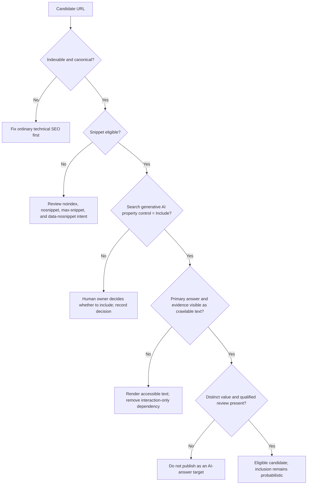
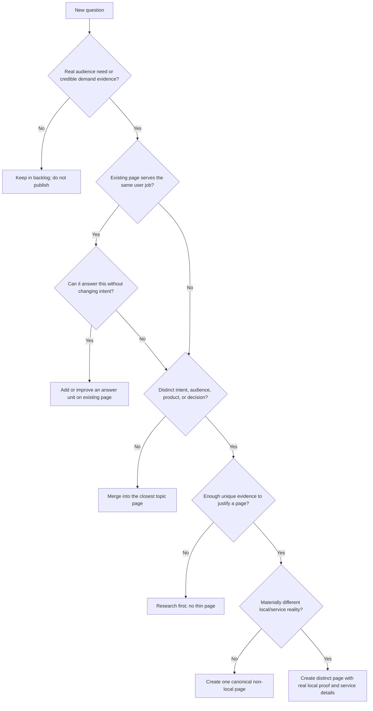
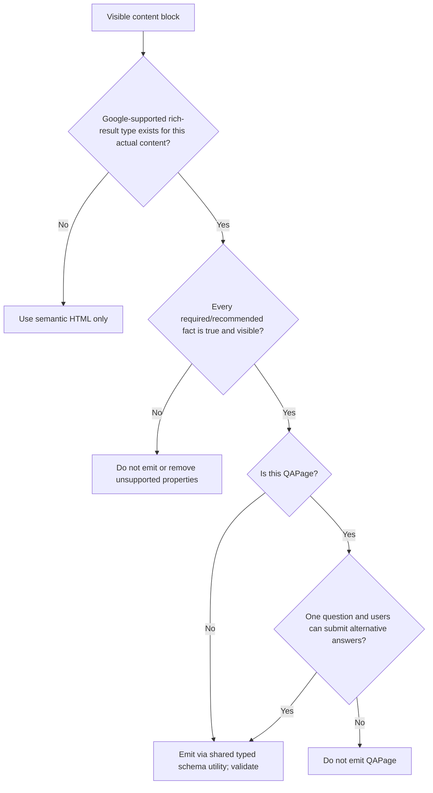
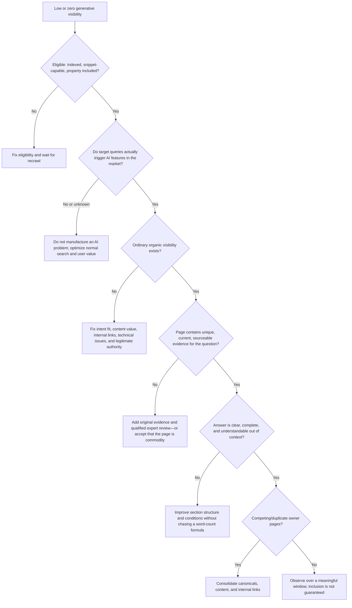

# SEO 2026: AI answers, AI Overviews, AI Mode, and question-led search

**Research date:** 2026-07-13  
**Scope:** Google Search AI Overviews and AI Mode, Microsoft/Bing AI answers, question discovery, answer-oriented page design, controls, measurement, and agent workflows for the existing NotFair + OpenSEO + DataForSEO + Payload CMS stack.  
**Evidence policy:** Primary sources only. Platform documentation describes eligibility and available tooling, not guaranteed ranking or citation outcomes. Recommendations marked **operational inference** are implementation choices derived from those sources, not claims about a private ranking formula.

## Executive verdict

There is no separate Google “AI Overview optimization” system to game. In Google's own 2026 guidance, generative Search is rooted in the normal Search index, ranking, and quality systems. Retrieval-augmented generation retrieves relevant, up-to-date indexed pages; query fan-out issues related searches; AI systems then synthesize an answer with supporting links. Google explicitly says that SEO remains the discipline, and that no special AI schema, `llms.txt`, chunk size, prose style, exact-match long-tail coverage, or other GEO/AEO hack is required ([Google's 2026 generative-search guide](https://developers.google.com/search/docs/fundamentals/ai-optimization-guide); [AI features and your website](https://developers.google.com/search/docs/appearance/ai-features)).

The winning strategy for this stack is therefore:

1. Make every candidate page indexed, canonical, crawlable, fast, internally linked, and snippet-eligible.
2. Publish non-commodity information that a model cannot cheaply reconstruct from generic web consensus: original examples, calculations, decision criteria, local facts, process evidence, expert judgment, and clear limitations.
3. Discover real questions from customers, Search Console, DataForSEO keyword/SERP data, Bing grounding queries, and controlled model probes.
4. Cluster related questions into the smallest useful set of authoritative pages; do not emit a page for every question or city-keyword permutation.
5. Put clear, self-contained answers inside those pages because they help users and are easy to retrieve—not because Google promises a word count or “citation format.”
6. Require source, qualified reviewer, jurisdiction, effective date, and claim-expiry metadata for financial content.
7. Measure Google's actual AI impressions, Bing citations, ordinary organic outcomes, and downstream conversions separately. Treat third-party model probes as diagnostics, not ground truth.

For this stack, **OpenSEO + DataForSEO are already capable of much of the discovery and observation work**, but the current OpenSEO MCP surface does not expose its newer AI Visibility and Prompt Explorer workflows. Use the OpenSEO UI for those features initially, or add a small typed MCP adapter over the existing OpenSEO server functions/direct DataForSEO endpoints. Do not browser-automate Google search result pages.

## 1. What is confirmed, what is useful inference, and what is unsupported

| Claim | Status | Operator implication |
|---|---|---|
| A page must be indexed and eligible to appear with a snippet to support Google AI answers | **Confirmed by Google** | Add an AI-retrieval readiness gate to the normal indexability gate. |
| The site must be included in Search Console's Search generative AI control | **Confirmed by Google** | Check the property setting at launch and after ownership/config changes. |
| AI Overviews and AI Mode use core Search systems, RAG, and query fan-out | **Confirmed by Google** | Build strong topic coverage and related internal links; exact-match repetition is unnecessary. |
| A special AI schema, citation schema, `llms.txt`, Markdown mirror, or AI-only feed improves Google visibility | **Explicitly unsupported by Google** | Do not build or maintain one for Google. |
| Content must be split into tiny chunks or use a fixed answer length | **Explicitly unsupported by Google** | Choose section length and format for the user and subject. |
| Clear headings, tables, lists, complete answers, and evidence are useful | **Confirmed platform guidance; no guarantee** | Use them when they improve comprehension and extractability. Bing explicitly recommends these formats; Google recommends logical sections/headings and valuable content. |
| A short direct answer followed by conditions and evidence is a useful pattern | **Operational inference** | Adopt it as a content-system convention, not a ranking claim. |
| `FAQPage` or `QAPage` schema causes AI citations | **Unsupported** | Never promise this. Google's FAQ rich results ended in May 2026; `QAPage` is only for genuine user-answerable single-question pages. |
| AI-written content is categorically penalized | **False** | AI assistance is allowed; mass-produced, unoriginal, low-value pages can violate scaled-content-abuse policy regardless of production method. |
| Updating a displayed date makes a page look fresh to AI systems | **Explicitly warned against by Google** | Change dates only after a substantive, accurately documented revision. |
| A DataForSEO/OpenSEO model probe reveals Google's private ranking system | **False** | It is a repeatable external observation, not an internal Google metric or guaranteed demand signal. |
| More city/question pages produce more AI visibility | **Unsupported and risky** | Create a distinct page only for a distinct user job with materially distinct evidence and service reality. |
| Citations can be forced by adding outbound citations or a special markup field | **Unsupported** | Cite sources for trust and verifiability; no official source documents a deterministic citation trigger. |

Sources: [Google generative-search guide](https://developers.google.com/search/docs/fundamentals/ai-optimization-guide), [Google AI-content guidance](https://developers.google.com/search/docs/fundamentals/using-gen-ai-content), [Google spam policies](https://developers.google.com/search/docs/essentials/spam-policies), [Microsoft content guidance](https://about.ads.microsoft.com/en/blog/post/october-2025/optimizing-your-content-for-inclusion-in-ai-search-answers).

## 2. Eligibility and retrieval readiness

### 2.1 Google eligibility gate

Google documents two direct eligibility conditions for generative Search:

- The page is indexed and eligible to appear in Search with a snippet.
- The Search Console property is included in Search generative AI features.

Meeting them does not guarantee crawl, indexing, serving, inclusion, a supporting link, or traffic ([Google generative-search guide](https://developers.google.com/search/docs/fundamentals/ai-optimization-guide); [Search generative AI control](https://support.google.com/webmasters/answer/16908024?hl=en)).

Before treating a page as an AI-answer candidate, the agent must verify:

- production URL returns `200`;
- no `noindex`, `nosnippet`, unintended `max-snippet`, or blocking `data-nosnippet` around the primary answer;
- robots.txt, Vercel protection, middleware, WAF, and authentication allow Googlebot;
- rendered primary content exists as accessible text and is not hidden behind interaction;
- self-canonical resolves to the preferred production URL;
- page is in the XML sitemap and has at least one relevant internal link;
- Search Console URL Inspection shows the intended canonical and no blocking issue;
- Search Console property is set to include the site in generative AI features;
- structured data, where present, matches the visible page;
- Business Profile facts used by the page are current for local queries.

Google explicitly recommends crawlability, internal links, page experience, important information in text, useful images/video, visible/schema parity, and current Business Profile or Merchant Center data ([AI features and your website](https://developers.google.com/search/docs/appearance/ai-features)).

### 2.2 Retrieval model implications

Google says generative Search uses:

- **RAG/grounding:** core Search systems retrieve relevant, up-to-date indexed pages before response generation;
- **query fan-out:** the model issues concurrent related searches for subtopics;
- **different systems by feature:** AI Overview and AI Mode can use different models and techniques, so their links can differ;
- **selective triggering:** AI Overviews appear only when Google decides they add value beyond ordinary results.

The supported implication is broad: one strong page can be retrieved for related language it does not repeat exactly. Google explicitly says its systems understand relevance without exact-match wording and warns against creating separate pages for every query/fan-out variant ([Google generative-search guide](https://developers.google.com/search/docs/fundamentals/ai-optimization-guide); [AI features and your website](https://developers.google.com/search/docs/appearance/ai-features)).

### 2.3 Eligibility decision tree



### 2.4 Optional audience lever: Preferred Sources

Google's Preferred Sources feature lets a user select an eligible domain or subdomain. For that user, the source can be highlighted with a “preferred” badge in AI Mode and AI Overviews; Google says selected sources are more likely to appear in Top Stories, but does not document a universal AI-ranking or citation boost. Subdirectories are not eligible entities. If the business domain appears in Google's source-preferences tool and has a real returning audience, the operator may add Google's preference deep link beside existing follow/social calls to action. Treat this as audience preference, not a substitute for SEO or a request for citation ([Google Preferred Sources](https://developers.google.com/search/docs/appearance/preferred-sources)).

## 3. Content that can earn retrieval without becoming SEO sludge

### 3.1 Google's strongest 2026 instruction: non-commodity content

Google says unique, compelling, useful content is likely to influence long-run presence in generative Search more than the other practices in its guide. It specifically recommends:

- a unique point of view grounded in first-hand experience;
- expert-led information that goes beyond common knowledge;
- original information, research, reporting, analysis, or examples;
- logical paragraphs, sections, and headings for readers;
- useful original images and video where applicable;
- satisfying the visitor instead of producing every query variation.

Google contrasts this with commodity listicles and generic summaries that could come from anyone or be generated from existing consensus ([Google generative-search guide](https://developers.google.com/search/docs/fundamentals/ai-optimization-guide); [people-first content guidance](https://developers.google.com/search/docs/fundamentals/creating-helpful-content)).

For financial-services content, Google states that its systems place greater emphasis on reliability signals for topics that can affect financial stability, while E-E-A-T is a conceptual framework rather than one discrete ranking factor ([Google AI-content guidance](https://developers.google.com/search/docs/fundamentals/using-gen-ai-content); [people-first content guidance](https://developers.google.com/search/docs/fundamentals/creating-helpful-content)).

### 3.2 The answer-unit pattern

The following is an **operational inference**, not a Google-mandated format. It reconciles Google's user-first guidance with Microsoft's official advice that clear headings, concise self-contained answers, lists, Q&As, tables, evidence, and current information make material easier to reference accurately ([Microsoft AI Search content guidance](https://about.ads.microsoft.com/en/blog/post/october-2025/optimizing-your-content-for-inclusion-in-ai-search-answers); [Bing AI Performance announcement](https://blogs.bing.com/webmaster/February-2026/Introducing-AI-Performance-in-Bing-Webmaster-Tools-Public-Preview)).

Each important question section should normally contain:

1. **Specific heading:** the natural question or decision, without mechanically forcing an exact keyword.
2. **Direct answer:** one to three sentences that answer the question and state the controlling condition.
3. **Evidence:** primary regulatory source, first-party calculation, actual service data, real case evidence, or named expert review.
4. **Conditions and exceptions:** geography, product, borrower, property, timing, eligibility, and uncertainty.
5. **Decision aid:** table, formula, checklist, or decision tree only when it genuinely reduces cognitive load.
6. **Next action:** a relevant internal link or conversion action that continues the user's job.
7. **Provenance:** author/reviewer, date verified, jurisdiction, and source links.

Example structure—not a word-count rule:

```md
## Can a self-employed borrower qualify with non-traditional income documents?

Yes, some lending programs consider alternative income documentation, but eligibility
depends on the lender, property, loan purpose, credit profile, and the evidence available.

[Then: concrete document paths, decision table, calculation example, exclusions,
qualified review, source links, and a relevant assessment CTA.]
```

### 3.3 Passage design: supported facts and limits

Google's passage system can identify individual sections within a page, and its 2026 guide says there is no need to split content into tiny chunks. There is no ideal page length and no required AI writing style ([Google ranking systems guide](https://developers.google.com/search/docs/appearance/ranking-systems-guide); [Google generative-search guide](https://developers.google.com/search/docs/fundamentals/ai-optimization-guide)).

Therefore:

- organize a page around a coherent user job, not a token or word target;
- use descriptive headings and self-contained explanations when they help comprehension;
- keep the necessary context with the answer; do not optimize so aggressively for extraction that the isolated statement becomes misleading;
- prefer one comprehensive decision page over many near-duplicate single-question pages;
- put unique proof close to the claim it supports;
- keep disclaimers specific and readable rather than burying all limitations in footer boilerplate;
- use calculators, examples, and tables only when their inputs and assumptions are transparent.

There is no official basis for a universal “40–60 word answer,” “one idea per 200-token chunk,” “citation density,” or “answer first in the first 100 words” rule.

## 4. Question discovery: the evidence hierarchy

Question discovery should begin with real people, then combine first-party search data, third-party demand estimates, live result features, and controlled model observations. No one source is complete.

### Tier 1: real customer language

Capture questions from:

- sales calls and qualification conversations;
- email, chat, and form submissions;
- objections recorded in the CRM;
- customer-service and application-support interactions;
- real Google Business Profile questions;
- compliance and underwriting clarification requests;
- questions a qualified human repeatedly has to correct.

These are first-party business facts, not external ranking data. They are the strongest source of high-intent language and the conditions generic articles often omit.

### Tier 2: owned search performance

After the site receives impressions, use ordinary Search Console query/page data to identify:

- question-shaped queries already showing a page;
- high-impression queries with weak clicks;
- unexpected queries that expose missing conditions or terminology;
- multiple pages receiving impressions for one user job;
- query clusters that convert in GA4/CRM.

Search Console query data is canonical evidence of the owned site's Google visibility, not total market demand. Google's dedicated 2026 Generative AI report currently does **not** document query rows; it documents AI impressions by page, country, date, and device only ([Generative AI performance report](https://support.google.com/webmasters/answer/16984139?hl=en)).

### Tier 3: DataForSEO keyword and SERP evidence

Use DataForSEO through OpenSEO for:

- seed expansion and long-tail suggestions;
- volume, CPC, competition, difficulty, trend, and classified intent;
- live localized SERPs;
- People Also Ask, related searches, answer boxes, discussions/forums, and AI Overview result types;
- competitor pages repeatedly surfaced for the topic.

DataForSEO documents that Keyword Suggestions returns long-tail queries containing the seed plus search-volume history, CPC, competition, and intent; its live Advanced SERP returns structured result features including People Also Ask and AI Overview ([Keyword Suggestions](https://docs.dataforseo.com/v3/dataforseo_labs-google-keyword_suggestions-live/); [Live Advanced SERP](https://docs.dataforseo.com/v3/serp-se-type-live-advanced/)).

Do not equate provider volume with certainty. DataForSEO says its Google keyword database is compiled from multiple sources, including Google Ads and SERPs, and updated on a cycle; it is a modeled commercial dataset rather than the site's first-party performance ([Google keyword database](https://docs.dataforseo.com/v3/databases/google/keywords/)).

### Tier 4: AI-answer and fan-out observations

DataForSEO now exposes:

- live Google AI Mode SERP results;
- AI Optimization APIs for LLM responses, AI keyword data, and LLM mentions;
- response annotations/citations where supported;
- fan-out queries on supported reasoning responses, which are not guaranteed to be returned.

Sources: [Google AI Mode SERP endpoint](https://docs.dataforseo.com/v3/serp-google-ai_mode-live-advanced/), [AI Optimization overview](https://docs.dataforseo.com/v3/ai_optimization-overview/), [LLM Responses overview](https://docs.dataforseo.com/v3/ai_optimization/llm_responses/overview/), [fan-out response field](https://docs.dataforseo.com/v3/ai_optimization-gemini-llm_responses-task_get/).

Use these results to discover comparison criteria, terminology, cited source types, and missing subtopics. Do **not** use a single model answer as proof of market demand or truth. Model, location, freshness, personalization, and provider collection method can change the result.

### Tier 5: Bing AI grounding evidence

Bing Webmaster Tools' 2026 AI Performance public preview reports:

- total citations;
- average cited pages;
- page-level citation counts;
- visibility trends;
- a **sample** of grounding query phrases.

Bing explicitly says citation counts do not indicate placement, importance, ranking, or the page's role in an answer ([Bing AI Performance](https://blogs.bing.com/webmaster/February-2026/Introducing-AI-Performance-in-Bing-Webmaster-Tools-Public-Preview)). Use grounding phrases as new research seeds, not as a score to game.

### Question ledger

Store every candidate in a single ledger rather than generating pages immediately:

```yaml
- id: q-0001
  question: "Can I qualify using bank statements if my taxable income is low?"
  user_stage: "evaluation"
  intent: "commercial"
  geography: "Ontario"
  sources:
    - type: "sales_call"
      evidence_id: "call-theme-2026-07"
    - type: "dataforseo_paa"
      observed_at: "2026-07-13"
      location_code: 2124
  demand:
    search_volume: null
    cpc: null
    gsc_impressions_28d: 0
  owner_url: "/mortgages/self-employed/"
  answer_status: "gap"
  evidence_status: "needs_subject_matter_review"
  reviewer: null
  jurisdiction: "Ontario, Canada"
  last_verified: null
  review_by: null
```

### Question-to-page decision tree



## 5. Structured data: use ordinary schema honestly

Google states that structured data is not required for generative Search and there is no special schema.org type for AI Overviews or AI Mode. Existing structured data remains useful for ordinary Search features when it matches visible content, but valid markup never guarantees a feature ([Google generative-search guide](https://developers.google.com/search/docs/fundamentals/ai-optimization-guide); [structured-data policies](https://developers.google.com/search/docs/appearance/structured-data/sd-policies)).

For this Payload site:

- keep one canonical emitter for `Organization`/the applicable `LocalBusiness` subtype;
- keep `Article`/`BlogPosting` aligned with visible author, publication date, modified date, and headline;
- emit `BreadcrumbList` from the visible hierarchy;
- emit service/product data only where Google documents the relevant Search feature and visible content supports every field;
- never fabricate ratings, reviews, prices, offers, locations, authors, credentials, or dates;
- validate with Google's Rich Results Test and crawl the rendered JSON-LD in preview.

### FAQ and Q&A rules in 2026

- Google stopped showing FAQ rich results on 2026-05-07 and is deprecating the FAQ search-appearance API support in August 2026 ([Google Search documentation updates](https://developers.google.com/search/updates); [Search Analytics API notice](https://developers.google.com/webmaster-tools/v1/searchanalytics/query)).
- Visible FAQs can still help users. Do not present them as a Google rich-result or AI-citation tactic.
- Google's `QAPage` markup is for a page focused on one question where users can submit alternative answers. Google explicitly excludes editorial FAQs, blog posts, how-to guides, essays, and one-answer pages ([QAPage documentation](https://developers.google.com/search/docs/appearance/structured-data/qapage)).
- A normal expert-authored question section should remain ordinary HTML inside its parent page unless the actual product implements the user-answerable Q&A model Google documents.

### Structured-data decision tree



## 6. Freshness and claim lifecycle

Google describes RAG as retrieving relevant, up-to-date pages and maintains freshness systems for queries where recency is expected. It also explicitly warns against changing dates without substantial content changes or adding/removing content merely to make a site appear fresh ([Google generative-search guide](https://developers.google.com/search/docs/fundamentals/ai-optimization-guide); [ranking systems guide](https://developers.google.com/search/docs/appearance/ranking-systems-guide); [people-first content guidance](https://developers.google.com/search/docs/fundamentals/creating-helpful-content)).

Implement freshness as claim management, not date theatre:

| Claim type | Suggested review trigger | Required evidence |
|---|---|---|
| Regulation, program rule, licensing requirement | Source change alert or at least quarterly | Current regulator/program primary source and qualified review |
| Rate, fee, threshold, limit | Source change or very short expiry | Timestamped authoritative source; avoid hard-coding where a live owner exists |
| Company service area, contact, hours | Operational change | Approved business truth pack and profile parity |
| Market statistic | New source release | Original release/table and period definition |
| Calculation/example | Input/rule change | Formula, assumptions, reviewer, reproducible output |
| Evergreen concept | Annual or evidence-triggered | Confirm terminology, examples, links, and product fit |

When a page is substantively updated:

- document what changed;
- show a prominent accurate `dateModified`/“Last reviewed” where useful;
- keep `datePublished` and `dateModified` truthful and aligned between UI and JSON-LD;
- preserve the URL unless the user job changes;
- request recrawl through normal mechanisms as warranted;
- notify IndexNow participants for added, changed, or deleted URLs.

Google's byline-date guidance says it uses multiple signals and recommends visible dates plus consistent structured data, without guaranteeing that a date will be shown ([Google publication dates](https://developers.google.com/search/docs/appearance/publication-dates)).

## 7. Controls: inclusion, snippets, training, and sensitive passages

### 7.1 Google controls are separate concerns

| Control | Effect | Does not mean |
|---|---|---|
| Search Console Search generative AI control | Includes/excludes property links and content from AI Overviews, AI Mode, and generative Discover; default is include | It does not control AI training or act as an ordinary Search ranking signal |
| `noindex` | Excludes the page from Google Search | It is not a selective AI-answer control |
| `nosnippet` | Prevents text/video snippets and direct-input use in AI Overview/AI Mode | The URL cannot necessarily exist in all contexts |
| `max-snippet:N` | Limits text available to snippets and direct-input use | A guaranteed extracted length |
| `data-nosnippet` | Excludes selected visible regions from snippets/direct-input use | A way to hide low-quality text from ranking while showing it to users |
| `Google-Extended` | Controls specified training/grounding uses outside Search | It does not control or improve Google Search AI feature inclusion |

Sources: [Search generative AI control](https://support.google.com/webmasters/answer/16908024?hl=en), [robots meta directives](https://developers.google.com/search/docs/crawling-indexing/robots-meta-tag), [AI features and controls](https://developers.google.com/search/docs/appearance/ai-features).

For a financial-services site, use `data-nosnippet` only for a deliberate legal/content reason—for example, an authenticated or context-dependent passage that should not be quoted without surrounding conditions. Verify the rendered DOM because Google requires the directive to be crawl-visible.

### 7.2 Bing controls and freshness

Bing supports `data-nosnippet` for selective exclusion from Bing Search and AI-powered experiences ([Bing `data-nosnippet` announcement](https://blogs.bing.com/webmaster/October-2025/Bing-Introduces-Support-for-the-data-nosnippet-HTML-Attribute)).

IndexNow should fire from the Payload publish/update/unpublish lifecycle after the production deployment is reachable. The official protocol permits up to 10,000 URLs per POST and says a `200` only confirms receipt—not crawl, indexing, ranking, or AI use ([IndexNow protocol documentation](https://www.indexnow.org/documentation)). Bing says IndexNow helps participating search and AI systems discover current versions faster ([Bing AI Performance](https://blogs.bing.com/webmaster/February-2026/Introducing-AI-Performance-in-Bing-Webmaster-Tools-Public-Preview)).

## 8. Measurement: what 2026 platforms actually expose

### 8.1 Google Search Console

Google began rolling out a dedicated Generative AI performance report to a subset of properties in June 2026. The documented report exposes:

- impressions in AI Overviews and AI Mode;
- page/canonical URL;
- country;
- date;
- device;
- export from the UI.

It currently documents **impressions only**, not queries, clicks, CTR, position, citations, feature split, answer text, or link placement. It inherits the usual 1,000-row/report limits, aggregates same-site results according to its rules, and excludes Search Labs experiments. The AI impressions are already included in the ordinary Web Performance totals, so they must not be added to Web impressions as though they were incremental ([Generative AI performance report](https://support.google.com/webmasters/answer/16984139?hl=en); [launch announcement](https://developers.google.com/search/blog/2026/06/gen-ai-performance-reports)).

Ordinary Web Performance counting still records:

- an external AI link click as a click;
- an AI Overview impression only when the link is expanded or scrolled into view;
- all links in an AI Overview at the same feature position;
- an AI Mode follow-up as a new query.

Source: [Search Console counting methodology](https://support.google.com/webmasters/answer/7042828).

The official Search Console API documentation currently does not document a dedicated Generative AI report endpoint or dimension. This is an **API-documentation observation**, not a promise about Google's roadmap. Keep automated ordinary Search Analytics ingestion; perform a monthly supervised UI export for AI impressions until an official API exists.

### 8.2 Bing Webmaster Tools

Bing's AI Performance public preview gives unusually useful citation diagnostics: total citations, cited-page counts, citation trends, and sampled grounding queries. Bing explicitly warns that those figures do not show placement, page importance, rank, or the page's role in an answer ([Bing AI Performance](https://blogs.bing.com/webmaster/February-2026/Introducing-AI-Performance-in-Bing-Webmaster-Tools-Public-Preview)).

No public first-party API for the new AI Performance report was found in the current Bing Webmaster API documentation. Treat it as a manual/supervised export surface until Microsoft documents one; continue using the existing Webmaster API for rank/traffic, keyword, link, crawl, sitemap, and URL-submission operations ([Bing Webmaster API](https://learn.microsoft.com/en-us/bingwebmaster/)).

### 8.3 OpenSEO and DataForSEO observations

At commit [`927e931e51f6024323ada746816aaa6a51ce83ef`](https://github.com/every-app/open-seo/tree/927e931e51f6024323ada746816aaa6a51ce83ef), OpenSEO implements:

- MCP keyword research and live SERP operations ([`research-keywords.ts`](https://github.com/every-app/open-seo/blob/927e931e51f6024323ada746816aaa6a51ce83ef/src/server/mcp/tools/research-keywords.ts); [`get-serp-results.ts`](https://github.com/every-app/open-seo/blob/927e931e51f6024323ada746816aaa6a51ce83ef/src/server/mcp/tools/get-serp-results.ts));
- app-level AI brand lookup across ChatGPT and Google AI Overview data ([`brandLookup.ts`](https://github.com/every-app/open-seo/blob/927e931e51f6024323ada746816aaa6a51ce83ef/src/server/features/ai-search/services/brandLookup.ts));
- Prompt Explorer across ChatGPT, Claude, Gemini, and Perplexity, extracting supported citations and fan-out queries ([`promptExplorer.ts`](https://github.com/every-app/open-seo/blob/927e931e51f6024323ada746816aaa6a51ce83ef/src/server/features/ai-search/services/promptExplorer.ts));
- current MCP registration for classical SEO, GSC, local, backlink, and audit tools, but not those two AI-search server functions ([MCP registration](https://github.com/every-app/open-seo/blob/927e931e51f6024323ada746816aaa6a51ce83ef/src/server/mcp/server.ts)).

That means an agent can call keyword/SERP workflows through MCP today, while AI Visibility and Prompt Explorer need either:

1. supervised use of OpenSEO's UI;
2. a small upstream contribution that registers read-only typed MCP tools over the existing server functions; or
3. a direct, budget-capped DataForSEO adapter for AI Mode/AI Optimization endpoints.

Prefer option 2 for a self-hosted stack because it reuses OpenSEO's project authorization, caching, billing guards, validation, and citation URL sanitization. Pin the exact commit and re-audit after upgrades.

### 8.4 The measurement scorecard

Do not collapse unlike metrics into an invented “AI authority score.” Keep these lanes separate:

| Lane | Source | Metrics | Interpretation |
|---|---|---|---|
| Google AI eligibility | URL Inspection + property control | indexed, canonical, snippet eligible, included | Necessary conditions, not outcome |
| Google AI visibility | GSC Generative AI report | impressions by page/country/device/date | Owned visibility; no query/click attribution in current report |
| Google total organic | GSC Web + GA4 | impressions, clicks, CTR, landing sessions, key events | Actual acquisition and conversion outcomes |
| Bing AI visibility | BWT AI Performance | citations, cited pages, sampled grounding phrases | Citation observation, not rank/placement |
| External prompt observation | OpenSEO/DataForSEO | mention/citation samples, fan-out queries, model answers | Repeatable diagnostic snapshot, not platform truth |
| Business outcome | CRM | qualified leads, applications, approvals, revenue proxy | North-star commercial result |

## 9. The agentic operating loop

### 9.1 Weekly discovery job

1. Pull new first-party questions from the approved CRM/support export with sensitive data removed.
2. Pull ordinary GSC queries/pages for the last 28 days and compare with the previous period.
3. Run OpenSEO keyword research for at most five approved seed families per batch with the correct country/language/location.
4. Inspect live SERPs for the top candidates and capture People Also Ask, answer-box, forum/discussion, local-pack, and AI Overview presence where returned.
5. Run a small, fixed AI prompt panel in OpenSEO Prompt Explorer or the typed adapter. Record model, web-search flag, country, timestamp, returned fan-out queries, cited URLs, and whether the brand appears.
6. Import Bing sampled grounding queries if the AI Performance report is available.
7. Normalize/deduplicate questions by user job, not exact string.
8. Join each question to the existing page map and question ledger.
9. Produce one of five actions: **answer existing page**, **create page**, **consolidate**, **research evidence**, or **ignore/backlog**.
10. Enforce a weekly DataForSEO request and dollar cap; store provider cost with the run.

### 9.2 Evidence and brief job

For each approved gap, the agent must produce a brief containing:

```yaml
question_family: []
primary_user_job: ""
intent: ""
owner_url: ""
new_or_existing: ""
unique_value:
  original_data: []
  expert_experience: []
  local_evidence: []
required_answers: []
required_conditions: []
primary_sources: []
prohibited_or_unverified_claims: []
jurisdiction: ""
effective_date: ""
reviewer_role: ""
review_by: ""
internal_links_in: []
internal_links_out: []
conversion_action: ""
schema_types: []
```

The brief fails if it contains only keyword metrics, competitor paraphrases, or model-generated consensus. It needs a defensible reason this business should be a source.

### 9.3 Draft and Payload workflow

1. Generate or revise the answer units against the approved business truth pack and evidence bundle.
2. Attach every material financial claim to a source/evidence ID.
3. Run automated checks for unsupported absolutes, stale dates, prohibited claims, missing assumptions, and visible/schema mismatch.
4. Require qualified human review for rates, qualification, legal/regulatory interpretation, product availability, and examples that can affect a consumer decision.
5. Write to Payload with `_status: 'draft'`; reject any agent attempt to submit `_status: 'published'`.
6. Render the Payload live preview and verify mobile/desktop text, headings, tables, links, metadata, canonical, robots, structured data, author/reviewer, dates, and conversion path.
7. Human approves publication.
8. Publish through the controlled Payload workflow.
9. Verify the production deployment, sitemap, canonical, and structured data.
10. Submit the changed production URL to IndexNow; use Search Console recrawl sparingly for a small number of priority URLs.
11. Record change ID, evidence bundle, reviewer, publish time, production URL, and rollback target.

### 9.4 Monthly learning job

1. Export the GSC Generative AI report if available.
2. Export Bing AI Performance if available.
3. Join AI-impression/citation pages to ordinary GSC, GA4, and CRM results by canonical URL and time window.
4. Re-run the fixed external prompt panel with identical settings; never compare runs with undocumented model/location changes.
5. Compare page cohorts: new, refreshed, unchanged control, and seasonal.
6. Classify each page:
   - **visible + converts:** preserve; refresh only when evidence changes;
   - **visible + weak conversion:** improve intent/offer/UX, not necessarily content volume;
   - **not visible + ordinary rankings weak:** fix foundational SEO, authority, or intent fit;
   - **ordinary visibility strong + no AI impressions:** inspect whether the query class produces AI features and whether the page offers unique answer evidence;
   - **cited by Bing/third-party tools only:** useful external signal, not proof of Google performance;
   - **stale/overlapping:** refresh, merge, redirect, or remove based on the existing content-pruning decision tree.
7. Approve a small number of testable changes with a written hypothesis and review date.

## 10. Diagnostic decision tree



## 11. Payload data-model enhancements recommended for the parent playbook

These are implementation recommendations, not edits performed by this memo.

Add reusable fields/blocks instead of one-off AI-page templates:

```ts
type AnswerUnit = {
  question: string
  answer: RichText
  evidenceRefs: string[]
  jurisdiction?: string
  effectiveDate?: string
  reviewer?: Relationship<'users'>
  reviewedAt?: string
  reviewBy?: string
}
```

Add page-level governance fields:

- `primaryUserJob`;
- `questionFamilyIds`;
- `evidenceBundleId`;
- `qualifiedReviewer` and `reviewedAt`;
- `jurisdiction`;
- `claimReviewBy`;
- `substantiveUpdateSummary`;
- `indexingIntent`;
- `snippetControl` with guarded choices;
- `aiResearchRunIds` for traceability, never rendered as ranking claims.

The publishing adapter should enforce:

- drafts only for agent writes;
- required reviewer/evidence fields for financial content;
- `dateModified` only on substantive approved changes;
- no QAPage emission unless the collection actually implements user-submitted alternative answers;
- no FAQ rich-result promise or obsolete FAQ search-appearance monitoring;
- shared schema utilities only;
- production IndexNow notification after successful deployment;
- rollback and audit logging.

## 12. Experiments worth running—and how not to lie to yourself

Good tests change one meaningful variable and measure user/business outcomes alongside visibility:

1. Add a reviewed original calculation/example to a high-impression commodity page.
2. Consolidate three overlapping pages into one clear owner page with redirects.
3. Replace vague claims with sourced conditions and named expert review.
4. Add a comparison table that resolves a real buyer decision.
5. Add a real local case/process detail to a legitimate service-area page.
6. Improve internal links from relevant informational pages to the decision page.
7. Update a genuinely stale regulatory explanation and document the revision.

For every experiment, log:

- canonical URL and exact diff;
- hypothesis;
- target question family;
- evidence and reviewer;
- ordinary GSC baseline;
- GSC AI-impression baseline if available;
- Bing citation baseline if available;
- GA4/CRM baseline;
- fixed DataForSEO/OpenSEO probe configuration;
- confounders such as seasonality, core updates, site releases, or model/provider changes;
- minimum evaluation window and reversal criteria.

Do not infer causality from one model answer, one citation, one rank check, or a before/after period with other major changes.

## 13. Anti-patterns the enhanced artifacts should explicitly ban

- Publishing one page per PAA question, fan-out query, synonym, or town name.
- Programmatic location pages with swapped place names and no distinct service/evidence reality.
- Claiming `llms.txt`, special AI schema, or Markdown mirrors improve Google AI visibility.
- Treating FAQs or `QAPage` as a citation hack.
- Using deprecated FAQ rich-result reporting as a KPI.
- Stuffing exact questions into every heading regardless of readability.
- Enforcing a universal answer length or “chunk size.”
- Copying competitor answers, model summaries, Reddit threads, or SERP snippets into lightly rewritten pages.
- Adding fake statistics, cases, authors, credentials, locations, reviews, or “expert reviewed” labels.
- Updating displayed dates without a substantive content change.
- Calling third-party citation/mention estimates “Google AI rankings.”
- Adding GSC AI impressions to ordinary Web impressions and double-counting them.
- Using browser automation to query Google at scale; Google's spam policy prohibits machine-generated search traffic ([Google spam policies](https://developers.google.com/search/docs/essentials/spam-policies#machine-generated-traffic)).
- Allowing an agent to publish financial content without evidence and qualified human review.

## 14. Required changes to the main report and operator playbook

The parent artifacts should be enhanced with the following concrete changes:

1. Add an **AI retrieval readiness** launch gate: indexed, canonical, snippet eligible, crawlable text, and Search generative AI property inclusion.
2. Replace generic “GEO optimization” language with Google's confirmed RAG/query-fan-out model and explicit no-special-optimization guidance.
3. Add the **non-commodity content** requirement to every page brief and editorial gate.
4. Add the question ledger and question-to-page decision tree.
5. Add the answer-unit pattern, clearly labeled as a readability/extractability convention rather than a Google requirement.
6. Require financial/YMYL evidence, qualified reviewer, jurisdiction, effective date, and expiry for material claims.
7. Remove FAQ-rich-result expectations; restrict `QAPage` to genuine user-answerable single-question pages.
8. Add the 2026 Google Generative AI report workflow and its impression-only/queryless limitations.
9. Add Bing AI Performance and IndexNow to the observation/freshness loop.
10. Add a controlled OpenSEO/DataForSEO AI prompt panel, with model/location/timestamp/citation/fan-out capture and an explicit “external observation, not ground truth” label.
11. Document that OpenSEO's current AI UI functions are not registered in its MCP server and recommend a typed read-only adapter/upstream contribution.
12. Add the claim-lifecycle table and ban fake freshness/date bumping.
13. Add exact Search Console/snippet/Google-Extended control distinctions.
14. Add the diagnostic decision tree and separate visibility lanes instead of an invented composite AI score.
15. Add Payload governance fields and draft-only enforcement for answer/evidence workflows.
16. Add Preferred Sources as an optional returning-audience tactic, explicitly not a general ranking or citation promise.

## Primary-source index

### Google

- [Optimizing for generative AI features on Google Search](https://developers.google.com/search/docs/fundamentals/ai-optimization-guide)
- [AI features and your website](https://developers.google.com/search/docs/appearance/ai-features)
- [Search generative AI control](https://support.google.com/webmasters/answer/16908024?hl=en)
- [Generative AI performance report](https://support.google.com/webmasters/answer/16984139?hl=en)
- [Generative AI performance report launch](https://developers.google.com/search/blog/2026/06/gen-ai-performance-reports)
- [AI Overview/AI Mode counting methodology](https://support.google.com/webmasters/answer/7042828)
- [People-first content](https://developers.google.com/search/docs/fundamentals/creating-helpful-content)
- [Guidance on using generative AI content](https://developers.google.com/search/docs/fundamentals/using-gen-ai-content)
- [Spam policies](https://developers.google.com/search/docs/essentials/spam-policies)
- [Robots meta and snippet controls](https://developers.google.com/search/docs/crawling-indexing/robots-meta-tag)
- [Structured-data policies](https://developers.google.com/search/docs/appearance/structured-data/sd-policies)
- [QAPage structured data](https://developers.google.com/search/docs/appearance/structured-data/qapage)
- [Ranking systems guide](https://developers.google.com/search/docs/appearance/ranking-systems-guide)
- [Publication dates](https://developers.google.com/search/docs/appearance/publication-dates)
- [Preferred Sources](https://developers.google.com/search/docs/appearance/preferred-sources)
- [Search documentation updates](https://developers.google.com/search/updates)

### Microsoft/Bing and IndexNow

- [Bing AI Performance public preview](https://blogs.bing.com/webmaster/February-2026/Introducing-AI-Performance-in-Bing-Webmaster-Tools-Public-Preview)
- [Microsoft guidance for inclusion in AI Search answers](https://about.ads.microsoft.com/en/blog/post/october-2025/optimizing-your-content-for-inclusion-in-ai-search-answers)
- [Bing `data-nosnippet` support](https://blogs.bing.com/webmaster/October-2025/Bing-Introduces-Support-for-the-data-nosnippet-HTML-Attribute)
- [Bing Webmaster API](https://learn.microsoft.com/en-us/bingwebmaster/)
- [IndexNow protocol documentation](https://www.indexnow.org/documentation)

### DataForSEO and OpenSEO

- [DataForSEO Google Labs overview](https://docs.dataforseo.com/v3/dataforseo_labs-google-overview/)
- [Keyword Suggestions](https://docs.dataforseo.com/v3/dataforseo_labs-google-keyword_suggestions-live/)
- [Live Advanced SERP](https://docs.dataforseo.com/v3/serp-se-type-live-advanced/)
- [Live Google AI Mode SERP](https://docs.dataforseo.com/v3/serp-google-ai_mode-live-advanced/)
- [AI Optimization API overview](https://docs.dataforseo.com/v3/ai_optimization-overview/)
- [LLM Responses API](https://docs.dataforseo.com/v3/ai_optimization/llm_responses/overview/)
- [LLM Mentions API](https://docs.dataforseo.com/v3/ai_optimization/llm_mentions/overview/)
- [OpenSEO pinned source](https://github.com/every-app/open-seo/tree/927e931e51f6024323ada746816aaa6a51ce83ef)
