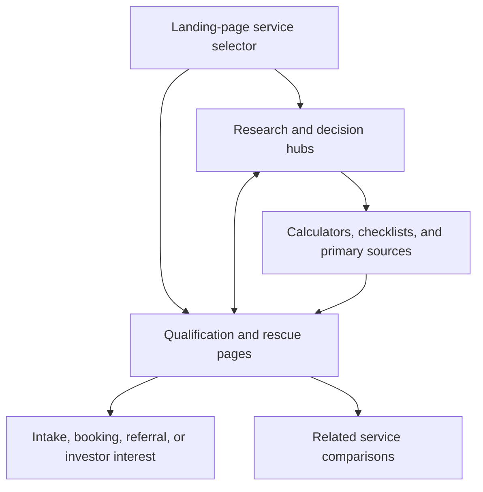

# FairLend keyword research and page-level clustering report

**Run date:** 2026-07-20  
**Market:** Ontario, with Toronto/GTA modifiers where geographically specific  
**OpenSEO project:** `7a3d4821-d03c-4be6-aaba-293df92d8ca8`  
**Input:** 160 retained keywords across 16 landing-page services  
**Model:** 32 page-level clusters — one research/decision and one qualification/rescue owner per service

## Executive recommendation

FairLend should not chase a generic “Ontario mortgage broker” universe first. Existing visibility already points to garden suites, private mortgages, construction draw schedules, and private-mortgage investing. Turn those signals into tightly bounded topic systems, then fill the missing commercial architecture for every other landing-page service.

The map resolves to:

- **24 pages to create**
- **8 existing pages to update**
- **16 research/decision clusters** for awareness, feasibility, and comparison
- **16 qualification/rescue clusters** for lender selection, applications, declines, cash gaps, and deadlines
- **10 P0, 18 P1, and 4 P2 clusters**

Act first on:

1. `/garden-suite`: 13 impressions at average position 2.9, zero clicks. Separate its eligibility promise from the financing page and fix title/meta fit.
2. `/borrowers/private-mortgage-financing`: 14 impressions at 10.1, zero clicks. Add cost, appraisal, qualification, exit, and bank-decline depth.
3. `/resources/construction-loan-draw-schedule`: the exact query has 3 impressions at position 91.3. Build the definitive draw toolkit and link it to DrawFlow.
4. `/investing/private-mortgage-lending`: 14 impressions at 39.4. Add direct-vs-MIC/fund, risk, and due-diligence coverage.
5. The MLI Select guide/service pair: this cluster contains the largest historical exact-query estimate in the universe.

## Method and evidence

This report applies the requested keyword-research and keyword-clustering workflows to the validated repository packages:

- `docs/SEO/research/keyword-and-funnel/landing-services-funnel-2026-07-19/`
- `docs/SEO/research/openseo/expansion-2026-07-17/deliverables/`
- `docs/SEO/research/openseo/trial-2026-07-16/deliverables/`

Workflow:

1. Started with authenticated Search Console query/page observations.
2. Reused the existing OpenSEO project and saved historical paid-research output.
3. Retained the audited Answer Socrates keep/exclude decisions.
4. Prioritized product fit, intent fit, first-party evidence, and observed metrics.
5. Clustered by searcher decision and target page—not lexical similarity alone.
6. Assigned every retained keyword to exactly one canonical cluster.
7. Checked live Next.js routes to preserve existing URLs and expose missing pages.
8. Separated research/decision intent from qualification/rescue intent.

The OpenSEO MCP methods named by the skills were not callable in this session. No fresh paid discovery, metric hydration, pairwise SERP-overlap batch, `save_keywords`, or tag mutation was executed. Missing metrics remain **unknown**, never zero.

### Evidence baseline

- **GSC:** 2 clicks, 67 impressions, 3% CTR, average position 31.2; four visible days (July 14–17, 2026).
- **GA4:** 14 sessions, 5 active users, 2 organic sessions, 1 engaged organic session, 0 key events.
- **Data state:** 150 unavailable/unknown terms, 5 first-party low-sample observations, 5 historical metric observations.
- **Answer Socrates:** 64 audited observations; 40 excluded, 5 primary, 19 supporting.
- **SERPs:** one representative result pattern per service. Pairwise URL overlap remains unverified.

## Highest-signal keyword shortlist

| Keyword | Service | Funnel | Volume | KD | CPC | GSC impr. | GSC pos. | Lead | Priority |
|---|---|---|---:|---:|---:|---:|---:|---:|---|
| MLI Select | MLI Select Insured Housing | awareness-education | 1600 | unknown | unknown | — | — | 23 | P0 |
| garden suites Toronto | Garden & Laneway Suite Financing | project-feasibility | 590 | unknown | unknown | — | — | 41 | P0 |
| MLI Select financing | MLI Select Insured Housing | financing-qualification | 20 | unknown | unknown | — | — | 81 | P0 |
| construction loan draw schedule | Construction Financing / DrawFlow | project-feasibility | 10 | unknown | unknown | 3 | 91.3 | 45 | P0 |
| construction financing Ontario | Construction Financing / DrawFlow | financing-qualification | 10 | unknown | unknown | — | — | 84 | P0 |
| private mortgage investment opportunities Ontario | Private Mortgage Investing | immediate-transaction-problem | unknown | unknown | unknown | 1 | 47 | 98 | P0 |
| invest in private mortgages Ontario | Private Mortgage Investing | financing-qualification | unknown | unknown | unknown | 1 | 53 | 82 | P0 |
| private mortgage investing Ontario | Private Mortgage Investing | financing-qualification | unknown | unknown | unknown | 1 | 90 | 82 | P0 |
| private mortgage appraisal requirements Ontario | Private Mortgages | project-feasibility | unknown | unknown | unknown | 2 | 96.5 | 42 | P0 |
| private mortgage fund opportunities Canada | Private Mortgage Investing | immediate-transaction-problem | unknown | unknown | unknown | 2 | 84.5 | 98 | P0 |
| private mortgage lenders Ontario | Private Mortgages | financing-qualification | unknown | unknown | unknown | — | — | 78 | P0 |
| garden suite financing Toronto | Garden & Laneway Suite Financing | financing-qualification | unknown | unknown | unknown | — | — | 78 | P0 |
| CMHC MLI Select lender Ontario | MLI Select Insured Housing | financing-qualification | unknown | unknown | unknown | — | — | 78 | P0 |
| multiplex financing Toronto | Multi-plex Financing | financing-qualification | unknown | unknown | unknown | — | — | 78 | P1 |
| home renovation financing Ontario | Renovation Financing | project-feasibility | unknown | unknown | unknown | — | — | 41 | P1 |
| bridge financing real estate Canada | Bridge Loans | financing-qualification | unknown | unknown | unknown | — | — | 81 | P1 |
| HELOC broker Ontario | Home Equity Line of Credit (HELOC) | financing-qualification | unknown | unknown | unknown | — | — | 78 | P1 |
| mortgage refinance broker Ontario | Residential Refinancing | financing-qualification | unknown | unknown | unknown | — | — | 78 | P1 |
| rental property financing Ontario | Existing Rental Property Acquisition Financing | financing-qualification | unknown | unknown | unknown | — | — | 78 | P1 |
| refinance rental property Ontario | Existing Rental Property Refinancing | financing-qualification | unknown | unknown | unknown | — | — | 78 | P1 |
| mortgage broker referral program Ontario | Partner / Referral Program | financing-qualification | unknown | unknown | unknown | — | — | 78 | P1 |
| builder financing consultant Toronto | Builder Consulting | financing-qualification | unknown | unknown | unknown | — | — | 78 | P1 |
| residential mortgage broker Ontario | Residential Mortgages | financing-qualification | unknown | unknown | unknown | — | — | 81 | P2 |
| institutional mortgage broker Ontario | Institutional Mortgages | financing-qualification | unknown | unknown | unknown | — | — | 78 | P2 |

### Exact observed metric rows

| Keyword | Monthly estimate | Observed | Qualification |
|---|---:|---|---|
| construction loan draw schedule | 10 | 2026-07-16/17 | Historical Canada-level exact-query estimate; not refreshed |
| construction financing Ontario | 10 | 2026-07-16/17 | Historical Canada-level exact-query estimate; not refreshed |
| garden suites Toronto | 590 | 2026-07-16/17 | Historical Canada-level exact-query estimate; not refreshed |
| MLI Select | 1600 | 2026-07-16/17 | Historical Canada-level exact-query estimate; not refreshed |
| MLI Select financing | 20 | 2026-07-16/17 | Historical Canada-level exact-query estimate; not refreshed |

Do not sum these estimates into a market-size claim; query demand can overlap.

## Cluster mapping

| Cluster | Primary keyword | Secondary keywords | Intent | Target | Status | Priority |
|---|---|---|---|---|---|---|
| residential-mortgages-research-decision | how much mortgage can I afford in Ontario | how do mortgages work in Ontario; mortgage on residential property; Ontario mortgage down payment requirements; mortgage broker vs bank Ontario; fixed vs variable mortgage Ontario | Informational + commercial investigation | `/resources/mortgage-affordability-ontario` | proposed-create | P2 |
| residential-mortgages-qualification-rescue | residential mortgage broker Ontario | mortgage pre approval Ontario; mortgage declined Ontario options; urgent mortgage approval Ontario | Transactional + urgent | `/borrowers/residential-mortgage-financing` | proposed-create | P2 |
| private-mortgages-research-decision | private mortgage costs Ontario | what is a private mortgage in Ontario; how private mortgage lending works Ontario; private mortgage appraisal requirements Ontario; private mortgage vs B lender Ontario; private mortgage vs second mortgage Ontario | Informational + commercial investigation | `/resources/private-mortgage-costs-ontario` | proposed-create | P0 |
| private-mortgages-qualification-rescue | private mortgage lenders Ontario | private mortgage broker Ontario; bank declined mortgage private lender Ontario; urgent private mortgage Ontario | Transactional + urgent | `/borrowers/private-mortgage-financing` | existing-update | P0 |
| institutional-mortgages-research-decision | institutional mortgage lenders Ontario | what is an institutional mortgage Canada; A lender mortgage requirements Ontario; institutional mortgage qualification Canada; institutional vs private mortgage Ontario; bank vs monoline mortgage lender Canada | Informational + commercial investigation | `/resources/institutional-mortgage-requirements-ontario` | proposed-create | P2 |
| institutional-mortgages-qualification-rescue | institutional mortgage broker Ontario | best institutional mortgage options Ontario; switch private mortgage to institutional lender; institutional mortgage closing deadline Ontario | Transactional + urgent | `/borrowers/institutional-mortgage` | existing-update | P2 |
| heloc-research-decision | what is a HELOC in Canada | how does a HELOC work in Ontario; how much HELOC can I get Ontario; HELOC equity requirements Ontario; HELOC vs refinance Ontario; HELOC vs home equity loan Canada | Informational + commercial investigation | `/resources/heloc-ontario-guide` | proposed-create | P1 |
| heloc-qualification-rescue | HELOC broker Ontario | home equity line of credit lender Ontario; HELOC declined alternatives Ontario; urgent home equity financing Ontario | Transactional + urgent | `/borrowers/heloc` | proposed-create | P1 |
| bridge-loans-research-decision | what is bridge financing in Canada | how does a bridge loan work Ontario; bridge loan eligibility Ontario; bridge financing cost Ontario; bridge loan vs HELOC Ontario; bridge loan vs private mortgage Ontario | Informational + commercial investigation | `/resources/bridge-financing-ontario-guide` | proposed-create | P1 |
| bridge-loans-qualification-rescue | bridge financing real estate Canada | bridge mortgage lender Ontario; urgent bridge financing Ontario; bridge loan without firm sale Ontario | Transactional + urgent | `/borrowers/bridge-financing` | proposed-create | P1 |
| residential-refinancing-research-decision | how mortgage refinancing works Ontario | what is cash out refinance Canada; mortgage refinance break even Ontario; how much equity to refinance Ontario; refinance vs renew mortgage Ontario; refinance vs HELOC Ontario | Informational + commercial investigation | `/resources/mortgage-refinancing-ontario-guide` | proposed-create | P1 |
| residential-refinancing-qualification-rescue | mortgage refinance broker Ontario | residential refinance lender Ontario; urgent mortgage refinance Ontario; refinance after bank decline Ontario | Transactional + urgent | `/borrowers/residential-refinancing` | proposed-create | P1 |
| renovation-financing-research-decision | home renovation financing Ontario | home renovation financing options Canada; how renovation loans work Ontario; renovation loan eligibility Ontario; HELOC vs refinance for renovations; renovation loan vs construction mortgage | Informational + commercial investigation | `/resources/home-renovation-financing-ontario` | proposed-create | P1 |
| renovation-financing-qualification-rescue | renovation financing lender Ontario | purchase plus improvements mortgage Ontario; renovation cost overrun financing Ontario; urgent home improvement loan Ontario | Transactional + urgent | `/borrowers/renovation-financing` | proposed-create | P1 |
| construction-financing-research-decision | construction loan draw schedule | how construction financing works Ontario; what is a construction draw mortgage; construction financing equity requirements Ontario; construction loan vs conventional mortgage; private vs institutional construction financing | Informational + commercial investigation | `/resources/construction-loan-draw-schedule` | proposed-create | P0 |
| construction-financing-qualification-rescue | construction financing Ontario | construction mortgage lender Toronto; stopped construction draw financing Ontario; construction lender replacement Ontario | Transactional + urgent | `/construction-draw-financing` | existing-update | P0 |
| multiplex-financing-research-decision | how to finance a fourplex in Toronto | what is multiplex financing Ontario; Toronto multiplex financing feasibility; sixplex financing requirements Ontario; fourplex vs five unit financing Canada; multiplex construction loan vs MLI Select | Informational + commercial investigation | `/resources/toronto-multiplex-financing-guide` | proposed-create | P1 |
| multiplex-financing-qualification-rescue | multiplex financing Toronto | fourplex mortgage lender Ontario; multiplex construction financing gap Ontario; urgent fourplex acquisition financing | Transactional + urgent | `/multiplex-financing-gta` | existing-update | P1 |
| garden-laneway-suites-research-decision | garden suites Toronto | what is a garden suite Toronto; can I build a garden suite Toronto; garden suite cost Toronto; garden suite vs laneway house Toronto; HELOC vs construction loan for garden suite | Informational + commercial investigation | `/garden-suite` | existing-update | P0 |
| garden-laneway-suites-qualification-rescue | garden suite financing Toronto | laneway suite construction loan Toronto; garden suite financing shortfall Toronto; urgent laneway house financing Toronto | Transactional + urgent | `/garden-suite-financing-gta` | existing-update | P0 |
| mli-select-research-decision | MLI Select | MLI Select points system; MLI Select requirements; MLI Select affordability criteria; MLI Select vs conventional financing; MLI Select vs standard rental housing insurance | Informational + commercial investigation | `/resources/mli-select-requirements-points` | proposed-create | P0 |
| mli-select-qualification-rescue | MLI Select financing | CMHC MLI Select lender Ontario; urgent MLI Select financing review; MLI Select takeout financing deadline | Transactional + urgent | `/mli-select` | proposed-create | P0 |
| rental-acquisition-research-decision | rental property down payment Ontario | how rental property financing works Ontario; investment property mortgage rules Ontario; rental income mortgage qualification Ontario; commercial vs residential rental property mortgage; rental property mortgage vs HELOC | Informational + commercial investigation | `/resources/rental-property-financing-ontario` | proposed-create | P1 |
| rental-acquisition-qualification-rescue | rental property financing Ontario | investment property mortgage broker Ontario; rental property closing financing Ontario; urgent rental acquisition bridge loan | Transactional + urgent | `/borrowers/rental-property-acquisition-financing` | proposed-create | P1 |
| rental-refinancing-research-decision | how to refinance a rental property Ontario | cash out refinance rental property Canada; rental property refinance equity requirements; rental income refinance qualification Ontario; rental mortgage renewal vs refinance; rental property refinance vs HELOC | Informational + commercial investigation | `/resources/rental-property-refinancing-ontario` | proposed-create | P1 |
| rental-refinancing-qualification-rescue | refinance rental property Ontario | rental portfolio refinance lender Ontario; urgent rental property refinance Ontario; rental mortgage lender replacement Ontario | Transactional + urgent | `/borrowers/rental-property-refinancing` | proposed-create | P1 |
| private-mortgage-investing-research-decision | how private mortgage investing works Ontario | private mortgage investment risks Canada; private mortgage investment returns Ontario; private mortgage due diligence checklist; direct private mortgage vs MIC; private mortgage fund vs direct lending | Informational + commercial investigation | `/resources/private-mortgage-investing-ontario` | proposed-create | P0 |
| private-mortgage-investing-qualification-rescue | private mortgage investing Ontario | invest in private mortgages Ontario; private mortgage investment opportunities Ontario; private mortgage fund opportunities Canada | Transactional + urgent | `/investing/private-mortgage-lending` | existing-update | P0 |
| partner-program-research-decision | mortgage referral fee rules Ontario | how mortgage referral programs work Ontario; who can refer a mortgage client Ontario; mortgage referral program requirements Ontario; mortgage referral program vs co brokering; construction financing referral partner | Informational + commercial investigation | `/resources/mortgage-referral-program-ontario` | proposed-create | P1 |
| partner-program-qualification-rescue | mortgage broker referral program Ontario | mortgage referral partner Ontario; refer a declined mortgage client Ontario; urgent construction financing referral | Transactional + urgent | `/partners` | existing-update | P1 |
| builder-consulting-research-decision | construction finance advisory Ontario | what does a builder financing consultant do; development feasibility consultant Toronto; construction budget review for financing; builder financing consultant vs mortgage broker; development capital stack consultant Ontario | Informational + commercial investigation | `/resources/builder-financing-readiness-ontario` | proposed-create | P1 |
| builder-consulting-qualification-rescue | builder financing consultant Toronto | construction financing strategy consultant Ontario; stalled construction project financing consultant; urgent builder capital shortfall Ontario | Transactional + urgent | `/builder-consulting` | proposed-create | P1 |

## Existing pages to update

| Page | Role | Required action |
|---|---|---|
| `/borrowers/private-mortgage-financing` | Private qualification/rescue | Add costs, appraisal, qualification, exit, and decline recovery. |
| `/borrowers/institutional-mortgage` | Institutional qualification | Preserve canonical URL; strengthen requirements and graduation paths. |
| `/construction-draw-financing` | Construction qualification/rescue | Position DrawFlow against conventional timing and stopped-draw failures. |
| `/multiplex-financing-gta` | Multiplex qualification | Keep property/capital intent; link out for full MLI rules. |
| `/garden-suite` | Garden research/decision | Own eligibility, site, cost, feasibility, and comparisons. |
| `/garden-suite-financing-gta` | Garden qualification | Own lender fit, draw readiness, working capital, and intake. |
| `/investing/private-mortgage-lending` | Investor opportunity | Separate structures, risks, due diligence, and opportunity intent. |
| `/partners` | Partner qualification | Clarify partner types, handoff, disclosure, and file requirements. |

## Cannibalization and consolidation

| Risk | Canonical decision |
|---|---|
| Residential vs institutional vs private | Residential routes broad intent; institutional owns policy-fit; private owns exception/decline. |
| Borrowing vs private-mortgage investing | Separate audience, CTA, schema, and internal anchor text. |
| HELOC vs refinance vs renovation | HELOC owns revolving access; refinance owns mortgage replacement; renovation owns project-purpose financing. |
| Construction vs multiplex vs garden vs MLI | Construction owns draw mechanics; property pages own project feasibility; MLI owns the insured program. |
| Garden dual URLs | Keep only with strict roles: eligibility at `/garden-suite`; financing at `/garden-suite-financing-gta`. |
| Multiplex vs MLI Select | Summarize MLI on multiplex; canonicalize requirements and points to the MLI hub. |
| Rental acquisition vs refinance | Split by transaction state: buying versus restructuring an owned asset. |
| Builder consulting vs Partner | Builder targets project strategy; Partner targets introducers and handoff. |
| Affordable/sustainable rental vs MLI | Consolidate verified evidence into the new MLI architecture. |
| Institutional proposed slug | Do not create `/borrowers/institutional-mortgage-financing`; preserve the live canonical URL. |

Current GSC does not show one query splitting impressions across multiple FairLend URLs. Except for the visibly overlapping garden pages, these are preventive boundaries.

## Internal-link architecture

Rules:

- Pair each guide and service page with exact-entity anchors.
- Use problem-language anchors for urgent flows.
- Never reuse one generic anchor across residential, institutional, private, and refinance.
- Comparison pages link to both products, but only one page owns the comparison query.
- Keep `/start/builder` as the noindex intake endpoint behind the proposed consulting page.

## Publishing roadmap

### Wave 0 — fix measurement

1. Mark application start, form submit, booked consultation, partner referral, and investor interest as GA4 key events.
2. Export GSC query/page data weekly while the property is young.
3. Monitor `www` and non-`www` homepage impressions.
4. Define conversion ownership for borrower, builder, partner, and investor paths.

### Wave 1 — P0

1. Separate and refresh the two garden-suite pages.
2. Refresh private-mortgage qualification content.
3. Publish the construction draw-schedule toolkit and update DrawFlow.
4. Publish the investor guide and update the investor page.
5. Build the MLI Select guide/service pair.

### Wave 2 — P1

1. HELOC, bridge, refinance, and renovation guide/service pairs.
2. Multiplex research guide plus existing service-page refinement.
3. Rental acquisition and rental refinance pairs.
4. Partner guide plus `/partners` refinement.
5. Builder-readiness guide and indexable `/builder-consulting`; retain `/start/builder` for intake.

### Wave 3 — P2

1. Residential affordability/decision guide and residential service page.
2. Institutional requirements guide and existing page refinement.
3. Expand broad broker terms only after specialized clusters earn impressions and links.

## Measurement plan

Track query impressions, position, clicks, CTR, organic entrances, engaged sessions, guide-to-service clicks, intake starts/completions, bookings, partner referrals, investor-interest submissions, and assisted conversions.

Operational decisions:

- High position + zero clicks → rewrite title/meta and verify SERP promise.
- Positions 20–60 → strengthen passage coverage and internal links.
- Below 60 → build authority content and links before conversion micro-optimization.
- Traffic + zero key events → repair measurement before calling the content commercially weak.

## Save/tag plan

No keywords were saved. After explicit confirmation, use:

- `topic:<service-id>`
- `intent:research` or `intent:service`
- `page:<canonical-slug>`

Do not replace unrelated existing tags.

## Page briefs

### residential-mortgages-research-decision

- **Page type:** Affordability guide + worked scenarios
- **Searcher problem:** Understand feasibility, trade-offs, and the right route before committing.
- **Primary keyword:** how much mortgage can I afford in Ontario
- **Secondary keywords:** how do mortgages work in Ontario; mortgage on residential property; Ontario mortgage down payment requirements; mortgage broker vs bank Ontario; fixed vs variable mortgage Ontario
- **Target:** `/resources/mortgage-affordability-ontario` — proposed-create
- **Funnel coverage:** awareness-education → project-feasibility → planning-comparison
- **Required sections:**
  - Plain-language mortgage mechanics
  - Affordability and down-payment scenarios
  - Broker versus bank decision framework
  - Fixed versus variable trade-offs
  - Pre-approval documentation checklist
  - Links to institutional and private options
- **Internal links:** `/borrowers/residential-mortgage-financing`, `/borrowers`
- **Boundary decision:** Keep broad residential intent at the hub; route institutional, private, HELOC, and refinance terms to their dedicated owners.
- **Suggested tags:** `topic:residential-mortgages`, `intent:research`, `page:resources-mortgage-affordability-ontario`

### residential-mortgages-qualification-rescue

- **Page type:** Residential mortgage service page
- **Searcher problem:** Find a suitable financing/advisory path for a live file, qualification need, or deadline.
- **Primary keyword:** residential mortgage broker Ontario
- **Secondary keywords:** mortgage pre approval Ontario; mortgage declined Ontario options; urgent mortgage approval Ontario
- **Target:** `/borrowers/residential-mortgage-financing` — proposed-create
- **Funnel coverage:** financing-qualification → immediate-transaction-problem
- **Required sections:**
  - Plain-language mortgage mechanics
  - Affordability and down-payment scenarios
  - Broker versus bank decision framework
  - Fixed versus variable trade-offs
  - Pre-approval documentation checklist
  - Links to institutional and private options
- **Internal links:** `/resources/mortgage-affordability-ontario`, `/borrowers`
- **Boundary decision:** Keep broad residential intent at the hub; route institutional, private, HELOC, and refinance terms to their dedicated owners.
- **Suggested tags:** `topic:residential-mortgages`, `intent:service`, `page:borrowers-residential-mortgage-financing`

### private-mortgages-research-decision

- **Page type:** Cost, appraisal, and exit-strategy guide
- **Searcher problem:** Understand feasibility, trade-offs, and the right route before committing.
- **Primary keyword:** private mortgage costs Ontario
- **Secondary keywords:** what is a private mortgage in Ontario; how private mortgage lending works Ontario; private mortgage appraisal requirements Ontario; private mortgage vs B lender Ontario; private mortgage vs second mortgage Ontario
- **Target:** `/resources/private-mortgage-costs-ontario` — proposed-create
- **Funnel coverage:** awareness-education → project-feasibility → planning-comparison
- **Required sections:**
  - Private mortgage mechanics and use cases
  - Interest, lender fee, broker fee, and legal-cost model
  - Appraisal and loan-to-value requirements
  - Private versus B-lender comparison
  - Exit strategy and renewal risks
  - Bank-decline recovery CTA
- **Internal links:** `/borrowers/private-mortgage-financing`, `/investing/private-mortgage-lending`
- **Boundary decision:** Borrower intent stays separate from private-mortgage investing; use explicit Borrow and Invest navigation labels.
- **Suggested tags:** `topic:private-mortgages`, `intent:research`, `page:resources-private-mortgage-costs-ontario`

### private-mortgages-qualification-rescue

- **Page type:** Private mortgage money page
- **Searcher problem:** Find a suitable financing/advisory path for a live file, qualification need, or deadline.
- **Primary keyword:** private mortgage lenders Ontario
- **Secondary keywords:** private mortgage broker Ontario; bank declined mortgage private lender Ontario; urgent private mortgage Ontario
- **Target:** `/borrowers/private-mortgage-financing` — existing-update
- **Funnel coverage:** financing-qualification → immediate-transaction-problem
- **Required sections:**
  - Private mortgage mechanics and use cases
  - Interest, lender fee, broker fee, and legal-cost model
  - Appraisal and loan-to-value requirements
  - Private versus B-lender comparison
  - Exit strategy and renewal risks
  - Bank-decline recovery CTA
- **Internal links:** `/resources/private-mortgage-costs-ontario`, `/investing/private-mortgage-lending`
- **Boundary decision:** Borrower intent stays separate from private-mortgage investing; use explicit Borrow and Invest navigation labels.
- **Suggested tags:** `topic:private-mortgages`, `intent:service`, `page:borrowers-private-mortgage-financing`

### institutional-mortgages-research-decision

- **Page type:** Institutional lender requirements guide
- **Searcher problem:** Understand feasibility, trade-offs, and the right route before committing.
- **Primary keyword:** institutional mortgage lenders Ontario
- **Secondary keywords:** what is an institutional mortgage Canada; A lender mortgage requirements Ontario; institutional mortgage qualification Canada; institutional vs private mortgage Ontario; bank vs monoline mortgage lender Canada
- **Target:** `/resources/institutional-mortgage-requirements-ontario` — proposed-create
- **Funnel coverage:** awareness-education → project-feasibility → planning-comparison
- **Required sections:**
  - Bank, credit union, trust, and monoline definitions
  - Income, credit, debt-service, equity, and property criteria
  - A-lender versus private comparison
  - Bank versus monoline comparison
  - Graduation path from alternative credit
  - Application checklist and next-step CTA
- **Internal links:** `/borrowers/institutional-mortgage`, `/borrowers`
- **Boundary decision:** Preserve /borrowers/institutional-mortgage; do not create the previously proposed -financing variant.
- **Suggested tags:** `topic:institutional-mortgages`, `intent:research`, `page:resources-institutional-mortgage-requirements-ontario`

### institutional-mortgages-qualification-rescue

- **Page type:** Institutional mortgage service page
- **Searcher problem:** Find a suitable financing/advisory path for a live file, qualification need, or deadline.
- **Primary keyword:** institutional mortgage broker Ontario
- **Secondary keywords:** best institutional mortgage options Ontario; switch private mortgage to institutional lender; institutional mortgage closing deadline Ontario
- **Target:** `/borrowers/institutional-mortgage` — existing-update
- **Funnel coverage:** financing-qualification → immediate-transaction-problem
- **Required sections:**
  - Bank, credit union, trust, and monoline definitions
  - Income, credit, debt-service, equity, and property criteria
  - A-lender versus private comparison
  - Bank versus monoline comparison
  - Graduation path from alternative credit
  - Application checklist and next-step CTA
- **Internal links:** `/resources/institutional-mortgage-requirements-ontario`, `/borrowers`
- **Boundary decision:** Preserve /borrowers/institutional-mortgage; do not create the previously proposed -financing variant.
- **Suggested tags:** `topic:institutional-mortgages`, `intent:service`, `page:borrowers-institutional-mortgage`

### heloc-research-decision

- **Page type:** HELOC limit and alternatives guide
- **Searcher problem:** Understand feasibility, trade-offs, and the right route before committing.
- **Primary keyword:** what is a HELOC in Canada
- **Secondary keywords:** how does a HELOC work in Ontario; how much HELOC can I get Ontario; HELOC equity requirements Ontario; HELOC vs refinance Ontario; HELOC vs home equity loan Canada
- **Target:** `/resources/heloc-ontario-guide` — proposed-create
- **Funnel coverage:** awareness-education → project-feasibility → planning-comparison
- **Required sections:**
  - Revolving-credit mechanics
  - Combined loan-to-value and equity examples
  - Variable-rate and payment risks
  - HELOC versus refinance versus home-equity loan
  - Renovation and investment use cases
  - Qualification checklist and service CTA
- **Internal links:** `/borrowers/heloc`, `/borrowers/residential-refinancing`
- **Boundary decision:** Own general HELOC intent here; assign renovation-specific comparisons to renovation and refinancing economics to refinance.
- **Suggested tags:** `topic:heloc`, `intent:research`, `page:resources-heloc-ontario-guide`

### heloc-qualification-rescue

- **Page type:** HELOC service page
- **Searcher problem:** Find a suitable financing/advisory path for a live file, qualification need, or deadline.
- **Primary keyword:** HELOC broker Ontario
- **Secondary keywords:** home equity line of credit lender Ontario; HELOC declined alternatives Ontario; urgent home equity financing Ontario
- **Target:** `/borrowers/heloc` — proposed-create
- **Funnel coverage:** financing-qualification → immediate-transaction-problem
- **Required sections:**
  - Revolving-credit mechanics
  - Combined loan-to-value and equity examples
  - Variable-rate and payment risks
  - HELOC versus refinance versus home-equity loan
  - Renovation and investment use cases
  - Qualification checklist and service CTA
- **Internal links:** `/resources/heloc-ontario-guide`, `/borrowers/residential-refinancing`
- **Boundary decision:** Own general HELOC intent here; assign renovation-specific comparisons to renovation and refinancing economics to refinance.
- **Suggested tags:** `topic:heloc`, `intent:service`, `page:borrowers-heloc`

### bridge-loans-research-decision

- **Page type:** Bridge mechanics and cost guide
- **Searcher problem:** Understand feasibility, trade-offs, and the right route before committing.
- **Primary keyword:** what is bridge financing in Canada
- **Secondary keywords:** how does a bridge loan work Ontario; bridge loan eligibility Ontario; bridge financing cost Ontario; bridge loan vs HELOC Ontario; bridge loan vs private mortgage Ontario
- **Target:** `/resources/bridge-financing-ontario-guide` — proposed-create
- **Funnel coverage:** awareness-education → project-feasibility → planning-comparison
- **Required sections:**
  - Purchase-before-sale mechanics
  - Firm-sale and no-firm-sale scenarios
  - Interest, fee, and term examples
  - Bridge versus HELOC versus private mortgage
  - Required documents and security
  - Closing-deadline intake CTA
- **Internal links:** `/borrowers/bridge-financing`, `/borrowers`
- **Boundary decision:** Use bridge only for time-bound transaction gaps; longer-term equity access belongs to HELOC/refinance.
- **Suggested tags:** `topic:bridge-loans`, `intent:research`, `page:resources-bridge-financing-ontario-guide`

### bridge-loans-qualification-rescue

- **Page type:** Bridge financing service page
- **Searcher problem:** Find a suitable financing/advisory path for a live file, qualification need, or deadline.
- **Primary keyword:** bridge financing real estate Canada
- **Secondary keywords:** bridge mortgage lender Ontario; urgent bridge financing Ontario; bridge loan without firm sale Ontario
- **Target:** `/borrowers/bridge-financing` — proposed-create
- **Funnel coverage:** financing-qualification → immediate-transaction-problem
- **Required sections:**
  - Purchase-before-sale mechanics
  - Firm-sale and no-firm-sale scenarios
  - Interest, fee, and term examples
  - Bridge versus HELOC versus private mortgage
  - Required documents and security
  - Closing-deadline intake CTA
- **Internal links:** `/resources/bridge-financing-ontario-guide`, `/borrowers`
- **Boundary decision:** Use bridge only for time-bound transaction gaps; longer-term equity access belongs to HELOC/refinance.
- **Suggested tags:** `topic:bridge-loans`, `intent:service`, `page:borrowers-bridge-financing`

### residential-refinancing-research-decision

- **Page type:** Refinance economics and decision guide
- **Searcher problem:** Understand feasibility, trade-offs, and the right route before committing.
- **Primary keyword:** how mortgage refinancing works Ontario
- **Secondary keywords:** what is cash out refinance Canada; mortgage refinance break even Ontario; how much equity to refinance Ontario; refinance vs renew mortgage Ontario; refinance vs HELOC Ontario
- **Target:** `/resources/mortgage-refinancing-ontario-guide` — proposed-create
- **Funnel coverage:** awareness-education → project-feasibility → planning-comparison
- **Required sections:**
  - Rate-and-term and cash-out mechanics
  - Penalty and break-even worksheet
  - Equity and qualification thresholds
  - Refinance versus renewal versus HELOC
  - Debt-consolidation and renovation use cases
  - Urgent/private refinance path
- **Internal links:** `/borrowers/residential-refinancing`, `/borrowers/heloc`
- **Boundary decision:** Renewal-only rate shopping stays informational; equity access and debt restructuring convert on the refinance page.
- **Suggested tags:** `topic:residential-refinancing`, `intent:research`, `page:resources-mortgage-refinancing-ontario-guide`

### residential-refinancing-qualification-rescue

- **Page type:** Residential refinance service page
- **Searcher problem:** Find a suitable financing/advisory path for a live file, qualification need, or deadline.
- **Primary keyword:** mortgage refinance broker Ontario
- **Secondary keywords:** residential refinance lender Ontario; urgent mortgage refinance Ontario; refinance after bank decline Ontario
- **Target:** `/borrowers/residential-refinancing` — proposed-create
- **Funnel coverage:** financing-qualification → immediate-transaction-problem
- **Required sections:**
  - Rate-and-term and cash-out mechanics
  - Penalty and break-even worksheet
  - Equity and qualification thresholds
  - Refinance versus renewal versus HELOC
  - Debt-consolidation and renovation use cases
  - Urgent/private refinance path
- **Internal links:** `/resources/mortgage-refinancing-ontario-guide`, `/borrowers/heloc`
- **Boundary decision:** Renewal-only rate shopping stays informational; equity access and debt restructuring convert on the refinance page.
- **Suggested tags:** `topic:residential-refinancing`, `intent:service`, `page:borrowers-residential-refinancing`

### renovation-financing-research-decision

- **Page type:** Renovation financing options guide
- **Searcher problem:** Understand feasibility, trade-offs, and the right route before committing.
- **Primary keyword:** home renovation financing Ontario
- **Secondary keywords:** home renovation financing options Canada; how renovation loans work Ontario; renovation loan eligibility Ontario; HELOC vs refinance for renovations; renovation loan vs construction mortgage
- **Target:** `/resources/home-renovation-financing-ontario` — proposed-create
- **Funnel coverage:** awareness-education → project-feasibility → planning-comparison
- **Required sections:**
  - Renovation loan structures
  - Budget, scope, contingency, and appraisal inputs
  - HELOC versus refinance versus construction mortgage
  - Purchase-plus-improvements workflow
  - Draw and contractor-payment planning
  - Cost-overrun rescue CTA
- **Internal links:** `/borrowers/renovation-financing`, `/borrowers`
- **Boundary decision:** Routine home improvements stay here; ground-up or major staged construction belongs to construction financing.
- **Suggested tags:** `topic:renovation-financing`, `intent:research`, `page:resources-home-renovation-financing-ontario`

### renovation-financing-qualification-rescue

- **Page type:** Renovation financing service page
- **Searcher problem:** Find a suitable financing/advisory path for a live file, qualification need, or deadline.
- **Primary keyword:** renovation financing lender Ontario
- **Secondary keywords:** purchase plus improvements mortgage Ontario; renovation cost overrun financing Ontario; urgent home improvement loan Ontario
- **Target:** `/borrowers/renovation-financing` — proposed-create
- **Funnel coverage:** financing-qualification → immediate-transaction-problem
- **Required sections:**
  - Renovation loan structures
  - Budget, scope, contingency, and appraisal inputs
  - HELOC versus refinance versus construction mortgage
  - Purchase-plus-improvements workflow
  - Draw and contractor-payment planning
  - Cost-overrun rescue CTA
- **Internal links:** `/resources/home-renovation-financing-ontario`, `/borrowers`
- **Boundary decision:** Routine home improvements stay here; ground-up or major staged construction belongs to construction financing.
- **Suggested tags:** `topic:renovation-financing`, `intent:service`, `page:borrowers-renovation-financing`

### construction-financing-research-decision

- **Page type:** Draw-schedule toolkit + cash-flow model
- **Searcher problem:** Understand feasibility, trade-offs, and the right route before committing.
- **Primary keyword:** construction loan draw schedule
- **Secondary keywords:** how construction financing works Ontario; what is a construction draw mortgage; construction financing equity requirements Ontario; construction loan vs conventional mortgage; private vs institutional construction financing
- **Target:** `/resources/construction-loan-draw-schedule` — proposed-create
- **Funnel coverage:** awareness-education → project-feasibility → planning-comparison
- **Required sections:**
  - Draw milestones and inspection sequence
  - Worked sources-and-uses schedule
  - Holdbacks, contingency, and borrower working capital
  - Conventional draws versus DrawFlow timing
  - Stopped-draw diagnosis and lender replacement
  - Downloadable readiness checklist
- **Internal links:** `/construction-draw-financing`, `/multiplex-financing-gta`
- **Boundary decision:** Generic draw mechanics canonicalize here; property-specific multiplex/garden and program-specific MLI queries stay in their own clusters.
- **Suggested tags:** `topic:construction-financing`, `intent:research`, `page:resources-construction-loan-draw-schedule`

### construction-financing-qualification-rescue

- **Page type:** Construction draw financing service page
- **Searcher problem:** Find a suitable financing/advisory path for a live file, qualification need, or deadline.
- **Primary keyword:** construction financing Ontario
- **Secondary keywords:** construction mortgage lender Toronto; stopped construction draw financing Ontario; construction lender replacement Ontario
- **Target:** `/construction-draw-financing` — existing-update
- **Funnel coverage:** financing-qualification → immediate-transaction-problem
- **Required sections:**
  - Draw milestones and inspection sequence
  - Worked sources-and-uses schedule
  - Holdbacks, contingency, and borrower working capital
  - Conventional draws versus DrawFlow timing
  - Stopped-draw diagnosis and lender replacement
  - Downloadable readiness checklist
- **Internal links:** `/resources/construction-loan-draw-schedule`, `/multiplex-financing-gta`
- **Boundary decision:** Generic draw mechanics canonicalize here; property-specific multiplex/garden and program-specific MLI queries stay in their own clusters.
- **Suggested tags:** `topic:construction-financing`, `intent:service`, `page:construction-draw-financing`

### multiplex-financing-research-decision

- **Page type:** Multiplex feasibility and unit-boundary guide
- **Searcher problem:** Understand feasibility, trade-offs, and the right route before committing.
- **Primary keyword:** how to finance a fourplex in Toronto
- **Secondary keywords:** what is multiplex financing Ontario; Toronto multiplex financing feasibility; sixplex financing requirements Ontario; fourplex vs five unit financing Canada; multiplex construction loan vs MLI Select
- **Target:** `/resources/toronto-multiplex-financing-guide` — proposed-create
- **Funnel coverage:** awareness-education → project-feasibility → planning-comparison
- **Required sections:**
  - Two-to-four versus five-plus financing boundary
  - Site, unit mix, budget, rent, and equity model
  - Construction-to-takeout sequence
  - Conventional versus MLI Select decision
  - Fourplex and sixplex scenarios
  - Project-review CTA
- **Internal links:** `/multiplex-financing-gta`, `/mli-select`
- **Boundary decision:** Do not let the service page become an MLI Select requirements guide; link to the MLI cluster for program detail.
- **Suggested tags:** `topic:multiplex-financing`, `intent:research`, `page:resources-toronto-multiplex-financing-guide`

### multiplex-financing-qualification-rescue

- **Page type:** Multiplex financing service page
- **Searcher problem:** Find a suitable financing/advisory path for a live file, qualification need, or deadline.
- **Primary keyword:** multiplex financing Toronto
- **Secondary keywords:** fourplex mortgage lender Ontario; multiplex construction financing gap Ontario; urgent fourplex acquisition financing
- **Target:** `/multiplex-financing-gta` — existing-update
- **Funnel coverage:** financing-qualification → immediate-transaction-problem
- **Required sections:**
  - Two-to-four versus five-plus financing boundary
  - Site, unit mix, budget, rent, and equity model
  - Construction-to-takeout sequence
  - Conventional versus MLI Select decision
  - Fourplex and sixplex scenarios
  - Project-review CTA
- **Internal links:** `/resources/toronto-multiplex-financing-guide`, `/mli-select`
- **Boundary decision:** Do not let the service page become an MLI Select requirements guide; link to the MLI cluster for program detail.
- **Suggested tags:** `topic:multiplex-financing`, `intent:service`, `page:multiplex-financing-gta`

### garden-laneway-suites-research-decision

- **Page type:** Garden-suite eligibility and feasibility hub
- **Searcher problem:** Understand feasibility, trade-offs, and the right route before committing.
- **Primary keyword:** garden suites Toronto
- **Secondary keywords:** what is a garden suite Toronto; can I build a garden suite Toronto; garden suite cost Toronto; garden suite vs laneway house Toronto; HELOC vs construction loan for garden suite
- **Target:** `/garden-suite` — existing-update
- **Funnel coverage:** awareness-education → project-feasibility → planning-comparison
- **Required sections:**
  - Toronto eligibility, access, servicing, and permit inputs
  - Cost, contingency, rent, and equity model
  - Garden suite versus laneway house
  - HELOC versus construction draw comparison
  - Working-capital and draw-readiness checklist
  - Financing-page and intake links
- **Internal links:** `/garden-suite-financing-gta`, `/construction-draw-financing`
- **Boundary decision:** Maintain two pages only with strict roles: /garden-suite owns eligibility/feasibility; /garden-suite-financing-gta owns lender qualification and transaction intent.
- **Suggested tags:** `topic:garden-laneway-suites`, `intent:research`, `page:garden-suite`

### garden-laneway-suites-qualification-rescue

- **Page type:** Garden-suite financing service page
- **Searcher problem:** Find a suitable financing/advisory path for a live file, qualification need, or deadline.
- **Primary keyword:** garden suite financing Toronto
- **Secondary keywords:** laneway suite construction loan Toronto; garden suite financing shortfall Toronto; urgent laneway house financing Toronto
- **Target:** `/garden-suite-financing-gta` — existing-update
- **Funnel coverage:** financing-qualification → immediate-transaction-problem
- **Required sections:**
  - Toronto eligibility, access, servicing, and permit inputs
  - Cost, contingency, rent, and equity model
  - Garden suite versus laneway house
  - HELOC versus construction draw comparison
  - Working-capital and draw-readiness checklist
  - Financing-page and intake links
- **Internal links:** `/garden-suite`, `/construction-draw-financing`
- **Boundary decision:** Maintain two pages only with strict roles: /garden-suite owns eligibility/feasibility; /garden-suite-financing-gta owns lender qualification and transaction intent.
- **Suggested tags:** `topic:garden-laneway-suites`, `intent:service`, `page:garden-suite-financing-gta`

### mli-select-research-decision

- **Page type:** CMHC-backed program guide + points model
- **Searcher problem:** Understand feasibility, trade-offs, and the right route before committing.
- **Primary keyword:** MLI Select
- **Secondary keywords:** MLI Select points system; MLI Select requirements; MLI Select affordability criteria; MLI Select vs conventional financing; MLI Select vs standard rental housing insurance
- **Target:** `/resources/mli-select-requirements-points` — proposed-create
- **Funnel coverage:** awareness-education → project-feasibility → planning-comparison
- **Required sections:**
  - Primary-source program definition
  - Affordability, energy, and accessibility points
  - Property and borrower eligibility
  - Conventional versus MLI Select comparison
  - Submission and approved-lender workflow
  - Scenario model and financing review CTA
- **Internal links:** `/mli-select`, `/multiplex-financing-gta`
- **Boundary decision:** Consolidate overlapping affordable-sustainable-rental-housing content into this architecture; keep multiplex focused on the property strategy.
- **Suggested tags:** `topic:mli-select`, `intent:research`, `page:resources-mli-select-requirements-points`

### mli-select-qualification-rescue

- **Page type:** MLI Select advisory/service page
- **Searcher problem:** Find a suitable financing/advisory path for a live file, qualification need, or deadline.
- **Primary keyword:** MLI Select financing
- **Secondary keywords:** CMHC MLI Select lender Ontario; urgent MLI Select financing review; MLI Select takeout financing deadline
- **Target:** `/mli-select` — proposed-create
- **Funnel coverage:** financing-qualification → immediate-transaction-problem
- **Required sections:**
  - Primary-source program definition
  - Affordability, energy, and accessibility points
  - Property and borrower eligibility
  - Conventional versus MLI Select comparison
  - Submission and approved-lender workflow
  - Scenario model and financing review CTA
- **Internal links:** `/resources/mli-select-requirements-points`, `/multiplex-financing-gta`
- **Boundary decision:** Consolidate overlapping affordable-sustainable-rental-housing content into this architecture; keep multiplex focused on the property strategy.
- **Suggested tags:** `topic:mli-select`, `intent:service`, `page:mli-select`

### rental-acquisition-research-decision

- **Page type:** Rental acquisition financing guide
- **Searcher problem:** Understand feasibility, trade-offs, and the right route before committing.
- **Primary keyword:** rental property down payment Ontario
- **Secondary keywords:** how rental property financing works Ontario; investment property mortgage rules Ontario; rental income mortgage qualification Ontario; commercial vs residential rental property mortgage; rental property mortgage vs HELOC
- **Target:** `/resources/rental-property-financing-ontario` — proposed-create
- **Funnel coverage:** awareness-education → project-feasibility → planning-comparison
- **Required sections:**
  - Down payment and equity structures
  - Rental-income treatment and debt service
  - Residential versus commercial boundary
  - Portfolio and entity considerations
  - HELOC and bridge acquisition strategies
  - Live closing review CTA
- **Internal links:** `/borrowers/rental-property-acquisition-financing`, `/borrowers/rental-property-refinancing`
- **Boundary decision:** Purchase and acquisition intent stays here; existing-asset equity extraction belongs to rental refinancing.
- **Suggested tags:** `topic:rental-acquisition`, `intent:research`, `page:resources-rental-property-financing-ontario`

### rental-acquisition-qualification-rescue

- **Page type:** Rental acquisition service page
- **Searcher problem:** Find a suitable financing/advisory path for a live file, qualification need, or deadline.
- **Primary keyword:** rental property financing Ontario
- **Secondary keywords:** investment property mortgage broker Ontario; rental property closing financing Ontario; urgent rental acquisition bridge loan
- **Target:** `/borrowers/rental-property-acquisition-financing` — proposed-create
- **Funnel coverage:** financing-qualification → immediate-transaction-problem
- **Required sections:**
  - Down payment and equity structures
  - Rental-income treatment and debt service
  - Residential versus commercial boundary
  - Portfolio and entity considerations
  - HELOC and bridge acquisition strategies
  - Live closing review CTA
- **Internal links:** `/resources/rental-property-financing-ontario`, `/borrowers/rental-property-refinancing`
- **Boundary decision:** Purchase and acquisition intent stays here; existing-asset equity extraction belongs to rental refinancing.
- **Suggested tags:** `topic:rental-acquisition`, `intent:service`, `page:borrowers-rental-property-acquisition-financing`

### rental-refinancing-research-decision

- **Page type:** Rental refinance and portfolio guide
- **Searcher problem:** Understand feasibility, trade-offs, and the right route before committing.
- **Primary keyword:** how to refinance a rental property Ontario
- **Secondary keywords:** cash out refinance rental property Canada; rental property refinance equity requirements; rental income refinance qualification Ontario; rental mortgage renewal vs refinance; rental property refinance vs HELOC
- **Target:** `/resources/rental-property-refinancing-ontario` — proposed-create
- **Funnel coverage:** awareness-education → project-feasibility → planning-comparison
- **Required sections:**
  - Cash-out and rate-and-term refinance mechanics
  - Equity, rent, and portfolio qualification
  - Renewal versus refinance decision
  - HELOC and portfolio-lender alternatives
  - Use-of-proceeds and tax-advice boundary
  - Lender-replacement CTA
- **Internal links:** `/borrowers/rental-property-refinancing`, `/borrowers/rental-property-acquisition-financing`
- **Boundary decision:** Keep acquisition closing terms out of this cluster; this page begins after the property is already owned.
- **Suggested tags:** `topic:rental-refinancing`, `intent:research`, `page:resources-rental-property-refinancing-ontario`

### rental-refinancing-qualification-rescue

- **Page type:** Rental refinance service page
- **Searcher problem:** Find a suitable financing/advisory path for a live file, qualification need, or deadline.
- **Primary keyword:** refinance rental property Ontario
- **Secondary keywords:** rental portfolio refinance lender Ontario; urgent rental property refinance Ontario; rental mortgage lender replacement Ontario
- **Target:** `/borrowers/rental-property-refinancing` — proposed-create
- **Funnel coverage:** financing-qualification → immediate-transaction-problem
- **Required sections:**
  - Cash-out and rate-and-term refinance mechanics
  - Equity, rent, and portfolio qualification
  - Renewal versus refinance decision
  - HELOC and portfolio-lender alternatives
  - Use-of-proceeds and tax-advice boundary
  - Lender-replacement CTA
- **Internal links:** `/resources/rental-property-refinancing-ontario`, `/borrowers/rental-property-acquisition-financing`
- **Boundary decision:** Keep acquisition closing terms out of this cluster; this page begins after the property is already owned.
- **Suggested tags:** `topic:rental-refinancing`, `intent:service`, `page:borrowers-rental-property-refinancing`

### private-mortgage-investing-research-decision

- **Page type:** Investor risk and structure guide
- **Searcher problem:** Understand feasibility, trade-offs, and the right route before committing.
- **Primary keyword:** how private mortgage investing works Ontario
- **Secondary keywords:** private mortgage investment risks Canada; private mortgage investment returns Ontario; private mortgage due diligence checklist; direct private mortgage vs MIC; private mortgage fund vs direct lending
- **Target:** `/resources/private-mortgage-investing-ontario` — proposed-create
- **Funnel coverage:** awareness-education → project-feasibility → planning-comparison
- **Required sections:**
  - Direct, fractional, MIC, and fund structures
  - Return drivers and fee layers
  - Lien position, LTV, appraisal, and security
  - Default, liquidity, concentration, and servicing risks
  - Due-diligence checklist
  - Qualified-investor opportunity CTA
- **Internal links:** `/investing/private-mortgage-lending`, `/borrowers/private-mortgage-financing`
- **Boundary decision:** Investor terms never target the borrower page; reciprocal links must be audience-labeled.
- **Suggested tags:** `topic:private-mortgage-investing`, `intent:research`, `page:resources-private-mortgage-investing-ontario`

### private-mortgage-investing-qualification-rescue

- **Page type:** Private mortgage investing opportunity page
- **Searcher problem:** Find a suitable financing/advisory path for a live file, qualification need, or deadline.
- **Primary keyword:** private mortgage investing Ontario
- **Secondary keywords:** invest in private mortgages Ontario; private mortgage investment opportunities Ontario; private mortgage fund opportunities Canada
- **Target:** `/investing/private-mortgage-lending` — existing-update
- **Funnel coverage:** financing-qualification → immediate-transaction-problem
- **Required sections:**
  - Direct, fractional, MIC, and fund structures
  - Return drivers and fee layers
  - Lien position, LTV, appraisal, and security
  - Default, liquidity, concentration, and servicing risks
  - Due-diligence checklist
  - Qualified-investor opportunity CTA
- **Internal links:** `/resources/private-mortgage-investing-ontario`, `/borrowers/private-mortgage-financing`
- **Boundary decision:** Investor terms never target the borrower page; reciprocal links must be audience-labeled.
- **Suggested tags:** `topic:private-mortgage-investing`, `intent:service`, `page:investing-private-mortgage-lending`

### partner-program-research-decision

- **Page type:** Referral rules and handoff guide
- **Searcher problem:** Understand feasibility, trade-offs, and the right route before committing.
- **Primary keyword:** mortgage referral fee rules Ontario
- **Secondary keywords:** how mortgage referral programs work Ontario; who can refer a mortgage client Ontario; mortgage referral program requirements Ontario; mortgage referral program vs co brokering; construction financing referral partner
- **Target:** `/resources/mortgage-referral-program-ontario` — proposed-create
- **Funnel coverage:** awareness-education → project-feasibility → planning-comparison
- **Required sections:**
  - Eligible partner types
  - Referral versus co-brokering boundary
  - Disclosure and compensation considerations
  - Required file information and handoff process
  - Status communication and client experience
  - Refer-a-file CTA
- **Internal links:** `/partners`, `/borrowers`
- **Boundary decision:** Referral-program intent belongs here; builder consulting targets the project owner or delivery team, not the introducer.
- **Suggested tags:** `topic:partner-program`, `intent:research`, `page:resources-mortgage-referral-program-ontario`

### partner-program-qualification-rescue

- **Page type:** Partner/referral program page
- **Searcher problem:** Find a suitable financing/advisory path for a live file, qualification need, or deadline.
- **Primary keyword:** mortgage broker referral program Ontario
- **Secondary keywords:** mortgage referral partner Ontario; refer a declined mortgage client Ontario; urgent construction financing referral
- **Target:** `/partners` — existing-update
- **Funnel coverage:** financing-qualification → immediate-transaction-problem
- **Required sections:**
  - Eligible partner types
  - Referral versus co-brokering boundary
  - Disclosure and compensation considerations
  - Required file information and handoff process
  - Status communication and client experience
  - Refer-a-file CTA
- **Internal links:** `/resources/mortgage-referral-program-ontario`, `/borrowers`
- **Boundary decision:** Referral-program intent belongs here; builder consulting targets the project owner or delivery team, not the introducer.
- **Suggested tags:** `topic:partner-program`, `intent:service`, `page:partners`

### builder-consulting-research-decision

- **Page type:** Builder capital-readiness guide
- **Searcher problem:** Understand feasibility, trade-offs, and the right route before committing.
- **Primary keyword:** construction finance advisory Ontario
- **Secondary keywords:** what does a builder financing consultant do; development feasibility consultant Toronto; construction budget review for financing; builder financing consultant vs mortgage broker; development capital stack consultant Ontario
- **Target:** `/resources/builder-financing-readiness-ontario` — proposed-create
- **Funnel coverage:** awareness-education → project-feasibility → planning-comparison
- **Required sections:**
  - Project feasibility and sources-and-uses
  - Capital stack and lender-fit strategy
  - Budget, contingency, and schedule pressure test
  - Draw evidence and working-capital readiness
  - Takeout and exit planning
  - Strategy-review CTA linked to /start/builder
- **Internal links:** `/builder-consulting`, `/borrowers`
- **Boundary decision:** The noindex /start/builder route remains the conversion endpoint, not the organic landing page.
- **Suggested tags:** `topic:builder-consulting`, `intent:research`, `page:resources-builder-financing-readiness-ontario`

### builder-consulting-qualification-rescue

- **Page type:** Builder consulting service page
- **Searcher problem:** Find a suitable financing/advisory path for a live file, qualification need, or deadline.
- **Primary keyword:** builder financing consultant Toronto
- **Secondary keywords:** construction financing strategy consultant Ontario; stalled construction project financing consultant; urgent builder capital shortfall Ontario
- **Target:** `/builder-consulting` — proposed-create
- **Funnel coverage:** financing-qualification → immediate-transaction-problem
- **Required sections:**
  - Project feasibility and sources-and-uses
  - Capital stack and lender-fit strategy
  - Budget, contingency, and schedule pressure test
  - Draw evidence and working-capital readiness
  - Takeout and exit planning
  - Strategy-review CTA linked to /start/builder
- **Internal links:** `/resources/builder-financing-readiness-ontario`, `/borrowers`
- **Boundary decision:** The noindex /start/builder route remains the conversion endpoint, not the organic landing page.
- **Suggested tags:** `topic:builder-consulting`, `intent:service`, `page:builder-consulting`

## Limitations and QA

- 160 keywords are assigned once across 32 clusters.
- Every service has a research/decision and qualification/rescue owner.
- Five exact historical metrics and five first-party query observations are retained; all other volume, KD, and CPC values are unknown.
- Four days of GSC and 14 GA4 sessions are not statistically mature.
- GA4 has zero key events.
- Representative SERPs do not prove pairwise URL overlap.
- Regulatory/program claims require current CMHC, FSRA, municipal, and lender-source verification.
- No production files, analytics settings, Search Console settings, ad campaigns, saved keywords, or OpenSEO tags were changed.
