# Zero-to-beast organic SEO operator playbook

**Audience:** a technical operator with no prior SEO practice  
**Target stack:** Vercel + Next.js + Payload CMS + Codex + NotFair + OpenSEO + DataForSEO + GSC/GA4/GBP + Bing Webmaster Tools/IndexNow + Reddit Pro  
**Operating mode:** API-first, draft-first, evidence-driven, human-approved publication  
**Last verified:** 2026-07-13

This is the runbook. Execute it in order. Do not jump straight to generating pages: a fast content factory pointed in the wrong direction produces an expensive pile of doorway pages, not an organic growth engine.

## How to use this manual

- **First execution:** complete Steps 0–21 in order; the maturity gates decide when you may advance.
- **Ongoing operation:** run Steps 22–29 on cadence and use Steps 30–35 for diagnosis.
- **Automation implementation:** use Steps 36–39 as the engineering contract.
- **Question, AI-answer, Reddit, and finance operation:** execute Steps 40–47 after the page engine works; their gates still apply to the first cohort.
- **New-site launch:** follow the 90-day sequence in Part X, but gates—not dates—control progression.
- **Current FairLend deployment:** read the stop-the-line audit immediately after the maturity table; it overrides the generic sequence where noted.

The parts are: foundation; technical/instrumentation; demand mapping; Payload page production; local prominence/authority; operating cadence; diagnostic trees; automation; question/AI/community/finance expansion; 90-day execution; and maturity definition.

## 1. The whole system in one minute

SEO is a controlled feedback loop:

1. Learn exactly what the business sells, to whom, where, and under which constraints.
2. Instrument leads and search visibility before changing content.
3. Find real queries and inspect the results Google already prefers.
4. Group queries by search intent and map each group to exactly one useful URL.
5. Build the smallest set of excellent commercial pages that fully answer those intents.
6. Make each page crawlable, indexable, internally linked, fast, credible, and conversion-capable.
7. Publish in small cohorts.
8. Measure impressions, clicks, qualified leads, and revenue.
9. Improve pages that show demand; consolidate or retire pages that do not.
10. Earn local prominence and relevant links through real-world proof, partnerships, and useful assets.

Google describes Search as crawling, indexing, and serving results. Payment does not buy organic crawling frequency or ranking ([How Google Search works](https://developers.google.com/search/docs/fundamentals/how-search-works)). Your controllable job is to make the right pages discoverable, comprehensible, credible, and more useful to the intended searcher than the alternatives.

### The score that matters

The north-star metric is **qualified organic conversions**, not keyword count, published page count, impressions, or an agent's SEO score.

Use this funnel:

```text
valid indexed pages
  -> non-brand impressions
  -> non-brand clicks
  -> engaged landing-page sessions
  -> qualified lead events
  -> accepted opportunities
  -> funded / won revenue
```

Record all stages. When a number drops, fix the earliest broken stage rather than blindly writing more content.

## 2. Non-negotiable rules

1. **One intent cluster, one canonical URL.** Closely related phrases normally belong on one strong page. Two URLs targeting the same intent create cannibalization.
2. **SERP evidence beats word similarity.** If the same kinds of pages rank for two queries and the result sets substantially overlap, they probably belong together. If result intent differs, split them.
3. **Local pages require local value.** Never swap city names into otherwise identical copy. Google defines doorway abuse to include substantially similar regional or city pages that funnel users to one destination ([Spam policies](https://developers.google.com/search/docs/essentials/spam-policies)).
4. **AI may draft; it may not invent.** Rates, savings, eligibility, testimonials, licenses, addresses, service areas, statistics, case studies, and regulatory claims require a cited source or an approved business fact.
5. **Draft by default.** The SEO agent cannot publish, change canonical URLs, delete pages, alter redirects, edit Google Business Profile, reply to reviews, or conduct outreach without explicit approval.
6. **No automated link schemes.** Buying ranking links, mass link exchanges, automated link creation, and paid placements that pass ranking credit violate Google's link-spam policy ([Spam policies](https://developers.google.com/search/docs/essentials/spam-policies)).
7. **No indexable page without a user job.** A page exists because a specific searcher needs a materially useful answer or action, not because a keyword row exists.
8. **Structured data must match visible truth.** Google recommends JSON-LD, but markup must describe visible page content and does not guarantee a rich result ([Structured-data introduction](https://developers.google.com/search/docs/appearance/structured-data/intro-structured-data); [general guidelines](https://developers.google.com/search/docs/appearance/structured-data/sd-policies)).
9. **First-party outcomes outrank provider estimates.** DataForSEO estimates demand. Search Console records Google visibility. GA4 records on-site behavior. CRM data records commercial reality.
10. **Change one cohort, then wait for evidence.** Do not simultaneously rewrite every title, template, internal link, and page body; you will destroy causal signal.
11. **No fake “GEO” hacks.** Google requires ordinary SEO fundamentals for AI Overviews/AI Mode; do not build `llms.txt`, special AI schema, fixed-length answer fragments, or query-variant pages as ranking charms.
12. **No autonomous Reddit activity.** Reddit is an authorized listening and human-expertise channel—not a scraping, account-farming, auto-reply, vote, astroturfing, or forum-link surface.
13. **Every public financial communication is regulated.** Website/CMS copy, social replies, GBP content, ads, and email require authorized identity, substantiated claims, applicable disclosures, retained approval, and the named Principal Broker/compliance gate.
14. **No fake freshness.** Change visible dates only after a substantive, documented update; every volatile claim gets a source, owner, and expiry.

## 3. Know what each component does

| Component | It owns | It does not own |
|---|---|---|
| Codex | Orchestration, repository changes, tests, browser verification, task execution | Business facts or unsupervised external mutations |
| NotFair | SEO method, audits, content briefs/drafts, metadata, schema guidance | Live market demand by itself |
| OpenSEO | SEO project state, keyword research, SERPs, local results, competitor/rank/backlink/audit data | Final editorial judgment or Payload publishing |
| DataForSEO | Pay-as-you-go market, SERP, local, on-page, and backlink data | First-party conversions or guaranteed truth about future demand |
| Payload | Structured source of content, metadata, drafts, preview, versions, scheduling | Keyword research or strategic prioritization |
| Vercel | Deployment, previews, runtime, logs, performance telemetry, cron trigger surface | SEO strategy |
| Search Console | Google query/page performance, coverage, inspection, sitemap state | Market-wide keyword demand or conversions |
| GA4 | Landing-page sessions and conversion events | Search ranking truth |
| Google Business Profile | Owned business entity and local customer surface | A programmable ranking lever |
| Bing Webmaster Tools / IndexNow | Bing AI citations/grounding diagnostics and URL-change notification | Guaranteed crawl, index, rank, or AI citation |
| Reddit Pro | Authorized listening, community discovery, and owned-account measurement | A scraper, posting bot, localized demand database, or backlink system |
| Browser automation | Supervised verification and one-off operations when APIs are inadequate | Permission to bypass platform policy, CAPTCHA, or approval gates |

OpenSEO's official setup exposes MCP to Codex and provides skills for onboarding, keyword research, clustering, competitive research, and link prospecting ([OpenSEO repository](https://github.com/every-app/open-seo)). NotFair supplies the complementary audit, writing, metadata, schema, broken-link, and CMS-aware methods ([NotFair repository](https://github.com/nowork-studio/NotFair)).

## 4. The maturity gates

Do not proceed to the next gate until every exit condition is true.

| Gate | Outcome | Exit conditions |
|---|---|---|
| 0. Truth | The agent cannot hallucinate the business | Business truth pack approved; markets and exclusions explicit; compliance reviewer named |
| 1. Instrumented | Every meaningful outcome is measurable | Production canonical works; GSC verified; sitemap accepted; GA4 conversion events tested; CRM source captured |
| 2. Discoverable | Google can crawl and understand the site | Robots, noindex, canonical, redirects, status codes, structured data, navigation, and Core Web Vitals pass launch checks |
| 3. Demand mapped | Every target query has one disposition | Keyword ledger complete; SERPs checked; clusters mapped to existing/new/no-target URLs |
| 4. Page engine | High-quality pages can be produced safely | Payload draft adapter, brief schema, evidence gate, preview QA, approval, rollback, and publish logging work end to end |
| 5. Traction | The first cohort earns impressions/clicks/leads | First commercial cohort indexed; weekly measurement running; failures diagnosed by stage |
| 6. Compounding | Content, local prominence, and authority reinforce each other | Supporting content links to commercial pages; reviews/citations/links grow legitimately; winners are refreshed and expanded |
| 7. Answer presence | Search and AI systems can retrieve trustworthy answers | Question graph maintained; pages snippet-eligible; fixed prompt panel measured per engine; Bing/GSC AI reports joined without invented scores; Reddit participation gate operational |

## Current FairLend stop-the-line audit

The generic runbook begins below, but this repository has a concrete phase-zero prerequisite. A live check on 2026-07-13 found that `https://fairlend.ca/` was **not serving `/Users/connor/Dev/fairlend-cms`**. It redirected `307` to `www`, then to `/sign-in` for an unrelated French rental application. `/robots.txt`, `/sitemap.xml`, `/pages-sitemap.xml`, and `/posts-sitemap.xml` returned 404. Until DNS/Vercel domain assignment routes the canonical host to the Payload marketing application, do not submit sitemaps, verify the final Search Console property, create citations pointing at the domain, or publish an SEO cohort.

Execute these repository-specific blockers in order:

1. **Cut over the domain:** assign the intended apex/`www` domains to the correct Vercel project, choose one canonical host, make the alternate host permanently redirect in one hop, and pass the production verification gate in Step 9.
2. **Repair draft preview:** the preview endpoint securely enables Next Draft Mode, but current Page/Post reads hard-code `draft: false`, and `LivePreviewListener` is unused. Make Draft Mode reads fetch drafts for authenticated preview requests and add tests proving anonymous users cannot retrieve drafts.
3. **Fix permanent redirect behavior:** the Payload redirects renderer currently calls Next.js `redirect()`, which emits 307. Published URL moves must use reviewed 301/308 behavior, with loop, chain, and missing-target tests ([Next.js `redirect`](https://nextjs.org/docs/app/api-reference/functions/redirect); [`permanentRedirect`](https://nextjs.org/docs/app/api-reference/functions/permanentRedirect)).
4. **Make sitemap membership deterministic:** `/borrowers/institutional-mortgage` and `/terms` are indexable but absent from the hand-maintained static route list. Create one canonical indexable-route registry or a test that fails when an indexable static route is missing. Partition the Payload sitemap before a collection exceeds the implementation's current `limit: 1000`.
5. **Finish cache dependencies:** publishing invalidates the document and collection sitemap, but not every archive, hub, navigation, related-content, or internal-link consumer. Define dependency tags and integration-test publish/unpublish propagation.
6. **Implement jobs:** `jobs.tasks` is currently empty, while the Vercel cron runs only the jobs endpoint once daily. Define typed SEO tasks, separately invoke schedule handling and execution, secure both with `CRON_SECRET`, and choose a cadence that matches scheduled-publish expectations.
7. **Enable field performance data:** install and mount Vercel Speed Insights or an equivalent real-user monitoring source. Lab Lighthouse is not field Core Web Vitals.
8. **Complete—not duplicate—schema:** existing shared Organization/FinancialService, WebSite, Service, Breadcrumb, BlogPosting, and FAQ utilities are a strong base. Add only approved `logo`, public `address`, `sameAs`, and article `author` data where applicable; validate visible/schema parity. Do not treat FAQ markup as a ranking lever.
9. **Close the existing MBLAA audit:** reconcile the footer/privacy-policy brokerage-status contradiction, verify `FairLend Mortgage` as an FSRA-authorized name, add the dynamic-CMS publication gate, substantiate quantitative claims, and obtain Principal Broker plus securities-counsel review for investor pages. Do not scale regulated content around unresolved identity or solicitation risk.

These are launch gates. Keyword and competitor research may run in parallel, but content publication must remain blocked until items 1–4 and trustworthy conversion measurement pass.

---

# Part I — Foundation

## Step 0: appoint the operator and define permissions

Create an access matrix before connecting anything.

| Surface | Agent access | Human approval required |
|---|---|---|
| Repository | Read/write on a branch; tests required | Merge to production |
| Payload content | Create/update drafts only | Publish, unpublish, delete, slug/canonical change |
| DataForSEO/OpenSEO | Read and save research; budget-capped | Raising budget cap |
| Search Console/GA4 | Read-only | Property/user administration |
| Google Business Profile | Read where possible | Every edit, post, review reply, Q&A response |
| Vercel | Read deployments/logs; deploy previews | Production promotion, environment/security changes |
| Email/outreach | Draft only | Every send |
| Reddit | Prepare watchlists/briefs/private drafts; analyze owned Pro export | Human reads rules/thread, decides, rewrites, compliance-checks, and submits; no agent account/post/vote/DM actions |
| Financial public materials | Draft against approved evidence and claim registry | Principal Broker/compliance approval; securities counsel for offering-adjacent investor content |

Create a dedicated least-privilege service identity. Never give the content worker a human administrator token.

### Mutation decision tree

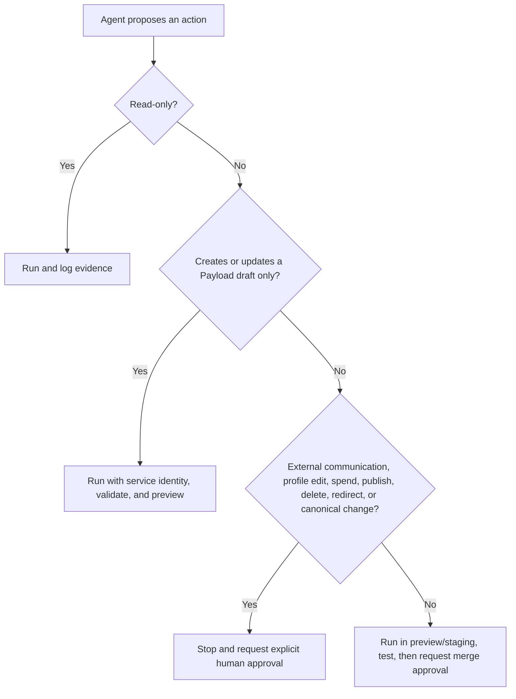

## Step 1: create the business truth pack

Create `ops/seo/business-truth.yaml` in the marketing repository. A human who understands the business must approve it. Start with this schema:

```yaml
identity:
  brand_name: ""
  legal_name: ""
  domain: ""
  founding_year: null
  phone: ""
  email: ""
  public_address: ""
  business_type: "storefront | service-area | hybrid | online-only"
  hours: []
  approved_same_as_urls: []

offer:
  primary_services: []
  secondary_services: []
  excluded_services: []
  differentiators: []
  process_steps: []
  price_or_rate_claims_allowed: []
  qualification_rules: []
  disqualifiers: []

market:
  primary_customer_segments: []
  problems_by_segment: {}
  buyer_questions: []
  primary_locations: []
  service_area_evidence: {}
  languages: ["en-CA"]

proof:
  approved_testimonials: []
  approved_case_studies: []
  licenses_and_regulators: []
  memberships: []
  awards: []
  subject_matter_experts: []
  factual_sources: []

conversion:
  primary_action: ""
  secondary_actions: []
  qualified_lead_definition: ""
  crm_stage_for_accepted_lead: ""
  target_geography: []

content_constraints:
  prohibited_claims: []
  required_disclosures: []
  mandatory_reviewers: []
  competitor_comparison_rules: []

regulatory:
  jurisdiction: "Ontario, Canada"
  authorized_brokerage_name: ""
  brokerage_licence_number: ""
  authorized_administrator_name: ""
  administrator_licence_number: ""
  principal_broker: ""
  licensed_people: [] # licensed name, prescribed title/class, licence, brokerage
  rate_payment_fee_rule: "APR and term at equal prominence when triggered"
  investor_content_reviewers: []

claims:
  registry_path: "ops/seo/claims.yaml"
  allowed_claim_ids: []
  forbidden_patterns: ["guaranteed", "risk-free", "FSRA approved", "best rate"]
  default_review_days: 90

privacy_and_casl:
  collection_purposes: []
  sensitive_fields: []
  third_party_disclosures: []
  retention_rules: []
  consent_versions: []
  commercial_email_owner: ""
```

Then run this review:

- [ ] Every public contact detail is consistent.
- [ ] Every service and location has operational evidence.
- [ ] Every testimonial is attributable and approved.
- [ ] Every quantitative claim has a dated source.
- [ ] Every regulated or financial claim has an owner and reviewer.
- [ ] Every excluded customer/service is explicit so the agent does not chase irrelevant volume.
- [ ] The qualified-lead definition can be evaluated mechanically.

For a mortgage/financial-services site, treat eligibility, rate, approval-time, savings, licensing, investor-return, and comparative claims as compliance-sensitive. The model drafts; the named compliance reviewer decides.

## Step 2: define unit economics and conversion events

Fill this worksheet:

```text
Average gross value of a won customer:       $____
Lead-to-qualified rate:                       ____%
Qualified-to-won rate:                        ____%
Maximum acceptable cost per qualified lead:  $____
Primary organic conversion event:             __________
Secondary intent events:                      __________
CRM field carrying landing URL:               __________
CRM field carrying source/medium:             __________
```

Configure events for actions that show real intent, for example:

- successful qualified application;
- consultation booking completion;
- verified phone-call click;
- document/checklist request completion;
- secondary form completion.

Do not count page views, scroll depth, or button impressions as leads. They are diagnostic events only.

## Step 3: decide whether Google Business Profile applies

Google permits a Business Profile for a business customers can visit or one that travels to customers; online-only businesses are not eligible under the representation guidelines ([Business Profile eligibility and representation](https://support.google.com/business/answer/3038177)).

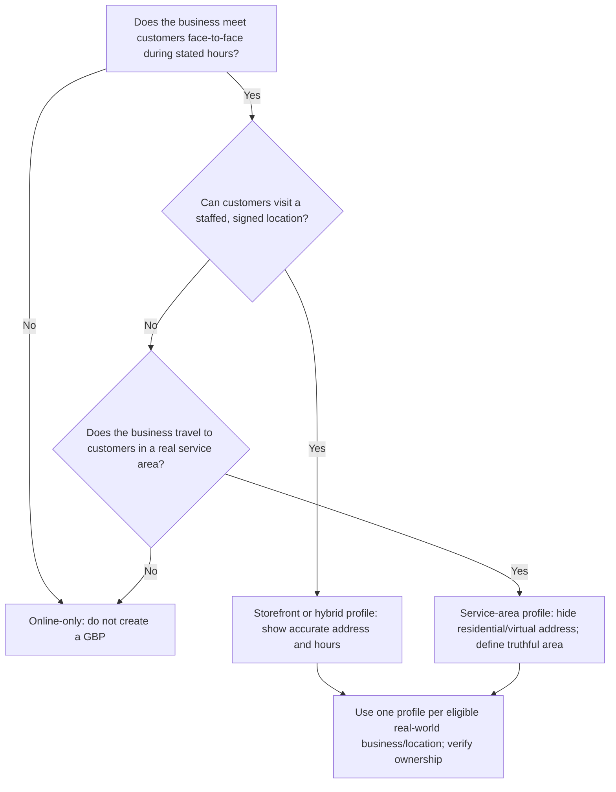

Never create virtual-office, coworking, employee-home, or city-variant profiles merely to rank. Use the narrowest accurate primary category and only relevant secondary categories; categories influence how Google matches the business ([Business categories](https://support.google.com/business/answer/7249669)).

## Step 4: install and pin the stack

### 4.1 DataForSEO

1. Create a DataForSEO account.
2. Add the minimum balance.
3. Obtain API credentials from the account's API Access surface.
4. Store credentials only in the operator secret manager or deployment environment—not in Git, prompts, screenshots, or generated reports.
5. Set an initial monthly spend ceiling and alert threshold. A sensible starting policy is **alert at 50%, stop automated discovery at 80%, require approval at 100%**.
6. Use the sandbox to test request shape before paid calls. DataForSEO Labs uses live calls and exposes account spending through its user-data surface ([Labs overview](https://docs.dataforseo.com/v3/dataforseo_labs/overview/); [sandbox](https://docs.dataforseo.com/v3/appendix/sandbox/)).

### 4.2 OpenSEO

Choose one deployment:

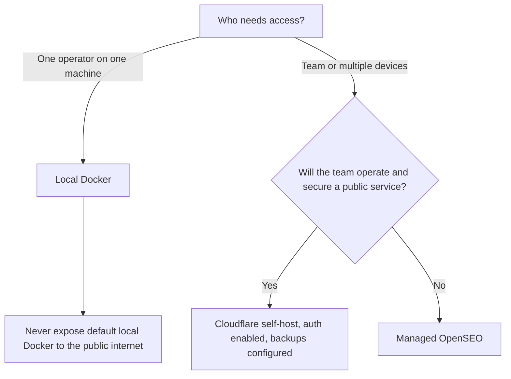

Local Docker quick start, from the upstream repository:

```bash
git clone https://github.com/every-app/open-seo.git
cd open-seo
cp .env.example .env
# Set DATAFORSEO_API_KEY in .env without committing it.
docker compose up -d
```

Open `http://localhost:3001`, create the project, and then connect Codex:

```bash
codex mcp add openseo --url http://localhost:3001/mcp
```

The upstream project warns that its default Docker setup is single-user and unauthenticated; do not expose it publicly ([OpenSEO self-hosting and MCP setup](https://github.com/every-app/open-seo#openseo-mcp)). Pin a tested commit or image digest before production use. Record the pin in `ops/seo/stack-versions.md`.

Install the OpenSEO skills for Codex:

```bash
npx skills add every-app/open-seo --skill '*' --agent codex
```

Run the upstream `onboarding-checklist`, then smoke-test:

- project listing;
- keyword discovery;
- keyword metrics hydration;
- one organic SERP;
- one coordinate-specific local SERP;
- a tiny crawl/audit;
- GSC tools after GSC is connected.

### 4.3 NotFair

NotFair's current supported Codex path is workspace-local: clone the repository and run Codex from its root so the repository `AGENTS.md` routes intents to its skills ([NotFair agent installation](https://github.com/nowork-studio/NotFair/blob/main/INSTALL_FOR_AGENTS.md)).

```bash
git clone https://github.com/nowork-studio/notfair.git
cd notfair
codex --workspace .
```

Verify that `AGENTS.md` and at least `seo/seo-analysis/SKILL.md` are readable. Do not use NotFair's stock CMS connector to publish this site: its documented CMS surface targets WordPress, Strapi, Contentful, and Ghost. Use the Payload adapter specified below.

### 4.4 Version ledger

Record:

```markdown
| Component | Version/commit | Deployment | Owner | Last smoke test |
|---|---|---|---|---|
| OpenSEO | | | | |
| NotFair | | workspace-local | | |
| Payload | | Vercel | | |
| DataForSEO API | v3 | vendor | | |
| Codex | | local | | |
```

Upgrade one component at a time. Re-run the smoke suite before returning the automation to service.

---

# Part II — Instrument and make the site technically sound

## Step 5: establish the canonical production identity

1. Choose exactly one public origin, for example `https://www.example.com` or `https://example.com`.
2. Redirect every alternate host and HTTP URL to that origin in one hop.
3. Set Payload/Next/Vercel production URL configuration to that same origin.
4. Ensure preview deployments use `noindex` and never emit the production canonical for preview-only content.
5. Use lowercase, stable, descriptive slugs. Avoid dates and keyword-stuffed folder trees.
6. When a published slug changes, create a permanent redirect from the old URL and update internal links.
7. Never redirect many unrelated retired pages to the homepage; redirect to the closest replacement or return 404/410.

For the current FairLend codebase, `src/utilities/seo.ts` already centralizes the production origin, canonical URLs, robots metadata, Open Graph, and Twitter metadata. The operator must treat that utility—not individual page improvisation—as the canonical metadata contract. Vercel normally adds `X-Robots-Tag: noindex` to preview and outdated production deployment URLs, but a custom domain attached to a non-production branch does not inherit that protection automatically; assert the response header in preview verification ([Vercel preview indexing](https://vercel.com/kb/guide/are-vercel-preview-deployment-indexed-by-search-engines)).

## Step 6: verify the crawl/index surface

Check these production URLs with an anonymous request:

```text
/
/robots.txt
/sitemap.xml
/pages-sitemap.xml
/posts-sitemap.xml
```

For every intended indexable page, require:

- [ ] HTTP 200 without login, cookie wall, or interstitial dependency.
- [ ] One self-referencing canonical using the production origin.
- [ ] No `noindex` in HTML or response headers.
- [ ] Not blocked by `robots.txt`.
- [ ] Included in exactly one appropriate sitemap.
- [ ] Linked from at least one crawlable, indexable page.
- [ ] Unique title, H1, description, and main content.
- [ ] Server-rendered meaningful content; not an empty client shell.
- [ ] Images have meaningful alternative text where informative.
- [ ] Mobile layout and primary conversion action work.

For non-indexable utility, admin, preview, search-result, and thin filter pages, require either authentication or explicit `noindex`. `robots.txt` controls crawling; it is not a reliable mechanism for removing a URL from the index ([Robots introduction](https://developers.google.com/search/docs/crawling-indexing/robots/intro)).

The repository already has published-only Payload sitemap queries, sitemap cache tags, `public/robots.txt`, a sitemap index, and redirect support. The live canonical host did not serve them when checked, and the static sitemap registry omits two indexable routes. Fix the host and registry, then regression-test those assets after every routing or collection change. Google wants sitemaps to contain absolute canonical URLs intended for Search; sitemap submission is a discovery hint, not an indexing guarantee ([Sitemap guidance](https://developers.google.com/search/docs/crawling-indexing/sitemaps/build-sitemap)).

## Step 7: implement the minimum structured-data graph

Emit only accurate types supported by the visible page:

| Surface | Recommended graph |
|---|---|
| Site layout/home | `Organization` or the accurate subtype; `WebSite` |
| Service/money page | `Service` where the visible content supports it; `BreadcrumbList` |
| Editorial article | `Article` or `BlogPosting`; `BreadcrumbList` |
| Genuine physical/local business | supported `LocalBusiness` subtype with exact public facts |
| Visible FAQ | `FAQPage` only when the same questions and answers are visible and only once per route |

1. Generate JSON-LD server-side.
2. Escape unsafe `<` characters in serialized data.
3. Keep one owner for each schema node to prevent duplicates.
4. Validate in Google's Rich Results Test.
5. Compare rendered markup to visible content.
6. Monitor Search Console enhancement reports after release.

The current FairLend repository already contains shared structured-data utilities plus sitewide organization/financial-service, website, service, breadcrumb, article, and optional visible FAQ markup. Extend those utilities; do not create parallel schema emitters. Before launch, complete approved organization identity fields and real article authorship. Do not mark up self-serving organization ratings. Google stopped showing FAQ rich results on 2026-05-07: visible FAQs can still help users, but remove FAQ rich-result expectations/reporting. Emit `QAPage` only for a genuine one-question page where users can submit alternative answers—not a publisher-authored response ([Google Search documentation updates](https://developers.google.com/search/updates); [QAPage](https://developers.google.com/search/docs/appearance/structured-data/qapage)).

## Step 8: install first-party measurement

### 8.1 Search Console

1. Create a Domain property and complete DNS verification.
2. Submit the canonical sitemap index.
3. Inspect the homepage and one representative commercial page.
4. Record baseline coverage, manual actions, security issues, and enhancement errors.
5. Connect OpenSEO's Search Console integration or a read-only GSC connector.
6. Restrict the agent to read-only search analytics and inspection unless a human explicitly approves sitemap administration.
7. In Search Console, confirm the property's Search generative AI control is set to the owner's intended inclusion state. Inclusion plus index/snippet eligibility is necessary for Google AI supporting links but never guarantees one ([AI features and your website](https://developers.google.com/search/docs/appearance/ai-features); [Search generative AI control](https://support.google.com/webmasters/answer/16908024?hl=en)).

Search Console's API supports search analytics, verified properties, and sitemaps ([Search Console API](https://developers.google.com/webmaster-tools)).

For the current site, perform DNS verification and sitemap submission **after** domain cutover proves the Payload application owns the canonical host. Do not wire Google's general Indexing API into this workflow; Google restricts that API to `JobPosting` and livestream `BroadcastEvent` pages ([Indexing API](https://developers.google.com/search/apis/indexing-api/v3/using-api)).

### 8.2 GA4 and CRM

1. Create the GA4 property and production web stream.
2. Implement consent behavior appropriate to the business and jurisdiction.
3. Send the primary and secondary events defined in Step 2. Use GA4's recommended `generate_lead` event only at the actual successful lead condition, not at button click.
4. Mark only genuine outcomes as key events.
5. Test each event in debug/realtime reporting using synthetic leads clearly marked as tests.
6. Persist landing URL, referrer, source, medium, campaign parameters, consent state, and a non-sensitive correlation ID into lead handling.
7. Carry the correlation ID into the CRM so qualified and won outcomes can be joined back to landing pages.
8. Verify that no sensitive mortgage/application data leaks into URLs, event names, analytics properties, logs, or replay tools.

Link the verified Search Console property to the GA4 web stream. Expect Search Console data latency and preserve raw daily extracts; do not make same-day decisions from incomplete rows.

The current site already has a consent-gated analytics provider and sanitized event helpers. Follow `docs/analytics-setup.md`; do not add a second competing analytics loader.

### 8.3 Baseline snapshot

Write `ops/seo/baselines/YYYY-MM-DD.md` containing:

- indexed-page count;
- GSC impressions/clicks by brand versus non-brand;
- top query/page pairs;
- organic landing sessions;
- qualified organic leads and accepted opportunities;
- DataForSEO visibility/rank snapshot for the tracked set;
- local-pack snapshot from fixed coordinates;
- crawl issue counts;
- Core Web Vitals field data where available;
- number of legitimate referring domains;
- GBP views/actions/reviews if eligible;
- GSC Generative AI impressions by canonical page/country/device/date if the report is available; do not add them to Web impressions because they are already included;
- Bing AI citations/cited pages/grounding-query sample if available;
- fixed external prompt-panel observations, with engine/model/location/time and “diagnostic, not ground truth” label;
- Reddit Pro zero-state and community-register status.

On a true zero-footprint launch, many values will be zero. That is valid baseline data.

## Step 9: technical launch gate

Run these tests on a Vercel preview first and production immediately after deployment:

```text
build + typecheck + unit/integration tests
anonymous crawl of all sitemap URLs
status/canonical/noindex/robots assertions
duplicate title/H1/description detection
broken internal-link detection
orphan-page detection
redirect-chain and loop detection
JSON-LD parse + Rich Results spot checks
mobile viewport visual checks
primary form and phone-link conversion checks
Lighthouse lab checks on representative templates
production URL inspection spot checks
snippet-control assertions on answer units
GSC Search generative AI inclusion intent recorded
financial claim/evidence/reviewer/expiry gate
```

Do not freeze the product around a single Lighthouse score. Use lab results to catch regressions and Search Console field data to prioritize real user performance. Keep performance budgets per template and block releases that cause material regression.

---

# Part III — Build the demand map

## Step 10: define seed dimensions

Create seeds from the business, not from an SEO tool's suggestions alone.

```text
service/product:       private mortgage, construction financing, ...
customer/problem:      borrower declined by bank, builder draw delay, ...
transaction/modifier:  apply, lender, financing, rates, requirements, calculator, ...
location:              Ontario, Toronto, Mississauga, ...
comparison:            private vs bank, option A vs option B, ...
proof/objection:       eligibility, documents, timeline, costs, risks, ...
brand/entity:          company name, expert names, product names
```

Generate 3–10 truthful seeds per dimension. Do not generate every Cartesian combination.

## Step 11: discover the keyword universe

In OpenSEO:

1. Select the correct project, language, country, device, and exact local coordinates where relevant.
2. Run `research_keywords` with 1–5 related seeds per call.
3. Hydrate the candidate set with `get_keyword_metrics` for volume, difficulty, intent, CPC, paid competition, and trends.
4. Pull ranked keywords for 3–8 true search competitors, not merely business competitors.
5. Inspect local businesses, Maps/local SERPs, and Google Business questions for the most important local themes.
6. For an existing site, pull GSC query/page data first. Positions roughly 5–20 are usually faster opportunities than brand-new topics.
7. Remove irrelevant geography, jobs, education-only queries, services not offered, impossible promises, and ambiguous terms outside the business model.
8. Keep zero/low-volume phrases when they express expensive or urgent intent; providers round and sample.
9. Never invent a missing metric. Mark it `unknown`.

Use this ledger schema in `ops/seo/keyword-ledger.csv`:

```csv
keyword,market,language,location,intent,journey_stage,volume,kd,cpc,trend,serp_features,local_pack,primary_cluster,target_url,status,business_fit,conversion_value,evidence_date,notes
```

Allowed `status` values:

```text
raw | rejected | research | clustered | mapped-existing | proposed-new | drafted | published | measuring | consolidate | retire
```

## Step 12: score opportunities

Do not sort by volume. Score each cluster, not each spelling variant.

Use a 0–5 rating for each factor:

```text
Priority score =
  0.30 * business fit
+ 0.25 * commercial intent
+ 0.15 * evidence of demand
+ 0.10 * SERP attainability
+ 0.10 * local/service-area fit
+ 0.10 * proof/content readiness
```

Apply hard vetoes before scoring:

- service not offered;
- geography not served;
- claim cannot be supported;
- searcher needs a product/tool the business does not provide;
- query requires a different site/business entity;
- proposed page would be substantially duplicative;
- compliance risk cannot be reviewed.

High CPC is evidence of advertiser competition, not proof of organic conversion. High volume is evidence of broad demand, not permission to publish.

## Step 13: inspect SERPs and determine intent

For every high-priority cluster:

1. Fetch a live organic SERP for the target market/device.
2. If local, fetch coordinate-specific Maps/local results from at least three representative points.
3. Record the dominant page types: service pages, directories, products, calculators, articles, videos, forums, government pages, local pack.
4. Record dominant intent: transactional, commercial investigation, informational, navigational, local action.
5. Record what winning pages prove: process, pricing, eligibility, original data, location evidence, comparison, calculator, case study, expert authorship.
6. Record SERP features and whether a credible new entrant can satisfy the same job.
7. Mark queries whose intent does not match any page the business should own as `rejected` or `research`.

### Page decision tree

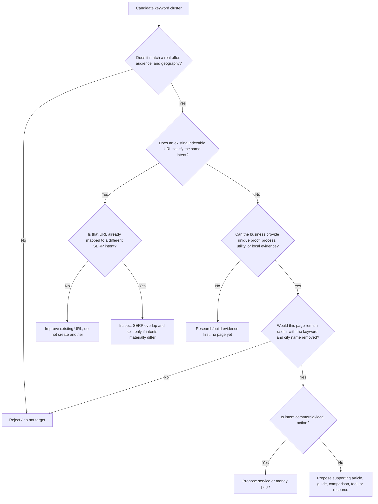

## Step 14: cluster and map one URL per intent

Run OpenSEO's keyword-clustering workflow.

1. Group terms by intent, buyer stage, dominant result type, and SERP overlap.
2. For borderline pairs, compare the top organic results. Similar wording is not sufficient.
3. Map the cluster to an existing URL if it already has relevant impressions or backlinks.
4. Propose a new URL only if no existing page can satisfy the intent cleanly.
5. Identify queries appearing against multiple current URLs in GSC as cannibalization candidates.
6. Assign each cluster an owner page, secondary terms, page type, internal-link sources, proof requirements, and measurement cohort.
7. Human-approve the map before drafting.

Create `ops/seo/page-map.csv`:

```csv
cluster_id,cluster_name,primary_keyword,secondary_keywords,intent,page_type,target_url,existing_or_new,parent_hub,internal_link_sources,proof_required,priority,cohort,owner,status
```

### Local landing-page decision tree

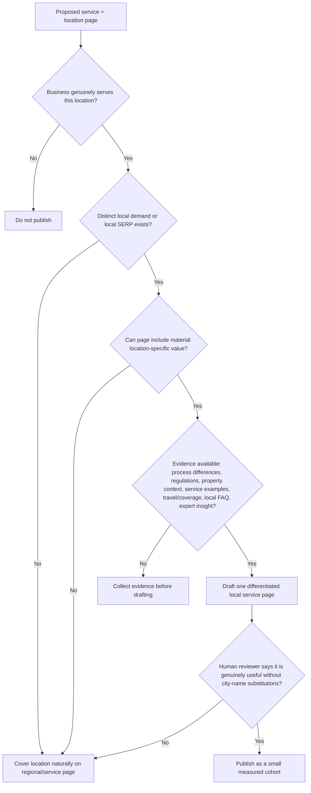

---

# Part IV — Turn the map into a safe Payload page engine

## Step 15: define the page brief before writing copy

Every page starts as a structured brief. Create `ops/seo/briefs/<cluster-id>.yaml`:

```yaml
cluster_id: ""
page_type: "service | local-service | comparison | article | guide | tool"
target_url: ""
primary_intent: ""
primary_keyword: ""
secondary_topics: []
searcher:
  situation: ""
  desired_outcome: ""
  objections: []
  next_action: ""
serp_evidence:
  checked_at: ""
  market: ""
  dominant_page_types: []
  must_answer: []
  gaps_to_beat: []
question_evidence:
  question_family_ids: []
  exact_questions: []
  source_types: []
  owner_url: ""
  answer_units: []
business_evidence:
  approved_facts: []
  approved_proof: []
  forbidden_claims: []
  required_disclosures: []
  evidence_bundle_id: ""
  non_commodity_value: [] # original data, calculation, local/process evidence, expert judgment
page_contract:
  h1_job: ""
  unique_value: ""
  required_sections: []
  required_internal_links: []
  conversion_action: ""
  schema_types: []
review:
  subject_matter_owner: ""
  compliance_owner: ""
  principal_broker: ""
  securities_counsel: ""
  jurisdiction: "Ontario, Canada"
  effective_date: ""
  expires_after: ""
```

Reject the brief if `unique_value`, `approved_facts`, or `conversion_action` is empty for a commercial page.

## Step 16: choose the correct Payload content model

For the current marketing site:

- Use **Pages** for durable top-level service, audience, hub, company, and location pages that belong in primary information architecture.
- Use **Posts / Article** for editorial education, news, research, and supporting content.
- Use **Posts / SEO money page** only where the existing route structure and editorial model make `/posts/<slug>` appropriate for a commercial page.
- Use existing `MoneyPageBlocks` rather than inventing new inline sections.

Available money-page primitives already include hero, narrative, media split, features, process, proof, comparison, disclosure, FAQ, and CTA. Select blocks from the brief; do not force every block onto every page.

Recommended commercial sequence:

```text
Hero: identify situation + outcome + truthful qualifier + primary action
Proof: show why the visitor should trust the business
Narrative/features: explain fit and differentiators
Process: make the next steps concrete
Comparison/disclosure: resolve choice and risk honestly
FAQ: answer real pre-conversion questions
CTA: restate next action and what happens after submission
```

## Step 17: build the Payload draft adapter

Implement this once in the marketing repository; do not browser-type bulk content into Admin.

The adapter accepts an approved brief and structured page payload, then:

1. authenticates as a dedicated service user;
2. validates the allowed collection, fields, blocks, links, evidence IDs, and slug policy;
3. rejects `_status: 'published'`, delete operations, canonical overrides, and unapproved external URLs;
4. calls Payload Local API inside the trusted Next/Payload process, or authenticated REST only from outside it;
5. sets `overrideAccess: false`;
6. passes the service `user` or authenticated `req`;
7. sets `overrideLock: false`;
8. writes `_status: 'draft'` and `draft: true`;
9. records the research snapshot, agent/model, prompt/workflow version, source evidence, changed fields, and draft ID;
10. returns the live-preview URL and diff for human review.

For financial answer content, the adapter must also require `primaryUserJob`, `questionFamilyIds`, `evidenceBundleId`, `qualifiedReviewer`, `jurisdiction`, `reviewedAt`, `claimReviewBy`, and an accurate `substantiveUpdateSummary`. Guard snippet controls. Refuse `dateModified` changes without a substantive approved diff; refuse `QAPage` unless the collection implements user-submitted alternative answers; notify IndexNow only after the approved production deployment succeeds.

Payload's Local API runs in-process and bypasses access controls by default unless `overrideAccess: false` is passed ([Local API](https://payloadcms.com/docs/local-api/overview)). Payload also documents that the `draft` parameter controls validation/write location while `_status` controls publication state; explicitly supplied published state can override draft expectations ([Drafts](https://payloadcms.com/docs/versions/drafts)). Therefore, the server—not the prompt—must enforce draft-only behavior.

Do not use the Payload SEO plugin's title/description generation callbacks as a hidden live-research worker. Those callbacks are editor-triggered generation helpers ([Payload SEO plugin](https://payloadcms.com/docs/plugins/seo)). Keep paid DataForSEO calls in the authenticated SEO workflow where cost, retries, evidence, and rate limits are visible.

## Step 18: write the page

Run the NotFair content-writing method against the approved brief and business truth pack.

Writing order:

1. Draft the answer and conversion path without attempting keyword density.
2. Add primary topic language to the title, H1, opening, one useful subheading, image context, and relevant internal-link anchor only where natural.
3. Cover the secondary questions needed to complete the searcher's job.
4. Insert approved proof and cite factual sources.
5. Add accurate limitations, risks, eligibility, and disclosures.
6. Write a concrete CTA that tells the user what happens next.
7. Generate title and meta-description candidates after the body is stable.
8. Generate only schema supported by visible content.
9. Run a fact-diff: every factual sentence must resolve to the business truth pack, a cited source, or `needs_review`.
10. Save a Payload draft.

### Content quality gate

Reject the draft if any answer is “no”:

- [ ] Does it satisfy one identifiable search intent?
- [ ] Is it materially different from every other page on the site?
- [ ] Does it contain evidence only this business or a real expert could provide?
- [ ] Are service area, eligibility, timeline, cost/rate, and outcome claims truthful and qualified?
- [ ] Would the page still be useful if Google sent no traffic?
- [ ] Does it expose a clear next step?
- [ ] Are all citations and internal links useful to a reader?
- [ ] Is the language natural without repeated keyword variants or city lists?
- [ ] Is the content readable and usable on mobile?
- [ ] Has the named subject-matter/compliance owner approved it?
- [ ] Does every material financial claim resolve to an approved evidence ID, reviewer, jurisdiction, and review/expiry date?
- [ ] Does each important question answer directly, then state conditions, evidence, risks/non-fit, and next step without a fixed word-count formula?
- [ ] Does the page add non-commodity evidence rather than remixing competitors, models, SERPs, or community posts?

Google calls mass generation of unoriginal pages for ranking “scaled content abuse,” regardless of whether AI or another method created them ([Spam policies](https://developers.google.com/search/docs/essentials/spam-policies)). Automation is acceptable only when the resulting page is genuinely useful and differentiated.

## Step 19: metadata and on-page contract

For each page:

1. **Title:** unique, accurate, primary topic and differentiator early, brand appended by shared template. Do not promise rankings or stuff variants.
2. **Description:** accurate benefit/fit and next step; written for qualified click-through, not ranking manipulation.
3. **H1:** one visible page promise matching the searcher's job.
4. **Headings:** descriptive outline, not a dump of exact-match phrases.
5. **Canonical:** self-reference unless an approved consolidation strategy says otherwise.
6. **URL:** short, stable, readable; no city/keyword repetition.
7. **Images:** useful, compressed, correctly sized; descriptive alt text for informative images and empty alt for decoration.
8. **Internal links:** contextual links from relevant hubs/articles and links onward to the next decision.
9. **Author/reviewer:** real identity and expertise for advice-oriented financial content.
10. **Dates:** visible published/updated dates only when meaningful and accurately maintained.
11. **Schema:** one accurate graph matching visible content.
12. **CTA event:** tested analytics event and CRM attribution.

## Step 20: preview QA

Use Playwright/computer use against the Payload live preview, but use the Payload API for content writes.

Automated checks:

- status is preview-authenticated and not publicly indexable;
- title, description, canonical, robots, OG/Twitter metadata are correct;
- exactly one H1;
- heading order is understandable;
- JSON-LD parses and matches visible content;
- all internal/external links resolve as intended;
- primary/secondary CTAs work;
- lead events fire once with no sensitive data;
- desktop and mobile layouts have no overflow, hidden copy, or broken assets;
- no placeholder, `TODO`, unsupported claim, fabricated quote, or orphan source marker remains;
- page is present in navigation or has approved internal-link sources ready for the same release;
- page does not substantially duplicate another URL.

Human checks:

- subject-matter accuracy;
- regulatory/compliance language;
- brand voice;
- local authenticity;
- proof authorization;
- conversion friction;
- page earns the right to exist.

Store the QA result beside the brief. A failed gate returns the page to draft; it never becomes an exception hidden in chat.

## Step 21: publish in cohorts

1. Start with 3–5 highest-value pages, not 100.
2. Merge the required code/template/internal-link changes.
3. Publish approved Payload drafts.
4. Confirm Vercel production deployment success.
5. Re-run anonymous production checks.
6. Confirm the page appears in the appropriate sitemap.
7. Inspect the most important new URL in Search Console.
8. Annotate the release date, cohort, URLs, brief versions, and changes.
9. Wait for evidence while continuing non-overlapping foundation/authority work.

Do not submit every URL repeatedly. A clean sitemap and internal links are the normal discovery path. Use URL Inspection for representative high-value pages and diagnosis.

---

# Part V — Local prominence and authority

## Step 22: complete the legitimate local entity

If GBP-eligible:

1. Claim and verify the single legitimate profile.
2. Use the exact approved name—no keyword additions.
3. Choose the most specific accurate primary category and only relevant secondary categories.
4. Add the accurate address or service area, phone, website, hours, services, appointment URL, and business description.
5. Upload real, useful photos and maintain them over time.
6. Keep website, GBP, major directories, regulator/member listings, and public legal identity consistent.
7. Create an ethical post-transaction review request that asks every appropriate customer neutrally; never buy, gate, fabricate, or pressure reviews.
8. Reply to reviews as a human-approved customer-service action, without exposing private information.
9. Monitor edits, duplicates, suspensions, category changes, and Q&A.

Google states local results are mainly based on relevance, distance, and prominence; complete information, links, and reviews contribute, but there is no way to pay Google for better local ranking ([Local ranking guidance](https://support.google.com/business/answer/7091)).

Use computer automation to prepare diffs and capture screenshots. Require explicit approval before each GBP mutation; browser control is not a loophole around platform policy.

## Step 23: build citations that are real business records

Prioritize:

1. government/regulator/license records;
2. recognized professional associations;
3. data providers and major maps with actual customer use;
4. high-quality industry directories;
5. local chambers and legitimate community organizations;
6. relevant partner/supplier profiles.

For each record, verify name, address/service area, phone, URL, category, and description. Do not shotgun-submit to hundreds of junk directories. The purpose is consistent entity evidence and customer discovery, not a synthetic link count.

## Step 24: earn links and mentions

Create assets worth referencing:

- original local/industry data with transparent methodology;
- calculators, checklists, templates, maps, or comparison tools;
- definitive explanations of difficult regulated processes;
- case studies with consent and meaningful detail;
- expert commentary and genuinely newsworthy announcements;
- partner resources that help shared customers;
- community sponsorships and memberships that exist offline too.

Use OpenSEO backlink and competitor data to find relevant publishers and broken/missing resource opportunities. The agent may prepare a prospect list and personalized draft. A human approves every recipient and send.

Qualification checklist:

- [ ] Real audience overlaps the target customer or professional ecosystem.
- [ ] The site has editorial standards and relevant content.
- [ ] The proposed resource genuinely improves their page/audience outcome.
- [ ] No payment or reciprocal-link condition passes ranking credit.
- [ ] Outreach is specific, honest, low-volume, and opt-out respectful.

## Step 25: build topic support around money pages

For each commercial page, build only the supporting content that helps a real buying decision:

```text
commercial page
  <- eligibility guide
  <- process/timeline guide
  <- cost/risk explainer
  <- comparison page
  <- case study or original evidence
  <- local/regulatory guide where genuinely applicable
```

Every supporting page should:

1. own a distinct informational or comparison intent;
2. answer the question completely;
3. link naturally to the relevant commercial next step;
4. receive links from its parent hub and related pages;
5. be updated when policy, pricing, process, or regulation changes.

Do not write a daily blog. Publish when the page closes a demonstrated customer or search-information gap.

---

# Part VI — The operating cadence

## Step 26: daily monitoring (10–15 minutes)

Check only for breakage and urgent external changes:

- production and key form uptime;
- failed Vercel deployment or job;
- analytics/conversion event disappearance;
- robots/noindex/canonical/sitemap regression;
- Search Console security/manual-action alert;
- GBP suspension or unauthorized edit;
- DataForSEO spend anomaly.
- high-risk Reddit brand/support/fraud mention identified by a human in Reddit Pro;
- expired financial claim or regulator/source-change alert.

Do not react to daily rank noise.

Never use Playwright or another browser to automate searches on `google.com` for rank tracking. Google's spam policy prohibits machine-generated search traffic; use DataForSEO/OpenSEO for live SERPs and Search Console for the owned site's data ([Spam policy: machine-generated traffic](https://developers.google.com/search/docs/essentials/spam-policies#machine-generated-traffic)).

## Step 27: weekly growth loop (60–120 minutes)

Run every week on the same day:

1. Pull the last 7 and 28 days from GSC by query and page.
2. Pull GA4 organic landing-page sessions and key events.
3. Join CRM qualified/won outcomes by landing page.
4. Compare tracked keyword/local snapshots using consistent market/device/coordinates.
5. Flag:
   - new queries with impressions;
   - position 5–20 opportunities;
   - high-impression/low-CTR pages;
   - clicks without qualified leads;
   - one query split across multiple URLs;
   - indexed pages with no impressions after a fair observation window;
   - pages losing clicks/position materially;
   - crawl/index/structured-data failures;
   - new legitimate links/reviews and lost important links.
6. Choose at most one major action per page/cohort.
7. Write a hypothesis, expected movement, owner, and review date.
8. Implement through the normal brief/draft/QA/publish pipeline.
9. Log the change.
10. Add only redacted/paraphrased new buyer questions; validate the top five before creating work.
11. Human-review Reddit Pro trends and owned-account performance; run Step 44 before any reply.
12. Run the fixed, budget-capped prompt panel only on its scheduled sampling week—never as daily rank checking.

Weekly report table:

```markdown
| URL/cohort | Evidence | Diagnosis | One action | Expected result | Review date | Owner |
|---|---|---|---|---|---|---|
```

## Step 28: monthly strategy review

1. Compare 28-day and 90-day non-brand visibility, clicks, qualified leads, and revenue.
2. Review cluster-level performance, not isolated keyword vanity wins.
3. Review local results from fixed coordinates, not a single personalized search.
4. Re-run a full crawl and template performance sample.
5. Review content freshness and claims nearing expiry.
6. Review competitors gaining result ownership or new SERP formats.
7. Review referring-domain quality and partnership pipeline.
8. Approve the next small content cohort.
9. Consolidate cannibalizing pages and redirect only with an approved map.
10. Revisit the business truth pack and service/market changes.
11. Export GSC Generative AI and Bing AI Performance if available; join by canonical URL while keeping AI impressions/citations distinct from Web traffic.
12. Rerun the fixed prompt sample with identical protocol; review presence, recommendation, citation, and factual accuracy per engine.
13. Review question coverage, Reddit community-register changes, removals/corrections, and whether customer questions indicate a product/support defect.
14. Run the claim-expiry queue and obtain fresh SME/Principal Broker review before extending regulated content.

## Step 29: quarterly control review

- rotate/review service credentials and access;
- audit Payload service-user permissions;
- verify no agent can publish or mutate GBP without approval;
- review DataForSEO spend and unused endpoints;
- upgrade pinned OpenSEO/NotFair versions one at a time and smoke-test;
- review Google policies and supported structured-data changes;
- sample generated content for unsupported claims and duplication;
- review backups, rollback, logs, and job retry/dead-letter behavior;
- prune stale tracked keywords that no longer represent strategy;
- update the roadmap based on qualified-lead contribution.
- re-read current Google AI/structured-data controls, Reddit Rules/Spam/automation/API terms, and FSRA advertising/supervision guidance;
- audit a sample of Reddit notes for paraphrasing/non-identification and every public participation for disclosure/rule compliance;
- audit authorized name/licence display, numeric cost/rate/payment claims, retained Principal Broker approvals, CASL/PIPEDA controls, and investor/securities escalation;
- revalidate the AI prompt protocol and evidence classes; reject tactics that still lack first-party support.

---

# Part VII — Decision trees for common outcomes

## Step 30: page is not indexed

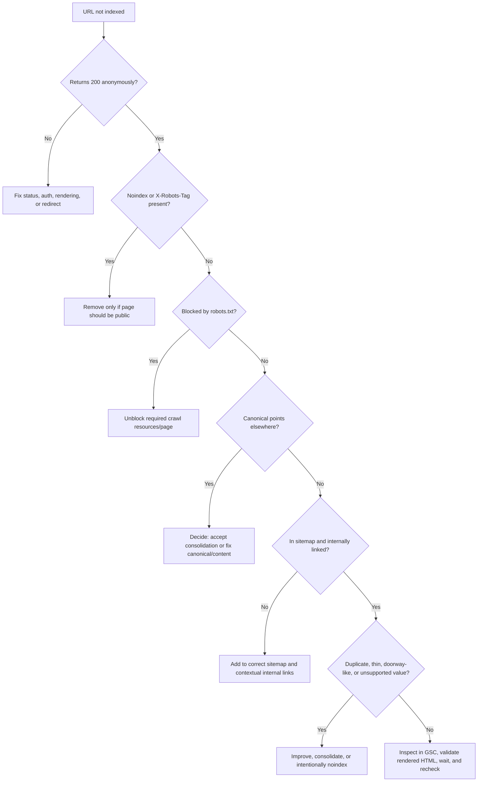

## Step 31: impressions but few clicks

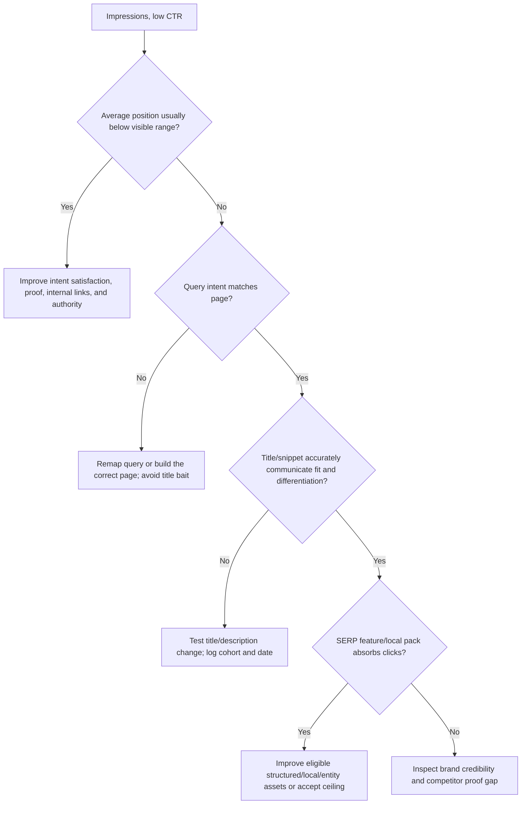

## Step 32: clicks but no qualified leads

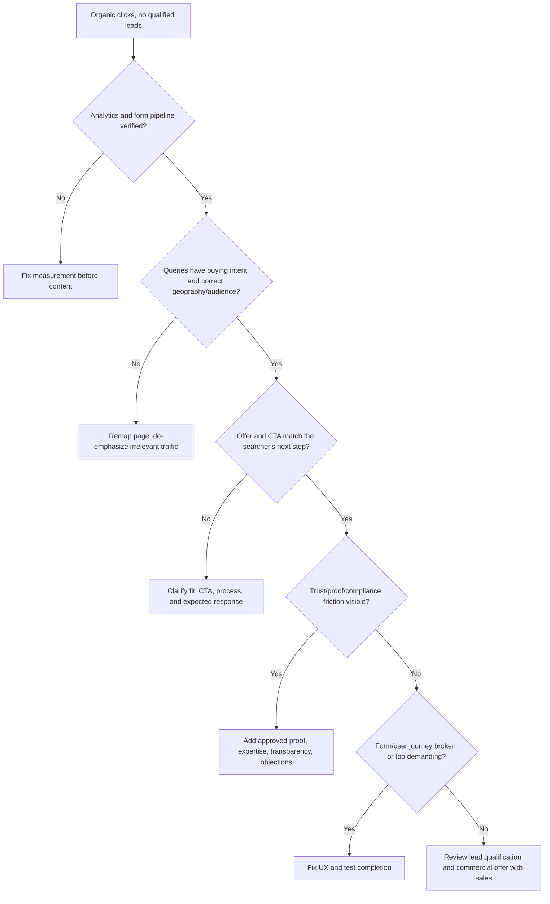

## Step 33: rankings or clicks decline

1. Confirm the drop in Search Console, not a third-party tracker alone.
2. Segment brand/non-brand, query, page, country, device, and search appearance.
3. Check seasonality and compare year over year where available.
4. Check releases, migrations, redirects, canonicals, noindex, robots, server errors, rendering, and sitemap changes.
5. Check whether one URL lost visibility or the whole site did.
6. Inspect current SERPs: did intent, result type, local pack, AI feature, or competitors change?
7. Check content staleness, broken proof, lost links, or stronger competing resources.
8. Check Search Console manual actions and security issues.
9. Form one hypothesis and one corrective cohort; avoid panic rewrites.

## Step 34: page competes with another page

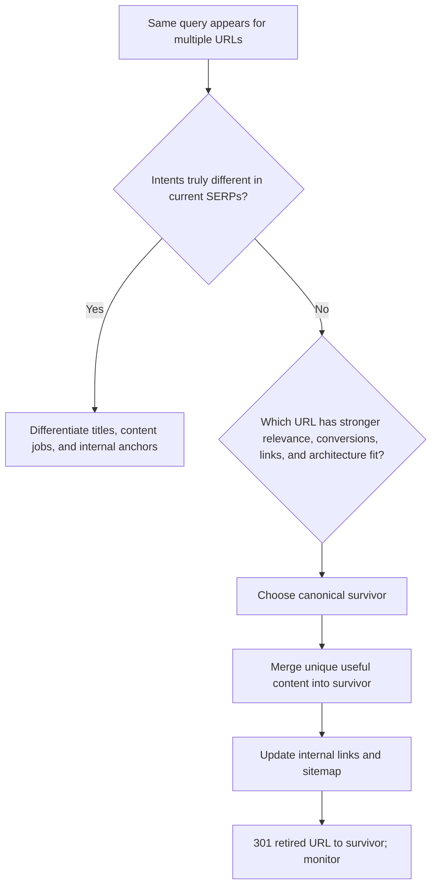

## Step 35: decide whether to refresh, consolidate, noindex, or delete

After a reasonable observation period for a new site and at least one crawl/index confirmation:

- **Refresh** when demand is proven but intent satisfaction, freshness, proof, CTR, or conversion is weak.
- **Consolidate** when multiple pages serve the same intent or individually lack value but combine well.
- **Noindex** when a page is useful to users but should not compete in Search, such as internal search or thin utility state.
- **Delete/410** when no user, link, traffic, compliance, or replacement value exists.
- **Redirect** only when there is a genuine relevant successor.

Never delete a URL with valuable links, conversions, or active query visibility without a reviewed migration plan.

---

# Part VIII — Automation specification

## Step 36: Payload jobs and Vercel scheduling

Use Payload Jobs for durable, typed background work:

- daily GSC/GA4 ingestion;
- weekly keyword and local-rank snapshots;
- weekly redacted question-ledger normalization and capped prompt observations;
- monthly supervised GSC Generative AI/Bing AI export ingestion when available;
- scheduled small crawls;
- content-freshness/claim-expiry alerts;
- draft generation after an approved brief;
- preview QA;
- weekly report assembly;
- post-deploy IndexNow notification with receipt/retry audit.

Do not create a Reddit posting queue. Reddit research and participation decisions remain human-operated in Reddit Pro and the live community context.

On Vercel/serverless, use external cron to invoke Payload schedule handling and the authenticated jobs runner with `CRON_SECRET`; do not rely on server `autoRun`. Payload documents this serverless pattern and notes that job Local API operations bypass access by default unless access enforcement is enabled ([Payload queues](https://payloadcms.com/docs/jobs-queue/queues); [jobs access](https://payloadcms.com/docs/jobs-queue/jobs)). Vercel Cron does not retry a failed invocation, so the Payload workflow must own retries, idempotency, terminal-failure alerts, and dead-letter handling ([Vercel Cron](https://vercel.com/docs/cron-jobs/manage-cron-jobs)).

Every task must be:

- idempotent;
- scoped to a project/cohort;
- budget-limited;
- retry-bounded with backoff;
- observable with run ID, inputs, outputs, cost, and error;
- resumable without duplicate drafts or external actions;
- unable to publish;
- safe when an upstream provider returns partial/unknown data.

Suggested queues:

```text
seo-read        provider/API ingestion and audits
seo-questions   redacted question normalization, validation, and page mapping
seo-ai-observe  budget-capped external prompt observations and manual export ingestion
seo-draft       briefs and Payload draft writes
seo-verify      preview and production verification
seo-report      weekly/monthly aggregation
seo-dead-letter exhausted or policy-blocked jobs
```

## Step 37: approval state machine

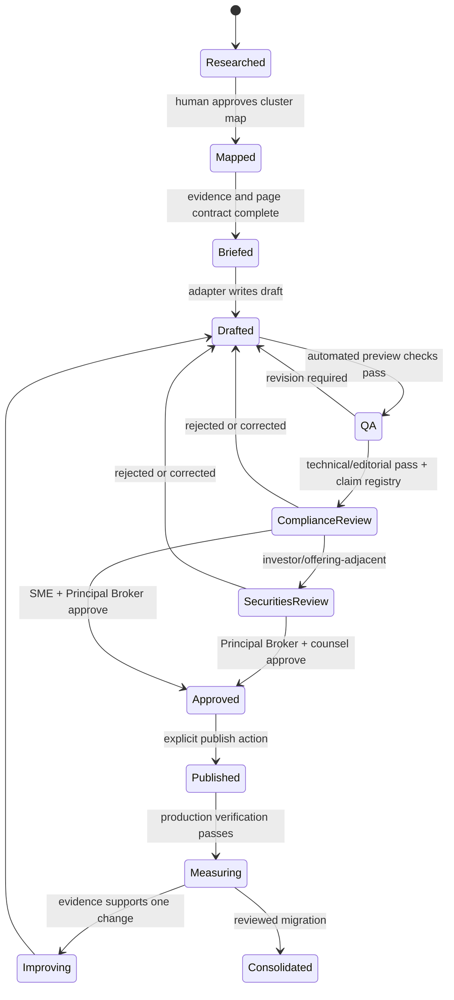

Store actor, timestamp, evidence snapshot, diff, approval, and rollback reference for every transition.

## Step 38: reusable operator prompts

### A. Research and map

```text
Using the approved business truth pack and OpenSEO project <ID>, discover high-intent
non-brand opportunities for <service> in <market>. Pull live metrics and inspect current
organic and coordinate-specific local SERPs. Reject services/geographies we do not serve.
Cluster by intent and SERP overlap, then map one cluster to one existing or proposed URL.
Do not save keywords, create content, or mutate any platform. Return evidence dates,
unknown values, proposed page types, proof gaps, and cannibalization risks.
```

### B. Create a brief

```text
Create a structured page brief for approved cluster <ID>. Use only the business truth pack,
approved sources, current SERP evidence, and existing-site crawl. Identify the exact user job,
unique value, required proof, internal links, CTA, schema, prohibited claims, and reviewers.
If unique value or approved proof is insufficient, stop at an evidence-gap list. Do not draft copy.
```

### C. Draft safely

```text
Use the NotFair content-writing method to draft approved brief <path>. Every factual claim must
map to an approved fact/source or be marked needs_review. Use existing Payload MoneyPageBlocks.
Write naturally for the searcher; do not target keyword density or substitute city names.
Create/update a Payload draft only. Return the content diff, fact ledger, and preview URL.
```

### D. QA

```text
Audit Payload preview <URL> against brief <path>. Verify rendered metadata, canonical, robots,
H1/headings, links, JSON-LD, visible/schema parity, mobile layout, conversion events, sensitive-data
handling, factual source coverage, duplicate intent, and compliance markers. Do not publish or edit
external platforms. Return pass/fail evidence and the smallest corrective diff.
```

### E. Weekly loop

```text
For <date range>, join GSC query/page data, GA4 organic landing outcomes, CRM qualification,
OpenSEO rank/local snapshots, crawl issues, and the change log. Separate brand from non-brand.
Identify the single highest-value bottleneck per page/cohort. Recommend no more than one major
change per page, with hypothesis, evidence, expected result, confidence, and review date.
Create drafts only after I approve the recommendations.
```

## Step 39: cost controls

1. Cache immutable/reference responses and record provider timestamps.
2. Batch keyword-metric hydration instead of one call per keyword.
3. Use live SERPs only where intent/priority decisions depend on them.
4. Track a small strategic keyword set more frequently than the full universe.
5. Use one consistent device/market/coordinate grid for comparable local snapshots.
6. Cap crawl pages, JavaScript rendering, depth, and optional provider fields.
7. Stop broad discovery once the approved backlog exceeds the team's production/review capacity.
8. Log estimated and actual provider cost per job and cohort.

---

# Part IX — Question, AI-answer, Reddit, and financial-services engine

This part extends the ordinary SEO loop; it does not replace it. Do not run it until the business truth, telemetry, indexability, page-map, Payload draft, and compliance gates work.

## Step 40: build the question-intelligence system

Create `ops/seo/questions.csv` or an equivalent typed collection with these fields:

```text
question_id, exact_question, paraphrased_question, source, source_evidence_id,
observed_at, audience, journey_stage, intent, geography, frequency, urgency,
financial_risk, evidence_status, answer_owner, target_url, answer_status,
cited_sources, source_expiry, conversion_next_step, reviewer, last_verified
```

Collect in this order:

1. redacted sales calls, qualification conversations, support tickets, email/chat, and CRM objections;
2. ordinary GSC query/page data and GBP Q&A;
3. DataForSEO suggestions, People Also Ask, related searches, live SERP features, and competitor gaps;
4. Bing AI grounding-query samples;
5. Reddit Pro/manual human observations stored as paraphrased themes, never a copied corpus;
6. controlled AI prompt observations as hypotheses, never demand or truth.

Remove personal/sensitive mortgage information before it reaches the SEO system. Normalize duplicate strings into one **user job**. Then decide:

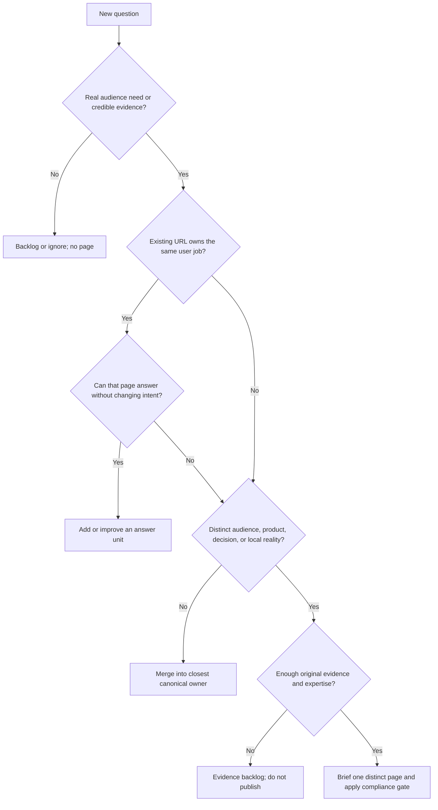

Weekly output: `improve_existing`, `create_page`, `consolidate`, `research_evidence`, or `ignore`. A question row never creates a URL automatically.

## Step 41: publish answer-first revenue content

Use the “They Ask, You Answer” Big Five as an editorial coverage audit, not a keyword template:

| Buyer decision | Safe financial-services implementation |
|---|---|
| Cost/price | Explain fee/rate mechanics, assumptions, ranges, APR/term obligations, and what changes the result |
| Problems/drawbacks | State risk, non-fit, exclusions, failure modes, alternatives, and when not to proceed |
| Comparisons | Compare decision criteria with dated evidence; disclose relationships; never manufacture a winner |
| Reviews | Use authentic, authorized customer evidence; no fake, selectively altered, or incentivized sentiment |
| Best-of | Teach selection criteria or cite a defensible independent dataset; never publish a disguised self-ranking |

Every important answer unit should contain:

1. a natural question or decision heading;
2. a one-to-three-sentence direct answer and controlling condition;
3. jurisdiction and who the answer applies to;
4. evidence, calculation, or original example with transparent assumptions;
5. exceptions, risks, non-fit, and uncertainty;
6. named author/reviewer, last substantive review, and claim expiry;
7. a relevant next step, including a non-commercial option when appropriate.

This is a comprehension and extractability convention, not a Google word-count or citation rule. One strong decision page may contain many related answer units. Never create one page per question, PAA row, city, synonym, or model fan-out query.

## Step 42: establish the AI-answer baseline

Create `ops/seo/ai-prompts.csv`:

```text
prompt_id, prompt, persona, market, journey_stage, constraints, engine, model,
web_search_state, locale, run_protocol, sampled_at, brand_present, recommended,
linked, cited, accuracy, cited_sources, competitors, fan_out_observed, notes
```

Build 30–50 commercially relevant prompts across:

- service/product questions;
- market/jurisdiction;
- personas and qualification states;
- early research, comparison, selection, and action stages;
- constraints such as timeline, property type, documentation, risk, and alternatives;
- branded accuracy questions and non-brand recommendation questions.

Run the fixed set on the two or three engines the audience actually uses. For each engine, keep model, web-search state, locale, account state, run cadence, and sampling count consistent. Repeat samples because generative responses vary. Use OpenSEO's AI Visibility/Prompt Explorer UI initially, or add a small read-only typed MCP adapter over its existing server functions; the current OpenSEO MCP registration does not expose those AI-search functions. DataForSEO's AI Mode/AI Optimization endpoints are the budget-capped fallback.

Never call this “Google AI rank.” It is an external observation panel. Keep these lanes separate:

| Lane | Source | What it tells you |
|---|---|---|
| Eligibility | URL Inspection + GSC property control | Necessary technical conditions |
| Google AI visibility | GSC Generative AI report, if available | Impressions by page/country/device/date; currently no queries/clicks |
| Bing AI visibility | BWT AI Performance | Citations, cited pages, sampled grounding phrases—not placement/rank |
| External observation | OpenSEO/DataForSEO prompt panel | Repeatable mentions/citations/fan-out samples, not platform truth |
| Acquisition | GSC Web + GA4 | Clicks, landing sessions, key events |
| Commercial impact | CRM | Qualified leads, accepted opportunities, funded/won outcomes |

Google AI impressions are already included in Web performance totals. Do not add them together.

## Step 43: diagnose and improve AI-answer presence

Do not rewrite a page merely because one prompt omitted the brand.

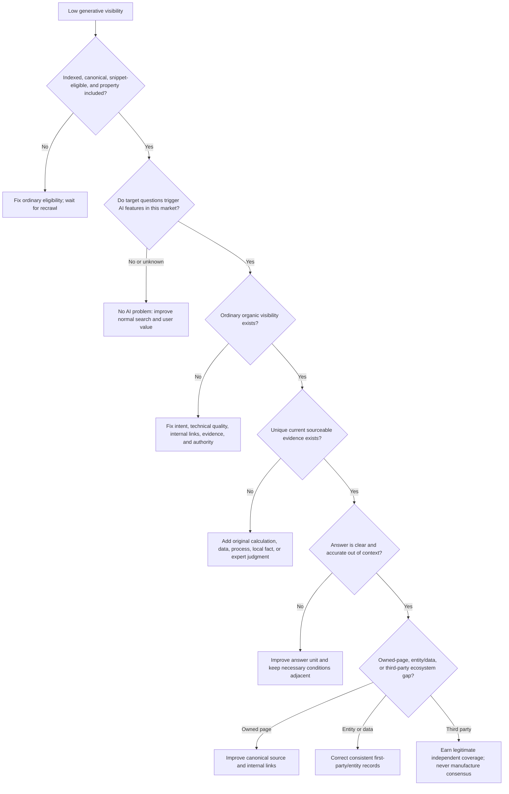

Good experiments include adding a reviewed original calculation, consolidating overlapping owners, replacing vague claims with sourced conditions, adding a real comparison table, adding local/process evidence, and improving relevant internal links. Log exact diff, hypothesis, baseline, evidence class, review window, confounders, and rollback condition.

Optional: if Google exposes the domain in Preferred Sources and FairLend has a real returning audience, add Google's preference deep link near existing follow/subscription actions. Treat it as a user preference feature, not a universal ranking or citation boost ([Google Preferred Sources](https://developers.google.com/search/docs/appearance/preferred-sources)).

## Step 44: use Reddit for research and trust without becoming spam

### 44.1 Configure the listening lane

1. Create/verify Reddit Pro for the real business.
2. Add brand/product misspellings, categories, competitors, “how/should/can/why,” comparisons, cost, eligibility, documents, timeline, risk, privacy, complaints, fraud, and Ontario/GTA hypotheses.
3. Build `ops/seo/community-register.yaml` with subreddit, rules URL, wiki/pins checked, professional/link/AI rules, owner, last reviewed, and status: `research_only`, `answering_allowed`, `links_conditional`, `mod_approval_required`, `paid_only`, or `do_not_engage`.
4. Store only paraphrased themes and short necessary language fragments. Do not download/warehouse posts, comments, usernames, profiles, or deleted content.
5. Validate recurring themes with DataForSEO, GSC, CRM, sales/support, and the existing page map.

Reddit Pro's public Trend signals are incomplete, English-only, and not reliably country-localized. They are qualitative demand hypotheses, not Ontario volume.

### 44.2 Participation decision tree

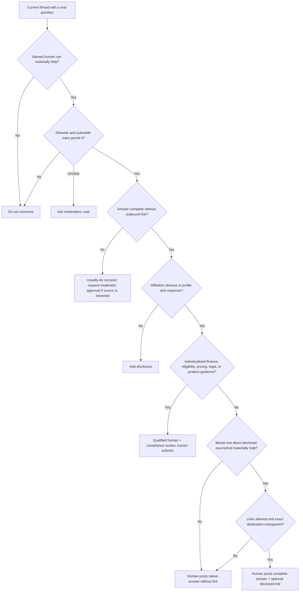

Use: `Disclosure: I work at/for FairLend as <accurate role>.` The answer must stand alone. Do not use sales copy, keyword-rich anchors, affiliate/redirect masking, fabricated lived experience, or unsolicited DMs.

Computer-use and agents may create watchlists, briefs, private drafts, owned-site content, and analyze FairLend's own Reddit Pro Performance export. They may **not** scrape Reddit, create accounts, choose/post comments, vote, message, modmail, simulate a human, or evade an enforcement action. Commercial API automation requires Reddit approval for that exact application. A qualified human reads the thread, applies the live rules, edits the answer, assumes responsibility, and clicks Submit.

Track useful answers, substantive replies, correction/removal rate, moderator warnings, unanswered follow-ups, referral quality, branded search, and qualified outcomes. Never target karma, links placed, post volume, or Reddit URLs ranked.

## Step 45: run the financial/YMYL publication gate

Google places stronger trust emphasis on topics affecting financial stability. Ontario mortgage publishing also falls under MBLAA/FSRA public-relations rules. Treat every public page, post, GBP item, social/community reply, ad, and commercial email accordingly.

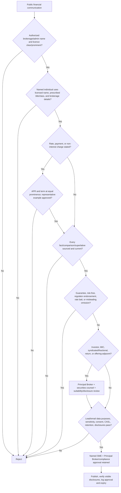

The operator must close the existing FairLend audit before scale:

1. verify licences `13827`/`13828` and reconcile the footer/privacy-policy status;
2. verify `FairLend Mortgage` is an FSRA-authorized name;
3. require a compliance state on every dynamic Payload Page/Post;
4. keep numeric borrower fee/rate/payment claims out unless the APR/term rule is satisfied;
5. substantiate experience, volume, “curated,” “pre-vetted,” cost, approval, savings, and performance-style claims;
6. gate investor pages and CTAs behind suitability, risk, disclosure, Principal Broker, and securities review;
7. verify PIPEDA collection purpose/consent/minimization/retention and CASL consent/unsubscribe behavior.

FSRA does not pre-approve the copy. The brokerage and Principal Broker own the approval and retained record ([FSRA advertising requirements](https://www.fsrao.ca/industry/mortgage-brokering/compliance-and-other-resources/mortgage-industry-public-relations-and-advertising-requirements); [FSRA supervision requirements](https://www.fsrao.ca/industry/mortgage-brokering/compliance-and-other-resources/requirements-supervising-mortgage-brokers-and-agents); [PIPEDA meaningful consent](https://www.priv.gc.ca/en/privacy-topics/business-privacy/collecting-personal-information/consent/gl_omc_201805/)).

## Step 46: add Bing, IndexNow, and claim freshness

1. Verify Bing Webmaster Tools and submit the canonical sitemap.
2. Enable IndexNow in the Payload publish/update/unpublish lifecycle. Fire only after the production URL is reachable; batch at most 10,000 URLs; keep idempotency/retry logs. A `200` confirms receipt, not crawl/index/rank/citation.
3. Monthly, manually export Bing AI Performance until Microsoft documents an API: citations, cited pages, trends, and sampled grounding phrases.
4. If GSC's Generative AI report is available, manually export it monthly until Google documents an API. Keep its page/country/device/date impressions separate from ordinary Web totals.
5. Add claim lifecycle metadata:

| Claim | Review trigger | Evidence required |
|---|---|---|
| regulation/program/licence | source alert or at least quarterly | current primary source + qualified review |
| rate/fee/threshold/limit | source change or short expiry | timestamped authoritative source + compliant display |
| service area/contact/hours | operational change | approved business truth + profile parity |
| market statistic | new source release | original release/table + period definition |
| calculation/example | input/rule change | formula, assumptions, reproducible output, reviewer |
| evergreen explanation | annual/evidence-triggered | terminology, examples, links, product fit |

Do not bump `dateModified` to look fresh. Record the substantive change and keep visible dates and JSON-LD consistent.

## Step 47: operate an evidence-ranked experiment board

Create `ops/seo/experiments/<id>.yaml` with URL/cohort, exact diff, hypothesis, evidence class, expected outcome, baseline, primary metric, guardrail metrics, minimum window, confounders, decision date, and rollback condition.

| Class | Evidence | Allowed use |
|---|---|---|
| A | Official platform/regulator documentation | Default constraint until rechecked |
| B | Replicated FairLend first-party result tied to qualified outcomes | Local operating default |
| C | Practitioner/vendor dataset with disclosed method | Time-boxed experiment only |
| D | Plausible mechanism, anecdote, or model suggestion | Backlog hypothesis only |

Use practitioner methods deliberately:

- [Aleyda Solis](https://www.aleydasolis.com/en/ai-search/ai-search-optimization-checklist/): representative prompt library plus [Presence/Readiness/Business Impact](https://www.aleydasolis.com/en/ai-search/a-3-layer-framework-to-measure-ai-presence-readiness-and-business-impact-redefining-metrics-for-the-ai-search-era/) reporting;
- [Kevin Indig](https://www.growth-memo.com/p/2026-growth-memo-research-summary): engine-specific repeated sampling, focused source pages, and original comparison/benchmark evidence;
- [iPullRank/Mike King](https://ipullrank.com/ai-search-measurement): test passage completeness, query fan-out coverage, information gain, and citation/answer accuracy;
- [Marcus Sheridan](https://marcussheridan.com/they-ask-you-answer/): answer the uncomfortable buyer questions honestly and connect content to the sales process.

These are testable operating methods, not Google rules. Promote a Class C/D tactic only after FairLend produces Class B evidence. Never infer causality from one rank, citation, model answer, or uncontrolled before/after period.

---

# Part X — 90-day execution schedule

This is sequencing, not a ranking promise. A new domain may take longer to earn visibility.

## Days 1–7: truth and telemetry

- [ ] Approve business truth pack, exclusions, reviewers, and qualified-lead definition.
- [ ] Reconcile FairLend's FSRA licence status/authorized name and close the critical MBLAA identity findings.
- [ ] Approve the claim registry, Principal Broker gate, privacy/CASL rules, and investor/securities escalation.
- [ ] Establish production canonical and redirect policy.
- [ ] Verify GSC Domain property and submit sitemap.
- [ ] Configure/test GA4 and CRM attribution.
- [ ] Verify Bing Webmaster Tools; configure IndexNow only for successful production lifecycle events.
- [ ] Claim/verify GBP only if eligible.
- [ ] Install/pin DataForSEO, OpenSEO, NotFair, and Codex connections.
- [ ] Complete technical crawl/index/schema/performance launch gate.
- [ ] Record zero-state baseline.

## Days 8–21: demand and architecture

- [ ] Build seeds and full keyword ledger.
- [ ] Build the redacted question inventory from sales/support/CRM, GSC, DataForSEO, and Reddit Pro listening.
- [ ] Create the Reddit community register; remain research-only during setup.
- [ ] Establish the fixed 30–50-prompt AI baseline per relevant engine.
- [ ] Inspect competitors, organic SERPs, and local coordinate results.
- [ ] Score clusters and apply hard vetoes.
- [ ] Map each cluster to existing/new/no-target.
- [ ] Design commercial hubs, supporting pages, breadcrumbs, and internal links.
- [ ] Approve the first 3–5-page commercial cohort.
- [ ] Build and test the draft-only Payload adapter and approval log.
- [ ] Add answer/evidence/reviewer/jurisdiction/claim-expiry fields and prohibit fake `dateModified`/QAPage use.

## Days 22–45: first commercial cohort

- [ ] Produce structured briefs.
- [ ] Close proof and compliance gaps.
- [ ] Draft with existing MoneyPageBlocks.
- [ ] Run automated and human preview QA.
- [ ] Publish the approved cohort with internal links.
- [ ] Verify production, sitemap inclusion, and representative GSC inspection.
- [ ] Start weekly reporting.
- [ ] Verify AI retrieval readiness: indexed, canonical, crawlable text, snippet-eligible, and GSC inclusion intent.
- [ ] Notify IndexNow after successful production deployment and record receipt separately from indexing.

## Days 46–70: support and local prominence

- [ ] Improve GBP completeness and review workflow if eligible.
- [ ] Correct high-value citations/entity records.
- [ ] Create the smallest supporting content set around proven commercial clusters.
- [ ] Improve existing pages with validated answer units before authorizing new question URLs.
- [ ] Begin disclosed, human-only Reddit participation only where the live community register and compliance gate permit it.
- [ ] Build one genuinely useful linkable asset.
- [ ] Begin low-volume human-approved partner/resource outreach.
- [ ] Fix early CTR, cannibalization, crawl, and conversion issues.

## Days 71–90: close the loop

- [ ] Join GSC, GA4, CRM, rank/local, crawl, review, and link outcomes.
- [ ] Export GSC Generative AI and Bing AI Performance if available; keep AI lanes separate and avoid double counting.
- [ ] Rerun the fixed prompt panel with identical settings and record answer accuracy/cited sources per engine.
- [ ] Refresh pages with impressions but weak position/CTR.
- [ ] Fix pages with clicks but poor lead quality/conversion.
- [ ] Consolidate clear duplicate intent.
- [ ] Approve the second cohort only from evidence.
- [ ] Automate recurring read/report/QA jobs with budgets and alerts.
- [ ] Complete quarterly access, policy, cost, and content-quality review.

## 90-day gate

Proceed to scale only when:

- production telemetry is trustworthy;
- every published cluster has one owner URL;
- drafts cannot self-publish;
- first cohorts are indexed and receiving interpretable evidence;
- content passes factual/compliance review;
- the FSRA-authorized identity is consistent and the dynamic MBLAA/Principal Broker gate cannot be bypassed;
- the question graph maps each answer family to one owner URL;
- AI visibility is reported per source/engine without an invented composite score;
- Reddit research is authorized and participation cannot be automated;
- the team can maintain the weekly loop;
- at least some pages show movement at a real bottleneck stage.

If these are not true, fix the system. More pages will amplify the defect.

---

# Part XI — Definition of “organic SEO beast”

The system is mature when all of the following are routine:

- the business truth pack is current and machine-readable;
- first-party measurement reaches qualified/won outcomes;
- technical regressions fail CI or post-deploy verification;
- live keyword/SERP/local data informs—but does not dictate—strategy;
- each intent cluster has one canonical page owner;
- commercial pages are differentiated with real expertise, proof, and useful conversion paths;
- Payload automation is draft-only, typed, logged, and reversible;
- new cohorts are small, reviewed, and measured;
- supporting content feeds qualified users and internal authority into commercial pages;
- legitimate reviews, entity records, partnerships, mentions, and links compound prominence;
- weak pages are improved, consolidated, or retired instead of left to rot;
- every external mutation and communication has explicit human authorization;
- question intelligence continuously converts real customer language into stronger canonical answers rather than page sprawl;
- Google/Bing AI presence, answer accuracy, ordinary search, and revenue outcomes are measured in separate evidence lanes;
- community participation is authentic, disclosed, human-operated, and useful without a link;
- every material financial claim has an evidence ID, authorized identity, qualified reviewer, jurisdiction, approval record, and expiry;
- practitioner tactics live in an evidence-ranked experiment ledger and graduate only on replicated first-party results;
- the operating team can explain **why** each page exists and **which revenue-stage metric** it is meant to improve.

That is the durable advantage: not an AI that writes the most pages, but a measured production system that learns faster than competitors while keeping quality, compliance, and platform risk under control.

## Primary-source reference shelf

- [Google: How Search works](https://developers.google.com/search/docs/fundamentals/how-search-works)
- [Google: SEO Starter Guide](https://developers.google.com/search/docs/fundamentals/seo-starter-guide)
- [Google: Spam policies](https://developers.google.com/search/docs/essentials/spam-policies)
- [Google: Crawling and indexing](https://developers.google.com/search/docs/crawling-indexing)
- [Google: Structured-data introduction](https://developers.google.com/search/docs/appearance/structured-data/intro-structured-data)
- [Google: General structured-data guidelines](https://developers.google.com/search/docs/appearance/structured-data/sd-policies)
- [Google: Optimizing for generative AI Search](https://developers.google.com/search/docs/fundamentals/ai-optimization-guide)
- [Google: AI features and your site](https://developers.google.com/search/docs/appearance/ai-features)
- [Google: Generative AI performance report](https://support.google.com/webmasters/answer/16984139?hl=en)
- [Google: Search generative AI control](https://support.google.com/webmasters/answer/16908024?hl=en)
- [Google: People-first content](https://developers.google.com/search/docs/fundamentals/creating-helpful-content)
- [Google: 2026 Search documentation updates](https://developers.google.com/search/updates)
- [Bing: AI Performance](https://blogs.bing.com/webmaster/February-2026/Introducing-AI-Performance-in-Bing-Webmaster-Tools-Public-Preview)
- [IndexNow: protocol](https://www.indexnow.org/documentation)
- [Reddit Rules](https://redditinc.com/policies/reddit-rules)
- [Reddit: Spam](https://support.reddithelp.com/hc/en-us/articles/360043504051-Spam)
- [Reddit: automation and bots](https://support.reddithelp.com/hc/en-us/articles/360043512931-Don-t-break-the-site)
- [Reddit Pro Trends](https://support.reddithelp.com/hc/en-us/articles/47619216411284-Reddit-Pro-Feature-Trends)
- [FSRA: advertising requirements](https://www.fsrao.ca/industry/mortgage-brokering/compliance-and-other-resources/mortgage-industry-public-relations-and-advertising-requirements)
- [FSRA: brokerage supervision](https://www.fsrao.ca/industry/mortgage-brokering/compliance-and-other-resources/requirements-supervising-mortgage-brokers-and-agents)
- [OPC: meaningful consent](https://www.priv.gc.ca/en/privacy-topics/business-privacy/collecting-personal-information/consent/gl_omc_201805/)
- [Google Business Profile: local ranking](https://support.google.com/business/answer/7091)
- [Google Business Profile: representation guidelines](https://support.google.com/business/answer/3038177)
- [OpenSEO upstream repository](https://github.com/every-app/open-seo)
- [NotFair upstream repository](https://github.com/nowork-studio/NotFair)
- [DataForSEO Labs API](https://docs.dataforseo.com/v3/dataforseo_labs/overview/)
- [Payload: Local API](https://payloadcms.com/docs/local-api/overview)
- [Payload: Drafts](https://payloadcms.com/docs/versions/drafts)
- [Payload: SEO plugin](https://payloadcms.com/docs/plugins/seo)
- [Payload: Jobs queue](https://payloadcms.com/docs/jobs-queue/overview)
- [Vercel: Cron Jobs](https://vercel.com/docs/cron-jobs)
