# Website Review Meeting — Linear Issue Backlog

Source: `Website Meeting Chat.vtt`  
Review scope: FairLend homepage, builder experience, FAQs, and intake flows  
Extraction method: explicit **New Issue** / **Note to the Agent** markers were resolved against nearby dialogue, then consolidated into implementation-sized tickets. Timestamps refer to the source VTT.

## Implementation progress

Last updated: 2026-07-13. Verification combines matched before/after captures, targeted integration tests, TypeScript validation, and a final repository-wide copy/claim audit. FL-WEB-047 remains partial only where approved third-party source material, consent, and fact approval are external dependencies; the itemized request was sent and verified in Gmail on 2026-07-13.

| Issue      | Status                                       | Current implementation note                                                                                                                                                                                                             |
| ---------- | -------------------------------------------- | --------------------------------------------------------------------------------------------------------------------------------------------------------------------------------------------------------------------------------------- |
| FL-WEB-001 | Verified · evidence attached                 | Desktop authority proof now renders the existing `hrs` qualifier beside `24`.                                                                                                                                                           |
| FL-WEB-002 | Verified · evidence attached                 | Construction route explicitly supports single homes through large multi-unit projects without a hard ceiling.                                                                                                                           |
| FL-WEB-003 | Verified · evidence attached                 | Overview uses the approved high-tech/seasoned-brokerage three-line direction.                                                                                                                                                           |
| FL-WEB-004 | Verified · evidence attached                 | Core Lending is enclosed with its related cards as a distinct content group.                                                                                                                                                            |
| FL-WEB-005 | Verified · evidence attached                 | Unsupported DrawFlow trademark designation removed.                                                                                                                                                                                     |
| FL-WEB-006 | Verified · evidence attached                 | Financing copy already uses direct `provides/offers` language; rejected `carry/curate` wording is absent.                                                                                                                               |
| FL-WEB-007 | Verified · evidence attached                 | Project-manager claim now says FairLend can refer an experienced manager; no assignment/control claim.                                                                                                                                  |
| FL-WEB-008 | Verified · evidence attached                 | JSX renders exactly one sentence boundary space before `Complimentary access`.                                                                                                                                                          |
| FL-WEB-009 | Verified · evidence attached                 | Milestone scroller has branded native scrollbar chrome.                                                                                                                                                                                 |
| FL-WEB-010 | Verified · evidence attached                 | Board counts and DrawFlow metrics use Oxanium/tabular numerals only.                                                                                                                                                                    |
| FL-WEB-011 | Verified · evidence attached                 | Comparison redesigned as stacked dark cards with restrained lime accents and textual labels.                                                                                                                                            |
| FL-WEB-012 | Verified · evidence attached                 | Feasibility headline explicitly names collaboration with FairLend.                                                                                                                                                                      |
| FL-WEB-013 | Verified · evidence attached                 | Visible station note expands OAC and conditions complimentary review on credit/file acceptance.                                                                                                                                         |
| FL-WEB-014 | Verified · evidence attached                 | Without-FairLend pain now leads with idle capital, interest, and stalled-work pressure.                                                                                                                                                 |
| FL-WEB-015 | Verified · evidence attached                 | Scoped Build Support and Live Deal File terms standardized to `draw schedule`.                                                                                                                                                          |
| FL-WEB-016 | Verified · evidence attached                 | MLI Select framed positively as one of multiple insured options.                                                                                                                                                                        |
| FL-WEB-017 | Verified · evidence attached                 | Profane/censored program name replaced by `Build Recovery Program`.                                                                                                                                                                     |
| FL-WEB-018 | Verified · evidence attached                 | Takeout comparison now contrasts late discovery with early eligibility planning without guaranteeing approval.                                                                                                                          |
| FL-WEB-019 | Verified · evidence attached                 | Persistent model footnote identifies every result as illustrative and non-guaranteed.                                                                                                                                                   |
| FL-WEB-020 | Verified · tests passing                     | Cash yield uses annual cash flow / cash invested; positive, zero, and negative cases are covered.                                                                                                                                       |
| FL-WEB-021 | Verified · evidence attached                 | Southern Ontario presets and dated assumptions are documented in `docs/builder-model-assumptions.md`.                                                                                                                                   |
| FL-WEB-022 | Verified · tests passing                     | Shared illustrative cap rate is `0.05`; derived capitalization value is covered.                                                                                                                                                        |
| FL-WEB-023 | Verified · evidence attached                 | Year pills are larger, tabular, and the changing primary year is announced accessibly.                                                                                                                                                  |
| FL-WEB-024 | Verified · evidence attached                 | Lead headline/copy divides builder execution from FairLend financing/business modeling.                                                                                                                                                 |
| FL-WEB-025 | Verified · evidence attached                 | Luxury baseline uses $400/ft²; later single-family assumptions diverge visibly.                                                                                                                                                         |
| FL-WEB-026 | Verified · tests passing                     | Soft costs are a first-class displayed/model variable and are included exactly once.                                                                                                                                                    |
| FL-WEB-027 | Verified · evidence attached                 | Large responsive value-minus-costs equation added to 2019/2023 states.                                                                                                                                                                  |
| FL-WEB-028 | Verified · evidence attached                 | 2023 active-state copy names construction, land, and lower end-value causes.                                                                                                                                                            |
| FL-WEB-029 | Verified · tests passing                     | 2019 preset uses $1M land, $400/ft² hard cost, and $50/ft² financing-inclusive soft costs.                                                                                                                                              |
| FL-WEB-030 | Verified · evidence attached                 | Both 2026 multiplex callouts and program output use `5 or more` / `5+`.                                                                                                                                                                 |
| FL-WEB-031 | Verified · evidence attached                 | Garden Suite display no longer asserts a unit count in its label/callout.                                                                                                                                                               |
| FL-WEB-032 | Verified · evidence attached                 | Garden Suite shows one home and a $400K–$600K total-cost model with soft costs marked included.                                                                                                                                         |
| FL-WEB-033 | Verified · audit passing                     | Organization/service-area positioning is Southern Ontario; Toronto-specific product/SEO facts are preserved for final audit.                                                                                                            |
| FL-WEB-034 | Verified · evidence attached                 | Barton leadership/manufacturing experience is published without unsupported customer names; source record added.                                                                                                                        |
| FL-WEB-035 | Verified · evidence attached                 | Borrower FAQ now covers all material fee categories and qualified payout/discharge language.                                                                                                                                            |
| FL-WEB-036 | Verified · evidence attached                 | Homepage and investor FAQs now disclose loss, non-guarantee, valuation, and independent-diligence responsibility.                                                                                                                       |
| FL-WEB-037 | Verified · tests passing                     | Private-mortgage purpose coverage now includes refinance, bridge, HELOC, mortgage business financing, and existing purposes; every reviewed purpose resolves to the private-loan path.                                                  |
| FL-WEB-038 | Verified · tests passing                     | HELOC is exposed as a distinct overview and route-selection entry backed by the tested private-mortgage intake.                                                                                                                         |
| FL-WEB-039 | Verified · tests passing                     | Private-mortgage encumbrance language is now `Additional debt`; legacy storage keys remain compatible.                                                                                                                                  |
| FL-WEB-040 | Verified · tests passing                     | Redundant repayment-plan screen removed and private-mortgage progress/validation remains a five-section flow.                                                                                                                           |
| FL-WEB-041 | Verified · responsive evidence attached      | CTA/trust controls have zero intersection and no horizontal overflow at 320/360/390/768 px; 150% text plus a long CTA label also remains collision-free.                                                                                |
| FL-WEB-042 | Verified · tests passing                     | Address autocomplete requests Canadian results and rejects known non-Canadian detail records.                                                                                                                                           |
| FL-WEB-043 | Verified · tests passing                     | Construction property type now includes the exact `Single-Family Residence` option and compatible aliases.                                                                                                                              |
| FL-WEB-044 | Verified · tests passing                     | Rental unit count is conditional on mixed-use residential, student/rooming, or other existing rental selections only.                                                                                                                   |
| FL-WEB-045 | Verified · tests passing                     | Rental amount, property-value, and current-mortgage inputs are now structured range selectors.                                                                                                                                          |
| FL-WEB-046 | Verified · tests passing                     | `Other debt` is an explicit refinance option with an independently persisted approximate-amount range and optional detail field.                                                                                                        |
| FL-WEB-047 | Partial · source approval pending            | Fabricated testimonials are removed; the slot inventory and itemized request are in `docs/content-requests/`. The request was sent to Elie and verified in Gmail; source material, consent, and approvals remain external dependencies. |
| FL-WEB-048 | Verified · evidence attached                 | June 26, 2015 Ontario call-to-bar record supports durable `over 10 years` copy; source record added.                                                                                                                                    |
| FL-WEB-049 | Verified · visual evidence and tests passing | Construction status navigation renders a visible shadCN Continue action gated by the required property/status selections; every status path is covered.                                                                                 |
| FL-WEB-050 | Verified · tests passing                     | Mortgage, rental, and construction flows collect contact details early and expose an intentional partial-submit path with `partial` completion status in persisted payloads.                                                            |
| FL-WEB-051 | Verified · visual evidence attached          | `Find Your Fit` keeps construction dominant while Partner Program spans the supporting grid and removes the empty lower-right quadrant.                                                                                                 |
| FL-WEB-052 | Verified · visual evidence attached          | Core Lending now includes a dedicated residential home refinancing deal-file card with a tracked mortgage-intake route.                                                                                                                 |
| FL-WEB-053 | Verified · visual evidence attached          | Overview card copy alternates the shared lime highlight and underline treatments across the requested financing phrases.                                                                                                                |

## Homepage and overview

### FL-WEB-001 — Show the 24 hour target in the hero commitment proof

**Matched visual evidence**

| Before                                                                  | After                                                                 |
| ----------------------------------------------------------------------- | --------------------------------------------------------------------- |
| 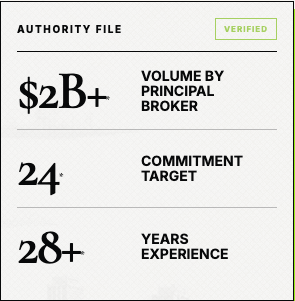 | 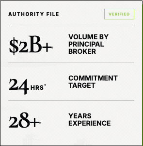 |

- **Reference section:** Homepage → Hero → Qualified commitment target / authority-file proof
- **Transcript:** `00:00:06–00:00:22`
- **Cleaned quote:** “The commitment target does not show ‘24 hour’ under the authority-file section. This is in the hero.”
- **Surrounding context:** The partners approved the other hero proof cards; the missing word was the only substantive correction in this group.
- **Description:** Add an explicit 24 hour target to the hero’s qualified-commitment proof so the speed claim is visible at the point of first impression. Preserve qualification language; do not imply an unconditional approval SLA.
- **Acceptance criteria:**
  - [x] The hero commitment proof visibly states a 24 hour target.
  - [x] The wording remains qualified as a target and does not promise approval.
  - [x] The value is legible at supported desktop and mobile breakpoints.

### FL-WEB-002 — Clarify that construction financing supports large-scale builds

**Matched visual evidence**

| Before                                                                  | After                                                                 |
| ----------------------------------------------------------------------- | --------------------------------------------------------------------- |
|  |  |

- **Reference section:** Homepage → Find Your Fit / What We Finance → Construction Financing card
- **Transcript:** `00:01:50–00:02:10`
- **Cleaned quote:** “For construction financing, add clarity that we can handle very large-scale builds. There is room for another bullet.”
- **Surrounding context:** The discussion had moved from the hero into the route-selection cards. This was framed as an important capability signal, not a new product.
- **Description:** Add concise copy to the construction-financing route/card communicating that FairLend can structure financing for substantial builds, without setting an unsupported hard ceiling.
- **Acceptance criteria:**
  - [x] The construction-financing card explicitly supports large-scale projects.
  - [x] The claim avoids an unverified maximum loan or project size.
  - [x] Added copy fits the existing card layout without overflow or density regressions.

### FL-WEB-003 — Restore legibility and sharpen the Who We Are headline

**Matched visual evidence**

| Before                                                                  | After                                                                 |
| ----------------------------------------------------------------------- | --------------------------------------------------------------------- |
|  |  |

- **Reference section:** Homepage → `FairlendLandingOverviewSection` → 01 Who We Are
- **Transcript:** `00:04:08–00:04:56`
- **Cleaned quote:** “The paragraph below the FairLend heading becomes impossible to read against the background. Use a punchier three-line identity statement; the later approved direction was ‘High tech meets seasoned mortgage brokerage.’ ”
- **Surrounding context:** Both partners agreed the paragraph was illegible. The proposed fix was to improve both contrast and the copy footprint instead of merely patching the background.
- **Description:** Rework the Who We Are headline/intro treatment so its copy is readable over the artwork and the value proposition is more distinctive.
- **Acceptance criteria:**
  - [x] Intro copy meets WCAG AA contrast in every responsive state.
  - [x] The new headline communicates FairLend’s identity, uses the approved “high tech meets seasoned mortgage brokerage” direction, and is designed for a three-line desktop lockup.
  - [x] No text crosses visually noisy portions of the background.

### FL-WEB-004 — Decouple the Core Lending label from adjacent building artwork

**Matched visual evidence**

| Before                                                                  | After                                                                 |
| ----------------------------------------------------------------------- | --------------------------------------------------------------------- |
| 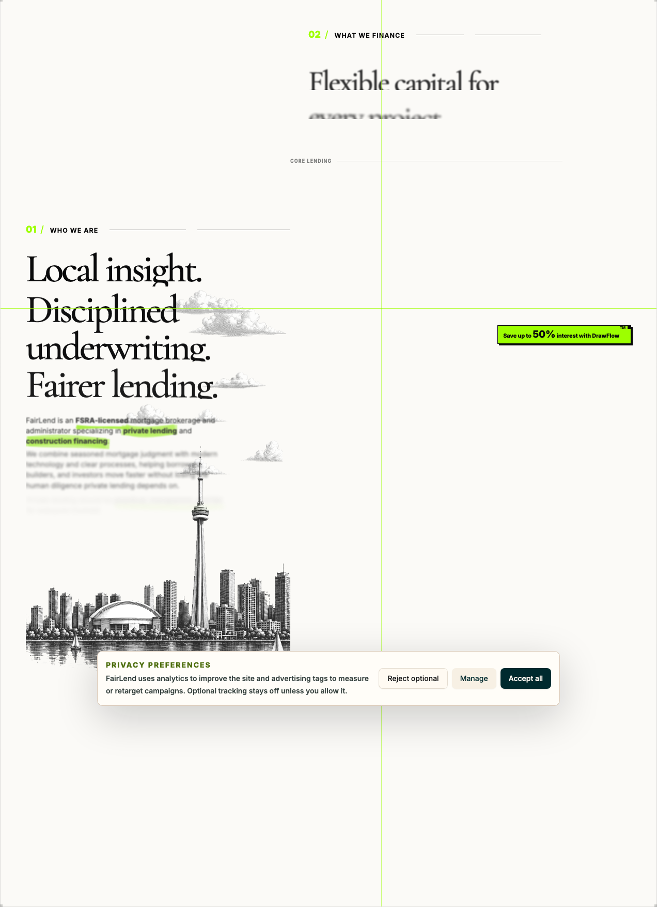 | 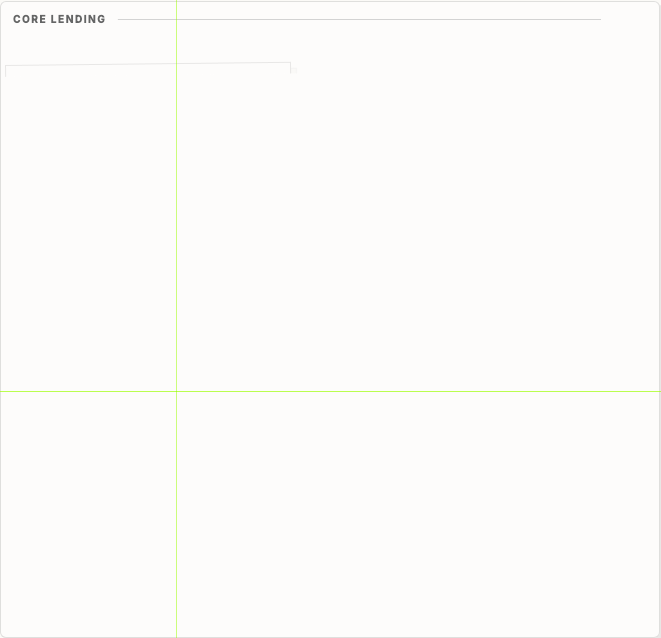 |

- **Reference section:** Homepage → `FairlendLandingOverviewSection` → Core Lending / What We Finance
- **Transcript:** `00:06:33–00:07:16`
- **Cleaned quote:** “The Core Lending treatment reads as though it connects to the building illustration. Simplify the copy and make the label clearly belong to the lending content.”
- **Surrounding context:** The review called for cutting explanatory copy down and correcting the perceived visual relationship between the label and artwork.
- **Description:** Adjust the Core Lending heading, supporting copy, and/or placement so the information hierarchy is unambiguous and the label is not visually attached to the neighboring building graphic.
- **Acceptance criteria:**
  - [x] Core Lending is visually grouped with its related financing content.
  - [x] The treatment no longer appears to label the building illustration.
  - [x] Supporting copy is concise and preserves the intended capability statement.

### FL-WEB-005 — Remove the unsupported trademark designation

**Matched visual evidence**

| Before                                                                  | After                                                                 |
| ----------------------------------------------------------------------- | --------------------------------------------------------------------- |
|  |  |

- **Reference section:** Homepage → Overview / What We Finance copy using the trademark mark
- **Transcript:** `00:07:56–00:08:12`
- **Cleaned quote:** “Remove the trademark. We should not label something as trademarked without confirming the legal basis.”
- **Surrounding context:** The concern was specifically legal accuracy; the group did not approve replacing it with another ownership symbol.
- **Description:** Remove the `™`/trademark representation discussed in the overview content and check the rendered instance for any dependent spacing.
- **Acceptance criteria:**
  - [x] The identified trademark mark is removed from visible copy and accessible text.
  - [x] No orphaned spacing or punctuation remains.
  - [x] No replacement registration or copyright claim is introduced.

## Our Build Model

### FL-WEB-006 — Replace “carry the financing business equation” with accurate language

**Matched visual evidence**

| Before                                                                  | After                                                                 |
| ----------------------------------------------------------------------- | --------------------------------------------------------------------- |
|  |  |

- **Reference section:** Homepage → `FairlendBuildModelSection` → Already Building / Keep Your Focus on Site
- **Transcript:** `00:10:02–00:10:50`
- **Cleaned quote:** “ ‘We carry the financing business equation around it’ is the wrong phrase. Use ‘we offer the financing’ rather than ‘carry’ or ‘curate.’ ”
- **Surrounding context:** “Curate” was rejected because it implies selecting from a pre-existing collection. “Offer the financing” was the agreed plain-language direction.
- **Description:** Rewrite the sentence to state FairLend’s role accurately and naturally.
- **Acceptance criteria:**
  - [x] “Carry the financing business equation” is removed.
  - [x] The replacement uses “offer” or equally direct, approved wording—not “curate.”
  - [x] The revised sentence remains grammatically correct in its surrounding paragraph.

### FL-WEB-007 — Change first-time-builder “assign” language to recommend or refer

**Matched visual evidence**

| Before                                                                  | After                                                                 |
| ----------------------------------------------------------------------- | --------------------------------------------------------------------- |
| 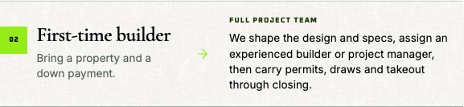 | 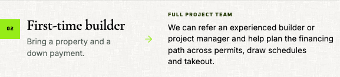 |

- **Reference section:** Homepage → `FairlendBuildModelSection` → First-Time Builder
- **Transcript:** `00:12:03–00:12:26`
- **Cleaned quote:** “We do not run the project, so we cannot say we assign an experienced building project manager. Say we recommend or refer one.”
- **Surrounding context:** The correction narrows FairLend’s represented responsibility and avoids implying project-management control.
- **Description:** Update the first-time-builder copy to describe a recommendation/referral relationship rather than assignment or direct management.
- **Acceptance criteria:**
  - [x] “Assign” is removed from the project-manager promise.
  - [x] Copy uses “recommend” or “refer” and identifies an experienced building project manager.
  - [x] No adjacent copy implies FairLend operates the construction project.

### FL-WEB-008 — Fix missing whitespace before “Complementary access”

**Matched visual evidence**

| Before                                                                  | After                                                                 |
| ----------------------------------------------------------------------- | --------------------------------------------------------------------- |
|  | 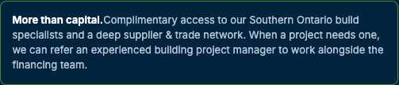 |

- **Reference section:** Homepage → `FairlendBuildModelSection` → Milestone Line of Credit for Your Build
- **Transcript:** `00:15:06–00:15:31`
- **Cleaned quote:** “After ‘more capital.’ there is no space before ‘Complementary access.’ Add the single missing space.”
- **Surrounding context:** This was explicitly identified as a small polish defect visible in the rendered copy.
- **Description:** Correct the copy boundary or JSX composition that concatenates the two sentences.
- **Acceptance criteria:**
  - [x] The rendered text contains exactly one space after the period.
  - [x] Screen-reader text matches the corrected visible copy.

### FL-WEB-009 — Replace the default scrollbar with styled section chrome

**Matched visual evidence**

| Before                                                                  | After                                                                 |
| ----------------------------------------------------------------------- | --------------------------------------------------------------------- |
|  |  |

- **Reference section:** Homepage → `FairlendBuildModelSection` → Milestone Line of Credit for Your Build
- **Transcript:** `00:16:08–00:16:29`
- **Cleaned quote:** “Replace the default scrollbar with custom chrome for a stylized scrollbar. Make it feel intentional.”
- **Surrounding context:** The native pale scrollbar looked unfinished inside an otherwise highly art-directed section.
- **Description:** Add an accessible, branded scrollbar treatment to the Milestone Line of Credit scroller without breaking native scroll behavior.
- **Acceptance criteria:**
  - [x] Supported browsers receive an intentional branded scrollbar treatment.
  - [x] Keyboard, wheel, touch, and trackpad scrolling continue to work.
  - [x] The thumb remains visible and distinguishable in high-contrast states.

### FL-WEB-010 — Use a more legible font for metrics and numbers

**Matched visual evidence**

| Before                                                                  | After                                                                 |
| ----------------------------------------------------------------------- | --------------------------------------------------------------------- |
|  |  |

- **Reference section:** Homepage → `FairlendBuildModelSection` → metric readouts
- **Transcript:** `00:17:07–00:17:57`
- **Cleaned quote:** “The numbers are hard to read—the 15 can look like ‘I5.’ Replace typography only for metrics and numbers, not the overall type system.”
- **Surrounding context:** The group liked the broader typography. The request was a targeted numeric-font override.
- **Description:** Select and apply a numeric/metric face or font feature with unambiguous glyphs while preserving the section’s primary typography.
- **Acceptance criteria:**
  - [x] Metric glyphs such as `1`, `5`, `%`, `$`, and decimal points are immediately distinguishable.
  - [x] The override applies only to numeric/metric UI.
  - [x] Existing spacing and responsive layouts remain stable.

### FL-WEB-011 — Redesign Without FairLend / With FairLend as stacked brutalist cards

**Matched visual evidence**

| Before                                                                  | After                                                                 |
| ----------------------------------------------------------------------- | --------------------------------------------------------------------- |
| 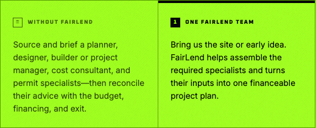 | 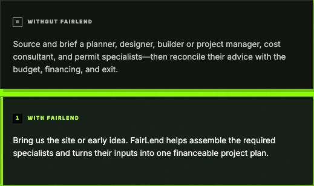 |

- **Reference section:** Homepage → `FairlendBuildModelSection` → Feasible Before Commitment comparison
- **Transcript:** `00:18:18–00:19:05`
- **Cleaned quote:** “Use stacked soft-brutalist cards with a darker background and lime accents. The current implementation is too green and overwhelming.”
- **Surrounding context:** The comparison is strategically important for purchase decisions, but the current color mass reduces hierarchy.
- **Description:** Restyle the paired comparison as stacked dark cards with restrained lime emphasis and a clear negative/positive reading order.
- **Acceptance criteria:**
  - [x] Comparison cards use a dark neutral base with lime as an accent rather than the dominant surface.
  - [x] Without/With states remain unmistakable without relying on color alone.
  - [x] Cards stack cleanly on narrow screens and preserve accessible contrast.

### FL-WEB-012 — Make project-economics copy explicitly collaborative

**Matched visual evidence**

| Before                                                                  | After                                                                 |
| ----------------------------------------------------------------------- | --------------------------------------------------------------------- |
| 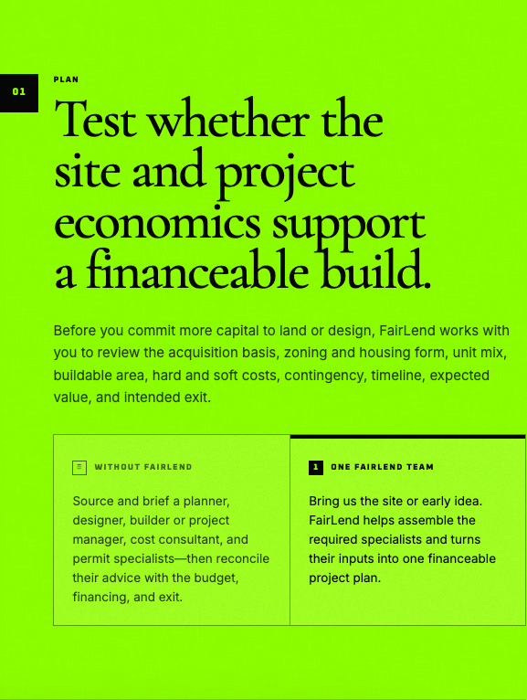 | 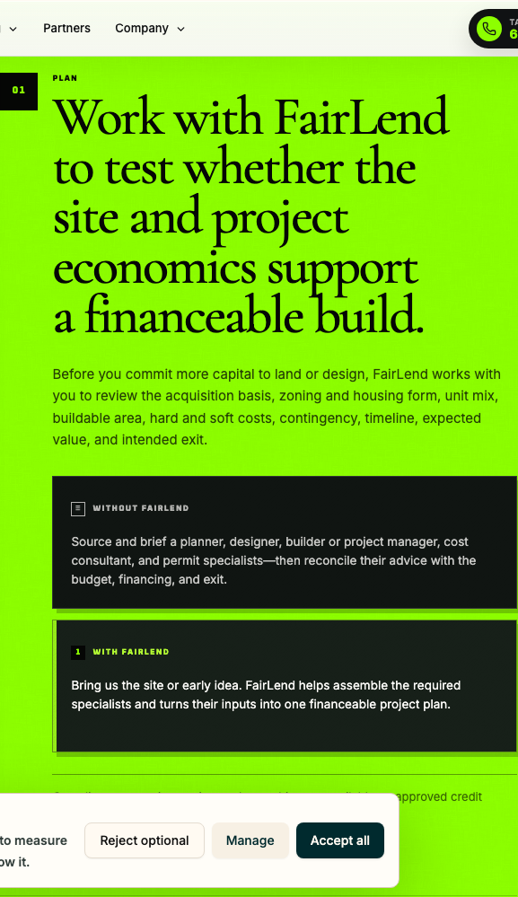 |

- **Reference section:** Homepage → `FairlendBuildModelSection` → Feasible Before Commitment
- **Transcript:** `00:19:14–00:19:44`
- **Cleaned quote:** “ ‘Test whether the site and project economics support the financial build’ sounds like work the client must do. Say FairLend works with the client and/or their team to do it collaboratively.”
- **Surrounding context:** Existing nearby copy mentions working together, but the reviewed line itself still reads as a client obligation.
- **Description:** Rewrite the specific project-economics line so FairLend’s active, collaborative role is explicit.
- **Acceptance criteria:**
  - [x] The line names FairLend as a participant in the review.
  - [x] It accommodates collaboration with the client and their professional team.
  - [x] It does not promise that every project will be made feasible.

### FL-WEB-013 — Qualify free consulting and project work as OAC

**Matched visual evidence**

| Before                                                                  | After                                                                 |
| ----------------------------------------------------------------------- | --------------------------------------------------------------------- |
|  |  |

- **Reference section:** Homepage → `FairlendBuildModelSection` → Feasible Before Commitment / consulting offer
- **Transcript:** `00:20:21–00:21:20`
- **Cleaned quote:** “Clarify that the free consultancy and this work depend on acceptance of the file. Use the industry term OAC—on approved credit.”
- **Surrounding context:** The partners noted that many projects will not qualify and the site must not imply every visitor receives the full service.
- **Description:** Add concise OAC qualification at the relevant service claim and define the acronym where needed for non-industry readers.
- **Acceptance criteria:**
  - [x] The free-consulting/project-work claim is expressly conditional on file acceptance/OAC.
  - [x] “OAC” is expanded or otherwise understandable on first use.
  - [x] Qualification is visible and not hidden only in global fine print.

### FL-WEB-014 — Reframe Build Support pain around interest and capital delays

**Matched visual evidence**

| Before                                                                  | After                                                                 |
| ----------------------------------------------------------------------- | --------------------------------------------------------------------- |
| 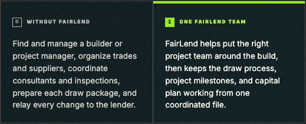 | 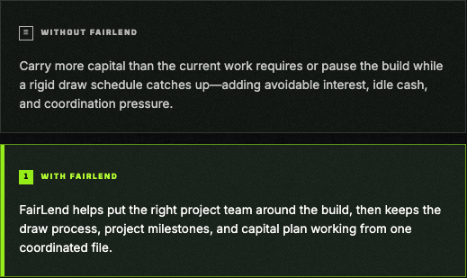 |

- **Reference section:** Homepage → `FairlendBuildModelSection` → 03 Build Support → Without FairLend
- **Transcript:** `00:22:07–00:22:35`
- **Cleaned quote:** “The loss is not mainly logistics. Call out the increased interest burden and the risk of getting jammed up without capital while waiting for a pre-planned draw.”
- **Surrounding context:** The comparison needs to articulate the builder’s actual financial pain, not just administrative inconvenience.
- **Description:** Rewrite the Without FairLend side to foreground carrying cost, delayed capital, and stalled-work risk.
- **Acceptance criteria:**
  - [x] Copy identifies increased interest/carrying cost.
  - [x] Copy identifies the risk of insufficient capital or work delays between draws.
  - [x] The With FairLend side responds directly to those pains.

### FL-WEB-015 — Standardize “draw plan” to “draw schedule” in Build Support

**Matched visual evidence**

| Before                                                                  | After                                                                 |
| ----------------------------------------------------------------------- | --------------------------------------------------------------------- |
| 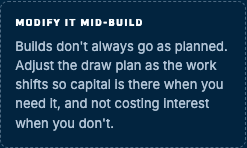 | 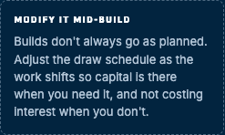 |

- **Reference section:** Homepage → `FairlendBuildModelSection` → 03 Build Support
- **Transcript:** `00:22:36–00:23:00`
- **Cleaned quote:** “Change ‘adjust the draw plan mid-build’ to ‘adjust the draw schedule mid-build.’ Also change the left-side Live Deal File label from draw plan to draw schedule.”
- **Surrounding context:** “Draw schedule” was selected as the industry-standard term for these two contexts.
- **Description:** Replace the two reviewed occurrences while leaving genuinely broader planning references untouched.
- **Acceptance criteria:**
  - [x] The mid-build action uses “draw schedule.”
  - [x] The Live Deal File label uses “draw schedule.”
  - [x] A scoped search confirms no stale copy remains in those two UI regions.

### FL-WEB-016 — Clarify MLI Select as one CMHC-insured option among many

**Matched visual evidence**

| Before                                                                  | After                                                                 |
| ----------------------------------------------------------------------- | --------------------------------------------------------------------- |
| 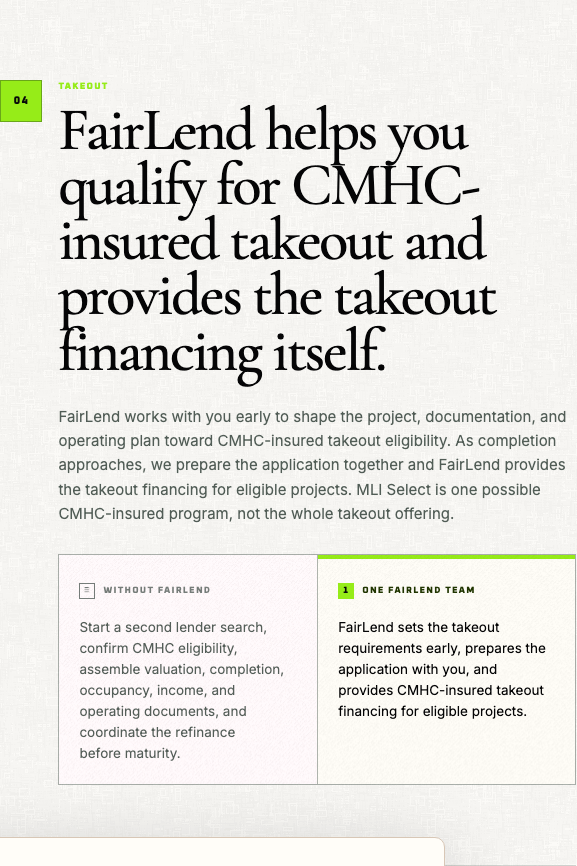 | 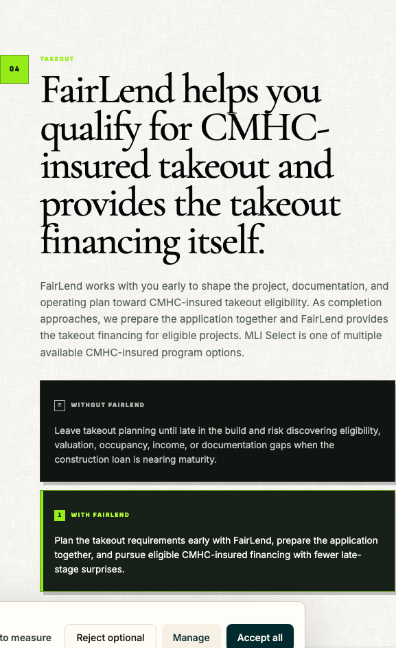 |

- **Reference section:** Homepage → `FairlendBuildModelSection` → 04 Takeout
- **Transcript:** `00:23:53–00:25:19`
- **Cleaned quote:** “Say ‘MLI Select is one possible CMHC-insured program among many options.’ Remove ‘not the whole takeout offering’; it reads awkwardly.”
- **Surrounding context:** The original wording could imply that MLI Select is the only takeout path. The group approved the “among many options” formulation.
- **Description:** Replace the awkward qualifier with positive, accurate positioning of MLI Select within the broader insured takeout landscape.
- **Acceptance criteria:**
  - [x] MLI Select is described as one possible CMHC-insured program among multiple options.
  - [x] “Not the whole takeout offering” is removed.
  - [x] Copy still communicates FairLend’s role in qualification/planning.

### FL-WEB-017 — Remove profanity from the contingency-program copy

**Matched visual evidence**

| Before                                                                  | After                                                                 |
| ----------------------------------------------------------------------- | --------------------------------------------------------------------- |
| 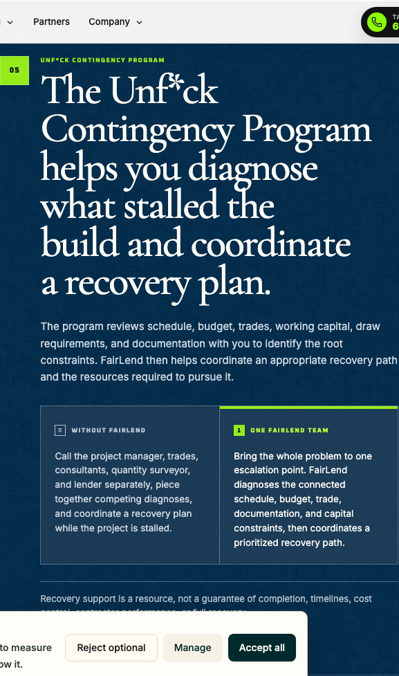 | 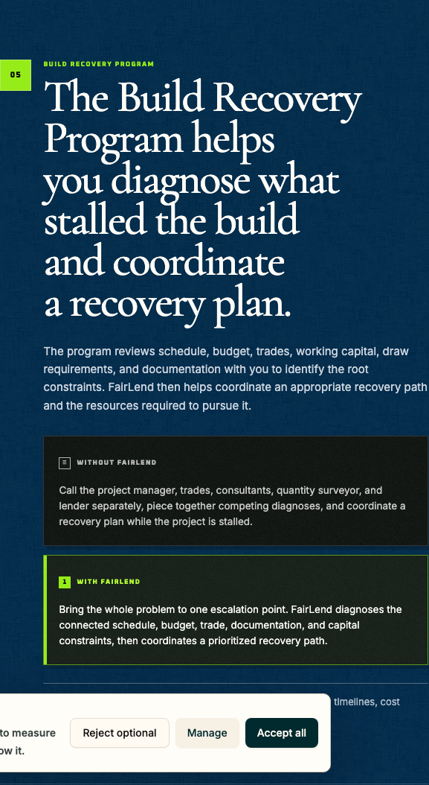 |

- **Reference section:** Homepage → `FairlendBuildModelSection` → contingency / recovery content
- **Transcript:** `00:27:23–00:27:49`
- **Cleaned quote:** “Remove the quoted profanity from the contingency program and rephrase it professionally.”
- **Surrounding context:** The team discussed tactical swearing in marketing but concluded it was inappropriate for this brand and audience.
- **Description:** Replace the profane contingency phrase with professional language that retains the sense of emergency recovery.
- **Acceptance criteria:**
  - [x] The profanity and censored variant are absent from visible and accessible copy.
  - [x] Replacement language still signals a practical recovery/contingency plan.
  - [x] Tone is consistent with the rest of the builder section.

### FL-WEB-018 — Rewrite the Takeout comparison around early CMHC planning

**Matched visual evidence**

| Before                                                                  | After                                                                 |
| ----------------------------------------------------------------------- | --------------------------------------------------------------------- |
| 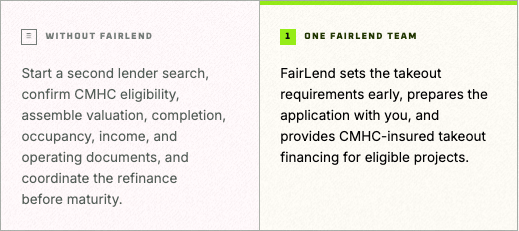 | 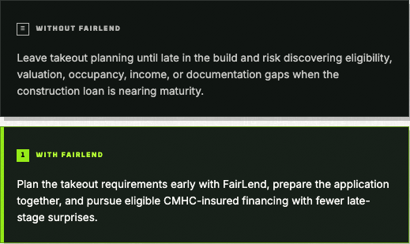 |

- **Reference section:** Homepage → `FairlendBuildModelSection` → 04 Takeout → Without/With FairLend
- **Transcript:** `00:29:12–00:31:20`
- **Cleaned quote:** “Without planning, builders start construction, then discover CMHC requirements, resubmit plans, hire more consultants, make expensive mid-project changes, or fail to qualify. With FairLend, takeout requirements shape the build before construction begins.”
- **Surrounding context:** A Note to the Agent explicitly attached the final statement—plan the build in conjunction with CMHC rules—to this issue.
- **Description:** Replace the current generic comparison with the full causal story captured in the meeting.
- **Acceptance criteria:**
  - [x] Without FairLend covers late requirement discovery, resubmission/consultant/change costs, and qualification risk.
  - [x] With FairLend explains that takeout eligibility informs pre-construction planning.
  - [x] The copy does not guarantee CMHC approval.

## Builder Consulting — “Building Shouldn’t Be the Easy Part”

### FL-WEB-019 — Add an illustrative-results disclaimer to the builder calculator

**Matched visual evidence**

| Before                                                                  | After                                                                 |
| ----------------------------------------------------------------------- | --------------------------------------------------------------------- |
| 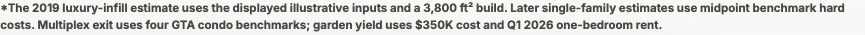 |  |

- **Reference section:** Homepage → `FairlendBuilderConsultingSection` → calculator/results
- **Transcript:** `00:34:42–00:35:23`
- **Cleaned quote:** “Add an asterisk/disclaimer: these numbers are entirely illustrative, are not guaranteed, and exist only to explain the concept.”
- **Surrounding context:** The displayed rent/value implications could otherwise be interpreted as forecasts or representations.
- **Description:** Add prominent, persistent disclaimer copy to the interactive model and its calculated outputs.
- **Acceptance criteria:**
  - [x] Results are labelled illustrative and non-guaranteed.
  - [x] Disclaimer remains visible or directly associated as inputs/results change.
  - [x] No language implies investment, appraisal, profit, or financing certainty.

### FL-WEB-020 — Fix the multiplex cash-yield calculation

**Matched visual evidence**

| Before                                                                  | After                                                                 |
| ----------------------------------------------------------------------- | --------------------------------------------------------------------- |
|  |  |

- **Reference section:** Homepage → `FairlendBuilderConsultingSection` → Multiplex / Rent strategy calculator
- **Transcript:** `00:36:02–00:37:01`
- **Cleaned quote:** “With 5 units, $1.1M land, $250/ft² build cost, rent strategy, and $4,000 monthly rent per unit, the model shows $23K cash flow but 0.0% cash yield. Debug the calculation engine.”
- **Surrounding context:** Changing rent produced another implausible yield, confirming an underlying calculation defect rather than a formatting issue.
- **Description:** Trace and correct the cash-yield formula, denominators, units, and state updates for multiplex rental scenarios.
- **Acceptance criteria:**
  - [x] The supplied reproduction case returns a mathematically consistent nonzero yield when cash flow is nonzero.
  - [x] Yield updates deterministically with rent/input changes.
  - [x] Formula-level tests cover zero, negative, and positive cash-flow cases.

### FL-WEB-021 — Replace calculator defaults with sane Southern Ontario assumptions

**Matched visual evidence**

| Before                                                                  | After                                                                 |
| ----------------------------------------------------------------------- | --------------------------------------------------------------------- |
| 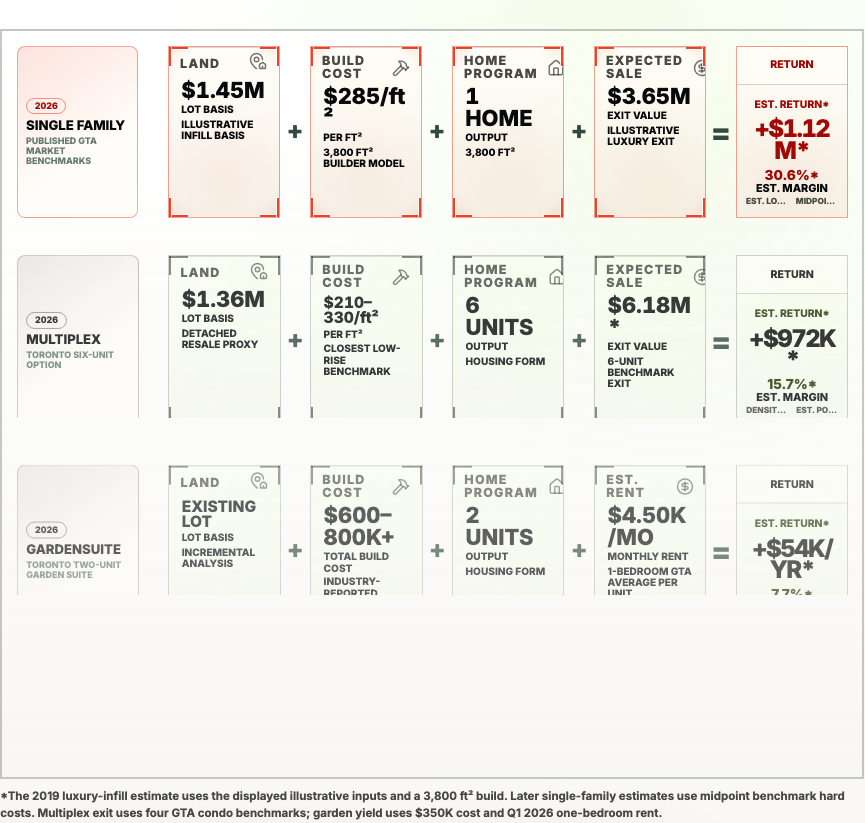 | 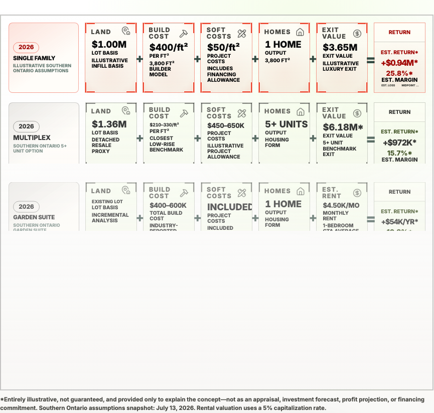 |

- **Reference section:** Homepage → `FairlendBuilderConsultingSection` → all build-type default inputs
- **Transcript:** `00:37:08–00:37:24`
- **Cleaned quote:** “Ensure the default values for each build type are sane and reflect average Toronto/GTA figures.”
- **Surrounding context:** The displayed outputs looked random because initial assumptions were not credible. The later terminology decision changes public geography language to Southern Ontario, but these defaults should still use a documented local basis.
- **Description:** Audit every build-type preset, document its assumption source/date, and replace implausible values.
- **Acceptance criteria:**
  - [x] Each build type has internally consistent land, build, area, rent/exit, and financing defaults.
  - [x] Assumptions use a documented Southern Ontario/Toronto-area basis and snapshot date.
  - [x] Switching build types never carries incompatible stale values.

### FL-WEB-022 — Set the illustrative capitalization rate to 5%

**Matched visual evidence**

| Before                                                                  | After                                                                 |
| ----------------------------------------------------------------------- | --------------------------------------------------------------------- |
|  |  |

- **Reference section:** Homepage → `FairlendBuilderConsultingSection` → Illustrative Year One
- **Transcript:** `00:37:24–00:37:42`
- **Cleaned quote:** “Use a 5% capitalization rate. The illustrative year-one model currently says 4%.”
- **Surrounding context:** This is an explicit model-assumption change, separate from the general default-value audit.
- **Description:** Update the displayed and calculated capitalization-rate default to 5% everywhere the illustrative model consumes it.
- **Acceptance criteria:**
  - [x] The default/displayed cap rate is 5%.
  - [x] All derived valuation calculations use `0.05`, not only the label.
  - [x] Tests assert the default and a representative derived value.

### FL-WEB-023 — Make the 2019/2023/2026 year indicators prominent

**Matched visual evidence**

| Before                                                                  | After                                                                 |
| ----------------------------------------------------------------------- | --------------------------------------------------------------------- |
|  |  |

- **Reference section:** Homepage → `FairlendBuilderConsultingSection` → equation timeline
- **Transcript:** `00:38:08–00:38:27`
- **Cleaned quote:** “The year indicators need to be larger and more visible. Reposition them if necessary so the larger type does not constrain the equation surface.”
- **Surrounding context:** Reviewers repeatedly missed the active year, which made the changing economics difficult to interpret.
- **Description:** Increase active/inactive year salience and reserve layout space outside the equation content where practical.
- **Acceptance criteria:**
  - [x] The active year is immediately identifiable at every timeline state.
  - [x] Supporting state labels distinguish the historical “way it was” from the current/changed model without replacing the actual years.
  - [x] Year sizing does not overlap or shrink equation content.
  - [x] State is conveyed accessibly, not through animation/color alone.

### FL-WEB-024 — Rewrite the builder-equation headline around role clarity

**Matched visual evidence**

| Before                                                                  | After                                                                 |
| ----------------------------------------------------------------------- | --------------------------------------------------------------------- |
|  | 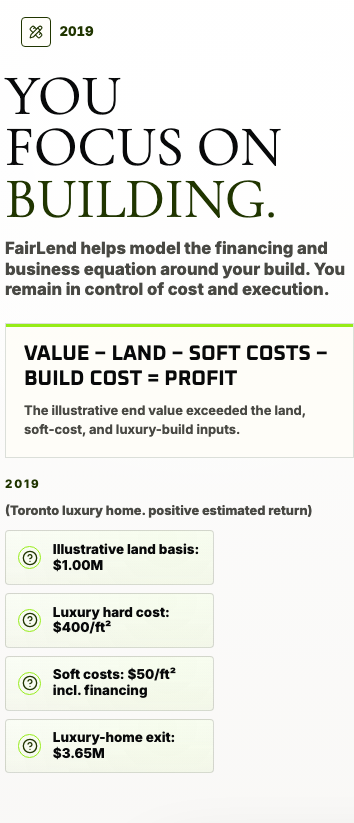 |

- **Reference section:** Homepage → `FairlendBuilderConsultingSection` → “Building Shouldn’t Be the Easy Part” headline/copy
- **Transcript:** `00:39:32–00:41:16`
- **Cleaned quote:** “A builder should focus on the build while FairLend helps with the math and business side. ‘Building shouldn’t be the easy part’ is confusing at first glance.”
- **Surrounding context:** “The business equation shouldn’t be the hard part” was considered, but the clearest intent was: you manage cost/budget and building; FairLend helps calculate and structure the rest.
- **Description:** Replace the current headline/supporting copy with a builder-centric division of responsibilities.
- **Acceptance criteria:**
  - [x] The new headline is understandable without reading the calculator.
  - [x] Copy says the builder focuses on building while FairLend helps with financing/business calculations.
  - [x] It does not imply FairLend controls construction cost or execution.

### FL-WEB-025 — Model realistic single-family and luxury build costs

**Matched visual evidence**

| Before                                                                  | After                                                                 |
| ----------------------------------------------------------------------- | --------------------------------------------------------------------- |
|  |  |

- **Reference section:** Homepage → `FairlendBuilderConsultingSection` → equation timeline → Single Family rows
- **Transcript:** `00:41:59–00:45:23`
- **Cleaned quote:** “General single-family construction is roughly $350/ft² and up; the luxury example would require about $400/ft². Show single-family and luxury diverging as economics deteriorate.”
- **Surrounding context:** The preceding text-overflow issue was explicitly scratched because a fix was already in flight. The remaining issue concerns credible cost assumptions and the narrative transition from profitable to loss-making states.
- **Description:** Separate standard/luxury assumptions where needed and use them consistently through the timeline visualization.
- **Acceptance criteria:**
  - [x] The model no longer applies an implausibly low single cost to both standard and luxury examples.
  - [x] Luxury uses approximately $400/ft² unless the documented model is deliberately updated.
  - [x] Timeline states accurately reflect the resulting profit/loss transition.

### FL-WEB-026 — Add soft costs as a first-class equation variable

**Matched visual evidence**

| Before                                                                  | After                                                                 |
| ----------------------------------------------------------------------- | --------------------------------------------------------------------- |
|  | 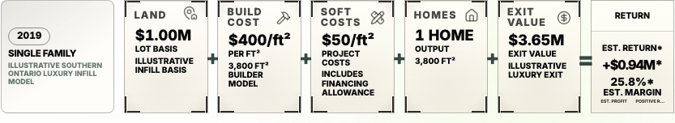 |

- **Reference section:** Homepage → `FairlendBuilderConsultingSection` → equation inputs and calculations
- **Transcript:** `00:45:23–00:45:42`
- **Cleaned quote:** “Add soft costs as a variable in the build equation. We need it.”
- **Surrounding context:** The equation currently presents land and build cost without a separately controlled soft-cost input.
- **Description:** Add soft costs to the model, input UI, formulas, defaults, and displayed equation summaries.
- **Acceptance criteria:**
  - [x] Soft costs are independently represented in model state and UI.
  - [x] Profit, margin, yield, and related outputs include soft costs exactly once.
  - [x] Defaults and validation use the same unit model as the selected build type.

### FL-WEB-027 — Use timeline whitespace for a large economic equation

**Matched visual evidence**

| Before                                                                  | After                                                                 |
| ----------------------------------------------------------------------- | --------------------------------------------------------------------- |
| 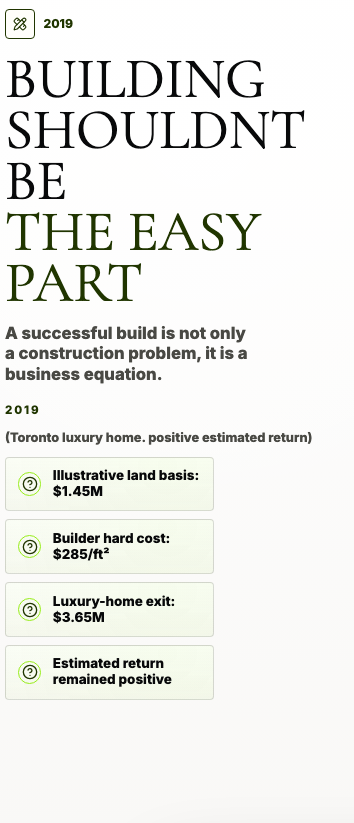 |  |

- **Reference section:** Homepage → `FairlendBuilderConsultingSection` → 2019 and 2023 timeline states
- **Transcript:** `00:45:42–00:46:31`
- **Cleaned quote:** “Use the available whitespace for large typography: value greater than land plus soft costs plus build costs equals profit.”
- **Surrounding context:** The early states have unused space before the terminal 2026 visualization. The formula should make the economic narrative obvious.
- **Description:** Add a large, responsive equation statement to the 2019/2023 state composition.
- **Acceptance criteria:**
  - [x] The formula includes value, land, soft cost, build cost, and profit.
  - [x] Mathematical direction is semantically correct and understandable in plain language.
  - [x] Typography scales without covering inputs, results, or year navigation.

### FL-WEB-028 — Explain why the 2023 model turns unprofitable

**Matched visual evidence**

| Before                                                                  | After                                                                 |
| ----------------------------------------------------------------------- | --------------------------------------------------------------------- |
| 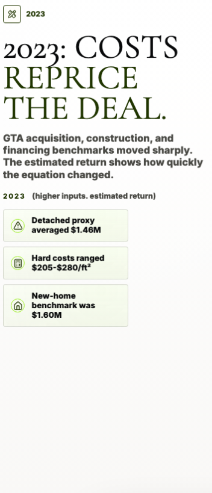 | 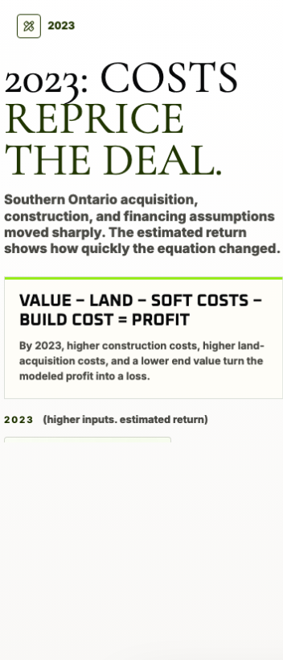 |

- **Reference section:** Homepage → `FairlendBuilderConsultingSection` → 2023 timeline whitespace
- **Transcript:** `00:46:33–00:47:07`
- **Cleaned quote:** “For 2023, explain that rising construction costs, higher land-acquisition costs, and a lower end value turn the profit into a loss.”
- **Surrounding context:** This text is the narrative companion to the large equation requested for the timeline states.
- **Description:** Add concise causal copy to the 2023 state rather than showing unexplained red figures.
- **Acceptance criteria:**
  - [x] Copy names construction cost, land cost, and lower end value.
  - [x] The copy explicitly connects those changes to the loss outcome.
  - [x] It appears only when the 2023 state is active and is accessible without animation.

### FL-WEB-029 — Correct the 2019 model baseline assumptions

**Matched visual evidence**

| Before                                                                  | After                                                                 |
| ----------------------------------------------------------------------- | --------------------------------------------------------------------- |
| 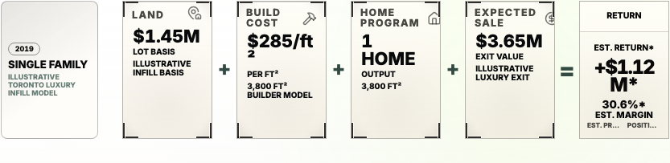 |  |

- **Reference section:** Homepage → `FairlendBuilderConsultingSection` → 2019 timeline state
- **Transcript:** `00:47:15–00:48:09`
- **Cleaned quote:** “For 2019, use land around $1M, build cost around $400/ft² for the luxury example, and soft costs represented on a consistent basis; financing-inclusive soft costs may be about $50/ft².”
- **Surrounding context:** The speakers corrected an initial “$400,000” transcription to `$400 per square foot` and distinguished fixed soft costs from financing-inclusive, area-sensitive costs.
- **Description:** Rebuild the 2019 preset with consistent units and document whether financing costs are included.
- **Acceptance criteria:**
  - [x] Land defaults to approximately $1M for the reviewed example.
  - [x] Luxury build cost uses approximately $400/ft².
  - [x] Soft-cost units and financing-cost inclusion are explicit and consistent in UI and formulas.

### FL-WEB-030 — Change multiplex capacity copy to “5 or more units”

**Matched visual evidence**

| Before                                                                  | After                                                                 |
| ----------------------------------------------------------------------- | --------------------------------------------------------------------- |
| 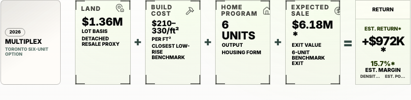 | 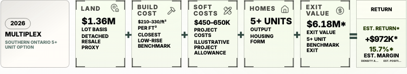 |

- **Reference section:** Homepage → `FairlendBuilderConsultingSection` → 2026 Density Changes the Model → Multiplex
- **Transcript:** `00:51:35–00:52:40`
- **Cleaned quote:** “Multiplex can create five or more units—not up to four. Update both the bottom callout and the stylized chip on the left.”
- **Surrounding context:** A direct Note to the Agent broadened the scope from the bottom strip to both displayed instances.
- **Description:** Replace the obsolete four-unit limit in both 2026 multiplex callouts.
- **Acceptance criteria:**
  - [x] Both the bottom callout and left-side chip say “5 or more units.”
  - [x] No “up to 4 units” copy remains in this model state.
  - [x] The updated text fits without clipping at all supported widths.

### FL-WEB-031 — Remove unit-count claims from the Garden Suite label

**Matched visual evidence**

| Before                                                                  | After                                                                 |
| ----------------------------------------------------------------------- | --------------------------------------------------------------------- |
| 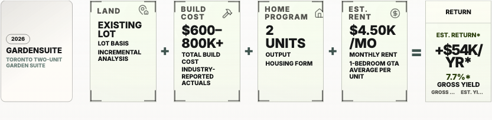 | 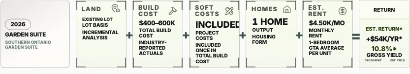 |

- **Reference section:** Homepage → `FairlendBuilderConsultingSection` → 2026 Density Changes the Model → Garden Suite
- **Transcript:** `00:54:41–00:55:12`
- **Cleaned quote:** “Change ‘Toronto 2-unit Garden Suite’ to ‘Toronto Garden Suite.’ Leave the number of units out.”
- **Surrounding context:** The group did not want the calculator to police or imply the legality of a specific garden-suite unit count.
- **Description:** Remove the unit count from the Garden Suite option and related display labels.
- **Acceptance criteria:**
  - [x] The option is labelled “Toronto Garden Suite” or the approved geography equivalent.
  - [x] No garden-suite unit quantity is asserted in the label/callout.
  - [x] Internal model identifiers remain stable unless a migration is required.

### FL-WEB-032 — Use a realistic total-cost Garden Suite model with one-home output

**Matched visual evidence**

| Before                                                                  | After                                                                 |
| ----------------------------------------------------------------------- | --------------------------------------------------------------------- |
|  |  |

- **Reference section:** Homepage → `FairlendBuilderConsultingSection` → Garden Suite calculator
- **Transcript:** `00:55:17–00:56:29`
- **Cleaned quote:** “Make the home program one unit. Garden suites should stay on a total build-cost basis; per-square-foot pricing is misleading because one- versus three-storey forms vary sharply. A realistic total is roughly $400K–$600K.”
- **Surrounding context:** The initial request proposed cost per square foot for consistency, but the ensuing discussion rejected that model and settled on a total-cost range plus one home.
- **Description:** Preserve total build cost for garden suites, set a defensible default/range, and change the output program to one home.
- **Acceptance criteria:**
  - [x] Garden Suite uses total build cost, not cost per square foot.
  - [x] Default/range reflects approximately $400K–$600K and is documented as illustrative.
  - [x] The home-program output shows one unit/home.

## Team, geography, and FAQs

### FL-WEB-033 — Replace GTA/Toronto-based positioning with Southern Ontario

**Matched visual evidence**

| Before                                                                  | After                                                                 |
| ----------------------------------------------------------------------- | --------------------------------------------------------------------- |
|  |  |

- **Reference section:** Site-wide marketing copy and metadata → geography positioning
- **Transcript:** `00:58:29–00:58:49`
- **Cleaned quote:** “Change all language that says GTA- or Toronto-based to Southern Ontario-based.”
- **Surrounding context:** “Ontario” alone was considered too broad; Southern Ontario was the agreed service-area positioning.
- **Description:** Audit rendered marketing copy, metadata, structured data, alt text, and route content for claims that position FairLend itself as Toronto/GTA-based. Preserve location-specific product facts where Toronto is genuinely the subject.
- **Acceptance criteria:**
  - [x] Organization/service-area positioning uses Southern Ontario.
  - [x] Legitimate Toronto-specific zoning/product statements are not blindly rewritten.
  - [x] Metadata and structured data align with visible copy.

### FL-WEB-034 — Correct and strengthen Bogdan Krystek’s team biography

**Matched visual evidence**

| Before                                                                  | After                                                                 |
| ----------------------------------------------------------------------- | --------------------------------------------------------------------- |
| 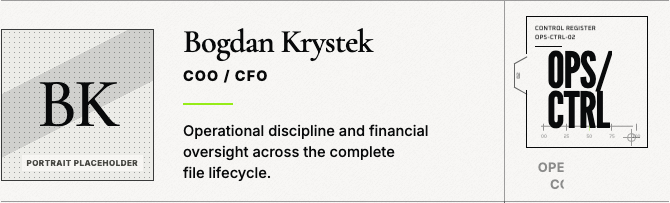 | 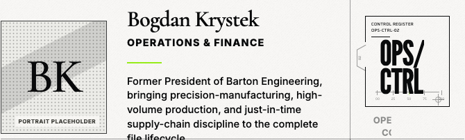 |

- **Reference section:** Homepage → `FairlendTeamSection` → Behind the File → Bogdan Krystek
- **Transcript:** `01:01:13–01:02:04`
- **Cleaned quote:** “Remove CEO from Bogdan Krystek. Highlight his experience as president of Barton Engineering and its tier-one precision manufacturing / just-in-time supply-chain work for companies such as Magna, Ford, and Navistar.”
- **Surrounding context:** The title was considered unimportant/inaccurate for this presentation; operational credibility was the stronger story.
- **Description:** Replace the CEO title with a verified role and rewrite the bio around manufacturing and logistics experience. Verify company/customer claims before publication.
- **Acceptance criteria:**
  - [x] “CEO” is removed from Bogdan’s displayed title.
  - [x] Bio includes verified Barton Engineering leadership and tier-one/JIT experience.
  - [x] Named customer examples are published only after factual approval.

### FL-WEB-035 — Correct borrower FAQ disclosure and payout-fee language

**Matched visual evidence**

| Before                                                                  | After                                                                 |
| ----------------------------------------------------------------------- | --------------------------------------------------------------------- |
|  | 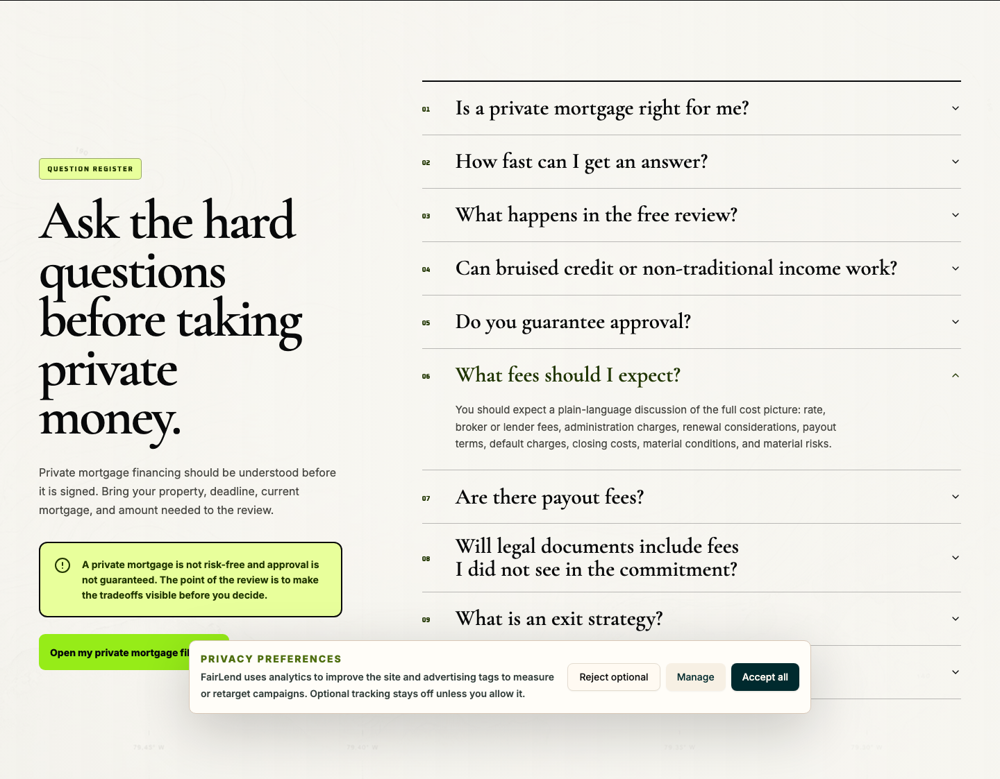 |

- **Reference section:** Borrowers → Private Mortgage Financing → FAQ → “Will I get trapped in payout or renewal fees?”
- **Transcript:** `01:12:13–01:13:27`
- **Cleaned quote:** “The structure should make cost and exit visible before commitment. Discuss rate, broker and lender fees, and renewal considerations—not one or another. Replace ‘payout fees are zero’ with ‘reasonable and predefined.’ ”
- **Surrounding context:** Discharge costs mean a blanket zero-fee claim is inaccurate.
- **Description:** Rewrite the FAQ so all material economics are disclosed in plain language and payout wording is defensible.
- **Acceptance criteria:**
  - [x] Rate, broker fees, lender fees, renewal, payout, administration/default, and material conditions are collectively addressed.
  - [x] “Zero payout fees” is removed.
  - [x] Payout fees are described as reasonable/predefined only where supportable, with third-party discharge costs acknowledged.

### FL-WEB-036 — Add complete investment-risk disclaimers to the investor FAQ

**Matched visual evidence**

| Before                                                                  | After                                                                 |
| ----------------------------------------------------------------------- | --------------------------------------------------------------------- |
| 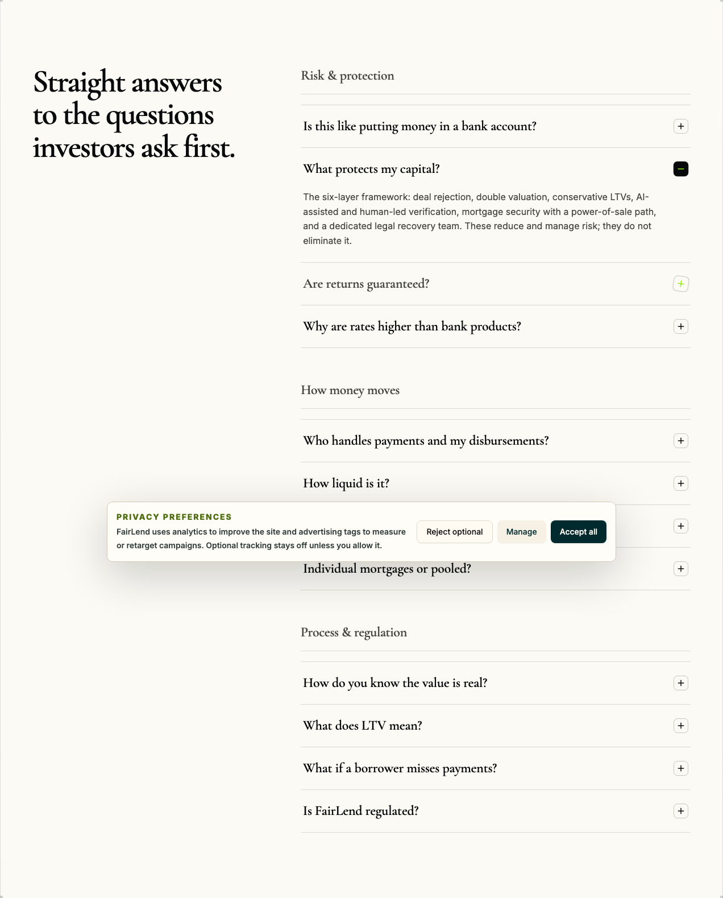 |  |

- **Reference section:** Investor page → `FairlendInvestorFaq` → “How is my investment protected?”
- **Transcript:** `01:14:55–01:15:48`
- **Cleaned quote:** “Investing is always risky. Make no guarantees about preservation of capital or payments. FairLend can do its best on valuation, but the investor remains responsible for valuation and any appraisal advice they obtain.”
- **Surrounding context:** The group wanted the disclosure to cover loss of principal, not merely missed payments.
- **Description:** Expand the answer with clear risk, non-guarantee, and valuation-responsibility language.
- **Acceptance criteria:**
  - [x] The FAQ states that principal and payments can be lost or impaired.
  - [x] It disclaims guarantees of capital preservation, payment, and valuation accuracy.
  - [x] It states that investors retain responsibility for diligence and independent appraisal/advice.

## Lead intake flows

### FL-WEB-037 — Add missing mortgage-purpose options

**Matched visual evidence**

| Before                                                                  | After                                                                 |
| ----------------------------------------------------------------------- | --------------------------------------------------------------------- |
| 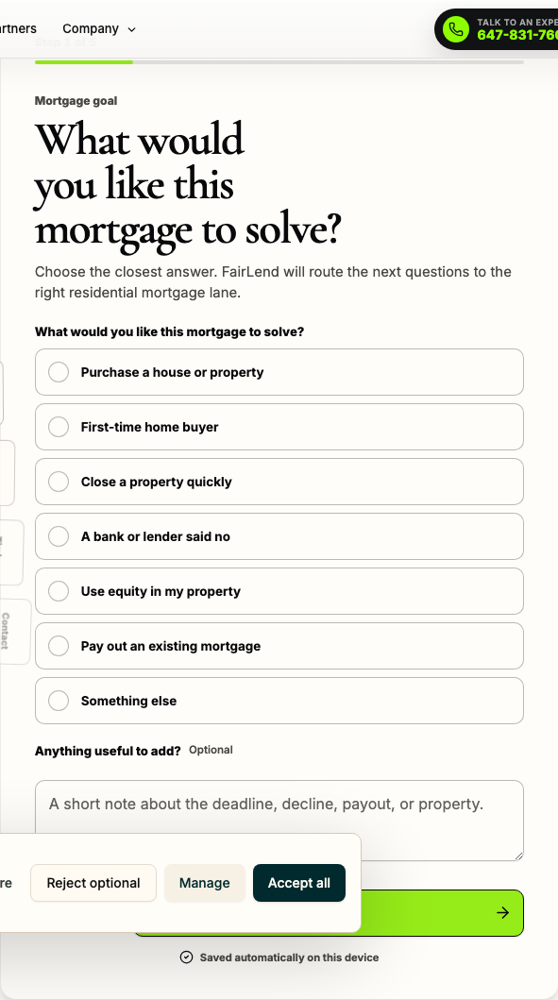 | 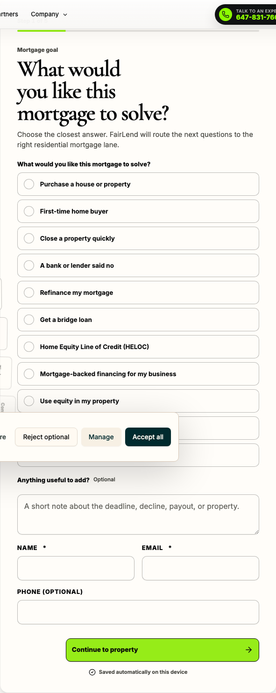 |

- **Reference section:** `/construction-financing` → Mortgage intake → “What would you like this mortgage to solve?”
- **Transcript:** `01:23:46–01:24:16`
- **Cleaned quote:** “Add refinance, bridge loan, and a mortgage business-purpose loan option to the mortgage-purpose field.”
- **Surrounding context:** “Use equity in my property” was considered too broad to make these common intents discoverable.
- **Description:** Add discrete, plain-language purpose options and map them through intake state, submission payloads, analytics, and admin/export views.
- **Acceptance criteria:**
  - [x] Refinance and bridge-loan options are selectable.
  - [x] A reviewed mortgage business-purpose option is selectable.
  - [x] Values persist through submission and appear correctly in admin/export/analytics.

### FL-WEB-038 — Add HELOC across services, routing, and intake

**Matched visual evidence**

| Before                                                                  | After                                                                 |
| ----------------------------------------------------------------------- | --------------------------------------------------------------------- |
|  | 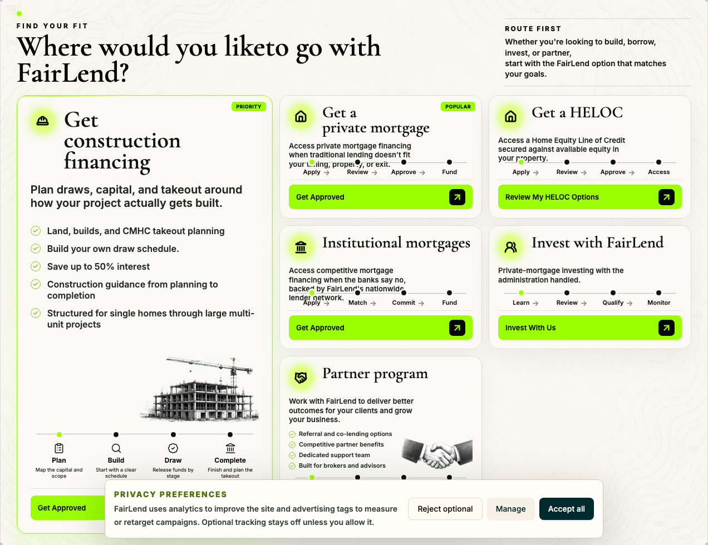 |

- **Reference section:** Homepage → What We Finance; route content; `/construction-financing` mortgage-purpose field
- **Transcript:** `01:24:17–01:26:17`
- **Cleaned quote:** “Add Home Equity Line of Credit (HELOC) under What We Finance, add the route on the landing page, and add it to ‘What would you like this mortgage to solve?’ Use the name people recognize: HELOC.”
- **Surrounding context:** The group clarified that a HELOC should be discoverable as its own familiar mortgage-purpose option.
- **Description:** Add HELOC as a reusable financing/service option across navigation surfaces and intake classification.
- **Acceptance criteria:**
  - [x] “Home Equity Line of Credit (HELOC)” appears in What We Finance.
  - [x] The landing route/card links to an appropriate destination.
  - [x] HELOC is selectable and persisted in mortgage intake.
  - [x] Internal naming is consistent; misspellings such as HELOX/HELA are not shipped.

### FL-WEB-039 — Rename “Additional liens” to “Additional debt”

**Matched visual evidence**

| Before                                                                  | After                                                                 |
| ----------------------------------------------------------------------- | --------------------------------------------------------------------- |
| 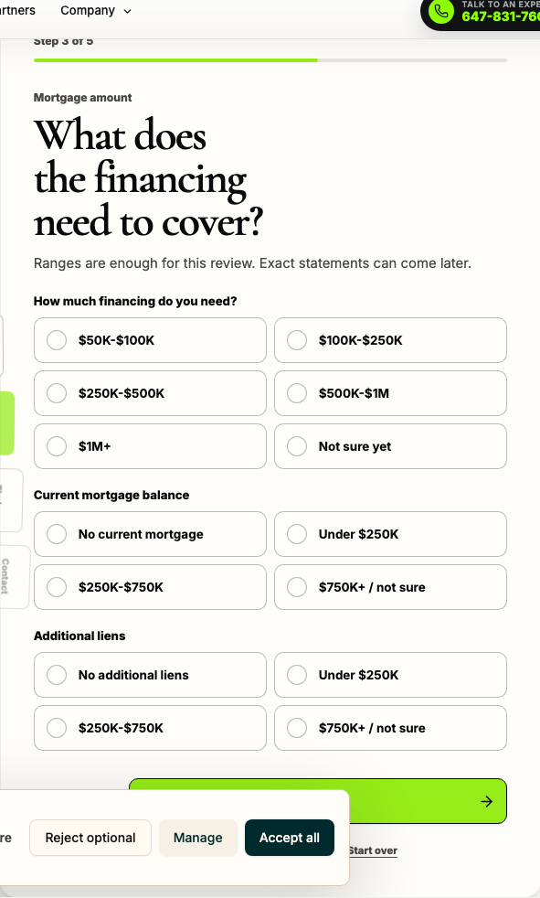 |  |

- **Reference section:** `/construction-financing` → Mortgage intake → “What does the financing need to cover?”
- **Transcript:** `01:27:11–01:28:29`
- **Cleaned quote:** “Change ‘additional liens’ to ‘additional debt.’ A lien is property-specific, but clients may use financing to pay a mortgage, car loan, other loan, or credit-card debt.”
- **Surrounding context:** The current label is both too narrow and technically misleading for common consolidation use cases.
- **Description:** Rename the option and ensure helper text/payload semantics accept secured and unsecured debt purposes.
- **Acceptance criteria:**
  - [x] Visible label uses “Additional debt.”
  - [x] Helper copy gives appropriate secured/unsecured examples without implying eligibility.
  - [x] Existing stored values remain readable or are migrated safely.

### FL-WEB-040 — Remove the mortgage repayment-plan question

**Matched visual evidence**

| Before                                                                  | After                                                                 |
| ----------------------------------------------------------------------- | --------------------------------------------------------------------- |
| 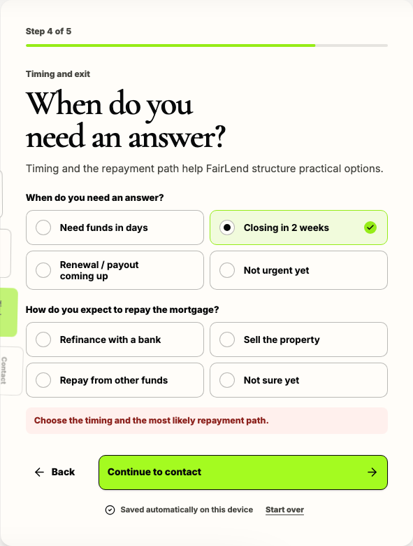 | 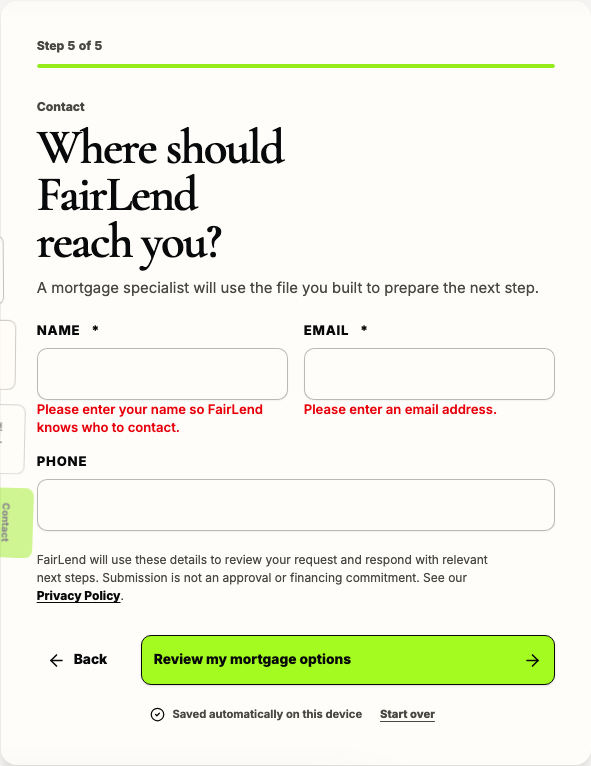 |

- **Reference section:** `/construction-financing` → Core mortgage intake → Step 4 of 5
- **Transcript:** `01:29:29–01:29:58`
- **Cleaned quote:** “Remove ‘How do you expect to repay the mortgage?’ entirely; it is not necessary in this intake.”
- **Surrounding context:** Both partners agreed timing/other captured context made the question redundant.
- **Description:** Remove the step/field and update progress, validation, payload handling, analytics, and any persisted-schema assumptions.
- **Acceptance criteria:**
  - [x] The question no longer renders or blocks submission.
  - [x] Step numbering/progress remains accurate.
  - [x] Submission, admin display, and analytics tolerate the absent field.

### FL-WEB-041 — Fix overlapping elements in the intake hero

**Matched visual evidence**

| Before                                                                  | After                                                                 |
| ----------------------------------------------------------------------- | --------------------------------------------------------------------- |
| 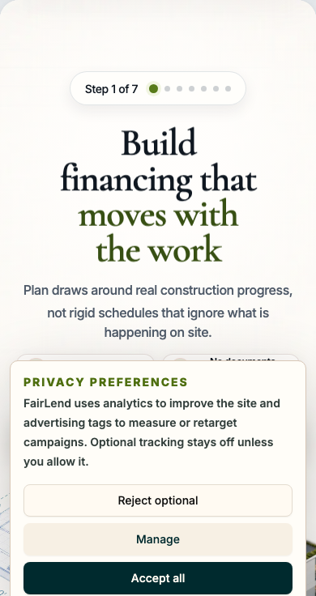 | 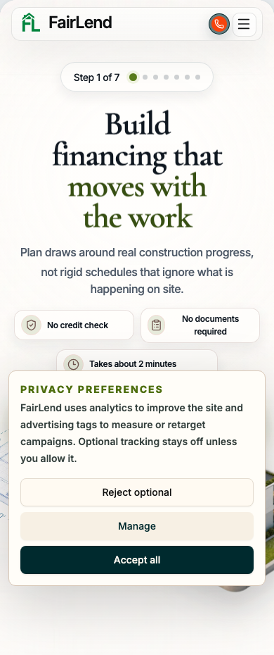 |

- **Reference section:** `/construction-financing` → route hero / entry panel
- **Transcript:** `01:30:16–01:30:34`
- **Cleaned quote:** “Fix the button alignment and overlapping elements in the hero section of the intake route.”
- **Surrounding context:** The defect was visible on a partner’s device and affected the primary start-project-review action.
- **Description:** Reproduce the responsive collision and correct the hero layout rather than applying a device-specific offset.
- **Acceptance criteria:**
  - [x] Hero copy, controls, and primary CTA never overlap at supported widths.
  - [x] CTA alignment is consistent with the surrounding layout.
  - [x] Zoomed text and long localized/autofill content do not reintroduce the collision.

### FL-WEB-042 — Restrict address autocomplete results to Canada

**Matched visual evidence**

| Before                                                                  | After                                                                 |
| ----------------------------------------------------------------------- | --------------------------------------------------------------------- |
|  |  |

- **Reference section:** Shared `GoogleAddressAutocomplete` → all intake address fields
- **Transcript:** `01:30:48–01:31:23`
- **Cleaned quote:** “Investigate whether address autocomplete can filter out non-Canadian addresses. Showing results from Colombia or other countries is confusing and irrelevant.”
- **Surrounding context:** The input uses Google’s API; the requested solution is an API/server/query restriction, not client-side hiding after selection.
- **Description:** Configure the shared autocomplete request with a Canadian country restriction and validate selected results.
- **Acceptance criteria:**
  - [x] Suggestions are restricted to Canadian addresses using the provider-supported country filter.
  - [x] Every intake surface using the shared component receives the restriction.
  - [x] Manual/error states do not silently accept a known non-Canadian provider result.

### FL-WEB-043 — Add Single-Family Residence to construction financing scope

**Matched visual evidence**

| Before                                                                  | After                                                                 |
| ----------------------------------------------------------------------- | --------------------------------------------------------------------- |
| 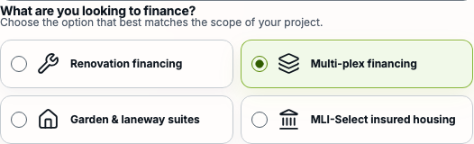 | 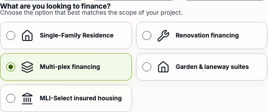 |

- **Reference section:** `/construction-financing` → Construction financing intake → “What are you looking to finance?”
- **Transcript:** `01:31:27–01:31:49`
- **Cleaned quote:** “The ‘What are you looking to finance?’ field is missing Single-Family Residence.”
- **Surrounding context:** The option was identified during a live walkthrough of the construction intake.
- **Description:** Add the missing scope option and support it through conditional questions and downstream lead classification.
- **Acceptance criteria:**
  - [x] Single-Family Residence is selectable.
  - [x] Selecting it follows a valid construction-intake path.
  - [x] The value persists to submission, admin, export, and analytics.

### FL-WEB-044 — Make residential-unit count conditional in rental intake

**Matched visual evidence**

| Before                                                                  | After                                                                 |
| ----------------------------------------------------------------------- | --------------------------------------------------------------------- |
| 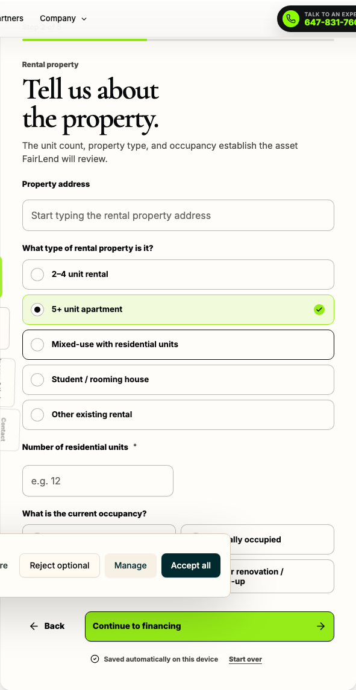 | 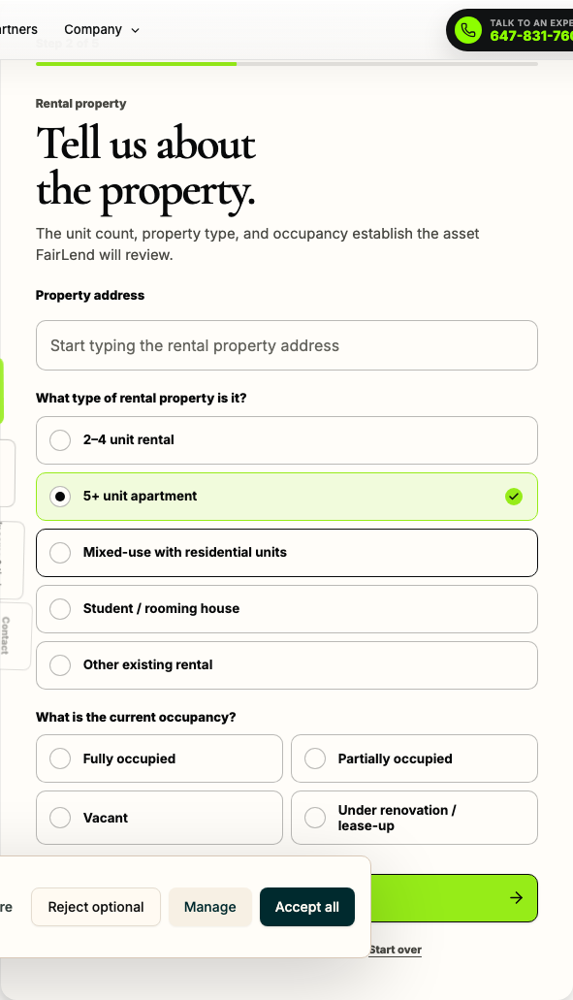 |

- **Reference section:** `/construction-financing` → Rental property acquisition/refinance → property type/details
- **Transcript:** `01:34:11–01:34:35`
- **Cleaned quote:** “Do not require number of residential units globally. Show it only for student/rooming house, other existing rental, or mixed-use with residential units.”
- **Surrounding context:** The field is irrelevant for property types without residential units and should not be a hard question.
- **Description:** Gate the unit-count field by property type and remove stale hidden values when the user changes type.
- **Acceptance criteria:**
  - [x] Field appears only for the three approved residential-bearing categories.
  - [x] It is not required for other property types.
  - [x] Hidden stale values are cleared or ignored on submission.

### FL-WEB-045 — Replace rental financial free text with range chips

**Matched visual evidence**

| Before                                                                  | After                                                                 |
| ----------------------------------------------------------------------- | --------------------------------------------------------------------- |
| 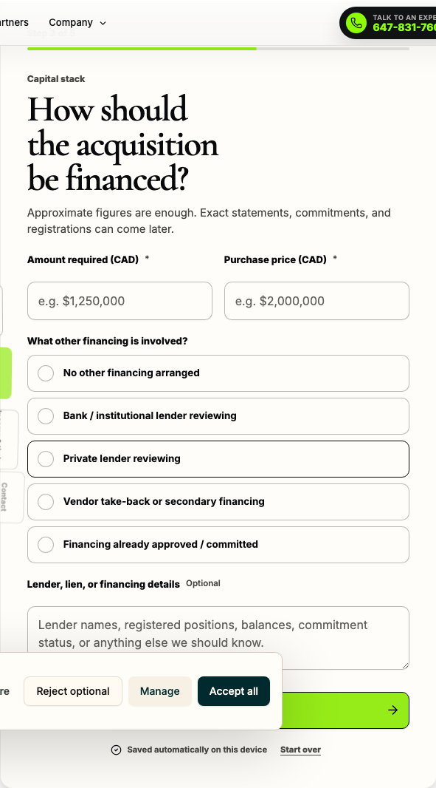 | 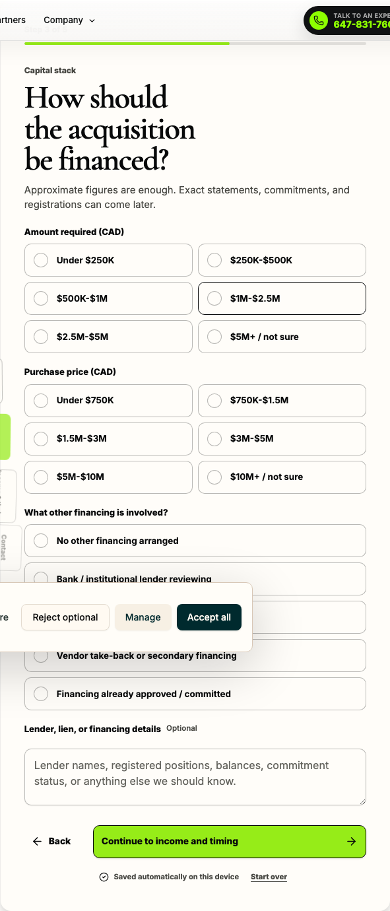 |

- **Reference section:** `/construction-financing` → Acquisition/refinance of existing rental properties → Step 3 of 5
- **Transcript:** `01:34:48–01:35:08`
- **Cleaned quote:** “For amount required, estimated current value, and current mortgage balance, use a range-based radio-chip interface instead of free text.”
- **Surrounding context:** The goal is faster completion and normalized lead data, not false numeric precision.
- **Description:** Replace the three free-text fields with accessible, non-overlapping ranges and preserve structured values downstream.
- **Acceptance criteria:**
  - [x] All three fields use mutually exclusive range chips.
  - [x] Range boundaries cover realistic values without gaps or overlap and include an upper/open-ended option.
  - [x] Keyboard and screen-reader selection works.
  - [x] Submitted/admin/export data preserves the selected ranges unambiguously.

### FL-WEB-046 — Add Other Debt to rental refinance encumbrances

**Matched visual evidence**

| Before                                                                  | After                                                                 |
| ----------------------------------------------------------------------- | --------------------------------------------------------------------- |
| 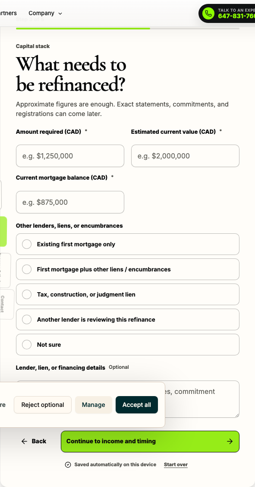 | 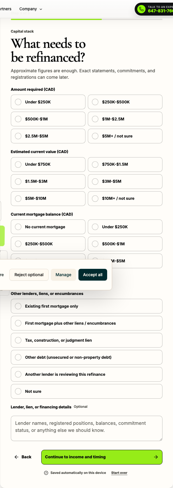 |

- **Reference section:** `/construction-financing` → Rental property intake → Step 3 of 5 → other liens/lenders/encumbrances
- **Transcript:** `01:35:42–01:36:41`
- **Cleaned quote:** “All debts count for mortgage affordability. Add Other Debt alongside other lenders, liens, and encumbrances so unsecured obligations can be rolled into the plan.”
- **Surrounding context:** The example was a borrower with substantial unsecured debt whose monthly payments affect affordability.
- **Description:** Add an Other Debt selection and, when selected, collect an appropriate amount range using the same low-friction control pattern.
- **Acceptance criteria:**
  - [x] Other Debt is selectable in the encumbrance/debt step.
  - [x] The flow can capture the debt amount as a structured range.
  - [x] Copy distinguishes debt from property liens without promising consolidation approval.
  - [x] Value persists through submission, admin, export, and analytics.

## Gap-analysis additions

### FL-WEB-047 — Source production testimonials and builder case studies

**Matched visual evidence**

| Before                                                                  | After                                                                 |
| ----------------------------------------------------------------------- | --------------------------------------------------------------------- |
|  | 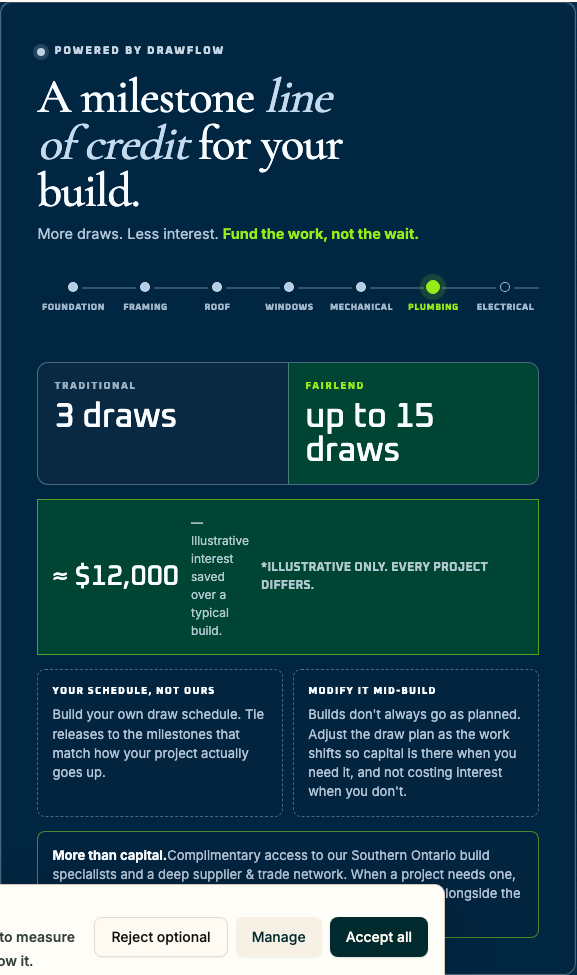 |

- **Reference section:** Homepage → Our Build Model placeholders; Leadership / proof content
- **Transcript:** `00:14:05–00:17:03`
- **Cleaned quote:** “Source real testimonials that match what each section is trying to communicate, and source case studies from completed builds. Send Elie an itemized request for both.”
- **Surrounding context:** The speakers explicitly called this a “to-do / action item.” Existing placeholder-format copy is not approved production evidence.
- **Description:** Inventory each testimonial/case-study slot, define the proof needed for it, and obtain approved source material from Elie and prior builds. Track consent and claim substantiation with each asset.
- **Acceptance criteria:**
  - [x] Every placeholder is mapped to a named testimonial or case-study request.
  - [x] Elie receives one itemized request covering quote, attribution, project facts, media, and approval needs. Sent to `elie@fairlend.ca` and verified in Gmail Sent on 2026-07-13 at 19:30 America/Toronto.
  - [x] No placeholder or fabricated testimonial ships as client evidence.
  - [ ] Published proof has documented consent and fact approval.

### FL-WEB-048 — Verify and correct Joel’s legal-experience claim

**Matched visual evidence**

| Before                                                                  | After                                                                 |
| ----------------------------------------------------------------------- | --------------------------------------------------------------------- |
| 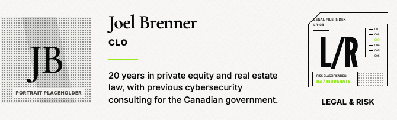 | 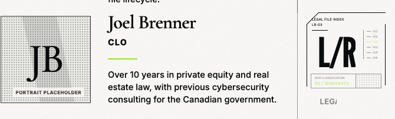 |

- **Reference section:** Homepage → Leadership / Team biography → Joel
- **Transcript:** `01:02:07–01:03:29`
- **Cleaned quote:** “Check the licensing date before claiming 20 or 16 years. The review indicates roughly 10–11 years of legal experience; ‘over 10 years’ is the safer wording.”
- **Surrounding context:** The team actively checked the claim during the meeting and rejected the higher figures as unreliable.
- **Description:** Verify the relevant licensing/experience start date using an authoritative professional source, then update the visible bio and any metadata to an accurate, durable claim.
- **Acceptance criteria:**
  - [x] The experience claim is verified against an authoritative record or approved biography.
  - [x] Unsupported “20 years” and “16 years” claims are removed.
  - [x] If the verified duration is 10–11 years, public copy uses “over 10 years” rather than a stale exact count.

### FL-WEB-049 — Restore construction-intake navigation and remove stray UI

**Matched visual evidence**

| Before                                                                  | After                                                                 |
| ----------------------------------------------------------------------- | --------------------------------------------------------------------- |
| 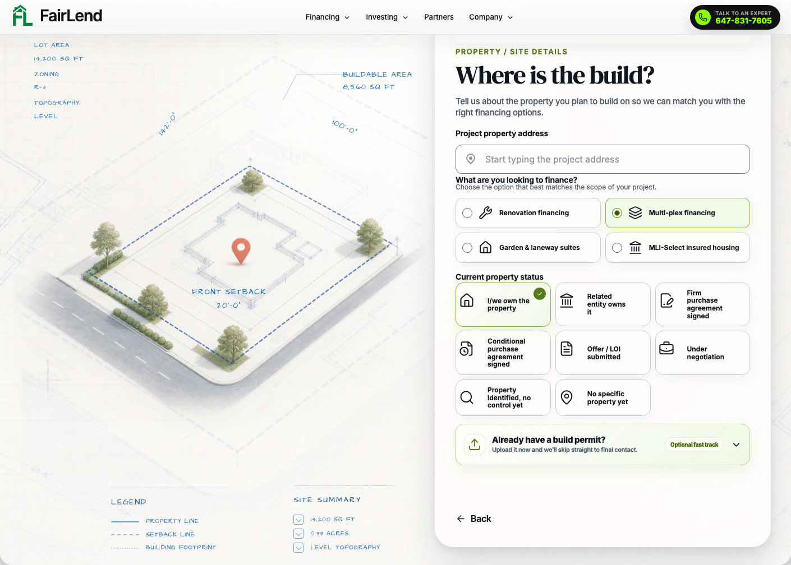 | 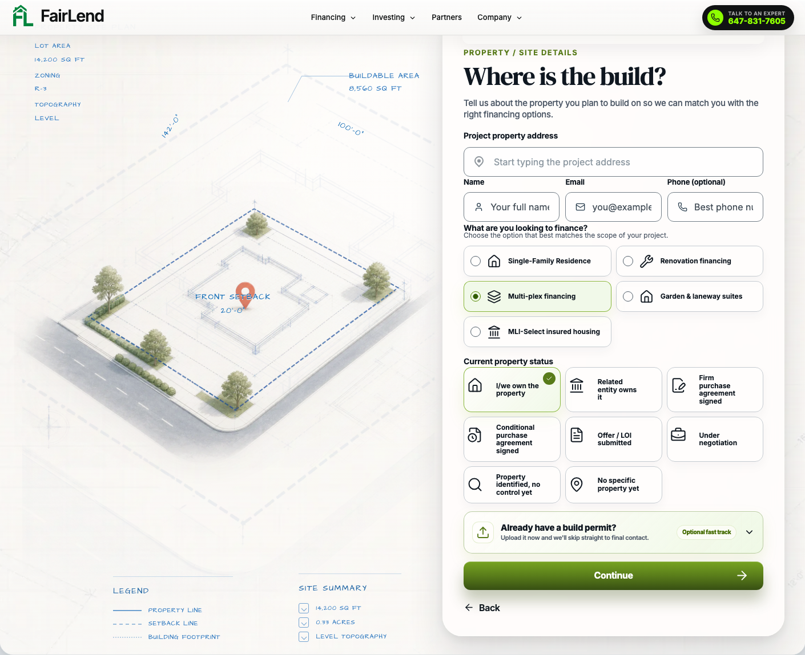 |

- **Reference section:** `/construction-financing` → Construction financing intake → Current Property Status step
- **Transcript:** `01:32:03–01:32:37`
- **Cleaned quote:** “There is no next button on this step, and there is a weird white box at the top. Restore the button and remove the box.”
- **Surrounding context:** This appeared immediately after adding Single-Family Residence during the live construction-intake walkthrough. The missing control blocks forward progress.
- **Description:** Fix the conditional render/state path that drops the navigation action and leaks an empty white container.
- **Acceptance criteria:**
  - [x] A visible, enabled Next/Continue action appears when the step has a valid selection.
  - [x] The action advances to the correct next step and preserves entered state.
  - [x] The unexplained white box/empty container is removed.
  - [x] All Current Property Status options are covered by regression tests for navigation rendering.

### FL-WEB-050 — Add “Skip and submit” after minimum intake data is complete

**Matched visual evidence**

| Before                                                                  | After                                                                 |
| ----------------------------------------------------------------------- | --------------------------------------------------------------------- |
| 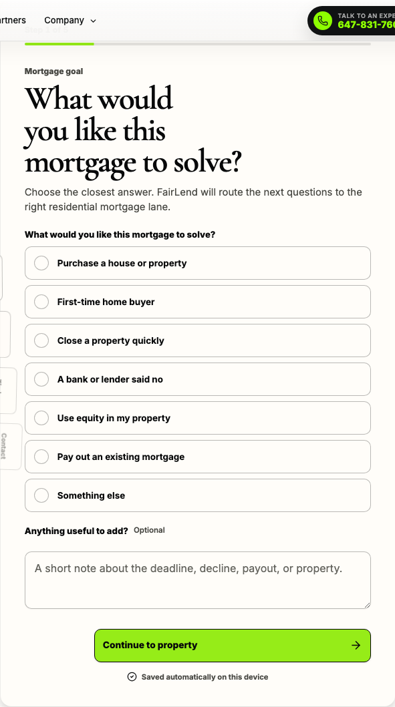 | 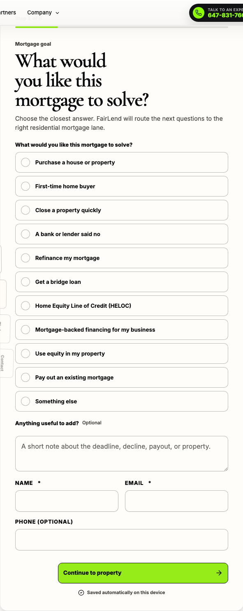 |

- **Reference section:** `/construction-financing` → long-form mortgage, construction, and rental variants
- **Transcript:** `01:36:48–01:39:03`
- **Cleaned quote:** “Give users both routes: collect as much structured information as possible, but once the mandatory minimum is complete, offer ‘Skip and submit’ so the form does not tire them out.”
- **Surrounding context:** The group approved retaining the detailed application path while allowing qualified leads to stop early. A full document/application portal was separately deferred until after launch.
- **Description:** Define the minimum viable lead payload and expose a secondary submit action after that threshold, while preserving Continue for users willing to complete the full intake.
- **Acceptance criteria:**
  - [x] Product/domain owners explicitly define the minimum fields required for early submission.
  - [x] “Skip and submit” appears only after those fields are valid.
  - [x] Continue remains available and retains the full structured-data path.
  - [x] Early submissions are labelled as partial in admin/export/analytics and do not fail downstream validation.
  - [x] The control is accessible and not visually confused with abandoning the form.

## Post-review visual QA additions

### FL-WEB-051 — Rebalance the Find Your Fit route-selector grid

**Matched visual evidence**

| Before                                                                  | After                                                                 |
| ----------------------------------------------------------------------- | --------------------------------------------------------------------- |
| 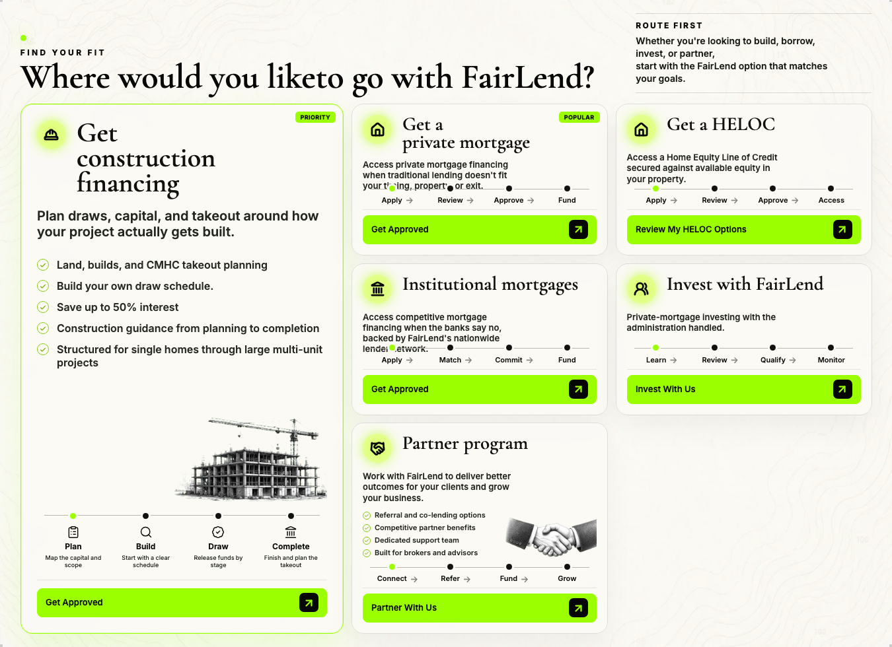 | 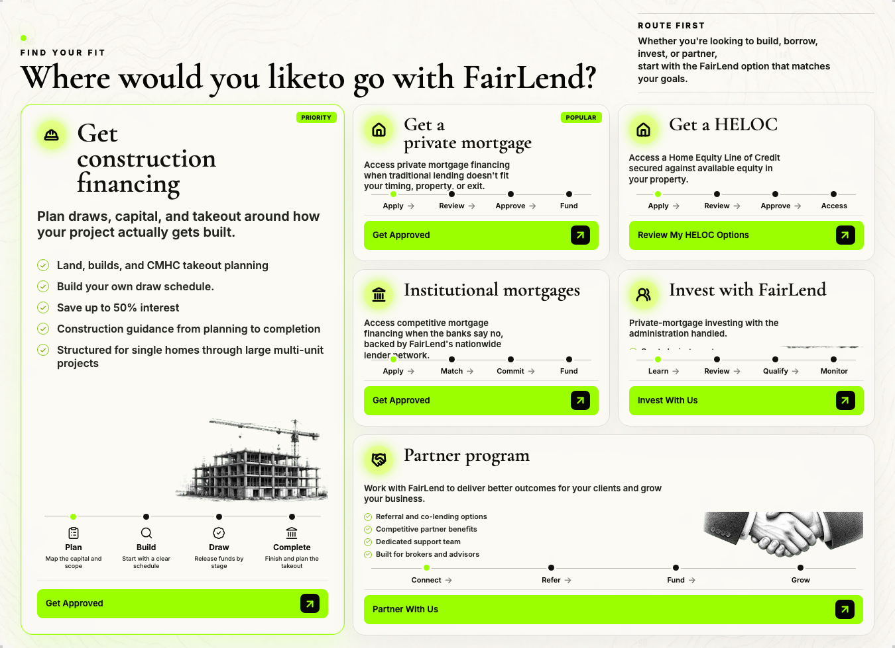 |

- **Reference section:** Homepage → `FairlendRouteSelector` → desktop route-card grid
- **Source:** User-supplied visual QA screenshot, 2026-07-13
- **Cleaned quote:** “Fix this layout.”
- **Surrounding context:** The featured construction card occupies the full left rail while five supporting cards flow through an implicit three-row grid. The final Partner Program card lands in only the first supporting column, leaving an empty lower-right quadrant and making the section look unfinished.
- **Description:** Preserve construction financing as the primary route and the existing 2×2 supporting matrix, then make Partner Program the full-width closing row across both supporting columns. Reuse the existing route-card component and keep responsive reading order, actions, and route semantics unchanged.
- **Acceptance criteria:**
  - [x] The desktop supporting grid has no empty lower-right quadrant.
  - [x] Private mortgage, HELOC, institutional mortgage, and investing remain a balanced 2×2 matrix.
  - [x] Partner Program spans the full supporting-grid width and reads as the closing route without competing with the featured construction card.
  - [x] Tablet and mobile layouts retain logical source order, legible card content, and no horizontal overflow.
  - [x] Route links, keyboard focus, and selected-state semantics remain unchanged.

### FL-WEB-052 — Add residential home refinancing to Core Lending

**Matched visual evidence**

| Before                                                                  | After                                                                 |
| ----------------------------------------------------------------------- | --------------------------------------------------------------------- |
| 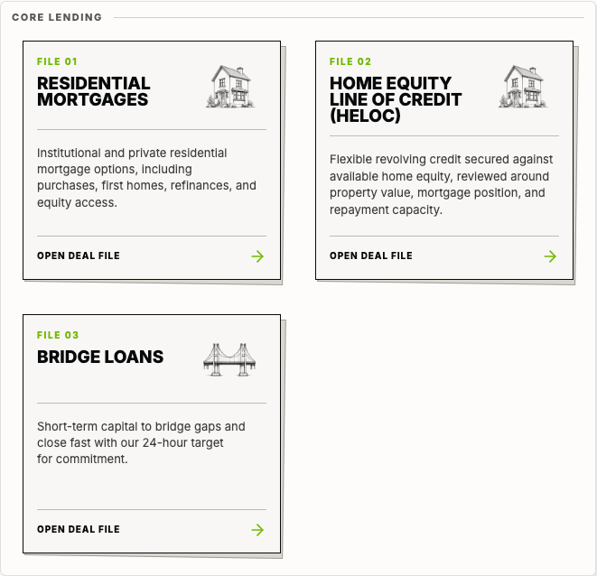 | 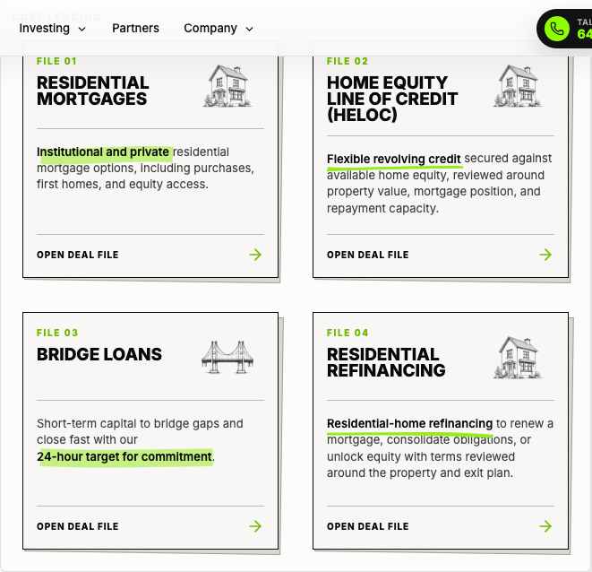 |

- **Reference section:** Homepage → `FairlendLandingOverviewSection` → Core Lending
- **Source:** User-supplied visual QA screenshot and follow-up, 2026-07-13
- **Cleaned quote:** “Add refinancing for residential homes under Core Lending.”
- **Surrounding context:** The Core Lending dossier currently has three cards in a 2-column grid and leaves its fourth cell empty. Residential Mortgages mentions refinances only inside general copy, while rental-property refinancing is represented separately in a later group.
- **Description:** Add a dedicated Residential Refinancing dossier as the fourth Core Lending card, route it through the existing residential mortgage intake, and renumber later file labels without changing their underlying destinations.
- **Acceptance criteria:**
  - [x] Core Lending contains a dedicated Residential Refinancing card in its fourth grid cell.
  - [x] The card describes residential home refinancing without duplicating rental-property refinancing.
  - [x] The card links to the existing mortgage intake with a distinct attribution source.
  - [x] File labels remain sequential after the insertion.
  - [x] Existing mortgage, HELOC, bridge, construction, rental, and acquisition destinations remain unchanged.

### FL-WEB-053 — Alternate highlight and underline emphasis across financing copy

**Matched visual evidence**

| Before                                                                  | After                                                                 |
| ----------------------------------------------------------------------- | --------------------------------------------------------------------- |
| 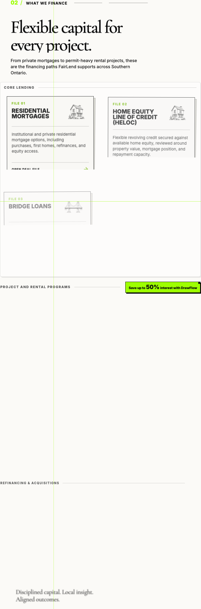 | 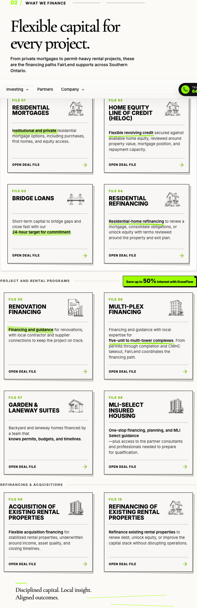 |

- **Reference section:** Homepage → `FairlendLandingOverviewSection` → What We Finance dossiers
- **Source:** User-supplied visual QA screenshot and follow-up, 2026-07-13
- **Cleaned quote:** “Use the highlight and underline, alternating between them, to draw attention to key aspects: institutional and private; flexible revolving credit; the 24-hour target for commitment; financing and guidance; five-unit to multi-tower complexes; knows permits, budgets, and timelines; one-stop financing, planning, and MLI Select guidance; and flexible acquisition financing.”
- **Surrounding context:** The overview already uses the shared animated `Highlighter` primitive in Who We Are. The requested treatment extends that established lime annotation language into the finance dossiers rather than introducing a second emphasis style.
- **Description:** Add structured emphasis metadata to finance-card copy and render one concise key phrase per dossier with alternating shared `highlight` and `underline` actions. Keep the complete sentence readable, semantic, and stable before animation initializes.
- **Acceptance criteria:**
  - [x] “Institutional and private” is visibly highlighted.
  - [x] The remaining requested phrases alternate underline and highlight in document order.
  - [x] Residential and rental refinancing cards participate in the same deliberate alternation.
  - [x] Emphasis uses the existing shared `Highlighter` component and FairLend lime tokens.
  - [x] Copy remains readable with JavaScript disabled and under reduced-motion preferences.
  - [x] No phrase wraps outside its dossier or causes horizontal overflow at supported breakpoints.

## Gap analysis

The second pass compared the normalized transcript with the 46-ticket first-pass file, reviewed low lexical-coverage change statements, inspected every long marker-free interval, and re-read the transcript after the final explicit marker. It produced four added tickets (`FL-WEB-047`–`050`) and the following corrections:

- Added the approved “high tech meets seasoned mortgage brokerage” direction to `FL-WEB-003`.
- Added “way it was / way it is” contextual framing to the year-visibility requirements in `FL-WEB-023`.
- Confirmed the text-overflow report at `00:41:49` was explicitly withdrawn because a fix was already in flight; it is not a ticket.
- Confirmed the Garden Suite cost-unit proposal at `00:55:17` was explicitly revoked at `00:56:07`. `FL-WEB-032` reflects the final decision: keep total cost, use `$400K–$600K`, and show one home.
- Confirmed the apparent periods at `00:57:53` were recognized as intentional asterisks; no defect remains.
- Confirmed the 2026 left-column callout at `00:56:44` was a duplicate and explicitly ignored.

### Reviewed but intentionally not converted

- **Hero cloud (`00:00:29`):** described as “not too big a deal” with no requested change.
- **Interrupted Find Your Fit line-break comment (`00:00:56`):** no element was identified and no decision was reached; insufficiently defined for an actionable ticket.
- **Scroll visualization felt clickable (`00:09:36`):** reviewer clarified they were only curious; no change was requested.
- **Calendar-hours crosstalk (`00:12:55`):** no coherent availability decision or website requirement was reached.
- **Asterisks that looked like periods (`00:57:53`):** reviewer withdrew the concern after identifying them correctly.
- **Application/document portal (`01:39:11`):** explicitly deferred to a post-launch iteration after evaluating Velocity; it is outside this launch backlog.

## Marker disposition ledger

The transcript contains 60 literal convention matches. They resolve as follows:

- **Converted:** markers 1–8, 11, 13–19, 23, 27–31, 38–43, 45–49, 51–52, and 55–60 map directly to tickets above.
- **Conversational false positives:** markers 9–10 (“new issue” used in joking/crosstalk, no website change).
- **Process-only acknowledgement:** marker 12 explains that the convention makes fixes cheap; it does not request a change.
- **Consolidated context/confirmations:** markers 20–22 → `FL-WEB-016`; 24–26 → `FL-WEB-018`; 32–34 → `FL-WEB-024`; 49–51 → `FL-WEB-037`/`038`; and 53–54 → `FL-WEB-040`.
- **Partially withdrawn cluster:** markers 35–37 withdraw the text-overflow report but continue with the cost/model change captured by `FL-WEB-025`.
- **Explicitly ignored as duplicate:** marker 44 (“I already called that out…ignore that”).
- **Late unmarked decisions recovered by gap analysis:** `FL-WEB-047`–`050`.

Final result: **50 transcript-derived issues plus 3 post-review visual-QA additions (53 total)**, with all 60 convention matches dispositioned and the remaining transcript reviewed for unmarked actionable feedback.

## Final implementation gap analysis

The implementation audit rechecked all 53 tickets against the final worktree, matched evidence, persisted payload shapes, transcript intent, and subsequent visual-QA direction. It found and closed the following gaps that were not safe to infer from the first implementation pass alone:

- **Critical intake navigation render:** the animated MetalFX wrapper left primary intake actions at `opacity: 0` / `visibility: hidden` in the real render, including the construction Continue control reported during review. Critical intake actions now use the existing shadCN `Button` primitive; the after-state capture shows Continue visibly rendered, enabled by valid scope/status state, and free of the stray empty container.
- **Duplicate rejected copy:** a secondary build-model audience block still used the rejected “carry the financing” and “assign an experienced builder” language. The final scoped sweep replaced it with direct financing language and a non-controlling referral promise.
- **Scoped terminology duplicate:** the DrawFlow “Modify it mid-build” tile retained the rejected `draw plan` wording even though the reviewed Build Support contexts standardized on `draw schedule`. The final copy sweep corrected it and the ticket-specific pair was recaptured around that exact tile.
- **Partial-submit behavior:** the mortgage early-submit path initially invoked the normal step-advance handler. It now persists an intentional `partial` submission, and admin/export normalization retains its completion status and intake detail.
- **Other-debt persistence:** rental refinance detail and amount initially competed for one value. The structured amount range and optional explanatory detail now persist independently.
- **Responsive/model legibility:** stress checks caught the mobile intake CTA collision and compressed builder equations. Both were corrected and recaptured at supported states.
- **Route-selector composition:** the five supporting routes left a dead lower-right quadrant beside the featured construction card. Partner Program now closes the supporting grid across both columns while the four lending/investing routes retain their 2×2 matrix.
- **Core Lending coverage and emphasis:** residential home refinancing is now a dedicated tracked route, and requested finance phrases use the established alternating lime highlight/underline language without introducing a duplicate annotation primitive.

### Verification result

- **52 tickets fully verified in-repository.**
- **FL-WEB-047 is fail-closed and repository-safe:** fabricated proof is removed, every slot is inventoried, and the itemized request was sent to `elie@fairlend.ca` and verified in Gmail Sent. Approved source material, consent, and fact approval remain external; the publication-approval acceptance box is deliberately not checked.
- **53 ticket-specific before/after image pairs** (106 non-empty PNGs) are stored under `docs/issue-evidence/tickets/` and embedded inline beneath the corresponding ticket.
- **48 targeted integration tests passed across 7 files**, covering the builder economics, Canadian address restriction, mortgage/rental/construction intake behavior, navigation states, lead normalization, and export payload.
- **TypeScript passed** with `pnpm exec tsc --noEmit`.

### Evidence provenance and capture controls

- The **before** server is a detached worktree at commit `0a122c13`; the **after** server is an isolated copy of the final working tree. Both were served with Next's webpack dev runtime at identical desktop/mobile viewports.
- The capture harness uses `localhost` on ports `4125` and `4126`, waits for hydration, drives the actual mortgage/rental state transitions, advances the builder GSAP timeline to the relevant year, disables nondeterministic visual motion, and captures the narrowest stable issue region.
- `FL-WEB-049` additionally uses a controlled no-hydration capture to reproduce the reported progressive-enhancement defect. In the before state, the old MetalFX shell leaves Continue at `opacity: 0` / `visibility: hidden`; in the after state, the existing shadCN `Button` remains visible without client hydration. Hydrated navigation behavior is independently covered by the component/integration suite.
- `scripts/capture-ticket-evidence.cjs` is the repeatable evidence runner. A structural audit confirmed 53 ticket headings, all required issue fields, 60 convention-bearing transcript cue lines (62 literal phrase occurrences), 106 linked/non-empty evidence files, 172 satisfied acceptance criteria, and one deliberately open external approval criterion on `FL-WEB-047`.
